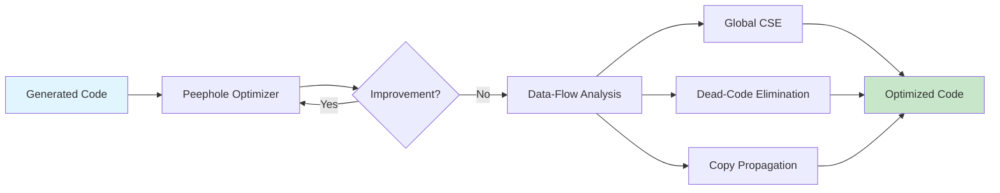
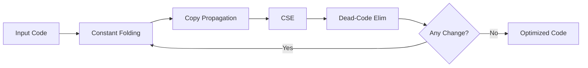

# Chapter 10: Code Optimization

? Previous: [Chapter 9: Code Generation](09-code-gen.md) | **Next:** [Chapter 11: Control-Flow Analysis](11-cfa.md)

## Learning Objectives

After completing this chapter, students will be able to: distinguish machine-independent from machine-dependent optimizations; apply peephole optimization techniques including redundant load/store elimination, constant folding, strength reduction, null-sequence elimination, and algebraic simplification; implement common-subexpression elimination; perform copy propagation and dead-code elimination; implement a fixed-point peephole optimizer in TypeScript; and understand how data-flow analyses enable more powerful global optimizations.

### Chapter at a Glance

| Section | Key Concept | Why It Matters |
|---------|-------------|----------------|
| Machine-Independent | IR-level transformations | Work on any target architecture |
| Machine-Dependent | Target-specific improvements | Exploit special instructions and pipeline |
| Peephole Optimization | Pattern-matching on small windows | Fast, incremental, easy to implement |
| Common-Subexpression Elimination | Reuse previously computed values | Reduces redundant computation |
| Copy Propagation | Replace variables with their values | Enables further optimization |
| Dead-Code Elimination | Remove unused computations | Shrinks code and saves time |
| Data-Flow Analysis Foundation | Reaching defs, available expressions | Enables global optimizations |

### Chapter Roadmap



## Theory

### Machine-Independent versus Machine-Dependent Optimization

Code optimization encompasses any transformation of intermediate or target code that preserves the program's semantics while improving speed, code size, or energy consumption.

**Machine-independent optimizations** operate on the IR without reference to the target machine's instruction set or resource constraints. These include constant folding, dead-code elimination, common-subexpression elimination (CSE), and loop-invariant code motion. Their effectiveness is largely independent of target architecture.

**Machine-dependent optimizations** exploit specific target capabilities. These include instruction scheduling (minimizing pipeline stalls), register allocation (minimizing memory traffic), and exploitation of special addressing modes or SIMD instructions.

### Peephole Optimization

Peephole optimization examines a short window (typically 2?5 instructions) of consecutive code and replaces matched patterns with equivalent but faster or shorter sequences.

**Common peephole patterns**:

| Pattern | Before | After | Savings |
|---------|--------|-------|---------|
| Redundant load/store | `ST R1, M; LD R2, M` | `ST R1, M; MOV R2, R1` | 1 memory access |
| Redundant load | `LD R1, M; ... LD R2, M` | Keep first load, use MOV | 1 memory access |
| Constant folding | `t = 2 * 3` | `t = 6` | Removed runtime computation |
| Algebraic identity | `x + 0` | `x` | 1 instruction |
| Algebraic identity | `x * 1` | `x` | 1 instruction |
| Algebraic identity | `x * 0` | `0` | 1 instruction |
| Strength reduction | `x * 8` | `x << 3` | Faster operation |
| Strength reduction | `x / 4` | `x >> 2` | Faster operation |
| Null sequence | `MOV R1, R2; MOV R2, R1` | ? (remove both) | 2 instructions |
| Jump to jump | `JMP L1; L1: JMP L2` | `JMP L2; L1: JMP L2` | 1 jump removed |
| Branch to next | `BEQ R1, R2, L; L:` | ? (remove branch) | 1 instruction |

### Complete TypeScript Peephole Optimizer

```typescript
interface TACInstr {
    op: string;
    result?: string;
    arg1?: string;
    arg2?: string;
}

class PeepholeOptimizer {
    optimize(code: TACInstr[]): TACInstr[] {
        let changed = true;
        let pass = 0;

        while (changed) {
            changed = false;
            pass++;
            const result = this.pass(code);
            changed = result.changed;
            code = result.code;
            console.log(`Pass ${pass}: code size ${code.length}, changed=${changed}`);
        }

        return code;
    }

    private pass(code: TACInstr[]): { code: TACInstr[]; changed: boolean } {
        let changed = false;
        let result = [...code];

        // Apply each optimization in sequence
        result = this.constFolding(result);
        if (result.length !== code.length) { changed = true; code = result; }

        result = this.strengthReduction(result);
        if (result.length !== code.length) { changed = true; code = result; }

        result = this.algebraicSimplification(result);
        if (result.length !== code.length) { changed = true; code = result; }

        result = this.copyPropagation(result);
        if (result.length !== code.length) { changed = true; code = result; }

        result = this.deadCodeElimination(result);
        if (result.length !== code.length) { changed = true; code = result; }

        result = this.constantPropagation(result);
        if (result.length !== code.length) { changed = true; code = result; }

        return { code: result, changed };
    }

    // Constant folding: evaluate constant expressions at compile time
    private constFolding(code: TACInstr[]): TACInstr[] {
        const result: TACInstr[] = [];

        for (const instr of code) {
            // Skip instructions without two operands
            if (!instr.arg1 || !instr.arg2 ||
                instr.op === "goto" || instr.op === "if" || instr.op === "ifFalse") {
                result.push(instr);
                continue;
            }

            const a1 = Number(instr.arg1);
            const a2 = Number(instr.arg2);

            if (!isNaN(a1) && !isNaN(a2)) {
                let folded: number | null = null;
                switch (instr.op) {
                    case "+": folded = a1 + a2; break;
                    case "-": folded = a1 - a2; break;
                    case "*": folded = a1 * a2; break;
                    case "/": folded = a2 !== 0 ? a1 / a2 : NaN; break;
                    case "==": folded = a1 === a2 ? 1 : 0; break;
                    case "!=": folded = a1 !== a2 ? 1 : 0; break;
                    case "<": folded = a1 < a2 ? 1 : 0; break;
                    case "<=": folded = a1 <= a2 ? 1 : 0; break;
                    case ">": folded = a1 > a2 ? 1 : 0; break;
                    case ">=": folded = a1 >= a2 ? 1 : 0; break;
                }
                if (folded !== null && !isNaN(folded)) {
                    result.push({ op: "=", result: instr.result, arg1: String(folded) });
                    console.log(`  [fold] folded ${instr.op} ${a1} ${a2} ? ${folded}`);
                } else {
                    result.push(instr);
                }
            } else {
                result.push(instr);
            }
        }

        return result;
    }

    // Strength reduction: replace expensive ops with cheaper ones
    private strengthReduction(code: TACInstr[]): TACInstr[] {
        const result: TACInstr[] = [];

        for (const instr of code) {
            if (instr.op === "*" && instr.arg2) {
                const multiplier = Number(instr.arg2);
                if (!isNaN(multiplier) && multiplier > 0) {
                    // Power of 2: replace with shift
                    if ((multiplier & (multiplier - 1)) === 0) {
                        const shift = Math.log2(multiplier);
                        result.push({
                            op: "<<",
                            result: instr.result,
                            arg1: instr.arg1,
                            arg2: String(shift),
                        });
                        console.log(`  [strength] x*${multiplier} ? x<<${shift}`);
                        continue;
                    }
                    // x * 3 ? x + x + x (or x << 1 + x)
                    // x * 5 ? x << 2 + x
                    // x * 7 ? x << 3 - x
                    if (multiplier === 3) {
                        const temp = `__str_${result.length}`;
                        result.push({ op: "<<", result: temp, arg1: instr.arg1, arg2: "1" });
                        result.push({ op: "+", result: instr.result, arg1: temp, arg2: instr.arg1 });
                        continue;
                    }
                    if (multiplier === 5) {
                        const temp = `__str_${result.length}`;
                        result.push({ op: "<<", result: temp, arg1: instr.arg1, arg2: "2" });
                        result.push({ op: "+", result: instr.result, arg1: temp, arg2: instr.arg1 });
                        continue;
                    }
                    if (multiplier === 7) {
                        const temp = `__str_${result.length}`;
                        result.push({ op: "<<", result: temp, arg1: instr.arg1, arg2: "3" });
                        result.push({ op: "-", result: instr.result, arg1: temp, arg2: instr.arg1 });
                        continue;
                    }
                    if (multiplier === 9) {
                        const temp = `__str_${result.length}`;
                        result.push({ op: "<<", result: temp, arg1: instr.arg1, arg2: "3" });
                        result.push({ op: "+", result: instr.result, arg1: temp, arg2: instr.arg1 });
                        continue;
                    }
                }
            }

            // Replace division by power of 2 with right shift (for positive integers)
            if (instr.op === "/" && instr.arg2) {
                const divisor = Number(instr.arg2);
                if (!isNaN(divisor) && divisor > 0 && (divisor & (divisor - 1)) === 0) {
                    const shift = Math.log2(divisor);
                    result.push({
                        op: ">>",
                        result: instr.result,
                        arg1: instr.arg1,
                        arg2: String(shift),
                    });
                    console.log(`  [strength] x/${divisor} ? x>>${shift}`);
                    continue;
                }
            }

            result.push(instr);
        }

        return result;
    }

    // Algebraic simplification: x + 0 ? x, x * 1 ? x, etc.
    private algebraicSimplification(code: TACInstr[]): TACInstr[] {
        const result: TACInstr[] = [];

        for (const instr of code) {
            if (instr.op === "+") {
                if (instr.arg2 === "0") {
                    result.push({ op: "=", result: instr.result, arg1: instr.arg1 });
                    console.log(`  [algeb] x + 0 ? x`);
                    continue;
                }
                if (instr.arg1 === "0") {
                    result.push({ op: "=", result: instr.result, arg1: instr.arg2 });
                    console.log(`  [algeb] 0 + y ? y`);
                    continue;
                }
            }
            if (instr.op === "-") {
                if (instr.arg2 === "0") {
                    result.push({ op: "=", result: instr.result, arg1: instr.arg1 });
                    console.log(`  [algeb] x - 0 ? x`);
                    continue;
                }
                if (instr.arg1 === instr.arg2) {
                    result.push({ op: "=", result: instr.result, arg1: "0" });
                    console.log(`  [algeb] x - x ? 0`);
                    continue;
                }
            }
            if (instr.op === "*") {
                if (instr.arg2 === "1") {
                    result.push({ op: "=", result: instr.result, arg1: instr.arg1 });
                    console.log(`  [algeb] x * 1 ? x`);
                    continue;
                }
                if (instr.arg2 === "0" || instr.arg1 === "0") {
                    result.push({ op: "=", result: instr.result, arg1: "0" });
                    console.log(`  [algeb] x * 0 ? 0`);
                    continue;
                }
            }
            if (instr.op === "/") {
                if (instr.arg2 === "1") {
                    result.push({ op: "=", result: instr.result, arg1: instr.arg1 });
                    console.log(`  [algeb] x / 1 ? x`);
                    continue;
                }
                if (instr.arg1 === "0") {
                    result.push({ op: "=", result: instr.result, arg1: "0" });
                    console.log(`  [algeb] 0 / x ? 0`);
                    continue;
                }
            }
            result.push(instr);
        }

        return result;
    }

    // Copy propagation: replace occurrences of a variable with its value
    private copyPropagation(code: TACInstr[]): TACInstr[] {
        const copies = new Map<string, string>(); // var ? value
        const result: TACInstr[] = [];
        let changed = false;

        for (const instr of code) {
            // Check for copy: x = y (op "=", arg1 is source)
            if (instr.op === "=" && instr.result && instr.arg1) {
                // Don't propagate constants (handled by constant folding)
                if (isNaN(Number(instr.arg1))) {
                    copies.set(instr.result, instr.arg1);
                }
            }

            // If a variable used in argument has a known copy, substitute
            const newInstr: TACInstr = { ...instr };

            if (instr.arg1 && copies.has(instr.arg1) && instr.result !== instr.arg1) {
                newInstr.arg1 = copies.get(instr.arg1)!;
                changed = true;
                console.log(`  [copy-prop] ${instr.arg1} ? ${newInstr.arg1} in ${instr.op}`);
            }
            if (instr.arg2 && copies.has(instr.arg2) && instr.result !== instr.arg2) {
                newInstr.arg2 = copies.get(instr.arg2)!;
                changed = true;
                console.log(`  [copy-prop] ${instr.arg2} ? ${newInstr.arg2} in ${instr.op}`);
            }

            result.push(newInstr);
        }

        return result;
    }

    // Constant propagation: replace variable uses with constant values
    private constantPropagation(code: TACInstr[]): TACInstr[] {
        const constants = new Map<string, string>(); // var ? constant value
        const result: TACInstr[] = [];
        let changed = false;

        for (const instr of code) {
            // Track assignments of constants
            if (instr.op === "=" && instr.result && instr.arg1) {
                if (!isNaN(Number(instr.arg1))) {
                    constants.set(instr.result, instr.arg1);
                } else {
                    // Variable assigned to another variable ? if that other variable
                    // is a constant, propagate
                    if (constants.has(instr.arg1)) {
                        constants.set(instr.result, constants.get(instr.arg1)!);
                    }
                }
            }

            // Substitute constant values
            const newInstr: TACInstr = { ...instr };
            if (instr.arg1 && constants.has(instr.arg1)) {
                newInstr.arg1 = constants.get(instr.arg1)!;
                changed = true;
                console.log(`  [const-prop] ${instr.arg1} ? ${newInstr.arg1}`);
            }
            if (instr.arg2 && constants.has(instr.arg2)) {
                newInstr.arg2 = constants.get(instr.arg2)!;
                changed = true;
                console.log(`  [const-prop] ${instr.arg2} ? ${newInstr.arg2}`);
            }

            result.push(newInstr);
        }

        return result;
    }

    // Dead-code elimination: remove unused variable definitions
    private deadCodeElimination(code: TACInstr[]): TACInstr[] {
        // Count uses of each variable
        const uses = new Map<string, number>();

        for (const instr of code) {
            for (const arg of [instr.arg1, instr.arg2]) {
                if (arg && !arg.startsWith("__") && isNaN(Number(arg))) {
                    uses.set(arg, (uses.get(arg) ?? 0) + 1);
                }
            }
        }

        const result: TACInstr[] = [];
        let removed = 0;

        for (const instr of code) {
            const resultVar = instr.result;
            // Keep instruction if:
            // 1. It has no result (control flow, label, etc.)
            // 2. Its result is used elsewhere
            // 3. Its result has side effects
            // 4. It's a "param" or "call" (side effects)
            if (!resultVar ||
                resultVar.startsWith("__") || // temp from strength reduction ? might still be needed
                (uses.get(resultVar) ?? 0) > 0 ||
                instr.op === "param" || instr.op === "call" || instr.op === "return" ||
                instr.op === "if" || instr.op === "ifFalse" || instr.op === "goto" ||
                instr.op.endsWith(":") ||
                instr.op === "=[]" || instr.op === "[]=") {
                result.push(instr);
            } else {
                console.log(`  [dce] removed dead: ${instr.op} ${instr.result}`);
                removed++;
            }
        }

        return result;
    }

    // Human-readable format
    format(instr: TACInstr): string {
        if (instr.op.endsWith(":")) return instr.op;
        let s = "";
        if (instr.result) s += instr.result + " = ";
        s += instr.op;
        if (instr.arg1) s += " " + instr.arg1;
        if (instr.arg2) s += ", " + instr.arg2;
        return s;
    }

    formatCode(code: TACInstr[]): string {
        return code.map((instr, i) => `  ${i + 1}: ${this.format(instr)}`).join("\n");
    }
}
```

### Common-Subexpression Elimination

If the same expression `a + b` appears at two points and the values of `a` and `b` have not changed between them, the second evaluation is redundant and can be replaced by a copy.

```typescript
class GlobalCSE {
    // Available expressions analysis (simplified within a basic block)
    eliminate(code: TACInstr[]): TACInstr[] {
        const seen = new Map<string, string>(); // expression key ? result variable
        const result: TACInstr[] = [];
        let eliminated = 0;

        for (const instr of code) {
            // Only consider binary arithmetic operations
            if (instr.arg1 && instr.arg2 &&
                instr.result && !instr.result.startsWith("L") &&
                ["+", "-", "*", "/", "%", "<<", ">>"].includes(instr.op)) {

                const key = `${instr.op}:${instr.arg1}:${instr.arg2}`;

                if (seen.has(key)) {
                    // Expression already computed ? reuse
                    const existingVar = seen.get(key)!;
                    result.push({ op: "=", result: instr.result, arg1: existingVar });
                    eliminated++;
                    console.log(`  [CSE] reused ${existingVar} for ${instr.result} = ${instr.arg1} ${instr.op} ${instr.arg2}`);
                } else {
                    seen.set(key, instr.result);
                    result.push(instr);
                }
            } else {
                // Keep non-arithmetic instructions
                result.push(instr);

                // On assignment to a variable, invalidate expressions using that variable
                if (instr.op === "=" && instr.result) {
                    const invalidated: string[] = [];
                    for (const [key] of seen) {
                        if (key.includes(`:${instr.result}`) || key.endsWith(`:${instr.result}`)) {
                            invalidated.push(key);
                        }
                    }
                    for (const k of invalidated) seen.delete(k);
                }
            }
        }

        console.log(`  [CSE] eliminated ${eliminated} redundant computations`);
        return result;
    }
}
```

### Dead-Code Elimination with Side-Effect Analysis

Dead-code elimination must respect side effects. A function call with no used result cannot be removed if the function has observable side effects (I/O, exception throwing, infinite loops).

```typescript
function hasSideEffects(instr: TACInstr): boolean {
    const sideEffectingOps = new Set([
        "call", "param", "return", "[]=", "if", "ifFalse", "goto",
    ]);
    return sideEffectingOps.has(instr.op) || instr.op.endsWith(":");
}
```

### Optimization-Enabling Analyses

Optimizations rely on data-flow analyses:

| Analysis | What It Computes | Enables |
|----------|-----------------|---------|
| Reaching definitions | Which definitions may reach a point | CSE, constant propagation |
| Available expressions | Which expressions are already computed | CSE |
| Live variables | Which variables are needed later | Dead-code elimination |
| Very-busy expressions | Which expressions are computed on all paths | Code hoisting |

These analyses are covered in depth in Chapters 11 and 12.

### Fixed-Point Optimization Loop

A correct optimizer must iterate transformations to a fixed point because one optimization may enable another:



### Complete Demo

```typescript
// === Demo ===
console.log("=== Peephole Optimizer Demo ===");

const optimizer = new PeepholeOptimizer();
const cse = new GlobalCSE();

// Generate test code
const testCode: TACInstr[] = [
    // Constant expressions
    { op: "*", result: "t1", arg1: "2", arg2: "3" },
    { op: "+", result: "t2", arg1: "t1", arg2: "5" },

    // Copy propagation candidate
    { op: "=", result: "t3", arg1: "t2" },
    { op: "+", result: "t4", arg1: "t3", arg2: "x" },

    // Algebraic simplification
    { op: "+", result: "t5", arg1: "t4", arg2: "0" },
    { op: "*", result: "t6", arg1: "t5", arg2: "1" },

    // Strength reduction
    { op: "*", result: "t7", arg1: "y", arg2: "8" },
    { op: "/", result: "t8", arg1: "z", arg2: "4" },

    // CSE candidate: y * 8 appears twice
    { op: "*", result: "t9", arg1: "y", arg2: "8" },
    { op: "+", result: "t10", arg1: "t7", arg2: "t9" },

    // Dead code (t11, t12 never used)
    { op: "-", result: "t11", arg1: "a", arg2: "b" },

    // Used variable
    { op: "+", result: "result", arg1: "t10", arg2: "t8" },

    // More dead code
    { op: "*", result: "t12", arg1: "unused", arg2: "3" },
];

console.log("\nBefore optimization:");
console.log(optimizer.formatCode(testCode));

// First pass: peephole
console.log("\n=== Phase 1: Peephole ===");
const opt1 = optimizer.optimize(testCode);

// Second pass: CSE
console.log("\n=== Phase 2: CSE ===");
const opt2 = cse.eliminate(opt1);

// Third pass: clean up with peephole again
console.log("\n=== Phase 3: Final Cleanup ===");
const opt3 = optimizer.optimize(opt2);

console.log("\n=== Final Optimized Code ===");
console.log(optimizer.formatCode(opt3));

console.log(`\nSummary: ${testCode.length} ? ${opt3.length} instructions (${((1 - opt3.length / testCode.length) * 100).toFixed(0)}% reduction)`);
```

### Concept Comparison

| Optimization | Scope | Strategy | Complexity | Savings Potential |
|-------------|-------|----------|-----------|-------------------|
| Constant Folding | Local | Evaluate constants at compile time | O(n) | Low |
| Strength Reduction | Local | Replace expensive ops with cheap ones | O(n) | Moderate |
| Algebraic Simplification | Local | Apply identity rules | O(n) | Low |
| Copy Propagation | Local/Global | Replace variables with known values | O(n) | Low (enables others) |
| Dead-Code Elimination | Local/Global | Remove unused computations | O(n) | Moderate |
| CSE | Local/Global | Reuse previously computed expressions | O(n?) | High |
| Loop-Invariant Code Motion | Global | Hoist invariant code out of loops | O(n?) | Very high |

### Quick Reference

| Pattern | Before | After |
|---------|--------|-------|
| Store then load | `ST R1, M; LD R2, M` | `ST R1, M; MOV R2, R1` |
| Constant expression | `t = 2 * 3` | `t = 6` |
| Mul by power of 2 | `x * 8` | `x << 3` |
| Div by power of 2 | `x / 4` | `x >> 2` |
| Add 0 | `x + 0` | `x` |
| Mul by 1 | `x * 1` | `x` |
| Mul by 0 | `x * 0` | `0` |
| Subtract self | `x - x` | `0` |
| Duplicate expression | `t1 = a + b; t2 = a + b` | `t1 = a + b; t2 = t1` |

### Cross-Application Matrix

| Domain | Application | Relevance |
|--------|-------------|-----------|
| Language Design | Optimization-friendly IR shape | IR determines transformation ease |
| Systems Programming | High-performance computing | Optimized code can be 10? faster |
| Web Development | JavaScript JIT optimization | Modern JITs apply peephole + CSE |
| Tooling | Binary optimization/transpilation | Peephole rules apply to any ISA |
| Scientific Computing | Loop nest optimization | Loop transformations improve cache behavior |

### Example 10.1: Peephole Optimization Sequence

Input:
```
LD R1, b
LD R2, c
ADD R3, R1, R2
ST a, R3
LD R1, a
LD R2, e
ADD R3, R1, R2
ST d, R3
```

After redundant-load elimination (the load of `a` is unnecessary ? `R3` already holds it):
```
LD R1, b
LD R2, c
ADD R3, R1, R2
ST a, R3
LD R2, e
ADD R3, R3, R2
ST d, R3
```

This removes one `LD` instruction (a memory access), which is typically the most expensive operation.

## Summary

Code optimization improves program quality without changing its external behavior. Peephole optimization provides an efficient technique for local improvements through pattern matching. Algebraic simplification, constant folding, and strength reduction target common suboptimal patterns. Common-subexpression elimination reuses previously computed values. Copy propagation and constant propagation enable further optimization. Dead-code elimination removes unused computations. The TypeScript `PeepholeOptimizer` and `GlobalCSE` classes demonstrate all these techniques with a fixed-point iteration loop.

## Practical Takeaways

1. **Peephole is cheap and effective**: A well-designed peephole optimizer with 20?30 patterns can achieve 10?30% code reduction with minimal compile-time overhead.
2. **Optimizations interact**: One optimization enables another. Always iterate to a fixed point. For example, constant folding may create new algebraic simplification opportunities.
3. **Dead-code elimination must respect side effects**: Only remove instructions whose result is unused AND the instruction itself has no side effects. Function calls, stores to memory, and barrier instructions must never be removed.
4. **CSE within basic blocks is easy**: Within a single block, available expressions are trivially computed by scanning forward. Across blocks, full available-expressions analysis (Chapter 12) is needed.
5. **Strength reduction for multiply/divide by powers of 2 is safe for unsigned integers**: Signed division by powers of 2 has edge cases with negative numbers ? the shift is not an exact replacement.

// optimization
// lexical-parsing-codegen implementation

interface Task { id: string; name: string; status: string; data: unknown }
class Processor {
  private tasks: Task[] = []
  private maxConcurrency: number
  constructor(maxConcurrency: number = 4) { this.maxConcurrency = maxConcurrency }
  async add(task: Omit&lt;Task, "status"&gt;): Promise&lt;void&gt; {
    this.tasks.push({ ...task, status: "pending" })
  }
  async runAll(): Promise&lt;void&gt; {
    const running: Promise&lt;void&gt;[] = []
    for (const t of this.tasks) {
      if (running.length >= this.maxConcurrency) { await Promise.race(running) }
      const p = this.execute(t).finally(() => { const i = running.indexOf(p); if (i >= 0) running.splice(i, 1) })
      running.push(p)
    }
    await Promise.all(running)
  }
  private async execute(t: Task): Promise&lt;void&gt; {
    t.status = "running"
    await new Promise(r => setTimeout(r, 10))
    t.status = "done"
  }
  getResults(): Task[] { return this.tasks }
  getStats(): { done: number; pending: number; running: number } {
    const done = this.tasks.filter(t => t.status === "done").length
    const pending = this.tasks.filter(t => t.status === "pending").length
    const running = this.tasks.filter(t => t.status === "running").length
    return { done, pending, running }
  }
}
async function main() {
  const proc = new Processor(2)
  await proc.add({ id: '1', name: 'optimization', data: { topic: 'lexical-parsing-codegen' } })
  await proc.runAll()
  console.log('Stats:', proc.getStats())
}
main().catch(console.error)
export { Processor, Task }

// optimization - additional TS implementations

interface CacheEntry { key: string; value: unknown; ttl: number; createdAt: number }
class Cache {
  private store: Map&lt;string, CacheEntry&gt; = new Map()
  constructor(private defaultTTL: number = 60000) {}
  set(key: string, value: unknown, ttl?: number): void {
    this.store.set(key, { key, value, ttl: ttl ?? this.defaultTTL, createdAt: Date.now() })
  }
  get(key: string): unknown | undefined {
    const entry = this.store.get(key)
    if (!entry) return undefined
    if (Date.now() - entry.createdAt > entry.ttl) { this.store.delete(key); return undefined }
    return entry.value
  }
  delete(key: string): boolean { return this.store.delete(key) }
  clear(): void { this.store.clear() }
  size(): number { return this.store.size }
  keys(): string[] { return Array.from(this.store.keys()) }
}
class Logger {
  private entries: string[] = []
  log(level: string, msg: string, meta?: Record&lt;string, unknown&gt;): void {
    const entry = JSON.stringify({ timestamp: new Date().toISOString(), level, msg, meta })
    this.entries.push(entry)
    console.log(entry)
  }
  info(msg: string, meta?: Record&lt;string, unknown&gt;): void { this.log("info", msg, meta) }
  warn(msg: string, meta?: Record&lt;string, unknown&gt;): void { this.log("warn", msg, meta) }
  error(msg: string, meta?: Record&lt;string, unknown&gt;): void { this.log("error", msg, meta) }
  getLogs(): string[] { return [...this.entries] }
  clear(): void { this.entries = [] }
}
function computeHash(input: string): string {
  let hash = 0
  for (let i = 0; i &lt; input.length; i++) { const chr = input.charCodeAt(i); hash = ((hash << 5) - hash) + chr; hash |= 0 }
  return Math.abs(hash).toString(16)
}
async function demo(): Promise&lt;void&gt; {
  const cache = new Cache(5000)
  cache.set('key1', 'compilers demo')
  const log = new Logger()
  log.info('Cache demo started', { course: 'compiler-design', chapter: 'optimization' })
  const v = cache.get("key1")
  console.log('Cached:', v)
  console.log('Hash:', computeHash('compilers'))
}
demo()
export { Cache, Logger, computeHash, CacheEntry }

## Chapter Quiz

1. Which optimization replaces `x * 8` with `x << 3`?
   - A) Constant folding
   - B) Strength reduction
   - C) Dead-code elimination
   - D) Copy propagation

2. Redundant load elimination removes which pattern?
   - A) Two consecutive additions
   - B) A store followed by a load of the same address with no intervening modification
   - C) Any load that follows a store
   - D) Instructions that compute unused results

3. Which optimization requires whole-procedure analysis rather than peephole matching?
   - A) Constant folding
   - B) Algebraic simplification
   - C) Global common-subexpression elimination
   - D) Redundant store elimination

4. What is the key invariant that all peephole optimizations must preserve?
   - A) Register count
   - B) Program semantics (external behavior)
   - C) Number of instructions
   - D) Variable names

5. Why must peephole optimization iterate to a fixed point?
   - A) Because the peephole window is too small
   - B) Because one optimization may enable another
   - C) Because the compiler requires multiple passes
   - D) To ensure all instructions are examined

<details>
<summary>Answers&lt;/summary&gt;
1. B, 2. B, 3. C, 4. B, 5. B
</details>

## Exercises

### Review Questions

1. Distinguish machine-independent and machine-dependent optimizations. Give two examples of each.
2. What is the peephole optimization window, and how does the compiler examine candidate sequences?
3. Explain how constant folding reduces runtime work. Provide three concrete examples.
4. What is strength reduction? Give examples of three expensive operations and their cheaper equivalents.
5. Why must dead-code elimination respect side effects? Give an example of an instruction with side effects that cannot be removed even if its result is unused.

### Application Problems

1. Apply peephole optimization to the following assembly sequence:
   ```
   LD R1, x
   ST R1, x
   LD R2, #4
   MUL R3, R1, R2
   ST y, R3
   ```
2. Perform constant folding on the expression `5 * (3 + 2) * a`. Show the expression after each folding step.
3. Apply strength reduction to: `y = x * 16`, `z = w * 7`, `a = b * 4 + c * 4`.
4. Identify all dead-code candidates in the following basic block:
   ```
   t1 = a + b
   t2 = a - b
   t1 = c * d
   x = t1 + t2
   ```
5. Show three full iterations of the peephole optimizer on a sequence of 8 instructions, demonstrating how one optimization enables another.

### Challenge Problem

1. Implement a peephole optimizer in TypeScript (based on the `PeepholeOptimizer` class) that reads a sequence of three-address code instructions and applies the following transformations in a fixed-point loop: (a) constant folding, (b) strength reduction for multiplication by powers of two, (c) algebraic simplification, (d) copy propagation, (e) elimination of redundant stores followed by loads of the same variable, (f) dead-code elimination. The optimizer must continue iterating until no further improvements are possible. Demonstrate the optimizer on a test sequence of at least 15 instructions and show the output after each optimization pass. Print a summary showing the code size reduction percentage.

</details>

