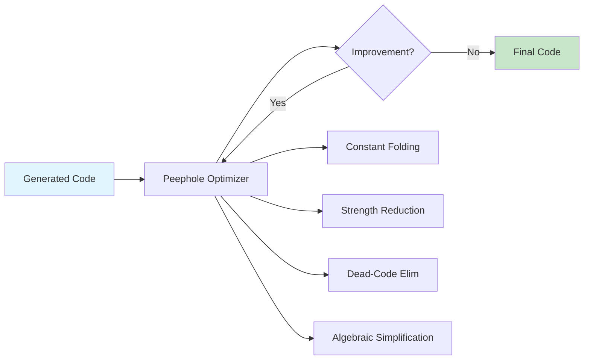

# Chapter 10: Code Optimization

> **Prereq:** Chapter 9 (Code Generation) — code must be generated before it can be optimized.
> **Next:** Chapter 11 (Control-Flow Analysis) — CFA provides the analysis foundation for complex optimizations.

## Learning Objectives


After completing this chapter, students will be able to: distinguish machine-independent from machine-dependent optimizations; apply peephole optimization techniques including redundant load/store elimination, constant folding, strength reduction, null-sequence elimination, and algebraic simplification; and identify opportunities for optimization in intermediate code.

### Chapter at a Glance

| Section | Key Concept | Why It Matters |
|---------|-------------|----------------|
| Machine-Independent | IR-level transformations | Work on any target architecture |
| Machine-Dependent | Target-specific improvements | Exploit special instructions and pipeline |
| Peephole Optimization | Pattern-matching on small windows | Fast, incremental, easy to implement |
| Control/Data-Flow Opt | Whole-procedure transformations | More powerful than local optimizations |



## Theory

### Machine-Independent versus Machine-Dependent Optimization

Code optimization encompasses any transformation of intermediate or target code that preserves the semantics of the program while improving some measurable characteristic, typically execution speed, code size, or energy consumption.

**Machine-independent optimizations** operate on the intermediate representation without reference to the target machine's instruction set or resource constraints. These include constant folding, dead-code elimination, common-subexpression elimination, and loop-invariant code motion. Their effectiveness is largely independent of the target architecture.

**Machine-dependent optimizations** exploit the specific capabilities of the target processor. These include instruction scheduling (reordering instructions to minimize pipeline stalls), register allocation (assigning values to registers to minimize memory traffic), and exploitation of special addressing modes or SIMD instructions.

### Peephole Optimization

Peephole optimization examines a short sequence of consecutive instructions (the peephole), typically two to five instructions long, and replaces matched patterns with equivalent but faster or shorter sequences. The peephole is typically examined by sliding a window over the generated code. The technique is simple, efficient, and incremental; it may be applied at various stages of code generation.

**Redundant load and store elimination**: If the compiler generates a store followed by a load of the same memory location, and no intervening instruction can modify the location, the load can be eliminated. For example, the sequence:

```
ST R1, MEM
LD R2, MEM
```

becomes `ST R1, MEM` followed by a register copy `MOV R2, R1`, which may be further optimized.

**Constant folding**: Expressions whose operands are all constants are evaluated at compile time. The three-address code `t = 2 * 3` is replaced by `t = 6`. Constant folding extends to operations on compile-time-known strings, array indices, and other constant expressions.

**Strength reduction**: Expensive operations are replaced by cheaper ones. Multiplication by a constant power of two becomes a left shift: `x * 8` becomes `x << 3`. Similarly, `x * 2 + 1` might become `(x << 1) + 1`. In floating-point code, `x * x` may replace `x^2`.

**Null-sequence elimination**: Instructions that compute an unused result are eliminated. If a basic block computes a value in a temporary that is never subsequently referenced, the instruction producing that temporary can be removed.

> **Warning:** Dead-code elimination must respect side effects — removing a function call whose result is unused is only valid if the call has no observable side effects. In practice, most compilers assume function calls have unknown side effects and preserve them.

**Algebraic simplification**: Identity transformations eliminate unnecessary computations. Examples include: `x + 0 → x`, `x * 1 → x`, `x * 0 → 0`, `x - 0 → x`, `x / 1 → x`, `0 / x → 0` (with appropriate care for division by zero semantics).

### Control-Flow and Data-Flow Optimizations

Beyond peephole techniques, optimization encompasses whole-procedure and whole-program transformations. **Dead-code elimination** removes unreachable basic blocks and instructions whose results are never used. **Common-subexpression elimination** reuses previously computed values when the same expression appears again with unchanged operands. **Copy propagation** replaces occurrences of a variable that has been assigned a constant or another variable's value with that value, potentially enabling further optimization.

### Optimization-Enabling Analyses

> **One-Sentence Takeaway:** Optimizations are semantic-preserving transformations — peephole rules handle local patterns cheaply, while deeper analysis (reaching definitions, available expressions) enables whole-procedure improvements.

Optimizations rely on analyses that provide information about the program's properties. **Reaching-definitions analysis** determines which definitions of a variable may reach a given point. **Available-expressions analysis** identifies expressions that have been computed and whose values are still valid. **Live-variable analysis** identifies variables whose current values will be used before being overwritten. These analyses are covered in depth in Chapter 12.

## Example

### Concept Comparison

| Optimization | Scope | Savings | Risk |
|-------------|-------|---------|------|
| Constant Folding | Local | Low (compile-time constants) | None |
| Strength Reduction | Local | Moderate (shift vs multiply) | Integer overflow |
| Dead-Code Elimination | Local to global | Moderate | Must preserve side effects |
| CSE | Local to global | High (shared computation) | Increased register pressure |
| Copy Propagation | Local to global | Low (enables other opts) | None |

### Quick Reference

| Pattern | Before | After |
|---------|--------|-------|
| Store then load | ST R1, M; LD R2, M | ST R1, M; MOV R2, R1 |
| Constant expr | t = 2 * 3 | t = 6 |
| Mul by power of 2 | x * 8 | x << 3 |
| Add 0 | x + 0 | x |
| Mul by 1 | x * 1 | x |

### Cross-Application Matrix

| Domain | Application | Relevance |
|--------|-------------|-----------|
| Language Design | Designing optimization-friendly IR | IR shape determines transformation ease |
| Systems Programming | High-performance computing | Optimized code can be 10× faster |
| Web Development | JavaScript JIT optimization | Modern JITs apply peephole and CSE |
| Tooling | Binary optimization/transpilation | Peephole rules apply to any instruction set |

### Example 10.1: Peephole Optimization Sequence

Consider the generated three-address code and assembly for:
```
a = b + c;
d = a + e;
```

Without optimization:
```
LD R1, b
LD R2, c
ADD R3, R1, R2
ST a, R3
LD R1, a
LD R2, e
ADD R3, R1, R2
ST d, R3
```

After redundant-load elimination (the load of `a` is unnecessary because its value is already in R3):
```
LD R1, b
LD R2, c
ADD R3, R1, R2
ST a, R3
LD R2, e
ADD R3, R3, R2
ST d, R3
```

Further peephole passes may apply copy propagation, constant folding (if any operands are constants), and strength reduction (if any multiplications are by constants).

## Summary

Code optimization improves program quality without changing its external behavior. Peephole optimization provides an efficient technique for local improvements through pattern matching. Algebraic simplification, constant folding, and strength reduction target common suboptimal patterns. Deeper optimizations require control-flow and data-flow analyses that reach across basic blocks and procedures.

## Exercises

### Review Questions

1. Distinguish machine-independent and machine-dependent optimizations. Give two examples of each.
2. What is the peephole optimization window, and how does the compiler examine candidate sequences?
3. Explain how constant folding reduces runtime work. Provide three concrete examples.
4. What is strength reduction? Give examples of three expensive operations and their cheaper equivalents.

### Application Problems

1. Apply peephole optimization to the following assembly sequence:
   ```
   LD R1, x
   ST R1, x
   LD R2, #4
   MUL R3, R1, R2
   ST y, R3
   ```
2. Perform constant folding on the expression `5 * (3 + 2) * a`. Show the expression after each folding step.
3. Apply strength reduction to the following expressions: `y = x * 16`, `z = w * 7`, `a = b * 4 + c * 4`.
4. Identify all null sequences (dead-code candidates) in the following basic block:
   ```
   t1 = a + b
   t2 = a - b
   t1 = c * d
   x = t1 + t2
   ```

### Challenge Problem

1. Implement a peephole optimizer in your chosen language that reads a sequence of three-address code instructions and applies the following transformations in a fixed-point loop: (a) constant folding, (b) strength reduction for multiplication by powers of two, (c) elimination of redundant stores followed by loads of the same variable. The optimizer must continue iterating until no further improvements are possible. Demonstrate the optimizer on a test sequence of at least 15 instructions and show the output after each optimization pass.

### Chapter Quiz

1. Which optimization replaces `x * 8` with `x << 3`?
   - A) Constant folding
   - B) Strength reduction
   - C) Dead-code elimination
   - D) Copy propagation

2. Redundant load elimination removes which pattern?
   - A) Two consecutive additions
   - B) A store followed by a load of the same address with no intervening modification
   - C) Any load that follows a store
   - D) Instructions that compute unused results

3. Which optimization requires whole-procedure analysis rather than peephole matching?
   - A) Constant folding
   - B) Algebraic simplification
   - C) Common-subexpression elimination
   - D) Redundant store elimination

<details>
<summary>Answers</summary>
1. B, 2. B, 3. C
</details>
