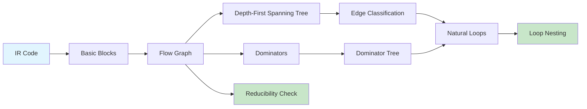

# Chapter 11: Control Flow Analysis

> **Prereq:** Chapter 10 (Code Optimization) — optimizations rely on CFA for structure analysis.
> **Next:** Chapter 12 (Data-Flow Analysis) — DFA uses the flow graph built by CFA.

## Learning Objectives

After completing this chapter, students will be able to: identify basic blocks from intermediate-code sequences; construct flow graphs; compute dominators in a flow graph; build depth-first spanning trees and classify edges; identify natural loops and their pre-headers; and determine whether a flow graph is reducible.

### Chapter at a Glance

| Section | Key Concept | Why It Matters |
|---------|-------------|----------------|
| Basic Blocks | Single-entry, single-exit sequences | Enables graph-level analysis |
| Flow Graphs | Nodes = blocks, edges = control | Foundation for all inter-procedural analysis |
| Dominators | Blocks that must execute before | Enables safe code motion |
| Natural Loops | Single-header cycles with back edges | Target for loop optimizations |
| Reducibility | Structured-property guarantee | Ensures fast analysis convergence |



## Theory


### Basic Blocks Revisited

A basic block is a maximal sequence of consecutive instructions with a single entry point (its first instruction) and a single exit point (its last instruction). Control enters at the top and leaves only at the bottom. There is no branching or halting in between. Partitioning into basic blocks identifies leaders: (1) the first instruction of the program is a leader; (2) any instruction that is a jump target is a leader; (3) any instruction that immediately follows a jump or conditional jump is a leader. Each leader together with all instructions up to but not including the next leader constitutes a basic block.

For control-flow analysis, basic blocks become atomic nodes, reducing the size and complexity of the graph over which analyses operate.

### Flow Graphs

A flow graph G = (N, E, entry) has basic blocks as nodes N and directed edges E representing control flow. An edge B → C exists if control can pass from B's last instruction to C's first instruction. The entry block contains the first instruction of the program and has no predecessors. The exit block has no successors. A well-formed flow graph has every block reachable from entry; unreachable blocks are dead code.

Flow graphs are the fundamental data structure for data-flow analysis, loop detection, and many code optimizations.

### Dominators

Block d **dominates** block n (d dom n) if every directed path from entry to n passes through d. Domination is reflexive, transitive, and antisymmetric. The **immediate dominator** of n, idom(n), is the unique d ≠ n such that d dom n and every other dominator of n dominates d. The immediate-dominator relation forms the **dominator tree**, rooted at the entry block.

Dominators have important properties: the entry block dominates all blocks; dominators of a block form a total order (if a and b both dominate c, either a dominates b or b dominates a). Dominators are computed by the **Lengauer-Tarjan algorithm** in near-linear time using depth-first search, semi-dominators, and path compression. An iterative algorithm using data-flow equations also works but is slower.

> **Pro Tip:** The Lengauer-Tarjan algorithm is O(E·α(E,N)) in practice and the standard in production compilers (LLVM, GCC). The iterative DF-based approach is simpler to implement for educational compilers but O(N²) worst-case.

### Depth-First Spanning Tree

Depth-first search of the flow graph produces a **depth-first spanning tree** (DFST), assigning each node a depth-first number (dfn). Edges are classified as: **tree edges** (to an unvisited node, part of the DFST), **back edges** (to an ancestor, indicating a cycle), **forward edges** (to a descendant, not a child), and **cross edges** (between unrelated branches).

Back edges satisfy dfn(target) ≤ dfn(source). This inequality provides a simple algorithmic test for back edges.

### Loops in Flow Graphs

A **natural loop** is defined by a back edge m → n and consists of n plus all nodes that can reach m without passing through n. The node n is the **loop header**. Essential properties: the header dominates all nodes in the loop; there is a single entry point; there is at least one path back to the header.

To construct a natural loop, collect all nodes that can reach the back-edge tail m while avoiding the header n, then add n to the set. The union is the loop body. Natural loops may be nested: a loop L₁ is nested inside L₂ if the header of L₁ belongs to L₂. The nesting relationship forms a tree.

A **pre-header** is an empty block inserted before the loop header. All incoming edges from outside the loop are redirected to the pre-header, which has a single edge to the header. Pre-headers simplify loop optimizations by providing a single point for code hoisting.

### Reducible Flow Graphs

A flow graph is **reducible** if it can be collapsed to a single node by repeatedly applying: T1 (remove a self-loop) and T2 (if a node has a unique predecessor, merge it into that predecessor). Equivalently, a reducible graph contains no cycle with two entry points. Structured programs (using only if-then-else, while, and for) always produce reducible flow graphs. Irreducible graphs arise from unrestricted gotos and can be transformed using **node splitting**, which duplicates code at the cost of increased program size.

### Applications

> **One-Sentence Takeaway:** CFA transforms a flat instruction sequence into a structured flow graph with dominator hierarchy and natural loops — the essential scaffold for all subsequent data-flow and optimization analyses.

Dominators determine the safety of code motion: an expression may be moved to a block that dominates all uses. Natural-loop detection enables loop optimizations. Reducibility ensures fast convergence of iterative data-flow analysis because the depth of the loop-nesting tree bounds the number of iterations.

## Example

### Concept Comparison

| Concept | Definition | Use |
|---------|-----------|-----|
| Dominator | d blocks every path entry→n | Safety for code motion |
| Immediate Dominator | Unique closest dominator | Builds dominator tree |
| Back Edge | Edge where target dominates source | Identifies loops |
| Natural Loop | Header + all nodes reaching tail via header | Loop optimization target |
| Reducible | T1/T2 collapse to single node | Guarantees fast DF analysis convergence |

### Quick Reference

| Algorithm | Input | Output | Complexity |
|-----------|-------|--------|------------|
| Leader Marking | TAC sequence | Basic blocks | O(n) |
| Lengauer-Tarjan | Flow graph | Dominator tree | O(E·α(E,N)) |
| Iterative Dominators | Flow graph | Dominator set | O(N²) |
| Natural Loop Detection | Back edges + dominators | Loop set | O(N·E) |
| T1/T2 Reduction | Flow graph | Reduced graph | O(N) |

### Cross-Application Matrix

| Domain | Application | Relevance |
|--------|-------------|-----------|
| Language Design | Structured control flow | Reducible graphs from structured languages |
| Systems Programming | OS control flow | Complexity analysis of kernel paths |
| Web Development | JavaScript engine optimization | JITs build flow graphs for hot code |
| Tooling | Code coverage tools | Flow graphs determine branch coverage |

### Example 11.1: Dominator and Loop Detection

Flow graph edges: entry → B1, B1 → B2, B2 → B3, B2 → B4, B3 → B2, B4 → exit.

Dominators: entry dom all; B1 dom all except entry; B2 dom B2, B3, B4, exit; B3 dom only B3; B4 dom only B4. idom(B1) = entry, idom(B2) = B1, idom(B3) = B2, idom(B4) = B2, idom(exit) = B2.

Back edge: B3 → B2 (B2 dominates B3). Natural loop: header B2, body {B3}. Well-structured loop with single entry point.

## Summary

Control-flow analysis transforms instruction sequences into graphs. Dominators establish block hierarchy and enable safe code motion. Depth-first search identifies back edges for loop detection. Natural loops have a single header and are amenable to optimization. Reducibility ensures convergence properties for iterative algorithms.

## Exercises

### Review Questions

1. What distinguishes a basic block leader? How are blocks identified?
2. Define the dominator relationship and immediate dominator.
3. What is a back edge in a DFST, and how is it related to natural loops?
4. Define reducible flow graphs. Why is reducibility beneficial?
5. What is a loop pre-header and what optimizations does it enable?

### Application Problems

1. For edges entry→B1, B1→B2, B1→B3, B2→B4, B3→B4, B4→B5, B4→B6, B5→B7, B6→B7, B7→B1, B7→exit: compute dominators, draw the dominator tree, and identify natural loops.
2. Perform DFS on the flow graph from Problem 1. Assign dfn and classify each edge.
3. Convert this C code into a flow graph:
   ```c
   int x = 0;
   for (int i = 0; i < n; i++) {
       if (a[i] > 0) x += a[i];
       else x -= a[i];
   }
   return x;
   ```
4. Determine reducibility of entry→A, A→B, A→C, B→D, C→D, D→C, D→exit. If irreducible, apply node splitting.

### Challenge Problem

1. Implement CFA: take TAC, partition into basic blocks, build the flow graph, compute dominators using the iterative algorithm, and detect natural loops. Test on code with two nested loops and conditionals.     Print the dominator tree and loop-nesting structure.

### Chapter Quiz

1. What condition defines a back edge in a depth-first spanning tree?
   - A) The edge points from a descendant to an ancestor
   - B) dfn(target) ≤ dfn(source)
   - C) Both A and B
   - D) The edge connects two nodes in the same basic block

2. What is the immediate dominator of a block n?
   - A) The entry block
   - B) Any block that dominates n
   - C) The unique block d ≠ n such that d dominates n and all other dominators of n dominate d
   - D) The block that immediately precedes n in the instruction sequence

3. Why does reducibility matter for compilers?
   - A) Reducible graphs are faster to construct
   - B) It guarantees fast convergence of iterative data-flow analysis
   - C) Reducible graphs have fewer basic blocks
   - D) It enables algebraic simplification

<details>
<summary>Answers</summary>
1. C, 2. C, 3. B
</details>
