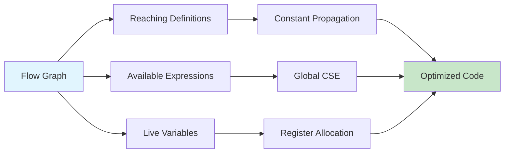

# Chapter 12: Data Flow Analysis

> **Prereq:** Chapter 11 (Control Flow Analysis) — DFA operates on the flow graph built by CFA.
> **Next:** Chapter 13 (Loop Optimization) — DFA provides the analysis loop opts depend on.

## Learning Objectives

After completing this chapter, students will be able to: compute reaching definitions using data-flow equations; perform live-variable analysis; evaluate available expressions; implement the iterative data-flow algorithm; apply constant propagation; and understand partial redundancy elimination.

### Chapter at a Glance

| Section | Key Concept | Why It Matters |
|---------|-------------|----------------|
| Reaching Definitions | Which defs may reach a point | Enables constant propagation |
| Live Variables | Which vars may be used later | Informs register allocation |
| Available Expressions | Which exprs are already computed | Enables global CSE |
| Constant Propagation | Lattice-based value tracking | Replaces runtime computations |
| PRE | Partial redundancy elimination | Subsumes multiple optimizations |



## Theory


### Reaching Definitions

A definition of a variable x is a statement that assigns a value to x. A definition d **reaches** a point p in the program if there exists a path from d to p such that x is not redefined along that path. Reaching-definitions analysis computes, for each program point, the set of definitions that may reach that point.

The data-flow equations for reaching definitions are:

```
IN[B]  = ∪_{P in pred(B)} OUT[P]
OUT[B] = GEN[B] ∪ (IN[B] − KILL[B])
```

Here, GEN[B] is the set of definitions generated within B (definitions in B that survive to the end of B). KILL[B] is the set of definitions that are killed by B (definitions of variables that are redefined in B). IN[B] is the set of definitions reaching the entry of B. OUT[B] is the set of definitions reaching the exit of B.

### Live-Variable Analysis

A variable v is **live** at a point p if there exists a path from p to a use of v along which v is not redefined. Live-variable analysis identifies, for each program point, the set of variables whose values may be needed later. This information is essential for register allocation, dead-code elimination, and enabling other optimizations.

The data-flow equations for live variables (backward analysis) are:

```
OUT[B] = ∪_{S in succ(B)} IN[S]
IN[B]  = USE[B] ∪ (OUT[B] − DEF[B])
```

Here, USE[B] is the set of variables used in B before any definition in B. DEF[B] is the set of variables defined in B. Note that live-variable analysis is a **backward** problem: information flows from successors to predecessors.

### Available Expressions

An expression `x op y` is **available** at a point p if every path from the entry to p evaluates the expression without subsequently redefining x or y. Available-expressions analysis is used for **global common-subexpression elimination**: if an expression is available at a point, the previously computed value can be reused, eliminating a redundant computation.

The data-flow equations for available expressions are:

```
IN[B]  = ∩_{P in pred(B)} OUT[P]
OUT[B] = GEN[B] ∪ (IN[B] − KILL[B])
```

Available expressions is a **forward** **must** problem: an expression must be available on all incoming paths for it to be considered available at the entry of a block.

### Data-Flow Equations — General Form

The general form of data-flow equations can be expressed as:

```
IN[B]  = combine_{P in pred(B)} OUT[P]
OUT[B] = f_B(IN[B])
```

Where `combine` is either union (any-path) or intersection (all-paths), and `f_B` is the transfer function for block B. The distinction between forward and backward problems depends on whether IN is computed from predecessors (forward) or successors (backward).

### Iterative Algorithm

> **One-Sentence Takeaway:** All data-flow analyses follow the same pattern — define a domain, a transfer function, a meet operator, and iterate over the flow graph to a fixed point — only the direction and combine rule change.

The iterative algorithm solves data-flow equations by repeatedly computing IN and OUT values until a fixed point is reached. For a forward problem:

```
initialize IN[B] = empty set for all B
OUT[entry] = GEN[entry]
while (any IN or OUT changes) {
    for (each block B except entry) {
        IN[B]  = ∪_{P in pred(B)} OUT[P]
        OUT[B] = GEN[B] ∪ (IN[B] − KILL[B])
    }
}
```

The algorithm terminates in at most O(N²) iterations for each data-flow problem, where N is the number of blocks. The number of iterations is bounded by the height of the lattice of data-flow values.

### Constant Propagation

Constant propagation replaces uses of a variable that are known to have a constant value with that constant. The analysis maintains a lattice of per-variable values: ⊤ (not yet known), c (constant c), or ⊥ (not constant). The transfer function for an assignment `x = e` sets x to the constant value if e is constant, ⊥ otherwise. The meet operator at control-flow merges is: ⊤ ∧ c = c, ⊤ ∧ ⊥ = ⊥, c₁ ∧ c₂ = ⊥ if c₁ ≠ c₂, c otherwise.

### Partial Redundancy Elimination

Partial redundancy elimination (PRE) subsumes several other optimizations by removing expressions that are partially redundant (computed on some paths but not others).

> **Pro Tip:** PRE is one of the most powerful global optimizations because it simultaneously eliminates redundancies and hoists computations — it effectively performs code placement, not just removal. Many production compilers (LLVM -gvn, GCC -fpre) implement some form of PRE. PRE inserts computations on paths where the expression is not evaluated and eliminates the expression on paths where it is fully redundant, achieving a form of **code hoisting** that moves computations earlier without introducing unnecessary work.

## Example

### Concept Comparison

| Analysis | Direction | Combine | Type | Application |
|----------|-----------|---------|------|-------------|
| Reaching Definitions | Forward | Union (any) | May | Constant propagation |
| Live Variables | Backward | Union (any) | May | Register allocation |
| Available Expressions | Forward | Intersection (all) | Must | Global CSE |
| Constant Propagation | Forward | Meet on lattice | Must | Constant folding |

### Quick Reference

| Equation Component | Reaching Defs | Live Vars | Available Exprs |
|--------------------|---------------|-----------|-----------------|
| Direction | Forward | Backward | Forward |
| Combine | Union | Union | Intersection |
| IN[B] | ∪ OUT[pred] | USE ∪ (OUT − DEF) | ∩ OUT[pred] |
| OUT[B] | GEN ∪ (IN − KILL) | ∪ IN[succ] | GEN ∪ (IN − KILL) |

### Cross-Application Matrix

| Domain | Application | Relevance |
|--------|-------------|-----------|
| Language Design | Specifying language semantics | Data-flow formalizes optimization legality |
| Systems Programming | Program analysis tools | DFA enables compiler diagnostics |
| Web Development | JavaScript engine optimization | JITs use DFA for type specialization |
| Tooling | Static analysis / linters | Data-flow finds bugs (e.g., uninitialized vars) |

### Example 12.1: Reaching Definitions

Consider the basic block:
```
a = b + c
d = a + e
f = a + d
```
GEN[B] includes all three definitions. KILL[B] includes any definition of a, d, or f elsewhere in the program.

### Example 12.2: Live Variables

For the same block, scanning backward: f is live at the exit if used later; the definition of a is not live if it is redefined later.

## Summary

Data-flow analysis derives static properties of program variables by solving equations over the flow graph. Reaching definitions, live variables, and available expressions are the classic problems, each serving distinct optimization purposes. The iterative algorithm provides a practical solution method. Constant propagation and partial redundancy elimination demonstrate the power of combining data-flow with lattice-theoretic frameworks.

## Exercises

### Review Questions

1. Contrast forward and backward data-flow analyses. Give one example of each.
2. Explain the difference between an any-path (may) problem and an all-paths (must) problem.
3. What is the iterative algorithm for solving data-flow equations, and how does the compiler know when a fixed point is reached?
4. Describe how constant propagation uses a lattice to represent variable values.

### Application Problems

1. Compute the reaching definitions for each block in the flow graph:
   ```
   B1: a = b + c
   B2: d = a + c
       if d < 0 goto B3
   B3: a = a + 1
   B4: c = d + 2
   ```
2. Perform live-variable analysis on the same flow graph. Which variables are live at the entry of B2?
3. Compute available expressions for the flow graph and identify any global common subexpressions that can be eliminated.
4. Apply constant propagation to the following code. Show the lattice values for each variable after each step:
   ```
   x = 5
   y = x + 3
   if y > 0:
       x = 10
   z = x + 2
   ```

### Challenge Problem

1. Implement an iterative data-flow analyzer in your chosen language that computes reaching definitions for a given flow graph. Your implementation should accept basic blocks as input (with explicit GEN and KILL sets) and output the IN and OUT sets for each block. Design a lattice-based constant-propagation analyzer that interoperates with your data-flow engine. Demonstrate both analyses on a test program with at least five basic blocks, including a loop,     and verify the fixed point manually.

### Chapter Quiz

1. What distinguishes a forward data-flow problem from a backward problem?
   - A) Forward uses intersection; backward uses union
   - B) Forward computes IN from predecessors; backward computes IN from successors
   - C) Forward is for registers; backward is for memory
   - D) There is no difference

2. Available expressions is a must (all-paths) problem because:
   - A) An expression is available if it reaches some successor
   - B) An expression is available only if computed on every incoming path
   - C) Available expressions use union as the meet operator
   - D) It analyzes backward through the flow graph

3. In constant propagation's lattice, what happens when two different constants merge at a join point?
   - A) Both constants are kept
   - B) The result is ⊤ (unknown)
   - C) The result is ⊥ (not constant)
   - D) The larger constant wins

<details>
<summary>Answers</summary>
1. B, 2. B, 3. C
</details>
