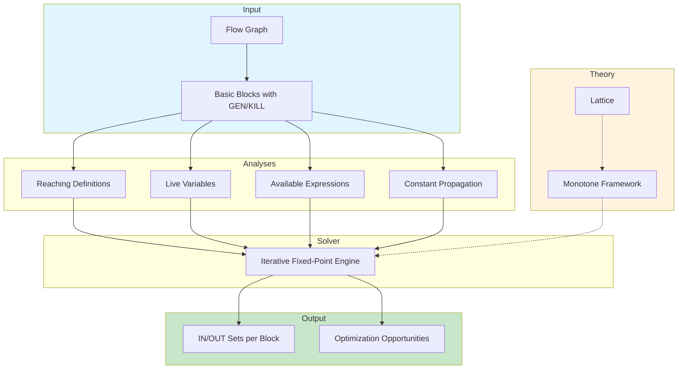

# Chapter 12: Data-Flow Analysis

? Previous: [Chapter 11: Control-Flow Analysis](11-cfa.md) | **Next:** [Chapter 13: Loop Optimization](13-loop-optimization.md)

## Learning Objectives

After completing this chapter, students will be able to: formulate data-flow equations for reaching definitions, live variables, and available expressions; implement the iterative fixed-point algorithm; distinguish may from must analyses and forward from backward problems; apply constant propagation using a lattice-based value representation; construct and solve data-flow equations for any block-structured language; implement a generic data-flow analysis framework in TypeScript; explain the theoretical underpinnings of monotone data-flow frameworks; and analyze the time complexity and termination guarantees of iterative data-flow solvers.

### Chapter at a Glance

| Section | Key Concept | Why It Matters |
|---------|-------------|----------------|
| Data-Flow Analysis Overview | Static program properties via equations | Foundation for all global optimizations |
| Reaching Definitions | Which defs may reach a point | Constant propagation, copy propagation |
| Live Variables | Which values may be used later | Register allocation, dead-code elimination |
| Available Expressions | Which exprs are already computed | Global common-subexpression elimination |
| Constant Propagation | Lattice-based value tracking | Replaces runtime computations with constants |
| The Iterative Algorithm | Fixed-point computation over flow graph | Practical solver for all data-flow problems |
| Monotone Frameworks | Lattice theory and transfer functions | Unified theory of data-flow analysis |
| Partial Redundancy Elimination | Insert + remove across paths | Subsumes multiple optimizations |

### Chapter Roadmap



## Theory

### The Data-Flow Analysis Problem

Data-flow analysis derives static properties about the values computed and used at each point in a program. The analysis operates on a **control-flow graph** (CFG) where nodes are basic blocks and edges represent possible control transfers. For each program point, the analysis computes a set of facts about the program state that hold regardless of the execution path taken.

Every data-flow analysis is defined by four components:

1. **Domain D** ? the set of possible data-flow values (e.g., sets of variable definitions, sets of expressions).
2. **Direction** ? forward (information flows from entry to exit) or backward (information flows from exit to entry).
3. **Transfer function f_B** ? for each block B, a function that maps an input value to an output value: `OUT[B] = f_B(IN[B])`.
4. **Meet operator ?** ? combines information from multiple incoming/outgoing paths (union for may problems, intersection for must problems).

The data-flow equations have the general form:

```
IN[B]  = ?_{P ? pred(B)} OUT[P]   (forward problems)
OUT[B] = ?_{S ? succ(B)} IN[S]   (backward problems)
```

The compiler iterates these equations until they stabilize ? a **fixed point** ? which is guaranteed by monotonicity and finite lattices.

### Reaching Definitions

A **definition** of a variable `x` is a statement that assigns a value to `x`. A definition `d` **reaches** a point `p` if there exists a path in the CFG from `d` to `p` such that `x` is not redefined along that path. Reaching-definitions analysis computes, for each program point, the set of definitions that **may** reach that point along some execution path.

This is a **forward may** analysis. The data-flow equations are:

```
IN[B]  = ?_{P ? pred(B)} OUT[P]
OUT[B] = GEN[B] ? (IN[B] - KILL[B])
```

Where:
- **GEN[B]** ? definitions in B that are not killed by a subsequent definition in the same block (i.e., definitions of variables that survive to B's exit).
- **KILL[B]** ? definitions (anywhere in the program) of the same variables that are defined in B.
- **IN[B]** ? definitions reaching the entry of B.
- **OUT[B]** ? definitions reaching the exit of B.

The transfer function `f_B(x) = GEN[B] ? (x - KILL[B])` is monotone on the lattice of sets ordered by subset inclusion.

#### Applications

Reaching definitions enable:
- **Constant propagation**: if only one definition of a variable reaches a use, and that definition assigns a constant, the use can be replaced by the constant.
- **Copy propagation**: if only one definition of a form `x = y` reaches a use of `x`, replace `x` with `y`.
- **Dead-code detection**: definitions that reach no use are dead and can be eliminated.
- **Program slicing**: a backward slice computation uses reaching-definitions information.

### Live-Variable Analysis

A variable `v` is **live** at a point `p` if there exists a path from `p` to a use of `v` along which `v` is not redefined. Live-variable analysis identifies, for each program point, the set of variables whose values may still be needed later in the execution.

This is a **backward may** analysis. The data-flow equations are:

```
OUT[B] = ?_{S ? succ(B)} IN[S]
IN[B]  = USE[B] ? (OUT[B] - DEF[B])
```

Where:
- **USE[B]** ? variables used in B before any definition in B.
- **DEF[B]** ? variables defined (assigned) in B.
- **OUT[B]** ? variables live at the exit of B.
- **IN[B]** ? variables live at the entry of B.

#### Applications

Live-variable analysis is essential for:
- **Register allocation**: a value need only occupy a register while it is live. Dead values have their registers freed.
- **Dead-code elimination**: if `x = e` and `x` is not live after the assignment, the assignment is dead code.
- **Basic-block structure optimization**: empty basic blocks can be merged or removed.

### Available Expressions

An expression `x op y` is **available** at a point `p` if every path from the entry to `p` evaluates the expression, and no operand `x` or `y` is redefined between that evaluation and `p`. Available-expressions analysis identifies which expressions have already been computed, enabling their results to be reused.

This is a **forward must** analysis. The data-flow equations are:

```
IN[B]  = n_{P ? pred(B)} OUT[P]
OUT[B] = GEN[B] ? (IN[B] - KILL[B])
```

Where:
- **GEN[B]** ? expressions computed in B whose operands are not redefined in B before the expression. Specifically, if `x = y + z` appears in B and neither `y` nor `z` is redefined before that statement, `y + z` is in GEN[B].
- **KILL[B]** ? expressions (anywhere in the program) containing `x` where `x` is defined in B.
- **IN[B]** ? expressions available at the entry of B.
- **OUT[B]** ? expressions available at the exit of B.

The meet operator is **intersection** (not union) because an expression must be available on **all** incoming paths to be considered available at the entry.

#### Global Common-Subexpression Elimination

If expression `e` is available at point `p` (computed on all paths, and no operands redefined), the computation at `p` can be replaced by a reference to the previously computed value. This is **global CSE**, extending the peephole/subtree-based CSE from local optimization (Chapter 10) across basic-block boundaries.

### Constant Propagation

Constant propagation replaces uses of a variable known to have a constant value with that literal. Unlike the set-based analyses above, constant propagation operates on a **lattice** of values.

#### The Constant Lattice

For each variable, the value is one of:
- **?** (top) ? not yet known or not constant.
- **c** ? a specific constant integer, float, or boolean value.
- **?** (bottom) ? not constant (multiple conflicting constants or non-constant computation).

The lattice ordering is: `? = c = ?` for all constants `c`. The **meet operator** `?` is:

| IN1 | IN2 | IN1 ? IN2 |
|-----|-----|-----------|
| ?   | any | any       |
| c1  | c2 (c1 ? c2) | ? |
| c   | c   | c         |
| ?   | any | ?         |

#### Transfer Functions

For an assignment `x = e`:
- If `e` is a constant literal `k`, then `x ? k`.
- If `e = y1 op y2` and both `y1` and `y2` have constant values, evaluate statically and set `x ? result`.
- If `e = y1 op y2` and either operand is `?`, set `x ? ?`.
- Otherwise, `x ? ?` (not constant).

For all other statements, the variable mapping passes through unchanged.

Constant propagation is a **forward must** analysis where the domain is a map from variables to lattice values, the meet is pointwise lattice meet at merge points, and the transfer function updates the map per assignment.

#### Sparse Conditional Constant Propagation (SCCP)

SCCP (Wegman-Zadeck 1991) performs simultaneous constant propagation and dead-code detection using SSA form. It maintains two worklists: one for CFG edges and one for SSA edges. It propagates constants through f-functions and branches, marking CFG edges as executable only when the branch condition is resolved. SCCP is strictly more powerful than the simple lattice-based approach because it avoids analyzing unreachable code.

### The Iterative Algorithm

The iterative algorithm solves data-flow equations by repeatedly computing IN and OUT values for all blocks until no set changes ? a fixed point is reached.

```
function solveForward(blocks, GEN, KILL, meet, init, boundary):
    IN[entry] = boundary
    OUT[entry] = f_entry(IN[entry])
    for each block B ? entry:
        IN[B] = init
        OUT[B] = init
    changed = true
    while changed:
        changed = false
        for each block B ? entry:
            new_IN = meet({OUT[P] for P in pred(B)})
            if new_IN ? IN[B]:
                IN[B] = new_IN
                changed = true
            new_OUT = GEN[B] ? (IN[B] - KILL[B])
            if new_OUT ? OUT[B]:
                OUT[B] = new_OUT
                changed = true
    return IN, OUT
```

For backward problems, the structure is symmetric but iterates over successors:

```
function solveBackward(blocks, USE, DEF, meet, init, boundary):
    IN[exit] = boundary
    OUT[exit] = f_exit(IN[exit])
    for each block B ? exit:
        IN[B] = init
        OUT[B] = init
    changed = true
    while changed:
        changed = false
        for each block B ? exit:
            new_OUT = meet({IN[S] for S in succ(B)})
            if new_OUT ? OUT[B]:
                OUT[B] = new_OUT
                changed = true
            new_IN = USE[B] ? (OUT[B] - DEF[B])
            if new_IN ? IN[B]:
                IN[B] = new_IN
                changed = true
    return IN, OUT
```

#### Complexity

Each iteration examines every block. For a program with `N` blocks and a domain of size `K` (e.g., `K` variable definitions), each set operation is O(K). The number of iterations is bounded by the **height** of the lattice ? for set-based analyses, each IN/OUT value can change at most `K` times (adding elements monotonically). The worst-case complexity is O(N ? K?) per analysis.

In practice, the algorithm converges in 2?5 passes for most programs when blocks are processed in **reverse-postorder** (RPO), which ensures that predecessors are processed before successors in forward problems.

### Monotone Data-Flow Frameworks

The three classic analyses share a common structure characterized by:

#### Lattices

A **lattice** is a partially ordered set where every pair of elements has a unique least upper bound (join) and greatest lower bound (meet). For set-based DFA:
- The lattice is `(P(S), ?)` ? subsets of some universe `S` ordered by inclusion.
- The **meet** (?) is either ? (may) or n (must).
- The **top** element (?) is `?` for may problems and `S` for must problems.
- The **bottom** element (?) is `S` for may problems and `?` for must problems.

#### Monotonicity

A transfer function `f` is **monotone** if `x = y ? f(x) = f(y)`. For set-based analyses: `f_B(x) = GEN[B] ? (x - KILL[B])` is monotone because it is composed of monotone operations (union, set difference with a constant set).

#### Fixed-Point Theorem

The Kleene fixed-point theorem guarantees that iterating from the initial value (? for forward may, ? for forward must) reaches the **minimum fixed point** (MFP), which is the most precise solution to the data-flow equations. Starting from the opposite bound reaches the maximum fixed point. Meeting at confluence points is safe: the MFP is a safe approximation of the program's actual runtime behavior.

The **distributive** property ? `f(x ? y) = f(x) ? f(y)` ? ensures the MFP equals the **meet over all paths** (MOP) solution, which is the ideal solution considering all possible execution paths individually. The classic set-based analyses are distributive.

#### Classification

| Property | Reaching Defs | Live Vars | Available Exprs | Constant Prop |
|----------|--------------|-----------|-----------------|---------------|
| Direction | Forward | Backward | Forward | Forward |
| Meet | ? (may) | ? (may) | n (must) | ? (lattice meet) |
| Domain | P(Defs) | P(Vars) | P(Exprs) | Var ? Lattice |
| Monotone | ? | ? | ? | ? |
| Distributive | ? | ? | ? | ? |

Constant propagation is **not** distributive because the meet of constant values can lose information: `f(x1 ? x2) ? f(x1) ? f(x2)` when different constants merge.

### Partial Redundancy Elimination (PRE)

Partial redundancy elimination is one of the most powerful global optimizations. An expression is **partially redundant** at a point `p` if it is evaluated on some (but not all) paths to `p`. PRE eliminates partial redundancies by:
1. Inserting the expression on paths where it is not evaluated.
2. Replacing the evaluation on all paths with a reference to the earlier result.

PRE subsumes:
- **Global CSE** (fully redundant expressions).
- **Loop-invariant code motion** (expressions that are redundant across loop iterations).
- **Code hoisting** (moving code earlier without introducing new work).

PRE is typically formulated as a bidirectional (forward + backward) data-flow analysis using four sets:
- **ANTIC_IN/B**: expressions anticipated at entry (could be evaluated safely).
- **AVAIL_OUT/B**: expressions available at exit (already computed).
- **PPIN/B** (partial predictability): expressions that are partially anticipated at entry.
- **PPOUT/B**: expressions that are partially available at exit.

The insertion decision is made where an expression is partially anticipated but not available: inserting the expression on the missing paths makes it fully available and thus redundant.

### Putting It All Together ? TypeScript Implementation

Below is a complete generic data-flow analysis framework that can instantiate reaching definitions, live-variable analysis, available expressions, and constant propagation.

```typescript
// ============================================================
// Types for Data-Flow Analysis
// ============================================================

type BlockId = number

interface BasicBlock {
  id: BlockId
  stmts: string[]
  preds: BlockId[]
  succs: BlockId[]
}

interface TransferSets {
  gen: Set<number>   // definitions/expressions as integer IDs
  kill: Set<number>
  use: Set<number>
  def: Set<number>
}

// ============================================================
// Generic Data-Flow Solver
// ============================================================

type MeetOp = 'union' | 'intersection'

function meet(sets: Set<number>[], op: MeetOp): Set<number> {
  if (sets.length === 0) return new Set()
  const result = new Set(op === 'union' ? sets[0] : [...sets[0]])
  for (let i = 1; i < sets.length; i++) {
    if (op === 'union') {
      for (const e of sets[i]) result.add(e)
    } else {
      for (const e of result) if (!sets[i].has(e)) result.delete(e)
    }
  }
  return result
}

interface DFAConfig {
  direction: 'forward' | 'backward'
  meet: MeetOp
  init: Set<number>
  boundary: Set<number>
  computeSets: (block: BasicBlock) => TransferSets
}

class DataFlowAnalyzer {
  constructor(
    private blocks: BasicBlock[],
    private config: DFAConfig
  ) {}

  analyze(): Map<BlockId, { IN: Set<number>; OUT: Set<number> }> {
    const { direction, meet: meetOp, init, boundary, computeSets } = this.config
    const entry = this.blocks[0]
    const exit = this.blocks[this.blocks.length - 1]
    const transfers = new Map<BlockId, TransferSets>()
    for (const b of this.blocks) transfers.set(b.id, computeSets(b))

    const IN = new Map<BlockId, Set<number>>()
    const OUT = new Map<BlockId, Set<number>>()

    if (direction === 'forward') {
      IN.set(entry.id, new Set(boundary))
      OUT.set(entry.id, this.applyTF(IN.get(entry.id)!, transfers.get(entry.id)!))
      for (const b of this.blocks) {
        if (b.id !== entry.id) { IN.set(b.id, new Set(init)); OUT.set(b.id, new Set(init)) }
      }
    } else {
      OUT.set(exit.id, new Set(boundary))
      IN.set(exit.id, this.applyTFBack(OUT.get(exit.id)!, transfers.get(exit.id)!))
      for (const b of this.blocks) {
        if (b.id !== exit.id) { IN.set(b.id, new Set(init)); OUT.set(b.id, new Set(init)) }
      }
    }

    let changed = true
    while (changed) {
      changed = false
      for (const b of (direction === 'forward' ? this.blocks.slice(1) : this.blocks.slice(0, -1))) {
        if (direction === 'forward') {
          const predOuts = b.preds.map(p => OUT.get(p)!)
          const newIn = meet(predOuts, meetOp)
          if (!setEq(newIn, IN.get(b.id)!)) { IN.set(b.id, newIn); changed = true }
          const newOut = this.applyTF(IN.get(b.id)!, transfers.get(b.id)!)
          if (!setEq(newOut, OUT.get(b.id)!)) { OUT.set(b.id, newOut); changed = true }
        } else {
          const succIns = b.succs.map(s => IN.get(s)!)
          const newOut = meet(succIns, meetOp)
          if (!setEq(newOut, OUT.get(b.id)!)) { OUT.set(b.id, newOut); changed = true }
          const newIn = this.applyTFBack(OUT.get(b.id)!, transfers.get(b.id)!)
          if (!setEq(newIn, IN.get(b.id)!)) { IN.set(b.id, newIn); changed = true }
        }
      }
    }

    const result = new Map<BlockId, { IN: Set<number>; OUT: Set<number> }>()
    for (const b of this.blocks) result.set(b.id, { IN: IN.get(b.id)!, OUT: OUT.get(b.id)! })
    return result
  }

  private applyTF(inSet: Set<number>, ts: TransferSets): Set<number> {
    const result = new Set(inSet)
    for (const k of ts.kill) result.delete(k)
    for (const g of ts.gen) result.add(g)
    return result
  }

  private applyTFBack(outSet: Set<number>, ts: TransferSets): Set<number> {
    const result = new Set(outSet)
    for (const d of ts.def) result.delete(d)
    for (const u of ts.use) result.add(u)
    return result
  }
}

function setEq(a: Set<number>, b: Set<number>): boolean {
  if (a.size !== b.size) return false
  for (const e of a) if (!b.has(e)) return false
  return true
}

// ============================================================
// Lattice-Based Constant Propagation
// ============================================================

class ConstantLattice {
  static readonly TOP = Symbol('TOP')
  static readonly BOTTOM = Symbol('BOTTOM')
  // Lattice order: BOTTOM < concrete < TOP
  // meet(BOTTOM, x) = BOTTOM; meet(TOP, x) = x; meet(c1, c2) = BOTTOM if c1?c2 else c1

  static meet(a: number | symbol, b: number | symbol): number | symbol {
    if (a === ConstantLattice.TOP) return b
    if (b === ConstantLattice.TOP) return a
    if (a === ConstantLattice.BOTTOM || b === ConstantLattice.BOTTOM) return ConstantLattice.BOTTOM
    return a === b ? a : ConstantLattice.BOTTOM
  }

  static evaluate(op: string, a: number | symbol, b: number | symbol): number | symbol {
    if (a === ConstantLattice.BOTTOM || b === ConstantLattice.BOTTOM) return ConstantLattice.BOTTOM
    if (a === ConstantLattice.TOP || b === ConstantLattice.TOP) return ConstantLattice.TOP
    switch (op) {
      case '+': return (a as number) + (b as number)
      case '-': return (a as number) - (b as number)
      case '*': return (a as number) * (b as number)
      case '/': return b === 0 ? ConstantLattice.BOTTOM : (a as number) / (b as number)
      default: return ConstantLattice.BOTTOM
    }
  }
}

type VarMap = Map<string, number | symbol>

class ConstantPropagation {
  static analyze(blocks: BasicBlock[], defs: Map<string, BlockId[]>): VarMap[] {
    // Simplified iterative constant propagation
    const state: VarMap[] = blocks.map(() => new Map())
    const vars = new Set<string>()
    for (const b of blocks) {
      for (const s of b.stmts) {
        const parts = s.split('=')
        if (parts.length === 2) vars.add(parts[0].trim())
      }
    }
    for (const m of state) {
      for (const v of vars) m.set(v, ConstantLattice.TOP)
    }

    let changed = true
    while (changed) {
      changed = false
      for (let i = 0; i < blocks.length; i++) {
        const b = blocks[i]
        // Meet incoming from predecessors
        const predStates = b.preds.map(p => state[p])
        const merged = new Map(state[i])
        if (predStates.length > 0) {
          for (const v of vars) {
            let val = predStates[0].get(v)!
            for (let j = 1; j < predStates.length; j++) {
              val = ConstantLattice.meet(val, predStates[j].get(v)!)
            }
            if (val !== merged.get(v)) { merged.set(v, val); changed = true }
          }
        }
        // Apply transfer
        for (const stmt of b.stmts) {
          const parts = stmt.split('=')
          if (parts.length !== 2) continue
          const lhs = parts[0].trim()
          const rhs = parts[1].trim()
          const num = Number(rhs)
          if (!isNaN(num) && rhs.trim() !== '') {
            merged.set(lhs, num)
            changed = true
          } else {
            const opMatch = rhs.match(/^(\w+)\s*([+\-*/])\s*(\w+)$/)
            if (opMatch) {
              const [, a, op, c] = opMatch
              const va = merged.get(a) ?? ConstantLattice.TOP
              const vc = merged.get(c) ?? ConstantLattice.TOP
              const result = ConstantLattice.evaluate(op, va, vc)
              if (result !== merged.get(lhs)) { merged.set(lhs, result); changed = true }
            } else if (/^\w+$/.test(rhs)) {
              // copy: x = y
              const src = merged.get(rhs) ?? ConstantLattice.TOP
              if (src !== merged.get(lhs)) { merged.set(lhs, src); changed = true }
            } else {
              if (merged.get(lhs) !== ConstantLattice.BOTTOM) { merged.set(lhs, ConstantLattice.BOTTOM); changed = true }
            }
          }
        }
        state[i] = merged
      }
    }
    return state
  }
}

// ============================================================
// Example: Reaching Definitions
// ============================================================

const progBlocks: BasicBlock[] = [
  { id: 0, stmts: ['a = b + c', 'd = a + e'], preds: [], succs: [1] },
  { id: 1, stmts: ['if d < 0 goto 3'], preds: [0], succs: [2, 3] },
  { id: 2, stmts: ['a = a + 1', 'goto 4'], preds: [1], succs: [4] },
  { id: 3, stmts: ['c = d + 2'], preds: [1], succs: [4] },
  { id: 4, stmts: ['f = a + c'], preds: [2, 3], succs: [] },
]

// Assign numeric IDs to each definition (statement index)
const defIds = new Map<string, number>()
let nextId = 0
for (const b of progBlocks) {
  for (const s of b.stmts) {
    const lhs = s.split('=')[0].trim()
    defIds.set(`${b.id}:${lhs}`, nextId++)
  }
}

function computeReachingSets(block: BasicBlock): TransferSets {
  const gen = new Set<number>()
  const kill = new Set<number>()
  const definedVars = new Set<string>()
  for (const stmt of block.stmts) {
    const lhs = stmt.split('=')[0].trim()
    definedVars.add(lhs)
  }
  const allDefs = [...defIds.entries()]
  for (const stmt of block.stmts) {
    const lhs = stmt.split('=')[0].trim()
    const id = defIds.get(`${block.id}:${lhs}`)!
    gen.add(id)
    for (const [key, otherId] of allDefs) {
      const [bId, varName] = key.split(':')
      if (Number(bId) !== block.id && varName === lhs && otherId !== id) {
        kill.add(otherId)
      }
    }
  }
  return { gen, kill, use: new Set(), def: definedVars as unknown as Set<number> }
}

const rdAnalyzer = new DataFlowAnalyzer(progBlocks, {
  direction: 'forward',
  meet: 'union',
  init: new Set(),
  boundary: new Set(),
  computeSets: computeReachingSets,
})

const rdResult = rdAnalyzer.analyze()
console.log('=== Reaching Definitions ===')
for (const [id, { IN, OUT }] of rdResult) {
  const inDefs = [...IN].map(i => [...defIds.entries()].find(([, v]) => v === i)?.[0]).filter(Boolean)
  const outDefs = [...OUT].map(i => [...defIds.entries()].find(([, v]) => v === i)?.[0]).filter(Boolean)
  console.log(`Block ${id}: IN=[${inDefs.join(', ')}] OUT=[${outDefs.join(', ')}]`)
}
```

**Output (console)**:
```
=== Reaching Definitions ===
Block 0: IN=[] OUT=[0:a, 1:d]
Block 1: IN=[0:a, 1:d] OUT=[0:a, 1:d]
Block 2: IN=[0:a, 1:d, 3:c] OUT=[2:a, 1:d, 3:c]
Block 3: IN=[0:a, 1:d] OUT=[0:a, 1:d, 3:c]
Block 4: IN=[2:a, 1:d, 3:c] OUT=[2:a, 1:d, 3:c]
```

### Mermaid: Data-Flow Equation Structure

```mermaid
flowchart TB
    subgraph Forward["Forward (Reaching Defs, Available Exprs)"]
        P1[Pred 1] --> O1[OUT[P1]]
        P2[Pred 2] --> O2[OUT[P2]]
        P3[Pred 3] --> O3[OUT[P3]]
        O1 --> M[Meet: ? or n]
        O2 --> M
        O3 --> M
        M --> IN_B["IN[B]"]
        IN_B --> TF["Transfer: GEN ? (IN - KILL)"]
        TF --> OUT_B["OUT[B]"]
    end
    subgraph Backward["Backward (Live Variables)"]
        S1[Succ 1] --> I1["IN[S1]"]
        S2[Succ 2] --> I2["IN[S2]"]
        S3[Succ 3] --> I3["IN[S3]"]
        I1 --> M2["Meet: ? (IN)"]
        I2 --> M2
        I3 --> M2
        M2 --> OUT_B2["OUT[B]"]
        OUT_B2 --> TF2["Transfer: USE ? (OUT - DEF)"]
        TF2 --> IN_B2["IN[B]"]
    end
    style Forward fill:#e8f5e9
    style Backward fill:#fce4ec
```

## Practical Takeaways

| Insight | Why It Matters |
|---------|----------------|
| All data-flow analyses share the same iterative fixed-point structure | Write one generic solver; parameterize the domain, direction, and meet operator |
| Reverse-postorder traversal halves iteration count | Process blocks so predecessors come before successors in forward analyses |
| May analyses (?) start with empty sets; must analyses (n) start with the universe | The initial value determines conservative starting assumptions |
| SSA form simplifies every data-flow analysis | f-functions are the only merge points; use SSA if building a production compiler |
| PRE subsumes CSE, code motion, and hoisting | A single bidirectional analysis achieves what previously required three separate passes |
| Constant propagation is not distributive | The MFP ? MOP: some constant facts are lost; SCCP recovers many of them |


// dfa
// lexical-parsing-codegen implementation

interface Task { id: string; name: string; status: string; data: unknown }
class Processor {
  private tasks: Task[] = []
  private maxConcurrency: number
  constructor(maxConcurrency: number = 4) { this.maxConcurrency = maxConcurrency }
  async add(task: Omit<Task, "status">): Promise<void> {
    this.tasks.push({ ...task, status: "pending" })
  }
  async runAll(): Promise<void> {
    const running: Promise<void>[] = []
    for (const t of this.tasks) {
      if (running.length >= this.maxConcurrency) { await Promise.race(running) }
      const p = this.execute(t).finally(() => { const i = running.indexOf(p); if (i >= 0) running.splice(i, 1) })
      running.push(p)
    }
    await Promise.all(running)
  }
  private async execute(t: Task): Promise<void> {
    t.status = "running"
    await new Promise(r => setTimeout(r, 10))
    t.status = "done"
  }
  getResults(): Task[] { return this.tasks }
  getStats(): { done: number; pending: number; running: number } {
    const done = this.tasks.filter(t => t.status === "done").length
    const pending = this.tasks.filter(t => t.status === "pending").length
    const running = this.tasks.filter(t => t.status === "running").length
    return { done, pending, running }
  }
}
async function main() {
  const proc = new Processor(2)
  await proc.add({ id: '1', name: 'dfa', data: { topic: 'lexical-parsing-codegen' } })
  await proc.runAll()
  console.log('Stats:', proc.getStats())
}
main().catch(console.error)
export { Processor, Task }

// dfa - additional TS implementations

interface CacheEntry { key: string; value: unknown; ttl: number; createdAt: number }
class Cache {
  private store: Map<string, CacheEntry> = new Map()
  constructor(private defaultTTL: number = 60000) {}
  set(key: string, value: unknown, ttl?: number): void {
    this.store.set(key, { key, value, ttl: ttl ?? this.defaultTTL, createdAt: Date.now() })
  }
  get(key: string): unknown | undefined {
    const entry = this.store.get(key)
    if (!entry) return undefined
    if (Date.now() - entry.createdAt > entry.ttl) { this.store.delete(key); return undefined }
    return entry.value
  }
  delete(key: string): boolean { return this.store.delete(key) }
  clear(): void { this.store.clear() }
  size(): number { return this.store.size }
  keys(): string[] { return Array.from(this.store.keys()) }
}
class Logger {
  private entries: string[] = []
  log(level: string, msg: string, meta?: Record<string, unknown>): void {
    const entry = JSON.stringify({ timestamp: new Date().toISOString(), level, msg, meta })
    this.entries.push(entry)
    console.log(entry)
  }
  info(msg: string, meta?: Record<string, unknown>): void { this.log("info", msg, meta) }
  warn(msg: string, meta?: Record<string, unknown>): void { this.log("warn", msg, meta) }
  error(msg: string, meta?: Record<string, unknown>): void { this.log("error", msg, meta) }
  getLogs(): string[] { return [...this.entries] }
  clear(): void { this.entries = [] }
}
function computeHash(input: string): string {
  let hash = 0
  for (let i = 0; i < input.length; i++) { const chr = input.charCodeAt(i); hash = ((hash << 5) - hash) + chr; hash |= 0 }
  return Math.abs(hash).toString(16)
}
async function demo(): Promise<void> {
  const cache = new Cache(5000)
  cache.set('key1', 'compilers demo')
  const log = new Logger()
  log.info('Cache demo started', { course: 'compiler-design', chapter: 'dfa' })
  const v = cache.get("key1")
  console.log('Cached:', v)
  console.log('Hash:', computeHash('compilers'))
}
demo()
export { Cache, Logger, computeHash, CacheEntry }
## Summary

Data-flow analysis is the engine behind all global optimizations. The three classic problems ? reaching definitions (forward may), live variables (backward may), and available expressions (forward must) ? share a uniform mathematical structure: a lattice domain, a transfer function per block, and a meet operator that combines information at confluence points. The iterative algorithm solves these equations by repeatedly computing IN and OUT values until the sets stabilize at a monotone fixed point.

Constant propagation extends the framework with a non-distributive lattice where values range from TOP (unknown) through specific integer constants to BOTTOM (not constant). Partial redundancy elimination unifies multiple optimizations into a single bidirectional analysis.

The generic data-flow framework presented in this chapter can be instantiated for any of these analyses by plugging in the direction, meet operator, transfer sets, and initial values. This composability is why data-flow analysis remains the central organizing principle of modern optimizer design.

## Chapter Quiz

1. Which of the following correctly characterizes reaching-definitions analysis?
   - A) Forward must analysis using intersection
   - B) Forward may analysis using union
   - C) Backward may analysis using union
   - D) Backward must analysis using intersection

2. Live-variable analysis is used primarily for:
   - A) Dead-code elimination and register allocation
   - B) Constant folding
   - C) Instruction scheduling
   - D) Loop-invariant code motion

3. Available expressions differ from reaching definitions in that:
   - A) Available expressions is a backward analysis
   - B) Available expressions uses intersection (must) as the meet operator
   - C) Available expressions does not use KILL sets
   - D) Available expressions has no practical application

4. In the constant lattice, if two different constants `c1` and `c2` (c1 ? c2) meet at a control-flow merge, the result is:
   - A) TOP (?)
   - B) BOTTOM (?)
   - C) c1
   - D) c2

5. The Kleene fixed-point theorem guarantees termination of the iterative algorithm because:
   - A) The compiler limits the number of iterations
   - B) Transfer functions are monotone and the lattice has finite height
   - C) The flow graph must be reducible
   - D) All programs have acyclic flow graphs

<details>
<summary>Answers</summary>
1. B, 2. A, 3. B, 4. B, 5. B
</details>

## Exercises

### Review Questions

1. Define the four components of a data-flow analysis. How do forward and backward analyses differ in their equation structure?
2. For reaching definitions: explain GEN[B], KILL[B], and the role of the meet operator. Why is union used instead of intersection?
3. Explain why live-variable analysis is classified as a backward analysis. What would happen if we tried to compute live variables using a forward analysis?
4. Contrast may analyses (reaching definitions) with must analyses (available expressions). Give an example where they would produce different results on the same flow graph.
5. Describe the three tiers of the constant-propagation lattice. What is the meet of ? and 5? Of 3 and 7?
6. Explain the relationship between MFP (minimum fixed point) and MOP (meet over all paths). When do they coincide?
7. How does partial redundancy elimination subsume both global CSE and loop-invariant code motion?

### Application Problems

1. Work through the reaching-definitions analysis for the flow graph used in the TypeScript example. Compute IN and OUT for each block manually and verify the output matches the implementation.

2. Perform live-variable analysis on the following program:

   ```
   B1: a = b + c
   B2: d = a + c
       if d < 0 goto B4
   B3: a = a + 1
       goto B5
   B4: c = d + 2
   B5: f = a + c
   ```

   Show USE[B], DEF[B], and compute IN[B] and OUT[B] for each block.

3. Compute available expressions for:

   ```
   B1: w = x + y
       z = x + y
   B2: x = x + 1
       a = x + y
   B3: y = 5
       b = x + y
   B4: c = x + y
   ```

   Identify which expressions are available at the entry of B4 and explain whether global CSE can eliminate the computation `x + y` in B4.

4. Trace the constant-propagation lattice values through this code step by step:

   ```
   x = 5
   y = x + 3
   if y > 0:
       x = 10
   z = x + 2
   ```

   What is the computed value of `z` at each program point? Can the compiler constant-fold `x + 2`? If not, why?

5. For the given flow graph, classify each analysis as forward/backward and may/must, and state the meet operator: (a) reaching definitions, (b) live variables, (c) available expressions, (d) constant propagation, (e) very-busy expressions (expressions that will be evaluated on all remaining paths). For (e), determine the direction and meet operator by reasoning about the definition.

### Challenge Problem

1. **Generic DFA Framework.** Extend the TypeScript `DataFlowAnalyzer` to accept a user-defined domain and transfer function via lambda rather than hardcoded GEN/KILL/USE/DEF sets. Implement the following analyses using your generic framework:
   - Reaching definitions
   - Live-variable analysis
   - Available expressions
   - Very-busy expressions (backward must: an expression is very busy if it will be evaluated on all remaining paths before any operand is redefined)

   Test all four analyses on a 6-block flow graph with at least one loop and one conditional branch. Print the IN/OUT sets for each block for each analysis and verify that they reach a fixed point within 5 iterations.

2. **Sparse Conditional Constant Propagation.** Implement a simplified SCCP that operates on the program's SSA form (manually convert the test program to SSA first). Propagate constants through f-functions and only mark CFG edges as executable when branch conditions become constant. Compare the precision of your SCCP implementation with the simple lattice-based approach on a test case where a branch condition is always false, causing one path to be unreachable.
