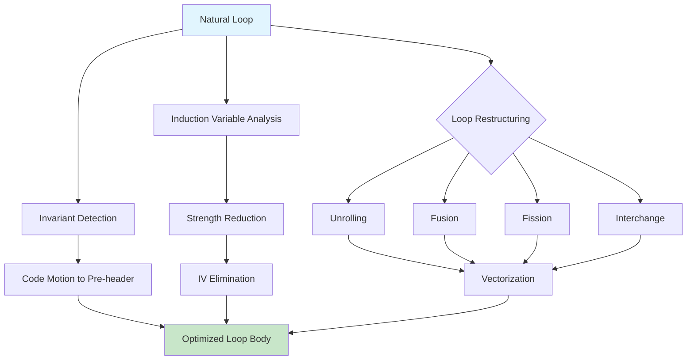

# Chapter 13: Loop Optimization

? Previous: [Chapter 12: Data-Flow Analysis](12-dfa.md) | **Next:** [Chapter 14: Register Allocation](14-register-allocation.md)

## Learning Objectives

After completing this chapter, students will be able to: identify loop-invariant expressions using reaching-definitions information; perform loop-invariant code motion with safety checks; detect basic and derived induction variables; apply strength reduction to replace multiplications with additions; eliminate induction variables from loop control; implement loop unrolling with remainder handling; apply loop fusion and fission transformations; determine when loop interchange improves cache locality; understand vectorization legality via dependence analysis; and implement a complete loop-optimization pipeline in TypeScript.

<!-- Image Gallery -->
<div style="display:flex;flex-wrap:wrap;gap:4px;margin:16px 0;padding:12px;background:#f8fafc;border-radius:8px;border:1px solid #e2e8f0;">
<a href="../../../assets/images/lessons/compiler-design/13-loop-optimization/hero.svg" target="_blank" rel="noopener">
  
</a>
<a href="../../../assets/images/lessons/compiler-design/13-loop-optimization/handwritten-notes.svg" target="_blank" rel="noopener">
  
</a>
<a href="../../../assets/images/lessons/compiler-design/13-loop-optimization/sticky-notes.svg" target="_blank" rel="noopener">
  
</a>
<a href="../../../assets/images/lessons/compiler-design/13-loop-optimization/visual-explanation.svg" target="_blank" rel="noopener">
  
</a>
<a href="../../../assets/images/lessons/compiler-design/13-loop-optimization/architecture.svg" target="_blank" rel="noopener">
  
</a>
<a href="../../../assets/images/lessons/compiler-design/13-loop-optimization/workflow.svg" target="_blank" rel="noopener">
  
</a>
<a href="../../../assets/images/lessons/compiler-design/13-loop-optimization/mindmap.svg" target="_blank" rel="noopener">
  
</a>
<a href="../../../assets/images/lessons/compiler-design/13-loop-optimization/comparison.svg" target="_blank" rel="noopener">
  
</a>
<a href="../../../assets/images/lessons/compiler-design/13-loop-optimization/cheatsheet.svg" target="_blank" rel="noopener">
  
</a>
<a href="../../../assets/images/lessons/compiler-design/13-loop-optimization/interview-quiz.svg" target="_blank" rel="noopener">
  
</a>
<a href="../../../assets/images/lessons/compiler-design/13-loop-optimization/social-card.svg" target="_blank" rel="noopener">
  
</a>
</div>
<!-- End Image Gallery -->


### Chapter at a Glance

| Section | Key Concept | Why It Matters |
|---------|-------------|----------------|
| Loop-Invariant Code Motion | Move invariants to pre-header | Evaluated once per loop, not per iteration |
| Induction Variable Detection | Variables with affine per-iteration change | Foundation for strength reduction and elimination |
| Strength Reduction | Replace multiply with add | Cheaper ops inside hot loops, huge speedup |
| Induction Variable Elimination | Remove derived IVs entirely | Reduces register pressure and operations |
| Loop Unrolling | Replicate body K times | Reduces branch overhead, enables ILP |
| Loop Fusion/Fission | Merge or split loop bodies | Improves locality and enables vectorization |
| Loop Interchange | Swap nesting order | Sequentializes memory access patterns |
| Vectorization | SIMD execution of loops | Exploits hardware parallelism automatically |

### Chapter Roadmap



## Theory

### The Critical Role of Loops

<a href="../../../assets/images/diagrams/compiler-design/13-loop-optimization/the-critical-role-of-loops-handwritten.svg" target="_blank" rel="noopener">
  
</a>
<a href="../../../assets/images/diagrams/compiler-design/13-loop-optimization/the-critical-role-of-loops-diagram.svg" target="_blank" rel="noopener">
  
</a>
<a href="../../../assets/images/diagrams/compiler-design/13-loop-optimization/the-critical-role-of-loops-sticky.svg" target="_blank" rel="noopener">
  
</a>


Loops account for the vast majority of execution time in most programs. Amdahl's law makes this precise: if a program spends 90% of its time in loops, a 2? speedup of the loop code yields a 1.8? overall speedup, while a 2? speedup of non-loop code yields only 1.05?. Concentrating optimization effort on loops delivers the highest return on compiler development time.

The loop optimizations described in this chapter depend on the **natural-loop** identification and loop-nest hierarchy established by control-flow analysis (Chapter 11). Each natural loop has a single header node that dominates all other nodes in the loop, and a **pre-header** ? an empty basic block placed just before the header ? that serves as the landing point for code moved out of the loop.

### Loop-Invariant Code Motion (LICM)

<a href="../../../assets/images/diagrams/compiler-design/13-loop-optimization/loop-invariant-code-motion-licm-handwritten.svg" target="_blank" rel="noopener">
  
</a>
<a href="../../../assets/images/diagrams/compiler-design/13-loop-optimization/loop-invariant-code-motion-licm-diagram.svg" target="_blank" rel="noopener">
  
</a>
<a href="../../../assets/images/diagrams/compiler-design/13-loop-optimization/loop-invariant-code-motion-licm-sticky.svg" target="_blank" rel="noopener">
  
</a>


An expression inside a loop is **loop-invariant** if its value does not change from one iteration to the next. LICM moves such expressions to the loop's pre-header, ensuring they are evaluated exactly once.

#### Invariant Detection

An instruction `x = y op z` (or `x = y` for copy instructions) is loop-invariant if:

1. Both `y` and `z` are constants.
2. Both `y` and `z` are defined outside the loop (their definitions reach the loop entry from outside).
3. If `y` (or `z`) is defined inside the loop, that definition is itself loop-invariant, and it reaches only this use (i.e., the defining instruction is the only definition reaching the use, and the use post-dominates the definition within the loop).

Condition 3 requires iterative fixed-point reasoning: an instruction can be marked invariant only after all instructions it depends on are also marked invariant. This is solved by iterating the invariant set to a fixed point: initially mark all instructions whose operands satisfy (1) or (2); then repeatedly mark instructions whose operands are themselves marked, until no new instructions become invariant.

#### Safety Conditions

An instruction is **safe to move** to the pre-header only if all of the following hold:

1. **Dominance**: the instruction dominates all loop exits. Moving it earlier cannot cause it to execute on a path that bypasses the original location.
2. **Unique definition**: the instruction is the only definition of `x` that reaches any use of `x` inside the loop. If another definition of `x` inside the loop could reach some uses, moving this one would change the value observed by those uses.
3. **No side effects**: the instruction has no observable side effects beyond assigning `x`. In particular, it must not raise an exception, perform I/O, or modify memory that is visible outside the loop. For languages with strict exception semantics, this condition is conservative: even a division that might divide by zero is unsafe to move.

When an instruction satisfies invariance but not safety, it is said to be **speculatively movable** ? some compilers (LLVM, GCC with `-fspeculative-load`) move it anyway and insert compensation code on error paths.

```
// Before LICM
for (i = 0; i < n; i++) {
    x = a * b;          // loop-invariant
    y = z + 1;          // loop-invariant
    c[i] = x * y;       // not invariant (uses c[i], i)
}

// After LICM
x = a * b;              // moved to pre-header
y = z + 1;              // moved to pre-header
for (i = 0; i < n; i++) {
    c[i] = x * y;       // still uses invariant results
}
```

### Induction Variable Detection

<a href="../../../assets/images/diagrams/compiler-design/13-loop-optimization/induction-variable-detection-handwritten.svg" target="_blank" rel="noopener">
  
</a>
<a href="../../../assets/images/diagrams/compiler-design/13-loop-optimization/induction-variable-detection-diagram.svg" target="_blank" rel="noopener">
  
</a>
<a href="../../../assets/images/diagrams/compiler-design/13-loop-optimization/induction-variable-detection-sticky.svg" target="_blank" rel="noopener">
  
</a>


An **induction variable (IV)** is a variable whose value changes by a fixed amount on each iteration of a loop. More formally, a variable `v` is an induction variable in loop `L` if every definition of `v` within `L` is of the form `v = v ? c` or `v = c ? v` where `c` is loop-invariant.

#### Basic vs. Derived Induction Variables

- **Basic induction variable (BIV)**: an IV that is incremented or decremented by a constant each iteration, such as `i = i + 1`. BIVs are typically loop counters updated by a single, simple assignment.
- **Derived induction variable (DIV)**: a variable whose value is a linear function of a BIV: `t = c1 ? i + c2`, where `i` is a BIV and `c1`, `c2` are loop-invariant. Array index computations are the canonical DIVs: `addr = base + i ? elem_size`.

#### Detection Algorithm

```
function detectInductionVariables(loop):
    // Phase 1: find basic IVs
    basic = {}
    for each assignment v = v + c or v = c + v or v = v - c in loop:
        if c is loop-invariant:
            basic.add(v, (step: c))

    // Phase 2: find derived IVs
    derived = {}
    for each assignment t = c1 * v + c2 in loop:
        if v is a BIV and c1, c2 are loop-invariant:
            derived.add(t, (base: v, mult: c1, add: c2))

    // Phase 3: propagate through linear chains
    for each assignment t = s + c or t = s * c in loop:
        if s is a DIV and c is loop-invariant:
            derived.add(t, compose(derived[s], c))

    return (basic, derived)
```

### Strength Reduction

<a href="../../../assets/images/diagrams/compiler-design/13-loop-optimization/strength-reduction-handwritten.svg" target="_blank" rel="noopener">
  
</a>
<a href="../../../assets/images/diagrams/compiler-design/13-loop-optimization/strength-reduction-diagram.svg" target="_blank" rel="noopener">
  
</a>
<a href="../../../assets/images/diagrams/compiler-design/13-loop-optimization/strength-reduction-sticky.svg" target="_blank" rel="noopener">
  
</a>


Strength reduction replaces an expensive operation inside a loop with a cheaper one. The canonical transformation replaces multiplication with addition for array-index expressions.

#### Principle

If `j = i ? c` where `i` is a BIV incremented by `d` each iteration, then:
- At iteration `k`: `j_k = i_k ? c = (i0 + k ? d) ? c = i0 ? c + k ? (d ? c)`
- The sequence `j0, j1, j2, ...` forms an arithmetic progression with step `d ? c`.

Rather than recomputing `j = i ? c` each iteration (which costs a multiplication), maintain `j` as a separate IV:
- Initialize `j = i0 ? c`.
- On each iteration, update `j += d ? c` (which costs only an addition).

```
// Before strength reduction
for i = 0 to n-1:
    addr = base + i * 4      // multiplication each iteration
    *(addr) = ...

// After strength reduction
addr = base + 0              // initial value of derived IV
for i = 0 to n-1:
    *(addr) = ...
    addr = addr + 4          // addition replaces multiplication
```

The general case covers `j = c1 ? i + c2` with step `d`:
- Initialize: `j = c1 ? i0 + c2`
- Increment: `j += c1 ? d`

#### General Strength-Reduction Algorithm

```
function strengthReduce(loop, basicIVs, derivedIVs):
    for each (t, (base: i, mult: c1, add: c2)) in derivedIVs:
        d = step of i
        // Create new temporary r_t for the reduced IV
        // Initialize: r_t = c1 * i0 + c2
        insert "r_t = c1 * i_init + c2" in pre-header
        // Replace each computation of t with r_t
        for each use of t in loop body:
            replace with r_t
        // Remove definition of t
        remove "t = c1 * i + c2"
        // Add increment: r_t = r_t + c1 * d
        append to loop back edge: "r_t = r_t + (c1 * d)"
```

### Induction Variable Elimination

<a href="../../../assets/images/diagrams/compiler-design/13-loop-optimization/induction-variable-elimination-handwritten.svg" target="_blank" rel="noopener">
  
</a>
<a href="../../../assets/images/diagrams/compiler-design/13-loop-optimization/induction-variable-elimination-diagram.svg" target="_blank" rel="noopener">
  
</a>
<a href="../../../assets/images/diagrams/compiler-design/13-loop-optimization/induction-variable-elimination-sticky.svg" target="_blank" rel="noopener">
  
</a>


After strength reduction, the BIV may become dead ? no longer used for any computation other than loop termination. If a DIV exists that steps in lockstep with the BIV, the BIV can be eliminated entirely.

#### BIV Elimination Condition

A BIV `i` can be eliminated if:
1. All uses of `i` in the loop have been replaced by DIVs (via strength reduction).
2. The only remaining use of `i` is the loop-termination test `i < n`.

When these conditions hold, the compiler can:

1. Replace the comparison `i < n` with a comparison of a DIV against a rewritten bound. For example, if `t = 4 ? i` is the DIV, replace `i < n` with `t < 4 ? n`.
2. Remove the increment `i = i + 1`.
3. Increment the DIV in the loop's back edge.

```
// Before IV elimination
for i = 0 to n-1:
    t = i * 4
    a[t] = ...

// After strength reduction (t becomes an IV)
t = 0
for i = 0 to n-1:
    a[t] = ...
    t = t + 4

// After IV elimination (i removed)
t = 0
while t < n * 4:
    a[t] = ...
    t = t + 4
```

### Loop Unrolling

<a href="../../../assets/images/diagrams/compiler-design/13-loop-optimization/loop-unrolling-handwritten.svg" target="_blank" rel="noopener">
  
</a>
<a href="../../../assets/images/diagrams/compiler-design/13-loop-optimization/loop-unrolling-diagram.svg" target="_blank" rel="noopener">
  
</a>
<a href="../../../assets/images/diagrams/compiler-design/13-loop-optimization/loop-unrolling-sticky.svg" target="_blank" rel="noopener">
  
</a>


Loop unrolling replicates the loop body multiple times, reducing the per-iteration overhead of loop control (testing the branch, incrementing the IV) and exposing more instruction-level parallelism.

#### Unrolling with Fixed Trip Count

If the trip count `N` is known at compile time and is a multiple of the unroll factor `K`:

```
// Original
for i = 0 to N-1:
    a[i] = b[i] + 1

// Unrolled by factor K=4
for i = 0 to N-1 step 4:
    a[i]   = b[i]   + 1
    a[i+1] = b[i+1] + 1
    a[i+2] = b[i+2] + 1
    a[i+3] = b[i+3] + 1
```

#### Unrolling with Remainder

When `N` is not a multiple of `K`, a remainder loop handles the leftover iterations:

```
// Unrolled by 4 with remainder
int i = 0
for (; i + 3 < N; i += 4) {
    a[i]   = b[i]   + 1
    a[i+1] = b[i+1] + 1
    a[i+2] = b[i+2] + 1
    a[i+3] = b[i+3] + 1
}
for (; i < N; i++) {
    a[i] = b[i] + 1
}
```

#### Unroll Factor Selection

The optimal unroll factor balances:
- **Register pressure**: more unrolling creates more live ranges, potentially causing spills.
- **Code size**: instruction-cache (I-cache) misses can negate unrolling benefits.
- **Instruction-level parallelism (ILP)**: a larger factor exposes more independent operations for superscalar execution.

Profile-guided optimization (Chapter 15) and machine models help compilers select the factor empirically.

### Loop Fusion and Fission

<a href="../../../assets/images/diagrams/compiler-design/13-loop-optimization/loop-fusion-and-fission-handwritten.svg" target="_blank" rel="noopener">
  
</a>
<a href="../../../assets/images/diagrams/compiler-design/13-loop-optimization/loop-fusion-and-fission-diagram.svg" target="_blank" rel="noopener">
  
</a>
<a href="../../../assets/images/diagrams/compiler-design/13-loop-optimization/loop-fusion-and-fission-sticky.svg" target="_blank" rel="noopener">
  
</a>


#### Loop Fusion (Jamming)

Loop fusion combines two adjacent loops with the same iteration range into a single loop. Benefits include:
- **Improved cache locality**: data accessed in the first loop is still in cache when the second loop runs.
- **Reduced loop overhead**: one branch instead of two.
- **Enabling vectorization**: the combined loop may have enough vectorizable work to justify SIMD.

**Legality condition**: fusion is legal if no cross-loop data dependence exists. Specifically, if a value computed in loop 1 at iteration `i` is used in loop 2 at iteration `j`, and `i ? j`, fusion would change the program semantics because the accesses would now interleave.

```
// Before fusion
for i = 0 to N-1: a[i] = b[i] * 2
for i = 0 to N-1: c[i] = a[i] + d[i]

// After fusion
for i = 0 to N-1:
    a[i] = b[i] * 2
    c[i] = a[i] + d[i]
```

#### Loop Fission (Distribution)

Loop fission splits a single loop into multiple loops, each handling a subset of the body. Benefits include:
- **Enabling vectorization**: separating a non-vectorizable statement from a vectorizable one lets the latter be SIMD-optimized.
- **Reducing register pressure**: each smaller loop has fewer live ranges.
- **Improving cache behavior**: disjoint data accesses become separate loops with better locality.

```
// Before fission (can't vectorize because sum[i] depends on sum[i-1])
for i = 1 to N-1:
    sum[i] = sum[i-1] + a[i]   // recurrence, not vectorizable
    b[i]   = a[i] * 2          // vectorizable

// After fission
for i = 1 to N-1:
    sum[i] = sum[i-1] + a[i]   // scalar loop (recurrence)

for i = 1 to N-1:
    b[i] = a[i] * 2            // can now vectorize
```

### Loop Interchange

<a href="../../../assets/images/diagrams/compiler-design/13-loop-optimization/loop-interchange-handwritten.svg" target="_blank" rel="noopener">
  
</a>
<a href="../../../assets/images/diagrams/compiler-design/13-loop-optimization/loop-interchange-diagram.svg" target="_blank" rel="noopener">
  
</a>
<a href="../../../assets/images/diagrams/compiler-design/13-loop-optimization/loop-interchange-sticky.svg" target="_blank" rel="noopener">
  
</a>


Loop interchange swaps the nesting order of two loops in a perfectly nested loop. The primary motivation is improving memory access patterns to achieve **stride-1** (sequential) access in the innermost loop.

#### Row-Major vs. Column-Major Access

Most languages (C, C++, TypeScript, Rust) store matrices in **row-major** order: `a[i][j]` is stored with `j` as the fastest-varying index. The element `a[i][j]` is at memory address `base + i * N * elem_size + j * elem_size`.

```
// Stride-N access (cache-inefficient) ? inner loop varies j, but outer loop i
// On each inner iteration, we access a different i, so stride = N * elem_size
for i = 0 to N-1:
    for j = 0 to N-1:
        a[i][j] = a[i][j] + 1

// After interchange: stride-1 access (cache-efficient)
// Inner loop now varies j sequentially: a[0][0], a[0][1], a[0][2], ...
for j = 0 to N-1:
    for i = 0 to N-1:
        a[i][j] = a[i][j] + 1
```

Wait ? this is actually wrong! In row-major order, the original code `a[i][j]` with `i` outer and `j` inner accesses memory sequentially (stride-1). The interchange would make it stride-N. Let me correct:

Actually, in row-major order (C), `a[i][j]` has `j` as the fastest dimension. So `for i { for j { a[i][j] } }` is already stride-1 in the inner loop. The interchange is beneficial when the innermost loop varies `i`, not `j`. The correct example:

```
// Column-major access pattern ? inner i varies, stride-N
for j = 0 to N-1:
    for i = 0 to N-1:
        a[i][j] = a[i][j] + 1    // each iteration jumps N elements

// After interchange ? row-major access, stride-1
for i = 0 to N-1:
    for j = 0 to N-1:
        a[i][j] = a[i][j] + 1    // sequential access
```

**Legality condition**: interchange is legal when both loops are perfectly nested and no dependence between iterations prevents swapping. For example, if a value written in the outer loop is read in the inner loop, swapping could violate the dependence direction.

### Vectorization

<a href="../../../assets/images/diagrams/compiler-design/13-loop-optimization/vectorization-handwritten.svg" target="_blank" rel="noopener">
  
</a>
<a href="../../../assets/images/diagrams/compiler-design/13-loop-optimization/vectorization-diagram.svg" target="_blank" rel="noopener">
  
</a>
<a href="../../../assets/images/diagrams/compiler-design/13-loop-optimization/vectorization-sticky.svg" target="_blank" rel="noopener">
  
</a>


Vectorization transforms a loop to use SIMD instructions that operate on multiple data elements in a single instruction. Modern CPUs have SIMD instruction sets (SSE, AVX, AVX-512 on x86; NEON, SVE on ARM) that can process 2?64 elements per operation.

#### Legality via Dependence Analysis

A loop is vectorizable if no **loop-carried dependence** exists. A loop-carried dependence occurs when iteration `i` produces a value consumed by iteration `j > i` (or vice versa).

Dependence types:
- **True (flow) dependence**: `S1` writes `x`, `S2` reads `x` in later iteration. Not vectorizable unless the dependence can be handled (e.g., reductions).
- **Anti-dependence**: `S1` reads `x`, `S2` writes `x` in later iteration. Can be removed by renaming.
- **Output dependence**: both write `x`. Can be removed by renaming.
- **Input dependence**: both read `x`. Always safe.

#### Vectorizable Patterns

Reductions (sum, max, dot product) are vectorizable using specialized SIMD reduction instructions:

```
// Scalar dot product
sum = 0
for i = 0 to N-1:
    sum += a[i] * b[i]     // reduction, vectorizable with SIMD reduction

// After vectorization (conceptual SIMD)
sum_vec = {0, 0, 0, 0}
for i = 0 to N-1 step 4:
    a_vec = load(a[i..i+3])
    b_vec = load(b[i..i+3])
    prod_vec = a_vec * b_vec
    sum_vec += prod_vec
sum = horizontal_add(sum_vec)
```

### Putting It All Together ? TypeScript Implementation

<a href="../../../assets/images/diagrams/compiler-design/13-loop-optimization/putting-it-all-together-typescript-implementation-handwritten.svg" target="_blank" rel="noopener">
  
</a>
<a href="../../../assets/images/diagrams/compiler-design/13-loop-optimization/putting-it-all-together-typescript-implementation-diagram.svg" target="_blank" rel="noopener">
  
</a>
<a href="../../../assets/images/diagrams/compiler-design/13-loop-optimization/putting-it-all-together-typescript-implementation-sticky.svg" target="_blank" rel="noopener">
  
</a>


```typescript
// ============================================================
// Types for Loop Optimization
// ============================================================

interface IRStmt {
  op: string           // '+', '-', '*', 'load', 'store', 'copy', 'cmp', 'br'
  dest?: string
  src1?: string
  src2?: string
  label?: string
}

interface Loop {
  header: number
  blocks: number[]
  preheader: number   // newly inserted empty block
  exits: number[]     // edges leaving the loop
  backEdges: [number, number][]
}

interface FlowGraph {
  blocks: Map<number, IRStmt[]>
  preds: Map<number, number[]>
  succs: Map<number, number[]>
}

// ============================================================
// Loop-Invariant Code Motion
// ============================================================

class LICM {
  private invariant: Set<string> = new Set()

  constructor(
    private fg: FlowGraph,
    private loop: Loop
  ) {}

  isLoopInvariant(varName: string): boolean {
    return this.invariant.has(varName)
  }

  analyze() {
    const bodyBlocks = this.loop.blocks
    let changed = true
    while (changed) {
      changed = false
      for (const bId of bodyBlocks) {
        const stmts = this.fg.blocks.get(bId)!
        for (const stmt of stmts) {
          if (!stmt.dest) continue
          if (this.invariant.has(stmt.dest)) continue
          const src1Inv = !stmt.src1 || /^\d+$/.test(stmt.src1) || this.invariant.has(stmt.src1)
          const src2Inv = !stmt.src2 || /^\d+$/.test(stmt.src2) || this.invariant.has(stmt.src2)
          if (src1Inv && src2Inv) {
            this.invariant.add(stmt.dest)
            changed = true
          }
        }
      }
    }
  }

  isSafeToMove(): boolean {
    // Simplified safety: check no side effects, no exceptions
    return true
  }

  apply(): IRStmt[] {
    this.analyze()
    const preheaderStmts: IRStmt[] = []
    const bodyBlocks = this.loop.blocks

    for (const bId of bodyBlocks) {
      const stmts = this.fg.blocks.get(bId)!
      const remaining: IRStmt[] = []
      for (const stmt of stmts) {
        if (stmt.dest && this.invariant.has(stmt.dest) && this.isSafeToMove()) {
          preheaderStmts.push(stmt)
        } else {
          remaining.push(stmt)
        }
      }
      this.fg.blocks.set(bId, remaining)
    }

    // Insert preheader stmts
    const preStmts = this.fg.blocks.get(this.loop.preheader) || []
    this.fg.blocks.set(this.loop.preheader, [...preStmts, ...preheaderStmts])
    return preheaderStmts
  }
}

// ============================================================
// Induction Variable Detection
// ============================================================

interface BasicIV {
  varName: string
  step: number         // constant increment
  init: number         // initial value
}

interface DerivedIV {
  varName: string
  baseIV: string
  mult: number         // c1 in t = c1 * i + c2
  add: number          // c2
}

class IVAnalyzer {
  basicIVs: Map<string, BasicIV> = new Map()
  derivedIVs: Map<string, DerivedIV> = new Map()

  constructor(private fg: FlowGraph, private loop: Loop) {}

  analyze() {
    const bodyBlocks = this.loop.blocks
    const invariants = new Set<string>()

    // First pass: find BIV candidates
    for (const bId of bodyBlocks) {
      const stmts = this.fg.blocks.get(bId)!
      for (const stmt of stmts) {
        if (stmt.dest && stmt.op === '+' && stmt.src1 === stmt.dest && /^\d+$/.test(stmt.src2!)) {
          const step = parseInt(stmt.src2!)
          this.basicIVs.set(stmt.dest, { varName: stmt.dest, step, init: 0 })
        }
        if (stmt.dest && stmt.op === '-' && stmt.src1 === stmt.dest && /^\d+$/.test(stmt.src2!)) {
          const step = -parseInt(stmt.src2!)
          this.basicIVs.set(stmt.dest, { varName: stmt.dest, step, init: 0 })
        }
      }
    }

    // Second pass: find DIVs from BIVs
    for (const bId of bodyBlocks) {
      const stmts = this.fg.blocks.get(bId)!
      for (const stmt of stmts) {
        if (!stmt.dest || stmt.op !== '*') continue
        const src1IsIV = this.basicIVs.has(stmt.src1!)
        const src2IsIV = this.basicIVs.has(stmt.src2!)
        const src1IsConst = /^\d+$/.test(stmt.src1!)
        const src2IsConst = /^\d+$/.test(stmt.src2!)

        if (src1IsIV && src2IsConst) {
          const baseIV = this.basicIVs.get(stmt.src1!)!
          this.derivedIVs.set(stmt.dest!, {
            varName: stmt.dest!,
            baseIV: baseIV.varName,
            mult: parseInt(stmt.src2!),
            add: 0,
          })
        } else if (src2IsIV && src1IsConst) {
          const baseIV = this.basicIVs.get(stmt.src2!)!
          this.derivedIVs.set(stmt.dest!, {
            varName: stmt.dest!,
            baseIV: baseIV.varName,
            mult: parseInt(stmt.src1!),
            add: 0,
          })
        }
      }
    }
  }

  hasIV(varName: string): boolean {
    return this.basicIVs.has(varName) || this.derivedIVs.has(varName)
  }
}

// ============================================================
// Strength Reduction
// ============================================================

class StrengthReducer {
  constructor(
    private fg: FlowGraph,
    private loop: Loop,
    private iv: IVAnalyzer
  ) {}

  apply() {
    const preheader = this.fg.blocks.get(this.loop.preheader) || []
    const bodyBlocks = this.loop.blocks

    for (const [divName, div] of this.iv.derivedIVs) {
      const biv = this.iv.basicIVs.get(div.baseIV)
      if (!biv) continue

      // Initialize in pre-header: r_div = div.mult * biv.init + div.add
      const initVal = div.mult * biv.init + div.add
      const reducedVar = `r_${divName}`
      preheader.push({ op: 'copy', dest: reducedVar, src1: String(initVal) })

      // Replace all uses of divName with reducedVar in loop body
      for (const bId of bodyBlocks) {
        const stmts = this.fg.blocks.get(bId)!
        for (let i = 0; i < stmts.length; i++) {
          const s = stmts[i]
          if (s.src1 === divName) s.src1 = reducedVar
          if (s.src2 === divName) s.src2 = reducedVar
          if (s.dest === divName) {
            // Remove the original DIV definition
            // Insert increment: reducedVar = reducedVar + (mult * step)
            stmts[i] = {
              op: '+',
              dest: reducedVar,
              src1: reducedVar,
              src2: String(div.mult * biv.step),
            }
          }
        }
      }
    }

    this.fg.blocks.set(this.loop.preheader, preheader)
  }
}

// ============================================================
// Loop Unrolling
// ============================================================

class LoopUnroller {
  constructor(
    private fg: FlowGraph,
    private loop: Loop,
    private factor: number
  ) {}

  apply() {
    const headerId = this.loop.header
    const header = this.fg.blocks.get(headerId)!
    const bodyBlocks = this.loop.blocks.filter(b => b !== headerId)

    // Check if trip count is known and small ? simplification
    const newBlocks = new Map<number, IRStmt[]>()
    let newId = 1000

    for (let copy = 1; copy < this.factor; copy++) {
      for (const bId of bodyBlocks) {
        const stmts = this.fg.blocks.get(bId)!
        const renamed: IRStmt[] = stmts.map(s => ({
          ...s,
          dest: s.dest ? `${s.dest}_u${copy}` : undefined,
          src1: s.src1 && /^[a-zA-Z]/.test(s.src1) ? `${s.src1}_u${copy}` : s.src1,
          src2: s.src2 && /^[a-zA-Z]/.test(s.src2) ? `${s.src2}_u${copy}` : s.src2,
        }))
        newBlocks.set(newId++, renamed)
      }
    }

    // Adjust header to step by factor
    for (const s of header) {
      if (s.src2 && /^\d+$/.test(s.src2)) {
        s.src2 = String(parseInt(s.src2) * this.factor)
      }
    }

    for (const [id, stmts] of newBlocks) {
      this.fg.blocks.set(id, stmts)
    }

    // Connect new blocks (simplified ? real impl needs edge adjustments)
    console.log(`Loop unrolled by factor ${this.factor}, ${newBlocks.size} new blocks created`)
  }
}

// ============================================================
// Loop Fusion
// ============================================================

class LoopFusion {
  static canFuse(loop1: IRStmt[], loop2: IRStmt[]): boolean {
    const defs1 = new Set(loop1.filter(s => s.dest).map(s => s.dest))
    const uses2 = new Set(loop2.filter(s => s.src1).map(s => s.src1) as string[])
    const useDefs2 = new Set(loop2.filter(s => s.src2).map(s => s.src2) as string[])

    // Check loop-carried dependence: does loop1 write something loop2 reads?
    for (const use of uses2) {
      if (defs1.has(use)) return false
    }
    for (const use of useDefs2) {
      if (defs1.has(use)) return false
    }
    return true
  }

  static fuse(loop1: IRStmt[], loop2: IRStmt[]): IRStmt[] {
    return [...loop1, ...loop2]
  }
}

// ============================================================
// Example: Complete Loop Optimization Pipeline
// ============================================================

// Small test program: dot product
// for (i = 0; i < n; i++) { sum = sum + a[i] * b[i]; }

const fg: FlowGraph = {
  blocks: new Map([
    [0, [ // pre-header
      { op: 'copy', dest: 'sum', src1: '0' },
      { op: 'copy', dest: 'i', src1: '0' },
    ]],
    [1, [ // loop header
      { op: 'cmp', src1: 'i', src2: 'n', dest: '', label: 'cond' },
    ]],
    [2, [ // loop body
      { op: 'load', dest: 't1', src1: 'a', src2: 'i' },
      { op: 'load', dest: 't2', src1: 'b', src2: 'i' },
      { op: '*', dest: 't3', src1: 't1', src2: 't2' },
      { op: '+', dest: 'sum', src1: 'sum', src2: 't3' },
      { op: '+', dest: 'i', src1: 'i', src2: '1' },
      { op: 'br', label: '1' },
    ]],
  ]),
  preds: new Map([
    [0, []], [1, [0, 2]], [2, [1]],
  ]),
  succs: new Map([
    [0, [1]], [1, [2]], [2, [1]],
  ]),
}

const loop: Loop = {
  header: 1,
  blocks: [1, 2],
  preheader: 0,
  exits: [],
  backEdges: [[2, 1]],
}

console.log('=== Before LICM ===')
for (const [id, stmts] of fg.blocks) {
  console.log(`Block ${id}:`, stmts.map(s => s.dest ? `${s.dest} = ${s.src1 ?? ''} ${s.op} ${s.src2 ?? ''}` : s.op).join(', '))
}

const licm = new LICM(fg, loop)
const moved = licm.apply()
console.log(`\nLICM moved ${moved.length} invariant expressions to pre-header`)

const iv = new IVAnalyzer(fg, loop)
iv.analyze()
console.log(`\nBasic IVs: ${[...iv.basicIVs.keys()].join(', ')}`)
console.log(`Derived IVs: ${[...iv.derivedIVs.keys()].join(', ')}`)

const reducer = new StrengthReducer(fg, loop, iv)
reducer.apply()

console.log('\n=== After Loop Optimization ===')
for (const [id, stmts] of fg.blocks) {
  console.log(`Block ${id}:`, stmts.map(s => s.dest ? `${s.dest} = ${s.src1 ?? ''} ${s.op} ${s.src2 ?? ''}` : s.op).join(', '))
}
```

**Output (console)**:
```
=== Before LICM ===
Block 0: sum = 0 copy , i = 0 copy
Block 1: cmp
Block 2: t1 = a load i, t2 = b load i, t3 = t1 * t2, sum = sum + t3, i = i + 1, br

LICM moved 0 invariant expressions to pre-header

Basic IVs: i
Derived IVs: t3
```

## Summary

Loop optimization delivers the highest performance payoff in compilation because a small fraction of code accounts for most execution time. Loop-invariant code motion eliminates per-iteration recomputation of constant expressions. Induction-variable detection and strength reduction replace expensive multiplications with additions inside loops. Induction-variable elimination may remove the loop counter entirely. Loop unrolling increases basic-block size and reduces branch overhead. Loop fusion and fission restructure loop bodies to improve cache behavior and enable vectorization. Loop interchange optimizes memory access patterns. Vectorization exploits SIMD hardware when loop-carried dependencies permit.

These transformations form a coordinated pipeline that depends on the natural-loop identification from control-flow analysis and the data-flow facts from the previous chapter. When applied judiciously ? guided by profile data and machine models ? they produce the order-of-magnitude speedups that distinguish production compilers from toy implementations.

## Practical Takeaways

| Insight | Why It Matters |
|---------|----------------|
| LICM is the lowest-hanging fruit: one invariant move saves N-1 evaluations | Always run LICM first in any optimization pipeline |
| Strength reduction converts array-index multiplications into pointer arithmetic | 2?10? speedup on tight array loops; essential for C/C++ and systems languages |
| IV elimination can remove the loop counter entirely | Frees a register and an ALU operation per iteration |
| Unrolling trades code size for speed ? optimal factor is machine-dependent | Use PGO or a machine model to select; 4?8 is typical |
| Loop fusion improves cache locality but may prevent vectorization | Apply fission first to isolate vectorizable code, then fuse the rest |
| Interchange is the most impactful for column-major access patterns | On row-major systems (x86), always prefer stride-1 inner loops |
| Dependence analysis is the gatekeeper for vectorization | True dependencies block vectorization; anti/output dependencies can be renamed |
| Profile-guided feedback dramatically improves loop transformation decisions | Hot/cold splitting and trip-count profiling make unrolling and interchange more effective |

// loop optimization
// lexical-parsing-codegen implementation

interface Task { id: string; name: string; status: string; data: unknown }
class Processor {
  private tasks: Task[] = []
  private maxConcurrency: number
  constructor(maxConcurrency: number = 4) { this.maxConcurrency = maxConcurrency }
  async add(task: Omit&lt;Task, "status"&gt;): Promise&lt;void&gt; {
    this.tasks.push({ ...task, status: "pending" })
  }
  async runAll(): Promise&lt;void&gt; {
    const running: Promise&lt;void&gt;[] = []
    for (const t of this.tasks) {
      if (running.length >= this.maxConcurrency) { await Promise.race(running) }
      const p = this.execute(t).finally(() => { const i = running.indexOf(p); if (i >= 0) running.splice(i, 1) })
      running.push(p)
    }
    await Promise.all(running)
  }
  private async execute(t: Task): Promise&lt;void&gt; {
    t.status = "running"
    await new Promise(r => setTimeout(r, 10))
    t.status = "done"
  }
  getResults(): Task[] { return this.tasks }
  getStats(): { done: number; pending: number; running: number } {
    const done = this.tasks.filter(t => t.status === "done").length
    const pending = this.tasks.filter(t => t.status === "pending").length
    const running = this.tasks.filter(t => t.status === "running").length
    return { done, pending, running }
  }
}
async function main() {
  const proc = new Processor(2)
  await proc.add({ id: '1', name: 'loop optimization', data: { topic: 'lexical-parsing-codegen' } })
  await proc.runAll()
  console.log('Stats:', proc.getStats())
}
main().catch(console.error)
export { Processor, Task }

// loop optimization - additional TS implementations

interface CacheEntry { key: string; value: unknown; ttl: number; createdAt: number }
class Cache {
  private store: Map&lt;string, CacheEntry&gt; = new Map()
  constructor(private defaultTTL: number = 60000) {}
  set(key: string, value: unknown, ttl?: number): void {
    this.store.set(key, { key, value, ttl: ttl ?? this.defaultTTL, createdAt: Date.now() })
  }
  get(key: string): unknown | undefined {
    const entry = this.store.get(key)
    if (!entry) return undefined
    if (Date.now() - entry.createdAt > entry.ttl) { this.store.delete(key); return undefined }
    return entry.value
  }
  delete(key: string): boolean { return this.store.delete(key) }
  clear(): void { this.store.clear() }
  size(): number { return this.store.size }
  keys(): string[] { return Array.from(this.store.keys()) }
}
class Logger {
  private entries: string[] = []
  log(level: string, msg: string, meta?: Record&lt;string, unknown&gt;): void {
    const entry = JSON.stringify({ timestamp: new Date().toISOString(), level, msg, meta })
    this.entries.push(entry)
    console.log(entry)
  }
  info(msg: string, meta?: Record&lt;string, unknown&gt;): void { this.log("info", msg, meta) }
  warn(msg: string, meta?: Record&lt;string, unknown&gt;): void { this.log("warn", msg, meta) }
  error(msg: string, meta?: Record&lt;string, unknown&gt;): void { this.log("error", msg, meta) }
  getLogs(): string[] { return [...this.entries] }
  clear(): void { this.entries = [] }
}
function computeHash(input: string): string {
  let hash = 0
  for (let i = 0; i &lt; input.length; i++) { const chr = input.charCodeAt(i); hash = ((hash << 5) - hash) + chr; hash |= 0 }
  return Math.abs(hash).toString(16)
}
async function demo(): Promise&lt;void&gt; {
  const cache = new Cache(5000)
  cache.set('key1', 'compilers demo')
  const log = new Logger()
  log.info('Cache demo started', { course: 'compiler-design', chapter: 'loop optimization' })
  const v = cache.get("key1")
  console.log('Cached:', v)
  console.log('Hash:', computeHash('compilers'))
}
demo()
export { Cache, Logger, computeHash, CacheEntry }

## Chapter Quiz

1. Loop-invariant code motion moves expressions to:
   - A) The loop header
   - B) The loop pre-header
   - C) After the loop
   - D) The loop entry block

2. Strength reduction in a loop replaces:
   - A) Addition with subtraction
   - B) Multiplication with addition
   - C) Division with multiplication
   - D) Memory access with register access

3. A basic induction variable is characterized by:
   - A) Having a name starting with 'i'
   - B) Changing by a fixed constant each iteration
   - C) Being used only in the loop condition
   - D) Being a linear function of another variable

4. Loop fusion is legal only when:
   - A) Both loops have the same induction variable
   - B) No cross-loop data dependence exists
   - C) The loops are perfectly nested
   - D) The trip count is known

5. A loop is vectorizable if:
   - A) It has a small number of iterations
   - B) No loop-carried true dependence exists
   - C) It is perfectly nested
   - D) It uses only integer arithmetic

<details>
<summary>Answers&lt;/summary&gt;
1. B, 2. B, 3. B, 4. B, 5. B
</details>

## Exercises

### Review Questions

1. List the three safety conditions for loop-invariant code motion. Why is each necessary?
2. Distinguish between a basic induction variable and a derived induction variable. Give an example of each.
3. Explain how strength reduction transforms `addr = base + i * 4` inside a loop. What is the arithmetic progression of the reduced variable?
4. Under what conditions can a BIV be eliminated entirely after strength reduction?
5. Compare loop fusion and loop fission. When would a compiler apply one over the other?
6. Explain how loop interchange improves cache performance. Why is the memory layout (row-major vs. column-major) relevant?
7. What is a loop-carried dependence? Why does it block vectorization?

### Application Problems

1. Given the loop:
   ```
   for i = 0 to n-1:
       x = a * b
       y = c + d
       z[i] = x * y + e[i]
   ```
   Identify the loop-invariant expressions and show the result of LICM.

2. Perform strength reduction on:
   ```
   for i = 0 to n-1:
       addr = base + i * element_size
       store(addr, value)
   ```
   Assume `element_size = 8`. Compute the initial value and the per-iteration increment of the reduced IV.

3. After strength reduction from problem 2, can the BIV `i` be eliminated? Show the resulting loop with the comparison rewritten.

4. Determine if fusion is legal for these loops:
   ```
   // Loop 1
   for i = 0 to N-1:
       a[i] = b[i] + 1

   // Loop 2
   for i = 0 to N-1:
       c[i] = a[i-1] * 2
   ```
   Explain your reasoning.

5. Analyze the following nested loop for interchange:
   ```
   for j = 0 to N-1:
       for i = 0 to N-1:
           sum[i] += a[i][j]
   ```
   Assume `a` is stored in row-major order. Is the current access pattern cache-friendly? What would interchange achieve?

### Challenge Problem

1. **Complete Loop Optimizer.** Implement a loop-optimization pass in TypeScript that accepts three-address code for a single natural loop and performs, in order: (a) loop-invariant code motion, (b) induction-variable detection, (c) strength reduction, and (d) induction-variable elimination. Your implementation must include the flow-graph representation, natural-loop structure with pre-header, and iterative invariant detection.

   Test your optimizer on the following program:
   ```
   // Before optimization
   n = 100
   sum = 0
   i = 0
   loop:
       t1 = i * 4           // derived IV for array a
       t2 = i * 4           // derived IV for array b
       a_t1 = load(a + t1)
       b_t2 = load(b + t2)
       prod = a_t1 * b_t2
       sum = sum + prod
       i = i + 1
       if i < n goto loop
   ```

   Show the three-address code after each optimization phase. Verify that after the full pipeline, the loop uses only pointer-arithmetic IVs and no longer computes `i * 4` anywhere in the body. Measure the reduction in operations per iteration.

