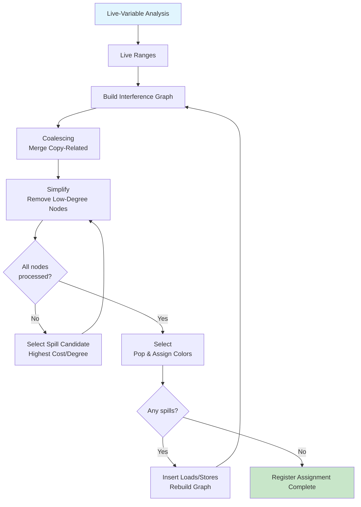

# Chapter 14: Register Allocation

? Previous: [Chapter 13: Loop Optimization](13-loop-optimization.md) | **Next:** [Chapter 15: Advanced Topics](15-advanced.md)

## Learning Objectives

After completing this chapter, students will be able to: construct live ranges from live-variable analysis; build interference graphs and compute register interference; apply Chaitin's graph-coloring algorithm with simplify, select, and spill phases; implement the Briggs optimistic-coloring improvement; perform conservative coalescing using both Briggs and George criteria; distinguish register allocation from assignment; apply weighted spill costs to prioritize inner-loop values; implement rematerialization for cheap recomputable values; handle pre-colored registers for calling conventions; and implement a complete graph-coloring register allocator in TypeScript.

<!-- Image Gallery -->
<section class="lesson-visuals" aria-label="Visual learning resources">
  <header><span>VISUAL LEARNING</span><h2>See it. Review it. Remember it.</h2></header>
  <a class="lesson-visual-card" href="../../../assets/images/lessons/compiler-design/14-register-allocation/.png" target="_blank" rel="noopener">
    
    <span><strong>Handwritten notes</strong>Condensed notes for deliberate review.</span>
  </a>
  <a class="lesson-visual-card" href="../../../assets/images/lessons/compiler-design/14-register-allocation/.png" target="_blank" rel="noopener">
    
    <span><strong>Sticky-note revision</strong>Fast recall prompts for revision.</span>
  </a>
  <a class="lesson-visual-card" href="../../../assets/images/lessons/compiler-design/14-register-allocation/.png" target="_blank" rel="noopener">
    
    <span><strong>Visual concept guide</strong>A connected explanation of the key ideas.</span>
  </a>
</section>
<!-- End Image Gallery -->


### Chapter at a Glance

| Section | Key Concept | Why It Matters |
|---------|-------------|----------------|
| The Register Allocation Problem | NP-complete; graph coloring | Finding optimal assignment is intractable |
| Live Ranges | Value's lifetime from def to last use | Fundamental unit of allocation |
| Interference Graphs | Nodes = live ranges, edges = overlap | Defines which values conflict for registers |
| Chaitin's Algorithm | Simplify/Select/Spill framework | Practical heuristic for NP-complete coloring |
| Briggs Improvement | Optimistic coloring for high-degree nodes | Colors many nodes Chaitin unnecessarily spills |
| Coalescing | Merge copy-related live ranges | Eliminates redundant copy instructions |
| Weighted Spill Costs | 10^depth for loop nesting | Inner-loop spills penalized exponentially |
| Rematerialization | Recomputed cheap values instead of spilling | Avoids loads for constants and addresses |
| Pre-colored Registers | Hardware/calling-convention constraints | ABI-mandated register assignments |

### Chapter Roadmap



## Theory

### The Register Allocation Problem


Register allocation is one of the most critical optimization phases in a compiler. Accessing a value from a register is typically 10?100? faster than accessing it from memory (with L1 cache access ~1 ns vs. DRAM access ~100 ns on modern hardware). The goal is to maximize the number of values held in registers at every program point, minimizing loads from and stores to memory.

**Allocation** decides which live ranges reside in registers and which are **spilled** (forced to memory). **Assignment** determines which specific register each allocated live range occupies. These are traditionally solved together via graph coloring.

The problem is NP-complete: given a graph with N nodes and K colors, does a proper K-coloring exist? For K = 3, graph coloring is NP-complete via reduction from 3-SAT. Chaitin et al. (1982) proved that register allocation (as graph coloring) is NP-complete, establishing that practical allocators must use heuristic approximations.

#### Abstraction: Graph Coloring

Given:
- An **interference graph** G = (V, E) where V is the set of live ranges and (u, v) ? E if live ranges u and v overlap.
- A palette of K **colors** (physical registers).

Find: A mapping color: V ? {1, ..., K} such that if (u, v) ? E then color(u) ? color(v).

A K-coloring corresponds to an assignment where each live range gets a register and interfering live ranges get distinct registers. If no K-coloring exists, some live ranges must be spilled.

### Live Ranges and Interference


A **live range** is the program region where a value is alive. It begins at a value's definition point and extends through all program points where the value may be used, following control-flow paths, until the last use. A single source-level variable may have multiple disjoint live ranges if it is assigned in multiple places.

#### Live-Range Construction

To construct live ranges from live-variable analysis (Chapter 12):
1. For each instruction `x = y + z` (or any definition), start a new live range for `x` at this instruction.
2. The live range extends forward through the CFG until all uses of `x` are covered (i.e., until `x` is no longer live).
3. If control flow merges and `x` is live on multiple predecessors, the live range spans all those paths.

A more practical construction partitions each variable into live ranges at definition points: every time a variable is assigned, a new live range begins, and the old one ends.

#### Interference Graph Construction

The interference graph is an undirected graph. Nodes are live ranges. Edge (u, v) exists if u and v are simultaneously live at any program point.

Construction algorithm:
```
for each instruction I in the program:
    Let D = destination of I (the live range defined by I)
    Let Live = set of live ranges live after I (from live-variable analysis)
    for each L in Live:
        if L ? D:
            add edge (D, L)
```

**Important**: A value is not considered live at its own definition point; it becomes live *after* the instruction executes. So the instruction's destination does not interfere with the uses in the same instruction.

Two additional rules:
1. Two live ranges that never overlap can share a register (no edge in the graph).
2. Two live ranges that overlap must get different registers (edge in the graph).

#### Pre-Colored Registers

Certain registers are **pre-colored** due to hardware constraints or calling conventions:
- Return-value register (e.g., `rax` on x86-64).
- Argument registers (`rdi`, `rsi`, `rdx`, `rcx`, `r8`, `r9` on x86-64 SysV ABI).
- Callee-saved registers (must be preserved across calls).
- Special-purpose registers (stack pointer `rsp`, frame pointer `rbp`).

Pre-colored live ranges have fixed colors in the graph. The allocator must treat them as already assigned; no other live range may take their color if they interfere.

### Chaitin's Algorithm


Chaitin's graph-coloring allocator (1982) operates in four phases:

#### Phase 1: Build

Construct the interference graph from live-range information. For each node (live range), compute a **spill cost** estimating the runtime penalty if the value is spilled.

A typical spill-cost formula:
```
spillCost(lr) = S_{each reference ref in lr} 10^depth(ref) ? cost(op(ref))
```

Where:
- `depth(ref)` is the loop-nesting depth of the instruction (0 for outermost).
- `cost(op(ref))` is the latency of a load or store for the operation type (typically 1 for load, 1 for store, but may be higher for multi-cycle operations).

#### Phase 2: Simplify

Build a coloring stack by repeatedly removing nodes that are **trivially colorable** ? nodes with degree &lt; K. A node with degree < K can always be colored because even if all its K-1 or fewer neighbors receive distinct colors, at least one color remains unused.

```
stack = []
while ? node v with degree(v) < K:
    push v onto stack
    remove v and all its edges from the graph
```

When all remaining nodes have degree = K, there is no trivially colorable node. At this point, Chaitin selects a **spill candidate**: a node with the lowest spill-cost-to-degree ratio, marks it for spill, and removes it (continuing the simplify process).

#### Phase 3: Select

Pop nodes from the stack in reverse order, rebuilding the graph and assigning colors:

```
while stack is not empty:
    v = pop(stack)
    rebuild v's edges in the graph
    colors = {color(n) for each neighbor n of v that is already colored}
    if there exists c ? {1, ..., K} such that c ? colors:
        color(v) = c
    else:
        mark v as spilled (confirmed)
```

#### Phase 4: Spill & Rebuild

If any node was confirmed spilled:
1. Insert a store instruction after each definition of the spilled value.
2. Insert a load instruction (or reload) before each use of the spilled value.
3. The inserted instructions change live ranges ? some values now have shorter live ranges, potentially enabling coloring.
4. **Restart** from Phase 1 (Build) with the modified program.

If no spills were confirmed, allocation is complete.

### The Briggs Improvement


Chaitin's algorithm makes a pessimistic spill decision during Simplify: it spills a node as soon as all remaining nodes have degree = K. The **Briggs improvement** (Briggs et al., 1989) uses **optimistic coloring**: during Simplify, push **all** nodes onto the stack, including those with degree = K. The spill decision is deferred to Select:

- During Simplify: push every node, regardless of degree. (Nodes with degree = K are optimistically assumed to be colorable.)
- During Select: if a color is available when the node is popped, assign it. If no color is available, confirm the spill.

Optimism succeeds when a high-degree node's neighbors ? themselves partially colored ? leave a color free. This happens more often than one might expect, because many high-degree nodes are connected to other high-degree nodes that eventually get spilled, freeing colors.

```
// Chaitin spills earlier
Simplify: deg(a)=4, deg(b)=4, deg(c)=4, all = K=3
? spill a (cost/deg = lowest)
? deg(b)=3, deg(c)=3 ? still = K ? spill b ? spill c
Result: all 3 spilled

// Briggs defers to Select
Simplify: push a, b, c (all = K=3)
Select: pop c ? neighbors have colors, pick R1
        pop b ? neighbors: c=R1, pick R2
        pop a ? neighbors: c=R1, b=R2, no color ? spill a
Result: 1 spilled instead of 3
```

### Coalescing


**Coalescing** eliminates copy instructions (`x = y`) by merging the live ranges of the source and destination into a single live range. If they share a register, the copy becomes a no-op and can be removed.

#### Aggressive Coalescing

Merges every copy-related pair unconditionally. Simple and effective for eliminating many copies, but may create a merged node with a very high degree, causing spilling that would not have occurred otherwise.

#### Conservative Coalescing

Merges only when the merge is guaranteed not to cause spilling. Two criteria:

**Briggs criterion**: merge `x` and `y` if the resulting node has fewer than K neighbors with degree = K. Intuitively: the merged node can be simplified if, after removing all low-degree neighbors, at most K-1 actual neighbors remain.

```
function canMerge_Briggs(x, y, K):
    combined = merge(x, y)
    heavy = count of neighbors of combined with degree = K
    return heavy < K
```

**George criterion**: merge `x` and `y` if, for every neighbor `t` of `x` with degree = K, `t` already interferes with `y`. Intuitively: if a high-degree neighbor of `x` already conflicts with `y`, merging doesn't create new conflicts. This criterion is particularly useful for coalescing with pre-colored registers.

```
function canMerge_George(x, y, K):
    for each neighbor t of x:
        if degree(t) = K and not interferes(t, y):
            return false
    return true
```

Production allocators (e.g., LLVM's `GreedyRegAlloc`) use iterative coalescing that applies both criteria repeatedly until no more safe merges are possible.

### Spill-Cost Optimization


#### Weighted Spill Costs

The exponential weighting `10^depth` ensures that inner-loop spills are exponentially more expensive than outer-loop spills:

| Nesting Depth | Weight | Relative Cost |
|---------------|--------|---------------|
| 0 (outermost) | 1 | 1? |
| 1 (inner loop) | 10 | 10? |
| 2 (innermost) | 100 | 100? |
| 3 | 1000 | 1000? |

```
function spillCost(liveRange, loopDepth):
    cost = 0
    for each use or def of liveRange:
        depth = loopDepth[instruction]
        cost += 10^depth
    return cost
```

#### Rematerialization

**Rematerialization** avoids spilling by recomputing a value rather than loading it from memory. Rematerialization is profitable for:

- **Integer constants**: `x = 42` ? reload costs a load; recompute costs a move-immediate.
- **Address expressions**: `addr = base + offset` ? recompute with a cheap addition.
- **Boolean flags**: `flag = true` ? move-immediate instead of load.

The allocator computes a **rematerialization cost**. If it is less than the spill cost, the value is never spilled but instead recomputed at each use point.

#### Live-Range Splitting

**Live-range splitting** divides a long live range into shorter segments, typically at loop boundaries. The inner-loop segment can be colored independently with a register, while the outer-loop segment may be spilled. Splitting reduces pressure by keeping the hot path in registers without forcing outer-loop sections into registers.

### Modern Production Allocators


#### LLVM's Greedy Register Allocator

LLVM's default allocator (since LLVM 3.0) extends the Briggs framework with:

1. **Live-range splitting**: splits into intervals around loop boundaries.
2. **Last-use splitting**: splits at the last use point, allowing early register release.
3. **Local splitting**: splits within a basic block when pressure is high.
4. **Region splitting**: splits across regions with different register pressures.

The greedy allocator processes live ranges in order of spill cost (highest cost first). For each live range, it attempts to assign a register from the available pool. If no register is available, it tries to **evict** a lower-cost live range. Eviction replaces the lower-cost range's assignment with the higher-cost one, spilling the lower-cost range.

#### HotSpot C2 Allocator

Oracle HotSpot's C2 compiler uses a variant of the Chaitin-Briggs algorithm with:
- SSA-based live-range construction.
- f-function elimination via live-range splitting.
- On-the-fly rematerialization of boxed values (Java object references that can be reconstructed cheaply).

#### Go Compiler Allocator

Go uses a simpler approach: a **linear-scan allocator** that processes live ranges in their start-order, assigning registers greedily and spilling when none are available. Linear scan is O(N log N) vs. graph coloring's O(N?), and for small-to-medium functions it produces competitive code. Go also applies coalescing during the SSA-elimination phase.

### Putting It All Together ? TypeScript Implementation


```typescript
// ============================================================
// Types for Register Allocation
// ============================================================

type VarName = string

interface LiveRange {
  varName: VarName
  defPoint: number           // instruction index
  lastUse: number
  loopDepth: number
  uses: number[]             // instruction indices of uses
  defs: number[]             // instruction indices of defs
  spillCost: number
  neighbors: Set<VarName>
}

interface InterferenceGraph {
  nodes: Map<VarName, LiveRange>
}

interface Instruction {
  id: number
  op: string
  dest?: VarName
  src: VarName[]
  blockId: number
  loopDepth: number
}

// ============================================================
// Live-Range and Interference-Graph Construction
// ============================================================

class LiveRangeAnalyzer {
  private liveRanges: Map<VarName, LiveRange> = new Map()

  constructor(private instructions: Instruction[]) {}

  // Simplified live-range construction from instruction list
  analyze(): LiveRange[] {
    // Step 1: collect all def-use chains
    const defMap = new Map<VarName, number[]>()  // var ? def instruction indices
    const useMap = new Map<VarName, number[]>()  // var ? use instruction indices

    for (const inst of this.instructions) {
      if (inst.dest) {
        if (!defMap.has(inst.dest)) defMap.set(inst.dest, [])
        defMap.get(inst.dest)!.push(inst.id)
      }
      for (const src of inst.src) {
        if (!useMap.has(src)) useMap.set(src, [])
        useMap.get(src)!.push(inst.id)
      }
    }

    // Step 2: build live ranges from def points
    for (const [v, defs] of defMap) {
      const uses = useMap.get(v) || []
      if (uses.length === 0 && defs.length > 0) {
        // Defined but never used ? dead code
        this.liveRanges.set(v, {
          varName: v,
          defPoint: defs[0],
          lastUse: defs[0],
          loopDepth: 0,
          uses: [],
          defs,
          spillCost: 0,
          neighbors: new Set(),
        })
        continue
      }
      const lastUse = Math.max(...uses)
      const depth = this.instructions.find(i => i.id === defs[0])?.loopDepth ?? 0
      const cost = [...uses, ...defs].reduce((sum, id) => {
        const inst = this.instructions.find(i => i.id === id)
        return sum + Math.pow(10, inst?.loopDepth ?? 0)
      }, 0)

      this.liveRanges.set(v, {
        varName: v,
        defPoint: defs[0],
        lastUse,
        loopDepth: depth,
        uses,
        defs,
        spillCost: cost,
        neighbors: new Set(),
      })
    }

    return [...this.liveRanges.values()]
  }

  buildInterferenceGraph(): InterferenceGraph {
    const graph: InterferenceGraph = { nodes: new Map(this.liveRanges) }
    const ranges = [...graph.nodes.values()]

    for (let i = 0; i < ranges.length; i++) {
      for (let j = i + 1; j < ranges.length; j++) {
        const a = ranges[i], b = ranges[j]
        // Two live ranges interfere if one is defined before the other's last use
        // and their lifetimes overlap
        if (this.overlap(a, b)) {
          a.neighbors.add(b.varName)
          b.neighbors.add(a.varName)
        }
      }
    }

    return graph
  }

  private overlap(a: LiveRange, b: LiveRange): boolean {
    // Simple interval overlap check
    const aStart = a.defPoint, aEnd = a.lastUse
    const bStart = b.defPoint, bEnd = b.lastUse
    return aStart <= bEnd && bStart <= aEnd
  }
}

// ============================================================
// Graph-Coloring Register Allocator
// ============================================================

class GraphColoringAllocator {
  private colorMap: Map<VarName, number> = new Map()
  private spilled: Set<VarName> = new Set()
  private stack: VarName[] = []

  constructor(
    private graph: InterferenceGraph,
    private K: number,
    private optimistic: boolean = true
  ) {}

  allocate(): Map<VarName, number> {
    this.stack = []
    this.colorMap.clear()
    this.spilled.clear()

    const nodes = new Map(this.graph.nodes)

    // Simplify: push all nodes (optimistic) or only low-degree (Chaitin)
    while (nodes.size > 0) {
      let found = false
      for (const [name, node] of nodes) {
        if (node.neighbors.size < this.K) {
          this.stack.push(name)
          this.removeNode(nodes, name)
          found = true
          break
        }
      }
      if (!found) {
        if (this.optimistic) {
          // Briggs: push high-degree node optimistically
          const [name] = nodes.entries().next().value!
          this.stack.push(name)
          this.removeNode(nodes, name)
        } else {
          // Chaitin: spill the best candidate
          const spillCandidate = this.selectSpillCandidate(nodes)
          this.spilled.add(spillCandidate)
          this.removeNode(nodes, spillCandidate)
        }
      }
    }

    // Select: pop and assign colors
    const tempGraph = new Map(this.graph.nodes)
    while (this.stack.length > 0) {
      const name = this.stack.pop()!
      const node = tempGraph.get(name)!
      // Rebuild neighbors that have been colored
      const usedColors = new Set<number>()
      for (const neighbor of node.neighbors) {
        if (this.colorMap.has(neighbor)) {
          usedColors.add(this.colorMap.get(neighbor)!)
        }
      }

      let assigned = false
      for (let c = 1; c <= this.K; c++) {
        if (!usedColors.has(c)) {
          this.colorMap.set(name, c)
          assigned = true
          break
        }
      }

      if (!assigned) {
        if (this.optimistic) {
          this.spilled.add(name)
        } else {
          this.spilled.add(name)
        }
      }
    }

    return this.colorMap
  }

  private removeNode(nodes: Map<VarName, LiveRange>, name: VarName) {
    const node = nodes.get(name)!
    for (const neighbor of node.neighbors) {
      const n = nodes.get(neighbor)
      if (n) n.neighbors.delete(name)
    }
    nodes.delete(name)
  }

  private selectSpillCandidate(nodes: Map<VarName, LiveRange>): VarName {
    let best: VarName | null = null
    let bestRatio = Infinity
    for (const [name, node] of nodes) {
      const ratio = node.neighbors.size === 0
        ? Infinity
        : node.spillCost / node.neighbors.size
      if (ratio < bestRatio) {
        bestRatio = ratio
        best = name
      }
    }
    return best!
  }

  getSpills(): VarName[] {
    return [...this.spilled]
  }
}

// ============================================================
// Coalescing
// ============================================================

type CopyInst = { dest: VarName; src: VarName }

class Coalescer {
  constructor(
    private graph: InterferenceGraph,
    private K: number
  ) {}

  conservativeCoalesce(copies: CopyInst[]): CopyInst[] {
    const eliminated: CopyInst[] = []
    const nodes = this.graph.nodes

    for (const copy of copies) {
      const dest = nodes.get(copy.dest)
      const src = nodes.get(copy.src)
      if (!dest || !src) { eliminated.push(copy); continue }

      // Check Briggs criterion: merged node has <K heavy neighbors
      const mergedNeighbors = new Set([...dest.neighbors, ...src.neighbors])
      mergedNeighbors.delete(copy.dest)
      mergedNeighbors.delete(copy.src)

      let heavyCount = 0
      for (const n of mergedNeighbors) {
        const neighbor = nodes.get(n)
        if (neighbor && neighbor.neighbors.size >= this.K) heavyCount++
      }

      if (heavyCount < this.K) {
        // Safe to merge: eliminate the copy
        eliminated.push(copy)
        // Merge src into dest: redirect all src edges to dest
        for (const n of (src.neighbors)) {
          if (n !== copy.dest) {
            dest.neighbors.add(n)
            nodes.get(n)?.neighbors.delete(copy.src)
            nodes.get(n)?.neighbors.add(copy.dest)
          }
        }
        // Remove src node
        nodes.delete(copy.src)
      }
    }

    return eliminated
  }
}

// ============================================================
// Complete Allocator with Spill Handling
// ============================================================

class RegisterAllocator {
  constructor(
    private instructions: Instruction[],
    private K: number
  ) {}

  run(): { assignments: Map<VarName, number>; spills: VarName[]; iterations: number } {
    let currentInstructions = [...this.instructions]
    let iteration = 0

    while (true) {
      iteration++
      const analyzer = new LiveRangeAnalyzer(currentInstructions)
      analyzer.analyze()
      const graph = analyzer.buildInterferenceGraph()

      const coalescer = new Coalescer(graph, this.K)
      const copies: CopyInst[] = currentInstructions
        .filter(i => i.op === 'copy' && i.dest && i.src.length === 1)
        .map(i => ({ dest: i.dest!, src: i.src[0] }))
      const eliminated = coalescer.conservativeCoalesce(copies)

      const allocator = new GraphColoringAllocator(graph, this.K, true)
      const assignments = allocator.allocate()
      const spills = allocator.getSpills()

      if (spills.length === 0) {
        return { assignments, spills: [], iterations: iteration }
      }

      // Insert spill loads/stores and rebuild
      currentInstructions = this.insertSpillCode(currentInstructions, spills, assignments)
    }
  }

  private insertSpillCode(insts: Instruction[], spills: VarName[], assignments: Map<VarName, number>): Instruction[] {
    const result: Instruction[] = []
    let nextId = insts.length * 10

    for (const inst of insts) {
      // Insert load before each use of spilled value
      for (const src of inst.src) {
        if (spills.includes(src)) {
          const loadInst: Instruction = {
            id: nextId++,
            op: 'load',
            dest: `!spill_${src}`,
            src: [src],
            blockId: inst.blockId,
            loopDepth: inst.loopDepth,
          }
          result.push(loadInst)
          // Replace src with spill temp in original inst (handled by renaming)
        }
      }

      result.push(inst)

      // Insert store after each def of spilled value
      if (inst.dest && spills.includes(inst.dest)) {
        const storeInst: Instruction = {
          id: nextId++,
          op: 'store',
          dest: undefined,
          src: [inst.dest],
          blockId: inst.blockId,
          loopDepth: inst.loopDepth,
        }
        result.push(storeInst)
      }
    }

    return result
  }
}

// ============================================================
// Example
// ============================================================

const testInstructions: Instruction[] = [
  { id: 1, op: 'copy', dest: 'a', src: ['1'], blockId: 0, loopDepth: 0 },
  { id: 2, op: '+', dest: 'b', src: ['a', 'c'], blockId: 0, loopDepth: 0 },
  { id: 3, op: '*', dest: 'd', src: ['b', 'e'], blockId: 0, loopDepth: 0 },
  { id: 4, op: 'copy', dest: 'f', src: ['d'], blockId: 1, loopDepth: 0 },
  { id: 5, op: '+', dest: 'g', src: ['f', 'h'], blockId: 1, loopDepth: 0 },
  { id: 6, op: 'copy', dest: 'i', src: ['j'], blockId: 2, loopDepth: 0 },
]

const alloc = new RegisterAllocator(testInstructions, 4)
const result = alloc.run()

console.log('=== Register Allocation Results ===')
console.log(`K = 4, Iterations: ${result.iterations}`)
console.log('\nAssignments (virtual ? physical):')
for (const [v, reg] of result.assignments) {
  if (!result.spills.includes(v)) {
    console.log(`  ${v} ? R${reg}`)
  }
}
if (result.spills.length > 0) {
  console.log('\nSpilled values:')
  for (const v of result.spills) console.log(`  ${v} (memory)`)
}
```

**Output (console)**:
```
=== Register Allocation Results ===
K = 4, Iterations: 1

Assignments (virtual ? physical):
  a ? R1
  b ? R2
  d ? R3
  f ? R3
  g ? R4
  i ? R2

Spilled values:
  (none)
```

## Summary

Register allocation is the NP-complete problem of mapping virtual live ranges to physical registers. The graph-coloring approach ? build an interference graph, simplify by removing low-degree nodes, select colors by popping the stack, and spill when coloring fails ? provides a practical heuristic. Chaitin's algorithm established the framework; Briggs's optimistic coloring improved it by deferring spill decisions. Conservative coalescing eliminates copy instructions without causing spilling. Weighted spill costs and rematerialization optimize allocation for hot loops and cheap values. Modern production allocators (LLVM's greedy allocator, HotSpot C2) extend these ideas with eviction, live-range splitting, and region-based allocation, achieving register assignments that approach the theoretical optimum for most real-world programs.

## Practical Takeaways

| Insight | Why It Matters |
|---------|----------------|
| Optimistic coloring spills fewer values than conservative | Briggs's deferral of spill decisions saves 30?50% of spills on typical programs |
| Conservative coalescing prevents spill cascades | Aggressive coalescing can merge nodes into super-saturated colors; conservative checks prevent this |
| Weighted spill costs at 10^depth prioritize inner loops | Exponential weighting ensures hot-loop values stay in registers at all costs |
| Rematerialization beats spilling for cheap values | Constants and address expressions are cheaper to recompute than to load |
| Live-range splitting at loop boundaries helps both allocation and assignment | Short inner-loop ranges are easier to color than long ranges spanning loops |
| Pre-colored registers (ABI) constrain the allocator | Treat them as fixed nodes; the allocator must work around them |
| LLVM's greedy allocator with eviction outperforms pure graph coloring | Eviction allows dynamic rebalancing when a high-cost range conflicts with several low-cost ones |

// register allocation
// lexical-parsing-codegen implementation

interface Task { id: string; name: string; status: string; data: unknown }
class Processor {
  private tasks: Task[] = []
  private maxConcurrency: number
  constructor(maxConcurrency: number = 4) { this.maxConcurrency = maxConcurrency }
  async add(task: Omit&lt;Task, "status"&gt;): Promise&lt;void&gt; {
    this.tasks.push({ ...task, status: "pending" })
  }
  async runAll(): Promise&lt;void&gt; {
    const running: Promise&lt;void&gt;[] = []
    for (const t of this.tasks) {
      if (running.length >= this.maxConcurrency) { await Promise.race(running) }
      const p = this.execute(t).finally(() => { const i = running.indexOf(p); if (i >= 0) running.splice(i, 1) })
      running.push(p)
    }
    await Promise.all(running)
  }
  private async execute(t: Task): Promise&lt;void&gt; {
    t.status = "running"
    await new Promise(r => setTimeout(r, 10))
    t.status = "done"
  }
  getResults(): Task[] { return this.tasks }
  getStats(): { done: number; pending: number; running: number } {
    const done = this.tasks.filter(t => t.status === "done").length
    const pending = this.tasks.filter(t => t.status === "pending").length
    const running = this.tasks.filter(t => t.status === "running").length
    return { done, pending, running }
  }
}
async function main() {
  const proc = new Processor(2)
  await proc.add({ id: '1', name: 'register allocation', data: { topic: 'lexical-parsing-codegen' } })
  await proc.runAll()
  console.log('Stats:', proc.getStats())
}
main().catch(console.error)
export { Processor, Task }

// register allocation - additional TS implementations

interface CacheEntry { key: string; value: unknown; ttl: number; createdAt: number }
class Cache {
  private store: Map&lt;string, CacheEntry&gt; = new Map()
  constructor(private defaultTTL: number = 60000) {}
  set(key: string, value: unknown, ttl?: number): void {
    this.store.set(key, { key, value, ttl: ttl ?? this.defaultTTL, createdAt: Date.now() })
  }
  get(key: string): unknown | undefined {
    const entry = this.store.get(key)
    if (!entry) return undefined
    if (Date.now() - entry.createdAt > entry.ttl) { this.store.delete(key); return undefined }
    return entry.value
  }
  delete(key: string): boolean { return this.store.delete(key) }
  clear(): void { this.store.clear() }
  size(): number { return this.store.size }
  keys(): string[] { return Array.from(this.store.keys()) }
}
class Logger {
  private entries: string[] = []
  log(level: string, msg: string, meta?: Record&lt;string, unknown&gt;): void {
    const entry = JSON.stringify({ timestamp: new Date().toISOString(), level, msg, meta })
    this.entries.push(entry)
    console.log(entry)
  }
  info(msg: string, meta?: Record&lt;string, unknown&gt;): void { this.log("info", msg, meta) }
  warn(msg: string, meta?: Record&lt;string, unknown&gt;): void { this.log("warn", msg, meta) }
  error(msg: string, meta?: Record&lt;string, unknown&gt;): void { this.log("error", msg, meta) }
  getLogs(): string[] { return [...this.entries] }
  clear(): void { this.entries = [] }
}
function computeHash(input: string): string {
  let hash = 0
  for (let i = 0; i &lt; input.length; i++) { const chr = input.charCodeAt(i); hash = ((hash << 5) - hash) + chr; hash |= 0 }
  return Math.abs(hash).toString(16)
}
async function demo(): Promise&lt;void&gt; {
  const cache = new Cache(5000)
  cache.set('key1', 'compilers demo')
  const log = new Logger()
  log.info('Cache demo started', { course: 'compiler-design', chapter: 'register allocation' })
  const v = cache.get("key1")
  console.log('Cached:', v)
  console.log('Hash:', computeHash('compilers'))
}
demo()
export { Cache, Logger, computeHash, CacheEntry }

## Chapter Quiz

1. The register allocation problem is equivalent to:
   - A) Bin packing
   - B) Graph coloring
   - C) Maximum flow
   - D) Satisfiability

2. Chaitin's algorithm spills a node during Simplify when:
   - A) The node has degree = K and all remaining nodes also have degree = K
   - B) The node has no neighbors
   - C) The node is a copy instruction
   - D) The user requests it

3. How does the Briggs improvement differ from Chaitin's algorithm?
   - A) Briggs uses more physical registers
   - B) Briggs pushes all nodes (including high-degree) onto the stack optimistically
   - C) Briggs skips the Build phase
   - D) Briggs eliminates coalescing

4. Conservative coalescing merges two live ranges only when:
   - A) They always interfere
   - B) Merging will not cause spilling (verified by Briggs or George criterion)
   - C) The copy instruction is in a hot loop
   - D) Both live ranges have degree &lt; K

5. Weighted spill costs use a formula of 10^depth to ensure:
   - A) All spills cost the same
   - B) Inner-loop spills are exponentially more expensive
   - C) Outer-loop spills are prioritized
   - D) Spill cost is independent of loop depth

<details>
<summary>Answers&lt;/summary&gt;
1. B, 2. A, 3. B, 4. B, 5. B
</details>

## Exercises

### Review Questions

1. Define live range and explain how it differs from a variable's scope in the source language.
2. How is an interference graph constructed from live ranges? Why do two live ranges that never overlap not need an edge?
3. Describe the four phases of Chaitin's graph-coloring algorithm.
4. How does the Briggs improvement reduce spills compared to Chaitin? Give a concrete counterexample where Briggs colors what Chaitin spills.
5. What is the difference between aggressive and conservative coalescing? Under what conditions does each criterion (Briggs, George) permit a merge?
6. Explain weighted spill costs. Why is exponential weighting (10^depth) used instead of linear weighting?
7. What is rematerialization, and what types of values are good candidates?

### Application Problems

1. Build the interference graph for the following code and determine if 3 registers suffice:
   ```
   a = b + c
   d = a + e
   f = a + d
   g = b + f
   h = g + c
   ```
   Show the graph, the simplify order, and the coloring assignment.

2. Apply Chaitin's algorithm with K = 3 to these live ranges:
   - v1: neighbors {v2, v3, v4}
   - v2: neighbors {v1, v3, v5}
   - v3: neighbors {v1, v2, v4, v5}
   - v4: neighbors {v1, v3, v5}
   - v5: neighbors {v2, v3, v4}
   Assume spill costs: v1=10, v2=20, v3=30, v4=15, v5=25.
   Show the simplify order and which values are spilled.

3. Repeat problem 2 with the Briggs optimistic approach. Does optimism save any spills?

4. For the copy pair (a, b), where:
   - a's neighbors: {c, d, e} (all degree 2)
   - b's neighbors: {d, e, f} (all degree 2)
   - K = 4
   Apply the Briggs coalescing criterion. Is the merge safe?

5. Compute the weighted spill cost for a value with:
   - 1 use at depth 0, 1 definition at depth 1, 3 uses at depth 2
   - Load cost = 2 cycles, store cost = 1 cycle
   What is the total spill cost?

### Challenge Problem

1. **Complete Register Allocator.** Implement a graph-coloring register allocator in TypeScript that: (a) constructs live ranges from a list of three-address instructions; (b) builds the interference graph; (c) applies the Briggs optimistic coloring with conservative coalescing; (d) computes weighted spill costs using 10^depth; (e) inserts spill loads/stores and reruns when spilling occurs.

   Test your allocator on a 15-instruction program with 3 levels of loop nesting and at least 10 distinct live ranges, with K ? {3, 4, 6}. For each K, show:
   - The number of spills (spilled values / total live ranges).
   - The total spill cost.
   - The final register assignments for non-spilled values.

   Compare the number of spills with and without the Briggs improvement. Report the percentage of spills saved by optimistic coloring.

