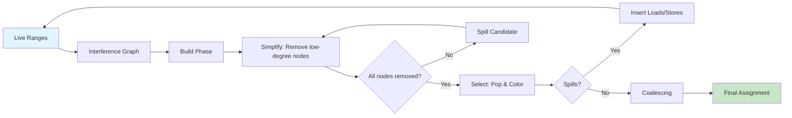

# Chapter 14: Register Allocation

> **Prereq:** Chapter 13 (Loop Optimization) — loops determine where register pressure is highest.
> **Next:** Chapter 15 (Advanced Topics) — advanced compilation integrates all previous topics.

## Learning Objectives

After completing this chapter, students will be able to: construct interference graphs and compute live ranges; apply Chaitin's graph-coloring algorithm for register allocation; implement the Briggs improvement for optimistic coloring; perform conservative coalescing to eliminate redundant copy instructions; distinguish allocation from assignment; and handle register allocation for loops with weighted spill costs and rematerialization.

### Chapter at a Glance

| Section | Key Concept | Why It Matters |
|---------|-------------|----------------|
| Interference Graph | Nodes = live ranges, edges = overlap | Defines which values conflict for registers |
| Chaitin's Algorithm | Simplify/Select/Spill framework | NP-complete problem with practical heuristic |
| Briggs Improvement | Optimistic coloring | Colors nodes Chaitin would spill |
| Coalescing | Merge copy-related live ranges | Eliminates redundant copy instructions |
| Loop Allocation | Weighted costs, rematerialization | Inner loops need preferential treatment |



## Theory


### The Register Allocation Problem

Register allocation determines which values in a program reside in registers during each portion of execution. Because registers are both scarce and significantly faster than memory, effective register allocation is one of the most critical optimizations in modern compilers. Poor allocation can increase memory traffic by an order of magnitude, negating gains from other optimizations. The problem is combinatorial: for K registers and N live ranges, there are K^N possible assignments, and finding the optimal one is NP-complete.

> **One-Sentence Takeaway:** Register allocation is graph coloring — assign K colors to live-range nodes so that interfering (adjacent) nodes always get different colors — and the compiler must spill any node it cannot color.

The problem is framed as **graph coloring**: assign K distinct colors (physical registers) to the nodes of an interference graph such that adjacent nodes do not share a color. If K colors suffice, all values can be assigned to registers. If not, some must be **spilled** to memory, incurring load and store penalties on each use.

### Live Ranges and Interference Graphs

A **live range** for a value begins at its definition point and ends at its last use. A single variable may have multiple live ranges if it is assigned in multiple locations. Live ranges are the fundamental unit of allocation.

To construct live ranges, perform live-variable analysis (Chapter 12). For each definition of variable v at instruction i, create a new live range starting at i. The range extends through all program points where v is live, following control-flow paths. Adjacent live ranges of the same variable connected by a copy instruction may be coalesced (merged).

An **interference graph** is an undirected graph where nodes are live ranges. An edge connects two nodes if their live ranges overlap at any point. Two live ranges interfere if one is live at the point where the other is defined — they cannot occupy the same register simultaneously. To build the graph, scan each instruction `x = y + z`. For each variable v live after the instruction (excluding x), add an interference edge between x and v.

### Chaitin's Algorithm

Chaitin's graph-coloring allocator operates in four phases:

**Phase 1 — Build**: construct the interference graph from live-range information. Compute spill costs for each node based on estimated runtime penalty of memory traffic, weighted by loop-nesting depth.

**Phase 2 — Simplify**: repeatedly remove a node with degree less than K from the graph, pushing it onto a coloring stack. A node with degree less than K can always be colored because even if all its neighbors receive distinct colors, at least one color remains. When all remaining nodes have degree ≥ K, select a spill candidate (highest spill cost / degree ratio), mark it, and remove it.

**Phase 3 — Select**: pop nodes from the stack, assigning each a color not used by any already-colored neighbor. For nodes marked for spill, attempt to color; if no color is available, the spill is confirmed.

**Phase 4 — Spill**: if any spills are confirmed, insert store instructions after each definition and load instructions before each use of the spilled value. Then restart the allocator. Spilling changes the program's live ranges, so the interference graph must be rebuilt.

### The Briggs Improvement

Chaitin's algorithm spills conservatively: it spills a node as soon as all remaining nodes have degree ≥ K. The **Briggs improvement** uses **optimistic coloring**: push nodes with degree ≥ K onto the stack anyway during Simplify. During Select, if a color is available, assign it; otherwise, confirm the spill. Optimism often colors some high-degree nodes that Chaitin would have spilled, because later coloring of their neighbors may leave a slot free.

### Coalescing

**Coalescing** eliminates copy instructions (x = y) by merging the live ranges of source and destination, enabling them to share a register. Aggressive coalescing merges all copy-related pairs but can increase the degree of the merged node, potentially causing spilling.

**Conservative coalescing** merges only when safe. The **Briggs criterion** merges if the resulting node has fewer than K neighbors with degree ≥ K. The **George criterion** merges if all neighbors of the source with degree ≥ K already interfere with the destination. Both criteria prevent spill-causing merges.

### Allocation versus Assignment

**Allocation** decides which live ranges get registers and which are spilled. **Assignment** decides which specific register each allocated live range occupies. Graph coloring handles both: Simplify determines allocation (nodes kept as colors), Select determines assignment.

### Register Allocation for Loops

Loops execute more frequently, so the allocator should bias toward keeping loop values in registers. **Weighted spill costs** multiply each reference's cost by 10^depth, making spills in inner loops much more expensive and thus less likely. **Rematerialization** recomputes cheap values (constants, simple address expressions) instead of loading them, avoiding spills. **Live-range splitting** separates a variable's live range into inner-loop and outer-loop portions, allowing the inner portion to be colored independently and preferentially.

> **Pro Tip:** The Briggs improvement (optimistic coloring) is universally adopted in production compilers over Chaitin's original because it colors many high-degree nodes that Chaitin unnecessarily spills — the cost of a small spill evaluation table is negligible compared to the register savings.

## Examples

### Concept Comparison

| Algorithm | Spill Decision | Color Decision | Outcome |
|-----------|---------------|----------------|---------|
| Chaitin | Spill when degree ≥ K | Pop & assign | Conservative (more spills) |
| Briggs | Push degree ≥ K anyway | Try to color; spill if no color | Optimistic (fewer spills) |
| Chaitin + Coalescing | Merge copies first | Color merged graph | Fewer copies, more spills |
| Briggs + Coalescing | Conservative merge only | Color with optimistism | Best balance |

### Quick Reference

| Phase | Operation | Decision |
|-------|-----------|----------|
| Build | Construct interference graph | Identify all live-range overlaps |
| Simplify | Remove degree < K nodes to stack | Choose coloring order |
| Spill | Select candidate (cost/degree) | Mark node for spill |
| Select | Pop & assign color | If no color, spill |
| Rebuild | Insert loads/stores for spilled | Start over with new live ranges |

### Cross-Application Matrix

| Domain | Application | Relevance |
|--------|-------------|-----------|
| Language Design | Register model for new targets | Register count defines allocation difficulty |
| Systems Programming | OS kernel, embedded systems | Manual register management vs automatic |
| Web Development | JavaScript JIT register allocation | V8 Turbofan uses graph coloring |
| Tooling | Binary translators, emulators | Dynamic register mapping critical |

### Example 14.1: Graph Coloring with K = 3

Four live ranges a, b, c, d. Interference edges: (a,b), (a,c), (b,c), (b,d). Simplify: remove d (degree 1), then a, b, c. Stack: [d, a, b, c] (d at bottom). Select: c→R1, b→R2, a→R3, d→R1. Valid 3-coloring. No spills.

### Example 14.2: Optimistic Coloring

With K = 2 and interference triangle a-b, b-c, c-a (chromatic number 3). Chaitin spills all three. Briggs pushes all three, then during Select: a gets R1, b gets R2, c has neighbors a(R1) and b(R2) — no color, spills. Only one spill instead of three.

## Summary

Register allocation via graph coloring assigns K colors to interference-graph nodes. Chaitin's algorithm provides the foundational framework; Briggs adds optimistic coloring. Conservative coalescing eliminates copies safely. Loop-sensitive weighting and rematerialization improve inner-loop allocation. These techniques yield assignments that minimize memory traffic.

## Exercises

### Review Questions

1. What is an interference graph and how are its nodes and edges defined?
2. Describe the four phases of Chaitin's algorithm.
3. How does the Briggs improvement differ from Chaitin's original?
4. Distinguish conservative from aggressive coalescing.
5. Explain the difference between allocation and assignment.

### Application Problems

1. Build the interference graph for:
   ```
   a = b + c
   d = a + e
   f = d + a
   g = b + f
   ```
   Can 3 registers suffice? Show the coloring.

2. Apply Chaitin with K = 2 to nodes {a, b, c, d, e}, edges (a,b), (a,c), (b,c), (b,d), (c,d), (d,e). Show simplification order and spills.
3. Repeat Problem 2 with Briggs. Does optimism avoid spills?
4. Apply the Briggs coalescing criterion to copy (a, b) with neighbors: a:{c,d,e}, b:{d,e,f}, K=4, all nodes degree ≤ 3. Is the merge safe?
5. Compute weighted spill cost for a value loaded at depth 3, assuming 2 cycles per load. Compare to depth 0.

### Challenge Problem

1. Implement a graph-coloring register allocator. Build the interference graph from live ranges. Implement Briggs optimistic coloring with conservative coalescing. Use 10^depth weighted spill costs. Test with 10+ live ranges and K = 4. Show the coloring, spills, and total spill cost.     Compare with Chaitin's algorithm (non-optimistic) on the same input.

### Chapter Quiz

1. Register allocation is framed as which problem?
   - A) Bin packing
   - B) Graph coloring
   - C) Maximum flow
   - D) Traveling salesman

2. Chaitin's algorithm spills a node during Simplify when:
   - A) The node has no neighbors
   - B) The node has degree ≥ K and all remaining nodes also have degree ≥ K
   - C) The node's spill cost is too high
   - D) The node is a copy instruction

3. How does the Briggs improvement differ from Chaitin?
   - A) Briggs uses more registers
   - B) Briggs pushes high-degree nodes onto the stack optimistically, then tries to color them
   - C) Briggs skips the Build phase
   - D) Briggs uses less memory

<details>
<summary>Answers</summary>
1. B, 2. B, 3. B
</details>
