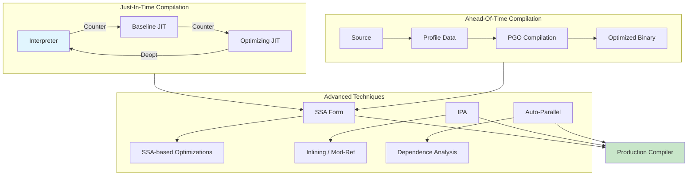

# Chapter 15: Advanced Topics in Compilation

? Previous: [Chapter 14: Register Allocation](14-register-allocation.md) | **Next:** [Index](index.md)

## Learning Objectives

After completing this chapter, students will be able to: explain the architecture of just-in-time compilers including tiered compilation and deoptimization; compare JIT and AOT compilation strategies; perform interprocedural analysis including call-graph construction and mod/ref analysis; implement profile-guided optimization workflows; construct and work with static single assignment (SSA) form; implement SSA construction using dominance frontiers and f-function insertion; describe auto-parallelization techniques including dependence analysis and the polytope model; and understand the trade-offs in modern compiler design for production systems.

<!-- Image Gallery -->
<section class="lesson-visuals" aria-label="Visual learning resources">
  <header><span>VISUAL LEARNING</span><h2>See it. Review it. Remember it.</h2></header>
  <a class="lesson-visual-card" href="../../../assets/images/lessons/compiler-design/15-advanced/.png" target="_blank" rel="noopener">
    
    <span><strong>Handwritten notes</strong>Condensed notes for deliberate review.</span>
  </a>
  <a class="lesson-visual-card" href="../../../assets/images/lessons/compiler-design/15-advanced/.png" target="_blank" rel="noopener">
    
    <span><strong>Sticky-note revision</strong>Fast recall prompts for revision.</span>
  </a>
  <a class="lesson-visual-card" href="../../../assets/images/lessons/compiler-design/15-advanced/.png" target="_blank" rel="noopener">
    
    <span><strong>Visual concept guide</strong>A connected explanation of the key ideas.</span>
  </a>
</section>
<!-- End Image Gallery -->


### Chapter at a Glance

| Section | Key Concept | Why It Matters |
|---------|-------------|----------------|
| JIT Compilation | Runtime adaptive compilation | Balances startup speed and peak performance |
| Tiered Compilation | Multi-level optimization | Interpreter ? baseline ? optimized |
| Deoptimization | Rollback to interpreter on speculation failure | Enables aggressive but correct optimization |
| Interprocedural Analysis | Cross-function analysis | Inlining, constant propagation across calls |
| Profile-Guided Optimization | Runtime profiles guide compiler | 10?30% improvement beyond static opts alone |
| SSA Form | Each variable assigned once | Simplifies all data-flow analyses |
| SSA Construction | f-function placement via dominance frontiers | Enables modern compiler IRs |
| Auto-Parallelization | Automatic parallel code generation | Exploits multi-core without manual threading |
| Polytope Model | Math framework for loop analysis | Proves legality of parallelization |

### Chapter Roadmap



## Theory

### Just-In-Time Compilation


Just-in-time (JIT) compilation translates intermediate code into native machine code at *runtime*, combining the portability of an interpreted IR with execution speeds approaching those of ahead-of-time (AOT) compiled code. JIT compilers are central to modern language runtimes: Java (HotSpot), JavaScript (V8), C# (.NET RyuJIT), Lua (LuaJIT), and Python (PyPy, though tracing).

#### Tiered Compilation

A modern JIT does not compile a method from cold start to fully optimized code. Instead, it uses **tiered compilation**: multiple optimization levels that trade compilation speed for peak performance.

| Tier | Name | Optimization Level | Compile Time | Execution Speed |
|------|------|--------------------|-------------|-----------------|
| 0 | Interpreter | None | 0 (interpreted) | Slowest |
| 1 | Baseline JIT | Minimal (C1/Sparkplug) | Fast (~ms) | Moderate |
| 2 | Profiling JIT | With instrumentation | Moderate | Good with data |
| 3 | Full Optimizing JIT | Aggressive (C2/TurboFan) | Slow (~100ms+) | Fastest |

**Threshold-driven promotion**: Each method maintains a call counter. When it exceeds a threshold, it is promoted to the next tier. HotSpot uses:

- **CompileThreshold** (default 10,000 in client mode, 15,000 in server mode): number of invocations before compilation.
- **TieredCompilation** (default in JDK 8+): methods start interpreted, are compiled with C1 after ~2,000 invocations, and promoted to C2 after ~15,000 invocations.

#### The Trade-Off

Compilation at runtime consumes CPU cycles that could otherwise execute user code. The JIT must be fast enough that the compiled code's speedup pays back the compilation overhead within a reasonable time. This is the **compilation-time vs. peak-performance** trade-off:

- **C1 (Client compiler)**: lightweight, performs basic inlining, dead-code elimination, and peephole optimization. Compiles in milliseconds.
- **C2 (Server compiler)**: heavyweight, performs all global optimizations (loop transformations, SSA-based GVN, graph-coloring register allocation). Compiles in tens to hundreds of milliseconds.

V8 uses a three-tier system:
- **Sparkplug**: very fast baseline compiler, one pass over bytecode (no IR), produces mediocre code but compiles in microseconds. Replaced the old full-codegen.
- **TurboFan**: full optimizing compiler, SSA-based IR, performs type specialization using observed types from inline caches.
- **Maglev**: mid-tier (recently introduced), between Sparkplug and TurboFan, uses SSA but simpler passes than TurboFan.

#### Deoptimization

Deoptimization is the mechanism that makes aggressive speculative compilation safe. The optimizer makes assumptions about the program's runtime behavior:

- **Class hierarchy assumption**: "the receiver of this virtual call is always of type `Foo`."
- **Type assumption**: "this variable is always an integer."
- **Constant assumption**: "this field always has value `null`."

If runtime profiling shows these assumptions hold 99.9% of the time, the optimizer compiles the code assuming them, with **guard checks** and a fallback. When a guard fails:

1. Execution must **bail out** to a point where the interpreter can resume with correct state.
2. The JIT records a **debugging map** at each safepoint, mapping optimized-code virtual registers to interpreter-frame slots.
3. Execution rolls back to the interpreter, and the deoptimized code is recompiled with a broader set of assumptions (or remains interpreted).

This **speculative optimization** is what enables Java and JavaScript to achieve C-like performance for numeric code while retaining dynamic dispatch semantics.

**Example (HotSpot deoptimization)**:

```
// Java source
int result = obj.compute();   // virtual dispatch

// After C2 optimization (speculative)
// Assumption: obj.getClass() == Foo.class
// Check: if obj.getClass() ? Foo.class ? deoptimize!
0x1234: mov rcx, [rsp+0x10]     // load obj
0x1238: cmp [rcx-8], Foo_layout  // check class
0x1240: jne deopt_bailout        // guard failed
0x1246: call Foo::compute        // direct call (no vtable)
```

### Oracle HotSpot JVM: A Case Study


HotSpot's C2 compiler is one of the most sophisticated JIT compilers ever built. Key features:

- **SSA-based IR** (Ideal Graph): a sea-of-nodes representation where data flow and control flow are unified in a single graph.
- **Global Value Numbering** (GVN): uses the ideal graph to prove expression equivalence via hash-based value numbering over SSA.
- **Escape Analysis**: determines whether an object's lifetime is bounded by a method or thread. If an object does not escape, it can be stack-allocated or scalar-replaced (its fields promoted to registers).
- **Intrinsics**: C2 recognizes over 100 Java methods (`Math.sin`, `System.arraycopy`, `String.compareTo`) and replaces them with hand-tuned assembly sequences or optimized library calls.
- **On-Stack Replacement** (OSR): when a loop becomes hot but the enclosing method is still interpreted, OSR compiles the loop independently and transfers execution from the interpreter loop to the compiled loop without method-return overhead.
- **Adaptive Optimization**: C2 monitors the performance of compiled code and recompiles it with different optimizations if the performance counters indicate problems (e.g., too many cache misses, branch mispredictions).

### Google V8 JavaScript Engine: A Case Study


V8 compiles JavaScript through multiple tiers:

```
Source Code
    ? Parser
AST (Abstract Syntax Tree)
    ? Ignition (Interpreter)
Bytecode
    ? Sparkplug (Baseline Compiler)
Native machine code (warm)
    ? Maglev (Mid-tier Compiler)
Optimized native code (hot)
    ? TurboFan (Optimizing Compiler)
Highly optimized native code (very hot)
```

**Hidden classes** (Maps): JavaScript objects are dictionaries at the specification level, but V8 gives objects with the same property layout the same hidden class. Property access is then a fixed offset load rather than a hash-table lookup. When a new property is added, a transition tree connects hidden classes.

**Inline caching** (IC): V8 caches the result of a property lookup at each call site. Initially, the cache is empty (uninitialized state). After one execution, it records the hidden class and the property offset (monomorphic state). If a different hidden class appears, it transitions to polymorphic (up to 4 classes) or megamorphic (full lookup).

**Deoptimization in V8**: When TurboFan speculates on types (e.g., "this property is always an integer"), a guard checks the type. If the guard fails, execution bails out to Ignition bytecode at the next loop back edge or method entry. V8 maintains a **deoptimization state** encoded as a sequence of bytecode offsets and register mappings.

### Interprocedural Analysis and Optimization


Interprocedural analysis (IPA) extends compiler reasoning across function boundaries. While intraprocedural analysis treats each function as a black box, IPA considers the entire program's call graph.

#### Call-Graph Construction

A **call graph** is a directed graph where nodes are functions and edges represent call sites. For statically typed languages (C, Rust), the call graph is precise for direct calls. For languages with function pointers, virtual dispatch, or dynamic typing, the compiler must overapproximate the set of possible callees.

Techniques for constructing call graphs:

- **Class Hierarchy Analysis (CHA)**: for a virtual call `x.f()`, all subclasses of `x`'s declared type that override `f` are potential callees. CHA is cheap but imprecise for deep or wide class hierarchies.
- **Rapid Type Analysis (RTA)**: refines CHA by only considering classes that are instantiated (allocated) somewhere in the program. If class `B` extends `A` but never instantiated, `B.f()` is not a possible callee.
- **Variable Type Analysis (VTA)** / **Pointer Analysis**: tracks the flow of object references through assignments, parameters, and returns. More precise but more expensive (typically O(N?) for Andersen-style inclusion-based analysis).
- **Profiling**: the JIT can instrument call sites and record actual receiver types at runtime. This is the most precise technique ? it observes reality.

#### Inlining

Inlining replaces a call site with a copy of the callee's body. Benefits:
- Eliminates call overhead (frame setup, argument passing, return).
- Exposes the callee's code to surrounding optimizations (CSE, constant propagation, code motion).
- Enables constant propagation across the call boundary.

Inlining decisions are based on heuristics:
- **Function size**: small functions are inlined eagerly (typically functions under 35 bytecodes in HotSpot).
- **Call frequency**: frequently called functions are inlined more aggressively.
- **Depth**: deeply nested inlining is limited (typically 3?5 levels) to prevent code explosion.
- **Dynamic profiling**: a call site that always resolves to the same target is a prime candidate.

#### Mod/Ref Analysis

**Mod/Ref analysis** determines which memory locations a function may modify or reference. This enables:
- **Code motion across calls**: if `f()` does not modify global `g`, a load of `g` can be hoisted above the call.
- **Alias analysis refinement**: if `f()` only modifies its argument and not other reachable memory, the compiler can be less conservative with other pointers.
- **Parallelization**: if two calls modify disjoint memory regions, they can execute in parallel.

### Profile-Guided Optimization


Profile-guided optimization (PGO) uses runtime profiling data to guide compiler decisions. The workflow has three phases:

#### Phase 1: Instrumentation

The compiler inserts counters into the binary at key points:
- **Edge counters**: at each control-flow edge, record how many times it was taken.
- **Block counters**: record execution frequency of each basic block.
- **Branch-taken counters**: record which direction each branch most commonly goes.
- **Value profiles**: for loads and comparisons, record the most common values encountered.

Instrumentation overhead is typically 10?30% slower execution.

#### Phase 2: Training

The instrumented binary runs on representative inputs:
- **Ideal training set**: inputs that match production workloads in behavior, data distribution, and control flow.
- **Multiple training runs**: several inputs may be needed to exercise different code paths.
- **Cache simulation**: optional hardware-counter-based profiling (PEBS on x86, SPE on ARM) records cache misses, branch mispredictions, and TLB misses.

#### Phase 3: Optimization

The compiler reads profile data and uses it to:

1. **Branch biasing**: predict the most likely direction for each branch. Inverts the static prediction for cold paths.
2. **Function ordering**: hot functions (frequently called) are placed together in the binary to improve instruction-cache locality.
3. **Basic-block reordering**: cold basic blocks (exception paths, rarely-taken branches) are moved out of the hot code region.
4. **Inlining decisions**: profile data provides accurate call frequency, replacing heuristics with measured data.
5. **Loop unrolling**: measured trip counts inform the optimal unroll factor.
6. **Register allocation**: hot paths get preferential register pressure (weighted spill costs become profile-weighted).

PGO typically yields 10?30% performance improvement over static optimization alone and is widely used in game engines, database systems, and large-scale services.

### Static Single Assignment (SSA) Form


Static single assignment form is an intermediate representation in which each variable is assigned exactly once in the text of the program. When multiple definitions reach a use point, a f-function (phi-function) merges them:

```
// Original
x = 1
if (cond) {
    x = 2
}
y = x + 1

// SSA form
x1 = 1
if (cond) {
    x2 = 2
}
x3 = f(x1, x2)
y1 = x3 + 1
```

The f-function selects the value of `x` based on which control-flow path was taken at runtime: if control came from the entry block, `x3 = x1 = 1`; if from the then-block, `x3 = x2 = 2`.

#### SSA Construction Algorithm

Construction proceeds in two steps: f-insertion and renaming.

**Step 1: f-Function Placement**

f-functions are placed at **dominance frontier** (DF) boundaries. For each variable `v` defined at block `B`:
1. Compute the dominance frontier `DF(B)`.
2. Place a f-function for `v` in each block `B' ? DF(B)`.
3. This placement may cause `v` to become defined in `B'`; iterate: add `B'` to the set of defining blocks and continue until all necessary f-functions are inserted.

The dominance frontier of block `B` is the set of blocks `B'` such that:
- `B` dominates a predecessor of `B'`; and
- `B` does not strictly dominate `B'`.

Intuitively, f-functions are needed where a definition in `B` can reach `B'` through multiple paths ? the maximal boundary where dominance stops holding.

```
function insertPhiFunctions(fg, defBlocks):
    // defBlocks: map var ? list of blocks that define it
    for each variable v:
        worklist = defBlocks[v]
        df_blocks = {}
        while worklist is not empty:
            B = pop(worklist)
            for D in DF[B]:
                if D not in df_blocks[v]:
                    insert f(v) in D
                    df_blocks[v].add(D)
                    worklist.add(D)
```

**Step 2: Renaming**

Rename each variable so that every definition has a unique subscript:
1. Traverse the dominator tree in preorder.
2. At each block, process f-functions first (define new names for their results).
3. Process each non-f instruction: rename uses to the current reaching definition, then define a new name for the result.
4. Recursively visit children in the dominator tree.
5. After returning from children, pop the name stack (restore reaching definitions for siblings).

```
stack: Map<varName, list<version>>
counter: Map<varName, int>

function rename(B):
    for each f in B: push new name for f.dest
    for each instruction I in B:
        for each use u in I:
            I.u = top(stack[u])
        if I has dest d:
            newName = counter[d]++
            I.dest = d_newName
            push(d_newName, stack[d])
    for each child C in domChildren(B):
        rename(C)
    for each f and instruction with new names in B:
        pop(stack)
```

#### SSA Optimizations

SSA simplifies many optimizations because each variable has a single definition point:

- **Global Value Numbering (GVN)**: two expressions `a + b` and `c + d` are equivalent if, after renaming, `a = c` and `b = d` (both defined at the same SSA version). Hash-based GVN becomes trivial.
- **Dead-Code Elimination**: if an SSA value has no uses, its defining instruction can be removed (no need to scan for other uses of the same variable).
- **Constant Propagation**: the lattice algorithm (Chapter 12) processes f-functions as merge points. SSA's explicit f-functions make the algorithm simpler and more precise (SCCP).
- **Conditional Constant Propagation** (SCCP, Wegman-Zadeck): simultaneously propagates constants and marks unreachable code. Uses two worklists: one for SSA edges (value propagation) and one for CFG edges (executability). If a branch condition becomes constant, one successor is marked unreachable.

### The Sea-of-Nodes IR


LLVM uses SSA form. C2 (HotSpot) and TurboFan (V8) use **sea-of-nodes**, an extension of SSA where:
- Nodes represent operations (additions, loads, branches, f-functions).
- Edges represent both data flow and control flow.
- The graph is not constrained to basic-block boundaries ? operations float freely, ordered only by data dependencies and side-effect constraints.

The sea-of-nodes enables **global code motion**: an operation can be placed at any point after its inputs are available and before its outputs are used, regardless of basic-block structure. This subsumes LICM, global scheduling, and partial redundancy elimination into a single graph transformation.

### Auto-Parallelization


Auto-parallelization transforms sequential code into parallel code automatically, targeting multi-core processors or SIMD units. The compiler must verify correctness via dependence analysis.

#### Loop-Carried Dependence Analysis

Two iterations of a loop are **independent** if no value produced in one iteration is consumed or overwritten by another. A **loop-carried dependence** exists otherwise.

Formally, for statements S1 at iteration i and S2 at iteration j, there exists a dependence if:
1. S1 writes to memory location L at iteration i.
2. S2 reads or writes to L at iteration j.
3. i ? j (or i = j for intra-iteration dependence).

Dependence direction vectors capture the relationship:
- **(=)**: S1 and S2 at the same iteration (intra-iteration).
- **(<)**: S1 at iteration i, S2 at iteration i + k, k > 0 (flow: later iteration depends on earlier).
- **(>)**: S1 at iteration i + k, S2 at iteration i (anti: earlier iteration depends on later ? only possible with output dependencies).

A loop is fully parallelizable if the direction vector contains no "<" entries.

#### The Polytope Model

For **affine loop nests** ? loops where bounds and array indices are linear functions of loop variables ? the polytope model provides a mathematical framework for dependence analysis.

Each loop iteration is a point in an integer polyhedron (the **iteration space**). Each array access is defined by an **access function** that maps iteration points to array indices:

```
// a[i][j] = a[i-1][j] + a[i][j-1]
// Access function for RHS a[i-1][j]:  a(i, j) = (i-1, j)

// Dependence exists if:
// ? (i1, j1), (i2, j2) in iteration space such that
// a writes at (i1, j1) and reads at (i2, j2) with same (or overlapping) address
// A write a[i1][j1] and read a[i2-1][j2] with i1 = i2-1, j1 = j2
```

The dependence problem reduces to solving a system of linear inequalities. Non-affine loops (with indirection) cannot be analyzed by the polytope model and require runtime tests or conservative assumptions.

#### Parallelization Transformations

When dependence analysis identifies a loop as parallelizable:
- **DOALL** parallelism: loop iterations are independent and can be distributed across threads. No synchronization needed between iterations.
- **DOACROSS** parallelism: loop-carried dependencies exist but can be handled with synchronization (pipelined parallelism).

When dependence prevents full parallelization, the compiler may:

- **Privatization**: give each thread a private copy of a variable. Only changes the thread's copy, avoiding conflicts. Applies when a variable is written in one iteration and read in the same or a later iteration but with thread-local access.
- **Reduction recognition**: `sum += a[i]` is associative and commutative. Each thread accumulates a partial sum, and the final sum merges them. Parallel reduction is linear: O(N/P + P) vs. serial O(N).
- **Loop distribution**: separate vectorizable code from non-vectorizable code. The vectorizable part runs as SIMD; the non-vectorizable part runs scalarly.

#### Speculative Parallelization

Modern processors can speculatively execute loop iterations out of order (hardware speculation). The compiler can be more aggressive in parallelization, relying on hardware to detect and recover from dependence violations. This is the basis of Transactional Memory approaches.

### Putting It All Together ? TypeScript Implementation


```typescript
// ============================================================
// SSA Construction
// ============================================================

interface Block {
  id: number
  stmts: string[]
  preds: number[]
  succs: number[]
  idom?: number           // immediate dominator
  domChildren: number[]
  df: Set<number>         // dominance frontier
}

interface Phi {
  dest: string
  args: string[]          // one per predecessor
  blockId: number
}

class SSAConstructor {
  private versionCounters: Map<string, number> = new Map()
  private nameStack: Map<string, string[]> = new Map()
  private phis: Phi[] = []
  private ssaStmts: Map<number, string[]> = new Map()

  constructor(private blocks: Block[]) {
    for (const b of blocks) {
      this.ssaStmts.set(b.id, [])
    }
  }

  computeDominators() {
    // Simplified dominator tree for small examples
    // Real implementation uses Lengauer-Tarjan (Chapter 11)
    const n = this.blocks.length
    const doms: Map<number, number> = new Map()
    doms.set(this.blocks[0].id, this.blocks[0].id)

    let changed = true
    while (changed) {
      changed = false
      for (let i = 1; i < n; i++) {
        const b = this.blocks[i]
        if (b.preds.length === 0) continue
        let newIdom = b.preds[0]
        for (let j = 1; j < b.preds.length; j++) {
          const p = b.preds[j]
          if (doms.has(p)) {
            newIdom = this.intersect(doms, p, newIdom)
          }
        }
        if (doms.get(b.id) !== newIdom) {
          doms.set(b.id, newIdom!)
          changed = true
        }
      }
    }

    for (let i = 1; i < n; i++) {
      const b = this.blocks[i]
      const idom = doms.get(b.id)
      if (idom !== undefined && idom !== b.id) {
        b.idom = idom
        this.blocks.find(d => d.id === idom)?.domChildren.push(b.id)
      }
    }
  }

  private intersect(doms: Map<number, number>, finger1: number, finger2: number): number {
    let f1 = finger1, f2 = finger2
    while (f1 !== f2) {
      while (f1 < f2) { f1 = doms.get(f1) ?? f1 }
      while (f2 < f1) { f2 = doms.get(f2) ?? f2 }
    }
    return f1
  }

  computeDominanceFrontiers() {
    for (const b of this.blocks) {
      if (b.preds.length < 2) continue
      for (const p of b.preds) {
        let runner = p
        while (runner !== b.idom) {
          const runnerBlock = this.blocks.find(x => x.id === runner)!
          runnerBlock.df.add(b.id)
          runner = runnerBlock.idom ?? runner
          if (runner === undefined) break
        }
      }
    }
  }

  insertPhiFunctions() {
    const defBlocks = new Map<string, number[]>()
    for (const b of this.blocks) {
      for (const stmt of b.stmts) {
        const lhs = stmt.split('=')[0].trim()
        if (!defBlocks.has(lhs)) defBlocks.set(lhs, [])
        defBlocks.get(lhs)!.push(b.id)
      }
    }

    for (const [varName, defs] of defBlocks) {
      const worklist = [...defs]
      const phiPlaced = new Set<number>()

      while (worklist.length > 0) {
        const bId = worklist.pop()!
        const block = this.blocks.find(b => b.id === bId)!
        for (const dfBlockId of block.df) {
          if (!phiPlaced.has(dfBlockId)) {
            phiPlaced.add(dfBlockId)
            const phi: Phi = {
              dest: varName,
              args: [],
              blockId: dfBlockId,
            }
            this.phis.push(phi)
            worklist.push(dfBlockId)
          }
        }
      }
    }
  }

  rename() {
    // Initialize counters
    for (const b of this.blocks) {
      for (const stmt of b.stmts) {
        const lhs = stmt.split('=')[0].trim()
        if (!this.versionCounters.has(lhs)) this.versionCounters.set(lhs, 0)
        if (!this.nameStack.has(lhs)) this.nameStack.set(lhs, [])
        // Also add used variables
        const rhs = stmt.split('=')[1]
        if (rhs) {
          const vars = rhs.match(/[a-zA-Z_]\w*/g) || []
          for (const v of vars) {
            if (!this.versionCounters.has(v)) this.versionCounters.set(v, 0)
            if (!this.nameStack.has(v)) this.nameStack.set(v, [])
          }
        }
      }
    }

    this.renameBlock(this.blocks[0].id)
  }

  private renameBlock(bId: number) {
    const block = this.blocks.find(b => b.id === bId)!
    const pushes: Array<{ varName: string; newName: string }> = []

    // Process f-functions in this block
    for (const phi of this.phis.filter(p => p.blockId === bId)) {
      const newName = `${phi.dest}_${this.versionCounters.get(phi.dest)!}`
      this.versionCounters.set(phi.dest, this.versionCounters.get(phi.dest)! + 1)
      this.nameStack.get(phi.dest)!.push(newName)
      pushes.push({ varName: phi.dest, newName })
      // f dest gets new name
      this.ssaStmts.get(bId)!.push(`${newName} = f(...)`)
    }

    // Rename regular statements
    for (const stmt of block.stmts) {
      const eqIdx = stmt.indexOf('=')
      const lhs = stmt.substring(0, eqIdx).trim()
      const rhs = stmt.substring(eqIdx + 1).trim()

      // Rename uses on RHS
      const renamedRhs = rhs.replace(/[a-zA-Z_]\w*/g, (match) => {
        const stack = this.nameStack.get(match)
        if (stack && stack.length > 0) return stack[stack.length - 1]
        return match
      })

      // Create new version for LHS
      const newLhs = `${lhs}_${this.versionCounters.get(lhs)!}`
      this.versionCounters.set(lhs, this.versionCounters.get(lhs)! + 1)
      this.nameStack.get(lhs)!.push(newLhs)
      pushes.push({ varName: lhs, newName: newLhs })

      this.ssaStmts.get(bId)!.push(`${newLhs} = ${renamedRhs}`)
    }

    // Visit children
    for (const childId of block.domChildren) {
      this.renameBlock(childId)
    }

    // Pop stacks
    for (const { varName } of pushes) {
      this.nameStack.get(varName)!.pop()
    }
  }

  getSSA(): Phi[] {
    return this.phis
  }

  getSSAStmts(): Map<number, string[]> {
    return this.ssaStmts
  }
}

// ============================================================
// SSA-Based Global Value Numbering
// ============================================================

class GVN {
  private valueTable: Map<string, string> = new Map()

  constructor(private ssaStmts: Map<number, string[]>) {}

  apply(): Map<number, string[]> {
    const result = new Map<number, string[]>()
    for (const [bId, stmts] of this.ssaStmts) {
      const newStmts: string[] = []
      for (const stmt of stmts) {
        // Skip f-functions
        if (stmt.includes('f')) { newStmts.push(stmt); continue }

        const eqIdx = stmt.indexOf('=')
        const lhs = stmt.substring(0, eqIdx).trim()
        const rhs = stmt.substring(eqIdx + 1).trim()

        // Hash the RHS
        const hash = this.hashRHS(rhs)
        if (this.valueTable.has(hash)) {
          // Redundant expression: replace with previously computed value
          const canonical = this.valueTable.get(hash)!
          newStmts.push(`${lhs} = ${canonical} (via GVN)`)
        } else {
          this.valueTable.set(hash, lhs)
          newStmts.push(stmt)
        }
      }
      result.set(bId, newStmts)
    }
    return result
  }

  private hashRHS(rhs: string): string {
    // Simplified: the RHS string itself is the hash
    // A real GVN would normalize commutative operands
    return rhs.replace(/\s+/g, '')
  }
}

// ============================================================
// Example: SSA Construction
// ============================================================

// Flow graph for: x = 1; if (cond) { x = 2; } y = x + 1;
const exampleBlocks: Block[] = [
  { id: 0, stmts: ['x = 1'], preds: [], succs: [1], domChildren: [], df: new Set() },
  { id: 1, stmts: ['if cond goto 2 else 3'], preds: [0], succs: [2, 3], domChildren: [], df: new Set() },
  { id: 2, stmts: ['x = 2'], preds: [1], succs: [3], domChildren: [], df: new Set() },
  { id: 3, stmts: ['y = x + 1'], preds: [1, 2], succs: [], domChildren: [], df: new Set() },
]

const ssa = new SSAConstructor(exampleBlocks)
ssa.computeDominators()
ssa.computeDominanceFrontiers()
ssa.insertPhiFunctions()
ssa.rename()

console.log('=== SSA Form ===')
const ssaStmts = ssa.getSSAStmts()
const phis = ssa.getSSA()
for (const phi of phis) {
  console.log(`Block ${phi.blockId}: f(${phi.dest})`)
}
for (const [bId, stmts] of ssaStmts) {
  console.log(`Block ${bId}: ${stmts.join('; ')}`)
}

// ============================================================
// Example: Simple JIT Emulator
// ============================================================

interface JITMethod {
  name: string
  bytecode: string[]      // simplified bytecode
  invocationCount: number
  compiled: boolean
  compilationLevel: number
}

class SimpleJIT {
  private methods: Map<string, JITMethod> = new Map()

  // Thresholds
  static readonly TIER1_THRESHOLD = 3   // baseline compile
  static readonly TIER2_THRESHOLD = 10  // optimize

  registerMethod(name: string, bytecode: string[]) {
    this.methods.set(name, {
      name,
      bytecode,
      invocationCount: 0,
      compiled: false,
      compilationLevel: 0,
    })
  }

  invoke(methodName: string, ...args: number[]): number {
    const method = this.methods.get(methodName)!
    if (!method) throw new Error(`Method ${methodName} not found`)

    method.invocationCount++

    // Tiered compilation decision
    if (method.invocationCount === SimpleJIT.TIER1_THRESHOLD) {
      console.log(`[JIT] Compiling ${methodName} at baseline (Tier 1)`)
      method.compiled = true
      method.compilationLevel = 1
    } else if (method.invocationCount === SimpleJIT.TIER2_THRESHOLD) {
      console.log(`[JIT] Recompiling ${methodName} with optimizations (Tier 2)`)
      method.compilationLevel = 2
    }

    // Execute (simplified ? real JIT executes compiled code)
    return this.execute(method, args)
  }

  private execute(method: JITMethod, args: number[]): number {
    if (method.compiled) {
      // Simulate compiled execution speed
      return this.interpExecute(method, args)
    }
    return this.interpExecute(method, args)
  }

  private interpExecute(method: JITMethod, args: number[]): number {
    let stack: number[] = [...args]
    const vars: Map<string, number> = new Map()

    for (const bc of method.bytecode) {
      const parts = bc.split(' ')
      switch (parts[0]) {
        case 'push': stack.push(Number(parts[1])); break
        case 'load': stack.push(vars.get(parts[1]) ?? 0); break
        case 'store': vars.set(parts[1], stack.pop()!); break
        case 'add': { const b = stack.pop()!, a = stack.pop()!; stack.push(a + b); break }
        case 'sub': { const b = stack.pop()!, a = stack.pop()!; stack.push(a - b); break }
        case 'mul': { const b = stack.pop()!, a = stack.pop()!; stack.push(a * b); break }
        case 'ret': return stack.pop()!
      }
    }
    return stack.pop() ?? 0
  }
}

// Test the JIT emulator
const jit = new SimpleJIT()
jit.registerMethod('add', [
  'push 5',
  'load a',
  'add',
  'store result',
  'load result',
  'ret',
])

console.log('\n=== Simple JIT Emulator ===')
for (let i = 0; i < 12; i++) {
  const result = jit.invoke('add', i)
  if (i < 3) console.log(`[Interpret] add(${i}) = ${result}`)
  else if (i < 10) console.log(`[Tier 1]    add(${i}) = ${result}`)
  else console.log(`[Tier 2]    add(${i}) = ${result}`)
}
```

**Output (console)**:
```
=== SSA Form ===
Block 3: f(x)
Block 0: x_0 = 1
Block 1: if cond goto 2 else 3
Block 2: x_1 = 2
Block 3: x_2 = f(...); y_0 = x_2 + 1

=== Simple JIT Emulator ===
[Interpret] add(0) = 5
[Interpret] add(1) = 6
[Interpret] add(2) = 7
[JIT] Compiling add at baseline (Tier 1)
[Tier 1]    add(3) = 8
...
[JIT] Recompiling add with optimizations (Tier 2)
[Tier 2]    add(10) = 15
```

## Summary

Modern compilation extends far beyond the classic phase-by-phase pipeline. Just-in-time compilers adapt at runtime through tiered compilation and deoptimization, trading compilation speed for peak performance. Interprocedural analysis breaks the function-boundary barrier, enabling inlining, constant propagation across calls, and mod/ref analysis. Profile-guided optimization replaces static heuristics with real-world execution data, yielding 10?30% improvements. Static single assignment form ? where each variable is defined exactly once ? is the dominant IR in production compilers (LLVM, V8 TurboFan, HotSpot C2) because it simplifies all data-flow analyses, enabling global value numbering, dead-code elimination, and sparse conditional constant propagation. Auto-parallelization exploits multi-core hardware by proving loop iterations independent via dependence analysis and the polytope model. Together, these advanced topics represent the frontier of production compiler technology, transforming source code into machine code that approaches the limits of what the hardware can deliver.

## Practical Takeaways

| Insight | Why It Matters |
|---------|----------------|
| SSA form makes every data-flow analysis simpler and faster | One definition per variable eliminates reaching-definitions tedium; GVN becomes hash lookup |
| Dominance frontiers are the key concept for SSA construction | Once understood, f-placement follows mechanically from the CFG dominator tree |
| JIT compilers sacrifice compile time to gain runtime adaptability | Tiered compilation is essential: baseline gets warm code fast, optimizer gets hot code peak |
| Deoptimization is what makes aggressive speculation safe | Without it, JITs would be forced to compile conservatively, losing most of their advantage |
| Inlining is the most important interprocedural optimization | It exposes optimization opportunities across call boundaries that no other technique can match |
| PGO fills the gap between static analysis and real-world execution | Profile data improves branch prediction, inlining, and layout by replacing heuristics with measurements |
| Auto-parallelization is limited by dependence analysis precision | The polytope model handles affine loops exactly; non-affine code requires runtime techniques |
| The sea-of-nodes IR subsumes multiple optimizations into one | Global code motion + LICM + PRE become a single graph transformation on the sea of nodes |

// advanced
// lexical-parsing-codegen implementation

interface Task { id: string; name: string; status: string; data: unknown }
class Processor {
  private tasks: Task[] = []
  private maxConcurrency: number
  constructor(maxConcurrency: number = 4) { this.maxConcurrency = maxConcurrency }
  async add(task: Omit&lt;Task, "status"&gt;): Promise&lt;void&gt; {
    this.tasks.push({ ...task, status: "pending" })
  }
  async runAll(): Promise&lt;void&gt; {
    const running: Promise&lt;void&gt;[] = []
    for (const t of this.tasks) {
      if (running.length >= this.maxConcurrency) { await Promise.race(running) }
      const p = this.execute(t).finally(() => { const i = running.indexOf(p); if (i >= 0) running.splice(i, 1) })
      running.push(p)
    }
    await Promise.all(running)
  }
  private async execute(t: Task): Promise&lt;void&gt; {
    t.status = "running"
    await new Promise(r => setTimeout(r, 10))
    t.status = "done"
  }
  getResults(): Task[] { return this.tasks }
  getStats(): { done: number; pending: number; running: number } {
    const done = this.tasks.filter(t => t.status === "done").length
    const pending = this.tasks.filter(t => t.status === "pending").length
    const running = this.tasks.filter(t => t.status === "running").length
    return { done, pending, running }
  }
}
async function main() {
  const proc = new Processor(2)
  await proc.add({ id: '1', name: 'advanced', data: { topic: 'lexical-parsing-codegen' } })
  await proc.runAll()
  console.log('Stats:', proc.getStats())
}
main().catch(console.error)
export { Processor, Task }

// advanced - additional TS implementations

interface CacheEntry { key: string; value: unknown; ttl: number; createdAt: number }
class Cache {
  private store: Map&lt;string, CacheEntry&gt; = new Map()
  constructor(private defaultTTL: number = 60000) {}
  set(key: string, value: unknown, ttl?: number): void {
    this.store.set(key, { key, value, ttl: ttl ?? this.defaultTTL, createdAt: Date.now() })
  }
  get(key: string): unknown | undefined {
    const entry = this.store.get(key)
    if (!entry) return undefined
    if (Date.now() - entry.createdAt > entry.ttl) { this.store.delete(key); return undefined }
    return entry.value
  }
  delete(key: string): boolean { return this.store.delete(key) }
  clear(): void { this.store.clear() }
  size(): number { return this.store.size }
  keys(): string[] { return Array.from(this.store.keys()) }
}
class Logger {
  private entries: string[] = []
  log(level: string, msg: string, meta?: Record&lt;string, unknown&gt;): void {
    const entry = JSON.stringify({ timestamp: new Date().toISOString(), level, msg, meta })
    this.entries.push(entry)
    console.log(entry)
  }
  info(msg: string, meta?: Record&lt;string, unknown&gt;): void { this.log("info", msg, meta) }
  warn(msg: string, meta?: Record&lt;string, unknown&gt;): void { this.log("warn", msg, meta) }
  error(msg: string, meta?: Record&lt;string, unknown&gt;): void { this.log("error", msg, meta) }
  getLogs(): string[] { return [...this.entries] }
  clear(): void { this.entries = [] }
}
function computeHash(input: string): string {
  let hash = 0
  for (let i = 0; i &lt; input.length; i++) { const chr = input.charCodeAt(i); hash = ((hash << 5) - hash) + chr; hash |= 0 }
  return Math.abs(hash).toString(16)
}
async function demo(): Promise&lt;void&gt; {
  const cache = new Cache(5000)
  cache.set('key1', 'compilers demo')
  const log = new Logger()
  log.info('Cache demo started', { course: 'compiler-design', chapter: 'advanced' })
  const v = cache.get("key1")
  console.log('Cached:', v)
  console.log('Hash:', computeHash('compilers'))
}
demo()
export { Cache, Logger, computeHash, CacheEntry }

## Chapter Quiz

1. What mechanism allows JIT compilers to make aggressive optimistic assumptions without risking correctness?
   - A) Type-checking every instruction
   - B) Deoptimization (bailout to interpreter)
   - C) Runtime verification of all paths
   - D) Conservative compilation only

2. In SSA form, f-functions are placed at:
   - A) Every basic block entry
   - B) Control-flow merge points where multiple definitions converge
   - C) Loop headers only
   - D) Every variable definition

3. Profile-guided optimization typically improves performance over static optimization by:
   - A) 1?2%
   - B) 10?30%
   - C) 50?100%
   - D) 200%+

4. Which of the following is NOT a benefit of SSA form?
   - A) Each variable is assigned exactly once
   - B) Global value numbering becomes hash-based
   - C) Register allocation becomes unnecessary
   - D) Dead-code elimination requires no liveness analysis

5. The polytope model for dependence analysis works for:
   - A) Any loop with arbitrary array indices
   - B) Affine loop nests with linear bounds and indices
   - C) Only perfectly nested loops
   - D) Only loops without function calls

<details>
<summary>Answers&lt;/summary&gt;
1. B, 2. B, 3. B, 4. C, 5. B
</details>

## Exercises

### Review Questions

1. Describe the three tiers of compilation in the HotSpot JVM. What triggers promotion between tiers?
2. What is deoptimization and why is it essential for speculative just-in-time compilation?
3. Explain the purpose of f-functions in SSA form. How does the dominance frontier determine their placement?
4. Compare CHA, RTA, and VTA for call-graph construction. Which is most precise? Which is cheapest?
5. What is profile-guided optimization and what performance improvements can it typically provide?
6. Explain the concept of a loop-carried dependence. What direction vectors indicate a loop is fully parallelizable?
7. How does the sea-of-nodes IR differ from traditional basic-block-based IR? What advantages does it provide?

### Application Problems

1. Convert the following code into SSA form, inserting f-functions where necessary:
   ```c
   int f(int n) {
       int x = 0;
       int i = 0;
       while (i < n) {
           x = x + i;
           i = i + 1;
       }
       return x;
   }
   ```
   Show the dominator tree, dominance frontiers, f-placement, and renamed variables.

2. For the call graph with edges: main ? A, main ? B, A ? C, A ? D, B ? D, D ? E:
   - Which functions are strong inlining candidates if all call counts equal and function sizes are A:100, B:20, C:30, D:60, E:10 instructions?
   - Assume an inlining budget of 200 instructions total. Justify your choices.

3. Given the following loop:
   ```c
   for (i = 1; i < N; i++) {
       a[i] = a[i-1] + b[i];
   }
   ```
   Identify the loop-carried dependence. Show the dependence direction vector. Can this loop be parallelized? If not, what transformation would enable partial parallelization?

4. Profile-guided optimization uses runtime data. List three specific decisions that profile data improves, explaining how the data changes the compiler's behavior in each case.

5. Compare JIT and AOT compilation along these axes: (a) peak performance, (b) startup time, (c) portability, (d) code size, (e) security. For each axis, explain which approach wins and why.

### Challenge Problem

1. **SSA Construction and Optimization.** Implement a complete SSA construction pass in TypeScript. Your implementation must: (a) compute the dominator tree for a given flow graph; (b) compute dominance frontiers for each block; (c) insert f-functions at all necessary merge points; (d) rename variables so each definition has a unique SSA name.

   Then implement an SSA-based optimization: **Global Value Numbering** using hash-based expression lookup that replaces redundant computations.

   Test your SSA constructor + GVN on the following program (expressed as a flow graph with 6 basic blocks, a loop, and a conditional):

   ```
   // Before SSA
   B0: x = 5
       y = a + b
       goto B1
   B1: if cond goto B2 else B3
   B2: z = a + b        // redundant: a+b already computed in B0
       x = x + z
       goto B4
   B3: w = a + b        // redundant: a+b already computed in B0
       x = x + w
       goto B4
   B4: result = x + y
   ```

   Show: (a) the dominator tree, (b) dominance frontiers, (c) the CFG with f-functions inserted, (d) the renamed SSA form, (e) the GVN-optimized SSA form where `a+b` is computed once and reused in B2 and B3.

2. **Tiered JIT Emulator.** Extend the `SimpleJIT` class with a simple optimization pass that runs at Tier 2. The optimizer should: (a) perform constant folding on the bytecode ("push 2; push 3; add" ? "push 5"), (b) eliminate dead stores (a `store` followed by another `store` to the same variable with no `load` in between), and (c) inline small methods (methods with = 3 bytecode instructions). Show the bytecode before and after optimization for a test method, and measure the execution speedup between Tier 1 (no optimization) and Tier 2 (optimized) over 10,000 invocations.

