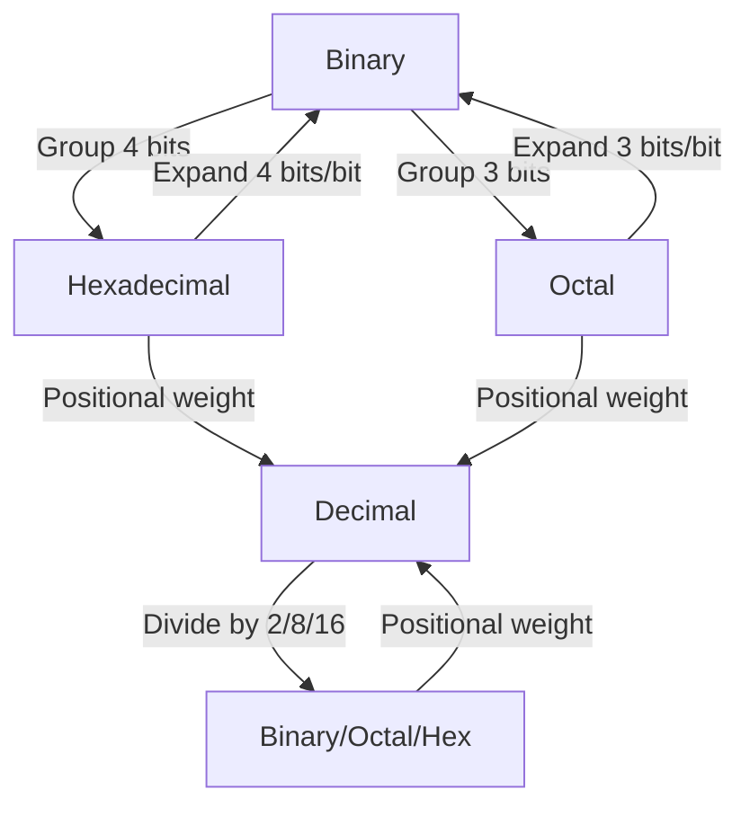
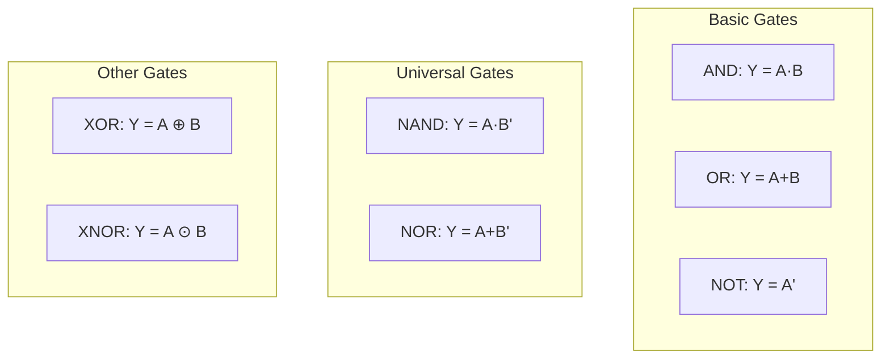
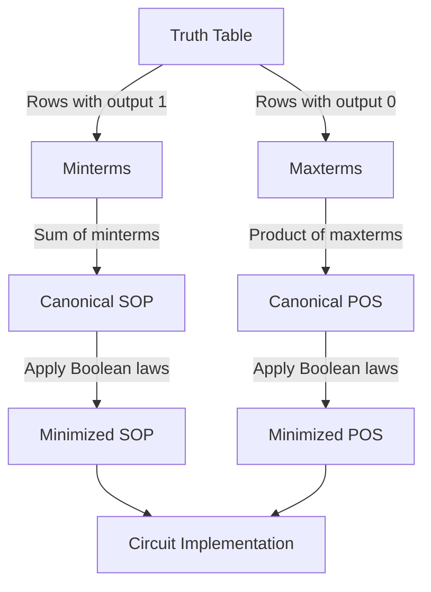

# Number Systems & Boolean Algebra

## Learning Objectives

By the end of this chapter, you will be able to:
- Convert numbers between binary, octal, decimal, and hexadecimal bases
- Represent signed numbers using 1's complement and 2's complement
- Perform fixed-point and floating-point arithmetic using IEEE 754 single-precision standard
- Simplify Boolean expressions using laws and theorems
- Analyze logic gates and derive SOP/POS canonical forms
- Solve exam numericals on number system conversions and IEEE 754 representation

---

## Theory

### 1. Number Systems

A number system defines how numbers are represented using a set of symbols (digits). The four primary number systems relevant to computer organisation are:

| System | Base | Digits Used | Example |
|--------|------|-------------|---------|
| Binary | 2 | 0, 1 | 1011₂ |
| Octal | 8 | 0–7 | 173₈ |
| Decimal | 10 | 0–9 | 123₁₀ |
| Hexadecimal | 16 | 0–9, A–F | 7B₁₆ |

**General expansion formula:**

For a number `dₙdₙ₋₁...d₁d₀.d₋₁d₋₂...` in base `b`:

```
Value = dₙ × bⁿ + dₙ₋₁ × bⁿ⁻¹ + ... + d₁ × b¹ + d₀ × b⁰ + d₋₁ × b⁻¹ + ...
```

### 2. Conversions Between Bases

#### Decimal to Binary (Integer part)

Repeatedly divide by 2, collect remainders from last to first.

**Example:** Convert 37₁₀ to binary.

```
37 ÷ 2 = 18 remainder 1  (LSB)
18 ÷ 2 = 9  remainder 0
 9 ÷ 2 = 4  remainder 1
 4 ÷ 2 = 2  remainder 0
 2 ÷ 2 = 1  remainder 0
 1 ÷ 2 = 0  remainder 1  (MSB)

37₁₀ = 100101₂
```

#### Decimal to Binary (Fractional part)

Repeatedly multiply by 2, collect integer parts from first to last.

**Example:** Convert 0.625₁₀ to binary.

```
0.625 × 2 = 1.250 → 1
0.250 × 2 = 0.500 → 0
0.500 × 2 = 1.000 → 1

0.625₁₀ = 0.101₂
```

#### Binary to Octal

Group 3 bits from the binary point outward, convert each group.

**Example:** 11010110₂ → Group as 011 010 110 → 3 2 6 → 326₈

#### Binary to Hexadecimal

Group 4 bits from the binary point outward, convert each group.

**Example:** 11010110₂ → Group as 1101 0110 → D 6 → D6₁₆

#### Octal/Hexadecimal to Binary

Expand each digit to 3/4 bits.

**Example:** 3A7₁₆ → 3→0011, A→1010, 7→0111 → 001110100111₂

#### General shortcut: Base N to Decimal

Multiply each digit by its positional weight and sum.

**Example:** 2A₁₆ = 2 × 16¹ + 10 × 16⁰ = 32 + 10 = 42₁₀

### 3. Complements

Used for representing negative numbers and performing subtraction.

#### 1's Complement

For an n-bit binary number N, 1's complement = (2ⁿ − 1) − N.

Simply flip all bits: 0 → 1, 1 → 0.

**Example:** 1's complement of 10110₂ (5 bits) = 01001₂

**Range:** −(2ⁿ⁻¹ − 1) to +(2ⁿ⁻¹ − 1)

**Problem:** Two representations of zero: 0000 (+0) and 1111 (−0).

#### 2's Complement

2's complement = 1's complement + 1.

Equivalently: 2's complement = 2ⁿ − N.

**Example:** 2's complement of 10110₂ = 01001 + 1 = 01010₂

**Range:** −2ⁿ⁻¹ to +(2ⁿ⁻¹ − 1)

**Advantage:** Single representation of zero. Subtraction is performed as addition of 2's complement.

**Shortcut to find 2's complement:** Copy bits from LSB until (and including) the first 1, then complement the remaining bits.

**Example:** 10110₂ → First 1 from right is at position 1 (0-indexed: bit 0). Copy 10, complement 101 → 01010.

#### Quick subtraction using 2's complement:

A − B = A + (2's complement of B)

Discard the final carry if it occurs.

**Example:** 8 − 3 using 4 bits.

```
8 = 1000
3 = 0011 → 2's comp = 1101

 1000
+1101
-----
10101 → Discard carry → 0101 = 5
```

### 4. Signed vs Unsigned Numbers

**Unsigned:** All n bits represent magnitude. Range: 0 to 2ⁿ − 1.

**Signed (2's complement):** MSB = sign bit (0 positive, 1 negative). Range: −2ⁿ⁻¹ to 2ⁿ⁻¹ − 1.

| 4-bit Pattern | Unsigned | Signed (2's comp) |
|--------------|----------|-------------------|
| 0000 | 0 | 0 |
| 0111 | 7 | 7 |
| 1000 | 8 | −8 |
| 1111 | 15 | −1 |

**Sign extension:** When extending n-bit to m-bit (m &gt; n):
- For unsigned: pad with zeros.
- For signed 2's comp: replicate the sign bit.

**Example:** Extend 1010₂ (signed, −6) to 8 bits → 11111010₂.

### 5. Fixed-Point Representation

The binary point is fixed at a predefined position.

**Example:** Q8.8 format — 8 integer bits, 8 fractional bits.

| Bits | 15 | 14 | ... | 8 | 7 | 6 | ... | 0 |
|------|-------|-------|-------|-------|-------|-------|-------|----|
| Weight | 2⁷ | 2⁶ | ... | 2⁰ | 2⁻¹ | 2⁻² | ... | 2⁻⁸ |

Value = signed integer part + fractional part.

**Example:** 00010100.11000000₂ = 16 + 4 + 0.5 + 0.25 = 20.75₁₀

**Fixed-point range:** Limited by number of integer bits. Precision limited by number of fractional bits.

### 6. Floating-Point Representation (IEEE 754 Single Precision)

32-bit format: 1 sign bit, 8 exponent bits (biased by 127), 23 mantissa bits.

```
| S (1 bit) | Exponent E (8 bits) | Mantissa M (23 bits) |
```

**Formula:** Value = (−1)^S × 1.M × 2^(E−127)

**Special values:**
- E = 0, M = 0 → ±0
- E = 0, M ≠ 0 → Denormalized (subnormal): (−1)^S × 0.M × 2^(−126)
- E = 255, M = 0 → ±∞
- E = 255, M ≠ 0 → NaN (Not a Number)

**Normalized numbers:** 1 ≤ E ≤ 254. The leading 1 is implicit (hidden bit).

**Example:** Represent 13.75₁₀ in IEEE 754 single precision.

```
Step 1: Convert to binary
13 = 1101₂
0.75 = 0.11₂
13.75 = 1101.11₂

Step 2: Normalize
1101.11 = 1.10111 × 2³

Step 3: Extract components
S = 0 (positive)
M = 10111000000000000000000 (23 bits, drop the leading 1)
E = 3 + 127 = 130 = 10000010₂

IEEE 754: 0 | 10000010 | 10111000000000000000000
         = 0100 0001 0101 1100 0000 0000 0000 0000
         = 0x415C0000
```

**Example:** Decode IEEE 754: 0x40400000.

```
0x40400000 = 0100 0000 0100 0000 0000 0000 0000 0000
S = 0
E = 10000000₂ = 128 → unbiased = 128 − 127 = 1
M = 10000000000000000000000 → 1.100000...₂ = 1.5
Value = (−1)⁰ × 1.5 × 2¹ = 3.0
```

**Double precision (64-bit):** 1 sign, 11 exponent (bias 1023), 52 mantissa.

**Precision comparison:**

| Type | Bits | Exponent | Mantissa | Approx Range | Precision (decimal digits) |
|------|------|----------|----------|-------------|---------------------------|
| Single | 32 | 8 | 23 | ±10^±38 | ~7.2 |
| Double | 64 | 11 | 52 | ±10^±308 | ~15.9 |

### 7. Boolean Algebra Basics

**Axioms:**
- X = 0 if X ≠ 1; X = 1 if X ≠ 0
- 0 · 0 = 0, 1 + 1 = 1
- 1 · 1 = 1, 0 + 0 = 0
- 0 · 1 = 1 · 0 = 0, 0 + 1 = 1 + 0 = 1
- 1' = 0, 0' = 1

**Basic laws:**

| Law | AND Form | OR Form |
|-----|----------|---------|
| Identity | 1 · X = X | 0 + X = X |
| Null | 0 · X = 0 | 1 + X = 1 |
| Idempotent | X · X = X | X + X = X |
| Complement | X · X' = 0 | X + X' = 1 |
| Involution | (X')' = X | — |
| Commutative | X · Y = Y · X | X + Y = Y + X |
| Associative | (X·Y)·Z = X·(Y·Z) | (X+Y)+Z = X+(Y+Z) |
| Distributive | X·(Y+Z) = X·Y+X·Z | X+Y·Z = (X+Y)(X+Z) |
| Absorption | X·(X+Y) = X | X+X·Y = X |
| De Morgan's | (X·Y)' = X' + Y' | (X+Y)' = X' · Y' |

**De Morgan's Theorem:** (A + B)' = A' · B' and (A · B)' = A' + B'

**Key identities for simplification:**
- X + X'Y = X + Y
- X(X' + Y) = XY
- XY + X'Z + YZ = XY + X'Z  (Consensus theorem)
- X ⊕ Y = X'Y + XY',  X ⊙ Y = XY + X'Y'

### 8. Logic Gates

| Gate | Symbol | Expression | Truth Table (A,B → Y) |
|------|--------|-----------|----------------------|
| AND | & | Y = A · B | 00→0, 01→0, 10→0, 11→1 |
| OR | ≥1 | Y = A + B | 00→0, 01→1, 10→1, 11→1 |
| NOT | 1 | Y = A' | 0→1, 1→0 |
| NAND | & with ○ | Y = (A·B)' | Universal gate |
| NOR | ≥1 with ○ | Y = (A+B)' | Universal gate |
| XOR | =1 | Y = A ⊕ B | 00→0, 01→1, 10→1, 11→0 |
| XNOR | =1 with ○ | Y = A ⊙ B | 00→1, 01→0, 10→0, 11→1 |

**NAND and NOR are universal gates** — any Boolean function can be implemented using only NAND or only NOR gates.

**Realization examples:**
- NOT using NAND: A' = A NAND A
- AND using NAND: A·B = (A NAND B) NAND (A NAND B)
- OR using NAND: A+B = (A' NAND B')'

### 9. SOP and POS Forms

**Minterm:** Product term where each variable appears once (complemented or uncomplemented). Denoted mᵢ.

**Maxterm:** Sum term where each variable appears once. Denoted Mᵢ.

#### Sum of Products (SOP)

Canonical SOP: Sum of minterms where output = 1.

**Example:** For function F = 1 at minterms 1, 3, 5, 7:
```
F(A,B,C) = Σm(1,3,5,7)
         = A'B'C + A'BC + AB'C + ABC
```

**Simplification using Boolean algebra:**
```
F = A'B'C + A'BC + AB'C + ABC
  = A'C(B' + B) + AC(B' + B)
  = A'C + AC
  = C
```

#### Product of Sums (POS)

Canonical POS: Product of maxterms where output = 0.

**Example:** For the same function:
```
F(A,B,C) = ΠM(0,2,4,6)
         = (A+B+C)(A+B'+C)(A'+B+C)(A'+B'+C)
```

#### Conversion between SOP and POS

If F = Σm(i₁, i₂, ...), then F' = Σm(j₁, j₂, ...) where j's are the remaining minterms.

F = ΠM(j₁, j₂, ...)

**Minimization methods:**
1. Algebraic simplification using Boolean laws
2. Karnaugh Maps (K-maps) — up to 6 variables
3. Quine-McCluskey algorithm — tabular method for many variables

#### K-Map basics (2-variable)

```
     B'   B
A'    m0   m1
A     m2   m3
```

Group adjacent 1s in powers of 2 (1, 2, 4, 8...).

**Example:** F(A,B) = A'B + AB' + AB

```
     B'   B
A'    0    1
A     1    1
```

Group: A (covers m2, m3) + B (covers m1, m3) → F = A + B

### 10. Don't Care Conditions

Output values that never occur or we don't care about. Marked as X (don't care). Can be used to form larger groups for minimization.

**Example:** BCD to 7-segment decoder — combinations 1010–1111 are don't cares.

### 11. Important Exam Formulae

- **2's complement range:** −2ⁿ⁻¹ to 2ⁿ⁻¹ − 1
- **IEEE 754 range (single):** ±1.18 × 10⁻³⁸ to ±3.4 × 10³⁸
- **Boolean identities:** X + X'Y = X + Y, X(X' + Y) = XY
- **De Morgan's:** (A·B)' = A' + B', (A + B)' = A' · B'
- **XOR:** A ⊕ B = A'B + AB'
- **Universal gates:** NAND, NOR

---

## Mermaid Diagrams

### Number System Conversion Flow



### IEEE 754 Single Precision Format

```mermaid
flowchart LR
    subgraph 32-bit IEEE 754
        S[Sign 1 bit] --> E[Exponent 8 bits]
        E --> M[Mantissa 23 bits]
    end
    V[Value = -1^S × 1.M × 2^(E-127)] --> S
    V --> E
    V --> M
```

### Logic Gate Symbols



### SOP/POS Conversion Flow



---

## Exam-Style Solved MCQs

**Q1:** The hexadecimal representation of decimal number 234 is:

a) E9₁₆  b) EA₁₆  c) EB₁₆  d) EC₁₆

**Solution:**
```
234 ÷ 16 = 14 remainder 10 (A)
 14 ÷ 16 = 0 remainder 14 (E)

234₁₀ = EA₁₆
```
Answer: b) EA₁₆

---

**Q2:** The 2's complement representation of −45 in 8 bits is:

a) 11010011₂  b) 11010010₂  c) 00101101₂  d) 00101100₂

**Solution:**
```
45 = 00101101₂
1's complement = 11010010₂
2's complement = 11010010 + 1 = 11010011₂
```
Answer: a) 11010011₂

---

**Q3:** The IEEE 754 single-precision representation of −1.5 is:

a) 0x3FC00000  b) 0xBFC00000  c) 0xBF800000  d) 0x3F800000

**Solution:**
```
−1.5 = −1.1₂ × 2⁰
S = 1
E = 0 + 127 = 127 = 01111111₂
M = 10000000000000000000000₂
Bits: 1 01111111 10000000000000000000000
= 1011 1111 1100 0000 0000 0000 0000 0000
= 0xBFC00000
```
Answer: b) 0xBFC00000

---

**Q4:** Which Boolean expression represents the XOR gate?

a) A'B + AB'  b) AB + A'B'  c) (A+B)'  d) A·B

**Solution:** XOR output is 1 when inputs differ. A ⊕ B = A'B + AB'.

Answer: a) A'B + AB'

---

**Q5:** The simplified expression for F(A,B,C) = Σm(0,2,4,6) is:

a) C'  b) A'C  c) C  d) 0

**Solution:**
```
Minterms: 0 (000), 2 (010), 4 (100), 6 (110)
All have C = 0. So F = C' (independent of A, B).

K-map:
        BC
        00 01 11 10
A=0     1  0  0  1
A=1     1  0  0  1

Groups: 4 corners of C' → F = C'
```
Answer: a) C'

---

**Q6:** The smallest decimal number that can be represented using 8-bit signed 2's complement is:

a) −128  b) −127  c) −255  d) −256

**Solution:** Range for n-bit 2's complement: −2ⁿ⁻¹ to 2ⁿ⁻¹ − 1. For n=8: −128 to +127.

Answer: a) −128

---

**Q7:** How many 1's are present in the binary representation of (A2)₁₆?

a) 2  b) 3  c) 4  d) 5

**Solution:**
```
A2₁₆ = 1010 0010₂
Number of 1's = 2
```
Answer: a) 2

---

**Q8:** For the Boolean function F = (A+B)(A+C), the simplified form is:

a) A+BC  b) AB+AC  c) A+B+C  d) (A+B)(A+C)

**Solution:**
```
F = (A+B)(A+C) = A·A + A·C + B·A + B·C = A + AC + AB + BC
  = A(1+C+B) + BC = A + BC
```
Answer: a) A+BC

---

## Summary

- Number systems form the foundation of digital computers. Binary (base 2) is the native language of digital circuits.
- Conversions between decimal, binary, octal, and hexadecimal are essential for exam problems.
- 2's complement is the standard method for representing signed integers due to its single zero and natural arithmetic.
- IEEE 754 single precision uses 32 bits: 1 sign + 8 exponent (bias 127) + 23 mantissa with implicit leading 1.
- Boolean algebra laws (De Morgan's, absorption, consensus) are critical for minimizing logic expressions.
- Logic gates (AND, OR, NOT, NAND, NOR, XOR, XNOR) are the building blocks of digital circuits. NAND and NOR are universal.
- Canonical forms (SOP from minterms, POS from maxterms) provide standard representations for any Boolean function.
- K-maps offer a visual method for minimizing Boolean expressions up to 6 variables.

## Practical Takeaways

- **For IBPS/GATE exams:** Memorize 2's complement range (−2ⁿ⁻¹ to 2ⁿ⁻¹−1) and sign extension rules. These are frequently tested.
- **IEEE 754 trick:** The biased exponent 127 means we add 127 to the actual exponent. For single precision, if you see 0x3F800000, it's 1.0 (exponent 127 = 0 bias, mantissa 1.0).
- **Boolean simplification shortcut:** X + X'Y = X + Y (the "redundant" term X'Y absorbs into X). This appears often in GATE.
- **K-map grouping:** Always use the largest power-of-2 groups. Groups can overlap. Wrap around edges. Don't care (X) entries can be used to enlarge groups.
- **Complement subtraction trick:** To compute A − B, just add 2's complement of B and discard carry. No separate subtractor hardware needed.

---

## Chapter Quiz

**Q1:** What is the decimal value of hexadecimal 1A3?

(`<details><summary>Show Answer</summary>419₁₀ = 1×256 + 10×16 + 3 = 256 + 160 + 3 = 419</details>`)

**Q2:** The 1's complement of 101101₂ is:

(`<details><summary>Show Answer</summary>010010₂ (flip all bits)</details>`)

**Q3:** In IEEE 754 single precision, what does exponent = 255 and mantissa ≠ 0 represent?

(`<details><summary>Show Answer</summary>NaN (Not a Number)</details>`)

**Q4:** Which logic gate is known as a universal gate?

(`<details><summary>Show Answer</summary>NAND and NOR are both universal gates — any Boolean function can be realized using only NAND (or only NOR) gates.</details>`)

**Q5:** How many minterms are possible for a Boolean function of 4 variables?

(`<details><summary>Show Answer</summary>16 minterms (2⁴ = 16)</details>`)

---

## Exercises

1. Convert (3A9)₁₆ to binary, octal, and decimal.
2. Represent −67 in 8-bit 2's complement. Verify by adding +67 to get 0.
3. Find the IEEE 754 single-precision representation of −25.75₁₀. Express in hexadecimal.
4. Decode IEEE 754 hex value 0xC2F00000 to decimal.
5. Simplify F(A,B,C) = A'BC + AB'C' + ABC + AB'C using Boolean algebra. Verify with K-map.
6. Implement a 3-input XOR using only NAND gates.
7. Show that (A ⊕ B)' = A ⊙ B using Boolean algebra.
8. Convert the SOP form F(A,B,C) = Σm(0,1,2,4) to POS form.
9. For the expression F = (A+B)(A'+B)(A+B'), simplify to a single literal.
10. Prove De Morgan's theorem for three variables: (A+B+C)' = A'B'C'.
