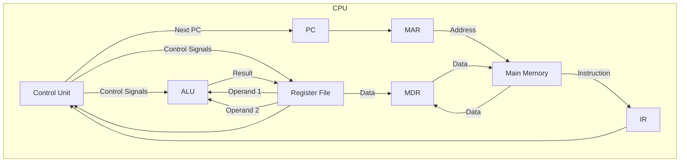
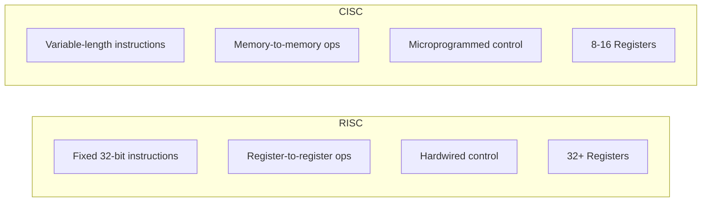

# CPU Organization

## Learning Objectives

By the end of this chapter, you will be able to:
- Identify major CPU components: ALU, control unit, and register set
- Trace the instruction cycle: fetch, decode, execute, memory access, write-back
- Distinguish instruction formats: 3-address, 2-address, 1-address, 0-address/stack
- Apply addressing modes to compute effective addresses
- Compare RISC and CISC architectures
- Differentiate hardwired and microprogrammed control units
- Analyse micro-operations for instruction execution

---

## Theory

### 1. CPU Components

The Central Processing Unit (CPU) has three primary functional units:

| Component | Function | Key Details |
|-----------|----------|-------------|
| Arithmetic Logic Unit (ALU) | Performs arithmetic (add, sub, mul, div) and logical (AND, OR, XOR, shift) operations | Combinational circuit; no internal storage |
| Control Unit (CU) | Generates timing and control signals to coordinate all CPU operations | Hardwired or microprogrammed |
| Register Set | High-speed storage inside CPU | Programmer-visible and invisible registers |

#### Important CPU Registers

| Register | Full Form | Width | Purpose |
|----------|-----------|-------|---------|
| PC | Program Counter | n bits | Holds address of next instruction to fetch |
| IR | Instruction Register | Depends on ISA | Holds current instruction being executed |
| MAR | Memory Address Register | n bits | Holds address for memory read/write |
| MDR | Memory Data Register | m bits | Holds data read from or written to memory |
| AC/ACC | Accumulator | m bits | Holds ALU result (in accumulator-based CPUs) |
| SP | Stack Pointer | n bits | Points to top of stack |
| PSW/FLAGS | Program Status Word | 8–32 bits | Stores condition codes (zero, carry, overflow, sign) |
| GPRs | General Purpose Registers | m bits each | Temporary data storage (R0, R1, ..., Rn) |

**Data path width distinction:**
- MAR and PC are address registers: size depends on address space (e.g., 32-bit for 4 GB addressable memory).
- MDR, AC, and GPRs are data registers: size equals word size (e.g., 32-bit or 64-bit data).
- IR size depends on instruction length.

### 2. Instruction Cycle (Fetch-Decode-Execute)

The CPU executes instructions in a repetitive cycle.

**Classic 5-step cycle:**

```
1. IF (Instruction Fetch):   MAR ← PC, read memory → MDR → IR, PC ← PC + 1
2. ID (Instruction Decode):  Control unit decodes IR to generate control signals
3. OF (Operand Fetch):       Compute effective address, read operands from registers/memory
4. EX (Execute):             ALU performs operation
5. WB (Write Back):          Write result to destination register/memory
```

**Detailed step-by-step for a LOAD instruction (LOAD R1, 500):**

| Step | Micro-operation | Explanation |
|------|-----------------|-------------|
| T1 | MAR ← PC | Address of instruction → MAR |
| T2 | MDR ← Memory[MAR], PC ← PC + 1 | Fetch instruction, increment PC |
| T3 | IR ← MDR | Instruction → IR |
| T4 | Decode IR | CU interprets opcode and address mode |
| T5 | MAR ← IR[address field] | Operand address from instruction |
| T6 | MDR ← Memory[MAR] | Fetch operand data |
| T7 | R1 ← MDR | Load operand into register R1 |

**For STORE instruction (STORE R1, 500):**

| Step | Micro-operation |
|------|-----------------|
| T1–T4 | Same as LOAD (fetch and decode) |
| T5 | MAR ← IR[address field] |
| T6 | MDR ← R1 |
| T7 | Memory[MAR] ← MDR |

**For ADD on accumulator machine (ADD 500):**

| Step | Micro-operation |
|------|-----------------|
| T1–T4 | Fetch and decode |
| T5 | MAR ← IR[address field] |
| T6 | MDR ← Memory[MAR] |
| T7 | AC ← AC + MDR |

### 3. Instruction Formats

Instruction formats define how opcode and operands are arranged in the instruction word.

#### Zero-Address (Stack) Format

Instructions implicitly operate on the top of stack (TOS).

**Example (Java VM / HP 3000):**
```
PUSH 5    // Push 5 onto stack
PUSH 3    // Push 3 onto stack
ADD       // Pop two, add, push result → TOS = 8
```

**Advantages:** Short instructions, minimal operand specification required.
**Disadvantages:** Many instructions needed for complex expressions; stack is memory.

**Expression evaluation: A = (B + C) × D**

```
PUSH B      // Stack: B
PUSH C      // Stack: B, C
ADD         // Stack: B+C
PUSH D      // Stack: (B+C), D
MUL         // Stack: (B+C)×D
POP A       // Store to A
```

#### One-Address (Accumulator) Format

Uses an implicit accumulator register as one operand and destination.

**Example (Intel 8080 / 8051):**
```
LOAD B      // AC ← M[B]
ADD C       // AC ← AC + M[C]
STORE A     // M[A] ← AC
```

**Expression: A = B + C + D**

```
LOAD B      // AC ← B
ADD C       // AC ← B + C
ADD D       // AC ← B + C + D
STORE A     // A ← AC
```

**Pros:** Simple, short instructions. **Cons:** Accumulator becomes bottleneck.

#### Two-Address Format

First operand is both source and destination, or both operands are specified.

**Example (Intel x86):**
```
MOV R1, B   // R1 ← B
ADD R1, C   // R1 ← R1 + C
MOV A, R1   // A ← R1
```

Or with memory operands: `ADD R1, R2` → R1 ← R1 + R2.

**Expression: A = B + C**

```
ADD A, B    // A ← A + B  (if A is initialized to 0, else MOV then ADD)
MOV R1, B
ADD R1, C
MOV A, R1
```

#### Three-Address Format

All operands explicitly specified — two sources, one destination.

**Example (MIPS, RISC-V):**
```
ADD R1, B, C   // R1 ← B + C
MUL A, R1, D   // A ← R1 × D
```

**Expression: A = (B + C) × D**

```
ADD R1, B, C   // R1 ← B + C
MUL A, R1, D   // A ← R1 × D
```

**Three-address code requires only 2 instructions** vs. 4+ for one-address or zero-address.

**Advantages:** Compact expression evaluation, fewer instructions. **Disadvantages:** Longer instruction words (more bits for addresses).

| Format | Expression A = B + C | Instruction Count | Code Size |
|--------|---------------------|------------------|-----------|
| 0-address (stack) | PUSH B, PUSH C, ADD, POP A | 4 | Small per instruction, more total |
| 1-address (ACC) | LOAD B, ADD C, STORE A | 3 | Medium |
| 2-address | MOV R1,B, ADD R1,C, MOV A,R1 | 3 | Larger per instruction |
| 3-address | ADD A, B, C | 1 | Largest per instruction, fewest total |

### 4. Addressing Modes

Addressing modes specify how to compute the effective address (EA) of an operand.

| Mode | EA Calculation | Example (LOAD) | Pros / Cons |
|------|---------------|----------------|-------------|
| Immediate | Operand = address field itself | `ADD R1, #5` | No memory access; constant limited by field size |
| Direct (Absolute) | EA = address field | `LOAD R1, 1000` | Simple; limited address range |
| Indirect | EA = Memory[address field] | `LOAD R1, (1000)` | Large address space; 2 memory accesses |
| Register | Operand = register content | `ADD R1, R2` | Fast, no memory; limited registers |
| Register Indirect | EA = Register content | `LOAD R1, (R2)` | Flexible; 1 memory access |
| Indexed | EA = base + index register | `LOAD R1, 100(R2)` | Good for arrays |
| Base-Register | EA = base register + offset | `LOAD R1, 20(R2)` | Relocation support |
| Relative | EA = PC + offset | `BEQZ R1, +20` | Position-independent code |
| Auto-increment/decrement | EA = Reg, then Reg ±= step | `LOAD R1, (R2)+` | Stack/array traversal |

**Detailed examples for `LOAD R1, operand`:**

1. **Immediate:** `LOAD R1, #42` → R1 = 42. No memory access for operand.
2. **Direct:** `LOAD R1, 2000` → EA = 2000. R1 = Memory[2000].
3. **Register:** `LOAD R1, R2` → R1 = R2.
4. **Register Indirect:** `LOAD R1, (R2)` → If R2 = 2000, then EA = 2000. R1 = Memory[2000].
5. **Indexed:** `LOAD R1, 100(R2)` → If R2 = 500, EA = 500 + 100 = 600. R1 = Memory[600].
6. **Relative:** `LOAD R1, +50` → EA = PC + 50.
7. **Auto-increment:** `LOAD R1, (R2)+` → R1 = Memory[R2], then R2 = R2 + 1 (or word size).

**Numerical: Array access using indexing**

Given array A starts at address 2000, each element 4 bytes. A[i] accessed as:

```
LOAD R1, i       // R1 = i
MUL R1, R1, 4    // R1 = i × 4 (byte offset)
LOAD R2, 2000(R1) // R2 = A[i]
```

**Numerical: Indirect addressing**

Memory content:
```
Address 1000: 2000
Address 2000: 500
```

Instruction: `LOAD R1, (1000)` using indirect mode:
```
EA = Memory[1000] = 2000
R1 = Memory[2000] = 500
```

### 5. RISC vs CISC Architecture

| Feature | RISC (Reduced Instruction Set Computer) | CISC (Complex Instruction Set Computer) |
|---------|----------------------------------------|----------------------------------------|
| Instruction complexity | Simple, single-cycle | Complex, multi-cycle |
| Instruction length | Fixed (32-bit) | Variable |
| Addressing modes | Few (1–5) | Many (10+) |
| Registers | Large register file (32–128 GPRs) | Few registers (8–16 GPRs) |
| Memory access | Only LOAD/STORE instructions | Many instructions can access memory |
| Control unit | Hardwired (faster) | Microprogrammed (easier to design) |
| CPI (Cycles Per Instruction) | ~1 (pipelined) | 2–10+ |
| Typical examples | ARM, MIPS, RISC-V, PowerPC | x86, 68000, VAX |
| Compiler complexity | Higher (compiler must optimize) | Lower (hardware handles complexity) |

**Key RISC design principles:**
- All operations on registers; only LOAD/STORE access memory
- Fixed instruction length simplifies decode
- Few addressing modes
- Large register file (32+ registers)
- Hardwired control for speed
- Pipelining is easier due to uniform instructions

**IBM 360/370 and x86 are CISC:** Variable instruction length, many mode combinations, microcoded complex instructions.

### 6. Control Unit: Hardwired vs Microprogrammed

| Aspect | Hardwired Control Unit | Microprogrammed Control Unit |
|--------|----------------------|------------------------------|
| Design approach | Sequential logic (FSM) using gates, flip-flops | Stored program in control memory (ROM) |
| Speed | Fast | Slower (ROM access time) |
| Flexibility | Fixed; change requires rewiring | Flexible; update microcode |
| Complexity | Complex for large ISAs | Easier for large ISAs |
| Cost | Higher for complex CPUs | Lower design cost |
| Fault tolerance | Lower | Higher (microcode can be patched) |
| Used in | RISC CPUs, modern high-performance x86 cores (decoded to micro-ops) | CISC CPUs, IBM 360, older x86 |

**Microprogrammed control components:**
1. Control Memory (ROM/PLA) — stores microinstructions
2. Microprogram Counter (μPC) — addresses next microinstruction
3. Microinstruction Register (μIR) — holds current microinstruction
4. Next-address generator — sequencing logic

**Microinstruction format:**
```
| Control Signals (n bits) | Next Address (m bits) |
```

**Horizontal microprogramming:** Wide control word; one bit per control signal. More parallelism, more bits.

**Vertical microprogramming:** Encoded control signals in micro-operations. Fewer bits, less parallelism.

### 7. Micro-Operations

Micro-operations are the smallest indivisible operations performed by the CPU in one clock cycle.

**Fetch phase micro-operations:**
```
T0: MAR ← PC
T1: MDR ← Memory[MAR], PC ← PC + 1
T2: IR ← MDR
```

**Execute phase for ADD (R1, R2):**
```
T3: A ← R1, B ← R2   // Load ALU inputs
T4: AC ← A + B        // Perform addition
T5: R1 ← AC           // Store result
```

**Execute phase for BRANCH (unconditional):**
```
T3: PC ← IR[address field]   // PC = branch target
```

**Execute phase for BRANCH (conditional, BNEZ):**
```
T3: if R1 ≠ 0 then PC ← IR[address field] else continue
```

**Register transfer language (RTL) notation:**
- `←` : Data transfer
- `[ ]` : Memory content
- `( )` : Register content
- `:  ` : Conditional execution on clock cycle

### 8. Processor Organization Types

#### Single Accumulator (Von Neumann)
```
ALU ↔ AC ↔ Memory
Most operations use AC.
```

#### General Register Organization
```
ALU ↔ Register File (R0, R1, ..., Rn)
2 read ports + 1 write port for single-cycle operation.
```

#### Stack Organization
```
ALU ↔ TOS (Top of Stack)
Push/pop operations. Used in JVM, HP calculators.
```

### 9. Important Exam Formulae

- **Instruction length** = log₂(opcode count) + Σ log₂(operand size) for each operand
- **Effective address (EA)** varies by mode as shown in table above
- **Number of memory accesses:** Immediate = 0, Register = 0, Direct = 1, Indirect = 2, Register Indirect = 1
- **CPI = CPU cycles / instruction count**

---

## Mermaid Diagrams

### CPU Internal Architecture



### Instruction Cycle Flow

```mermaid
flowchart TD
    Start[Start] --> Fetch[Fetch Instruction]
    Fetch --> Decode[Decode Instruction]
    Decode -->{Address Mode?}
    AddressMode -->|Memory operand| Operand[Fetch Operand]
    AddressMode -->|Register operand| Execute[Execute]
    Operand --> Execute
    Execute -->{Write Back?}
    WriteBack -->|Yes| WB[Write Back Result]
    WriteBack -->|No| Next[Next Instruction]
    WB --> Next
    Next --> Fetch
```

### Addressing Mode Decision Flow

```mermaid
flowchart TD
    I[Instruction] --> D{Addressing Mode}
    D -->|Immediate| OP[Operand = address field]
    D -->|Direct| EA[EA = address field]
    D -->|Indirect| EA2[EA = Mem[address field]]
    D -->|Register| OPR[Operand = Register]
    D -->|Reg Indirect| EARI[EA = Register content]
    D -->|Indexed| EAI[EA = base + index]
    D -->|Relative| EAR[EA = PC + offset]
    OP --> Access[Memory Access?]
    EA --> Access
    EA2 --> Access
    OPR --> Access
    EARI --> Access
    EAI --> Access
    EAR --> Access
    Access -->|Operand fetch complete| EX[Execute]
```

### RISC vs CISC Comparison



---

## Exam-Style Solved MCQs

**Q1:** Which register holds the address of the next instruction to be executed?

a) IR  b) MAR  c) PC  d) MDR

**Solution:** Program Counter (PC) holds the address of the next instruction. After each fetch, PC is incremented.

Answer: c) PC

---

**Q2:** In a 3-address instruction format, the instruction `ADD A, B, C` performs:

a) A ← B + C  b) B ← A + C  c) C ← A + B  d) A ← A + B

**Solution:** In 3-address format, the first operand is typically the destination. ADD A, B, C means A ← B + C.

Answer: a) A ← B + C

---

**Q3:** If the instruction `LOAD R1, (R2)` uses register indirect addressing and R2 = 4000, what is the effective address?

a) 4000  b) Content of R1  c) Content of memory at 4000  d) R1 + 4000

**Solution:** In register indirect mode, EA = content of the register. So EA = R2 = 4000.

Answer: a) 4000

---

**Q4:** Which of the following is NOT characteristic of RISC architecture?

a) Fixed instruction length  b) Few addressing modes  c) Variable instruction length  d) Large register file

**Solution:** Variable instruction length is a CISC characteristic, not RISC.

Answer: c) Variable instruction length

---

**Q5:** In a microprogrammed control unit, the microinstructions are stored in:

a) Cache  b) Main memory  c) Control memory (ROM)  d) Hard disk

**Solution:** Microprogrammed control stores microinstructions in control memory, typically ROM or PLA.

Answer: c) Control memory (ROM)

---

**Q6:** How many memory accesses are needed for an instruction using indirect addressing mode?

a) 1  b) 2  c) 0  d) 3

**Solution:** First access to read the address from memory (via the address field), second access to read the actual operand. So 2 memory accesses.

Answer: b) 2

---

**Q7:** If an instruction uses auto-increment addressing `LOAD R1, (R2)+` and R2 = 1000 before execution, after execution R2 will be:

a) 1000  b) 1001  c) 1004 (assuming 32-bit word)  d) 999

**Solution:** Auto-increment first loads R1 from memory at address R2, then increments R2 by the word size. For 32-bit = 4 bytes, R2 ← 1000 + 4 = 1004.

Answer: c) 1004 (assuming 32-bit word)

---

**Q8:** Which CPU component is responsible for generating the sequence of control signals?

a) ALU  b) Register file  c) Control unit  d) Cache

**Solution:** The control unit generates timing and control signals that orchestrate all CPU operations.

Answer: c) Control unit

---

**Q9:** In the instruction cycle, during which step is the Program Counter incremented?

a) Decode  b) Execute  c) Fetch  d) Write-back

**Solution:** PC is incremented during the fetch phase after the instruction is read from memory, before the next cycle.

Answer: c) Fetch

---

**Q10:** The major advantage of hardwired control over microprogrammed control is:

a) Flexibility  b) Lower design cost  c) Higher speed  d) Easier to modify

**Solution:** Hardwired control uses sequential logic without ROM access delays, making it faster. Flexibility and modifiability favor microprogrammed control.

Answer: c) Higher speed

---

## Summary

- The CPU consists of the ALU (arithmetic/logic), control unit (sequencing), and register file (fast storage).
- Key registers: PC (next instruction address), IR (current instruction), MAR (memory address), MDR (memory data), AC (accumulator).
- Instruction cycle: Fetch → Decode → Operand Fetch → Execute → Write Back.
- Instruction formats: 0-address (stack), 1-address (accumulator), 2-address (destination + source), 3-address (two sources + destination). More addresses per instruction = fewer total instructions but wider instruction word.
- Addressing modes determine effective address: immediate (no memory), direct (1 access), indirect (2 accesses), register (0 accesses), register indirect (1 access).
- RISC: fixed-length instructions, load-store architecture, hardwired control, many registers, low CPI. CISC: variable-length, memory operands allowed, microprogrammed, fewer registers, higher CPI.
- Control unit design: hardwired (faster, inflexible) vs microprogrammed (slower, flexible, ROM-based).
- Micro-operations are the atomic processor actions in one clock cycle, expressed in RTL notation.

## Practical Takeaways

- **For IBPS/GATE:** A common question asks "How many memory accesses for a given addressing mode?" Immediate=0, Register=0, Direct=1, Indirect=2, Register Indirect=1.
- **Register indirect shortcut:** (R) means the register holds the memory address. EA = content of R.
- **RISC vs CISC memory access:** Only LOAD and STORE in RISC; any instruction can access memory in CISC — this is the defining RISC feature.
- **Instruction count comparison:** A 3-address machine needs fewer instructions than a 0-address machine for the same expression, but each instruction is wider.
- **Microprogrammed control in modern CPUs:** Modern x86 CPUs decode CISC instructions into micro-ops (RISC-like internal operations), then execute via a hardwired RISC core.
- **Exam tip for control unit:** If the question asks about speed → hardwired. If about flexibility/modifiability → microprogrammed.

---

## Chapter Quiz

**Q1:** What is the function of the Memory Address Register (MAR)?

(`<details><summary>Show Answer</summary>MAR holds the address of the memory location to be read from or written to.</details>`)

**Q2:** In a stack-based (0-address) machine, how is `X = Y + Z` evaluated?

(`<details><summary>Show Answer</summary>PUSH Y, PUSH Z, ADD, POP X</details>`)

**Q3:** Which addressing mode requires exactly two memory accesses to fetch the operand?

(`<details><summary>Show Answer</summary>Indirect addressing — first access reads the address, second access reads the operand.</details>`)

**Q4:** What does CPI stand for and what is its typical value in a pipelined RISC processor?

(`<details><summary>Show Answer</summary>Cycles Per Instruction. In an ideal pipelined RISC, CPI ≈ 1 (one instruction completes per cycle).</details>`)

**Q5:** In a microprogrammed control unit, what is the difference between horizontal and vertical microprogramming?

(`<details><summary>Show Answer</summary>Horizontal: wide control word, one bit per signal, maximum parallelism. Vertical: encoded control signals, smaller word, less parallelism, needs decoder.</details>`)

---

## Exercises

1. For the expression `X = (A + B) × (C − D)`, write the sequence of instructions in 0-address, 1-address, 2-address, and 3-address formats.
2. Given memory content: Address 500 = 600, Address 600 = 50. For `LOAD R1, (500)` with indirect addressing, what value is loaded into R1?
3. Design a microprogrammed control sequence for the instruction `STORE R1, X` (store register to memory).
4. Compare the number of memory accesses and total bytes fetched for evaluating `W = X + Y × Z` on RISC vs CISC assuming 32-bit instructions and 64-bit operands.
5. List all CPU registers and their functions for a generic accumulator-based processor.
6. Implement a simple branch instruction micro-operation sequence for `BEQ R1, R2, offset` (branch if R1 = R2).
7. For a 32-bit instruction with 64 opcodes, how many bits are available for operands in a 3-address format?
8. Explain why RISC pipelines are simpler to implement than CISC pipelines.
9. Compare horizontal vs vertical microprogramming with an example control word for the ADD instruction.
10. Given a CPU with 16 GPRs, 4 addressing modes, and 128 opcodes, calculate the minimum instruction length for 2-address format.
