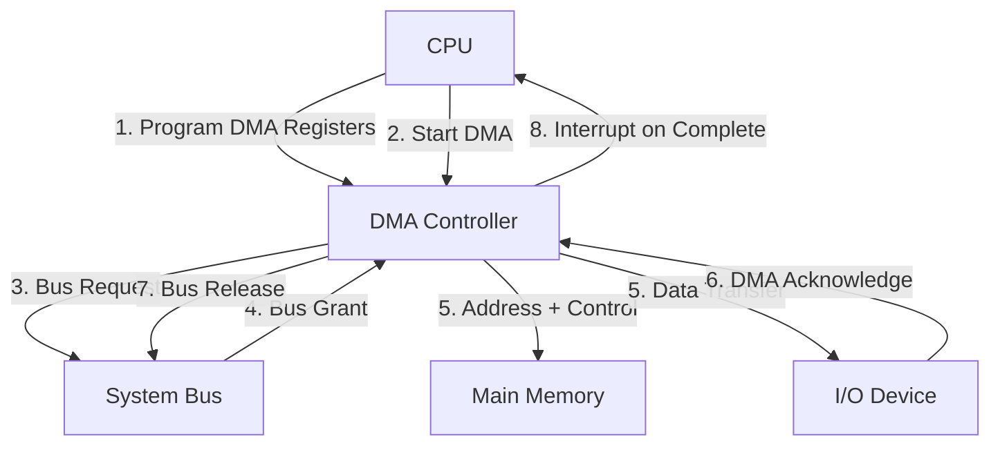
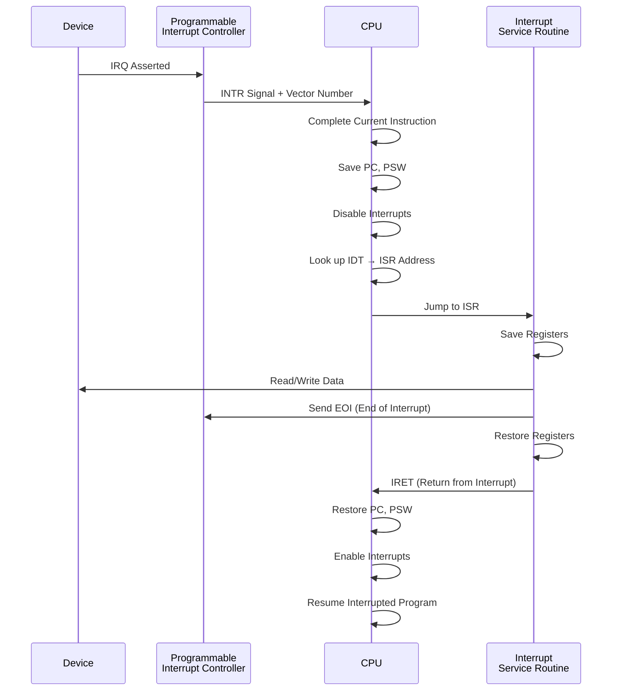
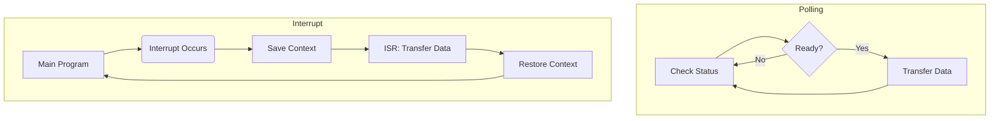

# I/O Organization

## Learning Objectives

By the end of this chapter, you will be able to:
- Distinguish programmed I/O, interrupt-driven I/O, and DMA data transfer methods
- Classify interrupt types and understand interrupt priority and vectoring
- Explain DMA transfer modes: cycle stealing, burst, transparent
- Compare I/O processor vs I/O channel vs DMA controller
- Describe the interrupt handler flow from request to completion
- Compare polling vs interrupt-driven approaches
- Identify common I/O buses: PCI, PCIe, USB
- Analyse RAID levels for performance and reliability trade-offs

---

## Theory

### 1. I/O Interface Types

An I/O interface connects the CPU/memory subsystem to peripheral devices.

**Functions of an I/O interface:**
1. Address decoding — identify which device is being accessed
2. Data buffering — accommodate speed differences
3. Status/control registers — monitor device state
4. Protocol conversion — translate between system bus and device protocols
5. Interrupt generation — notify CPU of events

**I/O port types:**
| Port | Direction | CPU to Device | Example |
|------|-----------|--------------|---------|
| Data register | Bidirectional | Read/write data | Keyboard scan code |
| Status register | Device → CPU | Read-only | Busy/ready flags |
| Control register | CPU → Device | Write-only | Start/stop/command |

**I/O mapping techniques:**

| Technique | Address Space | Instructions | Example |
|-----------|--------------|--------------|---------|
| Isolated I/O (Port-mapped) | Separate from memory | IN, OUT | x86 IN/OUT instructions |
| Memory-mapped I/O | Same as memory | Load/Store | ARM, RISC-V, MIPS |

**Memory-mapped I/O:** I/O registers are assigned addresses in the memory address space. CPU uses LOAD/STORE instructions. Easier to program but consumes memory address space.

**Isolated I/O:** Special I/O instructions use a separate address space with dedicated I/O pins. Does not reduce memory address space but requires special instructions.

### 2. Programmed I/O

CPU actively monitors the device status register until the device is ready, then transfers data.

```
CPU → Check device status
      ↓
    Is device ready? → NO → Keep polling
      ↓ YES
CPU → Read/write data
      ↓
CPU → Process next byte
```

**Polling flow:**
```
do {
    status = read_device_status();
} while (!device_ready);
data = read_device_data();
```

**Characteristics:**
- **Simple** to implement
- **CPU busy-waits** — wastes CPU cycles that could be used for computation
- **Low throughput** for high-speed devices (CPU is slower than polling rate)
- **Suitable for:** Simple, low-speed devices (keyboard, mouse)

**Numerical:** CPU clock = 500 MHz, polling loop = 40 instructions (2 cycles each). Device sends 1000 bytes/sec.

```
Polling time per check = 40 × 2 = 80 cycles = 80 / 500e6 = 0.16 μs
Polling frequency = 1000 checks/sec (for each byte)
Polling overhead = 1000 × 0.16 μs = 160 μs/sec = 0.016% CPU time
```

If device speed is 1 MB/s (1,000,000 bytes/sec):
```
Polling overhead = 1,000,000 × 0.16 μs = 160,000 μs/sec = 16% CPU time
```

High-speed devices with programmed I/O consume significant CPU time.

### 3. Interrupt-Driven I/O

Device notifies CPU when ready via an interrupt signal. CPU can perform other tasks between transfers.

```
CPU → Execute main program
      ↓
    (Device becomes ready)
      ↓
Device → Sends Interrupt Request (IRQ)
      ↓
CPU → Suspend current program
      ↓
CPU → Save context (PC, PSW, registers)
      ↓
CPU → Execute Interrupt Service Routine (ISR)
      ↓
CPU → Restore context
      ↓
CPU → Resume main program
```

**Advantages:**
- CPU is not busy-waiting
- Efficient for rare/unpredictable events
- Better overall system utilization

**Disadvantages:**
- Overhead of context switching (save/restore)
- Complex hardware for interrupt management
- Need to handle multiple simultaneous interrupts

**Numerical comparison:** Same 500 MHz CPU, 1 MB/s device. Interrupt overhead: 200 cycles per interrupt (save/restore context + ISR).

```
Interrupts per second = 1,000,000 (one per byte)
Interrupt overhead per second = 1,000,000 × 200 = 200,000,000 cycles/sec
CPU time = 200e6 / 500e6 = 40% CPU time
```

But with interrupt coalescing (one interrupt per block), say 1024 bytes per interrupt:
```
Interrupts per second = 1,000,000 / 1024 ≈ 977
Overhead per second = 977 × 200 = 195,400 cycles
CPU time = 195,400 / 500e6 ≈ 0.04%
```

**Conclusion:** Programmed I/O is better for very high-rate, predictable transfers. Interrupts are better for rare/sporadic events.

### 4. Interrupt Types and Priority

#### Interrupt Classification

| Category | Subtype | Description | Example |
|----------|---------|-------------|---------|
| Maskable | Programmable | Can be enabled/disabled via interrupt mask | IRQ lines on x86 |
| Non-maskable (NMI) | Always enabled | Critical events that cannot be ignored | Power failure, memory error |
| Vectored | Pre-defined address | Each interrupt has a fixed ISR address | x86 IVT/IDT |
| Non-vectored | Polled | One ISR for all interrupts; device ID must be polled | Some embedded systems |
| Software | Program-generated | INT instruction generates interrupt | System calls (int 0x80) |
| Hardware | Device-generated | Physical IRQ line assertion | Keyboard, disk |

#### Interrupt Priority

When multiple interrupts occur simultaneously, the priority scheme determines which is serviced first.

| Scheme | Description | Behavior |
|--------|-------------|----------|
| Fixed priority | Each device has a pre-assigned priority level | Highest priority serviced first |
| Daisy chain | Devices connected in series; closest to CPU has highest priority | Priority = proximity to CPU |
| Rotating priority | Priority changes dynamically | Fairness; all devices get equal chance |
| Programmable priority | Priority levels set by software | Flexible; OS-controlled |

**Interrupt nesting:** A higher-priority interrupt can interrupt a lower-priority ISR. The CPU enables interrupts within the ISR (or uses a priority mask).

#### Vectored vs Non-Vectored Interrupts

| Feature | Vectored Interrupt | Non-Vectored Interrupt |
|---------|-------------------|----------------------|
| ISR address | Device provides vector (address) | Single fixed ISR address |
| Speed | Fast (direct jump) | Slower (must poll device ID) |
| Hardware | Interrupt controller provides vector | Simple daisy chain |
| Example | x86 PIC/APIC | 8051 microcontroller |

**Vectored interrupt flow (x86):**
```
1. Device asserts IRQ line
2. PIC (Programmable Interrupt Controller) determines priority
3. PIC sends interrupt vector number to CPU
4. CPU looks up vector in IDT (Interrupt Descriptor Table)
5. CPU jumps to corresponding ISR address
6. ISR executes and sends EOI (End of Interrupt) to PIC
7. CPU resumes interrupted program
```

### 5. Interrupt Handler Flow

```
Step 1: Device sends interrupt request (IRQ)
Step 2: CPU checks interrupt mask — if unmasked, proceed
Step 3: CPU completes current instruction (or pipeline stage)
Step 4: CPU saves PC and PSW on stack or in special registers
Step 5: CPU disables further interrupts (or sets priority mask)
Step 6: CPU identifies interrupt source (vector or poll)
Step 7: CPU jumps to ISR (vector address or poll routine)
Step 8: ISR saves remaining context (registers)
Step 9: ISR services the device (read/write data)
Step 10: ISR restores context
Step 11: ISR executes return from interrupt (IRET/RTI)
Step 12: CPU restores PC and PSW
Step 13: CPU re-enables interrupts
Step 14: CPU resumes interrupted program
```

**Context save:** Typically 16–32 registers pushed onto stack. Some CPUs have shadow registers (e.g., ARM fast interrupt, FIQ).

### 6. Polling vs Interrupts — Comparison

| Aspect | Polling | Interrupts |
|--------|---------|------------|
| CPU utilization | Low (busy waiting) | High (CPU free until interrupt) |
| Latency | Variable (depends on polling frequency) | Fast response (immediate) |
| Complexity | Simple hardware/software | Complex (interrupt controller, nesting) |
| Overhead | Polling loop cycles | Context save/restore cycles |
| Suitable for | Predictable, high-rate devices | Sporadic, rare events |
| Priority handling | Not supported | Multiple priority levels possible |
| Real-time use | Deterministic polling cycle | Variable latency (interrupt jitter) |

### 7. Direct Memory Access (DMA)

DMA allows peripheral devices to transfer data directly to/from memory without CPU intervention. A DMA controller (DMAC) manages the transfer.

**DMA Controller components:**
1. **Source address register** — starting address of data source
2. **Destination address register** — starting address of destination
3. **Word count register** — number of words/bytes to transfer
4. **Control register** — transfer direction, mode, unit size

**DMA transfer flow:**
```
1. CPU programs DMA controller: source, destination, count, direction
2. CPU issues "Start DMA" command
3. DMA controller takes over system bus (bus request)
4. DMA transfers data directly: Device ↔ Memory (peripheral to memory or vice versa)
5. DMA controller increments addresses, decrements word count
6. When count reaches 0, DMA asserts interrupt to CPU
7. CPU handles "DMA complete" interrupt
```

**DMA transfer size:**
- Single transfer: 1 byte/word per bus cycle
- Burst transfer: multiple bytes/words without releasing bus

#### DMA Modes

| Mode | Bus Usage | Speed | CPU Inhibition | Description |
|------|-----------|-------|----------------|-------------|
| Cycle Stealing | Single cycle at a time | Slowest | Minimal delay | DMA steals one bus cycle, then releases bus. CPU only delayed by 1 cycle per transfer. Best for maintaining CPU responsiveness. |
| Burst Mode | Continuous bus control | Fastest | CPU blocked for full transfer | DMA holds bus until entire block transferred. High throughput but CPU starved during transfer. |
| Transparent Mode | Only when CPU not using bus | Variable | None (if no conflict) | DMA only transfers when CPU is idle (e.g., during cache access). No CPU slowdown but transfer rate varies. |

**Numerical comparison:** 1000 words to transfer, bus cycle = 100 ns.

```
Cycle stealing: 1000 × 100 ns = 100 μs (CPU delayed by 100 μs total)
Burst mode: 1000 × 100 ns = 100 μs (CPU delayed 100 μs continuously)
Transparent: Variable — depends on CPU idle patterns, 100 μs total transfer time spread over CPU idle cycles.
```

#### DMA Data Transfer Rate

**Formula:** Transfer rate = Bus width × Bus frequency × Transfer efficiency

**Example:** 64-bit PCIe 3.0 ×16, 8 GT/s, 128b/130b encoding.

```
Effective data rate per lane = 8 × (128/130) = 7.877 Gbps
×16 lanes = 126.03 Gbps = 15.75 GB/s
```

#### DMA vs Programmed I/O vs Interrupt I/O

| Feature | Programmed I/O | Interrupt I/O | DMA |
|---------|---------------|---------------|-----|
| Data path | CPU ↔ Device → Memory | CPU ↔ Device → Memory | Device ↔ Memory (direct) |
| CPU involvement per byte | Yes | ISR execution | Only at start and end |
| Transfer speed | Slow | Moderate | Fastest |
| Hardware complexity | Low | Medium | High (DMA controller) |
| Best for | Simple, low-speed | Medium-speed, sporadic | High-speed block transfers |

### 8. I/O Processor and I/O Channel

**I/O Processor (IOP):** A specialized processor that handles all I/O operations independently. Has its own instruction set and executes I/O programs fetched from memory.

- Can handle multiple devices simultaneously
- Frees CPU completely from I/O operations
- Used in mainframes (IBM System/370 channels)
- Example: Intel 8089 IOP

**I/O Channel:**
- **Selector channel:** Handles one high-speed device at a time (disk, tape)
- **Multiplexor channel:** Handles multiple slow-speed devices simultaneously (terminals, printers)
- **Block multiplexor:** Combines features — handles multiple devices with block transfers

**Comparison:**

| Aspect | DMA Controller | I/O Processor |
|--------|---------------|---------------|
| Intelligence | Simple state machine | Programmable processor |
| Instruction set | None (register-based) | Full instruction set |
| Tasks | Data transfer only | Data transfer, format conversion, error handling |
| CPU interaction | Minimal (start/stop) | Minimal (channel program) |
| Cost | Low | High |
| Used in | PCs, embedded systems | Mainframes, high-end servers |

### 9. Common I/O Buses

#### PCI (Peripheral Component Interconnect)

| Property | PCI | PCI-X | PCIe |
|----------|-----|-------|------|
| Architecture | Parallel bus | Parallel bus | Serial point-to-point |
| Bit width | 32/64 bits | 64 bits | 1–32 lanes (serial) |
| Clock | 33/66 MHz | 66–533 MHz | 2.5–16 GT/s per lane |
| Bandwidth | 133–533 MB/s | 533–4266 MB/s | 250 MB/s to 64 GB/s |
| Bus sharing | Shared | Shared | Switched (dedicated per device) |
| Hot plug | Limited | Limited | Yes |
| Encoding | Parallel | Parallel | 8b/10b (Gen1/2), 128b/130b (Gen3+) |

**PCIe topology:** Root complex (CPU) → Switch → Endpoints (devices). Each device has a dedicated point-to-point link.

**PCIe Generations:**

| Gen | Transfer Rate | x1 Bandwidth | x16 Bandwidth |
|-----|--------------|--------------|---------------|
| 1.0 | 2.5 GT/s | 250 MB/s | 4 GB/s |
| 2.0 | 5.0 GT/s | 500 MB/s | 8 GB/s |
| 3.0 | 8.0 GT/s | 1 GB/s | 16 GB/s |
| 4.0 | 16.0 GT/s | 2 GB/s | 32 GB/s |
| 5.0 | 32.0 GT/s | 4 GB/s | 64 GB/s |
| 6.0 | 64.0 GT/s | 8 GB/s | 128 GB/s |

#### USB (Universal Serial Bus)

| Version | Speed | Connector | Max Cable Length |
|---------|-------|-----------|-----------------|
| USB 1.0 | 1.5 Mbps (Low), 12 Mbps (Full) | Type A/B | 5 m |
| USB 2.0 | 480 Mbps (Hi-Speed) | Type A/B, Mini, Micro | 5 m |
| USB 3.0 | 5 Gbps (SuperSpeed) | Type A/B, Micro-B, Type-C | 3 m |
| USB 3.1 | 10 Gbps (SuperSpeed+) | Type-C dominant | 3 m |
| USB 3.2 | 20 Gbps (2-lane) | Type-C | 3 m |
| USB 4 | 40 Gbps | Type-C | 0.8 m |

**USB architecture:** Host controller → Hub(s) → Devices (up to 127 devices per host).

**Transfer types:**
- **Control:** Configuration and commands (guaranteed delivery)
- **Bulk:** Large data transfers (printer, scanner) — no bandwidth guarantee
- **Interrupt:** Periodic polling (keyboard, mouse) — guaranteed latency
- **Isochronous:** Real-time streaming (audio, video) — no retransmission

### 10. RAID Levels

RAID (Redundant Array of Independent Disks) combines multiple physical disks into one logical unit for performance and/or reliability.

| Level | Description | Min Disks | Storage Efficiency | Read Performance | Write Performance | Fault Tolerance |
|-------|-------------|-----------|-------------------|-----------------|------------------|----------------|
| RAID 0 | Striping (no redundancy) | 2 | 100% | Excellent (parallel reads) | Excellent (parallel writes) | None |
| RAID 1 | Mirroring | 2 | 50% | Good (read from either) | Moderate (write both) | 1 disk failure |
| RAID 5 | Striping + distributed parity | 3 | (N−1)/N | Good (parallel, no parity read) | Moderate (parity computation) | 1 disk failure |
| RAID 6 | Striping + dual distributed parity | 4 | (N−2)/N | Good | Slow (dual parity) | 2 disk failures |
| RAID 10 | RAID 1+0: mirrored sets, then striped | 4 | 50% | Excellent | Good | Multiple (1 per mirror) |

**RAID 5 parity calculation:** Parity = Data1 XOR Data2 XOR ... XOR DataN. Parity distributed across all disks.

**Example:** 4 disks in RAID 5 (3 data + 1 parity equivalent).

```
Disk 0: Data block A0, Parity P1, Data block A2, ...
Disk 1: Data block A1, Data block B0, Parity P2, ...
Disk 2: Parity P0, Data block B1, Data block C0, ...
Disk 3: Data block A2, Data block B2, Data block C1, ...
```

**Recovery:** If disk 0 fails, data can be reconstructed: A0 = P0 XOR A1 XOR A2 (for the stripe).

**RAID 10 (1+0):** Data is first mirrored (RAID 1), then striped (RAID 0).

```
Disk 1: A0 | Disk 2: A0 (mirror)
Disk 3: A1 | Disk 4: A1 (mirror)
Striped across pairs.
```

**RAID selection guide:**

| Application | Recommended RAID | Reason |
|-------------|-----------------|--------|
| OS/System disk | RAID 1 | High reliability |
| Database (OLTP) | RAID 10 | Performance + redundancy |
| File server | RAID 5 or RAID 6 | Capacity + fault tolerance |
| Video streaming | RAID 0 | Maximum throughput |
| Archival | RAID 6 | Protection against 2 failures |

### 11. Important Exam Formulae

- **Polling overhead = (Polling cycles per check) × (Check frequency)**
- **Interrupt overhead = (Context switch cycles) × (Interrupt frequency)**
- **DMA transfer time = (Number of words) × (Bus cycle time)**
- **PCIe bandwidth = (Lane count) × (Transfer rate per lane) × (Encoding efficiency)**
- **RAID storage efficiency:**
  - RAID 0: 100%
  - RAID 1: 50%
  - RAID 5: (N−1)/N
  - RAID 6: (N−2)/N
  - RAID 10: 50%

---

## Mermaid Diagrams

### DMA Transfer Flow



### Interrupt Handling Sequence



### RAID Level Comparison

```mermaid
flowchart TD
    subgraph RAID0[RAID 0 - Striping]
        D1[Block 0] D2[Block 1] D3[Block 2] D4[Block 3]
    end
    subgraph RAID1[RAID 1 - Mirroring]
        M1[Block 0] M2[Block 0]
    end
    subgraph RAID5[RAID 5 - Striping + Parity]
        P1[Block 0] P2[Block 1] P3[Parity P01] P4[Block 2]
    end
    subgraph RAID10[RAID 10 - Mirror + Strip]
        R1[Block 0] R1M[Block 0 Mirror]
        R2[Block 1] R2M[Block 1 Mirror]
    end
```

### Polling vs Interrupt Timing



---

## Exam-Style Solved MCQs

**Q1:** Which I/O technique requires the CPU to continuously check the device status register?

a) Interrupt-driven I/O  b) DMA  c) Programmed I/O  d) I/O channel

**Solution:** Programmed I/O (polling) requires CPU to continuously monitor device status in a busy-wait loop.

Answer: c) Programmed I/O

---

**Q2:** In DMA cycle stealing mode, the DMA controller:

a) Holds the bus for the entire transfer  b) Transfers only when CPU is not using the bus
c) Transfers one word per bus request  d) Never uses the bus

**Solution:** Cycle stealing mode: DMA requests the bus for one cycle, transfers one word, releases the bus. Repeats for each word.

Answer: c) Transfers one word per bus request

---

**Q3:** Which RAID level provides the best write performance with no redundancy?

a) RAID 0  b) RAID 1  c) RAID 5  d) RAID 6

**Solution:** RAID 0 (striping) has no redundancy and offers the best write performance because data is written in parallel across all disks without parity computation overhead.

Answer: a) RAID 0

---

**Q4:** In interrupt-driven I/O, what does the device send to the CPU to identify the specific ISR?

a) Data byte  b) Memory address  c) Interrupt vector number  d) Status register value

**Solution:** The interrupt controller sends a vector number (or address in some systems) that the CPU uses to index into the interrupt vector table/IDT to find the ISR address.

Answer: c) Interrupt vector number

---

**Q5:** Which PCIe generation offers 16 GB/s bandwidth on a ×16 link?

a) PCIe 1.0  b) PCIe 2.0  c) PCIe 3.0  d) PCIe 4.0

**Solution:** PCIe 3.0 ×16: 8 GT/s × 16 lanes × 128/130 encoding = 8 × 16 × 0.9846 ≈ 126 GB/s... wait, let me recalculate.

PCIe 3.0 per lane = 8 GT/s, 128b/130b encoding → 8 × 128/130 = 7.877 Gbps per lane × 16 = 126.03 Gbps = 15.75 GB/s. That's ~16 GB/s.

Actually: PCIe 3.0 ×16 = 8 GT/s per lane × 16 lanes = 128 GT/s total. 128 GT/s × (128/130) = ~126 Gbps = ~15.75 GB/s.

For PCIe 2.0 ×16: 5 GT/s × 16 × (8/10) = 64 Gbps = 8 GB/s.

For PCIe 4.0 ×16: 16 GT/s × 16 × (128/130) = 252 Gbps = 31.5 GB/s.

So PCIe 3.0 ×16 ≈ 16 GB/s and PCIe 4.0 ×16 ≈ 32 GB/s. Let me answer c) PCIe 3.0.

Answer: c) PCIe 3.0

---

**Q6:** Minimum number of disks required for RAID 5 is:

a) 2  b) 3  c) 4  d) 5

**Solution:** RAID 5 requires at least 3 disks: 2 for data, 1 for parity (distributed). With 2 disks, RAID 1 (mirroring) is used.

Answer: b) 3

---

**Q7:** In memory-mapped I/O, I/O devices are accessed using:

a) Special IN/OUT instructions  b) Load and Store instructions  c) Interrupt instructions  d) DMA requests

**Solution:** Memory-mapped I/O treats I/O registers as memory locations. They are accessed using regular LOAD and STORE (or LD/STR) instructions.

Answer: b) Load and Store instructions

---

**Q8:** A computer uses polling to read from a device that produces 1000 bytes/sec. Each polling check takes 50 instructions at 2 CPI each. CPU clock = 1 GHz. What percentage of CPU time is consumed by polling?

a) 0.01%  b) 0.1%  c) 1%  d) 10%

**Solution:**
```
Cycles per check = 50 × 2 = 100 cycles
Checks per second = 1000
Total cycles for polling = 100 × 1000 = 100,000 cycles/sec
CPU time = 100,000 / 1,000,000,000 = 0.0001 = 0.01%
```
Answer: a) 0.01%

---

**Q9:** Which is true about non-maskable interrupts (NMI)?

a) Can be disabled by software  b) Used for critical events like power failure
c) Has lowest priority  d) Generated by standard I/O devices

**Solution:** NMI cannot be disabled by the CPU and is reserved for critical system events like power failure, memory errors, or hardware watchdog timeouts.

Answer: b) Used for critical events like power failure

---

**Q10:** In a vectored interrupt system, the interrupt vector provides:

a) The data to be transferred  b) The address of the ISR or entry into IDT
c) The priority level of the interrupt  d) The device status

**Solution:** The interrupt vector is an index (or address) that points to the ISR in the interrupt vector table (or IDT for x86).

Answer: b) The address of the ISR or entry into IDT

---

## Summary

- Three fundamental I/O techniques: programmed I/O (CPU polls device), interrupt-driven I/O (device signals CPU), DMA (direct memory access without CPU).
- Programmed I/O: simple but wastes CPU cycles via busy-waiting. Best for slow, predictable devices.
- Interrupt-driven I/O: efficient for sporadic events. CPU can multitask between transfers. Overhead from context switching.
- Interrupt types: maskable (can be disabled), non-maskable (critical), vectored (fast, pre-assigned ISR address), non-vectored (polled).
- Interrupt handler sequence: save context → identify source → execute ISR → restore context → return.
- DMA modes: cycle stealing (one cycle at a time), burst (continuous bus control), transparent (CPU idle cycles).
- DMA controller includes source/destination address registers, word count register, and control logic.
- I/O buses: PCI (parallel, shared), PCIe (serial, point-to-point, scalable lanes), USB (versatile, hot-pluggable, daisy-chain).
- RAID levels: 0 (striping, no redundancy), 1 (mirroring, 50% efficient), 5 (distributed parity, N−1/N efficient), 6 (dual parity, N−2/N), 10 (mirror+stripe, 50% efficient).

## Practical Takeaways

- **For IBPS/GATE:** Know the exact number of disk failures tolerated by each RAID level: RAID 0 = 0, RAID 1 = 1, RAID 5 = 1, RAID 6 = 2, RAID 10 = 1 per mirrored pair.
- **Cycle stealing vs burst:** Cycle stealing minimizes CPU delay but takes longer total transfer time. Burst mode finishes faster but starves the CPU. Exam questions often test this trade-off.
- **PCIe bandwidth calculation:** For PCIe Gen 3+: data rate = lane count × 8 GT/s × (128/130). Encoding efficiency ≈ 98.46%.
- **Polling overhead shortcut:** Overhead = (poll instructions × CPI / clock rate) × device frequency. If the frequency is low, polling is acceptable.
- **Interrupt vs DMA key difference:** Interrupts still involve CPU in every data transfer (the ISR copies data). DMA moves data directly between device and memory.
- **Memory-mapped vs Isolated I/O:** Memory-mapped uses LOAD/STORE, isolated uses special IN/OUT. Memory-mapped simplifies programming but consumes address space.

---

## Chapter Quiz

**Q1:** What are the three modes of DMA operation?

(`<details><summary>Show Answer</summary>1. Burst mode (continuous bus control, CPU blocked), 2. Cycle stealing (one bus cycle at a time, minimal CPU delay), 3. Transparent mode (only during CPU idle cycles, no CPU delay).</details>`)

**Q2:** What is the storage efficiency of RAID 5 with 5 disks?

(`<details><summary>Show Answer</summary>(N−1)/N = 4/5 = 80%. RAID 5 with 5 disks: 4 disks of usable storage, 1 disk equivalent for parity.</details>`)

**Q3:** What is the difference between a vectored and a non-vectored interrupt?

(`<details><summary>Show Answer</summary>Vectored: device provides a vector number that points directly to the ISR address — faster. Non-vectored: all devices share one ISR entry point; the ISR must poll to identify which device generated the interrupt — slower.</details>`)

**Q4:** Calculate polling CPU overhead: Clock = 2 GHz, 200 instructions per poll (1 CPI each), device = 5000 bytes/sec.

(`<details><summary>Show Answer</summary>Cycles per check = 200 × 1 = 200. Checks/sec = 5000. Total cycles = 200 × 5000 = 1,000,000/sec. CPU time = 1e6 / 2e9 = 0.0005 = 0.05%.</details>`)

**Q5:** Which RAID level would you recommend for a database server requiring both high performance and fault tolerance?

(`<details><summary>Show Answer</summary>RAID 10 (1+0). It provides mirroring for fault tolerance and striping for performance. It tolerates multiple disk failures (one per mirrored pair) with excellent read/write speed.</details>`)

---

## Exercises

1. A device transfers data at 4 MB/s. Compare CPU overhead for programmed I/O (80 cycles/check, byte-by-byte) vs interrupt-driven I/O (300 cycles/interrupt, block size 512 bytes) vs DMA (500 cycles setup + 1000 cycles completion interrupt). Clock = 1 GHz.
2. Design the interrupt handling flow for a system with 3 devices (keyboard, mouse, disk). Show priority assignment, interrupt nesting possibilities, and vector assignment.
3. Calculate the maximum throughput of a PCIe 5.0 ×4 link.
4. A RAID 6 array has 6 disks of 2 TB each. Calculate usable capacity and storage efficiency. How many disk failures can be tolerated?
5. Compare DMA burst mode vs cycle stealing mode for transferring a 1 MB block. Bus speed = 400 MHz, 64-bit wide. Calculate transfer time and CPU delay for each mode.
6. Explain the difference between an I/O processor and a DMA controller with a block diagram.
7. A system uses memory-mapped I/O with 32-bit addresses. The top 4 KB of address space is reserved for I/O. How many 16-bit I/O registers can be mapped?
8. For USB 3.2 Gen 2×2 (20 Gbps), calculate the time to transfer a 4 GB file assuming no protocol overhead.
9. Design an interrupt controller for 8 devices. Show how daisy chain priority works for simultaneous interrupts.
10. A disk array uses RAID 5 with 8 disks. If one disk fails, describe the recovery process. How many read operations are needed to reconstruct one block?
