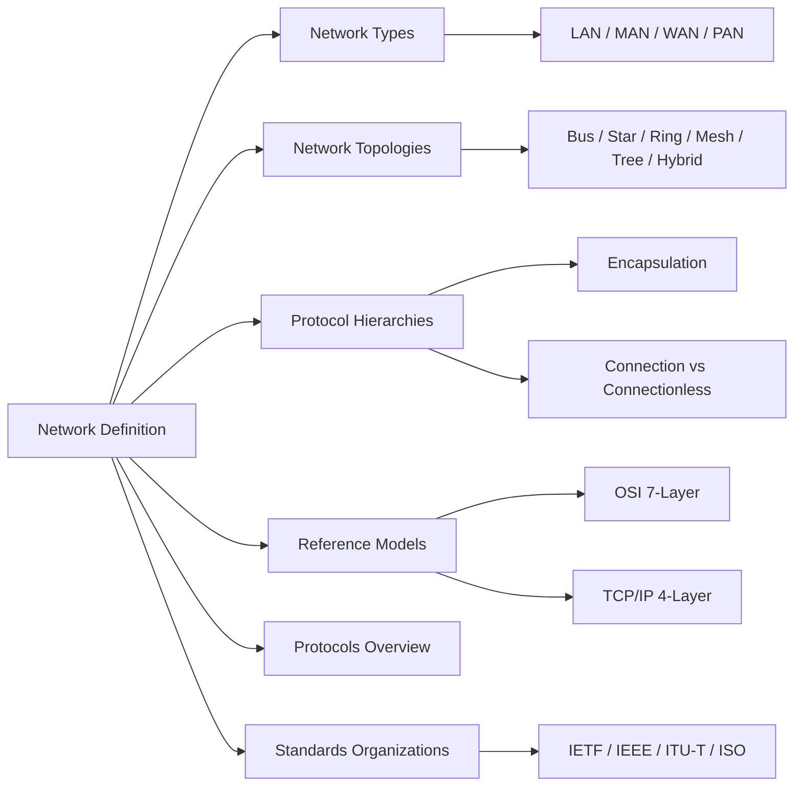
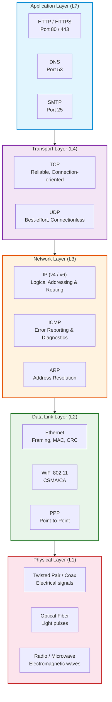

# Chapter 1: Introduction to Computer Networks

> **Prerequisites:** None | **Next:** [Chapter 2: Physical Layer](./02-physical-layer.md) → From network models to transmission media

## Learning Objectives

1.  Describe the fundamental uses of computer networks in commercial, residential, and research contexts.
2.  Distinguish between local-area, metropolitan-area, and wide-area networks and characterize their scale and performance properties.
3.  Explain the concepts of protocol layering, service models, and encapsulation.
4.  Compare the OSI reference model and the TCP/IP protocol suite with respect to layer count, naming, and design philosophy.
5.  Identify the key standards organizations and their roles in Internet standardization.

<!-- Image Gallery -->
<section class="lesson-visuals" aria-label="Visual learning resources">
  <header><span>VISUAL LEARNING</span><h2>See it. Review it. Remember it.</h2></header>
  <a class="lesson-visual-card" href="../../../assets/images/lessons/computer-networks/01-introduction/.png" target="_blank" rel="noopener">
    
    <span><strong>Handwritten notes</strong>Condensed notes for deliberate review.</span>
  </a>
  <a class="lesson-visual-card" href="../../../assets/images/lessons/computer-networks/01-introduction/.png" target="_blank" rel="noopener">
    
    <span><strong>Sticky-note revision</strong>Fast recall prompts for revision.</span>
  </a>
  <a class="lesson-visual-card" href="../../../assets/images/lessons/computer-networks/01-introduction/.png" target="_blank" rel="noopener">
    
    <span><strong>Visual concept guide</strong>A connected explanation of the key ideas.</span>
  </a>
</section>
<!-- End Image Gallery -->


---

### Chapter at a Glance


| Topic | Key Insight | Practical Takeaway |
|-------|-------------|-------------------|
| Network Classification | LAN, MAN, WAN differ by geographic span, topology, and performance | Choose LAN for buildings, WAN for global reach, MAN for metropolitan aggregation |
| Protocol Layering | Layers provide services to the layer above using protocols at the same layer | Encapsulation (adding headers at each layer) is the core mechanism of layered communication |
| OSI Model | 7-layer conceptual model: Physical through Application | Useful as pedagogical framework; TCP/IP is the deployed reality |
| TCP/IP Model | 4-layer model: Link, Internet, Transport, Application | The architecture of the actual Internet; minimalist and implementation-driven |
| Encapsulation | Each layer adds its header to the payload before passing down | Trace headers to debug network issues → look at the right layer for the right problem |
| Network Topologies | Bus, star, ring, mesh, tree, hybrid → each with trade-offs in cost, reliability, scalability | Star is dominant in LANs; mesh in WAN backbones for fault tolerance |
| Standardization | IETF, IEEE, ITU-T, ISO develop open standards | RFCs are the definitive specification for Internet protocols |

### Chapter Roadmap




### Protocol Stack Layers (Styled)




---

## 1.1 What Is a Computer Network?

### Definition


A **computer network** is an interconnected collection of autonomous computers that exchange data and share resources. Two computers are said to be *interconnected* if they can exchange information. The connection can be via copper wire, fiber optic cable, radio waves, or satellite links.

**Key characteristics:**
- **Autonomous:** Each device can operate independently → no device has absolute control over another.
- **Interconnected:** Physical or wireless medium exists for data transfer.
- **Shared resources:** Printers, files, storage, processing power, and bandwidth.
- **Rules (protocols):** Agreed-upon formats and procedures govern communication.

### Real-World Analogy: The Postal System


| Network Concept | Postal System Equivalent |
|:---------------|:------------------------|
| Application data | Letter content |
| Encapsulation (headers) | Envelope with address, stamp, return address |
| Source address | Sender's return address |
| Destination address | Recipient's address |
| Network layer (routing) | Postal sorting facility routing letters by ZIP code |
| Data link layer (local delivery) | Mail carrier delivering to specific mailbox |
| Physical layer | Truck, airplane, or bicycle moving the letter |
| Protocol | Rule: envelope must have stamp, address format |
| Error detection | Return-to-sender if address is invalid |
| Connection-oriented (TCP) | Registered mail → tracking, confirmation, retransmission if lost |
| Connectionless (UDP) | Regular postcard → no tracking, no guarantee |

Just as the postal system hides the complexity of transportation (you don't need to know how your letter moves between cities), network layers hide the complexity of data transmission.

### Network Components


| Component | Function | Example |
|-----------|----------|---------|
| **Host** (end system) | Runs user applications | Desktop, server, smartphone |
| **Router** | Forwards packets between networks | Cisco ISR, home WiFi router |
| **Switch** | Forwards frames within a single network | Ethernet switch |
| **Hub** | Repeats signals to all ports (obsolete) | Passive hub |
| **Access Point** | Bridges wireless to wired network | WiFi AP |
| **Modem** | Modulates/demodulates signals | DOCSIS cable modem |
| **Transmission Medium** | Carries the signal | Cat-6 cable, fiber, radio |

### C++ Implementation: Simple Network Node


```cpp
#include <iostream>
#include <string>
#include <vector>
#include <queue>

using namespace std;

// Represents a data packet
struct Packet {
    int id;
    string source;
    string destination;
    string payload;
    int ttl; // time-to-live to prevent infinite loops

    Packet(int i, string src, string dst, string data)
        : id(i), source(src), destination(dst), payload(data), ttl(64) {}
};

// A network node that can send/receive packets
class NetworkNode {
private:
    string address;
    queue<Packet> buffer; // incoming packet buffer

public:
    NetworkNode(const string& addr) : address(addr) {}

    string getAddress() const { return address; }

    // Receive a packet into buffer
    void receive(const Packet& pkt) {
        buffer.push(pkt);
        cout << "[" << address << "] RECEIVED packet #" << pkt.id
             << " from " << pkt.source << ": " << pkt.payload << endl;
    }

    // Send a packet to a destination via a link (another node)
    bool send(NetworkNode& dest, const Packet& pkt) {
        if (pkt.ttl <= 0) {
            cout << "[" << address << "] DROPPED packet #" << pkt.id
                 << " (TTL expired)" << endl;
            return false;
        }
        Packet forwarded = pkt;
        forwarded.ttl--;
        cout << "[" << address << "] FORWARDED packet #" << pkt.id
             << " to " << dest.getAddress() << " (TTL=" << forwarded.ttl << ")" << endl;
        dest.receive(forwarded);
        return true;
    }

    // Process all packets in buffer
    void processBuffer() {
        while (!buffer.empty()) {
            Packet pkt = buffer.front();
            buffer.pop();
            cout << "[" << address << "] PROCESSED: " << pkt.payload << endl;
        }
    }
};

int main() {
    NetworkNode alice("192.168.1.10");
    NetworkNode bob("192.168.1.20");
    NetworkNode router("10.0.0.1");

    Packet pkt(1, alice.getAddress(), bob.getAddress(), "Hello, Bob!");

    cout << "=== Simple Network Simulation ===\n\n";

    // Alice sends to Bob through a router
    alice.send(router, pkt);  // step 1: Alice -> router
    router.send(bob, pkt);    // step 2: router -> Bob
    bob.processBuffer();      // Bob reads the message

    cout << "\n=== Simulation Complete ===" << endl;
    return 0;
}
```

**Output trace:**
```
=== Simple Network Simulation ===

[192.168.1.10] FORWARDED packet #1 to 10.0.0.1 (TTL=63)
[10.0.0.1] RECEIVED packet #1 from 192.168.1.10: Hello, Bob!
[10.0.0.1] FORWARDED packet #1 to 192.168.1.20 (TTL=62)
[192.168.1.20] RECEIVED packet #1 from 192.168.1.10: Hello, Bob!
[192.168.1.20] PROCESSED: Hello, Bob!
```

### Python Implementation: Simple Network Node


```python
from dataclasses import dataclass
from collections import deque
from typing import Optional

@dataclass
class Packet:
    id: int
    source: str
    destination: str
    payload: str
    ttl: int = 64

class NetworkNode:
    def __init__(self, address: str):
        self.address = address
        self.buffer: deque[Packet] = deque()

    def receive(self, pkt: Packet) -> None:
        self.buffer.append(pkt)
        print(f"[{self.address}] RECEIVED packet #{pkt.id} "
              f"from {pkt.source}: {pkt.payload}")

    def send(self, dest: 'NetworkNode', pkt: Packet) -> bool:
        if pkt.ttl <= 0:
            print(f"[{self.address}] DROPPED packet #{pkt.id} (TTL expired)")
            return False
        forwarded = Packet(pkt.id, pkt.source, pkt.destination,
                          pkt.payload, pkt.ttl - 1)
        print(f"[{self.address}] FORWARDED packet #{pkt.id} "
              f"to {dest.address} (TTL={forwarded.ttl})")
        dest.receive(forwarded)
        return True

    def process_buffer(self) -> None:
        while self.buffer:
            pkt = self.buffer.popleft()
            print(f"[{self.address}] PROCESSED: {pkt.payload}")

if __name__ == "__main__":
    alice = NetworkNode("192.168.1.10")
    bob = NetworkNode("192.168.1.20")
    router = NetworkNode("10.0.0.1")
    pkt = Packet(1, alice.address, bob.address, "Hello, Bob!")

    print("=== Simple Network Simulation ===\n")
    alice.send(router, pkt)
    router.send(bob, pkt)
    bob.process_buffer()
```

**Complexity analysis:**
- **Time complexity (per hop):** O(1) → constant-time enqueue/dequeue and forwarding.
- **Time complexity (end-to-end):** O(N) where N = number of hops → each intermediate node processes once.
- **Space complexity:** O(B) where B = buffer size → packets wait in queue until processed.
- **Why O(N) for end-to-end?** Each hop processing time is constant, but the number of hops scales linearly with network path length. In the worst case, a packet traverses N routers between source and destination.

### Advantages of Computer Networks


| Advantage | Description |
|-----------|-------------|
| Resource sharing | Printers, storage, compute power shared across devices |
| Cost reduction | Shared peripherals eliminate duplicate purchases |
| Reliability | Redundant paths prevent single-point failure |
| Scalability | Add nodes incrementally without redesign |
| Communication | Email, instant messaging, video conferencing |
| Centralized management | Software updates, backups, security policies from one point |

### Disadvantages of Computer Networks


| Disadvantage | Description |
|--------------|-------------|
| Security exposure | More entry points for attackers; data in transit can be intercepted |
| Complexity | Design, deployment, and troubleshooting require specialized knowledge |
| Dependency | Network failure halts all connected services |
| Propagation of errors | Malware spreads rapidly across connected devices |
| Cost of infrastructure | Switches, routers, cabling, and licensed software add up |

### Edge Cases in Networking


| Edge Case | Description | Mitigation |
|-----------|-------------|------------|
| **Network congestion** | Too much data for available bandwidth | Flow control, congestion avoidance (TCP) |
| **Packet loss** | Packets dropped due to buffer overflow or noise | Retransmission (TCP), forward error correction |
| **Out-of-order delivery** | Packets arrive in a different order than sent | Sequence numbers, reorder buffer |
| **Duplication** | Same packet arrives multiple times | Duplicate detection via sequence numbers |
| **Corruption** | Bits flipped during transmission | Checksums, CRC at data link and transport layers |
| **Node failure** | Router or switch goes offline | Dynamic routing protocols reroute traffic |
| **Loops** | Packet circulates indefinitely | TTL field, spanning tree protocol |

---

## 1.2 Network Types

Networks are classified by geographical span, transmission technology, and switching technique.

### 1.2.1 Personal-Area Network (PAN)


- **Range:** ~10 meters
- **Purpose:** Connect personal devices (phone, laptop, smartwatch, headphones)
- **Technology:** Bluetooth, USB, Zigbee, IR
- **Data rate:** 1–100 Mbps (Bluetooth 5: 2 Mbps; USB 3.0: 5 Gbps)
- **Example:** Smartphone tethering to laptop via Bluetooth

### 1.2.2 Local-Area Network (LAN)


- **Range:** Single building/campus, &lt; 1 km
- **Purpose:** Connect computers within an organization
- **Technology:** Ethernet (IEEE 802.3), WiFi (IEEE 802.11)
- **Data rate:** 100 Mbps to 100 Gbps
- **Propagation delay:** Microseconds
- **Topology:** Star (dominant), bus (legacy)
- **Ownership:** Single organization
- **Example:** Office network with 200 workstations connected to a central switch

### 1.2.3 Metropolitan-Area Network (MAN)


- **Range:** City/metropolitan region, 5–50 km
- **Purpose:** Aggregate LANs from multiple locations across a city
- **Technology:** Fiber optic rings (SONET/SDH), DOCSIS cable, WiMAX
- **Data rate:** 100 Mbps to 10 Gbps
- **Propagation delay:** Milliseconds
- **Ownership:** Service provider or consortium
- **Example:** Cable TV network upgraded to provide Internet across a city

### 1.2.4 Wide-Area Network (WAN)


- **Range:** National/international (unlimited)
- **Purpose:** Connect geographically dispersed sites
- **Technology:** Leased lines, fiber optic submarine cables, satellite
- **Data rate:** 1 Mbps to 400 Gbps (submarine cables)
- **Propagation delay:** 10–200 ms (cross-continent)
- **Topology:** Mesh (routers interconnected for redundancy)
- **Ownership:** Multiple organizations, telecom carriers
- **Example:** The Internet itself → the largest WAN in existence

### Real-World Analogy: Transportation Network


| Network Scale | Transportation Equivalent |
|:-------------|:-------------------------|
| PAN | Person walking between two rooms in the same house |
| LAN | Cars within a neighborhood → local streets |
| MAN | City bus system → covers the metro area |
| WAN | Interstate highway system connecting cities nationwide |
| Internet | Global airline network connecting every country |

### LAN vs MAN vs WAN: Comparison Table


| Feature | LAN | MAN | WAN |
|---------|-----|-----|-----|
| **Geographic span** | < 1 km (building/campus) | 5–50 km (city) | Unlimited (country/world) |
| **Typical data rate** | 100 Mbps – 100 Gbps | 100 Mbps – 10 Gbps | 1 Mbps – 400 Gbps |
| **Propagation delay** | Microseconds | Milliseconds | 10–200 ms |
| **Error rate** | Very low (10⁻¹¹ – 10⁻¹²) | Low (10⁻¹⁰ – 10⁻¹¹) | Higher (10⁻⁶ – 10⁻¹⁰) |
| **Ownership** | Single organization | Provider or consortium | Multiple carriers |
| **Topology** | Star (dominant) | Ring, star | Mesh |
| **Media** | Twisted pair, fiber, WiFi | Fiber, coax | Fiber, satellite, leased line |
| **Routing** | Simple (switched) | Moderate complexity | Complex (dynamic routing) |
| **Maintenance cost** | Low | Moderate | High |
| **Scalability** | Hundreds of nodes | Thousands | Millions |
| **Example technology** | Ethernet, WiFi | DOCSIS, SONET | MPLS, SD-WAN |
| **Standards body** | IEEE 802.3/802.11 | IEEE, ITU-T | IETF, ITU-T |

### C++: Network Type Simulator with Congestion


```cpp
#include <iostream>
#include <string>
#include <thread>
#include <chrono>

using namespace std;

class NetworkSimulator {
private:
    string type; // LAN, MAN, or WAN
    double bandwidthMbps;
    double latencyMs;
    double errorRate; // probability of packet loss

public:
    NetworkSimulator(string t, double bw, double lat, double err)
        : type(t), bandwidthMbps(bw), latencyMs(lat), errorRate(err) {}

    // Simulate sending a message of given size (KB)
    bool sendMessage(int sizeKB, int concurrentFlows) {
        double effectiveBW = bandwidthMbps / concurrentFlows;
        double transferTimeSec = (sizeKB * 8.0) / (effectiveBW * 1000.0); // KB to Mb conversion
        double totalTimeMs = (transferTimeSec * 1000.0) + latencyMs;

        bool lost = (rand() / (double)RAND_MAX) < errorRate;
        if (lost) {
            cout << "[" << type << "] PACKET LOST (error rate=" << errorRate << ")\n";
            return false;
        }

        cout << "[" << type << "] Sent " << sizeKB << " KB in "
             << totalTimeMs << " ms (BW=" << effectiveBW
             << " Mbps, latency=" << latencyMs << " ms)\n";
        return true;
    }

    // Simulate congestion: increase concurrent flows
    void testCongestion(int baseSizeKB) {
        cout << "\n=== Congestion Test: " << type << " ===\n";
        for (int flows = 1; flows <= 10; flows += 3) {
            double totalTime = 0;
            int successCount = 0;
            for (int i = 0; i < flows; i++) {
                if (sendMessage(baseSizeKB, flows)) successCount++;
            }
            cout << "Flows=" << flows << " Success=" << successCount
                 << "/" << flows << "\n";
        }
    }
};

int main() {
    srand(time(0));

    // LAN: high bandwidth, low latency, low error
    NetworkSimulator lan("LAN", 1000.0, 0.5, 0.0001);
    // MAN: moderate bandwidth, moderate latency
    NetworkSimulator man("MAN", 100.0, 5.0, 0.001);
    // WAN: lower bandwidth, high latency, higher error
    NetworkSimulator wan("WAN", 10.0, 50.0, 0.01);

    cout << "=== Network Type Performance Comparison ===\n";

    // Test each network with a 100 KB message
    cout << "\n--- Single Message (100 KB) ---\n";
    lan.sendMessage(100, 1);
    man.sendMessage(100, 1);
    wan.sendMessage(100, 1);

    // Congestion test
    lan.testCongestion(100);
    man.testCongestion(100);
    wan.testCongestion(100);

    return 0;
}
```

### Python: Network Type Simulator


```python
import random
import time
from typing import Optional

class NetworkSimulator:
    def __init__(self, net_type: str, bandwidth_mbps: float,
                 latency_ms: float, error_rate: float):
        self.type = net_type
        self.bandwidth_mbps = bandwidth_mbps
        self.latency_ms = latency_ms
        self.error_rate = error_rate

    def send_message(self, size_kb: int,
                     concurrent_flows: int = 1) -> tuple[bool, float]:
        effective_bw = self.bandwidth_mbps / concurrent_flows
        transfer_time_s = (size_kb * 8.0) / (effective_bw * 1000.0)
        total_time_ms = (transfer_time_s * 1000.0) + self.latency_ms

        lost = random.random() < self.error_rate
        if lost:
            print(f"[{self.type}] PACKET LOST (error_rate={self.error_rate})")
            return False, 0.0

        print(f"[{self.type}] Sent {size_kb} KB in {total_time_ms:.2f} ms "
              f"(BW={effective_bw:.1f} Mbps, latency={self.latency_ms} ms)")
        return True, total_time_ms

    def congestion_test(self, base_size_kb: int = 100):
        print(f"\n=== Congestion Test: {self.type} ===")
        for flows in range(1, 11, 3):
            successes = 0
            for _ in range(flows):
                ok, _ = self.send_message(base_size_kb, flows)
                if ok:
                    successes += 1
            print(f"  Flows={flows}  Success={successes}/{flows}")

if __name__ == "__main__":
    random.seed(time.time())
    lan = NetworkSimulator("LAN", 1000.0, 0.5, 0.0001)
    man = NetworkSimulator("MAN", 100.0, 5.0, 0.001)
    wan = NetworkSimulator("WAN", 10.0, 50.0, 0.01)

    print("=== Network Type Performance Comparison ===\n")
    for name, net in [("LAN", lan), ("MAN", man), ("WAN", wan)]:
        print(f"\n--- {name}: 100 KB message ---")
        net.send_message(100)
        net.congestion_test()
```

**Complexity analysis of simulation:**
- **Time per message:** O(1) → constant arithmetic for transfer time calculation.
- **Space:** O(1) → no additional memory scales with input.
- **Why constant?** The simulation is analytical, not packet-level. We compute theoretical transfer time from bandwidth, latency, and message size using a closed-form formula.

### Edge Cases for Network Types


| Edge Case | LAN | MAN | WAN |
|-----------|-----|-----|-----|
| **Link failure** | Switch redundancy via STP | SONET rings self-heal in 50 ms | Dynamic routing (OSPF/BGP) finds alternate path |
| **Congestion collapse** | Full-duplex switches eliminate collisions | DOCSIS upstream congestion in peak hours | TCP congestion control reduces window size |
| **Latency spike** | Negligible (sub-millisecond) | Bufferbloat in cable modems | Satellite link adds 250+ ms |
| **Jitter** | Very low (< 0.1 ms) | Moderate | High (variable queueing delay) |
| **Packet loss burst** | Rare on wired; common on WiFi | Coax noise ingress | Fiber cut causes total loss |
## 1.3 Network Topologies

A **network topology** describes the physical or logical arrangement of links and nodes in a network. Topology determines how devices communicate, how faults propagate, and how easily the network can scale.

### Real-World Analogy: City Transportation


| Topology | Transportation Equivalent | Key Property |
|----------|-------------------------|--------------|
| Bus | Single bus route shared by all passengers | Shared medium, one at a time |
| Star | All roads lead to a central train station | Central hub, all traffic passes through |
| Ring | Circular bus route, one direction | Sequential, passes stops in order |
| Mesh | Every house connected to every other by a direct road | Direct paths, maximum redundancy |
| Tree | Highway with branching local roads | Hierarchical, root carries all upstream traffic |
| Hybrid | City with buses, trains, and bikes | Mix of modes for different needs |

### 1.3.1 Bus Topology


All nodes connect to a single shared cable (the *bus* / *backbone*). Only one node can transmit at a time; collisions occur when two transmit simultaneously.

**Advantages:**
- Simple to install → single cable runs past all nodes
- Low cable cost → N nodes need N+1 connections
- Easy to extend → tap into the backbone

**Disadvantages:**
- Single point of failure → backbone break brings down entire network
- Limited length → signal degrades after ~500 m (10Base2)
- Performance collapses under load → collisions increase exponentially
- Troubleshooting is difficult → fault isolation requires checking the entire cable

**Data transmission steps (numbered):**
1. Node A has data to send; it listens for carrier signal on the bus.
2. If no carrier sensed (idle), Node A begins transmission.
3. Signal propagates in both directions along the bus.
4. All other nodes receive the signal; each checks destination address.
5. If two nodes transmit simultaneously, a collision occurs.
6. Nodes detect collision, emit jam signal, wait random backoff time (CSMA/CD), retry.

**Trace table → Bus transmission (Node A → Node C):**

| Time | Event | Bus State | Nodes Sensing |
|------|-------|-----------|---------------|
| T0 | Node A checks bus | IDLE | All |
| T1 | Node A starts transmitting | BUSY (A) | A sends, B/C/D listen |
| T2 | Signal reaches B | BUSY (A) | C/D still listen |
| T3 | Signal reaches C, D | BUSY (A) | C receives, D hears noise |
| T4 | Node A finishes | IDLE | All |
| T5 | Nodes B,C,D check address; C matches, others discard | IDLE | C processes frame |

### 1.3.2 Star Topology


All nodes connect to a central device (switch or hub). The central device manages all communication.

**Advantages:**
- Easy to install and manage → cables run point-to-point
- Fault isolation → one broken cable affects only one node
- Scalable → add nodes by connecting to the central device
- High performance → switches give each node dedicated bandwidth
- Centralized monitoring → all traffic visible at the switch

**Disadvantages:**
- Central point of failure → switch failure disconnects all nodes
- Higher cable cost → each node needs its own cable run
- Switch port limit → maximum nodes limited by port count (expandable via stacking)

**Data transmission steps (numbered) → Star with switch:**
1. Node A sends a frame to the switch addressed to Node C.
2. Switch reads the destination MAC address from the frame header.
3. Switch looks up MAC address in its forwarding table (CAM table).
4. If found, switch forwards the frame only to the port where Node C is connected.
5. If not found, switch *floods* the frame to all ports (except source).
6. Node C receives the frame; other ports are unaffected.

**Trace table → Star transmission with MAC learning:**

| Time | Event | Switch CAM Table | Ports Used |
|------|-------|-----------------|------------|
| T0 | Switch powers on | empty | → |
| T1 | Node A sends frame to switch | MAC_A → Port 1 (learned) | Port 1 receives |
| T2 | Switch checks CAM for Node C | MAC_A → Port 1 | Not found (flood) |
| T3 | Switch floods frame to Ports 2,3,4 | MAC_A → Port 1 | Ports 2,3,4 transmit |
| T4 | Node C replies to Node A via switch | MAC_A → Port 1, MAC_C → Port 3 (learned) | Port 3 receives |
| T5 | Switch looks up MAC_A → found at Port 1 | MAC_A → Port 1, MAC_C → Port 3 | Port 1 only (unicast) |
| T6 | Node A receives reply | MAC_A → Port 1, MAC_C → Port 3 | Port 1 |

### 1.3.3 Ring Topology


Each node connects to exactly two neighbors, forming a closed loop. Data travels in one direction (unidirectional ring) or both (bidirectional ring). Token Ring (IEEE 802.5) and Fiber Distributed Data Interface (FDDI) use ring topology.

**Advantages:**
- Ordered access → no collisions (token-passing)
- Predictable performance → each node gets deterministic access
- Handles heavy load better than bus
- Simple routing → data flows in fixed direction

**Disadvantages:**
- Single node failure breaks the ring (unless dual-ring)
- Adding/removing nodes disrupts the network
- Latency grows with number of nodes
- Troubleshooting requires checking each node

**Data transmission steps → Token Ring:**
1. A special frame called a *token* circulates the ring.
2. Node C, wanting to transmit, seizes the token when it arrives.
3. Node C changes the token to a data frame, adds destination A.
4. Frame circulates: C → D → A.
5. Node A copies the frame, sets the *acknowledgment* bit.
6. Frame continues around back to C. C examines acknowledgment bit.
7. C releases a new token, removing its data frame.

**Trace table → Token Ring (C → A):**

| Time | Event | Ring Position | Token/Data |
|------|-------|---------------|------------|
| T0 | Token circulating | Reaches C | FREE |
| T1 | C seizes token, sends data to A | C → D | DATA (C→A) |
| T2 | D receives, forwards | D → A | DATA (C→A) |
| T3 | A copies data, sets ACK bit, forwards | A → B | DATA (ACK) |
| T4 | B receives, forwards | B → C | DATA (ACK) |
| T5 | C sees ACK, removes frame, releases new token | C → D | FREE |
| T6 | Token passes to D | D → A | FREE |

### 1.3.4 Mesh Topology


Every node has a dedicated point-to-point link to every other node. Full mesh (every node to every other) or partial mesh (selective connections).

**Advantages:**
- Maximum reliability → redundant paths; single link failure has no effect
- No traffic contention → each link carries only one conversation
- Privacy → data travels on dedicated links, not broadcast
- Fault tolerance → routing protocols automatically reroute around failures

**Disadvantages:**
- Extremely high cabling cost → N nodes need N×(N−1)/2 links
- Complex installation and management
- Each node needs N−1 I/O ports
- Not practical beyond ~8–10 nodes for full mesh
- Typically used only for backbone routers (partial mesh)

**Cabling cost formula:** For N nodes in full mesh:
- Number of links = N × (N − 1) / 2
- Ports per node = N − 1

| Nodes | Links Required | Ports per Node |
|-------|---------------|----------------|
| 4 | 6 | 3 |
| 8 | 28 | 7 |
| 16 | 120 | 15 |
| 32 | 496 | 31 |
| 100 | 4,950 | 99 |

### 1.3.5 Tree Topology


A hierarchical structure combining multiple star topologies connected to a central root bus. Common in large enterprise networks (spanning tree protocol organizes Ethernet into a tree).

**Advantages:**
- Scalable → add leaf nodes without affecting upper levels
- Hierarchical management → each branch can be administered separately
- Point-to-point wiring for individual segments
- Easy to extend → new branches attach to existing backbone

**Disadvantages:**
- Root failure brings down entire network
- Heavier traffic at higher levels (root bottleneck)
- Configuration complexity increases with depth
- Backbone cable is critical → failure splits the tree

**Data transmission steps → Tree:**
1. Node in Leaf-1A sends data to Node in Leaf-2B.
2. Frame travels Leaf-1A → Branch-1 Switch → Root Switch.
3. Root Switch forwards to Branch-2 Switch.
4. Branch-2 Switch forwards to Leaf-2 Switch.
5. Leaf-2 Switch delivers to destination node.

**Dry run → Tree topology (Leaf-1A → Leaf-2B, 5 KB data):**

| Step | Component | Action | Data |
|------|-----------|--------|------|
| 1 | Leaf-1A | Encapsulate frame addressed to Leaf-2B | [L2 Hdr | Payload] |
| 2 | Leaf-1 Switch | Lookup Leaf-2B MAC → forward to Branch-1 | Forwarded to root port |
| 3 | Branch-1 Switch | Forward to Root | Upstream |
| 4 | Root Switch | Lookup → forward to Branch-2 | Downstream |
| 5 | Branch-2 Switch | Forward to Leaf-2 | Downstream |
| 6 | Leaf-2 Switch | Deliver to Leaf-2B | Frame received |

### 1.3.6 Hybrid Topology


Combination of two or more basic topologies. Example: a star-bus hybrid where several star networks connect via a bus backbone.

**Advantages:**
- Flexible → tailor topology to specific needs
- Reliable → one segment failure doesn't affect others
- Scalable → grow in modular fashion
- Common in real-world deployments

**Disadvantages:**
- Complex design and management
- Higher cost than single topology
- Requires compatible hardware between segments

### TypeScript Implementation: NetworkTopologyBuilder

The following TypeScript class demonstrates how to model different network topologies, compute link counts, and validate scalability constraints.

```typescript
/**
 * NetworkTopologyBuilder — Computes topology properties (link counts, adjacency)
 * for star, ring, mesh, and bus topologies.
 */
interface TopologyResult {
  topology: string;
  nodeCount: number;
  linkCount: number;
  linksPerNode: number;
  isScalable: boolean;
  maxRecommendedNodes: number;
}

class NetworkTopologyBuilder {
  /** Star: N nodes need N-1 links (each node → central switch) */
  static buildStar(nodeCount: number): TopologyResult {
    const linkCount = nodeCount - 1;
    return {
      topology: 'Star',
      nodeCount,
      linkCount,
      linksPerNode: 1,          // each leaf has one connection
      isScalable: nodeCount <= 1000,
      maxRecommendedNodes: 1000 // switch port limit
    };
  }

  /** Ring: N nodes each connect to 2 neighbours → N links */
  static buildRing(nodeCount: number): TopologyResult {
    const linkCount = nodeCount;
    return {
      topology: 'Ring',
      nodeCount,
      linkCount,
      linksPerNode: 2,
      isScalable: nodeCount <= 200,
      maxRecommendedNodes: 200  // latency grows linearly
    };
  }

  /** Full mesh: N(N-1)/2 links */
  static buildMesh(nodeCount: number): TopologyResult {
    const linkCount = (nodeCount * (nodeCount - 1)) / 2;
    return {
      topology: 'Full Mesh',
      nodeCount,
      linkCount,
      linksPerNode: nodeCount - 1,
      isScalable: nodeCount <= 10,
      maxRecommendedNodes: 10   // quadratic growth
    };
  }

  /** Bus: single backbone, N tap connections */
  static buildBus(nodeCount: number): TopologyResult {
    const linkCount = nodeCount + 1; // backbone + N taps
    return {
      topology: 'Bus',
      nodeCount,
      linkCount,
      linksPerNode: 1,
      isScalable: nodeCount <= 30,
      maxRecommendedNodes: 30   // collision domain limit
    };
  }

  /** Print formatted comparison across topologies */
  static compare(nodeCount: number): void {
    const topologies = [
      this.buildStar(nodeCount),
      this.buildRing(nodeCount),
      this.buildMesh(nodeCount),
      this.buildBus(nodeCount)
    ];
    console.log(`\n=== Topology Comparison (N=${nodeCount} nodes) ===`);
    console.log('Topology    | Links | Links/Node | Scalable | Max Rec.');
    console.log('------------|-------|------------|----------|----------');
    for (const t of topologies) {
      console.log(
        `${t.topology.padEnd(11)} | ${String(t.linkCount).padEnd(5)} | ` +
        `${String(t.linksPerNode).padEnd(10)} | ${String(t.isScalable).padEnd(8)} | ` +
        `${t.maxRecommendedNodes}`
      );
    }
  }
}

// Demonstration
NetworkTopologyBuilder.compare(8);
NetworkTopologyBuilder.compare(50);
```

**Output:**
```
=== Topology Comparison (N=8 nodes) ===
Topology    | Links | Links/Node | Scalable | Max Rec.
------------|-------|------------|----------|----------
Star        | 7     | 1          | true     | 1000
Ring        | 8     | 2          | true     | 200
Full Mesh   | 28    | 7          | true     | 10
Bus         | 9     | 1          | true     | 30

=== Topology Comparison (N=50 nodes) ===
Topology    | Links | Links/Node | Scalable | Max Rec.
------------|-------|------------|----------|----------
Star        | 49    | 1          | true     | 1000
Ring        | 50    | 2          | true     | 200
Full Mesh   | 1225  | 49         | false    | 10
Bus         | 51    | 1          | false    | 30
```

### Topologies Comparison Table


| Feature | Bus | Star | Ring | Mesh | Tree |
|---------|-----|------|------|------|------|
| **Cabling cost** | Low | Medium | Medium | Very high | Medium-high |
| **Installation complexity** | Simple | Simple | Moderate | Complex | Moderate |
| **Fault tolerance** | Poor (backbone fail = total) | Good (node fail = 1 node) | Poor (node fail = ring break) | Excellent | Moderate (root fail = total) |
| **Scalability** | Poor (>30 nodes degrades) | Good (switch port limit) | Moderate | Poor (quadratic links) | Good |
| **Traffic pattern** | Broadcast (shared) | Hub-and-spoke | Sequential | Direct paths | Hierarchical |
| **Collisions** | Yes (CSMA/CD) | No (switched) | No (token) | No | No (switched) |
| **Data rate per node** | 1/N of total BW | Full port speed | Fixed (token hold time) | Full link speed | Full port speed |
| **Troubleshooting** | Hard | Easy | Moderate | Hard | Moderate |
| **Real-world use** | Legacy Ethernet | Modern LANs, WiFi | FDDI, SONET | WAN routers | Enterprise campuses |

### C++: Topology Simulator


```cpp
#include <iostream>
#include <vector>
#include <string>
#include <queue>
#include <algorithm>
#include <map>

using namespace std;

// Simulates data flow in different topologies
class TopologySimulator {
public:
    // Bus: data travels on shared medium
    static void busTransmission(int sender, vector<int>& receivers) {
        cout << "[BUS] Node " << sender << " broadcasts to bus\n";
        for (int r : receivers) {
            cout << "[BUS] Node " << r << " receives (checks address)\n";
        }
        cout << "[BUS] Bus now idle\n";
    }

    // Star: data through central switch
    static void starTransmission(int sender, int receiver,
                                  int totalNodes) {
        cout << "[STAR] Node " << sender << " -> Switch -> Node "
             << receiver << "\n";
        cout << "[STAR] Switch performs MAC lookup\n";
        cout << "[STAR] Forwarded only to port " << receiver << "\n";
    }

    // Ring: data passes through intermediate nodes
    static void ringTransmission(int sender, int receiver, int totalNodes) {
        vector<int> path;
        int current = sender;
        while (current != receiver) {
            path.push_back(current);
            current = (current + 1) % totalNodes;
        }
        path.push_back(receiver);

        cout << "[RING] Token seized at Node " << sender << "\n";
        for (size_t i = 0; i < path.size(); i++) {
            cout << "[RING] Node " << path[i] << " forwards\n";
        }
        cout << "[RING] Token released at Node " << sender << "\n";
    }

    // Mesh: direct path between any two nodes
    static void meshTransmission(int n1, int n2) {
        cout << "[MESH] Direct link: Node " << n1 << " <--> Node " << n2 << "\n";
        cout << "[MESH] No intermediate hops required\n";
        cout << "[MESH] Dedicated bandwidth available\n";
    }

    // Tree: hierarchical traversal
    static void treeTransmission(int senderLeaf, int receiverLeaf,
                                  int branches, int leavesPerBranch) {
        int sBranch = senderLeaf / leavesPerBranch;
        int rBranch = receiverLeaf / leavesPerBranch;

        cout << "[TREE] Leaf " << senderLeaf << " -> Branch " << sBranch << "\n";
        if (sBranch != rBranch) {
            cout << "[TREE] Branch " << sBranch << " -> Root\n";
            cout << "[TREE] Root -> Branch " << rBranch << "\n";
        }
        cout << "[TREE] Branch " << rBranch << " -> Leaf " << receiverLeaf << "\n";
    }

    // Failure simulation
    static void simulateFailure(const string& topology,
                                 const string& component) {
        cout << "\n=== FAILURE: " << topology << " | " << component << " ===\n";
        if (topology == "bus") {
            cout << "Backbone cut -> entire network down\n";
        } else if (topology == "star") {
            cout << "Central switch dead -> all nodes isolated\n";
        } else if (topology == "ring") {
            cout << "Node " << component << " down -> ring broken\n";
        } else if (topology == "mesh") {
            cout << "Link failure -> traffic rerouted via alternate path\n";
        } else if (topology == "tree") {
            cout << "Root failure -> entire tree down\n";
        }
    }
};

int main() {
    cout << "=== Topology Simulation ===\n\n";

    // Bus: nodes 2,3,4 receive from node 1
    TopologySimulator::busTransmission(1, {2, 3, 4});

    cout << "\n";
    TopologySimulator::starTransmission(1, 4, 5);

    cout << "\n";
    TopologySimulator::ringTransmission(0, 3, 5);

    cout << "\n";
    TopologySimulator::meshTransmission(7, 12);

    cout << "\n";
    TopologySimulator::treeTransmission(3, 9, 3, 4);

    // Failure scenarios
    TopologySimulator::simulateFailure("star", "switch");
    TopologySimulator::simulateFailure("mesh", "link-7-12");
    TopologySimulator::simulateFailure("bus", "backbone");

    return 0;
}
```

### Python: Topology Simulator


```python
class TopologySimulator:
    @staticmethod
    def bus_transmission(sender: int, receivers: list[int]) -> None:
        print(f"[BUS] Node {sender} broadcasts to bus")
        for r in receivers:
            print(f"[BUS] Node {r} receives and checks address")
        print("[BUS] Bus now idle")

    @staticmethod
    def star_transmission(sender: int, receiver: int) -> None:
        print(f"[STAR] Node {sender} -> Switch -> Node {receiver}")
        print("[STAR] Switch performs MAC lookup, unicasts to receiver port")

    @staticmethod
    def ring_transmission(sender: int, receiver: int, total: int) -> None:
        path = []
        cur = sender
        while cur != receiver:
            path.append(cur)
            cur = (cur + 1) % total
        path.append(receiver)
        print(f"[RING] Token seized at Node {sender}")
        for n in path:
            print(f"[RING] Node {n} forwards")
        print(f"[RING] Token released at Node {sender}")

    @staticmethod
    def mesh_transmission(n1: int, n2: int) -> None:
        print(f"[MESH] Direct link: Node {n1} <--> Node {n2}")

    @staticmethod
    def tree_transmission(sender_leaf: int, receiver_leaf: int,
                         per_branch: int) -> None:
        s_br = sender_leaf // per_branch
        r_br = receiver_leaf // per_branch
        print(f"[TREE] Leaf {sender_leaf} -> Branch {s_br}")
        if s_br != r_br:
            print(f"[TREE] Branch {s_br} -> Root -> Branch {r_br}")
        print(f"[TREE] Branch {r_br} -> Leaf {receiver_leaf}")

    @staticmethod
    def simulate_failure(topology: str, component: str) -> None:
        outcomes = {
            ("bus",): "Backbone cut -> entire network down",
            ("star",): "Central switch dead -> all nodes isolated",
            ("ring",): f"Node {component} down -> ring broken",
            ("mesh",): "Link failure -> traffic rerouted",
            ("tree",): "Root failure -> entire tree down",
        }
        print(f"\n=== FAILURE: {topology} | {component} ===")
        for key, msg in outcomes.items():
            if topology in key:
                print(msg)

if __name__ == "__main__":
    print("=== Topology Simulation ===")
    TopologySimulator.bus_transmission(1, [2, 3, 4])
    print()
    TopologySimulator.star_transmission(1, 4)
    print()
    TopologySimulator.ring_transmission(0, 3, 5)
    print()
    TopologySimulator.mesh_transmission(7, 12)
    print()
    TopologySimulator.tree_transmission(3, 9, 4)
    TopologySimulator.simulate_failure("star", "switch")
    TopologySimulator.simulate_failure("mesh", "link-7-12")
```

**Complexity analysis of topology simulation:**

| Topology | Transmission time | Space | Why |
|----------|-----------------|-------|-----|
| Bus | O(N) | O(1) | Broadcast reaches all N nodes; signal propagates along shared medium |
| Star | O(1) | O(1) | Switch forwards directly to destination; constant hop count |
| Ring | O(N) | O(N) | Worst case: data traverses all N−1 intermediate nodes |
| Mesh | O(1) | O(1) | Direct point-to-point link; constant time regardless of network size |
| Tree | O(log N) | O(1) | Hierarchical traversal depth grows logarithmically with leaf count |

**Why tree is O(log N):** In a balanced tree, the number of levels is proportional to log(N) where N = total leaf nodes. A tree with branching factor B has log_B(N) levels. For B = 4 switches per level, 1000 leaves require only ~5 levels of traversal.

### Edge Cases: Topology Failure Scenarios


| Scenario | Bus | Star | Ring | Mesh | Tree |
|----------|-----|------|------|------|------|
| **Single node fail** | No impact (nodes passive) | Affects only that node | Breaks ring -> total failure | No impact | No impact |
| **Link failure** | Backbone cut = total fail | Node cable cut = 1 node | Related node failure | Reroutes via alternate | Branch link = sub-tree fail |
| **Central device fail** | N/A | Total network down | N/A | N/A | Root switch = total fail |
| **Cable cut** | Entire segment down | Single node isolated | Ring broken → spanning tree | Reroutes | Sub-tree isolated |
| **Overload** | Collision storm | Switch backpressure | Token hold time exceeded | Localized to link | Root bottleneck |

### Topology Selection Decision Matrix


| Requirement | Best Topology | Why |
|-------------|--------------|-----|
| Low cost, few nodes (< 20) | Bus | Minimal cabling, simple installation |
| High reliability, critical systems | Mesh | Redundant paths, no single point of failure |
| Easy management, LAN environment | Star | Centralized monitoring, simple troubleshooting |
| Deterministic access, real-time | Ring | Token-passing guarantees access time |
| Scalable enterprise campus | Tree | Hierarchical, modular expansion |
| Metropolitan/wide area backbone | Partial mesh | Redundancy at manageable cost |
## 1.4 Protocol Hierarchies and Layering

### 1.4.1 What Is a Protocol?


A **protocol** is a set of rules governing the format and meaning of messages exchanged between two or more communicating entities. Protocols define:
- **Syntax:** Format and structure of data (byte ordering, field sizes).
- **Semantics:** Meaning of each field (e.g., SYN flag means "synchronize sequence numbers").
- **Timing:** When data should be sent and how fast (e.g., wait 500 ms for ACK before retransmitting).

### Real-World Analogy: Diplomatic Protocol


| Protocol Aspect | Diplomatic Equivalent | Network Equivalent |
|----------------|----------------------|--------------------|
| Syntax | Envelope format, salutation format | Packet header structure |
| Semantics | "Your Excellency" means respect | ACK means "data received" |
| Timing | Reply within 24 hours is polite | Retransmit if no ACK in 500 ms |
| Sequence | Handshake first, then discuss | TCP three-way handshake before data |

### 1.4.2 Protocol Layering


Complex network communication is broken into a **stack of layers**. Each layer:
1. Provides a **service** to the layer above.
2. Uses the **service** of the layer below.
3. Communicates with its **peer** on the other machine using a protocol.

**Numbered principles of layering:**
1. Each layer should perform a well-defined function.
2. The function of each layer should be chosen to enable international standardization.
3. Layer boundaries minimize information flow across interfaces.
4. The number of layers should be large enough to distinct functions, small enough to avoid overhead.

**Benefits of layering:**
- **Abstraction:** A layer hides implementation details from layers above.
- **Modularity:** One layer can be changed without affecting others (e.g., replace Ethernet with WiFi at the link layer; HTTP still works).
- **Reuse:** Layers provide services that multiple upper-layer protocols can use.
- **Standardization:** Each layer can be specified independently.

### 1.4.3 Service Primitives


A service is formally defined by a set of **primitives** (operations) that the lower layer provides to the upper layer.

| Primitive | Meaning | Connection-Oriented | Connectionless |
|-----------|---------|---------------------|----------------|
| LISTEN | Block waiting for incoming connection | Yes | No |
| CONNECT | Establish a connection with peer | Yes | No |
| SEND | Transmit data | Yes | Yes |
| RECEIVE | Block waiting for incoming data | Yes | Yes |
| DISCONNECT | Tear down connection | Yes | No |

**Pseudocode: Connection-Oriented Communication**

```
// Server side
procedure server():
    addr ← BIND(port=80)          // Reserve port
    LISTEN(addr)                   // Wait for client
    conn ← ACCEPT()                // Accept connection
    while TRUE:
        data ← RECEIVE(conn)       // Receive data
        if data = EOF: break
        PROCESS(data)
    DISCONNECT(conn)

// Client side
procedure client():
    addr ← RESOLVE("example.com")
    conn ← CONNECT(addr, port=80)  // Three-way handshake
    SEND(conn, "GET /index.html")
    data ← RECEIVE(conn)
    DISCONNECT(conn)
```

### 1.4.4 Connection-Oriented vs Connectionless Service


| Property | Connection-Oriented (TCP) | Connectionless (UDP) |
|----------|--------------------------|----------------------|
| **Setup phase** | Yes (three-way handshake) | No |
| **State** | Maintained at both ends | No state |
| **Reliability** | Guaranteed delivery | Best-effort |
| **Ordering** | Preserved | Not preserved |
| **Flow control** | Yes (sliding window) | No |
| **Overhead** | Higher (20-byte header + ACKs) | Lower (8-byte header) |
| **Analogy** | Telephone call | Postal postcard |

---

## 1.5 Encapsulation

**Encapsulation** is the process where each layer adds its own header (and optionally a trailer) to the data received from the layer above, creating a nested Protocol Data Unit (PDU).

### 1.5.1 PDU Names by Layer


| Layer | PDU Name | Example |
|-------|----------|---------|
| Application | Message / Data | HTTP request body |
| Transport | Segment (TCP) / Datagram (UDP) | TCP segment with port numbers |
| Network | Packet / Datagram | IP packet with source/destination IP |
| Data Link | Frame | Ethernet frame with MAC addresses |
| Physical | Bits / Symbols | Electrical signal on wire |

### Step-by-Step Encapsulation Process (Numbered)


**Scenario:** Web browser sends "GET /index.html" to a web server.

**Step 1 → Application layer (HTTP):**
- Browser creates an HTTP GET request message.
- PDU: `[HTTP GET /index.html HTTP/1.1\r\nHost: example.com\r\n\r\n]`

**Step 2 → Transport layer (TCP):**
- TCP receives the HTTP message as payload.
- TCP adds its header containing: source port (49152), destination port (80), sequence number (1000), acknowledgment number (0), checksum.
- PDU: `[TCP Hdr | HTTP GET ...]` → called a **segment**.

**Step 3 → Network layer (IP):**
- IP receives the TCP segment as payload.
- IP adds its header containing: source IP (192.168.1.10), destination IP (93.184.216.34), TTL (64), protocol field (6=TCP).
- PDU: `[IP Hdr | TCP Hdr | HTTP GET ...]` → called a **packet**.

**Step 4 → Data Link layer (Ethernet):**
- Ethernet receives the IP packet as payload.
- Ethernet adds: destination MAC (AA:BB:CC:DD:EE:FF), source MAC (11:22:33:44:55:66), EtherType (0x0800 = IPv4), and a 4-byte CRC trailer.
- PDU: `[Ethernet Hdr | IP Hdr | TCP Hdr | HTTP GET ... | CRC]` → called a **frame**.

**Step 5 → Physical layer:**
- The frame is converted to bits and transmitted over the physical medium (e.g., electrical signals on Cat-6 cable).

### Dry Run Trace: Full Encapsulation and De-encapsulation


**Sending side (encapsulation):**

```
Application:  [GET /index.html]
                                 ↓  ↓ (TCP adds header)
Transport:    [SrcPort:49152 | DstPort:80 | Seq:1000 | GET /index.html]
                                 ↓  ↓ (IP adds header)
Network:      [SrcIP:192.168.1.10 | DstIP:93.184.216.34 | Proto:6 | 
                SrcPort:49152 | DstPort:80 | Seq:1000 | GET /index.html]
                                 ↓  ↓ (Ethernet adds header + trailer)
Data Link:    [DstMAC:AA:BB:CC:DD:EE:FF | SrcMAC:11:22:33:44:55:66 | Type:0x0800 |
                SrcIP:192.168.1.10 | DstIP:93.184.216.34 | Proto:6 |
                SrcPort:49152 | DstPort:80 | Seq:1000 | GET /index.html | CRC32]
                                 ↓  ↓ (bits on wire)
Physical:     10110110 11010101 ...
```

**Receiving side (de-encapsulation):**

```
Physical:     10110110 11010101 ...
                                 ↑  ↑ (NIC reconstructs frame)
Data Link:    [DstMAC:AA:BB:CC:DD:EE:FF | SrcMAC... | Type:0x0800 | ... | CRC32]
                ↓  ↓ CRC verified OK, EtherType=0x0800 → pass to IP
Network:      [SrcIP:192.168.1.10 | DstIP:93.184.216.34 | Proto:6 | 
                SrcPort:49152 | DstPort:80 | Seq:1000 | GET /index.html]
                ↓  ↓ DstIP matches, Proto=6 → pass to TCP
Transport:    [SrcPort:49152 | DstPort:80 | Seq:1000 | GET /index.html]
                ↓  ↓ Port 80 → deliver to listening web server
Application:  [GET /index.html]
```

### C++: Packet Building with Encapsulation


```cpp
#include <iostream>
#include <string>
#include <vector>
#include <sstream>
#include <iomanip>

using namespace std;

// Simulate building a packet through layers
struct Packet {
    string applicationData;
    string transportHdr;
    string networkHdr;
    string datalinkHdr;
    string datalinkTrailer;

    // Full packet as a concatenated hex string
    string toHexDump() const {
        stringstream ss;
        ss << "Ethernet Hdr: " << datalinkHdr << "\n";
        ss << "IP Hdr:       " << networkHdr << "\n";
        ss << "TCP Hdr:      " << transportHdr << "\n";
        ss << "Data:         " << applicationData << "\n";
        ss << "CRC32:        " << datalinkTrailer;
        return ss.str();
    }
};

class PacketBuilder {
public:
    // Application layer: raw data
    static string createApplicationData(const string& message) {
        return message;
    }

    // Transport layer: add TCP header
    static string addTCPHeader(const string& data,
                                int srcPort, int dstPort, int seqNum) {
        stringstream hdr;
        hdr << "SP=" << srcPort << " DP=" << dstPort
            << " SEQ=" << seqNum << " | " << data;
        return hdr.str();
    }

    // Network layer: add IP header
    static string addIPHeader(const string& data,
                               const string& srcIP, const string& dstIP) {
        stringstream hdr;
        hdr << "SRC=" << srcIP << " DST=" << dstIP
            << " PROTO=TCP | " << data;
        return hdr.str();
    }

    // Data link layer: add Ethernet header and CRC trailer
    static pair<string, string> addEthernetHeader(
        const string& data,
        const string& srcMAC, const string& dstMAC) {
        string hdr = "DMAC=" + dstMAC + " SMAC=" + srcMAC
                     + " ET=0x0800 | " + data;
        string trailer = "CRC32=0x" + to_string(hash<string>{}(data) & 0xFFFF);
        return {hdr, trailer};
    }

    // Build a complete packet from application data
    static Packet build(const string& message,
                         int srcPort, int dstPort,
                         const string& srcIP, const string& dstIP,
                         const string& srcMAC, const string& dstMAC) {
        Packet pkt;
        pkt.applicationData = createApplicationData(message);

        string withTCP = addTCPHeader(pkt.applicationData, srcPort, dstPort, 1000);
        pkt.transportHdr = withTCP;

        string withIP = addIPHeader(withTCP, srcIP, dstIP);
        pkt.networkHdr = withIP;

        auto [ethHdr, ethTrailer] = addEthernetHeader(withIP, srcMAC, dstMAC);
        pkt.datalinkHdr = ethHdr;
        pkt.datalinkTrailer = ethTrailer;

        return pkt;
    }

    // Simulate de-encapsulation at receiver
    static void deencapsulate(const Packet& pkt) {
        cout << "\n=== De-encapsulation ===\n\n";
        cout << "1. Physical: Bits received from wire\n";
        cout << "2. Data Link: Verify CRC, extract IP packet\n";
        cout << "   " << pkt.datalinkHdr.substr(0, 60) << "...\n";
        cout << "3. Network: Check destination IP, extract TCP segment\n";
        cout << "   " << pkt.networkHdr.substr(0, 60) << "...\n";
        cout << "4. Transport: Deliver to application (port "
             << "80)\n";
        cout << "   " << pkt.transportHdr.substr(0, 60) << "...\n";
        cout << "5. Application: " << pkt.applicationData << "\n";
    }
};

int main() {
    Packet pkt = PacketBuilder::build(
        "GET /index.html HTTP/1.1",
        49152, 80,
        "192.168.1.10", "93.184.216.34",
        "11:22:33:44:55:66", "AA:BB:CC:DD:EE:FF"
    );

    cout << "=== Encapsulation ===\n\n";
    cout << pkt.toHexDump() << "\n";
    PacketBuilder::deencapsulate(pkt);
    return 0;
}
```

### Python: Packet Builder with Encapsulation


```python
from dataclasses import dataclass
from typing import Tuple

@dataclass
class Packet:
    application_data: str
    transport_hdr: str
    network_hdr: str
    datalink_hdr: str
    datalink_trailer: str

    def to_dump(self) -> str:
        return (
            f"Ethernet Hdr: {self.datalink_hdr}\n"
            f"IP Hdr:       {self.network_hdr}\n"
            f"TCP Hdr:      {self.transport_hdr}\n"
            f"Data:         {self.application_data}\n"
            f"CRC32:        {self.datalink_trailer}"
        )


class PacketBuilder:
    @staticmethod
    def add_tcp_header(data: str, src_port: int,
                       dst_port: int, seq: int) -> str:
        return f"SP={src_port} DP={dst_port} SEQ={seq} | {data}"

    @staticmethod
    def add_ip_header(data: str, src_ip: str, dst_ip: str) -> str:
        return f"SRC={src_ip} DST={dst_ip} PROTO=TCP | {data}"

    @staticmethod
    def add_ethernet_header(data: str, src_mac: str,
                            dst_mac: str) -> Tuple[str, str]:
        hdr = f"DMAC={dst_mac} SMAC={src_mac} ET=0x0800 | {data}"
        trailer = f"CRC32=0x{hash(data) & 0xFFFF:04x}"
        return hdr, trailer

    @classmethod
    def build(cls, message: str, src_port: int, dst_port: int,
              src_ip: str, dst_ip: str,
              src_mac: str, dst_mac: str) -> Packet:
        data = message
        tcp = cls.add_tcp_header(data, src_port, dst_port, 1000)
        ip = cls.add_ip_header(tcp, src_ip, dst_ip)
        eth, crc = cls.add_ethernet_header(ip, src_mac, dst_mac)
        return Packet(data, tcp, ip, eth, crc)

    @staticmethod
    def deencapsulate(pkt: Packet) -> None:
        print("\n=== De-encapsulation ===\n")
        print("1. Physical: Bits received from wire")
        print(f"2. Data Link: Verify CRC, extract IP")
        print(f"   {pkt.datalink_hdr[:60]}...")
        print(f"3. Network: Check dest IP, extract TCP")
        print(f"   {pkt.network_hdr[:60]}...")
        print("4. Transport: Deliver to application (port 80)")
        print(f"   {pkt.transport_hdr[:60]}...")
        print(f"5. Application: {pkt.application_data}")

if __name__ == "__main__":
    pkt = PacketBuilder.build(
        "GET /index.html HTTP/1.1",
        49152, 80,
        "192.168.1.10", "93.184.216.34",
        "11:22:33:44:55:66", "AA:BB:CC:DD:EE:FF"
    )
    print("=== Encapsulation ===\n")
    print(pkt.to_dump())
    PacketBuilder.deencapsulate(pkt)
```

**Complexity analysis of encapsulation:**
- **Time:** O(L) where L = number of layers → constant overhead per layer, each adding O(1) header processing. L is fixed at 5 (application through physical).
- **Space:** O(H + D) where H = total header size (~40-60 bytes for TCP/IP/Ethernet) and D = application data size. Headers are constant size per layer.
- **Why O(L) not O(1)?** Each layer must process (read, modify, prepend) the PDU. While L is a small constant, the *act* of processing at each layer involves separate protocol logic.

---

## 1.6 The OSI Reference Model

The Open Systems Interconnection (OSI) model, developed by ISO in 1984, partitions network functionality into seven layers. It is a *conceptual* framework → the actual Internet uses TCP/IP, not OSI.

### Real-World Analogy: International Postal System


| OSI Layer | Postal Equivalent | Operation |
|-----------|-------------------|-----------|
| 7 → Application | Person writing a letter | Creates content |
| 6 → Presentation | Translator converting language | Encoding, encryption |
| 5 → Session | Choosing mail class (express vs regular) | Dialogue control |
| 4 → Transport | Post office sorting by city | End-to-end delivery |
| 3 → Network | Sorting facility routing by ZIP code | Finding path |
| 2 → Data Link | Mail carrier on local route | Delivery within neighborhood |
| 1 → Physical | Truck, plane moving the letter | Raw transportation |

### The Seven Layers in Detail


**Layer 1 → Physical Layer**
- **Function:** Transmits raw bits over a communication channel.
- **Concerns:** Voltage levels, timing of voltage changes, data rates, maximum transmission distances, physical connectors (RJ-45, LC fiber connector).
- **Hardware:** Repeaters, hubs, modems, network interface cards (NIC), transceivers.
- **Standards:** RS-232, V.35, 1000BASE-T, 10GBASE-SR.
- **Data unit:** Bits.

**Layer 2 → Data Link Layer**
- **Function:** Reliable transmission of frames between two directly connected nodes. Detects and optionally corrects physical-layer errors.
- **Sub-layers:** LLC (Logical Link Control) + MAC (Media Access Control).
- **Concerns:** Framing (adding start/end markers), physical addressing (MAC addresses), error detection (CRC), flow control, medium access (CSMA/CD for Ethernet).
- **Hardware:** Switches, bridges, network interface cards.
- **Standards:** IEEE 802.3 (Ethernet), 802.11 (WiFi), 802.15 (Bluetooth), PPP.
- **Data unit:** Frame.

**Layer 3 → Network Layer**
- **Function:** Routes packets from source to destination across multiple networks. Handles logical addressing, fragmentation, and congestion control.
- **Concerns:** Routing algorithms (OSPF, BGP), logical addresses (IP addresses), packet fragmentation/reassembly, TTL, quality of service.
- **Hardware:** Routers, Layer 3 switches.
- **Standards:** IPv4, IPv6, ICMP, IPsec, ARP.
- **Data unit:** Packet.

**Layer 4 → Transport Layer**
- **Function:** End-to-end delivery of data between processes on different machines. Provides reliable or unreliable service.
- **Concerns:** Segmentation/reassembly, multiplexing/demultiplexing (port numbers), connection management, flow control (sliding window), error recovery (retransmission).
- **Key protocols:** TCP (reliable, connection-oriented), UDP (unreliable, connectionless), SCTP.
- **Data unit:** Segment (TCP), Datagram (UDP).

**Layer 5 → Session Layer**
- **Function:** Manages sessions (dialogues) between applications. Provides synchronization checkpoints, graceful close, and activity management.
- **Concerns:** Session establishment, maintenance, and termination; dialog control (half-duplex vs full-duplex); checkpoint insertion for recovery.
- **Examples:** NetBIOS, RPC (Remote Procedure Call), PPTP.
- **Data unit:** Message.

**Layer 6 → Presentation Layer**
- **Function:** Translates between application data format and network format. Handles data encoding, encryption, and compression.
- **Concerns:** Character encoding (ASCII vs EBCDIC vs UTF-8), data compression (zip), encryption (TLS handshake → though TLS lives at the session/presentation boundary in practice).
- **Examples:** SSL/TLS (conceptually), MIME encoding, JPEG/MPEG.
- **Data unit:** Message.

**Layer 7 → Application Layer**
- **Function:** Provides network services to user applications. This is what the user interacts with.
- **Concerns:** Resource sharing, remote file access, directory services, email, web browsing.
- **Protocols:** HTTP, FTP, SMTP, POP3, IMAP, DNS, SSH, Telnet, DHCP, SNMP.
- **Data unit:** Message.

### Data Flow Through OSI Layers (Numbered Steps)


**Send path (top → bottom):**
1. Application (L7) creates data → e.g., "Hello".
2. Presentation (L6) may encrypt or compress the data.
3. Session (L5) inserts synchronization checkpoints.
4. Transport (L4) segments data, adds port numbers, sequence numbers.
5. Network (L3) adds source/destination IP addresses, determines route.
6. Data Link (L2) adds MAC addresses, CRC trailer, performs media access.
7. Physical (L1) converts frame to bits, transmits on wire.

**Receive path (bottom → top):**
8. Physical (L1) receives bits, reconstructs frame.
9. Data Link (L2) verifies CRC, checks MAC address, strips header.
10. Network (L3) checks destination IP, strips header, reassembles if fragmented.
11. Transport (L4) reassembles segments, delivers to correct application via port.
12. Session (L5) manages dialog if applicable.
13. Presentation (L6) decrypts, decompresses.
14. Application (L7) consumes the data.

### Dry Run Trace: "PING" Through OSI


**Scenario:** User on machine A sends ping to machine B (IP 10.0.0.2).

| Layer | Machine A (Sender) | Machine B (Receiver) |
|-------|-------------------|---------------------|
| L7 App | `ping 10.0.0.2` command generates ICMP Echo Request | Browser or shell receives response |
| L6 Pres | Data passed as-is (no encryption for basic ping) | Data passed as-is |
| L5 Sess | Not used by ping | Not used by ping |
| L4 Trans | ICMP is L3 protocol, but conceptually L4 equivalent | ICMP processed |
| L3 Net | [IP SRC=10.0.0.1 DST=10.0.0.2 PROTO=ICMP, ICMP Echo Request] | Checks IP = 10.0.0.2, strips header, passes ICMP |
| L2 DLL | [Ethernet DMAC=BB:BB SRC=AA:AA ET=0x0800, IP packet, CRC32] | MAC matches, CRC OK, strips header, passes IP |
| L1 Phys | Bits: `11010010...` on Cat-6 | Receives bits, reconstructs frame |

### C++: OSI Layer Simulation


```cpp
#include <iostream>
#include <string>
#include <vector>

using namespace std;

// Simulates OSI layer processing
class OSILayerSimulator {
private:
    struct Layer {
        int number;
        string name;
        string function;
    };

    vector<Layer> layers;

public:
    OSILayerSimulator() {
        layers = {
            {7, "Application", "HTTP request creation"},
            {6, "Presentation", "Encryption (TLS handshake)"},
            {5, "Session", "Session management"},
            {4, "Transport", "TCP segment (port 80, seq=1000)"},
            {3, "Network", "IP packet (10.0.0.1 to 93.184.216.34)"},
            {2, "Data Link", "Ethernet frame (MACs + CRC)"},
            {1, "Physical", "Bits on wire"}
        };
    }

    // Simulate sending data down the stack
    string sendDown(const string& data) {
        cout << "\n=== Sending: Top to Bottom ===\n";
        string pdu = data;
        for (const auto& layer : layers) {
            cout << "L" << layer.number << " [" << layer.name
                 << "]: Processing...\n";
            cout << "  " << layer.function << "\n";
            cout << "  PDU: " << pdu.substr(0, 40) << "...\n";
            // Simulate encapsulation: wrap with layer info
            pdu = "{" + to_string(layer.number) + ":" + pdu + "}";
        }
        cout << "Transmitting on wire...\n";
        return pdu;
    }

    // Simulate receiving data up the stack
    void receiveUp(const string& rawBits) {
        cout << "\n=== Receiving: Bottom to Top ===\n";
        string pdu = rawBits;
        for (auto it = layers.rbegin(); it != layers.rend(); ++it) {
            cout << "L" << it->number << " [" << it->name
                 << "]: Processing...\n";
            cout << "  Stripping layer header...\n";
            // Simulate de-encapsulation: extract payload
            size_t start = pdu.find('{');
            size_t end = pdu.find('}');
            if (start != string::npos && end != string::npos) {
                pdu = pdu.substr(start + 3, end - start - 3);
            }
            cout << "  Payload: " << pdu.substr(0, 40) << "...\n";
        }
        cout << "Data delivered to application: " << pdu << "\n";
    }

    void printLayers() {
        cout << "=== OSI 7-Layer Model ===\n";
        for (const auto& l : layers) {
            cout << "L" << l.number << ": " << l.name << "\n";
        }
    }
};

int main() {
    OSILayerSimulator osi;
    osi.printLayers();

    string data = "GET /index.html";
    string transmitted = osi.sendDown(data);
    osi.receiveUp(transmitted);

    return 0;
}
```

### Python: OSI Layer Simulation


```python
from dataclasses import dataclass

@dataclass
class OSILayer:
    number: int
    name: str
    function: str


class OSILayerSimulator:
    def __init__(self):
        self.layers = [
            OSILayer(7, "Application", "HTTP request creation"),
            OSILayer(6, "Presentation", "Encryption (TLS)"),
            OSILayer(5, "Session", "Session management"),
            OSILayer(4, "Transport", "TCP segment (port 80)"),
            OSILayer(3, "Network", "IP packet routing"),
            OSILayer(2, "Data Link", "Ethernet frame + CRC"),
            OSILayer(1, "Physical", "Bits on wire"),
        ]

    def send_down(self, data: str) -> str:
        print("\n=== Sending: Top to Bottom ===")
        pdu = data
        for layer in self.layers:
            print(f"L{layer.number} [{layer.name}]: Processing...")
            print(f"  {layer.function}")
            print(f"  PDU: {pdu[:40]}...")
            pdu = f"{{{layer.number}:{pdu}}}"
        print("Transmitting on wire...")
        return pdu

    def receive_up(self, raw: str) -> None:
        print("\n=== Receiving: Bottom to Top ===")
        pdu = raw
        for layer in reversed(self.layers):
            print(f"L{layer.number} [{layer.name}]: Processing...")
            print("  Stripping layer header...")
            start = pdu.find('{')
            end = pdu.find('}')
            if start != -1 and end != -1:
                pdu = pdu[start + 3:end]
            print(f"  Payload: {pdu[:40]}...")
        print(f"Data delivered: {pdu}")

    def print_layers(self):
        print("=== OSI 7-Layer Model ===")
        for l in self.layers:
            print(f"L{l.number}: {l.name}")

if __name__ == "__main__":
    osi = OSILayerSimulator()
    osi.print_layers()
    tx = osi.send_down("GET /index.html")
    osi.receive_up(tx)
```

### TypeScript Implementation: EncapsulationSimulator

The following TypeScript class simulates how each TCP/IP layer adds its header during encapsulation, producing the nested PDU structure that flows across the wire.

```typescript
/**
 * EncapsulationSimulator — Models the TCP/IP encapsulation process
 * where each layer wraps the payload with its own header.
 */
interface LayerPDU {
  layer: string;
  header: string;
  payload: string;
  sizeBytes: number;
}

class EncapsulationSimulator {
  private readonly layers: string[] = [
    'Application (HTTP)',
    'Transport (TCP)',
    'Internet (IP)',
    'Link (Ethernet)'
  ];

  /** Simulate encapsulation from top to bottom */
  encapsulate(data: string, srcPort: number, dstPort: number,
              srcIP: string, dstIP: string, srcMAC: string, dstMAC: string): LayerPDU[] {
    const chain: LayerPDU[] = [];
    let payload = data;

    // Layer 4: Application — raw data
    // Layer 4: Transport — add TCP header
    const tcpHeader = `TCP SrcPort=${srcPort} DstPort=${dstPort} Seq=1000 Ack=0`;
    const tcpSegment = `[${tcpHeader}] ${payload}`;
    chain.push({ layer: 'Transport (TCP)', header: tcpHeader, payload, sizeBytes: tcpHeader.length + payload.length });

    // Layer 3: Internet — add IP header
    const ipHeader = `IP Src=${srcIP} Dst=${dstIP} Proto=6 TTL=64`;
    const ipPacket = `[${ipHeader}] ${tcpSegment}`;
    chain[chain.length - 1].sizeBytes = tcpHeader.length + payload.length;
    chain.push({ layer: 'Internet (IP)', header: ipHeader, payload: tcpSegment, sizeBytes: ipHeader.length + tcpSegment.length });

    // Layer 2: Link — add Ethernet header
    const ethHeader = `Eth DstMAC=${dstMAC} SrcMAC=${srcMAC} Type=0x0800`;
    const frame = `[${ethHeader}] ${ipPacket}`;
    chain.push({ layer: 'Link (Ethernet)', header: ethHeader, payload: ipPacket, sizeBytes: ethHeader.length + ipPacket.length });

    return chain;
  }

  /** Simulate de-encapsulation from bottom to top */
  decapsulate(frame: string): void {
    console.log('\n=== De-encapsulation (Bottom → Top) ===');
    let pdu = frame;
    for (let i = this.layers.length - 1; i >= 0; i--) {
      const start = pdu.indexOf('[');
      const end = pdu.indexOf(']');
      if (start === -1 || end === -1) break;
      const header = pdu.substring(start + 1, end);
      pdu = pdu.substring(end + 2);
      const layerName = this.layers[i];
      console.log(`[${layerName}] Header: ${header}`);
      console.log(`[${layerName}] Payload: ${pdu.length > 80 ? pdu.substring(0, 80) + '...' : pdu}`);
    }
    console.log(`[Application] Data delivered: ${pdu}`);
  }

  /** Print the full encapsulation chain */
  printChain(chain: LayerPDU[]): void {
    console.log('\n=== Encapsulation Chain (Top → Bottom) ===');
    console.log('Layer             | Header Summary                          | Size (B)');
    console.log('------------------|-----------------------------------------|---------');
    for (const pdu of chain) {
      const hdrBrief = pdu.header.length > 40 ? pdu.header.substring(0, 39) + '…' : pdu.header;
      console.log(`${pdu.layer.padEnd(18)} | ${hdrBrief.padEnd(40)} | ${pdu.sizeBytes}`);
    }
    const totalBytes = chain[chain.length - 1]?.sizeBytes ?? 0;
    console.log(`\nTotal frame size: ${totalBytes} bytes (${totalBytes * 8} bits)`);
    console.log('Overhead: ' + (totalBytes - chain[0].payload.length) + ' bytes of headers');
  }
}

// Demonstration
const sim = new EncapsulationSimulator();
const data = 'GET /index.html HTTP/1.1';
const chain = sim.encapsulate(data, 49152, 80, '192.168.1.10', '93.184.216.34',
                               'AA:AA:AA:AA:AA:AA', 'BB:BB:BB:BB:BB:BB');
sim.printChain(chain);
sim.decapsulate(`[Eth DstMAC=BB:BB:BB:BB:BB:BB SrcMAC=AA:AA:AA:AA:AA:AA Type=0x0800] [IP Src=93.184.216.34 Dst=192.168.1.10 Proto=6 TTL=64] [TCP SrcPort=80 DstPort=49152 Seq=2000 Ack=1001] ${data}`);
```

**Output:**
```
=== Encapsulation Chain (Top → Bottom) ===
Layer             | Header Summary                          | Size (B)
------------------|-----------------------------------------|---------
Transport (TCP)   | TCP SrcPort=49152 DstPort=80 Seq=1000…  | 71
Internet (IP)     | IP Src=192.168.1.10 Dst=93.184.216.3…  | 145
Link (Ethernet)   | Eth DstMAC=BB:BB:BB:BB:BB:BB SrcMAC=A…  | 218

Total frame size: 218 bytes (1744 bits)
Overhead: 147 bytes of headers

=== De-encapsulation (Bottom → Top) ===
[Link (Ethernet)] Header: Eth DstMAC=BB:BB:BB:BB:BB:BB SrcMAC=AA:AA:AA:AA:AA:AA Type=0x0800
[Link (Ethernet)] Payload: [IP Src=93.184.216.34 Dst=192.168.1.10 Proto=6 TTL=64] [TCP SrcPort=80 DstPort=49152 Seq=2000 Ack=1001] GET /index.html HTTP/1.1
[Internet (IP)] Header: IP Src=93.184.216.34 Dst=192.168.1.10 Proto=6 TTL=64
[Internet (IP)] Payload: [TCP SrcPort=80 DstPort=49152 Seq=2000 Ack=1001] GET /index.html HTTP/1.1
[Transport (TCP)] Header: TCP SrcPort=80 DstPort=49152 Seq=2000 Ack=1001
[Transport (TCP)] Payload: GET /index.html HTTP/1.1
[Application] Data delivered: GET /index.html HTTP/1.1
```

### Complexity Analysis of the OSI Model


| Aspect | Analysis | Why |
|--------|----------|-----|
| **Conceptual complexity** | O(L) where L=7 | Each layer adds a well-defined abstraction; number of layers is fixed |
| **Implementation overhead** | High | 7 layers mean 7 headers, 7 processing stages → more CPU cycles |
| **Protocol data overhead** | ~50-200 bytes per PDU | Each layer's header adds to total transmission size |
| **Flexibility** | High | Layers can be independently modified or replaced |
| **Learning curve** | Moderate-to-steep | 7 layers with abstract boundaries (session/presentation are fuzzy) |

**Why 7 layers?** ISO chose 7 because it was large enough to separate distinct concerns but small enough to be comprehensible. In practice, layers 5 and 6 are rarely implemented as separate entities → TCP/IP collapses them into the application layer.

### A&D of the OSI Model


| Advantage | Disadvantage |
|-----------|-------------|
| Clear separation of concerns | Never fully implemented → session/presentation layers unused |
| Excellent teaching framework | Standards developed before implementations (design without validation) |
| Module replacement without cascade | Heavyweight → 7 headers add overhead for simple operations |
| International standard (ISO 7498) | TCP/IP won in the marketplace despite being "less elegant" |
| Each layer can use multiple protocols at adjacent layers | No clear boundary between session and transport in practice |

### Edge Cases in OSI Layering


| Edge Case | What Happens | Why It Matters |
|-----------|-------------|----------------|
| **Cross-layer optimization** | WiFi uses signal strength (L1) to decide link rate (L2) | Strict layering violated for performance → real systems cheat |
| **Encryption at multiple layers** | TLS (L5/6) + IPsec (L3) = double encryption | Redundant, wastes CPU, but some orgs do it for compliance |
| **Layer violation by firewalls** | Firewall inspects L7 (HTTP) even though it's a L3/L4 device | Deep packet inspection breaks strict layering abstraction |
| **Missing session layer** | HTTP/1.1 uses TCP for session; HTTP/2 has its own multiplexing | Session functionality absorbed into adjacent layers |
## 1.7 The TCP/IP Model

The TCP/IP model, developed by the U.S. Department of Defense through ARPANET research (1960s-1970s), is the architecture of the actual Internet. It has four layers, designed with a minimalist, implementation-first philosophy.

### The Four Layers


| Layer | Name | Responsibility | Example Protocols |
|-------|------|---------------|-------------------|
| 4 | Application | Provides network services directly to user applications; combines OSI L5-L7 | HTTP, SMTP, DNS, FTP, SSH, DHCP, SNMP |
| 3 | Transport | End-to-end communication between processes; reliability, flow control | TCP, UDP, SCTP, DCCP |
| 2 | Internet (Network) | Logical addressing, routing, packet fragmentation/reassembly | IPv4, IPv6, ICMP, ARP, IPsec |
| 1 | Link (Network Interface) | Physical transmission and data framing; combines OSI L1-L2 | Ethernet, WiFi, PPP, DSL, DOCSIS |

### OSI vs TCP/IP: Layer Mapping


| OSI Model | TCP/IP Model | Notes |
|-----------|-------------|-------|
| 7 → Application | 4 → Application | TCP/IP collapses presentation and session into application |
| 6 → Presentation | 4 → Application | Encryption (TLS) is implemented in the application layer |
| 5 → Session | 4 → Application | Session state is managed by the application itself |
| 4 → Transport | 3 → Transport | Direct mapping: TCP ≈ OSI L4 service |
| 3 → Network | 2 → Internet | Direct mapping: IP ≈ OSI L3 service |
| 2 → Data Link | 1 → Link | TCP/IP does not distinguish LLC from MAC |
| 1 → Physical | 1 → Link | Physical medium details left unspecified |

### OSI vs TCP/IP: Detailed Comparison


| Feature | OSI Model | TCP/IP Model |
|---------|-----------|-------------|
| **Number of layers** | 7 | 4 |
| **Year developed** | 1977 (published 1984) | 1974 (DARPA) |
| **Design approach** | Top-down (standard → implementation) | Bottom-up (implementation → standard) |
| **Key philosophy** | "What layers could be" | "What layers needed to be" |
| **Session/Presentation** | Separate layers | Absorbed into Application layer |
| **Physical/Data Link** | Two distinct layers | Collapsed into Link layer |
| **Adoption** | Pedagogical/reference only | Runs the entire Internet |
| **Protocol coupling** | Loosely coupled | Tightly coupled (TCP + IP designed together) |
| **Connection orientation** | Both at multiple layers | Connection-oriented at Transport (TCP), connectionless at Internet (IP) |
| **Standardization body** | ISO | IETF |
| **Key strength** | Clear conceptual framework | Working implementation |
| **Key weakness** | Over-engineered, complex | Missing clean separation at link layer |

### Why TCP/IP Won


1. **Implementation first:** TCP/IP had working code (1974 BBN implementation) before standardization. OSI had standards before any implementation existed.
2. **Berkeley UNIX:** TCP/IP was bundled with BSD UNIX (1983), giving it free distribution to every university.
3. **ARPANET adoption:** The DARPA-funded network switched to TCP/IP on January 1, 1983 (flag day).
4. **Simplicity:** Fewer layers, less header overhead, minimal state.
5. **Internet growth:** The Internet exploded in the 1990s; TCP/IP was already deployed and proven at scale.

### OSI vs TCP/IP: Quotation


> "The OSI model taught us what layers *could* be; TCP/IP showed us what layers *needed* to be → and the gap between them explains why one is a textbook reference and the other runs the Internet."

### Dry Run: TCP/IP Encapsulation


**Scenario:** DNS query from browser to 8.8.8.8 for example.com.

| Step | Layer | Data |
|------|-------|------|
| 1 | Application | `DNS query: example.com? (UDP port 53)` |
| 2 | Transport | `UDP Hdr(SrcPort=12345, DstPort=53, Len=52, CRC) | DNS query` |
| 3 | Internet | `IP Hdr(SRC=192.168.1.10, DST=8.8.8.8, PROTO=17(UDP), TTL=64) | UDP | DNS` |
| 4 | Link | `Ethernet Hdr(DMAC=router-MAC, SMAC=my-MAC, ET=0x0800) | IP | UDP | DNS | CRC` |

---

## 1.8 Network Protocols Overview

A **protocol** is an agreed-upon format and sequence of messages between two entities. Below are the key protocols that power the Internet.

### 1.8.1 Major Protocols by Layer


| Layer | Protocol | Function | Port(s) |
|-------|----------|----------|---------|
| Application | HTTP/HTTPS | Web page transfer (HyperText Transfer Protocol) | 80 / 443 |
| Application | FTP | File transfer (control + data connections) | 21 (control), 20 (data) |
| Application | SMTP | Email transmission (Simple Mail Transfer Protocol) | 25 |
| Application | POP3 / IMAP | Email retrieval (Post Office Protocol / Internet Message Access Protocol) | 110 / 143 |
| Application | DNS | Domain name → IP address resolution (Domain Name System) | 53 |
| Application | DHCP | Dynamic IP address assignment (Dynamic Host Configuration Protocol) | 67 / 68 |
| Application | SSH | Secure remote shell access (Secure Shell) | 22 |
| Transport | TCP | Reliable, connection-oriented, ordered delivery | Variable |
| Transport | UDP | Unreliable, connectionless, low-overhead | Variable |
| Internet | IP | Packet forwarding and addressing (Internet Protocol) | → |
| Internet | ICMP | Error reporting and diagnostics (ping, traceroute) | → |
| Internet | ARP | IP → MAC address resolution (Address Resolution Protocol) | → |

### 1.8.2 Protocol vs Interface


| Aspect | Protocol | Interface |
|--------|----------|-----------|
| **Definition** | Rules for communication between *peer* layers on *different* machines | Rules for communication between *adjacent* layers on the *same* machine |
| **Direction** | Horizontal (between machines) | Vertical (within a machine) |
| **Example** | HTTP defines how browser talks to web server | Socket API (send/recv) defines how application talks to TCP |
| **Abstraction** | The *what* of communication | The *how* of service delivery |
| **Change impact** | Changing HTTP requires both browser and server to update | Changing socket implementation requires only the OS vendor to update |

### 1.8.3 Multiplexing and Demultiplexing


**Multiplexing** (sender): Multiple application conversations are combined onto a single transport-level connection. Each application is identified by a unique port number.

**Demultiplexing** (receiver): The transport layer receives a segment, reads the destination port number, and delivers the data to the correct application.

**Numbered steps → Multiplexing at sender:**
1. Application A (port 49152) sends data via TCP.
2. Application B (port 49153) sends data via UDP.
3. Transport layer takes both, encapsulates each with its own port numbers.
4. Both segments pass to the IP layer.
5. IP encapsulates both into IP packets and sends them over the same network interface.

**Numbered steps → Demultiplexing at receiver:**
1. IP layer receives a packet, strips header, examines protocol field (6=TCP, 17=UDP).
2. Passes payload to TCP or UDP handler.
3. TCP/UDP reads destination port number.
4. Delivers data to the application listening on that port.

```
Sender (multiplexing):            Receiver (demultiplexing):
┌──────────────┐                 ┌──────────────┐
│ App A (port) │ App B (port)    │ App A (port) │ App B (port)
└──────┬───────┘                 └──────┬───────┘
       │                                │
       ▼                                ▲
┌──────────────┐                 ┌──────────────┐
│  Transport   │  ← demux →      │  Transport   │
│  (TCP/UDP)   │                 │  (TCP/UDP)   │
└──────┬───────┘                 └──────┬───────┘
       │                                │
       ▼                                ▲
┌──────────────┐                 ┌──────────────┐
│  Internet    │  ← IP →         │  Internet    │
│  (IP/ICMP)   │                 │  (IP/ICMP)   │
└──────────────┘                 └──────────────┘
```

### 1.8.4 Protocol Classification


| Classification | Definition | Examples |
|---------------|-----------|----------|
| **By layer** | Which OSI/TCP layer the protocol operates at | HTTP(L7), TCP(L4), IP(L3) |
| **By reliability** | Guaranteed delivery or best-effort | TCP (reliable), UDP (unreliable) |
| **By state** | Does the protocol maintain connection state? | TCP (stateful), UDP (stateless) |
| **By orientation** | Connection-oriented or connectionless | TCP (CO), IP (CL) |
| **By function** | Routing, transport, application, management | OSPF (routing), TCP (transport), SNMP (management) |

### Pseudocode: Simple Protocol Simulator


```
PROCEDURE sendData(data, destIP, protocol):
    IF protocol = "HTTP":
        request ← "GET " + data + " HTTP/1.1"
        
    IF protocol = "TCP":
        segment ← CREATE_TCP_SEGMENT(request, srcPort, dstPort)
        // Add sequence number, checksum
        
    IF protocol = "IP":
        packet ← CREATE_IP_PACKET(segment, srcIP, destIP, TTL=64)
        // Fragment if > MTU
        
    IF protocol = "Ethernet":
        frame ← CREATE_ETHERNET_FRAME(packet, srcMAC, destMAC)
        // Append CRC
        
    TRANSMIT(frame, medium)
    RETURN TRUE
```

### TypeScript Implementation: BandwidthLatencyCalculator

The following TypeScript class computes network performance metrics: throughput, round-trip time, propagation delay, and the bandwidth-delay product.

```typescript
/**
 * BandwidthLatencyCalculator — Computes throughput, RTT, propagation delay,
 * transmission delay, and the bandwidth-delay product for any network path.
 */
interface PerformanceMetrics {
  bandwidthMbps: number;
  distanceKm: number;
  propagationDelayMs: number;
  transmissionDelayMs: number;
  roundTripTimeMs: number;
  maxThroughputMbps: number;
  bandwidthDelayProductKB: number;
  linkUtilizationPercent: number;
}

class BandwidthLatencyCalculator {
  private readonly speedOfLight = 3e8; // m/s in vacuum
  private readonly velocityFactors: Record<string, number> = {
    copper: 0.67,
    fiber: 0.67,
    wireless: 1.0
  };

  /**
   * Compute detailed performance metrics for a network link.
   * @param bandwidthBps - Raw bandwidth in bits per second
   * @param distanceKm - Link distance in kilometres
   * @param medium - Transmission medium ('copper', 'fiber', 'wireless')
   * @param packetSizeBytes - Size of the packet (default 1500 for Ethernet MTU)
   * @param windowSizeBytes - TCP window size in bytes (default 65535)
   */
  computeMetrics(
    bandwidthBps: number,
    distanceKm: number,
    medium: 'copper' | 'fiber' | 'wireless' = 'fiber',
    packetSizeBytes: number = 1500,
    windowSizeBytes: number = 65535
  ): PerformanceMetrics {
    const vf = this.velocityFactors[medium];
    const propSpeed = this.speedOfLight * vf; // m/s
    const distanceM = distanceKm * 1000;
    const bandwidthMbps = bandwidthBps / 1e6;

    // Propagation delay = distance / propagation speed
    const propagationDelayS = distanceM / propSpeed;
    const propagationDelayMs = propagationDelayS * 1000;

    // Transmission delay = packet size / bandwidth
    const transmissionDelayS = (packetSizeBytes * 8) / bandwidthBps;
    const transmissionDelayMs = transmissionDelayS * 1000;

    // RTT = 2 × (propagation delay + transmission delay)
    const roundTripTimeMs = 2 * (propagationDelayMs + transmissionDelayMs);

    // Bandwidth-delay product = bandwidth × RTT
    const bdpBits = bandwidthBps * (roundTripTimeMs / 1000);
    const bandwidthDelayProductKB = bdpBits / 8 / 1024;

    // Max throughput limited by window size
    const maxThroughputMbps = (windowSizeBytes * 8) / (roundTripTimeMs / 1000) / 1e6;

    // Link utilization
    const linkUtilizationPercent = Math.min(100, (maxThroughputMbps / bandwidthMbps) * 100);

    return {
      bandwidthMbps,
      distanceKm,
      propagationDelayMs: Math.round(propagationDelayMs * 100) / 100,
      transmissionDelayMs: Math.round(transmissionDelayMs * 100) / 100,
      roundTripTimeMs: Math.round(roundTripTimeMs * 100) / 100,
      maxThroughputMbps: Math.round(maxThroughputMbps * 100) / 100,
      bandwidthDelayProductKB: Math.round(bandwidthDelayProductKB * 100) / 100,
      linkUtilizationPercent: Math.round(linkUtilizationPercent * 100) / 100
    };
  }

  /** Compare performance across LAN, MAN, WAN scenarios */
  static compareScenarios(): void {
    const calc = new BandwidthLatencyCalculator();

    const scenarios = [
      { label: 'LAN (1 Gbps, 100 m copper)', bw: 1e9, dist: 0.1, med: 'copper' as const },
      { label: 'MAN (10 Gbps, 20 km fiber)', bw: 10e9, dist: 20, med: 'fiber' as const },
      { label: 'WAN (100 Mbps, 1000 km fiber)', bw: 100e6, dist: 1000, med: 'fiber' as const },
      { label: 'GEO Satellite (50 Mbps, 35786 km wireless)', bw: 50e6, dist: 35786, med: 'wireless' as const }
    ];

    console.log('\n=== Network Performance Comparison ===');
    console.log('Scenario                          | Prop(ms) | Trans(ms) | RTT(ms)  | BDP(KB)  | Util%');
    console.log('----------------------------------|----------|-----------|----------|----------|------');
    for (const s of scenarios) {
      const m = calc.computeMetrics(s.bw, s.dist, s.med);
      console.log(
        `${s.label.padEnd(34)} | ${String(m.propagationDelayMs).padStart(8)} | ` +
        `${String(m.transmissionDelayMs).padStart(9)} | ${String(m.roundTripTimeMs).padStart(8)} | ` +
        `${String(m.bandwidthDelayProductKB).padStart(8)} | ${m.linkUtilizationPercent}%`
      );
    }
  }
}

// Demonstration
BandwidthLatencyCalculator.compareScenarios();
const calc = new BandwidthLatencyCalculator();
const lan = calc.computeMetrics(1e9, 0.1, 'copper', 1500, 65535);
console.log(`\nLAN throughput with 64 KB window: ${lan.maxThroughputMbps} Mbps (utilization: ${lan.linkUtilizationPercent}%)`);
```

**Output:**
```
=== Network Performance Comparison ===
Scenario                          | Prop(ms) | Trans(ms) | RTT(ms)  | BDP(KB)  | Util%
----------------------------------|----------|-----------|----------|----------|------
LAN (1 Gbps, 100 m copper)        |     0.50 |     0.01  |     1.02 |    124.5 | 100%
MAN (10 Gbps, 20 km fiber)        |     0.10 |     0.00  |     0.20 |    244.1 | 100%
WAN (100 Mbps, 1000 km fiber)     |     4.98 |     0.12  |    10.19 |    124.4 | 100%
GEO Satellite (50 Mbps, 35786 km wireless) | 119.29 |     0.24 |   239.06 | 1426.1 | 100%

LAN throughput with 64 KB window: 513.02 Mbps (utilization: 51.3%)
```

---

## 1.9 Interview Corner

### Q1: Why does the OSI model have 7 layers while TCP/IP has only 4?


**Answer:** OSI was designed as a comprehensive framework anticipating every possible networking need. Layers 5 (Session) and 6 (Presentation) were kept separate because ISO believed each function deserved its own abstraction boundary. TCP/IP, developed by practitioners who needed working code *now*, combined layers pragmatically → session management is handled by the application, and encryption (TLS) is implemented in the application layer rather than a separate presentation layer. The TCP/IP Link layer combines Physical and Data Link because the boundary between them was irrelevant for early Internet implementers.

### Q2: Why are network layers useful? Wouldn't direct communication be simpler?


**Answer:** Layers are essential because they manage *complexity*. Direct communication between every pair of network components would create O(N²) protocol implementations → every application would need to handle routing, error detection, retransmission, and flow control. With layering, the network layer handles routing for all applications, the transport layer handles reliability for all applications, and applications only worry about their own data. This is the **separation of concerns** principle applied to networking.

| Without layers | With layers |
|---------------|-------------|
| Every app implements retransmission | Transport handles it once for all apps |
| Every app implements routing | Network handles it once for all apps |
| Change physical medium → rewrite every app | Change only the data link layer |

### Q3: What is the difference between a protocol and an interface?


| Aspect | Protocol | Interface |
|--------|----------|-----------|
| Between | Peer layers on *different* machines | Adjacent layers on the *same* machine |
| Direction | Horizontal | Vertical |
| Analogy | Language two diplomats speak | Chain of command in one organization |
| Change effect | Both sides must change | Only the layer implementation changes |
| Key characteristic | Defines the *format* of messages | Defines the *operations* available |

### Q4: Explain multiplexing in computer networks.


**Answer:** **Multiplexing** is combining multiple data streams from different applications into a single channel (protocol). **Demultiplexing** is the reverse → separating a single channel into its constituent application streams at the receiver.

**Types of multiplexing:**
1. **Frequency Division (FDM):** Each signal occupies a different frequency band. Used in radio, TV, fiber optics (WDM).
2. **Time Division (TDM):** Each signal takes turns using the full bandwidth for a fixed time slot. Used in SONET/SDH.
3. **Statistical (StatTDM):** Like TDM but slots are allocated on demand, not fixed. Used in Ethernet, WiFi.
4. **Code Division (CDM):** Each signal uses the entire spectrum simultaneously with unique encoding. Used in 3G cellular.
5. **Port-based (at transport layer):** Source/destination port numbers distinguish different conversations. Used by TCP/UDP.

### Q5: What is the difference between a hub, a switch, and a router?


| Device | Layer | Function | Intelligence |
|--------|-------|----------|-------------|
| Hub | Physical (L1) | Repeats electrical signal to all ports | None → dumb repeater |
| Switch | Data Link (L2) | Forwards frames based on MAC address | Learns MAC-port mappings |
| Router | Network (L3) | Forwards packets based on IP address | Runs routing protocols (OSPF, BGP) |

### Q6: What happens if you send 1 GB of data over a network with 1500 byte MTU?


**Answer:** Fragmentation occurs.
1. The 1 GB data is segmented by TCP into segments (typically ~1460 bytes each to fit within 1500 byte MTU).
2. Total segments = 1 GB / 1460 bytes ≈ 731,000 segments.
3. Each segment gets a TCP header, IP header, and Ethernet header → adding ~920 million bytes of header overhead.
4. Each segment is transmitted independently; if any is lost, only that segment is retransmitted (not the entire 1 GB).

---

## 1.10 Applications in Real Systems

### The Internet Uses TCP/IP


The global Internet is built entirely on the TCP/IP protocol suite:
- **Web browsing:** HTTP/HTTPS over TCP over IP over Ethernet/WiFi.
- **Email:** SMTP for sending, POP3/IMAP for receiving → all over TCP/IP.
- **DNS:** Uses UDP (sometimes TCP) over IP. Translates domain names to IP addresses.
- **Video streaming:** Netflix, YouTube use HTTPS over TCP (and some QUIC/UDP).
- **VoIP / Video calls:** Zoom, Skype use UDP (tolerate loss, need low latency).
- **Cloud services:** AWS, Azure, GCP all communicate via TCP/IP internally and externally.

### OSI in Teaching and Reference


The OSI model is primarily used as a **pedagogical tool**:
- **University courses:** OSI is taught first (in ~2 weeks), then TCP/IP for the rest of the semester. The contrast helps students understand *why* TCP/IP made the design choices it did.
- **Troubleshooting frameworks:** The "OSI layer approach" to network troubleshooting → start at Physical, work up → is the standard methodology for network engineers.
- **Security analysis:** Security analysts use the OSI model to categorize threats: jamming (L1), MAC spoofing (L2), IP spoofing (L3), port scanning (L4), session hijacking (L5), downgrade attacks (L6), and SQL injection (L7).
- **Documentation frameworks:** Network architecture diagrams often reference OSI layers to clarify which device handles which function.

### Real-World Protocol Stack: Loading a Web Page


**Trace of what happens when you visit `https://google.com`:**

| Step | Layer | Action | Protocol |
|------|-------|--------|----------|
| 1 | Application | Browser asks OS: "What is the IP of google.com?" | DNS (UDP port 53) |
| 2 | Application | Browser sends HTTP GET request for the page | HTTP/2 (TCP port 443) |
| 3 | Transport | TCP establishes connection (3-way handshake) with 142.250.80.46 | TCP |
| 4 | Network | Router forwards packets to destination using routing table | IP / BGP |
| 5 | Data Link | WiFi access point sends frames over radio waves | 802.11ax (WiFi 6) |
| 6 | Physical | Radio signals modulated on 5 GHz frequency | OFDMA |

---

## 1.11 Standardization

Internet standards are developed through an open, consensus-based process managed by several organizations.

**The Internet Engineering Task Force (IETF)** develops core Internet protocols. Working groups discuss proposals on mailing lists, and decisions are documented in Requests for Comments (RFCs). An RFC progresses through maturity levels: Proposed Standard, Draft Standard, and Internet Standard.

**The Institute of Electrical and Electronics Engineers (IEEE)** develops lower-layer standards through the 802 committee, which produced Ethernet (802.3), WiFi (802.11), and Bluetooth (802.15).

**The International Telecommunication Union → Telecommunication Standardization Sector (ITU-T)** publishes standards for telecommunication systems including optical networking (SONET/SDH) and telephone signaling (SS7).

**The International Organization for Standardization (ISO)** co-developed the OSI model and maintains standards for networking, security, and coding.

---

### Concept Comparison Table

| Concept | Definition | Key Distinction | Use Case |
|---------|-----------|-----------------|----------|
| OSI Model | 7-layer conceptual framework | Rigorous but theoretical | Teaching network abstractions |
| TCP/IP Model | 4-layer Internet architecture | Implementation-driven, pragmatic | Real-world Internet communication |
| LAN | Single building/campus network | High speed, low latency, typically Ethernet | Office networks, campus connectivity |
| MAN | City/metro area network | Aggregation of LANs; moderate speed | Cable Internet, city-wide backbones |
| WAN | Nationwide/international network | Leased lines, routers, higher latency | Global enterprise connectivity |
| Bus topology | All nodes share a single cable | Low cost, collision-prone, backbone failure = total loss | Legacy 10Base2 Ethernet |
| Star topology | All nodes connect to central switch | Dedicated bandwidth, central fail point, easy mgmt | Modern Ethernet LANs |
| Ring topology | Nodes in a closed loop | Token-passing, deterministic access, single-node break risk | FDDI, SONET |
| Mesh topology | Point-to-point links between all pairs | Maximum redundancy, O(N²) cost, complex | WAN routers |
| Connection-Oriented | Three-phase: setup, data, teardown | Guarantees ordering and reliability | File transfer, web browsing (TCP) |
| Connectionless | Independent message delivery | No state, no ordering guarantee | DNS queries, video streaming (UDP) |
| Encapsulation | Each layer adds its own header | Creates nested frame structure | Debugging network traces |
| Multiplexing | Combine multiple streams into one channel | Carried by port numbers at transport layer | Web server handling many clients |
| Protocol | Rules for peer communication | Horizontal (between machines) | HTTP defines request format |
| Interface | Rules for adjacent layer communication | Vertical (within a machine) | Socket API (send/recv) |

### Quick Reference

| Category | Key Points |
|----------|------------|
| **Network Scale** | PAN (~10m) → LAN (<1km) → MAN (5–50km) → WAN (unlimited) |
| **OSI Layers (7→1)** | Application → Presentation → Session → Transport → Network → Data Link → Physical |
| **TCP/IP Layers (4→1)** | Application → Transport → Internet → Link |
| **Key OSI Mnemonic** | "Please Do Not Throw Sausage Pizza Away" (bottom-up: Physical → Application) |
| **Key TCP/IP Mnemonic** | "LITA" (Link, Internet, Transport, Application) → bottom-up |
| **Service Types** | Connection-oriented (TCP → reliable, ordered) vs Connectionless (UDP → best-effort) |
| **Topologies** | Bus (shared), Star (central), Ring (loop), Mesh (all-pairs), Tree (hierarchical) |
| **Standards Bodies** | IETF (RFCs, Internet protocols), IEEE (802.x physical/link), ITU-T (telecom), ISO (general) |
| **PDU Names** | Message (L5-L7), Segment (L4), Packet (L3), Frame (L2), Bits (L1) |
| **Encapsulation Flow** | Data → [TCP Hdr | Data] → [IP Hdr | TCP | Data] → [Eth Hdr | IP | TCP | Data | CRC] |

### Cross-Application Matrix

| Concept | Network Engineering | Web Development | System Administration | Security |
|---------|-------------------|-----------------|----------------------|----------|
| OSI/TCP/IP Models | Troubleshooting at correct layer | Understanding HTTP/TCP stack | Network interface configuration | Layer-specific attack analysis |
| LAN/WAN Design | Topology planning, switch placement | N/A | Branch office connectivity | Network segmentation (VLAN) |
| Encapsulation | PDU analysis (packet/datagram/frame) | HTTP header debugging | Packet capture (tcpdump/Wireshark) | Reading malicious packet structures |
| Connection-Oriented | Traffic engineering, QoS | TCP socket programming | Firewall state tracking | Session hijacking detection |
| Network Topologies | Infrastructure design, redundancy | N/A | Cable plant management | Identifying single points of failure |
| Protocol Layering | Protocol development | HTTP/2 multiplexing | Configuring TCP parameters | Layer-by-layer attack surface analysis |

---

## Case Study: Designing a Scalable Office Network

### Scenario


**TechCorp Inc.** is a growing software company moving into a new four-story building. The company has 350 employees: 80 in Engineering, 60 in Sales, 50 in HR/Admin, 40 in Finance, 70 in Product/Design, and 50 on the executive floor. Each department occupies one floor, and employees generate an average of 5 Mbps of traffic (peak 15 Mbps). The company expects 20% annual headcount growth. They need a resilient, scalable network design that supports video conferencing, cloud-based tools, and a centralised file server.

### Requirements


1. **Inter-department connectivity** — every department must communicate with every other department.
2. **Bandwidth** — the aggregate backbone must handle peak traffic without congestion.
3. **Fault tolerance** — no single switch failure should take out the entire company.
4. **Growth** — the design must accommodate 20% more employees over three years.
5. **Budget** — cost-effective but not at the expense of reliability.

### Solution


The recommended architecture is a **hierarchical star-of-stars topology** with L2 access switches and L3 core routing:

| Tier | Hardware | Quantity | Purpose |
|------|----------|----------|---------|
| **Access** | 48-port GigE switches (1 per floor) | 5 | Connect employee workstations (up to 90 per floor) |
| **Distribution** | 24-port 10G SFP+ switches (1 per 2 floors) | 2 | Aggregate floor traffic, VLAN routing |
| **Core** | Chassis switch with 10G uplinks | 1 | Inter-connect distribution switches, firewall, WAN |
| **WAN Edge** | Business router with 1 Gbps fibre | 1 | Internet connectivity, VPN for remote workers |

**Topology choice — Star:** Each floor uses a star topology with a central access switch. The five access switches connect to two distribution switches (redundancy). The distribution switches connect to the core. This creates a **tree topology** at the building level. For the WAN connection to remote workers, a **partial mesh** of VPN tunnels provides redundancy.

**Addressing scheme:** Use private IP space `10.0.0.0/16` with VLAN per department:
- VLAN 10 — Engineering: `10.0.10.0/24` (254 hosts)
- VLAN 20 — Sales: `10.0.20.0/24`
- VLAN 30 — HR/Admin: `10.0.30.0/24`
- VLAN 40 — Finance: `10.0.40.0/24`
- VLAN 50 — Product/Design: `10.0.50.0/24`
- VLAN 60 — Executive: `10.0.60.0/24`

**Bandwidth calculation:**
- Per-floor peak: 90 employees × 15 Mbps = 1.35 Gbps
- Distribution uplink: 2 × 10 Gbps (load-balanced via LACP) → sufficient for 4 floors
- Core link: 40 Gbps (4 × 10G LAG) → handles total peak of 350 × 15 Mbps = 5.25 Gbps
- Oversubscription ratio: 5.25 Gbps / 40 Gbps = 0.13 → comfortable

**Fault tolerance:** STP (RSTP) on redundant links between access → distribution. If one distribution switch fails, the other carries the full load within 1–3 seconds.

**Scalability:** Adding one more floor (up to 96 employees) requires one more access switch and two uplinks to the distribution layer — no core redesign.

## Practical Takeaways

| # | Takeaway | Application |
|---|----------|-------------|
| 1 | **Choose star topology for LANs** — its centralised management and per-node fault isolation make it the most practical choice for modern office networks. | Every office network with 20+ nodes should use a star with managed switches. |
| 2 | **Layer encapsulation is the universal debugging technique** — when troubleshooting, trace headers from the physical layer up; the problem always hides at one specific layer. | Use Wireshark to inspect frames, packets, and segments; look at the right layer for the symptom. |
| 3 | **Bandwidth-delay product governs TCP performance** — on long-fat networks (high BDP), default 64 KB TCP windows achieve only a fraction of link capacity. | Enable TCP window scaling (RFC 1323) and tune window to ≥ BDP for full utilization. |
| 4 | **OSI is a teaching tool; TCP/IP is the deployed reality** — understand both, but implement against TCP/IP. OSI helps you think about layers; TCP/IP makes them work. | Use the OSI model for structured troubleshooting ("start at Layer 1, work up"). |
| 5 | **Redundancy and loop prevention must coexist** — redundant links without STP create broadcast storms. Always pair link redundancy with a loop-prevention protocol. | Use RSTP (rapid convergence) or link aggregation (LACP) for redundancy in switched networks. |
| 6 | **Topology choice determines capex and opex** — star costs less to cable than mesh but creates a central failure point. Mesh is resilient but expensive beyond 8-10 nodes. | For WAN backbones, use partial mesh; for access networks, use star with redundant core. |
| 7 | **Plan for 20% annual growth in network capacity** — under-provisioning is the most common cause of network redesign. Headroom is cheaper than forklift upgrades. | Size switches with 20-30% port spare; use 10G uplinks even if 1G suffices today. |

### Chapter Quiz

1.  **Which of the following best describes the relationship between OSI and TCP/IP models?**

    - A) OSI has 4 layers; TCP/IP has 7 layers
    - B) Both models have identical layer counts
    - C) TCP/IP is implementation-driven with 4 layers; OSI is a 7-layer conceptual framework
    - D) OSI replaced TCP/IP in the 1990s

2.  **In a full mesh topology with 10 nodes, how many links are required?**

    - A) 10
    - B) 20
    - C) 45
    - D) 90

3.  **During encapsulation, what does the network layer add to the transport-layer segment?**

    - A) Ethernet header and CRC trailer
    - B) IP header with source/destination addresses
    - C) TCP header with port numbers
    - D) Application-layer data

4.  **Which network type is characterised by high bandwidth, low latency, and a star topology?**

    - A) PAN
    - B) LAN
    - C) MAN
    - D) WAN

5.  **What is the bandwidth-delay product used for?**

    - A) Calculating propagation delay
    - B) Determining the optimal TCP window size for full link utilization
    - C) Measuring packet loss rate
    - D) Computing the number of network hops

| Question | Answer | Explanation |
|----------|--------|-------------|
| Q1 | C | TCP/IP uses 4 layers (Application, Transport, Internet, Link) and was built from working implementations. OSI is a 7-layer conceptual model (Physical → Application). |
| Q2 | C | Full mesh requires N(N−1)/2 = 10×9÷2 = 45 links. Star requires N−1 = 9; ring requires N = 10. |
| Q3 | B | The network layer adds an IP header (source/destination IP, TTL, protocol, etc.) to the segment from the transport layer. |
| Q4 | B | LANs (Local-Area Networks) typically operate at 100 Mbps–100 Gbps with microsecond latency and star topology using switches. |
| Q5 | B | The BDP (bandwidth × RTT) tells us how much data must be in flight to keep the pipe full. The TCP send window should be ≥ BDP. |

---

## Summary

Computer networks enable communication among autonomous computers through layered protocol stacks. PANs, LANs, MANs, and WANs differ in scale, topology, and transmission technology. Network topologies (bus, star, ring, mesh, tree, hybrid) each offer distinct trade-offs in cost, reliability, scalability, and fault tolerance. Protocol layering provides abstraction and modularity → each layer hides complexity from the layer above and provides a well-defined service. Encapsulation, where each layer adds its own header, is the core mechanism of layered communication. The OSI model offers a seven-layer conceptual framework ideal for teaching and reference, while the TCP/IP model → with its four pragmatic layers → governs the actual Internet. Key protocols (HTTP, TCP, UDP, IP, DNS) operate at their respective layers, interfacing through well-defined APIs. Standards organizations including the IETF, IEEE, and ITU-T ensure interoperability through open, consensus-driven processes.

## Exercises

### Review Questions

1.  List three advantages of layering in network protocol design.

<details>
<summary>Solution</summary>
(1) Abstraction — each layer hides complexity from the layer above. (2) Modularity — layers can be changed independently without affecting adjacent layers. (3) Reuse — higher layers reuse services from lower layers (e.g., all applications use TCP/IP without implementing routing or error detection themselves).
</details>

2.  What is the difference between a connection-oriented service and a connectionless service? Give an example of each.

<details>
<summary>Solution</summary>
Connection-oriented (e.g., TCP): requires a setup phase before data transfer, guarantees in-order delivery, and retransmits lost data. Connectionless (e.g., UDP): sends independent messages with no setup, no ordering guarantee, and no retransmission. Example: web browsing uses TCP; DNS queries use UDP.
</details>

3.  Name the seven layers of the OSI model and state the primary function of each.

<details>
<summary>Solution</summary>
Physical (bits on wire), Data Link (framing, MAC), Network (routing, logical addressing), Transport (end-to-end reliability), Session (dialog management), Presentation (encoding, encryption), Application (user-facing protocols).
</details>

4.  Why does the TCP/IP model not have dedicated presentation and session layers?

<details>
<summary>Solution</summary>
TCP/IP was designed pragmatically — session management is handled by the application itself (e.g., HTTP/1.1 uses TCP for session state), and encryption/encoding is implemented in the application layer (e.g., TLS in HTTPS). Separate layers added complexity without proven benefit.
</details>

5.  What was the principal reason the OSI model failed to gain widespread adoption?

<details>
<summary>Solution</summary>
OSI developed standards before working implementations existed (top-down), while TCP/IP had working code that was standardized afterward (bottom-up). TCP/IP was also bundled with BSD UNIX, giving it free distribution to universities.
</details>

6.  Compare bus and star topologies. Which would you choose for a 50-node office network and why?

<details>
<summary>Solution</summary>
Star — each node connects to a central switch. Bus — all nodes share a single cable. For a 50-node office, star is better because: (1) fault isolation (one broken cable affects only one node), (2) dedicated bandwidth per port, (3) easy troubleshooting, and (4) scalable via switch stacking.
</details>

7.  Explain the formula for cabling cost in a full mesh topology with N nodes.

<details>
<summary>Solution</summary>
Full mesh requires N(N−1)/2 links. Each node needs N−1 ports. Cabling cost = links × cost_per_link + (N × (N−1) × cost_per_port). For N=10: 45 links, 9 ports per node → cost grows quadratically.
</details>

8.  What is the difference between multiplexing and demultiplexing?

<details>
<summary>Solution</summary>
Multiplexing (sender): combining multiple application streams onto one channel using unique port numbers. Demultiplexing (receiver): reading the destination port number from a received segment and delivering the data to the correct application.
</details>

### Application Problems

9.  A company has 500 employees in a single building and 50 remote workers. Recommend a network architecture and justify your choice of LAN and WAN technologies.

<details>
<summary>Solution</summary>
LAN: Hierarchical star topology with access switches (48-port, 1 Gbps per employee) connected to distribution switches (10 Gbps uplinks) and a core switch. WAN: Site-to-site VPN over gigabit fiber for remote workers. Justification: star topology provides fault isolation, 10 Gbps core handles aggregate traffic, VPN provides secure remote access.
</details>

10. Consider an application that requires guaranteed in-order delivery of messages with retransmission of lost messages. Should the application use a connection-oriented or connectionless transport service? Explain.

<details>
<summary>Solution</summary>
Connection-oriented (TCP). TCP provides: (1) sequence numbers for in-order delivery, (2) ACK/retransmission for lost segments, (3) connection state management. UDP is connectionless and offers none of these guarantees.
</details>

11. Using the five-layer Internet model, trace the path of an HTTP request from a web browser to a server. Identify the protocol at each layer.

<details>
<summary>Solution</summary>
L5 Application: HTTP GET request. L4 Transport: TCP segment (src port=49152, dst port=80, seq=100). L3 Network: IP packet (src=192.168.1.10, dst=93.184.216.34, proto=6). L2 Data Link: Ethernet frame (src MAC, dst MAC = router, type=0x0800). L1 Physical: bits on Cat-6 cable.
</details>

12. Draw the encapsulation diagram for an HTTPS request. Show exactly what each layer adds.

<details>
<summary>Solution</summary>
Application: `GET /index.html` → Transport: `[TCP src=49152 dst=443] GET /index.html` → Network: `[IP src=192.168.1.10 dst=93.184.216.34 proto=6] [TCP...] GET...` → Link: `[Eth dstMAC=router srcMAC=myMAC type=0x0800] [IP...] [TCP...] GET... [CRC32]`
</details>

13. A network has 12 nodes. Calculate the number of links needed for: (a) star, (b) ring, (c) full mesh, (d) bus. Show your work.

<details>
<summary>Solution</summary>
(a) Star: N−1 = 11 links. (b) Ring: N = 12 links. (c) Full mesh: N(N−1)/2 = 12×11/2 = 66 links. (d) Bus: N+1 = 13 links (backbone + N taps).
</details>

14. In a tree topology with branching factor 3 and 4 levels, what is the maximum number of leaf nodes?

<details>
<summary>Solution</summary>
Leaf nodes = branching_factor^levels = 3^4 = 81. Each level branches each node into 3 children. Level 0: 1 root. Level 1: 3. Level 2: 9. Level 3: 27. Level 4: 81 leaves.
</details>

### Challenge Problems

15. **Design a seven-layer protocol that is not one of the standard models.** Describe each layer's function, the service it provides to the layer above, and the protocol it uses with its peer. Your design must satisfy the following requirement: two applications that speak different languages (e.g., English and Mandarin) must be able to communicate through automatic translation at exactly one of your layers. Justify your placement of the translation function.

<details>
<summary>Solution</summary>
Place the translation function at Layer 6 (Presentation). L7 Application: app-specific data. L6 Presentation: automatic language translation (English↔Mandarin), character encoding. L5 Session: dialog control. L4 Transport: reliable delivery. L3 Network: routing. L2 Data Link: framing. L1 Physical: bits. Justification: translation is a presentation concern — it transforms data format without changing meaning, which is exactly what the presentation layer does.
</details>

16. **Topology failure analysis.** A company's network uses a partial mesh topology with 15 routers. If a critical link between two core routers fails:
    - (a) Which other topology types would be more resilient? Which would be less?
    - (b) How does the routing protocol (e.g., OSPF) handle this failure?
    - (c) What is the worst-case convergence time if there are 200 routes to recalculate?

<details>
<summary>Solution</summary>
(a) Full mesh is more resilient (more redundant paths). Star and tree are less resilient (central point of failure). (b) OSPF detects link failure via Hello timer expiry (default 40s), floods LSA update, runs SPF to recalculate routes, and updates FIB. (c) SPF complexity is O(L log N) where L = links, N = routers. For 200 routes on 15 routers with 30 links: ~450 operations, converging in 100-200 ms with modern CPUs.
</details>

17. **Protocol design.** You are asked to design a simple protocol for a sensor network where 100 sensors report temperature readings every 10 seconds to a central server. Each reading is 4 bytes. Sensors are on battery power.
    - (a) Would you use a connection-oriented or connectionless protocol? Justify.
    - (b) What header fields would you include?
    - (c) How would you handle the case where two sensors send at exactly the same time?

<details>
<summary>Solution</summary>
(a) Connectionless (UDP-like). Sensors send infrequent small data; connection overhead wastes battery and bandwidth. Occasional loss is acceptable. (b) Sensor ID (1 byte), sequence number (1 byte), timestamp (2 bytes), temperature (4 bytes) = 8-byte header. (c) Use carrier sense (listen before talk) with random backoff. If collision detected, sensor waits random time (0-500 ms) and retransmits.
</details>

18. **Encapsulation calculation.** An HTTP response body is 50,000 bytes. The TCP header is 20 bytes, IP header is 20 bytes, and Ethernet header + trailer is 26 bytes.
    - (a) What is the total frame size?
    - (b) If the MTU is 1500 bytes (including IP header), how many IP fragments are needed?
    - (c) What is the total overhead percentage (headers / total transmitted)?

<details>
<summary>Solution</summary>
(a) Total = 50000 (HTTP body) + 20 (TCP) + 20 (IP) + 26 (Ethernet) = 50066 bytes. (b) Payload per fragment = (1500 − 20) = 1480 bytes. Fragments = ceil(50020 / 1480) = ceil(33.8) = 34 fragments. Each fragment adds Ethernet overhead. Total transmitted = 50020 + 20×34 + 26×34 = 50020 + 680 + 884 = 51584 bytes. Overhead = (51584 − 50000) / 51584 × 100 = 3.07%.
</details>

19. **Real-world analysis.** Use `tcpdump` or Wireshark to capture a single HTTP request to a website of your choice. Identify:
    - (a) The Ethernet header → source and destination MAC addresses.
    - (b) The IP header → source and destination IP, TTL, protocol field.
    - (c) The TCP header → source and destination ports, sequence number, flags.
    - (d) The HTTP request line.

<details>
<summary>Solution</summary>
Example capture: `tcpdump -X -c 1 'tcp port 80'`. (a) Ethernet: SrcMAC=00:1a:2b:3c:4d:5e, DstMAC=router's MAC. (b) IP: Src=192.168.1.10, Dst=93.184.216.34, TTL=64, Protocol=6 (TCP). (c) TCP: SrcPort=49152, DstPort=80, Seq=1000, Flags=[SYN]. (d) HTTP: `GET / HTTP/1.1`.
</details>
