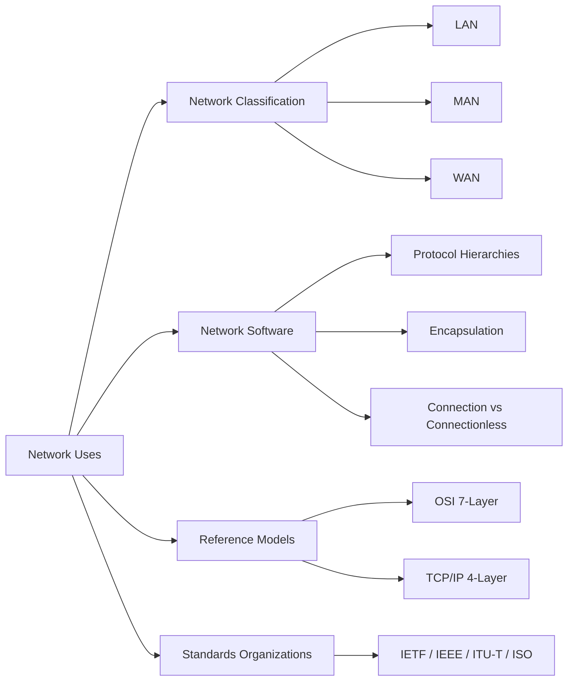

# Chapter 1: Introduction to Computer Networks

> **Prerequisites:** None | **Next:** [Chapter 2: Physical Layer](./02-physical-layer.md) — From network models to transmission media

## Learning Objectives

1. Describe the fundamental uses of computer networks in commercial, residential, and research contexts.
2. Distinguish between local-area, metropolitan-area, and wide-area networks and characterize their scale and performance properties.
3. Explain the concepts of protocol layering, service models, and encapsulation.
4. Compare the OSI reference model and the TCP/IP protocol suite with respect to layer count, naming, and design philosophy.
5. Identify the key standards organizations and their roles in Internet standardization.

---

### Chapter at a Glance

| Topic | Key Insight | Practical Takeaway |
|-------|-------------|-------------------|
| Network Classification | LAN, MAN, WAN differ by geographic span, topology, and performance | Choose LAN for buildings, WAN for global reach, MAN for metropolitan aggregation |
| Protocol Layering | Layers provide services to the layer above using protocols at the same layer | Encapsulation (adding headers at each layer) is the core mechanism of layered communication |
| OSI Model | 7-layer conceptual model: Physical through Application | Useful as pedagogical framework; TCP/IP is the deployed reality |
| TCP/IP Model | 4-layer model: Link, Internet, Transport, Application | The architecture of the actual Internet; minimalist and implementation-driven |
| Encapsulation | Each layer adds its header to the payload before passing down | Trace headers to debug network issues — look at the right layer for the right problem |
| Standardization | IETF, IEEE, ITU-T, ISO develop open standards | RFCs are the definitive specification for Internet protocols |

### Chapter Roadmap



## 1.1 Uses of Computer Networks

Computer networks connect autonomous computers for the purpose of sharing data, resources, and services. The earliest networks, such as ARPANET, emerged from research laboratories seeking to share computing resources across institutions. Contemporary networks serve three broad categories of use.

**Commercial applications** include resource sharing — printers, storage systems, and compute clusters — that reduces capital expenditure through consolidation. Electronic commerce relies on networks for payment processing, inventory synchronization, and customer relationship management. Supply chain systems use dedicated network links to coordinate just-in-time manufacturing across global partners.

> **Pro Tip:** When designing for commercial networks, prioritize reliability and throughput over raw speed — a predictable 100 Mbps link often outperforms an erratic 1 Gbps link for business-critical applications.

**One-Sentence Takeaway:** Computer networks connect autonomous systems to share resources, and their design priorities shift dramatically between commercial, residential, and research contexts.

**Residential and mobile users** access the Internet for web browsing, streaming media, real-time communication, and social networking. The proliferation of smartphones has made wireless connectivity a primary expectation. Internet service providers (ISPs) deliver connectivity through cable, digital subscriber line (DSL), fiber-to-the-home (FTTH), and cellular technologies.

**Research and education networks** such as Internet2 and GEANT provide high-bandwidth interconnects for scientific collaboration. These networks support data-intensive applications including genomics, high-energy physics, and climate modeling, where datasets measured in petabytes must be transferred among geographically distributed institutions.

## 1.2 Network Hardware

Networks are broadly classified by their geographical span, transmission technology, and switching technique.

### 1.2.1 Local-Area Networks

Local-area networks (LANs) cover a single building or campus, typically spanning less than one kilometer. Ethernet, specified by the IEEE 802.3 standard, dominates the LAN market. A classical Ethernet LAN uses a shared coaxial cable; modern switched Ethernet uses twisted-pair cabling with dedicated bandwidth per node. LANs operate at data rates from 100 Mbps to 100 Gbps and exhibit low propagation delay, measured in microseconds. The dominant topology is star — each end station connects to a central switch.

### 1.2.2 Metropolitan-Area Networks

Metropolitan-area networks (MANs) span a city or metropolitan region, typically 5–50 km in diameter. Cable television networks are a ubiquitous example, originally designed for one-way video distribution and now upgraded for bidirectional data communication via the Data Over Cable Service Interface Specification (DOCSIS). MANs often serve as aggregation networks, collecting traffic from multiple LANs and delivering it to a wide-area backbone.

### 1.2.3 Wide-Area Networks

Wide-area networks (WANs) operate across national or international distances. A WAN consists of a collection of routers interconnected by leased lines, fiber-optic cables, or satellite links. The subnet, consisting of routers and transmission lines, handles packet forwarding; the hosts attached to the subnet run user applications. WANs may use circuit switching (telephone network), packet switching (Internet), or a combination.

### 1.2.4 Wireless Networks

Wireless networks eliminate the physical transmission medium. They are classified by range: wireless personal-area networks (WPANs, e.g., Bluetooth, ~10 m), wireless LANs (WLANs, e.g., 802.11 WiFi, ~100 m), wireless MANs (WMANs, e.g., WiMAX, ~10 km), and wireless WANs (WWANs, e.g., 4G/5G cellular, nationwide). Wireless links have lower throughput, higher latency, and greater error rates than wired links due to attenuation, interference, and multipath propagation.

> **Pro Tip:** Always plan for wireless as a shared, half-duplex medium. Unlike wired Ethernet where switches give each node dedicated bandwidth, WiFi access points share airtime — adding more clients increases collision probability, not just traffic volume.

## 1.3 Network Software

### 1.3.1 Protocol Hierarchies

A protocol is a set of rules governing the exchange of messages between two communicating entities. Complex communication systems are organized as a stack of layers, where each layer provides a service to the layer above and relies on the layer below. The peer processes at layer N on different machines communicate using the layer-N protocol.

The interface between layers defines which operations and services the lower layer provides to the upper layer. Well-defined interfaces permit implementation changes in one layer without affecting others — a property called layering abstraction.

> **Pro Tip:** The key to understanding network protocols is to always ask: "Which layer owns this problem?" Routing belongs to the network layer; reliable delivery belongs to the transport layer; encryption can live at multiple layers (TLS at transport, IPsec at network). Putting the solution at the wrong layer causes duplication or breaks layering abstraction.

### 1.3.2 Encapsulation

When an application sends data, each layer adds a header (and sometimes a trailer) containing control information for its peer. This process, encapsulation, creates a nested structure:

```
[Application Data]
[Transport Hdr | Application Data]
[Network Hdr | Transport Hdr | Application Data]
[Link Hdr | Network Hdr | Transport Hdr | Application Data | Link Trailer]
```

At the receiving end, each layer strips its corresponding header and passes the payload upward.

> **One-Sentence Takeaway:** Encapsulation is the fundamental mechanism of layered networking — each layer wraps the entire payload from the layer above with its own header, creating a nested onion that peers at the same layer on the receiving end can interpret.

### 1.3.3 Connection-Oriented vs. Connectionless Service

A connection-oriented service operates in three phases: connection establishment, data transfer, and connection teardown. It resembles a telephone call and provides sequencing, flow control, and error control. A connectionless service — analogous to postal mail — delivers each message independently; messages may arrive out of order, and delivery is not guaranteed unless the service is acknowledged.

### 1.3.4 Service Primitives

The service provided by layer N to layer N+1 is expressed as a set of primitives: LISTEN, CONNECT, RECEIVE, SEND, and DISCONNECT for connection-oriented service; SEND and RECEIVE for connectionless service. Primitives may be blocking (synchronous) or non-blocking (asynchronous).

## 1.4 Reference Models


### 1.4.1 The OSI Reference Model

The Open Systems Interconnection (OSI) model, developed by the International Organization for Standardization (ISO) in 1984, partitions network functionality into seven layers:

| Layer | Name | Function |
|-------|------|----------|
| 7 | Application | Network services for user applications |
| 6 | Presentation | Data translation, encryption, compression |
| 5 | Session | Dialogue control, synchronization checkpoints |
| 4 | Transport | End-to-end delivery, segmentation, error recovery |
| 3 | Network | Routing, logical addressing, fragmentation |
| 2 | Data Link | Framing, error detection, medium access control |
| 1 | Physical | Bit-by-bit transmission over media |

The OSI model is conceptually rigorous but was never widely implemented in its pure form. Its primary value is as a pedagogical tool.

> **Pro Tip:** Remember the OSI layers with mnemonics: "Please Do Not Throw Sausage Pizza Away" (Physical, Data Link, Network, Transport, Session, Presentation, Application) from bottom to top. For TCP/IP, think "LITA" — Link, Internet, Transport, Application.

### 1.4.2 The TCP/IP Reference Model

The TCP/IP model, developed by the U.S. Department of Defense through ARPANET research, has four layers:

| Layer | Protocols |
|-------|-----------|
| Application | HTTP, SMTP, DNS, FTP, SSH |
| Transport | TCP, UDP |
| Internet | IP, ICMP, ARP |
| Link | Ethernet, WiFi, PPP |

TCP/IP was designed with a minimalist philosophy — "keep it simple" — and placed little emphasis on the presentation and session layers, which are left to the application. The model's success stems from its robust, implementation-driven standardization.

### 1.4.3 Critique of Models

The OSI model failed in practice because its standards were developed before implementations existed, leading to complexity without validation. TCP/IP succeeded because working implementations preceded standardization. However, TCP/IP conflates the physical and data link layers into a single "link" layer, which obscures important distinctions. Hybrid teaching models commonly use a five-layer Internet model: physical, data link, network, transport, and application.

> **One-Sentence Takeaway:** The OSI model taught us what layers *could* be; TCP/IP showed us what layers *needed* to be — and the gap between them explains why one is a textbook reference and the other runs the Internet.

## 1.5 Standardization

Internet standards are developed through an open, consensus-based process managed by several organizations.

**The Internet Engineering Task Force (IETF)** develops core Internet protocols. Working groups discuss proposals on mailing lists, and decisions are documented in Requests for Comments (RFCs). An RFC progresses through maturity levels: Proposed Standard, Draft Standard, and Internet Standard.

**The Institute of Electrical and Electronics Engineers (IEEE)** develops lower-layer standards through the 802 committee, which produced Ethernet (802.3), WiFi (802.11), and Bluetooth (802.15).

**The International Telecommunication Union — Telecommunication Standardization Sector (ITU-T)** publishes standards for telecommunication systems including optical networking (SONET/SDH) and telephone signaling (SS7).

**The International Organization for Standardization (ISO)** co-developed the OSI model and maintains standards for networking, security, and coding.

---

### Concept Comparison Table

| Concept | Definition | Key Distinction | Use Case |
|---------|-----------|-----------------|----------|
| OSI Model | 7-layer conceptual framework | Rigorous but theoretical | Teaching network abstractions |
| TCP/IP Model | 4-layer Internet architecture | Implementation-driven, pragmatic | Real-world Internet communication |
| LAN | Single building/campus network | High speed, low latency, typically Ethernet | Office networks, campus connectivity |
| WAN | Nationwide/international network | Leased lines, routers, higher latency | Global enterprise connectivity |
| Connection-Oriented | Three-phase: setup, data, teardown | Guarantees ordering and reliability | File transfer, web browsing (TCP) |
| Connectionless | Independent message delivery | No state, no ordering guarantee | DNS queries, video streaming (UDP) |
| Encapsulation | Each layer adds its own header | Creates nested frame structure | Debugging network traces |

### Quick Reference

| Category | Key Points |
|----------|------------|
| **Network Scale** | WPAN (~10m) → WLAN (~100m) → WMAN (~10km) → WWAN (nationwide) |
| **OSI Layers (7→1)** | Application → Presentation → Session → Transport → Network → Data Link → Physical |
| **TCP/IP Layers (4→1)** | Application → Transport → Internet → Link |
| **Key Mnemonic** | "Please Do Not Throw Sausage Pizza Away" for OSI bottom-up |
| **Service Types** | Connection-oriented (TCP — reliable, ordered) vs Connectionless (UDP — best-effort) |
| **Standards Bodies** | IETF (RFCs, Internet protocols), IEEE (802.x physical/link), ITU-T (telecom), ISO (general) |

### Cross-Application Matrix

| Concept | Network Engineering | Web Development | System Administration | Security |
|---------|-------------------|-----------------|----------------------|----------|
| OSI/TCP/IP Models | Troubleshooting at correct layer | Understanding HTTP/TCP stack | Network interface configuration | Layer-specific attack analysis |
| LAN/WAN Design | Topology planning, switch placement | N/A | Branch office connectivity | Network segmentation (VLAN) |
| Encapsulation | PDU analysis (packet/datagram/frame) | HTTP header debugging | Packet capture (tcpdump/Wireshark) | Reading malicious packet structures |
| Connection-Oriented | Traffic engineering, QoS | TCP socket programming | Firewall state tracking | Session hijacking detection |

---

### Chapter Quiz

**Q1.** Which layer of the OSI model is responsible for routing and logical addressing?

- A) Data Link
- B) Network
- C) Transport
- D) Session

<details>
<summary>Answer</summary>
B) Network — Layer 3 handles routing and logical addressing (IP).
</details>

**Q2.** What is the primary reason the OSI model failed in practice while TCP/IP succeeded?

- A) TCP/IP has more layers
- B) OSI standards were developed before working implementations existed
- C) OSI was proprietary
- D) TCP/IP is faster

<details>
<summary>Answer</summary>
B) OSI defined standards before implementation validation; TCP/IP built working code first, then standardized.
</details>

**Q3.** In encapsulation, what happens to a transport-layer header when data moves from the transport layer to the network layer?

- A) It is removed
- B) It stays as part of the network-layer payload
- C) It is encrypted
- D) It is converted to a trailer

<details>
<summary>Answer</summary>
B) The transport-layer header remains as payload for the network layer, which adds its own header before passing down.
</details>

**Q4.** Which network type typically operates at distances less than 1 km?

- A) WAN
- B) MAN
- C) LAN
- D) PAN

<details>
<summary>Answer</summary>
C) LAN — Local-area networks cover a single building or campus under 1 km.
</details>

---

## Summary

Computer networks enable communication among autonomous computers through layered protocol stacks. LANs, MANs, and WANs differ in scale, topology, and transmission technology. Protocol layering provides abstraction and modularity. The OSI model offers a seven-layer conceptual framework, while the TCP/IP model governs the actual Internet. Standards organizations including the IETF, IEEE, and ITU-T ensure interoperability through open, consensus-driven processes.

## Exercises

### Review Questions

1. List three advantages of layering in network protocol design.
2. What is the difference between a connection-oriented service and a connectionless service? Give an example of each.
3. Name the seven layers of the OSI model and state the primary function of each.
4. Why does the TCP/IP model not have dedicated presentation and session layers?
5. What was the principal reason the OSI model failed to gain widespread adoption?

### Application Problems

6. A company has 500 employees in a single building and 50 remote workers. Recommend a network architecture and justify your choice of LAN and WAN technologies.
7. Consider an application that requires guaranteed in-order delivery of messages with retransmission of lost messages. Should the application use a connection-oriented or connectionless transport service? Explain.
8. Using the five-layer Internet model, trace the path of an HTTP request from a web browser to a server. Identify the protocol at each layer.

### Challenge Problem

9. **Design a seven-layer protocol that is not one of the standard models.** Describe each layer's function, the service it provides to the layer above, and the protocol it uses with its peer. Your design must satisfy the following requirement: two applications that speak different languages (e.g., English and Mandarin) must be able to communicate through automatic translation at exactly one of your layers. Justify your placement of the translation function.
