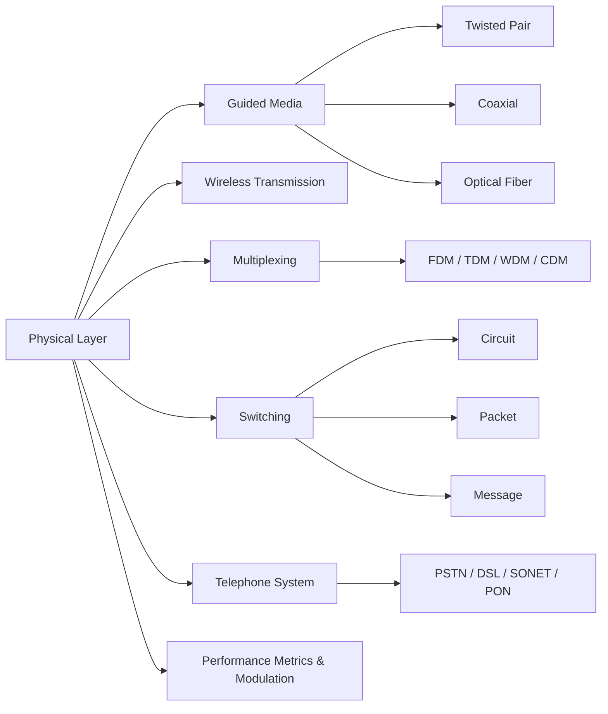

# Chapter 2: The Physical Layer

> **Prerequisites:** [Chapter 1: Introduction](./01-introduction.md) — Network models and layering | **Next:** [Chapter 3: Data Link Layer](./03-datalink-layer.md) — From bits to frames

## Learning Objectives

1. Characterize the properties of guided transmission media including twisted pair, coaxial cable, and optical fiber.
2. Compare wireless transmission technologies: radio, microwave, and infrared.
3. Explain the principles of frequency-division, time-division, wavelength-division, and code-division multiplexing.
4. Distinguish between circuit switching, packet switching, and message switching.
5. Describe the architecture of the public switched telephone network.

---

### Chapter at a Glance

| Topic | Key Insight | Practical Takeaway |
|-------|-------------|-------------------|
| Guided Media | Twisted pair, coaxial, fiber — each has a bandwidth-distance trade-off | Fiber for backbone, twisted pair for access, coax for cable TV/broadband |
| Wireless Transmission | Radio penetrates walls; microwave needs line-of-sight; IR is room-limited | Choose radio for mobility, microwave for point-to-point backhaul, IR for secure short-range |
| Multiplexing | FDM/TDM/WDM/CDM share medium capacity among multiple users | WDM multiplies fiber capacity 80x; TDM suits constant-rate traffic |
| Switching | Circuit: reserved path, deterministic. Packet: shared path, efficient | Circuit for voice; packet for data; virtual-circuit gives best-of-both for MPLS |
| Telephone System | PSTN evolved from analog voice to digital backbone with DSL | DSL exploits existing local loops; PON is the fiber-to-the-home future |
| Performance Metrics | Bandwidth × delay = window size needed for full utilization | Always compute bandwidth-delay product when tuning TCP |

### Chapter Roadmap

## 2.1 Guided Transmission Media

Guided media provide a physical conduit for electromagnetic signals. The choice of medium depends on bandwidth requirements, distance, cost, and environmental factors.

### 2.1.1 Twisted Pair

Twisted pair cable consists of two insulated copper wires twisted together. Twisting reduces electromagnetic interference (EMI) because the radiated signals from each wire cancel one another. Unshielded twisted pair (UTP) is classified by category: Cat 5e (100 MHz, 1 Gbps), Cat 6 (250 MHz, 10 Gbps at 55 m), Cat 6a (500 MHz, 10 Gbps at 100 m), and Cat 8 (2000 MHz, 40 Gbps). Shielded twisted pair (STP) adds a metallic foil to further reduce EMI, used in high-noise industrial environments. Twisted pair remains the most common medium for LAN connections due to its low cost and ease of termination with RJ-45 connectors.

### 2.1.2 Coaxial Cable

Coaxial cable has a central copper conductor surrounded by an insulating layer, a metallic shield, and an outer jacket. The shield provides better noise immunity than twisted pair and supports higher bandwidth over longer distances. Thicknet (10Base5) and thinnet (10Base2) were used in early Ethernet. Modern applications include cable television distribution (75-ohm RG-6) and broadband Internet access via DOCSIS, which achieves downstream rates exceeding 1 Gbps by sharing a 1 GHz spectrum among subscribers.

### 2.1.3 Optical Fiber

Optical fiber transmits light pulses through a glass or plastic core by total internal reflection. Single-mode fiber (SMF) has a core diameter of 8–10 micrometers and supports a single propagation mode, enabling data rates up to 400 Gbps over hundreds of kilometers. Multimode fiber (MMF) has a 50- or 62.5-micrometer core and supports multiple modes, limiting range to approximately 550 m at 10 Gbps due to modal dispersion. Fiber offers enormous bandwidth, immunity to electromagnetic interference, and low signal attenuation — 0.2 dB/km for SMF at 1550 nm compared to 2 dB/km for coaxial cable. Dense wavelength-division multiplexing (DWDM) multiplies fiber capacity by transmitting dozens of wavelengths simultaneously, achieving aggregate capacities of tens of terabits per second.

> **Pro Tip:** When choosing physical media, remember this rule of thumb: twisted pair for the last 100 meters, fiber for everything longer than that, and wireless when mobility or installation cost is the primary constraint. Coaxial cable remains relevant only where it is already deployed (cable TV infrastructure).

**One-Sentence Takeaway:** Guided media trade off bandwidth, distance, and cost — twisted pair is cheapest for short runs, fiber dominates long-haul with terabit capacity, and coaxial persists as legacy infrastructure.

## 2.2 Wireless Transmission

Wireless transmission uses electromagnetic waves propagated through free space. The frequency spectrum is a finite resource regulated by national and international bodies.

### 2.2.1 Radio Waves

Radio waves in the 3 kHz–300 GHz range propagate through walls and around obstacles. The propagation characteristics depend on frequency. Low frequencies (below 30 MHz) follow the Earth's curvature as ground waves. High frequencies (30 MHz–3 GHz) travel in straight lines and require line-of-sight paths. The unlicensed ISM bands at 900 MHz, 2.4 GHz, and 5 GHz support WiFi, Bluetooth, and Zigbee. The primary advantage of radio is omnidirectional transmission; the primary disadvantage is interference from other sources operating in the same band.

### 2.2.2 Microwaves

Microwaves (3–300 GHz) propagate by line-of-sight and are attenuated by rain and atmospheric gases. Point-to-point microwave links connect buildings up to 50 km apart with data rates of several gigabits per second. Satellite communication uses microwave frequencies. Geostationary Earth orbit (GEO) satellites orbit at 35,786 km and cover one-third of the Earth's surface but introduce a propagation delay of approximately 250 ms. Low Earth orbit (LEO) satellites such as Starlink orbit at 550 km, reducing delay to under 20 ms, but require constellations of thousands of satellites for global coverage.

### 2.2.3 Infrared

Infrared (IR) waves, with frequencies above 300 GHz, are used for short-range communication (1–10 m) between devices such as remote controls and some wireless keyboards. IR does not penetrate walls, providing inherent security against eavesdropping in adjacent rooms. IR links require line-of-sight and are affected by sunlight and other ambient light sources.

> **Pro Tip:** The unlicensed ISM bands (2.4 GHz, 5 GHz, 6 GHz) are crowded — Bluetooth, WiFi, Zigbee, and microwave ovens all compete at 2.4 GHz. For deployments in dense environments, prefer 5 GHz or 6 GHz (WiFi 6E) where channel width and interference are more manageable.

**One-Sentence Takeaway:** Wireless transmission trades convenience against physical limitations — radio penetrates walls but invites interference, microwave provides high-speed backhaul with line-of-sight constraints, and infrared sacrifices range for inherent security.

## 2.3 Multiplexing

Multiplexing allows multiple signals to share a single transmission medium, improving utilization and reducing cost.

### 2.3.1 Frequency-Division Multiplexing

FDM assigns each signal a distinct frequency band (subchannel). Guard bands between subchannels prevent interference. Analog television and radio broadcasting use FDM, as does cable Internet where downstream and upstream channels occupy different frequency ranges. The total bandwidth of the medium must exceed the sum of the subchannel bandwidths.

### 2.3.2 Time-Division Multiplexing

TDM interleaves bits or frames from multiple sources in time. In synchronous TDM, each source gets a fixed time slot regardless of whether it has data to send; unused slots are wasted. Statistical TDM assigns slots dynamically based on demand, improving efficiency for bursty traffic. SONET/SDH optical networks use synchronous TDM with frames of 125 microseconds duration.

### 2.3.3 Wavelength-Division Multiplexing

WDM is FDM applied to optical fiber. Each wavelength (color) of light carries an independent data stream. CWDM uses broader channel spacing (20 nm), supporting up to 18 channels. DWDM uses narrow spacing (0.8 nm or less), supporting 80 or more channels per fiber. A single fiber with 80 channels at 100 Gbps each achieves an aggregate capacity of 8 Tbps.

### 2.3.4 Code-Division Multiplexing

CDM assigns each transmitter a unique spreading code consisting of a sequence of chips. The transmitter multiplies each bit by the chip sequence, spreading the signal across a wider bandwidth. Receivers decode the desired signal by correlating with the matching code; other signals appear as noise. Code-division multiple access (CDMA) was used in 3G cellular networks.

## 2.4 Switching

### 2.4.1 Circuit Switching

Circuit switching establishes a dedicated path between endpoints before data transmission begins. Resources along the path (switches, link bandwidth) are reserved for the duration of the connection. The public switched telephone network (PSTN) uses circuit switching. A connection has three phases: circuit establishment, data transfer, and circuit teardown. Circuit switching provides deterministic quality of service — constant bit rate and bounded delay — but is inefficient for bursty data because reserved resources remain idle during silent periods.

### 2.4.2 Packet Switching

Packet switching breaks data into packets (typically 1500 bytes or less) that travel independently through the network. Store-and-forward switches receive a complete packet before forwarding it on the next link. Statistical multiplexing allows packets from multiple sources to share links dynamically, achieving high utilization for bursty traffic. Packet switching has two modes: datagram (connectionless), where each packet is routed independently, and virtual circuit (connection-oriented), where a path is established before data transfer and all packets follow the same route. The Internet uses datagram packet switching at the network layer.

> **Pro Tip:** Circuit switching and packet switching are not mutually exclusive — MPLS networks use the virtual-circuit model (label-switched paths) over a packet-switched core, combining the traffic-engineering benefits of circuits with the resilience of packet switching.

### 2.4.3 Message Switching

Message switching, used in early telegraph networks, forwards entire messages (potentially megabytes) from switch to switch without segmentation. Each switch stores the entire message before forwarding (store-and-forward). This approach does not require a dedicated path but introduces high delay for large messages and consumes significant buffer space. Message switching is rarely used in modern networks, having been supplanted by packet switching.

## 2.5 The Telephone System

The PSTN was originally designed for analog voice using circuit switching. Subscriber loops (local loops) connect telephones to the central office (CO). Trunks interconnect COs and toll offices. The digital backbone uses SONET rings or fiber infrastructure. Signaling System 7 (SS7) provides out-of-band call control.

Digital subscriber line (DSL) technology enables broadband Internet over the same twisted-pair local loop used for telephone service. DSL uses frequency-division multiplexing: the 0–4 kHz band carries voice, while higher frequencies (25 kHz–1.1 MHz for ADSL) carry data. ADSL provides asymmetric speeds (up to 24 Mbps downstream, 3 Mbps upstream), suitable for residential use. VDSL2 achieves up to 100 Mbps symmetric over short loops under 500 meters.

### 2.5.1 SONET/SDH

Synchronous Optical Networking (SONET) and Synchronous Digital Hierarchy (SDH) are standardized multiplexing protocols for optical transport. The base rate is STS-1 (51.84 Mbps). Higher rates are multiples: STS-3 (155.52 Mbps), STS-12 (622.08 Mbps), STS-48 (2.488 Gbps), STS-192 (9.953 Gbps), and STS-768 (39.813 Gbps). SONET uses a 125-microsecond frame with section, line, and path overhead for performance monitoring, protection switching, and payload mapping.

### 2.5.2 Passive Optical Networks

Passive Optical Networks (PON) use passive optical splitters to serve multiple premises from a single optical line terminal (OLT) at the central office. GPON (ITU-T G.984) provides 2.488 Gbps downstream and 1.244 Gbps upstream. EPON (IEEE 802.3ah) provides symmetric 1 Gbps. NG-PON2 achieves 40 Gbps through wavelength-stacked time-division multiplexing.

## 2.6 Performance Metrics

Network performance is characterized by bandwidth (bits per second), throughput (actual data delivery rate), latency (time for a bit to traverse the network), jitter (variation in latency), and bit error rate (fraction of corrupted bits). These metrics are interrelated: higher bandwidth reduces serialization delay but does not affect propagation delay; latency determines the bandwidth-delay product, which governs the amount of data that can be in flight.

The bandwidth-delay product RTT × R defines the optimal window size for reliable transport. For a 10 Gbps link with 50 ms RTT, the product is 500 Mb or 62.5 MB — the sender must have this much data outstanding to keep the link fully utilized.

> **Pro Tip:** Bandwidth-delay product is the single most important concept for understanding TCP performance. If your TCP window is smaller than BDP, you are leaving link capacity on the table — period. Always compute it when diagnosing throughput issues on high-latency links.

## 2.7 Electronic Modulation

Amplitude Shift Keying (ASK) encodes data by varying the carrier amplitude. Frequency Shift Keying (FSK) varies the carrier frequency. Phase Shift Keying (PSK) varies the carrier phase. Quadrature PSK (QPSK) encodes 2 bits per symbol using four phase states offset by 90 degrees. Higher-order modulation such as QAM combines amplitude and phase variation: 16-QAM encodes 4 bits/symbol, 64-QAM encodes 6 bits/symbol, and 256-QAM encodes 8 bits/symbol.

Baud rate (symbols per second) and bit rate are related by: bit rate = baud rate × log₂(M), where M is the number of distinct symbols. Modems historically increased throughput by combining more modulation states and echo cancellation. V.90 achieved 56 kbps downstream by exploiting the digital PCM connection in the PSTN.

---

### Concept Comparison Table

| Concept | Definition | Key Distinction | Use Case |
|---------|-----------|-----------------|----------|
| Twisted Pair | Two insulated copper wires twisted together | Category rating determines bandwidth (Cat 5e → Cat 8) | LAN connections, DSL |
| Coaxial Cable | Copper conductor + shield + jacket | Higher noise immunity than UTP | Cable TV, broadband Internet |
| Optical Fiber | Light pulses through glass core by TIR | SMF: long-distance, MMF: short-distance | Backbone networks, data centers |
| Circuit Switching | Dedicated path reserved before data | Deterministic QoS, poor burst efficiency | Voice calls, legacy TDM |
| Packet Switching | Data segmented, routed independently | Statistical multiplexing, variable delay | Internet (IP), Ethernet |
| FDM | Signals assigned distinct frequency bands | Guard bands prevent interference | Radio/TV broadcast, cable Internet |
| TDM | Sources interleaved in time slots | Synchronous: fixed slots; Statistical: demand-driven | SONET/SDH optical transport |
| WDM | Multiple wavelengths on one fiber | DWDM: 80+ channels, CWDM: up to 18 channels | Long-haul optical networks |

### Quick Reference

| Category | Key Points |
|----------|------------|
| **Media Range** | UTP (100m) → Coax (500m) → MMF (550m) → SMF (100+ km) |
| **Wireless Spectrum** | Radio (3 kHz–300 GHz, through walls), Microwave (3–300 GHz, line-of-sight), IR (300 GHz+, room-limited) |
| **Multiplexing Types** | FDM (frequency slices), TDM (time slices), WDM (colors of light), CDM (spreading codes) |
| **Switching Comparison** | Circuit: setup phase, reserved, constant delay. Packet: no setup, shared, variable delay. Message: whole-file forwarding, high memory |
| **Fiber Hierarchy** | STS-1 (51.84 Mbps) → STS-192 (10 Gbps) → STS-768 (40 Gbps) |
| **Modulation Formula** | Bit rate = Baud rate × log₂(M) — higher QAM = more bits per symbol |

### Cross-Application Matrix

| Concept | Network Engineering | Data Center Ops | Telecom | Embedded/IoT |
|---------|-------------------|-----------------|---------|--------------|
| Guided Media | Cable plant design | Fiber topology (MMF vs SMF) | Local loop provisioning | RS-485, I²C bus |
| Wireless | Site survey, AP placement | N/A | Cell tower backhaul | BLE, Zigbee, LoRaWAN |
| Multiplexing | Link aggregation (LACP) | CWDM/DWDM in fabric | SONET ring design | N/A |
| Switching | Router/switch selection | Fabric design (CLOS topology) | PSTN call routing | N/A |
| Modulation | Understanding line rates | N/A | DSL/CMTS provisioning | RF transceiver config |

---

### Chapter Quiz

**Q1.** Which UTP category supports 10 Gbps at 100 meters?

- A) Cat 5e
- B) Cat 6
- C) Cat 6a
- D) Cat 8

Answer

C) Cat 6a supports 10 Gbps at 100 m (Cat 6 only supports 10 Gbps to 55 m).

**Q2.** What is the primary disadvantage of circuit switching compared to packet switching?

- A) Higher latency
- B) Poor efficiency for bursty traffic
- C) Lower bandwidth
- D) No quality of service

Answer

B) Circuit switching reserves resources regardless of usage, wasting capacity during silent periods.

**Q3.** A single-mode fiber has an attenuation of 0.2 dB/km. A 50 km link with a 3 dBm transmitter requires what minimum receiver sensitivity?

- A) −3 dBm
- B) −7 dBm
- C) −10 dBm
- D) −17 dBm

Answer

B) Attenuation = 0.2 × 50 = 10 dB. Received power = 3 dBm − 10 dB = −7 dBm.

**Q4.** Which multiplexing technique is used to transmit 80 independent 100 Gbps channels on a single fiber?

- A) FDM
- B) TDM
- C) DWDM
- D) CDM

Answer

C) DWDM — dense wavelength-division multiplexing with 0.8 nm or narrower channel spacing.

---

## Summary

The physical layer governs bit transmission over media. Guided media — twisted pair, coaxial cable, and optical fiber — offer different trade-offs in bandwidth, distance, and cost. Wireless transmission using radio, microwave, or infrared enables mobile and untethered communication. Multiplexing techniques (FDM, TDM, WDM, CDM) share medium capacity among multiple users. Circuit switching provides dedicated paths with guaranteed quality but poor burst efficiency; packet switching achieves statistical multiplexing gains at the cost of variable delay. The telephone system remains a foundational infrastructure, adapted for data via DSL.

## Exercises

### Review Questions

1. Why does twisting a pair of wires reduce electromagnetic interference?
2. List the categories of UTP cabling and the maximum data rate each supports.
3. What is the principal cause of signal degradation in multimode fiber that does not affect single-mode fiber?
4. Distinguish between FDM and TDM. Give an application appropriate for each.
5. What is statistical multiplexing, and why does it improve link utilization for bursty traffic?

### Application Problems

6. A cable television system has 120 analog channels, each 6 MHz wide. If the system is converted to digital transmission using 256-QAM modulation that achieves 8 bps/Hz, what is the total downstream capacity?
7. A 100 km optical fiber link has an attenuation of 0.25 dB/km. If the transmitter output is 3 dBm and the receiver requires at least −20 dBm, what is the link power budget? How many in-line amplifiers (20 dB gain each) are needed?
8. A file of 10 MB is to be sent over a circuit-switched network with a bandwidth of 100 Mbps. The setup time is 100 ms. Compare the total delivery time with packet switching over a store-and-forward network of 10 hops, each link at 100 Mbps, with a packet size of 1500 bytes (ignore queuing delay). Under what condition is circuit switching faster?

### Challenge Problem

9. **Compare multiplexing and switching for a specific real-world scenario.** A university has 1000 faculty and staff in 10 buildings. Each staff member generates an average of 2 Mbps of bursty traffic (peak 10 Mbps). Design the campus backbone: specify the choice of media, multiplexing scheme, and switching technology. Compute the aggregate bandwidth required and explain how statistical multiplexing affects your provisioning calculations. Justify each design decision.
