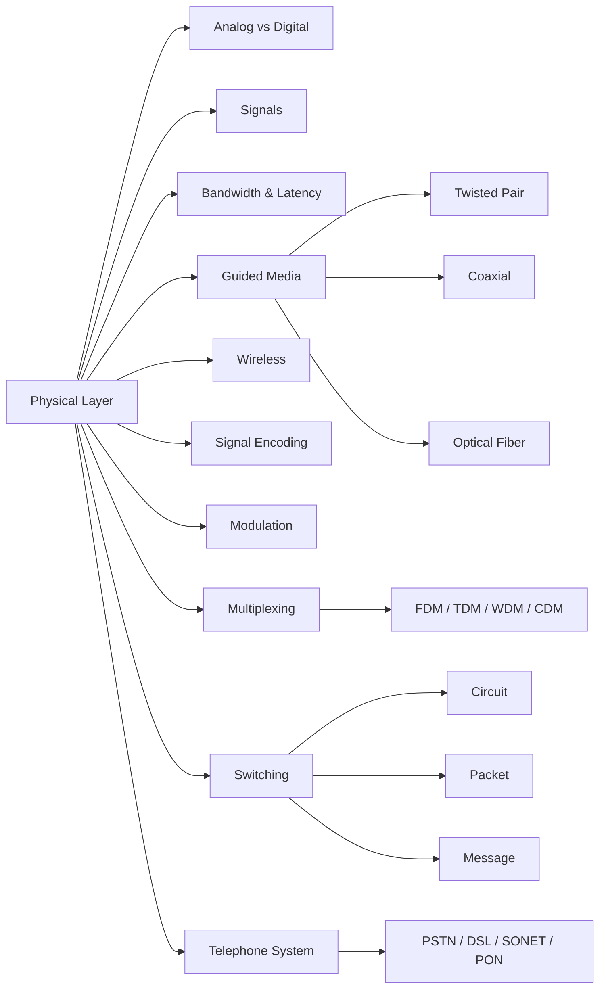

# Chapter 2: The Physical Layer

> **Prerequisites:** [Chapter 1: Introduction](./01-introduction.md) — Network models and layering | **Next:** [Chapter 3: Data Link Layer](./03-datalink-layer.md) — From bits to frames

## Learning Objectives

1. Characterize the properties of guided transmission media including twisted pair, coaxial cable, and optical fiber.
2. Compare wireless transmission technologies: radio, microwave, and infrared.
3. Explain the principles of frequency-division, time-division, wavelength-division, and code-division multiplexing.
4. Distinguish between circuit switching, packet switching, and message switching.
5. Describe the architecture of the public switched telephone network.
6. Analyze analog vs digital signals with encoding and modulation techniques.
7. Calculate channel capacity using Nyquist and Shannon theorems.
8. Implement signal encoding, modulation, and multiplexing algorithms.

---

### Chapter at a Glance

| Topic | Key Insight | Practical Takeaway |
|-------|-------------|-------------------|
| Guided Media | Twisted pair, coaxial, fiber — each has a bandwidth-distance trade-off | Fiber for backbone, twisted pair for access, coax for cable TV/broadband |
| Wireless Transmission | Radio penetrates walls; microwave needs line-of-sight; IR is room-limited | Choose radio for mobility, microwave for point-to-point backhaul, IR for secure short-range |
| Multiplexing | FDM/TDM/WDM/CDM share medium capacity among multiple users | WDM multiplies fiber capacity 80x; TDM suits constant-rate traffic |
| Switching | Circuit: reserved path, deterministic. Packet: shared path, efficient | Circuit for voice; packet for data; virtual-circuit gives best-of-both for MPLS |
| Telephone System | PSTN evolved from analog voice to digital backbone with DSL | DSL exploits existing local loops; PON is the fiber-to-the-home future |
| Performance Metrics | Bandwidth × delay = window size needed for full utilization | Always compute bandwidth-delay product when tuning TCP |
| Signal Encoding | NRZ, Manchester, 4B/5B, 8B/10B convert bits to signals | 8B/10B used in Ethernet; 4B/5B used in Fast Ethernet |
| Modulation | ASK/FSK/PSK/QAM encode bits by varying carrier properties | QAM-256 achieves 8 bps/Hz; used in cable modems and Wi-Fi |

### Chapter Roadmap



## 2.1 Analog vs Digital Signals

**Real-world analogy:** An analog signal is like a dimmer switch — infinitely variable brightness. A digital signal is like a light switch — only ON (1) or OFF (0). A dimmer can produce any brightness level, but the light switch gives a clear, unambiguous state that is easy to replicate.

### 2.1.1 Definitions

- **Analog signal:** Continuous waveform that varies smoothly over time. Examples: human voice, analog thermometer reading, AM/FM radio waves.
- **Digital signal:** Discrete, stepwise waveform that takes only a finite set of values (typically two: 0 and 1). Examples: computer data, digital clock signal, PCM audio.

### 2.1.2 Comparison: Analog vs Digital

| Property | Analog | Digital |
|----------|--------|---------|
| Values | Continuous range | Discrete (0 or 1) |
| Representation | Sine wave, continuous function | Square wave, step function |
| Susceptibility to noise | High — noise accumulates | Low — regenerated at repeaters |
| Bandwidth usage | Low bandwidth, continuous | High bandwidth per bit |
| Storage | Difficult, degrades over time | Easy, lossless duplication |
| Processing | Requires analog circuits | Digital logic, cheap and fast |
| Distance limitation | Attenuates, needs amplification (which adds noise) | Regenerated perfectly (repeaters) |
| Error detection | Limited | CRC, checksums, parity |
| Security | Low — easy to tap | Higher — encryption feasible |
| Example media | Analog telephone line | Ethernet, USB, SATA |

### 2.1.3 Conversion Steps (Analog to Digital)

1. **Sample** — Measure the analog signal amplitude at regular intervals (Nyquist rate: ≥ 2× highest frequency).
2. **Quantize** — Map each sampled amplitude to the nearest discrete level.
3. **Encode** — Represent each quantization level as a binary number.
4. **Transmit** — Send the binary sequence over a digital channel.

**Pseudocode: ADC (Analog-to-Digital Conversion)**

```
FUNCTION analogToDigital(signal, sampleRate, bitsPerSample):
    samples = []
    for t = 0 to signal.duration step 1/sampleRate:
        amplitude = signal.getValueAt(t)
        quantized = ROUND(amplitude * (2^bitsPerSample - 1))
        binary = TO_BINARY(quantized, bitsPerSample)
        samples.APPEND(binary)
    RETURN samples
```

**Dry Run:** ADC for a 2 Hz sine wave sampled at Nyquist rate (4 Hz) with 3 bits

| Time (s) | Amplitude | Normalized (0–1) | Quantized Level | Binary |
|----------|-----------|-------------------|-----------------|--------|
| 0.000 | 0.00 | 0.500 | 4 | 100 |
| 0.125 | 0.71 | 0.854 | 6 | 110 |
| 0.250 | 1.00 | 1.000 | 7 | 111 |
| 0.375 | 0.71 | 0.854 | 6 | 110 |
| 0.500 | 0.00 | 0.500 | 4 | 100 |
| 0.625 | -0.71 | 0.146 | 1 | 001 |
| 0.750 | -1.00 | 0.000 | 0 | 000 |
| 0.875 | -0.71 | 0.146 | 1 | 001 |

**Complexity Analysis:**

| Operation | Time Complexity | Space Complexity | Why |
|-----------|----------------|------------------|-----|
| Sampling | O(n) where n = sampleRate × duration | O(n) | Every sample is read once |
| Quantization | O(n) | O(n) | Round each amplitude to nearest level |
| Binary encoding | O(n × b) where b = bits/sample | O(n × b) | Convert each level to fixed-width binary |
| Total | O(n × b) | O(n × b) | All three operations are linear in samples |

**Edge Cases:**
- **Aliasing:** Sampling below Nyquist rate causes frequency overlap. Fix: apply anti-aliasing low-pass filter before sampling.
- **Clipping:** Signal amplitude exceeds quantization range. Fix: use automatic gain control (AGC).
- **Quantization noise (granular):** Insufficient bits per sample rounds to wrong level. Fix: increase bit depth or use dithering.
- **Jitter:** Sampling intervals are uneven. Fix: use a precision clock with PLL (phase-locked loop).

**A&D Table — Analog Transmission**

| Advantage | Disadvantage |
|-----------|-------------|
| Simple hardware (amplifier vs ADC) | Noise accumulates with each amplifier stage |
| Uses less bandwidth per channel | Cannot detect or correct errors |
| Smooth, natural representation | Signal degrades with distance |
| No quantization error | Hard to encrypt or process computationally |

**A&D Table — Digital Transmission**

| Advantage | Disadvantage |
|-----------|-------------|
| Noise immunity (regeneration at repeaters) | Requires more bandwidth than analog |
| Error detection and correction possible | Complex hardware (ADC, DAC) |
| Can be encrypted and compressed | Synchronization required between sender and receiver |
| Perfect duplication and storage | Quantization error introduces distortion |

## 2.2 Signals (Periodic and Composite)

**Real-world analogy:** A periodic signal is like a metronome — tick, tick, tick, endlessly repeating. A composite signal is like a symphony orchestra — many instruments playing different notes simultaneously, producing a rich waveform.

### 2.2.1 Periodic Signals

A periodic signal completes a pattern within a measurable time period and repeats that pattern indefinitely. The simplest periodic signal is the sine wave.

**Key parameters:**
- **Amplitude (A):** Maximum signal strength (volts).
- **Period (T):** Time for one complete cycle (seconds).
- **Frequency (f):** 1/T — cycles per second (Hz).
- **Phase (φ):** Offset relative to time zero (radians).

**Equation:** s(t) = A × sin(2πft + φ)

**Steps to analyze a periodic signal:**

1. Measure the time between two consecutive identical points on the waveform → period T.
2. Compute frequency: f = 1/T.
3. Measure peak-to-peak amplitude: A = (V_max − V_min) / 2.
4. Determine phase offset by comparing zero-crossing to t=0.
5. Express as the standard sine equation.

**Pseudocode — Generate and Analyze Sine Wave**

```
FUNCTION generateSine(amplitude, frequency, phase, duration, sampleRate):
    signal = []
    FOR t = 0 TO duration STEP 1/sampleRate:
        value = amplitude * SIN(2 * PI * frequency * t + phase)
        signal.APPEND(value)
    RETURN signal

FUNCTION analyzePeriod(signal, sampleRate):
    // Find first zero-crossing from negative to positive
    FOR i = 1 TO LENGTH(signal) - 1:
        IF signal[i-1] < 0 AND signal[i] >= 0:
            firstZero = i
            BREAK
    // Find next zero-crossing
    FOR j = firstZero + 1 TO LENGTH(signal) - 1:
        IF signal[j-1] < 0 AND signal[j] >= 0:
            periodSamples = j - firstZero
            period = periodSamples / sampleRate
            frequency = 1 / period
            RETURN {period, frequency}
```

**Dry Run — Sine Generation of a 3 Hz signal, A=2V, φ=0, sampled at 20 Hz for 1 second**

| t (s) | 2πft | sin(2πft) | A·sin(2πft) |
|-------|------|-----------|-------------|
| 0.00 | 0.00 | 0.000 | 0.000 |
| 0.05 | 0.942 | 0.809 | 1.618 |
| 0.10 | 1.885 | 0.951 | 1.902 |
| 0.15 | 2.827 | 0.309 | 0.618 |
| 0.20 | 3.770 | -0.309 | -0.618 |
| 0.25 | 4.712 | -1.000 | -2.000 |
| 0.30 | 5.655 | -0.951 | -1.902 |
| 0.35 | 6.597 | -0.309 | -0.618 |
| 0.40 | 7.540 | 0.309 | 0.618 |
| 0.45 | 8.482 | 0.809 | 1.618 |
| 0.50 | 9.425 | 1.000 | 2.000 |

**Edge cases — Periodic Signals:**
- **DC offset:** Signal has non-zero average. Fix: subtract mean before analysis.
- **Harmonic distortion:** Non-pure sine wave with harmonics. Fix: use FFT to extract fundamental.
- **Damped oscillation:** Amplitude decays. Not truly periodic — model as e^(−αt) × sin(ωt).
- **Frequency drift:** Signal frequency changes over time. Fix: windowed FFT (spectrogram).

### 2.2.2 Composite Signals

A composite signal is the sum of two or more periodic signals at different frequencies. Fourier analysis shows that any composite periodic signal can be decomposed into a series of sine/cosine waves (harmonics).

**Real-world analogy:** A chord on a piano is a composite signal — multiple keys pressed simultaneously. Each key produces a sine wave at a specific frequency; the chord is the sum.

**Steps to decompose a composite signal:**

1. Capture one full period of the composite signal.
2. Apply the Fourier Transform (or FFT) to convert from time domain to frequency domain.
3. Identify each peak in the frequency spectrum — each peak represents one component sine wave.
4. Read frequency, amplitude, and phase from each peak.
5. Reconstruct the signal by summing all components at each time point.

**Fourier Series Equation** for a periodic composite signal with period T:

s(t) = a₀ + Σ[n=1 to ∞] (aₙ·cos(2πnft) + bₙ·sin(2πnft))

**Pseudocode — Composite Signal Decomposition via DFT**

```
FUNCTION discreteFourierTransform(signal, sampleRate):
    N = LENGTH(signal)
    frequencies = []
    FOR k = 0 TO N-1:
        real = 0
        imag = 0
        FOR n = 0 TO N-1:
            angle = 2 * PI * k * n / N
            real += signal[n] * COS(angle)
            imag -= signal[n] * SIN(angle)
        magnitude = SQRT(real² + imag²) / N
        frequency = k * sampleRate / N
        IF magnitude > THRESHOLD:
            frequencies.APPEND({frequency, magnitude})
    RETURN frequencies
```

**Complexity of DFT:** O(N²) — each of N frequency bins requires summing N samples.

**Optimization:** Fast Fourier Transform (FFT) reduces to O(N log N) by exploiting symmetry in the DFT matrix.

**Dry Run — Composite Signal s(t) = sin(2π·2t) + 0.5·sin(2π·6t) sampled at 32 Hz for 1 second**

| t (s) | sin(2π·2t) | 0.5·sin(2π·6t) | Composite |
|-------|-----------|-----------------|-----------|
| 0.000 | 0.000 | 0.000 | 0.000 |
| 0.125 | 0.707 | 0.000 | 0.707 |
| 0.250 | 1.000 | 0.000 | 1.000 |
| 0.375 | 0.707 | 0.000 | 0.707 |
| 0.500 | 0.000 | 0.000 | 0.000 |
| 0.625 | -0.707 | -0.500 | -1.207 |
| 0.750 | -1.000 | 0.000 | -1.000 |
| 0.875 | -0.707 | 0.500 | -0.207 |
| 1.000 | 0.000 | 0.000 | 0.000 |

FFT of above reveals two peaks: one at 2 Hz (magnitude 1.0) and one at 6 Hz (magnitude 0.5).

**Edge cases — Composite Signals:**

| Edge Case | Cause | Mitigation |
|-----------|-------|------------|
| Spectral leakage | Non-integer number of periods sampled | Apply window function (Hamming, Hann) |
| Aliasing | Signal contains frequencies > Nyquist limit | Low-pass filter before sampling |
| DC spike at 0 Hz | Signal has non-zero mean | Subtract mean before FFT |
| Phase ambiguity | Multiple signals at same frequency | Use quadrature detection (IQ sampling) |
| Noise floor | Random noise obscures low-magnitude components | Average multiple FFTs (Welch's method) |

### 2.2.3 C++ Implementation — Signal Generation and Analysis

```cpp
#include <iostream>
#include <vector>
#include <cmath>
#include <complex>
#include <algorithm>

#ifndef M_PI
#define M_PI 3.14159265358979323846
#endif

// Generate a periodic sine wave
std::vector<double> generateSine(double amplitude, double frequency, double phase,
                                  double duration, double sampleRate) {
    int numSamples = static_cast<int>(duration * sampleRate);
    std::vector<double> signal(numSamples);
    for (int i = 0; i < numSamples; ++i) {
        double t = i / sampleRate;
        signal[i] = amplitude * std::sin(2 * M_PI * frequency * t + phase);
    }
    return signal;
}

// Compute composite signal by summing multiple sine components
std::vector<double> generateComposite(const std::vector<std::tuple<double,double,double>>& components,
                                       double duration, double sampleRate) {
    int numSamples = static_cast<int>(duration * sampleRate);
    std::vector<double> signal(numSamples, 0.0);
    for (int i = 0; i < numSamples; ++i) {
        double t = i / sampleRate;
        for (const auto& [amp, freq, phase] : components) {
            signal[i] += amp * std::sin(2 * M_PI * freq * t + phase);
        }
    }
    return signal;
}

// Discrete Fourier Transform (O(N^2))
std::vector<std::pair<double,double>> computeDFT(const std::vector<double>& signal, double sampleRate) {
    int N = signal.size();
    std::vector<std::pair<double,double>> spectrum; // frequency, magnitude
    for (int k = 0; k < N / 2; ++k) {
        std::complex<double> sum(0, 0);
        for (int n = 0; n < N; ++n) {
            double angle = 2 * M_PI * k * n / N;
            sum += signal[n] * std::complex<double>(std::cos(angle), -std::sin(angle));
        }
        double magnitude = std::abs(sum) / N;
        double frequency = k * sampleRate / N;
        if (magnitude > 0.01)
            spectrum.push_back({frequency, magnitude});
    }
    return spectrum;
}

int main() {
    // Generate a composite: 2 Hz at amplitude 1.0 + 6 Hz at amplitude 0.5
    auto comps = {std::make_tuple(1.0, 2.0, 0.0), std::make_tuple(0.5, 6.0, 0.0)};
    auto signal = generateComposite(comps, 1.0, 256.0);
    auto spectrum = computeDFT(signal, 256.0);

    // Print frequency components
    std::cout << "Frequency components:" << std::endl;
    for (const auto& [freq, mag] : spectrum)
        std::cout << "  " << freq << " Hz — magnitude " << mag << std::endl;

    // Verify Nyquist: max frequency we can detect = sampleRate/2
    std::cout << "Nyquist limit: " << 256.0 / 2 << " Hz" << std::endl;
    std::cout << "Component count: " << spectrum.size() << std::endl;
    return 0;
}
```

### 2.2.4 Python Implementation — Signal Generation and Analysis

```python
import math
import cmath
from typing import List, Tuple

def generate_sine(amplitude: float, frequency: float, phase: float,
                  duration: float, sample_rate: float) -> List[float]:
    n = int(duration * sample_rate)
    return [amplitude * math.sin(2 * math.pi * frequency * (i / sample_rate) + phase)
            for i in range(n)]

def generate_composite(components: List[Tuple[float, float, float]],
                       duration: float, sample_rate: float) -> List[float]:
    n = int(duration * sample_rate)
    signal = [0.0] * n
    for i in range(n):
        t = i / sample_rate
        for amp, freq, phase in components:
            signal[i] += amp * math.sin(2 * math.pi * freq * t + phase)
    return signal

def compute_dft(signal: List[float], sample_rate: float) -> List[Tuple[float, float]]:
    n = len(signal)
    spectrum = []
    for k in range(n // 2):
        s = sum(signal[i] * cmath.exp(-2j * math.pi * k * i / n) for i in range(n))
        magnitude = abs(s) / n
        frequency = k * sample_rate / n
        if magnitude > 0.01:
            spectrum.append((frequency, magnitude))
    return spectrum

if __name__ == "__main__":
    sig = generate_composite([(1.0, 2.0, 0.0), (0.5, 6.0, 0.0)], 1.0, 256.0)
    spec = compute_dft(sig, 256.0)
    for freq, mag in spec:
        print(f"{freq:.1f} Hz — magnitude {mag:.4f}")
```
## 2.3 Bandwidth, Throughput, and Latency

**Real-world analogy:** Bandwidth is the width of a水管 (water pipe) — a wider pipe carries more water per second. Throughput is how much water actually flows — limited by the narrowest pipe in the path. Latency is how long it takes a single water molecule to travel from tap to drain — determined by the length of the pipe.

### 2.3.1 Key Definitions

| Metric | Symbol | Unit | Definition |
|--------|--------|------|------------|
| **Bandwidth** | B | Hz or bps | Maximum theoretical data rate of the medium |
| **Throughput** | T | bps | Actual data transfer rate achieved |
| **Latency** | L | seconds | Time for one bit to travel source to destination |
| **Propagation delay** | D_prop | seconds | Distance / propagation speed (≈ 2×10⁸ m/s in copper, 2×10⁸ m/s in fiber) |
| **Transmission delay** | D_trans | seconds | Packet size / bandwidth |
| **Queuing delay** | D_queue | seconds | Time waiting in router/switch buffers |
| **Processing delay** | D_proc | seconds | Time to examine packet header and route |
| **Jitter** | J | seconds | Variation in latency (std. dev. of L) |
| **Bandwidth-Delay Product** | BDP | bits | B × RTT — how much data can be "in flight" |

### 2.3.2 Steps to Compute Total Latency

1. Determine propagation delay: Dₚ = distance / (c × velocity factor).
   - Copper: v ≈ 0.67c ≈ 2 × 10⁸ m/s.
   - Fiber: v ≈ 0.67c ≈ 2 × 10⁸ m/s.
   - Free space (wireless): v = c ≈ 3 × 10⁸ m/s.
2. Determine transmission delay: Dₜ = frame size (bits) / bandwidth (bps).
3. Estimate queuing delay: D_q = (average queue length × packet size) / bandwidth.
4. Compute total latency: L = Dₚ + Dₜ + D_q + Dₚᵣₒc.
5. Compute BDP = bandwidth × RTT (round-trip time = 2 × L without queuing).

**Pseudocode — Bandwidth-Delay Product Calculator**

```
FUNCTION computeBDP(bandwidth_bps, distance_m, velocityFactor, frameSize_bits):
    propagationSpeed = 3e8 * velocityFactor      // m/s
    propDelay = distance_m / propagationSpeed     // seconds
    transDelay = frameSize_bits / bandwidth_bps   // seconds
    totalLatency = propDelay + transDelay
    RTT = 2 * totalLatency
    BDP = bandwidth_bps * RTT
    RETURN {propDelay, transDelay, RTT, BDP}
```

**Dry Run — Compute BDP for Different Scenarios**

| Scenario | Bandwidth | Distance | Velocity | D_prop | D_trans (1500B) | RTT | BDP |
|----------|-----------|----------|----------|--------|-----------------|-----|-----|
| LAN | 1 Gbps | 100 m | 0.67c | 0.5 µs | 12 µs | 25 µs | 25 Kb (3.1 KB) |
| WAN (copper) | 100 Mbps | 1000 km | 0.67c | 5 ms | 120 µs | 10.24 ms | 1.024 Mb (128 KB) |
| GEO Satellite | 50 Mbps | 35,786 km | 1.0c | 119 ms | 240 µs | 238.5 ms | 11.9 Mb (1.49 MB) |
| Fiber backbone | 400 Gbps | 3000 km | 0.67c | 15 ms | 30 ns | 30 ms | 12 Gb (1.5 GB) |

### 2.3.3 C++ Implementation — Latency and BDP Calculator

```cpp
#include <iostream>
#include <cmath>

struct LatencyResult {
    double propDelay_s;     // seconds
    double transDelay_s;    // seconds
    double totalLatency_s;
    double RTT_s;
    double BDP_bits;
};

LatencyResult computePerformance(double bandwidth_bps, double distance_m,
                                  double velocityFactor, double frameSize_bits) {
    double c = 3e8;  // speed of light in vacuum
    double propSpeed = c * velocityFactor;
    double propDelay_s = distance_m / propSpeed;
    double transDelay_s = frameSize_bits / bandwidth_bps;
    double totalLatency_s = propDelay_s + transDelay_s;
    double RTT_s = 2 * totalLatency_s;
    double BDP_bits = bandwidth_bps * RTT_s;

    return {propDelay_s, transDelay_s, totalLatency_s, RTT_s, BDP_bits};
}

int main() {
    auto r = computePerformance(1e9, 100.0, 0.67, 1500 * 8.0);
    std::cout << "LAN (1 Gbps, 100 m):" << std::endl;
    std::cout << "  Propagation delay: " << r.propDelay_s * 1e6 << " µs" << std::endl;
    std::cout << "  Transmission delay: " << r.transDelay_s * 1e6 << " µs" << std::endl;
    std::cout << "  RTT: " << r.RTT_s * 1e6 << " µs" << std::endl;
    std::cout << "  BDP: " << r.BDP_bits / 8 / 1024 << " KB" << std::endl;

    auto sat = computePerformance(50e6, 35786000.0, 1.0, 1500 * 8.0);
    std::cout << "\nGEO Satellite (50 Mbps, 35,786 km):" << std::endl;
    std::cout << "  Propagation delay: " << sat.propDelay_s * 1e3 << " ms" << std::endl;
    std::cout << "  RTT: " << sat.RTT_s * 1e3 << " ms" << std::endl;
    std::cout << "  BDP: " << sat.BDP_bits / 8 / 1024 / 1024 << " MB" << std::endl;
    return 0;
}
```

### 2.3.4 Python Implementation — Throughput Simulator

```python
import time
import random
from typing import List


def simulate_throughput(bandwidth_bps: int, packet_size_bits: int,
                         num_packets: int, loss_rate: float = 0.0) -> float:
    """Simulate real throughput with packet loss and retransmission."""
    total_bits_sent = 0
    start = time.time()
    packets_sent = 0
    retransmissions = 0

    while packets_sent < num_packets:
        # Transmission delay per packet
        tx_delay = packet_size_bits / bandwidth_bps
        time.sleep(tx_delay * 0.001)  # scaled down

        # Simulate packet loss
        if random.random() >= loss_rate:
            total_bits_sent += packet_size_bits
            packets_sent += 1
        else:
            retransmissions += 1  # packet lost, will be resent

    elapsed = time.time() - start
    throughput = total_bits_sent / elapsed if elapsed > 0 else 0
    return throughput


def compute_bdp(bandwidth_bps: float, distance_m: float,
                velocity_factor: float = 0.67) -> dict:
    c = 3e8
    prop_delay = distance_m / (c * velocity_factor)
    rtt = 2 * prop_delay
    bdp = bandwidth_bps * rtt
    return {
        "prop_delay_s": prop_delay,
        "rtt_s": rtt,
        "bdp_bits": bdp,
        "bdp_bytes": bdp / 8,
    }


if __name__ == "__main__":
    result = compute_bdp(10e9, 1000e3, 0.67)
    print(f"Fibre link (10 Gbps, 1000 km):")
    print(f"  Propagation delay: {result['prop_delay_s']*1e3:.2f} ms")
    print(f"  RTT: {result['rtt_s']*1e3:.2f} ms")
    print(f"  BDP: {result['bdp_bytes']/1e6:.2f} MB")
```

**Complexity Analysis — Bandwidth/Latency Calculations:**

| Operation | Time | Space | Why |
|-----------|------|-------|-----|
| Propagation delay | O(1) | O(1) | Simple arithmetic |
| Transmission delay | O(1) | O(1) | Single division |
| Throughput simulation | O(n) | O(1) | Loop over n packets |
| BDP computation | O(1) | O(1) | Three multiplications |

**Edge Cases:**

| Edge Case | Problem | Mitigation |
|-----------|---------|------------|
| Zero bandwidth | Division by zero | Guard with if (bw <= 0) return error |
| Zero distance | No propagation delay | Valid for same-machine communication |
| Long fat network | Very high BDP | TCP window scaling required |
| Packet loss > 0 | Throughput << bandwidth | TCP congestion control kicks in |
| Gigabit over 1m | D_trans dominates | Tune for serialization delay, not prop delay |
| Speed of light limit | Absolute lower bound | Cannot beat physics |

**A&D Table — High Bandwidth vs Low Latency**

| Aspect | High Bandwidth | Low Latency |
|--------|---------------|-------------|
| Good for | Bulk transfers (video, large files) | Real-time apps (gaming, VoIP) |
| Limitation | BDP may exceed sender buffer | Physics-limited by distance |
| Expensive | Yes (better hardware) | Yes (proximity / fiber direct path) |
| Typical use | Data center interconnects | Stock exchange co-location |

## 2.4 Guided Transmission Media

Guided media provide a physical conduit for electromagnetic signals. The choice of medium depends on bandwidth requirements, distance, cost, and environmental factors.

### 2.4.1 Twisted Pair

**Real-world analogy:** Two people whispering through a paper tube. Twisting the tube cancels echoes, and adding foil (STP) is like soundproofing the room.

Twisted pair cable consists of two insulated copper wires twisted together. Twisting reduces electromagnetic interference (EMI) because the radiated signals from each wire cancel one another.

**Key Properties:**

- **Impedance:** 100 Ω (Ethernet), 110 Ω (IBM token ring).
- **Attenuation:** ≈ 20 dB per 100 m at 100 MHz for Cat 5e.
- **NEXT (Near-End Crosstalk):** Signal coupling between adjacent pairs — lower NEXT is better.
- **Maximum distance:** 100 m for Ethernet (100BASE-TX, 1000BASE-T).
- **Cost:** $0.10–$0.50 per meter.

**UTP Category Comparison:**

| Category | Bandwidth | Max Data Rate | Max Distance | Typical Use |
|----------|-----------|---------------|-------------|-------------|
| Cat 3 | 16 MHz | 10 Mbps | 100 m | 10BASE-T, voice |
| Cat 5 | 100 MHz | 100 Mbps | 100 m | 100BASE-TX |
| Cat 5e | 100 MHz | 1 Gbps | 100 m | 1000BASE-T |
| Cat 6 | 250 MHz | 10 Gbps (55 m) | 55 m | 10GBASE-T |
| Cat 6a | 500 MHz | 10 Gbps | 100 m | 10GBASE-T |
| Cat 7 | 600 MHz | 10 Gbps | 100 m | Shielded, data centers |
| Cat 8 | 2000 MHz | 40 Gbps | 30 m | Data center (25/40GBASE-T) |

**Steps to terminate a twisted pair cable (T568B):**

1. Strip 2.5 cm of outer jacket from the cable end.
2. Untwist and straighten the four wire pairs.
3. Arrange wires in T568B order: Orange-White, Orange, Green-White, Blue, Blue-White, Green, Brown-White, Brown.
4. Trim wires to 1.25 cm length.
5. Insert wires into RJ-45 connector with pins facing up.
6. Crimp firmly with RJ-45 crimping tool.
7. Test continuity with a cable tester.

**Edge Cases:**

| Issue | Cause | Mitigation |
|-------|-------|------------|
| Alien crosstalk (AXT) | Adjacent cables interfere | Keep bundles under 24 cables; use Cat 6a+ |
| Split pair | Wires not twisted per pair | Re-terminate following color code |
| Impedance mismatch | Wrong connector or damage | Use same category throughout |
| Pull tension > 25 lbs | Stretched conductors, degraded signal | Use proper pulling lubricant |
| Bend radius < 4× diameter | Micro-cracks in conductor | Maintain minimum bend radius |

### 2.4.2 Coaxial Cable

**Real-world analogy:** A coaxial cable is like a subway train in a tunnel — the central conductor is the train, the shield is the tunnel walls that keep interference out.

Coaxial cable has a central copper conductor surrounded by an insulating layer, a metallic shield, and an outer jacket. The shield provides better noise immunity than twisted pair and supports higher bandwidth over longer distances.

**Key Properties:**

- **Impedance:** 50 Ω (networking, data), 75 Ω (cable TV, video).
- **Attenuation:** ≈ 2 dB per 100 m at 100 MHz (RG-6).
- **Maximum distance:** 500 m (10BASE5 Thicknet), 185 m (10BASE2 Thinnet).
- **Bandwidth:** Up to 1 GHz for DOCSIS 3.1 cable modems.
- **Cost:** $0.30–$1.00 per meter.

**Types of Coaxial Cable:**

| Type | Impedance | Use | Max Distance |
|------|-----------|-----|-------------|
| RG-6 | 75 Ω | Cable TV, satellite, DOCSIS broadband | 500 m+ |
| RG-8 | 50 Ω | Thicknet (10BASE5) Ethernet | 500 m |
| RG-58 | 50 Ω | Thinnet (10BASE2) Ethernet | 185 m |
| RG-59 | 75 Ω | CCTV analog video | 150 m |
| RG-11 | 75 Ω | Long-run cable TV trunk | 1500 m |

### 2.4.3 Optical Fiber

**Real-world analogy:** A fiber optic cable is like a super-highway for light — cars (light pulses) travel at near light speed through a glass tunnel, reflecting off the walls (total internal reflection).

Optical fiber transmits light pulses through a glass or plastic core by total internal reflection.

**Key Properties:**

- **Core/Cladding diameters:** SMF 9/125 µm, MMF 50/125 µm or 62.5/125 µm.
- **Attenuation:** 0.2 dB/km (SMF at 1550 nm), 0.35 dB/km (SMF at 1310 nm), 3 dB/km (MMF at 850 nm).
- **Bandwidth:** Up to 800 Gbps per wavelength (SMF), 10 Gbps over 550 m (MMF OM4).
- **Maximum distance:** SMF — hundreds of km with amplifiers; MMF — 550 m at 10 Gbps.
- **Cost:** $0.50–$2.00 per meter (higher termination cost due to precision polishing).

**Fiber Types Comparison:**

| Type | Core | Wavelength | Attenuation | Distance | Application |
|------|------|-----------|-------------|----------|-------------|
| SMF (OS2) | 9 µm | 1310/1550 nm | 0.35 / 0.20 dB/km | 40–200 km | Long-haul, metro |
| MMF OM3 | 50 µm | 850/1300 nm | 3.0 / 1.0 dB/km | 300 m (10G) | Data center |
| MMF OM4 | 50 µm | 850/1300 nm | 3.0 / 1.0 dB/km | 550 m (10G) | Data center |
| MMF OM5 | 50 µm | 850–950 nm | 3.0 dB/km | 440 m (40G) | SWDM, data center |

**Steps to install an SC or LC connector on fiber:**

1. Strip 3 cm of outer jacket using a fiber stripper.
2. Clean bare fiber with isopropyl alcohol and lint-free wipes.
3. Cleave the fiber precisely at 90° angle using a cleaver.
4. Insert fiber into the connector ferrule.
5. Crimp the connector body to secure.
6. Polish the ferrule end-face on lapping film (optional for pre-polished connectors).
7. Verify with a visual fault locator and power meter.

**Edge Cases — Optical Fiber:**

| Issue | Cause | Mitigation |
|-------|-------|------------|
| Modal dispersion | Multiple modes travel different distances in MMF | Use single-mode or graded-index MMF |
| Chromatic dispersion | Different wavelengths travel at different speeds | Use dispersion-shifted fiber or compensators |
| Polarization mode dispersion | Birefringence from non-circular core | Use PMF or modern transceivers with PMD compensation |
| Fiber bend loss | Macrobending (tight radius) or microbending | Maintain 10× cladding diameter bend radius |
| Connector contamination | Dirty end-faces cause reflection and loss | Clean and inspect every connection |
| Fresnel reflection | Light reflects at air-glass interface | Use index-matching gel or APC polish |

### 2.4.4 Guided Media Comparison Table

| Property | Twisted Pair (Cat 6a) | Coaxial (RG-6) | SMF (OS2) |
|----------|----------------------|----------------|-----------|
| Bandwidth | 500 MHz | 1 GHz | 10+ THz |
| Max data rate | 10 Gbps | 1 Gbps (DOCSIS 3.1) | 400+ Gbps per lambda |
| Max distance | 100 m | 500 m | 200+ km |
| Attenuation | ~20 dB/100m @100MHz | ~2 dB/100m @100MHz | 0.2 dB/km @1550nm |
| EMI immunity | Low (STP: medium) | Medium | Complete |
| Installation ease | Easy (RJ-45) | Moderate (F-type) | Difficult (fusion splice) |
| Cost per meter | $0.30 | $0.60 | $1.00+ |
| Termination cost | $0.50 | $1.00 | $20–$50 per connector |
| Applications | Ethernet, DSL | Cable TV, broadband | Long-haul, data center |

**Complexity Analysis — Media Selection:**

| Operation | Time | Space | Why |
|-----------|------|-------|-----|
| Attenuation budget | O(1) | O(1) | Single formula: tx_power − (attenuation × distance) |
| Distance check | O(1) | O(1) | Compare required distance to media max |

**Complexity Equation — Power Budget:**

Power Margin (dB) = Tx_Power(dBm) − Rx_Sensitivity(dBm) − Link_Losses(dB)

For a 100 km SMF link at 1550 nm:
- Tx = 0 dBm
- Rx sensitivity = −20 dBm
- Attenuation = 0.2 dB/km × 100 km = 20 dB
- Splice losses = 0.1 dB × 5 splices = 0.5 dB
- Connector losses = 0.5 dB × 2 connectors = 1.0 dB
- Power margin = 0 − (−20) − (20 + 0.5 + 1.0) = −1.5 dB — insufficient! Need amplification.

## 2.5 Wireless Transmission

Wireless transmission uses electromagnetic waves propagated through free space. The frequency spectrum is a finite resource regulated by national and international bodies.

**Real-world analogy:** Wireless communication is like a room full of people talking. Radio is someone shouting loud enough for everyone to hear (through walls). Microwave is two people having a directed conversation (must see each other). Infrared is whispering face-to-face (only works close up).

### 2.5.1 Radio Waves

Radio waves in the 3 kHz–300 GHz range propagate through walls and around obstacles.

**Propagation modes:**
- **Ground wave:** Below 2 MHz — follows Earth's curvature. Used by AM radio (530–1700 kHz).
- **Sky wave:** 2–30 MHz — reflects off ionosphere. Used by shortwave radio (HF band).
- **Line-of-sight:** Above 30 MHz — travels in straight lines. Used by VHF/UHF TV, FM radio, Wi-Fi.

**ISM Bands (unlicensed, but must accept interference):**

| Band | Frequency | Common Uses | Limitations |
|------|-----------|-------------|-------------|
| 900 MHz | 902–928 MHz | Zigbee, older cordless phones | Narrow bandwidth (26 MHz) |
| 2.4 GHz | 2.4000–2.4835 GHz | Wi-Fi (802.11b/g/n/ax), Bluetooth, Zigbee | Crowded, interference from microwave ovens |
| 5 GHz | 5.15–5.85 GHz | Wi-Fi (802.11a/n/ac/ax) | Less range than 2.4 GHz, better throughput |
| 6 GHz | 5.925–7.125 GHz | Wi-Fi 6E (802.11ax), Wi-Fi 7 (802.11be) | Very high throughput, short range |

**Steps to calculate free-space path loss (FSPL):**

1. Determine distance (d) in meters between transmitter and receiver.
2. Determine frequency (f) in Hz of the carrier.
3. Compute FSPL = 20·log₁₀(d) + 20·log₁₀(f) − 147.55 (in dB).
4. Add atmospheric losses (rain ≈ 0.1 dB/km at 10 GHz, higher at higher frequencies).
5. Compare against link budget: if Rx_power > Rx_sensitivity, link works.

**Pseudocode — Free-Space Path Loss**

```
FUNCTION computeFSPL(distance_m, frequency_Hz):
    fspl_dB = 20 * LOG10(distance_m) + 20 * LOG10(frequency_Hz) - 147.55
    RETURN fspl_dB

FUNCTION linkBudget(txPower_dBm, txGain_dBi, rxGain_dBi, fspl_dB, fadeMargin_dB):
    rxPower_dBm = txPower_dBm + txGain_dBi + rxGain_dBi - fspl_dB - fadeMargin_dB
    RETURN rxPower_dBm
```

**Dry Run — Wi-Fi Link Budget (100 m, 2.4 GHz)**

| Parameter | Value |
|-----------|-------|
| Distance | 100 m |
| Frequency | 2.4 × 10⁹ Hz |
| FSPL | 20·log₁₀(100) + 20·log₁₀(2.4e9) − 147.55 = 40 + 187.6 − 147.55 = 80.05 dB |
| Tx power | 20 dBm (100 mW) |
| Tx antenna gain | 2 dBi |
| Rx antenna gain | 2 dBi |
| Fade margin | 10 dB |
| Received power | 20 + 2 + 2 − 80.05 − 10 = −66.05 dBm |
| Typical Wi-Fi Rx sensitivity | −85 dBm (for 54 Mbps OFDM) |
| Link margin | −66.05 − (−85) = 18.95 dB — link works reliably |

### 2.5.2 Microwaves

Microwaves (3–300 GHz) propagate by line-of-sight and are attenuated by rain and atmospheric gases.

**Point-to-point microwave links:**
- Distance: up to 50 km
- Data rate: several Gbps (10–100 Gbps in E-band 71–86 GHz)
- Antenna dish: 0.3–1.2 m diameter
- Requires Fresnel zone clearance (60% of first Fresnel zone radius)

**Satellite communication:**

| Orbit | Altitude | Delay | Coverage | Example |
|-------|----------|-------|----------|---------|
| GEO | 35,786 km | ~250 ms | 1/3 Earth (3 satellites cover globe) | DirecTV, VSAT |
| MEO | 5,000–20,000 km | ~50 ms | Partial | GPS (20,200 km) |
| LEO | 500–1,500 km | 1–10 ms | Constellations needed | Starlink (550 km, ~20 ms delay) |

**Fresnel zone radius at midpoint:** r = 0.5 × √(λ × d)

For a 10 km link at 5 GHz (λ = 0.06 m): r = 0.5 × √(0.06 × 10000) = 0.5 × 24.5 = 12.25 m.

### 2.5.3 Infrared

Infrared (IR) waves, with frequencies above 300 GHz (300 GHz–400 THz), are used for short-range communication (1–10 m).

**Properties:**
- Does not penetrate walls (inherent security).
- Requires line-of-sight or diffuse reflection off ceilings/walls.
- Affected by sunlight, fluorescent lighting, and heat sources.
- Used in: remote controls, IrDA (Infrared Data Association) for short-range data transfer, optical fiber (same physics).

**IR vs Radio vs Microwave:**

| Property | IR | Radio | Microwave |
|----------|-----|-------|-----------|
| Wall penetration | No | Yes | Limited |
| Range | 1–10 m | Up to km | km (line-of-sight) |
| Data rate | 1–4 Mbps (IrDA) | Up to Gbps | Up to 100 Gbps |
| Interference | Sunlight, heat | Other transmitters | Rain, atmospheric |
| Security | High (walled) | Low (overheard) | Medium (beam narrow) |
| Cost | Very low | Low | High |

### 2.5.4 Unguided Media Comparison Table

| Property | Radio (2.4 GHz) | Microwave (60 GHz) | Infrared |
|----------|-----------------|---------------------|----------|
| Frequency | 3 kHz–300 GHz | 3–300 GHz | 300 GHz–400 THz |
| Range | 100 m–km (indoor) | 1 km–50 km (LOS) | 1–10 m |
| Penetrates walls | Yes | Limited | No |
| Max data rate | 1 Gbps+ (802.11ax) | 100 Gbps | 4 Mbps (IrDA) |
| Line-of-sight needed | No (obstacles reflect) | Yes | Yes |
| Interference sources | Many (crowded ISM) | Rain, oxygen absorption | Sunlight, heat |
| Mobility support | Excellent | Fixed only | Very limited |
| Cost | Low | High | Very low |
| Typical use | Wi-Fi, cellular | Backhaul, satellite | Remote controls, peripherals |

**A&D Table — Wireless vs Wired:**

| Aspect | Wireless | Wired |
|--------|----------|-------|
| Mobility | High | None |
| Deployment speed | Minutes | Hours to days |
| Reliability | Affected by interference | Deterministic |
| Data rate | Lower (shared medium) | Higher (dedicated per link) |
| Security | Easier to intercept | Harder to tap |
| Cost per connection | Variable (shared) | Fixed per cable run |
| Latency | Higher (CSMA/CA, retransmissions) | Lower, predictable |
## 2.6 Signal Encoding

**Real-world analogy:** Signal encoding is like choosing a language for a telegram. NRZ is plain English — simple but if you pause, the receiver can't tell if you stopped talking or are still thinking. Manchester is like having a clock tick between every word — the receiver always knows where words begin and end. 4B/5B is like a secret code where every 4-letter word becomes a 5-letter word to avoid offensive patterns.

### 2.6.1 NRZ (Non-Return-to-Zero)

**NRZ-L:** 1 = high voltage, 0 = low voltage.
**NRZ-I:** 1 = transition at start of bit (toggle), 0 = no transition.

**Real-world analogy (NRZ-I):** A doorbell that rings when someone arrives (transition = 1) but stays silent if no one arrives (no transition = 0). The current state is the background hum.

**Steps for NRZ-L encoding:**

1. Read the input bit (0 or 1).
2. If bit = 1, set voltage to +V. If bit = 0, set voltage to −V (or 0V).
3. Hold voltage constant for the entire bit period.
4. Sample at the middle of the bit period at the receiver.

**Pseudocode — NRZ Encoding**

```
FUNCTION nrzEncode(bits):
    encoded = []
    voltage = -V                                  // Start at low
    FOR EACH bit IN bits:
        IF encoding == NRZ_L:
            IF bit == 1: voltage = +V
            ELSE: voltage = -V
        ELSE IF encoding == NRZ_I:
            IF bit == 1: voltage = -voltage       // Toggle
            // bit == 0: voltage stays same
        encoded.APPEND(voltage)
    RETURN encoded
```

**Dry Run — NRZ-L and NRZ-I for bit sequence 1 0 1 1 0 0 1:**

| Bit | NRZ-L Voltage | NRZ-I Voltage | NRZ-I Toggle? |
|-----|--------------|--------------|---------------|
| (start) | — | −V | — |
| 1 | +V | +V | Yes |
| 0 | −V | +V | No |
| 1 | +V | −V | Yes |
| 1 | +V | +V | Yes |
| 0 | −V | +V | No |
| 0 | −V | +V | No |
| 1 | +V | −V | Yes |

### 2.6.2 Manchester Encoding

Manchester encoding combines clock and data into a single signal. 1 = low-to-high transition, 0 = high-to-low transition (IEEE 802.3 standard).

**Real-world analogy:** A drummer who taps on every beat AND changes which hand he uses to indicate the note. The tap (transition) keeps time; the hand direction (up or down) indicates the data.

**Steps for Manchester encoding:**

1. Read the input bit.
2. If bit = 1: set voltage to low for first half-period, high for second half (low→high transition).
3. If bit = 0: set voltage to high for first half-period, low for second half (high→low transition).
4. Every bit has a guaranteed mid-bit transition for clock recovery.

**Pseudocode — Manchester Encoding**

```
FUNCTION manchesterEncode(bits):
    encoded = []
    FOR EACH bit IN bits:
        IF bit == 1:
            encoded.APPEND(-V)       // First half: low
            encoded.APPEND(+V)       // Second half: high
        ELSE:
            encoded.APPEND(+V)       // First half: high
            encoded.APPEND(-V)       // Second half: low
    RETURN encoded
```

**Dry Run — Manchester for bit sequence 1 0 1 1:**

| Bit | Half 1 Voltage | Half 2 Voltage | Transition |
|-----|---------------|---------------|------------|
| 1 | low (0V) | high (+V) | ↑ (up) |
| 0 | high (+V) | low (0V) | ↓ (down) |
| 1 | low (0V) | high (+V) | ↑ (up) |
| 1 | low (0V) | high (+V) | ↑ (up) |

### 2.6.3 Differential Manchester

Differential Manchester (used in Token Ring): bit = 0 means transition at start of bit period; bit = 1 means no transition at start. Always has a mid-bit transition for clocking.

**Steps:**
1. Track previous voltage state (end of last bit).
2. For bit = 0: transition at the beginning of the bit period.
3. For bit = 1: no transition at the beginning.
4. Always transition mid-bit (provides clock).

**Dry Run — Differential Manchester for bits 1 0 1 1 (starting high):**

| Bit | Start transition? | Before mid-bit | After mid-bit | End state |
|-----|------------------|---------------|---------------|-----------|
| (start) | — | high | — | high |
| 1 | No (stays high) | high | low (mid-transition) | low |
| 0 | Yes (low→high) | high | low (mid-transition) | low |
| 1 | No (stays low) | low | high (mid-transition) | high |
| 1 | No (stays high) | high | low (mid-transition) | low |

### 2.6.4 4B/5B Encoding

4B/5B maps every 4-bit nibble to a 5-bit symbol. The code ensures no more than three consecutive 0s (maintains clock synchronization). Used in 100BASE-TX Fast Ethernet.

**Real-world analogy:** A game where you can't say "zero" more than three times in a row. Instead of saying "I have zero apples, zero oranges, zero bananas, zero pears" (four zeros), you say "I'm out of fruit" (different phrase). The mapping is pre-agreed.

**4B/5B Code Table:**

| 4B Data | 5B Code | 4B Data | 5B Code |
|---------|---------|---------|---------|
| 0000 | 11110 | 1000 | 10010 |
| 0001 | 01001 | 1001 | 10011 |
| 0010 | 10100 | 1010 | 10110 |
| 0011 | 10101 | 1011 | 10111 |
| 0100 | 01010 | 1100 | 11010 |
| 0101 | 01011 | 1101 | 11011 |
| 0110 | 01110 | 1110 | 11100 |
| 0111 | 01111 | 1111 | 11101 |

Special codes: 11111 = idle, 11000 = start-of-stream delimiter, 10001 = end-of-stream delimiter.

**Steps for 4B/5B encoding:**

1. Read 4 bits of input data.
2. Look up the corresponding 5-bit symbol in the lookup table.
3. Transmit the 5-bit symbol using NRZ-I.
4. At receiver, decode 5-bit symbols back to 4-bit data.

### 2.6.5 8B/10B Encoding

8B/10B maps every 8-bit byte to a 10-bit symbol. Ensures DC balance (equal number of 0s and 1s) and sufficient transitions for clock recovery. Used in Gigabit Ethernet, Fibre Channel, PCI Express, SATA, USB 3.0.

**Real-world analogy:** A restaurant where every dish comes with exactly 5 savory ingredients and 5 sweet ingredients (DC balance). If the savory count is off, the chef adds an extra ingredient to compensate.

**Key properties:**
- Running disparity (RD) tracking: RD+ or RD− state maintained between symbols.
- Each byte maps to two possible 10-bit codes (RD+ and RD−) for DC balance.
- Disparity = (# of 1s) − (# of 0s). Target: cumulative disparity alternates.
- 5B/6B encoding on the top 5 bits + 3B/4B encoding on the bottom 3 bits.

**Steps for 8B/10B encoding:**

1. Split the 8-bit byte into 3 most significant bits (HGF) and 5 least significant bits (EDCBA).
2. Encode 5 bits → 6 bits using 5B/6B encoder (with current RD).
3. Encode 3 bits → 4 bits using 3B/4B encoder (with updated RD).
4. Concatenate: 6-bit code + 4-bit code = 10 bits.
5. Update running disparity.

**Pseudocode — 8B/10B Encoding Simulator**

```
FUNCTION computeDisparity(bits):
    RETURN COUNT_ONES(bits) - COUNT_ZEROS(bits)

FUNCTION encode8b10b(byte, currentRD):
    top3 = (byte >> 5) & 0x7
    bot5 = byte & 0x1F
    code6 = encode5b6b(bot5, currentRD)
    newRD = currentRD + computeDisparity(code6)
    code4 = encode3b4b(top3, newRD)
    finalRD = newRD + computeDisparity(code4)
    RETURN (code6 << 4) | code4, finalRD
```

### 2.6.6 Encoding Schemes Comparison Table

| Scheme | Bits per Signal | DC Balance | Clock Recovery | Bandwidth Efficiency | Complexity | Used In |
|--------|---------------|------------|---------------|---------------------|------------|---------|
| NRZ-L | 1 | Poor | Poor (long runs of same bit lose clock) | 100% (no overhead) | Very low | RS-232, obsolete |
| NRZ-I | 1 | Poor | Better than NRZ-L (transitions for 1s) | 100% | Low | USB (low-speed), FDDI |
| Manchester | 0.5 | Good | Excellent (mid-bit transition always) | 50% (2× bandwidth) | Medium | 10BASE-T Ethernet |
| Diff Manchester | 0.5 | Good | Excellent | 50% | Medium | Token Ring (802.5) |
| 4B/5B | 0.8 | Medium | Good (≤3 consecutive 0s) | 80% (25% overhead) | Medium | 100BASE-TX, FDDI |
| 8B/10B | 0.8 | Excellent | Excellent (DC-balanced, sufficient transitions) | 80% (25% overhead) | High | GigE, Fibre Ch., PCIe, SATA, USB 3 |
| 64B/66B | 0.97 | Good | Excellent | 97% (3% overhead) | High | 10G Ethernet, 40G Ethernet |

**A&D Table — Encoding Schemes:**

| Scheme | Advantages | Disadvantages |
|--------|-----------|-------------|
| NRZ-L | Simplest implementation; no overhead | Long runs of 0s lose clock; no DC balance |
| NRZ-I | Better than NRZ-L for long 1 runs; still simple | Still fails on long 0 runs |
| Manchester | Self-clocking (always has transition); simple decoding | Doubles bandwidth requirement |
| 4B/5B | Good efficiency (80%); limited consecutive 0s | NRZ-I for transmission limits 0-run control |
| 8B/10B | DC-balanced; excellent clock recovery; wide industry adoption | 25% overhead; complex encoding logic |
| 64B/66B | Low overhead (3%); scrambler prevents long runs | More complex; scrambler can theoretically produce bad patterns |

### 2.6.7 C++ Implementation — Signal Encoding

```cpp
#include <iostream>
#include <vector>
#include <string>
#include <cstdint>

enum Encoding { NRZ_L, NRZ_I, MANCHESTER, DIFF_MANCHESTER };

std::vector<char> nrzEncode(const std::vector<int>& bits, Encoding enc) {
    std::vector<char> result;
    char voltage = -1; // start low
    for (int bit : bits) {
        if (enc == NRZ_L)
            voltage = (bit == 1) ? +1 : -1;
        else if (enc == NRZ_I && bit == 1)
            voltage = -voltage;
        result.push_back(voltage);
    }
    return result;
}

std::vector<char> manchesterEncode(const std::vector<int>& bits) {
    std::vector<char> result;
    for (int bit : bits) {
        if (bit == 1) {
            result.push_back(-1);  // low first half
            result.push_back(+1);  // high second half
        } else {
            result.push_back(+1);  // high first half
            result.push_back(-1);  // low second half
        }
    }
    return result;
}

std::vector<int> manchesterDecode(const std::vector<char>& signal) {
    std::vector<int> bits;
    for (size_t i = 0; i < signal.size(); i += 2) {
        if (i + 1 >= signal.size()) break;
        // Mid-bit transition: low->high = 1, high->low = 0
        if (signal[i] == -1 && signal[i+1] == +1)
            bits.push_back(1);
        else if (signal[i] == +1 && signal[i+1] == -1)
            bits.push_back(0);
        else
            bits.push_back(-1); // Error flag
    }
    return bits;
}

// 4B/5B lookup table (simplified)
const char* code4b5b[16] = {
    "11110","01001","10100","10101","01010","01011","01110","01111",
    "10010","10011","10110","10111","11010","11011","11100","11101"
};

std::string encode4b5b(const std::vector<int>& nibbles) {
    std::string result;
    for (int nibble : nibbles) {
        if (nibble >= 0 && nibble <= 15)
            result += code4b5b[nibble];
    }
    return result;
}

int main() {
    std::vector<int> bits = {1, 0, 1, 1, 0, 0, 1, 0};

    // NRZ-L
    auto nrzl = nrzEncode(bits, NRZ_L);
    std::cout << "NRZ-L: ";
    for (char v : nrzl) std::cout << (v == 1 ? "+" : "-");
    std::cout << std::endl;

    // NRZ-I
    auto nrzi = nrzEncode(bits, NRZ_I);
    std::cout << "NRZ-I: ";
    for (char v : nrzi) std::cout << (v == 1 ? "+" : "-");
    std::cout << std::endl;

    // Manchester
    auto man = manchesterEncode(bits);
    std::cout << "Manchester: ";
    for (char v : man) std::cout << (v == 1 ? "+" : "-");
    std::cout << std::endl;

    // Decode back
    auto decoded = manchesterDecode(man);
    std::cout << "Decoded: ";
    for (int b : decoded) std::cout << (b == 1 ? "1" : (b == 0 ? "0" : "E"));
    std::cout << std::endl;

    // 4B/5B
    std::vector<int> nibbles = {0x0, 0x1, 0xA, 0xF};
    std::cout << "4B/5B [0,1,A,F]: " << encode4b5b(nibbles) << std::endl;

    return 0;
}
```

### 2.6.8 Python Implementation — Signal Encoding Library

```python
from typing import List, Tuple


def nrz_encode(bits: List[int], scheme: str = "nrz_l") -> List[int]:
    voltage = -1
    result = []
    for bit in bits:
        if scheme == "nrz_l":
            voltage = 1 if bit == 1 else -1
        elif scheme == "nrz_i" and bit == 1:
            voltage = -voltage
        result.append(voltage)
    return result


def manchester_encode(bits: List[int]) -> List[int]:
    result = []
    for bit in bits:
        if bit == 1:
            result.extend([-1, 1])  # low→high
        else:
            result.extend([1, -1])  # high→low
    return result


def manchester_decode(signal: List[int]) -> List[int]:
    bits = []
    for i in range(0, len(signal) - 1, 2):
        if signal[i] == -1 and signal[i+1] == 1:
            bits.append(1)
        elif signal[i] == 1 and signal[i+1] == -1:
            bits.append(0)
        else:
            bits.append(-1)  # error
    return bits


# 4B/5B mapping
CODE_4B5B = {
    0x0: "11110", 0x1: "01001", 0x2: "10100", 0x3: "10101",
    0x4: "01010", 0x5: "01011", 0x6: "01110", 0x7: "01111",
    0x8: "10010", 0x9: "10011", 0xA: "10110", 0xB: "10111",
    0xC: "11010", 0xD: "11011", 0xE: "11100", 0xF: "11101",
}

CODE_5B4B = {v: k for k, v in CODE_4B5B.items()}


def encode_4b5b(nibbles: List[int]) -> str:
    return "".join(CODE_4B5B[n] for n in nibbles)


def decode_4b5b(code: str) -> List[int]:
    nibbles = []
    for i in range(0, len(code), 5):
        chunk = code[i:i+5]
        if chunk in CODE_5B4B:
            nibbles.append(CODE_5B4B[chunk])
        else:
            nibbles.append(-1)  # invalid code
    return nibbles


if __name__ == "__main__":
    bits = [1, 0, 1, 1, 0, 0, 1, 0]
    print(f"NRZ-L:   {''.join('+' if v==1 else '-' for v in nrz_encode(bits, 'nrz_l'))}")
    print(f"NRZ-I:   {''.join('+' if v==1 else '-' for v in nrz_encode(bits, 'nrz_i'))}")
    man = manchester_encode(bits)
    print(f"Manchester: {''.join('+' if v==1 else '-' for v in man)}")
    dec = manchester_decode(man)
    print(f"Decoded: {''.join(str(b) if b!=-1 else 'E' for b in dec)}")

    # 4B/5B example: data = [0x0, 0x1, 0xA, 0xF]
    encoded = encode_4b5b([0x0, 0x1, 0xA, 0xF])
    print(f"4B/5B: {encoded}")
    decoded = decode_4b5b(encoded)
    print(f"4B/5B decoded: {[hex(d) for d in decoded]}")

    # DC balance check
    ones = encoded.count("1")
    zeros = encoded.count("0")
    print(f"DC balance: {ones} ones, {zeros} zeros, disparity={ones - zeros}")
```

**Complexity Analysis — Signal Encoding:**

| Operation | Time | Space | Why |
|-----------|------|-------|-----|
| NRZ encode (any variant) | O(n) | O(n) | One pass over n bits |
| Manchester encode | O(n) | O(2n) | Each bit → 2 signal levels |
| Manchester decode | O(n) | O(n) | One pass over signal samples |
| 4B/5B encode | O(n/4) | O(5n/4) | Each 4-bit group → 5-bit code |
| 8B/10B encode | O(n/8) | O(10n/8) | Each byte → 10-bit code |
| DC balance check | O(n) | O(1) | Count ones and zeros |

## 2.7 Modulation

**Real-world analogy:** Modulation is like placing a message inside a sealed envelope for delivery. ASK is the envelope's weight (heavy = 1, light = 0). FSK is the color of the envelope (red = 1, blue = 0). PSK is how the stamp is oriented (right-side up = 1, upside-down = 0). QAM is like both weight and stamp orientation — more information per envelope.

### 2.7.1 Amplitude Shift Keying (ASK)

ASK varies the carrier amplitude to represent data. 1 = carrier present (high amplitude), 0 = carrier absent (low amplitude).

**Real-world analogy:** A lighthouse that flashes brightly for "1" and dimly for "0". The pattern of bright/dim is the message.

**Steps for ASK modulation:**

1. Generate a carrier sine wave at frequency fc: c(t) = A_c × cos(2π·fc·t).
2. For each bit: if bit = 1, transmit c(t) at full amplitude. If bit = 0, transmit c(t) at reduced amplitude (or zero).
3. At receiver, measure envelope amplitude. If amplitude > threshold, decode as 1; otherwise decode as 0.

**Pseudocode — ASK Modulator**

```
FUNCTION askModulate(bits, carrierFreq, sampleRate, bitDuration):
    signal = []
    samplesPerBit = sampleRate * bitDuration
    FOR EACH bit IN bits:
        amplitude = (bit == 1) ? A_high : A_low
        FOR i = 0 TO samplesPerBit - 1:
            t = i / sampleRate
            signal.APPEND(amplitude * COS(2 * PI * carrierFreq * t))
    RETURN signal
```

**Dry Run — ASK for bits 1 0 at carrier 10 Hz, 100 samples/s, 0.5s per bit:**

| Bit | t (s) | Carrier cos(2π·10·t) | Amplitude | ASK Output |
|-----|-------|---------------------|-----------|------------|
| 1 | 0.00 | 1.000 | 1.0 | 1.000 |
| 1 | 0.05 | 0.000 | 1.0 | 0.000 |
| 1 | 0.10 | −1.000 | 1.0 | −1.000 |
| 1 | 0.15 | 0.000 | 1.0 | 0.000 |
| 1 | 0.20 | 1.000 | 1.0 | 1.000 |
| 1 | 0.25 | 0.000 | 1.0 | 0.000 |
| 0 | 0.30 | −1.000 | 0.1 | −0.100 |
| 0 | 0.35 | 0.000 | 0.1 | 0.000 |
| 0 | 0.40 | 1.000 | 0.1 | 0.100 |
| 0 | 0.45 | 0.000 | 0.1 | 0.000 |
| 0 | 0.50 | −1.000 | 0.1 | −0.100 |

### 2.7.2 Frequency Shift Keying (FSK)

FSK varies the carrier frequency to represent data. 1 = frequency f1, 0 = frequency f2.

**Real-world analogy:** A bird that sings in two different pitches. A high-pitched tweet (f1) means "danger", a low-pitched chirp (f2) means "food". The receiver listens for pitch to decode the message.

**Steps for FSK modulation:**

1. Define two carrier frequencies: f1 for bit 1, f2 for bit 0.
2. For each bit: generate a sine wave at the corresponding frequency.
3. At receiver, use a frequency discriminator or PLL to detect which frequency is being received.

### 2.7.3 Phase Shift Keying (PSK)

PSK varies the carrier phase to represent data. BPSK: 0° phase = 1, 180° phase = 0.

**Real-world analogy:** Two scouts using a mirror to flash signals. A flash straight at you (0° phase) means "yes", a flash to the right (180° shift = opposite direction) means "no".

**QPSK (Quadrature PSK)** uses 4 phase states (45°, 135°, 225°, 315°) encoding 2 bits per symbol.

**Constellation diagram — BPSK:**

```
    Q
    |
  1 |● (+1, 0)
    |
----+---- I
    |
  0 |● (-1, 0)
    |
```

**Constellation diagram — QPSK:**

```
         Q
         |
    01 ● |● 00  (-1, +1) = 00, (+1, +1) = 01
         |
----+----+---- I
         |
    10 ● |● 11  (-1, -1) = 10, (+1, -1) = 11
         |
```

**Steps for QPSK modulation:**

1. Group bits into pairs: dibits (b1, b0).
2. Map each dibit to I (in-phase) and Q (quadrature) amplitudes:
   - 00 → I=+1, Q=+1 (phase shift 45°)
   - 01 → I=−1, Q=+1 (phase shift 135°)
   - 10 → I=−1, Q=−1 (phase shift 225°)
   - 11 → I=+1, Q=−1 (phase shift 315°)
3. Generate: s(t) = I·cos(2πfc·t) − Q·sin(2πfc·t)
4. Transmit the combined signal.

### 2.7.4 Quadrature Amplitude Modulation (QAM)

QAM combines amplitude and phase variation. 16-QAM: 4 amplitudes × 4 phases = 16 symbols = 4 bits per symbol.

**Constellation diagram — 16-QAM (simplified):**

```
         Q
         |
  0010 0110 | 1110 1010
  0011 0111 | 1111 1011
  ---+------+------+--- I
  0001 0101 | 1101 1001
  0000 0100 | 1100 1000
         |
```

Each point encodes a unique 4-bit pattern. Gray coding ensures adjacent symbols differ by only 1 bit (minimizes bit errors).

**Bit rate calculation:** Bit rate = Baud rate × log₂(M)

| Modulation | M (Symbols) | Bits/Symbol | Baud Rate | Bit Rate |
|------------|-------------|-------------|-----------|----------|
| BPSK | 2 | 1 | 2400 | 2400 bps |
| QPSK | 4 | 2 | 2400 | 4800 bps |
| 8-PSK | 8 | 3 | 2400 | 7200 bps |
| 16-QAM | 16 | 4 | 2400 | 9600 bps |
| 64-QAM | 64 | 6 | 2400 | 14400 bps |
| 256-QAM | 256 | 8 | 2400 | 19200 bps |

**Pseudocode — QPSK Modulator**

```
FUNCTION qpskModulate(bits, carrierFreq, sampleRate, symbolDuration):
    signal = []
    samplesPerSymbol = sampleRate * symbolDuration
    // Process 2 bits at a time
    FOR i = 0 TO LENGTH(bits) - 1 STEP 2:
        dibit = (bits[i] << 1) | bits[i+1]
        // Map dibit to I, Q
        IF dibit == 0b00: I = +1, Q = +1   // 45°
        ELSE IF dibit == 0b01: I = -1, Q = +1  // 135°
        ELSE IF dibit == 0b10: I = -1, Q = -1  // 225°
        ELSE IF dibit == 0b11: I = +1, Q = -1  // 315°
        // Generate carrier
        FOR j = 0 TO samplesPerSymbol - 1:
            t = j / sampleRate
            s = I * COS(2 * PI * carrierFreq * t) - Q * SIN(2 * PI * carrierFreq * t)
            signal.APPEND(s)
    RETURN signal
```

### 2.7.5 Modulation Comparison Table

| Modulation | Bits/Symbol | BW Efficiency | SNR Requirement | Complexity | Error Rate | Typical Use |
|------------|-------------|---------------|-----------------|------------|------------|-------------|
| ASK | 1 | Low | Medium (10 dB) | Very low | High (noise-sensitive) | Optical fiber, RFID |
| FSK | 1 | Low | Medium (12 dB) | Low | Medium | Bluetooth (GFSK), pagers |
| BPSK | 1 | 1 bps/Hz | Low (8 dB) | Medium | Lowest PSK | Satellite, deep space |
| QPSK | 2 | 2 bps/Hz | Medium (12 dB) | Medium | Low | Satellite TV, LTE, Wi-Fi |
| 8-PSK | 3 | 3 bps/Hz | High (16 dB) | Medium | Medium | Legacy satellite |
| 16-QAM | 4 | 4 bps/Hz | High (18 dB) | High | Medium | DOCSIS, LTE, 802.11a/g |
| 64-QAM | 6 | 6 bps/Hz | Very high (22 dB) | High | High | DOCSIS, Wi-Fi 5 |
| 256-QAM | 8 | 8 bps/Hz | Very high (26 dB) | Very high | High | DOCSIS 3.1, Wi-Fi 6 |
| 1024-QAM | 10 | 10 bps/Hz | Extreme (30 dB) | Very high | Very high | DOCSIS 4.0, 5G NR |

**A&D Table — Modulation Schemes:**

| Scheme | Advantages | Disadvantages |
|--------|-----------|-------------|
| ASK | Simplest hardware; cheap | Very noise-sensitive; amplitude varies with distance |
| FSK | Noise-immune (frequency detection); constant envelope | Lower spectral efficiency; requires more bandwidth |
| BPSK | Most robust PSK; simplest PSK to implement | Only 1 bit/symbol — lowest throughput |
| QPSK | 2× throughput of BPSK at same BW; good noise performance | Phase ambiguity needs differential encoding |
| QAM (high-order) | Very high spectral efficiency (8+ bps/Hz) | Requires high SNR; complex transmitter/receiver; sensitive to linearity |

### 2.7.6 C++ Implementation — Modulation Simulation

```cpp
#include <iostream>
#include <vector>
#include <cmath>
#include <complex>

#ifndef M_PI
#define M_PI 3.14159265358979323846
#endif

enum ModType { ASK, FSK, BPSK, QPSK, QAM16 };

std::vector<double> modulate(const std::vector<int>& bits, ModType type,
                              double carrierFreq, double sampleRate, double bitDuration) {
    std::vector<double> signal;
    int samplesPerSymbol = static_cast<int>(sampleRate * bitDuration);
    int bitsPerSymbol = 1;

    if (type == QPSK) bitsPerSymbol = 2;
    else if (type == QAM16) bitsPerSymbol = 4;

    for (size_t i = 0; i < bits.size(); i += bitsPerSymbol) {
        double I = 0, Q = 0;

        // Determine I/Q based on modulation type
        if (type == ASK) {
            int bit = bits[i];
            double amp = (bit == 1) ? 1.0 : 0.1;
            I = amp;
        } else if (type == FSK) {
            double freq = (bits[i] == 1) ? carrierFreq : carrierFreq * 2.0;
            for (int j = 0; j < samplesPerSymbol; ++j) {
                double t = j / sampleRate;
                signal.push_back(std::cos(2 * M_PI * freq * t));
            }
            continue;
        } else if (type == BPSK) {
            I = (bits[i] == 1) ? 1.0 : -1.0;
        } else if (type == QPSK) {
            int dibit = (bits[i] << 1) | bits[i+1];
            if (dibit == 0) { I = 1; Q = 1; }
            else if (dibit == 1) { I = -1; Q = 1; }
            else if (dibit == 2) { I = -1; Q = -1; }
            else { I = 1; Q = -1; }
        } else if (type == QAM16) {
            // Simplified Gray-coded 16-QAM
            static const double l[] = {-3, -1, 1, 3};
            int sym = (bits[i] << 3) | (bits[i+1] << 2) |
                       (bits[i+2] << 1) | bits[i+3];
            I = l[sym >> 2];
            Q = l[sym & 3];
        }

        // Generate carrier for I/Q schemes
        if (type != FSK) {
            double norm = std::sqrt(I*I + Q*Q);
            if (norm > 0) { I /= norm; Q /= norm; }  // Normalize for PSK
            for (int j = 0; j < samplesPerSymbol; ++j) {
                double t = j / sampleRate;
                double s = I * std::cos(2 * M_PI * carrierFreq * t)
                           - Q * std::sin(2 * M_PI * carrierFreq * t);
                signal.push_back(s);
            }
        }
    }
    return signal;
}

int main() {
    std::vector<int> bits = {1, 0, 1, 1, 0, 0, 1, 0};

    auto ask = modulate(bits, ASK, 10.0, 100.0, 0.5);
    auto bpsk = modulate(bits, BPSK, 10.0, 100.0, 0.5);

    // Print first 20 samples
    std::cout << "ASK samples (first 20): ";
    for (int i = 0; i < 20 && i < (int)ask.size(); ++i)
        std::cout << ask[i] << " ";
    std::cout << std::endl;

    std::cout << "BPSK samples (first 20): ";
    for (int i = 0; i < 20 && i < (int)bpsk.size(); ++i)
        std::cout << bpsk[i] << " ";
    std::cout << std::endl;

    std::cout << "Bits per symbol: BPSK=1, QPSK=2, 16-QAM=4" << std::endl;
    std::cout << "For 2400 baud: BPSK=2400bps, QPSK=4800bps, 16-QAM=9600bps" << std::endl;

    return 0;
}
```

### 2.7.7 Python Implementation — Modulation Simulator

```python
import math
import cmath
from typing import List, Tuple


def modulate(bits: List[int], mod_type: str, carrier_freq: float = 10.0,
             sample_rate: float = 100.0, bit_duration: float = 0.5) -> List[float]:
    signal = []
    spp = int(sample_rate * bit_duration)  # samples per symbol

    if mod_type == "ask":
        for bit in bits:
            amp = 1.0 if bit == 1 else 0.1
            for j in range(spp):
                t = j / sample_rate
                signal.append(amp * math.cos(2 * math.pi * carrier_freq * t))

    elif mod_type == "fsk":
        for bit in bits:
            freq = carrier_freq if bit == 1 else carrier_freq * 2
            for j in range(spp):
                t = j / sample_rate
                signal.append(math.cos(2 * math.pi * freq * t))

    elif mod_type == "bpsk":
        for bit in bits:
            i_val = 1.0 if bit == 1 else -1.0
            q_val = 0.0
            for j in range(spp):
                t = j / sample_rate
                signal.append(i_val * math.cos(2 * math.pi * carrier_freq * t)
                              - q_val * math.sin(2 * math.pi * carrier_freq * t))

    elif mod_type == "qpsk":
        iq_map = {0: (1, 1), 1: (-1, 1), 2: (-1, -1), 3: (1, -1)}
        for i in range(0, len(bits) - 1, 2):
            dibit = (bits[i] << 1) | bits[i+1]
            i_val, q_val = iq_map[dibit]
            for j in range(spp):
                t = j / sample_rate
                signal.append(i_val * math.cos(2 * math.pi * carrier_freq * t)
                              - q_val * math.sin(2 * math.pi * carrier_freq * t))

    elif mod_type == "qam16":
        # Gray-coded 16 QAM mapping
        levels = [-3, -1, 1, 3]
        for i in range(0, len(bits) - 3, 4):
            sym = (bits[i] << 3) | (bits[i+1] << 2) | (bits[i+2] << 1) | bits[i+3]
            i_val = levels[sym >> 2]
            q_val = levels[sym & 3]
            for j in range(spp):
                t = j / sample_rate
                signal.append(i_val * math.cos(2 * math.pi * carrier_freq * t)
                              - q_val * math.sin(2 * math.pi * carrier_freq * t))

    return signal


def bits_per_symbol(mod_type: str) -> int:
    return {"ask": 1, "fsk": 1, "bpsk": 1, "qpsk": 2, "qam16": 4,
            "qam64": 6, "qam256": 8}.get(mod_type, 1)


def symbol_rate_to_bit_rate(baud: int, mod_type: str) -> int:
    return baud * bits_per_symbol(mod_type)


if __name__ == "__main__":
    bits = [1, 0, 1, 1, 0, 0, 1, 0]
    ask = modulate(bits, "ask")
    print(f"ASK first 12 samples: {[f'{x:.3f}' for x in ask[:12]]}")

    bpsk = modulate(bits, "bpsk")
    print(f"BPSK first 12 samples: {[f'{x:.3f}' for x in bpsk[:12]]}")

    qpsk = modulate(bits, "qpsk")
    print(f"QPSK first 12 samples: {[f'{x:.3f}' for x in qpsk[:12]]}")

    print(f"\nBit rate comparison (2400 baud):")
    for m in ["bpsk", "qpsk", "qam16", "qam64", "qam256"]:
        br = symbol_rate_to_bit_rate(2400, m)
        print(f"  {m.upper():8s}: {br} bps")

    # SNR vs BER conceptual
    print("\nHigher QAM = more bits/symbol but requires better SNR")
    print("16-QAM: 4 bps/Hz, needs ~18 dB SNR")
    print("256-QAM: 8 bps/Hz, needs ~26 dB SNR")
```

**Complexity Analysis — Modulation:**

| Operation | Time | Space | Why |
|-----------|------|-------|-----|
| ASK modulation | O(n · spp) | O(n · spp) | For each bit, generate spp samples of carrier × amplitude |
| FSK modulation | O(n · spp) | O(n · spp) | Similar to ASK, but switches frequency per symbol |
| BPSK/QPSK modulation | O(n · spp) | O(n · spp) | Multiply I/Q by carrier, sum |
| QAM modulation | O(n · spp) | O(n · spp) | Map to constellation point, then carrier modulation |
| Demodulation (envelope) | O(n · spp) | O(n) | Track amplitude envelope over time |

**Edge Cases — Modulation:**

| Edge Case | Cause | Mitigation |
|-----------|-------|------------|
| Carrier phase offset | Tx and Rx oscillators not synchronized | Use differential encoding or pilot tones |
| Frequency offset | Doppler shift (mobile), clock drift | AFC (automatic frequency control) |
| Amplitude compression | Non-linear amplifier (especially QAM) | Use linear amplifier or pre-distortion |
| Phase noise | Jittery oscillator | Use low-phase-noise PLL |
| Multipath fading | Reflected signals arrive at different times | OFDM (802.11a/g/n/ac/ax), equalizer |
| SNR too low for QAM | Distance, interference, weak signal | Fall back to lower-order QAM or BPSK |
| Inter-symbol interference (ISI) | Channel dispersion spreads symbol | Use raised-cosine filter, equalizer |
## 2.8 Multiplexing

**Real-world analogy:** Multiplexing is like a highway with multiple lanes. FDM is like dividing the highway into color-coded lanes — red cars use the red lane, blue cars use the blue lane (different frequencies). TDM is like a single-lane road where cars take turns — red for 10 seconds, then blue for 10 seconds. WDM is like the same road painted with different colors of light — invisible to each other. CDM is like everyone speaking different languages in the same room — you only understand your language, the rest sounds like noise.

### 2.8.1 Frequency-Division Multiplexing (FDM)

FDM assigns each signal a distinct frequency band (subchannel). Guard bands between subchannels prevent interference.

**Real-world analogy:** A radio receiver — different stations broadcast on different frequencies simultaneously. You tune your dial to 103.5 MHz to hear one station while 101.1 MHz carries another.

**Steps for FDM:**

1. Allocate a frequency band to each input signal with guard bands between them.
2. Modulate each signal onto its assigned carrier frequency.
3. Sum all modulated signals and transmit over the shared medium.
4. At receiver, bandpass filters separate each channel.
5. Demodulate each channel to recover the original signal.

**Pseudocode — FDM Multiplexer**

```
FUNCTION fdmMultiplex(signals, carrierFreqs, sampleRate, guardBand_Hz):
    // signals: list of baseband signals (each as array of samples)
    // carrierFreqs: list of carrier frequencies (one per signal)
    multiplexed = ARRAY of zeros, length = MAX_LENGTH(signals)
    FOR i = 0 TO LENGTH(signals) - 1:
        FOR t = 0 TO LENGTH(signals[i]) - 1:
            carrier = COS(2 * PI * carrierFreqs[i] * t / sampleRate)
            multiplexed[t] += signals[i][t] * carrier
    RETURN multiplexed

FUNCTION fdmDemultiplex(multiplexed, carrierFreq, sampleRate):
    // Apply bandpass filter centered at carrierFreq
    filtered = BAND_PASS(multiplexed, carrierFreq - guard/2, carrierFreq + guard/2)
    // Demodulate by multiplying by carrier and low-pass filtering
    demodulated = filtered * COS(2 * PI * carrierFreq * t / sampleRate)
    RETURN LOW_PASS(demodulated, cutoffFreq)
```

**Dry Run — FDM with 2 signals and guard bands:**

| Parameter | Signal 1 | Signal 2 |
|-----------|----------|----------|
| Baseband BW | 3 kHz | 3 kHz |
| Carrier frequency | 10 kHz | 16 kHz |
| Guard band | 0 kHz | 4 kHz |
| Occupied band | 7–13 kHz | 13–19 kHz |
| Total bandwidth needed | 19 − 7 = 12 kHz | |

**FDM A&D Table:**

| Advantage | Disadvantage |
|-----------|-------------|
| Simple, mature technology | Guard bands waste spectrum |
| Continuous transmission (no waiting) | Hardware filters drift with temperature |
| Each channel isolated (no sharing jitter) | Limited number of channels (filter crosstalk) |
| Works with analog signals directly | Fixed allocation — inefficient for bursty traffic |

### 2.8.2 Time-Division Multiplexing (TDM)

TDM interleaves bits or frames from multiple sources in time. Synchronous TDM: fixed time slots. Statistical TDM: demand-assigned slots.

**Real-world analogy:** A rotating restaurant — each table (channel) gets a turn at the window view. In synchronous TDM, each table gets exactly 10 minutes regardless of whether anyone is seated. In statistical TDM, empty tables are skipped.

**Steps for synchronous TDM:**

1. Determine number of input channels (N).
2. Define frame length = N × slot duration.
3. For each frame, read one unit (bit/byte) from each channel in round-robin order.
4. Transmit the interleaved frame.
5. At receiver, de-interleave by extracting channel data based on slot position.

**Pseudocode — Synchronous TDM**

```
FUNCTION tdmMultiplex(channels, slotDuration_samples):
    // channels: list of arrays (each channel's data)
    // slotDuration_samples: samples per slot
    frame = []
    maxFrames = MIN_LENGTH(channels) / slotDuration_samples
    FOR frameNum = 0 TO maxFrames - 1:
        FOR channel = 0 TO LENGTH(channels) - 1:
            start = frameNum * slotDuration_samples
            FOR i = 0 TO slotDuration_samples - 1:
                frame.APPEND(channels[channel][start + i])
    RETURN frame
```

**Dry Run — TDM with 3 channels, 4 samples per slot:**

| Frame | Slot 1 (Ch1) | Slot 2 (Ch2) | Slot 3 (Ch3) |
|-------|-------------|-------------|-------------|
| 1 | Ch1[0..3] | Ch2[0..3] | Ch3[0..3] |
| 2 | Ch1[4..7] | Ch2[4..7] | Ch3[4..7] |
| 3 | Ch1[8..11] | Ch2[8..11] | Ch3[8..11] |

If Ch2 has no data in frame 2 (synchronous): slots are still allocated (wasted).

**Statistical TDM improvement:** Each slot carries a channel identifier. Empty channels are skipped. Header overhead: 1–2 bytes per slot for channel ID.

**TDM A&D Table:**

| Advantage | Disadvantage |
|-----------|-------------|
| Simple framing and synchronization | Wasted slots if channels silent (synchronous) |
| No interference between channels | Fixed latency (must wait for frame completion) |
| Good for constant-bit-rate traffic | Requires frame synchronization |
| Easy to implement in hardware | Not efficient for bursty variable-rate traffic |

### 2.8.3 Wavelength-Division Multiplexing (WDM)

WDM is FDM applied to optical fiber. Each wavelength (color) of light carries an independent data stream.

**Real-world analogy:** A prism splitting white light into a rainbow. Each color in the rainbow is a separate data channel. WDM is like having 80 colored lasers all shining through the same fiber simultaneously — at the far end, a prism-like device separates them back into individual colors.

**CWDM vs DWDM:**

| Property | CWDM | DWDM |
|----------|------|------|
| Channel spacing | 20 nm | 0.8 nm (100 GHz) or less |
| Max channels | 18 (per ITU G.694.2) | 80+ (per ITU G.694.1) |
| Wavelength range | 1271–1611 nm | C-band (1530–1565 nm) + L-band (1565–1625 nm) |
| Laser cooling | Uncooled (cheaper) | Cooled (expensive, precise) |
| Reach | ~80 km | ~2000 km with amplifiers |
| Cost per lambda | Low | High |
| Typical use | Metro, enterprise | Long-haul, submarine |

**Steps for DWDM system design:**

1. Determine aggregate capacity needed (e.g., 8 Tbps).
2. Divide by per-channel rate (e.g., 100 Gbps) → 80 channels needed.
3. Select DWDM grid (100 GHz → 0.8 nm spacing covers C-band).
4. Specify optical amplifiers (EDFA) every 80–100 km.
5. Add dispersion compensation modules every 400–500 km.
6. Include optical add-drop multiplexers (OADMs) at intermediate sites.

**WDM A&D Table:**

| Advantage | Disadvantage |
|-----------|-------------|
| Enormous aggregate capacity (Tbps per fiber) | Expensive optics (especially DWDM) |
| No electronic processing per channel | Requires precise wavelength control |
| Each channel operates independently | Amplifiers must cover entire band |
| Scalable — add wavelengths as needed | Chromatic dispersion accumulates differently per λ |
| Compatible with existing fiber plant | Raman crosstalk between channels at high power |

### 2.8.4 Code-Division Multiplexing (CDM)

CDM assigns each transmitter a unique spreading code. The transmitter multiplies each bit by the chip sequence, spreading the signal across a wider bandwidth.

**Real-world analogy:** A cocktail party where each conversation pair has a unique language. Pair 1 speaks English: every word is repeated 10 times very fast (spreading). Pair 2 speaks French: also repeated 10 times. Everyone talks at once. The English speaker's ear reconstructs the original English by only understanding their own code; French sounds like noise.

**Steps for CDMA encoding:**

1. Assign each user a unique orthogonal spreading code (chip sequence), e.g., (+1, −1, +1, −1).
2. For bit = 1: transmit the chip sequence as-is.
3. For bit = 0: transmit the complement (negative) of the chip sequence.
4. All users transmit simultaneously.
5. Receiver multiplies the combined signal by the desired user's chip sequence and sums.

**Mathematical example — 2 users:**

User A code: (1, −1, 1, −1)
User B code: (1, 1, −1, −1)

User A sends bit 1: → (1, −1, 1, −1)
User B sends bit 0: → (−1, −1, 1, 1)
Combined signal: (0, −2, 2, 0)

To decode User A: multiply combined × User A code
(0×1 + (−2)×(−1) + 2×1 + 0×(−1)) / 4 = (0 + 2 + 2 + 0) / 4 = 1 → bit 1

To decode User B: multiply combined × User B code
(0×1 + (−2)×1 + 2×(−1) + 0×(−1)) / 4 = (0 − 2 − 2 + 0) / 4 = −1 → bit 0 ✓

**Pseudocode — CDMA Encoder/Decoder**

```
FUNCTION cdmaEncode(bits, chipSequence):
    encoded = []
    FOR EACH bit IN bits:
        IF bit == 1:
            encoded.APPEND(chipSequence)   // Send chips as-is
        ELSE:
            encoded.APPEND(-chipSequence)  // Send complement
    RETURN FLATTEN(encoded)

FUNCTION cdmaDecode(combinedSignal, chipSequence, chipsPerBit):
    decoded = []
    FOR i = 0 TO LENGTH(combinedSignal) - 1 STEP chipsPerBit:
        correlation = 0
        FOR j = 0 TO chipsPerBit - 1:
            correlation += combinedSignal[i + j] * chipSequence[j]
        average = correlation / chipsPerBit
        decoded.APPEND(average > 0 ? 1 : 0)
    RETURN decoded
```

**CDM A&D Table:**

| Advantage | Disadvantage |
|-----------|-------------|
| All users share same frequency simultaneously | Code orthogonality imperfect in practice (near-far problem) |
| Resistant to narrowband interference | Power control critical (near-far problem) |
| Soft capacity (more users = gradual degradation) | Lower peak data rate than dedicated channels |
| Inherent security (unknown code = garbled) | Code synchronization required |
| Multipath resistant (RAKE receiver) | Complex transceiver (correlation math) |

### 2.8.5 Multiplexing Comparison Table

| Property | FDM | TDM | WDM | CDM |
|----------|-----|-----|-----|-----|
| Domain | Frequency | Time | Wavelength | Code |
| Resource slice | Frequency band | Time slot | Light wavelength | Spreading code |
| Guard needed | Guard bands | Guard time (between slots) | Guard band (nm spacing) | Orthogonal codes |
| Synchronization | No (filters isolate) | Yes (frame sync) | No (passive mux/demux) | Yes (code sync) |
| Scalability | Limited by filter crosstalk | Limited by slot count | 80+ (DWDM) | Soft (more users = more noise) |
| Burst traffic handling | Poor (wasted BW) | Statistical TDM helps | Excellent (each λ independent) | Good (shared medium) |
| Hardware complexity | Low (filters) | Medium (switches) | High (precision lasers) | Very high (correlators) |
| Bandwidth efficiency | Low (guard bands) | High (no guard overhead) | Very high (tight spacing) | Low (spreading expands BW) |
| Typical use | Radio, TV, cable | SONET, T1/E1 | Long-haul fiber | 3G cellular (CDMA) |

### 2.8.6 C++ Implementation — Multiplexer Simulation

```cpp
#include <iostream>
#include <vector>
#include <cmath>
#include <numeric>

#ifndef M_PI
#define M_PI 3.14159265358979323846
#endif

// Simulate TDM multiplexer
std::vector<int> tdmMux(const std::vector<std::vector<int>>& channels) {
    std::vector<int> frame;
    size_t maxLen = 0;
    for (const auto& ch : channels)
        maxLen = std::max(maxLen, ch.size());

    for (size_t i = 0; i < maxLen; ++i) {
        for (const auto& ch : channels) {
            if (i < ch.size())
                frame.push_back(ch[i]);
            else
                frame.push_back(0);  // pad empty slots
        }
    }
    return frame;
}

// Separate TDM into channels
std::vector<std::vector<int>> tdmDemux(const std::vector<int>& frame, int numChannels) {
    std::vector<std::vector<int>> channels(numChannels);
    for (size_t i = 0; i < frame.size(); ++i) {
        channels[i % numChannels].push_back(frame[i]);
    }
    return channels;
}

// Simulate CDMA encoding
std::vector<int> cdmaEncode(const std::vector<int>& bits, const std::vector<int>& code) {
    std::vector<int> result;
    for (int bit : bits) {
        for (int chip : code) {
            result.push_back(bit == 1 ? chip : -chip);
        }
    }
    return result;
}

// Sum multiple CDMA signals
std::vector<int> cdmaCombine(const std::vector<std::vector<int>>& signals) {
    size_t len = signals[0].size();
    std::vector<int> combined(len, 0);
    for (const auto& sig : signals) {
        for (size_t i = 0; i < len; ++i)
            combined[i] += sig[i];
    }
    return combined;
}

// Decode CDMA signal
std::vector<int> cdmaDecode(const std::vector<int>& combined,
                             const std::vector<int>& code, int chipsPerBit) {
    std::vector<int> decoded;
    for (size_t i = 0; i < combined.size(); i += chipsPerBit) {
        int correlation = 0;
        for (int j = 0; j < chipsPerBit; ++j) {
            correlation += combined[i + j] * code[j];
        }
        decoded.push_back(correlation > 0 ? 1 : 0);
    }
    return decoded;
}

int main() {
    // TDM example
    std::vector<std::vector<int>> channels = {
        {1, 0, 1},   // Channel A
        {0, 1, 0},   // Channel B
        {1, 1, 0}    // Channel C
    };

    auto tdmFrame = tdmMux(channels);
    std::cout << "TDM frame: ";
    for (int v : tdmFrame) std::cout << v;
    std::cout << std::endl;

    auto tdmOut = tdmDemux(tdmFrame, 3);
    for (int i = 0; i < 3; ++i) {
        std::cout << "Channel " << char('A' + i) << ": ";
        for (int v : tdmOut[i]) std::cout << v;
        std::cout << std::endl;
    }

    // CDMA example
    std::vector<int> codeA = {1, -1, 1, -1};  // Walsh code for user A
    std::vector<int> codeB = {1, 1, -1, -1};   // Walsh code for user B

    auto sigA = cdmaEncode({1, 0, 1, 1}, codeA);
    auto sigB = cdmaEncode({0, 1, 0, 1}, codeB);
    auto combined = cdmaCombine({sigA, sigB});

    auto decodedA = cdmaDecode(combined, codeA, 4);
    auto decodedB = cdmaDecode(combined, codeB, 4);

    std::cout << "\nCDMA combined signal (first 8 chips): ";
    for (int i = 0; i < 8 && i < (int)combined.size(); ++i)
        std::cout << combined[i] << " ";
    std::cout << std::endl;

    std::cout << "Decoded User A: ";
    for (int v : decodedA) std::cout << v;
    std::cout << std::endl;

    std::cout << "Decoded User B: ";
    for (int v : decodedB) std::cout << v;
    std::cout << std::endl;

    return 0;
}
```

### 2.8.7 Python Implementation — Multiplexer Simulator

```python
from typing import List


def tdm_multiplex(channels: List[List[int]]) -> List[int]:
    """Synchronous TDM multiplexer."""
    max_len = max(len(ch) for ch in channels)
    frame = []
    for i in range(max_len):
        for ch in channels:
            frame.append(ch[i] if i < len(ch) else 0)
    return frame


def tdm_demultiplex(frame: List[int], num_channels: int) -> List[List[int]]:
    """Separate TDM frame back into channels."""
    channels = [[] for _ in range(num_channels)]
    for i, val in enumerate(frame):
        channels[i % num_channels].append(val)
    return channels


def cdma_encode(bits: List[int], code: List[int]) -> List[int]:
    """CDMA encode bits using spreading code."""
    result = []
    for bit in bits:
        result.extend([c if bit == 1 else -c for c in code])
    return result


def cdma_decode(combined: List[int], code: List[int]) -> List[int]:
    """CDMA decode from combined signal."""
    cl = len(code)
    decoded = []
    for i in range(0, len(combined), cl):
        corr = sum(combined[i+j] * code[j] for j in range(cl))
        decoded.append(1 if corr > 0 else 0)
    return decoded


def cdma_sum_signals(signals: List[List[int]]) -> List[int]:
    """Sum multiple CDMA signals."""
    return [sum(s[i] for s in signals) for i in range(len(signals[0]))]


if __name__ == "__main__":
    # TDM example
    channels = [[1, 0, 1], [0, 1, 0], [1, 1, 0]]
    frame = tdm_multiplex(channels)
    print(f"TDM frame: {''.join(str(v) for v in frame)}")

    out = tdm_demultiplex(frame, 3)
    for i, ch in enumerate(out):
        print(f"Channel {chr(65+i)}: {''.join(str(v) for v in ch)}")

    # CDMA example with Walsh codes (length 4, orthogonal)
    code_a = [1, -1, 1, -1]   # Walsh (0,3) or H[0]
    code_b = [1, 1, -1, -1]   # Walsh (0,1) or H[1]
    code_c = [1, -1, -1, 1]   # Walsh (0,2) or H[2]

    sig_a = cdma_encode([1, 0, 1, 1], code_a)
    sig_b = cdma_encode([0, 1, 0, 1], code_b)
    sig_c = cdma_encode([1, 1, 0, 0], code_c)

    combined = cdma_sum_signals([sig_a, sig_b, sig_c])
    print(f"\nCDMA combined (first 8): {combined[:8]}")

    print(f"Decoded A: {''.join(str(v) for v in cdma_decode(combined, code_a))}")
    print(f"Decoded B: {''.join(str(v) for v in cdma_decode(combined, code_b))}")
    print(f"Decoded C: {''.join(str(v) for v in cdma_decode(combined, code_c))}")

    # Verify Walsh code orthogonality
    dot_ab = sum(ca * cb for ca, cb in zip(code_a, code_b))
    print(f"\nOrthogonality check: A·B = {dot_ab} (0 = orthogonal)")
```

**Complexity Analysis — Multiplexing:**

| Operation | Time | Space | Why |
|-----------|------|-------|-----|
| TDM multiplex | O(C × F) | O(C × F) | C channels, F frames, each slot visited once |
| TDM demultiplex | O(N) | O(N) | Single pass: modulo distribution per slot |
| FDM multiplex | O(C × N) | O(N) | Each channel's samples multiplied by carrier |
| CDMA encode | O(B × K) | O(B × K) | B bits × K chips per bit |
| CDMA decode | O(N) | O(B) | Correlation over all chips, N = B × K |
| CDMA sum signals | O(C × N) | O(N) | Add C signals element-wise |
| Walsh code generation | O(K²) | O(K²) | Recursive Hadamard matrix construction |

**Edge Cases — Multiplexing:**

| Edge Case | Problem | Mitigation |
|-----------|---------|------------|
| Near-far problem (CDMA) | Strong signal drowns weak one | Tight power control (CDMA cellular) |
| Code collision (CDMA) | Non-orthogonal codes, code reuse | Assign orthogonal Walsh codes; limit reuse factor |
| Clock drift (TDM) | Sender/receiver frame misalignment | Stuffing bits, frame alignment words, PLL |
| Filter drift (FDM) | Temperature changes shift filter passband | Temperature-controlled oscillators, pilot tones |
| Four-wave mixing (WDM) | High-power channels generate intermodulation in fiber | Reduce per-channel power, uneven channel spacing |
| Chromatic dispersion (WDM) | Different λs travel at different speeds | Dispersion compensation modules (DCM) |

## 2.9 Switching

### 2.9.1 Circuit Switching

Circuit switching establishes a dedicated path between endpoints before data transmission begins. Resources along the path are reserved for the duration of the connection.

**Real-world analogy:** Making a phone call. You dial, the network establishes a dedicated line, you talk, then hang up. The line is yours the whole time — even if you're silent, nobody else can use it.

**Steps:**

1. **Circuit establishment:** Sender sends a request. Switches find and reserve a path. Receiver acknowledges.
2. **Data transfer:** Data flows continuously along the reserved path.
3. **Circuit teardown:** Either party signals disconnect. Switches release resources.

**Dry Run — Circuit Switched Call Across 3 Switches:**

| Time | Switch 1 | Switch 2 | Switch 3 | Action |
|------|----------|----------|----------|--------|
| 0 ms | Idle | Idle | Idle | Call request from A |
| 5 ms | Port 1→3 reserved | — | — | S1 forwards request |
| 10 ms | Port 1→3 | Port 2→4 reserved | — | S2 forwards |
| 15 ms | Port 1→3 | Port 2→4 | Port 1→2 reserved | Ringing B |
| 20 ms | — | — | — | B answers → data flows |
| 100 s | — | — | — | Conversation (data) |
| 100 s + 50 ms | Release | Release | Release | Teardown |

### 2.9.2 Packet Switching

Packet switching breaks data into packets that travel independently through the network. Two modes:

**Datagram (connectionless):** Each packet routed independently. Robust to failures; packets may arrive out of order.
**Virtual circuit (connection-oriented):** Path established once; all packets follow it. MPLS uses this model.

**Real-world analogy:** Mailing letters (datagram). Each letter goes through the postal system independently. Some may arrive out of order. A courier delivery (virtual circuit) — the courier drives the same route every time.

**Comparison — Circuit vs Packet:**

| Feature | Circuit Switching | Packet Switching (Datagram) |
|---------|------------------|----------------------------|
| Path | Dedicated, reserved | Shared, dynamic per packet |
| Setup delay | Yes (call setup) | No |
| Data ordering | In order | May be out of order |
| QoS | Deterministic, constant delay | Best-effort, variable delay |
| Efficiency (bursty) | Poor (wasted idle slots) | High (statistical multiplexing) |
| Failure resilience | Low (path failure = call drop) | High (reroute around failure) |
| Overhead | Low (no headers per packet) | High (headers per packet) |
| Typical use | Voice calls (PSTN) | Internet (IP) |

### 2.9.3 Message Switching

Message switching forwards entire messages (potentially megabytes) from switch to switch without segmentation. Each switch stores the entire message before forwarding.

**Real-world analogy:** A relay race where one runner carries the baton the entire way — he runs from start to first transfer point, hands off, then the next runner continues with the same baton.

**Comparison — All Switching Types:**

| Property | Circuit | Packet (Datagram) | Packet (VC) | Message |
|----------|---------|-------------------|-------------|---------|
| Path established | Before data | Per packet | Before data | Per message |
| Store-and-forward | No | Yes (per packet) | Yes (per packet) | Yes (per message) |
| Buffer requirement | None | Per packet | Per packet | Entire message |
| Latency | Low (reserved) | Variable | Medium | High (store big message) |
| Head-of-line blocking | No | No (separate packets) | No | Yes (big msg blocks) |

## 2.10 The Telephone System

The PSTN was originally designed for analog voice using circuit switching. Modern PSTN has a digital backbone with analog only on the last mile (local loop).

**Architecture components:**

- **Subscriber loop (local loop):** Twisted pair from customer to central office (up to 5.5 km).
- **Central Office (CO):** Houses switches, DSLAMs, voice trunks.
- **Toll office:** Connects central offices over long-distance trunks.
- **SS7 network:** Out-of-band signaling for call setup, teardown, billing.

### 2.10.1 Digital Subscriber Line (DSL)

DSL enables broadband Internet over the same twisted-pair local loop used for telephone service. Uses frequency-division multiplexing:

- **0–4 kHz:** Voice (POTS — Plain Old Telephone Service).
- **25 kHz–138 kHz:** Upstream data.
- **138 kHz–1.1 MHz:** Downstream data (ADSL).

| DSL Variant | Max Downstream | Max Upstream | Max Distance |
|-------------|---------------|-------------|-------------|
| ADSL | 24 Mbps | 3 Mbps | 5.5 km |
| ADSL2+ | 24 Mbps | 3.3 Mbps | 5.5 km |
| VDSL2 | 100 Mbps | 100 Mbps (symmetric) | 500 m |
| G.fast | 1 Gbps | 1 Gbps | 250 m |

**A&D — DSL vs Fiber vs Cable:**

| Aspect | DSL | Cable (DOCSIS) | Fiber (GPON) |
|--------|-----|----------------|--------------|
| Medium | Twisted pair | Coaxial | Optical fiber |
| Topology | Point-to-point | Shared bus (all subscribers in neighborhood) | Point-to-multipoint (splitter) |
| Shared bandwidth | No (dedicated line) | Yes (neighborhood shares CMTS) | Yes (split ratio up to 1:64) |
| Distance limit | 5.5 km (ADSL) | 100 km ring | 20 km from OLT |
| Typical speed | 10–100 Mbps | 100–1000 Mbps | 100–1000 Mbps |
| Symmetry | Asymmetric dominant | Asymmetric | Symmetric (business) or asymmetric |

### 2.10.2 SONET/SDH

Synchronous Optical Networking (SONET) / Synchronous Digital Hierarchy (SDH) provides standardized optical transport.

| SONET Rate | SDH Rate | Line Rate | Payload |
|------------|----------|-----------|---------|
| STS-1 / OC-1 | — | 51.84 Mbps | 50.112 Mbps (VT group) |
| STS-3 / OC-3 | STM-1 | 155.52 Mbps | 150.336 Mbps |
| STS-12 / OC-12 | STM-4 | 622.08 Mbps | 601.344 Mbps |
| STS-48 / OC-48 | STM-16 | 2.488 Gbps | 2.405 Gbps |
| STS-192 / OC-192 | STM-64 | 9.953 Gbps | 9.621 Gbps |
| STS-768 / OC-768 | STM-256 | 39.813 Gbps | 38.486 Gbps |

**SONET frame structure (STS-1, 125 µs, 810 bytes):**
- Section overhead: 9 bytes (framing, error monitoring, orderwire).
- Line overhead: 18 bytes (APS, line error, data channels).
- Path overhead: 1 byte per column (trace, status, signal label).
- Synchronous payload envelope (SPE): 774 bytes (user data).

## 2.11 Interview Corner

### Nyquist Theorem vs Shannon Theorem

**Nyquist Theorem (noiseless channel):**
- Maximum bit rate = 2 × B × log₂(M)
- Where B = bandwidth (Hz), M = number of signal levels.
- Example: Channel with 3 kHz bandwidth, 8-level signaling: 2 × 3000 × log₂(8) = 2 × 3000 × 3 = 18,000 bps.

**Shannon Theorem (noisy channel):**
- Maximum bit rate = B × log₂(1 + S/N)
- Where S/N = signal-to-noise ratio (linear, not dB).
- SNR_dB = 10 × log₁₀(S/N_linear).

**Conversion:**
- SNR_dB = 10 → S/N_linear = 10^(10/10) = 10.
- Shannon capacity over 3 kHz channel with 10 dB SNR: 3000 × log₂(1 + 10) = 3000 × log₂(11) ≈ 3000 × 3.459 = 10,377 bps.

**Comparison — Nyquist vs Shannon:**

| Aspect | Nyquist | Shannon |
|--------|---------|---------|
| Channel model | Noiseless | Noisy (Additive White Gaussian Noise) |
| Formula | 2B log₂(M) | B log₂(1 + S/N) |
| Parameters | Bandwidth, signal levels | Bandwidth, SNR |
| Example (3 kHz, 8 levels) | 18 kbps | — |
| Example (3 kHz, 10 dB SNR) | — | ~10.4 kbps |
| Practical limit | Hardware-limited (levels) | Physics-limited (noise floor) |
| Relationship | Nyquist gives upper bound for given M | Shannon gives absolute upper bound regardless of M |

**Q: Can 256-QAM on a 6 MHz cable channel (30 dB SNR) exceed the Shannon limit?**

- Nyquist: 2 × 6e6 × log₂(256) = 2 × 6e6 × 8 = 96 Mbps.
- Shannon: 6e6 × log₂(1 + 10^(30/10)) = 6e6 × log₂(1001) ≈ 6e6 × 9.97 = 59.8 Mbps.
- Answer: 256-QAM (96 Mbps) exceeds Shannon limit for 30 dB SNR. Practical systems must reduce rate or use higher SNR. 64-QAM at 48 Mbps is achievable.

### SNR and Channel Capacity Interview Questions

**Q1: What is SNR and why does it matter?**

SNR (Signal-to-Noise Ratio) measures signal power relative to noise power. Higher SNR allows higher-order modulation (more bits/symbol). As distance increases, signal attenuates → SNR drops → modulation falls back (e.g., 256-QAM → 16-QAM → BPSK).

**Q2: How does fiber achieve higher data rates than copper?**

Fiber has: (a) Higher bandwidth (~10 THz vs ~1 GHz for coax), (b) Lower attenuation (0.2 dB/km vs 2 dB/km for coax), (c) No EMI (higher SNR at long distances), (d) WDM multiplies capacity by 80+. Shannon limit for fiber is vastly higher.

**Q3: Calculate the maximum data rate over a 1 MHz channel with SNR = 20 dB.**

SNR_linear = 10^(20/10) = 100.
Capacity = 1e6 × log₂(1 + 100) = 1e6 × log₂(101) ≈ 1e6 × 6.66 = 6.66 Mbps.

**Q4: If you need 100 Mbps over a 20 MHz channel, what minimum SNR is required?** 

100e6 = 20e6 × log₂(1 + SNR)
log₂(1 + SNR) = 5
1 + SNR = 32
SNR = 31
SNR_dB = 10 × log₁₀(31) ≈ 14.9 dB.

### Fiber vs Copper — Engineering Trade-offs

| Aspect | Fiber | Copper |
|--------|-------|--------|
| Bandwidth | ~10 THz (optical) | ~1 GHz (coax), ~500 MHz (Cat 6a) |
| Distance (10 Gbps) | 40 km+ (SMF) | 100 m (Cat 6a) |
| Attenuation | 0.2 dB/km at 1550 nm | 20 dB/100m at 100 MHz |
| EMI immunity | Complete | Poor (STP helps) |
| Tap difficulty | Hard (must cut fiber) | Easy (inductive tap) |
| Power per port | 0.5–2 W (SFP+) | 0.5–1.5 W (PHY) |
| Cost per Gbps | $10–$100 (SFP optics) | $1–$10 (copper PHY) |
| Installation difficulty | High (cleave, splice, polish) | Low (crimp RJ-45) |
| Upgrade path | Change optics (same fiber) | Replace cable (higher Cat) |

**Interview Tip:** Always frame fiber vs copper as a distance-and-bandwidth trade-off. For under 100 meters at under 10 Gbps, copper is cheaper and easier. For anything beyond, fiber wins on every metric except installation cost.

## 2.12 Applications in Real Systems

### Ethernet — 8B/10B and beyond

| Ethernet Standard | Speed | Encoding | Medium |
|------------------|-------|----------|--------|
| 10BASE-T | 10 Mbps | Manchester | Cat 3+ UTP |
| 100BASE-TX | 100 Mbps | 4B/5B + NRZ-I (MLT-3) | Cat 5 UTP |
| 1000BASE-T | 1 Gbps | 4D-PAM5 (5-level, 4 pairs) | Cat 5e UTP |
| 1000BASE-SX | 1 Gbps | 8B/10B | MMF (850 nm) |
| 10GBASE-SR | 10 Gbps | 64B/66B | MMF (850 nm) |
| 10GBASE-T | 10 Gbps | DSQ128 (Tomlinson-Harashima precoding) | Cat 6a UTP |
| 40GBASE-SR4 | 40 Gbps | 64B/66B (4×10G lanes) | MMF OM3/OM4 |
| 100GBASE-LR4 | 100 Gbps | 4×25G WDM with 64B/66B | SMF (1310 nm, 4 λ) |
| 400GBASE-LR8 | 400 Gbps | 8×50G PAM-4 | SMF, 8 λ |

### Wi-Fi — OFDM Modulation

| Standard | Band | Modulation | Max Rate |
|----------|------|-----------|----------|
| 802.11a | 5 GHz | OFDM with BPSK/QPSK/16QAM/64QAM | 54 Mbps |
| 802.11g | 2.4 GHz | OFDM | 54 Mbps |
| 802.11n (Wi-Fi 4) | 2.4/5 GHz | OFDM with MIMO (4×4) and 64QAM | 600 Mbps |
| 802.11ac (Wi-Fi 5) | 5 GHz | OFDM with MU-MIMO and 256QAM | 3.47 Gbps |
| 802.11ax (Wi-Fi 6) | 2.4/5/6 GHz | OFDMA with MU-MIMO and 1024QAM | 9.6 Gbps |
| 802.11be (Wi-Fi 7) | 2.4/5/6 GHz | OFDMA with 16×16 MIMO and 4096QAM | 46 Gbps |

**OFDM (Orthogonal Frequency-Division Multiplexing):** Divides the channel into many orthogonal subcarriers (e.g., 52 for 802.11a, 234 for 802.11n 40 MHz). Each subcarrier is modulated independently (BPSK through 1024-QAM). Orthogonality eliminates guard bands between subcarriers, achieving high spectral efficiency.

### DOCSIS — Cable Internet

| Standard | Max Downstream | Max Upstream | Modulation | Channels |
|----------|---------------|-------------|------------|----------|
| DOCSIS 3.0 | 1 Gbps | 200 Mbps | 256QAM | 32×8 channel bonding |
| DOCSIS 3.1 | 10 Gbps | 1.5 Gbps | 4096QAM (OFDM) | Up to 192 MHz |
| DOCSIS 4.0 | 10 Gbps | 6 Gbps | Low/high split, FDX | 1.8 GHz spectrum |

### Cellular — From 2G to 5G

| Generation | Technology | Modulation | Multiplexing | Peak Rate |
|------------|-----------|-----------|-------------|-----------|
| 2G (GSM) | TDMA/FDMA | GMSK (Gaussian FSK) | FDM+TDM | 14.4 kbps |
| 3G (UMTS) | W-CDMA | QPSK | CDMA | 2 Mbps |
| 3.5G (HSPA+) | W-CDMA | 16QAM/64QAM | CDMA | 42 Mbps |
| 4G (LTE) | OFDMA/SC-FDMA | QPSK/16QAM/64QAM/256QAM | OFDM + FDM | 1 Gbps |
| 5G NR | OFDMA | QPSK/16QAM/64QAM/256QAM | OFDM + FDM + massive MIMO | 20 Gbps |

### Real-World Media Selection Guide

| Scenario | Recommended Medium | Why |
|----------|-------------------|-----|
| Desktop to wall jack | Cat 6a UTP | Cheap, easy, 10 Gbps to 100 m |
| Server rack to ToR switch | Cat 8 or MMF OM4 | 40G/100G within rack |
| Data center leaf-spine | MMF OM5 (SWDM) | 400G over 100 m |
| Campus building connect | SMF OS2 | 10–400 Gbps over km |
| Long-haul backbone | SMF with DWDM | 100 Gbps × 80 λ = 8 Tbps per fiber |
| Rural broadband (last mile) | Fixed wireless (5 GHz/60 GHz) | No trenching required |
| Mobile phones | Cellular (4G/5G) | Mobility is the requirement |
| IoT sensor (low power) | BLE, Zigbee, LoRaWAN | Battery life, range > rate |
| Wired IoT (PoE camera) | Cat 6 UTP | Power + data over same cable |
| Satellite Internet | LEO (Starlink, Project Kuiper) | Global coverage, <20 ms latency |

---

### Concept Comparison Table

| Concept | Definition | Key Distinction | Use Case |
|---------|-----------|-----------------|----------|
| Twisted Pair | Two insulated wires twisted together | Category rating determines BW (Cat 5e → Cat 8) | LAN, DSL |
| Coaxial Cable | Copper conductor + shield + jacket | Higher noise immunity than UTP | Cable TV, broadband |
| Optical Fiber | Light pulses through glass core by TIR | SMF: long-distance, MMF: short-distance | Backbone, data centers |
| NRZ | Signal level = bit value | Simple but loses clock on long runs | RS-232, basic serial |
| Manchester | Mid-bit transition encodes bit + clock | Self-clocking at 2× bandwidth cost | 10BASE-T Ethernet |
| 8B/10B | 8-bit → 10-bit code; DC balanced | 25% overhead, excellent clock recovery | GigE, PCIe, SATA |
| ASK | Amplitude varies with bit | Simple, noise-sensitive | RFID, optical |
| FSK | Frequency varies with bit | Noise-immune, constant envelope | Bluetooth (GFSK) |
| BPSK | Phase switches 180° | Most robust modulation | Satellite, deep space |
| QPSK | 2 bits per symbol, 4 phases | Good balance of rate and robustness | Satellite TV, LTE |
| QAM (16/64/256) | Combines amplitude + phase | High spectral efficiency (4–8 bps/Hz) | DOCSIS, Wi-Fi |
| Circuit Switching | Dedicated path reserved before data | Deterministic QoS, poor burst efficiency | Voice calls |
| Packet Switching | Data segmented, routed independently | Statistical multiplexing, variable delay | Internet (IP) |
| FDM | Signals assigned distinct frequency bands | Guard bands prevent interference | Radio/TV, cable Internet |
| TDM | Sources interleaved in time slots | Synchronous: fixed; Statistical: demand-driven | SONET/SDH |
| WDM | Multiple wavelengths on one fiber | DWDM: 80+ channels, CWDM: up to 18 | Long-haul optical |
| CDM | Unique spreading codes per user | All users share same frequency simultaneously | 3G cellular |

### Quick Reference

| Category | Key Points |
|----------|------------|
| **Media Range** | UTP (100 m) → Coax (500 m) → MMF (550 m) → SMF (100+ km) |
| **Wireless Spectrum** | Radio (3 kHz–300 GHz, through walls), Microwave (3–300 GHz, line-of-sight), IR (300 GHz+, room-limited) |
| **Multiplexing Types** | FDM (frequency), TDM (time), WDM (wavelength), CDM (code) |
| **Switching** | Circuit: setup, reserved, constant delay. Packet: no setup, shared, variable delay. Message: whole-file, high memory |
| **Fiber Hierarchy** | STS-1 (51.84 Mbps) → STS-192 (10 Gbps) → STS-768 (40 Gbps) |
| **Modulation Formula** | Bit rate = Baud rate × log₂(M). Capacity = B × log₂(1 + S/N) |
| **Signal Encoding** | NRZ (1× BW), Manchester (2× BW, self-clocking), 4B/5B (1.25×), 8B/10B (1.25×, DC balanced) |
| **Nyquist** | Max bit rate (noiseless) = 2B log₂(M) |
| **Shannon** | Max bit rate (noisy) = B log₂(1 + S/N) |

### Cross-Application Matrix

| Concept | Network Engineering | Data Center Ops | Telecom | Embedded/IoT |
|---------|-------------------|-----------------|---------|--------------|
| Guided Media | Cable plant design | Fiber topology (MMF vs SMF) | Local loop provisioning | RS-485, I²C bus |
| Wireless | Site survey, AP placement | N/A | Cell tower backhaul | BLE, Zigbee, LoRaWAN |
| Multiplexing | Link aggregation (LACP) | CWDM/DWDM in fabric | SONET ring design | N/A |
| Switching | Router/switch selection | Fabric design (CLOS topology) | PSTN call routing | N/A |
| Modulation | Understanding line rates | N/A | DSL/CMTS provisioning | RF transceiver config |
| Signal Encoding | PHY chip config | N/A | N/A | SPI, UART, I²C timing |

---

### Chapter Quiz

**Q1.** Which UTP category supports 10 Gbps at 100 meters?

- A) Cat 5e
- B) Cat 6
- C) Cat 6a
- D) Cat 8

<details>
<summary>Answer</summary>
C) Cat 6a supports 10 Gbps at 100 m (Cat 6 only supports 10 Gbps to 55 m).
</details>

**Q2.** What is the primary disadvantage of circuit switching compared to packet switching?

- A) Higher latency
- B) Poor efficiency for bursty traffic
- C) Lower bandwidth
- D) No quality of service

<details>
<summary>Answer</summary>
B) Circuit switching reserves resources regardless of usage, wasting capacity during silent periods.
</details>

**Q3.** A single-mode fiber has an attenuation of 0.2 dB/km. A 50 km link with a 3 dBm transmitter requires what minimum receiver sensitivity?

- A) −3 dBm
- B) −7 dBm
- C) −10 dBm
- D) −17 dBm

<details>
<summary>Answer</summary>
B) Attenuation = 0.2 × 50 = 10 dB. Received power = 3 dBm − 10 dB = −7 dBm.
</details>

**Q4.** Which multiplexing technique is used to transmit 80 independent 100 Gbps channels on a single fiber?

- A) FDM
- B) TDM
- C) DWDM
- D) CDM

<details>
<summary>Answer</summary>
C) DWDM — dense wavelength-division multiplexing with 0.8 nm or narrower channel spacing.
</details>

**Q5.** A 3 kHz telephone line has an SNR of 15 dB. What is the Shannon capacity?

- A) 3000 bps
- B) 6000 bps
- C) 12,000 bps
- D) 15,000 bps

<details>
<summary>Answer</summary>
D) SNR_linear = 10^(15/10) ≈ 31.6. C = 3000 × log₂(1 + 31.6) = 3000 × log₂(32.6) ≈ 3000 × 5.03 ≈ 15,090 bps.
</details>

**Q6.** Which encoding scheme provides DC balance and is used in Gigabit Ethernet?

- A) NRZ
- B) Manchester
- C) 4B/5B
- D) 8B/10B

<details>
<summary>Answer</summary>
D) 8B/10B provides excellent DC balance and is used in Gigabit Ethernet, Fibre Channel, PCI Express, SATA, and USB 3.0.
</details>

**Q7.** If a system uses 64-QAM at 2400 baud, what is the bit rate?

- A) 2400 bps
- B) 4800 bps
- C) 9600 bps
- D) 14400 bps

<details>
<summary>Answer</summary>
D) 64-QAM = log₂(64) = 6 bits/symbol. Bit rate = 2400 × 6 = 14,400 bps.
</details>

**Q8.** In CDMA, what is the near-far problem?

- A) Signals from distant users are too weak to detect
- B) A nearby transmitter drowns out a distant one operating at the same code
- C) Code correlation breaks down at long distances
- D) Frequency drift causes code misalignment

<details>
<summary>Answer</summary>
B) The near-far problem occurs when a nearby transmitter's signal overwhelms the signal from a distant user. CDMA requires precise power control to ensure all signals arrive at the receiver with similar power.
</details>

---

## Summary

The physical layer governs bit transmission over media. Analog signals are continuous and noise-susceptible; digital signals are discrete and noise-immune. Periodic signals can be decomposed via Fourier analysis, and composite signals are sums of multiple sine waves. Bandwidth, throughput, and latency determine network performance — the bandwidth-delay product governs optimal TCP window sizing.

Guided media — twisted pair, coaxial cable, and optical fiber — offer different trade-offs in bandwidth, distance, and cost. Wireless transmission using radio, microwave, or infrared enables mobile communication. Signal encoding (NRZ, Manchester, 4B/5B, 8B/10B) converts bits to line signals with varying clock recovery and DC balance properties. Modulation (ASK, FSK, PSK, QAM) maps bits to carrier waves; higher-order QAM achieves more bits per symbol but requires better SNR. Multiplexing techniques (FDM, TDM, WDM, CDM) share medium capacity among multiple users.

The Nyquist theorem establishes the maximum data rate on a noiseless channel: 2B log₂(M). The Shannon theorem sets the absolute limit on a noisy channel: B log₂(1 + S/N). Circuit switching provides dedicated paths; packet switching achieves statistical multiplexing.

## Exercises

### Review Questions

1. Why does twisting a pair of wires reduce electromagnetic interference?
2. List the categories of UTP cabling and the maximum data rate each supports.
3. What is the principal cause of signal degradation in multimode fiber that does not affect single-mode fiber?
4. Distinguish between FDM and TDM. Give an application appropriate for each.
5. What is statistical multiplexing, and why does it improve link utilization for bursty traffic?
6. Explain the difference between NRZ-L and NRZ-I encoding. Which handles long runs of 1s better?
7. Compare Manchester encoding with 4B/5B encoding in terms of bandwidth efficiency and clock recovery.
8. Why does 8B/10B encoding maintain DC balance?
9. Describe the constellation diagram of QPSK. How many bits per symbol does it encode?

### Application Problems

10. A cable television system has 120 analog channels, each 6 MHz wide. If converted to 256-QAM (8 bps/Hz), what is total capacity?
11. A 100 km optical fiber link has 0.25 dB/km attenuation. Tx = 3 dBm, Rx sensitivity = −20 dBm. Power budget? Amplifiers needed if each provides 20 dB?
12. A 10 MB file over circuit-switched 100 Mbps network with 100 ms setup time vs store-and-forward packet switching over 10 hops at 100 Mbps, 1500-byte packets. Compare total delivery time.
13. A WiFi link at 5.8 GHz, 100 mW Tx (20 dBm), 2 dBi antennas, 100 m distance. Compute FSPL and received power. Is the link viable with −80 dBm sensitivity?

### Challenge Problem

14. **Design a campus backbone.** A university has 1000 faculty/staff in 10 buildings. Each generates 2 Mbps average (10 Mbps peak). Design the campus backbone: media, multiplexing, switching. Compute aggregate bandwidth. Explain how statistical multiplexing affects provisioning.

### Coding Exercises

15. Implement a Manchester encoder/decoder in Python. Test with bit sequence 10110010.
16. Write a C++ program to compute the Shannon capacity for a given bandwidth and SNR. Print results for SNR = 0–50 dB in 5 dB steps.
17. Simulate CDMA with 4 users using 8-bit Walsh codes. Show that each user's data can be recovered from the combined signal.
18. Implement an FDM simulator that takes N baseband signals, modulates them onto separate carriers, and sums them. Then demultiplex and verify recovery.
