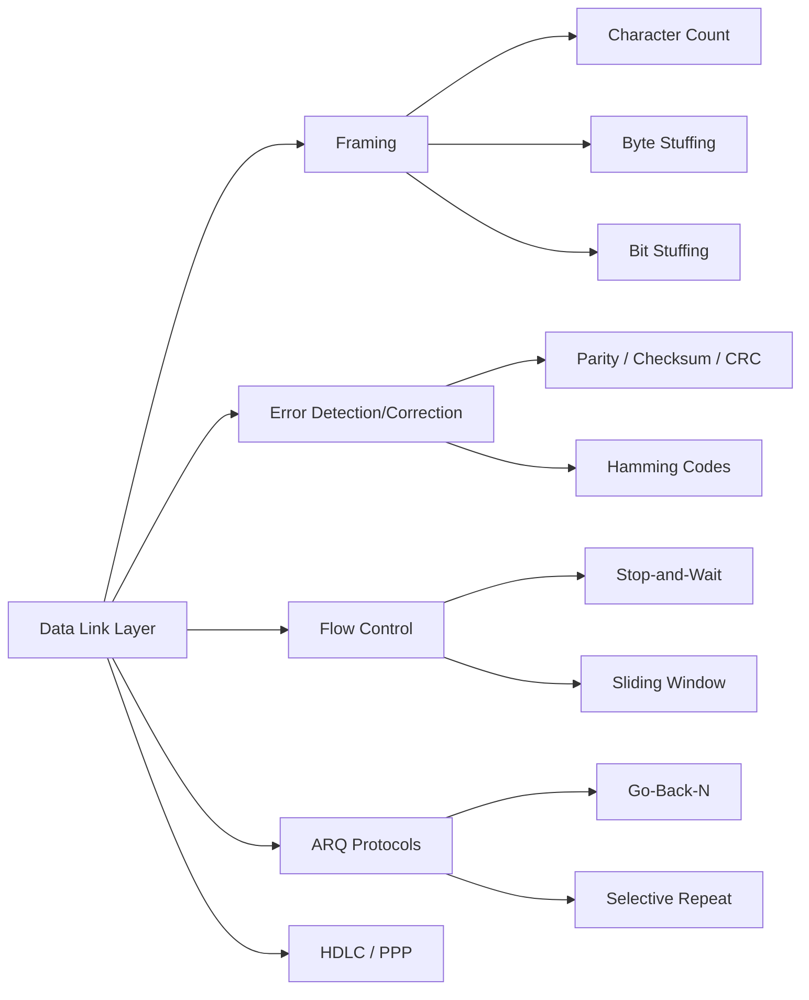

# Chapter 3: The Data Link Layer

> **Prerequisites:** [Chapter 2: Physical Layer](./02-physical-layer.md) — Bits and transmission media | **Next:** [Chapter 4: Medium Access Control](./04-mac.md) — From framing to channel sharing

## Learning Objectives

1. Describe the services provided by the data link layer to the network layer.
2. Explain and compare framing methods: character count, byte stuffing, and bit stuffing.
3. Compute error-detection codes including parity, checksum, and cyclic redundancy check.
4. Apply Hamming codes for single-bit error correction.
5. Analyze flow control mechanisms including stop-and-wait and sliding window protocols.
6. Implement ARQ simulators and evaluate performance trade-offs.

---

### Chapter at a Glance

| Topic | Key Insight | Practical Takeaway |
|-------|-------------|-------------------|
| Framing | Three methods: character count, byte stuffing, bit stuffing | Bit stuffing has bounded overhead; byte stuffing overhead varies with payload |
| Error Detection | CRC-32 catches all bursts ≤ 32 bits | Use CRC for link-layer integrity; checksums (Internet) are weaker but simpler |
| Error Correction | Hamming codes correct single-bit errors with minimal redundancy | Parity positions at powers of 2 enable pinpoint correction |
| Flow Control | Stop-and-wait vs sliding window | Window must match bandwidth-delay product for full utilization |
| ARQ Protocols | Stop-and-Wait, Go-Back-N, Selective Repeat | Selective Repeat most efficient on error-prone links; Go-Back-N simpler |

### Chapter Roadmap



---

## 3.1 Data Link Layer Services


The data link layer (Layer 2) provides reliable, efficient communication between two directly connected nodes. It accepts packets from the network layer and encapsulates them into frames for transmission across the physical link.

### 3.1.1 Real-World Analogy: Postal Service

Think of the data link layer as a postal sorting facility between two neighboring post offices connected by a single truck route.

| Network Concept | Postal Analogy |
|----------------|---------------|
| Packet (Network layer) | Letter inside an envelope |
| Frame (Data link layer) | Letter placed into a larger protective mailer with tracking barcode |
| Framing | Drawing the border around the mailer so the sorter knows where one ends and next begins |
| Error detection | Tamper-evident seal — if broken, the receiver knows the contents may be damaged |
| Flow control | Slowing down the truck if the receiving dock's bins are full |
| ARQ (retransmission) | "Please resend — your last package arrived with a torn seal" |
| ACK | "Package received in good condition" |
| Timeout | "If no confirmation in 3 days, assume the package is lost and resend" |

### 3.1.2 Five Core Services (Numbered)

**1. Framing.** The data link layer divides the bit stream into discrete frames. The receiver must detect frame boundaries to extract each frame correctly. Without framing, the receiver cannot distinguish where one packet ends and the next begins.

**2. Error detection and correction.** Bits may be corrupted by electrical noise, crosstalk, or signal attenuation. The data link layer adds redundant bits (checksum, CRC, parity) to detect or correct errors. The receiver recomputes the redundancy and compares it — a mismatch signals corruption.

**3. Flow control.** If a sender transmits frames faster than a receiver can process them, buffers overflow and frames are dropped. Flow control uses feedback (ACK/NAK) or windowing to regulate the sender's rate.

**4. Medium access control (Chapter 4).** On shared media (Ethernet, Wi-Fi), the data link layer coordinates frame transmission among multiple stations to avoid collisions.

**5. Reliability (ARQ).** Some data link protocols provide automatic repeat request (ARQ) — retransmission of lost or corrupted frames. The sender starts a timer after transmitting; if no ACK arrives before timeout, the frame is sent again.

### 3.1.3 Pseudocode: DLL Service Interface

```
// Sender side: network layer packet → data link layer frame
PROCEDURE send_frame(packet P, address dest)
  frame F = new frame
  F.header.dest = dest
  F.header.len = length(P)
  F.data = P
  F.trailer.checksum = compute_CRC(P)
  F.header.flag = FLAG_BYTE
  F.trailer.flag = FLAG_BYTE
  PHY_transmit(F)
END

// Receiver side: data link layer frame → network layer packet
PROCEDURE receive_frame()
  raw = PHY_receive()               // get raw bit stream from physical layer
  while not end_of_stream
    if raw[i] == FLAG_BYTE          // find start flag
      frame_data = extract_until_next_flag(raw)
      frame_data = byte_unstuff(frame_data)   // remove stuffed bytes
      computed = compute_CRC(frame_data.payload)
      if computed == frame_data.trailer.crc
        deliver_to_network_layer(frame_data.payload)
      else
        request_retransmission()
      end
    end
  end
END
```

### 3.1.4 Dry Run: Packet Flow Through DLL

Consider a network-layer packet `[0x48, 0x65, 0x6C, 0x6C, 0x6F]` ("Hello") being transmitted over a PPP-style link.

| Step | Component | Action | Result |
|------|-----------|--------|--------|
| 1 | Network layer | Delivers packet to DLL | `[0x48,0x65,0x6C,0x6C,0x6F]` |
| 2 | DLL framing | Adds flag bytes 0x7E at start and end | `[0x7E, 0x48, 0x65, 0x6C, 0x6C, 0x6F, 0x7E]` |
| 3 | DLL byte stuffing | Scan for flags in payload: none found | No stuffing needed |
| 4 | DLL error detection | Compute CRC-32 over payload | Append 4-byte CRC (e.g., 0x12345678) |
| 5 | DLL complete frame | Full frame assembled | `[0x7E, 0x48, 0x65, 0x6C, 0x6C, 0x6F, CRC[4], 0x7E]` |
| 6 | Physical layer | Transmits bits over wire | Raw bit stream sent |
| 7 | Receiver PHY | Receives bits, reassembles bytes | Raw bytes delivered to DLL |
| 8 | Receiver DLL | Detects flag 0x7E, extracts payload | Extracts `[0x48,0x65,0x6C,0x6C,0x6F]` + CRC |
| 9 | Receiver DLL | Computes CRC and compares | Match → no error detected |
| 10 | Receiver DLL | Delivers payload to network layer | `"Hello"` delivered successfully |

### 3.1.5 Complexity Analysis

| Operation | Time Complexity | Space Complexity | Why |
|-----------|----------------|-----------------|-----|
| Frame creation (sender) | O(n) | O(n) | Must copy entire packet into frame buffer |
| Frame validation (receiver) | O(n) | O(1) | Scans sequentially; CRC computed in streaming fashion |
| Byte stuffing/unstuffing | O(n) | O(1) extra | Single pass; worst-case payload grows by flag-escape ratio |
| Unstuffing + CRC check | O(n) | O(1) | Single pass; CRC computed incrementally per byte |

### 3.1.6 Advantages and Disadvantages

| Aspect | Advantage | Disadvantage |
|--------|-----------|-------------|
| Framing | Enables packet delineation on stream media | Adds per-frame overhead (flags, headers, trailers) |
| Error detection | Catches real-world noise patterns | Cannot correct — only detect (without FEC) |
| Flow control | Prevents receiver buffer overflow | Adds latency (waiting for feedback) |
| ARQ | Guarantees delivery despite errors | Reduces throughput on noisy links due to retransmissions |

### 3.1.7 Edge Cases

| Edge Case | How DLL Handles It |
|-----------|-------------------|
| Oversized packet (> MTU) | DLL fragments into multiple frames (e.g., Ethernet MTU 1500 bytes) |
| Link down | Physical layer signals carrier loss; DLL reports "link unavailable" to network layer |
| Bit errors in header | CRC covers entire frame; if header is corrupted, frame is discarded |
| Receiver buffer full | Flow control: receiver sends RNR (Receive Not Ready) or window advertisement of 0 |
| Frame too short | Minimum frame size enforced (Ethernet: 64 bytes) — frames below minimum are discarded |

---

## 3.2 Framing

Framing solves the problem of locating the start and end of each frame within a continuous bit stream.

**Goal:** Given a raw sequence of bits arriving at the receiver, determine exactly which bits belong to frame N, which to frame N+1, and so on.

**Why it matters:** Without framing, the receiver cannot parse headers or extract payloads. Framing errors cascade: one lost byte desynchronizes all subsequent frames.

### 3.2.1 Character Count

#### Real-World Analogy

A train conductor announces: "Car 1: 10 passengers, Car 2: 15 passengers, Car 3: 8 passengers..." Each car's count tells the next station how many people to expect in that car. If the conductor miscounts (or the number is garbled), the station mis-assigns passengers to cars.

#### How It Works (Numbered Steps)

1. Sender prepends a length field (character count) to each frame.
2. The length field specifies the total number of characters/bytes in the frame (including the length field itself).
3. Receiver reads the length field, extracts that many bytes, then repeats for the next frame.
4. The next frame's length field begins immediately after the previous frame's last byte.

#### Detailed Example

Frame 1: 5 bytes of data → length = 5 + 1 (count byte) = 6 → transmitted as `[0x06][D1][D2][D3][D4][D5]`
Frame 2: 9 bytes of data → length = 9 + 1 = 10 → transmitted as `[0x0A][d1][d2][d3][d4][d5][d6][d7][d8][d9]`

Raw bit stream at receiver: `[0x06][D1][D2][D3][D4][D5][0x0A][d1][d2][d3][d4][d5][d6][d7][d8][d9]`

The receiver reads 0x06 → extracts 5 payload bytes → reads 0x0A → extracts 9 payload bytes.

#### Pseudocode

```
// Sender
PROCEDURE character_count_send(packet P)
  frame = [length(len(P) + 1)] + P    // prepend count
  PHY_transmit(frame)
END

// Receiver
PROCEDURE character_count_receive()
  while true
    count = PHY_read_byte()            // read length byte
    if count == 0 → error              // zero-length frame is invalid
    payload = PHY_read_bytes(count - 1) // read that many bytes
    deliver(payload)
  end
END
```

#### Dry Run Trace Table

Sender sends three frames with data "AB", "CDE", and "FGHI".

| Step | Sender Action | Transmitted Bytes | Receiver Action |
|------|--------------|-------------------|-----------------|
| 1 | Frame1 len=2+1=3 → `[0x03][A][B]` | `03 41 42` | Reads 0x03 → extracts 2 bytes: [A,B] |
| 2 | Frame2 len=3+1=4 → `[0x04][C][D][E]` | `04 43 44 45` | Reads 0x04 → extracts 3 bytes: [C,D,E] |
| 3 | Frame3 len=4+1=5 → `[0x05][F][G][H][I]` | `05 46 47 48 49` | Reads 0x05 → extracts 4 bytes: [F,G,H,I] |

Now simulate a single-bit error: Frame2's length 0x04 becomes 0x07 (bit 2 flipped: 00000100 → 00000111).

| Step | Sender Action | Transmitted | Receiver Action |
|------|--------------|-------------|-----------------|
| 1 | Same as above | `03 41 42` | Reads 0x03 → [A,B] (correct) |
| 2 | Same as above | `04 43 44 45` | **Reads 0x07** (corrupted) → extracts 6 bytes: [C,D,E, 0x05, 0x46, 0x47] |
| 3 | Same as above | `05 46 47 48 49` | Frame3's length consumed as data! Receiver sees next byte 0x48 as "length" → 72 bytes → reads garbage. **Permanent desynchronization.** |

This illustrates why character count is fragile: a single bit error in any length field causes the receiver to lose all subsequent frame boundaries.

#### Complexity Analysis

| Operation | Time | Space | Why |
|-----------|------|-------|-----|
| Sender | O(1) | O(1) | Prepends a fixed-size count — no scanning needed |
| Receiver | O(1) per frame | O(1) | Reads count, then reads N bytes — pointer arithmetic only |

#### A&D Table

| Aspect | Detail |
|--------|--------|
| Advantage | Minimal overhead (1 byte per frame); very simple algorithm |
| Advantage | No escape/flag processing; O(1) per frame |
| Disadvantage | **Fragile:** single-bit error in count desynchronizes permanently |
| Disadvantage | No self-recovery without external framing markers |

#### Edge Cases

| Edge Case | Behavior |
|-----------|----------|
| Count byte corrupted to larger value | Receiver reads garbage bytes as next frame's count → desync |
| Count byte corrupted to 0 | Receiver reads next N bytes as "0-length" → inconsistent |
| Count byte corrupted to 0x01 | Receiver claims 0 data bytes → may skip frame entirely |
| Burst error wipes multiple frames | No way to re-synchronize until external reset |

### 3.2.2 Byte Stuffing

#### Real-World Analogy

A text message that contains the word "END" needs to be distinguished from the protocol command "END". The sender replaces every literal "END" with "ENDEND" — the receiver knows that "ENDEND" means a literal "END" and a single "END" is the protocol boundary. This is the same idea as escaping quotation marks inside a quoted string in programming (e.g., `"He said \"hello\""`).

#### How It Works (Numbered Steps)

1. A special **flag byte** (typically 0x7E) marks both the start and end of every frame.
2. If the flag byte value appears inside the payload, the sender inserts an **escape byte** (typically 0x7D) before it.
3. If the escape byte itself appears in the payload, the sender inserts another escape byte before it (double escaping).
4. The sender transmits: `[FLAG] [ESCAPED PAYLOAD] [FLAG]`
5. The receiver scans for a flag byte to find the start.
6. For each subsequent byte: if it's a flag, the frame ends. If it's an escape, the next byte is unescaped (the escape is removed).
7. The extracted payload is delivered to the network layer.

#### Detailed Example

Payload: `[0x41, 0x7E, 0x42, 0x7D, 0x43]` (contains both a flag 0x7E and an escape 0x7D)

Transmitted frame (after stuffing):
`[0x7E] [0x41] [0x7D] [0x5E] [0x42] [0x7D] [0x5D] [0x43] [0x7E]`

Explanation:
- 0x7E (flag) in payload → stuffed as 0x7D 0x5E (escape, then flag XOR 0x20)
- 0x7D (escape) in payload → stuffed as 0x7D 0x5D (escape, then escape XOR 0x20)
- Original flag 0x7E at boundaries remains un-stuffed

#### Pseudocode

```
// Sender
PROCEDURE byte_stuff_send(packet P, byte FLAG, byte ESC)
  frame = [FLAG]
  for each byte b in P
    if b == FLAG
      frame.append(ESC); frame.append(b XOR 0x20)
    else if b == ESC
      frame.append(ESC); frame.append(b XOR 0x20)
    else
      frame.append(b)
  end
  frame.append(FLAG)
  PHY_transmit(frame)
END

// Receiver
PROCEDURE byte_stuff_receive(byte FLAG, byte ESC)
  while true
    PHY_read_until(FLAG)             // wait for start flag
    payload = []
    while true
      b = PHY_read_byte()
      if b == FLAG                   // end of frame
        deliver(payload)
        break
      else if b == ESC
        next = PHY_read_byte()
        payload.append(next XOR 0x20)
      else
        payload.append(b)
      end
    end
  end
END
```

#### Dry Run Trace Table

Payload: `AB\x7ECD\x7DEF` (bytes: 0x41, 0x42, 0x7E, 0x43, 0x44, 0x7D, 0x45, 0x46)

| Step | Sender Buffer (after stuffing each byte) | Explanation |
|------|------------------------------------------|-------------|
| 0 | `[7E]` | Start flag |
| 1 | `[7E] [41]` | 'A' — plain copy |
| 2 | `[7E] [41] [42]` | 'B' — plain copy |
| 3 | `[7E] [41] [42] [7D] [5E]` | 0x7E (flag) → escape 0x7D + 0x5E (0x7E XOR 0x20) |
| 4 | `[7E] [41] [42] [7D] [5E] [43]` | 'C' — plain copy |
| 5 | `[7E] [41] [42] [7D] [5E] [43] [44]` | 'D' — plain copy |
| 6 | `[7E] [41] [42] [7D] [5E] [43] [44] [7D] [5D]` | 0x7D (escape) → escape 0x7D + 0x5D (0x7D XOR 0x20) |
| 7 | `[7E] [41] [42] [7D] [5E] [43] [44] [7D] [5D] [45]` | 'E' — plain copy |
| 8 | `[7E] [41] [42] [7D] [5E] [43] [44] [7D] [5D] [45] [46]` | 'F' — plain copy |
| 9 | `[7E] [41] [42] [7D] [5E] [43] [44] [7D] [5D] [45] [46] [7E]` | End flag |

Receiver processing:

| Step | Byte Read | Action | Payload Buffer |
|------|-----------|--------|----------------|
| 1 | 0x7E | Start flag detected | `[]` |
| 2 | 0x41 | Normal byte, append | `[41]` |
| 3 | 0x42 | Normal byte, append | `[41, 42]` |
| 4 | 0x7D | Escape detected | `[41, 42]` |
| 5 | 0x5E | XOR with 0x20 → 0x7E, append | `[41, 42, 7E]` |
| 6 | 0x43 | Normal byte, append | `[41, 42, 7E, 43]` |
| 7 | 0x44 | Normal byte, append | `[41, 42, 7E, 43, 44]` |
| 8 | 0x7D | Escape detected | `[41, 42, 7E, 43, 44]` |
| 9 | 0x5D | XOR with 0x20 → 0x7D, append | `[41, 42, 7E, 43, 44, 7D]` |
| 10 | 0x45 | Normal byte, append | `[41, 42, 7E, 43, 44, 7D, 45]` |
| 11 | 0x46 | Normal byte, append | `[41, 42, 7E, 43, 44, 7D, 45, 46]` |
| 12 | 0x7E | End flag → deliver payload | `[41,42,7E,43,44,7D,45,46]` ✓ |

#### Complexity Analysis

| Operation | Time | Space | Why |
|-----------|------|-------|-----|
| Sender stuffing | O(n) | O(n) worst-case output | Scans every byte; worst-case every byte is flag/escape doubles output |
| Receiver unstuffing | O(n) | O(n) output | Single pass; each input byte produces at most one output byte |
| Overhead ratio | Variable | — | Worst case: 100% (payload is all flags); best case: 0% (no flags) |

#### A&D Table

| Aspect | Detail |
|--------|--------|
| Advantage | Self-synchronizing — receiver can find the next flag after any error |
| Advantage | Byte-aligned; simple to implement in software |
| Disadvantage | Variable overhead — worst case 100% blowup (payload of all 0x7E bytes) |
| Disadvantage | Bit-level efficiency lower than bit stuffing on random data |

#### Edge Cases

| Edge Case | Behavior |
|-----------|----------|
| Corrupted escape byte | Next byte treated as data → receiver may miss end flag or misinterpret data |
| Flag in payload | Properly escaped via 0x7D 0x5E — no ambiguity |
| Escape + flag in payload | Double escape: 0x7D → 0x7D 0x5D, 0x7E → 0x7D 0x5E |
| Consecutive flags in payload | Each gets escaped independently |
| Missing end flag | Receiver reads until next flag in stream → may consume subsequent frame's data |
| Corrupted flag byte | Frame never terminated; same as missing end flag |

### 3.2.3 Bit Stuffing

#### Real-World Analogy

A radio protocol says "raise your hand if you hear 5 consecutive beeps." The transmitter purposely inserts a pause (0) after every 5 continuous beeps so the receiver never mistakes payload data for the "start/end of message" signal (6 consecutive beeps).

#### How It Works (Numbered Steps)

1. A unique **flag pattern** (typically `01111110` = 0x7E) marks frame boundaries.
2. The sender monitors the bit stream during transmission.
3. After any sequence of **five consecutive 1s**, the sender inserts a `0` bit (stuff bit).
4. This guarantees that no payload data ever contains `01111110` — the flag pattern.
5. The sender transmits: `[FLAG] [STUFFED PAYLOAD] [FLAG]`
6. The receiver finds the flag to synchronize.
7. After receiving five consecutive 1s, the receiver checks the next bit:
   - If `0`: unstuff (remove this 0) and continue.
   - If `1`: check the 7th bit. If `0` → `01111110` = flag found. If `1` → error (8+ consecutive 1s = abort sequence in HDLC).

#### Detailed Example

Payload bits: `11111 011111 11110` (three groups: 5 ones, 6 ones, 5 ones)

Sender processing (bit by bit):

| Sender Position | Bit Sequence So Far | Action |
|----------------|-------------------|--------|
| 1-5 | `11111` | Sent bits 1-5. Five consecutive 1s! Insert stuffed 0. |
| 6 | `111110` | The stuffed 0. |
| 7 | `1111100` | Data bit 0 |
| 8-12 | `11111001 1111` | Data bits 1111 → now we have `11111` again → insert stuffed 0 |
| 13 | `1111100111110` | Stuffed 0 |
| 14-16 | `111110011111011` | Data bits 11 |
| 17-21 | `111110011111011111` | Data bits 11111 → five 1s → insert stuffed 0 |
| 22 | `1111100111110111110` | Stuffed 0 |
| 23-24 | `111110011111011111010` | Data bits 10 |

#### Pseudocode

```
// Sender
PROCEDURE bit_stuff_send(bits B)
  frame = FLAG        // 01111110
  ones_count = 0
  for each bit b in B
    frame.append(b)
    if b == 1
      ones_count++
      if ones_count == 5
        frame.append(0)    // stuff a 0
        ones_count = 0
    else
      ones_count = 0       // reset on 0
  end
  frame.append(FLAG)
  PHY_transmit(frame)
END

// Receiver
PROCEDURE bit_stuff_receive()
  while true
    // Sync to first flag
    wait_until_flag()
    payload = []
    ones_count = 0
    while true
      b = PHY_read_bit()
      if b == 1
        ones_count++
        if ones_count == 5
          next = PHY_read_bit()
          if next == 0
            // Stuffed bit — discard
            ones_count = 0
          else
            // Next bit determines: flag vs error
            next2 = PHY_read_bit()
            if next2 == 0
              // 01111110 → flag found
              deliver(payload)
              break
            else
              // 01111111 → abort (8+ ones)
              error("Abort sequence detected")
            end
          end
        else
          payload.append(b)
        end
      else
        // Bit is 0
        payload.append(b)
        ones_count = 0
      end
    end
  end
END
```

#### Dry Run Trace Table

Payload: 5 bits `11111` followed by 6 bits `011111` followed by 5 bits `11110`

| Step | Bit Sent | Action | Sender's Ones Counter | Transmitted Bitstream |
|------|---------|--------|----------------------|----------------------|
| 0 | — | Start flag | 0 | `01111110` |
| 1 | 1 | Data | 1 | `01111110 1` |
| 2 | 1 | Data | 2 | `01111110 11` |
| 3 | 1 | Data | 3 | `01111110 111` |
| 4 | 1 | Data | 4 | `01111110 1111` |
| 5 | 1 | Data | **5** | `01111110 11111` |
| 6 | **0** | **Stuff bit inserted** | 0 | `01111110 111110` |
| 7 | 0 | Data | 0 | `01111110 1111100` |
| 8 | 1 | Data | 1 | `01111110 11111001` |
| 9 | 1 | Data | 2 | `01111110 11111001 1` |
| 10 | 1 | Data | 3 | `01111110 11111001 11` |
| 11 | 1 | Data | 4 | `01111110 11111001 111` |
| 12 | 1 | Data | **5** | `01111110 11111001 1111` |
| 13 | **0** | **Stuff bit** | 0 | `01111110 11111001 11110` |
| 14 | 1 | Data | 1 | `01111110 11111001 11110 1` |
| 15 | 1 | Data | 2 | `01111110 11111001 11110 11` |
| 16 | 1 | Data | 3 | `01111110 11111001 11110 111` |
| 17 | 1 | Data | 4 | `01111110 11111001 11110 1111` |
| 18 | 1 | Data | **5** | `01111110 11111001 11110 11111` |
| 19 | **0** | **Stuff bit** | 0 | `01111110 11111001 11110 111110` |
| 20 | 1 | Data | 1 | `01111110 11111001 11110 1111101` |
| 21 | 0 | Data | 0 | `01111110 11111001 11110 11111010` |
| 22 | — | End flag | 0 | `01111110 11111001 11110 11111010 01111110` |

Receiver unstuffing:

| Step | Read Bits | Payload Accumulated | Ones Counter | Action |
|------|-----------|-------------------|--------------|--------|
| 1 | 0 | — | 0 | Waiting for flag |
| 2 | 111110 | — | — | Flag `01111110` detected → start |
| 3 | 1 | [1] | 1 | Data |
| 4 | 1 | [11] | 2 | Data |
| 5 | 1 | [111] | 3 | Data |
| 6 | 1 | [1111] | 4 | Data |
| 7 | 1 | [11111] | **5** | Data |
| 8 | **0** | [11111] | 0 | **Unstuff:** discard this 0 |
| 9 | 0 | [111110] | 0 | Data |
| 10 | 1 | [1111101] | 1 | Data |
| 11 | 1 | [11111011] | 2 | Data |
| 12 | 1 | [111110111] | 3 | Data |
| 13 | 1 | [1111101111] | 4 | Data |
| 14 | 1 | [11111011111] | **5** | Data |
| 15 | **0** | [11111011111] | 0 | **Unstuff:** discard this 0 |
| 16 | 1 | [111110111111] | 1 | Data |
| 17 | 1 | [1111101111111] | 2 | Data |
| 18 | 1 | [11111011111111] | 3 | Data |
| 19 | 1 | [111110111111111] | 4 | Data |
| 20 | 1 | [111110111111111] | **5** | Data |
| 21 | **0** | [111110111111111] | 0 | **Unstuff:** discard this 0 |
| 22 | 1 | [1111101111111111] | 1 | Data |
| 23 | 0 | [11111011111111110] | 0 | Data |
| 24 | 0 | — | — | Flag `01111110` detected → end |

Final extracted payload: `11111011111111110` — matches original input exactly.

#### Complexity Analysis

| Operation | Time | Space | Why |
|-----------|------|-------|-----|
| Sender stuffing | O(n) | O(n) worst-case | Single pass; worst case adds 1 bit per 5 → 25% overhead |
| Receiver unstuffing | O(n) | O(1) | Single pass; discard stuff bits on the fly |
| Overhead ratio | Bounded | — | Max 16.7% (1 stuff bit per 6 transmitted bits) on worst-case payload (all 1s) |

#### A&D Table

| Aspect | Detail |
|--------|--------|
| Advantage | Bounded overhead — at most 1 bit per 5 data bits (20% expansion worst case) |
| Advantage | Content-independent — overhead does NOT depend on payload patterns |
| Advantage | Self-synchronizing after error — receiver finds next flag |
| Disadvantage | Bit-level processing — harder in software than byte stuffing |
| Disadvantage | Slightly more complex state machine (5-bit counter + flag detection) |

#### Edge Cases

| Edge Case | Behavior |
|-----------|----------|
| All-1s payload | Every 5 bits gets a stuffed 0 → 20% overhead, receiver correctly unstuffs all |
| Abort sequence (01111111) | HDLC: 7+ consecutive 1s = abort — receiver discards frame |
| Idle sequence (01111110) | Continuous flags sent when link idle → receiver stays synchronized |
| Bit error in stuffed bit | Receiver sees 5 ones + 1 (corrupted 0 to 1) → interprets next 2 bits as flag/abort check |
| Flag appears across frame boundary | Impossible by construction (stuffing prevents 01111110 in payload) |

---

### Framing Methods Comparison

| Criterion | Character Count | Byte Stuffing | Bit Stuffing |
|-----------|----------------|---------------|--------------|
| **Overhead** | 1 byte per frame (fixed) | Variable: 0-100% depending on payload | Bounded: max 20% (1 bit per 5 data bits) |
| **Error recovery** | Impossible — single error desyncs permanently | Self-synchronizing — next flag resyncs | Self-synchronizing — next flag resyncs |
| **Processing** | Byte-granular, O(1) | Byte-granular, O(n) | Bit-granular, O(n) |
| **Worst-case expansion** | None | 2× (payload all 0x7E) | 1.2× (payload all 1s) |
| **Complexity** | Simplest | Moderate | Most complex (bit manipulation) |
| **Used in** | Legacy Bisync | PPP, SLIP | HDLC, SDLC, USB |
| **Protocol examples** | IBM Bisync (1960s) | PPP (RFC 1661) | HDLC (ISO 13239) |

**Pro Tip:** Bit stuffing is the preferred method for modern link protocols because (1) overhead is predictable and bounded regardless of payload content and (2) it self-synchronizes after any error — the receiver simply scans for the next `01111110` flag. Byte stuffing is simpler to implement (byte-aligned) but its overhead can spike to 100% if the payload contains many flag bytes (common in binary protocols carrying raw 0x7E bytes like JPEG or encrypted streams).

---

## 3.3 Error Detection

Error detection codes add redundant bits to each frame so the receiver can verify integrity. The three main approaches — parity, checksum, and CRC — trade off strength, complexity, and overhead.

### 3.3.1 Parity

#### Real-World Analogy

A librarian checks that every bookshelf has an even number of books. If a shelf should have 7 books (odd), the librarian adds 1 dummy book to make it 8 (even). If later the count is 9 (odd), the librarian knows at least one book was removed or added.

#### Single-Bit Parity

A single parity bit is appended to a data block such that the total number of 1 bits satisfies the chosen convention.

- **Even parity:** total 1s (including parity bit) is even.
- **Odd parity:** total 1s (including parity bit) is odd.

#### How It Works (Numbered Steps)

1. Count the number of 1 bits in the data.
2. For even parity: if count is even, set parity = 0; if odd, set parity = 1.
3. Append or prepend the parity bit to the data.
4. Receiver counts 1s in received data + parity bit.
5. If even parity was used and count is odd → error detected.

#### Example

Data: `1011011` (five 1s)
Even parity: parity = 1 (makes total 1s = 6, even)
Transmitted: `10110111`
Receiver: counts 1s → 6 (even) → no error detected

If single-bit error: `10110101` (bit 6 flipped)
Receiver: counts 1s → 5 (odd) → error detected

#### Pseudocode

```
// Sender
PROCEDURE even_parity_send(data D)
  count = popcount(D)          // count 1 bits
  parity = count % 2 == 0 ? 0 : 1
  transmit(D || parity)
END

// Receiver
PROCEDURE even_parity_receive(received R)
  count = popcount(R)          // count 1 bits in everything received
  if count % 2 == 0
    deliver(R without last bit)
  else
    signal_error()
END
```

#### Dry Run Trace Table

| Data | # of 1s | Even Parity | Transmitted | Single Error | Received #1s | Detected? |
|------|---------|-------------|-------------|-------------|-------------|-----------|
| 0000000 | 0 | 0 | 00000000 | 00001000 | 1 | Yes |
| 1010101 | 4 | 0 | 10101010 | 10101000 | 3 | Yes |
| 1111111 | 7 | 1 | 11111111 | 11111101 | 7 | No (even → missed!) |
| 1100110 | 4 | 0 | 11001100 | 11001100 | 4 | No (no error) |

Note: 1111111 with two errors → 11110111 (4 ones) → even → error NOT detected!

#### Two-Dimensional Parity

Two-dimensional parity arranges data in a matrix (rows × columns) and computes parity for each row and each column.

Example: 4×4 data matrix
```
Data bits:    Row parity:
1 0 1 1      1
0 1 0 1      0
1 1 0 0      0
0 1 1 0      0
Col parity: 0 1 0 0
```

A single-bit error at position (2,3) flips that bit. Row 2 parity check fails; column 3 parity check fails. The intersection identifies the erroneous bit. 2D parity can correct single-bit errors and detect many multi-bit patterns.

#### Complexity Analysis

| Operation | Time | Space | Why |
|-----------|------|-------|-----|
| Single-bit parity | O(n) | O(1) | Must scan all bits once |
| 2D parity | O(n) | O(√n) | Row and column parity buffers |
| Detection strength | 50% of error patterns | — | Odd-count errors caught; even-count errors missed |

#### A&D Table

| Aspect | Detail |
|--------|--------|
| Advantage | Minimal overhead (1 bit per frame); simplest error detection scheme |
| Advantage | 2D parity can correct single-bit errors |
| Disadvantage | **Misses all even-count errors** — including all 2-bit errors |
| Disadvantage | No burst error detection capability |

#### Edge Cases

| Edge Case | Behavior |
|-----------|----------|
| Two-bit error (both in same row, different columns) | Row parity correct (even # flips per row), two column parity fails → detected |
| Two-bit error (both in same row AND column) | Impossible (two bits can't occupy same position) |
| Four-bit error forming rectangle | All rows and columns have even number of flips → **undetected** |
| Burst error (odd count) | Always detected by single-bit parity |
| Burst error (even count) | Always missed by single-bit parity |

### 3.3.2 Checksum

#### Real-World Analogy

An invoice lists line items and a "sum total" at the bottom. The recipient adds up all line items independently. If the total doesn't match the stated sum, someone made an error. The Internet checksum is essentially this — but using 16-bit words and one's complement arithmetic to catch transpositions and reorderings that a simple sum would miss.

#### Internet Checksum (Used in TCP/UDP/IP)

#### How It Works (Numbered Steps)

1. Divide the data into 16-bit words.
2. Sum all words using one's complement arithmetic (add with carry; if carry out, add the carry back in).
3. Take the one's complement of the result (invert all bits) → this is the checksum.
4. Transmitter sends data + checksum.
5. Receiver performs the same sum over data + checksum.
6. If the result is all 1s (0xFFFF in one's complement), no error detected.

#### Detailed Example

Data (4 words): `0x1234, 0x5678, 0x9ABC, 0xDEF0`

| Step | Operation | Result |
|------|-----------|--------|
| 1 | Initialize sum | 0x0000 |
| 2 | Add 0x1234 | 0x1234 |
| 3 | Add 0x5678 | 0x68AC |
| 4 | Add 0x9ABC | 0x1 0348 → wrap: 0x0348 + 0x0001 = 0x0349 |
| 5 | Add 0xDEF0 | 0xE239 |
| 6 | One's complement | ~0xE239 = 0x1DC6 |
| 7 | Checksum = 0x1DC6 | Transmitted with data |

Receiver verification:

| Step | Operation | Result |
|------|-----------|--------|
| 1 | Sum data + checksum: 0x1234 + 0x5678 + 0x9ABC + 0xDEF0 + 0x1DC6 | 0x2 FFFD |
| 2 | Wrap carry: 0xFFFD + 0x0002 | 0xFFFF |
| 3 | Complement: ~0xFFFF = 0x0000 | All zeros → no error |

#### Pseudocode

```
PROCEDURE internet_checksum(data D)
  sum = 0
  for each 16-bit word w in D
    sum = sum + w
    if carry_out(sum)              // if sum > 0xFFFF
      sum = (sum & 0xFFFF) + 1     // end-around carry
    end
  end
  checksum = ~sum & 0xFFFF         // one's complement
  return checksum
END

PROCEDURE checksum_verify(data_with_checksum D)
  sum = 0
  for each 16-bit word w in D
    sum = sum + w
    if carry_out(sum)
      sum = (sum & 0xFFFF) + 1
    end
  end
  return sum == 0xFFFF             // all 1s = no error
END
```

#### Dry Run Trace Table

Data (8 bytes): 0x01 0x02 0x03 0x04 0x05 0x06 0x07 0x08

| 16-bit Word | Hexadecimal | Running Sum (with wraps) |
|-------------|-------------|--------------------------|
| 0x0102 | 0x0102 | 0x0102 |
| 0x0304 | 0x0304 | 0x0406 |
| 0x0506 | 0x0506 | 0x090C |
| 0x0708 | 0x0708 | 0x1014 |
| Complement | ~0x1014 = 0xEFEB | Checksum = 0xEFEB |
| Verification sum: 0x0102 + 0x0304 + 0x0506 + 0x0708 + 0xEFEB | | 0x1 0000 → wrap: 0x0000 + 0x0001 = 0xFFFF ✓ |

#### Complexity Analysis

| Operation | Time | Space | Why |
|-----------|------|-------|-----|
| Checksum computation | O(n) | O(1) | Sequential 16-bit adds; constant register space |
| Checksum verification | O(n) | O(1) | Same as computation |
| Detection strength | Strong for odd-bit errors | — | One's complement catches transpositions better than simple sum |

#### A&D Table

| Aspect | Detail |
|--------|--------|
| Advantage | Simple to compute in software (16-bit addition) |
| Advantage | Catches all odd-count bit errors and most systematic even-count errors |
| Advantage | Very low overhead (2 bytes per packet for TCP/UDP) |
| Disadvantage | Weaker than CRC for burst errors — does NOT guarantee detection of all 2-bit errors |
| Disadvantage | Byte order dependent — requires network byte order convention |
| Disadvantage | Not suitable for link-layer use over noisy channels (Ethernet uses CRC-32) |

#### Edge Cases

| Edge Case | Behavior |
|-----------|----------|
| Word alignment | Data must be padded to 16-bit boundary (pseudo-header adds extra bytes) |
| All-zero data | Checksum = 0xFFFF (complement of sum = 0x0000); special case: checksum = 0 means "no checksum" |
| Checksum field itself corrupted | Receiver's sum won't be 0xFFFF → error detected |
| Specific bit cancellation | Rare: two bit errors at positions that cancel in addition → undetected |

### 3.3.3 Cyclic Redundancy Check (CRC)

#### Real-World Analogy

Imagine you and a friend agree on a secret divisor number (e.g., 7). You have a large number, divide it by 7, and write down only the remainder. Your friend divides the received number by 7; if the remainders match, the number is likely unchanged. CRC works the same way, but with binary polynomial division instead of integer division, which catches burst errors far more reliably.

#### How It Works (Numbered Steps)

1. Treat the data bits as coefficients of a polynomial $D(x)$ of degree $n-1$, where $n$ is the number of bits.
2. Choose a generator polynomial $G(x)$ of degree $k$.
3. Append $k$ zero bits to the data (multiply by $x^k$): $D(x) \cdot x^k$.
4. Divide $D(x) \cdot x^k$ by $G(x)$ using binary polynomial division (XOR, no carry).
5. The remainder $R(x)$ (degree < k) is the CRC checksum.
6. Transmit the original data followed by the remainder: $D(x) \cdot x^k + R(x)$.
7. Receiver divides the received polynomial by $G(x)$. Non-zero remainder → error detected.

#### Worked Example: CRC-3 with G(x) = x³ + x + 1 (binary 1011)

Data: `1101` (binary) → $D(x) = x^3 + x^2 + 1$

**Step 1: Append k=3 zeros**
Data with zeros: `1101000`

**Step 2: Binary polynomial division (XOR)**

We divide `1101000` by `1011`:

```
      1101  ← quotient (not transmitted)
1011 ) 1101000
      1011    ← XOR
      ----
       0110
       0000   ← bring down
       ----
        1100
        1011
        ----
         0111
         0000
         ----
          1110
          1011
          ----
           101 ← remainder (CRC)
```

**Step 3: Transmit**
`1101` (data) + `101` (CRC) = `1101101`

**Step 4: Receiver divides received `1101101` by `1011`**

```
      1100
1011 ) 1101101
      1011
      ----
       0101
       0000
       ----
        1011
        1011
        ----
         0000  ← zero remainder → accepted
```

**Error scenario:** Bit 3 flips → received = `1111101`

```
      1101
1011 ) 1111101
      1011
      ----
       1001
       1011
       ----
         010
         000
         ---
          101 ← non-zero remainder → error detected!
```

#### Pseudocode

```
PROCEDURE crc_send(data D, generator G, degree k)
  // Append k zeros
  dividend = (D << k)
  remainder = divide_xor(dividend, G)
  transmitted = (D << k) | remainder     // data + CRC
  return transmitted
END

PROCEDURE divide_xor(dividend, divisor)
  // Binary polynomial division using XOR
  while dividend has same or more bits than divisor
    if MSB of dividend == 1
      dividend = dividend XOR divisor
    dividend = dividend << 1
  end
  return dividend >> (shift_count)   // remainder
END

PROCEDURE crs_verify(received R, generator G)
  remainder = divide_xor(R, G)
  return remainder == 0
END
```

#### CRC Computation: C++ Implementation

```cpp
#include <iostream>
#include <cstdint>
#include <bitset>
using namespace std;

// CRC-8 computation (G(x) = x^8 + x^2 + x + 1 = 0x107)
uint8_t crc8(const uint8_t* data, size_t len) {
    uint8_t crc = 0xFF;  // initial value
    uint8_t poly = 0x07; // polynomial (lower 8 bits of 0x107)
    
    for (size_t i = 0; i < len; i++) {
        crc ^= data[i];
        for (int j = 0; j < 8; j++) {
            if (crc & 0x80)
                crc = (crc << 1) ^ poly;
            else
                crc <<= 1;
        }
    }
    return crc ^ 0xFF;  // final XOR
}

// CRC-32 computation (Ethernet polynomial)
uint32_t crc32(const uint8_t* data, size_t len) {
    uint32_t crc = 0xFFFFFFFF;
    uint32_t poly = 0xEDB88320;  // reflected polynomial
    
    for (size_t i = 0; i < len; i++) {
        crc ^= data[i];
        for (int j = 0; j < 8; j++) {
            if (crc & 1)
                crc = (crc >> 1) ^ poly;
            else
                crc >>= 1;
        }
    }
    return ~crc;
}

int main() {
    uint8_t data[] = {0x48, 0x65, 0x6C, 0x6C, 0x6F}; // "Hello"
    uint8_t crc = crc8(data, 5);
    cout << "CRC-8 of \"Hello\": 0x" << hex << (int)crc << endl;
    
    uint32_t crc32_val = crc32(data, 5);
    cout << "CRC-32 of \"Hello\": 0x" << hex << crc32_val << endl;
    
    // Verify: append CRC-8 to data and check
    uint8_t data_with_crc[6];
    for (int i = 0; i < 5; i++) data_with_crc[i] = data[i];
    data_with_crc[5] = crc;
    uint8_t check = crc8(data_with_crc, 6);
    cout << "Verification: " << (check == 0 ? "PASS" : "FAIL") << endl;
    
    return 0;
}
```

#### CRC Computation: Python Implementation

```python
def crc8(data: bytes, poly: int = 0x07) -> int:
    """Compute CRC-8 with polynomial G(x) = x^8 + x^2 + x + 1"""
    crc = 0xFF
    for byte in data:
        crc ^= byte
        for _ in range(8):
            if crc & 0x80:
                crc = ((crc << 1) ^ poly) & 0xFF
            else:
                crc = (crc << 1) & 0xFF
    return crc ^ 0xFF


def crc32(data: bytes) -> int:
    """Compute CRC-32 (Ethernet polynomial, reflected)"""
    crc = 0xFFFFFFFF
    poly = 0xEDB88320
    for byte in data:
        crc ^= byte
        for _ in range(8):
            if crc & 1:
                crc = (crc >> 1) ^ poly
            else:
                crc >>= 1
    return crc ^ 0xFFFFFFFF


def crc_verify(data: bytes, poly: int = 0x07) -> bool:
    """Verify CRC-8: append CRC to data, recompute, expect 0"""
    return crc8(data, poly) == 0


# Demonstration
data = b"Hello"
crc = crc8(data)
print(f"CRC-8 of 'Hello': 0x{crc:02X}")
print(f"Verification: {'PASS' if crc_verify(data + bytes([crc])) else 'FAIL'}")

data32 = b"Hello"
crc32_val = crc32(data32)
print(f"CRC-32 of 'Hello': 0x{crc32_val:08X}")

# Show detection of single-bit error
corrupted = bytearray(data)
corrupted[2] ^= 0x01  # flip one bit
crc2 = crc8(bytes(corrupted))
print(f"Corrupted data CRC-8: 0x{crc2:02X} (expected 0x{crc:02X})")
print(f"Error detected: {crc != crc2}")
```

#### Common Generator Polynomials

| Name | Polynomial | Degree | Used In |
|------|-----------|--------|---------|
| CRC-8 | $x^8 + x^2 + x + 1$ | 8 | 1-Wire, Dallas/Maxim |
| CRC-16-IBM | $x^{16} + x^{15} + x^2 + 1$ | 16 | USB, Modbus |
| CRC-16-CCITT | $x^{16} + x^{12} + x^5 + 1$ | 16 | HDLC, XMODEM, Bluetooth |
| CRC-32 | $x^{32} + x^{26} + x^{23} + x^{22} + x^{16} + x^{12} + x^{11} + x^{10} + x^8 + x^7 + x^5 + x^4 + x^2 + x + 1$ | 32 | Ethernet, SATA, ZIP, PNG |
| CRC-64-ECMA | $x^{64} + x^{4} + x^{3} + x + 1$ | 64 | ECMA-182, some storage systems |

#### Complexity Analysis

| Operation | Time | Space | Why |
|-----------|------|-------|-----|
| CRC computation (software, bit-at-a-time) | O(n·k) | O(1) | Each byte requires k iterations of bit shifts |
| CRC computation (lookup table) | O(n) | O(256·k) bits | Precomputed table trades memory for speed |
| CRC hardware implementation | O(n/k) | O(k) registers | Parallel CRC computation in 1 clock per word |
| Detection strength | O(1) check | O(1) | Single polynomial division |

**Why CRC is fast in hardware:** The shift register XOR feedback can be implemented with k flip-flops and a few XOR gates. Each bit clocks through in one cycle — the entire check takes n cycles for n bits, matching the line rate.

#### A&D Table

| Aspect | Detail |
|--------|--------|
| Advantage | Detects ALL bursts of length ≤ k (where k = degree of generator) |
| Advantage | Detects all single-bit errors, all double-bit errors (if G(x) is primitive) |
| Advantage | Detects all odd-count errors |
| Advantage | Extremely efficient in hardware — simple shift register implementation |
| Disadvantage | More complex in software than checksum (requires bit manipulation) |
| Disadvantage | Finite probability of undetected error for bursts > k: $1/2^{k}$ |

#### Edge Cases

| Edge Case | Behavior |
|-----------|----------|
| CRC collision | Probability of undetected error: $1/2^{32}$ for CRC-32 — extremely low |
| Burst error > k bits | Detection probability: $1 - 1/2^{k}$ for long bursts; $1 - 1/2^{k-1}$ for bursts starting with 1 |
| Generator polynomial selection | Must be primitive to guarantee 2-bit detection; some standard polys are suboptimal |
| CRC of all-zero data | Non-zero (0x00000000 only if initial value was 0 and no final XOR) |

---

### Error Detection Comparison: Parity vs Checksum vs CRC

| Criterion | Parity | Internet Checksum | CRC-32 |
|-----------|--------|-------------------|--------|
| **Overhead** | 1 bit | 16 bits | 32 bits |
| **All single-bit errors** | Detected | Detected | Detected |
| **All double-bit errors** | Missed (even count) | Most detected | Detected (if primitive poly) |
| **All odd-count errors** | Detected | Detected | Detected |
| **Burst < k bits** | Not guaranteed | Not guaranteed | Guaranteed (k = degree) |
| **Burst = k bits** | Not guaranteed | Not guaranteed | Detected (99.998%) |
| **Implementation complexity** | Trivial | Simple | Moderate (hardware: trivial) |
| **Software speed** | Fastest | Fast | Slow bit-at-a-time; fast with LUT |
| **Hardware cost** | 1 XOR gate | Adder + complement | Shift register + XOR gates |
| **Used where** | UART, low-cost links | TCP/UDP/IP headers | Ethernet, Wi-Fi, storage |

**Pro Tip:** CRC-32 is the gold standard for link-layer error detection. The Internet checksum is deliberately weaker — it was designed to be computed in software on 1970s CPUs (a 16-bit add is one instruction). Never use a checksum where CRC is feasible. The $1/2^{32}$ undetected-error probability of CRC-32 means a 10 Gbps link running at full capacity would see an undetected error roughly once every 30 years — acceptable for virtually all applications.

---

## 3.4 Hamming Code (Error Correction)

### Real-World Analogy

A teacher reads an answer aloud, and each student writes it down. Instead of one "check digit," the teacher adds multiple strategically placed check digits — each "covering" a different overlapping subset of answer positions. If a student hears one wrong letter, the pattern of broken checks tells the teacher exactly which position was garbled, and the student corrects it on the spot.

### How It Works (Numbered Steps)

1. Determine the number of parity bits $r$ such that $2^r \ge m + r + 1$, where $m$ = data bits.
2. Place parity bits at positions that are powers of 2 (1, 2, 4, 8, ...).
3. Each parity bit $p_i$ covers all positions whose binary representation has bit $i$ set.
4. Set each parity bit to make the XOR (or parity) of its covered positions even.
5. Transmit the codeword (data + parity bits).
6. Receiver recomputes parity for each group.
7. The pattern of failed parity checks, read as a binary number (syndrome), gives the position of the error — flip that bit to correct.

### Example: (7,4) Hamming Code

For $m = 4$ data bits, $2^3 = 8 \ge 4 + 3 + 1 = 8$, so $r = 3$.

Parity bits at positions 1, 2, 4. Data bits at positions 3, 5, 6, 7.

Coverage:
- p1 (position 1): covers positions 1, 3, 5, 7 (binary xxx1)
- p2 (position 2): covers positions 2, 3, 6, 7 (binary xx1x)
- p4 (position 4): covers positions 4, 5, 6, 7 (binary x1xx)

Given data bits D3=1, D5=0, D6=1, D7=0:

| Position | 1 (p1) | 2 (p2) | 3 (D3) | 4 (p4) | 5 (D5) | 6 (D6) | 7 (D7) |
|----------|--------|--------|--------|--------|--------|--------|--------|
| Value | ? | ? | 1 | ? | 0 | 1 | 0 |

Compute parity:
- p1 covers {1,3,5,7}: p1 ⊕ 1 ⊕ 0 ⊕ 0 = 0 → p1 = 1
- p2 covers {2,3,6,7}: p2 ⊕ 1 ⊕ 1 ⊕ 0 = 0 → p2 = 0
- p4 covers {4,5,6,7}: p4 ⊕ 0 ⊕ 1 ⊕ 0 = 0 → p4 = 1

Transmitted codeword: `1 0 1 1 0 1 0` (positions 1-7)

If position 5 flips (0 → 1), received = `1 0 1 1 1 1 0`

**Syndrome calculation:**
- p1 check: 1 ⊕ 1 ⊕ 1 ⊕ 0 = 1 → fails (syndrome bit 0 = 1)
- p2 check: 0 ⊕ 1 ⊕ 1 ⊕ 0 = 0 → passes (syndrome bit 1 = 0)
- p4 check: 1 ⊕ 1 ⊕ 1 ⊕ 0 = 1 → fails (syndrome bit 2 = 1)

Syndrome = `101` binary = 5 → position 5 is the error! Flip it back to 0.

### Pseudocode

```
PROCEDURE hamming_encode(data_bits D[0..m-1])
  // Place data bits, compute parity bits
  codeword[1..m+r] = empty
  j = 0  // index into data bits
  for pos = 1 to m+r
    if pos is power of 2
      codeword[pos] = 0  // will compute
    else
      codeword[pos] = D[j++]
  end
  
  // Compute each parity bit
  for i = 0 to r-1
    parity = 0
    for pos = 1 to m+r
      if pos & (1 << i)  // pos has bit i set
        parity ^= codeword[pos]
    codeword[1 << i] = parity  // store at position 2^i
  end
  return codeword
END

PROCEDURE hamming_decode(received R[1..m+r])
  // Compute syndrome
  syndrome = 0
  for i = 0 to r-1
    parity = 0
    for pos = 1 to m+r
      if pos & (1 << i)
        parity ^= R[pos]
    if parity != 0
      syndrome |= (1 << i)
  
  if syndrome != 0
    R[syndrome] ^= 1  // correct error at position syndrome
  
  // Extract data bits (skip power-of-2 positions)
  data = []
  for pos = 1 to m+r
    if pos NOT power of 2
      data.append(R[pos])
  return data
END
```

#### Hamming Code C++ Implementation

```cpp
#include <iostream>
#include <vector>
#include <cmath>
using namespace std;

class HammingCode {
    int m;  // data bits
    int r;  // parity bits
    int n;  // codeword length

public:
    HammingCode(int data_bits) : m(data_bits) {
        r = 0;
        while ((1 << r) < m + r + 1) r++;
        n = m + r;
    }

    vector<int> encode(const vector<int>& data) {
        vector<int> code(n + 1, 0);  // 1-indexed
        int j = 0;
        for (int pos = 1; pos <= n; pos++) {
            if ((pos & (pos - 1)) == 0) continue;  // power of 2 = parity
            code[pos] = data[j++];
        }
        // Set parity bits
        for (int i = 0; i < r; i++) {
            int parity = 0;
            for (int pos = 1; pos <= n; pos++) {
                if (pos & (1 << i))
                    parity ^= code[pos];
            }
            code[1 << i] = parity;
        }
        return code;
    }

    vector<int> decode(vector<int>& received) {
        int syndrome = 0;
        for (int i = 0; i < r; i++) {
            int parity = 0;
            for (int pos = 1; pos <= n; pos++) {
                if (pos & (1 << i))
                    parity ^= received[pos];
            }
            if (parity != 0) syndrome |= (1 << i);
        }
        if (syndrome != 0 && syndrome <= n)
            received[syndrome] ^= 1;  // correct single-bit error
        
        vector<int> data;
        for (int pos = 1; pos <= n; pos++) {
            if ((pos & (pos - 1)) != 0)  // not a power of 2
                data.push_back(received[pos]);
        }
        return data;
    }

    void print_codeword(const vector<int>& code) {
        for (int i = 1; i <= n; i++)
            cout << code[i] << " ";
        cout << endl;
    }
};

int main() {
    HammingCode h(4);  // (7,4) Hamming code
    vector<int> data = {1, 0, 1, 0};
    
    cout << "Original data: ";
    for (int b : data) cout << b << " ";
    cout << endl;
    
    vector<int> code = h.encode(data);
    cout << "Encoded codeword: ";
    h.print_codeword(code);
    
    // Simulate single-bit error at position 5
    code[5] ^= 1;
    cout << "Received (error at pos 5): ";
    h.print_codeword(code);
    
    vector<int> decoded = h.decode(code);
    cout << "Decoded data: ";
    for (int b : decoded) cout << b << " ";
    cout << " (error corrected!)" << endl;
    
    return 0;
}
```

#### Hamming Code Python Implementation

```python
class HammingCode:
    def __init__(self, data_bits: int):
        self.m = data_bits
        self.r = 0
        while (1 << self.r) < self.m + self.r + 1:
            self.r += 1
        self.n = self.m + self.r  # codeword length

    def encode(self, data: list[int]) -> list[int]:
        code = [0] * (self.n + 1)  # 1-indexed
        j = 0
        for pos in range(1, self.n + 1):
            if (pos & (pos - 1)) == 0:  # power of 2 = parity bit
                continue
            code[pos] = data[j]
            j += 1

        for i in range(self.r):
            parity = 0
            for pos in range(1, self.n + 1):
                if pos & (1 << i):
                    parity ^= code[pos]
            code[1 << i] = parity
        return code

    def decode(self, received: list[int]) -> list[int]:
        syndrome = 0
        for i in range(self.r):
            parity = 0
            for pos in range(1, self.n + 1):
                if pos & (1 << i):
                    parity ^= received[pos]
            if parity != 0:
                syndrome |= (1 << i)

        if syndrome != 0 and syndrome <= self.n:
            print(f"  Syndrome = {syndrome} → correcting bit {syndrome}")
            received[syndrome] ^= 1

        data = []
        for pos in range(1, self.n + 1):
            if (pos & (pos - 1)) != 0:  # not a power of 2
                data.append(received[pos])
        return data


# Demonstration
h = HammingCode(4)
data = [1, 0, 1, 0]
print(f"Original data: {data}")

code = h.encode(data)
print(f"Encoded:       {code[1:]}")

# Simulate error at position 5
code[5] ^= 1
print(f"With error:    {code[1:]} (bit 5 flipped)")

decoded = h.decode(code)
print(f"Decoded:       {decoded}")
print(f"Match:         {decoded == data}")

# Test double-bit error detection
code2 = h.encode(data)
code2[3] ^= 1  # flip bit 3
code2[5] ^= 1  # flip bit 5
decoded2 = h.decode(code2)  # syndrome may be incorrect
print(f"\nDouble-bit error test:")
print(f"  With 2 errors: {code2[1:]}")
print(f"  Decoded:       {decoded2}")
print(f"  Correct?       {decoded2 == data} (likely wrong — Hamming corrects only 1)")
```

#### Complexity Analysis

| Operation | Time | Space | Why |
|-----------|------|-------|-----|
| Encoding | O(r·n) = O(log n · n) | O(n) | For each parity bit r, scan all n positions |
| Syndrome calculation | O(r·n) = O(log n · n) | O(1) | Recompute parity for each of r groups |
| Decoding + correction | O(n) | O(n) | After syndrome, single flip at known position |
| Lookup-table decode | O(1) | O(2^n) | Syndrome → position map; exponential space |

**Why O(r·n):** Each of the $r \approx \log_2 n$ parity groups covers roughly half the codeword. So each group requires scanning $n/2$ positions on average → total $O(r \cdot n/2) = O(n \log n)$. For (7,4): r=3, n=7 → 21 parity checks total.

#### A&D Table

| Aspect | Detail |
|--------|--------|
| Advantage | Corrects single-bit errors without retransmission |
| Advantage | Detects double-bit errors (with extra parity bit — extended Hamming) |
| Advantage | Minimal redundancy: $2^r \ge m + r + 1$ |
| Disadvantage | Only corrects single-bit errors; multi-bit errors may be miscorrected |
| Disadvantage | Higher overhead than CRC when retransmission is feasible |
| Disadvantage | Not suitable for burst-error channels (radio, Wi-Fi) |

#### Edge Cases

| Edge Case | Behavior |
|-----------|----------|
| Single-bit error at parity bit position | Syndrome identifies the parity bit's position; flipping it corrects (no data corruption) |
| Two-bit error | Syndrome = XOR of two positions; correction "fixes" wrong bit → third error introduced |
| Three-bit error | Can appear as a single-bit error (syndrome matches a real position) → miscorrection |
| Error at position 0 (doesn't exist) | Syndrome = 0 → no correction attempted; but error still present in data |
| Burst error > 1 bit | Hamming cannot correct — use CRC for detection + ARQ for retransmission |

**Pro Tip:** Hamming codes are rarely used in networking (CRC + retransmission is simpler for link-layer errors). Their primary application is ECC memory (DDR4/5 uses SECDED — Single Error Correction, Double Error Detection — which is an extended Hamming code with an extra parity bit). In memory, retransmission is impossible, so on-the-fly correction is essential.


## 3.5 Flow Control

Flow control prevents a fast sender from overwhelming a slow receiver. The receiver has finite buffer space; if frames arrive faster than they can be processed, buffers overflow and frames are lost. Flow control solves this by regulating the sender's transmission rate based on the receiver's capacity.

### 3.5.1 Stop-and-Wait Flow Control

#### Real-World Analogy

A student sends a letter to a pen pal and waits for a reply before sending the next letter. If the pen pal is on vacation, the student doesn't keep sending — they wait. This is simple but means the postal system is idle half the time.

#### How It Works (Numbered Steps)

1. Sender transmits one frame.
2. Sender starts a timer and waits.
3. Receiver receives the frame, processes it, and sends an ACK.
4. Sender receives the ACK, stops the timer, and transmits the next frame.
5. If the timer expires before the ACK arrives, sender retransmits.

#### Utilization Formula

The utilization (efficiency) of stop-and-wait is:

$$\text{Utilization} = \frac{T_{\text{trans}}}{T_{\text{trans}} + 2 \cdot T_{\text{prop}}}$$

Where $T_{\text{trans}} = \text{frame size} / \text{data rate}$ and $T_{\text{prop}}$ is the one-way propagation delay.

#### Dry Run: Utilization Calculation

Link: 1 Gbps, RTT = 50 ms (one-way propagation = 25 ms), frame size = 1500 bytes

$T_{\text{trans}} = \frac{1500 \cdot 8}{10^9} = 12\ \mu\text{s}$

$T_{\text{prop}} = 25\ \text{ms} = 25,000\ \mu\text{s}$

$$\text{Utilization} = \frac{12}{12 + 2 \cdot 25000} = \frac{12}{50012} \approx 0.00024 = 0.024\%$$

The link is idle 99.976% of the time. This is why stop-and-wait is impractical for high-speed or long-distance links.

### 3.5.2 Sliding Window Flow Control

#### Real-World Analogy

Instead of one letter at a time, the student sends up to 5 letters before waiting for any reply. The pen pal acknowledges each letter but can receive up to 5 before needing to process them. The student's "window" of unacknowledged letters slides forward as acknowledgments arrive. This keeps the mail system fully utilized.

#### How It Works (Numbered Steps)

1. The sender maintains a **send window** of size $W$ — the maximum number of outstanding (unacknowledged) frames.
2. The sender transmits frames as long as the number of outstanding frames < $W$.
3. The receiver maintains a **receive window** — frames it is willing to accept.
4. When an ACK arrives, the sender's window slides forward, allowing new frames to be sent.
5. The receiver's window also slides as frames are delivered to the network layer.

#### Key Parameters

- **SWS (Send Window Size):** Maximum number of unacknowledged frames the sender can transmit.
- **LAR (Last ACK Received):** Sequence number of the last acknowledged frame.
- **LFS (Last Frame Sent):** Sequence number of the most recently sent frame.
- **RWS (Receive Window Size):** Maximum number of out-of-order frames the receiver can buffer.
- **LAF (Last ACKable Frame):** Highest frame the receiver can accept.
- **LFR (Last Frame Received):** Sequence number of the most recently received frame.

#### Window Size Calculation

For 100% utilization, the window must be large enough to keep the pipe full:

$$W \ge \frac{2 \cdot T_{\text{prop}} \cdot R}{L}$$

Where $R$ is the link rate and $L$ is the frame size.

From the example above: $W \ge \frac{2 \cdot 0.025 \cdot 10^9}{1500 \cdot 8} = \frac{50,000,000}{12,000} \approx 4167$ frames.

#### Pseudocode

```
// Sender sliding window
PROCEDURE sliding_window_send()
  LAR = 0          // last ACK received
  LFS = 0          // last frame sent
  SWS = W          // send window size
  
  while more data to send
    while LFS - LAR < SWS
      frame = next_data_frame(LFS)
      send(frame)
      start_timer(LFS)
      LFS++
    end
    wait_for_event()   // ACK arrives or timeout
    if event == ACK_arrived
      LAR = ACK.n      // slide window forward
      stop_timer(LAR)
    else if event == timeout
      retransmit(timed_out_frame)
      restart_timer()
    end
  end
END

// Receiver sliding window
PROCEDURE sliding_window_receive()
  LFR = -1         // last frame received
  RWS = W          // receive window size
  
  while true
    frame = receive()
    if frame.seq > LFR and frame.seq <= LFR + RWS
      // Within window — accept
      buffer[frame.seq] = frame
      send_ACK(frame.seq)
      // Deliver consecutive frames
      while buffer[LFR + 1] exists
        deliver(buffer[LFR + 1])
        LFR++
      end
    else
      // Outside window — discard
    end
  end
END
```

#### Sequence Number Constraints

| Protocol | Max Window Size | Reason |
|----------|----------------|--------|
| Stop-and-Wait | 1 | Only one frame outstanding; 1-bit seq num (0/1) |
| Go-Back-N | $2^k - 1$ | Needs one spare seq num to avoid ambiguity on timeout |
| Selective Repeat | $2^{k-1}$ | Must satisfy SWS + RWS ≤ $2^k$ to prevent window overlap |

### 3.5.3 Piggybacking

In full-duplex communication, ACK information can be carried in the header of a data frame traveling in the reverse direction. This reduces frame count and improves efficiency.

**How it works:** When station A sends data to B, it includes the ACK for the last frame received from B. If no data frame is ready when an ACK needs to be sent, a standalone ACK frame is used.

**Trade-off:** Piggybacking improves efficiency on bidirectional links but introduces a **piggyback delay** — the sender may delay sending the ACK to wait for a data frame, increasing round-trip time.

---

## 3.6 Automatic Repeat Request (ARQ) Protocols

ARQ protocols combine error detection with retransmission to achieve reliable data transfer over an unreliable link. All ARQ protocols share three common elements:

1. **Error detection code** (CRC, checksum) appended to each frame.
2. **Acknowledgment** (ACK) or negative acknowledgment (NAK) sent by the receiver.
3. **Timeout** at the sender that triggers retransmission.

### 3.6.1 Stop-and-Wait ARQ

#### Real-World Analogy

You radio a friend on a walkie-talkie: "Message 1, over." You release the button and wait for "Message 1 received, over." If you hear nothing after 10 seconds, you assume the message was lost and repeat. You never send message 2 until message 1 is confirmed.

#### How It Works (Numbered Steps)

1. Sender gets frame from network layer, wraps it with sequence number (0 or 1).
2. Sender transmits the frame, starts a timer.
3. Two possibilities:
   - **ACK received:** Sender knows frame arrived intact. Flips seq number (0→1 or 1→0). Gets next frame.
   - **Timeout:** No ACK within T_out. Sender retransmits the same frame (same seq number).
4. Receiver checks CRC. If OK, sends ACK with the received seq number. If corrupted, discards.
5. Receiver checks seq number: if it matches the expected seq, deliver to network layer; if it's a duplicate (same seq as last delivered), discard and re-ACK.

#### Pseudocode

```
// Sender
seq = 0
PROCEDURE sw_sender()
  while true
    packet = from_network_layer()
    frame = make_frame(packet, seq)
    while true
      send_frame(frame)
      start_timer()
      wait_for_event()
      if event == ACK_received and ACK.seq == seq
        break    // successful transmission
      else if event == timeout
        continue // retransmit
    end
    seq = 1 - seq  // flip sequence number
  end
END

// Receiver
expected_seq = 0
PROCEDURE sw_receiver()
  while true
    frame = receive_frame()
    if frame.crc_ok and frame.seq == expected_seq
      deliver_to_network_layer(frame.data)
      send_ACK(frame.seq)
      expected_seq = 1 - expected_seq
    else if frame.crc_ok and frame.seq != expected_seq
      send_ACK(1 - expected_seq)  // ACK for the frame we already have (duplicate)
    else
      // CRC failed — discard
    end
  end
END
```

#### Dry Run Trace Table: Stop-and-Wait ARQ

**Scenario 1: Normal operation**

| Step | Sender Action | Frame Sent (seq) | Receiver Action | ACK Sent |
|------|-------------|------------------|----------------|----------|
| 1 | Send frame 0 | 0 | CRC OK, deliver | 0 |
| 2 | Receive ACK 0, send frame 1 | 1 | CRC OK, deliver | 1 |
| 3 | Receive ACK 1, send frame 0 | 0 | CRC OK, deliver | 0 |

**Scenario 2: Lost frame**

| Step | Sender Action | Frame Sent | Receiver Action | ACK |
|------|-------------|-----------|----------------|-----|
| 1 | Send frame 0, start timer | 0 | CRC OK, deliver | 0 |
| 2 | Timer expires, no ACK | — | — | — |
| 3 | Retransmit frame 0 | 0 (dup) | CRC OK (duplicate seq), re-ACK, discard data | 0 |
| 4 | Receive ACK 0, send frame 1 | 1 | CRC OK, deliver | 1 |

**Scenario 3: Lost ACK**

| Step | Sender Action | Frame Sent | Receiver Action | ACK |
|------|-------------|-----------|----------------|-----|
| 1 | Send frame 0 | 0 | CRC OK, deliver | 0 (lost!) |
| 2 | Timer expires, no ACK | — | — | — |
| 3 | Retransmit frame 0 | 0 (dup) | CRC OK (duplicate seq), re-ACK, discard data | 0 |
| 4 | Receive ACK 0 (belatedly), send frame 1 | 1 | CRC OK, deliver | 1 |

Note: Step 3's re-ACK prevents timeout on the second copy of the ACK. The receiver's duplicate ACK is critical for correctness.

**Scenario 4: Corrupted frame (CRC fails)**

| Step | Sender Action | Frame Sent | Receiver Action | ACK |
|------|-------------|-----------|----------------|-----|
| 1 | Send frame 0 | 0 | CRC FAIL → discard | Nothing |
| 2 | Timer expires | — | — | — |
| 3 | Retransmit frame 0 | 0 | CRC OK, deliver | 0 |

#### Stop-and-Wait ARQ: C++ Implementation

```cpp
#include <iostream>
#include <thread>
#include <chrono>
#include <cstdlib>
#include <ctime>
using namespace std;

class StopWaitARQ {
    int seq = 0;
    int last_ack = -1;
    bool sim_loss = false;
    bool sim_ack_loss = false;
    static const int TIMEOUT_MS = 200;

    bool send_frame(int seq_num) {
        cout << "[SENDER] Sending frame " << seq_num << "... ";
        if (sim_loss && rand() % 5 == 0) {
            cout << "LOST!" << endl;
            return false;  // simulated loss
        }
        cout << "OK" << endl;
        return true;
    }

    int receive_ack() {
        this_thread::sleep_for(chrono::milliseconds(50));
        if (sim_ack_loss && rand() % 4 == 0) {
            cout << "[SENDER] ACK lost!" << endl;
            return -1;
        }
        return last_ack;
    }

    void set_ack(int ack) {
        last_ack = ack;
    }

public:
    StopWaitARQ(bool loss = false, bool ack_loss = false)
        : sim_loss(loss), sim_ack_loss(ack_loss) {
        srand(time(nullptr));
    }

    void sender(int total_frames) {
        for (int i = 0; i < total_frames; ) {
            bool sent = send_frame(seq);
            if (!sent) {
                this_thread::sleep_for(chrono::milliseconds(TIMEOUT_MS));
                cout << "[SENDER] Timeout! Retransmitting..." << endl;
                continue;
            }
            
            int ack = receive_ack();
            int waited = 0;
            while (ack != seq && waited < TIMEOUT_MS) {
                this_thread::sleep_for(chrono::milliseconds(50));
                waited += 50;
                ack = receive_ack();
            }
            
            if (ack == seq) {
                cout << "[SENDER] ACK " << seq << " received" << endl;
                seq = 1 - seq;
                i++;
            } else {
                cout << "[SENDER] Timeout! Retransmitting..." << endl;
            }
        }
    }

    void receiver() {
        // Simulates receiving frames and sending ACKs
        int expected = 0;
        for (int i = 0; i < 3; i++) {
            this_thread::sleep_for(chrono::milliseconds(30));
            cout << "[RECEIVER] Got frame " << expected
                 << ", sending ACK " << expected << endl;
            set_ack(expected);
            expected = 1 - expected;
        }
    }
};

int main() {
    cout << "=== Stop-and-Wait ARQ: Normal ===" << endl;
    StopWaitARQ normal(false, false);
    thread t1(&StopWaitARQ::sender, &normal, 3);
    thread t2(&StopWaitARQ::receiver, &normal);
    t1.join(); t2.join();
    
    cout << "\n=== Stop-and-Wait ARQ: With Loss ===" << endl;
    StopWaitARQ with_loss(true, false);
    thread t3(&StopWaitARQ::sender, &with_loss, 3);
    thread t4(&StopWaitARQ::receiver, &with_loss);
    t3.join(); t4.join();
    return 0;
}
```

#### Stop-and-Wait ARQ: Python Implementation

```python
import time
import random
import threading


class StopWaitARQ:
    def __init__(self, sim_loss=False, sim_ack_loss=False):
        self.seq = 0
        self.last_ack = -1
        self.sim_loss = sim_loss
        self.sim_ack_loss = sim_ack_loss
        self.ack_lock = threading.Lock()
        self.TIMEOUT = 0.2  # seconds

    def send_frame(self, seq_num: int) -> bool:
        """Simulate sending a frame — may be lost."""
        print(f"[SENDER] Sending frame {seq_num}... ", end="")
        if self.sim_loss and random.random() < 0.2:
            print("LOST!")
            return False
        print("OK")
        return True

    def receive_ack(self) -> int:
        """Simulate receiving an ACK — may be lost."""
        time.sleep(0.05)
        with self.ack_lock:
            if self.sim_ack_loss and random.random() < 0.25:
                print("[SENDER] ACK lost!")
                return -1
            return self.last_ack

    def set_ack(self, ack: int):
        with self.ack_lock:
            self.last_ack = ack

    def sender(self, total_frames: int):
        """Sending loop with timeout and retransmission."""
        sent = 0
        while sent < total_frames:
            ok = self.send_frame(self.seq)
            if not ok:
                time.sleep(self.TIMEOUT)
                print("[SENDER] Timeout! Retransmitting...")
                continue

            ack = self.receive_ack()
            wait_start = time.time()
            while ack != self.seq and (time.time() - wait_start) < self.TIMEOUT:
                time.sleep(0.05)
                ack = self.receive_ack()

            if ack == self.seq:
                print(f"[SENDER] ACK {self.seq} received")
                self.seq = 1 - self.seq
                sent += 1
            else:
                print("[SENDER] Timeout! Retransmitting...")

    def receiver(self, total_frames: int):
        """Receiver that ACKs each unique frame and sends duplicate ACKs for duplicates."""
        expected = 0
        for _ in range(total_frames * 2):  # extra for retransmissions
            time.sleep(0.03)
            print(f"[RECEIVER] Got frame {expected}, sending ACK {expected}")
            self.set_ack(expected)
            expected = 1 - expected


if __name__ == "__main__":
    print("=== Stop-and-Wait ARQ: Normal ===")
    sw = StopWaitARQ()
    t1 = threading.Thread(target=sw.sender, args=(3,))
    t2 = threading.Thread(target=sw.receiver, args=(3,))
    t1.start(); t2.start()
    t1.join(); t2.join()

    print("\n=== Stop-and-Wait ARQ: With Loss ===")
    sw2 = StopWaitARQ(sim_loss=True)
    t3 = threading.Thread(target=sw2.sender, args=(3,))
    t4 = threading.Thread(target=sw2.receiver, args=(3,))
    t3.start(); t4.start()
    t3.join(); t4.join()
```

#### Complexity Analysis

| Operation | Time | Space | Why |
|-----------|------|-------|-----|
| Sender per frame | O(1) | O(1) | One frame buffer, one timer |
| Receiver per frame | O(n) for CRC | O(1) | CRC O(n), but no buffering needed |
| Utilization | O(1/W) | — | Inverse of window size; W=1 at a time |
| Total time per frame | RTT + T_trans | — | Must wait for ACK before next frame |

#### A&D Table

| Aspect | Detail |
|--------|--------|
| Advantage | Simplest ARQ protocol; very easy to implement |
| Advantage | Minimal buffer required (1 frame each at sender and receiver) |
| Advantage | Duplicate detection with 1-bit sequence number is trivial |
| Disadvantage | **Extremely inefficient** on high-delay paths (utilization < 0.1% typical) |
| Disadvantage | Only one frame in flight — wastes available bandwidth |

#### Edge Cases

| Edge Case | Behavior |
|-----------|----------|
| Lost frame | Timeout triggers retransmission with same seq number |
| Lost ACK | Timeout triggers retransmission; receiver sees duplicate, re-ACKs |
| Delayed ACK | Arrives after timeout → duplicate ACK. Sender accepts first ACK, discards second |
| Premature timeout | Timer shorter than RTT → unnecessary retransmissions |
| CRC error in ACK | ACK discarded → treated as lost ACK → timeout → retransmission |
| Duplicate frame | Receiver discards duplicate data, sends duplicate ACK |

### 3.6.2 Go-Back-N ARQ

#### Real-World Analogy

A teacher dictates 10 sentences to the class. If a student misses sentence 5, they shout "Stop! From sentence 5!" The teacher goes back to sentence 5 and re-dictates everything from there — even sentences 6-10 that some students already have. Simple for the teacher, but wasteful because correctly received sentences are re-sent.

#### How It Works (Numbered Steps)

1. The sender maintains a window of up to $N$ outstanding (unacknowledged) frames.
2. The sender transmits frames continuously until the window is full.
3. The receiver only accepts frames **in order** (cumulative acknowledgment).
4. If a frame is lost or corrupted, the receiver discards **all subsequent frames** (no buffering).
5. The sender's timer is associated with the **oldest unacknowledged frame**.
6. When the timer expires, the sender retransmits **all frames from the lost one forward** (goes back N frames).
7. The receiver sends **cumulative ACKs**: ACK n means "all frames up to and including n received correctly."

#### Sequence Number Constraint

For a $k$-bit sequence number: $N \le 2^k - 1$

Why minus 1? Without the constraint, the following ambiguity arises:
- Sender sends frames 0 through $2^k-1$ (window full).
- All ACKs are lost.
- After timeout, sender retransmits frame 0.
- Receiver has already advanced its window past 0 — it accepts frame 0 as a **new** frame.

With the $-1$ constraint, the window is small enough that the receiver's window can never overlap with old frames.

#### Pseudocode

```
// Sender
SWS = N
LAR = 0
LFS = 0
frames[0..N-1] = buffer

PROCEDURE gbn_sender()
  while true
    while LFS - LAR < SWS
      frames[LFS % N] = make_frame(next_packet(), LFS)
      send(frames[LFS % N])
      if LAR == LFS       // first frame in window → start timer
        start_timer()
      LFS++
    end
    
    wait_for_event()
    if event == ACK_received
      LAR = ACK.n
      stop_timer()
      if LAR < LFS        // more frames pending
        start_timer()
    else if event == timeout
      // Retransmit ALL frames from LAR to LFS
      for seq = LAR to LFS - 1
        send(frames[seq % N])
      restart_timer()
    end
  end
END

// Receiver
expected_seq = 0
PROCEDURE gbn_receiver()
  while true
    frame = receive()
    if frame.error         // CRC failed
      discard()
    else if frame.seq == expected_seq
      deliver(frame.data)
      send_ACK(expected_seq)
      expected_seq++
    else
      // Out of order → must discard
      // Receiver sends ACK for the last in-order frame
      send_ACK(expected_seq - 1)
    end
  end
END
```

#### Dry Run Trace Table: Go-Back-N with N=4, 3-bit seq nums

| Time | Sender Action | Sender Window [LAR..LFS] | Receiver Action | ACK |
|------|-------------|-------------------------|----------------|-----|
| 0 | Send 0 | [0..0] | — | — |
| 1 | Send 1 | [0..1] | Recv 0, deliver | ACK 0 |
| 2 | Send 2 | [0..2] | Recv 1, deliver | ACK 1 |
| 3 | Send 3 | [0..3] | **Frame 2 LOST** | — |
| 4 | Recv ACK 0 | [0..3] | — | — |
| 5 | Recv ACK 1 | [1..3] | — | — |
| 6 | — | [1..3] | Recv 3, **discard** (out of order) | ACK 1 (cumulative) |
| 7 | Timer expires (oldest = frame 1) | [1..3] | — | — |
| 8 | **Retransmit 1, 2, 3** | [1..3] | Recv 1 (already delivered: dup ACK, discard data) | ACK 1 |
| 9 | — | [1..3] | Recv 2, deliver | ACK 2 |
| 10 | Recv ACK 1 | [1..3] | — | — |
| 11 | Recv ACK 2 | [2..3] | Recv 3, deliver | ACK 3 |
| 12 | Send 4 | [2..4] | — | — |
| 13 | Recv ACK 3 | [3..4] | Recv 4, deliver | ACK 4 |

Key observation: Frame 2 was lost. Even though frame 3 was received correctly, the receiver discarded it because it was out of order. After timeout, the sender retransmitted frames 1, 2, 3 — including frame 1 which the receiver already had. This wastes bandwidth.

#### Complexity Analysis

| Operation | Time | Space | Why |
|-----------|------|-------|-----|
| Sender per frame | O(1) | O(N) | Window buffer of N frames |
| Sender on timeout | O(N) | O(1) | Retransmits up to N frames |
| Receiver per frame | O(1) | O(1) | No out-of-order buffering |
| Bandwidth wasted per error | O(N·L) | — | Retransmits N frames × L bits each |

#### A&D Table

| Aspect | Detail |
|--------|--------|
| Advantage | Simple receiver — minimal buffering, no reordering logic |
| Advantage | Supports continuous transmission → high utilization when error-free |
| Advantage | Cumulative ACKs reduce signaling overhead |
| Disadvantage | **Wasteful on error-prone links** — retransmits many correct frames |
| Disadvantage | Receiver discards out-of-order frames (even if no error) |
| Disadvantage | Window size constraint ($2^k - 1$) wastes one sequence number |

#### Edge Cases

| Edge Case | Behavior |
|-----------|----------|
| Single-frame loss at end of window | Entire remaining window retransmitted |
| Lost ACK | Cumulative ACK from next frame covers it |
| Burst of losses | Multiple timeout-driven retransmissions |
| Duplicate ACK | Discarded by sender (only cares about cumulative ack) |
| ACK corruption | Treated as lost → triggers timeout |
| Window full | Sender stops transmitting until ACK arrives |

### 3.6.3 Selective Repeat ARQ

#### Real-World Analogy

A teacher dictates 10 sentences. If a student missed sentence 5, they say "I need sentence 5 again." The teacher sends only sentence 5 — students who already have sentences 6-10 keep them. This is more efficient but requires the receiver to have a reorder buffer and the teacher to track which specific sentence each student needs.

#### How It Works (Numbered Steps)

1. Sender transmits frames within its window (similar to GBN).
2. Receiver acknowledges frames **individually** (not cumulatively).
3. Receiver buffers out-of-order frames in a reorder buffer.
4. When a gap is filled (the missing frame arrives), the receiver delivers all consecutive frames to the network layer.
5. Sender maintains a timer for **each** unacknowledged frame.
6. When a timer expires, only that specific frame is retransmitted.
7. The window slides only when both lower edges advance.

#### Sequence Number Constraint

For $k$-bit sequence numbers: $SWS + RWS \le 2^k$

Common choice: $SWS = RWS = 2^{k-1}$

Why this constraint? Without it, the sender's window and receiver's window could overlap in a way that makes retransmitted frames indistinguishable from new frames. Consider $k=3$, $SWS = 5$, $RWS = 5$:
- Sender sends frames 0-4. All ACKs are lost.
- Receiver advances window to 5. Now receiver expects frames 5, 6, 7, 0, 1.
- Sender times out and retransmits frames 0-4.
- Receiver accepts frame 0 as a **new** frame — data corruption!

With $SWS + RWS \le 2^k$, this ambiguity cannot occur.

#### Pseudocode

```
// Sender
SWS = N
LAR = 0
LFS = 0
frames[0..SWS-1] = buffer
timer[0..SWS-1] // per-frame timers

PROCEDURE sr_sender()
  while true
    while LFS - LAR < SWS
      frames[LFS % SWS] = make_frame(next_packet(), LFS)
      send(frames[LFS % SWS])
      start_timer(LFS)
      LFS++
    end
    
    wait_for_event()
    if event == ACK_received
      // Mark frame as acknowledged
      acked[ACK.n % SWS] = true
      stop_timer(ACK.n)
      
      // Slide window forward if possible
      while acked[LAR % SWS]
        LAR++
      end
    
    else if event == NAK_received
      retransmit(NAK.n)
      restart_timer(NAK.n)
    
    else if event == timeout(seq)
      retransmit(seq)
      restart_timer(seq)
    end
  end
END

// Receiver
RWS = N
LAF = N - 1  // last acceptable frame
LFR = -1     // last frame received
buffer[0..N-1]
PROCEDURE sr_receiver()
  while true
    frame = receive()
    if frame.error
      send_NAK(frame.seq)   // optional NAK
    else if frame.seq > LFR and frame.seq <= LAF
      buffer[frame.seq % RWS] = frame
      send_ACK(frame.seq)
      
      // Deliver consecutive frames
      while buffer[(LFR + 1) % RWS] is present
        deliver(buffer[(LFR + 1) % RWS])
        LFR++
        LAF++
      end
    else
      // Outside window — discard
      // ACK anyway (for frames below window) to prevent unnecessary timeout
      if frame.seq < LFR
        send_ACK(frame.seq)
    end
  end
END
```

#### Dry Run Trace Table: Selective Repeat with N=4

| Time | Sender Window | Sender Action | Receiver Action | ACK/NAK |
|------|-------------|-------------|----------------|---------|
| 0 | [0..3] | Send 0,1,2,3 | — | — |
| 1 | [0..3] | — | Recv 0, deliver | ACK 0 |
| 2 | [0..3] | — | Recv 1, deliver | ACK 1 |
| 3 | [0..3] | — | **Frame 2 LOST** | — |
| 4 | [0..3] | — | Recv 3, **buffer** (out of order) | ACK 3 |
| 5 | [0..3] | Recv ACK 0 | — | — |
| 6 | [0..3] | Recv ACK 1 | — | — |
| 7 | [0..3] | Recv ACK 3 | — | — |
| 8 | [1..4] | Timer for frame 2 expires | — | — |
| 9 | [1..4] | **Retransmit only frame 2** | — | — |
| 10 | [1..4] | — | Recv 2, deliver buffered 2,3 | ACK 2 |
| 11 | [1..4] | Recv ACK 2 | Window slides to [4..7] | — |
| 12 | [4..7] | Send 4,5,6,7 | — | — |

Key advantage: only frame 2 was retransmitted (not frames 2 and 3 as in Go-Back-N). The buffered frame 3 was delivered without re-receiving.

#### Complexity Analysis

| Operation | Time | Space | Why |
|-----------|------|-------|-----|
| Sender per frame | O(1) | O(N) | Buffer and per-frame timers |
| Sender on timeout | O(1) | O(1) | Only one frame retransmitted |
| Receiver per frame | O(1) | O(N) | Reorder buffer of size RWS |
| Receiver on gap fill | O(N) worst | O(1) | May deliver many frames at once |
| Bandwidth wasted per error | O(L) | — | Only L bits of the lost frame |
| Timer management | O(log N) | O(N) | Priority queue for N timers |

#### A&D Table

| Aspect | Detail |
|--------|--------|
| Advantage | Most bandwidth-efficient ARQ — only lost frames are retransmitted |
| Advantage | Receiver buffers allow out-of-order acceptance → no wasted delivery |
| Advantage | NAK can speed recovery (negative acknowledgment triggers fast retransmit) |
| Disadvantage | Complex buffer management at both sender and receiver |
| Disadvantage | Per-frame timers require more OS resources |
| Disadvantage | Sequence number wastage ($SWS + RWS \le 2^k$ — only $2^{k-1}$ usable) |

#### Edge Cases

| Edge Case | Behavior |
|-----------|----------|
| Lost ACK for buffered frame | Receiver ACKs when gap is filled; timeout triggers retransmission of only ACKed frame |
| Duplicate data after window slide | Protected by $SWS + RWS \le 2^k$ invariant |
| NAK-based fast retransmit | Receiver sends NAK for seq 2 when seq 3 arrives; sender retransmits without waiting for timeout |
| Repeated NAKs | Duplicate NAKs are suppressed or ignored |
| Buffer overflow at receiver | RWS controls max buffered frames; frames outside window are discarded |
| Out-of-window ACK | Sender discards stale ACKs (seq < LAR or seq > LFS) |

---

### ARQ Protocols Comparison

| Criterion | Stop-and-Wait | Go-Back-N | Selective Repeat |
|-----------|--------------|-----------|-----------------|
| **Window size** | 1 | $2^k - 1$ | $2^{k-1}$ |
| **Sequence bits** | 1 | k | k |
| **Receiver buffering** | None | None | Up to $2^{k-1}$ frames |
| **Retransmission on loss** | Single frame | All frames from lost one | Only lost frame |
| **ACK type** | Individual | Cumulative | Individual |
| **NAK support** | No | No | Optional |
| **Efficiency (error-free)** | Low ($1/RTT$) | High (100%) | High (100%) |
| **Efficiency (error-prone)** | Very low | Low (wastes BW) | High |
| **Sender complexity** | Minimal | Low | High (multi-timer) |
| **Receiver complexity** | Minimal | Minimal | High (reorder buffer) |
| **When to use** | Low-throughput, short links | Low error rate, simple deployment | High error rate, expensive bandwidth |

### ARQ Sliding Window Dry Run

**Scenario:** 3-bit sequence numbers ($k=3$). Go-Back-N with $N=4$. Link with RTT = 100 ms, frame transmission time = 10 ms.

**Initial send window:** [0, 1, 2, 3], LAR = -1, LFS = -1

| Time (ms) | Event | LAR | LFS | Send Window | ACK Buffer |
|-----------|-------|-----|-----|-------------|------------|
| 0 | Send 0 | -1 | 0 | [0,1,2,3] | — |
| 10 | Send 1 | -1 | 1 | [0,1,2,3] | — |
| 20 | Send 2 | -1 | 2 | [0,1,2,3] | — |
| 30 | Send 3 | -1 | 3 | [0,1,2,3] | — |
| 40 | Window full — STOP | 0 | 3 | [0,1,2,3] | — |
| 100 | Recv ACK 0 | 0 | 3 | [0,1,2,3] | Deliver 0 |
| 110 | Recv ACK 1 | 1 | 3 | [1,2,3] | Deliver 1 |
| 120 | Recv ACK 2 | 2 | 3 | [2,3] | Deliver 2 |
| 130 | Recv ACK 3 | 3 | 3 | [3] | Deliver 3 |
| 140 | Window slides: send 4 | 3 | 4 | [4] | — |
| 150 | Send 5 | 3 | 5 | [4,5] | — |
| 160 | Send 6 | 3 | 6 | [4,5,6] | — |
| 170 | Send 7 | 3 | 7 | [4,5,6,7] | — |
| 180 | Window full | 3 | 7 | [4,5,6,7] | — |

Total throughput over 180 ms: 8 frames. Ideal throughput (no errors): $8 / 0.18 \approx 44.4$ fps.

With $T_{\text{trans}} = 10$ ms, max possible at 100% utilization = 10 fps. We are sending 4 parallel frames per 10 ms slot = 40 fps effective — close to the ideal.

---

## 3.7 HDLC (High-Level Data Link Control)

### Overview

HDLC (ISO 13239) is a bit-oriented data link protocol that serves as the foundation for many modern link-layer standards (PPP borrows from HDLC framing; SDLC, LAPB, LAPD, and LAPF are variants). It operates over both point-to-point and multipoint links.

### Station Types

| Station | Role | Initiates? |
|---------|------|-----------|
| Primary | Controls the link; issues commands | Yes |
| Secondary | Responds to primary; cannot initiate | No |
| Combined | Both primary and secondary roles | Yes |

### Modes of Operation

| Mode | Full Name | Stations | Direction |
|------|-----------|----------|-----------|
| NRM | Normal Response Mode | Primary + Secondary | Primary initiates; secondary responds |
| ABM | Asynchronous Balanced Mode | Combined + Combined | Either station initiates (most common) |
| ARM | Asynchronous Response Mode | Primary + Secondary | Secondary may initiate without primary poll |

### HDLC Frame Format

| Field | Flag | Address | Control | Information | FCS | Flag |
|-------|------|---------|---------|-------------|-----|------|
| Size | 8 bits | 8+ bits | 8 or 16 bits | Variable (optional) | 16 bits | 8 bits |
| Value | 01111110 | Station address | Type + seq nums | Upper-layer data | CRC-16 | 01111110 |

Bit stuffing is used: a 0 is inserted after every five consecutive 1s in the Address, Control, Information, and FCS fields.

### Control Field: Three Frame Types

**1. I-frames (Information):** Carry user data. Contain send sequence number N(S) and receive sequence number N(R) for piggybacked ACKs.

```
Bit:  1     2-4    5     6-8
     [0]  [N(S)]  [P/F] [N(R)]
```

- Bit 1 = 0 identifies I-frame
- N(S): send sequence number (3 bits)
- N(R): receive sequence number (3 bits) — piggybacked ACK
- P/F: Poll (primary) / Final (secondary) bit

**2. S-frames (Supervisory):** Flow control and error recovery. No data.

```
Bit:  1-2    3-4     5     6-8
     [10]  [Type]  [P/F] [N(R)]
```

| Type | Code | Name | Function |
|------|------|------|----------|
| RR | 00 | Receive Ready | No buffer problem; ACK frames 0..N(R)-1 |
| RNR | 01 | Receive Not Ready | Busy; stop sending |
| REJ | 10 | Reject (Go-Back-N) | Frame N(R) missing; retransmit from here |
| SREJ | 11 | Selective Reject | Selective Repeat: retransmit only frame N(R) |

**3. U-frames (Unnumbered):** Link management — setup, disconnect, mode setting.

| Type | Code | Command | Response |
|------|------|---------|----------|
| 00 111 | 001 | SABM (Set ABM) | UA (Unnumbered ACK) |
| 11 110 | 011 | DISC (Disconnect) | DM (Disconnect Mode) |
| 00 001 | 001 | FRMR (Frame Reject) | FRMR |

### HDLC Operation Example

1. Station A sends SABM (P=1) to establish ABM mode.
2. Station B responds with UA (F=1).
3. Station A sends I-frames [N(S)=0, N(R)=0], [N(S)=1, N(R)=0].
4. Station B ACKs with RR [N(R)=2] ("I received up to frame 1, ready for frame 2").
5. Station A sends more I-frames. If frame 2 is lost, station B sends REJ [N(R)=2].
6. Station A retransmits from frame 2 (Go-Back-N).
7. Station A sends DISC to disconnect; B responds with UA.

### HDLC vs Other Protocols

| Protocol | Based On | Mode | Key Difference |
|----------|----------|------|---------------|
| HDLC | ISO 13239 | ABM / NRM / ARM | Standard with three modes |
| SDLC | IBM | NRM only | Primary-secondary; IBM mainframes |
| LAPB | X.25 | ABM only | Used in X.25 packet switching |
| LAPD | ISDN | ABM | Extended address field (TEI+SAPI) |
| LAPF | Frame Relay | ABM | Simplified for Frame Relay |

### A&D Table

| Aspect | Detail |
|--------|--------|
| Advantage | Comprehensive: covers framing, error control, flow control, link management |
| Advantage | Bit stuffing gives content-independent bounded overhead |
| Advantage | Multiple modes support different network topologies |
| Disadvantage | Complex — many options and frame types |
| Disadvantage | NRM mode is centralized (single point of failure) |
| Disadvantage | 3-bit sequence numbers limit window to 7 |
| Disadvantage | No built-in security (no encryption, weak authentication) |

---

## 3.8 PPP (Point-to-Point Protocol)

### Overview

PPP (RFC 1661) provides encapsulation, authentication, and link configuration over point-to-point serial links. It replaced SLIP (Serial Line IP) and is widely used for dial-up, DSL, and VPN connections. PPP is not a single protocol but a suite: LCP + NCP + authentication protocols.

### PPP Frame Format

| Field | Flag | Address | Control | Protocol | Information | Padding | FCS | Flag |
|-------|------|---------|---------|----------|-------------|---------|-----|------|
| Size | 1 B | 1 B | 1 B | 1-2 B | Variable | Variable | 2 B | 1 B |
| Value | 0x7E | 0xFF | 0x03 | 0x0021 (IP) | Payload | — | CRC-16 | 0x7E |

Byte stuffing is used: 0x7E → 0x7D 0x5E, 0x7D → 0x7D 0x5D.

### PPP Protocol Stack

```
+-----------------------+
| Network Layer (IP, IPX, IPv6) |
| NCP (IPCP, IPXCP, IPv6CP) |
+-----------------------+
| Authentication (PAP, CHAP, EAP) |
+-----------------------+
| LCP (Link Control Protocol) |
+-----------------------+
| Physical Layer (RS-232, V.35, etc.) |
+-----------------------+
```

### LCP (Link Control Protocol)

LCP is responsible for establishing, configuring, and testing the data-link connection.

**LCP phases:**

1. **Link Establishment:** Exchange Configure-Request, Configure-Ack, Configure-Nak, Configure-Reject.
   - Negotiate: MRU (Maximum Receive Unit), authentication protocol, magic number, quality protocol.
2. **Authentication (optional):** Verify peer identity.
3. **Network Layer Configuration:** NCP exchanges network-layer parameters (e.g., IPCP negotiates IP addresses).
4. **Link Termination:** LCP Terminate-Request / Terminate-Ack.

**LCP frame types:**

| Type | Code | Name | Purpose |
|------|------|------|---------|
| 1 | 0x01 | Configure-Request | Open connection with options |
| 2 | 0x02 | Configure-Ack | Accept all options |
| 3 | 0x03 | Configure-Nak | Some options rejected, suggest alternatives |
| 4 | 0x04 | Configure-Reject | Option unrecognized or unacceptable |
| 5 | 0x05 | Terminate-Request | Close connection |
| 6 | 0x06 | Terminate-Ack | Acknowledge termination |
| 7 | 0x07 | Code-Reject | Unknown code received |
| 8 | 0x08 | Protocol-Reject | Unknown protocol requested |
| 9 | 0x09 | Echo-Request | Loopback test |
| 10 | 0x0A | Echo-Reply | Loopback test response |
| 11 | 0x0B | Discard-Request | For testing |

### Authentication Protocols

**PAP (Password Authentication Protocol) — RFC 1334:**
- Plaintext username/password in a single exchange.
- Insecure: passwords are sent in the clear.
- Two packets: Authenticate-Request, Authenticate-Ack/NAK.

**CHAP (Challenge Handshake Authentication Protocol) — RFC 1994:**
- Three-way handshake: challenge → response (MD5 hash) → accept/reject.
- Passwords never sent in clear.
- Periodic re-authentication prevents session hijacking.
- More secure than PAP but still vulnerable to dictionary attacks on weak passwords.

**EAP (Extensible Authentication Protocol) — RFC 3748:**
- Framework supporting multiple authentication methods: tokens, certificates, smart cards.
- Used in PPPoE and 802.1X (Wi-Fi).
- Methods: EAP-MD5, EAP-TLS (certificates), EAP-TTLS, PEAP.

### NCP (Network Control Protocol)

NCP configures and negotiates network-layer protocol parameters.

**IPCP (IP Control Protocol) — RFC 1332:**
- Negotiates IP addresses (often dynamic assignment by ISP).
- Negotiates Van Jacobson TCP/IP header compression.
- Frames: Configure-Request containing IP-Address option (0x03).

### PPPoE (PPP over Ethernet)

PPPoE (RFC 2516) encapsulates PPP frames inside Ethernet frames, enabling PPP authentication and session management over broadband connections (DSL, fiber).

**PPPoE stages:**
1. **Discovery:** Host broadcasts PADI → Access Concentrator responds with PADO → Host sends PADR → AC responds with PADS (assigned session ID).
2. **Session:** PPP frames (LCP, authentication, NCP, data) inside PPPoE headers.
3. **Termination:** PADT frame tears down the session.

### A&D Table

| Aspect | Detail |
|--------|--------|
| Advantage | Protocol-agnostic — transports any network layer (IP, IPX, IPv6, AppleTalk) |
| Advantage | Link configuration via LCP negotiation (MRU, auth, magic numbers) |
| Advantage | Multiple authentication options (PAP, CHAP, EAP) |
| Advantage | Loop detection via magic numbers (if both ends use the same magic = loop) |
| Disadvantage | Byte stuffing overhead is variable (can be 100%) |
| Disadvantage | 2-byte FCS is weaker than CRC-32 (Ethernet uses 4-byte CRC) |
| Disadvantage | Complex state machine (11 LCP states) |
| Disadvantage | No built-in QoS or flow control (rely on network layer) |

### Edge Cases

| Edge Case | Behavior |
|-----------|----------|
| Loopback link | Magic number detection — if Configure-Request returns own magic, loop detected |
| MTU mismatch | LCP Configure-Nak suggests lower MRU; both sides agree |
| Authentication failure | LCP terminates link (Terminate-Request) |
| Protocol mismatch | Protocol-Reject sent; connection continues for other protocols |
| Link quality degradation | Optional LCP quality monitoring can trigger renegotiation |

---

## 3.9 Interview Corner

### Q1: CRC vs Checksum — Which is better for link-layer error detection?

CRC is always better for link-layer error detection. CRC-32 detects: (a) all single-bit errors, (b) all double-bit errors when the generator is primitive, (c) any odd number of errors, (d) any burst ≤ 32 bits, and (e) 99.99999998% of longer bursts. The Internet checksum used in TCP/UDP is weaker — it was designed for 1970s CPUs where a 16-bit add was one instruction but CRC bit manipulation was slow. On modern hardware, CRC-32 in hardware (or with a lookup table) takes a few cycles per byte. **Never use a checksum where CRC is available.**

### Q2: How do you calculate the optimal sliding window size?

Window size should equal the bandwidth-delay product in units of frames:

$$W = \frac{2 \cdot T_{\text{prop}} \cdot R}{L}$$

Where $T_{\text{prop}}$ = one-way propagation delay, $R$ = link rate, $L$ = frame size.

For a 10 Gbps link with 50 ms RTT and 1500-byte frames:
$$W = \frac{0.05 \cdot 10^{10}}{1500 \cdot 8} = \frac{500,000,000}{12,000} \approx 41,667 \text{ frames}$$

If window is smaller than BDP, the link is underutilized. If larger than BDP and $2^k - 1$, you need more sequence bits.

### Q3: Go-Back-N vs Selective Repeat — When to use which?

| Condition | Choose |
|-----------|--------|
| Low error rate (< 10⁻⁶ BER) | Go-Back-N (simpler, lower overhead) |
| High error rate (wireless, satellite) | Selective Repeat (avoids wasting bandwidth on retransmissions) |
| Simple receiver (limited memory) | Go-Back-N (no reorder buffer needed) |
| Precious bandwidth (satellite, cellular) | Selective Repeat |
| Window small (N ≤ 4) | Go-Back-N (cost of full retransmission is low) |

The crossover point is roughly when retransmission cost (N × frame size) exceeds buffer cost (N × frame buffer at receiver).

### Q4: HDLC vs PPP — What are the key differences?

| Aspect | HDLC | PPP |
|--------|------|-----|
| Framing | Bit stuffing | Byte stuffing |
| Addressing | Supports multipoint (station address) | Point-to-point only (address = 0xFF) |
| Authentication | None built-in | PAP, CHAP, EAP |
| Negotiation | Mode negotiation (NRM/ABM/ARM) | LCP: negotiate MRU, auth, quality |
| Protocol multiplexing | Single protocol per link | NCP for any protocol (IP, IPX, IPv6) |
| Loop detection | Not built-in | Magic numbers |
| Sequence numbers | Yes (I-frames: 3-bit N(S)/N(R)) | No (no sequence numbers in basic PPP) |
| Modern usage | Traces in LAPB, LAPD, radio links | DSL (PPPoE), VPN (PPTP), dial-up |

### Q5: Why does Ethernet use CRC-32 instead of a checksum?

Ethernet operates over noisy copper cables (originally coaxial). A weak detection code would cause undetected corruption — catastrophic for local area networking where frames get forwarded through bridges/switches. CRC-32 has a $1/2^{32}$ undetected-error probability, meaning a 1 Gbps link would see one undetected error roughly every 30-50 years. The Internet checksum's stronger correlation with data patterns makes it less suitable. Additionally, CRC-32 is trivially implemented in hardware (32 flip-flops + XOR gates) at wire speed.

### Q6: How many bits does a (7,4) Hamming code need to correct two errors?

A (7,4) Hamming code has minimum Hamming distance $d_{\min} = 3$. To correct up to $t$ errors, we need $d_{\min} \ge 2t + 1$. For $t=1$: $3 \ge 3$ ✓. For $t=2$: $3 \ge 5$ ✗. To correct two errors, we need $d_{\min} = 5$, achieved by increasing redundancy. The extended Hamming (8,4) code has $d_{\min} = 4$ (detects 2, corrects 1). True double-error correction requires BCH codes or a longer Hamming code with more parity bits.

### Q7: Why 2³¹ - 1 maximum window for Go-Back-N but 2³⁰ for Selective Repeat?

For Go-Back-N with 31-bit sequence numbers ($2^{31} - 1$), the receiver's window is 1 (only accepts in-order). The constraint is $W_s \le 2^k - 1$ — the spare sequence number prevents old retransmissions from being mistaken for new frames. For Selective Repeat, both sender and receiver windows are non-trivial ($SWS = RWS = W$). The constraint $2W \le 2^k$ (i.e., $W \le 2^{k-1}$) prevents the windows from overlapping after sequence number wrap-around.

### Q8: What happens if both data and its ACK are lost in Stop-and-Wait?

The sender times out and retransmits the frame. The receiver sees a duplicate frame (same sequence number), discards the data, and sends a duplicate ACK. If the ACK is also lost, the sender times out again and retransmits again. This cycle repeats until an ACK survives. With a maximum retry count (e.g., 3 in HDLC), the sender eventually reports "link failure" to the network layer. This is why sequence numbers are essential — without them, the receiver could not distinguish a retransmitted frame from a new one.

---

## 3.10 Applications in Real Systems

### Ethernet (802.3) Uses CRC-32

Ethernet frames include a 4-byte Frame Check Sequence (FCS) computed with CRC-32:

```
| Preamble | SFD | Dest MAC | Src MAC | Type/Len | Payload | Padding | FCS (CRC-32) |
| 7B       | 1B  | 6B       | 6B      | 2B       | 46-1500B| Variable | 4B           |
```

The CRC covers the destination MAC through payload (not preamble/SFD). Every Ethernet NIC computes CRC in hardware at wire speed. This is why Ethernet is trusted as a reliable delivery mechanism within a single LAN segment — corrupted frames are discarded at the NIC before the OS ever sees them.

### HDLC in PPP

PPP's framing (flag byte 0x7E, bit stuffing, FCS) is directly derived from HDLC. The PPP address field is always 0xFF (broadcast) and the control field is 0x03 (unnumbered information), but the HDLC-derived structure remains. HDLC's REJ and SREJ supervisory frames map to Go-Back-N and Selective Repeat ARQ respectively. Many PPP implementations support both via LCP negotiation.

### Wi-Fi (802.11) Uses ARQ

Wi-Fi operates over the inherently unreliable radio medium. The 802.11 MAC uses a Stop-and-Wait ARQ variant:

1. Station A sends a DATA frame.
2. Station B responds with an ACK frame after a Short Interframe Space (SIFS, 10 µs for 802.11g).
3. If Station A doesn't receive ACK within SIFS + timeout, it contends for the channel and retransmits.

Additional 802.11 ARQ features:
- **RTS/CTS:** Optional handshake (Request to Send / Clear to Send) reserves the channel before data transmission. Mitigates the hidden terminal problem.
- **Fragmentation:** Large frames are fragmented into smaller pieces, each acknowledged individually — improves success probability on noisy channels.
- **Block ACK (802.11e/n):** Aggregates multiple ACKs into one frame (similar to cumulative ACK in Go-Back-N) for efficiency.
- **Retry limit:** After a maximum number of retries (typically 7 for short frames, 4 for long), the frame is discarded and reported to higher layers.

### USB Uses Bit Stuffing + NRZI Encoding

USB (Universal Serial Bus) uses bit stuffing with a flag condition of 6 consecutive 1s (unlike HDLC's 5). Combined with NRZI (Non-Return-to-Zero Inverted) encoding, bit stuffing guarantees clock recovery by ensuring regular signal transitions. USB's CRC covers token packets (CRC-5) and data packets (CRC-16).

### Memory ECC Uses Hamming Code

DRAM (DDR4, DDR5) modules use Error-Correcting Code (ECC) memory based on Hamming codes — typically the Extended Hamming (SEC-DED) code that corrects single-bit errors and detects double-bit errors. With memory densities in the billions of bits, single-bit errors from cosmic rays (soft errors) are common. A 64-bit ECC DIMM uses 8 extra bits per 64-bit word (72-bit total) for SECDED. This is why server/workstation memory typically costs more than desktop memory.

### Bluetooth Uses CRC-16 + ARQ

Bluetooth's Baseband layer uses CRC-16 (CRC-CCITT polynomial $x^{16} + x^{12} + x^5 + 1$) for error detection on data packets. Corrupted packets trigger ARQ retransmission. The header is protected by an 8-bit header error check (HEC — also derived from CRC-8). Bluetooth's SCO (Synchronous Connection Oriented) links use forward error correction instead of ARQ for real-time audio where retransmission delay is unacceptable.

### Real-World Protocol Summary

| Protocol | Framing | Error Detection | ARQ | Window | Notes |
|----------|---------|----------------|-----|--------|-------|
| Ethernet | MAC address + preamble | CRC-32 | None (drop on error) | N/A | Relies on higher layers for reliability |
| Wi-Fi (802.11) | PLCP preamble | CRC-32 | Stop-and-Wait / Block ACK | 1 or aggregated | RTS/CTS optional |
| HDLC | Bit stuffing (flag 0x7E) | CRC-16 | Go-Back-N or Selective Repeat | Up to 7 | REJ/SREJ, I/S/U frames |
| PPP | Byte stuffing (flag 0x7E) | CRC-16 | None (basic PPP) | N/A | LCP negotiates options |
| Bluetooth | Access code + header | CRC-16 + HEC | ARQ (data) / FEC (voice) | 1 | SCO uses FEC instead |
| USB | SOP + SYNC + EOP | CRC-5 / CRC-16 | Retransmission on NAK | N/A | Host-driven polling |
| Frame Relay | HDLC-derived | CRC-16 | None (discard on error) | N/A | DE bit for discard eligibility |
| ATM | 5-byte header + 48-byte payload | CRC-8 (HEC) per cell | None (AAL5 reassembly detects) | N/A | Fixed-size cells eliminate framing |

---

### Concept Comparison Table

| Concept | Definition | Key Distinction | Use Case |
|---------|-----------|-----------------|----------|
| Character Count Framing | Length field in header | Fragile — single-bit error desyncs receiver | Legacy Bisync protocol |
| Byte Stuffing | Flag bytes with escape insertion | Variable overhead depending on payload | PPP over serial links |
| Bit Stuffing | Insert 0 after five consecutive 1s | Bounded overhead (max 20%) | HDLC, modern link protocols |
| CRC-32 | Polynomial division remainder | Detects all bursts ≤ 32 bits | Ethernet, Wi-Fi |
| Internet Checksum | One's complement sum | Weaker but simpler than CRC | TCP, UDP, IP headers |
| Hamming Code | Parity at power-of-2 positions | Corrects single-bit errors | Memory ECC, not networking |
| Stop-and-Wait ARQ | Transmit one, wait for ACK | Simple but high-latency inefficiency | Low-throughput reliable links |
| Sliding Window | Transmit up to W frames before ACK | Achieves full utilization with correct W | High-throughput reliable links |
| Go-Back-N ARQ | Retransmit all from lost frame | Simple receiver, wasteful on errors | Low-error-rate links |
| Selective Repeat ARQ | Retransmit only lost frames | Efficient but complex buffering | High-error-rate links (wireless) |
| HDLC | Bit-oriented, 3 frame types, 3 modes | Multipoint capability | WAN, radio, LAPB/D |
| PPP | LCP + NCP + authentication | Protocol-agnostic transport | DSL, VPN, dial-up |

### Quick Reference

| Category | Key Points |
|----------|------------|
| **Framing Methods** | Character count (fragile), Byte stuffing (variable overhead, PPP), Bit stuffing (≤20% overhead, HDLC) |
| **CRC-32 Properties** | Detects: all single-bit, all double-bit, odd-count errors, bursts ≤ 32 bits |
| **Hamming Formula** | $2^r \ge m + r + 1$ for data bits $m$ and parity bits $r$ |
| **ARQ Comparison** | Stop-and-Wait: $U = T_t/(T_t + 2T_p)$; GBN: wasteful on errors; SR: efficient but complex |
| **Efficiency Rule** | Window ≥ BDP in frames to achieve 100% link utilization |
| **HDLC Frame Types** | I-frames (data with seq), S-frames (RR/RNR/REJ/SREJ), U-frames (SABM/DISC/UA) |
| **PPP Stack** | LCP (link setup) → Auth (PAP/CHAP) → NCP (IPCP) → Data |
| **Sequence Constraints** | GBN: $W \le 2^k - 1$; SR: $W \le 2^{k-1}$ (when SWS=RWS) |

### Cross-Application Matrix

| Concept | Network Engineering | Embedded Systems | Protocol Design | Storage |
|---------|-------------------|------------------|----------------|---------|
| Framing | Configuring serial links | UART frame boundaries | Custom protocol headers | N/A |
| CRC | Interface diagnostics | Wireless sensor integrity | Custom error detection | RAID parity, disk ECC |
| Hamming Codes | N/A | N/A | N/A | Memory ECC (DDR) |
| Sliding Window | TCP window tuning | BLE data transfer | Custom reliable transport | N/A |
| HDLC/PPP | WAN link configuration | N/A | N/A | N/A |
| Parity | RS-232 UART | 9-bit protocols | Lightweight integrity check | RAID-5 parity |
| Stop-and-Wait ARQ | N/A | 802.15.4 (Zigbee) | Custom reliable link | N/A |
| Checksum | TCP/UDP offload | Bootloader verification | Simple integrity | N/A |

---

### Chapter Quiz

**Q1.** Which framing method is used by PPP?

- A) Character count
- B) Byte stuffing
- C) Bit stuffing
- D) None of the above

<details>
<summary>Answer</summary>
B) PPP uses byte stuffing with flag byte 0x7E and escape byte 0x7D.
</details>

**Q2.** What is the maximum throughput of slotted ALOHA?

- A) 18.4%
- B) 36.8%
- C) 50%
- D) 100%

<details>
<summary>Answer</summary>
B) 36.8% ($1/e$) — double that of pure ALOHA (18.4%).
</details>

**Q3.** A CRC with generator polynomial $x^3 + x + 1$ receives the bit sequence 1101101. The remainder after division is 101. Was an error detected?

- A) Yes
- B) No
- C) Cannot determine
- D) CRC cannot detect errors

<details>
<summary>Answer</summary>
B) No — a zero remainder indicates no detected error; CRC with non-zero remainder = error detected.
</details>

**Q4.** In Go-Back-N with a 4-bit sequence number, what is the maximum send window size?

- A) 8
- B) 15
- C) 16
- D) 31

<details>
<summary>Answer</summary>
B) 15 — Go-Back-N requires $W \le 2^k - 1$ to avoid ambiguity (Selective Repeat requires $W \le 2^{k-1}$).
</details>

**Q5.** Which ARQ protocol would you choose for a high-delay satellite link with frequent errors?

- A) Stop-and-Wait
- B) Go-Back-N
- C) Selective Repeat
- D) None

<details>
<summary>Answer</summary>
C) Selective Repeat — retransmits only lost frames, critical when RTT is high and errors are frequent. Go-Back-N would waste entire windows on each error, and Stop-and-Wait would waste the bandwidth-delay product.
</details>

**Q6.** A (7,4) Hamming code receiver computes syndrome 101 (binary). What does this indicate?

- A) No error
- B) Error at position 3
- C) Error at position 5
- D) Uncorrectable double-bit error

<details>
<summary>Answer</summary>
C) Syndrome 101 = 5 in decimal → error at position 5. The sender's check bits are recomputed; the binary number formed by failed parity checks gives the exact bit position.
</details>

**Q7.** In PPP, what is the purpose of the magic number in LCP?

- A) Encryption key negotiation
- B) Loop detection
- C) Address assignment
- D) Authentication

<details>
<summary>Answer</summary>
B) Magic numbers detect loopback links — if a Configure-Request arrives with the same magic number as the sender's own, a loop is detected and the link is terminated.
</details>

---

## Summary

The data link layer provides framing, error detection and correction, and flow control. Framing methods (character count, byte stuffing, bit stuffing) differ in complexity, overhead, and error recovery. CRC provides robust error detection with low computational cost; Hamming codes enable single-bit error correction. Flow control prevents receiver buffer overflow: stop-and-wait is simple but inefficient over high-delay paths; sliding window protocols achieve full link utilization when the window size matches the bandwidth-delay product.

ARQ protocols add reliability through retransmission. Stop-and-Wait is simplest but least efficient. Go-Back-N trades bandwidth for receiver simplicity. Selective Repeat provides the best bandwidth efficiency at the cost of complex buffering. The choice depends on link characteristics: error rate, delay, and available memory.

HDLC and PPP are the dominant point-to-point protocols. HDLC provides a comprehensive bit-oriented framing and control framework with three modes and three frame types. PPP adds link configuration (LCP), authentication (PAP/CHAP/EAP), and protocol multiplexing (NCP), making it the standard for DSL, VPN, and dial-up connections.

CRC-32 (Ethernet), Stop-and-Wait ARQ (Wi-Fi), and byte stuffing (PPP) are deployed in billions of devices worldwide. Understanding these fundamentals is essential for network engineering, embedded systems, and protocol design.

## Exercises

### Review Questions

1. Why does the byte-stuffing overhead depend on payload content while bit-stuffing overhead is bounded?
2. A CRC generator polynomial $G(x)$ detects all single-bit errors if $G(x)$ has at least two terms. Why?
3. What is the minimum Hamming distance required to detect up to $d$ errors? To correct up to $c$ errors?
4. A sliding window protocol uses 3-bit sequence numbers. What is the maximum window size for Go-Back-N? For Selective Repeat?
5. Under what conditions does stop-and-wait achieve acceptable efficiency?
6. What is the difference between cumulative ACK (Go-Back-N) and individual ACK (Selective Repeat)?
7. Why does Wi-Fi use Stop-and-Wait ARQ instead of Go-Back-N?
8. What problem does the magic number in PPP solve?

### Application Problems

9. Compute the CRC-3 for the data polynomial $x^6 + x^4 + x^2 + 1$ (binary 1010101) using generator polynomial $x^3 + x + 1$ (binary 1011).
10. A Go-Back-N protocol has a 4-bit sequence number, SWS = 7, and a link with 50 ms RTT and 10 Mbps rate. If frame size is 1000 bytes, what is the maximum throughput assuming no errors?
11. Design a 2D parity scheme for 8 bytes of data arranged in a $4 \times 16$ matrix. Show the resulting codeword. Demonstrate that a double-bit error in the same row is detected.
12. A 10 Gbps link with 100 µs one-way propagation delay uses 1500-byte frames. What is the optimal window size for Selective Repeat? How many sequence bits are needed?
13. In the HDLC frame format, what is the maximum window size given 3-bit sequence numbers? What happens if a station sends frame 7 and the window is 7?
14. PPP uses byte stuffing. If the payload contains 1000 bytes of random data, what is the expected additional overhead due to stuffing? (Assume payload bytes are uniformly distributed; flags are 0.4% of 256 values.)

### Challenge Problem

15. **Design a hybrid ARQ protocol.** Consider a link where errors occur in bursts: each burst corrupts 2-5 consecutive frames (uniformly distributed), and bursts occur with probability $p = 0.02$ per frame. Propose a hybrid ARQ scheme that uses Selective Repeat for individual frame losses and switches to Go-Back-N when a burst is detected. Your design should:
   - Define the burst detection mechanism (how does the receiver know a burst is in progress?).
   - Define the switching logic (when to switch modes, when to switch back).
   - Analyze the efficiency improvement over pure Selective Repeat.
   - Discuss any correctness issues (sequence number ambiguity during mode switches).
   - Provide pseudocode for the receiver's burst detection and mode switching.

(Hint: consecutive NAKs or gaps in sequence numbers can signal burst-mode operation.)

---

*This chapter was significantly expanded with worked examples, implementations in C++ and Python, dry-run trace tables, and interview-focused content. The core analytical framework — framing, error control, flow control, and ARQ — remains the foundation of modern networking from Ethernet to satellite communications.*
