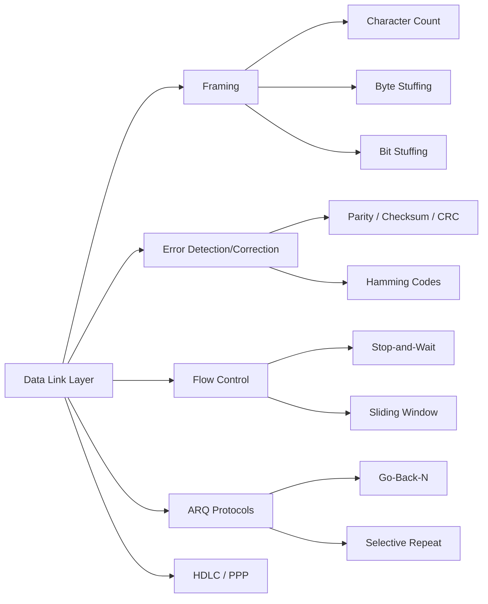

# Chapter 3: The Data Link Layer

> **Prerequisites:** [Chapter 2: Physical Layer](./02-physical-layer.md) — Bits and transmission media | **Next:** [Chapter 4: Medium Access Control](./04-mac.md) — From framing to channel sharing

## Learning Objectives

1. Describe the services provided by the data link layer to the network layer.
2. Explain and compare framing methods: character count, byte stuffing, and bit stuffing.
3. Compute error-detection codes including parity, checksum, and cyclic redundancy check.
4. Apply Hamming codes for single-bit error correction.
5. Analyze flow control mechanisms including stop-and-wait and sliding window protocols.

---

### Chapter at a Glance

| Topic | Key Insight | Practical Takeaway |
|-------|-------------|-------------------|
| Framing | Three methods: character count, byte stuffing, bit stuffing | Bit stuffing has bounded overhead; byte stuffing overhead varies with payload |
| Error Detection | CRC-32 catches all bursts ≤ 32 bits | Use CRC for link-layer integrity; checksums (Internet) are weaker but simpler |
| Error Correction | Hamming codes correct single-bit errors with minimal redundancy | Parity positions at powers of 2 enable pinpoint correction |
| Flow Control | Stop-and-wait vs sliding window | Window must match bandwidth-delay product for full utilization |
| ARQ Protocols | Stop-and-Wait, Go-Back-N, Selective Repeat | Selective Repeat most efficient on error-prone links; Go-Back-N simpler |

### Chapter Roadmap

## 3.1 Data Link Layer Services

The data link layer (Layer 2) provides reliable, efficient communication between two directly connected nodes. It accepts packets from the network layer and encapsulates them into frames for transmission across the physical link. The principal services are:

**Framing.** The data link layer divides the bit stream into discrete frames. The receiver must detect frame boundaries to extract each frame correctly.

**Error detection and correction.** Bits may be corrupted by electrical noise, crosstalk, or signal attenuation. The data link layer adds redundant bits to detect or correct errors.

**Flow control.** If a sender transmits frames faster than a receiver can process them, buffers overflow and frames are discarded. Flow control regulates transmission rate to match receiver capacity.

**Medium access control (Chapter 4).** On shared media, the data link layer coordinates frame transmission among multiple stations.

**Reliability.** Some data link protocols provide automatic repeat request (ARQ) — retransmission of lost or corrupted frames.

## 3.2 Framing

Framing solves the problem of locating the start and end of each frame within a continuous bit stream.

### 3.2.1 Character Count

The character-count method includes a length field in the frame header. The receiver reads the count and extracts that many bytes. This method is fragile because a single-bit error in the count field causes the receiver to lose synchronization permanently. The Bisync protocol (IBM, 1960s) used character count and was susceptible to this flaw.

### 3.2.2 Byte Stuffing

Byte stuffing uses flag bytes (0x7E) to mark frame boundaries. If the flag byte appears in the payload, the sender inserts an escape byte (0x7D) before it; the receiver removes the escape after detecting it. A flag-escape sequence (0x7D 0x7E) signals a literal flag in the data. PPP (Point-to-Point Protocol) uses byte stuffing. The overhead is variable and depends on payload content.

### 3.2.3 Bit Stuffing

Bit stuffing inserts a 0 bit after five consecutive 1 bits in the payload. A flag pattern — typically 01111110 — marks frame boundaries. The sender stuffs a 0 after every five consecutive 1s; the receiver unstuffs (removes) any 0 that follows five 1s. If a 0 is removed and the next bit is 1, the receiver knows to check for the flag (if the sixth bit is also 1, the next seven bits must form the flag). HDLC (High-Level Data Link Control) uses bit stuffing. The overhead is at most one bit per five data bits and is content-independent.

> **Pro Tip:** Bit stuffing is the more robust framing method because overhead is bounded (at most 1 bit per 5 data bits) and doesn't depend on payload content. Byte stuffing can balloon if payloads contain many flag bytes — a concern for binary protocols over PPP.

## 3.3 Error Detection and Correction

### 3.3.1 Parity

A single parity bit is appended to a data block such that the total number of 1 bits is even (even parity) or odd (odd parity). Parity detects any odd number of bit errors but misses any even number. Two-dimensional parity arranges data in a matrix and computes parity for each row and column, enabling detection and correction of single-bit errors.

### 3.3.2 Checksum

A checksum is computed by summing the data words (typically 16-bit) and taking the one's complement of the sum. The Internet checksum used in UDP, TCP, and IP works as follows: the sender divides the data into 16-bit words, sums them with one's complement arithmetic, complements the result, and stores it in the checksum field. The receiver performs the same computation on the received data and compares the result to the checksum field. A match indicates no detected error. The Internet checksum detects all errors that affect an odd number of bits and most even-bit errors, but not all.

### 3.3.3 Cyclic Redundancy Check

CRC treats data bits as a polynomial $D(x)$ of degree $n-1$, where $n$ is the number of data bits. The sender divides $D(x) \cdot x^k$ by a generator polynomial $G(x)$ of degree $k$ and appends the remainder as the CRC. The receiver divides the received polynomial by $G(x)$; a non-zero remainder indicates an error.

Common generator polynomials:

- CRC-16: $x^{16} + x^{15} + x^2 + 1$ (USB)
- CRC-32: $x^{32} + x^{26} + x^{23} + x^{22} + x^{16} + x^{12} + x^{11} + x^{10} + x^8 + x^7 + x^5 + x^4 + x^2 + x + 1$ (Ethernet)
- CRC-CCITT: $x^{16} + x^{12} + x^5 + 1$ (HDLC)

CRC-32 detects all single-bit errors, all double-bit errors (when $G(x)$ is primitive), any odd number of errors, any burst of length $\le 32$, and most longer bursts.

> **Pro Tip:** CRC-32 strikes the ideal balance for link-layer error detection — it is strong enough to catch virtually all real-world error patterns yet cheap enough to compute in hardware at line rate. Never replace CRC with a simple checksum for data integrity over a noisy link.

### 3.3.4 Hamming Codes

Hamming codes correct single-bit errors and detect double-bit errors with minimal redundancy. For data of length $m$ bits, the number of parity bits $r$ must satisfy $2^r \ge m + r + 1$.

Parity bits are placed at positions that are powers of two (1, 2, 4, 8, ...). Each parity bit covers a specific subset of bit positions: parity bit $p_i$ covers positions whose binary representation has bit $i$ set. For example, with $m = 4$ data bits and $r = 3$ parity bits:

- Position 1 (p1): covers bits 1, 3, 5, 7
- Position 2 (p2): covers bits 2, 3, 6, 7
- Position 4 (p4): covers bits 4, 5, 6, 7

The receiver recomputes the parity bits. The position of the failed parity bits, read as a binary number, gives the position of the erroneous bit. Flipping that bit corrects the error.

> **Pro Tip:** Hamming codes are rarely used in modern networking (CRC + retransmission dominates), but they are foundational for memory ECC (Error-Correcting Code) in RAM and storage systems where retransmission is impossible.

**One-Sentence Takeaway:** The data link layer turns a raw bit stream into reliable frame exchange through framing boundaries, error-detection codes (CRC for strength, checksum for simplicity), and flow control that prevents receiver buffers from overflowing.

## 3.4 Automatic Repeat Request

ARQ protocols combine error detection with retransmission. The three basic ARQ schemes are:

**Stop-and-Wait ARQ.** The sender transmits one frame and waits for an ACK. A timeout triggers retransmission. Sequence numbers alternate between 0 and 1; duplicate detection uses the sequence number. Simple but inefficient on long-delay paths.

**Go-Back-N ARQ.** The sender transmits up to N frames without waiting. On timeout, all unacknowledged frames are retransmitted. The receiver discards out-of-order frames. The sender maintains a timer for the oldest unacknowledged frame.

**Selective Repeat ARQ.** The sender retransmits only lost frames. The receiver buffers out-of-order frames and acknowledges them individually. The sender and receiver windows must satisfy the sequence number constraint to avoid ambiguity.

## 3.5 Flow Control

### 3.4.1 Stop-and-Wait

Stop-and-wait flow control: the sender transmits one frame and waits for an acknowledgment (ACK) before sending the next. This protocol uses a 1-bit sequence number (0/1). The sender tags each frame with a sequence number; the receiver sends an ACK with the same number. If the sender does not receive the ACK within a timeout, it retransmits the frame.

The efficiency of stop-and-wait is limited by the bandwidth-delay product. If the propagation delay is $d_{prop}$, transmission time is $d_{trans}$, and the receiver processing time is negligible:

$$\text{Utilization} = \frac{d_{trans}}{d_{trans} + 2 \cdot d_{prop}}$$

For a 1 Gbps link with 50 ms round-trip time and 1500-byte frames, utilization is under 0.02%.

### 3.4.2 Sliding Window

The sliding window protocol allows the sender to transmit up to $W$ frames before receiving an acknowledgment. The sender maintains a lower edge (LAR — last acknowledgment received) and an upper edge (SWS — send window size). The receiver maintains a receive window (RWS).

**Go-Back-N.** The receiver discards out-of-order frames. When a frame is lost, the sender times out and retransmits all frames from the lost frame forward. This is simple to implement but wastes bandwidth when errors are frequent.

**Selective Repeat.** The receiver buffers out-of-order frames and acknowledges them individually. The sender retransmits only the lost frame. SWS and RWS must satisfy $SWS + RWS \le 2^k$, where $k$ is the number of sequence number bits, to avoid ambiguity between new and retransmitted frames.

Window size is commonly chosen to be at least the bandwidth-delay product in units of frames:

$$W = \frac{2 \cdot d_{prop} \cdot R}{L}$$

where $R$ is the link rate and $L$ is the frame size. This ensures the sender can continuously transmit, achieving 100% utilization.

### 3.5.1 Piggybacking

In full-duplex communication, acknowledgment information can be carried in the header of a data frame traveling in the reverse direction. This piggybacking reduces the number of frames sent. The receiver sets the ACK field in its outgoing data frame; if no data frame is ready, a separate ACK frame is sent. Piggybacking improves efficiency on links with bidirectional traffic but introduces complexity in timeout management.

## 3.6 HDLC

High-Level Data Link Control (HDLC) is a bit-oriented protocol used as the basis for many link-layer standards (PPP, SDLC, LAPD). HDLC supports three station types: primary (controls the link), secondary (follows primary), and combined (both roles). Modes: Normal Response Mode (NRM, primary-initiated), Asynchronous Balanced Mode (ABM, combined stations, point-to-point), and Asynchronous Response Mode (ARM, secondary-initiated).

The HDLC frame format:
| Flag | Address | Control | Information | FCS | Flag |
|------|---------|---------|-------------|-----|------|
| 8 b   | 8+ b    | 8/16 b   | variable    | 16 b | 8 b   |

The control field distinguishes three frame types: Information (I-frames carry data with sequence numbers), Supervisory (S-frames for ACK, NAK, RR, RNR), and Unnumbered (U-frames for link setup and disconnect).

## 3.7 PPP

Point-to-Point Protocol (PPP, RFC 1661) provides encapsulation, authentication, and link control over serial links. PPP uses byte stuffing with flag byte 0x7E. The Link Control Protocol (LCP) negotiates options (MTU, authentication protocol, magic numbers for loop detection). Authentication options: PAP (plaintext passwords, insecure) and CHAP (challenge-response with MD5). The Network Control Protocol (NCP) configures network-layer parameters (IPCP for IP address negotiation).

---

### Concept Comparison Table

| Concept | Definition | Key Distinction | Use Case |
|---------|-----------|-----------------|----------|
| Character Count Framing | Length field in header | Fragile — single-bit error desyncs receiver | Legacy Bisync protocol |
| Byte Stuffing | Flag bytes with escape insertion | Variable overhead depending on payload | PPP over serial links |
| Bit Stuffing | Insert 0 after five consecutive 1s | Bounded overhead (max 20%) | HDLC, modern link protocols |
| CRC-32 | Polynomial division remainder | Detects all bursts ≤ 32 bits | Ethernet, Wi-Fi |
| Internet Checksum | One's complement sum | Weaker but simpler than CRC | TCP, UDP, IP headers |
| Hamming Code | Parity at power-of-2 positions | Corrects single-bit errors | Memory ECC, not networking |
| Stop-and-Wait ARQ | Transmit one, wait for ACK | Simple but high-latency inefficiency | Low-throughput reliable links |
| Sliding Window | Transmit up to W frames before ACK | Achieves full utilization with correct W | High-throughput reliable links |

### Quick Reference

| Category | Key Points |
|----------|------------|
| **Framing Methods** | Character count (fragile), Byte stuffing (variable overhead, PPP), Bit stuffing (≤20% overhead, HDLC) |
| **CRC-32 Properties** | Detects: all single-bit, all double-bit, odd-count errors, bursts ≤ 32 bits |
| **Hamming Formula** | $2^r \ge m + r + 1$ for data bits $m$ and parity bits $r$ |
| **ARQ Comparison** | Stop-and-Wait: utilization = $t_{trans}/(t_{trans} + 2t_{prop})$; GBN: simple but wasteful; SR: efficient but complex buffering |
| **Efficiency Rule** | Window ≥ BDP in frames to achieve 100% link utilization |
| **HDLC Frame Types** | I-frames (data), S-frames (ACK/NAK/RR/RNR), U-frames (control) |

### Cross-Application Matrix

| Concept | Network Engineering | Embedded Systems | Protocol Design | Storage |
|---------|-------------------|------------------|----------------|---------|
| Framing | Configuring serial links | UART frame boundaries | Custom protocol headers | N/A |
| CRC | Interface diagnostics | Wireless sensor integrity | Custom error detection | RAID parity, disk ECC |
| Hamming Codes | N/A | N/A | N/A | Memory ECC (DDR) |
| Sliding Window | TCP window tuning | BLE data transfer | Custom reliable transport | N/A |
| HDLC/PPP | WAN link configuration | N/A | N/A | N/A |

---

### Chapter Quiz

**Q1.** Which framing method is used by PPP?

- A) Character count
- B) Byte stuffing
- C) Bit stuffing
- D) None of the above

Answer

B) PPP uses byte stuffing with flag byte 0x7E and escape byte 0x7D.

**Q2.** What is the maximum throughput of slotted ALOHA?

- A) 18.4%
- B) 36.8%
- C) 50%
- D) 100%

Answer

B) 36.8% ($1/e$) — double that of pure ALOHA (18.4%).

**Q3.** A CRC with generator polynomial $x^3 + x + 1$ receives the bit sequence 1101101. The remainder after division is 101. Was an error detected?

- A) Yes
- B) No
- C) Cannot determine
- D) CRC cannot detect errors

Answer

B) No — a zero remainder indicates no detected error; CRC with non-zero remainder = error detected.

**Q4.** In Go-Back-N with a 4-bit sequence number, what is the maximum send window size?

- A) 8
- B) 15
- C) 16
- D) 31

Answer

B) 15 — Go-Back-N requires $W \le 2^k - 1$ to avoid ambiguity (Selective Repeat requires $W \le 2^{k-1}$).

---

## Summary

The data link layer provides framing, error detection and correction, and flow control. Framing methods (character count, byte stuffing, bit stuffing) differ in complexity, overhead, and error recovery. CRC provides robust error detection with low computational cost; Hamming codes enable single-bit error correction. Flow control prevents receiver buffer overflow: stop-and-wait is simple but inefficient over high-delay paths; sliding window protocols achieve full link utilization when the window size matches the bandwidth-delay product.

## Exercises

### Review Questions

1. Why does the byte-stuffing overhead depend on payload content while bit-stuffing overhead is bounded?
2. A CRC generator polynomial $G(x)$ detects all single-bit errors if $G(x)$ has at least two terms. Why?
3. What is the minimum Hamming distance required to detect up to $d$ errors? To correct up to $c$ errors?
4. A sliding window protocol uses 3-bit sequence numbers. What is the maximum window size for Go-Back-N? For Selective Repeat?
5. Under what conditions does stop-and-wait achieve acceptable efficiency?

### Application Problems

6. Compute the CRC-3 for the data polynomial $x^6 + x^4 + x^2 + 1$ (binary 1010101) using generator polynomial $x^3 + x + 1$ (binary 1011).
7. A Go-Back-N protocol has a 4-bit sequence number, SWS = 7, and a link with 50 ms RTT and 10 Mbps rate. If frame size is 1000 bytes, what is the maximum throughput assuming no errors?
8. Design a 2D parity scheme for 8 bytes of data arranged in a $4 \times 16$ matrix. Show the resulting codeword. Demonstrate that a double-bit error in the same row is detected.

### Challenge Problem

9. **Analyze the performance of Selective Repeat under correlated errors.** Consider a link with 10 ms propagation delay each direction, 100 Mbps data rate, 1500-byte frames, and a 6-bit sequence number. Errors occur in bursts: each burst corrupts 3 consecutive frames, and bursts occur with probability 0.05 per frame. Compute the efficiency of Selective Repeat with SWS = 31 under this error model. Then propose a modification to improve efficiency by at least 20% and analyze whether your modification introduces any correctness issues with sequence number uniqueness.
