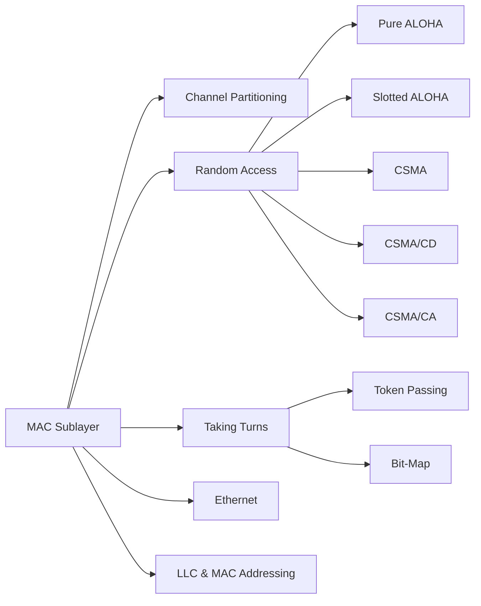

# Chapter 4: Medium Access Control

> **Prerequisites:** [Chapter 3: Data Link Layer](./03-datalink-layer.md) — Framing and error control | **Next:** [Chapter 5: Ethernet & Switching](./05-ethernet-switching.md) — From MAC protocols to switched networks

## Learning Objectives

1. Explain why medium access control is necessary on shared broadcast channels.
2. Analyze the performance of pure ALOHA and slotted ALOHA under Poisson traffic.
3. Compare persistent, non-persistent, and p-persistent CSMA strategies.
4. Describe CSMA/CD operation and its role in classical Ethernet.
5. Distinguish contention-based and collision-free MAC protocols.
6. Interpret the structure of an Ethernet MAC frame and address format.

---

### Chapter at a Glance

| Topic | Key Insight | Practical Takeaway |
|-------|-------------|-------------------|
| ALOHA | Pure: 18.4% max throughput; Slotted: 36.8% | Vulnerable period is the fundamental limit — slotted halves it |
| CSMA | Sense before transmit improves efficiency | 1-persistent is greedy; non-persistent reduces collisions at cost of idle time |
| CSMA/CD | Detect collisions during transmission | Binary exponential backoff adapts to load; minimum frame size ensures detection |
| CSMA/CA | Virtual carrier sensing (NAV) for wireless | RTS/CTS mitigates hidden terminal problem |
| Collision-Free | Token passing, bit-map protocols | Deterministic delay but overhead at light load |
| Ethernet | IEEE 802.3 with CSMA/CD, 48-bit MAC | Dominant LAN technology; switched Ethernet eliminated collisions |

### Chapter Roadmap

## 4.1 The MAC Sublayer

The medium access control (MAC) sublayer, the lower sublayer of the data link layer in the IEEE 802 architecture, governs how multiple stations share a common broadcast channel. Without coordination, simultaneous transmissions collide — signals interfere and both are lost. MAC protocols are classified into three categories:

**Channel partitioning.** Divide the channel into smaller pieces (time slots, frequencies, codes) and allocate one piece per station. Examples: TDMA, FDMA, CDMA.

**Random access.** Stations transmit without prior coordination and handle collisions through retransmission. Examples: ALOHA, CSMA, CSMA/CD.

**Taking turns.** Stations take turns transmitting, eliminating collisions. Examples: polling, token passing.

## 4.2 ALOHA

### 4.2.1 Pure ALOHA

In pure ALOHA, developed at the University of Hawaii in 1970, a station transmits as soon as it has data. After transmission, the station listens for an acknowledgment (ACK) from the receiver. If no ACK arrives within a timeout, the station assumes a collision occurred and retransmits after a random backoff time.

A frame is successfully transmitted if no other station transmits during the frame's transmission time $t$ (when it would collide with the start of our frame) nor during the $t$ period before (when another transmission would collide with our frame's start). The vulnerable period is $2t$.

Under Poisson traffic with aggregate generation rate $G$ frames per frame time, the throughput $S$ (successful frames per frame time) is:

$$S = G \cdot e^{-2G}$$

Maximum throughput is $1/(2e) \approx 0.184$ at $G = 0.5$.

### 4.2.2 Slotted ALOHA

Slotted ALOHA divides time into discrete slots equal to the frame transmission time. Stations must transmit only at the beginning of a slot. The vulnerable period is reduced to $t$ (one slot), and the throughput becomes:

$$S = G \cdot e^{-G}$$

Maximum throughput is $1/e \approx 0.368$ at $G = 1$, doubling pure ALOHA's efficiency. The cost is the need for global time synchronization.

> **Pro Tip:** ALOHA's efficiency limit is a fundamental bound on random-access protocols. Any system where uncoordinated stations transmit freely cannot exceed ~37% channel utilization — understanding this limit motivates every MAC protocol that followed.

## 4.3 Carrier Sense Multiple Access

CSMA improves upon ALOHA by listening to the channel before transmitting (carrier sensing). Four variants exist.

### 4.3.1 Persistent CSMA

**1-persistent CSMA.** Before transmitting, the station senses the channel. If idle, it transmits immediately. If busy, it persists until idle, then transmits immediately. If a collision occurs, the station backs off randomly and repeats. The 1-persistent approach is greedy: when the channel becomes idle, multiple waiting stations transmit simultaneously, causing collisions.

**Non-persistent CSMA.** If the channel is busy, the station waits a random amount of time before sensing again. This reduces collision probability compared to 1-persistent but increases idle time because waiting stations may not transmit immediately when the channel becomes free.

**p-persistent CSMA.** Used in slotted channels. When the station senses an idle slot, it transmits with probability $p$ and defers to the next slot with probability $1-p$. The parameter $p$ balances throughput and delay. For $n$ stations each with probability $p$, the optimal value approximately satisfies $p \approx 1/n$.

### 4.3.2 CSMA with Collision Detection

CSMA/CD extends CSMA by detecting collisions during transmission. The station monitors the channel for interference. When a collision is detected, the station transmits a 48-bit jam signal to ensure all stations recognize the collision, then backs off.

The binary exponential backoff algorithm governs retry: after the $i$-th collision for a given frame, the station chooses a random integer $k$ uniformly from $[0, 2^i - 1]$ and waits $k \cdot \tau$ slot times, where $\tau$ is the 512-bit-time slot (51.2 microseconds for 10 Mbps Ethernet). After 10 collisions, $i$ is capped at 10; after 16 collisions, the frame is discarded.

The efficiency of CSMA/CD depends on the propagation delay relative to transmission time. The maximum efficiency is:

$$\text{Efficiency} = \frac{1}{1 + 2e \cdot A \cdot (2A - 1)}$$

where $A$ is the probability that exactly one station transmits in a slot. For practical purposes, efficiency approaches 1 as the ratio of propagation delay to transmission time approaches 0.

### 4.3.3 CSMA with Collision Avoidance

CSMA/CA is used in wireless LANs (802.11) where collision detection is impractical — a station cannot listen while transmitting because its own signal overwhelms received signals. CSMA/CA uses explicit acknowledgment and virtual carrier sensing via the Network Allocation Vector (NAV).

When a station wishes to transmit, it senses the channel. If idle for DIFS (DCF Inter-Frame Space) duration, it transmits. If busy or the channel becomes busy during DIFS, it enters the backoff procedure: selects a random backoff counter from the contention window $[0, CW]$, decrements the counter each idle slot, and transmits when the counter reaches zero. After each collision, $CW$ doubles up to $CW_{max}$.

The optional RTS/CTS (Ready to Send / Clear to Send) exchange reserves the medium for the data transmission duration, mitigating the hidden terminal problem.

> **Pro Tip:** RTS/CTS is worth enabling when stations cannot hear each other (hidden terminal), but adds overhead on every transmission. For dense access points and small frames, disabling RTS/CTS and relying on ACK timeout can improve throughput.

## 4.4 Collision-Free Protocols

### 4.4.1 Bit-Map Protocol

In the bit-map protocol, each contention period consists of $n$ slots, one per station. Station $i$ transmits a 1-bit in slot $i$ if it has data. After all $n$ slots, stations with data transmit in numeric order. The protocol is collision-free but wasteful when few stations have data, since all $n$ slots are required every cycle.

### 4.4.2 Token Passing

In token passing, a special frame (the token) circulates among stations in a fixed order. A station may transmit only when it holds the token. After transmission, it passes the token to the next station. FDDI and Token Ring (IEEE 802.5) use token passing. The protocol is collision-free with deterministic delay bounds, making it suitable for real-time applications. The vulnerability is token loss or duplicate tokens, requiring a monitoring station for recovery.

## 4.5 Ethernet

Classical Ethernet (IEEE 802.3) uses 1-persistent CSMA/CD. A station transmits a frame and listens for collision. If no collision occurs, transmission completes successfully. If a collision is detected, the station transmits a jam signal, backs off using binary exponential backoff, and retries.

The Ethernet MAC frame format:

| Preamble | SFD | Destination MAC | Source MAC | Length/Type | Payload | FCS |
|----------|-----|----------------|------------|-------------|---------|-----|
| 7 bytes  | 1 B | 6 B            | 6 B        | 2 B         | 46–1500 B | 4 B |

- **Preamble**: 7 bytes of alternating 1/0 for receiver synchronization.
- **Start Frame Delimiter (SFD)**: 1 byte (10101011) indicating the start of the frame.
- **Destination and Source MAC addresses**: 48-bit globally unique identifiers.
- **Length/Type**: If $\le 1500$, indicates payload length; if $\ge 1536$, indicates EtherType (e.g., 0x0800 for IPv4, 0x0806 for ARP, 0x86DD for IPv6).
- **Payload**: 46–1500 bytes (minimum ensures reliable collision detection).
- **Frame Check Sequence (FCS)**: 32-bit CRC.

> **Pro Tip:** The minimum Ethernet payload (46 bytes) exists to ensure collision detection works across the maximum network diameter. In switched Ethernet where every link is point-to-point, this constraint is unnecessary, but the format persists for backward compatibility.

## 4.6 Performance Comparison of MAC Protocols

The efficiency of a MAC protocol is defined as the fraction of channel capacity used for successful data transmission. For slotted ALOHA, maximum efficiency is 0.368. For 1-persistent CSMA, efficiency depends on propagation delay a = propagation time / transmission time. As a approaches 0, CSMA/CD efficiency approaches 1. For finite a, CSMA/CD efficiency is approximately 1/(1 + 6.44a).

Collision-free protocols such as token passing achieve efficiency approaching 1 under heavy load but have higher overhead under light load (idle token circulation). The choice of MAC protocol involves trade-offs: random access protocols favor bursty traffic with many stations; controlled access protocols favor steady traffic with delay guarantees.

## 4.7 IEEE 802.2 LLC

The Logical Link Control (LLC) sublayer sits between the MAC sublayer and the network layer. LLC provides three service types: Type 1 (unacknowledged connectionless), Type 2 (connection-oriented with flow control), and Type 3 (acknowledged connectionless). LLC uses Service Access Points (SAPs) to identify the upper-layer protocol (e.g., 0x06 for IP, 0xE0 for IPX). The LLC header includes Destination SAP (DSAP), Source SAP (SSAP), and Control fields. In modern Ethernet networks, the EtherType field in the MAC header directly identifies the upper-layer protocol, making LLC largely unnecessary.

## 4.8 MAC Addressing

MAC (Media Access Control) addresses are 48-bit identifiers assigned by manufacturers. The first 24 bits (Organizationally Unique Identifier, OUI) identify the manufacturer; the remaining 24 bits are a device-specific serial number. Addresses are typically expressed as six hexadecimal pairs (e.g., `00:1A:2B:3C:4D:5E`).

The type field in the address determines its scope. A unicast address identifies a single interface. A multicast address (first bit = 1) delivers to a group of stations. The broadcast address (all 48 bits set to 1) delivers to all stations on the LAN.

---

### Concept Comparison Table

| Protocol | Max Throughput | Collisions | Coordination | Use Case |
|----------|---------------|------------|--------------|----------|
| Pure ALOHA | 18.4% | Yes | None | Historical, satellite |
| Slotted ALOHA | 36.8% | Yes | Slot sync | Early packet radio |
| 1-persistent CSMA | Varies with load | High at idle→busy transition | Carrier sense | Early Ethernet |
| Non-persistent CSMA | Higher than 1-persistent | Lower | Random wait | Low-load environments |
| p-persistent CSMA | Optimal with tuned p | Controlled | Probabilistic | Slotted channels |
| CSMA/CD | ~100% (low prop delay) | Detected, retried | Sense + detect | Classical Ethernet |
| CSMA/CA | Lower than CSMA/CD | Avoided | Virtual carrier sense (NAV) | 802.11 WiFi |
| Token Passing | ~100% (heavy load) | None (collision-free) | Token ownership | FDDI, industrial control |

### Quick Reference

| Category | Key Points |
|----------|------------|
| **ALOHA Formulas** | Pure: $S = Ge^{-2G}$, max 18.4% at G=0.5; Slotted: $S = Ge^{-G}$, max 36.8% at G=1 |
| **CSMA Variants** | 1-persistent (greedy), Non-persistent (random wait), p-persistent (probabilistic) |
| **Binary Exponential Backoff** | After $i$th collision: wait $k \cdot 512$ bit-times, $k \in [0, 2^i - 1]$, cap at $i=10$, drop at $i=16$ |
| **Ethernet Frame (min)** | Preamble(7) + SFD(1) + Dst(6) + Src(6) + Len(2) + Payload(46-1500) + FCS(4) = 72-1526 bytes |
| **MAC Address** | 48 bits: OUI (24 bits, manufacturer) + NIC-specific (24 bits); unicast/multicast/broadcast |
| **Collision-Free** | Bit-map: $n$ reservation slots; Token: circulating permission frame |

### Cross-Application Matrix

| Concept | LAN Design | WiFi Engineering | IoT | Cellular |
|---------|-----------|-----------------|-----|----------|
| ALOHA | N/A | N/A | LoRaWAN | Initial 3G random access |
| CSMA/CD | Classical Ethernet | N/A | N/A | N/A |
| CSMA/CA | N/A | AP channel selection | Zigbee | N/A |
| Token Passing | N/A | N/A | PROFIBUS, industrial | N/A |
| Ethernet Frame | Switch configuration | N/A | N/A | N/A |
| MAC Addressing | ARP, VLAN config | BSSID filtering | Device addressing | IMSI |

---

### Chapter Quiz

**Q1.** What is the maximum throughput of pure ALOHA?

- A) 36.8%
- B) 50%
- C) 18.4%
- D) 100%

Answer

C) 18.4% ($1/2e$) — the vulnerable period is twice the frame time.

**Q2.** Why does 1-persistent CSMA perform poorly when the channel transitions from busy to idle?

- A) Stations cannot detect the idle state
- B) Multiple waiting stations all transmit at once, causing collisions
- C) The carrier sense mechanism fails
- D) Backoff is disabled

Answer

B) All stations waiting for the channel transmit as soon as it becomes idle, causing guaranteed collisions.

**Q3.** In CSMA/CD, what is the purpose of the minimum frame size?

- A) Ensure minimum data throughput
- B) Guarantee collision detection across max network diameter
- C) Reduce overhead from headers
- D) Improve CRC strength

Answer

B) The frame must be long enough that the sender is still transmitting when the farthest collision signal returns.

**Q4.** The IEEE 802.3 MAC address `FF:FF:FF:FF:FF:FF` is what type?

- A) Unicast
- B) Multicast
- C) Broadcast
- D) Anycast

Answer

C) Broadcast — all 48 bits set to 1, delivering to all stations on the LAN.

---

## Summary

Medium access control protocols coordinate access to shared broadcast channels. ALOHA provides the foundation with simple random access but limited throughput (0.184 for pure, 0.368 for slotted). CSMA improves throughput through carrier sensing; adding collision detection (CSMA/CD) enables efficient operation with minimal frame size constraints. Wireless networks use CSMA/CA with virtual carrier sensing. Collision-free protocols such as token passing provide deterministic delay. Ethernet, the dominant LAN technology, uses CSMA/CD with a 48-bit MAC address space and a structured frame format.

## Exercises

### Review Questions

1. Why is the vulnerable period for pure ALOHA twice the frame transmission time?
2. What is the maximum throughput of slotted ALOHA, and at what offered load does it occur?
3. In 1-persistent CSMA, why does the probability of collision increase when the channel becomes idle?
4. How does binary exponential backoff adapt to varying network load?
5. Why is collision detection impractical in wireless LANs?

### Application Problems

6. Pure ALOHA operates with a frame time of 10 ms. If the aggregate load is 0.4 frames per frame time, what is the throughput? What fraction of frames experience collision on their first transmission?
7. In p-persistent CSMA, there are 10 stations each with probability $p = 0.1$ of having a frame ready in each slot. What is the probability that exactly one station transmits in a given slot? What is the probability of an idle slot?
8. An Ethernet segment has 20 stations. The maximum propagation delay between any two stations is 25 microseconds. The data rate is 10 Mbps. What is the minimum frame size required for reliable collision detection? Verify that the 512-bit slot time for 10 Mbps Ethernet is adequate.

### Challenge Problem

9. **Design a hybrid MAC protocol.** Consider a wireless network with 50 stations where traffic is a mixture of real-time voice (constant bit rate, low latency requirement) and bursty data (variable bit rate, tolerant to delay). Design a MAC protocol that satisfies: (a) voice calls experience bounded access delay under 10 ms, (b) data throughput is at least 60% of channel capacity, and (c) the protocol works without infrastructure (ad hoc). Provide pseudocode for your protocol, compute its throughput under mixed load, and explain how the hidden terminal problem is addressed.
