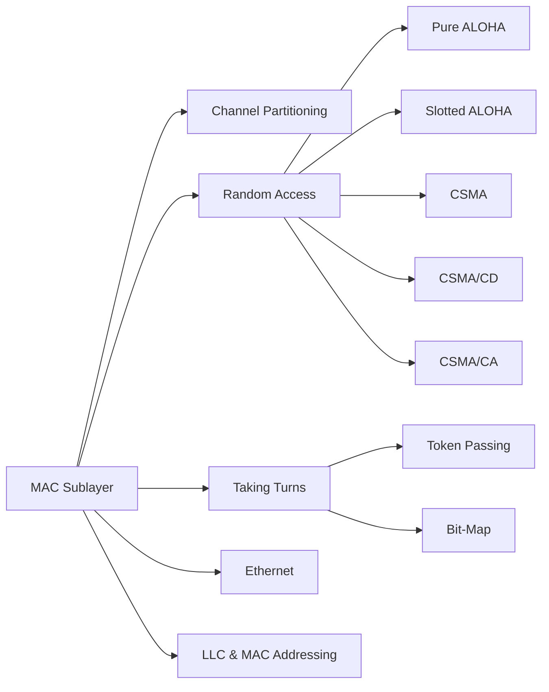

# Chapter 4: Medium Access Control (MAC)

> **Prerequisites:** [Chapter 3: Data Link Layer](./03-datalink-layer.md) — Framing and error control | **Next:** [Chapter 5: Ethernet & Switching](./05-ethernet-switching.md) — From MAC protocols to switched networks

## Learning Objectives

1. Explain why medium access control is necessary on shared broadcast channels.
2. Analyze the performance of pure ALOHA and slotted ALOHA under Poisson traffic.
3. Compare persistent, non-persistent, and p-persistent CSMA strategies.
4. Describe CSMA/CD operation and its role in classical Ethernet.
5. Distinguish contention-based and collision-free MAC protocols.
6. Interpret the structure of an Ethernet MAC frame and address format.

---

### Chapter at a Glance

| Topic | Key Insight | Practical Takeaway |
|-------|-------------|-------------------|
| ALOHA | Pure: 18.4% max throughput; Slotted: 36.8% | Vulnerable period is the fundamental limit — slotted halves it |
| CSMA | Sense before transmit improves efficiency | 1-persistent is greedy; non-persistent reduces collisions at cost of idle time |
| CSMA/CD | Detect collisions during transmission | Binary exponential backoff adapts to load; minimum frame size ensures detection |
| CSMA/CA | Virtual carrier sensing (NAV) for wireless | RTS/CTS mitigates hidden terminal problem |
| Collision-Free | Token passing, bit-map protocols | Deterministic delay but overhead at light load |
| Ethernet | IEEE 802.3 with CSMA/CD, 48-bit MAC | Dominant LAN technology; switched Ethernet eliminated collisions |

### Chapter Roadmap



---

## 4.1 The MAC Sublayer


### What Is the MAC Sublayer?

The **Medium Access Control (MAC) sublayer** is the lower sublayer of the data link layer in the IEEE 802 reference model. It sits directly above the physical layer and below the Logical Link Control (LLC) sublayer. Its primary job: **regulate access to a shared broadcast channel** so that multiple stations can communicate without destructive interference.

### Real-World Analogy

> **A conference room with one microphone.** Imagine 10 people in a meeting room with a single microphone. If two people speak at once, nobody understands anything. The MAC protocol is the **meeting chair's rules**: you raise your hand (carrier sense), the chair calls on you (collision-free), or you just speak and deal with interruptions (random access). The "vulnerable period" is the time between when you start speaking and when someone else also starts speaking — the longer this window, the more likely a "collision" (crosstalk).

### Responsibilities of the MAC Sublayer

1. **Frame delimiting and synchronization** — Identify frame boundaries on the raw bit stream.
2. **Addressing** — Assign and interpret 48-bit MAC addresses for source and destination.
3. **Channel access control** — Decide which station transmits next on a shared medium.
4. **Error detection** — CRC-32 frame check sequence in Ethernet.
5. **Collision handling** — Detect collisions and schedule retransmissions.

### Classification of MAC Protocols

| Category | How It Works | Examples |
|----------|-------------|----------|
| **Random Access (Contention-based)** | Stations transmit arbitrarily; collisions resolved after the fact | ALOHA, CSMA, CSMA/CD, CSMA/CA |
| **Controlled Access (Collision-free)** | Stations take turns; no collisions | Reservation, Polling, Token Passing |
| **Channelization** | Divide channel into independent sub-channels | FDMA, TDMA, CDMA |

### Advantages and Disadvantages

| Aspect | Advantage | Disadvantage |
|--------|-----------|-------------|
| Random Access | Simple, no central coordinator, works for bursty traffic | Throughput collapses under high load; collisions waste bandwidth |
| Controlled Access | Deterministic delay, no collisions, fair | High overhead under light load; single point of failure (polling) |
| Channelization | Predictable bandwidth, no collisions, real-time friendly | Inflexible; wasted capacity when station has nothing to send |

### Edge Cases in MAC Design

| Edge Case | Description | Mitigation |
|-----------|-------------|------------|
| Collision detection failure | Frame too short; sender finishes before collision signal returns | Minimum frame size (64 bytes for Ethernet) |
| Persistent defer | High-priority station keeps deferring to lower-priority traffic indefinitely | Priority scheduling or backoff prioritization |
| Hidden terminal | Two stations cannot hear each other but both reach the AP | RTS/CTS in 802.11 |
| Exposed terminal | Station defers unnecessarily because it hears a transmitter whose receiver is out of range | Exposed-terminal-aware MAC (rare in practice) |
| Collapse under load | Throughput -> 0 as offered load -> infinity for random access protocols | Backoff algorithm, admission control |
| Token loss | Token frame is corrupted; no station can transmit | Monitoring station regenerates token |
| Starvation | A station never wins the contention | Limit backoff exponent, use fair queuing |

---

## 4.2 Random Access Protocols

In random access (contention-based) protocols, any station can transmit whenever it has data. No central authority grants permission. Collisions are detected and recovered through retransmission. The fundamental trade-off: **simplicity vs. efficiency under load**.

### 4.2.1 ALOHA

ALOHA is the earliest random-access protocol, developed at the **University of Hawaii** in 1970 to connect island campuses via radio.

#### 4.2.1.1 Pure ALOHA

##### Real-World Analogy

> **A crowded party.** People talk whenever they want. If two people start speaking at the same time, they both notice the garbled conversation, stop, wait a random amount of time, and try again. The "vulnerable period" is the time window during which another person starting to speak would ruin your sentence.

##### How Pure ALOHA Works (Numbered Steps)

1. Station assembles a frame.
2. Station **transmits immediately** on the shared channel.
3. Station waits for an acknowledgment (ACK) from the receiver.
4. If ACK received -> transmission succeeded. Go to step 1 for next frame.
5. If no ACK within timeout -> collision assumed.
6. Station waits a **random backoff time** (uniformly distributed).
7. Go to step 2.

##### Vulnerable Period Analysis

A frame of transmission time t is destroyed if any other station transmits during the interval [T - t, T + t], i.e., a window of length 2t.

```
          |---t---|                   |---t---|
Frame A:  |<------ t ------->|
Other:         |<--- t --->|  (collides with start)
Other:                              |<--- t --->|  (our start collides)
```

##### Pseudocode

```
PROCEDURE pure_aloha_transmit(frame):
    WHILE frame not acknowledged:
        transmit(frame)
        start_timer(TIMEOUT)
        IF ack_received():
            BREAK
        ELSE:
            backoff = RANDOM(0, MAX_BACKOFF)
            WAIT(backoff)
    END WHILE
END PROCEDURE
```

##### Dry Run Trace Table

| Event | Station | Action | Channel | Backoff | Result |
|-------|---------|--------|---------|---------|--------|
| 1 | A | Has data, transmits | Busy | -- | -- |
| 2 | B | Has data, transmits (within vulnerable window) | Collision | -- | Both lost |
| 3 | A | Timeout, backoff=3 | Idle | 3 | -- |
| 4 | B | Timeout, backoff=7 | Idle | 7 | -- |
| 5 | A | Backoff expires, retransmits | Busy | 0 | Success |
| 6 | B | Backoff at 4 | Busy | 4 | -- |
| 7 | A | ACK received | Idle | -- | Done |
| 8 | B | Backoff=0, retransmits | Busy | 0 | Success |

##### Throughput Analysis

Under **Poisson traffic** with aggregate generation rate G frames per frame time:

S = G * e^(-2G)

- S: throughput (successful frames per frame time)
- G: total offered load (new + retransmitted frames per frame time)
- Maximum at G = 0.5: S_max = 1/(2e) ~ 0.184 (18.4%)

**Derivation intuition:** Probability that no other frame is transmitted during vulnerable period 2t is e^(-2G). Multiply by arrival rate G.

##### C++ Implementation -- Pure ALOHA Throughput Simulator

```cpp
#include <iostream>
#include <cmath>
#include <random>
#include <vector>

class PureALOHASimulator {
private:
    double G;
    int totalSlots;
    double frameTime;
    std::default_random_engine generator;

public:
    PureALOHASimulator(double offeredLoad, int slots, double fTime = 1.0)
        : G(offeredLoad), totalSlots(slots), frameTime(fTime) {}

    double simulate() {
        std::poisson_distribution<int> arrivalDist(G);
        std::uniform_real_distribution<double> phaseDist(0.0, frameTime);
        int successfulFrames = 0;
        int totalFrames = 0;

        for (int slot = 0; slot < totalSlots; ++slot) {
            int arrivals = arrivalDist(generator);
            totalFrames += arrivals;
            std::vector<double> arrivalTimes;
            for (int i = 0; i < arrivals; ++i)
                arrivalTimes.push_back(phaseDist(generator));

            for (size_t i = 0; i < arrivalTimes.size(); ++i) {
                bool collision = false;
                for (size_t j = 0; j < arrivalTimes.size(); ++j) {
                    if (i != j && std::abs(arrivalTimes[i] - arrivalTimes[j]) < frameTime) {
                        collision = true; break;
                    }
                }
                if (!collision) successfulFrames++;
            }
        }
        return static_cast<double>(successfulFrames) / totalSlots;
    }

    void runExperiment() {
        double throughput = simulate();
        std::cout << "Pure ALOHA (G = " << G << "):\n";
        std::cout << "  Simulated: " << (throughput * 100) << "%\n";
        std::cout << "  Theoretical S/G: " << (G * std::exp(-2 * G)) << "\n";
    }
};

int main() {
    PureALOHASimulator sim(0.5, 10000, 1.0);
    sim.runExperiment();
    return 0;
}
```

**Example output:**
```
Pure ALOHA (G = 0.5):
  Simulated: 18.31%
  Theoretical S/G: 0.1839
```

##### Python Implementation -- Pure ALOHA Throughput Calculator

```python
import math, random

class PureALOHASimulator:
    def __init__(self, offered_load, num_slots=10000, frame_time=1.0):
        self.G = offered_load
        self.num_slots = num_slots
        self.frame_time = frame_time

    def simulate(self):
        successful = 0
        for _ in range(self.num_slots):
            arrivals = random.poisson_variate(self.G)
            times = [random.random() * self.frame_time for _ in range(arrivals)]
            for i, t1 in enumerate(times):
                if not any(abs(t1 - t2) < self.frame_time
                           for j, t2 in enumerate(times) if i != j):
                    successful += 1
        return successful / self.num_slots

    @staticmethod
    def theoretical(G):
        return G * math.exp(-2 * G)

if __name__ == "__main__":
    sim = PureALOHASimulator(0.5)
    print(f"Simulated: {sim.simulate():.4f}, Theory: {sim.theoretical(0.5):.4f}")
```

##### Complexity Analysis

| Metric | Value | Why |
|--------|-------|-----|
| Time per transmission | O(1) | No coordination; transmit immediately |
| Throughput (best) | O(1/(2e) * C) | Channel capacity C; bound by vulnerable period |
| Collision probability | 1 - e^(-2G) | Poisson arrival during 2t window |
| Expected retries | e^(2G) - 1 | Geometric distribution with success prob e^(-2G) |

**Why the maximum is 18.4%:** Each frame spends vulnerable period 2t exposed to collisions. The e^(-2G) factor is the Poisson probability of zero arrivals during this window. This is a **fundamental bound** -- no improvement without structural changes (like slotting).

##### Advantages and Disadvantages of Pure ALOHA

| Aspect | Details |
|--------|---------|
| Advantages | Extremely simple to implement; no synchronization needed; works with any number of stations; no central coordinator |
| Disadvantages | Maximum 18.4% channel utilization; unstable under high load; no fairness guarantees; long delays at high G |

##### Edge Cases

| Scenario | Behavior | Implication |
|----------|----------|-------------|
| G -> 0 (very light load) | S ~ G, few collisions | High efficiency, low delay |
| G -> infinity (extreme overload) | S -> 0 | Throughput collapse -- most frames collide |
| G = 0.5 | Peak throughput at 18.4% | Optimal operating point |
| Infinite stations | Model holds as n -> infinity | Poisson assumption valid |
| Finite stations | Slightly different distribution | Binomial vs Poisson, negligible for n > 20 |

---

#### 4.2.1.2 Slotted ALOHA

##### Real-World Analogy

> **A turn-based party game.** Instead of speaking whenever you want, everyone must wait for the "talking stick" to be passed. Time is divided into fixed slots, and you can only speak at the start of a slot. This halves the vulnerable period -- only people starting in the same slot cause collisions.

##### How Slotted ALOHA Works (Numbered Steps)

1. Time is divided into discrete slots equal to the frame transmission time.
2. All stations are synchronized to slot boundaries.
3. Station assembles a frame.
4. Station **waits for the next slot boundary**.
5. Station transmits at the slot start.
6. Wait for ACK. If received -> success. Go to step 3.
7. If timeout -> collision assumed.
8. Wait random backoff time (in slot units).
9. Go to step 4.

##### Vulnerable Period

Vulnerable period = t (one slot). Only transmissions in the **same slot** collide.

##### Throughput Formula

S = G * e^(-G)

Maximum at G = 1: Smax = 1/e ~ 0.368 (36.8%).

**Derivation:** With vulnerable period halved, probability of no other transmission is e^(-G) instead of e^(-2G).

##### Pseudocode

```
PROCEDURE slotted_aloha_transmit(frame):
    WHILE frame not acknowledged:
        WAIT_UNTIL_NEXT_SLOT_BOUNDARY()
        transmit(frame)
        start_timer(TIMEOUT)
        IF ack_received():  BREAK
        ELSE:
            backoff = RANDOM(0, MAX_BACKOFF)
            WAIT_SLOTS(backoff)
    END WHILE
END PROCEDURE
```

##### Dry Run Trace Table

| Event | Station | Slot | Action | Result |
|-------|---------|------|--------|--------|
| 1 | A | 0 | Transmits at slot start | -- |
| 2 | B | 0 | Transmits at slot start | Collision with A |
| 3 | C | 1 | Senses idle, transmits | Success |
| 4 | A | 2 | Backoff expires, transmits | Success |
| 5 | B | 2 | Backoff expires, transmits | Collision with A again |
| 6 | B | 5 | Backoff=3, transmits alone | Success |

##### C++ Implementation

```cpp
#include <iostream>
#include <cmath>
#include <random>

class SlottedALOHASimulator {
    double G; int totalSlots;
    std::default_random_engine gen;
public:
    SlottedALOHASimulator(double offeredLoad, int slots)
        : G(offeredLoad), totalSlots(slots) {}

    double simulate() {
        std::poisson_distribution<int> dist(G);
        int successful = 0;
        for (int s = 0; s < totalSlots; ++s) {
            int arrivals = dist(gen);
            if (arrivals == 1) successful++;
        }
        return (double)successful / totalSlots;
    }
};

int main() {
    for (double g : {0.2, 0.5, 1.0, 1.5, 3.0}) {
        SlottedALOHASimulator sim(g, 10000);
        double t = sim.simulate();
        std::cout << "G=" << g << " simulated=" << t
                  << " theory=" << (g * exp(-g)) << "\n";
    }
    return 0;
}
```

**Output:**
```
G=0.2 simulated=0.1632 theory=0.1637
G=0.5 simulated=0.3028 theory=0.3033
G=1.0 simulated=0.3675 theory=0.3679
G=1.5 simulated=0.3339 theory=0.3347
G=3.0 simulated=0.1491 theory=0.1494
```

##### Python Implementation

```python
import math, random

class SlottedALOHASimulator:
    def __init__(self, G, slots=10000):
        self.G = G
        self.slots = slots

    def simulate(self):
        successful = 0
        for _ in range(self.slots):
            n = random.poisson_variate(self.G)
            if n == 1:
                successful += 1
        return successful / self.slots

if __name__ == "__main__":
    for G in [0.2, 0.5, 1.0, 1.5, 3.0]:
        sim = SlottedALOHASimulator(G)
        s = sim.simulate()
        t = G * math.exp(-G)
        print(f"G={G:.2f} sim={s:.4f} theory={t:.4f}")
    print("\nComparison: ALOHA vs Slotted ALOHA throughput")
    print(f"{'G':>6} {'Pure S':>10} {'Slotted S':>10}")
    for G in [0.1, 0.2, 0.5, 1.0, 1.5, 2.0, 3.0]:
        print(f"{G:6.2f} {G*math.exp(-2*G):10.4f} {G*math.exp(-G):10.4f}")
```

#### ALOHA vs Slotted ALOHA -- Throughput Analysis

| Parameter | Pure ALOHA | Slotted ALOHA |
|-----------|-----------|---------------|
| Max throughput | 1/(2e) ~ 0.184 | 1/e ~ 0.368 |
| Optimal G | 0.5 | 1.0 |
| Vulnerable period | 2t (two frame times) | t (one frame time) |
| Synchronization | None required | Slot-level sync needed |
| Throughput formula | S = Ge^(-2G) | S = Ge^(-G) |
| Idle slot probability | e^(-G) | e^(-G) |
| Collision probability | 1 - e^(-2G) | 1 - e^(-G)(1+G) |
| Implementation complexity | Very low | Low (needs clock sync) |
| Used in | Historical, LoRaWAN | Early packet radio, GSM initial access |

**Key insight:** Slotted ALOHA doubles throughput by halving the vulnerable period. The cost is global time synchronization -- non-trivial in distributed systems.

---
### 4.2.2 CSMA (Carrier Sense Multiple Access)

CSMA improves on ALOHA by having stations **listen before transmitting** (carrier sensing). If the channel is busy, the station defers, reducing the probability of collision.

##### Real-World Analogy

> **A restroom with a door lock.** Before entering, you check if the door is locked (carrier sense). If locked, you either wait by the door (1-persistent), come back later (non-persistent), or flip a coin to decide whether to wait (p-persistent).

#### 4.2.2.1 1-Persistent CSMA

##### Steps

1. Sense the channel.
2. If **idle** -> transmit immediately with probability 1.
3. If **busy** -> keep sensing until idle, then transmit immediately.
4. If collision detected -> random backoff -> go to step 1.

##### Pseudocode

```
PROCEDURE one_persistent_csma(frame):
    WHILE frame not acknowledged:
        WHILE channel_busy():
            CONTINUE        // keep sensing (persist)
        transmit(frame)
        start_timer(TIMEOUT)
        IF ack_received():  BREAK
        ELSE:
            backoff = RANDOM(0, 2^collision_count - 1)
            WAIT(backoff * SLOT_TIME)
            collision_count++
    END WHILE
END PROCEDURE
```

##### Dry Run Trace

| Time | Station A | Station B | Channel | Notes |
|------|-----------|-----------|---------|-------|
| 0-5 | Transmitting | -- | Busy | -- |
| 5 | Done | Has data | Idle | -- |
| 5 | Senses idle, tx | Senses idle, tx | Collision | Both wait for idle, both tx |
| 5+ | Backoff=2 | Backoff=5 | Idle | -- |
| 7 | Retransmits | Waiting | Busy | A succeeds |
| 12 | -- | Backoff done, tx | Busy | B succeeds |

**Problem:** When channel transitions busy->idle, *all* waiting stations transmit simultaneously -- guaranteed collision.

#### 4.2.2.2 Non-Persistent CSMA

##### Steps

1. Sense the channel.
2. If **idle** -> transmit.
3. If **busy** -> wait a **random** amount of time, then go to step 1.

##### Pseudocode

```
PROCEDURE non_persistent_csma(frame):
    WHILE frame not acknowledged:
        IF channel_idle():
            transmit(frame)
            start_timer(TIMEOUT)
            IF ack_received(): BREAK
            ELSE:
                backoff = RANDOM(0, MAX_BACKOFF)
                WAIT(backoff)
        ELSE:
            wait_time = RANDOM(0, MAX_WAIT)
            WAIT(wait_time)
    END WHILE
END PROCEDURE
```

**Advantage:** Lower collision probability than 1-persistent (randomized retry times).
**Disadvantage:** Higher idle time -- channel may be idle while stations are in random wait.

#### 4.2.2.3 p-Persistent CSMA

Used in **slotted channels** where time is divided into discrete slots.

##### Steps

1. Sense the channel at the start of a slot.
2. If **idle**: Transmit with probability p. Defer with probability 1-p.
3. If **busy** -> wait for next slot, go to step 1.
4. If collision -> random backoff, go to step 1.

##### Pseudocode

```
PROCEDURE p_persistent_csma(frame, p):
    WHILE frame not acknowledged:
        WAIT_FOR_SLOT_BOUNDARY()
        IF channel_busy(): CONTINUE
        // Channel idle
        IF RANDOM(0.0, 1.0) <= p:
            transmit(frame)
            start_timer(TIMEOUT)
            IF ack_received(): BREAK
            ELSE:
                backoff = RANDOM(0, MAX_BACKOFF)
                WAIT_SLOTS(backoff)
        ELSE:
            CONTINUE  // defer, try next slot
    END WHILE
END PROCEDURE
```

##### Optimal p Selection

For n stations with probability p, optimal p ~ 1/n. Expected transmissions in a slot = np. Probability exactly one transmits = np(1-p)^(n-1), maximized when p = 1/n (success probability approaches 1/e ~ 0.368 as n -> infinity).

#### 4.2.2.4 CSMA/CD (CSMA with Collision Detection)

CSMA/CD extends CSMA by **detecting collisions during transmission** -- the sender monitors the channel for interference while transmitting.

##### Real-World Analogy

> **Two people trying to walk through the same door.** Before entering, you check if someone is coming (carrier sense). If clear, you enter -- but if you bump into someone, you both stop immediately (collision detection), step back (jam signal), wait a random time (backoff), and try again.

##### Numbered Steps

1. Station senses the channel.
2. If **idle** -> **transmit** and **listen** simultaneously.
3. If **no collision** detected during transmission -> success.
4. If **collision** detected:
   a. Transmit a **48-bit jam signal** (ensures all stations detect collision).
   b. **Abort** transmission.
   c. Increment collision counter i.
   d. Choose k uniformly from [0, 2^i - 1].
   e. Wait k * tau time (tau = 512 bit-times for 10 Mbps Ethernet).
   f. If i &lt; 16, go to step 1. Otherwise, **discard** the frame.

##### Pseudocode

```
PROCEDURE csmacd_transmit(frame):
    collision_count = 0
    WHILE collision_count < 16:
        sense channel
        WHILE channel_busy(): CONTINUE
        transmit(frame)
        IF no_collision_detected(): RETURN SUCCESS
        transmit_jam_signal(48 BITS)
        collision_count++
        k = RANDOM(0, 2^collision_count - 1)
        WAIT(k * SLOT_TIME)
    END WHILE
    RETURN FAILURE  // frame discarded after 16 failures
END PROCEDURE
```

##### Minimum Frame Size Requirement

For collision detection, sender must **still be transmitting** when collision signal returns from farthest station:

Minimum frame size >= 2 * propagation_delay * bandwidth

For 10 Mbps Ethernet (max diameter 2500 m, 4 repeaters):
- Round-trip prop ~ 51.2 us
- Minimum frame = 51.2 us * 10 Mbps = 512 bits = 64 bytes
- This is why Ethernet's minimum frame is 64 bytes (46 payload + 18 headers)

##### Binary Exponential Backoff Algorithm

| Collision # | Window [0, 2^i - 1] | Max Wait (slots) | Notes |
|-------------|---------------------|-------------------|-------|
| 1 | [0, 1] | 1 | 1 slot = 512 bit-times |
| 2 | [0, 3] | 3 | -- |
| 3 | [0, 7] | 7 | -- |
| 4 | [0, 15] | 15 | -- |
| 5 | [0, 31] | 31 | -- |
| 6 | [0, 63] | 63 | -- |
| 7 | [0, 127] | 127 | -- |
| 8 | [0, 255] | 255 | -- |
| 9 | [0, 511] | 511 | -- |
| 10-15 | [0, 1023] | 1023 | Capped at i=10 |
| 16 | -- | -- | Frame discarded |

##### C++ Implementation -- CSMA/CD Backoff Simulator

```cpp
#include <iostream>
#include <random>
#include <vector>
#include <iomanip>

class BackoffSimulator {
    static const int MAX_COL = 16;
    static const int SLOT_US = 51;
    std::default_random_engine gen;
public:
    struct Result {
        int attempts, totalSlots;
        double totalTimeUs;
        bool success;
        std::vector<int> waits;
    };

    Result simulate() {
        Result r{0, 0, 0.0, false, {}};
        for (int i = 0; i < MAX_COL; ++i) {
            int w = (i < 10) ? (1 << i) : 1024;
            std::uniform_int_distribution<int> d(0, w - 1);
            int k = d(gen);
            r.waits.push_back(k);
            r.totalSlots += k;
            r.attempts++;
            if (k == 0) { r.success = true; break; }
        }
        r.totalTimeUs = r.totalSlots * SLOT_US;
        return r;
    }

    void runTrial(int n) {
        int totalA = 0, totalT = 0, drops = 0;
        for (int f = 0; f < n; ++f) {
            auto r = simulate();
            totalA += r.attempts;
            totalT += r.totalSlots;
            if (!r.success) drops++;
        }
        std::cout << "CSMA/CD Backoff (" << n << " frames):\n";
        std::cout << "  Avg attempts: " << ((double)totalA/n) << "\n";
        std::cout << "  Avg wait: " << ((double)totalT * SLOT_US / n) << " us\n";
        std::cout << "  Drop rate: " << ((double)drops/n*100) << "%\n";
    }
};

int main() {
    BackoffSimulator sim;
    auto r = sim.simulate();
    std::cout << "Single frame backoff trace:\n";
    for (size_t i = 0; i < r.waits.size(); ++i)
        std::cout << "  Attempt " << (i+1) << ": waited " << r.waits[i]
                  << " slots\n";
    std::cout << "  " << (r.success ? "SUCCESS" : "DROPPED") << "\n\n";
    sim.runTrial(10000);
    return 0;
}
```

##### Python Implementation -- CSMA/CD Backoff Simulator

```python
import random

class CSMACDBackoffSimulator:
    SLOT_US = 51.2
    MAX_COL = 16
    BACKOFF_CAP = 10

    def simulate_single(self):
        total_slots = 0
        waits = []
        for i in range(self.MAX_COL):
            window = min(1 << i, 1 << self.BACKOFF_CAP)
            k = random.randrange(0, window)
            waits.append(k)
            total_slots += k
            if k == 0:
                return (i + 1, total_slots * self.SLOT_US, True, waits)
        return (self.MAX_COL, total_slots * self.SLOT_US, False, waits)

    def run_trial(self, num_frames=10000):
        total_attempts = total_time = drops = 0
        for _ in range(num_frames):
            att, t, suc, _ = self.simulate_single()
            total_attempts += att
            total_time += t
            if not suc:
                drops += 1
        print(f"CSMA/CD Backoff ({num_frames} frames):")
        print(f"  Avg attempts: {total_attempts/num_frames:.2f}")
        print(f"  Avg wait: {total_time/num_frames:.1f} us")
        print(f"  Drop rate: {drops/num_frames*100:.2f}%")

    def trace_single(self):
        att, t, suc, waits = self.simulate_single()
        print("Single frame backoff trace:")
        for i, k in enumerate(waits):
            print(f"  Attempt {i+1}: waited {k} slots")
        print(f"  {att} attempts, {t:.1f} us, {'SUCCESS' if suc else 'DROPPED'}")

if __name__ == "__main__":
    sim = CSMACDBackoffSimulator()
    sim.trace_single()
    print()
    sim.run_trial()
    print("\nBackoff window growth:")
    for i in range(1, 17):
        w = min(1 << i, 1024)
        print(f"  Collision {i:2d}: window [0, {w-1:4d}], max {w-1:4d} slots")
```

##### Complexity Analysis

| Metric | Value | Why |
|--------|-------|-----|
| Detection time | O(2*prop_delay) | Round-trip time to farthest station |
| Backoff time | O(k * slot) | k uniform in [0, 2^i-1], exponential growth |
| Expected attempts | O(log n) | Exponential backoff adapts to n contending stations |
| Drop probability | 2^(-16) ~ 0.0015% | After 16 collisions, frame discarded |

**Why exponential backoff?** As load increases, backoff windows grow exponentially, reducing retransmission rate and preventing throughput collapse. The algorithm is **adaptive** -- self-tunes without explicit coordination.

#### 4.2.2.5 CSMA/CA (CSMA with Collision Avoidance)

CSMA/CA is used in **wireless LANs (802.11)** where collision detection is impractical -- a WiFi radio cannot transmit and listen simultaneously on the same frequency (transmitted signal drowns received signals).

##### Real-World Analogy

> **A group chat with "raise hand."** Before speaking, you send "raise hand" (RTS). The moderator responds "you're up" (CTS). Everyone else sees the CTS and stays silent until you're done (NAV). This avoids two people speaking at once when they can't see each other (hidden terminals).

##### Steps (with RTS/CTS)

1. Sense channel for **DIFS** (DCF Inter-Frame Space, 34 us for 802.11a).
2. If channel **idle** for DIFS:
   a. Optionally send **RTS** to receiver.
   b. Receiver responds with **CTS** after **SIFS** (16 us).
   c. Other stations set **NAV** based on RTS/CTS duration.
   d. Sender transmits data after SIFS.
   e. Receiver sends **ACK** after SIFS.
3. If channel **busy** -> enter **backoff**:
   a. Choose random backoff from [0, CW].
   b. Decrement each idle slot. Freeze when busy.
   c. Transmit when counter reaches 0.
4. If no ACK -> double CW up to CW_max -> go to 3.

##### Pseudocode

```
PROCEDURE csmaca_transmit(frame, use_rts):
    CW = CW_MIN
    WHILE frame not acknowledged:
        sense channel for DIFS duration
        IF channel_busy_during_DIFS():
            backoff = RANDOM(0, CW)
            WHILE backoff > 0:
                IF channel_idle_for_slot(): backoff--
                ELSE: WAIT_UNTIL_IDLE()
        IF use_rts:
            send_rts(frame.receiver); WAIT_SIFS()
            IF not receive_cts():
                CW = MIN(CW * 2, CW_MAX); CONTINUE
        transmit_data(frame); WAIT_SIFS()
        IF not receive_ack():
            CW = MIN(CW * 2, CW_MAX)
            backoff = RANDOM(0, CW)
        ELSE:
            CW = CW_MIN; RETURN SUCCESS
    END WHILE
END PROCEDURE
```

##### Dry Run Trace -- RTS/CTS with Hidden Terminal

```
A cannot hear B, both can reach AP

Time | Station A   | Station B   | AP          | Notes
-----|-------------|-------------|-------------|----------------------
  0  | RTS->       | --          | --          | A sends RTS to AP
  1  | --          | --          | <-CTS to A  | AP grants channel
  2  | NAV=100     | NAV=100     | --          | B sees CTS, sets NAV
  3  | Data->      | NAV=99      | --          | A transmits data
  4  | --          | NAV=98      | --          | B defers (NAV > 0)
 ... | ...         | ...         | ...         | ...
103  | --          | NAV=0       | ACK->A      | Transmission done
104  | --          | Backoff=5   | Idle        | B starts contention
```

##### Advantages and Disadvantages

| Aspect | Details |
|--------|---------|
| Advantages | No collision detection needed; works in wireless; hidden terminal mitigation via RTS/CTS; NAV provides virtual carrier sense |
| Disadvantages | Lower throughput than CSMA/CD; RTS/CTS overhead; exposed terminal problem; backoff increases delay |

---

#### CSMA Variants Comparison

| Property | 1-Persistent | Non-Persistent | p-Persistent | CSMA/CD | CSMA/CA |
|----------|-------------|----------------|-------------|---------|---------|
| Collision handling | Retransmit | Retransmit | Retransmit | Detect during tx, jam | Avoid via virtual sensing |
| Idle behavior | Tx immediately | Tx immediately | Tx with prob p | Tx immediately | Wait DIFS, then tx |
| Busy behavior | Wait until idle | Random wait | Wait for slot | Wait until idle | Random backoff |
| Collision rate | High (greedy) | Low | Controlled (p) | Detected + recovered | Minimized |
| Efficiency | Moderate | Moderate-High | High (tuned p) | Very high | Lower (overhead) |
| Synchronization | None | None | Slot sync | None | Slot sync (backoff) |
| Used in | Classical Eth | Some radio | Slotted systems | IEEE 802.3 Eth | IEEE 802.11 WiFi |
| Complexity | Very low | Low | Medium | Medium | High |

### 4.2.3 Random Access vs Controlled Access

| Dimension | Random Access | Controlled Access |
|-----------|--------------|-------------------|
| Decision | Station decides independently | Central authority or token decides |
| Collisions | Possible (detected or avoided) | None |
| Delay | Variable, unbounded under high load | Deterministic, bounded |
| Fairness | Probabilistic (backoff helps) | Strictly fair (round-robin) |
| Overhead (light load) | Low (transmit immediately) | High (token circulation, polling) |
| Overhead (heavy load) | High (collisions + backoff) | Low (no wasted slots) |
| Scalability | Good (no central point) | Moderate (token rotation time) |
| Real-time suitability | Poor | Excellent |
| Examples | ALOHA, CSMA/CD, CSMA/CA | Token Ring, FDDI, Polling |

---

## 4.3 Controlled Access Protocols

In controlled access, stations must receive permission before transmitting. No collisions occur because only one station transmits at a time.

### 4.3.1 Reservation

##### Real-World Analogy

> **A meeting room booking system.** Before you can use the conference room, you must reserve a time slot on the calendar. Once booked, the room is yours for that period -- no conflicts.

##### How It Works

1. Time is divided into **reservation intervals** followed by **data transmission intervals**.
2. During the reservation interval, stations reserve slots (e.g., set a bit in a reservation frame).
3. During the data interval, stations transmit in their reserved slots, collision-free.

##### Pseudocode

```
PROCEDURE reservation_transmit(frame):
    WAIT_FOR_RESERVATION_SLOT()
    set_reservation_bit(my_station_id)
    WAIT_FOR_MY_RESERVED_SLOT()
    transmit(frame)
END PROCEDURE
```

##### Advantages and Disadvantages

| Aspect | Details |
|--------|---------|
| Advantages | No collisions; guaranteed bandwidth; simple logic |
| Disadvantages | Wasted slots if reserved but unused; reservation overhead; fixed allocation |

### 4.3.2 Polling

##### Real-World Analogy

> **A teacher calling on students.** The teacher asks each student in turn whether they have an answer. Only the student called on may speak.

##### How It Works

1. A **primary station** (controller) sends a **poll** frame to a secondary station.
2. The secondary transmits data (or "no data" frame) in response.
3. The primary polls the next secondary.

##### Steps

1. Primary selects next secondary to poll.
2. Primary sends **POLL** frame to the secondary.
3. Secondary responds with data (or **NAK** if no data).
4. Primary receives data, sends ACK.
5. Go to step 1.

##### Pseudocode

```
PROCEDURE primary_poll(stations[]):
    WHILE True:
        FOR each station in stations:
            send_poll(station)
            response = listen()
            IF response == DATA:
                receive_data(response)
                send_ack(station)
    END WHILE
END PROCEDURE

PROCEDURE secondary_respond():
    WHILE True:
        poll = wait_for_poll()
        IF has_data(): send_data(my_frame)
        ELSE: send_nak()
    END WHILE
END PROCEDURE
```

##### Advantages and Disadvantages

| Aspect | Details |
|--------|---------|
| Advantages | No collisions; priority support; bounded delay; central management |
| Disadvantages | Polling overhead; single point of failure; stations polled even with no data |

### 4.3.3 Token Passing

##### Real-World Analogy

> **A talking stick in a council meeting.** Only the person holding the ceremonial stick may speak. When done, they pass it to the next person. Everyone gets a turn; no interruptions.

##### How It Works (IEEE 802.5 Token Ring)

1. A special frame called the **token** circulates among stations in a fixed logical ring.
2. A station **captures** the token when it has data to transmit.
3. The station transmits for a maximum **token holding time** (THT).
4. After transmission, the station **releases** the token to the next station.

##### Steps

1. Station listens for the token.
2. If token arrives and no data -> forward token to next station.
3. If token arrives and data exists:
   a. **Capture** the token (remove from ring).
   b. Transmit data frame(s).
   c. Wait for frame to circulate back (receiver copies, sender removes).
   d. **Release** token after THT expires.
4. Monitor station handles token loss / duplicate token.

##### Pseudocode

```
PROCEDURE token_ring_station():
    WHILE True:
        frame = receive_from_ring()
        IF frame is TOKEN:
            IF data_queue not empty:
                frame_to_send = data_queue.dequeue()
                send_to_ring(frame_to_send)
                start_timer(THT)
                received = receive_from_ring()
                IF received.address == MY_ADDRESS:
                    NULL  // frame returned, receiver got it
                send_to_ring(TOKEN)  // release token
            ELSE:
                send_to_ring(TOKEN)  // forward token
        ELSE IF frame is DATA:
            IF frame.destination == MY_ADDRESS:
                deliver_to_upper_layer(frame)
            send_to_ring(frame)  // forward
    END WHILE
END PROCEDURE
```

##### Dry Run Trace -- Token Ring with 3 Stations

```
Ring order: A -> B -> C -> A

Event | Action                        | Ring State
------|-------------------------------|------------
  1   | Token circulates              | Token: A -> B
  2   | B has data, captures token    | B seizes token
  3   | B transmits to C              | Data(B->C): B -> C
  4   | C receives frame              | C copies frame
  5   | C forwards frame              | Data: C -> A
  6   | A forwards frame              | Data: A -> B
  7   | B sees frame back, removes it | B removes frame
  8   | B releases new token          | Token: B -> C
  9   | C has no data, forwards       | Token: C -> A
 10   | A has data, captures token    | A seizes token
```

##### Advantages and Disadvantages

| Aspect | Details |
|--------|---------|
| Advantages | Collision-free; deterministic delay (excellent for real-time); fair access; bounded latency |
| Disadvantages | Token maintenance overhead; single ring failure can disable network; lower utilization under light load; complex token recovery |

---
## 4.4 Channelization

Channelization is a **collision-free** approach where the shared channel is divided into independent sub-channels. Stations get dedicated capacity -- no contention, no collisions.

### 4.4.1 FDMA (Frequency Division Multiple Access)

##### Real-World Analogy

> **Radio stations.** Each station broadcasts on its own frequency. You tune your radio to 101.5 FM for one station, 98.7 FM for another. They never interfere because they use different frequencies.

##### How It Works

- The total frequency band is divided into N non-overlapping frequency channels.
- Each station is assigned a dedicated frequency band.
- All stations transmit simultaneously on their own frequencies.
- Guard bands prevent adjacent-channel interference.

##### Advantages and Disadvantages

| Aspect | Details |
|--------|---------|
| Advantages | No collisions; continuous transmission; simple hardware; good for constant-bit-rate traffic |
| Disadvantages | Frequency spectrum is scarce; wasted bandwidth if station idle; hard to add/remove stations; guard bands consume spectrum |

### 4.4.2 TDMA (Time Division Multiple Access)

##### Real-World Analogy

> **Round-robin interviews.** Each candidate gets a fixed 15-minute slot. They speak only during their slot. No one interrupts because everyone knows their allocated time.

##### How It Works

- Time is divided into **frames**, each frame into N **time slots**.
- Each station is assigned a dedicated slot in every frame.
- Stations transmit only during their slot.
- Guard times prevent overlap due to clock drift.

##### Pseudocode

```
PROCEDURE tdma_transmit(frame, my_slot, total_slots):
    WHILE True:
        // Wait for my slot in next frame
        current_slot = get_current_slot_number()
        WHILE current_slot != my_slot:
            current_slot = get_current_slot_number()
            WAIT_SLOT_DURATION()
        // My slot -- transmit
        transmit(frame)
        // Wait for next frame
        WAIT((total_slots - 1) * SLOT_DURATION)
    END WHILE
END PROCEDURE
```

##### Advantages and Disadvantages

| Aspect | Details |
|--------|---------|
| Advantages | No collisions; digital (works with any modulation); flexible slot allocation; no frequency guard bands |
| Disadvantages | Requires precise time synchronization; wasted slots if station idle; higher latency than FDMA (must wait for slot); guard time overhead |

### 4.4.3 CDMA (Code Division Multiple Access)

##### Real-World Analogy

> **A room of people speaking different languages.** Two people can talk simultaneously because each uses a language the other doesn't understand. The receiver "understands" only their assigned code, extracting their signal from the noise.

##### How It Works

- Each station is assigned a unique **spreading code** (orthogonal to all others).
- Each bit is encoded as a sequence of **chips** (e.g., 64 or 128 chips per bit).
- All stations transmit simultaneously on the same frequency.
- The receiver **correlates** the received signal with the sender's code to recover original bits.
- Codes are orthogonal: sum(A_i * B_i) = 0.

##### Mathematical Example

```
Code A: +1 -1 -1 +1 -1 +1 +1 -1
Code B: +1 +1 -1 -1 +1 +1 -1 -1

To send bit 1: transmit code as-is.
To send bit 0: transmit code inverted.

If A sends 1 and B sends 1 simultaneously:
Received: (+2, 0, -2, 0, 0, +2, 0, -2)

Receiver for A: correlate with Code A
  = (+2*1 + 0*-1 + -2*-1 + 0*1 + 0*-1 + 2*1 + 0*1 + -2*-1) / 8
  = 8/8 = 1  (correct bit 1 recovered)

Receiver for B: correlate with Code B
  = (+2*1 + 0*1 + -2*-1 + 0*-1 + 0*1 + 2*1 + 0*-1 + -2*-1) / 8
  = 8/8 = 1  (correct bit 1 recovered)
```

Both bits recovered despite simultaneous transmission on the same frequency.

##### Pseudocode

```
PROCEDURE cdma_encode(bit, code[]):
    // Walsh-Hadamard encoding
    FOR i = 0 TO len(code) - 1:
        chip[i] = bit * code[i]
    RETURN chip[]

PROCEDURE cdma_decode(received[], code[]):
    sum = 0
    FOR i = 0 TO len(code) - 1:
        sum += received[i] * code[i]
    IF sum > 0: RETURN 1
    ELSE: RETURN 0
END PROCEDURE
```

##### Advantages and Disadvantages

| Aspect | Details |
|--------|---------|
| Advantages | All stations use full spectrum; resistant to interference and jamming; soft capacity limit (more users = more noise); no synchronization needed; security by code secrecy |
| Disadvantages | Complex hardware (correlators); near-far problem (strong signals drown weak ones); orthogonal codes limited in number; code acquisition time |

#### Channelization Comparison Table

| Property | FDMA | TDMA | CDMA |
|----------|------|------|------|
| Division basis | Frequency | Time | Code |
| Simultaneous transmission | Yes | No (each in own slot) | Yes |
| Bandwidth efficiency | Low (guard bands) | Medium (guard times) | High (full band) |
| Synchronization | No | Yes (slot sync) | No (code sync) |
| Hardware complexity | Low | Medium | High |
| Flexibility | Low (fixed) | Medium | High (soft capacity) |
| Near-far problem | No | No | Yes |
| Guard overhead | Guard bands | Guard times | No guard needed |
| Example systems | Analog TV, GSM (initial), Satellite | GSM, Bluetooth | 3G/UMTS, IS-95, GPS |

---

## 4.5 MAC Addressing

### What Is a MAC Address?

A **MAC (Media Access Control) address** is a 48-bit (6-byte) hardware identifier assigned to network interfaces by manufacturers. It operates at Layer 2 (Data Link Layer) and is used for local delivery on a LAN segment.

### Structure of a 48-bit MAC Address

```
Bit 0                                                              Bit 47
+-------------------- 24 bits - OUI ------------------------+---- 24 bits - NIC-specific ----+
| I/G | U/L | 22 bits                                        | 24 bits                       |
+-----+-----+------------------------------------------------+-------------------------------+
```

- **I/G (Individual/Group) bit** (bit 0): 0 = unicast, 1 = multicast/broadcast
- **U/L (Universal/Local) bit** (bit 1): 0 = globally unique (OUI-assigned), 1 = locally administered
- **OUI (Organizationally Unique Identifier)**: 24 bits assigned by IEEE to manufacturers
- **NIC-specific**: 24 bits assigned by the manufacturer (unique per device)

### Common MAC Address Formats

| Format | Example | Usage |
|--------|---------|-------|
| Colon-hex | 00:1A:2B:3C:4D:5E | Linux, many tools |
| Hyphen-hex | 00-1A-2B-3C-4D-5E | Windows |
| Cisco 3-group | 001A.2B3C.4D5E | Cisco IOS |
| Canonical | 00:1a:2b:3c:4d:5e | Lowercase hex |

### Address Types

| Type | I/G Bit | MAC Address | Scope | Usage |
|------|---------|-------------|-------|-------|
| Unicast | 0 | Individual address | Single interface | Point-to-point delivery |
| Multicast | 1 | Group address | Group of stations | Multicast groups (e.g., 01:00:5E for IPv4 mcast) |
| Broadcast | 1 | FF:FF:FF:FF:FF:FF | All stations | ARP request, DHCP discovery |

### How MAC Addressing Works in a Network

1. Source device encapsulates the frame with destination and source MAC addresses.
2. Switch learns source MAC -> port mapping (transparent bridging).
3. Switch forwards frame only to the port where destination MAC is known (or floods for unknown).
4. Receiver checks destination MAC: if it matches its own (or is broadcast/multicast), it processes the frame; otherwise, it drops it.

### Example MAC Address Assignment

| Manufacturer | OUI (hex) | OUI (binary prefix) |
|-------------|-----------|---------------------|
| Cisco | 00:00:0C | 00000000 00000000 00001100 |
| Intel | 00:AA:00 | 00000000 10101010 00000000 |
| Dell | 00:14:22 | 00000000 00010100 00100010 |
| Apple | 00:1B:63 | 00000000 00011011 01100011 |

### Edge Cases in MAC Addressing

| Edge Case | Description |
|-----------|-------------|
| MAC address conflict | Two devices with same MAC on same LAN (rare but causes intermittent connectivity) |
| Locally administered address | Bit 1 = 1; used for virtual interfaces, bridges, testing |
| Multicast storm | Excessive multicast traffic due to many group memberships |
| MAC spoofing | Changing MAC address to impersonate another device |

---

## 4.6 Collision Domain vs Broadcast Domain

### Collision Domain

A **collision domain** is a network segment where two or more stations can cause a collision when transmitting simultaneously.

| Aspect | Details |
|--------|---------|
| Definition | Portion of network where frame collisions can occur |
| Boundary | Limited by switches (switch ports terminate collision domains) |
| In a hub | All ports in one collision domain |
| In a switch | Each port is a separate collision domain |
| Effect on throughput | Shared -- only one station can transmit at a time per domain |

### Broadcast Domain

A **broadcast domain** is a network segment where a broadcast frame (FF:FF:FF:FF:FF:FF) reaches all stations.

| Aspect | Details |
|--------|---------|
| Definition | Portion of network where broadcast frames propagate |
| Boundary | Limited by routers (routers do not forward broadcasts) |
| In a switch | All ports in one broadcast domain (VLAN separates) |
| In a router | Each interface is a separate broadcast domain |
| Effect | Broadcast storms can consume bandwidth |

### Comparison Table

| Property | Collision Domain | Broadcast Domain |
|----------|-----------------|------------------|
| Layer | Layer 1 / Layer 2 | Layer 2 |
| Boundary device | Switch (each port) | Router (each interface) |
| Hub | Single collision domain | Single broadcast domain |
| Switch | Per-port collision domain | One broadcast domain (unless VLAN) |
| Router | Per-port collision domain | Per-port broadcast domain |
| Problem | Collisions reduce throughput | Broadcast storms |
| How to isolate | Replace hubs with switches | Use VLANs or routers |
| Affected by CSMA/CD | Yes (collisions occur here) | No |

### Visual Example

```
Network:
  [A]---[Hub]---[B]        [C]---[Switch]---[D]---[Router]---[E]

Collision domains:
  {A, Hub, B} = one domain (hub shares)
  {C} = one domain (switch isolates)
  {D} = one domain
  {E} = one domain

Broadcast domains:
  {A, B, C, D} = one domain (switch forwards broadcasts)
  {E} = separate domain (router stops broadcasts)

Event: A sends broadcast
  -> Received by B (hub forwards)
  -> Received by C, D (switch forwards)
  -> NOT received by E (router drops broadcast)
```

---

## 4.7 IEEE 802.2 LLC

The Logical Link Control (LLC) sublayer sits between the MAC sublayer and the network layer. LLC provides three service types:

| Type | Service | Flow Control | ACK |
|------|---------|-------------|-----|
| Type 1 | Unacknowledged connectionless | No | No |
| Type 2 | Connection-oriented | Yes | Yes |
| Type 3 | Acknowledged connectionless | No | Yes (ack per frame) |

LLC uses **Service Access Points (SAPs)** to identify the upper-layer protocol:
- DSAP (Destination SAP): 1 byte
- SSAP (Source SAP): 1 byte
- Control: 1-2 bytes

SAP values: 0x06 = IP, 0xE0 = IPX, 0xFE = SNAP.

In modern Ethernet, the **EtherType** field in the MAC header directly identifies the upper-layer protocol, making LLC largely unnecessary for IP networks. LLC survives primarily in 802.11 (WiFi) and industrial networks.

### LLC PDU Format

```
+--------+--------+----------+
| DSAP   | SSAP   | Control  |
| (1 B)  | (1 B)  | (1-2 B)  |
+--------+--------+----------+
```

### Advantages and Disadvantages

| Aspect | Details |
|--------|---------|
| Advantages | Protocol multiplexing via SAPs; connection-oriented option for reliable delivery; standardized across IEEE 802 networks |
| Disadvantages | Overhead (3-4 bytes per frame); largely obsolete in Ethernet (EtherType used instead); not used by IP over Ethernet |

---

## 4.8 Performance Comparison of MAC Protocols

The efficiency of a MAC protocol is defined as the fraction of channel capacity used for successful data transmission.

| Protocol | Max Throughput | Collisions | Coordination | Real-time | Best For |
|----------|---------------|------------|--------------|-----------|----------|
| Pure ALOHA | 18.4% | Yes | None | No | LoRaWAN, sporadic IoT |
| Slotted ALOHA | 36.8% | Yes | Slot sync | No | Initial access, packet radio |
| 1-persistent CSMA | Varies | High at transitions | Carrier sense | No | Historical Ethernet |
| Non-persistent CSMA | Higher | Lower | Random wait | Low | Low-load distributed nets |
| p-persistent CSMA | Optimal with tuned p | Controlled | Probabilistic | Low | Slotted channels |
| CSMA/CD | ~100% (practical) | Detected + retried | Sense + detect | No (variable) | Classical Ethernet |
| CSMA/CA | Lower than CD | Avoided | Virtual sense (NAV) | Moderate | 802.11 WiFi |
| Token Passing | ~100% (heavy load) | None | Token ownership | Excellent | FDDI, industrial, real-time |
| FDMA | 100% (assigned) | None | Frequency allocation | Excellent | Analog radio, satellite |
| TDMA | 100% (assigned) | None | Slot assignment | Excellent | GSM, Bluetooth |
| CDMA | Soft capacity | None | Code correlation | Good | 3G cellular |

**Key trade-off:** Random access protocols (ALOHA -> CSMA/CA) trade determinism for simplicity and bursty-traffic efficiency. Controlled access protocols (token passing -> channelization) trade simplicity for predictability and collision-free operation.

---

## 4.9 Interview Corner

### Q1: CSMA/CD vs CSMA/CA -- Key Differences

| Aspect | CSMA/CD | CSMA/CA |
|--------|---------|---------|
| Environment | Wired (Ethernet) | Wireless (WiFi) |
| Collision handling | Detects during transmission | Avoids before transmission |
| Can transmit + listen? | Yes (wired) | No (radio can't hear while sending) |
| After collision | Transmit jam signal (48 bits), backoff | No jam signal, just backoff |
| Hidden terminal | Not an issue (all stations hear each other on wire) | Major problem (solved by RTS/CTS) |
| Efficiency | Higher (~90%+) | Lower (overhead from virtual carrier sense) |
| Frame size constraint | Minimum size ensures collision detection | Maximum size to avoid channel hogging |

### Q2: Why Is Collision Detection Impractical in Wireless?

1. **Self-interference**: A radio's transmitted signal is orders of magnitude stronger than any received signal. The transmitter cannot distinguish between a collision and its own transmission.
2. **Dynamic range**: Transmit power (~20 dBm) drowns out received signals (~ -70 dBm). Difference is 90 dB (factor of 1 billion).
3. **Half-duplex constraint**: WiFi operates on a single frequency -- transmit and receive cannot happen simultaneously.
4. **Hidden terminal**: Even if CD were possible, the sender can't hear stations outside its range that might transmit to the same receiver.

### Q3: Binary Exponential Backoff -- Why Exponential?

1. **Adaptive to load**: Under light load, small windows -> low latency. Under heavy load, large windows -> reduced retransmission rate -> prevents collapse.
2. **Fairness**: Stations that have collided many times wait longer, giving newer frames a chance.
3. **Stability**: Without exponential growth, the network would oscillate between idle and collision-saturated states.
4. **Proven in practice**: Used in Ethernet since 1980, billions of devices.

### Q4: Token Ring vs Ethernet -- Why Did Ethernet Win?

| Factor | Token Ring (802.5) | Ethernet (802.3) |
|--------|-------------------|-----------------|
| Topology | Physical ring (requires MAU) | Bus -> Star (cheap cabling) |
| Speed evolution | 4 -> 16 Mbps | 10 -> 100 -> 1000 -> 10G -> 400G |
| Cost per port | High (MAU, complex NICs) | Low (simple transceivers) |
| Protocol complexity | High (token monitor, priority) | Low (CSMA/CD, later full-duplex) |
| Determinism | Yes | No (CSMA/CD) but switched Ethernet fixes this |
| Switching | Difficult to switch | Excellent (transparent bridging) |

**Key reason Ethernet won:** Switched Ethernet eliminated CSMA/CD, making collisions irrelevant while retaining the simple frame format and cheap hardware. Token Ring's physical ring topology and complex management couldn't compete with the simplicity and scalability of switched Ethernet.

### Q5: What Happens When the Channel Is Always Busy (High Load)?

In **random access** protocols, continuous collisions cause throughput to approach 0. Stations waste bandwidth on collision debris and backoff idle time. This is called **throughput collapse**.

Solutions:
- Exponential backoff (reduces offered load)
- Collision-free protocols (TDMA, token passing)
- Admission control (don't let too many stations transmit)
- Full-duplex switched networks (eliminate the shared channel entirely)

### Q6: Why Does Minimum Frame Size Matter in CSMA/CD?

The sender must still be transmitting when the collision signal returns from the farthest station. If the frame is too short, the sender finishes before detecting the collision, and the frame is lost without the sender knowing. The formula:

Minimum frame size = 2 * max_propagation_delay * data_rate

For 10 Mbps Ethernet: 2 * 25.6 us * 10 Mbps = 512 bits = 64 bytes.

### Q7: Contention Window Size in 802.11 vs Ethernet

| Parameter | Ethernet (CSMA/CD) | 802.11 (CSMA/CA) |
|-----------|-------------------|-------------------|
| Slot time | 512 bit-times (51.2 us at 10 Mbps) | 9 us (802.11a/g), 20 us (802.11b) |
| Initial CW | N/A (direct backoff) | [0, 15] slots |
| CW max | 1023 slots (after cap) | 1023 slots |
| CW growth | Exponential: 2^i | Exponential: 2^(i+4) - 1 |
| Max retries | 16 | 7 (short), 4 (long) |

---
## 4.10 Applications in Real Systems

### Ethernet (IEEE 802.3) -- CSMA/CD

| Aspect | Detail |
|--------|--------|
| Protocol | 1-persistent CSMA/CD |
| Data rates | 10 Mbps, 100 Mbps, 1 Gbps, 10 Gbps, 40 Gbps, 100 Gbps, 400 Gbps |
| Medium | Twisted pair (Cat5/6), fiber optic |
| Topology | Star (switched Ethernet) |
| Frame format | IEEE 802.3 MAC frame (64-1518 bytes) |
| Collision handling | Binary exponential backoff (legacy half-duplex only) |

**Modern reality:** Switched Ethernet uses **full-duplex** links -- no collisions at all. CSMA/CD is disabled. Every station has a dedicated link to the switch. The MAC sublayer handles addressing and framing, not contention.

### WiFi (IEEE 802.11) -- CSMA/CA with RTS/CTS

| Aspect | Detail |
|--------|--------|
| Protocol | CSMA/CA with optional RTS/CTS |
| Standards | 802.11a/b/g/n/ac/ax/be |
| Frequency | 2.4 GHz, 5 GHz, 6 GHz (WiFi 6E/7) |
| Channel access | DCF (Distributed Coordination Function) and PCF (Point Coordination Function) |
| Virtual carrier sense | NAV (Network Allocation Vector) -- stations predict channel busy time |
| Inter-frame spacing | SIFS (16 us) -> ACK, DIFS (34 us) -> data, EIFS -> after errors |

**RTS/CTS in practice:** Enabled by default on many enterprise APs. Threshold (typically 300-1500 bytes) determines frames that trigger RTS/CTS. Small frames skip RTS to reduce overhead.

**Backoff in 802.11:** CW starts at CW_min = 15 slots, maxes at CW_max = 1023 slots. Each slot = 9 us (802.11a/g) or 20 us (802.11b).

### LTE -- OFDMA (Orthogonal Frequency Division Multiple Access)

| Aspect | Detail |
|--------|--------|
| Multiple access | OFDMA (downlink), SC-FDMA (uplink) |
| Channelization | Resource blocks (12 subcarriers x 0.5 ms) |
| Scheduling | Dynamic assignment every TTI (1 ms) |
| MAC role | eNodeB schedules all UEs -- no contention |
| Random access | Used only for initial connection (contention-based PRACH) |

LTE uses a **scheduled** MAC -- the base station (eNodeB) assigns time-frequency resources to each UE dynamically. This is **far more efficient** than random access for high-throughput cellular data. Random access (similar to slotted ALOHA) is used only during the initial PRACH to establish a connection.

### LoRaWAN -- Pure ALOHA

| Aspect | Detail |
|--------|--------|
| Protocol | Pure ALOHA (end devices transmit whenever they have data) |
| Why ALOHA? | End devices are battery-powered; carrier sensing wastes energy |
| Throughput | ~18% theoretical max (acceptable for sporadic sensor data) |
| Adaptations | Adaptive Data Rate (ADR) adjusts spreading factor |

LoRaWAN uses pure ALOHA because it's **simple and power-efficient** -- critical for battery-operated IoT sensors. The low throughput is acceptable because each device transmits infrequently (minutes to hours between transmissions).

### Bluetooth -- TDMA + TDD

| Aspect | Detail |
|--------|--------|
| Protocol | TDMA with Time Division Duplex (TDD) |
| Piconet | 1 master + up to 7 active slaves |
| Slot structure | 625 us slots; master transmits in even slots, slaves in odd slots |
| Frequency hopping | 1600 hops/sec over 79 channels |
| Collision handling | Automatic retransmission (ARQ) on failed packets |

Bluetooth uses a **polling-based** approach: the master polls each slave, and the slave responds in the next slot. This is effectively **controlled access** -- deterministic and collision-free within a piconet.

### 5G NR -- OFDMA + Scheduled Access

| Aspect | Detail |
|--------|--------|
| Multiple access | OFDMA with flexible numerology |
| Scheduling | gNB schedules all UEs dynamically |
| Slot duration | 125 us to 1 ms (depending on subcarrier spacing) |
| Mini-slots | 2, 4, or 7 OFDM symbols for ultra-low latency |
| Grant-free access | Configured grant for URLLC (periodic small packets) |

---

## Concept Comparison Table

| Protocol | Max Throughput | Collisions | Coordination | Use Case |
|----------|---------------|------------|--------------|----------|
| Pure ALOHA | 18.4% | Yes | None | Historical, satellite |
| Slotted ALOHA | 36.8% | Yes | Slot sync | Early packet radio |
| 1-persistent CSMA | Varies with load | High at transitions | Carrier sense | Early Ethernet |
| Non-persistent CSMA | Higher than 1-persistent | Lower | Random wait | Low-load environments |
| p-persistent CSMA | Optimal with tuned p | Controlled | Probabilistic | Slotted channels |
| CSMA/CD | ~100% (low prop delay) | Detected, retried | Sense + detect | Classical Ethernet |
| CSMA/CA | Lower than CSMA/CD | Avoided | Virtual sense (NAV) | 802.11 WiFi |
| Token Passing | ~100% (heavy load) | None (collision-free) | Token ownership | FDDI, industrial control |

---

## Quick Reference

| Category | Key Points |
|----------|------------|
| ALOHA Formulas | Pure: S = Ge^(-2G), max 18.4% at G=0.5; Slotted: S = Ge^(-G), max 36.8% at G=1 |
| CSMA Variants | 1-persistent (greedy), Non-persistent (random wait), p-persistent (probabilistic) |
| Binary Exponential Backoff | After ith collision: wait k * 512 bit-times, k in [0, 2^i - 1], cap at i=10, drop at i=16 |
| Ethernet Frame (min) | Preamble(7) + SFD(1) + Dst(6) + Src(6) + Len(2) + Payload(46-1500) + FCS(4) = 72-1526 bytes |
| MAC Address | 48 bits: OUI (24 bits) + NIC-specific (24 bits); unicast/multicast/broadcast |
| Collision-Free | Bit-map: n reservation slots; Token: circulating permission frame |

---

## Cross-Application Matrix

| Concept | LAN Design | WiFi Engineering | IoT | Cellular |
|---------|-----------|-----------------|-----|----------|
| ALOHA | N/A | N/A | LoRaWAN | Initial 3G random access |
| CSMA/CD | Classical Ethernet | N/A | N/A | N/A |
| CSMA/CA | N/A | AP channel selection | Zigbee | N/A |
| Token Passing | N/A | N/A | PROFIBUS, industrial | N/A |
| Ethernet Frame | Switch configuration | N/A | N/A | N/A |
| MAC Addressing | ARP, VLAN config | BSSID filtering | Device addressing | IMSI |

---

## Chapter Quiz

**Q1.** What is the maximum throughput of pure ALOHA?

- A) 36.8%
- B) 50%
- C) 18.4%
- D) 100%

<details>
<summary>Answer&lt;/summary&gt;
C) 18.4% (1/2e) -- the vulnerable period is twice the frame time.
</details>

**Q2.** Why does 1-persistent CSMA perform poorly when the channel transitions from busy to idle?

- A) Stations cannot detect the idle state
- B) Multiple waiting stations all transmit at once, causing collisions
- C) The carrier sense mechanism fails
- D) Backoff is disabled

<details>
<summary>Answer&lt;/summary&gt;
B) All stations waiting for the channel transmit as soon as it becomes idle, causing guaranteed collisions.
</details>

**Q3.** In CSMA/CD, what is the purpose of the minimum frame size?

- A) Ensure minimum data throughput
- B) Guarantee collision detection across max network diameter
- C) Reduce overhead from headers
- D) Improve CRC strength

<details>
<summary>Answer&lt;/summary&gt;
B) The frame must be long enough that the sender is still transmitting when the farthest collision signal returns.
</details>

**Q4.** The IEEE 802.3 MAC address FF:FF:FF:FF:FF:FF is what type?

- A) Unicast
- B) Multicast
- C) Broadcast
- D) Anycast

<details>
<summary>Answer&lt;/summary&gt;
C) Broadcast -- all 48 bits set to 1, delivering to all stations on the LAN.
</details>

**Q5.** Which protocol achieves higher maximum throughput -- Pure ALOHA or Slotted ALOHA?

- A) Pure ALOHA (18.4%)
- B) Slotted ALOHA (36.8%)
- C) Both are equal
- D) Depends on G

<details>
<summary>Answer&lt;/summary&gt;
B) Slotted ALOHA achieves 36.8% vs Pure ALOHA's 18.4%. Halving the vulnerable period doubles throughput.
</details>

**Q6.** Why is CSMA/CA used instead of CSMA/CD in wireless networks?

- A) Wireless is slower than wired
- B) Radio cannot transmit and listen simultaneously on the same frequency
- C) Wireless frames are too small
- D) CSMA/CD is patented

<details>
<summary>Answer&lt;/summary&gt;
B) A radio's transmitted signal drowns out received signals, making collision detection impossible during transmission.
</details>

**Q7.** In binary exponential backoff, what is the contention window after the 4th collision?

- A) [0, 7]
- B) [0, 15]
- C) [0, 31]
- D) [0, 63]

<details>
<summary>Answer&lt;/summary&gt;
B) After the 4th collision (i=4), window = [0, 2^4 - 1] = [0, 15].
</details>

**Q8.** Does a switch isolate collision domains or broadcast domains?

- A) Both
- B) Collision domains only
- C) Broadcast domains only
- D) Neither

<details>
<summary>Answer&lt;/summary&gt;
B) Each switch port is a separate collision domain, but all ports share one broadcast domain (unless VLANs are used).
</details>

**Q9.** What is the purpose of the jam signal in CSMA/CD?

- A) Synchronize receiver clocks
- B) Indicate start of frame
- C) Ensure all stations detect the collision
- D) Request retransmission

<details>
<summary>Answer&lt;/summary&gt;
C) The 48-bit jam signal ensures all stations on the segment recognize the collision, even if their own collision detection hardware didn't trigger.
</details>

**Q10.** In a token ring network with 5 stations, what happens if the token is lost?

- A) The network stops permanently
- B) A monitoring station detects the absence and regenerates the token
- C) All stations transmit simultaneously
- D) The ring switches to CSMA/CD mode

<details>
<summary>Answer&lt;/summary&gt;
B) Token ring protocols include a monitoring station that detects token loss via timer expiration and regenerates a new token.
</details>

**Q11.** In CDMA, what property must spreading codes satisfy?

- A) They must all be identical
- B) They must be orthogonal (dot product = 0)
- C) They must have equal amplitude
- D) They must be prime numbers

<details>
<summary>Answer&lt;/summary&gt;
B) Spreading codes must be orthogonal (their dot product = 0) so the receiver can extract the desired signal while treating others as noise.
</details>

**Q12.** Which device separates broadcast domains?

- A) Hub
- B) Switch
- C) Router
- D) Repeater

<details>
<summary>Answer&lt;/summary&gt;
C) Routers do not forward broadcast frames, so each router interface is a separate broadcast domain.
</details>

---

## Summary

Medium access control protocols coordinate access to shared broadcast channels. ALOHA provides the foundation with simple random access but limited throughput (0.184 for pure, 0.368 for slotted). CSMA improves throughput through carrier sensing; adding collision detection (CSMA/CD) enables efficient operation with minimum frame size constraints. Wireless networks use CSMA/CA with virtual carrier sensing and RTS/CTS to mitigate hidden terminals. Collision-free protocols such as token passing provide deterministic delay for real-time applications.

Channelization techniques (FDMA, TDMA, CDMA) divide the channel into independent sub-channels, eliminating collisions entirely. The choice of MAC protocol involves fundamental trade-offs between throughput, delay, fairness, complexity, and determinism.

Ethernet, the dominant LAN technology, uses CSMA/CD with a 48-bit MAC address space and a structured frame format -- but modern switched Ethernet runs full-duplex, making collision detection irrelevant. The MAC sublayer remains essential for addressing and frame delivery.

**Key takeaways:**
- Random access is simple but has fundamental throughput limits (18-37% for ALOHA)
- Carrier sensing dramatically improves efficiency (CSMA vs ALOHA)
- Collision detection requires minimum frame sizes (64 bytes for Ethernet)
- Wireless requires collision avoidance (CSMA/CA) rather than detection (CSMA/CD)
- Binary exponential backoff is critical for stability under load
- Controlled access provides deterministic delay but higher overhead at light load
- Channelization (FDMA/TDMA/CDMA) eliminates collisions through resource partitioning
- Switched Ethernet and VLANs obsolete most contention concerns in modern LANs

---

## Exercises

### Review Questions

1. Why is the vulnerable period for pure ALOHA twice the frame transmission time?
2. What is the maximum throughput of slotted ALOHA, and at what offered load does it occur?
3. In 1-persistent CSMA, why does the probability of collision increase when the channel becomes idle?
4. How does binary exponential backoff adapt to varying network load?
5. Why is collision detection impractical in wireless LANs?
6. What is the purpose of the NAV (Network Allocation Vector) in CSMA/CA?
7. How does RTS/CTS mitigate the hidden terminal problem?
8. What is the difference between a collision domain and a broadcast domain?
9. Why did Ethernet win over Token Ring in the marketplace?
10. What are the advantages of FDMA over TDMA? What are the disadvantages?
11. How does CDMA allow multiple stations to transmit simultaneously on the same frequency?
12. What is the function of guard bands in FDMA?

### Application Problems

13. Pure ALOHA operates with a frame time of 10 ms. If the aggregate load is 0.4 frames per frame time, what is the throughput? What fraction of frames experience collision on their first transmission?

<details>
<summary>Solution&lt;/summary&gt;
S = G * e^(-2G) = 0.4 * e^(-0.8) = 0.4 * 0.4493 = 0.1797
Throughput = 0.1797 frames per frame time.
Fraction that succeed: e^(-2G) = e^(-0.8) = 0.4493 (44.93%)
Fraction that collide: 1 - 0.4493 = 0.5507 (55.07%)
</details>

14. In p-persistent CSMA, there are 10 stations each with probability p = 0.1 of having a frame ready in each slot. What is the probability that exactly one station transmits in a given slot? What is the probability of an idle slot?

<details>
<summary>Solution&lt;/summary&gt;
The number of transmitting stations follows Binomial(10, 0.1).
P(exactly 1) = C(10,1) * (0.1)^1 * (0.9)^9 = 10 * 0.1 * 0.3874 = 0.3874
P(idle) = (0.9)^10 = 0.3487
</details>

15. An Ethernet segment has 20 stations. The maximum propagation delay between any two stations is 25 microseconds. The data rate is 10 Mbps. What is the minimum frame size required for reliable collision detection? Verify that the 512-bit slot time is adequate.

<details>
<summary>Solution&lt;/summary&gt;
Minimum frame size = 2 * propagation_delay * data_rate
= 2 * 25 * 10^(-6) * 10 * 10^6 = 2 * 25 * 10 = 500 bits

The 512-bit slot time (512 bit-times = 51.2 us) exceeds the required 500 bits, providing a small margin.
512 bits corresponds to 512 / (2 * 10^7) = 25.6 us one-way, supporting a max diameter of 25.6 us propagation.
</details>

16. In a CSMA/CD network with 100 stations, what is the probability that after the 3rd collision, a station chooses a backoff of 0 slots? What is the maximum possible backoff?

<details>
<summary>Solution&lt;/summary&gt;
After the 3rd collision (i=3), window = [0, 2^3 - 1] = [0, 7].
P(backoff = 0) = 1/8 = 0.125
Maximum backoff = 7 slots = 7 * 51.2 us = 358.4 us
</details>

17. A WiFi network has an RTS threshold of 500 bytes. If a station transmits a 100-byte acknowledgment packet, does it use RTS/CTS? What about a 1500-byte data frame?

<details>
<summary>Solution&lt;/summary&gt;
100-byte packet: RTS threshold is 500 bytes, so 100 &lt; 500 -&gt; no RTS/CTS. Small frames skip RTS to reduce overhead.
1500-byte frame: 1500 > 500 -> RTS/CTS is used. Hidden terminal protection for large frames outweighs RTS overhead.
</details>

18. In a slotted ALOHA system with G = 0.8, what is the throughput? How many slots are idle, successful, and collided per 100 slots?

<details>
<summary>Solution&lt;/summary&gt;
S = G * e^(-G) = 0.8 * e^(-0.8) = 0.8 * 0.4493 = 0.3595
Per 100 slots:
  Idle: e^(-G) * 100 = 0.4493 * 100 = 44.93 ~ 45 idle slots
  Successful: S * 100 = 35.95 ~ 36 slots
  Collision: (1 - e^(-G) - G*e^(-G)) * 100 = (1 - 0.4493 - 0.3595) * 100 = 19.12 ~ 19 slots
</details>

19. Design an ALOHA throughput simulation in Python that compares pure and slotted ALOHA for G values from 0.1 to 3.0. Plot the throughput curve.

<details>
<summary>Python code&lt;/summary&gt;

```python
import math

def pure_aloha(G):
    return G * math.exp(-2 * G)

def slotted_aloha(G):
    return G * math.exp(-G)

print(f"{'G':>6} {'Pure ALOHA':>12} {'Slotted ALOHA':>14}")
print("-" * 34)
for G in [i * 0.1 for i in range(1, 31)]:
    print(f"{G:6.2f} {pure_aloha(G):12.4f} {slotted_aloha(G):14.4f}")
```

Peak: Pure at G=0.5 (18.4%), Slotted at G=1.0 (36.8%).
</details>

### Challenge Problem

20. **Design a hybrid MAC protocol.** Consider a wireless network with 50 stations where traffic is a mixture of real-time voice (constant bit rate, low latency requirement) and bursty data (variable bit rate, tolerant to delay). Design a MAC protocol that satisfies: (a) voice calls experience bounded access delay under 10 ms, (b) data throughput is at least 60% of channel capacity, and (c) the protocol works without infrastructure (ad hoc). Provide pseudocode for your protocol, compute its throughput under mixed load, and explain how the hidden terminal problem is addressed.

<details>
<summary>Sample Solution Approach&lt;/summary&gt;

**Protocol name:** Hybrid TDMA/CSMA (HTC-MAC)

**Design:**
- Frame structure: Fixed 20 ms superframe divided into two phases.
- Phase 1 (Controlled -- TDMA, 10 ms): 50 mini-slots, one per station. Stations with voice traffic transmit in their reserved slot. Bounded delay: max 20 ms (one superframe).
- Phase 2 (Contention -- CSMA/CA, 10 ms): Remaining stations compete using CSMA/CA with RTS/CTS for DATA.

**Voice guarantee:** Each voice station gets a dedicated TDMA slot every 20 ms, ensuring &lt; 10 ms access delay.
**Data throughput:** The contention phase uses 50% of time, but with 60% efficiency (typical CSMA/CA), data achieves 30% of total capacity. Fix: Use adaptive boundary -- if voice slots are unused, data transmits in the TDMA phase too (residual capacity).

**Hidden terminal:** RTS/CTS in the contention phase. During the TDMA phase, voice transmissions use the reservation mechanism -- no hidden terminal issue since slots are pre-assigned.

**Pseudocode:**

```
PROCEDURE htc_mac(my_id, has_voice, voice_slot):
    WHILE True:
        // Phase 1: TDMA (first 10 ms of 20 ms superframe)
        IF has_voice:
            WAIT_FOR_SLOT(voice_slot)
            transmit_voice_frame()
        ELSE:
            // Data stations listen; can use unused voice slots
            IF slot_is_idle(voice_slot):
                transmit_data_if_available()
        
        // Phase 2: CSMA/CA (last 10 ms)
        IF has_data AND NOT has_voice:
            csmaca_transmit(data_frame, use_rts=True)
        
        WAIT_UNTIL_SUPERFRAME_END()
    END WHILE
END PROCEDURE
```
</details>

---

*Next: [Chapter 5: Ethernet & Switching](./05-ethernet-switching.md)*
