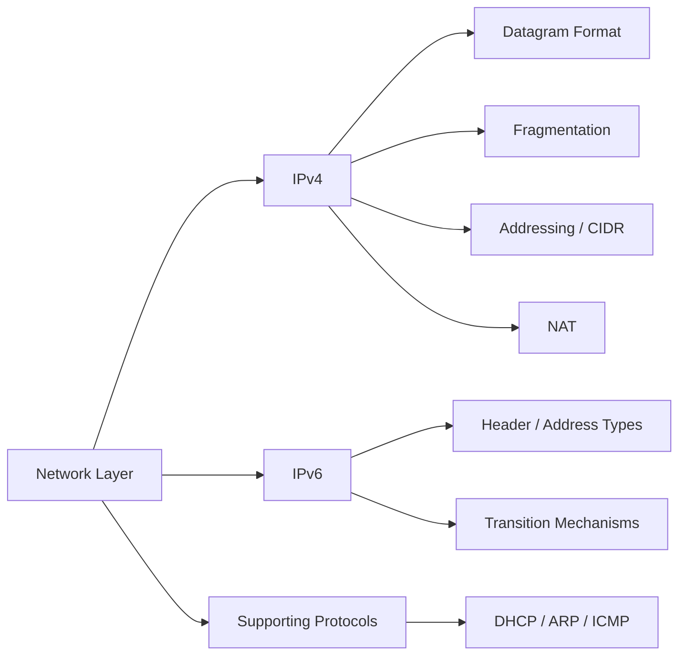

# Chapter 6: The Network Layer

> **Prerequisites:** [Chapter 5: Ethernet Switching](./05-ethernet-switching.md) — L2 forwarding and VLANs | **Next:** [Chapter 7: Routing](./07-routing.md) — IP forwarding to path selection

## Learning Objectives

1. Describe the IPv4 datagram format and explain the function of each header field.
2. Perform IP fragmentation and reassembly calculations.
3. Design IP addressing schemes using classful addressing, subnetting, CIDR, and VLSM.
4. Explain the operation of NAT and its implications for end-to-end connectivity.
5. Compare IPv4 and IPv6 header formats and describe IPv6 address types.
6. Analyze the protocols that support IP: DHCP, ARP, and ICMP.
7. Implement IPv4 header parsing, subnet calculation, ARP cache, and fragmentation simulation in C++ and Python.
8. Analyze time and space complexity of network layer algorithms with reasoning.

---

### Chapter at a Glance

| Topic | Key Insight | Practical Takeaway |
|-------|-------------|-------------------|
| IPv4 Datagram | 20-byte header with frag, TTL, checksum | Fragmentation is best avoided — use path MTU discovery |
| Addressing | 32-bit address, classful→CIDR evolution | CIDR enables route aggregation; VLSM minimizes wasted addresses |
| NAT | Port multiplexing shares one public IP | Breaks end-to-end connectivity; IPv6 is the real fix |
| IPv6 | 128-bit address, no checksum, no fragmentation | Flow label enables per-flow QoS; extension headers replace options |
| DHCP | Automated address assignment (DORA) | Reduces manual configuration errors |
| ARP/ICMP | MAC resolution and diagnostic messaging | ARP is local-link only; ICMP enables ping/traceroute |

### Chapter Roadmap



---

## 6.0 Network Layer Services

The network layer provides host-to-host communication across multiple links. Its primary services include logical addressing, routing, fragmentation, and error reporting.

### Real-World Analogy

The network layer is like a country's postal system. The IP address is the street address (logical, hierarchical), the MAC address is the person's name (physical, flat). Routing is the postal sorting center deciding which truck to put the package on. Fragmentation is splitting a large document into multiple envelopes when one envelope isn't big enough.

### Services Provided

| Service | Description | Real-World Analogy |
|---------|-------------|-------------------|
| Logical Addressing | Assigns unique IP addresses to hosts | Street address on an envelope |
| Routing | Determines path from source to destination | Postal sorting and truck routing |
| Fragmentation & Reassembly | Splits packets to fit link MTU | Splitting a document into multiple envelopes |
| Error Reporting | ICMP messages for unreachable hosts, TTL expired | Return-to-sender notification |
| Quality of Service | DSCP marking for prioritization | Priority mail / express delivery |

### Numbered Steps: Network Layer Delivery

1. **Encapsulation**: Source host encapsulates transport-layer segment into an IP datagram.
2. **Addressing**: Source fills in its IP as source, destination host's IP as destination.
3. **Routing Decision**: Host checks routing table; if destination is remote, forwards to default gateway.
4. **Fragmentation (if needed)**: If datagram exceeds outgoing link MTU, router fragments.
5. **Hop-by-Hop Forwarding**: Each router decrements TTL, checks header, looks up next hop.
6. **Reassembly**: Destination host reassembles fragments before passing to transport layer.

### Pseudocode: Network Layer Forwarding

```
function forward_packet(datagram, routing_table):
    decrement TTL
    if TTL <= 0:
        send ICMP TTL Expired to source
        discard
        return
    dest_ip = get_destination(datagram)
    prefix = lookup_longest_prefix_match(routing_table, dest_ip)
    if prefix not found:
        send ICMP Destination Unreachable to source
        discard
        return
    next_hop = get_next_hop(prefix)
    if MTU(outgoing_interface) < datagram.length:
        fragments = fragment(datagram, MTU)
        for each fragment in fragments:
            send_frame(fragment, next_hop)
    else:
        send_frame(datagram, next_hop)
```

### Complexity Analysis

| Operation | Time Complexity | Why |
|-----------|----------------|-----|
| Longest Prefix Match | O(log N) with trie, O(N) linear | N = number of routing table entries; tries give log-time lookups |
| Fragmentation | O(P) where P = number of fragments | Each fragment gets a new header — linear in fragment count |
| Header Checksum | O(1) | Fixed 20-byte header; compute in constant time |
| TTL Decrement | O(1) | Single integer operation |

---

## 6.1 IPv4 Datagram Format

The IPv4 header is 20 bytes (minimum) to 60 bytes (with options).

### 6.1.1 Header Fields

| Field | Size (bits) | Description |
|-------|-------------|-------------|
| Version | 4 | IP version number (4) |
| IHL | 4 | Header length in 32-bit words (min 5) |
| DSCP/ECN | 8 | Differentiated services and congestion notification |
| Total Length | 16 | Entire datagram length in bytes (max 65,535) |
| Identification | 16 | Unique datagram identifier for fragmentation |
| Flags | 3 | DF (Don't Fragment), MF (More Fragments) |
| Fragment Offset | 13 | Offset of this fragment in 8-byte units |
| TTL | 8 | Time to Live (hop count limit) |
| Protocol | 8 | Transport protocol (TCP=6, UDP=17, ICMP=1) |
| Header Checksum | 16 | Checksum of header only |
| Source Address | 32 | Source IP address |
| Destination Address | 32 | Destination IP address |
| Options | variable | Security, record route, timestamp, source routing |

### Real-World Analogy

An IPv4 header is like a shipping label on a package: Version = shipping company, IHL = size of the label itself, Total Length = total package weight, Identification/Flags/Offset = "Box 1 of 3, Box 2 of 3, Box 3 of 3", TTL = "If not delivered in 5 days return to sender", Protocol = handling instructions (fragile/perishable), Source/Destination = return and delivery address.

### Numbered Steps: Parsing an IPv4 Header

1. Read first byte: upper nibble = Version (must be 4), lower nibble = IHL (minimum 5).
2. Compute header length = IHL x 4 bytes. If IHL > 5, options are present.
3. Read bytes 2-3: Total Length. Subtract header length to get payload size.
4. Read bytes 4-5: Identification for reassembly matching.
5. Read byte 6: upper 2 bits = flags (bit 1 = DF, bit 2 = MF).
6. Read bytes 6-7: lower 13 bits = Fragment Offset x 8 = byte offset in original datagram.
7. Read byte 8: TTL. Each router decrements by 1.
8. Read byte 9: Protocol (TCP=6, UDP=17, ICMP=1, OSPF=89).
9. Read bytes 10-11: Header Checksum. Verify.
10. Read bytes 12-15: Source IP. Read bytes 16-19: Destination IP.

### Pseudocode: parse_ipv4_header

```
function parse_ipv4_header(data):
    version = (data[0] >> 4) & 0x0F
    ihl = data[0] & 0x0F
    header_length = ihl * 4
    dscp_ecn = data[1]
    total_length = (data[2] << 8) | data[3]
    identification = (data[4] << 8) | data[5]
    flags = (data[6] >> 5) & 0x07
    fragment_offset = ((data[6] & 0x1F) << 8) | data[7]
    ttl = data[8]
    protocol = data[9]
    checksum = (data[10] << 8) | data[11]
    src_ip = format_ipv4(data[12:16])
    dst_ip = format_ipv4(data[16:20])
    if version != 4:
        error("Not an IPv4 datagram")
    if total_length < header_length:
        error("Invalid header length")
    return {version, header_length, total_length, identification,
            flags, fragment_offset, ttl, protocol, checksum, src_ip, dst_ip}
```

### Dry Run: Hex Dump Trace

Hex dump: `45 00 00 3C 1A 2B 40 00 40 06 1E 2E C0 A8 01 01 C0 A8 01 02`

| Byte Offset | Hex | Field Parsed | Value (Decimal/Meaning) |
|-------------|-----|-------------|------------------------|
| 0 | 0x45 | Version=4, IHL=5 | v4, 20-byte header |
| 1 | 0x00 | DSCP/ECN | Best-effort (0) |
| 2-3 | 0x003C | Total Length | 60 bytes |
| 4-5 | 0x1A2B | Identification | 6699 |
| 6 | 0x40 | Flags | 010 = DF=0, MF=0 |
| 6-7 | 0x4000 | Fragment Offset | offset 0 (first/only fragment) |
| 8 | 0x40 | TTL | 64 hops |
| 9 | 0x06 | Protocol | 6 = TCP |
| 10-11 | 0x1E2E | Header Checksum | 7726 (verify: pass) |
| 12-15 | 0xC0A80101 | Source IP | 192.168.1.1 |
| 16-19 | 0xC0A80102 | Dest IP | 192.168.1.2 |

### C++ Implementation: IPv4 Header Parser

```cpp
#include <iostream>
#include <cstdint>
#include <cstring>
#include <arpa/inet.h>

struct ipv4_header {
    uint8_t  version_ihl;
    uint8_t  dscp_ecn;
    uint16_t total_length;
    uint16_t identification;
    uint16_t flags_offset;
    uint8_t  ttl;
    uint8_t  protocol;
    uint16_t header_checksum;
    uint32_t src_addr;
    uint32_t dst_addr;
} __attribute__((packed));

void parse_ipv4(const uint8_t* packet) {
    const ipv4_header* hdr = reinterpret_cast<const ipv4_header*>(packet);
    uint8_t version = (hdr->version_ihl >> 4) & 0x0F;
    uint8_t ihl = hdr->version_ihl & 0x0F;
    uint16_t total_len = ntohs(hdr->total_length);
    uint16_t id = ntohs(hdr->identification);
    uint16_t flags = (ntohs(hdr->flags_offset) >> 13) & 0x07;
    uint16_t frag_off = ntohs(hdr->flags_offset) & 0x1FFF;
    char src_str[16], dst_str[16];
    inet_ntop(AF_INET, &hdr->src_addr, src_str, sizeof(src_str));
    inet_ntop(AF_INET, &hdr->dst_addr, dst_str, sizeof(dst_str));
    std::cout << "IPv4 Datagram:\n"
              << "  Version: " << (int)version << "\n"
              << "  IHL: " << (int)ihl << " (" << (ihl * 4) << " bytes)\n"
              << "  Total Length: " << total_len << "\n"
              << "  ID: 0x" << std::hex << id << std::dec << "\n"
              << "  Flags: " << (int)flags << " (DF=" << ((flags>>1)&1)
              << ", MF=" << (flags&1) << ")\n"
              << "  Fragment Offset: " << (frag_off * 8) << "\n"
              << "  TTL: " << (int)hdr->ttl << "\n"
              << "  Protocol: " << (int)hdr->protocol << "\n"
              << "  Checksum: 0x" << std::hex << ntohs(hdr->header_checksum)
              << std::dec << "\n"
              << "  Src: " << src_str << "\n"
              << "  Dst: " << dst_str << "\n";
}

int main() {
    uint8_t packet[] = {
        0x45, 0x00, 0x00, 0x3C, 0x1A, 0x2B, 0x40, 0x00,
        0x40, 0x06, 0x1E, 0x2E, 0xC0, 0xA8, 0x01, 0x01,
        0xC0, 0xA8, 0x01, 0x02
    };
    parse_ipv4(packet);
    return 0;
}
```

### Python Implementation: IPv4 Header Parser

```python
import struct
import socket

def parse_ipv4_header(data: bytes) -> dict:
    if len(data) < 20:
        raise ValueError(f"Packet too short: {len(data)} bytes, need at least 20")
    version_ihl = data[0]
    version = version_ihl >> 4
    ihl = version_ihl & 0x0F
    header_length = ihl * 4
    if version != 4:
        raise ValueError(f"Not IPv4: version={version}")
    dscp_ecn = data[1]
    total_length = struct.unpack('!H', data[2:4])[0]
    identification = struct.unpack('!H', data[4:6])[0]
    flags_offset = struct.unpack('!H', data[6:8])[0]
    flags = (flags_offset >> 13) & 0x07
    fragment_offset = flags_offset & 0x1FFF
    ttl = data[8]
    protocol = data[9]
    checksum = struct.unpack('!H', data[10:12])[0]
    src_ip = socket.inet_ntoa(data[12:16])
    dst_ip = socket.inet_ntoa(data[16:20])
    if total_length < header_length:
        raise ValueError("Total length < header length")
    return {
        'version': version,
        'header_length': header_length,
        'dscp_ecn': dscp_ecn,
        'total_length': total_length,
        'identification': identification,
        'flags': {'DF': (flags >> 1) & 1, 'MF': flags & 1},
        'fragment_offset': fragment_offset * 8,
        'ttl': ttl,
        'protocol': {1: 'ICMP', 6: 'TCP', 17: 'UDP', 89: 'OSPF'}.get(protocol, str(protocol)),
        'protocol_num': protocol,
        'checksum': checksum,
        'src_ip': src_ip,
        'dst_ip': dst_ip,
    }

packet = bytes([
    0x45, 0x00, 0x00, 0x3C, 0x1A, 0x2B, 0x40, 0x00,
    0x40, 0x06, 0x1E, 0x2E, 0xC0, 0xA8, 0x01, 0x01,
    0xC0, 0xA8, 0x01, 0x02
])
parsed = parse_ipv4_header(packet)
for key, val in parsed.items():
    print(f"{key:20s}: {val}")
```

### Complexity Analysis

| Operation | Time | Space | Why |
|-----------|------|-------|-----|
| Header parsing | O(1) | O(1) | Fixed 20-byte header; constant field extraction |
| Checksum verification | O(1) | O(1) | 16-bit one's complement sum over 20 bytes |
| Option parsing | O(O) | O(1) | O = number of option bytes (0-40); rarely used |

### A&D Table

| Aspect | Advantage | Disadvantage |
|--------|-----------|--------------|
| Fixed header start | Simple parsing, hardware-optimized | Wastes bytes when no options used |
| Variable options | Flexibility for debugging | Security risk (source routing attacks) |
| Header checksum | Catches header corruption in-flight | Redundant with L2 + L4 checksums |
| Protocol field | Multiplexing demux | 8-bit limit = 256 protocols |

### Edge Cases

- **IHL &lt; 5**: Malformed packet, should be discarded.
- **Total Length &lt; 20**: Impossible header, discard.
- **Total Length > 65535**: Exceeds 16-bit field; fragment or discard.
- **Version != 4**: Not IPv4; could be IPv6 (version field is same position).

---

## 6.2 Fragmentation

When a datagram exceeds the Maximum Transmission Unit (MTU) of an outgoing link, the router fragments it.

### Real-World Analogy

Fragmentation is like sending a large textbook through the mail. The post office has a weight limit per box (MTU). You split the book into chapters (fragments), number each box (identification + offset), mark "more to come" except the last one (MF flag), and the recipient reassembles them in order.

### Numbered Steps: Fragmentation Algorithm

1. **Check**: If datagram length > outgoing MTU, proceed to fragment.
2. **Calculate Payload per Fragment**: Each fragment carries (MTU - 20) bytes of payload, aligned to 8-byte boundary: `max_payload = ((MTU - 20) / 8) * 8`.
3. **Initialize Offset**: Start at offset 0 (in bytes).
4. **Create Fragments**: For each piece, copy original header, set total length = 20 + payload_size, set fragment offset = current_offset/8, set MF=1 (except last).
5. **Last Fragment**: Set MF=0 to indicate end.
6. **Transmit**: Send each fragment independently.
7. **Reassembly**: Receiver uses {src_ip, dst_ip, protocol, identification} as reassembly key. Buffers fragments until all received or timeout.

### Pseudocode: fragment_datagram

```
function fragment_datagram(datagram, mtu):
    header_size = 20
    payload = datagram[header_size:]
    max_payload = ((mtu - header_size) / 8) * 8
    fragments = []
    offset = 0
    while offset < len(payload):
        is_last = (offset + max_payload >= len(payload))
        frag_payload_size = min(max_payload, len(payload) - offset)
        frag_header = copy_header(datagram)
        frag_header.total_length = header_size + frag_payload_size
        frag_header.fragment_offset = offset / 8
        frag_header.flags.MF = 0 if is_last else 1
        fragment = frag_header + payload[offset:offset + frag_payload_size]
        fragments.append(fragment)
        offset += frag_payload_size
    return fragments
```

### Dry Run: 4000-byte Datagram, MTU 1500

Original: 4000 bytes total (20 header + 3980 payload), ID=0x1A2B.

Per-fragment payload = ((1500 - 20) / 8) * 8 = (1480 / 8) * 8 = 185 * 8 = 1480 bytes.

| Fragment | Payload Range | Offset (bytes) | Offset (8-byte units) | MF | Total Length |
|----------|--------------|----------------|----------------------|-----|-------------|
| 1 | 0-1479 | 0 | 0 | 1 | 1500 |
| 2 | 1480-2959 | 1480 | 185 | 1 | 1500 |
| 3 | 2960-3979 | 2960 | 370 | 0 | 1040 |

**Reassembly Check**: Last offset (370) * 8 = 2960. Last payload = 1040 - 20 = 1020. Total = 2960 + 1020 = 3980. Matches original payload. ✓

### C++ Implementation: Fragmentation Simulator

```cpp
#include <iostream>
#include <vector>
#include <cstdint>
#include <algorithm>

struct fragment {
    uint16_t offset;
    uint16_t length;
    bool more_fragments;
    uint16_t id;
    std::vector<uint8_t> data;
};

std::vector<fragment> fragment_datagram(
    const std::vector<uint8_t>& datagram, uint16_t mtu, uint16_t identification
) {
    const int HEADER = 20;
    std::vector<fragment> result;
    int max_payload = ((mtu - HEADER) / 8) * 8;
    if (max_payload <= 0) return result;
    int payload_size = datagram.size() - HEADER;
    int offset = 0;
    while (offset < payload_size) {
        bool is_last = (offset + max_payload >= payload_size);
        int frag_payload = std::min(max_payload, payload_size - offset);
        fragment f;
        f.offset = offset;
        f.length = HEADER + frag_payload;
        f.more_fragments = !is_last;
        f.id = identification;
        f.data.assign(datagram.begin() + HEADER + offset,
                      datagram.begin() + HEADER + offset + frag_payload);
        result.push_back(f);
        offset += frag_payload;
    }
    return result;
}

int main() {
    std::vector<uint8_t> datagram(4000, 0xFF);
    auto frags = fragment_datagram(datagram, 1500, 0x1A2B);
    for (size_t i = 0; i < frags.size(); i++) {
        auto& f = frags[i];
        std::cout << "Fragment " << (i + 1)
                  << ": offset=" << f.offset
                  << ", len=" << f.length
                  << ", MF=" << f.more_fragments
                  << ", ID=0x" << std::hex << f.id << std::dec << "\n";
    }
    return 0;
}
```

### Python Implementation: Fragmentation Simulator

```python
from dataclasses import dataclass, field

@dataclass
class Fragment:
    offset: int
    length: int
    more_fragments: bool
    id: int
    data: bytes = field(repr=False)


def fragment_datagram(datagram: bytes, mtu: int, identification: int) -> list[Fragment]:
    HEADER = 20
    max_payload = ((mtu - HEADER) // 8) * 8
    if max_payload <= 0:
        raise ValueError(f"MTU {mtu} too small, need at least {HEADER + 8}")
    payload = datagram[HEADER:]
    fragments = []
    offset = 0
    while offset < len(payload):
        frag_payload = min(max_payload, len(payload) - offset)
        is_last = (offset + max_payload >= len(payload))
        f = Fragment(
            offset=offset,
            length=HEADER + frag_payload,
            more_fragments=not is_last,
            id=identification,
            data=payload[offset:offset + frag_payload]
        )
        fragments.append(f)
        offset += frag_payload
    return fragments


def reassemble(fragments: list[Fragment]) -> bytes:
    sorted_frags = sorted(fragments, key=lambda f: f.offset)
    payload = bytearray()
    for f in sorted_frags:
        payload.extend(f.data)
    return bytes(payload)


datagram = b'\x45' + b'\x00' * 19 + b'A' * 3980
frags = fragment_datagram(datagram, 1500, 0x1A2B)
for i, f in enumerate(frags, 1):
    print(f"Fragment {i}: offset={f.offset}, len={f.length}, MF={f.more_fragments}, id=0x{f.id:04X}")
print(f"Reassembled payload size: {len(reassemble(frags))} (expected: 3980)")
```

### Path MTU Discovery (PMTUD)

1. Source sends datagrams with DF (Don't Fragment) flag set.
2. If a router cannot forward due to MTU, it drops the packet and sends ICMP "Fragmentation Needed" (Type 3, Code 4) with the next-hop MTU.
3. Source reduces its datagram size and retransmits.
4. Process repeats until packets reach destination without ICMP errors.
5. Source caches the PMTU for the path (typically 10-minute timeout).

### Complexity Analysis

| Operation | Time | Space | Why |
|-----------|------|-------|-----|
| Fragmentation | O(N) | O(N) | N = payload bytes; each byte copied once into a fragment |
| Reassembly | O(F + P) | O(P) | F = fragments, P = payload; sort F fragments, buffer P bytes |
| PMTUD | O(H) | O(1) | H = path hops; at most one probe per hop |

### A&D Table

| Aspect | Advantage | Disadvantage |
|--------|-----------|--------------|
| Router fragmentation | Any router can fragment | Losing one fragment loses entire datagram |
| PMTUD (IPv6) | Avoids fragmentation entirely | Requires ICMP; some networks block ICMP |
| 8-byte alignment | Simplifies offset arithmetic | Wastes up to 7 bytes per fragment |
| MF flag | Signals end of fragments | Single lost MF=1 fragment causes reassembly failure |

### Edge Cases

- **Fragmentation Overlap Attack**: Attacker sends overlapping fragment offsets to bypass firewall rules. Defense: firewalls reassemble before inspection or reject overlapping fragments.
- **Fragmentation Flood**: Attacker sends first fragment of many datagrams without last fragments, exhausting reassembly buffers. Defense: limit concurrent reassembly contexts (e.g., Linux `net.ipv4.ipfrag_max_dist`).
- **Missing Fragment**: Reassembly times out after 60 seconds. Receiver drops all fragments for that datagram. Sender retransmits (handled by TCP).
- **MTU &lt; 68**: Minimum IPv4 datagram is 68 bytes (20 header + minimum 48 bytes payload). A link with MTU < 68 cannot carry IP.

---

## 6.3 IP Addressing

Every IPv4 interface has a 32-bit address, typically written in dotted-decimal notation.

### 6.3.1 Classful Addressing

| Class | Prefix | Network Bits | Host Bits | Address Range | Hosts/Network |
|-------|--------|-------------|-----------|---------------|--------------|
| A | 0 | 8 | 24 | 1.0.0.0 - 127.255.255.255 | 16,777,214 |
| B | 10 | 16 | 16 | 128.0.0.0 - 191.255.255.255 | 65,534 |
| C | 110 | 24 | 8 | 192.0.0.0 - 223.255.255.255 | 254 |
| D | 1110 | multicast | — | 224.0.0.0 - 239.255.255.255 | N/A |
| E | 1111 | reserved | — | 240.0.0.0 - 255.255.255.255 | N/A |

### 6.3.2 Subnetting

Subnetting borrows host bits to create a subnet number, improving address utilization.

#### Real-World Analogy

Classful addressing is like assigning every building a block of 100 mailboxes even if it only needs 5. Subnetting is like subdividing those mailboxes into smaller sets per floor — you use what you need and waste less.

#### Numbered Steps: Subnet Calculation

1. **Determine Requirements**: N subnets, each with at least H hosts.
2. **Calculate Host Bits**: `h = ceil(log2(H + 2))` (2 reserved: network + broadcast).
3. **Calculate Subnet Bits**: `s = ceil(log2(N))`.
4. **Ensure s + h &lt;= available host bits** (32 - original prefix).
5. **New Prefix Length**: original_prefix + s.
6. **Subnet Size**: `2^(32 - new_prefix)` addresses per subnet.
7. **Usable Hosts**: subnet_size - 2.
8. **Enumerate Subnets**: Increment the subnet portion by 1 each time.

#### Pseudocode: calculate_subnets

```
function calculate_subnets(base_network, prefix_len, num_subnets, min_hosts):
    host_bits_per_subnet = 32 - prefix_len
    needed_host_bits = ceil(log2(min_hosts + 2))
    needed_subnet_bits = ceil(log2(num_subnets))
    if needed_host_bits + needed_subnet_bits > host_bits_per_subnet:
        error("Not enough bits")
    new_prefix = prefix_len + needed_subnet_bits
    subnet_size = 2 ^ (32 - new_prefix)
    subnets = []
    base_int = ip_to_int(base_network)
    for i in 0 to num_subnets - 1:
        subnet_int = base_int + (i << (32 - new_prefix))
        subnet_addr = int_to_ip(subnet_int)
        broadcast_int = subnet_int + subnet_size - 1
        subnets.append({
            subnet: subnet_addr,
            first_host: int_to_ip(subnet_int + 1),
            last_host: int_to_ip(broadcast_int - 1),
            broadcast: int_to_ip(broadcast_int),
            mask: new_prefix
        })
    return subnets
```

#### Dry Run: 200.100.20.0/24 into 4 Subnets (50 hosts each)

- Available host bits: 32 - 24 = 8.
- Needed host bits: ceil(log2(50 + 2)) = ceil(log2(52)) = 6 bits (64 addresses, 62 usable).
- Needed subnet bits: ceil(log2(4)) = 2 bits.
- Check: 6 + 2 = 8 &lt;= 8. OK.
- New prefix: 24 + 2 = /26.
- Subnet size: 2^(32-26) = 64 addresses. Usable: 62.

| Subnet | Network Address | First Host | Last Host | Broadcast | CIDR |
|--------|----------------|------------|-----------|-----------|------|
| 0 | 200.100.20.0 | 200.100.20.1 | 200.100.20.62 | 200.100.20.63 | /26 |
| 1 | 200.100.20.64 | 200.100.20.65 | 200.100.20.126 | 200.100.20.127 | /26 |
| 2 | 200.100.20.128 | 200.100.20.129 | 200.100.20.190 | 200.100.20.191 | /26 |
| 3 | 200.100.20.192 | 200.100.20.193 | 200.100.20.254 | 200.100.20.255 | /26 |

**Check**: Subnet 1 = base + 1 x 64 = 200.100.20.64. ✓

### C++ Implementation: Subnet Calculator

```cpp
#include <iostream>
#include <vector>
#include <cmath>
#include <string>
#include <cstdint>

uint32_t ip_to_int(const std::string& ip) {
    uint8_t a, b, c, d;
    sscanf(ip.c_str(), "%hhu.%hhu.%hhu.%hhu", &a, &b, &c, &d);
    return (a << 24) | (b << 16) | (c << 8) | d;
}

std::string int_to_ip(uint32_t ip) {
    return std::to_string((ip >> 24) & 0xFF) + "." +
           std::to_string((ip >> 16) & 0xFF) + "." +
           std::to_string((ip >> 8) & 0xFF) + "." +
           std::to_string(ip & 0xFF);
}

struct subnet_info {
    std::string network;
    std::string first_host;
    std::string last_host;
    std::string broadcast;
    int prefix;
    int size;
};

std::vector<subnet_info> calculate_subnets(
    const std::string& base, int orig_pfx, int num, int min_h
) {
    int avail = 32 - orig_pfx;
    int need_h = std::ceil(std::log2(min_h + 2));
    int need_s = std::ceil(std::log2(num));
    if (need_h + need_s > avail) return {};
    int new_pfx = orig_pfx + need_s;
    int sz = 1 << (32 - new_pfx);
    uint32_t base_int = ip_to_int(base);
    std::vector<subnet_info> r;
    for (int i = 0; i < num; i++) {
        uint32_t net = base_int + (i * sz);
        uint32_t bcast = net + sz - 1;
        r.push_back({int_to_ip(net), int_to_ip(net + 1),
                     int_to_ip(bcast - 1), int_to_ip(bcast), new_pfx, sz});
    }
    return r;
}

int main() {
    auto s = calculate_subnets("200.100.20.0", 24, 4, 50);
    for (size_t i = 0; i < s.size(); i++)
        std::cout << "Subnet " << i << ": " << s[i].network << "/" << s[i].prefix
                  << " [" << s[i].first_host << " - " << s[i].last_host
                  << "] bcast=" << s[i].broadcast << "\n";
    return 0;
}
```

### Python Implementation: Subnet Calculator

```python
import ipaddress, math

def calculate_subnets(base: str, prefix: int, count: int, min_hosts: int) -> list[dict]:
    avail = 32 - prefix
    need_h = math.ceil(math.log2(min_hosts + 2))
    need_s = math.ceil(math.log2(count))
    if need_h + need_s > avail:
        raise ValueError(f"Need {need_h + need_s} bits, {avail} available")
    new_pfx = prefix + need_s
    sz = 1 << (32 - new_pfx)
    base_int = int(ipaddress.IPv4Address(base))
    result = []
    for i in range(count):
        net_int = base_int + i * sz
        bcast = net_int + sz - 1
        result.append({
            'subnet': str(ipaddress.IPv4Address(net_int)),
            'first': str(ipaddress.IPv4Address(net_int + 1)),
            'last': str(ipaddress.IPv4Address(bcast - 1)),
            'bcast': str(ipaddress.IPv4Address(bcast)),
            'prefix': f"/{new_pfx}",
            'size': sz,
            'usable': sz - 2,
        })
    return result

subnets = calculate_subnets("200.100.20.0", 24, 4, 50)
for i, s in enumerate(subnets):
    print(f"Subnet {i}: {s['subnet']:15s} {s['first']:15s} - {s['last']:15s} bcast={s['bcast']:15s} mask={s['prefix']} size={s['size']} usable={s['usable']}")
```

### 6.3.3 CIDR (Classless Inter-Domain Routing)

CIDR (RFC 1519) eliminates the class concept. A prefix-length notation (e.g., /20) specifies the network portion. CIDR enables route aggregation.

#### Real-World Analogy

Instead of allocating entire /8 or /16 blocks (like giving every organization an entire zip code), CIDR allocates exactly the prefix length needed (like assigning just enough zip+4 codes). Aggregation combines 16 small zip codes into one regional sorting center entry.

#### Numbered Steps: Route Aggregation

1. **List prefixes** to aggregate.
2. **Sort by prefix length**, shortest first.
3. **Check contiguity**: All addresses must form a contiguous block aligned to the new prefix boundary.
4. **New prefix**: If 2^k contiguous /N networks, aggregate to /(N-k).
5. **Verify**: Base address must be divisible by 2^(32 - new_prefix).

#### Classful vs CIDR: Comparison

| Aspect | Classful | CIDR |
|--------|----------|------|
| Allocation unit | Fixed /8, /16, /24 | Arbitrary prefix length |
| Wasted addresses | ~50-70% (Class B) | Near zero (VLSM) |
| Routing table size | ~100K+ (1994 peak) | ~20K after aggregation |
| Subnet mask | Implied by class | Explicitly carried with route |
| Aggregation | Not possible across classes | Prefix aggregation (supernetting) |
| Notation | By class (A, B, C) | /N notation |
| VLSM support | No | Yes |
| Year introduced | 1981 (RFC 791) | 1993 (RFC 1519) |

---

## 6.4 Network Address Translation (NAT)

NAT (RFC 3022) maps private IP addresses to a public IP address using port multiplexing.

### Real-World Analogy

NAT is like a company switchboard operator (PBX). Everyone inside has an extension number (private IP). When someone calls out, the operator connects them using one of the company's outside lines (public IPs), remembering which extension is on which line.

### Private Address Ranges (RFC 1918)

- 10.0.0.0/8 (16,777,216 addresses)
- 172.16.0.0/12 (1,048,576 addresses)
- 192.168.0.0/16 (65,536 addresses)

### NAT Types

| Type | Acronym | Description | Direction |
|------|---------|-------------|-----------|
| Source NAT | SNAT | Translates source IP:port of outbound packets | Private→Public |
| Destination NAT | DNAT | Translates destination IP:port of inbound packets | Public→Private |
| Port Address Translation | PAT | Many private IPs → one public IP using unique ports | Multiplexing |
| Static NAT | 1:1 NAT | One private IP permanently mapped to one public IP | Bidirectional |
| Dynamic NAT | Pool NAT | Private IP mapped from a pool of public IPs | Outbound |

### Numbered Steps: PAT (Most Common Form)

1. Internal host (192.168.1.10:3345) sends packet to web server (203.0.113.5:80).
2. NAT router receives packet on its internal interface.
3. Router checks NAT table: is there a mapping for (192.168.1.10, 3345)?
4. If no: router allocates a new public port (e.g., 50001) from the pool.
5. Router rewrites source IP to its public IP (198.51.100.1) and source port to 50001.
6. Entry added: (192.168.1.10:3345) ↔ (198.51.100.1:50001).
7. Response arrives at 198.51.100.1:50001. Router looks up port 50001 in NAT table.
8. Router rewrites destination IP:port to 192.168.1.10:3345 and forwards internally.
9. If no activity for timeout period (60-300s), entry removed.

### Pseudocode: nat_translate

```
function nat_translate(packet, nat_table, public_ip):
    if packet.direction == INBOUND:
        entry = nat_table.lookup_by_public(packet.dst_port)
        if entry not found:
            drop packet (unsolicited inbound)
            return
        rewrite_destination(packet, entry.private_ip, entry.private_port)
    else:
        key = (packet.src_ip, packet.src_port)
        entry = nat_table.lookup_by_private(key)
        if entry not found:
            public_port = allocate_port()
            nat_table.add(key, (public_ip, public_port))
            entry = nat_table.lookup_by_private(key)
        rewrite_source(packet, public_ip, entry.public_port)
    forward(packet)
```

### Dry Run: PAT Translation Table

| Step | Private (src) | Private (dst) | After SNAT (src) | After DNAT response (dst) |
|------|--------------|--------------|-------------------|--------------------------|
| 1 | 192.168.1.10:3345 | 203.0.113.5:80 | 198.51.100.1:50001 | — |
| 2 | 192.168.1.20:4422 | 203.0.113.5:80 | 198.51.100.1:50002 | — |
| 3 | 192.168.1.10:3346 | 8.8.8.8:53 | 198.51.100.1:50003 | — |
| 4 | Response for 50001 | — | — | 192.168.1.10:3345 |
| 5 | Response for 50002 | — | — | 192.168.1.20:4422 |
| 6 | Response for 50003 | — | — | 192.168.1.10:3346 |

NAT Table after steps 1-3:

| Private | Public | State |
|---------|--------|-------|
| 192.168.1.10:3345 | 198.51.100.1:50001 | TCP EST |
| 192.168.1.20:4422 | 198.51.100.1:50002 | TCP EST |
| 192.168.1.10:3346 | 198.51.100.1:50003 | UDP (60s) |

### C++ Implementation: NAT Table Simulator

```cpp
#include <iostream>
#include <unordered_map>
#include <string>
#include <cstdint>

struct nat_entry {
    std::string private_ip;
    uint16_t    private_port;
    std::string public_ip;
    uint16_t    public_port;
    bool        established;
};

class nat_table {
    std::unordered_map<std::string, nat_entry> priv_map;
    std::unordered_map<uint16_t, nat_entry>    port_map;
    uint16_t next_port;
    std::string pub_ip;

    std::string key(const std::string& ip, uint16_t p) {
        return ip + ":" + std::to_string(p);
    }

public:
    nat_table(const std::string& pub) : next_port(50000), pub_ip(pub) {}

    nat_entry translate_out(const std::string& ip, uint16_t port) {
        auto it = priv_map.find(key(ip, port));
        if (it != priv_map.end()) return it->second;
        nat_entry e{ip, port, pub_ip, next_port++, true};
        priv_map[key(ip, port)] = e;
        port_map[e.public_port] = e;
        return e;
    }

    nat_entry* translate_in(uint16_t dst_port) {
        auto it = port_map.find(dst_port);
        return (it != port_map.end()) ? &it->second : nullptr;
    }

    void print() {
        std::cout << "\nNAT Table:\n";
        for (auto& [_, e] : priv_map)
            std::cout << "  " << e.private_ip << ":" << e.private_port
                      << " <-> " << e.public_ip << ":" << e.public_port << "\n";
    }
};

int main() {
    nat_table nat("198.51.100.1");
    auto e1 = nat.translate_out("192.168.1.10", 3345);
    auto e2 = nat.translate_out("192.168.1.20", 4422);
    auto e3 = nat.translate_out("192.168.1.10", 3346);
    auto* rev = nat.translate_in(e1.public_port);
    if (rev) std::cout << "Response -> " << rev->private_ip << ":" << rev->private_port << "\n";
    nat.print();
    return 0;
}
```

### Python Implementation: NAT Simulator

```python
from dataclasses import dataclass, field

@dataclass
class NATEntry:
    private_ip: str
    private_port: int
    public_ip: str
    public_port: int

class NATTable:
    def __init__(self, public_ip: str = "198.51.100.1"):
        self.public_ip = public_ip
        self._priv: dict[tuple[str, int], NATEntry] = {}
        self._pub: dict[int, NATEntry] = {}
        self._next = 50000

    def translate_out(self, src_ip: str, src_port: int) -> NATEntry:
        key = (src_ip, src_port)
        if key in self._priv:
            return self._priv[key]
        e = NATEntry(src_ip, src_port, self.public_ip, self._next)
        self._next += 1
        self._priv[key] = e
        self._pub[e.public_port] = e
        return e

    def translate_in(self, dst_port: int) -> NATEntry | None:
        return self._pub.get(dst_port)

    def size(self) -> int:
        return len(self._priv)

    def print_table(self):
        print("\nNAT Translation Table:")
        for e in self._priv.values():
            print(f"  {e.private_ip}:{e.private_port} <-> {e.public_ip}:{e.public_port}")

nat = NATTable("198.51.100.1")
h1 = nat.translate_out("192.168.1.10", 3345)
h2 = nat.translate_out("192.168.1.20", 4422)
h3 = nat.translate_out("192.168.1.10", 3346)
for p in [h1.public_port, h3.public_port]:
    e = nat.translate_in(p)
    if e:
        print(f"Response on {p} -> {e.private_ip}:{e.private_port}")
nat.print_table()
```

### Complexity Analysis

| Operation | Time | Space | Why |
|-----------|------|-------|-----|
| NAT lookup (outbound) | O(1) avg | O(E) | Hash table on (IP, port); E = active entries |
| NAT lookup (inbound) | O(1) avg | O(E) | Hash table on public port |
| Port allocation | O(1) | O(E) | Incrementing counter |
| NAT table cleanup | O(E) | O(1) | Timer sweep linear in active entries |

### A&D Table

| Aspect | Advantage | Disadvantage |
|--------|-----------|--------------|
| Address conservation | Shares one IP among thousands | Only 65,535 ports per IP limit concurrent connections |
| Security | Hides internal topology | False sense of security; not a firewall |
| Transparency | Works for outbound connections | Breaks peer-to-peer, VoIP, IPSec |
| Deployment | Cheap, universal | Port forwarding complexity, hairpinning issues |

### Edge Cases

- **NAT Exhaustion**: All 65,535 ports consumed. Mitigation: multiple public IPs, increase `net.ipv4.ip_local_port_range`, use Carrier-Grade NAT (RFC 6598).
- **NAT Hairpinning**: Host behind NAT can't reach another host behind same NAT using public IP. Some NATs don't support loopback.
- **NAT and IPSec**: ESP (Protocol 50) has no ports. Requires NAT-Traversal (UDP encapsulation, RFC 3948).
- **ALG Dependency**: FTP, SIP embed IPs in payload. NAT must rewrite payload (Application Layer Gateway).
- **Port Preservation**: Some NATs preserve source port; others don't. Affects DNS and other well-known port protocols.

---

## 6.5 IPv6

IPv6 (RFC 2460) solves IPv4 address exhaustion with 128-bit addresses.

### 6.5.1 IPv6 Header Format

The simplified IPv6 header is 40 bytes:

| Field | Size (bits) | Description |
|-------|-------------|-------------|
| Version | 4 | 6 |
| Traffic Class | 8 | DSCP/ECN |
| Flow Label | 20 | Identifies flows for QoS (NEW) |
| Payload Length | 16 | Length of payload in bytes |
| Next Header | 8 | Identifies next header (extension or transport) |
| Hop Limit | 8 | Replaces TTL |
| Source Address | 128 | Source IPv6 address |
| Destination Address | 128 | Destination IPv6 address |

**Features removed from IPv4**: IHL (fixed 40-byte header), Header checksum (L2 and L4 handle integrity), Identification/Flags/Fragment Offset (PMTUD by source), Options (moved to extension headers).

### 6.5.2 IPv6 Address Types

- **Unicast**: Single interface. Global (2000::/3), Link-local (FE80::/10), Unique Local (FC00::/7).
- **Anycast**: Nearest member of a group. Used for DNS root servers, CDN.
- **Multicast**: All members of a group. Prefix FF00::/8. Replaces broadcast.

### 6.5.3 IPv6 Address Shortening Rules

1. Omit leading zeros in each 16-bit group.
2. Replace the longest single run of zero groups with `::` (can only use once).

Examples:
- `2001:0db8:0000:0000:0000:8a2e:0370:7334` → `2001:db8::8a2e:370:7334`
- `FF02:0000:0000:0000:0000:0000:0000:0001` → `FF02::1`
- `::1` = loopback, `::` = unspecified

### 6.5.4 Transition Mechanisms

| Mechanism | How It Works | Use Case |
|-----------|-------------|----------|
| Dual Stack | Both IPv4 and IPv6 stacks on same host | Gradual migration |
| 6in4 Tunneling | IPv6 packet encapsulated in IPv4 header (Protocol 41) | Connect IPv6 islands over IPv4 backbone |
| Teredo | IPv6 over UDP through NATs | Hosts behind NAT without native IPv6 |
| NAT64/DNS64 | Translate IPv6→IPv4 headers + synthesize AAAA records | IPv6-only clients accessing IPv4 internet |
| 464XLAT | PLAT (provider-side) + CLAT (client-side) translation | Mobile carriers (LTE/5G) |

---

## 6.6 Tunneling (IP-in-IP, GRE)

### Real-World Analogy

Tunneling is like putting a letter in an envelope (inner packet), then putting that envelope inside a larger envelope (outer packet) with a different address. The postal system delivers based on the outer envelope; the recipient opens it and finds the original letter inside.

### Numbered Steps: Tunneling

1. **Router A** receives packet destined for 10.0.2.5 (network behind Router B).
2. **Router A** looks up route: destination reachable via tunnel to Router B.
3. **Router A** prepends outer IP header with src=A's public IP, dst=B's public IP, protocol=4 (or 47 for GRE).
4. **Router A** forwards encapsulated packet across the internet.
5. **Router B** receives packet, sees protocol = 4 (IP-in-IP) or 47 (GRE).
6. **Router B** strips outer IP header (and GRE header if present).
7. **Router B** forwards original packet to 10.0.2.5.

### Pseudocode: tunnel_encapsulate

```
function tunnel_encapsulate(packet, tunnel_endpoint, tunnel_type):
    outer = create_ip_header()
    outer.src_ip = this_router_ip
    outer.dst_ip = tunnel_endpoint
    outer.protocol = 4 if tunnel_type == IP_IN_IP else 47
    outer.ttl = 64
    outer.total_length = 20 + len(packet)
    outer.checksum = compute_checksum(outer)
    if tunnel_type == GRE:
        gre = create_gre_header()
        gre.protocol_type = 0x0800
        return outer + gre + packet
    return outer + packet
```

### Dry Run: IP-in-IP Tunneling

| Step | Component | Source IP | Dest IP | Payload |
|------|-----------|-----------|---------|---------|
| Original | Inner packet | 10.0.1.1 | 10.0.2.5 | TCP data |
| Encapsulate | Outer header | 203.0.113.1 | 198.51.100.1 | Inner packet (Proto 4) |
| Wire | On internet | 203.0.113.1 | 198.51.100.1 | Full outer datagram |
| Decapsulate | Inner packet | 10.0.1.1 | 10.0.2.5 | TCP data |

### Complexity Analysis

| Operation | Time | Space | Why |
|-----------|------|-------|-----|
| Encapsulation | O(1) | O(N+P) | Prepend fixed header; copy original packet |
| Decapsulation | O(1) | O(1) | Strip outer header; modify pointer |
| GRE header | O(1) | O(1) | Fixed 4-byte overhead |

### A&D Table

| Aspect | Advantage | Disadvantage |
|--------|-----------|--------------|
| IP-in-IP | Simple, 20-byte overhead | Unicast only; no non-IP protocol support |
| GRE | Multiprotocol, multicast support | 4-8 byte overhead; no encryption by default |
| Overhead | Carries private addresses over public | Reduces effective MTU |
| Encryption | Can combine with IPSec | Adds CPU overhead |

---

## 6.7 Supporting Protocols

### 6.7.1 ARP (Address Resolution Protocol)

ARP maps IP addresses to MAC addresses on a local link.

#### Real-World Analogy

ARP is like calling someone's name in a crowded room. You shout "Who is John Smith?" (broadcast ARP request). John replies "I am John Smith, here's my hand" (unicast ARP reply). You now know John's hand (MAC) to shake (send frames).

#### Full ARP Sequence (Numbered)

1. **Cache Check**: Host A checks ARP cache for 192.168.1.2. Cache miss.
2. **Broadcast Request**: Host A broadcasts Ethernet frame with:
   - Dest MAC: FF:FF:FF:FF:FF:FF (broadcast)
   - ARP opcode: 1 (request)
   - Sender MAC: AA:AA:AA:AA:AA:AA, Sender IP: 192.168.1.1
   - Target MAC: 00:00:00:00:00:00 (unknown), Target IP: 192.168.1.2
3. **Switch Flooding**: Switch floods broadcast to all ports.
4. **Host B Response**: Host B recognizes its IP. Sends unicast ARP reply:
   - Dest MAC: AA:AA:AA:AA:AA:AA (unicast)
   - ARP opcode: 2 (reply)
   - Sender MAC: BB:BB:BB:BB:BB:BB, Sender IP: 192.168.1.2
   - Target MAC: AA:AA:AA:AA:AA:AA, Target IP: 192.168.1.1
5. **Cache Update**: Host A updates ARP cache: 192.168.1.2 → BB:BB:BB:BB:BB:BB (TTL: 120s).
6. **Frame Transmission**: Host A sends the IP packet in an Ethernet frame to BB:BB:BB:BB:BB:BB.

#### ARP Cache Behavior

| Operation | Cache Action | Typical Timeout |
|-----------|-------------|-----------------|
| New entry learned | Add to cache | 120-300 seconds |
| Entry used | Refresh timeout | Reset to full timeout |
| Entry idle | Remove after timeout | 60-300 seconds |
| Static entry | Manual, never times out | Permanent |
| Gratuitous ARP | Update if entry exists | N/A |

#### Dry Run: ARP Packet Format

**ARP Request (Broadcast):**

| Field | Value |
|-------|-------|
| Hardware Type | 1 (Ethernet) |
| Protocol Type | 0x0800 (IPv4) |
| Hardware Size | 6 |
| Protocol Size | 4 |
| Opcode | 1 (Request) |
| Sender MAC | AA:AA:AA:AA:AA:AA |
| Sender IP | 192.168.1.1 |
| Target MAC | 00:00:00:00:00:00 |
| Target IP | 192.168.1.2 |

**ARP Reply (Unicast):**

| Field | Value |
|-------|-------|
| Opcode | 2 (Reply) |
| Sender MAC | BB:BB:BB:BB:BB:BB |
| Sender IP | 192.168.1.2 |
| Target MAC | AA:AA:AA:AA:AA:AA |
| Target IP | 192.168.1.1 |

#### Pseudocode: arp_resolve

```
function arp_resolve(target_ip, arp_cache, interface):
    if arp_cache.has(target_ip) and not arp_cache.is_expired(target_ip):
        return arp_cache.get(target_ip)
    request = create_arp_packet(
        opcode=REQUEST, sender_mac=interface.mac, sender_ip=interface.ip,
        target_mac=0, target_ip=target_ip)
    broadcast_frame(request, dest_mac=FF:FF:FF:FF:FF:FF)
    reply = wait_for_arp_reply(target_ip, timeout=1_000ms)
    if reply is None: return TIMEOUT_ERROR
    arp_cache.update(target_ip, reply.sender_mac, ttl=120_000ms)
    return reply.sender_mac
```

### C++ Implementation: ARP Cache

```cpp
#include <iostream>
#include <unordered_map>
#include <string>
#include <chrono>

struct arp_entry {
    std::string mac;
    std::chrono::steady_clock::time_point ts;
    int ttl;
    bool expired() const {
        auto now = std::chrono::steady_clock::now();
        return std::chrono::duration_cast<std::chrono::seconds>(now - ts).count() >= ttl;
    }
};

class arp_cache {
    std::unordered_map<std::string, arp_entry> cache;
public:
    void update(const std::string& ip, const std::string& mac, int ttl_s = 120) {
        cache[ip] = {mac, std::chrono::steady_clock::now(), ttl_s};
    }
    std::string resolve(const std::string& ip) {
        auto it = cache.find(ip);
        if (it == cache.end() || it->second.expired()) {
            if (it != cache.end()) cache.erase(it);
            return "";
        }
        it->second.ts = std::chrono::steady_clock::now();
        return it->second.mac;
    }
    void print() {
        std::cout << "ARP Cache (" << cache.size() << "):\n";
        for (auto& [ip, e] : cache)
            std::cout << "  " << ip << " -> " << e.mac << " [TTL:" << e.ttl << "s]\n";
    }
};

int main() {
    arp_cache c;
    c.update("192.168.1.1", "AA:BB:CC:DD:EE:FF");
    c.update("192.168.1.2", "11:22:33:44:55:66");
    auto mac = c.resolve("192.168.1.1");
    if (!mac.empty()) std::cout << "Send to " << mac << "\n";
    c.print();
    return 0;
}
```

### Python Implementation: ARP Cache with Request/Reply Simulation

```python
import time
from dataclasses import dataclass

@dataclass
class ARPEntry:
    mac: str
    timestamp: float
    ttl: int = 120
    def expired(self) -> bool:
        return (time.time() - self.timestamp) >= self.ttl

class ARPCache:
    def __init__(self):
        self._cache: dict[str, ARPEntry] = {}

    def update(self, ip: str, mac: str, ttl: int = 120):
        self._cache[ip] = ARPEntry(mac, time.time(), ttl)

    def resolve(self, ip: str) -> str | None:
        entry = self._cache.get(ip)
        if entry is None or entry.expired():
            if entry: del self._cache[ip]
            return None
        entry.timestamp = time.time()
        return entry.mac

    def print_cache(self):
        print(f"\nARP Cache ({len(self._cache)}):")
        for ip, e in sorted(self._cache.items()):
            rem = max(0, e.ttl - int(time.time() - e.timestamp))
            print(f"  {ip:20s} -> {e.mac} [TTL: {rem}s]")


def simulate_arp(cache: ARPCache, target_ip: str) -> str | None:
    mac = cache.resolve(target_ip)
    if mac:
        print(f"[HIT] {target_ip} -> {mac}")
        return mac
    print(f"[MISS] Broadcasting ARP request for {target_ip}...")
    time.sleep(0.02)
    table = {
        "192.168.1.1": "AA:BB:CC:DD:EE:01",
        "192.168.1.2": "AA:BB:CC:DD:EE:02",
    }
    if target_ip in table:
        mac = table[target_ip]
        print(f"[REPLY] {target_ip} is at {mac}")
        cache.update(target_ip, mac)
        return mac
    print(f"[TIMEOUT] No reply for {target_ip}")
    return None

cache = ARPCache()
simulate_arp(cache, "192.168.1.2")
simulate_arp(cache, "192.168.1.2")  # hit
simulate_arp(cache, "192.168.1.3")  # miss, no reply
cache.print_cache()
```

### Complexity Analysis

| Operation | Time | Space | Why |
|-----------|------|-------|-----|
| ARP cache lookup | O(1) avg | O(N) | Hash table on IP; N = active neighbors |
| ARP request broadcast | O(N) | O(1) | N = hosts on subnet; all receive, one replies |
| Cache update | O(1) | O(N) | Insert/update hash table |

### A&D Table

| Aspect | Advantage | Disadvantage |
|--------|-----------|--------------|
| Locality | Only on local link; no routing | Doesn't scale across subnets |
| Caching | Reduces broadcast traffic | Stale entries cause reachability issues |
| Simplicity | Request + reply, no state machine | No authentication; vulnerable to spoofing |

### Edge Cases: ARP Spoofing

- **Attack**: Attacker sends forged ARP replies claiming to be the default gateway. Victim's cache is poisoned; all outbound traffic goes to attacker.
- **Detection**: Monitor for multiple ARP replies with same IP mapping to different MACs. Tools: `arpwatch`, `arp-scan`.
- **Defense**: Static ARP entries, Dynamic ARP Inspection (DAI) on managed switches, `arptables` on Linux.

---

### 6.7.2 DHCP

DHCP automates IP address assignment.

#### Real-World Analogy

DHCP is like a hotel front desk. You ask for a room (Discover). The desk says "Room 204" (Offer). You say "I'll take Room 204" (Request). They confirm "Room 204 is yours until checkout" (Acknowledge). At checkout (lease expiry), you return the room.

#### DHCP DORA Steps (Numbered)

1. **DISCOVER**: Client broadcasts DHCPDISCOVER (UDP src=68, dst=67, dest IP=255.255.255.255, src IP=0.0.0.0).
2. **OFFER**: Each DHCP server responds with DHCPOFFER containing offered IP, subnet mask, default gateway, DNS, lease time.
3. **REQUEST**: Client broadcasts DHCPREQUEST selecting one server's offer (informing all servers).
4. **ACKNOWLEDGE**: Selected server sends DHCPACK confirming the lease. Client applies configuration.

**Lease Renewal**: At 50% lease time, client unicasts DHCPREQUEST to renew. Server responds with DHCPACK. At 87.5% (rebinding), client broadcasts to any server.

#### Dry Run: DHCP DORA

| Step | Packet | Src IP | Dst IP | Key Fields |
|------|--------|--------|--------|------------|
| 1 | DISCOVER | 0.0.0.0:68 | 255.255.255.255:67 | XID=0x1234, Client MAC=AA:BB:CC:DD:EE:01 |
| 2 | OFFER | 192.168.1.1:67 | 255.255.255.255:68 | Yiaddr=192.168.1.100, Mask=/24, GW=192.168.1.1, DNS=8.8.8.8, Lease=86400s |
| 3 | REQUEST | 0.0.0.0:68 | 255.255.255.255:67 | Requested IP=192.168.1.100, Server ID=192.168.1.1 |
| 4 | ACK | 192.168.1.1:67 | 255.255.255.255:68 | Yiaddr=192.168.1.100, lease confirmed |

#### Pseudocode: dhcp_dora

```
function dhcp_dora(client_mac, server_ip, subnet):
    xid = random()
    broadcast(DHCPDISCOVER{chaddr: client_mac, xid: xid})
    offers = wait_for_dhcpoffer(xid, timeout=2s)
    if offers is empty: return TIMEOUT_ERROR
    best = select_offer(offers)
    broadcast(DHCPREQUEST{chaddr: client_mac, xid: xid,
        options: [RequestedIP: best.yiaddr, ServerID: best.server_id]})
    ack = wait_for_dhcpack(xid, timeout=2s)
    if ack is None: return NAK_ERROR
    apply_config(ack.yiaddr, ack.mask, ack.gateway, ack.dns)
    schedule_renewal(ack.lease_time / 2)
    return SUCCESS
```

### C++ Implementation: DHCP Lease Manager

```cpp
#include <iostream>
#include <string>
#include <unordered_map>
#include <chrono>

struct dhcp_lease {
    std::string mac;
    std::string ip;
    std::chrono::steady_clock::time_point leased_at;
    int duration;
};

class dhcp_server {
    std::unordered_map<std::string, dhcp_lease> leases;
    int next_ip;
    int pool_end;
public:
    dhcp_server(int start, int end) : next_ip(start), pool_end(end) {}

    std::string handle_discover(const std::string& mac) {
        auto it = leases.find(mac);
        if (it != leases.end()) {
            auto& l = it->second;
            auto elapsed = std::chrono::duration_cast<std::chrono::seconds>(
                std::chrono::steady_clock::now() - l.leased_at).count();
            if (elapsed < l.duration) return l.ip;
            leases.erase(it);
        }
        if (next_ip > pool_end) return "";
        std::string ip = "192.168.1." + std::to_string(next_ip++);
        leases[mac] = {mac, ip, std::chrono::steady_clock::now(), 86400};
        return ip;
    }

    void print() {
        std::cout << "DHCP Leases (" << leases.size() << "):\n";
        for (auto& [m, l] : leases)
            std::cout << "  " << l.ip << " -> " << m << "\n";
    }
};

int main() {
    dhcp_server dhcp(100, 200);
    auto ip1 = dhcp.handle_discover("AA:BB:CC:DD:EE:01");
    auto ip2 = dhcp.handle_discover("11:22:33:44:55:66");
    auto ip3 = dhcp.handle_discover("AA:BB:CC:DD:EE:01");  // renewal
    std::cout << "Client 1: " << ip1 << "\nClient 2: " << ip2 << "\nClient 1 (renew): " << ip3 << "\n";
    dhcp.print();
    return 0;
}
```

### Python Implementation: DHCP DORA Simulator

```python
import time, random
from dataclasses import dataclass, field

@dataclass
class DHCPOffer:
    yiaddr: str
    mask: str = "255.255.255.0"
    router: str = "192.168.1.1"
    dns: list = field(default_factory=lambda: ["8.8.8.8"])
    lease: int = 86400

class DHCPServer:
    def __init__(self, ip: str, start: int, end: int):
        self.server_ip = ip
        self.start = start
        self.end = end
        self._leases: dict[str, str] = {}
        self._next = start

    def handle_discover(self, mac: str) -> DHCPOffer | None:
        if mac in self._leases:
            return DHCPOffer(yiaddr=self._leases[mac])
        if self._next > self.end:
            return None
        ip = f"192.168.1.{self._next}"
        self._next += 1
        self._leases[mac] = ip
        return DHCPOffer(yiaddr=ip)

def dora(mac: str, servers: list[DHCPServer]) -> str | None:
    xid = random.randint(0, 0xFFFFFFFF)
    print(f"\n[DORA] Client {mac} (XID=0x{xid:08X})")
    print("[1] DISCOVER -> broadcast")
    offers = [s.handle_discover(mac) for s in servers]
    offers = [o for o in offers if o]
    if not offers: print("    No offers"); return None
    sel = offers[0]
    print(f"[2] REQUEST -> {sel.yiaddr}")
    print(f"[3] ACK from servers[0]: {sel.yiaddr}")
    print(f"    Config: mask={sel.mask}, gw={sel.router}, dns={sel.dns}")
    return sel.yiaddr

servers = [DHCPServer("192.168.1.1", 100, 200)]
dora("AA:BB:CC:DD:EE:01", servers)
dora("11:22:33:44:55:66", servers)
dora("AA:BB:CC:DD:EE:01", servers)
```

### Complexity Analysis

| Operation | Time | Space | Why |
|-----------|------|-------|-----|
| DHCP Discover/Offer | O(N) | O(1) | N = servers on subnet |
| Lease table lookup | O(1) avg | O(L) | Hash table on MAC; L = leases |
| IP allocation | O(L) worst | O(L) | May scan for free IP |
| Lease expiry sweep | O(L) | O(1) | Periodic timer sweep |

### A&D Table

| Aspect | Advantage | Disadvantage |
|--------|-----------|--------------|
| Automation | Zero-touch configuration | Single point of failure (need redundant servers) |
| Lease management | IPs reclaimed on disconnect | Lease tuning critical (too short = churn, too long = waste) |
| Broadcast-based | No prior config needed | Doesn't cross subnets without DHCP relay (RFC 1542) |

### Edge Cases

- **DHCP Starvation Attack**: Attacker sends many DISCOVER messages with forged MACs, exhausting the pool. Defense: DHCP snooping (switch validates DHCP messages), port security.
- **Rogue DHCP Server**: Attacker sets up unauthorized DHCP server offering malicious gateway/DNS. Defense: DHCP snooping with trusted/untrusted port designations.
- **Lease Mismanagement**: Client disappears without DHCPRELEASE. IP remains allocated until lease expires.

---

### 6.7.3 ICMP

ICMP conveys error messages and operational information.

#### Important Message Types

| Type | Code | Description | Use |
|------|------|-------------|-----|
| 0 | 0 | Echo Reply | ping response |
| 3 | 0 | Dest Network Unreachable | No route to network |
| 3 | 1 | Dest Host Unreachable | No route to host |
| 3 | 3 | Port Unreachable | Port not listening |
| 3 | 4 | Fragmentation Needed (DF set) | PMTUD signal |
| 8 | 0 | Echo Request | ping |
| 11 | 0 | TTL Expired | traceroute |

#### ping and traceroute

The `ping` utility sends ICMP Echo Requests and measures RTT. `traceroute` sends datagrams with increasing TTL values and reads ICMP TTL Exceeded messages from each hop router.

#### Pseudocode: traceroute

```
function traceroute(destination, max_hops=30, probes_per_hop=3):
    for ttl = 1 to max_hops:
        for probe = 1 to probes_per_hop:
            start_time = now()
            send_probe(destination, ttl, protocol=UDP, port=33434+ttl)
            reply = wait_for_icmp(timeout=5s)
            rtt = now() - start_time
            if reply is None:
                print("* * *")
            else if reply.type == 11:         // TTL Exceeded
                print("hop ttl: reply.src_ip  rtt")
            else if reply.type == 3:          // Destination Unreachable
                print("hop ttl: reply.src_ip  rtt  (arrived)")
                return
```

#### Dry Run: traceroute to 8.8.8.8

| Probe | TTL | Destination | ICMP Response | Source IP | RTT |
|-------|-----|-------------|---------------|-----------|-----|
| 1 | 1 | 8.8.8.8:33435 | Type 11 (TTL Exceeded) | 192.168.1.1 (gateway) | 2ms |
| 2 | 2 | 8.8.8.8:33436 | Type 11 (TTL Exceeded) | 203.0.113.1 (ISP) | 15ms |
| 3 | 3 | 8.8.8.8:33437 | Type 11 (TTL Exceeded) | 72.14.238.4 (transit) | 30ms |
| ... | ... | ... | ... | ... | ... |
| 12 | 12 | 8.8.8.8:33446 | Type 3 (Port Unreachable) | 8.8.8.8 | 45ms |

#### ICMP Rate Limiting

Routers rate-limit ICMP generation to prevent resource exhaustion. Linux default: `net.ipv4.icmp_ratelimit = 1000` (1 second). Excess ICMP errors are dropped silently. This can cause PMTUD black holes when ICMP "Fragmentation Needed" messages are rate-limited.

#### ICMP Tunneling (Covert Channel)

Attackers can encode data in ICMP Echo Request/Reply payload fields. Detection: abnormal payload size, unusual frequency, non-standard payload content (not ASCII letters). `ping -p <pattern>` on Linux sends custom payload bytes.

#### Python ping helper

```python
import subprocess, platform

def ping(host: str, count: int = 4) -> dict:
    flag = "-n" if platform.system().lower() == "windows" else "-c"
    r = subprocess.run(["ping", flag, str(count), host], capture_output=True, text=True)
    return {"host": host, "output": r.stdout, "ok": r.returncode == 0}
```

### GRE Encapsulation Details

GRE adds a 4-byte (minimum) header between the outer and inner packet:

```
 0                   1                   2                   3
 0 1 2 3 4 5 6 7 8 9 0 1 2 3 4 5 6 7 8 9 0 1 2 3 4 5 6 7 8 9 0 1
+-+-+-+-+-+-+-+-+-+-+-+-+-+-+-+-+-+-+-+-+-+-+-+-+-+-+-+-+-+-+-+-+
|C| |K| |S| |Reserved|       Version (0)       |  Protocol Type |
+-+-+-+-+-+-+-+-+-+-+-+-+-+-+-+-+-+-+-+-+-+-+-+-+-+-+-+-+-+-+-+-+
|      Checksum (optional, present if C=1)      |       Reserved |
+-+-+-+-+-+-+-+-+-+-+-+-+-+-+-+-+-+-+-+-+-+-+-+-+-+-+-+-+-+-+-+-+
```

- Protocol Type: 0x0800 = IPv4, 0x86DD = IPv6, 0x8847 = MPLS
- GRE can carry multicast (IP-in-IP cannot)
- GRE tunnels appear as interfaces in router configs (`tunnel source`, `tunnel destination`, `tunnel mode gre ip`)

#### Tunnel Overhead Comparison

| Tunnel Type | Overhead | Max Payload (MTU 1500) | Protocol Field |
|-------------|----------|----------------------|----------------|
| IP-in-IP | 20 bytes | 1480 bytes | 4 |
| GRE | 24-28 bytes | 1476-1472 bytes | 47 |
| GRE + IPSec (ESP) | 24 + 16-32 bytes | ~1456 bytes | ESP (50) |
| 6in4 | 20 bytes | 1480 bytes | 41 |
| Teredo | 20 + 8 (UDP) | 1472 bytes | UDP (17) |

#### Pseudocode: GRE Tunnel Encapsulation/Decapsulation

```
function gre_encapsulate(inner_packet, tunnel):
    outer = IP_header()
    outer.src = tunnel.source_ip
    outer.dst = tunnel.dest_ip
    outer.protocol = 47
    outer.ttl = 64
    gre = GRE_header()
    gre.protocol_type = 0x0800  // IPv4
    gre.checksum = 0
    combined = outer + gre + inner_packet
    combined.ip.total_length = len(combined)
    combined.ip.checksum = ip_checksum(combined.ip)
    return combined

function gre_decapsulate(packet):
    if packet.ip.protocol != 47:
        error("Not a GRE packet")
    gre_offset = 20  // after IP header
    gre = parse_gre(packet[gre_offset:gre_offset+4])
    inner_offset = gre_offset + 4
    if gre.checksum_present:
        inner_offset += 4  // skip checksum + reserved
    inner_packet = packet[inner_offset:]
    return inner_packet
```

---

## 6.8 IPv4 vs IPv6: Comprehensive Comparison

| Feature | IPv4 | IPv6 |
|---------|------|------|
| Address length | 32 bits | 128 bits |
| Address count | ~4.3 x 10^9 | ~3.4 x 10^38 |
| Header size | 20-60 bytes (variable) | 40 bytes (fixed) |
| Fragmentation | Routers and source | Source-only via PMTUD |
| Checksum | Header checksum (16-bit) | Not present |
| Options | In main header | Extension headers |
| ARP | ARP (broadcast) | NDP (ICMPv6) |
| Multicast | IGMP | MLD |
| Broadcast | Supported | Not supported (multicast) |
| Flow labeling | Not supported | Flow Label field (20 bits) |
| IPSec | Optional | Mandatory (basic) |
| Minimum MTU | 68 bytes | 1280 bytes |
| DHCP | DHCPv4 | SLAAC or DHCPv6 |
| Private addressing | RFC 1918 (NAT) | ULA (FC00::/7) |
| Loopback | 127.0.0.1 | ::1 |
| DNS record | A record | AAAA record |
| Auto-config | DHCP required | SLAAC + NDP (no server) |
| Route aggregation | CIDR (/n) | CIDR (/n), typically /32 or /48 |
| NAT prevalence | Ubiquitous | Rare (not needed) |

---

## 6.9 Five-Layer Model: Network Layer Context

| Layer | Name | Role | Protocols | Address |
|-------|------|------|-----------|---------|
| 5 | Application | User-facing services | HTTP, DNS, SMTP | URL |
| 4 | Transport | Process-to-process | TCP, UDP | Port |
| **3** | **Network** | **Host-to-host** | **IP, ICMP, ARP** | **IP address** |
| 2 | Data Link | Hop-to-hop | Ethernet, WiFi | MAC |
| 1 | Physical | Bit transmission | Cables, radio | N/A |

---

## 6.10 Complexities at a Glance

| Algorithm | Time Complexity | Space Complexity | Bottleneck |
|-----------|----------------|-----------------|------------|
| Longest Prefix Match | O(log N) with trie | O(N x W) | Memory for trie nodes |
| Fragmentation | O(P) | O(P) | Fragment count |
| Reassembly | O(F log F) sort | O(P) | Missing fragment timeout |
| NAT translation | O(1) avg | O(E) | Port exhaustion |
| ARP cache lookup | O(1) avg | O(N) | Broadcast storms |
| DHCP lease table | O(1) avg | O(L) | Address pool exhaustion |
| ICMP error generation | O(1) | O(1) | Rate limiting |
| IP-in-IP encap | O(1) amortized | O(N) | MTU overhead |

N = routing entries, P = payload bytes, F = fragments, E = NAT entries, L = DHCP leases

---

## 6.11 Interview Corner

### IPv4 Exhaustion

**Q**: Why did we exhaust IPv4 addresses?
**A**: The 32-bit address space (4.3 billion) was designed for the ARPANET, not the global internet. Classful allocation wasted vast ranges (a Class A /8 had 16.7M addresses). IANA allocated the last /8 in 2011.

### NAT Traversal

**Q**: How do applications behind NAT establish peer-to-peer connections?
**A**: Techniques:
- **STUN (RFC 5389)**: Client discovers public IP:port from a public STUN server. Works for full-cone and address-restricted NATs.
- **TURN (RFC 5766)**: Relays traffic through a public server for symmetric NATs. Used by WebRTC as fallback.
- **ICE (RFC 8445)**: Combines STUN + TURN candidates, tests connectivity, picks the best working pair.
- **UPnP/NAT-PMP**: Programmatic port mappings on consumer NATs. Security risk — malware can open ports.

### IPv6 Transition Mechanisms

**Q**: How is the internet transitioning from IPv4 to IPv6?
**A**: Three main approaches:
1. **Dual Stack** (dominant): Both stacks run simultaneously.
2. **Tunneling**: 6in4, Teredo, 6to4 encapsulate IPv6 in IPv4.
3. **Translation**: NAT64/DNS64 for IPv6-only clients accessing IPv4.

### Subnetting Shortcuts

| Need | Shortcut |
|------|----------|
| /24 → /26 | 4 subnets, 64 addresses (62 usable) each |
| /24 → /27 | 8 subnets, 32 addresses (30 usable) each |
| /24 → /28 | 16 subnets, 16 addresses (14 usable) each |
| /24 → /29 | 32 subnets, 8 addresses (6 usable) each |
| /24 → /30 | 64 subnets, 4 addresses (2 usable, pt-to-pt) |
| Number of hosts | 2^(32-prefix) - 2 |
| Next network | Add 2^(32-prefix) to network address |
| Wildcard mask | 2^(32-prefix) - 1 (for ACLs) |

### Quick VLSM Reference

Given a base /24, to fit N hosts: find smallest S where 2^S - 2 >= N (S = host bits). New mask = 32 - S.
Example: need 100 hosts → 2^7 - 2 = 126 >= 100 → /25 (128 addresses).

### NAT Traversal Deep Dive

**Q**: How do STUN, TURN, and ICE work together?

**A**: These three protocols form a layered approach:

**STUN (Session Traversal Utilities for NAT, RFC 5389)**:
1. Client sends STUN Binding Request to a public STUN server.
2. Server responds with the source IP:port it observed (the NAT-mapped public address).
3. Client now knows its public IP:port. Sends this in SDP to the peer.
4. Peer tries to connect directly to this public IP:port.

**NAT Behavioral Classification by STUN**:

- **Full Cone**: Any external host can reach the client at the mapped address.
- **Address-Restricted Cone**: Only hosts the client has sent packets to can reach back.
- **Port-Restricted Cone**: Like above, but also restricts to the same source port.
- **Symmetric**: Each destination gets a different mapped port. STUN alone fails here.

**TURN (Traversal Using Relays around NAT, RFC 5766)**:
1. Client gets a relayed address from TURN server.
2. All traffic goes through the relay (high latency, server cost).
3. Used only when STUN+ICE fail (symmetric NAT both sides).
4. WebRTC always provisions TURN as the last-resort candidate.

**ICE (Interactive Connectivity Establishment, RFC 8445)**:
1. Gather candidates: host (local IP), server-reflexive (STUN), relayed (TURN).
2. Prioritize candidates (host > STUN > TURN).
3. Test each pair (local vs remote candidate) using STUN connectivity checks.
4. Pick the best working pair (lowest priority that works).

```
function ice_connectivity_check(local_candidates, remote_candidates):
    pairs = [(l, r) for l in local_candidates for r in remote_candidates]
    sort pairs by (priority(l) + priority(r))
    for pair in pairs:
        if connectivity_check(pair.local, pair.remote, timeout=500ms):
            return pair  // first working pair
    return FAILURE  // fall back to TURN
```

### Fragmentation Attack Details

**Tiny Fragment Attack**: First fragment is very small (e.g., 24 bytes), just enough to contain TCP headers. The firewall sees a TCP SYN to port 80 (allowed). But the second fragment overlaps the first, overwriting the destination port to 23 (telnet). The reassembled packet has dest port 23 but the firewall only saw port 80.

**Overlapping Fragment Attack (BONK / Teardrop)**:
- Fragments are crafted with overlapping offsets (sentinel overlap attack).
- Early Windows/Linux kernels crashed on malformed overlap reassembly.
- Modern OS: discard overlapping fragments by default (`net.ipv4.ipfrag_ok` = 0).

**Atomic Fragment Attack**: A single fragment with MF=0 but non-zero offset is treated as a complete datagram but the firewall's fragment inspection logic may not apply (expects at least 2 fragments for a fragmented packet). Used to bypass stateful firewall rules.

**Defense Summary**:

| Attack | Detection | Prevention |
|--------|-----------|------------|
| Tiny fragment | Fragment size &lt; protocol header | `ip fw frag-check` on routers |
| Overlap | Negative/overlapping offsets | `net.ipv4.conf.all.secure_redirects = 1` |
| Fragment flood | Reassembly buffer utilization | `net.ipv4.ipfrag_max_dist = 128` |
| Atomic | Non-zero offset, MF=0, DF=0 | Ensure firewall inspects ALL fragments |

### DHCP Deep Dive

**DHCP Options**: Beyond IP and mask, DHCP delivers:

| Option Code | Name | Purpose |
|-------------|------|---------|
| 1 | Subnet Mask | Client's subnet mask |
| 3 | Router | Default gateway |
| 6 | Domain Name Server | DNS servers |
| 12 | Host Name | Client's hostname |
| 15 | Domain Name | DNS suffix |
| 42 | NTP Server | Network time servers |
| 43 | Vendor-Specific Info | Vendor-defined options |
| 51 | IP Address Lease Time | Lease duration in seconds |
| 53 | DHCP Message Type | 1=Discover, 2=Offer, 3=Request, 4=Ack, 5=Nak |
| 54 | Server Identifier | Server's IP |

**DHCP Relay (RFC 1542)**: Since DHCP is broadcast-based, it doesn't cross subnets. A DHCP relay agent (helper address) on the router forwards broadcasts as unicasts to a designated DHCP server, adding the original subnet via Option 82 (Agent Information).

```
Cisco router DHCP relay configuration:
 interface GigabitEthernet0/1
  ip helper-address 10.0.0.5
```

**DHCPv6**: Two modes:
- **SLAAC (Stateless Address Autoconfiguration)**: Client generates its own address from the prefix advertised by routers (ICMPv6 Router Advertisement). No DHCP server needed.
- **Stateful DHCPv6**: Like DHCPv4, managed by DHCPv6 server. Clients receive addresses from the server.
- **Stateless DHCPv6**: Client uses SLAAC for addressing, but queries DHCPv6 for DNS and other options.

**DHCP Security**:

| Attack | Mechanism | Mitigation |
|--------|-----------|------------|
| Starvation | Spoofed MACs, many DISCOVERs | DHCP snooping + port security |
| Rogue server | Unauthorized DHCP server | Trusted port designations |
| Option 82 spoofing | False VLAN/port info | Validate Option 82 source |
| DHCP snooping bypass | Forged DHCPRELEASE/DECLINE | Rate-limit per-client DECLINE |

---

## 6.12 Applications in Real Systems

### Linux netfilter/iptables

The Linux kernel implements NAT, packet filtering, and connection tracking:

- **NAT**: `iptables -t nat -A POSTROUTING -o eth0 -j MASQUERADE`
- **Filtering**: `iptables -A FORWARD -s 10.0.0.0/8 -j DROP`
- **Connection Tracking**: `/proc/net/nf_conntrack` shows active NAT entries.
- **ARP**: `/proc/net/arp` shows the ARP cache. `arp -a` to view, `arp -d` to clear.

```bash
cat /proc/net/arp
cat /proc/net/nf_conntrack | head -5
arp -s 192.168.1.100 00:11:22:33:44:55  # static ARP
```

### Windows TCP/IP Stack

Windows implements the network layer through `tcpip.sys`:

- **ARP**: `arp -a` shows cache. Windows maintains neighbor reachability states (REACHABLE, STALE, DELAY, PROBE).
- **Routing**: `route print` or `Get-NetRoute` (PowerShell).
- **NAT**: Windows ICS and `New-NetNat` (Server).
- **DHCP**: `ipconfig /renew`, `ipconfig /release`.

```powershell
route print
arp -a
Get-NetIPAddress | Select-Object InterfaceAlias, IPAddress, PrefixLength
```

### Router ACLs (Cisco IOS)

```
Standard ACL (by source IP):
 access-list 1 permit 192.168.1.0 0.0.0.255
 access-list 1 deny any

Extended ACL (by src/dst IP, protocol, port):
 access-list 100 permit tcp 10.0.0.0 0.255.255.255 any eq 80
 access-list 100 deny icmp any any echo-request
 access-list 100 permit ip any any

Apply: interface GigabitEthernet0/0
 ip access-group 100 in
```

**ACL Rules**: (1) Top-down; first match wins (implicit deny at end). (2) Standard ACLs near destination. (3) Extended ACLs near source. (4) Wildcard mask: 0.0.0.255 = check first 24 bits.

### macOS Network Stack

macOS (XNU kernel) network layer implementation:

- **ARP**: `arp -a` shows the ARP cache. macOS uses a per-interface ARP table and maintains ARP probe states.
- **Routing**: `netstat -rn` or `route -n get <destination>`.
- **Interface config**: `ifconfig`, `networksetup` for IP/DHCP configuration.
- **Packet filter**: `pfctl -s rules` shows pf firewall rules. pf is the BSD Packet Filter.
- **NAT**: `natd` or pf's `nat-anchor` for address translation.
- **IPv6**: Enabled by default. `sysctl net.inet6.ip6` for tuning.

```bash
# View ARP table
arp -a
# View routing table
netstat -rn -f inet
# Show interface IPs
ifconfig en0 | grep inet
# PF firewall rules
sudo pfctl -s rules
```

### AWS VPC Networking (Cloud Analogs)

| Classic (On-Prem) | AWS Equivalent |
|-------------------|---------------|
| Router | VPC Route Tables |
| Subnet | VPC Subnet (CIDR block) |
| NAT device | NAT Gateway / NAT Instance |
| DHCP server | VPC DHCP Options Set |
| ACL | Network ACL (stateless) |
| Firewall | Security Group (stateful) |
| VPN tunnel | AWS VPN Connection |
| Direct connection | AWS Direct Connect |
| IP allocation | Elastic IP (static public IP) |
| ARP | N/A (overlay network, no ARP needed) |

AWS VPCs use an overlay network (Geneve encapsulation) where traditional ARP does not apply. The hypervisor maps instance IPs directly to the underlying physical host's virtual interface.

### Windows netstat and Network Diagnostics

```powershell
# Show active TCP connections and listening ports
netstat -ano

# Show routing table
route print -4

# Show ARP cache
arp -a

# Show DNS cache
ipconfig /displaydns

# Flush DNS
ipconfig /flushdns

# Set static IP
New-NetIPAddress -InterfaceAlias "Ethernet0" `
  -IPAddress "192.168.1.100" `
  -PrefixLength 24 `
  -DefaultGateway "192.168.1.1"

# Set DNS
Set-DnsClientServerAddress -InterfaceAlias "Ethernet0" `
  -ServerAddresses ("8.8.8.8", "8.8.4.4")

# Enable packet capture
 netsh trace start capture=yes
 netsh trace stop
```

### Linux sysctl Network Layer Tuning

```bash
# IP forwarding (enable as router)
sysctl -w net.ipv4.ip_forward=1

# Disable ICMP redirects (security)
sysctl -w net.ipv4.conf.all.accept_redirects=0
sysctl -w net.ipv4.conf.all.send_redirects=0

# Increase NAT conntrack table size
sysctl -w net.netfilter.nf_conntrack_max=262144

# Set local port range for NAT clients
sysctl -w net.ipv4.ip_local_port_range="1024 65535"

# Enable reverse path filtering (anti-spoof)
sysctl -w net.ipv4.conf.all.rp_filter=1

# Set reassembly limits
sysctl -w net.ipv4.ipfrag_time=30
sysctl -w net.ipv4.ipfrag_high_thresh=524288

# TCP timestamps + PMTUD
sysctl -w net.ipv4.tcp_mtu_probing=1

# ARP table sizing
sysctl -w net.ipv4.neigh.default.gc_thresh1=128
sysctl -w net.ipv4.neigh.default.gc_thresh2=512
sysctl -w net.ipv4.neigh.default.gc_thresh3=1024
```

### Complete Network Layer Diagnostic Flow

When troubleshooting network layer issues, follow this systematic approach:

1. **Check local configuration**: `ipconfig/ifconfig` → correct IP, mask, gateway?
2. **Verify link**: `ping 127.0.0.1` (loopback) → stack working?
3. **Verify local network**: `ping <gateway>` → L3 to router working?
4. **Check ARP**: `arp -a` → gateway MAC resolved?
5. **Trace path**: `tracert/traceroute <destination>` → where does it fail?
6. **Check routing**: `route print/netstat -rn` → default route present?
7. **Check NAT**: `cat /proc/net/nf_conntrack` | `show ip nat translations` → translation entries?
8. **Check firewall**: `iptables -L` / `netsh advfirewall show allprofiles` → blocking traffic?
9. **PMTUD test**: `ping -f -l 1472 <destination>` → DF flag successful?
10. **DNS resolution**: `nslookup <hostname>` → name to IP resolution working?

### Network Layer Troubleshooting Cheat Sheet

| Symptom | Likely Cause | Diagnostic Command |
|---------|-------------|-------------------|
| No internet | Default gateway missing/unreachable | `route print` / `ip route show` |
| Intermittent connectivity | ARP cache poisoning | `arp -a` check for duplicate MACs |
| Can ping IPs but not names | DNS configuration issue | `nslookup google.com` |
| HTTPS fails, HTTP works | MTU/PMTUD issue | `ping -f -l 1472 google.com` |
| Home server unreachable from outside | No port forwarding / NAT | `show ip nat translations` |
| Slow first connection | ARP resolution delay | `arp -d` and retest latency |
| DHCP obtaining IP for too long | DHCP server unreachable / pool full | `dhcp server lease` on server |
| Subnet mask mismatch | Can't reach hosts on same subnet | `ipconfig` / `ifconfig` compare |
| TTL exceeded in traceroute | Routing loop | `traceroute` shows repeated IP |

---

## 6.14 Key Formulas Reference

| Formula | Description | Example |
|---------|-------------|---------|
| 2^(32 - prefix) | Total addresses in subnet | /24 = 256 |
| 2^(32 - prefix) - 2 | Usable host addresses | /24 = 254 |
| 2^(32 - new_prefix) | Subnet size after subnetting | /26 = 64 |
| ceil(log2(N)) | Bits needed for N subnets | 4 subnets = 2 bits |
| ceil(log2(H + 2)) | Bits needed for H hosts per subnet | 50 hosts = 6 bits |
| (MTU - 20) / 8 * 8 | Max payload per fragment (8-byte aligned) | MTU 1500 = 1480 |
| offset_8byte * 8 | Byte offset from fragment offset field | offset=185 → 1480 bytes |
| TTL * (initial - 1) | Maximum path length | TTL=255 allows 254 hops |
| 65535 - 2 * ephemeral_range | Max concurrent NAT entries | 65535 - 2 * 16384 = 32767 |

---

## 6.13 Chapter Quiz

**Q1.** What does CIDR solve that classful addressing could not?

- A) Faster forwarding
- B) Address depletion by allowing variable prefix lengths
- C) Encryption
- D) Multicast routing

<details>
<summary>Answer&lt;/summary&gt;
B) CIDR eliminates fixed class boundaries, enabling subnetting of any size through variable prefix lengths and route aggregation.
</details>

**Q2.** Why was the IPv4 header checksum removed in IPv6?

- A) It was too slow to compute
- B) It was redundant with L2 and L4 checksums
- C) It never detected any errors
- D) IPv6 uses encryption instead

<details>
<summary>Answer&lt;/summary&gt;
B) L2 (CRC) and L4 (TCP/UDP checksum) already provide integrity; the IP header checksum was redundant overhead.
</details>

**Q3.** How many IP addresses are in a /28 subnet?

- A) 14 usable
- B) 16 usable
- C) 30 usable
- D) 62 usable

<details>
<summary>Answer&lt;/summary&gt;
A) 2^(32-28) = 16 total, minus network and broadcast = 14 usable.
</details>

**Q4.** The `traceroute` utility works by sending packets with increasing ______ values.

- A) TTL
- B) Sequence number
- C) Port number
- D) Checksum

<details>
<summary>Answer&lt;/summary&gt;
A) TTL (Hop Limit) — each router decrements TTL and sends ICMP TTL Exceeded when it hits 0.
</details>

**Q5.** What problem does NAT introduce for peer-to-peer applications?

- A) Slower encryption
- B) Inability to accept unsolicited inbound connections
- C) Duplicate ACKs
- D) Packet reordering

<details>
<summary>Answer&lt;/summary&gt;
B) NAT maps private IPs to a single public IP; unsolicited inbound packets cannot reach the correct internal host without port forwarding.
</details>

**Q6.** In DHCP DORA, why is the REQUEST message broadcast rather than unicast?

- A) Because the client does not yet have an IP
- B) To inform all DHCP servers which offer was accepted
- C) To measure network latency
- D) Both A and B

<details>
<summary>Answer&lt;/summary&gt;
D) The client may not have an IP yet (A), and broadcasting the REJECT to non-selected servers (B) lets them return their offered IP to the pool.
</details>

**Q7.** What is the primary defense against ARP spoofing on a switched network?

- A) Stronger encryption
- B) Dynamic ARP Inspection (DAI)
- C) Faster CPUs
- D) Longer ARP timeouts

<details>
<summary>Answer&lt;/summary&gt;
B) DAI on managed switches validates ARP packets against the DHCP snooping binding table, dropping forged replies.
</details>

**Q8.** A 4000-byte datagram (20-byte header) traverses an Ethernet link (MTU 1500). How many fragments?

- A) 2
- B) 3
- C) 4
- D) 5

<details>
<summary>Answer&lt;/summary&gt;
B) 3980 bytes payload / 1480 per fragment = 2 full + 1 partial = 3 fragments.
</details>

---

## Summary

The network layer provides host-to-host delivery through logical addressing and routing. IPv4 uses 32-bit addresses with fragmentation and checksum support; IPv6 uses 128-bit addresses with a streamlined header. Subnetting and CIDR enable efficient address allocation. NAT extends IPv4 address space at the cost of end-to-end transparency. ARP resolves IP addresses to MAC addresses on local links via broadcast request/unicast reply. DHCP automates configuration through DORA (Discover-Offer-Request-Acknowledge). ICMP provides diagnostic (ping) and error-reporting (Destination Unreachable, TTL Exceeded) capabilities. Tunneling (IP-in-IP, GRE) encapsulates one protocol inside another for virtual connectivity across incompatible networks.

---

## Exercises

### Review Questions

1. What fields are present in the IPv4 header but absent from the IPv6 header?
2. Why was the IPv4 header checksum not carried forward to IPv6?
3. What is the difference between subnetting and supernetting?
4. How does NAT enable multiple internal hosts to share a single public IP address?
5. What problem does Path MTU Discovery solve, and how does it differ from IPv4 fragmentation?
6. Why must the DHCP REQUEST message be broadcast?
7. What are the three main IPv6 transition mechanisms?
8. Explain the difference between SNAT, DNAT, and PAT.

### Application Problems

9. An organization is assigned the CIDR block 200.100.20.0/24. It needs four subnets with at least 50 hosts each. Design the subnet scheme.
10. A 3000-byte IP datagram (including 20-byte header) traverses a link with MTU 620 bytes. How many fragments? Provide offset, MF, and total length for each.
11. An ARP request is broadcast on an Ethernet LAN with 50 hosts. Each host generates 10 ARP requests per minute. What is the broadcast rate (per second)? How does this change with full ARP caches?
12. A NAT router has one public IP and 500 internal hosts, each with 40 concurrent TCP connections. Is port exhaustion possible? Show calculations.

### Implementation Problems

13. Write a Python function `calculate_subnet(base_ip, prefix, num_subnets, min_hosts)` returning subnet dictionaries.
14. Write a C++ function parsing an IPv4 hex dump into field printouts.
15. Write a Python class `FragmentationSimulator` with `fragment()` and `reassemble()`.
16. Write a Python function `simulate_nat(internal_hosts, public_ip)` simulating 100 connections. Report unique ports used.

### Challenge Problem

17. **Design an addressing plan for a multinational corporation.** A company has 50 countries, 3-20 departments each with 10-500 devices. HQ needs 5000 addresses; each country needs 1000 with growth room. Design hierarchical CIDR/VLSM. Show 5 representative countries. Explain route aggregation at each level. Provide a validation function in C++ or Python.