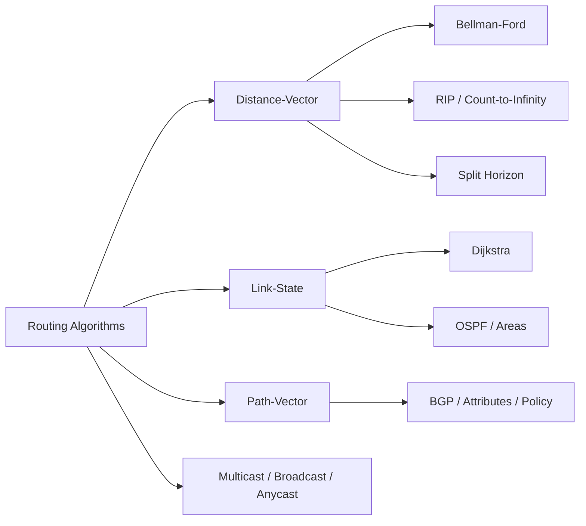

# Chapter 7: Routing

> **Prerequisites:** [Chapter 6: Network Layer](./06-network-layer.md) → IP addressing and forwarding | **Next:** [Chapter 8: Transport Layer](./08-transport-layer.md) → From routing to end-to-end delivery

## Learning Objectives


1. Distinguish between distance-vector and link-state routing algorithms.
2. Analyze the RIP protocol and its limitations due to count-to-infinity.
3. Describe OSPF operation including area hierarchy and link-state database synchronization.
4. Explain BGP path attributes and the policy-driven nature of inter-domain routing.
5. Compare unicast, multicast, broadcast, and anycast routing paradigms.

---

### Chapter at a Glance

| Topic | Key Insight | Practical Takeaway |
|-------|-------------|-------------------|
| Distance-Vector | Exchange tables with neighbors, Bellman-Ford | Simple but slow convergence (count-to-infinity) |
| Link-State | Global topology via LSP flooding, Dijkstra | Fast convergence, higher CPU/memory cost |
| OSPF | Hierarchical areas, DR/BDR election | Area 0 backbone; ABRs isolate failure domains |
| BGP | Path-vector with policy attributes | Internet routing is driven by business relationships, not metrics |
| Multicast/Anycast | Group delivery and nearest-server routing | Anycast enables DNS/CDN load distribution |

### Chapter Roadmap



## 7.1 Routing Fundamentals

### Real-World Analogy: The GPS Navigation System

A GPS navigation app computes the best route from source to destination. The app considers road segments (links), intersections (routers), traffic conditions (link cost), and road closures (link failures). Like a router, a GPS:
- Maintains a **map** (routing table / topology database)
- Computes paths using an **algorithm** (Bellman-Ford, Dijkstra, or policy-based)
- **Adapts** when roads close or traffic spikes (convergence)

The postal system is another analogy: each post office (router) decides which neighboring post office to forward a package toward based on the destination ZIP code (prefix).

### Routing vs Forwarding

| Aspect | Routing | Forwarding |
|--------|---------|------------|
| Function | Determines the path | Moves packets along the path |
| Timescale | Seconds to minutes | Nanoseconds to microseconds |
| Scope | Network-wide (control plane) | Per-router (data plane) |
| Algorithm | Bellman-Ford, Dijkstra, BGP | Longest-prefix match, TCAM lookup |
| Table | Routing Information Base (RIB) | Forwarding Information Base (FIB) |

### The Routing Problem Formally

Given a graph `G = (V, E)` where `V` is the set of routers and `E` is the set of links, each link `(u, v)` has a cost `c(u, v)`. For any source `s` and destination `t`, find a path `P = (s = v0, v1, ..., vk = t)` that minimizes:

```
Total Cost(P) = sum(c(vi, vi+1) for i = 0 to k-1)
```

### Numbered Steps of the Routing Process

1. **Neighbor discovery** → Each router identifies directly connected routers (via Hello protocols, configuration, or manual setup).
2. **Information exchange** → Routers exchange reachability information (distance vectors, link-state advertisements, or BGP UPDATE messages).
3. **Route computation** → Each router runs a routing algorithm on the collected information to compute best paths.
4. **Forwarding table population** → The computed best paths are installed into the FIB (forwarding table).
5. **Packet forwarding** → For each incoming packet, the router performs a longest-prefix match lookup and forwards to the next hop.
6. **Convergence** → When topology changes, routers re-converge to a consistent state where all tables are loop-free.

### Generic Routing Algorithm Pseudocode

```
FUNCTION RouteUpdate():
    WHILE router is running:
        FOR EACH neighbor in neighbors:
            SEND routing_info TO neighbor
            RECEIVE neighbor_info FROM neighbor
        FOR EACH destination in network:
            old_next_hop = routing_table[destination].next_hop
            best_cost = INFINITY
            best_next_hop = NULL
            FOR EACH neighbor in neighbors:
                new_cost = link_cost[self][neighbor] + neighbor_table[neighbor][destination]
                IF new_cost < best_cost:
                    best_cost = new_cost
                    best_next_hop = neighbor
            IF best_cost != old_cost OR best_next_hop != old_next_hop:
                routing_table[destination] = {cost: best_cost, next_hop: best_next_hop}
                converged = FALSE
        FOR EACH link in known_links:
            IF link_heartbeat_timed_out(link):
                REMOVE all routes using link
                TRIGGER immediate update
        SLEEP(update_interval)
```

### C++ Implementation: Generic Distance Table

```cpp
#include <iostream>
#include <vector>
#include <map>
#include <climits>
#include <algorithm>

class Router {
    int id;
    std::map<int, int> neighbors;
    std::map<int, int> routing_table;
    std::map<int, int> distance_table;

public:
    Router(int rid) : id(rid) {}

    void addNeighbor(int nid, int cost) {
        neighbors[nid] = cost;
        distance_table[nid] = cost;
        routing_table[nid] = nid;
    }

    void updateDistanceTable(const std::vector<int>& destinations,
                             const std::vector<int>& distances,
                             int from_neighbor) {
        if (neighbors.find(from_neighbor) == neighbors.end()) return;
        for (size_t i = 0; i < destinations.size(); ++i) {
            int dest = destinations[i];
            int new_dist = neighbors[from_neighbor] + distances[i];
            if (distance_table.find(dest) == distance_table.end() ||
                new_dist < distance_table[dest]) {
                distance_table[dest] = new_dist;
                routing_table[dest] = from_neighbor;
            }
        }
    }

    void printTable() const {
        std::cout << "Router " << id << " table:\n";
        for (auto& [dest, dist] : distance_table) {
            std::cout << "  -> " << dest << " via " << routing_table.at(dest)
                      << " cost " << dist << "\n";
        }
    }
};
```

### Python Implementation: Routing Table Manager

```python
INF = float('inf')

class RoutingTable:
    def __init__(self, router_id):
        self.router_id = router_id
        self.distances = {}
        self.next_hops = {}
        self.neighbors = {}

    def add_neighbor(self, neighbor_id, link_cost):
        self.neighbors[neighbor_id] = link_cost
        self.distances[neighbor_id] = link_cost
        self.next_hops[neighbor_id] = neighbor_id

    def update_from_neighbor(self, neighbor_id, neighbor_table):
        if neighbor_id not in self.neighbors:
            return
        link_cost = self.neighbors[neighbor_id]
        for dest, dist in neighbor_table.items():
            new_dist = link_cost + dist
            if dest not in self.distances or new_dist < self.distances[dest]:
                self.distances[dest] = new_dist
                self.next_hops[dest] = neighbor_id

    def get_table_for_advertisement(self):
        return dict(self.distances)

    def print_table(self):
        print(f"Router {self.router_id} Routing Table:")
        for dest in sorted(self.distances.keys()):
            nh = self.next_hops[dest]
            d = self.distances[dest]
            print(f"  Destination {dest}: next_hop={nh}, distance={d}")

rt = RoutingTable(1)
rt.add_neighbor(2, 1)
rt.add_neighbor(3, 5)
rt.update_from_neighbor(2, {3: 2, 4: 10})
rt.print_table()
```

### Complexity Analysis

| Metric | Complexity | Why |
|--------|-----------|-----|
| Space per router (DV) | O(N * D) | Each router stores N destinations with D neighbors' distances |
| Space per router (LS) | O(N^2) | Each router stores the full link-state database (N nodes, ~N edges) |
| Message complexity (DV) | O(N * D * E) | Each of E links exchanges N-sized vectors every iteration, for D iterations |
| Message complexity (LS) | O(N * E) | Each of N routers floods an LSP over E links; total O(N*E) |
| Convergence (DV worst) | O(N * D) | Count-to-infinity can take N iterations where each propagates through D hops |
| Convergence (LS) | O(N^2) | Dijkstra O(N^2) per router; convergence bounded by LSP flooding time |
| Computation (BF) | O(V * E) | Bellman-Ford relaxes all edges V-1 times |
| Computation (Dijkstra) | O(E log V) | With binary heap, each edge relaxed once, each vertex extracted from heap |

### Edge Cases in Routing

| Edge Case | Description | Impact |
|-----------|-------------|--------|
| Count to Infinity | Failed link causes incremental cost increases until infinity | Slow convergence, transient loops |
| Routing Loop | Packet circulates among routers endlessly | Packet loss, TTL expiry, bandwidth waste |
| Route Flap | Route repeatedly withdrawn and re-advertised | CPU spike, instability, BGP convergence churn |
| Blackhole | Router advertises a route but cannot forward packets | Packet loss without notification |
| Micro-loops | Transient loops during convergence after topology change | Packet loss for milliseconds to seconds |
| Pathological Topologies | Specific topologies cause worst-case convergence | Example: "counting to infinity" linear chain |
| Persistent Oscillation | Load-sensitive metrics cause routes to oscillate | Two paths alternately preferred as load shifts |
| Forwarding Loops due to Inconsistency | RIB/FIB mismatch during convergence | Dropped or misrouted packets |

---

## 7.2 Distance-Vector Routing

### Real-World Analogy: The Gossip Network

Each person (router) keeps a notebook of "how far" every other person is. Periodically, everyone reads their notebook aloud to their immediate neighbors. When you hear "I can reach Alice in 3 steps through Bob," and you have a 1-step path to the speaker, you write down "I can reach Alice in 4 steps through Speaker." You keep updating until nobody's notebook changes.

This is how rumors spread in a small town → information propagates hop by hop, and everyone eventually knows how to reach everyone else. But if the town gossip moves away, it takes a while before everyone agrees on the new shortest path.

### 7.2.1 The Bellman-Ford Algorithm

Bellman-Ford solves the single-source shortest path problem for graphs that may have negative edge weights. In networking, all link costs are positive, but the algorithm still provides the foundation for distance-vector routing.

**The Bellman-Ford Equation:**

```
D_x(y) = min over v in N(x) of { c(x, v) + D_v(y) }
```

Where:
- `D_x(y)` = distance from router x to destination y
- `c(x, v)` = cost of link from x to neighbor v
- `N(x)` = set of x's neighbors
- `D_v(y)` = distance from v to y (as reported by v)

**Numbered Steps of Bellman-Ford (Distributed Version):**

1. **Initialize:** Set D_self(dest) = INF for all destinations. Set D_self(self) = 0. For each neighbor v, set D_self(v) = c(self, v). Set next_hop(v) = v.
2. **Advertise:** Send your entire distance vector (D_self(dest) for all dest) to all neighbors.
3. **Receive:** When a neighbor v sends its distance vector, for each destination y:
   - Compute candidate = c(self, v) + D_v(y)
   - If candidate < D_self(y), update D_self(y) = candidate and set next_hop(y) = v.
4. **Repeat:** Go to step 2. Continue until no updates occur (convergence).
5. **Triggered Updates:** If link cost changes or a neighbor becomes unreachable, immediately send an updated vector.

### Bellman-Ford Step-by-Step Dry Run

**Network Topology:**

```
    A ----- B ----- C ----- D
     \             /
      \           /
       \         /
        \       /
         \     /
          \   /
           \ /
            E
```

**Link Costs:** A-B:2, B-C:3, A-E:5, E-C:1, C-D:1

**Iteration 0 (Initialization):**

| Router | A | B | C | D | E |
|--------|---|---|---|---|---|
| **A** | 0 | 2 | INF | INF | 5 |
| **B** | 2 | 0 | 3 | INF | INF |
| **C** | INF | 3 | 0 | 1 | 1 |
| **D** | INF | INF | 1 | 0 | INF |
| **E** | 5 | INF | 1 | INF | 0 |

**Iteration 1 → Each router receives vectors from neighbors and updates:**

Router A receives from B: (A:2, B:0, C:3, D:INF, E:INF)
- A->C via B: c(A,B) + D_B(C) = 2 + 3 = 5 (was INF, update)
- A->D via B: c(A,B) + D_B(D) = 2 + INF = INF (no update)
Router A receives from E: (A:5, B:INF, C:1, D:INF, E:0)
- A->C via E: c(A,E) + D_E(C) = 5 + 1 = 6 (already have 5, no update)

Router B receives from A: (A:0, B:2, C:INF, D:INF, E:5)
- B->E via A: c(B,A) + D_A(E) = 2 + 5 = 7 (was INF, update)

Router C receives from B: (A:2, B:0, C:3, D:INF, E:INF)
- C->A via B: c(C,B) + D_B(A) = 3 + 2 = 5 (was INF, update)
Router C receives from D: (A:INF, B:INF, C:1, D:0, E:INF) → no new info
Router C receives from E: (A:5, B:INF, C:1, D:INF, E:0)
- C->A via E: c(C,E) + D_E(A) = 1 + 5 = 6 (already have 5, no update)

Router D receives from C: (A:INF, B:3, C:0, D:1, E:1)
- D->B via C: c(D,C) + D_C(B) = 1 + 3 = 4 (was INF, update)
- D->E via C: c(D,C) + D_C(E) = 1 + 1 = 2 (was INF, update)

Router E receives from A: (A:0, B:2, C:INF, D:INF, E:5)
- E->B via A: c(E,A) + D_A(B) = 5 + 2 = 7 (was INF, update)
Router E receives from C: (A:INF, B:3, C:0, D:1, E:1)
- E->B via C: c(E,C) + D_C(B) = 1 + 3 = 4 (was 7 via A, update to 4)
- E->D via C: c(E,C) + D_C(D) = 1 + 1 = 2 (was INF, update)

**After Iteration 1:**

| Router | A | B | C | D | E |
|--------|---|---|---|---|---|
| **A** | 0 | 2 | 5 | INF | 5 |
| **B** | 2 | 0 | 3 | INF | 7 |
| **C** | 5 | 3 | 0 | 1 | 1 |
| **D** | INF | 4 | 1 | 0 | 2 |
| **E** | 5 | 4 | 1 | 2 | 0 |

**Iteration 2:**

Router A receives from B: (A:2, B:0, C:3, D:4, E:7)
- A->D via B: 2 + 4 = 6 (was INF, update)
Router A receives from E: (A:5, B:4, C:1, D:2, E:0) → no improvements

Router C receives from B: (A:2, B:0, C:3, D:4, E:7) → no improvements
Router C receives from D: (A:INF, B:4, C:1, D:0, E:2) → no improvements
Router C receives from E: (A:5, B:4, C:1, D:2, E:0) → no improvements

**After Iteration 2 (converged):**

| Router | A | B | C | D | E |
|--------|---|---|---|---|---|
| **A** | 0 | 2 | 5 | 6 | 5 |
| **B** | 2 | 0 | 3 | 4 | 7 |
| **C** | 5 | 3 | 0 | 1 | 1 |
| **D** | 6 | 4 | 1 | 0 | 2 |
| **E** | 5 | 4 | 1 | 2 | 0 |

### Final Forwarding Tables

| Router A | | Router B | | Router C | | Router D | | Router E | |
|----------|-|----------|-|----------|-|----------|-|----------|-|
| dest->next | cost | dest->next | cost | dest->next | cost | dest->next | cost | dest->next | cost |
| B->B | 2 | A->A | 2 | A->B | 5 | A->C | 6 | A->C | 5 |
| C->B | 5 | C->C | 3 | B->B | 3 | B->C | 4 | B->C | 4 |
| D->B | 6 | D->C | 4 | D->D | 1 | C->C | 1 | C->C | 1 |
| E->E | 5 | E->C | 7 | E->E | 1 | E->C | 2 | D->C | 2 |

### Count-to-Infinity Detailed Trace

Consider the classic linear topology: A → B → C

Link costs: A-B = 1, B-C = 1. Converged tables:
- A: dest=A(0), B(1 via B), C(2 via B)
- B: dest=A(1 via A), B(0), C(1 via C)
- C: dest=A(2 via B), B(1 via B), C(0)

**Link A-B fails.** B detects the failure.

**Time t=0:** B sets D_B(A) = INF (16 in RIP).

**Time t=1:** Before B advertises, C advertises its vector to B: (A:2, B:1, C:0).
B computes: D_B(A) via C = c(B,C) + D_C(A) = 1 + 2 = 3.
B updates: D_B(A) = 3, next_hop(B->A) = C. **This is incorrect → routing loop created!**

**Time t=2:** B advertises to C: (A:3, B:0, C:1).
C computes: D_C(A) via B = c(C,B) + D_B(A) = 1 + 3 = 4.
C updates: D_C(A) = 4.

**Time t=3:** C advertises to B: (A:4, B:1, C:0).
B computes: D_B(A) via C = 1 + 4 = 5.

This continues until the distance reaches 16 (RIP infinity), at which point both routers agree A is unreachable.

**Iteration Trace (RIP with max=16):**

| Time | D_B(A) | D_C(A) | Event |
|------|--------|--------|-------|
| 0 | INF | 2 | A-B fails, B sets INF |
| 1 | 3 | 2 | C advertises before B |
| 2 | 3 | 4 | B advertises bad news |
| 3 | 5 | 4 | C advertises back |
| 4 | 5 | 6 | B advertises |
| 5 | 7 | 6 | C advertises |
| 6 | 7 | 8 | B advertises |
| 7 | 9 | 8 | C advertises |
| 8 | 9 | 10 | B advertises |
| 9 | 11 | 10 | C advertises |
| 10 | 11 | 12 | B advertises |
| 11 | 13 | 12 | C advertises |
| 12 | 13 | 14 | B advertises |
| 13 | 15 | 14 | C advertises |
| 14 | 15 | 16 | B advertises → infinity reached |
| 15 | 16 | 16 | Both mark A unreachable |

### Mitigation Techniques

**Split Horizon:** A router never advertises a route back on the same interface from which it was learned. In our example, B would NOT advertise C's route to A back to C, breaking the loop.

**Split Horizon with Poison Reverse:** Instead of simply not advertising, the router explicitly advertises the route with cost = INFINITY on the interface. This positively confirms "I cannot reach that destination through you."

**Hold-down Timers:** When a router receives news that a destination is unreachable, it starts a hold-down timer (typically 180 seconds in RIP). During the hold-down period, the router ignores any new route information for that destination that is "better" (lower cost) than what it had. This prevents premature adoption of alternative paths that may be invalid due to propagation delays.

### Bellman-Ford Pseudocode (Centralized)

```
FUNCTION BellmanFord(graph G, source s):
    FOR v in vertices(G):
        dist[v] = INFINITY
        prev[v] = NULL
    dist[s] = 0
    FOR i = 1 TO V-1:
        FOR EACH edge (u, v) in edges(G):
            IF dist[u] + weight(u,v) < dist[v]:
                dist[v] = dist[u] + weight(u,v)
                prev[v] = u
    FOR EACH edge (u, v) in edges(G):
        IF dist[u] + weight(u,v) < dist[v]:
            PRINT "Graph contains negative-weight cycle"
            RETURN NULL
    RETURN (dist, prev)
```

### C++ Implementation: Bellman-Ford Simulator

```cpp
#include <iostream>
#include <vector>
#include <climits>
#include <string>

struct Edge {
    int src, dest, weight;
};

struct Router {
    int id;
    std::string name;
};

void bellmanFordSimulation(const std::vector<Router>& routers,
                           const std::vector<Edge>& edges,
                           int source_id) {
    int V = routers.size();
    std::vector<int> dist(V, INT_MAX);
    std::vector<int> prev(V, -1);
    dist[source_id] = 0;

    std::cout << "=== Bellman-Ford Simulation ===\n";
    std::cout << "Source: Router " << source_id << "\n\n";

    for (int i = 1; i <= V - 1; ++i) {
        bool updated = false;
        std::cout << "Iteration " << i << ":\n";
        for (const auto& e : edges) {
            if (dist[e.src] != INT_MAX &&
                dist[e.src] + e.weight < dist[e.dest]) {
                int old = dist[e.dest];
                dist[e.dest] = dist[e.src] + e.weight;
                prev[e.dest] = e.src;
                updated = true;
                std::cout << "  Relax edge (" << e.src << "->" << e.dest
                          << "): " << (old == INT_MAX ? "INF" : std::to_string(old))
                          << " -> " << dist[e.dest] << "\n";
            }
        }
        if (!updated) {
            std::cout << "  No updates (converged early)\n";
            break;
        }
    }

    for (const auto& e : edges) {
        if (dist[e.src] != INT_MAX &&
            dist[e.src] + e.weight < dist[e.dest]) {
            std::cout << "\nERROR: Negative-weight cycle detected!\n";
            return;
        }
    }

    std::cout << "\nFinal distances from Router " << source_id << ":\n";
    for (int i = 0; i < V; ++i) {
        std::cout << "  To Router " << routers[i].name
                  << " (id=" << i << "): "
                  << (dist[i] == INT_MAX ? "INF" : std::to_string(dist[i]))
                  << " via " << (prev[i] == -1 ? "-" : std::to_string(prev[i]))
                  << "\n";
    }
}

int main() {
    std::vector<Router> routers = {{0, "A"}, {1, "B"}, {2, "C"}, {3, "D"}, {4, "E"}};
    std::vector<Edge> edges = {
        {0, 1, 2}, {1, 0, 2},
        {1, 2, 3}, {2, 1, 3},
        {2, 3, 1}, {3, 2, 1},
        {0, 4, 5}, {4, 0, 5},
        {4, 2, 1}, {2, 4, 1}
    };
    bellmanFordSimulation(routers, edges, 0);
    return 0;
}
```

### Python Implementation: Bellman-Ford with Convergence Tracking

```python
import sys
from copy import deepcopy

INF = 10**9

class DistanceVectorRouter:
    def __init__(self, router_id, neighbors=None):
        self.id = router_id
        self.neighbors = neighbors or {}
        self.distances = {router_id: 0}
        self.next_hops = {}
        for nid, cost in self.neighbors.items():
            self.distances[nid] = cost
            self.next_hops[nid] = nid

    def get_vector(self):
        return dict(self.distances)

    def update(self, from_neighbor, neighbor_vector):
        if from_neighbor not in self.neighbors:
            return False
        link_cost = self.neighbors[from_neighbor]
        changed = False
        for dest, dist in neighbor_vector.items():
            new_dist = link_cost + dist
            if dest not in self.distances or new_dist < self.distances[dest]:
                self.distances[dest] = new_dist
                self.next_hops[dest] = from_neighbor
                changed = True
        return changed

def simulate_distance_vector(network_topology, max_iterations=10):
    routers = {}
    for rid, neighbors in network_topology.items():
        routers[rid] = DistanceVectorRouter(rid, neighbors)

    print("=== Distance-Vector Routing Simulation ===\n")

    for iteration in range(max_iterations):
        print(f"\n--- Iteration {iteration} ---")
        updates = 0
        for rid, router in routers.items():
            vector = router.get_vector()
            for nid in router.neighbors:
                neighbor = routers[nid]
                if neighbor.update(rid, vector):
                    updates += 1

        for rid, router in sorted(routers.items()):
            print(f"  Router {rid}: ", end="")
            for dest in sorted(router.distances.keys()):
                nh = router.next_hops.get(dest, '-')
                d = router.distances[dest]
                print(f"{dest}({nh},{d}) ", end="")
            print()

        if updates == 0:
            print("\nConverged!")
            break
    else:
        print("\nReached max iterations without full convergence")
    return routers

topology = {
    0: {1: 2, 4: 5},
    1: {0: 2, 2: 3},
    2: {1: 3, 3: 1, 4: 1},
    3: {2: 1},
    4: {0: 5, 2: 1},
}
simulate_distance_vector(topology)

def bellman_ford_centralized(vertices, edges, source):
    dist = {v: INF for v in vertices}
    prev = {v: None for v in vertices}
    dist[source] = 0

    print(f"\n=== Centralized Bellman-Ford (source={source}) ===")
    for i in range(len(vertices) - 1):
        updated = False
        print(f"  Round {i + 1}: ", end="")
        for u, v, w in edges:
            if dist[u] != INF and dist[u] + w < dist[v]:
                dist[v] = dist[u] + w
                prev[v] = u
                updated = True
        print(f"{'converged' if not updated else 'updated'}")

    for u, v, w in edges:
        if dist[u] != INF and dist[u] + w < dist[v]:
            print("Negative cycle detected!")
            return None
    return dist, prev

verts = [0, 1, 2, 3, 4]
edgs = [
    (0, 1, 2), (1, 0, 2),
    (1, 2, 3), (2, 1, 3),
    (2, 3, 1), (3, 2, 1),
    (0, 4, 5), (4, 0, 5),
    (4, 2, 1), (2, 4, 1)
]

result = bellman_ford_centralized(verts, edgs, 0)
if result:
    dist, prev = result
    print(f"\n  Shortest paths from {0}:")
    for v in verts:
        if dist[v] != INF:
            path = []
            t = v
            while t is not None:
                path.append(str(t))
                t = prev[t]
            print(f"    To {v}: dist={dist[v]}, path={' -> '.join(reversed(path))}")
```

### Complexity Analysis of Bellman-Ford with WHY

| Aspect | Complexity | Why |
|--------|-----------|-----|
| Time (centralized) | O(V * E) | V-1 iterations, each checking all E edges; each iteration propagates shortest paths one more hop |
| Space (centralized) | O(V) | Stores dist[] and prev[] for V vertices |
| Time (distributed, per router) | O(N * D) | Each of N destinations may be updated across D neighbors each iteration |
| Message complexity | O(N * E * I) | E links carry N-sized vectors for I iterations until convergence |
| Why V-1 iterations? | → | In the worst case, the longest simple path has V-1 edges, so V-1 iterations guarantee convergence |
| Why distributed converges slowly? | → | Count-to-infinity requires O(infinity) iterations, where infinity is an arbitrary bound |

### Advantages and Disadvantages of Distance-Vector

| Aspect | Advantage | Disadvantage |
|--------|-----------|-------------|
| Simplicity | Easy to implement, minimal CPU | Limited to small networks |
| State | Only neighbors' info stored | Each router has limited visibility |
| Bandwidth | Initially low for small nets | Periodic full-table updates waste bandwidth |
| Convergence | Fast in stable small networks | Slow after topology changes (count-to-infinity) |
| Metric flexibility | Supports any additive metric | Single metric only (usually hop count) |
| Deployment | Works on any router hardware | No QoS or traffic engineering support |

### 7.2.2 RIP (Routing Information Protocol)

RIP (RFC 1058, RFC 2453 for RIPv2) is a concrete implementation of distance-vector routing.

**Key Parameters:**

| Parameter | Value | Rationale |
|-----------|-------|-----------|
| Update interval | 30 seconds | Balances convergence speed vs bandwidth |
| Route timeout | 180 seconds | 6 missed updates = router considered dead |
| Hold-down | 180 seconds | Prevents premature route adoption |
| Flush timer | 240 seconds | Removes route from table after timeout |
| Infinity | 16 hops | Limits max network diameter to 15 |
| Max routes | 500 (typically) | Prevents memory exhaustion |

**RIP Version Comparison:**

| Feature | RIPv1 (RFC 1058) | RIPv2 (RFC 2453) | RIPng (RFC 2080) |
|---------|------------------|------------------|------------------|
| Addressing | Classful only | CIDR, VLSM | IPv6 |
| Authentication | None | Plaintext/MD5 | IPv6 AH |
| Updates | Broadcast | Multicast (224.0.0.9) | Multicast (FF02::9) |
| Next-hop | Always sender | Can specify | Can specify |
| Tags | No | Route tags | Route tags |

### Edge Cases in Distance-Vector / RIP

| Edge Case | Scenario | Mitigation |
|-----------|----------|------------|
| Two-node loop | A and B think the other can reach C | Split horizon breaks it |
| Three-node loop | A->B, B->C, C->A cycle | Split horizon with poison reverse |
| Transient link failure | Link flaps up/down rapidly | Hold-down timers, route damping |
| Large diameter network | Path exceeds 15 hops | Cannot use RIP; requires OSPF/IS-IS |
| Routing table corruption | Memory error corrupts table | Checksums on RIP updates, graceful restart |
| Neighbor misconfiguration | Metric mismatch between peers | Compatibility checks in RIPv2 |
| Update loss | Packet drop during transmission | Periodic updates ensure eventual delivery |

---

## 7.3 Link-State Routing

### Real-World Analogy: The Map Maker

Instead of gossip (distance-vector), link-state routing is like every city having a complete road atlas. Every city (router) draws its own local map (LSP → Link State Packet), photocopies it, and sends a copy to every other city. Once everyone has everyone else's local maps, each city assembles the full atlas and independently computes the shortest routes using Dijkstra's algorithm.

If a road closes, the city at that road announces a new map, floods it globally, and everyone recalculates. This converges much faster than gossip because every router independently determines the topology.

### 7.3.1 Dijkstra's Algorithm

Dijkstra's algorithm computes the shortest path from a source node to all other nodes in a graph with non-negative edge weights.

**Numbered Steps:**

1. **Initialize:** Mark source node `s` with distance 0. All other nodes have distance INFINITY. Mark all nodes as unvisited. Set current node = source.
2. **Explore neighbors:** For each unvisited neighbor `v` of current node `u`, compute tentative distance = dist[u] + c(u, v). If tentative < dist[v], update dist[v] and set prev[v] = u.
3. **Select next:** From all unvisited nodes, pick the one with the smallest tentative distance. Mark it as visited (its shortest path is now final).
4. **Repeat:** Set current = newly selected node. Go to step 2 until all nodes are visited.
5. **Terminate:** When all nodes are visited, dist[] contains shortest distances and prev[] contains the shortest-path tree.

### Dijkstra Step-by-Step Dry Run

**Network:** A-B:2, B-C:3, A-E:5, E-C:1, C-D:1

**Source: A**

**Initial State:**

| Step | N' (visited) | D(B) | D(C) | D(D) | D(E) |
|------|-------------|------|------|------|------|
| 0 | {A} | 2 (A) | INF | INF | 5 (A) |

**Step 1:** Pick B (smallest in N', dist=2). Add B to N'. Explore B's neighbors: C.
- D(C) via B = D(B) + c(B,C) = 2 + 3 = 5 (update from INF to 5, prev=C->B)

| Step | N' | D(B) | D(C) | D(D) | D(E) |
|------|----|------|------|------|------|
| 1 | {A, B} | 2 (A)✓ | 5 (B) | INF | 5 (A) |

**Step 2:** Pick E (dist=5, tie with C → pick arbitrarily, say E). Add E to N'. Explore E's neighbors: C.
- D(C) via E = D(E) + c(E,C) = 5 + 1 = 6 (5 < 6, no update)

| Step | N' | D(B) | D(C) | D(D) | D(E) |
|------|----|------|------|------|------|
| 2 | {A, B, E} | 2✓ | 5 (B) | INF | 5 (A)✓ |

**Step 3:** Pick C (dist=5). Add C to N'. Explore C's neighbors: B (visited), D, E (visited).
- D(D) via C = D(C) + c(C,D) = 5 + 1 = 6 (update from INF to 6, prev=D->C)

| Step | N' | D(B) | D(C) | D(D) | D(E) |
|------|----|------|------|------|------|
| 3 | {A, B, C, E} | 2✓ | 5 (B)✓ | 6 (C) | 5✓ |

**Step 4:** Pick D (dist=6). Add D to N'.

| Step | N' | D(B) | D(C) | D(D) | D(E) |
|------|----|------|------|------|------|
| 4 | {A, B, C, D, E} | 2✓ | 5✓ | 6 (C)✓ | 5✓ |

**Final Shortest-Path Tree from A:**

```
    A
   / \
  B   E
  |   |
  C---+
  |
  D
```

Paths:
- A->B: direct (cost 2)
- A->C: A->B->C (cost 5)
- A->D: A->B->C->D (cost 6)
- A->E: direct (cost 5)

### Dijkstra's Algorithm Pseudocode

```
FUNCTION Dijkstra(graph G, source s):
    FOR v in vertices(G):
        dist[v] = INFINITY
        prev[v] = NULL
        visited[v] = FALSE
    dist[s] = 0

    PQ = MinPriorityQueue()
    PQ.insert(s, 0)

    WHILE PQ is not empty:
        u = PQ.extractMin()
        IF visited[u] == TRUE:
            CONTINUE
        visited[u] = TRUE

        FOR EACH neighbor v of u:
            IF visited[v] == FALSE:
                new_dist = dist[u] + weight(u, v)
                IF new_dist < dist[v]:
                    dist[v] = new_dist
                    prev[v] = u
                    PQ.insert(v, new_dist)

    RETURN (dist, prev)
```

### C++ Implementation: Dijkstra on Network Graph

```cpp
#include <iostream>
#include <vector>
#include <queue>
#include <climits>
#include <algorithm>

struct Edge {
    int dest;
    int weight;
};

class NetworkGraph {
    int V;
    std::vector<std::vector<Edge>> adj;

public:
    NetworkGraph(int vertices) : V(vertices), adj(vertices) {}

    void addLink(int u, int v, int weight) {
        adj[u].push_back({v, weight});
        adj[v].push_back({u, weight});
    }

    struct DijkstraResult {
        std::vector<int> distances;
        std::vector<int> predecessors;
    };

    DijkstraResult dijkstra(int source) {
        std::vector<int> dist(V, INT_MAX);
        std::vector<int> prev(V, -1);
        std::vector<bool> visited(V, false);

        std::priority_queue<std::pair<int, int>,
                            std::vector<std::pair<int, int>>,
                            std::greater<std::pair<int, int>>> pq;

        dist[source] = 0;
        pq.push({0, source});

        while (!pq.empty()) {
            int u = pq.top().second;
            int d = pq.top().first;
            pq.pop();
            if (visited[u]) continue;
            visited[u] = true;
            if (d > dist[u]) continue;

            for (const auto& e : adj[u]) {
                if (!visited[e.dest]) {
                    int newDist = dist[u] + e.weight;
                    if (newDist < dist[e.dest]) {
                        dist[e.dest] = newDist;
                        prev[e.dest] = u;
                        pq.push({newDist, e.dest});
                    }
                }
            }
        }
        return {dist, prev};
    }

    void printShortestPaths(int source) {
        auto [dist, prev] = dijkstra(source);
        std::cout << "=== Dijkstra from Router " << source << " ===\n";
        for (int i = 0; i < V; ++i) {
            if (dist[i] == INT_MAX) {
                std::cout << "  To " << i << ": unreachable\n";
                continue;
            }
            std::cout << "  To " << i << " (cost=" << dist[i] << "): ";
            std::vector<int> path;
            for (int v = i; v != -1; v = prev[v])
                path.push_back(v);
            std::reverse(path.begin(), path.end());
            for (size_t j = 0; j < path.size(); ++j) {
                if (j > 0) std::cout << " -> ";
                std::cout << path[j];
            }
            std::cout << "\n";
        }
    }

    void printForwardingTable(int router_id) {
        auto [dist, prev] = dijkstra(router_id);
        std::cout << "\nForwarding Table for Router " << router_id << ":\n";
        std::cout << "  Dest | Next Hop | Cost\n";
        std::cout << "  -----+----------+-----\n";
        for (int i = 0; i < V; ++i) {
            if (i == router_id || dist[i] == INT_MAX) continue;
            int next_hop = i;
            while (prev[next_hop] != router_id && prev[next_hop] != -1)
                next_hop = prev[next_hop];
            std::cout << "  " << i << "   | " << next_hop
                      << "        | " << dist[i] << "\n";
        }
    }
};

int main() {
    NetworkGraph net(5);
    net.addLink(0, 1, 2);
    net.addLink(1, 2, 3);
    net.addLink(2, 3, 1);
    net.addLink(0, 4, 5);
    net.addLink(4, 2, 1);

    net.printShortestPaths(0);
    net.printForwardingTable(0);
    return 0;
}
```

### Python Implementation: Dijkstra on Network Graph

```python
import heapq
from typing import List, Tuple

INF = 10**9

class NetworkGraph:
    def __init__(self, num_vertices: int):
        self.V = num_vertices
        self.adj: List[List[Tuple[int, int]]] = [[] for _ in range(num_vertices)]

    def add_link(self, u: int, v: int, weight: int):
        self.adj[u].append((v, weight))
        self.adj[v].append((u, weight))

    def dijkstra(self, source: int) -> Tuple[List[int], List[int]]:
        dist = [INF] * self.V
        prev = [-1] * self.V
        visited = [False] * self.V
        dist[source] = 0
        pq = [(0, source)]

        while pq:
            d, u = heapq.heappop(pq)
            if visited[u]:
                continue
            if d > dist[u]:
                continue
            visited[u] = True
            for v, w in self.adj[u]:
                if not visited[v]:
                    new_dist = dist[u] + w
                    if new_dist < dist[v]:
                        dist[v] = new_dist
                        prev[v] = u
                        heapq.heappush(pq, (new_dist, v))
        return dist, prev

    def get_path(self, prev: List[int], target: int) -> List[int]:
        path = []
        v = target
        while v != -1:
            path.append(v)
            v = prev[v]
        return list(reversed(path))

    def print_forwarding_table(self, source: int):
        dist, prev = self.dijkstra(source)
        print(f"\nForwarding Table for Router {source}:")
        print(f"{'Dest':>6} | {'Next Hop':>8} | {'Cost':>6}")
        print("-" * 30)
        for v in range(self.V):
            if v == source or dist[v] == INF:
                continue
            next_hop = v
            while prev[next_hop] != source and prev[next_hop] != -1:
                next_hop = prev[next_hop]
            print(f"{v:>6} | {next_hop:>8} | {dist[v]:>6}")

    def simulate_lsp_flooding(self, origin: int):
        print(f"\n=== LSP Flooding Simulation from Router {origin} ===")
        print(f"Router {origin} generates LSP: neighbors=", end="")
        neighbors = [v for v, _ in self.adj[origin]]
        print(neighbors)
        visited = [False] * self.V
        queue = [origin]
        visited[origin] = True

        while queue:
            u = queue.pop(0)
            for v, _ in self.adj[u]:
                if not visited[v]:
                    visited[v] = True
                    queue.append(v)
                    print(f"  Router {u} floods LSP to neighbor {v}")
        print(f"LSP from {origin} reached all {sum(visited)} routers.")

net = NetworkGraph(5)
net.add_link(0, 1, 2)
net.add_link(1, 2, 3)
net.add_link(2, 3, 1)
net.add_link(0, 4, 5)
net.add_link(4, 2, 1)

print("=== Link-State Routing Simulation ===\n")
for src in range(5):
    dist, prev = net.dijkstra(src)
    print(f"From Router {src}:")
    for dst in range(5):
        if dst != src and dist[dst] != INF:
            path = net.get_path(prev, dst)
            print(f"  To {dst}: cost={dist[dst]}, path={'->'.join(map(str, path))}")
    print()

net.print_forwarding_table(0)
net.simulate_lsp_flooding(2)

def dijkstra_detailed(net: NetworkGraph, source: int):
    V = net.V
    dist = [INF] * V
    prev = [-1] * V
    visited = [False] * V
    dist[source] = 0

    print(f"\n{'='*60}")
    print(f"Dijkstra's Algorithm → Detailed Trace from Source {source}")
    print(f"{'='*60}")

    step = 0
    N_prime = set()
    header = f"{'Step':<6} {'N\'':<20} {'D(B)':<10} {'D(C)':<10} {'D(D)':<10} {'D(E)':<10}"
    print(f"\n{header}")
    print("-" * 60)

    def fmt(dist_val, node_id, nprime):
        if dist_val == INF:
            return "INF"
        p = prev[node_id] if prev[node_id] != -1 else source
        if node_id in nprime:
            return f"{dist_val}✓"
        return f"{dist_val} ({p})"

    print(f"{step:<6} {'{'+str(source)+'}':<20} {fmt(dist[1], 1, N_prime):<10} {fmt(dist[2], 2, N_prime):<10} {fmt(dist[3], 3, N_prime):<10} {fmt(dist[4], 4, N_prime):<10}")

    while len(N_prime) < V:
        u = -1
        min_dist = INF
        for v in range(V):
            if not visited[v] and dist[v] < min_dist:
                min_dist = dist[v]
                u = v
        if u == -1:
            break
        visited[u] = True
        N_prime.add(u)
        for v, w in net.adj[u]:
            if not visited[v] and dist[u] + w < dist[v]:
                dist[v] = dist[u] + w
                prev[v] = u

        step += 1
        n_prime_str = "{" + ",".join(map(str, sorted(N_prime))) + "}"
        print(f"{step:<6} {n_prime_str:<20} {fmt(dist[1], 1, N_prime):<10} {fmt(dist[2], 2, N_prime):<10} {fmt(dist[3], 3, N_prime):<10} {fmt(dist[4], 4, N_prime):<10}")

    return dist, prev

dijkstra_detailed(net, 0)
```

### 7.3.2 OSPF → Open Shortest Path First

OSPF (RFC 2328) is the most widely deployed link-state protocol in enterprise and service provider networks.

**OSPF Area Hierarchy:**

```
    +---------------------------+
    |      Area 0 (Backbone)     |
    |  +-------+  +-------+     |
    |  | ABR1  |  | ABR2  |     |
    |  +---+---+  +---+---+     |
    |      |          |         |
    +---------------------------+
           |          |
    +------+--+    +--+------+
    | Area 1  |    | Area 2  |
    | Stub    |    | NSSA    |
    +---------+    +---------+
```

**OSPF Router Types:**

| Router Type | Role |
|-------------|------|
| Internal Router (IR) | All interfaces in one area; knows only that area's topology |
| Area Border Router (ABR) | Connects multiple areas; maintains separate LSDB per area |
| Backbone Router | At least one interface in Area 0 |
| AS Boundary Router (ASBR) | Redistributes routes from other routing protocols into OSPF |

**OSPF Area Types:**

| Area Type | Characteristics | LSAs Permitted |
|-----------|----------------|----------------|
| Standard Area | Full routing info | All LSA types |
| Backbone (Area 0) | Must connect all areas | All LSA types |
| Stub Area | No external routes | Type 1, 2, 3 |
| Totally Stubby | No external or inter-area routes | Type 1, 2 |
| Not-So-Stubby (NSSA) | Limited external routes via Type 7 | Type 1, 2, 3, 7 |

**OSPF LSDB Flooding Dry Run:**

Consider 4 routers in a broadcast network:

```
    R1 ----- R2
     | \    / |
     |  \  /  |
     |   \/   |
     |   /\   |
     |  /  \  |
    R3 ----- R4
```

**Step 1 → DR/BDR Election:**
1. Routers send Hello packets to 224.0.0.5.
2. Highest OSPF priority wins DR; second-highest wins BDR.
3. R2 becomes DR, R3 becomes BDR (assuming higher priorities).
4. All other routers (DROTHERs) form full adjacency only with DR and BDR.
5. Adjacencies: 5 instead of 6 (saved: n²/2 - n = 1).

**Step 2 → Database Exchange (R1 to DR-R2):**
1. R1 and R2 exchange Hello packets, reach 2-WAY state.
2. R1 and R2 transition to EXSTART state; master/slave elected.
3. Master (R2) sends Database Description (DBD) packet with LSA headers.
4. Slave (R1) responds with its own DBD.
5. Both enter EXCHANGE state, comparing LSA headers.
6. R1 sees R2 has LSA for prefix 10.0.0.0/16 with seq 0x80000005; R1 has older version.
7. R1 sends Link State Request (LSR) for that LSA.
8. R2 sends Link State Update (LSU) containing the LSA.
9. R1 acknowledges with Link State Ack (LSAck).
10. Both reach FULL state → databases synchronized.

**Step 3 → LSA Flooding Across Areas:**
When R1's link to network N goes down:
1. R1 generates a new Router LSA (Type 1) with updated link info.
2. R1 increments the LSA sequence number.
3. R1 floods the LSA to all adjacent neighbors (R2, R3).
4. R2 receives LSA, checks it's newer (higher sequence number), updates LSDB.
5. R2 runs SPF, computes new routing table.
6. R2 re-floods LSA to its neighbors (except R1).
7. R3 repeats: update LSDB, run SPF, re-flood.
8. R2 (as DR) floods to all DROTHERs.

**OSPF Packet Types Detailed:**

| Type | Name | Function | Key Fields |
|------|------|----------|-----------|
| 1 | Hello | Neighbor discovery and keepalive | Router ID, Hello/Dead intervals, DR/BDR, Neighbor list, Area ID |
| 2 | DBD | Database Description summary | LSA headers (type, LS ID, advertising router, sequence number) |
| 3 | LSR | Requests specific LSAs | LSA type, LS ID, advertising router |
| 4 | LSU | Carries one or more LSAs | Number of LSAs, LSA data |
| 5 | LSAck | Acknowledges LSA receipt | LSA headers of acknowledged LSAs |

**OSPF Neighbor States:**

```
DOWN --> ATTEMPT/INIT --> 2-WAY --> EXSTART --> EXCHANGE --> LOADING --> FULL
                                  |
                                  +--> DROTHER (adjacent to DR/BDR only)
```

### Edge Cases in Link-State Routing / OSPF

| Edge Case | Scenario | Mitigation |
|-----------|----------|------------|
| LSA sequence number wrap | Sequence number reaches max | LSA age reaches MaxAge (3600s), LSA flushed and re-originated |
| LSA age overflow | Router restarts, loses sequence | Graceful restart (RFC 3623) or restart signaling |
| Link flapping | Interface goes up/down rapidly | OSPF exponential backoff algorithm (RFC 8402) |
| MTU mismatch | Two routers have different MTU on link | DBD packets include MTU; OSPF refuses to form adjacency if mismatch |
| Duplicate Router ID | Two routers claim same ID | Configuration validation; router ID must be unique in OSPF domain |
| Partitioned backbone | Area 0 splits into two | Virtual links reconnect partitioned Area 0 |
| Stuck in EXSTART | Routers cannot agree on master/slave | Check MTU, authentication, or unicast reachability |
| LSA storm | Many routers update LSAs simultaneously | MinLSInterval (5s) throttles LSA generation |
| Memory exhaustion | Large LSDB in huge network | Area hierarchy limits LSDB size per router |

### Complexity Analysis of Dijkstra / Link-State with WHY

| Aspect | Complexity | Why |
|--------|-----------|-----|
| Dijkstra time (array) | O(V²) | Simple implementation; each iteration scans V nodes to find minimum |
| Dijkstra time (binary heap) | O((V+E) log V) approx O(E log V) | Each edge relaxed once (push), each vertex extracted once (pop) |
| Dijkstra time (Fibonacci heap) | O(E + V log V) | Decrease-key is O(1) amortized, but high constant factor |
| Space | O(V + E) | Adjacency list stores all edges |
| LSP flooding | O(N * E) | Each of N routers sends LSP over each of E links once |
| LSDB size | O(N * E) worst-case | Each router stores N LSPs with E links total |
| SPF computation frequency | On topology change | Only when LSA received, not periodic |
| Why Dijkstra fails with negative edges? | Greedy early commitment | Once a node is visited, its distance is never reconsidered; a later negative edge could offer shorter path |
| Why O(E log V) is optimal for sparse nets | log V is small | E is typically ~2V in sparse networks; E log V approx 2V log V |
| Why O(V²) may be faster in dense nets | Low constant factor | For dense graphs where E approx V², V² < V² log V; array implementation wins |

### Advantages and Disadvantages of Link-State

| Aspect | Advantage | Disadvantage |
|--------|-----------|-------------|
| Convergence | Fast → seconds after topology change | Initial convergence can be slower (DB exchange) |
| Loop avoidance | SPF guarantees loop-free paths | Transient micro-loops possible during convergence |
| Bandwidth | Event-driven updates only | Initial full-database exchange can be large |
| Scalability | Area hierarchy supports large networks | CPU-intensive SPF recalculations in large single areas |
| Traffic engineering | Multiple metrics, equal-cost multipath | Complex configuration compared to RIP |
| Troubleshooting | Full topology visibility | Requires more knowledge to operate |

---

## 7.4 Path-Vector Routing (BGP)

### Real-World Analogy: International Shipping with Customs Forms

When a package travels from New York to Tokyo, each country's postal service appends its stamp to the customs form. The form accumulates the full path: "USA -> Canada -> Japan." This is the AS_PATH in BGP.

Unlike a GPS (Dijkstra) or gossip (Bellman-Ford), shipping routes are determined by **business contracts**: "We have a transit agreement with Canada Post" or "We peer settlement-free with Japan Post." The shipper doesn't choose the technically shortest route → they choose the route that respects business policies, avoids competitors, and doesn't violate agreements.

### 7.4.1 BGP Fundamentals

BGP is the **path-vector** protocol that connects the ~100,000 autonomous systems (ASes) that make up the global Internet. Unlike intra-domain protocols, BGP is policy-driven, not metric-driven.

**BGP Session Types:**

```
eBGP: AS100 ---- AS200    (between different ASes)
       \              \
iBGP:  AS100 ---- AS300  (within same AS → only eBGP-learned routes shared)
```

**Numbered Steps of BGP Operation:**

1. **Establish TCP connection** → BGP peers establish TCP on port 179.
2. **Send OPEN message** → Each peer sends capabilities, AS number, hold time, BGP identifier.
3. **Exchange initial UPDATEs** → Full routing table (all prefixes + attributes) exchanged.
4. **Send KEEPALIVEs** → Periodic keepalives (default 60s) maintain the session.
5. **Incremental UPDATEs** → Only changes are sent (no periodic full table).
6. **Route selection** → For each prefix, select the best path using BGP decision process.
7. **Route advertisement** → Best paths advertised to other peers per export policy.

### 7.4.2 BGP Path Attributes → Detailed

| Attribute | Category | Code | Direction | Description |
|-----------|----------|------|-----------|-------------|
| ORIGIN | Well-known mandatory | 1 | Both | IGP (i), EGP (e), INCOMPLETE (?) → how route entered BGP |
| AS_PATH | Well-known mandatory | 2 | Both | Sequence of AS numbers the route traverses |
| NEXT_HOP | Well-known mandatory | 3 | Both | IP address of next-hop router |
| MED (MULTI_EXIT_DISC) | Optional non-transitive | 4 | EBGP->IBGP | Suggestion to external peer for preferred entry point (lower better) |
| LOCAL_PREF | Well-known discretionary | 5 | IBGP->EBGP | Local preference within AS (higher better); not sent to eBGP peers |
| ATOMIC_AGGREGATE | Well-known discretionary | 6 | Both | Set when routes are aggregated |
| AGGREGATOR | Optional transitive | 7 | Both | AS and router that performed aggregation |
| COMMUNITY | Optional transitive | 8 | Both | 32-bit tag for policy signaling |
| ORIGINATOR_ID | Optional non-transitive | 9 | IBGP | Router ID of route originator (for route reflection) |
| CLUSTER_LIST | Optional non-transitive | 10 | IBGP | List of cluster IDs (for route reflection) |

**Well-Known Communities:**

| Community | Meaning |
|-----------|---------|
| NO_EXPORT (0xFFFFFF01) | Do not advertise to any eBGP peer (keep within AS) |
| NO_ADVERTISE (0xFFFFFF02) | Do not advertise to any peer (keep on this router) |
| NO_EXPORT_SUBCONFED (0xFFFFFF03) | Do not advertise outside local confederation |
| NOPEER (0xFFFFFF04) | Do not advertise to peers (only customers) |

### 7.4.3 BGP Decision Process → Detailed

**Step-by-step tiebreaker (most significant first):**

1. **Highest LOCAL_PREF** → Set by policy. Routes with higher local preference are preferred.
2. **Shortest AS_PATH length** → Count ASes in AS_PATH (not including AS_CONFED_SEQUENCE).
3. **Lowest ORIGIN type** → IGP (0) < EGP (1) < INCOMPLETE (2).
4. **Lowest MED** → Only if the same neighboring AS is the route source.
5. **Prefer eBGP over iBGP** → eBGP-learned routes preferred.
6. **Lowest IGP cost to NEXT_HOP** → Closest exit point.
7. **Oldest route** → Route received first is preferred (for stability).
8. **Lowest neighbor Router ID** → Tiebreaker of last resort.

### BGP Path Selection Dry Run

**Topology:**

```
AS100 →→→ AS200 →→→ AS300
  |                     |
  +→→→ AS400 →→→ AS500→+
```

**Route to prefix 10.1.0.0/16 (originated in AS300):**

| Attribute | Path 1 (via AS200) | Path 2 (via AS400->AS500) |
|-----------|-------------------|--------------------------|
| AS_PATH | 200, 300 | 400, 500, 300 |
| LOCAL_PREF | 100 | 150 |
| MED | → | → |
| Origin | IGP | IGP |
| NEXT_HOP IGP cost | 5 | 10 |

**Decision at AS100:**

| Step | Criterion | Path 1 | Path 2 | Winner |
|------|-----------|--------|--------|--------|
| 1 | LOCAL_PREF | 100 | **150** | Path 2 |
| 2 | AS_PATH length | → | → | → (already decided) |

Result: Path 2 wins despite longer AS_PATH because LOCAL_PREF is higher.

**Now consider both with LOCAL_PREF=100:**

| Step | Criterion | Path 1 | Path 2 | Winner |
|------|-----------|--------|--------|--------|
| 1 | LOCAL_PREF | 100 | 100 | Tie |
| 2 | AS_PATH length | **2** | 3 | Path 1 |
| 3 | Origin | → | → | → (already decided) |

Result: Path 1 wins with shorter AS_PATH.

### AS Path Prepending Analysis

AS Path prepending is a traffic engineering technique where an AS artificially lengthens its AS_PATH to make a path less preferred.

**Example: Multi-homed network (AS65000) connected to two ISPs:**

```
ISP-A (AS100) ====== AS65000 ====== ISP-B (AS200)
```

Without prepending, AS65000 advertises the same prefix to both ISPs:
- To ISP-A: AS_PATH = 65000
- To ISP-B: AS_PATH = 65000
Both ISPs see equal-length paths -> roughly equal inbound traffic.

**To shift traffic away from ISP-A:**

AS65000 prepends its AS number 3 times when advertising to ISP-A:
- To ISP-A: AS_PATH = 65000, 65000, 65000, 65000 (length=4)
- To ISP-B: AS_PATH = 65000 (length=1)

**Effect on inbound traffic from ISP-A's perspective:**
- ISP-A sees path via ISP-B: AS_PATH = 100, 65000 (length=2)
- ISP-A sees direct path: AS_PATH = 65000, 65000, 65000, 65000 (length=4)
- ISP-A prefers the shorter path -> traffic enters via ISP-B.

**Prepending impact on BGP decision:**

| Scenario | Inbound via ISP-A | Inbound via ISP-B |
|----------|------------------|------------------|
| No prepending | ~50% | ~50% |
| 1x prepend (65000) | More selective | Preferred |
| 2x prepend (65000,65000) | Backup only | Primary |
| 3x prepend (65000,65000,65000) | Emergency only | Dominant |

### Python: AS Path Prepending Analysis

```python
class BGPRoute:
    def __init__(self, prefix, as_path, local_pref=100, med=0, origin='IGP'):
        self.prefix = prefix
        self.as_path = as_path
        self.local_pref = local_pref
        self.med = med
        self.origin = origin

    def as_path_length(self):
        return len([a for a in self.as_path if isinstance(a, int)])

    def copy_with_prepend(self, asn, times=1):
        new_path = self.as_path[:]
        for _ in range(times):
            new_path.insert(0, asn)
        return BGPRoute(self.prefix, new_path, self.local_pref, self.med, self.origin)

def bgp_decision_process(routes):
    print(f"{'Step':<8} {'Criterion':<20} {'Route details':<50}")
    print("-" * 78)
    candidates = list(routes)
    steps = [
        ("LOCAL_PREF", lambda r: -r.local_pref),
        ("AS_PATH len", lambda r: r.as_path_length()),
        ("ORIGIN", lambda r: {'IGP': 0, 'EGP': 1, 'INCOMPLETE': 2}[r.origin]),
        ("MED", lambda r: r.med),
    ]

    for step_name, key_fn in steps:
        if len(candidates) == 1:
            break
        candidates.sort(key=key_fn)
        best_score = key_fn(candidates[0])
        candidates = [r for r in candidates if key_fn(r) == best_score]
        print(f"{'Step result':<8} {step_name:<20} {len(candidates)} candidate(s) remain")

    winner = candidates[0]
    print(f"{'WINNER':<8} {'':<20} {winner.as_path} (length={winner.as_path_length()})")
    return winner

print("=== BGP Path Selection with AS_PATH Prepending ===\n")

print("Scenario 1: No prepending (equal paths)")
winner = bgp_decision_process([
    BGPRoute("10.1.0.0/16", [100, 65000], local_pref=100),
    BGPRoute("10.1.0.0/16", [200, 65000], local_pref=100),
])
print()

print("Scenario 2: Prepending on ISP-A path")
winner = bgp_decision_process([
    BGPRoute("10.1.0.0/16", [100, 65000, 65000, 65000, 65000], local_pref=100),
    BGPRoute("10.1.0.0/16", [200, 65000], local_pref=100),
])
```

### BGP Pseudocode

```
FUNCTION BgpDecisionProcess(routes_for_prefix):
    best_route = NULL
    FOR EACH route in routes_for_prefix:
        IF route.as_path contains my_own_as:
            SKIP
        route.local_pref = apply_import_policy(route)
        IF route.local_pref == -1:
            SKIP
        IF best_route == NULL:
            best_route = route
            CONTINUE
        IF route.local_pref > best_route.local_pref:
            best_route = route
        ELSE IF route.local_pref == best_route.local_pref:
            IF len(route.as_path) < len(best_route.as_path):
                best_route = route
            ELSE IF len(route.as_path) == len(best_route.as_path):
                IF route.origin < best_route.origin:
                    best_route = route
                ELSE IF route.origin == best_route.origin:
                    IF route.med < best_route.med:
                        best_route = route
                    ELSE IF route.med == best_route.med:
                        IF route.type == EBGP AND best_route.type == IBGP:
                            best_route = route
                        ELSE IF route.type == best_route.type:
                            IF route.igp_cost_to_next_hop < best_route.igp_cost_to_next_hop:
                                best_route = route
                            ELSE IF equal:
                                IF route.received_time < best_route.received_time:
                                    best_route = route
                                ELSE IF equal:
                                    IF route.neighbor_router_id < best_route.neighbor_router_id:
                                        best_route = route
    RETURN best_route
```

### C++ Implementation: BGP Path Selection

```cpp
#include <iostream>
#include <vector>
#include <string>
#include <algorithm>

struct BgpRoute {
    std::string prefix;
    std::vector<int> as_path;
    int local_pref;
    int med;
    std::string origin;
    int igp_cost;
    long received_time;
    int neighbor_router_id;
    bool is_ebgp;

    BgpRoute(std::string p, std::vector<int> path, int lp = 100,
             int m = 0, std::string o = "IGP", int igp = 0,
             long time = 0, int nid = 0, bool ebgp = true)
        : prefix(p), as_path(std::move(path)), local_pref(lp), med(m),
          origin(std::move(o)), igp_cost(igp), received_time(time),
          neighbor_router_id(nid), is_ebgp(ebgp) {}

    int originScore() const {
        if (origin == "IGP") return 0;
        if (origin == "EGP") return 1;
        return 2;
    }

    int asPathLength() const { return as_path.size(); }

    void print() const {
        std::cout << "  AS_PATH=[";
        for (size_t i = 0; i < as_path.size(); ++i) {
            if (i > 0) std::cout << " ";
            std::cout << as_path[i];
        }
        std::cout << "] LP=" << local_pref << " MED=" << med
                  << " Origin=" << origin << " IGP=" << igp_cost
                  << " " << (is_ebgp ? "eBGP" : "iBGP") << "\n";
    }
};

class BgpSpeaker {
public:
    static BgpRoute selectBestPath(const std::vector<BgpRoute>& routes) {
        if (routes.empty()) throw std::runtime_error("No routes");
        auto best = routes[0];
        std::cout << "=== BGP Best Path Selection ===\n";
        std::cout << "Prefix: " << best.prefix << "\n\n";

        for (size_t i = 1; i < routes.size(); ++i) {
            const auto& c = routes[i];
            std::cout << "Comparing:\n";
            best.print();
            c.print();
            std::cout << "Result: ";

            if (c.local_pref > best.local_pref) {
                best = c;
                std::cout << "Path " << i << " wins (higher LOCAL_PREF)\n";
            } else if (c.asPathLength() < best.asPathLength()) {
                best = c;
                std::cout << "Path " << i << " wins (shorter AS_PATH)\n";
            } else if (c.originScore() < best.originScore()) {
                best = c;
                std::cout << "Path " << i << " wins (lower origin)\n";
            } else if (c.med < best.med) {
                best = c;
                std::cout << "Path " << i << " wins (lower MED)\n";
            } else if (c.is_ebgp && !best.is_ebgp) {
                best = c;
                std::cout << "Path " << i << " wins (eBGP preferred)\n";
            } else if (c.igp_cost < best.igp_cost) {
                best = c;
                std::cout << "Path " << i << " wins (lower IGP cost)\n";
            } else if (c.received_time < best.received_time) {
                best = c;
                std::cout << "Path " << i << " wins (older/stable)\n";
            } else if (c.neighbor_router_id < best.neighbor_router_id) {
                best = c;
                std::cout << "Path " << i << " wins (lower Router ID)\n";
            } else {
                std::cout << "Tie → keeping current best\n";
            }
            std::cout << "\n";
        }
        std::cout << "BEST ROUTE: ";
        best.print();
        return best;
    }
};

int main() {
    std::vector<BgpRoute> routes = {
        BgpRoute("10.1.0.0/16", {100, 65000}, 100, 0, "IGP", 5),
        BgpRoute("10.1.0.0/16", {200, 300, 65000}, 150, 0, "IGP", 10),
        BgpRoute("10.1.0.0/16", {400, 500, 600, 65000}, 100, 0, "EGP", 2),
    };
    BgpSpeaker::selectBestPath(routes);
    return 0;
}
```

### Python Implementation: BGP Route Selection

```python
from dataclasses import dataclass
from typing import List, Optional

@dataclass
class BgpRoute:
    prefix: str
    as_path: List[int]
    local_pref: int = 100
    med: int = 0
    origin: str = 'IGP'
    next_hop_igp_cost: int = 0
    received_time: int = 0
    neighbor_router_id: int = 0
    is_ebgp: bool = True

    @property
    def origin_score(self) -> int:
        return {'IGP': 0, 'EGP': 1, 'INCOMPLETE': 2}[self.origin]

    @property
    def as_path_len(self) -> int:
        return len([a for a in self.as_path if isinstance(a, int)])

    def __str__(self) -> str:
        path_str = ' '.join(map(str, self.as_path))
        type_str = 'eBGP' if self.is_ebgp else 'iBGP'
        return (f"  AS_PATH=[{path_str}] LP={self.local_pref} MED={self.med} "
                f"Origin={self.origin} IGP_cost={self.next_hop_igp_cost} {type_str}")

class BGPSpeaker:
    def __init__(self, as_number: int):
        self.as_number = as_number
        self.routing_table: dict = {}
        self.rib: dict = {}

    def load_routes(self, routes: List[BgpRoute]):
        for route in routes:
            if route.prefix not in self.rib:
                self.rib[route.prefix] = []
            self.rib[route.prefix].append(route)

    def select_best(self, prefix: str) -> Optional[BgpRoute]:
        if prefix not in self.rib or not self.rib[prefix]:
            return None
        candidates = self.rib[prefix][:]
        print(f"\n  BGP Decision for {prefix} ({len(candidates)} candidates):")
        candidates = [r for r in candidates if self.as_number not in r.as_path]
        print(f"  After loop check: {len(candidates)} candidates")
        if not candidates:
            return None

        best = candidates[0]
        for route in candidates[1:]:
            if route.local_pref > best.local_pref:
                best = route; continue
            if route.as_path_len < best.as_path_len:
                best = route; continue
            if route.origin_score < best.origin_score:
                best = route; continue
            if route.med < best.med:
                best = route; continue
            if route.is_ebgp and not best.is_ebgp:
                best = route; continue
            if route.next_hop_igp_cost < best.next_hop_igp_cost:
                best = route; continue
            if route.received_time < best.received_time:
                best = route; continue
            if route.neighbor_router_id < best.neighbor_router_id:
                best = route; continue

        self.routing_table[prefix] = best
        print(f"  WINNER: {best}")
        return best

    def print_table(self):
        print(f"\nBGP Table at AS{self.as_number}:")
        for prefix, route in self.routing_table.items():
            print(f"  {prefix}: {route}")

print("=== BGP Path Selection Simulation ===\n")
as65000 = BGPSpeaker(65000)
routes = [
    BgpRoute("10.1.0.0/16", [100, 65000], local_pref=100,
             next_hop_igp_cost=5, neighbor_router_id=1),
    BgpRoute("10.1.0.0/16", [200, 300, 65000], local_pref=150,
             next_hop_igp_cost=10, neighbor_router_id=2),
    BgpRoute("10.1.0.0/16", [400, 65000, 65000, 65000], local_pref=100,
             next_hop_igp_cost=2, neighbor_router_id=3),
]
as65000.load_routes(routes)
as65000.select_best("10.1.0.0/16")
as65000.print_table()
```

### 7.4.4 iBGP vs eBGP

| Aspect | eBGP | iBGP |
|--------|------|------|
| Peering | Between different ASes | Within same AS |
| AS_PATH | AS number prepended | AS number NOT prepended |
| Admin distance | 20 | 200 |
| Next-hop | Usually changed to eBGP peer IP | Preserved from eBGP (next-hop-self optional) |
| Loop prevention | AS_PATH (if see own AS, reject) | Split horizon (do not advertise to iBGP peer what was learned from iBGP) |
| Full mesh required | No | Yes (or use route reflectors/confederations) |
| TTL | Usually 1 (ebgp-multihop for multi-hop) | Decremented normally |

### Edge Cases in BGP

| Edge Case | Description | Impact |
|-----------|-------------|--------|
| Route Flap | Route repeatedly withdrawn and re-advertised | CPU exhaustion, global routing instability |
| Route Damping | ROUTE_FLAP_DAMPING penalizes flapping routes | Suppressed routes may not converge to stable path |
| AS_PATH loop | Router sees own AS in received route | Route rejected; prevents inter-AS loops |
| Routing table growth | ~1M prefixes in global BGP table | Requires hardware TCAM, memory management |
| BGP session reset | TCP session drops, all routes withdrawn | Massive UPDATE bursts on reconnection |
| NEXT_HOP unreachable | Route selected but next hop is inaccessible | Blackhole routing |
| Slow peer | Peer takes long to process UPDATEs | Hold timer expiry, session reset |
| Software bugs | BGP implementation crashes | Global routing disruption |
| Path MTU issues | BGP TCP sessions over restricted MTU links | Session flapping, incomplete table exchange |
| LocalPref misconfiguration | Inconsistent LOCAL_PREF across AS | Traffic engineering failures, suboptimal routing |

---

## 7.5 Hierarchical Routing

### Real-World Analogy: The Postal System Hierarchy

The postal system uses a hierarchy: local post office (neighborhood) -> city sorting center -> regional hub -> national hub -> international exchange -> (other country's) national hub -> regional hub -> city sorting center -> local post office.

Each level only needs to know how to reach the next level up, not every address in the world. This is **hierarchical routing** → the Internet's AS hierarchy mirrors this structure exactly.

### The Two-Level Hierarchy

The Internet routing system has exactly two levels:

1. **Intra-domain (IGP):** Routing within an AS using OSPF, IS-IS, EIGRP, or RIP.
2. **Inter-domain (EGP):** Routing between ASes using BGP.

**Why Hierarchy Matters for Scalability:**

Without hierarchy, every router would need to know the topology of the entire Internet → an impossible ~100,000 ASes and millions of routes. With hierarchy:
- Each AS internal router knows only its own AS topology.
- Border routers learn external routes via BGP but represent each AS as a single node.
- Route aggregation (CIDR) collapses many prefixes into one advertisement.
- Administrative domains maintain autonomy over their routing policies.

### Internet Hierarchy Summary

```
[Global Tier-1 ISPs] → fully meshed, no upstream
    |
[Tier-2 ISPs] → have upstream providers, may peer
    |
[Tier-3 / Customer ASes] → single- or multi-homed
    |
[Enterprise Networks] → single or dual ISP connections
```

### Advantages of Hierarchical Routing

| Advantage | Description |
|-----------|-------------|
| Scalability | Each AS hides its internal topology from the rest of the Internet |
| Administrative autonomy | Each AS chooses its own routing policy and IGP |
| Economic relationships | Routing decisions reflect business agreements not just metrics |
| Fault isolation | A problem in one AS does not propagate globally |
| Route aggregation | CIDR allows summarizing many prefixes into one |
| Policy flexibility | Each AS can implement complex import/export policies |

---

## 7.6 Multicast Routing

### Real-World Analogy: The Conference Call

In a conference call, one person speaks and many listen. The phone company's equipment duplicates the speaker's signal only at points where the signal path branches to serve multiple listeners. This is vastly more efficient than the speaker calling each participant individually (unicast), or every participant calling every other (broadcast).

### Multicast Fundamentals

Multicast delivers packets from one source to a group of interested receivers, forming a distribution tree.

**IP Multicast Addressing:**

| Address Range | Purpose |
|--------------|---------|
| 224.0.0.0/24 | Link-local (routing protocols, not forwarded) |
| 224.0.1.0/24 | Internet-wide control protocols |
| 224.0.2.0 - 238.255.255.255 | Global multicast (SSM range: 232/8) |
| 239.0.0.0/8 | Administratively scoped (private) |

### Multicast Distribution Trees

Two types of trees:

1. **Source-specific tree (shortest path tree):** Rooted at the source. Optimal path from source to each receiver but requires per-source state. Notation: (S, G) where S is source, G is group.
2. **Shared tree:** Rooted at a rendezvous point (RP). All sources send to RP, which distributes to receivers. Less optimal but less state. Notation: (*, G) where * is any source, G is group.

### PIM Operation Modes

**PIM Dense Mode (PIM-DM):**
1. Source sends multicast packet.
2. Router floods to all PIM-enabled interfaces.
3. Routers with no interested receivers send Prune messages upstream.
4. Periodically re-floods to discover new receivers.

**PIM Sparse Mode (PIM-SM):**
1. Receivers send IGMP Join toward the RP.
2. Sources send Register to RP (unicast encapsulated).
3. RP forwards to receivers down the shared tree.
4. Last-hop routers may switch to source-specific tree (S,G) for optimal path.

### IGMP (Internet Group Management Protocol)

IGMPv3 (RFC 3376) is the current standard. Host-to-router protocol for IPv4 multicast group management.

**IGMP Message Types:**

| Type | Function |
|------|----------|
| Membership Query | Router asks hosts about group membership |
| Membership Report | Host reports group membership |
| Leave Group | Host leaves a group |

### Numbered Steps of Multicast Forwarding

1. **Host joins group** → Host sends IGMP Report for group G toward the router.
2. **PIM Join** → Router sends PIM Join (*, G) toward the RP.
3. **RP receives Join** → RP adds the interface to its outgoing interface list (OIL).
4. **Source sends traffic** → Source's designated router (DR) encapsulates data in Register messages to RP.
5. **RP decapsulates** → RP forwards data down the shared tree to receivers.
6. **S,G switchover** → Last-hop router may send (S,G) Join toward source for optimal path.
7. **Prune** → When no receivers remain, router sends Prune upstream.

### Multicast Routing Protocols Compared

| Protocol | Type | Tree Type | Scalability | Use Case |
|----------|------|-----------|-------------|----------|
| DVMRP | Distance-Vector | Source-based (flood-and-prune) | Low | Legacy, MBONE |
| PIM-DM | Independent | Source-based (flood-and-prune) | Low | Dense receiver groups |
| PIM-SM | Independent | Shared + Source | High | Sparse receiver groups, WAN |
| MOSPF | Link-State | Source-based | Medium | OSPF networks with multicast |
| MSDP | → | Inter-domain RP discovery | High | Connecting PIM-SM domains |

---

## 7.7 Broadcast Routing

### Real-World Analogy: The Town Crier

The town crier stands in the square and shouts so everyone can hear. Every house receives the message simultaneously, regardless of whether they need it. This is broadcast → send to everyone, whether interested or not.

### Broadcast Routing Approaches

**Controlled Flooding:**
- **Sequence-number-controlled flooding:** Each router stores the highest sequence number seen for each source. Duplicate packets are dropped.
- **Reverse Path Forwarding (RPF):** When a router receives a broadcast packet, it only forwards the packet out other interfaces IF the packet arrived on the interface that the router would use to reach the source. If it arrived on any other interface, it's a duplicate and is dropped.

**Spanning Tree Broadcast:**
- Routers compute a spanning tree covering all nodes (e.g., using 802.1D).
- Broadcast packets are forwarded only along tree links, eliminating loops.
- Redundant links remain available for unicast traffic but disabled for broadcast.

### RPF Check → Detailed

RPF is fundamental: a router receives a broadcast packet from source S on interface I. It checks its unicast routing table: "Would I forward to S via interface I?" If yes, the packet arrived on the correct interface -> forward to all other interfaces. If no -> drop (likely a duplicate).

**RPF Example:**

```
    S -- R1 -- R2 -- R3
          \         /
           \       /
            R4 -- R5
```

When S sends a broadcast via R1:
- R1 receives on interface facing S -> correct -> forward to R2 and R4.
- R2 receives from R1 -> correct -> forward to R3.
- R4 receives from R1 -> correct -> forward to R5.
- R5 receives from R4 -> correct -> forward to R3. If R3 also receives from R2 and forwards to R5, R5 drops the duplicate via RPF.

### Broadcast vs Multicast vs Unicast

| Aspect | Unicast | Broadcast | Multicast |
|--------|---------|-----------|-----------|
| Destination | One host | All hosts | Subscribed hosts |
| Efficiency | O(n) for n receivers | O(1) but wastes bandwidth | O(tree size) |
| Address type | Unicast IP | Broadcast IP (e.g., 255.255.255.255) | Class D / FF00::/8 |
| Scope | Global | Subnet-limited | Configurable (TTL, scope) |
| Protocol support | All IP devices | All IP devices | Requires IGMP / MLD |
| Typical use | Web, email, file transfer | DHCP, ARP (L2 broadcast) | IPTV, video conferencing |
| Router state per group | None (unicast table only) | None | (S,G) or (*,G) state |
| Bandwidth efficiency | Wastes bandwidth for | n copies | Very wasteful for n>1 | Efficient — duplicates only at branch points |

### Broadcast Routing Algorithms Summary

| Algorithm | Mechanism | Loop Prevention | Overhead |
|-----------|-----------|----------------|----------|
| Flooding | Send to all interfaces except incoming | Sequence number per source | High (duplicates) |
| Controlled flooding (SNC) | Flood with source sequence number tracking | Sequence number check | Medium (per-source state) |
| Reverse Path Forwarding (RPF) | Forward only if arrived on shortest path to source | RPF check | Low (unicast route lookup) |
| Spanning Tree | Forward along ST edges only | ST algorithm ensures tree | Low (ST computation) |

---

## 7.8 Anycast Routing

### Real-World Analogy: The Nearest Pizza Delivery

You call a pizza chain's phone number. The call is routed to the nearest store (by geography), not to a specific location. If that store is busy, the call may go to the next nearest. You don't care which store delivers → you care about getting pizza fast. This is anycast: send to the nearest member of a group.

### BGP Anycast in Practice

Anycast in the Internet is implemented via BGP. Multiple routers in different locations advertise the **same IP prefix**:
- DNS root servers (e.g., 198.41.0.4 for a.root-servers.net → 200+ instances worldwide)
- CDN edge servers (Cloudflare, Akamai, Fastly)
- Google's 8.8.8.8 (2000+ instances)
- Cloudflare's 1.1.1.1

**How Anycast Works:**

1. Organization obtains IP prefix (e.g., 203.0.113.0/24).
2. Organization deploys servers in multiple locations (New York, London, Tokyo).
3. Each location advertises 203.0.113.0/24 via BGP to its upstream provider.
4. BGP's decision process causes each router in the Internet to select the "closest" (by AS_PATH length or IGP cost to NEXT_HOP) advertisement.
5. Traffic from Europe -> London instance. Traffic from US -> New York instance.
6. If London instance fails, BGP withdraws the route, and traffic shifts to the next-closest location.

### Anycast Benefits and Challenges

**Benefits:**

| Benefit | Description |
|---------|-------------|
| Lower latency | Traffic reaches the nearest instance |
| Load distribution | Different regions map to different instances |
| Fault tolerance | Instance failure causes traffic to shift |
| DDoS absorption | Attack traffic is distributed across all instances |
| Simplified DNS | Single IP address serves any location |

**Challenges:**

| Challenge | Description | Mitigation |
|-----------|-------------|------------|
| Session persistence | Different packets may reach different servers | Use TCP anycast with careful timeout tuning, or use anycast only for UDP (DNS) |
| Routing instability | BGP changes shift traffic mid-session | Tune BGP timers, use IP anycast only for stateless protocols |
| Uneven load distribution | AS_PATH prepending is coarse-grained | Use BGP communities, traffic engineering |
| Hot-potato routing | Egress vs ingress path may differ | Align anycast advertisements with transit agreements |

---

## 7.9 Comparison: DV vs LS vs PV

| Dimension | Distance-Vector (RIP) | Link-State (OSPF/IS-IS) | Path-Vector (BGP) |
|-----------|----------------------|------------------------|-------------------|
| Knowledge | Neighbor distances only | Complete network topology | AS-level paths |
| Algorithm | Bellman-Ford | Dijkstra (SPF) | Decision process (policy-based) |
| Computation | Distributed (neighbor updates) | Centralized per router (SPF) | Distributed (path attributes + policy) |
| Convergence | Slow (minutes, count-to-infinity) | Fast (seconds) | Slow to very slow (policy-dependent) |
| Loop prevention | Split horizon + infinity | SPF guarantees loop-free topology | AS_PATH attribute |
| Metric | Single (hop count) | Single (cost) | Multiple attributes (policy > metric) |
| Update type | Periodic full table (30s in RIP) | Event-driven LSA | Incremental UPDATE |
| Bandwidth usage | High (periodic full dumps) | Low (event-driven) | Medium (initial full, then incremental) |
| CPU usage | Low | Higher (SPF calculations) | Medium (policy processing) |
| Memory usage | Low (neighbors only) | High (full LSDB) | High (full BGP table: ~1M prefixes) |
| Scalability | Small (<15 hops) | Large (areas for hierarchy) | Global Internet (~100K ASes) |
| Traffic engineering | None | ECMP, unequal-cost paths (Cisco) | AS_PATH prepend, communities, MED |
| Admin autonomy | None | Within AS only | Full policy autonomy |
| Typical deployment | Small office/lab | Enterprise, DC, SP core | Internet, multi-homing, CDN |

---

## 7.10 Comparison: RIP vs OSPF vs BGP

| Feature | RIP | OSPF | BGP |
|---------|-----|------|-----|
| Standard | RFC 1058/2453 | RFC 2328 | RFC 4271 |
| Algorithm type | Distance-Vector | Link-State | Path-Vector |
| Metric | Hop count (15 max) | Cost (10^8/bandwidth) | Path attributes (multidimensional) |
| Convergence | Slow (up to 180s) | Fast (1-10s) | Variable (seconds to minutes) |
| Loop prevention | Split horizon, poison reverse, hold-down | SPF algorithm guarantee | AS_PATH attribute |
| Update mechanism | Periodic (30s) | Triggered (event-driven) | Incremental (triggered only) |
| Full table dump | Every 30 seconds | On adjacency formation only | On session establishment only |
| Authentication | Plaintext/MD5 (v2) | MD5, SHA | TCP MD5, TCP-AO |
| VLSM/CIDR support | No (v1), Yes (v2) | Yes | Yes |
| Route tagging | No (v1), Yes (v2) | Yes (external routes) | Yes (communities) |
| Multipath support | No | Yes (ECMP) | Yes (multipath feature) |
| Scalability | < 15 hops, < 500 routes | Thousands of routers (with areas) | ~100K ASes, ~1M prefixes |
| Configuration | Very simple | Complex | Complex |
| Administrative distance | 120 | 110 | 20 (eBGP) / 200 (iBGP) |
| Transport | UDP (port 520) | IP (protocol 89) | TCP (port 179) |
| Primary use case | Tiny networks, labs | Enterprise/SP interior | Internet inter-domain |

---

## 7.11 Interview Corner

### Q1: Why does RIP have a maximum hop count of 15?

RIP uses 16 as "infinity" → a value that is unreachable. The 15-hop limit prevents count-to-infinity from taking too long. With each iteration incrementing by 1, reaching 16 from a valid path takes at most 16 iterations. A larger infinity (e.g., OSPF's theoretical infinity is 65,535) would cause proportionally longer count-to-infinity convergence. The 15-hop limit means RIP networks cannot exceed 15 routers in diameter → this is acceptable for small networks.

### Q2: How does OSPF achieve faster convergence than RIP?

Three architectural differences:
1. **Event-driven updates** → OSPF sends LSAs only when topology changes, not periodically. No waiting for the 30-second timer.
2. **Global knowledge** → Each router computes paths independently from the full LSDB. There is no iterative propagation delay.
3. **LSA flooding** → A new LSA reaches all routers in O(N) time (chain of E flood events), vs DV's O(diameter * iterations). In practice, OSPF converges in 1-10 seconds vs RIP's 30-180 seconds.

### Q3: What is the purpose of OSPF areas?

Areas serve two main purposes:
1. **Reduce LSA flooding scope** → A link change in Area 1 does not trigger SPF recalculation in Area 2. Only ABRs learn routes between areas via summary LSAs.
2. **Reduce LSDB size** → An internal router in Area 1 stores only Area 1's topology. Without areas, every router stores the entire OSPF domain topology.

### Q4: How does BGP policy differ from IGP metrics?

IGPs optimize a single numerical metric (hop count, cost). BGP selects routes based on business policy first, path characteristics second. An ISP may prefer a path with longer AS_PATH because a customer pays for transit on that path. Policy in BGP is expressed through:
- LOCAL_PREF (set per neighbor, prefix, or AS_PATH)
- AS_PATH prepending (make a path look longer)
- MED (suggest ingress preference to neighboring AS)
- Communities (signal policy between routers in different ASes)

### Q5: Explain the difference between iBGP and eBGP.

eBGP runs between routers in different ASes. It prepends the local AS number to AS_PATH for loop detection. The administrative distance is 20. The TTL is typically set to 1 (directly connected peers).

iBGP runs between routers in the same AS. It does NOT prepend the AS number (so it must be fully meshed to prevent loops). The administrative distance is 200 (less preferred than eBGP). iBGP preserves the NEXT_HOP attribute from eBGP (next-hop-self is a common workaround for IGP reachability).

### Q6: What causes BGP convergence to be slow?

1. **MRAI (Minimum Route Advertisement Interval)** → eBGP: 30s, iBGP: 15s per prefix. This rate-limits updates to reduce churn.
2. **Route flap damping** → Suppressed routes are not re-examined until the penalty decays.
3. **Policy processing** → Inbound/outbound policies involve complex attribute manipulation and filtering.
4. **TCP backoff** → BGP relies on TCP; TCP's exponential backoff after packet loss can delay session establishment.
5. **Route propagation delay** → Updates must propagate through the AS graph; each BGP speaker must process, select, and re-advertise.

### Q7: What is the BGP convergence time in the real Internet?

Under normal conditions:
- Local convergence within an AS: < 1 second (OSPF detects, BGP processes).
- Inter-AS convergence: 30 seconds to several minutes.
- Global convergence after major outage: 5-15 minutes.
The 2008 YouTube/Pakistan hijack took approximately 2 hours to fully recover globally.

### Q8: How does anycast routing handle session persistence?

Anycast does NOT guarantee session persistence. Different packets in the same TCP flow may reach different servers. Solutions:
- Use IP anycast only for stateless protocols (DNS, NTP, HTTP redirect).
- Use DNS-based load balancing (different names resolve to different anycast addresses per geography).
- Maintain shared state in a backend database, so any anycast instance can serve any session.
- Use TCP anycast with short timeout values and careful BGP tuning.

### Q9: What happens when a BGP route is withdrawn?

When a BGP speaker receives a WITHDRAWN route:
1. The route is removed from the Loc-RIB.
2. The best path selection is re-run for that prefix.
3. If a new best path exists, it is installed in the FIB and advertised to peers.
4. If no alternative exists, the prefix is removed from the FIB and a WITHDRAWAL is sent to peers.
5. If the prefix had alternate paths (backup), convergence is nearly instant. If not, the prefix becomes unreachable until a new path is learned.

### Q10: Compare Dijkstra and Bellman-Ford for routing.

| Aspect | Bellman-Ford | Dijkstra |
|--------|-------------|----------|
| Algorithm type | Dynamic programming | Greedy (priority-queue based) |
| Complexity | O(V*E) | O(E log V) with heap |
| Negative edges | Handles (not in routing) | Cannot handle |
| Distributed version | Natural (distance-vector) | Requires full topology |
| Convergence per iteration | Propagates 1 hop | Yields shortest path immediately for nearest node |
| In routing context | Distance-vector (RIP) | Link-state (OSPF) |

### Q11: What is route summarization and why is it important in OSPF?

Route summarization (aggregation) combines multiple contiguous prefixes into a single advertisement. In OSPF, ABRs summarize inter-area routes. For example, routes 10.1.0.0/24, 10.1.1.0/24, 10.1.2.0/24, 10.1.3.0/24 can be summarized as 10.1.0.0/22.

**Benefits:** Smaller routing tables, fewer LSA flooding events, faster SPF calculations, and improved stability (a flapping specific route within the summary does not propagate across areas).

**Drawbacks:** Suboptimal routing (packets to 10.1.1.0/24 may be forwarded to an ABR that does not have that specific prefix), and careful planning required to ensure contiguous addressing.

### Q12: How does ECMP (Equal-Cost Multi-Path) work in OSPF?

When OSPF (or any IGP) finds multiple paths to the same destination with equal cost, it can install all of them in the FIB. Traffic is then distributed across these paths using:
- **Per-packet round-robin** — Each packet takes the next available path (can cause reordering in TCP).
- **Per-flow hashing** — A hash of src IP, dst IP, src port, dst port selects the path. All packets in a flow take the same path, avoiding reordering.

Cisco's CEF uses a hash-based approach by default. The number of ECMP paths supported depends on the platform (4, 8, 16, or 32 paths).

### Q13: What is the purpose of the TTL field in IP packets, and how does traceroute use it?

TTL (Time-to-Live) prevents packets from looping indefinitely. Each router decrements TTL by 1. When TTL reaches 0, the router drops the packet and sends an ICMP Time Exceeded message back to the source.

Traceroute exploits this: it sends packets with TTL=1, TTL=2, TTL=3, etc. The first router decrements TTL=1 to 0 and sends ICMP Time Exceeded, revealing its IP. The second router responds to TTL=2, etc. This traces the entire path.

### Q14: What is the difference between redistribution and route leaking?

**Route redistribution** is the process of injecting routes from one routing protocol into another (e.g., OSPF to BGP). Redistribution requires careful planning of administrative distances and metrics to avoid suboptimal routing or loops.

**Route leaking** is a more controlled form where specific routes are selectively shared between routing domains (e.g., leaking a default route from a provider into a customer's OSPF domain). BGP communities are often used to control route leaking.

Both require consideration of routing feedback loops — a route redistributed into OSPF could be re-learned via BGP and redistributed back, creating a loop. Administrative distances and route tagging prevent this.

### Q15: How does a router handle a packet when no route exists in the FIB?

When a router receives a packet for which no prefix matches in the FIB:
1. If a default route (0.0.0.0/0) exists, the packet is forwarded via the default next hop.
2. If no default route exists, the router drops the packet.
3. The router sends an ICMP Destination Unreachable (Destination Network Unreachable, Code 0) message back to the source.

This behavior ensures that the source learns of the unreachability. In enterprise networks, a default route pointing to an ISP gateway is almost always configured.

---

## 7.12 Applications in Real Systems

### Cisco IOS Configuration Examples

**RIP Configuration:**
```
router rip
 version 2
 network 10.0.0.0
 no auto-summary
 distance 120
!
interface GigabitEthernet0/0
 ip rip send version 2
 ip rip receive version 2
```

**OSPF Configuration:**
```
router ospf 1
 router-id 1.1.1.1
 network 10.0.0.0 0.255.255.255 area 0
 network 192.168.1.0 0.0.0.255 area 1
 area 1 stub
!
interface GigabitEthernet0/0
 ip ospf cost 10
 ip ospf priority 10
```

**BGP Configuration:**
```
router bgp 65000
 bgp router-id 192.168.1.1
 neighbor 10.0.0.1 remote-as 100
 neighbor 10.0.0.1 description ISP-A
 neighbor 10.0.0.1 route-map SET-PREF in
 neighbor 10.0.0.1 route-map PREPEND-OUT out
!
route-map SET-PREF permit 10
 set local-preference 150
!
route-map PREPEND-OUT permit 10
 set as-path prepend 65000 65000 65000
!
ip prefix-list DEFAULT permit 0.0.0.0/0
 neighbor 10.0.0.1 prefix-list DEFAULT in
```

### FRR (Free Range Routing) → Open-Source Routing Stack

FRR (formerly Quagga) is the de-facto open-source routing suite on Linux, used in production by many organizations.

**FRR Architecture:**
```
+---------+  +---------+  +---------+  +---------+
| zebra   |  | ospfd   |  | bgpd    |  | ripd    |
| (RIB/   |  | (OSPF)  |  | (BGP)   |  | (RIP)   |
|  FIB)   |  |         |  |         |  |         |
+----+----+  +----+----+  +----+----+  +----+----+
     |            |            |            |
     +-----+------+-----+-----+------+-----+
           |                  |
    [Kernel FIB]      [Linux Kernel]
         |                    |
    [Packet Forwarding]   [Network Stack]
```

**FRR ospfd Daemon Configuration:**
```
hostname router1
password zebra
!
interface eth0
 ip ospf cost 10
!
router ospf
 router-id 1.1.1.1
 network 10.0.1.0/24 area 0
 network 10.0.2.0/24 area 1
!
log file /var/log/frr/ospfd.log
```

**FRR bgpd Daemon Configuration:**
```
hostname bgp-router
!
router bgp 65000
 bgp router-id 10.0.0.1
 neighbor 10.0.0.2 remote-as 100
 neighbor 10.0.0.2 description Upstream-ISP
 neighbor 10.0.0.2 route-map CUSTOMER-IN in
 neighbor 10.0.0.2 route-map ISP-OUT out
!
address-family ipv4 unicast
 network 203.0.113.0/24
 neighbor 10.0.0.2 activate
 exit-address-family
!
route-map CUSTOMER-IN permit 10
 match ip address prefix-list CUSTOMER-PREFIXES
!
route-map ISP-OUT permit 10
 set community 65000:100
!
ip prefix-list CUSTOMER-PREFIXES seq 5 permit 203.0.113.0/24
```

### Cloudflare Anycast Architecture

Cloudflare operates one of the largest anycast networks globally, serving ~20% of all web traffic.

**Anycast Design:**
- Same IP prefixes (e.g., 1.1.1.1 for DNS, 104.16.0.0/12 for CDN) advertised from 330+ data centers worldwide.
- Each data center has multiple routers peering with local ISPs.
- BGP propagates these /24 prefixes globally — every router in the world sees 330+ paths to Cloudflare.

**Traffic Engineering at Cloudflare:**
- **AS_PATH prepending** — Data centers with more capacity advertise with shorter AS_PATH to attract more traffic.
- **BGP communities** — Upstream ISPs tag routes with location communities (e.g., 13335:100 for US-East). Cloudflare uses these to analyze traffic distribution.
- **Anycast vs DNS** — CDN uses IP anycast (same IP, many locations). Load balancing within a data center uses DNS-based steering.

**DDoS Mitigation:**
When one data center is attacked, BGP anycast automatically distributes attack traffic across all 330+ data centers. Each data center absorbs a fraction of the attack, making large DDoS attacks (over 2 Tbps) survivable.

### AWS Direct Connect and Hybrid Routing

AWS Direct Connect extends on-premises networks into AWS via dedicated private connections. Routing in hybrid environments requires careful BGP design:

**Direct Connect BGP Design:**
```
On-prem (AS65000) == Direct Connect == AWS VPC (AS64512)
     |                                          |
  [Customer GW]                             [Virtual GW]
```

**Key Routing Considerations:**
1. **VPC routes** — On-premises prefixes are advertised via BGP over Direct Connect; VPC prefixes are advertised back.
2. **Route preference** — Direct Connect routes (BGP) vs VPN routes vs Internet routes. Lower admin distance for Direct Connect.
3. **Failover** — If Direct Connect fails, traffic fails over to VPN backup (BGP withdrawal triggers route change).
4. **Prefix advertisement** — Customer advertises on-premises prefixes; AWS advertises VPC subnets.
5. **NAT overlap** — If on-prem and VPC CIDRs overlap, NAT or careful prefix filtering is required.

### Facebook's BGP Routing (Meta)

Meta (Facebook) has a unique routing architecture designed for its global private backbone (FBANET):

**AS 32934 Design:**
- Private WAN connecting all data centers (backbone routers running BGP-LU — BGP Labeled Unicast).
- eBGP to transit providers, peers at IXPs.
- iBGP route reflectors in each region.
- BGP policy based on performance (measured RTT, loss) not just AS_PATH length.
- Segment Routing (SR-MPLS) for traffic engineering across the private backbone.

### BGP in ISP Backbones

Real-world ISP BGP architecture typically includes:

1. **Core routers** (PE/P routers): Run IBGP full mesh or with route reflectors. Peer with upstream providers and customers via eBGP.
2. **Route reflectors** (RRs): Reduce iBGP mesh from O(n^2) to O(n). RRs are typically dedicated servers or high-end routers.
3. **Route servers**: Used at Internet Exchange Points (IXPs) to simplify multi-lateral peering.
4. **AS_PATH prepending**: Traffic engineering → make one path look longer to shift inbound traffic.
5. **Community-based policy**: Upstream ISPs tag received prefixes with communities (e.g., "do not advertise to peers"), enabling downstream control.

**ISP Route Flow:**
```
Customer (AS65000)
    |  eBGP (advertises 203.0.113.0/24)
    v
Provider (AS100) → PE router
    |  iBGP (to route reflectors)
    v
Provider Route Reflectors → process policy, select best path
    |  iBGP (to all PE routers)
    |  eBGP (to upstream providers and peers)
    v
Upstream (AS1) / Peers (AS200, AS300) → propagate globally
```

### Routing Protocol Administrative Distances

| Route Source | Distance |
|-------------|----------|
| Connected | 0 |
| Static (with next-hop) | 1 |
| eBGP (External BGP) | 20 |
| EIGRP (internal) | 90 |
| IGRP | 100 |
| OSPF | 110 |
| IS-IS | 115 |
| RIP | 120 |
| EIGRP (external) | 170 |
| iBGP (Internal BGP) | 200 |
| DHCP-learned | 254 |
| Unknown/unreachable | 255 |

---

## 7.13 Routing Security

### Real-World Analogy: Fake Road Signs

Routing security is about preventing someone from putting up a fake road sign that redirects traffic to the wrong destination. On the Internet, this is exactly what happens during BGP hijacks.

### BGP Hijacking

A BGP hijack occurs when an AS advertises a prefix it does not own, diverting traffic intended for the legitimate owner.

**Types of BGP Hijacks:**

| Type | Description | Example |
|------|-------------|---------|
| Prefix hijack | AS announces a prefix belonging to another AS | AS100 announces 8.8.8.0/24 (Google's prefix) |
| Sub-prefix hijack | AS announces a more specific prefix | AS100 announces 8.8.8.0/25 (more specific than Google's /24) |
| AS_PATH prepending hijack | AS pretends to be on path to a prefix | AS100 prepends AS15169 (Google) in AS_PATH |
| Route leak | Routes learned from one peer are improperly advertised to another | Provider's customer routes leaked to peers |

**Famous BGP Hijacks:**

| Event | Year | Impact |
|-------|------|--------|
| YouTube/Pakistan | 2008 | Pakistan Telecom hijacked YouTube's prefix; global YouTube outage for ~2 hours |
| MyEtherWallet | 2018 | AWS Route 53 hijack redirected users to phishing site; $17M stolen |
| Rostelecom | 2017 | Russian ISP hijacked prefixes from 50+ CDNs and financial services |
| AS7007 incident | 1997 | MAI Network Services accidentally announced 0.0.0.0/0, breaking the Internet |

### RPKI (Resource Public Key Infrastructure)

RPKI is a security framework that uses cryptographic certificates to verify the association between IP prefixes and the ASes that hold them.

**RPKI Validation States:**

| State | Meaning | Action |
|-------|---------|--------|
| VALID | Prefix-AS association cryptographically verified | Route accepted |
| INVALID | Prefix-AS association does not match any ROA | Route rejected |
| NOT FOUND | No ROA exists for the prefix | Route accepted (but unverified) |

**RPKI Objects:**

- **Route Origin Authorization (ROA):** A cryptographically signed object that authorizes a specific AS to originate a specific prefix (with a max prefix length).
- **Route Origin Validation (ROV):** The process of checking BGP announcements against ROAs.

### BGP Flowspec

BGP Flowspec (RFC 8955) extends BGP to carry traffic filtering and rate-limiting rules. It enables:
- Distributed DDoS mitigation across multiple routers.
- Fine-grained traffic filtering based on IP, port, protocol, TCP flags, packet length, etc.
- Automated response to detected attacks.

### Routing Protocol Authentication

| Protocol | Authentication Method | Vulnerability |
|----------|----------------------|---------------|
| RIPv2 | Plaintext or MD5 password | MD5 susceptible to brute force with captured traffic |
| OSPF | MD5 or SHA authentication key | Key must be manually configured on all routers |
| BGP | TCP MD5 (RFC 2385) or TCP-AO (RFC 5925) | MD5 has known weaknesses; TCP-AO is the modern replacement |
| IS-IS | Null, plaintext, HMAC-MD5, HMAC-SHA | Same as OSPF |

### Route Filtering Best Practices

1. **Prefix filtering at AS boundaries** — Accept only prefixes that a customer/peer is authorized to announce.
2. **Bogon filtering** — Reject private (RFC 1918), loopback, multicast, and unallocated prefixes.
3. **Max-prefix limit** — Set a maximum number of prefixes from each peer to prevent memory exhaustion.
4. **AS_PATH filtering** — Reject routes containing private AS numbers or your own AS.
5. **IRR (Internet Routing Registry) validation** — Check route objects to verify prefix ownership.
6. **RPKI ROV** — Reject INVALID routes based on cryptographic ROAs.

---

## 7.14 Chapter Quiz

**Q1.** Which routing protocol uses hop count as its metric with a maximum of 15?

- A) OSPF
- B) BGP
- C) RIP
- D) IS-IS

<details>
<summary>Answer</summary>
C) RIP uses hop count, max 15 (16 = infinity).
</details>

**Q2.** What prevents routing loops in BGP?

- A) Split horizon
- B) AS_PATH attribute
- C) Dijkstra's algorithm
- D) TTL

<details>
<summary>Answer</summary>
B) BGP checks the AS_PATH → if a router sees its own AS in the path, it rejects the route to prevent loops.
</details>

**Q3.** In OSPF, what is the purpose of a Designated Router (DR)?

- A) Route all traffic through one router
- B) Reduce adjacencies from O(n^2) to O(n) on multi-access networks
- C) Connect multiple areas
- D) Compute routes for all other routers

<details>
<summary>Answer</summary>
B) The DR reduces the number of OSPF adjacencies needed on broadcast segments.
</details>

**Q4.** Which BGP attribute has the highest priority in route selection?

- A) AS_PATH length
- B) MED
- C) LOCAL_PREF
- D) IGP cost to NEXT_HOP

<details>
<summary>Answer</summary>
C) LOCAL_PREF (highest wins) is evaluated first in the BGP decision process.
</details>

**Q5.** A router running both OSPF and RIP learns the same route from both protocols. Which route is installed in the routing table?

- A) RIP route (lower administrative distance)
- B) OSPF route (lower administrative distance)
- C) Both routes (equal cost multipath)
- D) Neither route (conflict)

<details>
<summary>Answer</summary>
B) OSPF has administrative distance 110, RIP has 120. Lower AD wins.
</details>

**Q6.** In distance-vector routing, what problem does split horizon solve?

- A) Routing loops between two routers
- B) Packet fragmentation
- C) MTU mismatch
- D) Authentication failures

<details>
<summary>Answer</summary>
A) Split horizon prevents a router from advertising a route back on the interface it was learned from, breaking two-node routing loops.
</details>

**Q7.** What is the time complexity of Dijkstra's algorithm with a binary heap?

- A) O(V^2)
- B) O(E log V)
- C) O(V * E)
- D) O(V + E)

<details>
<summary>Answer</summary>
B) O(E log V) → each of E edges relaxed once (heap push O(log V)), each of V vertices extracted once (heap pop O(log V)).
</details>

**Q8.** Which BGP technique artificially lengthens the AS_PATH to make a route less preferred?

- A) MED manipulation
- B) AS_PATH prepending
- C) Community tagging
- D) Route aggregation

<details>
<summary>Answer</summary>
B) AS_PATH prepending adds extra copies of the local AS to the AS_PATH, increasing its length and making it less preferred in the BGP decision process.
</details>

**Q9.** What is the purpose of an OSPF Area Border Router (ABR)?

- A) Advertise default routes
- B) Connect multiple OSPF areas to the backbone
- C) Elect the Designated Router
- D) Redistribute external routes

<details>
<summary>Answer</summary>
B) An ABR connects multiple OSPF areas to Area 0, summarizing routes between areas.
</details>

**Q10.** Which type of routing delivers packets to the nearest member of a group?

- A) Unicast
- B) Broadcast
- C) Multicast
- D) Anycast

<details>
<summary>Answer</summary>
D) Anycast routes packets to the nearest group member, commonly used for DNS root servers and CDNs.
</details>

---

## Summary

Routing determines packet paths through a network of routers. The three fundamental routing algorithm families are distance-vector (Bellman-Ford, RIP), link-state (Dijkstra, OSPF), and path-vector (BGP).

| Algorithm | Key Idea | Protocol | Best For |
|-----------|----------|----------|----------|
| Distance-Vector | Exchange tables iteratively, Bellman-Ford equation | RIP | Small networks, labs |
| Link-State | Build global topology, Dijkstra SPF | OSPF, IS-IS | Enterprise, SP core |
| Path-Vector | AS-level paths with policy attributes | BGP | Internet inter-domain |

Each family trades off convergence speed, computational complexity, scalability, and administrative control. RIP is simple but limited to small networks. OSPF provides fast convergence and hierarchical scalability but requires more resources. BGP drives the global Internet with policy-driven inter-domain routing, sacrificing metric optimality for administrative autonomy.

Hierarchical routing splits the problem into intra-domain (IGP) and inter-domain (EGP), enabling the Internet to scale to tens of thousands of autonomous systems. Multicast, broadcast, and anycast extend the basic routing paradigm to group communication, all-node delivery, and proximity-based service discovery.

---

## Exercises

### Review Questions

1. What information does a distance-vector router exchange with its neighbors?
2. How does split horizon prevent count-to-infinity? Give a scenario where it is insufficient.
3. What is the purpose of the designated router in OSPF?
4. List the BGP path attributes and explain the role of AS_PATH.
5. Why does BGP prefer routes with higher LOCAL_PREF over routes with shorter AS_PATH?
6. How does the Reverse Path Forwarding (RPF) check prevent broadcast storms?
7. What is the difference between PIM Sparse Mode and PIM Dense Mode?
8. Explain how AS_PATH prepending works as a traffic engineering tool.

### Application Problems

9. Consider the network: A→B (cost 2), B→C (3), A→C (5), C→D (1). Run the Bellman-Ford algorithm from all sources to compute distance tables. Show the table updates after each iteration.
10. The same network uses OSPF. Run Dijkstra's algorithm from A to compute the shortest-path tree. Show the steps and the final forwarding table at A.
11. An ISP has three customers, each advertising a /24 prefix via BGP. The ISP also receives full BGP tables from two upstream providers. Explain how route aggregation might reduce the ISP's RIB size.
12. Trace the BGP decision process for prefix 10.0.0.0/8 with two routes: Path A (AS_PATH=[100 200], LOCAL_PREF=100, IGP cost=5) and Path B (AS_PATH=[300 400 500], LOCAL_PREF=150, IGP cost=3). Which path wins and why?

### Coding Problems

13. Implement a Bellman-Ford simulator that runs distance-vector routing on any input graph and outputs the convergence steps.
14. Implement Dijkstra's algorithm to compute the shortest-path tree for the network A(0) connected to B(2) connected to C(3) connected to D(1) and A to E(5) connected to C(1).

### Challenge Problem

15. **Design a routing policy for a multi-homed enterprise.** An organization has two ISP connections: ISP-A (1 Gbps, expensive, reliable) and ISP-B (100 Mbps, cheap, best-effort). The organization has its own AS number. Design the BGP policy: (a) prefer ISP-A for inbound traffic, (b) use ISP-B as backup for outbound traffic, (c) announce a /20 prefix to both ISPs, and (d) accept only the default route (plus specific prefixes for a hosted service). Specify BGP attributes (LOCAL_PREF, AS_PATH prepending, MED, COMMUNITY) and justify each choice. Analyze what happens when ISP-A fails.

