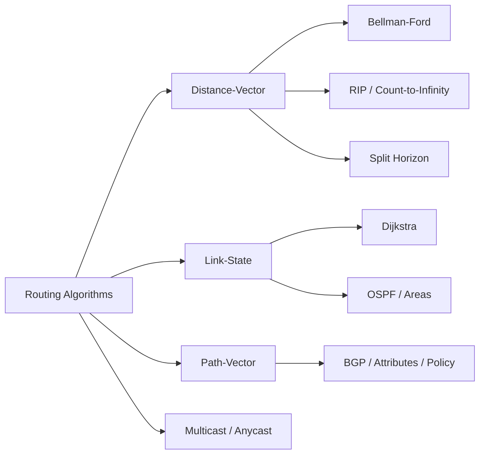

# Chapter 7: Routing

> **Prerequisites:** [Chapter 6: Network Layer](./06-network-layer.md) — IP addressing and forwarding | **Next:** [Chapter 8: Transport Layer](./08-transport-layer.md) — From routing to end-to-end delivery

## Learning Objectives

1. Distinguish between distance-vector and link-state routing algorithms.
2. Analyze the RIP protocol and its limitations due to count-to-infinity.
3. Describe OSPF operation including area hierarchy and link-state database synchronization.
4. Explain BGP path attributes and the policy-driven nature of inter-domain routing.
5. Compare unicast, multicast, and anycast routing paradigms.

---

### Chapter at a Glance

| Topic | Key Insight | Practical Takeaway |
|-------|-------------|-------------------|
| Distance-Vector | Exchange tables with neighbors, Bellman-Ford | Simple but slow convergence (count-to-infinity) |
| Link-State | Global topology via LSP flooding, Dijkstra | Fast convergence, higher CPU/memory cost |
| OSPF | Hierarchical areas, DR/BDR election | Area 0 backbone; ABRs isolate failure domains |
| BGP | Path-vector with policy attributes | Internet routing is driven by business relationships, not metrics |
| Multicast/Anycast | Group delivery and nearest-server routing | Anycast enables DNS/CDN load distribution |

### Chapter Roadmap

## 7.1 Routing Fundamentals

Routing determines the path a packet takes from source to destination through a network of routers. An ideal routing algorithm produces correct, simple, robust, stable, fair, and optimal paths. In practice, trade-offs exist among these properties.

The two fundamental classes of routing algorithms are:

- **Global (link-state):** every router knows the complete network topology and computes shortest paths independently.
- **Decentralized (distance-vector):** routers know only their neighbors and iteratively exchange distance estimates.

## 7.2 Distance-Vector Routing

### 7.2.1 The Bellman-Ford Algorithm

In distance-vector routing, each router maintains a table of (destination, distance, next_hop) triples. Periodically (every 30 seconds in RIP), the router sends its entire table to neighbors. Upon receiving a neighbor's table, the router updates its own entries using the Bellman-Ford equation:

$$D_x(y) = \min_{v \in N(x)} \{ c(x, v) + D_v(y) \}$$

where $D_x(y)$ is the distance from router $x$ to destination $y$, $c(x,v)$ is the cost of the link from $x$ to neighbor $v$, and $N(x)$ is the set of $x$'s neighbors.

Convergence occurs when no router's table changes — typically within a few exchange intervals.

### 7.2.2 Count-to-Infinity Problem

When a link fails, distance-vector protocols may converge slowly. Consider three routers A—B—C, each with distance 1 to its direct neighbor. If the A—B link fails, B sets its distance to A as infinity. Before B broadcasts this update, C advertises a path to A via B with cost 2. B now believes it can reach A via C with cost 3, creating a routing loop. After each exchange cycle, the cost increases by 1 until reaching infinity (16 in RIP). This is the count-to-infinity problem.

Mitigations:

- **Split horizon:** a router does not advertise a route back on the interface from which it was learned.
- **Split horizon with poison reverse:** the router advertises the route back with distance infinity.
- **Hold-down timers:** after receiving a route update indicating an unreachable destination, the router ignores better news for a period (typically 180 seconds).

### 7.2.3 RIP

Routing Information Protocol (RIP, RFC 1058) is a distance-vector protocol using hop count as the metric (maximum 15 hops; 16 = infinity). RIP sends complete routing tables every 30 seconds. Version 2 adds subnet mask support and authentication. RIP is simple but scales poorly — it converges slowly and is limited to small networks.

> **Pro Tip:** As a network engineer, you will rarely configure RIP outside of a certification lab. However, understanding count-to-infinity and split horizon is essential because the same convergence pathologies appear in BGP and some overlay routing protocols.

## 7.3 Link-State Routing

### 7.3.1 Dijkstra's Algorithm

Link-state routing uses Dijkstra's algorithm to compute shortest paths. Each router:

1. Discovers neighbors and measures link costs (e.g., Hello protocol).
2. Constructs a link-state packet (LSP) containing the router's identity, list of neighbors with costs, and a sequence number.
3. Floods the LSP to all routers (reliable flooding with acknowledgment).
4. Computes shortest paths using Dijkstra's algorithm, producing the forwarding table.

Dijkstra's algorithm maintains a set of nodes $N'$ whose shortest path is known. Initially, $N'$ contains only the source $u$. For each node $v$ not in $N'$, $D(v) = c(u,v)$. The algorithm iteratively selects the node $w$ with minimum $D(w)$, adds it to $N'$, and updates distances to $w$'s neighbors:

$$D(v) = \min(D(v), D(w) + c(w,v))$$

The algorithm terminates when $N'$ contains all nodes; the result is the shortest-path tree rooted at $u$.

### 7.3.2 OSPF

Open Shortest Path First (OSPF, RFC 2328) is the dominant link-state protocol in enterprise and service provider networks. Key features:

**Hierarchical routing.** An OSPF autonomous system is divided into areas. Area 0 (the backbone) connects all other areas. Routers within an area know the area's full topology; routing between areas goes through area border routers (ABRs). This reduces LSP flooding scope and table sizes.

**Link-state database synchronization.** OSPF routers establish adjacencies by exchanging Hello packets. Designated Routers (DRs) and Backup Designated Routers (BDRs) are elected on multi-access networks to reduce the number of adjacencies from $O(n^2)$ to $O(n)$.

**OSPF packet types:**

| Type | Name | Function |
|------|------|----------|
| 1 | Hello | Neighbor discovery and keepalive |
| 2 | Database Description | Summarizes the LSDB during synchronization |
| 3 | Link State Request | Requests specific LSA |
| 4 | Link State Update | Carries one or more LSAs |
| 5 | Link State Ack | Acknowledges LSA receipt |

**Metric.** OSPF uses a dimensionless cost, typically derived from link bandwidth (cost = $10^8 / \text{bandwidth in bps}$). A 100 Mbps link has cost 1; a 10 Mbps link has cost 10.

## 7.4 Path-Vector Routing

### 7.4.1 BGP

Border Gateway Protocol (BGP, RFC 4271) is the inter-domain routing protocol of the Internet. A BGP speaker exchanges reachability information with its peers using UPDATE messages. Each BGP route includes the destination prefix, path attributes, and the AS_PATH attribute listing the autonomous systems the route traverses.

**BGP path attributes:**

- **AS_PATH**: sequence of AS numbers (loop detection and policy).
- **NEXT_HOP**: the IP address of the next-hop router.
- **LOCAL_PREF**: local preference value (highest wins).
- **MULTI_EXIT_DISC (MED)**: suggestion to an external peer about the preferred entry point.
- **COMMUNITY**: tags for signaling policy (e.g., "do not advertise to peers").

**BGP decision process** (highest priority first):

1. Highest LOCAL_PREF
2. Shortest AS_PATH length
3. Lowest origin type (IGP < EGP < INCOMPLETE)
4. Lowest MED (if same AS)
5. Prefer eBGP over iBGP
6. Lowest IGP cost to NEXT_HOP
7. Oldest route for stability
8. Lowest neighbor router ID

**iBGP vs. eBGP.** eBGP sessions run between routers in different autonomous systems; iBGP sessions run within the same AS. iBGP speakers must be fully meshed or use route reflectors to avoid routing loops, because iBGP does not add the AS number to the AS_PATH.

### 7.4.2 BGP and Policy

Unlike intra-domain protocols that optimize a single metric (hop count, cost), BGP is a policy-driven protocol. An ISP may prefer a path with longer AS_PATH because a customer relationship requires it, or may refuse to transit traffic between two peers. The commercial relationships — transit (provider-customer), peer (settlement-free), and customer-provider — shape the global routing topology.

## 7.5 Hierarchical Routing

The Internet's routing system is inherently hierarchical. An autonomous system (AS) is a network under a single administrative domain. Intra-domain routing (IGPs: RIP, OSPF, IS-IS) operates within an AS; inter-domain routing (EGPs: BGP) operates between ASes. This hierarchy achieves:

- **Scalability:** each AS hides its internal topology.
- **Administrative autonomy:** each AS chooses its own routing policy.
- **Economic relationships:** routing decisions reflect business agreements.

## 7.6 Multicast Routing

Multicast delivers packets to a group of receivers. The multicast group address (Class D in IPv4, FF00::/8 in IPv6) identifies the group. Multicast routing protocols build distribution trees from sources to receivers.

- **DVMRP (Distance Vector Multicast Routing Protocol):** flood-and-prune; periodically floods multicast traffic and prunes branches without group members.
- **PIM (Protocol Independent Multicast):** operates in two modes. PIM Sparse Mode (PIM-SM) uses a rendezvous point (RP) where sources register and receivers join; PIM Dense Mode (PIM-DM) floods and prunes.
- **IGMP (Internet Group Management Protocol):** host-to-router protocol for joining and leaving multicast groups.

## 7.7 Anycast Routing

Anycast delivers a packet to the nearest member of an anycast group. BGP anycast is widely used for DNS root servers and content delivery networks. Multiple servers share the same IP address; BGP advertisements from each server propagate, and other routers forward traffic to the closest advertiser. Anycast provides load distribution and fault tolerance but does not guarantee session persistence (successive packets may reach different servers).

> **Pro Tip:** BGP anycast is a powerful technique for making services fault-tolerant and low-latency — anycast DNS is why `8.8.8.8` works from anywhere on Earth. But it requires careful planning of AS_PATH prepending and community strings to control which servers attract traffic from which regions.

---

### Concept Comparison Table

| Feature | Distance-Vector (RIP) | Link-State (OSPF) | Path-Vector (BGP) |
|---------|---------------------|-------------------|-------------------|
| Topology Knowledge | Neighbors only | Complete network | AS path only |
| Convergence | Slow (minutes) | Fast (seconds) | Slow (policy-dependent) |
| Metric | Hop count (max 15) | Cost (bandwidth-based) | Multiple attributes |
| Scalability | Small networks | Enterprise/DC | Global Internet |
| Loop Prevention | Split horizon, infinity | SPF guarantees | AS_PATH attribute |
| Update Type | Periodic full table | Event-driven LSA | Incremental UPDATE |

### Quick Reference

| Category | Key Points |
|----------|------------|
| **Bellman-Ford** | $D_x(y) = \min\{c(x,v) + D_v(y)\}$ — iterative, distributed |
| **Dijkstra** | $O(N^2)$ or $O(E \log V)$ with heap — global computation |
| **OSPF Areas** | Area 0 backbone; ABR connects areas; ASBR connects to other ASes |
| **BGP Decision** | LOCAL_PREF → AS_PATH → Origin → MED → eBGP/iBGP → IGP cost → Router ID |
| **AS_PATH** | Loop detection + path length; manipulated for traffic engineering |
| **Multicast** | IGMP (host join), PIM-SM (RP-based), PIM-DM (flood-and-prune) |

### Cross-Application Matrix

| Concept | Network Engineering | ISP Operations | Cloud/DC | CDN |
|---------|-------------------|----------------|----------|-----|
| OSPF | Campus/enterprise design | N/A | DC fabric (underlay) | N/A |
| BGP | Multi-homing, peering | Transit policy, route filtering | Direct Connect, VPN | Anycast IP advertisement |
| RIP | Small office only | N/A | N/A | N/A |
| Multicast | Video distribution | IPTV | N/A | N/A |
| Anycast | N/A | DNS root servers | Cloud load balancing | CDN edge servers |

---

### Chapter Quiz

**Q1.** Which routing protocol uses hop count as its metric with a maximum of 15?

- A) OSPF
- B) BGP
- C) RIP
- D) IS-IS

Answer

C) RIP uses hop count, max 15 (16 = infinity).

**Q2.** What prevents routing loops in BGP?

- A) Split horizon
- B) AS_PATH attribute
- C) Dijkstra's algorithm
- D) TTL

Answer

B) BGP checks the AS_PATH — if a router sees its own AS in the path, it rejects the route to prevent loops.

**Q3.** In OSPF, what is the purpose of a Designated Router (DR)?

- A) Route all traffic through one router
- B) Reduce adjacencies from $O(n^2)$ to $O(n)$ on multi-access networks
- C) Connect multiple areas
- D) Compute routes for all other routers

Answer

B) The DR reduces the number of OSPF adjacencies needed on broadcast segments.

**Q4.** Which BGP attribute has the highest priority in route selection?

- A) AS_PATH length
- B) MED
- C) LOCAL_PREF
- D) IGP cost to NEXT_HOP

Answer

C) LOCAL_PREF (highest wins) is evaluated first in the BGP decision process.

---

## Summary

Distance-vector routing exchanges complete tables with neighbors and converges slowly due to count-to-infinity. Link-state routing provides fast convergence through topology flooding and Dijkstra's algorithm. OSPF adds area hierarchy for scalability. BGP uses path-vector principles and policy attributes to govern inter-domain routing. Hierarchical routing, multicast, and anycast extend the basic routing paradigm to meet scalability, group communication, and proximity requirements.

## Exercises

### Review Questions

1. What information does a distance-vector router exchange with its neighbors?
2. How does split horizon prevent count-to-infinity? Give a scenario where it is insufficient.
3. What is the purpose of the designated router in OSPF?
4. List the BGP path attributes and explain the role of AS_PATH.
5. Why does BGP prefer routes with higher LOCAL_PREF over routes with shorter AS_PATH?

### Application Problems

6. Consider the network: A—B (cost 2), B—C (3), A—C (5), C—D (1). Run the Bellman-Ford algorithm from all sources to compute distance tables. Show the table updates after each iteration.
7. The same network uses OSPF. Run Dijkstra's algorithm from A to compute the shortest-path tree. Show the steps and the final forwarding table at A.
8. An ISP has three customers, each advertising a /24 prefix via BGP. The ISP also receives full BGP tables from two upstream providers. Explain how route aggregation might reduce the ISP's RIB size. What prefix length would the ISP advertise to its upstream providers?

### Challenge Problem

9. **Design a routing policy for a multi-homed enterprise.** An organization has two ISP connections: ISP-A (1 Gbps, expensive, reliable) and ISP-B (100 Mbps, cheap, best-effort). The organization has its own AS number. Design the BGP policy: (a) prefer ISP-A for inbound traffic, (b) use ISP-B as backup for outbound traffic, (c) announce a /20 prefix to both ISPs, and (d) accept only the default route (plus specific prefixes for a hosted service). Specify BGP attributes (LOCAL_PREF, AS_PATH prepending, MED, COMMUNITY) and justify each choice. Analyze what happens when ISP-A fails.
