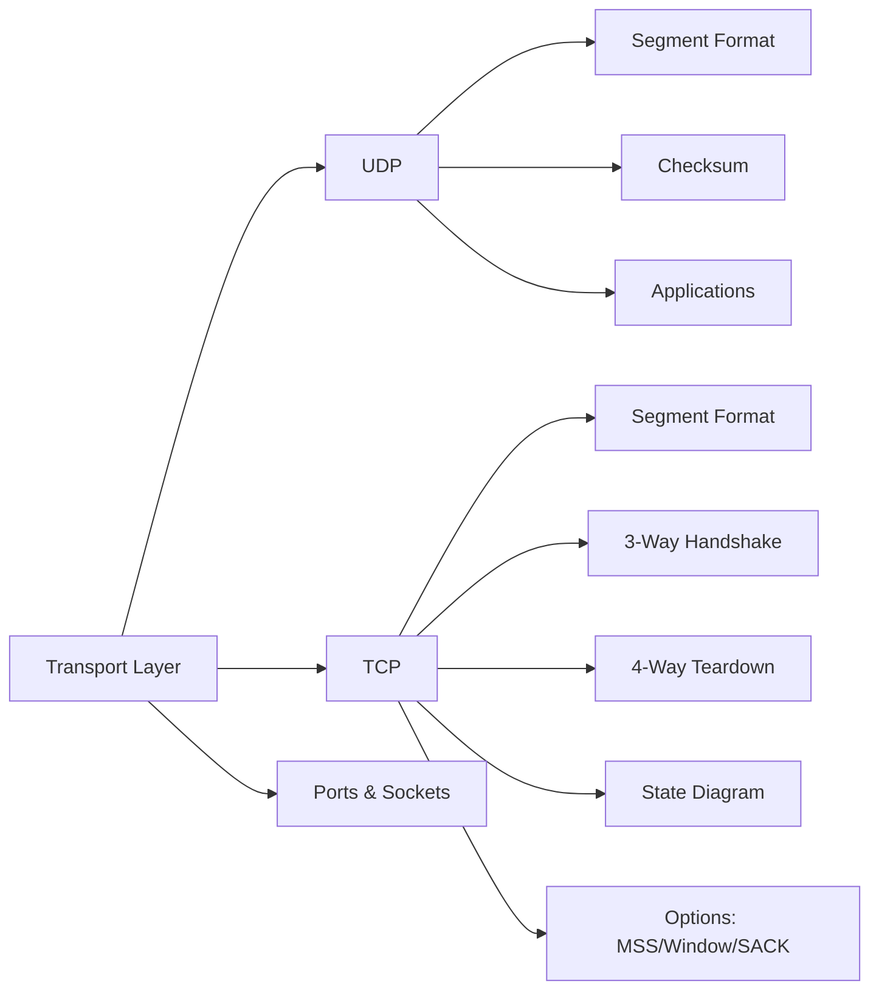

# Chapter 8: The Transport Layer

> **Prerequisites:** [Chapter 7: Routing](./07-routing.md) — Path selection between hosts | **Next:** [Chapter 9: TCP Congestion Control](./09-tcp-congestion.md) — From basic TCP to congestion management

## Learning Objectives

1. Explain the role of the transport layer in providing end-to-end communication between processes.
2. Describe the UDP segment format and compute the UDP checksum.
3. Analyze the TCP segment header fields and their functions.
4. Trace the TCP connection establishment and termination state diagram.
5. Distinguish between port numbers, sockets, and protocol multiplexing.

---

### Chapter at a Glance

| Topic | Key Insight | Practical Takeaway |
|-------|-------------|-------------------|
| UDP | 8-byte header, connectionless, no reliability | Use for DNS, VoIP, streaming — applications handle loss |
| TCP | 20-byte header, connection-oriented, reliable | Three-way handshake establishes; four-way handshake tears down |
| Ports | 16-bit (0-65535): well-known, registered, dynamic | Sockets = (IP, Port) uniquely identify a connection |
| Flow Control | Sliding window prevents receiver overflow | rwnd advertised in every segment |
| State Machine | 11 states from CLOSED to TIME_WAIT | TIME_WAIT (2×MSL) prevents delayed segment confusion |

### Chapter Roadmap



## 8.1 Transport Layer Services


The transport layer provides logical communication between application processes running on different hosts. The network layer provides host-to-host communication; the transport layer extends this to process-to-process communication through multiplexing and demultiplexing.

**Multiplexing** at the sender: the transport layer collects data from multiple application sockets, adds transport-layer headers, and passes the segments to the network layer.

**Demultiplexing** at the receiver: the transport layer receives segments from the network layer, examines header fields (primarily the destination port number), and delivers the data to the correct application socket.

Transport protocols offer two service models:

- **UDP (User Datagram Protocol):** connectionless, unreliable, no flow control.
- **TCP (Transmission Control Protocol):** connection-oriented, reliable, in-order delivery, flow control, congestion control.

## 8.2 UDP

### 8.2.1 UDP Segment Format

The UDP header is 8 bytes:

| Field | Size (bits) | Description |
|-------|-------------|-------------|
| Source Port | 16 | Source application port |
| Destination Port | 16 | Destination application port |
| Length | 16 | UDP segment length (header + data) |
| Checksum | 16 | Optional (mandatory in IPv6) error detection |

The minimum UDP header is 8 bytes; the maximum payload is 65,507 bytes (65,535 minus 20-byte IP header minus 8-byte UDP header).

### 8.2.2 UDP Checksum

The UDP checksum covers the UDP header, data, and a pseudo-header containing the source and destination IP addresses, protocol number, and segment length. The pseudo-header provides protection against misdelivery: if an IP packet is routed to the wrong host, the UDP checksum will detect the mismatch.

The checksum computation: the sender divides the data into 16-bit words, sums them using one's complement arithmetic, complements the result, and stores it. The receiver sums the same data; if the result is all 1-bits (0xFFFF), no error is detected. A checksum of 0 indicates the sender did not compute the checksum (allowed in IPv4 UDP, not in IPv6).

### 8.2.3 UDP Applications

UDP is suitable for:

- DNS lookups (single request-response, no connection overhead)
- VoIP and streaming media (tolerate loss but not delay)
- DHCP (broadcast-based, no prior connection)
- SNMP (simple monitoring queries)
- QUIC (built on UDP with reliability at the application layer)

> **Pro Tip:** Choosing between UDP and TCP is a fundamental design decision. A common mistake is using TCP for latency-sensitive applications (video calls, gaming) when UDP + application-level reliability gives better control over timing. QUIC's rise reflects this insight.

## 8.3 TCP

### 8.3.1 TCP Segment Format

The TCP header is 20 bytes minimum, up to 60 bytes with options:

| Field | Size (bits) | Description |
|-------|-------------|-------------|
| Source Port | 16 | Source application port |
| Destination Port | 16 | Destination application port |
| Sequence Number | 32 | Byte offset of the first data byte in this segment |
| Acknowledgment Number | 32 | Next expected byte (cumulative ACK) |
| Data Offset | 4 | Header length in 32-bit words |
| Reserved | 3 | Reserved for future use |
| Flags | 9 | CWR, ECE, URG, ACK, PSH, RST, SYN, FIN |
| Window Size | 16 | Advertised receive window (bytes) |
| Checksum | 16 | Pseudo-header + segment |
| Urgent Pointer | 16 | Offset to urgent data (if URG flag set) |
| Options | variable | MSS, window scaling, SACK, timestamps, etc. |

### 8.3.2 TCP Connection Management

**Three-way handshake (connection establishment):**

```
Client                          Server
  |  --- SYN (seq=x) -------->  |
  |  <--- SYN+ACK (seq=y, ack=x+1) --- |
  |  --- ACK (seq=x+1, ack=y+1) ->  |
```

1. Client sends SYN segment with initial sequence number $x$.
2. Server responds with SYN+ACK, acknowledging $x+1$ and providing its own initial sequence $y$.
3. Client sends ACK for $y+1$. Connection is established.

The three-way handshake prevents duplicate SYN segments from opening multiple connections and allows both sides to agree on initial sequence numbers.

**Connection termination (four-way handshake):**

```
Client                          Server
  |  --- FIN (seq=u) -------->  |
  |  <--- ACK (ack=u+1) -----   |
  |  <--- FIN (seq=v) --------  |
  |  --- ACK (ack=v+1) ---->   |
```

Each direction is closed independently. After sending FIN, the endpoint enters FIN_WAIT_1, then receives ACK (FIN_WAIT_2), then receives the other FIN (TIME_WAIT), and finally CLOSED. TIME_WAIT lasts for 2 × Maximum Segment Lifetime (MSL, typically 60 seconds) to allow any delayed segments to expire.

### 8.3.3 TCP State Diagram

TCP state transitions:

| State | Description |
|-------|-------------|
| CLOSED | No connection |
| LISTEN | Server waiting for incoming connection |
| SYN_SENT | Client sent SYN, waiting for SYN+ACK |
| SYN_RCVD | Server received SYN, sent SYN+ACK |
| ESTABLISHED | Connection open, data can be exchanged |
| FIN_WAIT_1 | Local application closed; FIN sent |
| FIN_WAIT_2 | Remote ACK received; waiting for remote FIN |
| CLOSE_WAIT | Received FIN; waiting for local close |
| CLOSING | Both FINs sent but ACKs not yet received |
| LAST_ACK | Received ACK for FIN; waiting for final ACK |
| TIME_WAIT | Connection closed; waiting for delayed packets |

### 8.3.4 TCP Options

- **Maximum Segment Size (MSS):** the largest data chunk TCP will send, typically negotiated as MTU minus 40 (e.g., 1460 bytes for Ethernet).
- **Window Scaling:** multiplies the 16-bit window field by a shift factor (0–14), enabling windows up to 1 GB.
- **Selective Acknowledgment (SACK):** allows the receiver to acknowledge non-contiguous blocks of data, reducing retransmissions when multiple packets are lost.
- **Timestamps:** measure RTT accurately and protect against wrapped sequence numbers (PAWS).
- **NOP:** padding to align options on 32-bit boundaries.

## 8.4 Ports and Sockets

TCP and UDP use 16-bit port numbers to identify application processes. Ports 0–1023 are well-known ports reserved for standard services:

| Port | Protocol | Application |
|------|----------|-------------|
| 20, 21 | TCP | FTP |
| 22 | TCP | SSH |
| 25 | TCP | SMTP |
| 53 | TCP/UDP | DNS |
| 80 | TCP | HTTP |
| 110 | TCP | POP3 |
| 143 | TCP | IMAP |
| 443 | TCP | HTTPS |
| 993 | TCP | IMAPS |
| 3389 | TCP | RDP |

Ports 1024–49151 are registered ports; ports 49152–65535 are dynamic/private ports used for client-side ephemeral port allocation.

A **socket** is the interface between the application and the transport layer. A TCP socket is uniquely identified by a 4-tuple: (source IP, source port, destination IP, destination port). This tuple allows a TCP stack to multiplex connections even when multiple clients connect to the same server port.

## 8.5 Comparison: UDP vs. TCP

| Property | UDP | TCP |
|----------|-----|-----|
| Connection | Connectionless | Connection-oriented |
| Reliability | Unreliable | Reliable (ACK + retransmission) |
| Ordering | Unordered | In-order delivery |
| Flow control | None | Sliding window |
| Congestion control | None | AIMD/CC algorithms |
| Header size | 8 bytes | 20–60 bytes |
| Broadcast support | Yes | No |

---

### Concept Comparison Table

| Feature | UDP | TCP |
|---------|-----|-----|
| Connection | Connectionless | Connection-oriented (3-way handshake) |
| Reliability | Unreliable (no ACK) | Reliable (ACK + retransmission) |
| Ordering | Unordered | In-order (sequence number) |
| Flow Control | None | Sliding window (rwnd) |
| Congestion Control | None | AIMD, slow start, fast recovery |
| Header | 8 bytes fixed | 20-60 bytes (options) |
| Use Cases | DNS, VoIP, streaming, DHCP, QUIC | HTTP, SMTP, SSH, FTP |

### Quick Reference

| Category | Key Points |
|----------|------------|
| **UDP Header** | SrcPort(16) + DstPort(16) + Length(16) + Checksum(16) = 64 bits |
| **TCP Header** | SrcPort(16) + DstPort(16) + SeqNum(32) + AckNum(32) + Offset(4) + Flags(9) + Window(16) + Checksum(16) + Urgent(16) |
| **TCP Flags** | SYN (establish), ACK (acknowledge), FIN (close), RST (reset), PSH (push), URG (urgent) |
| **Connection** | Establish: SYN → SYN+ACK → ACK; Terminate: FIN → ACK → FIN → ACK |
| **Port Ranges** | Well-known (0-1023), Registered (1024-49151), Dynamic (49152-65535) |
| **Socket** | 4-tuple: (src_ip, src_port, dst_ip, dst_port) — uniquely identifies a TCP connection |
| **TIME_WAIT** | 2 × MSL (typically 60-120s) — ensures delayed segments don't corrupt new connections |

### Cross-Application Matrix

| Concept | Backend Dev | Network Admin | Security | Protocols |
|---------|-------------|--------------|----------|-----------|
| UDP | DNS resolution, game networking | Monitoring (SNMP) | UDP flood mitigation | NTP, DHCP, DNS |
| TCP | HTTP/REST APIs, database connections | Traffic engineering | SYN flood protection, session hijacking | HTTP, SMTP, SSH |
| Ports | Service binding, container port mapping | ACL/firewall rules | Port scanning detection | Service discovery |
| Sockets | Socket API programming (socket(), bind(), listen()) | netstat/ss diagnostics | Socket manipulation attacks | Protocol implementation |

---

### Chapter Quiz

**Q1.** How many bytes is the fixed TCP header?

- A) 8 bytes
- B) 16 bytes
- C) 20 bytes
- D) 60 bytes

<details>
<summary>Answer</summary>
C) 20 bytes — up to 60 with options (Data Offset field specifies in 32-bit words).
</details>

**Q2.** What is the purpose of the three-way handshake's third ACK?

- A) Authenticate the client
- B) Confirm the client received the server's SYN
- C) Negotiate window size
- D) Begin data transfer

<details>
<summary>Answer</summary>
B) The third ACK confirms the client received the server's SYN+ACK, completing bidirectional agreement on sequence numbers.
</details>

**Q3.** Why does TIME_WAIT last 2× MSL?

- A) To allow retransmission of lost FIN
- B) To ensure delayed segments expire before a new connection uses the same tuple
- C) To wait for application cleanup
- D) To synchronize with the server

<details>
<summary>Answer</summary>
B) 2× MSL guarantees any segments still in flight will expire before the socket tuple can be reused.
</details>

**Q4.** Which protocol is built on UDP but provides its own reliability?

- A) TCP
- B) QUIC
- C) FTP
- D) SMTP

<details>
<summary>Answer</summary>
B) QUIC runs over UDP and implements reliability, encryption, and multiplexing in the application/transport layer.
</details>

---

## Summary

The transport layer provides process-to-process communication through multiplexing and demultiplexing. UDP offers lightweight, connectionless transport with minimal overhead, suitable for loss-tolerant and delay-sensitive applications. TCP provides reliable, in-order, connection-oriented delivery through sequence numbers, cumulative acknowledgments, retransmission, and flow control. The three-way handshake establishes connections; each direction closes independently via FIN segments. Port numbers identify application processes; sockets bind ports to endpoints.

## Exercises

### Review Questions

1. Why does the UDP checksum include a pseudo-header with IP addresses?
2. What is the purpose of the three-way handshake?
3. Why does TCP use cumulative acknowledgments rather than individual segment acknowledgments?
4. What is the TIME_WAIT state, and why is it necessary?
5. How does window scaling allow TCP to exceed the 65,535-byte advertised window?

### Application Problems

6. A UDP datagram has a 12-byte pseudo-header (IPv4 addresses, protocol, UDP length), an 8-byte UDP header, and 100 bytes of data. Show the checksum computation for this datagram.
7. TCP initial sequence numbers are chosen randomly. Explain why. Then compute the time it takes to wrap the 32-bit sequence number space on a 10 Gbps link.
8. A client connects to a server. Draw the complete TCP state diagram for both client and server through connection establishment, data transfer (send 3 segments), and connection termination.

### Challenge Problem

9. **Design a transport protocol for deep-space communication.** Interplanetary links have a one-way propagation delay of 5–20 minutes and a bit error rate of $10^{-4}$. Traditional TCP performs poorly under these conditions. Design a transport protocol that: (a) achieves at least 50% utilization despite the delay, (b) handles high error rates efficiently, and (c) provides reliable, in-order delivery. Specify your protocol's header format, acknowledgment mechanism, error recovery, and flow control. Compute the window size needed to achieve 50% utilization on a 1 Mbps link with 10-minute RTT.
