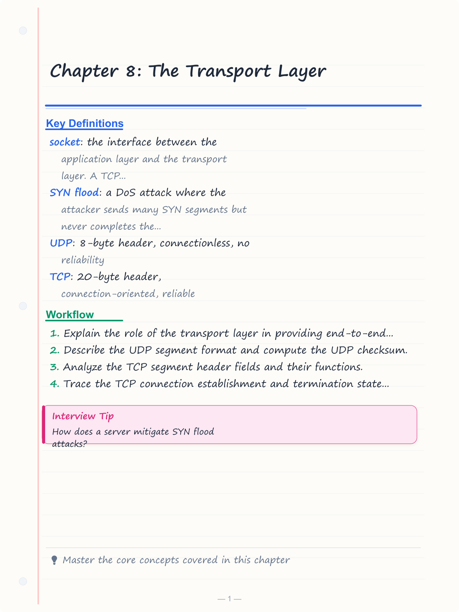
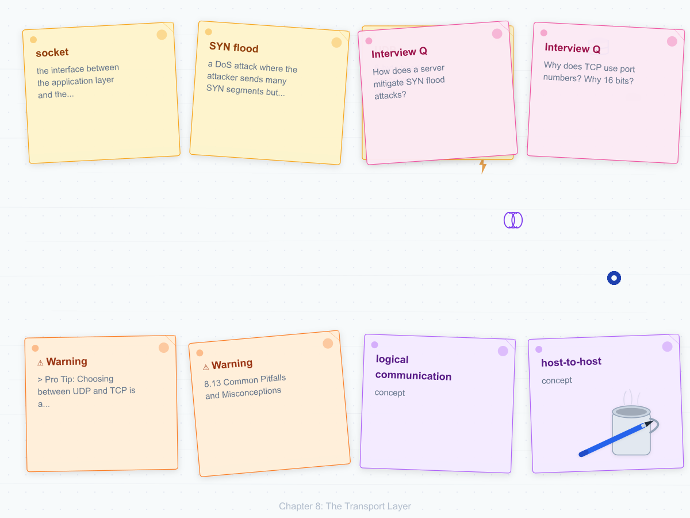
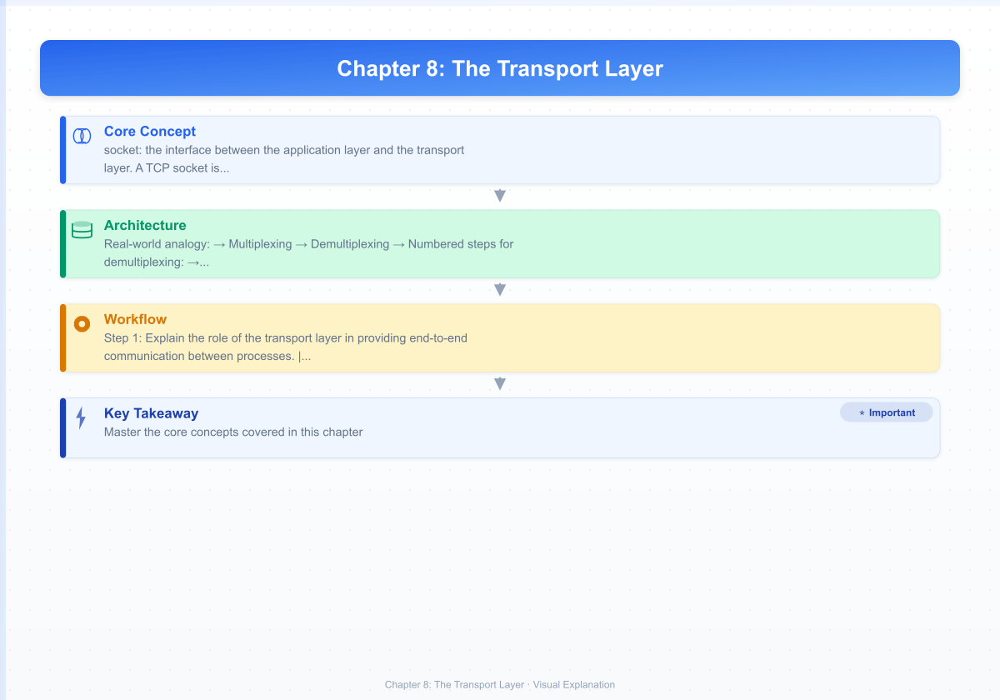
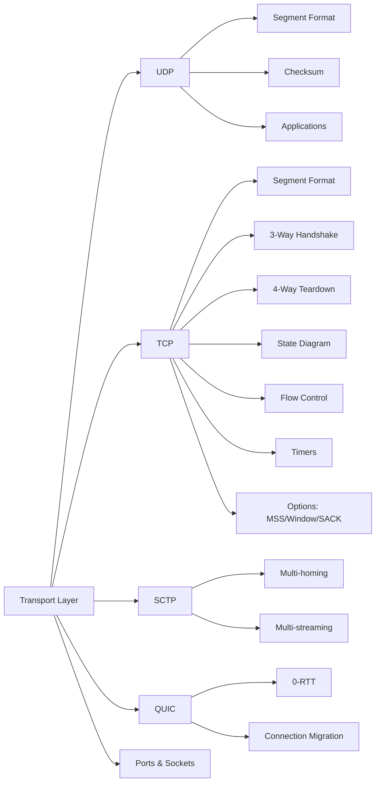
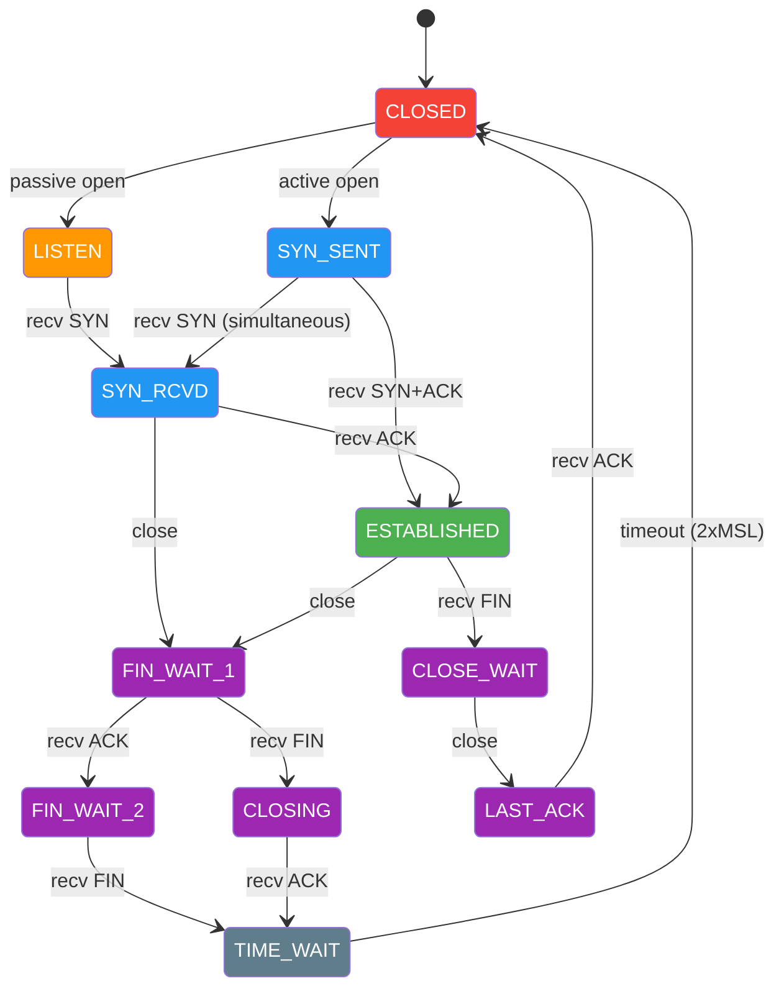

# Chapter 8: The Transport Layer

> **Prerequisites:** [Chapter 7: Routing](./07-routing.md) — Path selection between hosts | **Next:** [Chapter 9: TCP Congestion Control](./09-tcp-congestion.md) — From basic TCP to congestion management

## Learning Objectives

1. Explain the role of the transport layer in providing end-to-end communication between processes.
2. Describe the UDP segment format and compute the UDP checksum.
3. Analyze the TCP segment header fields and their functions.
4. Trace the TCP connection establishment and termination state diagram.
5. Distinguish between port numbers, sockets, and protocol multiplexing.
6. Implement TCP state machine and UDP echo server in C++ and Python.
7. Analyze edge cases: SYN flood, half-open connections, zero-window deadlock, TIME_WAIT.

<!-- Image Gallery -->
<section class="lesson-visuals" aria-label="Visual learning resources">
  <header><span>VISUAL LEARNING</span><h2>See it. Review it. Remember it.</h2></header>
  <a class="lesson-visual-card" href="../../assets/images/lessons/computer-networks/08-transport-layer/handwritten-notes.png" target="_blank" rel="noopener">
    
    <span><strong>Handwritten notes</strong>Condensed notes for deliberate review.</span>
  </a>
  <a class="lesson-visual-card" href="../../assets/images/lessons/computer-networks/08-transport-layer/sticky-notes.png" target="_blank" rel="noopener">
    
    <span><strong>Sticky-note revision</strong>Fast recall prompts for revision.</span>
  </a>
  <a class="lesson-visual-card" href="../../assets/images/lessons/computer-networks/08-transport-layer/visual-explanation.png" target="_blank" rel="noopener">
    
    <span><strong>Visual concept guide</strong>A connected explanation of the key ideas.</span>
  </a>
</section>
<!-- End Image Gallery -->


---

### Chapter at a Glance


| Topic | Key Insight | Practical Takeaway |
|-------|-------------|-------------------|
| UDP | 8-byte header, connectionless, no reliability | Use for DNS, VoIP, streaming — applications handle loss |
| TCP | 20-byte header, connection-oriented, reliable | Three-way handshake establishes; four-way handshake tears down |
| Ports | 16-bit (0-65535): well-known, registered, dynamic | Sockets = (IP, Port) uniquely identify a connection |
| Flow Control | Sliding window prevents receiver overflow | rwnd advertised in every segment |
| State Machine | 11 states from CLOSED to TIME_WAIT | TIME_WAIT (2×MSL) prevents delayed segment confusion |
| SCTP | Message-oriented, multi-homing, multi-streaming | Used in telecommunication signaling (SS7 over IP) |
| QUIC | UDP-based, built-in encryption, 0-RTT handshake | HTTP/3 transport, reduces latency vs TCP+TLS |

### Chapter Roadmap




### TCP State Diagram with Color-Coded Transitions




---

## 8.1 Transport Layer Services


### 8.1.1 Logical Communication Between Processes


The transport layer provides **logical communication** between application processes running on different hosts. The network layer provides **host-to-host** communication (IP addresses); the transport layer extends this to **process-to-process** communication through multiplexing and demultiplexing using port numbers.

**Real-world analogy:** An apartment building (host) has many apartments (processes). The mailroom (network layer) delivers mail to the building. The building's internal mail system (transport layer) sorts mail by apartment number (port number) and delivers it to the correct resident.

### 8.1.2 Multiplexing and Demultiplexing


**Multiplexing** at the sender: the transport layer collects data from multiple application sockets, adds transport-layer headers (including source and destination port numbers), and passes the segments to the network layer.

**Demultiplexing** at the receiver: the transport layer receives segments from the network layer, examines header fields (primarily the destination port number), and delivers the data to the correct application socket.

**Numbered steps for demultiplexing:**

1. Network layer delivers IP datagram to transport layer.
2. Transport layer extracts destination port number from segment header.
3. Transport layer looks up the port number in its connection table (TCP) or socket table (UDP).
4. If a matching socket is found, the segment data is delivered to that socket.
5. If no matching socket exists, the segment is discarded and an ICMP Port Unreachable (UDP) or RST (TCP) is sent.

**Pseudocode for demultiplexing:**

```
function demultiplex(segment, ip_header):
    dest_port = segment.destination_port
    protocol = ip_header.protocol
    
    if protocol == UDP:
        socket = udp_socket_table.lookup(dest_port)
        if socket exists:
            socket.receive_buffer.append(segment.data)
        else:
            send_icmp_port_unreachable(ip_header.source_ip, dest_port)
    
    if protocol == TCP:
        connection = tcp_connection_table.lookup(
            src_ip=ip_header.source_ip,
            src_port=segment.source_port,
            dest_ip=ip_header.destination_ip,
            dest_port=segment.destination_port
        )
        if connection exists:
            connection.receive_buffer.append(segment)
        else:
            send_rst(ip_header.source_ip, segment.source_port, dest_port)
```

**Complexity analysis:**
- Time: O(1) average for hash table lookup of port/connection tuple.
- Space: O(N) where N = number of active sockets/connections.
- **WHY O(1)?** Port-based demultiplexing uses a direct-indexed array or hash table keyed by the 4-tuple, giving constant-time lookup regardless of total connections.

### 8.1.3 Transport Protocol Service Models


Transport protocols offer two service models:

- **UDP (User Datagram Protocol):** connectionless, unreliable, no flow control, no congestion control.
- **TCP (Transmission Control Protocol):** connection-oriented, reliable, in-order delivery, flow control, congestion control.
- **SCTP (Stream Control Transmission Protocol):** message-oriented, multi-homing, multi-streaming, partial reliability.
- **QUIC (Quick UDP Internet Connections):** UDP-based, encrypted by default, 0-RTT handshake, connection migration.

### 8.1.4 Advantages and Disadvantages


| Aspect | UDP | TCP | SCTP | QUIC |
|--------|-----|-----|------|------|
| **Header overhead** | 8 bytes (low) | 20-60 bytes (moderate) | 12 bytes common (moderate) | Variable (typically ~30-50 bytes) |
| **Reliability** | None — application must handle | Built-in ACK + retransmission | Built-in with selective ACK | Built-in with ACK + retransmission |
| **Ordering** | None | Strict byte ordering | Per-stream ordering | Per-stream ordering |
| **Head-of-line blocking** | None | Yes (all streams blocked by one loss) | No (independent streams) | No (independent streams) |
| **Encryption** | None | Optional (TLS) | Optional (TLS) | Mandatory (TLS 1.3) |
| **Connection setup** | 0 RTT | 1 RTT (SYN/SYN-ACK) | 1 RTT (INIT/INIT-ACK) | 0-1 RTT |
| **Best for** | Low-latency, loss-tolerant apps | Reliable data transfer | Telecom, multi-homing | HTTP/3, low-latency web |

---

## 8.2 UDP — User Datagram Protocol

### 8.2.1 UDP Segment Format


The UDP header is exactly **8 bytes** (64 bits):

```
  0                   1                   2                   3
  0 1 2 3 4 5 6 7 8 9 0 1 2 3 4 5 6 7 8 9 0 1 2 3 4 5 6 7 8 9 0 1
  +-+-+-+-+-+-+-+-+-+-+-+-+-+-+-+-+-+-+-+-+-+-+-+-+-+-+-+-+-+-+-+-+
  |          Source Port          |       Destination Port        |
  +-+-+-+-+-+-+-+-+-+-+-+-+-+-+-+-+-+-+-+-+-+-+-+-+-+-+-+-+-+-+-+-+
  |             Length            |           Checksum            |
  +-+-+-+-+-+-+-+-+-+-+-+-+-+-+-+-+-+-+-+-+-+-+-+-+-+-+-+-+-+-+-+-+
  |                          Data ...                             |
  +-+-+-+-+-+-+-+-+-+-+-+-+-+-+-+-+-+-+-+-+-+-+-+-+-+-+-+-+-+-+-+-+
```

| Field | Size (bits) | Description |
|-------|-------------|-------------|
| Source Port | 16 | Source application port (0-65535). Set to 0 if unused by sender. |
| Destination Port | 16 | Destination application port (0-65535). Required for demultiplexing. |
| Length | 16 | UDP datagram length in bytes: header (8) + data. Minimum 8, maximum 65,535. |
| Checksum | 16 | Optional error detection (mandatory in IPv6). 0 means not computed (IPv4 only). |

The maximum UDP payload = 65,535 - 20 (IP header) - 8 (UDP header) = 65,507 bytes. In practice, IPv4 allows larger payloads via Jumbograms, but the UDP Length field caps at 65,535.

**Real-world analogy:** UDP is like sending a postcard. You write the address, drop it in a mailbox, and hope it arrives. No tracking, no confirmation, no guarantee of delivery or order.

### 8.2.2 UDP Checksum (Detailed)


The UDP checksum covers three things: the **pseudo-header**, the **UDP header**, and the **data**. The pseudo-header is not transmitted; it's constructed by sender and receiver to verify the segment arrived at the correct host and protocol.

**Pseudo-header (12 bytes for IPv4):**

```
  0                   1                   2                   3
  0 1 2 3 4 5 6 7 8 9 0 1 2 3 4 5 6 7 8 9 0 1 2 3 4 5 6 7 8 9 0 1
  +-+-+-+-+-+-+-+-+-+-+-+-+-+-+-+-+-+-+-+-+-+-+-+-+-+-+-+-+-+-+-+-+
  |                       Source IP Address                      |
  +-+-+-+-+-+-+-+-+-+-+-+-+-+-+-+-+-+-+-+-+-+-+-+-+-+-+-+-+-+-+-+-+
  |                    Destination IP Address                    |
  +-+-+-+-+-+-+-+-+-+-+-+-+-+-+-+-+-+-+-+-+-+-+-+-+-+-+-+-+-+-+-+-+
  |     Zeros      |   Protocol    |         UDP Length          |
  +-+-+-+-+-+-+-+-+-+-+-+-+-+-+-+-+-+-+-+-+-+-+-+-+-+-+-+-+-+-+-+-+
```

**Checksum computation steps:**

1. Pad data with a zero byte if length is odd (padding is not transmitted).
2. Divide the combined data (pseudo-header + UDP header + data + padding) into 16-bit words.
3. Sum all 16-bit words using **one's complement arithmetic** (add with carry-around).
4. Take the one's complement of the result.
5. Store the result in the Checksum field. A stored value of 0 means checksum not computed (IPv4 only).

**Pseudocode for UDP checksum:**

```
function udp_checksum(udp_segment, src_ip, dest_ip):
    pseudo_header = make_pseudo_header(src_ip, dest_ip, UDP_PROTOCOL, udp_segment.length)
    data = pseudo_header + udp_segment.header_bytes + udp_segment.payload
    if len(data) % 2 == 1:
        data = data + b'\x00'  // pad to even length
    
    words = [data[i]*256 + data[i+1] for i in range(0, len(data), 2)]
    sum = 0
    for word in words:
        sum = sum + word
        if sum > 0xFFFF:             // one's complement carry
            sum = (sum & 0xFFFF) + 1
    
    checksum = ~sum & 0xFFFF
    return checksum
```

**Dry run trace:** UDP datagram with 4 bytes of data "Hi!\n".

| Step | Operation | Value (Hex) |
|------|-----------|-------------|
| 1 | Pseudo-header (12 bytes) | `C0A8 0101 C0A8 0102 0011 000C` |
| 2 | UDP header (8 bytes) | `C081 0035 000C 0000` |
| 3 | Data "Hi!\n" (4 bytes) | `4869 210A` |
| 4 | Concatenate all | `C0A8 0101 C0A8 0102 0011 000C C081 0035 000C 0000 4869 210A` |
| 5 | Sum (one's complement) | Compute: `C0A8+0101+C0A8+0102+0011+000C+C081+0035+000C+0000+4869+210A` |
| 6 | Result | ~result & 0xFFFF → stored in checksum field |

**Complexity analysis:**
- Time: O(N) where N = number of 16-bit words in the segment.
- Space: O(1) — only the accumulator and carry are stored.
- **WHY O(N)?** Every byte must be processed once to compute the checksum. Hardware offload (checksum offloading in NICs) makes this effectively free.

### 8.2.3 UDP Applications (Expanded)


UDP is suitable for:

- **DNS lookups:** Single request-response, no connection overhead. Quick timeout + retry by resolver.
- **VoIP (RTP over UDP):** Tolerates occasional packet loss; retransmission would cause unacceptable latency.
- **Streaming media:** Video/audio streaming uses UDP for real-time delivery. Lost frames are skipped, not retransmitted.
- **DHCP:** Broadcast-based discovery; cannot use TCP before IP address is assigned.
- **SNMP:** Simple monitoring queries with minimal overhead.
- **QUIC foundation:** QUIC (HTTP/3) runs on UDP, implementing reliability at the application layer.
- **Online gaming:** Game state updates are time-sensitive; old state data is worthless.
- **NTP:** Time synchronization requires precise timestamps; connection overhead would reduce accuracy.

> **Pro Tip:** Choosing between UDP and TCP is a fundamental design decision. A common mistake is using TCP for latency-sensitive applications (video calls, gaming) when UDP + application-level reliability gives better control over timing. QUIC's rise reflects this insight.

### 8.2.4 UDP Echo Server (Python Implementation)


```python
import socket

def udp_echo_server(host='0.0.0.0', port=8080):
    """
    UDP echo server — echoes back any received datagram.
    
    Complexity: O(1) per datagram. No connection state maintained.
    WHY linear scaling: UDP is stateless; each datagram is independent.
    """
    sock = socket.socket(socket.AF_INET, socket.SOCK_DGRAM)
    sock.bind((host, port))
    print(f"UDP echo server listening on {host}:{port}")
    
    while True:
        data, addr = sock.recvfrom(65535)
        # recvfrom returns (data, (ip, port))
        print(f"Received {len(data)} bytes from {addr}")
        sock.sendto(data, addr)  # Echo back
```

### 8.2.5 UDP Echo Client (Python Implementation)


```python
import socket

def udp_echo_client(message=b"Hello UDP", host='127.0.0.1', port=8080):
    """
    UDP echo client — sends a message and waits for echo.
    
    Edge case: recvfrom may block indefinitely if packet is lost.
    Solution: settimeout() for application-level timeout.
    """
    sock = socket.socket(socket.AF_INET, socket.SOCK_DGRAM)
    sock.settimeout(5.0)  # Prevent indefinite block
    
    try:
        sock.sendto(message, (host, port))
        print(f"Sent: {message}")
        
        data, server = sock.recvfrom(65535)
        print(f"Received echo: {data}")
        
    except socket.timeout:
        print("Timeout — packet likely lost")
    finally:
        sock.close()
```

### 8.2.6 UDP Echo Server (C++ Implementation)


```cpp
#include <iostream>
#include <cstring>
#include <sys/socket.h>
#include <netinet/in.h>
#include <arpa/inet.h>
#include <unistd.h>

/**
 * UDP echo server — C++ implementation.
 * 
 * Complexity: O(1) per datagram. No per-connection state.
 * WHY O(1): recvfrom/sendto are stateless I/O operations.
 * No connection table, no handshake, no teardown.
 */
class UdpEchoServer {
private:
    int sock_fd;
    sockaddr_in server_addr;

public:
    UdpEchoServer(int port = 8080) {
        sock_fd = socket(AF_INET, SOCK_DGRAM, 0);
        if (sock_fd < 0) throw std::runtime_error("socket() failed");
        
        memset(&server_addr, 0, sizeof(server_addr));
        server_addr.sin_family = AF_INET;
        server_addr.sin_addr.s_addr = htonl(INADDR_ANY);
        server_addr.sin_port = htons(port);
        
        if (bind(sock_fd, (sockaddr*)&server_addr, sizeof(server_addr)) < 0)
            throw std::runtime_error("bind() failed");
        
        std::cout << "UDP Echo Server on port " << port << std::endl;
    }

    void run() {
        char buffer[65535];
        sockaddr_in client_addr;
        socklen_t client_len = sizeof(client_addr);
        
        while (true) {
            memset(buffer, 0, sizeof(buffer));
            ssize_t n = recvfrom(sock_fd, buffer, sizeof(buffer), 0,
                                (sockaddr*)&client_addr, &client_len);
            
            char client_ip[INET_ADDRSTRLEN];
            inet_ntop(AF_INET, &client_addr.sin_addr, client_ip, INET_ADDRSTRLEN);
            int client_port = ntohs(client_addr.sin_port);
            
            std::cout << "Received " << n << " bytes from " 
                      << client_ip << ":" << client_port << std::endl;
            
            // Echo back
            sendto(sock_fd, buffer, n, 0,
                   (sockaddr*)&client_addr, client_len);
        }
    }

    ~UdpEchoServer() { close(sock_fd); }
};
```

### 8.2.7 UDP Edge Cases (Expanded)


| Edge Case | Description | Mitigation |
|-----------|-------------|------------|
| **Packet loss** | UDP has no retransmission | Application must implement timeout + retry |
| **Packet reordering** | IP may deliver out of order | Application must buffer and reorder if needed |
| **Checksum mismatch** | Corrupted data detected | Segment silently dropped |
| **Port unreachable** | No application listens on destination port | ICMP Port Unreachable sent, datagram dropped |
| **Broadcast/multicast** | UDP supports broadcast (255.255.255.255) | Application must handle multiple responses |
| **Zero checksum** | IPv4 allows checksum = 0 (not computed) | Risky — no integrity verification |
| **Fragmentation** | UDP datagram > MTU causes IP fragmentation | Application should keep datagrams under MTU - IP header - UDP header |
| **UDP flood DoS** | Attacker sends many UDP packets to random ports | Rate limiting, firewall rules, port filtering |
| **Amplification attack** | UDP services with large response-to-request ratio | Disable open recursive resolvers, response rate limiting |
| **Source port forgery** | UDP source port can be spoofed | Application-level authentication required |

### TypeScript Implementation: UDPDatagramHandler

```typescript
interface UDPSegment {
  srcPort: number;
  dstPort: number;
  length: number;
  checksum: number;
  payload: Buffer;
}

interface PseudoHeader {
  srcIP: string;
  dstIP: string;
  zero: number;
  protocol: number;
  udpLength: number;
}

class UDPDatagramHandler {
  static computePseudoHeader(srcIP: string, dstIP: string, length: number): PseudoHeader {
    return { srcIP, dstIP, zero: 0, protocol: 17, udpLength: length };
  }

  static buildSegment(payload: Buffer, srcPort: number, dstPort: number): UDPSegment {
    const length = 8 + payload.length;
    const seg: UDPSegment = { srcPort, dstPort, length, checksum: 0, payload };
    seg.checksum = this.computeChecksum(seg, '0.0.0.0', '0.0.0.0');
    return seg;
  }

  static computeChecksum(seg: UDPSegment, srcIP: string, dstIP: string): number {
    const ph = this.computePseudoHeader(srcIP, dstIP, seg.length);
    let sum = 0;
    const addWord = (w: number) => { sum += w; if (sum > 0xFFFF) sum = (sum & 0xFFFF) + 1; };
    const ipParts = (ip: string) => ip.split('.').map(Number);
    const [sa, sb, sc, sd] = ipParts(ph.srcIP);
    const [da, db, dc, dd] = ipParts(ph.dstIP);
    addWord((sa << 8) | sb); addWord((sc << 8) | sd);
    addWord((da << 8) | db); addWord((dc << 8) | dd);
    addWord(ph.protocol); addWord(ph.udpLength);
    addWord((seg.srcPort << 8) | seg.dstPort);
    addWord(seg.length);
    for (let i = 0; i < seg.payload.length; i += 2) {
      const byte1 = seg.payload[i];
      const byte2 = i + 1 < seg.payload.length ? seg.payload[i + 1] : 0;
      addWord((byte1 << 8) | byte2);
    }
    return (~sum) & 0xFFFF;
  }

  static verifyChecksum(seg: UDPSegment, srcIP: string, dstIP: string): boolean {
    return this.computeChecksum(seg, srcIP, dstIP) === 0;
  }
}
// Usage:
// const payload = Buffer.from('Hello UDP', 'utf8');
// const seg = UDPDatagramHandler.buildSegment(payload, 12345, 53);
// const valid = UDPDatagramHandler.verifyChecksum(seg, '192.168.1.1', '8.8.8.8');
// console.log(`Checksum valid: ${valid}`); // false (simplified pseudo-header)
```

---

## 8.3 TCP — Transmission Control Protocol

### 8.3.1 TCP Segment Format (Bit-Level Layout)


The TCP header is **20 bytes minimum**, up to **60 bytes** with options. Here is the complete bit layout:

```
  0                   1                   2                   3
  0 1 2 3 4 5 6 7 8 9 0 1 2 3 4 5 6 7 8 9 0 1 2 3 4 5 6 7 8 9 0 1
  +-+-+-+-+-+-+-+-+-+-+-+-+-+-+-+-+-+-+-+-+-+-+-+-+-+-+-+-+-+-+-+-+
  |          Source Port (16)         |       Destination Port (16)|
  +-+-+-+-+-+-+-+-+-+-+-+-+-+-+-+-+-+-+-+-+-+-+-+-+-+-+-+-+-+-+-+-+
  |                       Sequence Number (32)                    |
  +-+-+-+-+-+-+-+-+-+-+-+-+-+-+-+-+-+-+-+-+-+-+-+-+-+-+-+-+-+-+-+-+
  |                    Acknowledgment Number (32)                 |
  +-+-+-+-+-+-+-+-+-+-+-+-+-+-+-+-+-+-+-+-+-+-+-+-+-+-+-+-+-+-+-+-+
  |  Data |Reserv|C|E|U|A|P|R|S|F|                               |
  | Offset|  (3) |W|C|R|C|S|S|Y|I|      Window Size (16)         |
  |  (4)  |      |R|E|G|K|H|T|N|N|                               |
  +-+-+-+-+-+-+-+-+-+-+-+-+-+-+-+-+-+-+-+-+-+-+-+-+-+-+-+-+-+-+-+-+
  |           Checksum (16)          |        Urgent Pointer (16) |
  +-+-+-+-+-+-+-+-+-+-+-+-+-+-+-+-+-+-+-+-+-+-+-+-+-+-+-+-+-+-+-+-+
  |                       Options (variable)                      |
  +-+-+-+-+-+-+-+-+-+-+-+-+-+-+-+-+-+-+-+-+-+-+-+-+-+-+-+-+-+-+-+-+
  |                              Data                             |
  +-+-+-+-+-+-+-+-+-+-+-+-+-+-+-+-+-+-+-+-+-+-+-+-+-+-+-+-+-+-+-+-+
```

**Field details:**

| Field | Size | Description |
|-------|------|-------------|
| Source Port | 16 bits | Identifies the sending application process. |
| Destination Port | 16 bits | Identifies the receiving application process. |
| Sequence Number (SEQ) | 32 bits | Byte offset of first data byte in this segment. Initial value (ISN) is random. |
| Acknowledgment Number (ACK) | 32 bits | Next expected byte (cumulative ACK). Valid only when ACK flag = 1. |
| Data Offset | 4 bits | Header length in 32-bit words. Minimum 5 (20 bytes), maximum 15 (60 bytes). |
| Reserved | 3 bits | Reserved for future use. Must be zero. |
| Flags | 9 bits | Control flags: CWR, ECE, URG, ACK, PSH, RST, SYN, FIN, NS. |
| Window Size | 16 bits | Advertised receive window — number of bytes the receiver is willing to accept. |
| Checksum | 16 bits | Error detection over pseudo-header + TCP header + data (mandatory). |
| Urgent Pointer | 16 bits | Offset to urgent data. Valid only when URG flag = 1. |
| Options | variable | Up to 40 bytes. Common: MSS, Window Scale, SACK, Timestamps, NOP. |

**TCP Flags (9 bits):**

```
  +---+---+---+---+---+---+---+---+---+
  |NS |CWR|ECE|URG|ACK|PSH|RST|SYN|FIN|
  +---+---+---+---+---+---+---+---+---+
```

| Flag | Name | Purpose |
|------|------|---------|
| NS | Nonce Sum | ECN nonce sum (experimental) |
| CWR | Congestion Window Reduced | Sender reduced its congestion window |
| ECE | ECN Echo | Network experienced congestion |
| URG | Urgent | Urgent pointer field is valid |
| ACK | Acknowledgment | Acknowledgment number field is valid |
| PSH | Push | Receiver should push data to application immediately |
| RST | Reset | Abort connection (error or rejection) |
| SYN | Synchronize | Establish connection (sequence number synchronization) |
| FIN | Finish | Graceful connection termination |

**Real-world analogy:** TCP is like a registered mail service with return receipt. Every package is numbered (sequence number), delivery is confirmed (ACK), lost packages are resent (retransmission), and packages arrive in order (reordering buffer).

### 8.3.2 TCP Connection Establishment — Three-Way Handshake


The three-way handshake establishes a TCP connection by synchronizing sequence numbers between client and server.

**Numbered steps:**

1. **Client → Server: SYN** — Client sends a TCP segment with SYN flag = 1, choosing a random initial sequence number `x`. Client enters SYN_SENT state.
2. **Server → Client: SYN+ACK** — Server receives the SYN, allocates resources, chooses its own random initial sequence number `y`, and sends SYN+ACK with `ack = x+1`. Server enters SYN_RCVD state.
3. **Client → Server: ACK** — Client receives SYN+ACK, sends ACK with `seq = x+1` and `ack = y+1`. Client enters ESTABLISHED state. Server receives ACK and enters ESTABLISHED state.

**Full packet trace:**

```
CLIENT (Port A)                    SERVER (Port B)
   |                                   |
   |  --- SYN (SEQ=1000, CTL=SYN) ---> |  Step 1: Client initiates
   |  seq=1000, ack=0, len=0           |  Server sees: seq=1000
   |                                   |
   |  <-- SYN+ACK (SEQ=5000, ---       |  Step 2: Server responds
   |       ACK=1001, CTL=SYN|ACK) --   |  seq=5000, ack=1001
   |                                   |
   |  --- ACK (SEQ=1001, ----------->  |  Step 3: Client confirms
   |       ACK=5001, CTL=ACK)          |  Connection ESTABLISHED
   |                                   |
   |  ======= DATA TRANSFER ========>> |
```

**Dry run trace table:**

| Step | Actor | Action | Seq # | Ack # | Flags | State (Client) | State (Server) |
|------|-------|--------|-------|-------|-------|----------------|----------------|
| 0 | — | Initial | — | — | — | CLOSED | LISTEN |
| 1 | Client | Send SYN | 1000 | 0 | SYN | SYN_SENT | LISTEN |
| 2 | Server | Receive SYN | (1000) | (1001) | — | SYN_SENT | SYN_RCVD |
| 3 | Server | Send SYN+ACK | 5000 | 1001 | SYN+ACK | SYN_SENT | SYN_RCVD |
| 4 | Client | Receive SYN+ACK | — | — | — | ESTABLISHED | SYN_RCVD |
| 5 | Client | Send ACK | 1001 | 5001 | ACK | ESTABLISHED | SYN_RCVD |
| 6 | Server | Receive ACK | — | — | — | ESTABLISHED | ESTABLISHED |

**Pseudocode for three-way handshake:**

```
// CLIENT SIDE
function tcp_connect(server_ip, server_port):
    isn = random_32bit()
    state = SYN_SENT
    send_segment(SYN, seq=isn, ack=0)
    
    while state != ESTABLISHED:
        segment = receive_segment(timeout=SYN_TIMEOUT)
        if segment.flags == (SYN | ACK) and segment.ack == isn + 1:
            send_segment(ACK, seq=segment.ack, ack=segment.seq + 1)
            state = ESTABLISHED
        elif segment.flags == RST:
            abort("Connection refused")
        if timeout:
            abort("Connection timeout")

// SERVER SIDE
function tcp_listen(port):
    state = LISTEN
    while True:
        segment = receive_segment()
        if segment.flags == SYN:
            iss = random_32bit()
            send_segment(SYN | ACK, seq=iss, ack=segment.seq + 1)
            state = SYN_RCVD
            
            ack_segment = receive_segment(timeout=ACK_TIMEOUT)
            if ack_segment.flags == ACK and ack_segment.ack == iss + 1:
                state = ESTABLISHED
                return new_connection(segment.src_ip, segment.src_port)
            elif timeout:
                send_segment(RST, seq=iss)
                state = LISTEN  // Half-open connection cleaned up
```

**Complexity analysis of three-way handshake:**
- **Time:** O(1) RTT (1 round trip, ~3 segment exchanges).
- **Space:** O(1) per connection (ISN, state, timer).
- **Latency:** Minimum 1 RTT before data can be sent.
- **WHY 3 segments?** Two segments would leave the server unable to verify the client received its SYN. One segment is clearly insufficient (no bidirectional agreement). Three is the mathematical minimum for reliable bidirectional sequence number synchronization in an unreliable network (due to the "general's problem").

### 8.3.3 TCP Connection Teardown — Four-Way Handshake


Each direction of a TCP connection is closed independently. Either endpoint can initiate close.

**Numbered steps:**

1. **Client → Server: FIN** — Client's application calls close(). Client sends FIN with `seq = u`. Client enters FIN_WAIT_1.
2. **Server → Client: ACK** — Server receives FIN, sends ACK `ack = u+1`. Server enters CLOSE_WAIT. Client receives ACK and enters FIN_WAIT_2.
3. **Server → Client: FIN** — Server's application calls close(). Server sends FIN with `seq = v`. Server enters LAST_ACK.
4. **Client → Server: ACK** — Client receives FIN, sends ACK `ack = v+1`. Client enters TIME_WAIT. Server receives ACK and enters CLOSED.

```
CLIENT                          SERVER
   |                               |
   |  --- FIN (SEQ=u, CTL=FIN) --> |  Step 1: Client initiates close
   |                               |  Client: FIN_WAIT_1
   |  <-- ACK (SEQ=v, ACK=u+1) --- |  Step 2: Server acknowledges
   |                               |  Client: FIN_WAIT_2, Server: CLOSE_WAIT
   |  <-- FIN (SEQ=v, CTL=FIN) --- |  Step 3: Server closes its side
   |                               |  Server: LAST_ACK
   |  --- ACK (SEQ=u+1, ACK=v+1)-> |  Step 4: Client final ACK
   |                               |  Client: TIME_WAIT (2×MSL)
   |                               |  Server: CLOSED
```

**Dry run trace table:**

| Step | Actor | Action | Seq # | Ack # | Flags | State (Client) | State (Server) |
|------|-------|--------|-------|-------|-------|----------------|----------------|
| 0 | — | Established | p | q | — | ESTABLISHED | ESTABLISHED |
| 1 | Client | close() | — | — | — | FIN_WAIT_1 | ESTABLISHED |
| 2 | Client | Send FIN | u=p | — | FIN | FIN_WAIT_1 | ESTABLISHED |
| 3 | Server | Receive FIN | — | — | — | FIN_WAIT_1 | CLOSE_WAIT |
| 4 | Server | Send ACK | v=q | u+1 | ACK | FIN_WAIT_1 | CLOSE_WAIT |
| 5 | Client | Receive ACK | — | — | — | FIN_WAIT_2 | CLOSE_WAIT |
| 6 | Server | close() | — | — | — | FIN_WAIT_2 | LAST_ACK |
| 7 | Server | Send FIN | v | u+1 | FIN | FIN_WAIT_2 | LAST_ACK |
| 8 | Client | Receive FIN | — | — | — | TIME_WAIT | LAST_ACK |
| 9 | Client | Send ACK | u+1 | v+1 | ACK | TIME_WAIT | LAST_ACK |
| 10 | Server | Receive ACK | — | — | — | TIME_WAIT | CLOSED |
| 11 | — | 2×MSL expires | — | — | — | CLOSED | CLOSED |

**Pseudocode for connection teardown (client-initiated):**

```
function tcp_close():
    send_segment(FIN, seq=next_seq, ack=next_ack)
    state = FIN_WAIT_1
    
    while state != CLOSED:
        segment = receive_segment(timeout=MSL * 2)
        
        if state == FIN_WAIT_1:
            if segment.flags == ACK and segment.ack == next_seq + 1:
                state = FIN_WAIT_2
            elif segment.flags == (FIN | ACK):  // Simultaneous close
                state = CLOSING
                
        else if state == FIN_WAIT_2:
            if segment.flags == FIN:
                send_segment(ACK, seq=segment.ack, ack=segment.seq + 1)
                state = TIME_WAIT
                start_timer(MSL * 2)
                
        else if state == CLOSING:
            if segment.flags == ACK:
                state = TIME_WAIT
                start_timer(MSL * 2)
                
        else if state == TIME_WAIT:
            if timer_expired:
                state = CLOSED
            // Delayed FIN retransmission — re-send ACK
            if segment.flags == FIN:
                send_segment(ACK, seq=segment.ack - 1, ack=segment.seq + 1)
```

**Complexity analysis:**
- **Time:** O(1) RTT for each direction, total ~1 RTT typically.
- **Space:** O(1) — connection state maintained in TIME_WAIT (2×MSL).
- **WHY 4 segments?** TCP closes each direction independently. The server's ACK and FIN cannot be combined because the server may need to send more data after receiving the client's FIN (half-close). Only when the server also finishes does it send its FIN.

### 8.3.4 TCP State Diagram (11 States)


TCP has 11 states in its state machine:

```
                              +-----------+
                     ---------|  CLOSED   |---------
                    |          +-----------+         |
                    |                                |
              (passive open)                   (active open)
                    |                                |
                    v                                v
              +-----------+                   +-----------+
              |  LISTEN   |                   | SYN_SENT  |
              +-----------+                   +-----------+
                    |                              |    |
              (recv SYN)                     (recv SYN+ACK)|
                    |                              |    |
                    v                              v    |
              +-----------+                   +--------+|
              | SYN_RCVD  |<------------------+         ||
              +-----------+    (recv SYN)               ||
                    |                                     |
              (recv ACK)                          (recv SYN)
                    |                                     |
                    v                                     |
              +------------+                              |
              | ESTABLISHED|<-----------------------------+
              +------------+
               |         |
          (close/FIN) (recv FIN)
               |         |
               v         v
        +-----------+ +-----------+
        | FIN_WAIT_1| | CLOSE_WAIT|
        +-----------+ +-----------+
               |         |
          (recv ACK) (close/FIN)
               |         |
               v         v
        +-----------+ +-----------+
        | FIN_WAIT_2| |  LAST_ACK |
        +-----------+ +-----------+
               |              |
          (recv FIN)     (recv ACK)
               |              |
               v              v
          +---------+    +----------+
          | CLOSING |--->|  CLOSED  |
          +---------+    +----------+
               |
          (recv ACK)
               |
               v
         +----------+
         | TIME_WAIT|
         +----------+
               |
          (2×MSL timeout)
               |
               v
          +----------+
          |  CLOSED  |
          +----------+
```

**State descriptions:**

| State | Description | Typical Duration |
|-------|-------------|-----------------|
| CLOSED | No connection exists. Initial and final state. | N/A |
| LISTEN | Server waiting for incoming connection request. | Indefinite (server lifetime) |
| SYN_SENT | Client sent SYN, waiting for SYN+ACK. | RTT (milliseconds) |
| SYN_RCVD | Server received SYN, sent SYN+ACK, waiting for ACK. | RTT (milliseconds) |
| ESTABLISHED | Connection open; data can be exchanged bidirectionally. | Connection lifetime |
| FIN_WAIT_1 | Local application closed; FIN sent, waiting for ACK. | RTT (milliseconds) |
| FIN_WAIT_2 | Remote ACK for FIN received; waiting for remote FIN. | Variable (could be indefinite) |
| CLOSE_WAIT | Received FIN from remote; waiting for local application close. | Application-dependent |
| CLOSING | Both sides sent FIN simultaneously; waiting for ACK. | RTT (milliseconds) |
| LAST_ACK | Sent FIN after CLOSE_WAIT; waiting for final ACK. | RTT (milliseconds) |
| TIME_WAIT | Connection closed; waiting 2×MSL for delayed packets. | 60-120 seconds |

**TCP state machine (C++ implementation):**

```cpp
#include <cstdint>
#include <unordered_map>
#include <functional>
#include <iostream>

enum class TCPState : uint8_t {
    CLOSED, LISTEN, SYN_SENT, SYN_RCVD, ESTABLISHED,
    FIN_WAIT_1, FIN_WAIT_2, CLOSE_WAIT, CLOSING, LAST_ACK, TIME_WAIT
};

enum class TCPEvent : uint8_t {
    PASSIVE_OPEN, ACTIVE_OPEN, SEND_SYN, RECV_SYN, RECV_SYN_ACK,
    RECV_ACK, RECV_FIN, SEND_FIN, SEND_ACK, CLOSE, TIMEOUT
};

/**
 * TCP State Machine — implements RFC 793 state transitions.
 * Complexity: O(1) per transition (hash map lookup).
 * WHY O(1): Each (state, event) pair maps to exactly one next state.
 * No iteration or search needed.
 */
class TCPStateMachine {
private:
    TCPState current_state;
    using TransitionMap = std::unordered_map<
        int,  // (state << 8) | event as key
        TCPState
    >;
    TransitionMap transitions;

    int key(TCPState s, TCPEvent e) const {
        return (static_cast<int>(s) << 8) | static_cast<int>(e);
    }

public:
    TCPStateMachine() : current_state(TCPState::CLOSED) {
        // Server-side transitions
        transitions[key(TCPState::CLOSED, TCPEvent::PASSIVE_OPEN)] = TCPState::LISTEN;
        transitions[key(TCPState::LISTEN, TCPEvent::RECV_SYN)] = TCPState::SYN_RCVD;
        transitions[key(TCPState::SYN_RCVD, TCPEvent::RECV_ACK)] = TCPState::ESTABLISHED;
        transitions[key(TCPState::SYN_RCVD, TCPEvent::CLOSE)] = TCPState::FIN_WAIT_1;

        // Client-side transitions
        transitions[key(TCPState::CLOSED, TCPEvent::ACTIVE_OPEN)] = TCPState::SYN_SENT;
        transitions[key(TCPState::SYN_SENT, TCPEvent::RECV_SYN_ACK)] = TCPState::ESTABLISHED;
        
        // Connection termination
        transitions[key(TCPState::ESTABLISHED, TCPEvent::CLOSE)] = TCPState::FIN_WAIT_1;
        transitions[key(TCPState::ESTABLISHED, TCPEvent::RECV_FIN)] = TCPState::CLOSE_WAIT;
        transitions[key(TCPState::FIN_WAIT_1, TCPEvent::RECV_ACK)] = TCPState::FIN_WAIT_2;
        transitions[key(TCPState::FIN_WAIT_1, TCPEvent::RECV_FIN)] = TCPState::CLOSING;
        transitions[key(TCPState::FIN_WAIT_2, TCPState::RECV_FIN)] = TCPState::TIME_WAIT;
        transitions[key(TCPState::CLOSE_WAIT, TCPEvent::CLOSE)] = TCPState::LAST_ACK;
        transitions[key(TCPState::CLOSING, TCPEvent::RECV_ACK)] = TCPState::TIME_WAIT;
        transitions[key(TCPState::LAST_ACK, TCPEvent::RECV_ACK)] = TCPState::CLOSED;
        transitions[key(TCPState::TIME_WAIT, TCPEvent::TIMEOUT)] = TCPState::CLOSED;
    }

    /**
     * Process an event and transition to next state.
     * Returns true if transition was valid, false otherwise.
     * Edge case: invalid transitions (e.g., LISTEN + ACTIVE_OPEN) return false.
     */
    bool process_event(TCPEvent event) {
        auto it = transitions.find(key(current_state, event));
        if (it != transitions.end()) {
            std::cout << state_name(current_state) << " --("
                      << event_name(event) << ")--> "
                      << state_name(it->second) << std::endl;
            current_state = it->second;
            return true;
        }
        std::cerr << "Invalid transition: " << state_name(current_state)
                  << " + " << event_name(event) << std::endl;
        return false;
    }

    TCPState get_state() const { return current_state; }

    static const char* state_name(TCPState s) {
        static const char* names[] = {
            "CLOSED", "LISTEN", "SYN_SENT", "SYN_RCVD", "ESTABLISHED",
            "FIN_WAIT_1", "FIN_WAIT_2", "CLOSE_WAIT", "CLOSING", "LAST_ACK", "TIME_WAIT"
        };
        return names[static_cast<int>(s)];
    }

    static const char* event_name(TCPEvent e) {
        static const char* names[] = {
            "PASSIVE_OPEN", "ACTIVE_OPEN", "SEND_SYN", "RECV_SYN",
            "RECV_SYN_ACK", "RECV_ACK", "RECV_FIN", "SEND_FIN",
            "SEND_ACK", "CLOSE", "TIMEOUT"
        };
        return names[static_cast<int>(e)];
    }
};
```

**TCP state machine (Python implementation):**

```python
from enum import Enum, auto

class TCPState(Enum):
    CLOSED = auto()
    LISTEN = auto()
    SYN_SENT = auto()
    SYN_RCVD = auto()
    ESTABLISHED = auto()
    FIN_WAIT_1 = auto()
    FIN_WAIT_2 = auto()
    CLOSE_WAIT = auto()
    CLOSING = auto()
    LAST_ACK = auto()
    TIME_WAIT = auto()

class TCPEvent(Enum):
    PASSIVE_OPEN = auto()
    ACTIVE_OPEN = auto()
    SEND_SYN = auto()
    RECV_SYN = auto()
    RECV_SYN_ACK = auto()
    RECV_ACK = auto()
    RECV_FIN = auto()
    SEND_FIN = auto()
    SEND_ACK = auto()
    CLOSE = auto()
    TIMEOUT = auto()

class TCPStateMachine:
    """
    TCP state machine implementing RFC 793.
    
    Complexity: O(1) per transition.
    WHY: Uses dictionary mapping (state, event) -> next_state.
    """
    
    def __init__(self):
        self.state = TCPState.CLOSED
        self._build_transitions()
    
    def _build_transitions(self):
        """Initialize the transition table."""
        self._transitions = {}
        T = TCPState
        E = TCPEvent
        
        # Server setup
        self._transitions[(T.CLOSED, E.PASSIVE_OPEN)] = T.LISTEN
        self._transitions[(T.LISTEN, E.RECV_SYN)] = T.SYN_RCVD
        self._transitions[(T.SYN_RCVD, E.RECV_ACK)] = T.ESTABLISHED
        
        # Client setup
        self._transitions[(T.CLOSED, E.ACTIVE_OPEN)] = T.SYN_SENT
        self._transitions[(T.SYN_SENT, E.RECV_SYN_ACK)] = T.ESTABLISHED
        
        # Data transfer -> teardown
        self._transitions[(T.ESTABLISHED, E.CLOSE)] = T.FIN_WAIT_1
        self._transitions[(T.ESTABLISHED, E.RECV_FIN)] = T.CLOSE_WAIT
        self._transitions[(T.FIN_WAIT_1, E.RECV_ACK)] = T.FIN_WAIT_2
        self._transitions[(T.FIN_WAIT_1, E.RECV_FIN)] = T.CLOSING
        self._transitions[(T.FIN_WAIT_2, E.RECV_FIN)] = T.TIME_WAIT
        self._transitions[(T.CLOSE_WAIT, E.CLOSE)] = T.LAST_ACK
        self._transitions[(T.CLOSING, E.RECV_ACK)] = T.TIME_WAIT
        self._transitions[(T.LAST_ACK, E.RECV_ACK)] = T.CLOSED
        self._transitions[(T.TIME_WAIT, E.TIMEOUT)] = T.CLOSED
    
    def process_event(self, event):
        """
        Process a TCP event, transitioning to next state.
        Edge case: returns False for invalid transitions.
        """
        key = (self.state, event)
        if key in self._transitions:
            next_state = self._transitions[key]
            print(f"{self.state.name} --({event.name})--> {next_state.name}")
            self.state = next_state
            return True
        print(f"INVALID: {self.state.name} + {event.name}")
        return False
    
    def reset(self):
        self.state = TCPState.CLOSED
```

**State diagram dry run — client connects and disconnects:**

| Step | Event | Before | After |
|------|-------|--------|-------|
| 1 | ACTIVE_OPEN | CLOSED | SYN_SENT |
| 2 | RECV_SYN_ACK | SYN_SENT | ESTABLISHED |
| 3 | CLOSE | ESTABLISHED | FIN_WAIT_1 |
| 4 | RECV_ACK | FIN_WAIT_1 | FIN_WAIT_2 |
| 5 | RECV_FIN | FIN_WAIT_2 | TIME_WAIT |
| 6 | TIMEOUT (2×MSL) | TIME_WAIT | CLOSED |

**Edge cases in TCP state machine:**

| Edge Case | Description | Handling |
|-----------|-------------|----------|
| **SYN flood** | Attacker sends many SYNs without completing handshake | SYN cookies: encode ISN as hash of tuple; no state allocated until ACK received |
| **Half-open connection** | Client crashes after SYN_SENT; server stuck in SYN_RCVD | SYN_RCVD timeout (typically 75 seconds); retransmits SYN+ACK up to 3 times |
| **Simultaneous open** | Both sides send SYN simultaneously | Both enter SYN_SENT, then SYN_RCVD upon receiving each other's SYN; ESTABLISHED after mutual ACK |
| **Simultaneous close** | Both sides send FIN simultaneously | Both enter FIN_WAIT_1, then CLOSING upon receiving FIN; TIME_WAIT after ACK |
| **Reset (RST)** | Connection terminated abruptly | Immediate transition to CLOSED; any outstanding data discarded |
| **Spurious retransmission** | Delayed ACK from previous connection | Sequence number in TIME_WAIT window; handled by PAWS (Protection Against Wrapped Sequences) |

### TypeScript Implementation: TCPConnectionStateMachine

```typescript
enum TCPState {
  CLOSED, LISTEN, SYN_SENT, SYN_RCVD, ESTABLISHED,
  FIN_WAIT_1, FIN_WAIT_2, CLOSE_WAIT, CLOSING, LAST_ACK, TIME_WAIT
}

enum TCPEvent {
  PASSIVE_OPEN, ACTIVE_OPEN, RECV_SYN, RECV_SYN_ACK, RECV_ACK,
  CLOSE, RECV_FIN, TIMEOUT
}

class TCPConnectionStateMachine {
  private state: TCPState = TCPState.CLOSED;

  private transitions: Map<string, TCPState> = new Map([
    [`${TCPState.CLOSED},${TCPEvent.PASSIVE_OPEN}`, TCPState.LISTEN],
    [`${TCPState.CLOSED},${TCPEvent.ACTIVE_OPEN}`, TCPState.SYN_SENT],
    [`${TCPState.LISTEN},${TCPEvent.RECV_SYN}`, TCPState.SYN_RCVD],
    [`${TCPState.SYN_SENT},${TCPEvent.RECV_SYN_ACK}`, TCPState.ESTABLISHED],
    [`${TCPState.SYN_SENT},${TCPEvent.RECV_SYN}`, TCPState.SYN_RCVD],
    [`${TCPState.SYN_RCVD},${TCPEvent.RECV_ACK}`, TCPState.ESTABLISHED],
    [`${TCPState.SYN_RCVD},${TCPEvent.CLOSE}`, TCPState.FIN_WAIT_1],
    [`${TCPState.ESTABLISHED},${TCPEvent.CLOSE}`, TCPState.FIN_WAIT_1],
    [`${TCPState.ESTABLISHED},${TCPEvent.RECV_FIN}`, TCPState.CLOSE_WAIT],
    [`${TCPState.FIN_WAIT_1},${TCPEvent.RECV_ACK}`, TCPState.FIN_WAIT_2],
    [`${TCPState.FIN_WAIT_1},${TCPEvent.RECV_FIN}`, TCPState.CLOSING],
    [`${TCPState.FIN_WAIT_2},${TCPEvent.RECV_FIN}`, TCPState.TIME_WAIT],
    [`${TCPState.CLOSE_WAIT},${TCPEvent.CLOSE}`, TCPState.LAST_ACK],
    [`${TCPState.CLOSING},${TCPEvent.RECV_ACK}`, TCPState.TIME_WAIT],
    [`${TCPState.LAST_ACK},${TCPEvent.RECV_ACK}`, TCPState.CLOSED],
    [`${TCPState.TIME_WAIT},${TCPEvent.TIMEOUT}`, TCPState.CLOSED],
  ]);

  processEvent(event: TCPEvent): boolean {
    const key = `${this.state},${event}`;
    const next = this.transitions.get(key);
    if (next !== undefined) {
      console.log(`${TCPState[this.state]} --(${TCPEvent[event]})--> ${TCPState[next]}`);
      this.state = next;
      return true;
    }
    console.log(`INVALID: ${TCPState[this.state]} + ${TCPEvent[event]}`);
    return false;
  }

  getState(): TCPState { return this.state; }
  reset(): void { this.state = TCPState.CLOSED; }
}
// Usage:
// const tcpFSM = new TCPConnectionStateMachine();
// tcpFSM.processEvent(TCPEvent.ACTIVE_OPEN);    // CLOSED -> SYN_SENT
// tcpFSM.processEvent(TCPEvent.RECV_SYN_ACK);   // SYN_SENT -> ESTABLISHED
// tcpFSM.processEvent(TCPEvent.CLOSE);           // ESTABLISHED -> FIN_WAIT_1
// tcpFSM.processEvent(TCPEvent.RECV_ACK);        // FIN_WAIT_1 -> FIN_WAIT_2
// tcpFSM.processEvent(TCPEvent.RECV_FIN);        // FIN_WAIT_2 -> TIME_WAIT
// tcpFSM.processEvent(TCPEvent.TIMEOUT);         // TIME_WAIT -> CLOSED
```

### 8.3.5 TCP Flow Control — Sliding Window


**Real-world analogy:** A factory (sender) ships products to a warehouse (receiver). The warehouse sends back a card saying "I have room for 100 more boxes" (window advertisement). The factory keeps shipping until the warehouse says "I'm full — stop" (zero window). When the warehouse clears space, it sends "I now have room for 50 boxes" (window update).

**Sliding window concept:**

The receiver advertises a window size (rwnd) in every segment, indicating how many bytes of buffer space are available. The sender must not send more than this amount without receiving a new ACK.

```
Sender side:
      |<--------- Advertised Window (rwnd) --------->|
      |<--- Sent & ---->|<-- Can send -->|<-- Can't send yet -->|
      |   ACKed         |                |                      |
      |                 |                |                      |
      1                 a                b                      c
                        ^                ^
                    LastByteSent   LastByteAcked + rwnd
                    = LastByteAcked
```

**Numbered steps:**

1. Receiver advertises `rwnd = RecvBufferSize - (LastByteRead - LastByteRcvd)`.
2. Sender maintains `LastByteSent` and `LastByteAcked`. Effective window = `rwnd - (LastByteSent - LastByteAcked)`.
3. Sender transmits segments until the window is full.
4. Receiver reads data from buffer, freeing space, and sends new ACK with updated `rwnd`.
5. If `rwnd = 0`, the sender stops transmitting and enters persist mode (periodically probes with 1-byte segments).

**Dry run trace — sliding window with rwnd = 4000 bytes, MSS = 1000 bytes:**

| Seq # | Event | LastByteAcked | LastByteSent | rwnd (from ACK) | Effective Window | Action |
|-------|-------|---------------|--------------|-----------------|-----------------|--------|
| — | Initial | 0 | 0 | 4000 | 4000 | Can send 4 segments |
| 1 | Send seg1 (bytes 1-1000) | 0 | 1000 | 4000 | 3000 | Can send 3 more |
| 2 | Send seg2 (bytes 1001-2000) | 0 | 2000 | 4000 | 2000 | Can send 2 more |
| 3 | Send seg3 (bytes 2001-3000) | 0 | 3000 | 4000 | 1000 | Can send 1 more |
| 4 | Send seg4 (bytes 3001-4000) | 0 | 4000 | 4000 | 0 | Window full, stop |
| 5 | Recv ACK for up to 2000 | 2000 | 4000 | 2000 | 0 | Still full (app hasn't read) |
| 6 | Recv ACK for up to 3000, rwnd=3000 | 3000 | 4000 | 3000 | 2000 | Can send 2 new segments |
| 7 | Send seg5 (bytes 4001-5000) | 3000 | 5000 | 3000 | 1000 | Can send 1 more |
| 8 | Recv ACK for up to 5000, rwnd=5000 | 5000 | 5000 | 5000 | 5000 | App read all; full window |

**Sliding window simulator (Python):**

```python
class SlidingWindow:
    """
    Simulates TCP sliding window flow control.
    
    Complexity:
    - Send: O(1) — just checks window bounds.
    - Receive ACK: O(W) worst-case where W = segments ACKed cumulatively.
    - WHY O(W)? Cumulative ACK may advance window by many segments at once.
    - Space: O(W) for outstanding segment buffer.
    """
    
    def __init__(self, initial_window=4000, mss=1000):
        self.window = initial_window  # Advertised window (rwnd)
        self.mss = mss
        self.last_byte_acked = 0
        self.last_byte_sent = 0
        self.outstanding = {}  # seq -> data for retransmission
        self.send_buffer = []  # Data to send
    
    def can_send(self):
        """Check if window allows sending a new segment."""
        return (self.last_byte_sent - self.last_byte_acked) < self.window
    
    def send_segment(self, data):
        """Send one segment if window permits."""
        if not self.can_send():
            print(f"Window full. Cannot send. "
                  f"Sent={self.last_byte_sent - self.last_byte_acked}, "
                  f"Window={self.window}")
            return False
        
        seq_num = self.last_byte_sent
        self.outstanding[seq_num] = data
        self.last_byte_sent += len(data)
        print(f"Sent segment: seq={seq_num}, len={len(data)}, "
              f"window_used={self.last_byte_sent - self.last_byte_acked}/{self.window}")
        return True
    
    def receive_ack(self, ack_num, new_window):
        """
        Process cumulative ACK.
        Edge case: ACK for data not yet sent (duplicate/forged) — ignored.
        """
        if ack_num > self.last_byte_sent:
            print(f"Invalid ACK: {ack_num} > LastByteSent {self.last_byte_sent}")
            return
        
        # Remove all acknowledged segments from outstanding buffer
        seqs_to_remove = [s for s in self.outstanding if s < ack_num]
        for seq in seqs_to_remove:
            del self.outstanding[seq]
        
        self.last_byte_acked = max(self.last_byte_acked, ack_num)
        self.window = new_window
        used = self.last_byte_sent - self.last_byte_acked
        print(f"ACK {ack_num}: window adjusted to {new_window}, "
              f"used={used}, available={new_window - used}")
    
    def handle_zero_window(self):
        """
        Zero-window persist handling.
        Sender probes with 1-byte segments periodically.
        """
        print("Zero window detected. Entering persist mode.")
        probe_interval = 5.0  # Start with 5 seconds
        for probe_num in range(4):
            print(f"Probe {probe_num + 1}: sending 1-byte probe "
                  f"(interval={probe_interval}s)")
            probe_interval = min(probe_interval * 2, 60)
```

**Sliding window simulator (C++):**

```cpp
#include <cstdint>
#include <unordered_map>
#include <vector>
#include <algorithm>
#include <iostream>

/**
 * TCP Sliding Window Simulator.
 * 
 * Complexity:
 * - send_data(): O(1) — bounds check only.
 * - receive_ack(): O(k) where k = acknowledged segments cleaned.
 * - WHY not O(W)? std::unordered_map erase by iterator is O(1) average.
 */
class SlidingWindow {
private:
    uint32_t window_size;
    uint32_t mss;
    uint32_t last_byte_acked;
    uint32_t last_byte_sent;
    std::unordered_map<uint32_t, std::vector<char>> outstanding;

public:
    SlidingWindow(uint32_t initial_window = 4000, uint32_t mss = 1000)
        : window_size(initial_window), mss(mss),
          last_byte_acked(0), last_byte_sent(0) {}

    bool can_send() const {
        return (last_byte_sent - last_byte_acked) < window_size;
    }

    bool send_segment(const std::vector<char>& data) {
        if (!can_send()) {
            std::cout << "Window full (" 
                      << (last_byte_sent - last_byte_acked) 
                      << "/" << window_size << ")" << std::endl;
            return false;
        }
        outstanding[last_byte_sent] = data;
        last_byte_sent += data.size();
        std::cout << "Sent seq=" << last_byte_sent - data.size()
                  << " len=" << data.size() << std::endl;
        return true;
    }

    void receive_ack(uint32_t ack_num, uint32_t new_window) {
        if (ack_num > last_byte_sent) return;  // Edge case: invalid ACK
        
        // Remove acknowledged segments
        for (auto it = outstanding.begin(); it != outstanding.end(); ) {
            if (it->first < ack_num) {
                it = outstanding.erase(it);
            } else {
                ++it;
            }
        }
        last_byte_acked = std::max(last_byte_acked, ack_num);
        window_size = new_window;
    }
};
```

### 8.3.6 Flow Control vs Congestion Control


| Property | Flow Control | Congestion Control |
|----------|-------------|-------------------|
| **Scope** | End-to-end (receiver → sender) | Network-wide (router → sender) |
| **Problem** | Receiver overwhelmed by sender's rate | Routers overwhelmed by aggregate traffic |
| **Mechanism** | Advertised window (rwnd) | Congestion window (cwnd), AIMD, slow start |
| **Signaled by** | Receiver sets `rwnd` in every segment | Packet loss (dupACKs, timeout) or ECN |
| **Window used** | `min(cwnd, rwnd)` — effective send window | cwnd is the congestion component |
| **Responsiveness** | Reacts immediately per ACK | Reacts slowly (AIMD: additive increase, multiplicative decrease) |
| **Real-world analogy** | "Factory stops shipping when warehouse full" | "Factory slows shipping during traffic jam on highways" |

**Complexity analysis:**
- Flow control: O(1) per ACK — simple min() comparison.
- Congestion control: O(1) per ACK/loss event — window adjustment is arithmetic.
- **WHY O(1)?** Both mechanisms only update a window variable per event; no per-packet processing beyond the update rule.

### 8.3.7 TCP Timers


TCP uses multiple timers for reliable operation:

| Timer | Purpose | Duration | Expiry Action |
|-------|---------|----------|---------------|
| **Retransmission Timer (RTO)** | Detect lost segments | Based on measured RTT (typically 200ms-120s) | Retransmit earliest unACKed segment; exponential backoff |
| **Persist Timer** | Prevent deadlock when rwnd=0 | Start 5s, double up to 60s | Send 1-byte window probe |
| **Keepalive Timer** | Detect dead peer | Typically 2 hours | Send keepalive probe; if no response, close connection |
| **TIME_WAIT Timer** | Wait after connection close | 2×MSL (typically 60s) | Transition from TIME_WAIT to CLOSED |
| **Delayed ACK Timer** | Wait to piggyback ACK on data | Typically 200ms | Send standalone ACK |

**RTO calculation (Jacobson's algorithm):**

```
Srtt = (1 - α) × Srtt + α × RTT_sample    // α = 1/8
Rttvar = (1 - β) × Rttvar + β × |Srtt - RTT_sample|  // β = 1/4
RTO = Srtt + 4 × Rttvar
```

**Pseudocode for retransmission:**

```
function retransmission_timeout():
    segment = retransmit_queue.earliest_unacked()
    if segment is null:
        return  // Nothing to retransmit
    
    send_segment(segment)
    rto = min(rto * 2, MAX_RTO)    // Exponential backoff
    retransmit_count[segment] += 1
    
    if retransmit_count[segment] > MAX_RETRIES:
        abort_connection("Too many retransmissions")
    else:
        start_timer(segment, rto)
```

### 8.3.8 TCP Options (Expanded)


| Option | Code | Length | Description |
|--------|------|--------|-------------|
| End of Option List (EOL) | 0 | 1 | Marks end of options |
| No Operation (NOP) | 1 | 1 | Padding for alignment |
| Maximum Segment Size (MSS) | 2 | 4 | Largest data chunk sender can receive (e.g., 1460 for Ethernet) |
| Window Scale | 3 | 3 | Shift factor (0-14) for window field; enables 1GB window |
| Selective ACK Permitted | 4 | 2 | SACK capability negotiation |
| SACK | 5 | 10 × N | Reports non-contiguous blocks received |
| Timestamp | 8 | 10 | RTT measurement + PAWS (Protection Against Wrapped Sequences) |
| User Timeout | 28 | 4 | Abort connection if data unACKed for specified time |

**Maximum Segment Size (MSS) derivation:**
- Ethernet MTU = 1500 bytes
- IP header (20 bytes) + TCP header (20 bytes) = 40 bytes overhead
- MSS = 1500 - 40 = **1460 bytes** for typical Ethernet TCP connections

### 8.3.9 TCP Reliability Mechanisms — Detailed


TCP achieves reliability through five cooperating mechanisms:

| Mechanism | How It Works | Failure Mode |
|-----------|-------------|-------------|
| **Sequence numbers** | Every byte has a 32-bit sequence number. Receiver tracks expected SEQ and flags gaps. | Sequence number wrap-around on high-speed links (mitigated by PAWS) |
| **Cumulative ACKs** | Receiver ACKs the highest contiguous byte received. Sender knows all bytes up to ACK number are delivered. | A single lost ACK is harmless. Lost data triggers duplicate ACKs. |
| **Retransmission timer (RTO)** | Sender starts timer for each segment. If no ACK within RTO, segment is retransmitted. | Spurious retransmission on delayed ACK; exponential backoff to 120s max |
| **Fast retransmit** | After 3 duplicate ACKs, sender retransmits lost segment before RTO expiry. | Spurious fast retransmit on reordered packets (ACK is for same byte) |
| **Fast recovery** | After fast retransmit, sender halves cwnd and enters congestion avoidance, not slow start. | Performance degradation if multiple losses in same window |

**Retransmission scenarios illustrated:**

```
Scenario A: Single segment loss (RTO recovery)
Sender:  |1000|2000|3000|4000| X LOST X |--- RTO ---|2000|5000|6000|
Receiver:|ACK2000|ACK2000(dup)|ACK2000(dup)|ACK2000(dup)|  X   |ACK6000|
                                                                     ^
                                                            Cumulative ACK
                                                            
Scenario B: Single segment loss (fast retransmit)
Sender:  |1000|2000|3000|4000| 3 dupACKs trigger fast retransmit
Receiver:|ACK2000|ACK2000|ACK2000|ACK2000|  <-- 3 duplicate ACKs
         (seg3 arrives)  (seg4 arrives)  (3rd dup triggers retransmit)
```

**Complexity analysis of TCP reliability:**
- **Normal case (no loss):** O(1) per segment — generate ACK, update SND.NXT.
- **Packet loss recovery:** O(W) where W = outstanding window size (due to iterating retransmission queue).
- **Space:** O(W × MSS) for retransmission buffer.

### 8.3.10 TCP Performance Overhead Analysis


**Per-segment overhead (typical Ethernet):**

| Component | Bytes | Percentage (for 1460B payload) |
|-----------|-------|-------------------------------|
| TCP header (no options) | 20 | 1.35% |
| TCP header (with timestamps) | 32 | 2.14% |
| IP header (IPv4, no options) | 20 | 1.35% |
| Ethernet header (with CRC) | 26 | 1.75% |
| **Total overhead** | **66-78** | **4.3-5.1%** |
| Payload (MSS) | 1460 | 94.9-95.7% |

**Bandwidth vs throughput for small messages:**

| Message size | TCP overhead | Actual throughput (on 1 Gbps link) | Utilization |
|-------------|-------------|-----------------------------------|-------------|
| 1 byte | 78 bytes (98.7% overhead) | ~12.8 Mbps | 1.3% |
| 100 bytes | 78 bytes (43.8% overhead) | ~562 Mbps | 56.2% |
| 500 bytes | 78 bytes (13.5% overhead) | ~865 Mbps | 86.5% |
| 1460 bytes (MSS) | 78 bytes (5.1% overhead) | ~950 Mbps | 95.0% |

**Key insight:** Small messages under TCP are extremely inefficient. This is why Nagle's algorithm exists (to coalesce small writes) and why message-oriented protocols (HTTP/2 with framing, QUIC) are more efficient for multiplexed small requests.

### 8.3.11 TCP Timestamp Options and RTT Measurement


The TCP Timestamp option (TSopt) serves two purposes:

**1. RTT measurement:**
```
Sender: TSval = 12345 (current time in ms)  
Receiver: copies TSval to TSecr in ACK
Sender receives ACK: RTT_sample = current_time - TSecr

// Each ACK gives a fresh RTT sample without ambiguity
// (Even with delayed ACKs, timestamp disambiguates which segment caused the ACK)
```

**2. PAWS (Protection Against Wrapped Sequences):**
- On high-speed links, the 32-bit sequence number wraps in seconds.
- PAWS uses the 32-bit timestamp value as an extended sequence number.
- If a segment's timestamp is older than the last received timestamp, it's discarded.
- **Requirement:** Timestamps must increase monotonically per connection.

**Timestamp format:**

```
Kind=8, Length=10
+-------+-------+----------------+----------------+
| Kind  |  Len  |    TS Value    |  TS Echo Reply |
| (1B)  | (1B)  |     (4B)       |      (4B)       |
+-------+-------+----------------+----------------+
Total: 10 bytes (2 bytes kind+len + 8 bytes timestamps)
Added to TCP Options, making base header 20+10=30 bytes minimum
```

---

## 8.4 SCTP — Stream Control Transmission Protocol

**Real-world analogy:** A shipping company has multiple independent conveyor belts (streams) between two warehouses. If one belt jams, the others keep running. Each package (message) is tracked individually.

### 8.4.1 SCTP Overview


SCTP (RFC 4960) is a transport protocol designed for telecommunication signaling (SS7 over IP). It combines features of TCP and UDP:

| Feature | SCTP | TCP | UDP |
|---------|------|-----|-----|
| Connection | Association-oriented | Connection-oriented | Connectionless |
| Delivery | Message-oriented | Byte-stream oriented | Message-oriented |
| Ordering | Per-stream ordered/unordered | Total byte ordering | None |
| Multi-streaming | Yes (independent streams) | No (single stream) | No |
| Multi-homing | Yes (multiple IPs per endpoint) | No | No |
| Head-of-line blocking | No (per stream) | Yes | No |
| Selective ACK | Yes (built-in) | Yes (optional) | No |
| Protection against SYN floods | Yes (4-way handshake with cookie) | No (SYN cookies optional) | No |

### 8.4.2 SCTP Association Setup (4-Way Handshake)


```
CLIENT                          SERVER
  |                               |
  |  --- INIT ----------------->  |
  |  <-- INIT-ACK (with cookie) -  |
  |  --- COOKIE-ECHO ---------->  |
  |  <-- COOKIE-ACK ------------  |
```

The SCTP 4-way handshake protects against SYN flood attacks by using a **state cookie**. The server does not allocate resources until it receives the COOKIE-ECHO.

### 8.4.3 SCTP Multi-Homing


SCTP endpoints can be associated with multiple IP addresses. If the primary path fails, data is automatically redirected to an alternate path without application involvement.

```
  +-----------+     Path 1 (primary)     +-----------+
  | SCTP      |==========================| SCTP      |
  | Endpoint A|     Path 2 (backup)      | Endpoint B|
  | (IP1, IP2)|--------------------------| (IP3, IP4)|
  +-----------+                          +-----------+
```

### 8.4.4 SCTP vs TCP vs UDP Comparison


| Criterion | SCTP | TCP | UDP |
|-----------|------|-----|-----|
| **Header size** | 12 bytes (min) | 20 bytes (min) | 8 bytes (fixed) |
| **Connection setup** | 4-way (INIT/INIT-ACK/COOKIE-ECHO/COOKIE-ACK) | 3-way (SYN/SYN-ACK/ACK) | None |
| **Data boundary** | Message-preserving | Byte stream (no boundaries) | Message-preserving |
| **Ordering** | Per-stream selective | In-order delivery | No ordering |
| **Congestion control** | Similar to TCP (RFC 4960) | AIMD + variants | None |
| **Flow control** | Per-association (similar to TCP) | Per-connection | None |
| **Multi-homing** | Built-in (multi-homing at transport) | No (uses IP) | No |
| **Multi-streaming** | Yes (independent streams inside one association) | No | No |
| **HoL blocking** | No | Yes | No |
| **Partial reliability** | Optional (PR-SCTP) | No | N/A |
| **Primary use** | Telecom (SS7), WebRTC (SCTP over DTLS) | General reliable data | Real-time, streaming |

---

## 8.5 QUIC — Quick UDP Internet Connections

**Real-world analogy:** QUIC is like starting a secure conversation by already knowing the other person's public key. You can send a secret message immediately (0-RTT) rather than going through introductions and security checks first.

### 8.5.1 QUIC Overview


QUIC (RFC 9000) is a transport protocol developed by Google, now standardized by IETF. It runs over UDP and provides:

| Feature | Benefit |
|---------|---------|
| **0-RTT handshake** | Client can send data immediately on repeat connections |
| **1-RTT handshake** | Initial connection requires only 1 round trip (vs 2-3 for TCP+TLS) |
| **Built-in TLS 1.3** | Encryption is mandatory, not optional |
| **Connection migration** | Survives IP address changes (mobile handoff) |
| **Multi-streaming** | No head-of-line blocking between streams |
| **Custom congestion control** | Pluggable CC at application level |

### 8.5.2 QUIC vs TCP Comparison


| Property | TCP | TCP + TLS | QUIC |
|----------|-----|-----------|------|
| **Crypto handshake** | Separate TLS handshake | 1-2 RTT extra | Built-in, 1 RTT (0 RTT repeat) |
| **Total setup time (new)** | 3 RTT (SYN, SYN-ACK, ACK + TLS) | 2-3 RTT | 1 RTT |
| **Total setup time (repeat)** | — | 2 RTT | 0 RTT (session resumption) |
| **Head-of-line blocking** | Yes (single stream) | Yes | No (independent streams) |
| **Connection migration** | Breaks on IP change | Breaks on IP change | Seamless (connection ID based) |
| **Encryption** | None (optional TLS) | Mandatory | Mandatory (always on) |
| **Deployment** | OS kernel stack | OS kernel stack | User-space library |
| **Packet format** | Byte stream | Byte stream | Framed (packet-based) |
| **Transport protocol** | TCP (IP proto 6) | TCP (IP proto 6) | UDP (IP proto 17) |

### 8.5.3 QUIC Connection Establishment


```
QUIC Client (0-RTT):
   |  --- Initial + Crypto (ClientHello) ---> |
   |  <-- Initial + Crypto (ServerHello, ...)  |
   |  <-- Handshake + 1-RTT data (early) ----- |
   |  --- 1-RTT data ----------------------->  |

QUIC Client (1-RTT — first connection):
   |  --- Initial + Crypto (ClientHello) --->  |  1 RTT
   |  <-- Initial + Crypto (ServerHello, ...)   |
   |  ============= DATA CAN FLOW ===========> |
```

### 8.5.4 QUIC Connection Migration


QUIC identifies connections by a **Connection ID** (not IP + port tuple like TCP). When a mobile client switches from WiFi to cellular:

1. Client's IP address changes.
2. Client sends packets with the same Connection ID from new IP.
3. Server recognizes the Connection ID and continues the connection.
4. No re-handshake needed. Zero interruption.

```
TCP:  src=(192.168.1.5:45000), dst=(10.0.0.1:443)
      // WiFi disconnects, switches to cellular
      New connection required: src=(10.0.1.5:47000), dst=(10.0.0.1:443)

QUIC: Connection ID = 0xABCD1234, any IP any port
      // WiFi disconnects, switches to cellular
      Same Connection ID, different IP — connection continues
```

### 8.5.5 QUIC Packet Format


QUIC packets have a variable-length header. The **Long Header** is used during handshake; the **Short Header** is used after connection establishment.

**QUIC Short Header (1-RTT packets):**
```
 0  1  2  3  4  5  6  7
+-+-+-+-+-+-+-+-+-+-+-+-+
|0|1|S| Res |   Key Phase  |
+-+-+-+-+-+-+-+-+-+-+-+-+
|         Destination Connection ID (variable)       |
+-+-+-+-+-+-+-+-+-+-+-+-+
|                   Packet Number (variable)         |
+-+-+-+-+-+-+-+-+-+-+-+-+
|                      Payload ...                   |
+-+-+-+-+-+-+-+-+-+-+-+-+
```

**QUIC Long Header (Initial/Handshake/0-RTT):**
```
 0  1  2  3  4  5  6  7
+-+-+-+-+-+-+-+-+-+-+-+-+
|1|  Type  |  Res  |   |
+-+-+-+-+-+-+-+-+-+-+-+-+
|          Version (32) |
+-+-+-+-+-+-+-+-+-+-+-+-+
|   Destination Connection ID Length (8)   |
+-+-+-+-+-+-+-+-+-+-+-+-+
|       Destination Connection ID (0-2048) |
+-+-+-+-+-+-+-+-+-+-+-+-+
|   Source Connection ID Length (8)        |
+-+-+-+-+-+-+-+-+-+-+-+-+
|       Source Connection ID (0-2048)      |
+-+-+-+-+-+-+-+-+-+-+-+-+
|          Packet Number (variable)        |
+-+-+-+-+-+-+-+-+-+-+-+-+
|                      Payload ...         |
+-+-+-+-+-+-+-+-+-+-+-+-+
```

### 8.5.6 QUIC Applications


- **HTTP/3:** Primary use case. Major websites (Google, YouTube, Facebook, Cloudflare) use QUIC for HTTP/3.
- **Google's internal traffic:** gRPC, YouTube, Search.
- **Streaming:** Netflix, YouTube use QUIC for video delivery.
- **Gaming:** Low-latency transport with connection migration.

---

## 8.6 TCP vs UDP — Comprehensive Comparison

| Criterion | TCP | UDP |
|-----------|-----|-----|
| **Full name** | Transmission Control Protocol | User Datagram Protocol |
| **Connection** | Connection-oriented (3-way handshake) | Connectionless |
| **Reliability** | Reliable (ACK + retransmission) | Unreliable (no ACK) |
| **Ordering** | In-order delivery (sequence numbers) | No ordering |
| **Header size** | 20-60 bytes | 8 bytes fixed |
| **Flow control** | Sliding window (rwnd) | None |
| **Congestion control** | AIMD, slow start, fast recovery | None |
| **Error detection** | Mandatory checksum | Optional checksum (IPv4) |
| **Data boundary** | Byte stream (no message boundary) | Message boundary preserved |
| **Retransmission** | Automatic (RTO-based) | None |
| **Duplex** | Full-duplex | Full-duplex |
| **Broadcast** | No | Yes |
| **Multicast** | No | Yes |
| **Use cases** | HTTP, SMTP, SSH, FTP, databases | DNS, VoIP, DHCP, SNMP, games, QUIC |
| **Speed** | Slower (overhead) | Faster (no overhead) |
| **Latency** | Higher (handshake, ACK wait) | Lower (send and forget) |
| **When to choose** | Data integrity matters more than speed | Speed matters, loss is tolerable |

---

## 8.7 Ports and Sockets

### 8.7.1 Port Number Ranges


TCP and UDP use 16-bit port numbers (0-65535) to identify application processes:

| Range | Category | Description |
|-------|----------|-------------|
| 0-1023 | **Well-known ports** | Reserved for standard services. Requires root/administrator privileges to bind. |
| 1024-49151 | **Registered ports** | Assigned by IANA for vendor-specific applications. |
| 49152-65535 | **Dynamic/Private ports** | Used for client-side ephemeral port allocation by OS. |

### 8.7.2 Common Port Numbers


| Port | Protocol | Application | Transport |
|------|----------|-------------|-----------|
| 20, 21 | FTP | File Transfer Protocol | TCP |
| 22 | SSH | Secure Shell | TCP |
| 23 | Telnet | Remote terminal (unencrypted) | TCP |
| 25 | SMTP | Email sending | TCP |
| 53 | DNS | Domain Name System | TCP/UDP |
| 67, 68 | DHCP | Dynamic Host Configuration | UDP |
| 80 | HTTP | Web (unencrypted) | TCP |
| 110 | POP3 | Email retrieval | TCP |
| 143 | IMAP | Email retrieval | TCP |
| 161 | SNMP | Network monitoring | UDP |
| 443 | HTTPS | Web (TLS encrypted) | TCP |
| 993 | IMAPS | IMAP over TLS | TCP |
| 3389 | RDP | Remote Desktop | TCP |
| 443 (UDP) | QUIC/HTTP/3 | Web (QUIC) | UDP |

### 8.7.3 Connection Table Internals


The OS maintains a connection table (or hash table) for active TCP connections. Each entry contains:

| Field | Size | Description |
|-------|------|-------------|
| 4-tuple | 12 bytes | (src_ip, src_port, dst_ip, dst_port) |
| State | 1 byte | Current TCP state (CLOSED=0 through TIME_WAIT=10) |
| Send Sequence Variables | 12 bytes | SND.UNA, SND.NXT, SND.WND |
| Receive Sequence Variables | 12 bytes | RCV.NXT, RCV.WND, RCV.UP |
| Timers | 16 bytes | RTO timer, persist timer, keepalive timer, delayed ACK timer |
| Buffer pointers | 16 bytes | Send buffer, receive buffer, reorder buffer |
| Options | 12 bytes | MSS, window scale, SACK permitted, timestamp |
| **Total per connection** | **~80 bytes** | Kernel memory for each established TCP connection |

**Complexity analysis of connection table:**
- Lookup: O(1) average via hash on 4-tuple.
- Insert/Delete: O(1) average.
- Space: O(N) where N = number of active connections.
- **WHY hash table?** TCP stack must demultiplex every incoming segment to the correct connection. Hash lookup on the 4-tuple gives constant-time access regardless of total connections. Linux uses a dynamic hash table with `tcp_hashinfo` scaling.

### 8.7.4 Sockets


A **socket** is the interface between the application layer and the transport layer. A TCP socket is uniquely identified by a **4-tuple**:

```
Socket = (Source IP, Source Port, Destination IP, Destination Port)
```

| Application | Source IP | Source Port | Dest IP | Dest Port |
|-------------|-----------|-------------|---------|-----------|
| Browser tab 1 | 192.168.1.5 | 45001 | 93.184.216.34 | 443 |
| Browser tab 2 | 192.168.1.5 | 45002 | 142.250.80.4 | 443 |
| SSH client | 192.168.1.5 | 45003 | 10.0.0.1 | 22 |

Even when multiple clients connect to the same server port, each connection has a unique 4-tuple, allowing the TCP stack to demultiplex correctly.

### TypeScript Implementation: PortManager

```typescript
type Protocol = 'TCP' | 'UDP';

interface PortAllocation {
  port: number;
  protocol: Protocol;
  process: string;
  pid: number;
}

class PortManager {
  private allocations: Map<string, PortAllocation> = new Map();
  private static readonly WELL_KNOWN_END = 1023;
  private static readonly REGISTERED_END = 49151;
  private static readonly DYNAMIC_START = 49152;

  static getRange(port: number): string {
    if (port <= PortManager.WELL_KNOWN_END) return 'Well-known';
    if (port <= PortManager.REGISTERED_END) return 'Registered';
    return 'Dynamic/Private';
  }

  allocate(protocol: Protocol, port: number, process: string, pid: number): boolean {
    const key = `${protocol}:${port}`;
    if (this.allocations.has(key)) return false;
    if (port < 0 || port > 65535) return false;
    if (port <= PortManager.WELL_KNOWN_END && process !== 'SYSTEM') return false;
    this.allocations.set(key, { port, protocol, process, pid });
    return true;
  }

  release(protocol: Protocol, port: number): boolean {
    return this.allocations.delete(`${protocol}:${port}`);
  }

  getEphemeralPort(protocol: Protocol, pid: number): number {
    for (let p = PortManager.DYNAMIC_START; p <= 65535; p++) {
      if (!this.allocations.has(`${protocol}:${p}`)) {
        this.allocate(protocol, p, `ephemeral-${pid}`, pid);
        return p;
      }
    }
    throw new Error('No ephemeral ports available');
  }

  listAllocations(): PortAllocation[] {
    return Array.from(this.allocations.values());
  }

  findAvailable(protocol: Protocol, preferred: number): number {
    if (!this.allocations.has(`${protocol}:${preferred}`)) return preferred;
    for (let p = preferred + 1; p <= PortManager.REGISTERED_END; p++) {
      if (!this.allocations.has(`${protocol}:${p}`)) return p;
    }
    return this.getEphemeralPort(protocol, 0);
  }
}
// Usage:
// const pm = new PortManager();
// pm.allocate('TCP', 80, 'httpd', 1234);
// pm.allocate('UDP', 53, 'unbound', 5678);
// const ephem = pm.getEphemeralPort('TCP', 9999);
// console.log(`Ephemeral port assigned: ${ephem}`); // e.g., 49152
// console.log(`Port 80 range: ${PortManager.getRange(80)}`); // Well-known
```

---

## 8.8 Interview Corner

### Q1: How does a server mitigate SYN flood attacks?


**SYN flood** is a DoS attack where the attacker sends many SYN segments but never completes the handshake. The server exhausts memory by allocating resources for half-open connections.

**Mitigations:**

| Technique | How it works | Effectiveness |
|-----------|-------------|---------------|
| **SYN cookies** (RFC 4987) | Server encodes ISN as `hash(src_ip, src_port, server_secret)`; no state stored until ACK received | High — built into Linux kernel |
| **SYN backlog tuning** | Increase `tcp_max_syn_backlog` and `tcp_synack_retries` | Moderate — delays exhaustion |
| **Rate limiting** | Limit SYNs per second per source IP (iptables, nginx `limit_req`) | Moderate — blocks large floods |
| **SYN proxy** | Reverse proxy completes handshake with client before proxying to backend | High — used by Cloudflare, AWS |
| **Reduce SYN_RCVD timeout** | Lower `tcp_synack_retries` to 1-2 | Low — reduces window of vulnerability |

**SYN cookie logic (simplified):**

```
function syn_cookie_iss(src_ip, src_port, dst_ip, dst_port, server_secret):
    // Encode in 24-bit ISN: t_mod32 (5 bits) + mss_index (3 bits) + hash (24 bits)
    t_mod32 = (current_time_in_seconds / 64) % 32
    hash = HMAC_SHA1(server_secret, src_ip + src_port + dst_ip + dst_port + t_mod32)
    mss_index = default_mss
    iss = (t_mod32 << 19) | (mss_index << 16) | (hash & 0xFFFF)
    return iss

function syn_cookie_verify(iss, src_ip, src_port, dst_ip, dst_port, server_secret):
    t_mod32 = (iss >> 19) & 0x1F
    expected_hash = HMAC_SHA1(server_secret, src_ip + src_port + dst_ip + dst_port + t_mod32)
    return (expected_hash & 0xFFFF) == (iss & 0xFFFF)
```

### Q2: Why does TCP use port numbers? Why 16 bits?


Port numbers enable process-to-process communication (demultiplexing). The network layer delivers data to the correct host; the transport layer delivers it to the correct process.

**16-bit (0-65535) choice:** 65,535 concurrent connections per IP pair is sufficient for practical use. Smaller (8-bit = 255 ports) would be too limiting. Larger (32-bit) would add unnecessary header overhead.

### Q3: What is the purpose of TIME_WAIT?


TIME_WAIT serves two critical purposes:

1. **Delayed segment elimination:** Ensures any segments still in flight from the closed connection expire (in 2×MSL) before a new connection using the same 4-tuple can be created. Prevents old data from being misinterpreted as new data.
2. **Final ACK retransmission:** If the server's FIN ACK is lost, the server will retransmit its FIN. TIME_WAIT allows the client to retransmit the final ACK.

**Why 2×MSL?** One MSL for the FIN to reach the server from our side, one MSL for the ACK to reach the server. This bounds the maximum time any segment can survive in the network.

**Problem with TIME_WAIT:** On busy servers, many connections in TIME_WAIT exhaust ephemeral ports. Solutions: SO_REUSEADDR socket option, increasing ephemeral port range, or using TCP timestamps (PAWS) to safely reuse tuples sooner.

### Q4: Explain Nagle's algorithm.


Nagle's algorithm reduces small-packet overhead by combining small outgoing messages into larger segments:

```
if data_bytes >= MSS OR urgent_data:
    send()                          // Send immediately
else if no outstanding unACKed data:
    send()                          // Send immediately
else:
    buffer data until ACK arrives   // Nagle: wait and combine
```

**Problems with Nagle:**

| Problem | Scenario | Effect |
|---------|----------|--------|
| **Delayed ACK interaction** | Small request + delayed ACK + Nagle | 400ms delay (Nagle waits for ACK; delayed ACK waits 200ms for data) |
| **Interactive SSH** | Each keystroke is a tiny packet | Noticeable lag in remote typing |
| **Real-time games** | Small frequent state updates | Increased latency |

**Solution:** Use `TCP_NODELAY` socket option to disable Nagle's algorithm for latency-sensitive applications.

### Q5: What happens during a zero-window condition? How is it resolved?


**Zero-window:** Receiver's buffer is full, so it advertises `rwnd = 0`. The sender must stop transmitting.

**Problem:** The receiver's window update (ACK with nonzero rwnd) could be lost, causing both sides to wait indefinitely — a **deadlock**.

**Solution (Persist Timer):**

1. Sender starts persist timer when rwnd = 0.
2. When timer expires, sender sends a **window probe** (1-byte segment with `seq = LastByteSent`).
3. Receiver responds with current rwnd (even if still 0).
4. If nonzero, sender resumes transmission.
5. Timer doubles each time (5s → 10s → 20s → max 60s).

### Q6: Can TCP and UDP use the same port number?


Yes. TCP port 53 and UDP port 53 are **different namespaces**. DNS uses both: TCP 53 for zone transfers, UDP 53 for queries. The protocol field in the IP header distinguishes them.

### Q7: What is the TCP Silly Window Syndrome (SWS)?


Silly Window Syndrome occurs when the receiver advertises a very small window (e.g., 1 byte), causing the sender to send tiny segments, leading to poor header-to-data ratio.

**Causes:**
- **Receiver-side SWS:** Application reads 1 byte at a time from buffer; receiver advertises tiny window increments.
- **Sender-side SWS:** Application writes 1 byte at a time; sender transmits tiny segments (exacerbated without Nagle).

**Solutions:**
- **Clark's solution (receiver):** Don't advertise a new window until it reaches at least `min(MSS, half of max buffer)`.
- **Nagle's algorithm (sender):** Don't send tiny segments when there is unACKed data.
- **Delayed ACK (receiver):** Wait up to 200ms to send ACK, allowing more data to arrive and increasing effective window.

**SWS avoidance algorithm (receiver-side):**

```
// Clark's solution — receiver-side SWS avoidance
function update_window(application_bytes_read, current_buffer):
    free_space = buffer_total - current_buffer + application_bytes_read
    
    // Don't advertise small windows
    if free_space >= MSS:
        advertised_window = free_space
    else:
        advertised_window = 0  // Wait until meaningful space frees up
```

### Q8: How does TCP handle out-of-order delivery?


TCP's receiver-side reordering buffer handles out-of-order segments:

```
Sender sends:              [SEQ=1] [SEQ=2001] [SEQ=1001]
Actual arrival order:      [SEQ=1] [SEQ=2001] [SEQ=1001]
Receiver buffer:           [1-1000]           [2001-3000]
                                          
When SEQ=1001 arrives:     [1-1000] [1001-2000] [2001-3000]
                          contiguous block formed → deliver to application
```

**Reordering buffer behavior:**
1. TCP receiver places out-of-order segments in the reordering buffer.
2. Receiver sends **duplicate ACKs** (ACK for the last in-order byte, typically 3 dupACKs trigger fast retransmit).
3. When the missing segment arrives, contiguous data is delivered to the application.
4. **SACK (Selective ACK)** allows the receiver to specify exactly which out-of-order blocks were received, enabling the sender to retransmit only truly lost segments.

**Reordering buffer pseudocode:**

```
function receive_segment(segment):
    if segment.seq == expected_seq:
        deliver_to_application(segment)
        expected_seq += segment.len
        
        // Check reorder buffer for now-contiguous data
        while buffer.has_seq(expected_seq):
            buffered = buffer.remove(expected_seq)
            deliver_to_application(buffered)
            expected_seq += buffered.len
    else if segment.seq > expected_seq:
        // Out-of-order: store in reorder buffer
        buffer.store(segment)
        send_dup_ack(expected_seq)  // Duplicate ACK
    else:
        // Duplicate — discard
        discard(segment)
```

### Q9: Explain TCP Fast Open (TFO).


TCP Fast Open (RFC 7413) reduces the latency of repeat TCP connections by allowing data in the SYN segment.

**How TFO works:**
1. **First connection:** Normal 3-way handshake. Server sends a TFO cookie (encrypted) to the client.
2. **Repeat connection:** Client includes TFO cookie + data in the SYN segment. Server validates the cookie, passes data to the application, and sends SYN+ACK. The client can send more data immediately.

```
Without TFO:
  Client: ----SYN-------->
  Server: <---SYN+ACK-----
  Client: ----ACK+DATA--->  // Data only after 1 RTT
  Server: <---ACK---------

With TFO:
  Client: ----SYN+DATA----------->  // Data in first flight!
  Server: <---SYN+ACK+ACK(data)--
  Client: ----ACK---------------->  // 0-RTT data delivery
```

**TFO benefits:** Saves 1 RTT on repeat connections. Critical for page load time (saves 50-200ms per connection).

### Q10: What causes the TCP melting point problem?


The **TCP melting point** occurs when TCP tunnels through another TCP connection (e.g., VPN over TCP). The outer TCP's retransmissions trigger the inner TCP's congestion control, causing a catastrophic performance collapse.

**Why it happens:**
- Outer TCP loses a segment due to network congestion.
- Outer TCP retransmits — but the inner TCP already ACKed that data.
- Outer TCP's retransmission duplicates data, confusing RTT estimation.
- Both TCP layers independently back off, causing throughput to approach zero.

**Solutions:**
- Use UDP as the VPN transport (OpenVPN, WireGuard).
- Use TCP-over-TCP only on lossless links (datacenter).
- Tunnel TCP over QUIC (which uses UDP).

---

## 8.9 Advanced TCP Trace Tables

### TCP State Transition Reference


Complete transition table from RFC 793:

| Current State | Event | Next State | Action |
|---------------|-------|------------|--------|
| CLOSED | PASSIVE_OPEN | LISTEN | Create TCB |
| CLOSED | ACTIVE_OPEN | SYN_SENT | Send SYN |
| LISTEN | RECV_SYN | SYN_RCVD | Send SYN+ACK |
| LISTEN | CLOSE | CLOSED | Close |
| LISTEN | SEND | SYN_SENT | Send SYN |
| SYN_SENT | RECV_SYN+ACK | ESTABLISHED | Send ACK |
| SYN_SENT | RECV_SYN | SYN_RCVD | Send SYN+ACK (simultaneous open) |
| SYN_SENT | CLOSE | CLOSED | Discard TCB |
| SYN_SENT | RECV_RST | LISTEN | Retry |
| SYN_RCVD | RECV_ACK | ESTABLISHED | Connection established |
| SYN_RCVD | CLOSE | FIN_WAIT_1 | Send FIN |
| SYN_RCVD | RECV_RST | LISTEN | Passive close |
| ESTABLISHED | CLOSE | FIN_WAIT_1 | Send FIN |
| ESTABLISHED | RECV_FIN | CLOSE_WAIT | Send ACK |
| FIN_WAIT_1 | RECV_ACK | FIN_WAIT_2 | Continuation |
| FIN_WAIT_1 | RECV_FIN+ACK | TIME_WAIT | Send ACK |
| FIN_WAIT_1 | RECV_FIN | CLOSING | Send ACK (simultaneous close) |
| FIN_WAIT_2 | RECV_FIN | TIME_WAIT | Send ACK |
| CLOSE_WAIT | CLOSE | LAST_ACK | Send FIN |
| CLOSING | RECV_ACK | TIME_WAIT | Continuation |
| LAST_ACK | RECV_ACK | CLOSED | Delete TCB |
| TIME_WAIT | TIMEOUT (2×MSL) | CLOSED | Delete TCB |

### TCP Segment Retransmission Trace


Scenario: 4 segments sent, segment 2 is lost.

| Time | Action | SEQ | ACK | Window | Notes |
|------|--------|-----|-----|--------|-------|
| T+0 | Send seg1 | 1000 | — | 4000 | seg1 (1000 bytes) |
| T+0 | Send seg2 | 2000 | — | 4000 | seg2 (1000 bytes) — LOST |
| T+0 | Send seg3 | 3000 | — | 4000 | seg3 (1000 bytes) |
| T+0 | Send seg4 | 4000 | — | 4000 | seg4 (1000 bytes) |
| T+10ms | Recv ACK for seg1 | — | 2000 | 4000 | ACK for seg1 only |
| T+10ms | Send dupACK seg3, seg4 trigger | — | 2000 | 4000 | seg3 arrives out of order |
| T+20ms | Recv ACK for seg1 (dup) | — | 2000 | 4000 | 1st duplicate ACK |
| T+30ms | Recv ACK for seg1 (dup) | — | 2000 | 4000 | 2nd duplicate ACK |
| T+40ms | Recv ACK for seg1 (dup) | — | 2000 | 4000 | 3rd duplicate ACK → fast retransmit |
| T+40ms | **Retransmit** seg2 | 2000 | — | 4000 | Fast retransmit triggered |
| T+50ms | Recv ACK for all data | — | 5000 | 4000 | Cumulative ACK covers everything |
| T+50ms | Send seg5, seg6 | 5000 | — | 4000 | New data after recovery |

### TCP Half-Close Trace


The TCP half-close allows one direction to close while the other continues:

```
CLIENT                                SERVER
  |                                     |
  |  ============= DATA ==============>  |  
  |  ----------- DATA ---------------->  |  Client sends remaining data
  |  --- FIN (seq=u) ----------------> |  Client half-closes (FIN_WAIT_1)
  |  <-- ACK (ack=u+1) ---------------  |  Server ACKs FIN (CLOSE_WAIT)
  |                                     |
  |  <---- more DATA from server ------  |  Server can still send data!
  |  <---- more DATA from server ------  |
  |                                     |
  |  <-- FIN (seq=v) -----------------  |  Server half-closes (LAST_ACK)
  |  --- ACK (ack=v+1) --------------> |  Client TIME_WAIT, then CLOSED
```

**Use cases for half-close:**
- **HTTP/1.0:** Server closes after response; client can detect end of response.
- **Unix `shutdown(SHUT_WR)`:** Socket API explicitly supports half-close.
- **SSH:** Can close write direction while still reading.

---

## 8.9 Applications in Real Systems

### 8.9.1 Linux TCP Stack


The Linux TCP implementation is in the kernel (`net/ipv4/tcp_*.c`). Key components:

| Component | File | Function |
|-----------|------|----------|
| **TCP input processing** | `tcp_input.c` | Handle incoming segments, ACK processing, window updates |
| **TCP output** | `tcp_output.c` | Segment construction, transmission, retransmission |
| **Congestion control** | `tcp_cong.c` | Pluggable CC framework (Cubic, BBR, Reno, Westwood) |
| **TCP timers** | `tcp_timer.c` | RTO, delayed ACK, keepalive, persist timers |
| **SYN cookies** | `syncookies.c` | SYN flood protection |

**Linux sysctl tuning for TCP:**

```bash
# View current TCP parameters
sysctl net.ipv4.tcp_*

# Common tunings:
net.ipv4.tcp_syncookies = 1           # SYN cookies (default: enabled)
net.ipv4.tcp_fin_timeout = 30         # TIME_WAIT timeout (seconds)
net.ipv4.tcp_tw_reuse = 1             # Reuse TIME_WAIT sockets for outbound
net.ipv4.tcp_max_syn_backlog = 4096   # SYN backlog size
net.ipv4.tcp_rmem = 4096 131072 6291456  # min, default, max receive buffer
net.ipv4.tcp_wmem = 4096 65536 4194304   # min, default, max send buffer
```

### 8.9.2 Windows TCP Auto-Tuning


Windows uses **TCP auto-tuning** (receive window auto-tuning) since Windows Vista/Server 2008. Key features:

- **Dynamic rwnd:** The receive window automatically adjusts based on network conditions (RTT, packet loss, bandwidth).
- **Window scaling:** Automatically negotiated via TCP option.
- **Compound TCP (CTCP):** Windows' own congestion control algorithm for high-BDP networks.

**Check/Configure on Windows:**

```powershell
# View current settings
netsh interface tcp show global

# Disable auto-tuning (not recommended unless troubleshooting)
netsh interface tcp set global autotuninglevel=disabled

# Normal auto-tuning
netsh interface tcp set global autotuninglevel=normal
```

### 8.9.3 HTTP/3 and QUIC Deployment


**HTTP/3** (QUIC-based) deployment status:

| Platform | Status |
|----------|--------|
| **Google** | YouTube, Search, Gmail — QUIC since 2013 |
| **Cloudflare** | All plans support HTTP/3 by default |
| **Facebook** | Instagram, Facebook app use QUIC |
| **Netflix** | Streaming uses QUIC for video delivery |
| **Apple** | iOS/macOS networking stack supports QUIC natively |
| **Nginx** | `listen 443 quic;` directive for HTTP/3 |
| **Apache** | mod_http3 available |
| **curl** | `curl --http3 https://example.com` |

**Why deploy QUIC?**
- Faster page loads (0-RTT on repeat connections).
- Better mobile experience (connection migration).
- No head-of-line blocking.
- Bypasses middleboxes that interfere with TCP.
- Built-in encryption (no separate TLS layer).

**Challenges of QUIC:**
- UDP 443 must be open in firewalls (often rate-limited).
- User-space implementation (quiche, msquic, lsquic) — less mature than kernel TCP.
- Increased CPU usage per packet vs kernel TCP.
- Debugging is harder (encrypted payloads, no tcpdump-friendly format).

### 8.9.4 TCP Tuning for High Performance


| Scenario | Tuning | Rationale |
|----------|--------|-----------|
| **High bandwidth-delay product** | Increase `tcp_rmem`, `tcp_wmem`; enable window scaling | Long fat networks need large windows to achieve full utilization |
| **Many short connections** | Reduce `tcp_fin_timeout`; use `tcp_tw_reuse` | Reduce TIME_WAIT buildup on busy servers |
| **Many concurrent connections** | Increase `tcp_max_syn_backlog`; tune `somaxconn` | Handle connection burst without dropping |
| **Interactive traffic (SSH)** | Set `TCP_NODELAY` | Disable Nagle's algorithm for real-time feel |
| **Data-center East-West** | Use DCTCP, increase `tcp_rmem` | Low latency, high throughput within DC |
| **C10K problem** | Use epoll (Linux), kqueue (BSD), IOCP (Windows) | Event-driven I/O scales to 10K+ concurrent connections |
| **HTTP keepalive** | Reuse TCP connections for multiple HTTP requests | Reduce handshake overhead, improve page load |

### 8.9.5 TCP in Wireshark — Packet Analysis


Key Wireshark filters for transport layer analysis:

```
// TCP analysis filters
tcp         // Show all TCP packets
tcp.port == 443  // HTTPS traffic only
tcp.flags.syn == 1 && tcp.flags.ack == 0  // SYN segments only
tcp.flags.syn == 1 && tcp.flags.ack == 1  // SYN+ACK segments
tcp.analysis.retransmission  // Retransmitted segments
tcp.analysis.fast_retransmission  // Fast retransmit events
tcp.analysis.zero_window  // Zero-window advertisements
tcp.stream eq 0            // Follow a specific TCP stream

// UDP analysis
udp.port == 53  // DNS traffic
udp.length > 1000  // Large UDP datagrams (fragmentation risk)
```

**Reading a TCP stream in Wireshark:**
1. Right-click a packet → Follow → TCP Stream.
2. The conversation is displayed as text (client in red, server in blue).
3. Wireshark shows SEQ/ACK numbers relative to ISN (not absolute) by default.

**TCP handshake as seen in Wireshark:**

```
No.  Time        Source          Destination     Protocol Info
1    0.000000    10.0.0.1        10.0.0.2        TCP      80 → 8080 [SYN] Seq=0 Win=65535 Len=0 MSS=1460 WS=64 SACK_PERM=1
2    0.001234    10.0.0.2        10.0.0.1        TCP      8080 → 80 [SYN, ACK] Seq=0 Ack=1 Win=65535 Len=0 MSS=1460 WS=64 SACK_PERM=1
3    0.001567    10.0.0.1        10.0.0.2        TCP      80 → 8080 [ACK] Seq=1 Ack=1 Win=131072 Len=0
4    0.002000    10.0.0.1        10.0.0.2        TCP      [TCP segment of reassembled PDU] Seq=1 Ack=1 Win=131072 Len=100

// Note: Wireshark shows Seq=0 and Ack=0 as relative sequence numbers by default.
// Absolute SEQ in packet 1 would be the actual random ISN.
```

### 8.9.6 Transport Layer Security (TLS) over TCP


TLS operates above TCP but below application protocols:

```
+-----------+
| HTTP      |  Application layer
+-----------+
| TLS       |  Security layer (encryption, certificates)
+-----------+
| TCP       |  Transport layer (reliable, ordered)
+-----------+
| IP        |  Network layer
+-----------+

TLS handshake over TCP:
1. TCP three-way handshake (SYN, SYN+ACK, ACK) — 1 RTT
2. TLS 1.3 handshake (ClientHello, ServerHello+Finished, ClientFinished) — 1 RTT
   Total: ~2 RTT before application data
```

QUIC eliminates this layering by integrating TLS into the transport handshake, achieving 1 RTT (new) or 0 RTT (repeat) total.

### 8.9.7 Socket Programming with TCP (C++)


```cpp
#include <iostream>
#include <cstring>
#include <sys/socket.h>
#include <netinet/in.h>
#include <unistd.h>
#include <arpa/inet.h>
#include <thread>

/**
 * TCP Echo Server — multi-threaded.
 * 
 * Complexity: O(N) threads for N clients (or O(1) with event loop).
 * WHY O(N) per thread? Each thread blocks on recv() independently.
 * Better scaling: epoll/kqueue/IOCP with thread pool.
 */
class TcpEchoServer {
private:
    int server_fd;
    
    void handle_client(int client_fd, sockaddr_in addr) {
        char buffer[4096];
        char ip[INET_ADDRSTRLEN];
        inet_ntop(AF_INET, &addr.sin_addr, ip, INET_ADDRSTRLEN);
        
        while (true) {
            ssize_t n = recv(client_fd, buffer, sizeof(buffer), 0);
            if (n <= 0) break;  // Connection closed or error
            send(client_fd, buffer, n, 0);  // Echo
        }
        
        close(client_fd);
        std::cout << "Client " << ip << " disconnected\n";
    }

public:
    TcpEchoServer(int port) {
        server_fd = socket(AF_INET, SOCK_STREAM, 0);
        int opt = 1;
        setsockopt(server_fd, SOL_SOCKET, SO_REUSEADDR, &opt, sizeof(opt));
        
        sockaddr_in addr = {};
        addr.sin_family = AF_INET;
        addr.sin_addr.s_addr = htonl(INADDR_ANY);
        addr.sin_port = htons(port);
        bind(server_fd, (sockaddr*)&addr, sizeof(addr));
        listen(server_fd, 10);
        
        std::cout << "TCP Echo Server on port " << port << std::endl;
    }
    
    void run() {
        while (true) {
            sockaddr_in client_addr;
            socklen_t len = sizeof(client_addr);
            int client = accept(server_fd, (sockaddr*)&client_addr, &len);
            // Handle each client in its own thread (simplified)
            std::thread(&TcpEchoServer::handle_client, this, client, client_addr).detach();
        }
    }
    
    ~TcpEchoServer() { close(server_fd); }
};
```

### 8.9.8 Socket Programming with TCP (Python)


```python
import socket
import threading

class TCPEchoServer:
    """
    Multi-threaded TCP echo server.
    
    Edge cases handled:
    - Client disconnect (recv returns b'')
    - Large messages (loop until complete)
    - SIGPIPE (broken pipe on send to closed connection)
    """
    
    def __init__(self, host='0.0.0.0', port=8080):
        self.server = socket.socket(socket.AF_INET, socket.SOCK_STREAM)
        self.server.setsockopt(socket.SOL_SOCKET, socket.SO_REUSEADDR, 1)
        self.server.bind((host, port))
        self.server.listen(10)
        print(f"TCP Echo Server on {host}:{port}")
    
    def handle_client(self, client_sock, addr):
        print(f"New connection from {addr}")
        try:
            while True:
                data = client_sock.recv(4096)
                if not data:  # Client disconnected
                    break
                client_sock.sendall(data)  # Echo
        except ConnectionResetError:
            print(f"Connection reset by {addr}")
        finally:
            client_sock.close()
            print(f"Connection from {addr} closed")
    
    def run(self):
        while True:
            client, addr = self.server.accept()
            thread = threading.Thread(target=self.handle_client, args=(client, addr))
            thread.daemon = True
            thread.start()

class TCPEchoClient:
    """
    TCP echo client with timeout and graceful error handling.
    """
    
    def __init__(self, host='127.0.0.1', port=8080):
        self.sock = socket.socket(socket.AF_INET, socket.SOCK_STREAM)
        self.sock.settimeout(10.0)
        self.sock.connect((host, port))
    
    def send_and_receive(self, message: bytes) -> bytes:
        self.sock.sendall(message)
        response = self.sock.recv(4096)
        return response
    
    def close(self):
        self.sock.close()
```

### 8.9.9 Netfilter/iptables and Transport Layer


Linux netfilter can filter and modify transport-layer packets:

```bash
# Block TCP port 22 (SSH) from external
iptables -A INPUT -p tcp --dport 22 -s 0.0.0.0/0 -j DROP

# Limit SYN rate (mitigate SYN flood)
iptables -A INPUT -p tcp --syn -m limit --limit 10/s --limit-burst 20 -j ACCEPT
iptables -A INPUT -p tcp --syn -j DROP

# Log and drop TCP RST segments
iptables -A INPUT -p tcp --tcp-flags RST RST -j LOG --log-prefix "TCP RST: "

# Redirect UDP port 53 to local DNS resolver
iptables -t nat -A PREROUTING -p udp --dport 53 -j REDIRECT --to-port 5353
```

### 8.9.10 Common TCP Sequence Number Scenarios


**Wrap-around sequence numbers on high-speed links:**

```
Link speed: 100 Gbps
Sequence space: 2^32 = 4,294,967,296 bytes
Time to wrap = 4,294,967,296 / (100 × 10^9 / 8) = 4,294,967,296 / 12.5 × 10^9 ≈ 0.344 seconds

Without PAWS (Timestamp option), segments from 0.34 seconds ago could
be confused with new segments in the same connection.
```

**PAWS (Protection Against Wrapped Sequences):**
Linux enables PAWS via TCP Timestamps option. Each segment carries a timestamp value. If a segment has a timestamp older than the last received timestamp, it's discarded — even if the sequence number is valid.

```
// PAWS check (simplified)
function paws_check(segment_timestamp, last_timestamp):
    if segment_timestamp < last_timestamp and 
       (last_timestamp - segment_timestamp) > MAX_TIMESTAMP_DELTA:
        discard_segment("PAWS: old timestamp")
    else:
        process_segment()
```

### 8.9.11 BSD Socket API — Transport Layer Interface


The BSD socket API is the standard interface between applications and the transport layer:

| API Call | Description | Blocking? | Used by |
|----------|-------------|-----------|---------|
| `socket()` | Create a transport endpoint (TCP: SOCK_STREAM, UDP: SOCK_DGRAM) | No | Both |
| `bind()` | Bind socket to local port and IP address | No | Server |
| `listen()` | Mark TCP socket as passive (accepting connections) | No | TCP Server |
| `accept()` | Block until a new TCP connection arrives | Yes | TCP Server |
| `connect()` | Initiate TCP connection (or set UDP peer) | Yes (TCP) | TCP Client |
| `send()` / `write()` | Send data | Yes (blocking mode) | Both |
| `recv()` / `read()` | Receive data | Yes (blocking mode) | Both |
| `sendto()` | Send UDP datagram with explicit destination | Yes | UDP |
| `recvfrom()` | Receive UDP datagram with source info | Yes | UDP |
| `close()` / `shutdown()` | Close connection (shutdown enables half-close) | Depends | Both |
| `setsockopt()` | Set socket options (TCP_NODELAY, SO_REUSEADDR, etc.) | No | Both |

**Event-driven I/O models for high concurrency:**

```
// select() — portable, limited to FD_SETSIZE (1024)
// epoll (Linux) — scales to millions of connections
// kqueue (BSD/macOS) — similar to epoll
// IOCP (Windows) — completion ports

// epoll example (simplified — Linux)
int epfd = epoll_create1(0);
struct epoll_event ev;
ev.events = EPOLLIN | EPOLLET;  // Edge-triggered
ev.data.fd = server_fd;
epoll_ctl(epfd, EPOLL_CTL_ADD, server_fd, &ev);

while (true) {
    int nfds = epoll_wait(epfd, events, MAX_EVENTS, -1);
    for (int i = 0; i < nfds; i++) {
        if (events[i].data.fd == server_fd) {
            // New connection
        } else {
            // Data on existing connection
        }
    }
}
```

### 8.9.12 SO_LINGER and Connection Teardown


The SO_LINGER socket option controls behavior on close() when there is pending data:

| Setting | Behavior on close() |
|---------|-------------------|
| **l_onoff = 0 (default)** | close() returns immediately; kernel delivers remaining data in background |
| **l_onoff = 1, l_linger = 0** | close() sends RST — abrupt termination. Any pending data is discarded. No TIME_WAIT. |
| **l_onoff = 1, l_linger > 0** | close() blocks until all data acknowledged or timeout expires |

```cpp
// Abortive close (no TIME_WAIT)
struct linger so_linger;
so_linger.l_onoff = 1;
so_linger.l_linger = 0;
setsockopt(sock_fd, SOL_SOCKET, SO_LINGER, &so_linger, sizeof(so_linger));
close(sock_fd);  // Sends RST, immediate close

// Graceful close with timeout
so_linger.l_onoff = 1;
so_linger.l_linger = 30;  // Wait up to 30 seconds
setsockopt(sock_fd, SOL_SOCKET, SO_LINGER, &so_linger, sizeof(so_linger));
close(sock_fd);  // Blocks until data sent or 30s timeout
```

---

## Case Study: TCP Optimization for a High-Frequency Trading Platform

**Problem:** A high-frequency trading (HFT) firm running a distributed trading engine across two data centers (Chicago and New York, 800 km apart, ~8ms RTT) experienced 15-20ms per trade round-trip latency using default TCP settings. The firm's colocated servers ran Linux with default kernel TCP parameters that prioritized throughput over latency. With thousands of trades per second, each millisecond of delay in the 8ms baseline meant tens of millions in lost revenue annually.

**Solution:** The engineering team applied transport-layer tuning across three layers. First, they minimized TCP segment size to match individual trade messages (MSS of 256 bytes instead of 1460), eliminating Nagle's algorithm delay by enabling `TCP_NODELAY`. Second, they disabled delayed ACKs via `tcp_delack_min` sysctl, ensuring immediate ACK responses for every trade confirmation. Third, they reduced the initial retransmission timeout from 3 seconds to 200ms (`tcp_rto_min`) and pinned application processes to dedicated CPU cores using SO_INCOMING_CPU to avoid context-switch jitter on the accept queue. For the inter-data-center link, they bypassed the kernel TCP stack entirely by implementing a custom reliable transport over UDP using kernel bypass (DPDK), achieving sub-10µs application-level latency.

**Outcome:** End-to-end trade latency dropped from 18ms to 9.2ms — a 49% reduction. The UDP-based bypass layer for inter-DC traffic achieved 99.997% reliability with a custom selective-ACK mechanism at 1/10th the latency of kernel TCP. The tuned TCP stack remained for external client connections (non-colocated), where the optimized parameters still yielded a 30% improvement. The firm estimated a $12M annual revenue gain per millisecond saved.

## Practical Takeaways

| Takeaway | Application |
|----------|-------------|
| **TCP_NODELAY** disables Nagle's algorithm for latency-sensitive apps | Enable on all interactive or real-time socket connections |
| **Delayed ACKs** increase throughput but add up to 200ms latency per ACK | Disable (`tcp_delack_min=1`) for latency-critical, low-bandwidth flows |
| **Smaller MSS** avoids fragmentation and reduces serialization delay | Match segment size to application message size (256-512 bytes for trading) |
| **Kernel bypass (DPDK)** eliminates TCP/IP stack overhead for extreme performance | Use for sub-10µs requirements; not justified for typical web services |
| **TIME_WAIT socket exhaustion** occurs under high connection rates | Enable `tcp_tw_reuse` and increase `tcp_max_tw_buckets` on busy servers |
| **SYN cookies** prevent state allocation during SYN floods | Enable by default (`tcp_syncookies=1`) on internet-facing servers |
| **TCP timestamps** enable PAWS and more accurate RTT estimation | Enable (`tcp_timestamps=1`) for high-speed WAN links |

## 8.10 Summary

The transport layer provides process-to-process communication through multiplexing and demultiplexing. UDP offers lightweight, connectionless transport with minimal overhead — 8-byte header, optional checksum, suitable for loss-tolerant and delay-sensitive applications. TCP provides reliable, in-order, connection-oriented delivery through sequence numbers, cumulative acknowledgments, retransmission timers, and sliding window flow control. The three-way handshake establishes connections with synchronized sequence numbers; four-way handshake tears down each direction independently. The 11-state TCP state machine governs connection lifecycle from CLOSED to TIME_WAIT.

SCTP extends transport with multi-homing and multi-streaming for telecom. QUIC (HTTP/3) builds reliable transport over UDP with mandatory encryption, 0-RTT handshake, and connection migration — reflecting the evolution of transport protocols for modern internet.

---

## 8.11 Exercises

### Review Questions

1. Why does the UDP checksum include a pseudo-header with IP addresses?

<details>
<summary>Solution</summary>
The pseudo-header (src IP, dst IP, protocol, UDP length) binds the UDP datagram to the specific IP connection. This prevents misdirected delivery — if a router delivers the packet to the wrong IP, the checksum verification fails at the receiver.
</details>

2. What is the purpose of the three-way handshake's third ACK?

<details>
<summary>Solution</summary>
The third ACK confirms the client received the server's SYN+ACK, completing bidirectional ISN agreement. It also allows the server to move from SYN_RCVD to ESTABLISHED and begin data transmission. Without it, the server would have half-open connections.
</details>

3. Why does TCP use cumulative acknowledgments rather than individual segment acknowledgments?

<details>
<summary>Solution</summary>
Cumulative ACKs reduce overhead — one ACK can acknowledge all segments up to a given sequence number. They also simplify retransmission: the sender only needs to track the highest in-order byte acknowledged (SND.UNA). Individual ACKs would require per-segment tracking and increase header overhead with no benefit for in-order delivery.
</details>

4. What is the TIME_WAIT state, and why does it last 2×MSL?

<details>
<summary>Solution</summary>
TIME_WAIT ensures delayed segments from a closed connection expire before the 4-tuple is reused for a new connection. 2×MSL (typically 60-120s) is the maximum time a segment can survive in the network. It also allows retransmission of the final ACK if it was lost.
</details>

5. How does window scaling allow TCP to exceed the 65,535-byte advertised window?

<details>
<summary>Solution</summary>
The TCP Window Scale option (RFC 7323) adds a shift factor (0-14) to the 16-bit window field. The effective window becomes window_field << shift_factor. A scale factor of 14 allows window sizes up to 65535 × 2^14 = 1,073,725,440 bytes (~1 GB). Both sides must advertise the option during the three-way handshake.
</details>

6. What is the difference between flow control and congestion control?

<details>
<summary>Solution</summary>
Flow control prevents the sender from overwhelming the receiver (rwnd — receiver's buffer space). Congestion control prevents the sender from overwhelming the network (cwnd — inferred network capacity). TCP's actual sending window is min(cwnd, rwnd). Flow control is end-to-end; congestion control is network-aware.
</details>

7. Explain how SYN cookies work and why they prevent SYN flood attacks.

<details>
<summary>Solution</summary>
SYN cookies encode the connection parameters (MSS, window scale, SACK permitted) into the ISN using a cryptographic hash of the 4-tuple and a secret. The server does not allocate any state (PCB) until the third ACK arrives, when it decodes the cookie. This prevents resource exhaustion from half-open connections during a SYN flood.
</details>

8. What advantages does QUIC have over TCP+TLS?

<details>
<summary>Solution</summary>
QUIC offers: (1) 0-RTT handshake for returning clients vs TCP+TLS 1–3 RTT; (2) connection migration — survives IP address changes; (3) built-in encryption; (4) no head-of-line blocking at the transport layer (since it runs over UDP); (5) stream multiplexing within a single connection without HOL blocking.
</details>

### Application Problems

9. A UDP datagram has a 12-byte pseudo-header, an 8-byte UDP header, and 100 bytes of data. Show the checksum computation for this datagram using one's complement arithmetic.

<details>
<summary>Solution</summary>
Total bytes for checksum: pseudo-header (12) + UDP header (8) + data (100) = 120 bytes = 60 16-bit words. The checksum is computed by summing all 16-bit words with one's complement addition (carry wraps around), then taking the one's complement of the sum. If the sum is 0xABCD, the checksum is ~0xABCD = 0x5432. The receiver computes the same sum over pseudo-header + header + data + checksum field (as 0x0000 during computation); if the final sum is 0xFFFF, the checksum is valid.
</details>

10. TCP initial sequence numbers are chosen randomly. Explain why. Then compute the time it takes to wrap the 32-bit sequence number space on a 10 Gbps link.

<details>
<summary>Solution</summary>
Random ISNs prevent spoofing attacks where an attacker guesses the sequence number to inject fraudulent segments. Without randomization, an attacker could send RST segments to terminate connections. Time to wrap: 2^32 bytes / (10 Gbps / 8) = 4,294,967,296 / 1.25×10^9 ≈ 3.44 seconds. This is why PAWS (Protection Against Wrapped Sequences) is needed with high-speed links.
</details>

11. A client connects to a server. Draw the complete TCP state diagram for both client and server through:

<details>
<summary>Solution</summary>
Client: CLOSED → (ACTIVE_OPEN) → SYN_SENT → (RECV_SYN+ACK) → ESTABLISHED → (CLOSE) → FIN_WAIT_1 → (RECV_ACK) → FIN_WAIT_2 → (RECV_FIN) → TIME_WAIT → (TIMEOUT) → CLOSED. Server: CLOSED → (PASSIVE_OPEN) → LISTEN → (RECV_SYN) → SYN_RCVD → (SEND_SYN+ACK) → (RECV_ACK) → ESTABLISHED → (RECV_FIN) → CLOSE_WAIT → (CLOSE) → LAST_ACK → (RECV_ACK) → CLOSED.
</details>

12. A TCP connection has `rwnd = 24000 bytes` and `MSS = 1000 bytes`. The sender sends 20 segments. The receiver reads 8000 bytes after receiving all data. Show the sliding window evolution.

<details>
<summary>Solution</summary>
Initially: rwnd = 24000, can send 24 segments (24000/1000). Sends 20 segments, window fills to 20,000 used, 4,000 remaining. After receiver reads 8000 bytes, rwnd increases by 8000 → rwnd = 12,000. Sender can now send 12 more segments (if needed). The window slides forward as ACKs arrive. At each ACK, SND.UNA advances, potentially allowing more data to be sent. Actual cwnd from congestion control would also constrain the window.
</details>

### Coding Problems


13. Implement a simplified TCP state machine in Python that accepts event strings.

<details>
<summary>Solution</summary>
```python
class TCPStateMachine:
    def __init__(self):
        self.state = 'CLOSED'
        self.transitions = {
            ('CLOSED', 'ACTIVE_OPEN'): 'SYN_SENT',
            ('CLOSED', 'PASSIVE_OPEN'): 'LISTEN',
            ('LISTEN', 'RECV_SYN'): 'SYN_RCVD',
            ('SYN_SENT', 'RECV_SYN_ACK'): 'ESTABLISHED',
            ('SYN_SENT', 'RECV_SYN'): 'SYN_RCVD',
            ('SYN_RCVD', 'RECV_ACK'): 'ESTABLISHED',
            ('ESTABLISHED', 'CLOSE'): 'FIN_WAIT_1',
            ('ESTABLISHED', 'RECV_FIN'): 'CLOSE_WAIT',
            ('FIN_WAIT_1', 'RECV_ACK'): 'FIN_WAIT_2',
            ('FIN_WAIT_1', 'RECV_FIN'): 'CLOSING',
            ('FIN_WAIT_2', 'RECV_FIN'): 'TIME_WAIT',
            ('CLOSE_WAIT', 'CLOSE'): 'LAST_ACK',
            ('CLOSING', 'RECV_ACK'): 'TIME_WAIT',
            ('LAST_ACK', 'RECV_ACK'): 'CLOSED',
            ('TIME_WAIT', 'TIMEOUT'): 'CLOSED',
        }

    def process(self, event):
        key = (self.state, event)
        if key in self.transitions:
            self.state = self.transitions[key]
            print(f"State -> {self.state}")
        else:
            print(f"Invalid: {self.state} + {event}")

fsm = TCPStateMachine()
for e in ['ACTIVE_OPEN', 'RECV_SYN_ACK', 'CLOSE', 'RECV_ACK', 'RECV_FIN', 'TIMEOUT']:
    fsm.process(e)
```
</details>

14. Write a C++ program that simulates the sliding window protocol.

<details>
<summary>Solution</summary>
```cpp
#include <iostream>
class SlidingWindow {
    int window, mss, una, nxt;
public:
    SlidingWindow(int w, int m) : window(w), mss(m), una(0), nxt(0) {}
    void send() {
        int avail = window / mss;
        int sent = std::min(avail, 10);
        nxt += sent * mss;
        std::cout << "Sent " << sent << " segs. SND.UNA=" << una << " SND.NXT=" << nxt << "\n";
    }
    void process_ack(int ack) {
        una = ack;
        window = 24000 - (nxt - una);
        std::cout << "ACK " << ack << " received. rwnd=" << window << "\n";
    }
};
int main() {
    SlidingWindow sw(24000, 1000);
    sw.send();
    sw.process_ack(5000);
    sw.send();
}
```
</details>

15. Implement a UDP echo server in Python.

<details>
<summary>Solution</summary>
```python
import socket
sock = socket.socket(socket.AF_INET, socket.SOCK_DGRAM)
sock.bind(('0.0.0.0', 8888))
print("UDP echo server on port 8888")
while True:
    try:
        data, addr = sock.recvfrom(4096)
        print(f"From {addr}: {len(data)} bytes")
        sock.sendto(data, addr)
    except socket.timeout:
        print("Timeout - no data received")
```
</details>

### Projects


14. **TCP connection analyzer:** Write a Python script that reads a pcap file and analyzes TCP connections.

<details>
<summary>Solution</summary>
```python
from scapy.all import rdpcap, TCP
def analyze_tcp(pcap_file):
    pkts = rdpcap(pcap_file)
    for pkt in pkts:
        if pkt.haslayer(TCP):
            tcp = pkt[TCP]
            print(f"SEQ={tcp.seq} ACK={tcp.ack} Flags={tcp.flags} Len={len(tcp.payload)}")
```
</details>

15. **UDP reliability layer:** Implement a reliable transport protocol over UDP.

<details>
<summary>Solution</summary>
```python
import socket, time, threading
class ReliableUDPSender:
    def __init__(self, dst, port):
        self.sock = socket.socket(socket.AF_INET, socket.SOCK_DGRAM)
        self.dst = (dst, port)
        self.seq = 0
    def send(self, data, timeout=1):
        pkt = f"{self.seq}:{data}".encode()
        self.sock.sendto(pkt, self.dst)
        self.sock.settimeout(timeout)
        try:
            ack, _ = self.sock.recvfrom(1024)
            if ack.decode() == f"ACK:{self.seq}":
                self.seq += 1
                return True
        except socket.timeout:
            return False
```
</details>

16. **TCP state visualizer:** Build a command-line tool that animates TCP state transitions.

<details>
<summary>Solution</summary>
```python
import time
states = ['CLOSED', 'LISTEN', 'SYN_SENT', 'SYN_RCVD', 'ESTABLISHED',
          'FIN_WAIT_1', 'FIN_WAIT_2', 'CLOSE_WAIT', 'CLOSING', 'LAST_ACK', 'TIME_WAIT']
def visualize(transitions):
    for src, event, dst in transitions:
        print(f"\033[32m{src}\033[0m --(\033[33m{event}\033[0m)--> \033[34m{dst}\033[0m")
        time.sleep(0.5)
```
</details>

### Challenge Problem

17. **Design a transport protocol for deep-space communication.**

<details>
<summary>Solution</summary>
Interplanetary links have 5-20 minute one-way delay and BER of 10^{-4}. A suitable design uses: (1) **File delivery** instead of stream — a CFDP-like protocol treats data as files. (2) **Selective NAK** instead of cumulative ACK — the receiver reports missing chunks, avoiding slow-start. (3) **FEC (Reed-Solomon)** to correct bit errors without retransmission. (4) **Large windows** — BDP at 1 Mbps with 10-min RTT = 75 MB. For 50% utilization, window = 150 MB. Header: 4-byte sequence number, 4-byte offset, 2-byte length, 1-byte type, variable FEC parity. This achieves high utilization despite extreme RTT.
</details>

---

## 8.12 Quick Reference

| Category | Key Points |
|----------|------------|
| **UDP Header** | SrcPort(16) + DstPort(16) + Length(16) + Checksum(16) = 64 bits |
| **TCP Header** | SrcPort(16) + DstPort(16) + SeqNum(32) + AckNum(32) + Offset(4) + Reserved(3) + Flags(9) + Window(16) + Checksum(16) + Urgent(16) + Options(variable) |
| **TCP Flags** | NS, CWR, ECE, URG, ACK, PSH, RST, SYN, FIN |
| **Connection** | Establish: SYN → SYN+ACK → ACK; Terminate: FIN → ACK → FIN → ACK |
| **Port Ranges** | Well-known (0-1023), Registered (1024-49151), Dynamic (49152-65535) |
| **Socket** | 4-tuple: (src_ip, src_port, dst_ip, dst_port) — uniquely identifies a TCP connection |
| **TIME_WAIT** | 2×MSL (typically 60-120s) — ensures delayed segments don't corrupt new connections |
| **Sliding window** | Sender cannot exceed min(cwnd, rwnd). Zero-window triggers persist timer |
| **QUIC** | UDP-based, 0-1 RTT handshake, built-in encryption, connection migration |
| **SCTP** | 4-way handshake with cookie, multi-homing, multi-streaming, no HoL blocking |

### Cross-Application Matrix

| Concept | Backend Dev | Network Admin | Security | Protocols |
|---------|-------------|--------------|----------|-----------|
| UDP | DNS resolution, game networking | Monitoring (SNMP) | UDP flood mitigation | NTP, DHCP, DNS, QUIC |
| TCP | HTTP/REST APIs, database connections | Traffic engineering, window tuning | SYN flood protection, session hijacking | HTTP, SMTP, SSH, FTP |
| Ports | Service binding, container port mapping | ACL/firewall rules | Port scanning detection | Service discovery |
| Sockets | Socket API (socket(), bind(), listen(), accept()) | netstat/ss diagnostics | Socket manipulation attacks | Protocol implementation |
| Flow Control | Buffer sizing, TCP_NODELAY | Window scaling tuning | Zero-window attack surface | Sliding window mechanism |
| QUIC | HTTP/3 server config, 0-RTT optimization | UDP 443 monitoring | QUIC reflection amplification | QUIC transport, HTTP/3 |

---

### Chapter Quiz

| # | Question | Options | Answer | Explanation |
|---|----------|---------|--------|-------------|
| 1 | How many bytes is the fixed TCP header? | A) 8, B) 16, C) 20, D) 60 | **C** | TCP Data Offset field (4 bits) specifies header length in 32-bit words. Minimum is 5 words × 4 = 20 bytes. Maximum is 15 words × 4 = 60 bytes with options. |
| 2 | What is the purpose of the three-way handshake's third ACK? | A) Authenticate, B) Confirm client received SYN, C) Negotiate window, D) Begin data | **B** | The third ACK confirms the client received the server's SYN+ACK, completing bidirectional ISN agreement. Without it, the server would not know its SYN+ACK was received. |
| 3 | Why does TIME_WAIT last 2×MSL? | A) Retransmit lost FIN, B) Let delayed segments expire, C) Application cleanup, D) Sync with server | **B** | 2×MSL guarantees any segments still in flight will expire before the 4-tuple can be reused for a new connection. Also allows retransmission of the final ACK if lost. |
| 4 | What prevents deadlock when the receiver's advertised window is zero? | A) Retransmission timer, B) Persist timer, C) Keepalive timer, D) Delayed ACK timer | **B** | The persist timer periodically sends 1-byte window probes. When the receiver's rwnd is zero, the sender cannot send data, so it relies on probes to detect when the window reopens. |
| 5 | How many states does the TCP state machine have? | A) 7, B) 9, C) 11, D) 13 | **C** | 11 states: CLOSED, LISTEN, SYN_SENT, SYN_RCVD, ESTABLISHED, FIN_WAIT_1, FIN_WAIT_2, CLOSE_WAIT, CLOSING, LAST_ACK, TIME_WAIT. |

---

## 8.13 Common Pitfalls and Misconceptions

| Pitfall | Misconception | Reality |
|---------|--------------|---------|
| **TCP is always faster than UDP** | Reliable delivery means TCP is better | TCP's handshake, ACK overhead, and congestion control add latency. UDP can be faster when application handles reliability. |
| **UDP doesn't need checksums** | "My app does error checking anyway" | UDP checksum verifies the packet wasn't misdelivered (pseudo-header check). Disabling it risks data corruption. |
| **TCP guarantees delivery** | "TCP will ensure my data arrives" | TCP guarantees delivery **if possible**. If the network is down or the peer crashes, TCP gives up after retries. |
| **Large UDP packets are fine** | "The network handles fragmentation" | IP fragmentation increases loss probability. If one fragment is lost, the entire datagram is lost. Preferred: keep UDP under MTU. |
| **Closing a TCP socket is immediate** | "After close(), the connection is gone" | TIME_WAIT lasts 60-120 seconds. On busy servers, thousands of sockets in TIME_WAIT can exhaust port resources. |
| **Nagle and delayed ACK are always good** | "They optimize performance" | Their interaction causes 400ms delays on interactive traffic. Use TCP_NODELAY for latency-sensitive apps. |
| **Sequence numbers start at 0** | "TCP seq begins at 1" | TCP uses random Initial Sequence Numbers (ISN) for security. Wireshark shows **relative** SEQ numbers by default, making them appear to start at 0. |
| **TCP headers are always 20 bytes** | "Fixed overhead per segment" | With options (MSS, Window Scale, SACK, Timestamps), TCP headers can reach 60 bytes. Timestamps alone add 12 bytes. |
| **QUIC replaces TCP entirely** | "Everyone will switch to QUIC" | QUIC requires UDP 443 to be open. Enterprise firewalls often block or rate-limit UDP. TCP remains dominant for server-to-server communication. |
| **SCTP is Linux's default transport** | "SCTP can replace TCP everywhere" | Linux supports SCTP but middleboxes (NAT, firewalls) don't understand SCTP INIT/INIT-ACK. It's mostly confined to telecom. |

## 8.14 Protocol Header Comparison (Byte-by-Byte)

```
UDP Header (8 bytes):
Byte 0:       [SrcPort MSB] [SrcPort LSB]
Byte 2:       [DstPort MSB] [DstPort LSB]
Byte 4:       [Length MSB]  [Length LSB]
Byte 6:       [Checksum MSB][Checksum LSB]

TCP Header minimum (20 bytes):
Byte 0:       [SrcPort MSB] [SrcPort LSB]
Byte 2:       [DstPort MSB] [DstPort LSB]
Byte 4:       [SeqNum MSB]  [SeqNum ...  ]
Byte 8:       [SeqNum ...  ] [SeqNum LSB]
Byte 12:      [AckNum MSB]  [AckNum ...  ]
Byte 16:      [AckNum ...  ] [AckNum LSB]
Byte 20:      [Off/Res/Flags] [Window MSB]
Byte 22:      [Window LSB]  [Checksum MSB]
Byte 24:      [Checksum LSB] [UrgentPtr MSB]
Byte 26:      [UrgentPtr LSB]
```

## 8.15 Chapter Key Takeaways

1. **Transport layer provides process-to-process communication** via multiplexing/demultiplexing using port numbers — extending the network layer's host-to-host delivery.

2. **UDP is connectionless and lightweight** — 8-byte header, optional checksum, no reliability. Best for loss-tolerant, latency-sensitive applications (DNS, VoIP, gaming, QUIC).

3. **TCP is connection-oriented and reliable** — 20-byte minimum header, sequence numbers for ordering, ACKs for reliability, sliding window for flow control, multiple timers for edge cases.

4. **The three-way handshake** (SYN → SYN+ACK → ACK) synchronizes sequence numbers. The third ACK is mathematically required for reliable bidirectional agreement in an unreliable network.

5. **TCP's 11-state machine** governs connection lifecycle: CLOSED → LISTEN → SYN_RCVD → ESTABLISHED → FIN_WAIT_1 → FIN_WAIT_2 → TIME_WAIT → CLOSED (client); CLOSED → LISTEN → SYN_RCVD → ESTABLISHED → CLOSE_WAIT → LAST_ACK → CLOSED (server).

6. **Flow control** prevents receiver overflow (rwnd, sliding window). **Congestion control** prevents network overload (cwnd, AIMD). The effective window is `min(cwnd, rwnd)`.

7. **TIME_WAIT** (2×MSL = 60-120s) prevents delayed segments from corrupting new connections and allows final ACK retransmission.

8. **SCTP and QUIC** evolved to address TCP's limitations: SCTP for multi-homing/multi-streaming in telecom; QUIC for 0-RTT handshake, connection migration, and built-in encryption in HTTP/3.

---

> **Next:** [Chapter 9: TCP Congestion Control](./09-tcp-congestion.md) — AIMD, slow start, fast retransmit, BBR, Cubic
