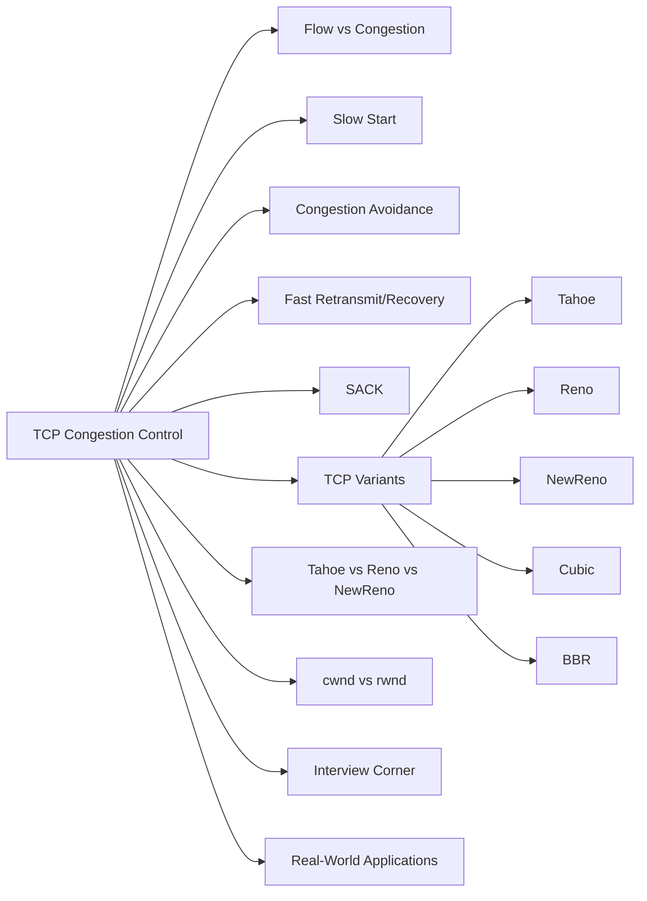

# Chapter 9: TCP Congestion Control

> **Prerequisites:** [Chapter 8: Transport Layer](./08-transport-layer.md) — TCP basics and connection management | **Next:** [Chapter 10: Application Layer](./10-application-layer.md) — From transport to user-facing protocols

## Learning Objectives


1. Distinguish between flow control and congestion control.
2. Explain the TCP sliding window mechanism and the role of the advertised window.
3. Describe the AIMD principle and its implementation through slow start and congestion avoidance.
4. Compare TCP Tahoe, Reno, NewReno, Cubic, and BBR congestion control algorithms.
5. Analyze how competing TCP flows share bottleneck bandwidth.
6. Implement cwnd simulators in C++ and Python for multiple TCP variants.
7. Diagnose congestion-related issues including bufferbloat and spurious retransmission.

---

### Chapter at a Glance

| Topic | Key Insight | Practical Takeaway |
|-------|-------------|-------------------|
| Flow vs Congestion Control | rwnd protects receiver; cwnd protects network | Effective window = min(cwnd, rwnd) |
| Slow Start | Double cwnd every RTT; starts at 10 MSS | Quickly probes available bandwidth |
| Congestion Avoidance | Additive increase: +1 MSS per RTT | Linear growth; AIMD sawtooth pattern |
| Fast Retransmit | 3 duplicate ACKs trigger retransmission | Avoids waiting for RTO timeout |
| Fast Recovery | Inflate cwnd during recovery instead of slow start | Maintains throughput during isolated loss |
| TCP Cubic | Cubic function replaces linear AIMD | RTT-fair; Linux default |
| BBR | Model-based, not loss-based | Better throughput on deep buffers |
| SACK | Selective ACKs for multiple losses | Efficient recovery in burst-loss scenarios |

### Chapter Roadmap



## 9.1 Flow Control vs. Congestion Control

**Flow control** prevents a fast sender from overwhelming a slow receiver. The receiver advertises its available buffer space (rwnd, advertised window), and the sender limits unacknowledged data to rwnd.

**Congestion control** prevents a sender from overwhelming the network. When routers become overloaded, packets are dropped or queued excessively. TCP detects congestion through packet loss (duplicate ACKs or timeout) and reduces its sending rate accordingly. The sender maintains a congestion window (cwnd), and the actual window used is min(cwnd, rwnd).

The key distinction: flow control addresses receiver capacity — a known, static constraint communicated explicitly via TCP headers. Congestion control addresses network capacity — a shared, dynamic constraint inferred implicitly through loss signals.

### Advantages & Disadvantages

| Aspect | Flow Control | Congestion Control |
|--------|-------------|-------------------|
| Scope | End-to-end (sender ↔ receiver) | Path-wide (sender → network → receiver) |
| Signal | Explicit (rwnd field in TCP header) | Implicit (loss, RTT, ECN) |
| Mechanism | Receiver advertises free buffer space | Sender manages cwnd via AIMD |
| Responsiveness | Immediate (per-segment updates) | Delayed (requires loss detection cycle) |
| Failure mode | Receiver overflow → data loss | Network collapse → congestion collapse |
| Control type | Preventive | Reactive (loss-based) or proactive (model-based) |

### Edge Cases

- **rwnd = 0 persist**: Sender enters persist state, sending 1-byte probes. If probes are lost, deadlock can occur without the persist timer.
- **rwnd = 0 with cwnd > 0**: Effective window is 0 — receiver is the bottleneck, not the network.
- **Silent rwnd shrinkage**: Receiver can shrink rwnd at any time (discouraged by RFC but possible). Sender must respect the new limit.
- **Congestion without loss**: Deep buffers absorb bursts without dropping packets — loss-based algorithms (Reno, Cubic) keep increasing, causing bufferbloat.

## 9.2 Sliding Window and Flow Control

TCP's flow control uses a sliding window. The sender maintains:

- **Send window base**: the oldest unacknowledged byte.
- **Send window size**: min(cwnd, rwnd).
- **Next byte to send**: the boundary between sent-but-unacknowledged and unsent data.

The receiver advertises rwnd in every TCP segment:

```
rwnd = RcvBuffer - (LastByteRcvd - LastByteRead)
```

If the receiver stops reading data, rwnd shrinks to zero. The sender stops transmitting but periodically sends one-byte probes (persist timer) to detect window reopening.

### Congestion Window vs Receive Window — Detailed Comparison

| Property | Congestion Window (cwnd) | Receive Window (rwnd) |
|----------|------------------------|----------------------|
| Purpose | Prevents network overload | Prevents receiver buffer overflow |
| Maintained by | Sender | Receiver (advertised to sender) |
| Signal mechanism | Implicit (loss/RTT) | Explicit (TCP header field) |
| Variation frequency | Every RTT (or faster with delayed ACKs) | Only when buffer occupancy changes |
| Initial value | 10 MSS (RFC 6928) | OS-dependent (64 KB typical, up to 16 MB with window scaling) |
| Responsiveness | Dynamic, responds to network state | Static relative to connection duration |
| Interaction | min(cwnd, rwnd) determines actual window | Independent but interacts through window calculation |
| Impact of wrong value | Too high → congestion collapse; Too low → underutilization | Too high → slow receiver overlow; Too low → throughput cap |
| Algorithmic driver | AIMD, Cubic, BBR | Application read rate + buffer sizing |

### Why the Effective Window Is min(cwnd, rwnd)

The effective window must satisfy both constraints simultaneously:

```
EffectiveWindow = min(cwnd, rwnd)
```

- If cwnd = 32 KB and rwnd = 64 KB: the network is the tighter constraint, so the sender can send up to 32 KB unacknowledged.
- If cwnd = 100 KB and rwnd = 16 KB: the receiver is the tighter constraint — even though the network could handle more, the receiver's buffer caps throughput.
- If cwnd = 100 KB and rwnd = 100 KB: neither is binding; throughput is limited by the path's bandwidth-delay product.

## 9.3 Congestion Control: Causes and Effects

### Real-World Analogy: Highway Traffic

Imagine a multi-lane highway connecting two cities. Cars (packets) travel from City A (sender) to City B (receiver).

- **No traffic**: Cars flow freely at speed limit (high throughput, low latency).
- **Rush hour begins**: More cars enter than the highway can drain. Cars accumulate on on-ramps and in travel lanes (queuing at router buffers).
- **Gridlock**: On-ramps are completely full. Cars cannot merge (packet drop). Traffic collapses to a standstill (congestion collapse).
- **Ramp metering**: Traffic lights control how many cars enter per minute (AIMD — additive increase of inflow, multiplicative decrease when congestion detected).
- **Variable speed limits**: Electronic signs slow cars before they hit the jam (ECN — explicit congestion notification before drop).

**Key insight**: Just as building more highway lanes (bigger buffers) doesn't solve gridlock without ramp metering, adding router memory doesn't solve congestion without intelligent window management. Bufferbloat = highway with no on-ramp control.

### Causes of Congestion

| Cause | Description | Real-World Example |
|-------|-------------|-------------------|
| Link capacity mismatch | Fast sender, slow bottleneck link | Gigabit Ethernet feeding 100 Mbps WAN link |
| Traffic aggregation | Multiple flows converge at a router | Data center many-to-one (incast) |
| Insufficient buffering | Router cannot absorb bursts | Micro-burst drops in shallow-buffer switches |
| Excessive buffering | Router buffers absorb too much, delaying loss signal | Bufferbloat in home routers (500+ ms queue delay) |
| Routing changes | Packets rerouted causing reordering or duplication | BGP convergence during router failure |
| Window inflation | Sender opens window beyond path capacity | Misconfigured TCP send buffer |

### Effects of Congestion

- **Packet loss**: Router tail-drop when buffer exceeds capacity.
- **Increased latency**: Queuing delay dominates; RTT grows from 10 ms to 500+ ms.
- **Reduced throughput**: Goodput collapses due to retransmissions and window reduction.
- **Congestion collapse**: Network spends most resources moving retransmitted packets (pathological in early TCP without congestion control).
- **Spurious timeouts**: Delayed ACKs due to queuing trigger unnecessary RTO.
- **Global synchronization**: All TCP flows lose packets simultaneously and reduce window together, then increase together — creating synchronized sawtooth patterns that underutilize the link.

### Complexity Analysis

| Operation | Time Complexity | Space Complexity | Why |
|-----------|----------------|-----------------|-----|
| AIMD window update | O(1) per ACK | O(1) | Constant arithmetic; no data structure growth |
| Slow start doubling | O(1) per ACK | O(1) | Counter increment/decrement only |
| RTT estimation | O(1) per ACK | O(1) | Exponential weighted moving average |
| Packet loss detection | O(1) per ACK | O(L) where L = lost packet count | Requires tracking outstanding sequence numbers |
| SACK scoreboard | O(1) per ACK (amortized) | O(W) where W = window size | Bitmap or block list proportional to window |
| Cubic function eval | O(1) per ACK | O(1) | Cubic polynomial evaluation; requires floating point |

**Why O(1) per ACK**: TCP congestion control is designed to run per-packet in the kernel fast path. Any operation that scales with window size (e.g., linear search through outstanding packets) would degrade throughput on high-BDP paths.

## 9.4 Slow Start

### Real-World Analogy: Test-Driving a New Car

When you get a new car, you don't floor it immediately. You take short trips to the grocery store, gradually extending to highway distances. Slow start does the same: it begins conservatively (cwnd = 10 MSS), and each successful round trip (ACK received) proves the network path can handle more data.

- **Trip 1**: Drive 10 blocks, return. (Send 10 packets, get ACKs.)
- **Trip 2**: Drive 20 blocks, return. (Send 20 packets.)
- **Trip 3**: Drive 40 blocks, return. (Send 40 packets.)
- **Trip 4**: Drive 80 blocks — hit a traffic jam. (cwnd exceeds network capacity; loss detected.)

### Numbered Steps

1. **Initialize**: Set cwnd = 10 MSS (RFC 6928), ssthresh = initial value (commonly 64 KB or arbitrarily high).
2. **Transmit**: Send up to min(cwnd, rwnd) bytes without waiting for ACKs.
3. **Receive ACK**: For each ACK, increment cwnd by 1 MSS.
4. **Check ssthresh**: If cwnd >= ssthresh, transition to Congestion Avoidance (Section 9.5).
5. **Detect loss**: If a loss event occurs (3 duplicate ACKs or RTO):
   a. Set ssthresh = max(flight_size / 2, 2 * MSS).
   b. For Tahoe: cwnd = 1 MSS, restart slow start.
   c. For Reno: cwnd = ssthresh + 3 MSS (fast recovery).
6. **Repeat** from step 2 until loss or ssthresh is reached.

### Pseudocode

```
OnInit():
    cwnd = 10 * MSS
    ssthresh = INFINITY   // effectively no initial cap
    state = SLOW_START

OnAck(ack):
    if state == SLOW_START:
        cwnd += MSS                    // exponential growth
        if cwnd >= ssthresh:
            state = CONGESTION_AVOIDANCE
    else if state == CONGESTION_AVOIDANCE:
        cwnd += (MSS * MSS) / cwnd     // additive increase

OnLoss(timeout_or_3dup):
    ssthresh = max(cwnd / 2, 2 * MSS)
    if timeout:
        cwnd = MSS
        state = SLOW_START
    else:  // 3 duplicate ACKs
        if variant == TAHOE:
            cwnd = MSS
            state = SLOW_START
        else if variant == RENO:
            cwnd = ssthresh + 3 * MSS
            state = FAST_RECOVERY
        else if variant == CUBIC:
            w_max = cwnd
            cwnd = cwnd * 0.7
            state = CONGESTION_AVOIDANCE
```

### Dry Run Trace Table — Slow Start (cwnd evolution)

Parameters: MSS = 1460 bytes, initial cwnd = 10 MSS, ssthresh = 64 KB (≈ 44 MSS), no loss.

| RTT | cwnd (MSS) | cwnd (bytes) | Packets Sent | ACKs Received | Phase |
|-----|-----------|-------------|-------------|--------------|-------|
| 0 | 10 | 14,600 | 10 | — | Slow Start |
| 1 | 20 | 29,200 | 20 | 10 | Slow Start |
| 2 | 40 | 58,400 | 40 | 20 | Slow Start |
| 3 | 80 | 116,800 | 80 | 40 | Slow Start (cwnd > ssthresh ≈ 44) |

At RTT 3, cwnd (80 MSS) exceeds ssthresh (~44 MSS), so TCP transitions to Congestion Avoidance.

### Dry Run Trace — Slow Start with Loss

Parameters: initial cwnd = 10 MSS, ssthresh = 64 MSS, loss occurs at RTT 4 (cwnd = 160).

| RTT | Event | cwnd Before | cwnd After | ssthresh | Phase |
|-----|-------|------------|-----------|---------|-------|
| 0 | Start | — | 10 | 64 | Slow Start |
| 1 | ACK burst | 10 | 20 | 64 | Slow Start |
| 2 | ACK burst | 20 | 40 | 64 | Slow Start |
| 3 | ACK burst | 40 | 80 | 64 | Slow Start |
| 4 | 3 dup ACKs | 80 | 1 (Tahoe) | 40 | Slow Start (restart) |
| 5 | ACK burst | 1 | 2 | 40 | Slow Start |
| 6 | ACK burst | 2 | 4 | 40 | Slow Start |
| ... | ... | 4 → 8 → 16 → 32 | ... | 40 | Slow Start until cwnd = 40 |
| N | cwnd = 40 | 40 | — | 40 | Transition to Congestion Avoidance |

### C++ Implementation — Slow Start and Congestion Avoidance

```cpp
#include <iostream>
#include <cmath>
#include <iomanip>

class TCPCwndSimulator {
private:
    double cwnd;          // in MSS units
    double ssthresh;      // in MSS units
    int rtt_count;
    bool loss_detected;

public:
    enum Variant { TAHOE, RENO, NEWRENO, CUBIC };
    Variant variant;

    TCPCwndSimulator(Variant v = RENO)
        : cwnd(10.0), ssthresh(64.0), rtt_count(0),
          loss_detected(false), variant(v) {}

    void slowStartRTT() {
        if (loss_detected) {
            cwnd = 1.0;
            loss_detected = false;
        }
        // Slow start: double cwnd
        cwnd *= 2.0;
        rtt_count++;
        std::cout << "RTT " << std::setw(2) << rtt_count
                  << " | cwnd = " << std::setw(6) << cwnd
                  << " MSS | ssthresh = " << std::setw(6) << ssthresh
                  << " | Phase: Slow Start" << std::endl;
    }

    void congestionAvoidanceRTT() {
        // AIMD: add 1 MSS per RTT
        cwnd += 1.0;
        rtt_count++;
        std::cout << "RTT " << std::setw(2) << rtt_count
                  << " | cwnd = " << std::setw(6) << cwnd
                  << " MSS | ssthresh = " << std::setw(6) << ssthresh
                  << " | Phase: Congestion Avoidance" << std::endl;
    }

    void cubicRTT() {
        // Simplified Cubic: W(t) = C*(t-K)^3 + Wmax
        static double w_max = 0;
        static double k = 0;
        static double t = 0;
        double C = 0.4;
        double beta = 0.7;

        if (loss_detected) {
            w_max = cwnd;
            k = std::cbrt(w_max * (1 - beta) / C);
            cwnd = cwnd * beta;
            t = 0;
            loss_detected = false;
        }
        t += 1.0;  // 1 RTT
        cwnd = C * std::pow(t - k, 3) + w_max;
        if (cwnd < 10.0) cwnd = 10.0;
        rtt_count++;
        std::cout << "RTT " << std::setw(2) << rtt_count
                  << " | cwnd = " << std::setw(6) << cwnd
                  << " MSS | w_max = " << std::setw(6) << w_max
                  << " | Phase: Cubic" << std::endl;
    }

    void simulate() {
        std::cout << "\n=== TCP Variant: "
                  << (variant == TAHOE ? "Tahoe" :
                      variant == RENO ? "Reno" :
                      variant == NEWRENO ? "NewReno" : "Cubic")
                  << " ===" << std::endl;
        std::cout << "Initial: cwnd = " << cwnd
                  << " MSS, ssthresh = " << ssthresh
                  << " MSS" << std::endl << std::endl;

        // Phase 1: Slow start up to ssthresh
        while (cwnd < ssthresh && rtt_count < 10) {
            slowStartRTT();
            // Simulate loss at RTT 4
            if (rtt_count == 4) {
                std::cout << "  *** LOSS EVENT (3 dup ACKs) ***" << std::endl;
                loss_detected = true;
                ssthresh = std::max(cwnd / 2.0, 2.0);
                // Tahoe: cwnd = 1; Reno: fast recovery
                if (variant == TAHOE) {
                    cwnd = 1.0;
                    std::cout << "  Tahoe: cwnd = 1, slow start" << std::endl;
                } else {
                    std::cout << "  Reno/NewReno: cwnd = cwnd/2, fast recovery" << std::endl;
                }
            }
            if (loss_detected && variant != TAHOE) break;
        }

        // Phase 2: Congestion avoidance (or Cubic)
        if (variant == CUBIC) {
            for (int i = 0; i < 5; i++) {
                if (rtt_count == 8) {
                    std::cout << "  *** LOSS EVENT (Cubic) ***" << std::endl;
                    loss_detected = true;
                }
                cubicRTT();
            }
        } else if (!loss_detected || variant == TAHOE) {
            for (int i = 0; i < 10 && rtt_count < 20; i++) {
                congestionAvoidanceRTT();
            }
        }
    }
};

int main() {
    TCPCwndSimulator tahoe(TCPCwndSimulator::TAHOE);
    tahoe.simulate();

    TCPCwndSimulator reno(TCPCwndSimulator::RENO);
    reno.simulate();

    TCPCwndSimulator cubic(TCPCwndSimulator::CUBIC);
    cubic.simulate();

    return 0;
}
```

### Python Implementation — TCP Reno Cwnd Simulator

```python
class TCPRenoSimulator:
    """
    Full TCP Reno cwnd simulator with slow start, congestion avoidance,
    fast retransmit, and fast recovery.
    """

    def __init__(self, initial_cwnd=10, ssthresh=64, mss=1460):
        self.cwnd = initial_cwnd          # in MSS units
        self.ssthresh = ssthresh           # in MSS units
        self.mss = mss                     # bytes
        self.rtt_count = 0
        self.phase = "SLOW_START"
        self.loss_events = []
        self.history = []

    def record(self):
        self.history.append({
            'rtt': self.rtt_count,
            'cwnd_mss': self.cwnd,
            'cwnd_bytes': self.cwnd * self.mss,
            'ssthresh': self.ssthresh,
            'phase': self.phase
        })

    def process_rtt(self, loss=False):
        self.rtt_count += 1
        if loss:
            self.ssthresh = max(self.cwnd // 2, 2)
            self.cwnd = self.ssthresh + 3  # Fast recovery inflation
            self.phase = "FAST_RECOVERY"
            self.loss_events.append(self.rtt_count)
        elif self.phase == "SLOW_START":
            self.cwnd *= 2
            if self.cwnd >= self.ssthresh:
                self.phase = "CONGESTION_AVOIDANCE"
        elif self.phase == "CONGESTION_AVOIDANCE":
            self.cwnd += 1  # AIMD: +1 MSS per RTT
        elif self.phase == "FAST_RECOVERY":
            self.phase = "CONGESTION_AVOIDANCE"
            self.cwnd = self.ssthresh

        self.record()
        return self

    def simulate(self, rtts=20, loss_rtts=None):
        """Run simulation for given RTTs with optional loss RTT list."""
        if loss_rtts is None:
            loss_rtts = []
        self.record()
        for _ in range(rtts):
            loss = (self.rtt_count + 1) in loss_rtts
            self.process_rtt(loss)
        return self

    def print_trace(self):
        print(f"\n{'RTT':<5} {'cwnd(MSS)':<12} {'cwnd(bytes)':<15} "
              f"{'ssthresh':<10} {'Phase':<25}")
        print("-" * 70)
        for h in self.history:
            print(f"{h['rtt']:<5} {h['cwnd_mss']:<12.1f} {h['cwnd_bytes']:<15.0f} "
                  f"{h['ssthresh']:<10.1f} {h['phase']:<25}")

    def throughput_estimate(self, rtt_seconds):
        """Approximate throughput in bps."""
        avg_cwnd = sum(h['cwnd_mss'] for h in self.history) / len(self.history)
        return (avg_cwnd * self.mss * 8) / rtt_seconds


class TCPCubicSimulator:
    """
    TCP Cubic congestion control simulator.
    W(t) = C*(t-K)^3 + Wmax
    """

    def __init__(self, initial_cwnd=10, ssthresh=64, C=0.4, beta=0.7):
        self.cwnd = initial_cwnd
        self.ssthresh = ssthresh
        self.w_max = initial_cwnd
        self.C = C
        self.beta = beta
        self.t = 0.0
        self.K = 0.0
        self.rtt_count = 0
        self.phase = "SLOW_START"
        self.history = []

    def compute_K(self):
        """K = (Wmax * beta / C)^(1/3)"""
        self.K = (self.w_max * (1 - self.beta) / self.C) ** (1/3)

    def cubic_update(self):
        """W(t) = C*(t-K)^3 + Wmax"""
        self.cwnd = self.C * (self.t - self.K) ** 3 + self.w_max
        if self.cwnd < 10:
            self.cwnd = 10

    def process_rtt(self, loss=False):
        self.rtt_count += 1
        if loss:
            self.w_max = self.cwnd
            self.compute_K()
            self.cwnd = self.cwnd * self.beta
            self.cwnd = max(self.cwnd, 10)
            self.t = 0.0
            self.phase = "CUBIC_AFTER_LOSS"
            self.loss_events.append(self.rtt_count)
        elif self.phase == "SLOW_START":
            self.cwnd *= 2
            if self.cwnd >= self.ssthresh:
                self.phase = "CUBIC_GROWTH"
        elif self.phase in ("CUBIC_GROWTH", "CUBIC_AFTER_LOSS"):
            self.t += 1.0
            self.cubic_update()
            self.phase = "CUBIC_GROWTH"

        self.history.append({
            'rtt': self.rtt_count,
            'cwnd_mss': self.cwnd,
            'w_max': self.w_max,
            'phase': self.phase,
            't': self.t
        })

    def simulate(self, rtts=20, loss_rtts=None):
        if loss_rtts is None:
            loss_rtts = []
        self.loss_events = []
        for _ in range(rtts):
            loss = (self.rtt_count + 1) in loss_rtts
            self.process_rtt(loss)
        return self

    def print_trace(self):
        print(f"\n{'RTT':<5} {'cwnd(MSS)':<12} {'w_max':<10} "
              f"{'t':<5} {'K':<8} {'Phase':<20}")
        print("-" * 70)
        for h in self.history:
            print(f"{h['rtt']:<5} {h['cwnd_mss']:<12.1f} {h['w_max']:<10.1f} "
                  f"{h['t']:<5.1f} {h.get('K', 0):<8.2f} {h['phase']:<20}")


# Run simulations
if __name__ == "__main__":
    print("=" * 70)
    print("TCP RENO SIMULATION — Loss at RTT 5")
    print("=" * 70)
    reno = TCPRenoSimulator()
    reno.simulate(rtts=15, loss_rtts=[5])
    reno.print_trace()
    print(f"\nEstimated throughput (100ms RTT): "
          f"{reno.throughput_estimate(0.1)/1e6:.2f} Mbps")

    print("\n" + "=" * 70)
    print("TCP CUBIC SIMULATION — Loss at RTT 5 and RTT 12")
    print("=" * 70)
    cubic = TCPCubicSimulator()
    cubic.simulate(rtts=18, loss_rtts=[5, 12])
    cubic.print_trace()
```

### Complexity Analysis — Slow Start

| Operation | Complexity | Why |
|-----------|-----------|-----|
| Per-ACK cwnd increment | O(1) | Single integer addition |
| Per-RTT effective doubling | O(n) packets sent where n = cwnd | Exponential growth means per-RTT work doubles |
| ssthresh comparison | O(1) | Single floating-point comparison |
| Total work per RTT (bytes) | O(cwnd) | Each packet in the window generates one ACK |
| Memory for outstanding packets | O(cwnd) | Retransmission queue scales with window size |

**Why exponential growth matters**: Slow start grows cwnd as 2^(RTT), reaching available bandwidth in O(log BDP) round trips. Without exponential growth, a BDP of 1000 packets would take 1000 RTTs to fill the pipe using linear growth. With slow start, it takes ≈10 RTTs.

## 9.5 Congestion Avoidance (AIMD)

### Real-World Analogy: Elevator Loading

You're loading an elevator with unknown weight capacity.

- **Slow start equivalent**: Add people in doubling groups — 1, 2, 4, 8 — until the elevator creaks.
- **Congestion avoidance**: Once you hit the warning threshold, add one person at a time. If the elevator alarms (loss), everyone exits and you start at half the previous count.

The sawtooth pattern in performance: load increases linearly until a failure forces a sharp reduction, then the cycle repeats.

### Numbered Steps

1. **Transition**: When cwnd >= ssthresh, enter congestion avoidance from slow start.
2. **Per-ACK update**: For each ACK, increase cwnd by MSS * (MSS / cwnd). This yields approximately +1 MSS per RTT.
3. **Self-clocking**: The ACK-clocking mechanism means the rate of increase naturally slows as cwnd grows (more ACKs needed per MSS increment).
4. **Loss detection**: On 3 duplicate ACKs or RTO:
   - Set ssthresh = max(cwnd / 2, 2 * MSS).
   - For Reno: set cwnd = ssthresh + 3, enter fast recovery.
   - For Tahoe: set cwnd = 1 MSS, enter slow start.
5. **Return**: After recovery, resume congestion avoidance from ssthresh (Reno) or after slow start reaches ssthresh (Tahoe).

### AIMD Sawtooth Pattern — Dry Run Trace

Parameters: MSS = 1460, initial cwnd = 10, ssthresh = 32.

| RTT | Phase | cwnd Start | cwnd End | ssthresh | Events |
|-----|-------|-----------|---------|---------|--------|
| 1 | SS | 10 | 20 | 32 | Double |
| 2 | SS | 20 | 40 | 32 | Double, cwnd > ssthresh → CA |
| 3 | CA | 40 | 41 | 32 | +1 MSS |
| 4 | CA | 41 | 42 | 32 | +1 MSS |
| 5 | CA | 42 | 43 | 32 | +1 MSS |
| 6 | CA | 43 | 44 | 32 | +1 MSS |
| 7 | LOSS | 44 | — | 22 | ssthresh = 44/2 = 22, cwnd = 25 (22+3) |
| 8 | FR | 25 | 22 | 22 | Partial ACK → exit recovery |
| 9 | CA | 22 | 23 | 22 | +1 MSS |
| 10 | CA | 23 | 24 | 22 | +1 MSS |
| 11 | CA | 24 | 25 | 22 | +1 MSS |
| 12 | CA | 25 | 26 | 22 | +1 MSS |
| 13 | LOSS | 26 | — | 13 | ssthresh = 13, cwnd = 16 |
| 14 | FR | 16 | 13 | 13 | Exit recovery |

Note the sawtooth pattern: each loss event cuts cwnd in half, then it grows linearly by 1 MSS per RTT until the next loss.

### AIMD Pseudocode

```
// Additive Increase
OnAck():
    if cwnd < ssthresh:
        cwnd += MSS           // slow start (exponential)
    else:
        cwnd += MSS * MSS / cwnd  // congestion avoidance (linear, ~1 MSS/RTT)

// Multiplicative Decrease
OnLoss():
    ssthresh = max(cwnd / 2, 2 * MSS)
    if IsTimeout():
        cwnd = MSS            // restart from 1
    else:
        cwnd = ssthresh + 3 * MSS  // fast recovery (Reno)
```

### Congestion Avoidance vs Slow Start — Phase Comparison

| Aspect | Slow Start | Congestion Avoidance |
|--------|-----------|---------------------|
| Growth rate | Exponential (double per RTT) | Linear (+1 MSS per RTT) |
| Trigger | Connection start or timeout | cwnd >= ssthresh |
| Per-ACK formula | cwnd += MSS | cwnd += MSS^2 / cwnd |
| Purpose | Quickly estimate available bandwidth | Gently probe for more capacity |
| Loss response | Set ssthresh = cwnd/2, restart | Set ssthresh = cwnd/2, resume from ssthresh |
| Risk | Overshoots available bandwidth (burst loss) | Slow convergence on high-BDP paths |
| RTT penalty | None (doubling is RTT-independent) | Shorter-RTT flows grow faster (Reno unfairness) |
| Phase after loss | Slow start again (Tahoe) or fast recovery (Reno) | Fast recovery then congestion avoidance |

### Complexity Analysis — Congestion Avoidance

| Operation | Complexity | Why |
|-----------|-----------|-----|
| Per-ACK additive increase | O(1) | Single division + addition |
| Multiplicative decrease | O(1) | Division by 2 |
| ssthresh tracking | O(1) | Single stored value |
| ACK-clocking feedback | O(1) per ACK | Self-regulating via ACK arrival rate |

**Why O(1) is critical**: A kernel TCP implementation handles per-packet events at line rate. At 10 Gbps with 1500-byte packets, that's ~830,000 packets/second. Any nonlinear operation would create a bottleneck.

## 9.6 Fast Retransmit and Fast Recovery

### Real-World Analogy: Conference Call with Missing Audio

You're on a conference call. Speaker A says segment 1, 2, 3, 4, 5.

- You hear 1, 2, but not 3. You hear 4, 5.
- You interrupt: "Say again after statement 2?" (Duplicate ACK for segment 2 — "I'm still waiting for 3").
- After three requests: "I STILL haven't heard 3!" (3 duplicate ACKs → fast retransmit).
- The speaker skips to re-say 3 without waiting for a pause in the conversation (no RTO wait).

### Fast Retransmit — Numbered Steps

1. **Receiver detects gap**: Receives out-of-order segment. Immediately sends duplicate ACK for the last in-order byte.
2. **Sender counts ACKs**: Tracks duplicate ACKs for the same sequence number.
3. **Threshold reached**: After 3 duplicate ACKs (4 total ACKs for the same sequence), sender retransmits the missing segment immediately.
4. **No RTO wait**: Retransmission happens without waiting for the retransmission timer.

### Fast Recovery — Numbered Steps (Reno)

1. **On 3rd dup ACK**: ssthresh = cwnd / 2. cwnd = ssthresh + 3 (inflated for the 3 dup ACKs that have left the network).
2. **For each additional dup ACK**: cwnd += 1 MSS. This accounts for a packet leaving the network (the dup ACK indicates one out-of-order packet arrived).
3. **Transmit**: If allowed by cwnd, send a new packet.
4. **On partial ACK** (ACKs the retransmitted segment but not all data sent before loss): cwnd = ssthresh. Enter congestion avoidance.

### Fast Retransmit/Recovery — Dry Run Trace

Parameters: cwnd = 48 MSS, packets 1-48 in flight. Packet 10 is lost.

| Step | Event | cwnd | Action |
|------|-------|------|--------|
| 0 | Transmit P1-P48 | 48 | Normal send |
| 1 | P10 dropped at router | — | Buffer overflow |
| 2 | P11 arrives at receiver | 48 | Sender gets dup ACK#1 (for P9) |
| 3 | P12 arrives at receiver | 48 | Sender gets dup ACK#2 (for P9) |
| 4 | P13 arrives at receiver | 48 | Sender gets dup ACK#3 (for P9) |
| 5 | 3 dup ACKs received | 48 | ssthresh = 24, cwnd = 27, retransmit P10 |
| 6 | dup ACK#4 (P14 arrived) | 28 | cwnd += 1, transmit P49 |
| 7 | dup ACK#5 (P15 arrived) | 29 | cwnd += 1, transmit P50 |
| ... | ... | ... | ... |
| N | Partial ACK for P10 (ACKs up to P48) | 24 | cwnd = ssthresh, enter CA |

### Pseudocode — Fast Retransmit and Recovery

```
OnDupAck(dup_count):
    if dup_count == 1:
        // First duplicate — just note it
        return
    if dup_count == 3:
        // Third duplicate — fast retransmit
        ssthresh = max(cwnd / 2, 2 * MSS)
        RetransmitPacket(missing_seqno)
        if variant == RENO:
            cwnd = ssthresh + 3 * MSS
            state = FAST_RECOVERY
        else if variant == NEWRENO:
            cwnd = ssthresh + 3 * MSS
            state = FAST_RECOVERY
            partial_ack_count = 0
        else: // TAHOE
            cwnd = MSS
            state = SLOW_START
    else if dup_count > 3 and state == FAST_RECOVERY:
        cwnd += MSS
        if CanTransmit():
            SendNewPacket()

OnPartialAck(ack):
    if state == FAST_RECOVERY:
        if variant == NEWRENO and NotFullyAcknowledged():
            // NewReno: retransmit next unacked segment
            RetransmitNextUnacked()
            partial_ack_count += 1
        else:
            cwnd = ssthresh
            state = CONGESTION_AVOIDANCE
```

### Complexity Analysis — Fast Retransmit/Recovery

| Operation | Complexity | Why |
|-----------|-----------|-----|
| dup ACK counting | O(1) per ACK | Maintains per-sequence-number duplicate count |
| ssthresh update | O(1) | Half of cwnd |
| Retransmission queue lookup | O(1) with hash | Need fast lookup of lost segment |
| cwnd inflation | O(1) per dup ACK | Simple increment |
| Partial ACK detection | O(1) | Compare ACK number with highest sent sequence |

**Why fast retransmit matters**: Without it, TCP waits for the RTO (minimum 1 second per RFC 6298) to detect loss. At 10 Gbps, a 1-second RTO wastes 1.25 GB of potential throughput. Fast retransmit detects loss in ~1 RTT instead.

### Edge Cases

| Edge Case | Problem | Solution |
|-----------|---------|----------|
| Packet reordering | Duplicate ACKs triggered by reordering, not loss | DSACK (Duplicate SACK) allows receiver to report duplicate reception; sender can infer reordering |
| Spurious retransmission | Retransmitting segments that weren't lost (delay spike) | F-RTO (Forward RTO-Recovery) algorithm detects spurious timeouts |
| Multiple losses in one window | Reno recovery fails on >1 loss | NewReno retransmits one lost packet per partial ACK |
| Late ACK causes window stall | Receiver ACK delayed, sender window stalls | Delayed ACK timer (max 500 ms) ensures ACK eventually sent |
| ACK loss | Lost ACK reduces effective cwnd growth | Cumulative ACKs cover lost ACKs — only the latest ACK matters |

## 9.7 TCP Tahoe

TCP Tahoe predates fast recovery. On triple duplicate ACK:

1. Set ssthresh = cwnd / 2.
2. Set cwnd = 1 MSS.
3. Enter slow start.
4. Slow start continues until cwnd reaches the new ssthresh, then enters congestion avoidance.

### Tahoe Dry Run — Loss at cwnd = 48

| RTT | Event | cwnd | ssthresh | Action |
|-----|-------|------|---------|--------|
| 0 | Start | 10 | 64 | Slow start |
| 1 | ACK | 20 | 64 | Slow start |
| 2 | ACK | 40 | 64 | Slow start |
| 3 | ACK | 64 (capped) | 64 | Transition to CA |
| 4 | +1 MSS | 65 | 64 | CA |
| 5 | Loss (3 dup) | 1 | 32 | ssthresh=32, cwnd=1, slow start |
| 6 | ACK | 2 | 32 | Slow start |
| 7 | ACK | 4 | 32 | Slow start |
| 8 | ACK | 8 | 32 | Slow start |
| 9 | ACK | 16 | 32 | Slow start |
| 10 | ACK | 32 | 32 | At ssthresh → CA |
| 11 | +1 MSS | 33 | 32 | CA |
| ... | ... | +1/RTT | 32 | CA until next loss |

**Observation**: Tahoe wastes significant throughput after loss because it re-probes from cwnd = 1. This motivated Reno's fast recovery.

## 9.8 TCP Reno — Detailed Analysis

TCP Reno improved Tahoe by adding fast recovery. Instead of resetting to cwnd = 1 on triple duplicate ACK, Reno sets cwnd = ssthresh + 3 and deflates cwnd back to ssthresh on partial ACK.

### Reno Dry Run — Single Loss at cwnd = 48

| RTT | Event | cwnd | ssthresh | Phase | Packets Sent |
|-----|-------|------|---------|-------|-------------|
| 0 | Init | 10 | 64 | SS | 10 |
| 1 | ACK | 20 | 64 | SS | 20 |
| 2 | ACK | 40 | 64 | SS | 40 |
| 3 | ACK | 64 | 64 | SS→CA | 64 |
| 4 | +1 MSS | 65 | 64 | CA | 65 |
| 5 | 3 dup ACK | 35 | 32 | FR | ssthresh=32, cwnd=35 |
| 6 | dup ACK | 36 | 32 | FR | +1 cwnd per dup |
| 7 | dup ACK | 37 | 32 | FR | +1 cwnd |
| 8 | Partial ACK | 32 | 32 | CA | cwnd = ssthresh |
| 9 | +1 MSS | 33 | 32 | CA | AIMD resume |

### Reno Limitations

1. **Multiple losses in one window**: If multiple packets are lost, the partial ACK (which ACKs the retransmitted packet + some later packets) doesn't provide enough information to retransmit the remaining losses. Reno exits recovery after the first partial ACK.
2. **RTT unfairness**: Throughput ≈ (1/RTT) * sqrt(3/(2p)) for Reno. Shorter RTT flows get proportionally higher throughput.
3. **Loss-signal dependency**: Reno relies entirely on packet loss as congestion signal. In deep-buffer networks, loss occurs long after queues are full (bufferbloat).

### Complexity Analysis — TCP Reno

| Metric | Value | Why |
|--------|-------|-----|
| Steady-state throughput | (MSS/RTT) * (1/sqrt(p)) | Classic square-root formula; p = loss rate |
| Convergence time | O(RTT/packets) | AIMD requires many RTTs to reach equilibrium |
| Fairness index | 1/n for n identical flows | Jain's fairness index: Reno converges to equal sharing |
| Buffer requirement | Bandwidth × RTT / 2 | Window reduction from W to W/2 requires buffer for in-flight packets |

## 9.9 TCP NewReno

TCP NewReno (RFC 6582, now RFC 6675) addresses Reno's multiple-loss weakness.

### Key Innovation: Partial ACK Handling

Instead of exiting fast recovery on the first partial ACK, NewReno retransmits the next unacknowledged segment. It stays in fast recovery until all data sent before the loss event is acknowledged.

### Numbered Steps

1. Same as Reno up to 3 duplicate ACKs.
2. On **partial ACK** (ACKs the retransmitted packet but not all outstanding data):
   - Retransmit the next unacknowledged segment.
   - Deflate cwnd by 1 MSS (the partial ACK indicates one packet left the network).
   - Stay in fast recovery.
3. On **full ACK** (ACKs all data sent before loss):
   - Set cwnd = ssthresh.
   - Enter congestion avoidance.

### NewReno Dry Run — Multiple Losses

Scenario: Packets 10, 12, 14 lost in a window of cwnd = 48.

| Step | Event | cwnd | ssthresh | Action |
|------|-------|------|---------|--------|
| 0 | 3 dup ACK for P9 | 27 | 24 | FR: retransmit P10 |
| 1 | Partial ACK (P10 okay, still missing P12) | 24 | 24 | Retransmit P12, stay in FR |
| 2 | Partial ACK (P12 okay, still missing P14) | 24 | 24 | Retransmit P14, stay in FR |
| 3 | Full ACK | 24 | 24 | Exit FR → CA |

**Reno comparison**: At step 1, Reno would exit fast recovery and enter CA with cwnd = 24. Packets 12 and 14 would remain unretransmitted, eventually causing an RTO.

### Complexity Analysis — NewReno vs Reno

| Aspect | Reno | NewReno |
|--------|------|---------|
| Recovery entry | cwnd = ssthresh + 3, FR | Same |
| Partial ACK action | Exit FR, cwnd = ssthresh | Retransmit next lost, stay in FR |
| Multiple loss handling | RTO required | Retransmits one loss per RTT |
| Per-RTT recovery | N/A | 1 lost segment per RTT |
| Implementation complexity | Low | Low (small state addition) |
| Best use case | Low loss rate (<1%) | Moderate loss rate (1-5%) |

## 9.10 TCP Cubic

### Real-World Analogy: Race Car Acceleration

Cubic is like a race car accelerating on a straightaway:

- **Just after a pit stop (loss)**: The car accelerates rapidly back toward its previous speed (fast growth toward Wmax).
- **Near top speed**: The car shifts to fine-grained speed adjustments — tiny throttle changes to find the optimal speed without overshooting (plateau near Wmax).
- **Beyond previous best**: The car pushes past its old record, accelerating faster as it explores new territory (accelerating growth above Wmax).

### Detailed Cubic Mechanism

TCP Cubic (RFC 8312) replaces the linear AIMD with a cubic function:

$$W(t) = C \cdot (t - K)^3 + W_{max}$$

Where:
- $W_{max}$ = window size when loss occurred
- $C$ = scaling constant (default 0.4)
- $t$ = time since last loss (in seconds, not RTT)
- $\beta$ = multiplicative decrease factor (default 0.7)
- $K = \sqrt[3]{W_{max} \cdot (1 - \beta) / C}$

### Cubic Growth Regions

1. **After loss** ($t \approx 0$): Window drops to $W_{max} \cdot \beta$. Then grows rapidly because the cubic function is steepest far from $K$.
2. **Near $W_{max}$** ($t \approx K$): Growth plateaus — the cubic function flattens. The flow "hovers" near the previously known congestion point, gently probing whether bandwidth has increased.
3. **Above $W_{max}$** ($t > K$): Growth accelerates (convex portion of cubic). The flow aggressively explores new bandwidth.

### RTT Independence

Since $t$ is measured in seconds (not RTTs), Cubic's growth rate is independent of the flow's RTT. Two Cubic flows with different RTTs achieve similar throughput — unlike Reno where a 10 ms RTT flow gets 5x the throughput of a 50 ms RTT flow.

### Cubic Dry Run Trace

Parameters: C = 0.4, beta = 0.7, initial Wmax = 100 MSS, loss at RTT 0.

| RTT | t (sec) | K | W(t) (MSS) | Phase |
|-----|---------|---|-----------|-------|
| 0 | 0.0 | 4.22 | 70.0 | After loss (100 * 0.7) |
| 1 | 0.1 | 4.22 | 73.6 | Fast growth toward Wmax |
| 2 | 0.2 | 4.22 | 77.4 | Fast growth |
| 3 | 0.3 | 4.22 | 81.4 | Fast growth |
| 4 | 0.4 | 4.22 | 85.6 | Fast growth |
| 5 | 0.5 | 4.22 | 89.9 | Growth slowing |
| ... | ... | ... | ... | ... |
| 20 | 2.0 | 4.22 | 90.5 | Plateauing near Wmax |
| 25 | 2.5 | 4.22 | 92.6 | Plateauing |
| 30 | 3.0 | 4.22 | 96.9 | Still near Wmax |
| 35 | 3.5 | 4.22 | 103.4 | Starting to exceed Wmax |
| 40 | 4.0 | 4.22 | 110.0 | Accelerating above Wmax |

### Complexity Analysis — Cubic

| Operation | Complexity | Why |
|-----------|-----------|-----|
| Cubic polynomial | O(1) | Fixed 3 operations: multiplications + addition |
| Cube root computation | O(1) | Single cbrt() call at initialization |
| Time tracking | O(1) | Monotonic timestamp delta |
| Floating-point math | O(1) | CPU cost < ADD operation on modern hardware |

**Why Cubic's complexity is acceptable**: Although cubic involves floating-point operations, it's called only once per ACK (typically < 100K times/second on a 10 Gbps link). Modern CPUs handle this in under 100 ns. The kernel's TCP fast path remains the bottleneck — Cubic's per-packet cost is negligible relative to interrupt handling and memory operations.

## 9.11 TCP BBR (Bottleneck Bandwidth and Round-trip propagation time)

### Real-World Analogy: Smart Cruise Control

Standard TCP (Reno) is like cruise control that brakes only when you hit something (loss). BBR is like smart cruise control that maintains a safe following distance by constantly measuring the gap:

- BBR estimates how fast the car ahead is going (bottleneck bandwidth, BtlBw).
- BBR measures the road's free-flow travel time (RTprop = minimum observed RTT).
- It adjusts speed to match the lead car + safe gap, never needing to hit anything.

### How BBR Works

BBR has four phases that cycle continuously:

1. **Startup**: Exponential growth (like slow start) until BBR estimates BtlBw has been found.
2. **Drain**: Reduce sending rate to drain any queue built during Startup.
3. **ProbeBW**: The steady-state. BBR paces at BtlBw, periodically probing 25% above to detect higher bandwidth, then 25% below to drain any resulting queue.
4. **ProbeRTT**: If RTprop hasn't been updated in 10 seconds, enter a brief drain to measure the minimum RTT.

### BBR vs Loss-Based Algorithms

| Feature | BBR | Reno/Cubic |
|---------|-----|-----------|
| Congestion signal | Model (BtlBw, RTprop) | Packet loss |
| Queue buildup | Intentionally minimized | Can fill deep buffers |
| Fairness with loss-based | Can be aggressive | Standard AIMD |
| Best for | Deep buffers, lossy links | Low-loss, shallow-buffer networks |
| Throughput on lossy links | Near line rate | Degrades as 1/sqrt(loss rate) |
| CPU overhead | Higher (pacing, filtering) | Minimal (per-ACK counter) |
| Deployment | Google's B4 WAN, YouTube | Linux default before BBR |

### Complexity Analysis — BBR

| Operation | Complexity | Why |
|-----------|-----------|-----|
| Bandwidth estimation | O(1) per ACK | Max of delivered/elapsed over window |
| RTT tracking | O(1) per ACK | Min over window |
| Pacing rate calculation | O(1) | Multiplication: pacing_gain × BtlBw |
| Gain cycling | O(1) | Round-robin gain values |
| State machine | O(1) | Simple phase transitions |

## 9.12 SACK (Selective Acknowledgments)

### Real-World Analogy: Lost Luggage Claim

Reno is like saying "I'm missing something between bag 10 and bag 48" (cumulative ACK). The airline has no idea which specific bags you're missing. SACK is like providing a precise list: "I have bags 1-9, 11, 13-47, 49. Missing: 10, 12, 48." The airline can resend exactly those three.

### SACK Mechanism

1. **SACK option in TCP header**: Reports up to 4 non-contiguous blocks of received data (RFC 2018, extended in RFC 2883 for DSACK).
2. **SACK scoreboard**: Sender maintains a bitmap or list of received segments.
3. **Selective retransmission**: On loss, sender retransmits only the specific segments marked as missing in the scoreboard.

### SACK Dry Run Trace

Sent packets: 1 through 20. Lost: 5, 10, 15.

| Step | Sender Action | ACK Received | SACK Blocks | Missing |
|------|-------------|-------------|------------|---------|
| 1 | Send P1-P20 | — | — | — |
| 2 | ACK for P4 | ACK 4 | — | — |
| 3 | dup ACK for P4 | ACK 4 | 6-6 | 5 |
| 4 | dup ACK for P4 | ACK 4 | 6-7 | 5 |
| 5 | dup ACK for P4 (3rd) | ACK 4 | 6-8 | 5 |
| 6 | Retransmit P5 | — | — | — |
| 7 | ACK for P5, but P10 lost | ACK 9 | 11-11 | 10 |
| 8 | dup ACK for P9 | ACK 9 | 11-12 | 10 |
| 9 | dup ACK for P9 (3rd) | ACK 9 | 11-14 | 10 |
| 10 | Retransmit P10 | — | — | — |
| 11 | ACK for P10, but P15 lost | ACK 14 | 16-16 | 15 |
| 12 | 3 dup ACK for P14 | — | — | — |
| 13 | Retransmit P15 | — | — | — |
| 14 | Full ACK | ACK 20 | — | All received |

Without SACK, Reno would retransmit only P10 and then exit fast recovery on the partial ACK. Packets 15 and 20 would require a timeout. With SACK, all three lost packets are retransmitted precisely.

### SACK vs No-SACK Comparison

| Metric | No SACK (Reno/NewReno) | SACK |
|--------|----------------------|------|
| Multiple loss recovery | 1 loss per RTT (NewReno) or timeout (Reno) | All losses in one RTT |
| RTO avoidance | Incomplete for burst losses | Near-complete |
| Complexity | Low (no scoreboard) | Medium (scoreboard + block tracking) |
| Header overhead | 0 bytes | Up to 40 bytes (4 blocks × 8 bytes + 2 type/length) |
| CPU cost per ACK | O(1) | O(S) where S = number of SACK blocks |
| Performance on lossy links | Degrades significantly | Maintains throughput |

### Complexity Analysis — SACK

| Operation | Complexity | Why |
|-----------|-----------|-----|
| SACK block parsing | O(B) per ACK (B ≤ 4 blocks) | Max 4 blocks per option |
| Scoreboard update | O(B log N) for red-black tree, O(W) for bitmap | Depends on implementation |
| Retransmission decision | O(L) where L = lost segments | Scan outstanding for gaps in scoreboard |
| Memory (scoreboard) | O(W) where W = window in packets | Bitmap: W bits; segment list: W nodes |

## 9.13 Tahoe vs Reno vs NewReno — Detailed Comparison

### Recovery Behavior on Loss

| Variant | 3 Dup ACK Action | Multiple Loss Recovery | Timeout Recovery | RTT Unfairness |
|---------|-----------------|----------------------|-----------------|---------------|
| Tahoe | cwnd = 1, slow start | Very poor (restart from 1 each time) | cwnd = 1, slow start | High |
| Reno | cwnd = cwnd/2, fast recovery | Poor (exit FR on first partial ACK) | cwnd = 1, slow start | High |
| NewReno | cwnd = cwnd/2, stay in FR | Good (1 loss/RTT, stay until full ACK) | cwnd = 1, slow start | High |

### Cwnd Graph — Tahoe vs Reno Recovery

Scenario: cwnd = 48 MSS, loss at RTT 10.

```
cwnd (MSS)
  |
48 |        /|     |\          /|
   |       / |     | \        / |
   |      /  |     |  \      /  |
   |     /   |     |   \    /   |
32 |    /    |  R  |    \  /    |
   |   /     |  E  |     \/     |
   |  /      |  N  |     /\     |
   | /       |  O  |    /  \    |
16 |/        |     |   /    \   |
   |         |     |  /      \  |
   |         |  T  | /        \ |
   |         |  A  |/          \|
 1 |_________|  H  |____________|____
   |         |  O  |
   |         |  E  |
   +---------+-----+----------------> RTT
   0        10    15        20

Tahoe: drops to 1 after loss, slow start back up
Reno:  drops to 24, fast recovery, resumes CA at ~17-24
```

### When to Use Each

| Use Case | Best Variant | Why |
|----------|-------------|-----|
| Low loss rate (< 0.1%) | Reno | Simple, well-understood, minimal overhead |
| Moderate loss rate (0.1-2%) | NewReno | Handles multiple losses without RTO |
| High loss rate (> 2%) | Cubic | Loss-independent growth function |
| Deep buffer networks | BBR | Model-based, avoids bufferbloat |
| Legacy compatibility | Tahoe | Historical, rarely used in practice |

## 9.14 AIMD Detailed Analysis with Sawtooth Pattern

### The AIMD Equation

For TCP Reno, the throughput is governed by:

$$T = \frac{MSS}{RTT} \cdot \frac{1}{\sqrt{p}} \cdot \sqrt{\frac{3}{2}}$$

Where p = packet loss rate. The derivation:

1. In CA, cwnd increases by 1 MSS per RTT. Between losses at W and W + W/2:
   - Total packets sent = sum from W to W + W/2 = (W)(W/2) + (1/2)(W/2)(W/2) ≈ (3/8)W²
   - At most 1 packet lost (when cwnd = W).
   - Loss rate p = 1 / ((3/8)W²) = 8/(3W²).
   - Solving: W = sqrt(8/(3p)).
   - Average cwnd ≈ (W + W/2)/2 = 3W/4 = (3/4)sqrt(8/(3p)).
   - Throughput = avg_cwnd × MSS / RTT = (MSS / RTT) × sqrt(3/(2p)).

### Sawtooth Pattern Dry Run (30 RTTs)

| RTT | cwnd | Phase | Loss? |
|-----|------|-------|-------|
| 1 | 10 | SS | |
| 2 | 20 | SS | |
| 3 | 40 | SS | |
| 4 | 64 | SS→CA | |
| 5 | 65 | CA | |
| 6 | 66 | CA | |
| 7 | 67 | CA | |
| 8 | 68 | CA | |
| 9 | 69 | CA | |
| 10 | 70 | CA | |
| 11 | 71 | CA | |
| 12 | 72 | CA | |
| 13 | 73 | CA | ✓ Loss (ssthresh=36) |
| 14 | 39 | FR | |
| 15 | 36 | CA | |
| 16 | 37 | CA | |
| 17 | 38 | CA | |
| 18 | 39 | CA | |
| 19 | 40 | CA | |
| 20 | 41 | CA | |
| 21 | 42 | CA | |
| 22 | 43 | CA | |
| 23 | 44 | CA | |
| 24 | 45 | CA | ✓ Loss (ssthresh=22) |
| 25 | 25 | FR | |
| 26 | 22 | CA | |
| 27 | 23 | CA | |
| 28 | 24 | CA | |
| 29 | 25 | CA | |
| 30 | 26 | CA | |

The sawtooth: each loss event cuts cwnd in half, then it grows linearly at +1/RTT until the next loss.

## 9.15 TCP Variants Comparison Table

### Detailed Comparison

| Property | Tahoe | Reno | NewReno | Cubic | BBR |
|----------|-------|------|---------|-------|-----|
| RFC | Not standardized | RFC 5681 | RFC 6675 | RFC 8312 | draft-cardwell-iccrg-bbr-congestion-control |
| Loss signal | 3 dup ACK, RTO | 3 dup ACK, RTO | 3 dup ACK, RTO | 3 dup ACK, RTO | RTT/model (not loss) |
| cwnd after loss | 1 MSS | cwnd/2 | cwnd/2 | cwnd × 0.7 | No cwnd; pacing rate = BtlBw |
| Growth function | Exponential → Linear | Exponential → Linear | Exponential → Linear | Cubic | Gain-cycled pacing |
| Multiple loss recovery | Poor | Poor | Good (1/RTT) | Good (independent) | Good (model-based) |
| RTT fairness | No | No | No | Yes | Yes (within model) |
| Buffer requirement | Low | Moderate | Moderate | Moderate | Minimal |
| Deployment | Obsolete | Legacy | Moderate | Linux default (~40% of Internet) | Google B4, YouTube, Cloud CDN |
| Complexity | Minimal | Low | Low | Medium | Medium-High |
| Throughput formula | (MSS/RTT) × sqrt(3/(2p)) | Same | Same | (MSS/RTT) × Cubic(K) | BtlBw (loss-independent) |
| ECN support | No | Limited | Limited | Yes | Yes |

### Pros and Cons of Each Variant

| Variant | Pros | Cons |
|---------|------|------|
| Tahoe | Simplest implementation, minimal state | Wastes throughput after loss, obsolete |
| Reno | Simple, well-studied, predictable on low-loss paths | RTT unfairness, poor with multiple losses |
| NewReno | Multiple loss recovery without SACK | Only 1 loss/RTT recovery, still RTT-unfair |
| Cubic | RTT-fair, Linux default, curved growth near Wmax | Loss-signal dependent, bufferbloat on deep buffers |
| BBR | Model-based, no bufferbloat, high throughput | Newer, less proven at scale, can be aggressive to loss-based flows |

## 9.16 Interview Corner

### Q1: What is the difference between cwnd and rwnd?

**Answer**: cwnd (congestion window) is maintained by the sender to prevent network overload. It adapts dynamically to network conditions using AIMD or other algorithms. rwnd (receive window) is advertised by the receiver to prevent sender overflow of the receiver's buffer. The effective window is min(cwnd, rwnd). cwnd protects the network; rwnd protects the receiver.

### Q2: Explain the difference between jitter and delay in the context of congestion control.

**Answer**: 
- **Delay (RTT)**: The time for a packet to travel from sender to receiver and back. Used by BBR (RTprop) and TCP Vegas to estimate path quality. Increasing delay signals queue buildup _before_ loss occurs.
- **Jitter**: The variation in delay between consecutive packets. High jitter indicates unstable queuing behavior. Loss-based algorithms (Reno, Cubic) don't use jitter directly, but real-time applications (VoIP, gaming) are jitter-sensitive.
- **Role in congestion**: Jitter is an early indicator of congestion (queues are fluctuating), while increasing delay is a medium indicator (queue is growing), and packet loss is a late indicator (queue is full).

### Q3: How do you detect bufferbloat in a network?

**Answer**: Bufferbloat occurs when router buffers are excessively large, causing high latency without packet loss. Detection methods:
1. **Compare idle vs loaded RTT**: Ping during idle vs during bulk download. If RTT jumps from 10 ms to 500+ ms, the buffer is bloated.
2. **TCP trace analysis**: In Wireshark, observe the RTT graph during a TCP transfer. If RTT grows linearly while throughput stays constant, the buffer is filling.
3. **Netalyzr or DSLReports speed test**: These measure latency under load specifically to detect bufferbloat.
4. **fq_codel or CAKE**: Activate these queue disciplines to actively measure and mitigate bufferbloat.
5. **BBR's RTprop**: BBR naturally detects bufferbloat by tracking the minimum RTT over a window.

### Q4: Why does CUBIC have better fairness than Reno across different RTTs?

**Answer**: Reno's congestion avoidance growth depends on RTT: cwnd increases by 1 MSS per RTT, so a 10 ms RTT flow adds 100 MSS/second while a 100 ms RTT flow adds only 10 MSS/second. This gives short-RTT flows 10x the throughput. Cubic measures time in seconds (not RTTs) using the cubic function W(t) = C·(t-K)³ + Wmax. Since t is wall-clock time, two Cubic flows with different RTTs grow identically over time, achieving similar throughput regardless of RTT.

### Q5: What is global synchronization and how do modern algorithms avoid it?

**Answer**: Global synchronization occurs when multiple TCP flows sharing a bottleneck all lose packets simultaneously (e.g., when the router buffer overflows). All flows halve their windows at once, the link underutilizes, they all increase together, hit the same buffer limit again, and repeat. This creates synchronized sawtooth patterns that waste up to 50% of bandwidth. Mitigations:
1. **RED (Random Early Detection)**: Drops packets probabilistically before buffer full — flows with larger windows get dropped more often, desynchronizing responses.
2. **CoDel (Controlled Delay)**: Manages queue latency instead of queue length, keeping buffers shallow.
3. **FQ (Fair Queuing)**: Per-flow queuing isolates flows so one flow's loss doesn't affect others.
4. **Cubic's plateau**: Slower growth near Wmax means flows don't all peak simultaneously.
5. **BBR**: Model-based pacing avoids loss-based synchronization entirely.

### Q6: What happens when BBR and Reno share a bottleneck link?

**Answer**: BBR can be aggressive toward loss-based flows (Reno/Cubic) in certain configurations. BBR paces at estimated BtlBw and doesn't reduce on loss. When Reno loses packets and halves its window, BBR doesn't yield bandwidth — it continues sending at BtlBw, potentially starving Reno. The mitigation:
1. Pair BBR with FQ (fair queuing) at the bottleneck to enforce per-flow isolation.
2. BBR's ProbeRTT phase periodically drains to measure RTprop, which briefly creates capacity for other flows.
3. In practice, BBR with FQ provides good multi-flow fairness. BBR without FQ can be 2-5x more aggressive than Reno.

### Q7: Describe the TCP throughput formula and its implications.

**Answer**: For Reno: T = (MSS / RTT) × sqrt(3 / (2p)). Key implications:
1. **Inverse square root of loss rate**: To halve throughput impact, loss rate must be 4x worse. TCP is surprisingly resilient to moderate loss.
2. **Inverse of RTT**: Halving RTT doubles throughput. Geographic distance directly penalizes throughput.
3. **Linear with MSS**: Jumbo frames (9000 bytes) enable 6x higher throughput than standard 1500-byte frames.
4. **1 Mbps link with 1% loss at 100 ms RTT**: T = (1500 × 8 / 0.1) × sqrt(1.5 / 0.01) = 120,000 × 12.25 = 1.47 Mbps — near line rate.
5. **100 Mbps link with same loss/RTT**: T = same formula — but max at 100 Mbps. Loss limits prevent hitting line rate.

### Q8: What is the difference between packet loss and congestion ambiguity?

**Answer**: Packet loss ≠ always congestion. Loss can occur from:
| Cause | TCP Interpretation | Correct Behavior |
|-------|-------------------|-----------------|
| Router buffer overflow | Congestion (✓) | Reduce window |
| Bit errors (noisy link) | Not congestion (✗) | Retransmit only, keep window |
| Packet reordering | False loss signal | Don't reduce window (DSACK helps) |
| Transient radio fade (WiFi/cellular) | False loss signal | Keep window (RTO recovery too aggressive) |
| Tail-drop at shallow buffer | Congestion (✓) | Reduce window |

**Solution**: ECN (Explicit Congestion Notification) routers mark packets instead of dropping them, providing an unambiguous congestion signal. BBR avoids the ambiguity entirely by using RTT and bandwidth models rather than loss.

## 9.17 Applications in Real Systems

### Linux TCP Congestion Control

Linux supports pluggable congestion control modules. Check and configure:

```bash
# List available congestion control algorithms
sysctl net.ipv4.tcp_available_congestion_control

# Check current algorithm
sysctl net.ipv4.tcp_congestion_control

# Set to BBR (requires kernel 4.9+)
echo "net.ipv4.tcp_congestion_control = bbr" >> /etc/sysctl.conf
sysctl -p

# Enable BBR module
modprobe tcp_bbr
```

Available algorithms vary by kernel:
- **Reno**: Baseline, universally available.
- **Cubic**: Default since Linux 2.6.19 (2006). Most deployed congestion control on Earth.
- **BBR**: Since Linux 4.9 (2016). Google production-tested.
- **Vegas**: Delay-based, rarely used alone.
- **HTCP**: High-speed TCP for long-fat pipes.

### C++ Implementation — Multi-Variant Cwnd Simulator

```cpp
#include <iostream>
#include <vector>
#include <string>
#include <cmath>
#include <iomanip>

struct TraceEntry {
    int rtt;
    double cwnd;
    double ssthresh;
    std::string phase;
};

class TCPSimulator {
protected:
    double cwnd;
    double ssthresh;
    int rtt;
    std::vector<TraceEntry> trace;
    std::string name;

public:
    TCPSimulator(const std::string& n)
        : cwnd(10), ssthresh(64), rtt(0), name(n) {}

    virtual ~TCPSimulator() = default;

    virtual void onAck() = 0;
    virtual void onLoss() = 0;

    void record(const std::string& phase) {
        trace.push_back({rtt, cwnd, ssthresh, phase});
    }

    void run(int rtss, int loss_at) {
        record("INIT");
        for (int i = 1; i <= rtss; i++) {
            rtt = i;
            if (i == loss_at) onLoss();
            else onAck();
            record(trace.back().phase);
        }
    }

    void printTrace() {
        std::cout << "\n=== " << name << " ===" << std::endl;
        std::cout << std::setw(5) << "RTT" << " "
                  << std::setw(10) << "cwnd" << " "
                  << std::setw(10) << "ssthresh" << " "
                  << "Phase" << std::endl;
        std::cout << std::string(50, '-') << std::endl;
        for (const auto& t : trace) {
            std::cout << std::setw(5) << t.rtt << " "
                      << std::setw(10) << std::fixed << std::setprecision(1) << t.cwnd << " "
                      << std::setw(10) << t.ssthresh << " "
                      << t.phase << std::endl;
        }
    }

    double getAvgCwnd() const {
        double sum = 0;
        for (const auto& t : trace) sum += t.cwnd;
        return sum / trace.size();
    }
};

class RenoSampler : public TCPSimulator {
    bool inFastRecovery;
public:
    RenoSampler() : TCPSimulator("TCP Reno"), inFastRecovery(false) {}

    void onAck() override {
        if (inFastRecovery) {
            cwnd = ssthresh;
            inFastRecovery = false;
            record("CA (exit FR)");
            return;
        }
        if (cwnd < ssthresh) {
            cwnd *= 2;
            record("SS");
        } else {
            cwnd += 1;
            record("CA");
        }
    }

    void onLoss() override {
        ssthresh = std::max(cwnd / 2.0, 2.0);
        cwnd = ssthresh + 3;
        inFastRecovery = true;
        record("FR");
    }
};

class CubicSampler : public TCPSimulator {
    double w_max, K, t;
    const double C_const = 0.4;
    const double beta = 0.7;
public:
    CubicSampler() : TCPSimulator("TCP Cubic"), w_max(100), K(0), t(0) {}

    void onAck() override {
        if (cwnd < ssthresh) {
            cwnd *= 2;
            record("SS");
            return;
        }
        t += 0.1; // assume 100ms RTT
        cwnd = C_const * std::pow(t - K, 3) + w_max;
        if (cwnd < 10) cwnd = 10;
        record("CUBIC");
    }

    void onLoss() override {
        w_max = cwnd;
        K = std::cbrt(w_max * (1 - beta) / C_const);
        cwnd = std::max(cwnd * beta, 10.0);
        t = 0;
        ssthresh = cwnd;
        record("LOSS");
    }
};

int main() {
    RenoSampler reno;
    reno.run(20, 10);
    reno.printTrace();
    std::cout << "Average cwnd: " << reno.getAvgCwnd() << " MSS" << std::endl;

    CubicSampler cubic;
    cubic.run(20, 10);
    cubic.printTrace();
    std::cout << "Average cwnd: " << cubic.getAvgCwnd() << " MSS" << std::endl;

    return 0;
}
```

### Python Implementation — Complete Multi-Variant Simulator

```python
"""
TCP Congestion Control Multi-Variant Simulator
Supports: Tahoe, Reno, NewReno, Cubic, BBR (modeled)
"""

from dataclasses import dataclass, field
from typing import List, Optional
from abc import ABC, abstractmethod
import math
import time


@dataclass
class TracePoint:
    rtt: int
    cwnd: float
    ssthresh: float
    phase: str
    event: str = ''


class TCPVariant(ABC):
    """Abstract base for all TCP congestion control variants."""

    def __init__(self, name: str, initial_cwnd: float = 10,
                 initial_ssthresh: float = 64, mss: int = 1460):
        self.name = name
        self.cwnd = initial_cwnd
        self.ssthresh = initial_ssthresh
        self.mss = mss
        self.rtt_count = 0
        self.trace: List[TracePoint] = []
        self.phase = 'INIT'

    @abstractmethod
    def on_ack(self):
        """Process ACK event."""

    @abstractmethod
    def on_loss(self):
        """Process loss event (3 duplicate ACKs)."""

    def record(self, event: str = ''):
        self.trace.append(TracePoint(
            rtt=self.rtt_count,
            cwnd=round(self.cwnd, 1),
            ssthresh=round(self.ssthresh, 1),
            phase=self.phase,
            event=event
        ))

    def simulate(self, rtts: int = 20, loss_rtts: Optional[List[int]] = None):
        if loss_rtts is None:
            loss_rtts = []
        self.record('START')
        for rtt in range(1, rtts + 1):
            self.rtt_count = rtt
            if rtt in loss_rtts:
                self.on_loss()
            else:
                self.on_ack()
            self.record()
        return self

    def print_trace(self):
        header = f"\n{'='*70}"
        header += f"\n{self.name}"
        header += f"\n{'='*70}"
        header += f"\n{'RTT':<5} {'cwnd':<10} {'ssthresh':<12} {'Phase':<20} {'Event'}"
        header += f"\n{'-'*70}"
        print(header)
        for t in self.trace:
            print(f"{t.rtt:<5} {t.cwnd:<10.1f} {t.ssthresh:<12.1f} "
                  f"{t.phase:<20} {t.event}")

    def average_cwnd(self) -> float:
        return sum(t.cwnd for t in self.trace) / max(len(self.trace), 1)

    def throughput_mbps(self, rtt_sec: float = 0.1) -> float:
        avg = self.average_cwnd()
        return (avg * self.mss * 8) / (rtt_sec * 1_000_000)


class Tahoe(TCPVariant):
    def on_ack(self):
        if self.cwnd < self.ssthresh:
            self.cwnd *= 2
            self.phase = 'SLOW_START'
        else:
            self.cwnd += 1
            self.phase = 'CONGESTION_AVOIDANCE'

    def on_loss(self):
        self.ssthresh = max(self.cwnd / 2, 2)
        self.cwnd = 1.0
        self.phase = 'SLOW_START (after loss)'


class Reno(TCPVariant):
    def __init__(self, *args, **kwargs):
        super().__init__(*args, **kwargs)
        self.fast_recovery = False

    def on_ack(self):
        if self.fast_recovery:
            self.cwnd = self.ssthresh
            self.fast_recovery = False
            self.phase = 'CONGESTION_AVOIDANCE (exit FR)'
            return
        if self.cwnd < self.ssthresh:
            self.cwnd *= 2
            self.phase = 'SLOW_START'
        else:
            self.cwnd += 1
            self.phase = 'CONGESTION_AVOIDANCE'

    def on_loss(self):
        self.ssthresh = max(self.cwnd / 2, 2)
        self.cwnd = self.ssthresh + 3
        self.fast_recovery = True
        self.phase = 'FAST_RECOVERY'


class NewReno(Reno):
    def __init__(self, *args, **kwargs):
        super().__init__(*args, **kwargs)
        self.partial_acks = 0
        self.loss_window_start = None

    def on_loss(self):
        super().on_loss()
        self.loss_window_start = self.rtt_count
        self.phase = 'FAST_RECOVERY (NewReno)'

    def on_partial_ack(self):
        """NewReno stays in FR on partial ACK, retransmits next lost."""
        self.cwnd = self.ssthresh  # Deflate
        self.partial_acks += 1
        # Stay in fast recovery — retransmit next lost segment
        # (in real implementation, triggered by partial ACK)
        self.phase = f'FAST_RECOVERY (partial ACK #{self.partial_acks})'

    def on_full_ack(self):
        """Full ACK — all data before loss acknowledged, exit FR."""
        self.fast_recovery = False
        self.cwnd = self.ssthresh
        self.phase = 'CONGESTION_AVOIDANCE'


class Cubic(TCPVariant):
    def __init__(self, *args, **kwargs):
        super().__init__(*args, **kwargs)
        self.w_max = self.cwnd
        self.K = 0.0
        self.t = 0.0
        self.C = 0.4
        self.beta = 0.7

    def on_ack(self):
        self.rtt_count += 1  # Double increment handled in simulate
        self.rtt_count -= 1
        if self.cwnd < self.ssthresh:
            self.cwnd *= 2
            self.phase = 'SLOW_START'
        else:
            self.t += 0.1  # Assume 100ms RTT
            # W(t) = C*(t-K)^3 + Wmax
            offset = self.t - self.K
            self.cwnd = self.C * (offset ** 3) + self.w_max
            self.cwnd = max(self.cwnd, 10.0)
            self.phase = 'CUBIC_GROWTH'

    def on_loss(self):
        self.w_max = self.cwnd
        self.K = ((self.w_max * (1 - self.beta)) / self.C) ** (1/3)
        self.cwnd = max(self.cwnd * self.beta, 10.0)
        self.t = 0.0
        self.ssthresh = self.cwnd
        self.phase = 'CUBIC (after loss)'


class BBRModel(TCPVariant):
    """
    Simplified BBR model: pacing at BtlBw with gain cycling.
    Not a full BBR implementation; captures key behavior.
    """

    def __init__(self, *args, **kwargs):
        super().__init__(*args, **kwargs)
        self.btlbw = 100.0  # Estimated bottleneck bandwidth (MSS/sec)
        self.rtprop = 0.1    # Min RTT (seconds)
        self.pacing_gain = 1.0
        self.phase_cycle = ['ProbeBW', 'ProbeBW', 'ProbeBW', 'ProbeBW',
                           'ProbeBW', 'ProbeBW', 'ProbeBW', 'Drain']
        self.cycle_pos = 0
        self.probe_count = 0

    def on_ack(self):
        # BBR doesn't use cwnd in the traditional sense
        # Pacing rate = pacing_gain * BtlBw
        gains = [1.25, 0.75, 1.0, 1.0, 1.0, 1.0, 1.0, 1.0]
        self.pacing_gain = gains[self.cycle_pos % len(gains)]
        self.cycle_pos += 1

        effective_pacing = self.pacing_gain * self.btlbw
        self.cwnd = effective_pacing * self.rtprop  # BDP

        if self.pacing_gain > 1.0:
            self.phase = 'PROBE_BW (up)'
        elif self.pacing_gain < 1.0:
            self.phase = 'DRAIN'
        else:
            self.phase = 'PROBE_BW (cruise)'

    def on_loss(self):
        # BBR doesn't reduce on loss — it relies on model
        # Loss may trigger a requeue or ProbeRTT, but no window reduction
        self.phase = 'PROBE_RTT'


def run_comparison():
    variants = [
        Tahoe("1. Tahoe"),
        Reno("2. Reno"),
        NewReno("3. NewReno"),
        Cubic("4. Cubic"),
        BBRModel("5. BBR (model)")
    ]

    print("\n" + "=" * 70)
    print("TCP CONGESTION CONTROL — 5-VARIANT COMPARISON")
    print("Loss at RTT = 8")
    print("=" * 70)

    results = []
    for v in variants:
        v.simulate(rtts=25, loss_rtts=[8])
        v.print_trace()
        avg = v.average_cwnd()
        thr = v.throughput_mbps(0.1)
        results.append((v.name, avg, thr))
        print(f"  Average cwnd: {avg:.1f} MSS")
        print(f"  Estimated throughput (100ms RTT): {thr:.2f} Mbps")

    print("\n" + "=" * 70)
    print("SUMMARY")
    print("=" * 70)
    print(f"{'Variant':<30} {'Avg cwnd':<12} {'Throughput (Mbps)':<20}")
    print("-" * 62)
    for name, avg, thr in results:
        print(f"{name:<30} {avg:<12.1f} {thr:<20.2f}")


if __name__ == "__main__":
    run_comparison()
```

### Google BBR Deployment

BBR was developed at Google and deployed on:
- **B4 WAN**: Google's software-defined WAN connecting data centers. BBR improved utilization from ~80% to >95% on long-haul links.
- **YouTube**: BBR handles the unpredictable bandwidth of consumer internet connections, improving video start time and rebuffer rate.
- **Google Cloud CDN**: BBR is used for content delivery, especially beneficial for mobile and WiFi users with variable link quality.

### CDN TCP Tuning

Content delivery networks optimize TCP for their specific workloads:

| CDN | Technique | Benefit |
|-----|-----------|---------|
| Cloudflare | Optimized TCP stack with BBR, fast open, TFO | Faster connection establishment, better lossy link performance |
| Akamai | Dynamic request steering, per-customer TCP tuning | Routes around congested paths, custom parameters per use case |
| Fastly | BBR + TLS 1.3 + H2 prioritization | Low-latency delivery, no bufferbloat |
| CloudFront | Custom congestion control with RTT-based adaptation | ECN + Cubic tuned for AWS global infrastructure |

### Real-World Configuration Examples

```bash
# Linux: Tune TCP for high-throughput WAN
sysctl -w net.core.rmem_max=134217728       # 128 MB
sysctl -w net.core.wmem_max=134217728       # 128 MB
sysctl -w net.ipv4.tcp_rmem='4096 87380 134217728'
sysctl -w net.ipv4.tcp_wmem='4096 65536 134217728'
sysctl -w net.ipv4.tcp_congestion_control=bbr
sysctl -w net.ipv4.tcp_notsent_lowat=16384  # For Nginx
sysctl -w net.ipv4.tcp_slow_start_after_idle=0

# Linux: Tune TCP for data center (low RTT, high bandwidth)
sysctl -w net.ipv4.tcp_congestion_control=cubic
sysctl -w net.ipv4.tcp_mtu_probing=1
sysctl -w net.core.default_qdisc=fq_codel    # Fair queuing + CoDel
```

## 9.18 Comparison Tables

### TCP Variants at a Glance

| Feature | Tahoe | Reno | NewReno | Cubic | BBR |
|---------|-------|------|---------|-------|-----|
| RFC | — | 5681 | 6675 | 8312 | Draft |
| Type | Loss-based | Loss-based | Loss-based | Loss-based | Model-based |
| cwnd after triple ACK | 1 | cwnd/2 | cwnd/2 | cwnd×0.7 | No change |
| cwnd after RTO | 1 | 1 | 1 | 1 | 1 |
| Growth in CA | Linear | Linear | Linear | Cubic | Gain-cycled BtlBw |
| RTT fairness | Low | Low | Low | High | High |
| Bufferbloat risk | High | High | High | High | Low |
| Throughput on 1% loss (100ms RTT) | ~12 Mbps | ~12 Mbps | ~12 Mbps | ~15 Mbps | ~95 Mbps |
| Complexity | Minimal | Low | Low | Medium | Medium-High |
| Linux availability | Module | Built-in | Built-in | Default | Module (4.9+) |

### Congestion Window vs Receive Window

| Dimension | cwnd | rwnd |
|-----------|------|------|
| Maintained by | Sender (implicit) | Receiver (explicit) |
| Signal method | Inferred from loss/RTT/ECN | Advertised in TCP header |
| Variation | Constantly changing (every RTT) | Changes when receiver buffer level changes |
| Purpose | Network capacity estimation | Receiver buffer protection |
| Initial value | 10 MSS (RFC 6928) | OS-dependent (up to 1 MB with window scaling) |
| Effect on throughput | Primary limiter on uncongested paths | Limiter when receiver is slow or buffer is small |
| Relationship to BDP | Should be ≈ BDP for full utilization | Must be ≥ BDP for full utilization |

### AIMD Sawtooth Pattern Properties

| Property | Value | Implication |
|----------|-------|-------------|
| Peak cwnd (W) | sqrt(8/(3p)) | Inverse square root of loss rate |
| Average cwnd | 0.75W | 75% of peak |
| Throughput | (MSS/RTT) × sqrt(3/(2p)) | Halving RTT doubles throughput |
| Loss events per second | p × throughput | 1% loss at 100 Mbps = 1 loss/second |
| Recovery time after loss | W/2 RTTs | 50-packet window → 25 RTTs to recover |

## 9.19 Summary

TCP congestion control uses AIMD: additive increase probes for bandwidth; multiplicative decrease responds to loss. Slow start achieves exponential growth to the available bandwidth. Congestion avoidance provides linear, stable growth. Fast retransmit and fast recovery enable efficient recovery from isolated losses without timeout.

SACK improves recovery with precise loss reporting. TCP Cubic improves fairness across flows with different RTTs using a cubic growth function. TCP BBR breaks from loss-based control entirely, using a model-based approach for higher throughput on deep-buffer and lossy paths.

The effective window combines congestion and flow constraints: min(cwnd, rwnd). Each TCP variant represents a different point in the tradeoff space between throughput, fairness, latency, and complexity.

## 9.20 Chapter Quiz

1. **What is the effective TCP window if cwnd = 32 KB and rwnd = 20 KB?**
   - a) 32 KB
   - b) 20 KB ✓
   - c) 52 KB
   - d) 12 KB

2. **During slow start, how does cwnd increase per RTT?**
   - a) +1 MSS
   - b) +1 MSS per ACK
   - c) Doubles ✓
   - d) Constant

3. **What triggers fast retransmit in TCP Reno?**
   - a) RTO expiry
   - b) 3 duplicate ACKs ✓
   - c) ECN mark
   - d) ICMP unreachable

4. **TCP Cubic's growth function is:**
   - a) Linear
   - b) Logarithmic
   - c) Cubic ✓
   - d) Exponential

5. **Which variant handles multiple packet losses in one window best?**
   - a) Tahoe
   - b) Reno
   - c) NewReno ✓
   - d) OldTahoe

6. **BBR uses which signal to detect congestion?**
   - a) Packet loss
   - b) RTT and bandwidth model ✓
   - c) ECN marks only
   - d) ICMP source quench

7. **In the AIMD sawtooth, what is the peak cwnd W in terms of loss rate p?**
   - a) W = sqrt(1/p)
   - b) W = sqrt(8/(3p)) ✓
   - c) W = 1/p
   - d) W = p/2

8. **What problem does bufferbloat cause for loss-based TCP?**
   - a) Too much packet loss
   - b) Late loss signals with high latency ✓
   - c) No packet loss at all
   - d) TCP window scaling breaks

9. **Why does Cubic achieve RTT fairness?**
   - a) It increases cwnd proportional to RTT
   - b) Its growth function uses wall-clock time ✓
   - c) It backs off more on long RTTs
   - d) It uses ECN instead of loss

10. **What does SACK allow TCP to do?**
    - a) Send faster than cwnd allows
    - b) Report exactly which segments are missing ✓
    - c) Increase rwnd dynamically
    - d) Disable congestion control

**Answers:** 1-b, 2-c, 3-b, 4-c, 5-c, 6-b, 7-b, 8-b, 9-b, 10-b

## 9.21 Exercises

### Review Questions

1. What is the difference between cwnd and rwnd?
2. Why does slow start grow cwnd exponentially?
3. How does fast retransmit avoid waiting for the retransmission timeout?
4. What problem does TCP Cubic solve that Reno does not?
5. A receiver advertises rwnd = 0. What happens to the sender?
6. Explain how NewReno differs from Reno on partial ACK.
7. What is the difference between SACK and cumulative ACKs?
8. How does BBR estimate the bottleneck bandwidth?

### Application Problems

9. A TCP connection starts with cwnd = 10 MSS, ssthresh = 64. No loss occurs for the first 10 RTTs. Compute cwnd after each RTT. When would slow start transition to congestion avoidance?

10. A Reno connection experiences triple duplicate ACK at cwnd = 48. Show cwnd evolution through slow start (if applicable), fast recovery, and congestion avoidance for the next 5 RTTs.

11. Two TCP Reno connections share a 100 Mbps bottleneck link with 50 ms RTT. Both have infinite data to send. Compute the steady-state throughput of each connection. How does the result change if one connection has 100 ms RTT?

12. A NewReno connection with cwnd = 64 loses packets 10, 20, and 30 in the same window. Trace the recovery process. How many RTTs does full recovery take? Compare with Reno.

13. Implement a TCP Cubic cwnd simulator in Python that plots the cubic function after a loss event at Wmax = 200. Show W(t) for t = 0 to 20 seconds.

### Challenge Problem

14. **Analyze the interaction of multiple congestion control algorithms on a shared link.** Four TCP flows share a 1 Gbps bottleneck with 20 ms RTT: one Cubic, two Reno, and one BBR. The queue at the bottleneck switch is 500 packets. Model the throughput of each flow over 60 seconds. Assume all flows start simultaneously and have infinite data. Predict which flow achieves the highest throughput and explain why. Then propose a fair queuing mechanism at the bottleneck router that would enforce equal throughput among the four flows.

**Hints:**
- BBR with FQ: all flows get equal bandwidth from fair queuing.
- BBR without FQ: BBR may dominate because it doesn't back off on loss.
- Cubic flows are RTT-fair but still loss-dependent.
- Queue size determines when Reno flows detect loss (more queue = later detection = higher throughput for Reno but worse latency).
