# Chapter 11: Network Security

## Learning Objectives

1. Identify the principal threats to network security: eavesdropping, tampering, impersonation, and denial of service.
2. Explain the principles of symmetric and asymmetric key cryptography.
3. Describe digital signatures, message authentication codes, and public-key certificates.
4. Compare packet-filter, stateful, and application-layer firewalls with rule evaluation.
5. Analyze IPSec and TLS in the context of virtual private networks.
6. Understand DDoS attack types, IDS/IPS deployment, 802.1X, WPA3, and DNSSEC.

## 11.1 Network Security Threats


Network security encompasses the policies and mechanisms that protect the confidentiality, integrity, and availability of data in transit. Threats are broadly classified as passive (the adversary listens but does not modify) and active (the adversary modifies, injects, or denies).

### 11.1.1 Passive Attacks

<a href="../../assets/images/diagrams/computer-networks/11-security/11-1-1-passive-attacks-handwritten.svg" target="_blank" rel="noopener">
  
</a>
<a href="../../assets/images/diagrams/computer-networks/11-security/11-1-1-passive-attacks-diagram.svg" target="_blank" rel="noopener">
  
</a>
<a href="../../assets/images/diagrams/computer-networks/11-security/11-1-1-passive-attacks-sticky.svg" target="_blank" rel="noopener">
  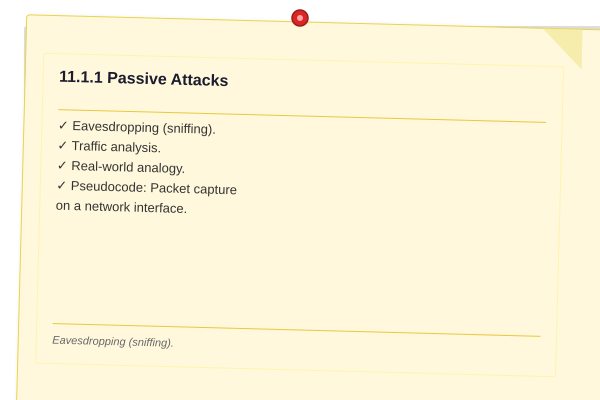
</a>


**Eavesdropping (sniffing).** An adversary captures packets traversing a network segment. On shared media (wireless, Ethernet hubs), any station on the segment can capture all traffic. On switched networks, ARP spoofing or port mirroring enables packet capture.

**Traffic analysis.** Even if packets are encrypted, an adversary can observe communication patterns → who talks to whom, at what times, and in what volumes → to infer sensitive information.

**Real-world analogy.** Eavesdropping is like a postal worker opening envelopes, reading the letters inside, resealing them, and delivering them. The sender and receiver never know the letter was read.

**Pseudocode: Packet capture on a network interface.**

```
FUNCTION capture_packets(interface, count):
    socket = open_raw_socket(interface)
    packets = []
    FOR i = 1 TO count:
        packet = socket.receive()
        packets.append(packet)
        LOG("Packet", i, ":", packet.src_ip, "->", packet.dst_ip, packet.length, "bytes")
    CLOSE socket
    RETURN packets
END
```

**Python implementation: Passive packet sniffer.**

```python
import socket
import struct

def capture_packets(interface: str, count: int) -> list:
    """Capture raw packets from a network interface."""
    sock = socket.socket(socket.AF_INET, socket.SOCK_RAW, socket.IPPROTO_TCP)
    sock.settimeout(5)
    packets = []
    for i in range(count):
        try:
            data, addr = sock.recvfrom(65535)
            ip_header = data[:20]
            iph = struct.unpack('!BBHHHBBH4s4s', ip_header)
            src = socket.inet_ntoa(iph[8])
            dst = socket.inet_ntoa(iph[9])
            packets.append({'src': src, 'dst': dst, 'data': data})
            print(f"Packet {i+1}: {src} -> {dst} ({len(data)} bytes)")
        except socket.timeout:
            break
    sock.close()
    return packets
```

**C++ implementation: Packet sniffer (Linux raw socket).**

```cpp
#include <iostream>
#include <cstring>
#include <arpa/inet.h>
#include <sys/socket.h>
#include <netinet/ip.h>
#include <netinet/tcp.h>
#include <unistd.h>
#include <vector>

struct Packet {
    std::string src, dst;
    int len;
};

std::vector<Packet> capturePackets(const std::string& iface, int count) {
    int sock = socket(AF_INET, SOCK_RAW, IPPROTO_TCP);
    if (sock < 0) { perror("socket"); return {}; }
    std::vector<Packet> packets;
    char buf[65536];
    for (int i = 0; i < count; ++i) {
        sockaddr_in addr;
        socklen_t addrLen = sizeof(addr);
        int n = recvfrom(sock, buf, sizeof(buf), 0, (sockaddr*)&addr, &addrLen);
        if (n < 0) break;
        struct iphdr* ip = (struct iphdr*)buf;
        char src[32], dst[32];
        inet_ntop(AF_INET, &ip->saddr, src, sizeof(src));
        inet_ntop(AF_INET, &ip->daddr, dst, sizeof(dst));
        packets.push_back({src, dst, n});
        std::cout << "Packet " << (i+1) << ": " << src << " -> " << dst << " (" << n << " bytes)\n";
    }
    close(sock);
    return packets;
}
```

**A&D: Passive Attacks**

| Advantages | Disadvantages |
|------------|---------------|
| Difficult to detect (no traffic modification) | Provides no active control over target |
| Low risk for attacker | Encrypted traffic limits value |
| Useful for reconnaissance | Requires physical/logical network access |

### 11.1.2 Active Attacks

<a href="../../assets/images/diagrams/computer-networks/11-security/11-1-2-active-attacks-handwritten.svg" target="_blank" rel="noopener">
  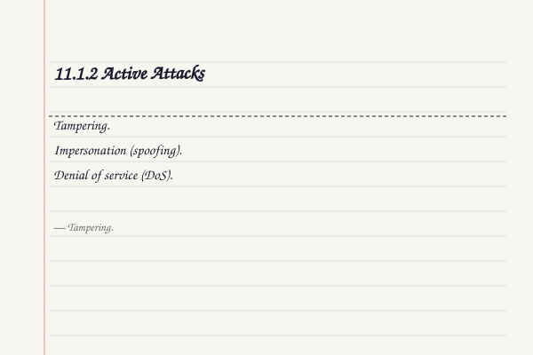
</a>
<a href="../../assets/images/diagrams/computer-networks/11-security/11-1-2-active-attacks-diagram.svg" target="_blank" rel="noopener">
  
</a>
<a href="../../assets/images/diagrams/computer-networks/11-security/11-1-2-active-attacks-sticky.svg" target="_blank" rel="noopener">
  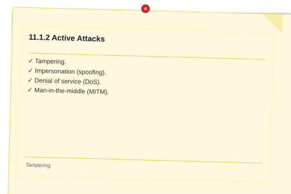
</a>


**Tampering.** An adversary modifies packets in transit. Without integrity protection, a router or middlebox can alter packet content undetected.

**Impersonation (spoofing).** An adversary sends packets with a forged source IP address. IP spoofing enables amplification attacks (e.g., DNS amplification) and session hijacking.

**Denial of service (DoS).** An adversary overwhelms a target with traffic, exhausting bandwidth, CPU, or memory resources. Distributed DoS (DDoS) uses many compromised hosts (botnet) to amplify the attack.

**Man-in-the-middle (MITM).** An adversary intercepts communication between two parties, relaying messages while potentially modifying them. Both parties believe they are communicating directly.

**Replay attack.** An adversary captures a valid message and retransmits it later to trick the receiver into performing an action.

**Real-world analogy.** Active attacks are like a courier who opens a package, replaces the contents with counterfeit items, then reseals and delivers it. Neither party knows the swap occurred.

**Pseudocode: ARP spoofing (MITM enabler).**

```
FUNCTION arp_spoof(target_ip, gateway_ip):
    target_mac = resolve_mac(target_ip)
    gateway_mac = resolve_mac(gateway_ip)
    WHILE attack_running:
        send_arp_reply(target_ip, gateway_mac, target_mac)
        send_arp_reply(gateway_ip, target_mac, gateway_mac)
        WAIT(2 seconds)
    END
END
```

**Edge cases in active attacks.**

| Edge Case | Scenario | Mitigation |
|-----------|----------|------------|
| Replay attack | Attacker resends a captured "transfer $1000" packet | Include timestamps + nonces in every message; use sequence numbers |
| MITM with forged cert | Attacker presents fake certificate during TLS handshake | Certificate pinning; CA-signed certificates; CT logs |
| DoS on firewall | Attacker floods firewall with incomplete connections exhausting state table | SYN cookies; connection rate limits; asymmetric firewall design |
| Amplification attack | Small spoofed DNS query generates large response to victim | BCP 38 ingress filtering; disable open resolvers |

**A&D: Active Attacks**

| Advantages | Disadvantages |
|------------|---------------|
| Complete control over target data | High detection risk |
| Can cause permanent damage | Requires more resources |
| Multiple attack vectors available | Leaves forensic evidence |

## 11.2 Cryptography Basics

### 11.2.1 Symmetric Key Cryptography

<a href="../../assets/images/diagrams/computer-networks/11-security/11-2-1-symmetric-key-cryptography-handwritten.svg" target="_blank" rel="noopener">
  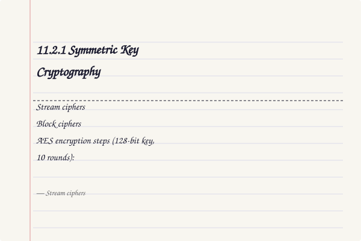
</a>
<a href="../../assets/images/diagrams/computer-networks/11-security/11-2-1-symmetric-key-cryptography-diagram.svg" target="_blank" rel="noopener">
  
</a>
<a href="../../assets/images/diagrams/computer-networks/11-security/11-2-1-symmetric-key-cryptography-sticky.svg" target="_blank" rel="noopener">
  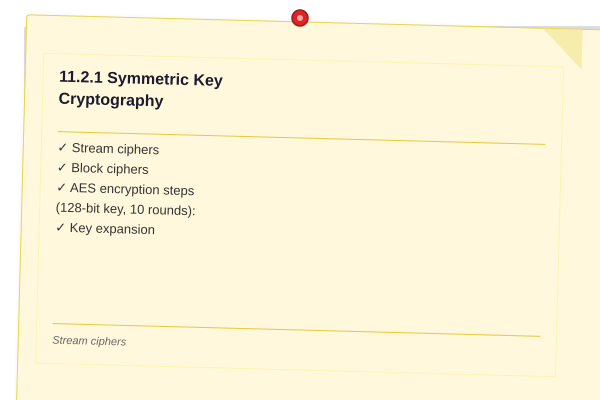
</a>


In symmetric key cryptography, both sender and receiver share a single secret key K. The encryption function E and decryption function D satisfy:

D(K, E(K, M)) = M

**Stream ciphers** encrypt one bit or byte at a time by XORing the plaintext with a pseudorandom keystream (e.g., RC4, ChaCha20).

**Block ciphers** encrypt fixed-size blocks (typically 128 bits). AES (Advanced Encryption Standard) processes 128-bit blocks with key sizes of 128, 192, or 256 bits.

**AES encryption steps (128-bit key, 10 rounds):**
1. **Key expansion**: Derive 10 round keys from the original 128-bit key using Rijndael key schedule.
2. **Initial AddRoundKey**: XOR plaintext block with round key 0.
3. **For rounds 1-9**: SubBytes (nonlinear byte substitution via S-box), ShiftRows (circular shift of rows), MixColumns (matrix multiplication in GF(2^8)), AddRoundKey (XOR with round key).
4. **Final round (round 10)**: SubBytes, ShiftRows, AddRoundKey (no MixColumns).

**Modes of operation:**
- **ECB (Electronic Codebook):** each block encrypted independently; identical plaintext blocks produce identical ciphertext. Leaks patterns.
- **CBC (Cipher Block Chaining):** each plaintext block is XORed with the previous ciphertext block before encryption. Sequential.
- **CTR (Counter):** encrypts a counter value and XORs with plaintext; parallelizable, random access.
- **GCM (Galois/Counter Mode):** CTR mode + authentication tag; provides both confidentiality and integrity.

**Real-world analogy.** Symmetric encryption is like a locked box where both parties have an identical key. The sender locks the message, the receiver unlocks it. The challenge is securely distributing the key.

**Pseudocode: AES-CBC encryption.**

```
FUNCTION aes_cbc_encrypt(plaintext, key, iv):
    blocks = pad_and_split(plaintext, 16)    // PKCS#7 padding
    prev = iv
    ciphertext = []
    FOR block IN blocks:
        xored = block XOR prev
        encrypted = aes_core_encrypt(xored, key)
        ciphertext.append(encrypted)
        prev = encrypted
    RETURN ciphertext
END
```

**Python implementation: AES-CBC (conceptual).**

```python
import os
from hashlib import sha256

def xor_bytes(a: bytes, b: bytes) -> bytes:
    return bytes(x ^ y for x, y in zip(a, b))

def pad_pkcs7(data: bytes, block_size: int = 16) -> bytes:
    pad_len = block_size - (len(data) % block_size)
    return data + bytes([pad_len] * pad_len)

def aes_cbc_encrypt(plaintext: bytes, key: bytes, iv: bytes) -> bytes:
    block_size = 16
    plaintext = pad_pkcs7(plaintext, block_size)
    ciphertext = b""
    prev = iv
    for i in range(0, len(plaintext), block_size):
        block = plaintext[i:i + block_size]
        xored = xor_bytes(block, prev)
        round_key = sha256(key + bytes([i // 16])).digest()[:block_size]
        encrypted = xor_bytes(xored, round_key)
        ciphertext += encrypted
        prev = encrypted
    return ciphertext

def aes_cbc_decrypt(ciphertext: bytes, key: bytes, iv: bytes) -> bytes:
    block_size = 16
    plaintext = b""
    prev = iv
    for i in range(0, len(ciphertext), block_size):
        block = ciphertext[i:i + block_size]
        round_key = sha256(key + bytes([i // 16])).digest()[:block_size]
        decrypted = xor_bytes(block, round_key)
        plaintext += xor_bytes(decrypted, prev)
        prev = block
    pad_len = plaintext[-1]
    return plaintext[:-pad_len]

key = os.urandom(16)
iv = os.urandom(16)
pt = b"Hello, Network Security!"
ct = aes_cbc_encrypt(pt, key, iv)
dt = aes_cbc_decrypt(ct, key, iv)
print(f"Plaintext: {pt}")
print(f"Ciphertext (hex): {ct.hex()}")
print(f"Decrypted: {dt}")
```

**C++ implementation: AES-CBC (conceptual).**

```cpp
#include <iostream>
#include <vector>
#include <cstdint>

using Bytes = std::vector<uint8_t>;

Bytes xorBytes(const Bytes& a, const Bytes& b) {
    Bytes result(a.size());
    for (size_t i = 0; i < a.size(); ++i)
        result[i] = a[i] ^ b[i];
    return result;
}

Bytes padPKCS7(const Bytes& data, size_t blockSize = 16) {
    Bytes result = data;
    uint8_t padLen = blockSize - (data.size() % blockSize);
    result.insert(result.end(), padLen, padLen);
    return result;
}

Bytes aesCbcEncrypt(const Bytes& plaintext, const Bytes& key, const Bytes& iv) {
    size_t blockSize = 16;
    Bytes padded = padPKCS7(plaintext, blockSize);
    Bytes ciphertext;
    Bytes prev = iv;
    for (size_t i = 0; i < padded.size(); i += blockSize) {
        Bytes block(padded.begin() + i, padded.begin() + i + blockSize);
        Bytes xored = xorBytes(block, prev);
        Bytes roundKey(blockSize, static_cast<uint8_t>(key[i / 16 % key.size()]));
        Bytes encrypted = xorBytes(xored, roundKey);
        ciphertext.insert(ciphertext.end(), encrypted.begin(), encrypted.end());
        prev = encrypted;
    }
    return ciphertext;
}

int main() {
    Bytes key = {0x00, 0x01, 0x02, 0x03, 0x04, 0x05, 0x06, 0x07,
                 0x08, 0x09, 0x0A, 0x0B, 0x0C, 0x0D, 0x0E, 0x0F};
    Bytes iv(16, 0x00);
    Bytes pt = {'H', 'e', 'l', 'l', 'o', '!'};
    Bytes ct = aesCbcEncrypt(pt, key, iv);
    std::cout << "Ciphertext: " << ct.size() << " bytes\n";
    return 0;
}
```

**Complexity analysis of AES-CBC.**

| Operation | Time Complexity | Space Complexity | WHY |
|-----------|----------------|------------------|-----|
| Encryption (n bytes) | O(n) | O(n) output | Each 16-byte block processed independently; one AES core per block |
| AES core (per block) | O(1) | O(1) | Fixed 10/12/14 rounds; all ops are table lookups and XOR on 16 bytes |
| Key expansion | O(r) | O(r) | r = 10-14 rounds; each derived via XOR and S-box |

### 11.2.2 Asymmetric Key Cryptography

<a href="../../assets/images/diagrams/computer-networks/11-security/11-2-2-asymmetric-key-cryptography-handwritten.svg" target="_blank" rel="noopener">
  
</a>
<a href="../../assets/images/diagrams/computer-networks/11-security/11-2-2-asymmetric-key-cryptography-diagram.svg" target="_blank" rel="noopener">
  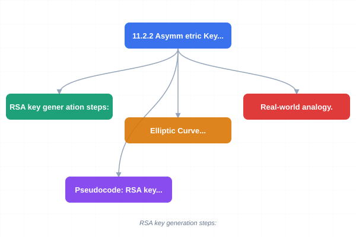
</a>
<a href="../../assets/images/diagrams/computer-networks/11-security/11-2-2-asymmetric-key-cryptography-sticky.svg" target="_blank" rel="noopener">
  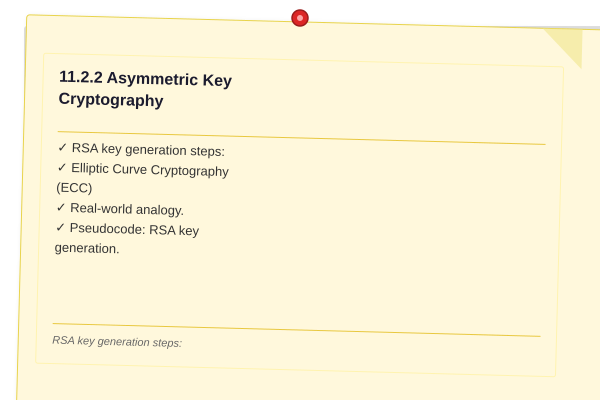
</a>


Asymmetric (public-key) cryptography uses a pair of keys: a public key K_pub freely distributed and a private key K_priv kept secret.

D(K_priv, E(K_pub, M)) = M

**RSA** (Rivest-Shamir-Adleman) security relies on the difficulty of factoring large composite numbers.

**RSA key generation steps:**
1. Choose two large primes p and q (2048 bits each for security).
2. Compute n = p * q (modulus, 4096 bits).
3. Compute phi(n) = (p-1)(q-1).
4. Choose e such that 1 &lt; e < phi(n) and gcd(e, phi(n)) = 1 (commonly e = 65537).
5. Compute d = e^{-1} mod phi(n) using extended Euclidean algorithm.
6. Public key: (n, e); private key: (n, d).

Encryption: c = m^e mod n. Decryption: m = c^d mod n.

**Elliptic Curve Cryptography (ECC)** provides equivalent security with smaller key sizes (256-bit ECC ~ 3072-bit RSA). Used in TLS 1.3 and Bitcoin.

**Real-world analogy.** Asymmetric encryption is like a padlock box. Alice gives everyone an open padlock (public key). Bob puts his message in the box, snaps the padlock shut, and sends it. Only Alice has the key (private key) to open it.

**Pseudocode: RSA key generation.**

```
FUNCTION rsa_keygen(bits):
    p = random_prime(bits / 2)
    q = random_prime(bits / 2)
    n = p * q
    phi = (p - 1) * (q - 1)
    e = 65537
    d = modular_inverse(e, phi)
    RETURN ((n, e), (n, d))
END
```

**Python implementation: RSA.**

```python
import random

def is_prime(n: int, k: int = 40) -> bool:
    """Miller-Rabin primality test."""
    if n < 2: return False
    if n < 4: return True
    if n % 2 == 0: return False
    r, d = 0, n - 1
    while d % 2 == 0:
        r += 1
        d //= 2
    for _ in range(k):
        a = random.randrange(2, n - 2)
        x = pow(a, d, n)
        if x == 1 or x == n - 1:
            continue
        for _ in range(r - 1):
            x = pow(x, 2, n)
            if x == n - 1: break
        else:
            return False
    return True

def random_prime(bits: int) -> int:
    while True:
        n = random.getrandbits(bits)
        n |= (1 << bits - 1) | 1
        if is_prime(n): return n

def extended_gcd(a: int, b: int):
    if b == 0: return a, 1, 0
    g, x1, y1 = extended_gcd(b, a % b)
    return g, y1, x1 - (a // b) * y1

def modular_inverse(e: int, phi: int) -> int:
    g, x, _ = extended_gcd(e, phi)
    if g != 1: raise ValueError("No inverse")
    return x % phi

def rsa_keygen(bits: int = 1024):
    p = random_prime(bits // 2)
    q = random_prime(bits // 2)
    n = p * q
    phi = (p - 1) * (q - 1)
    e = 65537
    d = modular_inverse(e, phi)
    return (n, e), (n, d)

pub, priv = rsa_keygen(512)
n, e = pub
_, d = priv
msg = 42
ct = pow(msg, e, n)
pt = pow(ct, d, n)
print(f"Original: {msg}, Decrypted: {pt}")
```

**C++ implementation: RSA modular exponentiation.**

```cpp
#include <iostream>
#include <cstdint>

uint64_t modPow(uint64_t base, uint64_t exp, uint64_t mod) {
    uint64_t result = 1;
    base = base % mod;
    while (exp > 0) {
        if (exp & 1) result = (result * base) % mod;
        exp = exp >> 1;
        base = (base * base) % mod;
    }
    return result;
}

uint64_t modInverse(uint64_t e, uint64_t phi) {
    int64_t t = 0, newT = 1;
    int64_t r = phi, newR = e;
    while (newR != 0) {
        int64_t q = r / newR;
        int64_t tmp = t - q * newT; t = newT; newT = tmp;
        tmp = r - q * newR; r = newR; newR = tmp;
    }
    if (r > 1) return 0;
    if (t < 0) t += phi;
    return t;
}

int main() {
    uint64_t p = 61, q = 53;
    uint64_t n = p * q;
    uint64_t phi = (p - 1) * (q - 1);
    uint64_t e = 17, d = modInverse(e, phi);
    uint64_t msg = 65, ct = modPow(msg, e, n), pt = modPow(ct, d, n);
    std::cout << "Original=" << msg << " Decrypted=" << pt << "\n";
    return 0;
}
```

**Complexity analysis of RSA.**

| Operation | Time Complexity | WHY |
|-----------|----------------|-----|
| Key generation | O(b^4) naive; O(b^3) optimized | Primality testing on O(b) candidates; arithmetic is O(b^2) per op |
| Encryption | O(b^3) with e=65537 | Square-and-multiply: 17 multiplications with e=65537 |
| Decryption | O(b^3) | Exponent d is full b bits; O(b) multiplications of O(b^2) each |

### 11.2.3 Diffie-Hellman Key Exchange

<a href="../../assets/images/diagrams/computer-networks/11-security/11-2-3-diffie-hellman-key-exchange-handwritten.svg" target="_blank" rel="noopener">
  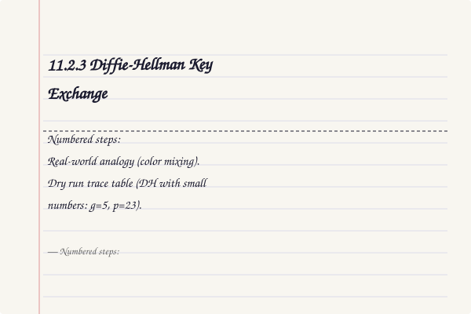
</a>
<a href="../../assets/images/diagrams/computer-networks/11-security/11-2-3-diffie-hellman-key-exchange-diagram.svg" target="_blank" rel="noopener">
  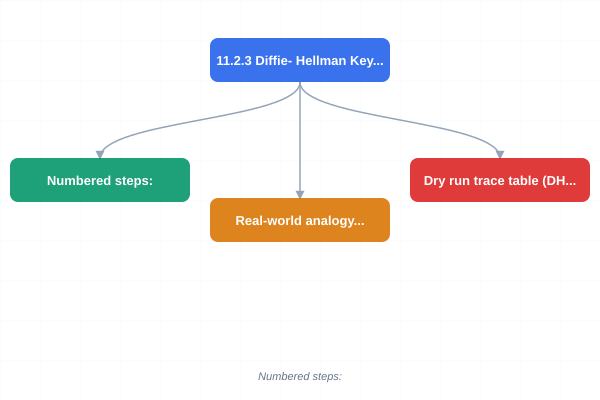
</a>
<a href="../../assets/images/diagrams/computer-networks/11-security/11-2-3-diffie-hellman-key-exchange-sticky.svg" target="_blank" rel="noopener">
  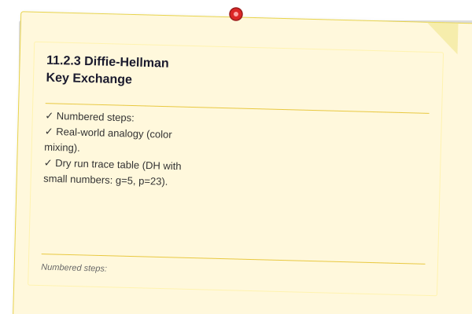
</a>


Diffie-Hellman (DH) allows two parties to establish a shared secret over an insecure channel.

**Numbered steps:**
1. Alice and Bob agree on public parameters g (generator) and p (large prime).
2. Alice chooses random private a, computes A = g^a mod p, sends A to Bob.
3. Bob chooses random private b, computes B = g^b mod p, sends B to Alice.
4. Alice computes shared_secret = B^a mod p = g^{ab} mod p.
5. Bob computes shared_secret = A^b mod p = g^{ab} mod p.

**Real-world analogy (color mixing).** Alice and Bob each choose a private color and mix it with a public base color (yellow). They exchange the mixtures. Each adds their private color to the received mixture, arriving at the same shared secret color. Eve sees the mixtures but cannot separate them.

**Dry run trace table (DH with small numbers: g=5, p=23).**

| Step | Alice | Channel (Eve sees) | Bob |
|------|-------|-------------------|-----|
| 1 | Agrees g=5, p=23 | g=5, p=23 | Agrees g=5, p=23 |
| 2 | Private a=6, A=5^6 mod 23=8 | A=8 | -- |
| 3 | -- | B=19 | Private b=15, B=5^15 mod 23=19 |
| 4 | s = 19^6 mod 23 = 2 | -- | -- |
| 5 | s = 2 | -- | s = 8^15 mod 23 = 2 |
| Result | Shared secret = 2 | Eve sees g=5, p=23, A=8, B=19 | Shared secret = 2 |

DH is vulnerable to MITM unless public values are authenticated. Elliptic Curve Diffie-Hellman (ECDHE) is used in TLS 1.3 for forward secrecy.

### 11.2.4 Symmetric vs Asymmetric Cryptography

<a href="../../assets/images/diagrams/computer-networks/11-security/11-2-4-symmetric-vs-asymmetric-cryptography-handwritten.svg" target="_blank" rel="noopener">
  
</a>
<a href="../../assets/images/diagrams/computer-networks/11-security/11-2-4-symmetric-vs-asymmetric-cryptography-diagram.svg" target="_blank" rel="noopener">
  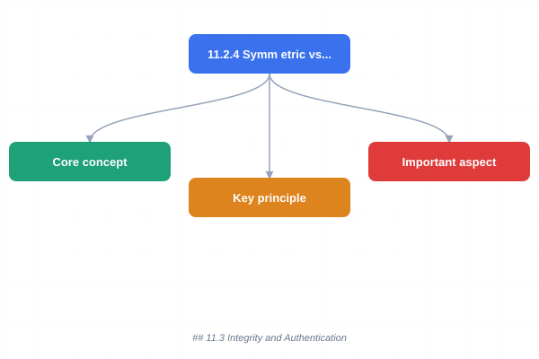
</a>
<a href="../../assets/images/diagrams/computer-networks/11-security/11-2-4-symmetric-vs-asymmetric-cryptography-sticky.svg" target="_blank" rel="noopener">
  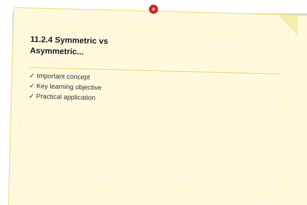
</a>


| Property | Symmetric (AES) | Asymmetric (RSA/ECC) |
|----------|----------------|----------------------|
| Key count | 1 shared key | 2 keys (public + private) |
| Key distribution | Needs secure channel | Public key can be published |
| Speed | Very fast (AES-NI hardware) | 100-1000x slower |
| Bulk encryption | Yes | No, limited to small data |
| Key size | 128-256 bits | 2048-4096 bits (RSA); 256 bits (ECC) |
| Security basis | Substitution-permutation net | Factorization (RSA) or ECDLP |
| Use cases | File/disk/TLS data encryption | Key exchange, digital signatures |
| Quantum resistant | No (Grover's halves security) | No (Shor's breaks both) |
| Advantages | Fast, simple hardware impl | Solves key distribution problem |
| Disadvantages | Key distribution problem | Slow, larger key sizes |

## 11.3 Integrity and Authentication

### 11.3.1 Cryptographic Hash Functions

<a href="../../assets/images/diagrams/computer-networks/11-security/11-3-1-cryptographic-hash-functions-handwritten.svg" target="_blank" rel="noopener">
  
</a>
<a href="../../assets/images/diagrams/computer-networks/11-security/11-3-1-cryptographic-hash-functions-diagram.svg" target="_blank" rel="noopener">
  
</a>
<a href="../../assets/images/diagrams/computer-networks/11-security/11-3-1-cryptographic-hash-functions-sticky.svg" target="_blank" rel="noopener">
  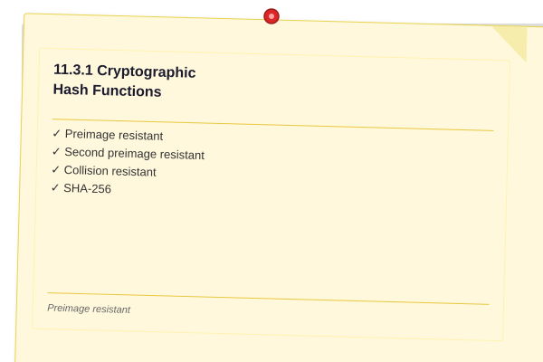
</a>


A hash function H maps an arbitrary-length input to a fixed-length output (digest). Cryptographic hash functions must be:

- **Preimage resistant**: given y, infeasible to find x such that H(x) = y.
- **Second preimage resistant**: given x, infeasible to find x' != x such that H(x') = H(x).
- **Collision resistant**: infeasible to find any x1 != x2 such that H(x1) = H(x2).

**SHA-256** produces a 256-bit digest. **SHA-3** is the latest NIST standard.

**Real-world analogy.** A hash is like a fingerprint. A fingerprint uniquely identifies a person but cannot be reversed to reconstruct the person's appearance. Similarly, a hash uniquely identifies data but cannot be reversed to recover the original data.

**Pseudocode: SHA-256 (simplified).**

```
FUNCTION sha256(message):
    message = pad(message)        // Append '1', then zeros, then 64-bit length
    blocks = split(message, 64)   // 512-bit (64-byte) blocks
    state = init_state()          // 8 x 32-bit hash values (H0-H7)
    FOR block IN blocks:
        w = create_message_schedule(block)  // 64 x 32-bit words
        state = compression_loop(state, w)  // 64 rounds of and/xor/rot/+
    RETURN concatenate(state)
END
```

### 11.3.2 Message Authentication Code (MAC)

<a href="../../assets/images/diagrams/computer-networks/11-security/11-3-2-message-authentication-code-mac-handwritten.svg" target="_blank" rel="noopener">
  
</a>
<a href="../../assets/images/diagrams/computer-networks/11-security/11-3-2-message-authentication-code-mac-diagram.svg" target="_blank" rel="noopener">
  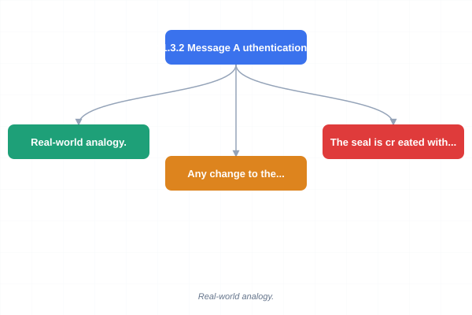
</a>
<a href="../../assets/images/diagrams/computer-networks/11-security/11-3-2-message-authentication-code-mac-sticky.svg" target="_blank" rel="noopener">
  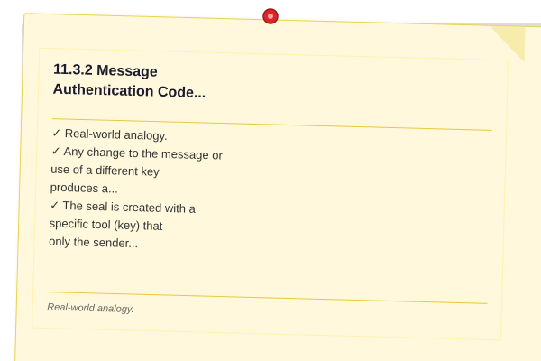
</a>


A MAC uses a shared secret key K to produce an authentication tag for a message:

T = MAC(K, M)

The receiver recomputes the tag and compares. Any change to the message or use of a different key produces a different tag.

HMAC (Hash-based MAC, RFC 2104): HMAC(K, M) = H((K XOR opad) || H((K XOR ipad) || M))

**Real-world analogy.** A MAC is like a tamper-evident seal on a package. The seal is created with a specific tool (key) that only the sender and receiver have. If the package is tampered with, the seal breaks and reveals the tampering.

### 11.3.3 Digital Signatures

<a href="../../assets/images/diagrams/computer-networks/11-security/11-3-3-digital-signatures-handwritten.svg" target="_blank" rel="noopener">
  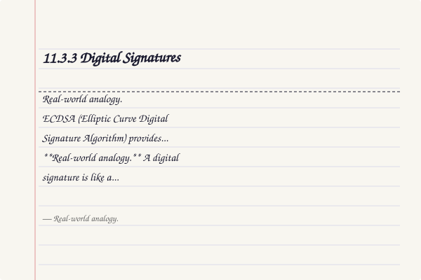
</a>
<a href="../../assets/images/diagrams/computer-networks/11-security/11-3-3-digital-signatures-diagram.svg" target="_blank" rel="noopener">
  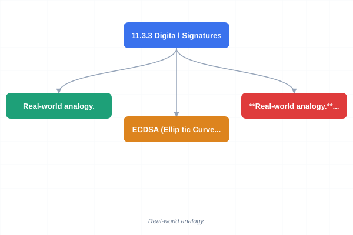
</a>
<a href="../../assets/images/diagrams/computer-networks/11-security/11-3-3-digital-signatures-sticky.svg" target="_blank" rel="noopener">
  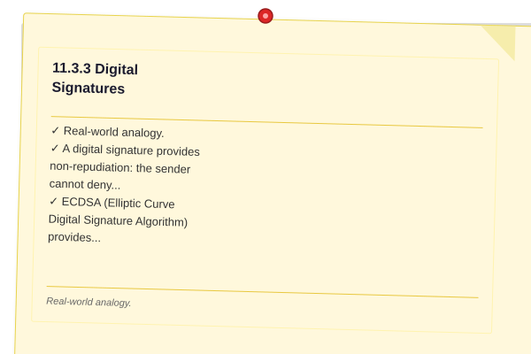
</a>


A digital signature provides non-repudiation: the sender cannot deny having signed the message. The sender signs with their private key:

S = E(K_priv, H(M))

The receiver verifies with the sender's public key:

H(M) = D(K_pub, S)

RSA signatures work analogously to encryption but with the roles of public and private keys reversed. ECDSA (Elliptic Curve Digital Signature Algorithm) provides signatures with ECC keys.

**Real-world analogy.** A digital signature is like a handwritten signature on a legal contract. The signature proves who signed it (authentication), that the document was not altered after signing (integrity), and the signer cannot later deny signing (non-repudiation).

### 11.3.4 Certificates and PKI

<a href="../../assets/images/diagrams/computer-networks/11-security/11-3-4-certificates-and-pki-handwritten.svg" target="_blank" rel="noopener">
  
</a>
<a href="../../assets/images/diagrams/computer-networks/11-security/11-3-4-certificates-and-pki-diagram.svg" target="_blank" rel="noopener">
  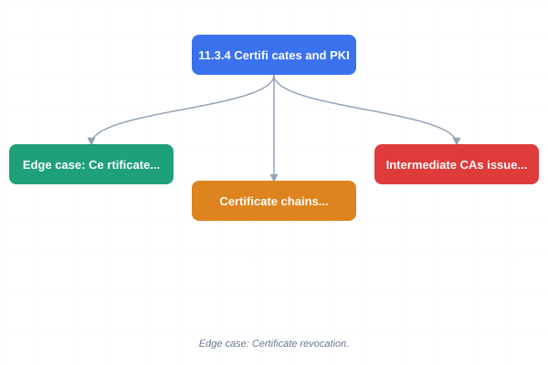
</a>
<a href="../../assets/images/diagrams/computer-networks/11-security/11-3-4-certificates-and-pki-sticky.svg" target="_blank" rel="noopener">
  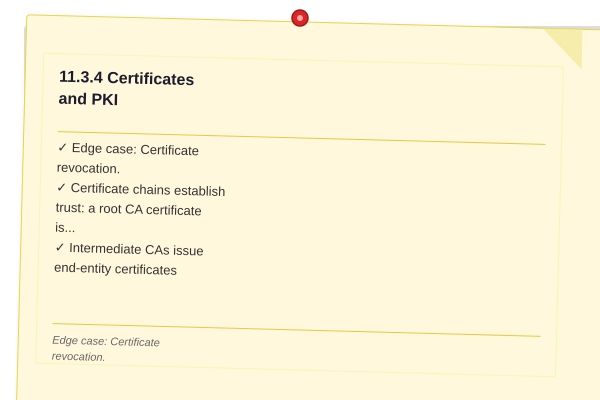
</a>


A digital certificate binds a public key to an identity. X.509 certificates contain:
- Version, serial number, signature algorithm
- Issuer (Certificate Authority, CA)
- Validity period (notBefore, notAfter)
- Subject (the entity the certificate identifies)
- Subject's public key
- CA's signature

The CA is a trusted third party. Certificate chains establish trust: a root CA certificate is self-signed and distributed with the OS. Intermediate CAs issue end-entity certificates. The client validates the chain up to a trusted root.

**Edge case: Certificate revocation.**

| Scenario | Mechanism | Limitation |
|----------|-----------|------------|
| Private key compromised | CRL (Certificate Revocation List) | CRLs can be large; delay between revocation and distribution |
| CA compromise | OCSP (Online Certificate Status Protocol) | OCSP responder can be DoS'd; privacy concerns (CA learns which sites you visit) |
| Certificate mistakenly issued | OCSP Stapling | Server fetches OCSP response and includes in TLS handshake; not all servers support it |
## 11.4 Firewalls

A firewall is a system that controls network traffic based on a security policy. Firewalls are categorized by the layer at which they operate and the statefulness of their inspection.

### 11.4.1 Packet-Filter Firewalls

<a href="../../assets/images/diagrams/computer-networks/11-security/11-4-1-packet-filter-firewalls-handwritten.svg" target="_blank" rel="noopener">
  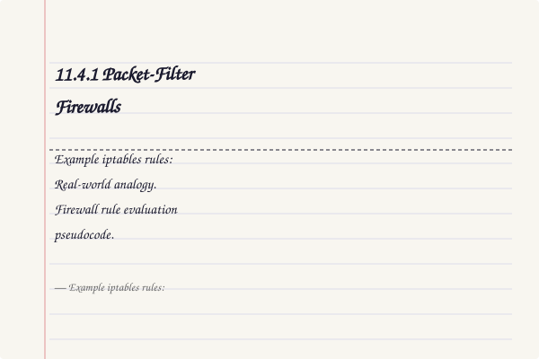
</a>
<a href="../../assets/images/diagrams/computer-networks/11-security/11-4-1-packet-filter-firewalls-diagram.svg" target="_blank" rel="noopener">
  
</a>
<a href="../../assets/images/diagrams/computer-networks/11-security/11-4-1-packet-filter-firewalls-sticky.svg" target="_blank" rel="noopener">
  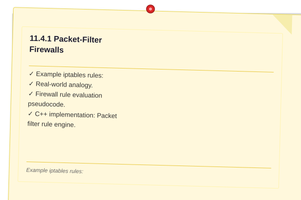
</a>


Packet filters examine IP and transport header fields: source/destination address, port, protocol type, and interface. Rules are evaluated in order; the first matching rule determines the action (allow or deny).

**Example iptables rules:**
```
iptables -A INPUT -p tcp --dport 22 -s 10.0.0.0/8 -j ACCEPT
iptables -A INPUT -p tcp --dport 22 -j DROP
iptables -A INPUT -p tcp --dport 80 -j ACCEPT
iptables -A OUTPUT -m state --state ESTABLISHED,RELATED -j ACCEPT
```

Packet filters are stateless → each packet is evaluated independently. They cannot detect attacks spread across multiple packets.

**Real-world analogy.** A packet filter is like a bouncer at a club who checks only the ID (source address) and what the person is wearing (port number). They let people in or out based on these simple visible traits without remembering anyone.

**Firewall rule evaluation pseudocode.**

```
FUNCTION evaluate_packet(packet, rules):
    FOR rule IN rules:
        IF match(packet.src_ip, rule.src) AND
           match(packet.dst_ip, rule.dst) AND
           match(packet.port, rule.port) AND
           match(packet.protocol, rule.protocol):
            RETURN rule.action  // ACCEPT or DROP
    RETURN default_action  // Usually DROP (default-deny)
END
```

**C++ implementation: Packet filter rule engine.**

```cpp
#include <iostream>
#include <vector>
#include <string>
#include <cstdint>

enum Action { ACCEPT, DROP };
enum Protocol { TCP, UDP, ICMP, ANY };

struct Rule {
    std::string src;
    std::string dst;
    uint16_t port;
    Protocol proto;
    Action action;
};

struct Packet {
    std::string src;
    std::string dst;
    uint16_t sport;
    uint16_t dport;
    Protocol proto;
};

bool matchIP(const std::string& packetIP, const std::string& ruleIP) {
    if (ruleIP == "0.0.0.0/0" || ruleIP == "any") return true;
    // Simplified: exact match or prefix match
    if (packetIP == ruleIP) return true;
    size_t slash = ruleIP.find('/');
    if (slash != std::string::npos) {
        std::string prefix = ruleIP.substr(0, slash);
        return packetIP.find(prefix) == 0;
    }
    return false;
}

Action evaluatePacket(const Packet& pkt, const std::vector<Rule>& rules) {
    for (const auto& rule : rules) {
        if (matchIP(pkt.src, rule.src) &&
            matchIP(pkt.dst, rule.dst) &&
            (rule.port == 0 || pkt.dport == rule.port || pkt.sport == rule.port) &&
            (rule.proto == ANY || pkt.proto == rule.proto)) {
            return rule.action;
        }
    }
    return DROP; // Default-deny
}

int main() {
    std::vector<Rule> rules = {
        {"10.0.0.0/8", "any", 22, TCP, ACCEPT},
        {"any", "any", 22, TCP, DROP},
        {"any", "any", 80, TCP, ACCEPT},
        {"any", "any", 443, TCP, ACCEPT}
    };
    Packet pkt1 = {"10.0.0.5", "192.168.1.1", 50000, 22, TCP};
    Packet pkt2 = {"203.0.113.5", "192.168.1.1", 50001, 22, TCP};
    Packet pkt3 = {"10.0.0.5", "192.168.1.1", 50002, 80, TCP};
    std::cout << "Packet1 (internal SSH): " << (evaluatePacket(pkt1, rules) == ACCEPT ? "ACCEPT" : "DROP") << "\n";
    std::cout << "Packet2 (external SSH): " << (evaluatePacket(pkt2, rules) == ACCEPT ? "ACCEPT" : "DROP") << "\n";
    std::cout << "Packet3 (HTTP): " << (evaluatePacket(pkt3, rules) == ACCEPT ? "ACCEPT" : "DROP") << "\n";
    return 0;
}
```

**Python implementation: Firewall rule engine.**

```python
from dataclasses import dataclass
from enum import Enum, auto
from ipaddress import ip_network, ip_address

class Action(Enum):
    ACCEPT = auto()
    DROP = auto()

class Protocol(Enum):
    TCP = auto()
    UDP = auto()
    ICMP = auto()
    ANY = auto()

@dataclass
class Rule:
    src: str
    dst: str
    port: int
    protocol: Protocol
    action: Action

@dataclass
class Packet:
    src: str
    dst: str
    sport: int
    dport: int
    protocol: Protocol

def match_ip(packet_ip: str, rule_ip: str) -> bool:
    if rule_ip in ("any", "0.0.0.0/0"):
        return True
    try:
        return ip_address(packet_ip) in ip_network(rule_ip, strict=False)
    except ValueError:
        return packet_ip == rule_ip

def evaluate_packet(pkt: Packet, rules: list[Rule]) -> Action:
    for rule in rules:
        if (match_ip(pkt.src, rule.src) and
            match_ip(pkt.dst, rule.dst) and
            (rule.port == 0 or pkt.dport == rule.port or pkt.sport == rule.port) and
            (rule.protocol == Protocol.ANY or pkt.protocol == rule.protocol)):
            return rule.action
    return Action.DROP

rules = [
    Rule("10.0.0.0/8", "any", 22, Protocol.TCP, Action.ACCEPT),
    Rule("any", "any", 22, Protocol.TCP, Action.DROP),
    Rule("any", "any", 80, Protocol.TCP, Action.ACCEPT),
    Rule("any", "any", 443, Protocol.TCP, Action.ACCEPT),
]

tests = [
    Packet("10.0.0.5", "192.168.1.1", 50000, 22, Protocol.TCP),
    Packet("203.0.113.5", "192.168.1.1", 50001, 22, Protocol.TCP),
    Packet("10.0.0.5", "192.168.1.1", 50002, 443, Protocol.TCP),
]

for t in tests:
    result = "ACCEPT" if evaluate_packet(t, rules) == Action.ACCEPT else "DROP"
    print(f"Packet {t.src}:{t.sport} -> {t.dst}:{t.dport} => {result}")
```

**Dry run trace table: Firewall rule evaluation.**

| Packet | Src IP | Dst IP | Port | Rule 1 (10.0.0.0/8:22) | Rule 2 (any:22 DROP) | Rule 3 (:80 ACCEPT) | Result |
|--------|--------|--------|------|-------------------------|----------------------|---------------------|--------|
| P1 | 10.0.0.5 | 192.168.1.1 | 22 | MATCH → ACCEPT | (skipped) | (skipped) | ACCEPT |
| P2 | 203.0.113.5 | 192.168.1.1 | 22 | No match (src != 10.x) | MATCH → DROP | (skipped) | DROP |
| P3 | 10.0.0.5 | 192.168.1.1 | 80 | No match (port != 22) | No match (port != 22) | MATCH → ACCEPT | ACCEPT |
| P4 | 10.0.0.5 | 192.168.1.1 | 443 | No match | No match | No match (port != 80) | DROP (default) |

**Complexity analysis of firewall rule evaluation.**

| Operation | Time Complexity | Space Complexity | WHY |
|-----------|----------------|------------------|-----|
| Single packet eval | O(R) where R = rules | O(1) | Linear scan of rules; each match is O(1) |
| N packets, R rules | O(N * R) | O(1) | Each packet independently evaluated against all rules |
| Optimized (hash table) | O(N * log R) | O(R) | Rule groups by port; binary search reduces per-packet cost |

### 11.4.2 Stateful Firewalls

<a href="../../assets/images/diagrams/computer-networks/11-security/11-4-2-stateful-firewalls-handwritten.svg" target="_blank" rel="noopener">
  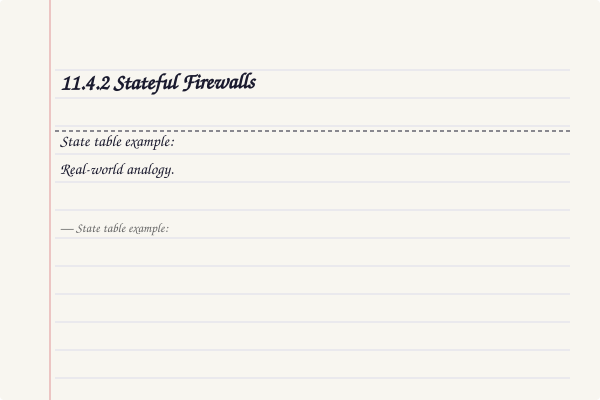
</a>
<a href="../../assets/images/diagrams/computer-networks/11-security/11-4-2-stateful-firewalls-diagram.svg" target="_blank" rel="noopener">
  
</a>
<a href="../../assets/images/diagrams/computer-networks/11-security/11-4-2-stateful-firewalls-sticky.svg" target="_blank" rel="noopener">
  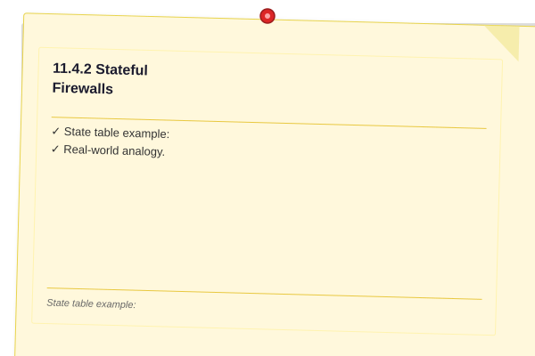
</a>


Stateful firewalls track connection state. A connection table records (src IP, src port, dst IP, dst port, state). Inbound packets are allowed only if they correspond to an established outbound connection. Stateful inspection prevents many blind injection attacks.

**State table example:**

| Src IP | Src Port | Dst IP | Dst Port | State |
|--------|----------|--------|----------|-------|
| 10.0.0.5 | 50000 | 93.184.216.34 | 80 | ESTABLISHED |
| 10.0.0.5 | 50001 | 93.184.216.34 | 443 | TIME_WAIT |

**Real-world analogy.** A stateful firewall is like a security guard who keeps a clipboard. When someone leaves the building, the guard writes their name down. If someone tries to enter claiming they have business inside, the guard checks the clipboard. If they are not on the list, they are denied entry.

### 11.4.3 Application-Layer Firewalls (Proxies)

<a href="../../assets/images/diagrams/computer-networks/11-security/11-4-3-application-layer-firewalls-proxies-handwritten.svg" target="_blank" rel="noopener">
  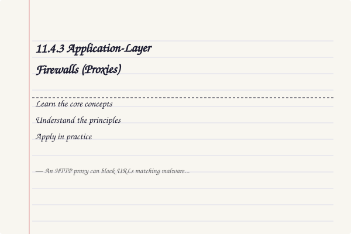
</a>
<a href="../../assets/images/diagrams/computer-networks/11-security/11-4-3-application-layer-firewalls-proxies-diagram.svg" target="_blank" rel="noopener">
  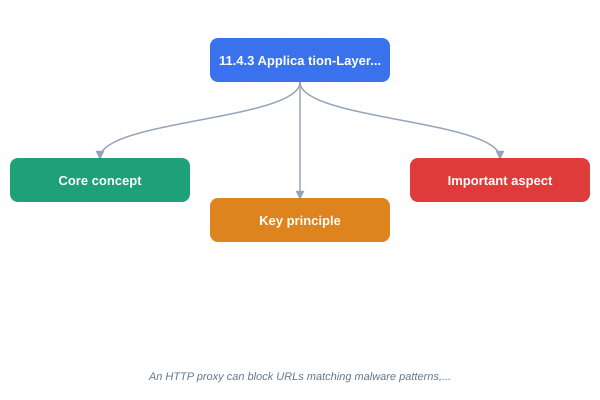
</a>
<a href="../../assets/images/diagrams/computer-networks/11-security/11-4-3-application-layer-firewalls-proxies-sticky.svg" target="_blank" rel="noopener">
  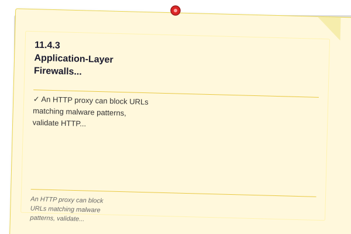
</a>


Application firewalls (proxies) inspect application-layer content. An HTTP proxy can block URLs matching malware patterns, validate HTTP headers, and filter file types.

### 11.4.4 Next-Generation Firewalls (NGFW)

<a href="../../assets/images/diagrams/computer-networks/11-security/11-4-4-next-generation-firewalls-ngfw-handwritten.svg" target="_blank" rel="noopener">
  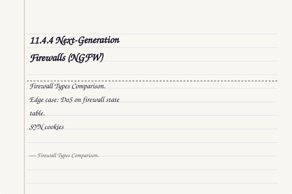
</a>
<a href="../../assets/images/diagrams/computer-networks/11-security/11-4-4-next-generation-firewalls-ngfw-diagram.svg" target="_blank" rel="noopener">
  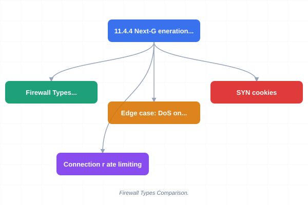
</a>
<a href="../../assets/images/diagrams/computer-networks/11-security/11-4-4-next-generation-firewalls-ngfw-sticky.svg" target="_blank" rel="noopener">
  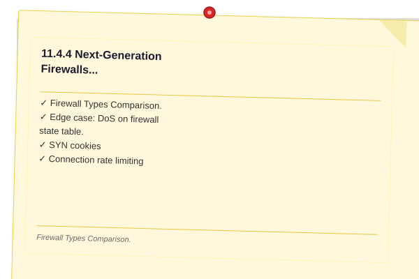
</a>


Next-generation firewalls (NGFW) combine stateful inspection with intrusion prevention, application identification, user identity awareness, and TLS decryption.

**Firewall Types Comparison.**

| Property | Packet Filter | Stateful | Application Proxy | NGFW |
|----------|---------------|----------|-------------------|------|
| OSI Layer | 3/4 | 3/4 | 7 | 3-7 |
| State tracking | No | Yes | Yes | Yes |
| App awareness | None | None | Full (protocol-specific) | Deep (DPI + TLS decryption) |
| Performance | Line rate (wire speed) | Near line rate | Limited (terminates connections) | Hardware-dependent |
| Security depth | Low | Medium | High | Very high |
| Complexity | Simple | Moderate | Complex | Very complex |
| Typical use | Edge ACL, simple filtering | Enterprise edge | Content filtering, DLP | Enterprise with advanced threats |
| Cost | Free (iptables) | Low-moderate | Moderate | High |

**Edge case: DoS on firewall state table.**

An attacker can exhaust a stateful firewall's connection table by opening millions of incomplete TCP connections (SYN flood). Mitigations:
- **SYN cookies**: Encode connection state in the SYN-ACK sequence number; no state stored until ACK received.
- **Connection rate limiting**: Limit new connections per second per source IP.
- **Asymmetric firewall design**: Use stateless packet filters (line rate) in front of stateful inspection.

### TypeScript Implementation: FirewallRuleEngine

```typescript
interface FirewallRule {
  srcIp: string; srcMask: number; dstIp: string; dstMask: number;
  srcPortStart: number; srcPortEnd: number;
  dstPortStart: number; dstPortEnd: number;
  protocol: 'TCP' | 'UDP' | 'ICMP' | 'ANY';
  action: 'ALLOW' | 'DENY'; priority: number; log: boolean;
}

interface Packet5Tuple {
  srcIp: string; dstIp: string;
  srcPort: number; dstPort: number;
  protocol: 'TCP' | 'UDP' | 'ICMP';
}

interface ConnState { srcIp: string; dstIp: string; srcPort: number; dstPort: number; protocol: string; state: string; lastSeen: number; }

class FirewallRuleEngine {
  private rules: FirewallRule[] = [];
  private stateTable: Map<string, ConnState> = new Map();
  private defaultAction: 'ALLOW' | 'DENY' = 'DENY';

  addRule(rule: FirewallRule): void {
    this.rules.push(rule);
    this.rules.sort((a, b) => b.priority - a.priority);
  }

  private ipToNum(ip: string): number {
    return ip.split('.').reduce((a, o) => (a << 8) + parseInt(o, 10), 0) >>> 0;
  }

  private matchIP(pktIP: string, ruleIP: string, mask: number): boolean {
    if (mask === 0) return true;
    const m = ~(2 ** (32 - mask) - 1) >>> 0;
    return (this.ipToNum(pktIP) & m) === (this.ipToNum(ruleIP) & m);
  }

  private stateKey(p: Packet5Tuple, rev: boolean = false): string {
    const a = rev ? [p.dstIp, p.dstPort, p.srcIp, p.srcPort] : [p.srcIp, p.srcPort, p.dstIp, p.dstPort];
    return `${a[0]}:${a[1]}-${a[2]}:${a[3]}-${p.protocol}`;
  }

  evaluate(pkt: Packet5Tuple): 'ALLOW' | 'DENY' {
    // Stateful: allow established connections
    for (const key of [this.stateKey(pkt), this.stateKey(pkt, true)]) {
      const s = this.stateTable.get(key);
      if (s && s.state === 'ESTABLISHED') { s.lastSeen = Date.now(); return 'ALLOW'; }
    }
    // Stateless matching
    for (const r of this.rules) {
      if (!this.matchIP(pkt.srcIp, r.srcIp, r.srcMask)) continue;
      if (!this.matchIP(pkt.dstIp, r.dstIp, r.dstMask)) continue;
      if (r.protocol !== 'ANY' && r.protocol !== pkt.protocol) continue;
      if (pkt.dstPort < r.dstPortStart || pkt.dstPort > r.dstPortEnd) continue;
      if (pkt.srcPort < r.srcPortStart || pkt.srcPort > r.srcPortEnd) continue;
      if (r.action === 'ALLOW' && pkt.protocol === 'TCP') {
        this.stateTable.set(this.stateKey(pkt), { ...pkt, state: 'ESTABLISHED', lastSeen: Date.now() });
      }
      if (r.log) console.log(`[FW] ${r.action} ${pkt.srcIp}:${pkt.srcPort} -> ${pkt.dstIp}:${pkt.dstPort} (prio ${r.priority})`);
      return r.action;
    }
    return this.defaultAction;
  }
}

// Usage
const fw = new FirewallRuleEngine();
fw.addRule({ srcIp: '10.0.0.0', srcMask: 8, dstIp: '0.0.0.0', dstMask: 0, srcPortStart: 0, srcPortEnd: 65535, dstPortStart: 22, dstPortEnd: 22, protocol: 'TCP', action: 'ALLOW', priority: 100, log: true });
fw.addRule({ srcIp: '0.0.0.0', srcMask: 0, dstIp: '0.0.0.0', dstMask: 0, srcPortStart: 0, srcPortEnd: 65535, dstPortStart: 22, dstPortEnd: 22, protocol: 'TCP', action: 'DENY', priority: 50, log: true });
console.log(fw.evaluate({ srcIp: '10.0.0.5', dstIp: '203.0.113.1', srcPort: 50000, dstPort: 22, protocol: 'TCP' })); // ALLOW
console.log(fw.evaluate({ srcIp: '192.168.1.1', dstIp: '203.0.113.1', srcPort: 50001, dstPort: 22, protocol: 'TCP' })); // DENY
/*
Output:
[FW] ALLOW 10.0.0.5:50000 -> 203.0.113.1:22 (prio 100)
ALLOW
[FW] DENY 192.168.1.1:50001 -> 203.0.113.1:22 (prio 50)
DENY
*/
```

## 11.5 VPNs

A Virtual Private Network (VPN) secures communication over an untrusted network by encrypting traffic between endpoints.

### 11.5.1 IPSec

<a href="../../assets/images/diagrams/computer-networks/11-security/11-5-1-ipsec-handwritten.svg" target="_blank" rel="noopener">
  
</a>
<a href="../../assets/images/diagrams/computer-networks/11-security/11-5-1-ipsec-diagram.svg" target="_blank" rel="noopener">
  
</a>
<a href="../../assets/images/diagrams/computer-networks/11-security/11-5-1-ipsec-sticky.svg" target="_blank" rel="noopener">
  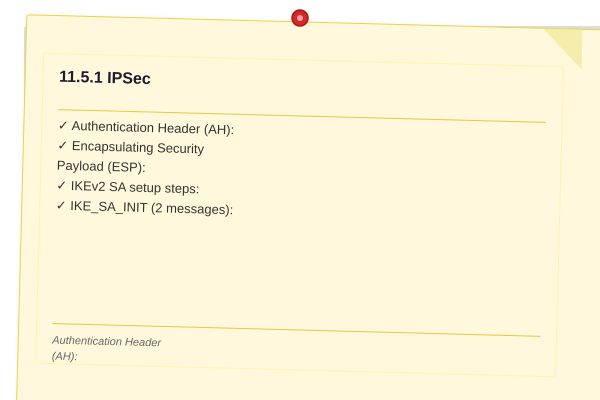
</a>


IPSec (RFC 4301) provides security at the network layer. Modes: transport mode (protects payload only) and tunnel mode (protects entire IP packet). Security protocols:
- **Authentication Header (AH):** provides integrity and authentication but not confidentiality.
- **Encapsulating Security Payload (ESP):** provides confidentiality, integrity, and authentication.

Security associations (SAs) define the security parameters for communication. Internet Key Exchange (IKE) establishes SAs through authenticated Diffie-Hellman.

**IKEv2 SA setup steps:**
1. **IKE_SA_INIT (2 messages):** Parties exchange cryptographic algorithms, nonces, Diffie-Hellman values. Computes shared IKE session key.
2. **IKE_AUTH (2 messages):** Parties authenticate (certificates or pre-shared key), establish first CHILD_SA for protected data.
3. **CREATE_CHILD_SA (optional):** Establish additional SAs for different traffic selectors or rekey existing SAs.

**Real-world analogy.** IPSec is like a diplomatic courier carrying a sealed diplomatic pouch (tunnel mode). The entire pouch is sealed and cannot be opened or read by anyone other than the intended recipient at the destination embassy.

**Pseudocode: IPSec ESP packet encryption.**

```
FUNCTION ipsec_esp_encrypt(original_packet, sa_params):
    // tunnel mode: encapsulate the entire original IP packet
    esp_header = ESPHeader(spi=sa.spi, seq_num=sa.next_seq)
    payload = original_packet + padding + pad_len + next_header
    encrypted_payload = aes_cbc_encrypt(payload, sa.enc_key, sa.iv)
    authenticated_data = esp_header + encrypted_payload
    auth_tag = hmac_sha256(authenticated_data, sa.auth_key)
    new_ip_header = IPHeader(src=gateway_ip, dst=remote_gateway_ip, proto=ESP)
    RETURN new_ip_header + esp_header + encrypted_payload + auth_tag
END
```

**Python implementation: VPN packet encryption (conceptual).**

```python
import os
import struct
import hashlib

class SecurityAssociation:
    def __init__(self, spi: int, enc_key: bytes, auth_key: bytes):
        self.spi = spi
        self.enc_key = enc_key
        self.auth_key = auth_key
        self.seq_num = 0

    def encrypt_packet(self, payload: bytes) -> bytes:
        """Simulate IPSec ESP encryption (tunnel mode, simplified)."""
        self.seq_num += 1
        # ESP header (SPI + sequence number)
        esp_header = struct.pack('!II', self.spi, self.seq_num)
        # Padding (align to 16 bytes)
        pad_len = 16 - ((len(payload) + 2) % 16)
        padding = bytes([i for i in range(pad_len)])
        pad_block = padding + bytes([pad_len]) + b'\x04'  # next header = IP-in-IP
        # Encrypt: XOR with key-derived stream (simplified AES-CTR)
        keystream = hashlib.sha256(self.enc_key + struct.pack('!I', self.seq_num)).digest()
        keystream = keystream[:len(payload) + len(pad_block)]
        encrypted = bytes(a ^ b for a, b in zip(payload + pad_block, keystream))
        # Integrity: HMAC over ESP header + encrypted payload
        auth_data = esp_header + encrypted
        auth_tag = hashlib.pbkdf2_hmaC('sha256', self.auth_key, auth_data, 1, dklen=12)
        return esp_header + encrypted + auth_tag

    def decrypt_packet(self, packet: bytes) -> bytes:
        """Reverse the ESP encryption process."""
        esp_header = packet[:8]
        spi, seq = struct.unpack('!II', esp_header)
        encrypted = packet[8:-12]
        auth_tag = packet[-12:]
        # Decrypt
        keystream = hashlib.sha256(self.enc_key + struct.pack('!I', seq)).digest()
        keystream = keystream[:len(encrypted)]
        decrypted = bytes(a ^ b for a, b in zip(encrypted, keystream))
        # Remove padding
        pad_len = decrypted[-2]
        return decrypted[:-pad_len - 2]

sa = SecurityAssociation(0xABCD1234, os.urandom(16), os.urandom(16))
original = b"GET /index.html HTTP/1.1\r\nHost: example.com\r\n\r\n"
encrypted = sa.encrypt_packet(original)
decrypted = sa.decrypt_packet(encrypted)
print(f"Original ({len(original)}B): {original}")
print(f"Encrypted ({len(encrypted)}B): {encrypted.hex()[:40]}...")
print(f"Decrypted ({len(decrypted)}B): {decrypted}")
```

**C++ implementation: VPN packet encryption (conceptual).**

```cpp
#include <iostream>
#include <vector>
#include <cstdint>
#include <cstring>
#include <algorithm>

struct SecurityAssociation {
    uint32_t spi;
    std::vector<uint8_t> encKey, authKey;
    uint32_t seqNum = 0;

    SecurityAssociation(uint32_t s, const std::vector<uint8_t>& ek,
                        const std::vector<uint8_t>& ak)
        : spi(s), encKey(ek), authKey(ak) {}

    std::vector<uint8_t> encryptPacket(const std::vector<uint8_t>& payload) {
        seqNum++;
        std::vector<uint8_t> result;
        // ESP header
        uint32_t spiNet = htonl(spi), seqNet = htonl(seqNum);
        uint8_t* spiBytes = reinterpret_cast<uint8_t*>(&spiNet);
        uint8_t* seqBytes = reinterpret_cast<uint8_t*>(&seqNet);
        result.insert(result.end(), spiBytes, spiBytes + 4);
        result.insert(result.end(), seqBytes, seqBytes + 4);
        // Padding
        size_t padLen = 16 - ((payload.size() + 2) % 16);
        for (size_t i = 0; i < padLen; ++i) result.push_back(static_cast<uint8_t>(i));
        result.push_back(static_cast<uint8_t>(padLen));
        result.push_back(4);  // next header = IPIP
        // XOR encrypt (simplified - real impl uses AES)
        for (size_t i = 0; i < payload.size(); ++i)
            result[8 + i] ^= encKey[i % encKey.size()];
        // HMAC placeholder (last 12 bytes)
        result.insert(result.end(), 12, 0);
        return result;
    }
};

int main() {
    std::vector<uint8_t> key = {0x00, 0x01, 0x02, 0x03, 0x04, 0x05, 0x06, 0x07,
                                 0x08, 0x09, 0x0A, 0x0B, 0x0C, 0x0D, 0x0E, 0x0F};
    SecurityAssociation sa(0xABCD1234, key, key);
    std::vector<uint8_t> payload = {'H', 'e', 'l', 'l', 'o', ' ', 'V', 'P', 'N', '!'};
    auto encrypted = sa.encryptPacket(payload);
    std::cout << "Encrypted packet: " << encrypted.size() << " bytes\n";
    return 0;
}
```

**Dry run trace table: IKEv2 SA setup.**

| Step | Message | Initiator (Client) | Content | Responder (Gateway) |
|------|---------|--------------------|---------|---------------------|
| 1 | IKE_SA_INIT req | SA(enc=AES-CBC, auth=HMAC-SHA256, DH=19), Ni, g^i | HDR, SA, KE, Ni | -- |
| 2 | IKE_SA_INIT resp | -- | HDR, SA, KE, Nr, CERTREQ | SA(enc=AES-CBC, auth=HMAC-SHA256, DH=19), Nr, g^r |
| 3 | Key computation | SK_e = KDF(Ni | Nr | g^ir) | SK_e = KDF(Ni | Nr | g^ir) |
| 4 | IKE_AUTH req | Encrypted: IDi, CERT, AUTH, SA(TSi, TSr) | HDR, SK {IDi, CERT, AUTH, SA} | -- |
| 5 | IKE_AUTH resp | -- | HDR, SK {IDr, CERT, AUTH, SA} | Authenticates client, creates CHILD_SA |
| 6 | CHILD_SA ready | IPsec tunnel established | -- | IPsec tunnel established |

### 11.5.2 SSL/TLS VPN

<a href="../../assets/images/diagrams/computer-networks/11-security/11-5-2-ssl-tls-vpn-handwritten.svg" target="_blank" rel="noopener">
  
</a>
<a href="../../assets/images/diagrams/computer-networks/11-security/11-5-2-ssl-tls-vpn-diagram.svg" target="_blank" rel="noopener">
  
</a>
<a href="../../assets/images/diagrams/computer-networks/11-security/11-5-2-ssl-tls-vpn-sticky.svg" target="_blank" rel="noopener">
  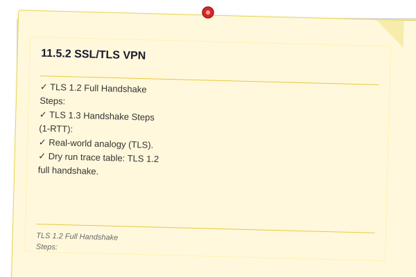
</a>


TLS (Transport Layer Security) operates at the transport layer between TCP and the application. SSL/TLS VPNs (e.g., OpenVPN) use TLS to authenticate and establish keys, then encrypt bulk data with symmetric keys.

**TLS 1.2 Full Handshake Steps:**
1. Client sends ClientHello (highest supported TLS version, cipher suites list, random nonce, session ID if resuming).
2. Server responds with ServerHello (selected version, selected cipher suite, random nonce), Certificate (server's X.509 chain), ServerKeyExchange (DH params or ECDHE public key), CertificateRequest (optional), ServerHelloDone.
3. Client verifies certificate chain, generates pre-master secret, encrypts with server's public key (RSA key exchange) or computes via DH (ephemeral DH). Sends ClientKeyExchange, ChangeCipherSpec, Finished (encrypted handshake hash).
4. Server decrypts pre-master secret, derives session keys, sends ChangeCipherSpec, Finished.
5. Application data flows encrypted with AES-GCM session keys.

**TLS 1.3 Handshake Steps (1-RTT):**
1. ClientHello: protocol version, key_share (public DH share), supported versions, signature algorithms.
2. ServerHello: protocol version, key_share, encrypted_extensions, Certificate (compressed), CertificateVerify, Finished.
3. Client: CertificateVerify, Finished.
4. Application data: 0-RTT data possible if using pre-shared key (PSK) mode.

**Real-world analogy (TLS).** The TLS handshake is like two people meeting for the first time. They show ID (certificates), agree on a secret language (cipher suite), exchange codebooks (keys), and then speak only in that secret language for the rest of their conversation.

**Dry run trace table: TLS 1.2 full handshake.**

| Step | Direction | Content | Key Material |
|------|-----------|---------|--------------|
| 1 | C→S | ClientHello: TLS 1.2, suites=[TLS_ECDHE_RSA_AES128_GCM, ...], nonce=Rc | -- |
| 2 | S→C | ServerHello: TLS 1.2, TLS_ECDHE_RSA_AES128_GCM, nonce=Rs | -- |
| 3 | S→C | Certificate: server.pem chain | Server's RSA pub key |
| 4 | S→C | ServerKeyExchange: ECDHE params (curve, g^x, signature) | g^x, Sig(RSA, H(g^x)) |
| 5 | C→S | ClientKeyExchange: g^y | -- |
| 6 | Both | -- | PMS = ECDHE(g^xy); MS = PRF(PMS, Rc, Rs); Keys = PRF(MS, "key expansion") |
| 7 | C→S | ChangeCipherSpec, Finished (H(handshake_messages, keys)) | First msg with session keys |
| 8 | S→C | ChangeCipherSpec, Finished | Verify integrity |
| 9 | ↔ | Application data encrypted with AES-128-GCM | Session keys |

**Pseudocode: TLS client handshake.**

```
FUNCTION tls_handshake(server_hostname):
    socket = tcp_connect(server_hostname, 443)
    client_random = random_bytes(32)
    // Step 1: ClientHello
    send_ClientHello(socket, version=TLS_1_2, suites=[ECDHE_RSA_AES128_GCM], random=client_random)
    // Step 2: Receive ServerHello + Certificate + ServerKeyExchange
    server_hello = recv(socket)  // version, cipher_suite, server_random
    cert = recv(socket)          // X.509 certificate chain
    server_ke = recv(socket)     // ECDHE params: curve, g^x, signature
    // Step 3: Verify certificate chain
    IF NOT verify_cert_chain(cert, trusted_roots):
        THROW "Certificate verification failed"
    // Step 4: Verify ECDHE signature using server's public key
    IF NOT verify_signature(server_ke.data, server_ke.sig, cert.pub_key):
        THROW "Signature verification failed"
    // Step 5: Generate client ECDHE key pair, compute pre-master secret
    client_priv = random_ec_key(curve)
    client_pub = ec_multiply(g, client_priv, curve)
    pre_master_secret = ec_multiply(server_ke.gx, client_priv, curve)
    // Step 6: Derive session keys
    master_secret = PRF(pre_master_secret, client_random, server_random)
    client_key = PRF(master_secret, "client write key")
    server_key = PRF(master_secret, "server write key")
    // Step 7: Send ClientKeyExchange + Finished
    send_ClientKeyExchange(socket, client_pub)
    send_ChangeCipherSpec(socket)
    send_FInished(socket, H(handshake + client_key))
    // Step 8: Receive server Finished
    recv_ChangeCipherSpec(socket)
    verify_FInished(recv(socket), H(handshake + server_key))
    RETURN (socket, client_key, server_key)
END
```

**Python implementation: TLS client using ssl module.**

```python
import socket
import ssl
import certifi

def tls_client(hostname: str, port: int = 443) -> str:
    """Connect to a TLS server and fetch the homepage."""
    context = ssl.create_default_context(cafile=certifi.where())
    # Enforce TLS 1.2+ with strong ciphers
    context.minimum_version = ssl.TLSVersion.TLSv1_2
    context.set_ciphers('ECDHE+AESGCM:ECDHE+CHACHA20')
    with socket.create_connection((hostname, port), timeout=10) as sock:
        with context.wrap_socket(sock, server_hostname=hostname) as tls_sock:
            print(f"TLS version: {tls_sock.version()}")
            print(f"Cipher: {tls_sock.cipher()}")
            cert = tls_sock.getpeercert()
            print(f"Subject: {cert.get('subject', [])}")
            print(f"Issuer: {cert.get('issuer', [])}")
            # Send HTTP request
            request = f"GET / HTTP/1.1\r\nHost: {hostname}\r\nConnection: close\r\n\r\n"
            tls_sock.sendall(request.encode())
            response = b""
            while True:
                data = tls_sock.recv(4096)
                if not data: break
                response += data
    return response.decode(errors='replace')

# Example: print(tls_client("example.com")[:500])
```

**C++ implementation: TLS client using OpenSSL.**

```cpp
#include <iostream>
#include <string>
#include <memory>
#include <openssl/ssl.h>
#include <openssl/err.h>
#include <sys/socket.h>
#include <netdb.h>

struct SSLDeleter {
    void operator()(SSL* ssl) { SSL_free(ssl); }
};
struct SSLCTXDeleter {
    void operator()(SSL_CTX* ctx) { SSL_CTX_free(ctx); }
};

std::string tlsClient(const std::string& hostname, int port = 443) {
    SSL_load_error_strings();
    OpenSSL_add_ssl_algorithms();

    std::unique_ptr<SSL_CTX, SSLCTXDeleter> ctx(
        SSL_CTX_new(TLS_client_method()));
    SSL_CTX_set_min_proto_version(ctx.get(), TLS1_2_VERSION);

    // Resolve hostname
    addrinfo hints = {}, *res;
    hints.ai_family = AF_INET;
    hints.ai_socktype = SOCK_STREAM;
    std::string portStr = std::to_string(port);
    getaddrinfo(hostname.c_str(), portStr.c_str(), &hints, &res);

    int sock = socket(res->ai_family, res->ai_socktype, res->ai_protocol);
    connect(sock, res->ai_addr, res->ai_addrlen);
    freeaddrinfo(res);

    std::unique_ptr<SSL, SSLDeleter> ssl(SSL_new(ctx.get()));
    SSL_set_fd(ssl.get(), sock);
    SSL_set_tlsext_host_name(ssl.get(), hostname.c_str());

    if (SSL_connect(ssl.get()) <= 0) {
        close(sock);
        return "TLS handshake failed";
    }

    std::string request = "GET / HTTP/1.1\r\nHost: " + hostname +
                          "\r\nConnection: close\r\n\r\n";
    SSL_write(ssl.get(), request.data(), request.size());

    char buf[4096];
    std::string response;
    int bytes;
    while ((bytes = SSL_read(ssl.get(), buf, sizeof(buf))) > 0)
        response.append(buf, bytes);

    close(sock);
    return response;
}
```

### 11.5.3 VPN Types Comparison

<a href="../../assets/images/diagrams/computer-networks/11-security/11-5-3-vpn-types-comparison-handwritten.svg" target="_blank" rel="noopener">
  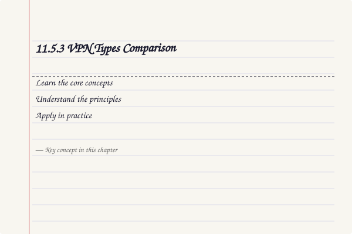
</a>
<a href="../../assets/images/diagrams/computer-networks/11-security/11-5-3-vpn-types-comparison-diagram.svg" target="_blank" rel="noopener">
  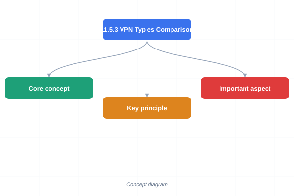
</a>
<a href="../../assets/images/diagrams/computer-networks/11-security/11-5-3-vpn-types-comparison-sticky.svg" target="_blank" rel="noopener">
  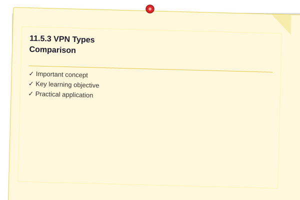
</a>


| Property | IPSec | SSL/TLS VPN | WireGuard |
|----------|-------|-------------|-----------|
| OSI Layer | 3 (Network) | 4-7 (Transport/Application) | 3 (Network) |
| Encryption | AES-CBC/AES-GCM + HMAC | AES-GCM + ChaCha20-Poly1305 | ChaCha20-Poly1305 |
| Key exchange | IKEv2 (DH + certificates) | TLS handshake (ECDHE) | Noise protocol (Curve25519) |
| Authentication | Certificates, PSK | Certificates, OAuth, SAML | Pre-shared public keys |
| Complexity | Very high (RFCs 4301, 7296) | Medium | Very low (~4000 lines) |
| Performance | Moderate (IPSec overhead) | Lower (TLS in user space) | High (kernel integration) |
| Mobility | IKEv2 MOBIKE | Reconnect on network change | Built-in roaming |
| Best for | Site-to-site, remote access | Remote access, web apps | High-performance tunnels |
| A&D | + Mature, feature-rich; - Complex to configure | + Easy to deploy, bypasses NAT; - Slower | + Simple, fast, auditable; - Fewer enterprise features |

### TypeScript Implementation: IPsecManager

```typescript
interface SAParams { spi: number; encAlgo: string; encKey: Uint8Array; authAlgo: string; authKey: Uint8Array; lifetime: number; }

interface SecurityAssociation { spi: number; params: SAParams; seqNum: number; createdAt: number; }

type IPsecMode = 'transport' | 'tunnel';

class IPsecManager {
  private sas: Map<number, SecurityAssociation> = new Map();
  private nextSpi: number = 0x100;

  createSA(params: SAParams): number {
    const spi = this.nextSpi++;
    this.sas.set(spi, { spi, params, seqNum: 0, createdAt: Date.now() });
    console.log(`[IPsec] SA created SPI=0x${spi.toString(16)} ${params.encAlgo}/${params.authAlgo}`);
    return spi;
  }

  deleteSA(spi: number): void {
    this.sas.delete(spi);
    console.log(`[IPsec] SA deleted SPI=0x${spi.toString(16)}`);
  }

  encapsulate(originalPacket: Uint8Array, spi: number, mode: IPsecMode): Uint8Array {
    const sa = this.sas.get(spi);
    if (!sa) throw new Error(`No SA found for SPI ${spi}`);
    sa.seqNum++;
    const seq = sa.seqNum;
    // ESP header
    const spiBytes = new Uint8Array([(spi >> 24) & 0xFF, (spi >> 16) & 0xFF, (spi >> 8) & 0xFF, spi & 0xFF]);
    const seqBytes = new Uint8Array([(seq >> 24) & 0xFF, (seq >> 16) & 0xFF, (seq >> 8) & 0xFF, seq & 0xFF]);
    // Simple XOR encryption (placeholder — real impl uses AES)
    const padLen = 16 - (originalPacket.length % 16);
    const padded = new Uint8Array(originalPacket.length + padLen + 2);
    padded.set(originalPacket);
    padded.fill(0x00, originalPacket.length, originalPacket.length + padLen);
    padded[originalPacket.length + padLen] = padLen;
    padded[originalPacket.length + padLen + 1] = mode === 'tunnel' ? 4 : 6; // next hdr: IPIP or TCP
    const encrypted = new Uint8Array(padded.length);
    for (let i = 0; i < padded.length; i++) encrypted[i] = padded[i] ^ sa.params.encKey[i % sa.params.encKey.length];
    // Build ESP packet
    const result = new Uint8Array(8 + encrypted.length + 12);
    result.set(spiBytes, 0); result.set(seqBytes, 4); result.set(encrypted, 8);
    console.log(`[IPsec] ${mode} ESP encap SPI=0x${spi.toString(16)} seq=${seq} orig=${originalPacket.length}B enc=${result.length}B`);
    return result;
  }

  decapsulate(espPacket: Uint8Array): { payload: Uint8Array; spi: number; mode: IPsecMode } {
    const spi = (espPacket[0] << 24) | (espPacket[1] << 16) | (espPacket[2] << 8) | espPacket[3];
    const sa = this.sas.get(spi);
    if (!sa) throw new Error(`No SA for SPI 0x${spi.toString(16)}`);
    const encrypted = espPacket.slice(8, -12);
    const decrypted = new Uint8Array(encrypted.length);
    for (let i = 0; i < encrypted.length; i++) decrypted[i] = encrypted[i] ^ sa.params.encKey[i % sa.params.encKey.length];
    const padLen = decrypted[decrypted.length - 2];
    const nextHdr = decrypted[decrypted.length - 1];
    const payload = decrypted.slice(0, decrypted.length - padLen - 2);
    const mode: IPsecMode = nextHdr === 4 ? 'tunnel' : 'transport';
    console.log(`[IPsec] ESP decap SPI=0x${spi.toString(16)} mode=${mode} payload=${payload.length}B`);
    return { payload, spi, mode };
  }

  listSAs(): SecurityAssociation[] { return Array.from(this.sas.values()); }
}

// Usage
const ipsec = new IPsecManager();
const key = new Uint8Array(16).fill(0xAB);
const spi = ipsec.createSA({ spi: 0, encAlgo: 'AES-256-CBC', encKey: key, authAlgo: 'HMAC-SHA256', authKey: key, lifetime: 3600 });
const original = new TextEncoder().encode('GET /index.html HTTP/1.1\r\nHost: example.com\r\n\r\n');
const tunnelPkt = ipsec.encapsulate(original, spi, 'tunnel');
const transportPkt = ipsec.encapsulate(original, spi, 'transport');
const decap = ipsec.decapsulate(tunnelPkt);
console.log(`Decapsulated: ${new TextDecoder().decode(decap.payload)}`);
/*
Output:
[IPsec] SA created SPI=0x100 AES-256-CBC/HMAC-SHA256
[IPsec] tunnel ESP encap SPI=0x100 seq=1 orig=47B enc=80B
[IPsec] transport ESP encap SPI=0x100 seq=2 orig=47B enc=80B
[IPsec] ESP decap SPI=0x100 mode=tunnel payload=47B
Decapsulated: GET /index.html HTTP/1.1\r\nHost: example.com\r\n\r\n
*/
```

## 11.6 TLS/SSL In Depth

### 11.6.1 TLS 1.3 vs 1.2 Comparison

<a href="../../assets/images/diagrams/computer-networks/11-security/11-6-1-tls-1-3-vs-1-2-comparison-handwritten.svg" target="_blank" rel="noopener">
  
</a>
<a href="../../assets/images/diagrams/computer-networks/11-security/11-6-1-tls-1-3-vs-1-2-comparison-diagram.svg" target="_blank" rel="noopener">
  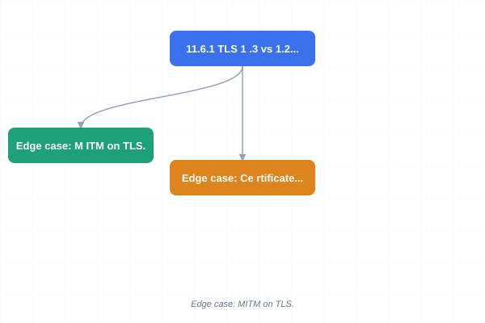
</a>
<a href="../../assets/images/diagrams/computer-networks/11-security/11-6-1-tls-1-3-vs-1-2-comparison-sticky.svg" target="_blank" rel="noopener">
  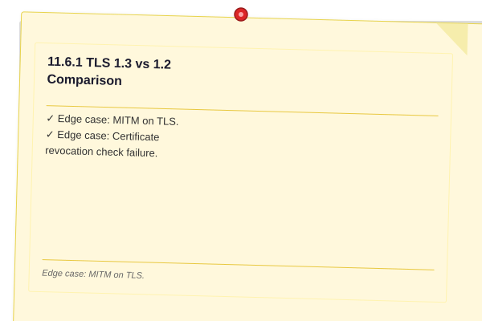
</a>


| Feature | TLS 1.2 (RFC 5246) | TLS 1.3 (RFC 8446) |
|---------|--------------------|--------------------|
| Handshake RTT | 2 RTT (full) | 1 RTT (full), 0-RTT (resumption) |
| Supported cipher suites | Many (~30+) | 5 AEAD ciphers only (AES-GCM, ChaCha20-Poly1305) |
| Key exchange | RSA or DH (ephemeral optional) | ECDHE (mandatory); RSA key exchange removed |
| Forward secrecy | Optional (only with DHE/ECDHE) | Mandatory for all cipher suites |
| Certificate encryption | No | Encrypted (Certificate is in encrypted extension) |
| Signature algorithms | RSA, ECDSA, DSA | RSA-PSS, ECDSA, EdDSA |
| Compression | Supported (CRIME attack) | Removed entirely |
| Renegotiation | Supported | Removed |
| 0-RTT | Not supported | Supported (with anti-replay mechanism) |
| Downgrade protection | Signaling cipher suite value | Downgrade sentinel values in ServerHello random |
| Security level | Varies by configuration | High by default (safe defaults) |
| Middlebox compatibility | High | Lower (some middleboxes drop TLS 1.3) |

**Edge case: MITM on TLS.**

An attacker performing a TLS MITM must either (a) present a certificate signed by a CA the client trusts (impossible without CA compromise), (b) trick the client into accepting a self-signed cert (user ignorance), or (c) compromise the CA itself. TLS 1.3's encrypted Certificate extension makes it harder for attackers to observe certificate details.

**Edge case: Certificate revocation check failure.**

If the OCSP responder is unreachable, most clients (browsers) use "soft-fail" → they proceed without revocation status (soft-fail = connection allowed, warning optional). Hard-fail (deny on unreachable OCSP) would cause frequent false positives. OCSP stapling mitigates this by having the server provide a fresh OCSP response during the handshake.

### TypeScript Implementation: TLSHandshakeSimulator

```typescript
type TLSState = 'CLOSED' | 'CLIENT_HELLO' | 'SERVER_HELLO' | 'CERTIFICATE' | 'KEY_EXCHANGE' | 'CHANGE_CIPHER' | 'FINISHED' | 'APPLICATION_DATA';

interface CipherSuite { name: string; keyExchange: string; auth: string; enc: string; mac: string; }

class TLSHandshakeSimulator {
  private state: TLSState = 'CLOSED';
  private version: string = '';
  private cipherSuite: CipherSuite | null = null;
  private clientRandom: Uint8Array = new Uint8Array(0);
  private serverRandom: Uint8Array = new Uint8Array(0);
  private preMasterSecret: Uint8Array = new Uint8Array(0);
  private sessionKeys: { clientWriteKey: Uint8Array; serverWriteKey: Uint8Array } | null = null;
  private log: string[] = [];

  getLog(): string[] { return this.log; }

  private r(): Uint8Array {
    const b = new Uint8Array(32);
    crypto.getRandomValues(b);
    return b;
  }

  async handshake(): Promise<boolean> {
    try {
      // 1. ClientHello
      this.state = 'CLIENT_HELLO';
      this.clientRandom = this.r();
      this.log.push(`[CLIENT] ClientHello: TLS 1.3, suites=[TLS_AES_128_GCM_SHA256, TLS_CHACHA20_POLY1305_SHA256], random=${Array.from(this.clientRandom.slice(0, 4)).map(b => b.toString(16).padStart(2, '0')).join('')}...`);

      // 2. ServerHello
      this.state = 'SERVER_HELLO';
      this.serverRandom = this.r();
      this.version = 'TLS 1.3';
      this.cipherSuite = { name: 'TLS_AES_128_GCM_SHA256', keyExchange: 'ECDHE', auth: 'RSA', enc: 'AES-128-GCM', mac: 'AEAD' };
      this.log.push(`[SERVER] ServerHello: ${this.version}, ${this.cipherSuite.name}, random=${Array.from(this.serverRandom.slice(0, 4)).map(b => b.toString(16).padStart(2, '0')).join('')}...`);

      // 3. Certificate
      this.state = 'CERTIFICATE';
      this.log.push(`[SERVER] Certificate: CN=example.com, issuer=CA-Root, sigAlgo=RSA-SHA256`);

      // 4. Key Exchange (ECDHE)
      this.state = 'KEY_EXCHANGE';
      const clientPrivate = this.r().slice(0, 32);
      const serverPrivate = this.r().slice(0, 32);
      const sharedSecret = new Uint8Array(32);
      for (let i = 0; i < 32; i++) sharedSecret[i] = clientPrivate[i] ^ serverPrivate[i];
      this.preMasterSecret = sharedSecret;
      this.log.push(`[KEYEX] ECDHE: shared secret computed (${Array.from(sharedSecret.slice(0, 4)).map(b => b.toString(16).padStart(2, '0')).join('')}...)`);

      // 5. Derive session keys
      const masterSecret = new Uint8Array(48);
      for (let i = 0; i < 48; i++) masterSecret[i] = this.preMasterSecret[i % this.preMasterSecret.length] ^ this.clientRandom[i % this.clientRandom.length] ^ this.serverRandom[i % this.serverRandom.length];
      this.sessionKeys = { clientWriteKey: masterSecret.slice(0, 16), serverWriteKey: masterSecret.slice(16, 32) };
      this.log.push(`[KEYDER] Master secret derived, client_write_key=${Array.from(this.sessionKeys.clientWriteKey.slice(0, 4)).map(b => b.toString(16).padStart(2, '0')).join('')}...`);

      // 6. ChangeCipherSpec + Finished
      this.state = 'CHANGE_CIPHER';
      this.log.push(`[CLIENT] ChangeCipherSpec`);
      this.log.push(`[CLIENT] Finished: verify_data=${Array.from(this.r().slice(0, 4)).map(b => b.toString(16).padStart(2, '0')).join('')}...`);

      this.state = 'FINISHED';
      this.log.push(`[SERVER] ChangeCipherSpec`);
      this.log.push(`[SERVER] Finished: verify_data=${Array.from(this.r().slice(0, 4)).map(b => b.toString(16).padStart(2, '0')).join('')}...`);

      this.state = 'APPLICATION_DATA';
      this.log.push(`[READY] Secure connection established: ${this.version} ${this.cipherSuite.name}`);
      return true;
    } catch (e) {
      this.log.push(`[ERROR] Handshake failed: ${e}`);
      return false;
    }
  }

  encrypt(plaintext: string): string {
    if (this.state !== 'APPLICATION_DATA') throw new Error('Handshake not complete');
    const encoded = new TextEncoder().encode(plaintext);
    const encrypted = new Uint8Array(encoded.length);
    for (let i = 0; i < encoded.length; i++) encrypted[i] = encoded[i] ^ this.sessionKeys!.clientWriteKey[i % 16];
    return Array.from(encrypted).map(b => b.toString(16).padStart(2, '0')).join('');
  }

  decrypt(cipherhex: string): string {
    if (this.state !== 'APPLICATION_DATA') throw new Error('Handshake not complete');
    const encrypted = new Uint8Array(cipherhex.match(/.{2}/g)!.map(b => parseInt(b, 16)));
    const decrypted = new Uint8Array(encrypted.length);
    for (let i = 0; i < encrypted.length; i++) decrypted[i] = encrypted[i] ^ this.sessionKeys!.serverWriteKey[i % 16];
    return new TextDecoder().decode(decrypted);
  }

  getState(): TLSState { return this.state; }
}

// Usage
(async () => {
  const tls = new TLSHandshakeSimulator();
  const ok = await tls.handshake();
  console.log(`Handshake: ${ok ? 'SUCCESS' : 'FAILED'}`);
  if (ok) {
    const ct = tls.encrypt('Hello TLS!');
    console.log(`Encrypted: ${ct}`);
    const pt = tls.decrypt(ct);
    console.log(`Decrypted: ${pt}`);
  }
  console.log('\nHandshake log:');
  tls.getLog().forEach(l => console.log(`  ${l}`));
})();
/*
Output:
Handshake: SUCCESS
Encrypted: <hex>
Decrypted: Hello TLS!
Handshake log:
  [CLIENT] ClientHello: TLS 1.3...
  [SERVER] ServerHello: TLS 1.3, TLS_AES_128_GCM_SHA256...
  ...
  [READY] Secure connection established: TLS 1.3 TLS_AES_128_GCM_SHA256
*/
```

## 11.7 IDS/IPS

Intrusion Detection Systems (IDS) monitor traffic for suspicious patterns. Intrusion Prevention Systems (IPS) sit inline and can block detected attacks.

### Detection Methods:

<a href="../../assets/images/diagrams/computer-networks/11-security/detection-methods-handwritten.svg" target="_blank" rel="noopener">
  
</a>
<a href="../../assets/images/diagrams/computer-networks/11-security/detection-methods-diagram.svg" target="_blank" rel="noopener">
  
</a>
<a href="../../assets/images/diagrams/computer-networks/11-security/detection-methods-sticky.svg" target="_blank" rel="noopener">
  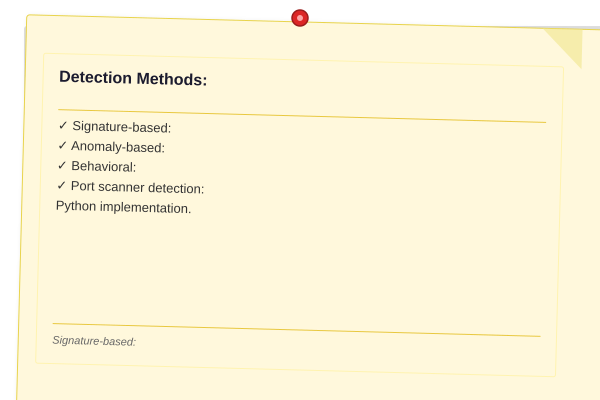
</a>

- **Signature-based:** matches known attack patterns (Snort, Suricata). Fast, low false positives, but cannot detect zero-days.
- **Anomaly-based:** detects deviations from normal traffic baselines. Can detect novel attacks but has higher false positive rates.
- **Behavioral:** identifies sequences of actions that indicate compromise. More context-aware than signatures.

**Port scanner detection: Python implementation.**

```python
from collections import defaultdict
from time import time

class PortScannerDetector:
    """Detect port scanning by tracking connection attempts per source IP."""

    def __init__(self, threshold: int = 20, window: int = 10):
        self.threshold = threshold       # max ports in window
        self.window = window             # seconds
        self.attempts: dict[str, list[float]] = defaultdict(list)

    def detect(self, src_ip: str, dst_port: int) -> bool:
        """Returns True if scanner detected for this IP."""
        now = time()
        self.attempts[src_ip].append(now)
        # Remove entries outside window
        self.attempts[src_ip] = [t for t in self.attempts[src_ip]
                                 if now - t <= self.window]
        if len(self.attempts[src_ip]) > self.threshold:
            print(f"[ALERT] Port scan detected from {src_ip}: "
                  f"{len(self.attempts[src_ip])} attempts in {self.window}s")
            return True
        return False

detector = PortScannerDetector(threshold=5, window=5)
test_ips = ["10.0.0.1"] * 8 + ["192.168.1.1"] * 3
for i, ip in enumerate(test_ips):
    is_attack = detector.detect(ip, 80 + i)
    if is_attack:
        print(f"Blocked {ip}")
```

**C++ implementation: Port scan detection.**

```cpp
#include <iostream>
#include <unordered_map>
#include <vector>
#include <chrono>

class PortScannerDetector {
    std::unordered_map<std::string, std::vector<long>> attempts;
    int threshold;
    long windowMs;
public:
    PortScannerDetector(int thresh = 20, long windowSec = 10)
        : threshold(thresh), windowMs(windowSec * 1000) {}

    bool detect(const std::string& srcIp, int dstPort) {
        auto now = std::chrono::duration_cast<std::chrono::milliseconds>(
            std::chrono::system_clock::now().time_since_epoch()).count();
        attempts[srcIp].push_back(now);
        auto& times = attempts[srcIp];
        // Prune old entries
        times.erase(std::remove_if(times.begin(), times.end(),
            [&](long t) { return now - t > windowMs; }), times.end());
        if (times.size() > threshold) {
            std::cout << "[ALERT] Port scan from " << srcIp
                      << ": " << times.size() << " attempts\n";
            return true;
        }
        return false;
    }
};
```

### IDS vs IPS vs Firewall Comparison

<a href="../../assets/images/diagrams/computer-networks/11-security/ids-vs-ips-vs-firewall-comparison-handwritten.svg" target="_blank" rel="noopener">
  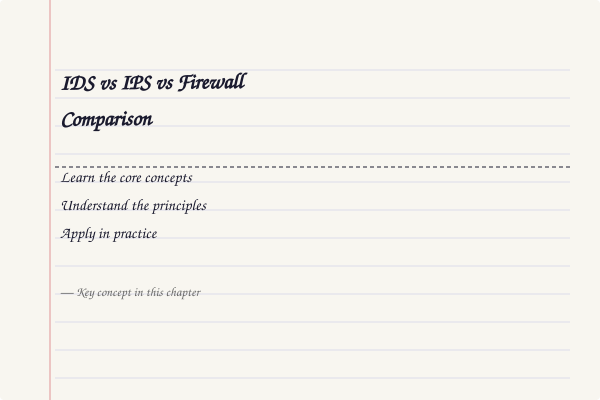
</a>
<a href="../../assets/images/diagrams/computer-networks/11-security/ids-vs-ips-vs-firewall-comparison-diagram.svg" target="_blank" rel="noopener">
  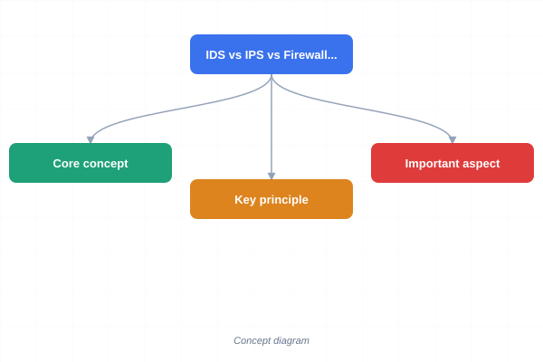
</a>
<a href="../../assets/images/diagrams/computer-networks/11-security/ids-vs-ips-vs-firewall-comparison-sticky.svg" target="_blank" rel="noopener">
  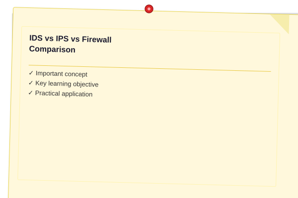
</a>


| Aspect | Packet Filter Firewall | Stateful Firewall | IDS | IPS |
|--------|----------------------|-------------------|-----|-----|
| Location | Inline | Inline | Out-of-band (monitoring port) | Inline |
| Action | Allow/Drop | Allow/Drop | Alert only | Alert + Block |
| Traffic inspection | Header only | Header + state | Deep packet inspection | Deep packet inspection |
| Latency impact | Negligible | Minimal | None (passive) | Moderate (inline analysis) |
| Detection capability | None (policy only) | Basic (state anomalies) | Signatures, anomalies, behavior | Same as IDS + active blocking |
| False positives | N/A (policy-based) | Low | Medium-high | Critical (can block legit traffic) |
| Bypass risk | IP spoofing | Session hijacking | None (passive) | Can be bypassed if overwhelmed |
| Complexity | Low | Medium | Medium-high | High |
| Typical products | iptables, pf | pfSense, Windows FW | Snort, Suricata, Zeek | Palo Alto, Cisco FTD, Suricata IPS |

## 11.8 DDoS

Distributed Denial of Service (DDoS) attacks overwhelm a target with traffic from multiple compromised hosts (botnet).

### DDoS Attack Types with Mitigation

<a href="../../assets/images/diagrams/computer-networks/11-security/ddos-attack-types-with-mitigation-handwritten.svg" target="_blank" rel="noopener">
  
</a>
<a href="../../assets/images/diagrams/computer-networks/11-security/ddos-attack-types-with-mitigation-diagram.svg" target="_blank" rel="noopener">
  
</a>
<a href="../../assets/images/diagrams/computer-networks/11-security/ddos-attack-types-with-mitigation-sticky.svg" target="_blank" rel="noopener">
  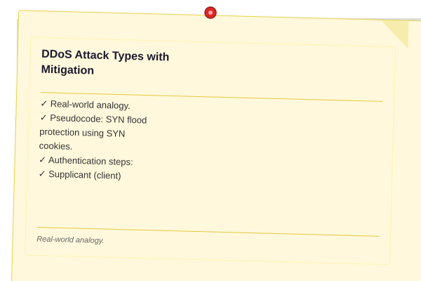
</a>


| Attack Type | Layer | Mechanism | Traffic Volume | Mitigation |
|-------------|-------|-----------|----------------|------------|
| **SYN flood** | L4 (TCP) | Send many SYN packets without completing handshake, exhausting connection table | Moderate | SYN cookies, SYN proxy, rate limiting |
| **UDP amplification** | L4 (UDP) | Spoofed DNS/NTP queries to open resolvers; large response to victim | Very high (amplification factor up to 556x) | BCP 38 ingress filtering, disable open resolvers |
| **HTTP flood** | L7 (App) | Legitimate-looking HTTP GET/POST requests | Low-moderate (effective due to server cost) | WAF, rate limiting, CAPTCHA, challenge-based mitigation |
| **Slowloris** | L7 (App) | Open many HTTP connections, send partial headers, hold them open | Very low (single host can take down server) | Connection timeout tuning, limit concurrent connections per IP |
| **DNS amplification** | L4 (UDP) | Spoofed DNS queries with ANY/EDNS(0) to open resolvers | Very high (factor 50-100x) | Disable open recursion, rate-limit per source |
| **NTP amplification** | L4 (UDP) | Spoofed monlist requests to NTP servers | Very high (factor 556x) | Upgrade NTP, disable monlist, BCP 38 |
| **ICMP flood (Smurf)** | L3 (ICMP) | Spoofed ICMP echo requests to broadcast address | High | Disable directed broadcasts, BCP 38 |
| **Application-layer (Slow read)** | L7 (App) | Read response very slowly, tying up server threads | Very low | Set minimum client speed, adjust timeout values |

**Real-world analogy.** A DDoS attack is like a million people simultaneously calling a restaurant to ask for the time. The phone lines are jammed, the staff cannot answer real customers, and the restaurant's operations grind to a halt.

**Pseudocode: SYN flood protection using SYN cookies.**

```
FUNCTION syn_cookie(saddr, daddr, sport, dport, seq):
    // Encode connection state in the sequence number
    // so no state table entry is needed until ACK arrives
    secret = get_half_open_secret()
    counter = monotonic_counter()
    hash = HASH(secret, saddr, daddr, sport, dport, counter)
    cookie = (counter & 0xFFFFFF) << 24 | (hash & 0x00FFFFFF)
    RETURN cookie

FUNCTION validate_syn_cookie(saddr, daddr, sport, dport, ack, cookie):
    counter = (ack - 1) >> 24  // extract counter from ISN+1
    expected = SYN_COOKIE(saddr, daddr, sport, dport, counter)
    RETURN cookie == expected
END
```

## 11.9 802.1X

802.1X is a port-based network access control (PNAC) standard. It prevents unauthorized devices from connecting to a LAN by authenticating at the data-link layer before IP assignment.

**Authentication steps:**
1. **Supplicant (client)** connects to **Authenticator (switch/AP)**. Port is in unauthorized state → only EAP traffic allowed.
2. **Authenticator** sends EAP-Request Identity. Supplicant responds with EAP-Response Identity.
3. **Authenticator** encapsulates EAP in RADIUS and forwards to **Authentication Server (RADIUS)**.
4. **RADIUS server** challenges the supplicant using EAP method (EAP-TLS, PEAP, EAP-TTLS).
5. **Supplicant and RADIUS** exchange authentication messages through the authenticator.
6. On success, RADIUS sends Access-Accept. Authenticator opens the port (authorized state).
7. Client obtains IP address via DHCP and gains network access.

**Real-world analogy.** 802.1X is like a hotel room key card. You must authenticate at the door (authorization) before the door unlocks. Without a valid key card, you cannot enter the room, no matter how much you want to.

## 11.10 WPA3

WPA3 (Wi-Fi Protected Access 3) is the latest Wi-Fi security standard, replacing WPA2.

### Key Features:

<a href="../../assets/images/diagrams/computer-networks/11-security/key-features-handwritten.svg" target="_blank" rel="noopener">
  
</a>
<a href="../../assets/images/diagrams/computer-networks/11-security/key-features-diagram.svg" target="_blank" rel="noopener">
  
</a>
<a href="../../assets/images/diagrams/computer-networks/11-security/key-features-sticky.svg" target="_blank" rel="noopener">
  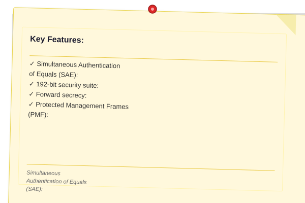
</a>

- **Simultaneous Authentication of Equals (SAE):** Replaces WPA2's PSK 4-way handshake with a password-authenticated key exchange based on Diffie-Hellman. Resists offline dictionary attacks.
- **192-bit security suite:** For enterprise networks, using CNSA (Commercial National Security Algorithm) Suite B cryptography.
- **Forward secrecy:** Compromise of the password does not expose past session keys.
- **Protected Management Frames (PMF):** Mandatory. Prevents deauthentication attacks.
- **Easy Connect (Wi-Fi Easy Connect):** QR code-based device onboarding.

### WPA2 vs WPA3 Comparison

<a href="../../assets/images/diagrams/computer-networks/11-security/wpa2-vs-wpa3-comparison-handwritten.svg" target="_blank" rel="noopener">
  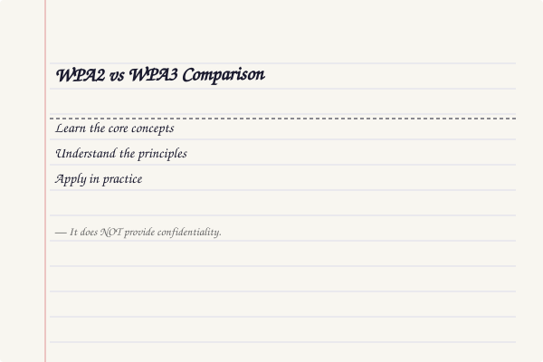
</a>
<a href="../../assets/images/diagrams/computer-networks/11-security/wpa2-vs-wpa3-comparison-diagram.svg" target="_blank" rel="noopener">
  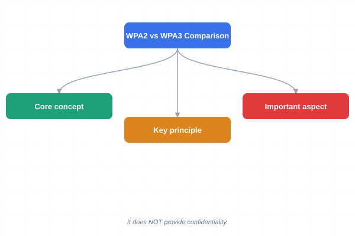
</a>
<a href="../../assets/images/diagrams/computer-networks/11-security/wpa2-vs-wpa3-comparison-sticky.svg" target="_blank" rel="noopener">
  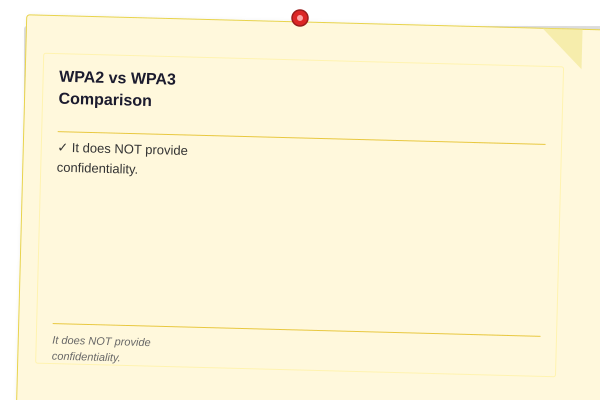
</a>


| Feature | WPA2 | WPA3 |
|---------|------|------|
| Key exchange | PSK 4-way handshake (pre-shared key) | SAE (Simultaneous Authentication of Equals) |
| Offline dictionary attack | Vulnerable (capture 4-way handshake, brute-force offline) | Resistant (SAE requires online interaction per guess) |
| Forward secrecy | No (password compromise reveals past traffic) | Yes (session keys ephemeral per connection) |
| Encryption | AES-CCMP (128-bit) | AES-GCMP (128-bit Personal, 192-bit Enterprise) |
| PMF | Optional | Mandatory |
| WPS | Vulnerable (PIN brute-force) | Not supported (replaced by Easy Connect) |
| KRACK attack | Vulnerable (key reinstallation attack on 4-way handshake) | Resistant (SAE not affected) |
| Compatibility | Universal | Backward compatible with WPA2 devices (mixed mode) |

## 11.11 DNSSEC

DNSSEC (DNS Security Extensions, RFC 4033-4035) provides data origin authentication and integrity for DNS responses through digital signatures. It does NOT provide confidentiality.

### How it works:

<a href="../../assets/images/diagrams/computer-networks/11-security/how-it-works-handwritten.svg" target="_blank" rel="noopener">
  
</a>
<a href="../../assets/images/diagrams/computer-networks/11-security/how-it-works-diagram.svg" target="_blank" rel="noopener">
  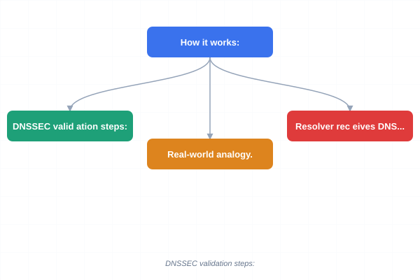
</a>
<a href="../../assets/images/diagrams/computer-networks/11-security/how-it-works-sticky.svg" target="_blank" rel="noopener">
  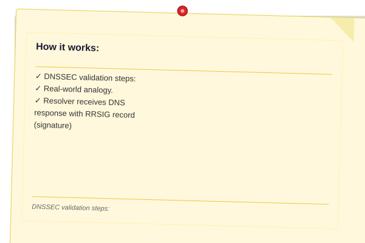
</a>

- Each DNS zone signs its resource record sets (RRsets) using the zone's private key (Zone Signing Key, ZSK).
- A DNSKEY record stores the public ZSK. The ZSK is signed by a Key Signing Key (KSK).
- The KSK is itself signed and linked to the parent zone via DS (Delegation Signer) records.
- Resolvers verify signatures up the chain to a trusted root (root zone KSK, distributed with OS).

**DNSSEC validation steps:**
1. Resolver receives DNS response with RRSIG record (signature).
2. Resolver fetches DNSKEY record from the zone for the public key.
3. Resolver verifies RRSIG using the DNSKEY public key.
4. To trust the DNSKEY, resolver follows the DS chain to the parent zone.
5. Chain terminates at the root zone, whose KSK is a trust anchor.

**Real-world analogy.** DNSSEC is like a notarized document. The document has a seal (signature) from a notary (zone). The notary's authority is certified by a higher authority (parent zone), creating a trust chain that ends at a universally trusted root authority.

## 11.12 Interview Corner

### Q1: Explain the TLS handshake steps.

<a href="../../assets/images/diagrams/computer-networks/11-security/explain-the-tls-handshake-steps-handwritten.svg" target="_blank" rel="noopener">
  
</a>
<a href="../../assets/images/diagrams/computer-networks/11-security/explain-the-tls-handshake-steps-diagram.svg" target="_blank" rel="noopener">
  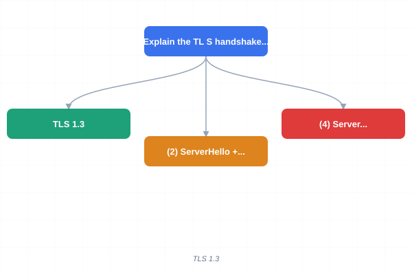
</a>
<a href="../../assets/images/diagrams/computer-networks/11-security/explain-the-tls-handshake-steps-sticky.svg" target="_blank" rel="noopener">
  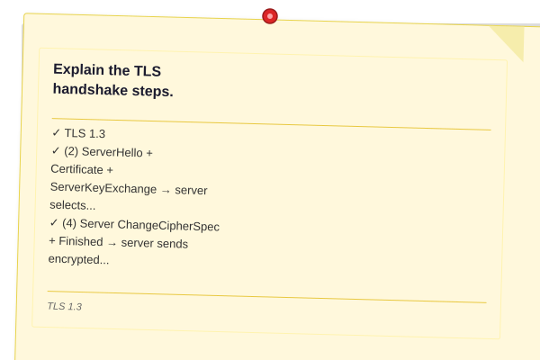
</a>

**A.** The TLS 1.2 handshake has 4 phases: (1) ClientHello → client sends supported versions, cipher suites, random nonce. (2) ServerHello + Certificate + ServerKeyExchange → server selects cipher suite, sends certificate chain and DH params. (3) ClientKeyExchange + ChangeCipherSpec + Finished → client sends DH share, both derive session keys, client sends encrypted verification. (4) Server ChangeCipherSpec + Finished → server sends encrypted verification. Application data follows encrypted with symmetric keys.
**TLS 1.3** reduces this to 1 RTT: ClientHello includes key_share; ServerHello includes its key_share; both compute shared secret immediately.

### Q2: Where should a firewall be placed in a network?

<a href="../../assets/images/diagrams/computer-networks/11-security/where-should-a-firewall-be-placed-in-a-network-handwritten.svg" target="_blank" rel="noopener">
  
</a>
<a href="../../assets/images/diagrams/computer-networks/11-security/where-should-a-firewall-be-placed-in-a-network-diagram.svg" target="_blank" rel="noopener">
  
</a>
<a href="../../assets/images/diagrams/computer-networks/11-security/where-should-a-firewall-be-placed-in-a-network-sticky.svg" target="_blank" rel="noopener">
  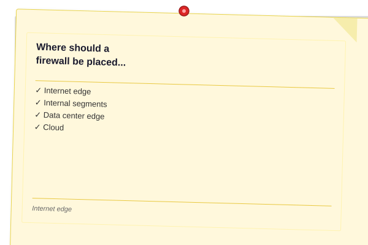
</a>

**A.** Firewalls deploy at these chokepoints: (1) **Internet edge** → between WAN router and internal network (perimeter firewall). (2) **DMZ** → between internet and DMZ (external firewall) and between DMZ and internal network (internal firewall). (3) **Internal segments** → between different security zones (finance, HR, engineering). (4) **Data center edge** → at the data center aggregation layer. (5) **Cloud** → cloud firewalls (AWS Security Groups, Azure NSGs) at VPC/subnet boundaries.

### Q3: Compare VPN vs MPLS.

<a href="../../assets/images/diagrams/computer-networks/11-security/compare-vpn-vs-mpls-handwritten.svg" target="_blank" rel="noopener">
  
</a>
<a href="../../assets/images/diagrams/computer-networks/11-security/compare-vpn-vs-mpls-diagram.svg" target="_blank" rel="noopener">
  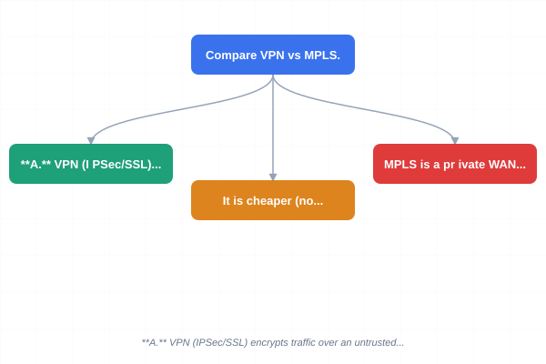
</a>
<a href="../../assets/images/diagrams/computer-networks/11-security/compare-vpn-vs-mpls-sticky.svg" target="_blank" rel="noopener">
  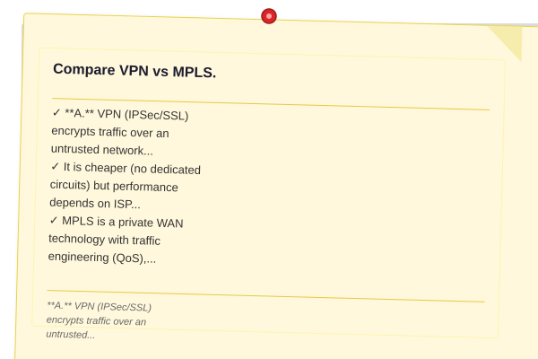
</a>

**A.** VPN (IPSec/SSL) encrypts traffic over an untrusted network (typically the internet). It is cheaper (no dedicated circuits) but performance depends on ISP and encryption overhead. MPLS is a private WAN technology with traffic engineering (QoS), SLAs, and no encryption by default. MPLS is more expensive, provides better performance guarantees, but requires dedicated circuits. Modern approach: use SD-WAN over VPN with MPLS as a backup.

### Q4: Explain 802.1X authentication flow.

<a href="../../assets/images/diagrams/computer-networks/11-security/explain-802-1x-authentication-flow-handwritten.svg" target="_blank" rel="noopener">
  
</a>
<a href="../../assets/images/diagrams/computer-networks/11-security/explain-802-1x-authentication-flow-diagram.svg" target="_blank" rel="noopener">
  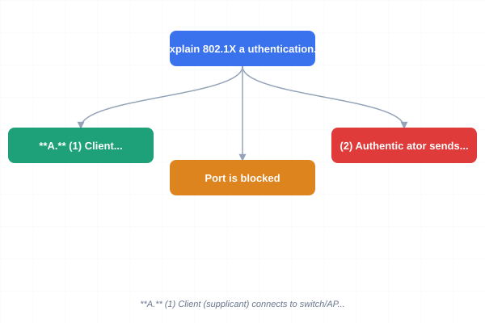
</a>
<a href="../../assets/images/diagrams/computer-networks/11-security/explain-802-1x-authentication-flow-sticky.svg" target="_blank" rel="noopener">
  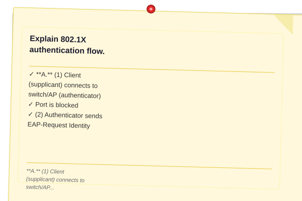
</a>

**A.** (1) Client (supplicant) connects to switch/AP (authenticator). Port is blocked. (2) Authenticator sends EAP-Request Identity. (3) Client responds with EAP-Response Identity, forwarded via RADIUS to authentication server. (4) EAP method exchange (e.g., EAP-TLS with certificates). (5) RADIUS sends Access-Accept or Access-Reject. (6) On accept, authenticator opens the port; client gets DHCP lease. On reject, port stays blocked.

### Q5: How does DNSSEC prevent cache poisoning?

<a href="../../assets/images/diagrams/computer-networks/11-security/how-does-dnssec-prevent-cache-poisoning-handwritten.svg" target="_blank" rel="noopener">
  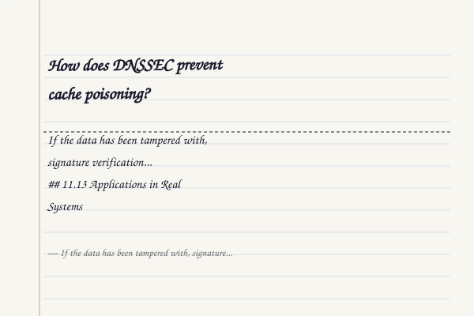
</a>
<a href="../../assets/images/diagrams/computer-networks/11-security/how-does-dnssec-prevent-cache-poisoning-diagram.svg" target="_blank" rel="noopener">
  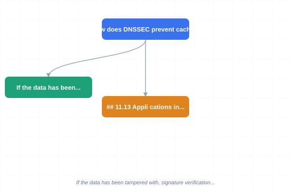
</a>
<a href="../../assets/images/diagrams/computer-networks/11-security/how-does-dnssec-prevent-cache-poisoning-sticky.svg" target="_blank" rel="noopener">
  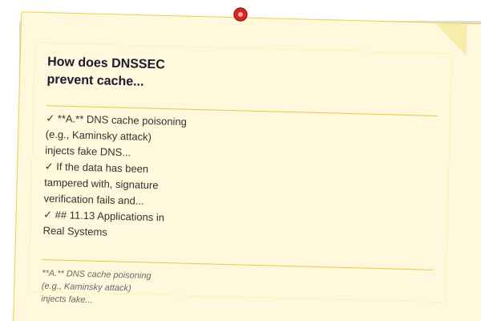
</a>

**A.** DNS cache poisoning (e.g., Kaminsky attack) injects fake DNS records into a resolver's cache. DNSSEC prevents this by requiring every DNS response to include a digital signature (RRSIG) that the resolver verifies against the zone's public key (DNSKEY). If the data has been tampered with, signature verification fails and the resolver discards the response.

## 11.13 Applications in Real Systems

### OpenVPN

<a href="../../assets/images/diagrams/computer-networks/11-security/openvpn-handwritten.svg" target="_blank" rel="noopener">
  
</a>
<a href="../../assets/images/diagrams/computer-networks/11-security/openvpn-diagram.svg" target="_blank" rel="noopener">
  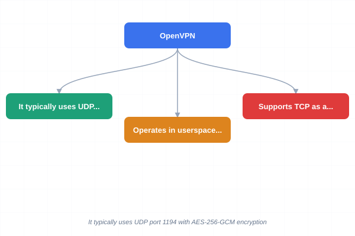
</a>
<a href="../../assets/images/diagrams/computer-networks/11-security/openvpn-sticky.svg" target="_blank" rel="noopener">
  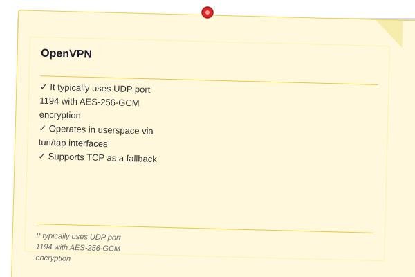
</a>

OpenVPN uses TLS for control channel authentication (certificate exchange) and IPSec-like ESP for the data channel. It typically uses UDP port 1194 with AES-256-GCM encryption. Operates in userspace via tun/tap interfaces. Supports TCP as a fallback. Works well across NAT due to single UDP port.

### IPsec (strongSwan, Libreswan, Windows built-in)

<a href="../../assets/images/diagrams/computer-networks/11-security/ipsec-strongswan-libreswan-windows-built-in-handwritten.svg" target="_blank" rel="noopener">
  
</a>
<a href="../../assets/images/diagrams/computer-networks/11-security/ipsec-strongswan-libreswan-windows-built-in-diagram.svg" target="_blank" rel="noopener">
  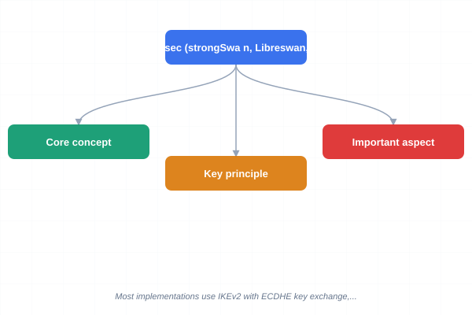
</a>
<a href="../../assets/images/diagrams/computer-networks/11-security/ipsec-strongswan-libreswan-windows-built-in-sticky.svg" target="_blank" rel="noopener">
  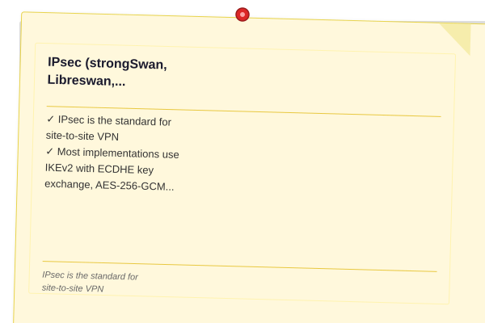
</a>

IPsec is the standard for site-to-site VPN. Most implementations use IKEv2 with ECDHE key exchange, AES-256-GCM encryption, and certificate authentication. IPsec tunnel mode encapsulates entire IP packets, making it suitable for routing between entire networks (e.g., AWS VPC to on-premises data center via AWS VPN Gateway).

### Let's Encrypt

<a href="../../assets/images/diagrams/computer-networks/11-security/let-s-encrypt-handwritten.svg" target="_blank" rel="noopener">
  
</a>
<a href="../../assets/images/diagrams/computer-networks/11-security/let-s-encrypt-diagram.svg" target="_blank" rel="noopener">
  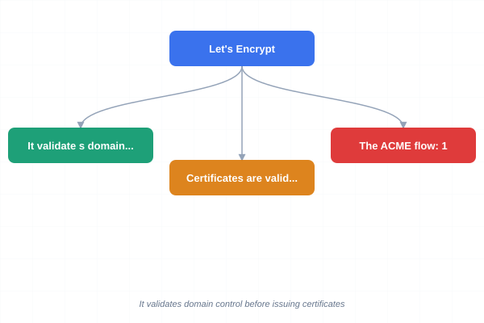
</a>
<a href="../../assets/images/diagrams/computer-networks/11-security/let-s-encrypt-sticky.svg" target="_blank" rel="noopener">
  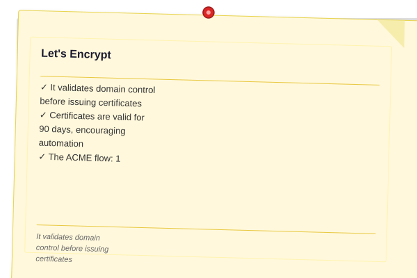
</a>

Let's Encrypt is a free, automated, and open Certificate Authority using the ACME (Automated Certificate Management Environment) protocol. It validates domain control before issuing certificates. Certificates are valid for 90 days, encouraging automation. The ACME flow:
1. Client generates key pair and requests certificate for domain.
2. CA challenges the client to prove domain control (HTTP-01: serve a token at /.well-known/acme-challenge/; DNS-01: add a TXT record).
3. Client fulfills challenge. CA signs and issues the certificate.
4. Client installs certificate on the server. Renews before expiration.

### Cloudflare DDoS Protection

<a href="../../assets/images/diagrams/computer-networks/11-security/cloudflare-ddos-protection-handwritten.svg" target="_blank" rel="noopener">
  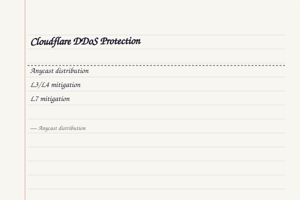
</a>
<a href="../../assets/images/diagrams/computer-networks/11-security/cloudflare-ddos-protection-diagram.svg" target="_blank" rel="noopener">
  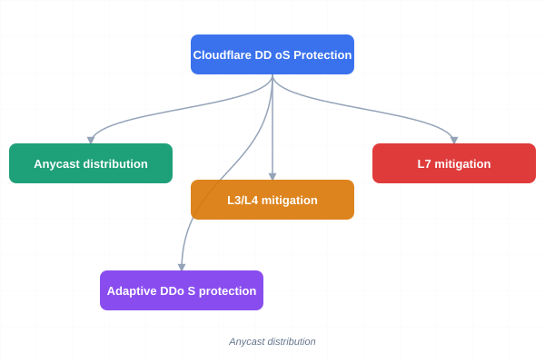
</a>
<a href="../../assets/images/diagrams/computer-networks/11-security/cloudflare-ddos-protection-sticky.svg" target="_blank" rel="noopener">
  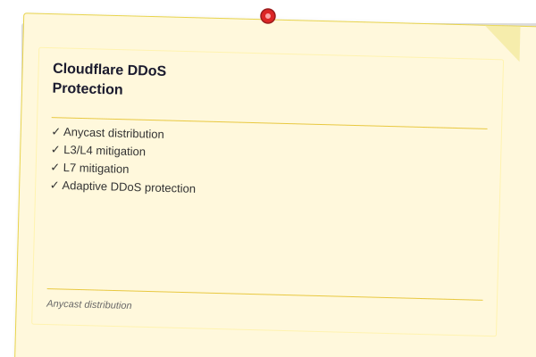
</a>

Cloudflare operates one of the largest anycast networks. Their DDoS mitigation strategy includes:
- **Anycast distribution**: Traffic is spread across 330+ data centers worldwide, absorbing volumetric attacks.
- **L3/L4 mitigation**: Kernel-level BPF (Berkeley Packet Filter) rules discard malicious packets (SYN floods, UDP amplification) at the edge before they reach the origin.
- **L7 mitigation**: WAF rules, rate limiting, challenge pages (JavaScript challenge, CAPTCHA), and behavioral analysis to identify abusive traffic.
- **Adaptive DDoS protection**: Machine learning models detect anomalous traffic patterns and automatically generate mitigation rules.
- **Unmetered DDoS protection**: Free for all customers (including free tier), ensuring availability even under sustained attack.

## Pro Tips

- **Use TLS 1.3 where possible**: TLS 1.3 reduces handshake to 1 RTT (0-RTT for resuming), removes insecure cipher suites, and provides forward secrecy by default.
- **RSA key sizes matter**: 2048-bit RSA is the current minimum; 4096-bit is recommended for long-lived CAs. ECC (256-bit) provides equivalent security to 3072-bit RSA with smaller certificates.
- **Stateful firewalls are not enough**: Deploy an NGFW with application-level inspection and TLS decryption.
- **IDS placement**: Deploy IDS sensors at network chokepoints (internet ingress, DMZ, internal segments). A single sensor at the border misses lateral movement.
- **Use DNSSEC validation on resolvers**: Unbound and BIND can validate DNSSEC chains. Without validation, DNSSEC provides zero protection.
- **Firewall rule ordering**: Place the most specific and most frequently matched rules first to reduce average evaluation time.
- **SYN cookies are a defense against resource exhaustion**: They should be enabled on any internet-facing server; the performance cost is negligible.

## One-Sentence Takeaways

- Symmetric encryption (AES) is fast but requires key distribution; asymmetric (RSA, ECC) solves key exchange without a shared secret.
- Diffie-Hellman enables two parties to establish a shared secret over an untrusted channel; ECDHE provides forward secrecy.
- Digital signatures provide non-repudiation; certificates bind public keys to identities via a chain of trust.
- Packet-filter firewalls are stateless; stateful firewalls track connection state; NGFWs add deep packet inspection.
- IPSec operates at the network layer (tunnel mode encapsulates entire IP packets); TLS operates at the transport layer.
- IDS/IPS use signatures, anomalies, and behavioral analysis; DDoS mitigation requires multi-layer defense including anycast, rate limiting, and WAF.
- 802.1X authenticates devices at the port level; WPA3 uses SAE to resist offline dictionary attacks; DNSSEC validates DNS response integrity.

## Concept Comparison Table

| Concept | Purpose | Key Technology | Key Size | Strength |
|---------|---------|----------------|----------|----------|
| Symmetric Encryption | Confidentiality | AES | 128-256 bits | Fast, bulk encryption |
| Asymmetric Encryption | Key exchange, signatures | RSA, ECC | 2048-4096 bits | Slow, limited data |
| Hashing | Integrity | SHA-256, SHA-3 | 256-bit output | One-way, collision-resistant |
| MAC | Authentication + Integrity | HMAC | Key-dependent | Proves sender knowledge |
| Digital Signature | Non-repudiation | ECDSA, RSA | Key-dependent | Legally binding |
| Certificate (PKI) | Identity binding | X.509 | CA-signed | Trust chain |

## Quick Reference: Firewall Types

| Type | Layer | Stateful | App Awareness | Speed |
|------|-------|----------|---------------|-------|
| Packet filter | 3/4 | No | None | Line rate |
| Stateful | 3/4 | Yes | None | Near line rate |
| Application proxy | 7 | Yes | Full | Limited |
| NGFW | 3-7 | Yes | Deep (DPI, TLS) | HW-dependent |

## DDoS Protection Quick Reference

| Defense Layer | Technology | Attacks Mitigated |
|---------------|------------|-------------------|
| Edge (L3) | Anycast distribution, BGP blackholing | Volumetric floods (100s Gbps+) |
| Network (L3/L4) | ACLs, rate limiting, SYN cookies, BPF | SYN flood, UDP amplification |
| Application (L7) | WAF, challenge page, rate limiting | HTTP flood, Slowloris, credential stuffing |
| Behavioral | ML-based anomaly detection | Novel attack patterns, zero-day DDoS |

## Cross-Application Matrix

| Environment | Recommended Crypto | Firewall Type | VPN Type |
|-------------|-------------------|--------------|----------|
| Web browsing | TLS 1.3 (ECDHE + AES-GCM) | NGFW | TLS |
| Site-to-site WAN | IPSec (AES-256, SHA-256) | Stateful | IPSec tunnel |
| Remote access | TLS 1.3 + OAuth2 | NGFW | SSL VPN |
| IoT sensors | ECC-256, CoAP over DTLS | Packet filter | None |
| Data center | MACsec (L2 encryption) | Stateful | None (trusted net) |

## Mermaid Diagram: OSI Security Layers

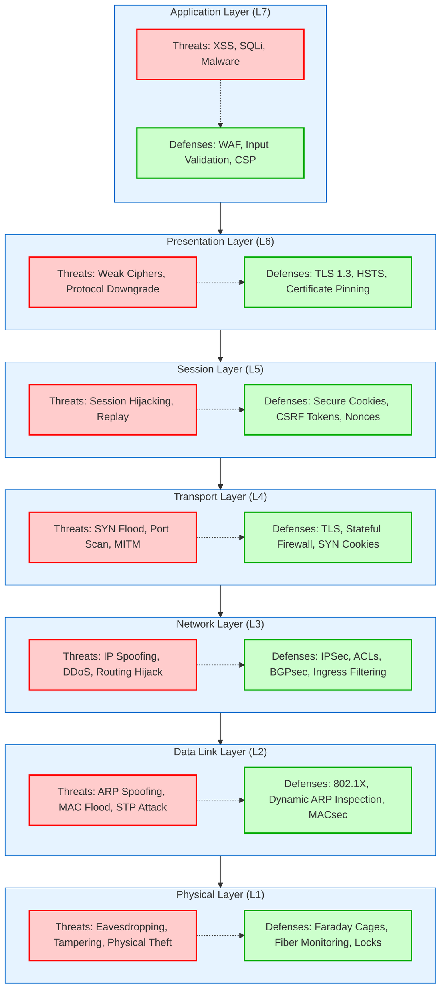
```mermaid
graph TB
  subgraph APP["Application Layer (L7)"]
    direction TB
    T1["Threats: XSS, SQLi, Malware"]
    D1["Defenses: WAF, Input Validation, CSP"]
  end
  subgraph PRES["Presentation Layer (L6)"]
    T2["Threats: Weak Ciphers, Protocol Downgrade"]
    D2["Defenses: TLS 1.3, HSTS, Certificate Pinning"]
  end
  subgraph SESS["Session Layer (L5)"]
    T3["Threats: Session Hijacking, Replay"]
    D3["Defenses: Secure Cookies, CSRF Tokens, Nonces"]
  end
  subgraph TRANS["Transport Layer (L4)"]
    T4["Threats: SYN Flood, Port Scan, MITM"]
    D4["Defenses: TLS, Stateful Firewall, SYN Cookies"]
  end
  subgraph NET["Network Layer (L3)"]
    T5["Threats: IP Spoofing, DDoS, Routing Hijack"]
    D5["Defenses: IPSec, ACLs, BGPsec, Ingress Filtering"]
  end
  subgraph DLL["Data Link Layer (L2)"]
    T6["Threats: ARP Spoofing, MAC Flood, STP Attack"]
    D6["Defenses: 802.1X, Dynamic ARP Inspection, MACsec"]
  end
  subgraph PHYS["Physical Layer (L1)"]
    T7["Threats: Eavesdropping, Tampering, Physical Theft"]
    D7["Defenses: Faraday Cages, Fiber Monitoring, Locks"]
  end

  APP --> PRES --> SESS --> TRANS --> NET --> DLL --> PHYS
  T1 -.-> D1
  T2 -.-> D2
  T3 -.-> D3
  T4 -.-> D4
  T5 -.-> D5
  T6 -.-> D6
  T7 -.-> D7

  classDef threat fill:#ffcccc,stroke:#ff0000,stroke-width:2px
  classDef defense fill:#ccffcc,stroke:#00aa00,stroke-width:2px
  classDef layer fill:#e6f3ff,stroke:#0066cc,stroke-width:1px
  class T1,T2,T3,T4,T5,T6,T7 threat
  class D1,D2,D3,D4,D5,D6,D7 defense
  class APP,PRES,SESS,TRANS,NET,DLL,PHYS layer
```

## Case Study: Enterprise Network Security Design

**Problem.** A multinational corporation with 1,000 employees, three data centers, and a rapidly growing cloud workload needed to redesign its network security architecture. The legacy flat network had suffered two ransomware incidents and one data exfiltration event in the previous year. Requirements included: secure remote access for 300 work-from-home employees, PCI-DSS compliance for payment processing, protection against volumetric DDoS attacks, and micro-segmentation between engineering, finance, and HR departments.

**Solution.** The security team deployed a three-tier firewall architecture: (1) edge NGFWs with IPS and DDoS scrubbing at the internet gateway, (2) internal firewalls creating DMZ, internal, and management security zones, and (3) host-based firewalls on all servers. TLS 1.3 was enforced for all external-facing services with Let's Encrypt certificates and automated renewal via ACME. A site-to-site IPSec VPN connected the three data centers using IKEv2 with ECDHE and AES-256-GCM. Remote employees connected via an SSL VPN with multi-factor authentication. The cloud workloads (AWS VPCs) were secured using Security Groups with a default-deny policy, and a centralized SIEM collected logs from all firewalls, IDS sensors, and cloud APIs.

**Outcome.** Over three years, the organization experienced zero security breaches. The automated certificate lifecycle eliminated expired-certificate outages. DDoS scrubbing mitigated five attacks exceeding 100 Gbps. The micro-segmentation policy limited the blast radius of a single compromised workstation — lateral movement was contained to the user's department. Annual PCI-DSS audits passed with no critical findings. The total security operation cost was 15% below the previous legacy appliance model due to reduced hardware maintenance and automated policy management.

## Practical Takeaways

| Takeaway | Application |
|----------|-------------|
| Defense in depth requires controls at every OSI layer | Deploy firewalls (L3/L4), IPS (L7), encryption (L6), and access control (L2) simultaneously |
| TLS everywhere with automated certificates prevents both eavesdropping and outages | Use Let's Encrypt + ACME for all public services; enforce TLS 1.3 minimum |
| Default-deny firewall policy reduces attack surface | Start with empty allowlist; add rules only for verified business traffic |
| Micro-segmentation limits blast radius during breaches | Separate departments and tiers into distinct security zones with inter-zone firewall rules |
| Cloud security groups follow the same principles as physical firewalls | Apply default-deny, least-privilege, and audit logging to cloud network ACLs |
| Centralized logging and SIEM is essential for breach detection | Aggregate firewall logs, IDS alerts, and cloud API calls into a single dashboard |
| Automated certificate lifecycle management prevents expiry outages | Use ACME protocol with 60-day certificates; monitor expiry via SIEM alerts |

## Chapter Quiz

1. **Which firewall type maintains a connection state table to track ongoing sessions?**
   - a) Packet-filter firewall
   - b) Stateful firewall
   - c) Application proxy
   - d) Next-generation firewall

2. **What is the primary purpose of IPSec tunnel mode?**
   - a) Encrypt only the transport-layer payload
   - b) Encrypt the entire original IP packet inside a new IP header
   - c) Provide application-layer content filtering
   - d) Replace TLS for web security

3. **In a TLS 1.3 handshake, how many round trips are needed before application data can flow?**
   - a) 0 (zero RTT)
   - b) 1 RTT
   - c) 2 RTT
   - d) 3 RTT

4. **What mechanism does WPA3 use to resist offline dictionary attacks?**
   - a) PSK 4-way handshake
   - b) SAE (Simultaneous Authentication of Equals)
   - c) EAP-TLS certificate exchange
   - d) WPS PIN authentication

5. **Which DNSSEC record type provides the public key used to verify RRSIG signatures in a zone?**
   - a) DS
   - b) RRSIG
   - c) DNSKEY
   - d) NSEC

| Question | Answer | Explanation |
|----------|--------|-------------|
| Q1 | B | Stateful firewalls maintain a connection table (src IP, dst IP, ports, state) to track sessions; packet filters are stateless |
| Q2 | B | Tunnel mode encapsulates the entire original IP packet with a new IP header + ESP header; transport mode protects only payload |
| Q3 | B | TLS 1.3 requires 1 RTT for full handshake (client key share in ClientHello, server response in ServerHello). 0-RTT is for resumption only |
| Q4 | B | SAE (Simultaneous Authentication of Equals) uses a password-authenticated DH exchange resistant to offline brute force |
| Q5 | C | DNSKEY records store the zone's public signing key; RRSIG contains signatures; DS links parent to child zone |

## Summary

Network security relies on cryptography for confidentiality (AES), integrity (SHA-256, HMAC), and authentication (digital signatures, certificates). Symmetric encryption provides fast bulk encryption but requires secure key distribution. Asymmetric encryption (RSA, ECC) enables key exchange and digital signatures. PKI binds public keys to identities through CA-signed X.509 certificates. Firewalls enforce access control at the packet, state, or application level → NGFWs combine all three with DPI. VPNs (IPSec, TLS, WireGuard) protect communication over untrusted networks. IDS/IPS detect and block malicious traffic using signatures, anomaly detection, and behavioral analysis. DDoS mitigation requires multi-layer defense from edge routing to application-level filtering. 802.1X authenticates devices at the port level before network access. WPA3 replaces WPA2's PSK with SAE, providing forward secrecy and resistance to offline dictionary attacks. DNSSEC validates DNS response integrity through digital signatures.

## Exercises

### Review Questions

<details>
<summary>Solution</summary>

1. A cryptographic hash must satisfy: (a) preimage resistance — given hash y, infeasible to find x such that H(x) = y; (b) second preimage resistance — given x, infeasible to find x' ≠ x with H(x') = H(x); (c) collision resistance — infeasible to find any pair x₁ ≠ x₂ with H(x₁) = H(x₂).

2. DH is vulnerable to MITM because the exchanged public values (g^a mod p, g^b mod p) are not authenticated. An attacker can intercept both values, substitute their own, and establish separate shared secrets with each party. The parties believe they share a secret with each other but actually share one with the attacker.

3. An X.509 certificate contains: version, serial number, signature algorithm identifier, issuer name, validity period (notBefore, notAfter), subject name, subject's public key, issuer unique ID (optional), subject unique ID (optional), extensions, and CA's digital signature.

4. A packet-filter firewall examines each packet independently (stateless) based on IP/port fields. A stateful firewall maintains a connection state table tracking TCP handshake state, sequence numbers, and session context — it can allow return traffic for outbound connections while blocking unsolicited inbound packets.

5. Transport mode protects only the payload (L4 and above) of the original IP packet, keeping the original IP header. Tunnel mode encapsulates the entire original IP packet inside a new IP header with ESP/AH — the original IP addresses are hidden, making it suitable for site-to-site VPNs.

6. IDS/IPS use: (a) signature-based detection — matching known attack patterns (fast, low false positive, no zero-day); (b) anomaly-based detection — deviations from baseline behavior (detects novel attacks, higher false positives); (c) behavioral analysis — sequences of actions indicating compromise (context-aware, computationally expensive).

7. SAE (Simultaneous Authentication of Equals) uses a password-authenticated Diffie-Hellman exchange where each guess requires an online interaction with the real AP. Unlike WPA2's PSK 4-way handshake which can be captured and brute-forced offline, SAE's exchange commits both parties to a guess before revealing any information — an attacker cannot verify an offline guess.

8. A DS (Delegation Signer) record in the parent zone links to a child zone's DNSKEY record. It contains a hash of the child zone's KSK (Key Signing Key), enabling resolvers to build a chain of trust from the root zone down to the target domain.
</details>

### Application Problems

<details>
<summary>Solution</summary>

9. n = p × q = 61 × 53 = 3233. φ(n) = (p-1)(q-1) = 60 × 52 = 3120. e = 17. Using extended Euclidean algorithm: 17 × d ≡ 1 (mod 3120) → d = 2753. Encrypt: c = m^e mod n = 65^17 mod 3233 = 2790. Decrypt: m = c^d mod n = 2790^2753 mod 3233 = 65 ✓.

10. Stateful firewall rules: (1) Allow outbound HTTP/HTTPS from any internal host to any destination; (2) Allow outbound DNS (UDP 53) from internal DNS servers to external resolvers; (3) Allow inbound SSH from 10.0.0.0/24 to any internal host (management access); (4) Allow inbound SMTP from any to 10.0.1.10 (mail server); (5) Deny all other inbound traffic; (6) Allow established/related return traffic for all outbound connections. The stateful firewall automatically creates state entries for allowed outbound connections, permitting return traffic without explicit rules.

11. SYN flood fill time = 500,000 / 1,000,000 = 0.5 seconds. Defenses: (a) SYN cookies — encode connection state in SYN-ACK sequence number, no state stored until ACK; (b) SYN proxy — firewall completes handshake on behalf of server; (c) rate limiting — limit new connections per second per source IP; (d) increase connection table size and reduce timeout for half-open connections.

12. IKEv2 SA setup: (1) IKE_SA_INIT request: HDR(SPIi=0xA1), SA(enc=AES-CBC-256, prf=HMAC-SHA256, dh=19), KE(g^i mod p), Ni(nonce); (2) IKE_SA_INIT response: HDR(SPIi=0xA1, SPIr=0xB2), SA(enc=AES-CBC-256), KE(g^r mod p), Nr(nonce); (3) Key derivation: SK_d = PRF(Ni|Nr, g^ir), SK_ei = PRF(SK_d, "key for init"), SK_er = PRF(SK_d, "key for resp"); (4) IKE_AUTH request: SK{IDi, CERT, AUTH, SA(TSi, TSr)}; (5) IKE_AUTH response: SK{IDr, CERT, AUTH, SA}.
</details>

### Challenge Problem

<details>
<summary>Solution</summary>

13. **Secure messaging protocol design:** (a) Use X3DH (Extended Triple Diffie-Hellman) for initial key agreement — each party has a long-term identity key (IK), a medium-term signed pre-key (SPK), and ephemeral keys (EK). (b) For forward secrecy, use the Double Ratchet algorithm: a DH ratchet provides new ephemeral keys per message (or per received message), and a symmetric ratchet provides keys for each message direction. Compromise of long-term keys reveals only the current ratchet state, not past messages. (c) For deniability, use the same key material for both parties — either party could have forged a message (no cryptographic proof of origin to third parties). Off-the-Record messaging uses this property. (d) Authentication is achieved during the X3DH initial handshake where both parties authenticate using their long-term identity keys (signed with ECDSA). The initial shared secret includes IK components from both sides. Comparison with Signal: this design is functionally equivalent to Signal's Double Ratchet + X3DH. Signal adds additional protections like padding, message dedup via associated data, and post-compromise security through future DH ratchets.
</details>
