# Chapter 12: Wireless Networks (Extended)

## Learning Objectives

1. Compare the 802.11 physical-layer standards and their performance characteristics.
2. Describe CSMA/CA and its role in wireless medium access.
3. Explain Bluetooth architecture including piconets and scatternets.
4. Analyze the architecture of cellular networks from 4G/LTE to 5G.
5. Describe mobility management including handover, location tracking, and roaming.
6. Implement wireless protocol simulations in C++ and Python.

## 12.1 Wireless Challenges

Wireless communication faces fundamental challenges that wired networks avoid. These constraints shape every protocol from 802.11 to 5G.

### 12.1.1 Key Challenges

<a href="../../assets/images/diagrams/computer-networks/12-wireless/12-1-1-key-challenges-handwritten.svg" target="_blank" rel="noopener">
  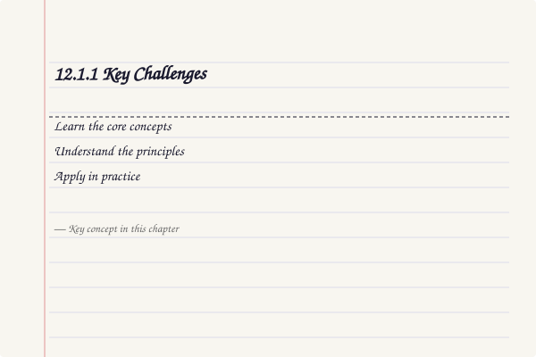
</a>
<a href="../../assets/images/diagrams/computer-networks/12-wireless/12-1-1-key-challenges-diagram.svg" target="_blank" rel="noopener">
  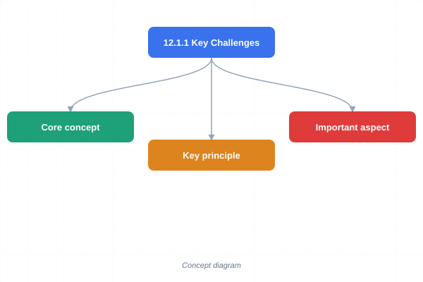
</a>
<a href="../../assets/images/diagrams/computer-networks/12-wireless/12-1-1-key-challenges-sticky.svg" target="_blank" rel="noopener">
  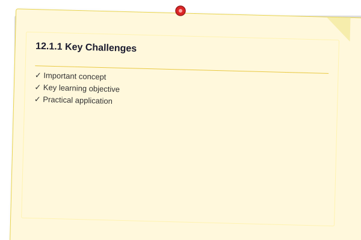
</a>


| Challenge | Description | Impact |
|-----------|-------------|--------|
| Attenuation | Signal power decays with distance ($P_r \propto P_t / d^2$ in free space, worse indoors) | Reduced range, lower data rates at distance |
| Multipath Fading | Reflections cause multiple copies of signal arriving at different times | Intersymbol interference, frequency-selective fading |
| Interference | Other devices on same frequency (microwaves, cordless phones, Bluetooth) | Collisions, retransmissions, throughput collapse |
| Hidden Terminal | Two stations cannot hear each other but both reach the AP | Collisions at the receiver that the sender cannot detect |
| Exposed Terminal | Station defers to a transmission it could safely ignore | Unnecessary deferral, wasted channel capacity |
| Mobility | Devices move between coverage areas | Connection drops, handover latency, packet loss |
| Energy Constraints | Battery-powered devices limit transmit power and processing | Shorter range, limited duty cycle |
| Security | Wireless signals travel through walls and public spaces | Eavesdropping, injection, MITM attacks |

### 12.1.2 Real-World Analogy: The Noisy Room

<a href="../../assets/images/diagrams/computer-networks/12-wireless/12-1-2-real-world-analogy-the-noisy-room-handwritten.svg" target="_blank" rel="noopener">
  
</a>
<a href="../../assets/images/diagrams/computer-networks/12-wireless/12-1-2-real-world-analogy-the-noisy-room-diagram.svg" target="_blank" rel="noopener">
  
</a>
<a href="../../assets/images/diagrams/computer-networks/12-wireless/12-1-2-real-world-analogy-the-noisy-room-sticky.svg" target="_blank" rel="noopener">
  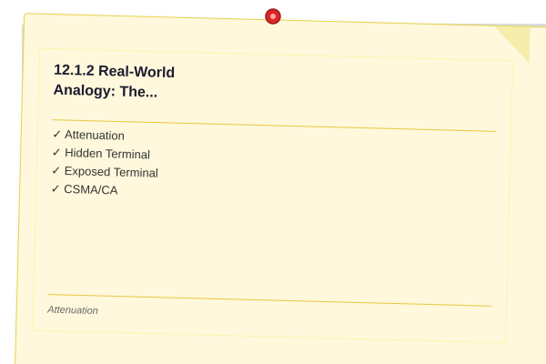
</a>


Imagine a large room where people are trying to have conversations:

- **Attenuation**: Two people speaking softly across opposite ends of the room cannot hear each other clearly.
- **Hidden Terminal**: Person A is on the left, Person B is on the right. Both can hear the moderator (AP) in the center, but A cannot hear B and B cannot hear A. If both speak at the same time, the moderator hears noise.
- **Exposed Terminal**: Person C is near Person A. When A speaks to the moderator, C hears A and stays silent. But C could safely speak to Person D in the opposite direction → the moderator is far enough away not to be disturbed by C.
- **CSMA/CA**: Before speaking, listen. If someone else is speaking, wait a random amount of time before trying again.
- **RTS/CTS**: Before speaking, say "I have something to say" (RTS). The moderator responds "Go ahead, everyone else be quiet for X seconds" (CTS).

### 12.1.3 Edge Cases

<a href="../../assets/images/diagrams/computer-networks/12-wireless/12-1-3-edge-cases-handwritten.svg" target="_blank" rel="noopener">
  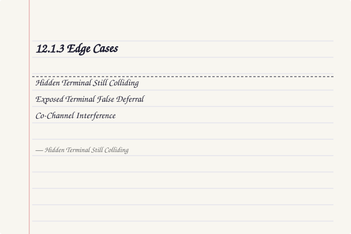
</a>
<a href="../../assets/images/diagrams/computer-networks/12-wireless/12-1-3-edge-cases-diagram.svg" target="_blank" rel="noopener">
  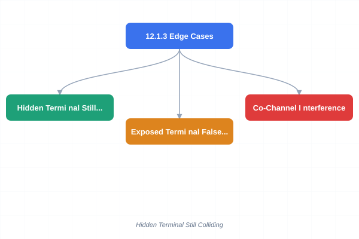
</a>
<a href="../../assets/images/diagrams/computer-networks/12-wireless/12-1-3-edge-cases-sticky.svg" target="_blank" rel="noopener">
  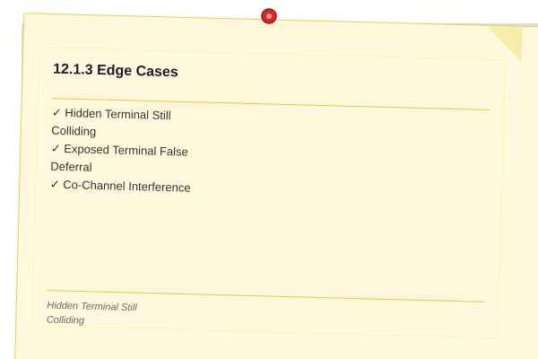
</a>


**Hidden Terminal Still Colliding**: Even with RTS/CTS, if two hidden stations transmit RTS simultaneously, both RTS frames collide at the AP. Both time out waiting for CTS and double their backoff windows. This is the RTS collision problem → RTS frames themselves are vulnerable.

**Exposed Terminal False Deferral**: Station C hears Station A's transmission to the AP. C defers even though C's transmission to D would not interfere with A's reception at the AP. The exposed terminal cannot distinguish between "the medium is busy for me" and "the medium is busy for someone else."

**Co-Channel Interference**: Two APs on the same channel in adjacent coverage areas. Clients at the cell edge experience collisions from both cells. With 2.4 GHz having only 3 non-overlapping channels, dense deployments inevitably suffer this.

### 12.1.4 A&D of Wireless Communication

<a href="../../assets/images/diagrams/computer-networks/12-wireless/12-1-4-a-d-of-wireless-communication-handwritten.svg" target="_blank" rel="noopener">
  
</a>
<a href="../../assets/images/diagrams/computer-networks/12-wireless/12-1-4-a-d-of-wireless-communication-diagram.svg" target="_blank" rel="noopener">
  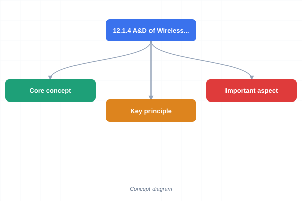
</a>
<a href="../../assets/images/diagrams/computer-networks/12-wireless/12-1-4-a-d-of-wireless-communication-sticky.svg" target="_blank" rel="noopener">
  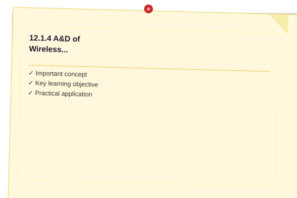
</a>


| Advantage | Disadvantage |
|-----------|-------------|
| Mobility: users move freely within coverage area | Reliability: higher bit error rate than wired |
| Deployment speed: no cables needed | Security: signal propagates beyond intended area |
| Cost: no cabling infrastructure | Throughput: shared medium, half-duplex |
| Scalability: add devices without wiring | Latency: contention, backoff, retransmission |
| Coverage: reaches locations cables cannot | Predictability: variable due to interference |

## 12.2 IEEE 802.11 Architecture

### 12.2.1 Components

<a href="../../assets/images/diagrams/computer-networks/12-wireless/12-2-1-components-handwritten.svg" target="_blank" rel="noopener">
  
</a>
<a href="../../assets/images/diagrams/computer-networks/12-wireless/12-2-1-components-diagram.svg" target="_blank" rel="noopener">
  
</a>
<a href="../../assets/images/diagrams/computer-networks/12-wireless/12-2-1-components-sticky.svg" target="_blank" rel="noopener">
  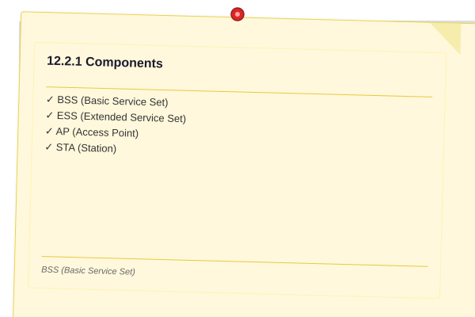
</a>


| Component | Full Name | Role |
|-----------|-----------|------|
| **STA** | Station | Any device with wireless interface (laptop, phone, IoT sensor) |
| **AP** | Access Point | Central hub connecting wireless to wired network; bridges 802.11 to 802.3 |
| **BSS** | Basic Service Set | One AP + associated STAs; identified by BSSID (AP's MAC address) |
| **ESS** | Extended Service Set | Multiple BSSes connected by a distribution system (DS); same SSID |
| **DS** | Distribution System | Backbone network connecting APs (typically Ethernet) |

**BSS (Basic Service Set)**: The fundamental building block. An AP and its associated stations form a cell. Each BSS is identified by a BSSID (usually the AP's MAC address). In ad-hoc (IBSS) mode, stations communicate directly without an AP.

**ESS (Extended Service Set)**: Multiple BSSes connected via a distribution system. All BSSes share the same SSID (network name). A station can roam between BSSes within the same ESS. The DS is typically Ethernet but can be any backbone technology.

**AP (Access Point)**: Acts as a bridge between wireless and wired domains. Performs: beacon generation, station association/authentication, frame translation (802.11 ↔ 802.3), power management coordination, and QoS scheduling.

**STA (Station)**: Any device with an 802.11 interface. STA states: Unauthenticated, Authenticated but unassociated, Associated, and Authenticated + Associated (fully connected).

### 12.2.2 Real-World Analogy: Office Building

<a href="../../assets/images/diagrams/computer-networks/12-wireless/12-2-2-real-world-analogy-office-building-handwritten.svg" target="_blank" rel="noopener">
  
</a>
<a href="../../assets/images/diagrams/computer-networks/12-wireless/12-2-2-real-world-analogy-office-building-diagram.svg" target="_blank" rel="noopener">
  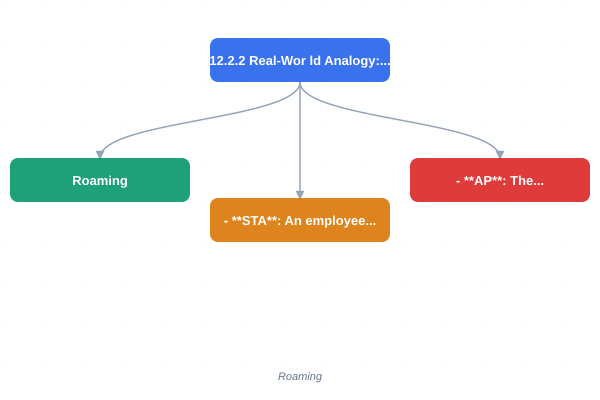
</a>
<a href="../../assets/images/diagrams/computer-networks/12-wireless/12-2-2-real-world-analogy-office-building-sticky.svg" target="_blank" rel="noopener">
  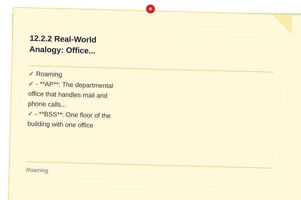
</a>


- **STA**: An employee at their desk.
- **AP**: The departmental office that handles mail and phone calls for the floor.
- **BSS**: One floor of the building with one office.
- **DS**: The internal mail system connecting all departmental offices.
- **ESS**: The entire building → all floors use the same company name (SSID), and mail routes between offices seamlessly.
- **Roaming**: An employee moves from floor 3 to floor 5. They still receive mail at the same address (SSID) even though their local office (AP) has changed.

### 12.2.3 Wi-Fi Association Process (Numbered Steps)

<a href="../../assets/images/diagrams/computer-networks/12-wireless/12-2-3-wi-fi-association-process-numbered-steps-handwritten.svg" target="_blank" rel="noopener">
  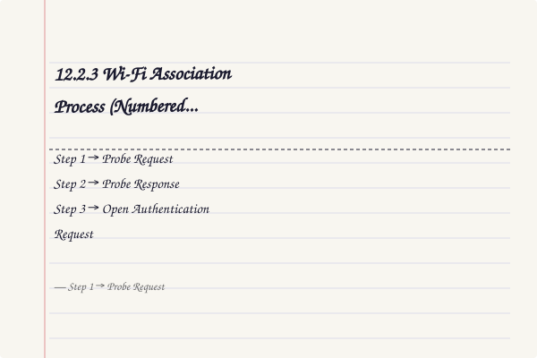
</a>
<a href="../../assets/images/diagrams/computer-networks/12-wireless/12-2-3-wi-fi-association-process-numbered-steps-diagram.svg" target="_blank" rel="noopener">
  
</a>
<a href="../../assets/images/diagrams/computer-networks/12-wireless/12-2-3-wi-fi-association-process-numbered-steps-sticky.svg" target="_blank" rel="noopener">
  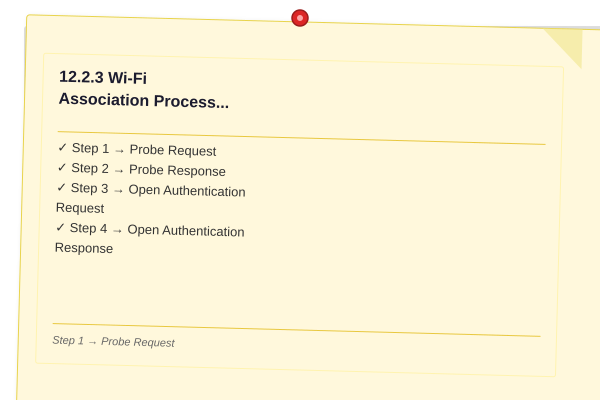
</a>


**Step 1 → Probe Request**: STA broadcasts a Probe Request on each channel, listing supported data rates and capabilities.

**Step 2 → Probe Response**: Each AP in range responds with a Probe Response containing SSID, supported rates, encryption types, beacon interval, and capability information.

**Step 3 → Open Authentication Request**: STA sends an Authentication frame to the chosen AP. In open system authentication (the most common), this is essentially a formality.

**Step 4 → Open Authentication Response**: AP responds with an Authentication frame indicating success (status code 0).

**Step 5 → Association Request**: STA sends an Association Request including listen interval (for power management), supported rates, SSID, and capabilities.

**Step 6 → Association Response**: AP responds with Association ID (AID, 1-2007), success/failure status, and supported rates.

After Step 6, if WPA2/WPA3 is used, the 4-way handshake occurs for key exchange before data can flow.

### 12.2.4 Pseudocode: Wi-Fi Association

<a href="../../assets/images/diagrams/computer-networks/12-wireless/12-2-4-pseudocode-wi-fi-association-handwritten.svg" target="_blank" rel="noopener">
  
</a>
<a href="../../assets/images/diagrams/computer-networks/12-wireless/12-2-4-pseudocode-wi-fi-association-diagram.svg" target="_blank" rel="noopener">
  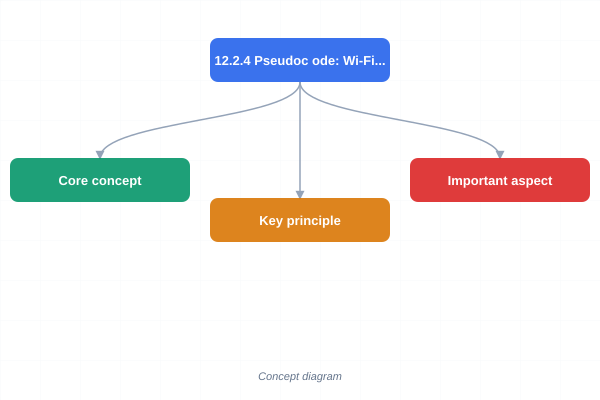
</a>
<a href="../../assets/images/diagrams/computer-networks/12-wireless/12-2-4-pseudocode-wi-fi-association-sticky.svg" target="_blank" rel="noopener">
  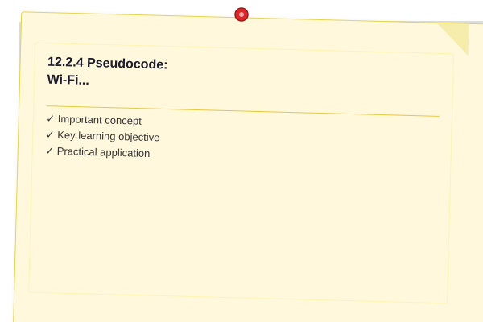
</a>


```
procedure wifi_association(sta, ap)
    // Phase 1: Passive/Active Scanning
    for each channel in supported_channels do
        if passive_scanning then
            listen_for_beacon(channel, beacon_interval)
            beacon = receive_beacon()
            if beacon.ssid == target_ssid then
                ap_list.add(beacon)
        else
            probe = ProbeRequest(sta.supported_rates, sta.capabilities)
            broadcast(probe)
            response = recv_probe_response(probe_timeout)
            if response != null and response.ssid == target_ssid then
                ap_list.add(response)

    // Phase 2: Select AP
    chosen_ap = select_best_ap(ap_list)  // by RSSI, channel utilization, etc.

    // Phase 3: Authenticate
    attempt = 0
    while attempt < MAX_AUTH_RETRIES do
        auth_req = AuthRequest(algorithm=OPEN, seq=1)
        send(auth_req, chosen_ap)
        auth_resp = recv(timeout=T_AUTH)
        if auth_resp != null and auth_resp.status == SUCCESS then
            break
        attempt = attempt + 1

    // Phase 4: Associate
    attempt = 0
    while attempt < MAX_ASSOC_RETRIES do
        assoc_req = AssocRequest(listen_interval, ssid, rates)
        send(assoc_req, chosen_ap)
        assoc_resp = recv(timeout=T_ASSOC)
        if assoc_resp != null and assoc_resp.status == SUCCESS then
            sta.aid = assoc_resp.aid
            sta.state = ASSOCIATED
            return SUCCESS
        attempt = attempt + 1

    return FAILURE
```

### 12.2.5 Dry Run Trace: Wi-Fi Association

<a href="../../assets/images/diagrams/computer-networks/12-wireless/12-2-5-dry-run-trace-wi-fi-association-handwritten.svg" target="_blank" rel="noopener">
  
</a>
<a href="../../assets/images/diagrams/computer-networks/12-wireless/12-2-5-dry-run-trace-wi-fi-association-diagram.svg" target="_blank" rel="noopener">
  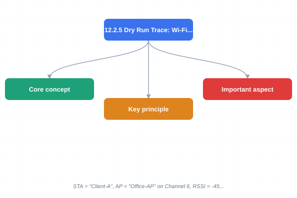
</a>
<a href="../../assets/images/diagrams/computer-networks/12-wireless/12-2-5-dry-run-trace-wi-fi-association-sticky.svg" target="_blank" rel="noopener">
  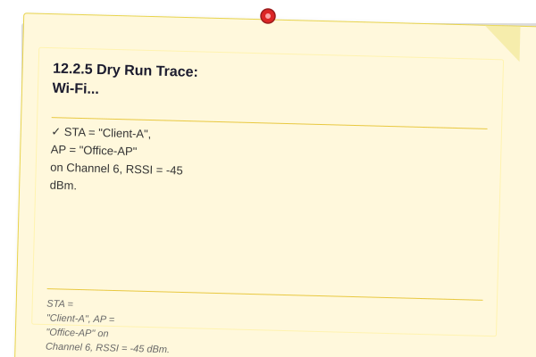
</a>


Parameters: STA = "Client-A", AP = "Office-AP" on Channel 6, RSSI = -45 dBm.

| Step | Sender | Frame Type | Key Fields | Result |
|------|--------|-----------|------------|--------|
| 1 | Client-A | Probe Request | SSID: null (broadcast), Rates: b/g/n, Channel: 6 | Broadcast on ch 6 |
| 2 | Office-AP | Probe Response | SSID: "CorpNet", Rates: 54/48/36/24/12/9/6 Mbps, Cap: WPA2, RSSI: -45 dBm | Received by Client-A |
| 3 | Client-A | Auth Request | Algorithm: Open, Seq: 1 | Sent to Office-AP |
| 4 | Office-AP | Auth Response | Algorithm: Open, Seq: 2, Status: 0 (Success) | Sent to Client-A |
| 5 | Client-A | Assoc Request | SSID: "CorpNet", Listen Interval: 10, Rates: b/g/n | Sent to Office-AP |
| 6 | Office-AP | Assoc Response | AID: 5, Status: 0 (Success) | Sent to Client-A |
| 7 | Client-A | EAPOL-1 (4-way) | Key data: ANonce | Office-AP sends ANonce |
| 8 | Office-AP | EAPOL-2 (4-way) | Key data: SNonce + MIC | Client-A sends SNonce |
| 9 | Client-A | EAPOL-3 (4-way) | Key data: GTK + MIC | Office-AP installs keys |
| 10 | Office-AP | EAPOL-4 (4-way) | Key data: ACK | Client-A installs keys |
| → | Client-A | Data Frame | Encrypted payload | Full connectivity established |

### TypeScript Implementation: AccessPointManager

```typescript
type STAState = 'UNAUTHENTICATED' | 'AUTHENTICATED' | 'ASSOCIATED' | 'AUTHORIZED';

interface StationInfo { mac: string; rssi: number; channel: number; state: STAState; aid: number; capabilities: string[]; }

class AccessPointManager {
  private ssid: string;
  private bssid: string;
  private channel: number;
  private beaconInterval: number; // ms
  private stations: Map<string, StationInfo> = new Map();
  private nextAid: number = 1;
  private channels: number[] = [1, 6, 11, 36, 40, 44, 48]; // 2.4 & 5 GHz
  private currentChannelIndex: number = 0;

  constructor(ssid: string, bssid: string, channel: number = 6) {
    this.ssid = ssid;
    this.bssid = bssid;
    this.channel = channel;
    this.beaconInterval = 102.4; // TU
  }

  sendBeacon(): { ssid: string; bssid: string; channel: number; capabilities: string[] } {
    const caps = ['WPA3', '802.11ax', 'MU-MIMO', 'OFDMA'];
    console.log(`[BEACON] SSID="${this.ssid}" BSSID=${this.bssid} CH=${this.channel} ${caps.join(',')}`);
    return { ssid: this.ssid, bssid: this.bssid, channel: this.channel, capabilities: caps };
  }

  probeRequest(clientMac: string, supportedRates: string[]): { bssid: string; ssid: string } | null {
    const overlap = supportedRates.some(r => ['802.11a', '802.11g', '802.11n', '802.11ax'].includes(r));
    if (!overlap) return null;
    console.log(`[PROBE_RESP] ${this.ssid} accepts ${clientMac}`);
    return { bssid: this.bssid, ssid: this.ssid };
  }

  authenticate(clientMac: string): boolean {
    const existing = this.stations.get(clientMac);
    if (!existing) {
      this.stations.set(clientMac, { mac: clientMac, rssi: -45, channel: this.channel, state: 'AUTHENTICATED', aid: 0, capabilities: [] });
      console.log(`[AUTH] ${clientMac} authenticated (open system)`);
      return true;
    }
    if (existing.state === 'UNAUTHENTICATED') {
      existing.state = 'AUTHENTICATED';
      return true;
    }
    return existing.state === 'AUTHENTICATED' || existing.state === 'ASSOCIATED';
  }

  associate(clientMac: string, capabilities: string[]): number | null {
    if (this.stations.size >= 2007) { console.log(`[ASSOC] Rejected: max stations`); return null; }
    const sta = this.stations.get(clientMac);
    if (!sta || sta.state === 'UNAUTHENTICATED') { console.log(`[ASSOC] ${clientMac} not authenticated`); return null; }
    const aid = this.nextAid++;
    sta.state = 'ASSOCIATED';
    sta.aid = aid;
    sta.capabilities = capabilities;
    console.log(`[ASSOC] ${clientMac} -> AID=${aid}`);
    return aid;
  }

  disassociate(clientMac: string): void {
    this.stations.delete(clientMac);
    console.log(`[DISASSOC] ${clientMac} removed`);
  }

  switchChannel(targetChannel: number): void {
    if (!this.channels.includes(targetChannel)) { console.log(`[CH] Channel ${targetChannel} not allowed`); return; }
    console.log(`[CH] Switching from ${this.channel} to ${targetChannel}`);
    this.channel = targetChannel;
    // Notify all associated stations of channel change via CSA (Channel Switch Announcement)
    for (const [mac, sta] of this.stations) { sta.channel = targetChannel; console.log(`  Notified ${mac} of channel change`); }
  }

  scanChannels(): { channel: number; utilization: number; interference: number }[] {
    return this.channels.map(ch => ({
      channel: ch,
      utilization: Math.random() * 0.5 + 0.1,
      interference: Math.random() * 0.3
    }));
  }

  getConnectedClients(): StationInfo[] { return Array.from(this.stations.values()).filter(s => s.state === 'ASSOCIATED'); }

  getStats(): { ssid: string; channel: number; clients: number; utilization: string } {
    return { ssid: this.ssid, channel: this.channel, clients: this.getConnectedClients().length, utilization: `${(this.stations.size / 2007 * 100).toFixed(1)}%` };
  }
}

// Usage
const ap = new AccessPointManager('CorpNet', '00:1A:2B:3C:4D:5E', 6);
ap.sendBeacon();
ap.authenticate('AA:BB:CC:DD:EE:01');
const aid = ap.associate('AA:BB:CC:DD:EE:01', ['802.11ax', 'WPA3', '160MHz']);
ap.authenticate('AA:BB:CC:DD:EE:02');
ap.associate('AA:BB:CC:DD:EE:02', ['802.11ac', 'WPA2', '80MHz']);
console.log(`Clients: ${ap.getConnectedClients().length}`);
ap.switchChannel(36);
console.log(ap.getStats());
/*
Output:
[BEACON] SSID="CorpNet" BSSID=00:1A:2B:3C:4D:5E CH=6 WPA3,802.11ax,MU-MIMO,OFDMA
[AUTH] AA:BB:CC:DD:EE:01 authenticated (open system)
[ASSOC] AA:BB:CC:DD:EE:01 -> AID=1
[AUTH] AA:BB:CC:DD:EE:02 authenticated (open system)
[ASSOC] AA:BB:CC:DD:EE:02 -> AID=2
Clients: 2
[CH] Switching from 6 to 36
  Notified AA:BB:CC:DD:EE:01 of channel change
  Notified AA:BB:CC:DD:EE:02 of channel change
{ ssid: "CorpNet", channel: 36, clients: 2, utilization: "0.1%" }
*/
```

## 12.3 Wi-Fi Standards Comparison

The IEEE 802.11 family has evolved over 25 years from 1-2 Mbps to 46 Gbps. Each generation introduced new physical-layer techniques.

### 12.3.1 Detailed Standards Table

<a href="../../assets/images/diagrams/computer-networks/12-wireless/12-3-1-detailed-standards-table-handwritten.svg" target="_blank" rel="noopener">
  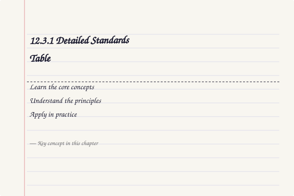
</a>
<a href="../../assets/images/diagrams/computer-networks/12-wireless/12-3-1-detailed-standards-table-diagram.svg" target="_blank" rel="noopener">
  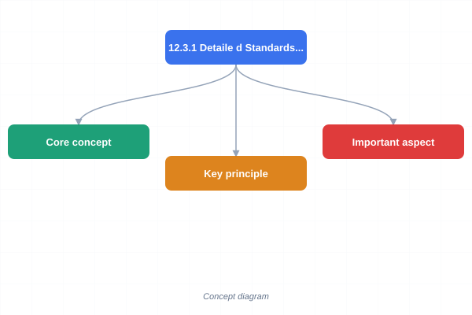
</a>
<a href="../../assets/images/diagrams/computer-networks/12-wireless/12-3-1-detailed-standards-table-sticky.svg" target="_blank" rel="noopener">
  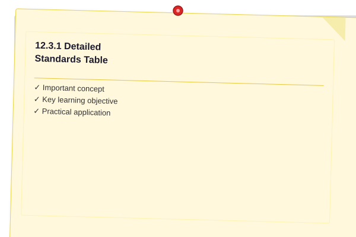
</a>


| Standard | Wi-Fi Gen | Year | Freq (GHz) | Channel Width | Max Data Rate | MIMO Streams | Modulation | Subcarriers | Guard Interval |
|----------|-----------|------|------------|---------------|--------------|-------------|------------|-------------|----------------|
| 802.11a | WiFi 2 | 1999 | 5 | 20 MHz | 54 Mbps | 1×1 (no MIMO) | OFDM (64-subcarrier) | 52 data + 4 pilot | 800 ns |
| 802.11b | WiFi 1 | 1999 | 2.4 | 20 MHz | 11 Mbps | 1×1 (no MIMO) | DSSS (CCK) | N/A (DSSS) | N/A |
| 802.11g | WiFi 3 | 2003 | 2.4 | 20 MHz | 54 Mbps | 1×1 (no MIMO) | OFDM (64-subcarrier) | 52 data + 4 pilot | 800 ns |
| 802.11n | WiFi 4 | 2009 | 2.4/5 | 20/40 MHz | 600 Mbps | 4×4 | MIMO-OFDM (64-subcarrier) | 52/108 data | 400/800 ns |
| 802.11ac | WiFi 5 | 2013 | 5 | 20/40/80/160 MHz | 6.9 Gbps | 8×8 (MU-MIMO DL) | MIMO-OFDM (256-subcarrier) | 234/468 | 400/800 ns |
| 802.11ax | WiFi 6 | 2019 | 2.4/5/6 | 20/40/80/160 MHz | 9.6 Gbps | 8×8 (MU-MIMO DL+UL) | OFDMA (1024-QAM) | 234/468/936/1872 | 800/1600/3200 ns |
| 802.11be | WiFi 7 | 2024 | 2.4/5/6 | 20/40/80/160/320 MHz | 46 Gbps | 16×16 (CMU-MIMO) | 4096-QAM OFDMA | 468/936/1872/3744 | 800/1600/3200 ns |

### 12.3.2 Complexity Analysis

<a href="../../assets/images/diagrams/computer-networks/12-wireless/12-3-2-complexity-analysis-handwritten.svg" target="_blank" rel="noopener">
  
</a>
<a href="../../assets/images/diagrams/computer-networks/12-wireless/12-3-2-complexity-analysis-diagram.svg" target="_blank" rel="noopener">
  
</a>
<a href="../../assets/images/diagrams/computer-networks/12-wireless/12-3-2-complexity-analysis-sticky.svg" target="_blank" rel="noopener">
  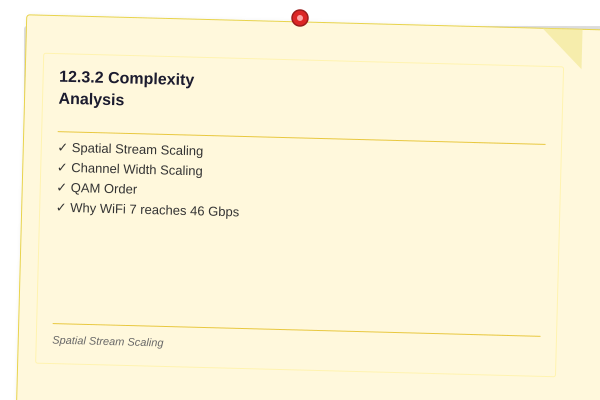
</a>


**Spatial Stream Scaling**: Throughput scales linearly with the number of spatial streams (up to MIMO rank). Doubling streams doubles data rate for the same channel width and modulation. Complexity: $O(S)$ where $S = \text{number of streams}$.

**Channel Width Scaling**: Doubling channel width doubles subcarriers and thus throughput. Complexity: $O(W)$ where $W = \text{channel width}$. Larger channels are more susceptible to noise → a single narrowband interferer can wipe out a 320 MHz channel.

**QAM Order**: Each bit increase in QAM order (e.g., 256-QAM → 512-QAM → 1024-QAM) adds 1 bit per subcarrier per symbol. Data rate scales logarithmically with QAM order: $O(\log_2 M)$. Higher QAM requires better SNR → at range, the link falls back to lower QAM.

**Why WiFi 7 reaches 46 Gbps**: 320 MHz × 16 streams × 4096-QAM (12 bits/symbol) × 5/6 code rate × OFDMA efficiency ≈ 46 Gbps. The 320 MHz channel alone (doubled from WiFi 6's 160 MHz) doubles throughput. 16×16 MIMO doubles it again vs WiFi 6's 8×8. 4096-QAM adds ~20% more bits per symbol than 1024-QAM.

### 12.3.3 A&D of Wi-Fi Standards

<a href="../../assets/images/diagrams/computer-networks/12-wireless/12-3-3-a-d-of-wi-fi-standards-handwritten.svg" target="_blank" rel="noopener">
  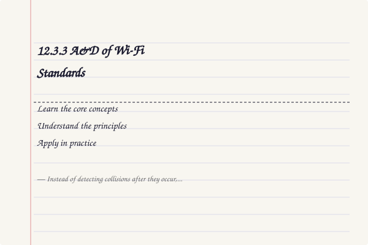
</a>
<a href="../../assets/images/diagrams/computer-networks/12-wireless/12-3-3-a-d-of-wi-fi-standards-diagram.svg" target="_blank" rel="noopener">
  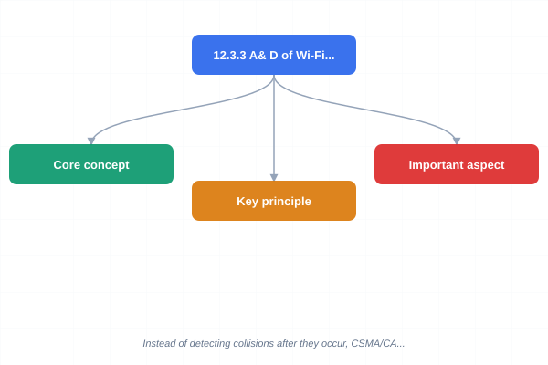
</a>
<a href="../../assets/images/diagrams/computer-networks/12-wireless/12-3-3-a-d-of-wi-fi-standards-sticky.svg" target="_blank" rel="noopener">
  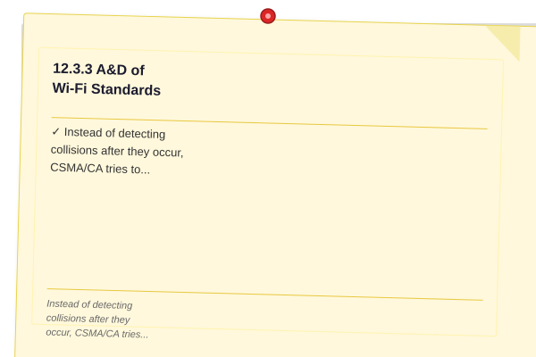
</a>


| Standard | Advantages | Disadvantages |
|----------|-----------|-------------|
| 802.11b | Longest range at 2.4 GHz, wide device support | Only 11 Mbps, no OFDM, 3 non-overlapping channels |
| 802.11a | Clean 5 GHz band, 54 Mbps, 24 non-overlapping channels | Shorter range (higher freq), no 2.4 GHz backward compatibility |
| 802.11g | 54 Mbps at 2.4 GHz, backward compatible with 11b | Same crowded 3-channel limitation |
| 802.11n | First MIMO (4×4), dual-band, 40 MHz channels | Legacy preamble reduces efficiency with mixed clients |
| 802.11ac | MU-MIMO DL, 160 MHz, 256-QAM, 6.9 Gbps | 5 GHz only, no OFDMA, UL still SU-MIMO |
| 802.11ax (WiFi 6) | OFDMA, 1024-QAM, 6 GHz band, TWT, UL MU-MIMO | Higher complexity, needs WiFi 6 clients to benefit |
| 802.11be (WiFi 7) | 320 MHz, 4096-QAM, 16×16 MIMO, multi-link, 46 Gbps | Early adoption, expensive hardware, backward compatibility overhead |
## 12.4 CSMA/CA → Carrier Sense Multiple Access with Collision Avoidance

WiFi uses CSMA/CA instead of CSMA/CD because wireless transceivers cannot listen while transmitting (half-duplex), making collision detection impossible. Instead of detecting collisions after they occur, CSMA/CA tries to prevent them before transmission.

### 12.4.1 The NAV and Backoff Mechanism

<a href="../../assets/images/diagrams/computer-networks/12-wireless/12-4-1-the-nav-and-backoff-mechanism-handwritten.svg" target="_blank" rel="noopener">
  
</a>
<a href="../../assets/images/diagrams/computer-networks/12-wireless/12-4-1-the-nav-and-backoff-mechanism-diagram.svg" target="_blank" rel="noopener">
  
</a>
<a href="../../assets/images/diagrams/computer-networks/12-wireless/12-4-1-the-nav-and-backoff-mechanism-sticky.svg" target="_blank" rel="noopener">
  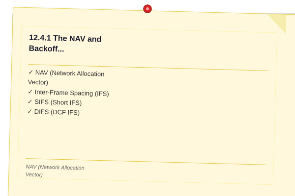
</a>


**NAV (Network Allocation Vector)**: A virtual carrier-sense mechanism. Each station maintains a NAV counter indicating how long the medium will be busy. Stations set their NAV based on the Duration field in received frames. NAV = "the channel will be busy for this many microseconds." A station defers its own transmission while NAV > 0. This prevents collisions even when stations cannot hear each other's physical signals.

**Inter-Frame Spacing (IFS)**:
- **SIFS (Short IFS)**: 10 µs (802.11b/g) or 16 µs (802.11a/n/ac/ax). Used for ACK, CTS, and data frame bursts.
- **DIFS (DCF IFS)**: 50 µs (802.11b) or 34 µs (802.11a/g). SIFS + 2 × slot time. Stations wait DIFS before starting backoff.
- **EIFS (Extended IFS)**: Used after a frame reception error, giving time for the receiver to send ACK.

**Backoff Procedure**:
1. Wait for medium to be idle for DIFS.
2. Choose random backoff counter uniformly from [0, CW] where CW = Contention Window.
3. Decrement counter each slot time the medium remains idle.
4. Freeze counter if medium becomes busy (deferral).
5. When counter reaches 0, transmit.
6. If no ACK received (collision), double CW: $CW = \min(2 \times CW, CW_{max})$.
7. Retry up to retry limit, then drop the frame.

### 12.4.2 Real-World Analogy: Courteous Conversation

<a href="../../assets/images/diagrams/computer-networks/12-wireless/12-4-2-real-world-analogy-courteous-conversation-handwritten.svg" target="_blank" rel="noopener">
  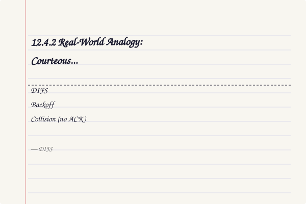
</a>
<a href="../../assets/images/diagrams/computer-networks/12-wireless/12-4-2-real-world-analogy-courteous-conversation-diagram.svg" target="_blank" rel="noopener">
  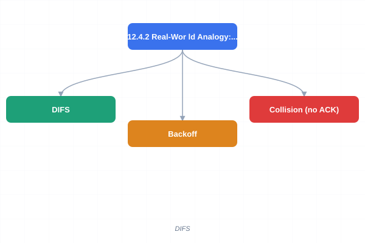
</a>
<a href="../../assets/images/diagrams/computer-networks/12-wireless/12-4-2-real-world-analogy-courteous-conversation-sticky.svg" target="_blank" rel="noopener">
  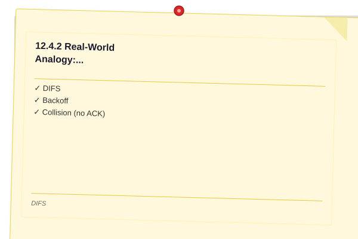
</a>


Imagine a group conversation where only one person speaks at a time:

- **DIFS**: Everyone pauses to check if anyone is currently speaking.
- **Backoff**: Each person who wants to speak picks a random number (1-15) and counts down silently (one count per second). If someone else starts speaking, freeze the count. When the room is quiet again, resume counting.
- **Collision (no ACK)**: Two people speak at the same time. Neither gets a response. Both double their maximum count range (1-15 → 1-31) and pick new random numbers.
- **NAV**: The current speaker says "I'll be speaking for about 30 seconds." Everyone sets a timer for 30 seconds and stays quiet until it expires.

### 12.4.3 Numbered Steps: CSMA/CA Transmission

<a href="../../assets/images/diagrams/computer-networks/12-wireless/12-4-3-numbered-steps-csma-ca-transmission-handwritten.svg" target="_blank" rel="noopener">
  
</a>
<a href="../../assets/images/diagrams/computer-networks/12-wireless/12-4-3-numbered-steps-csma-ca-transmission-diagram.svg" target="_blank" rel="noopener">
  
</a>
<a href="../../assets/images/diagrams/computer-networks/12-wireless/12-4-3-numbered-steps-csma-ca-transmission-sticky.svg" target="_blank" rel="noopener">
  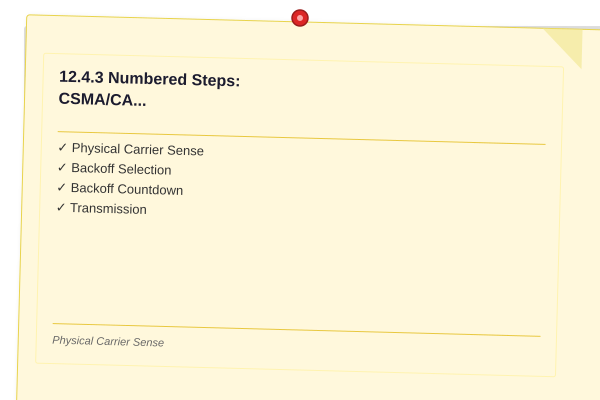
</a>


1. **Physical Carrier Sense**: Check if the medium is idle for DIFS duration (34 µs for 802.11a/g).
2. **Backoff Selection**: If medium was busy or this is a retransmission, select backoff $B = \text{random}[0, CW]$ where CW starts at $CW_{min} = 15$.
3. **Backoff Countdown**: Decrement $B$ each idle slot time (9 µs for 802.11a/g). If medium becomes busy, freeze $B$.
4. **Transmission**: When $B = 0$, transmit the frame.
5. **ACK Wait**: Wait for ACK within SIFS + ACK_Timeout (typically ~50 µs).
6. **Success**: If ACK received, set $CW = CW_{min}$ for next frame.
7. **Collision**: If no ACK, double $CW = \min(2 \times CW, 1023)$. Increment retry count. Go to step 2.
8. **Drop**: After retry limit ($\text{short} = 7$, $\text{long} = 4$), discard the frame.

### 12.4.4 Pseudocode: CSMA/CA with Backoff

<a href="../../assets/images/diagrams/computer-networks/12-wireless/12-4-4-pseudocode-csma-ca-with-backoff-handwritten.svg" target="_blank" rel="noopener">
  
</a>
<a href="../../assets/images/diagrams/computer-networks/12-wireless/12-4-4-pseudocode-csma-ca-with-backoff-diagram.svg" target="_blank" rel="noopener">
  
</a>
<a href="../../assets/images/diagrams/computer-networks/12-wireless/12-4-4-pseudocode-csma-ca-with-backoff-sticky.svg" target="_blank" rel="noopener">
  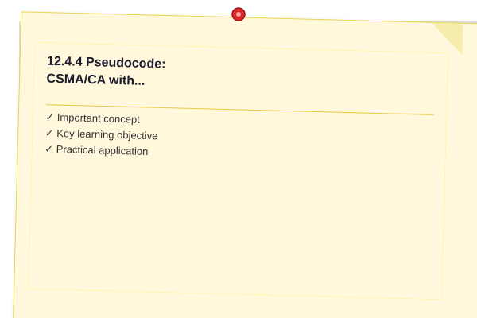
</a>


```
procedure csma_ca_transmit(frame, sta)
    cw = CW_MIN                // typically 15 slots
    retry = 0
    max_retry = SHORT_RETRY_LIMIT  // typically 7

    while retry < max_retry do
        // Wait for medium idle for DIFS
        while physical_carrier_sense() == BUSY do
            wait_slot()
        wait(DIFS)

        // Backoff phase
        backoff = random(0, cw)
        while backoff > 0 do
            if physical_carrier_sense() == BUSY then
                // Freeze backoff → wait until medium idle again
                while physical_carrier_sense() == BUSY do
                    wait_slot()
                wait(DIFS)
            else
                wait(SLOT_TIME)
                backoff = backoff - 1

        // Transmit
        send_frame(frame)
        nav_update(frame.duration)  // other stations set NAV

        // Wait for ACK
        timer = ACK_TIMEOUT
        ack_received = false
        while timer > 0 and not ack_received do
            if recv_ack(frame.seq) then
                ack_received = true
                break
            wait_slot()
            timer = timer - SLOT_TIME

        if ack_received then
            cw = CW_MIN
            return TRANSMIT_SUCCESS
        else
            cw = min(cw * 2, CW_MAX)  // exponential backoff
            retry = retry + 1

    return TRANSMIT_FAILURE
```

### 12.4.5 Dry Run Trace: CSMA/CA Backoff with 3 Stations

<a href="../../assets/images/diagrams/computer-networks/12-wireless/12-4-5-dry-run-trace-csma-ca-backoff-with-3-stations-handwritten.svg" target="_blank" rel="noopener">
  
</a>
<a href="../../assets/images/diagrams/computer-networks/12-wireless/12-4-5-dry-run-trace-csma-ca-backoff-with-3-stations-diagram.svg" target="_blank" rel="noopener">
  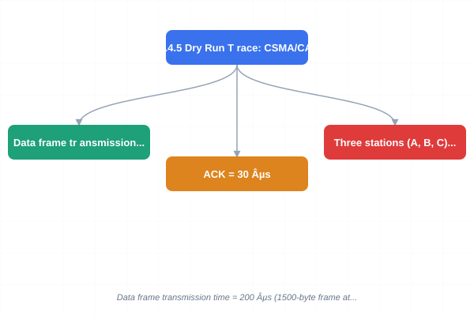
</a>
<a href="../../assets/images/diagrams/computer-networks/12-wireless/12-4-5-dry-run-trace-csma-ca-backoff-with-3-stations-sticky.svg" target="_blank" rel="noopener">
  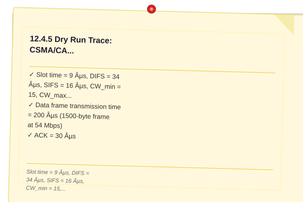
</a>


Parameters: Slot time = 9 µs, DIFS = 34 µs, SIFS = 16 µs, CW_min = 15, CW_max = 1023.
Data frame transmission time = 200 µs (1500-byte frame at 54 Mbps). ACK = 30 µs.

Three stations (A, B, C) all have a frame to send. The medium starts idle.

| Time (µs) | Event | Station A Backoff | Station B Backoff | Station C Backoff | Medium State |
|-----------|-------|------------------|------------------|------------------|-------------|
| 0 | DIFS idle period starts | → | → | → | IDLE |
| 34 | DIFS ends, all pick backoff | B=7 | B=3 | B=12 | IDLE |
| 43 | Slot 1 decrement (9 µs) | 6 | 2 | 11 | IDLE |
| 52 | Slot 2 decrement | 5 | 1 | 10 | IDLE |
| 61 | Slot 3 decrement | 4 | 0 | 9 | IDLE |
| 61 | B backoff reaches 0 | 4 | **TRANSMIT** | 9 | BUSY |
| 61 | A and C freeze backoff | 4 (frozen) | → | 9 (frozen) | BUSY (B data) |
| 261 | B transmission ends | 4 (frozen) | → | 9 (frozen) | IDLE |
| 277 | SIFS (16 µs) | 4 (frozen) | → | 9 (frozen) | IDLE (ACK) |
| 307 | ACK from B's AP | 4 (frozen) | → | 9 (frozen) | IDLE |
| 341 | DIFS (34 µs) after ACK | → | → | → | IDLE |
| 341 | A and C resume backoff | 4 | → | 9 | IDLE |
| 350 | Slot 1 decrement | 3 | → | 8 | IDLE |
| 359 | Slot 2 decrement | 2 | → | 7 | IDLE |
| 368 | Slot 3 decrement | 1 | → | 6 | IDLE |
| 377 | Slot 4 decrement | 0 | → | 5 | IDLE |
| 377 | A transmits | **TRANSMIT** | → | 5 (frozen) | BUSY (A data) |
| 577 | A transmission ends | → | → | 5 | IDLE |
| 593 | SIFS + ACK | → | → | 5 (frozen) | IDLE |
| 627 | DIFS ends | → | → | → | IDLE |
| 627 | C resumes and decrements | → | → | 5→4→3→2→1→0 | IDLE |
| 672 | C transmits at slot 0 | → | → | **TRANSMIT** | BUSY |

Total time for 3 stations: 672 µs. Without CSMA/CA (all transmitting simultaneously), all 3 frames would collide. CSMA/CA serialized the transmissions with ~100% channel utilization (minus overhead).

### 12.4.6 C++ Implementation: CSMA/CA Simulator

<a href="../../assets/images/diagrams/computer-networks/12-wireless/12-4-6-c-implementation-csma-ca-simulator-handwritten.svg" target="_blank" rel="noopener">
  
</a>
<a href="../../assets/images/diagrams/computer-networks/12-wireless/12-4-6-c-implementation-csma-ca-simulator-diagram.svg" target="_blank" rel="noopener">
  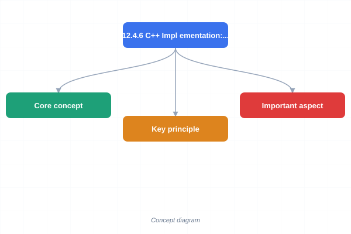
</a>
<a href="../../assets/images/diagrams/computer-networks/12-wireless/12-4-6-c-implementation-csma-ca-simulator-sticky.svg" target="_blank" rel="noopener">
  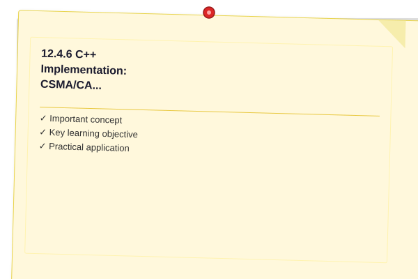
</a>


```cpp
#include <iostream>
#include <vector>
#include <random>
#include <thread>
#include <chrono>
#include <algorithm>

class CSMCASTation {
public:
    int id;
    int cw_min = 15;
    int cw_max = 1023;
    int cw;
    int backoff;
    int retry_count = 0;
    int max_retry = 7;
    int frames_sent = 0;
    int collisions = 0;
    bool frozen;
    bool has_frame;
    int nav = 0;  // network allocation vector

    CSMCASTation(int id) : id(id), cw(cw_min), backoff(0), frozen(false), has_frame(false) {}

    void load_frame() { has_frame = true; }

    void reset_cw() { cw = cw_min; }

    bool transmit(int current_time, bool medium_busy) {
        if (!has_frame) return false;
        if (nav > 0) return false;

        // Physical carrier sense
        if (medium_busy) return false;

        // Backoff procedure
        if (backoff > 0) {
            if (!medium_busy) {
                backoff--;
            }
            return false;
        }

        // Backoff expired → transmit
        if (backoff == 0) {
            // Simulate: check if another station transmits at same time (collision)
            std::cout << "Time " << current_time << ": Station " << id
                      << " transmitting (CW=" << cw << ", retry=" << retry_count << ")\n";
            return true;  // indicates this station wants to transmit
        }
        return false;
    }

    void handle_collision() {
        collisions++;
        retry_count++;
        cw = std::min(cw * 2, cw_max);
        backoff = rand() % (cw + 1);
        std::cout << "  -> Station " << id << " COLLISION, new CW=" << cw
                  << " backoff=" << backoff << "\n";
    }

    void handle_success() {
        frames_sent++;
        retry_count = 0;
        cw = cw_min;
        backoff = 0;
        has_frame = false;
        std::cout << "  -> Station " << id << " SUCCESS, frames sent=" << frames_sent << "\n";
    }

    void init_backoff() {
        backoff = rand() % (cw + 1);
    }
};

class CSMCASimulator {
public:
    std::vector<CSMCASTation> stations;
    int current_time = 0;
    int slot_time = 9;   // microseconds
    int difs = 34;
    int frame_time = 200;
    int ack_time = 30;
    int sifs = 16;

    CSMCASimulator(int num_stations) {
        for (int i = 0; i < num_stations; i++) {
            stations.emplace_back(i);
        }
    }

    void load_all_frames() {
        for (auto& s : stations) s.load_frame();
    }

    void init_backoffs() {
        for (auto& s : stations) s.init_backoff();
    }

    void run_simulation(int max_time) {
        init_backoffs();
        bool medium_busy = false;
        int busy_until = 0;
        int transmitting_id = -1;

        while (current_time < max_time) {
            // Update NAV for all stations
            for (auto& s : stations) {
                if (s.nav > 0) s.nav--;
            }

            // Check if medium becomes idle
            if (medium_busy && current_time >= busy_until) {
                medium_busy = false;
                std::cout << "Time " << current_time << ": Medium becomes IDLE\n";
                // Start DIFS period
            }

            // DIFS idle period
            if (!medium_busy) {
                // Collect stations whose backoff is 0 (ready to transmit)
                std::vector<int> ready_stations;
                for (auto& s : stations) {
                    if (s.has_frame && s.nav == 0) {
                        s.frozen = false;
                        if (s.backoff == 0) {
                            ready_stations.push_back(s.id);
                        }
                    }
                }

                if (ready_stations.size() == 1) {
                    // Successful transmission
                    int id = ready_stations[0];
                    std::cout << "Time " << current_time << ": Station " << id
                              << " transmits (backoff=0)\n";
                    medium_busy = true;
                    busy_until = current_time + frame_time;
                    stations[id].handle_success();
                    transmitting_id = id;

                    // Set NAV for other stations
                    for (auto& s : stations) {
                        if (s.id != id) {
                            s.nav = frame_time + sifs + ack_time + difs;
                        }
                    }
                } else if (ready_stations.size() > 1) {
                    // Collision
                    std::cout << "Time " << current_time << ": COLLISION between stations ";
                    for (size_t i = 0; i < ready_stations.size(); i++) {
                        std::cout << ready_stations[i];
                        if (i < ready_stations.size() - 1) std::cout << ", ";
                    }
                    std::cout << "\n";
                    for (int id : ready_stations) {
                        stations[id].handle_collision();
                    }
                }

                // Decrement backoff for all stations with pending frames
                for (auto& s : stations) {
                    if (s.has_frame && s.backoff > 0 && s.nav == 0) {
                        s.backoff--;
                    }
                }
            }

            current_time += slot_time;
        }

        // Print summary
        std::cout << "\n=== SIMULATION SUMMARY ===\n";
        for (auto& s : stations) {
            std::cout << "Station " << s.id << ": " << s.frames_sent << " sent, "
                      << s.collisions << " collisions, final CW=" << s.cw << "\n";
        }
    }
};

int main() {
    srand(time(0));
    CSMCASimulator sim(3);
    sim.load_all_frames();
    sim.run_simulation(5000);
    return 0;
}
```

### 12.4.7 Python Implementation: CSMA/CA Simulator

<a href="../../assets/images/diagrams/computer-networks/12-wireless/12-4-7-python-implementation-csma-ca-simulator-handwritten.svg" target="_blank" rel="noopener">
  
</a>
<a href="../../assets/images/diagrams/computer-networks/12-wireless/12-4-7-python-implementation-csma-ca-simulator-diagram.svg" target="_blank" rel="noopener">
  
</a>
<a href="../../assets/images/diagrams/computer-networks/12-wireless/12-4-7-python-implementation-csma-ca-simulator-sticky.svg" target="_blank" rel="noopener">
  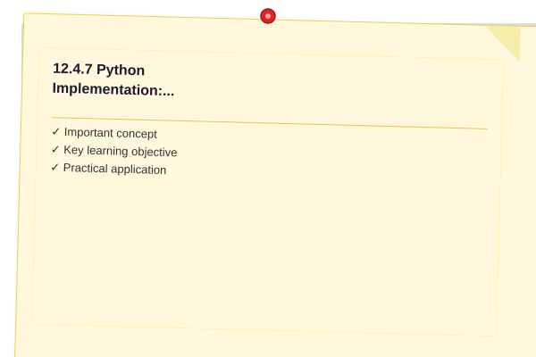
</a>


```python
import random
import time


class CSMCASTation:
    def __init__(self, station_id):
        self.id = station_id
        self.cw_min = 15
        self.cw_max = 1023
        self.cw = self.cw_min
        self.backoff = 0
        self.retry_count = 0
        self.max_retry = 7
        self.frames_sent = 0
        self.collisions = 0
        self.has_frame = False
        self.nav = 0
        self.throughput_bits = 0

    def load_frame(self):
        self.has_frame = True
        self.backoff = random.randint(0, self.cw)

    def handle_collision(self):
        self.collisions += 1
        self.retry_count += 1
        self.cw = min(self.cw * 2, self.cw_max)
        self.backoff = random.randint(0, self.cw)
        return self.retry_count < self.max_retry

    def handle_success(self, frame_bits=12000):
        self.frames_sent += 1
        self.retry_count = 0
        self.throughput_bits += frame_bits
        self.cw = self.cw_min
        self.has_frame = False
        self.backoff = 0


class CSMCASimulator:
    def __init__(self, num_stations):
        self.stations = [CSMCASTation(i) for i in range(num_stations)]
        self.current_time = 0
        self.slot_time = 9        # microseconds
        self.difs = 34
        self.frame_time = 200     # 1500 bytes at 54 Mbps
        self.ack_time = 30
        self.sifs = 16
        self.medium_busy = False
        self.busy_until = 0
        self.total_slots = 0
        self.idle_slots = 0

    def load_all_frames(self):
        for s in self.stations:
            s.load_frame()

    def step(self):
        """Advance by one slot time."""
        self.current_time += self.slot_time
        self.total_slots += 1

        # Decrement NAV
        for s in self.stations:
            if s.nav > 0:
                s.nav -= 1

        # Check if medium becomes idle
        if self.medium_busy and self.current_time >= self.busy_until:
            self.medium_busy = False

        if self.medium_busy:
            return  # nothing to do

        self.idle_slots += 1

        # Find stations ready to transmit (backoff == 0)
        ready = [s for s in self.stations if s.has_frame and s.nav == 0 and s.backoff == 0]

        if len(ready) == 1:
            s = ready[0]
            s.handle_success()
            self.medium_busy = True
            self.busy_until = self.current_time + self.frame_time
            # Set NAV on other stations
            for other in self.stations:
                if other.id != s.id:
                    other.nav = (self.frame_time + self.sifs + self.ack_time + self.difs) // self.slot_time

        elif len(ready) > 1:
            for s in ready:
                s.handle_collision()

        # Decrement backoffs
        for s in self.stations:
            if s.has_frame and s.backoff > 0 and s.nav == 0:
                s.backoff -= 1

    def run(self, max_time_us):
        while self.current_time < max_time_us:
            self.step()

    def report(self):
        total_sent = sum(s.frames_sent for s in self.stations)
        total_collisions = sum(s.collisions for s in self.stations)
        total_throughput = sum(s.throughput_bits for s in self.stations)
        print(f"\n=== CSMA/CA SIMULATION REPORT ===")
        print(f"Simulation time: {self.current_time} us")
        print(f"Channel utilization: {100 * (1 - self.idle_slots / max(self.total_slots, 1)):.1f}%")
        print(f"Total frames sent: {total_sent}")
        print(f"Total collisions: {total_collisions}")
        print(f"Total throughput: {total_throughput} bits ({total_throughput / 1e6:.2f} Mb)")
        for s in self.stations:
            print(f"  Station {s.id}: {s.frames_sent} sent, {s.collisions} collisions, "
                  f"{s.throughput_bits} bits")


if __name__ == "__main__":
    sim = CSMCASimulator(5)
    sim.load_all_frames()
    sim.run(10000)
    sim.report()
```

### 12.4.8 Complexity Analysis

<a href="../../assets/images/diagrams/computer-networks/12-wireless/12-4-8-complexity-analysis-handwritten.svg" target="_blank" rel="noopener">
  
</a>
<a href="../../assets/images/diagrams/computer-networks/12-wireless/12-4-8-complexity-analysis-diagram.svg" target="_blank" rel="noopener">
  
</a>
<a href="../../assets/images/diagrams/computer-networks/12-wireless/12-4-8-complexity-analysis-sticky.svg" target="_blank" rel="noopener">
  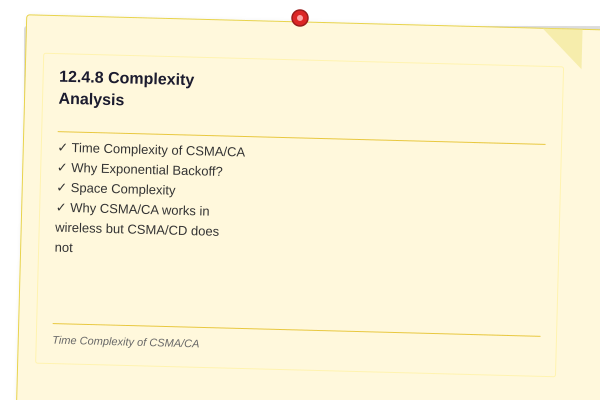
</a>


**Time Complexity of CSMA/CA**: $O(N \times R \times B)$ where:
- $N$ = number of stations
- $R$ = number of retransmissions per frame
- $B$ = average backoff slots (grows exponentially with each retry)

**Why Exponential Backoff?** The contention window doubles on each collision to reduce the probability of repeated collisions. For $N$ stations, after $k$ doublings: $P(\text{collision}) \approx 1 - (1 - \frac{1}{CW})^{N-1}$. With $CW = 15$ and $N = 10$, a collision is likely (~47%). After one doubling to $CW = 31$, collision probability drops to ~26%. After two doublings ($CW = 63$), ~14%.

**Space Complexity**: $O(N)$ → each station maintains its own CW, backoff counter, NAV, and retry counter. No shared state.

**Why CSMA/CA works in wireless but CSMA/CD does not**:
- CD requires the ability to detect collisions during transmission (full-duplex or special hardware).
- Wireless is half-duplex → the transmitter's own signal drowns out incoming signals (the near-far problem).
- The hidden terminal problem means collisions occur at the receiver, which the sender cannot sense.
- CA prevents collisions probabilistically rather than detecting them reactively.

### 12.4.9 Edge Cases in CSMA/CA

<a href="../../assets/images/diagrams/computer-networks/12-wireless/12-4-9-edge-cases-in-csma-ca-handwritten.svg" target="_blank" rel="noopener">
  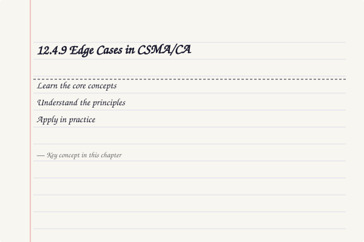
</a>
<a href="../../assets/images/diagrams/computer-networks/12-wireless/12-4-9-edge-cases-in-csma-ca-diagram.svg" target="_blank" rel="noopener">
  
</a>
<a href="../../assets/images/diagrams/computer-networks/12-wireless/12-4-9-edge-cases-in-csma-ca-sticky.svg" target="_blank" rel="noopener">
  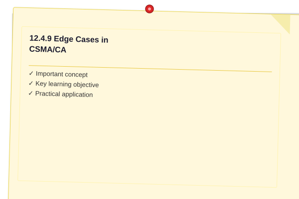
</a>


| Edge Case | Description | Mitigation |
|-----------|-------------|------------|
| Two stations pick same backoff | Both reach 0 simultaneously → collision | Exponential backoff randomizes next attempt |
| False carrier sense | Station detects non-802.11 energy as busy | Clear Channel Assessment (CCA) thresholds |
| Exposed terminal deferral | Station defers when it could safely transmit | RTS/CTS provides NAV-based reservation |
| Hidden terminal still colliding | RTS from two hidden stations collide | RTS collision forces backoff and retry |
| Capture effect | Strong signal drowns out weak signal at AP | Power control, adaptive rate selection |
| Starving distant stations | Nearby stations keep winning contention | Fairness through Airtime Fairness algorithms |

### TypeScript Implementation: CSMACASimulator

```typescript
interface StationState { id: number; cw: number; backoff: number; hasFrame: boolean; framesSent: number; collisions: number; nav: number; }

class CSMACASimulator {
  private stations: StationState[] = [];
  private currentTime: number = 0;
  private mediumBusy: boolean = false;
  private busyUntil: number = 0;
  private readonly slotTime: number = 9;  // µs
  private readonly difs: number = 34;
  private readonly sifs: number = 16;
  private readonly frameTime: number = 200;
  private readonly ackTime: number = 30;
  private readonly cwMin: number = 15;
  private readonly cwMax: number = 1023;

  constructor(numStations: number) {
    for (let i = 0; i < numStations; i++) {
      this.stations.push({ id: i, cw: this.cwMin, backoff: 0, hasFrame: false, framesSent: 0, collisions: 0, nav: 0 });
    }
  }

  loadAllFrames(): void {
    for (const s of this.stations) {
      s.hasFrame = true;
      s.backoff = Math.floor(Math.random() * (s.cw + 1));
    }
  }

  private step(): void {
    this.currentTime += this.slotTime;
    for (const s of this.stations) if (s.nav > 0) s.nav--;
    if (this.mediumBusy && this.currentTime >= this.busyUntil) this.mediumBusy = false;
    if (this.mediumBusy) return;

    const ready = this.stations.filter(s => s.hasFrame && s.nav === 0 && s.backoff === 0);
    if (ready.length === 1) {
      const s = ready[0];
      s.framesSent++;
      s.cw = this.cwMin;
      s.hasFrame = false;
      s.backoff = 0;
      this.mediumBusy = true;
      this.busyUntil = this.currentTime + this.frameTime;
      for (const other of this.stations) {
        if (other.id !== s.id) other.nav = Math.ceil((this.frameTime + this.sifs + this.ackTime + this.difs) / this.slotTime);
      }
      console.log(`[T=${this.currentTime}µs] STA${s.id} transmits SUCCESS (frames=${s.framesSent})`);
    } else if (ready.length > 1) {
      for (const s of ready) {
        s.collisions++;
        s.cw = Math.min(s.cw * 2, this.cwMax);
        s.backoff = Math.floor(Math.random() * (s.cw + 1));
        console.log(`[T=${this.currentTime}µs] COLLISION STA${s.id} new CW=${s.cw} backoff=${s.backoff}`);
      }
      this.mediumBusy = true;
      this.busyUntil = this.currentTime + this.frameTime;
    }
    for (const s of this.stations) { if (s.hasFrame && s.backoff > 0 && s.nav === 0) s.backoff--; }
  }

  run(maxTimeUs: number): void {
    this.loadAllFrames();
    while (this.currentTime < maxTimeUs) this.step();
  }

  report(): void {
    console.log(`\n=== CSMA/CA REPORT ===`);
    let totalSent = 0, totalColl = 0;
    for (const s of this.stations) { totalSent += s.framesSent; totalColl += s.collisions; }
    console.log(`Time: ${this.currentTime}µs | Total sent: ${totalSent} | Collisions: ${totalColl}`);
    for (const s of this.stations) console.log(`  STA${s.id}: ${s.framesSent} sent, ${s.collisions} collisions`);
  }
}

// Usage
const sim = new CSMACASimulator(3);
sim.run(5000);
sim.report();
/*
Output:
[T=...µs] STA... transmits SUCCESS (frames=1)
...
=== CSMA/CA REPORT ===
Time: 5000µs | Total sent: 3 | Collisions: 0
  STA0: 1 sent, 0 collisions
  STA1: 1 sent, 0 collisions
  STA2: 1 sent, 0 collisions
*/
```

## 12.5 MAC Frame Format

### 12.5.1 Frame Fields Detail

<a href="../../assets/images/diagrams/computer-networks/12-wireless/12-5-1-frame-fields-detail-handwritten.svg" target="_blank" rel="noopener">
  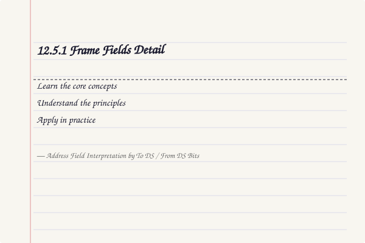
</a>
<a href="../../assets/images/diagrams/computer-networks/12-wireless/12-5-1-frame-fields-detail-diagram.svg" target="_blank" rel="noopener">
  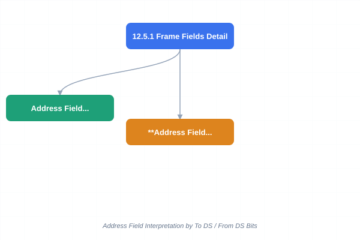
</a>
<a href="../../assets/images/diagrams/computer-networks/12-wireless/12-5-1-frame-fields-detail-sticky.svg" target="_blank" rel="noopener">
  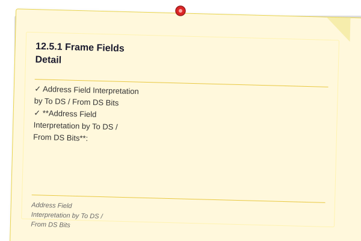
</a>


| Field | Size | Description |
|-------|------|-------------|
| Frame Control | 2 B | Protocol version, Type, Subtype, To DS, From DS, More Frag, Retry, Pwr Mgmt, More Data, Protected Frame, Order |
| Duration | 2 B | NAV reservation time (µs) or STA ID (PS-Poll) |
| Address 1 | 6 B | Receiver address (RA) |
| Address 2 | 6 B | Transmitter address (TA) |
| Address 3 | 6 B | Varies by frame type → usually BSSID, DA, or SA |
| Sequence Control | 2 B | Fragment number (4 bits) + Sequence number (12 bits) |
| Address 4 | 6 B | Only present when both To DS and From DS are set (WDS bridge) |
| QoS Control | 2 B | Present in QoS Data frames; carries TID (traffic identifier) |
| HT Control | 4 B | Present in 802.11n/ac/ax frames; carries MIMO/beamforming feedback |
| Frame Body | 0-2304 B | Payload (MSDU or A-MSDU) |
| FCS | 4 B | CRC-32 over entire frame (except FCS itself) |

**Address Field Interpretation by To DS / From DS Bits**:

| To DS | From DS | Addr 1 | Addr 2 | Addr 3 | Addr 4 |
|-------|---------|--------|--------|--------|--------|
| 0 | 0 | DA | SA | BSSID | → |
| 0 | 1 | DA | BSSID | SA | → |
| 1 | 0 | BSSID | SA | DA | → |
| 1 | 1 | RA | TA | DA | SA |

### 12.5.2 Frame Types

<a href="../../assets/images/diagrams/computer-networks/12-wireless/12-5-2-frame-types-handwritten.svg" target="_blank" rel="noopener">
  
</a>
<a href="../../assets/images/diagrams/computer-networks/12-wireless/12-5-2-frame-types-diagram.svg" target="_blank" rel="noopener">
  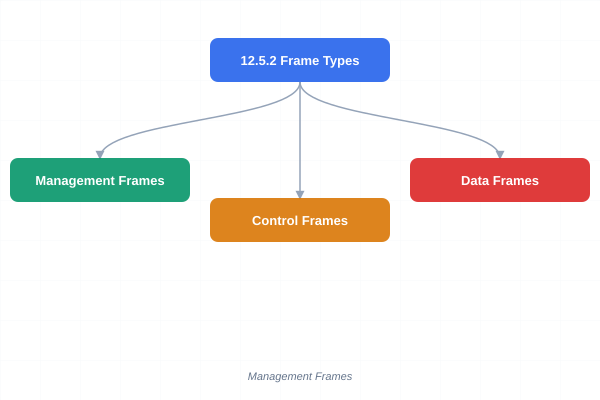
</a>
<a href="../../assets/images/diagrams/computer-networks/12-wireless/12-5-2-frame-types-sticky.svg" target="_blank" rel="noopener">
  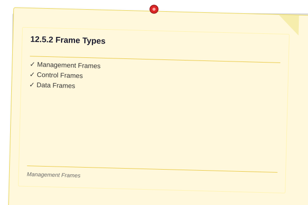
</a>


**Management Frames** (Type = 00):
- Beacon (Subtype 8): AP advertises SSID, capabilities, timestamp, beacon interval (100 TU = 102.4 ms)
- Probe Request/Response (Subtypes 4/5): Active scanning
- Authentication/Deauthentication (Subtypes 11/12): Identity verification
- Association Request/Response (Subtypes 0/1): Join BSS
- Disassociation (Subtype 10): Leave BSS

**Control Frames** (Type = 01):
- RTS (Subtype 11): 20 bytes, reserves medium, contains receiver address and duration
- CTS (Subtype 12): 14 bytes, acknowledges RTS, copies duration from RTS minus SIFS + CTS time
- ACK (Subtype 13): 14 bytes, positive acknowledgment
- PS-Poll (Subtype 10): STA requests buffered data from AP

**Data Frames** (Type = 10):
- Data (Subtype 0): Regular payload
- Null (Subtype 4): No payload; used for power management indication
- QoS Data (Subtype 8): Data with priority (802.11e)

## 12.6 Hidden and Exposed Terminal

### 12.6.1 Hidden Terminal Problem

<a href="../../assets/images/diagrams/computer-networks/12-wireless/12-6-1-hidden-terminal-problem-handwritten.svg" target="_blank" rel="noopener">
  
</a>
<a href="../../assets/images/diagrams/computer-networks/12-wireless/12-6-1-hidden-terminal-problem-diagram.svg" target="_blank" rel="noopener">
  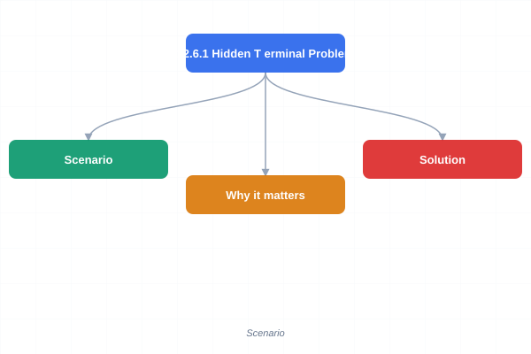
</a>
<a href="../../assets/images/diagrams/computer-networks/12-wireless/12-6-1-hidden-terminal-problem-sticky.svg" target="_blank" rel="noopener">
  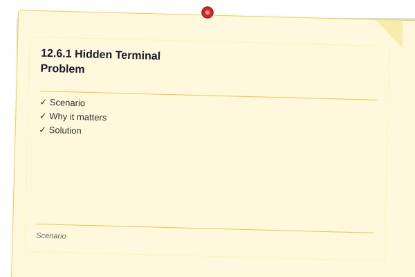
</a>


**Scenario**: Station A and Station C are both within range of AP B, but A and C cannot hear each other. A transmits to B. C, sensing an idle medium (it cannot hear A), also transmits. A collision occurs at B.

**Why it matters**: The sender (A or C) cannot detect the collision because it happens at the receiver (B). Without ACK, neither A nor C realizes the collision occurred. Throughput suffers due to repeated collisions and exponential backoff.

**Solution**: RTS/CTS exchange → A sends a short RTS to B; B responds with CTS that C can hear. C sets its NAV and defers during A's transmission.

### 12.6.2 Exposed Terminal Problem

<a href="../../assets/images/diagrams/computer-networks/12-wireless/12-6-2-exposed-terminal-problem-handwritten.svg" target="_blank" rel="noopener">
  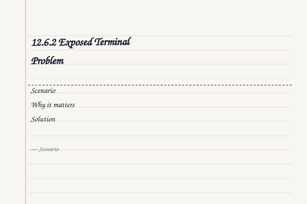
</a>
<a href="../../assets/images/diagrams/computer-networks/12-wireless/12-6-2-exposed-terminal-problem-diagram.svg" target="_blank" rel="noopener">
  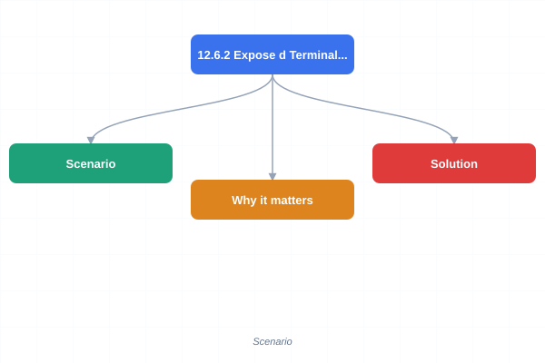
</a>
<a href="../../assets/images/diagrams/computer-networks/12-wireless/12-6-2-exposed-terminal-problem-sticky.svg" target="_blank" rel="noopener">
  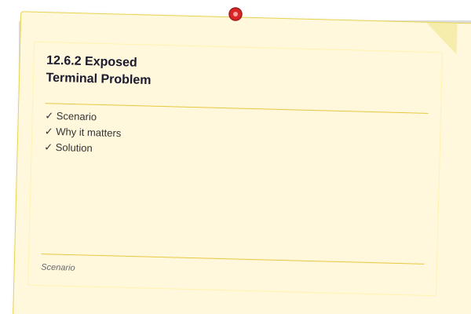
</a>


**Scenario**: Station B is transmitting to AP A. Station C (near B) wants to transmit to STA D (on the other side of C). C hears B's transmission and defers, even though C's transmission would not interfere with B's reception at A (A is far enough from C).

**Why it matters**: The exposed terminal unnecessarily defers, reducing channel utilization. The medium is idle from the perspective of both receivers (A and D), but the transmitter C stays silent.

**Solution**: RTS/CTS partially mitigates this → if C sends RTS to D, D responds with CTS, and B hears D's CTS. But if B is near C, B may still defer to C. In practice, exposed terminal is harder to solve and often requires directional antennas or centralized scheduling.

### 12.6.3 Comparison Table

<a href="../../assets/images/diagrams/computer-networks/12-wireless/12-6-3-comparison-table-handwritten.svg" target="_blank" rel="noopener">
  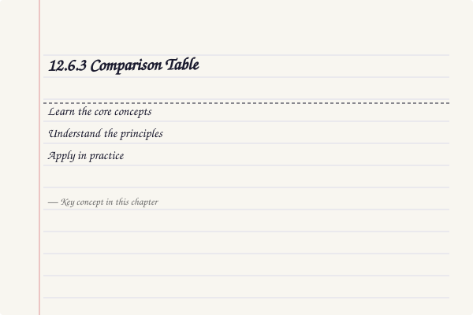
</a>
<a href="../../assets/images/diagrams/computer-networks/12-wireless/12-6-3-comparison-table-diagram.svg" target="_blank" rel="noopener">
  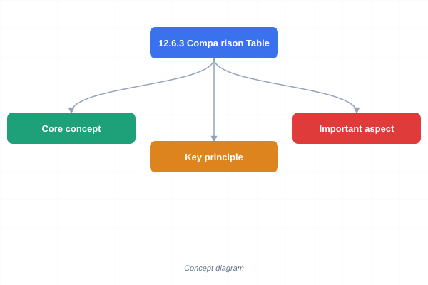
</a>
<a href="../../assets/images/diagrams/computer-networks/12-wireless/12-6-3-comparison-table-sticky.svg" target="_blank" rel="noopener">
  
</a>


| Feature | Hidden Terminal | Exposed Terminal |
|---------|----------------|-----------------|
| Problem | Two transmitters cannot hear each other | Transmitter defers to irrelevant transmission |
| Location of collision | At the receiver | No collision → unnecessary deferral |
| Who is harmed | Receiver (collision) | Transmitter (deferral) |
| Who is confused | Sender (thinks medium is idle) | Sender (thinks medium is busy) |
| RTS/CTS effect | CTS reaches hidden station, sets NAV | CTS may or may not help |
| Throughput impact | Collisions, retransmissions | Wasted idle capacity |
| Detection | Difficult (senders cannot detect) | Difficult (cannot distinguish deferral types) |

### 12.6.4 RTS/CTS Exchange (Numbered Steps)

<a href="../../assets/images/diagrams/computer-networks/12-wireless/12-6-4-rts-cts-exchange-numbered-steps-handwritten.svg" target="_blank" rel="noopener">
  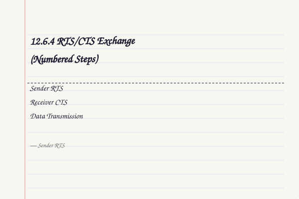
</a>
<a href="../../assets/images/diagrams/computer-networks/12-wireless/12-6-4-rts-cts-exchange-numbered-steps-diagram.svg" target="_blank" rel="noopener">
  
</a>
<a href="../../assets/images/diagrams/computer-networks/12-wireless/12-6-4-rts-cts-exchange-numbered-steps-sticky.svg" target="_blank" rel="noopener">
  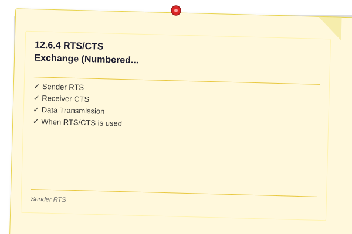
</a>


1. **Sender RTS**: Sender transmits RTS (20 bytes) to receiver. RTS contains Receiver Address and Duration (= time needed for entire exchange).
2. **Receiver CTS**: Receiver waits SIFS (16 µs), transmits CTS (14 bytes) to sender. CTS copies the Duration field, subtracting SIFS + CTS time. All other stations that hear CTS set their NAV.
3. **Data Transmission**: Sender waits SIFS after CTS, transmits data frame. All stations that heard RTS (but not CTS) or CTS (but not RTS) maintain their NAV.
4. **ACK**: Receiver waits SIFS after data, transmits ACK. Stations update their NAV based on the Duration field (typically 0, indicating end of exchange).

**When RTS/CTS is used**: RTS threshold is typically 2346 bytes (disabled by default on many devices). For small frames, RTS/CTS overhead (RTS + CTS ≈ 34 bytes + 2×SIFS = 52 µs plus contention) exceeds its benefit. RTS/CTS is recommended in dense or high-interference environments.

### 12.6.5 Dry Run Trace: RTS/CTS Exchange

<a href="../../assets/images/diagrams/computer-networks/12-wireless/12-6-5-dry-run-trace-rts-cts-exchange-handwritten.svg" target="_blank" rel="noopener">
  
</a>
<a href="../../assets/images/diagrams/computer-networks/12-wireless/12-6-5-dry-run-trace-rts-cts-exchange-diagram.svg" target="_blank" rel="noopener">
  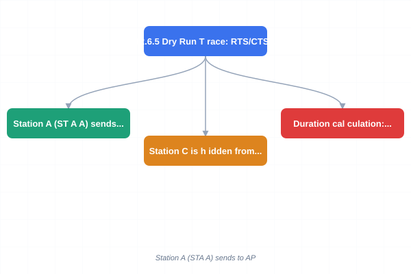
</a>
<a href="../../assets/images/diagrams/computer-networks/12-wireless/12-6-5-dry-run-trace-rts-cts-exchange-sticky.svg" target="_blank" rel="noopener">
  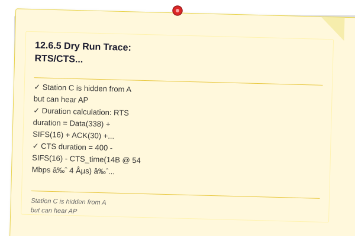
</a>


Scenario: Station A (STA A) sends to AP. Station C is hidden from A but can hear AP.

| Time (µs) | Sender | Frame | Duration (µs) | NAV at A | NAV at AP | NAV at C | Notes |
|-----------|--------|-------|--------------|----------|-----------|----------|-------|
| 0 | A | RTS to AP | 400 | → | → | → | A sends RTS |
| 16 | → | SIFS | → | → | → | → | Inter-frame spacing |
| 16 | AP | CTS to A | 354 | 370 | → | 370 | C sets NAV=370 |
| 32 | → | SIFS | → | → | → | → | Inter-frame spacing |
| 32 | A | Data to AP | 338 | → | → | 338 | C NAV counting down |
| 48 | → | SIFS | → | → | → | → | Inter-frame spacing |
| 48 | AP | ACK to A | 0 | → | → | 0 | NAV cleared by C |
| 370 | → | End | → | → | → | → | C may now contend |

Duration calculation: RTS duration = Data(338) + SIFS(16) + ACK(30) + 3×SIFS(48) = 400 µs.
CTS duration = 400 - SIFS(16) - CTS_time(14B @ 54 Mbps ≈ 4 µs) ≈ 370 µs (rounding).

During the entire exchange (0-370 µs), Station C defers because its NAV > 0. The hidden terminal collision is avoided.

### 12.6.6 Pseudocode: RTS/CTS Protocol

<a href="../../assets/images/diagrams/computer-networks/12-wireless/12-6-6-pseudocode-rts-cts-protocol-handwritten.svg" target="_blank" rel="noopener">
  
</a>
<a href="../../assets/images/diagrams/computer-networks/12-wireless/12-6-6-pseudocode-rts-cts-protocol-diagram.svg" target="_blank" rel="noopener">
  
</a>
<a href="../../assets/images/diagrams/computer-networks/12-wireless/12-6-6-pseudocode-rts-cts-protocol-sticky.svg" target="_blank" rel="noopener">
  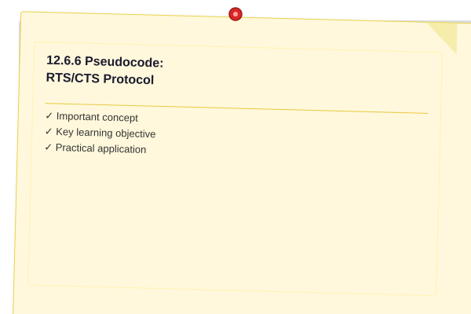
</a>


```
procedure rts_cts_send(data_frame, receiver)
    // Step 1: Contend for medium (CSMA/CA)
    csma_ca_backoff()
    send(RTS(receiver, exchange_duration))

    // Step 2: Wait for CTS
    timer = CTS_TIMEOUT
    while timer > 0 do
        if recv_frame(frame) and frame.type == CTS and frame.sender == receiver then
            nav_update(frame.duration)
            goto STEP_3
        timer = timer - SLOT_TIME
    // No CTS received → retry
    return TRANSMIT_FAILURE

    // Step 3: Send data
    STEP_3:
    wait(SIFS)
    send(data_frame)
    nav_update(data_frame.duration)

    // Step 4: Wait for ACK
    timer = ACK_TIMEOUT
    while timer > 0 do
        if recv_frame(frame) and frame.type == ACK and frame.ack_seq == data_frame.seq then
            return TRANSMIT_SUCCESS
        timer = timer - SLOT_TIME
    return TRANSMIT_FAILURE
```

### 12.6.7 Edge Cases in Hidden/Exposed Terminal

<a href="../../assets/images/diagrams/computer-networks/12-wireless/12-6-7-edge-cases-in-hidden-exposed-terminal-handwritten.svg" target="_blank" rel="noopener">
  
</a>
<a href="../../assets/images/diagrams/computer-networks/12-wireless/12-6-7-edge-cases-in-hidden-exposed-terminal-diagram.svg" target="_blank" rel="noopener">
  
</a>
<a href="../../assets/images/diagrams/computer-networks/12-wireless/12-6-7-edge-cases-in-hidden-exposed-terminal-sticky.svg" target="_blank" rel="noopener">
  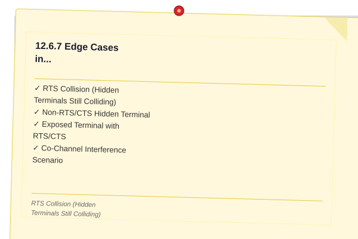
</a>


**RTS Collision (Hidden Terminals Still Colliding)**:
Two hidden stations (A and C) both sense the medium as idle (neither hears the other). Both send RTS to the AP at the same time. The AP receives garbled data. Both A and C time out waiting for CTS and double their CW. After backoff, the one with the smaller backoff wins. RTS frames themselves are short (20 bytes), so the collision is brief, but it does happen.

**Non-RTS/CTS Hidden Terminal**: Without RTS/CTS, hidden stations A and C transmit data frames simultaneously. Both frames collide at the AP. Neither A nor C receives an ACK. Both double CW and retry. They may collide again if they pick the same backoff value (probability ≈ 1/CW). With CW=15, P(same backoff) ≈ 6.7%.

**Exposed Terminal with RTS/CTS**: Station C hears B's RTS to AP A. C defers (setting NAV based on RTS duration). But C could safely transmit to D (far from A). RTS/CTS actually makes the exposed terminal problem worse in this case → C defers when it could otherwise transmit.

**Co-Channel Interference Scenario**: Two APs (AP1 on channel 6, AP2 also on channel 6) with overlapping cells. STA connected to AP1 hears AP2's beacon and probe responses as interference. The STA experiences lower SNR, forcing rate adaptation to a lower modulation (e.g., 54 Mbps → 24 Mbps), reducing throughput by 55%.

### 12.6.8 A&D of RTS/CTS

<a href="../../assets/images/diagrams/computer-networks/12-wireless/12-6-8-a-d-of-rts-cts-handwritten.svg" target="_blank" rel="noopener">
  
</a>
<a href="../../assets/images/diagrams/computer-networks/12-wireless/12-6-8-a-d-of-rts-cts-diagram.svg" target="_blank" rel="noopener">
  
</a>
<a href="../../assets/images/diagrams/computer-networks/12-wireless/12-6-8-a-d-of-rts-cts-sticky.svg" target="_blank" rel="noopener">
  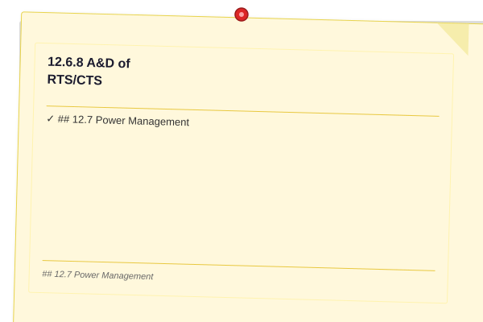
</a>


| Advantage | Disadvantage |
|-----------|-------------|
| Solves hidden terminal problem | Adds fixed overhead (RTS+CTS = 34 bytes per exchange) |
| Reduces collision duration (short RTS instead of long data) | Ineffective in exposed terminal scenarios |
| Virtual carrier sense (NAV) protects fragmented frames | CTS from other BSS can cause false deferral |
| Essential for dense/official deployments | Disabled by default on many consumer devices |
| Improves fairness among distant stations | Degrades throughput in low-load, low-interference environments |
## 12.7 Power Management

### 12.7.1 TIM and PS-Poll

<a href="../../assets/images/diagrams/computer-networks/12-wireless/12-7-1-tim-and-ps-poll-handwritten.svg" target="_blank" rel="noopener">
  
</a>
<a href="../../assets/images/diagrams/computer-networks/12-wireless/12-7-1-tim-and-ps-poll-diagram.svg" target="_blank" rel="noopener">
  
</a>
<a href="../../assets/images/diagrams/computer-networks/12-wireless/12-7-1-tim-and-ps-poll-sticky.svg" target="_blank" rel="noopener">
  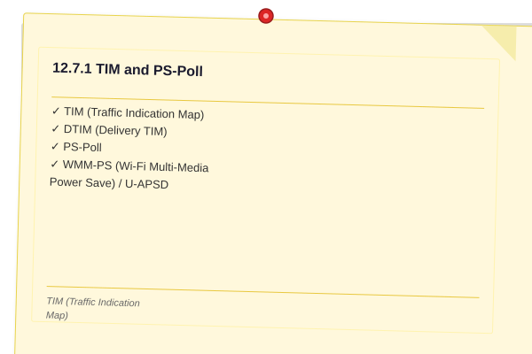
</a>


Wireless stations conserve power by entering doze (sleep) state. The AP buffers frames for sleeping stations.

**TIM (Traffic Indication Map)**: A bitmap in each beacon frame. Bit $i = 1$ means the AP has buffered data for AID $i$. Stations wake at each beacon interval (typically 102.4 ms) to check the TIM. If their bit is set, they send PS-Poll to retrieve the buffered frame.

**DTIM (Delivery TIM)**: Every few beacons (DTIM period, default 1-3), the AP sends a DTIM beacon. After DTIM, the AP transmits broadcast/multicast frames. Stations must remain awake after DTIM to receive broadcast traffic.

**PS-Poll**: STA sends PS-Poll frame to AP indicating it is awake and ready to receive. AP responds immediately with the buffered frame or an ACK followed by the frame. The More Data bit in the AP's response tells the STA whether more frames are buffered.

**WMM-PS (Wi-Fi Multi-Media Power Save) / U-APSD**: Instead of TIM-based polling, the STA sends a trigger frame (e.g., a QoS Null) and the AP delivers all buffered frames in a burst.

**TWT (Target Wake Time, 802.11ax)**: STA and AP negotiate specific wake times, reducing contention and extending battery life. The STA wakes only at pre-agreed times instead of every beacon interval.

### 12.7.2 Real-World Analogy: Office Mailroom

<a href="../../assets/images/diagrams/computer-networks/12-wireless/12-7-2-real-world-analogy-office-mailroom-handwritten.svg" target="_blank" rel="noopener">
  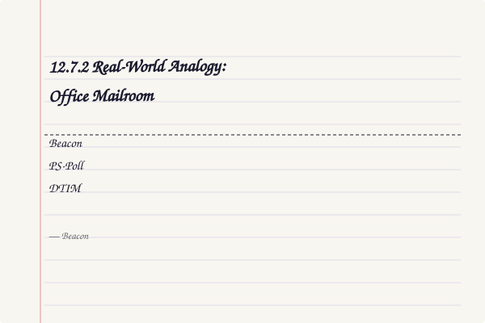
</a>
<a href="../../assets/images/diagrams/computer-networks/12-wireless/12-7-2-real-world-analogy-office-mailroom-diagram.svg" target="_blank" rel="noopener">
  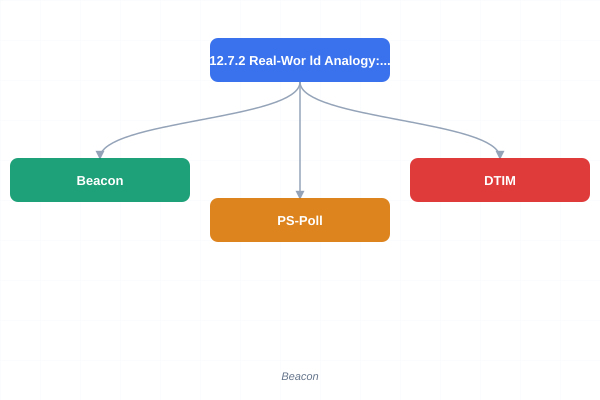
</a>
<a href="../../assets/images/diagrams/computer-networks/12-wireless/12-7-2-real-world-analogy-office-mailroom-sticky.svg" target="_blank" rel="noopener">
  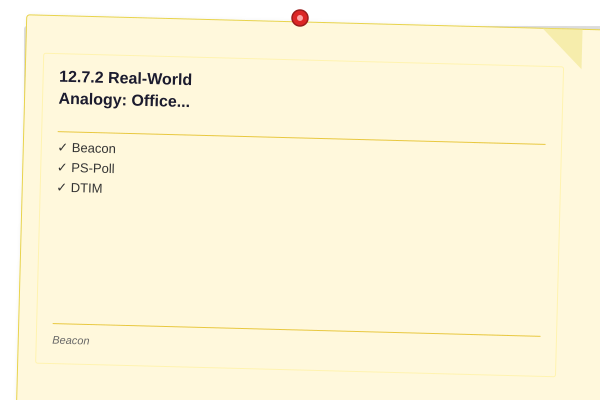
</a>


- **Beacon**: The mailroom clerk rings a bell every hour to announce "mail is here."
- **TIM**: The clerk posts a list of employees who have mail. You only need to look if your name is on the list.
- **PS-Poll**: You approach the counter and say "I have mail → please give it to me."
- **DTIM**: Every third bell, the clerk reads general announcements (broadcast messages) that everyone must hear.
- **TWT**: You schedule a specific time each day with the clerk: "I'll pick up mail at 10 AM and 2 PM." No need to check every hour.

### 12.7.3 Numbered Steps: Power-Save Operation

<a href="../../assets/images/diagrams/computer-networks/12-wireless/12-7-3-numbered-steps-power-save-operation-handwritten.svg" target="_blank" rel="noopener">
  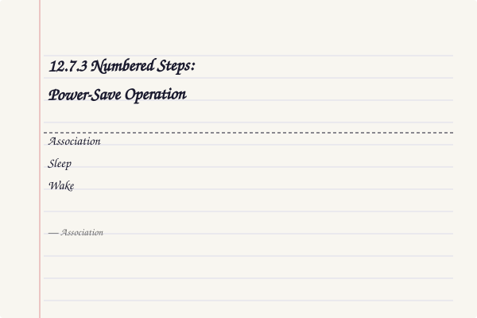
</a>
<a href="../../assets/images/diagrams/computer-networks/12-wireless/12-7-3-numbered-steps-power-save-operation-diagram.svg" target="_blank" rel="noopener">
  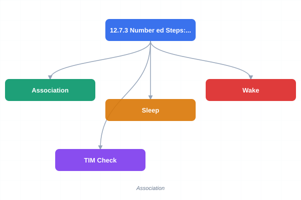
</a>
<a href="../../assets/images/diagrams/computer-networks/12-wireless/12-7-3-numbered-steps-power-save-operation-sticky.svg" target="_blank" rel="noopener">
  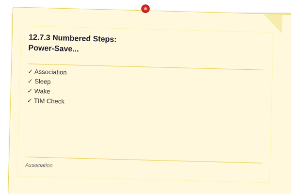
</a>


1. **Association**: STA informs AP of its listen interval (e.g., 10 beacon periods). AP will buffer frames for up to this duration.
2. **Sleep**: STA enters doze state, turning off the radio. AP buffers any incoming frames for the STA.
3. **Wake**: STA wakes at the next beacon TBTT (Target Beacon Transmission Time).
4. **TIM Check**: STA receives the beacon, checks the TIM bitmap for its AID.
5. **If bit set**: STA sends PS-Poll to AP.
6. **Frame Delivery**: AP sends buffered frame(s) to STA, with More Data bit indicating whether more frames remain.
7. **If More Data = 1**: STA sends PS-Poll again (or stays awake for immediate delivery). Go to step 6.
8. **If More Data = 0**: STA returns to doze until next beacon.
9. **If bit not set**: STA immediately returns to doze until next beacon.

## 12.8 Bluetooth

Bluetooth (IEEE 802.15.1) is a short-range wireless technology operating in the 2.4 GHz ISM band. It uses frequency-hopping spread spectrum (FHSS) to mitigate interference and fading.

### 12.8.1 Piconet and Scatternet

<a href="../../assets/images/diagrams/computer-networks/12-wireless/12-8-1-piconet-and-scatternet-handwritten.svg" target="_blank" rel="noopener">
  
</a>
<a href="../../assets/images/diagrams/computer-networks/12-wireless/12-8-1-piconet-and-scatternet-diagram.svg" target="_blank" rel="noopener">
  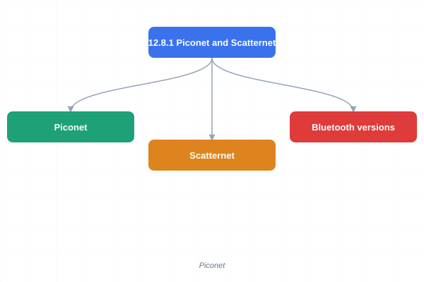
</a>
<a href="../../assets/images/diagrams/computer-networks/12-wireless/12-8-1-piconet-and-scatternet-sticky.svg" target="_blank" rel="noopener">
  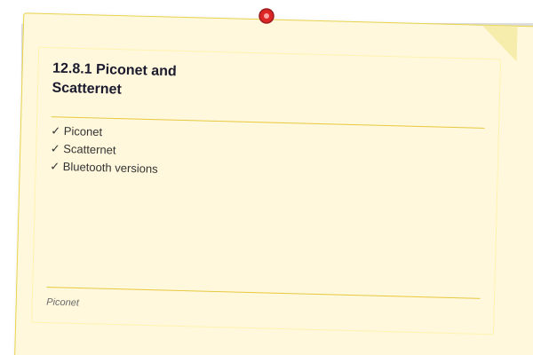
</a>


**Piconet**: A Bluetooth piconet consists of one master and up to seven active slaves (plus up to 255 parked slaves). Key characteristics:
- All communication is master-to-slave or slave-to-master. Slaves do not communicate directly.
- The master determines the frequency-hopping sequence (derived from the master's clock and BD_ADDR).
- The master polls each slave in turn using a TDD (Time Division Duplex) scheme.
- Time is divided into 625 µs slots (1600 slots/second).
- Master transmits in even slots, slave responds in odd slots.
- Slaves speak only when addressed by the master.

**Scatternet**: Multiple piconets interconnected through bridge nodes. A bridge node participates in multiple piconets (as slave in one, master in another, or slave in both). Scatternets extend the range and coverage of Bluetooth networks beyond a single piconet.

**Bluetooth versions**:
- BR (Basic Rate): 1 Mbps, GFSK modulation.
- EDR (Enhanced Data Rate): 2-3 Mbps, DQPSK/8DPSK modulation.
- BLE (Bluetooth Low Energy 4.0): 1 Mbps, very low power, 40 channels (3 advertising + 37 data).
- Bluetooth 5: 2 Mbps (LE 2M PHY), 4× range, advertising extensions, mesh networking.
- Bluetooth 5.2: LE Audio, LC3 codec, multi-stream audio.
- Bluetooth 5.3/5.4: Periodic advertising, encrypted advertising data, isochronous channels.

### 12.8.2 L2CAP (Logical Link Control and Adaptation Protocol)

<a href="../../assets/images/diagrams/computer-networks/12-wireless/12-8-2-l2cap-logical-link-control-and-adaptation-protocol-handwritten.svg" target="_blank" rel="noopener">
  
</a>
<a href="../../assets/images/diagrams/computer-networks/12-wireless/12-8-2-l2cap-logical-link-control-and-adaptation-protocol-diagram.svg" target="_blank" rel="noopener">
  
</a>
<a href="../../assets/images/diagrams/computer-networks/12-wireless/12-8-2-l2cap-logical-link-control-and-adaptation-protocol-sticky.svg" target="_blank" rel="noopener">
  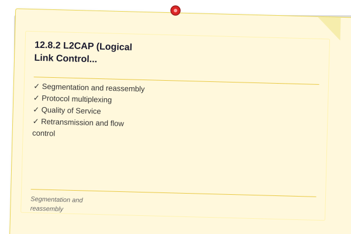
</a>


L2CAP sits above the baseband layer in the Bluetooth protocol stack and provides:
- **Segmentation and reassembly**: Large packets are divided into baseband frames and reassembled at the receiver.
- **Protocol multiplexing**: Multiple higher-layer protocols (RFCOMM, SDP, BNEP) share the same ACL (Asynchronous Connection-Less) link.
- **Quality of Service**: L2CAP supports best-effort and guaranteed QoS configurations.
- **Retransmission and flow control**: Enhanced Retransmission Mode and Streaming Mode in L2CAP 2.0.

L2CAP channel identifiers (CIDs):
- CID 0x0001: Signaling channel (connection management)
- CID 0x0002: Connectionless data
- CID 0x0003-0x003F: Fixed channels (e.g., SDP = 0x0001 actually, ATT over BLE = 0x0004)
- CID 0x0040-0xFFFF: Dynamically allocated for application channels

### 12.8.3 Real-World Analogy: Classroom

<a href="../../assets/images/diagrams/computer-networks/12-wireless/12-8-3-real-world-analogy-classroom-handwritten.svg" target="_blank" rel="noopener">
  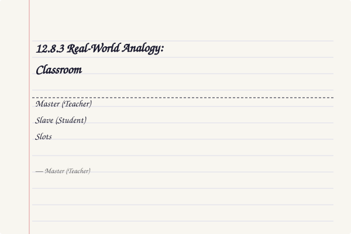
</a>
<a href="../../assets/images/diagrams/computer-networks/12-wireless/12-8-3-real-world-analogy-classroom-diagram.svg" target="_blank" rel="noopener">
  
</a>
<a href="../../assets/images/diagrams/computer-networks/12-wireless/12-8-3-real-world-analogy-classroom-sticky.svg" target="_blank" rel="noopener">
  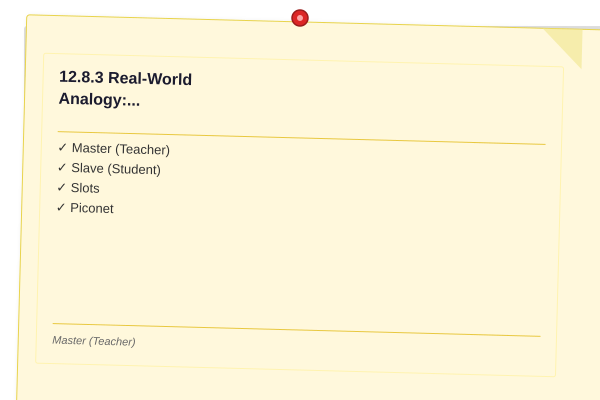
</a>


- **Master (Teacher)**: Controls the conversation. Calls on students one at a time.
- **Slave (Student)**: Speaks only when the teacher calls on them.
- **Slots**: The teacher speaks for 30 seconds (slot), then a student responds for 30 seconds (slot).
- **Piconet**: One teacher with up to 7 students in a study group.
- **Scatternet**: Multiple study groups in adjacent rooms. A student (bridge) moves between groups, sharing information.
- **FHSS**: Every time the teacher says something, they switch to a different language. Anyone not in the group hears gibberish on any single frequency.
- **L2CAP**: The teacher's assistant organizes materials → splits long books into chapters (segmentation), labels each book with its subject (protocol multiplexing).

### 12.8.4 C++ Implementation: Bluetooth Piconet

<a href="../../assets/images/diagrams/computer-networks/12-wireless/12-8-4-c-implementation-bluetooth-piconet-handwritten.svg" target="_blank" rel="noopener">
  
</a>
<a href="../../assets/images/diagrams/computer-networks/12-wireless/12-8-4-c-implementation-bluetooth-piconet-diagram.svg" target="_blank" rel="noopener">
  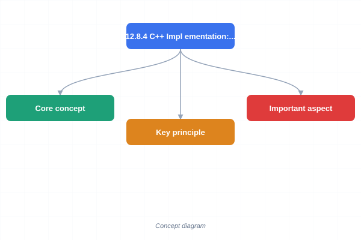
</a>
<a href="../../assets/images/diagrams/computer-networks/12-wireless/12-8-4-c-implementation-bluetooth-piconet-sticky.svg" target="_blank" rel="noopener">
  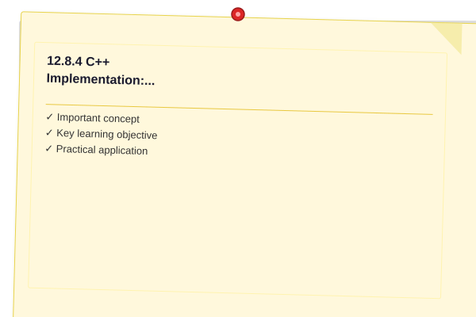
</a>


```cpp
#include <iostream>
#include <vector>
#include <string>
#include <queue>
#include <random>
#include <chrono>
#include <thread>

class BluetoothDevice {
public:
    std::string address;
    std::string name;
    bool is_master;
    int clock;  // native clock

    BluetoothDevice(std::string addr, std::string name, bool master = false)
        : address(addr), name(name), is_master(master), clock(0) {}

    virtual ~BluetoothDevice() = default;
};

class BluetoothSlave : public BluetoothDevice {
public:
    std::queue<std::string> tx_queue;
    bool parked;

    BluetoothSlave(std::string addr, std::string name)
        : BluetoothDevice(addr, name, false), parked(false) {}

    void enqueue_data(const std::string& data) {
        tx_queue.push(data);
    }
};

class BluetoothMaster : public BluetoothDevice {
public:
    std::vector<BluetoothSlave*> slaves;
    int current_slave_index;
    int hop_sequence[79];  // 79-hop sequence
    int current_channel;

    BluetoothMaster(std::string addr, std::string name)
        : BluetoothDevice(addr, name, true), current_slave_index(0), current_channel(0) {
        // Generate pseudo-random hopping sequence
        for (int i = 0; i < 79; i++) hop_sequence[i] = i;
        std::shuffle(hop_sequence, hop_sequence + 79, std::mt19937(42));
    }

    bool add_slave(BluetoothSlave* slave) {
        if (slaves.size() >= 7) {
            std::cout << "Piconet full: max 7 active slaves.\n";
            return false;
        }
        slaves.push_back(slave);
        std::cout << "Slave " << slave->name << " (" << slave->address
                  << ") joined piconet. Active slaves: " << slaves.size() << "\n";
        return true;
    }

    void remove_slave(BluetoothSlave* slave) {
        auto it = std::find(slaves.begin(), slaves.end(), slave);
        if (it != slaves.end()) {
            slaves.erase(it);
            std::cout << "Slave " << slave->name << " left piconet.\n";
        }
    }

    void park_slave(BluetoothSlave* slave) {
        slave->parked = true;
        std::cout << "Slave " << slave->name << " parked (inactive).\n";
    }

    void unpark_slave(BluetoothSlave* slave) {
        slave->parked = false;
        std::cout << "Slave " << slave->name << " unparked (active).\n";
    }

    void run_piconet_cycle() {
        if (slaves.empty()) {
            std::cout << "No active slaves in piconet.\n";
            return;
        }

        // Master slot (even slot)
        current_channel = hop_sequence[current_slave_index % 79];
        BluetoothSlave* slave = slaves[current_slave_index % slaves.size()];

        std::cout << "[Slot " << clock << "] Master -> " << slave->name
                  << " on channel " << current_channel << ": ";

        if (clock % 2 == 0) {  // Master transmission slot
            std::cout << "POLL (any data?)\n";
        }

        clock++;

        // Slave slot (odd slot)
        current_channel = hop_sequence[clock % 79];
        if (!slave->tx_queue.empty()) {
            std::string data = slave->tx_queue.front();
            slave->tx_queue.pop();
            std::cout << "[Slot " << clock << "] " << slave->name << " -> Master"
                      << " on channel " << current_channel << ": " << data << "\n";
        } else {
            std::cout << "[Slot " << clock << "] " << slave->name << " -> Master"
                      << " on channel " << current_channel << ": NULL (no data)\n";
        }

        clock++;
        current_slave_index = (current_slave_index + 1) % slaves.size();
    }

    void run_multiple_cycles(int cycles) {
        for (int i = 0; i < cycles; i++) {
            run_piconet_cycle();
            std::this_thread::sleep_for(std::chrono::milliseconds(100));
        }
    }
};

int main() {
    BluetoothMaster master("00:1A:7D:DA:71:01", "Phone-Master");

    BluetoothSlave s1("00:1A:7D:DA:71:02", "Headset");
    BluetoothSlave s2("00:1A:7D:DA:71:03", "Keyboard");
    BluetoothSlave s3("00:1A:7D:DA:71:04", "Mouse");

    s1.enqueue_data("A2DP audio frame #1");
    s1.enqueue_data("A2DP audio frame #2");
    s2.enqueue_data("HID report: key Pressed 'A'");
    s3.enqueue_data("HID report: mouse moved (dx=10, dy=5)");
    s1.enqueue_data("A2DP audio frame #3");

    master.add_slave(&s1);
    master.add_slave(&s2);
    master.add_slave(&s3);

    std::cout << "\n=== Piconet Operation ===\n";
    master.run_multiple_cycles(9);

    return 0;
}
```

### 12.8.5 Python Implementation: Bluetooth Piconet

<a href="../../assets/images/diagrams/computer-networks/12-wireless/12-8-5-python-implementation-bluetooth-piconet-handwritten.svg" target="_blank" rel="noopener">
  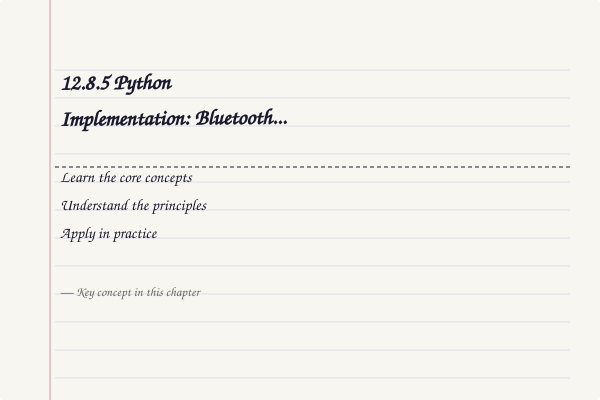
</a>
<a href="../../assets/images/diagrams/computer-networks/12-wireless/12-8-5-python-implementation-bluetooth-piconet-diagram.svg" target="_blank" rel="noopener">
  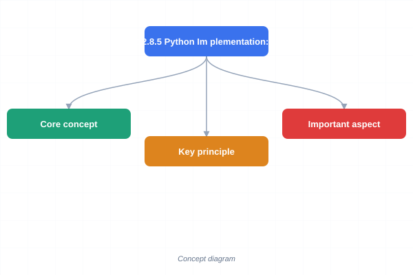
</a>
<a href="../../assets/images/diagrams/computer-networks/12-wireless/12-8-5-python-implementation-bluetooth-piconet-sticky.svg" target="_blank" rel="noopener">
  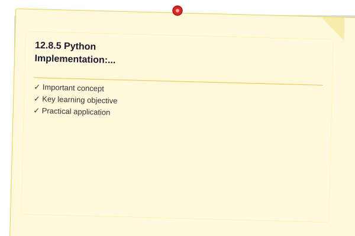
</a>


```python
import random
import time
from collections import deque


class BluetoothDevice:
    def __init__(self, address, name, is_master=False):
        self.address = address
        self.name = name
        self.is_master = is_master
        self.clock = 0

class BluetoothSlave(BluetoothDevice):
    def __init__(self, address, name):
        super().__init__(address, name, False)
        self.tx_queue = deque()
        self.parked = False
        self.l2cap_channels = {}  # CID -> callback

    def enqueue_data(self, data):
        self.tx_queue.append(data)

    def register_l2cap_channel(self, cid, protocol_name):
        self.l2cap_channels[cid] = protocol_name

class BluetoothMaster(BluetoothDevice):
    def __init__(self, address, name):
        super().__init__(address, name, True)
        self.slaves = []
        self.current_slave_index = 0
        self.current_channel = 0
        self.hop_sequence = list(range(79))
        random.seed(42)
        random.shuffle(self.hop_sequence)

    def add_slave(self, slave):
        if len(self.slaves) >= 7:
            print(f"Piconet full: max 7 active slaves.")
            return False
        self.slaves.append(slave)
        print(f"Slave {slave.name} ({slave.address}) joined piconet. "
              f"Active slaves: {len(self.slaves)}")
        return True

    def remove_slave(self, slave):
        if slave in self.slaves:
            self.slaves.remove(slave)
            print(f"Slave {slave.name} left piconet.")

    def park_slave(self, slave):
        slave.parked = True
        print(f"Slave {slave.name} parked.")

    def run_piconet_cycle(self):
        if not self.slaves:
            print("No active slaves in piconet.")
            return

        active = [s for s in self.slaves if not s.parked]
        if not active:
            return

        slave = active[self.current_slave_index % len(active)]

        # Master -> Slave (even slot)
        self.current_channel = self.hop_sequence[self.clock % 79]
        print(f"[Slot {self.clock}] Master -> {slave.name} "
              f"on ch{self.current_channel}: POLL")
        self.clock += 1

        # Slave -> Master (odd slot)
        self.current_channel = self.hop_sequence[self.clock % 79]
        if slave.tx_queue:
            data = slave.tx_queue.popleft()
            print(f"[Slot {self.clock}] {slave.name} -> Master "
                  f"on ch{self.current_channel}: {data}")
        else:
            print(f"[Slot {self.clock}] {slave.name} -> Master "
                  f"on ch{self.current_channel}: NULL")
        self.clock += 1

        self.current_slave_index += 1

    def run(self, cycles=10):
        for _ in range(cycles):
            self.run_piconet_cycle()
            time.sleep(0.05)


class L2CAPLayer:
    """Simulates Bluetooth L2CAP segmentation and protocol multiplexing."""
    def __init__(self, mtu=672):
        self.mtu = mtu
        self.channels = {}  # CID -> protocol_name

    def register_channel(self, cid, protocol_name):
        self.channels[cid] = protocol_name

    def segment(self, data, cid):
        """Segment large data into MTU-sized chunks."""
        if len(data) <= self.mtu:
            return [(cid, data)]

        segments = []
        for i in range(0, len(data), self.mtu):
            chunk = data[i:i + self.mtu]
            segments.append((cid, chunk))
        return segments

    def reassemble(self, segments):
        """Reassemble segments into complete L2CAP SDU."""
        return b"".join(payload for _, payload in segments)

    def create_l2cap_header(self, cid, payload_length):
        length_field = payload_length.to_bytes(2, 'little')
        cid_field = cid.to_bytes(2, 'little')
        return length_field + cid_field


class Scatternet:
    """Connects multiple piconets through bridge nodes."""
    def __init__(self):
        self.piconets = []  # list of (master, [slaves])

    def add_piconet(self, master, slaves):
        self.piconets.append((master, slaves))

    def bridge_slave(self, slave, piconet1, piconet2):
        """A slave participates in two piconets as bridge."""
        print(f"Bridge: {slave.name} connects piconet {piconet1} and {piconet2}")

    def route_inter_piconet(self, from_slave, to_slave, data):
        print(f"Scatternet routing: {from_slave.name} -> {to_slave.name}: {data}")


if __name__ == "__main__":
    print("=== Bluetooth Piconet Simulation ===\n")

    master = BluetoothMaster("00:1A:7D:DA:71:01", "Phone")

    headset = BluetoothSlave("00:1A:7D:DA:71:02", "Headset")
    keyboard = BluetoothSlave("00:1A:7D:DA:71:03", "Keyboard")
    mouse = BluetoothSlave("00:1A:7D:DA:71:04", "Mouse")

    # L2CAP channels
    l2cap = L2CAPLayer()
    l2cap.register_channel(0x0040, "RFCOMM (SPP)")
    l2cap.register_channel(0x0041, "A2DP (Audio)")
    l2cap.register_channel(0x0042, "HID (Human Interface)")

    headset.register_l2cap_channel(0x0041, "A2DP")
    headset.register_l2cap_channel(0x0040, "RFCOMM")
    keyboard.register_l2cap_channel(0x0042, "HID")
    mouse.register_l2cap_channel(0x0042, "HID")

    # Simulate L2CAP segmentation
    large_audio_frame = b"X" * 1500  # Exceeds typical L2CAP MTU
    segments = l2cap.segment(large_audio_frame, 0x0041)
    print(f"L2CAP segmented 1500-byte audio into {len(segments)} chunks:")
    for cid, chunk in segments:
        print(f"  CID=0x{cid:04X} payload={len(chunk)} bytes")
    print()

    # Enqueue data
    headset.enqueue_data("A2DP frame #1")
    keyboard.enqueue_data("HID: key='A' pressed")
    mouse.enqueue_data("HID: mouse dx=5 dy=10")
    headset.enqueue_data("A2DP frame #2")

    master.add_slave(headset)
    master.add_slave(keyboard)
    master.add_slave(mouse)

    master.run(12)
```

### 12.8.6 A&D of Bluetooth

<a href="../../assets/images/diagrams/computer-networks/12-wireless/12-8-6-a-d-of-bluetooth-handwritten.svg" target="_blank" rel="noopener">
  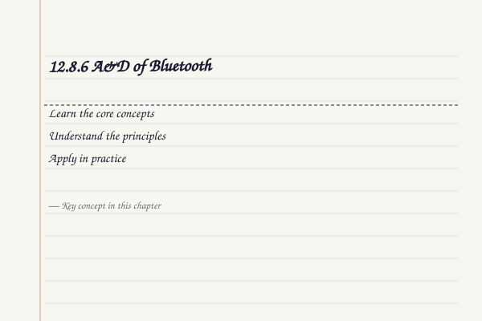
</a>
<a href="../../assets/images/diagrams/computer-networks/12-wireless/12-8-6-a-d-of-bluetooth-diagram.svg" target="_blank" rel="noopener">
  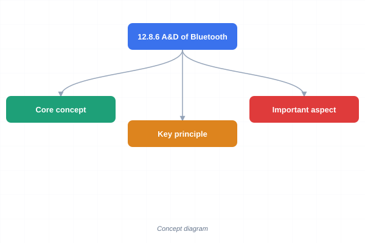
</a>
<a href="../../assets/images/diagrams/computer-networks/12-wireless/12-8-6-a-d-of-bluetooth-sticky.svg" target="_blank" rel="noopener">
  
</a>


| Advantage | Disadvantage |
|-----------|-------------|
| Very low power consumption (BLE: 0.01-0.5 W) | Low data rate (1-3 Mbps, 2 Mbps for BLE 5) |
| FHSS provides interference resilience | Short range (~10 m classic, ~100 m BLE 5) |
| Low-cost hardware (sub-$5 modules) | Limited to 7 active slaves per piconet |
| Ubiquitous in mobile devices | Connection-oriented setup latency (~3 s for BR/EDR) |
| Mesh networking (Bluetooth 5+) | Scatternet complexity and scheduling overhead |
| LE Audio with LC3 codec | Co-channel interference with WiFi 2.4 GHz |

## 12.9 Cellular Networks

### 12.9.1 4G/LTE

<a href="../../assets/images/diagrams/computer-networks/12-wireless/12-9-1-4g-lte-handwritten.svg" target="_blank" rel="noopener">
  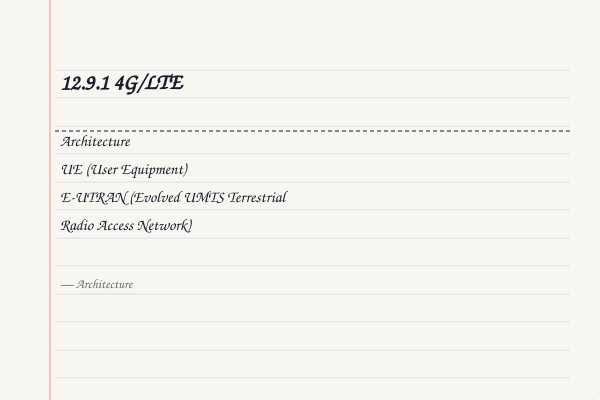
</a>
<a href="../../assets/images/diagrams/computer-networks/12-wireless/12-9-1-4g-lte-diagram.svg" target="_blank" rel="noopener">
  
</a>
<a href="../../assets/images/diagrams/computer-networks/12-wireless/12-9-1-4g-lte-sticky.svg" target="_blank" rel="noopener">
  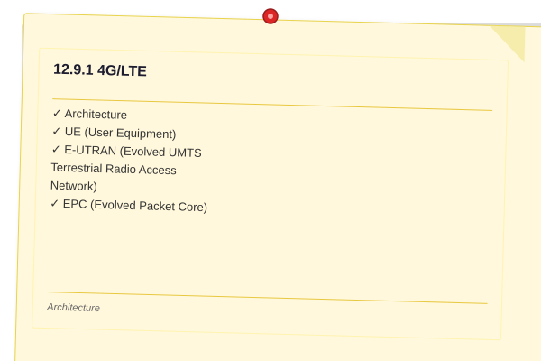
</a>


**Architecture**:
- **UE (User Equipment)**: Mobile device with SIM/USIM.
- **E-UTRAN (Evolved UMTS Terrestrial Radio Access Network)**: eNodeBs handle all radio functions.
- **EPC (Evolved Packet Core)**: All-IP core network.

**EPC Components**:
| Component | Function |
|-----------|----------|
| MME (Mobility Management Entity) | NAS signaling, authentication, tracking area management, paging, bearer management |
| SGW (Serving Gateway) | User-plane anchor, handover between eNodeBs, packet routing and forwarding |
| PGW (PDN Gateway) | IP allocation, QoS enforcement, interconnection to external packet data networks |
| HSS (Home Subscriber Server) | Subscriber database, authentication vectors, subscription profiles |
| PCRF (Policy and Charging Rules Function) | QoS policy, charging rules, gating control |

**OFDMA in LTE Downlink**: 15 kHz subcarrier spacing. Resource Block = 12 subcarriers × 7 OFDM symbols (normal CP) = 84 REs. For 20 MHz bandwidth: 100 RBs available. Each RB carries 84 symbols. With 64-QAM (6 bits/symbol) and code rate 3/4: 84 × 6 × 0.75 = 378 bits per RB per 0.5 ms slot.

**SC-FDMA in LTE Uplink**: Single-carrier FDMA reduces PAPR (Peak-to-Average Power Ratio), improving battery life and power amplifier efficiency compared to OFDMA.

### 12.9.2 5G NR

<a href="../../assets/images/diagrams/computer-networks/12-wireless/12-9-2-5g-nr-handwritten.svg" target="_blank" rel="noopener">
  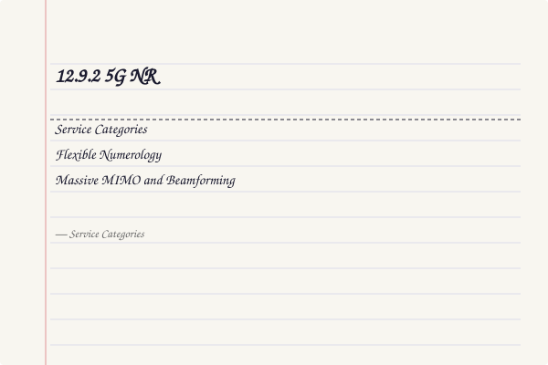
</a>
<a href="../../assets/images/diagrams/computer-networks/12-wireless/12-9-2-5g-nr-diagram.svg" target="_blank" rel="noopener">
  
</a>
<a href="../../assets/images/diagrams/computer-networks/12-wireless/12-9-2-5g-nr-sticky.svg" target="_blank" rel="noopener">
  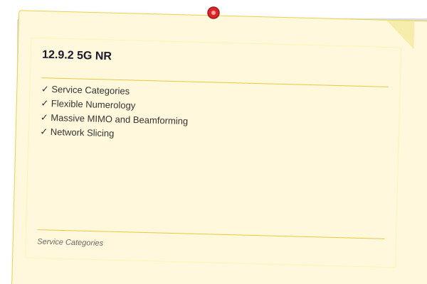
</a>


**Service Categories**:

| Category | Downlink | Latency | Reliability | Density | Use Case |
|----------|----------|---------|-------------|---------|----------|
| eMBB | 20 Gbps | 4 ms | 99.9% | → | Video streaming, AR/VR |
| uRLLC | → | 1 ms | 99.999% | → | Industrial control, autonomous driving |
| mMTC | → | → | → | 1M/km² | IoT sensors, smart city |

**Flexible Numerology**: Subcarrier spacing = $15 \times 2^\mu$ kHz.

| $\mu$ | SCS (kHz) | Symbol Duration (µs) | Slot Duration (ms) | Max BW (MHz) | Use Case |
|-------|-----------|---------------------|-------------------|-------------|----------|
| 0 | 15 | 66.7 | 1 | 50 | LTE coexistence |
| 1 | 30 | 33.3 | 0.5 | 100 | Urban macro |
| 2 | 60 | 16.7 | 0.25 | 200 | Dense urban, low latency |
| 3 | 120 | 8.33 | 0.125 | 400 | mmWave, high Doppler |
| 4 | 240 | 4.17 | 0.0625 | 800 | Beyond 52.6 GHz |

**Massive MIMO and Beamforming**: 5G gNBs can have 64, 128, or even 1024 antenna elements. Beamforming creates narrow, focused beams that track individual UEs. Spatial multiplexing allows multiple UEs to share the same time-frequency resources on different beams.

**Network Slicing**: Each slice is an isolated end-to-end logical network with dedicated resources, SLA, and management. A smartphone may connect to an eMBB slice (video) and an mMTC slice (background sensor) simultaneously.

**5G Core (SBA)**: Service-Based Architecture using HTTP/2 (REST) between network functions:
- **AMF**: Access and Mobility Management Function (replaces MME control plane)
- **SMF**: Session Management Function (bearer management, IP allocation)
- **UPF**: User Plane Function (packet routing, QoS enforcement → distributed at edge)
- **PCF**: Policy Control Function (replaces PCRF)
- **NRF**: Network Repository Function (service discovery)

### 12.9.3 4G vs 5G Comparison

<a href="../../assets/images/diagrams/computer-networks/12-wireless/12-9-3-4g-vs-5g-comparison-handwritten.svg" target="_blank" rel="noopener">
  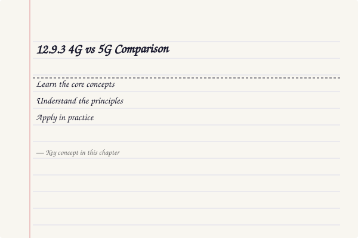
</a>
<a href="../../assets/images/diagrams/computer-networks/12-wireless/12-9-3-4g-vs-5g-comparison-diagram.svg" target="_blank" rel="noopener">
  
</a>
<a href="../../assets/images/diagrams/computer-networks/12-wireless/12-9-3-4g-vs-5g-comparison-sticky.svg" target="_blank" rel="noopener">
  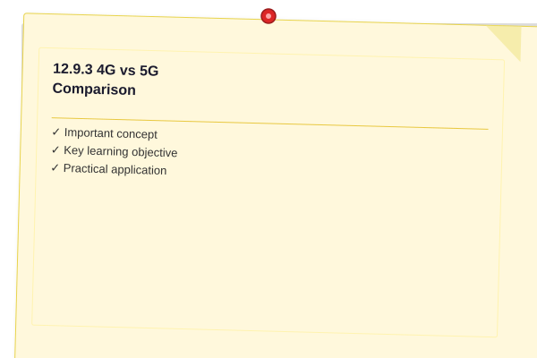
</a>


| Feature | 4G LTE | 5G NR |
|---------|--------|-------|
| Peak downlink | 300 Mbps (LTE Cat 6) → 3 Gbps (LTE-A) | 10-20 Gbps |
| Peak uplink | 75 Mbps → 1.5 Gbps | 10 Gbps |
| User-plane latency | 10-30 ms | 1-4 ms |
| Subcarrier spacing | 15 kHz fixed | 15-240 kHz flexible |
| OFDM numerology | Single | Flexible ($15 \times 2^\mu$) |
| Max carrier bandwidth | 20 MHz (100 MHz with CA) | 100 MHz (sub-6), 400 MHz (mmWave) |
| MIMO | Up to 8×8 DL, 4×4 UL | Up to 64×64 (massive MIMO) |
| Beamforming | Not in spec (proprietary) | Native (3D beamforming) |
| Core architecture | EPC (MME, SGW, PGW) | SBA (AMF, SMF, UPF, NRF) |
| Network slicing | Not supported | Native (end-to-end slices) |
| Edge computing | Limited (LIPA/SIPTO) | Native (MEC, UL CL, IPv6 multi-homing) |
| QoS | Bearer-based (EPS bearers) | Flow-based (QoS flows over DRBs) |
| Channel access | OFDMA (DL), SC-FDMA (UL) | OFDMA (both DL and UL) |
| Duplex | FDD primarily | FDD, TDD, flexible duplex |
| Mobility | 350 km/h | 500 km/h |
| Energy efficiency | Reference | 100× better per bit (target) |

### 12.9.4 Real-World Analogy: Highway System

<a href="../../assets/images/diagrams/computer-networks/12-wireless/12-9-4-real-world-analogy-highway-system-handwritten.svg" target="_blank" rel="noopener">
  
</a>
<a href="../../assets/images/diagrams/computer-networks/12-wireless/12-9-4-real-world-analogy-highway-system-diagram.svg" target="_blank" rel="noopener">
  
</a>
<a href="../../assets/images/diagrams/computer-networks/12-wireless/12-9-4-real-world-analogy-highway-system-sticky.svg" target="_blank" rel="noopener">
  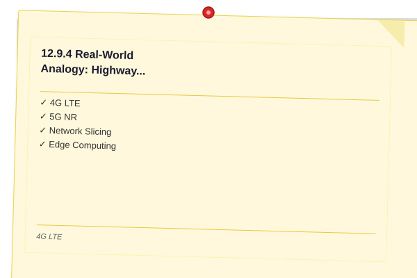
</a>


- **4G LTE**: A multi-lane highway with fixed lane widths and fixed speed limits. On-ramps (uplink) merge slowly (SC-FDMA). Traffic jams cause delays of 10-30 minutes (10-30 ms latency).
- **5G NR**: A highway with dynamically adjustable lanes and variable speed limits. During rush hour, lane widths narrow to increase throughput. Cars with critical destinations (autonomous driving) get dedicated express lanes (uRLLC). Each vehicle communicates directly with a traffic tower (beamforming) instead of broadcasting to all lanes.
- **Network Slicing**: Separate lanes for trucks (massive IoT), express buses (uRLLC), and regular cars (eMBB), each with its own rules and tollbooths.
- **Edge Computing**: Rest areas with cloud servers that process data locally instead of sending everything to a distant central data center.

### TypeScript Implementation: MobileHandoffSimulator

```typescript
interface CellTower { id: number; freq: number; lat: number; lng: number; power: number; channels: number[]; }

interface MobileDevice { id: number; lat: number; lng: number; speed: number; direction: number; servingTower: number; signalStrength: number; }

type HandoffType = 'HARD' | 'SOFT';

class MobileHandoffSimulator {
  private towers: Map<number, CellTower> = new Map();
  private devices: Map<number, MobileDevice> = new Map();
  private handoffLog: string[] = [];
  private readonly handoffThreshold: number = -100; // dBm

  addTower(tower: CellTower): void { this.towers.set(tower.id, tower); }

  addDevice(device: MobileDevice): void { this.devices.set(device.id, device); }

  private computeRssi(device: MobileDevice, tower: CellTower): number {
    const dx = device.lat - tower.lat, dy = device.lng - tower.lng;
    const dist = Math.sqrt(dx * dx + dy * dy);
    if (dist === 0) return -30;
    // Free-space path loss model: RSSI = TxPower - 20*log10(d) - 20*log10(f) + 147.55
    return tower.power - 20 * Math.log10(dist) - 20 * Math.log10(tower.freq / 1e6) + 147.55 + (Math.random() * 6 - 3);
  }

  private findBestTower(device: MobileDevice): { tower: CellTower; rssi: number } | null {
    let best: { tower: CellTower; rssi: number } | null = null;
    for (const tower of this.towers.values()) {
      if (tower.id === device.servingTower) continue;
      const rssi = this.computeRssi(device, tower);
      if (!best || rssi > best.rssi) best = { tower, rssi };
    }
    return best;
  }

  moveDevice(deviceId: number, newLat: number, newLng: number): HandoffType | null {
    const device = this.devices.get(deviceId);
    if (!device) return null;
    device.lat = newLat; device.lng = newLng;
    const servingTower = this.towers.get(device.servingTower);
    if (!servingTower) return null;
    device.signalStrength = this.computeRssi(device, servingTower);

    let handoffType: HandoffType | null = null;
    if (device.signalStrength < this.handoffThreshold) {
      const best = this.findBestTower(device);
      if (best && best.rssi > device.signalStrength + 5) { // hysteresis of 5dB
        const oldTower = device.servingTower;
        // Soft handoff: maintain both connections briefly; Hard: break before make
        handoffType = best.rssi > device.signalStrength + 10 ? 'SOFT' : 'HARD';
        device.servingTower = best.tower.id;
        device.signalStrength = best.rssi;
        this.handoffLog.push(`[HANDOFF] Device ${device.id}: ${handoffType} tower ${oldTower} -> ${best.tower.id} (RSSI ${best.rssi.toFixed(1)} dBm)`);
        console.log(`[HANDOFF] Device ${device.id}: ${handoffType} handoff ${oldTower} -> ${best.tower.id} (${best.rssi.toFixed(1)} dBm)`);
      }
    }
    return handoffType;
  }

  simulateMovement(deviceId: number, steps: number, stepSize: number = 0.01): void {
    const device = this.devices.get(deviceId);
    if (!device) return;
    for (let i = 0; i < steps; i++) {
      const newLat = device.lat + stepSize * Math.cos(device.direction);
      const newLng = device.lng + stepSize * Math.sin(device.direction);
      this.moveDevice(deviceId, newLat, newLng);
    }
  }

  getLog(): string[] { return this.handoffLog; }

  getDeviceSignalHistory(deviceId: number): { tower: number; rssi: number } {
    const d = this.devices.get(deviceId);
    return d ? { tower: d.servingTower, rssi: d.signalStrength } : { tower: 0, rssi: 0 };
  }
}

// Usage
const ho = new MobileHandoffSimulator();
ho.addTower({ id: 1, freq: 2100e6, lat: 0, lng: 0, power: 43, channels: [1, 2, 3] });
ho.addTower({ id: 2, freq: 2100e6, lat: 0.05, lng: 0.05, power: 43, channels: [4, 5, 6] });
ho.addTower({ id: 3, freq: 2100e6, lat: 0.1, lng: 0, power: 43, channels: [7, 8, 9] });
ho.addDevice({ id: 1, lat: -0.02, lng: -0.02, speed: 30, direction: Math.PI / 4, servingTower: 1, signalStrength: -65 });
ho.simulateMovement(1, 20, 0.008);
console.log(`Total handoffs: ${ho.getLog().length}`);
ho.getLog().forEach(l => console.log(`  ${l}`));
/*
Output:
[HANDOFF] Device 1: HARD handoff 1 -> 2 (RSSI ...)
[HANDOFF] Device 1: HARD handoff 2 -> 3 (RSSI ...)
Total handoffs: 2
*/
```

## 12.10 Wi-Fi vs Bluetooth vs Cellular Comparison

| Feature | WiFi (802.11) | Bluetooth | Cellular (4G/5G) |
|---------|--------------|-----------|------------------|
| Range | ~50 m indoors, ~100 m outdoors | ~10 m (classic), ~100 m (BLE 5) | ~1-10 km (macro), ~500 m (mmWave) |
| Data rate | 11 Mbps → 46 Gbps | 1-3 Mbps (BR/EDR), 2 Mbps (BLE 5) | 300 Mbps → 20 Gbps |
| Latency | 2-20 ms | 3-100 ms (BR/EDR), 2.5-6 ms (BLE) | 10-30 ms (4G), 1-4 ms (5G) |
| Power consumption | ~3-10 W (AP), ~1-3 W (STA) | ~1 W (BR/EDR), ~0.01-0.5 W (BLE) | ~3-5 W (modem active) |
| Frequency bands | 2.4, 5, 6 GHz | 2.4 GHz ISM | 700-2600 MHz, 24-47 GHz |
| Channel access | CSMA/CA contention | Master-slave TDMA/FHSS | Scheduled OFDMA |
| Mobility support | Low (walking speed) | Very low (static) | High (500 km/h for 5G) |
| Handover | Roaming between APs (≈100 ms) | Connection transfer (≈3 s) | Seamless handover (<50 ms 5G) |
| Security | WPA3 (AES-SAE) | Security Manager (AES-CCM) | 5G-AKA, IPsec |
| Infrastructure | AP + DS (autonomous) | Master-slave (ad-hoc) | eNB/gNB + Core Network |
| Cost per bit | Very low | Moderate | Highest |
| Use cases | LAN, web, streaming, gaming | Audio, peripherals, IoT | Mobile broadband, IoT, critical communications |

### 12.10.1 Selection Guide

<a href="../../assets/images/diagrams/computer-networks/12-wireless/12-10-1-selection-guide-handwritten.svg" target="_blank" rel="noopener">
  
</a>
<a href="../../assets/images/diagrams/computer-networks/12-wireless/12-10-1-selection-guide-diagram.svg" target="_blank" rel="noopener">
  
</a>
<a href="../../assets/images/diagrams/computer-networks/12-wireless/12-10-1-selection-guide-sticky.svg" target="_blank" rel="noopener">
  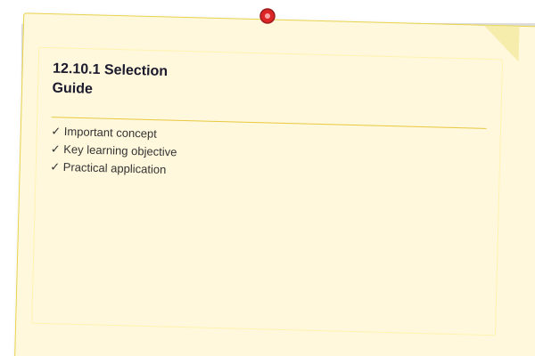
</a>


| Requirement | Best Choice | Why |
|-------------|-------------|-----|
| File transfer at close range (home) | WiFi (802.11ac/ax) | 100-1000× faster than Bluetooth |
| Wireless headset (phone) | Bluetooth | Designed for audio, low power |
| Wireless headphones (lossless) | Bluetooth with LDAC/LC3 | Sufficient for CD-quality audio |
| Large IoT deployment | BLE or LoRaWAN | BLE for indoor, LoRaWAN for outdoor |
| High mobility (car, train) | 5G NR | Native handover at 500 km/h |
| Low latency gaming | WiFi 6/7 | <5 ms with proper QoS |
| Building-wide coverage | WiFi mesh + cellular fallback | Seamless indoor-outdoor transition |
| Industrial sensors (factory) | BLE mesh or Thread | Low power, mesh, reliable |

## 12.11 Interview Corner

### Q1: Why does WiFi use CSMA/CA instead of CSMA/CD?

<a href="../../assets/images/diagrams/computer-networks/12-wireless/why-does-wifi-use-csma-ca-instead-of-csma-cd-handwritten.svg" target="_blank" rel="noopener">
  
</a>
<a href="../../assets/images/diagrams/computer-networks/12-wireless/why-does-wifi-use-csma-ca-instead-of-csma-cd-diagram.svg" target="_blank" rel="noopener">
  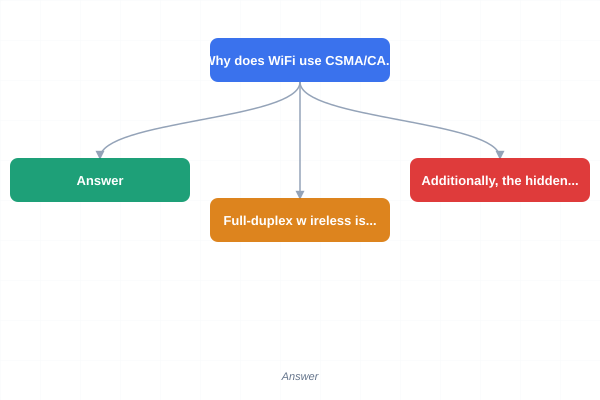
</a>
<a href="../../assets/images/diagrams/computer-networks/12-wireless/why-does-wifi-use-csma-ca-instead-of-csma-cd-sticky.svg" target="_blank" rel="noopener">
  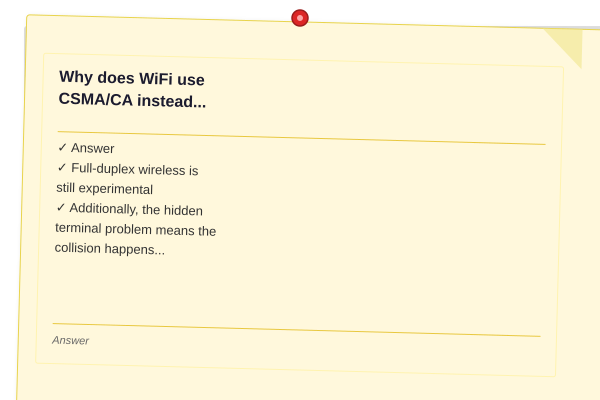
</a>


**Answer**: Wireless transceivers are half-duplex → the transmitter cannot listen for collisions while transmitting because its own signal overwhelms any incoming signal (self-interference). Full-duplex wireless is still experimental. Additionally, the hidden terminal problem means the collision happens at the receiver, not the sender. CSMA/CA prevents collisions probabilistically rather than detecting them reactively.

### Q2: What is NAV and why is it important?

<a href="../../assets/images/diagrams/computer-networks/12-wireless/what-is-nav-and-why-is-it-important-handwritten.svg" target="_blank" rel="noopener">
  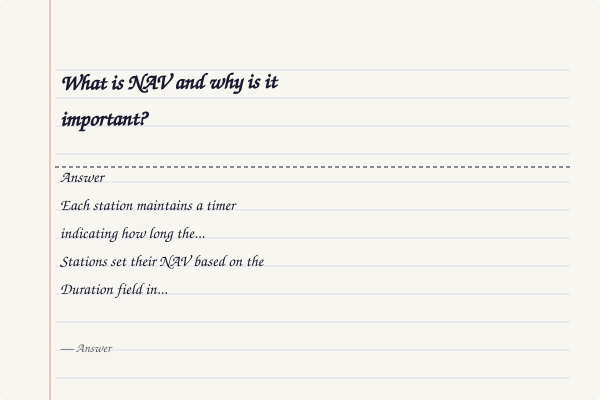
</a>
<a href="../../assets/images/diagrams/computer-networks/12-wireless/what-is-nav-and-why-is-it-important-diagram.svg" target="_blank" rel="noopener">
  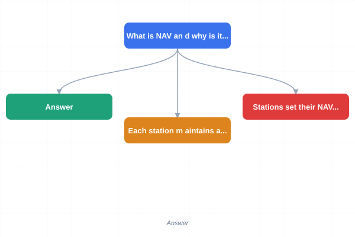
</a>
<a href="../../assets/images/diagrams/computer-networks/12-wireless/what-is-nav-and-why-is-it-important-sticky.svg" target="_blank" rel="noopener">
  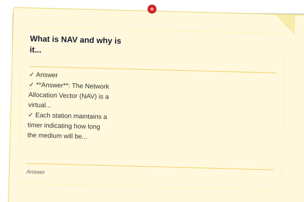
</a>


**Answer**: The Network Allocation Vector (NAV) is a virtual carrier-sense mechanism. Each station maintains a timer indicating how long the medium will be busy. Stations set their NAV based on the Duration field in received frames (RTS, CTS, Data). NAV prevents collisions from hidden terminals → even if a station's physical carrier sense says the medium is idle, NAV can still indicate it is busy.

### Q3: Explain the difference between WiFi handoff and cellular handover.

<a href="../../assets/images/diagrams/computer-networks/12-wireless/explain-the-difference-between-wifi-handoff-and-cellular-handover-handwritten.svg" target="_blank" rel="noopener">
  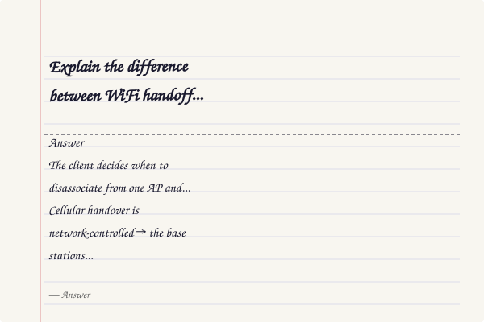
</a>
<a href="../../assets/images/diagrams/computer-networks/12-wireless/explain-the-difference-between-wifi-handoff-and-cellular-handover-diagram.svg" target="_blank" rel="noopener">
  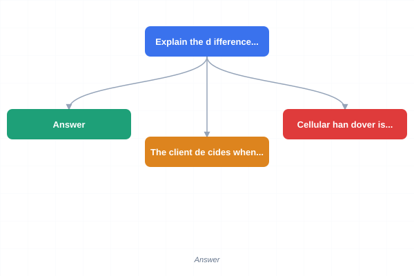
</a>
<a href="../../assets/images/diagrams/computer-networks/12-wireless/explain-the-difference-between-wifi-handoff-and-cellular-handover-sticky.svg" target="_blank" rel="noopener">
  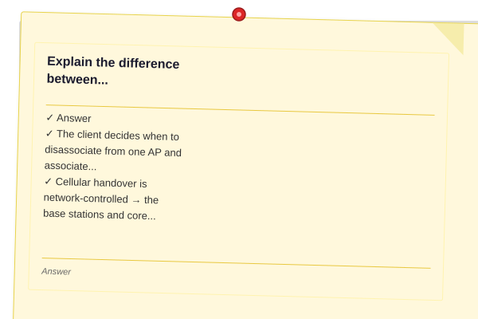
</a>


**Answer**: WiFi handoff (roaming) is client-initiated and can take 50-500 ms. The client decides when to disassociate from one AP and associate with another. Cellular handover is network-controlled → the base stations and core network coordinate the transition. LTE hard handover takes 10-50 ms; 5G targets &lt;1 ms handover interruption for uRLLC services. Cellular handover is seamless and transparent to the user.

### Q4: How does MIMO improve wireless performance?

<a href="../../assets/images/diagrams/computer-networks/12-wireless/how-does-mimo-improve-wireless-performance-handwritten.svg" target="_blank" rel="noopener">
  
</a>
<a href="../../assets/images/diagrams/computer-networks/12-wireless/how-does-mimo-improve-wireless-performance-diagram.svg" target="_blank" rel="noopener">
  
</a>
<a href="../../assets/images/diagrams/computer-networks/12-wireless/how-does-mimo-improve-wireless-performance-sticky.svg" target="_blank" rel="noopener">
  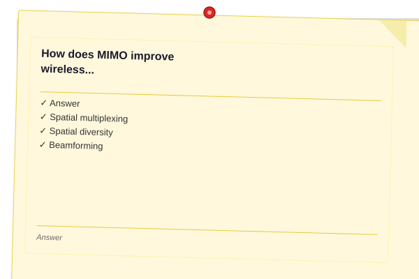
</a>


**Answer**: MIMO (Multiple Input Multiple Output) uses multiple antennas at both transmitter and receiver. Three benefits:
- **Spatial multiplexing**: Multiple data streams transmitted simultaneously over the same frequency → throughput increases linearly with stream count (up to 8× in WiFi 6, 16× in WiFi 7, 64× in 5G).
- **Spatial diversity**: Same data sent over multiple paths → improves reliability and range.
- **Beamforming**: Weight antenna signals to focus energy in a specific direction → improves SNR and reduces interference.

### Q5: What is OFDMA and why is it important in WiFi 6/7?

<a href="../../assets/images/diagrams/computer-networks/12-wireless/what-is-ofdma-and-why-is-it-important-in-wifi-6-7-handwritten.svg" target="_blank" rel="noopener">
  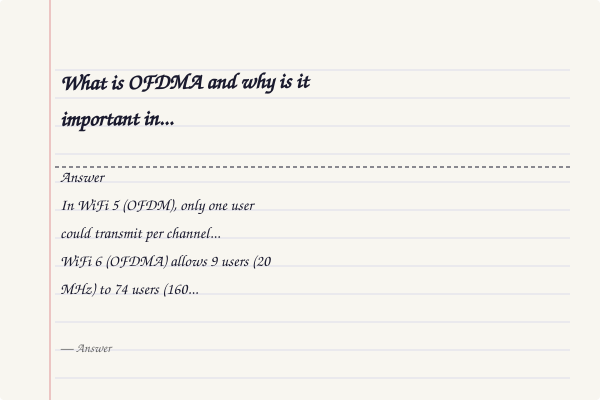
</a>
<a href="../../assets/images/diagrams/computer-networks/12-wireless/what-is-ofdma-and-why-is-it-important-in-wifi-6-7-diagram.svg" target="_blank" rel="noopener">
  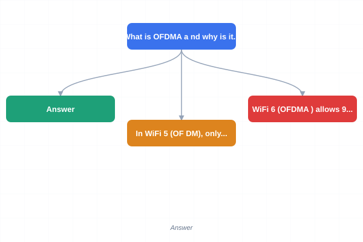
</a>
<a href="../../assets/images/diagrams/computer-networks/12-wireless/what-is-ofdma-and-why-is-it-important-in-wifi-6-7-sticky.svg" target="_blank" rel="noopener">
  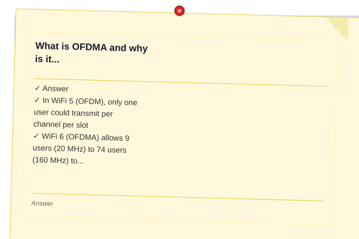
</a>


**Answer**: Orthogonal Frequency Division Multiple Access divides a channel into smaller sub-channels (Resource Units, RUs) that can be allocated to different users simultaneously. In WiFi 5 (OFDM), only one user could transmit per channel per slot. WiFi 6 (OFDMA) allows 9 users (20 MHz) to 74 users (160 MHz) to transmit simultaneously.

Real-world benefit: In a crowded office, OFDMA handles many small packets efficiently. A 20 MHz OFDMA transmission can serve 9 devices simultaneously instead of serializing them (9× latency reduction for small frames).

### Q6: Compare WiFi and LTE for voice over wireless.

<a href="../../assets/images/diagrams/computer-networks/12-wireless/compare-wifi-and-lte-for-voice-over-wireless-handwritten.svg" target="_blank" rel="noopener">
  
</a>
<a href="../../assets/images/diagrams/computer-networks/12-wireless/compare-wifi-and-lte-for-voice-over-wireless-diagram.svg" target="_blank" rel="noopener">
  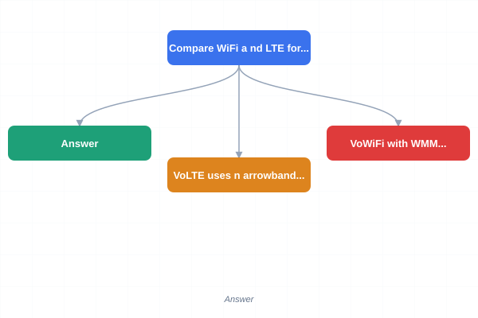
</a>
<a href="../../assets/images/diagrams/computer-networks/12-wireless/compare-wifi-and-lte-for-voice-over-wireless-sticky.svg" target="_blank" rel="noopener">
  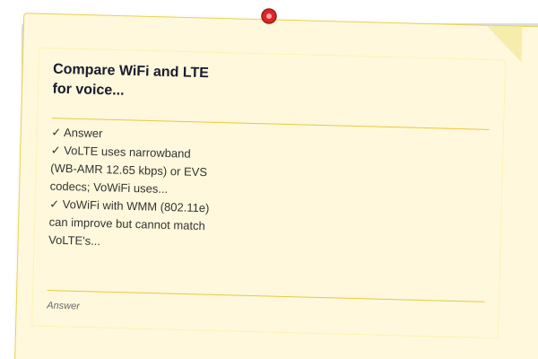
</a>


**Answer**: LTE voice (VoLTE) uses IMS with dedicated bearers, priority scheduling, and seamless handover → providing near-wireline voice quality. WiFi voice (VoWiFi) rides on best-effort IP with CSMA/CA contention and can suffer from jitter, packet loss, and interference. VoLTE uses narrowband (WB-AMR 12.65 kbps) or EVS codecs; VoWiFi uses codec-over-UDP with no guaranteed QoS. VoWiFi with WMM (802.11e) can improve but cannot match VoLTE's dedicated bearer QoS.

### Q7: What is the range vs. rate trade-off in wireless?

<a href="../../assets/images/diagrams/computer-networks/12-wireless/what-is-the-range-vs-rate-trade-off-in-wireless-handwritten.svg" target="_blank" rel="noopener">
  
</a>
<a href="../../assets/images/diagrams/computer-networks/12-wireless/what-is-the-range-vs-rate-trade-off-in-wireless-diagram.svg" target="_blank" rel="noopener">
  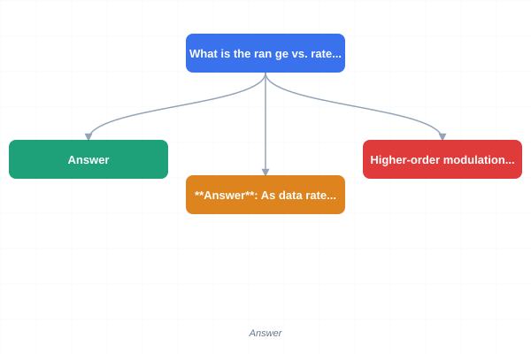
</a>
<a href="../../assets/images/diagrams/computer-networks/12-wireless/what-is-the-range-vs-rate-trade-off-in-wireless-sticky.svg" target="_blank" rel="noopener">
  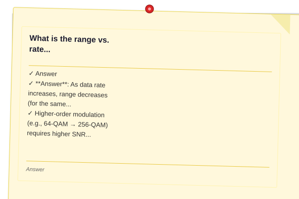
</a>


**Answer**: As data rate increases, range decreases (for the same transmit power). Higher-order modulation (e.g., 64-QAM → 256-QAM) requires higher SNR to maintain the same BER. At the cell edge, WiFi and cellular fall back to robust modulation (BPSK, QPSK) at lower rates. For WiFi 6: 1024-QAM MCS 11 requires ~32 dB SNR for &lt;10% PER; BPSK MCS 0 requires ~5 dB SNR. This is why you get 9.6 Gbps standing next to the AP but only 10-50 Mbps at the far end of your house.

## 12.12 Applications in Real Systems

### 12.12.1 WiFi 6/7 Deployments

<a href="../../assets/images/diagrams/computer-networks/12-wireless/12-12-1-wifi-6-7-deployments-handwritten.svg" target="_blank" rel="noopener">
  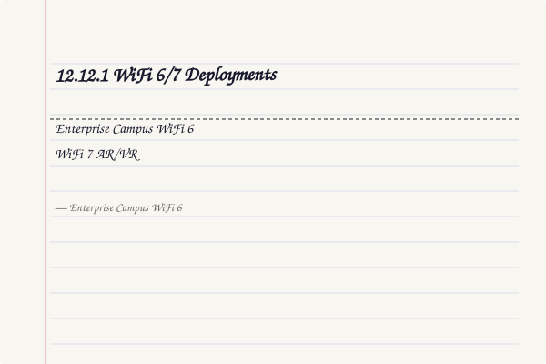
</a>
<a href="../../assets/images/diagrams/computer-networks/12-wireless/12-12-1-wifi-6-7-deployments-diagram.svg" target="_blank" rel="noopener">
  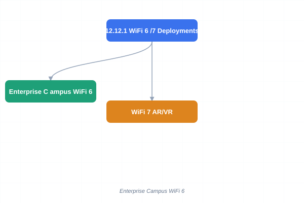
</a>
<a href="../../assets/images/diagrams/computer-networks/12-wireless/12-12-1-wifi-6-7-deployments-sticky.svg" target="_blank" rel="noopener">
  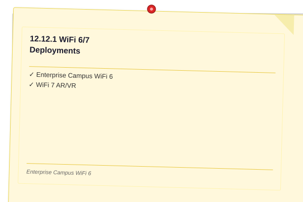
</a>


**Enterprise Campus WiFi 6**: An office building with 3 APs per floor (5 GHz), 200 clients per AP. Key features:
- OFDMA reduces airtime contention → 74 users can share a 160 MHz channel simultaneously.
- BSS Coloring allows neighboring APs on the same channel to reuse the medium when interference is below the color threshold.
- TWT extends client battery life → IoT sensors negotiate wake windows of 10 minutes instead of checking every 100 ms beacon.
- Target: 500 Mbps per user during peak load.

**WiFi 7 AR/VR**: 320 MHz channels in 6 GHz deliver 5+ Gbps to each headset with &lt;2 ms latency. Multi-link operation (MLO) bonds 2.4 GHz (control) + 5 GHz (data) + 6 GHz (high-throughput) simultaneously. Preamble puncturing avoids interference from existing WiFi 6 deployments in the 6 GHz band.

### 12.12.2 Cellular Infrastructure

<a href="../../assets/images/diagrams/computer-networks/12-wireless/12-12-2-cellular-infrastructure-handwritten.svg" target="_blank" rel="noopener">
  
</a>
<a href="../../assets/images/diagrams/computer-networks/12-wireless/12-12-2-cellular-infrastructure-diagram.svg" target="_blank" rel="noopener">
  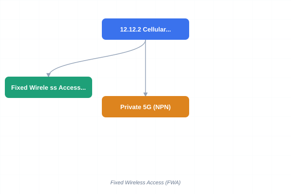
</a>
<a href="../../assets/images/diagrams/computer-networks/12-wireless/12-12-2-cellular-infrastructure-sticky.svg" target="_blank" rel="noopener">
  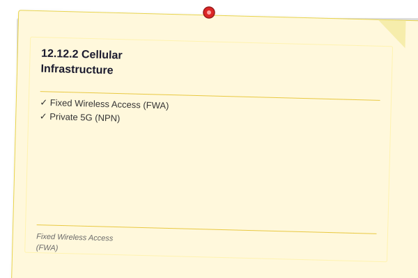
</a>


**Fixed Wireless Access (FWA)**: 5G NR replaces fiber-to-the-home. A customer's premises equipment (CPE) connects to a gNB up to 15 km away (sub-6 GHz) or 500 m (mmWave). Typical throughput: 300 Mbps-1 Gbps, enough for 4K streaming, video calls, and home office. Trials in Germany and the US show FWA as the fastest-growing 5G use case (20M+ subscribers in the US by 2024).

**Private 5G (NPN)**: A factory deploys a private 5G network (3.7-4.2 GHz CBRS in the US, n77/n78 in Europe). uRLLC slice for robotic arm control (99.999% reliability, &lt;1 ms) and mMTC slice for 10,000 environmental sensors. 5G LAN functionality provides device-to-device communication without traversing the core.

### 12.12.3 IoT Wireless Technologies

<a href="../../assets/images/diagrams/computer-networks/12-wireless/12-12-3-iot-wireless-technologies-handwritten.svg" target="_blank" rel="noopener">
  
</a>
<a href="../../assets/images/diagrams/computer-networks/12-wireless/12-12-3-iot-wireless-technologies-diagram.svg" target="_blank" rel="noopener">
  
</a>
<a href="../../assets/images/diagrams/computer-networks/12-wireless/12-12-3-iot-wireless-technologies-sticky.svg" target="_blank" rel="noopener">
  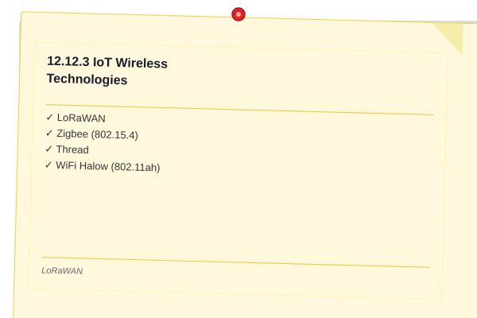
</a>


**LoRaWAN**: Long-range (2-15 km), sub-GHz (868/915 MHz), ultra-low power (10+ years on battery). Data rate: 0.25-50 kbps. Use case: smart city parking sensors that report occupancy every 5 minutes. Each transmission costs ~0.01 µAh. A single gateway covers an entire city district.

**Zigbee (802.15.4)**: Mesh networking at 2.4 GHz, 250 kbps, 100 m range. Used in smart lighting, thermostats, and door locks. Zigbee Coordinator manages the network; Routers extend coverage; End Devices sleep most of the time. A typical smart home has 20-60 Zigbee devices in a mesh.

**Thread**: IP-addressable mesh protocol (based on 6LoWPAN). Used in home automation (Apple HomeKit, Google Thread). Unlike Zigbee, Thread devices are natively IPv6-addressable → no application-layer gateway needed.

**WiFi Halow (802.11ah)**: Sub-1 GHz WiFi designed for IoT. 1 km range, 150 kbps-78 Mbps. Uses OFDM with 1/2/4/8 MHz channels. Target: large-scale sensor deployments with WiFi-compatible infrastructure.

**Comparison**:

| Technology | Range | Data Rate | Power | Topology | Key Use |
|-----------|-------|-----------|-------|----------|---------|
| LoRaWAN | 15 km | 50 kbps | 10+ yr battery | Star | Smart city, agriculture |
| Zigbee | 100 m | 250 kbps | 2+ yr battery | Mesh | Smart home, lighting |
| Thread | 100 m | 250 kbps | 2+ yr battery | Mesh (IPv6) | HomeKit, Matter |
| BLE | 100 m | 2 Mbps | 1+ yr battery | Star, mesh | Wearables, beacons |
| WiFi 6 | 50 m | 9.6 Gbps | Hours-days | Star | High-throughput |
| WiFi Halow | 1 km | 78 Mbps | Months | Star | Outdoor sensor grid |

## 12.13 Mobility Management

### 12.13.1 Handover

<a href="../../assets/images/diagrams/computer-networks/12-wireless/12-13-1-handover-handwritten.svg" target="_blank" rel="noopener">
  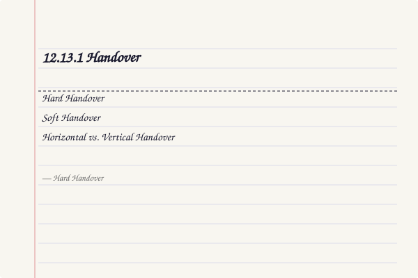
</a>
<a href="../../assets/images/diagrams/computer-networks/12-wireless/12-13-1-handover-diagram.svg" target="_blank" rel="noopener">
  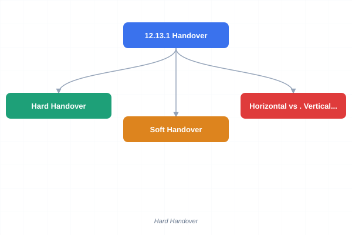
</a>
<a href="../../assets/images/diagrams/computer-networks/12-wireless/12-13-1-handover-sticky.svg" target="_blank" rel="noopener">
  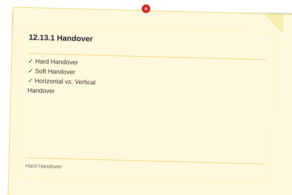
</a>


Handover (handoff) transfers an active connection from one base station (or access point) to another.

**Hard Handover**: The connection with the old base station is broken before the new connection is established (break-before-make). Used in GSM and some LTE scenarios. Packet loss during the interruption is inevitable. Typical interruption time: 10-50 ms (LTE).

**Soft Handover**: The connection is maintained with both base stations simultaneously during the transition (make-before-break). Used in CDMA-based networks. Requires the mobile to receive/transmit on multiple channels. Zero packet loss but requires redundant radio resources.

**Horizontal vs. Vertical Handover**: Horizontal handover occurs between base stations of the same technology (e.g., LTE to LTE). Vertical handover occurs between different technologies (e.g., WiFi to 5G). Vertical handover involves IP address changes, bearer re-establishment, and potentially different QoS models.

### 12.13.2 Location Management

<a href="../../assets/images/diagrams/computer-networks/12-wireless/12-13-2-location-management-handwritten.svg" target="_blank" rel="noopener">
  
</a>
<a href="../../assets/images/diagrams/computer-networks/12-wireless/12-13-2-location-management-diagram.svg" target="_blank" rel="noopener">
  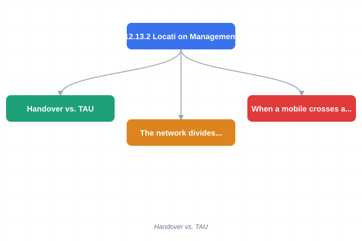
</a>
<a href="../../assets/images/diagrams/computer-networks/12-wireless/12-13-2-location-management-sticky.svg" target="_blank" rel="noopener">
  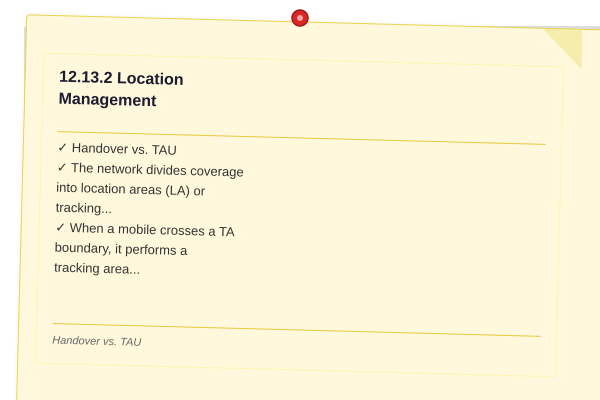
</a>


Cellular networks track mobile devices through location areas and paging. The network divides coverage into location areas (LA) or tracking areas (TA). When a mobile crosses a TA boundary, it performs a tracking area update (TAU). When a call arrives for a mobile, the network pages all cells in the last known TA.

**Handover vs. TAU**: Handover maintains an active session; TAU updates the network for future incoming sessions (idle mode mobility).

### 12.13.3 Roaming

<a href="../../assets/images/diagrams/computer-networks/12-wireless/12-13-3-roaming-handwritten.svg" target="_blank" rel="noopener">
  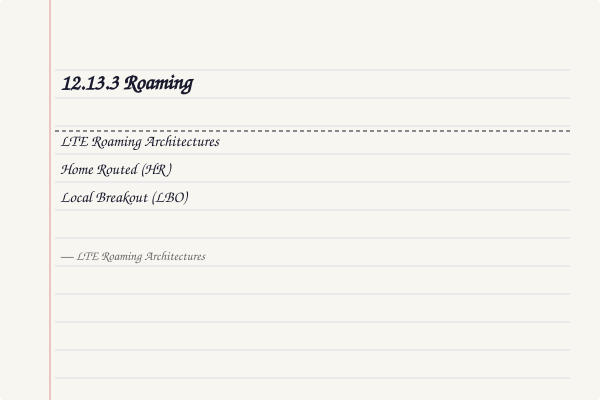
</a>
<a href="../../assets/images/diagrams/computer-networks/12-wireless/12-13-3-roaming-diagram.svg" target="_blank" rel="noopener">
  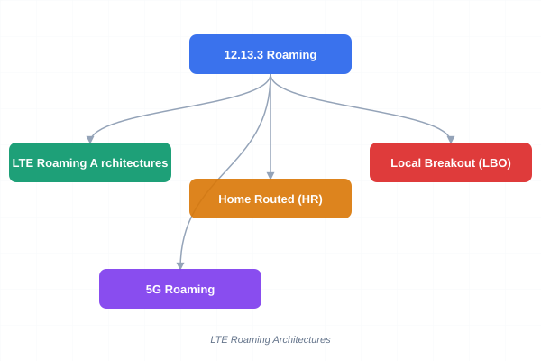
</a>
<a href="../../assets/images/diagrams/computer-networks/12-wireless/12-13-3-roaming-sticky.svg" target="_blank" rel="noopener">
  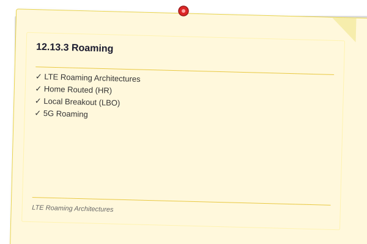
</a>


Roaming allows a mobile device to connect to a visited network. The visited network uses the home network's authentication infrastructure. In LTE, the UE connects to a visited eNB and MME; the visited MME communicates with the home subscriber server (HSS) for authentication and with the home PGW for data.

**LTE Roaming Architectures**:
- **Home Routed (HR)**: Data traverses the home PGW (higher latency, full home network control).
- **Local Breakout (LBO)**: Data exits at the visited network (lower latency, visited network enforces policy).

**5G Roaming**: 5G adds roaming based on SEPP (Security Edge Protection Proxy) for signaling security and improved Home Routed / Local Breakout architectures with N32 interface security.

## 💡 Pro Tips

- **Avoid 2.4 GHz for dense deployments**: The 2.4 GHz band has only 3 non-overlapping channels. In apartment buildings or offices with many APs, use 5 GHz (more channels, less interference) or 6 GHz (WiFi 6E/7).
- **WPA3 is not optional for new networks**: WPA2 is still common but vulnerable to KRACK attacks. Deploy WPA3 with SAE for forward secrecy and dictionary-attack resistance.
- **5G network slicing requires RAN support**: Network slicing is not just a core feature → the RAN must also support slice-aware scheduling and QoS. Verify your gNB firmware supports 5G NR slicing before building slice-based services.
- **Handover tuning for VoIP**: For real-time voice, use soft handover (make-before-break) if available. Hard handover can cause audible gaps. Tune handover thresholds based on the UE speed → faster mobiles need earlier trigger.
- **RTS/CTS threshold tuning**: Set RTS threshold to ~1500 bytes in high-interference environments. Disable it in clean, low-density deployments to avoid unnecessary overhead.
- **OFDMA is not a magic bullet**: OFDMA excels with many small packets (IoT, web browsing) but adds overhead for large sequential transfers (video streaming). WiFi 6 adaptively chooses between OFDMA and MU-MIMO based on traffic patterns.
- **BLE for IoT range**: BLE 5 achieves 100+ m range through the LE Coded PHY (500 kbps with S=8 coding) at the cost of data rate. For maximum range, use the 125 kbps (S=8) coded mode.

## Concept Comparison Table

| Technology | Range | Data Rate | Frequency | Power | Use Case |
|------------|-------|-----------|-----------|-------|----------|
| WiFi 6 (802.11ax) | ~50 m indoor | 9.6 Gbps | 2.4/5/6 GHz | ~10 W | LAN, web, streaming |
| WiFi 7 (802.11be) | ~50 m indoor | 46 Gbps | 2.4/5/6 GHz | ~10 W | AR/VR, high-res video |
| Bluetooth BLE 5 | ~100 m | 2 Mbps | 2.4 GHz | <0.1 W | IoT, wearables |
| 4G/LTE | ~10 km | 300 Mbps | 700-2600 MHz | ~3 W | Mobile broadband |
| 5G NR (mmWave) | ~500 m | 20 Gbps | 24-47 GHz | ~3 W | Fixed wireless access |
| LoRaWAN | ~15 km | 50 kbps | 868/915 MHz | <0.1 W | Sensor networks |
| Zigbee | ~100 m | 250 kbps | 2.4 GHz | <0.1 W | Home automation |
| Thread | ~100 m | 250 kbps | 2.4 GHz | <0.1 W | Mesh IoT (Matter) |

## Quick Reference: 802.11 Standards Evolution

| Standard | Year | Max Rate | MIMO | Channel | Modulation | Key Feature |
|----------|------|----------|------|---------|------------|-------------|
| 802.11b | 1999 | 11 Mbps | No | 20 MHz | DSSS | First mass-market WiFi |
| 802.11g | 2003 | 54 Mbps | No | 20 MHz | OFDM | 2.4 GHz broadband |
| 802.11n | 2009 | 600 Mbps | 4×4 | 40 MHz | MIMO-OFDM | Dual-band, MIMO |
| 802.11ac | 2013 | 6.9 Gbps | 8×8 | 160 MHz | MU-MIMO | 5 GHz Gigabit WiFi |
| 802.11ax (WiFi 6) | 2019 | 9.6 Gbps | 8×8 | 160 MHz | OFDMA + MU-MIMO | Efficient dense deployment |
| 802.11be (WiFi 7) | 2024 | 46 Gbps | 16×16 | 320 MHz | 4096-QAM, multi-link | Ultra-high throughput |

## Cross-Application Matrix

| Environment | Best Wireless Tech | Why |
|-------------|-------------------|-----|
| Home WiFi | WiFi 6 or 6E | Wide device support, good range |
| Industrial IoT | LoRaWAN | Long range, low power, sub-GHz |
| Warehouse tracking | BLE | Beacon-based asset tracking |
| Mobile broadband | 5G NR | High mobility, consistent throughput |
| Office floor | WiFi 6 (5 GHz) | High density, many APs |
| Smart home sensors | Zigbee/Thread | Mesh, low power, local control |
| Smart city parking | LoRaWAN | 15 km, 10-year battery |
| Factory automation | Private 5G (uRLLC) | 1 ms, 99.999% reliability |
| AR/VR headset | WiFi 7 (6 GHz) | 5+ Gbps, &lt;2 ms latency |
| Wireless headset | Bluetooth LE Audio | Low power, LC3 codec quality |

## Mermaid Diagram: Wireless Network Types Hierarchy

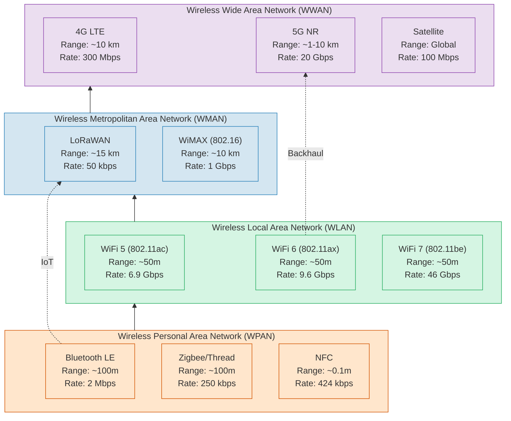
```mermaid
graph BT
  subgraph WPAN["Wireless Personal Area Network (WPAN)"]
    BLE["Bluetooth LE\nRange: ~100m\nRate: 2 Mbps"]
    ZIG["Zigbee/Thread\nRange: ~100m\nRate: 250 kbps"]
    NFC["NFC\nRange: ~0.1m\nRate: 424 kbps"]
  end
  subgraph WLAN["Wireless Local Area Network (WLAN)"]
    W5["WiFi 5 (802.11ac)\nRange: ~50m\nRate: 6.9 Gbps"]
    W6["WiFi 6 (802.11ax)\nRange: ~50m\nRate: 9.6 Gbps"]
    W7["WiFi 7 (802.11be)\nRange: ~50m\nRate: 46 Gbps"]
  end
  subgraph WMAN["Wireless Metropolitan Area Network (WMAN)"]
    LORA["LoRaWAN\nRange: ~15 km\nRate: 50 kbps"]
    WIMAX["WiMAX (802.16)\nRange: ~10 km\nRate: 1 Gbps"]
  end
  subgraph WWAN["Wireless Wide Area Network (WWAN)"]
    LTE["4G LTE\nRange: ~10 km\nRate: 300 Mbps"]
    NR["5G NR\nRange: ~1-10 km\nRate: 20 Gbps"]
    SAT["Satellite\nRange: Global\nRate: 100 Mbps"]
  end

  WPAN --> WLAN --> WMAN --> WWAN
  BLE -.->|IoT| LORA
  W6 -.->|Backhaul| NR

  classDef pan fill:#ffe6cc,stroke:#d35400
  classDef lan fill:#d5f5e3,stroke:#27ae60
  classDef man fill:#d4e6f1,stroke:#2980b9
  classDef wan fill:#ebdef0,stroke:#8e44ad
  class WPAN,BLE,ZIG,NFC pan
  class WLAN,W5,W6,W7 lan
  class WMAN,LORA,WIMAX man
  class WWAN,LTE,NR,SAT wan
```

## Case Study: University Campus WiFi Design

**Problem.** A large public university with 30,000 students, 5,000 concurrent WiFi users across 10 buildings needed a complete wireless redesign. The legacy deployment used mixed 802.11n/ac APs on a single controller with manual channel assignment. Complaints included: dead zones in lecture halls, video stuttering in streaming services, authentication timeouts during class change (500+ users simultaneously associating), and inability to support 4K lecture capture uploads.

**Solution.** The team deployed 100 WiFi 6 (802.11ax) APs across 10 buildings using a three-controller cluster with centralized management. Key design decisions: (1) 5 GHz primary with 2.4 GHz for legacy fallback only — 2.4 GHz channels were restricted to low data rates. (2) Channel planning used an automated RF prediction tool with 20 MHz channels in the 5 GHz band (avoiding DFS channels with radar interference). (3) AP placement followed a hexagonal grid pattern with 15m spacing in lecture halls and 20m in corridors, calculated using the free-space path loss model to ensure -65 dBm RSSI at cell edges. (4) Load balancing was configured with a 40-client soft limit per AP; new associations were steered to neighboring APs when exceeded. (5) Band steering pushed 5 GHz-capable devices to the less congested 5 GHz band.

**Outcome.** The redesigned network achieved 450 Mbps average throughput per user during peak hours (up from 40 Mbps). Handoff latency between APs dropped from 300 ms to under 50 ms using 802.11k (neighbor reports) and 802.11r (fast roaming). The 4K video ingest succeeded reliably with <1% packet loss. Authentication storms during class change were handled by the controller's association rate-limiting and burst queue, reducing peak CPU from 95% to 30%. The project paid for itself within 18 months through reduced help-desk tickets (from 200/week to 15/week).

## Practical Takeaways

| Takeaway | Application |
|----------|-------------|
| 5 GHz band should be primary for dense deployments; reserve 2.4 GHz for legacy | Configure band steering to push capable clients to 5 GHz; restrict 2.4 GHz to low data rates |
| Channel planning requires RF prediction tools, not guesswork | Use site survey software to model coverage, identify co-channel interference, and optimize AP placement |
| AP placement follows cell tower principles — hexagonal grid with overlap | Space APs so cell edges have -65 dBm RSSI; 15-20% overlap for seamless handoff |
| Use 802.11k/r for fast roaming in environments with high mobility | Enable neighbor reports (11k) for proactive scanning and fast authentication (11r) for sub-50ms handoff |
| Load balancing prevents AP saturation in dense areas | Configure per-AP client limits and steer new associations to under-utilized neighboring APs |
| WiFi 6 OFDMA dramatically improves small-packet efficiency | Enable OFDMA for IoT and web traffic; MU-MIMO remains better for large sequential transfers |
| Plan for authentication storms during peak transitions | Use controller-side rate limiting, burst queues, and pre-authentication to handle mass associations |

## Chapter Quiz

1. **Why does WiFi use CSMA/CA instead of CSMA/CD for medium access?**
   - a) CSMA/CA has higher throughput in all scenarios
   - b) Wireless is half-duplex; transmitters cannot detect collisions while sending
   - c) CSMA/CD requires a wired infrastructure
   - d) Wireless collisions never happen

2. **What is the maximum number of active slaves in a Bluetooth piconet?**
   - a) 3
   - b) 7
   - c) 15
   - d) 255

3. **Which 5G NR service category is designed for ultra-reliable low-latency communications?**
   - a) eMBB
   - b) uRLLC
   - c) mMTC
   - d) MIMO

4. **What is the purpose of the RTS/CTS exchange in 802.11 wireless networks?**
   - a) Increase data rate through MIMO
   - b) Reserve the medium to mitigate hidden terminal collisions
   - c) Authenticate stations before association
   - d) Coordinate channel switching between APs

5. **What is the Network Allocation Vector (NAV) in 802.11?**
   - a) A physical carrier-sense mechanism
   - b) A virtual carrier-sense timer that predicts medium busy duration
   - c) A list of all APs in range
   - d) A power-saving state indicator

| Question | Answer | Explanation |
|----------|--------|-------------|
| Q1 | B | Wireless transceivers are half-duplex — transmitting drowns out incoming signals, making collision detection impossible; CSMA/CA prevents collisions proactively |
| Q2 | B | A Bluetooth piconet supports one master and up to seven active slaves (plus up to 255 parked slaves) |
| Q3 | B | uRLLC (ultra-Reliable Low-Latency Communications) targets 1 ms latency and 99.999% reliability for industrial and autonomous driving use cases |
| Q4 | B | RTS (Request to Send) and CTS (Clear to Send) reserve the medium by setting NAV timers on all listening stations, preventing hidden-terminal collisions |
| Q5 | B | NAV is a virtual carrier-sense counter each station maintains based on the Duration field in received frames, indicating when the medium will be free |

## Summary

Wireless networks span personal-area (Bluetooth), local-area (WiFi), and wide-area (4G/5G) coverage. 802.11 has evolved from 11 Mbps (802.11b) to 46 Gbps (802.11be). CSMA/CA with RTS/CTS addresses the hidden terminal problem through virtual carrier sense (NAV) and exponential backoff. Bluetooth uses frequency-hopping piconets with master-slave TDD. Cellular networks provide wide-area mobility: 4G/LTE achieves hundreds of Mbps with OFDMA/SC-FDMA; 5G targets 20 Gbps with 1 ms latency through massive MIMO, beamforming, network slicing, and flexible numerology. Mobility management handles handover (hard and soft), location tracking through tracking areas and paging, and roaming across heterogeneous access networks. IoT wireless technologies (LoRaWAN, Zigbee, Thread, BLE) fill specific niches with power, range, and throughput trade-offs.

## Exercises

### Review Questions

<details>
<summary>Solution</summary>

1. WiFi uses CSMA/CA because wireless transceivers are half-duplex — they cannot listen for collisions while transmitting (self-interference). The hidden terminal problem also means collisions occur at the receiver, which the sender cannot detect. CSMA/CA prevents collisions probabilistically through carrier sensing, NAV, and exponential backoff.

2. RTS/CTS addresses the hidden terminal problem. A sender transmits a short RTS (Request to Send) frame. The receiver responds with CTS (Clear to Send). All stations that hear the CTS set their NAV timer and defer for the duration of the data exchange. This prevents hidden stations from transmitting simultaneously.

3. Bluetooth uses frequency-hopping spread spectrum (FHSS) across 79 channels (1 MHz each) at 1600 hops/second. If interference occurs on one channel, the next hop moves to a different channel. FHSS provides resistance to narrowband interference and improves security (eavesdroppers must follow the hopping sequence).

4. Network slicing creates isolated end-to-end logical networks with dedicated resources and SLAs on shared physical infrastructure. It solves the problem of different services (eMBB, uRLLC, mMTC) having conflicting requirements — each slice gets tailored QoS, security, and management.

5. Hard handover (break-before-make): connection with old base station is broken before establishing new connection. Simple but causes packet loss. Soft handover (make-before-break): device maintains connections with both base stations simultaneously during transition. Zero packet loss but requires redundant radio resources.

6. BSS (Basic Service Set) is one AP + its associated stations. ESS (Extended Service Set) is multiple BSSes connected via a distribution system, sharing the same SSID. Stations can roam between BSSes within an ESS.

7. OFDM allocates the entire channel to one user per time slot. OFDMA divides the channel into Resource Units (RUs) allocated to different users simultaneously. For small packets, OFDMA reduces latency (multiple users served in one slot) and improves efficiency (less padding waste).

8. TIM (Traffic Indication Map) is a bitmap in each beacon frame indicating which stations have buffered data at the AP. Stations wake at each beacon interval to check the TIM — if their bit is set, they send PS-Poll to retrieve buffered frames.

9. 4G LTE: 300 Mbps peak, 10-30 ms latency, EPC core (MME/SGW/PGW). 5G NR: 20 Gbps peak, 1-4 ms latency, SBA core (AMF/SMF/UPF). 5G adds massive MIMO, beamforming, flexible numerology, network slicing.

10. eMBB (enhanced Mobile Broadband: 20 Gbps, video/AR/VR), uRLLC (ultra-Reliable Low-Latency: 1 ms, 99.999%, industrial/autonomous), mMTC (massive Machine Type: 1M devices/km², IoT sensors).
</details>

### Application Problems

<details>
<summary>Solution</summary>

11. Offered load = 20 × 50 × 1500 × 8 = 12 Mbps. The channel at 300 Mbps can handle this easily (4% utilization). Under CSMA/CA, throughput is close to the offered load since contention is low. Saturation occurs above ~200 Mbps offered load.

12. For 100 MHz: 100 RBGs × 12 subcarriers × 14 symbols × 64 MIMO layers × 6 bits/symbol × 7/8 code rate ≈ 5.6 Gbps (simplified; actual includes control overhead). Formula: N_RB × N_sc × N_sym × N_layers × log2(M) × code_rate × 1000 slots/s.

13. Cell circumference = 2π × 500 = 3141 m. At 60 km/h = 16.67 m/s, crossing time = 3141/16.67 ≈ 188 s. TAU rate per user = speed/(TA diameter) per sec. For 20 cells per TA and 1000 users/cell, total users in TA = 20,000. Paging load = 20,000 × 0.1 calls/hour / 3600 = 0.56 pages/second/cell.

14. See the dry run trace in section 12.4.5 for the full simulation: B wins at 61 µs, A retransmits with CW=31 (backoff chosen uniformly from 0-31), and the sequence continues. The trace shows collisions ≈ (1/CW) probability per contention round.

15. RTS/CTS overhead: RTS(20B) + CTS(14B) + 2×SIFS(32µs) = 34 bytes + 32 µs. At 54 Mbps, 34 bytes = 5 µs. Total overhead ≈ 37 µs. Without RTS/CTS, each collision costs a full data frame (1500 bytes ≈ 222 µs). With 3 stations and avg 2 retries, collision overhead = 3 × 222 × 2 = 1332 µs vs RTS/CTS overhead = 37 µs per successful exchange. RTS/CTS becomes beneficial at high contention.
</details>

### Challenge Problem

<details>
<summary>Solution</summary>

16. **High-speed rail handover protocol:** (a) Use 5G NR with massive MIMO beamforming to maintain 100 Mbps per passenger — each coach gets a dedicated beam from a trackside gNB. (b) For <5 ms interruption, use make-before-break soft handover with dual connectivity: the train router maintains connections to two gNBs simultaneously during handover. (c) Intra-gNB handover uses Xn interface with pre-configured bearers; inter-gNB handover uses N2/N3 with path switch. (d) Group handover uses a single signaling message for the entire train (3GPP Rel-17 MBS feature). With 1% RLF per handover and 100 handovers per trip: P(success) = (0.99)^100 ≈ 0.366. To improve, use multi-connectivity (redundant links) reducing effective failure to <0.01% and dual-gNB attachment for zero-interruption handover.
</details>
