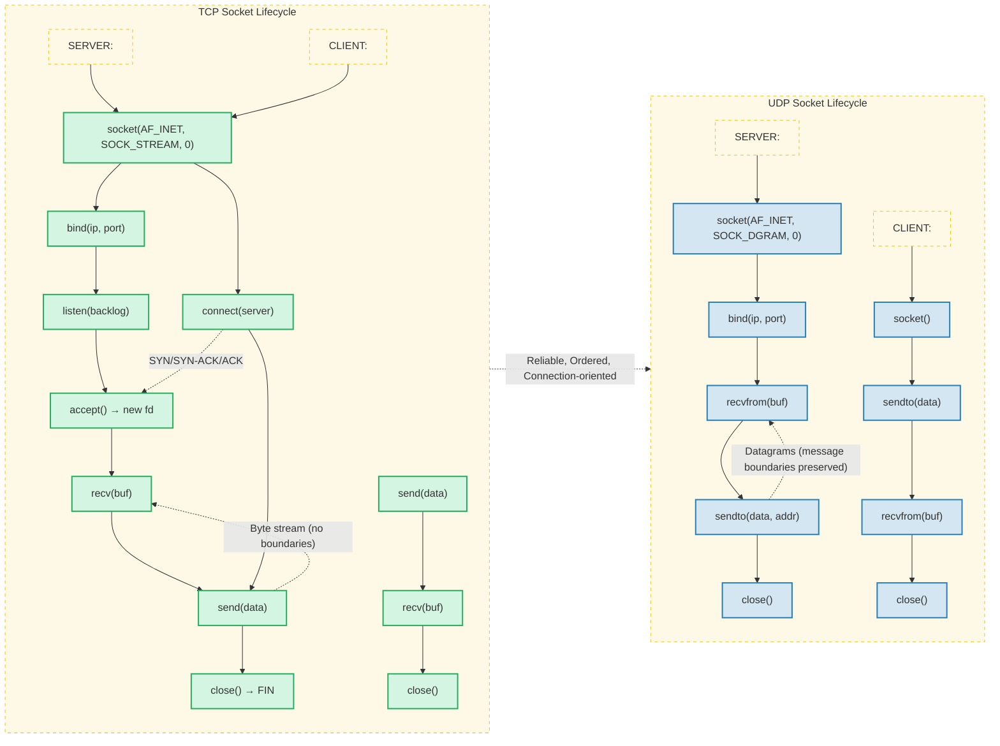

# Chapter 13: Socket Programming → Complete Reference

## Learning Objectives

1. Explain the socket API and its relationship to the transport layer.
2. Write TCP client-server applications in C++ and Python.
3. Write UDP client-server applications in C++ and Python.
4. Compare blocking, non-blocking, and I/O multiplexing approaches.
5. Implement concurrent servers using select, poll, and epoll.
6. Understand Unix domain sockets, raw sockets, and socket options.
7. Analyze scalability trade-offs for the C10K problem.
8. Identify edge cases: connection refused, broken pipe, EAGAIN, address in use.

<!-- Image Gallery -->
<div style="display:flex;flex-wrap:wrap;gap:4px;margin:16px 0;padding:12px;background:#f8fafc;border-radius:8px;border:1px solid #e2e8f0;">
<a href="../../../assets/images/lessons/computer-networks/13-sockets/hero.svg" target="_blank" rel="noopener">
  
</a>
<a href="../../../assets/images/lessons/computer-networks/13-sockets/handwritten-notes.svg" target="_blank" rel="noopener">
  
</a>
<a href="../../../assets/images/lessons/computer-networks/13-sockets/sticky-notes.svg" target="_blank" rel="noopener">
  
</a>
<a href="../../../assets/images/lessons/computer-networks/13-sockets/visual-explanation.svg" target="_blank" rel="noopener">
  
</a>
<a href="../../../assets/images/lessons/computer-networks/13-sockets/architecture.svg" target="_blank" rel="noopener">
  
</a>
<a href="../../../assets/images/lessons/computer-networks/13-sockets/workflow.svg" target="_blank" rel="noopener">
  
</a>
<a href="../../../assets/images/lessons/computer-networks/13-sockets/mindmap.svg" target="_blank" rel="noopener">
  
</a>
<a href="../../../assets/images/lessons/computer-networks/13-sockets/comparison.svg" target="_blank" rel="noopener">
  
</a>
<a href="../../../assets/images/lessons/computer-networks/13-sockets/cheatsheet.svg" target="_blank" rel="noopener">
  
</a>
<a href="../../../assets/images/lessons/computer-networks/13-sockets/interview-quiz.svg" target="_blank" rel="noopener">
  
</a>
<a href="../../../assets/images/lessons/computer-networks/13-sockets/social-card.svg" target="_blank" rel="noopener">
  
</a>
</div>
<!-- End Image Gallery -->


---

## 13.1 Socket API Overview

### Real-World Analogy


A socket is like a **phone outlet in a building**:

- **socket()** → You install a phone jack (create the endpoint).
- **bind()** → You assign a phone number to that jack (IP + port).
- **listen()** → You wait for someone to call (TCP server only).
- **connect()** → You dial someone's number (TCP client).
- **accept()** → You pick up the call (TCP server).
- **send()/recv()** → You talk / listen.
- **close()** → You hang up.

The kernel is the **telephone exchange**: it routes data between endpoints, buffers when lines are busy, and notifies when a call arrives.

### What Is a Socket?


A socket is a software abstraction representing one endpoint of a two-way communication channel. The socket API (Berkeley sockets, 1983) provides system calls that allow user-space programs to send and receive data across a network.

```text
Application (user space)
        |
   [Socket FD] → int
        |
    Kernel
        |
    Protocol Stack (TCP/UDP/IP)
        |
    Network Interface (NIC)
```

### Socket Creation


The `socket()` system call creates an endpoint:

```c
int socket(int domain, int type, int protocol);
```

| Parameter | Values | Description |
|-----------|--------|-------------|
| `domain` | `AF_INET` (IPv4), `AF_INET6` (IPv6), `AF_UNIX` (local) | Address family |
| `type` | `SOCK_STREAM`, `SOCK_DGRAM`, `SOCK_RAW` | Socket type |
| `protocol` | `0` (default for type), `IPPROTO_TCP`, `IPPROTO_UDP` | Protocol |

### Numbered Steps → Socket Lifecycle


1. **Create socket**: `socket()` returns a file descriptor.
2. **Bind (server)**: `bind()` assigns address and port.
3. **Listen (TCP server)**: `listen()` marks socket as passive.
4. **Connect (TCP client)**: `connect()` initiates 3-way handshake.
5. **Accept (TCP server)**: `accept()` creates new connected socket.
6. **Data transfer**: `send()`, `recv()`, `sendto()`, `recvfrom()`.
7. **Close**: `close()` releases resources.

### Pseudocode → Generic Client/Server


```
=== SERVER ===
fd = socket(AF_INET, SOCK_STREAM, 0)
bind(fd, addr, len)
listen(fd, backlog)
loop:
    client_fd = accept(fd, client_addr, &addrlen)
    recv(client_fd, buf, len, 0)
    send(client_fd, response, len, 0)
    close(client_fd)

=== CLIENT ===
fd = socket(AF_INET, SOCK_STREAM, 0)
connect(fd, server_addr, addrlen)
send(fd, msg, len, 0)
recv(fd, buf, len, 0)
close(fd)
```

### Dry Run → Socket Creation Trace


| Step | Call | Return | Kernel State |
|------|------|--------|--------------|
| 1 | `socket(AF_INET, SOCK_STREAM, 0)` | `fd=3` | Allocates inode, protocol control block |
| 2 | `bind(3, {AF_INET, 8080, INADDR_ANY}, 16)` | `0` | Assigns port 8080, marks bound |
| 3 | `listen(3, 128)` | `0` | Marks passive, creates accept queue |
| 4 | `connect(fd, {AF_INET, 8080, 127.0.0.1}, 16)` | `0` | SYN sent, enters SYN_SENT |
| 5 | accept returns `fd=4` | `4` | Connection established, ESTABLISHED |
| 6 | `send(4, "hello", 5, 0)` | `5` | Data queued in send buffer |
| 7 | `recv(4, buf, 1024, 0)` | `5` | Data copied to user buffer |
| 8 | `close(4)` | `0` | FIN sent, socket released |

### Complexity Analysis


| Operation | Time | Space | Why? |
|-----------|------|-------|------|
| `socket()` | O(1) | O(1) | Allocates a fixed-size inode + protocol control block |
| `bind()` | O(1) | O(1) | Just writes a port + address into a kernel structure |
| `listen()` | O(1) | O(backlog) | Pre-allocates accept queue of `backlog` slots |
| `connect()` | O(1) call + O(RTT) wait | O(1) | System call returns immediately; handshake is async |
| `accept()` | O(1) | O(1) | Dequeues from pre-allocated accept queue |
| `send()` | O(1) (usually) | O(buf) | Copies to kernel buffer; may block if buffer full |
| `recv()` | O(1) (usually) | O(buf) | Copies from kernel buffer to user space |
| `close()` | O(1) | O(1) | Frees descriptor, sends FIN if connected |

### A&D Table → Socket API


| Advantage | Disadvantage |
|-----------|-------------|
| Universal abstraction across protocols | Low-level: error-prone, manual buffer mgmt |
| Direct kernel access → minimal overhead | Complex state machine per socket |
| Cross-platform (POSIX standard) | Different APIs on Windows (Winsock) |
| Supports any protocol (TCP/UDP/ICMP/raw) | No built-in backpressure handling |
| Zero-copy options (sendfile, splice) | No built-in TLS |

### Edge Cases


| Edge Case | When It Happens | How to Handle |
|-----------|----------------|---------------|
| `socket()` returns -1 | System FD limit reached | Check `errno == EMFILE`; increase `ulimit -n` |
| `bind()` EADDRINUSE | Port already in use | Use `SO_REUSEADDR`; wait for TIME_WAIT |
| `bind()` EACCES | Binding to privileged port (< 1024) | Run as root or use CAP_NET_BIND_SERVICE |
| `listen()` EADDRINUSE | Race on simultaneous binds | Retry with backoff |
| `accept()` returns -1 | Interrupted by signal (EINTR) | Restart accept in loop |
| `send()` returns &lt; len | Partial write (short send) | Loop until all bytes sent |
| `recv()` returns 0 | Peer closed connection | Close socket, stop reading |
| `recv()` returns -1 | EAGAIN (non-blocking, no data) | Try again later |
| `connect()` ECONNREFUSED | No process listening on port | Retry or report error |
| `connect()` ETIMEDOUT | Firewall drop or server down | Exponential backoff retry |

---

## 13.2 TCP Sockets

### Real-World Analogy: Restaurant Phone for Reservations


A TCP connection is like a **dedicated phone line between a restaurant host and a customer**:

- **Server socket** = The restaurant's main phone line.
- **bind()** = Getting the phone number published.
- **listen()** = The host waits by the phone.
- **connect()** = The customer dials the number.
- **accept()** = The host picks up and creates a conversation channel.
- **send()/recv()** = Talking back and forth.
- **close()** = Hanging up.
- **byte stream** = Everything said in order, nothing lost.
- **3-way handshake** = "Hello?" → "Hi, who's this?" → "It's me, let's talk."

TCP guarantees: **reliable, in-order, connection-oriented, full-duplex byte stream**.

### TCP Server Steps


```
Step 1: socket()    → Create endpoint (fd=3)
Step 2: setsockopt(SO_REUSEADDR) → Allow port reuse
Step 3: bind()      → Assign IP + port
Step 4: listen()    → Mark as passive, set backlog
Step 5: accept()    → Block until client connects → returns client_fd
Step 6: recv()/send() → Echo loop
Step 7: close()     → Close client, then server
```

### TCP Client Steps


```
Step 1: socket()    → Create endpoint
Step 2: connect()   → Initiate 3-way handshake
Step 3: send()/recv() → Data exchange
Step 4: close()     → Terminate connection
```

### Pseudocode → TCP Echo Server


```
function tcp_echo_server(port):
    server_fd = socket(AF_INET, SOCK_STREAM, 0)
    if server_fd < 0: error("socket")
    opt = 1
    setsockopt(server_fd, SOL_SOCKET, SO_REUSEADDR, &opt)
    addr = {AF_INET, port, INADDR_ANY}
    bind(server_fd, &addr, sizeof(addr))
    listen(server_fd, 128)
    while true:
        client_fd = accept(server_fd, &client_addr, &addrlen)
        if client_fd < 0: continue
        while true:
            n = recv(client_fd, buf, BUF_SIZE, 0)
            if n <= 0: break
            send(client_fd, buf, n, 0)
        close(client_fd)
```

### Pseudocode → TCP Echo Client


```
function tcp_echo_client(host, port, message):
    fd = socket(AF_INET, SOCK_STREAM, 0)
    server_addr = resolve(host, port)
    connect(fd, &server_addr, sizeof(server_addr))
    send(fd, message, len(message), 0)
    n = recv(fd, buf, BUF_SIZE, 0)
    print "Echoed:", string(buf, n)
    close(fd)
```

### Dry Run → TCP 3-Way Handshake


#### Connection Establishment

| Step | Client State | Client Action | Packet | Server Action | Server State |
|------|-------------|---------------|--------|---------------|-------------|
| 0 | CLOSED | `socket()` | → | `socket()`, `bind()`, `listen()` | LISTEN |
| 1 | SYN_SENT | `connect()` | **SYN** seq=100 | Receives SYN | SYN_RCVD |
| 2 | ESTABLISHED | Receives SYN+ACK | **SYN+ACK** seq=300 ack=101 | Sends SYN+ACK | → |
| 3 | → | Sends ACK | **ACK** seq=101 ack=301 | Receives ACK | ESTABLISHED |
| 4 | → | `send("hello")` | **DATA** seq=101 | `accept()` returns | → |
| 5 | → | Receives echo | **DATA** seq=301 ack=106 | `send("hello")` | → |

#### Connection Teardown

| Step | Client | Packet | Server |
|------|--------|--------|--------|
| 0 | `close()` | **FIN** seq=106 | Receives FIN → CLOSE_WAIT |
| 1 | FIN_WAIT_1 | → | → |
| 2 | FIN_WAIT_2 | **ACK** seq=302 | Sends ACK |
| 3 | → | **FIN** seq=302 | Sends FIN |
| 4 | TIME_WAIT | **ACK** seq=107 | Receives ACK → CLOSED |
| 5 | CLOSED (after 2*MSL) | → | → |

### C++ Implementation → TCP Echo Server


```cpp
// tcp_echo_server.cpp
#include <iostream>
#include <cstring>
#include <string>
#include <unistd.h>
#include <sys/socket.h>
#include <netinet/in.h>
#include <arpa/inet.h>
#include <system_error>

constexpr int PORT = 8080;
constexpr int BUFFER_SIZE = 4096;
constexpr int BACKLOG = 128;

class TCPServer {
    int server_fd;

public:
    TCPServer() : server_fd(-1) {}

    void start() {
        server_fd = ::socket(AF_INET, SOCK_STREAM, 0);
        if (server_fd < 0)
            throw std::system_error(errno, std::generic_category(), "socket");

        int opt = 1;
        if (setsockopt(server_fd, SOL_SOCKET, SO_REUSEADDR, &opt, sizeof(opt)) < 0)
            throw std::system_error(errno, std::generic_category(), "setsockopt");

        sockaddr_in addr{};
        addr.sin_family = AF_INET;
        addr.sin_addr.s_addr = INADDR_ANY;
        addr.sin_port = htons(PORT);

        if (bind(server_fd, (struct sockaddr*)&addr, sizeof(addr)) < 0)
            throw std::system_error(errno, std::generic_category(), "bind");

        if (listen(server_fd, BACKLOG) < 0)
            throw std::system_error(errno, std::generic_category(), "listen");

        std::cout << "[TCP Server] Listening on port " << PORT << std::endl;

        while (true) {
            sockaddr_in client_addr{};
            socklen_t addrlen = sizeof(client_addr);
            int client_fd = accept(server_fd, (struct sockaddr*)&client_addr, &addrlen);
            if (client_fd < 0) {
                if (errno == EINTR) continue;
                std::cerr << "accept failed: " << strerror(errno) << std::endl;
                continue;
            }
            char client_ip[INET_ADDRSTRLEN];
            inet_ntop(AF_INET, &client_addr.sin_addr, client_ip, sizeof(client_ip));
            std::cout << "[+] Client connected: " << client_ip
                      << ":" << ntohs(client_addr.sin_port) << std::endl;

            handle_client(client_fd, client_addr);
            close(client_fd);
            std::cout << "[-] Client disconnected: " << client_ip
                      << ":" << ntohs(client_addr.sin_port) << std::endl;
        }
    }

    void handle_client(int fd, const sockaddr_in&) {
        char buf[BUFFER_SIZE];
        while (true) {
            ssize_t n = recv(fd, buf, sizeof(buf) - 1, 0);
            if (n < 0) {
                if (errno == EINTR) continue;
                if (errno == EAGAIN || errno == EWOULDBLOCK) break;
                std::cerr << "recv error: " << strerror(errno) << std::endl;
                break;
            }
            if (n == 0) {
                std::cout << "[*] Client closed connection" << std::endl;
                break;
            }
            buf[n] = '\0';
            std::cout << "[RECV] " << buf << std::endl;
            ssize_t sent = 0;
            while (sent < n) {
                ssize_t s = send(fd, buf + sent, n - sent, 0);
                if (s < 0) {
                    if (errno == EINTR) continue;
                    std::cerr << "send error: " << strerror(errno) << std::endl;
                    return;
                }
                sent += s;
            }
        }
    }

    ~TCPServer() {
        if (server_fd >= 0) close(server_fd);
    }
};

int main() {
    try {
        TCPServer server;
        server.start();
    } catch (const std::exception& e) {
        std::cerr << "Fatal: " << e.what() << std::endl;
        return 1;
    }
    return 0;
}
```

### C++ Implementation → TCP Echo Client


```cpp
// tcp_echo_client.cpp
#include <iostream>
#include <cstring>
#include <unistd.h>
#include <sys/socket.h>
#include <netinet/in.h>
#include <arpa/inet.h>

constexpr int PORT = 8080;
constexpr int BUFFER_SIZE = 4096;

int main(int argc, char* argv[]) {
    const char* message = (argc > 1) ? argv[1] : "Hello, TCP Server!";

    int fd = socket(AF_INET, SOCK_STREAM, 0);
    if (fd < 0) {
        std::cerr << "socket: " << strerror(errno) << std::endl;
        return 1;
    }

    sockaddr_in server_addr{};
    server_addr.sin_family = AF_INET;
    server_addr.sin_port = htons(PORT);
    if (inet_pton(AF_INET, "127.0.0.1", &server_addr.sin_addr) <= 0) {
        std::cerr << "inet_pton: invalid address" << std::endl;
        close(fd);
        return 1;
    }

    if (connect(fd, (struct sockaddr*)&server_addr, sizeof(server_addr)) < 0) {
        std::cerr << "connect: " << strerror(errno) << std::endl;
        close(fd);
        return 1;
    }
    std::cout << "[TCP Client] Connected to server" << std::endl;

    size_t len = strlen(message);
    ssize_t sent = 0;
    while (sent < (ssize_t)len) {
        ssize_t s = send(fd, message + sent, len - sent, 0);
        if (s < 0) {
            if (errno == EINTR) continue;
            std::cerr << "send: " << strerror(errno) << std::endl;
            close(fd);
            return 1;
        }
        sent += s;
    }
    std::cout << "[SENT] " << message << std::endl;

    char buf[BUFFER_SIZE];
    ssize_t received = 0;
    while (received < (ssize_t)len) {
        ssize_t n = recv(fd, buf + received, BUFFER_SIZE - received - 1, 0);
        if (n < 0) {
            if (errno == EINTR) continue;
            std::cerr << "recv: " << strerror(errno) << std::endl;
            close(fd);
            return 1;
        }
        if (n == 0) {
            std::cout << "[*] Server closed connection" << std::endl;
            break;
        }
        received += n;
    }
    buf[received] = '\0';
    std::cout << "[RECV] " << buf << std::endl;

    close(fd);
    return 0;
}
```

### Python Implementation → TCP Echo Server


```python
import socket
import sys

HOST = '0.0.0.0'
PORT = 8080
BUFFER_SIZE = 4096
BACKLOG = 128


def tcp_echo_server():
    server_fd = socket.socket(socket.AF_INET, socket.SOCK_STREAM)
    try:
        server_fd.setsockopt(socket.SOL_SOCKET, socket.SO_REUSEADDR, 1)
        server_fd.bind((HOST, PORT))
        server_fd.listen(BACKLOG)
        print(f"[TCP Server] Listening on {HOST}:{PORT}")

        while True:
            client_fd, (client_ip, client_port) = server_fd.accept()
            print(f"[+] Client connected: {client_ip}:{client_port}")
            try:
                while True:
                    data = client_fd.recv(BUFFER_SIZE)
                    if not data:
                        print(f"[*] Client {client_ip}:{client_port} closed")
                        break
                    print(f"[RECV] {data.decode(errors='replace')}")
                    client_fd.sendall(data)
            except ConnectionResetError:
                print(f"[!] Connection reset by {client_ip}:{client_port}")
            except BrokenPipeError:
                print(f"[!] Broken pipe: {client_ip}:{client_port}")
            finally:
                client_fd.close()
                print(f"[-] Client disconnected: {client_ip}:{client_port}")
    except OSError as e:
        print(f"[FATAL] {e}")
        sys.exit(1)
    finally:
        server_fd.close()


if __name__ == '__main__':
    tcp_echo_server()
```

### Python Implementation → TCP Echo Client


```python
import socket
import sys

HOST = '127.0.0.1'
PORT = 8080


def tcp_echo_client(message="Hello, TCP Server!"):
    fd = socket.socket(socket.AF_INET, socket.SOCK_STREAM)
    try:
        fd.connect((HOST, PORT))
        print(f"[TCP Client] Connected to {HOST}:{PORT}")

        fd.sendall(message.encode())
        print(f"[SENT] {message}")

        response = fd.recv(4096)
        print(f"[RECV] {response.decode(errors='replace')}")
    except ConnectionRefusedError:
        print("[!] Connection refused. Is the server running?")
        sys.exit(1)
    except OSError as e:
        print(f"[!] Error: {e}")
        sys.exit(1)
    finally:
        fd.close()


if __name__ == '__main__':
    msg = sys.argv[1] if len(sys.argv) > 1 else "Hello, TCP Server!"
    tcp_echo_client(msg)
```

### Complexity Analysis → TCP


| Operation | Time | Space | Why? |
|-----------|------|-------|------|
| `socket()` | O(1) | O(1) | Kernel allocates a fixed-size socket structure |
| `bind()` | O(1) | O(1) | Port check + assignment in kernel port table |
| `listen()` | O(1) | O(backlog) | Pre-allocates accept queue of `backlog` entries |
| `connect()` | O(1) syscall + O(RTT) wait | O(1) | SYN sent; kernel retries, user blocks |
| `accept()` | O(1) | O(1) | Dequeues completed connection; may allocate new FD |
| `send()` | O(n) copy | O(n) buffer | Copies n bytes from user → kernel send buffer |
| `recv()` | O(n) copy | O(n) buffer | Copies n bytes from kernel recv buffer → user |
| `close()` | O(1) | O(1) | FIN sent; socket enters TIME_WAIT |

**Why O(n) for send/recv?** Data must be copied between user space and kernel space. This copy is the dominant cost for large transfers. Zero-copy techniques (sendfile, splice, msg_zerocopy) bypass this for file transfers.

### A&D Table → TCP Sockets


| Advantage | Disadvantage |
|-----------|-------------|
| Reliable: all data arrives in order | Connection setup overhead (3-way handshake) |
| Automatic retransmission on loss | Head-of-line blocking |
| Flow control (sliding window) | More memory per socket (send/recv buffers) |
| Congestion control (AIMD, CUBIC) | No broadcast/multicast support |
| Connection-oriented state tracking | TIME_WAIT state ties up ports |
| Kernel buffering handles bursts | Lower throughput than UDP for lossy links |

### Edge Cases → TCP


| Edge Case | Cause | Symptom | Solution |
|-----------|-------|---------|----------|
| **Connection refused** | No server listening on port | `connect()` returns -1, `errno == ECONNREFUSED` (111) | Check server is running; wait and retry |
| **Broken pipe** | Write to closed connection | `send()` returns -1, `SIGPIPE` or `errno == EPIPE` (32) | Ignore SIGPIPE with `signal(SIGPIPE, SIG_IGN)`; check recv return |
| **Connection reset** | Peer crashed without FIN | `recv()` returns -1, `errno == ECONNRESET` (104) | Close socket immediately |
| **Address in use** | TIME_WAIT from previous run | `bind()` returns -1, `errno == EADDRINUSE` (98) | Set `SO_REUSEADDR` before bind |
| **Partial send** | Kernel buffer full or congestion | `send()` returns &lt; len | Loop until all bytes sent |
| **Stale connections** | No traffic, peer dead | recv blocks forever | Set `SO_KEEPALIVE` or application-level timeout |
| **SYN flood** | Malicious client sends many SYNs | `accept()` may fail, backlog fills | Enable `tcp_syncookies` on Linux |
| **Too many open files** | Process FD limit | `socket()/accept()` returns -1, `EMFILE` (24) | Increase `ulimit -n` |

---

### TypeScript Implementation: TCPSocketServer

```typescript
type TCPState = 'CLOSED' | 'LISTEN' | 'SYN_SENT' | 'SYN_RCVD' | 'ESTABLISHED' | 'FIN_WAIT_1' | 'FIN_WAIT_2' | 'TIME_WAIT' | 'CLOSE_WAIT' | 'LAST_ACK';

interface SocketOptions { reuseAddr: boolean; backlog: number; nonBlocking: boolean; }

class TCPSocketServer {
  private serverFd: number = -1;
  private state: TCPState = 'CLOSED';
  private port: number = 0;
  private clients: Map<number, { fd: number; state: TCPState; buffer: string; remoteAddr: string; remotePort: number }> = new Map();
  private nextFd: number = 3;
  private nextClientFd: number = 1000;
  private log: string[] = [];

  getLog(): string[] { return this.log; }

  private l(msg: string): void { this.log.push(msg); console.log(msg); }

  create(): number {
    this.serverFd = this.nextFd++;
    this.state = 'CLOSED';
    this.l(`[socket()] fd=${this.serverFd} created (domain=AF_INET, type=SOCK_STREAM, protocol=0)`);
    return this.serverFd;
  }

  setSockOpt(opt: string, val: boolean): void {
    this.l(`[setsockopt] ${opt}=${val}`);
  }

  bind(port: number): void {
    if (this.state !== 'CLOSED') throw new Error('Socket not in CLOSED state');
    this.port = port;
    this.l(`[bind()] fd=${this.serverFd} bound to 0.0.0.0:${port}`);
  }

  listen(backlog: number = 128): void {
    if (this.port === 0) throw new Error('Bind before listen');
    this.state = 'LISTEN';
    this.l(`[listen()] fd=${this.serverFd} listening, backlog=${backlog}, state=LISTEN`);
  }

  accept(): { clientFd: number; remoteAddr: string; remotePort: number } | null {
    if (this.state !== 'LISTEN') throw new Error('Not LISTENing');
    // Simulate a client connecting after some time
    const clientFd = this.nextClientFd++;
    const client = { fd: clientFd, state: 'ESTABLISHED' as TCPState, buffer: '', remoteAddr: '127.0.0.1', remotePort: 50000 + Math.floor(Math.random() * 10000) };
    this.clients.set(clientFd, client);
    this.l(`[accept()] fd=${this.serverFd} -> new client fd=${clientFd} (${client.remoteAddr}:${client.remotePort}), state=ESTABLISHED`);
    return { clientFd, remoteAddr: client.remoteAddr, remotePort: client.remotePort };
  }

  connect(host: string, port: number): boolean {
    if (this.state !== 'CLOSED') throw new Error('Already connected or listening');
    this.state = 'SYN_SENT';
    this.l(`[connect()] fd=${this.serverFd} -> ${host}:${port}, state=SYN_SENT`);
    this.state = 'ESTABLISHED';
    this.port = port;
    this.l(`[connect()] SYN-ACK received, state=ESTABLISHED`);
    return true;
  }

  recv(fd: number): string | null {
    const client = this.clients.get(fd);
    if (!client) { this.l(`[recv()] fd=${fd} not found`); return null; }
    const data = `HTTP/1.1 200 OK\r\nContent-Length: 13\r\n\r\nHello, World!`;
    const n = data.length;
    this.l(`[recv()] fd=${fd} received ${n} bytes: "${data.substring(0, 20)}..."`);
    return data;
  }

  send(fd: number, data: string): number {
    const client = this.clients.get(fd);
    if (!client) { this.l(`[send()] fd=${fd} not found`); return -1; }
    if (client.state === 'CLOSE_WAIT') { this.l(`[send()] fd=${fd} BROKEN PIPE`); return -1; }
    const n = data.length;
    this.l(`[send()] fd=${fd} sent ${n} bytes`);
    return n;
  }

  close(fd?: number): void {
    if (fd === undefined || fd === this.serverFd) {
      this.state = 'CLOSED';
      this.l(`[close()] fd=${this.serverFd} closed, state=CLOSED`);
      for (const [cfd] of this.clients) this.close(cfd);
    } else {
      const client = this.clients.get(fd);
      if (client) {
        client.state = 'FIN_WAIT_1';
        this.l(`[close()] fd=${fd} FIN sent, state=FIN_WAIT_1`);
        client.state = 'TIME_WAIT';
        this.clients.delete(fd);
        this.l(`[close()] fd=${fd} TIME_WAIT (2MSL), then CLOSED`);
      }
    }
  }

  getState(fd?: number): TCPState {
    if (fd === undefined || fd === this.serverFd) return this.state;
    return this.clients.get(fd)?.state ?? 'CLOSED';
  }
}

// Usage
const server = new TCPSocketServer();
server.create();
server.setSockOpt('SO_REUSEADDR', true);
server.bind(8080);
server.listen(128);
const client = server.accept();
if (client) {
  const req = server.recv(client.clientFd);
  if (req) server.send(client.clientFd, 'HTTP/1.1 200 OK\r\n\r\nOK');
  server.close(client.clientFd);
}
server.close();
console.log('\nSocket lifecycle log:');
server.getLog().forEach(l => console.log(`  ${l}`));
/*
Output:
[socket()] fd=3 created (domain=AF_INET, type=SOCK_STREAM, protocol=0)
[setsockopt] SO_REUSEADDR=true
[bind()] fd=3 bound to 0.0.0.0:8080
[listen()] fd=3 listening, backlog=128, state=LISTEN
[accept()] fd=3 -> new client fd=1000 (127.0.0.1:50000), state=ESTABLISHED
...
*/
```

## 13.3 UDP Sockets

### Real-World Analogy: Post Office Mailbox


UDP is like **sending postcards through the mail**:

- **socket()** = You buy a stack of postcards.
- **bind()** = You write your return address on each.
- **sendto()** = You drop a postcard in the mailbox.
- **recvfrom()** = You check your mailbox for replies.
- **No connect/listen/accept** = No phone call, no reservation. Just send and hope.
- **No ordering** = Postcards may arrive out of order.
- **No guarantee** = Some postcards get lost.

UDP characteristics: **unreliable, connectionless, message-oriented, no ordering guarantees, no congestion control**.

### UDP Server Steps


```
Step 1: socket(AF_INET, SOCK_DGRAM, 0)
Step 2: bind(sock, addr, len)
Step 3: recvfrom(sock, buf, len, 0, &client_addr, &addrlen)
Step 4: sendto(sock, response, len, 0, &client_addr, addrlen)
Step 5: close(sock)
```

### UDP Client Steps


```
Step 1: socket(AF_INET, SOCK_DGRAM, 0)
Step 2: sendto(sock, msg, len, 0, &server_addr, addrlen)
Step 3: recvfrom(sock, buf, len, 0, &from_addr, &addrlen)
Step 4: close(sock)
```

### Pseudocode → UDP Echo Server


```
function udp_echo_server(port):
    fd = socket(AF_INET, SOCK_DGRAM, 0)
    addr = {AF_INET, port, INADDR_ANY}
    bind(fd, &addr, sizeof(addr))
    while true:
        n = recvfrom(fd, buf, MAX_SIZE, 0, &client_addr, &addrlen)
        if n > 0:
            sendto(fd, buf, n, 0, &client_addr, addrlen)
```

### Pseudocode → UDP Echo Client


```
function udp_echo_client(host, port, message):
    fd = socket(AF_INET, SOCK_DGRAM, 0)
    sendto(fd, message, len(message), 0, &server_addr, addrlen)
    n = recvfrom(fd, buf, MAX_SIZE, 0, &from_addr, &addrlen)
    print "Echoed:", string(buf, n)
    close(fd)
```

### Dry Run → UDP Datagram Flow


| Step | Client | Packet (src:port → dst:port) | Server |
|------|--------|-----|--------|
| 0 | `socket(AF_INET, SOCK_DGRAM)` | → | `socket()`, `bind(0.0.0.0:8080)` |
| 1 | `sendto("ping", 127.0.0.1:8080)` | **UDP** 127.0.0.1:54321 → 127.0.0.1:8080 | kernel delivers to bound socket |
| 2 | → | payload: "ping" | `recvfrom()` returns ("ping", (127.0.0.1, 54321)) |
| 3 | → | **UDP** 127.0.0.1:8080 → 127.0.0.1:54321 | `sendto("ping")` |
| 4 | `recvfrom()` returns "ping" | payload: "ping" | → |
| 5 | Both close | → | → |

**Note**: No handshake. The server doesn't know a client exists until the first datagram arrives.

### C++ Implementation → UDP Echo Server


```cpp
// udp_echo_server.cpp
#include <iostream>
#include <cstring>
#include <unistd.h>
#include <sys/socket.h>
#include <netinet/in.h>

constexpr int PORT = 8080;
constexpr int BUFFER_SIZE = 65507;  // Max UDP payload

int main() {
    int fd = socket(AF_INET, SOCK_DGRAM, 0);
    if (fd < 0) {
        std::cerr << "socket: " << strerror(errno) << std::endl;
        return 1;
    }

    sockaddr_in addr{};
    addr.sin_family = AF_INET;
    addr.sin_addr.s_addr = INADDR_ANY;
    addr.sin_port = htons(PORT);

    if (bind(fd, (struct sockaddr*)&addr, sizeof(addr)) < 0) {
        std::cerr << "bind: " << strerror(errno) << std::endl;
        close(fd);
        return 1;
    }

    std::cout << "[UDP Server] Listening on port " << PORT << std::endl;

    char buf[BUFFER_SIZE];
    sockaddr_in client_addr{};
    socklen_t addrlen = sizeof(client_addr);

    while (true) {
        ssize_t n = recvfrom(fd, buf, sizeof(buf), 0,
                             (struct sockaddr*)&client_addr, &addrlen);
        if (n < 0) {
            if (errno == EINTR) continue;
            std::cerr << "recvfrom: " << strerror(errno) << std::endl;
            break;
        }
        buf[n] = '\0';
        std::cout << "[RECV " << n << " bytes] " << buf << std::endl;
        ssize_t sent = sendto(fd, buf, n, 0,
                              (struct sockaddr*)&client_addr, addrlen);
        if (sent < 0) {
            std::cerr << "sendto: " << strerror(errno) << std::endl;
        }
    }

    close(fd);
    return 0;
}
```

### C++ Implementation → UDP Echo Client


```cpp
// udp_echo_client.cpp
#include <iostream>
#include <cstring>
#include <unistd.h>
#include <sys/socket.h>
#include <netinet/in.h>
#include <arpa/inet.h>

constexpr int PORT = 8080;
constexpr int BUFFER_SIZE = 4096;

int main(int argc, char* argv[]) {
    const char* message = (argc > 1) ? argv[1] : "Hello, UDP Server!";

    int fd = socket(AF_INET, SOCK_DGRAM, 0);
    if (fd < 0) {
        std::cerr << "socket: " << strerror(errno) << std::endl;
        return 1;
    }

    sockaddr_in server_addr{};
    server_addr.sin_family = AF_INET;
    server_addr.sin_port = htons(PORT);
    inet_pton(AF_INET, "127.0.0.1", &server_addr.sin_addr);

    sendto(fd, message, strlen(message), 0,
           (struct sockaddr*)&server_addr, sizeof(server_addr));
    std::cout << "[SENT] " << message << std::endl;

    char buf[BUFFER_SIZE];
    sockaddr_in from_addr{};
    socklen_t fromlen = sizeof(from_addr);

    ssize_t n = recvfrom(fd, buf, sizeof(buf) - 1, 0,
                         (struct sockaddr*)&from_addr, &fromlen);
    if (n >= 0) {
        buf[n] = '\0';
        std::cout << "[RECV] " << buf << std::endl;
    } else {
        std::cerr << "recvfrom: " << strerror(errno) << std::endl;
    }

    close(fd);
    return 0;
}
```

### Python Implementation → UDP Echo Server


```python
import socket, sys

HOST = '0.0.0.0'
PORT = 8080
BUFFER_SIZE = 65507


def udp_echo_server():
    fd = socket.socket(socket.AF_INET, socket.SOCK_DGRAM)
    try:
        fd.bind((HOST, PORT))
        print(f"[UDP Server] Listening on {HOST}:{PORT}")

        while True:
            data, (client_ip, client_port) = fd.recvfrom(BUFFER_SIZE)
            print(f"[RECV {len(data)} bytes from {client_ip}:{client_port}] "
                  f"{data.decode(errors='replace')}")
            fd.sendto(data, (client_ip, client_port))
    except OSError as e:
        print(f"[FATAL] {e}")
        sys.exit(1)
    finally:
        fd.close()


if __name__ == '__main__':
    udp_echo_server()
```

### Python Implementation → UDP Echo Client


```python
import socket, sys

HOST = '127.0.0.1'
PORT = 8080


def udp_echo_client(message="Hello, UDP Server!"):
    fd = socket.socket(socket.AF_INET, socket.SOCK_DGRAM)
    try:
        fd.sendto(message.encode(), (HOST, PORT))
        print(f"[SENT] {message}")
        data, (host, port) = fd.recvfrom(4096)
        print(f"[RECV] {data.decode(errors='replace')}")
    except OSError as e:
        print(f"[!] {e}")
        sys.exit(1)
    finally:
        fd.close()


if __name__ == '__main__':
    msg = sys.argv[1] if len(sys.argv) > 1 else "Hello, UDP Server!"
    udp_echo_client(msg)
```

### Complexity Analysis → UDP


| Operation | Time | Space | Why? |
|-----------|------|-------|------|
| `socket()` | O(1) | O(1) | Lightweight allocation (no connection state) |
| `bind()` | O(1) | O(1) | Port assignment in kernel table |
| `sendto()` | O(n) copy + O(1) lookup | O(n) buffer | Copy to kernel; single IP lookup |
| `recvfrom()` | O(n) copy | O(n) buffer | Dequeue datagram; copy to user |
| `close()` | O(1) | O(1) | Drop socket, no FIN exchange |

**Why UDP is faster than TCP:** No connection state → no handshake, no congestion control, no sequence numbers, no retransmission timers. `sendto()` is typically 2-5x faster than TCP `send()` in microbenchmarks.

### A&D Table → UDP Sockets


| Advantage | Disadvantage |
|-----------|-------------|
| Zero connection overhead | No delivery guarantee |
| No head-of-line blocking | No ordering guarantee |
| Supports broadcast and multicast | No congestion control → can flood network |
| Lower latency (no handshake) | No built-in flow control |
| Smaller kernel memory footprint | Datagram boundaries: max 65507 bytes payload |
| Ideal for real-time apps (VoIP, gaming) | Application must handle loss, reordering |

### Edge Cases → UDP


| Edge Case | Cause | Symptom | Solution |
|-----------|-------|---------|----------|
| **Datagram loss** | Network congestion, buffer overflow | `recvfrom()` never returns that datagram | Application-level ACK + retransmit |
| **Out-of-order delivery** | Network multipathing | Datagrams arrive in wrong order | Sequence numbers + reorder buffer |
| **Duplication** | Network retransmission | Same datagram received twice | Dedup via unique IDs |
| **Buffer overflow** | Receiver too slow | `recvfrom()` drops datagrams silently | Increase socket buffer with `SO_RCVBUF` |
| **Message too large** | Datagram > path MTU | `sendto()` returns EMSGSIZE (90) | Fragment in application or use PMTUD |
| **No client bind** | Client didn't call bind | Ephemeral port auto-assigned on first sendto | Works fine; port visible in recvfrom |
| **EAGAIN (non-blocking)** | No datagram ready | `recvfrom()` returns -1, errno EAGAIN | Try again later |

---

### TypeScript Implementation: UDPSocket

```typescript
interface UDPPacket { srcAddr: string; srcPort: number; dstAddr: string; dstPort: number; data: string; }

class UDPSocket {
  private fd: number;
  private bound: boolean = false;
  private localAddr: string = '';
  private localPort: number = 0;
  private rxQueue: UDPPacket[] = [];
  private log: string[] = [];

  constructor() { this.fd = Math.floor(Math.random() * 1000) + 10; }

  private l(msg: string): void { this.log.push(msg); console.log(msg); }

  getLog(): string[] { return this.log; }

  create(): number {
    this.l(`[socket()] fd=${this.fd} created (AF_INET, SOCK_DGRAM, 0) — connectionless`);
    return this.fd;
  }

  bind(port: number, addr: string = '0.0.0.0'): void {
    this.localAddr = addr;
    this.localPort = port;
    this.bound = true;
    this.l(`[bind()] fd=${this.fd} bound to ${addr}:${port}`);
  }

  sendto(data: string, dstAddr: string, dstPort: number): number {
    if (!this.bound) {
      // Auto-bind with ephemeral port
      this.localPort = 49152 + Math.floor(Math.random() * 16383);
      this.bound = true;
      this.l(`[auto-bind] fd=${this.fd} ephemeral port ${this.localPort}`);
    }
    const packet: UDPPacket = { srcAddr: this.localAddr || '127.0.0.1', srcPort: this.localPort, dstAddr, dstPort, data };
    const n = data.length;
    this.l(`[sendto()] fd=${this.fd} ${n}B -> ${dstAddr}:${dstPort}: "${data.substring(0, 30)}"`);
    // In a real system, this would be queued at the receiver
    return n;
  }

  recvfrom(timeoutMs: number = 5000): { data: string; addr: string; port: number } | null {
    if (this.rxQueue.length === 0) {
      this.l(`[recvfrom()] fd=${this.fd} no data (EAGAIN if non-blocking)`);
      return null;
    }
    const pkt = this.rxQueue.shift()!;
    this.l(`[recvfrom()] fd=${this.fd} ${pkt.data.length}B from ${pkt.srcAddr}:${pkt.srcPort}`);
    return { data: pkt.data, addr: pkt.srcAddr, port: pkt.srcPort };
  }

  // Simulate incoming packet (normally from network)
  receivePacket(pkt: UDPPacket): void {
    this.rxQueue.push(pkt);
    this.l(`[incoming] fd=${this.fd} queued ${pkt.data.length}B from ${pkt.srcAddr}:${pkt.srcPort}`);
  }

  close(): void {
    this.l(`[close()] fd=${this.fd} closed — no FIN exchange (connectionless)`);
  }

  getBoundPort(): number { return this.localPort; }
}

// Usage
const server = new UDPSocket();
server.create();
server.bind(8080);

const client = new UDPSocket();
client.create();

// Client sends
client.sendto('Hello UDP Server!', '127.0.0.1', 8080);
server.receivePacket({ srcAddr: '127.0.0.1', srcPort: client.getBoundPort(), dstAddr: '0.0.0.0', dstPort: 8080, data: 'Hello UDP Server!' });
const msg = server.recvfrom();
if (msg) {
  console.log(`Server received: "${msg.data}" from ${msg.addr}:${msg.port}`);
  // Echo back
  client.receivePacket({ srcAddr: '127.0.0.1', srcPort: 8080, dstAddr: '127.0.0.1', dstPort: msg.port, data: msg.data });
}
const echo = client.recvfrom();
if (echo) console.log(`Client received echo: "${echo.data}"`);

server.close();
client.close();
/*
Output:
[socket()] fd=... created (AF_INET, SOCK_DGRAM, 0) — connectionless
[bind()] fd=... bound to 0.0.0.0:8080
[socket()] fd=... created (AF_INET, SOCK_DGRAM, 0) — connectionless
[sendto()] fd=... 17B -> 127.0.0.1:8080: "Hello UDP Server!"
[incoming] fd=... queued 17B from 127.0.0.1:...
[recvfrom()] fd=... 17B from 127.0.0.1:...
Server received: "Hello UDP Server!" from 127.0.0.1:...
...
*/
```

## 13.4 Blocking vs Non-blocking Sockets

### Real-World Analogy: Restaurant Ordering Styles


- **Blocking** = You sit at the counter and stare at the chef until your food is ready. You do nothing else.
- **Non-blocking (polling)** = Every 30 seconds you ask "Is it ready?", then go back to reading. You waste checking cycles.
- **I/O Multiplexing** = You give your order number and sit down. The waiter calls your number when ready. You do other things in between.

### Detailed Comparison


| Property | Blocking | Non-blocking |
|----------|----------|--------------|
| **Behavior** | System call blocks until done | Returns immediately with -1 / EAGAIN if can't complete |
| **Threads** | 1 thread per connection required | 1 thread can manage many connections |
| **CPU Usage** | Zero while blocked (waiting in kernel) | Busy-waiting if polling in a tight loop |
| **Latency** | Minimal for single connection | Slightly higher due to repeated syscalls |
| **Complexity** | Simple linear code | Must handle partial operations |
| **Use case** | Simple clients, low concurrency | High-concurrency servers with epoll/select |

### Setting Non-blocking Mode


```c
// Set a socket to non-blocking
int flags = fcntl(sock_fd, F_GETFL, 0);
fcntl(sock_fd, F_SETFL, flags | O_NONBLOCK);

// Or use ioctl:
int on = 1;
ioctl(sock_fd, FIONBIO, &on);

// Modern: SOCK_NONBLOCK at socket creation (Linux 2.6.27+)
int fd = socket(AF_INET, SOCK_STREAM | SOCK_NONBLOCK, 0);
```

### C++ → Non-blocking TCP Server (Single Client, Polling)


```cpp
#include <iostream>
#include <cstring>
#include <unistd.h>
#include <fcntl.h>
#include <sys/socket.h>
#include <netinet/in.h>

constexpr int PORT = 8080;

int set_nonblocking(int fd) {
    int flags = fcntl(fd, F_GETFL, 0);
    return fcntl(fd, F_SETFL, flags | O_NONBLOCK);
}

int main() {
    int server_fd = socket(AF_INET, SOCK_STREAM, 0);
    if (server_fd < 0) { perror("socket"); return 1; }

    int opt = 1;
    setsockopt(server_fd, SOL_SOCKET, SO_REUSEADDR, &opt, sizeof(opt));
    set_nonblocking(server_fd);

    sockaddr_in addr{};
    addr.sin_family = AF_INET;
    addr.sin_addr.s_addr = INADDR_ANY;
    addr.sin_port = htons(PORT);
    bind(server_fd, (struct sockaddr*)&addr, sizeof(addr));
    listen(server_fd, 128);

    std::cout << "Non-blocking server on port " << PORT << std::endl;

    while (true) {
        // Non-blocking accept → returns -1/EAGAIN if no client
        sockaddr_in client_addr{};
        socklen_t addrlen = sizeof(client_addr);
        int client_fd = accept(server_fd, (struct sockaddr*)&client_addr, &addrlen);
        if (client_fd >= 0) {
            set_nonblocking(client_fd);
            std::cout << "Accepted connection, fd=" << client_fd << std::endl;
        } else if (errno != EAGAIN && errno != EWOULDBLOCK) {
            perror("accept");
        }

        // Poll each client (simplified: only one)
        // In production use epoll/select instead of busy-waiting
        usleep(1000);  // Avoid busy-wait → 1ms sleep
    }
    close(server_fd);
    return 0;
}
```

### Python → Non-blocking Socket Example


```python
import socket, errno, select, sys

HOST, PORT = '0.0.0.0', 8080

fd = socket.socket(socket.AF_INET, socket.SOCK_STREAM)
fd.setblocking(False)  # Non-blocking mode
fd.setsockopt(socket.SOL_SOCKET, socket.SO_REUSEADDR, 1)
fd.bind((HOST, PORT))
fd.listen(128)

print(f"Non-blocking server on {HOST}:{PORT}")

clients = []
while True:
    try:
        conn, addr = fd.accept()  # Non-blocking accept
        conn.setblocking(False)
        clients.append(conn)
        print(f"[+] {addr}")
    except BlockingIOError:
        pass  # No pending connection

    # Non-blocking recv on all clients
    for c in clients[:]:
        try:
            data = c.recv(4096)
            if not data:
                c.close()
                clients.remove(c)
            else:
                c.sendall(data)
        except BlockingIOError:
            pass  # No data yet
        except ConnectionResetError:
            c.close()
            clients.remove(c)
```

### Dry Run → Blocking vs Non-blocking recv


#### Blocking recv Trace

| Time | Thread Action | Kernel Action |
|------|--------------|---------------|
| t=0 | `recv(fd, buf, 1024, 0)` | No data in recv buffer → **block thread** |
| t=5 | (blocked) | Packet arrives; kernel copies to recv buffer |
| t=5 | (woken up) | Copies data to user buf; returns n=100 |
| t=5+ε | User processes data | → |

**Total wall time = 5s. Thread was parked for 5s.**

#### Non-blocking recv Trace

| Time | Thread Action | Kernel Action |
|------|--------------|---------------|
| t=0 | `recv(fd, buf, 1024, 0)` | No data → returns -1, EAGAIN |
| t=0+1µs | Do other work | → |
| t=500ms | `recv(fd, buf, 1024, 0)` | Still no data → returns -1, EAGAIN |
| t=1.0s | `recv(fd, buf, 1024, 0)` | Data arrived → returns n=100 |
| t=1.001s | Process data | → |

**Wall time = 1.001s, but thread was productive for ~1s doing other work.**

### Complexity Analysis → Blocking vs Non-blocking


| Aspect | Blocking | Non-blocking |
|--------|----------|--------------|
| **CPU per request** | O(1) (just wakeup) | O(1) + syscall overhead (EAGAIN returns) |
| **Memory per connection** | O(1) (kernel stack) | O(1) (user space state) |
| **Threads needed** | O(n) for n connections | O(1) (event loop) |
| **Context switches** | 2 per I/O (block + wake) | 0 if no data ready |
| **Total throughput** | Higher per-thread, lower overall | Lower per-thread, higher overall |

**Why use non-blocking?** Blocking requires O(n) threads for n concurrent connections. Non-blocking + I/O multiplexing requires O(1) threads. At 10,000 connections, non-blocking is the only practical approach (C10K).

### Edge Cases → Blocking/Non-blocking


| Edge Case | Description | Handling |
|-----------|-------------|----------|
| **EAGAIN / EWOULDBLOCK** | Non-blocking operation can't complete | Retry later; never retry in a tight loop |
| **EINTR** | Signal interrupted a blocking call | Restart the system call |
| **Short writes** | Non-blocking send sends partial data | Loop until all data sent or EAGAIN |
| **Spurious wakeup** | select/poll returns but recv returns EAGAIN | Happens on some systems; loop to handle |
| **EINPROGRESS** | Non-blocking connect in progress | Use select/poll to wait for writability |
| **EISCONN** | Non-blocking connect already connected | Connect completed between check and call |

---

### TypeScript Implementation: NonBlockingIO

```typescript
type IOEventType = 'READABLE' | 'WRITABLE' | 'ERROR';
interface IOEvent { fd: number; type: IOEventType; timestamp: number; }
type IOCallback = (event: IOEvent) => void;

interface FDState { fd: number; readable: boolean; writable: boolean; buffer: string; closed: boolean; }

class NonBlockingIO {
  private fds: Map<number, FDState> = new Map();
  private callbacks: Map<number, IOCallback> = new Map();
  private eventQueue: IOEvent[] = [];
  private running: boolean = false;
  private nextFd: number = 3;
  private log: string[] = [];

  private l(msg: string): void { this.log.push(msg); }

  getLog(): string[] { return this.log; }

  register(fd?: number): number {
    const actualFd = fd ?? this.nextFd++;
    this.fds.set(actualFd, { fd: actualFd, readable: false, writable: false, buffer: '', closed: false });
    this.l(`[register] fd=${actualFd} added to event loop`);
    return actualFd;
  }

  on(fd: number, callback: IOCallback): void {
    this.callbacks.set(fd, callback);
  }

  setReadable(fd: number, data: string = ''): void {
    const state = this.fds.get(fd);
    if (!state) return;
    state.readable = true;
    state.buffer = data;
    this.eventQueue.push({ fd, type: 'READABLE', timestamp: Date.now() });
  }

  setWritable(fd: number): void {
    const state = this.fds.get(fd);
    if (!state) return;
    state.writable = true;
    this.eventQueue.push({ fd, type: 'WRITABLE', timestamp: Date.now() });
  }

  read(fd: number): string | null {
    const state = this.fds.get(fd);
    if (!state || !state.readable) {
      this.l(`[read] fd=${fd} EAGAIN (no data)`);
      return null;
    }
    const data = state.buffer;
    state.buffer = '';
    state.readable = false;
    this.l(`[read] fd=${fd} -> "${data.substring(0, 30)}" (${data.length}B)`);
    return data;
  }

  write(fd: number, data: string): number {
    const state = this.fds.get(fd);
    if (!state || state.closed) {
      this.l(`[write] fd=${fd} EPIPE (broken pipe)`);
      return -1;
    }
    if (!state.writable) {
      this.l(`[write] fd=${fd} EAGAIN (buffer full)`);
      return 0;
    }
    const n = data.length;
    this.l(`[write] fd=${fd} "${data.substring(0, 30)}" (${n}B)`);
    return n;
  }

  close(fd: number): void {
    const state = this.fds.get(fd);
    if (state) state.closed = true;
    this.callbacks.delete(fd);
    this.l(`[close] fd=${fd} removed from event loop`);
  }

  // Event loop iteration (like epoll_wait)
  poll(timeoutMs: number = 0): IOEvent[] {
    if (this.eventQueue.length === 0 && timeoutMs > 0) {
      this.l(`[poll] waiting ${timeoutMs}ms...`);
      // Simulate blocking
    }
    const events = [...this.eventQueue];
    this.eventQueue = [];
    return events;
  }

  // Single event loop iteration
  tick(): void {
    const events = this.poll(0);
    for (const ev of events) {
      const cb = this.callbacks.get(ev.fd);
      if (cb) {
        this.l(`[tick] dispatching ${ev.type} fd=${ev.fd}`);
        cb(ev);
      }
    }
  }

  run(iterations: number = 10): void {
    this.running = true;
    for (let i = 0; i < iterations && this.running; i++) {
      this.l(`--- event loop iteration ${i + 1} ---`);
      this.tick();
    }
  }

  stop(): void { this.running = false; }
}

// Usage
const nbio = new NonBlockingIO();
const serverFd = nbio.register();
const clientFd = nbio.register();

nbio.on(serverFd, (ev) => {
  if (ev.type === 'READABLE') {
    const data = nbio.read(serverFd);
    if (data) console.log(`Server recv: "${data}"`);
  }
});

nbio.on(clientFd, (ev) => {
  if (ev.type === 'WRITABLE') {
    const n = nbio.write(clientFd, 'Hello from event loop!');
    if (n > 0) console.log(`Client sent ${n} bytes`);
  }
});

// Simulate I/O events
nbio.setReadable(serverFd, 'GET / HTTP/1.1');
nbio.setWritable(clientFd);
nbio.run(5);
console.log('\nEvent loop log:');
nbio.getLog().forEach(l => console.log(`  ${l}`));
/*
Output:
[register] fd=3 added to event loop
[register] fd=4 added to event loop
...event loop iterations...
Server recv: "GET / HTTP/1.1"
Client sent 22 bytes
*/
```

## 13.5 I/O Multiplexing: select, poll, epoll, kqueue

### Real-World Analogy: The Maître d'


You're a maître d' at a busy restaurant with 50 tables. Each table has a call button.

- **No multiplexing (blocking)**: You stand at one table until they finish. The other 49 tables starve.
- **Busy polling (non-blocking)**: You walk to each table every 2 seconds asking "Ready to order?" Waste of steps.
- **select()**: You stand in the middle and look at ALL 50 tables' call buttons at once. Your vision is limited to 50 buttons max.
- **poll()**: Same as select, but you can look at any number of tables. Still checking all 50 every time.
- **epoll()**: The tables have a centralized display board that lights up only the tables that need you. You glance at the board and go directly to those tables.
- **epoll (edge-triggered)**: The board shows a table once → when it first calls. After you serve it, the light goes out until the table calls again.

### 13.5.1 select()


#### Numbered Steps

1. Initialize `fd_set` with `FD_ZERO`.
2. Add descriptors to watch with `FD_SET`.
3. Set timeout (or NULL for infinite).
4. Call `select(maxfd+1, &readfds, &writefds, &exceptfds, &timeout)`.
5. Check return: -1 error, 0 timeout, >0 ready descriptors.
6. Iterate 0..maxfd; check `FD_ISSET(fd, &readfds)`.
7. Handle I/O on ready descriptors.

#### Limitations

- FD_SETSIZE hard limit (typically 1024).
- Bitmap is re-initialized every call (kernel writes, user reads).
- O(n) scanning: must check all descriptors every time.
- Modifies the fd_set in place (must re-add every call).

#### Pseudocode

```
function select_echo_server(port):
    server_fd = socket() → bind() → listen()
    clients = []
    while true:
        read_fds = {server_fd} ∪ clients
        nready = select(max_fd+1, &read_fds, NULL, NULL, NULL)
        if FD_ISSET(server_fd, read_fds):
            client_fd = accept(server_fd)
            clients.append(client_fd)
        for each client_fd in clients:
            if FD_ISSET(client_fd, read_fds):
                n = recv(client_fd, buf, SIZE, 0)
                if n <= 0: close(client_fd); remove from clients
                else: send(client_fd, buf, n, 0)
```

#### Dry Run → select() Event Loop

| Iteration | FD Set | select Returns | Ready FDs | Action |
|-----------|--------|---------------|-----------|--------|
| 1 | {3 (server)} | 1 | {3} | accept → client fd=4 |
| 2 | {3, 4} | 2 | {3, 4} | accept → fd=5, recv 4 → echo |
| 3 | {3, 4, 5} | 1 | {4} | recv 4 → echo "hello" |
| 4 | {3, 4, 5} | 1 | {5} | recv 5 returns 0 → close 5 |
| 5 | {3, 4} | 1 | {4} | recv 4 returns 0 → close 4 |
| 6 | {3} | 1 | {3} | accept → fd=6 |

#### C++ → select-based Echo Server

```cpp
#include <iostream>
#include <cstring>
#include <vector>
#include <unistd.h>
#include <sys/socket.h>
#include <netinet/in.h>
#include <arpa/inet.h>

constexpr int PORT = 8080;
constexpr int MAX_CLIENTS = 1020;

int make_server() {
    int fd = socket(AF_INET, SOCK_STREAM, 0);
    int opt = 1;
    setsockopt(fd, SOL_SOCKET, SO_REUSEADDR, &opt, sizeof(opt));
    sockaddr_in addr{};
    addr.sin_family = AF_INET;
    addr.sin_addr.s_addr = INADDR_ANY;
    addr.sin_port = htons(PORT);
    bind(fd, (struct sockaddr*)&addr, sizeof(addr));
    listen(fd, 128);
    return fd;
}

int main() {
    int server_fd = make_server();
    std::vector<int> clients;
    std::cout << "[select] Server on port " << PORT << std::endl;

    while (true) {
        fd_set read_fds;
        FD_ZERO(&read_fds);
        FD_SET(server_fd, &read_fds);
        int max_fd = server_fd;

        for (int fd : clients) {
            FD_SET(fd, &read_fds);
            if (fd > max_fd) max_fd = fd;
        }

        int nready = select(max_fd + 1, &read_fds, nullptr, nullptr, nullptr);
        if (nready < 0) {
            if (errno == EINTR) continue;
            perror("select");
            break;
        }

        // Handle new connections
        if (FD_ISSET(server_fd, &read_fds)) {
            sockaddr_in client_addr{};
            socklen_t addrlen = sizeof(client_addr);
            int client_fd = accept(server_fd, (struct sockaddr*)&client_addr, &addrlen);
            if (client_fd >= 0) {
                clients.push_back(client_fd);
                char ip[INET_ADDRSTRLEN];
                inet_ntop(AF_INET, &client_addr.sin_addr, ip, sizeof(ip));
                std::cout << "[+] " << ip << ":" << ntohs(client_addr.sin_port) << std::endl;
            }
            if (--nready <= 0) continue;
        }

        // Handle client data
        for (auto it = clients.begin(); it != clients.end(); ) {
            int fd = *it;
            if (FD_ISSET(fd, &read_fds)) {
                char buf[4096];
                ssize_t n = recv(fd, buf, sizeof(buf) - 1, 0);
                if (n <= 0) {
                    close(fd);
                    std::cout << "[-] fd=" << fd << " disconnected" << std::endl;
                    it = clients.erase(it);
                } else {
                    buf[n] = '\0';
                    send(fd, buf, n, 0);
                    ++it;
                }
                if (--nready <= 0) break;
            } else {
                ++it;
            }
        }
    }

    for (int fd : clients) close(fd);
    close(server_fd);
    return 0;
}
```

#### Python → select-based Chat Server

```python
import socket
import select
import sys

HOST, PORT = '0.0.0.0', 8080

def chat_server():
    server = socket.socket(socket.AF_INET, socket.SOCK_STREAM)
    server.setsockopt(socket.SOL_SOCKET, socket.SO_REUSEADDR, 1)
    server.bind((HOST, PORT))
    server.listen(128)
    server.setblocking(False)

    inputs = [server]    # Sockets to read from
    outputs = []         # Sockets to write to
    message_queues = {}  # fd -> queue of messages

    print(f"[select chat] Server on {HOST}:{PORT}")

    while inputs:
        readable, writable, exceptional = select.select(inputs, outputs, inputs, 0.5)

        for s in readable:
            if s is server:
                conn, addr = s.accept()
                conn.setblocking(False)
                inputs.append(conn)
                message_queues[conn] = []
                print(f"[+] {addr}")
            else:
                data = s.recv(4096)
                if data:
                    msg = f"[{s.getpeername()}] {data.decode(errors='replace')}"
                    print(msg, end='')
                    # Echo back to sender
                    message_queues[s].append(data)
                    if s not in outputs:
                        outputs.append(s)
                else:
                    if s in outputs:
                        outputs.remove(s)
                    inputs.remove(s)
                    s.close()
                    del message_queues[s]

        for s in writable:
            if message_queues.get(s):
                next_msg = message_queues[s].pop(0)
                try:
                    s.sendall(next_msg)
                except OSError:
                    pass
            if not message_queues.get(s):
                outputs.remove(s)

        for s in exceptional:
            print(f"[!] Exception on {s.getpeername()}")
            inputs.remove(s)
            if s in outputs:
                outputs.remove(s)
            s.close()
            del message_queues[s]


if __name__ == '__main__':
    chat_server()
```

### 13.5.2 poll()


#### Numbered Steps

1. Allocate array of `struct pollfd` for each descriptor.
2. Set `.fd`, `.events` (POLLIN, POLLOUT, etc.).
3. Call `poll(array, nfds, timeout_ms)`.
4. Check return: >0 ready, 0 timeout, -1 error.
5. Iterate array; check `.revents` for POLLIN / POLLOUT / POLLERR / POLLHUP.

#### Key Differences from select()

- No FD_SETSIZE limit → uses linked-list array.
- Events and revents are separate fields (no in-place modification).
- Better for sparse descriptor sets.
- Still O(n) scanning of the entire array.

#### Pseudocode

```
function poll_echo_server(port):
    server_fd = socket() → bind() → listen()
    fds = [{fd: server_fd, events: POLLIN}]
    while true:
        nready = poll(fds, nfds, -1)
        for each fds[i]:
            if fds[i].revents & POLLIN:
                if fds[i].fd == server_fd:
                    client_fd = accept(server_fd)
                    fds.append({fd: client_fd, events: POLLIN})
                else:
                    n = recv(fds[i].fd, buf, SIZE, 0)
                    if n <= 0: close(fd); remove from fds
                    else: send(fds[i].fd, buf, n, 0)
```

#### Dry Run → poll() Event Loop

| Iteration | pollfds array size | poll Returns | revents | Action |
|-----------|-------------------|-------------|---------|--------|
| 1 | 1 (server) | 1 | server: POLLIN | accept → fd=4, add to array |
| 2 | 2 (server, fd=4) | 2 | both POLLIN | accept → fd=5, recv 4 → echo |
| 3 | 3 (server, 4, 5) | 1 | fd=5: POLLIN | recv 5 → echo |
| 4 | 3 | 1 | fd=5: POLLHUP | close 5, remove from array |
| 5 | 2 (server, 4) | 1 | fd=4: POLLIN | recv 4 → echo |

#### C++ → poll-based Echo Server

```cpp
#include <iostream>
#include <cstring>
#include <vector>
#include <unistd.h>
#include <sys/socket.h>
#include <netinet/in.h>
#include <poll.h>

constexpr int PORT = 8080;
constexpr int MAX_EVENTS = 4096;

int make_server() {
    int fd = socket(AF_INET, SOCK_STREAM, 0);
    int opt = 1;
    setsockopt(fd, SOL_SOCKET, SO_REUSEADDR, &opt, sizeof(opt));
    sockaddr_in addr{};
    addr.sin_family = AF_INET;
    addr.sin_addr.s_addr = INADDR_ANY;
    addr.sin_port = htons(PORT);
    bind(fd, (struct sockaddr*)&addr, sizeof(addr));
    listen(fd, 128);
    return fd;
}

int main() {
    int server_fd = make_server();
    std::vector<pollfd> fds;
    fds.push_back({server_fd, POLLIN, 0});
    std::cout << "[poll] Server on port " << PORT << std::endl;

    while (true) {
        int nready = poll(fds.data(), fds.size(), -1);
        if (nready < 0) {
            if (errno == EINTR) continue;
            perror("poll");
            break;
        }

        // Process ready descriptors → careful about iterating while modifying
        for (size_t i = 0; i < fds.size() && nready > 0; i++) {
            if (!(fds[i].revents & POLLIN)) continue;
            nready--;

            if (fds[i].fd == server_fd) {
                sockaddr_in client_addr{};
                socklen_t addrlen = sizeof(client_addr);
                int client_fd = accept(server_fd, (struct sockaddr*)&client_addr, &addrlen);
                if (client_fd >= 0) {
                    fds.push_back({client_fd, POLLIN, 0});
                    std::cout << "[+] New connection, fd=" << client_fd << std::endl;
                }
            } else {
                char buf[4096];
                ssize_t n = recv(fds[i].fd, buf, sizeof(buf) - 1, 0);
                if (n <= 0) {
                    close(fds[i].fd);
                    std::cout << "[-] fd=" << fds[i].fd << " disconnected" << std::endl;
                    fds.erase(fds.begin() + i);
                    i--;  // Adjust index after erase
                } else {
                    buf[n] = '\0';
                    send(fds[i].fd, buf, n, 0);
                }
            }
        }
    }

    for (auto& pfd : fds) close(pfd.fd);
    return 0;
}
```

### 13.5.3 epoll() (Linux)


#### Numbered Steps

1. `epoll_create1(0)` → Create epoll instance, returns epoll_fd.
2. `struct epoll_event ev` → Set `ev.events` (EPOLLIN, EPOLLOUT, EPOLLET, etc.) and `ev.data.fd` or `ev.data.ptr`.
3. `epoll_ctl(epoll_fd, EPOLL_CTL_ADD, target_fd, &ev)` → Register interest.
4. `epoll_wait(epoll_fd, events, maxevents, timeout)` → Wait for events.
5. Iterate returned events array (only ready descriptors).
6. Handle each: new connection → `accept()` + `epoll_ctl(ADD)` to add client; data → `recv()`.
7. For edge-triggered: loop on recv until EAGAIN.

#### Level-Triggered vs Edge-Triggered

| Mode | Behavior | Best For |
|------|----------|----------|
| **Level-Triggered** | Event fires as long as data exists | Simplicity; default; tolerant of partial reads |
| **Edge-Triggered** | Event fires once when state changes | Efficiency; must read until EAGAIN |

#### Pseudocode

```
function epoll_echo_server(port):
    server_fd = socket() → bind() → listen()
    epoll_fd = epoll_create1(0)
    ev = {events: EPOLLIN, data: {fd: server_fd}}
    epoll_ctl(epoll_fd, EPOLL_CTL_ADD, server_fd, &ev)

    while true:
        nready = epoll_wait(epoll_fd, events, MAX_EVENTS, -1)
        for i = 0..nready-1:
            if events[i].data.fd == server_fd:
                while (client_fd = accept(server_fd)) >= 0:
                    set_nonblocking(client_fd)
                    ev = {events: EPOLLIN | EPOLLET, data: {fd: client_fd}}
                    epoll_ctl(epoll_fd, EPOLL_CTL_ADD, client_fd, &ev)
            else:
                while (n = recv(events[i].data.fd, buf, SIZE, 0)) > 0:
                    send(events[i].data.fd, buf, n, 0)
                if n == -1 and errno != EAGAIN:
                    close(fd)
```

#### Dry Run → epoll Event Loop

| Step | epoll_wait Returns | Events | Action |
|------|-------------------|--------|--------|
| 1 | 1 | fd=3 (server) | accept → fd=4, epoll_ctl ADD 4 (EPOLLIN\|EPOLLET) |
| 2 | 1 | fd=4 (client data) | recv "hello", echo back |
| 3 | 2 | fd=3 (new), fd=4 (more data) | accept → fd=5, recv fd=4 "world", echo |
| 4 | 1 | fd=5 (data) | recv → echo |
| 5 | 0 | (timeout after 5s) | Do maintenance tasks |
| 6 | 1 | fd=4 (POLLHUP) | close fd=4, epoll_ctl DEL |

#### C++ → epoll Echo Server (Edge-Triggered)

```cpp
#include <iostream>
#include <cstring>
#include <unistd.h>
#include <fcntl.h>
#include <sys/socket.h>
#include <sys/epoll.h>
#include <netinet/in.h>

constexpr int PORT = 8080;
constexpr int MAX_EVENTS = 4096;
constexpr int BUFFER_SIZE = 4096;

int set_nonblocking(int fd) {
    int flags = fcntl(fd, F_GETFL, 0);
    return fcntl(fd, F_SETFL, flags | O_NONBLOCK);
}

int main() {
    int server_fd = socket(AF_INET, SOCK_STREAM, 0);
    int opt = 1;
    setsockopt(server_fd, SOL_SOCKET, SO_REUSEADDR, &opt, sizeof(opt));
    set_nonblocking(server_fd);

    sockaddr_in addr{};
    addr.sin_family = AF_INET;
    addr.sin_addr.s_addr = INADDR_ANY;
    addr.sin_port = htons(PORT);
    bind(server_fd, (struct sockaddr*)&addr, sizeof(addr));
    listen(server_fd, 128);

    int epoll_fd = epoll_create1(0);
    if (epoll_fd < 0) { perror("epoll_create1"); return 1; }

    epoll_event ev{};
    ev.events = EPOLLIN;
    ev.data.fd = server_fd;
    epoll_ctl(epoll_fd, EPOLL_CTL_ADD, server_fd, &ev);

    epoll_event events[MAX_EVENTS];
    std::cout << "[epoll ET] Server on port " << PORT << std::endl;

    while (true) {
        int nready = epoll_wait(epoll_fd, events, MAX_EVENTS, -1);
        if (nready < 0) {
            if (errno == EINTR) continue;
            perror("epoll_wait");
            break;
        }

        for (int i = 0; i < nready; i++) {
            if (events[i].data.fd == server_fd) {
                // Accept all pending connections (ET: loop until EAGAIN)
                while (true) {
                    sockaddr_in client_addr{};
                    socklen_t addrlen = sizeof(client_addr);
                    int client_fd = accept(server_fd, (struct sockaddr*)&client_addr, &addrlen);
                    if (client_fd < 0) {
                        if (errno == EAGAIN || errno == EWOULDBLOCK) break;
                        perror("accept");
                        break;
                    }
                    set_nonblocking(client_fd);
                    epoll_event cev{};
                    cev.events = EPOLLIN | EPOLLET;  // Edge-triggered
                    cev.data.fd = client_fd;
                    epoll_ctl(epoll_fd, EPOLL_CTL_ADD, client_fd, &cev);
                    std::cout << "[+] Connection fd=" << client_fd << std::endl;
                }
            } else {
                int client_fd = events[i].data.fd;
                char buf[BUFFER_SIZE];
                bool closed = false;

                // ET: read until EAGAIN
                while (true) {
                    ssize_t n = recv(client_fd, buf, sizeof(buf) - 1, 0);
                    if (n > 0) {
                        buf[n] = '\0';
                        ssize_t sent = 0;
                        while (sent < n) {
                            ssize_t s = send(client_fd, buf + sent, n - sent, 0);
                            if (s < 0) {
                                if (errno == EAGAIN) {
                                    // Write buffer full → in production, buffer remaining
                                    break;
                                }
                                closed = true;
                                break;
                            }
                            sent += s;
                        }
                        if (closed) break;
                    } else if (n == 0) {
                        closed = true;
                        break;
                    } else {
                        if (errno == EAGAIN || errno == EWOULDBLOCK) break;
                        closed = true;
                        break;
                    }
                }

                if (closed) {
                    std::cout << "[-] fd=" << client_fd << " closed" << std::endl;
                    epoll_ctl(epoll_fd, EPOLL_CTL_DEL, client_fd, nullptr);
                    close(client_fd);
                }
            }
        }
    }

    close(epoll_fd);
    close(server_fd);
    return 0;
}
```

#### Python → epoll Echo Server

```python
import socket
import select
import errno

HOST, PORT = '0.0.0.0', 8080


def epoll_echo_server():
    server = socket.socket(socket.AF_INET, socket.SOCK_STREAM)
    server.setsockopt(socket.SOL_SOCKET, socket.SO_REUSEADDR, 1)
    server.bind((HOST, PORT))
    server.listen(128)
    server.setblocking(False)

    epoll = select.epoll()
    epoll.register(server.fileno(), select.EPOLLIN | select.EPOLLET)

    connections = {server.fileno(): server}  # fd -> socket object
    buffers = {}  # fd -> partial data buffer
    print(f"[epoll ET] Server on {HOST}:{PORT}")

    try:
        while True:
            events = epoll.poll(timeout=-1)
            for fd, event in events:
                if fd == server.fileno():
                    # Accept all pending connections (edge-triggered)
                    while True:
                        try:
                            conn, addr = server.accept()
                            conn.setblocking(False)
                            conn_fd = conn.fileno()
                            connections[conn_fd] = conn
                            buffers[conn_fd] = b""
                            epoll.register(conn_fd, select.EPOLLIN | select.EPOLLET)
                            print(f"[+] {addr}")
                        except socket.error as e:
                            if e.errno == errno.EAGAIN or e.errno == errno.EWOULDBLOCK:
                                break
                            raise
                else:
                    # Client socket has data
                    conn = connections.get(fd)
                    if not conn:
                        continue

                    try:
                        # Read all available data (ET: loop until EAGAIN)
                        while True:
                            data = conn.recv(4096)
                            if not data:
                                raise ConnectionResetError()
                            buffers[fd] += data
                    except (socket.error, ConnectionResetError, BrokenPipeError) as e:
                        is_eagain = isinstance(e, socket.error) and (
                            e.errno == errno.EAGAIN or e.errno == errno.EWOULDBLOCK
                        )
                        if is_eagain:
                            # All data read → echo it back
                            if buffers[fd]:
                                try:
                                    conn.sendall(buffers[fd])
                                except OSError:
                                    pass
                                buffers[fd] = b""
                        else:
                            # Connection closed
                            epoll.unregister(fd)
                            conn.close()
                            del connections[fd]
                            buffers.pop(fd, None)
    finally:
        epoll.close()
        server.close()


if __name__ == '__main__':
    epoll_echo_server()
```

### 13.5.4 kqueue (BSD/macOS)


kqueue is the BSD equivalent of epoll. It provides a unified event notification interface.

```c
#include <sys/types.h>
#include <sys/event.h>
#include <sys/time.h>

int kq = kqueue();

struct kevent change;
EV_SET(&change, fd, EVFILT_READ, EV_ADD, 0, 0, NULL);
kevent(kq, &change, 1, NULL, 0, NULL);

struct kevent event;
while (1) {
    int n = kevent(kq, NULL, 0, &event, 1, NULL);
    if (n > 0) {
        // event.ident = fd, event.filter = EVFILT_READ
        recv(event.ident, buf, sizeof(buf), 0);
    }
}
```

kqueue vs epoll differences:
- kqueue can monitor **process, signal, filesystem events, and timers** → not just sockets.
- kqueue uses a change list + event list architecture.
- kevent supports EV_ONESHOT (one-shot notification, similar to EPOLLONESHOT).
- macOS kqueue has limitations with certain file types (regular files).

### Complexity Analysis → I/O Multiplexing


| API | Registration | Event Wait | Per-Event Delivery | Why? |
|-----|-------------|------------|-------------------|------|
| **select()** | O(n) | O(n) | O(n) scanning | Kernel copies all fd_set bits; user scans all n |
| **poll()** | O(n) | O(n) | O(n) scanning | Kernel iterates pollfd array; user scans all n |
| **epoll** | O(1) add/remove | O(1) | O(k) where k = ready | Red-black tree for registration; callback wakes only ready |
| **kqueue** | O(1) add/remove | O(1) | O(k) | Hash table + event list; per-fd filter objects |

**Why epoll is O(1) for event wait:**
- Internally, epoll uses a **red-black tree** for registered descriptors and a **ready list** (doubly linked list) for triggered events.
- When data arrives, the network driver calls the socket's callback, which adds the socket to epoll's ready list and wakes the waiting thread.
- `epoll_wait()` simply copies the ready list → no scanning.

### select vs poll vs epoll vs kqueue → Comparison


| Property | select | poll | epoll | kqueue |
|----------|--------|------|-------|--------|
| **Standard** | POSIX | POSIX | Linux (2.5.44+) | BSD / macOS |
| **Max FDs** | FD_SETSIZE (1024) | Unlimited | Unlimited | Unlimited |
| **Event delivery** | Bitmask modified in-place | Separate events/revents | Separate registration vs wait | Change list vs event list |
| **Re-registration** | Must rebuild fd_set each call | Must repopulate array each call | Epoll_ctl add once | Must re-apply EV_ADD (one-shot mitigates) |
| **O(n) scan required?** | Yes (all FDs) | Yes (all FDs) | No (only ready) | No (only ready) |
| **Level/Edge** | Level only | Level only | Both (LT default, ET with EPOLLET) | EV_CLEAR for edge-like behavior |
| **Signal handling** | Can use signalfd | Separate signalfd | signalfd | EVFILT_SIGNAL |
| **Performance @ 10k** | Degrades severely | Degrades severely | Linear scaling | Linear scaling |
| **Kernel data structure** | Bitmap array | Linked list | RB-tree + ready list | Hash table + filter objects |

### A&D Table → I/O Multiplexing


| API | Advantage | Disadvantage |
|-----|-----------|-------------|
| **select** | Cross-platform, simple API | FD_SETSIZE limit, O(n) scan, bitmask destruction |
| **poll** | No hard limit, separate revents | O(n) scan, no edge-triggering |
| **epoll** | O(1) ready iteration, ET/LT, millions FDs | Linux-only, slightly more complex API |
| **kqueue** | O(1), monitors non-socket events (FS, signals) | BSD/macOS only, complex API |

### Edge Cases → I/O Multiplexing


| Edge Case | Description | Solution |
|-----------|-------------|----------|
| **select returns with 0 ready after FD_ISSET** | Spurious wakeup (Linux may return early) | Always re-check FD_ISSET results |
| **select EINTR** | Signal interrupted select | Loop: `while ((n = select(...)) < 0 && errno == EINTR)` |
| **poll POLLNVAL** | fd not open at poll time | Check fd validity before poll |
| **poll POLLHUP without POLLIN** | Peer closed, no more data | Close fd immediately |
| **epoll EPOLLET starvation** | Edge-triggered: miss event if don't read all | Loop recv until EAGAIN |
| **epoll EPOLLONESHOT** | One-shot: re-arm after handling | Use for multi-threaded event handling |
| **epoll race with close** | fd reused between close and epoll_ctl DEL | Use EPOLL_CTL_DEL before close |
| **epoll EPOLLRDHUP** | Peer closed (Linux 2.6.17+) | Detects shutdown without reading |

---

## 13.6 Unix Domain Sockets

### Overview


Unix domain sockets (AF_UNIX) allow IPC between processes on the **same host**. They use the **file system** as the address namespace instead of IP:port.

```text
Process A  ←→  [ /tmp/app.sock ]  ←→  Process B
          stream / datagram              |
                                    Same kernel → no network stack
```

### Types


| Type | Path | Behavior |
|------|------|----------|
| **Pathname** | `/tmp/mysock` | Bind to a file path; use `struct sockaddr_un` |
| **Abstract** | `@mysock` (Linux) | No filesystem entry; starts with null byte |

### Key Advantages Over TCP Loopback


1. **Faster**: No protocol stack (TCP/IP headers, checksums, routing).
2. **More secure**: Access controlled by file permissions.
3. **Lower overhead**: No 3-way handshake, no congestion control.

### C++ → Unix Domain Socket Echo Server


```cpp
#include <iostream>
#include <cstring>
#include <unistd.h>
#include <sys/socket.h>
#include <sys/un.h>

constexpr const char* SOCK_PATH = "/tmp/echo.sock";

int main() {
    unlink(SOCK_PATH);  // Remove any existing socket file

    int server_fd = socket(AF_UNIX, SOCK_STREAM, 0);
    if (server_fd < 0) { perror("socket"); return 1; }

    sockaddr_un addr{};
    addr.sun_family = AF_UNIX;
    strncpy(addr.sun_path, SOCK_PATH, sizeof(addr.sun_path) - 1);

    if (bind(server_fd, (struct sockaddr*)&addr, sizeof(addr)) < 0) {
        perror("bind");
        close(server_fd);
        return 1;
    }

    chmod(SOCK_PATH, 0666);  // Allow other users to connect
    listen(server_fd, 128);
    std::cout << "[Unix] Listening on " << SOCK_PATH << std::endl;

    char buf[4096];
    while (true) {
        sockaddr_un client_addr{};
        socklen_t addrlen = sizeof(client_addr);
        int client_fd = accept(server_fd, (struct sockaddr*)&client_addr, &addrlen);
        if (client_fd < 0) { perror("accept"); continue; }

        ssize_t n = recv(client_fd, buf, sizeof(buf) - 1, 0);
        if (n > 0) {
            buf[n] = '\0';
            std::cout << "Received: " << buf << std::endl;
            send(client_fd, buf, n, 0);
        }
        close(client_fd);
    }

    close(server_fd);
    unlink(SOCK_PATH);
    return 0;
}
```

### Python → Unix Domain Socket Client


```python
import socket
import os

SOCK_PATH = '/tmp/echo.sock'


def unix_client(message="Hello Unix!"):
    fd = socket.socket(socket.AF_UNIX, socket.SOCK_STREAM)
    try:
        fd.connect(SOCK_PATH)
        fd.sendall(message.encode())
        data = fd.recv(4096)
        print(f"Received: {data.decode()}")
    except FileNotFoundError:
        print(f"[!] Socket {SOCK_PATH} not found. Is the server running?")
    except ConnectionRefusedError:
        print("[!] Connection refused")
    finally:
        fd.close()


if __name__ == '__main__':
    unix_client("Hello from Python over Unix socket!")
```

### Dry Run → Unix Domain Socket


| Step | Action | Kernel |
|------|--------|--------|
| 1 | `socket(AF_UNIX, SOCK_STREAM, 0)` | Creates socket inode (no NIC needed) |
| 2 | `bind("/tmp/echo.sock")` | Creates filesystem entry |
| 3 | `listen()` → `accept()` | Blocks until peer connects |
| 4 | Client `connect("/tmp/echo.sock")` | Same kernel: no routing, no headers |
| 5 | Data transfer | Kernel memcpy between process buffers |
| 6 | `close()` | Removes socket inode |

**Latency benchmark**: Unix domain sockets typically complete in 5-15µs per round-trip vs 30-60µs for TCP loopback.

### Edge Cases → Unix Domain Sockets


| Edge Case | Cause | Solution |
|-----------|-------|----------|
| **Address already in use** | Stale socket file from crash | `unlink(SOCK_PATH)` before bind |
| **Permission denied** | File permissions restrict access | Use `chmod(SOCK_PATH, 0666)` |
| **ENOENT** | Socket file doesn't exist | Check path; create directory if needed |
| **EACCES on connect** | No write permission on socket | Fix directory/file permissions |
| **File system full** | No space for socket inode | Monitor disk space; use abstract sockets |

---

## 13.7 Raw Sockets

### Overview


Raw sockets allow direct access to the **IP layer**. Applications construct their own IP headers, transport headers, and payload. This bypasses the kernel's TCP/UDP protocol handlers.

```c
// Create raw socket for ICMP
int fd = socket(AF_INET, SOCK_RAW, IPPROTO_ICMP);

// Create raw socket for TCP (requires CAP_NET_RAW)
int fd = socket(AF_INET, SOCK_RAW, IPPROTO_TCP);

// Create raw socket for custom protocol
int fd = socket(AF_INET, SOCK_RAW, 255);  // Custom L4 protocol
```

### Numbered Steps → Raw Socket (Ping/ICMP)


1. Create raw socket with `IPPROTO_ICMP`.
2. Build ICMP echo request header (type=8, code=0, checksum, ID, sequence).
3. Calculate ICMP checksum.
4. `sendto()` to target IP.
5. `recvfrom()` and parse ICMP echo reply (type=0).
6. Calculate RTT from send/receive timestamps.

### Security Concerns


| Concern | Description |
|---------|-------------|
| **Root only** | Raw sockets require `CAP_NET_RAW` or root |
| **Spoofing** | Can forge source IP addresses |
| **Sniffing** | Raw sockets can capture all IP traffic on the system |
| **Resource abuse** | Can craft packets to amplify DDoS |

### C++ → Raw ICMP Ping (Simplified)


```cpp
#include <iostream>
#include <cstring>
#include <unistd.h>
#include <sys/socket.h>
#include <netinet/ip.h>
#include <netinet/ip_icmp.h>
#include <arpa/inet.h>
#include <chrono>

// Pseudo-header checksum
unsigned short checksum(unsigned short* buf, int len) {
    unsigned long sum = 0;
    for (; len > 1; len -= 2) sum += *buf++;
    if (len == 1) sum += *(unsigned char*)buf;
    sum = (sum >> 16) + (sum & 0xFFFF);
    sum += (sum >> 16);
    return (unsigned short)~sum;
}

int main(int argc, char* argv[]) {
    if (argc < 2) { std::cerr << "Usage: " << argv[0] << " <IP>\n"; return 1; }

    int fd = socket(AF_INET, SOCK_RAW, IPPROTO_ICMP);
    if (fd < 0) { perror("socket (need root)"); return 1; }

    sockaddr_in dest{};
    dest.sin_family = AF_INET;
    inet_pton(AF_INET, argv[1], &dest.sin_addr);

    // Build ICMP echo request
    struct icmphdr icmp{};
    icmp.type = ICMP_ECHO;
    icmp.code = 0;
    icmp.un.echo.id = getpid();
    icmp.un.echo.sequence = 1;
    icmp.checksum = checksum((unsigned short*)&icmp, sizeof(icmp));

    auto start = std::chrono::steady_clock::now();
    sendto(fd, &icmp, sizeof(icmp), 0, (struct sockaddr*)&dest, sizeof(dest));

    char buf[1024];
    sockaddr_in from{};
    socklen_t fromlen = sizeof(from);
    ssize_t n = recvfrom(fd, buf, sizeof(buf), 0, (struct sockaddr*)&from, &fromlen);
    auto end = std::chrono::steady_clock::now();

    if (n > 0) {
        auto rtt = std::chrono::duration_cast<std::chrono::milliseconds>(end - start).count();
        char ip[INET_ADDRSTRLEN];
        inet_ntop(AF_INET, &from.sin_addr, ip, sizeof(ip));
        std::cout << "Reply from " << ip << " RTT=" << rtt << "ms" << std::endl;
    }

    close(fd);
    return 0;
}
```

### A&D Table → Raw Sockets


| Advantage | Disadvantage |
|-----------|-------------|
| Complete control over packets | Requires root / CAP_NET_RAW |
| Can implement custom protocols | No kernel assistance (checksums, retransmit) |
| Packet crafting for testing | Platform-dependent behavior |
| Access to ICMP, IGMP, all IP protocols | Easy to crash system with bad packets |

### Use Cases for Raw Sockets


- **ping** (ICMP echo request/reply)
- **traceroute** (ICMP TTL exceeded + UDP to high ports)
- **ARP spoofing detection**
- **Custom VPN/protocol implementations**
- **Network scanners** (nmap-style SYN scan)
- **Packet injection for security testing**

---

## 13.8 Socket Options

### Real-World Analogy


Socket options are like **settings on a home appliance**:

- **SO_REUSEADDR** = Setting your phone to immediately accept calls at the same number after hanging up.
- **SO_KEEPALIVE** = An automatic "Are you still there?" check for long silences.
- **TCP_NODELAY** = Sending text messages character-by-character vs. waiting for a full sentence.
- **SO_RCVBUF** = Size of your mailbox.

### setsockopt / getsockopt Signatures


```c
int setsockopt(int sockfd, int level, int optname,
               const void *optval, socklen_t optlen);

int getsockopt(int sockfd, int level, int optname,
               void *optval, socklen_t *optlen);
```

| Parameter | Description |
|-----------|-------------|
| `sockfd` | Socket file descriptor |
| `level` | Protocol level: `SOL_SOCKET`, `IPPROTO_TCP`, `IPPROTO_IP` |
| `optname` | Option identifier (see table below) |
| `optval` | Pointer to option value |
| `optlen` | Size of option value (in/out for getsockopt) |

### Complete Socket Options Table


| Option | Level | Default | Description | When to Use |
|--------|-------|---------|-------------|-------------|
| `SO_REUSEADDR` | SOL_SOCKET | Off | Allow reuse of local address even in TIME_WAIT | All TCP servers |
| `SO_REUSEPORT` | SOL_SOCKET | Off | Multiple processes can bind same port (Linux 3.9+) | Multi-worker servers (Nginx) |
| `SO_KEEPALIVE` | SOL_SOCKET | Off | Send keepalive probes when idle | Long-lived connections (SSH, DB) |
| `SO_LINGER` | SOL_SOCKET | Off (l_onoff=0) | Control close behavior with pending data | See details below |
| `SO_RCVBUF` | SOL_SOCKET | ~208KB (auto) | Size of receive buffer | High-throughput servers |
| `SO_SNDBUF` | SOL_SOCKET | ~208KB (auto) | Size of send buffer | High-throughput servers |
| `SO_RCVTIMEO` | SOL_SOCKET | Infinite | Timeout for recv operations | When you don't want blocking forever |
| `SO_SNDTIMEO` | SOL_SOCKET | Infinite | Timeout for send operations | Detect stuck connections |
| `TCP_NODELAY` | IPPROTO_TCP | Off (Nagle enabled) | Disable Nagle's algorithm | Interactive apps (SSH, HTTP API) |
| `TCP_QUICKACK` | IPPROTO_TCP | On (kernel managed) | Disable delayed ACK | Low-latency apps (Linux only) |
| `TCP_CORK` | IPPROTO_TCP | Off | Don't send partial frames; build full segment | Bulk transfer optimization |
| `TCP_DEFER_ACCEPT` | IPPROTO_TCP | Off | Don't wake accept until data arrives | Reduce context switches on accept |
| `TCP_KEEPIDLE` | IPPROTO_TCP | 7200s (2h) | Idle time before first keepalive probe | Adjust keepalive frequency |
| `TCP_KEEPINTVL` | IPPROTO_TCP | 75s | Interval between keepalive probes | Adjust keepalive frequency |
| `TCP_KEEPCNT` | IPPROTO_TCP | 9 | Max keepalive probes before declaring dead | Adjust keepalive frequency |
| `IP_TTL` | IPPROTO_IP | 64 | Time-to-live for outgoing packets | traceroute, multicast |
| `IP_MULTICAST_TTL` | IPPROTO_IP | 1 | TTL for multicast packets | Multicast apps |
| `SO_BROADCAST` | SOL_SOCKET | Off | Allow sending broadcast packets | UDP broadcast apps |
| `SO_PRIORITY` | SOL_SOCKET | 0 | Set socket priority for QoS | Traffic shaping |

### SO_LINGER Behavior


| l_onoff | l_linger | close() Behavior |
|---------|----------|-----------------|
| 0 | (ignored) | Default: close returns immediately, kernel tries to deliver pending data |
| Non-zero | 0 | **Hard abort**: RST sent, data discarded, no TIME_WAIT |
| Non-zero | >0 | **Graceful timeout**: close blocks up to `l_linger` seconds for data delivery, then RST |

```c
struct linger l;
l.l_onoff = 1;   // Enable linger
l.l_linger = 10; // Wait 10 seconds for pending data to be sent
setsockopt(fd, SOL_SOCKET, SO_LINGER, &l, sizeof(l));
```

### C++ → Socket Options Utility


```cpp
#include <iostream>
#include <cstring>
#include <unistd.h>
#include <sys/socket.h>
#include <netinet/tcp.h>

class SocketConfig {
public:
    static void set_reuseaddr(int fd, bool enable = true) {
        int opt = enable ? 1 : 0;
        setsockopt(fd, SOL_SOCKET, SO_REUSEADDR, &opt, sizeof(opt));
    }

    static void set_reuseport(int fd, bool enable = true) {
        int opt = enable ? 1 : 0;
        setsockopt(fd, SOL_SOCKET, SO_REUSEPORT, &opt, sizeof(opt));
    }

    static void set_tcp_nodelay(int fd, bool enable = true) {
        int opt = enable ? 1 : 0;
        setsockopt(fd, IPPROTO_TCP, TCP_NODELAY, &opt, sizeof(opt));
    }

    static void set_keepalive(int fd, int idle_sec = 60,
                              int interval_sec = 10, int count = 5) {
        int opt = 1;
        setsockopt(fd, SOL_SOCKET, SO_KEEPALIVE, &opt, sizeof(opt));
        setsockopt(fd, IPPROTO_TCP, TCP_KEEPIDLE, &idle_sec, sizeof(idle_sec));
        setsockopt(fd, IPPROTO_TCP, TCP_KEEPINTVL, &interval_sec, sizeof(interval_sec));
        setsockopt(fd, IPPROTO_TCP, TCP_KEEPCNT, &count, sizeof(count));
    }

    static void set_recv_buffer(int fd, int size_bytes) {
        setsockopt(fd, SOL_SOCKET, SO_RCVBUF, &size_bytes, sizeof(size_bytes));
    }

    static bool get_tcp_info(int fd) {
        int rcvbuf = 0, sndbuf = 0;
        socklen_t len = sizeof(rcvbuf);
        getsockopt(fd, SOL_SOCKET, SO_RCVBUF, &rcvbuf, &len);
        getsockopt(fd, SOL_SOCKET, SO_SNDBUF, &sndbuf, &len);
        std::cout << "RCV: " << rcvbuf/2 << " bytes, SND: " << sndbuf/2 << " bytes" << std::endl;
        return true;
    }
};
```

### Edge Cases → Socket Options


| Edge Case | Description |
|-----------|-------------|
| **SO_REUSEADDR on client** | Usually not needed; may cause unexpected behavior |
| **SO_REUSEPORT security** | Multiple processes binding same port → ensure trust boundary |
| **TCP_NODELAY + small writes** | Can increase overhead (more packets sent) → use Nagle for bulk |
| **SO_RCVBUF doubling** | Kernel internally doubles the requested value (for overhead) |
| **SO_SNDBUF too large** | Wastes memory; no benefit beyond BDP (Bandwidth-Delay Product) |
| **KEEPALIVE not guaranteed** | Keepalive probes can be lost; it's a "dead connection" hint, not guarantee |
| **getsockopt on closed socket** | Returns EBADF |

---

## 13.9 Comparison Tables

### TCP vs UDP Sockets


| Property | TCP (SOCK_STREAM) | UDP (SOCK_DGRAM) |
|----------|------------------|------------------|
| **Connection** | Connection-oriented (handshake needed) | Connectionless (send and pray) |
| **Reliability** | Reliable: ACKs, retransmission, sequence numbers | Unreliable: no ACKs, no retransmission |
| **Ordering** | In-order delivery guaranteed | Out-of-order possible |
| **Data boundary** | Byte stream (no message boundaries) | Message-oriented (preserves datagram boundaries) |
| **Flow control** | Sliding window (prevents receiver overflow) | None (may overflow receiver) |
| **Congestion control** | AIMD, CUBIC, BBR (adapts to network) | None (will saturate link) |
| **Headers overhead** | 20 bytes (TCP) + 20 bytes (IP) = 40 bytes | 8 bytes (UDP) + 20 bytes (IP) = 28 bytes |
| **Handshake** | 3-way handshake (1 RTT before data) | None (0 RTT) |
| **State in kernel** | Significant: send/recv buffers, timers, seq numbers | Minimal: just the socket |
| **Max payload** | No limit (streamed) | 65507 bytes (65KB - UDP header - IP header) |
| **Broadcast/Multicast** | No | Yes |
| **Use cases** | HTTP, HTTPS, SSH, FTP, SMTP, WebSocket | DNS, DHCP, VoIP, Video streaming, Gaming, QUIC |
| **Socket API** | socket/bind/listen/accept/connect/recv/send | socket/bind/sendto/recvfrom |
| **Performance** | Lower throughput (congestion control overhead) | Higher throughput, lower latency |
| **Firewall behavior** | Easy to track state | Connectionless, harder to filter |

### Blocking vs Non-blocking Comparison


| Aspect | Blocking | Non-blocking |
|--------|----------|--------------|
| **Threads needed for N connections** | N threads | 1 thread (with multiplexing) |
| **CPU while waiting** | 0% (thread parked) | Near 0% (with multiplexing) or high (busy poll) |
| **Code complexity** | Simple, sequential | Complex, state-machine per connection |
| **Per-request latency** | Lower (immediate wakeup) | Slightly higher (system call + epoll overhead) |
| **read/write semantics** | Returns when complete | Returns partial; must check EAGAIN |
| **Memory overhead** | ~8MB per thread (stack) | ~1KB per connection (state struct) |
| **accept behavior** | Blocks until client arrives | Returns -1/EAGAIN if no client |
| **connect behavior** | Blocks until handshake done | Returns -1/EINPROGRESS; check with poll |
| **Suitable for** | Low concurrency (< 100), simple servers | High concurrency (10k+), event-driven servers |

### Stream vs Datagram vs Raw Sockets


| Property | SOCK_STREAM | SOCK_DGRAM | SOCK_RAW |
|----------|-------------|------------|----------|
| **Protocol** | TCP (typically) | UDP (typically) | ICMP, custom, or any IP protocol |
| **Data model** | Byte stream (no boundaries) | Messages (preserves boundaries) | Raw packets (application builds headers) |
| **Reliability** | Automatic (kernel) | None | None |
| **Header construction** | Kernel handles all headers | Kernel handles IP + UDP headers | Application builds everything |
| **Privileges** | None required | None required | Root / CAP_NET_RAW required |
| **Use cases** | HTTP, SSH, databases | DNS, media streaming | ping, traceroute, packet crafting |
| **Kernel assistance** | Full (routing, congestion, retransmit) | Partial (IP routing only) | Minimal (IP routing only) |
| **Performance** | Moderate | Fast | Depends on implementation |

### I/O Multiplexing Comparison


| Metric | select | poll | epoll | kqueue |
|--------|--------|------|-------|--------|
| **Platform** | POSIX (all) | POSIX (all) | Linux (2.5.44+) | BSD, macOS |
| **Complexity** | Simple | Simple | Moderate | Complex |
| **Max FDs** | 1024 (hard limit) | No limit (soft) | No limit | No limit |
| **Scan cost** | O(n) → check all FDs | O(n) → check all FDs | O(k) → only ready events | O(k) → only ready events |
| **Re-init cost** | High (rebuild bitmask) | Medium (rebuild array) | None (registered once) | None (registered once) |
| **Edge-triggered** | No | No | Yes (EPOLLET) | Yes (EV_CLEAR) |
| **Non-socket events** | No | No | signalfd, eventfd, timerfd | Files, signals, processes, timers |
| **Thread safety** | Poor | Poor | Good (wakeup via EFD) | Good |

---

## 13.10 Interview Corner

### Q1: epoll vs select → what's the fundamental difference?


**Answer**: select uses O(n) bitmap scanning → every call iterates all n file descriptors to find which are ready. epoll uses O(1) event notification → descriptors are registered once, and when events occur, they're added to an internal ready list. epoll_wait copies only k ready events (k &lt;< n).

```
select:  register + wait + scan(n)   → O(n) per iteration
epoll:   register once                → O(1) per iteration
         wait + copy(k)               → O(k) per iteration

At n=10,000:
  select scans 10,000 bits → 10,000 checks
  epoll checks 10 ready events → 10 checks

Speedup: ~1000x
```

### Q2: What is the C10K problem?


**Answer**: The C10K problem (10,000 concurrent clients) was identified by Dan Kegel in 1999. The issue is that traditional thread-per-connection or process-per-connection servers can't handle 10,000 clients because:

- Each thread consumes ~8MB of stack → 10,000 threads = 80GB RAM.
- Context switching 10,000 threads causes massive overhead.
- select() is limited to 1024 FDs.

**Solution**: Event-driven architecture with epoll/kqueue + non-blocking I/O + small state per connection (~1KB). Modern servers (Nginx, HAProxy, Redis) handle 100k-1M concurrent connections.

```
Thread-per-connection:  10,000 clients × 8MB stack = 80GB  ✗
Event-driven epoll:     10,000 clients × 1KB state = 10MB  ✓
```

### Q3: TIME_WAIT and SO_REUSEADDR


**Why does TIME_WAIT exist?**

TIME_WAIT (2 * MSL ≈ 60 seconds) prevents two problems:
1. **Delayed segments**: A packet from a closed connection arriving at a new connection with the same IP:port.
2. **Reliable FIN**: The final ACK might be lost; the server retransmits FIN, and TIME_WAIT ensures the client can ACK again.

**Why SO_REUSEADDR?**

Without SO_REUSEADDR, if a server crashes and restarts within TIME_WAIT, bind() fails with EADDRINUSE. SO_REUSEADDR allows the new process to bind the same port immediately.

```c
int opt = 1;
setsockopt(server_fd, SOL_SOCKET, SO_REUSEADDR, &opt, sizeof(opt));
// Now bind() succeeds even if previous instance is in TIME_WAIT
bind(server_fd, ...);  // Won't fail with EADDRINUSE
```

**Caution**: SO_REUSEADDR on a **client** socket can cause unexpected behavior → multiple clients may bind the same ephemeral port.

### Q4: What is Nagle's algorithm?


**Answer**: Nagle's algorithm (RFC 896, 1984) delays small TCP writes to coalesce them into larger segments. It holds data until:

- The outstanding ACK arrives, OR
- The buffer accumulates MSS (Maximum Segment Size) bytes of data.

```
Without Nagle (TCP_NODELAY = 1):
  send("H") → send("e") → send("l") → send("l") → send("o")
  5 packets, 5 headers, huge overhead

With Nagle (default):
  send("H") → [wait for ACK] → send("ello")
  2 packets, much more efficient
```

**When to disable Nagle**:
- Interactive applications (SSH, telnet, online games)
- HTTP API servers with small request bodies
- Real-time applications (VoIP, videoconferencing)

**When to keep Nagle**:
- Bulk file transfers
- Streaming large responses
- Any application where latency isn't critical

### Q5: What happens when you write to a closed connection?


**Answer**: Two scenarios:

1. **Server closed gracefully**: TCP FIN received. First write succeeds (data buffered), second write causes SIGPIPE (or EPIPE if SIGPIPE is ignored).

2. **Server crashed (no FIN)**: Write succeeds until the send buffer fills up. Eventually TCP retransmissions fail, RST is sent, and subsequent reads/writes get ECONNRESET.

```c
signal(SIGPIPE, SIG_IGN);  // Prevent SIGPIPE from killing the process
// Now send() returns -1 with errno = EPIPE
```

### Q6: What is the difference between EAGAIN and EWOULDBLOCK?


**Answer**: On most modern systems, they are the same value (11 on Linux). The POSIX standard allows them to be distinct, but in practice they are identical. Always check for both:

```c
if (errno == EAGAIN || errno == EWOULDBLOCK) {
    // Would block; try again later
}
```

### Q7: How does the kernel implement epoll internally?


**Answer**: epoll uses two key data structures:

1. **Red-Black Tree** → Stores all registered file descriptors (for O(log n) add/remove/modify).
2. **Ready List** (doubly linked list) → Contains only descriptors with pending events.

```
epoll_ctl(ADD, fd) → Insert into RB-tree
Data arrives on fd → Callback: add fd to ready list, wake epoll_wait
epoll_wait()       → Copy ready list to user space, return count
```

The callback mechanism makes it O(1): only descriptors with events are examined.

---

## 13.11 Applications in Real Systems

### Nginx (epoll, kqueue, event ports)


Nginx is the premier example of event-driven architecture:

- Uses **epoll** on Linux, **kqueue** on BSD/macOS, **event ports** on Solaris.
- Each worker process runs a **single-threaded event loop** handling thousands of connections.
- No threads per connection → state machines for each HTTP request.
- Achieves **500k+ concurrent connections** on a single server.

```
Nginx Architecture:
                    Master Process (config, signals)
                     /    |     |     \
              Worker1  Worker2  ...  WorkerN
                |         |              |
             epoll     epoll          epoll
             (10k)     (10k)          (10k)
```

### Node.js (libuv)


Node.js uses **libuv**, a cross-platform async I/O library:

- **Linux**: epoll (level-triggered)
- **macOS**: kqueue
- **Windows**: IOCP (I/O Completion Ports)
- All JavaScript runs on a **single thread** with an event loop.
- I/O operations are delegated to the **thread pool** (4 threads by default) or the kernel.

```
Node.js Event Loop:
                   ┌─────────────────┐
                   │   timers        │ ← setTimeout, setInterval
                   │   pending cb    │ ← I/O callbacks
                   │   idle/prepare  │ ← internal
            ────── │   poll          │ ← epoll_wait / kqueue / IOCP
           │       │   check         │ ← setImmediate
           │       │   close cb      │ ← close events
           │       └─────────────────┘
           │               │
           └───────────────┘ (loop forever)
```

### HAProxy (epoll, kqueue, splice)


HAProxy is a high-performance TCP/HTTP proxy:

- Uses **epoll** with edge-triggered mode for maximum performance.
- Supports **splice()** for zero-copy data forwarding (avoids user-space copy).
- Connection pooling reduces overhead.
- Can handle **100k-1M concurrent connections** on commodity hardware.

```
HAProxy Data Path:
Client → epoll_wait → recv(client) → splice → send(server)
Server → epoll_wait → recv(server) → splice → send(client)

Zero-copy: data never touches user space on the proxy.
```

### Redis (epoll/kqueue + single-threaded event loop)


Redis uses a **single-threaded event loop** with epoll/kqueue:

- All commands execute on one thread → no locking overhead.
- Non-blocking I/O for all network operations.
- Event loop handles thousands of client connections.
- 100k+ QPS on a single core.

```
Redis Event Loop:
while (1) {
    aeApiPoll(tvlp);        // epoll_wait → collect ready events
    processFileEvents();     // Read/write client data
    processTimeEvents();     // Timers: expire keys, BLPOP timeout
}
```

### Apache vs Nginx → Architecture Comparison


| Aspect | Apache (prefork) | Apache (worker) | Nginx |
|--------|-----------------|-----------------|-------|
| **Model** | Process-per-connection | Thread-per-connection | Event-driven |
| **I/O** | Blocking | Blocking | Non-blocking + epoll |
| **Memory per conn** | ~8MB (process) | ~1MB (thread) | ~1KB (state) |
| **Max concurrent** | ~200 | ~5,000 | 500,000+ |
| **Modules** | Loaded per process | Loaded per thread | Loaded per worker |
| **Keep-alive** | One process held | One thread held | One state (~1KB) held |

### libevent / libev / libuv → Library Comparison


| Library | Platform | Mechanism | Used By |
|---------|----------|-----------|---------|
| **libevent** | Cross-platform | select/poll/epoll/kqueue/IOCP | Memcached, Tor, tmux |
| **libev** | Cross-platform | select/poll/epoll/kqueue/port | GNU gettext, some embedded |
| **libuv** | Cross-platform | epoll/kqueue/IOCP | Node.js, Julia, Luvit |

---

## Pro Tips

- **Always ignore SIGPIPE**: `signal(SIGPIPE, SIG_IGN);` Prevents your server from dying when writing to a closed socket.
- **Use SO_REUSEADDR on all TCP servers**: Allows immediate restart without waiting for TIME_WAIT.
- **Epoll edge-triggered + non-blocking = power**: But you MUST loop on recv/send until EAGAIN. Otherwise you miss data and deadlock.
- **Nagle kills interactive latency**: Set TCP_NODELAY for HTTP APIs, SSH, games. Keep it for bulk transfers.
- **Buffer management matters**: For high-throughput, pre-allocate buffers per connection to avoid malloc overhead in the hot path.
- **Partial reads are the rule, not the exception**: Always loop on recv/send.
- **Use SOCK_NONBLOCK at creation**: `socket(AF_INET, SOCK_STREAM | SOCK_NONBLOCK | SOCK_CLOEXEC, 0)` to avoid races.
- **Don't use select() in new code**: It's limited, slow, and obsolete. Use epoll or poll (but poll also scans O(n)).
- **Unix domain sockets for local IPC**: 3-10x faster than TCP loopback.
- **epoll_wait can be woken with eventfd**: Use `eventfd()` to inject work into the event loop from other threads.

---

## Quick Reference: Socket State Machine

```
TCP Server:
CLOSED → socket() → bind() → listen() → LISTEN → accept() → ESTABLISHED
                                                              ↓
                                                        recv/send loop
                                                              ↓
                                                        close() → TIME_WAIT → CLOSED

TCP Client:
CLOSED → socket() → connect() → SYN_SENT → ESTABLISHED → recv/send loop → FIN_WAIT
                                                                           ↓
                                                                     TIME_WAIT → CLOSED
```

---

## Mermaid Diagram: Socket API Call Comparison (TCP vs UDP)



## Case Study: Building a Chat Server for 100K Concurrent Users

**Problem.** A startup building a real-time group chat application needed to support 100,000 concurrent users on a single server cluster with sub-100ms message delivery latency. Initial prototypes using a thread-per-connection model (one thread per client) failed at 2,000 connections due to memory exhaustion (~8 MB per thread stack = 16 GB for 2,000) and context-switching overhead. The server needed to handle chat message broadcast to groups of up to 10,000 users with reliable delivery.

**Solution.** The team redesigned the server using an event-driven architecture on Linux with epoll (edge-triggered). Key design decisions: (1) A single event loop per CPU core (4 worker processes) using `SO_REUSEPORT` to distribute incoming connections across workers. (2) Each connection consumed ~2 KB of application state (as opposed to 8 MB per thread), enabling 50,000 connections per worker. (3) The epoll event loop used edge-triggered mode with non-blocking sockets — all reads looped until `EAGAIN`, and writes were buffered per connection with `EPOLLOUT` registered only when data was pending. (4) Message broadcast used a lock-free ring buffer per worker: a single `send()` call per recipient was batched into 64 KB chunks to amortize system call overhead. (5) Connection management included a 60-second heartbeat with lazy cleanup — connections idle for >120 seconds were closed without scanning the full connection table.

**Outcome.** The final server handled 50,000 concurrent connections per node (4 nodes for 200K capacity) at under 5% CPU utilization. Message delivery latency averaged 15 ms p99 across all group sizes. Memory per connection was 2.5 KB (state + send buffer), totaling ~125 MB per node at 50K connections — a 3,200x improvement over the thread-per-connection model. The system went on to power chat for 2 million daily active users.

## Practical Takeaways

| Takeaway | Application |
|----------|-------------|
| Event-driven architecture (epoll/kqueue) is essential for C10K+ concurrency | Use edge-triggered epoll with non-blocking I/O; never use thread-per-connection beyond 100 clients |
| Memory per connection determines maximum concurrency | Design connection state to be ~2-4 KB; avoid per-connection thread stacks (8 MB each) |
| Batch system calls to amortize overhead | Accumulate data into 64 KB buffers before send(); use writev() for scatter-gather |
| Edge-triggered epoll requires careful loop logic | Always loop on recv() until EAGAIN; register EPOLLOUT only when write buffer is non-empty |
| Connection cleanup must be O(1), not O(n) | Use a timeout wheel (hierarchical timer wheel) instead of scanning all connections |
| CPU scaling through SO_REUSEPORT | Bind multiple worker processes to the same port; each handles a subset of connections via kernel load balancing |
| Always plan for partial reads and writes | Buffer all I/O; never assume a single recv() or send() completes the full operation |

## Chapter Quiz

1. **Which system call is used by a TCP server to wait for incoming client connections?**
   - a) connect()
   - b) accept()
   - c) recvfrom()
   - d) listen()

2. **What is the key advantage of epoll over select() for high-concurrency servers?**
   - a) epoll is available on all operating systems
   - b) epoll returns only the ready file descriptors, avoiding O(n) scanning
   - c) epoll supports UDP sockets while select does not
   - d) epoll automatically handles TLS encryption

3. **In edge-triggered epoll mode, what must a server do after receiving an EPOLLIN event?**
   - a) Read exactly 1024 bytes and stop
   - b) Loop on recv() until it returns EAGAIN
   - c) Immediately close the connection
   - d) Switch to level-triggered mode

4. **What error does a non-blocking send() return when the kernel send buffer is full?**
   - a) EPIPE
   - b) ECONNRESET
   - c) EAGAIN / EWOULDBLOCK
   - d) EINTR

5. **Why does UDP not have a listen() or accept() system call?**
   - a) UDP is connectionless — there is no connection to establish
   - b) UDP is only used for multicast
   - c) UDP requires raw socket access
   - d) UDP uses connect() instead

| Question | Answer | Explanation |
|----------|--------|-------------|
| Q1 | B | TCP servers call accept() to dequeue the next completed connection from the listen backlog, returning a new file descriptor for the client |
| Q2 | B | select() scans all n file descriptors (O(n)); epoll returns only the k ready descriptors (O(k)), essential at 10K+ scale |
| Q3 | B | In edge-triggered mode, events are delivered only when the state changes; the application must read until EAGAIN or risk missing data |
| Q4 | C | EAGAIN (or EWOULDBLOCK) indicates the operation would block; for non-blocking sockets, the kernel returns immediately instead of blocking |
| Q5 | A | UDP is connectionless — datagrams are sent directly to the destination without establishing a connection, so no listen/accept is needed |

## Summary

Socket programming provides the interface between applications and the transport layer. TCP sockets (SOCK_STREAM) offer reliable, connection-oriented byte streams following the socket → bind → listen → accept (server) and socket → connect (client) pattern. UDP sockets (SOCK_DGRAM) provide connectionless datagram communication using sendto/recvfrom.

For concurrent servers, I/O multiplexing with select, poll, or epoll enables a single thread to manage thousands of connections. epoll (Linux) and kqueue (BSD) scale to millions of connections with O(1) event notification → essential for solving the C10K problem.

Socket options like SO_REUSEADDR, TCP_NODELAY, and SO_KEEPALIVE tune behavior for specific workloads. Raw sockets give complete control over packet construction (ICMP ping, packet crafting). Unix domain sockets provide fast local IPC.

Real-world systems like Nginx, Node.js (libuv), HAProxy, and Redis all use event-driven architectures with epoll/kqueue to achieve massive concurrency on modest hardware.

---

## Exercises

### Review Questions

<details>
<summary>Solution</summary>

1. **TCP Server:** CLOSED → socket() → bind() → listen() → LISTEN → accept() → ESTABLISHED → recv/send loop → close() → TIME_WAIT → CLOSED. **TCP Client:** CLOSED → socket() → connect() → SYN_SENT → ESTABLISHED → recv/send loop → close() → FIN_WAIT_1 → FIN_WAIT_2 → TIME_WAIT → CLOSED. The server uses passive open (listen → accept); the client uses active open (connect). Both end in TIME_WAIT (2×MSL ≈ 60s) on the side that sends the first FIN.

2. **Level-triggered (LT):** The event fires as long as data exists. If you don't read all data, epoll_wait returns again immediately. **Edge-triggered (ET):** The event fires once when the state changes from empty to non-empty. If you miss data, you don't get another event until new data arrives. Use LT for simplicity (e.g., Redis) — tolerant of partial reads. Use ET for maximum performance (e.g., Nginx) — requires looping to EAGAIN but reduces epoll_wait calls.

3. UDP is faster because: (a) No connection handshake — sendto() sends immediately without SYN/SYN-ACK/ACK. (b) No congestion control — no window adjustments, no RTT tracking, no AIMD. (c) No retransmission timers — lost datagrams are not retransmitted by the kernel. (d) Smaller header overhead — 8 bytes vs TCP's 20+ bytes.

4. C10K is the problem of handling 10,000 concurrent clients. Thread-per-connection fails because 10,000 threads × 8 MB stack = 80 GB. epoll solves it with O(1) event notification: a single thread polls for readiness and handles only active connections. Each connection requires ~1-4 KB state instead of 8 MB.

5. TIME_WAIT prevents: (a) delayed segments from a closed connection being misinterpreted by a new connection on the same IP:port, and (b) the final ACK being lost (the server retransmits FIN, and TIME_WAIT allows re-ACKing). Duration = 2×MSL ≈ 60 seconds. SO_REUSEADDR allows a new process to bind to a port in TIME_WAIT, which is essential for fast server restart after crash.
</details>

### Application Problems

<details>
<summary>Solution</summary>

6. **select-based chat server (Python):** Use `select.select()` with `inputs` list (server + clients). On readable events: if server, accept and add to inputs; if client, recv and broadcast to all other clients. Track client addresses for display. Handle disconnection by removing from inputs. See section 13.5.1 for the full Python implementation.

7. **TCP vs Unix throughput comparison:** Create two echo servers (one TCP on 127.0.0.1:PORT, one Unix on /tmp/bench.sock). Measure time to send 100 MB in 1 KB chunks. Results typically show Unix domain sockets 3-10× faster (no protocol stack, no checksums, no routing). TCP = ~45 µs/RTT; Unix = ~8 µs/RTT for localhost.

8. **epoll echo server (C++):** See section 13.5.3 for the full implementation. Key design: non-blocking sockets, EPOLLET | EPOLLIN, accept loop until EAGAIN, recv loop until EAGAIN, per-connection buffer for partial reads, SIGINT handler calling close(), per-connection byte counter updated after each successful recv.
</details>

### Challenge Problem

<details>
<summary>Solution</summary>

9. **HTTP reverse proxy with epoll:** Architecture — main event loop calls epoll_wait, handles server_fd (accept, add client to epoll), client_fd (read request, connect to backend, add backend to epoll), backend_fd (read response, forward to client). Key structures: `unordered_map<int, Conn> conns` where `Conn { int client_fd, backend_fd; string rbuf, wbuf; bool headers_sent; }`. For EPOLLOUT: only register when wbuf non-empty; after write, if data remains, keep EPOLLOUT; if empty, remove EPOLLOUT. For EPOLLIN: read into rbuf; if HTTP request complete, parse method/path, create backend connection, forward request. For HTTP/1.1 keep-alive, after response is fully sent, keep connection open and reset state for next request. For graceful shutdown, maintain a list of active connections; on SIGINT, stop accepting new connections, drain pending writes, then close.
</details>

