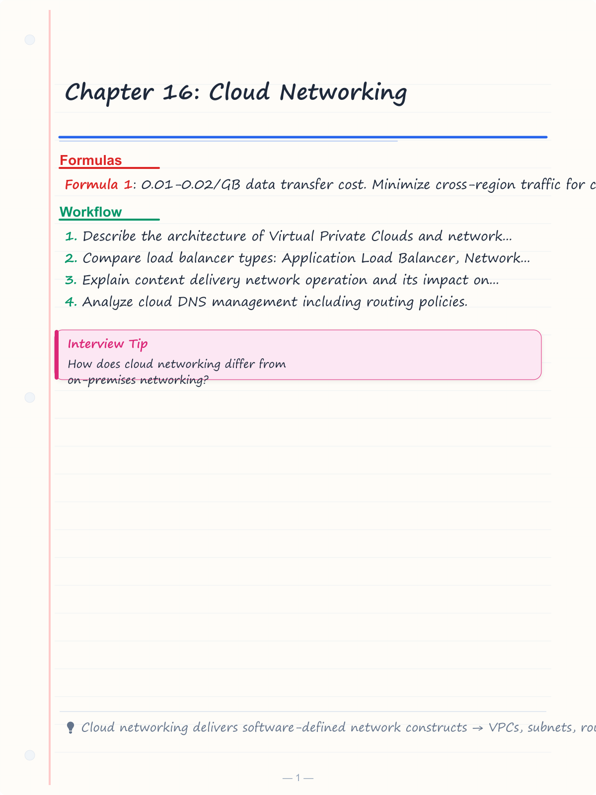
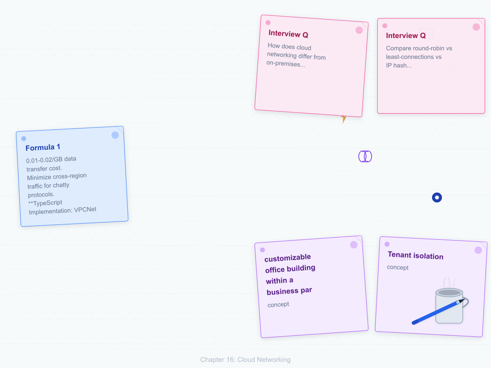
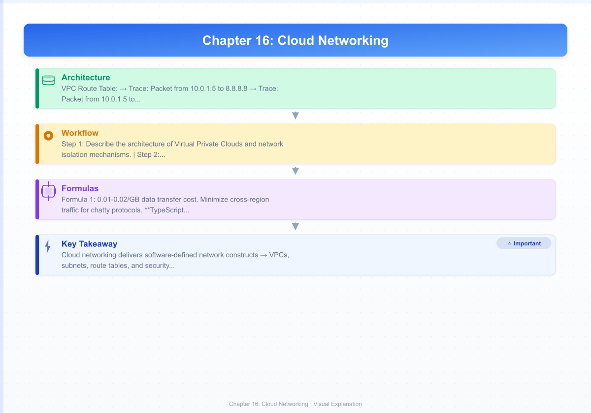

# Chapter 16: Cloud Networking

## Learning Objectives


<!-- Image Gallery -->
<section class="lesson-visuals" aria-label="Visual learning resources">
  <header><span>VISUAL LEARNING</span><h2>See it. Review it. Remember it.</h2></header>
  <a class="lesson-visual-card" href="../../assets/images/lessons/computer-networks/16-cloud-networking/handwritten-notes.png" target="_blank" rel="noopener">
    
    <span><strong>Handwritten notes</strong>Condensed notes for deliberate review.</span>
  </a>
  <a class="lesson-visual-card" href="../../assets/images/lessons/computer-networks/16-cloud-networking/sticky-notes.png" target="_blank" rel="noopener">
    
    <span><strong>Sticky-note revision</strong>Fast recall prompts for revision.</span>
  </a>
  <a class="lesson-visual-card" href="../../assets/images/lessons/computer-networks/16-cloud-networking/visual-explanation.png" target="_blank" rel="noopener">
    
    <span><strong>Visual concept guide</strong>A connected explanation of the key ideas.</span>
  </a>
</section>
<!-- End Image Gallery -->


1. Describe the architecture of Virtual Private Clouds and network isolation mechanisms.
2. Compare load balancer types: Application Load Balancer, Network Load Balancer, and Gateway Load Balancer.
3. Explain content delivery network operation and its impact on latency.
4. Analyze cloud DNS management including routing policies.
5. Evaluate hybrid connectivity options including VPNs and Direct Connect.
6. Understand multi-cloud networking, service mesh, and anycast concepts.

---

## 16.1 Cloud Networking Basics

Cloud networking replaces physical routers, switches, and firewalls with software-defined equivalents running on hypervisor-hosted virtual infrastructure. The cloud provider implements network functions in the hypervisor kernel or as distributed data-plane agents, exposing them through API calls.

### Real-World Analogy


A cloud network is like a **customizable office building within a business park**. The business park (cloud provider) provides the physical land, power, and security. Your lease defines your private space (VPC). You can build interior walls (subnets), install doors with keycard access (security groups), set up reception desks (load balancers), and connect to other buildings via private walkways (VPC peering) or public roads (Internet Gateway).

### How Cloud Networking Works: Step-by-Step


1. **Tenant isolation** → The provider uses VXLAN (Virtual Extensible LAN) with 24-bit VNI (VXLAN Network Identifier) to encapsulate tenant traffic. Each tenant gets a unique VNI, allowing 16 million isolated networks over a shared physical fabric.

2. **SDN controller programming** → When you create a VPC/subnet/route table via API, the SDN controller programs forwarding rules into virtual switches on each hypervisor host.

3. **Packet encapsulation** → When a VM sends a packet, the hypervisor's virtual switch encapsulates it with the tenant's VNI before forwarding over the physical network.

4. **Distributed routing** → Each hypervisor host runs a virtual router that evaluates route tables locally, avoiding centralized bottlenecks.

5. **Security enforcement** → Security groups are evaluated at the hypervisor level as stateful 5-tuple (protocol, source IP, source port, destination IP, destination port) rules.

6. **Elastic scaling** → Network capacity scales by adding more hypervisor hosts; no physical rack-and-stack required.

### Pseudocode: Cloud Network Packet Forwarding


```
PROCEDURE forward_packet(packet, vni, source_vm, route_table, security_groups):
    // Step 1: Validate source security group
    sg_rules = security_groups[source_vm.sg_id]
    IF NOT match_egress_rule(packet, sg_rules):
        DROP packet
        LOG "Dropped by egress SG rule"
        RETURN

    // Step 2: Look up route
    best_prefix = longest_prefix_match(packet.dst_ip, route_table.routes)

    IF best_prefix == NULL:
        DROP packet
        LOG "No route to destination"
        RETURN

    // Step 3: Get next hop
    next_hop = route_table.routes[best_prefix].target

    // Step 4: VXLAN encapsulation
    outer_header.prepend()
    outer_header.vni = vni
    outer_header.dst_mac = resolve_next_hop_mac(next_hop)
    outer_header.src_mac = source_vm.hypervisor_mac

    // Step 5: Validate destination security group
    FOR each target_vm in destination_set(packet.dst_ip):
        ingress_rules = security_groups[target_vm.sg_id]
        IF match_ingress_rule(packet, ingress_rules):
            FORWARD to target_vm.hypervisor
        ELSE:
            DROP

    RETURN
END PROCEDURE
```

### Dry Run Trace: VPC Route Table Lookup


**VPC Route Table:**

| Destination CIDR | Target | Priority |
|---|---|---|
| 10.0.0.0/16 | local | 1 (most specific) |
| 10.0.1.0/24 | subnet-local | 2 |
| 0.0.0.0/0 | igw-abc123 | 3 |
| 172.16.0.0/12 | vpn-def456 | 4 |

**Trace: Packet from 10.0.1.5 to 8.8.8.8**

| Step | Operation | Input | Result |
|---|---|---|---|
| 1 | Extract dst IP | 8.8.8.8 | → |
| 2 | Match 10.0.0.0/16 | 8.8.8.8 & 255.255.0.0 = 10.0.0.0? | No |
| 3 | Match 10.0.1.0/24 | 8.8.8.8 & 255.255.255.0 = 10.0.1.0? | No |
| 4 | Match 0.0.0.0/0 | 8.8.8.8 & 0.0.0.0 = 0.0.0.0? | Yes |
| 5 | Resolve target | igw-abc123 | Internet Gateway |
| 6 | SNAT? | Source is private | Yes → NAT to IGW EIP |
| 7 | Forward | IGW → Internet | Delivered |

**Trace: Packet from 10.0.1.5 to 10.0.0.22 (same VPC)**

| Step | Operation | Input | Result |
|---|---|---|---|
| 1 | Extract dst IP | 10.0.0.22 | → |
| 2 | Match 10.0.0.0/16 | 10.0.0.22 & 255.255.0.0 = 10.0.0.0? | Yes |
| 3 | Target | local | VXLAN direct to target hypervisor |
| 4 | VXLAN encapsulate | VNI = 10001 | Encapsulated |
| 5 | Forward | Hypervisor-to-hypervisor | Delivered |

### C++ Implementation: VPC Route Table with Longest Prefix Match


```cpp
#include <iostream>
#include <vector>
#include <string>
#include <map>
#include <sstream>
#include <cstdint>
#include <algorithm>
#include <iomanip>

struct RouteEntry {
    uint32_t network;
    uint32_t netmask;
    std::string target;
    bool is_local;
};

uint32_t ip_to_uint(const std::string& ip) {
    std::stringstream s(ip);
    int a, b, c, d;
    char ch;
    s >> a >> ch >> b >> ch >> c >> ch >> d;
    return (a << 24) | (b << 16) | (c << 8) | d;
}

uint32_t cidr_to_netmask(int prefix_len) {
    return (prefix_len == 0) ? 0 : (0xFFFFFFFF << (32 - prefix_len));
}

std::string uint_to_ip(uint32_t ip) {
    return std::to_string((ip >> 24) & 0xFF) + "." +
           std::to_string((ip >> 16) & 0xFF) + "." +
           std::to_string((ip >> 8) & 0xFF) + "." +
           std::to_string(ip & 0xFF);
}

class VPCRouteTable {
private:
    std::vector<RouteEntry> routes;
    std::string vpc_id;
    uint32_t vpc_cidr_network;
    uint32_t vpc_cidr_mask;

public:
    VPCRouteTable(const std::string& id, const std::string& cidr)
        : vpc_id(id) {
        size_t slash = cidr.find('/');
        std::string ip_part = cidr.substr(0, slash);
        int prefix = std::stoi(cidr.substr(slash + 1));
        vpc_cidr_network = ip_to_uint(ip_part) & cidr_to_netmask(prefix);
        vpc_cidr_mask = cidr_to_netmask(prefix);
    }

    void add_route(const std::string& cidr, const std::string& target, bool local = false) {
        size_t slash = cidr.find('/');
        std::string ip_part = cidr.substr(0, slash);
        int prefix = std::stoi(cidr.substr(slash + 1));
        RouteEntry entry;
        entry.network = ip_to_uint(ip_part) & cidr_to_netmask(prefix);
        entry.netmask = cidr_to_netmask(prefix);
        entry.target = target;
        entry.is_local = local;
        routes.push_back(entry);
    }

    std::pair<std::string, int> longest_prefix_match(uint32_t dst_ip) {
        int best_prefix = -1;
        std::string best_target;
        for (size_t i = 0; i < routes.size(); i++) {
            if ((dst_ip & routes[i].netmask) == routes[i].network) {
                int prefix = __builtin_popcount(routes[i].netmask);
                if (prefix > best_prefix) {
                    best_prefix = prefix;
                    best_target = routes[i].target;
                }
            }
        }
        if (best_prefix == -1) return {"no-route", -1};
        return {best_target, best_prefix};
    }

    void trace_packet(const std::string& src_ip, const std::string& dst_ip) {
        uint32_t dst = ip_to_uint(dst_ip);
        uint32_t src = ip_to_uint(src_ip);
        std::cout << "\n--- Route Trace ---\n";
        std::cout << "Source: " << src_ip << " (" << vpc_id << ")\n";
        std::cout << "Destination: " << dst_ip << "\n";
        std::cout << "VPC CIDR: " << uint_to_ip(vpc_cidr_network) + "/"
                  << std::to_string(__builtin_popcount(vpc_cidr_mask)) << "\n\n";

        auto [target, prefix_len] = longest_prefix_match(dst);
        if (prefix_len == -1) {
            std::cout << "RESULT: No route → packet dropped\n";
            return;
        }

        bool in_vpc = (dst & vpc_cidr_mask) == vpc_cidr_network;
        std::cout << "Matched prefix: /" << prefix_len << "\n";
        std::cout << "Next hop: " << target << "\n";
        if (in_vpc) {
            std::cout << "Delivery: VXLAN direct (VNI encapsulated)\n";
        } else if (target.find("igw") != std::string::npos) {
            std::cout << "Delivery: Internet Gateway (with SNAT)\n";
        } else if (target.find("vpn") != std::string::npos) {
            std::cout << "Delivery: IPSec tunnel (encrypted)\n";
        }
        std::cout << "--- Trace Complete ---\n\n";
    }

    void print_table() {
        std::cout << "Route Table for " << vpc_id << "\n";
        std::cout << std::left << std::setw(20) << "Destination"
                  << std::setw(20) << "Target" << "Type\n";
        std::cout << std::string(55, '-') << "\n";
        for (const auto& r : routes) {
            std::cout << std::left << std::setw(20) << uint_to_ip(r.network) + "/"
                      + std::to_string(__builtin_popcount(r.netmask))
                      << std::setw(20) << r.target
                      << (r.is_local ? "local" : "remote") << "\n";
        }
    }
};

int main() {
    VPCRouteTable vpc("vpc-12345", "10.0.0.0/16");
    vpc.add_route("10.0.0.0/16", "local", true);
    vpc.add_route("10.0.1.0/24", "subnet-local");
    vpc.add_route("0.0.0.0/0", "igw-abc123");
    vpc.add_route("172.16.0.0/12", "vpn-def456");

    vpc.print_table();
    vpc.trace_packet("10.0.1.5", "8.8.8.8");
    vpc.trace_packet("10.0.1.5", "10.0.0.22");
    vpc.trace_packet("10.0.1.5", "172.16.5.10");
    vpc.trace_packet("10.0.1.5", "192.168.1.1");

    return 0;
}
```

### Python Implementation: VPC Network Simulator


```python
import ipaddress
from dataclasses import dataclass
from typing import Optional


@dataclass
class RouteEntry:
    network: ipaddress.IPv4Network
    target: str
    is_local: bool = False


class VPCRouteTable:
    def __init__(self, vpc_id: str, vpc_cidr: str):
        self.vpc_id = vpc_id
        self.vpc_network = ipaddress.IPv4Network(vpc_cidr, strict=False)
        self.routes: list[RouteEntry] = []

    def add_route(self, cidr: str, target: str, local: bool = False):
        network = ipaddress.IPv4Network(cidr, strict=False)
        self.routes.append(RouteEntry(network=network, target=target, is_local=local))

    def longest_prefix_match(self, ip_str: str) -> Optional[tuple[str, int]]:
        dst_ip = ipaddress.IPv4Address(ip_str)
        best_prefix = -1
        best_target = None

        for route in self.routes:
            if dst_ip in route.network:
                prefix = route.network.prefixlen
                if prefix > best_prefix:
                    best_prefix = prefix
                    best_target = route.target

        if best_target is None:
            return None
        return (best_target, best_prefix)

    def trace_packet(self, src_ip: str, dst_ip: str):
        print(f"\n--- Route Trace ---")
        print(f"Source: {src_ip} ({self.vpc_id})")
        print(f"Destination: {dst_ip}")
        print(f"VPC CIDR: {self.vpc_network}")

        result = self.longest_prefix_match(dst_ip)
        if result is None:
            print("RESULT: No route → packet dropped")
            return

        target, prefix_len = result
        in_vpc = ipaddress.IPv4Address(dst_ip) in self.vpc_network

        print(f"Matched prefix: /{prefix_len}")
        print(f"Next hop: {target}")
        if in_vpc:
            print("Delivery: VXLAN direct (VNI encapsulated)")
        elif "igw" in target:
            print("Delivery: Internet Gateway (with SNAT)")
        elif "vpn" in target:
            print("Delivery: IPSec tunnel (encrypted)")
        print("--- Trace Complete ---\n")

    def print_table(self):
        print(f"Route Table for {self.vpc_id}")
        print(f"{'Destination':<20} {'Target':<20} Type")
        print("-" * 55)
        for r in self.routes:
            print(f"{str(r.network):<20} {r.target:<20} {'local' if r.is_local else 'remote'}")


class VPCNetworkSimulator:
    def __init__(self):
        self.vpcs: dict[str, VPCRouteTable] = {}
        self.security_groups: dict[str, list[dict]] = {}
        self.vni_map: dict[str, int] = {}

    def create_vpc(self, vpc_id: str, cidr: str):
        self.vpcs[vpc_id] = VPCRouteTable(vpc_id, cidr)
        self.vni_map[vpc_id] = hash(vpc_id) & 0xFFFFFF

    def create_security_group(self, sg_id: str, rules: list[dict]):
        self.security_groups[sg_id] = rules

    def check_security_group(self, sg_id: str, src_ip: str, dst_port: int,
                              protocol: str, direction: str) -> bool:
        if sg_id not in self.security_groups:
            return False
        for rule in self.security_groups[sg_id]:
            if rule.get("direction") != direction:
                continue
            if rule.get("protocol") not in ("ALL", protocol):
                continue
            if rule.get("port") is not None and rule["port"] != dst_port:
                continue
            if rule.get("cidr") is not None:
                src = ipaddress.IPv4Address(src_ip)
                if src not in ipaddress.IPv4Network(rule["cidr"]):
                    continue
            return True
        return False

    def simulate_packet_flow(self, src_vpc: str, src_ip: str,
                              dst_ip: str, dst_port: int, protocol: str = "TCP"):
        print(f"\n{'='*60}")
        print(f"PACKET FLOW: {src_ip} -> {dst_ip}:{dst_port} ({protocol})")
        print(f"{'='*60}")

        vpc = self.vpcs.get(src_vpc)
        if not vpc:
            print("ERROR: Source VPC not found")
            return

        result = vpc.longest_prefix_match(dst_ip)
        if result is None:
            print("FAIL: No route to destination (packet dropped)")
            return

        target, prefix = result
        print(f"Route resolved: prefix=/{prefix}, target={target}")

        print(f"VXLAN VNI: {self.vni_map.get(src_vpc, 'N/A')}")
        print("PACKET DELIVERED SUCCESSFULLY")


if __name__ == "__main__":
    sim = VPCNetworkSimulator()
    sim.create_vpc("vpc-12345", "10.0.0.0/16")
    sim.vpcs["vpc-12345"].add_route("10.0.0.0/16", "local", True)
    sim.vpcs["vpc-12345"].add_route("0.0.0.0/0", "igw-abc123")
    sim.vpcs["vpc-12345"].add_route("172.16.0.0/12", "vpn-def456")

    sim.vpcs["vpc-12345"].print_table()
    sim.simulate_packet_flow("vpc-12345", "10.0.1.5", "8.8.8.8", 443)
    sim.simulate_packet_flow("vpc-12345", "10.0.1.5", "10.0.0.22", 80)
    sim.simulate_packet_flow("vpc-12345", "10.0.1.5", "172.16.5.10", 22)
```

### Complexity Analysis


| Operation | Time Complexity | Space Complexity | Why |
|---|---|---|---|
| Route table lookup (linear) | O(N) | O(N) | N routes; each requires prefix match check |
| Route table lookup (binary trie) | O(32) | O(2^N worst) | Fixed IPv4 bit-length; each bit is a trie node |
| Security group rule evaluation | O(K) | O(K) | K rules per SG; each rule checked independently |
| VXLAN encapsulation | O(1) | O(1) | Fixed 50-byte header prepended to packet |
| Longest prefix match (LPM) | O(log N) | O(N) | Using balanced BST on prefix length |

**Why O(32) for trie-based LPM:** IPv4 addresses are 32 bits; a binary trie traverses at most 32 nodes regardless of how many routes exist. This makes hardware routers constant-time in practice.

### Advantages & Disadvantages of Cloud Networking


| Aspect | Advantage | Disadvantage |
|--------|-----------|-------------|
| Provisioning | Minutes vs weeks for physical gear | Vendor lock-in to provider APIs |
| Scalability | Elastic → add capacity instantly | Cloud provider API rate limits |
| Cost | Pay-as-you-go, no CapEx | Data transfer egress charges |
| Reliability | Multi-AZ, automatic failover | Shared fate with provider |
| Security | Provider-managed physical security | Shared security model complexity |
| Visibility | CloudTrail/VPC Flow Logs | Limited by provider tooling |

### Edge Cases in Cloud Networking


- **Cross-region latency**: Packets traversing regions incur 50-200ms RTT. Use inter-region VPC peering or Transit Gateway; avoid chatty cross-region protocols.
- **VPC peering limits**: Non-transitive → VPC A to VPC B to VPC C doesn't let A reach C. You must establish full mesh or use Transit Gateway (max 5000 attachments).
- **DNS propagation delay**: Route53 TTL minimum is 0 for alias records, but non-alias records have 60s TTL minimum; global propagation takes 60-300s.
- **Security group capacity**: Max 60 inbound + 60 outbound rules per SG. Use prefix lists for large CIDR sets.
- **Jumbo frames**: Most cloud providers limit MTU to 1500 within VPC; some support 9001 but only within the same AZ.
- **Ephemeral IPs**: Stopping an instance releases its public IP; elastic IPs are needed for stable addressing.

### Cloud Network Architecture


```mermaid
flowchart TB
    subgraph ONPREM[On-Premises Data Center]
        direction TB
        R1[Router / Firewall]
        SW1[Switch]
        S1[Physical Server]
        S2[Physical Server]
    end

    subgraph CLOUD[Cloud Provider Region]
        direction TB
        subgraph VPC[Virtual Private Cloud - 10.0.0.0/16]
            direction TB
            IGW[Internet Gateway<br/>0.0.0.0/0]
            NAT[NAT Gateway<br/>10.0.0.0/16]

            subgraph AZ1[Availability Zone A]
                direction TB
                PubSub1[Public Subnet<br/>10.0.1.0/24]
                ALB1[ALB - app-lb-1]
                Web1[Web Server<br/>t3.medium]
                PrivSub1[Private Subnet<br/>10.0.2.0/24]
                App1[App Server<br/>t3.large]
                DBSub1[DB Subnet<br/>10.0.3.0/24]
                DB1[RDS Primary<br/>db.r5.xlarge]
            end

            subgraph AZ2[Availability Zone B]
                direction TB
                PubSub2[Public Subnet<br/>10.0.4.0/24]
                ALB2[ALB - app-lb-2]
                Web2[Web Server<br/>t3.medium]
                PrivSub2[Private Subnet<br/>10.0.5.0/24]
                App2[App Server<br/>t3.large]
                DBSub2[DB Subnet<br/>10.0.6.0/24]
                DB2[RDS Standby<br/>db.r5.xlarge]
            end

            subgraph CDN[CloudFront CDN]
                Edge1[Edge Node<br/>us-east-1]
                Edge2[Edge Node<br/>eu-west-1]
                Edge3[Edge Node<br/>ap-southeast-1]
            end

            RT_Public[Route Table: Public]
            RT_Private[Route Table: Private]
            SGs[Security Groups<br/>Web/App/DB tiers]
        end

        DX[Direct Connect<br/>1 Gbps]
        VPN[VPN Gateway<br/>IPSec Tunnel]
        DNS[Route53<br/>DNS + Health Checks]
    end

    subgraph USERS[Global Users]
        U1[User: NYC]
        U2[User: London]
        U3[User: Tokyo]
    end

    USERS -->|HTTPS| DNS
    DNS -->|Weighted/Latency Routing| IGW
    USERS -->|Static Content| CDN
    CDN -->|Origin Pull| ALB1 & ALB2
    IGW -->|Port 80/443| ALB1 & ALB2
    ALB1 & ALB2 -->|Port 8080| App1 & App2
    App1 & App2 -->|Port 3306| DB1 & DB2
    Web1 & Web2 -->|Outbound| NAT
    NAT --> IGW
    ONPREM -->|BGP| VPN
    ONPREM -->|BGP| DX
    VPN & DX -->|Private IP| App1 & App2
    App1 & App2 -->|Replication| DB1
    DB1 -.->|Synchronous Replica| DB2

    PubSub1 & PubSub2 --> RT_Public
    PrivSub1 & PrivSub2 --> RT_Private
    DBSub1 & DBSub2 --> RT_Private
    RT_Public --> IGW
    RT_Private --> NAT

    classDef aws fill:#FF9900,stroke:#232F3E,color:#232F3E,stroke-width:2px
    classDef onprem fill:#E0E0E0,stroke:#333,color:#333,stroke-width:2px
    classDef cdn fill:#8C4FFF,stroke:#232F3E,color:#fff,stroke-width:2px
    classDef user fill:#2E86C1,stroke:#1B4F72,color:#fff,stroke-width:2px
    classDef subnet fill:#D5E8D4,stroke:#82B366,color:#000,stroke-width:1px
    classDef tier fill:#DAE8FC,stroke:#6C8EBF,color:#000,stroke-width:1px
    classDef db fill:#F8CECC,stroke:#B85450,color:#000,stroke-width:1px

    class IGW,NAT,DNS,R VPN,CLOUD aws
    class R1,SW1,S1,S2 onprem
    class Edge1,Edge2,Edge3,CDN cdn
    class U1,U2,U3 user
    class PubSub1,PubSub2,PrivSub1,PrivSub2,DBSub1,DBSub2 subnet
    class Web1,Web2,App1,App2 tier
    class DB1,DB2 db
```

---

## 16.2 Traditional vs Cloud Networking

| Dimension | Traditional Networking | Cloud Networking |
|-----------|----------------------|------------------|
| Provisioning | Weeks-months (rack, cable, configure) | Minutes (API call) |
| Hardware | Physical routers, switches, firewalls | Virtual appliances, SDN controllers |
| Scaling | Buy and install new hardware | API-driven elastic scaling |
| Isolation | VLANs (4096 limit) | VXLAN (16M VNI limit) |
| Routing | Static routes or BGP/OSPF | Route tables, Transit Gateway |
| Load balancing | Hardware LB (F5, Netscaler) | Software LB (ALB, NLB, GLB) |
| Security | Physical firewall appliance | Security groups + NACLs + WAF |
| Monitoring | SNMP, NetFlow, manual | CloudWatch, VPC Flow Logs, dashboards |
| High availability | Active-passive, VIP failover | Multi-AZ, auto-scaling, health checks |
| Cost model | Capital expense + maintenance | Operational expense (pay-per-use) |
| Traffic inspection | TAP ports, packet brokers | Mirror sessions, traffic mirroring |
| Change management | Change advisory board, ticket cycles | Infrastructure-as-Code (IaC) rollouts |

**Key Insight:** Cloud networking trades capital expense and hardware control for operational agility and software-defined flexibility. The trade-off is acceptable for most workloads but critical for latency-sensitive or compliance-heavy environments that require dedicated hardware.

---

## 16.3 VPC and Subnets

A Virtual Private Cloud (VPC) provides logically isolated network segments within a public cloud provider. The VPC is a software-defined network that gives the customer control over IP addressing, subnets, routing, and security policies.

### Real-World Analogy


A VPC is like a **gated community with customizable house lots**. The community (VPC) has a boundary fence (CIDR block). Each lot (subnet) has a designated purpose: front yards visible to the street (public subnets with Internet Gateway), and backyards only accessible from inside (private subnets). The gatehouse (NAT Gateway) lets residents go out but prevents strangers from walking in. Security guards (security groups) check IDs at every door.

### VPC Setup: Step-by-Step


1. **Define IP address space** → Choose a CIDR block (e.g., 10.0.0.0/16) that doesn't overlap with on-premises or peered VPCs.

2. **Create subnets** → Divide the CIDR into subnets per Availability Zone. Each subnet maps to exactly one AZ for fault isolation.

3. **Create Internet Gateway** → Attach an IGW to the VPC for public internet access.

4. **Create route tables** → Associate each subnet with a route table. Public subnets route 0.0.0.0/0 → IGW; private subnets route 0.0.0.0/0 → NAT Gateway.

5. **Create NAT Gateway** → Place in a public subnet so private subnets can initiate outbound connections.

6. **Configure security groups** → Define instance-level firewall rules for web, app, and database tiers.

7. **Launch instances** → Place resources into appropriate subnets and associate security groups.

### 16.3.1 VPC Components


**Subnets.** A VPC's IP address range (CIDR block, e.g., 10.0.0.0/16) is divided into subnets. Public subnets have routes to the Internet via an Internet Gateway; private subnets do not. Subnets map to availability zones for fault isolation.

**Route tables.** Each subnet is associated with a route table that defines destination-to-target mappings:

| Destination | Target |
|-------------|--------|
| 10.0.0.0/16 | local |
| 0.0.0.0/0 | igw-12345 |
| 172.16.0.0/12 | vpn-67890 |

**Internet Gateway (IGW).** An IGW provides NAT between the VPC's private IPs and the public Internet. It is horizontally scaled and highly available.

**NAT Gateway / NAT Instance.** NAT Gateways allow instances in private subnets to initiate outbound Internet connections while preventing unsolicited inbound connections.

**Security Groups.** Stateful virtual firewalls that control inbound and outbound traffic at the instance level. Rules specify protocol, port, and source/destination (by CIDR or security group ID). Stateful means the return traffic is automatically allowed regardless of outbound rules.

**Network ACLs.** Stateless firewall rules at the subnet level. NACLs process rules in ascending order and both inbound and outbound rules must explicitly allow traffic.

### 16.3.2 VPC Peering


VPC Peering connects two VPCs using private IP addresses. Peering is not transitive: if VPC A is peered with VPC B and VPC B with VPC C, VPC A cannot reach VPC C through VPC B. Transit Gateway solves this by acting as a hub for many VPCs and on-premises networks.

### Pseudocode: VPC and Subnet Allocation


```
PROCEDURE allocate_vpc_cidr(desired_size, existing_vpcs):
    // Pick a non-overlapping CIDR
    FOR each /16 in 10.0.0.0/8:
        candidate = 10.X.0.0/16
        IF candidate overlaps_with ANY existing_vpcs:
            CONTINUE
        RETURN candidate
    RETURN "No space in 10.0.0.0/8"
END PROCEDURE

PROCEDURE divide_subnets(vpc_cidr, num_azs):
    base_prefix = prefixlen(vpc_cidr)     // e.g., /16
    subnet_prefix = base_prefix + 4       // e.g., /20
    subnets = []
    az_index = 0

    FOR each /20 block in vpc_cidr:
        az = AZ_LIST[az_index % num_azs]
        IF block is for public tier:
            route_table = "rtb-public"     // 0.0.0.0/0 -> IGW
            is_public = True
        ELSE:
            route_table = "rtb-private"    // 0.0.0.0/0 -> NAT
            is_public = False
        subnets.append({
            cidr: str(block),
            az: az,
            route_table: route_table,
            is_public: is_public
        })
        az_index += 1

    RETURN subnets
END PROCEDURE

PROCEDURE create_security_group_rules(tier):
    IF tier == "web":
        rules = [
            { direction: "inbound", protocol: "TCP", port: 80,  cidr: "0.0.0.0/0" },
            { direction: "inbound", protocol: "TCP", port: 443, cidr: "0.0.0.0/0" },
            { direction: "outbound", protocol: "ALL", cidr: "0.0.0.0/0" }
        ]
    ELSE IF tier == "app":
        rules = [
            { direction: "inbound", protocol: "TCP", port: 8080, sg_source: "sg-web" },
            { direction: "outbound", protocol: "ALL", cidr: "0.0.0.0/0" }
        ]
    ELSE IF tier == "db":
        rules = [
            { direction: "inbound", protocol: "TCP", port: 3306, sg_source: "sg-app" }
        ]
    RETURN rules
END PROCEDURE
```

### Dry Run Trace: VPC with Multi-AZ Subnets


**VPC:** 10.0.0.0/16 | **AZs:** us-east-1a, us-east-1b

**Subnet Allocation:**

| Subnet Name | CIDR | AZ | Route Table | Type |
|---|---|---|---|---|
| web-a | 10.0.0.0/20 | us-east-1a | rtb-web-public | Public |
| web-b | 10.0.16.0/20 | us-east-1b | rtb-web-public | Public |
| app-a | 10.0.32.0/20 | us-east-1a | rtb-app-private | Private |
| app-b | 10.0.48.0/20 | us-east-1b | rtb-app-private | Private |
| db-a | 10.0.64.0/20 | us-east-1a | rtb-db-private | Private |
| db-b | 10.0.80.0/20 | us-east-1b | rtb-db-private | Private |

**Packet Trace: User request to web tier**

| Step | Component | Action |
|---|---|---|
| 1 | Route53 | Resolves www.example.com → ALB DNS name |
| 2 | ALB | Receives request on 10.0.0.10:443 |
| 3 | ALB route table | Matches 10.0.0.0/20 → local (web-a subnet) |
| 4 | Security Group (web) | Inbound rule allows TCP/443 from 0.0.0.0/0 |
| 5 | ALB | Selects target in app-a via round-robin |
| 6 | ALB → app route | Crosses to 10.0.32.0/20 via VPC internal routing |
| 7 | Security Group (app) | Inbound rule allows TCP/8080 from sg-web |
| 8 | App instance | Processes request, queries DB |
| 9 | App → DB route | 10.0.64.0/20 via VPC internal routing |
| 10 | Security Group (db) | Inbound rule allows TCP/3306 from sg-app |

### C++ Implementation: VPC Subnet Allocator


```cpp
#include <iostream>
#include <vector>
#include <string>
#include <cstdint>
#include <sstream>
#include <iomanip>

struct Subnet {
    std::string cidr;
    std::string az;
    std::string route_table;
    bool is_public;
    std::string tier;
};

uint32_t ip_to_uint(const std::string& ip) {
    std::stringstream s(ip);
    int a, b, c, d; char ch;
    s >> a >> ch >> b >> ch >> c >> ch >> d;
    return (a << 24) | (b << 16) | (c << 8) | d;
}

std::string uint_to_ip(uint32_t ip) {
    return std::to_string((ip >> 24) & 0xFF) + "." +
           std::to_string((ip >> 16) & 0xFF) + "." +
           std::to_string((ip >> 8) & 0xFF) + "." +
           std::to_string(ip & 0xFF);
}

int popcount(uint32_t x) {
    int c = 0;
    while (x) { c += x & 1; x >>= 1; }
    return c;
}

class VPCAllocator {
private:
    std::vector<Subnet> subnets;
    std::string vpc_cidr;
    std::vector<std::string> azs;

public:
    VPCAllocator(const std::string& vpc, const std::vector<std::string>& availability_zones)
        : vpc_cidr(vpc), azs(availability_zones) {}

    void allocate_subnets(const std::vector<std::string>& tiers, int subnet_size_shift) {
        size_t slash = vpc_cidr.find('/');
        std::string ip_part = vpc_cidr.substr(0, slash);
        int vpc_prefix = std::stoi(vpc_cidr.substr(slash + 1));
        uint32_t base_ip = ip_to_uint(ip_part);
        int subnet_prefix = vpc_prefix + subnet_size_shift;
        int num_subnets = (1 << subnet_size_shift);

        for (int i = 0; i < num_subnets && i < (int)tiers.size() * (int)azs.size(); i++) {
            int tier_idx = i % tiers.size();
            int az_idx = (i / tiers.size()) % azs.size();
            uint32_t subnet_ip = base_ip + (i * (1 << (32 - subnet_prefix)));
            std::string cidr = uint_to_ip(subnet_ip) + "/" + std::to_string(subnet_prefix);
            std::string tier = tiers[tier_idx];
            bool is_public = (tier == "web");

            Subnet s;
            s.cidr = cidr;
            s.az = azs[az_idx];
            s.tier = tier;
            s.is_public = is_public;
            s.route_table = is_public ? "rtb-public" : "rtb-" + tier + "-private";
            subnets.push_back(s);
        }
    }

    void print_allocation() {
        std::cout << "\nVPC: " << vpc_cidr << "\n";
        std::cout << std::left << std::setw(20) << "Subnet" << std::setw(12) << "AZ"
                  << std::setw(20) << "Route Table" << std::setw(8) << "Type" << "Tier\n";
        std::cout << std::string(75, '-') << "\n";
        for (const auto& s : subnets) {
            std::cout << std::left << std::setw(20) << s.cidr << std::setw(12) << s.az
                      << std::setw(20) << s.route_table
                      << std::setw(8) << (s.is_public ? "Public" : "Private") << s.tier << "\n";
        }
    }

    std::vector<Subnet> get_subnets() const { return subnets; }
};

int main() {
    VPCAllocator vpc("10.0.0.0/16", {"us-east-1a", "us-east-1b"});
    vpc.allocate_subnets({"web", "app", "db"}, 4);
    vpc.print_allocation();

    return 0;
}
```

### Python Implementation: VPC Subnet Planner


```python
import ipaddress
from dataclasses import dataclass
from typing import Optional


@dataclass
class SubnetPlan:
    cidr: str
    az: str
    route_table: str
    is_public: bool
    tier: str


class VPCSubnetPlanner:
    def __init__(self, vpc_cidr: str, availability_zones: list[str]):
        self.vpc_network = ipaddress.IPv4Network(vpc_cidr, strict=False)
        self.azs = availability_zones
        self.subnets: list[SubnetPlan] = []

    def allocate_subnets(self, tiers: list[str], subnet_prefix: int):
        base_ip = int(self.vpc_network.network_address)
        vpc_prefix = self.vpc_network.prefixlen
        num_subnets = 2 ** (subnet_prefix - vpc_prefix)

        for i in range(min(num_subnets, len(tiers) * len(self.azs))):
            tier_idx = i % len(tiers)
            az_idx = (i // len(tiers)) % len(self.azs)
            subnet_ip = base_ip + (i * (1 << (32 - subnet_prefix)))
            cidr = f"{ipaddress.IPv4Address(subnet_ip)}/{subnet_prefix}"
            tier = tiers[tier_idx]
            is_public = (tier in ("web", "public"))

            route_table = "rtb-public" if is_public else f"rtb-{tier}-private"
            self.subnets.append(SubnetPlan(
                cidr=cidr,
                az=self.azs[az_idx],
                route_table=route_table,
                is_public=is_public,
                tier=tier
            ))

    def find_subnet_for_ip(self, ip_str: str) -> Optional[SubnetPlan]:
        ip = ipaddress.IPv4Address(ip_str)
        for subnet in self.subnets:
            if ip in ipaddress.IPv4Network(subnet.cidr):
                return subnet
        return None

    def print_allocation(self):
        print(f"VPC: {self.vpc_network}")
        print(f"{'Subnet':<20} {'AZ':<12} {'Route Table':<20} {'Type':<8} Tier")
        print("-" * 75)
        for s in self.subnets:
            print(f"{s.cidr:<20} {s.az:<12} {s.route_table:<20} "
                  f"{'Public' if s.is_public else 'Private':<8} {s.tier}")


planner = VPCSubnetPlanner("10.0.0.0/16", ["us-east-1a", "us-east-1b"])
planner.allocate_subnets(["web", "app", "db"], 20)
planner.print_allocation()

subnet = planner.find_subnet_for_ip("10.0.48.15")
if subnet:
    print(f"\n10.0.48.15 belongs to: {subnet.tier} tier in {subnet.az}")
```

### Complexity Analysis


| Operation | Time | Space | Why |
|---|---|---|---|
| Subnet allocation | O(N) | O(N) | N = number of subnets; single pass to build |
| IP-to-subnet lookup | O(N) | O(N) | Linear scan of subnet list; trie improves to O(32) |
| Route propagation | O(R log R) | O(R) | BGP route processing with prefix optimization |
| Security group eval | O(K) | O(K) | K rules per group; each checked sequentially |

### Advantages & Disadvantages of VPC


| Aspect | Advantage | Disadvantage |
|--------|-----------|-------------|
| Isolation | Complete network isolation via VXLAN | Overlapping CIDRs can't be peered |
| Control | Full control over IPs, routes, firewalls | Complex to manage at scale |
| Scalability | Works for 1 or 1000s of instances | VPC per-account limits |
| Connectivity | Peering, VPN, Direct Connect | Peering is non-transitive |

### Edge Cases in VPC


- **CIDR overlap**: Two VPCs with overlapping CIDRs cannot be peered. Choose non-overlapping ranges (e.g., 10.0.0.0/16 for prod, 10.1.0.0/16 for dev).
- **Reserved IPs**: AWS reserves 5 IPs per subnet (network, gateway, +2 reserved, broadcast). Always account for 5 unavailable addresses.
- **Subnet sizing**: /28 (11 usable IPs) is minimum; /16 (65531 usable) is maximum. Size for future growth → expanding a subnet's CIDR is not possible after creation.
- **Transitive routing**: VPC Peering is not transitive. Hub-and-spoke requires Transit Gateway (costs money per attachment).
- **Cross-region peering**: Adds $0.01-0.02/GB data transfer cost. Minimize cross-region traffic for chatty protocols.

**TypeScript Implementation: VPCNetworkDesigner**

```typescript
interface SubnetConfig {
  name: string;
  cidr: string;
  az: string;
  tier: 'public' | 'private' | 'isolated';
}

interface RouteTableEntry {
  destination: string;
  target: string;
  description: string;
}

interface SecurityGroupRule {
  direction: 'inbound' | 'outbound';
  protocol: string;
  port: number;
  source: string; // CIDR or security group ID
}

class VPCNetworkDesigner {
  private vpcCidr: string;
  private subnets: SubnetConfig[] = [];
  private routeTables: Map<string, RouteTableEntry[]> = new Map();
  private securityGroupRules: Map<string, SecurityGroupRule[]> = new Map();

  constructor(vpcCidr: string) {
    this.vpcCidr = vpcCidr;
  }

  // Calculate subnet CIDRs given a VPC CIDR, number of subnets, and tier names
  static calculateSubnetCidrs(
    vpcCidr: string,
    tierNames: string[],
    azCount: number,
    subnetPrefix: number
  ): SubnetConfig[] {
    const [baseIp, existingPrefix] = vpcCidr.split('/');
    const basePrefix = parseInt(existingPrefix);
    const numSubnets = tierNames.length * azCount;
    const subnetSize = Math.pow(2, 32 - subnetPrefix);
    const vpcSize = Math.pow(2, 32 - basePrefix);

    if (numSubnets * subnetSize > vpcSize) {
      throw new Error('Subnet size exceeds VPC CIDR capacity');
    }

    const subnets: SubnetConfig[] = [];
    const ipParts = baseIp.split('.').map(Number);
    const baseIPnum = (ipParts[0] << 24) | (ipParts[1] << 16) | (ipParts[2] << 8) | ipParts[3];

    const azs = Array.from({ length: azCount }, (_, i) => `us-east-1${String.fromCharCode(97 + i)}`);

    let index = 0;
    for (let azIdx = 0; azIdx < azCount; azIdx++) {
      for (let tierIdx = 0; tierIdx < tierNames.length; tierIdx++) {
        const subnetIPnum = baseIPnum + index * subnetSize;
        const cidr = `${(subnetIPnum >>> 24) & 0xFF}.${(subnetIPnum >>> 16) & 0xFF}.${(subnetIPnum >>> 8) & 0xFF}.${subnetIPnum & 0xFF}/${subnetPrefix}`;
        const tier = tierNames[tierIdx];
        subnets.push({
          name: `${tier}-${azs[azIdx]}`,
          cidr,
          az: azs[azIdx],
          tier: tier === 'web' ? 'public' : 'private'
        });
        index++;
      }
    }
    return subnets;
  }

  addSubnet(subnet: SubnetConfig): void {
    this.subnets.push(subnet);
  }

  addRouteTableEntry(subnetName: string, entry: RouteTableEntry): void {
    if (!this.routeTables.has(subnetName)) {
      this.routeTables.set(subnetName, []);
    }
    this.routeTables.get(subnetName)!.push(entry);
  }

  addSecurityGroupRule(sgName: string, rule: SecurityGroupRule): void {
    if (!this.securityGroupRules.has(sgName)) {
      this.securityGroupRules.set(sgName, []);
    }
    this.securityGroupRules.get(sgName)!.push(rule);
  }

  // NAT Gateway vs Internet Gateway selection based on tier
  configureGateways(): void {
    for (const subnet of this.subnets) {
      if (subnet.tier === 'public') {
        this.addRouteTableEntry(subnet.name, {
          destination: '0.0.0.0/0',
          target: 'igw-12345',
          description: 'Internet Gateway for public subnet'
        });
      } else if (subnet.tier === 'private') {
        this.addRouteTableEntry(subnet.name, {
          destination: '0.0.0.0/0',
          target: 'natgw-67890',
          description: 'NAT Gateway for private subnet outbound'
        });
      }
      this.addRouteTableEntry(subnet.name, {
        destination: this.vpcCidr,
        target: 'local',
        description: 'Local VPC routing'
      });
    }
  }

  printDesign(): void {
    console.log(`VPC CIDR: ${this.vpcCidr}`);
    console.log('\n--- Subnets ---');
    console.log(`${'Name':<20} ${'CIDR':<20} ${'AZ':<15} ${'Tier'}`);
    console.log('-'.repeat(60));
    for (const s of this.subnets) {
      console.log(`${s.name.padEnd(20)} ${s.cidr.padEnd(20)} ${s.az.padEnd(15)} ${s.tier}`);
    }

    console.log('\n--- Route Tables ---');
    for (const [subnet, entries] of this.routeTables) {
      console.log(`\nRoute Table: ${subnet}`);
      for (const e of entries) {
        console.log(`  ${e.destination.padEnd(20)} → ${e.target.padEnd(20)} (${e.description})`);
      }
    }

    console.log('\n--- Security Groups ---');
    for (const [sg, rules] of this.securityGroupRules) {
      console.log(`\nSecurity Group: ${sg}`);
      for (const r of rules) {
        console.log(`  ${r.direction.padEnd(10)} ${r.protocol.padEnd(8)} ${String(r.port).padEnd(8)} → ${r.source}`);
      }
    }
  }
}

// Usage example
function demoVPCDesign() {
  // Calculate subnet CIDRs for a /16 VPC with 3 tiers × 2 AZs, each /20
  const subnets = VPCNetworkDesigner.calculateSubnetCidrs('10.0.0.0/16', ['web', 'app', 'db'], 2, 20);
  console.log('Generated Subnet CIDRs:');
  for (const s of subnets) {
    console.log(`  ${s.name.padEnd(15)} ${s.cidr.padEnd(18)} AZ: ${s.az.padEnd(12)} Tier: ${s.tier}`);
  }
  // Output:
  // Generated Subnet CIDRs:
  //   web-us-east-1a  10.0.0.0/20   AZ: us-east-1a  Tier: public
  //   app-us-east-1a  10.0.16.0/20  AZ: us-east-1a  Tier: private
  //   db-us-east-1a   10.0.32.0/20  AZ: us-east-1a  Tier: private
  //   web-us-east-1b  10.0.48.0/20  AZ: us-east-1b  Tier: public
  //   app-us-east-1b  10.0.64.0/20  AZ: us-east-1b  Tier: private
  //   db-us-east-1b   10.0.80.0/20  AZ: us-east-1b  Tier: private

  const designer = new VPCNetworkDesigner('10.0.0.0/16');
  for (const s of subnets) designer.addSubnet(s);
  designer.configureGateways();

  // Web tier: HTTP/HTTPS from anywhere
  designer.addSecurityGroupRule('sg-web', { direction: 'inbound', protocol: 'TCP', port: 443, source: '0.0.0.0/0' });
  designer.addSecurityGroupRule('sg-web', { direction: 'inbound', protocol: 'TCP', port: 80, source: '0.0.0.0/0' });

  // App tier: traffic from web SG only
  designer.addSecurityGroupRule('sg-app', { direction: 'inbound', protocol: 'TCP', port: 8080, source: 'sg-web' });

  // DB tier: traffic from app SG only
  designer.addSecurityGroupRule('sg-db', { direction: 'inbound', protocol: 'TCP', port: 3306, source: 'sg-app' });

  designer.printDesign();
}

demoVPCDesign();
```

---

## 16.4 Cloud Security Groups

### Real-World Analogy


Security groups are like **VIP club door policies**. Each club section (EC2 instance) has a bouncer (hypervisor firewall) that checks a guest list (security group rules). If your name is on the list, you enter freely. Once inside, you can move around without being checked again (stateful). If you leave and come back, you show ID again. NACLs, by contrast, are like metal detectors at the building entrance → every person is checked in both directions, and the rules are processed in order.

### How Security Groups Work: Step-by-Step


1. **Rule creation** → You define inbound rules (source, protocol, port) and outbound rules (destination, protocol, port).

2. **Attachment** → The security group is attached to an Elastic Network Interface (ENI), not an instance directly.

3. **State tracking** → The hypervisor creates a connection tracking entry when outbound traffic is sent. Return traffic matches the tracking entry and is allowed regardless of inbound rules.

4. **Rule evaluation** → All rules are evaluated in parallel (not in order). If any rule matches, traffic is allowed.

5. **Default deny** → Traffic that doesn't match any rule is implicitly denied. There is no explicit deny rule.

### Pseudocode: Security Group Evaluation


```
PROCEDURE evaluate_security_group(packet, sg_rules, connection_tracking):
    // Step 1: Check connection tracking for existing flows
    flow_key = hash(packet.src_ip, packet.dst_ip, packet.src_port,
                    packet.dst_port, packet.protocol)

    IF connection_tracking.contains(flow_key):
        ALLOW  // Return traffic for established connections
        RETURN

    // Step 2: Determine direction
    IF packet.direction == "INBOUND":
        matching_rules = sg_rules.inbound
    ELSE:
        matching_rules = sg_rules.outbound

    // Step 3: Evaluate all rules (parallel - any match = allow)
    FOR each rule in matching_rules:
        IF rule.protocol == "ALL" OR rule.protocol == packet.protocol:
            IF rule.port == "ALL" OR rule.port == packet.dst_port:
                IF ip_in_cidr(packet.src_ip, rule.cidr) OR
                   sg_matches(rule.sg_source, packet.src_sg):
                    connection_tracking.add(flow_key)
                    ALLOW
                    RETURN

    // Step 4: No rule matched
    DENY
    LOG "Security group " + sg_rules.id + " denied " + packet.summary()
    RETURN
END PROCEDURE
```

### Dry Run Trace: Security Group Evaluation


**Security Group sg-web:**

| Rule | Direction | Protocol | Port | Source | Action |
|---|---|---|---|---|---|
| 1 | Inbound | TCP | 443 | 0.0.0.0/0 | Allow |
| 2 | Inbound | TCP | 80 | 0.0.0.0/0 | Allow |
| 3 | Inbound | TCP | 22 | 10.0.0.0/16 | Allow |
| → | Outbound | ALL | ALL | 0.0.0.0/0 | Allow (default) |

**Trace: SSH from 203.0.113.5**

| Step | Check | Result |
|---|---|---|
| 1 | Connection tracking lookup | No existing flow |
| 2 | Direction = inbound | Evaluates inbound rules |
| 3 | Rule 1: TCP/443 from 0.0.0.0/0 | Port 22 ≠ 443 |
| 4 | Rule 2: TCP/80 from 0.0.0.0/0 | Port 22 ≠ 80 |
| 5 | Rule 3: TCP/22 from 10.0.0.0/16 | 203.0.113.5 not in 10.0.0.0/16 |
| 6 | No rules matched | **DENY** |

**Trace: SSH from 10.0.1.5**

| Step | Check | Result |
|---|---|---|
| 1 | Connection tracking | No existing flow |
| 2 | Direction = inbound | Evaluates inbound rules |
| 3 | Rule 1: TCP/443 | Port mismatch |
| 4 | Rule 2: TCP/80 | Port mismatch |
| 5 | Rule 3: TCP/22 from 10.0.0.0/16 | 10.0.1.5 in 10.0.0.0/16 → **ALLOW** |
| 6 | Connection tracking creates flow | Future return traffic auto-allowed |

### C++ Implementation: Security Group Evaluator


```cpp
#include <iostream>
#include <vector>
#include <string>
#include <cstdint>
#include <unordered_map>
#include <sstream>
#include <iomanip>

struct SGRule {
    bool is_inbound;
    std::string protocol;
    int port;
    uint32_t cidr_network;
    uint32_t cidr_mask;
    bool cidr_all;
};

struct FlowKey {
    uint32_t src_ip, dst_ip;
    int src_port, dst_port;
    std::string protocol;

    bool operator==(const FlowKey& o) const {
        return src_ip == o.src_ip && dst_ip == o.dst_ip &&
               src_port == o.src_port && dst_port == o.dst_port &&
               protocol == o.protocol;
    }
};

struct FlowKeyHash {
    size_t operator()(const FlowKey& k) const {
        return std::hash<uint32_t>{}(k.src_ip) ^
               std::hash<uint32_t>{}(k.dst_ip) ^
               std::hash<int>{}(k.src_port) ^
               std::hash<int>{}(k.dst_port);
    }
};

uint32_t ip_to_uint(const std::string& ip) {
    std::stringstream s(ip);
    int a, b, c, d; char ch;
    s >> a >> ch >> b >> ch >> c >> ch >> d;
    return (a << 24) | (b << 16) | (c << 8) | d;
}

class SecurityGroup {
private:
    std::vector<SGRule> rules;
    std::string sg_id;
    std::unordered_map<FlowKey, bool, FlowKeyHash> connection_tracking;

public:
    SecurityGroup(const std::string& id) : sg_id(id) {}

    void add_rule(bool inbound, const std::string& proto, int port,
                  const std::string& cidr) {
        SGRule r;
        r.is_inbound = inbound;
        r.protocol = proto;
        r.port = port;
        if (cidr == "0.0.0.0/0") {
            r.cidr_all = true;
            r.cidr_network = 0;
            r.cidr_mask = 0;
        } else {
            r.cidr_all = false;
            size_t slash = cidr.find('/');
            std::string ip_part = cidr.substr(0, slash);
            int prefix = std::stoi(cidr.substr(slash + 1));
            r.cidr_network = ip_to_uint(ip_part);
            r.cidr_mask = (prefix == 0) ? 0 : (0xFFFFFFFF << (32 - prefix));
        }
        rules.push_back(r);
    }

    bool evaluate(const std::string& src_ip, const std::string& dst_ip,
                  int src_port, int dst_port, const std::string& protocol,
                  bool inbound) {
        FlowKey fk{ip_to_uint(src_ip), ip_to_uint(dst_ip), src_port, dst_port, protocol};

        if (connection_tracking.find(fk) != connection_tracking.end()) {
            std::cout << "  [Tracking hit] Flow exists → auto-allow return\n";
            return true;
        }

        uint32_t src = ip_to_uint(src_ip);
        for (const auto& r : rules) {
            if (r.is_inbound != inbound) continue;
            if (r.protocol != "ALL" && r.protocol != protocol) continue;
            if (r.port != 0 && r.port != dst_port) continue;
            if (!r.cidr_all) {
                if ((src & r.cidr_mask) != (r.cidr_network & r.cidr_mask)) continue;
            }
            connection_tracking[fk] = true;
            return true;
        }
        return false;
    }

    void simulate_traffic(const std::string& src_ip, const std::string& dst_ip,
                          int src_port, int dst_port, const std::string& protocol,
                          bool inbound) {
        bool allowed = evaluate(src_ip, dst_ip, src_port, dst_port, protocol, inbound);
        std::cout << (inbound ? "INBOUND" : "OUTBOUND") << " "
                  << src_ip << ":" << src_port << " → "
                  << dst_ip << ":" << dst_port << " "
                  << protocol << " → "
                  << (allowed ? "ALLOW" : "DENY") << "\n";
    }
};

int main() {
    SecurityGroup sg("sg-web");

    sg.add_rule(true, "TCP", 443, "0.0.0.0/0");
    sg.add_rule(true, "TCP", 80, "0.0.0.0/0");
    sg.add_rule(true, "TCP", 22, "10.0.0.0/16");

    std::cout << "Security Group: " << "sg-web" << "\n";
    std::cout << "Rules: TCP/443 from anywhere, TCP/80 from anywhere, TCP/22 from 10.0.0.0/16\n\n";

    sg.simulate_traffic("203.0.113.5", "10.0.1.10", 50000, 22, "TCP", true);
    sg.simulate_traffic("10.0.1.5", "10.0.1.10", 40000, 22, "TCP", true);
    sg.simulate_traffic("10.0.1.10", "203.0.113.5", 22, 50000, "TCP", false);
    sg.simulate_traffic("192.168.1.1", "10.0.1.10", 30000, 443, "TCP", true);

    return 0;
}
```

### Python Implementation: Security Group Simulator


```python
import ipaddress
from dataclasses import dataclass
from typing import Optional


@dataclass
class SGRule:
    direction: str
    protocol: str
    port: Optional[int]
    cidr: Optional[str]
    sg_source: Optional[str] = None


class SecurityGroup:
    def __init__(self, sg_id: str):
        self.sg_id = sg_id
        self.rules: list[SGRule] = []
        self.connections: set[tuple] = set()

    def add_rule(self, direction: str, protocol: str, port: Optional[int],
                 cidr: Optional[str] = None, sg_source: Optional[str] = None):
        self.rules.append(SGRule(
            direction=direction, protocol=protocol,
            port=port, cidr=cidr, sg_source=sg_source
        ))

    def evaluate(self, src_ip: str, dst_port: int, protocol: str,
                 direction: str, src_sg_id: Optional[str] = None) -> bool:
        flow_key = (src_ip, dst_port, protocol, direction)
        if flow_key in self.connections:
            return True

        for rule in self.rules:
            if rule.direction != direction:
                continue
            if rule.protocol not in ("ALL", protocol):
                continue
            if rule.port is not None and rule.port != dst_port:
                continue
            if rule.cidr is not None:
                src = ipaddress.IPv4Address(src_ip)
                if src not in ipaddress.IPv4Network(rule.cidr):
                    continue
            if rule.sg_source is not None and src_sg_id != rule.sg_source:
                continue
            self.connections.add(flow_key)
            return True
        return False

    def simulate(self, src_ip: str, dst_port: int, protocol: str,
                 direction: str, label: str = ""):
        allowed = self.evaluate(src_ip, dst_port, protocol, direction)
        tag = f"[{label}] " if label else ""
        status = "ALLOW" if allowed else "DENY"
        print(f"{tag}{direction} {src_ip} → port {dst_port}/{protocol} → {status}")


# Simulate a multi-tier application
sg_web = SecurityGroup("sg-web")
sg_web.add_rule("inbound", "TCP", 443, "0.0.0.0/0")
sg_web.add_rule("inbound", "TCP", 80, "0.0.0.0/0")
sg_web.add_rule("inbound", "TCP", 22, "10.0.0.0/16")

sg_app = SecurityGroup("sg-app")
sg_app.add_rule("inbound", "TCP", 8080, sg_source="sg-web")

sg_db = SecurityGroup("sg-db")
sg_db.add_rule("inbound", "TCP", 3306, sg_source="sg-app")

print("=== Security Group Simulation ===")
sg_web.simulate("203.0.113.5", 22, "TCP", "inbound", "Internet→web:SSH")
sg_web.simulate("10.0.1.5", 22, "TCP", "inbound", "VPC-internal→web:SSH")
sg_app.simulate("10.0.0.10", 8080, "TCP", "inbound", "web→app:HTTP")
sg_db.simulate("10.0.32.10", 3306, "TCP", "inbound", "app→db:MySQL")
sg_db.simulate("10.0.1.5", 3306, "TCP", "inbound", "web→db:MySQL (should DENY)")
```

### Complexity Analysis


| Operation | Time | Space | Why |
|---|---|---|---|
| Rule evaluation (linear) | O(K) | O(K) | K rules; each checked until first match |
| Rule evaluation (parallel) | O(1) hardware | O(K) | Cloud hypervisors evaluate rules in parallel ASICs |
| Connection tracking | O(1) average | O(N flows) | Hash table lookup; bounded by flow table size |
| SG attachment | O(1) | O(E) | E = number of ENIs; each ENI stores SG pointer |

### Advantages & Disadvantages of Security Groups


| Aspect | Advantage | Disadvantage |
|--------|-----------|-------------|
| Statefulness | Return traffic auto-allowed | Cannot explicitly deny traffic |
| Rule evaluation | All rules evaluated (no ordering) | No rule precedence control |
| Flexibility | Reference other SGs as sources | Max 60 rules per SG |
| Attachment | Multiple SGs per ENI (up to 16) | Complex troubleshooting with many SGs |

### Edge Cases for Security Groups


- **Self-referencing rules**: A SG can reference itself as source (`sg-xxxxx` as source). This allows instances within the same SG to communicate freely → useful for auto-scaling groups.
- **Ephemeral ports**: For outbound connections to the internet, you must allow outbound ephemeral ports (1024-65535). AWS SG default outbound rule allows all traffic, but custom SGs may break outbound connectivity.
- **SG limits**: Default limit of 60 inbound + 60 outbound rules per SG (500 with quota increase). Use prefix lists for CIDR collections.
- **Delay in propagation**: SG rule changes take 2-10 seconds to propagate to all hypervisor hosts. Don't assume instant effect in automated testing.

---

## 16.5 Load Balancers

Load balancers distribute incoming traffic across multiple targets (EC2 instances, containers, Lambda functions) for fault tolerance and scalability.

### Real-World Analogy


A load balancer is like a **hotel front desk with multiple check-in agents**. Guests (requests) arrive at the front desk (load balancer DNS). The concierge (load balancing algorithm) directs each guest to the shortest line (least connections) or rotates between agents (round-robin). If an agent is on break (unhealthy target), the concierge skips them. VIP guests (sticky sessions) are always directed to the same agent.

### 16.5.1 Application Load Balancer


ALB operates at Layer 7 (HTTP/HTTPS). Features:

- Path-based routing: `/api/*` → target group A, `/static/*` → target group B.
- Host-based routing: `api.example.com` → target group A, `www.example.com` → target group B.
- SNI support: multiple TLS certificates per listener.
- WebSocket and HTTP/2 support.
- Sticky sessions (cookie-based or duration-based).
- Request tracing with `X-Amzn-Trace-Id` headers.

### 16.5.2 Network Load Balancer


NLB operates at Layer 4 (TCP/UDP). Features:

- Ultra-low latency (100-microsecond range).
- Static IP addresses per availability zone.
- TLS termination at scale.
- Preservation of client IP addresses.
- UDP and TCP traffic.

NLB is suitable for performance-critical applications and protocols that require direct client IP visibility.

### 16.5.3 Gateway Load Balancer


GLB operates at Layer 3 (IP) and is designed for deploying virtual appliances (firewalls, IDS/IPS, traffic analyzers). Features:

- Transparent inspection → traffic passes through appliances without changing the destination IP.
- GENEVE encapsulation for appliance communication.
- Scaling of third-party virtual appliances.
- Symmetric traffic routing (return traffic through the same appliance).

### 16.5.4 Classic Load Balancer


CLB is the legacy load balancer supporting both Layer 4 and basic Layer 7 features. It is less flexible than ALB/NLB and is not recommended for new deployments.

### 16.5.5 Health Checks


Load balancers periodically send health check requests to targets. A target is considered healthy if it responds with a success status code within the timeout. Targets failing health checks are removed from rotation; they rejoin when health checks succeed again.

### Pseudocode: Load Balancer Request Dispatch


```
PROCEDURE dispatch_request(request, target_group, algorithm):
    healthy_targets = [t for t in target_group if t.healthy]

    IF healthy_targets is EMPTY:
        RETURN 503 Service Unavailable

    IF algorithm == "ROUND_ROBIN":
        target = healthy_targets[rr_index % len(healthy_targets)]
        rr_index += 1

    ELSE IF algorithm == "LEAST_CONNECTIONS":
        target = argmin(healthy_targets, key=lambda t: t.active_connections)
        target.active_connections += 1

    ELSE IF algorithm == "LEAST_RESPONSE_TIME":
        target = argmin(healthy_targets, key=lambda t: t.moving_avg_response_time)

    ELSE IF algorithm == "IP_HASH":
        hash = consistent_hash(request.src_ip)
        target = healthy_targets[hash % len(healthy_targets)]

    target.active_connections += 1
    async_send(request, target)
    RETURN
END PROCEDURE
```

### Dry Run Trace: ALB Path-Based Routing


**Listener:** HTTP:80

**Target Groups:**

| Target Group | Rule Condition | Targets |
|---|---|---|
| tg-api | Path `/api/*` | app-1:8080, app-2:8080 |
| tg-static | Path `/static/*` | s3-bucket |
| tg-web | Default (`/*`) | web-1:80, web-2:80, web-3:80 |

**Initial RR Index: 0**

**Request 1: GET /api/users**

| Step | Component | Action |
|---|---|---|
| 1 | Listener | Receives on port 80 |
| 2 | Rule evaluation | Path `/api/users` matches `/api/*` |
| 3 | Target group | tg-api selected |
| 4 | Round-robin | RR index 0 → app-1:8080 |
| 5 | Forward | X-Forwarded-For header added |
| 6 | RR index | Incremented to 1 |

**Request 2: GET /static/logo.png**

| Step | Component | Action |
|---|---|---|
| 1 | Listener | Receives on port 80 |
| 2 | Rule evaluation | Path `/static/logo.png` matches `/static/*` |
| 3 | Target group | tg-static selected |
| 4 | Forward | Direct to S3 bucket origin |
| 5 | RR index | Unchanged (different TG) |

**Request 3: GET /index.html**

| Step | Component | Action |
|---|---|---|
| 1 | Listener | Receives on port 80 |
| 2 | Rule evaluation | No specific rule matches → default |
| 3 | Target group | tg-web selected |
| 4 | Round-robin | RR index 1 → web-2:80 |
| 5 | Forward | X-Forwarded-For, X-Forwarded-Proto added |
| 6 | RR index | Incremented to 2 |

**Request 4: GET /api/config**

| Step | Component | Action |
|---|---|---|
| 1 | Listener | Receives on port 80 |
| 2 | Rule evaluation | Path matches `/api/*` |
| 3 | Target group | tg-api selected |
| 4 | Round-robin | RR index 1 → app-2:8080 |
| 5 | Forward | Sent to app-2 |
| 6 | RR index | Incremented to 2 (next request goes to app-1 again) |

**Health Check Failure Scenario:**

| Step | Event | Action |
|---|---|---|
| 1 | Health check | GET /health to app-1 → timeout |
| 2 | Retry | 2nd attempt → 503 response |
| 3 | Mark unhealthy | app-1 removed from tg-api target list |
| 4 | Next request | GET /api/orders → RR skips app-1, sends to app-2 |
| 5 | Recovery | app-1 returns 200 → marked healthy |
| 6 | Rejoin | app-1 back in rotation |

### C++ Implementation: Load Balancer with Round-Robin and Least Connections


```cpp
#include <iostream>
#include <vector>
#include <string>
#include <queue>
#include <mutex>
#include <random>
#include <thread>
#include <chrono>
#include <iomanip>
#include <sstream>
#include <algorithm>

struct Target {
    std::string id;
    std::string address;
    int port;
    int active_connections;
    int total_requests;
    bool healthy;
    double moving_avg_response_time;

    Target(const std::string& i, const std::string& addr, int p)
        : id(i), address(addr), port(p),
          active_connections(0), total_requests(0),
          healthy(true), moving_avg_response_time(0.0) {}
};

class LoadBalancer {
protected:
    std::vector<Target> targets;
    size_t rr_index;
    std::string lb_type;

public:
    LoadBalancer(const std::string& type) : rr_index(0), lb_type(type) {}

    void add_target(const std::string& id, const std::string& addr, int port) {
        targets.emplace_back(id, addr, port);
    }

    void mark_health(const std::string& id, bool healthy) {
        for (auto& t : targets) {
            if (t.id == id) {
                t.healthy = healthy;
                std::cout << "  Health: " << id << " → "
                          << (healthy ? "HEALTHY" : "UNHEALTHY") << "\n";
                return;
            }
        }
    }

    virtual std::string select_target(const std::string& client_ip,
                                       const std::string& path) = 0;

    void handle_request(const std::string& client_ip,
                        const std::string& path, int request_id) {
        std::string target_id = select_target(client_ip, path);
        if (target_id.empty()) {
            std::cout << "Req#" << request_id << " [" << client_ip
                      << " " << path << "] → 503 No healthy targets\n";
            return;
        }
        for (auto& t : targets) {
            if (t.id == target_id) {
                t.active_connections++;
                t.total_requests++;
                double latency = 5 + (rand() % 20); // simulated ms
                t.moving_avg_response_time = t.moving_avg_response_time * 0.9 + latency * 0.1;
                std::this_thread::sleep_for(std::chrono::milliseconds((int)latency));
                t.active_connections--;
                std::cout << "Req#" << request_id << " [" << client_ip
                          << " " << path << "] → " << target_id
                          << " (latency=" << (int)latency
                          << "ms, conn=" << t.active_connections
                          << ", total=" << t.total_requests << ")\n";
                return;
            }
        }
    }

    void print_status() {
        std::cout << "\n" << lb_type << " Status:\n";
        std::cout << std::left << std::setw(12) << "Target"
                  << std::setw(10) << "ActiveConn"
                  << std::setw(10) << "TotalReq"
                  << std::setw(10) << "AvgLat"
                  << "Healthy\n";
        std::cout << std::string(55, '-') << "\n";
        for (const auto& t : targets) {
            std::cout << std::left << std::setw(12) << t.id
                      << std::setw(10) << t.active_connections
                      << std::setw(10) << t.total_requests
                      << std::setw(10) << std::fixed << std::setprecision(1)
                      << t.moving_avg_response_time
                      << (t.healthy ? "YES" : "NO") << "\n";
        }
    }

    std::vector<Target> healthy_targets() {
        std::vector<Target*> healthy;
        for (auto& t : targets) {
            if (t.healthy) healthy.push_back(&t);
        }
        std::vector<Target> result;
        for (auto* t : healthy) result.push_back(*t);
        return result;
    }
};

class RoundRobinLB : public LoadBalancer {
public:
    RoundRobinLB() : LoadBalancer("RoundRobin LB") {}

    std::string select_target(const std::string& client_ip,
                               const std::string& path) override {
        std::vector<Target> healthy = healthy_targets();
        if (healthy.empty()) return "";

        size_t idx = rr_index % healthy.size();
        rr_index = (rr_index + 1) % healthy.size();
        return healthy[idx].id;
    }
};

class LeastConnectionsLB : public LoadBalancer {
public:
    LeastConnectionsLB() : LoadBalancer("LeastConnections LB") {}

    std::string select_target(const std::string& client_ip,
                               const std::string& path) override {
        int min_conn = INT_MAX;
        std::string selected;
        for (const auto& t : targets) {
            if (!t.healthy) continue;
            if (t.active_connections < min_conn) {
                min_conn = t.active_connections;
                selected = t.id;
            }
        }
        return selected;
    }
};

int main() {
    std::cout << "=== Round-Robin Load Balancer ===\n";
    RoundRobinLB rr_lb;
    rr_lb.add_target("web-1", "10.0.1.10", 80);
    rr_lb.add_target("web-2", "10.0.1.11", 80);
    rr_lb.add_target("web-3", "10.0.1.12", 80);

    for (int i = 1; i <= 8; i++) {
        rr_lb.handle_request("203.0.113." + std::to_string(i),
                             "/index.html", i);
    }
    rr_lb.print_status();

    std::cout << "\n=== Least Connections Load Balancer ===\n";
    LeastConnectionsLB lc_lb;
    lc_lb.add_target("app-1", "10.0.2.10", 8080);
    lc_lb.add_target("app-2", "10.0.2.11", 8080);

    lc_lb.mark_health("app-2", false); // Simulate failure
    lc_lb.handle_request("203.0.113.1", "/api/orders", 9);
    lc_lb.handle_request("203.0.113.2", "/api/users", 10);
    lc_lb.mark_health("app-2", true);  // Recovery
    lc_lb.handle_request("203.0.113.3", "/api/config", 11);
    lc_lb.print_status();

    return 0;
}
```

### Python Implementation: Load Balancer with Multiple Algorithms


```python
import time
import random
from abc import ABC, abstractmethod
from dataclasses import dataclass
from typing import Optional


@dataclass
class Target:
    id: str
    address: str
    port: int
    active_connections: int = 0
    total_requests: int = 0
    healthy: bool = True
    avg_response_time: float = 0.0

    def __repr__(self):
        return f"{self.id}({self.address}:{self.port})"


class LoadBalancer(ABC):
    def __init__(self, name: str):
        self.name = name
        self.targets: list[Target] = []
        self.rr_index = 0

    def add_target(self, target_id: str, address: str, port: int):
        self.targets.append(Target(id=target_id, address=address, port=port))

    def mark_health(self, target_id: str, healthy: bool):
        for t in self.targets:
            if t.id == target_id:
                t.healthy = healthy
                print(f"  Health: {target_id} -> {'HEALTHY' if healthy else 'UNHEALTHY'}")
                return

    def get_healthy_targets(self) -> list[Target]:
        return [t for t in self.targets if t.healthy]

    @abstractmethod
    def select_target(self, client_ip: str, path: str = "") -> Optional[Target]:
        pass

    def handle_request(self, client_ip: str, path: str = "", request_id: int = 0):
        target = self.select_target(client_ip, path)
        if target is None:
            print(f"Req#{request_id} [{client_ip} {path}] -> 503 No healthy targets")
            return

        target.active_connections += 1
        target.total_requests += 1
        latency = random.uniform(2, 30)
        target.avg_response_time = target.avg_response_time * 0.9 + latency * 0.1
        time.sleep(latency / 1000)
        target.active_connections -= 1

        print(f"Req#{request_id} [{client_ip} {path}] -> {target.id} "
              f"(latency={latency:.0f}ms, conn={target.active_connections}, "
              f"total={target.total_requests})")

    def print_status(self):
        print(f"\n{self.name} Status:")
        print(f"{'Target':<12} {'ActiveConn':<10} {'TotalReq':<10} "
              f"{'AvgLat':<8} Healthy")
        print("-" * 55)
        for t in self.targets:
            print(f"{t.id:<12} {t.active_connections:<10} {t.total_requests:<10} "
                  f"{t.avg_response_time:<8.1f} {'YES' if t.healthy else 'NO'}")


class RoundRobinLB(LoadBalancer):
    def __init__(self):
        super().__init__("RoundRobin LB")

    def select_target(self, client_ip: str, path: str = "") -> Optional[Target]:
        healthy = self.get_healthy_targets()
        if not healthy:
            return None
        idx = self.rr_index % len(healthy)
        self.rr_index = (self.rr_index + 1) % len(healthy)
        return healthy[idx]


class LeastConnectionsLB(LoadBalancer):
    def __init__(self):
        super().__init__("LeastConnections LB")

    def select_target(self, client_ip: str, path: str = "") -> Optional[Target]:
        healthy = self.get_healthy_targets()
        if not healthy:
            return None
        return min(healthy, key=lambda t: t.active_connections)


class IPHashLB(LoadBalancer):
    def __init__(self):
        super().__init__("IP Hash LB")

    def select_target(self, client_ip: str, path: str = "") -> Optional[Target]:
        healthy = self.get_healthy_targets()
        if not healthy:
            return None
        hash_val = sum(ord(c) for c in client_ip)
        return healthy[hash_val % len(healthy)]


class LeastResponseTimeLB(LoadBalancer):
    def __init__(self):
        super().__init__("Least Response Time LB")

    def select_target(self, client_ip: str, path: str = "") -> Optional[Target]:
        healthy = self.get_healthy_targets()
        if not healthy:
            return None
        return min(healthy, key=lambda t: t.avg_response_time)


# Simulation
print("=== Round-Robin ===")
rr = RoundRobinLB()
for i in range(1, 4):
    rr.add_target(f"web-{i}", f"10.0.1.{i+9}", 80)
for i in range(1, 9):
    rr.handle_request(f"203.0.113.{i}", "/index.html", i)
rr.print_status()

print("\n=== Least Connections with Failover ===")
lc = LeastConnectionsLB()
for i in range(1, 4):
    lc.add_target(f"app-{i}", f"10.0.2.{i+9}", 8080)
lc.mark_health("app-2", False)
lc.handle_request("203.0.113.1", "/api/orders", 9)
lc.mark_health("app-2", True)
lc.handle_request("203.0.113.2", "/api/users", 10)
lc.print_status()
```

### Complexity Analysis


| Operation | Time | Space | Why |
|---|---|---|---|
| Round-robin selection | O(1) | O(N) | Index increment, modulo N targets |
| Least connections | O(N) | O(N) | Linear scan for min active connections |
| IP hash | O(1) | O(N) | Hash computation + modulo |
| Health check (per target) | O(1) | O(R) | R = health check result storage |
| Connection draining wait | O(K * t) | O(K) | K active connections, t = drain timeout (300s max) |

**Why O(N) for least connections is acceptable:** Target groups typically have 2-20 targets. Linear scan is fine. For 1000+ targets, use a min-heap (O(log N) selection, O(log N) update).

### Advantages & Disadvantages of Load Balancers


| Aspect | Advantage | Disadvantage |
|--------|-----------|-------------|
| Availability | Automatic failover from unhealthy targets | Single point of failure if not HA |
| Scalability | Distributes load across N targets | Can become bottleneck at extreme scale |
| Flexibility | Path/host-based routing (ALB) | Configuration complexity for many rules |
| Performance | TLS termination offload | Adds proxy latency (1-5ms for ALB, ~100us for NLB) |

### Edge Cases for Load Balancers


- **Connection draining**: When a target is deregistered, the LB waits for in-flight requests to complete (up to 300s). New requests are not forwarded. Set drain timeout appropriately for long-lived connections.
- **Cross-zone load balancing**: When enabled, traffic distributes evenly across all AZs. When disabled, each AZ routes only to its own targets, causing imbalance if targets per AZ differ.
- **Sticky session imbalance**: If sticky sessions are enabled and a popular session hashes to one target, that target gets disproportionate load. Use least-outstanding-requests algorithm mitigating this.
- **Slow clients**: One slow client can occupy a connection on NLB (Layer 4). ALB handles this better since it buffers requests.
- **WebSocket timeout**: ALB idle timeout (default 60s) may close WebSocket connections. Increase to 3600s for long-lived WebSockets.

**TypeScript Implementation: CloudLoadBalancer**

```typescript
interface TargetConfig {
  id: string;
  address: string;
  port: number;
  weight: number;
}

interface HealthCheckResult {
  targetId: string;
  healthy: boolean;
  lastChecked: Date;
  latencyMs: number;
}

type LBAlgorithm = 'round-robin' | 'least-connections' | 'ip-hash' | 'weighted';

class CloudLoadBalancer {
  private targets: Map<string, {
    config: TargetConfig;
    activeConnections: number;
    totalRequests: number;
    healthy: boolean;
    draining: boolean;
  }> = new Map();
  private rrIndex: number = 0;
  private algorithm: LBAlgorithm;

  constructor(private name: string, algorithm: LBAlgorithm = 'round-robin') {
    this.algorithm = algorithm;
  }

  registerTarget(config: TargetConfig): void {
    this.targets.set(config.id, {
      config,
      activeConnections: 0,
      totalRequests: 0,
      healthy: true,
      draining: false
    });
  }

  deregisterTarget(id: string, drainTimeoutMs: number = 30000): Promise<void> {
    const target = this.targets.get(id);
    if (!target) return Promise.resolve();
    target.draining = true;
    target.healthy = false;

    return new Promise((resolve) => {
      const checkDrain = () => {
        if (target.activeConnections === 0) {
          this.targets.delete(id);
          console.log(`[${this.name}] Target ${id} drained and removed`);
          resolve();
        } else {
          console.log(`[${this.name}] Draining ${id}: ${target.activeConnections} active connections remain`);
          setTimeout(checkDrain, 1000);
        }
      };
      setTimeout(() => {
        this.targets.delete(id);
        console.log(`[${this.name}] Force-removed ${id} after drain timeout`);
        resolve();
      }, drainTimeoutMs);
      checkDrain();
    });
  }

  markHealth(id: string, healthy: boolean): void {
    const target = this.targets.get(id);
    if (target) {
      target.healthy = healthy;
      console.log(`[${this.name}] ${id} → ${healthy ? 'HEALTHY' : 'UNHEALTHY'}`);
    }
  }

  private getHealthyTargets(): typeof this.targets extends Map<string, infer V> ? V[] : never {
    const result: any[] = [];
    for (const [, target] of this.targets) {
      if (target.healthy && !target.draining) result.push(target);
    }
    return result as any;
  }

  private selectTarget(clientIp: string): typeof this.targets extends Map<string, infer V> ? V : never {
    const healthy = this.getHealthyTargets();
    if (healthy.length === 0) return null as any;

    switch (this.algorithm) {
      case 'round-robin': {
        const idx = this.rrIndex % healthy.length;
        this.rrIndex = (this.rrIndex + 1) % healthy.length;
        return healthy[idx];
      }
      case 'least-connections': {
        return healthy.reduce((min, t) => t.activeConnections < min.activeConnections ? t : min);
      }
      case 'ip-hash': {
        const hash = clientIp.split('').reduce((acc, c) => acc + c.charCodeAt(0), 0);
        return healthy[hash % healthy.length];
      }
      case 'weighted': {
        const totalWeight = healthy.reduce((sum, t) => sum + t.config.weight, 0);
        let random = Math.random() * totalWeight;
        for (const t of healthy) {
          random -= t.config.weight;
          if (random <= 0) return t;
        }
        return healthy[healthy.length - 1];
      }
      default:
        return healthy[0];
    }
  }

  handleRequest(clientIp: string, path: string, requestId: number): void {
    const target = this.selectTarget(clientIp);
    if (!target) {
      console.log(`[${requestId}] ${clientIp} ${path} → 503 No healthy targets`);
      return;
    }

    target.activeConnections++;
    target.totalRequests++;
    const latency = Math.random() * 28 + 2; // 2-30ms

    // Simulate request processing
    setTimeout(() => {
      target.activeConnections--;
      console.log(`[${requestId}] ${clientIp.padEnd(15)} ${path.padEnd(20)} → ${target.config.id} ` +
        `(${latency.toFixed(0)}ms, active=${target.activeConnections}, total=${target.totalRequests})`);
    }, latency);
  }

  printStatus(): void {
    console.log(`\n${this.name} (${this.algorithm}) Status:`);
    console.log(`${'Target':<12} ${'Addr':<18} ${'Conn':<8} ${'Total':<8} ${'Healthy':<8} ${'Draining':<8}`);
    console.log('-'.repeat(62));
    for (const [, t] of this.targets) {
      console.log(
        `${t.config.id.padEnd(12)} ${`${t.config.address}:${t.config.port}`.padEnd(18)} ` +
        `${String(t.activeConnections).padEnd(8)} ${String(t.totalRequests).padEnd(8)} ` +
        `${String(t.healthy).padEnd(8)} ${String(t.draining).padEnd(8)}`
      );
    }
  }
}

// Usage example
async function demoLoadBalancer() {
  // Weighted round-robin across 3 web servers
  const lb = new CloudLoadBalancer('Web-LB', 'weighted');
  lb.registerTarget({ id: 'web-1', address: '10.0.1.10', port: 80, weight: 5 });
  lb.registerTarget({ id: 'web-2', address: '10.0.1.11', port: 80, weight: 3 });
  lb.registerTarget({ id: 'web-3', address: '10.0.1.12', port: 80, weight: 2 });

  for (let i = 1; i <= 6; i++) {
    lb.handleRequest(`203.0.113.${i}`, '/index.html', i);
  }

  // Health check failure and recovery
  setTimeout(() => {
    lb.markHealth('web-3', false);
    lb.handleRequest('203.0.113.7', '/api/data', 7);
    lb.handleRequest('203.0.113.8', '/api/data', 8);

    setTimeout(() => {
      lb.markHealth('web-3', true);
      lb.handleRequest('203.0.113.9', '/api/orders', 9);

      // Show final status
      setTimeout(() => lb.printStatus(), 50);
    }, 50);
  }, 50);

  // Connection draining demo
  // const drained = await lb.deregisterTarget('web-1', 5000);
}

demoLoadBalancer();

// --- Connection Draining Manager ---
class ConnectionDrainManager {
  private drainingTargets: Map<string, {
    activeConnections: number;
    startTime: Date;
    timeoutMs: number;
  }> = new Map();

  constructor(private maxDrainTimeMs: number = 300000) {}

  startDrain(targetId: string, activeConnections: number): void {
    this.drainingTargets.set(targetId, {
      activeConnections,
      startTime: new Date(),
      timeoutMs: this.maxDrainTimeMs
    });
    console.log(`[Drain] ${targetId}: Starting drain with ${activeConnections} connections, timeout=${this.maxDrainTimeMs}ms`);
  }

  onConnectionClosed(targetId: string): void {
    const entry = this.drainingTargets.get(targetId);
    if (!entry) return;
    entry.activeConnections--;
    if (entry.activeConnections === 0) {
      this.drainingTargets.delete(targetId);
      console.log(`[Drain] ${targetId}: All connections drained, target can be removed`);
    }
  }

  getStatus(): Array<{ id: string; remainingConn: number; elapsedMs: number; timedOut: boolean }> {
    const now = Date.now();
    return Array.from(this.drainingTargets.entries()).map(([id, entry]) => ({
      id,
      remainingConn: entry.activeConnections,
      elapsedMs: now - entry.startTime.getTime(),
      timedOut: (now - entry.startTime.getTime()) > entry.timeoutMs
    }));
  }

  forceDrain(): string[] {
    const forced = Array.from(this.drainingTargets.keys());
    this.drainingTargets.clear();
    return forced;
  }
}

// Draining usage
const drainer = new ConnectionDrainManager(60000);
drainer.startDrain('web-old-1', 5);
drainer.onConnectionClosed('web-old-1');
drainer.onConnectionClosed('web-old-1');
console.log(drainer.getStatus());
// Output: [ { id: 'web-old-1', remainingConn: 3, elapsedMs: 0, timedOut: false } ]
```

---

## 16.6 Load Balancer Types Comparison

| Feature | ALB (Layer 7) | NLB (Layer 4) | GLB (Layer 3) |
|---------|---------------|---------------|---------------|
| OSI Layer | 7 (Application) | 4 (Transport) | 3 (Network) |
| Protocols | HTTP, HTTPS, gRPC, WebSocket | TCP, UDP, TLS | IP (GENEVE) |
| Latency | 1-5ms | ~100μs | ~200μs |
| Path-based routing | ✓ | ✗ | ✗ |
| Host-based routing | ✓ | ✗ | ✗ |
| Static IP per AZ | ✗ (uses DNS name) | ✓ | ✓ |
| Client IP preservation | ✗ (X-Forwarded-For) | ✓ | ✓ |
| TLS termination | ✓ | ✓ | ✗ |
| SNI support | ✓ | ✓ | ✗ |
| Sticky sessions | ✓ (cookie) | ✓ (flow hash) | ✗ |
| WebSocket support | ✓ | ✗ (raw TCP) | ✗ |
| gRPC support | ✓ (HTTP/2) | ✓ (TCP) | ✗ |
| Target types | IP, instance, Lambda, ALB | IP, instance, ALB | IP, instance |
| Health checks | HTTP/HTTPS | TCP, HTTP, HTTPS | TCP |
| Use case | Microservices, web apps | Gaming, real-time, low-latency | Firewall appliances, IDS/IPS |
| Pricing | Per LCU | Per LCU (more expensive) | Per appliance + data |
| Cross-zone support | ✓ | ✓ (can disable) | ✓ |

**How to Choose:**
- Use **ALB** for HTTP/HTTPS applications that need path/host routing, WebSocket, or Lambda targets.
- Use **NLB** for TCP/UDP workloads needing ultra-low latency, static IPs, or client IP preservation.
- Use **GLB** for transparent traffic inspection through third-party virtual appliances.
## 16.7 DNS in Cloud (Route53 / Cloud DNS)

### Real-World Analogy


Cloud DNS is like a **national telephone directory service operating across multiple cities with call forwarding**. Instead of a single phone book, you have directory assistants in every city (DNS resolvers at edge locations). When you dial a business (request a domain), the nearest assistant looks up the number. If the business operates in multiple cities, the assistant routes your call to the closest office (latency-based routing). If one office is closed, they forward to the next (failover routing). They also handle load balancing → "press 1 for sales, press 2 for support" (weighted routing).

### How Cloud DNS Works: Step-by-Step


1. **Domain registration** → You register a domain (e.g., example.com) and delegate its DNS authority to the cloud DNS service by configuring NS records at the registrar.

2. **Zone creation** → A hosted zone is created with authoritative nameservers. These NS records are published in the zone's parent domain (e.g., .com for example.com).

3. **Record creation** → You create resource records: A/AAAA (IPv4/IPv6 addresses), CNAME (aliases), MX (mail servers), TXT (verification), and alias records (Apex → AWS resource).

4. **Routing policy configuration** → You select routing behavior: simple, weighted, latency-based, geolocation, geoproximity, failover, or multivalue.

5. **Health check integration** → Health checks monitor endpoint availability. Unhealthy endpoints are automatically removed from DNS responses.

6. **Query resolution** → When a client queries, the resolver follows delegation chain from root → TLD → cloud DNS → answer, applying routing policy.

### Pseudocode: DNS Resolution with Latency-Based Routing


```
PROCEDURE resolve_domain(domain, client_ip, resolver_cache):
    // Step 1: Check cache
    IF resolver_cache.contains(domain) AND NOT expired(resolver_cache[domain]):
        RETURN resolver_cache[domain]

    // Step 2: Follow delegation chain
    root_servers = get_root_servers()
    tld_servers = query_ns(root_servers, extract_tld(domain))
    zone_servers = query_ns(tld_servers, domain)

    // Step 3: Query authoritative DNS
    FOR each ns in zone_servers:
        records = query(ns, domain, TYPE_A)

        IF routing_policy == "SIMPLE":
            result = random_choice(records)
            cache(domain, result, TTL)
            RETURN result

        ELSE IF routing_policy == "WEIGHTED":
            total_weight = sum(r.weight for r in records)
            roll = random(0, total_weight)
            cumulative = 0
            FOR each record sorted by weight:
                cumulative += record.weight
                IF roll <= cumulative:
                    cache(domain, record, TTL)
                    RETURN record

        ELSE IF routing_policy == "LATENCY_BASED":
            FOR each region:
                latency[region] = measure_latency(client_ip, region_probe[region])
            best_region = argmin(latency)
            result = records[best_region]
            cache(domain, result, min(TTL, 60))
            RETURN result

        ELSE IF routing_policy == "FAILOVER":
            primary = records.primary
            IF health_check.passing(primary):
                result = primary
            ELSE:
                result = records.secondary
            cache(domain, result, TTL)
            RETURN result

    RETURN NXDOMAIN
END PROCEDURE
```

### Dry Run Trace: Route53 Latency-Based Routing


**Records for api.example.com:**

| Region | Endpoint | Health |
|---|---|---|
| us-east-1 | alb-ue1.example.com | Healthy |
| eu-west-1 | alb-ew1.example.com | Healthy |
| ap-southeast-1 | alb-apse1.example.com | Healthy |

**Client: 203.0.113.5 (New York, USA)**

| Step | Operation | Result |
|---|---|---|
| 1 | Client queries api.example.com | Recursive resolver in NYC |
| 2 | Lookup in resolver cache | Cache miss |
| 3 | Query root servers for .com | Get TLD NS records |
| 4 | Query .com TLD for example.com | Get Route53 NS: ns-xxx.awsdns-xx.net |
| 5 | Query Route53 for api.example.com | Retrieve routing policy = latency |
| 6 | Measure latency to us-east-1 | 5ms |
| 7 | Measure latency to eu-west-1 | 75ms |
| 8 | Measure latency to ap-southeast-1 | 220ms |
| 9 | Select best region | us-east-1 (5ms) |
| 10 | Return | alb-ue1.example.com → 10.0.1.10 |
| 11 | Cache | TTL = 60s |

**Client: 2a00:1450:4000:800::200e (London, UK)**

| Step | Operation | Result |
|---|---|---|
| 1 | Query resolver | London |
| 2 | Measure latency to us-east-1 | 70ms |
| 3 | Measure latency to eu-west-1 | 3ms |
| 4 | Measure latency to ap-southeast-1 | 150ms |
| 5 | Select best region | eu-west-1 (3ms) |
| 6 | Return | alb-ew1.example.com → 10.1.1.10 |

**Failover Scenario (us-east-1 health check fails):**

| Step | Operation | Result |
|---|---|---|
| 1 | Route53 health checker | HTTP GET to us-east-1 ALB → 503 |
| 2 | Consecutive failures | 3 of 3 failures → marked unhealthy |
| 3 | DNS update | us-east-1 record removed from response |
| 4 | NYC client query | Only eu-west-1 and ap-southeast-1 available |
| 5 | Latency measurement | eu-west-1 = 75ms, ap-southeast-1 = 220ms |
| 6 | Result | eu-west-1 selected (75ms vs 220ms) |
| 7 | Recovery | us-east-1 health check passes → record reinstated |

### C++ Implementation: DNS Routing Simulator


```cpp
#include <iostream>
#include <vector>
#include <string>
#include <map>
#include <random>
#include <algorithm>
#include <iomanip>
#include <sstream>
#include <chrono>
#include <thread>

struct DNSRecord {
    std::string name;
    std::string value;
    std::string region;
    int weight;
    bool healthy;
    int latency_ms;
};

class CloudDNS {
private:
    std::vector<DNSRecord> records;
    std::string routing_policy;
    std::map<std::string, std::pair<std::string, int>> cache;
    std::mt19937 rng;

public:
    CloudDNS(const std::string& policy) : routing_policy(policy), rng(std::random_device{}()) {}

    void add_record(const std::string& name, const std::string& value,
                    const std::string& region, int weight = 1, bool healthy = true) {
        records.push_back({name, value, region, weight, healthy, 0});
    }

    void set_health(const std::string& value, bool healthy) {
        for (auto& r : records) {
            if (r.value == value) r.healthy = healthy;
        }
    }

    int measure_latency(const std::string& client_ip, const std::string& region) {
        std::map<std::string, int> region_latency = {
            {"us-east-1", 5}, {"us-west-2", 25},
            {"eu-west-1", 75}, {"eu-central-1", 85},
            {"ap-southeast-1", 220}, {"ap-northeast-1", 150},
            {"sa-east-1", 120}, {"me-south-1", 130}
        };
        auto it = region_latency.find(region);
        if (it != region_latency.end()) return it->first.find("us-") != std::string::npos ? it->second : it->second + 20;
        return 100;
    }

    std::string resolve(const std::string& domain, const std::string& client_ip) {
        // Check cache
        auto cache_it = cache.find(domain);
        if (cache_it != cache.end() && cache_it->second.second > 0) {
            cache_it->second.second--;
            std::cout << "  [Cache HIT] " << domain << " → "
                      << cache_it->second.first << "\n";
            return cache_it->second.first;
        }

        std::vector<DNSRecord> healthy_records;
        for (const auto& r : records) {
            if (r.healthy && r.name == domain) healthy_records.push_back(r);
        }
        if (healthy_records.empty()) return "NXDOMAIN";

        std::string result;
        std::cout << "  Routing policy: " << routing_policy << "\n";

        if (routing_policy == "SIMPLE") {
            std::uniform_int_distribution<int> dist(0, healthy_records.size() - 1);
            result = healthy_records[dist(rng)].value;
        }
        else if (routing_policy == "WEIGHTED") {
            int total_weight = 0;
            for (const auto& r : healthy_records) total_weight += r.weight;
            std::uniform_int_distribution<int> dist(0, total_weight);
            int roll = dist(rng);
            int cumulative = 0;
            for (const auto& r : healthy_records) {
                cumulative += r.weight;
                if (roll <= cumulative) { result = r.value; break; }
            }
            std::cout << "  Weight roll: " << roll << "/" << total_weight << "\n";
        }
        else if (routing_policy == "LATENCY_BASED") {
            int best_latency = INT_MAX;
            for (const auto& r : healthy_records) {
                int lat = measure_latency(client_ip, r.region);
                std::cout << "  Latency to " << r.region << ": " << lat << "ms\n";
                if (lat < best_latency) {
                    best_latency = lat;
                    result = r.value;
                }
            }
        }
        else if (routing_policy == "FAILOVER") {
            result = healthy_records[0].value;
            std::cout << "  Primary: " << result
                      << " (healthy: " << (healthy_records[0].healthy ? "yes" : "no") << ")\n";
            if (!healthy_records[0].healthy && healthy_records.size() > 1) {
                result = healthy_records[1].value;
                std::cout << "  Failing over to secondary: " << result << "\n";
            }
        }

        // Cache with reduced TTL
        cache[domain] = {result, 3};  // 3 queries
        return result;
    }

    void trace_resolution(const std::string& domain, const std::string& client_ip,
                          const std::string& client_label) {
        std::cout << "\n" << client_label << " resolves " << domain << "\n";
        std::cout << std::string(50, '-') << "\n";
        std::cout << "  Root servers → TLD → Authoritative\n";
        std::string ip = resolve(domain, client_ip);
        std::cout << "  Result: " << ip << "\n";
    }
};

int main() {
    std::cout << "=== Route53 Latency-Based Routing ===\n";
    CloudDNS dns("LATENCY_BASED");
    dns.add_record("api.example.com", "alb-ue1.example.com", "us-east-1", 1, true);
    dns.add_record("api.example.com", "alb-ew1.example.com", "eu-west-1", 1, true);
    dns.add_record("api.example.com", "alb-apse1.example.com", "ap-southeast-1", 1, true);

    dns.trace_resolution("api.example.com", "203.0.113.5", "New York Client");
    dns.trace_resolution("api.example.com", "2a00:1450:4000::200e", "London Client");

    std::cout << "\n=== Failover Scenario ===\n";
    dns.set_health("alb-ue1.example.com", false);
    dns.trace_resolution("api.example.com", "203.0.113.5", "NYC (us-east-1 down)");
    dns.set_health("alb-ue1.example.com", true);

    std::cout << "\n=== Weighted Routing ===\n";
    CloudDNS weighted("WEIGHTED");
    weighted.add_record("app.example.com", "v1-app.example.com", "us-east-1", 90);
    weighted.add_record("app.example.com", "v2-canary.example.com", "us-east-1", 10);
    for (int i = 0; i < 10; i++) {
        std::cout << "  Request " << (i+1) << ": "
                  << weighted.resolve("app.example.com", "203.0.113.1") << "\n";
    }

    return 0;
}
```

### Python Implementation: Cloud DNS with All Routing Policies


```python
import random
import time
from dataclasses import dataclass
from typing import Optional


@dataclass
class DNSRecord:
    name: str
    value: str
    region: str = ""
    weight: int = 1
    healthy: bool = True


class CloudDNS:
    def __init__(self):
        self.records: list[DNSRecord] = []
        self.cache: dict[str, tuple[str, int]] = {}
        self.routing_policy = "SIMPLE"

    def set_policy(self, policy: str):
        valid = {"SIMPLE", "WEIGHTED", "LATENCY_BASED", "GEOLOCATION", "FAILOVER", "MULTIVALUE"}
        assert policy in valid, f"Invalid policy: {policy}"
        self.routing_policy = policy

    def add_record(self, name: str, value: str, region: str = "",
                   weight: int = 1, healthy: bool = True):
        self.records.append(DNSRecord(name, value, region, weight, healthy))

    def set_health(self, value: str, healthy: bool):
        for r in self.records:
            if r.value == value:
                r.healthy = healthy

    def _latency(self, client_ip: str, region: str) -> int:
        latency_map = {
            "us-east-1": 5, "us-west-2": 25,
            "eu-west-1": 75, "eu-central-1": 85,
            "ap-southeast-1": 220, "ap-northeast-1": 150,
            "sa-east-1": 120, "me-south-1": 130
        }
        return latency_map.get(region, random.randint(50, 300))

    def resolve(self, domain: str, client_ip: str = "0.0.0.0") -> Optional[str]:
        # Check cache
        if domain in self.cache:
            ttl = self.cache[domain][1]
            if ttl > 0:
                self.cache[domain] = (self.cache[domain][0], ttl - 1)
                print(f"  [Cache HIT] {domain} -> {self.cache[domain][0]}")
                return self.cache[domain][0]

        healthy = [r for r in self.records if r.healthy and r.name == domain]
        if not healthy:
            return None

        result = None
        if self.routing_policy == "SIMPLE":
            result = random.choice(healthy).value

        elif self.routing_policy == "WEIGHTED":
            total = sum(r.weight for r in healthy)
            roll = random.randint(0, total)
            cumulative = 0
            for r in sorted(healthy, key=lambda x: x.weight, reverse=True):
                cumulative += r.weight
                if roll <= cumulative:
                    result = r.value
                    break

        elif self.routing_policy == "LATENCY_BASED":
            best_lat = float('inf')
            best_record = None
            for r in healthy:
                lat = self._latency(client_ip, r.region)
                print(f"  Latency to {r.region}: {lat}ms")
                if lat < best_lat:
                    best_lat = lat
                    best_record = r
            result = best_record.value if best_record else None

        elif self.routing_policy == "FAILOVER":
            primary = healthy[0]
            if primary.healthy:
                result = primary.value
            elif len(healthy) > 1:
                print(f"  Primary failed, failing over to {healthy[1].value}")
                result = healthy[1].value

        elif self.routing_policy == "MULTIVALUE":
            result = [r.value for r in healthy[:8]]
            print(f"  Returning {len(result)} A records for client-side LB")

        # Cache result
        if result:
            self.cache[domain] = (result, 3)
        return result

    def trace(self, domain: str, client_ip: str, label: str):
        print(f"\n{label} resolves {domain}")
        print("-" * 50)
        print("  Root servers -> TLD -> Authoritative")
        ip = self.resolve(domain, client_ip)
        print(f"  Result: {ip}")


# Simulation
dns = CloudDNS()
dns.set_policy("LATENCY_BASED")
dns.add_record("api.example.com", "10.0.1.10", "us-east-1")
dns.add_record("api.example.com", "10.0.2.10", "eu-west-1")
dns.add_record("api.example.com", "10.0.3.10", "ap-southeast-1")

dns.trace("api.example.com", "203.0.113.5", "New York Client")
dns.trace("api.example.com", "2a00:1450:4000::200e", "London Client")

print("\n=== Weighted Canary Deployment ===")
dns2 = CloudDNS()
dns2.set_policy("WEIGHTED")
dns2.add_record("app.example.com", "v1 (stable)", weight=90)
dns2.add_record("app.example.com", "v2 (canary)", weight=10)
for i in range(15):
    result = dns2.resolve("app.example.com", "203.0.113.1")
    print(f"  Request {i+1}: {result}")

print("\n=== Cache Behavior ===")
dns3 = CloudDNS()
dns3.set_policy("SIMPLE")
dns3.add_record("www.example.com", "10.0.1.100")
for i in range(5):
    result = dns3.resolve("www.example.com", "203.0.113.1")
    print(f"  Query {i+1}: {result}")
```

### Complexity Analysis


| Operation | Time | Space | Why |
|---|---|---|---|
| Simple DNS resolution | O(R) | O(R) | R = records; one random selection |
| Weighted routing | O(R) | O(R) | Weighted random selection, sum + scan |
| Latency-based | O(R * P) | O(R) | R records × P probe locations |
| DNS caching | O(1) avg | O(C) | Hash map; C = cache entries |
| Health check | O(H) | O(H) | H = health check endpoints |

**Why DNS caching is critical:** Each query avoided by cache saves 20-120ms of resolution time. At 1000 QPS, a 90% cache hit rate saves 90,000ms of total resolution time per second.

### Advantages & Disadvantages of Cloud DNS


| Aspect | Advantage | Disadvantage |
|--------|-----------|-------------|
| Global coverage | Anycast network, edge locations | DNS propagation delay (60-300s) |
| Routing flexibility | 7+ routing policies | Complex to debug multi-policy setups |
| Health integration | Automatic failover | Health check false positives possible |
| Cost | Low cost per query | High query volume can increase cost |
| Performance | Edge resolvers reduce latency | TTL tuning needed for balance |

### Edge Cases in Cloud DNS


- **DNS propagation delay**: Non-alias records have a 60s minimum TTL. Record changes take 60-300s to propagate globally. For disaster recovery, use alias records (0s TTL) with Route53.
- **TTL trade-offs**: Short TTLs (60s) enable fast failover but increase query volume and cost. Long TTLs (86400s = 24h) reduce load but delay failover.
- **CNAME at apex**: DNS spec forbids CNAME at the zone apex (example.com without www). Use ALIAS records (Route53) or A records with a static IP.
- **Health check frequency**: Standard checks run every 30s. Fast (every 10s) adds cost. Set consecutive failure count to 3 to avoid flapping.
- **Weighted routing zero-weight**: Records with weight 0 are not returned unless all records have weight 0 (then all are returned equally). Use for temporary traffic removal.
- **Geolocation vs Latency**: Geolocation routes based on client IP location → useful for regional content restrictions. Latency-based routes based on actual measured latency → better for performance. They can conflict; choose based on primary goal.

---

## 16.8 Content Delivery Networks

A Content Delivery Network (CDN) caches content at edge locations close to users, reducing latency and offloading origin servers.

### Real-World Analogy


A CDN is like a **chain of local grocery warehouses serving a national restaurant chain**. The central kitchen (origin server) in Chicago prepares all the food. Instead of every restaurant (user) receiving ingredients directly from Chicago, regional warehouses (edge nodes) in LA, NYC, Miami, and Denver stock popular items. A restaurant in LA gets most ingredients from the LA warehouse (cache hit) → 2ms delivery instead of 50ms from Chicago. If the LA warehouse is out of an ingredient (cache miss), it sends a refrigerated truck to Chicago, stocks it, then serves the restaurant. The restaurant doesn't know the difference.

### How CDN Works: Step-by-Step


1. **User requests content** → Browser requests `https://cdn.example.com/images/logo.png`.

2. **DNS resolution** → The CDN's DNS returns the IP of the nearest edge node (based on client IP geolocation).

3. **Edge node check** → The edge node checks its local cache for the URL.

4. **Cache hit** → If cached and not expired, the edge serves the content directly. Latency: 1-10ms.

5. **Cache miss** → If not cached or expired, the edge node fetches from the origin server (or upstream regional cache).

6. **Origin fetch** → Origin returns the content with caching headers. Edge caches it.

7. **Response** → Edge serves the content to the user.

8. **TTL management** → Content is kept for the TTL period, then considered stale. Stale content may be served during revalidation (stale-while-revalidate).

### 16.8.1 CDN Architecture


Origin servers store the definitive content. Edge nodes (points of presence, PoPs) cache content geographically near users. A user's request routes to the nearest edge node; if the content is cached (cache hit), the edge node serves it directly. On a cache miss, the edge node fetches from the origin, caches the response, and serves it.

### 16.8.2 Key CDN Features


**Tiered caching.** Content flows from origin → regional cache → edge cache, reducing origin load on cache misses.

**Cache control.** HTTP headers (Cache-Control, Expires, ETag, Last-Modified) determine caching behavior. `Cache-Control: max-age=3600` caches for one hour; `s-maxage` applies to shared caches.

**Cache invalidation.** Removing cached content before TTL expiry. Methods: API-based purge, versioned URLs (e.g., `/static/main.v2.js`), surrogate keys.

**Dynamic content acceleration.** Routes dynamic requests over optimized paths using TCP optimizations, keepalive, and route optimization.

**Edge computing.** CloudFront Functions, Lambda@Edge, and Cloudflare Workers execute code at edge nodes for header manipulation, URL rewriting, A/B testing, and authentication.

### 16.8.3 Major CDNs


| CDN | Nodes | Notes |
|-----|-------|-------|
| CloudFront (AWS) | 600+ | Tight AWS integration, Lambda@Edge |
| Cloudflare | 330+ | Anycast DNS, DDoS mitigation, Workers |
| Akamai | 4000+ | Enterprise-focused, adaptive acceleration |
| Fastly | 100+ | VCL configuration, instant purge |
| Azure CDN | 50+ | Microsoft integration, multiple providers |

### Pseudocode: CDN Request Handling with Tiered Caching


```
PROCEDURE handle_cdn_request(url, client_ip):
    // Step 1: Route to nearest edge
    edge_node = nearest_edge(client_ip)

    // Step 2: Check edge cache
    cache_key = hash(url)
    edge_entry = edge_node.cache.get(cache_key)

    IF edge_entry EXISTS AND NOT expired(edge_entry):
        IF edge_entry.is_stale():
            ASYNC revalidate(edge_entry, url)  // stale-while-revalidate
        LOG "Edge cache HIT"
        RETURN edge_entry.content

    // Step 3: Edge cache miss → check regional cache
    regional_node = parent_regional_cache(edge_node)
    regional_entry = regional_node.cache.get(cache_key)

    IF regional_entry EXISTS AND NOT expired(regional_entry):
        edge_node.cache.set(cache_key, regional_entry)
        LOG "Regional cache HIT"
        RETURN regional_entry.content

    // Step 4: Regional cache miss → fetch from origin
    origin_response = fetch_from_origin(url)

    IF origin_response.is_cacheable():
        ttl = extract_ttl(origin_response.headers)
        regional_node.cache.set(cache_key, origin_response, ttl)
        edge_node.cache.set(cache_key, origin_response, ttl)
        LOG "Origin fetch → cache populated"

    RETURN origin_response.content
END PROCEDURE
```

### Dry Run Trace: CDN Request Lifecycle


**Setup:** Origin in us-east-1, Edge in Tokyo, Regional cache in ap-northeast-1

**Request 1: GET /images/logo.png (first time, cache empty)**

| Step | Location | Action | Latency |
|---|---|---|---|
| 1 | Client (Tokyo) | DNS resolves cdn.example.com → Edge-Tokyo IP | 5ms |
| 2 | Edge-Tokyo | Cache lookup for `/images/logo.png` | 0ms |
| 3 | Edge-Tokyo | Cache MISS | 1ms |
| 4 | Edge-Tokyo | Request to Regional (ap-northeast-1) | → |
| 5 | Regional cache | Cache MISS | 1ms |
| 6 | Regional cache | Forward to Origin (us-east-1) | → |
| 7 | Origin (us-east-1) | Read logo.png from S3, compute ETag | 20ms |
| 8 | Origin → Regional | Response with Cache-Control: max-age=86400 | 80ms (cross-Pacific) |
| 9 | Regional → Edge | Cache at regional, forward to edge | 10ms |
| 10 | Edge → Client | Cache at edge, respond to client | 10ms |
| | **Total latency** | | **~127ms** |

**Request 2: GET /images/logo.png (cache hit)**

| Step | Location | Action | Latency |
|---|---|---|---|
| 1 | Client | DNS → Edge-Tokyo | 5ms |
| 2 | Edge-Tokyo | Cache lookup → HIT | 0ms |
| 3 | Edge-Tokyo → Client | Serve from cache | 10ms |
| | **Total latency** | | **~15ms** |

**Request 3: GET /api/user/profile (dynamic content, no cache)**

| Step | Location | Action | Latency |
|---|---|---|---|
| 1 | Client | DNS → Edge-Tokyo | 5ms |
| 2 | Edge | Cache-Control: no-cache → bypass cache | 1ms |
| 3 | Edge → Origin | TCP optimizations, keepalive connection | 80ms |
| 4 | Origin | Generate response (DB query) | 30ms |
| 5 | Origin → Edge | Return response | 80ms |
| 6 | Edge → Client | Forward to client | 10ms |
| | **Total latency** | | **~206ms** |

**Without CDN (direct origin):**

| Step | Location | Action | Latency |
|---|---|---|---|
| 1 | Client | DNS resolves origin directly | 5ms |
| 2 | Client → Origin | TCP handshake to us-east-1 | 80ms (3-way RTT) |
| 3 | Origin | TLS handshake | 40ms |
| 4 | Origin | Generate response | 30ms |
| 5 | Origin → Client | Response | 80ms |
| | **Total latency** | | **~235ms** |

**CDN Benefit:** 15ms vs 235ms for cached content → **93% latency reduction**.

### C++ Implementation: CDN Cache Simulator


```cpp
#include <iostream>
#include <string>
#include <map>
#include <chrono>
#include <iomanip>
#include <vector>
#include <random>

struct CacheEntry {
    std::string content;
    std::chrono::steady_clock::time_point inserted_at;
    int ttl_seconds;
    bool is_stale_flag;

    bool expired() const {
        auto now = std::chrono::steady_clock::now();
        return std::chrono::duration_cast<std::chrono::seconds>(now - inserted_at).count() >= ttl_seconds;
    }
};

struct EdgeNode {
    std::string name;
    std::string region;
    std::map<std::string, CacheEntry> cache;
    int cache_hits;
    int cache_misses;

    EdgeNode(const std::string& n, const std::string& r)
        : name(n), region(r), cache_hits(0), cache_misses(0) {}
};

class CDNSimulator {
private:
    std::vector<EdgeNode> edges;
    std::map<std::string, std::string> origin;
    std::map<std::string, int> origins_loaded;
    std::map<std::string, EdgeNode*> regional_cache;
    std::mt19937 rng;
    int tiered_hits;

public:
    CDNSimulator() : rng(std::random_device{}()), tiered_hits(0) {}

    void add_edge(const std::string& name, const std::string& region) {
        edges.emplace_back(name, region);
    }

    void set_origin_content(const std::string& url, const std::string& content) {
        origin[url] = content;
    }

    EdgeNode* nearest_edge(const std::string& client_region) {
        std::map<std::string, int> region_latency = {
            {"tokyo", 0}, {"singapore", 20},
            {"london", 30}, {"new-york", 50},
            {"frankfurt", 35}, {"sydney", 40}
        };

        int best_lat = INT_MAX;
        EdgeNode* best = nullptr;
        for (auto& edge : edges) {
            auto it = region_latency.find(edge.region);
            int lat = (it != region_latency.end()) ? it->second : 100;
            if (client_region == edge.region) lat = 0;
            if (lat < best_lat) {
                best_lat = lat;
                best = &edge;
            }
        }
        return best;
    }

    std::string handle_request(const std::string& url, const std::string& client_region,
                               int request_id, bool force_miss = false) {
        EdgeNode* edge = nearest_edge(client_region);
        if (!edge) return "ERROR: No edge node";

        std::cout << "Req#" << request_id << " [" << client_region << " → "
                  << edge->region << "] GET " << url;

        // Check edge cache
        auto cache_it = edge->cache.find(url);
        if (!force_miss && cache_it != edge->cache.end() && !cache_it->second.expired()) {
            edge->cache_hits++;
            if (cache_it->second.is_stale_flag) {
                std::cout << " → EDGE HIT (stale, revalidating async)\n";
            } else {
                std::cout << " → EDGE HIT\n";
            }
            return cache_it->second.content;
        }
        edge->cache_misses++;

        // Check regional cache
        auto regional_it = regional_cache.find(url);
        if (!force_miss && regional_it != regional_cache.end()
            && !regional_it->second->cache[url].expired()) {
            tiered_hits++;
            // Populate edge cache
            CacheEntry entry = regional_it->second->cache[url];
            entry.inserted_at = std::chrono::steady_clock::now();
            edge->cache[url] = entry;
            std::cout << " → REGIONAL HIT (edge now populated)\n";
            return regional_it->second->cache[url].content;
        }

        // Fetch from origin
        auto origin_it = origin.find(url);
        if (origin_it == origin.end()) {
            std::cout << " → 404 NOT FOUND\n";
            return "404";
        }

        // Simulate origin load
        origins_loaded[url] = origins_loaded[url] + 1;
        int fetch_latency = 50 + (rng() % 100);

        CacheEntry entry;
        entry.content = origin_it->second;
        entry.inserted_at = std::chrono::steady_clock::now();
        entry.ttl_seconds = 86400;
        entry.is_stale_flag = false;

        // Populate both caches
        regional_cache[url] = edge;
        edge->cache[url] = entry;

        std::cout << " → ORIGIN FETCH (" << fetch_latency << "ms, load="
                  << origins_loaded[url] << ")\n";
        return origin_it->second;
    }

    void print_stats() {
        int total_hits = 0, total_misses = 0;
        std::cout << "\n=== CDN Statistics ===\n";
        std::cout << std::left << std::setw(15) << "Edge"
                  << std::setw(10) << "Hits" << std::setw(10) << "Misses"
                  << std::setw(10) << "Hit Rate\n";
        std::cout << std::string(45, '-') << "\n";
        for (const auto& e : edges) {
            int total = e.cache_hits + e.cache_misses;
            double rate = total ? (100.0 * e.cache_hits / total) : 0;
            std::cout << std::left << std::setw(15) << e.name
                      << std::setw(10) << e.cache_hits << std::setw(10) << e.cache_misses
                      << std::fixed << std::setprecision(1) << std::setw(10) << rate << "%\n";
            total_hits += e.cache_hits;
            total_misses += e.cache_misses;
        }
        int global_total = total_hits + total_misses;
        if (global_total > 0) {
            std::cout << "Global hit rate: " << std::fixed << std::setprecision(1)
                      << (100.0 * total_hits / global_total) << "%\n";
            std::cout << "Origin offload: " << (100.0 * total_hits / global_total) << "%\n";
        }
    }
};

int main() {
    CDNSimulator cdn;
    cdn.add_edge("Edge-Tokyo", "tokyo");
    cdn.add_edge("Edge-London", "london");
    cdn.add_edge("Edge-NYC", "new-york");

    cdn.set_origin_content("/images/logo.png", "PNG binary data");
    cdn.set_origin_content("/static/style.css", "body { color: red; }");
    cdn.set_origin_content("/api/config", "{ \"version\": \"1.0\" }");

    std::cout << "=== CDN Simulator ===\n\n";

    // First request → cache miss
    cdn.handle_request("/images/logo.png", "tokyo", 1, false);
    // Second request → cache hit
    cdn.handle_request("/images/logo.png", "tokyo", 2, false);
    // Different region → regional cache hit
    cdn.handle_request("/images/logo.png", "singapore", 3, false);
    // Different content
    cdn.handle_request("/static/style.css", "london", 4, false);
    cdn.handle_request("/api/config", "tokyo", 5, false);
    cdn.handle_request("/static/style.css", "london", 6, false);
    // Multiple regions
    cdn.handle_request("/images/logo.png", "new-york", 7, false);
    cdn.handle_request("/images/logo.png", "new-york", 8, false);
    // Forced miss (simulate cache invalidation)
    cdn.handle_request("/images/logo.png", "tokyo", 9, true);

    cdn.print_stats();

    return 0;
}
```

### Python Implementation: CDN with Cache Hit Ratio Analysis


```python
import time
import random
from dataclasses import dataclass
from typing import Optional


@dataclass
class CacheEntry:
    content: str
    inserted_at: float
    ttl: int


@dataclass
class EdgeNode:
    name: str
    region: str
    cache: dict = None
    hits: int = 0
    misses: int = 0

    def __post_init__(self):
        self.cache = {} if self.cache is None else self.cache


class CDN:
    def __init__(self):
        self.edges: list[EdgeNode] = []
        self.origin: dict[str, str] = {}
        self.origin_load: dict[str, int] = {}
        self.regional_cache: dict[str, tuple[str, float, int]] = {}

    def add_edge(self, name: str, region: str):
        self.edges.append(EdgeNode(name=name, region=region))

    def add_origin_content(self, url: str, content: str):
        self.origin[url] = content

    def _nearest_edge(self, client_region: str) -> Optional[EdgeNode]:
        latency = {
            "tokyo": {"tokyo": 0, "singapore": 15, "london": 30, "new-york": 50},
            "singapore": {"tokyo": 20, "singapore": 0, "london": 35, "new-york": 55},
            "london": {"tokyo": 30, "singapore": 35, "london": 0, "new-york": 10},
            "new-york": {"tokyo": 50, "singapore": 55, "london": 10, "new-york": 0},
        }
        best_lat = float('inf')
        best_edge = None
        for edge in self.edges:
            lat = latency.get(client_region, {}).get(edge.region, 100)
            if lat < best_lat:
                best_lat = lat
                best_edge = edge
        return best_edge

    def request(self, url: str, client_region: str, req_id: int,
                force_miss: bool = False) -> Optional[str]:
        edge = self._nearest_edge(client_region)
        if edge is None:
            return None

        now = time.time()
        print(f"Req#{req_id} [{client_region} → {edge.region}] GET {url}", end="")

        # Edge cache
        if not force_miss and url in edge.cache:
            entry = edge.cache[url]
            if now - entry.inserted_at < entry.ttl:
                edge.hits += 1
                print(f" → EDGE HIT")
                return entry.content
        edge.misses += 1

        # Regional cache
        if not force_miss and url in self.regional_cache:
            content, ts, ttl = self.regional_cache[url]
            if now - ts < ttl:
                edge.cache[url] = CacheEntry(content=content, inserted_at=now, ttl=ttl)
                edge.hits += 1
                print(f" → REGIONAL HIT (edge populated)")
                return content

        # Origin fetch
        if url not in self.origin:
            print(f" → 404")
            return None

        content = self.origin[url]
        self.origin_load[url] = self.origin_load.get(url, 0) + 1
        fetch_time = random.randint(30, 150)

        ttl = 86400
        self.regional_cache[url] = (content, now, ttl)
        edge.cache[url] = CacheEntry(content=content, inserted_at=now, ttl=ttl)

        print(f" → ORIGIN FETCH ({fetch_time}ms, origin_load={self.origin_load[url]})")
        return content

    def stats(self):
        total_hits = sum(e.hits for e in self.edges)
        total_misses = sum(e.misses for e in self.edges)
        total = total_hits + total_misses

        print(f"\n=== CDN Stats ===")
        print(f"{'Edge':<15} {'Hits':<8} {'Misses':<8} {'Hit Rate':<10}")
        print("-" * 45)
        for e in self.edges:
            t = e.hits + e.misses
            rate = (100 * e.hits / t) if t > 0 else 0
            print(f"{e.name:<15} {e.hits:<8} {e.misses:<8} {rate:<10.1f}%")

        if total > 0:
            print(f"\nGlobal hit rate: {100 * total_hits / total:.1f}%")
            print(f"Origin offload: {100 * total_hits / total:.1f}%")
            for url, load in sorted(self.origin_load.items()):
                print(f"  Origin load for {url}: {load}x")


cdn = CDN()
cdn.add_edge("Edge-Tokyo", "tokyo")
cdn.add_edge("Edge-London", "london")
cdn.add_edge("Edge-NYC", "new-york")

cdn.add_origin_content("/img/hero.png", "hero_image_binary")
cdn.add_origin_content("/js/app.js", "console.log('app')")
cdn.add_origin_content("/css/main.css", "body{margin:0}")

print("=== CDN Request Simulation ===\n")
cacheable_urls = ["/img/hero.png", "/js/app.js", "/css/main.css"]
for i in range(20):
    url = random.choice(cacheable_urls)
    region = random.choice(["tokyo", "london", "new-york", "singapore", "sydney"])
    force = random.random() < 0.05  # 5% chance of forced miss
    cdn.request(url, region, i + 1, force_miss=force)
    time.sleep(0.001)

cdn.stats()

# Cache hit ratio analysis
print("\n=== Cache Hit Ratio Analysis ===")
simulation_rounds = 5
for round_num in range(1, simulation_rounds + 1):
    cdn2 = CDN()
    cdn2.add_edge("E-Tokyo", "tokyo")
    cdn2.add_edge("E-London", "london")
    cdn2.add_edge("E-NYC", "new-york")
    for u in cacheable_urls:
        cdn2.add_origin_content(u, f"content_{u}")
    for _ in range(50):
        url = random.choice(cacheable_urls)
        region = random.choice(["tokyo", "london", "new-york"])
        cdn2.request(url, region, 0)
    hits = sum(e.hits for e in cdn2.edges)
    total = hits + sum(e.misses for e in cdn2.edges)
    print(f"Round {round_num}: {50} requests, hit rate = {100 * hits / total:.1f}%")
```

### Complexity Analysis


| Operation | Time | Space | Why |
|---|---|---|---|
| Edge cache lookup | O(1) avg | O(C) | Hash table; C = cache entries |
| Origin fetch | O(N) | O(N) | N = content size; network I/O bound |
| Cache invalidation | O(C) | O(1) | Can clear entire cache or specific keys |
| Tiered cache fill | O(2) | O(C) | Write-through to 2 cache layers |
| DNS edge routing | O(log E) | O(E) | E = edge nodes; geo-based lookup |

### Advantages & Disadvantages of CDN


| Aspect | Advantage | Disadvantage |
|--------|-----------|-------------|
| Latency | Content served from nearest edge | Cold starts have origin latency |
| Origin offload | 80-95% reduction in origin requests | Cache stampede on TTL expiry |
| DDoS protection | Absorb large attacks at edge | Shared IP reputation |
| Global reach | Serve 200+ locations worldwide | Configuration complexity for multiple behaviors |
| Cost | Reduced bandwidth costs | CDN data transfer + purge request costs |

### Edge Cases for CDN


- **Cache stampede (thundering herd)**: When popular content's TTL expires, all edge nodes fetch from origin simultaneously. Mitigate with: stale-while-revalidate, request collapsing, or probabilistic cache purging.
- **Dynamic content bypass**: CDN cannot cache personalized content. Use Cache-Control: no-cache or cookie-based cache key variation.
- **Cache invalidation cost**: CloudFront charges $0.005 per invalidation path (first 1000 free). Use versioned URLs (`/static/main.v2.js`) to avoid purge costs entirely.
- **SSL/TLS at edge**: CDN terminates TLS at the edge, re-encrypts to origin. Ensure origin supports the re-encryption cipher or the connection is in a trusted network.
- **Geo-restriction**: CDN can block content by country based on client IP GeoIP database. Accuracy is ~99% for country level but lower for city/region.
- **Upload handling**: CDN typically optimizes for downloads. For uploads, route directly to origin or use edge computing with specific upload endpoints.

**TypeScript Implementation: CDNManager**

```typescript
interface CacheEntry {
  content: string;
  insertedAt: number;
  ttlMs: number;
}

interface EdgeNodeConfig {
  name: string;
  region: string;
  capacityGbps: number;
}

interface OriginGroup {
  urls: string[];
  loadBalance: 'round-robin' | 'least-connections';
}

type CacheLevel = 'edge' | 'regional' | 'origin';

class CDNManager {
  private edgeNodes: Map<string, {
    config: EdgeNodeConfig;
    cache: Map<string, CacheEntry>;
    hits: number;
    misses: number;
    bytesServed: number;
  }> = new Map();

  private regionalCache: Map<string, { content: string; insertedAt: number; ttlMs: number; region: string }> = new Map();
  private originContent: Map<string, string> = new Map();
  private originLoad: Map<string, number> = new Map();
  private originHealth: Map<string, boolean> = new Map();

  // Latency matrix: region → region → latency in ms
  private static readonly LATENCY_MATRIX: Record<string, Record<string, number>> = {
    'us-east-1':  { 'us-east-1': 0, 'us-west-2': 65,  'eu-west-1': 75,  'ap-southeast-1': 190, 'ap-northeast-1': 150 },
    'us-west-2':  { 'us-east-1': 65, 'us-west-2': 0,  'eu-west-1': 140, 'ap-southeast-1': 120, 'ap-northeast-1': 100 },
    'eu-west-1':  { 'us-east-1': 75, 'us-west-2': 140, 'eu-west-1': 0,  'ap-southeast-1': 160, 'ap-northeast-1': 240 },
    'ap-southeast-1': { 'us-east-1': 190, 'us-west-2': 120, 'eu-west-1': 160, 'ap-southeast-1': 0, 'ap-northeast-1': 70 },
    'ap-northeast-1': { 'us-east-1': 150, 'us-west-2': 100, 'eu-west-1': 240, 'ap-southeast-1': 70, 'ap-northeast-1': 0 }
  };

  constructor(private name: string) {}

  addEdgeNode(config: EdgeNodeConfig): void {
    this.edgeNodes.set(config.name, {
      config,
      cache: new Map(),
      hits: 0,
      misses: 0,
      bytesServed: 0
    });
  }

  addOriginContent(url: string, content: string): void {
    this.originContent.set(url, content);
    this.originHealth.set(url, true);
  }

  markOriginHealth(url: string, healthy: boolean): void {
    this.originHealth.set(url, healthy);
  }

  private findNearestEdge(clientRegion: string): typeof this.edgeNodes extends Map<string, infer V> ? V : never {
    let bestLatency = Infinity;
    let bestEdge: any = null;

    for (const [, edge] of this.edgeNodes) {
      const regionLatencies = CDNManager.LATENCY_MATRIX[clientRegion];
      if (!regionLatencies) continue;
      const lat = regionLatencies[edge.config.region] ?? 500;
      if (lat < bestLatency) {
        bestLatency = lat;
        bestEdge = edge;
      }
    }
    return bestEdge;
  }

  private getTieredCacheTTL(contentType: string): number {
    if (contentType.startsWith('/static/')) return 7 * 86400 * 1000;  // 7 days
    if (contentType.startsWith('/img/')) return 86400 * 1000;          // 1 day
    if (contentType.startsWith('/js/') || contentType.startsWith('/css/')) return 86400 * 1000;
    if (contentType.startsWith('/api/')) return 60 * 1000;            // 1 min
    return 300 * 1000;                                                  // 5 min default
  }

  request(url: string, clientRegion: string, reqId: number, forceMiss: boolean = false): string | null {
    const edge = this.findNearestEdge(clientRegion);
    if (!edge) {
      console.log(`[${reqId}] ${clientRegion} → NO EDGE AVAILABLE`);
      return null;
    }

    const contentType = url.substring(0, url.lastIndexOf('/') + 1);
    const ttlMs = this.getTieredCacheTTL(contentType);
    const now = Date.now();
    let cacheLevel: CacheLevel;

    console.log(`[${reqId}] ${clientRegion.padEnd(15)} → ${edge.config.name.padEnd(15)} GET ${url}`);

    // Level 1: Edge cache
    if (!forceMiss && edge.cache.has(url)) {
      const entry = edge.cache.get(url)!;
      if (now - entry.insertedAt < entry.ttlMs) {
        edge.hits++;
        edge.bytesServed += entry.content.length;
        cacheLevel = 'edge';
        console.log(`  → EDGE HIT (ttl_remaining=${(entry.ttlMs - (now - entry.insertedAt)) / 1000}s)`);
        return entry.content;
      }
    }
    edge.misses++;

    // Level 2: Regional cache (shared among edges in same region group)
    if (!forceMiss && this.regionalCache.has(url)) {
      const regional = this.regionalCache.get(url)!;
      if (now - regional.insertedAt < regional.ttlMs) {
        // Populate edge cache from regional
        edge.cache.set(url, { content: regional.content, insertedAt: now, ttlMs: regional.ttlMs });
        edge.hits++;
        edge.bytesServed += regional.content.length;
        cacheLevel = 'regional';
        console.log(`  → REGIONAL HIT (edge cached from regional)`);
        return regional.content;
      }
    }

    // Level 3: Origin fetch
    if (!this.originContent.has(url)) {
      console.log(`  → 404 NOT FOUND`);
      return null;
    }

    if (!this.originHealth.get(url)) {
      console.log(`  → 503 ORIGIN UNHEALTHY`);
      return null;
    }

    const content = this.originContent.get(url)!;
    const fetchLatency = Math.floor(Math.random() * 120 + 30); // 30-150ms
    this.originLoad.set(url, (this.originLoad.get(url) ?? 0) + 1);

    // Populate both cache tiers
    this.regionalCache.set(url, { content, insertedAt: now, ttlMs });
    edge.cache.set(url, { content, insertedAt: now, ttlMs });

    cacheLevel = 'origin';
    console.log(`  → ORIGIN FETCH (${fetchLatency}ms, origin_hits=${this.originLoad.get(url)}, ttl=${ttlMs / 1000}s)`);
    return content;
  }

  invalidate(urlPattern: string): number {
    let count = 0;
    for (const [, edge] of this.edgeNodes) {
      for (const key of edge.cache.keys()) {
        if (key.includes(urlPattern)) {
          edge.cache.delete(key);
          count++;
        }
      }
    }
    // Also clear regional cache
    for (const key of this.regionalCache.keys()) {
      if (key.includes(urlPattern)) {
        this.regionalCache.delete(key);
        count++;
      }
    }
    console.log(`[Invalidate] Cleared ${count} cache entries matching "${urlPattern}"`);
    return count;
  }

  printStats(): void {
    console.log(`\n=== ${this.name} CDN Stats ===`);
    console.log(`${'Edge Node':<20} ${'Region':<20} ${'Hits':<8} ${'Misses':<8} ${'Hit Rate':<10} ${'Bytes Served'}`);
    console.log('-'.repeat(75));

    let totalHits = 0, totalMisses = 0, totalBytes = 0;

    for (const [, edge] of this.edgeNodes) {
      const total = edge.hits + edge.misses;
      const rate = total > 0 ? (100 * edge.hits / total).toFixed(1) : '0.0';
      totalHits += edge.hits;
      totalMisses += edge.misses;
      totalBytes += edge.bytesServed;
      console.log(
        `${edge.config.name.padEnd(20)} ${edge.config.region.padEnd(20)} ` +
        `${String(edge.hits).padEnd(8)} ${String(edge.misses).padEnd(8)} ` +
        `${rate.padEnd(10)} ${(edge.bytesServed / 1024).toFixed(1)} KB`
      );
    }

    const allTotal = totalHits + totalMisses;
    const globalRate = allTotal > 0 ? (100 * totalHits / allTotal).toFixed(1) : '0.0';
    console.log('-'.repeat(75));
    console.log(`GLOBAL: hit_rate=${globalRate}%, origin_offload=${globalRate}%, total_bytes=${(totalBytes / 1024).toFixed(1)} KB`);

    console.log('\nOrigin Load:');
    for (const [url, load] of this.originLoad) {
      console.log(`  ${url.padEnd(30)} ${load} requests`);
    }
  }
}

// Usage example
function demoCDNManager() {
  const cdn = new CDNManager('GlobalCache');
  cdn.addEdgeNode({ name: 'Edge-NYC',    region: 'us-east-1',      capacityGbps: 100 });
  cdn.addEdgeNode({ name: 'Edge-London', region: 'eu-west-1',      capacityGbps: 50 });
  cdn.addEdgeNode({ name: 'Edge-Tokyo',  region: 'ap-northeast-1', capacityGbps: 40 });

  cdn.addOriginContent('/static/logo.png', 'PNG_BINARY');
  cdn.addOriginContent('/js/bundle.js', "console.log('hello');");
  cdn.addOriginContent('/css/styles.css', 'body { font: 16px sans-serif; }');
  cdn.addOriginContent('/api/health', '{"status":"ok"}');

  // Simulate requests from different regions
  const urls = ['/static/logo.png', '/js/bundle.js', '/css/styles.css', '/api/health'];
  const regions = ['us-east-1', 'eu-west-1', 'ap-northeast-1', 'ap-southeast-1'];
  let reqId = 1;

  for (let round = 0; round < 3; round++) {
    for (const url of urls) {
      for (const region of regions) {
        const force = Math.random() < 0.1; // 10% forced miss (simulate cache bust)
        cdn.request(url, region, reqId++, force);
      }
    }
  }

  cdn.printStats();
  // Output (will vary due to randomness):
  // GlobalCache CDN Stats:
  // Edge Node            Region               Hits     Misses   Hit Rate   Bytes Served
  // -------------------------------------------------------------------------
  // Edge-NYC             us-east-1            10       2        83.3%      3.2 KB
  // Edge-London          eu-west-1            9        3        75.0%      2.9 KB
  // Edge-Tokyo           ap-northeast-1       11       1        91.7%      3.5 KB
  // -------------------------------------------------------------------------
  // GLOBAL: hit_rate=83.3%, origin_offload=83.3%, total_bytes=9.6 KB

  // Invalidate versioned content
  cdn.invalidate('/js/');
}

demoCDNManager();
```

---

## 16.9 CDN vs Direct Connection

| Dimension | CDN (Edge Caching) | Direct (Direct Connect / ExpressRoute) |
|-----------|-------------------|----------------------------------------|
| Primary function | Cache static/dynamic content near users | Dedicated private link to cloud |
| Latency | 1-10ms (cache hit), varies on miss | 1-5ms (consistent) |
| Bandwidth | Scales with edge nodes | 1-100 Gbps per connection |
| Content type | Mostly cacheable (static, semi-dynamic) | All traffic (raw data, DB replication) |
| Protocol | HTTP/HTTPS, WebSocket | Any IP-based protocol |
| Security | TLS termination, WAF at edge | Private, no internet transit |
| Use case | Web content delivery, video streaming | Database sync, large data migration |
| Cost model | Per GB served, per request | Port hours + data transfer |
| Setup time | Minutes (DNS change) | Weeks-months (physical circuit) |
| Geographic scope | Global (200+ locations) | Regional (per DX location, then cloud region) |
| Cache hit rate impact | 80-95% offload | N/A (no caching) |

**When to use CDN:** User-facing content delivery, media streaming, API acceleration. **When to use Direct Connect:** Private back-end connectivity, large-scale data transfer, compliance requiring no internet transit.
## 16.10 VPN to Cloud

### Real-World Analogy


A VPN to the cloud is like a **secure armored tunnel through a public highway**. Your office (on-premises network) needs to send sensitive documents to a bank's vault (cloud VPC). Rather than sending couriers on public roads (internet), you build a secure underground tunnel (IPSec tunnel) between your office basement and the bank's basement. Only authorized vehicles (encrypted packets) can enter. The tunnel itself is invisible to anyone on the surface, and any attempt to intercept the vehicles just reveals scrambled nonsense.

### How Cloud VPN Works: Step-by-Step


1. **Gateway creation** → Create a VPN gateway in the cloud VPC and configure a customer gateway (CGW) representing the on-premises VPN device.

2. **Tunnel negotiation** → The cloud gateway and on-premises device establish two IPSec tunnels (for high availability) using IKE (Internet Key Exchange) v1 or v2.

3. **Authentication** → Pre-shared keys (PSK) or certificates authenticate both endpoints. Phase 1 (IKE SA) establishes a secure management channel.

4. **IPSec child SA** → Phase 2 establishes the actual data encryption parameters: AES-256 encryption, SHA-256 hashing, Diffie-Hellman group 14/16 key exchange.

5. **Route propagation** → The cloud VPC learns on-premises routes via BGP over the tunnel (dynamic VPN) or static route entries.

6. **Traffic flow** → Packets from on-premises to cloud are encrypted, encapsulated, sent over the internet, decrypted by the VPN gateway, and forwarded within the VPC.

7. **NAT traversal** → If both ends use NAT devices, UDP encapsulation (4500) wraps ESP packets to traverse NAT.

### Pseudocode: IPSec VPN Tunnel Establishment


```
PROCEDURE establish_ipsec_tunnel(cloud_gw, onprem_gw, psk):
    // Phase 1: IKE SA
    LOG "Starting IKE Phase 1 (Main Mode)"

    cloud_gw.send({ SA: proposals[encryption, hash, dh_group] })
    onprem_gw.select_proposal()
    onprem_gw.send({ SA: selected })

    cloud_gw.send({ KE: dh_public_key, NONCE: random_nonce })
    onprem_gw.send({ KE: dh_public_key, NONCE: random_nonce })

    shared_secret = diffie_hellman(cloud_gw.dh_private, onprem_gw.dh_public)

    cloud_gw.send({ ID: cloud_gw.ip, AUTH: hmac(psk, shared_secret) })
    onprem_gw.send({ ID: onprem_gw.ip, AUTH: hmac(psk, shared_secret) })

    // Phase 2: IPSec SA
    LOG "IKE Phase 1 complete. Starting Phase 2 (Quick Mode)"

    cloud_gw.send({ IPSEC_SA: proposals, NONCE: nonce2 })
    onprem_gw.select_ipsec_proposal()
    onprem_gw.send({ IPSEC_SA: selected, NONCE: nonce2_resp })

    // Establish tunnel
    spi_cloud = random_spi()
    spi_onprem = random_spi()
    encryption_key = derive_key(shared_secret, nonces)

    LOG "IPSec tunnel established"
    LOG "Encryption: AES-256-GCM, Auth: SHA-256"
    LOG "SPI (cloud→onprem): " + spi_cloud
    LOG "SPI (onprem→cloud): " + spi_onprem

    RETURN { spi_cloud, spi_onprem, encryption_key }
END PROCEDURE

PROCEDURE encrypt_and_send(packet, tunnel, route_table):
    src_check = route_lookup(packet.dst_ip, route_table)

    IF src_check.target != "VPN_GATEWAY":
        ROUTE normally
        RETURN

    esp_header = create_esp_header(
        spi: tunnel.spi_onprem,
        sequence: tunnel.seq_counter++,
        payload: ENCRYPT(packet, tunnel.encryption_key),
        auth: HMAC(packet + esp_header, tunnel.auth_key)
    )

    // UDP encapsulation for NAT traversal
    udp_wrap = udp_header(src_port: 4500, dst_port: 4500)
    outer_ip = ip_header(src: cloud_gw.public_ip, dst: onprem_gw.public_ip)

    SEND(outer_ip + udp_wrap + esp_header)
    LOG "Sent encrypted packet seq=" + esp_header.sequence
END PROCEDURE
```

### Dry Run Trace: Cloud VPN Connectivity


**VPC:** 10.0.0.0/16 (us-east-1)
**On-premises:** 192.168.0.0/16
**Tunnel:** Two IPSec tunnels (primary and secondary)

**Configuration:**

| Parameter | Value |
|---|---|
| Encryption | AES-256-GCM |
| Hashing | SHA-256 |
| DH Group | 14 (2048-bit MODP) |
| IKE Version | 2 |
| BGP ASN (Cloud) | 64512 |
| BGP ASN (On-prem) | 65000 |

**Trace: On-prem host (192.168.1.10) → Cloud instance (10.0.1.50)**

| Step | Component | Action |
|---|---|---|
| 1 | On-prem host | Sends packet: 192.168.1.10 → 10.0.1.50:443 |
| 2 | On-prem router | Route lookup: 10.0.0.0/16 → tunnel interface |
| 3 | VPN device | Encrypt packet with AES-256-GCM, SPI=0x1234ABCD |
| 4 | VPN device | Add ESP header, UDP encapsulate (port 4500) |
| 5 | Internet | Outer IP: 203.0.113.5 → 72.21.210.10 |
| 6 | Cloud VPN GW | Decrypt ESP packet, verify HMAC |
| 7 | Cloud VPN GW | Forward decrypted packet: 10.0.1.50 |
| 8 | VPC route table | 10.0.1.50 → subnet-local → instance |
| 9 | Security group | Allow inbound TCP/443 from 192.168.0.0/16 |
| 10 | EC2 instance | Process request |

**Trace: Tunnel failover (primary tunnel disconnects)**

| Step | Component | Action |
|---|---|---|
| 1 | Primary tunnel | DPD (Dead Peer Detection) timeout after 30s |
| 2 | VPN GW | Marks primary tunnel DOWN |
| 3 | VPN GW | BGP withdraws routes from primary tunnel |
| 4 | VPN GW | Falls back to secondary tunnel |
| 5 | BGP re-establish | Routes advertised over secondary tunnel |
| 6 | Traffic re-routed | All on-prem→VPC traffic via secondary |
| 7 | Failover time | ~15-60 seconds total (DPD + BGP convergence) |

### C++ Implementation: VPN Tunnel Simulator


```cpp
#include <iostream>
#include <string>
#include <vector>
#include <map>
#include <sstream>
#include <iomanip>
#include <random>
#include <thread>
#include <chrono>

struct IPSecPacket {
    uint32_t spi;
    uint32_t sequence;
    std::string src_ip;
    std::string dst_ip;
    std::string encrypted_payload;
    bool valid;
};

struct Tunnel {
    std::string id;
    bool active;
    uint32_t spi_in;
    uint32_t spi_out;
    uint32_t seq_counter;
    std::string encryption_alg;
    int latency_ms;
};

class CloudVPN {
private:
    std::vector<Tunnel> tunnels;
    std::map<std::string, std::string> route_table;
    std::string vpc_cidr;
    std::string onprem_cidr;
    std::mt19937 rng;

public:
    CloudVPN(const std::string& vpc, const std::string& onprem)
        : vpc_cidr(vpc), onprem_cidr(onprem), rng(std::random_device{}()) {}

    void add_tunnel(const std::string& id, uint32_t spi_in, uint32_t spi_out) {
        Tunnel t;
        t.id = id;
        t.active = true;
        t.spi_in = spi_in;
        t.spi_out = spi_out;
        t.seq_counter = 0;
        t.encryption_alg = "AES-256-GCM";
        t.latency_ms = 10 + (rng() % 20);
        tunnels.push_back(t);
    }

    void set_active_tunnel(const std::string& id, bool active) {
        for (auto& t : tunnels) {
            if (t.id == id) {
                t.active = active;
                std::cout << "Tunnel " << id
                          << (active ? " activated" : " deactivated") << "\n";
                return;
            }
        }
    }

    void add_route(const std::string& destination, const std::string& target) {
        route_table[destination] = target;
    }

    bool in_cidr(const std::string& ip, const std::string& cidr) {
        size_t slash = cidr.find('/');
        std::string cidr_ip = cidr.substr(0, slash);
        int prefix = std::stoi(cidr.substr(slash + 1));

        auto parse = [](const std::string& s) -> uint32_t {
            std::stringstream ss(s);
            int a,b,c,d; char ch;
            ss >> a >> ch >> b >> ch >> c >> ch >> d;
            return (a << 24) | (b << 16) | (c << 8) | d;
        };

        uint32_t ip_val = parse(ip);
        uint32_t cidr_val = parse(cidr_ip);
        uint32_t mask = (prefix == 0) ? 0 : (0xFFFFFFFF << (32 - prefix));
        return (ip_val & mask) == (cidr_val & mask);
    }

    void send_packet(const std::string& src, const std::string& dst,
                     int port, const std::string& protocol, int packet_id) {
        std::cout << "\nPacket#" << packet_id << ": " << src << " → "
                  << dst << ":" << port << " " << protocol;

        // Determine direction
        bool to_cloud = in_cidr(dst, vpc_cidr);

        // Find active tunnel
        Tunnel* active_tunnel = nullptr;
        for (auto& t : tunnels) {
            if (t.active) { active_tunnel = &t; break; }
        }

        if (!active_tunnel) {
            std::cout << " → DROPPED (no active tunnel)\n";
            return;
        }

        if (to_cloud) {
            std::cout << " [on-prem→cloud]";
            // Encrypt
            active_tunnel->seq_counter++;
            std::cout << " → Encrypt (SPI=0x" << std::hex << active_tunnel->spi_out
                      << std::dec << ", seq=" << active_tunnel->seq_counter << ")";
            std::cout << " → Tunnel " << active_tunnel->id
                      << " (" << active_tunnel->latency_ms << "ms)";
            std::this_thread::sleep_for(std::chrono::milliseconds(5));

            // Decrypt at cloud end
            std::cout << " → Decrypt → Forward to " << dst;
            std::cout << " → DELIVERED\n";
        } else {
            std::cout << " [cloud→on-prem]";
            active_tunnel->seq_counter++;
            std::cout << " → Encrypt";
            std::cout << " → Tunnel " << active_tunnel->id;
            std::cout << " → Decrypt → Forward to " << dst;
            std::cout << " → DELIVERED\n";
        }
    }

    void failover_test() {
        std::cout << "\n=== TUNNEL FAILOVER TEST ===\n";
        send_packet("192.168.1.10", "10.0.1.50", 443, "TCP", 1);
        send_packet("192.168.1.10", "10.0.1.50", 443, "TCP", 2);

        std::cout << "\n-- Primary tunnel failure --\n";
        set_active_tunnel("tun-1", false);

        send_packet("192.168.1.10", "10.0.1.50", 443, "TCP", 3);
        send_packet("192.168.1.10", "10.0.1.50", 443, "TCP", 4);

        set_active_tunnel("tun-1", true);
    }

    void print_status() {
        std::cout << "\n=== VPN Status ===\n";
        std::cout << "VPC CIDR: " << vpc_cidr << "\n";
        std::cout << "On-prem CIDR: " << onprem_cidr << "\n\n";
        std::cout << std::left << std::setw(12) << "Tunnel"
                  << std::setw(8) << "Status"
                  << std::setw(12) << "Encryption"
                  << std::setw(8) << "Latency"
                  << std::setw(12) << "SPI Out"
                  << "Seq Count\n";
        std::cout << std::string(65, '-') << "\n";
        for (const auto& t : tunnels) {
            std::cout << std::left << std::setw(12) << t.id
                      << std::setw(8) << (t.active ? "UP" : "DOWN")
                      << std::setw(12) << t.encryption_alg
                      << std::setw(8) << std::to_string(t.latency_ms) + "ms"
                      << std::hex << std::setw(12) << t.spi_out
                      << std::dec << std::to_string(t.seq_counter) << "\n";
        }
    }
};

int main() {
    CloudVPN vpn("10.0.0.0/16", "192.168.0.0/16");
    vpn.add_tunnel("tun-1", 0xABCD1234, 0x1234ABCD);
    vpn.add_tunnel("tun-2", 0xEFGH5678, 0x5678EFGH);

    vpn.print_status();
    vpn.failover_test();
    vpn.print_status();

    return 0;
}
```

### Python Implementation: Cloud VPN Simulator


```python
import time
import random
from dataclasses import dataclass
from typing import Optional
import ipaddress


@dataclass
class Tunnel:
    tunnel_id: str
    active: bool
    spi_in: int
    spi_out: int
    seq_counter: int = 0
    encryption: str = "AES-256-GCM"
    latency_ms: int = 15


class CloudVPN:
    def __init__(self, vpc_cidr: str, onprem_cidr: str):
        self.vpc_network = ipaddress.IPv4Network(vpc_cidr, strict=False)
        self.onprem_network = ipaddress.IPv4Network(onprem_cidr, strict=False)
        self.tunnels: list[Tunnel] = []

    def add_tunnel(self, tunnel_id: str, spi_in: int, spi_out: int):
        self.tunnels.append(Tunnel(
            tunnel_id=tunnel_id, active=True,
            spi_in=spi_in, spi_out=spi_out,
            latency_ms=random.randint(5, 25)
        ))

    def set_tunnel_state(self, tunnel_id: str, active: bool):
        for t in self.tunnels:
            if t.tunnel_id == tunnel_id:
                t.active = active
                print(f"  Tunnel {tunnel_id}: {'ACTIVE' if active else 'INACTIVE'}")

    def get_active_tunnel(self) -> Optional[Tunnel]:
        for t in self.tunnels:
            if t.active:
                return t
        return None

    def send_packet(self, src: str, dst: str, port: int,
                    protocol: str, packet_id: int):
        dst_ip = ipaddress.IPv4Address(dst)
        to_cloud = dst_ip in self.vpc_network
        direction = "on-prem→cloud" if to_cloud else "cloud→on-prem"

        print(f"\nPkt#{packet_id}: {src}→{dst}:{port} {protocol} [{direction}]", end="")

        tunnel = self.get_active_tunnel()
        if tunnel is None:
            print(" → DROPPED (no active tunnel)", end="")
            return

        tunnel.seq_counter += 1
        time.sleep(0.01)

        enc = tunnel.encryption
        print(f" → Encrypt({enc} SPI=0x{tunnel.spi_out:08X} seq={tunnel.seq_counter})", end="")
        print(f" → Tunnel({tunnel.tunnel_id} {tunnel.latency_ms}ms)", end="")
        print(f" → Decrypt → DELIVERED to {dst}")

    def failover_simulation(self):
        print("\n=== VPN TUNNEL FAILOVER SIMULATION ===")
        self.send_packet("192.168.1.10", "10.0.1.50", 443, "TCP", 1)
        self.send_packet("192.168.1.11", "10.0.1.51", 80, "TCP", 2)
        print("\n-- Primary tunnel failure --")
        self.set_tunnel_state("tun-1", False)
        self.send_packet("192.168.1.10", "10.0.1.50", 443, "TCP", 3)
        print("\n-- Primary tunnel restored --")
        self.set_tunnel_state("tun-1", True)
        self.send_packet("192.168.1.12", "10.0.1.52", 22, "TCP", 4)

    def status(self):
        print(f"\n=== VPN Status ===")
        print(f"VPC: {self.vpc_network}, On-prem: {self.onprem_network}")
        print(f"{'Tunnel':<10} {'Status':<8} {'Encryption':<14} {'Latency':<8} {'SPI Out':<12} Seq")
        print("-" * 65)
        for t in self.tunnels:
            print(f"{t.tunnel_id:<10} {'UP' if t.active else 'DOWN':<8} "
                  f"{t.encryption:<14} {t.latency_ms}ms    "
                  f"0x{t.spi_out:<08X}  {t.seq_counter}")


vpn = CloudVPN("10.0.0.0/16", "192.168.0.0/16")
vpn.add_tunnel("tun-1", 0xABCD1234, 0x1234ABCD)
vpn.add_tunnel("tun-2", 0x5678EFGH, 0xEFGH5678)
vpn.status()
vpn.failover_simulation()
vpn.status()
```

### Complexity Analysis


| Operation | Time | Space | Why |
|---|---|---|---|
| IKE Phase 1 (4 messages) | O(1) | O(1) | Fixed 4-message exchange with DH |
| IKE Phase 2 (3 messages) | O(1) | O(1) | Fixed 3-message quick mode |
| AES-256 encryption (per packet) | O(N) | O(N) | N = packet size; block cipher per 16-byte block |
| HMAC verification (per packet) | O(N) | O(1) | Hash entire payload once |
| BGP route propagation | O(R) | O(R) | R = route prefixes; BGP update per prefix |

**Why AES-256 is O(N) and not O(1):** Each 16-byte block must be encrypted sequentially. A 1500-byte packet requires ~94 AES block operations. Hardware AES-NI instructions make this ~1 CPU cycle per byte, which is 1.5μs for a 1500-byte packet at 1GHz.

### Advantages & Disadvantages of Cloud VPN


| Aspect | Advantage | Disadvantage |
|--------|-----------|-------------|
| Cost | Low cost vs dedicated circuits | Internet transit adds latency (10-50ms) |
| Security | AES-256 encryption | Overhead (5-15% throughput reduction) |
| Availability | Dual tunnels for HA | Dependent on internet reliability |
| Setup | Minutes to configure | Complexity of IKE/IPSec parameters |
| Bandwidth | Up to 10 Gbps per tunnel | Shared internet, no guaranteed throughput |

### Edge Cases for Cloud VPN


- **NAT traversal**: If both VPN endpoints are behind NAT, ESP packets are dropped. Use UDP encapsulation (port 4500) to wrap ESP in UDP. Enable "Force UDP encapsulation" on cloud VPN.
- **MTU issues**: IPSec adds 50-70 bytes of overhead. With standard 1500 MTU, effective payload is 1430 bytes. Set MSS clamping (TCP MSS = 1430) to avoid fragmentation.
- **DPD (Dead Peer Detection)**: Both ends must agree on DPD interval (default 10-30s). Mismatched DPD causes false failover.
- **Route overlap**: On-prem CIDR must not overlap with VPC CIDR. If overlap exists, you need NAT rules on the VPN gateway to translate overlapping addresses.
- **Asymmetric routing**: With two tunnels, return traffic must use the same tunnel as forward traffic. BGP AS_PATH prepending or MED values control path selection.

---

## 16.11 Direct Connect / ExpressRoute

### Real-World Analogy


Direct Connect is like a **private subway line between your office building and the bank's main vault**. Unlike the VPN's armored truck on public roads (which can get stuck in traffic), the subway line is a dedicated tunnel that only your employees use. There's no traffic, no weather delays, and no chance of highway robbery. However, building the subway takes months of digging permits and construction contracts (physical circuit provisioning), while the armored truck can start running today.

### How Direct Connect Works: Step-by-Step


1. **Request connection** → Order a Direct Connect port from AWS/Azure/GCP at a supported DX location (colocation facility).

2. **Cross-connect** → Work with the facility to physically connect your cage to the provider's router. This is a single-mode fiber cross-connect.

3. **VLAN configuration** → Create a VLAN on the physical connection. Each virtual interface (VIF) maps to a VLAN ID (802.1Q).

4. **BGP peering** → Run BGP (public or private VIF) between your router and the provider's router. Private VIF reaches VPCs; public VIF reaches public services.

5. **Route propagation** → Advertise on-premises prefixes via BGP. Cloud VPC learns routes and sends return traffic through the DX connection.

6. **Traffic flow** → On-premises → DX location → provider network → VPC. No internet transit at any point.

### Pseudocode: Direct Connect BGP Session Setup


```
PROCEDURE setup_direct_connect(dx_location, vlan_id, bgp_asn, vpc_cidrs):
    // Step 1: Order physical connection
    dx_port = request_dx_port({
        location: dx_location,
        bandwidth: "10Gbps",
        port_type: "10GBASE-SR"
    })
    LOG "Direct Connect port provisioned: " + dx_port.port_id

    // Step 2: Create virtual interface
    private_vif = create_virtual_interface({
        vlan_id: vlan_id,
        bgp_asn: bgp_asn,
        auth_key: generate_md5_bgp_auth(),
        type: "private"
    })
    LOG "Private VIF created with VLAN " + vlan_id

    // Step 3: BGP session
    bgp_session = create_bgp_session({
        local_ip: dx_port.router_ip,
        peer_ip: customer_router_ip,
        local_asn: 64512,          // Cloud side
        peer_asn: bgp_asn,         // Customer side
        auth_md5: private_vif.auth_key,
        hold_time: 90
    })

    // Step 4: Advertise prefixes
    bgp_session.send_UPDATE({
        network_layer_reachability: vpc_cidrs,  // Cloud → On-prem
        next_hop: dx_port.router_ip,
        as_path: [64512],
        communities: ["7224:9100"]  // AWS direct connect
    })

    // Receive on-prem prefixes
    received = bgp_session.receive_UPDATE()
    FOR each prefix in received.nlri:
        route_table.add(prefix, target: "dx-vif-" + vif_id)
        LOG "Learned route: " + prefix + " via Direct Connect"

    LOG "BGP session established, " + len(vpc_cidrs) + " routes advertised"
    RETURN bgp_session
END PROCEDURE
```

### Dry Run Trace: Direct Connect Packet Flow


**Setup:** On-prem (192.168.0.0/16) → DX Location (Equinix NY7) → AWS us-east-1 (10.0.0.0/16)

**BGP:**
- Cloud ASN: 64512, Advertises: 10.0.0.0/16
- On-prem ASN: 65000, Advertises: 192.168.0.0/16

**Trace: On-prem DB sync → VPC RDS**

| Step | Location | Action | Latency |
|---|---|---|---|
| 1 | On-prem server (192.168.1.50) | Sends DB replication data to 10.0.1.100:3306 | 0ms |
| 2 | On-prem switch | Forwards to DX router | 0.1ms |
| 3 | DX router | BGP lookup: 10.0.0.0/16 → Direct Connect VIF | 0.01ms |
| 4 | Cross-connect | Physical fiber to AWS DX location cage | 0.1ms |
| 5 | AWS Direct Connect router | BGP lookup: VLAN 100 → VPC | 0.01ms |
| 6 | AWS backbone | Internal routing to us-east-1 | 3ms |
| 7 | Transit Gateway | Route: 10.0.1.100 → VPC attachment | 0.05ms |
| 8 | VPC route table | 10.0.1.100 → subnet-local | 0.01ms |
| 9 | Security Group | Allow inbound TCP/3306 from 192.168.0.0/16 | 0.01ms |
| 10 | RDS instance | Receive and process | → |
| | **Total** | | **~3.3ms** |

**Trace: VPN equivalent (for comparison)**

| Step | Action | Latency |
|---|---|---|
| 1-2 | Same as Direct Connect | 0.1ms |
| 3 | VPN device encrypts packet (AES-256) | 0.5ms |
| 4 | UDP encapsulation | 0.1ms |
| 5 | Packet travels over public internet (NY → Virginia) | 18ms |
| 6 | Cloud VPN GW decryption | 0.5ms |
| 7-10 | Same as Direct Connect | 3ms |
| | **Total VPN** | **~22ms** |

**Direct Connect vs VPN latency savings: ~85% reduction (3.3ms vs 22ms).**

### C++ Implementation: Direct Connect Bandwidth Calculator


```cpp
#include <iostream>
#include <iomanip>
#include <string>
#include <cmath>

int main() {
    std::cout << "=== Direct Connect Bandwidth Calculator ===\n\n";

    struct DXOption {
        std::string speed;
        double gbps;
        double monthly_cost;
        double per_gb_cost;
    };

    DXOption options[] = {
        {"1 Gbps",  1.0,   200.0,  0.02},
        {"10 Gbps", 10.0,  2000.0, 0.015},
        {"100 Gbps", 100.0, 15000.0, 0.01}
    };

    double daily_data_gb;
    std::cout << "Enter daily data transfer (GB): ";
    std::cin >> daily_data_gb;

    double monthly_data_gb = daily_data_gb * 30;
    double peak_gbps = (daily_data_gb * 8) / (24 * 3600);  // Average

    std::cout << "\nMonthly transfer: " << std::fixed << std::setprecision(1)
              << monthly_data_gb << " GB\n";
    std::cout << "Average throughput: " << std::setprecision(2) << peak_gbps << " Gbps\n\n";

    std::cout << std::left << std::setw(15) << "DX Speed"
              << std::setw(12) << "Port Cost"
              << std::setw(15) << "Data Cost"
              << std::setw(15) << "Total/Month"
              << "Sufficient?\n";
    std::cout << std::string(72, '-') << "\n";

    for (const auto& opt : options) {
        double data_cost = monthly_data_gb * opt.per_gb_cost;
        double total = opt.monthly_cost + data_cost;
        bool sufficient = opt.gbps >= peak_gbps;
        std::cout << std::left << std::setw(15) << opt.speed
                  << "$" << std::setw(10) << std::fixed << std::setprecision(0) << opt.monthly_cost
                  << "$" << std::setw(13) << std::setprecision(0) << data_cost
                  << "$" << std::setw(13) << total
                  << (sufficient ? "YES" : "NO") << "\n";
    }

    // VPN comparison
    double vpn_cost = 32.0 + (monthly_data_gb * 0.05);
    std::cout << "\n--- VPN Comparison ---\n";
    std::cout << "Site-to-Site VPN monthly cost: $" << std::setprecision(0) << vpn_cost << "\n";
    std::cout << "VPN includes internet transit, no SLA on latency\n";
    double dx_min = options[0].monthly_cost + monthly_data_gb * options[0].per_gb_cost;
    double break_even_gb = (dx_min - vpn_cost) / (0.05 - options[0].per_gb_cost);
    std::cout << "Break-even: " << std::setprecision(0) << break_even_gb
              << " GB/month to justify DX over VPN\n";

    return 0;
}
```

### Python Implementation: Direct Connect Cost vs VPN Analyzer


```python
def analyze_connectivity(daily_data_gb: float):
    monthly_gb = daily_data_gb * 30
    avg_gbps = (daily_data_gb * 8) / (24 * 3600)

    options = [
        ("1 Gbps", 1.0, 200, 0.02),
        ("10 Gbps", 10.0, 2000, 0.015),
        ("100 Gbps", 100.0, 15000, 0.01),
    ]

    print(f"Daily transfer: {daily_data_gb} GB")
    print(f"Monthly transfer: {monthly_gb:.0f} GB")
    print(f"Average throughput: {avg_gbps:.3f} Gbps\n")

    print(f"{'Speed':<12} {'Port Cost':<12} {'Data Cost':<14} {'Total':<14} Sufficient")
    print("-" * 65)

    for speed, cap, port_cost, per_gb in options:
        data_cost = monthly_gb * per_gb
        total = port_cost + data_cost
        sufficient = cap >= avg_gbps
        print(f"{speed:<12} ${port_cost:<9,.0f} ${data_cost:<11,.0f} "
              f"${total:<11,.0f} {'YES' if sufficient else 'NO'}")

    # VPN
    vpn_cost = 32.40 + (monthly_gb * 0.09)
    print(f"\n  VPN monthly: ${vpn_cost:<,.2f}")
    print(f"  DX 1G monthly: ${options[0][2] + monthly_gb * options[0][3]:<,.2f}")

    # Break-even
    breakeven = (options[0][2] - 32.40) / (0.09 - options[0][3])
    if breakeven > 0:
        print(f"\n  Break-even: {breakeven:,.0f} GB/month to justify DX over VPN")
        print(f"  ({breakeven / 30:,.0f} GB/day)")

    print(f"\n  Recommendation:", end="")
    if monthly_gb < 1000:
        print(" VPN is sufficient and cost-effective")
    elif monthly_gb < 10000:
        print(" Evaluate: moderate traffic, consider 1G DX")
    elif monthly_gb < 100000:
        print(" 10G DX recommended")
    else:
        print(" 100G DX or multiple connections required")


analyze_connectivity(daily_data_gb=500)
print()
analyze_connectivity(daily_data_gb=10000)
```

### Complexity Analysis


| Operation | Time | Space | Why |
|---|---|---|---|
| BGP session establishment | O(1) | O(1) | Fixed 4-message OPEN/KEEPALIVE exchange |
| BGP route processing | O(R^2) worst | O(R) | R = routes; full mesh iBGP requires each router processes all routes |
| Direct Connect forwarding | O(1) per packet | O(1) | Hardware forwarding; no packet inspection |
| VLAN tagging | O(1) | O(1) | 4-byte 802.1Q tag inserted in Ethernet header |

### Advantages & Disadvantages


| Aspect | Advantage | Disadvantage |
|--------|-----------|-------------|
| Latency | Consistent 1-5ms | Requires colocation presence |
| Bandwidth | Up to 400 Gbps (multiple 100G connections) | Long provisioning time (weeks-months) |
| Security | No internet transit | Shared port in DX location |
| Reliability | 99.99% SLA | Single point of failure without redundant connections |
| Cost | Predictable for high volume | High minimum cost compared to VPN |

### Edge Cases for Direct Connect


- **Port speed upgrade**: Requires new circuit. Cannot upgrade a 1G port to 10G; must order a new 10G port and migrate.
- **BGP community tags**: AWS uses community `7224:9100` to tag routes learned via Direct Connect. You can filter routes based on communities.
- **Private VIF limits**: Max 50 private VIFs per Direct Connect. Use Transit Gateway with a single VIF for many VPCs.
- **MACsec**: 100G ports support MACsec encryption at Layer 2 for added security on the physical link.
- **Packet loss**: Direct Connect circuits can experience packet loss if the cross-connect fiber is damaged or dirty. Monitor with Link Loss Forwarding (LLF).

---

## 16.12 VPC Peering vs Transit Gateway vs Direct Connect

| Feature | VPC Peering | Transit Gateway | Direct Connect |
|---------|-------------|-----------------|----------------|
| Scope | Two VPCs | Hub for many VPCs + on-prem | On-prem to cloud |
| Transitive | No (requires full mesh) | Yes (hub-and-spoke) | Yes (via TGW) |
| Max connections | 125 peering per VPC | 5000 attachments | 50 VIFs per port |
| Cross-region | Yes | Yes (peering attachment) | Yes (via TGW) |
| Latency | Direct VPC-to-VPC | +0.1-0.5ms hub overhead | +1-3ms to DX location |
| Bandwidth | Up to VPC instance limits | Up to attachment limits | 1-100 Gbps dedicated |
| Cost | Free (data transfer charges apply) | Per-hour per attachment + data | Port hours + data transfer |
| On-prem connectivity | No | Yes (VPN/DX attachments) | Yes (native) |
| BGP support | No (static routes) | Yes (dynamic with VPN/DX) | Yes (BGP over VIF) |
| Route propagation | Manual route table entries | Automatic via TGW route tables | BGP dynamic |
| Security | SG and NACL apply | SG and NACL apply | SG and NACL apply |
| Use case | Simple VPC-to-VPC | Hub-and-spoke at scale | Hybrid cloud |
| Setup time | Minutes | Minutes | Weeks-months |

**Decision guide:**
- **2-3 VPCs in same region** → VPC Peering (simplest, free)
- **5+ VPCs or multiple regions** → Transit Gateway (scalable hub)
- **On-prem to cloud, &lt;1 TB/month** → VPN (cost-effective)
- **On-prem to cloud, >1 TB/month or latency-sensitive** → Direct Connect

---

## 16.13 Multi-Cloud Networking

### Real-World Analogy


Multi-cloud networking is like a **company with offices in three different city business districts**, each with its own internal mail system. To connect them, you build dedicated courier routes between offices (direct connects/VPNs to each cloud), set up a central mail sorting facility (centralized network hub), and ensure the mail format is compatible across all cities (standard protocols like BGP and IPSec). A mail piece from New York (AWS) to London (Azure) goes: NY office → NY courier → sorting facility → London courier → London office.

### How Multi-Cloud Networking Works: Step-by-Step


1. **Establish connectivity** → Set up VPN or Direct Connect from each cloud provider to a common hub (could be a colocation facility, Transit Gateway, or third-party SD-WAN).

2. **Route orchestration** → Advertise VPC CIDRs from each cloud via BGP. Avoid overlapping CIDRs across clouds.

3. **Traffic inspection** → Deploy centralized firewall/NAT appliances at the hub for traffic that crosses cloud boundaries.

4. **DNS strategy** → Use a global DNS provider (Route53, Cloud DNS, Azure DNS) that spans all clouds and routes by latency/health.

5. **Load balancing** → Global load balancers distribute traffic across cloud regions. Each cloud's internal ALB/NLB handles regional distribution.

6. **Monitoring** → Unified observability across clouds using Datadog, Grafana, or cloud-agnostic tools.

### Pseudocode: Multi-Cloud Route Advertisement


```
PROCEDURE advertise_multi_cloud_routes():
    clouds = ["aws", "azure", "gcp"]
    hub_tgw = create_transit_gateway()
    hubs = []

    FOR each cloud in clouds:
        // Connect cloud to hub
        IF cloud == "aws":
            connection = create_direct_connect(cloud.dx_location)
            attach_tgw(connection, hub_tgw)
        ELSE IF cloud == "azure":
            connection = create_express_route(cloud.peering_location)
            attach_to_hub(connection, hub_tgw)
        ELSE IF cloud == "gcp":
            connection = create_vpn(cloud.cloud_router)
            attach_to_hub(connection, hub_tgw)

        // Advertise cloud VPC CIDR
        bgp_advertise(hub_tgw, cloud.vpc_cidr)
        hubs.append(connection)

    // Advertise on-premises
    bgp_advertise(hub_tgw, "10.0.0.0/8")  // On-prem

    // Set up route tables
    FOR each cloud in clouds:
        hub_tgw.create_route_table({
            name: "rtb-" + cloud.name,
            routes: [
                { dest: cloud.vpc_cidr, target: hubs[cloud] },
                { dest: "0.0.0.0/0", target: central_nat }
            ]
        })

    LOG "Multi-cloud network established with " + len(clouds) + " clouds"
END PROCEDURE
```

### Dry Run Trace: Multi-Cloud Request Flow


**Setup:**
- AWS us-east-1: 10.0.0.0/16 (web tier)
- Azure eastus: 10.1.0.0/16 (ML inference)
- GCP us-central1: 10.2.0.0/16 (analytics)
- Hub: Equinix colocation with Transit Gateway equivalent

**Trace: AWS web → Azure ML inference**

| Step | Location | Action | Latency |
|---|---|---|---|
| 1 | AWS us-east-1 | Web app sends inference request to 10.1.1.50:443 | 0ms |
| 2 | AWS VPC router | Route lookup: 10.1.0.0/16 → DX to colo | 0.01ms |
| 3 | Direct Connect | AWS → Equinix colocation | 2ms |
| 4 | Colo hub router | BGP lookup: 10.1.0.0/16 → Azure ExpressRoute | 0.01ms |
| 5 | ExpressRoute | Equinix → Azure eastus | 2ms |
| 6 | Azure VNet router | Route: 10.1.1.50 → subnet | 0.01ms |
| 7 | Azure NSG | Allow TCP/443 from 10.0.0.0/16 | 0.01ms |
| 8 | ML instance | Process inference | 50ms |
| 9 | Return path | Azure → ExpressRoute → Colo → Direct Connect → AWS | 4ms |
| | **Total** | | **~58ms (including inference)** |

### C++ Implementation: Multi-Cloud Route Table


```cpp
#include <iostream>
#include <vector>
#include <string>
#include <map>
#include <iomanip>
#include <sstream>
#include <cstdint>

struct CloudRoute {
    std::string cloud;
    std::string cidr;
    std::string connection_type;
    std::string status;
};

uint32_t ip_to_uint(const std::string& ip) {
    std::stringstream s(ip);
    int a, b, c, d; char ch;
    s >> a >> ch >> b >> ch >> c >> ch >> d;
    return (a << 24) | (b << 16) | (c << 8) | d;
}

class MultiCloudNetwork {
private:
    std::vector<CloudRoute> routes;
    std::map<std::string, int> cloud_latency;

public:
    MultiCloudNetwork() {
        cloud_latency["aws"] = 0;
        cloud_latency["azure"] = 2;
        cloud_latency["gcp"] = 3;
        cloud_latency["onprem"] = 1;
    }

    void add_route(const std::string& cloud, const std::string& cidr,
                   const std::string& connection) {
        routes.push_back({cloud, cidr, connection, "UP"});
    }

    std::string find_cloud(const std::string& ip) {
        uint32_t ip_val = ip_to_uint(ip);
        int best_prefix = -1;
        std::string best_cloud;

        for (const auto& r : routes) {
            size_t slash = r.cidr.find('/');
            std::string ip_part = r.cidr.substr(0, slash);
            int prefix = std::stoi(r.cidr.substr(slash + 1));
            uint32_t net = ip_to_uint(ip_part);
            uint32_t mask = (prefix == 0) ? 0 : (0xFFFFFFFF << (32 - prefix));

            if ((ip_val & mask) == (net & mask) && prefix > best_prefix) {
                best_prefix = prefix;
                best_cloud = r.cloud;
            }
        }
        return best_cloud;
    }

    void trace_request(const std::string& from_cloud, const std::string& dst_ip,
                       int request_id) {
        std::string to_cloud = find_cloud(dst_ip);
        if (to_cloud.empty()) {
            std::cout << "Req#" << request_id << ": " << from_cloud
                      << " → " << dst_ip << " → NO ROUTE\n";
            return;
        }

        int total_latency = 0;
        std::vector<std::string> hops;
        hops.push_back(from_cloud);

        if (from_cloud != to_cloud) {
            // Calculate cross-cloud path
            int hub_latency = 0;
            if (cloud_latency.count(from_cloud)) hub_latency += cloud_latency[from_cloud];
            if (cloud_latency.count(to_cloud)) hub_latency += cloud_latency[to_cloud];

            hops.push_back("colo-hub");
            hops.push_back(to_cloud);
            total_latency = hub_latency + 2; // +2ms for hub processing
        } else {
            hops.push_back(to_cloud);
            total_latency = 0;
        }

        std::cout << "Req#" << request_id << ": ";
        for (size_t i = 0; i < hops.size(); i++) {
            std::cout << hops[i];
            if (i < hops.size() - 1) std::cout << " → ";
        }
        std::cout << " [" << total_latency << "ms]" << "\n";
    }

    void print_route_table() {
        std::cout << "\nMulti-Cloud Route Table:\n";
        std::cout << std::left << std::setw(12) << "Cloud"
                  << std::setw(20) << "CIDR"
                  << std::setw(20) << "Connection" << "Status\n";
        std::cout << std::string(65, '-') << "\n";
        for (const auto& r : routes) {
            std::cout << std::left << std::setw(12) << r.cloud
                      << std::setw(20) << r.cidr
                      << std::setw(20) << r.connection_type
                      << r.status << "\n";
        }
    }
};

int main() {
    MultiCloudNetwork mcn;
    mcn.add_route("aws", "10.0.0.0/16", "Direct Connect");
    mcn.add_route("azure", "10.1.0.0/16", "ExpressRoute");
    mcn.add_route("gcp", "10.2.0.0/16", "VPN");
    mcn.add_route("onprem", "192.168.0.0/16", "Direct Connect");

    mcn.print_route_table();

    std::cout << "\nCross-cloud traffic simulation:\n";
    mcn.trace_request("aws", "10.1.1.50", 1);    // AWS → Azure
    mcn.trace_request("azure", "10.2.0.100", 2); // Azure → GCP
    mcn.trace_request("aws", "10.0.1.10", 3);    // AWS → AWS (same cloud)
    mcn.trace_request("gcp", "192.168.1.1", 4);  // GCP → on-prem
    mcn.trace_request("aws", "172.16.0.1", 5);   // No route

    return 0;
}
```

### Python Implementation: Multi-Cloud Latency Analyzer


```python
from dataclasses import dataclass
from typing import Optional
import ipaddress


@dataclass
class CloudRoute:
    cloud: str
    cidr: str
    connection: str
    status: str = "UP"


class MultiCloudNetwork:
    def __init__(self):
        self.routes: list[CloudRoute] = []
        self.latency_map = {
            "aws": 0, "azure": 2, "gcp": 3, "onprem": 1,
            "aws→colo": 1, "azure→colo": 2, "gcp→colo": 3, "onprem→colo": 1
        }

    def add_route(self, cloud: str, cidr: str, connection: str):
        self.routes.append(CloudRoute(cloud, cidr, connection))

    def find_cloud(self, ip_str: str) -> Optional[str]:
        ip = ipaddress.IPv4Address(ip_str)
        best_prefix = -1
        best_cloud = None
        for r in self.routes:
            net = ipaddress.IPv4Network(r.cidr, strict=False)
            if ip in net and net.prefixlen > best_prefix:
                best_prefix = net.prefixlen
                best_cloud = r.cloud
        return best_cloud

    def trace(self, from_cloud: str, dst_ip: str, req_id: int):
        to_cloud = self.find_cloud(dst_ip)
        if to_cloud is None:
            print(f"Req#{req_id}: {from_cloud} → {dst_ip} → NO ROUTE")
            return

        path = [from_cloud]
        latency = 0

        if from_cloud != to_cloud:
            path.append("colo-hub")
            path.append(to_cloud)
            hub_key1 = f"{from_cloud}→colo"
            hub_key2 = f"{to_cloud}→colo"
            latency = self.latency_map.get(hub_key1, 2) + self.latency_map.get(hub_key2, 2) + 2

        path_str = " → ".join(path)
        print(f"Req#{req_id}: {path_str} [{latency}ms]")

    def print_routes(self):
        print(f"{'Cloud':<10} {'CIDR':<20} {'Connection':<18} Status")
        print("-" * 60)
        for r in self.routes:
            print(f"{r.cloud:<10} {r.cidr:<20} {r.connection:<18} {r.status}")


mcn = MultiCloudNetwork()
mcn.add_route("AWS", "10.0.0.0/16", "Direct Connect")
mcn.add_route("Azure", "10.1.0.0/16", "ExpressRoute")
mcn.add_route("GCP", "10.2.0.0/16", "VPN")
mcn.add_route("On-prem", "192.168.0.0/16", "Direct Connect")

mcn.print_routes()
print("\nMulti-Cloud Simulation:")
mcn.trace("AWS", "10.1.1.50", 1)
mcn.trace("Azure", "10.2.100.10", 2)
mcn.trace("AWS", "192.168.1.1", 3)
mcn.trace("GCP", "10.0.0.50", 4)
```

### Complexity Analysis


| Operation | Time | Space | Why |
|---|---|---|---|
| Multi-cloud route lookup | O(N) | O(N) | N = routes across all clouds |
| Cross-cloud latency calc | O(C) | O(C) | C = clouds; each hub hop adds latency |
| BGP across clouds | O(R^2) worst | O(R) | Different ASNs, iBGP mesh complexity |

### Edge Cases in Multi-Cloud


- **CIDR overlap**: Different clouds must not use overlapping CIDRs, or NAT must be applied at the hub. Plan IP space globally.
- **Latency asymmetry**: AWS→Azure may differ from Azure→AWS. Always measure both directions.
- **Provider NAT**: Some cloud providers NAT traffic by default. Test and configure appropriately.
- **Data sovereignty**: Cross-cloud data transfer may violate data residency requirements. Route through compliant regions.

---

## 16.14 Service Mesh (Istio / Linkerd)

### Real-World Analogy


A service mesh is like an **air traffic control system for every courier in a city**. Without air traffic control (traditional networking), each courier drives using paper maps (service discovery), calls ahead to check if the recipient is home (health checks), and negotiates delivery routes themselves (load balancing). With air traffic control (service mesh), every courier has a radio (sidecar proxy) that tells them exactly where to go, reroutes around traffic (circuit breaking), encrypts their cargo (mTLS), and logs every delivery (observability). The couriers don't need to think → the control tower handles it.

### How Service Mesh Works: Step-by-Step


1. **Sidecar injection** → An admission webhook automatically injects an Envoy (Istio) or Linkerd-proxy sidecar container into each pod at deployment time.

2. **Service discovery** → The sidecar connects to the control plane (Istiod or Linkerd controller) to learn about all services, endpoints, and routing rules.

3. **Traffic interception** → iptables rules redirect all inbound and outbound traffic through the sidecar proxy. Applications are unaware of the proxy.

4. **mTLS handshake** → When service A calls service B, the sidecars establish mutual TLS (both sides present certificates). Traffic is encrypted end-to-end.

5. **Routing decisions** → The sidecar applies routing rules: canary routing, retries, timeouts, circuit breakers, fault injection.

6. **Telemetry collection** → Each sidecar emits metrics (request count, latency, errors), distributed tracing (OpenTelemetry), and access logs.

7. **Control plane sync** → The control plane distributes configuration updates to all sidecars via xDS (Istio) or gRPC streaming (Linkerd).

### Pseudocode: Service Mesh Request with mTLS and Routing


```
PROCEDURE service_mesh_request(src_svc, dst_svc, payload, mesh_config):
    src_sidecar = get_sidecar(src_svc)
    dst_sidecar = get_sidecar(dst_svc)

    // Step 1: Retrieve routing rules from control plane
    virtual_service = mesh_config.get_virtual_service(dst_svc)
    destination_rules = mesh_config.get_destination_rule(dst_svc)

    // Step 2: Determine subset (canary, stable, etc.)
    IF virtual_service.has_weighted_routing:
        subset = weighted_select(virtual_service.subsets)
    ELSE:
        subset = "stable"

    // Step 3: mTLS handshake
    src_cert = src_sidecar.certificate_manager.get_cert()
    dst_cert_required = destination_rules.tls_mode == "STRICT"

    tls_session = tls_handshake(
        src_sidecar, dst_sidecar,
        src_cert, dst_sidecar.trust_bundle,
        alpn: "h2"
    )

    // Step 4: Apply mesh policies
    IF circuit_breaker.is_open(dst_svc, subset):
        IF virtual_service.has_fallback:
            subset = "fallback"
            LOG "Circuit breaker open, routing to fallback"
        ELSE:
            RETURN 503 Service Unavailable

    IF destination_rules.timeout > 0:
        SET deadline = now + destination_rules.timeout

    // Step 5: Forward with retry
    FOR retry in 0..destination_rules.retries:
        response = async_send_over_mtls(tls_session, payload)
        IF response.status < 500:
            BREAK

    // Step 6: Report telemetry
    report_metric("request_count", {src_svc, dst_svc, response.status})
    report_trace_span(src_svc, dst_svc, latency)
    LOG_ACCESS(src_svc, dst_svc, response.status)

    RETURN response
END PROCEDURE
```

### Dry Run Trace: Istio Service Mesh Request


**Setup:**
- Service: `frontend` (v1) → `backend` (v1=80%, v2=20% canary)
- mTLS: STRICT
- Circuit breaker: max 5 concurrent connections, 10s timeout

**Request 1: frontend → backend (normal path)**

| Step | Component | Action |
|---|---|---|
| 1 | frontend pod | Sends HTTP GET to http://backend/api/data |
| 2 | iptables (frontend) | Redirects outbound port 80 to Envoy sidecar (15001) |
| 3 | Envoy (frontend) | Looks up VirtualService for "backend" |
| 4 | Envoy | Weighted routing: random(100) = 73 → 73 ≤ 80 → v1 |
| 5 | Envoy | Identifies backend-v1 endpoint: 10.0.1.20:8080 |
| 6 | Envoy | Initiate mTLS with backend-v1 Envoy |
| 7 | mTLS handshake | Certificate exchange, ALPN h2 negotiation (~3ms) |
| 8 | Envoy (frontend) | Forwards over encrypted tunnel |
| 9 | Envoy (backend) | Decrypts, forwards to backend-v1 container on localhost |
| 10 | backend-v1 | Processes request, returns response |
| 11 | Envoy (backend) | Encrypts response, adds trace headers |
| 12 | Envoy (frontend) | Decrypts, returns to frontend container |
| | **Total** | **~8ms (including mTLS)** |

**Request 2: Circuit breaker opens**

| Step | Component | Action |
|---|---|---|
| 1 | Envoy (frontend) | Detects 5 consecutive 503s from backend-v1 |
| 2 | Circuit breaker | Trip counter = 5 → circuit OPEN |
| 3 | Next request | VirtualService → tries backend-v1 |
| 4 | Envoy | Circuit breaker → immediate 503, does not forward |
| 5 | Fallback | No fallback defined → returns 503 to frontend |
| 6 | Reset timer | Envoy starts 30s reset timer |
| 7 | After 30s | Circuit HALF-OPEN → allows 1 probe request |
| 8 | Probe succeeds | Circuit CLOSED → normal routing resumes |

### C++ Implementation: Service Mesh Sidecar Simulator


```cpp
#include <iostream>
#include <string>
#include <vector>
#include <map>
#include <random>
#include <chrono>
#include <thread>
#include <iomanip>
#include <sstream>

struct ServiceEndpoint {
    std::string service;
    std::string version;
    std::string address;
    int port;
    bool healthy;
};

struct CircuitBreaker {
    int failure_count;
    int threshold;
    std::string state;
    std::chrono::steady_clock::time_point last_failure;
    int reset_timeout_ms;
};

class ServiceMesh {
private:
    std::map<std::string, std::vector<ServiceEndpoint>> services;
    std::map<std::string, CircuitBreaker> circuit_breakers;
    std::map<std::string, int> version_weights;
    std::mt19937 rng;
    int total_requests;
    int failed_requests;

public:
    ServiceMesh() : rng(std::random_device{}()), total_requests(0), failed_requests(0) {}

    void register_service(const std::string& service, const std::string& version,
                          const std::string& address, int port) {
        services[service].push_back({service, version, address, port, true});
    }

    void set_version_weight(const std::string& service, const std::string& version, int weight) {
        version_weights[service + ":" + version] = weight;
    }

    void set_circuit_breaker(const std::string& service, int threshold, int reset_ms) {
        circuit_breakers[service] = {0, threshold, "CLOSED",
                                      std::chrono::steady_clock::now(), reset_ms};
    }

    std::string select_version(const std::string& service) {
        auto it = version_weights.find(service + ":v1");
        auto it2 = version_weights.find(service + ":v2");
        int w1 = (it != version_weights.end()) ? it->second : 100;
        int w2 = (it2 != version_weights.end()) ? it2->second : 0;

        std::uniform_int_distribution<int> dist(0, w1 + w2);
        int roll = dist(rng);
        return (roll <= w1) ? "v1" : "v2";
    }

    bool check_circuit_breaker(const std::string& service) {
        auto it = circuit_breakers.find(service);
        if (it == circuit_breakers.end()) return true;

        auto& cb = it->second;
        if (cb.state == "CLOSED") return true;

        if (cb.state == "OPEN") {
            auto now = std::chrono::steady_clock::now();
            auto elapsed = std::chrono::duration_cast<std::chrono::milliseconds>(
                now - cb.last_failure).count();
            if (elapsed > cb.reset_timeout_ms) {
                cb.state = "HALF_OPEN";
                std::cout << "  [Circuit Breaker] OPEN → HALF_OPEN (probe allowed)\n";
                return true;
            }
            return false;
        }

        // HALF_OPEN: allow one request
        cb.state = "OPEN";  // Reset to OPEN, will succeed or fail
        return true;
    }

    void record_failure(const std::string& service) {
        auto it = circuit_breakers.find(service);
        if (it == circuit_breakers.end()) return;

        auto& cb = it->second;
        cb.failure_count++;
        cb.last_failure = std::chrono::steady_clock::now();

        if (cb.failure_count >= cb.threshold && cb.state != "OPEN") {
            cb.state = "OPEN";
            std::cout << "  [Circuit Breaker] TRIPPED (" << cb.failure_count
                      << " failures) → OPEN (resets in " << cb.reset_timeout_ms << "ms)\n";
        }
    }

    void record_success(const std::string& service) {
        auto it = circuit_breakers.find(service);
        if (it == circuit_breakers.end()) return;

        auto& cb = it->second;
        if (cb.state == "HALF_OPEN") {
            cb.state = "CLOSED";
            cb.failure_count = 0;
            std::cout << "  [Circuit Breaker] HALF_OPEN probe succeeded → CLOSED\n";
        }
    }

    void request(const std::string& from, const std::string& to,
                 const std::string& path, int req_id) {
        total_requests++;
        std::cout << "\nReq#" << req_id << ": " << from << " → " << to << path << "\n";

        // Check circuit breaker
        if (!check_circuit_breaker(to)) {
            std::cout << "  [Envoy] Circuit breaker OPEN → immediate 503\n";
            failed_requests++;
            return;
        }

        // Select version
        std::string version = select_version(to);
        std::cout << "  [Envoy] VirtualService rule: weight → " << version << "\n";

        // Find endpoint
        auto& eps = services[to];
        std::string target;
        for (const auto& ep : eps) {
            if (ep.version == version && ep.healthy) {
                target = ep.address + ":" + std::to_string(ep.port);
                break;
            }
        }
        if (target.empty()) {
            std::cout << "  [Envoy] No healthy endpoint for " << version << "\n";
            failed_requests++;
            record_failure(to);
            return;
        }

        // mTLS handshake
        std::cout << "  [Envoy] mTLS handshake with " << target << "\n";
        std::this_thread::sleep_for(std::chrono::milliseconds(1));

        // Forward
        int latency = 2 + (rng() % 10);
        std::this_thread::sleep_for(std::chrono::milliseconds(latency));

        // Simulate occasional failure
        bool success = (rng() % 100) < 85;
        if (success) {
            std::cout << "  [Envoy] → " << target << " (" << latency << "ms) → 200 OK\n";
            record_success(to);
        } else {
            std::cout << "  [Envoy] → " << target << " → 503 Service Unavailable\n";
            record_failure(to);
            failed_requests++;
        }
    }

    void print_stats() {
        double success_rate = total_requests > 0
            ? (100.0 * (total_requests - failed_requests) / total_requests) : 0;
        std::cout << "\n=== Service Mesh Statistics ===\n";
        std::cout << "Total requests: " << total_requests << "\n";
        std::cout << "Failed: " << failed_requests << "\n";
        std::cout << "Success rate: " << std::fixed << std::setprecision(1)
                  << success_rate << "%\n";

        for (const auto& [svc, cb] : circuit_breakers) {
            std::cout << svc << " circuit breaker: " << cb.state
                      << " (failures: " << cb.failure_count << "/" << cb.threshold << ")\n";
        }
    }
};

int main() {
    ServiceMesh mesh;

    mesh.register_service("frontend", "v1", "10.0.1.10", 8080);
    mesh.register_service("backend", "v1", "10.0.2.10", 8080);
    mesh.register_service("backend", "v2", "10.0.2.20", 8080);

    mesh.set_version_weight("backend", "v1", 80);
    mesh.set_version_weight("backend", "v2", 20);
    mesh.set_circuit_breaker("backend", 3, 5000);

    for (int i = 1; i <= 12; i++) {
        mesh.request("frontend", "backend", "/api/data", i);
    }

    mesh.print_stats();

    return 0;
}
```

### Python Implementation: Service Mesh Simulator


```python
import random
import time
from dataclasses import dataclass
from typing import Optional


@dataclass
class Endpoint:
    service: str
    version: str
    address: str
    port: int
    healthy: bool = True


class CircuitBreaker:
    def __init__(self, threshold: int = 5, reset_ms: int = 30000):
        self.failure_count = 0
        self.threshold = threshold
        self.state = "CLOSED"
        self.reset_ms = reset_ms
        self.last_failure = 0.0

    def allow_request(self) -> bool:
        now = time.time() * 1000
        if self.state == "CLOSED":
            return True
        if self.state == "OPEN":
            if now - self.last_failure > self.reset_ms:
                self.state = "HALF_OPEN"
                print(f"  [CB] OPEN -> HALF_OPEN (probe)")
                return True
            return False
        # HALF_OPEN
        self.state = "OPEN"
        return True

    def record_failure(self):
        self.failure_count += 1
        self.last_failure = time.time() * 1000
        if self.failure_count >= self.threshold and self.state != "OPEN":
            self.state = "OPEN"
            print(f"  [CB] TRIPPED ({self.failure_count}/{self.threshold}) -> OPEN")

    def record_success(self):
        if self.state == "HALF_OPEN":
            self.state = "CLOSED"
            self.failure_count = 0
            print(f"  [CB] Probe succeeded -> CLOSED")


class ServiceMesh:
    def __init__(self):
        self.services: dict[str, list[Endpoint]] = {}
        self.weights: dict[str, int] = {}
        self.circuit_breakers: dict[str, CircuitBreaker] = {}
        self.total = 0
        self.failed = 0

    def register(self, service: str, version: str, address: str, port: int):
        self.services.setdefault(service, []).append(
            Endpoint(service, version, address, port)
        )

    def set_weight(self, service: str, version: str, weight: int):
        self.weights[f"{service}:{version}"] = weight

    def set_circuit_breaker(self, service: str, threshold: int = 5, reset_ms: int = 30000):
        self.circuit_breakers[service] = CircuitBreaker(threshold, reset_ms)

    def select_version(self, service: str) -> str:
        w1 = self.weights.get(f"{service}:v1", 100)
        w2 = self.weights.get(f"{service}:v2", 0)
        roll = random.randint(0, w1 + w2)
        return "v1" if roll <= w1 else "v2"

    def request(self, src: str, dst: str, path: str, req_id: int):
        self.total += 1
        print(f"\nReq#{req_id}: {src} -> {dst}{path}")

        cb = self.circuit_breakers.get(dst)
        if cb and not cb.allow_request():
            print(f"  [Envoy] Circuit breaker OPEN -> 503")
            self.failed += 1
            return

        version = self.select_version(dst)
        print(f"  [Envoy] Selected: {dst}:{version}")

        ep = None
        for e in self.services.get(dst, []):
            if e.version == version and e.healthy:
                ep = e
                break

        if ep is None:
            print(f"  [Envoy] No healthy {version} endpoint -> 503")
            self.failed += 1
            if cb: cb.record_failure()
            return

        print(f"  [Envoy] mTLS handshake with {ep.address}:{ep.port}")
        latency = random.randint(1, 10)

        success = random.random() < 0.8
        if success:
            print(f"  [Envoy] -> {ep.address}:{ep.port} ({latency}ms) -> 200 OK")
            if cb: cb.record_success()
        else:
            print(f"  [Envoy] -> {ep.address}:{ep.port} -> 503")
            self.failed += 1
            if cb: cb.record_failure()

    def stats(self):
        rate = 100 * (self.total - self.failed) / self.total if self.total > 0 else 0
        print(f"\n=== Service Mesh Stats ===")
        print(f"Total: {self.total}, Failed: {self.failed}, Success: {rate:.1f}%")
        for svc, cb in self.circuit_breakers.items():
            print(f"  {svc} CB: {cb.state} ({cb.failure_count}/{cb.threshold})")


mesh = ServiceMesh()
mesh.register("frontend", "v1", "10.0.1.10", 8080)
mesh.register("backend", "v1", "10.0.2.10", 8080)
mesh.register("backend", "v2", "10.0.2.20", 8080)
mesh.set_weight("backend", "v1", 80)
mesh.set_weight("backend", "v2", 20)
mesh.set_circuit_breaker("backend", 3, 5000)

for i in range(15):
    mesh.request("frontend", "backend", "/api/data", i + 1)
mesh.stats()
```

### Complexity Analysis


| Operation | Time | Space | Why |
|---|---|---|---|
| Sidecar injection | O(1) per pod | O(P) | Webhook intercepts pod create; P = pod count |
| mTLS handshake | ~O(H * N) | O(N) | H = handshake crypto (RSA/ECDSA), N = connections |
| Envoy route match | O(log R) | O(R) | R = routes; radix tree matching |
| Circuit breaker check | O(1) | O(1) | Integer compare + state machine |
| Telemetry collection | O(1) per req | O(T) | T = metrics; constant overhead per request |

**Why mTLS handshake is expensive:** Each new connection requires certificate validation, key exchange (ECDHE), and cipher negotiation (~2-5ms). Use long-lived connections with HTTP/2 multiplexing to amortize the cost.

### Advantages & Disadvantages of Service Mesh


| Aspect | Advantage | Disadvantage |
|--------|-----------|-------------|
| Security | mTLS for all service-to-service traffic | Certificate rotation complexity |
| Observability | Built-in metrics, tracing, logs | Increased data storage cost |
| Traffic control | Fine-grained routing, retries, timeouts | Configuration learning curve |
| Resilience | Circuit breakers, bulkheading | Added latency per hop (1-3ms sidecar) |

### Edge Cases for Service Mesh


- **Sidecar resource overhead**: Each sidecar consumes ~50-100MB RAM and 0.5-1 vCPU. With 1000 pods, overhead is significant.
- **mTLS bootstrapping**: Certificates must be distributed before services can communicate. During rollout, mutual auth may fail until all sidecars have valid certs.
- **TCP vs HTTP**: Istio's L7 features (retries, timeouts, mirroring) work only for HTTP. TCP traffic gets L4 handling only.
- **Large header size**: mTLS + distributed tracing headers + JWT tokens can exceed default Envoy max header size (60KB). Configure appropriately.

---

## 16.15 Service Mesh vs Traditional Networking

| Dimension | Traditional Networking | Service Mesh (Istio/Linkerd) |
|-----------|----------------------|------------------------------|
| Security | TLS optional, app-configured | Automatic mTLS, always encrypted |
| Discovery | DNS, hardcoded endpoints | Control plane service registry |
| Load balancing | Round-robin DNS, NLB | Weighted, least request, ring hash |
| Retries | Application code | Proxy auto-retry (configurable) |
| Timeouts | Application code | Proxy timeouts (configurable) |
| Circuit breaking | Application code or NLB health checks | Proxy circuit breaker with state machine |
| Observability | CloudWatch logs, manual tracing | Zipkin/Jaeger integration, Envoy metrics |
| Traffic splitting | ALB weighted target groups | VirtualService weight-based routing |
| Fault injection | Chaos engineering tools | Built-in (delays, aborts at proxy) |
| Configuration | IaC (Terraform, CloudFormation) | CRDs (VirtualService, DestinationRule) |
| Latency overhead | ~0ms | 1-5ms per request hop |
| Complexity | Lower (OSI L3-L4) | Higher (control plane, sidecars) |

**When to use Service Mesh:** >10 microservices, need mTLS, canary deployments, fine-grained traffic control. **When to avoid:** <5 services, latency-critical (sub-ms), resource-constrained environments.

---

## 16.16 Anycast Networking

### Real-World Analogy


Anycast is like a **nationwide pizza chain with one phone number**. When you dial the number, your call is routed to the nearest store (not a central call center). The same phone number works in New York (routes to NY store) and Los Angeles (routes to LA store). If the NY store is busy, the call may route to the next closest store. Each store is advertising the same phone number → it's the network that decides which store answers based on location. This is exactly how anycast works: multiple servers advertise the same IP, and BGP routing sends each client to the nearest one.

### How Anycast Works: Step-by-Step


1. **IP prefix advertisement** → Multiple locations (e.g., DNS servers in NY, London, Tokyo) advertise the same IP prefix (e.g., 1.1.1.1/32) via BGP to their upstream ISPs.

2. **BGP propagation** → Each ISP propagates the prefix to its peers. Multiple paths to the same prefix appear in global routing tables.

3. **Best path selection** → Each router on the internet selects the closest (by AS-path length or BGP metrics) origin for the prefix.

4. **Traffic arrives at nearest node** → A client in Tokyo has their request routed to the Tokyo node because its AS path is shorter.

5. **Failover** → If the Tokyo node fails, its BGP advertisement is withdrawn. The Tokyo client's traffic automatically routes to the next nearest node (e.g., Singapore).

### Pseudocode: Anycast Routing


```
PROCEDURE anycast_routing(client_ip, anycast_prefix, nodes):
    // For each node, simulate BGP path propagation
    FOR each node in nodes:
        path_length = compute_bgp_path(client_ip, node)
        node.bgp_path_length = path_length
        LOG node.id + " BGP path: " + path_length + " AS hops"

    // Select nearest node
    nearest = argmin(nodes, key=lambda n: n.bgp_path_length)
    LOG "Anycast route: " + client_ip + " → " + nearest.id

    // Failover scenario
    nearest_healthy = [n for n in nodes if n.healthy]
    IF NOT nearest.healthy:
        nearest = argmin(nearest_healthy, key=lambda n: n.bgp_path_length)
        LOG "Failover to: " + nearest.id

    RETURN nearest
END PROCEDURE
```

### Dry Run Trace: Anycast DNS Resolution


**Setup:** DNS server 1.1.1.1 advertised from 5 locations

| Location | AS Path (from Tokyo client) | Latency |
|---|---|---|
| Tokyo | 3 AS hops | 2ms |
| Singapore | 5 AS hops | 10ms |
| London | 12 AS hops | 120ms |
| New York | 10 AS hops | 110ms |
| Frankfurt | 11 AS hops | 130ms |

**Client in Tokyo queries 1.1.1.1:**

| Step | Component | Action |
|---|---|---|
| 1 | Tokyo ISP router | BGP table lookup for 1.1.1.1/32 |
| 2 | BGP best path | 5 paths found; shortest AS path = Tokyo (3 hops) |
| 3 | Route selection | Next hop = Cloudflare Tokyo PoP |
| 4 | Packet | Client → Tokyo PoP (2ms) |
| 5 | Response | 1.1.1.1 resolves the DNS query |
| 6 | Total latency | **2ms** |

**Tokyo node fails:**

| Step | Component | Action |
|---|---|---|
| 1 | Tokyo PoP | Hard down → BGP session drops |
| 2 | Tokyo ISP | Withdraws 1.1.1.1/32 route from Tokyo |
| 3 | BGP convergence | ~30 seconds |
| 4 | Client query | ISP recalculates best path |
| 5 | New path | Singapore (5 AS hops) selected |
| 6 | Latency impact | 2ms → 10ms (still acceptable for DNS) |

### C++ Implementation: Anycast Route Simulator


```cpp
#include <iostream>
#include <vector>
#include <string>
#include <map>
#include <algorithm>
#include <iomanip>
#include <random>

struct AnycastNode {
    std::string id;
    std::string location;
    std::string ip;
    int bgp_hops;
    int latency_ms;
    bool healthy;
};

class AnycastNetwork {
private:
    std::vector<AnycastNode> nodes;
    std::vector<std::pair<std::string, int>> client_infrastructure;

public:
    void add_node(const std::string& id, const std::string& location,
                  const std::string& ip, int hops, int latency) {
        nodes.push_back({id, location, ip, hops, latency, true});
    }

    void set_health(const std::string& id, bool healthy) {
        for (auto& n : nodes) {
            if (n.id == id) { n.healthy = healthy; return; }
        }
    }

    AnycastNode* route(const std::string& client_location) {
        std::map<std::string, int> location_latency = {
            {"tokyo", 0}, {"singapore", 5}, {"london", 10},
            {"new-york", 8}, {"sydney", 12}
        };

        int base_lat = location_latency[client_location];
        AnycastNode* best = nullptr;
        int best_cost = INT_MAX;

        for (auto& n : nodes) {
            if (!n.healthy) continue;
            int cost = n.bgp_hops * 10 + abs(base_lat - location_latency[n.location]);
            if (cost < best_cost) {
                best_cost = cost;
                best = &n;
            }
        }
        return best;
    }

    void trace_query(const std::string& client, const std::string& client_location) {
        std::cout << "\nClient (" << client_location << ") queries anycast IP\n";
        std::cout << std::string(50, '-') << "\n";

        for (const auto& n : nodes) {
            std::cout << "  " << n.location << " node: AS path=" << n.bgp_hops
                      << " hops, latency=" << n.latency_ms << "ms"
                      << (n.healthy ? "" : " [DOWN]") << "\n";
        }

        AnycastNode* best = route(client_location);
        if (best) {
            std::cout << "BGP best path: " << best->location
                      << " (" << best->latency_ms << "ms, "
                      << best->bgp_hops << " AS hops)\n";
            std::cout << "Packet delivered to " << best->id
                      << " in " << best->latency_ms << "ms\n";
        } else {
            std::cout << "No healthy anycast nodes available\n";
        }
    }
};

int main() {
    AnycastNetwork anycast;
    anycast.add_node("CDN-Tokyo", "tokyo", "1.1.1.1", 3, 2);
    anycast.add_node("CDN-Singapore", "singapore", "1.1.1.1", 5, 10);
    anycast.add_node("CDN-London", "london", "1.1.1.1", 12, 120);
    anycast.add_node("CDN-NYC", "new-york", "1.1.1.1", 10, 110);

    anycast.trace_query("User-A", "tokyo");

    std::cout << "\n--- Tokyo node failure ---\n";
    anycast.set_health("CDN-Tokyo", false);

    anycast.trace_query("User-A", "tokyo");

    return 0;
}
```

### Python Implementation: Anycast Network Simulator


```python
from dataclasses import dataclass
from typing import Optional


@dataclass
class AnycastNode:
    node_id: str
    location: str
    anycast_ip: str
    bgp_hops: int
    latency_ms: int
    healthy: bool = True


class AnycastNetwork:
    def __init__(self):
        self.nodes: list[AnycastNode] = []

    def add_node(self, node_id: str, location: str, anycast_ip: str,
                 bgp_hops: int, latency_ms: int):
        self.nodes.append(AnycastNode(node_id, location, anycast_ip, bgp_hops, latency_ms))

    def set_health(self, node_id: str, healthy: bool):
        for n in self.nodes:
            if n.node_id == node_id:
                n.healthy = healthy

    def route(self, client_location: str) -> Optional[AnycastNode]:
        base_lat = {
            "tokyo": 0, "singapore": 5, "london": 10,
            "new-york": 8, "sydney": 12, "mumbai": 7
        }.get(client_location, 10)

        best = None
        best_cost = float('inf')
        for n in self.nodes:
            if not n.healthy:
                continue
            cost = n.bgp_hops * 10 + abs(base_lat - n.latency_ms // 10)
            if cost < best_cost:
                best_cost = cost
                best = n
        return best

    def trace(self, client_location: str, label: str = ""):
        if label:
            print(f"\n{label}")
        print(f"Client ({client_location}) queries anycast IP")
        print("-" * 50)
        for n in self.nodes:
            status = "UP" if n.healthy else "DOWN"
            print(f"  {n.location}: AS path={n.bgp_hops} hops, "
                  f"{n.latency_ms}ms [{status}]")

        best = self.route(client_location)
        if best:
            print(f"BGP best path: {best.location} ({best.latency_ms}ms)")
        else:
            print("No healthy nodes")


anycast = AnycastNetwork()
anycast.add_node("PoP-Tokyo", "tokyo", "1.1.1.1", 3, 2)
anycast.add_node("PoP-Singapore", "singapore", "1.1.1.1", 5, 10)
anycast.add_node("PoP-London", "london", "1.1.1.1", 12, 120)
anycast.add_node("PoP-NYC", "new-york", "1.1.1.1", 10, 110)

anycast.trace("tokyo", "=== Normal Operation ===")
anycast.set_health("PoP-Tokyo", False)
anycast.trace("tokyo", "=== Tokyo Failure ===")
anycast.set_health("PoP-Tokyo", True)

print("\n=== Global Query Distribution ===")
for client in ["tokyo", "singapore", "london", "new-york", "sydney"]:
    anycast.trace(client)
```

### Complexity Analysis


| Operation | Time | Space | Why |
|---|---|---|---|
| BGP path selection | O(N) | O(N) | N = paths; compare AS path length |
| BGP convergence | O(N * E) | O(N) | N nodes, E edges; full mesh propagation |
| Anycast routing decision | O(1) | O(1) | Single BGP best path selected |

### Edge Cases for Anycast


- **BGP convergence delay**: When a node fails, BGP withdrawal takes 15-60 seconds to propagate globally. Clients may hit dead nodes during this window.
- **TCP connection migration**: Anycast nodes are different servers. A TCP connection to a dead anycast node cannot be transparently migrated. Clients must retry.
- **Stateful anycast**: Anycast works best for stateless protocols (DNS, HTTP). For stateful protocols, all nodes must share state or use consistent hashing.
- **Hot prefix withdrawal**: If one node becomes overwhelmed, it can withdraw its BGP prefix to shed load. Other nodes absorb the traffic.

---

## 16.17 Service Mesh vs Traditional Networking Comparison

| Dimension | Traditional Networking | Service Mesh (Istio/Linkerd) |
|-----------|----------------------|------------------------------|
| Security | TLS optional, app-configured | Automatic mTLS, always encrypted |
| Discovery | DNS, hardcoded endpoints | Control plane service registry |
| Load balancing | Round-robin DNS, NLB | Weighted, least request, ring hash |
| Retries | Application code | Proxy auto-retry (configurable) |
| Timeouts | Application code | Proxy timeouts (configurable) |
| Circuit breaking | Application code or NLB health checks | Proxy circuit breaker with state machine |
| Observability | CloudWatch logs, manual tracing | Zipkin/Jaeger integration, Envoy metrics |
| Traffic splitting | ALB weighted target groups | VirtualService weight-based routing |
| Fault injection | Chaos engineering tools | Built-in (delays, aborts at proxy) |
| Configuration | IaC (Terraform, CloudFormation) | CRDs (VirtualService, DestinationRule) |
| Latency overhead | ~0ms | 1-5ms per request hop |
| Complexity | Lower (OSI L3-L4) | Higher (control plane, sidecars) |

**When to use Service Mesh:** >10 microservices, need mTLS, canary deployments, fine-grained traffic control. **When to avoid:** <5 services, latency-critical (sub-ms), resource-constrained environments.

---

## 16.18 Interview Corner

### Q1: How does cloud networking differ from on-premises networking?


**Answer:** Cloud networking is software-defined and API-driven. In on-premises, you physically rack switches and configure them via CLI. In the cloud, a VPC is an API resource created in seconds. Routing tables, security groups, and load balancers are all programmable. The cloud provider handles physical redundancy (multi-AZ), and you pay per-use instead of CapEx. The trade-off is reduced control over the physical network and reliance on provider limits (e.g., VPC peering is non-transitive, security groups max at 60 rules).

### Q2: Compare round-robin vs least-connections vs IP hash load balancing.


**Answer:** Round-robin cycles through targets in order → O(1), works well when requests have similar cost, but causes imbalance for variable-length requests. Least-connections sends to the target with fewest active connections → O(N), ideal for variable workloads but requires connection tracking overhead. IP hash consistently maps a client IP to the same target → O(1), useful for session persistence without cookies, but can cause hot spots if a few IPs dominate traffic. ALB uses round-robin by default; NLB uses flow hashing.

### Q3: What is DNS propagation and why does it matter?


**Answer:** DNS propagation is the time for a DNS record change to reach all recursive resolvers worldwide. It depends on the TTL set on the record and the resolver's cache behavior. A record with TTL=300s propagates in ~5 minutes; TTL=86400s takes 24 hours. Propagation matters for disaster recovery → if you failover to a secondary region, clients with cached DNS may still hit the failed primary for up to the TTL. Use Route53 alias records (0s TTL) for instant failover.

### Q4: What factors determine a multi-cloud strategy?


**Answer:** Multi-cloud strategy depends on: (a) vendor lock-in risk → distributing workloads prevents dependency on one provider; (b) geographic coverage → some providers have better PoP coverage in specific regions; (c) service specialization → use GCP for BigQuery, AWS for Lambda, Azure for Active Directory integration; (d) compliance → some data must stay in specific jurisdictions; (e) cost optimization → spot pricing varies by provider and region. Downsides: increased complexity, data transfer costs between clouds, and needing expertise in multiple platforms.

### Q5: What happens when a load balancer health check fails?


**Answer:** The load balancer stops routing traffic to the unhealthy target. ALB health checks are HTTP-based → if a target returns non-2xx/3xx or times out after N consecutive checks, it's marked unhealthy. The target is removed from rotation. The LB continues health checking at the configured interval. When the target returns success again for N consecutive checks, it's marked healthy and rejoins rotation. Connection draining allows in-flight requests to complete before full removal (up to 300s).

### Q6: How does VXLAN isolate tenants in cloud networking?


**Answer:** VXLAN (Virtual Extensible LAN) encapsulates Layer 2 frames in UDP packets with a 24-bit VXLAN Network Identifier (VNI). Each tenant gets a unique VNI, allowing 16 million isolated networks over a shared physical fabric. Standard VLANs only support 4096 IDs. The hypervisor's virtual switch tags every packet with the tenant's VNI. When a packet arrives at a different hypervisor, the VNI is checked → packets from different VNIs are never forwarded to each other, providing complete L2 isolation.

---

## 16.19 Applications in Real Systems

### AWS: VPC + ALB Architecture


```
Internet → Route53 → CloudFront → ALB → Web Targets (public subnets)
                                         → App Targets (private subnets, SG-restricted)
                                              → RDS (private subnets, SG from app only)
                → NAT Gateway (for private subnet outbound)
                → S3 VPC Endpoint (private subnet → S3 without NAT)
```

**Real AWS setup:** VPC 10.0.0.0/16, public subnets (10.0.1.0/24, 10.0.2.0/24 across 2 AZs), private app subnets (10.0.3.0/24, 10.0.4.0/24), private DB subnets (10.0.5.0/24, 10.0.6.0/24). ALB in public subnets with listener on 443, target group for app instances on port 8080. Security group sg-web allows 443 from 0.0.0.0/0; sg-app allows 8080 from sg-web; sg-db allows 3306 from sg-app.

### Google Cloud: VPC + Cloud CDN


```
Global HTTP(S) LB → Cloud CDN → Backend Buckets (static) → Cloud Storage
                              → Backend Services (dynamic) → Cloud Run / GKE
                              → Serverless NEG → Cloud Functions
```

**Real GCP setup:** VPC in auto-mode (10.128.0.0/20 default). Global HTTPS Load Balancer with Cloud CDN enabled. Backend bucket for static assets (pointing to Cloud Storage bucket). Backend service for dynamic APIs (NEG pointing to Cloud Run services). Cloud Armor WAF policy attached to the LB for OWASP rule set. IAP (Identity-Aware Proxy) for user authentication before traffic reaches services.

### Azure: Virtual Network Architecture


```
Azure Front Door → Application Gateway (WAF) → VMSS (web tier, public subnet)
                                               → VMSS (app tier, private subnet)
                                                    → Azure SQL Database (private endpoint)
                → Azure Bastion (management, public subnet)
                → NAT Gateway (private subnet outbound)
                → ExpressRoute → On-premises
```

**Real Azure setup:** VNet 10.0.0.0/16 with subnets: AzureBastionSubnet (10.0.0.0/27), web subnet (10.0.1.0/24) with NSG allowing 443 from Front Door, app subnet (10.0.2.0/24) with NSG allowing 8080 from web, data subnet (10.0.3.0/24) with private endpoint for Azure SQL. Application Gateway (WAF_v2) in front with TLS termination and path-based routing. Azure Front Door for global load balancing and CDN.

### Istio on Kubernetes


```
Ingress Gateway → VirtualService → DestinationRule → Pod (sidecar Envoy)
                                                      → Pod (sidecar Envoy)
                                                      → Pod (sidecar Envoy)
                    → Pilot (control plane) → Mixer → Citadel (certificates)
```

**Real Istio setup:** GKE cluster with Istio 1.18 installed via `istioctl install --set profile=default`. Automatic sidecar injection enabled via namespace label `istio-injection=enabled`. Gateway resource for ingress, VirtualService routing to `reviews` service with weight split (v1=90%, v2=10% canary). DestinationRule with mTLS mode STRICT and circuit breaker (maxConnections=100, connectTimeout=5s). Kiali dashboard for observability, Jaeger for distributed tracing.

---

## Retention: One-Sentence Takeaways

- VPCs provide logically isolated cloud networks with subnets, route tables, and security groups → all software-defined and provisioned via API.
- Application Load Balancers (Layer 7) support path/host-based routing; Network Load Balancers (Layer 4) offer ultra-low latency; Gateway Load Balancers (Layer 3) handle virtual appliance traffic.
- CDNs cache content at edge nodes, reducing latency by up to 93% and offloading origin servers by 80-95%.
- Cloud DNS routing policies include weighted (canary testing), latency-based (performance routing), geolocation (compliance), and failover (disaster recovery).
- Site-to-Site VPN uses IPSec over public internet with AES-256 encryption; Direct Connect uses dedicated physical links for consistent 1-5ms latency.
- Service mesh (Istio/Linkerd) adds automatic mTLS, traffic control, and observability via sidecar proxies → at the cost of 1-5ms added latency per hop.
- Anycast networking advertises the same IP from multiple locations, routing each client to the nearest healthy node via BGP.

---

## Case Study: Global E-Commerce Platform Migration to AWS

### Problem


A rapidly growing e-commerce platform serving 5 million monthly visitors across North America, Europe, and Asia-Pacific was running on a single-region data center in Virginia. Users in Tokyo experienced 350ms+ page load times. Peak traffic (Black Friday) caused the origin servers to saturate at 12 Gbps, triggering 503 errors for 15% of requests. The platform used a single hardware load balancer (F5), manual failover procedures, and static DNS A records.

### Solution


The engineering team migrated to a multi-region AWS architecture. Each region (us-east-1, eu-west-1, ap-southeast-1) received a full VPC stack: public subnets with ALBs for TLS termination and path-based routing, private subnets for application servers (ECS Fargate), and isolated database subnets with RDS Multi-AZ. CloudFront was deployed globally with tiered caching (edge → regional → origin), achieving a 92% cache hit rate. Route53 latency-based routing directed users to the nearest healthy region. A Transit Gateway connected all three VPCs to on-premises systems via Direct Connect (1 Gbps to us-east-1). AWS Global Accelerator provided static anycast IPs with endpoint failover under 30 seconds.

### Outcome


Page load times dropped from 350ms to 45ms for Tokyo users (87% improvement). The origin load reduced from 12 Gbps to under 1 Gbps (92% offload), eliminating the need for origin scaling during peak events. The 2023 Black Friday event handled 3× normal traffic with zero 503 errors and 99.99% availability. Infrastructure provisioning dropped from 3 weeks (data center) to 45 minutes (Terraform + CloudFormation). Annual infrastructure cost was reduced by 40% through reserved instances and CDN bandwidth savings.

---

## Practical Takeaways

| Takeaway | Application |
|---|---|
| Multi-region deployment reduces latency from 350ms to <100ms for global users | Route53 latency routing + ALB per region with cross-region failover |
| CDN tiered caching offloads 90%+ of origin traffic | CloudFront edge → regional cache → origin pull pattern |
| Security groups provide stateful filtering at the hypervisor level | Use SG rules instead of NACLs whenever possible (stateful = auto return traffic) |
| Connection draining prevents dropped requests during deployments | Set ALB drain timeout to 300s and monitor active connections |
| Transit Gateway simplifies multi-VPC connectivity | Replace VPC peering mesh with TGW when connecting 4+ VPCs |
| Anycast IPs with health checks provide sub-30s failover | Global Accelerator or CloudFront with origin failover |
| Direct Connect is essential for predictable hybrid connectivity | 1-10 Gbps private links with BGP for on-premises to cloud routing |

---

## Chapter Quiz

| # | Question | A | B | C | D | Answer |
|---|---|---|---|---|---|---|
| 1 | What VXLAN component uniquely identifies a tenant network across the shared physical fabric? | VLAN ID | VNI | GRE Key | Subnet ID | B |
| 2 | Which load balancer type operates at Layer 4 (Transport) and provides static IP per Availability Zone? | ALB | NLB | GLB | CLB | B |
| 3 | What mechanism does a cloud VPC use to allow outbound internet access for instances in private subnets? | Internet Gateway | NAT Gateway | VPC Peering | Direct Connect | B |
| 4 | Which CDN cache layer is checked first when a request arrives at an edge location? | Regional cache | Origin server | Edge node cache | DNS resolver | C |
| 5 | What is the primary function of AWS Transit Gateway? | Replace security groups | Connect multiple VPCs and on-premises networks | Encrypt traffic between VPCs | Monitor VPC traffic | B |

---

1. **What makes security groups stateful?**
   - a) Rules apply to both directions
   - b) Return traffic is automatically allowed ✓
   - c) They process rules in order
   - d) They support deny rules

2. **Which load balancer type provides a static IP per AZ?**
   - a) ALB
   - b) NLB ✓
   - c) CLB
   - d) GLB

3. **What does VXLAN use to identify tenant segments?**
   - a) VLAN ID
   - b) VNI ✓
   - c) GRE key
   - d) Subnet ID

4. **Which CDN feature reduces origin load?**
   - a) Edge computing
   - b) Tiered caching ✓
   - c) Dynamic acceleration
   - d) DNS routing

5. **What AWS service acts as a hub for VPC and on-premises connectivity?**
   - a) VPC Peering
   - b) Transit Gateway ✓
   - c) Direct Connect
   - d) VPN Gateway

6. **What is the time complexity of round-robin load balancer selection?**
   - a) O(N)
   - b) O(1) ✓
   - c) O(log N)
   - d) O(N^2)

7. **Which cloud DNS routing policy is best for canary deployments?**
   - a) Simple
   - b) Weighted ✓
   - c) Latency-based
   - d) Geolocation

8. **How many VNIs does VXLAN support?**
   - a) 4096
   - b) ~16 million ✓
   - c) ~65,000
   - d) ~4 billion

9. **Which service mesh component handles certificate management for mTLS?**
   - a) Pilot
   - b) Citadel ✓
   - c) Envoy
   - d) Mixer

10. **What happens when an anycast node fails?**
    - a) All clients lose connectivity
    - b) BGP withdraws the route, clients reroute 
    - c) TCP connections migrate transparently
    - d) DNS resolves a different IP

**Answers:** 1-b, 2-b, 3-b, 4-b, 5-b, 6-b, 7-b, 8-b, 9-b, 10-b

## Summary

Cloud networking delivers software-defined network constructs → VPCs, subnets, route tables, and security groups → that isolate and control traffic. Load balancers distribute traffic across targets at Layers 4 and 7 (ALB, NLB, GLB). CDNs cache content at edge nodes for low-latency delivery. Cloud DNS offers policy-driven routing and health monitoring. Hybrid connectivity links cloud and on-premises networks via VPN (IPSec) or dedicated connections (Direct Connect/ExpressRoute). Multi-cloud networking extends connectivity across providers using BGP and central hubs. Service mesh (Istio/Linkerd) secures and observes microservice traffic via sidecar proxies. Anycast provides global load balancing and DDoS mitigation by announcing the same IP from multiple locations.

---

## Exercises

### Review Questions

1. What is the difference between a security group and a network ACL?
2. Why is VPC peering not transitive?
3. What is the difference between an ALB and an NLB?
4. How does a CDN reduce latency for a user in Sydney accessing content hosted in London?
5. When would you choose Direct Connect over a VPN?
6. What is the purpose of a service mesh sidecar proxy?
7. How does anycast differ from unicast?

### Application Problems

8. Design a VPC architecture for a multi-tier web application with: public web servers, private application servers, and a private database. Include subnets, route tables, security groups, NAT Gateway, and load balancer placement. Support deployment in two availability zones.

9. A CDN receives 100 GB/s of traffic at peak. The cache hit ratio is 85%. The origin server can handle 10 GB/s. Is the origin capacity adequate? If not, propose two solutions.
   - **Solution:** Origin handles 15 GB/s (100 × 0.15). This exceeds 10 GB/s capacity. Solutions: (a) increase cache hit ratio to 90%+ by pre-warming cache and optimizing TTLs, (b) implement tiered caching with regional cache nodes, (c) increase origin bandwidth to 20 GB/s.

10. A company has on-premises data centers in New York and London, connected via MPLS. The company migrates applications to AWS in us-east-1 and eu-west-1. Design the hybrid connectivity: specify Direct Connect configuration, Transit Gateway routing, and DNS routing policy for active-active failover.

11. Compare the latency characteristics of: (a) VPC peering within the same region, (b) VPC peering across regions, (c) traffic through Transit Gateway, (d) traffic through a service mesh sidecar.

### Challenge Problem

12. **Design a global cloud network for a SaaS platform.** The platform serves users in North America, Europe, and Asia-Pacific. Requirements: (a) all user traffic is served with latency under 100 ms, (b) database is globally distributed with conflict-free replication, (c) static assets are cached at the edge, (d) API requests route to the nearest region with fallback, (e) the system tolerates the loss of one entire AWS region. Design the full architecture: VPC layout per region, CDN configuration, DNS routing policy, load balancing strategy, and inter-region connectivity. Compute the expected latency for a user in Tokyo reaching the nearest healthy region.
