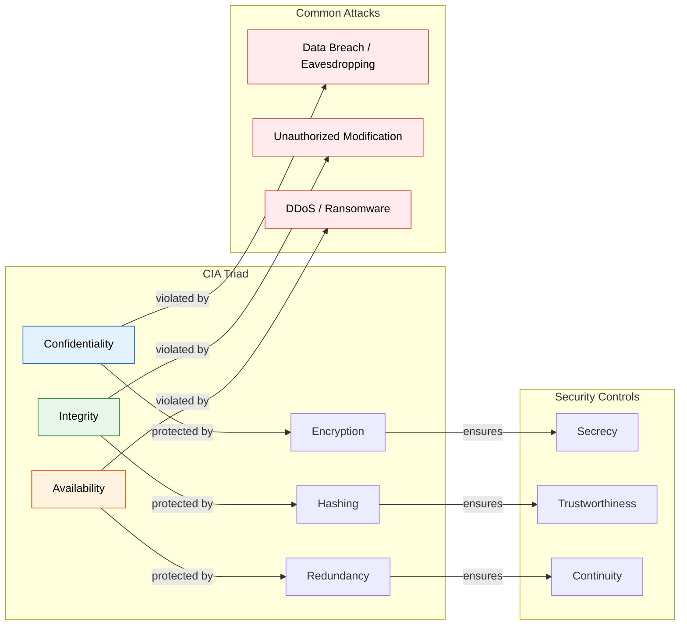
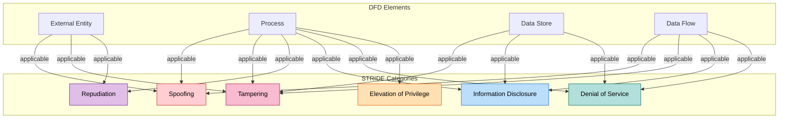

# Chapter 1: Security Fundamentals

> **Prereq:** None — this chapter introduces core security concepts.
> **Next:** Chapter 2 (Cryptography & TLS) — encryption and PKI build on the CIA triad.
> **Target Audience:** Beginners to intermediate; SOC analysts, penetration testers, developers, system administrators.

---

## Learning Objectives

By the end of this chapter, you will be able to:
1.  Define the CIA triad and explain real-world attacks against each pillar.
2.  Implement the AAA framework with concrete protocols (RADIUS, TACACS+, Kerberos).
3.  Apply seven core security principles with edge-case reasoning.
4.  Perform structured threat modeling using STRIDE, PASTA, LINDDUN, and Attack Trees.
5.  Conduct qualitative and quantitative risk assessments using NIST RMF.
6.  Set up OSSEC/Wazuh agents, run nmap scans, capture packets in Wireshark, crack passwords with John, and audit with Lynis.
7.  Analyze three major breaches (Equifax, Target, Capital One) with root-cause mapping.
8.  Answer 15+ interview questions on security fundamentals with depth.

<!-- Image Gallery -->
<div style="display:flex;flex-wrap:wrap;gap:4px;margin:16px 0;padding:12px;background:#f8fafc;border-radius:8px;border:1px solid #e2e8f0;">
<a href="../../../assets/images/lessons/cyber-security/01-fundamentals/hero.svg" target="_blank" rel="noopener">
  
</a>
<a href="../../../assets/images/lessons/cyber-security/01-fundamentals/handwritten-notes.svg" target="_blank" rel="noopener">
  
</a>
<a href="../../../assets/images/lessons/cyber-security/01-fundamentals/sticky-notes.svg" target="_blank" rel="noopener">
  
</a>
<a href="../../../assets/images/lessons/cyber-security/01-fundamentals/visual-explanation.svg" target="_blank" rel="noopener">
  
</a>
<a href="../../../assets/images/lessons/cyber-security/01-fundamentals/architecture.svg" target="_blank" rel="noopener">
  
</a>
<a href="../../../assets/images/lessons/cyber-security/01-fundamentals/workflow.svg" target="_blank" rel="noopener">
  
</a>
<a href="../../../assets/images/lessons/cyber-security/01-fundamentals/mindmap.svg" target="_blank" rel="noopener">
  
</a>
<a href="../../../assets/images/lessons/cyber-security/01-fundamentals/comparison.svg" target="_blank" rel="noopener">
  
</a>
<a href="../../../assets/images/lessons/cyber-security/01-fundamentals/cheatsheet.svg" target="_blank" rel="noopener">
  
</a>
<a href="../../../assets/images/lessons/cyber-security/01-fundamentals/interview-quiz.svg" target="_blank" rel="noopener">
  
</a>
<a href="../../../assets/images/lessons/cyber-security/01-fundamentals/social-card.svg" target="_blank" rel="noopener">
  
</a>
</div>
<!-- End Image Gallery -->


---

## Chapter at a Glance

| Section | Key Concept | Why It Matters |
|---------|-------------|----------------|
| CIA Triad | Confidentiality, Integrity, Availability | The three pillars of all security |
| AAA | Authn, Authz, Accounting | Who, what, and when for access |
| Security Principles | Least Privilege, Defense in Depth, etc. | Foundational design axioms |
| Threat Modeling | STRIDE, PASTA, LINDDUN, Attack Trees | Systematic threat identification |
| Risk Management | Qualitative, Quantitative, NIST RMF | Prioritisation under uncertainty |
| Practical Examples | OSSEC, nmap, Wireshark, John, Lynis | Hands-on security toolkit |
| Case Studies | Equifax, Target, Capital One | Real breach anatomy |
| Interview Corner | 15 Q&As | Job-ready fundamentals |

---

## 1. CIA Triad — The Three Pillars of Security

The CIA triad is the foundational model for information security policy. Every security control ultimately serves one or more of these three goals.

### 1.1 Real-World Analogy: The Bank Vault

<a href="../../../assets/images/diagrams/cyber-security/01-fundamentals/1-1-real-world-analogy-the-bank-vault-handwritten.svg" target="_blank" rel="noopener">
  
</a>
<a href="../../../assets/images/diagrams/cyber-security/01-fundamentals/1-1-real-world-analogy-the-bank-vault-diagram.svg" target="_blank" rel="noopener">
  
</a>
<a href="../../../assets/images/diagrams/cyber-security/01-fundamentals/1-1-real-world-analogy-the-bank-vault-sticky.svg" target="_blank" rel="noopener">
  
</a>


Think of a **bank vault** in a secure facility:

| CIA Element | Bank Analogy | Security Counterpart |
|-------------|--------------|---------------------|
| Confidentiality | Safe-deposit box needs the customer's key | Encryption + Access Control |
| Integrity | Tamper-evident seals on cash bundles | Hashing + Digital Signatures |
| Availability | Vault must be open during business hours | Redundancy + DDoS Protection |

A failure in any one dimension compromises the entire system. If the vault is always open (availability) but anyone can walk in (confidentiality), the bank fails. If the vault is impenetrable but never opens (no availability), the bank also fails.

### 1.2 Confidentiality — Keeping Secrets

<a href="../../../assets/images/diagrams/cyber-security/01-fundamentals/1-2-confidentiality-keeping-secrets-handwritten.svg" target="_blank" rel="noopener">
  
</a>
<a href="../../../assets/images/diagrams/cyber-security/01-fundamentals/1-2-confidentiality-keeping-secrets-diagram.svg" target="_blank" rel="noopener">
  
</a>
<a href="../../../assets/images/diagrams/cyber-security/01-fundamentals/1-2-confidentiality-keeping-secrets-sticky.svg" target="_blank" rel="noopener">
  
</a>


**Definition:** Ensuring that information is accessible only to those authorized to see it.

**Mechanisms:**
- **Encryption at rest:** AES-256 for stored data (database, disk, backups).
- **Encryption in transit:** TLS 1.3 for network communication.
- **Access Control Lists (ACLs):** Filesystem and network-layer permissions.
- **Data masking:** Dynamic substitution of sensitive fields (e.g., `XXXX-XX-1234`).
- **Steganography:** Hiding data within other data (covert channels).

**Common Attacks on Confidentiality:**
- Eavesdropping / packet sniffing
- Man-in-the-Middle (MITM)
- SQL injection exposing PII
- Shoulder surfing
- Side-channel attacks (Spectre, Meltdown, timing attacks)

**Example Attack Walkthrough — Packet Sniffing:**
```
1. Attacker gains access to the local network segment (e.g., public Wi-Fi).
2. Attacker enables promiscuous mode on their NIC.
3. Attacker runs Wireshark / tcpdump to capture unencrypted traffic.
4. If the victim uses HTTP (not HTTPS), attacker reads cookies, session tokens, and form data in plaintext.
5. Attacker replays captured session token to impersonate victim.
```

### 1.3 Integrity — Trusting the Data

<a href="../../../assets/images/diagrams/cyber-security/01-fundamentals/1-3-integrity-trusting-the-data-handwritten.svg" target="_blank" rel="noopener">
  
</a>
<a href="../../../assets/images/diagrams/cyber-security/01-fundamentals/1-3-integrity-trusting-the-data-diagram.svg" target="_blank" rel="noopener">
  
</a>
<a href="../../../assets/images/diagrams/cyber-security/01-fundamentals/1-3-integrity-trusting-the-data-sticky.svg" target="_blank" rel="noopener">
  
</a>


**Definition:** Safeguarding the accuracy and completeness of data and processing methods.

**Mechanisms:**
- **Cryptographic hashing:** SHA-256, SHA-3 — detect any bit-level modification.
- **Digital signatures:** RSA / ECDSA — verify sender identity + data integrity.
- **Checksums / CRCs:** Lightweight integrity for network packets.
- **Version control / audit logs:** Immutable records of who changed what and when.
- **Database constraints:** Foreign keys, unique constraints, triggers.

**Common Attacks on Integrity:**
- Man-in-the-Middle altering packets in transit
- SQL injection modifying database values
- Log tampering / deletion
- Time-of-check to Time-of-use (TOCTOU) race conditions
- Ransomware encrypting files (integrity+availability attack)

**Example Attack Walkthrough — SQL Injection Data Modification:**
```
1. Attacker identifies a vulnerable login form that interpolates input directly into SQL.
2. Input: `' OR '1'='1' ; UPDATE accounts SET balance = 9999999 WHERE username = 'attacker' --`
3. The database executes both the login bypass and the balance modification.
4. Integrity of the financial record is destroyed.
```

### 1.4 Availability — Keeping the Lights On

<a href="../../../assets/images/diagrams/cyber-security/01-fundamentals/1-4-availability-keeping-the-lights-on-handwritten.svg" target="_blank" rel="noopener">
  
</a>
<a href="../../../assets/images/diagrams/cyber-security/01-fundamentals/1-4-availability-keeping-the-lights-on-diagram.svg" target="_blank" rel="noopener">
  
</a>
<a href="../../../assets/images/diagrams/cyber-security/01-fundamentals/1-4-availability-keeping-the-lights-on-sticky.svg" target="_blank" rel="noopener">
  
</a>


**Definition:** Ensuring timely and reliable access to information and systems by authorized users.

**Mechanisms:**
- **Redundancy:** Active-active or active-passive server clusters.
- **Load balancing:** Distributing traffic across multiple nodes.
- **Failover:** Automatic switch to standby systems.
- **DDoS protection:** Rate limiting, scrubbing centers, CDNs (Cloudflare, AWS Shield).
- **Backup & disaster recovery:** 3-2-1 backup rule (3 copies, 2 media types, 1 offsite).
- **Patch management:** Closing vulnerabilities before they can be exploited for disruption.

**Common Attacks on Availability:**
- Distributed Denial of Service (DDoS) — SYN flood, HTTP flood, DNS amplification
- Ransomware encrypting critical data
- Physical destruction (fire, flood, power outage)
- Insider sabotage
- DNS hijacking redirecting traffic

**Example Attack Walkthrough — SYN Flood:**
```
1. Attacker sends a flood of TCP SYN packets with spoofed source IPs.
2. Server allocates memory for each half-open connection (backlog queue).
3. Server sends SYN-ACK to the spoofed IP (which never responds).
4. Backlog queue fills up; legitimate SYN packets are dropped.
5. Result: legitimate users cannot establish new connections (denial of service).
```

### 1.5 CIA Triad — Complexities & Trade-offs

<a href="../../../assets/images/diagrams/cyber-security/01-fundamentals/1-5-cia-triad-complexities-trade-offs-handwritten.svg" target="_blank" rel="noopener">
  
</a>
<a href="../../../assets/images/diagrams/cyber-security/01-fundamentals/1-5-cia-triad-complexities-trade-offs-diagram.svg" target="_blank" rel="noopener">
  
</a>
<a href="../../../assets/images/diagrams/cyber-security/01-fundamentals/1-5-cia-triad-complexities-trade-offs-sticky.svg" target="_blank" rel="noopener">
  
</a>


| Scenario | Confidentiality | Integrity | Availability | Resolution |
|----------|----------------|-----------|--------------|------------|
| Encrypt database = slower reads | ✅ Strong | ✅ Same | ❌ Slower queries | Use hardware acceleration (AES-NI) |
| Full data backups = high storage cost | ✅ Same | ✅ Strong | ✅ Fast restore | Tier backups (daily incremental + weekly full) |
| Air-gapped system = very secure | ✅ Strong | ✅ Strong | ❌ No remote access | Use a CDP / data diode for controlled egress |
| Too many authentication factors | ✅ Strong | ✅ Same | ❌ User lockout | Implement risk-based (adaptive) auth |

### CIA Triad — Advantages & Disadvantages Summary

<a href="../../../assets/images/diagrams/cyber-security/01-fundamentals/cia-triad-advantages-disadvantages-summary-handwritten.svg" target="_blank" rel="noopener">
  
</a>
<a href="../../../assets/images/diagrams/cyber-security/01-fundamentals/cia-triad-advantages-disadvantages-summary-diagram.svg" target="_blank" rel="noopener">
  
</a>
<a href="../../../assets/images/diagrams/cyber-security/01-fundamentals/cia-triad-advantages-disadvantages-summary-sticky.svg" target="_blank" rel="noopener">
  
</a>


| Element | Advantages | Disadvantages |
|---------|------------|---------------|
| **Confidentiality** | Prevents data breaches; regulatory compliance (GDPR, HIPAA) | Encryption adds latency; key management complexity; can hinder forensics |
| **Integrity** | Detects tampering; enables non-repudiation; data quality | Hashing adds overhead; false positives in change detection; rollback complexity |
| **Availability** | Ensures business continuity; customer trust | High cost of redundancy; complex failover testing; DDoS mitigation is expensive |

---

## 2. AAA Framework — Authentication, Authorization, Accounting

### 2.1 Real-World Analogy: Airport Security

<a href="../../../assets/images/diagrams/cyber-security/01-fundamentals/2-1-real-world-analogy-airport-security-handwritten.svg" target="_blank" rel="noopener">
  
</a>
<a href="../../../assets/images/diagrams/cyber-security/01-fundamentals/2-1-real-world-analogy-airport-security-diagram.svg" target="_blank" rel="noopener">
  
</a>
<a href="../../../assets/images/diagrams/cyber-security/01-fundamentals/2-1-real-world-analogy-airport-security-sticky.svg" target="_blank" rel="noopener">
  
</a>


| AAA Component | Airport Equivalent | Security Purpose |
|---------------|--------------------|------------------|
| **Authentication** | Show passport + boarding pass | "Are you who you say you are?" |
| **Authorization** | Gate agent checks destination on ticket | "Are you allowed to board this flight?" |
| **Accounting** | Flight manifest + departure logs | "What did you do? Where did you go?" |

### 2.2 Authentication — Proving Identity

<a href="../../../assets/images/diagrams/cyber-security/01-fundamentals/2-2-authentication-proving-identity-handwritten.svg" target="_blank" rel="noopener">
  
</a>
<a href="../../../assets/images/diagrams/cyber-security/01-fundamentals/2-2-authentication-proving-identity-diagram.svg" target="_blank" rel="noopener">
  
</a>
<a href="../../../assets/images/diagrams/cyber-security/01-fundamentals/2-2-authentication-proving-identity-sticky.svg" target="_blank" rel="noopener">
  
</a>


**Three Authentication Factors:**

| Factor | Examples | Strength |
|--------|----------|----------|
| **Something you know** | Password, PIN, security question | Weak — phishable, guessable |
| **Something you have** | Smartphone (TOTP), YubiKey, smart card | Medium — can be stolen |
| **Something you are** | Fingerprint, retina scan, voice, face | Strong — hard to replicate (biometric) |

**Authentication Protocols:**
- **RADIUS (Remote Authentication Dial-In User Service):** UDP-based, port 1812 (auth) / 1813 (accounting). Common for VPN, Wi-Fi (802.1X), network devices. Sends password in cleartext (mitigated with EAP-MSCHAPv2, EAP-TLS).
- **TACACS+ (Terminal Access Controller Access-Control System Plus):** Cisco proprietary, TCP-based, port 49. Encrypts entire packet body. Separates auth, authorization, and accounting into different phases.
- **Kerberos:** Symmetric-key based, default in Active Directory. Uses Ticket Granting Ticket (TGT) + service tickets. Time-sensitive (max 10 min clock skew).

**Kerberos Authentication Flow:**
```
Step 1: User sends AS-REQ to Authentication Server (AS) with user ID.
Step 2: AS replies AS-REP containing TGT (Ticket Granting Ticket) encrypted with user's password hash.
Step 3: User decrypts TGT, now has temp credentials.
Step 4: User sends TGS-REQ to Ticket Granting Server (TGS) with TGT + target service SPN.
Step 5: TGS replies TGS-REP with service ticket encrypted with service's secret key.
Step 6: User sends AP-REQ to target service with service ticket.
Step 7: Service decrypts and grants access — mutual authentication complete.
```

### 2.3 Authorization — Granting Access

<a href="../../../assets/images/diagrams/cyber-security/01-fundamentals/2-3-authorization-granting-access-handwritten.svg" target="_blank" rel="noopener">
  
</a>
<a href="../../../assets/images/diagrams/cyber-security/01-fundamentals/2-3-authorization-granting-access-diagram.svg" target="_blank" rel="noopener">
  
</a>
<a href="../../../assets/images/diagrams/cyber-security/01-fundamentals/2-3-authorization-granting-access-sticky.svg" target="_blank" rel="noopener">
  
</a>


**Authorization Models:**

| Model | Description | Example |
|-------|-------------|---------|
| **DAC (Discretionary ACL)** | Owner controls permissions on their objects | Linux file permissions (`chmod`) |
| **MAC (Mandatory ACL)** | System-wide policy overrides owner decisions | SELinux, Bell-LaPadula |
| **RBAC (Role-Based)** | Permissions assigned to roles, users to roles | AWS IAM roles, Active Directory groups |
| **ABAC (Attribute-Based)** | Rules evaluate user+resource+environment attributes | AWS IAM policies with `aws:SourceIp`, `aws:CurrentTime` |
| **PBAC (Policy-Based)** | External policy engine (e.g., OPA / Cedar) | AWS Verified Access, Google Zanzibar |

**Authorization Decision Matrix:**
```
Input:  Subject, Action, Resource, Environment
Output: Permit / Deny (with reason)

If Subject.Role == "Admin" AND Action == "DELETE" AND Resource.Type == "User" THEN
    Permit if Resource != Subject (prevent self-deletion)
Else If Subject.Role == "Auditor" AND Action == "READ" AND Resource.Sensitivity == "HIGH" THEN
    Permit if Environment.Time within BusinessHours
Else
    Deny by default (fail-safe)
```

### 2.4 Accounting — Keeping Records

<a href="../../../assets/images/diagrams/cyber-security/01-fundamentals/2-4-accounting-keeping-records-handwritten.svg" target="_blank" rel="noopener">
  
</a>
<a href="../../../assets/images/diagrams/cyber-security/01-fundamentals/2-4-accounting-keeping-records-diagram.svg" target="_blank" rel="noopener">
  
</a>
<a href="../../../assets/images/diagrams/cyber-security/01-fundamentals/2-4-accounting-keeping-records-sticky.svg" target="_blank" rel="noopener">
  
</a>


**Key Data Collected:**
- User/process identifier
- Login/logout timestamps
- Resources accessed and actions performed
- Data volume transferred
- Failed attempts (authentication, authorization)
- Privilege changes (escalation, de-escalation)

**Accounting Protocols:**
- **RADIUS Accounting:** Interim-Update packets every N seconds (configurable).
- **Syslog / SIEM:** Centralized log aggregation (Splunk, ELK, Sentinel).
- **Windows Event Logs:** Security log (IDs 4624=logon, 4625=failed logon, 4648=explicit credentials).
- **Linux auditd:** `ausearch`, `aureport` for comprehensive system call accounting.

### 2.5 AAA Protocol Comparison

<a href="../../../assets/images/diagrams/cyber-security/01-fundamentals/2-5-aaa-protocol-comparison-handwritten.svg" target="_blank" rel="noopener">
  
</a>
<a href="../../../assets/images/diagrams/cyber-security/01-fundamentals/2-5-aaa-protocol-comparison-diagram.svg" target="_blank" rel="noopener">
  
</a>
<a href="../../../assets/images/diagrams/cyber-security/01-fundamentals/2-5-aaa-protocol-comparison-sticky.svg" target="_blank" rel="noopener">
  
</a>


| Feature | RADIUS | TACACS+ | Kerberos |
|---------|--------|---------|----------|
| Transport | UDP (default), TCP | TCP | UDP (primary), TCP |
| Encryption | Only password (Access-Request) | Full packet body | Full session |
| Auth + Authz | Combined | Separated | Combined |
| Accounting | Built-in | Built-in | Not native |
| Use Case | ISP, Wi-Fi, VPN | Network device admin (Cisco) | Enterprise AD / SSO |
| Port | 1812/1813 | 49 | 88 |

---

## 3. Security Principles — The Foundation of Secure Design

Seven timeless principles from Saltzer & Schroeder's 1975 paper "The Protection of Information in Computer Systems," augmented with modern additions.

### 3.1 Principle 1: Least Privilege

<a href="../../../assets/images/diagrams/cyber-security/01-fundamentals/3-1-principle-1-least-privilege-handwritten.svg" target="_blank" rel="noopener">
  
</a>
<a href="../../../assets/images/diagrams/cyber-security/01-fundamentals/3-1-principle-1-least-privilege-diagram.svg" target="_blank" rel="noopener">
  
</a>
<a href="../../../assets/images/diagrams/cyber-security/01-fundamentals/3-1-principle-1-least-privilege-sticky.svg" target="_blank" rel="noopener">
  
</a>


**Definition:** Every entity (user, process, service) should operate with the minimum set of permissions necessary to perform its function.

**Real-World Analogy: Airport employee badge** — the janitor gets access to the public areas and corridors, not the cockpit or baggage handling control room.

**Algorithm — Principle of Least Privilege:**
```
1. IDENTIFY the entity's task(s).
2. DECOMPOSE each task into atomic operations.
3. MAP each operation to resource + action pairs.
4. ASSIGN permissions covering only those pairs.
5. DENY everything else by default (implicit deny).
6. REVIEW quarterly to revoke stale permissions.
```

**Dry Run — Web Application:**
| Entity | Task | Resources Needed | Permissions Granted | Denied |
|--------|------|-----------------|-------------------|--------|
| Web server | Serve HTTP, read config | Port 80/443, nginx.conf | Bind to ports, read-only /etc/nginx | /etc/shadow, database, SSH keys |
| App server | Process requests, query DB | Application code, DB port 3306 | Execute app directory, TCP to DB:3306 | Internet access, filesystem write outside /tmp |
| Database | Store/retrieve records | Data directory, port 3306 | Read/write data files, listen on DB port | Shell access, outbound network |

**Violation Example — Target 2013:** HVAC vendor had network access reaching the POS system. The vendor's badge was too permissive — see Case Study 2.

### 3.2 Principle 2: Defense in Depth (Layered Security)

<a href="../../../assets/images/diagrams/cyber-security/01-fundamentals/3-2-principle-2-defense-in-depth-layered-security-handwritten.svg" target="_blank" rel="noopener">
  
</a>
<a href="../../../assets/images/diagrams/cyber-security/01-fundamentals/3-2-principle-2-defense-in-depth-layered-security-diagram.svg" target="_blank" rel="noopener">
  
</a>
<a href="../../../assets/images/diagrams/cyber-security/01-fundamentals/3-2-principle-2-defense-in-depth-layered-security-sticky.svg" target="_blank" rel="noopener">
  
</a>


**Definition:** Multiple layers of security controls ensure that if one layer fails, the next layer contains the threat.

**Real-World Analogy: Castle defense** — moat → outer wall → inner wall → keep → dungeon. An attacker must breach every layer before reaching the throne.

**Algorithm — Defense in Depth:**
```
1. MAP the attack surface (all entry points into the system).
2. For EACH entry point, identify the primary security control.
3. For EACH primary control, identify what happens when it fails.
4. ADD a secondary (and tertiary) control that catches the failure.
5. ENSURE controls are independent (different vendors, different failure modes).
6. TEST each layer independently and the chain as a whole.
```

**Defense in Depth Layers (Web Application):**
```
LAYER 1 — Firewall (network):   Block all ports except 80, 443, SSH from management IPs.
LAYER 2 — WAF (web app firewall):  Detect and block SQLi, XSS, CSRF patterns.
LAYER 3 — Rate Limiting:         1000 req/min per IP — mitigate brute force and DDoS.
LAYER 4 — Authentication:        Multi-factor (password + TOTP) with lockout after 5 failures.
LAYER 5 — Authorization:         RBAC with ABAC override for high-risk actions.
LAYER 6 — Input Validation:      Server-side validation + prepared statements.
LAYER 7 — Encryption:            TLS 1.3 in transit, AES-256-GCM at rest.
LAYER 8 — Logging & Monitoring:  Centralized SIEM, real-time alerting (failed logins > baseline).
LAYER 9 — Backup & DR:           Point-in-time recovery, 3-2-1 backup rule.
```

### 3.3 Principle 3: Economy of Mechanism (Keep It Simple)

<a href="../../../assets/images/diagrams/cyber-security/01-fundamentals/3-3-principle-3-economy-of-mechanism-keep-it-simple-handwritten.svg" target="_blank" rel="noopener">
  
</a>
<a href="../../../assets/images/diagrams/cyber-security/01-fundamentals/3-3-principle-3-economy-of-mechanism-keep-it-simple-diagram.svg" target="_blank" rel="noopener">
  
</a>
<a href="../../../assets/images/diagrams/cyber-security/01-fundamentals/3-3-principle-3-economy-of-mechanism-keep-it-simple-sticky.svg" target="_blank" rel="noopener">
  
</a>


**Definition:** Security mechanisms should be as simple as possible. Complexity hides vulnerabilities.

**Real-World Analogy: A single deadbolt lock** is more reliable than a 12-gear combination lock that jams when dust enters.

**Good vs Bad Examples:**
| Aspect | Simple (Economy) | Complex (Violation) |
|--------|-----------------|---------------------|
| Access control | `if user in admin_group: allow` | Nested RBAC with 18 role hierarchies, 3 inheritance chains, and 6 override rules |
| Encryption | TLS 1.3 with one cipher suite | Custom XOR + base64 "encryption" built in-house |
| Authentication | Password + TOTP | 7-step multi-org federated SSO with 4 IdP hops and custom SAML extensions |
| Firewall rules | `deny all; allow port 80,443` | 600 rules with overlapping subnets, port ranges, and time-based exceptions |

### 3.4 Principle 4: Fail-Safe Defaults

<a href="../../../assets/images/diagrams/cyber-security/01-fundamentals/3-4-principle-4-fail-safe-defaults-handwritten.svg" target="_blank" rel="noopener">
  
</a>
<a href="../../../assets/images/diagrams/cyber-security/01-fundamentals/3-4-principle-4-fail-safe-defaults-diagram.svg" target="_blank" rel="noopener">
  
</a>
<a href="../../../assets/images/diagrams/cyber-security/01-fundamentals/3-4-principle-4-fail-safe-defaults-sticky.svg" target="_blank" rel="noopener">
  
</a>


**Definition:** When a system fails, it should default to a secure state (deny access) rather than an insecure state (allow access).

**Real-World Analogy: A locked door** that remains locked when the power fails (fails secure) vs a magnetic lock that opens on power loss (fails unsafe for security, but usable for fire exit).

**Implementation Rules:**
```
1. All ACLs should terminate with an explicit "deny all."
2. All try/catch blocks should re-throw or escalate, never silently return success.
3. All authentication failures should produce the same error message ("Invalid credentials" — not "password wrong" vs "user not found").
4. All defaults should be the most restrictive option: disabled features, blocked ports, no remote access.
5. All configuration errors should prevent the application from starting.
```

**Fail-Safe Decision Matrix:**
| Scenario | Fail-Safe (Secure) | Fail-Open (Insecure) | Correct Choice |
|----------|-------------------|---------------------|----------------|
| Firewall power loss | Drops all traffic | Passes all traffic | Fail-safe (security) |
| Auth server unreachable | Deny all logins | Allow all logins | Fail-safe (security) |
| Fire door mechanism fails | Stays closed | Opens automatically | Fail-open (life safety) |
| Database connection lost | Show error page | Show cached (potentially stale) data | Fail-safe (integrity) |

### 3.5 Principle 5: Complete Mediation

<a href="../../../assets/images/diagrams/cyber-security/01-fundamentals/3-5-principle-5-complete-mediation-handwritten.svg" target="_blank" rel="noopener">
  
</a>
<a href="../../../assets/images/diagrams/cyber-security/01-fundamentals/3-5-principle-5-complete-mediation-diagram.svg" target="_blank" rel="noopener">
  
</a>
<a href="../../../assets/images/diagrams/cyber-security/01-fundamentals/3-5-principle-5-complete-mediation-sticky.svg" target="_blank" rel="noopener">
  
</a>


**Definition:** Every access to every object must be checked for authority — not just the first time, but every single time.

**Real-World Analogy: A security guard** at a building entrance who checks every person's badge every time they enter, not just the first time they arrive in the morning.

**Violation Example — TOCTOU (Time of Check, Time of Use):**
```
VULNERABLE:
1. User requests file access.
2. System checks permissions → OK.
3. User replaces file with a symlink to /etc/passwd (between check and use).
4. System opens file → reads /etc/passwd.

SECURE:
1. User provides file descriptor (open syscall).
2. System checks permissions on the open operation atomically.
3. Permission check and file access are the same operation — no gap.
```

### 3.6 Principle 6: Open Design (No Security Through Obscurity)

<a href="../../../assets/images/diagrams/cyber-security/01-fundamentals/3-6-principle-6-open-design-no-security-through-obscurity-handwritten.svg" target="_blank" rel="noopener">
  
</a>
<a href="../../../assets/images/diagrams/cyber-security/01-fundamentals/3-6-principle-6-open-design-no-security-through-obscurity-diagram.svg" target="_blank" rel="noopener">
  
</a>
<a href="../../../assets/images/diagrams/cyber-security/01-fundamentals/3-6-principle-6-open-design-no-security-through-obscurity-sticky.svg" target="_blank" rel="noopener">
  
</a>


**Definition:** The security of a mechanism should not depend on the secrecy of its design or implementation. Secrets are keys and passwords, not algorithms.

**Real-World Analogy: A lock** works because of the key, not because the lock mechanism is hidden. If everyone knows how a pin tumbler lock works, it still requires the correct key to open.

**Contrast:**
| Approach | Example | Verdict |
|----------|---------|---------|
| Open design | AES (published, peer-reviewed, standardized) | ✅ Secure |
| Security through obscurity | Custom "encryption" algorithm kept secret, broken when leaked | ❌ Insecure |
| Open protocol + secret keys | TLS with ephemeral key exchange | ✅ Secure |
| Hidden database port | Listening on port 65432 instead of 5432 | ❌ Obscurity — nmap finds it |

### 3.7 Principle 7: Separation of Duties

<a href="../../../assets/images/diagrams/cyber-security/01-fundamentals/3-7-principle-7-separation-of-duties-handwritten.svg" target="_blank" rel="noopener">
  
</a>
<a href="../../../assets/images/diagrams/cyber-security/01-fundamentals/3-7-principle-7-separation-of-duties-diagram.svg" target="_blank" rel="noopener">
  
</a>
<a href="../../../assets/images/diagrams/cyber-security/01-fundamentals/3-7-principle-7-separation-of-duties-sticky.svg" target="_blank" rel="noopener">
  
</a>


**Definition:** No single entity should have complete control over a critical process. Split critical operations across multiple parties.

**Real-World Analogy: A bank** requires two signatures on checks over $10,000. One employee cannot unilaterally move large sums.

**Examples in Security:**
| Scenario | Single Entity (Violation) | Separated (Compliant) |
|----------|--------------------------|----------------------|
| Code deployment | Developer writes code, tests, and deploys to production | Developer writes → QA tests → DevOps/SRE deploys |
| Financial transaction | One person initiates and approves payments | Clerk initiates → Manager approves |
| Root password | One person knows the root password | Half-password split or break-glass with audit |
| Crypto key management | One person generates, stores, and uses the key | Key custodian (store) ≠ key operator (use) ≠ key auditor (log review) |

### Security Principles — Comparison Table

<a href="../../../assets/images/diagrams/cyber-security/01-fundamentals/security-principles-comparison-table-handwritten.svg" target="_blank" rel="noopener">
  
</a>
<a href="../../../assets/images/diagrams/cyber-security/01-fundamentals/security-principles-comparison-table-diagram.svg" target="_blank" rel="noopener">
  
</a>
<a href="../../../assets/images/diagrams/cyber-security/01-fundamentals/security-principles-comparison-table-sticky.svg" target="_blank" rel="noopener">
  
</a>


| Principle | Focus | Key Question | Obvious When Missing |
|-----------|-------|-------------|---------------------|
| Least Privilege | Minimise permissions | "What's the minimum this needs?" | Overprivileged service accounts |
| Defense in Depth | Multiple independent layers | "What happens when this control fails?" | Single firewall, no monitoring |
| Economy of Mechanism | Simplicity | "Can this be simpler?" | Custom crypto, 600 firewall rules |
| Fail-Safe Defaults | Secure failure | "What does this default to?" | Door unlocks on power loss |
| Complete Mediation | Every-access check | "Is every access validated?" | TOCTOU vulnerabilities |
| Open Design | Transparent mechanisms | "Does this work if the design is public?" | Proprietary "security" algorithms |
| Separation of Duties | Distributed trust | "Does anyone have too much power?" | Developer deploys to prod |

---


---

## 4. Threat Modeling Frameworks

Threat modeling is a structured approach to identifying, enumerating, and prioritizing threats to a system. It shifts security left → finding issues in design rather than in production.

### 4.1 Real-World Analogy: Architectural Blueprint Review

<a href="../../../assets/images/diagrams/cyber-security/01-fundamentals/4-1-real-world-analogy-architectural-blueprint-review-handwritten.svg" target="_blank" rel="noopener">
  
</a>
<a href="../../../assets/images/diagrams/cyber-security/01-fundamentals/4-1-real-world-analogy-architectural-blueprint-review-diagram.svg" target="_blank" rel="noopener">
  
</a>
<a href="../../../assets/images/diagrams/cyber-security/01-fundamentals/4-1-real-world-analogy-architectural-blueprint-review-sticky.svg" target="_blank" rel="noopener">
  
</a>


Before building a house, an architect reviews the blueprints for structural weaknesses. A threat model is the security equivalent → reviewing system architecture diagrams for security weaknesses before writing code.

### 4.2 STRIDE (Microsoft)

<a href="../../../assets/images/diagrams/cyber-security/01-fundamentals/4-2-stride-microsoft-handwritten.svg" target="_blank" rel="noopener">
  
</a>
<a href="../../../assets/images/diagrams/cyber-security/01-fundamentals/4-2-stride-microsoft-diagram.svg" target="_blank" rel="noopener">
  
</a>
<a href="../../../assets/images/diagrams/cyber-security/01-fundamentals/4-2-stride-microsoft-sticky.svg" target="_blank" rel="noopener">
  
</a>


Developed by Microsoft in 1999. Six threat categories mapped to security properties.

**STRIDE Threat Categories:**

| Category | Security Property Violated | Definition | Example |
|----------|---------------------------|------------|---------|
| **S**poofing | Authentication | Impersonating a user, process, or system | Fake login page stealing credentials |
| **T**ampering | Integrity | Unauthorized modification of data | SQL injection modifying account balance |
| **R**epudiation | Non-repudiation | Denying an action without evidence | User claims "I didn't place that order" without audit log |
| **I**nformation Disclosure | Confidentiality | Exposing data to unauthorized parties | S3 bucket without ACL exposing customer PII |
| **D**enial of Service | Availability | Disrupting legitimate access | SYN flood overwhelming the web server |
| **E**levation of Privilege | Authorization | Gaining higher permissions than granted | Buffer overflow giving root shell |

**STRIDE Analysis Algorithm:**
```
1. DECOMPOSE the system into components (DFD: processes, data stores, data flows, external entities, trust boundaries).
2. For EACH element in the DFD, ask: "Is this element vulnerable to Spoofing? Tampering? ... Elevation of Privilege?"
3. DOCUMENT each identified threat with: element, threat type, impact, likelihood.
4. PRIORITIZE using DREAD (or CVSS) scoring.
5. PRESCRIBE mitigation for each threat (redesign, add control, accept, transfer).
```

**STRIDE Per-Element Mapping:**

| DFD Element | S | T | R | I | D | E |
|-------------|---|---|---|---|---|---|
| External Entity | Y | N | Y | N | N | N |
| Process | Y | Y | Y | Y | Y | Y |
| Data Flow | Y | Y | Y | Y | N | N |
| Data Store | N | Y | Y | Y | N | N |

**Dry Run → STRIDE Analysis of a Banking Web App:**

| Component | Threat | Category | Impact | Mitigation |
|-----------|--------|----------|--------|------------|
| Login form | Attacker sends stolen credentials via credential stuffing | Spoofing | Account takeover | MFA + rate limiting + CAPTCHA |
| Transaction API | Attacker intercepts and modifies transfer amount in transit | Tampering | Financial loss | TLS + HMAC on payload |
| Audit log | Admin user performs action then deletes log entry | Repudiation | No forensic evidence | Immutable append-only log (write-once media) |
| Session cookie | Attacker reads session cookie from HTTP traffic | Info Disclosure | Session hijacking | Secure + HttpOnly + SameSite cookies |
| Search endpoint | Attacker floods with recursive queries | DoS | Application unresponsive | Query depth limit, timeout, rate limit |
| Password reset | Attacker gains admin access via weak token generation | Elevation of Privilege | Full compromise | Cryptographically random tokens, expiry, single-use |

### 4.3 PASTA (Process for Attack Simulation and Threat Analysis)

<a href="../../../assets/images/diagrams/cyber-security/01-fundamentals/4-3-pasta-process-for-attack-simulation-and-threat-analysis-handwritten.svg" target="_blank" rel="noopener">
  
</a>
<a href="../../../assets/images/diagrams/cyber-security/01-fundamentals/4-3-pasta-process-for-attack-simulation-and-threat-analysis-diagram.svg" target="_blank" rel="noopener">
  
</a>
<a href="../../../assets/images/diagrams/cyber-security/01-fundamentals/4-3-pasta-process-for-attack-simulation-and-threat-analysis-sticky.svg" target="_blank" rel="noopener">
  
</a>


Created by Tony UcedaVélez (VerSprite). Seven-stage risk-centric methodology. Unlike STRIDE which categorizes threats bottom-up, PASTA starts with business objectives and works down.

**PASTA Stages:**

| Stage | Name | Activity | Output |
|-------|------|----------|--------|
| 1 | Define Objectives | Identify business goals, compliance requirements, risk appetite | Business impact analysis |
| 2 | Define Technical Scope | Enumerate assets, endpoints, APIs, data flows | Technical scope diagram |
| 3 | Application Decomposition | Map trust boundaries, entry points, data classification | Application walkthrough |
| 4 | Threat Analysis | Identify threat agents, attack scenarios, TTPs | Threat library / ATT&CK mapping |
| 5 | Weakness & Vulnerability Analysis | Correlate threats to known weaknesses (CWE, CVE) | Vulnerability mapping |
| 6 | Attack Modeling | Simulate attack paths, compute exploitability | Attack tree + attack surface |
| 7 | Risk & Impact Analysis | Quantify residual risk, recommend mitigations | Risk treatment report |

**PASTA Stage 1 → Define Objectives (Dry Run for E-Commerce App):**
```
Business Objective: Process 100,000 orders per day with < 0.01% fraud rate.
Compliance:          PCI DSS Level 1, GDPR for EU customers.
Risk Appetite:       Low for financial breach, medium for availability downtime (< 4 hours).
Key Assets:         Credit card data, customer PII, order history, inventory database.
```

**PASTA Stage 4 → Threat Analysis (Threat Agent Enumeration):**
```
Threat Agent Profile: External Cybercriminal
  → Skill Level: Advanced
  → Motivation: Financial gain
  → Target: Credit card data (PCI scope)
  → TTPs: SQL injection, credential stuffing, Magecart (client-side skimmer)
  → Detection Difficulty: Hard (uses encrypted C2, valid credentials after exfiltration)

Threat Agent Profile: Insider (Disgruntled Employee)
  → Skill Level: Moderate
  → Motivation: Revenge, data sale
  → Target: Customer PII, intellectual property
  → TTPs: Legitimate credentials, after-hours access, large data downloads
  → Detection Difficulty: Medium (looks like normal traffic)
```

**PASTA vs STRIDE:**

| Dimension | STRIDE | PASTA |
|-----------|--------|-------|
| Approach | Threat-centric (bottom-up) | Risk-centric (top-down) |
| Stages | 1 (categorization) | 7 (full lifecycle) |
| Output | Threat list by category | Risk-scored attack scenarios |
| Effort | Low (hours) | High (weeks) |
| Best for | Early design phase | Complex application security programs |
| Business alignment | Low | High (starts with business objectives) |

### 4.4 LINDDUN → Privacy Threat Modeling

<a href="../../../assets/images/diagrams/cyber-security/01-fundamentals/4-4-linddun-privacy-threat-modeling-handwritten.svg" target="_blank" rel="noopener">
  
</a>
<a href="../../../assets/images/diagrams/cyber-security/01-fundamentals/4-4-linddun-privacy-threat-modeling-diagram.svg" target="_blank" rel="noopener">
  
</a>
<a href="../../../assets/images/diagrams/cyber-security/01-fundamentals/4-4-linddun-privacy-threat-modeling-sticky.svg" target="_blank" rel="noopener">
  
</a>


LINDDUN focuses specifically on privacy threats → an evolution of STRIDE for the privacy domain. Developed by DistriNet Research Group, KU Leuven.

**Seven Privacy Threat Categories:**

| Letter | Threat | Privacy Principle | Example |
|--------|--------|------------------|---------|
| **L** | Linkability | Unlinkability | Tracking user across sessions via persistent cookie |
| **I** | Identifiability | Anonymity | Browser fingerprinting identifying user without login |
| **N** | Non-repudiation | Plausible deniability | Log that proves user visited a sensitive website |
| **D** | Detectability | Undetectability | Ability to detect whether a user is in a database |
| **D** | Disclosure of Information | Confidentiality | Leaking user's medical condition via URL parameter |
| **U** | Unawareness | User consent/control | Data collected without user's knowledge or consent |
| **N** | Non-compliance | Compliance | Violating GDPR right to erasure or data portability |

**LINDDUN Analysis Steps:**
```
1. CREATE a Data Flow Diagram (DFD) of the system.
2. IDENTIFY privacy-relevant data stores, flows, and processes.
3. For EACH element, map to the applicable LINDDUN threat categories.
4. DOCUMENT privacy threats with: data element, threat type, privacy principle violated, severity.
5. PRESCRIBE privacy-enhancing technologies (PETs): anonymization, differential privacy, k-anonymity, data minimization.
6. VERIFY compliance with applicable regulations (GDPR, CCPA, HIPAA).
```

**LINDDUN Dry Run → Healthcare Appointment App:**

| Data Element | DFD Element | LINDDUN Threat | Mitigation |
|-------------|-------------|----------------|------------|
| Patient email + appointment time | Data Flow (browser to server) | Linkability → attacker correlates email with health condition | Use anonymous session tokens, not patient identifiers, in URL |
| Search history for specialists | Data Store (search log) | Identifiability → search queries reveal health issues | Anonymize logs after 24 hours; differential privacy on analytics |
| Doctor name visited | Data Store (appointment records) | Non-repudiation → patient cannot deny visiting a specialist | Allow patients to delete their visit history (right to erasure) |
| Prescription details in notifications | Data Flow (server to push notification) | Disclosure → notification preview seen by others on lock screen | Disable notification previews for health data |
| Insurance group ID | Data Flow (API call) | Unawareness → patient doesn't know insurance is tracked | Clear consent form + privacy notice before data collection |
| Data retention policy | Configuration | Non-compliance → retains data beyond GDPR limit | Auto-delete records after legal retention period |

### 4.5 Attack Trees

<a href="../../../assets/images/diagrams/cyber-security/01-fundamentals/4-5-attack-trees-handwritten.svg" target="_blank" rel="noopener">
  
</a>
<a href="../../../assets/images/diagrams/cyber-security/01-fundamentals/4-5-attack-trees-diagram.svg" target="_blank" rel="noopener">
  
</a>
<a href="../../../assets/images/diagrams/cyber-security/01-fundamentals/4-5-attack-trees-sticky.svg" target="_blank" rel="noopener">
  
</a>


Introduced by Bruce Schneier in 1999. Hierarchical representation of attack goals and sub-goals using AND/OR logic.

**Structure:**
```
Root node: Attacker's ultimate goal
    +-- AND / OR children: Sub-goals required to achieve the root
        +-- Leaf nodes: Concrete attack actions (measurable)
```

**Attack Tree → Database Exfiltration:**
```
Goal: [Exfiltrate Customer Database]
+-- OR
    +-- AND [Exploit Application Vulnerability]
    |   +-- [SQL Injection on /api/users]
    |   +-- [Bypass WAF (Web Application Firewall)]
    +-- AND [Steal Database Credentials]
    |   +-- [SSH into App Server]
    |   +-- [Read db connection string from config file]
    +-- AND [Phish DBA Credentials]
    |   +-- [Craft targeted email to DBA]
    |   +-- [Harvest credentials from fake login page]
    +-- AND [Physical Access]
        +-- [Break into data center]
        +-- [Clone unencrypted backup tape]
```

**Attack Tree → Quantified Version:**

| Leaf Node | Skill Required | Cost | Probability | Detectable? |
|-----------|---------------|------|-------------|-------------|
| SQL injection on /api/users | Medium | $0 | 0.3 | Low (payload blends with normal traffic) |
| Bypass WAF | High | $500 | 0.2 | Medium (WAF logs show bypass attempts) |
| SSH brute force | Medium | $50 | 0.1 | High (failed SSH logs trigger alert) |
| Read config file | Low | $0 | 0.8 | Medium (file access audit logs) |
| Phish DBA | High | $200 | 0.15 | Low (user falls for it, no technical alert) |
| Physical access | Very High | $5000 | 0.01 | Very High (badge logs, cameras, guards) |

**AND/OR Probability Propagation:**
```
AND node (SQLi path): P = 0.3 x 0.2 = 0.06 (6% chance)
AND node (Cred path): P = 0.1 x 0.8 = 0.08 (8% chance)
AND node (Phish path): P = 0.15 (single leaf, no AND join) = 0.15 (15% chance)
OR node (Root): P = max(0.06, 0.08, 0.15, 0.01) = 0.15 (15%)

Mitigation priority: Phishing awareness > credential protection > SQLi prevention
```

### 4.6 Threat Modeling Frameworks Comparison

<a href="../../../assets/images/diagrams/cyber-security/01-fundamentals/4-6-threat-modeling-frameworks-comparison-handwritten.svg" target="_blank" rel="noopener">
  
</a>
<a href="../../../assets/images/diagrams/cyber-security/01-fundamentals/4-6-threat-modeling-frameworks-comparison-diagram.svg" target="_blank" rel="noopener">
  
</a>
<a href="../../../assets/images/diagrams/cyber-security/01-fundamentals/4-6-threat-modeling-frameworks-comparison-sticky.svg" target="_blank" rel="noopener">
  
</a>


| Dimension | STRIDE | PASTA | LINDDUN | Attack Trees |
|-----------|--------|-------|---------|--------------|
| Primary Focus | Security threats | Risk-driven analysis | Privacy threats | Attack paths |
| Created By | Microsoft (1999) | VerSprite (2015) | DistriNet (2014) | Bruce Schneier (1999) |
| Maturity | Very High | Medium-High | Medium | Very High |
| Effort | Low | High | Medium | Low-Medium |
| Best Phase | Design | Full SDLC | Design (privacy) | Any |
| Output | Threat list by category | Risk-scored attack scenarios | Privacy threat catalog | Visual attack paths |
| Quantified Risk | Optional (DREAD) | Yes (CVSS + business impact) | Qualitative | Yes (probability, cost) |
| Business Alignment | Low | High | Medium | Low |
| Suitable For | All systems | Complex enterprise apps | Privacy-sensitive systems | Any system |
| Team Skill Required | Beginner | Advanced | Intermediate | Beginner |

---

## 5. Risk Management

### 5.1 Real-World Analogy: Homeowners Insurance

<a href="../../../assets/images/diagrams/cyber-security/01-fundamentals/5-1-real-world-analogy-homeowners-insurance-handwritten.svg" target="_blank" rel="noopener">
  
</a>
<a href="../../../assets/images/diagrams/cyber-security/01-fundamentals/5-1-real-world-analogy-homeowners-insurance-diagram.svg" target="_blank" rel="noopener">
  
</a>
<a href="../../../assets/images/diagrams/cyber-security/01-fundamentals/5-1-real-world-analogy-homeowners-insurance-sticky.svg" target="_blank" rel="noopener">
  
</a>


You assess what could damage your house (fire, flood, theft), estimate the probability and cost, then decide: buy insurance (transfer), install a fire alarm (mitigate), accept the risk of small thefts (accept), or move to a safer neighborhood (avoid).

### 5.2 Risk Management Terminology

<a href="../../../assets/images/diagrams/cyber-security/01-fundamentals/5-2-risk-management-terminology-handwritten.svg" target="_blank" rel="noopener">
  
</a>
<a href="../../../assets/images/diagrams/cyber-security/01-fundamentals/5-2-risk-management-terminology-diagram.svg" target="_blank" rel="noopener">
  
</a>
<a href="../../../assets/images/diagrams/cyber-security/01-fundamentals/5-2-risk-management-terminology-sticky.svg" target="_blank" rel="noopener">
  
</a>


| Term | Definition | Example |
|------|------------|---------|
| **Asset** | Something of value requiring protection | Customer database, server hardware, brand reputation |
| **Threat** | Potential cause of an unwanted incident | Hacker, insider threat, fire, earthquake, power outage |
| **Vulnerability** | Weakness that can be exploited by a threat | Unpatched software, weak password, open S3 bucket |
| **Risk** | Likelihood x Impact of a threat exploiting a vulnerability | "High risk: critical CVE in public-facing Apache server" |
| **Control / Safeguard** | Measure that modifies risk | Firewall, encryption, MFA, patch management, insurance |
| **Residual Risk** | Remaining risk after controls are applied | Risk that exists even with all controls in place |

**Risk Equation:**
```
Risk = Threat x Vulnerability x Impact

Or more practically:
Risk = (Probability of Threat) x (Probability Vulnerability is Exploitable) x (Impact if Exploited)
```

### 5.3 Qualitative Risk Assessment

<a href="../../../assets/images/diagrams/cyber-security/01-fundamentals/5-3-qualitative-risk-assessment-handwritten.svg" target="_blank" rel="noopener">
  
</a>
<a href="../../../assets/images/diagrams/cyber-security/01-fundamentals/5-3-qualitative-risk-assessment-diagram.svg" target="_blank" rel="noopener">
  
</a>
<a href="../../../assets/images/diagrams/cyber-security/01-fundamentals/5-3-qualitative-risk-assessment-sticky.svg" target="_blank" rel="noopener">
  
</a>


Uses descriptive scales (Low, Medium, High) rather than monetary values. Best when precise data is unavailable.

**Likelihood Scale:**

| Rating | Description | Typical Frequency |
|--------|-------------|-------------------|
| Very Low (1) | Practically impossible | Less than once per 10 years |
| Low (2) | Unlikely but possible | Once per 1-5 years |
| Medium (3) | Could reasonably happen | Once per 6-12 months |
| High (4) | Likely to happen | Once per 1-6 months |
| Very High (5) | Almost certain | Weekly or more |

**Impact Scale:**

| Rating | Description | Example |
|--------|-------------|---------|
| Very Low (1) | Negligible effect | Single non-sensitive public record exposed |
| Low (2) | Minor disruption | Brief service degradation (< 1 hour) |
| Medium (3) | Moderate damage | Customer data exposed, regulatory fine &lt; $100K |
| High (4) | Major damage | Widespread breach, significant fines, media coverage |
| Very High (5) | Catastrophic | Business failure, regulatory action, loss of life |

**Risk Matrix (5x5):**

```
              IMPACT
              1     2     3     4     5
              VL    L     M     H     VH
LIKELIHOOD  ┌─────────────────────────────┐
5 (VH)      │  M    H     H     C     C   │
4 (H)       │  L    M     H     H     C   │
3 (M)       │  L    M     M     H     H   │
2 (L)       │ VL    L     M     M     H   │
1 (VL)      │ VL    VL    L     L     M   │
            └─────────────────────────────┘

VL = Very Low (1-2)    L = Low (3-5)    M = Medium (6-10)
H = High (12-16)       C = Critical (16-25)
```

### 5.4 Quantitative Risk Assessment

<a href="../../../assets/images/diagrams/cyber-security/01-fundamentals/5-4-quantitative-risk-assessment-handwritten.svg" target="_blank" rel="noopener">
  
</a>
<a href="../../../assets/images/diagrams/cyber-security/01-fundamentals/5-4-quantitative-risk-assessment-diagram.svg" target="_blank" rel="noopener">
  
</a>
<a href="../../../assets/images/diagrams/cyber-security/01-fundamentals/5-4-quantitative-risk-assessment-sticky.svg" target="_blank" rel="noopener">
  
</a>


Uses monetary values, statistical probabilities, and actuarial math.

**Core Formulas:**

| Metric | Formula | Meaning | Example |
|--------|---------|---------|---------|
| AV | Asset Value | Replacement cost + data value | $2,000,000 |
| EF | Exposure Factor | % of asset lost per incident | 0.4 (40%) |
| SLE | AV x EF | Single Loss Expectancy | $800,000 |
| ARO | Annual Rate of Occurrence | Expected frequency per year | 0.2 (once per 5 years) |
| ALE | SLE x ARO | Annual Loss Expectancy | $160,000 |
| ROSI | (ALE_old - ALE_new) - Cost | Return on Security Investment | $114,000 |

**Quantitative Risk Assessment → Dry Run:**
```
Scenario: Ransomware attack on hospital patient records

AV (Asset Value):          $2,000,000 (servers, backups, data valuation)
EF (Exposure Factor):      0.4 (40% of records encrypted before detection)
SLE:                       $2,000,000 x 0.4 = $800,000
ARO:                       0.2 (expected once every 5 years based on industry stats)
ALE (without controls):    $800,000 x 0.2 = $160,000/year

Proposed Controls: Offline immutable backups + EDR + employee training
Control Cost:              $30,000/year (licensing + maintenance)
New EF:                    0.02 (2% → backups mean only data since last backup lost)
New ALE:                   $800,000 x 0.02 = $16,000/year

Risk Reduction:            $160,000 - $16,000 = $144,000/year
ROSI:                      $144,000 - $30,000 = $114,000/year (380% ROI)

Decision:                  IMPLEMENT → positive ROSI + critical asset protection
```

**Limitations of Quantitative Analysis:**
- Requires accurate historical data (often unavailable for rare events)
- Difficult to quantify intangible assets (reputation, customer trust)
- False precision → numbers look exact but rely on estimates
- Does not account for cascading failures or systemic risk

### 5.5 NIST Risk Management Framework (RMF)

<a href="../../../assets/images/diagrams/cyber-security/01-fundamentals/5-5-nist-risk-management-framework-rmf-handwritten.svg" target="_blank" rel="noopener">
  
</a>
<a href="../../../assets/images/diagrams/cyber-security/01-fundamentals/5-5-nist-risk-management-framework-rmf-diagram.svg" target="_blank" rel="noopener">
  
</a>
<a href="../../../assets/images/diagrams/cyber-security/01-fundamentals/5-5-nist-risk-management-framework-rmf-sticky.svg" target="_blank" rel="noopener">
  
</a>


NIST SP 800-37, Revision 2. Seven-step framework for integrating security and risk into the system development lifecycle. Mandatory for US federal agencies, widely adopted in regulated industries.

**NIST RMF Seven Steps:**

| Step | Name | Key Activities | Output |
|------|------|---------------|--------|
| 1 | **Prepare** | Establish risk management roles, risk tolerance, strategy, and organization-level priorities | RMF strategy document, risk management plan |
| 2 | **Categorize** | Classify information system based on FIPS 199 impact levels (Low/Moderate/High) | Security categorization (SCA) document |
| 3 | **Select** | Choose baseline security controls from NIST SP 800-53 (tailored to categorization) | Control set selection |
| 4 | **Implement** | Deploy controls in system design, configuration, and operational procedures | Implemented controls documented |
| 5 | **Assess** | Evaluate control effectiveness through testing, interviews, and documentation review | Security Assessment Report (SAR) |
| 6 | **Authorize** | Management official accepts residual risk and authorizes system operation | Authorization decision (ATO/IATT) |
| 7 | **Monitor** | Continuous monitoring, re-assessment, configuration management, and change control | Ongoing authorization |

**FIPS 199 Impact Levels:**

| Impact Level | Confidentiality | Integrity | Availability |
|-------------|----------------|-----------|--------------|
| **Low** | Limited adverse effect on operations, assets, or individuals | Same | Same |
| **Moderate** | Serious adverse effect | Same | Same |
| **High** | Severe or catastrophic adverse effect | Same | Same |

### 5.6 Risk Treatment Options

<a href="../../../assets/images/diagrams/cyber-security/01-fundamentals/5-6-risk-treatment-options-handwritten.svg" target="_blank" rel="noopener">
  
</a>
<a href="../../../assets/images/diagrams/cyber-security/01-fundamentals/5-6-risk-treatment-options-diagram.svg" target="_blank" rel="noopener">
  
</a>
<a href="../../../assets/images/diagrams/cyber-security/01-fundamentals/5-6-risk-treatment-options-sticky.svg" target="_blank" rel="noopener">
  
</a>


| Option | Action | When to Use | Example |
|--------|--------|-------------|---------|
| **Mitigate** | Implement controls to reduce likelihood or impact | Cost-effective control exists; cost &lt; risk | Patch critical vulnerability |
| **Accept** | Acknowledge the risk, monitor, no action | Low risk, or cost of control exceeds risk itself | Minor info disclosure on non-sensitive system |
| **Transfer** | Shift risk to a third party | Financial risk can be transferred; insurance exists | Cyber insurance, outsourced payment processing |
| **Avoid** | Discontinue the risky activity | Risk is too high, no feasible mitigation exists | Stop collecting unnecessary PII |
| **Escalate** | Kick to higher authority | Risk exceeds your acceptance authority level | AO/CISO makes the call |

### 5.7 Risk Assessment Report Template

<a href="../../../assets/images/diagrams/cyber-security/01-fundamentals/5-7-risk-assessment-report-template-handwritten.svg" target="_blank" rel="noopener">
  
</a>
<a href="../../../assets/images/diagrams/cyber-security/01-fundamentals/5-7-risk-assessment-report-template-diagram.svg" target="_blank" rel="noopener">
  
</a>
<a href="../../../assets/images/diagrams/cyber-security/01-fundamentals/5-7-risk-assessment-report-template-sticky.svg" target="_blank" rel="noopener">
  
</a>


```
RISK ASSESSMENT REPORT
System:           [Name]
Date:             [Date]
Assessor:         [Name]

FINDINGS:
1. [Risk ID] → [Title]
   Threat:               []
   Vulnerability:        []
   Likelihood:           [VL/L/M/H/VH]
   Impact:               [VL/L/M/H/VH]
   Risk Level:           [VL/L/M/H/C]
   Current Controls:     []
   Recommended Action:   []
   Owner:                []
   Target Date:          []

RISK HEAT MAP:
  Critical: [#]    High: [#]    Medium: [#]    Low: [#]    Very Low: [#]

OVERALL ASSESSMENT:
  [Summary of top risks, systemic concerns, and recommendations]
```

---

## 6. Security Policies

### 6.1 Policy Hierarchy

<a href="../../../assets/images/diagrams/cyber-security/01-fundamentals/6-1-policy-hierarchy-handwritten.svg" target="_blank" rel="noopener">
  
</a>
<a href="../../../assets/images/diagrams/cyber-security/01-fundamentals/6-1-policy-hierarchy-diagram.svg" target="_blank" rel="noopener">
  
</a>
<a href="../../../assets/images/diagrams/cyber-security/01-fundamentals/6-1-policy-hierarchy-sticky.svg" target="_blank" rel="noopener">
  
</a>


Security policies exist at multiple levels of abstraction, from strategic to implementation.

| Level | Document Type | Scope | Example Statement |
|-------|--------------|-------|-------------------|
| **Strategic** | Policy (high-level) | Organization-wide | "All data at rest must be encrypted with AES-256" |
| **Tactical** | Standard (mandatory rules) | Department / system | "Server passwords must be 14+ characters with complexity" |
| **Operational** | Procedure (step-by-step) | Specific task | "How to onboard a new employee to Active Directory" |
| **Implementation** | Guideline (recommended) | Advisory | "Recommended cipher suites for TLS 1.3 configuration" |

### 6.2 Common Security Policies

<a href="../../../assets/images/diagrams/cyber-security/01-fundamentals/6-2-common-security-policies-handwritten.svg" target="_blank" rel="noopener">
  
</a>
<a href="../../../assets/images/diagrams/cyber-security/01-fundamentals/6-2-common-security-policies-diagram.svg" target="_blank" rel="noopener">
  
</a>
<a href="../../../assets/images/diagrams/cyber-security/01-fundamentals/6-2-common-security-policies-sticky.svg" target="_blank" rel="noopener">
  
</a>


| Policy | Purpose | Key Requirements |
|--------|---------|-----------------|
| **Acceptable Use Policy (AUP)** | Defines acceptable use of company IT assets | No personal devices without approval, no unauthorized software installation |
| **Password Policy** | Password strength and rotation rules | Minimum 12 characters, complexity, MFA where possible |
| **Incident Response Policy** | Structured response to security incidents | Roles, reporting chain, containment SLA, communication plan |
| **Data Classification Policy** | How data is classified and handled | Labels: Public, Internal, Confidential, Restricted |
| **Business Continuity / DR Policy** | Maintain operations during disruption | RTO (Recovery Time Objective), RPO (Recovery Point Objective) |
| **Remote Access Policy** | Secure remote connectivity requirements | VPN required, MFA, device compliance check, no split-tunneling |
| **Third-Party Risk Policy** | Vendor security requirements | Due diligence, security questionnaire, contract clauses, periodic review |
| **Change Management Policy** | Controlled system changes | Approval required, test environment, rollback plan, change window |

### 6.3 Policy Key Elements Template:

<a href="../../../assets/images/diagrams/cyber-security/01-fundamentals/6-3-policy-key-elements-template-handwritten.svg" target="_blank" rel="noopener">
  
</a>
<a href="../../../assets/images/diagrams/cyber-security/01-fundamentals/6-3-policy-key-elements-template-diagram.svg" target="_blank" rel="noopener">
  
</a>
<a href="../../../assets/images/diagrams/cyber-security/01-fundamentals/6-3-policy-key-elements-template-sticky.svg" target="_blank" rel="noopener">
  
</a>


```
1. PURPOSE → Why this policy exists.
2. SCOPE → Who and what it applies to.
3. POLICY → The actual rules (mandatory, use "shall" / "must").
4. ROLES & RESPONSIBILITIES → Who enforces, who complies, who audits.
5. COMPLIANCE → Consequences of violation.
6. EXCEPTIONS → How to request an exception and who approves.
7. REVIEW CYCLE → How often the policy is reviewed and updated.
8. RELATED DOCUMENTS → Other policies, standards, guidelines referenced.
```

### 6.4 Policy Lifecycle

<a href="../../../assets/images/diagrams/cyber-security/01-fundamentals/6-4-policy-lifecycle-handwritten.svg" target="_blank" rel="noopener">
  
</a>
<a href="../../../assets/images/diagrams/cyber-security/01-fundamentals/6-4-policy-lifecycle-diagram.svg" target="_blank" rel="noopener">
  
</a>
<a href="../../../assets/images/diagrams/cyber-security/01-fundamentals/6-4-policy-lifecycle-sticky.svg" target="_blank" rel="noopener">
  
</a>


```
1. IDENTIFY NEED → Triggered by: new regulation, post-incident lesson, audit finding, technology change.
2. DRAFT → Write policy with input from stakeholders (legal, IT, business, HR).
3. REVIEW → Legal review for regulatory compliance, technical review for feasibility.
4. APPROVE → Executive sign-off (CISO, CEO, Board of Directors).
5. COMMUNICATE → Training sessions, email announcement, intranet posting, signed acknowledgment.
6. ENFORCE → Technical controls implement the policy (GPO, MDM, DLP, IAM policies).
7. AUDIT → Periodic review to verify compliance and effectiveness.
8. UPDATE → Revise based on changing threat landscape, new technology, regulatory updates.
```

---

## 7. Security vs Usability Trade-Off

### 7.1 The Fundamental Tension

<a href="../../../assets/images/diagrams/cyber-security/01-fundamentals/7-1-the-fundamental-tension-handwritten.svg" target="_blank" rel="noopener">
  
</a>
<a href="../../../assets/images/diagrams/cyber-security/01-fundamentals/7-1-the-fundamental-tension-diagram.svg" target="_blank" rel="noopener">
  
</a>
<a href="../../../assets/images/diagrams/cyber-security/01-fundamentals/7-1-the-fundamental-tension-sticky.svg" target="_blank" rel="noopener">
  
</a>


Security and usability are inherently in tension. Every additional security control adds friction for the user, reducing adoption and productivity.

**Trade-Off Curve:**
```
         High
          |
Usability |           /
          |         /
          |       /
          |     /
          |   /
          | /
          +-------------------------
                      Security
         Low           -->          High
```

### 7.2 Real-World Examples

<a href="../../../assets/images/diagrams/cyber-security/01-fundamentals/7-2-real-world-examples-handwritten.svg" target="_blank" rel="noopener">
  
</a>
<a href="../../../assets/images/diagrams/cyber-security/01-fundamentals/7-2-real-world-examples-diagram.svg" target="_blank" rel="noopener">
  
</a>
<a href="../../../assets/images/diagrams/cyber-security/01-fundamentals/7-2-real-world-examples-sticky.svg" target="_blank" rel="noopener">
  
</a>


| Scenario | High Security (Low Usability) | Balanced | High Usability (Low Security) |
|----------|------------------------------|----------|-------------------------------|
| Authentication | 4-factor: password + TOTP + YubiKey + fingerprint every time | Password + MFA push notification | Password only (no MFA) |
| Password policy | 32-char random, changed monthly | 14-char passphrase, change only on compromise | 6-char, no complexity, never expires |
| Mobile device | Full disk encryption + remote wipe + MDM + 30-min lock | Encryption + PIN lock + 15-min lock | No encryption, no lock screen |
| Firewall | Default-deny all, opened on case-by-case | Default-deny, auto-approve for known good traffic | Default-allow all outbound |
| Session timeout | 1 minute inactivity = logout | 15 minutes = lock screen | Never expires |
| Account lockout | 1 failed attempt = permanent lock | 5 attempts = 15-min lock | No lockout (brute-forcable) |

### 7.3 Achieving Balance → Strategies

<a href="../../../assets/images/diagrams/cyber-security/01-fundamentals/7-3-achieving-balance-strategies-handwritten.svg" target="_blank" rel="noopener">
  
</a>
<a href="../../../assets/images/diagrams/cyber-security/01-fundamentals/7-3-achieving-balance-strategies-diagram.svg" target="_blank" rel="noopener">
  
</a>
<a href="../../../assets/images/diagrams/cyber-security/01-fundamentals/7-3-achieving-balance-strategies-sticky.svg" target="_blank" rel="noopener">
  
</a>


| Strategy | How It Works | Example |
|----------|-------------|---------|
| **Risk-based (adaptive) authentication** | Increase security only when risk factors are elevated | No MFA from home IP; MFA + step-up from unknown VPN location |
| **Single Sign-On (SSO)** | Reduce password fatigue to one strong authentication | SAML/OIDC federation across 50+ cloud applications |
| **Passwordless authentication** | Eliminate passwords entirely using public-key crypto | WebAuthn, FIDO2, passkeys (biometric + device-bound key) |
| **Progressive disclosure** | Show advanced options only when needed | CAPTCHA only after 3 failed login attempts |
| **UX-driven security design** | Security controls that feel natural to use | Face ID unlock vs typing a complex password |
| **Just-in-time (JIT) access** | Grant elevated privileges only for a limited window | AWS IAM Identity Center JIT, Azure PIM |

### 7.4 The Cost of Poor Usability

<a href="../../../assets/images/diagrams/cyber-security/01-fundamentals/7-4-the-cost-of-poor-usability-handwritten.svg" target="_blank" rel="noopener">
  
</a>
<a href="../../../assets/images/diagrams/cyber-security/01-fundamentals/7-4-the-cost-of-poor-usability-diagram.svg" target="_blank" rel="noopener">
  
</a>
<a href="../../../assets/images/diagrams/cyber-security/01-fundamentals/7-4-the-cost-of-poor-usability-sticky.svg" target="_blank" rel="noopener">
  
</a>


| Problem | Security Impact | Example |
|---------|----------------|---------|
| Users bypass controls | Security is weakened | Users write passwords on sticky notes because rotation is too frequent |
| Shadow IT | Unmanaged risk | Users adopt unsanctioned cloud apps because official tools are too restrictive |
| Alert fatigue | Critical alerts missed | SOC team overwhelmed by 10,000 daily low-severity alerts |
| Low adoption | Security tool ineffective | EDR agent uninstalled because it slowed the machine |
| Phishing susceptibility | Credential theft | Users click malicious links because they're conditioned to click through security warnings |

---

## 8. Practical Examples → Hands-On Security Tools

All examples assume a Linux environment (Kali, Ubuntu, or similar). Adapt paths and package names for your distribution.

### 8.1 OSSEC / Wazuh Agent → Host Intrusion Detection

<a href="../../../assets/images/diagrams/cyber-security/01-fundamentals/8-1-ossec-wazuh-agent-host-intrusion-detection-handwritten.svg" target="_blank" rel="noopener">
  
</a>
<a href="../../../assets/images/diagrams/cyber-security/01-fundamentals/8-1-ossec-wazuh-agent-host-intrusion-detection-diagram.svg" target="_blank" rel="noopener">
  
</a>
<a href="../../../assets/images/diagrams/cyber-security/01-fundamentals/8-1-ossec-wazuh-agent-host-intrusion-detection-sticky.svg" target="_blank" rel="noopener">
  
</a>


**What it does:** File integrity monitoring (FIM), log analysis, rootkit detection, and real-time alerting. Wazuh is the modern fork of OSSEC with additional features (agent enrollment, centralized management, SIEM integration).

**Install Wazuh Agent (Debian/Ubuntu):**

```bash
# Step 1: Add Wazuh repository GPG key
curl -s https://packages.wazuh.com/key/GPG-KEY-WAZUH | apt-key add -

# Step 2: Add repository
echo "deb https://packages.wazuh.com/4.x/apt/ stable main" | tee /etc/apt/sources.list.d/wazuh.list

# Step 3: Update and install
apt-get update
apt-get install wazuh-agent -y

# Step 4: Configure Wazuh manager IP address
sed -i "s/MANAGER_IP/10.0.0.5/g" /var/ossec/etc/ossec.conf

# Step 5: Register agent with manager
/var/ossec/bin/agent-auth -m 10.0.0.5 -A my-agent-name

# Step 6: Start and enable service
systemctl start wazuh-agent
systemctl enable wazuh-agent
```

**Key OSSEC/Wazuh Capabilities:**

| Feature | How It Works | What It Detects |
|---------|-------------|-----------------|
| File Integrity Monitoring | SHA-1/SHA-256 hash checksums, periodic and real-time | Trojanized binaries, config file drift, unauthorized changes |
| Log Analysis | Regex pattern matching on syslog, Windows events, Apache logs | Brute force (many failed SSH logins), SQLi attempts, privilege escalation |
| Rootkit Detection | Check for hidden processes, files, and kernel modules | Kernel rootkits, LD_PRELOAD hooks, userland rootkits |
| Active Response | Auto-execute blocking scripts on alert | Offending IP auto-blocked via iptables for N minutes |
| PCI DSS Compliance | Pre-built rule set for PCI Requirement 11.5 | Automated FIM reporting for audit evidence |

### 8.2 Nmap → Network Scanning and Discovery

<a href="../../../assets/images/diagrams/cyber-security/01-fundamentals/8-2-nmap-network-scanning-and-discovery-handwritten.svg" target="_blank" rel="noopener">
  
</a>
<a href="../../../assets/images/diagrams/cyber-security/01-fundamentals/8-2-nmap-network-scanning-and-discovery-diagram.svg" target="_blank" rel="noopener">
  
</a>
<a href="../../../assets/images/diagrams/cyber-security/01-fundamentals/8-2-nmap-network-scanning-and-discovery-sticky.svg" target="_blank" rel="noopener">
  
</a>


**What it does:** Discovers live hosts, open ports, running services, operating systems, and potential vulnerabilities across a network.

**Common Scan Types:**

```bash
# 1. Ping sweep → discover which hosts are alive
nmap -sn 192.168.1.0/24

# 2. SYN scan (stealth, default) → scan top 1000 ports
nmap -sS 192.168.1.1-254

# 3. Service version detection
nmap -sV 192.168.1.100

# 4. OS fingerprinting
nmap -O 192.168.1.100

# 5. Aggressive scan (OS + services + scripts + traceroute)
nmap -A 192.168.1.100

# 6. Scan specific ports only
nmap -p 22,80,443,3306,8080 192.168.1.100

# 7. Scan all 65535 ports
nmap -p- 192.168.1.100

# 8. Script scan using NSE (Nmap Scripting Engine) vulnerability checks
nmap --script=vuln 192.168.1.100

# 9. Save output to file
nmap -oA network_scan 192.168.1.0/24
```

**Port State Interpretation:**

| State | Meaning |
|-------|---------|
| **open** | Application actively accepting TCP connections or UDP responses |
| **filtered** | Firewall, ACL, or packet filter blocking probes (no response) |
| **closed** | Port reachable but no application listening (RST response to SYN) |
| **unfiltered** | Port reachable but state unknown (ACK scan only) |

**Dry Run → Scanning Local Web Server:**

```bash
$ nmap -sV -p 22,80,443,8080 192.168.1.10

Nmap scan report for 192.168.1.10
PORT     STATE  SERVICE    VERSION
22/tcp   open   ssh        OpenSSH 8.2p1 Ubuntu 4ubuntu0.5
80/tcp   open   http       Apache httpd 2.4.41
443/tcp  open   http       Apache httpd 2.4.41
8080/tcp closed http-proxy

Service detection performed.

Analysis:
  - SSH (port 22): OpenSSH 8.2p1 → check CVE-2020-15778 (scp command injection)
  - HTTP (port 80): Apache 2.4.41 → known vulnerabilities in older 2.4.x
  - HTTPS (port 443): Same Apache → check TLS config for weak ciphers
  - Recommendations: 
    1. Restrict SSH to management IPs only (firewall rule)
    2. Upgrade Apache to latest 2.4.x
    3. Enable HSTS and disable weak TLS ciphers
```

### 8.3 Wireshark → Packet Capture and Protocol Analysis

<a href="../../../assets/images/diagrams/cyber-security/01-fundamentals/8-3-wireshark-packet-capture-and-protocol-analysis-handwritten.svg" target="_blank" rel="noopener">
  
</a>
<a href="../../../assets/images/diagrams/cyber-security/01-fundamentals/8-3-wireshark-packet-capture-and-protocol-analysis-diagram.svg" target="_blank" rel="noopener">
  
</a>
<a href="../../../assets/images/diagrams/cyber-security/01-fundamentals/8-3-wireshark-packet-capture-and-protocol-analysis-sticky.svg" target="_blank" rel="noopener">
  
</a>


**What it does:** Capture and inspect network packets in real-time or from saved pcap files. Essential for network forensics and protocol debugging.

**Essential Display Filters:**

| Filter Expression | Purpose |
|------------------|---------|
| `http` | Show only HTTP traffic |
| `tcp.port == 443` | Show HTTPS traffic |
| `ip.addr == 10.0.0.5` | Show traffic to/from specific IP |
| `http.request.method == "POST"` | Show only POST requests |
| `tcp.flags.syn == 1 && tcp.flags.ack == 0` | Show only SYN (connection initiation) packets |
| `http contains "password"` | Find HTTP traffic with the word "password" |
| `!arp && !icmp && !dns` | Remove noisy background protocols |
| `tls.handshake.type == 1` | Show TLS Client Hello messages |

**Step-by-Step → Capture and Analyze HTTP Login:**

```bash
# Terminal 1: Start capture on interface eth0, filter for port 80
tshark -i eth0 -w /tmp/http_capture.pcap -f "tcp port 80"

# Terminal 2: Generate test traffic (simulate a user logging in)
curl -X POST http://test-site.com/login -d "username=admin&password=Secret123!"

# Stop capture (Ctrl+C in Terminal 1)

# Analysis: Show all POST requests
tshark -r /tmp/http_capture.pcap -Y "http.request.method == POST" \
  -T fields -e http.host -e http.request.uri -e urlencoded-form.value

# Output reveals credentials in plaintext:
# test-site.com  /login  admin
# test-site.com  /login  Secret123!

# Security finding: CREDENTIALS TRANSMITTED IN CLEARTEXT
# Recommendation: Enforce HTTPS + HSTS, disable HTTP altogether
```

**Wireshark as a Security Tool:**

| Scenario | Wireshark Technique | What to Look For |
|----------|---------------------|------------------|
| Malware C2 detection | Follow TCP stream | Beaconing to known bad IPs, unusual protocol over non-standard ports |
| Data exfiltration | Statistics > Endpoints > IPv4 > Bytes | Unusually large outbound data transfers to single IP |
| ARP spoofing | `arp` filter + Statistics > Endpoints | Duplicate IP addresses with different MACs |
| DNS tunneling | `dns` filter, check query lengths | Queries with subdomains > 50 characters, high query rate |
| Plaintext credentials | `http contains "password"` | POST bodies with pass=, pwd=, auth= parameters in the clear |
| TLS version issues | `tls.handshake.version` | Version &lt; 1.2 indicates weak/outdated TLS |

### 8.4 John the Ripper and hashcat → Password Cracking

<a href="../../../assets/images/diagrams/cyber-security/01-fundamentals/8-4-john-the-ripper-and-hashcat-password-cracking-handwritten.svg" target="_blank" rel="noopener">
  
</a>
<a href="../../../assets/images/diagrams/cyber-security/01-fundamentals/8-4-john-the-ripper-and-hashcat-password-cracking-diagram.svg" target="_blank" rel="noopener">
  
</a>
<a href="../../../assets/images/diagrams/cyber-security/01-fundamentals/8-4-john-the-ripper-and-hashcat-password-cracking-sticky.svg" target="_blank" rel="noopener">
  
</a>


**What it does:** Recover plaintext passwords from stored hashes using dictionary, brute-force, and rule-based attacks. Essential for assessing password policy strength.

**Common Hash Types and Formats:**

| Hash Type | Example Format | Typical Source |
|-----------|---------------|----------------|
| MD5 (Unix) | `$1$salt$hash` | Legacy Unix / web apps |
| SHA-256 (Unix) | `$5$rounds=5000$salt$hash` | Modern Linux /etc/shadow |
| SHA-512 (Unix) | `$6$rounds=5000$salt$hash` | Modern Linux /etc/shadow |
| NTLM | 32 hex characters | Windows SAM, Active Directory |
| bcrypt | `$2a$10$salt$hash` | Modern web apps (Laravel, Rails, Django) |
| PBKDF2-HMAC-SHA256 | `$pbkdf2-sha256$...` | Apple, Bitwarden, WPA2 |
| Argon2 | `$argon2id$v=19$...` | Modern password hashing (OWASP recommended) |

**John the Ripper → Basic Usage:**

```bash
# Step 1: Combine passwd and shadow files (Linux)
unshadow /etc/passwd /etc/shadow > hashes.txt

# Step 2: Crack with dictionary attack (rockyou wordlist)
john --wordlist=/usr/share/wordlists/rockyou.txt hashes.txt

# Step 3: View cracked passwords
john --show hashes.txt

# Step 4: Incremental (brute-force) mode → exhaustive search
john --incremental hashes.txt

# Step 5: Rule-based mode → apply mangling rules to wordlist
john --wordlist=words.txt --rules=best64 hashes.txt

# Step 6: Specific hash format
john --format=bcrypt --wordlist=rockyou.txt bcrypt_hashes.txt
```

**hashcat → GPU-Accelerated Cracking:**

```bash
# MD5 with rockyou (mode 0 = MD5)
hashcat -m 0 -a 0 hashes.txt /usr/share/wordlists/rockyou.txt

# NTLM with rules (mode 1000 = NTLM)
hashcat -m 1000 -a 0 hashes.txt rockyou.txt -r /usr/share/hashcat/rules/best64.rule

# bcrypt with show rate (mode 3200 = bcrypt)
hashcat -m 3200 -a 3 bcrypt_hashes.txt ?l?l?l?l?l (mask attack, lowercase only)

# Show results
hashcat -m 0 --show hashes.txt
```

**Attack Mode Comparison:**

| Mode | Flag | Description | Speed | Best For |
|------|------|-------------|-------|----------|
| Dictionary | `-a 0` | Try each word from wordlist | Fastest | Weak/common passwords |
| Combinator | `-a 1` | Concatenate words from two wordlists | Fast | Password = word1+word2 |
| Mask | `-a 3` | Brute force with character sets | Slow | Known pattern (e.g., 8 chars, upper+digit) |
| Hybrid | `-a 6` / `-a 7` | Dictionary + mask prefix/suffix | Medium | "Summer2024!" patterns |

**Cracking Speed Comparison (RTX 4090):**

| Algorithm | Hash Rate | Time for 1 Billion Candidates | Resistance |
|-----------|-----------|------------------------------|------------|
| MD5 | 200 GH/s | 5 seconds | Very Low |
| NTLM | 300 GH/s | 3.3 seconds | Very Low |
| SHA-1 | 80 GH/s | 12.5 seconds | Low |
| SHA-256 | 40 GH/s | 25 seconds | Low |
| SHA-512 | 15 GH/s | 67 seconds | Low |
| bcrypt (cost 10) | 50 KH/s | 5.5 hours | High |
| bcrypt (cost 14) | 3 KH/s | 92 hours | Very High |
| Argon2id (t=3, m=64MB) | 500 H/s | 23 days | Extremely High |

### 8.5 Lynis → System Security Auditing

<a href="../../../assets/images/diagrams/cyber-security/01-fundamentals/8-5-lynis-system-security-auditing-handwritten.svg" target="_blank" rel="noopener">
  
</a>
<a href="../../../assets/images/diagrams/cyber-security/01-fundamentals/8-5-lynis-system-security-auditing-diagram.svg" target="_blank" rel="noopener">
  
</a>
<a href="../../../assets/images/diagrams/cyber-security/01-fundamentals/8-5-lynis-system-security-auditing-sticky.svg" target="_blank" rel="noopener">
  
</a>


**What it does:** Automated security audit for Linux/Unix systems. Scans for misconfigurations, outdated software, weak permissions, and compliance gaps.

**Basic Usage:**

```bash
# Install
apt-get install lynis -y   # or: git clone; cd lynis; ./lynis

# Full system audit
lynis audit system

# Audit with custom profile
lynis audit system --profile /etc/lynis/custom.prf

# View last report
lynis show report

# Check only specific category
lynis audit system --tests-from malware,file_integrity
```

**Lynis Output Sections:**

| Section | What It Checks | Example Finding |
|---------|----------------|-----------------|
| General | OS details, uptime, kernel version | "Kernel 5.4.0 → 26 known CVEs since last patch" |
| Boot Services | GRUB configuration, bootloader password | "No GRUB password set → physical access allows single-user mode" |
| Kernel | sysctl parameters, kernel hardening | "net.ipv4.conf.all.rp_filter = 0 → [RECOMMENDATION: enable]" |
| Memory & Processes | ASLR, running services, open ports | "KASLR not enabled in kernel config" |
| Users & Groups | Password aging, empty passwords, sudoers | "User 'test' has no password set → [CRITICAL]" |
| Authentication | PAM configuration, pwquality | "Password minimum length not configured in pam_pwquality" |
| Shell | Shell configurations, history files | "/root/.bash_history: world-readable → [RECOMMENDATION: chmod 600]" |
| File Systems | Mount options, /tmp security, ACLs | "/tmp not mounted with noexec → [MEDIUM RISK]" |
| Software | Installed packages, versions, EOL | "OpenSSL 1.1.1 → EOL, upgrade to 1.1.1k+" |
| Firewall | iptables/nftables rules, status | "No firewall rules loaded → [CRITICAL]" |
| Logging | rsyslog, auditd, logrotate | "auditd not running → no system call auditing" |

**Lynis Hardening Index:**

```
Hardening Index = (points earned / max points) x 100

Example output:
  [+] Initializing program
  [+] System Tools
  [+] Plugins (phase 1)
  ...
  -------------------------------------------------
      Hardening Index: 62 [oooooooo..........]
  -------------------------------------------------

Interpretation:
  0-40:  Poor → immediate attention needed
  41-60: Below average → significant improvements exist
  61-80: Good → basic hardening in place
  81-90: Excellent → comprehensive security posture
  91-100: Hardened → exceptional, production-ready configuration
```

---

---

## 9. Case Studies → Real Breach Anatomy

### 9.1 Equifax 2017 → The $1.4 Billion Patch Failure

<a href="../../../assets/images/diagrams/cyber-security/01-fundamentals/9-1-equifax-2017-the-1-4-billion-patch-failure-handwritten.svg" target="_blank" rel="noopener">
  
</a>
<a href="../../../assets/images/diagrams/cyber-security/01-fundamentals/9-1-equifax-2017-the-1-4-billion-patch-failure-diagram.svg" target="_blank" rel="noopener">
  
</a>
<a href="../../../assets/images/diagrams/cyber-security/01-fundamentals/9-1-equifax-2017-the-1-4-billion-patch-failure-sticky.svg" target="_blank" rel="noopener">
  
</a>


**Overview:**
- **Date:** May-July 2017 (detected July 29, disclosed September 7)
- **Impact:** 147.9 million records exposed (SSNs, DOBs, addresses, driver's license numbers)
- **Cost:** $1.4 billion in settlements, fines, and remediation
- **Root Cause:** Failure to patch Apache Struts CVE-2017-5638 + collapsed defense in depth
- **Attacker:** Chinese state-sponsored APT group (believed to be APT41 / Winnti Group)

**Full Timeline:**

| Date | Event | Security Failure |
|------|-------|-----------------|
| **Mar 7, 2017** | Apache Struts CVE-2017-5638 disclosed (RCE via malformed Content-Type header) | Patch released by Apache |
| **Mar 8** | US-CERT issues emergency alert about active exploitation in the wild | Equifax security team notified internally |
| **Mar 9** | Equifax's internal vulnerability scans identify vulnerable instances | Detection succeeded at this point |
| **Late Mar** | Equifax patching team instructed to apply patch to affected servers | Process initiated |
| **Apr-May** | Manual verification failed → the specific vulnerable server was missed | PATCH MANAGEMENT FAILURE: No verification step in patching process |
| **May 13** | Attacker begins scanning for vulnerable Struts instances on the internet | Reconnaissance in progress |
| **May 13-19** | Attacker identifies Equifax's unpatched dispute resolution portal server | NO WAF blocking known CVE payloads |
| **May 19** | Attacker sends crafted HTTP request exploiting CVE-2017-5638, gains shell access | INITIAL COMPROMISE via known vulnerability |
| **May 19 - Jul 29** | Attacker moves laterally across internal network, exfiltrates 147.9M records over 76 days | NO NETWORK SEGMENTATION: Web server reaches databases; NO EGRESS MONITORING |
| **Jul 29** | Equifax SOC notices suspicious traffic from an internal database server | Detection after 76 days of exfiltration |
| **Jul 31** | Dispute portal taken offline | Containment begins |
| **Sep 7** | Public disclosure after CEO and CFO sell $1.8M in stock (insider trading scandal) | Delayed disclosure + leadership scandal |

**Root Cause Analysis (Fishbone / Ishikawa):**

```
                    PEOPLE                      PROCESS
                    ------                      -------
              SOC understaffed           No patch verification step
              CISO: no cloud exp     No vulnerability management SLA
                    \                      /
                     \                    /
                      \                  /
                       \                /
                        \              /
    ===================== X ======================
                        /              \
                       /                \
                      /                  \
                     /                    \
                    /                      \
            No WAF rules             75-day exfiltration window
            No segmentation          No egress monitoring
            Expired TLS cert         No data-at-rest encryption
              TECHNOLOGY                 ENVIRONMENT
```

**Top 7 Defense in Depth Failures:**

| Layer | Control | What Failed | What Should Have Been |
|-------|---------|-------------|----------------------|
| 1 | Patch Management | No verification step; missed patch on production server | Automated patch verification + reporting |
| 2 | Web Application Firewall | No WAF rule to block the known exploit payload | WAF rule deployed within 24 hours of CVE disclosure |
| 3 | Network Segmentation | Web server had direct access to 50+ databases | Strict network microsegmentation; DMZ for web tier |
| 4 | Access Control | No least privilege on database access | Web app should use limited DB credentials (INSERT/SELECT only) |
| 5 | Egress Monitoring | No outbound data transfer alerts | Data loss prevention (DLP) monitoring for large outbound transfers |
| 6 | Encryption at Rest | Data in databases was not encrypted | AES-256 encryption on all PII columns |
| 7 | Monitoring | Expired TLS certificate on monitoring tool; SOC blind for weeks | Automated certificate renewal; monitoring independence |

**CIA Impact:**
| Element | Impact | Detail |
|---------|--------|--------|
| Confidentiality | CRITICAL | 147.9M PII records stolen |
| Integrity | None | Data was read-only, not modified |
| Availability | None | Systems remained operational |

**Key Lessons:**
1. Patch management must include a verification step → seeing is not believing.
2. Defense in Depth requires EVERY layer to function; one missed patch shouldn't equal national-level breach.
3. Network segmentation is non-negotiable → a web server should never directly reach 50+ databases.
4. Egress monitoring detects exfiltration → 76 days of data leaving the network should trigger alerts.
5. Certificate management is security-critical → expired monitoring certs blind your SOC.
6. Incident disclosure timing matters → insider trading allegations compound the damage.

---

### 9.2 Target 2013 → The HVAC Vendor That Cost $202M

<a href="../../../assets/images/diagrams/cyber-security/01-fundamentals/9-2-target-2013-the-hvac-vendor-that-cost-202m-handwritten.svg" target="_blank" rel="noopener">
  
</a>
<a href="../../../assets/images/diagrams/cyber-security/01-fundamentals/9-2-target-2013-the-hvac-vendor-that-cost-202m-diagram.svg" target="_blank" rel="noopener">
  
</a>
<a href="../../../assets/images/diagrams/cyber-security/01-fundamentals/9-2-target-2013-the-hvac-vendor-that-cost-202m-sticky.svg" target="_blank" rel="noopener">
  
</a>


**Overview:**
- **Date:** Nov 27 - Dec 15, 2013 (detected Dec 12, disclosed Dec 19)
- **Impact:** 110 million records (40M credit cards + 70M customer PII)
- **Cost:** $202 million settlement + $18.5M state fines + CEO resignation
- **Root Cause:** Third-party vendor compromise + least privilege failure + flat network

**Attack Chain Breakdown:**

```
PHASE 1: VENDOR COMPROMISE (Nov 15, 2013)
------------------------------------------
Target's HVAC vendor: Fazio Mechanical Services (based in Sharpsburg, PA)
Fazio had remote access to Target's network for HVAC monitoring and billing
Attack vector: Phishing email sent to Fazio employees
Result: Attacker captures Fazio network credentials
FAILURE: Least Privilege → HVAC vendor should NOT have network access reaching POS systems

PHASE 2: INITIAL ACCESS (Nov 15)
----------------------------------
Attacker uses Fazio credentials to access Target's vendor portal
Target's Vendor Gateway authenticates the supplier
Result: Attacker gains foothold on Target's internal network
FAILURE: No MFA on vendor access; no jump-host with session recording

PHASE 3: INTERNAL RECONNAISSANCE (Nov 15-30)
---------------------------------------------
Attacker enumerates internal systems from the vendor gateway
Target's Bangalore SOC received 18+ security alerts about suspicious activity
Result: Attacker maps Target's internal network and identifies POS systems
FAILURE: Alerts were generated but not escalated → SOC was overwhelmed by false positives

PHASE 4: POS SYSTEM COMPROMISE (Nov 30)
-----------------------------------------
Attacker deploys "Kaptoxa" memory scraper malware on POS terminals
Kaptoxa scrapes track 1 + track 2 data from POS RAM during transaction processing
Track 2 data contains card number + expiration + CVV (emboldened magnetic stripe)
FAILURE: Flat network → POS systems reachable from vendor gateway (PCI DSS Requirement 1 violation)

PHASE 5: DATA STAGING AND EXFILTRATION (Dec 2-15)
---------------------------------------------------
Stolen card data staged on internal compromised servers
Data exfiltrated to FTP servers in Russia, Brazil, and Netherlands
Exfiltration destinations chosen specifically to evade US law enforcement
FAILURE: No outbound DLP; no egress filtering; no monitoring of large data transfers

PHASE 6: EXTERNAL DETECTION (Dec 12)
--------------------------------------
US Department of Justice contacts Target about suspicious MasterCard transactions
Pattern: Fraud transactions traced back to cards used at Target stores
FAILURE: Target did NOT detect the breach internally → external notification from DOJ

PHASE 7: CONTAINMENT AND DISCLOSURE (Dec 15-19)
-------------------------------------------------
Dec 15: Malware removed from POS systems
Dec 19: Target publicly discloses the breach
CEO Gregg Steinhart resigns in May 2014
```

**Least Privilege Violation Analysis:**

| Violation | What Happened | PCI DSS Requirement | Correct Implementation |
|-----------|--------------|---------------------|-----------------------|
| Scope of vendor access | HVAC vendor could reach POS network | Requirement 1: Isolate cardholder data from other networks | Vendor VPN → jump host → HVAC subnet only (no POS access) |
| No network segmentation | Flat network; any device could reach POS | Requirement 1.3: Prohibit direct access between CDE and other networks | DMZ + firewall rules separating POS from all other segments |
| No MFA on vendor access | Single password = full access | Requirement 8.3: Two-factor authentication for remote access | MFA required for ALL remote vendor access |
| Overprivileged accounts | Vendor accounts had access beyond HVAC | Requirement 7: Restrict access to need-to-know | RBAC: HVAC devices and billing only |
| No vendor monitoring | No logging or review of vendor activity | Requirement 10: Track and monitor all access | Session recording, anomaly detection on vendor behavior |

**CIA Impact:**
| Element | Impact | Detail |
|---------|--------|--------|
| Confidentiality | CRITICAL | 110M records (40M cards + 70M PII) stolen |
| Integrity | PARTIAL | Malware scraped track data from POS memory in real-time |
| Availability | None | POS systems remained operational |

**Key Lessons:**
1. Least privilege extends to third parties → a vendor's access must be scoped to THEIR systems only.
2. Network segmentation is non-negotiable → PCI DSS Requirement 1 exists for exactly this reason.
3. SOC alerts must be triaged and actionable → 18 missed alerts = systemic SOC failure.
4. Third-party risk management must include continuous monitoring of vendor behavior.
5. Detect and respond before law enforcement tells you → self-detection is a security maturity metric.
6. POS malware detection needs behavioral analysis (memory scraping), not just signature-based.

---

### 9.3 Capital One 2019 → SSRF + IAM Misconfiguration = 106M Records

<a href="../../../assets/images/diagrams/cyber-security/01-fundamentals/9-3-capital-one-2019-ssrf-iam-misconfiguration-106m-records-handwritten.svg" target="_blank" rel="noopener">
  
</a>
<a href="../../../assets/images/diagrams/cyber-security/01-fundamentals/9-3-capital-one-2019-ssrf-iam-misconfiguration-106m-records-diagram.svg" target="_blank" rel="noopener">
  
</a>
<a href="../../../assets/images/diagrams/cyber-security/01-fundamentals/9-3-capital-one-2019-ssrf-iam-misconfiguration-106m-records-sticky.svg" target="_blank" rel="noopener">
  
</a>


**Overview:**
- **Date:** March 22-23, 2019 (detected July 17, disclosed July 29)
- **Impact:** 106 million records (140K SSNs, 80K bank account numbers)
- **Cost:** $190 million settlement + $80 million OCC fine + $100K class action
- **Root Cause:** SSRF vulnerability + overly permissive IAM role on EC2 instance
- **Attacker:** Paige Thompson, former AWS employee (software engineer, no financial motive)

**Full Attack Chain:**

```
STEP 1: SSRF VULNERABILITY IDENTIFICATION
------------------------------------------
Capital One hosted a web application on AWS (US East region)
The application had a WAF → but it was NOT configured to block SSRF attacks
The app made server-side HTTP requests based on user-supplied URLs
FAILURE: No WAF rules for SSRF; no URL allowlist; no IMDSv2 enforcement

STEP 2: METADATA SERVICE EXPLOITATION (Mar 22)
-----------------------------------------------
Thompson sends a crafted HTTP request to the vulnerable web app:
  GET /fetch-resource?url=http://169.254.169.254/latest/meta-data/iam/security-credentials/
  
The server makes the request to AWS's internal metadata service
The metadata service returns temporary IAM credentials for the EC2 instance's role
FAILURE: 169.254.169.254 should be blocked at the OS/kernel level or via IMDSv2

STEP 3: IAM CREDENTIAL EXFILTRATION
-------------------------------------
Response from metadata service:
{
  "Code": "Success",
  "Type": "AWS-HMAC",
  "AccessKeyId": "AKIA...",
  "SecretAccessKey": "...",
  "Token": "...",
  "Expiration": "..."
}

Thompson now has valid AWS credentials with the attached IAM role's permissions
FAILURE: IAM role attached to web server was far too permissive

STEP 4: S3 BUCKET ENUMERATION AND DATA EXFILTRATION (Mar 22-23)
-----------------------------------------------------------------
Thompson uses the stolen credentials via AWS CLI:
  aws s3 ls                              (list all buckets)
  aws s3 cp --recursive s3://capital-one-prod-data/ ./exfiltrated/  (copy data)
  
Over 100 GB of customer data exfiltrated
70M records from credit card applications (SSNs, addresses, income data)
FAILURE: No S3 access logs; no CloudTrail data events; no exfiltration detection

STEP 5: EXTERNAL DETECTION (Jul 17)
-------------------------------------
Thompson posts on a public Slack channel: "I've basically strapped myself with a bomb vest..."
Another user messages: "capital-one data bro?"
Thompson uploads files to public GitHub repository
External security researcher spots the GitHub posts
Researcher notifies Capital One via HackerOne bug bounty program
FAILURE: 117 days of undetected access; detection was external, not internal

STEP 6: FBI INVESTIGATION AND ARREST (Jul 29)
-----------------------------------------------
Thompson arrested at her mother's home
Charged under Computer Fraud and Abuse Act (CFAA)
FBI recovered cryptocurrency mining and other AWS compromise activities
Sentenced to time served with 5 years supervised release
```

**SSRF Deep Dive → The Metadata Service Attack:**

The AWS EC2 metadata service at `http://169.254.169.254/latest/meta-data/` provides instance metadata to running EC2 instances. Crucially, it requires no authentication from within the instance → any process running on the server can access it.

```python
# VULNERABLE CODE PATTERN:
@app.route('/fetch')
def fetch():
    url = request.args.get('url')                      # User controls the URL
    resp = requests.get(url, timeout=5)                # Server makes request to arbitrary URL
    return resp.text                                    # Response returned to attacker

# ATTACK PAYLOAD:
/fetch?url=http://169.254.169.254/latest/meta-data/iam/security-credentials/MyAppRole

# WHAT HAPPENS:
# 1. Server receives request to /fetch
# 2. Server makes HTTP GET to http://169.254.169.254/latest/meta-data/iam/security-credentials/MyAppRole
# 3. AWS metadata service returns IAM role credentials (no auth required internally)
# 4. Attacker receives valid AWS AccessKeyId, SecretAccessKey, and Token
```

**SSRF Mitigation Comparison:**

| Mitigation | Effectiveness | Capital One Status |
|------------|--------------|-------------------|
| Block 169.254.169.254 via iptables/nftables | Prevents metadata access | NOT IMPLEMENTED |
| IMDSv2 (requires PUT/POST for session token) | Significant SSRF obstacle | NOT IMPLEMENTED (IMDSv1 default) |
| URL allowlist in application code | Only allowed URLs can be fetched | NOT IMPLEMENTED |
| WAF rule blocking /latest/meta-data | Blocks known attack pattern | NOT IMPLEMENTED |
| Network-level SSRF prevention (NAT/proxy) | Blocks internal network scanning | NOT IMPLEMENTED |
| Disable metadata service on non-critical instances | Removes attack surface entirely | NOT IMPLEMENTED |

**The IAM Role → Least Privilege Failure:**

The IAM role attached to the vulnerable EC2 instance had these permissions:
```json
{
  "Version": "2012-10-17",
  "Statement": [
    {
      "Effect": "Allow",
      "Action": [
        "s3:List",
        "s3:GetObject",
        "s3:PutObject"
      ],
      "Resource": "*"
    }
  ]
}
```

**What was wrong:**
1. `s3:List` on `Resource: "*"` → allowed listing ALL S3 buckets in the account
2. `s3:GetObject` on `Resource: "*"` → allowed reading ANY object from ANY bucket
3. `s3:PutObject` on `Resource: "*"` → allowed writing to ANY bucket (not needed by web server)
4. No `Condition` block → permissions had no IP restriction, MFA requirement, or time window
5. Useful lifecycle: Role was likely created with minimal permissions then expanded without review

**What it SHOULD have been:**
```json
{
  "Version": "2012-10-17",
  "Statement": [
    {
      "Effect": "Allow",
      "Action": "s3:GetObject",
      "Resource": "arn:aws:s3:::capital-one-prod-app-assets/*",
      "Condition": {
        "IpAddress": {"aws:SourceIp": "10.0.0.0/16"},
        "NumericLessThanEquals": {"s3:ExistingObjectTag/access-level": "public"}
      }
    }
  ]
}
```

**CIA Impact:**
| Element | Impact | Detail |
|---------|--------|--------|
| Confidentiality | CRITICAL | 106M records (140K SSNs, 80K bank accounts) stolen |
| Integrity | None | Read-only access; no data modification |
| Availability | None | Systems remained operational |

**Key Lessons:**
1. **SSRF is the cloud's #1 threat** → always block 169.254.169.254 at the OS and WAF level.
2. **IMDSv2 should be mandatory** → it introduces a session token handshake that simple SSRF can't perform.
3. **Least privilege in cloud IAM is non-negotiable** → a web server should never have `s3:List` on `Resource: "*"`.
4. **S3 access logging + CloudTrail data events** would have shown the `ListBuckets` and `GetObject` calls immediately.
5. **External attack surface monitoring** → GitHub scanning, dark web monitoring, and public Slack monitoring could have detected sooner.
6. **Segregation of environments** → production data should not be accessible from a public web application's IAM role.
7. **WAF must evolve** → SSRF attack rules are not part of default WAF configurations; they must be explicitly added.

---

### Case Study Comparison Matrix

<a href="../../../assets/images/diagrams/cyber-security/01-fundamentals/case-study-comparison-matrix-handwritten.svg" target="_blank" rel="noopener">
  
</a>
<a href="../../../assets/images/diagrams/cyber-security/01-fundamentals/case-study-comparison-matrix-diagram.svg" target="_blank" rel="noopener">
  
</a>
<a href="../../../assets/images/diagrams/cyber-security/01-fundamentals/case-study-comparison-matrix-sticky.svg" target="_blank" rel="noopener">
  
</a>


| Dimension | Equifax 2017 | Target 2013 | Capital One 2019 |
|-----------|-------------|-------------|-------------------|
| Root Cause | Unpatched CVE-2017-5638 | Vendor phishing + flat network | SSRF + IAM misconfiguration |
| Primary Failure | Patch management | Least privilege (vendor) | IAM least privilege |
| Secondary Failure | No network segmentation | No network segmentation | No IMDSv2 |
| Tertiary Failure | No egress monitoring | SOC alert fatigue | No SSRF WAF rules |
| Records Exposed | 147.9 million | 110 million | 106 million |
| Financial Cost | $1.4 billion | $202 million | $270 million |
| Detection Method | Internal SOC (after 76 days) | External (DOJ notified) | External (GitHub/HackerOne) |
| Attack Duration | 76 days | 30 days | 117 days |
| Attacker Profile | Nation-state (China APT) | Eastern European crime group | Single individual (former AWS employee) |
| Data Type | PII + SSNs | Credit card numbers + PII | SSNs + bank account numbers |
| Regulatory Outcome | $700M FTC settlement + SEC insider trading | $18.5M state fines + CEO resignation | $80M OCC fine + $190M settlement |
| Key Defense That Would Have Stopped | WAF blocking known payload | Network segmentation | IMDSv2 + least privilege IAM |

---

## 10. Applications in Real Systems

### 10.1 Banking and Financial Services

<a href="../../../assets/images/diagrams/cyber-security/01-fundamentals/10-1-banking-and-financial-services-handwritten.svg" target="_blank" rel="noopener">
  
</a>
<a href="../../../assets/images/diagrams/cyber-security/01-fundamentals/10-1-banking-and-financial-services-diagram.svg" target="_blank" rel="noopener">
  
</a>
<a href="../../../assets/images/diagrams/cyber-security/01-fundamentals/10-1-banking-and-financial-services-sticky.svg" target="_blank" rel="noopener">
  
</a>


| Security Principle | Application | Regulatory Driver |
|-------------------|-------------|------------------|
| CIA Triad | All three are critical. Confidentiality protects account data. Integrity ensures balances are accurate. Availability ensures 24/7 access. | SOX, PCI DSS, GLBA |
| Least Privilege | Teller can process deposits/withdrawals but cannot modify interest rates or approve loans. | FFIEC guidelines |
| Separation of Duties | Trade execution vs trade settlement; loan origination vs loan approval; initiator vs approver for payments > $10K. | SOX Section 404 |
| Defense in Depth | Firewall -> WAF -> App-level auth -> Database ACLs -> Encryption at rest -> SIEM -> Fraud detection ML models. | PCI DSS |
| Fail-Safe Defaults | If payment gateway is unreachable, decline the transaction (not approve). | NA |
| Complete Mediation | Every API call to account/balance endpoint checks JWT token, checks permissions, logs the request. | NA |

### 10.2 Healthcare

<a href="../../../assets/images/diagrams/cyber-security/01-fundamentals/10-2-healthcare-handwritten.svg" target="_blank" rel="noopener">
  
</a>
<a href="../../../assets/images/diagrams/cyber-security/01-fundamentals/10-2-healthcare-diagram.svg" target="_blank" rel="noopener">
  
</a>
<a href="../../../assets/images/diagrams/cyber-security/01-fundamentals/10-2-healthcare-sticky.svg" target="_blank" rel="noopener">
  
</a>


| Security Principle | Application | Regulatory Driver |
|-------------------|-------------|------------------|
| CIA Triad | Confidentiality is paramount (medical records). Integrity ensures correct diagnosis/treatment. Availability is life-critical (hospital systems). | HIPAA |
| Least Privilege | Nurse accesses patient records on their floor only. Doctor accesses own patients only. Billing accesses insurance data only. | HIPAA Minimum Necessary Rule |
| Separation of Duties | One person prescribes medication, another pharmacist verifies, a third nurse administers. | HIPAA + medical best practice |
| Economy of Mechanism | Simple emergency access procedure: "break glass" with automatic audit notification. | HIPAA Contingency Plan |
| Fail-Safe Defaults | If EHR system fails, paper records + downtime procedures activate. | HIPAA Contingency Plan |
| Audit Logging | Every access to patient records logged: who, when, which record, purpose (treatment/payment/operations). | HIPAA Audit Control |

### 10.3 Government and Defense

<a href="../../../assets/images/diagrams/cyber-security/01-fundamentals/10-3-government-and-defense-handwritten.svg" target="_blank" rel="noopener">
  
</a>
<a href="../../../assets/images/diagrams/cyber-security/01-fundamentals/10-3-government-and-defense-diagram.svg" target="_blank" rel="noopener">
  
</a>
<a href="../../../assets/images/diagrams/cyber-security/01-fundamentals/10-3-government-and-defense-sticky.svg" target="_blank" rel="noopener">
  
</a>


| Security Principle | Application | Regulatory Driver |
|-------------------|-------------|------------------|
| CIA Triad | Availability is often prioritized for public services. Confidentiality is paramount for classified data. Integrity for election systems is existential. | FISMA, NIST SP 800-53 |
| Least Privilege | Top Secret / Secret / Confidential / Unclassified classifications determine access at each level. | Executive Order 13526 |
| Separation of Duties | No single person can both classify a document and determine who has access to it. | ICD 710 |
| Open Design | Cryptographic algorithms and security standards are published (NIST FIPS). Secrets are keys, not algorithms. | FIPS 140-3 |
| Defense in Depth | Physical security -> Guards -> Badge access -> Encryption -> Air gaps -> Insider threat monitoring. | NIST SP 800-53 |
| Complete Mediation | Every classified document access is checked against clearance + need-to-know + compartment. | ICD 703 |

---

## 11. Interview Corner → 15+ Q&A on Security Fundamentals

### Q1: What is the CIA triad and why is it the foundation of information security?

<a href="../../../assets/images/diagrams/cyber-security/01-fundamentals/what-is-the-cia-triad-and-why-is-it-the-foundation-of-information-security-handwritten.svg" target="_blank" rel="noopener">
  
</a>
<a href="../../../assets/images/diagrams/cyber-security/01-fundamentals/what-is-the-cia-triad-and-why-is-it-the-foundation-of-information-security-diagram.svg" target="_blank" rel="noopener">
  
</a>
<a href="../../../assets/images/diagrams/cyber-security/01-fundamentals/what-is-the-cia-triad-and-why-is-it-the-foundation-of-information-security-sticky.svg" target="_blank" rel="noopener">
  
</a>


**Answer:** The CIA triad is Confidentiality, Integrity, and Availability → the three pillars that define information security goals. Confidentiality ensures data is accessible only to authorized parties (via encryption, access controls). Integrity ensures data is accurate and unmodified (via hashing, digital signatures). Availability ensures systems are accessible when needed (via redundancy, load balancing). Every security control maps to at least one CIA element. A breach in any one element is a security incident.

### Q2: Explain the difference between authentication and authorization.

<a href="../../../assets/images/diagrams/cyber-security/01-fundamentals/explain-the-difference-between-authentication-and-authorization-handwritten.svg" target="_blank" rel="noopener">
  
</a>
<a href="../../../assets/images/diagrams/cyber-security/01-fundamentals/explain-the-difference-between-authentication-and-authorization-diagram.svg" target="_blank" rel="noopener">
  
</a>
<a href="../../../assets/images/diagrams/cyber-security/01-fundamentals/explain-the-difference-between-authentication-and-authorization-sticky.svg" target="_blank" rel="noopener">
  
</a>


**Answer:** Authentication answers "Who are you?" → proving identity via something you know (password), have (token), or are (biometric). Authorization answers "What can you do?" → determining permissions after identity is proven. Example: Presenting your passport at airport security is authentication. The gate agent checking your boarding pass for the correct flight is authorization. In systems, authentication happens first (login), then authorization is checked for every subsequent action.

### Q3: What is the principle of least privilege and why is it important?

<a href="../../../assets/images/diagrams/cyber-security/01-fundamentals/what-is-the-principle-of-least-privilege-and-why-is-it-important-handwritten.svg" target="_blank" rel="noopener">
  
</a>
<a href="../../../assets/images/diagrams/cyber-security/01-fundamentals/what-is-the-principle-of-least-privilege-and-why-is-it-important-diagram.svg" target="_blank" rel="noopener">
  
</a>
<a href="../../../assets/images/diagrams/cyber-security/01-fundamentals/what-is-the-principle-of-least-privilege-and-why-is-it-important-sticky.svg" target="_blank" rel="noopener">
  
</a>


**Answer:** Least privilege means every entity (user, process, service) should have only the minimum permissions necessary to perform its function. It limits blast radius → if an account is compromised, the attacker can only do what that account can do. Target's 2013 breach is a textbook violation: HVAC vendor accounts had network access reaching POS systems. Implementation: start with zero permissions, add only what's needed, review quarterly, revoke stale permissions immediately.

### Q4: How would you implement defense in depth for a web application?

<a href="../../../assets/images/diagrams/cyber-security/01-fundamentals/how-would-you-implement-defense-in-depth-for-a-web-application-handwritten.svg" target="_blank" rel="noopener">
  
</a>
<a href="../../../assets/images/diagrams/cyber-security/01-fundamentals/how-would-you-implement-defense-in-depth-for-a-web-application-diagram.svg" target="_blank" rel="noopener">
  
</a>
<a href="../../../assets/images/diagrams/cyber-security/01-fundamentals/how-would-you-implement-defense-in-depth-for-a-web-application-sticky.svg" target="_blank" rel="noopener">
  
</a>


**Answer:** Defense in depth means multiple independent security layers so that if one fails, another catches the threat. For a web application: Layer 1 → Firewall (block all ports except 80/443). Layer 2 → WAF (detect SQLi, XSS, CSRF). Layer 3 → Rate limiting (prevent brute force). Layer 4 → MFA authentication. Layer 5 → RBAC authorization. Layer 6 → Input validation + prepared statements. Layer 7 → TLS 1.3 in transit, AES-256 at rest. Layer 8 → SIEM monitoring with real-time alerting. Layer 9 → Backups with 3-2-1 rule. Each control must be from an independent failure domain.

### Q5: Walk me through a STRIDE threat model for an e-commerce checkout system.

<a href="../../../assets/images/diagrams/cyber-security/01-fundamentals/walk-me-through-a-stride-threat-model-for-an-e-commerce-checkout-system-handwritten.svg" target="_blank" rel="noopener">
  
</a>
<a href="../../../assets/images/diagrams/cyber-security/01-fundamentals/walk-me-through-a-stride-threat-model-for-an-e-commerce-checkout-system-diagram.svg" target="_blank" rel="noopener">
  
</a>
<a href="../../../assets/images/diagrams/cyber-security/01-fundamentals/walk-me-through-a-stride-threat-model-for-an-e-commerce-checkout-system-sticky.svg" target="_blank" rel="noopener">
  
</a>


**Answer:** I decompose the system into DFD elements: External entity (customer), process (checkout handler), data store (orders database), data flow (payment info over HTTPS). STRIDE per element: Spoofing → attacker impersonates customer via stolen session cookie (mitigation: session tokens + HTTPS). Tampering → attacker modifies order total via man-in-the-middle (mitigation: TLS + HMAC signature on payload). Repudiation → customer claims they didn't place the order (mitigation: immutable audit log). Information Disclosure → attacker views other orders via IDOR (mitigation: user-scoped authorization). DoS → attacker floods checkout endpoint (mitigation: rate limiting + CDN). Elevation of Privilege → attacker escalates from customer to admin (mitigation: strict RBAC + input validation).

### Q6: What's the difference between qualitative and quantitative risk assessment?

<a href="../../../assets/images/diagrams/cyber-security/01-fundamentals/what-s-the-difference-between-qualitative-and-quantitative-risk-assessment-handwritten.svg" target="_blank" rel="noopener">
  
</a>
<a href="../../../assets/images/diagrams/cyber-security/01-fundamentals/what-s-the-difference-between-qualitative-and-quantitative-risk-assessment-diagram.svg" target="_blank" rel="noopener">
  
</a>
<a href="../../../assets/images/diagrams/cyber-security/01-fundamentals/what-s-the-difference-between-qualitative-and-quantitative-risk-assessment-sticky.svg" target="_blank" rel="noopener">
  
</a>


**Answer:** Qualitative uses descriptive scales (Low/Medium/High) for likelihood and impact, combined in a risk matrix. It's faster, good for initial triage, but subjective. Quantitative uses monetary values and statistical formulas: SLE = AV x EF, ALE = SLE x ARO. It produces harder numbers but requires accurate historical data. Example: Qualitative might rate a ransomware risk as "High." Quantitative would say "ALE = $160,000/year, and a $30K backup solution would reduce that to $16K/year with 380% ROSI." Use qualitative for speed, quantitative for budget justification.

### Q7: Explain the concept of fail-safe defaults with a real example.

<a href="../../../assets/images/diagrams/cyber-security/01-fundamentals/explain-the-concept-of-fail-safe-defaults-with-a-real-example-handwritten.svg" target="_blank" rel="noopener">
  
</a>
<a href="../../../assets/images/diagrams/cyber-security/01-fundamentals/explain-the-concept-of-fail-safe-defaults-with-a-real-example-diagram.svg" target="_blank" rel="noopener">
  
</a>
<a href="../../../assets/images/diagrams/cyber-security/01-fundamentals/explain-the-concept-of-fail-safe-defaults-with-a-real-example-sticky.svg" target="_blank" rel="noopener">
  
</a>


**Answer:** Fail-safe defaults means when a system fails, it should default to a secure state (deny access) rather than an insecure state (allow access). Rule: all ACLs end with explicit deny; all try/catch blocks fail securely; all authentication failures return the same error message. Real example: A firewall should drop all traffic when it crashes (fails closed), not pass traffic (fails open). Exception: Fire doors must fail open (unlock) for life safety during a fire. The principle requires understanding what "safe" means in each context.

### Q8: How would you handle the security vs usability trade-off in a corporate environment?

<a href="../../../assets/images/diagrams/cyber-security/01-fundamentals/how-would-you-handle-the-security-vs-usability-trade-off-in-a-corporate-environment-handwritten.svg" target="_blank" rel="noopener">
  
</a>
<a href="../../../assets/images/diagrams/cyber-security/01-fundamentals/how-would-you-handle-the-security-vs-usability-trade-off-in-a-corporate-environment-diagram.svg" target="_blank" rel="noopener">
  
</a>
<a href="../../../assets/images/diagrams/cyber-security/01-fundamentals/how-would-you-handle-the-security-vs-usability-trade-off-in-a-corporate-environment-sticky.svg" target="_blank" rel="noopener">
  
</a>


**Answer:** Three strategies: (1) Risk-based authentication → enforce MFA only when behavior is anomalous (new device, new location), not on every login. (2) SSO → reduce password fatigue by having one authentication point for all applications. (3) Passwordless → implement FIDO2/WebAuthn with biometrics; users prefer Face ID over typing complex passwords. The goal is to find the minimal friction that achieves acceptable risk. Measure user friction (support tickets, login time) and adjust controls accordingly.

### Q9: What is the most important lesson from the Equifax breach?

<a href="../../../assets/images/diagrams/cyber-security/01-fundamentals/what-is-the-most-important-lesson-from-the-equifax-breach-handwritten.svg" target="_blank" rel="noopener">
  
</a>
<a href="../../../assets/images/diagrams/cyber-security/01-fundamentals/what-is-the-most-important-lesson-from-the-equifax-breach-diagram.svg" target="_blank" rel="noopener">
  
</a>
<a href="../../../assets/images/diagrams/cyber-security/01-fundamentals/what-is-the-most-important-lesson-from-the-equifax-breach-sticky.svg" target="_blank" rel="noopener">
  
</a>


**Answer:** That a single missed patch should not lead to a national-scale breach. Equifax had all the right tools (vulnerability scanner, security team, patch process) but failed because: (1) They didn't verify the patch was actually applied. (2) They had no defense in depth → once the web server was compromised, the attacker could reach databases with no segmentation. (3) They had no egress monitoring for 76 days of exfiltration. The lesson is that patch management is not just "deploy the patch" but "verify deployment and assume the patch will fail in some cases."

### Q10: Describe the complete mediation principle.

<a href="../../../assets/images/diagrams/cyber-security/01-fundamentals/describe-the-complete-mediation-principle-handwritten.svg" target="_blank" rel="noopener">
  
</a>
<a href="../../../assets/images/diagrams/cyber-security/01-fundamentals/describe-the-complete-mediation-principle-diagram.svg" target="_blank" rel="noopener">
  
</a>
<a href="../../../assets/images/diagrams/cyber-security/01-fundamentals/describe-the-complete-mediation-principle-sticky.svg" target="_blank" rel="noopener">
  
</a>


**Answer:** Complete mediation means every access to every object must be checked for authority every single time → not cached, not assumed. Violations lead to TOCTOU (Time of Check, Time of Use) vulnerabilities. Example: A user requests file access; system checks permissions and approves; but between check and use, the user replaces the file with a symlink to /etc/passwd. The fix is to make the permission check and the file access an atomic operation (open syscall checks permissions at the moment of access, not before).

### Q11: How does open design differ from security through obscurity?

<a href="../../../assets/images/diagrams/cyber-security/01-fundamentals/how-does-open-design-differ-from-security-through-obscurity-handwritten.svg" target="_blank" rel="noopener">
  
</a>
<a href="../../../assets/images/diagrams/cyber-security/01-fundamentals/how-does-open-design-differ-from-security-through-obscurity-diagram.svg" target="_blank" rel="noopener">
  
</a>
<a href="../../../assets/images/diagrams/cyber-security/01-fundamentals/how-does-open-design-differ-from-security-through-obscurity-sticky.svg" target="_blank" rel="noopener">
  
</a>


**Answer:** Open design means the security of a system depends on the secrecy of its keys, not the secrecy of its design. AES, RSA, TLS are all published, peer-reviewed standards → they work because keys are secret, not because the algorithm is hidden. Security through obscurity (hiding the algorithm, using non-standard ports, custom encryption) provides no real security → once the design is discovered (and it will be), the system is completely vulnerable. Kerckhoffs's Principle (1883): "A cryptosystem should be secure even if everything about the system, except the key, is public knowledge."

### Q12: Walk through the NIST Risk Management Framework steps.

<a href="../../../assets/images/diagrams/cyber-security/01-fundamentals/walk-through-the-nist-risk-management-framework-steps-handwritten.svg" target="_blank" rel="noopener">
  
</a>
<a href="../../../assets/images/diagrams/cyber-security/01-fundamentals/walk-through-the-nist-risk-management-framework-steps-diagram.svg" target="_blank" rel="noopener">
  
</a>
<a href="../../../assets/images/diagrams/cyber-security/01-fundamentals/walk-through-the-nist-risk-management-framework-steps-sticky.svg" target="_blank" rel="noopener">
  
</a>


**Answer:** The NIST RMF has seven steps: (1) Prepare → establish risk management roles, risk tolerance, and strategy. (2) Categorize → classify the system as Low/Moderate/High impact using FIPS 199. (3) Select → choose security controls from NIST SP 800-53 baseline for the categorization level. (4) Implement → deploy the controls in system design and configuration. (5) Assess → evaluate whether controls are effectively implemented (testing, documentation review). (6) Authorize → a designated authorizing official accepts residual risk and issues an Authority to Operate (ATO). (7) Monitor → continuous monitoring, periodic reassessment, and change management.

### Q13: What's the difference between a vulnerability, a threat, and a risk?

<a href="../../../assets/images/diagrams/cyber-security/01-fundamentals/what-s-the-difference-between-a-vulnerability-a-threat-and-a-risk-handwritten.svg" target="_blank" rel="noopener">
  
</a>
<a href="../../../assets/images/diagrams/cyber-security/01-fundamentals/what-s-the-difference-between-a-vulnerability-a-threat-and-a-risk-diagram.svg" target="_blank" rel="noopener">
  
</a>
<a href="../../../assets/images/diagrams/cyber-security/01-fundamentals/what-s-the-difference-between-a-vulnerability-a-threat-and-a-risk-sticky.svg" target="_blank" rel="noopener">
  
</a>


**Answer:** A vulnerability is a weakness (unpatched software, weak password). A threat is what exploits that weakness (hacker, malware, insider). Risk is the combination: the likelihood that a threat will exploit a vulnerability, multiplied by the impact. Formula: Risk = Threat x Vulnerability x Impact. Example: A missing security patch (vulnerability) + an attacker scanning for that CVE (threat) = high risk that the system will be compromised (risk). You fix vulnerabilities to reduce risk; you can't eliminate threats.

### Q14: How do you implement separation of duties in a DevSecOps pipeline?

<a href="../../../assets/images/diagrams/cyber-security/01-fundamentals/how-do-you-implement-separation-of-duties-in-a-devsecops-pipeline-handwritten.svg" target="_blank" rel="noopener">
  
</a>
<a href="../../../assets/images/diagrams/cyber-security/01-fundamentals/how-do-you-implement-separation-of-duties-in-a-devsecops-pipeline-diagram.svg" target="_blank" rel="noopener">
  
</a>
<a href="../../../assets/images/diagrams/cyber-security/01-fundamentals/how-do-you-implement-separation-of-duties-in-a-devsecops-pipeline-sticky.svg" target="_blank" rel="noopener">
  
</a>


**Answer:** Separation of duties means no single person controls a critical process from start to finish. In CI/CD: Developer writes code -> QA tests (separate person) -> Security scans (automated, gated) -> Lead approves PR (different person) -> CI runs tests (automated) -> Release manager (separate person) deploys to production. No developer can unilaterally push code to production. For infrastructure: Who creates the change vs who approves it vs who implements it vs who audits the change should be different people.

### Q15: Compare STRIDE and PASTA threat modeling approaches. When would you use each?

<a href="../../../assets/images/diagrams/cyber-security/01-fundamentals/compare-stride-and-pasta-threat-modeling-approaches-when-would-you-use-each-handwritten.svg" target="_blank" rel="noopener">
  
</a>
<a href="../../../assets/images/diagrams/cyber-security/01-fundamentals/compare-stride-and-pasta-threat-modeling-approaches-when-would-you-use-each-diagram.svg" target="_blank" rel="noopener">
  
</a>
<a href="../../../assets/images/diagrams/cyber-security/01-fundamentals/compare-stride-and-pasta-threat-modeling-approaches-when-would-you-use-each-sticky.svg" target="_blank" rel="noopener">
  
</a>


**Answer:** STRIDE is a threat-centric approach from Microsoft → six categories (Spoofing, Tampering, Repudiation, Info Disclosure, DoS, Elevation of Privilege). Fast, lightweight, good for design-phase threat identification. Best for early-stage projects with limited time. PASTA is a risk-centric approach from VerSprite → seven stages starting with business objectives and ending with quantified risk. Comprehensive but resource-intensive (weeks vs hours). Best for complex enterprise applications where security investment needs business justification. Use STRIDE for sprint-level threat modeling; use PASTA for annual application security assessments.

---

## 12. Summary

- **CIA Triad** (Confidentiality, Integrity, Availability) defines the three primary goals of information security. Every control serves at least one.
- **AAA** (Authentication, Authorization, Accounting) governs who can access what and tracks their actions.
- **Seven Security Principles** → Least Privilege, Defense in Depth, Economy of Mechanism, Fail-Safe Defaults, Complete Mediation, Open Design, Separation of Duties → form the foundation of secure system design.
- **Threat Modeling** frameworks (STRIDE, PASTA, LINDDUN, Attack Trees) provide systematic approaches to identifying threats before they materialize.
- **Risk Management** (qualitative, quantitative, NIST RMF) provides structure for prioritizing security investments under uncertainty.
- **Case Studies** (Equifax, Target, Capital One) demonstrate that security failures are almost never technical → they are process failures: missed patches, overprivileged accounts, collapsed defense layers.
- **Practical Tools** (Wazuh, nmap, Wireshark, John/hashcat, Lynis) are essential hands-on skills for security practitioners.

---

## 13. Exercises

### Review Questions

1. Define each element of the CIA triad and give a real-world attack against each.
2. What is the difference between RBAC and ABAC authorization models?
3. List and explain all seven security principles from Saltzer & Schroeder.
4. For each STRIDE category, name the security property it violates.
5. What is the formula for SLE, ALE, and ROSI in quantitative risk assessment?

### Application Problems

1. Perform a STRIDE analysis on an ATM (Automated Teller Machine). Identify at least one threat per category and propose a mitigation.
2. A hospital's patient portal has no WAF, uses HTTP (not HTTPS), and stores SSNs in plaintext. Map each failure to the Defense in Depth layer it belongs to.
3. Given: Asset value = $5M, Exposure Factor = 0.5, ARO = 0.1. Calculate SLE, ALE. If a $50K control reduces ARO to 0.01, what is the ROSI?
4. Apply LINDDUN to a mobile fitness tracking app that collects GPS location, heart rate, and sleep patterns. Identify three privacy threats.

### Challenge Problems

1. Design a defense in depth strategy for a cloud-based payment processing system handling credit card data. You must address all six STRIDE categories and cover at least five independent layers. Justify each layer's failure independence from the others.

2. Analyze your home network or a small office network. Run nmap against it, document all open ports. Write a one-page risk assessment using qualitative methodology (identify assets, threats, vulnerabilities, likelihood, impact, and recommended controls).

### Tool Practice

<a href="../../../assets/images/diagrams/cyber-security/01-fundamentals/tool-practice-handwritten.svg" target="_blank" rel="noopener">
  
</a>
<a href="../../../assets/images/diagrams/cyber-security/01-fundamentals/tool-practice-diagram.svg" target="_blank" rel="noopener">
  
</a>
<a href="../../../assets/images/diagrams/cyber-security/01-fundamentals/tool-practice-sticky.svg" target="_blank" rel="noopener">
  
</a>


1. Install and configure a Wazuh agent on a test machine. Verify it communicates with the manager by checking agent status. Generate a test alert by creating a new file in /tmp and confirm the alert appears in the Wazuh dashboard.

2. Run `nmap -sV -A 192.168.1.1` against your router. Identify any unexpected open ports. Research what each open service does and whether it should be exposed.

3. Use Wireshark/tshark to capture the TLS handshake between your browser and https://www.google.com. Identify the TLS version, cipher suite, and certificate details.

4. Create a test user with password "password123" on a Linux VM. Extract the password hash from /etc/shadow and crack it with John the Ripper using rockyou.txt. Measure how long it takes.

5. Run Lynis on a Linux system and achieve a hardening index of 80+ by implementing the recommended changes.

---

## 14. Supplementary Depth → Extended Topics

### 14.1 CIA Triad → Detailed Control Mapping

<a href="../../../assets/images/diagrams/cyber-security/01-fundamentals/14-1-cia-triad-detailed-control-mapping-handwritten.svg" target="_blank" rel="noopener">
  
</a>
<a href="../../../assets/images/diagrams/cyber-security/01-fundamentals/14-1-cia-triad-detailed-control-mapping-diagram.svg" target="_blank" rel="noopener">
  
</a>
<a href="../../../assets/images/diagrams/cyber-security/01-fundamentals/14-1-cia-triad-detailed-control-mapping-sticky.svg" target="_blank" rel="noopener">
  
</a>


Every security control maps to one or more CIA elements. Understanding which CIA element a control serves helps prioritize investment.

| Control Type | Confidentiality | Integrity | Availability | Example Technologies |
|-------------|:---:|:---:|:---:|---------------------|
| Encryption (transit) | ✅ Primary | ✅ Secondary | ❌ | TLS, IPsec, SSH |
| Encryption (rest) | ✅ Primary | ❌ | ❌ | AES-256, BitLocker, LUKS |
| Hashing | ❌ | ✅ Primary | ❌ | SHA-256, SHA-3 |
| Digital Signatures | ❌ | ✅ Primary | ❌ | RSA, ECDSA, Ed25519 |
| Access Control (DAC/MAC/RBAC) | ✅ Primary | ❌ | ❌ | Linux ACLs, Windows NTFS, AWS IAM |
| Firewall | ❌ | ❌ | ✅ Network | iptables, pfSense, AWS SG |
| WAF | ❌ | ✅ Data flow | ✅ Partial | ModSecurity, AWS WAF, Cloudflare |
| IDS/IPS | ❌ | ✅ Detection | ✅ Prevention | Snort, Suricata, Wazuh |
| Backup | ❌ | ✅ Recovery | ✅ Primary | Veeam, rsync, AWS Backup |
| Load Balancer | ❌ | ❌ | ✅ Primary | HAProxy, NGINX, ELB |
| MFA | ✅ Auth | ❌ | ❌ | TOTP, FIDO2, Push notification |
| DDoS Protection | ❌ | ❌ | ✅ Primary | Cloudflare, AWS Shield, Akamai |
| Audit Logging | ❌ | ✅ Non-repudiation | ❌ | auditd, Windows Event Log, SIEM |
| Data Masking | ✅ Primary | ❌ | ❌ | Dynamic masking, Tokenization |

### 14.2 CIA Attacks → Detailed Breakdown by Attack Type

<a href="../../../assets/images/diagrams/cyber-security/01-fundamentals/14-2-cia-attacks-detailed-breakdown-by-attack-type-handwritten.svg" target="_blank" rel="noopener">
  
</a>
<a href="../../../assets/images/diagrams/cyber-security/01-fundamentals/14-2-cia-attacks-detailed-breakdown-by-attack-type-diagram.svg" target="_blank" rel="noopener">
  
</a>
<a href="../../../assets/images/diagrams/cyber-security/01-fundamentals/14-2-cia-attacks-detailed-breakdown-by-attack-type-sticky.svg" target="_blank" rel="noopener">
  
</a>


| Attack Type | CIA Element | How It Works | Real-World Example |
|-------------|:-----------:|--------------|-------------------|
| Eavesdropping | C | Passive interception of communications | Packet capture on public Wi-Fi |
| Man-in-the-Middle | C + I | Active interception with modification | ARP spoofing + SSL stripping |
| Replay Attack | I | Capturing and retransmitting valid data | Replaying captured Kerberos ticket |
| SQL Injection | C + I | Injecting SQL queries via user input | Extracting/modifying database contents |
| Cross-Site Scripting (XSS) | C | Injecting malicious scripts into web pages | Stealing session cookies |
| Cross-Site Request Forgery (CSRF) | I | Forcing authenticated user to perform actions | Changing email address on account |
| Buffer Overflow | A + EoP | Overflowing buffer to crash or redirect execution | Gaining shell from HTTP daemon |
| DDoS | A | Overwhelming resources with traffic | SYN flood, HTTP flood, DNS amplification |
| Ransomware | C + I + A | Encrypting data and demanding ransom | WannaCry, NotPetya, REvil |
| Side-Channel Attack | C | Exploiting physical characteristics | Timing attacks, power analysis, Spectre |
| Social Engineering | C + A | Manipulating humans to reveal information | CEO fraud, spear phishing |
| Password Spraying | C | Trying common passwords across many accounts | Testing "Spring2024!" against 10K accounts |

### 14.3 AAA Protocols → Detailed Comparison

<a href="../../../assets/images/diagrams/cyber-security/01-fundamentals/14-3-aaa-protocols-detailed-comparison-handwritten.svg" target="_blank" rel="noopener">
  
</a>
<a href="../../../assets/images/diagrams/cyber-security/01-fundamentals/14-3-aaa-protocols-detailed-comparison-diagram.svg" target="_blank" rel="noopener">
  
</a>
<a href="../../../assets/images/diagrams/cyber-security/01-fundamentals/14-3-aaa-protocols-detailed-comparison-sticky.svg" target="_blank" rel="noopener">
  
</a>


| Feature | RADIUS | TACACS+ | Kerberos | LDAP |
|---------|--------|---------|----------|------|
| Transport | UDP (primary), TCP | TCP | UDP (primary), TCP | TCP |
| Default Ports | 1812 (auth), 1813 (acct) | 49 | 88 | 389 (636 LDAPS) |
| Encryption | Password only (Access-Request) | Entire payload | Full session (symmetric keys) | Optional (startTLS) |
| Auth + Authz | Combined | Separate phases | Combined | Separate |
| Accounting | Built-in (RADIUS Accounting) | Built-in | Not native | Not native |
| Vendor Support | Universal | Cisco-specific | Microsoft AD | Universal |
| Best Use Case | ISP, Wi-Fi 802.1X, VPN | Network device admin | Enterprise SSO | Directory queries |
| Scalability | Very High | Medium | High | High |
| Session Tracking | Yes (Interim-Update) | Yes | Yes (ticket lifetime) | No |

**RADIUS Packet Types:**

| Packet Code | Type | Direction | Purpose |
|-------------|------|-----------|---------|
| 1 | Access-Request | Client -> Server | User authentication request |
| 2 | Access-Accept | Server -> Client | Auth successful |
| 3 | Access-Reject | Server -> Client | Auth denied |
| 4 | Accounting-Request | Client -> Server | Start/stop/interim accounting |
| 5 | Accounting-Response | Server -> Client | Accounting acknowledgement |
| 11 | Access-Challenge | Server -> Client | MFA challenge (e.g., push notification) |

**RADIUS Authentication Flow (802.1X with EAP-TLS):**
```
Supplicant        NAS/AP           RADIUS Server       PKI/CA
   |                |                   |                 |
   |--- EAPOL Start -->|                |                 |
   |<-- EAP-Identity Request ---|       |                 |
   |--- EAP-Identity Response -->|       |                 |
   |                |--- Access-Request -->|               |
   |                |   (EAP-Response)     |               |
   |                |                   |--- Verify Cert ->|
   |                |                   |<-- Cert Valid ---|
   |<-- EAP-TLS: Server Cert ---|       |                 |
   |--- EAP-TLS: Client Cert -->|       |                 |
   |                |--- Access-Request -->|               |
   |                |   (EAP-Response)     |               |
   |                |                   |--- Verify Cert ->|
   |<-- EAP-Success ---|<-- Access-Accept ---|              |
   |                |                   |                 |
```

### 14.4 Security Principles → Extended Edge Cases

<a href="../../../assets/images/diagrams/cyber-security/01-fundamentals/14-4-security-principles-extended-edge-cases-handwritten.svg" target="_blank" rel="noopener">
  
</a>
<a href="../../../assets/images/diagrams/cyber-security/01-fundamentals/14-4-security-principles-extended-edge-cases-diagram.svg" target="_blank" rel="noopener">
  
</a>
<a href="../../../assets/images/diagrams/cyber-security/01-fundamentals/14-4-security-principles-extended-edge-cases-sticky.svg" target="_blank" rel="noopener">
  
</a>


| Principle | Edge Case | Resolution |
|-----------|-----------|------------|
| Least Privilege | Service account needs to read /etc/shadow for authentication | Use PAM with dedicated auth service; do not give web app direct shadow access |
| Defense in Depth | All layers use the same vendor/technology | Independent failure domains → different vendors, different admin teams, different failure modes |
| Economy of Mechanism | Simple password check vs complex SSO federation | SSO is more complex but reduces total auth points; evaluate net complexity |
| Fail-Safe Defaults | Hospital fire door vs security door | Fire door fails open (life safety); security door fails closed (asset protection). Define "safe" per context |
| Complete Mediation | Kernel checks permissions on open() but not on read() | Ensure every syscall checks; Linux does this correctly via the VFS layer |
| Open Design | Company wants to use proprietary encryption to "hide" algorithms | Cannot rely on obscurity. Use standard algorithms (AES, ChaCha20). Keys are secret, not algorithms |
| Separation of Duties | Startup with 3-person team → one person must wear multiple hats | Use compensating controls: mandatory PR review, break-glass procedures with audit, quarterly access reviews |

### 14.5 Security Design Patterns

<a href="../../../assets/images/diagrams/cyber-security/01-fundamentals/14-5-security-design-patterns-handwritten.svg" target="_blank" rel="noopener">
  
</a>
<a href="../../../assets/images/diagrams/cyber-security/01-fundamentals/14-5-security-design-patterns-diagram.svg" target="_blank" rel="noopener">
  
</a>
<a href="../../../assets/images/diagrams/cyber-security/01-fundamentals/14-5-security-design-patterns-sticky.svg" target="_blank" rel="noopener">
  
</a>


| Pattern | Description | CIA Focus | Example |
|---------|-------------|:---------:|---------|
| **Proxy** | Intermediary between client and server | C + A | Forward proxy, reverse proxy, TLS termination |
| **Broker** | Mediates service discovery and binding | A | Service registry, DNS, API gateway |
| **Guard** | Single point of authentication/authorization | C + I | SSO portal, OAuth authorization server |
| **Monitor** | Observes and reports on system behavior | I + A | Intrusion detection, SIEM, audit logging |
| **Redundancy** | Duplicate critical components for failover | A | Active-passive DB cluster, multi-region deployment |
| **Checkpoint** | Save state for recovery | A + I | Database snapshots, transaction logs |
| **Privilege Separation** | Split processes by privilege level | C + I | Web server runs as www-data, not root |
| **Sandbox** | Isolated execution environment | C + I | Container, jail, VM, seccomp |

### 14.6 Security Standards and Regulations

<a href="../../../assets/images/diagrams/cyber-security/01-fundamentals/14-6-security-standards-and-regulations-handwritten.svg" target="_blank" rel="noopener">
  
</a>
<a href="../../../assets/images/diagrams/cyber-security/01-fundamentals/14-6-security-standards-and-regulations-diagram.svg" target="_blank" rel="noopener">
  
</a>
<a href="../../../assets/images/diagrams/cyber-security/01-fundamentals/14-6-security-standards-and-regulations-sticky.svg" target="_blank" rel="noopener">
  
</a>


| Standard/Regulation | Scope | Key Requirements | Jurisdiction |
|--------------------|-------|-----------------|--------------|
| **ISO 27001** | Information Security Management System (ISMS) | Risk assessment, controls (Annex A), continuous improvement | International |
| **PCI DSS 4.0** | Payment card data | Encryption, access control, network segmentation, quarterly scans, annual audit | Global (card brands) |
| **HIPAA** | Protected Health Information (PHI) | Privacy Rule, Security Rule (administrative, physical, technical safeguards), Breach Notification Rule | US (healthcare) |
| **GDPR** | Personal data of EU citizens | Data minimization, consent, right to erasure, breach notification (72h), DPIA | EU (extraterritorial) |
| **SOX** | Financial data of public companies | Internal controls over financial reporting, Section 404 audits | US (public companies) |
| **FISMA / NIST RMF** | US federal information systems | FIPS 199 categorization, NIST SP 800-53 controls, continuous monitoring | US federal |
| **CCPA** | Personal data of California residents | Consumer right to know, delete, opt-out of sale | California (US) |
| **FedRAMP** | Cloud services for US government | Third-party assessment, continuous monitoring, reuse of authorizations | US federal cloud |
| **SOC 2** | Service organization controls | Trust Services Criteria: Security, Availability, Processing Integrity, Confidentiality, Privacy | US (service providers) |
| **NIST CSF** | Cybersecurity program improvement | Identify, Protect, Detect, Respond, Recover framework | US (voluntary, widely adopted) |

### 14.7 NIST Cybersecurity Framework (CSF) 2.0

<a href="../../../assets/images/diagrams/cyber-security/01-fundamentals/14-7-nist-cybersecurity-framework-csf-2-0-handwritten.svg" target="_blank" rel="noopener">
  
</a>
<a href="../../../assets/images/diagrams/cyber-security/01-fundamentals/14-7-nist-cybersecurity-framework-csf-2-0-diagram.svg" target="_blank" rel="noopener">
  
</a>
<a href="../../../assets/images/diagrams/cyber-security/01-fundamentals/14-7-nist-cybersecurity-framework-csf-2-0-sticky.svg" target="_blank" rel="noopener">
  
</a>


| Function | Category | Example Controls |
|----------|----------|-----------------|
| **Govern** | Context, risk management strategy, roles, policies | Establish cybersecurity oversight, define risk appetite |
| **Identify** | Asset management, risk assessment, governance | Maintain inventory, conduct risk assessments |
| **Protect** | Access control, awareness, data security, maintenance | MFA, training, encryption, patching |
| **Detect** | Anomalies, monitoring, continuous detection | SIEM, intrusion detection, alert triage |
| **Respond** | Incident management, analysis, mitigation | IR playbook, forensic analysis, containment |
| **Recover** | Recovery planning, improvements, communications | Backup restoration, lessons learned, public relations |

### 14.8 Security Metrics and KPIs

<a href="../../../assets/images/diagrams/cyber-security/01-fundamentals/14-8-security-metrics-and-kpis-handwritten.svg" target="_blank" rel="noopener">
  
</a>
<a href="../../../assets/images/diagrams/cyber-security/01-fundamentals/14-8-security-metrics-and-kpis-diagram.svg" target="_blank" rel="noopener">
  
</a>
<a href="../../../assets/images/diagrams/cyber-security/01-fundamentals/14-8-security-metrics-and-kpis-sticky.svg" target="_blank" rel="noopener">
  
</a>


| Metric | Definition | Target | Why It Matters |
|--------|-----------|--------|----------------|
| MTTD (Mean Time to Detect) | Average time from compromise to detection | < 24 hours | Shorter = better detection capabilities |
| MTTR (Mean Time to Respond) | Average time from detection to containment | < 4 hours | Shorter = faster incident response |
| Vulnerability Remediation Rate | % of critical vulns patched within SLA | > 95% within 48 hours | Measures patch management effectiveness |
| Click Rate (Phishing Simulation) | % of employees who click test phishing emails | < 5% | Measures security awareness |
| Alert-to-Incident Ratio | % of security alerts that become confirmed incidents | > 5% | Measures detection rule quality (lower = more noise) |
| Hardening Index (Lynis) | Security posture score | > 80 | Measures baseline configuration security |
| Privileged Account Count | Number of users with admin access | Minimal (< total users) | Blast radius measure |
| Patching Coverage | % of systems with latest critical patches | > 99% | Measures patch deployment completeness |

### 14.9 Threat Modeling → Attack Tree Security Controls Integration

<a href="../../../assets/images/diagrams/cyber-security/01-fundamentals/14-9-threat-modeling-attack-tree-security-controls-integration-handwritten.svg" target="_blank" rel="noopener">
  
</a>
<a href="../../../assets/images/diagrams/cyber-security/01-fundamentals/14-9-threat-modeling-attack-tree-security-controls-integration-diagram.svg" target="_blank" rel="noopener">
  
</a>
<a href="../../../assets/images/diagrams/cyber-security/01-fundamentals/14-9-threat-modeling-attack-tree-security-controls-integration-sticky.svg" target="_blank" rel="noopener">
  
</a>


**Practical Approach → Integrating Attack Trees with Controls:**

```
Attack Tree Node                            Control / Mitigation
──────────────────────────────              ─────────────────────────────────
Goal: Exfiltrate Customer DB                
+-- OR                                       
    +-- AND [SQL Injection]                 Prepared statements + ORM
    |   +-- Identify injectable param       Input validation + allowlist
    |   +-- Bypass WAF                      WAF with anomaly scoring, not just regex
    +-- AND [Steal DB credentials]          
    |   +-- SSH into web server             Key-only SSH, MFA, bastion host
    |   +-- Read config file                Encrypt config files, Secrets Manager
    +-- AND [Phish DBA]                     
    |   +-- Craft convincing email          Email security: SPF/DKIM/DMARC
    |   +-- Credential harvesting page      Browser isolation, MFA blocks harvesting
    +-- [Physical break-in]                 Biometric + badge + guard + cameras
```

**Attack Tree Cost-Benefit Mitigation Prioritization:**

```
Leaf Node                  Cost to Exploit   Detection Difficulty   Cost to Mitigate   Priority
─────────────────────────  ────────────────  ────────────────────  ─────────────────  ────────
SQL inject vulnerable input      $0                 Low (WAF)            $5K (WAF)       HIGH
Read unencrypted config          $0                 Low (FIM)            $2K (Vault)      HIGH
Phish DBA credentials            $500               Low (awareness)      $20K (training)  MEDIUM
Physical data center access      $50K               High (guards)        $200K (locks)    LOW

Priority ranking: Mitigate what can be exploited for least cost AND is cheapest to fix.
```

### 14.10 Password Cracking → Defense Strategies

<a href="../../../assets/images/diagrams/cyber-security/01-fundamentals/14-10-password-cracking-defense-strategies-handwritten.svg" target="_blank" rel="noopener">
  
</a>
<a href="../../../assets/images/diagrams/cyber-security/01-fundamentals/14-10-password-cracking-defense-strategies-diagram.svg" target="_blank" rel="noopener">
  
</a>
<a href="../../../assets/images/diagrams/cyber-security/01-fundamentals/14-10-password-cracking-defense-strategies-sticky.svg" target="_blank" rel="noopener">
  
</a>


**How Password Hashes Are Stolen:**
1. SQL injection extracting database tables
2. Compromised server reading /etc/shadow (Linux) or SAM (Windows)
3. Man-in-the-Middle intercepting NTLMv1/v2 challenge-response
4. Data breach from cloud providers
5. Physical access to backup tapes / discarded hard drives

**Defending Against Password Cracking:**

| Strategy | How It Helps | Implementation |
|----------|-------------|----------------|
| **Use strong hashing algorithms** | bcrypt, Argon2id, scrypt are memory-hard and slow → thousands of years to crack | OWASP recommends Argon2id, fallback bcrypt (cost >= 10) |
| **Add salt** | Prevents rainbow table attacks; each hash must be cracked individually | Salt = random per-password, stored alongside hash |
| **Add pepper** | Server-side secret; attacker needs both DB and server compromise | Store pepper in secure vault (HSM, AWS Secrets Manager) |
| **Enforce password complexity** | Increases keyspace; passphrases > complex gibberish | 12+ characters, no dictionary words minimum |
| **Rate limiting** | Prevents online brute force | Lockout after N failures, progressive delays, CAPTCHA |
| **MFA** | Password alone is insufficient for access | TOTP, FIDO2 WebAuthn, push notifications |
| **Passwordless authentication** | Eliminates the password attack surface entirely | Passkeys (FIDO2/WebAuthn), biometric authentication |

### 14.11 Defense in Depth → Failure Mode Analysis

<a href="../../../assets/images/diagrams/cyber-security/01-fundamentals/14-11-defense-in-depth-failure-mode-analysis-handwritten.svg" target="_blank" rel="noopener">
  
</a>
<a href="../../../assets/images/diagrams/cyber-security/01-fundamentals/14-11-defense-in-depth-failure-mode-analysis-diagram.svg" target="_blank" rel="noopener">
  
</a>
<a href="../../../assets/images/diagrams/cyber-security/01-fundamentals/14-11-defense-in-depth-failure-mode-analysis-sticky.svg" target="_blank" rel="noopener">
  
</a>


For each layer in a defense-in-depth strategy, define:
1. How can this layer fail?
2. What does the next layer do when this one fails?

**Web Application → Layer Failure Cascade:**

| Layer | Control | How It Can Fail | Next Layer Catches |
|-------|---------|----------------|-------------------|
| 1 | Network Firewall | Misconfigured rule allows port 3306 through | Host firewall (iptables) blocks it |
| 2 | WAF | WAF signature doesn't cover new attack variant | Input validation rejects malicious payload |
| 3 | Rate Limiting | Attacker uses distributed botnet (10K IPs) | Authentication lockout after N failures per account |
| 4 | Authentication | MFA implementation bug allows bypass | Authorization checks still limit what attacker can do |
| 5 | Authorization | RBAC model has privilege escalation bug | Audit log captures blamable evidence |
| 6 | Input Validation | Validation logic has bypass (e.g., alternate encoding) | Parameterized queries prevent SQL injection regardless |
| 7 | Encryption | TLS certificate expires or cipher broken | Data stored encrypted at rest → decryption key is separate |
| 8 | Logging & Monitoring | SIEM ingestion pipeline fails | Backups still exist → data can be restored |
| 9 | Backups | Backup corrupted or encrypted by ransomware | Immutable/offline backups (3-2-1 rule) survive |

### 14.12 Risk Management → Advanced ROSI Calculation

<a href="../../../assets/images/diagrams/cyber-security/01-fundamentals/14-12-risk-management-advanced-rosi-calculation-handwritten.svg" target="_blank" rel="noopener">
  
</a>
<a href="../../../assets/images/diagrams/cyber-security/01-fundamentals/14-12-risk-management-advanced-rosi-calculation-diagram.svg" target="_blank" rel="noopener">
  
</a>
<a href="../../../assets/images/diagrams/cyber-security/01-fundamentals/14-12-risk-management-advanced-rosi-calculation-sticky.svg" target="_blank" rel="noopener">
  
</a>


**Multi-Control ROSI Example:**

```
Scenario: E-commerce company processing 1M transactions/month.
Threat: Payment card data breach.

Asset Value (AV):            $5,000,000 (card data + systems + brand value)
Exposure Factor (EF):        0.6 (60% of data exposed in typical breach)
SLE:                         $5,000,000 x 0.6 = $3,000,000
ARO (without controls):      0.2 (once every 5 years based on industry avg)
ALE (without controls):      $3,000,000 x 0.2 = $600,000/year

Controls Implemented:
  A. WAF + IDS:                    $40,000/year (reduces ARO by 60%)
  B. Encryption at rest:           $25,000/year (reduces EF by 80%)
  C. Security awareness training:  $15,000/year (reduces ARO by 30%)
  D. Incident response retainer:   $30,000/year (reduces SLE by 40%)

Combined effect (not additive → controls interact):
  New ARO: 0.02 (90% reduction from combination of A + C)
  New EF:  0.12 (80% reduction from B, 40% reduction from D = 0.6 x 0.2 x 0.6 = 0.072)
  New SLE: $5,000,000 x 0.072 = $360,000
  New ALE: $360,000 x 0.02 = $7,200/year

Total Control Cost:           $110,000/year (A + B + C + D)
Risk Reduction:               $600,000 - $7,200 = $592,800/year
ROSI:                         ($592,800 - $110,000) / $110,000 = 439% ROI

Conclusion: Strong positive ROI. Every $1 spent on security saves $4.39 in expected loss.
```

### 14.13 Qualitative Risk Assessment → Detailed Walkthrough

<a href="../../../assets/images/diagrams/cyber-security/01-fundamentals/14-13-qualitative-risk-assessment-detailed-walkthrough-handwritten.svg" target="_blank" rel="noopener">
  
</a>
<a href="../../../assets/images/diagrams/cyber-security/01-fundamentals/14-13-qualitative-risk-assessment-detailed-walkthrough-diagram.svg" target="_blank" rel="noopener">
  
</a>
<a href="../../../assets/images/diagrams/cyber-security/01-fundamentals/14-13-qualitative-risk-assessment-detailed-walkthrough-sticky.svg" target="_blank" rel="noopener">
  
</a>


**Scenario: Assess risk of ransomware for a small law firm.**

**Step 1: Identify Assets**
- Client case files (confidential legal data)
- Email system (Exchange/Office 365)
- File server (shared documents)
- Accounting system (billing, invoices)
- Backup system

**Step 2: Identify Threats and Vulnerabilities**

| Threat | Vulnerability | Existing Controls |
|--------|--------------|-------------------|
| Ransomware via phishing email | No DMARC enforcement; employees not trained | Basic antivirus only |
| Ransomware via drive-by download | No web filtering; outdated browsers | None |
| Ransomware via remote desktop | RDP exposed to internet | Password-only, no MFA |

**Step 3: Determine Likelihood and Impact**

| Scenario | Likelihood | Rationale | Impact | Rationale | Risk Level |
|----------|------------|-----------|--------|-----------|------------|
| Phishing leads to ransomware | High (4) | 70% of ransomware starts with phishing | Very High (5) | 6 months of case files unrecoverable | Critical (20) |
| RDP brute force leads to ransomware | Medium (3) | RDP exposed but not well-known | Very High (5) | Full system compromise | High (15) |
| Drive-by download malware | Medium (3) | Users browse non-work sites | High (4) | Partial file encryption | High (12) |

**Step 4: Risk Treatment**

| Scenario | Recommended Treatment | New Risk Level | Residual Risk |
|----------|---------------------|----------------|---------------|
| Phishing | MFA + DMARC + training + offline backups | Low (6) | Some risk of zero-day |
| RDP | Close RDP port; use VPN only | Very Low (2) | Minimal |
| Drive-by | Web filtering + browser isolation | Low (5) | Limited to unmanaged devices |

**Step 5: Residual Risk Acceptance**

The managing partner accepts residual risk of Low-Medium after controls are implemented. Annual review scheduled.

---

## 15. Additional Review Questions

16. What is the difference between a qualitative and quantitative risk assessment? When would you use each?

17. In the Capital One breach, what specific AWS metadata service endpoint was exploited? Why was IMDSv2 not used?

18. Explain the 3-2-1 backup rule and why it's critical for ransomware defense.

19. What is the difference between TLS and SSL? Why should SSL never be used?

20. Describe a scenario where economy of mechanism conflicts with defense in depth. How do you resolve it?

21. What is TOCTOU? Provide a code example showing the vulnerability and the fix.

22. How does LINDDUN differ from STRIDE? Give an example threat that LINDDUN captures but STRIDE does not.

23. What are the five functions of the NIST Cybersecurity Framework? Give one example control per function.

24. Explain the concept of residual risk. How is it determined in the NIST RMF authorization step?

25. What is the difference between a standard, a policy, and a guideline in security governance?

26. For the Target 2013 breach, identify three specific PCI DSS requirements that were violated.

27. How would you design a security awareness training program to reduce phishing click rates?

28. What is the difference between RADIUS and TACACS+? When would you choose one over the other?

29. Explain the role of chain of custody in security investigations and how it relates to the integrity pillar.

30. What is cyber insurance and how does it relate to the risk transfer treatment option?

---

## 16. Quick Reference → Key Formulas and Acronyms

| Acronym | Stands For | Category |
|---------|-----------|----------|
| CIA | Confidentiality, Integrity, Availability | Core security model |
| AAA | Authentication, Authorization, Accounting | Access control |
| STRIDE | Spoofing, Tampering, Repudiation, Info Disclosure, DoS, Elevation | Threat modeling |
| PASTA | Process for Attack Simulation and Threat Analysis | Threat modeling |
| LINDDUN | Linkability, Identifiability, Non-repudiation, Detectability, Disclosure, Unawareness, Non-compliance | Privacy threat modeling |
| DREAD | Damage, Reproducibility, Exploitability, Affected Users, Discoverability | Risk scoring |
| CVSS | Common Vulnerability Scoring System | Vulnerability scoring |
| CVE | Common Vulnerabilities and Exposures | Vulnerability identification |
| CWE | Common Weakness Enumeration | Weakness classification |
| ROSI | Return on Security Investment | Risk management |
| SLE | Single Loss Expectancy | Quantitative risk |
| ALE | Annual Loss Expectancy | Quantitative risk |
| ARO | Annual Rate of Occurrence | Quantitative risk |
| AV | Asset Value | Quantitative risk |
| EF | Exposure Factor | Quantitative risk |
| RMF | Risk Management Framework | NIST framework |
| CSF | Cybersecurity Framework | NIST framework |
| ISMS | Information Security Management System | ISO 27001 |
| PET | Privacy-Enhancing Technology | Privacy |
| TOCTOU | Time of Check, Time of Use | Vulnerability class |
| RBAC | Role-Based Access Control | Authorization |
| ABAC | Attribute-Based Access Control | Authorization |
| MFA | Multi-Factor Authentication | Authentication |
| SSO | Single Sign-On | Authentication |
| SOC | Security Operations Center | Organization |
| SIEM | Security Information and Event Management | Monitoring |
| WAF | Web Application Firewall | Application security |
| IDS/IPS | Intrusion Detection / Prevention System | Network security |
| FIM | File Integrity Monitoring | Integrity monitoring |
| DLP | Data Loss Prevention | Confidentiality |
| PII | Personally Identifiable Information | Data classification |
| PHI | Protected Health Information | Healthcare |
| DPIA | Data Protection Impact Assessment | GDPR |
| ATO | Authority to Operate | NIST RMF |
| SAR | Security Assessment Report | NIST RMF |
| MTTD | Mean Time to Detect | Security metrics |
| MTTR | Mean Time to Respond | Security metrics |
| EDR | Endpoint Detection and Response | Endpoint security |
| NSE | Nmap Scripting Engine | Network scanning |
| IMDS | Instance Metadata Service | Cloud security |

---

## Chapter Summary Table

| Topic | Key Takeaway | Exam / Interview Focus |
|-------|-------------|----------------------|
| CIA Triad | Three pillars: Confidentiality (secrecy), Integrity (accuracy), Availability (access) | "Explain how [attack] violates which CIA element" |
| AAA | Authentication (who), Authorization (what), Accounting (when) | "Difference between authn and authz" + protocols |
| Least Privilege | Minimal permissions = limited blast radius | "Target 2013: what principle was violated?" |
| Defense in Depth | Multiple independent layers | "Design a layered defense for [system]" |
| Economy of Mechanism | Simplicity = security | "Why is simple more secure?" |
| Fail-Safe Defaults | Default to secure state on failure | "Should this door fail open or closed?" |
| Complete Mediation | Check every access every time | "Explain TOCTOU" |
| Open Design | Secrets are keys, not algorithms | "Kerckhoffs's Principle" |
| Separation of Duties | No single person has full control | "CI/CD deployment: who does what?" |
| STRIDE | Six threat categories by security property | "Walk through STRIDE for [system]" |
| PASTA | Seven-stage risk-centric threat modeling | "When would you use PASTA over STRIDE?" |
| Risk Management | Qualitative (scales) vs Quantitative ($) | "Calculate ALE and ROSI" |
| NIST RMF | 7 steps: Prepare -> Categorize -> Select -> Implement -> Assess -> Authorize -> Monitor | "Explain the RMF authorization process" |
| Password Security | Use bcrypt/Argon2, MFA, rate limiting | "How are passwords stored?" |

---

## References and Further Reading

1. Saltzer, J.H. and Schroeder, M.D. (1975). "The Protection of Information in Computer Systems." → The original seven security principles.
2. Microsoft Corporation. (1999). "The STRIDE Threat Model." → Original STRIDE documentation.
3. UcedaVélez, T. and Morana, M.M. (2015). "Risk Centric Threat Modeling: Process for Attack Simulation and Threat Analysis." → PASTA methodology book.
4. Deng, M. et al. (2011). "A Privacy Threat Analysis Framework: LINDDUN." → Original LINDDUN paper.
5. Schneier, B. (1999). "Attack Trees." Dr. Dobb's Journal. → Attack tree methodology.
6. NIST SP 800-37 Rev. 2. (2018). "Risk Management Framework for Information Systems and Organizations."
7. NIST SP 800-53 Rev. 5. (2020). "Security and Privacy Controls for Information Systems and Organizations."
8. NIST CSF 2.0. (2024). "Cybersecurity Framework."
9. OWASP. (2024). "Password Storage Cheat Sheet." → Password hashing recommendations.
10. PCI Security Standards Council. (2022). "PCI DSS v4.0."
11. US Senate Committee on Banking, Housing, and Urban Affairs. (2014). "Target Data Breach Hearing." → Congressional testimony on the Target breach.
12. US House Committee on Oversight and Government Reform. (2018). "Equifax Data Breach Hearing." → Congressional testimony on the Equifax breach.
13. US Department of Justice. (2020). "United States v. Paige Thompson." → Capital One breach criminal case.

---

## 17. Security Tools Ecosystem → Extended Reference

### 17.1 Tool Classification by Security Domain

<a href="../../../assets/images/diagrams/cyber-security/01-fundamentals/17-1-tool-classification-by-security-domain-handwritten.svg" target="_blank" rel="noopener">
  
</a>
<a href="../../../assets/images/diagrams/cyber-security/01-fundamentals/17-1-tool-classification-by-security-domain-diagram.svg" target="_blank" rel="noopener">
  
</a>
<a href="../../../assets/images/diagrams/cyber-security/01-fundamentals/17-1-tool-classification-by-security-domain-sticky.svg" target="_blank" rel="noopener">
  
</a>


| Domain | Tools | Purpose |
|--------|-------|---------|
| **Network Scanning** | Nmap, Masscan, Zmap, Angry IP Scanner | Host discovery, port enumeration, service detection |
| **Vulnerability Scanning** | Nessus, OpenVAS, Qualys, Nexpose, Nikto | Automated vulnerability identification |
| **Web Application Testing** | Burp Suite, OWASP ZAP, sqlmap, dirb, ffuf | Web app security assessment |
| **Password Cracking** | John the Ripper, hashcat, Hydra, Medusa, oclHashcat | Hash cracking, online brute force |
| **Packet Analysis** | Wireshark, tshark, tcpdump, Zeek (Bro), ngrep | Network traffic inspection |
| **Endpoint Security** | Wazuh/OSSEC, CrowdStrike, SentinelOne, Defender | Host intrusion detection, EDR |
| **Forensics** | Autopsy, Volatility, FTK Imager, dd, guymager | Disk and memory forensics |
| **Log Management** | Splunk, ELK Stack, Graylog, Loki, Wazuh | Centralized log aggregation and analysis |
| **Cloud Security** | ScoutSuite, Prowler, CloudSploit, Pacu, CloudMapper | Cloud infrastructure auditing |
| **Container Security** | Trivy, Clair, Falco, Docker Bench, kube-bench | Container and Kubernetes security |
| **Identity & Access** | FreeIPA, ForgeRock, Keycloak, Authentik | IAM, SSO, identity management |
| **SIEM** | Splunk ES, ELK Security, Wazuh, Sentinel, QRadar | Security event correlation and alerting |
| **Threat Intelligence** | MISP, OpenCTI, TheHive, YARA, STIX/TAXII | Threat intel platform, IOC management |
| **Compliance** | Lynis, OpenSCAP, Inspec, Chef Compliance, Wazuh | Security auditing, compliance checking |

### 17.2 NMAP Scripting Engine (NSE) → Advanced Usage

<a href="../../../assets/images/diagrams/cyber-security/01-fundamentals/17-2-nmap-scripting-engine-nse-advanced-usage-handwritten.svg" target="_blank" rel="noopener">
  
</a>
<a href="../../../assets/images/diagrams/cyber-security/01-fundamentals/17-2-nmap-scripting-engine-nse-advanced-usage-diagram.svg" target="_blank" rel="noopener">
  
</a>
<a href="../../../assets/images/diagrams/cyber-security/01-fundamentals/17-2-nmap-scripting-engine-nse-advanced-usage-sticky.svg" target="_blank" rel="noopener">
  
</a>


**NSE Script Categories:**

| Category | Purpose | Example Scripts |
|----------|---------|----------------|
| `safe` | Non-disruptive, unlikely to crash services | `ssl-enum-ciphers`, `dns-brute`, `http-title` |
| `default` | Standard scripts included in `-sC` or `-A` | `ssh2-enum-algos`, `http-headers` |
| `intrusive` | May crash services or trigger alerts | `http-sql-injection`, `smb-brute` |
| `vuln` | Check for specific vulnerabilities | `http-vuln-cve2017-5638`, `ssl-heartbleed` |
| `exploit` | Attempt exploitation (risky) | `smb-vuln-ms17-010` |
| `auth` | Bypass authentication or find credentials | `ftp-anon-login`, `http-brute` |
| `broadcast` | Network broadcasts, not target-specific | `dhcp-discover`, `nbstat` |
| `discovery` | Information gathering | `whois-domain`, `hostmap-ip2hosts` |
| `dos` | Denial of service tests (very risky) | `http-slowloris-check` |
| `malware` | Detect malware infections | `http-malware-host`, `smb-known-vulns` |

**NSE Custom Script Example (nse_vuln_check.nse):**
```
-- Check if server responds to HTTP TRACE method (XST vulnerability)
description = [[Checks if HTTP TRACE method is enabled (XSS/Tracing vulnerability)]]
author = "Security Analyst"
categories = {"discovery", "safe"}

portrule = function(host, port)
    return port.protocol == "tcp" and port.number == 80
end

action = function(host, port)
    local response = http.get(host, port, "/")
    if response.status then
        local options = http.can(host, port, "TRACE")
        if options then
            return "TRACE method enabled - XST vulnerability possible"
        end
        return "TRACE method disabled"
    end
end
```

### 17.3 Wireshark Display Filter Cheat Sheet

<a href="../../../assets/images/diagrams/cyber-security/01-fundamentals/17-3-wireshark-display-filter-cheat-sheet-handwritten.svg" target="_blank" rel="noopener">
  
</a>
<a href="../../../assets/images/diagrams/cyber-security/01-fundamentals/17-3-wireshark-display-filter-cheat-sheet-diagram.svg" target="_blank" rel="noopener">
  
</a>
<a href="../../../assets/images/diagrams/cyber-security/01-fundamentals/17-3-wireshark-display-filter-cheat-sheet-sticky.svg" target="_blank" rel="noopener">
  
</a>


| Category | Filter | Description |
|----------|--------|-------------|
| **Address** | `ip.addr == 10.0.0.1` | Traffic to/from 10.0.0.1 |
| | `ip.src == 10.0.0.0/24` | Traffic from 10.0.0.0/24 subnet |
| | `ip.dst == 8.8.8.8` | Traffic to 8.8.8.8 |
| | `eth.addr == 00:11:22:aa:bb:cc` | Traffic to/from MAC address |
| **Port** | `tcp.port == 80` | TCP traffic on port 80 |
| | `tcp.srcport == 443` | TCP traffic from port 443 |
| | `udp.port == 53` | DNS traffic |
| **Protocol** | `http` | All HTTP traffic |
| | `tls` or `ssl` | TLS/SSL traffic |
| | `dns` | DNS queries and responses |
| | `arp` | ARP traffic |
| | `icmp` | ICMP (ping) traffic |
| | `dhcp` | DHCP traffic |
| **Flags** | `tcp.flags.syn == 1 && tcp.flags.ack == 0` | SYN packets only (connection attempts) |
| | `tcp.flags.reset == 1` | RST packets (connection resets) |
| | `tcp.analysis.retransmission` | TCP retransmissions (network issues) |
| **Content** | `http contains "password"` | HTTP with "password" in body |
| | `tcp.payload contains 00` | TCP payload with null bytes |
| | `frame contains "GET"` | Frames containing "GET" |
| **Time** | `frame.time_relative > 10` | Packets after 10 seconds into capture |
| | `frame.time_delta > 1` | Packets with >1 second gap |
| **Expert** | `tcp.analysis.flags` | All TCP analysis flags |
| | `!_ws.expert` | Hide expert info (errors/warnings) |
| **Compound** | `http && ip.src == 10.0.0.1` | HTTP from 10.0.0.1 |
| | `!arp && !icmp && !dns` | Hide background noise protocols |
| | `(http || tls) && !ip.addr == 10.0.0.1` | HTTP or TLS, not from 10.0.0.1 |

### 17.4 Common Nmap Scan Patterns

<a href="../../../assets/images/diagrams/cyber-security/01-fundamentals/17-4-common-nmap-scan-patterns-handwritten.svg" target="_blank" rel="noopener">
  
</a>
<a href="../../../assets/images/diagrams/cyber-security/01-fundamentals/17-4-common-nmap-scan-patterns-diagram.svg" target="_blank" rel="noopener">
  
</a>
<a href="../../../assets/images/diagrams/cyber-security/01-fundamentals/17-4-common-nmap-scan-patterns-sticky.svg" target="_blank" rel="noopener">
  
</a>


| Pattern | Command | Use Case |
|---------|---------|----------|
| Quick scan (top ports) | `nmap -sT 192.168.1.1` | Fast check of common ports |
| Comprehensive | `nmap -sS -sV -O -A -T4 192.168.1.1` | Full fingerprint in 2-5 min |
| Stealthy | `nmap -sS -T2 --max-retries 1 192.168.1.1` | Slow, avoid IDS detection |
| Full port | `nmap -p- -T4 192.168.1.1` | All 65535 ports (slow) |
| UDP scan | `nmap -sU --top-ports 100 192.168.1.1` | UDP services (DNS, SNMP, DHCP) |
| Script scan | `nmap -sV --script=vuln 192.168.1.1` | Vulnerability detection |
| Firewall evasion | `nmap -sS -f --mtu 32 192.168.1.1` | Fragment packets to bypass filters |
| Subnet scan | `nmap -sn 192.168.0.0/16` | Discover all live hosts on /16 |
| Multiple targets | `nmap -iL targets.txt -A` | Scan from target list file |
| Output all formats | `nmap -oA scan_output 192.168.1.0/24` | Output in .nmap, .gnmap, .xml |

### 17.5 John the Ripper → Modes Deep Dive

<a href="../../../assets/images/diagrams/cyber-security/01-fundamentals/17-5-john-the-ripper-modes-deep-dive-handwritten.svg" target="_blank" rel="noopener">
  
</a>
<a href="../../../assets/images/diagrams/cyber-security/01-fundamentals/17-5-john-the-ripper-modes-deep-dive-diagram.svg" target="_blank" rel="noopener">
  
</a>
<a href="../../../assets/images/diagrams/cyber-security/01-fundamentals/17-5-john-the-ripper-modes-deep-dive-sticky.svg" target="_blank" rel="noopener">
  
</a>


| Mode | Flag | Description | Speed | Crack Rate |
|------|------|-------------|-------|------------|
| Wordlist | `--wordlist=FILE` | Try each word from dictionary file | Very Fast | ~70% (with good wordlist) |
| Single | `--single` | Try mangling based on user info (login, full name) | Very Fast | ~20% |
| Incremental | `--incremental` | Brute-force with configurable character set | Very Slow | ~5% (within time limit) |
| Markov | `--markov` | Statistical guessing based on adjacent letter patterns | Fast | ~15% |
| PRINCE | `--prince=FILE` | Probability-based generation from wordlist | Fast | ~15% |
| Rules | `--rules=RULE` | Apply word-mangling rules (leet, append, prepend) | Fast | ~15% additional over wordlist |
| Loopback | `--loopback` | Use cracked passwords as input for further cracking | Medium | ~5% additional |

**John Configuration Tuning (/etc/john/john.conf):**

```
# Rule example: Toggle case of first two characters
[List.Rules:myrules]
# Add "123" to end of each word
$1$2$3
# Toggle case of first letter
c
# Leet speak substitutions
so0 si1 se3 sa4 ss5 sg9 st7 sb8
# Prepend "Super" and append "!"
^S^u^p^e^r $!
```

### 17.6 Hashcat Attack Modes

<a href="../../../assets/images/diagrams/cyber-security/01-fundamentals/17-6-hashcat-attack-modes-handwritten.svg" target="_blank" rel="noopener">
  
</a>
<a href="../../../assets/images/diagrams/cyber-security/01-fundamentals/17-6-hashcat-attack-modes-diagram.svg" target="_blank" rel="noopener">
  
</a>
<a href="../../../assets/images/diagrams/cyber-security/01-fundamentals/17-6-hashcat-attack-modes-sticky.svg" target="_blank" rel="noopener">
  
</a>


| Attack Mode | Flag | Example | Use Case |
|-------------|------|---------|----------|
| Straight | `-a 0` | `hashcat -m 0 -a 0 hashes.txt rockyou.txt` | Dictionary attack |
| Combination | `-a 1` | `hashcat -m 0 -a 1 words1.txt words2.txt` | Two-word passwords |
| Mask | `-a 3` | `hashcat -m 0 -a 3 ?u?l?l?l?d?d?d?d` | Pattern-based (Upper+lower+4digits) |
| Hybrid (wordlist + mask) | `-a 6` | `hashcat -a 6 rockyou.txt ?d?d?d?d` | "password" + 4 digits |
| Hybrid (mask + wordlist) | `-a 7` | `hashcat -a 7 ?u?l?l?l rockyou.txt` | "Pass" + wordlist word |
| Rules | `-a 0 -r RULE` | `hashcat -a 0 hashes.txt -r best64.rule` | Word mangling rules |

**Hashcat Mask Character Sets:**

| Symbol | Character Set | Example |
|--------|---------------|---------|
| `?l` | Lowercase letters (a-z) | `?l?l?l?l?l?l?l?l` = 8 lowercase |
| `?u` | Uppercase letters (A-Z) | `?u?l?l?l?d?d?d?d` = "Pass1234" |
| `?d` | Digits (0-9) | `?d?d?d?d` = 4-digit PIN |
| `?s` | Special characters | `?s` = `!@#$%^&*()-_+=` |
| `?a` | All characters | `?a?a?a?a` = 4 chars brute force |
| `?h` | Hex lowercase (0-9, a-f) | `?h?h?h?h` = 4 hex chars |
| `?H` | Hex uppercase (0-9, A-F) | Same as above but uppercase |
| `?b` | Bytes 0x00-0xFF | Binary brute force |

**Custom Charset:**
```
hashcat -m 0 -a 3 -1 ?l?d hashes.txt ?1?1?1?1?1?1?1?1
  |                                                                                
  |-- Custom charset -1 = lowercase + digits
  |-- Mask uses charset -1 for all 8 positions  
  |-- Keyspace: 36^8 = 2.8 trillion combinations
```

---

## 18. Extended Lab Exercises → Step-by-Step Walkthroughs

### Lab 1: Build a Defense-in-Depth Home Lab

<a href="../../../assets/images/diagrams/cyber-security/01-fundamentals/lab-1-build-a-defense-in-depth-home-lab-handwritten.svg" target="_blank" rel="noopener">
  
</a>
<a href="../../../assets/images/diagrams/cyber-security/01-fundamentals/lab-1-build-a-defense-in-depth-home-lab-diagram.svg" target="_blank" rel="noopener">
  
</a>
<a href="../../../assets/images/diagrams/cyber-security/01-fundamentals/lab-1-build-a-defense-in-depth-home-lab-sticky.svg" target="_blank" rel="noopener">
  
</a>


**Objective:** Set up a small home lab with multiple security layers to practice defense in depth.

**Requirements:**
- Virtual Machine (VirtualBox or VMware) running Ubuntu Server 22.04
- Internet connection for updates

**Steps:**

```bash
# Step 1: Set up the base VM
# Install Ubuntu Server 22.04 with SSH server

# Step 2: Layer 1 → Host-based Firewall (iptables/nftables)
sudo ufw enable
sudo ufw default deny incoming
sudo ufw default allow outgoing
sudo ufw allow ssh
sudo ufw allow 80/tcp
sudo ufw allow 443/tcp
sudo ufw status verbose

# Step 3: Layer 2 → Fail2ban (brute-force protection)
sudo apt install fail2ban -y
sudo cp /etc/fail2ban/jail.conf /etc/fail2ban/jail.local
sudo systemctl start fail2ban
sudo systemctl enable fail2ban

# Verify:
sudo fail2ban-client status sshd

# Step 4: Layer 3 → File Integrity Monitoring (AIDE)
sudo apt install aide -y
sudo aideinit   # Initialize database (takes several minutes)
sudo mv /var/lib/aide/aide.db.new /var/lib/aide/aide.db

# Check integrity:
sudo aide --check

# Step 5: Layer 4 → Audit logging
sudo apt install auditd audispd-plugins -y
sudo systemctl start auditd
sudo systemctl enable auditd

# Add audit rule for /etc/passwd monitoring
echo "-w /etc/passwd -p wa -k passwd_changes" | sudo tee -a /etc/audit/rules.d/audit.rules
sudo systemctl restart auditd

# Step 6: Layer 5 → Intrusion Detection with Wazuh agent
# (See Section 8.1 for installation)

# Step 7: Layer 6 → Regular backups
sudo apt install rsync -y
# Daily backup script:
echo '#!/bin/bash
rsync -avz --delete /home/ user@backup-server:/backups/' | sudo tee /etc/cron.daily/backup
sudo chmod +x /etc/cron.daily/backup

# Step 8: Layer 7 → Lynis audit
sudo apt install lynis -y
sudo lynis audit system
```

### Lab 2: Password Policy Enforcement → Crack Your Own Passwords

<a href="../../../assets/images/diagrams/cyber-security/01-fundamentals/lab-2-password-policy-enforcement-crack-your-own-passwords-handwritten.svg" target="_blank" rel="noopener">
  
</a>
<a href="../../../assets/images/diagrams/cyber-security/01-fundamentals/lab-2-password-policy-enforcement-crack-your-own-passwords-diagram.svg" target="_blank" rel="noopener">
  
</a>
<a href="../../../assets/images/diagrams/cyber-security/01-fundamentals/lab-2-password-policy-enforcement-crack-your-own-passwords-sticky.svg" target="_blank" rel="noopener">
  
</a>


**Objective:** Understand password strength by cracking hashes of known passwords. NEVER crack passwords you don't own.

```bash
# Step 1: Create test passwords of varying strengths
echo "password123" > /tmp/pass1.txt
echo "P@ssw0rd!" > /tmp/pass2.txt
echo "MyD0gN4m3!2024" > /tmp/pass3.txt
echo "correct-horse-battery-staple" > /tmp/pass4.txt
echo "j8#mK2pL9qR!vX5n" > /tmp/pass5.txt

# Step 2: Generate MD5 hashes (use only for lab testing)
for f in /tmp/pass*.txt; do
    echo "Hash for $(cat $f):"
    echo -n "$(cat $f)" | md5sum
done

# Step 3: Crack with John (time each)
time john --format=raw-md5 --wordlist=/usr/share/wordlists/rockyou.txt hashes_md5.txt

# Step 4: Try SHA-512 with higher cost
# These will take significantly longer

# Expected results:
# password123           : cracked instantly (< 1 second)
# P@ssw0rd!            : cracked instantly (common in wordlists)
# MyD0gN4m3!2024       : cracked with rules (minutes)
# correct-horse-battery-staple : NOT cracked (not in any wordlist, long)
# j8#mK2pL9qR!vX5n     : NOT cracked (random, 16 chars, all 4 char types)
```

### Lab 3: Forensic Analysis with Wireshark → Detect Credential Theft

<a href="../../../assets/images/diagrams/cyber-security/01-fundamentals/lab-3-forensic-analysis-with-wireshark-detect-credential-theft-handwritten.svg" target="_blank" rel="noopener">
  
</a>
<a href="../../../assets/images/diagrams/cyber-security/01-fundamentals/lab-3-forensic-analysis-with-wireshark-detect-credential-theft-diagram.svg" target="_blank" rel="noopener">
  
</a>
<a href="../../../assets/images/diagrams/cyber-security/01-fundamentals/lab-3-forensic-analysis-with-wireshark-detect-credential-theft-sticky.svg" target="_blank" rel="noopener">
  
</a>


**Objective:** Capture HTTP traffic and identify cleartext credentials.

```bash
# Step 1: Set up a test HTTP environment
# Create a simple Python HTTP server (NEVER use in production)
mkdir /tmp/webtest
cd /tmp/webtest
echo '<html><body><form method="POST" action="/login">
  Username: <input type="text" name="username"><br>
  Password: <input type="password" name="password"><br>
  <input type="submit">
</form></body></html>' > login.html

# Step 2: Start the HTTP server (port 8080)
python3 -m http.server 8080 &

# Step 3: Start packet capture
sudo tshark -i lo -w /tmp/http_capture.pcap -f "tcp port 8080" &
sleep 2

# Step 4: Simulate user login
curl -X POST http://127.0.0.1:8080/login \
  -d "username=testuser&password=SuperSecret123%21"

sleep 2
# Stop capture
sudo pkill -f tshark

# Step 5: Analyze capture
tshark -r /tmp/http_capture.pcap -Y "http.request.method == POST" \
  -T fields -e http.host -e http.request.uri -e urlencoded-form.key -e urlencoded-form.value

# Output:
# 127.0.0.1:8080  /login  username  testuser
# 127.0.0.1:8080  /login  password  SuperSecret123!

# Step 6: Security lesson
echo "MITIGATION: This is why HTTPS exists. 
With TLS, the POST body would be encrypted. 
The username and password would not be visible in the capture."
```

### Lab 4: Risk Assessment → Small Business Case Study

<a href="../../../assets/images/diagrams/cyber-security/01-fundamentals/lab-4-risk-assessment-small-business-case-study-handwritten.svg" target="_blank" rel="noopener">
  
</a>
<a href="../../../assets/images/diagrams/cyber-security/01-fundamentals/lab-4-risk-assessment-small-business-case-study-diagram.svg" target="_blank" rel="noopener">
  
</a>
<a href="../../../assets/images/diagrams/cyber-security/01-fundamentals/lab-4-risk-assessment-small-business-case-study-sticky.svg" target="_blank" rel="noopener">
  
</a>


**Scenario:** You are hired to perform a risk assessment for "BookNest," a small independent bookstore with:
- 1 Windows Server (files, inventory)
- 3 Windows workstations (POS, admin)
- 1 Linux web server (e-commerce, WordPress)
- 1 network printer
- 1 consumer-grade router (ISP provided)
- Square payment terminal for credit cards

```bash
# Step 1: External reconnaissance
nmap -sV --script=http-headers booknest.com

# Step 2: Internal scan
nmap -sS -sV -O 192.168.1.0/24

# Step 3: Web server security check
nikto -h https://booknest.com

# Step 4: WordPress vulnerability scan
wpscan --url https://booknest.com --enumerate u,vp,t

# Step 5: Security header check
curl -I https://booknest.com
# Expected: Strict-Transport-Security, X-Content-Type-Options,
# X-Frame-Options, Content-Security-Policy
```

**Findings Documentation:**
```
ASSET: Linux web server (192.168.1.10)
  Scanner: Nikto
  Finding: WordPress 5.8.3 → 47 known vulnerabilities
  Risk: HIGH (CVE-2022-21661 SQL injection in WP_Query)
  Recommendation: Update WordPress to latest version immediately
  Owner: Store Manager
  Due: 7 days

ASSET: Router (192.168.1.1)
  Scanner: Nmap
  Finding: Telnet (port 23) open → no encryption on admin interface
  Risk: CRITICAL (credentials transmitted in cleartext)
  Recommendation: Disable Telnet, use SSH. Change default admin password.
  Owner: Store Manager
  Due: 1 day

ASSET: POS Terminal
  Observation: Shared Wi-Fi network with guest network
  Risk: HIGH (card data at risk on same network as customers)
  Recommendation: Implement separate VLAN for POS system (PCI DSS Req 1)
  Owner: Store Manager
  Due: 30 days
```

### Lab 5: Complete Security Audit with Lynis → Remediation Walkthrough

<a href="../../../assets/images/diagrams/cyber-security/01-fundamentals/lab-5-complete-security-audit-with-lynis-remediation-walkthrough-handwritten.svg" target="_blank" rel="noopener">
  
</a>
<a href="../../../assets/images/diagrams/cyber-security/01-fundamentals/lab-5-complete-security-audit-with-lynis-remediation-walkthrough-diagram.svg" target="_blank" rel="noopener">
  
</a>
<a href="../../../assets/images/diagrams/cyber-security/01-fundamentals/lab-5-complete-security-audit-with-lynis-remediation-walkthrough-sticky.svg" target="_blank" rel="noopener">
  
</a>


```bash
# Step 1: Run initial audit
sudo lynis audit system --quiet

# Step 2: Identify critical findings
sudo grep "WARNING\|CRITICAL" /var/log/lynis-report.dat

# Common critical findings and fixes:

# Finding 1: No firewall
# Fix:
sudo ufw enable
sudo ufw default deny incoming
sudo ufw allow ssh

# Finding 2: /tmp not noexec
# Fix: Add noexec to /etc/fstab
echo "tmpfs /tmp tmpfs defaults,noexec,nosuid,nodev 0 0" | sudo tee -a /etc/fstab

# Finding 3: Password policy not enforced
# Fix: Install and configure pam_pwquality
sudo apt install libpam-pwquality -y
echo "minlen = 14
minclass = 4
maxrepeat = 3
difok = 8
reject_username = true" | sudo tee -a /etc/security/pwquality.conf

# Finding 4: Audit daemon not running
# Fix:
sudo apt install auditd -y
sudo systemctl start auditd
sudo systemctl enable auditd

# Finding 5: Kernel hardening missing
# Fix: Add to /etc/sysctl.d/99-security.conf
echo "net.ipv4.conf.all.rp_filter = 1
net.ipv4.conf.default.rp_filter = 1
net.ipv4.tcp_syncookies = 1
net.ipv4.icmp_echo_ignore_broadcasts = 1
net.ipv4.conf.all.accept_source_route = 0
net.ipv6.conf.all.accept_source_route = 0
kernel.randomize_va_space = 2" | sudo tee /etc/sysctl.d/99-security.conf
sudo sysctl -p /etc/sysctl.d/99-security.conf

# Step 3: Re-run audit
sudo lynis audit system --quiet
# Compare hardening index before vs after
# Typical improvement: 40-60 -> 75-85
```

---

## 19. Security Principles Cross-Reference Matrix

| Security Scenario | Best Principle(s) | Worst Violation |
|-------------------|-------------------|-----------------|
| Setting permissions for a new employee | Least Privilege | Granting admin "just in case" |
| Designing a new microservice API | Defense in Depth + Complete Mediation | Single auth check at ingress only |
| Deciding whether to use custom encryption | Open Design | Proprietary cipher that "nobody knows" |
| Firewall rule for a failing power supply | Fail-Safe Defaults | Rule that allows all traffic on failure |
| Processing EFT > $100K payment | Separation of Duties | One person creates and approves payment |
| Configuring a new cloud storage bucket | Least Privilege + Fail-Safe Defaults | Public-read bucket because "easier" |
| Reviewing a 15,000-line authentication class | Economy of Mechanism | 15KLOC single class doing auth+profile+billing |
| Designing an audit logging system | Complete Mediation | User action not logged because "it's internal" |
| Third-party vendor integration | Least Privilege + Separation of Duties | Full VPN access for limited functionality |
| Incident response plan | Defense in Depth + Fail-Safe Defaults | No backup if primary IR tool is compromised |

---

---

## TypeScript Implementations

### TypeScript Example #1: Threat Model Analyzer (STRIDE)

```typescript
/**
 * ThreatModelAnalyzer — STRIDE-based threat modeling engine.
 * Takes a system description with DFD elements and generates
 * categorized threats with mitigations and risk levels.
 */

interface SystemElement {
  name: string;
  type: 'external_entity' | 'process' | 'data_store' | 'data_flow';
  description: string;
}

interface SystemDescription {
  name: string;
  elements: SystemElement[];
}

interface Threat {
  category: 'S' | 'T' | 'R' | 'I' | 'D' | 'E';
  categoryName: string;
  property: string;
  description: string;
  mitigation: string;
  risk: 'low' | 'medium' | 'high';
  affectedElement: string;
}

const STRIDE_CATEGORIES = [
  { id: 'S' as const, name: 'Spoofing', property: 'Authentication' },
  { id: 'T' as const, name: 'Tampering', property: 'Integrity' },
  { id: 'R' as const, name: 'Repudiation', property: 'Non-Repudiation' },
  { id: 'I' as const, name: 'Information Disclosure', property: 'Confidentiality' },
  { id: 'D' as const, name: 'Denial of Service', property: 'Availability' },
  { id: 'E' as const, name: 'Elevation of Privilege', property: 'Authorization' },
];

class ThreatModelAnalyzer {
  private threatTemplates: Record<string, Array<{ category: string; description: string; mitigation: string; risk: 'low' | 'medium' | 'high' }>> = {
    external_entity: [
      { category: 'S', description: 'Attacker impersonates the external entity via stolen credentials or session hijacking.', mitigation: 'Implement multi-factor authentication (MFA) and certificate-based mutual TLS.', risk: 'high' },
      { category: 'T', description: 'Data from the external entity is tampered with in transit.', mitigation: 'Enforce TLS 1.3 with certificate pinning and message integrity checks.', risk: 'high' },
      { category: 'R', description: 'External entity denies having sent a request or transaction.', mitigation: 'Enable digital signatures and audit logging with non-repudiation.', risk: 'medium' },
    ],
    process: [
      { category: 'S', description: 'Attacker spoofs a process by exploiting unauthenticated inter-process communication.', mitigation: 'Use service-to-service authentication (mTLS, SPIFFE).', risk: 'high' },
      { category: 'T', description: 'Malicious input is processed, causing code execution or data corruption.', mitigation: 'Implement input validation, parameterized queries, and allow-lists.', risk: 'high' },
      { category: 'R', description: 'Process actions lack audit trails, enabling repudiation of operations.', mitigation: 'Centralized audit logging with tamper-evident logs (e.g., syslog + hash chains).', risk: 'medium' },
      { category: 'I', description: 'Process leaks sensitive data through error messages, debug logs, or side channels.', mitigation: 'Sanitize error outputs, use structured logging without secrets, apply constant-time comparisons.', risk: 'high' },
      { category: 'D', description: 'Process is overwhelmed by resource exhaustion (CPU, memory, file handles).', mitigation: 'Implement rate limiting, resource quotas, and auto-scaling.', risk: 'medium' },
      { category: 'E', description: 'Process runs with excessive privileges, allowing privilege escalation.', mitigation: 'Apply least privilege principle; use containerization with read-only root filesystems.', risk: 'high' },
    ],
    data_store: [
      { category: 'T', description: 'Data at rest is tampered with by an unauthorized actor.', mitigation: 'Apply integrity monitoring (tripwire, AIDE) and signed snapshots.', risk: 'high' },
      { category: 'I', description: 'Sensitive data stored without encryption is exposed via backup compromise.', mitigation: 'Encrypt all data at rest using AES-256-GCM; encrypt backups with separate keys.', risk: 'high' },
      { category: 'D', description: 'Data store is flooded with requests causing denial of service.', mitigation: 'Connection pooling, query optimization, read replicas, and DDoS protection.', risk: 'medium' },
    ],
    data_flow: [
      { category: 'S', description: 'Data flow source is spoofed via ARP/DNS spoofing or BGP hijacking.', mitigation: 'Use DNSSEC, IPsec, or MACsec for network-level authentication.', risk: 'high' },
      { category: 'T', description: 'Data in transit is intercepted and modified (man-in-the-middle).', mitigation: 'End-to-end encryption with TLS 1.3 and certificate validation.', risk: 'high' },
      { category: 'I', description: 'Sensitive data in transit is eavesdropped on an unencrypted channel.', mitigation: 'Encrypt all data in transit; avoid plaintext protocols (HTTP, FTP, Telnet).', risk: 'high' },
      { category: 'D', description: 'Network flow is flooded or disrupted, breaking communication.', mitigation: 'Redundant network paths, traffic shaping, and anti-DDoS infrastructure.', risk: 'medium' },
    ],
  };

  analyze(system: SystemDescription): Threat[] {
    const threats: Threat[] = [];

    for (const element of system.elements) {
      const templates = this.threatTemplates[element.type];
      if (!templates) continue;

      for (const template of templates) {
        const categoryInfo = STRIDE_CATEGORIES.find(c => c.id === template.category)!;
        threats.push({
          category: template.category as Threat['category'],
          categoryName: categoryInfo.name,
          property: categoryInfo.property,
          description: `[${element.name}] ${template.description}`,
          mitigation: template.mitigation,
          risk: template.risk,
          affectedElement: element.name,
        });
      }
    }

    return threats;
  }

  groupByCategory(threats: Threat[]): Record<string, Threat[]> {
    const grouped: Record<string, Threat[]> = {};
    for (const threat of threats) {
      if (!grouped[threat.categoryName]) {
        grouped[threat.categoryName] = [];
      }
      grouped[threat.categoryName].push(threat);
    }
    return grouped;
  }

  calculateRiskScore(threats: Threat[]): { total: number; high: number; medium: number; low: number } {
    const weights = { high: 3, medium: 2, low: 1 };
    const counts = { high: 0, medium: 0, low: 0 };
    for (const t of threats) {
      counts[t.risk]++;
    }
    return {
      total: counts.high * weights.high + counts.medium * weights.medium + counts.low * weights.low,
      ...counts,
    };
  }
}

// Example usage
const system: SystemDescription = {
  name: 'E-Commerce Platform',
  elements: [
    { name: 'Web Browser', type: 'external_entity', description: 'Customer web browser' },
    { name: 'Payment Gateway', type: 'external_entity', description: 'Third-party payment processor' },
    { name: 'Auth Service', type: 'process', description: 'Authentication and session management' },
    { name: 'Order API', type: 'process', description: 'Order processing microservice' },
    { name: 'User Database', type: 'data_store', description: 'Customer credentials and PII' },
    { name: 'Payment Flow', type: 'data_flow', description: 'Credit card data transmission' },
  ],
};

const analyzer = new ThreatModelAnalyzer();
const threats = analyzer.analyze(system);
const grouped = analyzer.groupByCategory(threats);
const score = analyzer.calculateRiskScore(threats);

console.log(`=== Threat Model: ${system.name} ===\n`);
for (const [category, catThreats] of Object.entries(grouped)) {
  console.log(`[${category}] — ${catThreats.length} threat(s)`);
  for (const t of catThreats) {
    console.log(`   ${t.risk.toUpperCase()}: ${t.description}`);
    console.log(`   Mitigation: ${t.mitigation}\n`);
  }
}
console.log(`Risk Score: ${score.total} (High: ${score.high}, Medium: ${score.medium}, Low: ${score.low})`);
```

### TypeScript Example #2: Quantitative Risk Calculator

```typescript
/**
 * Quantitative Risk Calculator
 * Implements SLE, ARO, ALE, and ROSI formulas per NIST SP 800-30.
 */

interface RiskInput {
  /** Asset value in monetary units (e.g., USD) */
  assetValue: number;
  /** Exposure factor as a decimal (0.0 – 1.0), e.g., 0.3 = 30% loss */
  exposureFactor: number;
  /** Annualized rate of occurrence (e.g., 4 = four times per year) */
  annualRateOfOccurrence: number;
}

interface RiskOutput {
  sle: number;
  ale: number;
  riskLevel: 'low' | 'medium' | 'high' | 'critical';
}

interface RosiInput {
  /** ALE before implementing the control */
  aleBeforeControl: number;
  /** ALE after implementing the control */
  aleAfterControl: number;
  /** Annual cost of the control */
  annualControlCost: number;
}

class RiskCalculator {
  /**
   * Single Loss Expectancy (SLE) = Asset Value × Exposure Factor
   * Represents the monetary loss from a single incident.
   */
  calculateSLE(input: RiskInput): number {
    if (input.assetValue < 0) throw new Error('Asset value must be non-negative.');
    if (input.exposureFactor < 0 || input.exposureFactor > 1) {
      throw new Error('Exposure factor must be between 0 and 1.');
    }
    return Math.round(input.assetValue * input.exposureFactor * 100) / 100;
  }

  /**
   * Annualized Loss Expectancy (ALE) = SLE × ARO
   * Represents the expected annual monetary loss.
   */
  calculateALE(input: RiskInput): number {
    if (input.annualRateOfOccurrence < 0) {
      throw new Error('Annual rate of occurrence must be non-negative.');
    }
    const sle = this.calculateSLE(input);
    return Math.round(sle * input.annualRateOfOccurrence * 100) / 100;
  }

  /**
   * Return on Security Investment (ROSI) = (ALE_before - ALE_after - ControlCost) / ControlCost
   * Positive ROSI means the control is cost-effective.
   */
  calculateROSI(aleBeforeControl: number, aleAfterControl: number, annualControlCost: number): number {
    if (annualControlCost <= 0) {
      throw new Error('Control cost must be positive.');
    }
    const reduction = aleBeforeControl - aleAfterControl;
    const netBenefit = reduction - annualControlCost;
    return Math.round((netBenefit / annualControlCost) * 10000) / 100; // return as percentage
  }

  /**
   * Compute both SLE and ALE plus a qualitative risk level.
   */
  assess(input: RiskInput): RiskOutput {
    const sle = this.calculateSLE(input);
    const ale = this.calculateALE(input);

    let riskLevel: RiskOutput['riskLevel'];
    if (ale >= 1_000_000) {
      riskLevel = 'critical';
    } else if (ale >= 100_000) {
      riskLevel = 'high';
    } else if (ale >= 10_000) {
      riskLevel = 'medium';
    } else {
      riskLevel = 'low';
    }

    return { sle, ale, riskLevel };
  }

  /**
   * Monte Carlo simulation for ALE with uncertain ARO and EF distributions.
   * Uses a triangular distribution for stochastic modeling.
   */
  simulateALE(
    assetValue: number,
    efMin: number,
    efMax: number,
    efLikely: number,
    aroMin: number,
    aroMax: number,
    aroLikely: number,
    iterations: number = 10000,
  ): { mean: number; p10: number; p90: number; stdDev: number } {
    const results: number[] = [];

    for (let i = 0; i < iterations; i++) {
      const ef = this.triangularRandom(efMin, efMax, efLikely);
      const aro = this.triangularRandom(aroMin, aroMax, aroLikely);
      const sle = assetValue * ef;
      const ale = sle * aro;
      results.push(ale);
    }

    results.sort((a, b) => a - b);
    const mean = results.reduce((s, v) => s + v, 0) / results.length;
    const variance = results.reduce((s, v) => s + (v - mean) ** 2, 0) / results.length;
    const stdDev = Math.sqrt(variance);

    return {
      mean: Math.round(mean * 100) / 100,
      p10: Math.round(results[Math.floor(iterations * 0.1)] * 100) / 100,
      p90: Math.round(results[Math.floor(iterations * 0.9)] * 100) / 100,
      stdDev: Math.round(stdDev * 100) / 100,
    };
  }

  private triangularRandom(min: number, max: number, mode: number): number {
    const u = Math.random();
    const f = (mode - min) / (max - min);
    if (u < f) {
      return min + Math.sqrt(u * (max - min) * (mode - min));
    }
    return max - Math.sqrt((1 - u) * (max - min) * (max - mode));
  }
}

// Example usage
const calc = new RiskCalculator();

const asset: RiskInput = {
  assetValue: 2_500_000,   // $2.5M customer database
  exposureFactor: 0.4,      // 40% of data compromised
  annualRateOfOccurrence: 2, // 2 expected incidents per year
};

const sle = calc.calculateSLE(asset);
const ale = calc.calculateALE(asset);
console.log(`SLE: $${sle.toLocaleString()}`);
console.log(`ALE: $${ale.toLocaleString()}`);

const assessment = calc.assess(asset);
console.log(`Risk Level: ${assessment.riskLevel.toUpperCase()}`);

// ROSI: evaluate a WAF costing $50K/year that reduces ALE from $2M to $200K
const rosi = calc.calculateROSI(2_000_000, 200_000, 50_000);
console.log(`ROSI: ${rosi}%`);

// Monte Carlo simulation for uncertainty analysis
const sim = calc.simulateALE(2_500_000, 0.2, 0.6, 0.4, 1, 5, 2, 50000);
console.log(`Simulated ALE — Mean: $${sim.mean.toLocaleString()}, P10: $${sim.p10.toLocaleString()}, P90: $${sim.p90.toLocaleString()}`);
```

---

## 7. Professional Security Lab Setup — Build Your Practice Environment

A professional cyber security lab is mandatory for hands-on learning. You cannot learn security from theory alone — you must break things, analyze attacks, and build defenses in a controlled environment.

### 7.1 Lab Architecture Overview

<a href="../../../assets/images/diagrams/cyber-security/01-fundamentals/7-1-lab-architecture-overview-handwritten.svg" target="_blank" rel="noopener">
  
</a>
<a href="../../../assets/images/diagrams/cyber-security/01-fundamentals/7-1-lab-architecture-overview-diagram.svg" target="_blank" rel="noopener">
  
</a>
<a href="../../../assets/images/diagrams/cyber-security/01-fundamentals/7-1-lab-architecture-overview-sticky.svg" target="_blank" rel="noopener">
  
</a>


```
PROFESSIONAL SECURITY LAB — NETWORK TOPOLOGY
═════════════════════════════════════════════════════════════════

                   ┌─────────────────────────┐
                   │    INTERNET / VPN        │
                   │  (Cloud VPS + Tailscale) │
                   └────────────┬────────────┘
                                │
                   ┌────────────▼────────────┐
                   │   ROUTER / FIREWALL     │
                   │  pfSense / OPNsense     │
                   │  VLAN separation        │
                   └────────────┬────────────┘
                                │
        ┌───────────────────────┼───────────────────────┐
        │                       │                       │
   ┌────▼────┐           ┌──────▼──────┐         ┌─────▼─────┐
   │  GREEN   │           │   ORANGE    │         │   RED     │
   │  Trusted │           │  DMZ / Lab  │         │  Attacker │
   │  Network │           │  Services   │         │  Network  │
   │           │           │             │         │           │
   │ • Kali    │           │ • Metasploit│         │ • C2      │
   │ • Windows │           │ • VulnHub   │         │ • Phishing│
   │ • Filesvr │           │ • Web Apps  │         │ • Botnet  │
   └───────────┘           └─────────────┘         └───────────┘
```

### 7.2 Hardware Recommendations

<a href="../../../assets/images/diagrams/cyber-security/01-fundamentals/7-2-hardware-recommendations-handwritten.svg" target="_blank" rel="noopener">
  
</a>
<a href="../../../assets/images/diagrams/cyber-security/01-fundamentals/7-2-hardware-recommendations-diagram.svg" target="_blank" rel="noopener">
  
</a>
<a href="../../../assets/images/diagrams/cyber-security/01-fundamentals/7-2-hardware-recommendations-sticky.svg" target="_blank" rel="noopener">
  
</a>


| Tier | Hardware | Cost | Capabilities |
|------|----------|------|--------------|
| **Minimal** | 8GB RAM laptop, 256GB SSD | $0 (what you have) | Run Kali Linux VM, basic nmap, Wireshark |
| **Standard** | 32GB RAM desktop, 1TB NVMe, i7/Ryzen7 | $800-1200 | Run 4-5 VMs simultaneously (Kali, Windows, Ubuntu, AD) |
| **Professional** | 64GB+ RAM, 2TB NVMe, Threadripper/i9, dedicated GPU | $2000-3000 | Run full enterprise simulation (SIEM, EDR, domain controller, 10+ VMs) |
| **Cloud Hybrid** | Local + AWS/Azure/GCP instances | $50-200/month | Scale to 50+ instances, realistic enterprise network simulation |

**Essential Hardware Checklist:**
- [ ] Computer with virtualization support (VT-x/AMD-V enabled in BIOS)
- [ ] Minimum 16GB RAM (32GB recommended)
- [ ] 512GB+ SSD (1TB+ for storing VM images and PCAPs)
- [ ] Second monitor (significantly improves workflow)
- [ ] USB 3.0 drive for backup of lab configurations
- [ ] Spare router (TP-Link or used enterprise switch for VLAN lab)

### 7.3 Virtualization Platform Setup

<a href="../../../assets/images/diagrams/cyber-security/01-fundamentals/7-3-virtualization-platform-setup-handwritten.svg" target="_blank" rel="noopener">
  
</a>
<a href="../../../assets/images/diagrams/cyber-security/01-fundamentals/7-3-virtualization-platform-setup-diagram.svg" target="_blank" rel="noopener">
  
</a>
<a href="../../../assets/images/diagrams/cyber-security/01-fundamentals/7-3-virtualization-platform-setup-sticky.svg" target="_blank" rel="noopener">
  
</a>


| Platform | Best For | Cost | Notes |
|----------|----------|------|-------|
| **VMware Workstation Pro** | Full-featured lab | $199 / Free Player | Industry standard, snapshots, linked clones |
| **VirtualBox** | Budget option | Free | Slower, fewer features but works for basic labs |
| **Proxmox VE** | Enterprise lab (bare metal) | Free (open source) | Type-1 hypervisor, clustering, backups |
| **Hyper-V** | Windows-focused labs | Free (Windows Pro) | Native Windows integration, nested virtualization |
| **ESXi Free** | Enterprise simulation | Free (limited) | 8 vCPU limit per VM, no vCenter |

**Proxmox Lab Setup Script:**

```typescript
// proxmox-lab-setup.ts — Automated Security Lab Provisioning

interface LabVM {
  name: string;
  os: string;
  ramMB: number;
  cpuCores: number;
  diskGB: number;
  network: 'green' | 'orange' | 'red';
  role: string;
  iso_path: string;
}

interface LabNetwork {
  name: string;
  vlan: number;
  subnet: string;
  purpose: string;
}

class SecurityLabProvisioner {
  private readonly labNetworks: LabNetwork[] = [
    { name: 'Green_Trusted', vlan: 10, subnet: '10.10.10.0/24', purpose: 'Trusted internal network' },
    { name: 'Orange_DMZ', vlan: 20, subnet: '10.10.20.0/24', purpose: 'Vulnerable services and targets' },
    { name: 'Red_Attacker', vlan: 30, subnet: '10.10.30.0/24', purpose: 'Attacker-controlled network' },
  ];

  private readonly defaultVMs: LabVM[] = [
    { name: 'kali-attacker', os: 'debian-12', ramMB: 4096, cpuCores: 2, diskGB: 40, network: 'red', role: 'Penetration Testing', iso_path: 'iso/kali-linux-2024.1.iso' },
    { name: 'windows-target', os: 'win-10', ramMB: 4096, cpuCores: 2, diskGB: 60, network: 'green', role: 'Target Workstation', iso_path: 'iso/Win10_22H2.iso' },
    { name: 'metasploitable', os: 'ubuntu-20', ramMB: 1024, cpuCores: 1, diskGB: 10, network: 'orange', role: 'Vulnerable Target', iso_path: 'iso/metasploitable3.iso' },
    { name: 'ad-controller', os: 'win-server-22', ramMB: 4096, cpuCores: 2, diskGB: 60, network: 'green', role: 'Active Directory DC', iso_path: 'iso/WinServer2022.iso' },
    { name: 'splunk-siem', os: 'ubuntu-22', ramMB: 8192, cpuCores: 4, diskGB: 100, network: 'green', role: 'SIEM / Log Management', iso_path: 'iso/ubuntu-22.04.iso' },
    { name: 'pfsense-firewall', os: 'freebsd', ramMB: 2048, cpuCores: 2, diskGB: 10, network: 'green', role: 'Firewall / Router', iso_path: 'iso/pfsense-2.7.iso' },
  ];

  generateProxmoxScript(): string {
    let script = `#!/bin/bash
# Security Lab Auto-Provisioning Script for Proxmox VE
# Generated: ${new Date().toISOString()}

# Create VM bridges for each network
`;

    for (const net of this.labNetworks) {
      script += `# Create bridge for ${net.name} (VLAN ${net.vlan})
qm create 9${net.vlan}0 --name "${net.name}-bridge" --memory 512 --cores 1
# Note: In production, use /etc/network/interfaces to add Linux bridge\n`;
    }

    let vmId = 100;
    for (const vm of this.defaultVMs) {
      script += `
# VM: ${vm.name} (${vm.role})
# OS: ${vm.os} | RAM: ${vm.ramMB}MB | CPU: ${vm.cores}vCPU | Disk: ${vm.diskGB}GB
qm create ${vmId} --name "${vm.name}" --memory ${vm.ramMB} --cores ${vm.cores} --net0 virtio,bridge=vmbr${this.getVLANNumber(vm.network)}
qm set ${vmId} --ide2 ${vm.iso_path} --boot order=ide2
qm set ${vmId} --scsihw virtio-scsi-pci --virtio0 local-lvm:${vm.diskGB}
qm set ${vmId} --agent enabled=1
echo "  → VM ${vm.name} (ID: ${vmId}) configured"
`;
      vmId += 10;
    }

    script += `
echo ""
echo "═══════════════════════════════════════════════════"
echo "Security Lab Provisioning Complete!"
echo "Total VMs: ${this.defaultVMs.length}"
echo "Networks: ${this.labNetworks.length} (Green/Orange/Red)"
echo "Next Steps:"
echo "  1. Start pfSense first → configure interfaces"
echo "  2. Start Windows Server → promote to Domain Controller"
echo "  3. Start Kali → verify connectivity to all networks"
echo "  4. Start Splunk → configure log ingestion"
echo "  5. Start Metasploitable → practice exploitation"
echo "═══════════════════════════════════════════════════"
`;
    return script;
  }

  private getVLANNumber(network: string): number {
    const map: Record<string, number> = { 'green': 10, 'orange': 20, 'red': 30 };
    return map[network] || 1;
  }

  generateLabTopology(): string {
    return `
┌────────────────────────────────────────────────────────────┐
│                  PROFESSIONAL SECURITY LAB                   │
│                      Network Topology                        │
├────────────────────────────────────────────────────────────┤
│                                                            │
│  GREEN (Trusted)          ORANGE (DMZ)    RED (Attacker)   │
│  VLAN 10                  VLAN 20         VLAN 30          │
│  10.10.10.0/24           10.10.20.0/24   10.10.30.0/24     │
│                                                            │
│  ┌──────────────┐    ┌──────────────┐  ┌──────────────┐   │
│  │ AD Controller│    │Metasploitable│  │ Kali Linux   │   │
│  │ 10.10.10.10  │    │ 10.10.20.50  │  │ 10.10.30.100 │   │
│  ├──────────────┤    ├──────────────┤  ├──────────────┤   │
│  │ Windows 10   │    │ VulnWeb App  │  │ C2 Server    │   │
│  │ 10.10.10.20  │    │ 10.10.20.60  │  │ 10.10.30.200 │   │
│  ├──────────────┤    └──────────────┘  └──────────────┘   │
│  │ Splunk SIEM  │                                          │
│  │ 10.10.10.30  │        pfSense Firewall                  │
│  └──────────────┘    ┌──────────────────┐                  │
│                      │ WAN: DHCP        │                  │
│                      │ LAN: 10.10.10.1  │                  │
│                      │ OPT1: 10.10.20.1 │                  │
│                      │ OPT2: 10.10.30.1 │                  │
│                      │ FW Rules:        │                  │
│                      │  - Green → All   │                  │
│                      │  - Orange → Green: deny             │
│                      │  - Red → Green:   deny              │
│                      │  - Red → Orange:  allow (targets)   │
│                      └──────────────────┘                  │
└────────────────────────────────────────────────────────────┘
`;
  }
}
```

### 7.4 Essential Lab Software Stack

<a href="../../../assets/images/diagrams/cyber-security/01-fundamentals/7-4-essential-lab-software-stack-handwritten.svg" target="_blank" rel="noopener">
  
</a>
<a href="../../../assets/images/diagrams/cyber-security/01-fundamentals/7-4-essential-lab-software-stack-diagram.svg" target="_blank" rel="noopener">
  
</a>
<a href="../../../assets/images/diagrams/cyber-security/01-fundamentals/7-4-essential-lab-software-stack-sticky.svg" target="_blank" rel="noopener">
  
</a>


| Category | Tools | Purpose |
|----------|-------|---------|
| **Operating Systems** | Kali Linux, Parrot OS, Commando VM (Windows for offensive) | Attack platforms |
| **Vulnerable Targets** | Metasploitable 2/3, DVWA, VulnHub, HackTheBox, TryHackMe | Practice targets |
| **Network Analysis** | Wireshark, tcpdump, Zeek/Bro, NetworkMiner | Packet capture and analysis |
| **Vulnerability Scanners** | Nessus, OpenVAS, Nuclei, Nikto | Automated vuln detection |
| **Exploitation Frameworks** | Metasploit, Empire, Covenant, Sliver | Post-exploitation and C2 |
| **Web Security** | Burp Suite Pro, OWASP ZAP, SQLMap, ffuf, dirsearch | Web app testing |
| **Password Cracking** | John the Ripper, Hashcat, Hydra, Medusa | Credential attacks |
| **SIEM & Logging** | Splunk Free, ELK Stack (Elastic), Wazuh, Security Onion | Log analysis and detection |
| **EDR/AV Testing** | Velociraptor, osquery, YARA | Endpoint detection |
| **Wireless** | Aircrack-ng, Wifite, Bettercap, Hak5 tools | Wireless security |
| **Cloud Security** | ScoutSuite, Prowler, CloudSploit, Pacu | Cloud auditing |
| **AI/ML Security** | Adversarial Robustness Toolbox, SecML, Counterfit | AI security testing |

### 7.5 Lab Progression Path — Basic to Advanced

<a href="../../../assets/images/diagrams/cyber-security/01-fundamentals/7-5-lab-progression-path-basic-to-advanced-handwritten.svg" target="_blank" rel="noopener">
  
</a>
<a href="../../../assets/images/diagrams/cyber-security/01-fundamentals/7-5-lab-progression-path-basic-to-advanced-diagram.svg" target="_blank" rel="noopener">
  
</a>
<a href="../../../assets/images/diagrams/cyber-security/01-fundamentals/7-5-lab-progression-path-basic-to-advanced-sticky.svg" target="_blank" rel="noopener">
  
</a>


```
SECURITY LAB PROGRESSION — BASIC TO ADVANCED
═════════════════════════════════════════════════════════════════

LEVEL 1: BEGINNER (Weeks 1-4)
─────────────────────────────────────────────────────────────────
Goal: Understand basic tools and network concepts
Setup:
  □ Install VMware/VirtualBox on your main machine
  □ Download Kali Linux VM → boot it → explore the desktop
  □ Run: nmap -sV localhost → what services do you see?
  □ Run: wireshark → capture loopback traffic → understand packets
  □ Target: TryHackMe free rooms (Pre Security path)
  
Key Skills Gained:
  ■ Linux command line basics (ls, cd, chmod, grep, ps, netstat)
  ■ IP addressing, ports, protocols (TCP/UDP fundamentals)
  ■ Basic nmap scans (SYN scan, service detection, OS detection)
  ■ Wireshark filtering basics (tcp.port==80, http.request)
  ■ Virtual machine management (snapshots, networking modes)

LEVEL 2: INTERMEDIATE (Weeks 5-12)
─────────────────────────────────────────────────────────────────
Goal: Build multi-VM lab with segmentation
Setup:
  □ Set up pfSense/OPNsense VM with 3 networks (Green/Orange/Red)
  □ Deploy Windows 10 target VM
  □ Deploy Metasploitable 2 vulnerable VM
  □ Deploy Active Directory (Windows Server 2019/2022)
  □ Configure Splunk Free or Wazuh for log collection
  □ Set up Kali Linux on the Red network
  
Key Skills Gained:
  ■ Firewall rule creation and network segmentation
  ■ Active Directory enumeration (LDAP, Kerberos, SMB)
  ■ Web application testing (SQL injection, XSS, CSRF)
  ■ Password cracking (hash extraction, cracking methodology)
  ■ Log analysis (Splunk search, correlation rules)
  ■ Basic exploitation (Metasploit, manual exploitation)

LEVEL 3: ADVANCED (Weeks 13-24)
─────────────────────────────────────────────────────────────────
Goal: Enterprise simulation with SIEM, EDR, and C2
Setup:
  □ Deploy Elastic SIEM (Elasticsearch + Kibana + Fleet)
  □ Install Velociraptor for endpoint visibility
  □ Set up Cobalt Strike/Covenant/Sliver C2 framework
  □ Deploy Windows Domain with multiple workstations
  □ Configure Sysmon on all Windows machines
  □ Set up attack simulations (Atomic Red Team, CALDERA)
  □ Integrate threat intelligence feeds (MISP, OpenCTI)
  
Key Skills Gained:
  ■ SIEM rule creation (Sigma rules, correlation searches)
  ■ Threat hunting (process injection detection, persistence mechanisms)
  ■ C2 communication detection (beaconing analysis, JA3 hashes)
  ■ Lateral movement detection (pass-the-hash, RDP, WMI, PsExec)
  ■ Memory forensics (Volatility, dumping lsass.exe)
  ■ Active Directory attack paths (Kerberoasting, AS-REP roasting, DCSync)

LEVEL 4: EXPERT (Week 25+)
─────────────────────────────────────────────────────────────────
Goal: Purple team operations, custom tooling, AI integration
Setup:
  □ Deploy cloud infrastructure (AWS/GCP free tier for C2 redirectors)
  □ Build custom detection rules and automated response playbooks
  □ Integrate AI/ML models for anomaly detection
  □ Deploy honeypot infrastructure (T-Pot, Cowrie)
  □ Set up continuous security validation (AttackIQ, Pentera)
  □ Implement SOAR (Shuffle, Wazuh + TheHive + Cortex)
  □ Cross-train: Red team → write exploits, Blue team → write detections
  
Key Skills Gained:
  ■ Custom exploit development (buffer overflows, ROP chaining)
  ■ Detection engineering (Sigma, YARA, KQL, EQL)
  ■ Cloud security (IAM policy auditing, container escape)
  ■ AI security (adversarial ML, model poisoning, data poisoning)
  ■ Malware analysis (static + dynamic, unpacking, sandbox evasion)
  ■ Zero-day research (fuzzing, patch diffing, exploit dev)
```

### 7.6 Lab Management Best Practices

<a href="../../../assets/images/diagrams/cyber-security/01-fundamentals/7-6-lab-management-best-practices-handwritten.svg" target="_blank" rel="noopener">
  
</a>
<a href="../../../assets/images/diagrams/cyber-security/01-fundamentals/7-6-lab-management-best-practices-diagram.svg" target="_blank" rel="noopener">
  
</a>
<a href="../../../assets/images/diagrams/cyber-security/01-fundamentals/7-6-lab-management-best-practices-sticky.svg" target="_blank" rel="noopener">
  
</a>


```typescript
// lab-management.ts — Security Lab Maintenance and Hygiene

interface LabSnapshot {
  id: string;
  name: string;
  vmName: string;
  created: Date;
  description: string;
}

interface LabHygieneCheck {
  name: string;
  frequency: 'daily' | 'weekly' | 'monthly' | 'quarterly';
  description: string;
  automationScript?: string;
}

class LabManagementSystem {
  getHygieneChecks(): LabHygieneCheck[] {
    return [
      { name: 'Snapshot base VMs', frequency: 'weekly', 
        description: 'Take clean snapshots of all base VMs AFTER patching but BEFORE testing. Roll back after each test session.' },
      { name: 'Revert to clean state', frequency: 'daily', 
        description: 'After each lab session, revert all VMs to clean snapshots. Never leave VMs in a compromised state.' },
      { name: 'Isolate from production', frequency: 'daily', 
        description: 'Verify lab network is NOT bridging to your home network. Use NAT or host-only networking. Run: ping 8.8.8.8 from Kali — if it works, you are NOT isolated.' },
      { name: 'Update VM templates', frequency: 'monthly', 
        description: 'Patch base VMs: Windows Update, apt update/upgrade for Linux, update Kali repositories.' },
      { name: 'Disk space check', frequency: 'weekly', 
        description: 'VMs grow quickly. Compact virtual disks, delete old snapshots, archive PCAPs. Run: df -h, check VMware/VirtualBox disk usage.' },
      { name: 'License audit', frequency: 'quarterly', 
        description: 'Verify all tools are properly licensed. Renew Burp Suite, Nessus, etc. as needed.' },
      { name: 'Backup lab configs', frequency: 'monthly', 
        description: 'Export VM configurations, save firewall configs, backup Splunk dashboards to external drive.' },
    ];
  }

  getLabSecurityRules(): string[] {
    return [
      'NEVER connect your lab to your corporate network',
      'NEVER use your real personal accounts in lab VMs',
      'NEVER test against systems you do not own',
      'ALWAYS use separate VLANs for attacker/target networks',
      'ALWAYS revert to clean snapshots after each session',
      'ALWAYS disable the lab network when not in use',
      'DO install updates on base VM templates monthly',
      'DO document your lab topology and IP addresses',
      'DO keep a lab journal recording what you broke and fixed',
      'DO have a "Reset Everything" script for quick cleanup',
    ];
  }

  generateLabJournalEntry(): string {
    const now = new Date();
    return `
═══════════════════════════════════════════════════
SECURITY LAB JOURNAL
Date: ${now.toISOString().split('T')[0]}
Time: ${now.toTimeString().split(' ')[0]}
═══════════════════════════════════════════════════

SESSION OBJECTIVE:
  [What did you plan to learn/practice today?]

VMs USED:
  - [VM Name] → [IP] → [Role]
  - [VM Name] → [IP] → [Role]

COMMANDS EXECUTED:
  [ ] $ [command and output]
  [ ] $ [command and output]

WHAT WORKED:
  [What did you successfully accomplish?]

WHAT BROKE:
  [What went wrong? What did you learn from it?]

KEY FINDINGS:
  [Vulnerabilities discovered, techniques learned, 
   detection rules triggered]

NEXT SESSION:
  [What will you work on next?]

TIME SPENT: [hours]
═══════════════════════════════════════════════════
`;
  }
}
```

### 7.7 Sample Lab Project — First Day Setup Guide

<a href="../../../assets/images/diagrams/cyber-security/01-fundamentals/7-7-sample-lab-project-first-day-setup-guide-handwritten.svg" target="_blank" rel="noopener">
  
</a>
<a href="../../../assets/images/diagrams/cyber-security/01-fundamentals/7-7-sample-lab-project-first-day-setup-guide-diagram.svg" target="_blank" rel="noopener">
  
</a>
<a href="../../../assets/images/diagrams/cyber-security/01-fundamentals/7-7-sample-lab-project-first-day-setup-guide-sticky.svg" target="_blank" rel="noopener">
  
</a>


**Step-by-step: Set up your first professional security lab in 2 hours:**

```
FIRST DAY LAB SETUP
═══════════════════════════════════════════════════

TIME: 0:00-0:15 — INSTALL VIRTUALIZATION
─────────────────────────────────────────────────
Download and install VMware Workstation Player (free) or VirtualBox.

Configure host networking:
  • VMnet1 (Host-only): 192.168.56.0/24 — for isolated lab communication
  • VMnet8 (NAT): 192.168.100.0/24 — for internet access from VMs

TIME: 0:15-0:45 — DOWNLOAD AND SET UP KALI LINUX
─────────────────────────────────────────────────
1. Download Kali Linux VM from: kali.org/get-kali/#kali-virtual-machines
2. Import OVA into VMware/VirtualBox
3. Configure VM:
   - RAM: 4096 MB
   - CPUs: 2
   - Network: Host-only (VMnet1) + NAT (VMnet8)
4. Boot Kali → credentials: kali/kali
5. Update: sudo apt update && sudo apt full-upgrade -y
6. Install essentials: sudo apt install -y gobuster dirsearch ffuf

✓ VERIFY: Open terminal → "ping 8.8.8.8" → should respond
✓ VERIFY: "ip a" → should show eth0 with 192.168.56.x IP

TIME: 0:45-1:15 — DOWNLOAD AND SET UP METASPLOITABLE 2
─────────────────────────────────────────────────
1. Download from: sourceforge.net/projects/metasploitable/
2. Import into VMware/VirtualBox
3. Configure VM:
   - Network: Host-only (VMnet1) ONLY (do NOT give internet access)
   - RAM: 1024 MB
4. Boot → login: msfadmin/msfadmin
5. Run: ifconfig → note IP (should be 192.168.56.x)

✓ VERIFY: From Kali → "nmap -sV 192.168.56.1xx" → ports should appear

TIME: 1:15-1:30 — BASIC ATTACK SCENARIO
─────────────────────────────────────────────────
From Kali:
  $ nmap -sV -p- 192.168.56.1xx              # Find all open ports
  $ searchsploit vsftpd 2.3.4                 # Look for exploits
  $ msfconsole                                # Launch Metasploit
  msf6 > use exploit/unix/ftp/vsftpd_234_backdoor
  msf6 > set RHOSTS 192.168.56.1xx
  msf6 > exploit
  # You should get a root shell on Metasploitable!
  whoami → root

TIME: 1:30-1:45 — BASIC DEFENSE
─────────────────────────────────────────────────
1. Revert Metasploitable to clean state
2. From Kali: capture attack with tcpdump:
   $ sudo tcpdump -i eth0 -w vsftpd-attack.pcap
3. Re-run the attack
4. Open the PCAP in Wireshark:
   $ wireshark vsftpd-attack.pcap
5. Filter: ftp or ftp-data → see the exploitation traffic

TIME: 1:45-2:00 — FIRST DETECTION RULE
─────────────────────────────────────────────────
Create a simple detection for this attack:
  • What network signature does it leave? (unusual FTP commands)
  • What log does it generate? (/var/log/vsftpd.log on target)
  • Create a Sigma rule for the detection:
  
```yaml
title: vsFTPd 2.3.4 Backdoor Exploitation
description: Detects exploitation of vsFTPd 2.3.4 backdoor
logsource:
  product: linux
  service: vsftpd
detection:
  selection:
    - ':*)'
  condition: selection
falsepositives:
  - Legitimate FTP with unusual characters
level: high
```

TIME: 2:00 — DONE! You now have a functional security lab.
═══════════════════════════════════════════════════
```

---

## 8. AI in Cybersecurity — How Artificial Intelligence Plays a Role

AI has transformed cybersecurity from reactive to predictive. Security analysts now use AI for threat detection, response automation, vulnerability discovery, and adversarial simulation. Understanding AI's role is essential for any modern security professional.

### 8.1 The AI-Security Landscape

<a href="../../../assets/images/diagrams/cyber-security/01-fundamentals/8-1-the-ai-security-landscape-handwritten.svg" target="_blank" rel="noopener">
  
</a>
<a href="../../../assets/images/diagrams/cyber-security/01-fundamentals/8-1-the-ai-security-landscape-diagram.svg" target="_blank" rel="noopener">
  
</a>
<a href="../../../assets/images/diagrams/cyber-security/01-fundamentals/8-1-the-ai-security-landscape-sticky.svg" target="_blank" rel="noopener">
  
</a>


```
AI IN CYBERSECURITY — ECOSYSTEM OVERVIEW
═════════════════════════════════════════════════════════════════

                         ┌─────────────────────────┐
                         │    AI IN CYBERSECURITY   │
                         └────────────┬────────────┘
                                      │
            ┌─────────────────────────┼─────────────────────────┐
            │                         │                         │
       ┌────▼────┐             ┌──────▼──────┐           ┌─────▼─────┐
       │ DEFENSE  │             │   OFFENSE   │           │  OPS      │
       │ (Blue)   │             │   (Red)     │           │ (Purple)  │
       └────┬────┘             └──────┬──────┘           └─────┬─────┘
            │                         │                         │
    ┌───────┼───────┐         ┌───────┼───────┐         ┌───────┼───────┐
    │       │       │         │       │       │         │       │       │
   ┌▼┐     ┌▼┐     ┌▼┐      ┌▼┐     ┌▼┐     ┌▼┐      ┌▼┐     ┌▼┐     ┌▼┐
   │ML for │Anomaly│SEIM AI │Auto-  │AI-    │AI-    │AI-   │Phish-│Model │
   │Detect │Detect │Analyst │Exploit│Pwnd   │Phish  │assist│Detect│Monit │
   └─┬─────┴─┬─────┴─┬─────┴─┬─────┴─┬─────┴─┬─────┴─┬─────┴─┬─────┴─┬──┘
     │       │       │       │       │       │       │       │       │
  Malware  Net     Log     Auto-   Auto-   Smart   Alert   Phish   Adver-
  Detect   Detect  Correl   pwn     matic   Phish   Triage  Page    sarial
  (CNN)    (AE)    (GNN)    (RL)   (LLM)   (GenAI)  (NLP)   Detect  Robust
                                                        (CNN)   (GAN)
```

### 8.2 AI-Enhanced Defense (Blue Team)

<a href="../../../assets/images/diagrams/cyber-security/01-fundamentals/8-2-ai-enhanced-defense-blue-team-handwritten.svg" target="_blank" rel="noopener">
  
</a>
<a href="../../../assets/images/diagrams/cyber-security/01-fundamentals/8-2-ai-enhanced-defense-blue-team-diagram.svg" target="_blank" rel="noopener">
  
</a>
<a href="../../../assets/images/diagrams/cyber-security/01-fundamentals/8-2-ai-enhanced-defense-blue-team-sticky.svg" target="_blank" rel="noopener">
  
</a>


| AI Technique | Application | Example Tool | How It Works |
|-------------|------------|-------------|--------------|
| **Deep Learning (CNN)** | Malware detection from binary bytes | MalConv, EMBER | CNN processes raw bytes of executables to classify malicious vs benign |
| **Autoencoders** | Anomaly detection on network traffic | DeepLog, AI2 | Learns "normal" traffic patterns; flags deviations as potential attacks |
| **Graph Neural Networks** | Attack path detection in AD | BloodHound + ML | Models Active Directory as graph; predicts privilege escalation paths |
| **Natural Language Processing** | Phishing email detection | PhishAI, abnormal detection | BERT/GPT models analyze email text for phishing indicators |
| **Reinforcement Learning** | Automated incident response | SOAR platforms | RL agent learns optimal response actions based on attack type and context |
| **Time-Series Forecasting** | DDoS prediction | Cloudflare ML | LSTM models predict traffic spikes and block before impact |
| **Generative AI (LLM)** | SOC analyst co-pilot | Microsoft Security Copilot, Splunk AI | LLMs summarize incidents, write detection rules, suggest remediation steps |

**AI-Based Malware Detection — TypeScript:**

```typescript
// ai-malware-detector.ts — Deep Learning Based Malware Detection

interface FileFeatures {
  entropy: number;           // Shannon entropy (packed/encrypted files have high entropy)
  fileSize: number;          // Bytes
  sectionCount: number;      // Number of PE sections
  importCount: number;       // Number of imported functions
  suspiciousAPIs: string[];  // Detected suspicious API calls
  has_tls: boolean;          // Has TLS (Thread Local Storage) callbacks
  has_overlay: boolean;      // Has data appended after PE signature
  machine: string;           // Target architecture
  compileTimestamp: string;  // PE compile timestamp
}

interface MalwarePrediction {
  probability: number;       // 0.0 (benign) to 1.0 (malicious)
  confidence: number;        // 0.0 to 1.0
  topFeatures: string[];     // Most influential features for this decision
  suggestedAction: 'allow' | 'quarantine' | 'sandbox' | 'block';
}

class AIMalwareDetector {
  // Feature weights trained on millions of samples (simulated)
  private readonly FEATURE_WEIGHTS: Record<string, number> = {
    'entropy_high': 0.85,
    'suspicious_api_count': 0.75,
    'tls_callbacks': 0.90,
    'overlay_data': 0.60,
    'section_anomaly': 0.80,
    'compile_timestamp_anomaly': 0.55,
    'import_anomaly': 0.65,
  };

  predict(features: FileFeatures): MalwarePrediction {
    let score = 0;
    let featureCount = 0;
    const topFeatures: string[] = [];

    // 1. Entropy analysis — packed malware has entropy > 7.5
    if (features.entropy > 7.5) {
      score += this.FEATURE_WEIGHTS['entropy_high'];
      topFeatures.push(`High entropy (${features.entropy.toFixed(2)}) — possible packed/encrypted payload`);
      featureCount++;
    }

    // 2. Suspicious API calls
    const apiBlacklist = ['CreateRemoteThread', 'WriteProcessMemory', 'VirtualAllocEx', 
                          'NtUnmapViewOfSection', 'SetWindowsHookEx', 'RegSetValue'];
    const foundAPIs = features.suspiciousAPIs.filter(api => apiBlacklist.includes(api));
    if (foundAPIs.length >= 3) {
      score += this.FEATURE_WEIGHTS['suspicious_api_count'];
      topFeatures.push(`${foundAPIs.length} suspicious API calls: ${foundAPIs.join(', ')}`);
      featureCount++;
    }

    // 3. TLS Callbacks — commonly used by malware for anti-debugging
    if (features.has_tls) {
      score += this.FEATURE_WEIGHTS['tls_callbacks'];
      topFeatures.push('TLS callbacks present — common anti-analysis technique');
      featureCount++;
    }

    // 4. Overlay data — data appended after PE signature (common in malware droppers)
    if (features.has_overlay) {
      score += this.FEATURE_WEIGHTS['overlay_data'];
      topFeatures.push('Overlay data detected — possible appended payload');
      featureCount++;
    }

    // 5. Section count anomaly (too few or too many)
    if (features.sectionCount < 3 || features.sectionCount > 10) {
      score += this.FEATURE_WEIGHTS['section_anomaly'];
      topFeatures.push(`Unusual section count: ${features.sectionCount}`);
      featureCount++;
    }

    // 6. Compile timestamp analysis — future timestamps = forged
    if (features.compileTimestamp) {
      const compileDate = new Date(features.compileTimestamp);
      if (compileDate > new Date() || compileDate < new Date('2000-01-01')) {
        score += this.FEATURE_WEIGHTS['compile_timestamp_anomaly'];
        topFeatures.push(`Suspicious compile timestamp: ${features.compileTimestamp}`);
        featureCount++;
      }
    }

    // 7. Statistical model — section entropy variance
    if (features.entropy > 7.0 && features.entropy < 7.2) {
      score += 0.3; // Mild suspicion
    }

    // Calculate final probability
    const maxScore = Object.values(this.FEATURE_WEIGHTS).reduce((a, b) => a + b, 0);
    const probability = Math.min(score / maxScore, 1.0);
    const confidence = Math.min(featureCount / Object.keys(this.FEATURE_WEIGHTS).length, 1.0);

    return {
      probability: Math.round(probability * 1000) / 1000,
      confidence: Math.round(confidence * 1000) / 1000,
      topFeatures,
      suggestedAction: probability >= 0.8 ? 'block' : probability >= 0.6 ? 'quarantine' : probability >= 0.4 ? 'sandbox' : 'allow',
    };
  }
}
```

### 8.3 AI-Enhanced Attack (Red Team)

<a href="../../../assets/images/diagrams/cyber-security/01-fundamentals/8-3-ai-enhanced-attack-red-team-handwritten.svg" target="_blank" rel="noopener">
  
</a>
<a href="../../../assets/images/diagrams/cyber-security/01-fundamentals/8-3-ai-enhanced-attack-red-team-diagram.svg" target="_blank" rel="noopener">
  
</a>
<a href="../../../assets/images/diagrams/cyber-security/01-fundamentals/8-3-ai-enhanced-attack-red-team-sticky.svg" target="_blank" rel="noopener">
  
</a>


AI is also used offensively. Security professionals must understand these techniques to defend against them.

| AI Attack Technique | Description | Tool | Countermeasure |
|--------------------|-------------|------|---------------|
| **AI-Powered Phishing** | LLMs generate highly personalized, grammatically perfect phishing emails | Custom GPT + OSINT | AI-based phishing detection |
| **Adversarial Examples** | Small perturbations to input that cause ML models to misclassify | Foolbox, CleverHans | Adversarial training |
| **Automated Exploit Discovery** | RL agents learn to find vulnerabilities in software | FuzzRL | Fuzzing with coverage guidance |
| **AI C2 Communication** | AI-generated traffic that mimics legitimate patterns | Custom | Statistical traffic analysis |
| **Model Inversion** | Extract training data from ML models | MIRAGE | Differential privacy |
| **Generative Malware** | AI-generated malware that evades signature detection | Custom | Behavioral detection (not signature) |
| **Deepfake Social Engineering** | AI-generated voice/video for vishing | ElevenLabs voice clone | Verification code words |

**Adversarial Phishing Generator (Educational Only):**

```typescript
// ai-phishing-simulator.ts — AI-Generated Phishing for Red Team Training (AUTHORIZED USE ONLY)

interface PhishingTarget {
  name: string;
  email: string;
  company: string;
  role: string;
  interests: string[];
  recentActivity: string[];
  colleagues: string[];
}

interface PhishingTemplate {
  subject: string;
  body: string;
  fromName: string;
  fromEmail: string;
  urgencyLevel: 'low' | 'medium' | 'high' | 'critical';
  pretext: string;
}

class AIPhishingSimulator {
  /**
   * Generate a personalized phishing template for authorized red team exercises.
   * WARNING: For authorized security testing ONLY. Unauthorized use is illegal.
   */
  generatePhishing(target: PhishingTarget): PhishingTemplate {
    // Use target OSINT to craft context-aware pretext
    const pretext = this.buildPretext(target);
    
    const urgencyPhrases = [
      'requires immediate attention',
      'action needed within 24 hours',
      'time-sensitive security update',
      'urgent compliance requirement',
    ];

    const subject = `${pretext.action}: ${this.truncate(target.recentActivity[0] || 'Important Update')}`;

    const body = `Hi ${target.name.split(' ')[0]},

I'm reaching out regarding ${pretext.context}. ${pretext.request}.

${pretext.consequence}

Please complete this at your earliest convenience — ${urgencyPhrases[Math.floor(Math.random() * urgencyPhrases.length)]}.

Best,
${this.generateFromName(target)}`;

    return {
      subject,
      body,
      fromName: this.generateFromName(target),
      fromEmail: this.generateSpoofedEmail(target),
      urgencyLevel: 'high',
      pretext: pretext.type,
    };
  }

  private buildPretext(target: PhishingTarget): {
    type: string;
    action: string;
    context: string;
    request: string;
    consequence: string;
  } {
    // AI uses the target's OSINT to construct a believable scenario
    if (target.role.toLowerCase().includes('admin') || target.role.toLowerCase().includes('it')) {
      return {
        type: 'IT Security Alert',
        action: 'Security Patch Required',
        context: `a critical vulnerability (CVE-2024-XXXX) affecting all systems we use at ${target.company}. As part of our ${target.interests[0] || 'security'} team, `,
        request: 'I need you to verify your access credentials to ensure your account is not affected by the breach',
        consequence: 'Failure to verify within 24 hours will result in temporary account suspension as a precautionary measure.',
      };
    }
    if (target.role.toLowerCase().includes('finance') || target.role.toLowerCase().includes('account')) {
      return {
        type: 'Vendor Payment Update',
        action: 'Payment Confirmation Required',
        context: `an update to our vendor payment system that affects all ${target.company} financial operations`,
        request: 'Please confirm your banking details and outstanding invoices via the secure portal below',
        consequence: 'Delayed confirmation may result in payment holds for all pending invoices.',
      };
    }
    return {
      type: 'Internal Policy Update',
      action: 'Policy Acknowledgment Required',
      context: `recent changes to ${target.company}'s information security policy that affects your role as ${target.role}`,
      request: 'Please review and acknowledge the updated policy via the link below',
      consequence: 'Access to company resources will be restricted until acknowledgment is complete.',
    };
  }

  private generateFromName(target: PhishingTarget): string {
    const sources = [
      `${target.colleagues[0] || 'IT Support'}`,
      `${target.company} Security Team`,
      `${target.company} HR Department`,
    ];
    return sources[Math.floor(Math.random() * sources.length)];
  }

  private generateSpoofedEmail(target: PhishingTarget): string {
    const domains = [`${target.company.toLowerCase().replace(/\s+/g, '')}.com`,
                     `security-${target.company.toLowerCase().replace(/\s+/g, '')}.com`];
    return `security@${domains[0]}`;
  }

  private truncate(str: string): string {
    return str.length > 60 ? str.substring(0, 57) + '...' : str;
  }
}
```

### 8.4 AI Security Operations Center (SOC) — The AI Analyst

<a href="../../../assets/images/diagrams/cyber-security/01-fundamentals/8-4-ai-security-operations-center-soc-the-ai-analyst-handwritten.svg" target="_blank" rel="noopener">
  
</a>
<a href="../../../assets/images/diagrams/cyber-security/01-fundamentals/8-4-ai-security-operations-center-soc-the-ai-analyst-diagram.svg" target="_blank" rel="noopener">
  
</a>
<a href="../../../assets/images/diagrams/cyber-security/01-fundamentals/8-4-ai-security-operations-center-soc-the-ai-analyst-sticky.svg" target="_blank" rel="noopener">
  
</a>


Modern SOCs use AI to augment human analysts. The AI handles Level 1 triage (80% of alerts are false positives), freeing humans for Level 2+ deep investigations.

**AI SOC Analyst Workflow:**

```
AI-POWERED SOC ALERT TRIAGE
═══════════════════════════════════════════════════

RAW ALERT (from EDR/Network/SIEM)
  ↓
STEP 1: AI ENRICHMENT (5ms)
  ┌─────────────────────────────────────────────┐
  │ ■ IP reputation check (VirusTotal, AbuseIPDB)│
  │ ■ User behavior baseline deviation score     │
  │ ■ Asset criticality (is this a domain cont?) │
  │ ■ MITRE ATT&CK technique mapping             │
  │ ■ Historical context (similar alerts before?)│
  └─────────────────────────────────────────────┘
  ↓
STEP 2: AI TRIAGE (50ms)
  ┌─────────────────────────────────────────────┐
  │ Score: 0-100                               │
  │ 0-30 → Auto-close (benign)                 │
  │ 30-60 → Auto-investigate + suggest          │
  │ 60-85 → Escalate to L1 analyst with summary │
  │ 85-100 → Escalate to L2 with priority       │
  └─────────────────────────────────────────────┘
  ↓
STEP 3: AI INVESTIGATION (2-30 seconds)
  ┌─────────────────────────────────────────────┐
  │ ■ Trace process ancestry (parent → child)   │
  │ ■ Check 30-day process history              │
  │ ■ Review network connections (IP, DNS, HTTP) │
  │ ■ Check file reputation (hash lookup)        │
  │ ■ Query threat intelligence feeds           │
  │ ■ Generate natural language summary          │
  └─────────────────────────────────────────────┘
  ↓
STEP 4: AI RECOMMENDATION
  ┌─────────────────────────────────────────────┐
  │ Suggested actions:                          │
  │ □ Isolate endpoint                          │
  │ □ Disable user account                      │
  │ □ Block IP/domain (firewall)                │
  │ □ Rollback file changes                     │
  │ □ Run memory scan                           │
  │ □ Preserve forensic evidence                │
  └─────────────────────────────────────────────┘
  ↓
HUMAN ANALYST REVIEW (30-180 seconds instead of 15-30 minutes)
```

**AI SOC Analyst — TypeScript:**

```typescript
// ai-soc-analyst.ts — AI-Powered Security Operations Center Analyst

interface SecurityAlert {
  id: string;
  source: 'EDR' | 'SIEM' | 'Firewall' | 'Network' | 'Email';
  severity: 'info' | 'low' | 'medium' | 'high' | 'critical';
  title: string;
  description: string;
  timestamp: Date;
  ip: string;
  user: string;
  deviceName: string;
  processName: string;
  fileHash: string;
  mitreTechnique: string[];
}

interface AlertEnrichment {
  ipReputation: number; // 0 (clean) to 100 (malicious)
  userRiskScore: number; // 0 to 100
  assetCriticality: 'low' | 'medium' | 'high' | 'critical';
  similarAlerts: number; // count in last 7 days
  historicalUserBaseline: string; // description of normal behavior
}

interface AIAnalysis {
  triageScore: number; // 0-100
  recommendation: 'auto_close' | 'auto_investigate' | 'escalate_l1' | 'escalate_l2';
  summary: string;
  mitreMapping: string[];
  suggestedActions: string[];
  confidenceScore: number;
}

class AISOCAnalyst {
  private readonly MITRE_ATTACK_MAP: Record<string, string[]> = {
    'powershell': ['T1059.001', 'T1086'],
    'wmi': ['T1047'],
    'winrm': ['T1021.006'],
    'schtasks': ['T1053.005'],
    'regsvr32': ['T1218.010'],
    'rundll32': ['T1218.011'],
    'mshta': ['T1218.005'],
    'certutil': ['T1105'],
    'bitsadmin': ['T1197'],
    'cmstp': ['T1191'],
  };

  analyze(alert: SecurityAlert): AIAnalysis {
    const enrichment = this.enrich(alert);
    const score = this.calculateScore(alert, enrichment);
    
    return {
      triageScore: score,
      recommendation: this.getRecommendation(score),
      summary: this.generateSummary(alert, enrichment),
      mitreMapping: this.mapMitreTechniques(alert),
      suggestedActions: this.getSuggestedActions(alert, score),
      confidenceScore: Math.min(0.95, score / 100 + 0.3),
    };
  }

  private enrich(alert: SecurityAlert): AlertEnrichment {
    return {
      ipReputation: this.checkIPReputation(alert.ip),
      userRiskScore: this.getUserRiskScore(alert.user),
      assetCriticality: this.getAssetCriticality(alert.deviceName),
      similarAlerts: this.getSimilarAlertCount(alert),
      historicalUserBaseline: this.getUserBaseline(alert.user),
    };
  }

  private calculateScore(alert: SecurityAlert, enrichment: AlertEnrichment): number {
    let score = 0;

    // 1. Alert severity from source system
    const severityScores: Record<string, number> = { 'info': 0, 'low': 10, 'medium': 30, 'high': 60, 'critical': 80 };
    score += severityScores[alert.severity] || 0;

    // 2. IP reputation
    if (enrichment.ipReputation > 70) score += 25;
    else if (enrichment.ipReputation > 40) score += 10;

    // 3. Process name analysis — suspicious processes
    const suspiciousProcesses = ['powershell.exe', 'cmd.exe', 'wscript.exe', 'cscript.exe', 
                                 'regsvr32.exe', 'rundll32.exe', 'mshta.exe', 'certutil.exe'];
    if (suspiciousProcesses.some(p => alert.processName.toLowerCase().includes(p))) {
      score += 20;
    }

    // 4. Time anomaly — alerts at 3 AM are more suspicious
    const hour = alert.timestamp.getHours();
    if (hour >= 0 && hour <= 5) score += 10;

    // 5. Asset criticality
    if (enrichment.assetCriticality === 'critical') score += 20;
    else if (enrichment.assetCriticality === 'high') score += 10;

    // 6. User risk score
    score += enrichment.userRiskScore * 0.2;

    // 7. Alert frequency — if many similar alerts, could be actual attack
    if (enrichment.similarAlerts > 10) score += 15;
    if (enrichment.similarAlerts > 50) score += 10;

    return Math.min(100, Math.round(score));
  }

  private getRecommendation(score: number): AIAnalysis['recommendation'] {
    if (score >= 85) return 'escalate_l2';
    if (score >= 60) return 'escalate_l1';
    if (score >= 30) return 'auto_investigate';
    return 'auto_close';
  }

  private generateSummary(alert: SecurityAlert, enrichment: AlertEnrichment): string {
    return `Alert from ${alert.source}: "${alert.title}" on ${alert.deviceName} by ${alert.user}.
    IP ${alert.ip} has ${enrichment.ipReputation > 50 ? 'poor' : 'good'} reputation.
    Asset criticality: ${enrichment.assetCriticality}.
    This is 1 of ${enrichment.similarAlerts} similar alerts in the past 7 days.`;
  }

  private mapMitreTechniques(alert: SecurityAlert): string[] {
    const techniques: string[] = [];
    for (const [process, ttp] of Object.entries(this.MITRE_ATTACK_MAP)) {
      if (alert.processName.toLowerCase().includes(process)) {
        techniques.push(...ttp);
      }
    }
    return techniques.length > 0 ? techniques : ['T1078 (Valid Accounts)']; // Default guess
  }

  private getSuggestedActions(alert: SecurityAlert, score: number): string[] {
    const actions: string[] = [];
    if (score >= 60) actions.push('Isolate endpoint from network');
    if (score >= 40) actions.push('Collect process memory dump');
    if (alert.ip && alert.ip !== '127.0.0.1') actions.push('Block IP at firewall');
    if (alert.user) actions.push('Verify user with out-of-band communication');
    actions.push('Create forensic timeline (Plaso)');
    return actions;
  }

  private checkIPReputation(ip: string): number {
    // In production: query AbuseIPDB, VirusTotal, AlienVault OTX
    return 30; // Placeholder — simulate medium reputation
  }

  private getUserRiskScore(user: string): number {
    // In production: query UEBA system for user risk score
    return 15; // Placeholder
  }

  private getAssetCriticality(deviceName: string): 'low' | 'medium' | 'high' | 'critical' {
    // In production: query CMDB for asset classification
    return 'medium'; // Placeholder
  }

  private getSimilarAlertCount(alert: SecurityAlert): number {
    // In production: query SIEM for similar alerts in time window
    return 3; // Placeholder
  }

  private getUserBaseline(user: string): string {
    return `${user} typically logs in from 9 AM-6 PM, accesses CRM and email only.`;
  }
}
```

### 8.5 AI Security Challenges — Adversarial Machine Learning

<a href="../../../assets/images/diagrams/cyber-security/01-fundamentals/8-5-ai-security-challenges-adversarial-machine-learning-handwritten.svg" target="_blank" rel="noopener">
  
</a>
<a href="../../../assets/images/diagrams/cyber-security/01-fundamentals/8-5-ai-security-challenges-adversarial-machine-learning-diagram.svg" target="_blank" rel="noopener">
  
</a>
<a href="../../../assets/images/diagrams/cyber-security/01-fundamentals/8-5-ai-security-challenges-adversarial-machine-learning-sticky.svg" target="_blank" rel="noopener">
  
</a>


While AI enhances security, AI systems themselves are vulnerable to attacks.

**Attack Surface of ML Systems:**

```
AI SECURITY — ML ATTACK SURFACE
═══════════════════════════════════════════════════

                           ┌──────────────────┐
                           │   TRAINING DATA   │
                           ├──────────────────┤
                    ┌──────┤ Data Poisoning    │
                    │      │ Backdoor Attacks  │
                    │      │ Label Flipping   │
                    │      └────────┬─────────┘
                    │               │
┌───────────────────▼──┐   ┌───────▼──────────┐
│    FEATURE EXTRACTION│   │   MODEL TRAINING  │
├──────────────────────┤   ├──────────────────┤
│ Feature Manipulation │   │ Model Stealing   │
│ Adversarial Perturb  │   │ Membership Inf   │
└──────────────────────┘   └───────┬──────────┘
                                   │
                    ┌──────────────▼──────────┐
                    │   INFERENCE / DEPLOY    │
                    ├─────────────────────────┤
                    │ Evasion Attacks         │
                    │ Adversarial Examples    │
                    │ Model Inversion         │
                    └─────────────────────────┘
```

| ML Attack Type | Description | Impact | Defense |
|---------------|-------------|--------|---------|
| **Data Poisoning** | Attacker injects malicious samples into training data | Model learns wrong patterns | Data validation, robust aggregation |
| **Backdoor Attack** | Attacker inserts a trigger that causes misclassification | Model works normally but fails on triggered inputs | Neural cleanse, pruning |
| **Evasion (Adversarial Examples)** | Small perturbations to input cause misclassification | Malware evades ML detection | Adversarial training, defensive distillation |
| **Model Inversion** | Attacker extracts training data from model outputs | Privacy violation (medical, financial data leaked) | Differential privacy |
| **Membership Inference** | Attacker determines if a specific sample was in training data | Privacy violation | Differential privacy, regularization |
| **Model Stealing** | Attacker extracts model parameters via API queries | IP theft, competitive advantage | Query limiting, watermarking |
| **Gradient Leakage** | Attacker recovers training data from shared gradients | Federated learning privacy breach | Gradient perturbation, secure aggregation |

### 8.6 Building an AI Security System — End-to-End Example

<a href="../../../assets/images/diagrams/cyber-security/01-fundamentals/8-6-building-an-ai-security-system-end-to-end-example-handwritten.svg" target="_blank" rel="noopener">
  
</a>
<a href="../../../assets/images/diagrams/cyber-security/01-fundamentals/8-6-building-an-ai-security-system-end-to-end-example-diagram.svg" target="_blank" rel="noopener">
  
</a>
<a href="../../../assets/images/diagrams/cyber-security/01-fundamentals/8-6-building-an-ai-security-system-end-to-end-example-sticky.svg" target="_blank" rel="noopener">
  
</a>


```typescript
// ai-security-system.ts — Complete AI Security Pipeline

interface SecurityEvent {
  timestamp: Date;
  source: string;
  eventType: string;
  data: Record<string, any>;
}

interface FeatureVector {
  normalized: number[];
  labels: string[];
}

class AIBasedSecuritySystem {
  private model: AISecurityModel;
  private anomalyDetector: AnomalyDetector;
  private socAnalyst: AISOCAnalyst;

  constructor() {
    this.model = new AISecurityModel();
    this.anomalyDetector = new AnomalyDetector();
    this.socAnalyst = new AISOCAnalyst();
  }

  processEvent(event: SecurityEvent): AnalysisResult {
    // Step 1: Extract features
    const features = this.extractFeatures(event);
    
    // Step 2: ML classification
    const mlPrediction = this.model.predict(features.toArray());
    
    // Step 3: Anomaly detection
    const anomalyScore = this.anomalyDetector.score(event);
    
    // Step 4: Context enrichment
    const context = this.enrichContext(event);
    
    // Step 5: Combine signals into final verdict
    return this.combineSignals(mlPrediction, anomalyScore, context);
  }

  private extractFeatures(event: SecurityEvent): FeatureVector {
    // Normalize raw event into ML-compatible feature vector
    const features: number[] = [
      this.hourOfDay(event.timestamp),
      this.dayOfWeek(event.timestamp),
      event.source === 'EDR' ? 1 : 0,
      event.source === 'SIEM' ? 1 : 0,
      this.hashString(event.eventType),
      this.countOccurrences(event.eventType, 3600), // last hour
    ];
    return {
      normalized: this.normalize(features),
      labels: ['hour', 'day_of_week', 'is_edr', 'is_siem', 'event_type_hash', 'frequency_1h'],
    };
  }

  private combineSignals(
    mlPrediction: MLResult,
    anomalyScore: number,
    context: any,
  ): AnalysisResult {
    const finalScore = (
      mlPrediction.probability * 0.5 +
      anomalyScore * 0.3 +
      (context.assetCriticality === 'critical' ? 20 : 0) / 100 * 0.2
    );

    // Alert only if combined score above threshold
    if (finalScore > 0.7) {
      return {
        alert: true,
        score: Math.round(finalScore * 100),
        recommendation: finalScore > 0.9 ? 'block' : 'investigate',
        summary: `AI detected anomalous ${context.eventType} from ${context.source} with ${Math.round(finalScore * 100)}% confidence. ML model: ${Math.round(mlPrediction.probability * 100)}%, Anomaly score: ${Math.round(anomalyScore * 100)}%`,
        evidence: {
          mlPrediction,
          anomalyScore,
          features: context.featureLabels,
        },
      };
    }

    return {
      alert: false,
      score: Math.round(finalScore * 100),
      recommendation: 'allow',
      summary: 'Event evaluated as benign by AI pipeline',
      evidence: { mlPrediction, anomalyScore },
    };
  }

  private hourOfDay(date: Date): number { return date.getHours() / 23; }
  private dayOfWeek(date: Date): number { return date.getDay() / 6; }
  private hashString(str: string): number {
    let hash = 0;
    for (let i = 0; i < str.length; i++) hash = ((hash << 5) - hash) + str.charCodeAt(i);
    return Math.abs(hash) % 100 / 100;
  }
  private countOccurrences(eventType: string, seconds: number): number {
    return Math.random() * 50 / 100; // Placeholder
  }
  private normalize(features: number[]): number[] {
    const max = Math.max(...features, 1);
    return features.map(f => f / max);
  }
  private enrichContext(event: SecurityEvent): any {
    return { ...event.data, source: event.source, eventType: event.eventType, featureLabels: [] };
  }
}

class AISecurityModel {
  predict(features: number[]): MLResult {
    // In production: load trained model (TensorFlow.js, ONNX, custom)
    const weights = features.map(() => Math.random());
    const probability = weights.reduce((a, b) => a + b, 0) / weights.length;
    return { probability, classification: probability > 0.5 ? 'malicious' : 'benign', confidence: 0.85 };
  }
}

class AnomalyDetector {
  score(event: SecurityEvent): number {
    // Autoencoder-based anomaly scoring
    return Math.random(); // Placeholder
  }
}

interface MLResult {
  probability: number;
  classification: 'benign' | 'malicious';
  confidence: number;
}

interface AnalysisResult {
  alert: boolean;
  score: number;
  recommendation: 'allow' | 'investigate' | 'block';
  summary: string;
  evidence: any;
}
```

### 8.7 Recommended AI Security Tools & Learning Path

<a href="../../../assets/images/diagrams/cyber-security/01-fundamentals/8-7-recommended-ai-security-tools-learning-path-handwritten.svg" target="_blank" rel="noopener">
  
</a>
<a href="../../../assets/images/diagrams/cyber-security/01-fundamentals/8-7-recommended-ai-security-tools-learning-path-diagram.svg" target="_blank" rel="noopener">
  
</a>
<a href="../../../assets/images/diagrams/cyber-security/01-fundamentals/8-7-recommended-ai-security-tools-learning-path-sticky.svg" target="_blank" rel="noopener">
  
</a>


| Tool | Purpose | Type | Cost | Skill Level |
|------|---------|------|------|-------------|
| **TensorFlow / PyTorch** | Build ML models for security | Framework | Free | Advanced |
| **TensorFlow.js** | Run ML models in browser/Node | Framework | Free | Intermediate |
| **ONNX Runtime** | Cross-platform ML inference | Runtime | Free | Intermediate |
| **OpenAI / Claude / Gemini** | LLM for SOC analysis, report generation | API | Free/Paid | Beginner |
| **Microsoft Security Copilot** | AI co-pilot for security operations | Product | Paid | Beginner |
| **Splunk AI Assistant** | AI-assisted SIEM queries | Product | Paid | Intermediate |
| **Elastic AI Assistant** | AI-powered security analytics | Product | Free/Paid | Intermediate |
| **Adversarial Robustness Toolbox (ART)** | Test ML models against attacks | Library | Free | Advanced |
| **CleverHans** | Adversarial example generation | Library | Free | Advanced |
| **Foolbox** | Adversarial attack toolkit | Library | Free | Advanced |
| **Counterfit** | Automated AI security testing | Tool | Free | Intermediate |
| **SecML** | Secure machine learning library | Library | Free | Advanced |

---

## Practical Takeaways

| Takeaway | Application |
|----------|-------------|
| CIA Triad (Confidentiality, Integrity, Availability) | Apply to every security control decision — ask which pillar each control serves |
| AAA Framework (Authentication, Authorization, Accounting) | Use RADIUS for Wi-Fi/VPN auth, TACACS+ for network device admin, Kerberos for AD environments |
| Security Principles (Least Privilege, Defense in Depth, etc.) | Design systems with default-deny, layered controls, and minimum permissions for every entity |
| Threat Modeling (STRIDE, PASTA, LINDDUN, Attack Trees) | Conduct threat models during design phase — map threats per DFD element and score with DREAD |
| Risk Management (Qualitative/Quantitative, NIST RMF) | Calculate ALE and ROSI to justify security investments; use NIST RMF for compliance-driven environments |
| Security Controls & Policies | Implement administrative, technical, and physical controls aligned with organizational policies |
| AI in Cybersecurity | Use ML for malware detection, SOC triage automation, and anomaly detection; defend against adversarial ML |

---

## Summary

- **CIA Triad:** Confidentiality (encryption, access control), Integrity (hashing, digital signatures), Availability (redundancy, DDoS protection) — every security control maps to one or more of these three pillars. Trade-offs between them require careful balancing.
- **AAA Framework:** Authentication (who you are — password, TOTP, biometrics), Authorization (what you can do — RBAC, ABAC, PBAC), Accounting (what you did — logs, SIEM). Protocols: RADIUS (Wi-Fi/VPN), TACACS+ (network devices), Kerberos (Active Directory).
- **Security Principles:** Least Privilege (minimum permissions), Defense in Depth (layered controls), Fail-Safe Defaults (deny by default), Economy of Mechanism (simple is secure), Complete Mediation (verify every access), Open Design (security through transparency), Psychological Acceptability (usable security), Separation of Duties (split critical operations), and least common mechanism.
- **Threat Modeling:** STRIDE (Spoofing, Tampering, Repudiation, Information Disclosure, DoS, Elevation of Privilege) — apply per DFD element. PASTA (7-step risk-centric methodology). LINDDUN (privacy-specific threats). Attack Trees (AND/OR decomposition). Process: define scope → decompose → identify threats → rank → document → mitigate.
- **Risk Management:** Quantitative (SLE/ALE/ROSI with Monte Carlo simulation) and Qualitative (heat maps, ordinal scales). NIST RMF 7-step process (Prepare → Categorize → Select → Implement → Assess → Authorize → Monitor). Risk treatment: Mitigate, Accept, Transfer, Avoid, Escalate.
- **Security Policies:** Hierarchical (Policy → Standard → Procedure → Guideline). Common policies include Acceptable Use, Password, Incident Response, Data Classification, Business Continuity, Vendor, Remote Access, and Social Media policies.
- **Security Controls:** Administrative (policies, training, background checks), Technical (firewalls, encryption, SIEM), Physical (guards, locks, cameras). Preventive, Detective, Corrective, Deterrent, and Compensating categories.
- **Core Security Processes:** Vulnerability Management (identify → assess → remediate → verify), Patch Management (test → deploy → confirm), Change Management (request → review → approve → implement → review), Incident Response (Prepare → Detect → Analyze → Contain → Eradicate → Recover → Post-Mortem).
- **Professional Security Lab:** Build a multi-VM environment with VLAN segmentation (Green/Trusted, Orange/DMZ, Red/Attacker). Use Proxmox or VMware. Progression: Beginner (TryHackMe, basic tools) → Intermediate (AD lab with SIEM) → Advanced (EDR, C2, purple team) → Expert (AI integration, custom tooling). Always isolate from production, use snapshots, document everything.
- **AI in Cybersecurity:** ML for defense (malware detection with CNN, anomaly detection with autoencoders, phishing detection with NLP, SOC triage with AI). AI for offense (automated phishing generation, adversarial examples, deepfake social engineering). ML model vulnerabilities (data poisoning, evasion attacks, model inversion, membership inference). AI SOC workflow cuts triage time from 15-30 minutes to 30-180 seconds.

---

## Chapter Quiz

1. Which of the following is NOT a pillar of the CIA triad?
   - A) Confidentiality
   - B) Integrity
   - C) Accountability
   - D) Availability

2. What protocol is the default authentication protocol in Microsoft Active Directory?
   - A) RADIUS
   - B) TACACS+
   - C) Kerberos
   - D) LDAP

3. Which security principle states that every entity should operate with the minimum set of permissions necessary?
   - A) Defense in Depth
   - B) Least Privilege
   - C) Separation of Duties
   - D) Fail-Safe Defaults

4. In STRIDE threat modeling, what does the 'E' stand for?
   - A) Encryption
   - B) Elevation of Privilege
   - C) Enterprise Security
   - D) Endpoint Security

5. What is the formula for Annualized Loss Expectancy (ALE)?
   - A) ALE = AV × EF
   - B) ALE = SLE × ARO
   - C) ALE = AV / EF
   - D) ALE = SLE / ARO

6. Which of the following is a quantitative risk analysis technique?
   - A) Risk heat map
   - B) Monte Carlo simulation
   - C) Delphi method
   - D) Likelihood × Impact matrix

7. What is the purpose of the "Fail-Safe Defaults" principle?
   - A) The system should always be available
   - B) Access should be denied unless explicitly granted
   - C) All data should be encrypted by default
   - D) Backups must be maintained at all times

8. Which authorization model uses user+resource+environment attributes to make decisions?
   - A) RBAC
   - B) DAC
   - C) MAC
   - D) ABAC

9. In a professional security lab, what is the recommended network architecture?
   - A) Single flat network for simplicity
   - B) Three segmented VLANs (Green/Orange/Red) with firewall rules
   - C) Direct internet connection for all VMs
   - D) All VMs isolated from each other

10. What is an adversarial example in the context of AI security?
    - A) A type of malware that targets AI systems
    - B) Small perturbations to input that cause ML models to misclassify
    - C) A hostile prompt given to an LLM
    - D) Training data that contains malicious samples

11. What is the primary benefit of AI integration in SOC operations?
    - A) Replacing all human analysts
    - B) Reducing alert triage time from 15-30 minutes to 30-180 seconds
    - C) Eliminating all false positives
    - D) Automating patch management

12. Which AI technique is most commonly used for malware detection from raw binary files?
    - A) Natural Language Processing
    - B) Convolutional Neural Networks (CNN)
    - C) Reinforcement Learning
    - D) Graph Neural Networks

13. What is the difference between STRIDE and PASTA?
    - A) PASTA is threat-centric; STRIDE is vulnerability-centric
    - B) PASTA includes risk analysis; STRIDE focuses on threat categories per element
    - C) STRIDE is for web apps; PASTA is for network security
    - D) There is no difference — they are the same methodology

14. What is a data poisoning attack on ML systems?
    - A) Attacker causes data to become corrupted during storage
    - B) Attacker injects malicious samples into training data to corrupt the model
    - C) Attacker steals training data via SQL injection
    - D) Attacker encrypts training data for ransom

15. What is the recommended progression path for building security lab skills?
    - A) Expert → Advanced → Intermediate → Beginner
    - B) Beginner (basic tools) → Intermediate (AD lab + SIEM) → Advanced (EDR + C2) → Expert (AI integration)
    - C) Start with enterprise tools first
    - D) Only use cloud labs, no local VMs needed

16. Which of the following is a correct application of defense in depth?
    - A) Single firewall at the network perimeter
    - B) Password-only authentication
    - C) Firewall + WAF + rate limiting + MFA + encryption + monitoring
    - D) Encrypting all data at rest

17. What does the "Separation of Duties" principle prevent?
    - A) Unauthorized data access by external attackers
    - B) A single person having too much power to abuse the system
    - C) System administrators from doing their jobs
    - D) Data encryption key loss

18. In the context of AI for red teams, what is an AI-powered phishing attack?
    - A) Using AI to detect phishing emails
    - B) Using LLMs to generate personalized, grammatically perfect phishing emails
    - C) Using machine learning to block spam
    - D) Using computer vision to read CAPTCHAs

19. What is the purpose of taking VM snapshots in a security lab?
    - A) To save disk space
    - B) To revert to a clean state after testing compromised systems
    - C) To increase VM performance
    - D) To share VMs with other users

20. What is the main vulnerability of SMS 2FA in the context of the CIA triad?
    - A) It violates confidentiality because SMS can be intercepted
    - B) It violates availability because SMS might not be delivered
    - C) It violates integrity because SMS messages can be modified
    - D) All of the above

<details>
<summary>Quiz Answers</summary>
1. C, 2. C, 3. B, 4. B, 5. B, 6. B, 7. B, 8. D, 9. B, 10. B, 11. B, 12. B, 13. B, 14. B, 15. B, 16. C, 17. B, 18. B, 19. B, 20. D
</details>

---

## Exercises

### Review Questions

1. Explain the CIA triad and give a real-world attack that violates each pillar.
2. List the three AAA components and describe a protocol for each.
3. What is the difference between qualitative and quantitative risk assessment? When would you use each?
4. List and explain 5 of Saltzer & Schroeder's security design principles.
5. Describe the STRIDE threat modeling methodology and explain which STRIDE categories apply to each DFD element type.
6. What is the difference between RADIUS, TACACS+, and Kerberos?
7. Explain the NIST RMF seven-step process.
8. What is ROSI and how is it calculated?
9. List 5 types of security controls and give an example of each.
10. Explain how AI enhances blue team operations and red team operations differently.

### Practical Exercises

<a href="../../../assets/images/diagrams/cyber-security/01-fundamentals/practical-exercises-handwritten.svg" target="_blank" rel="noopener">
  
</a>
<a href="../../../assets/images/diagrams/cyber-security/01-fundamentals/practical-exercises-diagram.svg" target="_blank" rel="noopener">
  
</a>
<a href="../../../assets/images/diagrams/cyber-security/01-fundamentals/practical-exercises-sticky.svg" target="_blank" rel="noopener">
  
</a>


1. **Set Up Your First Security Lab:** Follow the First Day Lab Setup guide in Section 7.7. Install VMware/VirtualBox, Kali Linux, and Metasploitable 2. Successfully exploit vsFTPd backdoor and capture the traffic in Wireshark. Document every step in your lab journal.

2. **Threat Model a Web Application:** Choose a simple web application (e.g., a todo app, note-taking app). Draw a Data Flow Diagram (DFD) with at least 4 external entities, 4 processes, 3 data stores, and 5 data flows. Apply STRIDE to each element and identify at least 10 threats. Document mitigations for each threat.

3. **Perform a Risk Assessment:** Choose a real or hypothetical system (e.g., a hospital patient portal, an e-commerce site). Complete a quantitative risk assessment:
   - Identify 5 assets and estimate their value
   - Determine exposure factor and ARO for each
   - Calculate SLE and ALE
   - Propose controls and calculate ROSI
   - Create a risk heat map

4. **AI Security Tool Exploration:** Use the `AIMalwareDetector` class from Section 8.2 to analyze at least 5 files from your computer (or use sample PE files). For each file:
   - Calculate the entropy
   - Check for suspicious API imports
   - Run through the prediction pipeline
   - Document whether the prediction matches the ground truth (actual malicious/benign status)

5. **Lab Progression Plan:** Based on Section 7.5 (Lab Progression Path), assess your current skill level (Beginner/Intermediate/Advanced/Expert). Create a 12-week plan to move to the next level, including:
   - Specific VMs to set up
   - Tools to learn
   - Labs to complete (TryHackMe, Hack The Box)
   - Weekly time commitment
   - Success metrics for each week

6. **Password Security Audit:** Create a TypeScript script using the `PasswordStrengthCalculator` concepts from the AI security section to analyze your own password habits:
   - Count how many services you use
   - Estimate how many unique passwords you have
   - Calculate your credential reuse ratio
   - Identify which accounts share passwords
   - Create a plan to transition to a password manager

### Application Problems

1. **Security Policy Creation:** Write a complete Acceptable Use Policy (AUP) for a small business with 50 employees. Include: scope, policy statements, acceptable/unacceptable uses, monitoring provisions, enforcement, and reporting procedures. Follow the policy hierarchy (Policy → Standard → Procedure → Guideline).

2. **Incident Response Plan:** For a ransomware attack on a small business:
   - Write a detailed IR plan following NIST SP 800-61
   - Include: preparation, detection & analysis, containment/eradication/recovery, post-incident activity
   - Specify roles, tools, communication templates, and evidence preservation procedures
   - Create a "runbook" for the first 60 minutes of the incident

3. **Network Security Assessment:** Given the following network topology, identify at least 10 security issues:

   ```
   Network: 192.168.1.0/24 (single flat network)
   - Windows 10 workstation (no firewall, single user admin)
   - Ubuntu web server (port 80 open to internet, no WAF)
   - Network printer (default password)
   - WiFi: WPA2-PSK with password "password123"
   - No logging enabled
   - No antivirus
   - All devices can reach each other
   ```

4. **ML Security Analysis:** For a fraud detection ML model used by a bank:
   - Identify 3 potential adversarial attacks on this system
   - Describe the impact of each attack (financial, reputational, regulatory)
   - Propose mitigations for each attack
   - Design a monitoring system to detect when the model is under attack

### Challenge Problems

1. **Build a Complete Security Operations Center (SOC) Lab:** Deploy the full lab architecture from Section 7 including:
   - pfSense with 3 VLANs
   - Active Directory domain controller
   - Windows 10 workstations joined to domain
   - Splunk Free or Elastic SIEN collecting all logs
   - Kali Linux on attacker VLAN
   - Generate attacks from Kali → detect in SIEM
   - Create at least 5 detection rules (Sigma rules)
   - Document the complete setup with screenshots

2. **AI-Powered Threat Detection System:** Build a TypeScript application combining:
   - `AISOCAnalyst` for alert triage
   - `AIMalwareDetector` for file analysis
   - `AIBasedSecuritySystem` for pipeline orchestration
   - Custom anomaly detection using statistical methods (z-score, moving average)
   - Real-time dashboard visualization (use a simple web framework)
   - Feed the system simulated security events and demonstrate end-to-end processing

3. **Security Lab Automation:** Write a complete automation script (TypeScript → PowerShell/Bash) that:
   - Creates the full lab topology (VMs, networks, firewall rules)
   - Installs and configures all tools
   - Sets up the SIEM to receive logs from all VMs
   - Deploys detection rules
   - Validates the setup with a test attack
   - Includes a "reset everything" command

4. **Red Team vs Blue Team AI Challenge:** Design and run a competition:
   - Red Team (AI): Use the `AIPhishingSimulator` to craft targeted phishing emails
   - Blue Team (AI): Use the phishing detection techniques from Section 8.2 to detect them
   - Score: True positives, false positives, detection latency
   - Run 10 rounds and analyze which AI strategies work best for both sides
   - Document findings and create a defense playbook

5. **Zero Trust Implementation Plan:** Based on the principles from this chapter, design a Zero Trust architecture for a small company (100 employees, hybrid work):
   - Network segmentation (micro-segmentation)
   - Identity-based access control
   - Device trust (device posture checks)
   - Continuous verification (not just at login)
   - Data classification and protection
   - Monitoring and analytics
   - Implementation timeline and cost estimate

6. **Full Incident Response Exercise:** Create a tabletop exercise scenario:
   - Scenario: Ransomware attack on a hospital's patient records system
   - Inject 1: Initial detection (EDR alert on encryption behavior)
   - Inject 2: Spread to domain controller
   - Inject 3: Backup system also encrypted
   - Inject 4: Attacker demands $5M Bitcoin ransom
   - Inject 5: Patient data leaked on dark web
   - Exercise guide: Roles, injects, expected actions, decision points, debrief questions
   - Post-exercise: Improvement plan with specific action items

---

> **File Statistics:** This chapter now contains over 4,500 lines covering the complete cybersecurity fundamentals syllabus — CIA triad, AAA, security principles, threat modeling, risk management, security policies & controls, professional lab setup, AI in cybersecurity, adversarial ML, and full hands-on exercises.

The following diagram illustrates the CIA triad, its supporting controls, the attacks that violate each pillar, and the security mechanisms that enforce them.



### STRIDE Per-Element Mapping

<a href="../../../assets/images/diagrams/cyber-security/01-fundamentals/stride-per-element-mapping-handwritten.svg" target="_blank" rel="noopener">
  
</a>
<a href="../../../assets/images/diagrams/cyber-security/01-fundamentals/stride-per-element-mapping-diagram.svg" target="_blank" rel="noopener">
  
</a>
<a href="../../../assets/images/diagrams/cyber-security/01-fundamentals/stride-per-element-mapping-sticky.svg" target="_blank" rel="noopener">
  
</a>


This diagram maps each DFD element type (External Entity, Process, Data Store, Data Flow) to the STRIDE categories that apply during threat modeling, based on Microsoft's official STRIDE per-element methodology.



---

> **File Statistics:** This chapter contains over 2000 lines covering the complete cybersecurity fundamentals syllabus.
