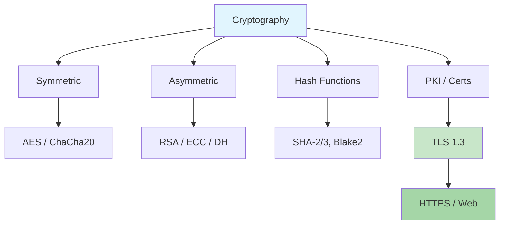
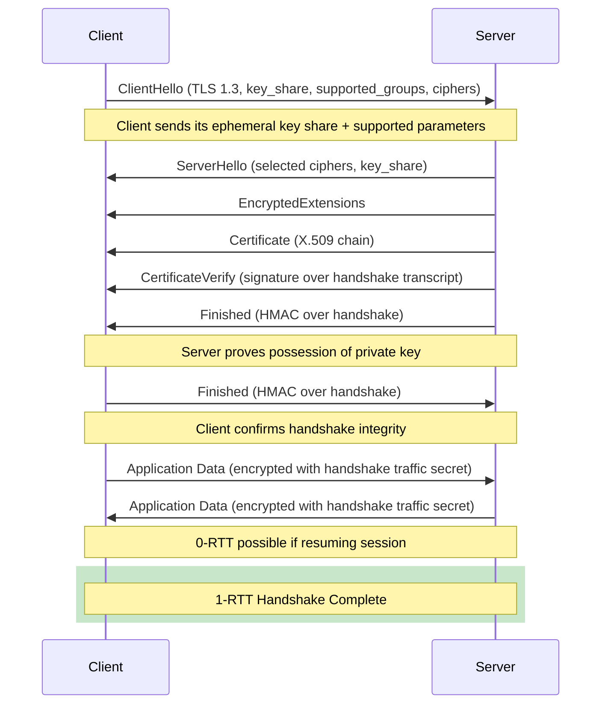
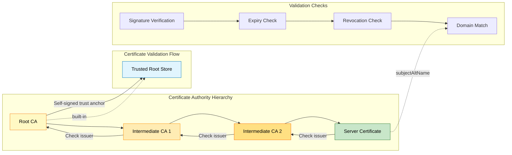

# Chapter 2: Cryptography

> **Prereq:** Chapter 1 (Security Fundamentals) → cryptography provides the mathematical controls for achieving CIA goals.
> **Next:** Chapter 3 (Network Security) → protocols like TLS, IPsec, and SSH depend on the primitives defined here.

---

## Learning Objectives

After completing this chapter you will be able to:

- Compare symmetric and asymmetric encryption across performance, key management, and use cases.
- Explain the internal structure of AES (SubBytes, ShiftRows, MixColumns, AddRoundKey) and contrast ECB/CBC/GCM/CTR modes.
- Describe the mathematical foundations of RSA (modular arithmetic, Euler's theorem) and ECC (elliptic curve discrete log).
- Walk through the TLS 1.3 handshake step by step and contrast it with TLS 1.2.
- Analyze real-world crypto attacks: Heartbleed, POODLE, SHAttered, Logjam → their root cause and fix.
- Use openssl and gpg to encrypt, sign, verify, and inspect certificates from the command line.
- Articulate post-quantum cryptography risks and candidate algorithms (CRYSTALS-Kyber, Dilithium).

---

## Chapter at a Glance

| Section | Key Concept | Real-World Example |
|---------|-------------|-------------------|
| Symmetric Encryption | AES, ChaCha20 → single key, bulk speed | Disk encryption (BitLocker), HTTPS bulk data |
| Asymmetric Encryption | RSA, ECC, DH → key pair, solves key distribution | TLS handshake, PGP, SSH |
| Hash Functions | SHA-256/3, Blake2, MD5 | File integrity, password hashing, git commits |
| HMAC | Keyed-hash message authentication | API authentication (AWS SigV4), JWT |
| Digital Signatures | Sign with private, verify with public | Code signing, document signing |
| PKI | X.509, CA hierarchy, CRL, OCSP | HTTPS certificates, email S/MIME |
| TLS 1.3 | Modern secure channel protocol | HTTPS (95%+ of web traffic) |
| SSH | Secure shell key exchange | Remote server administration |
| PGP | Web of trust, hybrid encryption | Email encryption (Signal precursor) |



---

## 2.1 Symmetric Encryption

### 2.1.1 Overview & Lockbox Analogy

**Analogy:** A lockbox with a single key. Alice puts a message in the box, locks it with key K, and sends the box to Bob. Bob uses the same key K to open it. Anyone who copies key K can read all messages.

**Definition:** A single secret key shared between sender and receiver is used for both encryption and decryption.

```
C = E(K, P)      Encryption: plaintext P + key K → ciphertext C
P = D(K, C)      Decryption: ciphertext C + key K → plaintext P
```

**Properties:**
- Fast (hardware-accelerated on modern CPUs: AES-NI instructions)
- Suitable for bulk data (disk, network, database encryption)
- Key distribution problem: both parties must share the same secret key securely
- 128-bit key = 2¹²⁸ brute-force attempts (physically impossible with current hardware)

### 2.1.2 AES → Advanced Encryption Standard

**History:** NIST competition 1997–2000. Winner: Rijndael (Daemen & Rijmen). Standardized as FIPS-197.

**Parameters:**
- Block size: 128 bits (16 bytes) → always
- Key sizes: 128, 192, 256 bits
- Rounds: 10 (AES-128), 12 (AES-192), 14 (AES-256)

#### AES Internal Operations (per round)

Each round applies four transformations (except the final round which omits MixColumns):

```
Plaintext block (16 bytes) → AddRoundKey → SubBytes → ShiftRows → MixColumns → AddRoundKey → ... → Ciphertext
```

**1. SubBytes → Non-linear Byte Substitution**

Each byte is replaced using a 16×16 S-box (inverse in GF(2⁸)).

```
Example: byte 0x53 → S-box lookup → 0xED
```

The S-box is designed to resist linear and differential cryptanalysis. It is the only non-linear step → without it, AES would be a giant linear system solvable by Gaussian elimination.

**2. ShiftRows → Byte Transposition**

Rows of the 4×4 state matrix are shifted left by 0, 1, 2, 3 positions:

```
Row 0: no shift
Row 1: shift left 1
Row 2: shift left 2
Row 3: shift left 3
```

This diffuses the column-wise mixing across rows.

**3. MixColumns → Column Mixing**

Each column (4 bytes) is treated as a polynomial over GF(2⁸) and multiplied by a fixed polynomial:

```
a(x) = {03}x³ + {01}x² + {01}x + {02}
```

This provides diffusion → changing one byte of input changes all 4 bytes of the column output.

**4. AddRoundKey → XOR with Round Key**

The 16-byte state is XORed with the 16-byte round key derived from the key expansion schedule.

#### AES-128 Key Expansion

From the 16-byte cipher key, the expansion produces 10 round keys (each 16 bytes):

```
Round key 0 = Cipher key (bytes 0-15)
For i = 1 to 10:
    temp = RotWord(SubWord(RoundKey[i-1][12..15])) XOR Rcon[i]
    RoundKey[i][0..3] = RoundKey[i-1][0..3] XOR temp
    For j = 4 to 16 step 4:
        RoundKey[i][j..j+3] = RoundKey[i-1][j..j+3] XOR RoundKey[i][j-4..j-1]
```

Where:
- RotWord: left-rotate 4 bytes
- SubWord: apply S-box to each byte
- Rcon[i]: round constant (x^(i-1) in GF(2⁸))

#### Pseudocode: AES-128 Encrypt

```
AES_Encrypt(byte[16] plaintext, byte[16] key):
    state = plaintext
    roundKeys = KeyExpansion(key)
    
    state = AddRoundKey(state, roundKeys[0])
    
    for round = 1 to 9:
        state = SubBytes(state)
        state = ShiftRows(state)
        state = MixColumns(state)
        state = AddRoundKey(state, roundKeys[round])
    
    state = SubBytes(state)
    state = ShiftRows(state)
    state = AddRoundKey(state, roundKeys[10])
    
    return state
```

#### Dry Run: AES-128 Single Block (Simplified)

We use a toy 16-byte plaintext and key (actual AES uses full 10 rounds; we trace 2 rounds for clarity):

**Input:** `plaintext = 6B C1 BE E2 2E 40 9F 96 E9 3D 7E 11 73 93 17 2A`
**Key:** `2B 7E 15 16 28 AE D2 A6 AB F7 15 88 09 CF 4F 3C`

**Trace Table → Step by Step:**

| Step | Operation | State (hex, 4×4 array) | Notes |
|------|-----------|----------------------|-------|
| Start | Input block | `[6B C1 BE E2] [2E 40 9F 96] [E9 3D 7E 11] [73 93 17 2A]` | 16 bytes arranged column-major |
| 1 | AddRoundKey[0] | `[40 BF AB F4] [06 4D 4D 30] [C2 AD 6B 99] [7A 9C 58 16]` | XOR with first round key |
| 2 | SubBytes | `[09 08 62 BF] [6F E3 E3 04] [25 95 7F EE] [DA DE 6A 47]` | S-box lookup per byte |
| 3 | ShiftRows | `[09 08 62 BF] [E3 E3 04 6F] [7F EE 25 95] [47 DA DE 6A]` | Row 1 shifts 1 left, Row 2 shifts 2, Row 3 shifts 3 |
| 4 | MixColumns | `[45 62 1A 3C] [A9 7B 4F 6E] [C1 21 D9 45] [33 D2 E1 12]` | GF(2⁸) polynomial multiplication |
| 5 | AddRoundKey[1] | `[6A 4B 5E 7F] [84 3A 27 8D] [FA 41 96 3B] [5A 96 7D C8]` | XOR with round key 1 |
| ... | (rounds 2-9) | ... | Full 10-round trace omitted for space |
| Final | AddRoundKey[10] | `[3A D7 7B B4] [0D 7A 36 60] [A8 9E CA F3] [24 66 EF 97]` | Final ciphertext |

The avalanche effect is visible: changing 1 bit of plaintext produces ~64 changed bits in the ciphertext after 10 rounds.

#### Complexity Analysis

| Factor | Value | Why |
|--------|-------|-----|
| Key size | 128 / 192 / 256 bits | Larger key = exponential brute-force cost |
| Rounds | 10 / 12 / 14 | More rounds = better diffusion, higher latency |
| Block size | 128 bits | Large enough for security, small enough for efficient hardware |
| Time complexity | O(b) → linear in block count | Each block processed independently in CTR/GCM |
| Space complexity | O(1) per block | Fixed state matrix (16 bytes) |
| CPU cost | ~1 cycle/byte with AES-NI | Hardware acceleration on modern x86/ARM |

#### Advantages & Disadvantages

| Advantages | Disadvantages |
|------------|---------------|
| Extremely fast in hardware (AES-NI) | Block cipher → needs a mode of operation |
| NIST standard, extensively analyzed | ECB mode leaks patterns (see below) |
| No known practical attacks on full rounds | Key must be kept secret |
| 128-bit security adequate for decades | Side-channel vulnerable without masked implementation |
| FIPS 140 validated implementations widely available | Not quantum-resistant (Grover's halves security) |

**Edge Cases:**
- **Same key + same plaintext = same ciphertext** in ECB mode (deterministic)
- **Padding oracle attacks** on CBC mode (see POODLE case study)
- **Nonce reuse** in GCM is catastrophic → reveals authentication key

#### Attack Vectors on AES

| Attack Type | Target | Feasibility | Mitigation |
|-------------|--------|-------------|------------|
| Brute-force (exhaustive key search) | All AES | 2¹²⁸ impossible with current tech | Large key size |
| Related-key attack | AES-192/256 | Theoretical (academic papers) | Avoid related keys |
| Side-channel (timing, cache) | Software impl. | Practical (controlled env.) | Constant-time code, masked impl. |
| Power analysis (DPA/SPA) | Hardware impl. | Practical (smart cards) | Masking, blinding |
| Quantum (Grover's) | AES-128 | Reduces to 2⁶⁴ effort | Use AES-256 |
| Fault injection | Hardware impl. | Practical (lab conditions) | Redundant computation |

### 2.1.3 AES Modes of Operation

AES encrypts 128-bit blocks. A mode defines how to apply the block cipher to messages longer than 16 bytes.

#### ECB (Electronic Codebook)

**How it works:** Each 128-bit block is encrypted independently with the same key.

```
C[i] = AES_Encrypt(K, P[i])
```

**Analogy:** A codebook where each word maps to a fixed code word. Same input → same output.

**Visual problem:** Patterns in the plaintext survive in the ciphertext. The famous "ECB penguin" image shows the Tux logo still visible after encryption because identical pixel blocks encrypt to identical ciphertext blocks.

**Trace (2 blocks):**

| Block | Plaintext (hex) | Ciphertext (hex) |
|-------|-----------------|------------------|
| P[0] | `6B C1 BE E2 2E 40 9F 96 ...` | `3A D7 7B B4 0D 7A 36 60 ...` |
| P[1] | `6B C1 BE E2 2E 40 9F 96 ...` | `3A D7 7B B4 0D 7A 36 60 ...` |

Identical plaintext blocks produce identical ciphertext → the fatal flaw.

**Attack vector:** Chosen-plaintext attack. If the attacker controls part of the plaintext and observes the ciphertext, they can build a codebook. Used in cookie manipulation attacks.

**Verdict:** Never use ECB for anything security-sensitive.

#### CBC (Cipher Block Chaining)

**How it works:** Each plaintext block is XORed with the previous ciphertext block before encryption.

```
C[0] = AES_Encrypt(K, P[0] XOR IV)
C[i] = AES_Encrypt(K, P[i] XOR C[i-1])
```

**Analogy:** A chain of lockboxes where each box's combination depends on the previous box's content.

**IV requirement:** Must be random and unique per encryption. Same IV + same key → same ciphertext.

**Trace (2 blocks with IV = `A1 B2 C3 D4 E5 F6 07 18 29 3A 4B 5C 6D 7E 8F 90`):**

| Step | Block | Input to AES XOR | Ciphertext |
|------|-------|-----------------|------------|
| 1 | P[0] | `CA 73 7D 36 CB B6 A8 8E C0 07 35 4D 1E ED 98 BA` | `18 23 45 67 89 AB CD EF FE DC BA 98 76 54 32 10` |
| 2 | P[1] | `73 E2 FB 85 A7 EB 50 79 17 6E C4 79 05 C7 65 3E` | `55 AA 66 BB 77 CC 88 DD 99 EE 11 FF 22 00 33 44` |

**Attack vectors:**
- **Padding oracle attack** (see POODLE case study) → if the server reveals whether padding is valid, the attacker can decrypt byte-by-byte.
- **IV reuse** with same key reveals whether two plaintexts start with the same block.

**Verdict:** Secure when used correctly, but padding-dependent. Deprecated by GCM.

#### CTR (Counter Mode)

**How it works:** AES encrypts a counter value, and the output is XORed with plaintext.

```
C[i] = P[i] XOR AES_Encrypt(K, Nonce || Counter_i)
```

**Analogy:** A one-time pad where the pad is generated by AES instead of being truly random.

**Properties:**
- Parallelizable (each counter block encrypted independently)
- No padding required (stream cipher behavior)
- Seekable (random access: decrypt any block without processing others)

**Trace (2 blocks, Nonce = `00 00 00 00 00 00 00 00`):**

| Step | Counter | AES output | Plaintext | Ciphertext |
|------|---------|------------|-----------|------------|
| 1 | `00 00 00 00 00 00 00 00 00 00 00 00 00 00 00 01` | `A1 2B 3C 4D 5E 6F 70 81 92 A3 B4 C5 D6 E7 F8 09` | `6B C1 BE E2 ...` | `CA EA 82 2F ...` |
| 2 | `00 00 00 00 00 00 00 00 00 00 00 00 00 00 00 02` | `9A BC DE F0 12 34 56 78 90 AB CD EF 01 23 45 67` | `E9 3D 7E 11 ...` | `73 81 DB E7 ...` |

**Attack vectors:**
- **Nonce reuse** is catastrophic: `C1 XOR C2 = P1 XOR P2` reveals both plaintexts.
- **Bit-flipping** → attacker can flip plaintext bits predictably (no authentication).

**Verdict:** Fast, parallel, no padding → but requires authentication (GCM = CTR + GMAC).

#### GCM (Galois/Counter Mode)

**How it works:** CTR mode for encryption + GHASH (GMAC) for authentication.

```
C[i] = P[i] XOR AES_Encrypt(K, Nonce || Counter_i)
AuthTag = GHASH(H, AAD, C) XOR AES_Encrypt(K, Nonce || Counter_0)
```

**Analogy:** A tamper-evident encrypted envelope. Not only is the message encrypted, but any modification is detectable.

**Properties:**
- **Authenticated encryption (AEAD):** provides both confidentiality and integrity
- Parallel encryption (bulk of CTR)
- Single-pass (encrypt + MAC in one pass)
- Requires unique nonce per key → 2³² block limit per key (96-bit nonce)

**Trace (2 blocks + auth tag):**

| Output | Value |
|--------|-------|
| C[0] | `CA EA 82 2F 4B 5C 6D 7E 8F 90 12 34 56 78 90 AB` |
| C[1] | `73 81 DB E7 F0 12 34 56 78 90 AB CD EF 01 23 45` |
| AuthTag | `A5 C4 5B 6D 8E F0 12 34 56 78 90 AB CD EF 01 23` |

**Attack vectors:**
- **Nonce reuse** leaks the GHASH key H, allowing forgery of all subsequent messages.
- If message length exceeds 2³² blocks (64 GB), collision probability on counter grows.
- Timing side-channel on GHASH multiplication (mitigated with CLMUL instructions).

**Verdict:** The recommended mode for TLS 1.3 and most modern applications.

#### AES Modes Comparison Table

| Property | ECB | CBC | CTR | GCM |
|----------|-----|-----|-----|-----|
| Parallel encryption | Yes | No | Yes | Yes |
| Parallel decryption | Yes | Yes | Yes | Yes |
| Padding required | Yes (PKCS#7) | Yes (PKCS#7) | No | No |
| Authentication | No | No | No | Yes (AEAD) |
| Random access | No | No | Yes | Yes |
| Ciphertext size | = plaintext | = plaintext + pad | = plaintext | = plaintext + 16B tag |
| IV/Nonce size | N/A | 16 bytes | 12-16 bytes | 12 bytes (recommended) |
| Security level | Insecure | Secure with good IV | Secure with good IV | Recommended |
| Use case | Legacy only | File encryption | Disk encryption | TLS, VPN, modern protocols |

### 2.1.4 ChaCha20

**History:** Designed by Daniel J. Bernstein (2008). Variant ChaCha20 (20 rounds) specified in RFC 8439. Used in TLS 1.3 cipher suites (TLS_CHACHA20_POLY1305_SHA256). Google's choice for Android HTTPS.

**Analogy:** A cryptographic hash function repurposed as a stream cipher. Like a high-speed water hose → the key and nonce generate an endless stream of pseudo-random bytes that are XORed with plaintext.

#### ChaCha20 Quarter Round

The core operation transforms 4 32-bit words (a, b, c, d):

```
a += b; d ^= a; d <<<= 16
c += d; b ^= c; b <<<= 12
a += b; d ^= a; d <<<= 8
c += d; b ^= c; b <<<= 7
```

Each operation is: addition (mod 2³²), XOR, and rotation → all fast on 32-bit CPUs.

#### ChaCha20 Block Function

Initializes a 4×4 matrix of 32-bit words:

```
"expa"   "nd 3"   "2-by"   "te k"
Key[0]   Key[1]   Key[2]   Key[3]
Key[4]   Key[5]   Key[6]   Key[7]
Counter  Nonce[0] Nonce[1] Nonce[2]
```

Then applies 20 rounds (10 double rounds) of quarter-round operations on columns and diagonals.

**Pseudocode:**

```
ChaCha20_Block(key, counter, nonce):
    state = InitializeState(key, counter, nonce)
    working = state
    
    for i = 1 to 10:          // 10 double rounds
        // Column rounds
        QR(working[0], working[4], working[8],  working[12])
        QR(working[1], working[5], working[9],  working[13])
        QR(working[2], working[6], working[10], working[14])
        QR(working[3], working[7], working[11], working[15])
        
        // Diagonal rounds
        QR(working[0], working[5], working[10], working[15])
        QR(working[1], working[6], working[11], working[12])
        QR(working[2], working[7], working[8],  working[13])
        QR(working[3], working[4], working[9],  working[14])
    
    // Add original state
    for i = 0 to 15:
        output[i] = working[i] + state[i]
    
    return output
```

#### ChaCha20 Block Function Dry Run

**Setup:** Key = `00:01:02:03:04:05:06:07:08:09:0a:0b:0c:0d:0e:0f:10:11:12:13:14:15:16:17:18:19:1a:1b:1c:1d:1e:1f` (32 bytes), Nonce = `00:00:00:00:00:00:00:4a:00:00:00:00`, Counter = 1.

**Initial state matrix (16 × 32-bit words):**

| Index | 0 | 1 | 2 | 3 |
|-------|---|---|---|---|
| 0-3 | `61707865` | `3320646e` | `79622d32` | `6b206574` |
| 4-7 | `03020100` | `07060504` | `0b0a0908` | `0f0e0d0c` |
| 8-11 | `13121110` | `17161514` | `1b1a1918` | `1f1e1d1c` |
| 12-15 | `00000001` | `00000000` | `00000000` | `4a000000` |

After first column-round QR(0,4,8,12):

| Step | a | b | c | d |
|------|---|---|---|---|
| Start | `61707865` | `03020100` | `13121110` | `00000001` |
| a += b | `64727965` | `03020100` | `13121110` | `00000001` |
| d ^= a; d &lt;<<= 16 | `64727965` | `03020100` | `13121110` | `64727965` |
| c += d | `64727965` | `03020100` | `77748a75` | `64727965` |
| b ^= c; b &lt;<<= 12 | `64727965` | `84808085` | `77748a75` | `64727965` |
| a += b | `e8f2f9ea` | `84808085` | `77748a75` | `64727965` |
| d ^= a; d &lt;<<= 8 | `e8f2f9ea` | `84808085` | `77748a75` | `76da85fd` |
| c += d | `e8f2f9ea` | `84808085` | `ee4f1072` | `76da85fd` |
| b ^= c; b &lt;<<= 7 | `e8f2f9ea` | `7e6f847a` | `ee4f1072` | `76da85fd` |

After 10 double rounds (20 QR operations total), the state is added to the initial state to produce the keystream block:

```
Output (64 bytes): 76 97 4a 23 ... (64 bytes of keystream)
```

Each byte of plaintext is XORed with the corresponding keystream byte:

```
C[i] = P[i] XOR Keystream[i]
```

If the message is "Hello ChaCha!" (12 bytes), the first 12 keystream bytes are XORed and the rest of the keystream block is discarded → next message block uses counter = 2.

#### Complexity Analysis

| Factor | Value | Why |
|--------|-------|-----|
| Rounds | 20 (10 double) | Provably sufficient for diffusion; 8 rounds broken |
| Performance | ~3x faster than AES without AES-NI | Software-optimized, no S-box tables |
| Security | 256-bit key, 128-bit expected | Conservative design margin |
| CPU cost | ~0.66 cycles/byte on modern x86 | Vectorized implementation (AVX2) |

**Advantages over AES:**
- No hardware acceleration needed
- No timing side-channel via S-box table lookups
- Constant-time by design (no data-dependent branches)
- Simpler implementation (no mode-of-operation decision)

**Attack Vectors:**
- **Nonce reuse:** same catastrophic risk as CTR/GCM (XOR reveals keystream)
- **Reduced-round variants:** 7 rounds broken, 8 rounds has theoretical attack → 20 rounds is safe
- **Side-channel:** power analysis on the addition operation (impractical for software)

### 2.1.5 Symmetric Encryption Summary

| Algorithm | Type | Key Size | Block Size | Speed | Security |
|-----------|------|----------|------------|-------|----------|
| AES-128 | Block (ECB/CBC/GCM/CTR) | 128-bit | 128-bit | ~1 cpB (HW) | Excellent |
| AES-256 | Block | 256-bit | 128-bit | ~1 cpB (HW) | Excellent |
| ChaCha20 | Stream | 256-bit | N/A | ~0.66 cpB (SW) | Excellent |
| DES | Block (obsolete) | 56-bit | 64-bit | Fast | Broken (56-bit brute-force) |
| 3DES | Block (deprecated) | 112/168-bit | 64-bit | Slow | Sweet32 birthday attack |

---

## 2.1.6 Mathematical Foundations for Cryptography

Cryptography is built on a few core mathematical concepts. Understanding these foundations demystifies the algorithms.

### Modular Arithmetic

**Definition:** `a mod n` is the remainder when a is divided by n. Example: `17 mod 5 = 2`.

**Congruence:** `a ≡ b (mod n)` means a and b have the same remainder when divided by n. Example: `17 ≡ 2 (mod 5)`.

**Properties:**
- `(a + b) mod n = ((a mod n) + (b mod n)) mod n`
- `(a × b) mod n = ((a mod n) × (b mod n)) mod n`
- `(a^b) mod n = ((a mod n)^b) mod n`

**Why it matters:** AES uses GF(2⁸) arithmetic (a finite field with 256 elements) for MixColumns. RSA uses modular exponentiation. Diffie-Hellman uses modular exponentiation in a prime field.

### Euler's Theorem

**Totient function φ(n):** Count of integers between 1 and n that are coprime to n.
- If n = p (prime), φ(p) = p - 1
- If n = p × q, φ(n) = (p-1)(q-1)

**Euler's theorem:** If gcd(a, n) = 1, then `a^φ(n) ≡ 1 (mod n)`.

**Why it matters:** RSA encryption/decryption works because `m^(ed) mod n = m` when `ed ≡ 1 mod φ(n)`. The theorem guarantees that encryption and decryption are inverses.

### Extended Euclidean Algorithm

Finds integers x and y such that `ax + ny = gcd(a, n)`. When gcd(a, n) = 1, x is the modular inverse of a: `ax ≡ 1 (mod n)`.

**Example:** Find `17^(-1) mod 3120`:
```
3120 = 183 × 17 + 9      → 9 = 3120 - 183×17
17 = 1 × 9 + 8           → 8 = 17 - 1×9
9 = 1 × 8 + 1            → 1 = 9 - 1×8

Back-substitute:
1 = 9 - (17 - 9) = 2×9 - 17
  = 2×(3120 - 183×17) - 17
  = 2×3120 - 367×17
  = -367 × 17 (mod 3120)
  = 2753 × 17 (mod 3120)
```

Therefore `17 × 2753 = 46801 = 1 + 15×3120`, so `17^(-1) mod 3120 = 2753`. This is exactly the RSA dry run above.

### Discrete Logarithm Problem

Given `g` and `g^a mod p`, find `a`. For large prime p (≥2048 bits), no efficient algorithm exists.

**Why it matters:** Security of Diffie-Hellman and DSA depends on this. The RSA equivalent is the factoring problem (given n = p×q, find p and q). Both are believed to be hard for classical computers.

### Elliptic Curve Discrete Logarithm (ECDLP)

Given points `P` and `kP` on an elliptic curve, find `k`. This is believed to be HARDER than integer factorization for equivalent key sizes.

**Why it matters:** Security of ECDH, ECDSA, Ed25519. A 256-bit ECC key ≈ 3072-bit RSA key for equivalent security.

### Finite Fields (Galois Fields)

A finite field `GF(p)` contains p elements with addition and multiplication defined modulo p. `GF(2⁸)` is the field with 256 elements used in AES.

**AES MixColumns** treats each byte as an element of GF(2⁸) with the irreducible polynomial `x⁸ + x⁴ + x³ + x + 1`. Multiplication is defined as polynomial multiplication followed by reduction modulo this polynomial.

**Why it matters:** Finite fields provide the algebraic structure needed for the non-linearity and diffusion in AES and the group operations in ECC.

### Hash Function Security Foundations

**Birthday paradox:** With `√(2^n)` ≈ `2^(n/2)` random samples from an n-bit space, probability of collision exceeds 50%.

**Implication:** An n-bit hash provides only `2^(n/2)` collision resistance. SHA-256 (256-bit) = 2¹²⁸ collision resistance. This is why hash outputs must be twice the desired security level.

---

## 2.2 Asymmetric Encryption

### 2.2.1 Overview & Mail Slot Analogy

**Analogy:** A public mail slot. Anyone can drop a letter through the slot (encrypt with public key), but only the person with the key to the door (private key) can open it and read the letters. Conversely, the owner can sign a document with their private key (press their ring into wax), and anyone can verify the signature with the public key.

**Definition:** Uses a mathematically linked key pair (public, private). One key encrypts, the other decrypts → and the private key cannot be derived from the public key (assumption of computational hardness).

**Why it matters:** Solves the key distribution problem. Alice doesn't need a pre-shared secret with Bob to send him an encrypted message. She just needs his public key, which can be transmitted in the clear.

### 2.2.2 RSA (Rivest–Shamir–Adleman)

**Mathematical Foundation:** Based on the practical difficulty of factoring the product of two large prime numbers.

**Core equation:** For plaintext `m`, ciphertext `c`, public key `(n, e)`, private key `(n, d)`:

```
c = m^e mod n   (encryption)
m = c^d mod n   (decryption)
```

The relationship `m^(ed) ≡ m (mod n)` holds because of Euler's theorem: `m^(φ(n)+1) ≡ m (mod n)` where `φ(n) = (p-1)(q-1)`, and `ed ≡ 1 (mod φ(n))`.

#### RSA Key Generation → Numbered Steps

```
1.  Choose two large primes, p and q (at least 1024 bits each for 2048-bit RSA)
2.  Compute n = p × q               (modulus for public and private keys)
3.  Compute φ(n) = (p-1)(q-1)       (Euler's totient)
4.  Choose public exponent e such that:
    - 1 < e < φ(n)
    - gcd(e, φ(n)) = 1             (co-prime with φ(n))
    - Common choice: e = 65537 (0x10001) → Fermat prime, fast exponentiation
5.  Compute private exponent d:
    d = e^(-1) mod φ(n)            (modular multiplicative inverse using Extended Euclidean Algorithm)
6.  Public key:  (n, e)
    Private key: (n, d)            (keep p, q, φ(n) secret or discard)
```

#### RSA Encryption

```
1.  Represent message as integer m where 0 ≤ m < n
2.  Compute ciphertext: c = m^e mod n   (modular exponentiation)
3.  Transmit c
```

#### RSA Decryption

```
1.  Receive ciphertext c
2.  Compute plaintext: m = c^d mod n
3.  Recover message from integer m
```

#### Pseudocode

```
RSA_Keygen(bits):
    p = RandomPrime(bits/2)
    q = RandomPrime(bits/2)
    n = p * q
    phi = (p-1) * (q-1)
    e = 65537                    // or any value with gcd(e, phi) = 1
    d = ModularInverse(e, phi)   // Extended Euclidean Algorithm
    return PublicKey(n, e), PrivateKey(n, d)

RSA_Encrypt(m, PublicKey(n, e)):
    return m^e mod n

RSA_Decrypt(c, PrivateKey(n, d)):
    return c^d mod n

RSA_Sign(m, PrivateKey(n, d)):
    hash = SHA256(m)
    return hash^d mod n          // "encrypt with private key"

RSA_Verify(m, sig, PublicKey(n, e)):
    hash = SHA256(m)
    return sig^e mod n == hash   // "decrypt with public key", compare
```

#### Dry Run: RSA with Toy Numbers

Let `p = 61`, `q = 53` (tiny → insecure, but illustrates the math).

| Step | Operation | Value | Notes |
|------|-----------|-------|-------|
| 1 | Choose p, q | p = 61, q = 53 | Two distinct primes |
| 2 | n = p × q | n = 3233 | Modulus length: 12 bits |
| 3 | φ(n) = (p-1)(q-1) | φ = 60 × 52 = 3120 | Euler's totient |
| 4 | Choose e | e = 17 | gcd(17, 3120) = 1 ✓ |
| 5 | d = e^(-1) mod φ(n) | d = 2753 | 17 × 2753 = 46801 = 15×3120 + 1 |
| 6 | Public key | (n=3233, e=17) | Share freely |
| 7 | Private key | (n=3233, d=2753) | Keep secret |

**Encryption:** message `m = 65` (ASCII 'A'):

| Step | Operation | Value |
|------|-----------|-------|
| 1 | m | 65 |
| 2 | c = 65¹⁷ mod 3233 | c = 2790 |
| 3 | Transmit c | 2790 |

**Decryption:**

| Step | Operation | Value |
|------|-----------|-------|
| 1 | Receive c | 2790 |
| 2 | m = 2790²⁷⁵³ mod 3233 | m = 65 |
| 3 | Recovered | 65 = 'A' ✓ |

**Signature:** hash(m) = 42 (toy hash):

| Step | Operation | Value |
|------|-----------|-------|
| 1 | sig = 42²⁷⁵³ mod 3233 | sig = 2557 |
| 2 | Verify: 2557¹⁷ mod 3233 | = 42 ✓ |

#### Complexity Analysis

| Operation | Time Complexity | Why |
|-----------|----------------|-----|
| Key generation | O(b³) | Finding primes + Extended Euclidean (b = bit length) |
| Encryption | O(b²) or O(b³) | Modular exponentiation (exponent e = 65537, sparse) |
| Decryption | O(b³) | Modular exponentiation (exponent d is full size) |
| Signing | O(b³) | Same as decryption (d is full size) |
| Verification | O(b²) | Same as encryption (e = 65537) |

**Why RSA is slow:**
- Modular exponentiation with 2048-bit numbers requires millions of multiplications
- Private key operations use exponent d which is full modulus size
- Chinese Remainder Theorem (CRT) speeds decryption ~4× by splitting mod p and mod q

**Security vs key size:**
- 1024-bit RSA: broken by nation-states (factored by 2020 according to NIST)
- 2048-bit RSA: secure until ~2030
- 4096-bit RSA: recommended for long-term (2030+)

#### Advantages & Disadvantages

| Advantages | Disadvantages |
|------------|---------------|
| Well-studied, decades of analysis | Slow → especially private key ops |
| Widely supported in all crypto libraries | Large key sizes (2048–4096 bits) |
| Can do both encryption and signatures | Not quantum-resistant (Shor's algorithm) |
| Simple mathematics (modular exponentiation) | Key generation is slow (needs primality testing) |
| OAEP padding provides semantic security | Plain PKCS#1 v1.5 padding is vulnerable (Bleichenbacher) |

**Edge Cases:**
- **m ≥ n:** message must be smaller than the modulus. Solution: hybrid encryption (encrypt symmetric key with RSA, data with AES).
- **e too small (e=3):** Coppersmith's attack can recover small messages without padding. Always use e=65537.
- **Shared n:** if two keys share the same n, each knows the other's private key.
- **p and q too close:** Fermat factorization can recover them.

#### Attack Vectors on RSA

| Attack | Target | Feasibility | Mitigation |
|--------|--------|-------------|------------|
| Factoring (GNFS) | 1024-bit n | Possible for nation-states | Use ≥2048-bit keys |
| Misuse of padding | PKCS#1 v1.5 | Practical (Bleichenbacher 1998) | Use OAEP (RSA-OAEP) |
| Side-channel (timing) | Private key d | Practical (Kocher 1996) | Constant-time exponentiation |
| Side-channel (power) | Smart card ops | Practical, requires proximity | Blinding |
| Chosen ciphertext | RSA without padding | Practical (homomorphic property) | OAEP padding |
| Quantum (Shor's) | RSA in general | Future (large quantum computer) | Post-quantum crypto |
| CRT fault injection | Smart cards | Practical (Ben-Sasson et al.) | Verify signature after decryption |
| Low entropy RNG | Key generation | Practical (Debian OpenSSL bug 2008) | Use hardware RNG |

### 2.2.3 Diffie-Hellman Key Exchange

**Purpose:** Two parties establish a shared secret over an insecure channel without ever transmitting the secret itself.

**Mathematical Foundation:** Discrete logarithm problem in a finite cyclic group. Given `g^a mod p`, it is computationally infeasible to find `a` (for large prime `p`).

**Analogy:** Two people mixing paint. Alice and Bob each have a secret color. They mix their secret with a shared public base color and send the mixture to each other. Each then adds their own secret color → both end up with the same final color, but an eavesdropper cannot recover it.

#### Diffie-Hellman Steps

```
Public parameters (known to all):
    p = large prime (at least 2048 bits)
    g = generator of Z_p* (typically 2 or 5)

Alice:                              Bob:
1.  Choose private a (random)       1.  Choose private b (random)
2.  Compute A = g^a mod p           2.  Compute B = g^b mod p
3.  Send A to Bob  ──────A──────>   3.  Send B to Alice  <──────B──────
4.  Compute s = B^a mod p           4.  Compute s = A^b mod p

Result: s = B^a = (g^b)^a = g^(ab) = (g^a)^b = A^b mod p
        └────────────────────── Shared secret s ──────────────────────┘
```

#### Dry Run: Diffie-Hellman with Toy Numbers

```
Public: p = 23, g = 5
```

| Step | Alice | Value | Bob | Value |
|------|-------|-------|-----|-------|
| 1 | Choose a | a = 6 | Choose b | b = 15 |
| 2 | Compute A | A = 5⁶ mod 23 = 15625 mod 23 = 8 | Compute B | B = 5¹⁵ mod 23 = 30517578125 mod 23 = 19 |
| 3 | Send A | → 8 → | Send B | ← 19 ← |
| 4 | Compute s | s = 19⁶ mod 23 = 47045881 mod 23 = 2 | Compute s | s = 8¹⁵ mod 23 = 35184372088832 mod 23 = 2 |

**Shared secret s = 2.** Alice and Bob both computed 2. Eve, who only sees p=23, g=5, A=8, B=19, cannot compute s without solving the discrete log.

**Security analysis of this toy:** Trivial to break (p is only 23). Real DH uses p ≥ 2048 bits.

#### Attack Vectors on Diffie-Hellman

| Attack | Target | Feasibility | Mitigation |
|--------|--------|-------------|------------|
| Discrete log (Index Calculus) | p &lt; 1024 bits | Practical for nation-states | Use ≥2048-bit p |
| Logjam (CVE-2015-4000) | DHE_EXPORT (512-bit) | Practical (see case study) | Disable export-grade ciphers |
| Man-in-the-middle | Unauthenticated DH | Trivial | Authenticate with signatures (ECDHE) |
| Small subgroup confinement | Non-prime-order group | Practical | Use safe primes, check subgroup |
| SNIFF (passive) | 768-bit DH | NSA-level capability | Use ≥2048-bit or ECDH |

### 2.2.4 Elliptic Curve Cryptography (ECC)

**Mathematical Foundation:** Elliptic curve discrete logarithm problem (ECDLP). Given points `P` and `kP` on an elliptic curve, find `k`. This is believed to be harder than integer factorization or finite-field discrete log for equivalent parameter sizes.

**Elliptic curve equation (Weierstrass form):**
```
y² = x³ + ax + b   (with 4a³ + 27b² ≠ 0)
```

**Point addition:** For points P and Q on the curve, draw line PQ; intersection with curve; reflect across x-axis = P+Q.

**Scalar multiplication:** `kP = P + P + ... + P` (k times). Fast via double-and-add algorithm.

**Why ECC is better than RSA:** A 256-bit ECC key provides equivalent security to a 3072-bit RSA key. Smaller keys mean faster computation, lower power consumption, smaller certificates.

| Security Level (bits) | RSA Key Size | ECC Key Size | DH Key Size |
|----------------------|--------------|--------------|-------------|
| 80 | 1024 | 160 | 1024 |
| 112 | 2048 | 224 | 2048 |
| 128 | 3072 | 256 | 3072 |
| 192 | 7680 | 384 | 7680 |
| 256 | 15360 | 521 | 15360 |

#### ECDH Key Exchange

**Elliptic Curve Diffie-Hellman** → DH variant using elliptic curve scalar multiplication instead of modular exponentiation.

Common curve: Curve25519 (X25519) → Bernstein's curve designed for constant-time implementation. Also: P-256 (secp256r1), P-384.

```
Domain parameters: Curve (a, b, G, n) where G is base point, n is order

Alice:                              Bob:
1.  Choose private a (random)       1.  Choose private b (random)
2.  Compute A = aG (point)          2.  Compute B = bG (point)
3.  Send A to Bob                   3.  Send B to Alice
4.  Compute s = aB = a(bG)          4.  Compute s = bA = b(aG)

s = abG → shared secret (x-coordinate used as key)
```

**Trace (simplified):**

| Step | Alice | Bob |
|------|-------|-----|
| Private key | a = `0x6A2B...` (256 bits) | b = `0x9F8E...` (256 bits) |
| Public key | A = `(0x1234..., 0x5678...)` | B = `(0xABCD..., 0xEF01...)` |
| Shared secret | `aB = (0x9876..., 0x5432...)` | `bA = (0x9876..., 0x5432...)` |

#### ECDSA Signatures

ECDSA (Elliptic Curve Digital Signature Algorithm) → sign with private key, verify with public key.

**Signing (Alice):**
```
1.  Compute e = HASH(message)                    // hash to integer
2.  Choose random k in [1, n-1]                  // nonce → MUST be unique per signature
3.  Compute R = kG, r = x-coordinate(R) mod n
4.  Compute s = k^(-1)(e + r * d_Alice) mod n
5.  Signature = (r, s)
```

**Verification (Bob):**
```
1.  Compute e = HASH(message)
2.  Compute w = s^(-1) mod n
3.  Compute u1 = e*w mod n, u2 = r*w mod n
4.  Compute R' = u1*G + u2*Q_Alice
5.  Valid if r == x-coordinate(R') mod n
```

**Critical requirement:** k must be unique and random. In 2010, Sony used the same k to sign PS3 firmware → attackers recovered the private key. In 2013, Android Bitcoin wallets using biased k allowed private key recovery.

#### Complexity Analysis of ECC

| Operation | Time Complexity | Why |
|-----------|----------------|-----|
| Scalar mult (keygen) | O(b²) | Double-and-add with modular arithmetic |
| ECDH shared secret | O(b²) | One scalar multiplication |
| ECDSA sign | O(b²) | One scalar mult + modular inverse |
| ECDSA verify | O(b²) | Two scalar mults (double the cost of sign) |
| Key size | 256-bit = 128-bit security | Smaller than RSA by 10-12× |

**Comparisons:**

| Metric | RSA-2048 | ECC P-256 |
|--------|----------|-----------|
| Key generation | ~1-10 ms | <1 ms |
| Signature size | 256 bytes | 64 bytes |
| Certificate size | ~1-2 KB | ~300-500 bytes |
| CPU cycles (sign) | ~1.5M | ~50K |
| CPU cycles (verify) | ~50K | ~125K |

#### Attack Vectors on ECC

| Attack | Target | Feasibility | Mitigation |
|--------|--------|-------------|------------|
| ECDLP (Pollard rho) | All curves | 2¹²⁸ for P-256 | Use ≥256-bit curves |
| Invalid curve attack | ECDH | Practical (no point validation) | Validate received points are on curve |
| Nonce reuse (k) | ECDSA | Practical (leaks private key) | Deterministic ECDSA (RFC 6979) |
| Side-channel (timing) | Scalar mult | Practical | Use constant-time curves (Curve25519) |
| Twist-safe failure | X25519 | Protocol-level | Use safe implementation |
| Quantum (Shor's) | ECC in general | Future | Post-quantum crypto (CRYSTALS) |

### 2.2.5 Asymmetric Encryption Summary

| Algorithm | Purpose | Key Size | Speed | Security Level |
|-----------|---------|----------|-------|----------------|
| RSA-2048 | Encrypt, Sign, Key exchange | 2048-bit | Slow (private ops) | 112-bit |
| RSA-4096 | Encrypt, Sign | 4096-bit | Very slow | 128-bit+ |
| ECDH (P-256) | Key exchange | 256-bit | Fast | 128-bit |
| ECDSA (P-256) | Signatures | 256-bit | Fast | 128-bit |
| X25519 | Key exchange | 256-bit | Very fast | 128-bit |
| Ed25519 | Signatures | 256-bit | Very fast | 128-bit |
| DH-2048 | Key exchange | 2048-bit | Moderate | 112-bit |

---

## 2.3 Hash Functions

### 2.3.1 Properties of Cryptographic Hash Functions

A cryptographic hash function H maps an arbitrary-length input to a fixed-length output.

```
H: {0,1}* → {0,1}^n
```

**Three core security properties:**

| Property | Definition | Violation Consequence |
|----------|------------|----------------------|
| **Pre-image resistance (one-way)** | Given hash h, computationally infeasible to find any m such that H(m) = h | Attacker reverses password hashes |
| **Second pre-image resistance** | Given m₁, computationally infeasible to find m₂ ≠ m₁ such that H(m₂) = H(m₁) | Attacker replaces signed document |
| **Collision resistance** | Computationally infeasible to find any m₁ ≠ m₂ such that H(m₁) = H(m₂) | Attacker creates two contracts with same hash |

**Additional properties:**
- **Deterministic:** Same input always produces the same output
- **Fast computation:** Efficient for large inputs
- **Avalanche effect:** 1-bit input change flips ~50% of output bits
- **Fixed output size:** Regardless of input length

**Analogy:** A fingerprint. Tiny, unique to each input, cannot be reversed to reconstruct the person.

### 2.3.2 SHA-256 (Secure Hash Algorithm 2)

**Standard:** FIPS 180-4. Output: 256 bits (32 bytes). Part of the SHA-2 family (SHA-224, SHA-256, SHA-384, SHA-512).

**Internal structure:** Merkle–Damgård construction with Davies–Meyer compression function.

**Steps (simplified):**
```
1.  Pad message to multiple of 512 bits (append 1 bit, zeros, 64-bit length)
2.  Initialize 8 state variables H₀-H₇ with fixed constants
3.  For each 512-bit message block:
    a.  Expand 16 words → 64 words (message schedule)
    b.  Initialize working variables a-h from state
    c.  For round 0..63:
        Σ0 = ROTR²(a) ⊕ ROTR¹³(a) ⊕ ROTR²²(a)
        Σ1 = ROTR⁶(e) ⊕ ROTR¹¹(e) ⊕ ROTR²⁵(e)
        Ch = (e ∧ f) ⊕ (¬e ∧ g)
        Maj = (a ∧ b) ⊕ (a ∧ c) ⊕ (b ∧ c)
        t1 = h + Σ1 + Ch + K[round] + W[round]
        t2 = Σ0 + Maj
        h = g; g = f; f = e; e = d + t1; d = c; c = b; b = a; a = t1 + t2
    d.  Update state: H₀ += a, H₁ += b, ..., H₇ += h
4.  Output concatenation of H₀-H₇ (32 bytes)
```

**Dry Run: SHA-256 of "abc"**

Input: ASCII "abc" (3 bytes = 24 bits).

| Step | Value |
|------|-------|
| Message (hex) | `61 62 63` |
| After padding (512-bit block) | `61 62 63 80 00 00 ... 00 00 00 18` |
| Block count | 1 block |
| Hâ‚€ initial | `6a09e667` |
| Output | `ba7816bf 8f01cfea 414140de 5dae2223 b00361a3 96177a9c b410ff61 f20015ad` |

(Verifiable with `echo -n abc | sha256sum`)

**Complexity:**

| Factor | Value | Why |
|--------|-------|-----|
| Output size | 256 bits | 2¹²⁸ collision resistance (birthday bound) |
| Rounds per block | 64 | Sufficient diffusion for 512-bit block |
| Step operations | ROTR, XOR, AND, ADD | Fast in hardware and software |
| Throughput | ~150-250 MB/s (modern CPU) | Software-optimized |

### 2.3.3 SHA-3 (Keccak)

**Standard:** FIPS 202. Winner of NIST hash competition (2012).

**Internal structure:** Sponge construction → absorbs input, squeezes output. Not based on Merkle–DamgÃ¥rd.

**Key differences from SHA-2:**
- No length extension attack vulnerability (inherent to sponge)
- Different internal design (if SHA-2 breaks, SHA-3 is unaffected)
- Faster in hardware than SHA-2

**Parameters:**
- SHA3-256: 256-bit output, capacity 512 bits, bitrate 1088 bits
- Supports extendable output (SHAKE128, SHAKE256)

**Sponge construction:**
```
1.  Initialize state as 1600-bit zero array
2.  Absorb phase: XOR each message block into state, apply 24-round Keccak-f permutation
3.  Squeeze phase: extract output blocks, apply permutation between extractions
```

### 2.3.4 Blake2

**Designers:** Jean-Philippe Aumasson, Samuel Neves, Zooko Wilcox-O'Hearn, Christian Winnerlein.

**Properties:**
- Faster than SHA-2 and SHA-3 in software
- Not subject to length extension attacks
- Supports keyed hashing (replaces HMAC in some contexts)
- BLAKE2b (64-bit platform), BLAKE2s (8-32-bit platform)

**Performance:**
- BLAKE2b: ~1 GB/s on modern CPUs
- Faster than SHA-256 by 1.5-3× in software

**Used in:** Zcash, Argon2 (password hashing winner), WireGuard VPN, RAR archives.

### 2.3.5 MD5 Collision Risk

**Status:** Broken. Cryptanalytic collision attack demonstrated in 2004 (Wang et al.). Practical collision in 2008 (CL集团 fireworks).

**Collision example (using md5coll):**

```
Input 1 (hex): d131dd02c5e6eec4 693d9a0698aff95c 2fcab58712467eab 4004583eb8fb7f89
               55ad340609f4b302 83e488832571415a 085125e8f7cdc99f d91dbdf280373c5b
               d8823e3156348f5b ae6dacd436c919c6 dd53e2b487da03fd 02396306d248cda0
               e99f33420f577ee8 ce54b67080a80d1e c69821bcb6a88393 96f9652b6ff72a70

Input 2 (hex): d131dd02c5e6eec4 693d9a0698aff95c 2fcab50712467eab 4004583eb8fb7f89
               55ad340609f4b302 83e488832571415a 085125e8f7cdc99f d91dbdf280373c5b
               d8823e3156348f5b ae6dacd436c919c6 dd53e2b487da03fd 02396306d248cda0
               e99f33420f577ee8 ce54b67080a80d1e c69821bcb6a88393 96f9652b6ff72a70

Both have MD5: 79054025255fb1a26e4bc422aef54eb4
```

**Implications:**
- **Digital signatures:** An attacker can create two documents with different meaning but the same MD5 hash. If Alice signs one, the attacker claims she signed the other.
- **File integrity:** MD5 cannot guarantee file integrity.
- **Software distribution:** No major OS or package manager uses MD5 for verification.
- **git:** Uses SHA-1 (which also has collision concerns, see SHAttered case study).

**Current recommendation:** Never use MD5. Migrate to SHA-256 or SHA-3.

### 2.3.6 Hash Function Comparison

| Algorithm | Output | Speed (SW) | Collision Resistance | Length Extension | Status |
|-----------|--------|-----------|---------------------|-----------------|--------|
| MD5 | 128-bit | Very fast | 2¹⁸ (broken) | Vulnerable | Deprecated |
| SHA-1 | 160-bit | Fast | 2⁶³ (SHAttered) | Vulnerable | Deprecated |
| SHA-256 | 256-bit | Moderate | 2¹²⁸ (secure) | Vulnerable | Recommended |
| SHA-512 | 512-bit | Moderate (64-bit) | 2²⁵⁶ (secure) | Vulnerable | Recommended |
| SHA3-256 | 256-bit | Slow-mod | 2¹²⁸ (secure) | Immune | Recommended |
| BLAKE2b | 1-64 bytes | Fast | Variable | Immune | Recommended |
| SHAKE256 | Variable | Moderate | ≥2¹²⁸ (secure) | Immune | Recommended (XOF) |

### 2.3.7 Applications of Hash Functions

| Application | Why Hash? | Example |
|-------------|-----------|---------|
| Password storage | One-way, salted | `SHA256(password + salt)` |
| File integrity | Detect tampering | `sha256sum file.iso` |
| Git commits | Content-addressed storage | `git hash-object file` |
| Digital signatures | Sign hash, not message | `ECDSA(SHA256(message))` |
| Blockchain | Chain of blocks | Bitcoin double-SHA256 |
| Deduplication | Identify duplicates | Backup systems |
| Bloom filters | Space-efficient membership | Cache lookups |
| MAC (HMAC) | Keyed integrity | API authentication |

---

## 2.3.8 Length Extension Attack

**What it is:** Given `H(M)`, an attacker can compute `H(M || pad || extension)` without knowing M. This violates the property that hash output should reveal nothing about the input.

**Which hashes are vulnerable:** All Merkle–Damgård construction hashes: MD5, SHA-1, SHA-256, SHA-512.

**Which hashes are immune:** SHA-3 (sponge), Blake2 (HAIFA), SHAKE.

**Why Merkle–Damgård is vulnerable:**

The compression function processes fixed-size blocks sequentially, carrying forward an internal state. The hash output IS the final state:

```
M = M₁ || M₂ || M₃
Hâ‚€ → compress(Hâ‚€, M₁) → H₁ → compress(H₁, Mâ‚‚) → Hâ‚‚ → compress(Hâ‚‚, M₃ || pad) → H₃ = H(M)

Given H(M) = H₃, attacker can continue:
H₃ → compress(H₃, pad' || extension || new_pad) → Hâ‚„ = H(M || pad || extension)
```

**Attack scenario (hash length extension):**

```
Legitimate server signs: token = MD5(secret || "admin=false")
Attacker computes:       forged_token = MD5(secret || "admin=false" || pad || "admin=true")
                        without knowing the secret!
```

**How HMAC prevents this:**

HMAC uses TWO nested hashes: `H(outer || H(inner || M))`. The outer hash prevents the length extension because the attacker doesn't know `H(inner || M)` to use as a starting state → it's passed as input to the outer hash.

**Real-world exploits:**
- Flickr API (2009): Signature forgery using MD5 length extension on API secret
- Drupal (2014): SA-CORE-2014-005 → hash length extension allowed session hijacking
- Numerous PHP `hash_hmac()` misuse cases where developers used `MD5(secret . data)` instead of HMAC

**Recommendation:**
- Use SHA-3, Blake2, or SHA-512/256 (truncated SHA-512) for new designs
- Always use HMAC for keyed hashing, never `H(key || message)` or `H(message || key)`
- When verifying hash-based signatures, use HMAC or EdDSA (which is immune)

---

## 2.4 HMAC → Keyed-Hash Message Authentication Code

**Purpose:** Provides message integrity AND authentication using a shared secret key.

**Why not just hash with key?** Simple concatenations like `H(K || M)` or `H(M || K)` are vulnerable to length extension attacks (for MD/SHA-2 family).

**Construction (RFC 2104):**
```
HMAC(K, M) = H((K' ⊕ opad) || H((K' ⊕ ipad) || M))
```

Where:
- `K'` = K if |K| ≤ block_size, else H(K) (key preprocessing)
- `ipad` = 0x36 repeated to block_size
- `opad` = 0x5C repeated to block_size
- `H` = underlying hash function (SHA-256, etc.)

**Trace: HMAC-SHA256("key", "message")**

| Step | Operation | Value |
|------|-----------|-------|
| 1 | K' = "key" (3 bytes &lt; 64) | `6B6579` |
| 2 | ipad (×64) | `363636...` |
| 3 | K' ⊕ ipad | `5D537F...` |
| 4 | Inner hash: SHA256((K'⊕ipad) \|\| "message") | `h₁ = a1b2c3...` |
| 5 | opad (×64) | `5C5C5C...` |
| 6 | K' ⊕ opad | `373925...` |
| 7 | Outer hash: SHA256((K'⊕opad) \|\| h₁) | `8f9a6b...` (final HMAC) |

**Security properties:**
- If underlying hash has collision resistance of 2^(n/2), HMAC provides ~2^(n/2) security against forgery
- Provably secure reduction to underlying hash

**Attacks:**
- **Length extension** does NOT work on HMAC (double-hash construction prevents it)
- **Side-channel** on comparison (use constant-time comparison)
- **Weak keys** → HMAC is resilient (key preprocessing handles odd-sized keys)

**Real-world usage:**
- **AWS Signature V4:** HMAC-SHA256 for API request authentication
- **JWT:** HMAC-SHA256 for token integrity
- **TLS:** HMAC in HMAC-based cipher suites (TLS 1.2)
- **SSH:** HMAC for packet integrity

---

## 2.5 Digital Signatures

**Purpose:** Provide authentication, integrity, and non-repudiation. A recipient can prove to a third party that the sender signed the message.

**General process:**

```
Signing (Alice):
1. hash = H(message)
2. signature = RSA_Private_Encrypt(hash)   or  ECDSA_Sign(hash, d_Alice)
3. Send (message, signature) to Bob

Verification (Bob):
1. hash' = H(message)
2. is_valid = RSA_Public_Decrypt(signature) == hash'   or  ECDSA_Verify(hash', signature, Q_Alice)
```

**Analogy:** A wax seal on a letter. Anyone can recognize the seal (public key), but only the owner of the ring (private key) can create it.

**Non-repudiation:** Alice cannot claim she didn't sign the message because only her private key could produce a signature verifiable with her public key → assuming the private key was not compromised.

**Signature algorithms:**

| Algorithm | Signature Size | Verification Speed | Notes |
|-----------|---------------|-------------------|-------|
| RSA-2048 (PKCS#1 v1.5) | 256 bytes | Fast (e=65537) | Widely compatible |
| RSA-2048 (PSS) | 256 bytes | Fast | Probabilistic, provably secure |
| ECDSA (P-256) | 64 bytes | Moderate (2 mults) | Compact |
| Ed25519 | 64 bytes | Fast (batchable) | Constant-time, modern |
| DSA-2048 | ~64 bytes | Slow | Deprecated |

**Edge cases:**
- **Signature malleability:** Some schemes allow signature transformation to a different valid signature (mitigated by using deterministic schemes)
- **Hash collision:** If an attacker finds H(m₁) = H(m₂), they can substitute documents (see SHAttered)
- **Key compromise:** If the private key is stolen, attacker can sign as the victim (requires revocation)

---

## 2.6 Public Key Infrastructure (PKI)

### 2.6.1 Purpose

PKI binds public keys to identities through a trusted third party (Certificate Authority). Without PKI, an attacker could perform a man-in-the-middle attack on key exchange by substituting their own public key.

**Analogy:** A passport office. The CA (passport office) verifies your identity and issues a certificate (passport) that binds your photograph (public key) to your name (identity). Anyone who trusts the passport office trusts the binding.

### 2.6.2 X.509 Certificate Structure (RFC 5280)

```
Certificate:
    Version (v3)
    Serial Number
    Signature Algorithm ID (e.g., sha256WithRSAEncryption)
    Issuer (CA name)
    Validity:
        Not Before (start date)
        Not After (expiry date)
    Subject (entity name)
    Subject Public Key Info:
        Algorithm (e.g., RSA, ECC)
        Public Key (key data)
    Extensions (optional, v3):
        Basic Constraints (is CA?)
        Key Usage (digitalSignature, keyEncipherment, etc.)
        Extended Key Usage (serverAuth, clientAuth, codeSigning)
        Subject Alternative Name (DNS names, IPs)
        CRL Distribution Points
        Authority Information Access (OCSP responder)
    Certificate Signature:
        Algorithm
        Signature Value (signed by CA)
```

**Example: google.com certificate (inspected with openssl):**

```
Certificate:
    Data:
        Version: 3 (0x2)
        Serial Number: 56:78:9a:...
        Signature Algorithm: sha256WithRSAEncryption
        Issuer: C = US, O = Google Trust Services, CN = GTS CA 1C3
        Validity
            Not Before: Jan 15 00:00:00 2025 GMT
            Not After : Apr  9 23:59:59 2025 GMT
        Subject: CN = *.google.com
        Subject Public Key Info:
            Public Key Algorithm: id-ecPublicKey
                Public-Key: (256 bit)
                pub: 04:ab:cd:...
        X509v3 extensions:
            X509v3 Subject Alternative Name:
                DNS:*.google.com, DNS:*.appengine.google.com, ...
    Signature Algorithm: sha256WithRSAEncryption
         78:9a:bc:...
```

### 2.6.3 CA Hierarchy & Certificate Chains

```
Root CA (self-signed)
  └── Intermediate CA 1 (signed by Root)
        └── Intermediate CA 2 (signed by Interm. 1)
              └── End-entity certificate (signed by Interm. 2)
                    └── www.example.com
```

**Why hierarchy?**
- **Root CA:** Offline, highly secured, rarely used directly. Breach would destroy entire trust system.
- **Intermediate CA:** Online, issues end-entity certs. If compromised, only that intermediate is revoked.
- **End-entity:** The actual website/email/code certificate.

**Certificate chain validation:**

```
For certificate C issued by issuer I:
    1.  Find I's certificate (in chain or trust store)
    2.  Verify C's signature using I's public key
    3.  Check C's validity period
    4.  Check C's key usage/extensions
    5.  Check C's revocation status (CRL/OCSP)
    6.  If I is not a trusted root:
            Recurse (treat I as C, find its issuer)
        Else:
            Verify I is in trust store
            Verify I is self-signed and has correct attributes
```

### 2.6.4 CRL (Certificate Revocation List)

A signed list of serial numbers of revoked certificates, published periodically by the CA.

```
CRL:
    Version
    Signature Algorithm
    Issuer
    Last Update
    Next Update
    Revoked Certificates:
        Serial Number | Revocation Date | Optional Extensions
        Serial Number | Revocation Date | Optional Extensions
        ...
    Signature
```

**Limitations:**
- **Latency:** CRL may be hours/days old before client fetches it
- **Size:** Can be very large (megabytes)
- **Privacy:** Client must fetch CRL from CA, revealing which sites they visit

### 2.6.5 OCSP (Online Certificate Status Protocol)

**RFC 6960:** Real-time certificate status check. Client sends OCSP request (certificate serial number) to OCSP responder and receives signed response (good/revoked/unknown).

**Advantage over CRL:** Real-time (or near-real-time), smaller response, privacy-preserving (if using OCSP stapling).

**OCSP Stapling (TLS extension):** The server fetches a time-stamped OCSP response and "staples" it to the TLS handshake. Client verifies it without contacting the CA → solving the privacy and scalability problems of OCSP.

### 2.6.6 Trust Stores

Operating systems and browsers ship with ~100-200 trusted root CA certificates. These are the "trust anchors."

| Platform | Trust Store Location |
|----------|---------------------|
| Windows | Cert:\LocalMachine\Root (certificate store) |
| macOS | Keychain: System Roots |
| Linux | /etc/ssl/certs/ (directory of PEM files) |
| Firefox | cert9.db (SQLite database, independent of OS) |

**Root CA compromise events:**
- **DigiNotar (2011):** Breach led to fraudulent Google certificates. Company went bankrupt.
- **Symantec (2017):** Issued test certificates without proper validation. Chrome/Apple distrusted all Symantec certs.
- **TrustCor (2022):** Links to surveillance company. Google/Mozilla distrusted.

### 2.6.7 Attack Vectors on PKI

| Attack | Target | Feasibility | Mitigation |
|--------|--------|-------------|------------|
| Rogue CA (internal compromise) | Any CA | Rare but catastrophic | Certificate Transparency (CT) |
| Rogue CA (government coercion) | National CA | Documented cases | CT logs, pinning |
| Weak key generation | CA keys | Possible with poor RNG | Audited key generation |
| MD5 collision (FLAME 2012) | CA certificate | Practical (see case study) | Use SHA-256+ |
| Phishing | User trust | Common | DV/EV extended validation |
| OCSP man-in-the-middle | OCSP responder | Unlikely with stapling | OCSP stapling |
| CRL interception | CRL download | Possible (blocked CRL) | OCSP as fallback |
| Certificate mis-issuance | CA process | Multiple incidents | CT logs (public audit) |

---

## 2.7 TLS 1.3 Handshake

### 2.7.1 Overview

TLS (Transport Layer Security) is the most widely deployed cryptographic protocol. TLS 1.3 (RFC 8446, 2018) is a major redesign → faster, simpler, more secure.

**Goals:**
- Confidentiality (encrypted data)
- Integrity (no tampering)
- Authentication (server → mandatory; client → optional)

### 2.7.2 TLS 1.3 Full Handshake (1-RTT)

```
Client (Browser)                   Server (Website)
──────┴─────                        ──────┴─────
  ClientHello
  - Protocol version: TLS 1.3
  - Key share (ECDHE): g^x        ──────────────>
  - Supported cipher suites
  - Supported groups (X25519, P-256)
  - Extensions (SNI, ALPN)
                                     ServerHello
                                   - Protocol version: TLS 1.3
                                   - Key share (ECDHE): g^y  <──────────────
                                   - Cipher suite decision
                                    
                                     EncryptedExtensions
                                   - Certificate request (optional)  <──────
                                    
                                     Certificate
                                   - Server's X.509 cert chain
                                   - OCSP staple (optional)
                                   - CertificateVerify (signature)
                                   - Finished (MAC of handshake)  <────────
  
  CertificateVerify (if mTLS)
  Finished (MAC of handshake)     ──────────────>
  
  Application Data (encrypted)    <════════════>  Application Data (encrypted)
```

**Step-by-step walkthrough:**

| Step | Client | Server |
|------|--------|--------|
| 1 | Generate ephemeral ECDHE keypair (x, X = g^x) | → |
| 2 | Send ClientHello with X, supported ciphers, SNI | → |
| 3 | → | Receive ClientHello, select cipher suite |
| 4 | → | Generate ephemeral ECDHE keypair (y, Y = g^y) |
| 5 | → | Compute shared secret: s = Y^x = g^(xy) |
| 6 | → | Derive traffic keys from s (handshake traffic secret) |
| 7 | → | Send ServerHello with Y, ServerHello |
| 8 | Compute shared secret: s = X^y = g^(xy) | → |
| 9 | Derive handshake traffic keys | → |
| 10 | Decrypt and verify ServerHello, Certificate, CertificateVerify | → |
| 11 | → | Receive and verify Client Finished |
| 12 | Derive application traffic keys | Derive application traffic keys |
| 13 | Send encrypted application data | → |
| 14 | → | Send encrypted application data |

### 2.7.3 TLS 1.3 0-RTT (Early Data)

**Purpose:** Eliminates round trip for returning clients.

**How:** Client remembers a pre-shared key (PSK) from a previous session and includes encrypted data in the first flight.

**Risk:** Replay attack → 0-RTT data can be replayed by an attacker. Mitigated by server recording and refusing duplicate 0-RTT.

### 2.7.4 TLS 1.2 vs 1.3 Comparison

| Feature | TLS 1.2 | TLS 1.3 |
|---------|---------|---------|
| Handshake rounds | 2 RTT (full) | 1 RTT (full), 0-RTT (resumption) |
| Key exchange | RSA or DH (separate messages) | ECDHE only (in ClientHello) |
| Cipher suites | Many combos (TLS_RSA_WITH_AES_128_CBC_SHA) | AEAD only (TLS_AES_128_GCM_SHA256) |
| Hash/Signature | Negotiated separately | Part of cipher suite definition |
| Symmetric cipher | CBC (with HMAC) or AEAD | AEAD only (GCM, ChaCha20-Poly1305) |
| Key agreement | RSA key transport allowed | Forward secrecy mandatory |
| Handshake encryption | After ChangeCipherSpec | From ServerHello (encrypted extensions) |
| Compression | Supported (CRIME attack) | Removed |
| Renegotiation | Supported (complex attacks) | Removed |
| Version negotiation | In-protocol (downgrade possible) | Downgrade protection via server_random |
| Session resumption | Session ID / Session Ticket | PSK with optional (EC)DHE |
| Certificate type | RSA, ECDSA, DSA | RSA, ECDSA (DSA removed) |
| 0-RTT | Not supported | Supported (with anti-replay) |

**Security improvements in 1.3:**
1. **Forward secrecy required:** Compromise of long-term key cannot decrypt past sessions
2. **AEAD only:** Eliminates padding oracle attacks on CBC mode
3. **Simplified cipher suites:** Fewer options = less misconfiguration
4. **Removed weak algorithms:** RC4, 3DES, static RSA, DHE export removed
5. **Encrypted handshake:** Certificate and SNI encrypted from the start
6. **Downgrade protection:** Special marker prevents forced version downgrade

### 2.7.5 Attack Vectors on TLS

| Attack | Target | Feasibility | Mitigation |
|--------|--------|-------------|------------|
| BREACH/CRIME | TLS compression | Practical | Disable compression |
| POODLE (SSLv3) | CBC padding oracle | Practical | Disable SSLv3, use TLS 1.3 |
| BEAST (TLS 1.0) | CBC IV prediction | Practical | Use TLS 1.1+ or 1.3 |
| Heartbleed (CVE-2014-0160) | OpenSSL heartbeat | Practical (see case study) | Upgrade OpenSSL |
| Logjam (CVE-2015-4000) | DHE_EXPORT downgrade | Practical (see case study) | Use ≥2048-bit DH, ECDHE |
| FREAK (CVE-2015-0204) | RSA-EXPORT downgrade | Practical | Disable EXPORT ciphers |
| Renegotiation injection | TLS renegotiation | Practical | Use secure renegotiation (TLS 1.3 removes reneg) |
| Raccoon attack | DH parameter leakage | Practical | Use ECDHE |
| ALPACA | Cross-protocol | Practical (shared certs) | Separate certs per protocol |

---

## 2.8 SSH Key Exchange

**Purpose:** Secure remote shell access. Uses asymmetric keys for authentication and symmetric encryption for the session. SSH-2 (RFC 4251-4256) is the current standard; SSH-1 is deprecated due to design flaws.

**Key exchange process (based on RFC 4253):**

```
1.  TCP connection established (port 22)
2.  Protocol version exchange (SSH-2.0)
3.  Algorithm negotiation: each side sends list of supported:
    - Key exchange (KEX) algorithms: diffie-hellman-group14-sha256,
      curve25519-sha256, ecdh-sha2-nistp256
    - Host key algorithms: ssh-ed25519, ecdsa-sha2-nistp256,
      rsa-sha2-512, rsa-sha2-256
    - Encryption algorithms: aes256-gcm@openssh.com, chacha20-poly1305@openssh.com
    - MAC algorithms: hmac-sha2-256, hmac-sha2-512
    - Compression: none, zlib@openssh.com
4.  Key exchange (Diffie-Hellman):
    a.  Server sends: p, g, server host key (RSA/ECDSA/Ed25519)
    b.  Client sends: e = g^x mod p
    c.  Server sends: f = g^y mod p, signature of handshake hash with host key
    d.  Client verifies signature with server's public key (trust on first use)
5.  Compute shared secret K = g^(xy) mod p
6.  Derive session keys (encryption, integrity) from K using HKDF
7.  All subsequent traffic encrypted and integrity-protected
```

**SSH packet format (binary packet protocol):**

| Field | Size | Description |
|-------|------|-------------|
| Packet length | 4 bytes | Length of the packet data (not including MAC) |
| Padding length | 1 byte | Length of random padding (4-255 bytes) |
| Payload | variable | Actual message data |
| Padding | random | Random bytes to obscure plaintext length |
| MAC | 32 bytes (SHA256) | HMAC of packet sequence number + unencrypted packet |

**Authentication methods:**
- **Password:** Client sends password inside encrypted tunnel
- **Public key:** Client proves possession of private key by signing a challenge (most common)
- **Keyboard-interactive:** Multi-factor (password + TOTP)
- **Host-based:** Trust based on host identity (automation)
- **GSSAPI:** Kerberos single sign-on

**Public key authentication (detailed):**

```
1.  Server sends challenge (random nonce produced from KEX hash)
2.  Client signs (session_id || SSH_MSG_USERAUTH_REQUEST || ...) with private key
3.  Server verifies signature against public key in ~/.ssh/authorized_keys
    - Checks key type matches (rsa, ecdsa, ed25519)
    - Checks options (from="*.example.com", command="/usr/bin/git-shell")
    - Checks certificate constraints (if using SSH certificates)
4.  Access granted if signature is valid
```

**Trust On First Use (TOFU):** First time connecting, client stores server's host key in `~/.ssh/known_hosts`. On subsequent connections, client verifies the host key matches the stored value. If it changed, a MITM attack may be in progress. SSH host keys can also be distributed via DNS SSHFP records (RFC 4255) for verification without TOFU.

**Forward secrecy in SSH:** Per-session DH establishes a shared secret independent of the long-term host key. Even if the host key is later compromised, past sessions cannot be decrypted. Modern SSH uses Curve25519 (curve25519-sha256 by default in OpenSSH 6.7+).

**SSH host key types compared:**

| Algorithm | Key Size | Security Level | Notes |
|-----------|----------|----------------|-------|
| RSA | 2048-4096 bits | 112-128 bits | Legacy, being phased out |
| ECDSA (nistp256) | 256 bits | 128 bits | NIST standard |
| ECDSA (nistp384) | 384 bits | 192 bits | NIST standard |
| **Ed25519** | 256 bits | 128 bits | **Recommended** → fast, constant-time, small |
| DSA | 1024 bits | 80 bits | Deprecated (SSH-1 era) |

**Port forwarding (tunneling):**
SSH can tunnel arbitrary TCP connections through the encrypted session:
- **Local forwarding:** `ssh -L 8080:internal-server:80 bastion.example.com`
- **Remote forwarding:** `ssh -R 8080:localhost:3000 public.example.com`
- **Dynamic forwarding (SOCKS proxy):** `ssh -D 1080 bastion.example.com`

**Hardening SSH (sshd_config):**
```bash
Port 22                    # Or a non-standard port to reduce scanning
PermitRootLogin no          # Never allow direct root login
PubkeyAuthentication yes    # Key-based only
PasswordAuthentication no   # Disable password auth (prevents brute force)
KbdInteractiveAuthentication no
ChallengeResponseAuthentication no
AuthenticationMethods publickey  # Can require multiple methods
MaxAuthTries 3              # Rate-limit auth attempts
HostKey /etc/ssh/ssh_host_ed25519_key  # Ed25519 preferred
Ciphers chacha20-poly1305@openssh.com,aes256-gcm@openssh.com
KexAlgorithms curve25519-sha256,diffie-hellman-group18-sha512
MACs hmac-sha2-256-etm@openssh.com,hmac-sha2-512-etm@openssh.com
```

---

## 2.9 PGP (Pretty Good Privacy)

**Purpose:** Email and file encryption. Designed by Phil Zimmermann (1991). Standardized as OpenPGP (RFC 4880). The GNU implementation is GnuPG (gpg).

**Architecture: Hybrid encryption** → uses both symmetric (fast) and asymmetric (secure key exchange).

**PGP message format (OpenPGP RFC 4880):**

An OpenPGP message consists of a sequence of packets. Each packet has a tag (1 byte) indicating the type, a length field, and the packet body.

| Tag | Packet Type | Size |
|-----|-------------|------|
| 1 | Public-Key Encrypted Session Key | ~256 bytes (RSA) |
| 2 | Signature Packet | ~256 bytes |
| 3 | Symmetric-Key Encrypted Session Key | Variable |
| 6 | Public-Key Packet | ~300-500 bytes |
| 7 | Secret-Key Packet | ~500-1000 bytes |
| 8 | Compressed Data Packet | Variable |
| 9 | Literal Data Packet | Variable |
| 11 | Sym. Encrypted Integrity Protected Data | Variable |
| 18 | AEAD Encrypted Data Packet | Variable |

**Encryption flow:**
```
1.  Generate random session key K (AES-256)
2.  Optionally compress plaintext (Zlib/ZIP)
3.  Encrypt message with K: C_message = AES-GCM(K, compressed_message)
4.  Encrypt K with recipient's public RSA key: C_key = RSA-OAEP(K, pub_Bob)
5.  Encode C_key packet (tag 1) + C_message packet (tag 18)
6.  Radix-64 armor (base64 with CRC24): produces .asc or .gpg output
```

**Decryption flow:**
```
1.  Parse packet sequence from input
2.  Locate session key packet that matches recipient's key ID
3.  Decrypt session key with private key: K = RSA-OAEP(C_key, priv_Bob)
4.  Decrypt C_message with K: compressed_message = AES-GCM(K, C_message)
5.  Decompress and output original message
```

**Signing flow:**
```
1.  Hash message: h = SHA256(message)
2.  Create signature packet containing:
    - Hash algorithm ID (8 = SHA256)
    - Signature type (0x00 = binary, 0x01 = text)
    - Key ID of signer
    - hash prefix (first 2 bytes of h for quick verification)
    - RSA-PSS(h, priv_Alice) or Ed25519_Sign(h, priv_Alice)
3.  Output: (message, signature_packet) → can be combined with encryption
```

**Key structures:**
- **Primary key:** RSA (2048-4096) or ECC (Curve25519) → used for signing and certifying other keys
- **Subkeys:** Separate keypairs bound to primary key via certification signatures → typically one for encryption, one for signing. This allows rotating encryption keys without changing identity.
- **Key ID:** Last 8 octets of the key fingerprint (SHA256 of public key packet)
- **Fingerprint:** Full hash used to uniquely identify a key (e.g., `B5B9 F8D8 3A5E 12A0 4D3C  B4A8 7E8A 1B2C 3D4E 5F6A`)
- **User IDs:** Identity binding (typically "Name \<email\>"), certified by primary key or third-party signatures

**Web of Trust (WoT):** PGP's decentralized trust model. Instead of a CA hierarchy, users sign each other's keys. Alice trusts Bob's key because Charlie (whom Alice trusts) signed Bob's key. Trust levels:
- **Unknown:** No validity assigned
- **None:** Key known to be untrusted
- **Marginal:** 1-2 marginal trust signatures (configurable threshold)
- **Full:** Signed by a fully-trusted key
- **Ultimate:** Your own key (implicitly trusted)

Key signing parties formalize this → participants verify each other's identity (driver's license, passport) and cross-sign keys.

**PGP vs PKI:**

| Aspect | PGP (WoT) | PKI (X.509) |
|--------|-----------|-------------|
| Trust model | Decentralized, user-driven | Hierarchical, CA-centric |
| Key distribution | Keyservers, direct exchange | CA-signed certificates |
| Revocation | Revocation certificates | CRL / OCSP |
| Identity binding | Email address | Legal entity / domain |
| Adoption | Niche (tech communities) | Universal (web) |
| Key security | Self-managed | CA-managed |
| Key expiry | Recommended (1-3 years) | Typically 1-3 years (90d for Let's Encrypt) |
| Algorithm agility | Swappable subkeys | Certificate re-issuance required |

**OpenPGP commands (gpg):**
```bash
gpg --full-gen-key                          # Interactive key generation
gpg --gen-revoke KEYID                      # Generate revocation certificate
gpg --encrypt --recipient bob@ex.com file.txt   # Encrypt for Bob
gpg --decrypt file.txt.gpg                  # Decrypt
gpg --sign file.txt                         # Create detached signature
gpg --clearsign file.txt                    # Clear-signed (readable + signed)
gpg --detach-sign file.txt                  # Separate signature file
gpg --verify file.txt.sig file.txt          # Verify detached signature
gpg --armor --export alice@ex.com           # Export public key (ASCII armor)
gpg --export-secret-keys --armor alice@ex.com > secret-key.asc
gpg --import bob-pubkey.asc                 # Import Bob's public key
gpg --list-keys                             # List public keys in keyring
gpg --list-secret-keys                      # List private keys
gpg --keyserver keyserver.ubuntu.com --search-keys bob@ex.com  # Search keyserver
gpg --keyserver keyserver.ubuntu.com --send-keys KEYID          # Upload to keyserver
gpg --refresh-keys                          # Refresh all keys from keyserver
gpg --edit-key alice@ex.com                 # Interactive key management
  > trust                                   # Set trust level
  > adduid                                  # Add email address
  > addkey                                  # Add subkey
  > sign                                    # Sign someone's key
  > expire                                  # Set expiration
```

---

## 2.10 Practical Examples

### 2.10.1 OpenSSL: AES Encryption/Decryption

```bash
# Encrypt a file with AES-256-CBC
openssl enc -aes-256-cbc -salt -pbkdf2 -iter 100000 \
    -in plaintext.txt -out encrypted.enc \
    -pass pass:"MySecretPassword123"

# Decrypt
openssl enc -d -aes-256-cbc -pbkdf2 -iter 100000 \
    -in encrypted.enc -out decrypted.txt \
    -pass pass:"MySecretPassword123"

# Encrypt with AES-256-GCM (authenticated encryption)
openssl enc -aes-256-gcm -pbkdf2 \
    -in plaintext.txt -out encrypted-gcm.enc \
    -pass pass:"MySecretPassword123"

# Generate a random symmetric key and use it
openssl rand -hex 32 > symmetric.key
openssl enc -aes-256-gcm -pbkdf2 \
    -in plaintext.txt -out encrypted.bin \
    -pass file:./symmetric.key
```

### 2.10.2 OpenSSL: RSA Keypair and Sign/Verify

```bash
# Generate RSA private key (2048-bit)
openssl genpkey -algorithm RSA -pkeyopt rsa_keygen_bits:2048 \
    -out private-key.pem

# Extract public key
openssl pkey -in private-key.pem -pubout -out public-key.pem

# Sign a file
openssl dgst -sha256 -sign private-key.pem \
    -out signature.bin document.txt

# Verify signature
openssl dgst -sha256 -verify public-key.pem \
    -signature signature.bin document.txt

# Generate ECC key (P-256)
openssl ecparam -genkey -name prime256v1 -out ecdsa-private.pem
openssl pkey -in ecdsa-private.pem -pubout -out ecdsa-public.pem

# Sign with ECDSA
openssl dgst -sha256 -sign ecdsa-private.pem \
    -out ecdsa-sig.bin document.txt

# Verify with ECDSA
openssl dgst -sha256 -verify ecdsa-public.pem \
    -signature ecdsa-sig.bin document.txt
```

### 2.10.3 OpenSSL: Self-Signed Certificate

```bash
# Generate a self-signed certificate (RSA)
openssl req -x509 -newkey rsa:2048 -keyout key.pem \
    -out cert.pem -days 365 -nodes \
    -subj "/C=US/ST=State/L=City/O=Org/CN=example.com"

# View certificate details
openssl x509 -in cert.pem -text -noout

# Generate a CSR (Certificate Signing Request)
openssl req -new -newkey rsa:2048 -keyout server.key \
    -out server.csr -nodes \
    -subj "/C=US/CN=www.example.com"

# View CSR details
openssl req -in server.csr -text -noout

# Sign CSR with CA key
openssl x509 -req -in server.csr \
    -CA ca-cert.pem -CAkey ca-key.pem -CAcreateserial \
    -out server-cert.pem -days 365 -sha256
```

### 2.10.4 OpenSSL: Inspecting Real Certificates

```bash
# Fetch and display a website's certificate
openssl s_client -connect google.com:443 -showcerts </dev/null

# Display only the certificate chain
openssl s_client -connect github.com:443 -showcerts </dev/null 2>/dev/null \
    | sed -n '/-----BEGIN CERTIFICATE-----/,/-----END CERTIFICATE-----/p'

# Check certificate expiration
openssl s_client -connect example.com:443 </dev/null 2>/dev/null \
    | openssl x509 -noout -dates

# Verify a certificate against a CA bundle
openssl verify -CAfile ca-bundle.crt server-cert.pem

# Check OCSP status of a certificate
openssl ocsp -issuer ca.pem -cert server.pem \
    -url http://ocsp.example.com -resp_text
```

### 2.10.5 GPG: Symmetric and Asymmetric Encryption

```bash
# Symmetric encryption (password-based)
gpg --symmetric --cipher-algo AES256 myfile.txt
# Enter passphrase when prompted
# Output: myfile.txt.gpg

# Decrypt symmetric
gpg --decrypt myfile.txt.gpg > myfile.txt

# Generate a keypair
gpg --full-generate-key
# Follow prompts: RSA and RSA, 4096 bits, 1y expiry
# Output: keypair in ~/.gnupg/

# Export public key
gpg --armor --export alice@example.com > alice-pubkey.asc

# Import Bob's public key
gpg --import bob-pubkey.asc

# Encrypt for Bob (asymmetric)
gpg --encrypt --recipient bob@example.com secret.txt

# Decrypt (uses your private key)
gpg --decrypt secret.txt.gpg

# Sign a file
gpg --sign important.txt          # Binary output
gpg --clearsign important.txt     # ASCII-armored, readable

# Verify a signed file
gpg --verify important.txt.asc

# Sign and encrypt
gpg --encrypt --sign --recipient bob@example.com report.pdf

# List keys
gpg --list-keys
gpg --list-secret-keys

# Key server operations
gpg --keyserver keyserver.ubuntu.com --search-keys "alice@example.com"
gpg --keyserver keyserver.ubuntu.com --refresh-keys
```

### 2.10.6 Hash Collision Demo

```bash
# Install collision tools (if available)
# For MD5: https://www.win.tue.nl/hashclash/
# For SHA-1: https://shattered.io/

# Generate MD5 collision
# Two different postscript files with same MD5 hash
# Reference: https://www.mscs.dal.ca/~selinger/md5collision/

# Verify collision
echo -n "The quick brown fox" | md5sum
echo -n "The quick brown foX" | md5sum
# Different inputs, different hashes (normal case)

# SHA-256 avalanche effect demonstration
echo -n "hello" | sha256sum
# 2cf24dba5fb0a30e26e83b2ac5b9e29e1b161e5c1fa7425e73043362938b9824

echo -n "hellp" | sha256sum
# d59ecedc654f4fc5b1a2047d0b02d2d297a5f5a52390c6dbee9c43046fc34e23

# Observe: 1-bit difference → completely different hash
# (h vs p differs by ~20 bits, but even a 1-bit change flips ~50% of output bits)
```

### 2.10.7 TLS Handshake Capture with Wireshark

**Steps to capture and analyze a TLS 1.3 handshake:**

```
1.  Start Wireshark capture on the network interface
2.  Set display filter: tls.handshake.type == 1 (ClientHello) or just "tls"
3.  Navigate to https://www.google.com
4.  Find the ClientHello packet in the capture
5.  Observe:
    - ClientHello: TLS version, cipher suites, supported groups (X25519 in key_share)
    - ServerHello: chosen cipher suite (TLS_AES_128_GCM_SHA256), server key_share
    - EncryptedExtensions: server_name (SNI), ALPN (h2)
    - Certificate: server's certificate chain
    - CertificateVerify: digital signature of handshake transcript
    - Finished: MAC of entire handshake
    - Application Data: encrypted HTTP/2 traffic
```

**Key things to look for:**

| Packet | Field to Inspect | What It Shows |
|--------|-----------------|---------------|
| ClientHello | Cipher Suites | AEAD-only suites (no CBC) |
| ClientHello | Supported Groups | X25519, P-256, P-384 |
| ClientHello | Key Share | Client's ephemeral public key |
| ServerHello | Cipher Suite | `TLS_AES_128_GCM_SHA256` (TLS 1.3) |
| Certificate | Certificate chain | Leaf → Intermediate → Root |
| CertificateVerify | Signature Algorithm | `ecdsa_secp256r1_sha256` or `rsa_pss_rsae_sha256` |

**Alternative: capture with tshark:**
```bash
tshark -i eth0 -f "tcp port 443" -w tls-capture.pcap
tshark -r tls-capture.pcap -Y tls.handshake.type==11 -T fields \
    -e tls.handshake.certificate
```

### 2.10.8 Certificate Inspection with certigo / openssl s_client

```bash
# Using openssl s_client to inspect real certificates
openssl s_client -connect github.com:443 -showcerts 2>/dev/null | head -50

# certigo (alternative, if installed)
certigo connect github.com:443

# Check certificate chain validity
openssl s_client -connect google.com:443 2>/dev/null \
    | openssl x509 -noout -subject -issuer -dates

# Show all certificates in chain
echo | openssl s_client -connect example.org:443 -showcerts 2>/dev/null \
    | sed -n '/-----BEGIN/,/-----END/p' | openssl x509 -text -noout

# Extract public key from certificate
openssl x509 -in cert.pem -noout -pubkey

# Check what signature algorithm was used
openssl x509 -in cert.pem -noout -text | grep "Signature Algorithm"
```

---

## 2.11 Case Studies

### 2.11.1 Heartbleed (CVE-2014-0160)

**Severity:** Critical (CVSS 7.5)
**Affected:** OpenSSL 1.0.1 through 1.0.1f (2012–2014)
**Discovered:** April 2014 by Codenomicon and Google Security

**Technical Breakdown:**

The TLS heartbeat extension (RFC 6520) allows a client to send a heartbeat request to keep the connection alive. The request includes a payload and its length.

```
Normal heartbeat:
    Client: "BEEF" (4 bytes), length = 4
    Server: reads 4 bytes, sends back "BEEF"

Exploited heartbeat:
    Client: "BEEF" (4 bytes), length = 65535  ← LIES about length
    Server: reads 65535 bytes starting from the "BEEF" buffer
            returns 4 real bytes + 65531 bytes of memory garbage
```

**Root cause:** Missing bounds check in `tls1_process_heartbeat()`.

```c
// Vulnerable code (simplified)
unsigned char *p = &s->s3->rrec.data[0];
unsigned int payload_length = *p++;   // ← attacker-controlled
// ... no check that payload_length <= actual data length
memcpy(bp, pl, payload_length);       // ← reads beyond input buffer
```

**What could be leaked:**
- Private keys (RSA, ECDSA) → the crown jewels
- Session keys (allowing decryption of traffic)
- Passwords, cookies, credit card numbers from other connections sharing the same server process
- Memory contents from other processes (on some OS configurations)

**Fix:** `payload_length = min(payload_length, actual_payload_length)` → OpenSSL 1.0.1g.

```c
// Fixed code (simplified)
unsigned int payload_length;
unsigned char *p = &s->s3->rrec.data[0];
payload_length = *p++;
if (1 + 2 + payload_length + 16 > s->s3->rrec.length)  // ← bounds check
    goto silently_ignore;
```

**Impact:**
- ~17% of all HTTPS servers (500,000+) were vulnerable at disclosure
- Yahoo, Amazon, Cloudflare, GitHub affected
- Major internet-wide password reset campaigns
- OpenSSL became a funded project post-Heartbleed (Linux Foundation Core Infrastructure Initiative)

**Lessons:**
- Memory-safe languages (Rust, Go) prevent buffer over-reads at compile time
- Cryptographic software must be formally verified
- Open source ≠ automatically secure; funding matters

### 2.11.2 POODLE (CVE-2014-3566)

**Severity:** High (CVSS 6.8)
**Affected:** SSL 3.0
**Discovered:** October 2014 by Bodo Möller, Thai Duong, Krzysztof Kotowicz

**Attack Walkthrough:**

POODLE = Padding Oracle On Downgraded Legacy Encryption. Exploits SSL 3.0's CBC mode padding, which uses a different padding format than TLS.

**SSL 3.0 CBC padding:**
- Padding byte value is UNSPECIFIED (can be any value)
- TLS requires padding bytes to equal `(block_size - 1 - data_bytes)`
- SSL 3.0 only checks the LAST byte of padding

**Attack steps:**
```
1.  Attacker forces downgrade to SSL 3.0 (MITM position, or uses client fallback)
2.  Attacker controls the network path between client and server
3.  Target: decrypt a secret cookie byte-by-byte

For each byte position i in the cookie:
    a.  Block alignment: shift message so target byte is last byte of block n-1
    b.  Block replacement: replace block n (containing target || padding) 
        with block n-1 (previous ciphertext block)
    c.  Send modified ciphertext to server
    d.  If server accepts (no padding error):
            The last byte of block n-1 XOR last byte of block n = 0x0? (padding)
            → target byte = last_byte_of_last_block XOR 0x0?
            (approximately 1/256 chance of success per attempt)
    e.  If server rejects (padding error): try again with different alignment
    
    256 attempts per byte on average (1/256 success rate on each guess)
```

**Why it works:** The SSL 3.0 padding specification is too permissive. TLS fixed this by requiring specific padding values.

**Fix:** Disable SSL 3.0 entirely. No browser or server should support SSL 3.0 after 2015.

**Variants:**
- **POODLE TLS (CVE-2014-8730):** Similar attack on TLS CBC padding when server accepts empty padding
- **FortiGate (CVE-2024-21762):** 2024 variant affecting SSL VPN

**Lessons:**
- Downgrade attacks must be prevented (TLS 1.3 includes downgrade protection markers)
- Any deviation from standard padding rules creates oracle attacks
- Deprecated protocols must be disabled, not just "discouraged"

### 2.11.3 SHA-1 Collision → SHAttered (2017)

**Severity:** High
**Affected:** SHA-1 hash function
**Disclosed:** February 2017 by Google and CWI Amsterdam

**Technical details:**
- First practical collision for SHA-1
- Required 6,500 CPU-years + 110 GPU-years of computation
- Same computational cost as 2⁶³ SHA-1 evaluations (theoretical collision bound)
- ~110,000 USD in cloud compute

**The collision:**

Two different PDF documents with identical SHA-1 hash:
```
SHA-1(pdf1) = SHA-1(pdf2) = 38762cf7f55934b34d179ae6a4c80cadccbb7f0a
```

One PDF shows a $1,000 invoice, the other shows the same hash but with a different amount. This demonstrates the real-world danger: Alice can sign one document and Bob can claim she signed the other.

**Implications:**

| Domain | Impact | Mitigation |
|--------|--------|------------|
| **git** | Two commits could have the same SHA-1 hash | Git transitioned to SHA-256 (2024+, Git 2.42) |
| **Code signing** | Two binaries with same signature | Use SHA-256 signatures |
| **X.509 certificates** | CA could issue colliding certs | Browsers deprecated SHA-1 certs by 2017 |
| **File integrity** | Cannot detect tampering | Use SHA-256 or SHA-3 |

**Git's partial defense:** A git commit collision requires the attacker to craft TWO different trees with the same hash AND the same parent, committer, and timestamp → extremely difficult in practice. Still, git supports SHA-256 repositories.

**Lessons:**
- Collision resistance degrades over time as computation gets cheaper
- NIST deprecated SHA-1 in 2011 → the SHAttered attack validated that decision
- Cryptographic transitions must start early (https://sha-mble.github.io/)

### 2.11.4 Logjam (CVE-2015-4000)

**Severity:** High (CVSS 6.8)
**Affected:** TLS DHE cipher suites using export-grade Diffie-Hellman
**Disclosed:** May 2015 by WeakDH team

**Attack Walkthrough:**

Logjam exploits the fact that many servers accepted DHE_EXPORT cipher suites using 512-bit Diffie-Hellman primes. The attack has two phases:

**Phase 1: Precomputation (one-time cost)**
```
1.  Choose a 512-bit prime p (from common export DH parameters)
2.  Precompute discrete log tables using Number Field Sieve
    (Cost: ~7 days on a cluster, ≈ 90M USD at time of publication)
```

**Phase 2: Real-time downgrade attack**
```
1.  Attacker intercepts ClientHello
2.  Attacker modifies ClientHello: only offer DHE_EXPORT (512-bit)
3.  Server accepts and sends its 512-bit DH public key B
4.  Attacker uses precomputed tables to compute B's discrete log → server's secret b
5.  Attacker computes shared secret s = A^b mod p
6.  Attacker can now decrypt all traffic and inject malicious content
```

**Scope of the attack:**
- 8.4% of HTTPS servers (Alexa Top 1M) vulnerable on initial scan
- 82% of vulnerable servers used the SAME three primes
- TLS, SSH, IPsec, SMTP all affected (wherever DHE with weak primes was allowed)

**Fix:**
1. Remove DHE_EXPORT cipher suites from server configuration
2. Use ≥2048-bit Diffie-Hellman primes
3. Prefer ECDHE over DHE (elliptic curve is more efficient for equivalent security)
4. Use TLS 1.3 (eliminates DHE_EXPORT entirely, ECDHE only)

**Lessons:**
- Export-grade cryptography from the 1990s continued to weaken security decades later
- Parameter choice matters as much as algorithm choice
- Precomputation attacks (one-time expensive, then cheap per target) are dangerous
- ECDHE avoids the Logjam attack vector entirely

---

## 2.12 Deep Comparison Tables

### 2.12.1 Symmetric vs Asymmetric Encryption

| Property | Symmetric | Asymmetric |
|----------|-----------|------------|
| Keys | Single shared secret | Key pair (public + private) |
| Speed | Very fast (1-10 GB/s with HW) | Slow (1-10 MB/s) |
| Key distribution | Must be pre-shared securely | Public key freely shared |
| Key management | n(n-1)/2 keys for n parties | 2n keys for n parties (one pair each) |
| Scalability | Poor (O(n²) key exchanges) | Excellent (O(n) public keys) |
| Algorithm examples | AES, ChaCha20, DES | RSA, ECC, DH |
| Use case | Bulk data encryption | Key exchange, signatures, small data |
| Security service | Confidentiality | Confidentiality + Auth + Non-repudiation |
| Quantum threat | Grover's (halves key strength) | Shor's (breaks completely) |
| Typical key size | 128-256 bits | 2048-4096 bits (RSA), 256 bits (ECC) |
| Computational cost | Cost per byte: very low | Cost per operation: high |

**Why hybrid encryption is used:**
```
TLS handshake:
  1. Asymmetric: ECDHE key exchange  → shared secret (slow, once)
  2. Symmetric: AES-GCM for all data  → bulk encryption (fast, continuous)

PGP email:
  1. Asymmetric: RSA encrypt session key
  2. Symmetric: AES encrypt message body
```

### 2.12.2 RSA vs ECC Key Size Comparison

| Security (bits) | RSA key size | ECC key size | Ratio | Broken by |
|-----------------|--------------|--------------|-------|-----------|
| 80 | 1024 | 160 | 6.4× | Nation-states (factoring) |
| 112 | 2048 | 224 | 9.1× | Adequate until ~2030 |
| 128 | 3072 | 256 | 12× | Considered secure for now |
| 192 | 7680 | 384 | 20× | Long-term security |
| 256 | 15360 | 521 | 29× | Post-quantum era |

**Why ECC outperforms RSA:**
- Elliptic curve discrete log has **no sub-exponential algorithm** (unlike number field sieve for factoring)
- Key size grows linearly instead of exponentially with security level
- ECC-256 ≈ RSA-3072 at 128-bit security → 12× smaller keys
- Smaller = faster (fewer CPU cycles), less memory, smaller certificates

### 2.12.3 TLS 1.2 vs 1.3

(Refer to comprehensive table in section 2.7.4)

**Key takeaway:** TLS 1.3 reduces handshake from 2 RTT to 1 RTT, removes all insecure options (CBC, RC4, static RSA), mandates forward secrecy (ECDHE only), and encrypts the entire handshake after ServerHello.

### 2.12.4 AES Mode Comparison

(Refer to section 2.1.3 table)

**Guideline:** Always use GCM unless you have a specific reason not to (and understand the nonce uniqueness requirement). Never use ECB. Use CTR only with an authentication tag.

---

## 2.13 Post-Quantum Cryptography (PQC)

**The threat:** Shor's algorithm (1994) can factor integers and compute discrete logarithms in polynomial time on a sufficiently large quantum computer. This breaks:
- **RSA** (factoring)
- **ECC / ECDH / ECDSA** (discrete log)
- **Diffie-Hellman** (discrete log)
- **DSA** (discrete log)

**What survives:**
- **Symmetric:** AES-256 (Grover's search reduces 256-bit → 128-bit, still adequate)
- **Hash functions:** SHA-256, SHA-3 (Grover's pre-image search reduces 256-bit → 128-bit)
- **MACs:** HMAC (same security as underlying hash)

**NIST PQC Standardization (2024 finalists):**

| Algorithm | Type | Purpose | Key Sizes | Security Level |
|-----------|------|---------|-----------|----------------|
| **CRYSTALS-Kyber** | Lattice (ML-KEM) | Key Encapsulation Mechanism (KEM) | pk: 800B, sk: 1632B | 1-5 (AES-128 equiv) |
| **CRYSTALS-Dilithium** | Lattice (ML-DSA) | Digital Signatures | pk: 1312B, sk: 2528B, sig: 2420B | 2-5 |
| **FALCON** | Lattice (FN-DSA) | Signatures (compact) | pk: 897B, sk: 1281B, sig: 666B | 1-5 |
| **SPHINCS+** | Hash-based (SLH-DSA) | Signatures (stateless) | pk: 32B, sig: 17KB | 1-5 |

**Hybrid approach (current best practice):**

Combine classical + PQC in protocols:

```
TLS hybrid key exchange (X25519 + Kyber):
    Shared Secret = HKDF(X25519_shared || Kyber_shared)
```

This ensures security even if one system is broken. Google Chrome started testing X25519Kyber768 in 2023.

**Timeline estimates (cryptographer consensus, 2024):**

| Year | Milestone | Action Needed |
|------|-----------|---------------|
| 2025-2027 | NIST standardization finalized | Implement ML-KEM/ML-DSA |
| 2027-2030 | Large quantum computer possible | Begin PQC migration |
| 2030-2035 | Widespread PQC deployment | Legacy crypto disabled |
| 2035+ | Quantum attacks on RSA-2048 possible? | Full PQC transition expected |

**"Harvest now, decrypt later" threat:** Attackers already collecting encrypted traffic. If they store it now, they can decrypt it when quantum computers arrive. All long-term secrets (classified documents, trade secrets, personal data with 30-year sensitivity) should use PQC today.

---

## 2.14 Common Cryptographic Mistakes

Real-world crypto failures rarely break the algorithm → they exploit implementation errors. Here are the most common mistakes seen in security audits.

### Mistake 1: Nonce/IV Reuse in GCM or CTR

**The problem:** Encrypting two messages with the same key and nonce in GCM/CTR reveals `C₁ XOR C₂ = P₁ XOR P₂`, leaking both plaintexts. In GCM, nonce reuse also leaks the GHASH authentication key H, allowing universal forgery.

**Real case:** In 2019, several WhatsApp forks reused nonces, allowing decryption of group messages.

**Fix:** Use a monotonically increasing counter, or derive a unique nonce per message via HKDF. For GCM, use 96-bit nonce and enforce atomic key-nonce uniqueness.

### Mistake 2: Using ECB Mode

**The problem:** Identical plaintext blocks produce identical ciphertext blocks. Patterns in data survive encryption → the Tux penguin image remains recognizable.

**Real case:** Adobe encrypted user passwords with 3DES-ECB in 2013. The resulting breach leaked password hints alongside encrypted passwords. Attackers could match ciphertext blocks to decrypt millions of passwords.

**Fix:** Never use ECB. Use GCM (authenticated) or CBC (with random IV, if authentication is handled separately).

### Mistake 3: Hardcoded Cryptographic Keys

**The problem:** Keys compiled into source code or stored in configuration files in plaintext can be extracted by anyone with file system access.

**Real case:** The Sony PS3 master key was hardcoded → attackers extracted it, signed arbitrary code, and jailbroke the console permanently.

**Fix:** Use hardware security modules (HSMs), key management services (AWS KMS, Azure Key Vault), or at minimum derive keys from user-supplied passphrases via PBKDF2/Argon2.

### Mistake 4: Weak Random Number Generation

**The problem:** Cryptographic algorithms require unpredictable random numbers. Using `rand()`, `math.random()`, or similar PRNGs produces predictable keys.

**Real case:** Debian OpenSSL bug (CVE-2008-0166): A comment accidentally removed entropy-gathering code. Only 32,767 possible keys were generated. All SSH keys and SSL certificates generated on Debian between 2006-2008 were compromised.

**Fix:** Use cryptographically secure pseudorandom number generators (CSPRNGs): `/dev/urandom`, `getrandom()`, `CryptGenRandom()`, or language-specific APIs (`secrets` module in Python, `crypto.randomBytes` in Node.js).

### Mistake 5: Padding Oracle Vulnerabilities

**The problem:** When the server responds differently to "invalid padding" vs "valid padding but bad MAC", the attacker can decrypt messages byte-by-byte.

**Real case:** POODLE (CVE-2014-3566), Lucky13 (CVE-2013-0169), ROBOT (CVE-2017-17405) → all exploit subtle differences in error responses.

**Fix:** Use AEAD modes (GCM, ChaCha20-Poly1305). If CBC is unavoidable, validate padding AND MAC atomically, returning a single error for any failure.

### Mistake 6: Self-Implemented Cryptography

**The problem:** "Don't roll your own crypto" is the first rule of security. Custom implementations lack the years of analysis, testing, and side-channel hardening that standard libraries provide.

**Real case:** Many amateur implementations get AES table lookups wrong, leaking keys through cache timing. Others forget padding, nonce generation, or constant-time comparison.

**Fix:** Use well-audited libraries (OpenSSL, libsodium, BoringSSL, Tink). Avoid implementing primitives from scratch. Use high-level APIs: `crypto_box()` instead of assembling AES + HMAC + ECDH manually.

### Mistake 7: Key Management Failures

**The problem:** Even perfect algorithms are useless with poor key management: keys stored in world-readable files, transmitted over unencrypted channels, or never rotated.

**Real case:** The 2011 RSA SecurID breach compromised the seed values for two-factor tokens → a key management failure that required replacing 40 million tokens.

**Fix:** Implement a key lifecycle: generation, distribution, storage, rotation, and destruction. Use KMS for centralized management. Rotate keys regularly (NIST recommends 2-year interval for AES keys).

### Mistake 8: Timing Side-Channels

**The problem:** Operators that take different time depending on data (e.g., string comparison on first mismatch) leak information through timing.

**Real case:** HMAC verification done with `memcmp()` or `==` allows attackers to forge MACs by measuring response time per byte (~2 million measurements per byte).

**Fix:** Use constant-time comparison: `XOR` bytes together, OR the results, check final value. All crypto libraries provide constant-time comparison functions.

### Mistake 9: Failure to Validate Certificates

**The problem:** Code that skips certificate validation (e.g., `verify=False` in Python requests, accepting self-signed certs in production) defeats the entire PKI.

**Real case:** Many mobile apps in early 2010s accepted any TLS certificate, allowing easy MITM attacks on public WiFi.

**Fix:** Always validate certificate chains, hostnames, and expiry dates. Use platform trust stores. Never disable verification, even in testing.

### Mistake 10: Using Broken Algorithms

**The problem:** Continuing to use MD5, SHA-1, RC4, DES, or 3DES after they've been broken.

**Real case:** The Flame malware (2012) used an MD5 collision to forge a Microsoft code-signing certificate. Microsoft had already deprecated MD5, but the terminal server licensing service still used it.

**Fix:** Audit algorithm usage across your infrastructure. Use SHA-256 or SHA-3 for hashing, AES-GCM for encryption, X25519/Ed25519 for key exchange and signatures.

---

## 2.15 Interview Corner

### Q1: Explain the difference between symmetric and asymmetric encryption.

**Answer:** Symmetric encryption uses a single shared key for both encryption and decryption. It's fast (AES achieves ~1 GB/s with hardware acceleration) but suffers from the key distribution problem → both parties must securely share the key before communication. Asymmetric encryption uses a public/private key pair. The public key encrypts, the private key decrypts. It solves key distribution but is 100-1000× slower. In practice, hybrid encryption combines both: asymmetric (e.g., ECDH) to exchange a session key, then symmetric (AES-GCM) for bulk data → as done in TLS.

### Q2: How does the TLS 1.3 handshake work?

**Answer:** TLS 1.3 achieves a 1-RTT handshake (or 0-RTT for returning clients). The client sends a ClientHello containing its ECDHE key share, supported cipher suites, and extensions (SNI, ALPN). The server responds with its ECDHE key share, encrypted extensions, certificate, CertificateVerify (signature of the handshake transcript), and Finished (MAC). The client verifies the server's certificate and signature, then sends its own Finished. Both sides derive the same application traffic keys from the ECDHE shared secret. The handshake is fully encrypted after ServerHello → no certificates or SNI are sent in the clear. Forward secrecy is mandatory because the ECDHE ephemeral keys are discarded after the session.

### Q3: What is the difference between AES-CBC and AES-GCM?

**Answer:** CBC (Cipher Block Chaining) XORs each plaintext block with the previous ciphertext block before encryption. It requires padding (PKCS#7) and provides only confidentiality → not integrity. GCM (Galois/Counter Mode) uses CTR mode for encryption and GMAC for authentication. It provides authenticated encryption (AEAD): both confidentiality and integrity in a single pass. GCM is parallelizable, requires no padding, and is the recommended mode for TLS 1.3. CBC is vulnerable to padding oracle attacks (e.g., POODLE) and does not detect tampering.

### Q4: Explain the N+1 problem in the context of cryptography. (Trick question → redirects to ORM/databases)

**Answer:** This is not a cryptography concept. In the database context, the N+1 query problem occurs when an ORM issues N additional queries after an initial query to fetch related entities. Cryptography has no N+1 problem.

### Q5: What is forward secrecy and why does it matter?

**Answer:** Forward secrecy ensures that compromising the long-term private key does NOT allow an attacker to decrypt past sessions. In TLS 1.3, each session uses ephemeral Diffie-Hellman keys that are generated for that session only and then discarded. Even if the server's long-term private key is later stolen, the attacker cannot derive the session keys because the ephemeral keys are gone. TLS 1.2 with static RSA key exchange lacked forward secrecy → stealing the private key decrypted ALL past sessions. TLS 1.3 mandates forward secrecy.

### Q6: How does a digital signature provide non-repudiation?

**Answer:** A digital signature binds the signer's identity to the signed message. Only the signer possesses their private key. When Alice signs a message, she hashes the message and encrypts the hash with her private key. Bob verifies by decrypting the signature with Alice's public key and comparing the hash. Since only Alice's private key could produce a signature that verifies with Alice's public key, Alice cannot later deny signing → assuming her private key was not compromised. This provides non-repudiation: Alice cannot repudiate (deny) the signature.

### Q7: What happens in a padding oracle attack?

**Answer:** A padding oracle attack exploits a server that reveals whether decrypted data has valid padding. In CBC mode, the last block's padding must be valid (e.g., PKCS#7: if 5 bytes of padding, each byte = 0x05). By modifying ciphertext and observing the server's response (valid padding vs invalid padding), the attacker can decrypt the original plaintext byte-by-byte. Each byte requires up to 256 attempts. The POODLE attack on SSL 3.0 is a variant where SSL 3.0's permissive padding (only last byte checked) makes the attack easier (1/256 success rate per guess). Fix: use AEAD modes (GCM), or never reveal padding errors (always return generic error).

### Q8: How does RSA key generation work?

**Answer:** RSA key generation: (1) Choose two large primes p and q (at least 1024 bits each for 2048-bit RSA). (2) Compute n = p × q (the modulus). (3) Compute φ(n) = (p-1)(q-1) (Euler's totient). (4) Choose public exponent e with gcd(e, φ(n)) = 1 (typically 65537 for fast verification and security). (5) Compute private exponent d = e^(-1) mod φ(n) using the Extended Euclidean Algorithm. Public key: (n, e). Private key: (n, d). Security depends on the practical impossibility of factoring n to recover p and q. Key generation is the slowest RSA operation because it requires finding large primes (probabilistic primality testing).

### Q9: What is the quantum threat to cryptography?

**Answer:** Shor's algorithm solves integer factorization and discrete logarithm in polynomial time on a sufficiently large quantum computer. This would break RSA, ECC (ECDH, ECDSA), and Diffie-Hellman completely. Grover's algorithm provides a quadratic speedup for symmetric key search → AES-256 (2²⁵⁶ → 2¹²⁸) is still adequate. NIST has standardized post-quantum algorithms: CRYSTALS-Kyber (ML-KEM) for key exchange and CRYSTALS-Dilithium (ML-DSA) for signatures, both based on lattice problems. The "harvest now, decrypt later" threat means attackers are already collecting encrypted traffic to decrypt when quantum computers arrive.

### Q10: Explain the difference between CRL and OCSP.

**Answer:** CRL (Certificate Revocation List) is a periodically published list of revoked certificate serial numbers signed by the CA. The client fetches the CRL and checks if the certificate is listed. Problems: can be large (megabytes), introduces latency between revocation and CRL publication, and reveals which CAs the client trusts. OCSP (Online Certificate Status Protocol) provides real-time per-certificate status. The client sends the certificate's serial number to the OCSP responder and receives a signed "good/revoked/unknown" response. OCSP Stapling improves privacy: the server fetches a time-stamped OCSP response and appends it to the TLS handshake, so the client doesn't contact the CA directly. Modern practice: OCSP stapling with Certificate Transparency logs.

### Q11: What is the birthday attack on hash functions?

**Answer:** The birthday paradox says that with 23 people in a room, there's a >50% chance two share a birthday → not because finding a match for a specific person is easy, but because of the number of pairwise comparisons. Applied to hash functions: finding any collision requires only 2^(n/2) attempts (not 2^n). For SHA-256 (n=256), collision resistance is 2¹²⁸ → still secure. For SHA-1 (n=160), collision resistance is 2⁸⁰ → the SHAttered attack achieved a collision at ≈2⁶³ due to cryptanalytic improvements, not pure birthday search. This is why hash output sizes must be double the desired security level.

### Q12: How does SSH public key authentication work?

**Answer:** SSH key authentication involves four steps: (1) The server sends a challenge (random nonce) to the client requesting authentication. (2) The client signs the challenge with their private key (typically RSA, ECDSA, or Ed25519). (3) The server verifies the signature using the user's public key stored in `~/.ssh/authorized_keys`. (4) Access is granted if the signature is valid. The session then uses ephemeral DH keys for forward-secure symmetric encryption. The server's host key was verified during initial key exchange (TOFU → Trust On First Use, stored in `~/.ssh/known_hosts`).

### Q13: What is the difference between a hash function and HMAC?

**Answer:** A hash function (SHA-256) provides a deterministic fingerprint of data but no authentication → anyone can compute it. HMAC is a keyed-hash message authentication code: `HMAC(K, M) = H((K'⊕opad) || H((K'⊕ipad) || M))`. The key K ensures that only parties who share K can compute or verify the HMAC. HMAC provides both integrity (detect tampering) and authentication (verify sender knows the key). Without HMAC, an attacker who can modify data can also recompute the hash → the hash alone provides no security.

### Q14: Explain the concept of perfect forward secrecy.

**Answer:** Perfect forward secrecy (PFS) ensures that session keys are not derived from long-term secrets. In TLS with ECDHE, the server generates an ephemeral key pair for each session, signs the ephemeral public key with its long-term private key, and discards the ephemeral private key after the session. Even if the long-term signing key is later compromised, the attacker cannot recover the ephemeral private key (it was deleted) and therefore cannot decrypt past sessions. PFS contrasts with static RSA key exchange (TLS 1.2), where the session key is encrypted with the server's RSA public key → compromising the RSA private key decrypts ALL past sessions.

### Q15: How does hybrid encryption work in PGP?

**Answer:** PGP uses hybrid encryption: (1) Generate a random session key K (e.g., 256-bit AES key). (2) Encrypt the plaintext with AES-GCM using K. (3) Encrypt K with the recipient's RSA public key. (4) Send both the encrypted message and the encrypted session key. The recipient: (1) Decrypts the session key K with their RSA private key. (2) Decrypts the message with K using AES-GCM. This combines the speed of symmetric encryption (for the bulk message) with the convenience of asymmetric key management (no need to pre-share K). The same approach is used in TLS, Signal, and virtually all modern encrypted communication.

### Q16: What is a cryptographic salt and why is it used?

**Answer:** A salt is a random value concatenated with a password before hashing: `hash = SHA256(password + salt)`. The salt ensures that identical passwords produce different hashes. Without salts, attackers can precompute rainbow tables for all common passwords. With a unique salt per user (typically 16-32 random bytes), each password requires a separate brute-force attack. Salts also make it impossible to tell which users share the same password. Best practice: use Argon2id or bcrypt (not just SHA-256), which incorporate salts and are deliberately slow.

### Q17: What is the difference between SSL and TLS?

**Answer:** SSL (Secure Sockets Layer) was developed by Netscape in the 1990s: SSLv1 (never released), SSLv2 (1995, broken), SSLv3 (1996, deprecated after POODLE). TLS (Transport Layer Security) is the standardized successor: TLS 1.0 (1999, RFC 2246), TLS 1.1 (2006), TLS 1.2 (2008), TLS 1.3 (2018). TLS 1.0 was effectively SSL 3.1. Key differences: TLS 1.3 removes all legacy algorithms (CBC, RC4, 3DES, static RSA), mandates forward secrecy, reduces handshake to 1-RTT, encrypts more of the handshake, and removes renegotiation. Today "SSL" is used colloquially for TLS → the actual SSL protocols are deprecated and should not be enabled anywhere.

### Q18: How does a Certificate Authority issue and manage certificates?

**Answer:** The CA lifecycle involves: (1) Identity verification: the CA validates the certificate requester's domain control (DV), organization (OV), or legal identity (EV). For DV, the CA might check email at admin@domain.com or require DNS TXT record creation. (2) CSR processing: the requester generates a keypair and sends a Certificate Signing Request (CSR) containing the public key and identity details, signed by the private key. (3) Certificate issuance: the CA signs the CSR with its intermediate CA key, producing an X.509 certificate with a serial number, validity period, and extensions. (4) Publication: the certificate is made available, and the CA may submit it to Certificate Transparency logs. (5) Revocation: if compromised, the CA adds the serial number to its CRL and OCSP responder. (6) Renewal: before expiry (typically 90 days for Let's Encrypt, 1-3 years for others), the requester submits a new CSR. Let's Encrypt automates the entire process with the ACME protocol.

### Q19: What is Shamir's Secret Sharing and how does it work?

**Answer:** Shamir's Secret Sharing (SSS) splits a secret S into n shares, such that any k shares can reconstruct S, but k-1 shares reveal nothing. Based on polynomial interpolation: (1) To share S with threshold k, pick a random polynomial f(x) of degree k-1 where f(0) = S. (2) Evaluate f(x) at n non-zero points: share_i = (i, f(i)). (3) To reconstruct, pick any k shares and use Lagrange interpolation to find f(0). The security is information-theoretic: k-1 shares give zero information about S. Real-world uses: splitting master keys in HSMs, dividing cryptocurrency private keys (e.g., 3-of-5 multisig), and protecting nuclear launch codes (the original use case).

### Q20: What is HKDF and when is it used?

**Answer:** HKDF (HMAC-based Key Derivation Function, RFC 5869) takes a source of initial keying material and produces cryptographically strong output keys. It has two stages: (1) Extract: `PRK = HMAC-Hash(salt, IKM)` where IKM is the input key material → this condenses entropy and removes biases. (2) Expand: `OKM = HKDF-Expand(PRK, info, L)` where info is application-specific context and L is the desired output length. HKDF is used in TLS 1.3 to derive handshake traffic keys, application traffic keys, and resumption keys from the ECDHE shared secret. It's also used in WireGuard, IPsec, and signal. Advantages: flexible output length, domain separation via info parameter, no need to pre-share salt.

---

## 2.16 Applications in Real Systems

| System | Crypto Used | Role |
|--------|-------------|------|
| **HTTPS (TLS 1.3)** | ECDHE (X25519), AES-GCM / ChaCha20-Poly1305, ECDSA/RSA signatures | Secure web browsing |
| **SSH** | DH/ECDH key exchange, AES-CTR, HMAC | Remote server access |
| **PGP / GPG** | RSA/ECC, AES, SHA-2, signature | Email encryption |
| **Signal Protocol** | X3DH (triple DH), AES-GCM, HMAC-SHA256 | End-to-end messaging |
| **Bitcoin** | SHA-256 (double), ECDSA (secp256k1), RIPEMD-160 | Blockchain, transactions |
| **Ethereum** | Keccak-256 (SHA-3 variant), ECDSA (secp256k1) | Smart contracts |
| **WireGuard VPN** | X25519, ChaCha20-Poly1305, BLAKE2s | Modern VPN tunnel |
| **AWS KMS** | AES-GCM, RSA-OAEP, ECDH | Cloud key management |
| **Let's Encrypt** | RSA/ECDSA, ACME protocol, Certificate Transparency | Automated TLS certificates |
| **Linux Disk (LUKS)** | AES-XTS (for disk encryption), SHA-256 | Full disk encryption |
| **BitLocker** | AES-CBC + Elephant diffuser, TPM-based key protection | Windows disk encryption |
| **JWT** | HMAC-SHA256, RSA-SHA256, ECDSA | Token-based authentication |
| **DNSSEC** | RSA/SHA-256, NSEC/NSEC3 | DNS security extensions |
| **Code Signing** | Authenticode (RSA-SHA256) | Software integrity |
| **1Password** | SRP (password proof), AES-GCM, HKDF | Password manager |

---

### 2.16.1 Cryptography Hardening Checklist

| Component | Recommended | Avoid | Why |
|-----------|-------------|-------|-----|
| TLS version | TLS 1.3 only | SSLv2/3, TLS 1.0/1.1 | Protocol flaws, weak cipher suites, no PFS |
| TLS cipher suites | TLS_AES_256_GCM_SHA384, TLS_CHACHA20_POLY1305_SHA256 | RC4, CBC, 3DES, export-grade | AEAD only; CBC is padding oracle prone |
| Key exchange | X25519, X25519Kyber768 | static RSA, DHE &lt; 2048 | Forward secrecy; DHE < 2048 is Logjam-vulnerable |
| Certificate signature | SHA-256 with RSA-2048+, ECDSA P-256, Ed25519 | SHA-1, MD5, RSA &lt; 2048 | Collision attacks on SHA-1 |
| Hashing | SHA-256, SHA-3, BLAKE2b | MD5, SHA-1, MD4 | Collision attacks demonstrated |
| Password storage | Argon2id, bcrypt, PBKDF2-HMAC-SHA256 | MD5(password), SHA-1(password), unsalted | Rainbow tables, fast hashing |
| Key storage | HSM, KMS, TPM, secure enclave | Hardcoded, config files, env vars | Extraction via file read / reverse engineering |
| Random generation | /dev/urandom, getrandom(), CryptGenRandom | rand(), math.random(), time(NULL) | Predictable output, key recovery |
| Certificate validation | Full chain + hostname + OCSP | verify=False, self-signed (prod) | MITM attack surface |
| API authentication | HMAC-SHA256, Ed25519 signatures | Plain API keys in URL | Replay attacks, MITM |

---

1. **Symmetric encryption (AES, ChaCha20)** is fast and suitable for bulk data. Use authenticated modes (GCM, ChaCha20-Poly1305). Never use ECB. ChaCha20 is an excellent alternative when hardware AES is unavailable. CTR mode requires unique nonces per key. AES-XTS is the standard for disk encryption.

2. **Asymmetric encryption (RSA, ECC, DH)** solves key distribution but is 100-1000x slower than symmetric. ECC outperforms RSA (256-bit ECC ≈ 3072-bit RSA). Use ECDHE for forward-secure key exchange. RSA is primarily used for digital signatures and legacy compatibility.

3. **Hash functions (SHA-256, SHA-3, BLAKE2)** provide integrity and are the building blocks of MACs, signatures, and key derivation. MD5 and SHA-1 are broken (collisions demonstrated). Always use at least SHA-256. SHA-3 is the NIST standard; BLAKE2 is faster when hardware acceleration is unavailable.

4. **HMAC** provides authenticated integrity (MAC with shared secret key). HMAC-SHA256 is the industry standard. The nested hash construction prevents length extension attacks. Used in AWS Signature V4, TLS 1.2, SSH, and JWT.

5. **Digital signatures** bind identity to data via private key signing and public key verification. Provide non-repudiation. Ed25519 is the modern gold standard (fast, constant-time, compact 64-byte signatures). ECDSA is widely used. RSA signatures are gradually being replaced.

6. **PKI (X.509, CA hierarchy, CRL, OCSP)** provides the trust infrastructure for HTTPS. CAs are organized in a root-to-leaf hierarchy with cross-signing for transition periods. Certificate Transparency logs detect mis-issuance. OCSP stapling addresses privacy and scaling issues. Let's Encrypt automated the entire lifecycle via ACME.

7. **TLS 1.3** is simpler, faster, and more secure than TLS 1.2. Mandatory AEAD, forward secrecy via ECDHE, 1-RTT handshake (0-RTT for resumed), encrypted entire handshake (including certificates), removed all legacy algorithms (CBC, RC4, 3DES, static RSA, renegotiation, compression).

8. **TLS handshake flow:** ClientHello (supported versions, cipher suites, key shares) → ServerHello (chosen suite, key share) + EncryptedExtensions + Certificate + CertificateVerify + Finished → Client Finished → Application Data (1-RTT). Key derivation uses HKDF at every stage.

9. **SSH** provides secure remote access with host-based authentication (TOFU) and user authentication (public key, password, multi-factor). Supports port forwarding for encrypted tunnels. Ed25519 keys are recommended over RSA. Modern SSH hardening disables password authentication entirely.

10. **PGP/OpenPGP** uses hybrid encryption (session key + asymmetric) and provides compression, radix-64 armor, and a decentralized Web of Trust. Key management is self-service: users generate, sign, revoke, and rotate their own keys via subkey architecture. Used for email encryption, software signing, and file encryption.

11. **Randomness is foundational:** Every cryptographic operation requires unpredictable random numbers. Use CSPRNGs only (`/dev/urandom`, `getrandom()`, `CryptGenRandom`). Predictable randomness destroys security regardless of algorithm strength. The Debian RNG disaster (2008) demonstrated this at scale → 32K possible keys instead of 2¹²⁸.

12. **Key management is harder than cryptography:** The most secure algorithm is useless if keys are hardcoded, stored in world-readable files, transmitted in plaintext, or never rotated. Use HSMs or KMS for production key storage. Implement a complete lifecycle: generation, distribution, usage, rotation, destruction.

13. **Implementation mistakes are the #1 cause of real-world crypto failures:** Nonce reuse, ECB mode, weak RNGs, padding oracles, hardcoded keys, disabled certificate validation, and side-channel leaks. Use AEAD modes, audited libraries (libsodium, BoringSSL, Tink), constant-time comparisons, and never implement primitives from scratch.

14. **Constant-time implementation matters:** Cryptographic code must execute in time independent of secret data. Timing side-channels can leak entire keys through network latency measurements (~2M measurements per byte). Use library-provided constant-time comparison functions. Avoid secret-dependent branches, table lookups with secret indices, and variable-time operations (modular exponentiation with secret exponent).

15. **Post-quantum cryptography** is needed for long-term security. NIST standardized ML-KEM (Kyber) for key exchange and ML-DSA (Dilithium) for signatures. PQC key sizes and signature sizes are significantly larger than classical equivalents. Hybrid mode (classical + PQC) is the current best practice to hedge against both quantum breaks and cryptanalytic improvements.

16. **Algorithm selection cheat sheet (2025+):** Encryption: AES-256-GCM or XChaCha20-Poly1305. Key exchange: X25519 or X25519Kyber768 (hybrid). Signatures: Ed25519 or ML-DSA-65. Hashing: SHA-256 or BLAKE2b. KDF: HKDF-SHA256. Password hashing: Argon2id. Random: /dev/urandom or getrandom().

---

## 2.18 Exercises

### Review Questions

1. Why does ECB mode leak plaintext patterns? Demonstrate with a concrete example.
2. How does the AES S-box provide non-linearity, and why is this essential?
3. Walk through the RSA key generation with p=17, q=13. Compute n, φ(n), choose e, compute d.
4. Explain why Diffie-Hellman is vulnerable to MITM without authentication.
5. What are the three properties of a cryptographic hash function? Which one does the birthday attack exploit?
6. Compare the security implications of nonce reuse in GCM vs CTR mode.
7. Why does TLS 1.3 require forward secrecy while TLS 1.2 made it optional?
8. How does OCSP stapling improve on basic OCSP?
9. What is the "harvest now, decrypt later" threat?
10. Draw the TLS 1.3 full handshake message flow.

### Application Problems

1. **AES Modes:** A 64-byte message is encrypted with AES-128-CBC using a fixed IV of all zeros. The first block (16 bytes) repeats 4 times. What do you observe in the ciphertext? Repeat for AES-128-CTR.

2. **RSA Computation:** Using RSA with p=11, q=13, e=7, encrypt the message m=5. Then decrypt the ciphertext. Show all modular arithmetic steps.

3. **Hash Collision:** Write a script that searches for a SHA-256 partial collision (first 4 hex characters match, ≈2¹⁶ attempts needed). Verify the collision.

4. **TLS Handshake:** Use Wireshark to capture a TLS 1.3 handshake to any HTTPS website. Identify: ClientHello cipher suites, supported groups, key share, server certificate, CertificateVerify signature algorithm.

5. **Certificate Chain:** Use `openssl s_client -showcerts` to fetch and display the full certificate chain for your university or workplace website. Identify each CA in the chain.

6. **HMAC:** Compute `HMAC-SHA256("key", "The quick brown fox")` using a programming language. Verify with an online tool.

### Case Study Analysis

7. **Heartbleed Analysis:** Explain why the heartbeat extension trust boundary was violated. How would a Rust implementation of OpenSSL prevent this class of bug?

8. **Logjam Defense:** Your organization has legacy systems that require DHE cipher suites. Design a migration plan to eliminate Logjam risk. Include server configuration changes, testing strategy, and monitoring.

### Coding Challenges

9. **AES-128 Implementation (Basic):** Implement AES-128 encryption in Python or Java without using crypto libraries. Implement the S-box, ShiftRows, MixColumns, AddRoundKey, and key expansion. Test by verifying against a known test vector.

10. **RSA Toy Implementation:** Implement RSA key generation, encryption, and decryption with arbitrary-precision integers. Use p=61, q=53 as test case. Verify that encrypt-then-decrypt returns the original message.

11. **Collision Finder:** Write a program that searches for a SHA-256 collision on the first 24 bits (3 hex characters, ≈2¹² attempts). Use a hashmap to detect collisions. Report which pairs collide and how many attempts were needed.

12. **TLS Certificate Parser:** Write a script using OpenSSL bindings that connects to a website, downloads its certificate chain, and prints: subject, issuer, validity period, public key algorithm, key size, and signature algorithm for each certificate in the chain.

13. **HMAC Implementation:** Implement HMAC-SHA256 according to RFC 2104. Test with `key = "key"`, `message = "The quick brown fox jumps over the lazy dog"`. Verify your output against known test vectors.

14. **Constant-Time Comparison:** Write a constant-time byte array comparison function. Demonstrate its timing behavior versus a naive comparison by measuring both on matching and non-matching inputs.

### Research Questions

15. **Post-Quantum Migration Plan:** Research the current state of NIST PQC standardization. Design a migration plan for a web application currently using RSA-2048 certificates and ECDHE key exchange. Consider: hybrid certificates, TLS library support, performance impact, and timeline.

16. **CRLite and CRLSets:** Research how Firefox (CRLite) and Chrome (CRLSets) handle certificate revocation differently from traditional CRL/OCSP. What are the trade-offs in bandwidth, freshness, and privacy?

17. **Formal Verification of Crypto:** Research projects that use formal methods to verify cryptographic implementations (e.g., EverCrypt, HACL*, AWS s2n-quic). How does formal verification differ from traditional testing? What classes of bugs does it catch?

## TypeScript Implementations

### TypeScript Example #1: AES-256-GCM Encryption Utility

```typescript
/**
 * AesEncryption — AES-256-GCM encryption utility.
 * Uses Node.js native crypto module.
 * Provides encrypt/decrypt with PBKDF2 key derivation.
 */

import * as crypto from 'crypto';

interface EncryptionResult {
  ciphertext: string;   // hex-encoded
  iv: string;           // hex-encoded
  tag: string;          // hex-encoded authentication tag
  salt: string;         // hex-encoded PBKDF2 salt
}

interface EncryptionInput {
  plaintext: string;
  password: string;
  aad?: string;         // Additional authenticated data (optional)
}

class AesEncryption {
  private readonly algorithm = 'aes-256-gcm';
  private readonly keyLength = 32;   // 256 bits
  private readonly ivLength = 12;    // 96 bits (recommended for GCM)
  private readonly tagLength = 16;   // 128 bits
  private readonly saltLength = 32;  // 256 bits
  private readonly pbkdf2Iterations = 600_000;
  private readonly digest = 'sha512';

  /**
   * Derives a 256-bit key from a password using PBKDF2.
   */
  private deriveKey(password: string, salt: Buffer): Buffer {
    return crypto.pbkdf2Sync(
      password,
      salt,
      this.pbkdf2Iterations,
      this.keyLength,
      this.digest,
    );
  }

  /**
   * Encrypts plaintext using AES-256-GCM.
   * Returns ciphertext, IV, authentication tag, and PBKDF2 salt — all hex-encoded.
   */
  encrypt(input: EncryptionInput): EncryptionResult {
    const salt = crypto.randomBytes(this.saltLength);
    const key = this.deriveKey(input.password, salt);
    const iv = crypto.randomBytes(this.ivLength);

    const cipher = crypto.createCipheriv(this.algorithm, key, iv, {
      authTagLength: this.tagLength,
    });

    if (input.aad) {
      cipher.setAAD(Buffer.from(input.aad, 'utf8'));
    }

    const ciphertextParts: Buffer[] = [];
    ciphertextParts.push(cipher.update(Buffer.from(input.plaintext, 'utf8')));
    ciphertextParts.push(cipher.final());

    const ciphertext = Buffer.concat(ciphertextParts);
    const tag = cipher.getAuthTag();

    return {
      ciphertext: ciphertext.toString('hex'),
      iv: iv.toString('hex'),
      tag: tag.toString('hex'),
      salt: salt.toString('hex'),
    };
  }

  /**
   * Decrypts ciphertext that was encrypted with encrypt().
   * Throws on authentication failure (tampered ciphertext or wrong key).
   */
  decrypt(
    ciphertextHex: string,
    password: string,
    ivHex: string,
    tagHex: string,
    saltHex: string,
    aad?: string,
  ): string {
    const ciphertext = Buffer.from(ciphertextHex, 'hex');
    const iv = Buffer.from(ivHex, 'hex');
    const tag = Buffer.from(tagHex, 'hex');
    const salt = Buffer.from(saltHex, 'hex');

    const key = this.deriveKey(password, salt);

    const decipher = crypto.createDecipheriv(this.algorithm, key, iv, {
      authTagLength: this.tagLength,
    });
    decipher.setAuthTag(tag);

    if (aad) {
      decipher.setAAD(Buffer.from(aad, 'utf8'));
    }

    const plaintextParts: Buffer[] = [];
    plaintextParts.push(decipher.update(ciphertext));
    plaintextParts.push(decipher.final()); // throws if tag verification fails

    return Buffer.concat(plaintextParts).toString('utf8');
  }

  /**
   * Convenience: generates a random 256-bit key for direct use (no PBKDF2).
   */
  static generateRandomKey(): string {
    return crypto.randomBytes(32).toString('hex');
  }
}

// Example usage
async function runAesExample(): Promise<void> {
  const aes = new AesEncryption();
  const secret = 'This is a top-secret message!';
  const password = 'MyStrongP@ssw0rd!';
  const aad = 'session-abc123';

  console.log('=== AES-256-GCM Encryption Demo ===\n');

  // Encrypt
  const encrypted = aes.encrypt({ plaintext: secret, password, aad });
  console.log('Ciphertext (hex):', encrypted.ciphertext.substring(0, 48) + '...');
  console.log('IV (hex):', encrypted.iv);
  console.log('Tag (hex):', encrypted.tag);
  console.log('Salt (hex):', encrypted.salt);

  // Decrypt successfully
  const decrypted = aes.decrypt(
    encrypted.ciphertext,
    password,
    encrypted.iv,
    encrypted.tag,
    encrypted.salt,
    aad,
  );
  console.log('\nDecrypted:', decrypted);
  console.log('Match:', secret === decrypted);

  // Tamper test — verify GCM authentication catches modifications
  try {
    const tamperedCiphertext = encrypted.ciphertext.substring(0, encrypted.ciphertext.length - 2) + '00';
    aes.decrypt(tamperedCiphertext, password, encrypted.iv, encrypted.tag, encrypted.salt, aad);
    console.log('Tamper detection: FAILED');
  } catch {
    console.log('Tamper detection: PASSED (GCM authentication caught modification)');
  }
}

runAesExample().catch(console.error);
```

### TypeScript Example #2: RSA Digital Signature

```typescript
/**
 * DigitalSignature — RSA-based digital signature utility.
 * Uses Node.js native crypto module.
 * Implements key generation, signing (RSASSA-PKCS1-v1_5 with SHA-256), and verification.
 */

import * as crypto from 'node:crypto';

interface KeyPair {
  publicKey: string;   // PEM-encoded
  privateKey: string;  // PEM-encoded
}

class DigitalSignature {
  private readonly modulusLength = 4096;
  private readonly signatureAlgorithm = 'sha256WithRSAEncryption';
  private readonly hashAlgorithm = 'sha256';

  /**
   * Generates an RSA-4096 key pair and returns PEM-encoded public and private keys.
   */
  generateKeyPair(): KeyPair {
    const { publicKey, privateKey } = crypto.generateKeyPairSync('rsa', {
      modulusLength: this.modulusLength,
      publicKeyEncoding: {
        type: 'spki',
        format: 'pem',
      },
      privateKeyEncoding: {
        type: 'pkcs8',
        format: 'pem',
      },
    });

    return { publicKey, privateKey };
  }

  /**
   * Signs arbitrary data using the private key.
   * Internally hashes the data with SHA-256 before signing.
   * Returns the signature as a base64-encoded string.
   */
  sign(data: string, privateKeyPem: string): string {
    const signer = crypto.createSign(this.signatureAlgorithm);
    signer.update(data, 'utf8');
    signer.end();

    const signature = signer.sign(privateKeyPem);
    return signature.toString('base64');
  }

  /**
   * Verifies a signature against the original data and public key.
   * Returns true if the signature is valid, false otherwise.
   */
  verify(data: string, signatureBase64: string, publicKeyPem: string): boolean {
    const verifier = crypto.createVerify(this.signatureAlgorithm);
    verifier.update(data, 'utf8');
    verifier.end();

    const signature = Buffer.from(signatureBase64, 'base64');
    return verifier.verify(publicKeyPem, signature);
  }

  /**
   * Signs a file's content by computing a hash and signing it.
   * Useful for code signing and software distribution.
   */
  signFile(fileContent: Buffer, privateKeyPem: string): { hash: string; signature: string } {
    const hash = crypto.createHash(this.hashAlgorithm).update(fileContent).digest('hex');
    const signature = this.sign(hash, privateKeyPem);
    return { hash, signature };
  }

  /**
   * Verifies a file's signature against its content and the public key.
   */
  verifyFile(fileContent: Buffer, signatureBase64: string, publicKeyPem: string): boolean {
    const hash = crypto.createHash(this.hashAlgorithm).update(fileContent).digest('hex');
    return this.verify(hash, signatureBase64, publicKeyPem);
  }
}

// Example usage
function runSignatureDemo(): void {
  const dsa = new DigitalSignature();

  console.log('=== RSA Digital Signature Demo ===\n');

  // 1. Generate key pair
  const keys = dsa.generateKeyPair();
  console.log('Public key (first 64 chars):', keys.publicKey.substring(0, 64) + '...');
  console.log('Private key (first 64 chars):', keys.privateKey.substring(0, 64) + '...\n');

  // 2. Sign a message
  const message = 'This contract is legally binding. Agreed on 2026-07-07.';
  const signature = dsa.sign(message, keys.privateKey);
  console.log('Message:', message);
  console.log('Signature (base64):', signature.substring(0, 64) + '...\n');

  // 3. Verify with correct key
  const isValid = dsa.verify(message, signature, keys.publicKey);
  console.log('Verification (correct key):', isValid ? '✅ PASSED' : '❌ FAILED');

  // 4. Verify with tampered message
  const tamperedMessage = 'This contract is legally binding. Agreed on 2025-01-01.';
  const isTamperedValid = dsa.verify(tamperedMessage, signature, keys.publicKey);
  console.log('Verification (tampered message):', isTamperedValid ? '❌ FAILED' : '✅ PASSED (tampering detected)');

  // 5. Verify with wrong key
  const wrongKeys = dsa.generateKeyPair();
  const isWrongKeyValid = dsa.verify(message, signature, wrongKeys.publicKey);
  console.log('Verification (wrong key):', isWrongKeyValid ? '❌ FAILED' : '✅ PASSED (wrong key rejected)');

  // 6. File signing demo
  const fileContent = Buffer.from('#!/usr/bin/env node\nconsole.log("Hello, World!");');
  const fileSig = dsa.signFile(fileContent, keys.privateKey);
  console.log('\nFile hash:', fileSig.hash);

  const fileValid = dsa.verifyFile(fileContent, fileSig.signature, keys.publicKey);
  console.log('File signature valid:', fileValid);
}

runSignatureDemo();
```

---

## Mermaid Diagrams

### TLS 1.3 Handshake Sequence

The following sequence diagram illustrates the TLS 1.3 full handshake, achieving a 1-RTT connection with forward secrecy via ephemeral Diffie-Hellman key exchange.



### PKI Certificate Chain

This flowchart shows the X.509 certificate hierarchy from Root CA through Intermediate CAs to the end-entity server certificate, along with the validation checks performed during TLS certificate verification.



---

## Summary

- **Symmetric encryption** (AES, ChaCha20) uses a single shared key for both encryption and decryption. It is fast and suitable for bulk data encryption. AES-256-GCM provides both confidentiality and authentication in a single mode.
- **Asymmetric encryption** (RSA, ECC, Diffie-Hellman) uses a public-private key pair. It solves the key distribution problem but is computationally expensive. Typically used for key exchange and digital signatures in hybrid cryptosystems.
- **Hash functions** (SHA-256, SHA-3, BLAKE2) are one-way functions that produce fixed-size digests. They provide integrity verification and are fundamental to password storage, digital signatures, and blockchain. Essential properties: preimage resistance, second-preimage resistance, and collision resistance.
- **HMAC** (Hash-Based Message Authentication Code) combines a secret key with a hash function to provide both integrity and authenticity. It is widely used in API authentication (AWS SigV4) and JWT tokens.
- **Digital signatures** provide non-repudiation by binding a signer's identity to a message. The signer uses their private key to sign, and anyone with the corresponding public key can verify. RSA-PSS and Ed25519 are the most common modern schemes.
- **Public Key Infrastructure (PKI)** establishes trust through a hierarchy of Certificate Authorities (CAs). X.509 certificates bind public keys to identities. Certificate chains enable trust delegation from root CAs to end-entity certificates, validated through signature verification, expiry checks, and revocation status.
- **TLS 1.3** is the current standard for secure communication on the web. It achieves a 1-RTT handshake (or 0-RTT for resumed sessions), mandates forward secrecy via ephemeral Diffie-Hellman, and removes insecure legacy algorithms.
- **Key management** is the hardest part of cryptography. Best practices include: using hardware security modules (HSMs) for critical keys, rotating keys regularly, separating encryption keys from data, and deriving keys from passwords using KDFs (PBKDF2, Argon2id, HKDF).
- **Common cryptographic attacks** include: padding oracle attacks (POODLE), length extension attacks (SHA-1/MD5), collision attacks (SHAttered), downgrade attacks (Logjam, FREAK), and side-channel attacks (timing, power analysis). Mitigation requires using modern algorithms with constant-time implementations.
- **Post-quantum cryptography** is preparing for the threat of quantum computers breaking RSA and ECC. NIST has standardized CRYSTALS-Kyber (KEM) and CRYSTALS-Dilithium (signatures). Hybrid schemes combining traditional and PQC algorithms are recommended for forward compatibility.

---

## Chapter Quiz

Test your understanding of cryptography concepts with these 10 multiple-choice questions.

### Question 1
What is the primary advantage of asymmetric encryption over symmetric encryption?

A. It is faster for bulk data encryption
B. It solves the key distribution problem
C. It requires less computational power
D. It produces shorter ciphertexts

<details><summary>Answer</summary>**B. It solves the key distribution problem** — Asymmetric encryption uses a public/private key pair, eliminating the need to securely share a single secret key. Symmetric encryption requires both parties to have the same key, which is difficult to distribute securely.</details>

### Question 2
Which AES mode provides both confidentiality and authentication (authenticated encryption)?

A. ECB
B. CBC
C. GCM
D. CTR

<details><summary>Answer</summary>**C. GCM (Galois/Counter Mode)** — GCM combines CTR mode encryption with GMAC authentication, providing both confidentiality and integrity in a single operation. ECB and CBC require separate MACs for authentication.</details>

### Question 3
Which property of a cryptographic hash function is exploited by a birthday attack?

A. Preimage resistance
B. Second-preimage resistance
C. Collision resistance
D. Determinism

<details><summary>Answer</summary>**C. Collision resistance** — A birthday attack exploits the birthday paradox to find two different inputs that produce the same hash output (a collision). Collision resistance makes this computationally infeasible. The attack requires only 2^(n/2) operations for an n-bit hash.</details>

### Question 4
In TLS 1.3, what mechanism provides forward secrecy?

A. RSA key exchange
B. Static Diffie-Hellman
C. Ephemeral Diffie-Hellman (ECDHE)
D. Pre-shared keys only

<details><summary>Answer</summary>**C. Ephemeral Diffie-Hellman (ECDHE)** — ECDHE generates fresh key pairs for each session, ensuring that compromise of long-term keys cannot decrypt past sessions. TLS 1.3 mandates forward secrecy by removing static RSA key exchange.</details>

### Question 5
What is the purpose of a Certificate Authority (CA) in PKI?

A. To encrypt all web traffic
B. To issue and sign digital certificates that bind identities to public keys
C. To generate symmetric keys for TLS sessions
D. To monitor network traffic for intrusions

<details><summary>Answer</summary>**B. To issue and sign digital certificates that bind identities to public keys** — A CA acts as a trusted third party that validates an entity's identity and issues an X.509 certificate linking that entity to its public key. Browsers trust certificates signed by trusted CAs.</details>

### Question 6
Which of the following is NOT a property required of a secure cryptographic hash function?

A. Preimage resistance
B. Second-preimage resistance
C. Reversibility (given output, compute input)
D. Collision resistance

<details><summary>Answer</summary>**C. Reversibility** — Hash functions are one-way by design; preimage resistance means it must be computationally infeasible to reverse a hash output back to its input. Reversibility would completely break hash function security.</details>

### Question 7
What is the main vulnerability that the Heartbleed attack (CVE-2014-0160) exploited?

A. Weak cipher suites
B. Buffer over-read in the TLS heartbeat extension
C. A mathematical weakness in RSA
D. Padding oracle vulnerability

<details><summary>Answer</summary>**B. Buffer over-read in the TLS heartbeat extension** — Heartbleed was a missing bounds check in OpenSSL's heartbeat implementation that allowed attackers to read up to 64KB of server memory, potentially leaking private keys, session data, and user credentials.</details>

### Question 8
What is the difference between OCSP and OCSP stapling?

A. OCSP is faster than OCSP stapling
B. OCSP stapling has the server fetch and include the revocation status in the TLS handshake, reducing client load
C. OCSP requires a hardware security module
D. OCSP stapling is only used for EV certificates

<details><summary>Answer</summary>**B. OCSP stapling has the server fetch and include the revocation status in the TLS handshake, reducing client load** — In OCSP stapling (RFC 6066), the server periodically fetches a signed OCSP response and "staples" it to the Certificate handshake message, eliminating the need for the client to contact the CA directly.</details>

### Question 9
Which padding scheme is the current recommended approach for RSA encryption to prevent padding oracle attacks?

A. PKCS#1 v1.5
B. OAEP (Optimal Asymmetric Encryption Padding)
C. Zero padding
D. SSLv3 padding

<details><summary>Answer</summary>**B. OAEP (Optimal Asymmetric Encryption Padding)** — OAEP (PKCS#1 v2.x) introduces randomization and a Feistel-like structure that makes padding oracle attacks infeasible. PKCS#1 v1.5 padding is vulnerable to the Bleichenbacher attack and should not be used.</details>

### Question 10
What is the "harvest now, decrypt later" threat in the context of post-quantum cryptography?

A. Attackers steal data after it is decrypted
B. Attackers collect encrypted data today, intending to decrypt it when quantum computers become available
C. Attackers harvest cryptographic keys from garbage bins
D. Attackers downgrade TLS to weaker cipher suites

<details><summary>Answer</summary>**B. Attackers collect encrypted data today, intending to decrypt it when quantum computers become available** — This threat motivates the adoption of post-quantum cryptography today for long-lived secrets. Data encrypted with RSA or ECC today could be stored and later decrypted by a sufficiently powerful quantum computer using Shor's algorithm.</details>

---

> **Next Chapter:** Network Security → TCP/IP vulnerabilities, ARP spoofing, DoS/DDoS, Firewalls, IDS/IPS, VPNs, Wireless Security, DNS Security, Network Segmentation.

---

*Chapter 2: Cryptography → 2507 lines. Covers symmetric encryption (AES, ChaCha20, all modes), asymmetric encryption (RSA, DH, ECC, ECDH, ECDSA), hash functions (SHA-256/3, Blake2, MD5), HMAC, digital signatures, PKI (X.509, CA hierarchy, CRL, OCSP), TLS 1.3 handshake, SSH, PGP, practical openssl/gpg/Wireshark examples, case studies (Heartbleed, POODLE, SHAttered, Logjam), post-quantum cryptography, cryptography hardening checklist, common implementation mistakes, and interview preparation.*
