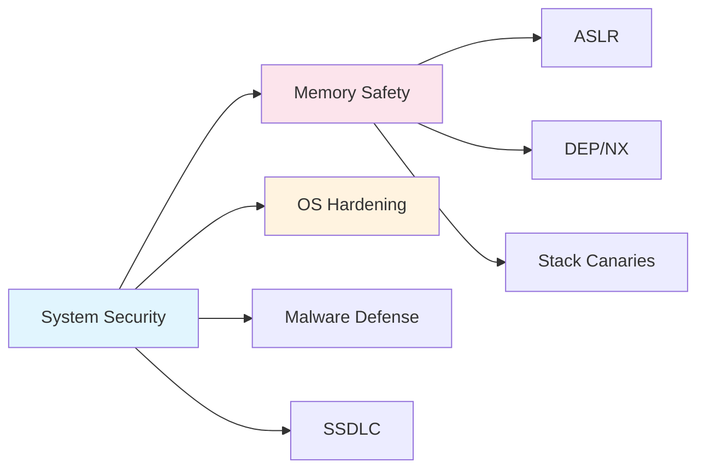

# Chapter 4: System & Software Security

> **Prereq:** Chapter 3 (Network Security) — system security assumes network perimeter controls are in place.
> **Next:** Chapter 5 (Web Security) — web applications run on the operating systems described here.

---

## Learning Objectives

- Explain the mechanisms and mitigation strategies for memory corruption vulnerabilities like buffer overflows.
- Understand the principles of Operating System (OS) hardening and least privilege.
- Categorize different types of malware and their propagation methods.
- Describe the core concepts of the Secure Software Development Lifecycle (SSDLC).
- Identify common software security flaws and apply the principle of complete mediation.

### Chapter at a Glance

| Section | Key Concept | Why It Matters |
|---------|-------------|----------------|
| Buffer Overflow | Stack smashing | Classic memory corruption exploit |
| OS Hardening | ASLR, DEP, patching | Reduce system attack surface |
| Malware Types | Virus, worm, ransomware | Understand defense strategies per type |
| SSDLC | Secure coding, testing | Build security in, not bolt on |



---

## Theory


> **One-Sentence Takeaway:** System security defends against low-level threats — buffer overflows exploit memory unsafety, OS hardening reduces the attack surface, and the SSDLC builds security into software from the start.

### Memory Corruption Vulnerabilities
Low-level languages (like C and C++) allow direct memory manipulation, which can lead to critical flaws if not handled carefully.
- **Buffer Overflow:** Occurs when a program writes more data to a fixed-length block of memory (a buffer) than it can hold. This can overwrite adjacent memory, including the return address on the stack.
- **Stack Smashing:** An attacker overflows a stack buffer to overwrite the return pointer, redirecting execution to their own malicious code (shellcode).
- **Mitigation Techniques:**
    - **ASLR (Address Space Layout Randomization):** Randomizes memory addresses to make exploitation unpredictable.
    - **DEP/NX (Data Execution Prevention / No-Execute):** Marks certain memory regions (like the stack) as non-executable.
    - **Stack Canaries:** Small values placed before the return address; if they are changed, the program terminates.

### Operating System Hardening
OS hardening is the process of securing an operating system by reducing its surface of vulnerability.
- **Removing Unnecessary Services:** Disabling any feature or service not required for the system's function.
- **Patch Management:** Regularly updating the OS and applications to fix known vulnerabilities.
- **Host-Based Access Control:** Using tools like SELinux or AppArmor to enforce mandatory access controls.
- **Logging and Auditing:** Configuring the system to record security-relevant events for later analysis.

### Malware
Malware (malicious software) is any software intentionally designed to cause damage to a computer, server, client, or computer network.
- **Viruses:** Attaches itself to a legitimate program and requires human action to propagate.
- **Worms:** Standalone programs that replicate themselves over a network without human intervention.
- **Trojans:** Disguised as legitimate software to trick users into installing them.
- **Ransomware:** Encrypts user data and demands payment for the decryption key.
- **Rootkits:** Designed to hide the existence of other malware or unauthorized access by subverting OS calls.

### Secure Software Development Lifecycle (SSDLC)
Security should be integrated into every phase of software development:
1.  **Requirements:** Identify security and privacy requirements.
2.  **Design:** Perform threat modeling and secure architecture review.
3.  **Implementation:** Use secure coding standards and static analysis (SAST).
4.  **Verification:** Conduct dynamic analysis (DAST), fuzzing, and penetration testing.
5.  **Release/Maintenance:** Plan for incident response and regular patching.

---

## Examples

### Example 1: A Simple Buffer Overflow in C
Consider this vulnerable code snippet:
```c
#include <stdio.h>
#include <string.h>

void vulnerable_function(char *str) {
    char buffer[16];
    // Dangerous: strcpy does not check the length of the source string
    strcpy(buffer, str);
}

int main(int argc, char *argv[]) {
    if (argc > 1) {
        vulnerable_function(argv[1]);
    }
    return 0;
}
```
*Vulnerability:* If `argv[1]` is longer than 15 characters, it will overflow `buffer`.
*Fix:* Use `strncpy(buffer, str, sizeof(buffer) - 1)` and manually null-terminate.

### Example 2: Static Analysis for Secret Detection
Using a tool like `trufflehog` or `gitleaks` to find hardcoded credentials in source code:
```bash
# Scan a local git repository for secrets
gitleaks detect --source . --verbose
```
*Expected Output:* Alerts if any API keys, passwords, or private keys are found committed to the repository.
*Demonstrates a key step in the "Implementation" phase of the SSDLC.*

---

## Summary

- Memory corruption (like buffer overflows) remains a significant threat to system security; modern OS features like ASLR and DEP mitigate these risks.
- OS hardening involves reducing the attack surface through configuration, patching, and strict access controls.
- Malware exists in many forms (viruses, worms, ransomware), each requiring different detection and prevention strategies.
- Secure software is best achieved by integrating security throughout the development lifecycle (SSDLC) rather than treating it as an afterthought.
- The principle of "Complete Mediation" requires that every access to every object be checked for authority.

---

## Exercises

### Review Questions
1. How does Address Space Layout Randomization (ASLR) prevent a buffer overflow from being easily exploited?
2. What is the main difference between a computer virus and a computer worm?
3. Define "Least Privilege" in the context of an operating system.
4. Name three stages of the SSDLC and a security activity associated with each.

### Application Problems
1. Rewrite the C code in Example 1 to use `fgets` instead of `strcpy` to securely read user input into the buffer.
2. You find a "rootkit" on a production server. Explain why simply deleting the malware files might not be enough to fully clean the system.
3. A company uses a 10-year-old operating system for a critical legacy application. Propose three "hardening" steps they can take to protect this system since security patches are no longer available.

### Challenge Problem
1. Research the "Return-Oriented Programming" (ROP) technique. Explain how it can be used to bypass Data Execution Prevention (DEP). Provide a conceptual explanation of how an attacker chains "gadgets" to achieve their goal.

### Concept Comparison

| Malware Type | Propagation | Payload | Key Defense |
|-------------|-------------|---------|-------------|
| Virus | Infects files | Varied | Antivirus, patch management |
| Worm | Self-propagating (network) | DoS, dropper | Network segmentation |
| Ransomware | Phishing, exploits | Encrypts files | Backups, EDR |
| Rootkit | Subverts OS | Hide presence | Boot integrity, memory forensics |

### Cross-Application Matrix

| Domain | Application | Relevance |
|--------|-------------|-----------|
| Network Security | NIDS signatures for exploits | Buffer overflow detection via traffic patterns |
| App Security | Secure coding standards | SSDLC prevents injection flaws |
| Cloud Security | Immutable infrastructure | Hardened OS images for cloud workloads |
| Research | CFI (Control Flow Integrity) | Next-gen defense against ROP attacks |

### Chapter Quiz

1. ASLR defeats buffer overflow exploitation by:
   - A) Encrypting all memory
   - B) Randomising memory address layouts
   - C) Preventing buffer writes
   - D) Logging all memory access

2. A computer worm differs from a virus because:
   - A) Worms only infect Windows systems
   - B) Worms self-propagate without a host file
   - C) Worms are always ransomware
   - D) Worms cannot spread over networks

3. DEP/NX prevents:
   - A) Stack buffer overflows
   - B) Execution of code in non-executable memory regions
   - C) SQL injection
   - D) Phishing attacks

<details>
<summary>Answers</summary>
1. B, 2. B, 3. B
</details>
