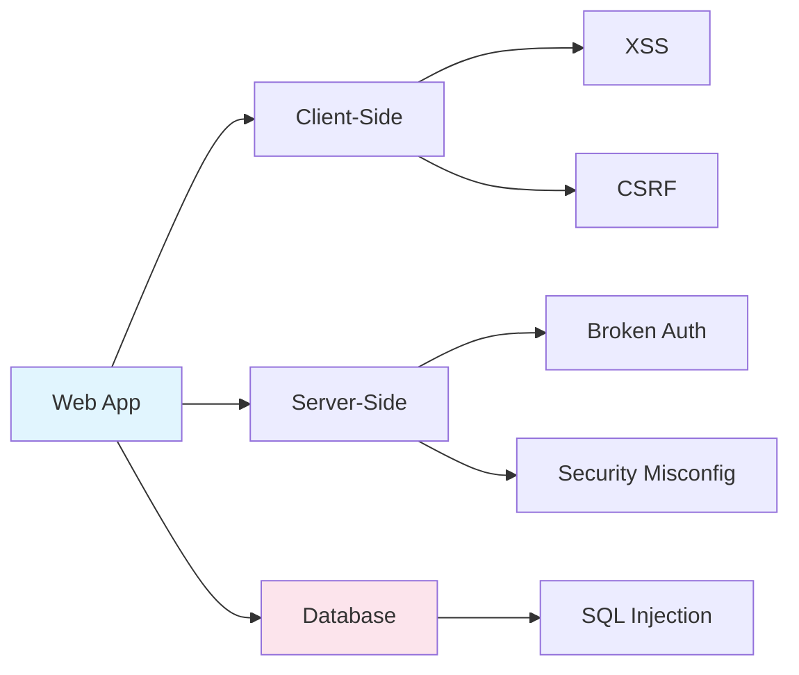

# Chapter 5: Web Security

> **Prereq:** Chapter 4 (System & Software Security) — web apps build on OS foundations and inherit their vulnerabilities.
> **Next:** Chapter 6 (IAM) — web authentication mechanisms rely on secure identity management.

---

## Learning Objectives

- Identify the most critical web application security risks defined by the OWASP Top 10.
- Explain the mechanics of Cross-Site Scripting (XSS) and effective prevention techniques.
- Understand SQL Injection (SQLi) and how to use parameterized queries to mitigate it.
- Describe Cross-Site Request Forgery (CSRF) and the role of anti-CSRF tokens.
- Implement security headers and understand the importance of secure cookie attributes.

### Chapter at a Glance

| Section | Key Concept | Why It Matters |
|---------|-------------|----------------|
| OWASP Top 10 | Prioritised web risks | Industry-standard threat framework |
| SQL Injection | Query injection | Most critical web vulnerability |
| XSS | Script injection | Affects every site with user input |
| CSRF | Forged requests | Protects state-changing operations |
| Security Headers | CSP, HSTS, X-Frame-Options | Browser-enforced defense layers |



---

## Theory


> **One-Sentence Takeaway:** Web security centres on the OWASP Top 10 — SQL injection, XSS, and CSRF are the most critical risks, each prevented by separating data from commands and enforcing strict browser policies.

### OWASP Top 10
The Open Web Application Security Project (OWASP) maintains a consensus list of the most critical security risks to web applications. Current highlights include:
1.  **Broken Access Control:** Users can access data or functions outside of their intended permissions.
2.  **Cryptographic Failures:** Inadequate protection of sensitive data in transit or at rest.
3.  **Injection:** Unintended data sent to an interpreter (SQL, LDAP, OS) as part of a command or query.
4.  **Insecure Design:** Flaws in the architecture or design of the application.
5.  **Security Misconfiguration:** Improperly configured security settings (e.g., default passwords, open cloud storage).

### Injection Attacks (SQLi)
SQL Injection occurs when an attacker inserts malicious SQL code into an input field, which is then executed by the back-end database.
- **Goal:** To bypass authentication, extract data, or modify/delete database records.
- **Prevention:** **Parameterized Queries (Prepared Statements)**. They treat user input as data, never as executable code.

### Cross-Site Scripting (XSS)
XSS allows an attacker to execute malicious scripts in a victim's browser.
- **Types:**
    - **Stored XSS:** The script is permanently stored on the server (e.g., in a comment field).
    - **Reflected XSS:** The script is reflected off the web server, typically via a URL parameter.
    - **DOM-based XSS:** The vulnerability exists in the client-side code rather than server-side.
- **Prevention:** Content Security Policy (CSP) and context-aware output encoding.

### Cross-Site Request Forgery (CSRF)
CSRF tricks a victim into performing an action they did not intend to do on a web application where they are currently authenticated.
- **Mechanism:** Exploits the browser's behavior of automatically including cookies with requests to a domain.
- **Prevention:** Anti-CSRF tokens (unique, per-session, unpredictable tokens required for state-changing requests).

### Secure Communication (HTTPS & Cookies)
- **HTTPS:** Uses TLS to encrypt data between the browser and server.
- **HSTS (HTTP Strict Transport Security):** Forces the browser to only communicate with the server over HTTPS.
- **Secure Cookie Attributes:**
    - `HttpOnly`: Prevents JavaScript from accessing the cookie (mitigates XSS-based session theft).
    - `Secure`: Ensures the cookie is only transmitted over encrypted connections.
    - `SameSite`: Controls whether cookies are sent with cross-site requests (mitigates CSRF).

---

## Examples

### Example 1: Preventing SQL Injection in PHP
Vulnerable code (string concatenation):
```php
$id = $_GET['id'];
$query = "SELECT * FROM users WHERE id = " . $id; // DANGEROUS
```
Secure code (prepared statements):
```php
$stmt = $pdo->prepare('SELECT * FROM users WHERE id = :id');
$stmt->execute(['id' => $_GET['id']]); // User input is treated as a literal value
$user = $stmt->fetch();
```
*Demonstrates the use of parameters to separate code from data.*

### Example 2: Content Security Policy (CSP) Header
A CSP header that only allows scripts from the same origin and trusted sources:
```http
Content-Security-Policy: default-src 'self'; script-src 'self' https://trusted.cdn.com; object-src 'none';
```
*Demonstrates how a browser can be instructed to block unauthorized script execution even if an XSS vulnerability exists.*

---

## Summary

- The OWASP Top 10 provides a framework for understanding and prioritizing web application security risks.
- Injection attacks are prevented by separating data from commands (e.g., using prepared statements).
- XSS is mitigated through strict output encoding and the use of Content Security Policy.
- CSRF protection requires verifying the user's intent through unpredictable tokens or the `SameSite` cookie attribute.
- Modern web security relies on a combination of secure coding, proper server configuration, and browser-enforced security headers.

---

## Exercises

### Review Questions
1. Explain the difference between Stored XSS and Reflected XSS.
2. Why is using `strip_tags()` or regex not a reliable way to prevent SQL Injection?
3. How does the `HttpOnly` flag on a cookie protect against session hijacking?
4. What is the purpose of an Anti-CSRF token?

### Application Problems
1. Write a secure SQL query in Python (using `sqlite3` or similar) that fetches a user's profile based on their username provided via a web form.
2. An application allows users to upload a profile picture. List three potential security risks associated with this feature and a mitigation for each.
3. A bank's website has a "Transfer Funds" form. Explain how an attacker could use CSRF to steal money from an authenticated user if no CSRF protection is present.

### Challenge Problem
1. Design a Content Security Policy (CSP) for a complex web application that uses Google Analytics, a third-party chat widget, and some inline CSS for performance. Explain the trade-offs between a strict policy and application functionality.

### Concept Comparison

| Attack | Target | Root Cause | Key Defense |
|--------|--------|------------|-------------|
| SQL Injection | Database | Unsanitised input concatenation | Parameterised queries |
| XSS | Browser | Untrusted output rendered as HTML | Output encoding, CSP |
| CSRF | Authenticated sessions | No origin verification | Anti-CSRF token, SameSite cookie |

### Cross-Application Matrix

| Domain | Application | Relevance |
|--------|-------------|-----------|
| Network Security | WAF rules for SQLi/XSS | Network-layer web attack prevention |
| App Security | OWASP Top 10, secure coding | Direct application of all web security concepts |
| Cloud Security | WAF in cloud (AWS WAF, Cloud Armor) | Cloud-managed web security |
| Research | DOM clobbering, XS-Leaks | Emerging client-side attack classes |

### Chapter Quiz

1. SQL Injection is best prevented by:
   - A) Escaping all user input with regex
   - B) Using parameterised queries / prepared statements
   - C) Disabling SQL on the server
   - D) Using stored procedures only

2. Stored XSS differs from Reflected XSS because:
   - A) Stored XSS is more dangerous — the payload persists on the server
   - B) Reflected XSS requires no user interaction
   - C) Stored XSS only works on modern browsers
   - D) Reflected XSS can steal cookies, stored XSS cannot

3. The `HttpOnly` cookie flag prevents:
   - A) The server from reading the cookie
   - B) JavaScript from accessing the cookie
   - C) The cookie from being sent over HTTP
   - D) Cookie expiration

<details>
<summary>Answers</summary>
1. B, 2. A, 3. B
</details>
