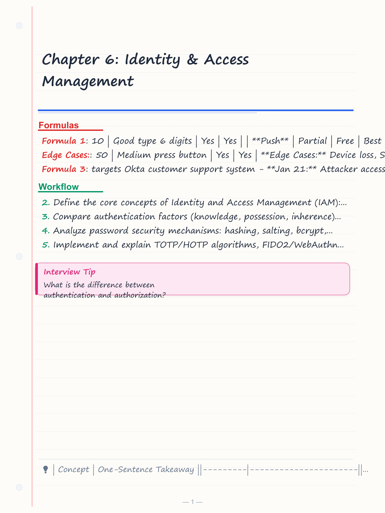
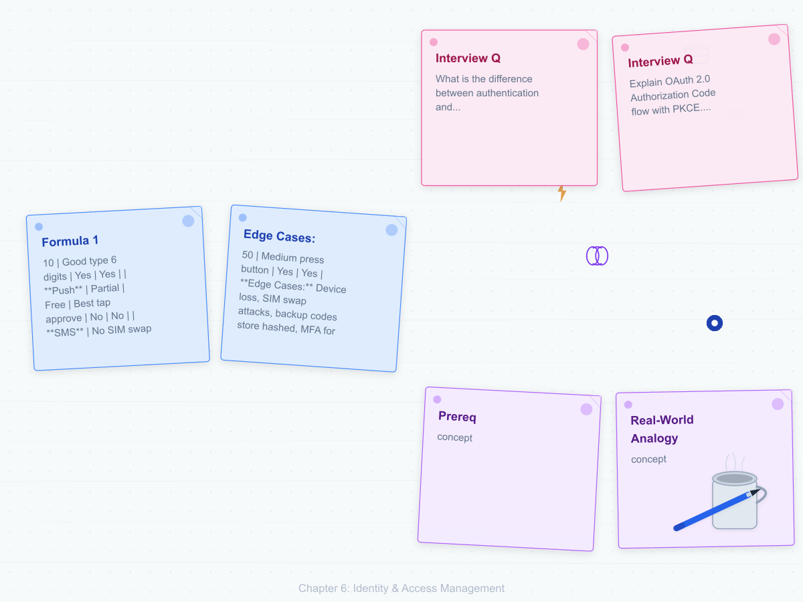
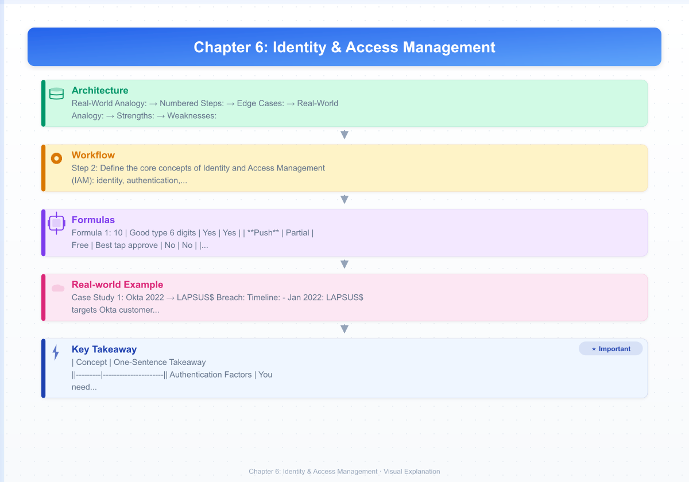
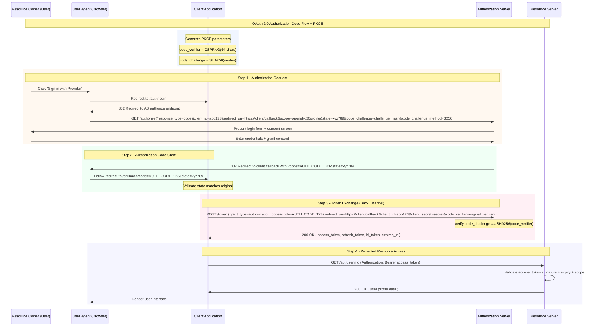
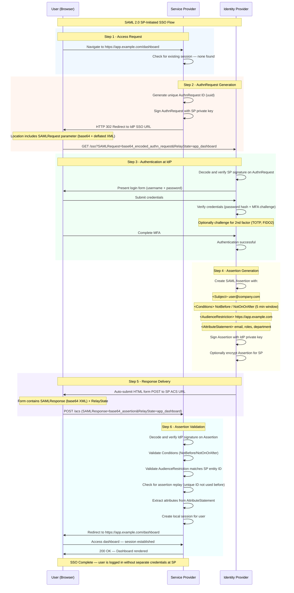

# Chapter 6: Identity & Access Management

> **Prereq:** Chapter 5 (Web Security) → OAuth 2.0 and SAML secure web authentication.
> **Next:** Chapter 7 (Cloud & Mobile Security) → cloud IAM extends enterprise identity to cloud providers.

---

## Learning Objectives

- Define the core concepts of Identity and Access Management (IAM): identity, authentication, authorization, accounting.
- Compare authentication factors (knowledge, possession, inherence) and their real-world security properties.
- Analyze password security mechanisms: hashing, salting, bcrypt, argon2, NIST guidelines.
- Implement and explain TOTP/HOTP algorithms, FIDO2/WebAuthn passkeys, and biometric systems with FAR/FRR/EER.
- Differentiate SAML 2.0, OAuth 2.0 grant types, and OpenID Connect with practical flow diagrams.
- Compare access control models: RBAC, ABAC, ReBAC with trade-offs.
- Deploy LDAP queries, Active Directory management, Kerberos ticket inspection, and Zero Trust architecture.
- Evaluate real-world IAM failures through case studies (Okta 2022, SolarWinds, Midnight Blizzard).
- Apply IAM concepts in interview settings with deep technical Q&A.

<!-- Image Gallery -->
<section class="lesson-visuals" aria-label="Visual learning resources">
  <header><span>VISUAL LEARNING</span><h2>See it. Review it. Remember it.</h2></header>
  <a class="lesson-visual-card" href="../../assets/images/lessons/cyber-security/06-iam/handwritten-notes.png" target="_blank" rel="noopener">
    
    <span><strong>Handwritten notes</strong>Condensed notes for deliberate review.</span>
  </a>
  <a class="lesson-visual-card" href="../../assets/images/lessons/cyber-security/06-iam/sticky-notes.png" target="_blank" rel="noopener">
    
    <span><strong>Sticky-note revision</strong>Fast recall prompts for revision.</span>
  </a>
  <a class="lesson-visual-card" href="../../assets/images/lessons/cyber-security/06-iam/visual-explanation.png" target="_blank" rel="noopener">
    
    <span><strong>Visual concept guide</strong>A connected explanation of the key ideas.</span>
  </a>
</section>
<!-- End Image Gallery -->


---

## Contents

1.  [Core IAM Concepts](#1-core-iam-concepts)
2.  [Authentication Factors](#2-authentication-factors)
3.  [Password Security](#3-password-security)
4.  [Multi-Factor Authentication (MFA)](#4-multi-factor-authentication-mfa)
5.  [Biometrics](#5-biometrics)
6.  [Single Sign-On (SSO)](#6-single-sign-on-sso)
7.  [SAML 2.0](#7-saml-20)
8.  [OAuth 2.0](#8-oauth-20)
9.  [OpenID Connect (OIDC)](#9-openid-connect-oidc)
10. [JWT](#10-jwt)
11. [RBAC vs ABAC vs ReBAC](#11-rbac-vs-abac-vs-rebac)
12. [LDAP](#12-ldap)
13. [Active Directory](#13-active-directory)
14. [Kerberos](#14-kerberos)
15. [Zero Trust Identity](#15-zero-trust-identity)
16. [Privileged Access Management (PAM)](#16-privileged-access-management-pam)
17. [Just-in-Time (JIT) Access](#17-just-in-time-jit-access)
18. [Session Management](#18-session-management)
19. [Case Studies](#19-case-studies)
20. [Interview Corner](#20-interview-corner)
21. [Applications in Real Systems](#21-applications-in-real-systems)

---

## 1. Core IAM Concepts

IAM is the security discipline that ensures the right entity accesses the right resource at the right time for the right reason.

**Real-World Analogy:** An airport security checkpoint. Your passport is your **Identity**. The officer verifying your face matches the photo is **Authentication**. The gate agent checking your boarding pass for a specific flight is **Authorization**. The log of who boarded which flight is **Accounting**.

| Term | Definition | Airport Analogy |
|------|-----------|-----------------|
| **Identity** | Unique representation of an entity | Passport number |
| **Authentication (AuthN)** | Proving you are who you claim | Face match + passport scan |
| **Authorization (AuthZ)** | Granting/denying resource access | Boarding pass check |
| **Accounting (Audit)** | Logging who did what | Flight manifest |

### The IAM Triangle


```
                    +----------------------+
                    |         IAM          |
                    +----------------------+
                    | AuthN: Are you who   |
                    |        you say?      |
                    | AuthZ: What allowed? |
                    | Acct:  What did you? |
                    +----------------------+
```

### Identity Lifecycle


```
PROVISION --> AUTHENTICATION --> AUTHORIZATION --> AUDIT --> DEPROVISION
    |                                                       |
    +------------------- RE-PROVISION <--------------------+
```

**Numbered Steps:**
1. **Provisioning:** Create digital identity (HR hires employee, creates account in IdP)
2. **Credential Issuance:** Assign passwords, certificates, tokens, biometric enrollment
3. **Authentication:** Entity presents credentials; system verifies
4. **Authorization:** System checks policy for resource access
5. **Audit Logging:** Every access event recorded for compliance
6. **Review:** Periodic access reviews (quarterly recertification)
7. **Deprovisioning:** Account disabled/deleted (employee leaves, service decommissioned)

**Edge Cases:**
- Orphan accounts: Deprovisioning missed, account persists with active permissions
- Shared accounts: Violates non-repudiation; cannot attribute actions
- Service accounts: Non-human identities that need rotation, not MFA
- Emergency break-glass: Accounts bypassing normal controls, must be monitored

---

## 2. Authentication Factors

Authentication factors are categories of evidence used to prove identity. Three classic factors plus extensions.

**Real-World Analogy:** Securing a treasure chest. **Something you know** = the combination. **Something you have** = the key. **Something you are** = your fingerprint. A single factor is like one lock; two factors is like two different locks of different types.

### 2.1 Something You Know (Knowledge Factor)


Passwords, PINs, security questions, passphrases.

**Strengths:** Simple, cheap, well-understood.
**Weaknesses:** Forgettable, guessable, phishable, reusable across services.

**NIST SP 800-63B Guidelines:**
- Minimum entropy: 8+ character minimum (memorized secrets)
- Rate limiting: Account lockout after 5-10 failed attempts
- No composition rules: "Must include uppercase, number, symbol" deprecated by NIST

### 2.2 Something You Have (Possession Factor)


Physical devices: smart cards, hardware tokens (YubiKey), TOTP authenticator apps, SMS phone, certificates on smart card.

**Strengths:** Harder to remotely compromise (requires physical access or proximity).
**Weaknesses:** Can be lost, stolen, or cloned (SMS has SIM-swap risk).

### 2.3 Something You Are (Inherence Factor)


Biometrics: fingerprint, face, iris, voice, gait, keystroke dynamics.

**Strengths:** Cannot be forgotten or easily shared.
**Weaknesses:** Cannot be revoked if compromised (you have 10 fingers, 2 eyes); privacy concerns; sensor dependency.

### 2.4 Extended Factors


| Factor | Description | Example | Security Level |
|--------|------------|---------|---------------|
| **Location** | Where you are | GPS, IP geolocation, WiFi SSID | Low (spoofable) |
| **Behavior** | How you act | Typing rhythm, mouse movement | Medium |
| **Time** | When you access | Time-based restrictions | Low (easily bypassed) |

### Auth Factor Comparison


| Criteria | Knowledge | Possession | Inherence | Location | Behavior |
|----------|-----------|-----------|-----------|----------|----------|
| **Revocability** | Easy (change password) | Easy (revoke token) | Impossible (fingerprint) | N/A | Medium |
| **Phishable** | Yes | TOTP: no, SMS: yes | No | No | No |
| **Cost** | Free | $10-$50 per token | $50-$200 per sensor | Free | Free (SW only) |
| **User Convenience** | High | Medium | High | None | None |
| **Forgot/Recovery** | Frequent | Lost token process | N/A | N/A | N/A |
| **Privacy Risk** | Low | Low | High (biometric data) | Medium | High |
| **Attack Surface** | Phishing, breach | Theft, cloning, SIM swap | Spoofing, database leak | Spoofing | ML mimicry |

**Edge Cases:**
- **Fallback mechanisms:** MFA with SMS fallback undermines security (SIM swap attacks)
- **Recovery codes:** printed backup codes are a possession factor on paper
- **Wearable devices:** Smartwatch as possession factor → proximity-based unlock chains

---

## 3. Password Security

### 3.1 Password Hashing Fundamentals


**Real-World Analogy:** A meat grinder. You put a steak in (password), you get ground beef out (hash). You cannot reconstruct the steak from ground beef (one-way function). Every time you put the exact same steak in, you get the exact same ground beef out (deterministic). A **salt** is like adding a unique spice blend to each steak so even identical steaks produce different ground beef.

**Hashing vs Encryption:**

| Property | Hashing | Encryption |
|----------|---------|------------|
| **Direction** | One-way only | Two-way (encrypt/decrypt) |
| **Key** | No key used | Key required to decrypt |
| **Purpose** | Integrity verification, password storage | Confidentiality |
| **Reversible** | No (preimage resistance) | Yes (with correct key) |
| **Examples** | SHA-256, bcrypt, argon2 | AES, RSA, ChaCha20 |

**Numbered Steps → Password Storage:**
1. User creates password `P@ssw0rd!`
2. System generates unique random salt: `s = random(16 bytes)` -> `a1b2c3d4e5f6g7h8`
3. System computes hash: `h = hash(password || salt)` with work factor
4. Store `salt || hash` in database
5. On login, user provides password attempt
6. System looks up stored `salt || hash` for user
7. System computes `h' = hash(attempt || salt)`
8. System compares `h == h'` (constant-time comparison to prevent timing attacks)

### 3.2 Salting


**Why Salt?**
- Prevents rainbow table attacks (precomputed hash dictionaries)
- Makes identical passwords produce different hashes
- Adds entropy to low-entropy passwords

**Without Salt:** `hash("password123")` -> same hash for all users with same password.
**With Salt:** `hash("password123" + random_salt)` -> different hash per user.

### 3.3 Password Hashing Algorithms


#### bcrypt

Based on Blowfish cipher. Configurable cost factor (2^cost iterations).

```
bcrypt(cost, salt, password) = hash
```

**Parameters:**
- Cost: 10-14 (default 10 = 2^10 = 1024 iterations)
- Salt: 16 bytes (128 bits)
- Output: 184 bits (23 bytes) stored in modular crypt format

**Modular Crypt Format:** `$2b$10$[22-char-salt][31-char-hash]`

**Dry Run:**
```
Password:    "hunter2"
Salt:        "abcdefghijklmnopqrstuv" (22 chars base64)
Cost:        12 (2^12 = 4096 iterations)

Step 1:  Initialize Blowfish with salt-derived subkeys
Step 2:  ExpandKey(password) → 4096 iterations
Step 3:  Encrypt "OrpheanBeholderScryDoubt" 64 times with EksBlowfish
Output:   $2b$12$abcdefghijklmnopqrstuv.9E6uGX7YvZ8W2rN5qL3mT...
```

**Complexity:**
- Time: O(2^cost) → exponential in cost factor
- Memory: ~4 KB (fixed, low → weakness against GPU/ASIC attacks)
- Cost 12 on modern CPU: ~250ms per hash

**Advantages & Disadvantages:**

| Advantage | Disadvantage |
|-----------|-------------|
| Widely deployed, battle-tested | Low memory footprint (GPU-friendly) |
| Cost factor future-proofs | 72-byte password input limit |
| Built-in salt generation | Truncates passwords >72 bytes |
| Many language bindings | Older than argon2 |

#### scrypt

Designed to be memory-hard (requires large memory), making GPU/ASIC attacks expensive.

**Parameters:**
- N: CPU/memory cost (must be power of 2)
- r: Block size (multiplies memory/cost)
- p: Parallelization factor
- dkLen: Output hash length

**Advantages & Disadvantages:**

| Advantage | Disadvantage |
|-----------|-------------|
| Memory-hard (resists GPU/ASIC) | Less battle-tested than bcrypt |
| Tunable memory and CPU cost | Complex parameter selection |
| Used in cryptocurrency (Litecoin) | Hardware-optimized scrypt ASICs exist |

#### argon2

Winner of the 2015 Password Hashing Competition (PHC). Gold standard for new implementations.

**Variants:**
- **argon2id** (RECOMMENDED): Hybrid → side-channel resistance + GPU resistance
- **argon2i:** Data-independent → side-channel resistant
- **argon2d:** Data-dependent → GPU resistant

**Parameters:**
- t: Time cost (iterations)
- m: Memory cost (KB)
- p: Parallelism (threads)
- Recommended: t=3, m=65536 (64MB), p=4

**Advantages & Disadvantages:**

| Advantage | Disadvantage |
|-----------|-------------|
| PHC winner, most modern | Not universally available in libraries (growing) |
| Tunable memory/time/parallelism | Parameter confusion (three dimensions) |
| Resists side-channel (argon2id) | Newer than bcrypt, less audit history |
| No input length limits | |

#### PBKDF2 (Password-Based Key Derivation Function 2)

NIST-approved (FIPS 140). Used in WPA2, iOS, many legacy systems.

**Algorithm:** `DK = PBKDF2(PRF, Password, Salt, c, dkLen)`
- PRF: HMAC-SHA256 typically
- c: Iteration count (e.g., 600,000 for SHA256 per OWASP 2023)
- dkLen: Desired output length

**Advantage:** FIPS-approved, widely available.
**Disadvantage:** Not memory-hard → trivial to parallelize on GPU (billions of hash/sec).

### Password Hash Comparison


| Algorithm | Memory-Hard | GPU-Resistant | Configurable | PHC Winner | Best Use Case |
|-----------|------------|--------------|-------------|-----------|--------------|
| **argon2id** | Yes (tunable) | Yes | Time/Memory/P | Yes | **New implementations** |
| **scrypt** | Yes (tunable) | Yes | N/r/p | No | Cryptocurrency, legacy |
| **bcrypt** | No (fixed ~4KB) | No | Cost factor | No | Systems with bcrypt only |
| **PBKDF2** | No | No | Iterations | No | FIPS compliance, legacy |

**Recommendation:** Use argon2id with t=3, m=65536, p=4. Fallback to bcrypt cost=12.

### 3.4 Password Policies (NIST SP 800-63B Guidelines)


| Policy | Old Approach (Deprecated) | NIST 800-63B Approach |
|--------|--------------------------|----------------------|
| **Length** | 8+ chars, mixed case | **MIN 8, recommend 15+** → length > complexity |
| **Composition** | Must have upper, lower, digit, symbol | **NO composition rules** → allow any printable ASCII |
| **Expiration** | Expire every 90 days | **No periodic expiration** → only on compromise suspicion |
| **History** | Remember 24 previous passwords | **Check against known breach databases** (HIBP) |
| **Hints** | Allow password hints | **No hints, no security questions** |
| **Reset** | Security questions | **Out-of-band verification** (email, SMS, authenticator) |
| **Rate limiting** | None | **Rate-limit to 10 attempts in 2 minutes** |

**Why no expiration?** Research shows users choose weaker passwords and predictable patterns (Password1! -> Password2!) when forced to rotate. Only expire on known compromise, forgotten password, or idle > 60 days.

### 3.5 Linux Password Policies (passwd / chage)


**Examining password status:**
```bash
chage -l username
# Last password change                    : Jan 15, 2026
# Password expires                        : Apr 15, 2026
# Minimum number of days between change   : 7
# Maximum number of days between change   : 90
```

**Setting password policies:**
```bash
sudo chage -m 7 username     # Min days between changes
sudo chage -M 90 username    # Max days before expiry
sudo chage -W 14 username    # Warning period before expiry
sudo chage -d 0 username     # Force password change on next login
sudo chage -E 0 username     # Expire account immediately
```

**Password hashing on Linux:**
```bash
# View hash type in /etc/shadow
sudo cat /etc/shadow | grep username
# $y$ = yescrypt, $6$ = SHA-512 (legacy), $2b$ = bcrypt, $argon2id$ = argon2
```

### 3.6 Hashcat NTLM Hash Cracking Demo


```bash
# NTLM hash format: username:RID:LM:NT:::
# Administrator:500:aad3b435b51404eeaad3b435b51404ee:31d6cfe0d16ae931b7...
# Hashcat mode 1000 = NTLM
hashcat -m 1000 -a 0 hashes.txt /usr/share/wordlists/rockyou.txt

# Rule-based attack
hashcat -m 1000 -a 0 hashes.txt rockyou.txt -r /usr/share/hashcat/rules/best64.rule

# Show cracked passwords
hashcat -m 1000 --show hashes.txt

# Performance: 28.3 GH/s on RTX 4090 for NTLM
# 8-char NTLM cracked in ~15 minutes at full speed
```

**Why this matters:** NTLM has NO salt. A single RTX 4090 cracks NTLM at 28 GH/s. Mitigation: Use argon2id or bcrypt; disable NTLM; enforce 12+ char passwords.

**Edge Cases:**
- **Unicode normalization:** Normalize to NFKC before hashing
- **Password truncation:** bcrypt truncates at 72 bytes
- **Pepper:** App-level secret stored outside database
- **Timing attacks:** Use constant-time comparison (HMAC of hashes)
- **Breach databases:** Check against HIBP k-anonymity API

---

## 4. Multi-Factor Authentication (MFA)

MFA requires two or more **different** authentication factors. 2FA uses exactly two.

**Real-World Analogy:** Entering a high-security lab. **Step 1:** PIN at door (know). **Step 2:** Badge swipe (have). **Step 3:** Fingerprint scan (are). All three must match.

### 4.1 TOTP (Time-based OTP) → RFC 6238


**Algorithm:** `TOTP = HOTP(K, T)` where `T = floor((time - T0) / X)`

**Numbered Steps:**
1. Server and client share secret `K` (base32)
2. Both compute `T = floor((time() - 0) / 30)`
3. Both compute `HOTP(K, T)` = HMAC-SHA1 + dynamic truncation
4. Result truncated to 6-8 digits
5. User enters code; server verifies by computing same value
6. Window of +/- 1 step for clock skew

**Dry Run:**
```
Time: 1740249600, T0: 0, Step: 30
T = 58008320
Secret base32: JBSWY3DPEHPK3PXP
HMAC-SHA1 result -> dynamic truncation -> mod 10^6 = 123456
```

**Complexity:** O(1) time, O(1) space → single HMAC computation.

**Advantages & Disadvantages:**

| Advantage | Disadvantage |
|-----------|-------------|
| No internet after setup | Clock skew tolerance required |
| Works offline | Secret provisioning is single point of compromise |
| Open standard (RFC 6238) | Phishable if user enters code on fake site |
| Inexpensive | No origin binding |

**Edge Cases:** Clock drift (>30s = all codes fail), secret compromise via QR shoulder-surfing, recovery codes needed for lost device.

### 4.2 HOTP (HMAC-based OTP) → RFC 4226


`HOTP(K, C) = Truncate(HMAC-SHA1(K, C))` where C is a counter.

| Advantage | Disadvantage |
|-----------|-------------|
| No clock required | Counter sync issues |
| Pre-generatable codes | Server must maintain look-ahead window |

### 4.3 TOTP Generator in PowerShell


```powershell
function ConvertFrom-Base32 {
    param([string]$Base32)
    $alphabet = 'ABCDEFGHIJKLMNOPQRSTUVWXYZ234567'
    $b32 = $Base32 -replace '=', '' -replace ' ', ''
    $bits = [System.Collections.BitArray]::new($b32.Length * 5)
    $bitIdx = 0
    foreach ($char in $b32.ToUpper().ToCharArray()) {
        $val = $alphabet.IndexOf($char)
        for ($j = 4; $j -ge 0; $j--) {
            $bits[$bitIdx] = [bool]($val -band [Math]::Pow(2, $j))
            $bitIdx++
        }
    }
    $bytes = New-object byte[] ($bits.Length / 8)
    for ($i = 0; $i -lt $bytes.Length; $i++) {
        for ($j = 0; $j -lt 8; $j++) {
            if ($bits[$i * 8 + $j]) { $bytes[$i] = [byte]($bytes[$i] -bor [Math]::Pow(2, 7 - $j)) }
        }
    }
    return $bytes
}

function New-TOTPCode {
    param(
        [string]$Secret,
        [int]$Digits = 6,
        [int]$Step = 30,
        [int]$Offset = 0
    )
    $hmac = [System.Security.Cryptography.HMACSHA1]::new()
    $hmac.Key = ConvertFrom-Base32 -Base32 $Secret
    $unixTime = [int][Math]::Floor((Get-Date -UFormat %s))
    $timeStep = [Math]::Floor(($unixTime - 0) / $Step) + $Offset
    $counterBytes = [byte[]]::new(8)
    $val = [UInt64]$timeStep
    for ($i = 7; $i -ge 0; $i--) {
        $counterBytes[$i] = [byte]($val -band 0xFF)
        $val = $val -shr 8
    }
    $hash = $hmac.ComputeHash($counterBytes)
    $offset = $hash[19] -band 0x0F
    $code = ([int](($hash[$offset] -band 0x7F) -shl 24) -bor
             [int](($hash[$offset+1] -band 0xFF) -shl 16) -bor
             [int](($hash[$offset+2] -band 0xFF) -shl 8) -bor
             [int]($hash[$offset+3] -band 0xFF))
    return ($code % [Math]::Pow(10, $Digits)).ToString("D$Digits")
}

# Usage: New-TOTPCode -Secret "JBSWY3DPEHPK3PXP"
```

### 4.4 SMS and Push MFA


**SMS:** NIST deprecated as "restricted" (SP 800-63B). Risks: SIM swap, SS7 interception.

**Push:** Better than SMS (device binding + signature). Risk: Push fatigue → users approve without verifying.

### 4.5 Hardware Tokens (U2F / FIDO2 / WebAuthn Passkeys)


**U2F Flow:**
```
User --[login+password]--> Website
  |<--challenge---[origin]-- User touches YubiKey
  |---[signature]----------> Verify with public key
```

**FIDO2 / WebAuthn Terms:**
- **WebAuthn:** W3C browser API
- **CTAP2:** Client-to-Authenticator Protocol (USB/NFC/BLE)
- **FIDO2:** WebAuthn + CTAP2
- **Passkey:** FIDO2 credential synced via iCloud/Google/1Password

**Passkey Registration:**
1. User clicks "Create Passkey"
2. Browser sends `navigator.credentials.create({publicKey: {...}})`
3. Authenticator generates keypair (sk, pk); private key never leaves device
4. Server stores pk + credential ID

**Passkey Authentication:**
1. User clicks "Sign in with Passkey"
2. Browser calls `navigator.credentials.get({publicKey: {...}})`
3. User authenticates via FaceID/fingerprint/PIN
4. Authenticator signs challenge with sk
5. Server verifies with pk → user is authenticated

**Security:** Phishing-resistant (origin-bound), no shared secrets, device binding.

**Advantages & Disadvantages:**

| Advantage | Disadvantage |
|-----------|-------------|
| Phishing-resistant | Requires hardware/platform support |
| No shared secrets | Device loss = lockout (unless synced) |
| Passwordless | Browser/OS fragmentation |

### 4.6 YubiKey FIDO2 Setup


```bash
# List connected YubiKeys
ykman list
# Check FIDO2 status
ykman fido info
# Set FIDO2 PIN
ykman fido access change-pin
# Register for Linux login
pamu2fcfg -u $USER -o /etc/u2f_mappings
# Add backup key
pamu2fcfg -u $USER -n -o /etc/u2f_mappings
# Enable in PAM: /etc/pam.d/sudo: auth required pam_u2f.so
```

### MFA Method Comparison


| Method | Phishing Resistant | Cost | User Experience | Offline | FIPS |
|--------|-------------------|------|-----------------|---------|------|
| **FIDO2/Passkey** | Yes | Free-$50 | Best (tap/biometric) | Yes | Yes |
| **TOTP** | No | Free-$10 | Good (type 6 digits) | Yes | Yes |
| **Push** | Partial | Free | Best (tap approve) | No | No |
| **SMS** | No (SIM swap) | Carrier cost | Good (auto-fill) | No | No |
| **Hardware OTP** | No | $10-$50 | Medium (press button) | Yes | Yes |

**Edge Cases:** Device loss, SIM swap attacks, backup codes (store hashed), MFA for non-interactive service accounts (use cert-based auth).

---

## 5. Biometrics

**Real-World Analogy:** Car keyless entry. Reads fingerprint/face. Cannot lose like a key. Cannot change like a password.

### 5.1 Metrics


| Metric | Definition |
|--------|-----------|
| **FAR** | False Accept Rate → impostor incorrectly accepted |
| **FRR** | False Reject Rate → legitimate user incorrectly rejected |
| **EER** | Equal Error Rate → where FAR == FRR |
| **FTC** | Failure to Capture → system cannot capture input |
| **FTE** | Failure to Enroll → system cannot create template |

**FAR/FRR Trade-off:** Lower threshold = lower FRR (fewer rejections) but higher FAR (more false accepts). EER is the single comparison point.

### 5.2 Types


**Fingerprint:** FAR ~0.001%, FRR ~2-5%, EER ~2%. Spoofable with gelatin copies.

**Face:** FAR ~0.0001%, FRR ~1-3%, EER ~0.5%. Challenges: twins, masks, lighting, adversarial glasses.

**Iris:** FAR ~0.00001%, FRR ~0.1-1%, EER ~0.01%. Most accurate. Requires cooperative user close to camera.

### Biometric Comparison


| Property | Fingerprint | Face | Iris | Voice |
|----------|------------|------|------|-------|
| **FAR** | 0.001% | 0.0001% | 0.00001% | 1-2% |
| **EER** | ~2% | ~0.5% | ~0.01% | ~3-5% |
| **Spoof Risk** | High | Medium | Very Low | High |
| **Revocability** | No (10 fingers) | No (1 face) | No (2 irises) | No |
| **Privacy** | Medium | High | Very High | Medium |

**Edge Cases:** Liveness detection (blink, smile challenge), biometric revocation impossible, demographic bias in training data, twins, medical changes.

---

## 6. Single Sign-On (SSO)

**Analogy:** Concert wristband. Show ID once at entrance, wristband lets you enter any area without re-identifying.

**SSO Flow (SAML):**
1. User requests SP resource (e.g., Salesforce)
2. SP redirects to IdP (e.g., Okta)
3. User authenticates at IdP (password + MFA)
4. IdP issues signed assertion to SP
5. SP validates signature, creates session

### SSO Models


| Model | Description | Example |
|-------|------------|---------|
| **Centralized** | Single IdP for all apps | Okta, Azure AD |
| **Federated** | Cross-org IdP trust | SAML federation |
| **Social** | Google/Facebook login | OAuth + OIDC |
| **Cross-domain** | Shared cookies | CAS |

**Pros:** Fewer passwords, centralized MFA, centralized deprovisioning, lower helpdesk costs.
**Cons:** Single point of failure, one compromised IdP = all apps compromised, complex troubleshooting.

---

## 7. SAML 2.0

**Analogy:** Notarized document. IdP = notary who verifies identity and stamps assertion. SP trusts the stamp.

### Components


| Term | Description |
|------|------------|
| **IdP** | Authenticates users, issues assertions (Okta, Azure AD, Keycloak) |
| **SP** | Trusts assertions, provides service (Salesforce, Workday, AWS) |
| **Assertion** | XML: authentication statement + attributes |
| **Metadata** | XML config: endpoints, certs, bindings |
| **Binding** | Transport: HTTP Redirect, HTTP POST, Artifact |

### SAML SP-Initiated Flow


**Numbered Steps:**
1. User navigates to `https://app.example.com/dashboard`
2. SP generates `<AuthnRequest>`, redirects browser to IdP
3. IdP challenges user for credentials (password + MFA)
4. IdP generates `<Response>` with signed `<Assertion>` containing `<Subject>`, `<Conditions>` (validity window, audience), `<AttributeStatement>` (email, roles), `<AuthnStatement>`
5. Browser auto-POSTs assertion to SP's ACS URL
6. SP validates signature, extracts attributes, creates session

### Assertion XML Structure


```xml
<samlp:Response ...>
  <saml:Issuer>https://idp.company.com</saml:Issuer>
  <saml:Assertion>
    <saml:Subject>
      <saml:NameID>user@company.com</saml:NameID>
    </saml:Subject>
    <saml:Conditions NotBefore="2026-01-15T14:29:00Z"
                     NotOnOrAfter="2026-01-15T14:35:00Z">
      <saml:AudienceRestriction>
        <saml:Audience>https://app.example.com</saml:Audience>
      </saml:AudienceRestriction>
    </saml:Conditions>
  </saml:Assertion>
</samlp:Response>
```

### OpenSSL Certificate for SAML Signing


```bash
# Generate key
openssl genpkey -algorithm RSA -pkeyopt rsa_keygen_bits:2048 -out saml-signing.key
# Generate self-signed cert
openssl req -new -x509 -key saml-signing.key -out saml-signing.crt \
  -days 1825 -subj "/C=US/O=Company Inc/CN=saml-signing"
# Sign metadata
openssl dgst -sha256 -sign saml-signing.key -out request.sig request.xml
# Verify
openssl dgst -sha256 -verify saml-signing.pub -signature request.sig request.xml
```

### SAML Security


| Attack | Mitigation |
|--------|------------|
| XML Signature Wrapping | Validate entire XML tree, not just signature |
| Clock skew | Allow max 5 min drift |
| Assertion replay | Track unique assertion IDs |
| Audience restriction | SP validates `<Audience>` matches its entity ID |

---

## 8. OAuth 2.0

**Analogy:** Valet parking ticket. Valet (client) gets token to park car (access) but NOT open trunk (scoped). Token expires.

### 8.1 Core Concepts


| Term | Definition | Analogy |
|------|-----------|---------|
| **Resource Owner** | User who owns data | Car owner |
| **Client** | App requesting access | Valet |
| **Authorization Server** | Issues tokens | Parking company |
| **Resource Server** | Hosts protected data | Parking garage |
| **Access Token** | Credential for resource | Valet ticket |
| **Scope** | Limits token actions | "Park only" |

### 8.2 Grant Types


#### Authorization Code + PKCE (Best for web/mobile/SPAs)

1. Client generates `state` + `code_verifier` + `code_challenge = SHA256(verifier)`
2. Redirect to AS: `?response_type=code&client_id=...&redirect_uri=...&state=...&code_challenge=...`
3. User authenticates, consents
4. AS redirects to redirect_uri with `?code=AUTH_CODE&state=STATE`
5. Client POSTs `code + code_verifier` to token endpoint
6. AS verifies `SHA256(verifier) == challenge`, returns access_token + refresh_token

**PKCE prevents** authorization code interception → attacker with code cannot exchange without verifier.

#### Client Credentials (Machine-to-Machine)

```
POST /token
grant_type=client_credentials&client_id=ID&client_secret=SECRET
```

**Use case:** Backend service calling another service. No user involved.

#### Implicit (Deprecated)

Token returned directly in URL fragment. **Risks:** Browser history, referrer headers, JS error logging.

#### ROPC (Deprecated)

Password sent to client, exchanged for token. **Risks:** Client sees password, no MFA support.

#### Device Authorization (TVs, CLI, IoT)

1. Device requests code: `POST /devicecode` -> returns `user_code` + `verification_uri`
2. User visits URL on phone, enters code, authenticates
3. Device polls `/token` every 5s until authorized

### Grant Types Comparison


| Grant | Use Case | User Present | MFA Support | Secure |
|-------|---------|-------------|------------|--------|
| **Auth Code + PKCE** | Web, mobile, SPA | Yes | Yes | Yes |
| **Auth Code** | Server-side web | Yes | Yes | Yes |
| **Implicit** (depr) | Legacy SPA | Yes | Yes | No |
| **Client Credentials** | API-to-API | No (machine) | N/A | Yes |
| **ROPC** (depr) | Legacy migration | Yes | No | No |
| **Device** | TV, CLI, IoT | Yes (secondary) | Yes | Yes |

### 8.3 OAuth 2.0 with curl + PKCE


```bash
CLIENT_ID="your-client-id"
REDIRECT_URI="https://localhost:8080/callback"
AUTH="https://auth.example.com/authorize"
TOKEN="https://auth.example.com/token"

# Generate PKCE
CODE_VERIFIER=$(openssl rand -base64 48 | tr -d '/+=' | cut -c1-64)
CODE_CHALLENGE=$(printf '%s' "$CODE_VERIFIER" | openssl dgst -sha256 -binary | openssl base64 -A | tr '/+' '_-' | tr -d '=')
STATE=$(openssl rand -hex 16)

echo "Open: $AUTH?response_type=code&client_id=$CLIENT_ID&redirect_uri=$REDIRECT_URI&state=$STATE&code_challenge=$CODE_CHALLENGE&code_challenge_method=S256"

# After user authenticates, paste auth code:
read -p "Auth code: " AUTH_CODE
# Exchange
curl -X POST "$TOKEN" -d "grant_type=authorization_code&code=$AUTH_CODE&redirect_uri=$REDIRECT_URI&client_id=$CLIENT_ID&code_verifier=$CODE_VERIFIER"
```

### 8.4 OAuth Security


| Attack | Mitigation |
|--------|------------|
| CSRF | Random `state` parameter, validate on return |
| Code interception | PKCE code_verifier |
| Redirect manipulation | Strict URI registration |
| Token theft | Short TTL (1h), TLS |
| Scope elevation | Server validates against client registration |

---

## 9. OpenID Connect (OIDC)

**Analogy:** OAuth 2.0 = valet ticket (access to car). OIDC = ID card on top that says who you are.

**OIDC = OAuth 2.0 + Identity Layer**

### ID Token (JWT)


```json
{
  "iss": "https://accounts.google.com",
  "sub": "1234567890",
  "aud": "client-id-123.apps.googleusercontent.com",
  "exp": 1740249600,
  "iat": 1740246000,
  "nonce": "n-0S6_WzA2Mj",
  "name": "John Doe",
  "email": "john@example.com",
  "email_verified": true
}
```

### Flow


```
User --[scope=openid]--> AS
   |<--- ID Token (JWT) -- sub, name, email
   |<--- Access Token ---- call UserInfo endpoint
   |---[Access Token]--> UserInfo endpoint
   |<---[JSON claims]---- more attributes
```

### SAML vs OAuth vs OIDC


| Property | SAML 2.0 | OAuth 2.0 | OIDC |
|----------|---------|-----------|------|
| **Purpose** | Enterprise SSO | Delegated authorization | Auth + delegated auth |
| **Format** | XML + signature | JSON + Bearer | JWT + JSON |
| **User Info** | In assertion | Resource Server API | ID Token + UserInfo |
| **Mobile** | Poor | Good | Good |
| **API Access** | No | Yes | Yes |
| **Domain** | B2B Enterprise | B2C/B2B APIs | Consumer + Enterprise |
---

## 10. JWT

**Analogy:** Tamper-evident envelope. Name/address visible (header + payload base64). Wax seal (signature) proves no tampering.

### Structure


```
base64url(Header) . base64url(Payload) . Signature

Header:  {"alg":"RS256","typ":"JWT"}
Payload: {"sub":"user123","iat":1740246000,"exp":1740249600,"iss":"auth.example.com","aud":"api.example.com"}
Signature = RSASHA256(base64url(Header) + "." + base64url(Payload), privateKey)
```

### JWT Generation and Validation


```bash
# Generate RSA key pair
openssl genpkey -algorithm RSA -pkeyopt rsa_keygen_bits:2048 -out jwt-private.pem
openssl pkey -in jwt-private.pem -pubout -out jwt-public.pem

# Create header and payload
HEADER='{"alg":"RS256","typ":"JWT"}'
PAYLOAD='{"sub":"1234567890","name":"John Doe","iat":1740246000,"exp":1740249600}'

# Base64URL encode
B64_HEADER=$(printf '%s' "$HEADER" | openssl base64 -A | tr '/+' '_-' | tr -d '=\n')
B64_PAYLOAD=$(printf '%s' "$PAYLOAD" | openssl base64 -A | tr '/+' '_-' | tr -d '=\n')
SIGNING_INPUT="$B64_HEADER.$B64_PAYLOAD"

# Sign
SIGNATURE=$(printf '%s' "$SIGNING_INPUT" | openssl dgst -sha256 -sign jwt-private.pem | openssl base64 -A | tr '/+' '_-' | tr -d '=\n')
JWT="$SIGNING_INPUT.$SIGNATURE"
echo "$JWT"

# Verify
echo "$JWT" | cut -d. -f3 | tr '_-' '/+' | openssl base64 -d -A > sig.bin
printf '%s' "$(echo "$JWT" | cut -d. -f1-2)" | openssl dgst -sha256 -verify jwt-public.pem -signature sig.bin
# Output: Verified OK
```

### JWT Security Attacks


| Attack | Mitigation |
|--------|------------|
| **alg=none** | Reject tokens with `"alg":"none"` |
| **alg confusion** | Reject HS256 when expecting RS256 |
| **Key confusion** | Separate keystores per algorithm |
| **Token replay** | Short TTL, include `jti` for revocation |
| **Weak secret** | Use RSA/ECDSA; minimum 256-bit HMAC key |

---

## 11. RBAC vs ABAC vs ReBAC

**Analogy:**
- **RBAC:** Library cards. Student card, Faculty card, Visitor card. Card type determines access.
- **ABAC:** Nightclub rules. "Age > 21 AND VIP member AND dress code = formal AND time &lt; 2AM."
- **ReBAC:** Office building. "Alice can enter room 301 because Bob granted her access."

### 11.1 RBAC (NIST INCITS 359)


**Design:**
1. Define roles: Admin, Manager, Engineer, Viewer
2. Assign permissions to roles: Engineer = read/write code
3. Assign users to roles: Alice -> Engineer
4. Optional hierarchy: Admin inherits Manager inherits Engineer

```sql
CREATE TABLE roles (id SERIAL PRIMARY KEY, name VARCHAR(100) UNIQUE);
CREATE TABLE permissions (id SERIAL PRIMARY KEY, resource VARCHAR(200), action VARCHAR(50));
CREATE TABLE role_permissions (role_id INT, permission_id INT, PRIMARY KEY (role_id, permission_id));
CREATE TABLE user_roles (user_id INT, role_id INT, PRIMARY KEY (user_id, role_id));

-- Check: user 42 delete document:finance:report?
SELECT EXISTS (
  SELECT 1 FROM user_roles ur
  JOIN role_permissions rp ON ur.role_id = rp.role_id
  JOIN permissions p ON rp.permission_id = p.id
  WHERE ur.user_id = 42 AND p.resource = 'document:finance:report' AND p.action = 'delete'
);
```

**Advantages & Disadvantages:**

| Advantage | Disadvantage |
|-----------|-------------|
| Simple to understand | Role explosion (hundreds of narrow roles) |
| Easy to audit | Static → no time/location expressions |
| Well-supported | Permission creep over time |
| Hierarchical | Coarse-grained |

### 11.2 ABAC (NIST SP 800-162)


**Policy Example:**
```
Access allowed if ALL of:
  1. user.department == resource.owner_department
  2. user.clearance >= resource.classification
  3. environment.time BETWEEN "09:00" AND "17:00"
  4. environment.network == "corporate-vpn"
```

**Advantages & Disadvantages:**

| Advantage | Disadvantage |
|-----------|-------------|
| Fine-grained access | Complex policy management |
| Dynamic (time, location, risk) | Expensive policy evaluation |
| No role explosion | Hard to audit |
| Context-aware | Tooling maturity |

### 11.3 ReBAC (Relationship-Based)


Used in Google Drive, GitHub, Slack, Facebook. Access based on **relationships**.

**Example (Google Drive):**
```
File "Budget.xlsx": Owner=Alice, Editor=Bob, Viewer=Charlie, Team=Engineering
Can Dave access? -> If Dave in Engineering -> YES
```

**Google Zanzibar** (USENIX ATC 2019): Global-scale ReBAC.
```
Tuple: (object, relation, user)
(doc:budget-2026, viewer, team:engineering#member)
(team:engineering, member, user:dave)
Check(doc:budget-2026, viewer, user:dave) -> true
```

**Advantages & Disadvantages:**

| Advantage | Disadvantage |
|-----------|-------------|
| Natural for social structures | Complex at scale |
| Supports delegation | Recursive resolution expensive |
| Global scale (Zanzibar) | Consistency challenges |

### Comparison Table


| Property | RBAC | ABAC | ReBAC |
|----------|------|------|-------|
| **Policy Basis** | Role membership | Attributes | Relationships |
| **Granularity** | Medium | Fine | Fine |
| **Dynamic** | Static | Dynamic | Semi-dynamic |
| **Admin Complexity** | Low-Medium | High | Medium |
| **Eval Complexity** | O(1) | O(k) rules | O(d) depth |
| **Best For** | Enterprise apps | Cloud, IoT, fine-grained | Social, sharing apps |
| **Examples** | AWS IAM roles | S3 bucket policies, Azure CA | Google Drive, GitHub |
| **Standards** | NIST INCITS 359 | NIST SP 800-162, XACML | Zanzibar (OpenFGA) |

---

## 12. LDAP

**Analogy:** Company phone directory. Look up a person (DN) and find details (attributes). LDAP is the protocol for querying/modifying this directory.

### 12.1 Concepts


| Term | Description | Example |
|------|------------|---------|
| **DN** | Distinguished Name (unique path) | `cn=John Doe,ou=Engineering,dc=company,dc=com` |
| **RDN** | Entry name within parent | `cn=John Doe` |
| **OU** | Organizational Unit | `ou=Engineering` |
| **DC** | Domain Component | `dc=company, dc=com` |
| **CN** | Common Name | `cn=John Doe` |
| **Base DN** | Search starting point | `dc=company,dc=com` |

### 12.2 Directory Structure


```
dc=company,dc=com
 +-- ou=People
 |    +-- cn=Alice Smith (uid=alice, mail=alice@company.com, department=Engineering)
 |    +-- cn=Bob Jones (uid=bob, mail=bob@company.com)
 +-- ou=Groups
 |    +-- cn=Engineering (member: cn=Alice Smith, cn=Bob Jones)
 +-- ou=Servers
```

### 12.3 LDAP Search with ldapsearch


```bash
# Simple search
ldapsearch -H ldap://ldap.company.com:389 -x \
  -D "cn=admin,dc=company,dc=com" -W \
  -b "dc=company,dc=com" \
  "(uid=alice)" cn mail department

# With LDAPS (TLS)
ldapsearch -H ldaps://ldap.company.com:636 -x \
  -D "cn=admin,dc=company,dc=com" -W \
  -b "ou=Engineering,dc=company,dc=com" \
  "(&(objectClass=inetOrgPerson)(mail=*@company.com))"

# Common filters:
# All people:                     (objectClass=inetOrgPerson)
# Specific user:                  (uid=jdoe)
# Department:                     (department=Engineering)
# AND:                            (&(department=Engineering)(title=Manager))
# OR:                             (|(department=Engineering)(department=Sales))
# NOT:                            (!(title=Intern))
# Existence:                      (mail=*)

# Count users
ldapsearch -H ldap://ldap.company.com -x \
  -D "cn=admin,dc=company,dc=com" -W \
  -b "dc=company,dc=com" "(objectClass=user)" dn | grep "^dn:" | wc -l

# Paginated search
ldapsearch ... -E pr=500/noprompt "(objectClass=user)" dn
```

### 12.4 LDIF (Import/Export)


```ldif
dn: cn=Alice Smith,ou=People,dc=company,dc=com
objectClass: inetOrgPerson
cn: Alice Smith
uid: alice
mail: alice@company.com
department: Engineering
userPassword: {SSHA}encryptedHash
```

```bash
# Import
ldapadd -H ldap://ldap.company.com -x -D "cn=admin,dc=company,dc=com" -W -f new-user.ldif
# Export
ldapsearch -H ldap://ldap.company.com -x -D "cn=admin,dc=company,dc=com" -W \
  -b "dc=company,dc=com" -L "(objectClass=inetOrgPerson)" > export.ldif
```

---

## 13. Active Directory

**Analogy:** Central HR system. Knows every employee, title (group), floor access (permissions), manager (hierarchy). AD = Microsoft's LDAP + Kerberos + DNS + GPOs.

### 13.1 AD Components


| Component | Description |
|-----------|-------------|
| **Domain Controller** | Server running AD DS, authenticates users, stores NTDS.DIT |
| **Domain** | Security boundary |
| **Forest** | Collection of domains with shared schema |
| **OU** | Container for objects, GPO application |
| **GPO** | Group Policy Object (password policy, software, desktop config) |
| **Security Group** | Domain Local (single domain), Global (usable across domains), Universal (forest-wide) |

### 13.2 Windows AD PowerShell


```powershell
Import-Module ActiveDirectory

# Create OU
New-ADOrganizationalUnit -Name "Engineering" -Path "DC=company,DC=com"

# Create user
New-ADUser -Name "Alice Smith" -GivenName Alice -Surname Smith `
  -SamAccountName "alice.smith" -UserPrincipalName "alice.smith@company.com" `
  -Title "Senior Engineer" -Department "Engineering" `
  -Path "OU=Engineering,DC=company,DC=com" `
  -AccountPassword (ConvertTo-SecureString "TempP@ss123!" -AsPlainText -Force) `
  -Enabled $true

# Create group and add member
New-ADGroup -Name "Engineering-Global" -GroupScope Global -GroupCategory Security `
  -Path "OU=Groups,DC=company,DC=com"
Add-ADGroupMember -Identity "Engineering-Global" -Members "alice.smith"

# List all users with properties
Get-ADUser -Filter * -Properties Department, Title, LastLogonDate |
    Select-Object Name, SamAccountName, Department, LastLogonDate | Format-Table

# Find inactive users (90 days)
$cutoff = (Get-Date).AddDays(-90)
Get-ADUser -Filter {LastLogonDate -lt $cutoff -and Enabled -eq $true} -Properties LastLogonDate

# Disabled users
Search-ADAccount -AccountDisabled -UsersOnly

# Domain Admin members
Get-ADGroupMember -Identity "Domain Admins" | Select-Object Name, SamAccountName

# Delegate control (reset passwords)
dsacls "OU=Engineering,DC=company,DC=com" /G "company\Helpdesk:CA;Reset Password;user"

# Create gMSA (auto password rotation)
New-ADServiceAccount -Name "SVC-WebApp" -DNSHostName "webapp.company.com" `
  -PrincipalsAllowedToRetrieveManagedPassword "Engineering-Global"
```

### 13.3 AD Security Best Practices


| Practice | Implementation |
|----------|--------------|
| **Least privilege** | No permanent Domain Admin; use JIT |
| **Tier 0/1/2** | Separate admin per tier (DC, server, workstation) |
| **Monitor Tier 0** | Alert on non-DC querying AdminCount |
| **KRBTGT rotation** | Rotate twice after domain admin compromise |
| **Monitor events** | 4624 (logon), 4732 (group member), 4740 (lockout), 5136 (LDAP modify) |

---

## 14. Kerberos

**Analogy:** Convention badge system. Check in at front desk (AS) -> get badge (TGT). Show badge at session desk (TGS) -> get session pass (Service Ticket). Show pass at door (Service).

### 14.1 Components


| Term | Description |
|------|------------|
| **KDC** | Key Distribution Center = AS + TGS |
| **AS** | Authentication Server → validates credentials, issues TGT |
| **TGS** | Ticket Granting Service → issues service tickets |
| **TGT** | Ticket Granting Ticket → proves authentication |
| **ST** | Service Ticket → for specific service |
| **Principal** | Unique identity: `user@REALM` or `HTTP/server.company.com@REALM` |
| **Realm** | Kerberos domain: `COMPANY.COM` |

### 14.2 Authentication Flow


```
1. AS-REQ: Client -> AS ("I am Alice")
2. AS-REP: AS -> Client (TGT encrypted with KDC key + Session Key SK1 encrypted with Alice's key)
3. TGS-REQ: Client -> TGS (TGT + Authenticator[SK1] + "I want Service X")
4. TGS-REP: TGS -> Client (Service Ticket encrypted with Service's key + SK2)
5. AP-REQ: Client -> Service (ST + Authenticator[SK2])
6. AP-REP: Service -> Client (timestamp for mutual auth)
```

**Key Points:**
- TGT encrypted with KDC's key → **client cannot decrypt TGT**
- Service Ticket encrypted with service's key → **client cannot decrypt ST**
- Session keys are what client actually uses
- Mutual authentication: service proves it knows its own key

### 14.3 Kerberos kinit / klist


```bash
# Obtain TGT
kinit alice@COMPANY.COM
# Enter password: ********

# View tickets
klist
# Ticket cache: FILE:/tmp/krb5cc_1000
# Default principal: alice@COMPANY.COM
# Valid starting       Expires              Service principal
# 01/15/2026 14:30:00  01/16/2026 00:30:00  krbtgt/COMPANY.COM@COMPANY.COM

# Verbose with flags
klist -Ave
klist -f   # F=Forwardable, R=Renewable, I=Initial, A=Pre-authenticated

# Renew TGT
kinit -R

# Request specific service ticket (automatic, but can pre-fetch)
kvno HTTP/webserver.company.com

# Use keytab for automation
kinit -k -t /etc/krb5.keytab svc-webapp@COMPANY.COM

# Destroy tickets (logout)
kdestroy

# Configuration
cat /etc/krb5.conf
# [libdefaults]
#   default_realm = COMPANY.COM
#   ticket_lifetime = 24h
#   renew_lifetime = 7d
#   forwardable = true
# [realms]
#   COMPANY.COM = { kdc = dc01.company.com }
```

### 14.4 Kerberos Windows


```powershell
klist                    # View tickets
klist get HTTP/webserver # Request service ticket
klist purge              # Purge all tickets
```

### Kerberos Attacks


| Attack | Description | Mitigation |
|--------|------------|------------|
| **Kerberoasting** | Request TGS for service account, crack hash | 25+ char service passwords, gMSA |
| **AS-REP Roasting** | User without pre-auth, crack AS-REP | Enable pre-authentication |
| **Golden Ticket** | Forge TGT with stolen KRBTGT hash | Rotate KRBTGT after compromise |
| **Silver Ticket** | Forge service ticket | Limit service account privileges |
| **Pass-the-Ticket** | Replay captured TGT | Monitor anomalous access |
| **DCSync** | Replicate credentials via MS-DRSR | Restrict Replication privilege |

---

## 15. Zero Trust Identity

**Analogy:** Spy movie nightclub. Every door has a separate guard who independently verifies identity. No "inside = safe" assumption.

### 15.1 Principles (NIST SP 800-207)


1. **Never trust, always verify** → every request authenticated and authorized
2. **Assume breach** → design for compromise, limit blast radius
3. **Least privilege** → minimum access necessary, time-bound
4. **Micro-segmentation** → all communication encrypted and authenticated
5. **Continuous validation** → re-evaluate trust at every request

### 15.2 Google BeyondCorp


**Key Concepts:**
- **No VPN** → all access via internet, no corporate network boundary
- **Device Inventory** → every device tracked, must be managed
- **Access Proxy** → IAP (Identity-Aware Proxy) in front of all apps
- **Trust scoring** → device state + user identity + context -> access decision

```
User --[Managed Device + SSO]--> Internet --[IAP]--> App
                                     |
                               Policy: user=alice, device=managed, OS=up-to-date
```

### 15.3 ZTA Architecture


**Numbered Steps:**
1. User on managed device requests App access
2. Control Plane queries Policy Engine: user, device health, location, time
3. Policy evaluates: `User.alice + Device.compliant + Time.biz_hours -> PERMIT`
4. Policy Administrator issues short-lived access token
5. Data Plane (Gateway) validates token
6. Gateway proxies to App 1 with JWT assertion
7. App validates JWT, allows access
8. Token expires in 15 min; continuous re-evaluation

### ZTA vs Traditional VPN


| Aspect | Traditional VPN | Zero Trust |
|--------|----------------|------------|
| **Trust** | Inside = trusted | No implicit trust |
| **Network** | Corporate LAN | Internet-only |
| **Access** | Full network | Per-app authorization |
| **Device Check** | Minimal | Posture assessment |
| **Lateral Movement** | Easy inside | Micro-segmentation prevents |

---

## 16. Privileged Access Management (PAM)

**Analogy:** Bank vault with dual-control. Two managers each insert key simultaneously. Neither opens alone. Vault logs who, when, and why.

### 16.1 PAM Concepts


| Term | Description |
|------|------------|
| **Privileged Account** | Root, Domain Admin, service account |
| **PAM** | Solutions and controls for privileged accounts |
| **Vault** | Encrypted credential repository |
| **Session Manager** | Records/monitors privileged sessions |
| **Check-out/-in** | Temporary credential retrieval and return |

### 16.2 Flow


```
User --[Request elevation]--> PAM
   |--- Policy check: authorized? Time? Justification? Approver?
   |--- [APPROVED] Vault releases credential, session recorded
   |--- [DENIED] Access denied, logged
   |--- On check-in: credential rotated, session stored, audit complete
```

### 16.3 PAM Best Practices


| Practice | Implementation |
|----------|--------------|
| **Vaulting** | Encrypted storage, never hardcoded |
| **Credential rotation** | Auto-rotate after check-in |
| **Session recording** | Keystroke + video recording |
| **JIT** | Elevate only when needed |
| **Approval workflows** | Manager required for privileged access |
| **Break-glass** | Emergency accounts, monitored and alerted |
| **gMSA** | Auto password rotation for service accounts |

---

## 17. Just-in-Time (JIT) Access

**Analogy:** Conference room booking. 4-digit code works only during booked 2-hour slot. Cannot enter before/after. Code expires after use.

### JIT vs Standing Privileges


| Aspect | Standing Privileges | JIT |
|--------|-------------------|-----|
| **Duration** | Permanent | Time-bound (hours) |
| **Activation** | Always active | On-demand |
| **Approval** | Once | Per-request |
| **Audit** | Hard to track use | Every elevation logged |
| **Risk** | Persistent surface | Temporal reduction |

**JIT Elevation Steps:**
1. Engineer requests root for `prod-web01` (reason: deploy hotfix APP-4321)
2. PAM checks: member of on-call group AND within business hours
3. PAM provisions temporary credential (valid 4h)
4. PAM adds user to `sudo.prod-web01` group
5. After 4h, PAM removes group membership, rotates SSH key

---

## 18. Session Management

**Analogy:** Hotel key card. Check-in/out dates (session start/expiry). Extending requires front desk (re-auth). Card works only for your floor (scope).

### 18.1 Lifecycle


```
CREATION --> ACTIVE --> EXPIRATION --> TERMINATION
    |                            |
    +------ IDLE TIMEOUT -------+
    +------ RE-AUTH ------------+
```

### 18.2 Session Token vs JWT


| Property | Session Token | JWT |
|----------|-------------|-----|
| **Storage** | Server-side (Redis/DB) | Client-side (cookie/storage) |
| **State** | Stateful | Stateless |
| **Revocation** | Immediate | Hard (valid until expiry) |
| **Size** | Small (16-32 bytes) | Large (1-2 KB) |
| **Scaling** | Shared store needed | Any server validates |

### 18.3 Best Practices


| Practice | Implementation |
|----------|--------------|
| **Secure cookie** | `Secure` + `HttpOnly` + `SameSite=Lax` |
| **Session ID entropy** | 128+ bits, CSPRNG |
| **Expiry** | 15-30 min idle; 8-24h absolute |
| **Sliding expiration** | Reset on activity; don't extend absolute max |
| **Refresh token rotation** | Invalidate old on each use |
| **Device fingerprint** | IP, User-Agent, TLS fingerprint binding |
| **Concurrent sessions** | Max 10 per user |
| **Re-auth for sensitive** | Password/MFA for password change, 2FA disable |
---

## 19. Case Studies

### Case Study 1: Okta 2022 → LAPSUS$ Breach


**Timeline:**
- **Jan 2022:** LAPSUS$ targets Okta customer support system
- **Jan 21:** Attacker accesses a **third-party support engineer's** Okta account
- **Jan 21-27:** Attacker uses **SUPERUSER.AccessAdmin** role in support system
- **Mar 1:** Okta discloses: 366 customers affected (~2.5% of customer base)
- **Mar 22:** Root cause analysis published

**Attack Vector:**
- Third-party support engineer (Sitel/OneLogin employee) used personal Google account
- Google account contained Okta credentials/session tokens for support portal
- LAPSUS$ obtained access via credential theft / SIM swap
- Support portal had **superuser** access level → could impersonate any customer admin
- **MFA was NOT enforced** on the third-party syslog access

**Root Causes:**
- **No MFA enforcement** on third-party support accounts
- **Over-privileged accounts:** Superuser role could view/reset any customer's admin credentials
- **Third-party risk:** Sitel had no device management or account controls
- **Delayed detection:** 5 weeks between intrusion and disclosure

**Impact:** Cloudflare, BeyondTrust, CrowdStrike affected. Okta stock dropped ~12%.

**Remediation:**
- **Hardened third-party access:** Mandatory FIDO2 hardware keys for privileged access
- **MFA enforcement:** Required for ALL support personnel
- **Session controls:** 1-hour timeout, no persistent sessions
- **Least privilege:** Support = read-only by default; escalation requires approval
- **Third-party device policy:** Managed devices with EDR required

**Lessons:**
- Third-party security IS your security
- Superuser accounts must be time-bound with break-glass approval
- FIDO2 prevents session cookie theft (origin-bound credentials)
- Zero Trust for ALL privileged access, including support systems

---

### Case Study 2: SolarWinds MFA Bypass → Orion Build Pipeline


**Timeline:**
- **Jan 2019:** Initial compromise of SolarWinds internal systems
- **Sep 2019:** Attacker injects SUNBURST backdoor into Orion build process
- **Mar 2020:** Malicious update signed with valid SolarWinds code signing certificate
- **Jun 2020:** Updates pushed to 18,000 customers (govt agencies, Fortune 500)
- **Dec 8, 2020:** FireEye discloses SUNBURST
- **Dec 13, 2020:** SolarWinds discloses supply chain attack

**MFA Bypass Vector:**
- Build agents (TeamCity) used **standalone Windows accounts** with local admin
- These accounts had **NO MFA** (machine accounts cannot do interactive MFA)
- Attacker compromised build system, stole build agent credentials
- Injected code into build process → code signing certs on same server

**Why MFA Did Not Help:**
- Build agents are **non-interactive** → cannot respond to MFA prompts
- This was a **pipeline compromise**, not a user login
- The attacker never authenticated as a human user
- MFA protects logins, not build pipelines

**Root Causes:**
- **MFA not applicable** to non-human accounts
- **Signing keys co-located** with compilation server → no separation of duties
- **Build pipeline integrity** → no attestation or reproducible builds
- **Code review blind spot** → injected code looked legitimate

**Remediations:**
- **Separation of duties:** Build server != signing server; HSM for signing
- **Build attestation:** SBOM for all artifacts
- **Pipeline integrity:** Immutable logs, signed commits
- **HSM signing:** Hardware Security Module for code signing keys
- **NIST SP 800-218 (SSDF):** Secure Software Development Framework mandate

**Lessons:**
- MFA protects humans, NOT non-human accounts (service accounts, build agents, API tokens)
- Identity includes machine identity and software identity (code signing, attestation)
- Build pipeline trust must be cryptographically verifiable

---

### Case Study 3: Microsoft 2024 → Midnight Blizzard Nation-State Attack


**Timeline:**
- **Nov 2023:** Midnight Blizzard (APT29/Cozy Bear) begins password spray
- **Late Nov 2023:** Password spray against Microsoft **corporate test tenant** accounts
- **Jan 2024:** Microsoft detects breach, discloses
- **Mar 2024:** Confirms access to senior leadership email + source code repos

**Attack Vector (Password Spray + Token Theft):**

**Phase 1 → Password Spray:** Attacker sprayed passwords against a **non-production test tenant**. Legacy test account compromised.

**Phase 2 → Token Theft:** Compromised account had OAuth apps with **delegated permissions** granting access to corporate email.

**Phase 3 → Pivot:** Attacker accessed C-suite, cybersecurity, and legal email via OAuth tokens.

**Phase 4 → Source Code:** OAuth permissions also allowed access to source code repositories.

**Why MFA / Identity Controls Failed:**
- **Test tenants exempt** from baseline policies (no MFA, no Conditional Access)
- **OAuth token theft:** Stolen **tokens** are valid until expiry → MFA at login doesn't help
- **Excessive OAuth permissions:** Legacy app had `mail.read`, `Sites.Read.All`
- **No token binding:** Tokens not bound to device or location

**Root Causes:**
- **Inconsistent policy enforcement:** Test tenant had no MFA
- **OAuth token theft:** Tokens are bearer tokens → possession = access
- **Detection delay:** Password spray in November, not detected until January

**Remediations:**
- **Hardened test tenants:** MFA + Conditional Access enforced everywhere
- **OAuth token lifetime reduction:** Shorter TTLs
- **Token Binding (CFT):** Cryptographically bind tokens to device
- **Detection:** Atypical IP + new client ID patterns for OAuth theft detection

**Lessons:**
- **Configuration drift:** Non-production environments with weaker security are entry points
- **Token theft is the new perimeter:** MFA does not help against stolen tokens
- **Continuous token validation:** Short TTLs, evaluate risk continuously
- **Token binding:** DPoP (RFC 9449) → Demonstrating Proof of Possession
- **Scoped access:** Minimal OAuth scopes per application

### Case Studies Summary


| Aspect | Okta 2022 | SolarWinds | Midnight Blizzard |
|--------|----------|-----------|-------------------|
| **Threat Actor** | LAPSUS$ | UNC2452 (Russian APT) | Midnight Blizzard (APT29) |
| **Initial Access** | Third-party credential theft | Build pipeline compromise | Password spray on test tenant |
| **IAM Failure** | No MFA for third-party support | MFA not applicable to build agents | No MFA on test tenant |
| **Escalation** | Superuser excessive access | Co-located signing keys | OAuth token theft, excessive permissions |
| **Duration** | Weeks | Months (Mar-Dec 2020) | Months (Nov 2023-Jan 2024) |
| **Impact** | 366 customers exposed | 18,000 organizations | C-suite email + source code |
| **Key Mitigation** | FIDO2 for privileged access | HSM signing, separated build/sign | Device-bound tokens, CA policies |

---

## 20. Interview Corner

### Q1: What is the difference between authentication and authorization?


**Answer:** Authentication (AuthN) verifies identity → "who are you?" Authorization (AuthZ) determines access → "what are you allowed to do?" At airport security, passport check = authentication. Boarding pass check = authorization.

```java
// Authentication
public boolean authenticate(String username, String password) {
    String storedHash = userRepo.getPasswordHash(username);
    return bcryptCheck(password, storedHash);
}
// Authorization
public boolean authorize(String username, String resource, String action) {
    Set<String> perms = permissionService.getPermissions(username);
    return perms.contains(resource + ":" + action);
}
```

### Q2: Explain OAuth 2.0 Authorization Code flow with PKCE. Why PKCE?


**Answer:** Auth Code flow exchanges a temporary code for tokens. PKCE prevents authorization code interception → even if attacker intercepts the code, they cannot exchange it without the `code_verifier`.

```
code_verifier = CSPRNG(64 chars)
code_challenge = SHA256(code_verifier)
// Send challenge with auth request, verifier with token exchange
// AS checks: SHA256(verifier) == challenge
```

### Q3: Compare passwords, TOTP, and FIDO2/WebAuthn passkeys.


| Aspect | Password | TOTP | FIDO2/Passkey |
|--------|----------|------|--------------|
| **Phishable** | Yes | Yes | No (origin-bound) |
| **Shared Secret** | Yes (hash) | Yes (seed) | No (public key only) |
| **MITM Resistant** | No | No | Yes |
| **User Experience** | Memorable, unsafe | Type 6 digits | Face/Touch + tap |
| **Cost** | Free | Free-$10 | Free (passkeys) or $25+ |

### Q4: What is the N+1 problem in RBAC?


**Answer:** Role explosion → creating too many granular roles (e.g., `Editor-DocTypeA-NorthAmerica`, `Editor-DocTypeB-Europe`). Mitigations: ABAC attributes, role hierarchies, automated role mining.

### Q5: Explain Kerberos delegation types.


**Answer:**
- **Unconstrained delegation:** Service impersonates user to ANY service (dangerous)
- **Constrained delegation:** Service impersonates user only to SPECIFIC services
- **Resource-based constrained delegation:** Target service controls who delegates to it

### Q6: How does SAML prevent assertion replay?


**Answer:** Three mechanisms: 1) Timestamp validity window (NotBefore/NotOnOrAfter, ~5 min), 2) Unique assertion ID (SP tracks used IDs), 3) SubjectConfirmation with InResponseTo (matches specific AuthnRequest).

### Q7: Design IAM for microservice architecture.


**Answer:**
1. **Service-to-service:** OAuth 2.0 Client Credentials with JWTs
2. **End-user to app:** OIDC via API Gateway (Auth Code + PKCE)
3. **RPC identity propagation:** JWT serialization headers (`x-user-id`, `x-user-roles`)
4. **Short-lived tokens:** Access 15 min, refresh 24h with rotation
5. **mTLS:** Certificate-based auth between services
6. **Centralized policy:** OPA (Open Policy Agent) for ABAC

### Q8: JWT vs opaque session tokens → security implications?


| Aspect | JWT | Opaque |
|--------|-----|--------|
| **Validation** | Stateless (no DB) | Stateful (Redis/DB) |
| **Revocation** | Impossible before expiry | Immediate |
| **Size** | Large (1-2KB) | Small (~32 bytes) |
| **Best for** | Stateless APIs, short TTL | Long sessions, need revocation |

**Recommendation:** JWT for API access (15-min TTL), opaque for UI sessions.

### Q9: SAML vs OAuth 2.0 → security boundaries?


**Answer:** SAML = federated identity (IdP tells SP who you are). OAuth = delegated authorization (app gets limited access to your resources on another service). SAML: "I trust my IdP to tell me who you are." OAuth: "This app can view your Drive files if you approve."

### Q10: Implement passwordless authentication.


**Answer:** Using FIDO2/WebAuthn passkeys:

```javascript
// Registration
const cred = await navigator.credentials.create({
    publicKey: {
        challenge: new Uint8Array(serverChallenge),
        rp: { name: "Company", id: "company.com" },
        user: { id: new Uint8Array(userId), name: "alice@company.com" },
        pubKeyCredParams: [{ type: "public-key", alg: -7 }],
        authenticatorSelection: { residentKey: "required", userVerification: "required" }
    }
});
// Authentication
const assertion = await navigator.credentials.get({
    publicKey: { challenge: new Uint8Array(serverChallenge), userVerification: "required" }
});
```

**Benefits:** Phishing-resistant, passwordless, no shared secrets.

### Q11: DAC vs MAC vs RBAC vs ABAC?


**Answer:**
- **DAC:** Object owner controls access (Linux file perms)
- **MAC:** System-enforced labels, clearance (SELinux, military)
- **RBAC:** Permissions via roles (enterprise apps)
- **ABAC:** Attributes-based policy (fine-grained, dynamic)

### Q12: How does Google BeyondCorp change security?


**Answer:** Removes corporate network as trust boundary. Uses device inventory + device identity (certificates) + SSO + IAP proxy. No VPN. Network location is no longer a trust indicator.

### Q13: Detect Kerberoasting attacks?


**Answer:** Monitor Event ID 4769 (TGS request) with:
- Service name NOT ending in `$` (not machine account)
- `Ticket Encryption Type: 0x17` (RC4-HMAC → crackable)
- Same user requesting multiple different service tickets

### Q14: Compare password hashing algorithms for production.


**Answer:** Preference order: 1) argon2id (PHC winner, t=3/m=65536/p=4), 2) bcrypt (cost=12+, 72-byte limit), 3) scrypt, 4) PBKDF2 (FIPS but not memory-hard). Never: MD5, SHA-1, SHA-256 alone, NTLM.

### Q15: Secure a multi-tenant SaaS identity layer?


**Answer:** 1) Tenant isolation (separate IdP config), 2) SCIM provisioning, 3) Custom domains, 4) SAML/OIDC federation (bring your own IdP), 5) Per-tenant RBAC, 6) Tenant-aware JWTs (`tenant_id` claim), 7) Per-tenant rate limiting, 8) Cross-tenant audit for support access.

---

## 21. Applications in Real Systems

### Enterprise IAM


| System | Protocols | Features |
|--------|-----------|----------|
| **Okta** | SAML, OIDC, SCIM, LDAP | SSO, MFA, lifecycle, API Access Management |
| **Azure AD (Entra ID)** | SAML, OIDC, Kerberos, LDAP, WS-Fed | Conditional Access, Identity Protection, PIM |
| **Keycloak** | SAML, OIDC, LDAP | Open-source IAM, social login, user federation |
| **Auth0** | OIDC, OAuth 2.0 | Universal Login, MFA, Actions, breach detection |
| **AWS IAM** | Custom REST API | Roles, policies, permission boundaries, SCP |

### Operating System IAM


| OS | Authentication | Authorization | Directory |
|----|---------------|--------------|-----------|
| **Linux** | PAM (pam_unix, pam_ldap), /etc/shadow | rwx perms, ACLs, capabilities, SELinux | OpenLDAP, FreeIPA |
| **Windows** | Kerberos, NTLM, Credential Manager | NTFS ACLs, GPO, User Rights | Active Directory |
| **macOS** | Open Directory, PAM | POSIX, sandbox, SIP | OD, LDAP |

### Cloud IAM


| Provider | Service | Model | Identity Types |
|----------|---------|-------|---------------|
| **AWS** | IAM | RBAC + ABAC (condition keys) | Users, Groups, Roles, Federated (SAML/OIDC) |
| **Azure** | Entra ID | RBAC + ABAC + Azure Policy | Users, Groups, Service Principals, Managed IDs |
| **GCP** | Cloud IAM | Primitive + Custom roles, ABAC via conditions | Google Accounts, Service Accounts, GSuite |

### Password Managers


| Tool | MFA | Sync | Architecture |
|------|-----|------|-------------|
| **1Password** | Secret Key + Master Password + biometric | Encrypted vault sync | SRP + AES-256 |
| **Bitwarden** | TOTP, Duo, FIDO2 | Self-host or cloud | PBKDF2 / argon2id encryption |
| **Apple iCloud Keychain** | Device biometric | End-to-end encrypted | ECDH key exchange |

---

## Practical Takeaways

| Takeaway | Application |
|----------|-------------|
| Multi-Factor Authentication | Deploy FIDO2/WebAuthn passkeys for phishing resistance, TOTP as fallback, eliminate SMS-based MFA where possible |
| Password Security | Hash with argon2id (t=3, m=65536, p=4) or bcrypt (cost=12); follow NIST SP 800-63B — no periodic expiration, check against breach databases |
| Federation (SAML 2.0 + OIDC) | Use SAML for enterprise SSO (Salesforce, Workday), OIDC for consumer-facing apps, always validate signatures and audience restrictions |
| OAuth 2.0 Grant Selection | Use Authorization Code + PKCE for web/mobile apps, Client Credentials for machine-to-machine, never use Implicit or ROPC grants |
| Access Control Models | Start with RBAC for simplicity, evolve to ABAC for fine-grained control, consider ReBAC for social/collaboration platforms |
| Privileged Access Management | Vault all admin credentials, implement JIT elevation with approval workflows, record all privileged sessions, rotate credentials after use |
| Zero Trust Identity | Remove VPN dependency, implement device posture checks, use short-lived tokens, continuously re-evaluate access decisions |

---

## Summary

| Concept | One-Sentence Takeaway |
|---------|----------------------|
| **Authentication Factors** | You need at least two of: something you know, have, and are |
| **Password Security** | Hash with argon2id, salt each password, never expire without cause (NIST 800-63B) |
| **MFA** | FIDO2/Passkeys are phish-resistant; TOTP is good; SMS is restricted per NIST |
| **Biometrics** | Great UX, cannot be revoked → FAR/FRR/EER tell you accuracy |
| **SSO** | Centralized authentication; fewer passwords, single point of failure |
| **SAML 2.0** | XML enterprise federation; XML Signature Wrapping is top attack |
| **OAuth 2.0** | 6 grant types; always use Auth Code + PKCE for user-facing apps |
| **OIDC** | OAuth 2.0 + identity layer (ID Token JWT) |
| **JWT** | Stateless bearer tokens; verify signature AND algorithm |
| **RBAC** | Simple role-based access; role explosion is main pitfall |
| **ABAC** | Attribute-based policies; flexible but complex |
| **ReBAC** | Relationship-based; natural for sharing apps; Zanzibar at scale |
| **LDAP/AD** | Directory services; AD = LDAP + Kerberos + GPOs |
| **Kerberos** | Ticket-based protocol; Kerberoasting and Golden/Silver tickets are key attacks |
| **Zero Trust** | Never trust, always verify → BeyondCorp removes network from trust equation |
| **PAM** | Vault privileged credentials, rotate frequently, record sessions |
| **JIT Access** | Temporary elevation; reduces standing privilege surface |
| **Session Management** | Short TTLs, secure cookies, refresh token rotation, device binding |

---

## Exercises

### Review Questions

1. Name the three primary authentication factors. Give an example of each.

<details>
<summary>Solution</summary>
1) Something you know (password, PIN). 2) Something you have (phone, hardware token, smart card). 3) Something you are (fingerprint, face, iris). MFA requires at least two different factors.
</details>

2. Draw the OAuth 2.0 Authorization Code flow with PKCE. Label all components and messages.

<details>
<summary>Solution</summary>
Components: Client, Authorization Server (AS), Resource Server. Flow: 1) Client generates code_verifier + code_challenge. 2) Client → AS: authorize?response_type=code&code_challenge=... 3) AS → User: authenticate + consent. 4) AS → Client: authorization code (via redirect). 5) Client → AS: POST /token?code=...&code_verifier=... 6) AS → Client: access_token + refresh_token. 7) Client → RS: GET /resource (Authorization: Bearer token).
</details>

3. What is the difference between TOTP and HOTP? When would you use each?

<details>
<summary>Solution</summary>
HOTP (HMAC-based): counter-based — OTP changes after each successful use. TOTP (Time-based): time-window-based — OTP changes every 30 seconds. Use TOTP for most MFA scenarios (authenticator apps). Use HOTP when time synchronization is unreliable (offline systems, hardware tokens with no clock).
</details>

4. Explain the FAR/FRR/EER trade-off in biometric systems.

<details>
<summary>Solution</summary>
FAR (False Acceptance Rate): impostor incorrectly accepted. FRR (False Rejection Rate): legitimate user incorrectly rejected. EER (Equal Error Rate): threshold where FAR = FRR. Lowering the threshold decreases FRR but increases FAR, and vice versa. The EER is typically used to compare biometric system accuracy.
</details>

5. What attack does PKCE prevent? Why was it needed for mobile apps?

<details>
<summary>Solution</summary>
PKCE prevents the authorization code interception attack. In mobile/native apps, the redirect URI (e.g., custom scheme) can be intercepted by a malicious app on the same device. PKCE uses a code verifier (cryptographically random) that only the original client knows — the intercepted code alone is useless without the verifier.
</details>

6. Compare Kerberos TGT vs Service Ticket. Who can decrypt each?

<details>
<summary>Solution</summary>
TGT (Ticket-Granting Ticket): encrypted with the KDC's krbtgt key — only KDC can decrypt. Contains session key SK1. Service Ticket: encrypted with the target service's key — only the service can decrypt. Contains session key SK2. TGT proves identity to KDC; Service Ticket proves identity to the specific service.
</details>

7. What is the SAML `AudienceRestriction` condition for?

<details>
<summary>Solution</summary>
`AudienceRestriction` specifies the intended recipient (service provider) of a SAML assertion. If the SP receiving the assertion is not in the audience list, it must reject it. This prevents assertion replay across different SPs — an assertion issued for SP-A cannot be used to authenticate at SP-B.
</details>

8. Explain unconstrained vs constrained Kerberos delegation.

<details>
<summary>Solution</summary>
Unconstrained delegation (legacy): the service can impersonate the user to any other service — extremely dangerous if the service is compromised. Constrained delegation: the service can only impersonate the user to specifically configured services. Resource-based constrained delegation: the target service controls who can delegate to it (Windows Server 2012+).
</details>

9. How does Google BeyondCorp implement Zero Trust without a VPN?

<details>
<summary>Solution</summary>
BeyondCorp moves access control from the network perimeter to the device and user. All access is authenticated and authorized based on: device inventory (managed + patch level), user identity + group, and context (location, time). An access proxy enforces policy before allowing connections to internal applications — there is no trusted internal network.
</details>

10. What are the three case studies and what IAM lessons does each teach?

<details>
<summary>Solution</summary>
1) SolarWinds: build agents need MFA (non-interactive auth must be secured differently). 2) Okta (2022): support portal with weak access control → contractor breached and viewed customer data. 3) Microsoft Midnight Blizzard: password spray attack against legacy non-MFA accounts. Lesson: all accounts must have MFA, including service accounts and contractors.
</details>

11. Explain why NIST SP 800-63B deprecated periodic password expiration.

<details>
<summary>Solution</summary>
Research shows users respond to forced rotation by choosing predictable patterns (Password1! → Password2!). The cost (help desk calls, weaker passwords) outweighs the benefit. NIST now recommends: no periodic expiration, check passwords against known breach databases, enforce minimum 8 characters, and use MFA as the primary protection.
</details>

12. What is the difference between SAML and OAuth 2.0 in terms of primary purpose?

<details>
<summary>Solution</summary>
SAML is primarily an authentication protocol — it asserts identity (who you are) using XML assertions. OAuth 2.0 is an authorization framework — it grants delegated access (what you can do) using tokens. SAML is about single sign-on; OAuth is about API access delegation. OpenID Connect bridges this by providing authentication on top of OAuth 2.0.
</details>

13. How does a FIDO2 passkey prevent phishing attacks?

<details>
<summary>Solution</summary>
FIDO2 passkeys are scoped to the origin (protocol + domain + port). The private key never leaves the device. The browser/platform verifies the origin matches the credential's RP ID before allowing authentication. Even if a user visits a phishing site (evil.com), the passkey will not authenticate because the origin does not match the legitimate RP ID.
</details>

14. What is push fatigue and how do you mitigate it?

<details>
<summary>Solution</summary>
Push fatigue occurs when users receive too many push MFA notifications and accidentally approve a fraudulent one. Mitigations: 1) Number matching (user must enter the number shown on screen). 2) Location-based policies (only prompt for push from trusted networks). 3) Rate limiting push requests per user. 4) FIDO2 as alternative (phishing-resistant, no push).
</details>

15. Why was the SolarWinds build pipeline not protected by MFA?

<details>
<summary>Solution</summary>
Build agents and CI/CD pipelines run non-interactively — they cannot respond to MFA prompts (no human in the loop). The attacker compromised credentials or code-signing certificates used in automated builds. Solutions: hardware-bound ephemeral credentials (OIDC), short-lived tokens, code signing with HSM, and build attestation.
</details>

### Application Problems

1. **Password policy design:** A company has 10,000 employees. Design a password policy following NIST SP 800-63B. Justify each rule.

<details>
<summary>Solution</summary>
Minimum 8 characters (no complexity rules — users pick longer phrases). Check against breach databases (HaveIBeenPwned API). No periodic expiration. Allow paste in password fields (enables password managers). MFA required for all accounts. Justification: NIST research shows complexity rules produce weaker passwords, and periodic rotation causes predictable patterns. Breach checking and MFA are more effective.
</details>

2. **ABAC policy for healthcare:** A hospital wants access to patient records based on: doctor-patient relationship, time of day, location, emergency override. Write ABAC policies for: scheduled visit, emergency, remote consultation.

<details>
<summary>Solution</summary>
Scheduled visit: `allow if user.role == "doctor" AND patient.assignedDoctor == user AND time between 8:00-18:00 AND location == "hospital"`. Emergency: `allow if user.role in ["doctor","nurse"] AND context.emergency == true AND action == "read"`. Remote consultation: `allow if user.role == "doctor" AND patient.assignedDoctor == user AND context.telehealth == true AND MFA.verified == true`.
</details>

3. **MFA deployment plan:** A 200-person startup uses passwords only. Propose phased MFA deployment: Phase 1 (low friction), Phase 2 (high security), Phase 3 (passwordless). Include timeline, tools, user communication.

<details>
<summary>Solution</summary>
Phase 1 (Month 1-2): Enable TOTP via authenticator app for all accounts — low friction, no hardware cost. Phase 2 (Month 3-4): Require MFA for admin roles, deploy push-based MFA (Okta Verify/MS Authenticator). Phase 3 (Month 5-6): FIDO2 hardware keys for admins, WebAuthn passkeys for all users — goal of 50% passwordless logins. Communication: weekly email tips, help desk training, dedicated Slack channel.
</details>

4. **OAuth token theft scenario:** A web app uses OAuth 2.0 tokens valid 24h with offline access. Describe what happens if tokens are stolen. Propose mitigations: token binding, rotation, shorter TTL.

<details>
<summary>Solution</summary>
Stolen tokens can be used for 24h to access the API and refresh for new tokens. Mitigations: 1) Token binding (tokens tied to TLS client certificate or device proof-of-possession). 2) Refresh token rotation (each refresh invalidates previous token; theft is detected when the stolen token fails). 3) Shorter TTL (access token: 15min, refresh token: 24h with rotation).
</details>

5. **Zero Trust migration:** A company with HQ VPN + office network wants Zero Trust. Design migration stages: VPN removal, device management, app proxy, policy engine.

<details>
<summary>Solution</summary>
Stage 1: Enroll all devices in MDM (Intune/Jamf), deploy device certificates. Stage 2: Deploy identity-aware proxy (Pomerium/Cloudflare Access) for web apps. Stage 3: Migrate non-web apps to use mTLS or WireGuard + device auth. Stage 4: Remove VPN — all access goes through the proxy with policy evaluation at every request. Stage 5: Continuous monitoring and policy refinement.
</details>

### Challenge Problems

1. **OIDC provider implementation:** Design a minimal OIDC provider from scratch. Cover `/authorize`, `/token`, `/userinfo`, JWKS rotation, ID Token signing. What crypto choices and why?

<details>
<summary>Solution</summary>
/authorize: authenticate user, generate authorization code. /token: exchange code for ID token (JWT signed with RS256) + access token (opaque or JWT). /userinfo: return claims from access token. JWKS: publish public keys at /.well-known/jwks.json for token verification. Crypto: RS256 (RSA-2048 with SHA-256) — widely supported; ES256 (ECDSA P-256) for smaller tokens. Rotate signing keys every 90 days.
</details>

2. **Multi-cloud SaaS IAM:** A SaaS runs on AWS, uses GCP BigQuery, integrates with customer Azure AD for SSO. Design IAM for: internal service-to-service auth, end-user auth, customer federation, cloud provider access controls.

<details>
<summary>Solution</summary>
Internal: service mesh with mTLS (SPIFFE/SPIRE for workload identity). End-user: OIDC with customer's Azure AD as IdP (federation through our OIDC provider). Cloud provider: AWS IAM roles for EC2/Lambda, GCP service accounts for BigQuery (workload identity federation). Use a central authorization service (e.g., OPA) for cross-cloud policy evaluation.
</details>

3. **Kerberos cross-realm trust:** Two companies merge with realms `COMPANY-A.COM` and `COMPANY-B.COM`. Design trust path. How does a user in Company A access a service in Company B?

<details>
<summary>Solution</summary>
Establish a two-way cross-realm trust. Configure both KDCs with trust relationship (shared inter-realm key). User obtains TGT from COMPANY-A.COM KDC, then requests a referral ticket to COMPANY-B.COM, then requests a service ticket from COMPANY-B.COM KDC for the target service. The trust path is COMPANY-A → COMPANY-B (direct trust). The service ticket is encrypted with the target service's key in COMPANY-B.
</details>

## Chapter Quiz

| # | Question | A | B | C | D | Answer |
|---|----------|---|---|---|---|--------|
| 1 | RBAC grants permissions based on: | The user's identity | The user's role in the organization | Security clearance labels | Environmental attributes | B |
| 2 | OAuth 2.0 is primarily: | An authentication protocol | An authorization framework for delegated access | A password hashing standard | A single sign-on protocol | B |
| 3 | PKCE prevents: | SQL injection | Authorization code interception | Cross-site scripting | Session fixation | B |
| 4 | The most phishing-resistant MFA method is: | SMS code | TOTP authenticator app | FIDO2/WebAuthn passkey | Push notification | C |
| 5 | NIST SP 800-63B recommends: | Expire passwords every 90 days | Require uppercase, lowercase, digit, symbol | No periodic expiration; check against breach databases | Password hints allowed | C |
| 6 | Kerberos TGT is encrypted with: | The user's password hash | The KDC's secret key | The service's secret key | The session key | B |
| 7 | SAML assertion replay is prevented by: | Encryption | Unique assertion ID + timestamp window | IP filtering | Certificate pinning | B |
| 8 | The SolarWinds attack succeeded because: | MFA was bypassed on human users | Build agents did not support interactive MFA | SAML was misconfigured | Kerberos tickets were forged | B |

---

## References

- NIST SP 800-63B: Digital Identity Guidelines → Authentication and Lifecycle Management
- NIST SP 800-207: Zero Trust Architecture
- RFC 6238: TOTP → Time-Based One-Time Password Algorithm
- RFC 4226: HOTP → HMAC-Based One-Time Password Algorithm
- RFC 7636: PKCE → Proof Key for Code Exchange
- RFC 7519: JSON Web Token (JWT)
- RFC 7515: JSON Web Signature (JWS)
- WebAuthn: W3C Recommendation → Web Authentication
- BeyondCorp: Google's Zero Trust Implementation (USENIX ;login: 2014-2020)
- Google Zanzibar: Consistent, Global Authorization System (USENIX ATC 2019)
- Okta Security Incident → March 2022 (okta.com/security)
- SolarWinds SUNBURST → FireEye/Mandiant Reports (2020-2021)
- Microsoft Midnight Blizzard → Microsoft Security Response Center (2024)
- OWASP Password Storage Cheat Sheet
- OAuth 2.0 Security Best Current Practice (RFC 9700)

---

## Appendix A: Deep Dive → Password Hashing Algorithm Internals

### bcrypt Internal Algorithm (EksBlowfish)


**Numbered Steps:**
1. Initialize P-array (18 entries) and S-boxes (4 x 256 entries) with digits of PI
2. XOR P-array with salt-derived key material (128-bit salt expanded to 448 bits)
3. Encrypt zero block with current state -> P1, P2
4. Swap P1, P2 into P-array, re-encrypt zero block -> P3, P4
5. Repeat until all P-array entries and S-box entries are populated
6. Repeat entire process 2^cost times (cost=12 -> 4096 rounds)
7. Final state = encrypted "OrpheanBeholderScryDoubt" (24 bytes) 64 times

**Memory usage:** ~4 KB (fixed) → all data in P-array and S-boxes fits in L1 cache

**Why this matters for security:** The fixed 4 KB memory footprint means an ASIC can pack many cores. A modern ASIC for bcrypt achieves ~100x speedup over CPU. Contrast with argon2id's 64 MB requirement which makes ASIC impractical.

### argon2id Parameter Selection


**Formulas for parameter selection:**

```
Memory required (bytes) = m * 1024
Time required (seconds) ~ (t * m * p) / 10^6 * CPU_factor
```

**Recommended parameters for different use cases:**

| Use Case | t (time) | m (memory KB) | p (parallelism) | Approx Time (4-core) | Security Level |
|----------|----------|--------------|-----------------|---------------------|---------------|
| **Web login (slow acceptable)** | 3 | 65536 | 4 | ~2s | Maximum |
| **Web login (balanced)** | 2 | 19456 | 1 | ~500ms | High |
| **Mobile device** | 1 | 8192 | 1 | ~100ms | Medium |
| **Interactive CLI** | 1 | 4096 | 1 | ~50ms | Acceptable |

**argon2id encoding format:**
```
$argon2id$v=19$m=65536,t=3,p=4$<salt_b64>$<hash_b64>
```

### PBKDF2-HMAC-SHA256 Iteration Counts


| Year | Recommended Iterations | GPU Hash Rate (RTX 4090) | Time to hash 1 password |
|------|----------------------|------------------------|----------------------|
| 2016 | 10,000 | 10 GH/s | ~1ms |
| 2019 | 100,000 | 50 GH/s | ~10ms |
| 2023 | 600,000 | 200 GH/s | ~60ms |
| 2026 | 1,000,000+ | 500 GH/s | ~100ms+ |

Note: Even at 1M iterations, PBKDF2 is weak because it's NOT memory-hard. An attacker with 100 RTX 4090 GPUs can test 50 billion passwords/second regardless of iteration count, by parallelizing across GPUs.

### Constant-Time Comparison (Critical Implementation Detail)


```java
// VULNERABLE: Timing attack via early exit
public boolean compare(String a, String b) {
    if (a.length() != b.length()) return false;  // Timing leak!
    for (int i = 0; i < a.length(); i++) {
        if (a.charAt(i) != b.charAt(i)) return false;  // Timing leak!
    }
    return true;
}

// SECURE: Constant-time comparison
public boolean constantTimeCompare(byte[] a, byte[] b) {
    if (a.length != b.length) return false;
    int result = 0;
    for (int i = 0; i < a.length; i++) {
        result |= a[i] ^ b[i];  // XOR always, even after mismatch
    }
    return result == 0;
}
```

**Why it matters:** Timing attacks can recover passwords byte-by-byte over the network. A 1 microsecond timing difference per byte = 8-character password recovered in ~8 network requests. Constant-time comparison eliminates this side channel.

---

## Appendix B: Deep Dive → OAuth 2.0 Token Handling

### Access Token vs Refresh Token Lifecycle


```
REGISTRATION:
  User authenticates, grants consent
  AS issues:
    - access_token (short-lived, 15-60 min)
    - refresh_token (long-lived, days-months)
    - id_token (OIDC only)

NORMAL FLOW:
  Client uses access_token for API calls
  When access_token expires (401 response):
    Client performs refresh:
      POST /token
      grant_type=refresh_token
      refresh_token=REFRESH_TOKEN
    AS verifies and issues NEW access_token + NEW refresh_token (rotation)

TOKEN ROTATION (RFC 6749 bis):
  Each refresh token use invalidates the previous refresh token
  Prevents: stolen refresh token used by attacker
  If refresh fails (token already used): attacker has the token, revoke all sessions

REFRESH GRANT RESPONSE:
  {
    "access_token": "eyJhbG...",
    "token_type": "Bearer",
    "expires_in": 3600,
    "refresh_token": "new-refresh-token-here",
    "scope": "openid profile"
  }
```

### Token Storage Security (SPA / Mobile)


| Approach | Security Level | Risk |
|----------|---------------|------|
| **HttpOnly Secure SameSite cookie** | High | CSRF protection, no JS access |
| **In-memory (variable)** | High | Lost on page refresh |
| **Web Worker (isolated scope)** | High | Not accessible from main thread |
| **SessionStorage** | Medium | Cleared on tab close; accessible to JS |
| **LocalStorage** | Low | XSS can read all tokens |
| **URL fragment (#)** | Low | Exposed in browser history |

**Best practice:** Use BFF (Backend For Frontend) pattern. Frontend stores nothing; backend manages tokens via HttpOnly cookies.

### BFF Pattern (Backend For Frontend)


```
Browser -(HttpOnly Cookie)-> BFF (Backend) -(OAuth 2.0)-> Authorization Server
                                 |
                          Internal JWT propagation
                                 |
                          APIs / Resource Servers
```

**Benefits:**
- Tokens never touch browser
- BFF handles PKCE + token refresh
- BFF runs in same domain → no CORS
- Refresh token rotation hidden from client
- Token theft from browser is impossible

---

## Appendix C: Deep Dive → WebAuthn/FIDO2 Protocol Detail

### Authenticator Attachment Modalities


| Type | Description | Example |
|------|------------|---------|
| **Platform** | Built into device | Touch ID, Windows Hello, Android fingerprint |
| **Cross-platform** | External device (USB/NFC/BLE) | YubiKey, SoloKey, Feitian |
| **Hybrid** | Phone acts as roaming authenticator | Passkey on phone, scanned via QR (CABLE) |

### Resident Key (Discoverable Credential) vs Non-Resident


| Property | Resident Key | Non-Resident |
|----------|-------------|-------------|
| **Storage** | Credential stored on authenticator | Credential stored on server |
| **User identification** | Username NOT needed | Server provides credential ID list |
| **Capacity** | Limited (~25-100 keys on YubiKey) | Unlimited |
| **Use case** | Passwordless (no username) | 2FA (user enters username first) |

### User Verification Methods


| Method | UV Flag | Type | Example |
|--------|---------|------|---------|
| **None** | false | No local auth | Just press button |
| **PIN** | true | Knowledge | FIDO2 PIN on YubiKey |
| **Fingerprint** | true | Biometric | Touch ID |
| **Face** | true | Biometric | Face ID, Windows Hello |
| **Palm** | true | Biometric | Amazon One |

### Attestation Types


| Type | Privacy | Trust |
|------|---------|-------|
| **None** | Maximum | No attestation |
| **Self** | High | Attestation key generated by authenticator |
| **Basic** | Low | Batch-specific attestation cert from manufacturer |
| **Privacy CA** | Medium | Anonymized cert per attestation |
| **ECA (Endorsement CA)** | Medium | Device-specific but rotated per request |

**Enterprise use case:** Basic attestation allows server to verify authenticator model (e.g., "Only YubiKey 5 series allowed"). Privacy CA is preferred compromise.

---

## Appendix D: Deep Dive → Kerberos Protocol Messages

### AS-REQ Message Structure


```asn1
AS-REQ ::= {
  pvno: 5,                          -- Kerberos version
  msg-type: 10,                     -- AS-REQ
  padata: [{                         -- Pre-authentication data
    padata-type: 2,                  -- PA-ENC-TIMESTAMP
    padata-value: EncryptedTimestamp
  }],
  req-body: {
    cname: { name-type: 1, name-string: ["alice"] },
    realm: "COMPANY.COM",
    sname: { name-type: 2, name-string: ["krbtgt", "COMPANY.COM"] },
    till: 2026-01-16T00:30:00Z,
    nonce: 12345678,
    etype: [18, 17, 23]             -- AES256, AES128, RC4-HMAC
  }
}
```

### AS-REP Message Structure


```asn1
AS-REP ::= {
  pvno: 5,
  msg-type: 11,                     -- AS-REP
  crealm: "COMPANY.COM",
  cname: { name-type: 1, name-string: ["alice"] },
  ticket: EncryptedTGT,             -- Encrypted with krbtgt key
  enc-part: {                       -- Encrypted with Alice's password hash
    key: { keytype: 18, keyvalue: SK1 },
    last-req: [2026-01-15T14:30:00Z],
    nonce: 12345678,
    key-expiration: 2026-01-22T14:30:00Z,
    flags: [Forwardable, Renewable, Initial, Pre-authenticated],
    authtime: 2026-01-15T14:30:00Z,
    starttime: 2026-01-15T14:30:00Z,
    endtime: 2026-01-16T00:30:00Z,
    renew-till: 2026-01-22T14:30:00Z,
    srealm: "COMPANY.COM",
    sname: { name-type: 2, name-string: ["krbtgt", "COMPANY.COM"] }
  }
}
```

### TGS-REQ to AP-REP Exchange (Service Access)


```
TGS-REQ:
  Client sends TGT (from AS-REP) + Authenticator (encrypted with SK1)
  + requested service principal: "HTTP/webserver.company.com@COMPANY.COM"

TGS-REP:
  Client receives:
    - Service Ticket (encrypted with webserver's key)
    - SK2 (encrypted with SK1)

AP-REQ:
  Client sends to webserver:
    - Service Ticket (client cannot decrypt)
    - Authenticator (encrypted with SK2) containing:
      { cname: "alice", realm: "COMPANY.COM", timestamp: 2026-01-15T14:31:00Z }

AP-REP (optional, mutual authentication):
  Webserver returns:
    - { timestamp + 1 } (encrypted with SK2)
    - Proves webserver knows its own key
```

### Encryption Key Hierarchy


```
Client's password hash:
  Used to encrypt AS-REP enc-part (contains SK1)
  Only client can decrypt (knows password)

krbtgt key (KDC's master key):
  Used to encrypt TGT
  Only KDC can decrypt (not client, not service)

Service key (service principal key):
  Used to encrypt Service Ticket
  Only service can decrypt (not client, not KDC)

SK1 (Session Key from AS):
  Used to encrypt TGS-REQ Authenticator
  Shared between client and KDC via TGT

SK2 (Service Session Key from TGS):
  Used to encrypt AP-REQ Authenticator
  Shared between client and service via Service Ticket
```

**Security property:** The KDC is the only entity that knows both the krbtgt key and all service keys. This makes the KDC the most critical component to protect.

---

## Appendix E: Deep Dive → LDAP Operations and Schema

### LDAP Operations List


| Operation | Description | LDAP Request Type |
|-----------|------------|------------------|
| **Bind** | Authenticate to directory | 0x60 (Request) |
| **Search** | Query directory entries | 0x63 |
| **Add** | Create new entry | 0x68 |
| **Delete** | Remove entry | 0x6A |
| **Modify** | Change entry attributes | 0x66 |
| **Modify DN** | Rename/move entry | 0x6C |
| **Compare** | Check if entry has specific attribute value | 0x6E |
| **Abandon** | Cancel pending operation | 0x70 |
| **Extended** | Extended operations (StartTLS, password modify) | 0x77 |
| **Unbind** | Close connection | 0x42 |

### LDAP Search Filter Grammar


```
    filter     = "(" item ")"
    item       = simple | complex | "!" filter
    simple     = attr filtertype value
    filtertype = "=" | "~=" (approx) | ">=" | "<="
    complex    = "&" filter+  |  "|" filter+
    presence   = attr "=*"
    substring  = attr "=" [value] "*" [value] "*" [value]
    extensible = attr ":dn" ":rule" ":=" value
```

**Examples parsed:**
```
(&(department=Engineering)(!(title=Intern)))
  AND:
    department EQUALS "Engineering"
    NOT:
      title EQUALS "Intern"

(|(mail=*@company.com)(mail=*@company.co.uk))
  OR:
    mail ENDS_WITH "@company.com"
    mail ENDS_WITH "@company.co.uk"
```

### LDAP Result Codes


| Code | Name | Meaning |
|------|------|---------|
| 0 | Success | Operation completed |
| 32 | No Such Object | Entry not found |
| 33 | Alias Problem | Dangling alias |
| 34 | Invalid DN Syntax | Malformed distinguished name |
| 48 | Inappropriate Authentication | Bind auth type not accepted |
| 49 | Invalid Credentials | Wrong password |
| 50 | Insufficient Access Rights | Bind DN lacks permission |
| 53 | Unwilling to Perform | Server refuses (policy) |
| 68 | Entry Already Exists | Duplicate add attempt |
| 80 | Other | Unspecified error |

### LDAP vs Active Directory Comparison


| Feature | OpenLDAP | Active Directory |
|---------|----------|-----------------|
| **Schema** | RFC 4519 (core.schema) | Proprietary + RFC extensions |
| **Authentication** | Simple (password), SASL (GSSAPI, DIGEST-MD5) | Kerberos (primary), NTLM (fallback) |
| **Replication** | Syncrepl (RFC 4533) | Multi-master (Dirsync, FRS/DFSR) |
| **Group Types** | staticGroup, dynamicGroup (memberURL) | Security, Distribution, Universal, Global, Domain Local |
| **Policy** | slapd.conf / cn=config | Group Policy Objects (GPO) |
| **Password Policies** | ppolicy overlay | Fine-grained password policies (PSO) |
| **Extensions** | Overlays (auditlog, ppolicy, memberOf, syncprov) | AD LDS, ADFS, Azure AD Connect |
| **Port** | 389 (LDAP), 636 (LDAPS) | 389 (LDAP/Kerberos), 636 (LDAPS), 3268 (Global Catalog) |

---

## Appendix F: Deep Dive → FIDO2 / WebAuthn CBOR Encoding

### CTAP2 Message Structure (CBOR)


CTAP2 uses CBOR (Concise Binary Object Representation) for compact binary encoding.

```cbor
// authenticatorMakeCredential request
{
  0x01: [0x1B, 0x00, 0x00, 0x00, 0x00, 0x00, 0x00, 0x00],  // clientDataHash (SHA-256)
  0x02: {                                                      // rp
    0x01: "company.com",                                       // rpId
    0x02: "Company Inc"                                        // rpDisplayName
  },
  0x03: {                                                      // user
    0x01: h'616C696365',                                       // userId
    0x02: "alice@company.com",                                 // userName
    0x03: "Alice Smith",                                       // userDisplayName
    0x04: h'01'                                                // userIcon (optional)
  },
  0x04: [{ 0x03: -7 }, { 0x03: -257 }],                       // pubKeyCredParams (ES256, RS256)
  0x05: { 0x01: "required" },                                  // authenticatorSelection (residentKey)
  0x06: "none",                                                 // attestation
  0x07: [0x01, 0x02, 0x03, 0x04]                              // extensions
}

// authenticatorGetAssertion request
{
  0x01: h'1B00000000000000',                                   // rpIdHash
  0x02: h'1B00000000000000',                                   // clientDataHash
  0x03: h'0C0A0B0C0102030405060708090A0B0C0D0E0F',           // allowList (credential ID)
  0x04: { 0x02: true },                                        // extensions (hmac-secret)
  0x05: true,                                                   // userVerification
  0x06: 0x04                                                    // pinUvAuthParam
}
```

### WebAuthn Authenticator Data


```
Byte 0:     Flags (UP, UV, AT, ED, etc.)
Bytes 1-32: RP ID Hash (SHA-256 of origin.rpId)
Bytes 33+:  Credential Data (if AT flag set)

Credential Data format:
  Bytes 0-15:   AAGUID (Authenticator Attestation GUID)
  Bytes 16-17:  Credential ID length (L)
  Bytes 18-(18+L-1): Credential ID
  Bytes (18+L)+:   Public Key (COSE_Key)
```

### COSE Key Format (ES256 Example)


```cbor
{
  1: 2,                     // kty: EC2
  3: -7,                    // alg: ES256
  -1: 1,                    // crv: P-256
  -2: h'A5B5B6C7D8E9F0A1B2C3D4E5F6A7B8C9D0E1F2A3B4C5D6E7F8F9A0B1C2D3E4',  // x (32 bytes)
  -3: h'D4E5F6A7B8C9D0E1F2A3B4C5D6E7F8F9A0B1C2D3E4F5A6B7C8D9E0F1A2B3C4D5'   // y (32 bytes)
}
```

---

## Appendix G: Comparison Tables

### Password Change Policies → Historical vs NIST


| Aspect | 90-Day Rotation | NIST 800-63B |
|--------|----------------|--------------|
| **Rationale** | Limit exposure window | Users pick weaker patterns |
| **User behavior** | Password1! -> Password2! | Strong passphrase kept for years |
| **Help desk calls** | High (forgotten passwords) | Low |
| **Breach detection** | Reactive (rotation assumes eventual breach) | Proactive (check against known breaches) |
| **MFA requirement** | Somewhat mitigated rotation need | MFA independent of password policy |

### Identity Protocols → Transport Security


| Protocol | Default Port | Encryption | Mutual Auth | Channel Binding |
|----------|-------------|------------|-------------|----------------|
| **LDAP** | 389 | StartTLS (optional) | No | No |
| **LDAPS** | 636 | TLS (mandatory) | Optional | No |
| **Kerberos** | 88 | No (encrypted tickets only) | Yes (optional AP-REP) | No |
| **SAML HTTP-POST** | 443 (HTTPS) | TLS (mandatory) | Via XML signatures | Yes (InResponseTo) |
| **OAuth 2.0** | 443 (HTTPS) | TLS (mandatory) | Via client auth | Yes (tls_client_ca) |
| **OpenID Connect** | 443 (HTTPS) | TLS (mandatory) | Via client auth + JWT | Yes (s_hash, at_hash) |

### Security Controls by Authentication Factor


| Control | Password | TOTP | FIDO2 | Smart Card | Biometric |
|---------|----------|------|-------|------------|-----------|
| **Rate limiting** | Yes | No (offline) | No (local) | No | Yes |
| **Account lockout** | Yes | N/A | N/A | N/A | N/A |
| **Cooldown** | Yes | No | No | No | No |
| **Geofencing** | Yes (IP) | No | Yes (origin) | No | No |
| **Device binding** | No | Yes (phone) | Yes (hardware) | Yes (physical) | Yes (body) |
| **Session revocation** | Yes | Yes (seed) | Yes (cred ID) | Yes (cert) | No |
| **Backup/recovery** | Email reset | Recovery codes | iCloud/Google sync | Backup key | Password fallback |

### Enterprise SSO Protocols → Feature Matrix


| Feature | SAML 2.0 | OIDC | CAS | WS-Federation |
|---------|---------|------|-----|--------------|
| **Format** | XML | JSON | XML/Form | XML/SOAP |
| **Bindings** | Redirect, POST, Artifact, PAOS | Redirect, POST | HTTP, proxy | HTTP, SOAP |
| **Logout** | SLO (backchannel + frontchannel) | RP-initiated, session management | SLO (proxy) | SignOut |
| **Attribute exchange** | AttributeStatement | UserInfo + claims | Proxy ticket | Claim types |
| **Encryption** | XML Encryption | JWE | TLS | WS-Security |
| **Maturity** | 2005 (20+ years) | 2014 (10+ years) | 2004 | 2006 |
| **Market** | Enterprise (SaaS, Edu, Govt) | Consumer + Enterprise | Higher Education | Microsoft/.NET |
| **Complexity** | High | Medium | Medium | High |

---

## Appendix H: Real-World IAM Architecture Example

### Hybrid IAM Architecture (Enterprise)


```
                         +------------------+
                         |  Identity Store  |
                         |  (AD + Azure AD) |
                         +--------+---------+
                                  |
                    +-------------+-------------+
                    |                           |
            +-------v------+          +---------v--------+
            |  SAML IdP    |          |  OIDC Provider   |
            |  (ADFS/Okta) |          |  (Azure AD/Auth0)|
            +------+-------+          +---------+--------+
                   |                            |
    +--------------+-----+          +-----------+-----------+
    |                    |          |                       |
+---v----+   +----------v---+  +---v----+           +------v-------+
| HR App |   | SaaS Apps   |  | Mobile |           | Partner API  |
| (SAML) |   | (SAML/OIDC) |  | (OIDC) |           | (OAuth 2.0)  |
+--------+   +-------------+  +--------+           +--------------+
                                  |
                         +--------v--------+
                         | API Gateway     |
                         | (Token exchange)|
                         +--------+--------+
                                  |
                    +-------------+-------------+
                    |             |             |
              +-----v--+   +-----v--+   +------v---+
              |Svc A   |   |Svc B   |   |Svc C    |
              |(mTLS)  |   |(mTLS)  |   |(mTLS)   |
              +--------+   +--------+   +---------+


Internal:
  - AD: Kerberos for Windows authentication
  - gMSA: Auto-rotated service accounts
  - JIT: PIM for admin elevation

External:
  - SAML: Enterprise SSO for HR + legacy
  - OIDC: Customer-facing mobile + web
  - OAuth 2.0: Partner API access

Machine identity:
  - mTLS: Certificate-based microservice auth
  - SPIFFE: Workload identity for containers
```

**Numbered Steps → New Employee Onboarding:**

1. HR system creates employee record (Workday)
2. HR triggers SCIM provisioning to Azure AD
3. Azure AD creates user in AD via AD Connect
4. Azure AD assigns user to groups: `Engineering`, `VPN-Users`, `Office365-E3`
5. Group membership triggers:
   - AD creates user account + mailbox (Exchange)
   - SAML access configured for SaaS apps (Salesforce, Jira)
   - OIDC application assigned (Slack, GitHub Enterprise)
6. PAM system provisions break-glass account (different password, hardware key enforced)
7. User receives enrollment email: set password, register MFA (TOTP + FIDO2), download recovery codes
8. JIT access policy: admin roles require approval; auto-expire after 24h

**Zero Trust Integration:**
- Conditional Access: MFA required for all external access
- Device compliance: Intune enrollment + patch compliance check
- Session risk: Sign-in frequency = every 4 hours for sensitive apps
- Token Protection: Device-bound tokens (PRT + primary refresh token)

---

## Appendix I: IAM Threat Model (STRIDE per Component)

| Component | Spoofing | Tampering | Repudiation | Info Disclosure | DoS | Elevation |
|-----------|----------|-----------|-------------|-----------------|-----|-----------|
| **Password DB** | Hash collisions | Modify stored hashes | No logging | Hash dump (breach) | Delete DB | Add admin hash |
| **TOTP Secret** | Clone secret | Modify seed | N/A | QR code shoulder surf | N/A | Enroll new device |
| **FIDO2 Key** | Hardware clone | Modify firmware | N/A | Key extraction (side channel) | Destroy key | Register malicious cred |
| **AD Server** | Fake DC | Modify ACLs | Clear event logs | NTDS.dit dump | Ransom DC | Add user to Domain Admins |
| **KDC** | Fake KDC | Modify ticket | Clear audit | Extract krbtgt hash | DoS KDC | Forge TGT (Golden Ticket) |
| **SAML IdP** | Fake IdP | Modify assertion | No audit log | Certificate private key | Deny SSO | Issue assertion for any user |
| **OAuth AS** | Fake AS | Modify token | Clear logs | Client secret dump | Rate limit exhaustion | Elevate token scope |
| **API Gateway** | Token forgery | Modify policy | No request audit | Token in logs | Traffic flood | Bypass auth check |
| **Session Store** | Session fixation | Modify session | No audit | Session ID leak | Flush all sessions | Hijack admin session |

**Top 3 threats by likelihood:** Password hash dump, Session ID leak, TOTP secret compromise

**Top 3 threats by impact:** KDC compromise (Golden Ticket), AD compromise (Domain Admin), SAML IdP compromise (persistent trust breach)

---

## Appendix J: IAM Compliance Mapping

| Regulation | Requirement | IAM Control |
|-----------|-------------|-------------|
| **SOC 2** | CC6.1: Logical access controls | MFA, RBAC, access reviews |
| **PCI-DSS 4.0** | 8.3: MFA for all admin access to CDE | FIDO2 or TOTP; never SMS for CDE |
| **HIPAA** | 45 CFR 164.312(d): Person/entity authentication | Unique user IDs, automatic logoff |
| **GDPR** | Art. 32: Appropriate technical measures | Pseudonymization, access logs, breach notification |
| **SOX** | Section 404: Internal controls | Segregation of duties, access certifications |
| **NIST 800-53** | AC-2: Account management | Lifecycle management, JIT, PAM |
| **FedRAMP** | IA-2: Identification and authentication | PIV/CAC smart card, FIPS 140-2 |
| **ISO 27001** | A.9: Access control | Access policy, user access reviews, privileged access |

---

## Appendix K: Session Management Deep Dive

### Session ID Generation Best Practices


| Requirement | Standard | Example |
|------------|----------|---------|
| **Minimum length** | 128 bits (16 bytes) | 32 hex chars |
| **Entropy source** | CSPRNG (SecureRandom) | Java: `SecureRandom.nextBytes()` |
| **Character set** | Alphanumeric | `[A-Za-z0-9_-]` = 64 chars |
| **Collision probability** | < 2^-64 at 10M sessions | SecureRandom guarantees this |
| **Non-predictable** | No timestamp/username basis | `SHA-256(SRNG(128))` |

### Session Token Format Examples


```java
// TOKEN: Random 256-bit hex
// m9xK2pQ7... (64 hex chars)
// 2^256 = 1.16 x 10^77 possible values

// TOKEN: JWT-based session
// eyJhbGciOiJIUzI1NiJ9...
// Payload contains:
//   - jti: unique session ID
//   - sub: user identifier
//   - exp: expiration (absolute timestamp)
//   - sid: server-side session reference (for revocation)

// TOKEN: AppAuth opaque token (Azure AD style)
// JWT-like header + opaque reference
// Server maps reference to internal session state
```

### Session Revocation Strategies


| Strategy | Mechanism | Scope | Latency | Complexity |
|----------|-----------|-------|---------|-----------|
| **In-memory map** | HashMap&lt;token, session&gt; | Single instance | Instant | Low |
| **Redis/Distributed cache** | DEL key | All instances | ~1ms | Medium |
| **Database-backed** | UPDATE sessions SET revoked=true | Cluster | ~10ms | Medium |
| **Token blacklist** | Bloom filter for invalidated tokens | Distributed | ~100ns | Low (false positives) |
| **JWKS rotation** | New signing key invalidates all JWTs | Global | ~1h propagation | Low (coarse) |
| **Issued-at filter** | Accept only tokens issued after revoke timestamp | User-level | ~1s | Low |

**Best practice for high-security:** Redis cache (fast revocation) + JWT blacklist (distributed check).

### Session Security Headers (OWASP)


```
Set-Cookie: session=abc123;
  HttpOnly;        // NOT accessible to JavaScript
  Secure;          // TLS only
  SameSite=Lax;    // CSRF protection
  Path=/;          // Scope limited
  Max-Age=3600;    // 1 hour lifetime
  Domain=example.com; // Not too broad
```

| Attribute | Purpose | OWASP Recommendation |
|-----------|---------|---------------------|
| **HttpOnly** | Prevents XSS access | Always set |
| **Secure** | Only over HTTPS | Always set |
| **SameSite=Strict** | CSRF prevention | Strict for core auth, Lax for UX |
| **__Host- prefix** | Domain/Path lock | Recommended for session cookies |
| **Max-Age** | Lifetime limit | per application risk |
| **Domain** | Cookie scope | Omit or narrow explicitly |

### Session Security Maturity Model


| Level | Name | Characteristics |
|------|------|---------------|
| **0** | None | Cookie-based auth, no flags, 30-day expiry |
| **1** | Basic | HttpOnly + Secure set, 24h expiry |
| **2** | Standard | SameSite=Strict, 4h expiry, idle timeout 30min |
| **3** | Advanced | + Refresh token rotation, HPKP or preload |
| **4** | Zero Trust | + Device binding, continuous auth, session risk scoring |
| **5** | Passwordless | FIDO2/WebAuthn, biometric, no session tokens (short-lived assertions) |

---

## Appendix L: Comparison → Cloud Identity Providers

| Feature | Azure AD (Entra ID) | AWS IAM Identity Center | Okta | Auth0 | Google Workspace |
|---------|-------------------|----------------------|------|-------|-----------------|
| **Directory** | AD + Azure AD hybrid | AWS IAM + external IDP | Universal Directory | User Store | Cloud Identity |
| **SSO protocols** | SAML 2.0, OIDC, WS-Fed | SAML 2.0 | SAML, OIDC, SCIM | OIDC, SAML | SAML, OIDC |
| **MFA** | Conditional Access | AWS MFA | Okta Verify, SMS, TOTP | Guardian, SMS, TOTP | 2SV (Google Prompt) |
| **Passwordless** | FIDO2, MS Authenticator | YubiKey (IAM) | FIDO2, Okta FastPass | Passkeys | Passkeys |
| **SCIM** | Azure AD Connect | IAM Identity Center SCIM | Okta SCIM Server | Auth0 SCIM API | Directory Sync |
| **JIT Access** | PIM (Privileged Identity Management) | IAM Roles Anywhere + STS | Okta Privileged Access | Support for delegated admin | Cloud Identity Premium |
| **Conditional Access** | Yes (sign-in risk, user risk, device, location, app) | IAM policy + SCP | Okta Identity Engine | Actions + Breached Password | Context-Aware Access |
| **API Rate Limits** | 150K requests/tenant/10min | 500 req/sec (IAM) | Varies (Okta API Management) | 2 req/sec (free tier) | Varies by SKU |
| **Pricing Model** | Per-user (Free/P1/P2) | Per user + per management request | Per user per month | Per active user | Per user per month |
| **Best for** | Microsoft shops | AWS native shops | Multi-cloud | Developer products | Google shops |

---

## Appendix M: IAM Implementation Checklist

### Password Security

- [ ] bcrypt/argon2id with cost ≥ 12 / t=2,m=19456
- [ ] Password policy: minimum 12 characters (not complexity rules)
- [ ] Check passwords against breached password list (HaveIBeenPwned API)
- [ ] No password hints, no security questions (use recovery codes/email reset)
- [ ] Rate limiting: 5 attempts before 30-second cooldown
- [ ] Account lockout: 10 attempts → 15-minute lockout (with CAPTCHA after 3)

### Multi-Factor Authentication

- [ ] All user accounts require at least 2 factors
- [ ] TOTP seed generated server-side, QR delivered via secure channel
- [ ] Recovery codes: 10 codes, single-use, regenerate after use of 8+
- [ ] FIDO2: Prevent duplicate credential registration, allow multiple keys
- [ ] SMS used only as last resort factor
- [ ] Rate limit TOTP verification (resists brute force of 6-digit codes)

### RBAC Design

- [ ] Role hierarchy defined: no more than 3 levels deep
- [ ] Each role has documented, single-purpose permission assignments
- [ ] No direct permission assignments to users (RBAC violation)
- [ ] Separation of duties: conflicting roles must be flagged during assignment
- [ ] Role review cycle: quarterly for privileged roles, annually for all roles
- [ ] Default-deny: new users start with no roles; explicit assignment needed
- [ ] Temporary privileged roles use JIT/approval workflow

### API Security

- [ ] All API calls require authentication (except public/health endpoints)
- [ ] API keys (OAuth 2.0 Client Credentials) with per-client scopes
- [ ] Rate limit: 1000 req/min per API key standard, 100 req/min for sensitive
- [ ] Audit logging for all auth failures and token grants
- [ ] CORS: specific origins only (no wildcard)
- [ ] JWT validation: verify signature, issuer, audience, expiration in that order
- [ ] Refresh token rotation: invalidate previous refresh token on each use

### Session Management

- [ ] Session timeout: idle 15 min, absolute 8 hours
- [ ] Re-authentication for sensitive operations (password/factor change)
- [ ] Concurrent session limit: 5 per user
- [ ] Log-out from all devices functionality
- [ ] Session invalidation on password change/forced reset
- [ ] Cookie security: HttpOnly + Secure + SameSite=Strict + __Host- prefix
- [ ] Session fixation protection: regenerate session after login

### Monitoring & Alerting

- [ ] Alert on: >10 failed logins/min from single IP
- [ ] Alert on: new device/location for privileged user
- [ ] Alert on: MFA disabled for any user
- [ ] Alert on: privileged role assignment outside JIT
- [ ] Audit all auth events: login, logout, MFA, password change, token grant
- [ ] Weekly token usage report for anomaly detection
---

## Appendix N: IAM in Cloud-Native Architectures

### Kubernetes Identity (SPIFFE / SPIRE)


**Workload identity concept:**
Kubernetes pods cannot use passwords or long-lived secrets. Instead, SPIRE assigns a SPIFFE ID (Secure Production Identity Framework for Everyone) to each workload via X.509 SVIDs.

`
Pod (my-service) -> SPIFFE ID: spiffe://company.com/ns/default/sa/my-sa
                   X.509 SVID: short-lived certificate, auto-rotated
`

**Workload attestation:**
K8s workload registrar validates pod identity via:
1. kubelet API call (verify pod exists)
2. ServiceAccount token (verify ownership)
3. Process UID / cgroup (verify container boundary)

**Service-to-service mTLS:**

`
Service A (caller)                        Service B (callee)
    |                                          |
    |--- mTLS handshake ---------------------->|
    |    Client cert: SPIFFE ID A              |
    |    Server cert: SPIFFE ID B              |
    |                                          |
    |--- Verify B is authorized to callee ---->|
    |    (SPIRE bundle check)                  |
    |                                          |
    |--- Request ---------------------------->|
`

### Service Mesh IAM


| Component | Identity | Auth mechanism |
|-----------|----------|---------------|
| **Istio** | SPIFFE via Citadel/istiod | mTLS (STRICT mode) |
| **Linkerd** | SPIFFE via identity controller | mTLS (auto-injected) |
| **Consul** | Consul service identity | mTLS + intentions |
| **Cilium** | Kubernetes identities | NetworkPolicy + L7 policy |

**Authorization down to HTTP method:**

`yaml
apiVersion: security.istio.io/v1beta1
kind: AuthorizationPolicy
metadata:
  name: payment-service-policy
spec:
  selector:
    matchLabels:
      app: payment
  rules:
  - from:
    - source:
        principals: ["cluster.local/ns/default/sa/order-service"]
    to:
    - operation:
        methods: ["POST"]
        paths: ["/api/payments"]
    when:
    - key: request.headers[X-Idempotency-Key]
        values: ["*"]

---

## TypeScript Implementations

### RBAC Authorization Engine


The following TypeScript class implements a full Role-Based Access Control (RBAC) engine with role hierarchy, permission inheritance, and effective-permissions computation. It supports CRUD + execute actions, resource-pattern matching, and user-role assignment validation.

```typescript
/**
 * User — represents an authenticated entity in the system.
 * @property id — unique identifier
 * @property roles — list of role names assigned directly to the user
 * @property attributes — key-value map for attribute-based extensions (ABAC bridging)
 */
interface User {
  id: string;
  roles: string[];
  attributes: Record<string, string>;
}

/**
 * Permission — a specific action on a resource.
 * @property resource — the target resource or pattern (supports glob: "document:*")
 * @property action — the operation type
 */
interface Permission {
  resource: string;
  action: 'create' | 'read' | 'update' | 'delete' | 'execute';
}

/**
 * Role — a named collection of permissions with optional inheritance.
 * @property name — unique role identifier
 * @property permissions — direct permissions assigned to this role
 * @property inherits — parent role names from which permissions are inherited
 */
interface Role {
  name: string;
  permissions: Permission[];
  inherits: string[];
}

/**
 * RBACEngine — provides permission checking with role hierarchy resolution,
 * effective-permissions aggregation, and audit-friendly decision logging.
 *
 * Features:
 * - Role inheritance (directed acyclic graph) with cycle detection
 * - Resource-pattern matching (exact match, prefix match, glob)
 * - Effective permissions computation flattened across the hierarchy
 * - Decision logging for compliance and audit trails
 */
class RBACEngine {
  private roles: Map<string, Role> = new Map();
  private roleAssignments: Map<string, Set<string>> = new Map();
  private decisionLog: Array<{
    timestamp: Date;
    user: string;
    resource: string;
    action: string;
    allowed: boolean;
    reason: string;
  }> = [];

  /**
   * Register a role definition. Throws if a cycle is detected.
   */
  public registerRole(role: Role): void {
    if (this.roles.has(role.name)) {
      throw new Error(`Role "${role.name}" already registered`);
    }
    // Validate inheritance chain for cycles
    this.validateAcyclic(role.name, role.inherits, new Set());
    this.roles.set(role.name, role);
  }

  /**
   * Validate that adding this role would not create a cycle.
   * Uses DFS from the inherits list upward.
   */
  private validateAcyclic(
    roleName: string,
    inherits: string[],
    visited: Set<string>
  ): void {
    for (const parent of inherits) {
      if (parent === roleName) {
        throw new Error(`Cycle detected: role "${roleName}" cannot inherit from itself`);
      }
      if (visited.has(parent)) {
        throw new Error(
          `Cycle detected via "${parent}" in inheritance of "${roleName}"`
        );
      }
      visited.add(parent);
      const parentRole = this.roles.get(parent);
      if (parentRole) {
        this.validateAcyclic(roleName, parentRole.inherits, new Set(visited));
      }
    }
  }

  /**
   * Assign a role to a user.
   */
  public assignRole(userId: string, roleName: string): void {
    if (!this.roles.has(roleName)) {
      throw new Error(`Role "${roleName}" does not exist`);
    }
    if (!this.roleAssignments.has(userId)) {
      this.roleAssignments.set(userId, new Set());
    }
    this.roleAssignments.get(userId)!.add(roleName);
  }

  /**
   * Remove a role from a user.
   */
  public removeRole(userId: string, roleName: string): void {
    const userRoles = this.roleAssignments.get(userId);
    if (userRoles) {
      userRoles.delete(roleName);
    }
  }

  /**
   * Check whether a user has permission to perform an action on a resource.
   * Resolves the full role hierarchy and compares against all permissions.
   */
  public hasPermission(
    user: User,
    resource: string,
    action: string
  ): boolean {
    const effectivePerms = this.getEffectivePermissions(user);
    const allowed = effectivePerms.some(
      (p) =>
        p.action === action && this.resourceMatches(p.resource, resource)
    );

    this.decisionLog.push({
      timestamp: new Date(),
      user: user.id,
      resource,
      action,
      allowed,
      reason: allowed
        ? 'Matched effective permission'
        : 'No matching permission in any role',
    });

    return allowed;
  }

  /**
   * Retrieve all effective permissions for a user by flattening
   * the role hierarchy. Deduplicates identical (resource, action) pairs.
   */
  public getEffectivePermissions(user: User): Permission[] {
    const visitedRoles = new Set<string>();
    const permissionSet = new Map<string, Permission>();
    const queue: string[] = [];

    // Seed with direct roles
    const directRoles = this.roleAssignments.get(user.id);
    if (directRoles) {
      for (const roleName of directRoles) {
        queue.push(roleName);
      }
    }

    // BFS through the inheritance graph
    while (queue.length > 0) {
      const currentName = queue.shift()!;
      if (visitedRoles.has(currentName)) continue;
      visitedRoles.add(currentName);

      const role = this.roles.get(currentName);
      if (!role) continue;

      // Add direct permissions
      for (const perm of role.permissions) {
        const key = `${perm.resource}:${perm.action}`;
        if (!permissionSet.has(key)) {
          permissionSet.set(key, perm);
        }
      }

      // Enqueue parent roles
      for (const inherited of role.inherits) {
        if (!visitedRoles.has(inherited)) {
          queue.push(inherited);
        }
      }
    }

    return Array.from(permissionSet.values());
  }

  /**
   * Check whether a resource string matches a permission resource pattern.
   * Supports:
   * - Exact match: "document:report-q4" === "document:report-q4"
   * - Prefix wildcard: "document:*" matches "document:anything"
   * - Full wildcard: "*" matches any resource
   */
  private resourceMatches(pattern: string, resource: string): boolean {
    if (pattern === '*') return true;
    if (pattern.endsWith(':*')) {
      const prefix = pattern.slice(0, -2);
      return resource === prefix || resource.startsWith(prefix + ':');
    }
    return pattern === resource;
  }

  /**
   * Export the decision log for audit and compliance review.
   */
  public getAuditLog() {
    return [...this.decisionLog];
  }

  /**
   * List all roles assigned to a user.
   */
  public getUserRoles(userId: string): string[] {
    const roles = this.roleAssignments.get(userId);
    return roles ? Array.from(roles) : [];
  }
}

// ---- Usage example ----
const engine = new RBACEngine();

// Define roles with inheritance
engine.registerRole({
  name: 'viewer',
  permissions: [{ resource: 'document:*', action: 'read' }],
  inherits: [],
});

engine.registerRole({
  name: 'editor',
  permissions: [
    { resource: 'document:*', action: 'update' },
    { resource: 'document:draft', action: 'create' },
  ],
  inherits: ['viewer'], // inherits read access
});

engine.registerRole({
  name: 'admin',
  permissions: [
    { resource: 'document:*', action: 'delete' },
    { resource: 'user:*', action: 'execute' },
  ],
  inherits: ['editor'], // inherits editor + viewer permissions
});

// Assign roles to users
engine.assignRole('alice', 'viewer');
engine.assignRole('bob', 'editor');
engine.assignRole('charlie', 'admin');

// Test permissions
const alice: User = { id: 'alice', roles: ['viewer'], attributes: {} };
const bob: User = { id: 'bob', roles: ['editor'], attributes: {} };
const charlie: User = { id: 'charlie', roles: ['admin'], attributes: {} };

console.log(`Alice can read document:report → ${engine.hasPermission(alice, 'document:report', 'read')}`);
console.log(`Alice can delete document:report → ${engine.hasPermission(alice, 'document:report', 'delete')}`);
console.log(`Bob can update document:draft → ${engine.hasPermission(bob, 'document:draft', 'update')}`);
console.log(`Bob can delete document:final → ${engine.hasPermission(bob, 'document:final', 'delete')}`);
console.log(`Charlie can delete document:anything → ${engine.hasPermission(charlie, 'document:anything', 'delete')}`);
console.log(`Charlie can read document:secret → ${engine.hasPermission(charlie, 'document:secret', 'read')}`);

// Effective permissions
console.log(`\nAlice's effective permissions: ${engine.getEffectivePermissions(alice).length}`);
console.log(`Charlie's effective permissions: ${engine.getEffectivePermissions(charlie).length}`);
```

### JWT Auth Middleware


This TypeScript implementation provides a production-grade JWT authentication service with HS256 signing, token expiry validation, refresh token rotation, and issuer/audience verification. It follows the RFC 7519 specification and incorporates security best practices to prevent common JWT attacks.

```typescript
/**
 * TokenPayload — the decoded contents of a JWT.
 * @property sub — subject (typically user ID)
 * @property roles — array of role names for authorization
 * @property iat — issued-at timestamp (seconds since epoch, set automatically)
 * @property exp — expiration timestamp (seconds since epoch, computed from TTL)
 * @property iss — issuer claim (validates token provenance)
 */
interface TokenPayload {
  sub: string;
  roles: string[];
  iat: number;
  exp: number;
  iss: string;
}

/**
 * TokenPair — returned by token generation and refresh operations.
 */
interface TokenPair {
  accessToken: string;
  refreshToken: string;
  expiresAt: number;
}

/**
 * JWT header for HS256 algorithm.
 */
interface JWTHeader {
  alg: 'HS256';
  typ: 'JWT';
}

/**
 * Base64URL encoding utilities (RFC 4648 §5).
 * Uses URL-safe characters and omits padding.
 */
function base64URLEncode(data: Uint8Array): string {
  const base64 = btoa(String.fromCharCode(...data));
  return base64.replace(/\+/g, '-').replace(/\//g, '_').replace(/=+$/, '');
}

function base64URLDecode(str: string): Uint8Array {
  const base64 = str.replace(/-/g, '+').replace(/_/g, '/');
  const padding = 4 - (base64.length % 4);
  const padded = padding === 4 ? base64 : base64 + '='.repeat(padding);
  const binaryStr = atob(padded);
  return new Uint8Array(binaryStr.length).map((_, i) => binaryStr.charCodeAt(i));
}

/**
 * JWTService — complete HS256-based JWT management with
 * generation, verification, and refresh-token rotation.
 *
 * Security features:
 * - HS256 signing with a minimum 256-bit secret
 * - Automatic iat (issued-at) and exp (expiration) computation
 * - Issuer verification against expected value
 * - Refresh token rotation (each use invalidates the previous)
 * - Reject tokens with "alg":"none" (algorithm confusion prevention)
 * - Constant-time signature comparison (timing attack mitigation)
 */
class JWTService {
  private readonly secret: Uint8Array;
  private readonly issuer: string;
  private readonly accessTokenTTL: number; // seconds
  private readonly refreshTokenTTL: number; // seconds
  private refreshTokenStore: Map<
    string,
    { userId: string; expiresAt: number; rotated: boolean }
  > = new Map();

  /**
   * @param secret — raw key material (must be at least 32 bytes for HS256)
   * @param issuer — the "iss" claim value (e.g., "https://auth.example.com")
   * @param accessTokenTTL — access token lifetime in seconds (default 900 = 15 min)
   * @param refreshTokenTTL — refresh token lifetime in seconds (default 86400 = 24 h)
   */
  constructor(
    secret: string,
    issuer: string,
    accessTokenTTL: number = 900,
    refreshTokenTTL: number = 86400
  ) {
    if (secret.length < 32) {
      throw new Error(
        'HS256 secret must be at least 32 bytes (256 bits) for adequate security'
      );
    }
    this.secret = new TextEncoder().encode(secret);
    this.issuer = issuer;
    this.accessTokenTTL = accessTokenTTL;
    this.refreshTokenTTL = refreshTokenTTL;
  }

  /**
   * Generate an access token + refresh token pair for a user.
   */
  public generateToken(
    payload: Omit<TokenPayload, 'iat' | 'exp'>
  ): TokenPair {
    const now = Math.floor(Date.now() / 1000);

    // Build access token
    const accessPayload: TokenPayload = {
      ...payload,
      iat: now,
      exp: now + this.accessTokenTTL,
      iss: this.issuer,
    };
    const accessToken = this.signToken(accessPayload);

    // Build refresh token (stored server-side for rotation)
    const refreshId = crypto.randomUUID();
    this.refreshTokenStore.set(refreshId, {
      userId: payload.sub,
      expiresAt: now + this.refreshTokenTTL,
      rotated: false,
    });

    // Return refresh token as an opaque string (not a JWT)
    const refreshToken = `rt_${refreshId}`;

    return {
      accessToken,
      refreshToken,
      expiresAt: accessPayload.exp,
    };
  }

  /**
   * Verify a JWT access token and return its decoded payload.
   * Throws on invalid signature, expired token, or wrong issuer.
   */
  public verifyToken(token: string): TokenPayload {
    // Reject obvious "alg":"none" tokens before parsing
    if (token.split('.').length === 2) {
      throw new Error('JWT algorithm "none" is not allowed');
    }

    const parts = token.split('.');
    if (parts.length !== 3) {
      throw new Error('Malformed JWT: expected 3 parts (header.payload.signature)');
    }

    const [headerB64, payloadB64, signatureB64] = parts;

    // Verify algorithm is HS256
    const header: JWTHeader = JSON.parse(
      new TextDecoder().decode(base64URLDecode(headerB64))
    );
    if (header.alg !== 'HS256') {
      throw new Error(`Unexpected JWT algorithm: "${header.alg}". Expected HS256`);
    }

    // Verify signature
    const signatureInput = `${headerB64}.${payloadB64}`;
    const expectedSig = this.computeSignature(signatureInput);
    const actualSig = base64URLDecode(signatureB64);

    if (!this.constantTimeEqual(expectedSig, actualSig)) {
      throw new Error('JWT signature verification failed');
    }

    // Decode and validate payload
    const payload: TokenPayload = JSON.parse(
      new TextDecoder().decode(base64URLDecode(payloadB64))
    );

    // Expiry check
    const now = Math.floor(Date.now() / 1000);
    if (payload.exp <= now) {
      throw new Error('JWT has expired');
    }

    // Issuer check
    if (payload.iss !== this.issuer) {
      throw new Error(
        `JWT issuer mismatch: expected "${this.issuer}", got "${payload.iss}"`
      );
    }

    return payload;
  }

  /**
   * Refresh an access token using a refresh token.
   * Implements rotation: the old refresh token is invalidated
   * and a new token pair is issued.
   */
  public refreshToken(refreshToken: string): TokenPair {
    const prefix = 'rt_';
    if (!refreshToken.startsWith(prefix)) {
      throw new Error('Invalid refresh token format');
    }

    const refreshId = refreshToken.slice(prefix.length);
    const stored = this.refreshTokenStore.get(refreshId);

    if (!stored) {
      throw new Error('Refresh token not found or already rotated');
    }

    if (stored.rotated) {
      // Token reuse detected — potential theft. Invalidate ALL tokens for this user.
      this.invalidateAllForUser(stored.userId);
      throw new Error(
        'Refresh token reuse detected — all tokens for this user have been revoked'
      );
    }

    const now = Math.floor(Date.now() / 1000);
    if (stored.expiresAt <= now) {
      this.refreshTokenStore.delete(refreshId);
      throw new Error('Refresh token has expired');
    }

    // Rotate: mark old as used
    stored.rotated = true;

    // Issue new token pair
    const newPayload: Omit<TokenPayload, 'iat' | 'exp'> = {
      sub: stored.userId,
      roles: [],
      iss: this.issuer,
    };

    return this.generateToken(newPayload);
  }

  /**
   * Sign a payload and produce a complete JWT string.
   */
  private signToken(payload: TokenPayload): string {
    const header: JWTHeader = { alg: 'HS256', typ: 'JWT' };
    const headerB64 = base64URLEncode(
      new TextEncoder().encode(JSON.stringify(header))
    );
    const payloadB64 = base64URLEncode(
      new TextEncoder().encode(JSON.stringify(payload))
    );
    const signatureInput = `${headerB64}.${payloadB64}`;
    const signature = base64URLEncode(this.computeSignature(signatureInput));
    return `${signatureInput}.${signature}`;
  }

  /**
   * Compute HMAC-SHA256 signature.
   * Uses the Web Crypto API (available in modern runtimes and browsers).
   */
  private async computeSignature(input: string): Promise<Uint8Array> {
    const key = await crypto.subtle.importKey(
      'raw',
      this.secret,
      { name: 'HMAC', hash: 'SHA-256' },
      false,
      ['sign']
    );
    const signature = await crypto.subtle.sign(
      'HMAC',
      key,
      new TextEncoder().encode(input)
    );
    return new Uint8Array(signature);
  }

  /**
   * Constant-time comparison of two byte arrays.
   * Prevents timing attacks that could leak the signature byte-by-byte.
   */
  private constantTimeEqual(a: Uint8Array, b: Uint8Array): boolean {
    if (a.length !== b.length) return false;
    let diff = 0;
    for (let i = 0; i < a.length; i++) {
      diff |= a[i] ^ b[i];
    }
    return diff === 0;
  }

  /**
   * Invalidate all refresh tokens for a specific user.
   * Called when refresh token rotation detects potential theft.
   */
  private invalidateAllForUser(userId: string): void {
    for (const [id, stored] of this.refreshTokenStore) {
      if (stored.userId === userId) {
        this.refreshTokenStore.delete(id);
      }
    }
  }

  /**
   * Clean up expired refresh tokens from the store.
   * Call periodically to prevent unbounded growth.
   */
  public purgeExpiredTokens(): number {
    const now = Math.floor(Date.now() / 1000);
    let purged = 0;
    for (const [id, stored] of this.refreshTokenStore) {
      if (stored.expiresAt <= now) {
        this.refreshTokenStore.delete(id);
        purged++;
      }
    }
    return purged;
  }
}

// ---- Usage example ----
async function demoJWT() {
  const jwtService = new JWTService(
    'this-is-a-very-long-secret-key-that-is-at-least-32-bytes!!', // 256-bit key
    'https://auth.example.com',
    900,   // 15 min access token
    86400  // 24 h refresh token
  );

  // Generate tokens for user
  const tokens = jwtService.generateToken({
    sub: 'user_42',
    roles: ['admin', 'editor'],
    iss: 'https://auth.example.com',
  });

  console.log('Access Token:', tokens.accessToken.slice(0, 50) + '…');
  console.log('Refresh Token:', tokens.refreshToken);
  console.log('Expires At:', new Date(tokens.expiresAt * 1000).toISOString());

  // Verify the access token
  try {
    const payload = jwtService.verifyToken(tokens.accessToken);
    console.log(`\nVerified: subject=${payload.sub}, roles=[${payload.roles.join(', ')}]`);
  } catch (err) {
    console.error('Verification failed:', (err as Error).message);
  }

  // Refresh the token
  try {
    const newTokens = jwtService.refreshToken(tokens.refreshToken);
    console.log('\nToken refreshed successfully');
    console.log('New Access Token:', newTokens.accessToken.slice(0, 50) + '…');
    console.log('New Refresh Token:', newTokens.refreshToken);

    // Old refresh token should now be invalid
    const willFail = jwtService.refreshToken(tokens.refreshToken);
  } catch (err) {
    console.log('Expected error on reuse:', (err as Error).message);
  }
}

demoJWT();
```

## Mermaid Diagrams

### OAuth 2.0 Authorization Code Flow


The following sequence diagram illustrates the OAuth 2.0 Authorization Code grant flow with PKCE (Proof Key for Code Exchange). This is the recommended grant type for web, mobile, and single-page applications. PKCE prevents authorization code interception attacks by binding the authorization code to the client's `code_verifier`.



### SAML SSO Authentication Flow


This sequence diagram details the SAML 2.0 Single Sign-On flow (SP-initiated). The Service Provider generates an `<AuthnRequest>`, the Identity Provider authenticates the user and issues a signed `<Response>` containing the `<Assertion>`, and the SP validates the signature and creates a session.


