# Chapter 9: Governance, Risk & Compliance (GRC)

> **Prereq:** Chapter 8 (Forensics & IR) → incident findings feed into risk assessments and compliance reporting.
> **Next:** Chapter 10 (Pentesting) → GRC frameworks inform penetration testing scope and methodology.
> **Reading Time:** 4–5 hours | **Level:** Intermediate–Advanced

---

## Learning Objectives

By the end of this chapter, you will be able to:

1. Define the three pillars of GRC and explain how they interconnect.
2. Compare and contrast major security frameworks (NIST CSF 2.0, ISO 27001, CIS Controls, COBIT, PCI DSS 4.0, HIPAA, GDPR, SOC 2, FedRAMP, SOX).
3. Perform qualitative and quantitative risk assessments using industry-standard models (NIST RMF, FAIR).
4. Create and maintain a risk register with treatment plans.
5. Conduct a Business Impact Analysis (BIA) and define RTO/RPO/MTD.
6. Map regulatory requirements (GDPR, PCI DSS, HIPAA) to actionable controls.
7. Draft security policies, standards, procedures, and guidelines.
8. Plan and execute internal and external security audits.
9. Design a third-party vendor risk assessment program.
10. Build a security awareness training program with measurable KPIs.

### Chapter Map

<a href="../../assets/images/diagrams/cyber-security/09-grc/chapter-map-handwritten.svg" target="_blank" rel="noopener">
  
</a>
<a href="../../assets/images/diagrams/cyber-security/09-grc/chapter-map-diagram.svg" target="_blank" rel="noopener">
  
</a>
<a href="../../assets/images/diagrams/cyber-security/09-grc/chapter-map-sticky.svg" target="_blank" rel="noopener">
  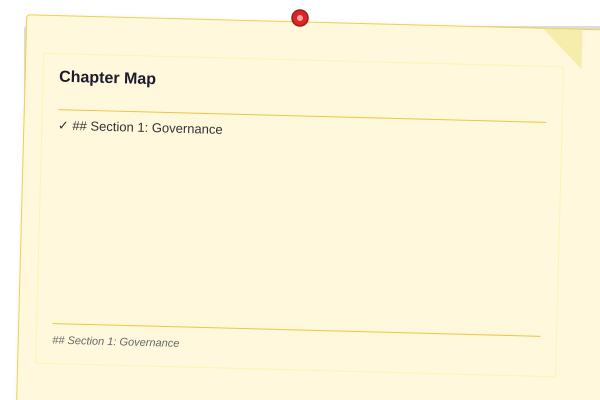
</a>


| Section | Topics | Effort |
|---------|--------|--------|
| Governance | Org structure, policies, documentation hierarchy, policy templates | Medium |
| Risk Management | NIST RMF, FAIR, qual/quant assessment, risk registers, BIA, risk appetite | High |
| Compliance | GDPR, PCI DSS 4.0, HIPAA, SOC 2, FedRAMP, SOX, breach notification | High |
| Frameworks | NIST CSF 2.0, ISO 27001 Annex A, COBIT, CIS Controls, comparisons | High |
| BCP / DR | BIA, RTO/RPO/MTD, recovery strategies, testing | Medium |
| Third-Party Risk | Vendor assessments, questionnaires, TPRM lifecycle | Medium |
| Awareness & Training | Programs, phishing simulations, metrics | Medium |
| Audit | Internal/external audits, checklists, evidence | Medium |
| Case Studies | Equifax, Marriott, TikTok, Wells Fargo → root cause analysis | High |

---

## Section 1: Governance

### 1.1 Information Security Governance Defined

<a href="../../assets/images/diagrams/cyber-security/09-grc/1-1-information-security-governance-defined-handwritten.svg" target="_blank" rel="noopener">
  
</a>
<a href="../../assets/images/diagrams/cyber-security/09-grc/1-1-information-security-governance-defined-diagram.svg" target="_blank" rel="noopener">
  
</a>
<a href="../../assets/images/diagrams/cyber-security/09-grc/1-1-information-security-governance-defined-sticky.svg" target="_blank" rel="noopener">
  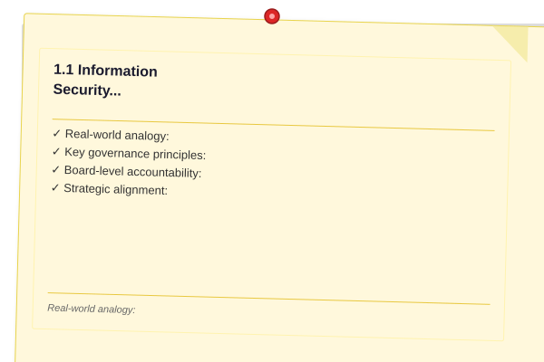
</a>


**Real-world analogy:** A country's constitution defines the rights, responsibilities, and structure of government. Similarly, information security governance defines how an organization manages security → who decides, who enforces, and how success is measured.

Governance answers the question: *"Are we doing the right things?"* while management asks *"Are we doing things right?"*

**Key governance principles:**
- **Board-level accountability:** The board of directors holds ultimate responsibility for security outcomes.
- **Strategic alignment:** Security objectives must align with business objectives.
- **Value delivery:** Security investments should deliver measurable risk reduction.
- **Resource management:** People, budget, and technology must be allocated effectively.
- **Performance measurement:** KPIs and KRIs track whether governance objectives are met.

### 1.2 Organizational Structure

<a href="../../assets/images/diagrams/cyber-security/09-grc/1-2-organizational-structure-handwritten.svg" target="_blank" rel="noopener">
  
</a>
<a href="../../assets/images/diagrams/cyber-security/09-grc/1-2-organizational-structure-diagram.svg" target="_blank" rel="noopener">
  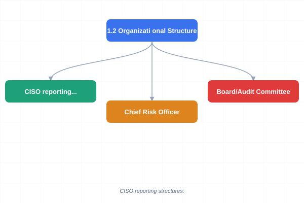
</a>
<a href="../../assets/images/diagrams/cyber-security/09-grc/1-2-organizational-structure-sticky.svg" target="_blank" rel="noopener">
  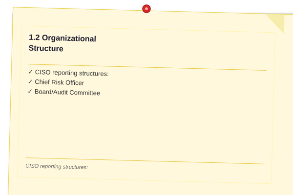
</a>


```
+---------------------------------------------------+
|               Board of Directors                   |
|         (Fiduciary duty for security)              |
+---------------------------------------------------+
|              Chief Executive Officer               |
|         (Ultimate accountability)                  |
+---------------------------------------------------+
|              Chief Information Officer             |
|         (IT strategy & operations)                 |
+---------------------------------------------------+
|              Chief Information Security Officer    |
|    (Security program ownership, reporting to CEO)  |
+-------------------+-------------------------------+
| Security Council  |  Steering Committees           |
| (CISO + CRO +     |  (Risk, Privacy, Compliance)   |
|  CIO + Legal)     |                                |
+-------------------+-------------------------------+
|  Security Operations   |   GRC Team                |
|  (SOC, IR, Threat      |   (Policy, Risk, Audit)   |
|   Intel, Engineering)  |                           |
+------------------------+---------------------------+
```

**CISO reporting structures:**
- CISO reports to **CIO** → common in tech-focused orgs (conflict: CIO may prioritize uptime over security)
- CISO reports to **CEO** → stronger independence, seen in mature orgs
- CISO reports to **Chief Risk Officer** → risk-aligned, common in financial services
- CISO reports to **Board/Audit Committee** → rare, highest independence

### 1.3 Security Documentation Hierarchy

<a href="../../assets/images/diagrams/cyber-security/09-grc/1-3-security-documentation-hierarchy-handwritten.svg" target="_blank" rel="noopener">
  
</a>
<a href="../../assets/images/diagrams/cyber-security/09-grc/1-3-security-documentation-hierarchy-diagram.svg" target="_blank" rel="noopener">
  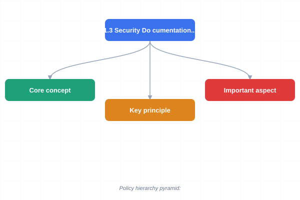
</a>
<a href="../../assets/images/diagrams/cyber-security/09-grc/1-3-security-documentation-hierarchy-sticky.svg" target="_blank" rel="noopener">
  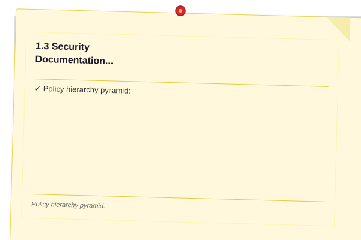
</a>


| Document Type | Definition | Example | Enforcement |
|--------------|------------|---------|-------------|
| **Policy** | High-level statement of management intent | "All remote access must use MFA" | Mandatory |
| **Standard** | Mandatory requirements for specific tech/configs | "Password minimum 14 chars, complexity enabled" | Mandatory |
| **Procedure** | Step-by-step instructions | "Password reset process: Step 1 → verify identity via ticketing system" | Mandatory |
| **Guideline** | Recommended but not required | "Use a password manager for all non-critical accounts" | Advisory |
| **Baseline** | Minimum security configuration | "Windows 11 STIG baseline: disable SMBv1, enable BitLocker" | Mandatory |

**Policy hierarchy pyramid:**

```
        +------------------------+
        |   Corporate Policy     |  (Board-approved, org-wide)
       +-------------------------+
       |  Domain Policies        |  (IT Security, HR, Physical)
      +-------------------------+
      |   Standards             |  (Encryption, Password, Network)
     +-------------------------+
     |    Procedures / Workflows|  (Incident response runbook)
    +-------------------------+
    |   Baselines / Configs    |  (STIGs, CIS benchmarks)
    +-------------------------+
```

### 1.4 Policy Lifecycle

<a href="../../assets/images/diagrams/cyber-security/09-grc/1-4-policy-lifecycle-handwritten.svg" target="_blank" rel="noopener">
  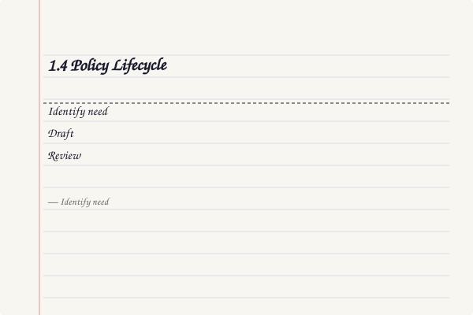
</a>
<a href="../../assets/images/diagrams/cyber-security/09-grc/1-4-policy-lifecycle-diagram.svg" target="_blank" rel="noopener">
  
</a>
<a href="../../assets/images/diagrams/cyber-security/09-grc/1-4-policy-lifecycle-sticky.svg" target="_blank" rel="noopener">
  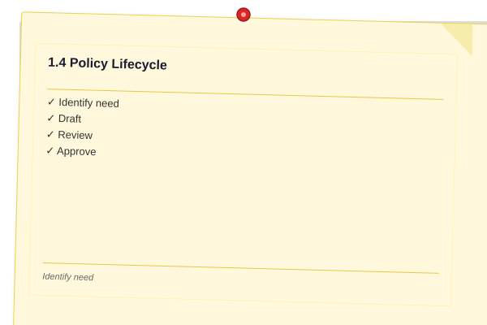
</a>


1. **Identify need** → regulatory requirement, risk finding, audit gap
2. **Draft** → policy owner writes (typically GRC team or CISO office)
3. **Review** → legal, HR, business stakeholders review for conflicts
4. **Approve** → executive sign-off (CISO, CEO, or Board depending on tier)
5. **Communicate** → All-hands email, intranet, signed acknowledgment
6. **Train** → Role-based training on policy requirements
7. **Enforce** → Technical controls (e.g., GPO, CASB) and administrative oversight
8. **Monitor** → Compliance metrics, violation tracking
9. **Review** → Annual review cycle (or when regulations change)
10. **Retire** → Archive superseded policies

### 1.5 Sample Policy: Acceptable Use Policy (AUP)

<a href="../../assets/images/diagrams/cyber-security/09-grc/1-5-sample-policy-acceptable-use-policy-aup-handwritten.svg" target="_blank" rel="noopener">
  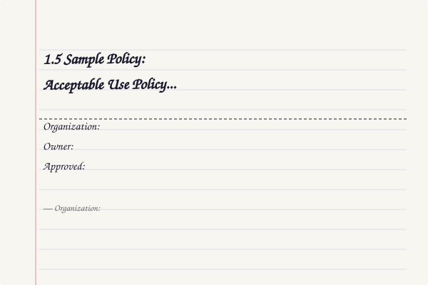
</a>
<a href="../../assets/images/diagrams/cyber-security/09-grc/1-5-sample-policy-acceptable-use-policy-aup-diagram.svg" target="_blank" rel="noopener">
  
</a>
<a href="../../assets/images/diagrams/cyber-security/09-grc/1-5-sample-policy-acceptable-use-policy-aup-sticky.svg" target="_blank" rel="noopener">
  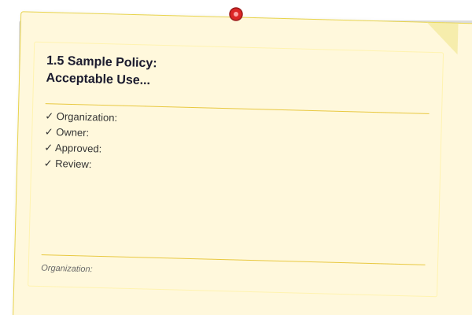
</a>


> **Organization:** Acme Corp | **Owner:** CISO | **Approved:** 2025-01-15 | **Review:** 2026-01-15

**1. Purpose**
This policy defines acceptable use of Acme Corp's information technology resources, including computers, networks, email, internet access, and mobile devices.

**2. Scope**
Applies to all employees, contractors, consultants, and temporary workers using Acme Corp IT resources.

**3. Policy Statements**

**3.1 Authorized Use:** IT resources are provided for business purposes. Limited personal use is permitted provided it does not interfere with work, consume excessive bandwidth, or expose the company to security risk.

**3.2 Account Security:**
- All users must use unique, strong passwords (>=14 characters) and enable MFA.
- Accounts must not be shared. Credentials must not be written down or stored in plain text.
- Lock workstations when unattended (Ctrl+Alt+L or timeout &lt;=15 minutes).

**3.3 Email & Communications:**
- Company email must not be used for illegal activities, harassment, hate speech, or distribution of obscene material.
- Phishing awareness: Users must report suspicious emails via the "Report Phishing" button.
- Encryption: Emails containing PII or confidential data must be sent via encrypted email (TLS or portal).

**3.4 Internet Access:**
- Browsing is monitored for malware, data exfiltration, and prohibited content categories (adult, gambling, file sharing, torrents, anonymizers).
- VPN usage: Only company-approved VPN clients (Zscaler, Cisco AnyConnect) may be installed. Personal VPNs are prohibited.
- Software downloads require IT approval. Open-source downloads must pass security review.

**3.5 Mobile Devices:**
- All smartphones accessing company email must be enrolled in MDM (Microsoft Intune).
- Lost/stolen devices must be reported within 1 hour to IT Help Desk.
- Jailbroken or rooted devices are prohibited from accessing corporate resources.

**3.6 Data Handling:**
- Confidential data must be stored on approved (OneDrive/SharePoint/encrypted) repositories, not local drives or personal cloud (Google Drive, Dropbox).
- Data classification labels must be applied (Internal, Confidential, Restricted).
- Removable media (USB) must be encrypted (BitLocker To Go). Unencrypted USB drives are prohibited.

**3.7 Prohibited Activities:**
- Unauthorized access, hacking, port scanning, or penetration testing without written authorization.
- Installation of unauthorized hardware (rogue APs, modems, personal routers).
- Use of file-sharing or torrent software.
- Bypassing security controls (firewalls, proxies, antivirus).
- Storing company data on personal devices or unapproved cloud services.

**4. Enforcement**
Violations result in disciplinary action up to and including termination and legal action. Non-compliance with regulatory requirements (GDPR, HIPAA) may be reported to authorities.

**5. Acknowledgment**
All users must sign an acknowledgment form annually.

---

### 1.6 Governance vs Risk vs Compliance

<a href="../../assets/images/diagrams/cyber-security/09-grc/1-6-governance-vs-risk-vs-compliance-handwritten.svg" target="_blank" rel="noopener">
  
</a>
<a href="../../assets/images/diagrams/cyber-security/09-grc/1-6-governance-vs-risk-vs-compliance-diagram.svg" target="_blank" rel="noopener">
  
</a>
<a href="../../assets/images/diagrams/cyber-security/09-grc/1-6-governance-vs-risk-vs-compliance-sticky.svg" target="_blank" rel="noopener">
  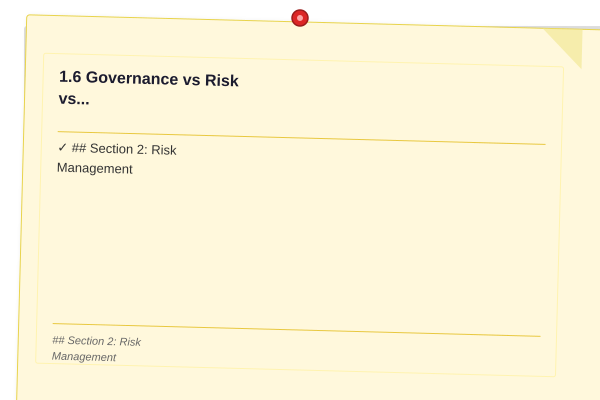
</a>


| Aspect | Governance | Risk Management | Compliance |
|--------|-----------|-----------------|------------|
| **Focus** | Direction & oversight | Uncertainty & decision-making | Rules & obligations |
| **Question** | "Are we doing the right things?" | "What could go wrong?" | "Are we following the rules?" |
| **Output** | Policies, org structure, reporting | Risk registers, treatment plans, risk appetite | Audit reports, evidence packages, certifications |
| **Owner** | Board, CEO, CISO | CRO, Risk Committee, CISO | Compliance Officer, Legal, Audit |
| **Time horizon** | Long-term (strategy) | Medium-term (planning cycles) | Short-to-medium (audit cycles) |
| **Key metric** | Maturity level | Residual risk score | Pass/fail, # findings |
| **Triggers** | Strategy changes, M&A, market shifts | New threats, vulnerabilities, incidents | New regulations, contract requirements |
| **Failure mode** | Strategy without execution | Analysis paralysis | Checklist compliance without security improvement |

---

## Section 2: Risk Management

### 2.1 What is Risk?

<a href="../../assets/images/diagrams/cyber-security/09-grc/2-1-what-is-risk-handwritten.svg" target="_blank" rel="noopener">
  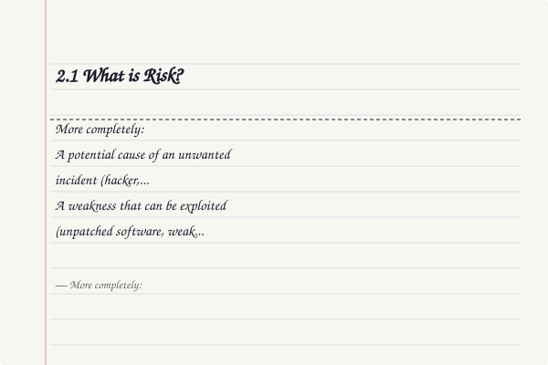
</a>
<a href="../../assets/images/diagrams/cyber-security/09-grc/2-1-what-is-risk-diagram.svg" target="_blank" rel="noopener">
  
</a>
<a href="../../assets/images/diagrams/cyber-security/09-grc/2-1-what-is-risk-sticky.svg" target="_blank" rel="noopener">
  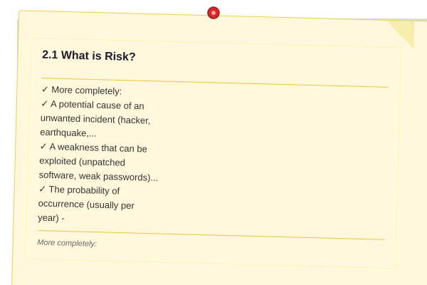
</a>


**Risk = Likelihood * Impact**

More completely:

**Risk** = The probability that a threat will exploit a vulnerability, multiplied by the business impact of the resulting event.

- **Threat:** A potential cause of an unwanted incident (hacker, earthquake, insider error)
- **Vulnerability:** A weakness that can be exploited (unpatched software, weak passwords)
- **Likelihood:** The probability of occurrence (usually per year)
- **Impact:** The magnitude of harm (financial, reputational, regulatory, operational)

### 2.2 Real-World Analogy: Home Security

<a href="../../assets/images/diagrams/cyber-security/09-grc/2-2-real-world-analogy-home-security-handwritten.svg" target="_blank" rel="noopener">
  
</a>
<a href="../../assets/images/diagrams/cyber-security/09-grc/2-2-real-world-analogy-home-security-diagram.svg" target="_blank" rel="noopener">
  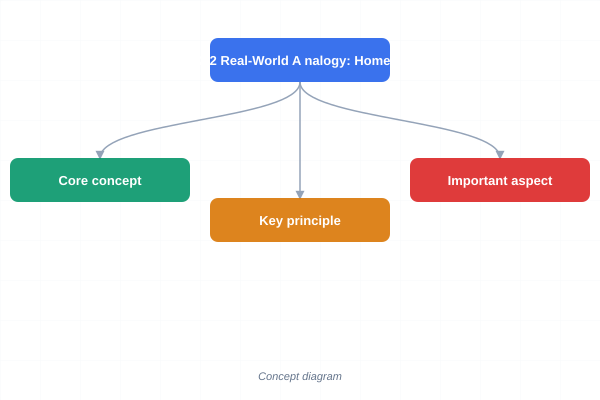
</a>
<a href="../../assets/images/diagrams/cyber-security/09-grc/2-2-real-world-analogy-home-security-sticky.svg" target="_blank" rel="noopener">
  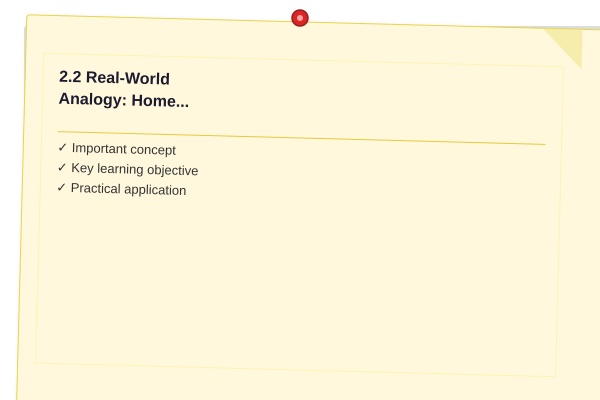
</a>


| GRC Concept | Home Analogy |
|-------------|-------------|
| Risk Assessment | Walk around your house, note broken locks, dark corners, valuable items visible through windows |
| Risk Register | A spreadsheet listing: "Broken back door lock -> burglar enters -> loss of TV + laptop -> $5,000" |
| Risk Appetite | "I'm OK with leaving windows open on the 2nd floor" vs "I need bars on every window" |
| Mitigation | Install deadbolt, security camera, motion sensor lights |
| Transfer | Renters insurance |
| Avoidance | Don't buy expensive jewelry → keep nothing worth stealing |
| Acceptance | "My lawnmower is old → if someone steals it, I'll buy a new one" |
| Policy | "All family members must lock the door when leaving" |
| Compliance | City ordinance requiring smoke detectors → verified annually by fire inspection |
| Audit | Quarterly check: test locks, cameras, check that alarm is armed |
| BIA | "If burglary happens, we lose $5K in goods, but our lives are not disrupted" |
| BCP/DR | "If fire destroys house, we stay at hotel (RTO 4 hrs), file insurance claim, replace essentials within 7 days (RPO 7d)" |

### 2.3 Risk Management Process (NIST RMF)

<a href="../../assets/images/diagrams/cyber-security/09-grc/2-3-risk-management-process-nist-rmf-handwritten.svg" target="_blank" rel="noopener">
  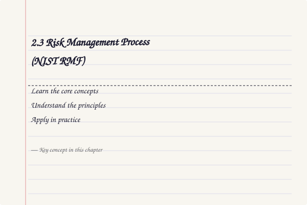
</a>
<a href="../../assets/images/diagrams/cyber-security/09-grc/2-3-risk-management-process-nist-rmf-diagram.svg" target="_blank" rel="noopener">
  
</a>
<a href="../../assets/images/diagrams/cyber-security/09-grc/2-3-risk-management-process-nist-rmf-sticky.svg" target="_blank" rel="noopener">
  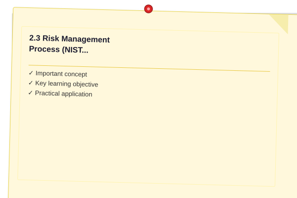
</a>


The NIST Risk Management Framework (RMF) has 7 steps:

```
+------------------------------------------------------+
|                  NIST RMF 7-Step Process              |
+------------------------------------------------------+
| Step 1:  PREPARE → Establish context, risk appetite  |
| Step 2:  CATEGORIZE → Classify systems by impact     |
| Step 3:  SELECT → Choose baseline controls (NIST SP  |
|            800-53)                                    |
| Step 4:  IMPLEMENT → Deploy selected controls        |
| Step 5:  ASSESS → Evaluate control effectiveness     |
| Step 6:  AUTHORIZE → Risk-based decision to operate  |
| Step 7:  MONITOR → Continuous monitoring & reporting |
+------------------------------------------------------+
```

### 2.4 Risk Assessment Approaches

<a href="../../assets/images/diagrams/cyber-security/09-grc/2-4-risk-assessment-approaches-handwritten.svg" target="_blank" rel="noopener">
  
</a>
<a href="../../assets/images/diagrams/cyber-security/09-grc/2-4-risk-assessment-approaches-diagram.svg" target="_blank" rel="noopener">
  
</a>
<a href="../../assets/images/diagrams/cyber-security/09-grc/2-4-risk-assessment-approaches-sticky.svg" target="_blank" rel="noopener">
  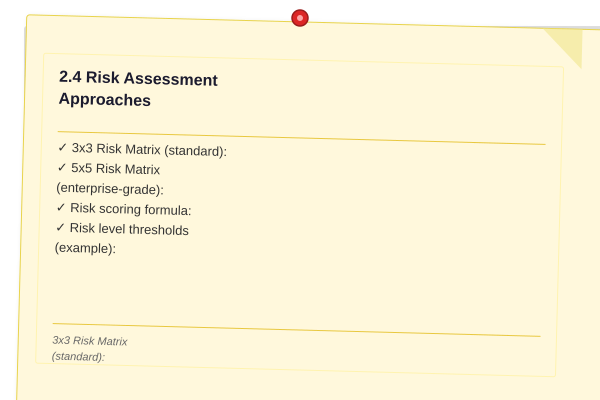
</a>


#### Qualitative Risk Assessment

Uses descriptive scales (Low, Medium, High, Critical) for likelihood and impact.

**3x3 Risk Matrix (standard):**

| Likelihood \ Impact | Low (1) | Medium (2) | High (3) |
|---------------------|---------|------------|----------|
| **High (3)** | 3 (Medium) | 6 (High) | 9 (Critical) |
| **Medium (2)**| 2 (Low) | 4 (Medium) | 6 (High) |
| **Low (1)** | 1 (Low) | 2 (Low) | 3 (Medium) |

**5x5 Risk Matrix (enterprise-grade):**

| Likelihood \ Impact | Insig (1) | Minor (2) | Mod (3) | Major (4) | Severe (5) |
|---------------------|-----------|-----------|---------|-----------|------------|
| **Almost Certain (5)** | 5 (M) | 10 (H) | 15 (H) | 20 (C) | 25 (C) |
| **Likely (4)** | 4 (M) | 8 (M) | 12 (H) | 16 (C) | 20 (C) |
| **Possible (3)** | 3 (L) | 6 (M) | 9 (M) | 12 (H) | 15 (H) |
| **Unlikely (2)** | 2 (L) | 4 (L) | 6 (M) | 8 (M) | 10 (H) |
| **Rare (1)** | 1 (L) | 2 (L) | 3 (L) | 4 (L) | 5 (M) |

**Risk scoring formula:** `Risk Score = Likelihood * Impact`

**Risk level thresholds (example):**
- **1–3:** Low → Accept, monitor annually
- **4–6:** Medium → Accept with monitoring, review quarterly
- **8–12:** High → Mitigation plan required, review monthly
- **15–25:** Critical → Immediate remediation, escalate to Board

**Qualitative assessment walkthrough → Dry Run:**

Scenario: Acme Corp has an unpatched vulnerability (CVE-2025-1234) in a public-facing web application.

Step 1: Identify the risk → Remote code execution in web server (CVSS 9.8).
Step 2: Determine likelihood → Exploit code publicly available. Internet-facing system. No WAF. -> Likely (4)
Step 3: Determine impact → Breach of customer database (PII). Regulatory fine (GDPR, up to EUR 20M). Average breach cost: $4.5M. -> Severe (5)
Step 4: Calculate risk score → 4 x 5 = 20 (Critical)
Step 5: Determine risk response → Mitigate: Apply vendor patch within 24 hours. If patch unavailable, deploy WAF virtual patch and restrict source IPs.
Step 6: Residual risk → After patching, likelihood drops to Rare (1). Residual score: 1 x 5 = 5 (Low) -> Accept.

#### Quantitative Risk Assessment

Uses monetary values and statistical models to express risk in dollar terms.

**Key formulas:**

| Metric | Formula | Description |
|--------|---------|-------------|
| SLE (Single Loss Expectancy) | AV x EF | Asset Value x Exposure Factor |
| ARO (Annualized Rate of Occurrence) | # events / year | How often the risk materializes |
| ALE (Annualized Loss Expectancy) | SLE x ARO | Expected annual loss |
| ROSI (Return on Security Investment) | (ALE_prev - ALE_post) - Cost / Cost | ROI of a control |

**Quantitative example → Dry Run:**

Acme Corp's e-commerce database:
- Asset Value (AV): $2,000,000 (database + IP + customer data)
- Exposure Factor (EF): 60% (corruption of 60% of records in a ransomware event)
- SLE = $2,000,000 x 0.60 = $1,200,000
- ARO = 0.2 (once every 5 years, based on industry statistics)
- ALE = $1,200,000 x 0.20 = $240,000/year

**Control evaluation:** Deploy EDR + immutable backups ($50,000/year):
- New EF: 10% (backups restore all but 10% of the day's data)
- New SLE: $2,000,000 x 0.10 = $200,000
- New ARO: 0.1 (EDR catches 50% of attempts)
- New ALE: $200,000 x 0.10 = $20,000/year
- ALE Reduction: $240,000 - $20,000 = $220,000/year
- ROSI: ($220,000 - $50,000) / $50,000 = 340%

ROSI of 340% means every $1 spent on controls saves $3.40 → a strong business case.

#### Qualitative vs Quantitative Risk Assessment

| Criteria | Qualitative | Quantitative |
|----------|-------------|--------------|
| **Input** | Expert judgment, ordinal scales | Historical data, statistical models |
| **Output** | Risk scores (Low/Med/High) | Monetary values ($/year) |
| **Data required** | Minimal | Extensive (breach databases, actuarial data) |
| **Objectivity** | Subjective, bias-prone | Data-driven, reproducible |
| **Communication** | Easy for non-technical stakeholders | Harder to explain, but more convincing to CFO |
| **Speed** | Fast (days) | Slow (weeks to months) |
| **Precision** | Low → ordinal only | High → continuous values |
| **Cost** | Low | High |
| **Best for** | Small orgs, first-time assessments, emerging risks | Mature programs, insurance decisions, budget justification |
| **Limitation** | "Everything is Medium" problem | False precision from bad data (GIGO) |

**Hybrid approach:** Most mature programs use both → qualitative for initial triage and emerging risks, quantitative for critical risks that need budget approval.

### 2.5 Risk Register

<a href="../../assets/images/diagrams/cyber-security/09-grc/2-5-risk-register-handwritten.svg" target="_blank" rel="noopener">
  
</a>
<a href="../../assets/images/diagrams/cyber-security/09-grc/2-5-risk-register-diagram.svg" target="_blank" rel="noopener">
  
</a>
<a href="../../assets/images/diagrams/cyber-security/09-grc/2-5-risk-register-sticky.svg" target="_blank" rel="noopener">
  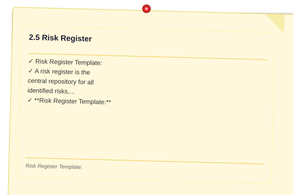
</a>


A risk register is the central repository for all identified risks, their assessments, and treatment plans.

**Risk Register Template:**

| Risk ID | Date Identified | Risk Description | Threat | Vulnerability | Asset | L | I | Inherent Score | Control | Residual L | Residual I | Residual Score | Treatment | Plan | Owner | Review | Status |
|---------|-----------------|------------------|--------|---------------|-------|---|---|----------------|---------|------------|------------|----------------|-----------|------|-------|--------|--------|
| RISK-001 | 2025-01-15 | RCE on public web server (CVE-2025-1234) | External attacker | Unpatched Apache Struts | E-commerce web server | 4 | 5 | 20 (Critical) | WAF virtual patch, vendor patch deployed | 1 | 5 | 5 (Low) | Mitigate | Apply patch within 24h; verify via vuln scan | AppSec Team | 2025-01-22 | Closed |
| RISK-002 | 2025-01-20 | Phishing leading to credential theft | Spear phisher | No employee training | All employees | 4 | 4 | 16 (Critical) | Phishing simulation, mandatory training | 2 | 4 | 8 (Medium) | Mitigate | Implement KnowBe4; Phishing 101 by Q1 | CISO | 2025-03-01 | Open |
| RISK-003 | 2025-02-01 | Single point of failure → DC fire | Fire | No redundant data center | Primary DC | 2 | 5 | 10 (High) | Cold DR site in different AWS region | 1 | 4 | 4 (Low) | Mitigate | Provision DR failover; test quarterly | IT Ops | 2025-06-01 | In Progress |
| RISK-004 | 2025-02-10 | SQL injection in legacy CRM | External attacker | Unparameterized queries in PHP CRM | Customer DB (PII) | 3 | 4 | 12 (High) | Web WAF, input validation | 2 | 3 | 6 (Medium) | Mitigate | Rewrite CRM with parameterized queries; schedule Q2 | Dev Team | 2025-04-01 | Open |
| RISK-005 | 2025-03-01 | Insider data exfiltration by departing employee | Disgruntled employee | Weak DLP, no offboarding automation | IP | 3 | 3 | 9 (Medium) | DLP tool, offboarding checklist | 2 | 2 | 4 (Low) | Mitigate | Deploy Microsoft Purview DLP; automate deprovisioning | IT Security | 2025-05-01 | Open |
| RISK-006 | 2025-03-15 | Vendor data breach → payroll processor | Attacker targeting vendor | Insufficient vendor assessment | Employee PII | 3 | 5 | 15 (High) | Vendor assessment complete; contract includes security addendum | 2 | 4 | 8 (Medium) | Transfer | Cyber insurance covers vendor-caused breaches | Procurement | 2025-06-30 | Open |
| RISK-007 | 2025-04-01 | Non-compliance with GDPR right to deletion | Regulator | No automated deletion process | Customer PII | 4 | 3 | 12 (High) | DSAR automation tool procured | 2 | 2 | 4 (Low) | Mitigate | Implement OneTrust DSAR workflow; complete by Q3 | Privacy Team | 2025-09-01 | Open |
| RISK-008 | 2025-04-15 | Ransomware encrypting file servers | Cybercriminal gang | No immutable backups | File servers (500 GB) | 4 | 4 | 16 (Critical) | Immutable backups (Veeam + AWS S3 Object Lock) | 1 | 3 | 3 (Low) | Mitigate | Deploy immutable backups; test restore monthly | Infra Team | 2025-05-15 | Closed |

### 2.6 Risk Appetite and Risk Tolerance

<a href="../../assets/images/diagrams/cyber-security/09-grc/2-6-risk-appetite-and-risk-tolerance-handwritten.svg" target="_blank" rel="noopener">
  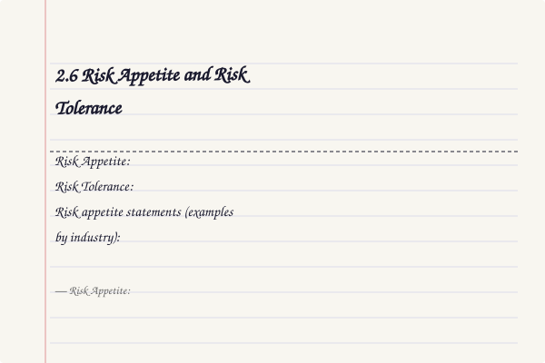
</a>
<a href="../../assets/images/diagrams/cyber-security/09-grc/2-6-risk-appetite-and-risk-tolerance-diagram.svg" target="_blank" rel="noopener">
  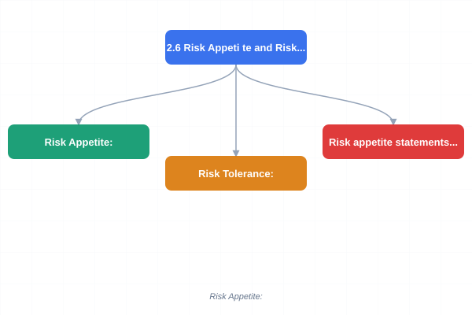
</a>
<a href="../../assets/images/diagrams/cyber-security/09-grc/2-6-risk-appetite-and-risk-tolerance-sticky.svg" target="_blank" rel="noopener">
  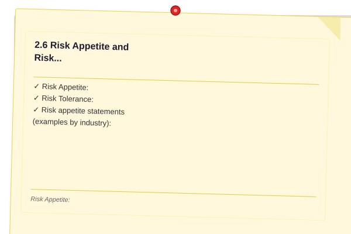
</a>


**Risk Appetite:** The amount of risk an organization is willing to accept in pursuit of value. *(Strategic, broad)*
**Risk Tolerance:** The acceptable level of variation around risk appetite. *(Operational, specific)*

**Risk appetite statements (examples by industry):**

| Industry | Risk Appetite | Example Statement |
|----------|---------------|-------------------|
| **Banking** | Very low | "We have zero tolerance for data breaches involving customer financial accounts." |
| **Healthcare** | Low | "Patient safety is non-negotiable. We will accept no risk that could cause harm." |
| **Tech startup** | Moderate | "We accept controlled risk in product development speed, but not in customer data privacy." |
| **Defense** | Minimal | "National security data must have multiple layers of defense. No residual risk above 'Low'." |
| **E-commerce** | Moderate | "We accept risk of credit card fraud within 0.5% of transaction value as a cost of doing business." |
| **Manufacturing** | Low-moderate | "Safety and IP protection have zero tolerance. Supply chain disruptions tolerated up to 48 hours." |

### 2.7 FAIR Model (Factor Analysis of Information Risk)

<a href="../../assets/images/diagrams/cyber-security/09-grc/2-7-fair-model-factor-analysis-of-information-risk-handwritten.svg" target="_blank" rel="noopener">
  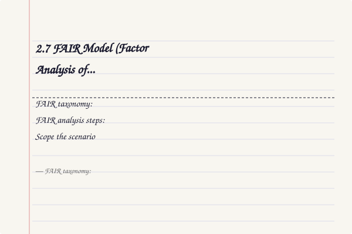
</a>
<a href="../../assets/images/diagrams/cyber-security/09-grc/2-7-fair-model-factor-analysis-of-information-risk-diagram.svg" target="_blank" rel="noopener">
  
</a>
<a href="../../assets/images/diagrams/cyber-security/09-grc/2-7-fair-model-factor-analysis-of-information-risk-sticky.svg" target="_blank" rel="noopener">
  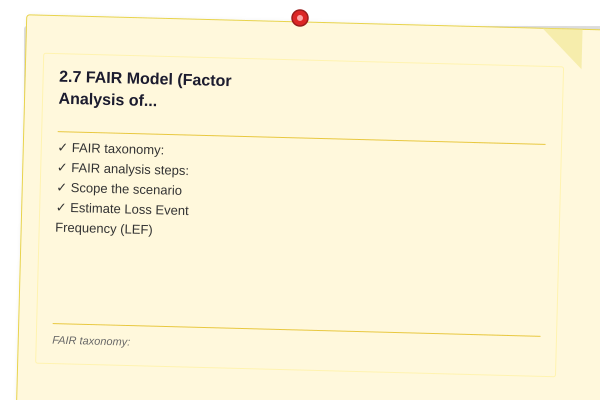
</a>


FAIR is the leading quantitative risk analysis model (now FAIR-TM, maintained by The FAIR Institute).

**FAIR taxonomy:**

```
                     +--------------------------+
                     |      Loss Event           |
                     |      Frequency            |
                   +-+----------+---------------+--+
                   v            v                  |
          +------------+ +------------+            |
          | Threat      | | Vulnerability|          |
          | Event       | |              |          |
          | Frequency   | | (Susceptibility)        |
          +------------+ +------------+            |
                                                   v
                    +------------------------------+
                    |    Probable Loss Magnitude    |
                    +------------------------------+
                    | Primary Loss | Secondary Risk |
                    | (Direct)     | (Indirect)     |
                    +--------------+---------------+
```

**FAIR analysis steps:**
1. **Scope the scenario** → Define the asset, threat community, and effect
2. **Estimate Loss Event Frequency (LEF)** → How often does it happen?
   - Threat Event Frequency (TEF)
   - Vulnerability (how easily is the threat realized?)
3. **Estimate Loss Magnitude (LM)** → How much does it cost?
   - Primary losses (direct: response, replacement, fines)
   - Secondary losses (indirect: reputational, legal, competitive disadvantage)
4. **Compute risk** → LEF x LM = annualized risk in dollars
5. **Uncertainty analysis** → Monte Carlo simulation for confidence intervals

**FAIR example → Ransomware on File Server:**

| Input | Low | Most Likely | High | Distribution |
|-------|-----|-------------|------|-------------|
| TEF (per year) | 0.1 | 0.3 | 0.8 | Triangular |
| Vulnerability | 0.2 | 0.5 | 0.9 | Triangular |
| LEF (TEF x Vuln) | 0.02 | 0.15 | 0.72 | → |
| Primary loss | $100K | $500K | $1.5M | Triangular |
| Secondary loss | $50K | $200K | $1M | Triangular |
| **Annualized risk** | **$3K** | **$105K** | **$1.8M** | → |

*Monte Carlo simulation would run 10,000+ iterations to produce a probability distribution, giving the 5th–95th percentile range.*

### 2.8 Business Impact Analysis (BIA)

<a href="../../assets/images/diagrams/cyber-security/09-grc/2-8-business-impact-analysis-bia-handwritten.svg" target="_blank" rel="noopener">
  
</a>
<a href="../../assets/images/diagrams/cyber-security/09-grc/2-8-business-impact-analysis-bia-diagram.svg" target="_blank" rel="noopener">
  
</a>
<a href="../../assets/images/diagrams/cyber-security/09-grc/2-8-business-impact-analysis-bia-sticky.svg" target="_blank" rel="noopener">
  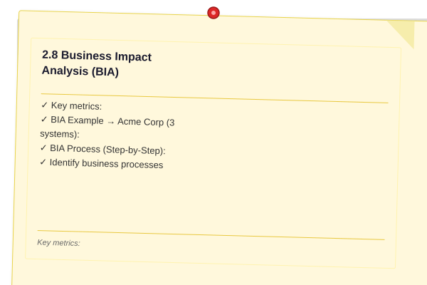
</a>


A BIA identifies critical business functions, the impact of their disruption, and the resources needed to recover them.

**Key metrics:**

| Metric | Definition | Example |
|--------|-----------|---------|
| **MTD** (Maximum Tolerable Downtime) | Longest period a process can be unavailable before irreparable harm | 72 hours |
| **RTO** (Recovery Time Objective) | Target time to restore a process after disruption | 24 hours |
| **RPO** (Recovery Point Objective) | Maximum acceptable data loss measured in time | 15 minutes |
| **WRT** (Work Recovery Time) | Time to catch up after restoration | 4 hours |
| **MBCO** (Minimum Business Continuity Objective) | Minimum level of service during recovery | 50% transaction capacity |

**BIA Example → Acme Corp (3 systems):**

| System | Criticality | MTD | RTO | RPO | Impact/Hour | Recovery Strategy |
|--------|------------|-----|-----|-----|-------------|-------------------|
| **Payment Processing** | Critical | 4 hours | 1 hour | 1 min | $500,000 | Active-active HA in two AWS regions; auto-failover |
| **Customer Database** | High | 24 hours | 4 hours | 15 min | $50,000 | DB replication with 15-min sync; standby replica failover |
| **Employee Email** | Medium | 7 days | 24 hours | 1 hour | $5,000 | SaaS (O365) built-in redundancy; M365 Backup |

**BIA Process (Step-by-Step):**

1. **Identify business processes** → Interview department heads, review org chart
2. **Determine criticality** → Rank processes by revenue, regulatory, customer impact, reputation
3. **Estimate impact over time** → What happens at 1hr, 4hrs, 24hrs, 72hrs, 7 days
4. **Define recovery requirements** → RTO, RPO, minimum staff, minimum tech
5. **Identify dependencies** → Upstream (data inputs) and downstream (processes that depend on this)
6. **Document resources** → People, systems, data, facilities, third parties
7. **Get approval** → Business process owners sign off on RTO/RPO targets

**BIA Impact Categories:**

| Category | Description | Measurement |
|----------|-------------|-------------|
| **Financial** | Revenue loss, penalties, remediation costs | $ per hour/day |
| **Regulatory** | Fines, license revocation, legal liability | $ per violation |
| **Reputational** | Customer trust, brand damage, stock price | Qualitative or stock movement |
| **Operational** | Productivity loss, backlogs, overtime | Hours of work, $ |
| **Safety** | Physical harm to employees, customers, public | Injury severity, loss of life |
| **Strategic** | Competitive disadvantage, missed market window | Qualitative + $ |

**Edge cases in BIA:**
- **Process interdependencies:** System A needs System B, but System B's owner doesn't know it's critical. RTO mismatch.
- **Shadow IT:** Critical processes running on unapproved SaaS → invisible to BIA teams.
- **Seasonal variation:** E-commerce MTD during holiday season is 10 minutes vs 4 hours in February.
- **Cascading failures:** A single cloud region failure taking down 20 "independent" systems.
- **Outsourced processes:** Vendor's BIA may not match your BIA → contractual RTO alignment needed.

### 2.9 Risk Response Options

<a href="../../assets/images/diagrams/cyber-security/09-grc/2-9-risk-response-options-handwritten.svg" target="_blank" rel="noopener">
  
</a>
<a href="../../assets/images/diagrams/cyber-security/09-grc/2-9-risk-response-options-diagram.svg" target="_blank" rel="noopener">
  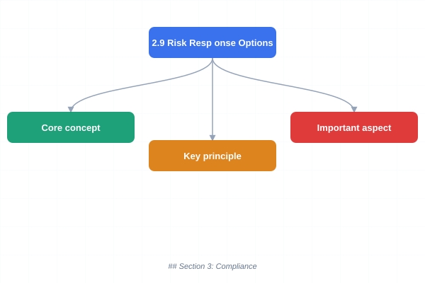
</a>
<a href="../../assets/images/diagrams/cyber-security/09-grc/2-9-risk-response-options-sticky.svg" target="_blank" rel="noopener">
  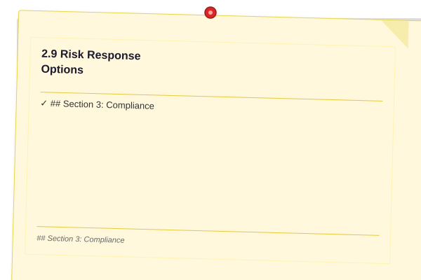
</a>


| Response | Definition | When To Use | Example |
|----------|-----------|-------------|---------|
| **Mitigate (Reduce)** | Implement controls to lower likelihood or impact | Risk exceeds appetite, controls are cost-effective | Patch management, MFA, EDR |
| **Accept** | Acknowledge and monitor | Low residual risk, cost of mitigation exceeds benefit | "We accept the risk of coffee spills on laptops" |
| **Transfer (Share)** | Shift risk to another party | Financial risk, insurable events | Cyber insurance, outsourcing with contractual liability |
| **Avoid** | Eliminate the activity | Risk too high, no cost-effective controls | "We will not collect biometric data" |
| **Escalate** | Move decision to higher authority | Risk exceeds CISO authority level | Must be escalated to Board for approval |
## Section 3: Compliance

### 3.1 What is Compliance?

<a href="../../assets/images/diagrams/cyber-security/09-grc/3-1-what-is-compliance-handwritten.svg" target="_blank" rel="noopener">
  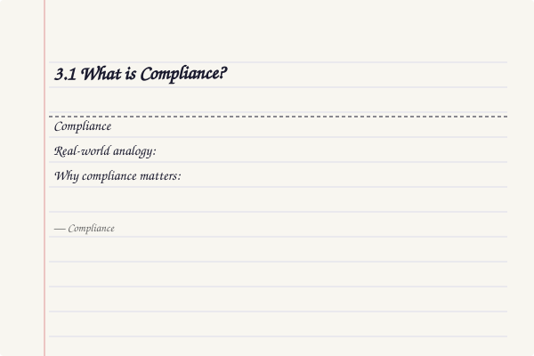
</a>
<a href="../../assets/images/diagrams/cyber-security/09-grc/3-1-what-is-compliance-diagram.svg" target="_blank" rel="noopener">
  
</a>
<a href="../../assets/images/diagrams/cyber-security/09-grc/3-1-what-is-compliance-sticky.svg" target="_blank" rel="noopener">
  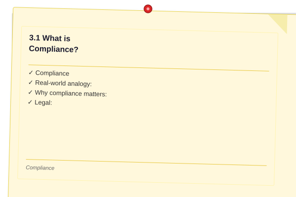
</a>


**Compliance** is the state of adhering to laws, regulations, standards, contractual obligations, and internal policies that apply to an organization's operations.

**Real-world analogy:** A restaurant must pass health inspections. The health department inspects kitchen hygiene, food storage temperatures, employee hand-washing. Similarly, organizations must prove to auditors that they protect data according to regulatory requirements. Failure means fines, closure, or both.

**Why compliance matters:**
- **Legal:** Avoid fines, sanctions, license revocation, criminal charges
- **Financial:** Average non-compliance cost is 2.7x the cost of compliance (Ponemon 2024)
- **Reputational:** Public breach of trust destroys customer confidence
- **Competitive:** Compliance certifications (ISO 27001, SOC 2) are market differentiators
- **Contractual:** Many contracts require compliance (e.g., PCI DSS for payment processing)

### 3.2 Major Regulations Overview

<a href="../../assets/images/diagrams/cyber-security/09-grc/3-2-major-regulations-overview-handwritten.svg" target="_blank" rel="noopener">
  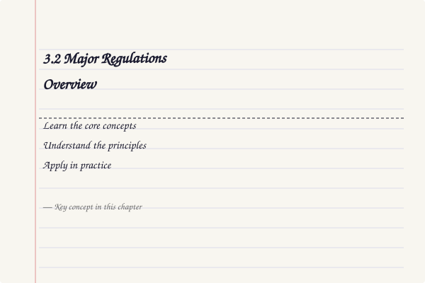
</a>
<a href="../../assets/images/diagrams/cyber-security/09-grc/3-2-major-regulations-overview-diagram.svg" target="_blank" rel="noopener">
  
</a>
<a href="../../assets/images/diagrams/cyber-security/09-grc/3-2-major-regulations-overview-sticky.svg" target="_blank" rel="noopener">
  
</a>


| Regulation | Jurisdiction | Sector | Key Focus | Max Fine |
|-----------|-------------|--------|-----------|----------|
| **GDPR** | EU/EEA | All (data processors/controllers) | Personal data protection | EUR 20M or 4% global turnover |
| **PCI DSS 4.0** | Global | Payment card processing | Cardholder data security | Variable (fines from card brands + acquirer penalties) |
| **HIPAA** | USA | Healthcare | Protected Health Information (PHI) | $1.5M per violation per year |
| **SOC 2** | USA (global adoption) | Service organizations | Security, availability, integrity, confidentiality, privacy | Loss of certification, contract termination |
| **FedRAMP** | USA | Cloud services for federal agencies | Security authorization for cloud products | De-authorization, loss of federal business |
| **SOX** | USA | Publicly traded companies | Financial controls, ITGC | $5M fine, 20 years imprisonment |
| **CCPA (CPRA)** | California, USA | For-profit >$25M revenue | Consumer privacy rights | $7,500 per intentional violation |
| **LGPD** | Brazil | All (processing Brazil personal data) | Personal data protection | 2% of revenue in Brazil, capped at BRL 50M |
| **PIPEDA** | Canada | All commercial activity | Personal data protection | CAD 100,000 per violation |
| **APRA CPS 234** | Australia | Financial institutions | Information security management | Variable (regulatory action) |

### 3.3 GDPR → General Data Protection Regulation

<a href="../../assets/images/diagrams/cyber-security/09-grc/3-3-gdpr-general-data-protection-regulation-handwritten.svg" target="_blank" rel="noopener">
  
</a>
<a href="../../assets/images/diagrams/cyber-security/09-grc/3-3-gdpr-general-data-protection-regulation-diagram.svg" target="_blank" rel="noopener">
  
</a>
<a href="../../assets/images/diagrams/cyber-security/09-grc/3-3-gdpr-general-data-protection-regulation-sticky.svg" target="_blank" rel="noopener">
  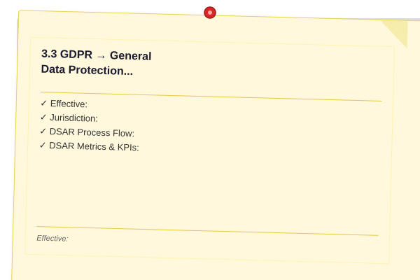
</a>


**Effective:** May 25, 2018 | **Jurisdiction:** Any organization processing personal data of EU/EEA residents

#### GDPR Principles (Article 5)

| # | Principle | Meaning | Implementation Example |
|---|-----------|---------|----------------------|
| 1 | **Lawfulness, fairness, transparency** | Process data legally, tell data subjects what you do with their data | Privacy notice on data collection forms |
| 2 | **Purpose limitation** | Collect data only for specified, explicit, legitimate purposes | Don't use email collected for shipping for marketing without consent |
| 3 | **Data minimization** | Collect only what's necessary for the purpose | Don't ask for date of birth if you only need age range |
| 4 | **Accuracy** | Keep data accurate and up to date | Provide data correction portal for users |
| 5 | **Storage limitation** | Keep data only as long as needed | Automated deletion of inactive accounts after 3 years |
| 6 | **Integrity and confidentiality** | Process data securely | Encryption at rest and in transit, access controls |
| 7 | **Accountability** | Demonstrate compliance | Maintain Records of Processing Activities (ROPA), DPIAs |

#### Data Subject Rights (GDPR Articles 12–23)

| Right | Article | Description | Response Timeline |
|-------|---------|-------------|-------------------|
| Right to be informed | 13, 14 | Tell data subjects what data you collect and why | At time of collection |
| Right of access | 15 | Let data subjects see their data | 1 month (extendable to 2) |
| Right to rectification | 16 | Correct inaccurate data | 1 month |
| Right to erasure (right to be forgotten) | 17 | Delete data on request | 1 month |
| Right to restrict processing | 18 | Limit how data is used | 1 month |
| Right to data portability | 20 | Provide data in machine-readable format | 1 month |
| Right to object | 21 | Object to processing (e.g., marketing) | Within 1 month |
| Rights related to automated decision-making | 22 | Human review of AI decisions | Reasonable timeframe |

#### DSAR (Data Subject Access Request) Response Process

A DSAR is a request from an individual to exercise their right of access (Article 15).

**DSAR Process Flow:**

```
Step 1: RECEIVE
  - Request submitted via portal, email, or phone
  - Verify identity (2 pieces of identifying information minimum)
  - Log receipt with timestamp (required: 1-month SLA starts NOW)

Step 2: ACKNOWLEDGE
  - Send acknowledgment within 48 hours
  - Confirm identity verified
  - Provide reference number and expected completion date
  - Request clarification if scope is too broad (allow 14 days for response)

Step 3: SEARCH & RETRIEVE
  - Search all systems where data subject's data may reside:
    * CRM (Salesforce, HubSpot)
    * Email archives (Exchange, O365)
    * Support tickets (Zendesk, Jira)
    * Marketing automation (Marketo, Mailchimp)
    * Billing systems (Stripe, Zuora)
    * HR systems (Workday, BambooHR)
    * Logs and backups (may be exempt under Article 15(3))
  - Use automated DSAR tool (OneTrust, Securiti, DataGrail)

Step 4: REVIEW & REDACT
  - Review all retrieved records for third-party data
  - Redact third-party data unless consent obtained
  - Review for legal privilege (legal hold data may be exempt)

Step 5: PREPARE RESPONSE
  - Format response in common machine-readable format (JSON, CSV)
  - Include:
    * All personal data held
    * Purposes of processing
    * Categories of data
    * Recipients who received data
    * Retention periods
    * Source of data (if not collected from data subject)
    * Information about automated decision-making

Step 6: DELIVER
  - Deliver via secure method (encrypted portal, signed email)
  - No fee (unless manifestly unfounded or excessive → may charge "reasonable fee")
  - Document delivery and confirm receipt

Step 7: CLOSE
  - Update case management system
  - Report to DPO
  - Track for recurring requests (harassment threshold: similar requests may be refused)
```

**DSAR Metrics & KPIs:**
- % completed within 30-day SLA
- Average response time (target: &lt;15 days)
- % exceeding SLA (target: &lt;2%)
- Number of DSARs received per month
- Most common data sources queried
- Cost per DSAR (labor + technology)

**DSAR Edge Cases:**
- **Deceased persons:** GDPR does not apply to deceased data → check local laws
- **Excessive requests:** 50+ copycat requests from the same individual in a month → may refuse or charge
- **Criminal data:** Subject to special processing conditions → review strictly
- **Employee vs customer:** Employee DSARs may include disciplinary records, performance reviews → coordinate with HR
- **Third-party data:** If one person's data reveals another person's data (e.g., CC'd on email) → redact third party
- **Backup tapes:** Article 15(3) provides exemption if restoring would be disproportionate

#### GDPR Breach Notification

| Requirement | Detail |
|-------------|--------|
| **Notification to DPA** | Within 72 hours of becoming aware (Article 33) |
| **Notification to data subjects** | Without undue delay if high risk to rights and freedoms (Article 34) |
| **Content of notification** | Nature of breach, categories affected, approx # records, contact details of DPO, likely consequences, measures taken |
| **Record keeping** | All breaches must be documented (even those not notified) → Article 33(5) |

#### GDPR Fines (Tier Structure)

**Tier 1:** Up to EUR 10M or 2% global annual turnover → violations of Articles 8, 11, 25–39, 41–43
**Tier 2:** Up to EUR 20M or 4% global annual turnover → violations of Articles 5–7, 9, 12–22, 44–49

### 3.4 PCI DSS 4.0 → Payment Card Industry Data Security Standard

<a href="../../assets/images/diagrams/cyber-security/09-grc/3-4-pci-dss-4-0-payment-card-industry-data-security-standard-handwritten.svg" target="_blank" rel="noopener">
  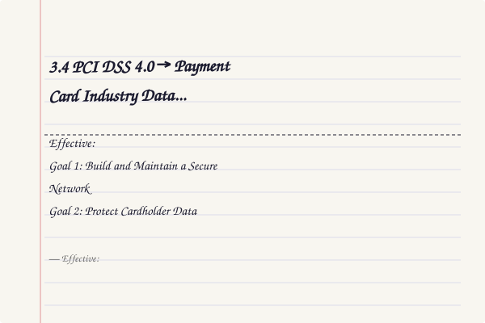
</a>
<a href="../../assets/images/diagrams/cyber-security/09-grc/3-4-pci-dss-4-0-payment-card-industry-data-security-standard-diagram.svg" target="_blank" rel="noopener">
  
</a>
<a href="../../assets/images/diagrams/cyber-security/09-grc/3-4-pci-dss-4-0-payment-card-industry-data-security-standard-sticky.svg" target="_blank" rel="noopener">
  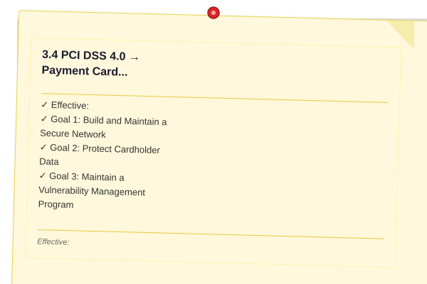
</a>


**Effective:** PCI DSS v4.0 was released March 2022, with future-dated requirements effective March 2025.

#### 12 Requirements of PCI DSS 4.0

**Goal 1: Build and Maintain a Secure Network**

| Req # | Requirement | Key Controls |
|-------|-------------|-------------|
| 1 | Install and maintain network security controls | Firewalls, segmentation, network diagrams, deny-all-default rule |
| 2 | Apply secure configurations to all system components | Change vendor defaults, disable unnecessary services, secure config standards |

**Goal 2: Protect Cardholder Data**

| Req # | Requirement | Key Controls |
|-------|-------------|-------------|
| 3 | Protect stored cardholder data | Encryption, truncation, hashing (never store CVV or full track data), key management |
| 4 | Protect cardholder data in transit | Strong encryption (TLS 1.2+), never use SSL/early TLS, certificate validation |

**Goal 3: Maintain a Vulnerability Management Program**

| Req # | Requirement | Key Controls |
|-------|-------------|-------------|
| 5 | Protect all systems from malware | Anti-malware on all systems, regular scans, logs for malware prevention |
| 6 | Develop and maintain secure systems and applications | Patch management (critical patches within 1 month), secure coding, SAST/DAST |

**Goal 4: Implement Strong Access Control Measures**

| Req # | Requirement | Key Controls |
|-------|-------------|-------------|
| 7 | Restrict access by business need-to-know | Role-based access control, revoke access immediately on termination |
| 8 | Identify and authenticate access to system components | Unique IDs, MFA for CDE access, password policies, session timeouts |
| 9 | Restrict physical access to cardholder data | Access badges, visitor logs, camera monitoring, lock media in secure storage |

**Goal 5: Regularly Monitor and Test Networks**

| Req # | Requirement | Key Controls |
|-------|-------------|-------------|
| 10 | Log and monitor all access to network resources and cardholder data | Audit trails, time synchronization, log retention (12 months), log review |
| 11 | Test security systems and processes regularly | Quarterly external ASV scans, annual internal scans, penetration testing, IDS/IPS, change detection |

**Goal 6: Maintain an Information Security Policy**

| Req # | Requirement | Key Controls |
|-------|-------------|-------------|
| 12 | Support information security with policies and programs | Security policy, risk assessment (annual), training, incident response plan, vendor management |

#### PCI DSS Validation Levels

| Level | Merchant Criteria (Mastercard) | Validation Requirement |
|-------|-------------------------------|----------------------|
| 1 | Over 6M transactions/year | Annual QSA assessment + quarterly ASV scans |
| 2 | 1M–6M transactions/year | Annual QSA assessment + quarterly ASV scans |
| 3 | 20K–1M e-commerce transactions/year | Annual SAQ + quarterly ASV scans |
| 4 | Less than 20K e-commerce or up to 1M total | Annual SAQ + quarterly ASV scans |

### 3.5 HIPAA → Health Insurance Portability and Accountability Act

<a href="../../assets/images/diagrams/cyber-security/09-grc/3-5-hipaa-health-insurance-portability-and-accountability-act-handwritten.svg" target="_blank" rel="noopener">
  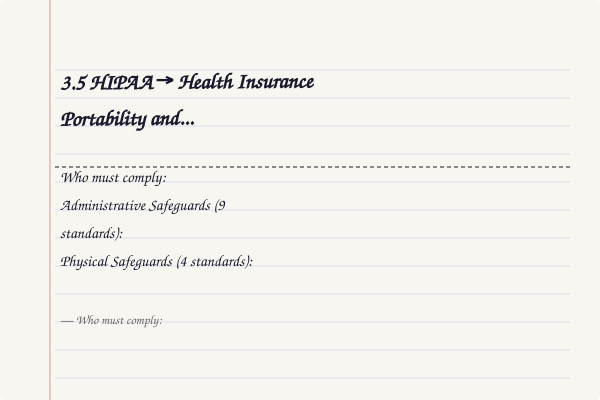
</a>
<a href="../../assets/images/diagrams/cyber-security/09-grc/3-5-hipaa-health-insurance-portability-and-accountability-act-diagram.svg" target="_blank" rel="noopener">
  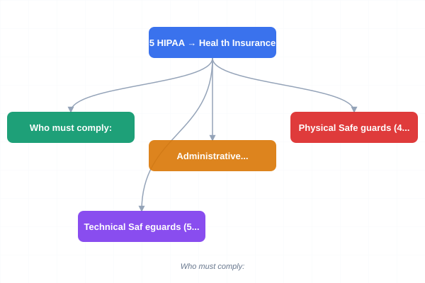
</a>
<a href="../../assets/images/diagrams/cyber-security/09-grc/3-5-hipaa-health-insurance-portability-and-accountability-act-sticky.svg" target="_blank" rel="noopener">
  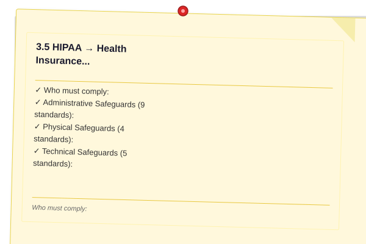
</a>


**Who must comply:** Covered entities (healthcare providers, health plans, clearinghouses) and business associates.

#### HIPAA Rules

| Rule | Focus | Key Requirements |
|------|-------|-----------------|
| **Privacy Rule** | Use and disclosure of PHI | Patient rights to access/amend PHI, Notice of Privacy Practices, minimum necessary standard |
| **Security Rule** | Administrative, physical, technical safeguards for ePHI | Risk analysis, access controls, audit controls, integrity controls, transmission security |
| **Breach Notification Rule** | Notification when PHI is breached | <60 days for individuals, &lt;60 days for HHS (500+ records), <60 days for media (500+ state records) |
| **Enforcement Rule** | Investigations and penalties | Civil penalties up to $1.5M per violation/year |
| **Omnibus Rule** (2013) | Expanded HIPAA to business associates | BAs directly liable for breaches, stricter breach notification |

#### HIPAA Security Rule Safeguards

**Administrative Safeguards (9 standards):**
- Security Management Process (risk analysis, risk management)
- Assigned Security Responsibility
- Workforce Security (authorization, clearance, termination procedures)
- Information Access Management (authorization, access establishment/modification)
- Security Awareness and Training (security reminders, protection from malicious software, log-in monitoring, password management)
- Security Incident Procedures (response and reporting)
- Contingency Plan (data backup, disaster recovery, emergency mode operation)
- Evaluation (periodic technical/non-technical evaluation)
- Business Associate Agreements

**Physical Safeguards (4 standards):**
- Facility Access Controls (contingency operations, facility security plan, access control/validation, maintenance records)
- Workstation Use
- Workstation Security
- Device and Media Controls (disposal, accountability, data backup/storage)

**Technical Safeguards (5 standards):**
- Access Control (unique user ID, emergency access, automatic logoff, encryption)
- Audit Controls
- Integrity Controls
- Person or Entity Authentication
- Transmission Security

### 3.6 SOC 2 → Service Organization Control 2

<a href="../../assets/images/diagrams/cyber-security/09-grc/3-6-soc-2-service-organization-control-2-handwritten.svg" target="_blank" rel="noopener">
  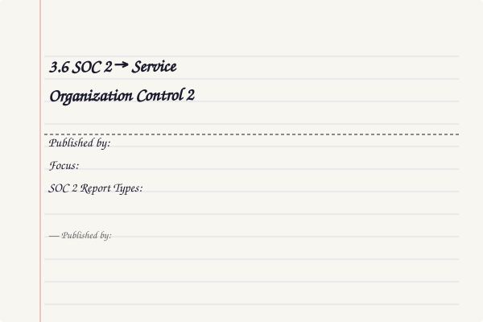
</a>
<a href="../../assets/images/diagrams/cyber-security/09-grc/3-6-soc-2-service-organization-control-2-diagram.svg" target="_blank" rel="noopener">
  
</a>
<a href="../../assets/images/diagrams/cyber-security/09-grc/3-6-soc-2-service-organization-control-2-sticky.svg" target="_blank" rel="noopener">
  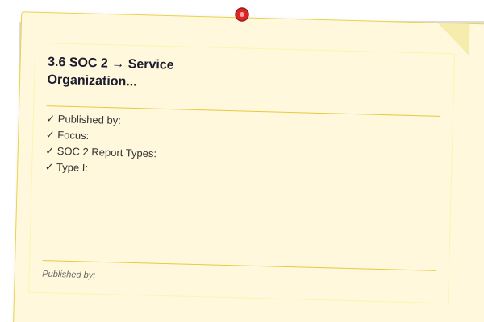
</a>


**Published by:** AICPA | **Focus:** Controls at service organizations relevant to security, availability, processing integrity, confidentiality, privacy

#### SOC 2 Trust Services Criteria (TSC)

| Category | Abbrev | Description |
|----------|--------|-------------|
| **Security** | A1 (CC series) | Information and systems protected against unauthorized access, disclosure, and damage |
| **Availability** | A2 | Systems available for operation and use as committed |
| **Processing Integrity** | A3 | System processing is complete, accurate, timely, and authorized |
| **Confidentiality** | A4 | Information designated as confidential is protected |
| **Privacy** | A5 (P series) | Personal information is collected, used, retained, and disclosed per criteria |

**SOC 2 Report Types:**
- **Type I:** Controls are suitably designed at a point in time
- **Type II:** Controls are suitably designed AND operating effectively over a period (typically 6–12 months)

**Common Criteria (CC) → 9 categories of control criteria:**
1. CC1 → Control Environment
2. CC2 → Communication and Information
3. CC3 → Risk Assessment
4. CC4 → Monitoring Activities
5. CC5 → Control Activities
6. CC6 → Logical and Physical Access
7. CC7 → System Operations
8. CC8 → Change Management
9. CC9 → Risk Mitigation

### 3.7 FedRAMP → Federal Risk and Authorization Management Program

<a href="../../assets/images/diagrams/cyber-security/09-grc/3-7-fedramp-federal-risk-and-authorization-management-program-handwritten.svg" target="_blank" rel="noopener">
  
</a>
<a href="../../assets/images/diagrams/cyber-security/09-grc/3-7-fedramp-federal-risk-and-authorization-management-program-diagram.svg" target="_blank" rel="noopener">
  
</a>
<a href="../../assets/images/diagrams/cyber-security/09-grc/3-7-fedramp-federal-risk-and-authorization-management-program-sticky.svg" target="_blank" rel="noopener">
  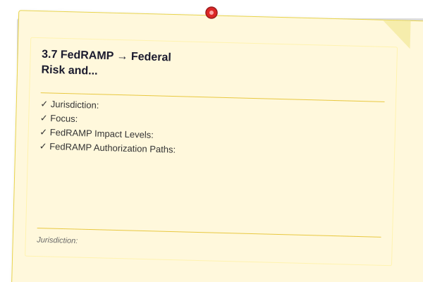
</a>


**Jurisdiction:** US Federal Government | **Focus:** Cloud service authorization

**FedRAMP Impact Levels:**

| Level | Impact | Examples |
|-------|--------|----------|
| **Low** | Limited adverse effect on org operations/assets/individuals | Public-facing websites, non-sensitive data |
| **Moderate** | Serious adverse effect | HR systems, financial systems, law enforcement data |
| **High** | Severe or catastrophic adverse effect | Defense, intelligence, public health, critical infrastructure |

**FedRAMP Authorization Paths:**
1. **JAB Provisional Authorization (P-ATO):** Joint Authorization Board grants provisional ATO
2. **Agency ATO:** Individual federal agency grants authority to operate
3. **State Department Authorization:** Direct from Department of State for their use

### 3.8 SOX → Sarbanes-Oxley Act

<a href="../../assets/images/diagrams/cyber-security/09-grc/3-8-sox-sarbanes-oxley-act-handwritten.svg" target="_blank" rel="noopener">
  
</a>
<a href="../../assets/images/diagrams/cyber-security/09-grc/3-8-sox-sarbanes-oxley-act-diagram.svg" target="_blank" rel="noopener">
  
</a>
<a href="../../assets/images/diagrams/cyber-security/09-grc/3-8-sox-sarbanes-oxley-act-sticky.svg" target="_blank" rel="noopener">
  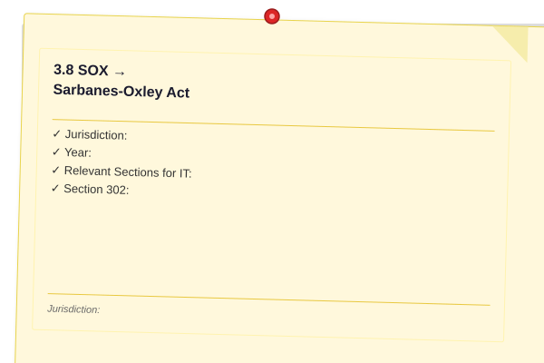
</a>


**Jurisdiction:** US public companies (and their auditors) | **Year:** 2002

**Relevant Sections for IT:**
- **Section 302:** Corporate responsibility for financial reports → CEO/CFO certify financial statements
- **Section 404:** Management assessment of internal controls → IT controls over financial reporting (ITGC)
- **Section 409:** Real-time issuer disclosures → timely reporting of material changes
- **Section 802:** Criminal penalties for altering documents → record retention requirements

**ITGC (IT General Controls) for SOX:**

| Domain | Controls | Examples |
|--------|----------|----------|
| **Access Management** | User access provisioning, recertification, termination | Quarterly access review of all finance-related systems |
| **Change Management** | Change approval, testing, segregation of duties | All changes to SAP must have approved ticket, tested in dev, peer-reviewed |
| **Computer Operations** | Job monitoring, backup, incident management | Batch job failure alerts, nightly backup verification |
| **Program Development** | SDLC controls, segregation between dev/test/prod | Developers cannot promote code to production |

### 3.9 Breach Notification Laws → International Comparison

<a href="../../assets/images/diagrams/cyber-security/09-grc/3-9-breach-notification-laws-international-comparison-handwritten.svg" target="_blank" rel="noopener">
  
</a>
<a href="../../assets/images/diagrams/cyber-security/09-grc/3-9-breach-notification-laws-international-comparison-diagram.svg" target="_blank" rel="noopener">
  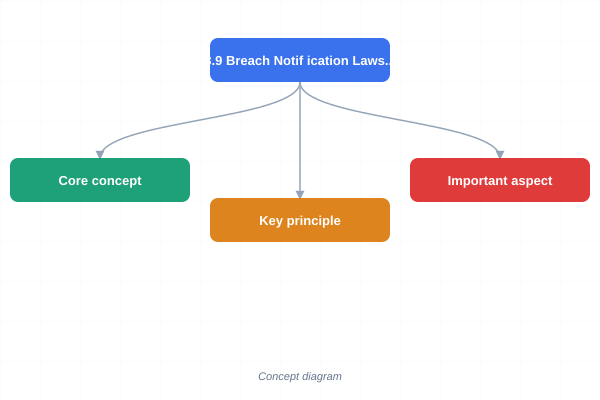
</a>
<a href="../../assets/images/diagrams/cyber-security/09-grc/3-9-breach-notification-laws-international-comparison-sticky.svg" target="_blank" rel="noopener">
  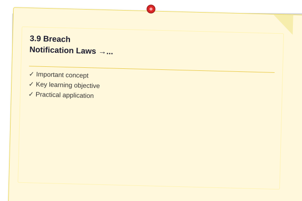
</a>


| Regulation | Notification Timeline | To Whom | Threshold |
|-----------|---------------------|---------|-----------|
| **GDPR (EU)** | 72 hours | DPA, data subjects (if high risk) | Personal data breach |
| **HIPAA (US)** | 60 days | HHS, individuals, media (500+ state) | Unsecured PHI |
| **CCPA/CPRA (CA)** | Without undue delay | Individuals | Any breach of personal information |
| **GLBA (US Financial)** | 30 days (most states) | Primary federal regulator | Customer information |
| **PIPEDA (Canada)** | As soon as feasible | Commissioner, individuals, affected orgs | Real risk of significant harm |
| **LGPD (Brazil)** | Reasonable timeframe | ANPD, data subjects | Any security incident |
| **APRA CPS 234 (AU)** | As soon as possible, &lt;72h (expectation) | APRA, affected parties | Material information security control weakness or breach |
| **Singapore PDPA** | As soon as practicable | Commission, affected individuals | Data breach with significant harm or scale |
| **South Korea PIPA** | Without delay (within 24h) | KISA, data subjects | Personal information breach |
| **Japan APPI** | As soon as possible | Commission (PPC), affected individuals | Breach involving sensitive data or identity theft risk |

### 3.10 Data Classification

<a href="../../assets/images/diagrams/cyber-security/09-grc/3-10-data-classification-handwritten.svg" target="_blank" rel="noopener">
  
</a>
<a href="../../assets/images/diagrams/cyber-security/09-grc/3-10-data-classification-diagram.svg" target="_blank" rel="noopener">
  
</a>
<a href="../../assets/images/diagrams/cyber-security/09-grc/3-10-data-classification-sticky.svg" target="_blank" rel="noopener">
  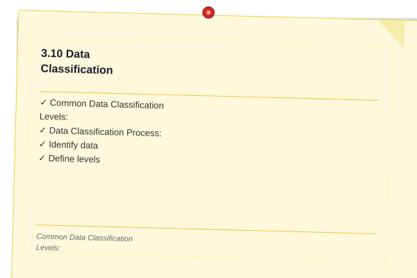
</a>


Data classification is the process of categorizing data based on its sensitivity and criticality to determine appropriate handling and protection requirements.

**Common Data Classification Levels:**

| Level | Definition | Examples | Access Control | Encryption Required | Handling |
|-------|-----------|---------|---------------|-------------------|----------|
| **Public** | Information that can be freely shared | Marketing brochures, job postings, annual reports | No authentication needed | No | No restrictions |
| **Internal** | Information not for public disclosure | Internal policies, org charts, training materials | Authenticated users only | At rest: optional; In transit: TLS | Store on approved internal systems |
| **Confidential** | Sensitive business information | Customer lists, source code, financial results, contracts | Role-based access, least privilege | At rest: AES-256; In transit: TLS 1.2+ | Label documents, limit printing/download |
| **Restricted** | Highly sensitive, regulated, or critical | PII, PHI, payment card data, trade secrets, M&A info | Strict need-to-know + MFA | At rest: AES-256 + key rotation; In transit: TLS 1.3 | No removable media, DLP monitoring, access logging |
| **Top Secret** (Government) | National security information | Classified intelligence, military plans | Background check + special clearance | Suite A or B cryptography | Air-gapped systems, no external sharing |

**Data Classification Process:**

1. **Identify data** → Take inventory of all data stores (databases, file shares, SaaS, email, backups)
2. **Define levels** → Establish classification schema (3–5 levels)
3. **Classify** → Tag data with classification level (manual, automated via DLP, or hybrid)
4. **Apply controls** → Map classification to security controls (encryption, access, retention, disposal)
5. **Train** → Employees must understand classification and handling requirements
6. **Monitor** → DLP alerts on mishandling (e.g., emailing confidential data externally)
7. **Audit** → Verify controls match classification level annually

### 3.11 Data Privacy (Beyond GDPR)

<a href="../../assets/images/diagrams/cyber-security/09-grc/3-11-data-privacy-beyond-gdpr-handwritten.svg" target="_blank" rel="noopener">
  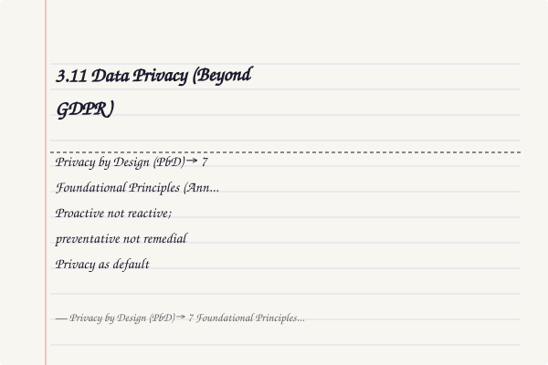
</a>
<a href="../../assets/images/diagrams/cyber-security/09-grc/3-11-data-privacy-beyond-gdpr-diagram.svg" target="_blank" rel="noopener">
  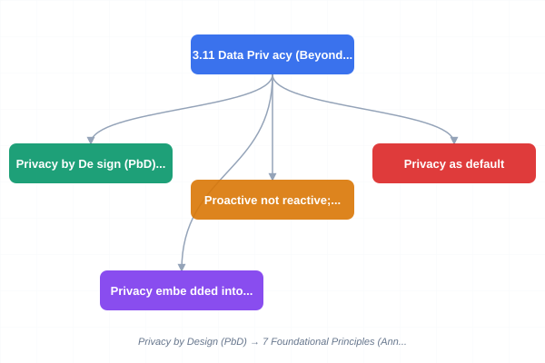
</a>
<a href="../../assets/images/diagrams/cyber-security/09-grc/3-11-data-privacy-beyond-gdpr-sticky.svg" target="_blank" rel="noopener">
  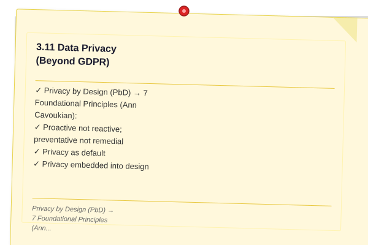
</a>


**Privacy by Design (PbD) → 7 Foundational Principles (Ann Cavoukian):**

1. **Proactive not reactive; preventative not remedial** → Build privacy into design before breach
2. **Privacy as default** → Maximum privacy automatically, no action needed by user
3. **Privacy embedded into design** → Privacy is core component, not bolt-on
4. **Full functionality** → Positive-sum, not zero-sum (privacy + security + usability)
5. **End-to-end security** → Full lifecycle protection (collection through deletion)
6. **Visibility and transparency** → Open, documented processes
7. **Respect for user privacy** → User-centric: granular controls, notifications

**DPIA (Data Protection Impact Assessment) → Required when processing is likely to result in high risk:**

1. Describe processing: what, why, how
2. Assess necessity and proportionality
3. Identify and assess risks to individuals
4. Identify measures to mitigate risks
5. Consult DPO and (if necessary) Supervisory Authority
6. Document outcome

**When is DPIA mandatory?**
- Systematic profiling with significant effects
- Large-scale processing of special categories (health, biometric, genetic)
- Systematic monitoring of publicly accessible areas (CCTV)
- Large-scale processing of children's data
- Innovative technology use (AI, IoT, blockchain)
## Section 4: Security Frameworks

### 4.1 NIST CSF 2.0 (Cybersecurity Framework)

<a href="../../assets/images/diagrams/cyber-security/09-grc/4-1-nist-csf-2-0-cybersecurity-framework-handwritten.svg" target="_blank" rel="noopener">
  
</a>
<a href="../../assets/images/diagrams/cyber-security/09-grc/4-1-nist-csf-2-0-cybersecurity-framework-diagram.svg" target="_blank" rel="noopener">
  
</a>
<a href="../../assets/images/diagrams/cyber-security/09-grc/4-1-nist-csf-2-0-cybersecurity-framework-sticky.svg" target="_blank" rel="noopener">
  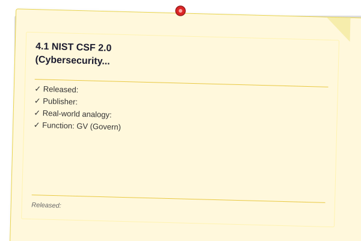
</a>


**Released:** February 2024 (updated from v1.1) | **Publisher:** National Institute of Standards and Technology

**Real-world analogy:** A building code defines how to construct a safe building → foundation, frame, electrical, plumbing. NIST CSF defines how to construct a cybersecurity program → regardless of the specific materials (technology) you use.

#### NIST CSF 2.0 → 6 Functions (added "Govern")

```
+----------------------------------------------------------+
|   NIST CSF 2.0 → 6 Functions, 22 Categories, 106 Subcats |
+----------------------------------------------------------+
| GV → Govern         (New in 2.0)                          |
|   Org context, risk mgmt strategy, roles, policies        |
| ID → Identify                                             |
|   Asset management, risk assessment, improvement          |
| PR → Protect                                              |
|   Identity mgmt, awareness, data security, platform sec   |
| DE → Detect                                                |
|   Continuous monitoring, anomaly detection, event analysis|
| RS → Respond                                              |
|   Incident management, analysis, mitigation, comms         |
| RC → Recover                                              |
|   Recovery planning, improvements, communications         |
+----------------------------------------------------------+
```

#### NIST CSF 2.0 → Function-to-Control Mapping with Implementation Example

**Function: GV (Govern)**

| Category | Subcategory (ID) | Control Example | Implementation |
|----------|-----------------|-----------------|----------------|
| GV.OC → Organizational Context | GV.OC-01: Org mission and stakeholder expectations | Define mission objectives for cybersecurity | CISO presents to Board; document in charter |
| GV.RM → Risk Management Strategy | GV.RM-01: Risk appetite and tolerance | Establish risk appetite statement | Board approves risk appetite: "No residual risk above Medium for systems with PII" |
| GV.RR → Roles and Responsibilities | GV.RR-01: Cybersecurity roles defined | Create RACI matrix for incident response | Document: CISO owns response, SOC Manager owns triage, Legal owns notification |
| GV.PO → Policies and Processes | GV.PO-01: Cybersecurity policy established | Write and approve InfoSec policy | "InfoSec Policy v4.2" approved by CEO, published on intranet |
| GV.SC → Supply Chain | GV.SC-03: Third-party risk integrated into planning | Vendor risk assessment program | All vendors handling PII must complete SIG questionnaire |

**Function: ID (Identify)**

| Category | Subcategory | Control Example | Implementation |
|----------|-------------|-----------------|----------------|
| ID.AM → Asset Management | ID.AM-01: Hardware inventory | Maintain CMDB with automated discovery | Deploy Device42 or ServiceNow CMDB; weekly scans |
| ID.AM → Asset Management | ID.AM-03: Software inventory | Application inventory with versions | Deploy Flexera or Wiz; monthly reports |
| ID.RA → Risk Assessment | ID.RA-01: Vulnerabilities identified | Quarterly vulnerability scanning | Deploy Qualys; scan all IPs; prioritize CVSS 7+ within 30 days |
| ID.RA → Risk Assessment | ID.RA-04: Business impact criteria defined | BIA completed for all critical processes | Interview 20 business owners; document RTO/RPO for 50 processes |
| ID.IM → Improvements | ID.IM-01: Risk management plan updates | Annual risk assessment cycle | Update risk register, review treatment plans |

**Function: PR (Protect)**

| Category | Subcategory | Control Example | Implementation |
|----------|-------------|-----------------|----------------|
| PR.AA → Identity Management & Access Control | PR.AA-01: Identities and credentials for authorized users | MFA for all users | Deploy Azure AD Conditional Access → enforce MFA for all external access |
| PR.AT → Awareness and Training | PR.AT-01: Personnel trained | Annual security awareness training | Deploy KnowBe4; 95% completion target; monthly phishing simulations |
| PR.DS → Data Security | PR.DS-01: Data-at-rest protected | Encrypt all databases | AWS KMS for RDS encryption; enable S3 SSE-S3/S3-KMS |
| PR.DS → Data Security | PR.DS-02: Data-in-transit protected | TLS for all external communications | Enforce TLS 1.2+ via CloudFront; disable SSL 3.0 and TLS 1.0 |
| PR.PS → Platform Security | PR.PS-01: Configuration management | CIS benchmark compliance | Deploy CIS-CAT or Tanium; score >85% on critical systems |
| PR.PS → Platform Security | PR.PS-02: Software integrity verified | Code signing and integrity checks | Sign all internal binaries; deploy SCAP scanning |
| PR.IR → Technology Infrastructure Resilience | PR.IR-01: Backups managed | Immutable backups with tested restore | Veeam + AWS S3 Object Lock; test restore monthly |
| PR.IR → Technology Infrastructure Resilience | PR.IR-04: Network availability | Redundant network paths | BGP multi-homing; load balancers in two AZs |

**Function: DE (Detect)**

| Category | Subcategory | Control Example | Implementation |
|----------|-------------|-----------------|----------------|
| DE.CM → Continuous Monitoring | DE.CM-01: Network monitored | SIEM collecting all logs | Deploy Splunk / Microsoft Sentinel; ingest firewall, EDR, DNS logs |
| DE.CM → Continuous Monitoring | DE.CM-04: Malicious code detected | EDR on all endpoints | Deploy CrowdStrike Falcon or Microsoft Defender for Endpoint on 100% of endpoints |
| DE.CM → Continuous Monitoring | DE.CM-07: Monitoring for unauthorized personnel | Physical access monitoring | Badge reader logs integrated with SIEM; alert on after-hours access |
| DE.AE → Anomalies and Events | DE.AE-02: Event correlation | Correlation rules in SIEM | Alert on: brute force (10 failures in 5 min), impossible travel, new service account |
| DE.AE → Anomalies and Events | DE.AE-04: Impact assessed | Triage SLA defined | Critical: 15 min; High: 1 hour; Medium: 4 hours; Low: 24 hours |

**Function: RS (Respond)**

| Category | Subcategory | Control Example | Implementation |
|----------|-------------|-----------------|----------------|
| RS.MA → Incident Management | RS.MA-01: Response plan executed | IR plan documented and tested | Tabletop exercise every 6 months; update plan annually |
| RS.AN → Incident Analysis | RS.AN-01: Investigation performed | Forensic analysis capability | Deploy FTK or Velociraptor; train 3 forensic analysts |
| RS.MI → Mitigation | RS.MI-01: Incidents contained | Automated containment playbook | SIEM triggers CrowdStrike RTR to isolate host on ransomware detection |
| RS.CO → Communications | RS.CO-02: Internal stakeholders notified | Escalation matrix documented | Notify CISO &lt;15 min, Legal <30 min, CEO <60 min, Board <4 hours |

**Function: RC (Recover)**

| Category | Subcategory | Control Example | Implementation |
|----------|-------------|-----------------|----------------|
| RC.RP → Recovery Plan | RC.RP-01: Recovery plan executed | DR plan tested annually | Full infrastructure failover test to DR region; report outcomes to Board |
| RC.IM → Improvements | RC.IM-01: Lessons learned | Post-incident review within 30 days | Document root cause, corrective actions, update playbooks |
| RC.CO → Communications | RC.CO-02: External stakeholders updated | Breach notification procedures | Legal handles DPA notification within 72h (GDPR); PR handles press release |

#### NIST CSF 2.0 Tiers

| Tier | Description | Planning Process | Risk Mgmt | Threat Intelligence |
|------|-------------|-----------------|-----------|-------------------|
| Tier 1: Partial | Ad hoc, reactive | No formal process | Informal, no org-level view | Passive, limited external sources |
| Tier 2: Risk-Informed | Process approved but not org-wide | Formal process, management approval | Active but siloed | Limited external intel feeds |
| Tier 3: Repeatable | Formal, org-wide process | Consistent, org-wide risk-informed | Formal, org-integrated | Regular external intel consumption |
| Tier 4: Adaptive | Real-time, continuous improvement | Adaptive, real-time data-driven | Continuous, org-wide, cross-functional | Real-time intel feeds, automated response |

### 4.2 ISO/IEC 27001 → Information Security Management System (ISMS)

<a href="../../assets/images/diagrams/cyber-security/09-grc/4-2-iso-iec-27001-information-security-management-system-isms-handwritten.svg" target="_blank" rel="noopener">
  
</a>
<a href="../../assets/images/diagrams/cyber-security/09-grc/4-2-iso-iec-27001-information-security-management-system-isms-diagram.svg" target="_blank" rel="noopener">
  
</a>
<a href="../../assets/images/diagrams/cyber-security/09-grc/4-2-iso-iec-27001-information-security-management-system-isms-sticky.svg" target="_blank" rel="noopener">
  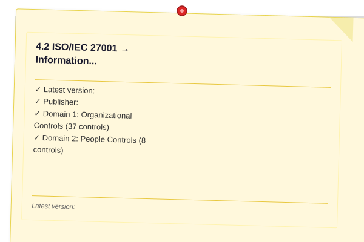
</a>


**Latest version:** ISO/IEC 27001:2022 | **Publisher:** International Organization for Standardization

ISO 27001 specifies requirements for establishing, implementing, maintaining, and continually improving an ISMS.

#### PDCA Cycle in ISO 27001

```
Plan          ->   Do          ->   Check          ->   Act
Establish       Implement &       Monitor &          Maintain &
ISMS context    operate controls  review ISMS        improve ISMS
+---------+     +----------+     +----------+       +----------+
| Scope   |     | Risk     |     | Internal |       | Correct  |
| Policy  |     | treatment|     | audit    |       | actions  |
| Risk    |     | Controls |     | Mgmt     |       | Continual|
| assess  |     | Awareness|     | review   |       | improve  |
| SoA     |     | Docs     |     | Metrics  |       |          |
+---------+     +----------+     +----------+       +----------+
```

#### ISO 27001:2022 → Annex A Control Mapping (93 Controls, 4 Domains)

**Domain 1: Organizational Controls (37 controls)**

| Control | Title | Description |
|---------|-------|-------------|
| 5.1 | Policies for information security | Define, approve, publish, and review information security policy |
| 5.2 | Information security roles and responsibilities | Assign all security roles with defined responsibilities |
| 5.3 | Segregation of duties | Conflicting duties and areas of responsibility separated |
| 5.4 | Management responsibilities | Management requires all applicable policies to be applied |
| 5.5 | Contact with authorities | Maintain contacts with regulatory and law enforcement authorities |
| 5.6 | Contact with special interest groups | Maintain contacts with security forums and industry groups |
| 5.7 | Threat intelligence | Collect and analyze threat intelligence information |
| 5.8 | Information security in project management | Integrate security into project management methodology |
| 5.9 | Inventory of information and associated assets | Maintain asset inventory with ownership and classification |
| 5.10 | Acceptable use of information and assets | Identify, document, and implement acceptable use rules |
| 5.11 | Return of assets | Ensure all assets returned upon termination of employment/contract |
| 5.12 | Classification of information | Classify information by sensitivity, criticality, and legal requirements |
| 5.13 | Labelling of information | Develop and implement consistent information labeling procedures |
| 5.14 | Information transfer | Formal transfer policies, agreements, and procedures |
| 5.15 | Access control | Establish access control policy based on business/security requirements |
| 5.16 | Identity management | Manage full identity lifecycle (creation through deletion) |
| 5.17 | Authentication information | Secure authentication information provisioning and management |
| 5.18 | Access rights | Provision, review, modify, and remove access rights |
| 5.19 | Information security in supplier relationships | Security requirements in supplier agreements |
| 5.20 | Addressing security within supplier agreements | Include security requirements in all supplier contracts |
| 5.21 | Managing information security in the ICT supply chain | Supply chain risk management for ICT products/services |
| 5.22 | Monitoring, review and change management of supplier services | Continuous monitoring of supplier security compliance |
| 5.23 | Information security for use of cloud services | Cloud-specific security policies, due diligence, and oversight |
| 5.24 | Information security incident management planning | Establish incident management plan and procedures |
| 5.25 | Assessment and decision on information security events | Triage and assess security events |
| 5.26 | Response to information security incidents | Execute incident response per established plan |
| 5.27 | Learning from information security incidents | Document lessons learned and implement improvements |
| 5.28 | Collection of evidence | Evidence collection, preservation, and chain of custody |
| 5.29 | Information security during disruption | Business continuity integrated with information security |
| 5.30 | ICT readiness for business continuity | ICT continuity plans aligned with BCP/DR |
| 5.31 | Legal, statutory, regulatory and contractual requirements | Identify and document all applicable legal/regulatory requirements |
| 5.32 | Intellectual property rights | Procedures to protect IP and comply with IP licensing |
| 5.33 | Protection of records | Records protected from loss, destruction, falsification, unauthorized access |
| 5.34 | Privacy and protection of PII | Policies and controls for PII per applicable regulations |
| 5.35 | Independent review of information security | Internal audit program for ISMS |
| 5.36 | Compliance with policies, rules and standards for IS | Regular compliance reviews |
| 5.37 | Documented operating procedures | Maintain operating procedures for all information processing facilities |

**Domain 2: People Controls (8 controls)**

| Control | Title | Description |
|---------|-------|-------------|
| 6.1 | Screening | Background checks prior to employment (proportionate to risk) |
| 6.2 | Terms and conditions of employment | Employment contracts include information security responsibilities |
| 6.3 | Information security awareness, education and training | All personnel receive appropriate security awareness and training |
| 6.4 | Disciplinary process | Formal disciplinary process for security violations |
| 6.5 | Responsibilities after termination or change | Security responsibilities continue after termination/role change |
| 6.6 | Confidentiality or non-disclosure agreements | NDAs signed by employees and third parties |
| 6.7 | Remote working | Security policy for remote work (VPN, device encryption, screen privacy) |
| 6.8 | Information security event reporting | Mechanism for employees to report security events promptly |

**Domain 3: Physical Controls (14 controls)**

| Control | Title | Description |
|---------|-------|-------------|
| 7.1 | Physical security perimeters | Security perimeters (fences, walls, locked doors) to protect areas |
| 7.2 | Physical entry controls | Secure entry with access controls, visitor logs, escort requirements |
| 7.3 | Securing offices, rooms and facilities | Lock offices, server rooms; physical access control systems |
| 7.4 | Physical security monitoring | Continuous monitoring (CCTV, alarms, guard patrols) |
| 7.5 | Protecting against physical and environmental threats | Fire suppression, UPS, climate control, flood protection |
| 7.6 | Working in secure areas | Clean desk policy, no cameras/phones in secure areas |
| 7.7 | Clear desk and clear screen policy | Lock screens, clear desks at end of day |
| 7.8 | Equipment siting and protection | Equipment positioned to minimize environmental/access risk |
| 7.9 | Security of assets off-premises | Protect equipment taken off-site (encrypted laptops, tamper seals) |
| 7.10 | Storage media | Secure storage, handling, and disposal of media |
| 7.11 | Supporting utilities | Backup power (UPS/generator), redundant cooling, dual power feeds |
| 7.12 | Cabling security | Power and data cabling protected from interception/damage |
| 7.13 | Equipment maintenance | Scheduled maintenance, authorized personnel only, logs maintained |
| 7.14 | Secure disposal or re-use of equipment | Secure erasure, physical destruction, data sanitization certificates |

**Domain 4: Technological Controls (34 controls)**

| Control | Title | Description |
|---------|-------|-------------|
| 8.1 | User endpoint devices | Secure configuration and management of user devices |
| 8.2 | Privileged access rights | Strict control and monitoring of privileged accounts |
| 8.3 | Information access restriction | Role-based access controls, need-to-access restrictions |
| 8.4 | Access to source code | Read-only access to source code; separate dev/test/prod |
| 8.5 | Secure authentication | MFA for all privileged and remote access; strong password policies |
| 8.6 | Capacity management | Monitor system capacity; plan for growth; alert on thresholds |
| 8.7 | Protection against malware | Anti-malware on all endpoints and servers; regular updates |
| 8.8 | Management of technical vulnerabilities | Vulnerability scanning, patch management, risk-based prioritization |
| 8.9 | Configuration management | Secure configuration baselines; automated compliance checking |
| 8.10 | Information deletion | Delete information when no longer required; secure deletion methods |
| 8.11 | Data masking | Mask sensitive data in non-production environments |
| 8.12 | Data leakage prevention | DLP controls to prevent unauthorized data exfiltration |
| 8.13 | Information backup | Regular backups with tested restoration; offsite/immutable copies |
| 8.14 | Redundancy of information processing facilities | Redundant systems, automatic failover, load balancing |
| 8.15 | Logging | Enable and configure logging on all critical systems |
| 8.16 | Monitoring activities | Continuous monitoring of networks, systems, applications |
| 8.17 | Clock synchronization | NTP synchronization across all systems (audit log accuracy) |
| 8.18 | Use of privileged utility programs | Restrict, log, and monitor use of privileged utilities |
| 8.19 | Installation of software on operational systems | Change-controlled software installation; whitelisting |
| 8.20 | Network security controls | Network segmentation, firewalls, IDS/IPS |
| 8.21 | Security of network services | Secure configuration of network services (DNS, DHCP, NTP, VPN) |
| 8.22 | Segregation of networks | Separate network segments for different security zones |
| 8.23 | Web filtering | Block malicious, inappropriate, or non-compliant websites |
| 8.24 | Use of cryptography | Encryption policies, key management lifecycle |
| 8.25 | Secure development lifecycle | Security requirements in all phases of SDLC |
| 8.26 | Application security requirements | Identify and document security requirements before development |
| 8.27 | Secure system architecture and engineering principles | Defense-in-depth, least privilege, secure defaults |
| 8.28 | Secure coding | Coding standards, code reviews, SAST/DAST |
| 8.29 | Security testing in development | Unit tests, integration tests, penetration testing pre-release |
| 8.30 | Outsourced development | Security requirements for outsourced development contracts |
| 8.31 | Separation of development, test and production | Environment segregation, no direct promotion from dev to prod |
| 8.32 | Change management | Formal change management process with security review |
| 8.33 | Test information | No production data in test without appropriate protection |
| 8.34 | Protection of information systems during audit testing | Test activities don't compromise production systems |

### 4.3 COBIT → Control Objectives for Information and Related Technologies

<a href="../../assets/images/diagrams/cyber-security/09-grc/4-3-cobit-control-objectives-for-information-and-related-technologies-handwritten.svg" target="_blank" rel="noopener">
  
</a>
<a href="../../assets/images/diagrams/cyber-security/09-grc/4-3-cobit-control-objectives-for-information-and-related-technologies-diagram.svg" target="_blank" rel="noopener">
  
</a>
<a href="../../assets/images/diagrams/cyber-security/09-grc/4-3-cobit-control-objectives-for-information-and-related-technologies-sticky.svg" target="_blank" rel="noopener">
  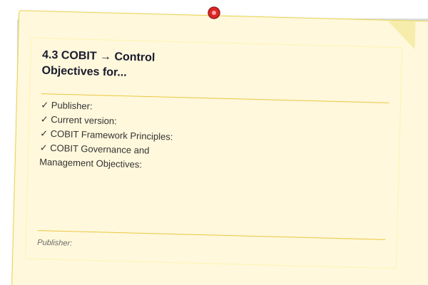
</a>


**Publisher:** ISACA | **Current version:** COBIT 2019

**COBIT Framework Principles:**
1. Meet stakeholder needs
2. Cover the enterprise end-to-end
3. Apply a single, integrated framework
4. Enable a holistic approach
5. Separate governance from management

**COBIT Governance and Management Objectives:**

**Governance Domain (Evaluate, Direct, Monitor → EDM):**
- EDM01 → Ensure governance framework setting and maintenance
- EDM02 → Ensure benefits delivery
- EDM03 → Ensure risk optimization
- EDM04 → Ensure resource optimization
- EDM05 → Ensure stakeholder transparency

**Management Domains (4 domains):**

| Domain | Focus | # Objectives | Examples |
|--------|-------|-------------|---------|
| **APO** → Align, Plan and Organize | Strategic planning | 14 | APO01 IT management framework, APO12 Risk management, APO13 Security management |
| **BAI** → Build, Acquire and Implement | Solution delivery | 11 | BAI01 Programs/projects, BAI06 IT change management, BAI09 Asset management |
| **DSS** → Deliver, Service and Support | Service delivery | 6 | DSS01 Operations, DSS02 Service requests/incidents, DSS03 Problem mgmt, DSS05 Security services |
| **MEA** → Monitor, Evaluate and Assess | Performance monitoring | 3 | MEA01 Performance monitoring, MEA02 Internal control, MEA03 Regulatory compliance |

### 4.4 CIS Controls

<a href="../../assets/images/diagrams/cyber-security/09-grc/4-4-cis-controls-handwritten.svg" target="_blank" rel="noopener">
  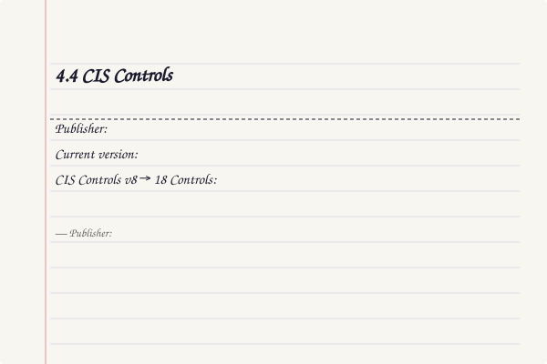
</a>
<a href="../../assets/images/diagrams/cyber-security/09-grc/4-4-cis-controls-diagram.svg" target="_blank" rel="noopener">
  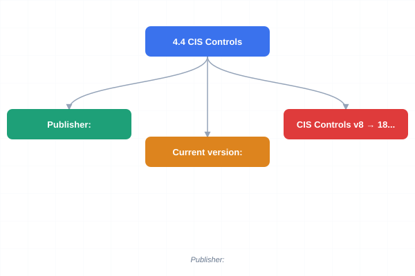
</a>
<a href="../../assets/images/diagrams/cyber-security/09-grc/4-4-cis-controls-sticky.svg" target="_blank" rel="noopener">
  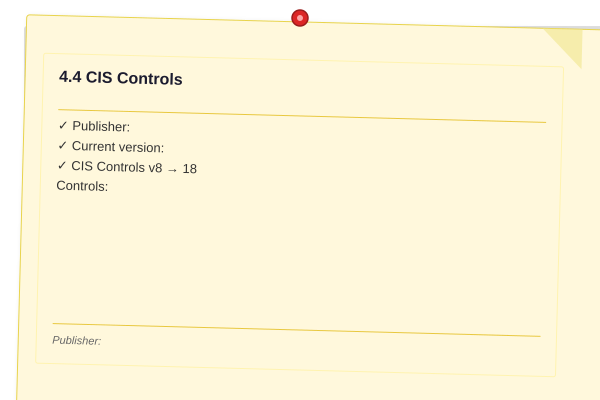
</a>


**Publisher:** Center for Internet Security | **Current version:** CIS Controls v8 (updated 2021)

CIS Controls are 18 prioritized safeguards (reduced from 20 in v7) mapped to common adversary techniques.

**CIS Controls v8 → 18 Controls:**

| # | Control | Key Safeguards |
|---|---------|----------------|
| 1 | **Inventory and Control of Enterprise Assets** | Discover and track all hardware; manage unauthorized devices |
| 2 | **Inventory and Control of Software Assets** | Track all software; allowlist authorized software; remove unauthorized |
| 3 | **Data Protection** | Data classification; DLP; encryption at rest; automated sensitive data discovery |
| 4 | **Secure Configuration of Enterprise Assets and Software** | Baseline configurations; automate configuration management; disable unused services |
| 5 | **Account Management** | Unique credentials; disable dormant accounts; MFA for all administrative access |
| 6 | **Access Control Management** | Least privilege; RBAC; access reviews; privilege elevation controls |
| 7 | **Continuous Vulnerability Management** | Automated scanning; risk-based patching (critical &lt;2 weeks); vulnerability prioritization |
| 8 | **Audit Log Management** | Enable logging; centralized collection; log retention (90+ days); protect logs from tampering |
| 9 | **Email and Web Browser Protections** | DMARC/DKIM/SPF; web filtering; block malicious attachments; browser isolation |
| 10 | **Malware Defenses** | Anti-malware with behavioral detection; automatic updates; quarantine capability |
| 11 | **Data Recovery** | Automated backups; test restoration annually; offsite/air-gapped/immutable copies |
| 12 | **Network Infrastructure Management** | Secure network architecture; segmentation; firewall rule review; change management |
| 13 | **Network Monitoring and Defense** | IDS/IPS; traffic analysis; network flow logging; anomaly detection |
| 14 | **Security Awareness and Skills Training** | Phishing simulation; role-based training; measure behavior change |
| 15 | **Service Provider Management** | Vendor risk assessments; contractual security requirements; monitor vendor compliance |
| 16 | **Application Software Security** | Secure SDLC; SAST/DAST; dependency scanning; web application firewalls |
| 17 | **Incident Response Management** | IR plan; dedicated team; tabletop exercises; forensic capability |
| 18 | **Penetration Testing** | Annual external/ internal penetration tests; continuous red teaming for mature orgs |

#### CIS Implementation Groups (IGs)

| Group | Description | # Safeguards | Typical Organization |
|-------|-------------|-------------|---------------------|
| **IG1** | Basic cyber hygiene → minimum standard for all orgs | 56 | Small business, limited security resources |
| **IG2** | Risk-informed → additional protections for sensitive data | 128 | Mid-size enterprise, some security staffing |
| **IG3** | Proactive → advanced defenses for critical infrastructure | 168 | Large enterprise, mature security program |

### 4.5 Framework Comparison: NIST CSF vs ISO 27001 vs CIS Controls vs PCI DSS

<a href="../../assets/images/diagrams/cyber-security/09-grc/4-5-framework-comparison-nist-csf-vs-iso-27001-vs-cis-controls-vs-pci-dss-handwritten.svg" target="_blank" rel="noopener">
  
</a>
<a href="../../assets/images/diagrams/cyber-security/09-grc/4-5-framework-comparison-nist-csf-vs-iso-27001-vs-cis-controls-vs-pci-dss-diagram.svg" target="_blank" rel="noopener">
  
</a>
<a href="../../assets/images/diagrams/cyber-security/09-grc/4-5-framework-comparison-nist-csf-vs-iso-27001-vs-cis-controls-vs-pci-dss-sticky.svg" target="_blank" rel="noopener">
  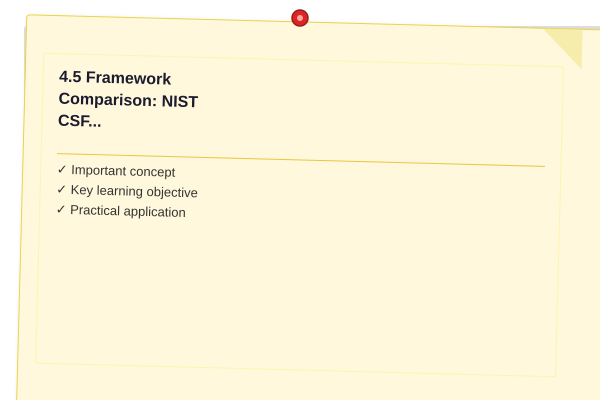
</a>


| Criteria | NIST CSF 2.0 | ISO 27001 | CIS Controls v8 | PCI DSS 4.0 |
|----------|-------------|-----------|-----------------|-------------|
| **Type** | Framework (voluntary) | Standard (certifiable) | Controls (guidance) | Regulation (mandatory for card processing) |
| **Scope** | Any organization, any sector | Any organization, any sector | Any organization, any sector | Any entity processing cardholder data |
| **Format** | Functions, categories, subcategories | Clauses + Annex A controls | 18 controls, 153 safeguards | 12 requirements, ~400 testing procedures |
| **Certification** | No certification (self-assessment) | Yes → third-party certification | No certification | QSA assessment for Level 1; SAQ for others |
| **Risk-based?** | Yes → tiered approach | Yes → risk assessment is mandatory | Partially → implementation groups | Partially → compensating controls allowed |
| **Audit requirement** | Self-assessment | Annual surveillance + 3-year recertification | Self-assessment | Annual (Level 1 QSA); quarterly ASV scans |
| **Flexibility** | Very high → any controls can map | Moderate → SoA documents chosen controls | Moderate → IG1/2/3 tiers | Low → specific technical requirements |
| **Maturity model** | 4 Tiers | Not inherent (but can combine with ISO 330xx) | IG1/2/3 | Not inherent (SAQ A-D) |
| **Supply chain** | New GV.SC category | 5.19–5.23 supplier controls | Control 15 (Service Provider Management) | Requires TPSP program for service providers |
| **Cloud inclusion** | Implicit across all functions | 5.23 Cloud services control | No dedicated cloud control | CDE scope includes cloud |
| **Cost to implement** | $50K–$200K | $100K–$500K + certification audit | $30K–$150K | $50K–$300K + QSA fees |
| **Best for** | Strategic program design, Board communication | Formal ISMS with certification | Quick, actionable implementation priorities | Payment processing compliance |

### 4.6 Framework Selection → Decision Tree

<a href="../../assets/images/diagrams/cyber-security/09-grc/4-6-framework-selection-decision-tree-handwritten.svg" target="_blank" rel="noopener">
  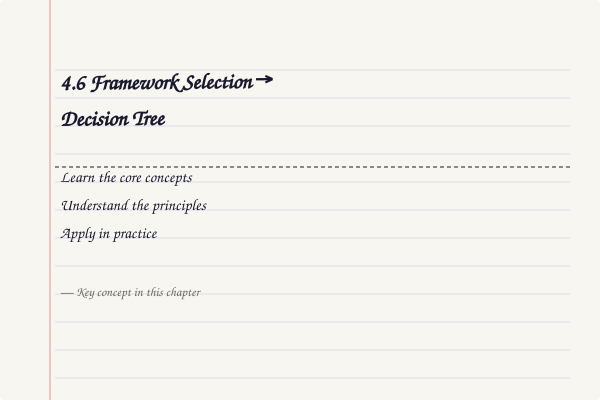
</a>
<a href="../../assets/images/diagrams/cyber-security/09-grc/4-6-framework-selection-decision-tree-diagram.svg" target="_blank" rel="noopener">
  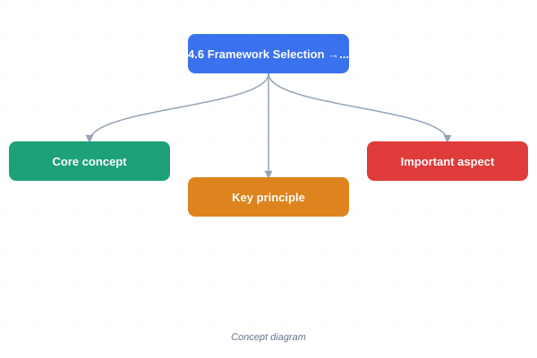
</a>
<a href="../../assets/images/diagrams/cyber-security/09-grc/4-6-framework-selection-decision-tree-sticky.svg" target="_blank" rel="noopener">
  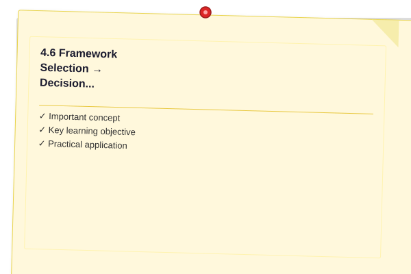
</a>


```
Q: Do you need certification? (customer requirement, RFP)
|-- YES -> ISO 27001 (global), SOC 2 (US service orgs), FedRAMP (US federal cloud)
|-- NO
    Q: Is compliance mandatory for your industry?
    |-- YES -> PCI DSS (payment cards), HIPAA (healthcare US), SOX (public US)
    |-- NO
        Q: What's your maturity level?
        |-- Starting from scratch -> CIS Controls IG1 (quick wins)
        |-- Established program -> NIST CSF 2.0 (comprehensive)
        |-- Need governance framework -> COBIT 2019
        |-- Multiple regulations -> NIST CSF + specific regulatory overlay
```

### 4.7 NIST CSF 2.0 vs ISO 27001 Detailed Comparison

<a href="../../assets/images/diagrams/cyber-security/09-grc/4-7-nist-csf-2-0-vs-iso-27001-detailed-comparison-handwritten.svg" target="_blank" rel="noopener">
  
</a>
<a href="../../assets/images/diagrams/cyber-security/09-grc/4-7-nist-csf-2-0-vs-iso-27001-detailed-comparison-diagram.svg" target="_blank" rel="noopener">
  
</a>
<a href="../../assets/images/diagrams/cyber-security/09-grc/4-7-nist-csf-2-0-vs-iso-27001-detailed-comparison-sticky.svg" target="_blank" rel="noopener">
  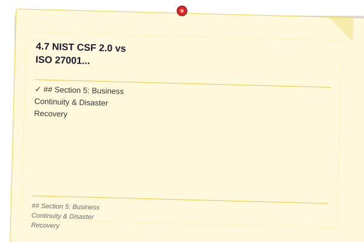
</a>


| Aspect | NIST CSF 2.0 | ISO 27001 |
|--------|-------------|-----------|
| **Philosophy** | "Identify gaps, set priorities" | "Establish, maintain, improve ISMS" |
| **Structure** | 6 functions -> 22 categories -> 106 subcategories | 11 clauses + Annex A (4 domains, 93 controls) |
| **Risk requirement** | Implied across functions (ID.RA, GV.RM) | Explicit clause 6.1 → risk assessment mandatory |
| **Documentation requirements** | Minimal (self-assessment) | Extensive: policy, SoA, risk treatment plan, procedures, records |
| **Leadership involvement** | Implied in Govern function | Explicit Clause 5 → top management must demonstrate commitment |
| **Continuous improvement** | ID.IM, RC.IM subcategories | Clause 10 → nonconformity and corrective action |
| **Scope** | Entire cybersecurity program | ISMS scope (may exclude non-critical functions) |
| **Compatibility** | Maps directly to ISO 27001 controls (NIST publishes mapping) | Maps to NIST CSF (ISO publishes mapping) |
| **Common approach** | Use NIST CSF at strategic level (Board presentations, maturity assessment) + ISO 27001 at operational level (certification, detailed controls) |
## Section 5: Business Continuity & Disaster Recovery

### 5.1 BCP vs DR → Comparison

<a href="../../assets/images/diagrams/cyber-security/09-grc/5-1-bcp-vs-dr-comparison-handwritten.svg" target="_blank" rel="noopener">
  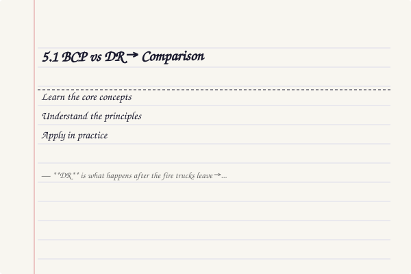
</a>
<a href="../../assets/images/diagrams/cyber-security/09-grc/5-1-bcp-vs-dr-comparison-diagram.svg" target="_blank" rel="noopener">
  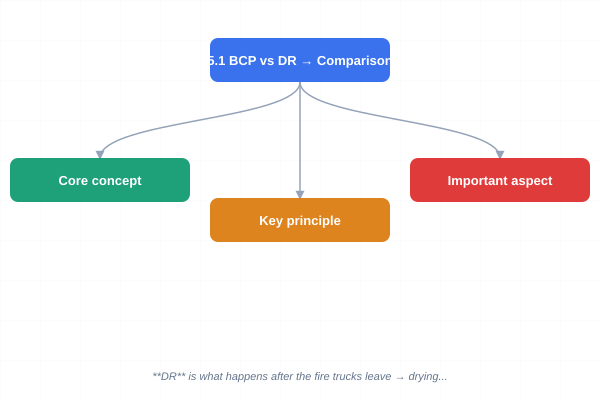
</a>
<a href="../../assets/images/diagrams/cyber-security/09-grc/5-1-bcp-vs-dr-comparison-sticky.svg" target="_blank" rel="noopener">
  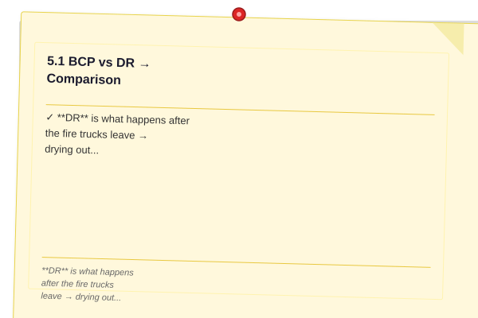
</a>


Real-world analogy: **BCP** is the escape plan you keep in your nightstand → where to meet, what to grab, who to call if fire breaks out. **DR** is what happens after the fire trucks leave → drying out photos, filing insurance, rebuilding rooms.

| Aspect | Business Continuity Planning (BCP) | Disaster Recovery (DR) |
|--------|------------------------------------|----------------------|
| **Focus** | Keep the business running during disruption | Restore IT systems after disruption |
| **Scope** | Entire business: people, processes, facilities, brand | IT: servers, networks, applications, data |
| **Question** | "How do we keep selling during a hurricane?" | "How do we restore the database from backup?" |
| **Timeframe** | Before/during disruption (proactive) | After disruption (reactive + recovery) |
| **Key metrics** | MBCO, RTO, RPO, BIA | RTO, RPO, recovery point integrity |
| **Outputs** | BCP plan, crisis management plan, communication plan | DR plan, runbooks, backup strategy, failover procedures |
| **Owned by** | Business continuity team / COO | IT / Infrastructure team |
| **Testing** | Tabletop exercises, walkthroughs | Technical failover tests, restore tests |
| **Standards** | ISO 22301, NFPA 1600, FFIEC BCP | ISO 27031, NIST SP 800-34, SHARE DR |
| **Typical scenario** | "Supplier can't deliver raw materials, find alternate supplier" | "Primary data center flooded, failover to DR site" |

### 5.2 BCP Process

<a href="../../assets/images/diagrams/cyber-security/09-grc/5-2-bcp-process-handwritten.svg" target="_blank" rel="noopener">
  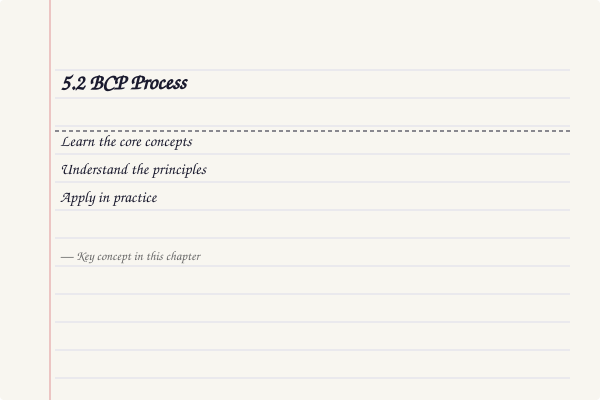
</a>
<a href="../../assets/images/diagrams/cyber-security/09-grc/5-2-bcp-process-diagram.svg" target="_blank" rel="noopener">
  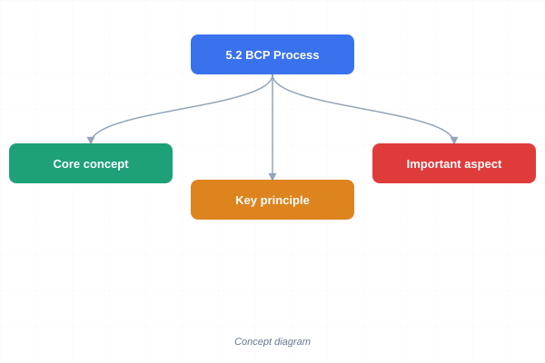
</a>
<a href="../../assets/images/diagrams/cyber-security/09-grc/5-2-bcp-process-sticky.svg" target="_blank" rel="noopener">
  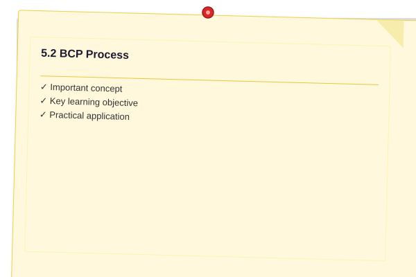
</a>


```
Phase 1: Project Initiation
  - Define scope, get executive sponsorship, assemble BCP team
  
Phase 2: Business Impact Analysis (BIA)
  - Identify critical processes, determine RTO/RPO/MTD, assess dependencies
  
Phase 3: Risk Assessment
  - Identify threats (natural disaster, cyberattack, power outage, pandemic, supplier failure)
  - Assess likelihood and impact for each threat
  
Phase 4: Strategy Development
  - Determine recovery strategies for each critical process
  - Identify alternate work locations, manual workarounds, redundant suppliers
  
Phase 5: Plan Development
  - Write BCP document: activation criteria, contact lists, recovery procedures
  - Develop crisis communication plan
  
Phase 6: Training & Awareness
  - Train employees on BCP roles and responsibilities
  - Conduct tabletop exercises
  
Phase 7: Testing & Maintenance
  - Schedule tests: walkthrough (quarterly), tabletop (semi-annual), full exercise (annual)
  - Update plan after each test, organizational change, or environment change
```

### 5.3 DR Strategies

<a href="../../assets/images/diagrams/cyber-security/09-grc/5-3-dr-strategies-handwritten.svg" target="_blank" rel="noopener">
  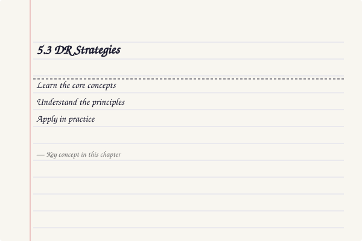
</a>
<a href="../../assets/images/diagrams/cyber-security/09-grc/5-3-dr-strategies-diagram.svg" target="_blank" rel="noopener">
  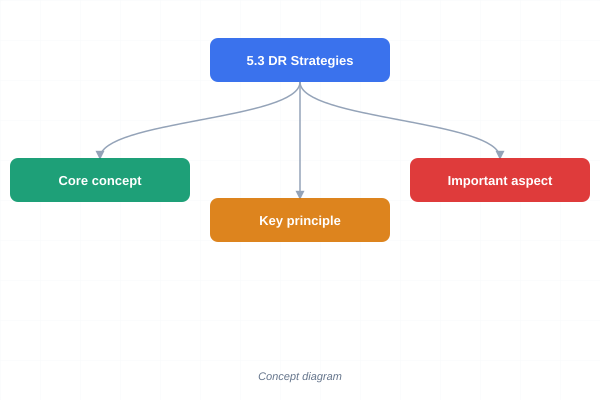
</a>
<a href="../../assets/images/diagrams/cyber-security/09-grc/5-3-dr-strategies-sticky.svg" target="_blank" rel="noopener">
  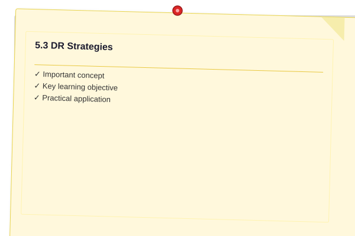
</a>


| Strategy | RTO | RPO | Cost | Description |
|----------|-----|-----|------|-------------|
| **Active-Active (Multi-site)** | Near-zero | Near-zero | Very high | All sites running production simultaneously. Load balanced across sites. |
| **Active-Passive (Hot Standby)** | Minutes | Seconds-minutes | High | Standby site mirrors production. Manual or automatic failover. |
| **Warm Standby** | Hours | Minutes-hours | Medium | Standby site has infrastructure but application is not fully running. Restore from backup + start services. |
| **Cold Standby** | Days | 24 hours+ | Low | Empty facility, hardware must be procured. Restore from tape/cloud backup. |
| **Backup & Restore** | Hours to days | Hours to days | Low | Only backup media stored offsite. Procurement and restoration on demand. |
| **Cloud DR (DRaaS)** | Minutes to hours | Minutes to hours | Medium | Cloud-based replication to cloud provider. Failover to cloud VMs. |

### 5.4 DR Plan Structure (NIST SP 800-34)

<a href="../../assets/images/diagrams/cyber-security/09-grc/5-4-dr-plan-structure-nist-sp-800-34-handwritten.svg" target="_blank" rel="noopener">
  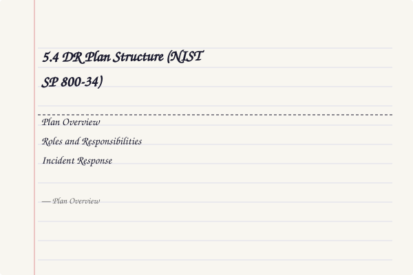
</a>
<a href="../../assets/images/diagrams/cyber-security/09-grc/5-4-dr-plan-structure-nist-sp-800-34-diagram.svg" target="_blank" rel="noopener">
  
</a>
<a href="../../assets/images/diagrams/cyber-security/09-grc/5-4-dr-plan-structure-nist-sp-800-34-sticky.svg" target="_blank" rel="noopener">
  
</a>


1. **Plan Overview** → Purpose, scope, assumptions, RTO/RPO summary
2. **Roles and Responsibilities** → DR team org chart, call tree, escalation contacts
3. **Incident Response** → Detection, declaration criteria, activation procedures
4. **Backup and Recovery Procedures** → System-specific recovery steps, backup schedules
5. **Data and System Prioritization** → BIA summary, recovery priority matrix
6. **Communication Plan** → Internal notification, customer notification, regulatory notification, PR
7. **Testing Schedule** → Frequency, scope, success criteria
8. **Plan Maintenance** → Review cycle, version control, distribution

### 5.5 DR Testing Types

<a href="../../assets/images/diagrams/cyber-security/09-grc/5-5-dr-testing-types-handwritten.svg" target="_blank" rel="noopener">
  
</a>
<a href="../../assets/images/diagrams/cyber-security/09-grc/5-5-dr-testing-types-diagram.svg" target="_blank" rel="noopener">
  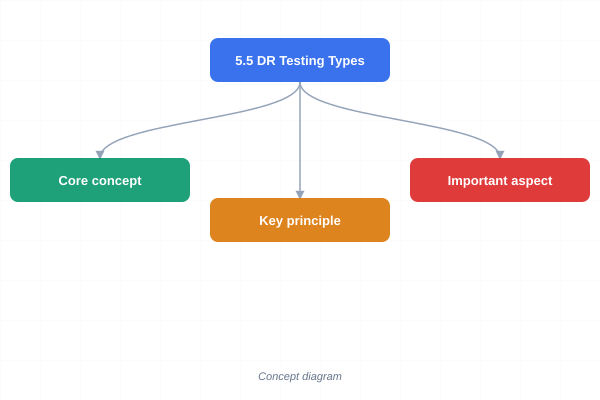
</a>
<a href="../../assets/images/diagrams/cyber-security/09-grc/5-5-dr-testing-types-sticky.svg" target="_blank" rel="noopener">
  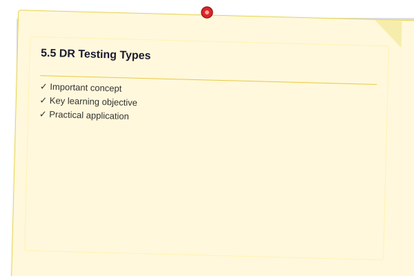
</a>


| Test Type | Effort | Value | Description |
|-----------|--------|-------|-------------|
| **Checklist Review** | Low | Low | Walk through plan, verify contact info, confirm resources |
| **Tabletop Exercise** | Medium | Medium | Team walks through a scenario verbally, identifies gaps |
| **Walkthrough / Structured Walk-through** | Medium | Medium | Step-by-step review of procedures with team |
| **Parallel Test** | High | High | DR site operational but main site still running production |
| **Full Interruption / Full-Scale** | Very high | Very high | Shut down primary site, run production from DR site |
| **Simulation** | Medium-High | High | Simulate disaster condition without actual production disruption |

---

## Section 6: Third-Party Risk Management (TPRM)

### 6.1 TPRM Lifecycle

<a href="../../assets/images/diagrams/cyber-security/09-grc/6-1-tprm-lifecycle-handwritten.svg" target="_blank" rel="noopener">
  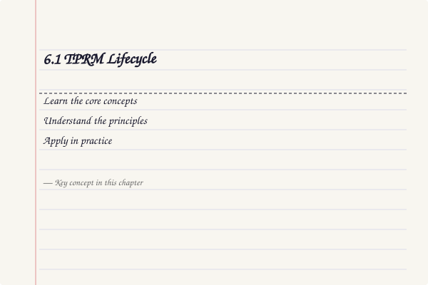
</a>
<a href="../../assets/images/diagrams/cyber-security/09-grc/6-1-tprm-lifecycle-diagram.svg" target="_blank" rel="noopener">
  
</a>
<a href="../../assets/images/diagrams/cyber-security/09-grc/6-1-tprm-lifecycle-sticky.svg" target="_blank" rel="noopener">
  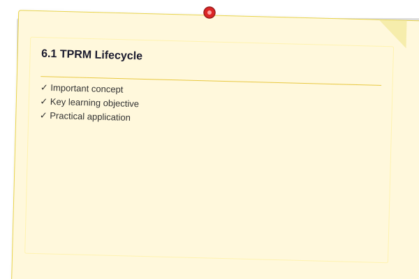
</a>


```
Phase 1: Identify & Categorize
  - Inventory all third parties
  - Categorize by data access, criticality, regulatory impact
  - Tier 1: Critical (PII, financial, core infra) -> full assessment
  - Tier 2: Important (confidential data, supporting infra) -> moderate assessment
  - Tier 3: Low Risk (no sensitive access) -> minimal review

Phase 2: Assess & Question
  - Security questionnaire (SIG / CAIQ / custom)
  - Evidence review (SOC 2 / ISO 27001 / PCI DSS reports)
  - Reputation check (media, breach history, sanctions screening)
  - Risk scoring (similar to risk register methodology)

Phase 3: Contract & Remediate
  - Include security addendum / exhibit
  - Contractual RTO, notification SLA (72h breach notification)
  - Right-to-audit clause
  - Cyber insurance requirements (minimum $5M coverage)
  - Agree on remediation timeline for identified issues

Phase 4: Ongoing Monitoring
  - Continuous: breach notification monitoring, threat intel
  - Periodic: annual reassessment for Tier 1, biennial for Tier 2
  - Triggered: acquisition, new service, security incident, report change

Phase 5: Offboarding
  - Data return/destruction certificate
  - Access revocation
  - Contract termination
  - Final compliance confirmation
```

### 6.2 Vendor Risk Assessment Questionnaire Template

<a href="../../assets/images/diagrams/cyber-security/09-grc/6-2-vendor-risk-assessment-questionnaire-template-handwritten.svg" target="_blank" rel="noopener">
  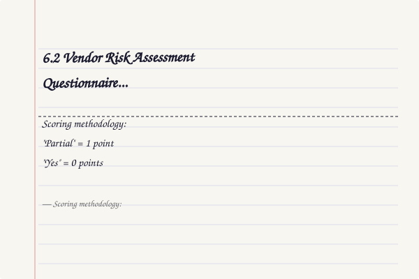
</a>
<a href="../../assets/images/diagrams/cyber-security/09-grc/6-2-vendor-risk-assessment-questionnaire-template-diagram.svg" target="_blank" rel="noopener">
  
</a>
<a href="../../assets/images/diagrams/cyber-security/09-grc/6-2-vendor-risk-assessment-questionnaire-template-sticky.svg" target="_blank" rel="noopener">
  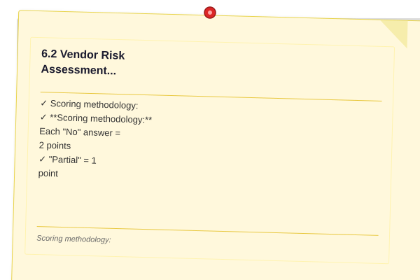
</a>


| Category | Question | Finding | Risk Score |
|----------|----------|---------|------------|
| **General** | Vendor name, service provided, data types accessed | | |
| **General** | Does vendor store, process, or transmit your data? Y/N → describe data types | | |
| **General** | Where is data stored (geographic location)? | | |
| **Security Program** | Does vendor have an InfoSec policy? | | |
| **Security Program** | Does vendor have ISO 27001 / SOC 2 / FedRAMP certification? Provide certificate | | |
| **Security Program** | Who is the vendor's CISO or security lead? | | |
| **Access Control** | Does vendor enforce MFA for all administrative access? | | |
| **Access Control** | Is access reviewed quarterly? Last review date? | | |
| **Access Control** | How is privileged access managed? PAM tool? | | |
| **Data Protection** | Encryption at rest: AES-256? Key management? | | |
| **Data Protection** | Encryption in transit: TLS 1.2 minimum? | | |
| **Data Protection** | Data retention period and deletion process? | | |
| **Data Protection** | Data segregation: shared or dedicated infrastructure? | | |
| **Incident Response** | Breach notification SLA (hours)? | | |
| **Incident Response** | Does vendor have IR plan? Last test date? | | |
| **Incident Response** | Does vendor have cyber insurance? Coverage amount? | | |
| **BCP/DR** | Does vendor have BCP/DR plan? RTO/RPO for scope of work? | | |
| **BCP/DR** | Last DR test date? Results? | | |
| **BCP/DR** | Backup frequency and offsite/immutable storage? | | |
| **Vulnerability Mgmt** | Vulnerability scanning frequency? Qualys, Tenable, Rapid7? | | |
| **Vulnerability Mgmt** | Patch critical vulnerabilities within SLA (days)? | | |
| **Vulnerability Mgmt** | Penetration testing frequency? Annual? Third-party? | | |
| **Physical Security** | Data center physical access controls (badge, biometric, CCTV)? | | |
| **Physical Security** | SOC 2 Type II report covers physical security? | | |
| **Sub-processors** | Does vendor use sub-processors? List them | | |
| **Sub-processors** | Are sub-processors assessed against same criteria? | | |
| **Compliance** | GDPR compliance: DPO, DPIA, cross-border transfer mechanism? | | |
| **Compliance** | PCI DSS: SAQ level? ASV scan results (last 3 months)? | | |
| **Compliance** | HIPAA BA agreement in place? | | |
| **Compliance** | Right-to-audit clause in contract? | | |
| **Personnel** | Background checks on employees with data access? | | |
| **Personnel** | Security awareness training frequency? Phishing simulations? | | |
| **Personnel** | Termination process: access revoked within 24h? | | |

**Scoring methodology:** Each "No" answer = 2 points. "Partial" = 1 point. "Yes" = 0 points.

| Total Score | Risk Tier | Action |
|-------------|-----------|--------|
| 0–10 | Low | Accept, monitor annually |
| 11–25 | Medium | Remediation plan required within 90 days |
| 26–40 | High | Approve only with compensating controls; re-assess q90 |
| 41+ | Critical | Do not onboard without remediation; escalate to CISO |

---

## Section 7: Security Awareness & Training

### 7.1 Why Security Awareness?

<a href="../../assets/images/diagrams/cyber-security/09-grc/7-1-why-security-awareness-handwritten.svg" target="_blank" rel="noopener">
  
</a>
<a href="../../assets/images/diagrams/cyber-security/09-grc/7-1-why-security-awareness-diagram.svg" target="_blank" rel="noopener">
  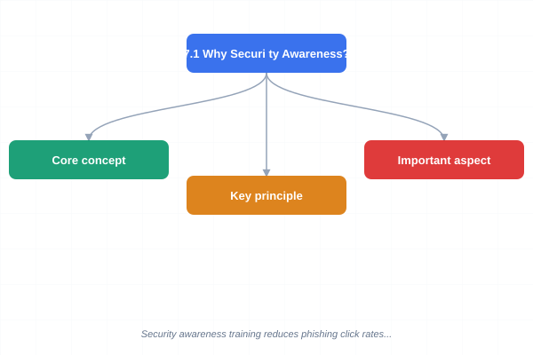
</a>
<a href="../../assets/images/diagrams/cyber-security/09-grc/7-1-why-security-awareness-sticky.svg" target="_blank" rel="noopener">
  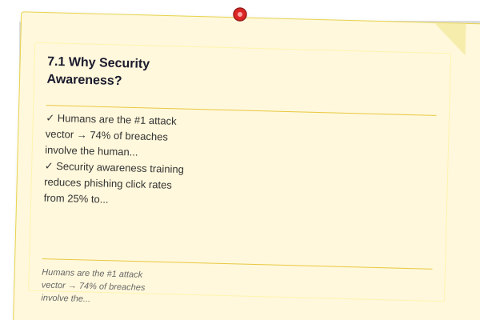
</a>


Humans are the #1 attack vector → 74% of breaches involve the human element (Verizon DBIR 2024). Security awareness training reduces phishing click rates from 25% to &lt;5% on average.

### 7.2 Training Plan Outline

<a href="../../assets/images/diagrams/cyber-security/09-grc/7-2-training-plan-outline-handwritten.svg" target="_blank" rel="noopener">
  
</a>
<a href="../../assets/images/diagrams/cyber-security/09-grc/7-2-training-plan-outline-diagram.svg" target="_blank" rel="noopener">
  
</a>
<a href="../../assets/images/diagrams/cyber-security/09-grc/7-2-training-plan-outline-sticky.svg" target="_blank" rel="noopener">
  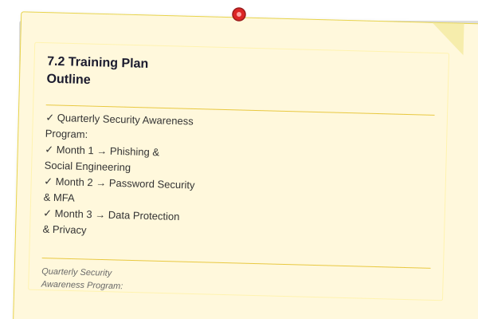
</a>


**Quarterly Security Awareness Program:**

**Month 1 → Phishing & Social Engineering**
- Training module: Recognize phishing, spear phishing, vishing, smishing, pretexting, baiting
- Simulated phishing campaign: 4 emails (credential harvest, malicious attachment, urgent action, vendor impersonation)
- Assessment: Identify 5/5 phishing indicators in test

**Month 2 → Password Security & MFA**
- Training module: Password managers, passphrases (16+ chars), MFA types (SMS, TOTP, FIDO2)
- Simulation: Password reset request (test if users verify before clicking)
- Assessment: Quiz on password best practices (80% pass)

**Month 3 → Data Protection & Privacy**
- Training module: Data classification (3 levels), handling PII, clean desk, clear screen
- Simulation: Attempt to share confidential file via personal email (DLP test)
- Assessment: Classify 5 data samples correctly

**Month 4 → Incident Reporting & Physical Security**
- Training module: When to report (any unusual event), reporting channels (email, hotline, app)
- Simulation: Tailgating attempt at entrance
- Assessment: Correctly report a simulated incident through proper channels

**Annual Metrics & Reporting:**
- Training completion rate (target: 100%)
- Average phishing click rate (target: &lt;5%)
- Repeat clickers (target: &lt;2%)
- Phishing reporting rate (target: >50% of detected phish are reported)
- Time to report phishing (target: &lt;5 minutes)
- Program maturity score (baseline vs target)

### 7.3 Phishing Simulation Results Analysis

<a href="../../assets/images/diagrams/cyber-security/09-grc/7-3-phishing-simulation-results-analysis-handwritten.svg" target="_blank" rel="noopener">
  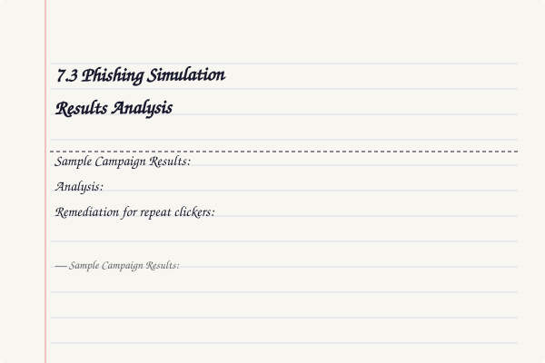
</a>
<a href="../../assets/images/diagrams/cyber-security/09-grc/7-3-phishing-simulation-results-analysis-diagram.svg" target="_blank" rel="noopener">
  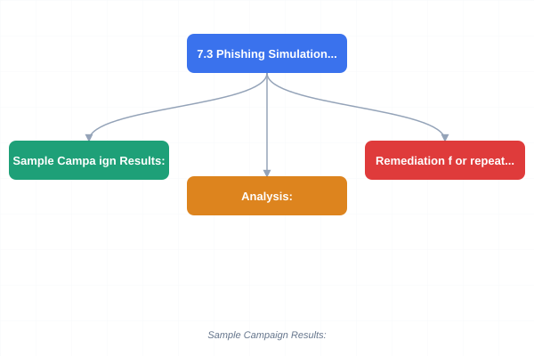
</a>
<a href="../../assets/images/diagrams/cyber-security/09-grc/7-3-phishing-simulation-results-analysis-sticky.svg" target="_blank" rel="noopener">
  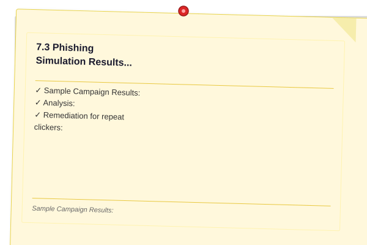
</a>


**Sample Campaign Results:**

| Campaign | Emails Sent | Clicked | Click Rate | Reported | Reporting Rate | Avg Time to Report |
|----------|-------------|---------|------------|----------|----------------|-------------------|
| Q1: Credential Harvest | 2,500 | 275 | 11.0% | 875 | 35% | 8 min |
| Q2: Malicious Attachment | 2,500 | 150 | 6.0% | 1,125 | 45% | 5 min |
| Q3: Urgent Action (CEO fraud) | 2,500 | 85 | 3.4% | 1,450 | 58% | 2 min |
| Q4: Vendor Impersonation | 2,500 | 45 | 1.8% | 1,875 | 75% | 1 min |
| **Annual Trend** | **10,000** | **Avg: 138** | **5.5%** | **Avg: 1,331** | **53%** | **4 min** |

**Analysis:**
- Click rate declined 84% from Q1 (11%) to Q4 (1.8%) → training effectiveness demonstrated
- Reporting rate improved 114% → culture of caution established
- Repeat clickers (clicked >=3 campaigns): 12 employees (0.48%) → retrain individually

**Remediation for repeat clickers:**
- 1 click: Automated just-in-time training (2-minute refresher)
- 2 clicks: Manager notification + 1-on-1 training with security team
- 3+ clicks: Escalate to HR, possible disciplinary action

---

## Section 8: Security Audits

### 8.1 Internal vs External Audits

<a href="../../assets/images/diagrams/cyber-security/09-grc/8-1-internal-vs-external-audits-handwritten.svg" target="_blank" rel="noopener">
  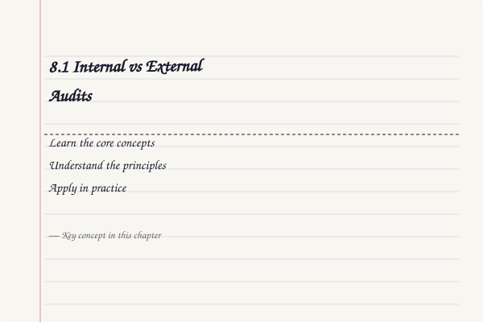
</a>
<a href="../../assets/images/diagrams/cyber-security/09-grc/8-1-internal-vs-external-audits-diagram.svg" target="_blank" rel="noopener">
  
</a>
<a href="../../assets/images/diagrams/cyber-security/09-grc/8-1-internal-vs-external-audits-sticky.svg" target="_blank" rel="noopener">
  
</a>


| Aspect | Internal Audit | External Audit |
|--------|---------------|----------------|
| **Performed by** | Internal audit department | Third-party firm (QSA, CPA, certification body) |
| **Purpose** | Continuous improvement, readiness check | Certification, regulatory compliance, stakeholder assurance |
| **Frequency** | Quarterly or semi-annual | Annual for most certifications; 3-year recertification for ISO |
| **Scope** | Wider → all controls, departments | Narrower → defined by standard or regulation |
| **Independence** | Moderate (reports to audit committee) | High (no relationship with audited org) |
| **Reporting** | Management report, board summary | Formal audit report, certificate (if passed) |
| **Cost** | Lower (internal resources) | Higher ($30K–$150K per engagement) |

### 8.2 Audit Process

<a href="../../assets/images/diagrams/cyber-security/09-grc/8-2-audit-process-handwritten.svg" target="_blank" rel="noopener">
  
</a>
<a href="../../assets/images/diagrams/cyber-security/09-grc/8-2-audit-process-diagram.svg" target="_blank" rel="noopener">
  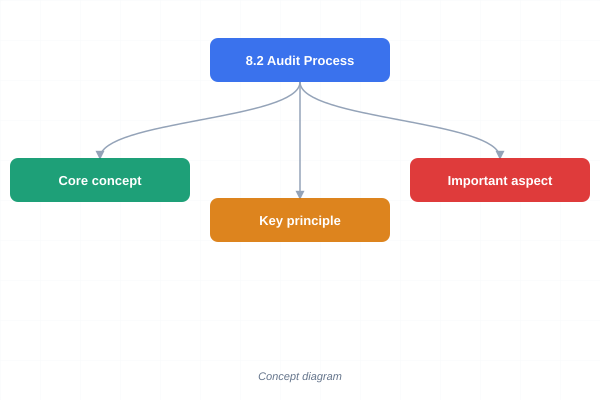
</a>
<a href="../../assets/images/diagrams/cyber-security/09-grc/8-2-audit-process-sticky.svg" target="_blank" rel="noopener">
  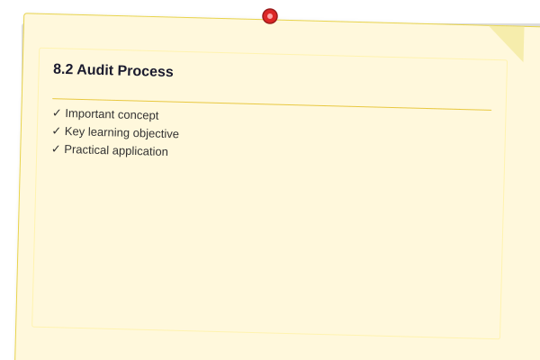
</a>


```
Phase 1: Planning
  - Define scope (which systems, locations, departments)
  - Review previous audit findings (open items)
  - Gather documentation (policies, procedures, evidence)
  - Develop audit checklist
  - Notify auditees, schedule interviews

Phase 2: Fieldwork
  - Document review (policies, standards, risk register)
  - Control testing (design effectiveness + operating effectiveness)
  - Interviews (process owners, control operators)
  - Evidence collection (screenshots, logs, reports, configurations)
  - Sampling (select representative sample of transactions/events)

Phase 3: Reporting
  - Draft findings (with evidence supporting each)
  - Classify findings by severity (Critical, High, Medium, Low, Observation)
  - Develop remediation recommendations
  - Present to management for response (management action plan)
  - Issue final audit report

Phase 4: Remediation Verification
  - Track open findings in issue tracker
  - Verify remediation within agreed timeline
  - Close findings with evidence review
  - Escalate overdue items to audit committee
```

### 8.3 Internal Audit Checklist Example

<a href="../../assets/images/diagrams/cyber-security/09-grc/8-3-internal-audit-checklist-example-handwritten.svg" target="_blank" rel="noopener">
  
</a>
<a href="../../assets/images/diagrams/cyber-security/09-grc/8-3-internal-audit-checklist-example-diagram.svg" target="_blank" rel="noopener">
  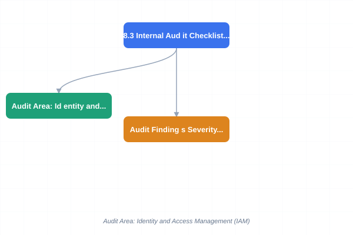
</a>
<a href="../../assets/images/diagrams/cyber-security/09-grc/8-3-internal-audit-checklist-example-sticky.svg" target="_blank" rel="noopener">
  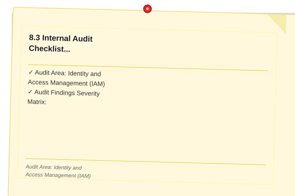
</a>


**Audit Area: Identity and Access Management (IAM)**

| # | Control Question | Evidence | Result | Finding |
|---|-----------------|----------|--------|---------|
| 1 | Is there an access control policy approved by management? | Access Control Policy v3.1 signed by CISO | Pass | → |
| 2 | Are user accounts created through a formal request/approval process? | 20 ticket samples (hit 1/20 → missing manager approval) | Partial Fail | Missing manager approval on 5% of provisioned accounts |
| 3 | Are accounts disabled within 24h of employee termination? | 10 terminated employee samples (all disabled within 12h) | Pass | → |
| 4 | Is MFA enforced for all administrative accounts? | Azure AD Conditional Access policy | Pass | → |
| 5 | Are access rights reviewed quarterly? | Q1/Q2 access review evidence (signed by business owners) | Pass | → |
| 6 | Is privilege access managed with PAM tool? | Deployed CyberArk; check in/check out auditing enabled | Pass | → |
| 7 | Are dormant accounts (>90 days) disabled? | Report of accounts with no login in 90+ days | Partial Fail | 3 dormant service accounts not disabled |
| 8 | Are passwords compliant with policy (14+ chars, complexity)? | Password policy in GPO; last audit showed 98% compliance | Pass | → |
| 9 | Is segregation of duties enforced in financial systems? | SAP roles reviewed → conflicting roles identified in 2/50 users | Fail | 2 users have both AP creation and AP approval roles |
| 10 | Are external/contractor accounts reviewed separately? | Contractor review report → 2 expired contractors still active | Critical Fail | 2 terminated contractors still have active network access |

**Audit Findings Severity Matrix:**

| Severity | Definition | SLA | Example |
|----------|-----------|-----|---------|
| **Critical** | Immediate risk of significant harm (data breach, regulatory fine, system compromise) | 24 hours | Terminated contractor with active access |
| **High** | Significant control gap that could lead to critical finding if not remediated | 30 days | Segregation of duties conflicts |
| **Medium** | Control weakness that reduces effectiveness but isn't directly exploitable | 90 days | Missing manager approval on access requests |
| **Low** | Minor deficiency, best practice not followed | 180 days | Dormant service accounts |
| **Observation** | No finding but opportunity for improvement | N/A | Could reduce review cycle from quarterly to monthly |

---

## Section 9: Security Metrics and KPIs

### 9.1 Metrics Framework (SMART)

<a href="../../assets/images/diagrams/cyber-security/09-grc/9-1-metrics-framework-smart-handwritten.svg" target="_blank" rel="noopener">
  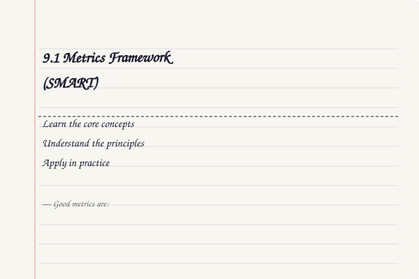
</a>
<a href="../../assets/images/diagrams/cyber-security/09-grc/9-1-metrics-framework-smart-diagram.svg" target="_blank" rel="noopener">
  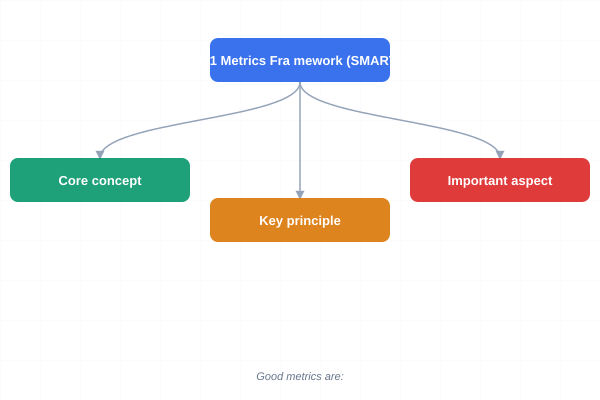
</a>
<a href="../../assets/images/diagrams/cyber-security/09-grc/9-1-metrics-framework-smart-sticky.svg" target="_blank" rel="noopener">
  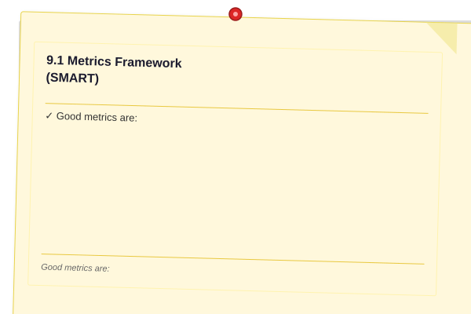
</a>


**Good metrics are:**
- **S**pecific → clearly defined, unambiguous
- **M**easurable → quantifiable, objective data source
- **A**ctionable → can drive decision or improvement
- **R**elevant → tied to business objectives
- **T**imely → measured at appropriate frequency

### 9.2 Key Performance Indicators (KPIs)

<a href="../../assets/images/diagrams/cyber-security/09-grc/9-2-key-performance-indicators-kpis-handwritten.svg" target="_blank" rel="noopener">
  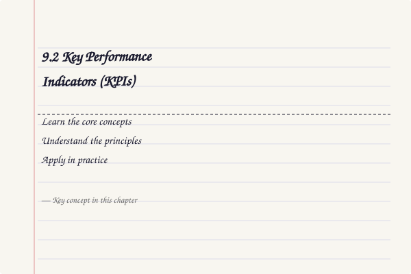
</a>
<a href="../../assets/images/diagrams/cyber-security/09-grc/9-2-key-performance-indicators-kpis-diagram.svg" target="_blank" rel="noopener">
  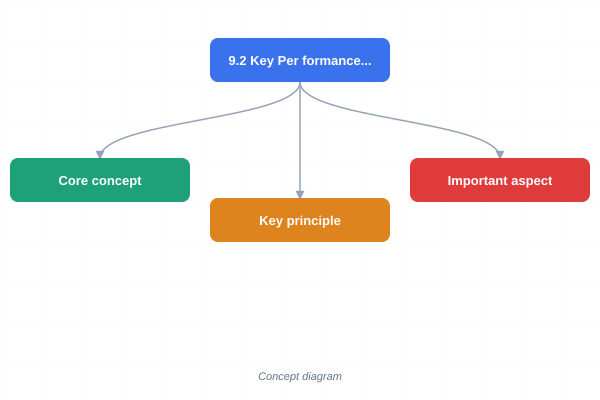
</a>
<a href="../../assets/images/diagrams/cyber-security/09-grc/9-2-key-performance-indicators-kpis-sticky.svg" target="_blank" rel="noopener">
  
</a>


| KPI | Formula | Target | Frequency | Owner |
|-----|---------|--------|-----------|-------|
| Phishing click rate | # clicks / # simulated phish | <5% | Monthly | Security Awareness |
| MFA adoption rate | # users enrolled / # total users | 100% | Monthly | IAM Team |
| Patching velocity (critical) | # critical patches applied / # critical patches released | 95% within 30 days | Weekly | Patch Management |
| Vulnerability remediation rate | # vulns closed in SLA / # total vulns | >90% | Weekly | Vulnerability Mgmt |
| Mean Time to Detect (MTTD) | Total time to detect incidents / # incidents | <1 hour | Monthly | SOC |
| Mean Time to Respond (MTTR) | Total time to respond to incidents / # incidents | <4 hours | Monthly | SOC |
| Training completion rate | # completed / # assigned | >95% | Quarterly | Security Training |
| Third-party risk assessments | # completed / # due | 100% | Quarterly | TPRM |
| Open audit findings | # past-due findings / # total findings | <10% | Monthly | GRC |
| Security awareness score | Average quiz score | >85% | Quarterly | Security Training |
| Vendor SLA compliance | # vendors meeting SLA / # total vendors | >95% | Monthly | Vendor Mgmt |
| Control effectiveness | # controls operating effectively / # total controls | >90% | Quarterly | GRC |

### 9.3 Key Risk Indicators (KRIs)

<a href="../../assets/images/diagrams/cyber-security/09-grc/9-3-key-risk-indicators-kris-handwritten.svg" target="_blank" rel="noopener">
  
</a>
<a href="../../assets/images/diagrams/cyber-security/09-grc/9-3-key-risk-indicators-kris-diagram.svg" target="_blank" rel="noopener">
  
</a>
<a href="../../assets/images/diagrams/cyber-security/09-grc/9-3-key-risk-indicators-kris-sticky.svg" target="_blank" rel="noopener">
  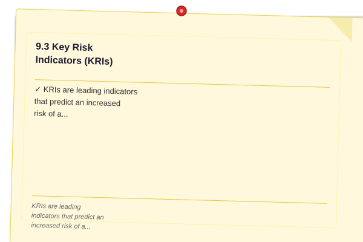
</a>


KRIs are leading indicators that predict an increased risk of a negative event.

| KRI | What It Indicates | Threshold | Action |
|-----|-------------------|-----------|--------|
| Unpatched critical CVEs >30 days | Increased breach likelihood | >5 | Escalate to CISO, mobilize emergency patching |
| Privileged account count growth | Attack surface expansion | >10%/quarter | Review justifications, remove unnecessary accounts |
| Open vendor findings >90 days | Vendor risk increasing | >3 high/critical | Suspend onboarding, request executive intervention |
| % of employees failing phishing simulation | Human firewall erosion | >15% | Mandate retraining for department |
| SIEM storage capacity remaining | Detection gap risk | <20% | Approve capacity expansion budget |
| Late DSARs per quarter | Regulatory risk | >2 | Hire additional privacy staff |
| IT budget spent on security vs plan | Underfunding risk | <80% after 9 months | Flag to Board for budget reallocation |

### 9.4 Board-Level Dashboard (Sample)

<a href="../../assets/images/diagrams/cyber-security/09-grc/9-4-board-level-dashboard-sample-handwritten.svg" target="_blank" rel="noopener">
  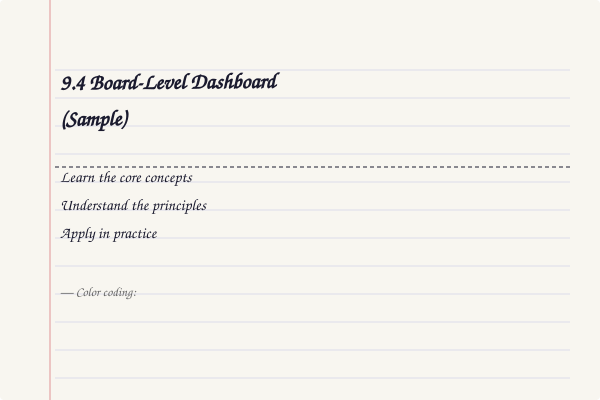
</a>
<a href="../../assets/images/diagrams/cyber-security/09-grc/9-4-board-level-dashboard-sample-diagram.svg" target="_blank" rel="noopener">
  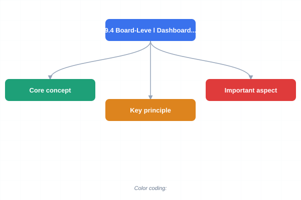
</a>
<a href="../../assets/images/diagrams/cyber-security/09-grc/9-4-board-level-dashboard-sample-sticky.svg" target="_blank" rel="noopener">
  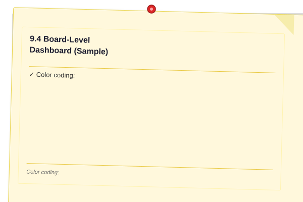
</a>


| Category | Metric | Q1 | Q2 | Q3 | Q4 | Target | Status |
|----------|--------|----|----|----|----|--------|--------|
| **Risk** | Residual risk score (avg of top 10 risks) | 12 (High) | 10 (High) | 7 (Medium) | 5 (Medium) | <8 | Improving |
| **Risk** | # Critical risks | 3 | 2 | 1 | 0 | 0 | On track |
| **Compliance** | Open regulatory findings | 8 | 5 | 3 | 1 | 0 | On track |
| **Compliance** | Certifications maintained | ISO 27001, SOC 2 | +PCI DSS | +FedRAMP Low | All valid | 4/4 | On track |
| **Security** | Phishing click rate (annual avg) | 11% | 6% | 3.4% | 1.8% | <5% | Exceeded |
| **Security** | MTTD (hours) | 24 | 8 | 2 | 0.5 | <1 | Exceeded |
| **Operations** | Patch compliance (critical, 30-day) | 82% | 88% | 94% | 97% | >95% | On track |
| **Operations** | MFA enrollment | 72% | 88% | 96% | 100% | 100% | Achieved |
| **Budget** | Security spend vs plan | 92% | 95% | 97% | 99% | 100% | On track |
| **Third-Party** | Vendors assessed (Tier 1) | 45% | 68% | 85% | 100% | 100% | On track |

**Color coding:** "Exceeded" / "Achieved" / "On track" (green); "At risk" (amber); "Off track" (red)
## Section 10: Case Studies

### Case Study 1: Equifax (2017) → GRC Failure on Every Front

<a href="../../assets/images/diagrams/cyber-security/09-grc/case-study-1-equifax-2017-grc-failure-on-every-front-handwritten.svg" target="_blank" rel="noopener">
  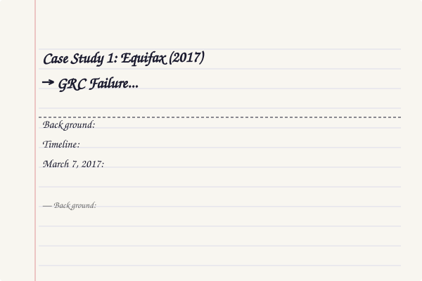
</a>
<a href="../../assets/images/diagrams/cyber-security/09-grc/case-study-1-equifax-2017-grc-failure-on-every-front-diagram.svg" target="_blank" rel="noopener">
  
</a>
<a href="../../assets/images/diagrams/cyber-security/09-grc/case-study-1-equifax-2017-grc-failure-on-every-front-sticky.svg" target="_blank" rel="noopener">
  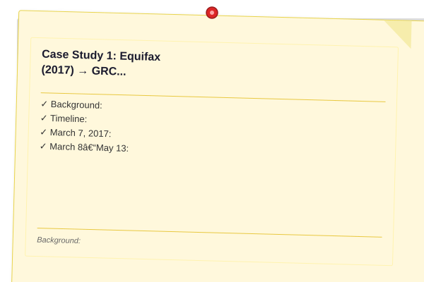
</a>


**Background:** Equifax, one of the three major US credit bureaus, suffered a breach exposing 147M records of PII (SSN, DOB, addresses, driver's license numbers, credit card numbers).

**Timeline:**
- **March 7, 2017:** Apache Struts CVE-2017-5638 (RCE) disclosed with patch available
- **March 8–May 13:** Equifax failed to scan for vulnerable Struts instances (no asset inventory)
- **May 13:** Attackers scan internet, find Equifax's vulnerable system → exploit and establish foothold
- **May 13–July 29:** Attackers move laterally, exfiltrate 147M records over 76 days → no detection
- **July 29:** Expired TLS certificate causes monitoring failure → security team finally detects the breach
- **September 7:** Public disclosure → stock drops 35%
- **September 15:** CEO Richard Smith retires

**GRC Failures:**

| GRC Domain | Failure | Root Cause |
|------------|---------|------------|
| **Asset Management** | No inventory of Apache Struts instances. 26 Struts instances existed, only 2 known to security team | No CMDB, no automated discovery, no configuration management |
| **Vulnerability Management** | CVE-2017-5638 patch (released March 7) never applied. No vulnerability scanning for 2 months | No patching SLA, no automated scanning, no responsible disclosure process |
| **Detection** | Expired TLS certificate on network monitoring tool caused 5-month blind spot | No certificate lifecycle management, no monitoring of monitoring systems |
| **Incident Response** | 76 days from initial compromise to containment → no IR playbook for data exfiltration | Inadequate IR plan, no data exfiltration detection, no segmented network to limit lateral movement |
| **Compliance** | GDPR (effective May 2018) would have fined Equifax up to 4% global revenue → not yet enforceable but indicative of gap | No data classification, no breach notification plan, no DPO |
| **Governance** | Board had no cybersecurity expertise. CISO reported to CIO (conflict of interest) | No board-level security committee, no CISO independence |
| **Third-Party Risk** | Apache Struts (open-source) had no security assessment before adoption | No open-source risk assessment process |

**Consequences:**
- Total cost: $1.4 billion (fines, settlements, remediation)
- FTC settlement: $575M (largest in FTC history)
- UK ICO fine: 500,000 pounds (pre-GDPR max)
- Class action lawsuit: $380.5M settlement
- 50+ class action lawsuits
- Criminal charges: Chief Information Officer, Chief Security Officer charged with insider trading (sold shares before disclosure)

**Root Cause (GRC Perspective):**
Equifax had **policies** but no **enforcement.** The infosec policy required patching within 48 hours for critical vulnerabilities → but no one verified compliance. The board approved security budgets → but no one measured effectiveness. This is the classic GRC failure: paper compliance without operational verification.

**Lessons Learned:**
1. Asset inventory is the foundation of all security → if you don't know you have it, you can't protect it
2. Vulnerability management must have automated scanning + enforceable SLAs + escalation
3. Detection systems must be monitored themselves (who watches the watchmen?)
4. Board must include cybersecurity competency
5. IR plan must include data exfiltration scenarios with automated containment

---

### Case Study 2: Marriott/Starwood (2018) → GDPR Article 32 Failure

<a href="../../assets/images/diagrams/cyber-security/09-grc/case-study-2-marriott-starwood-2018-gdpr-article-32-failure-handwritten.svg" target="_blank" rel="noopener">
  
</a>
<a href="../../assets/images/diagrams/cyber-security/09-grc/case-study-2-marriott-starwood-2018-gdpr-article-32-failure-diagram.svg" target="_blank" rel="noopener">
  
</a>
<a href="../../assets/images/diagrams/cyber-security/09-grc/case-study-2-marriott-starwood-2018-gdpr-article-32-failure-sticky.svg" target="_blank" rel="noopener">
  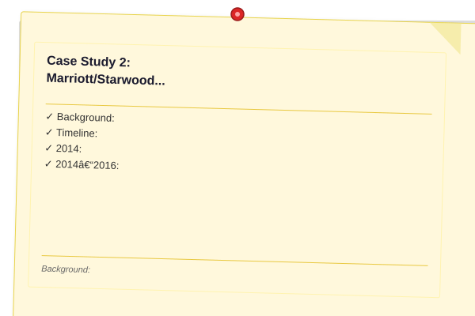
</a>


**Background:** Marriott International acquired Starwood hotels in 2016. Starwood's reservation database had been compromised since 2014. After acquisition integration, Marriott discovered the breach in 2018 → 339 million guest records exposed.

**Timeline:**
- **2014:** Attackers compromise Starwood reservation system (via RDP brute force)
- **2014–2016:** Attackers maintain persistence, escalate privileges, install keyloggers on payment systems, exfiltrate records over 2+ years
- **2016:** Marriott acquires Starwood for $13.6B → accelerates IT integration
- **2018 (Sept):** Marriott security detects anomalous database queries in Starwood systems
- **2018 (Nov):** Marriott publicly discloses breach → 339M records (133M with structured PII including passport numbers)
- **2019:** UK ICO proposes 99.2M pounds fine (reduced to 18.4M pounds on appeal due to COVID and economic circumstances)

**GRC Failures:**

| GRC Domain | Failure |
|------------|---------|
| **Data Classification** | Starwood's database was not classified correctly during M&A → 339M records with passport numbers labeled as "Internal" not "Restricted" |
| **M&A Due Diligence** | Insufficient security assessment of Starwood during acquisition → vulnerability scan and pen test should have revealed the compromise |
| **Access Control** | Attackers had admin-level access on Starwood's network for 4 years → no anomaly detection |
| **Detection** | Database queries extracting millions of records went undetected for 4 years → no DLP, no behavioral analytics |
| **Encryption** | Some records were encrypted, but not all → inconsistent encryption across merged entities |
| **Incident Response** | Took 2 months from detection to containment → slow investigation, no automated response |
| **GDPR Compliance** | Article 32 (security of processing) violation → insufficient technical and organizational measures |

**GDPR Fine Breakdown:**
- Original proposed: 99.2 million pounds (1.5% of 2018 global revenue)
- Final: 18.4 million pounds (0.28% of revenue) → reduced on appeal considering:
  - Economic impact of COVID-19
  - Marriott's cooperative engagement with ICO
  - Remediation steps taken
  - Breach occurred pre-acquisition (Starwood systems)

**Lessons Learned:**
1. M&A due diligence must include comprehensive security assessment before integration
2. Data classification must be harmonized during M&A immediately
3. Detection of large-scale data exfiltration requires UBA/UEBA and DLP, not just EDR
4. Encryption must be consistent across merged systems before integration
5. GDPR requires "appropriate technical and organizational measures" → not just having measures, but having EFFECTIVE ones

---

### Case Study 3: TikTok (2023) → GDPR Children's Data Violations

<a href="../../assets/images/diagrams/cyber-security/09-grc/case-study-3-tiktok-2023-gdpr-children-s-data-violations-handwritten.svg" target="_blank" rel="noopener">
  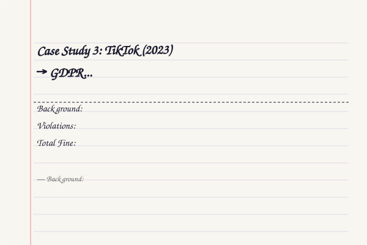
</a>
<a href="../../assets/images/diagrams/cyber-security/09-grc/case-study-3-tiktok-2023-gdpr-children-s-data-violations-diagram.svg" target="_blank" rel="noopener">
  
</a>
<a href="../../assets/images/diagrams/cyber-security/09-grc/case-study-3-tiktok-2023-gdpr-children-s-data-violations-sticky.svg" target="_blank" rel="noopener">
  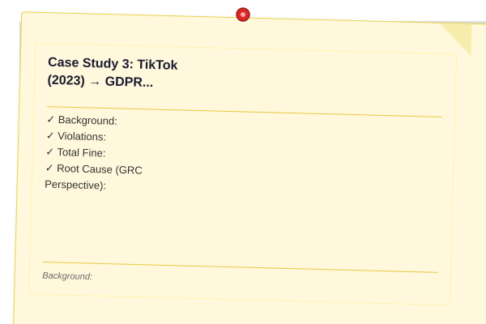
</a>


**Background:** TikTok (TikTok Technology Limited, Ireland) fined 345 million euros by Irish Data Protection Commission (DPC) for violations related to children's data processing.

**Violations:**

| Violation | GDPR Article | Details | Fine Component |
|-----------|-------------|---------|----------------|
| Children's privacy settings | Art 5(1)(c) → Data minimization | TikTok's platform settings for 13–17 year olds were not private by default. Public profiles, public videos, public comments were default | EUR 120M |
| Age verification | Art 5(1)(f) → Integrity and confidentiality | "Family Pairing" mode allowed adults to bypass teen privacy protections | EUR 80M |
| Dark patterns | Art 5(1)(a) → Lawfulness, fairness, transparency | Push notifications during "bedtime hours" (10PM–8AM) for 13–17 year olds incentivized addictive use | EUR 100M |
| Transparency of processing | Art 12 → Transparent information | Privacy information presented to children was not designed in a child-friendly manner | EUR 45M |

**Total Fine:** EUR 345M (2nd largest GDPR fine at the time, after Meta's EUR 1.2B)

**Root Cause (GRC Perspective):**
TikTok's **Data Protection Impact Assessment (DPIA)** was inadequate → it identified risks to children but failed to implement corresponding controls. The governance structure prioritized engagement metrics (time on platform, daily active users) over data protection. The DPO was not sufficiently empowered to enforce changes.

**Lessons Learned:**
1. Children's data requires enhanced protections under GDPR (Recital 38)
2. Default privacy settings must be the most protective (not neutral or least protective)
3. Age verification is not optional → the burden is on the controller to verify age
4. Dark patterns that manipulate children are a GDPR violation even if they are "standard industry practice"
5. DPO must have real authority to enforce privacy by design

---

### Case Study 4: Wells Fargo (2016–2020) → Governance Failure

<a href="../../assets/images/diagrams/cyber-security/09-grc/case-study-4-wells-fargo-2016-2020-governance-failure-handwritten.svg" target="_blank" rel="noopener">
  
</a>
<a href="../../assets/images/diagrams/cyber-security/09-grc/case-study-4-wells-fargo-2016-2020-governance-failure-diagram.svg" target="_blank" rel="noopener">
  
</a>
<a href="../../assets/images/diagrams/cyber-security/09-grc/case-study-4-wells-fargo-2016-2020-governance-failure-sticky.svg" target="_blank" rel="noopener">
  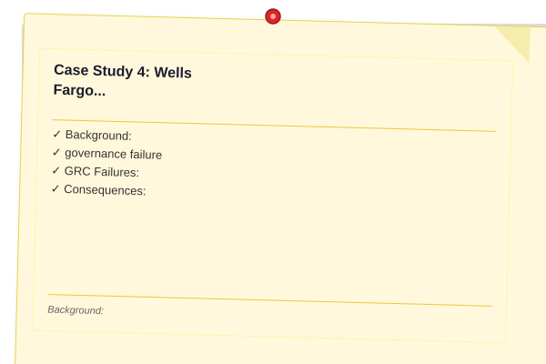
</a>


**Background:** Wells Fargo employees created 3.5 million unauthorized bank and credit card accounts to meet aggressive sales quotas. While primarily a consumer fraud case, it's the definitive case study in **governance failure** with cascading consequences.

**GRC Failures:**

| GRC Domain | Failure |
|------------|---------|
| **Governance → Tone at the Top** | CEO and Board set "Eight is Great" cross-selling strategy (8 products per customer) without operational risk oversight. Bonuses tied to account creation, not ethical behavior |
| **Risk Management** | Risk committee ignored 5+ years of whistleblower reports, internal audits, and regulatory warnings. Risk appetite statement claimed "conservative risk culture" but operational reality was opposite |
| **Compliance** | Compliance department reported to business heads (no independence). Compliance officers who flagged issues were retaliated against |
| **Internal Audit** | Internal audit identified fraudulent account creation in 2013 but did not escalate to Board or Audit Committee → findings were buried |
| **Whistleblower Protection** | Over 5,000 employees fired for reporting fraudulent account creation → no whistleblower protection mechanism worked |
| **Oversight Structure** | Audit Committee members had no banking or financial services experience. Board Risk Committee met only twice per year |
| **Regulatory Compliance** | Violated consent order from Office of the Comptroller of the Currency (OCC) by failing to remediate sales practice issues |

**Consequences:**
- $3 billion in penalties (DOJ, SEC, CFPB, OCC)
- $142 million class action settlement
- 5,300+ employees terminated (including whistleblowers who were later reinstated with back pay)
- CEO John Stumpf resigned (lost $60M+ in unvested equity)
- Former executives charged by DOJ with wire fraud, bank fraud, conspiracy
- Federal Reserve imposed unprecedented asset cap ($1.95T) → restricted growth until 2021
- Wells Fargo lost its "too big to fail" exemption

**Root Cause (GRC Perspective):**
The governance structure at Wells Fargo allowed **sales incentives to override all risk and compliance controls.** The Board-approved risk appetite statement was aspirational, not operational → risk limits were never enforced because business leaders controlled risk decisions.

**Lessons Learned:**
1. **Tone at the top is not enough** → must be reinforced by incentives, controls, and enforcement
2. Risk and compliance functions must be **independent** → cannot report to the business they oversee
3. Whistleblower protection must be **structural** → independent hotline, guaranteed anonymity, anti-retaliation enforcement
4. Board composition must include **relevant expertise** → Audit Committee members should understand financial controls
5. Risk appetite is meaningless without **enforcement mechanisms** → if you say "no cross-selling violations" but never enforce it, it's not a risk appetite, it's a slogan
6. **Internal audit escalation** must go to the Board, not management → findings buried by management are audit failures

---

### Case Study Summary Matrix

<a href="../../assets/images/diagrams/cyber-security/09-grc/case-study-summary-matrix-handwritten.svg" target="_blank" rel="noopener">
  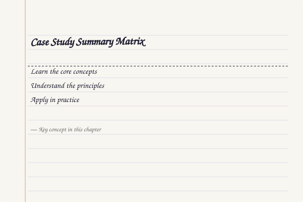
</a>
<a href="../../assets/images/diagrams/cyber-security/09-grc/case-study-summary-matrix-diagram.svg" target="_blank" rel="noopener">
  
</a>
<a href="../../assets/images/diagrams/cyber-security/09-grc/case-study-summary-matrix-sticky.svg" target="_blank" rel="noopener">
  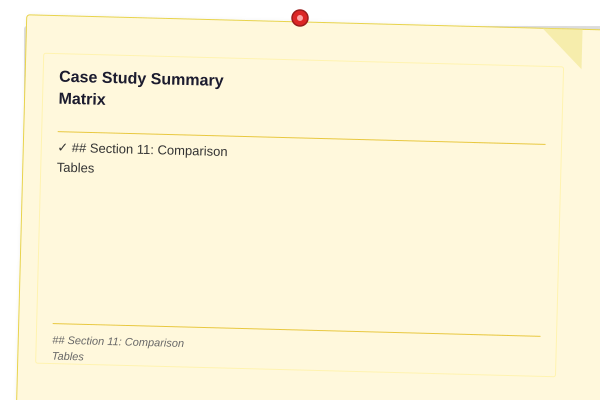
</a>


| Case | Primary GRC Failure | Root Cause | Penalty | Key Takeaway |
|------|-------------------|------------|---------|--------------|
| **Equifax 2017** | Risk Management | No asset inventory, no patching SLA, expired cert | $1.4B | You can't protect what you don't know you have |
| **Marriott 2018** | Compliance (GDPR Art 32) | M&A due diligence failed, poor data classification | EUR 18.4M | Security of processing = EFFECTIVE measures, not just policies |
| **TikTok 2023** | Compliance (GDPR Children) | Inadequate DPIA, dark patterns, default settings | EUR 345M | Children data needs maximum privacy by default |
| **Wells Fargo 2016** | Governance | Tone at top, weak whistleblower protection | $3B | Governance without enforcement is theater |

---

## Section 11: Comparison Tables

### 11.1 GDPR vs CCPA vs LGPD vs PIPEDA

<a href="../../assets/images/diagrams/cyber-security/09-grc/11-1-gdpr-vs-ccpa-vs-lgpd-vs-pipeda-handwritten.svg" target="_blank" rel="noopener">
  
</a>
<a href="../../assets/images/diagrams/cyber-security/09-grc/11-1-gdpr-vs-ccpa-vs-lgpd-vs-pipeda-diagram.svg" target="_blank" rel="noopener">
  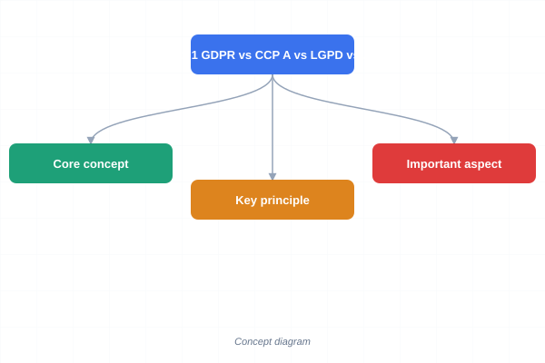
</a>
<a href="../../assets/images/diagrams/cyber-security/09-grc/11-1-gdpr-vs-ccpa-vs-lgpd-vs-pipeda-sticky.svg" target="_blank" rel="noopener">
  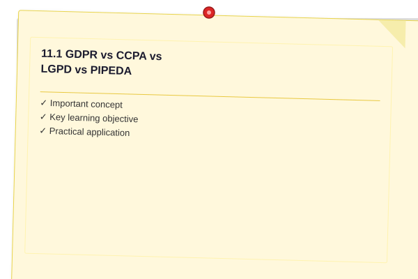
</a>


| Aspect | GDPR | CCPA/CPRA | LGPD | PIPEDA |
|--------|------|-----------|------|--------|
| **Jurisdiction** | EU/EEA | California, USA | Brazil | Canada |
| **Effective** | May 2018 | Jan 2020 (amended 2023) | Aug 2020 | Apr 2000 (amended 2015) |
| **Trigger** | Processing data of EU residents | >$25M revenue or 50K+ CA records | Processing Brazil personal data | Commercial activity in Canada |
| **Consent** | Explicit, opt-in | Opt-out (sale of data) | Explicit or legitimate interest | Implied or express |
| **Right to deletion** | Art 17 → "Right to be forgotten" | Yes → businesses must delete on request | Art 18 → similar to GDPR | Limited |
| **Data portability** | Art 20 → yes | Yes (CPRA) | Art 18 → yes | No |
| **Breach notification** | 72 hours to DPA | Without undue delay | Reasonable timeframe | As soon as feasible |
| **Max fine** | EUR 20M or 4% global revenue | $7,500 per intentional violation | 2% revenue in Brazil (BRL 50M max) | CAD 100K |
| **DPO required** | Yes (thresholds apply) | No explicit requirement | Yes (large-scale processing) | No |
| **Cross-border transfer** | Adequacy decision or SCCs | No explicit restrictions | Adequacy decision or SCCs | Equivalent protection |

### 11.2 Data Classification Levels (Enterprise)

<a href="../../assets/images/diagrams/cyber-security/09-grc/11-2-data-classification-levels-enterprise-handwritten.svg" target="_blank" rel="noopener">
  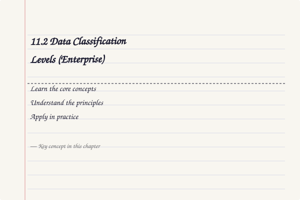
</a>
<a href="../../assets/images/diagrams/cyber-security/09-grc/11-2-data-classification-levels-enterprise-diagram.svg" target="_blank" rel="noopener">
  
</a>
<a href="../../assets/images/diagrams/cyber-security/09-grc/11-2-data-classification-levels-enterprise-sticky.svg" target="_blank" rel="noopener">
  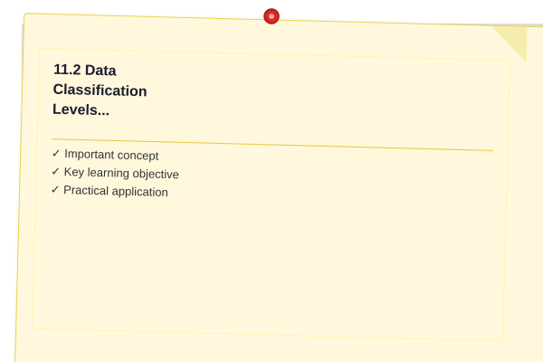
</a>


| Level | Examples | Access | Encryption | Retention | Disposal |
|-------|----------|--------|------------|-----------|----------|
| **Public** | Press releases, marketing content | No auth | Optional | Indefinite | N/A |
| **Internal** | Org charts, training, policies | Auth'd users | In transit: TLS | 7 years (or per policy) | Shred paper, wipe digital |
| **Confidential** | Financials, source code, customer lists | Role-based need-to-know | At rest: AES-256; In transit: TLS 1.2+ | As per contract/reg | Degauss/crush hard drives; certificate of destruction |
| **Restricted** | PII, PHI, payment card data, trade secrets | Strict need-to-know + MFA + logging | At rest: AES-256+KMS; In transit: TLS 1.3 | Regulatory minimum + audit | DoD 5220.22-M wipe or physical destruction |
| **Regulatory** | Data subject to specific regulation (HIPAA, PCI) | Role-based + auditing + PAM | Field-level encryption | 6 years (HIPAA), 3 years (PCI) | NIST SP 800-88 clear/purge/destroy |

### 11.3 BCP vs DR (Detailed)

<a href="../../assets/images/diagrams/cyber-security/09-grc/11-3-bcp-vs-dr-detailed-handwritten.svg" target="_blank" rel="noopener">
  
</a>
<a href="../../assets/images/diagrams/cyber-security/09-grc/11-3-bcp-vs-dr-detailed-diagram.svg" target="_blank" rel="noopener">
  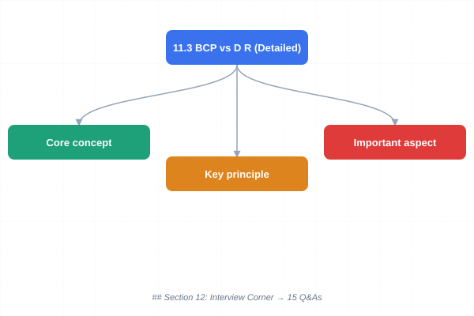
</a>
<a href="../../assets/images/diagrams/cyber-security/09-grc/11-3-bcp-vs-dr-detailed-sticky.svg" target="_blank" rel="noopener">
  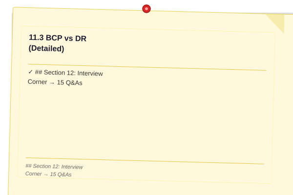
</a>


| Dimension | BCP | DR |
|-----------|-----|----|
| **Scope** | Entire business operations | IT systems and data |
| **Objective** | Maintain business operations at minimum acceptable level | Restore IT systems to operational state |
| **Activation trigger** | Any disruption (IT, natural, personnel, supply chain) | IT system failure or data loss |
| **Key plan document** | Business Continuity Plan | Disaster Recovery Plan |
| **Governs during** | "We're in continuity mode" | "We're restoring IT" |
| **Includes** | Crisis management, PR, HR, legal, facilities, communications | Backup/restore, failover, system-specific recovery procedures |
| **Standards** | ISO 22301, BS 25999 | ISO 27031, NIST SP 800-34 |
| **Sample scenario** | Pandemic: 80% staff remote, maintain customer support via home agents | Server crash: restore from backup to new hardware in 4 hours |
| **Testing approach** | Tabletop, simulation, crisis management exercise | Technical failover test, restore test, DR drill |
| **Teams involved** | Executive team, business unit heads, HR, legal, communications, IT | IT ops, network, database, security, cloud engineering |

---

## Section 12: Interview Corner → 15 Q&As

### Q1: What is GRC and why is it important?

<a href="../../assets/images/diagrams/cyber-security/09-grc/what-is-grc-and-why-is-it-important-handwritten.svg" target="_blank" rel="noopener">
  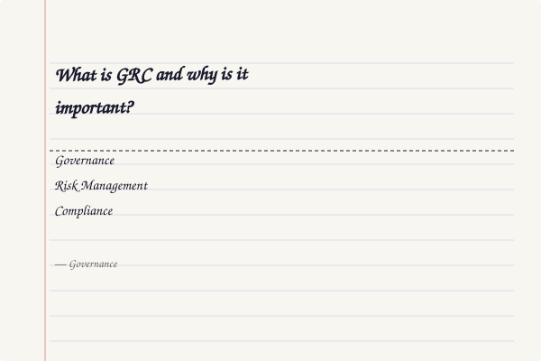
</a>
<a href="../../assets/images/diagrams/cyber-security/09-grc/what-is-grc-and-why-is-it-important-diagram.svg" target="_blank" rel="noopener">
  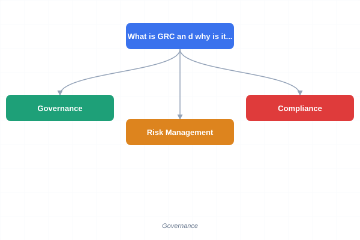
</a>
<a href="../../assets/images/diagrams/cyber-security/09-grc/what-is-grc-and-why-is-it-important-sticky.svg" target="_blank" rel="noopener">
  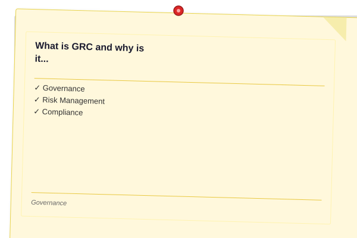
</a>


**A:** GRC stands for Governance, Risk, and Compliance. It's an integrated approach to managing an organization's security posture. **Governance** sets the rules (policies, org structure, oversight), **Risk Management** identifies and quantifies threats (risk assessments, risk registers, treatment plans), and **Compliance** ensures adherence to laws and standards (GDPR, HIPAA, PCI DSS, SOX). It's important because it connects security to business outcomes → without GRC, security is reactive and disconnected from business strategy.

### Q2: What is the difference between a security policy, a standard, a procedure, and a guideline?

<a href="../../assets/images/diagrams/cyber-security/09-grc/what-is-the-difference-between-a-security-policy-a-standard-a-procedure-and-a-guideline-handwritten.svg" target="_blank" rel="noopener">
  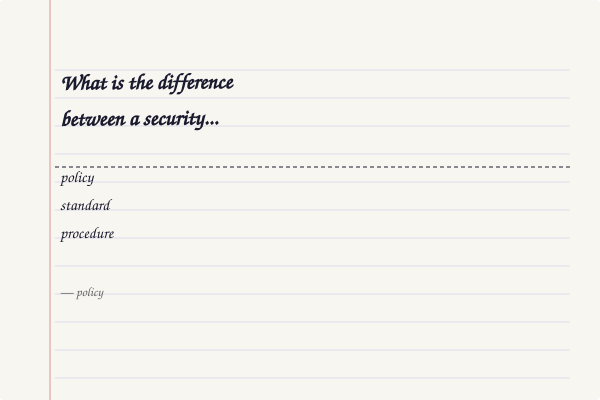
</a>
<a href="../../assets/images/diagrams/cyber-security/09-grc/what-is-the-difference-between-a-security-policy-a-standard-a-procedure-and-a-guideline-diagram.svg" target="_blank" rel="noopener">
  
</a>
<a href="../../assets/images/diagrams/cyber-security/09-grc/what-is-the-difference-between-a-security-policy-a-standard-a-procedure-and-a-guideline-sticky.svg" target="_blank" rel="noopener">
  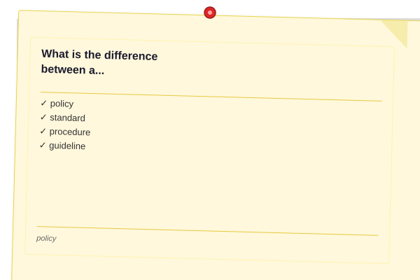
</a>


**A:** A **policy** is a high-level management intent (e.g., "All data must be encrypted at rest"). It's mandatory. A **standard** defines specific mandatory requirements (e.g., "AES-256 encryption for all databases"). A **procedure** is step-by-step instructions (e.g., "How to encrypt a database using AWS KMS"). A **guideline** is advisory (e.g., "Consider using AWS KMS automatic key rotation"). Think of policy as "what," standard as "how well," procedure as "how exactly," and guideline as "what else to consider."

### Q3: Explain the NIST CSF 2.0 functions.

<a href="../../assets/images/diagrams/cyber-security/09-grc/explain-the-nist-csf-2-0-functions-handwritten.svg" target="_blank" rel="noopener">
  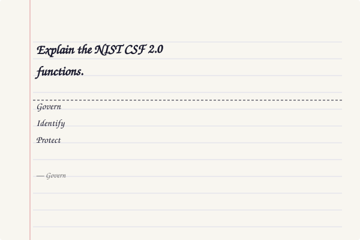
</a>
<a href="../../assets/images/diagrams/cyber-security/09-grc/explain-the-nist-csf-2-0-functions-diagram.svg" target="_blank" rel="noopener">
  
</a>
<a href="../../assets/images/diagrams/cyber-security/09-grc/explain-the-nist-csf-2-0-functions-sticky.svg" target="_blank" rel="noopener">
  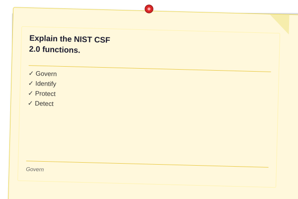
</a>


**A:** NIST CSF 2.0 has six core functions: **Govern** (new in 2.0 → org context, risk management strategy, roles, policies), **Identify** (asset management, risk assessment, improvement), **Protect** (identity management, awareness, data security, platform security, resilience), **Detect** (continuous monitoring, anomaly detection, event analysis), **Respond** (incident management, analysis, mitigation, communications), and **Recover** (recovery planning, improvements, communications). These functions are performed in parallel, not sequentially → an organization should always be identifying, protecting, and detecting simultaneously.

### Q4: What is the difference between qualitative and quantitative risk assessment?

<a href="../../assets/images/diagrams/cyber-security/09-grc/what-is-the-difference-between-qualitative-and-quantitative-risk-assessment-handwritten.svg" target="_blank" rel="noopener">
  
</a>
<a href="../../assets/images/diagrams/cyber-security/09-grc/what-is-the-difference-between-qualitative-and-quantitative-risk-assessment-diagram.svg" target="_blank" rel="noopener">
  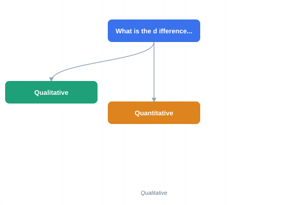
</a>
<a href="../../assets/images/diagrams/cyber-security/09-grc/what-is-the-difference-between-qualitative-and-quantitative-risk-assessment-sticky.svg" target="_blank" rel="noopener">
  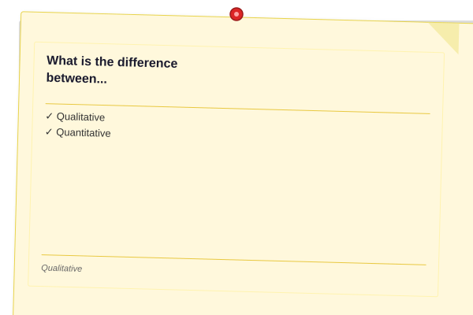
</a>


**A:** **Qualitative** uses descriptive scales (Low, Medium, High) for likelihood and impact → fast, subjective, good for initial triage. **Quantitative** uses monetary values (ALE = SLE x ARO) and statistical models → data-driven, precise, but slow and resource-intensive. Most mature organizations use a hybrid: qualitative for most risks, quantitative for critical risks that require budget decisions or insurance. Example: Qualitative says "High risk," but the CFO asks "How much?" → that's when you need quantitative.

### Q5: What is a risk register and what should it contain?

<a href="../../assets/images/diagrams/cyber-security/09-grc/what-is-a-risk-register-and-what-should-it-contain-handwritten.svg" target="_blank" rel="noopener">
  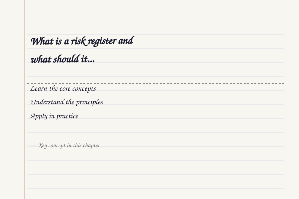
</a>
<a href="../../assets/images/diagrams/cyber-security/09-grc/what-is-a-risk-register-and-what-should-it-contain-diagram.svg" target="_blank" rel="noopener">
  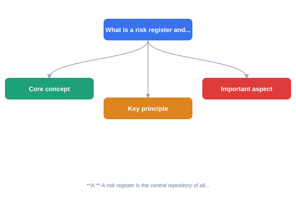
</a>
<a href="../../assets/images/diagrams/cyber-security/09-grc/what-is-a-risk-register-and-what-should-it-contain-sticky.svg" target="_blank" rel="noopener">
  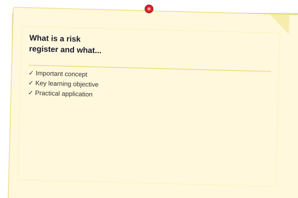
</a>


**A:** A risk register is the central repository of all identified risks. Minimum fields: Risk ID, date identified, risk description (threat + vulnerability + asset), likelihood, impact, inherent risk score, controls, residual likelihood/impact/score, risk response (mitigate/accept/transfer/avoid), treatment plan, owner, review date, status. The risk register should be a living document → reviewed quarterly and updated when new risks emerge or controls change.

### Q6: What is the difference between risk appetite and risk tolerance?

<a href="../../assets/images/diagrams/cyber-security/09-grc/what-is-the-difference-between-risk-appetite-and-risk-tolerance-handwritten.svg" target="_blank" rel="noopener">
  
</a>
<a href="../../assets/images/diagrams/cyber-security/09-grc/what-is-the-difference-between-risk-appetite-and-risk-tolerance-diagram.svg" target="_blank" rel="noopener">
  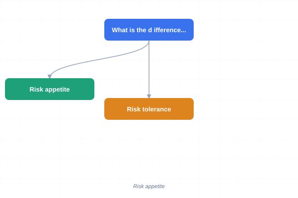
</a>
<a href="../../assets/images/diagrams/cyber-security/09-grc/what-is-the-difference-between-risk-appetite-and-risk-tolerance-sticky.svg" target="_blank" rel="noopener">
  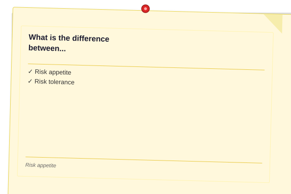
</a>


**A:** **Risk appetite** is the broad level of risk an organization is willing to accept to achieve its objectives (e.g., "We accept moderate security risk because we're a fast-moving startup"). **Risk tolerance** is the acceptable deviation from appetite for specific risks (e.g., "We accept up to 48 hours downtime for non-critical systems, but zero tolerance for PII breaches"). Appetite is strategic and board-level; tolerance is operational and can be set by management within the appetite boundaries.

### Q7: How does GDPR define a personal data breach and what are the notification requirements?

<a href="../../assets/images/diagrams/cyber-security/09-grc/how-does-gdpr-define-a-personal-data-breach-and-what-are-the-notification-requirements-handwritten.svg" target="_blank" rel="noopener">
  
</a>
<a href="../../assets/images/diagrams/cyber-security/09-grc/how-does-gdpr-define-a-personal-data-breach-and-what-are-the-notification-requirements-diagram.svg" target="_blank" rel="noopener">
  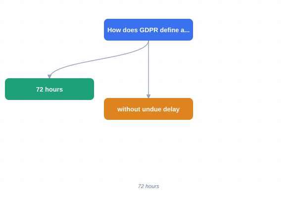
</a>
<a href="../../assets/images/diagrams/cyber-security/09-grc/how-does-gdpr-define-a-personal-data-breach-and-what-are-the-notification-requirements-sticky.svg" target="_blank" rel="noopener">
  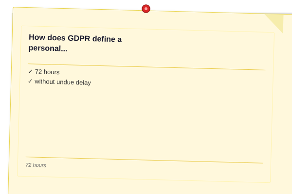
</a>


**A:** GDPR defines a personal data breach as "a breach of security leading to the accidental or unlawful destruction, loss, alteration, unauthorized disclosure of, or access to, personal data" (Article 4(12)). Notification requirements: (1) Notify the DPA within **72 hours** of becoming aware (Article 33) → unless the breach is unlikely to result in risk to individuals. (2) Notify the data subjects **without undue delay** if the breach is likely to result in high risk to their rights and freedoms (Article 34). (3) Maintain a record of all breaches, including those not notified (Article 33(5)).

### Q8: What is the difference between NIST CSF and ISO 27001?

<a href="../../assets/images/diagrams/cyber-security/09-grc/what-is-the-difference-between-nist-csf-and-iso-27001-handwritten.svg" target="_blank" rel="noopener">
  
</a>
<a href="../../assets/images/diagrams/cyber-security/09-grc/what-is-the-difference-between-nist-csf-and-iso-27001-diagram.svg" target="_blank" rel="noopener">
  
</a>
<a href="../../assets/images/diagrams/cyber-security/09-grc/what-is-the-difference-between-nist-csf-and-iso-27001-sticky.svg" target="_blank" rel="noopener">
  
</a>


**A:** NIST CSF is a **framework** → it provides guidance and best practices but is not certifiable. ISO 27001 is a **standard** → you can achieve third-party certification. NIST CSF is more flexible (any controls can map to its functions), while ISO 27001 has specific required controls (Annex A). NIST CSF is stronger for Board communication (the five functions translate well to non-technical audiences), while ISO 27001 is stronger for operational rigor (mandatory risk assessment, SoA, internal audit). Many orgs use both: NIST CSF at strategic level, ISO 27001 at operational level.

### Q9: What is a Business Impact Analysis (BIA) and how do you determine RTO and RPO?

<a href="../../assets/images/diagrams/cyber-security/09-grc/what-is-a-business-impact-analysis-bia-and-how-do-you-determine-rto-and-rpo-handwritten.svg" target="_blank" rel="noopener">
  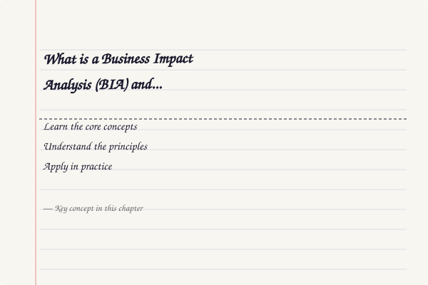
</a>
<a href="../../assets/images/diagrams/cyber-security/09-grc/what-is-a-business-impact-analysis-bia-and-how-do-you-determine-rto-and-rpo-diagram.svg" target="_blank" rel="noopener">
  
</a>
<a href="../../assets/images/diagrams/cyber-security/09-grc/what-is-a-business-impact-analysis-bia-and-how-do-you-determine-rto-and-rpo-sticky.svg" target="_blank" rel="noopener">
  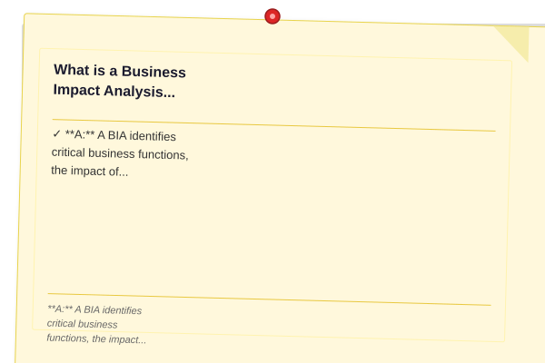
</a>


**A:** A BIA identifies critical business functions, the impact of their disruption, and recovery requirements. **RTO** (Recovery Time Objective) is the target time to restore a function after disruption → determined by asking "How long can we afford to be down before the business is irreparably harmed?" **RPO** (Recovery Point Objective) is the maximum acceptable data loss → determined by asking "How much data can we afford to lose?" Both are derived from the **MTD** (Maximum Tolerable Downtime), which is the absolute outer limit. The BIA interviews business process owners who define these thresholds based on financial, regulatory, operational, and reputational impact over time.

### Q10: What is the FAIR model?

<a href="../../assets/images/diagrams/cyber-security/09-grc/what-is-the-fair-model-handwritten.svg" target="_blank" rel="noopener">
  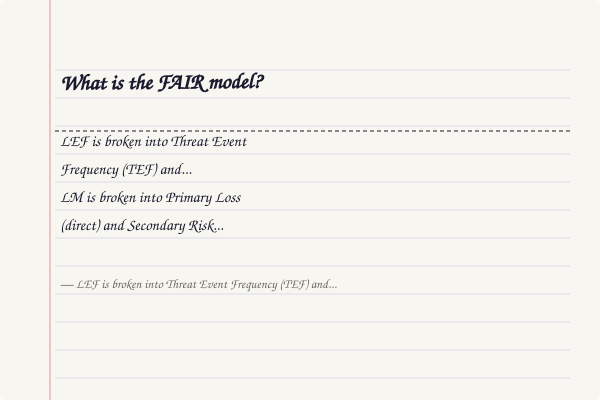
</a>
<a href="../../assets/images/diagrams/cyber-security/09-grc/what-is-the-fair-model-diagram.svg" target="_blank" rel="noopener">
  
</a>
<a href="../../assets/images/diagrams/cyber-security/09-grc/what-is-the-fair-model-sticky.svg" target="_blank" rel="noopener">
  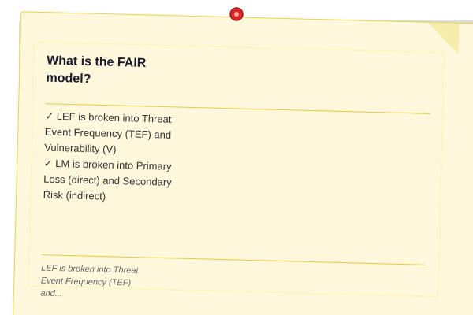
</a>


**A:** FAIR (Factor Analysis of Information Risk) is a quantitative risk analysis model that decomposes risk into Loss Event Frequency (LEF) and Loss Magnitude (LM). LEF is broken into Threat Event Frequency (TEF) and Vulnerability (V). LM is broken into Primary Loss (direct) and Secondary Risk (indirect). FAIR produces risk expressed in monetary terms with confidence intervals → e.g., "We have 80% confidence that the annualized risk of ransomware is between $50K and $200K." It uses Monte Carlo simulation to account for uncertainty and produces probability distributions rather than point estimates.

### Q11: What are the 12 PCI DSS 4.0 requirements?

<a href="../../assets/images/diagrams/cyber-security/09-grc/what-are-the-12-pci-dss-4-0-requirements-handwritten.svg" target="_blank" rel="noopener">
  
</a>
<a href="../../assets/images/diagrams/cyber-security/09-grc/what-are-the-12-pci-dss-4-0-requirements-diagram.svg" target="_blank" rel="noopener">
  
</a>
<a href="../../assets/images/diagrams/cyber-security/09-grc/what-are-the-12-pci-dss-4-0-requirements-sticky.svg" target="_blank" rel="noopener">
  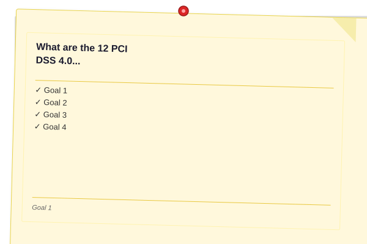
</a>


**A:** PCI DSS 4.0 has 12 requirements organized into 6 goals: **Goal 1** → Build and Maintain a Secure Network (1: Install firewalls, 2: Secure configurations). **Goal 2** → Protect Cardholder Data (3: Protect stored data, 4: Encrypt transmission). **Goal 3** → Maintain Vulnerability Management Program (5: Anti-malware, 6: Secure systems and apps). **Goal 4** → Implement Strong Access Control (7: Need-to-know access, 8: Identify and authenticate, 9: Restrict physical access). **Goal 5** → Monitor and Test Networks (10: Log and monitor, 11: Test security). **Goal 6** → Maintain Policy (12: Information security policy). Each requirement has detailed testing procedures that QSAs verify.

### Q12: What is a DPIA and when is it mandatory under GDPR?

<a href="../../assets/images/diagrams/cyber-security/09-grc/what-is-a-dpia-and-when-is-it-mandatory-under-gdpr-handwritten.svg" target="_blank" rel="noopener">
  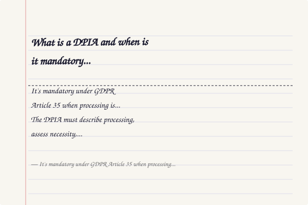
</a>
<a href="../../assets/images/diagrams/cyber-security/09-grc/what-is-a-dpia-and-when-is-it-mandatory-under-gdpr-diagram.svg" target="_blank" rel="noopener">
  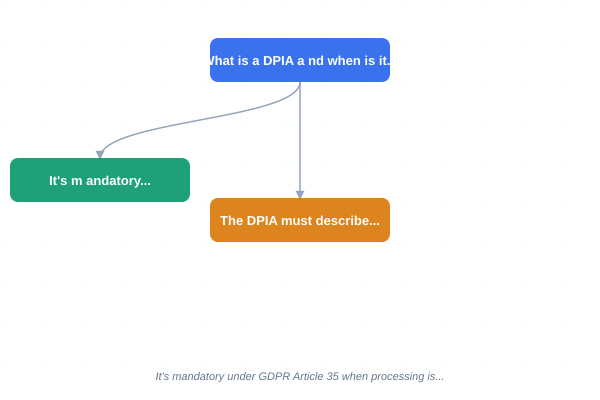
</a>
<a href="../../assets/images/diagrams/cyber-security/09-grc/what-is-a-dpia-and-when-is-it-mandatory-under-gdpr-sticky.svg" target="_blank" rel="noopener">
  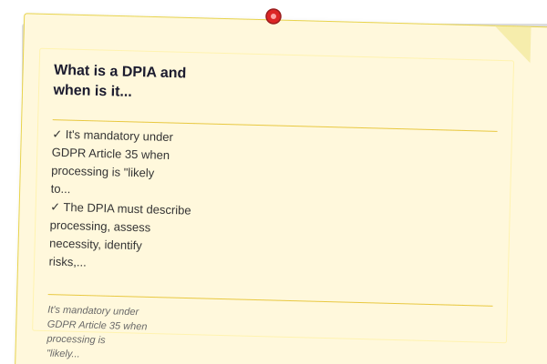
</a>


**A:** A DPIA (Data Protection Impact Assessment) is a process to identify and minimize data protection risks of a project or processing activity. It's mandatory under GDPR Article 35 when processing is "likely to result in high risk" to individuals. Triggers include: (1) Systematic profiling with significant effects, (2) Large-scale processing of special categories (health, biometric, genetic, criminal), (3) Systematic monitoring of publicly accessible areas (CCTV), (4) Large-scale processing of children's data, (5) Use of innovative technology (AI, IoT, facial recognition, behavioral tracking). The DPIA must describe processing, assess necessity, identify risks, and document mitigation measures.

### Q13: What is the difference between SOC 2 Type I and Type II?

<a href="../../assets/images/diagrams/cyber-security/09-grc/what-is-the-difference-between-soc-2-type-i-and-type-ii-handwritten.svg" target="_blank" rel="noopener">
  
</a>
<a href="../../assets/images/diagrams/cyber-security/09-grc/what-is-the-difference-between-soc-2-type-i-and-type-ii-diagram.svg" target="_blank" rel="noopener">
  
</a>
<a href="../../assets/images/diagrams/cyber-security/09-grc/what-is-the-difference-between-soc-2-type-i-and-type-ii-sticky.svg" target="_blank" rel="noopener">
  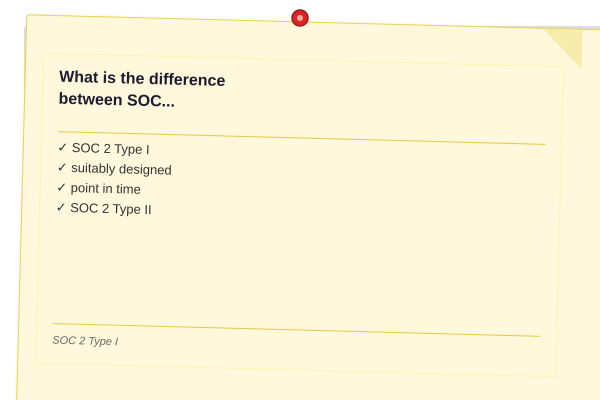
</a>


**A:** **SOC 2 Type I** evaluates whether controls are **suitably designed** at a **point in time** (e.g., "As of March 15, 2024, the controls were designed appropriately"). **SOC 2 Type II** evaluates whether controls are **suitably designed** AND **operating effectively** over a **period of time** (e.g., "For the period January 1 to December 31, 2024, the controls were designed and operating effectively"). Type II is far more rigorous and what customers typically demand because it provides evidence that controls actually work in practice, not just on paper.

### Q14: How do you calculate ROSI (Return on Security Investment)?

<a href="../../assets/images/diagrams/cyber-security/09-grc/how-do-you-calculate-rosi-return-on-security-investment-handwritten.svg" target="_blank" rel="noopener">
  
</a>
<a href="../../assets/images/diagrams/cyber-security/09-grc/how-do-you-calculate-rosi-return-on-security-investment-diagram.svg" target="_blank" rel="noopener">
  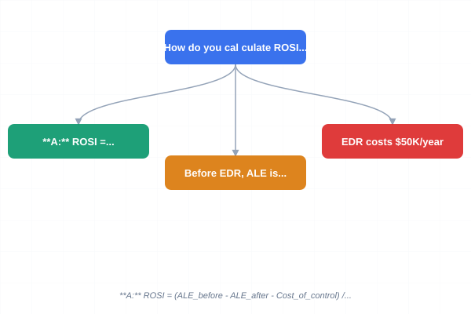
</a>
<a href="../../assets/images/diagrams/cyber-security/09-grc/how-do-you-calculate-rosi-return-on-security-investment-sticky.svg" target="_blank" rel="noopener">
  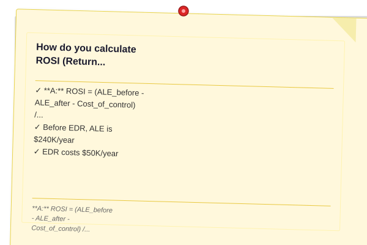
</a>


**A:** ROSI = (ALE_before - ALE_after - Cost_of_control) / Cost_of_control x 100%. Example: Before EDR, ALE is $240K/year. EDR costs $50K/year. After EDR, ALE drops to $20K/year. ROSI = ($240K - $20K - $50K) / $50K = 340%. This means every dollar spent on the control saves $3.40. ROSI is essential for making the business case for security investments to CFOs and boards.

### Q15: What are the key elements of an effective security awareness program?

<a href="../../assets/images/diagrams/cyber-security/09-grc/what-are-the-key-elements-of-an-effective-security-awareness-program-handwritten.svg" target="_blank" rel="noopener">
  
</a>
<a href="../../assets/images/diagrams/cyber-security/09-grc/what-are-the-key-elements-of-an-effective-security-awareness-program-diagram.svg" target="_blank" rel="noopener">
  
</a>
<a href="../../assets/images/diagrams/cyber-security/09-grc/what-are-the-key-elements-of-an-effective-security-awareness-program-sticky.svg" target="_blank" rel="noopener">
  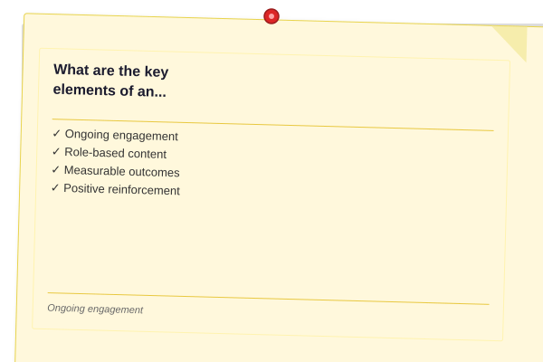
</a>


**A:** An effective program has five pillars: (1) **Ongoing engagement** → monthly (not annual) training modules, quarterly phishing simulations, regular security newsletters. (2) **Role-based content** → generic training for all, specialized training for developers (secure coding), executives (whaling), HR (data handling). (3) **Measurable outcomes** → phishing click rate (<5%), training completion (100%), reporting rate (>50%), time to report (<5 min). (4) **Positive reinforcement** → reward reporting real phishing emails, gamify completion rates, recognize "security champions" in each department. (5) **Accountability** → repeat clickers get retraining, 3+ clicks escalate to manager, persistent non-compliance has consequences.

---

## Section 13: Applications in Real Systems

### 13.1 GRC in Cloud Environments

<a href="../../assets/images/diagrams/cyber-security/09-grc/13-1-grc-in-cloud-environments-handwritten.svg" target="_blank" rel="noopener">
  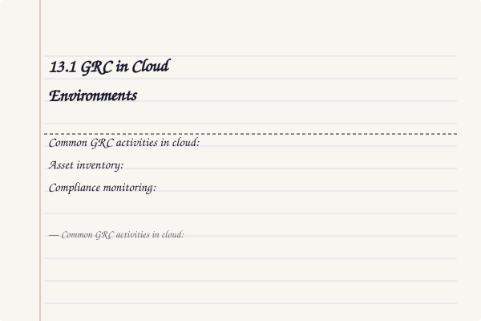
</a>
<a href="../../assets/images/diagrams/cyber-security/09-grc/13-1-grc-in-cloud-environments-diagram.svg" target="_blank" rel="noopener">
  
</a>
<a href="../../assets/images/diagrams/cyber-security/09-grc/13-1-grc-in-cloud-environments-sticky.svg" target="_blank" rel="noopener">
  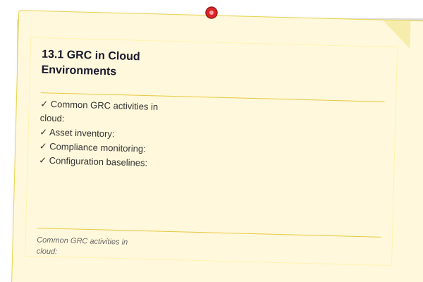
</a>


| Cloud Provider | Compliance Certifications | Shared Responsibility Model |
|----------------|--------------------------|---------------------------|
| **AWS** | ISO 27001, SOC 1/2/3, PCI DSS 4.0, FedRAMP, HIPAA, GDPR | AWS responsible for "security OF the cloud" (physical infra, hypervisor). Customer responsible for "security IN the cloud" (config, access, data). |
| **Azure** | ISO 27001, SOC 1/2/3, PCI DSS, FedRAMP, HIPAA, GDPR | Similar shared model. Azure Arc extends compliance to on-prem. |
| **GCP** | ISO 27001, SOC 1/2/3, PCI DSS, FedRAMP, HIPAA, GDPR | Same model. Google provides "infrastructure security" and customer manages "platform security." |

**Common GRC activities in cloud:**
- **Asset inventory:** AWS Config, Azure Resource Graph, GCP Asset Inventory
- **Compliance monitoring:** AWS Security Hub, Azure Security Center, GCP Security Command Center
- **Configuration baselines:** AWS Config rules, Azure Policy, GCP Org Policies
- **Risk management:** Integrated with CSPM (Cloud Security Posture Management) tools like Wiz, Orca, Prisma Cloud

### 13.2 GRC in Application Security (DevSecOps)

<a href="../../assets/images/diagrams/cyber-security/09-grc/13-2-grc-in-application-security-devsecops-handwritten.svg" target="_blank" rel="noopener">
  
</a>
<a href="../../assets/images/diagrams/cyber-security/09-grc/13-2-grc-in-application-security-devsecops-diagram.svg" target="_blank" rel="noopener">
  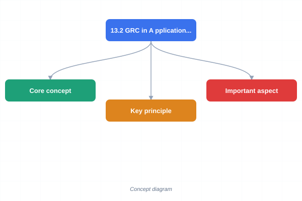
</a>
<a href="../../assets/images/diagrams/cyber-security/09-grc/13-2-grc-in-application-security-devsecops-sticky.svg" target="_blank" rel="noopener">
  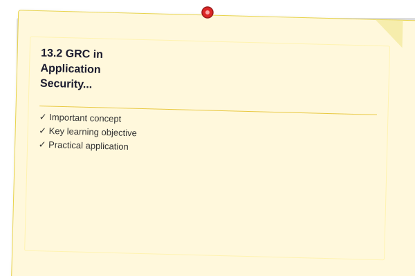
</a>


| SDLC Phase | GRC Activity | Tooling |
|------------|-------------|---------|
| **Plan** | Threat modeling (STRIDE), risk assessment | OWASP Threat Dragon, Microsoft TMT |
| **Code** | Secure coding standards, SAST | SonarQube, Checkmarx, Snyk Code |
| **Build** | Dependency scanning, SBOM generation | Snyk, OWASP Dependency-Check, CycloneDX |
| **Test** | DAST, penetration testing, compliance validation | OWASP ZAP, Burp Suite, OpenSCAP |
| **Deploy** | Configuration compliance, container scanning | Docker Scout, Trivy, CIS benchmarks |
| **Operate** | Runtime monitoring, vulnerability management, audit logging | SIEM, EDR, CSPM, SOAR |

### 13.3 GRC in Healthcare

<a href="../../assets/images/diagrams/cyber-security/09-grc/13-3-grc-in-healthcare-handwritten.svg" target="_blank" rel="noopener">
  
</a>
<a href="../../assets/images/diagrams/cyber-security/09-grc/13-3-grc-in-healthcare-diagram.svg" target="_blank" rel="noopener">
  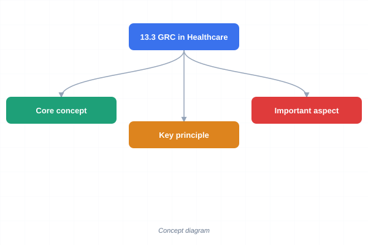
</a>
<a href="../../assets/images/diagrams/cyber-security/09-grc/13-3-grc-in-healthcare-sticky.svg" target="_blank" rel="noopener">
  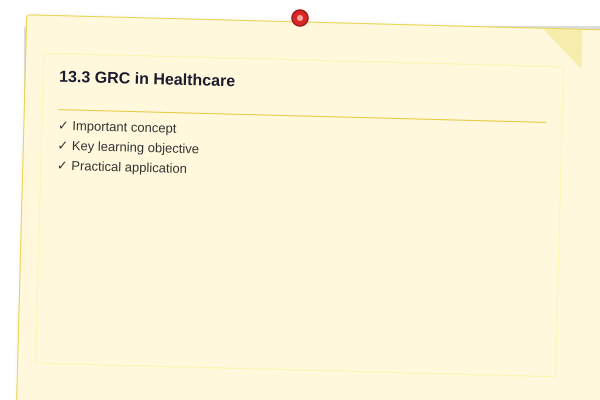
</a>


| Regulation | Implementation Example | GRC Process |
|-----------|----------------------|-------------|
| **HIPAA Security Rule** | Risk analysis every 2 years, annual security awareness training | Risk Management |
| **HIPAA Privacy Rule** | Notice of Privacy Practices, patient access portal, BAAs with all vendors | Compliance |
| **HIPAA Breach Rule** | Breach notification procedure, incident response plan with 60-day notification | Incident Response / Compliance |
| **FDA Pre-market Cybersecurity** (2023) | Threat model, SBOM, vulnerability disclosure process for connected medical devices | Governance / Risk |

### 13.4 GRC in Financial Services

<a href="../../assets/images/diagrams/cyber-security/09-grc/13-4-grc-in-financial-services-handwritten.svg" target="_blank" rel="noopener">
  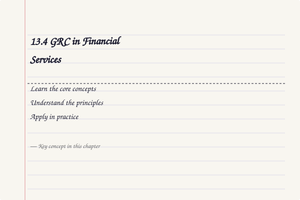
</a>
<a href="../../assets/images/diagrams/cyber-security/09-grc/13-4-grc-in-financial-services-diagram.svg" target="_blank" rel="noopener">
  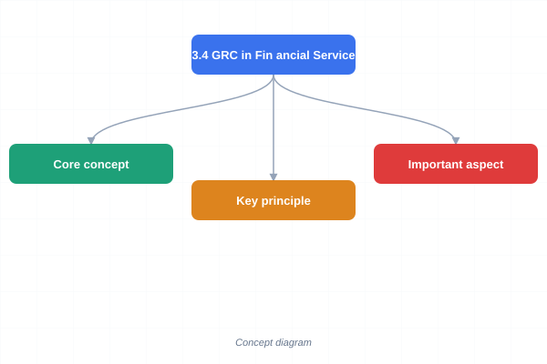
</a>
<a href="../../assets/images/diagrams/cyber-security/09-grc/13-4-grc-in-financial-services-sticky.svg" target="_blank" rel="noopener">
  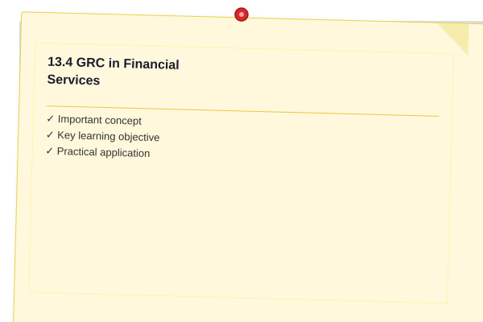
</a>


| Regulation | Implementation Example | GRC Process |
|-----------|----------------------|-------------|
| **SOX (ITGC)** | Access recertification (quarterly), change management approval, segregation of duties, audit trail integrity | Compliance / Audit |
| **PCI DSS** | Quarterly ASV scans, annual QSA assessment, CDE segmentation, penetration testing | Compliance |
| **GLBA** | Privacy notice annually, customer opt-out mechanism, safeguards rule (risk assessment) | Governance / Compliance |
| **NY DFS 500** | Annual certification of compliance, MFA, risk assessment, incident response plan | Governance / Compliance |
| **MAS TRM (Singapore)** | Risk assessment framework, security operations center, threat intelligence, BC/DR plan | Risk Management |

### 13.5 GRC in Government / Defense

<a href="../../assets/images/diagrams/cyber-security/09-grc/13-5-grc-in-government-defense-handwritten.svg" target="_blank" rel="noopener">
  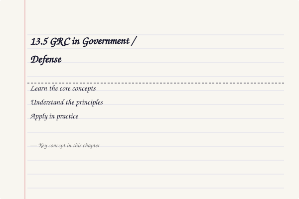
</a>
<a href="../../assets/images/diagrams/cyber-security/09-grc/13-5-grc-in-government-defense-diagram.svg" target="_blank" rel="noopener">
  
</a>
<a href="../../assets/images/diagrams/cyber-security/09-grc/13-5-grc-in-government-defense-sticky.svg" target="_blank" rel="noopener">
  
</a>


| Framework | Implementation Example | GRC Process |
|-----------|----------------------|-------------|
| **NIST RMF** | Categorize system -> Select controls (800-53) -> Implement -> Assess -> Authorize -> Monitor | Risk Management |
| **FedRAMP** | 3PAO assessment, continuous monitoring, annual review, incident reporting | Compliance |
| **DFARS (DoD)** | NIST SP 800-171 compliance, CMMC certification (Level 1-5) | Compliance / Audit |
| **FISMA** | Annual security assessment, POA&M management, system authorization | Governance / Compliance |
| **ITAR / EAR** | Export-controlled data handling, access controls for non-US persons, data residency | Compliance |

### 13.6 GRC Tools Landscape

<a href="../../assets/images/diagrams/cyber-security/09-grc/13-6-grc-tools-landscape-handwritten.svg" target="_blank" rel="noopener">
  
</a>
<a href="../../assets/images/diagrams/cyber-security/09-grc/13-6-grc-tools-landscape-diagram.svg" target="_blank" rel="noopener">
  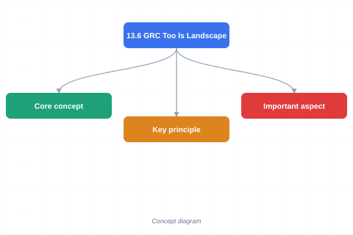
</a>
<a href="../../assets/images/diagrams/cyber-security/09-grc/13-6-grc-tools-landscape-sticky.svg" target="_blank" rel="noopener">
  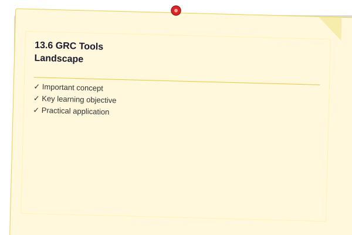
</a>


| Category | Tools | Purpose |
|----------|-------|---------|
| **GRC Platforms** | ServiceNow GRC, RSA Archer, MetricStream, OneTrust | Centralized risk register, policy management, compliance tracking, audit management |
| **Policy Management** | PowerDMS, PolicyTech, ConvergePoint | Policy drafting, approval workflow, acknowledgment tracking |
| **Risk Management** | RiskLens (FAIR), SAFE, RiskRecon | Quantitative risk analysis, FAIR modeling |
| **Compliance Monitoring** | Splunk, Microsoft Sentinel, Vanta, Drata, Secureframe | Automated evidence collection, continuous compliance monitoring |
| **Vendor Risk** | Prevalent, Whistic, OneTrust Vendorpedia | Vendor questionnaires, risk scoring, continuous monitoring |
| **Audit Management** | AuditBoard, TeamMate, Galvanize | Audit planning, fieldwork, finding tracking, remediation verification |
| **Privacy** | OneTrust, Securiti, BigID, DataGrail | DSAR automation, consent management, data mapping, DPIA workflow |
| **BCP/DR** | Fusion Risk Management, MetricStream BCM, ServiceNow BCM | BIA, BCP/DR plan management, exercise scheduling, incident declaration |

---

## Exercises

### Review Questions

1. What are the three pillars of GRC? Give a one-sentence definition for each.
2. List the six functions of NIST CSF 2.0. Which one is new compared to v1.1?
3. What is the difference between a risk register and a risk treatment plan?
4. Under GDPR, how long do you have to notify the DPA of a personal data breach?
5. What is the difference between SOC 2 Type I and Type II reports?
6. What does "SLE x ARO" calculate? What is it used for?
7. What is a BIA and what three time-based metrics does it produce?
8. What are the four data classification levels commonly used in enterprises?
9. What is a DPIA and when is it mandatory under GDPR?
10. What are CIS Implementation Groups (IG1, IG2, IG3)?

### Application Problems

1. **Risk Assessment:** A hospital uses a legacy EHR system that cannot be patched. The vendor no longer provides support. The system contains 50,000 patient records. Perform a qualitative risk assessment using the 5x5 matrix. Identify controls and calculate residual risk.

2. **BIA Calculation:** An e-commerce company processes $10M/month in revenue. Their payment system has an MTD of 2 hours, RTO of 30 minutes, and RPO of 5 minutes. Calculate revenue loss per minute of downtime. If the system processes 1,000 transactions/minute at $25/transaction, what is the cost of 1 hour of downtime?

3. **ISO 27001 SoA Drafting:** A company is implementing ISO 27001 and has identified that they do not have a formal change management process. Which Annex A control(s) address change management? Draft a policy statement and identify three mandatory procedures.

4. **GDPR DPIA:** A startup is building a mobile app that uses facial recognition to analyze children's emotions for educational content. Which GDPR articles apply? Is a DPIA mandatory? What data subject rights must be supported?

5. **Vendor Risk Assessment:** Your organization is onboarding a SaaS vendor that will process employee PII (names, addresses, SSNs) for payroll. Draft a vendor risk assessment with minimum 10 questions across at least 3 categories.

### Challenge Problems

1. **Full GRC Program Design:** You are the CISO of a Series B fintech startup (200 employees) preparing for a SOC 2 Type II audit and PCI DSS Level 4 compliance. The company processes payments in the US and EU. Design a 12-month GRC program roadmap with milestones, budget estimates, and resource requirements.

2. **Breach Notification Exercise:** You discover a breach: 10,000 customer records (names, emails, hashed passwords) were exfiltrated from your production database. The breach was detected 48 hours after initial compromise. Write the notification to the DPA (GDPR Article 33), the notification to data subjects (Article 34), and a press release.

3. **Risk Treatment Plan:** Using a hypothetical risk register with 10 entries, develop a risk treatment plan for 5 of them. For each, specify the treatment option, timeline, owner, cost estimate, and residual risk score. Include at least one avoid, one transfer, one mitigate, and one accept decision with justification.

### Cross-Application Matrix

| Domain | GRC Application | Real-World Example |
|--------|----------------|-------------------|
| Network Security | PCI DSS requirement 1 → firewall segmentation | Segment CDE from corporate network; quarterly firewall rule review |
| Application Security | OWASP Top 10 + secure SDLC = risk mitigation | SAST in CI/CD pipeline; DAST quarterly; threat modeling for new features |
| Cloud Security | CSPM detection of compliance violations | AWS Config rule detecting S3 bucket with public access |
| IAM | SOX ITGC → access recertification | Quarterly user access review of all finance-related systems |
| Incident Response | GDPR breach notification | 72-hour DPA notification for personal data breach |
| Forensics | Chain of custody for audit evidence | Signed evidence collection forms, tamper-proof logging |
| Pentesting | PCI DSS requirement 11.4 → penetration testing | Annual application and network pen test by QSA-approved firm |
| Mobile Security | HIPAA mobile device policy | Enroll all mobile devices in MDM; remote wipe capability |
| IoT/OT | NIST CSF → ICS-specific risk assessment | Purdue model segmentation; OT-specific vulnerability scanning |
| AI/ML | EU AI Act (2025) / GDPR Article 22 → automated decision-making | Algorithmic impact assessment; human-in-the-loop for high-risk AI decisions |

---

## Summary

- **Governance** defines the rules, roles, and oversight structure for information security → starting from the Board and flowing through policies, standards, procedures, and baselines.
- **Risk Management** quantifies and treats uncertainty using structured processes (NIST RMF, FAIR) and tools (risk registers, BIA, risk matrices).
- **Compliance** ensures legal and regulatory obligations are met → GDPR, PCI DSS, HIPAA, SOC 2, FedRAMP, SOX → each with specific requirements, timelines, and penalties.
- **Frameworks** provide blueprints: NIST CSF 2.0 (strategic, flexible), ISO 27001 (certifiable, rigorous), CIS Controls (prioritized, actionable), COBIT (governance-focused).
- **BCP/DR** ensures business resilience with measurable recovery targets (RTO, RPO, MTD).
- **Third-party risk** extends security governance to vendors and partners through assessments, contracts, and continuous monitoring.
- **Security awareness** addresses the human element → the most common attack vector → through training, simulations, and behavioral measurement.
- **Audits** validate that controls are designed and operating effectively → internal audits for readiness, external audits for certification.
- **Metrics** connect GRC to business outcomes → KPIs measure performance, KRIs predict risk, and board dashboards communicate status.
- **Case studies** demonstrate that GRC failure has real consequences → Equifax ($1.4B), Marriott (EUR 18.4M), TikTok (EUR 345M), Wells Fargo ($3B) → all caused by governance and risk management breakdowns, not technology failures.

---

## References

1. NIST Cybersecurity Framework 2.0 (February 2024) → https://www.nist.gov/cyberframework
2. ISO/IEC 27001:2022 Information Security Management Systems
3. PCI DSS v4.0 (March 2022) → https://www.pcisecuritystandards.org/
4. GDPR (Regulation (EU) 2016/679) → https://gdpr-info.eu/
5. HIPAA Security Rule (45 CFR Parts 160, 162, and 164)
6. NIST SP 800-53 Rev. 5 → Security and Privacy Controls
7. NIST SP 800-34 Rev. 1 → Contingency Planning Guide
8. FAIR Institute → FAIR-TM Quantitative Risk Analysis
9. CIS Controls v8 → https://www.cisecurity.org/controls
10. COBIT 2019 → ISACA
11. AICPA SOC 2 Trust Services Criteria
12. FedRAMP Rev. 5 Baseline → https://www.fedramp.gov/
13. Sarbanes-Oxley Act of 2002 (Public Law 107-204)
14. Verizon 2024 Data Breach Investigations Report
15. Ponemon Institute → Cost of Compliance vs Cost of Non-Compliance (2024)
16. UK ICO → Marriott International Inc. Monetary Penalty Notice (2020)
17. Irish DPC → TikTok Decision (DPC Inquiry IN-22-2-2, September 2023)
18. US DOJ → Wells Fargo Enforcement Actions (2020)
## Section 15: Supplementary Content

### 15.1 Expanded Interview Corner → Additional 15 Q&As

<a href="../../assets/images/diagrams/cyber-security/09-grc/15-1-expanded-interview-corner-additional-15-q-as-handwritten.svg" target="_blank" rel="noopener">
  
</a>
<a href="../../assets/images/diagrams/cyber-security/09-grc/15-1-expanded-interview-corner-additional-15-q-as-diagram.svg" target="_blank" rel="noopener">
  
</a>
<a href="../../assets/images/diagrams/cyber-security/09-grc/15-1-expanded-interview-corner-additional-15-q-as-sticky.svg" target="_blank" rel="noopener">
  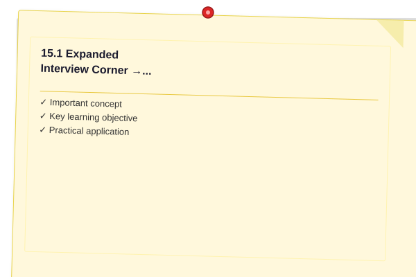
</a>


### Q16: What is the principle of "Privacy by Design" and how do you implement it?

<a href="../../assets/images/diagrams/cyber-security/09-grc/what-is-the-principle-of-privacy-by-design-and-how-do-you-implement-it-handwritten.svg" target="_blank" rel="noopener">
  
</a>
<a href="../../assets/images/diagrams/cyber-security/09-grc/what-is-the-principle-of-privacy-by-design-and-how-do-you-implement-it-diagram.svg" target="_blank" rel="noopener">
  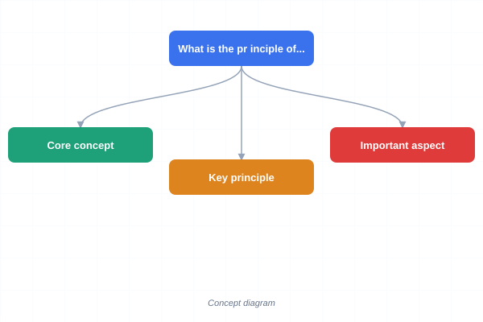
</a>
<a href="../../assets/images/diagrams/cyber-security/09-grc/what-is-the-principle-of-privacy-by-design-and-how-do-you-implement-it-sticky.svg" target="_blank" rel="noopener">
  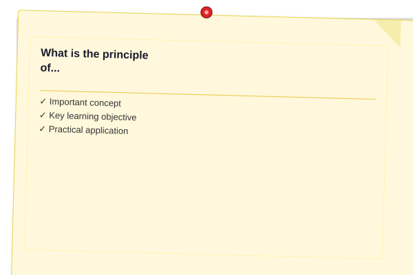
</a>


**A:** Privacy by Design (PbD) is a framework developed by Ann Cavoukian that embeds privacy into the design specifications of technology, business practices, and infrastructure → rather than adding it as an afterthought. The seven principles: (1) Proactive not reactive → anticipate privacy issues before they occur, (2) Privacy as default → no action required from the user, (3) Privacy embedded into design → system architecture includes privacy controls, (4) Full functionality → privacy and security are not trade-offs, (5) End-to-end security → data protected from collection to deletion, (6) Visibility and transparency → processes are open and documented, (7) Respect for user privacy → user-centric controls and granular notifications. Implementation: Conduct a DPIA before building any new system, minimize data collection by default, encrypt data at rest and in transit by default, provide users with granular consent controls, and log all access to personal data.

### Q17: Explain the difference between a vulnerability, a threat, and a risk.

<a href="../../assets/images/diagrams/cyber-security/09-grc/explain-the-difference-between-a-vulnerability-a-threat-and-a-risk-handwritten.svg" target="_blank" rel="noopener">
  
</a>
<a href="../../assets/images/diagrams/cyber-security/09-grc/explain-the-difference-between-a-vulnerability-a-threat-and-a-risk-diagram.svg" target="_blank" rel="noopener">
  
</a>
<a href="../../assets/images/diagrams/cyber-security/09-grc/explain-the-difference-between-a-vulnerability-a-threat-and-a-risk-sticky.svg" target="_blank" rel="noopener">
  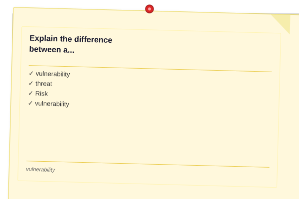
</a>


**A:** A **vulnerability** is a weakness (unpatched software, open S3 bucket, weak password). A **threat** is something that could exploit that weakness (hacker, malware, insider). **Risk** is the combination: the likelihood that the threat exploits the vulnerability, times the impact. Analogy: A broken lock on your door is a **vulnerability**. A burglar walking down your street is a **threat**. The chance that the burglar tries your door and enters your house, and what you lose if that happens, is **risk**. You fix the lock (mitigate) to reduce risk.

### Q18: What is a "Statement of Applicability" (SoA) in ISO 27001?

<a href="../../assets/images/diagrams/cyber-security/09-grc/what-is-a-statement-of-applicability-soa-in-iso-27001-handwritten.svg" target="_blank" rel="noopener">
  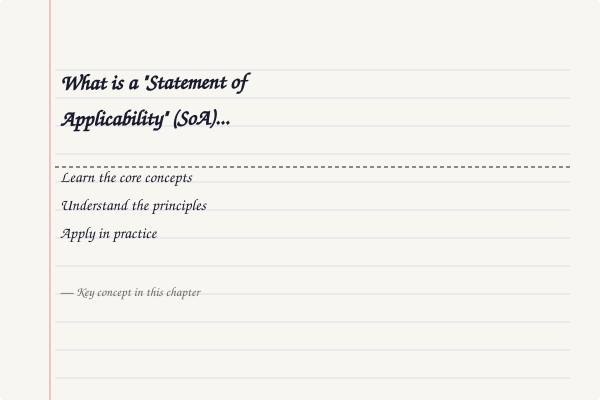
</a>
<a href="../../assets/images/diagrams/cyber-security/09-grc/what-is-a-statement-of-applicability-soa-in-iso-27001-diagram.svg" target="_blank" rel="noopener">
  
</a>
<a href="../../assets/images/diagrams/cyber-security/09-grc/what-is-a-statement-of-applicability-soa-in-iso-27001-sticky.svg" target="_blank" rel="noopener">
  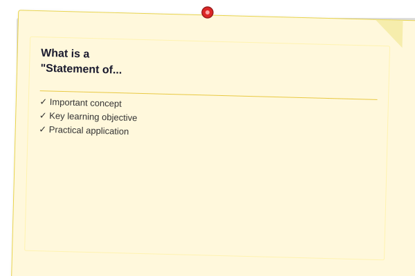
</a>


**A:** The SoA is a mandatory document in ISO 27001 (Clause 6.1.3) that lists all 93 Annex A controls and for each one states: (a) whether it is applicable or not, and (b) justification for inclusion or exclusion. For applicable controls, the SoA cross-references to the specific policies, procedures, and controls that address each requirement. The SoA bridges the risk assessment and the control implementation → it proves that the organization has systematically considered every Annex A control and made a risk-based decision about each one. Excluding controls requires specific justification (e.g., "Control 8.19 (installation of software) is not applicable because the organization uses only SaaS applications and no software installation is permitted on endpoints").

### Q19: What is the "shared responsibility model" in cloud security?

<a href="../../assets/images/diagrams/cyber-security/09-grc/what-is-the-shared-responsibility-model-in-cloud-security-handwritten.svg" target="_blank" rel="noopener">
  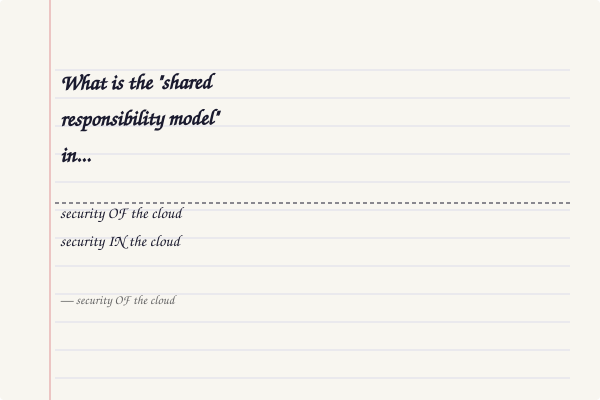
</a>
<a href="../../assets/images/diagrams/cyber-security/09-grc/what-is-the-shared-responsibility-model-in-cloud-security-diagram.svg" target="_blank" rel="noopener">
  
</a>
<a href="../../assets/images/diagrams/cyber-security/09-grc/what-is-the-shared-responsibility-model-in-cloud-security-sticky.svg" target="_blank" rel="noopener">
  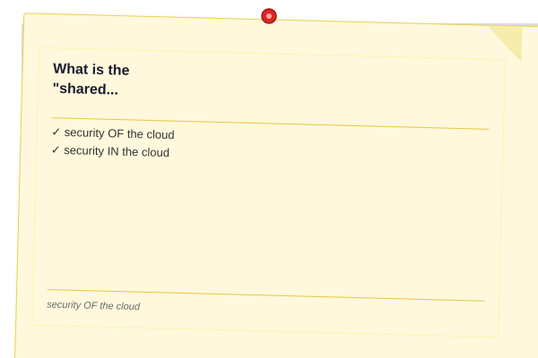
</a>


**A:** The shared responsibility model defines which security controls are managed by the cloud provider vs the customer. The provider is responsible for **security OF the cloud** → physical security, hardware, hypervisor, network infrastructure, and (for SaaS) the application itself. The customer is responsible for **security IN the cloud** → data classification, encryption, IAM configuration, network ACLs, OS patching (in IaaS), application security (in PaaS), and compliance. The exact split depends on the service model:

| Layer | On-Prem | IaaS (EC2) | PaaS (RDS) | SaaS (Salesforce) |
|-------|---------|------------|------------|-------------------|
| Data | Customer | Customer | Customer | Customer |
| Application | Customer | Customer | Customer | Provider |
| OS | Customer | Customer | Provider | Provider |
| Hypervisor | Customer | Provider | Provider | Provider |
| Physical | Customer | Provider | Provider | Provider |

The most common GRC failure in cloud is assuming the provider handles something that is actually the customer's responsibility (e.g., encrypting the S3 bucket, enabling CloudTrail logging).

### Q20: How does SOX Section 404 apply to IT?

<a href="../../assets/images/diagrams/cyber-security/09-grc/how-does-sox-section-404-apply-to-it-handwritten.svg" target="_blank" rel="noopener">
  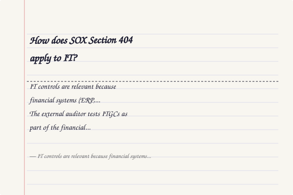
</a>
<a href="../../assets/images/diagrams/cyber-security/09-grc/how-does-sox-section-404-apply-to-it-diagram.svg" target="_blank" rel="noopener">
  
</a>
<a href="../../assets/images/diagrams/cyber-security/09-grc/how-does-sox-section-404-apply-to-it-sticky.svg" target="_blank" rel="noopener">
  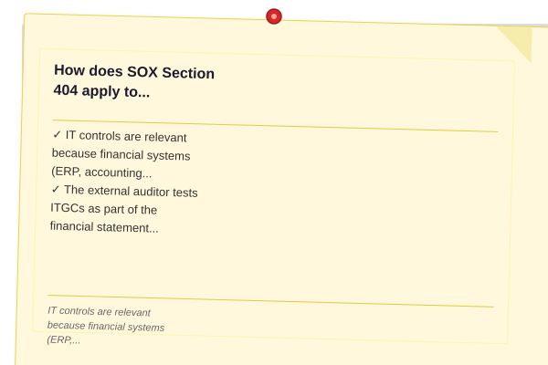
</a>


**A:** SOX Section 404 requires management to assess and report on the effectiveness of internal controls over financial reporting (ICFR). IT controls are relevant because financial systems (ERP, accounting software, payment systems) are IT systems. The IT General Controls (ITGC) that support financial reporting integrity must be documented, tested, and proven effective. Key ITGC domains: (1) Access Management → who can create, modify, and delete financial records; (2) Change Management → changes to financial systems are authorized, tested, and approved before deployment; (3) Computer Operations → batch jobs run correctly, error handling, backup/restore; (4) Program Development → new financial systems follow secure SDLC. The external auditor tests ITGCs as part of the financial statement audit.

### Q21: What is a "control objective" and give an example?

<a href="../../assets/images/diagrams/cyber-security/09-grc/what-is-a-control-objective-and-give-an-example-handwritten.svg" target="_blank" rel="noopener">
  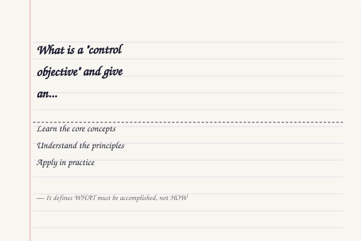
</a>
<a href="../../assets/images/diagrams/cyber-security/09-grc/what-is-a-control-objective-and-give-an-example-diagram.svg" target="_blank" rel="noopener">
  
</a>
<a href="../../assets/images/diagrams/cyber-security/09-grc/what-is-a-control-objective-and-give-an-example-sticky.svg" target="_blank" rel="noopener">
  
</a>


**A:** A control objective is a statement of the desired outcome that a control or group of controls is designed to achieve. It defines WHAT must be accomplished, not HOW. Example: "Only authorized users can access the production database." The controls that achieve this objective include: (1) Database authentication (username/password or IAM), (2) Network ACLs restricting source IPs, (3) MFA for database access, (4) Access review every 90 days, (5) Audit logging of all database queries. Control objectives are used in frameworks (COBIT, ISO 27001), audit programs, and SOX compliance to define what "good" looks like without prescribing specific technology.

### Q22: What are compensating controls in PCI DSS?

<a href="../../assets/images/diagrams/cyber-security/09-grc/what-are-compensating-controls-in-pci-dss-handwritten.svg" target="_blank" rel="noopener">
  
</a>
<a href="../../assets/images/diagrams/cyber-security/09-grc/what-are-compensating-controls-in-pci-dss-diagram.svg" target="_blank" rel="noopener">
  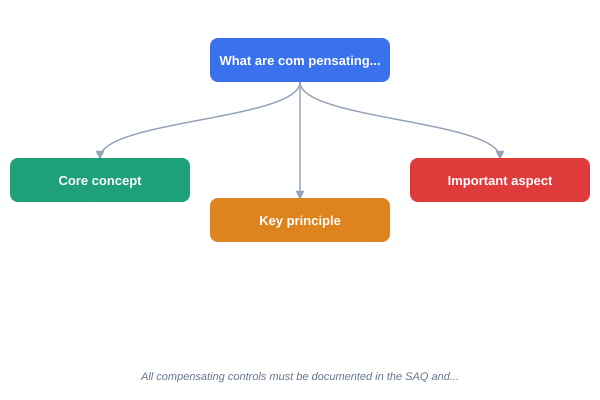
</a>
<a href="../../assets/images/diagrams/cyber-security/09-grc/what-are-compensating-controls-in-pci-dss-sticky.svg" target="_blank" rel="noopener">
  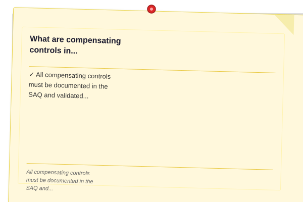
</a>


**A:** Compensating controls are alternative security measures that mitigate the risk of a PCI DSS requirement that cannot be met due to legitimate technical or business constraints. They must: (1) Meet the intent and rigor of the original requirement, (2) Provide a similar level of defense, (3) Be "above and beyond" other PCI DSS requirements, (4) Be commensurate with the additional risk imposed. Example: If an organization cannot use point-to-point encryption (P2PE) for cardholder data at a legacy POS terminal, they might implement network segmentation (isolate the POS from the rest of the network), plus file integrity monitoring on the POS, plus physical security controls over the terminal. All compensating controls must be documented in the SAQ and validated by the QSA.

### Q23: What is the role of the Data Protection Officer (DPO) under GDPR?

<a href="../../assets/images/diagrams/cyber-security/09-grc/what-is-the-role-of-the-data-protection-officer-dpo-under-gdpr-handwritten.svg" target="_blank" rel="noopener">
  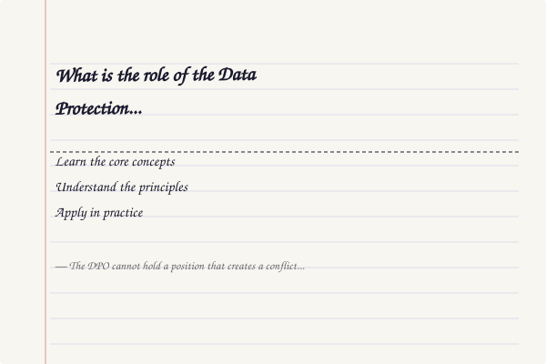
</a>
<a href="../../assets/images/diagrams/cyber-security/09-grc/what-is-the-role-of-the-data-protection-officer-dpo-under-gdpr-diagram.svg" target="_blank" rel="noopener">
  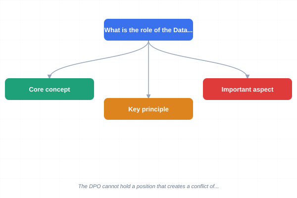
</a>
<a href="../../assets/images/diagrams/cyber-security/09-grc/what-is-the-role-of-the-data-protection-officer-dpo-under-gdpr-sticky.svg" target="_blank" rel="noopener">
  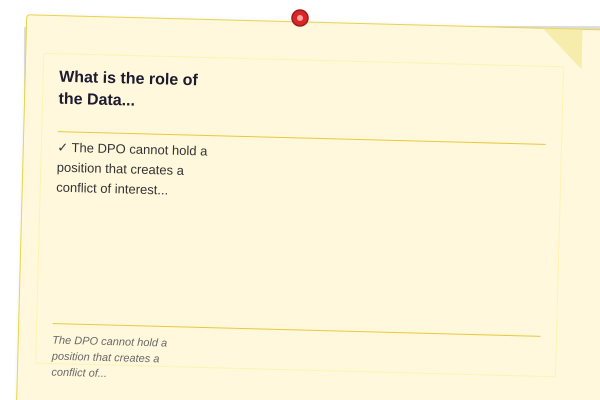
</a>


**A:** The DPO is a mandatory role under GDPR Article 37 for: (1) Public authorities, (2) Organizations that systematically monitor individuals on a large scale, (3) Organizations that process special categories of data (health, criminal, biometric) on a large scale. DPO responsibilities (Article 39): (a) Inform and advise the organization and its employees of GDPR obligations, (b) Monitor compliance → including awareness-raising, training, and audits, (c) Provide advice on DPIAs, (d) Cooperate with the supervisory authority, (e) Act as contact point for the supervisory authority and data subjects. The DPO must have independence → cannot be dismissed or penalized for performing duties, must report to the highest management level, and must have adequate resources. The DPO cannot hold a position that creates a conflict of interest (e.g., cannot be both DPO and CIO).

### Q24: What is the difference between a Security Incident and a Security Event?

<a href="../../assets/images/diagrams/cyber-security/09-grc/what-is-the-difference-between-a-security-incident-and-a-security-event-handwritten.svg" target="_blank" rel="noopener">
  
</a>
<a href="../../assets/images/diagrams/cyber-security/09-grc/what-is-the-difference-between-a-security-incident-and-a-security-event-diagram.svg" target="_blank" rel="noopener">
  
</a>
<a href="../../assets/images/diagrams/cyber-security/09-grc/what-is-the-difference-between-a-security-incident-and-a-security-event-sticky.svg" target="_blank" rel="noopener">
  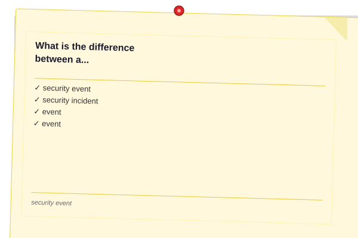
</a>


**A:** A **security event** is any observable occurrence in a system or network (a log entry, an alert, a user login). Most events are benign. A **security incident** is a confirmed or suspected violation of security policy that could harm the organization. All incidents are events, but not all events are incidents. Example: A failed login attempt is an **event**. 100 failed login attempts from the same IP in 5 minutes is an **event** that might trigger an alert. If investigation confirms a brute-force attack that successfully compromised an account, that's now an **incident**. The incident response plan is activated for incidents, not events. This distinction is critical for SOC operations to avoid alert fatigue.

### Q25: Explain the concept of "defense in depth" and how it maps to GRC.

<a href="../../assets/images/diagrams/cyber-security/09-grc/explain-the-concept-of-defense-in-depth-and-how-it-maps-to-grc-handwritten.svg" target="_blank" rel="noopener">
  
</a>
<a href="../../assets/images/diagrams/cyber-security/09-grc/explain-the-concept-of-defense-in-depth-and-how-it-maps-to-grc-diagram.svg" target="_blank" rel="noopener">
  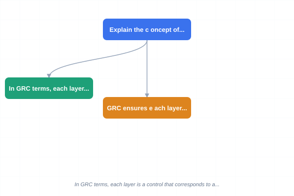
</a>
<a href="../../assets/images/diagrams/cyber-security/09-grc/explain-the-concept-of-defense-in-depth-and-how-it-maps-to-grc-sticky.svg" target="_blank" rel="noopener">
  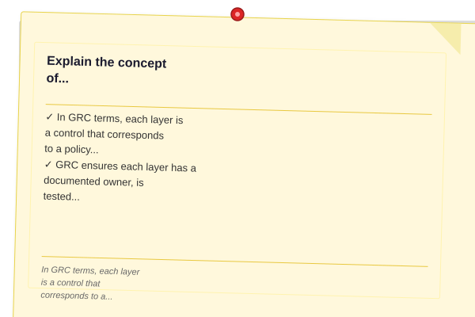
</a>


**A:** Defense in depth is a layered security strategy where multiple independent controls protect the same asset, so if one fails, another still provides protection. In GRC terms, each layer is a control that corresponds to a policy requirement, risk mitigation, or compliance mandate. Layers typically include: (1) Physical security (fences, locks, guards) → policy: Physical Security Policy, (2) Network security (firewalls, IDS/IPS, segmentation) → standard: Network Security Standard, (3) Endpoint security (EDR, antivirus, patch management) → baseline: Endpoint Security Baseline, (4) Application security (WAF, input validation, secure coding) → procedure: Secure SDLC Procedure, (5) Data security (encryption, DLP, access controls) → standard: Data Protection Standard, (6) Identity security (MFA, RBAC, PAM) → policy: Access Control Policy, (7) Administrative controls (awareness training, background checks) → procedure: Onboarding Procedure. GRC ensures each layer has a documented owner, is tested periodically, and has compensating controls for known gaps.

### Q26: What is the "three lines of defense" model?

<a href="../../assets/images/diagrams/cyber-security/09-grc/what-is-the-three-lines-of-defense-model-handwritten.svg" target="_blank" rel="noopener">
  
</a>
<a href="../../assets/images/diagrams/cyber-security/09-grc/what-is-the-three-lines-of-defense-model-diagram.svg" target="_blank" rel="noopener">
  
</a>
<a href="../../assets/images/diagrams/cyber-security/09-grc/what-is-the-three-lines-of-defense-model-sticky.svg" target="_blank" rel="noopener">
  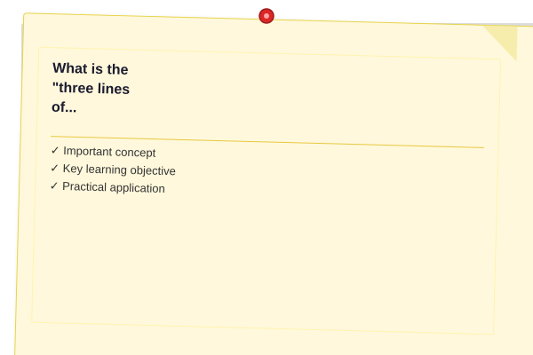
</a>


**A:** The Three Lines of Defense model defines how risk and control responsibilities are distributed:

| Line | Who | Role | GRC Example |
|------|-----|------|-------------|
| **1st Line** | Operational management (business units, IT operations) | Own and manage risk. Implement and operate controls. | System administrator reviews access logs daily. Developer follows secure coding standards. |
| **2nd Line** | Risk management, compliance, security oversight | Monitor risk, set policies, provide guidance, challenge first line. | GRC team defines patch management policy. Risk team tracks open vulnerabilities. Compliance team monitors regulatory changes. |
| **3rd Line** | Internal audit | Independent assurance. Evaluate effectiveness of governance, risk management, and controls. | Internal auditor tests whether patching controls actually work. Reports findings to Audit Committee. |

External audit, regulators, and independent assessors sit outside the model but provide additional assurance.

### Q27: What is a "materiality threshold" in the context of risk?

<a href="../../assets/images/diagrams/cyber-security/09-grc/what-is-a-materiality-threshold-in-the-context-of-risk-handwritten.svg" target="_blank" rel="noopener">
  
</a>
<a href="../../assets/images/diagrams/cyber-security/09-grc/what-is-a-materiality-threshold-in-the-context-of-risk-diagram.svg" target="_blank" rel="noopener">
  
</a>
<a href="../../assets/images/diagrams/cyber-security/09-grc/what-is-a-materiality-threshold-in-the-context-of-risk-sticky.svg" target="_blank" rel="noopener">
  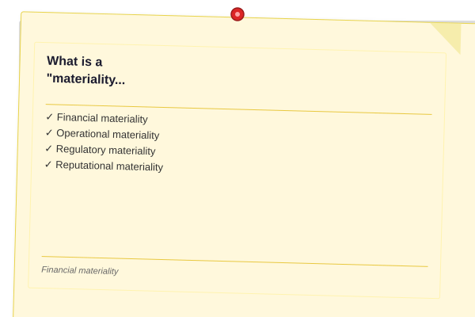
</a>


**A:** Materiality threshold is the level at which a risk becomes significant enough to require disclosure to the board, regulators, shareholders, or the public. It's borrowed from financial auditing (SEC defines materiality as information that would influence a reasonable investor's decision). In cybersecurity: (1) **Financial materiality** → breach costs exceeding X% of revenue (e.g., 3% for SEC proposed rules), (2) **Operational materiality** → downtime exceeding MTD, (3) **Regulatory materiality** → breach volume exceeding GDPR notification thresholds, (4) **Reputational materiality** → breach affecting VIP customers or causing national news coverage. SEC's 2023 cybersecurity disclosure rules require public companies to disclose material cybersecurity incidents within 4 business days. The CISO and CFO must agree on materiality assessment criteria before an incident occurs.

### Q28: How do you build a business case for security investment?

<a href="../../assets/images/diagrams/cyber-security/09-grc/how-do-you-build-a-business-case-for-security-investment-handwritten.svg" target="_blank" rel="noopener">
  
</a>
<a href="../../assets/images/diagrams/cyber-security/09-grc/how-do-you-build-a-business-case-for-security-investment-diagram.svg" target="_blank" rel="noopener">
  
</a>
<a href="../../assets/images/diagrams/cyber-security/09-grc/how-do-you-build-a-business-case-for-security-investment-sticky.svg" target="_blank" rel="noopener">
  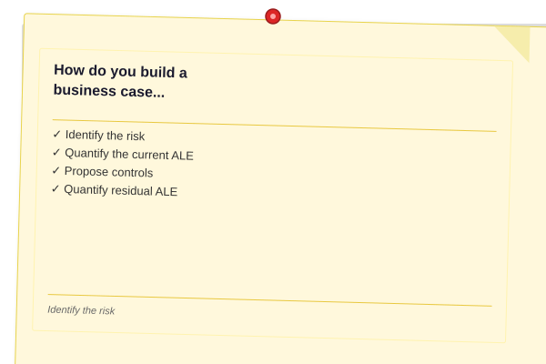
</a>


**A:** A security business case must speak the language of the CFO → ROI and risk reduction. Framework: (1) **Identify the risk** → what could happen (ransomware encrypting 500 servers), probability (20% annual), impact ($5M). (2) **Quantify the current ALE** → $5M x 0.2 = $1M/year. (3) **Propose controls** → EDR + immutable backups + IR retainer = $200K/year. (4) **Quantify residual ALE** → after controls, likelihood drops to 5%, impact drops to $500K. New ALE = $25K/year. (5) **Calculate ROSI** → ($1M - $25K - $200K) / $200K = 387%. (6) **Include qualitative factors** → regulatory fines, reputational damage, customer trust. (7) **Compare to alternatives** → cyber insurance ($150K/year with $500K deductible) vs self-insuring vs accepting risk. (8) **Request specific budget** → with clear deliverables, timeline, and success metrics.

### Q29: What is the difference between an Information Security Policy and an ISMS Scope?

<a href="../../assets/images/diagrams/cyber-security/09-grc/what-is-the-difference-between-an-information-security-policy-and-an-isms-scope-handwritten.svg" target="_blank" rel="noopener">
  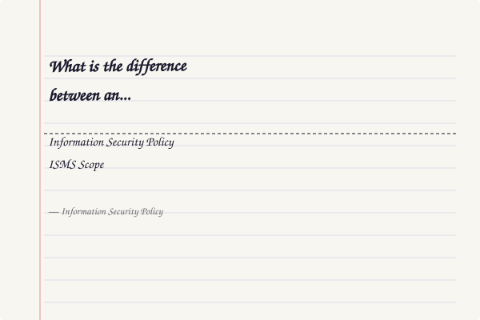
</a>
<a href="../../assets/images/diagrams/cyber-security/09-grc/what-is-the-difference-between-an-information-security-policy-and-an-isms-scope-diagram.svg" target="_blank" rel="noopener">
  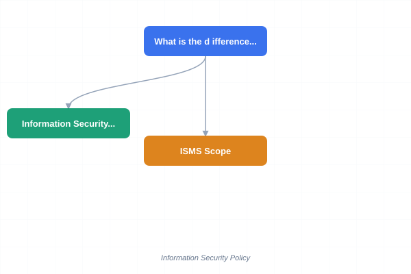
</a>
<a href="../../assets/images/diagrams/cyber-security/09-grc/what-is-the-difference-between-an-information-security-policy-and-an-isms-scope-sticky.svg" target="_blank" rel="noopener">
  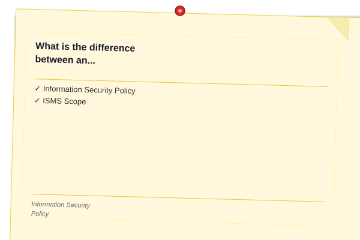
</a>


**A:** The **Information Security Policy** (ISO 27001 Clause 5.2) is a high-level document that states management's commitment to information security, defines high-level objectives, and assigns responsibilities. It's typically 2-5 pages and applies to the entire organization. The **ISMS Scope** (Clause 4.3) defines the boundaries of the Information Security Management System → which systems, departments, locations, and data are covered by ISO 27001 certification. The scope might be narrower than the entire organization (e.g., "The ISMS covers the production data center in Frankfurt and all customer data processing systems. Corporate HR systems are out of scope."). The scope is determined by: organizational context, stakeholder requirements, interfaces and dependencies with external organizations, and excluded systems with justification.

### Q30: What are the key considerations for international data transfers under GDPR?

<a href="../../assets/images/diagrams/cyber-security/09-grc/what-are-the-key-considerations-for-international-data-transfers-under-gdpr-handwritten.svg" target="_blank" rel="noopener">
  
</a>
<a href="../../assets/images/diagrams/cyber-security/09-grc/what-are-the-key-considerations-for-international-data-transfers-under-gdpr-diagram.svg" target="_blank" rel="noopener">
  
</a>
<a href="../../assets/images/diagrams/cyber-security/09-grc/what-are-the-key-considerations-for-international-data-transfers-under-gdpr-sticky.svg" target="_blank" rel="noopener">
  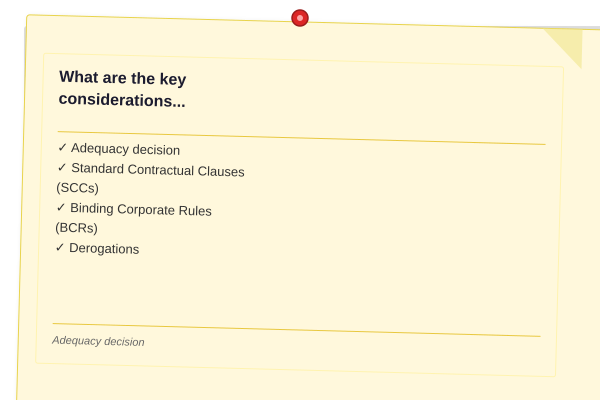
</a>


**A:** GDPR Chapter V restricts transfers of personal data outside the EU/EEA unless one of the following "transfer mechanisms" is in place: (1) **Adequacy decision** → European Commission determines the destination country has "adequate" data protection (currently: Andorra, Argentina, Canada (commercial), Faroe Islands, Guernsey, Israel, Isle of Man, Japan, Jersey, New Zealand, Republic of Korea, Switzerland, UK, United States (Data Privacy Framework), Uruguay). (2) **Standard Contractual Clauses (SCCs)** → pre-approved contractual clauses between data exporter and importer. Updated in 2021 (Module 1-4). Must conduct Transfer Impact Assessment (TIA). (3) **Binding Corporate Rules (BCRs)** → approved internal data protection policies for multinational groups. (4) **Derogations** → explicit consent, contract necessity, vital interests, public interest, legal claims, or legitimate interests (must notify and document). Key consideration post-Schrems II (CJEU 2020): even with SCCs, you must assess whether the destination country's laws provide "essentially equivalent" protection → if not, you need supplementary measures (technical encryption, contractual enforcement, data minimization).

### 15.2 Expanded Dry Run: Full Risk Assessment Walkthrough

<a href="../../assets/images/diagrams/cyber-security/09-grc/15-2-expanded-dry-run-full-risk-assessment-walkthrough-handwritten.svg" target="_blank" rel="noopener">
  
</a>
<a href="../../assets/images/diagrams/cyber-security/09-grc/15-2-expanded-dry-run-full-risk-assessment-walkthrough-diagram.svg" target="_blank" rel="noopener">
  
</a>
<a href="../../assets/images/diagrams/cyber-security/09-grc/15-2-expanded-dry-run-full-risk-assessment-walkthrough-sticky.svg" target="_blank" rel="noopener">
  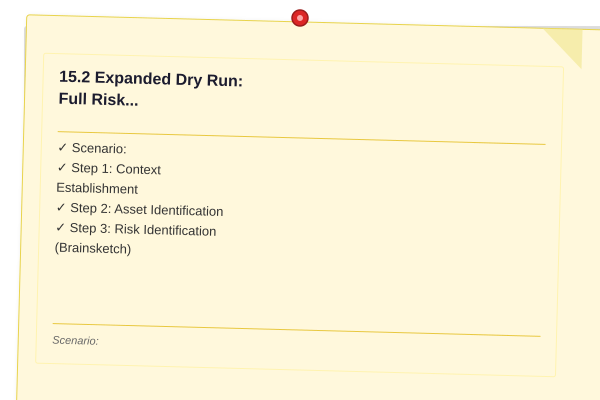
</a>


**Scenario:** Mid-size healthcare SaaS company (200 employees) preparing for SOC 2 Type II audit. They process PHI for 50+ US hospitals.

**Step 1: Context Establishment**
- Organization: HealthCloud Inc.
- Scope: All systems that store, process, or transmit PHI
- Risk appetite: "No residual risk above 'Medium' for PHI systems. Maximum annualized loss acceptance: $500K."
- Stakeholders: CISO, CTO, VP Product, Compliance Officer, Head of Engineering

**Step 2: Asset Identification**

| Asset ID | Asset | Owner | Classification | Location |
|----------|-------|-------|---------------|----------|
| A-001 | Patient Database (PostgreSQL) | DBA | PHI / Restricted | AWS RDS (us-east-1) |
| A-002 | API Gateway | CTO | Confidential | AWS API Gateway |
| A-003 | Web Application (React + Node.js) | VP Eng | Confidential | AWS ECS |
| A-004 | Employee Workstations (200 laptops) | IT Director | Internal | Remote / Office |
| A-005 | Backup System (Veeam + S3) | DBA | PHI / Restricted | AWS S3 (us-west-2) |
| A-006 | SIEM (Splunk Cloud) | CISO | Confidential | SaaS |

**Step 3: Risk Identification (Brainsketch)**

| Risk ID | Scenario | Threat Actor | Vulnerability | Asset(s) Affected |
|---------|----------|-------------|---------------|-------------------|
| R-001 | Ransomware encrypts patient database | Cybercriminal gang | No immutable backups, legacy Windows servers | A-001, A-005 |
| R-002 | SQL injection exposes PHI | External attacker | Unparameterized queries in search endpoint | A-001, A-002, A-003 |
| R-003 | Employee laptop stolen with PHI | Opportunistic thief | No full-disk encryption on 30% of laptops | A-004 |
| R-004 | AWS S3 bucket misconfiguration exposes data | External attacker | S3 bucket publicly accessible (human error) | A-001 (backup) |
| R-005 | Insider threat → DBA exfiltrates patient records | Disgruntled employee | No DLP, no separation of duties | A-001 |
| R-006 | Cloud provider outage (AWS us-east-1) | Natural/environmental | Single-region deployment | A-001, A-002, A-003 |
| R-007 | Credential stuffing on API gateway | Automated bot | No rate limiting, no MFA on API keys | A-002 |
| R-008 | Zero-day in Node.js runtime | APT | No WAF, no RASP, no vulnerability management | A-003 |
| R-009 | Vendor breach → AWS itself | Sophisticated attacker | Over-reliance on single provider | All |
| R-010 | Social engineering of help desk | Social engineer | Weak identity verification process | A-004 (access to company email) |

**Step 4: Qualitative Risk Assessment (5x5 Matrix)**

| Risk ID | Likelihood (1-5) | Impact (1-5) | Inherent Score | Inherent Level |
|---------|-----------------|--------------|----------------|----------------|
| R-001 | 4 (Likely) | 5 (Severe) | 20 | Critical |
| R-002 | 3 (Possible) | 5 (Severe) | 15 | High |
| R-003 | 3 (Possible) | 4 (Major) | 12 | High |
| R-004 | 2 (Unlikely) | 5 (Severe) | 10 | High |
| R-005 | 2 (Unlikely) | 5 (Severe) | 10 | High |
| R-006 | 2 (Unlikely) | 4 (Major) | 8 | Medium |
| R-007 | 4 (Likely) | 3 (Moderate) | 12 | High |
| R-008 | 2 (Unlikely) | 5 (Severe) | 10 | High |
| R-009 | 1 (Rare) | 5 (Severe) | 5 | Medium |
| R-010 | 3 (Possible) | 3 (Moderate) | 9 | Medium |

**Step 5: Control Identification**

| Risk ID | Existing Controls | Control Effectiveness | Residual Likelihood | Residual Impact | Residual Score |
|---------|-----------------|---------------------|--------------------|-----------------|----------------|
| R-001 | Backups to S3 (but not immutable). Endpoint detection on 70% of servers. | Partial | 3 | 5 | 15 (High) |
| R-002 | WAF (AWS WAF). Code review in CI/CD. SAST scanning. | Moderate | 2 | 4 | 8 (Medium) |
| R-003 | BitLocker on 70% of laptops. MDM (Intune) on 80%. | Partial | 2 | 3 | 6 (Medium) |
| R-004 | S3 Block Public Access at account level. CloudTrail logging. | Strong | 1 | 5 | 5 (Low) |
| R-005 | MFA for database access. Audit logging enabled. | Moderate | 2 | 4 | 8 (Medium) |
| R-006 | Multi-AZ deployment in us-east-1. | Partial | 2 | 4 | 8 (Medium) |
| R-007 | API keys required. WAF rate limiting partially configured. | Partial | 3 | 3 | 9 (Medium) |
| R-008 | Automatic patching for critical CVEs (within 30 days). | Moderate | 1 | 5 | 5 (Low) |
| R-009 | SOC 2 report reviewed. Contract includes SLA. | Strong | 1 | 5 | 5 (Low) |
| R-010 | Help desk verify via email (weak). No knowledge-based auth. | Weak | 3 | 3 | 9 (Medium) |

**Step 6: Risk Treatment Planning**

| Risk ID | Response | Treatment | Timeline | Owner | Cost | Target Residual |
|---------|----------|-----------|----------|-------|------|-----------------|
| R-001 | Mitigate | Deploy immutable backups (Veeam + S3 Object Lock). Deploy EDR on remaining servers. Complete HIDS on all servers. | 30 days | Infra Team | $40K | 3 (Low) |
| R-002 | Mitigate | Remediate all SQLi findings from DAST scan. Implement parameterized queries. Deploy RASP. | 60 days | AppSec Team | $30K | 4 (Low) |
| R-003 | Mitigate | Enforce BitLocker via Intune policy on remaining 30%. Enable remote wipe. Deploy endpoint DLP. | 45 days | IT Team | $25K | 4 (Low) |
| R-004 | Accept | Current controls adequate. Monitor for new external S3 buckets via Security Hub. | N/A | Cloud Team | $0 | 5 (Low) |
| R-005 | Mitigate | Deploy separation of duties in RDS (DBA cannot export without manager approval). Deploy UEBA for database access. | 90 days | Security Team | $50K | 4 (Low) |
| R-006 | Mitigate | Deploy active-passive in us-west-2. Test failover quarterly. | 180 days | Infra Team | $100K | 2 (Low) |
| R-007 | Mitigate | Implement rate limiting (100 req/min per API key). Deploy API gateway WAF rules. Implement MFA for API key generation. | 30 days | Security Team | $15K | 4 (Low) |
| R-008 | Accept | Current controls adequate. Add WAF OWASP rules for Node.js zero-day protection. | 30 days | AppSec Team | $5K | 3 (Low) |
| R-009 | Accept | Current controls adequate. AWS is well-audited. Maintain multi-cloud option for future. | N/A | CISO | $0 | 5 (Low) |
| R-010 | Mitigate | Deploy knowledge-based authentication (KBA) for help desk. Implement identity verification workflow. | 30 days | IT Team | $10K | 4 (Low) |

**Step 7: Risk Register Update & Reporting**

Total inherent risk: 20 + 15 + 12 + 10 + 10 + 8 + 12 + 10 + 5 + 9 = 111
Total residual risk after treatment: 3 + 4 + 4 + 5 + 4 + 2 + 4 + 3 + 5 + 4 = 38
Risk reduction: 66%

**Presentation to Board:**
- "We identified 10 critical and high risks across our PHI environment"
- "Current risk posture: 6 risks at High or Critical level"
- "After proposed controls ($275K investment): all risks reduced to Low or Medium"
- "Total risk reduction: 66%. ROI: $4.2M in avoided breach costs (conservative estimate based on industry averages)"
- "Decision required: Approve $275K security budget for Q3 and Q4"

### 15.3 Expanded Privacy: DSAR Response Template

<a href="../../assets/images/diagrams/cyber-security/09-grc/15-3-expanded-privacy-dsar-response-template-handwritten.svg" target="_blank" rel="noopener">
  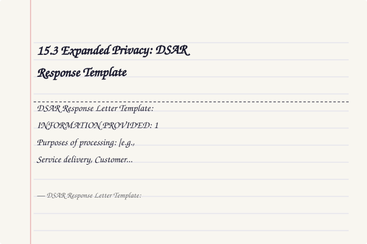
</a>
<a href="../../assets/images/diagrams/cyber-security/09-grc/15-3-expanded-privacy-dsar-response-template-diagram.svg" target="_blank" rel="noopener">
  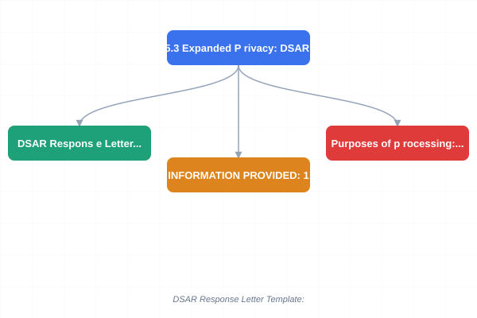
</a>
<a href="../../assets/images/diagrams/cyber-security/09-grc/15-3-expanded-privacy-dsar-response-template-sticky.svg" target="_blank" rel="noopener">
  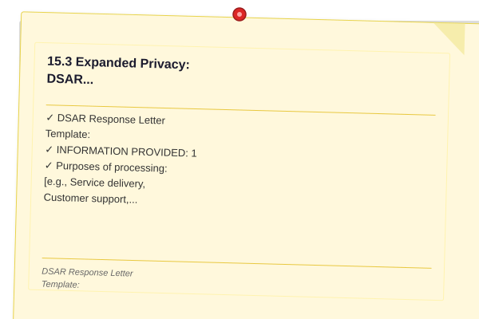
</a>


**DSAR Response Letter Template:**

```
[Company Letterhead]

Date: [DATE]
Reference: DSAR-[REFERENCE-NUMBER]
To: [DATA SUBJECT NAME]
From: [DPO NAME], Data Protection Officer

RE: RESPONSE TO DATA SUBJECT ACCESS REQUEST

Dear [NAME],

Thank you for your data subject access request received on [DATE].

Please find attached the personal data we hold about you, as defined by Article 15 of the General Data Protection Regulation (GDPR).

INFORMATION PROVIDED:

1. Categories of personal data we process:
   [List categories → e.g., Identity data, Contact data, Financial data, Transaction data]

2. Purposes of processing:
   [e.g., Service delivery, Customer support, Marketing (with consent), Legal obligations]

3. Recipients who have received your personal data:
   [List recipients or categories → e.g., Payment processor (Stripe), Email provider (SendGrid)]

4. Retention periods:
   [e.g., Customer data: 5 years after last transaction. Marketing data: Until consent withdrawn.]

5. Source of data (if not collected directly from you):
   [e.g., Publicly available sources, Referral partners]

6. Automated decision-making:
   [Describe any automated decisions and the logic involved]

The data is provided in machine-readable format (CSV and PDF) as requested.

If you believe any of the data is inaccurate or incomplete, you have the right to request rectification (Article 16). If you wish to exercise any other rights (erasure, restriction, portability, objection), please contact us at privacy@company.com.

If you are unsatisfied with this response, you have the right to lodge a complaint with the Supervisory Authority: [DPA NAME AND CONTACT].

Sincerely,

[DPO NAME]
Data Protection Officer
[Company Name]
```

### 15.4 Expanded Metrics: Security Scorecard

<a href="../../assets/images/diagrams/cyber-security/09-grc/15-4-expanded-metrics-security-scorecard-handwritten.svg" target="_blank" rel="noopener">
  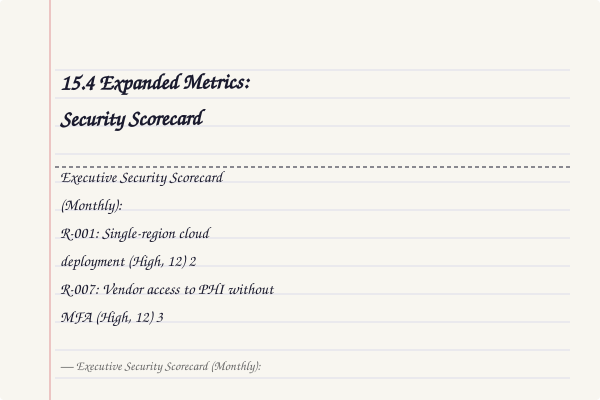
</a>
<a href="../../assets/images/diagrams/cyber-security/09-grc/15-4-expanded-metrics-security-scorecard-diagram.svg" target="_blank" rel="noopener">
  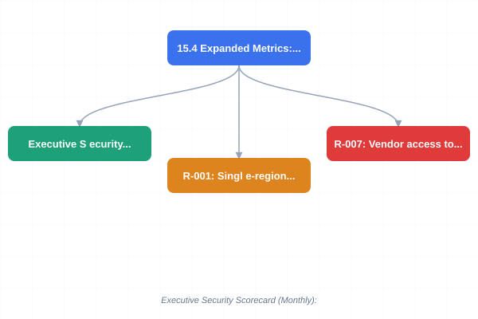
</a>
<a href="../../assets/images/diagrams/cyber-security/09-grc/15-4-expanded-metrics-security-scorecard-sticky.svg" target="_blank" rel="noopener">
  
</a>


**Executive Security Scorecard (Monthly):**

```
SECURITY SCORECARD → [MONTH] [YEAR]
Prepared by: GRC Team | Distribution: CISO, CIO, Audit Committee

OVERALL SECURITY POSTURE: 72/100 (MODERATE)
Trend: +4 points from last month

GOVERNANCE (15/20)
  [+] Policy compliance rate: 94% (target: 95%) 
  [+] Open policy exceptions: 8 (target: <10)
  [=] Annual policy review completion: 60% (on track)
  [-] Board security update: Quarterly (schedule met)

RISK MANAGEMENT (18/25)
  [+] Open critical risks: 1 (target: 0) → remediation due 04/15
  [=] Open high risks: 5 (target: <5) → trending down from 8 last quarter
  [+] Risk assessments completed: 3/3 for Q1 (vendor, new app, annual)
  [-] Cyber insurance renewal: Pending → new requirements not yet met

COMPLIANCE (20/25)
  [+] SOX ITGC: 0 critical findings (last audit)
  [-] PCI DSS quarterly ASV scan: 2 high findings open (>30 days)
  [+] GDPR DSARs: 100% completed within 30-day SLA (8/8)
  [=] SOC 2 Type II: In progress → evidence collection phase

OPERATIONS (19/30)
  [+] Phishing click rate: 3.2% (target: <5%)
  [+] MFA enrollment: 99% (5 users remaining)
  [=] Patch critical vulns within 30 days: 92% (target: 95%)
  [-] EDR coverage: 94% (target: 100%) → 12 endpoints missing
  [-] Dormant accounts disabled: 4 accounts >90 days inactive
  [-] Vendor assessments overdue: 3 (Tier 1 vendors)

KEY INITIATIVES:
  - RBAC implementation for Salesforce: On track, completion 05/15
  - Vendor risk program automation: Delayed 2 weeks (resource constraints)
  - Incident response tabletop: Scheduled 04/20

RISK REGISTER TOP 5:
  1. R-001: Single-region cloud deployment (High, 12)
  2. R-007: Vendor access to PHI without MFA (High, 12)
  3. R-003: Incomplete endpoint security (Medium, 8)
  4. R-008: ASV scan findings overdue (Medium, 8)
  5. R-012: No DLP for email exfiltration (Medium, 6)

ALERTS / ESCALATIONS:
  - None this month

APPROVED BY: [CISO SIGNATURE] | [DATE]
```

### 15.5 Expanded Frameworks: COBIT 2019 Governance Objectives (Detailed)

<a href="../../assets/images/diagrams/cyber-security/09-grc/15-5-expanded-frameworks-cobit-2019-governance-objectives-detailed-handwritten.svg" target="_blank" rel="noopener">
  
</a>
<a href="../../assets/images/diagrams/cyber-security/09-grc/15-5-expanded-frameworks-cobit-2019-governance-objectives-detailed-diagram.svg" target="_blank" rel="noopener">
  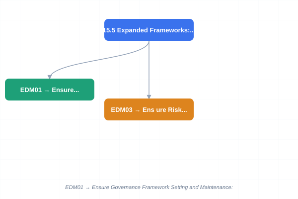
</a>
<a href="../../assets/images/diagrams/cyber-security/09-grc/15-5-expanded-frameworks-cobit-2019-governance-objectives-detailed-sticky.svg" target="_blank" rel="noopener">
  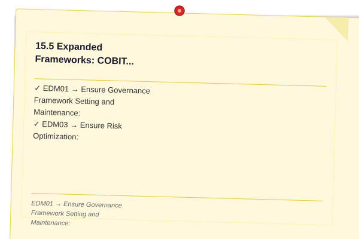
</a>


**EDM01 → Ensure Governance Framework Setting and Maintenance:**

| Management Practice | Description | Key Activities |
|--------------------|-------------|----------------|
| EDM01.01 | Evaluate the governance system | Review governance framework annually; assess stakeholder needs; identify gaps |
| EDM01.02 | Direct the governance system | Communicate governance principles; assign responsibilities; define decision rights |
| EDM01.03 | Monitor the governance system | Monitor effectiveness via KPIs; assess compliance; report to board |

**EDM03 → Ensure Risk Optimization:**

| Management Practice | Description | Key Activities |
|--------------------|-------------|----------------|
| EDM03.01 | Evaluate risk management | Define risk appetite; approve risk methodology; align with enterprise strategy |
| EDM03.02 | Direct risk management | Direct risk management policies; approve risk tolerance levels; delegate authority |
| EDM03.03 | Monitor risk management | Review risk exposure reports quarterly; monitor risk treatment; assess emerging risks |

### 15.6 Expanded Regulations: Key Compliance Deadlines Calendar

<a href="../../assets/images/diagrams/cyber-security/09-grc/15-6-expanded-regulations-key-compliance-deadlines-calendar-handwritten.svg" target="_blank" rel="noopener">
  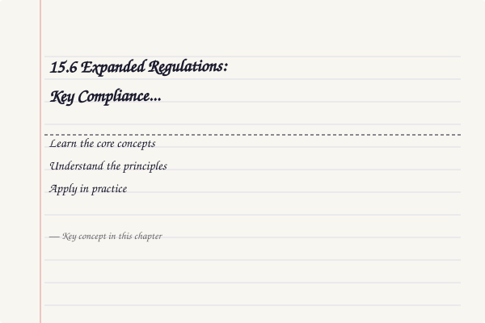
</a>
<a href="../../assets/images/diagrams/cyber-security/09-grc/15-6-expanded-regulations-key-compliance-deadlines-calendar-diagram.svg" target="_blank" rel="noopener">
  
</a>
<a href="../../assets/images/diagrams/cyber-security/09-grc/15-6-expanded-regulations-key-compliance-deadlines-calendar-sticky.svg" target="_blank" rel="noopener">
  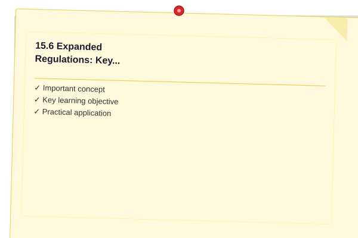
</a>


| Regulation | Requirement | Deadline Type | Frequency | Responsible |
|-----------|-------------|---------------|-----------|-------------|
| GDPR | ROPA update | Rolling event | Whenever processing changes | DPO |
| GDPR | DPIA | Before processing | Per new processing | DPO |
| GDPR | Breach notification to DPA | 72 hours | Per incident | Incident Response |
| GDPR | Contract review (SCCs) | Rolling | Per new vendor | Legal |
| PCI DSS 4.0 | ASV scan | Quarterly | Every 90 days | Security Team |
| PCI DSS 4.0 | ROC/SAQ submission | Annual | By anniversary | Compliance |
| PCI DSS 4.0 | Penetration test | Annual | By anniversary | Security Team |
| PCI DSS 4.0 | Firewall rule review | Quarterly | Every 90 days | Network Team |
| HIPAA | Risk analysis | Biennial | Every 2 years | Security Team |
| HIPAA | Security awareness training | Annual | By anniversary | HR |
| HIPAA | BAA review | Rolling | Per new vendor | Legal |
| SOC 2 | Type II report | Annual | Per audit period | Compliance |
| SOX | Access recertification | Quarterly | Every 90 days | IT / Finance |
| SOX | ITGC testing | Annual | Per fiscal year | Internal Audit |
| FedRAMP | Continuous monitoring report | Monthly | Every 30 days | Cloud Team |
| FedRAMP | Annual assessment | Annual | By anniversary | 3PAO |

### 15.7 Expanded Exercises: Additional Challenge Problems

<a href="../../assets/images/diagrams/cyber-security/09-grc/15-7-expanded-exercises-additional-challenge-problems-handwritten.svg" target="_blank" rel="noopener">
  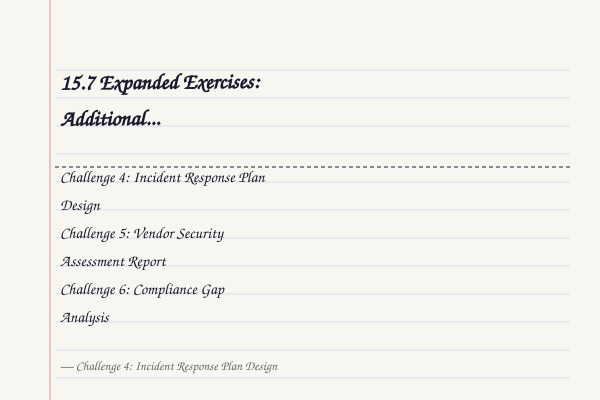
</a>
<a href="../../assets/images/diagrams/cyber-security/09-grc/15-7-expanded-exercises-additional-challenge-problems-diagram.svg" target="_blank" rel="noopener">
  
</a>
<a href="../../assets/images/diagrams/cyber-security/09-grc/15-7-expanded-exercises-additional-challenge-problems-sticky.svg" target="_blank" rel="noopener">
  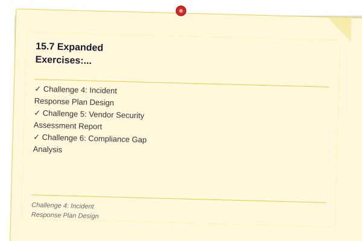
</a>


**Challenge 4: Incident Response Plan Design**
Design an incident response plan for a publicly traded e-commerce company that processes credit cards (PCI DSS) and collects customer PII from EU customers (GDPR). Include: team roles, escalation criteria, breach notification procedures (PCI DSS + GDPR timelines), communication templates, evidence collection procedures, and post-incident review process. Minimum 5 pages.

**Challenge 5: Vendor Security Assessment Report**
You've completed a security assessment of a new cloud-based HR SaaS vendor (Workday competitor). They will process employee PII (SSN, salary, medical leave, performance reviews). The assessment revealed: SOC 2 Type II report available (but 6 months old), no MFA on admin accounts (only password), data stored in US only (no EU option), encryption at rest is AES-256, breach notification SLA is 7 days. Write a vendor risk assessment report with findings, risk scores, and go/no-go recommendation.

**Challenge 6: Compliance Gap Analysis**
Your organization needs to achieve PCI DSS 4.0 compliance for the first time (moving from SAQ A to SAQ D). Current state: 50 employees, custom e-commerce platform, AWS-hosted, Stripe for payments, shared hosting with other applications in same AWS account. Identify minimum 15 gaps and create a 6-month remediation roadmap with estimated effort and cost.

### 15.8 Expanded Applications: GRC in Emerging Technologies

<a href="../../assets/images/diagrams/cyber-security/09-grc/15-8-expanded-applications-grc-in-emerging-technologies-handwritten.svg" target="_blank" rel="noopener">
  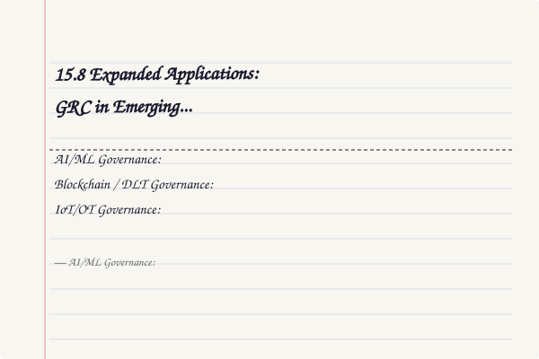
</a>
<a href="../../assets/images/diagrams/cyber-security/09-grc/15-8-expanded-applications-grc-in-emerging-technologies-diagram.svg" target="_blank" rel="noopener">
  
</a>
<a href="../../assets/images/diagrams/cyber-security/09-grc/15-8-expanded-applications-grc-in-emerging-technologies-sticky.svg" target="_blank" rel="noopener">
  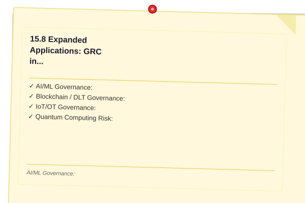
</a>


**AI/ML Governance:**
- EU AI Act (2025) → risk-based classification of AI systems (minimal, limited, high, unacceptable risk)
- NIST AI Risk Management Framework (AI RMF 1.0)
- Algorithmic impact assessments → similar to DPIA but for AI bias, safety, transparency
- Model card documentation → standard format for reporting model capabilities, limitations, and fairness metrics
- AI Bill of Materials (AIBOM) → similar to SBOM for machine learning models (training data sources, model architecture, performance metrics)

**Blockchain / DLT Governance:**
- Decentralized identity → self-sovereign identity (SSI) for access management
- Smart contract audits → third-party code review (similar to application security assessment)
- Consensus mechanism risk → 51% attack, governance token manipulation
- Regulatory compliance → FATF Travel Rule for crypto transactions, MiCA (EU Markets in Crypto Assets)

**IoT/OT Governance:**
- Purdue model segmentation for ICS/SCADA
- NIST IR 8259 → IoT device cybersecurity core baseline
- OT-specific risk assessments (IEC 62443 series → security for industrial automation)
- Physical security integration → badge access, CCTV, environmental monitoring as security controls

**Quantum Computing Risk:**
- Cryptographic agility → ability to migrate from current asymmetric crypto (RSA, ECC) to post-quantum cryptography (CRYSTALS-Kyber, Dilithium)
- Harvest-now-decrypt-later risk → adversaries collecting encrypted data today to decrypt with future quantum computers
- NIST post-quantum cryptography standardization (finalized 2024)
- Quantum risk register entry for all data with long-term confidentiality requirements

### 15.9 Common GRC Pitfalls and How to Avoid Them

<a href="../../assets/images/diagrams/cyber-security/09-grc/15-9-common-grc-pitfalls-and-how-to-avoid-them-handwritten.svg" target="_blank" rel="noopener">
  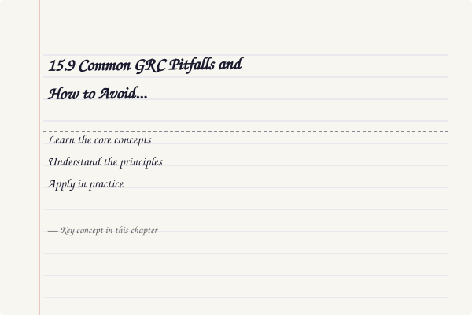
</a>
<a href="../../assets/images/diagrams/cyber-security/09-grc/15-9-common-grc-pitfalls-and-how-to-avoid-them-diagram.svg" target="_blank" rel="noopener">
  
</a>
<a href="../../assets/images/diagrams/cyber-security/09-grc/15-9-common-grc-pitfalls-and-how-to-avoid-them-sticky.svg" target="_blank" rel="noopener">
  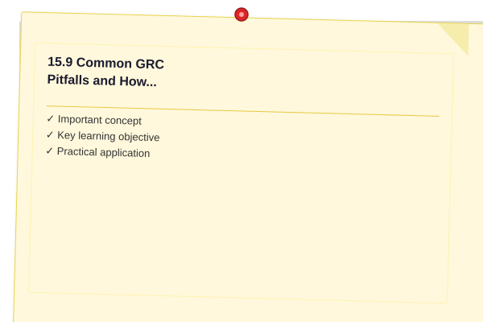
</a>


| Pitfall | Description | Prevention |
|---------|-------------|------------|
| **Checklist compliance** | Implementing controls to pass an audit without actually improving security | Focus on risk-based outcomes, not checkbox completion. Test controls annually. |
| **Risk register rot** | Risk register is created once and never updated | Quarterly review cycle. Automated integration with vulnerability management tools. |
| **Policy without enforcement** | Policies written but nobody reads or follows them | Automated enforcement (GPO, CASB, DLP). Signed acknowledgment tracking. Violation reporting. |
| **Framework shopping** | Continuously switching frameworks without completing any | Pick one framework (NIST CSF for strategy, ISO 27001 for certification), implement fully, then extend. |
| **Audit fatigue** | Too many overlapping audits exhausting the team | Align audit schedules. Map multiple regulations to common control framework. Use automation for evidence collection. |
| **Vendor assessment pileup** | Hundreds of vendor questionnaires with no triage | Tier vendors by criticality. Automate Tier 3 with self-assessment portals. Focus deep assessments on Tier 1 only. |
| **Metrics without decisions** | Dashboard shows red metrics but no action taken | Assign metric owners with authority to act. Escalation triggers for threshold breaches. |
| **One-size-fits-all training** | Same annual training for developers, executives, and receptionists | Role-based training: developers (secure coding), executives (whaling, regulatory risk), all (phishing, data handling). |
| **BCP/DR never tested** | Plan exists on paper but hasn't been tested in 3 years | Mandate annual full-scale test with pass/fail criteria. Tabletop exercises quarterly. |
| **Shadow IT unknown** | SaaS apps and cloud resources outside IT's visibility | CASB discovery, cloud access inventory, security champion program in each business unit. |
### 15.10 GRC Implementation Roadmap (12-Month Example)

<a href="../../assets/images/diagrams/cyber-security/09-grc/15-10-grc-implementation-roadmap-12-month-example-handwritten.svg" target="_blank" rel="noopener">
  
</a>
<a href="../../assets/images/diagrams/cyber-security/09-grc/15-10-grc-implementation-roadmap-12-month-example-diagram.svg" target="_blank" rel="noopener">
  
</a>
<a href="../../assets/images/diagrams/cyber-security/09-grc/15-10-grc-implementation-roadmap-12-month-example-sticky.svg" target="_blank" rel="noopener">
  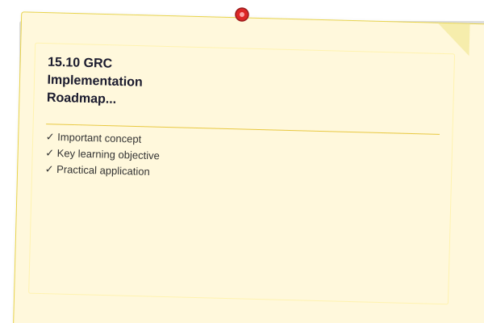
</a>


| Month | Phase | Key Activities | Deliverables |
|-------|-------|---------------|--------------|
| **M1** | Foundation | Risk appetite approved by Board, RACI created, GRC tool selected | Risk Appetite Statement, GRC Charter, Tool Contract |
| **M2** | Asset Discovery | CMDB populated, data classification schema approved, asset owners assigned | Asset Inventory, Data Classification Policy |
| **M3** | Risk Assessment | Organization-wide qualitative risk assessment completed, risk register created | Risk Register (50+ entries), BIA for top 10 systems |
| **M4** | Policy Overhaul | InfoSec Policy rewritten, Access Control Policy, Data Protection Standard, AUP | 5 policies approved, acknowledgment tracking live |
| **M5** | Control Implementation | MFA deployment, SIEM expansion, vulnerability scanning automated, DLP pilot | MFA coverage 100%, Splunk ingesting 95% of logs |
| **M6** | Compliance Readiness | PCI DSS gap assessment, GDPR ROPA completed, SOC 2 readiness assessment | Gap Report, ROPA, SOC 2 Readiness Checklist |
| **M7** | Vendor Program | TPRM policy approved, vendor tiers defined, questionnaire sent to Tier 1 vendors | TPRM Policy, Risk-Scored Vendor List, 20 Assessments |
| **M8** | Training Program | Security awareness program launched, phishing simulation platform deployed | 100% Training Completion, Baseline Phish Rate |
| **M9** | Audit Preparation | Internal audit conducted, findings remediated, evidence collected | Internal Audit Report, Remediation Log |
| **M10** | External Audit | SOC 2 Type II begins, PCI DSS QSA assessment, ISO 27001 Stage 1 audit | In-progress Audit, Pre-assessment Report |
| **M11** | Continuous Monitoring | Compliance automation tools deployed, dashboards operational, KRI reporting | Real-time Dashboard, Monthly Report Template |
| **M12** | Review & Plan | Annual risk assessment refresh, lessons learned, Year 2 roadmap | Year 2 Roadmap, Updated Risk Register, Board Report |

### 15.11 Glossary of Key GRC Terms

<a href="../../assets/images/diagrams/cyber-security/09-grc/15-11-glossary-of-key-grc-terms-handwritten.svg" target="_blank" rel="noopener">
  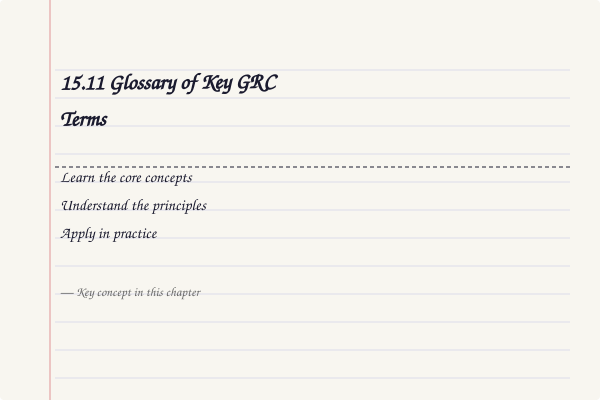
</a>
<a href="../../assets/images/diagrams/cyber-security/09-grc/15-11-glossary-of-key-grc-terms-diagram.svg" target="_blank" rel="noopener">
  
</a>
<a href="../../assets/images/diagrams/cyber-security/09-grc/15-11-glossary-of-key-grc-terms-sticky.svg" target="_blank" rel="noopener">
  
</a>


| Term | Definition |
|------|-----------|
| **ALE** | Annualized Loss Expectancy → expected annual financial loss from a risk (SLE x ARO) |
| **ARO** | Annualized Rate of Occurrence → expected frequency of a risk event per year |
| **BIA** | Business Impact Analysis → process of identifying critical functions and recovery requirements |
| **BCP** | Business Continuity Plan → plan to maintain operations during disruption |
| **CISO** | Chief Information Security Officer → executive responsible for information security |
| **CIS Controls** | Prioritized set of 18 cybersecurity best practices |
| **COBIT** | Control Objectives for Information and Related Technologies → IT governance framework |
| **CVSS** | Common Vulnerability Scoring System → standard for rating vulnerability severity (0-10) |
| **DAST** | Dynamic Application Security Testing → testing running applications for vulnerabilities |
| **DPA** | Data Protection Authority → national GDPR enforcement body |
| **DPIA** | Data Protection Impact Assessment → GDPR risk assessment for high-risk processing |
| **DPO** | Data Protection Officer → mandatory GDPR role for certain organizations |
| **DR** | Disaster Recovery → restoring IT systems after disruption |
| **DSAR** | Data Subject Access Request → GDPR right to access personal data |
| **EDR** | Endpoint Detection and Response → advanced anti-malware with behavioral detection |
| **FAIR** | Factor Analysis of Information Risk → quantitative risk analysis model |
| **FedRAMP** | Federal Risk and Authorization Management Program → US federal cloud security program |
| **GDPR** | General Data Protection Regulation → EU data protection law |
| **HIPAA** | Health Insurance Portability and Accountability Act → US healthcare privacy law |
| **IG1/2/3** | CIS Implementation Groups → tiered approach to implementing CIS Controls |
| **IR** | Incident Response → process of responding to security incidents |
| **ISMS** | Information Security Management System → ISO 27001 framework |
| **ITGC** | IT General Controls → SOX controls over IT systems supporting financial reporting |
| **KPI** | Key Performance Indicator → metric measuring performance against target |
| **KRI** | Key Risk Indicator → leading indicator predicting increased risk |
| **MFA** | Multi-Factor Authentication → authentication using 2+ factors (password + token) |
| **MTD** | Maximum Tolerable Downtime → longest acceptable outage before irreparable harm |
| **NIST CSF** | NIST Cybersecurity Framework → 6-function framework for cybersecurity programs |
| **PDCA** | Plan-Do-Check-Act → continuous improvement cycle in ISO 27001 and ISO 22301 |
| **PHI** | Protected Health Information → HIPAA-regulated health data |
| **PII** | Personally Identifiable Information → any data identifying an individual |
| **RMF** | Risk Management Framework → NIST 7-step risk management process |
| **ROSI** | Return on Security Investment → ROI calculation for security controls |
| **RPO** | Recovery Point Objective → maximum acceptable data loss (time) |
| **RTO** | Recovery Time Objective → target restoration time after disruption |
| **SAST** | Static Application Security Testing → analyzing source code for vulnerabilities |
| **SCC** | Standard Contractual Clauses → GDPR-approved contract for international data transfers |
| **SLE** | Single Loss Expectancy → cost of a single occurrence of a risk (AV x EF) |
| **SoA** | Statement of Applicability → ISO 27001 document listing applicable Annex A controls |
| **SOC 2** | Service Organization Control 2 → AICPA standard for service org controls |
| **SOX** | Sarbanes-Oxley Act → US law for financial controls in public companies |
| **TPRM** | Third-Party Risk Management → vendor security assessment program |
| **UEBA** | User and Entity Behavior Analytics → ML-based anomaly detection |

### 15.12 Exam Tips & Tricks

<a href="../../assets/images/diagrams/cyber-security/09-grc/15-12-exam-tips-tricks-handwritten.svg" target="_blank" rel="noopener">
  
</a>
<a href="../../assets/images/diagrams/cyber-security/09-grc/15-12-exam-tips-tricks-diagram.svg" target="_blank" rel="noopener">
  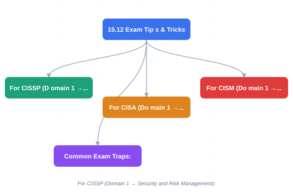
</a>
<a href="../../assets/images/diagrams/cyber-security/09-grc/15-12-exam-tips-tricks-sticky.svg" target="_blank" rel="noopener">
  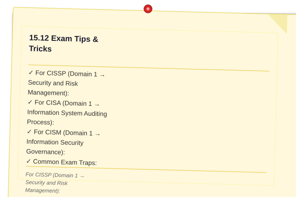
</a>


**For CISSP (Domain 1 → Security and Risk Management):**
- Know the difference between governance and management
- Memorize NIST RMF 7 steps in order
- Understand qualitative vs quantitative risk assessment calculations
- Know GDPR breach notification requirements (72 hours)
- Remember the three lines of defense model
- Know BCP vs DR differences and MTD/RTO/RPO definitions
- Understand risk response options (mitigate, accept, transfer, avoid)
- Know security documentation hierarchy (policy > standard > procedure > guideline > baseline)

**For CISA (Domain 1 → Information System Auditing Process):**
- Know audit process phases (planning, fieldwork, reporting, remediation)
- Understand sampling methodology (statistical vs judgmental)
- Know evidence types (documentary, observational, testimonial, analytical)
- Understand control types (preventive, detective, corrective)
- Know COBIT framework components (EDM, APO, BAI, DSS, MEA)

**For CISM (Domain 1 → Information Security Governance):**
- Know governance frameworks (COBIT, ISO 27001, NIST CSF)
- Understand risk management concepts (inherent vs residual risk)
- Know security program development lifecycle
- Understand BIA methodology and recovery metrics
- Know metrics maturity model (operational, tactical, strategic)

**Common Exam Traps:**
- "Risk = Threat x Vulnerability" is WRONG → risk = likelihood x impact (threat x vulnerability x impact is incomplete)
- ISO 27001 is certifiable; NIST CSF is not
- SOC 2 Type II covers operating effectiveness over time; Type I covers design at a point
- GDPR breach notification is 72 HOURS (not 24, not 48, not 7 days)
- Risk APPETITE is broad/strategic; risk TOLERANCE is specific/operational
- BIA produces RTO/RPO/MTD (not SLA, not SLO, not KPI)
- Policy is MANDATORY; guideline is ADVISORY
- The 4 transfer: insurance transfers FINANCIAL risk, not legal or reputational risk
- ISMS scope can be narrower than entire organization (important for ISO 27001 exam questions)

### 15.13 Case Study: Quick Reference Checklist

<a href="../../assets/images/diagrams/cyber-security/09-grc/15-13-case-study-quick-reference-checklist-handwritten.svg" target="_blank" rel="noopener">
  
</a>
<a href="../../assets/images/diagrams/cyber-security/09-grc/15-13-case-study-quick-reference-checklist-diagram.svg" target="_blank" rel="noopener">
  
</a>
<a href="../../assets/images/diagrams/cyber-security/09-grc/15-13-case-study-quick-reference-checklist-sticky.svg" target="_blank" rel="noopener">
  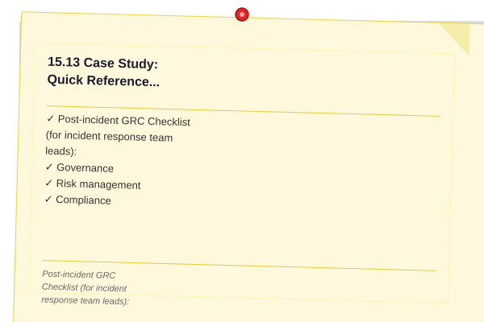
</a>


**Post-incident GRC Checklist (for incident response team leads):**

| Item | Action | GRC Relevance |
|------|--------|---------------|
| 1 | Preserve evidence (forensic images, logs, memory) | Compliance → chain of custody |
| 2 | Identify affected data types (PII, PHI, PCI) | Compliance → breach notification trigger |
| 3 | Determine data subjects affected | Compliance → GDPR Art 33/34, HIPAA Breach Rule |
| 4 | Count affected records | Compliance → notification thresholds |
| 5 | Start 72-hour timer (GDPR) | Compliance → countdown from discovery |
| 6 | Notify DPO / Privacy Officer | Governance → incident escalation procedure |
| 7 | Activate IR plan | Governance → plan execution |
| 8 | Notify cyber insurance broker | Risk Transfer → policy requirements |
| 9 | Contain breach (isolate systems, revoke access) | Risk Mitigation → reduce further impact |
| 10 | Notify Legal Counsel | Governance → legal privilege, regulatory notification |
| 11 | Engage forensics firm (if needed) | Risk Transfer / Mitigation |
| 12 | Begin internal investigation (root cause) | Risk Management → prevent recurrence |
| 13 | Prepare regulatory notifications | Compliance → DPA, HHS, PCI acquirer |
| 14 | Prepare customer notifications | Compliance + Reputation |
| 15 | Prepare press release / public statement | Governance → board communication, PR |
| 16 | Document lessons learned | Risk Management → update risk register |
| 17 | Update IR plan based on lessons | Governance → continuous improvement |
| 18 | Report to Board | Governance → fiduciary duty |
| 19 | File regulatory reports (e.g., SEC 8-K) | Compliance → public company disclosure |
| 20 | Close incident and update risk register | Risk Management → update residual risk scores |

---

## Chapter Summary

This chapter covered the complete GRC landscape in cybersecurity:

- **Governance** establishes the rules through policies, standards, procedures, and an organizational structure with clear ownership → starting at the Board and flowing through CISO, risk committees, and operational teams.

- **Risk management** quantifies and treats uncertainty using the NIST RMF 7-step process, qualitative and quantitative methodologies (FAIR, ALE), risk registers, and BIA to define RTO/RPO/MTD for every critical system.

- **Compliance** ensures adherence to a complex web of regulations → GDPR (privacy, DSARs, breach notification), PCI DSS 4.0 (12 requirements for card data), HIPAA (administrative/physical/technical safeguards for PHI), SOC 2 (5 trust service criteria), FedRAMP (cloud security for federal data), and SOX (financial controls and ITGC).

- **Frameworks** provide structured approaches → NIST CSF 2.0 for strategic program design, ISO 27001 for certifiable ISMS with 93 Annex A controls, COBIT for IT governance, and CIS Controls for prioritized, actionable safeguards.

- **BCP/DR** ensures operational resilience through BIA-driven recovery targets and tested continuity plans.

- **Third-party risk** extends GRC to vendors through lifecycle management, questionnaires, and continuous monitoring.

- **Security awareness** addresses the human element through training, phishing simulations, and behavioral metrics.

- **Audits** validate control effectiveness → internal for readiness, external for certification and compliance assurance.

- **Metrics and KPIs** connect GRC to business outcomes, enabling data-driven decisions and board-level visibility.

The four case studies (Equifax, Marriott, TikTok, Wells Fargo) demonstrate that GRC failures have consequences measured in billions of dollars and millions of affected individuals → not because of sophisticated technology attacks, but because of governance, risk management, and compliance breakdowns.

---

## References

1. NIST Cybersecurity Framework 2.0 (February 2024) → https://www.nist.gov/cyberframework
2. ISO/IEC 27001:2022 Information Security Management Systems
3. PCI DSS v4.0 (March 2022) → https://www.pcisecuritystandards.org/
4. GDPR (Regulation (EU) 2016/679) → https://gdpr-info.eu/
5. HIPAA Security Rule (45 CFR Parts 160, 162, and 164)
6. NIST SP 800-53 Rev. 5 → Security and Privacy Controls
7. NIST SP 800-34 Rev. 1 → Contingency Planning Guide for Federal Information Systems
8. FAIR Institute → FAIR-TM Quantitative Risk Analysis
9. CIS Controls v8 → https://www.cisecurity.org/controls
10. COBIT 2019 → ISACA
11. AICPA SOC 2 Trust Services Criteria
12. FedRAMP Rev. 5 Baseline → https://www.fedramp.gov/
13. Sarbanes-Oxley Act of 2002 (Public Law 107-204)
14. Verizon 2024 Data Breach Investigations Report
15. Ponemon Institute → Cost of Compliance vs Cost of Non-Compliance (2024)
16. UK ICO → Marriott International Inc. Monetary Penalty Notice (2020)
17. Irish DPC → TikTok Decision (DPC Inquiry IN-22-2-2, September 2023)
18. US DOJ → Wells Fargo Enforcement Actions (2020)
19. OWASP Application Security Verification Standard (ASVS) 4.0
20. NIST AI Risk Management Framework (AI RMF 1.0, January 2023)

---

## TypeScript Implementations

### Compliance Checker Engine

<a href="../../assets/images/diagrams/cyber-security/09-grc/compliance-checker-engine-handwritten.svg" target="_blank" rel="noopener">
  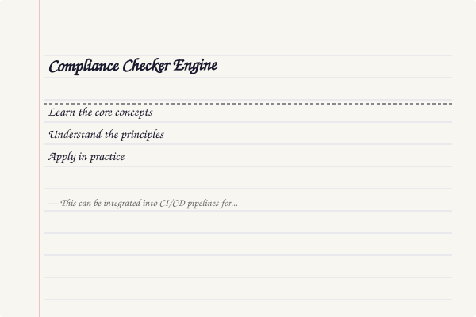
</a>
<a href="../../assets/images/diagrams/cyber-security/09-grc/compliance-checker-engine-diagram.svg" target="_blank" rel="noopener">
  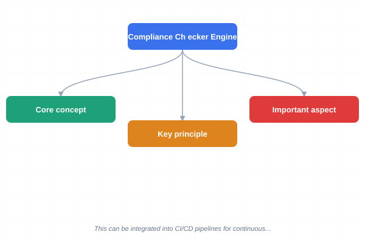
</a>
<a href="../../assets/images/diagrams/cyber-security/09-grc/compliance-checker-engine-sticky.svg" target="_blank" rel="noopener">
  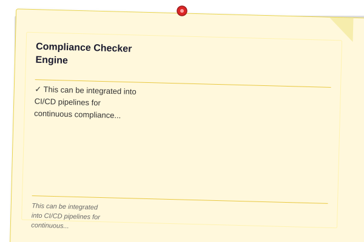
</a>


The following TypeScript implementation provides a programmatic compliance checking engine that validates system configurations against GRC frameworks (GDPR, ISO 27001, PCI DSS). This can be integrated into CI/CD pipelines for continuous compliance monitoring.

```typescript
/**
 * Compliance Finding — represents a single control evaluation result
 */
interface ComplianceFinding {
  controlId: string;
  controlName: string;
  status: 'pass' | 'fail' | 'na';
  severity: string;
  details: string;
}

/**
 * Compliance Rule — defines a checkable control with a test function
 */
interface ComplianceRule {
  id: string;
  framework: string;
  control: string;
  description: string;
  check: (config: Record<string, any>) => boolean;
  severity: string;
}

/**
 * Compliance Report — aggregated result of checking all rules in a framework
 */
interface ComplianceReport {
  framework: string;
  timestamp: Date;
  totalControls: number;
  passed: number;
  failed: number;
  na: number;
  findings: ComplianceFinding[];
  overallScore: number;
}

/**
 * ComplianceChecker — evaluates system configurations against
 * GDPR, ISO 27001, and PCI DSS control requirements
 */
class ComplianceChecker {
  private rules: ComplianceRule[] = [];

  constructor() {
    this.registerDefaultRules();
  }

  /**
   * Registers built-in rules for supported GRC frameworks
   */
  private registerDefaultRules(): void {
    // ── GDPR Rules ──────────────────────────────────────────
    this.rules.push(
      {
        id: 'GDPR-01',
        framework: 'GDPR',
        control: 'Data Retention (Art 5)',
        description: 'Personal data must not be retained longer than necessary',
        check: (config) =>
          config.dataRetentionPeriodDays <= 365 ||
          config.dataRetentionJustified === true,
        severity: 'high',
      },
      {
        id: 'GDPR-02',
        framework: 'GDPR',
        control: 'Breach Notification (Art 33)',
        description: 'Data breaches must be notified to DPA within 72 hours',
        check: (config) =>
          config.breachNotificationProcess === true &&
          config.notificationSLAHours <= 72,
        severity: 'critical',
      },
      {
        id: 'GDPR-03',
        framework: 'GDPR',
        control: 'Data Subject Access Request (Art 15)',
        description: 'DSARs must be fulfilled within 30 days',
        check: (config) =>
          config.dsarProcessEnabled === true &&
          config.dsarSLA === 30,
        severity: 'medium',
      },
    );

    // ── ISO 27001 Rules ─────────────────────────────────────
    this.rules.push(
      {
        id: 'ISO-01',
        framework: 'ISO 27001',
        control: 'Access Control (A.9)',
        description: 'Access must be provisioned on need-to-know with periodic reviews',
        check: (config) =>
          config.accessReviewPeriodDays <= 90 &&
          config.mfaEnabled === true,
        severity: 'high',
      },
      {
        id: 'ISO-02',
        framework: 'ISO 27001',
        control: 'Incident Management (A.16)',
        description: 'Incidents must be tracked and resolved within SLA',
        check: (config) =>
          config.incidentTrackingSystem === true &&
          config.incidentSLAMinutes <= 480,
        severity: 'high',
      },
      {
        id: 'ISO-03',
        framework: 'ISO 27001',
        control: 'ISMS Scope (Clause 4)',
        description: 'ISMS scope must be defined and documented',
        check: (config) =>
          config.ismsScopeDefined === true &&
          typeof config.ismsScopeDescription === 'string',
        severity: 'critical',
      },
    );

    // ── PCI DSS Rules ───────────────────────────────────────
    this.rules.push(
      {
        id: 'PCI-01',
        framework: 'PCI DSS',
        control: 'Encryption at Rest (Req 3)',
        description: 'Cardholder data must be encrypted at rest using strong crypto',
        check: (config) =>
          config.encryptionAtRest === true &&
          config.encryptionAlgorithm === 'AES-256',
        severity: 'critical',
      },
      {
        id: 'PCI-02',
        framework: 'PCI DSS',
        control: 'Audit Logging (Req 10)',
        description: 'Access to cardholder data must be logged and reviewed daily',
        check: (config) =>
          config.auditLogging === true &&
          config.logReviewFrequency === 'daily',
        severity: 'high',
      },
      {
        id: 'PCI-03',
        framework: 'PCI DSS',
        control: 'Vulnerability Scanning (Req 11)',
        description: 'External and internal scans must run quarterly',
        check: (config) =>
          config.vulnerabilityScanningEnabled === true &&
          config.scanFrequencyDays <= 90,
        severity: 'high',
      },
    );
  }

  /**
   * Checks a configuration against all rules for a given framework
   */
  check(config: Record<string, any>, framework: string): ComplianceReport {
    const applicableRules = this.rules.filter(r => r.framework === framework);
    const findings: ComplianceFinding[] = [];
    let passed = 0;
    let failed = 0;
    let na = 0;

    for (const rule of applicableRules) {
      const compliant = rule.check(config);
      findings.push({
        controlId: rule.id,
        controlName: rule.control,
        status: compliant ? 'pass' : 'fail',
        severity: rule.severity,
        details: compliant
          ? `Compliant — ${rule.control} passed`
          : `Non-compliant — ${rule.description}`,
      });
      if (compliant) passed++;
      else failed++;
    }

    const overallScore =
      applicableRules.length > 0
        ? Math.round((passed / applicableRules.length) * 100)
        : 100;

    return {
      framework,
      timestamp: new Date(),
      totalControls: applicableRules.length,
      passed,
      failed,
      na,
      findings,
      overallScore,
    };
  }

  /**
   * Generates remediation steps from failed findings
   */
  generateRemediation(findings: ComplianceFinding[]): string[] {
    return findings
      .filter(f => f.status === 'fail')
      .map(
        f =>
          `[${f.severity.toUpperCase()}] ${f.controlId}: ${f.details} ` +
          `→ Implement control "${f.controlName}"`,
      );
  }
}

// ── Example Usage ─────────────────────────────────────────────

const checker = new ComplianceChecker();

const mySystemConfig = {
  dataRetentionPeriodDays: 90,
  dataRetentionJustified: false,
  breachNotificationProcess: true,
  notificationSLAHours: 48,
  dsarProcessEnabled: true,
  dsarSLA: 30,
  accessReviewPeriodDays: 60,
  mfaEnabled: true,
  incidentTrackingSystem: true,
  incidentSLAMinutes: 120,
  ismsScopeDefined: true,
  ismsScopeDescription: 'All production systems handling EU user data',
  encryptionAtRest: true,
  encryptionAlgorithm: 'AES-256',
  auditLogging: true,
  logReviewFrequency: 'daily',
  vulnerabilityScanningEnabled: true,
  scanFrequencyDays: 90,
};

const gdprReport = checker.check(mySystemConfig, 'GDPR');
console.log(`=== GDPR Compliance Report ===`);
console.log(`Score: ${gdprReport.overallScore}%`);
console.log(`Passed: ${gdprReport.passed}/${gdprReport.totalControls}`);
console.log(`Failed: ${gdprReport.failed}`);
console.log(`Remediations:`);
console.log(checker.generateRemediation(gdprReport.findings).join('\n'));

const pciReport = checker.check(mySystemConfig, 'PCI DSS');
console.log(`\n=== PCI DSS Compliance Report ===`);
console.log(`Score: ${pciReport.overallScore}%`);
console.log(`Passed: ${pciReport.passed}/${pciReport.totalControls}`);

const isoReport = checker.check(mySystemConfig, 'ISO 27001');
console.log(`\n=== ISO 27001 Compliance Report ===`);
console.log(`Score: ${isoReport.overallScore}%`);
console.log(`Passed: ${isoReport.passed}/${isoReport.totalControls}`);
```

### Policy Document Analyzer

<a href="../../assets/images/diagrams/cyber-security/09-grc/policy-document-analyzer-handwritten.svg" target="_blank" rel="noopener">
  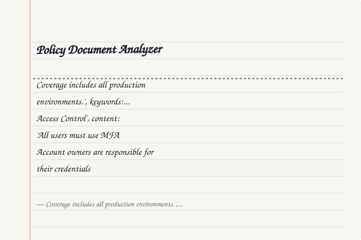
</a>
<a href="../../assets/images/diagrams/cyber-security/09-grc/policy-document-analyzer-diagram.svg" target="_blank" rel="noopener">
  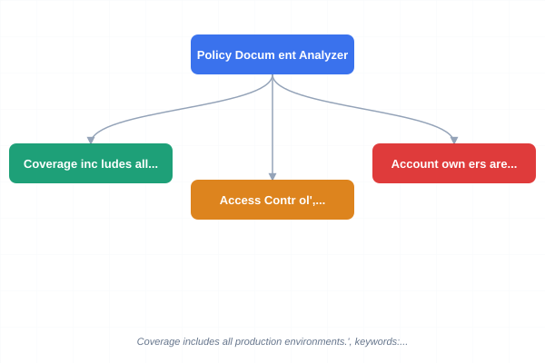
</a>
<a href="../../assets/images/diagrams/cyber-security/09-grc/policy-document-analyzer-sticky.svg" target="_blank" rel="noopener">
  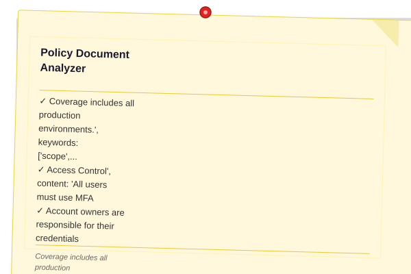
</a>


This TypeScript implementation analyzes security policy documents for structural completeness, checks for required elements (purpose, scope, roles, enforcement, exceptions, review cycle), and validates compliance against framework-specific requirements.

```typescript
/**
 * Policy metadata including version control
 */
interface PolicyMetadata {
  title: string;
  version: string;
  effectiveDate: Date;
  owner: string;
}

/**
 * A single section within a policy document
 */
interface PolicySection {
  title: string;
  content: string;
  keywords: string[];
}

/**
 * Full policy document model
 */
interface PolicyDocument {
  sections: PolicySection[];
  metadata: PolicyMetadata;
}

/**
 * Represents a missing or deficient element in a policy
 */
interface PolicyGap {
  section: string;
  missingElement: string;
  recommendation: string;
  severity: string;
}

/**
 * Result of checking a policy against a specific standard's requirements
 */
interface ComplianceCheck {
  element: string;
  present: boolean;
  requirement: string;
}

/**
 * PolicyAnalyzer — evaluates policy documents for completeness
 * and compliance with regulatory standards
 */
class PolicyAnalyzer {
  /**
   * Required elements every security policy should contain
   */
  private readonly requiredElements = [
    {
      element: 'Purpose',
      keywords: ['purpose', 'objective', 'goal', 'aim', 'intent', 'rationale'],
    },
    {
      element: 'Scope',
      keywords: ['scope', 'applies to', 'coverage', 'in-scope', 'out-of-scope', 'boundaries'],
    },
    {
      element: 'Roles & Responsibilities',
      keywords: ['role', 'responsibility', 'owner', 'accountable', 'duty', 'designee'],
    },
    {
      element: 'Enforcement',
      keywords: ['enforcement', 'violation', 'penalty', 'sanction', 'consequence', 'disciplinary'],
    },
    {
      element: 'Exceptions',
      keywords: ['exception', 'exemption', 'waiver', 'deviation', 'override', 'variance'],
    },
    {
      element: 'Review Cycle',
      keywords: ['review', 'audit', 'revision', 'update cycle', 'expiration', 'recertification'],
    },
  ];

  /**
   * Framework-specific requirement mappings
   */
  private readonly standardRequirements: Record<string, string[]> = {
    'ISO 27001': [
      'Document control',
      'Version history',
      'Approval authority',
      'Review frequency',
      'Change management',
    ],
    'NIST CSF': [
      'Risk assessment reference',
      'Control mapping',
      'Implementation tiers',
      'Profile alignment',
    ],
    'PCI DSS': [
      'Data classification',
      'Encryption requirements',
      'Access control',
      'Logging requirements',
      'Quarterly scanning',
    ],
    'GDPR': [
      'Data retention',
      'Processing basis',
      'Data subject rights',
      'Breach notification',
      'DPIA process',
    ],
    'HIPAA': [
      'PHI definition',
      'Safeguard types',
      'Disclosure accounting',
      'Training requirements',
      'BA agreement',
    ],
  };

  /**
   * Analyzes a policy document for structural gaps
   */
  analyze(policy: PolicyDocument): PolicyGap[] {
    const gaps: PolicyGap[] = [];
    const allContent = policy.sections.map(s => s.content.toLowerCase()).join(' ');
    const allKeywords = policy.sections.flatMap(s =>
      s.keywords.map(k => k.toLowerCase()),
    );

    for (const req of this.requiredElements) {
      const hasExplicitSection = policy.sections.some(s =>
        req.keywords.some(k => s.title.toLowerCase().includes(k)),
      );
      const hasKeywordCoverage = req.keywords.some(
        k => allContent.includes(k) || allKeywords.includes(k),
      );

      if (!hasExplicitSection && !hasKeywordCoverage) {
        gaps.push({
          section: req.element,
          missingElement: req.element,
          recommendation:
            `Add a "${req.element}" section or ensure the concept ` +
            `is addressed in an existing section with relevant keywords`,
          severity: 'medium',
        });
      }
    }

    return gaps;
  }

  /**
   * Checks a policy document against a specific standard's requirements
   */
  checkCompliance(policy: PolicyDocument, standard: string): ComplianceCheck[] {
    const results: ComplianceCheck[] = [];
    const requirements = this.standardRequirements[standard] || [];
    const allContent = policy.sections.map(s => s.content.toLowerCase()).join(' ');

    for (const req of requirements) {
      const present = req
        .toLowerCase()
        .split(' ')
        .some(word => allContent.includes(word));
      results.push({
        element: req,
        present,
        requirement: `${standard} requires documented "${req}"`,
      });
    }

    return results;
  }
}

// ── Example Usage ─────────────────────────────────────────────

const analyzer = new PolicyAnalyzer();

// Sample policy document
const securityPolicy: PolicyDocument = {
  metadata: {
    title: 'Information Security Policy',
    version: '2.1',
    effectiveDate: new Date('2025-01-15'),
    owner: 'CISO',
  },
  sections: [
    {
      title: '1. Introduction & Purpose',
      content:
        'The purpose of this policy is to define the security requirements ' +
        'for protecting the organization\'s information assets.',
      keywords: ['purpose', 'security', 'policy'],
    },
    {
      title: '2. Scope',
      content:
        'This policy applies to all employees, contractors, and third parties ' +
        'accessing organizational systems. Coverage includes all production environments.',
      keywords: ['scope', 'coverage', 'employees'],
    },
    {
      title: '3. Access Control',
      content:
        'All users must use MFA. Account owners are responsible for their credentials. ' +
        'Access reviews are conducted quarterly.',
      keywords: ['access', 'role', 'responsibility', 'mfa'],
    },
    {
      title: '4. Data Protection',
      content:
        'Data is classified into public, internal, confidential, and restricted. ' +
        'Encryption is required for confidential data at rest and in transit.',
      keywords: ['encryption', 'data', 'classification'],
    },
  ],
};

// Analyze for structural gaps
const gaps = analyzer.analyze(securityPolicy);
console.log('=== Policy Gap Analysis ===');
if (gaps.length === 0) {
  console.log('✓ No gaps found — policy is structurally complete');
} else {
  console.log(`Found ${gaps.length} gap(s):`);
  gaps.forEach(g =>
    console.log(`  ⚠ ${g.missingElement}: ${g.recommendation}`),
  );
}

// Check against ISO 27001
const isoChecks = analyzer.checkCompliance(securityPolicy, 'ISO 27001');
console.log('\n=== ISO 27001 Compliance Check ===');
isoChecks.forEach(c =>
  console.log(`  ${c.present ? '✓' : '✗'} ${c.element}`),
);
const passCount = isoChecks.filter(c => c.present).length;
console.log(`Result: ${passCount}/${isoChecks.length} requirements met`);

// Check against GDPR
const gdprChecks = analyzer.checkCompliance(securityPolicy, 'GDPR');
console.log('\n=== GDPR Compliance Check ===');
gdprChecks.forEach(c =>
  console.log(`  ${c.present ? '✓' : '✗'} ${c.requirement}`),
);
```

---

## Mermaid Diagrams

### Governance Framework Hierarchy

<a href="../../assets/images/diagrams/cyber-security/09-grc/governance-framework-hierarchy-handwritten.svg" target="_blank" rel="noopener">
  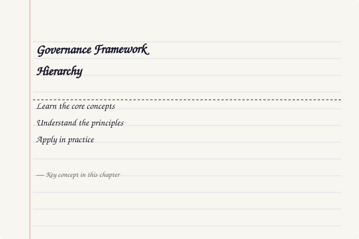
</a>
<a href="../../assets/images/diagrams/cyber-security/09-grc/governance-framework-hierarchy-diagram.svg" target="_blank" rel="noopener">
  
</a>
<a href="../../assets/images/diagrams/cyber-security/09-grc/governance-framework-hierarchy-sticky.svg" target="_blank" rel="noopener">
  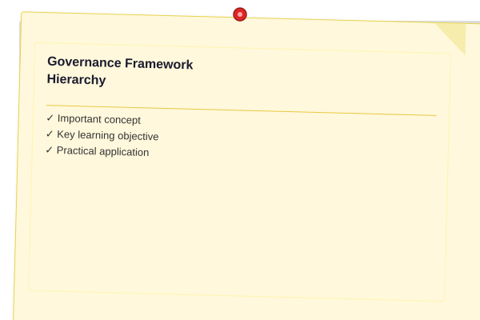
</a>


This diagram illustrates the hierarchical relationship between laws, regulations, policies, standards, procedures, and guidelines in a GRC program.

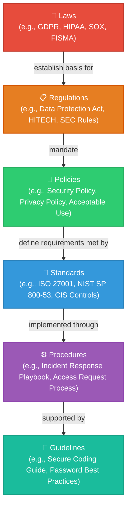
```mermaid
flowchart TD
    L["📜 Laws<br/>(e.g., GDPR, HIPAA, SOX, FISMA)"]
    R["📋 Regulations<br/>(e.g., Data Protection Act, HITECH, SEC Rules)"]
    P["📄 Policies<br/>(e.g., Security Policy, Privacy Policy, Acceptable Use)"]
    S["📏 Standards<br/>(e.g., ISO 27001, NIST SP 800-53, CIS Controls)"]
    PR["⚙️ Procedures<br/>(e.g., Incident Response Playbook, Access Request Process)"]
    G["📘 Guidelines<br/>(e.g., Secure Coding Guide, Password Best Practices)"]

    L -->|"establish basis for"| R
    R -->|"mandate"| P
    P -->|"define requirements met by"| S
    S -->|"implemented through"| PR
    PR -->|"supported by"| G

    style L fill:#e74c3c,color:#fff,stroke:#c0392b,stroke-width:2px
    style R fill:#e67e22,color:#fff,stroke:#d35400,stroke-width:2px
    style P fill:#2ecc71,color:#fff,stroke:#27ae60,stroke-width:2px
    style S fill:#3498db,color:#fff,stroke:#2980b9,stroke-width:2px
    style PR fill:#9b59b6,color:#fff,stroke:#8e44ad,stroke-width:2px
    style G fill:#1abc9c,color:#fff,stroke:#16a085,stroke-width:2px
```

### Risk Treatment Process

<a href="../../assets/images/diagrams/cyber-security/09-grc/risk-treatment-process-handwritten.svg" target="_blank" rel="noopener">
  
</a>
<a href="../../assets/images/diagrams/cyber-security/09-grc/risk-treatment-process-diagram.svg" target="_blank" rel="noopener">
  
</a>
<a href="../../assets/images/diagrams/cyber-security/09-grc/risk-treatment-process-sticky.svg" target="_blank" rel="noopener">
  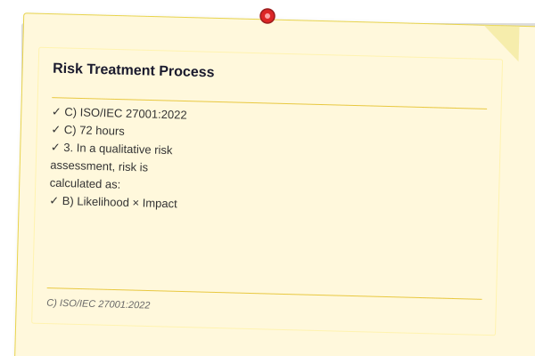
</a>


This flowchart shows the complete risk management lifecycle from identification through treatment and monitoring, aligned with the NIST RMF and ISO 31000 frameworks.

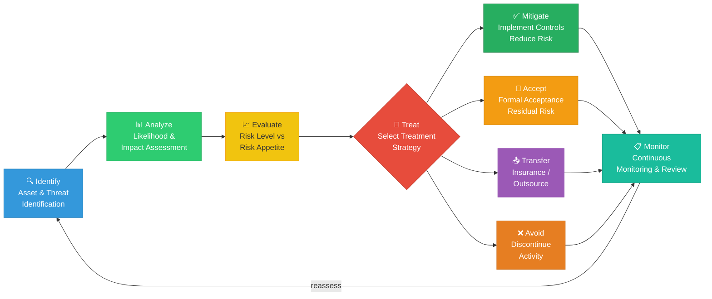
```mermaid
flowchart LR
    A["🔍 Identify<br/>Asset & Threat<br/>Identification"]
    B["📊 Analyze<br/>Likelihood &<br/>Impact Assessment"]
    C["📈 Evaluate<br/>Risk Level vs<br/>Risk Appetite"]
    D{"🤔 Treat<br/>Select Treatment<br/>Strategy"}
    E1["✅ Mitigate<br/>Implement Controls<br/>Reduce Risk"]
    E2["🔄 Accept<br/>Formal Acceptance<br/>Residual Risk"]
    E3["📤 Transfer<br/>Insurance /<br/>Outsource"]
    E4["❌ Avoid<br/>Discontinue<br/>Activity"]
    F["📋 Monitor<br/>Continuous<br/>Monitoring & Review"]

    A --> B
    B --> C
    C --> D
    D --> E1
    D --> E2
    D --> E3
    D --> E4
    E1 --> F
    E2 --> F
    E3 --> F
    E4 --> F
    F -->|"reassess"| A

    style A fill:#3498db,color:#fff,stroke:#2980b9
    style B fill:#2ecc71,color:#fff,stroke:#27ae60
    style C fill:#f1c40f,color:#333,stroke:#f39c12
    style D fill:#e74c3c,color:#fff,stroke:#c0392b
    style E1 fill:#27ae60,color:#fff,stroke:#1e8449
    style E2 fill:#f39c12,color:#fff,stroke:#d68910
    style E3 fill:#9b59b6,color:#fff,stroke:#8e44ad
    style E4 fill:#e67e22,color:#fff,stroke:#ca6f1e
    style F fill:#1abc9c,color:#fff,stroke:#16a085
```

---

## Chapter Quiz

Test your understanding of Governance, Risk, and Compliance concepts covered in this chapter.

**1. Which of the following frameworks is certifiable by an accredited third-party body?**

A) NIST Cybersecurity Framework 2.0
B) CIS Controls v8
C) ISO/IEC 27001:2022
D) COBIT 2019

<details>
<summary>Answer</summary>
**C) ISO/IEC 27001:2022** — Organizations can achieve ISO 27001 certification through accredited registrars. NIST CSF, CIS Controls, and COBIT are frameworks intended for self-assessment and guidance, not certification.
</details>

---

**2. Under GDPR Article 33, data breaches must be notified to the supervisory authority within:**

A) 24 hours
B) 48 hours
C) 72 hours
D) 7 calendar days

<details>
<summary>Answer</summary>
**C) 72 hours** — Article 33(1) requires notification "without undue delay and, where feasible, not later than 72 hours after having become aware of the breach."
</details>

---

**3. In a qualitative risk assessment, risk is calculated as:**

A) Threat × Vulnerability
B) Likelihood × Impact
C) Asset Value × Threat Score × Vulnerability Score
D) Probability × Consequence

<details>
<summary>Answer</summary>
**B) Likelihood × Impact** — Qualitative assessments use ordinal scales (e.g., Low/Medium/High) for likelihood and impact. The product determines the risk level.
</details>

---

**4. PCI DSS Requirement 10 specifically mandates:**

A) Encryption of cardholder data at rest using strong cryptography
B) Regular internal and external vulnerability scanning
C) Tracking and monitoring of all access to network resources and cardholder data
D) Annual penetration testing and quarterly network scans

<details>
<summary>Answer</summary>
**C) Tracking and monitoring** — Requirement 10 is "Track and monitor all access to network resources and cardholder data" via audit logging, log reviews, and log retention.
</details>

---

**5. What distinguishes a policy from a guideline in the documentation hierarchy?**

A) Policies are technical; guidelines are strategic
B) Policies are mandatory (compliance required); guidelines are advisory (recommended but not required)
C) Policies are created by IT staff; guidelines are created by legal
D) Policies are short documents; guidelines are comprehensive manuals

<details>
<summary>Answer</summary>
**B) Policies are mandatory; guidelines are advisory** — Policies use "must/shall" language and carry enforcement mechanisms. Guidelines use "should/consider" language and suggest best practices.
</details>

---

**6. Which HIPAA Security Rule standard requires unique user identification (User ID)?**

A) Administrative Safeguards — Security Management Process
B) Physical Safeguards — Facility Access Controls
C) Technical Safeguards — Access Control
D) Organizational Requirements — Business Associate Contracts

<details>
<summary>Answer</summary>
**C) Technical Safeguards — Access Control (45 CFR § 164.312(a)(1))** — Unique User Identification (a)(2)(i) is an implementation specification of the Access Control standard.
</details>

---

**7. The NIST Risk Management Framework (RMF) consists of how many steps in its current form?**

A) 5 steps
B) 6 steps
C) 7 steps
D) 8 steps

<details>
<summary>Answer</summary>
**C) 7 steps** — The NIST RMF 7-step process: Prepare → Categorize → Select → Implement → Assess → Authorize → Monitor (NIST SP 800-37 Rev. 2).
</details>

---

**8. Recovery Time Objective (RTO) is defined during which process?**

A) Vulnerability Assessment
B) Business Impact Analysis (BIA)
C) Penetration Testing
D) Security Awareness Training

<details>
<summary>Answer</summary>
**B) Business Impact Analysis (BIA)** — The BIA identifies critical business functions and determines maximum tolerable downtime, from which RTO, RPO, and MTD are derived.
</details>

---

**9. A SOC 2 Type II report provides assurance on:**

A) The design suitability of controls at a single point in time
B) The operating effectiveness of controls over a specified period (typically 6–12 months)
C) The accuracy of financial statements and internal controls over financial reporting
D) The security of network infrastructure only

<details>
<summary>Answer</summary>
**B) Operating effectiveness over a period** — SOC 2 Type II tests whether controls are not only designed properly (Type I) but also operating effectively over time (Type II).
</details>

---

**10. In the FAIR (Factor Analysis of Information Risk) model, "Loss Event Frequency" is a component used in:**

A) Policy development and approval workflow
B) Audit scope definition and evidence collection
C) Quantitative risk analysis to calculate annualized loss expectancy
D) Security awareness program effectiveness measurement

<details>
<summary>Answer</summary>
**C) Quantitative risk analysis** — FAIR decomposes risk into Loss Event Frequency (LEF) and Loss Magnitude (LM). LEF × LM = Annualized Loss Expectancy (ALE).
</details>

---

## Practical Takeaways

1. **Map every regulation to specific controls** — Create a traceability matrix linking regulatory requirements (e.g., GDPR Art 32) to specific technical and procedural controls.
2. **Automate compliance checks** — Use the ComplianceChecker TypeScript code above to integrate compliance validation into CI/CD pipelines and infrastructure-as-code workflows.
3. **Write policies with structure** — Every security policy should contain Purpose, Scope, Roles, Enforcement, Exceptions, and Review Cycle. Use the PolicyAnalyzer to validate completeness.
4. **Adopt a risk treatment strategy** — Document whether each risk is mitigated, accepted, transferred, or avoided, with clear rationale and approval for acceptance decisions.
5. **Know your reporting obligations** — GDPR 72-hour breach notification, PCI DSS annual penetration testing, HIPAA BA agreements, and SOC 2 control testing all have specific timelines and formats.
6. **Use frameworks as a starting point** — NIST CSF, ISO 27001, and CIS Controls are complementary, not mutually exclusive. Map them together for comprehensive coverage.
7. **Audit readiness is continuous** — Don't prepare for audits reactively. Maintain evidence of control operation (logs, review records, attestations) as part of daily operations.
