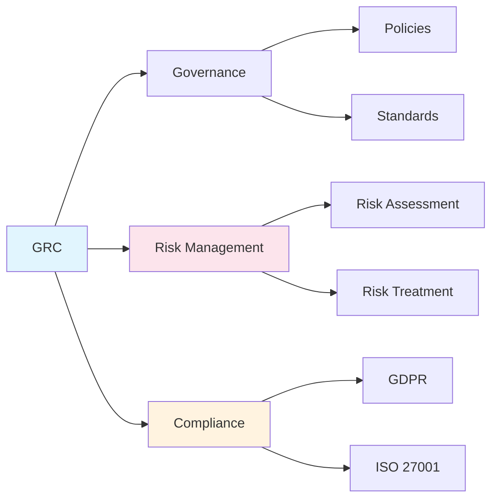

# Chapter 9: Governance, Risk & Compliance

> **Prereq:** Chapter 8 (Forensics & IR) — incident findings feed into risk assessments and compliance reporting.
> **Next:** Chapter 10 (Pentesting) — GRC frameworks inform penetration testing scope and methodology.

---

## Learning Objectives

- Define the three components of GRC: Governance, Risk Management, and Compliance.
- Understand the purpose and structure of security frameworks like NIST CSF and ISO/IEC 27001.
- Perform a basic qualitative risk assessment using likelihood and impact.
- Describe the key requirements of major data protection regulations (e.g., GDPR, HIPAA).
- Explain the role of security policies, standards, and guidelines in an organization.

### Chapter at a Glance

| Section | Key Concept | Why It Matters |
|---------|-------------|----------------|
| Governance | Policies, org structure | Security starts at the board level |
| Risk Management | Identify → Assess → Treat | Quantified decision-making |
| Compliance | GDPR, HIPAA, PCI-DSS | Legal obligations and fines |
| Frameworks | NIST CSF, ISO 27001 | Blueprints for security programs |

---

## Theory

> **One-Sentence Takeaway:** GRC connects security to business outcomes — governance sets the rules, risk management quantifies threats, and compliance ensures legal and regulatory obligations are met.

### What is GRC?
GRC is an integrated approach to ensuring that an organization acts in accordance with its self-imposed rules and external regulations.
- **Governance:** The set of responsibilities and practices exercised by the board and executive management to provide strategic direction and ensure that objectives are achieved.
- **Risk Management:** The process of identifying, assessing, and responding to risks to the organization's mission and assets.
- **Compliance:** Adhering to the requirements of laws, regulations, industry standards, and internal policies.

### Security Frameworks
Frameworks provide a structured methodology for managing and reducing cyber security risk.
- **NIST Cybersecurity Framework (CSF):** Built around five core functions: Identify, Protect, Detect, Respond, and Recover.
- **ISO/IEC 27001:** An international standard for an Information Security Management System (ISMS). It follows a "Plan-Do-Check-Act" (PDCA) cycle.
- **CIS Controls:** A prioritized set of actions to protect organizations and data from known cyber defense vectors.

### Risk Management Process
1.  **Risk Identification:** Discovering potential threats and vulnerabilities.
2.  **Risk Assessment:** Analyzing the likelihood and impact of identified risks.
    - **Qualitative:** Using descriptive scales (Low, Medium, High).
    - **Quantitative:** Assigning numerical and monetary values (e.g., Annualized Loss Expectancy).
3.  **Risk Response:**
    - **Mitigation:** Implementing controls to reduce risk.
    - **Avoidance:** Stopping the activity that creates the risk.
    - **Transference:** Moving the risk to another party (e.g., insurance).
    - **Acceptance:** Acknowledging the risk and choosing not to take action (typically for low-level risks).

### Data Protection Regulations
- **GDPR (General Data Protection Regulation):** Comprehensive EU regulation focused on the privacy and protection of personal data. Includes the "right to be forgotten" and mandatory breach notification.
- **HIPAA (Health Insurance Portability and Accountability Act):** US law protecting the privacy and security of individual health information.
- **PCI DSS (Payment Card Industry Data Security Standard):** A set of security standards designed to ensure that all companies that accept, process, store or transmit credit card information maintain a secure environment.

### Security Documentation Hierarchy
- **Policies:** High-level statements of management intent (e.g., "All employees must use MFA").
- **Standards:** Mandatory requirements for hardware, software, or configurations (e.g., "Passwords must be 14 characters long").
- **Guidelines:** Recommended practices that are not mandatory (e.g., "Employees should use a password manager").
- **Procedures:** Step-by-step instructions for performing a task (e.g., "How to reset a forgotten password").

---

## Examples

### Example 1: Qualitative Risk Matrix
A simple 3x3 matrix to prioritize security risks:

| Likelihood \ Impact | Low (1) | Medium (2) | High (3) |
|---------------------|---------|------------|----------|
| **High (3)**        | 3 (Med) | 6 (High)   | 9 (Crit) |
| **Medium (2)**      | 2 (Low) | 4 (Med)    | 6 (High) |
| **Low (1)**         | 1 (Low) | 2 (Low)    | 3 (Med)  |

*Scenario:* A critical unpatched vulnerability on a public web server.
- Likelihood: High (3)
- Impact: High (3)
- Risk Score: 9 (Critical) -> Immediate action required.

### Example 2: GDPR Data Mapping
A small company mapping its data to comply with GDPR:
- **Data Subject:** Customer
- **Data Type:** Name, Email, Purchase History
- **Purpose:** Order fulfillment and marketing
- **Storage Location:** AWS RDS (US East)
- **Retention Period:** 5 years after last purchase
*Demonstrates the "Identify" and "Accountability" principles of GDPR.*

---

## Summary

- GRC ensures that security is aligned with business objectives and legal requirements.
- Frameworks like NIST CSF and ISO 27001 provide the "blueprint" for a successful security program.
- Risk management is a continuous cycle of identification, assessment, and response.
- Compliance is not just about avoiding fines; it's about protecting the privacy and rights of individuals.
- Clear documentation (policies, standards, etc.) is essential for communicating security expectations across the organization.

---

## Exercises

### Review Questions
1. Define the three pillars of GRC.
2. What are the five core functions of the NIST Cybersecurity Framework?
3. Explain the four common ways an organization can respond to a risk.
4. What is the difference between a security "Policy" and a security "Standard"?

### Application Problems
1. Perform a qualitative risk assessment for a company that uses an unencrypted USB drive to transport sensitive client data between offices. Use the risk matrix from Example 1.
2. A startup is launching a new app that collects health data from users in Europe and the US. List three specific regulations they must consider and one primary requirement for each.
3. Draft a high-level "Acceptable Use Policy" (AUP) for a university's computer lab. Include at least five prohibited activities.

### Challenge Problem
1. Research the "Business Impact Analysis" (BIA). Explain its role in disaster recovery planning and how it relates to the concepts of "Maximum Tolerable Downtime" (MTD) and "Recovery Time Objective" (RTO). Provide a scenario showing how these values are determined.

### Concept Comparison

| Risk Response | Action | When to Use |
|--------------|--------|-------------|
| Mitigate | Implement controls | Risk exceeds appetite |
| Accept | Acknowledge, monitor | Low-impact or cost > benefit |
| Transfer | Insurance, third-party | Financial risk sharing |
| Avoid | Discontinue activity | Risk too high, controls impossible |

### Cross-Application Matrix

| Domain | Application | Relevance |
|--------|-------------|-----------|
| Network Security | Compliance with PCI-DSS for network segmentation | Regulations dictate network architecture |
| App Security | GDPR data protection by design | Compliance requirements shape app features |
| Cloud Security | SOC 2, ISO 27001 certification | Cloud providers demonstrate compliance |
| Research | Risk quantification models | FAIR model for cyber risk in dollars |

### Chapter Quiz

1. The NIST Cybersecurity Framework's five core functions are:
   - A) Plan, Do, Check, Act, Review
   - B) Identify, Protect, Detect, Respond, Recover
   - C) Assess, Design, Implement, Monitor, Improve
   - D) Prevent, Detect, Contain, Eradicate, Recover

2. A risk with high likelihood and high impact is best handled by:
   - A) Acceptance
   - B) Avoidance
   - C) Mitigation
   - D) Transfer

3. GDPR is a regulation that:
   - A) Applies only to US companies
   - B) Protects personal data of EU residents
   - C) Mandates annual penetration testing
   - D) Regulates cryptocurrency exchanges

Answers

1. B, 2. C, 3. B

