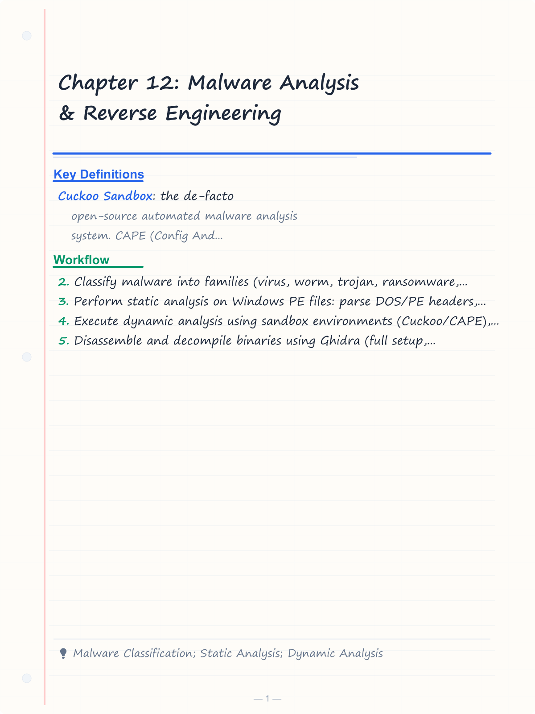
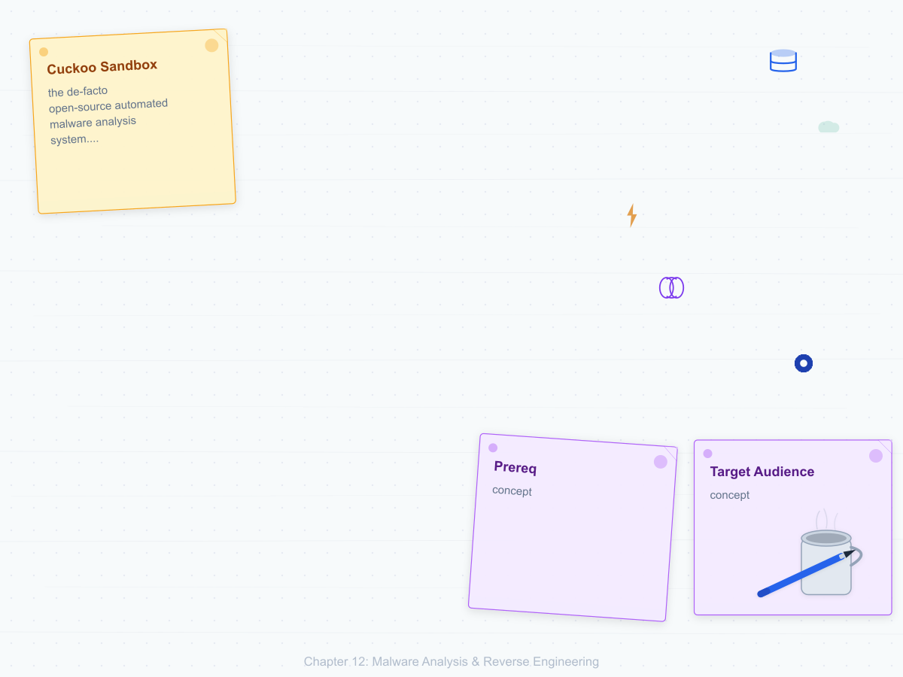
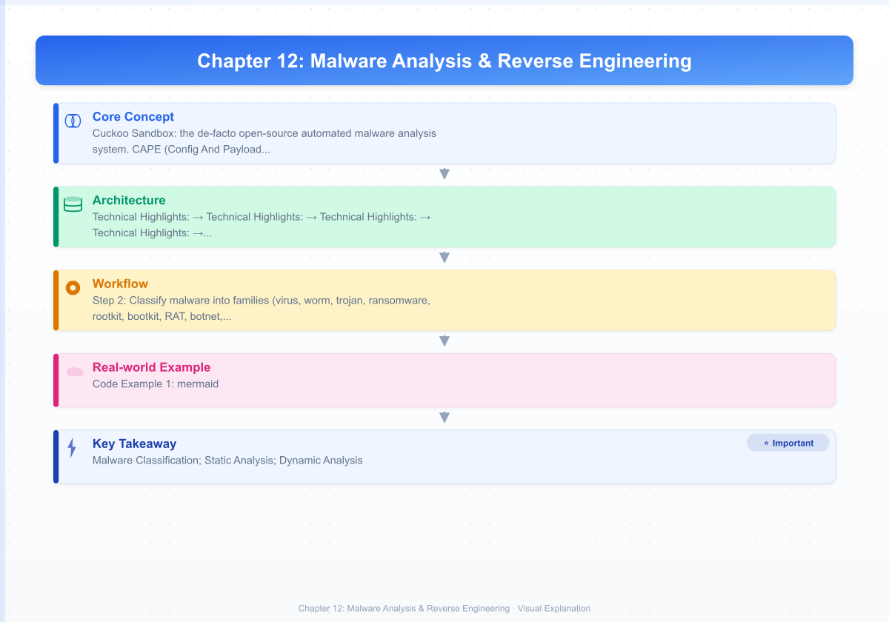
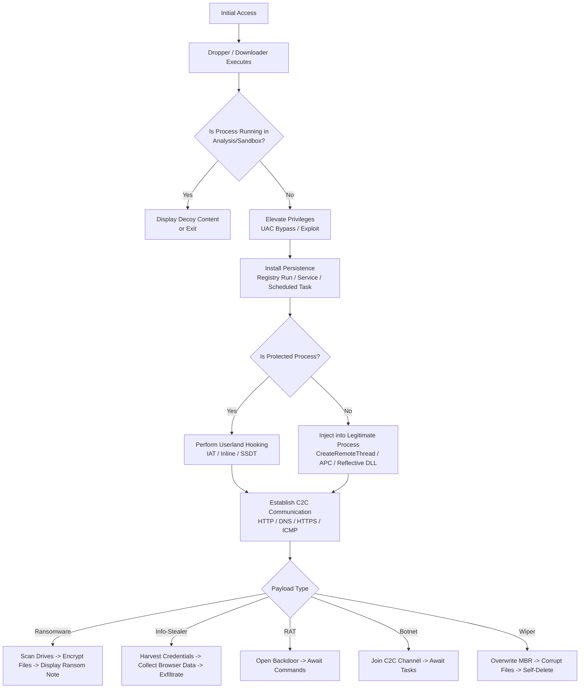
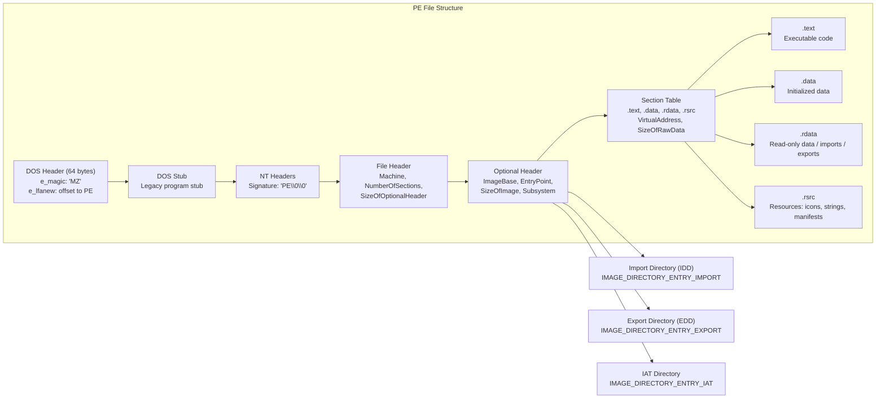
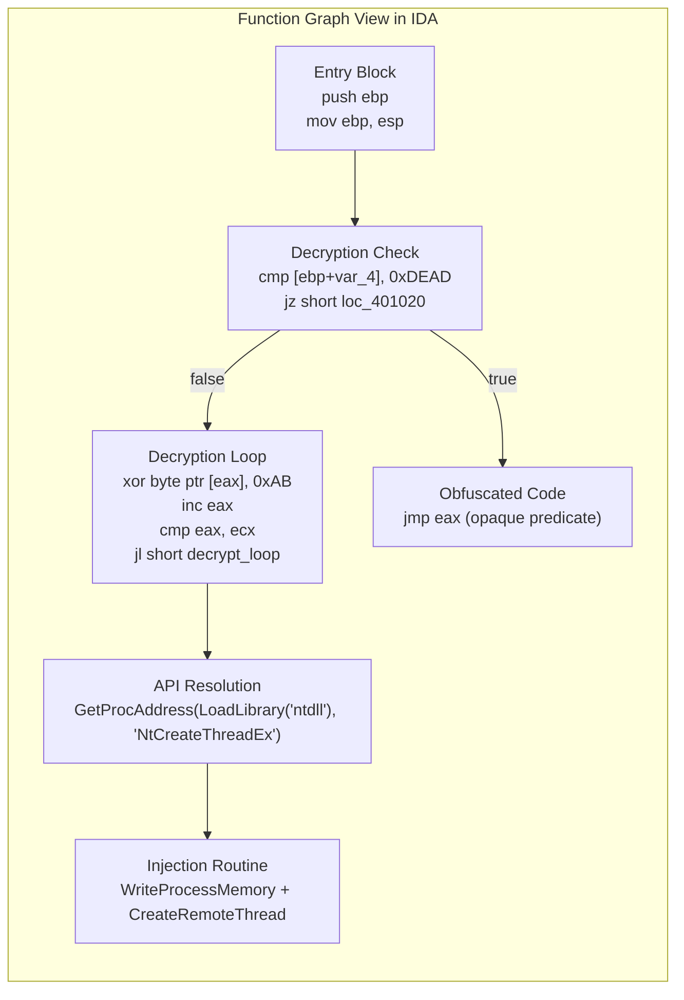

# Chapter 12: Malware Analysis & Reverse Engineering

> **Prereq:** Chapters 4 (System & Software Security), 8 (Forensics & IR), 10 (Pentesting)
> **Next:** Capstone
> **Target Audience:** Reverse engineers, malware analysts, DFIR professionals, red/blue team operators

---

## Learning Objectives

By the end of this chapter, you will be able to:

<!-- Image Gallery -->
<section class="lesson-visuals" aria-label="Visual learning resources">
  <header><span>VISUAL LEARNING</span><h2>See it. Review it. Remember it.</h2></header>
  <a class="lesson-visual-card" href="../../assets/images/lessons/cyber-security/12-malware-analysis/handwritten-notes.png" target="_blank" rel="noopener">
    
    <span><strong>Handwritten notes</strong>Condensed notes for deliberate review.</span>
  </a>
  <a class="lesson-visual-card" href="../../assets/images/lessons/cyber-security/12-malware-analysis/sticky-notes.png" target="_blank" rel="noopener">
    
    <span><strong>Sticky-note revision</strong>Fast recall prompts for revision.</span>
  </a>
  <a class="lesson-visual-card" href="../../assets/images/lessons/cyber-security/12-malware-analysis/visual-explanation.png" target="_blank" rel="noopener">
    
    <span><strong>Visual concept guide</strong>A connected explanation of the key ideas.</span>
  </a>
</section>
<!-- End Image Gallery -->

1. Classify malware into families (virus, worm, trojan, ransomware, rootkit, bootkit, RAT, botnet, info-stealer, dropper, wiper) and identify hallmarks of each.
2. Perform static analysis on Windows PE files: parse DOS/PE headers, section table, import/export tables, and detect packers via entropy analysis.
3. Execute dynamic analysis using sandbox environments (Cuckoo/CAPE), API monitors (Process Monitor, API Monitor), and network simulators (INetSim, FakeNet).
4. Disassemble and decompile binaries using Ghidra (full setup, function identification, cross-references) and IDA Pro (graph view, pseudocode, IDAPython).
5. Identify packed binaries (UPX, Themida, VMProtect) and apply manual unpacking techniques to recover the original entry point (OEP).
6. Write YARA rules to classify malware families with high precision and low false-positive rates.
7. Analyze memory dumps with Volatility 3 to detect process injection (CreateRemoteThread, APC, reflective DLL) and hooking techniques.
8. Build TypeScript tooling: a PE parser, YARA engine, memory scanner, entropy calculator, and API hook detector.

---

## Chapter at a Glance

| Section | Key Concept | Why It Matters |
|---------|-------------|----------------|
| Malware Classification | Taxonomy of malicious software | Foundation for triage and analysis strategy |
| Static Analysis | PE structure, imports/exports, packer detection | Extract IOCs without executing the sample |
| Dynamic Analysis | Sandboxing, API monitoring, network simulation | Observe runtime behavior in a contained environment |
| Ghidra Disassembly | NSA's reverse engineering framework | Open-source decompiler for deep binary analysis |
| IDA Pro Disassembly | Industry-standard disassembler | Graph views, IDAPython automation, pseudocode |
| Packing & Unpacking | UPX, Themida, VMProtect, OEP recovery | Defeat obfuscation to reveal original code |
| YARA Rules | Pattern-based malware classification | Automate threat detection across thousands of samples |
| Memory Forensics | Process injection, hook detection, Volatility 3 | Detect fileless malware and rootkits in memory |

---

## 1. Malware Classification

### 1.1 The Malware Taxonomy

Malware (malicious software) is any program designed to infiltrate, damage, or gain unauthorized access to a system. Modern malware is rarely a single type — most samples exhibit characteristics of multiple categories. Understanding the taxonomy enables analysts to triage effectively and select appropriate analysis methods.

| Category | Primary Mechanism | Persistence | Payload Example |
|----------|------------------|-------------|-----------------|
| **Virus** | Self-replicates by attaching to host files | File infection | Corrupts documents, steals data |
| **Worm** | Self-propagates across networks without host file | Network service exploitation | DDoS, payload delivery |
| **Trojan** | Disguises as legitimate software | User-initiated execution | Backdoor, credential theft |
| **Ransomware** | Encrypts files for extortion | Scheduled tasks, registry | File encryption + ransom note |
| **Rootkit** | Hides OS objects (files, processes, registry) | Kernel driver, SSDT hook | Conceals other malware |
| **Bootkit** | Infects MBR/GPT or UEFI firmware | Boot loader infection | Persists before OS boots |
| **RAT** | Remote interactive control | Service install, startup folder | Keylogging, screen capture, file exfiltration |
| **Botnet** | C&C-controlled distributed agent | IRC/HTTP beacon | DDoS, spam relay, credential harvesting |
| **Info-stealer** | Harvests credentials, cookies, crypto wallets | Memory scraping, keylogging | Exfiltrates browser data |
| **Dropper** | Installs other malware payloads | Single-execution stage | Downloads stage-2 payload |
| **Wiper** | Destroys data irrecoverably | Overwrite + deletion | Sabotage, data destruction |

### 1.2 Malware Execution Lifecycle

Most malware follows a multi-stage execution flow. Understanding this lifecycle is critical for deciding where to instrument detection controls.



### 1.3 Real-World Malware Case Studies

#### Stuxnet (2010) — Weaponized Cyber Attack

Stuxnet is the most sophisticated malware ever analyzed at the time of its discovery. It targeted Siemens Step 7 industrial control systems (ICS) used in Iran's Natanz uranium enrichment facility.

**Technical Highlights:**
- Propagation: 4 zero-day exploits (MS10-046, MS10-061, MS10-073, MS10-088), USB spread, print spooler exploitation
- Payload: Modified frequency converter drives (IR) on centrifuges, causing physical destruction while replaying normal sensor readings
- Rootkit: Hides PLC blocks from Step 7 software using a custom .sys driver signed with stolen Realtek/JMicron certificates
- C2C: Peer-to-peer update mechanism via RPC, no internet fallback required
- Analysis revelation: Required manual unpacking of multiple encrypted layers, DriverEntry analysis in IDA Pro revealed the PLC ladder-logic payload

#### WannaCry (2017) — Global Ransomware Pandemic

WannaCry infected over 230,000 computers across 150 countries in 4 days, using the EternalBlue SMB exploit leaked from the NSA Equation Group.

**Technical Highlights:**
- Propagation: Worm-like via MS17-010 (EternalBlue) SMB vulnerability + DoublePulsar backdoor
- Encryption: RSA-2048 + AES-128 hybrid encryption; files encrypted with `.WNCRY` extension
- Kill-switch: Hardcoded domain `iuqerfsodp9t.pw` — when registered, malware exits (discovered by @MalwareTechBlog via dynamic analysis)
- Impact: NHS UK operations crippled, €4B+ in damages globally
- C2C: TOR-based fallback; primary propagation was worm-based, not C2C-dependent

#### Emotet (2014–2023) — Modular Banking Trojan / Botnet

Emotet evolved from a banking trojan to a malware-as-a-service delivery platform used by ransomware gangs.

**Technical Highlights:**
- Propagation: Malicious spam with macro-laden Word docs → PowerShell → DLL sideloading
- Modularity: Loads separate DLL modules for spam relay, credential theft, and C2C comms
- Obfuscation: Encrypted strings with rolling XOR keys, API hashing, control flow flattening
- Persistence: Registry `Run` key, scheduled tasks, service DLL registration
- Takedown: Europol-led Operation Ladybird (Jan 2023) sinkholed C2C infrastructure

#### Cobalt Strike — Legitimate Adversary Simulation Tool (Abused by Threat Actors)

Cobalt Strike is a commercial adversary simulation framework routinely cracked and used by ransomware operators (Conti, LockBit, Ryuk).

**Technical Highlights:**
- Beacon (payload): In-memory reflective DLL injection, C2C via HTTP/DNS/SMB/HTTPS
- Artifacts: Pipe names, named pipe patterns (`\\.\pipe\msagent_*`), mutex objects
- Malleable C2: Customizable C2C profiles for traffic fingerprint evasion
- Detection: YARA rules targeting known Beacon DLL offsets, MZ header in reflective loader
- Post-exploitation: Mimikatz integration, lateral movement via WMI/PsExec, keylogging

---

## 2. Static Analysis

Static analysis examines a binary without executing it. The goal is to extract indicators of compromise (IOCs), understand capabilities, and identify packers.

### 2.1 Portable Executable (PE) Structure

The Windows PE format is the standard executable format for Windows. Understanding its structure is the foundation of malware analysis.



### 2.2 PE Parser in TypeScript

The following TypeScript implementation parses PE binary data to extract headers, section information, and import/export tables. This is a foundational tool for any malware analyst's arsenal.

```typescript
// pe-parser.ts — Runtime-agnostic PE parser for malware static analysis
// Works in Node.js, Deno, or browser environments

interface PEOffsets {
  e_lfanew: number;
}

interface FileHeader {
  machine: number;
  numberOfSections: number;
  timeDateStamp: number;
  sizeOfOptionalHeader: number;
  characteristics: number;
}

interface OptionalHeader {
  magic: number;             // 0x10b (PE32) or 0x20b (PE32+)
  addressOfEntryPoint: number;
  imageBase: number;
  sectionAlignment: number;
  fileAlignment: number;
  sizeOfImage: number;
  sizeOfHeaders: number;
  subsystem: number;
  numberOfRvaAndSizes: number;
}

interface SectionHeader {
  name: string;
  virtualSize: number;
  virtualAddress: number;
  sizeOfRawData: number;
  pointerToRawData: number;
  characteristics: number;
  entropy: number;
}

interface ImportDescriptor {
  originalFirstThunk: number;
  timeDateStamp: number;
  forwarderChain: number;
  nameRva: number;
  firstThunk: number;
  dllName: string;
  functions: string[];
}

interface ExportDescriptor {
  characteristics: number;
  timeDateStamp: number;
  majorVersion: number;
  minorVersion: number;
  nameRva: number;
  ordinalBase: number;
  addressTableEntries: number;
  numberOfNames: number;
  exportAddressTableRva: number;
  namePointerRva: number;
  ordinalTableRva: number;
  dllName: string;
  exports: ExportEntry[];
}

interface ExportEntry {
  ordinal: number;
  name: string;
  addressRva: number;
  forwarderString: string | null;
}

interface PEParseResult {
  dosHeader: PEOffsets;
  fileHeader: FileHeader;
  optionalHeader: OptionalHeader;
  sections: SectionHeader[];
  imports: ImportDescriptor[];
  exports: ExportDescriptor | null;
  isPacked: boolean;
  entropyScore: number;
}

class BinaryReader {
  private view: DataView;
  private offset: number = 0;

  constructor(private buffer: ArrayBuffer) {
    this.view = new DataView(buffer);
  }

  readUInt8(): number {
    const val = this.view.getUint8(this.offset);
    this.offset += 1;
    return val;
  }

  readUInt16(): number {
    const val = this.view.getUint16(this.offset, true); // little-endian
    this.offset += 2;
    return val;
  }

  readUInt32(): number {
    const val = this.view.getUint32(this.offset, true);
    this.offset += 4;
    return val;
  }

  readBytes(length: number): Uint8Array {
    const val = new Uint8Array(this.buffer, this.offset, length);
    this.offset += length;
    return val;
  }

  readAsciiString(length: number): string {
    const bytes = this.readBytes(length);
    let result = '';
    for (let i = 0; i < bytes.length; i++) {
      if (bytes[i] === 0) break;
      result += String.fromCharCode(bytes[i]);
    }
    return result;
  }

  readRvaString(rva: number): string {
    // Read null-terminated string at given RVA (relative to buffer start)
    const saved = this.offset;
    this.offset = rva;
    let result = '';
    while (this.offset < this.buffer.byteLength) {
      const ch = this.readUInt8();
      if (ch === 0) break;
      result += String.fromCharCode(ch);
    }
    this.offset = saved;
    return result;
  }

  seek(pos: number): void {
    this.offset = pos;
  }

  tell(): number {
    return this.offset;
  }

  size(): number {
    return this.buffer.byteLength;
  }
}

export class PEParser {
  private reader: BinaryReader;

  constructor(buffer: ArrayBuffer) {
    this.reader = new BinaryReader(buffer);
  }

  private readDosHeader(): PEOffsets {
    const magic = this.reader.readAsciiString(2);
    if (magic !== 'MZ') {
      throw new Error('Invalid DOS header: MZ signature not found');
    }
    this.reader.seek(0x3c);
    const e_lfanew = this.reader.readUInt32();
    return { e_lfanew };
  }

  private readFileHeader(): FileHeader {
    const signature = this.reader.readAsciiString(4);
    if (signature !== 'PE\u0000\u0000') {
      throw new Error('Invalid PE signature');
    }
    return {
      machine: this.reader.readUInt16(),
      numberOfSections: this.reader.readUInt16(),
      timeDateStamp: this.reader.readUInt32(),
      sizeOfOptionalHeader: this.reader.readUInt16(),
      characteristics: this.reader.readUInt16(),
    };
  }

  private readOptionalHeader(): OptionalHeader {
    const magic = this.reader.readUInt16();
    const is32Bit = magic === 0x10b;
    const is64Bit = magic === 0x20b;
    if (!is32Bit && !is64Bit) {
      throw new Error(`Unknown PE magic: 0x${magic.toString(16)}`);
    }

    // Skip fields to reach addressOfEntryPoint
    this.reader.readUInt16(); // majorLinkerVersion
    this.reader.readUInt16(); // minorLinkerVersion

    // PE32 fields
    if (is32Bit) {
      this.reader.readUInt32(); // sizeOfCode
      this.reader.readUInt32(); // sizeOfInitializedData
      this.reader.readUInt32(); // sizeOfUninitializedData
    } else {
      // PE32+ has larger fields before the entry point
      this.reader.readUInt32(); // sizeOfCode
      this.reader.readUInt32(); // sizeOfInitializedData
      this.reader.readUInt32(); // sizeOfUninitializedData
    }

    const addressOfEntryPoint = this.reader.readUInt32();
    const baseOfCode = this.reader.readUInt32();

    let imageBase: number;
    if (is32Bit) {
      this.reader.readUInt32(); // baseOfData
      imageBase = this.reader.readUInt32();
    } else {
      imageBase = this.reader.readUInt32() + this.reader.readUInt32() * 0x100000000;
    }

    const sectionAlignment = this.reader.readUInt32();
    const fileAlignment = this.reader.readUInt32();

    // Skip OS, image, subsystem versions
    this.reader.readUInt16(); // majorOperatingSystemVersion
    this.reader.readUInt16(); // minorOperatingSystemVersion
    this.reader.readUInt16(); // majorImageVersion
    this.reader.readUInt16(); // minorImageVersion
    this.reader.readUInt16(); // majorSubsystemVersion
    this.reader.readUInt16(); // minorSubsystemVersion

    this.reader.readUInt32(); // win32VersionValue
    const sizeOfImage = this.reader.readUInt32();
    const sizeOfHeaders = this.reader.readUInt32();

    this.reader.readUInt32(); // checkSum
    const subsystem = this.reader.readUInt16();

    // Skip DLL characteristics
    this.reader.readUInt16();

    // SizeOfStackReserve, SizeOfStackCommit, SizeOfHeapReserve, SizeOfHeapCommit
    if (is32Bit) {
      this.reader.readUInt32(); this.reader.readUInt32();
      this.reader.readUInt32(); this.reader.readUInt32();
    } else {
      this.reader.readUInt32(); this.reader.readUInt32();
      this.reader.readUInt32(); this.reader.readUInt32();
      this.reader.readUInt32(); this.reader.readUInt32();
      this.reader.readUInt32(); this.reader.readUInt32();
    }

    this.reader.readUInt32(); // loaderFlags
    const numberOfRvaAndSizes = this.reader.readUInt32();

    return {
      magic,
      addressOfEntryPoint,
      imageBase,
      sectionAlignment,
      fileAlignment,
      sizeOfImage,
      sizeOfHeaders,
      subsystem,
      numberOfRvaAndSizes,
    };
  }

  private readSectionHeaders(count: number, sectionAlignment: number): SectionHeader[] {
    const sections: SectionHeader[] = [];
    for (let i = 0; i < count; i++) {
      const name = this.reader.readAsciiString(8).trim();
      const virtualSize = this.reader.readUInt32();
      const virtualAddress = this.reader.readUInt32();
      const sizeOfRawData = this.reader.readUInt32();
      const pointerToRawData = this.reader.readUInt32();
      this.reader.readUInt32(); // pointerToRelocations
      this.reader.readUInt32(); // pointerToLinenumbers
      this.reader.readUInt16(); // numberOfRelocations
      this.reader.readUInt16(); // numberOfLinenumbers
      const characteristics = this.reader.readUInt32();

      // Calculate entropy for this section
      let entropy = 0;
      if (pointerToRawData > 0 && sizeOfRawData > 0) {
        const rawEnd = Math.min(pointerToRawData + sizeOfRawData, this.reader.size());
        const sectionData = new Uint8Array(this.reader['buffer'], pointerToRawData, rawEnd - pointerToRawData);
        entropy = this.calculateEntropy(sectionData);
      }

      sections.push({
        name,
        virtualSize,
        virtualAddress,
        sizeOfRawData,
        pointerToRawData,
        characteristics,
        entropy,
      });
    }
    return sections;
  }

  private calculateEntropy(data: Uint8Array): number {
    const frequency = new Uint32Array(256);
    for (let i = 0; i < data.length; i++) {
      frequency[data[i]]++;
    }
    let entropy = 0;
    const len = data.length;
    for (let i = 0; i < 256; i++) {
      if (frequency[i] > 0) {
        const p = frequency[i] / len;
        entropy -= p * Math.log2(p);
      }
    }
    return entropy;
  }

  private readImportTable(sections: SectionHeader[], sectionAlignment: number): ImportDescriptor[] {
    // Locate the import directory RVA from the optional header data directories
    // We need to re-read it; navigate to the data directory entries
    const imports: ImportDescriptor[] = [];

    // Read data directory entries starting after the optional header fixed fields
    // Approximate position: the reader is at the data directories
    // For simplicity, we'll scan for IMAGE_DIRECTORY_ENTRY_IMPORT (index 1)
    const importDirRva = this.findDataDirectoryEntry(1); // IMAGE_DIRECTORY_ENTRY_IMPORT
    if (importDirRva === 0) return imports;

    const importDirOffset = this.rvaToOffset(importDirRva, sections, sectionAlignment);
    if (importDirOffset === 0) return imports;

    this.reader.seek(importDirOffset);
    let descCount = 0;
    while (descCount < 256) {
      const originalFirstThunk = this.reader.readUInt32();
      const timeDateStamp = this.reader.readUInt32();
      const forwarderChain = this.reader.readUInt32();
      const nameRva = this.reader.readUInt32();
      const firstThunk = this.reader.readUInt32();
      descCount++;

      if (originalFirstThunk === 0 && firstThunk === 0) break;

      const nameOffset = this.rvaToOffset(nameRva, sections, sectionAlignment);
      let dllName = '';
      if (nameOffset > 0) {
        this.reader.seek(nameOffset);
        dllName = this.reader.readAsciiString(256).split('\u0000')[0];
      }

      // Read imported function names from ILT (Import Lookup Table)
      const functions: string[] = [];
      const thunkOffset = this.rvaToOffset(
        originalFirstThunk !== 0 ? originalFirstThunk : firstThunk,
        sections, sectionAlignment
      );
      if (thunkOffset > 0) {
        this.reader.seek(thunkOffset);
        let thunkCount = 0;
        while (thunkCount < 4096) {
          if (this.reader.tell() + 4 > this.reader.size()) break;
          const thunkValue = this.reader.readUInt32();
          thunkCount++;
          if (thunkValue === 0) break;
          // Check if ordinal (MSB set) or name import
          if ((thunkValue & 0x80000000) !== 0) {
            functions.push(`ORDINAL_${thunkValue & 0xFFFF}`);
          } else {
            const nameOffset2 = this.rvaToOffset(thunkValue + 2, sections, sectionAlignment);
            if (nameOffset2 > 0) {
              this.reader.seek(nameOffset2);
              const funcName = this.reader.readAsciiString(256).split('\u0000')[0];
              functions.push(funcName);
            }
          }
        }
      }

      imports.push({
        originalFirstThunk,
        timeDateStamp,
        forwarderChain,
        nameRva,
        firstThunk,
        dllName: dllName.toLowerCase(),
        functions,
      });
    }

    return imports;
  }

  private readExportTable(sections: SectionHeader[], sectionAlignment: number): ExportDescriptor | null {
    const exportDirRva = this.findDataDirectoryEntry(0); // IMAGE_DIRECTORY_ENTRY_EXPORT
    if (exportDirRva === 0) return null;

    const exportOffset = this.rvaToOffset(exportDirRva, sections, sectionAlignment);
    if (exportOffset === 0) return null;

    this.reader.seek(exportOffset);

    const characteristics = this.reader.readUInt32();
    const timeDateStamp = this.reader.readUInt32();
    const majorVersion = this.reader.readUInt16();
    const minorVersion = this.reader.readUInt16();
    const nameRva = this.reader.readUInt32();
    const ordinalBase = this.reader.readUInt32();
    const addressTableEntries = this.reader.readUInt32();
    const numberOfNames = this.reader.readUInt32();
    const exportAddressTableRva = this.reader.readUInt32();
    const namePointerRva = this.reader.readUInt32();
    const ordinalTableRva = this.reader.readUInt32();

    const nameOffset = this.rvaToOffset(nameRva, sections, sectionAlignment);
    let dllName = '';
    if (nameOffset > 0) {
      this.reader.seek(nameOffset);
      dllName = this.reader.readAsciiString(128).split('\u0000')[0];
    }

    const exports: ExportEntry[] = [];

    // Read address table
    const addressTableOff = this.rvaToOffset(exportAddressTableRva, sections, sectionAlignment);
    const namePtrOff = this.rvaToOffset(namePointerRva, sections, sectionAlignment);
    const ordinalTableOff = this.rvaToOffset(ordinalTableRva, sections, sectionAlignment);

    if (addressTableOff > 0 && namePtrOff > 0 && ordinalTableOff > 0) {
      const addressTable: number[] = [];
      this.reader.seek(addressTableOff);
      for (let i = 0; i < addressTableEntries; i++) {
        addressTable.push(this.reader.readUInt32());
      }

      const nameOrdinals: number[] = [];
      this.reader.seek(ordinalTableOff);
      for (let i = 0; i < numberOfNames; i++) {
        nameOrdinals.push(this.reader.readUInt16());
      }

      const namePtrs: number[] = [];
      this.reader.seek(namePtrOff);
      for (let i = 0; i < numberOfNames; i++) {
        namePtrs.push(this.reader.readUInt32());
      }

      for (let i = 0; i < numberOfNames; i++) {
        const ordinal = nameOrdinals[i];
        const addressRva = addressTable[ordinal] || 0;

        const nameOff = this.rvaToOffset(namePtrs[i], sections, sectionAlignment);
        let funcName = '';
        if (nameOff > 0) {
          this.reader.seek(nameOff);
          funcName = this.reader.readAsciiString(128).split('\u0000')[0];
        }

        // Check for forwarded export (export forwarding: e.g., "NTDLL.RtlAllocateHeap")
        let forwarderString: string | null = null;
        if (addressRva >= exportDirRva && addressRva < exportDirRva + 0x1000) {
          const forwarderOff = this.rvaToOffset(addressRva, sections, sectionAlignment);
          if (forwarderOff > 0) {
            this.reader.seek(forwarderOff);
            forwarderString = this.reader.readAsciiString(256).split('\u0000')[0];
          }
        }

        exports.push({
          ordinal: ordinalBase + ordinal,
          name: funcName,
          addressRva,
          forwarderString,
        });
      }
    }

    return {
      characteristics,
      timeDateStamp,
      majorVersion,
      minorVersion,
      nameRva,
      ordinalBase,
      addressTableEntries,
      numberOfNames,
      exportAddressTableRva,
      namePointerRva,
      ordinalTableRva,
      dllName,
      exports,
    };
  }

  private findDataDirectoryEntry(index: number): number {
    // Navigate to the data directory array in the optional header
    // After SizeOfOptionalHeader field, data directories begin
    // PE32: Optional header is 96 bytes + 8 bytes data dir entries
    // PE32+: Optional header is 112 bytes + 8 bytes data dir entries
    // We use known offsets from the start of the optional header
    const dosHeader = this.readDosHeader();
    this.reader.seek(dosHeader.e_lfanew);
    const fileHeader = this.readFileHeader();

    // Skip past the optional header magic and initial fields
    this.reader.seek(dosHeader.e_lfanew + 4 + 20); // PE sig + file header
    const magic = this.reader.readUInt16();
    const is32Bit = magic === 0x10b;
    const is64Bit = magic === 0x20b;

    // Optional header data directories start at a known offset
    // PE32: 96 bytes of fixed fields, PE32+: 112 bytes
    let dataDirOffset: number;
    if (is32Bit) {
      dataDirOffset = dosHeader.e_lfanew + 4 + 20 + 96;
    } else if (is64Bit) {
      dataDirOffset = dosHeader.e_lfanew + 4 + 20 + 112;
    } else {
      return 0;
    }

    this.reader.seek(dataDirOffset + index * 8);
    const rva = this.reader.readUInt32();
    return rva;
  }

  private rvaToOffset(rva: number, sections: SectionHeader[], sectionAlignment: number): number {
    for (const sec of sections) {
      if (rva >= sec.virtualAddress && rva < sec.virtualAddress + Math.max(sec.virtualSize, sec.sizeOfRawData)) {
        return sec.pointerToRawData + (rva - sec.virtualAddress);
      }
    }
    return 0;
  }

  public parse(): PEParseResult {
    const dosHeader = this.readDosHeader();

    this.reader.seek(dosHeader.e_lfanew);
    const fileHeader = this.readFileHeader();
    const optionalHeader = this.readOptionalHeader();

    // Read section headers
    this.reader.seek(dosHeader.e_lfanew + 4 + 20 + fileHeader.sizeOfOptionalHeader);
    const sections = this.readSectionHeaders(fileHeader.numberOfSections, optionalHeader.sectionAlignment);

    // Re-parse to read imports/exports
    const imports = this.readImportTable(sections, optionalHeader.sectionAlignment);
    const exports = this.readExportTable(sections, optionalHeader.sectionAlignment);

    // Calculate overall entropy across all sections
    let totalEntropy = 0;
    for (const sec of sections) {
      totalEntropy += sec.entropy;
    }
    const avgEntropy = sections.length > 0 ? totalEntropy / sections.length : 0;

    // Heuristic: packed if average entropy > 6.5 or sections have suspicious names/characteristics
    const packedHeuristic = avgEntropy > 6.5 ||
      sections.some(s => s.entropy > 7.0) ||
      sections.some(s => s.name === '' || s.name.includes('UPX') || s.name.includes('UPX0')) ||
      (sections.length <= 3 && avgEntropy > 6.0);

    return {
      dosHeader,
      fileHeader,
      optionalHeader,
      sections,
      imports,
      exports,
      isPacked: packedHeuristic,
      entropyScore: avgEntropy,
    };
  }
}

// Example usage
export function analyzeSample(buffer: ArrayBuffer): void {
  const parser = new PEParser(buffer);
  try {
    const result = parser.parse();
    console.log('=== PE Analysis Results ===');
    console.log(`Entry Point RVA: 0x${result.optionalHeader.addressOfEntryPoint.toString(16)}`);
    console.log(`Number of Sections: ${result.sections.length}`);
    console.log(`Subsystem: ${result.optionalHeader.subsystem} (2=GUI, 3=Console)`);
    console.log(`Average Entropy: ${result.entropyScore.toFixed(2)}`);
    console.log(`Packed: ${result.isPacked ? 'YES' : 'NO'}`);

    console.log('\n--- Sections ---');
    for (const sec of result.sections) {
      console.log(`  ${sec.name.padEnd(8)} VA: 0x${sec.virtualAddress.toString(16).padStart(8, '0')} ` +
        `Size: ${sec.sizeOfRawData.toString().padStart(8)} Entropy: ${sec.entropy.toFixed(3)}`);
    }

    console.log('\n--- Imported DLLs ---');
    for (const imp of result.imports) {
      console.log(`  ${imp.dllName}: ${imp.functions.slice(0, 8).join(', ')}${imp.functions.length > 8 ? '...' : ''}`);
    }

    if (result.exports) {
      console.log('\n--- Exported Functions ---');
      for (const exp of result.exports.exports.slice(0, 10)) {
        console.log(`  [${exp.ordinal}] ${exp.name} @ 0x${exp.addressRva.toString(16)}`);
      }
    }
  } catch (err) {
    console.error('PE Parse Error:', (err as Error).message);
  }
}
```

### 2.3 String Extraction & Entropy Analysis

Malware analysts extract printable strings to find URLs, IP addresses, registry keys, file paths, and embedded configuration data. High entropy across a section indicates packing or encryption.

```typescript
// strings-entropy.ts — String extraction and entropy analysis for malware samples

interface StringResult {
  offset: number;
  value: string;
  length: number;
}

interface EntropyResult {
  sectionName: string;
  entropy: number;
  isSuspicious: boolean;
}

export class MalwareStringAnalyzer {
  private minLength: number;

  constructor(minStringLength: number = 6) {
    this.minLength = minStringLength;
  }

  /**
   * Extract ASCII strings from binary data with minimum length filter.
   * Mimics the Unix `strings` utility with configurable minimum length.
   */
  public extractStrings(data: Uint8Array): StringResult[] {
    const results: StringResult[] = [];
    let current: { offset: number; bytes: number[] } | null = null;

    for (let i = 0; i < data.length; i++) {
      const b = data[i];
      const isPrintable = b >= 32 && b <= 126; // printable ASCII range

      if (isPrintable) {
        if (current === null) {
          current = { offset: i, bytes: [b] };
        } else {
          current.bytes.push(b);
        }
      } else {
        if (current !== null && current.bytes.length >= this.minLength) {
          const value = String.fromCharCode(...current.bytes);
          results.push({ offset: current.offset, value, length: current.bytes.length });
        }
        current = null;
      }
    }

    // Handle string at end of data
    if (current !== null && current.bytes.length >= this.minLength) {
      const value = String.fromCharCode(...current.bytes);
      results.push({ offset: current.offset, value, length: current.bytes.length });
    }

    return results;
  }

  /**
   * Extract UTF-16LE strings (common in Windows PE resources).
   */
  public extractUtf16Strings(data: Uint8Array): StringResult[] {
    const results: StringResult[] = [];
    let current: { offset: number; bytes: number[] } | null = null;

    for (let i = 0; i < data.length - 1; i += 2) {
      const lo = data[i];
      const hi = data[i + 1];
      const isPrintable = lo >= 32 && lo <= 126 && hi === 0;

      if (isPrintable) {
        if (current === null) {
          current = { offset: i, bytes: [lo] };
        } else {
          current.bytes.push(lo);
        }
      } else {
        if (current !== null && current.bytes.length >= this.minLength) {
          const value = String.fromCharCode(...current.bytes);
          results.push({ offset: current.offset, value, length: current.bytes.length });
        }
        current = null;
      }
    }

    return results;
  }

  /**
   * Shannon entropy calculation for a given byte array.
   * Values > 6.5 typically indicate packed/encrypted data.
   * Values > 7.5 strongly indicate encryption.
   */
  public shannonEntropy(data: Uint8Array): number {
    const freq = new Uint32Array(256);
    const len = data.length;
    if (len === 0) return 0;

    for (let i = 0; i < len; i++) {
      freq[data[i]]++;
    }

    let entropy = 0;
    for (let i = 0; i < 256; i++) {
      if (freq[i] > 0) {
        const p = freq[i] / len;
        entropy -= p * Math.log2(p);
      }
    }
    return entropy;
  }

  /**
   * Sliding-window entropy scanner — detects regions of high entropy within a binary.
   * Useful for finding embedded encrypted payloads or packed regions.
   */
  public slidingWindowEntropy(data: Uint8Array, windowSize: number = 256): EntropyResult[] {
    const results: EntropyResult[] = [];
    const step = Math.floor(windowSize / 2);

    for (let i = 0; i < data.length - windowSize; i += step) {
      const window = data.slice(i, i + windowSize);
      const entropy = this.shannonEntropy(window);

      if (entropy > 6.0) {
        results.push({
          sectionName: `offset_0x${i.toString(16)}`,
          entropy,
          isSuspicious: entropy > 6.5,
        });
      }
    }

    return results;
  }

  /**
   * Detect common suspicious strings in malware samples.
   */
  public detectIOCs(strings: StringResult[]): Map<string, StringResult[]> {
    const iocs = new Map<string, StringResult[]>();

    // URL/IP patterns
    const urlPattern = /https?:\/\/[^\s]+/i;
    const ipPattern = /\d{1,3}\.\d{1,3}\.\d{1,3}\.\d{1,3}/;
    const registryPattern = /HKEY_[A-Z_]+\\/i;
    const filePathPattern = /[A-Z]:\\(?:[^\\\n]+\\?)+/i;
    const mutexPattern = /[A-Za-z0-9_]{8,32}MUTEX/i;

    const categories: [string, RegExp][] = [
      ['URLs', urlPattern],
      ['IP Addresses', ipPattern],
      ['Registry Keys', registryPattern],
      ['File Paths', filePathPattern],
      ['Potential Mutexes', mutexPattern],
      ['Base64 (suspected)', /[A-Za-z0-9+/]{40,}={0,2}/],
      ['Hex Strings (suspected)', /[0-9A-Fa-f]{32,}/],
      ['DLL Names', /[a-z0-9_]+\.dll/i],
    ];

    for (const str of strings) {
      for (const [category, pattern] of categories) {
        if (pattern.test(str.value)) {
          if (!iocs.has(category)) {
            iocs.set(category, []);
          }
          iocs.get(category)!.push(str);
        }
      }
    }

    return iocs;
  }
}

// Example: analyze a section of binary data
export function entropyAnalyzerDemo(): void {
  const analyzer = new MalwareStringAnalyzer(6);

  // Simulate packed data (high entropy)
  const packedData = new Uint8Array(1024);
  for (let i = 0; i < packedData.length; i++) {
    packedData[i] = Math.floor(Math.random() * 256);
  }

  const packedEntropy = analyzer.shannonEntropy(packedData);
  console.log(`Random data entropy: ${packedEntropy.toFixed(4)} (typically 7.5-8.0)`);

  // Simulate plaintext data (low entropy)
  const plainData = new Uint8Array(1024);
  for (let i = 0; i < plainData.length; i++) {
    plainData[i] = (i % 95) + 32; // printable ASCII repeating pattern
  }

  const plainEntropy = analyzer.shannonEntropy(plainData);
  console.log(`Plain text entropy: ${plainEntropy.toFixed(4)} (typically 4.0-5.5)`);

  // Extract strings from a mixed binary
  const mixedData = new Uint8Array([
    ...Buffer.from('MZ\x90\x00\x03\x00\x00\x00\x04\x00\x00\x00\xFF\xFF\x00\x00'),
    ...Buffer.from('kernel32.dll\x00CreateProcess\x00'),
    ...Buffer.from('http://malware-c2.example.com/beacon\x00'),
    ...Buffer.from('HKEY_LOCAL_MACHINE\\SOFTWARE\\Microsoft\\Windows\\CurrentVersion\\Run\x00'),
  ]);

  const strings = analyzer.extractStrings(mixedData);
  console.log(`\nExtracted ${strings.length} strings:`);
  for (const s of strings) {
    console.log(`  0x${s.offset.toString(16)}: ${s.value}`);
  }

  const iocs = analyzer.detectIOCs(strings);
  console.log('\nDetected IOCs:');
  for (const [category, matches] of iocs) {
    console.log(`  ${category}: ${matches.map(m => m.value).join(', ')}`);
  }
}
```

### 2.4 Packer Detection with PEiD & Detect It Easy

Packer detection identifies whether a binary is compressed or encrypted. Common tools:

| Tool | Type | Detection Method | Strengths |
|------|------|------------------|-----------|
| **PEiD** | Signature-based | Scans EP section for known packer signatures (2000+ signatures) | Fast, extensive packer DB |
| **Detect It Easy (DIE)** | Signature + heuristic | Entropy analysis, section analysis, import analysis | Cross-platform, updatable signatures, scriptable |
| **Exeinfo PE** | Signature-based | Similar to PEiD but community-maintained | Extended DB, entropy graphs |
| **YARA** | Rule-based | Custom rules for packer identification | Fully customizable |

**Packer Entropy Heuristics:**
- `.text` section entropy > 6.5 → likely packed
- Number of sections ≤ 3 with high entropy → strongly indicates packing
- Suspicious section names: `UPX0`, `UPX1`, `.packed`, `.themida`, `.vmp0`, `.vmp1`
- Import table contains only `LoadLibraryA` and `GetProcAddress` (stub imports)
- EP is not at a typical code location (e.g., EP in `.rsrc` or a data section)

---

## 3. Dynamic Analysis

Dynamic analysis executes malware in a controlled environment to observe runtime behavior. This reveals network traffic, file system changes, registry modifications, process creation, and API calls.

### 3.1 Analysis Workflow


### 3.2 Sandbox Environment Setup (Cuckoo / CAPE)

**Cuckoo Sandbox** is the de-facto open-source automated malware analysis system. **CAPE** (Config And Payload Extraction) is a fork of Cuckoo with enhanced unpacking capabilities.

**Architecture:**

```
┌─────────────────────────┐
│     Cuckoo Host          │
│  ┌───────────────────┐   │
│  │ Analyzer (Python)  │   │
│  │ Virtual Machine    │   │
│  │ Management (libvrt)│   │
│  │ Result Repository  │   │
│  │ Web Interface      │   │
│  └───────────────────┘   │
│           │              │
│           ▼              │
│  ┌───────────────────┐   │
│  │ Database           │   │
│  │ (PostgreSQL)       │   │
│  └───────────────────┘   │
└─────────────────────────┘
         │ network isolation
         ▼
┌─────────────────────────┐
│  Guest VM (Windows)      │
│  ┌───────────────────┐   │
│  │ Agent (Python EXE) │   │
│  │ API Hooks (32/64)  │   │
│  │ Process Monitor    │   │
│  │ Network Monitor    │   │
│  └───────────────────┘   │
└─────────────────────────┘
```

**Setup Steps:**
1. Install host: Ubuntu 22.04 LTS, Python 3.10+, PostgreSQL, YARA, Volatility 3, tcpdump
2. Install guest: Windows 10 VM with VirtualBox/KVM, disable Windows Defender, UAC, firewall
3. Install `cape2` from GitHub: `git clone https://github.com/kevoreilly/CAPE`
4. Configure `cuckoo.conf`: set machine name, snapshot, IP ranges
5. Configure `auxiliary.conf`: enable sniffer (tcpdump), MitM proxy
6. Configure `processing.conf`: enable YARA, Volatility, behavioral analysis
7. Submit sample: `cape submit malware.exe` → web UI at `http://localhost:8000`

### 3.3 API Monitoring with Process Monitor & API Monitor

**Process Monitor (procmon)** by Sysinternals captures real-time file system, registry, process/thread, and network activity in Windows.

**Key Filtering for Malware Analysis:**
- Include: `Operation` is `CreateFile`, `RegSetValue`, `Process Create`, `TCP Connect`
- Exclude: `C:\Windows\*` (system noise), `fltmgr.sys` (volume operations)
- Focus: Write operations to `%APPDATA%`, `%TEMP%`, `%STARTUP%`, `Run` registry keys

**API Monitor (apimonitor)** hooks Win32 API calls and can intercept parameters — critical for understanding what data malware exfiltrates or what command IDs a C2C channel expects.

```typescript
// api-monitor-types.ts — TypeScript types for API monitoring analysis
// Represents data structures observed through API monitoring tools

interface ProcessEvent {
  pid: number;
  ppid: number;
  processName: string;
  commandLine: string;
  timestamp: number;
  integrity: 'Untrusted' | 'Medium' | 'High' | 'System';
}

interface FileSystemEvent {
  pid: number;
  operation: 'CreateFile' | 'WriteFile' | 'ReadFile' | 'DeleteFile' | 'SetFileInformation';
  path: string;
  result: string;
  desiredAccess: number;
  shareMode: number;
}

interface RegistryEvent {
  pid: number;
  operation: 'RegOpenKey' | 'RegCreateKey' | 'RegSetValue' | 'RegDeleteKey' | 'RegQueryValue';
  keyPath: string;
  valueName: string;
  valueData: string | null;
}

interface NetworkEvent {
  pid: number;
  protocol: 'TCP' | 'UDP' | 'HTTP' | 'DNS' | 'HTTPS';
  localAddress: string;
  localPort: number;
  remoteAddress: string;
  remotePort: number;
  dataLength: number;
  payloadPreview: string;
}

interface ApiCall {
  pid: number;
  threadId: number;
  apiName: string;
  returnValue: number;
  parameters: Record<string, string | number | boolean>;
  timestamp: number;
  stackTrace: string[];
}

class ApiMonitorParser {
  /**
   * Identify suspicious API call sequences indicative of malware behavior.
   * Based on MITRE ATT&CK technique mappings.
   */
  public identifySuspiciousSequence(apiCalls: ApiCall[]): Map<string, ApiCall[]> {
    const suspicious = new Map<string, ApiCall[]>();

    // Process injection sequence
    const injectionApis = new Set([
      'OpenProcess', 'VirtualAllocEx', 'WriteProcessMemory',
      'CreateRemoteThread', 'NtCreateThreadEx', 'QueueUserAPC',
      'SetThreadContext', 'ResumeThread',
    ]);

    // Persistence via registry
    const persistenceApis = new Set([
      'RegCreateKeyExW', 'RegSetValueExW', 'SHGetSpecialFolderPathW',
      'CreateServiceW', 'OpenSCManagerW',
    ]);

    // Defense evasion
    const evasionApis = new Set([
      'NtSetInformationProcess', // block process termination
      'SetWindowsHookExW',       // keylogging
      'ZwUnloadDriver',          // disable security drivers
      'NtClose',                 // handle manipulation
      'NtQuerySystemInformation', // process enumeration
    ]);

    for (const call of apiCalls) {
      if (injectionApis.has(call.apiName)) {
        this.addToMap(suspicious, 'Process Injection', call);
      }
      if (persistenceApis.has(call.apiName)) {
        this.addToMap(suspicious, 'Persistence', call);
      }
      if (evasionApis.has(call.apiName)) {
        this.addToMap(suspicious, 'Defense Evasion', call);
      }
    }

    return suspicious;
  }

  private addToMap(map: Map<string, ApiCall[]>, key: string, value: ApiCall): void {
    if (!map.has(key)) map.set(key, []);
    map.get(key)!.push(value);
  }

  /**
   * Detect the "Classic" injection pattern: OpenProcess → VirtualAllocEx → WriteProcessMemory → CreateRemoteThread
   */
  public detectClassicInjection(apiCalls: ApiCall[]): boolean {
    const sequence = ['OpenProcess', 'VirtualAllocEx', 'WriteProcessMemory', 'CreateRemoteThread'];
    let seqIndex = 0;
    for (const call of apiCalls) {
      if (call.apiName === sequence[seqIndex]) {
        seqIndex++;
        if (seqIndex === sequence.length) return true;
      } else {
        seqIndex = 0;
      }
    }
    return false;
  }
}
```

### 3.4 Network Simulation (INetSim & FakeNet)

Network simulation intercepts outbound traffic from malware, preventing actual C2C communication while recording all requests.

| Tool | Platform | Features |
|------|----------|----------|
| **INetSim** | Linux | DNS, HTTP, HTTPS, SMTP, FTP, IRC, TFTP emulation |
| **FakeNet-NG** | Windows | Rewrites DNS to localhost, serves fake HTTP responses |
| **DNS sinkhole** | Network level | Returns 127.0.0.1 for known malicious domains |

**INetSim Configuration (inetSim.conf):**
```ini
# Redirect all DNS to localhost
dns_default_ip = 0.0.0.0
dns_default_hostname = localhost

# Fake HTTP serves any requested page
http_bind_ip = 0.0.0.0:80
http_fake_response_file = /var/lib/inetsim/fake-http-response.html

# Fake SMTP accepts all emails
smtp_bind_ip = 0.0.0.0:25
smtp_authentication = false
```

---

## 4. Disassembly with Ghidra

### 4.1 Comprehensive Ghidra Setup Guide

Ghidra is the National Security Agency's reverse engineering framework, released as open source in 2019. It includes a full-featured disassembler, decompiler, graph views, and scripting API.

**Installation Steps:**

1. **Prerequisites:**
   - Java Development Kit 17+ (OpenJDK 17 LTS recommended)
   - Python 3.8+ (for Ghidra scripting bridge)
   - ~4GB RAM minimum (8GB+ recommended for large binaries)

2. **Download:**
   ```
   wget https://github.com/NationalSecurityAgency/ghidra/releases/download/Ghidra_11.1.2_build/ghidra_11.1.2_PUBLIC_20240530.zip
   ```

3. **Extract:**
   ```
   unzip ghidra_11.1.2_PUBLIC_20240530.zip -d /opt/
   ```

4. **Launch:**
   ```
   cd /opt/ghidra_11.1.2_PUBLIC
   ./ghidraRun
   ```

5. **Initial Configuration:**
   - Set the project directory (e.g., `~/ghidra_projects`)
   - Enable auto-analysis plugins (catalog of functions, stack, references)
   - Install Ghidra extension: `ghidra_scripts/` directory

**First Analysis Workflow:**
1. `File → New Project → Non-Shared Project → Name it`
2. `File → Import File` → Select malware binary (`malware.exe`)
3. `Options:`
   - Format: Portable Executable (PE)
   - Language: x86:LE:32:default or x86:LE:64:default
   - Include debug symbols: `No` (malware won't have them)
4. **Analysis Options:**
   - ✓ Basic Analyzer (demangle, stack, data references)
   - ✓ Decompiler Parameter ID
   - ✓ Function ID
   - ✓ Call-Fixup Analyzer
   - ✓ Disassembler (linear sweep + recursive descent)
5. Click `OK` → Analysis begins (can take 1-5 minutes depending on file size)

### 4.2 Navigating Ghidra for Malware Analysis

**Key Panels:**

| Panel | Purpose | Malware Analysis Usage |
|-------|---------|----------------------|
| **Listing** (Code Browser) | Assembly instructions and data | Main view — examine disassembly |
| **Decompiler** | C-like pseudocode | Read malware logic without assembly |
| **Symbol Tree** | Functions, labels, namespaces | Locate `entry`, `DllMain`, `WinMain` |
| **Symbol Table** | Imported/exported functions | See what APIs the malware calls |
| **Program Trees** | Memory blocks and sections | Identify .text, .rdata, .rsrc regions |
| **Data Type Manager** | Type definitions, structures | Define C structures for config blobs |
| **Script Manager** | Python/Java scripting console | Run automation and analysis scripts |

**Essential Ghidra Keyboard Shortcuts:**
- `G` — Go to (address or symbol)
- `Ctrl+Shift+F` — Search all (for strings, bytes, instructions)
- `X` — View cross-references to the current address
- `Ctrl+E` — Follow flow (follow execution path)
- `R` — Rename a function or variable
- `L` — Set label
- `P` — Create function at current address
- `D` — Define data (byte, word, string)
- `F11` — Decompile current function
- `F` — Search for instruction patterns

### 4.3 Decompiler Analysis

Ghidra's decompiler produces C-like pseudocode from assembly. For malware analysis, this reveals high-level logic without reading individual instructions.

**Example — TLS Callback Detection:**

Malware often uses TLS (Thread Local Storage) callbacks to execute before `WinMain`. In Ghidra:

1. Navigate to `IMAGE_TLS_DIRECTORY` in the data directory
2. Follow the `AddressOfCallBacks` pointer to a table of function pointers
3. Each entry is a callback function that executes before the entry point

```typescript
// ghidra-analysis-types.ts — Types for Ghidra decompiler output analysis

interface FunctionInfo {
  address: string;
  name: string;
  size: number;
  callingConvention: 'stdcall' | 'cdecl' | 'fastcall' | 'thiscall';
  hasSource: boolean;
  nArgs: number;
  localVarCount: number;
  cyclomaticComplexity: number;
  calledCount: number;
  callers: string[];
  strings: string[];
}

interface CrossReference {
  fromAddress: string;
  toAddress: string;
  type: 'call' | 'jump' | 'data' | 'read' | 'write';
  function: string;
}

interface ApiCallPattern {
  functionAddress: string;
  apiName: string;
  parameters: string[];
  purpose: string; // e.g., "CreateRemoteThread for injection"
}

/**
 * Parse Ghidra decompiler output (decompiled functions) to identify malware behaviors.
 */
export class GhidraDecompileAnalyzer {
  /**
   * Identify suspicious API call patterns in decompiled functions.
   * Maps MITRE ATT&CK techniques to observed API usage.
   */
  public identifySuspiciousApis(functions: FunctionInfo[]): Map<string, ApiCallPattern[]> {
    const suspicious = new Map<string, ApiCallPattern[]>();

    const techniqueMap: Record<string, string[]> = {
      'Process Injection - T1055': [
        'OpenProcess', 'VirtualAllocEx', 'VirtualProtectEx',
        'WriteProcessMemory', 'CreateRemoteThread', 'NtCreateThreadEx',
        'QueueUserAPC', 'SetThreadContext',
      ],
      'Credential Dumping - T1003': [
        'MiniDumpWriteDump', 'CreateToolhelp32Snapshot', 'Process32First',
        'OpenProcessToken', 'DuplicateTokenEx',
      ],
      'Keylogging - T1056.001': [
        'SetWindowsHookEx', 'GetForegroundWindow', 'GetAsyncKeyState',
        'GetKeyboardState', 'MapVirtualKey',
      ],
      'Screen Capture - T1113': [
        'CreateDC', 'BitBlt', 'GetDIBits', 'OpenClipboard', 'SetClipboardData',
      ],
      'Persistence - T1547': [
        'RegCreateKeyEx', 'RegSetValueEx', 'CreateService',
        'SHGetFolderPath', 'ShellExecuteEx',
      ],
      'Anti-Debug - T1622': [
        'IsDebuggerPresent', 'CheckRemoteDebuggerPresent', 'NtQueryInformationProcess',
        'OutputDebugString', 'CloseHandle', // close invalid handle == debugger
        'GetTickCount', 'QueryPerformanceCounter', // timing checks
      ],
    };

    for (const func of functions) {
      for (const [technique, apis] of Object.entries(techniqueMap)) {
        for (const api of apis) {
          // Check if function name matches or imported function matches
          if (func.name.includes(api) || func.strings.some(s => s.includes(api))) {
            if (!suspicious.has(technique)) {
              suspicious.set(technique, []);
            }
            suspicious.get(technique)!.push({
              functionAddress: func.address,
              apiName: api,
              parameters: [],
              purpose: technique,
            });
          }
        }
      }
    }

    return suspicious;
  }

  /**
   * Calculate cyclomatic complexity of functions to identify obfuscated code.
   * Obfuscated malware often has high cyclomatic complexity (>50) due to
   * control flow flattening.
   */
  public detectControlFlowObfuscation(functions: FunctionInfo[]): FunctionInfo[] {
    const threshold = 50;
    return functions.filter(f => f.cyclomaticComplexity > threshold);
  }
}
```

### 4.4 Cross-Reference Analysis in Ghidra

Cross-references (XREFs) show which code or data accesses a given address. This is critical for:

- **Finding string references:** Select a string → `X` (show references) → see which functions use it
- **API call tracing:** Select an imported API → `X` → see all call sites
- **Export function mapping:** Select an export → `X` → trace how it's called
- **Jump table resolution:** Malware uses jump tables for switch statements — XREFs reveal case targets

**Example — String XREF Workflow:**

1. Open `Defined Strings` window from `Window → Defined Strings`
2. Look for suspicious strings: URLs, registry paths, command IDs
3. Double-click a string → Ghidra navigates to it in Listing
4. Press `X` → Cross-reference window shows all functions referencing it
5. Double-click a function → navigate to call site in decompiler
6. This reveals what the string is used for in malware logic

---

## 5. Disassembly with IDA Pro

IDA Pro is the industry standard interactive disassembler. While commercial, it offers the most advanced decompiler, graph view, and extensibility via IDAPython.

### 5.1 IDA Navigation

**Key Views:**

| View | Hotkey | Purpose |
|------|--------|---------|
| **IDA View-A** (Disassembly) | `Tab` | Assembly listing |
| **Pseudocode** (Hex-Rays) | `F5` | C-like decompiled code |
| **Graph View** | `Space` | Function control flow graph |
| **Strings** | `Shift+F12` | All printable strings in binary |
| **Imports** | `Ctrl+Shift+I` | Imported DLLs and functions |
| **Exports** | `Ctrl+Shift+E` | Exported functions |
| **Functions** | `Ctrl+F` (in window) | All identified functions |
| **Segments** | `Ctrl+S` | Memory segments / sections |
| **Cross References** | `Ctrl+X` | References to/from current address |
| **Names** | `Ctrl+N` | Named locations (functions, labels) |

**Essential IDA Workflow for Malware:**
1. Load binary in IDA → Wait for auto-analysis
2. `Shift+F12` → Browse strings → Look for URLs, IPs, registry paths
3. `Ctrl+E` (Entry points) → Identify `start`, `WinMain`, `DllMain`
4. Click functions in Function Window → `F5` to decompile
5. Identify calls to `CreateRemoteThread`, `WriteProcessMemory`, `VirtualAllocEx`
6. Follow cross-references to trace data flow

### 5.2 Graph View

IDA's graph view is arguably the most powerful feature for understanding malware control flow. It renders functions as flowcharts.



**Graph Features for Malware:**
- Red edges: Jumps to other functions (call graph)
- Blue nodes: Basic blocks (single-entry, single-exit)
- Yellow highlight: Current selection
- `Ctrl+Mouse Wheel`: Zoom in/out for large functions
- Right-click → `Generate flow chart` → High-res export for reports

### 5.3 Hex-Rays Pseudocode (F5)

The Hex-Rays decompiler converts assembly to readable C-like pseudocode. Even heavily obfuscated malware becomes understandable.

**Example — Before (Assembly):**
```asm
loc_401000:
push    ebp
mov     ebp, esp
sub     esp, 14h
mov     [ebp+var_4], eax
mov     eax, [ebp+arg_0]
push    eax
call    ds:LoadLibraryA
mov     [ebp+var_8], eax
mov     ecx, [ebp+arg_4]
push    ecx
mov     edx, [ebp+var_8]
push    edx
call    ds:GetProcAddress
```

**Example — After (Pseudocode):**
```c
HMODULE hModule = LoadLibraryA(lpLibFileName);
FARPROC procAddr = GetProcAddress(hModule, lpProcName);
```

**Benefits for Malware Analysis:**
- Variable names can be renamed (`R` key) to meaningful names
- Function signatures can be modified to match actual API prototypes
- Comments (`;` or `Shift+;`) annotate logic
- Highlight types: strings are pink, numbers are green, comments are blue

### 5.4 IDAPython Scripting

IDAPython provides the full IDA SDK via Python scripting. It's essential for automating analysis of large malware families.

```python
# idapython_analysis.py — IDAPython script for malware analysis automation
# Run in IDA: File → Script File or Alt+F7

import idautils
import idaapi
import idc
import ida_bytes
import ida_funcs
import ida_nalt
import ida_segment
import ida_search
import idautils

def enumerate_imports():
    """
    Enumerate all imported APIs and flag suspicious combinations.
    Useful for initial triage of a new sample.
    """
    suspicious_apis = {
        'VirtualAllocEx': 'Process Injection',
        'WriteProcessMemory': 'Process Injection',
        'CreateRemoteThread': 'Process Injection',
        'SetWindowsHookExA': 'Keylogging',
        'SetWindowsHookExW': 'Keylogging',
        'MiniDumpWriteDump': 'Credential Dumping',
        'CryptEncrypt': 'Ransomware',
        'RegSetValueExA': 'Persistence',
        'RegSetValueExW': 'Persistence',
        'CreateServiceA': 'Persistence',
        'CreateServiceW': 'Persistence',
        'NtSetInformationProcess': 'Anti-Debug',
        'IsDebuggerPresent': 'Anti-Debug',
    }

    print("=== Suspicious API Imports ===")
    for ordinal, ea, name in idautils.Imports():
        if name in suspicious_apis:
            category = suspicious_apis[name]
            func_name = idc.get_func_name(ea)
            print(f"[{category}] {name} @ 0x{ea:X} (in {func_name})")

def find_and_decode_strings():
    """
    Extract all strings and classify them into IOC categories.
    """
    import re
    print("\n=== Suspicious Strings ===")
    str_patterns = [
        (r'https?://[^\s"\']+', 'URL'),
        (r'\d{1,3}\.\d{1,3}\.\d{1,3}\.\d{1,3}', 'IP Address'),
        (r'HKEY_[A-Z_]+\\[^"\']+', 'Registry Key'),
        (r'[A-Z]:\\[^"\']+\.exe', 'Executable Path'),
        (r'(Mutex|mutex)[^"\']*', 'Mutex Name'),
        (r'(RSA|AES|XOR|RC4|encrypt|decrypt)', 'Crypto Reference'),
    ]

    for segea in idautils.Segments():
        seg = idaapi.getseg(segea)
        if seg is None:
            continue
        for ea in idautils.Heads():
            flags = ida_bytes.get_flags(ea)
            if not ida_bytes.is_strlit(flags):
                continue
            string_val = idc.get_strlit_contents(ea, -1, idc.STRTYPE_C_TERM)
            if string_val is None:
                continue
            for pattern, label in str_patterns:
                if re.search(pattern, string_val.decode('utf-8', errors='ignore'), re.IGNORECASE):
                    print(f"  [{label}] 0x{ea:X}: {string_val.decode('utf-8', errors='ignore')[:100]}")
                    break

def detect_anti_debug():
    """
    Detect common anti-debugging techniques in the current binary.
    """
    print("\n=== Anti-Debugging Detection ===")
    anti_debug_patterns = [
        (0xE3, 'Je (ZF set) - anti-debug jump'),                      # je/lo
        (0xE8, 'call $+5 (stack detection)'),                         # call next
        (0xF0, 'lock prefix - SMP detection'),                        # lock prefix
        (0x0F, 0x31, 'rdtsc instruction'),                            # rdtsc
        (0xCD, 0x03, 'int 3 - debugger breakpoint'),                 # int 3
        (0x64, 0x67, 0x90, 'TLS callback check'),                    # FS/GS segment override
    ]

    current_ea = idc.get_screen_ea()
    for i in range(10):
        byte_at = idc.get_wide_byte(current_ea + i)
        if byte_at == 0xF3 and idc.get_wide_byte(current_ea + i + 1) == 0x0F:
            if idc.get_wide_byte(current_ea + i + 2) == 0xB1:
                print(f"  0x{current_ea:X}: CPUID instruction (VM-detection)")
        if byte_at == 0x0F and idc.get_wide_byte(current_ea + i + 1) == 0x31:
            print(f"  0x{current_ea:X}: RDTSC instruction (timing anti-debug)")

def main():
    print("=== IDAPython Malware Analysis Script ===")
    enumerate_imports()
    find_and_decode_strings()
    detect_anti_debug()
    print("\nAnalysis complete.")

if __name__ == '__main__':
    main()
```

---

## 6. Packing & Unpacking

Packing is the process of compressing or encrypting a PE file and wrapping it with a small decompressor stub. When executed, the stub decompresses the original code in memory and transfers control to it (the Original Entry Point — OEP).

### 6.1 Common Packers

| Packer | Detection | Unpacking Difficulty | Notes |
|--------|-----------|---------------------|-------|
| **UPX** | Section names `UPX0`, `UPX1` | Easy | `-d` flag unpacks, or single-step trace |
| **ASPACK** | `.aspack` section, `PEC2` signature | Easy | Single-step OEP finder |
| **MPRESS** | `.MPRESS1`, `.MPRESS2` sections | Medium | Anti-dump checks |
| **Themida** | `.themida` section, stolen bytes | Hard | VM-based obfuscation, anti-debug |
| **VMProtect** | `.vmp0`, `.vmp1` sections | Very Hard | Full virtualization obfuscation |
| **Enigma Protector** | `.enigma1`, `.enigma2` | Hard | Virtualization + anti-debug |
| **ConfuserEx** | (.NET) Confuser attributes | Medium | .NET obfuscation, not native packing |

### 6.2 UPX Unpacking (Manual Method)

UPX is the most common packer and the easiest to unpack. While UPX provides a `-d` flag to decompress, manual unpacking builds skills for custom packers.

**Step-by-Step Manual UPX Unpacking:**

1. **Load binary in x64dbg** (or OllyDbg) — a debugger for Windows binaries
2. **Identify the OEP** by setting a breakpoint on `pushad`:
   - The packed stub starts by saving all registers (`pushad`)
   - The stub ends by restoring registers (`popad`) followed by `jmp OEP`
3. **Execute until `popad`** — single-step (F8) past the decompression
4. **Step into the `jmp`** after `popad` — this jumps to the OEP
5. **Dump the process** at the OEP using Scylla or LordPE
6. **Rebuild imports** — Scylla's `IAT Autosearch` → `Get Imports` → `Fix Dump`

### 6.3 Generic OEP Finding with Pushad/Popad

Most simple packers follow this pattern:

```
PUSHAD              ; Save all registers
; ... decompression code ...
POPAD               ; Restore registers
JMP OEP             ; Jump to Original Entry Point
```

**Finding OEP via Stack Pointer Method:**
1. Load packed binary in debugger
2. Note the ESP value after the first `pushad` instruction
3. Set a hardware breakpoint on that ESP address: `ba w1 ESP_address`
4. Run the binary → debugger breaks at `popad` (stack write restores registers)
5. Single-step to the `jmp` instruction
6. This is the OEP

### 6.4 Themida & VMProtect

Themida and VMProtect use code virtualization — they convert x86 instructions into custom bytecode executed by a virtual machine interpreter embedded in the binary.

**Themida Analysis Approach:**
- Themida-packed binaries have no traditional OEP — the real code is already running inside a VM
- Use `API Monitor` to capture all imported API calls during execution
- Dump the process memory at runtime using `Process Dumper` or `Scylla`
- Focus on strings and configuration data visible at runtime
- For deobfuscation: use `NanoProfiler` or `TitanHide` to bypass anti-debug

**VMProtect Detection:**
- Characteristic import stub pattern: only `LoadLibraryA` and `GetProcAddress`
- Section `.vmp0` contains the VM entry points
- Code is divided into VM handlers — each x86 instruction is replaced with a VM handler address
- Full de-virtualization requires custom emulators or symbolic execution

---

## 7. YARA Rule Writing

YARA (Yet Another Recursive Acronym) is a pattern-matching tool for classifying malware. Rules describe patterns in binary data, file metadata, or process memory.

### 7.1 YARA Rule Structure

```yara
rule RuleName: Tag1 Tag2 {
    meta:
        description = "Description of what this rule detects"
        author = "Analyst Name"
        date = "2026-07-07"
        hash = "MD5|SHA1|SHA256 of reference sample"
        mitre_technique = "T1055.001"
        severity = "high"

    strings:
        $string1 = "malicious_string" nocase
        $hex1 = { 6A 00 6A 00 FF 15 ?? ?? ?? ?? }
        $regex1 = /https?:\/\/[^\s]{10,50}\.php/

    condition:
        $string1 or $hex1 or (#regex1 > 2)
}
```

### 7.2 YARA Compiler & Matcher in TypeScript

```typescript
// yara-engine.ts — YARA rule compiler and matcher in TypeScript
// Implements a subset of YARA 4.x syntax for malware pattern detection

interface YARARule {
  name: string;
  tags: string[];
  meta: Record<string, string>;
  strings: YARAStringDef[];
  condition: YARACondition;
}

interface YARAStringDef {
  identifier: string;
  type: 'text' | 'hex' | 'regex';
  pattern: string;          // For hex: byte string "6A 00 6A"
  compiledRegex?: RegExp;   // For text/regex patterns
  compiledHex?: number[];   // For hex patterns
  modifiers: Set<'nocase' | 'wide' | 'ascii' | 'fullword'>;
  count: number;
}

type YARACondition =
  | { type: 'string_ref'; stringId: string }
  | { type: 'count'; stringId: string; op: string; value: number }
  | { type: 'any' }
  | { type: 'all' }
  | { type: 'and'; left: YARACondition; right: YARACondition }
  | { type: 'or'; left: YARACondition; right: YARACondition }
  | { type: 'not'; operand: YARACondition }
  | { type: 'filesize'; op: string; value: number }
  | { type: 'uint16'; offset: number; op: string; value: number }
  | { type: 'uint32'; offset: number; op: string; value: number };

interface YARAMatch {
  ruleName: string;
  tags: string[];
  meta: Record<string, string>;
  stringMatches: Array<{
    identifier: string;
    offset: number;
    matched: string;
  }>;
}

class YARAParseError extends Error {
  constructor(msg: string) {
    super(`YARA Parse Error: ${msg}`);
    this.name = 'YARAParseError';
  }
}

export class YARACompiler {
  /**
   * Compile a raw YARA rule string into a structured rule object.
   * Supports: text strings, hex patterns, nocase/wide/ascii modifiers,
   * 'any of them', 'all of them', $string references, and (expr1 and expr2).
   */
  public compile(ruleText: string): YARARule {
    const lines = ruleText.split('\n').map(l => l.trim()).filter(l => l.length > 0);

    // Parse rule name and tags
    const headerMatch = lines[0].match(/^rule\s+(\w+)(?:\s*:\s*(.+))?/);
    if (!headerMatch) throw new YARAParseError('Invalid rule header');
    const name = headerMatch[1];
    const tags = headerMatch[2] ? headerMatch[2].split(/\s+/).filter(Boolean) : [];

    // Parse meta section
    const meta: Record<string, string> = {};
    let i = 1;
    while (i < lines.length && lines[i].startsWith('meta:')) {
      i++;
      while (i < lines.length && lines[i].match(/^\w+\s*=/)) {
        const metaMatch = lines[i].match(/^(\w+)\s*=\s*"([^"]*)"/);
        if (metaMatch) meta[metaMatch[1]] = metaMatch[2];
        i++;
      }
    }

    // Parse strings section
    const strings: YARAStringDef[] = [];
    while (i < lines.length && lines[i].startsWith('strings:')) {
      i++;
      while (i < lines.length && !lines[i].startsWith('condition:')) {
        const strMatch = lines[i].match(/^\$(\w+)\s*=\s*(.+)$/);
        if (strMatch) {
          const ident = strMatch[1];
          const value = strMatch[2];

          let type: 'text' | 'hex' | 'regex' = 'text';
          let pattern = '';

          if (value.startsWith('{')) {
            type = 'hex';
            pattern = value.slice(1).replace(/}$/, '').trim();
          } else if (value.startsWith('/')) {
            type = 'regex';
            const regexEnd = value.lastIndexOf('/');
            pattern = value.slice(1, regexEnd);
          } else {
            // Text string: "text" nocase wide ascii
            const textMatch = value.match(/^"([^"]*)"\s*(.*)/);
            if (textMatch) {
              pattern = textMatch[1];
              const mods = textMatch[2].toLowerCase();
              const modifiers = new Set<'nocase' | 'wide' | 'ascii' | 'fullword'>();
              if (mods.includes('nocase')) modifiers.add('nocase');
              if (mods.includes('wide')) modifiers.add('wide');
              if (mods.includes('ascii')) modifiers.add('ascii');
              if (mods.includes('fullword')) modifiers.add('fullword');

              // Build regex for matching with modifiers
              let regexStr = '';
              for (const ch of pattern) {
                const hex = ch.charCodeAt(0).toString(16);
                regexStr += '\\x' + hex.padStart(2, '0');
              }

              let flags = 'g';
              if (modifiers.has('nocase')) flags += 'i';

              let searchPattern: string;
              if (modifiers.has('wide')) {
                // Wide strings are encoded as UTF-16LE (2 bytes per char)
                searchPattern = pattern.split('').map(c =>
                  String.fromCharCode(c.charCodeAt(0), 0)
                ).join('');
              } else {
                searchPattern = pattern;
              }

              const compiledRegex = new RegExp(
                modifiers.has('fullword')
                  ? `(?:^|[\\W_])${this.escapeRegex(searchPattern)}(?:[\\W_]|$)`
                  : this.escapeRegex(searchPattern),
                flags
              );

              strings.push({
                identifier: ident,
                type,
                pattern,
                compiledRegex,
                modifiers,
                count: 0,
              });
            }
          }
        }
        i++;
      }
    }

    // Parse condition
    const conditionText = lines.slice(i).join(' ').replace(/^condition:\s*/, '');
    const condition = this.parseCondition(conditionText);

    return { name, tags, meta, strings, condition };
  }

  private parseCondition(text: string): YARACondition {
    text = text.trim();

    // `$string_name` reference
    const stringRefMatch = text.match(/^\$(\w+)$/);
    if (stringRefMatch) {
      return { type: 'string_ref', stringId: stringRefMatch[1] };
    }

    // `#string_name > N` count operator
    const countMatch = text.match(/^#(\w+)\s*(==?|!=|<=?|>=?)\s*(\d+)$/);
    if (countMatch) {
      return { type: 'count', stringId: countMatch[1], op: countMatch[2], value: parseInt(countMatch[3]) };
    }

    // `any of them`
    if (/^any\s+of\s+them$/.test(text)) {
      return { type: 'any' };
    }

    // `all of them`
    if (/^all\s+of\s+them$/.test(text)) {
      return { type: 'all' };
    }

    // `filesize < N`
    const fileSizeMatch = text.match(/^filesize\s*(==?|!=|<|>|<=?|>=?)\s*(\d+)$/);
    if (fileSizeMatch) {
      return { type: 'filesize', op: fileSizeMatch[1], value: parseInt(fileSizeMatch[2]) };
    }

    // `uint16(offset) == value`
    const uint16Match = text.match(/^uint16\((\d+)\)\s*(==?|!=|<|>)\s*(\d+)$/);
    if (uint16Match) {
      return { type: 'uint16', offset: parseInt(uint16Match[1]), op: uint16Match[2], value: parseInt(uint16Match[3]) };
    }

    // `uint32(offset) == value`
    const uint32Match = text.match(/^uint32\((\d+)\)\s*(==?|!=|<|>)\s*(\d+)$/);
    if (uint32Match) {
      return { type: 'uint32', offset: parseInt(uint32Match[1]), op: uint32Match[2], value: parseInt(uint32Match[3]) };
    }

    // `expr1 and expr2`
    const andMatch = text.match(/^(.+?)\s+and\s+(.+)$/);
    if (andMatch) {
      return { type: 'and', left: this.parseCondition(andMatch[1]), right: this.parseCondition(andMatch[2]) };
    }

    // `expr1 or expr2`
    const orMatch = text.match(/^(.+?)\s+or\s+(.+)$/);
    if (orMatch) {
      return { type: 'or', left: this.parseCondition(orMatch[1]), right: this.parseCondition(orMatch[2]) };
    }

    // `not expr`
    const notMatch = text.match(/^not\s+(.+)$/);
    if (notMatch) {
      return { type: 'not', operand: this.parseCondition(notMatch[1]) };
    }

    throw new YARAParseError(`Unsupported condition: ${text}`);
  }

  private escapeRegex(str: string): string {
    return str.replace(/[.*+?^${}()|[\]\\]/g, '\\$&');
  }
}

export class YARAMatcher {
  private rules: YARARule[] = [];

  constructor(rules: YARARule[]) {
    this.rules = rules;
  }

  public addRule(rule: YARARule): void {
    this.rules.push(rule);
  }

  /**
   * Match all rules against a binary buffer and return matches.
   */
  public match(data: Uint8Array): YARAMatch[] {
    const matches: YARAMatch[] = [];

    for (const rule of this.rules) {
      const result = this.evaluateRule(rule, data);
      if (result !== null) {
        matches.push(result);
      }
    }

    return matches;
  }

  private evaluateRule(rule: YARARule, data: Uint8Array): YARAMatch | null {
    const stringMatches: Array<{
      identifier: string;
      offset: number;
      matched: string;
    }> = [];

    // Find all string matches
    const stringMatchMap = new Map<string, typeof stringMatches>();

    for (const str of rule.strings) {
      const matches = this.findString(str, data);
      if (matches.length > 0) {
        stringMatchMap.set(str.identifier, matches);
        stringMatches.push(...matches);
      }
    }

    // Evaluate condition
    const conditionResult = this.evaluateCondition(rule.condition, stringMatchMap, data);

    if (conditionResult) {
      return {
        ruleName: rule.name,
        tags: rule.tags,
        meta: rule.meta,
        stringMatches,
      };
    }

    return null;
  }

  private findString(str: YARAStringDef, data: Uint8Array): typeof stringMatches[0][] {
    const results: typeof stringMatches[0][] = [];

    if (str.compiledRegex) {
      const text = new TextDecoder('utf-8').decode(data);
      let regExec: RegExpExecArray | null;
      while ((regExec = str.compiledRegex.exec(text)) !== null) {
        results.push({
          identifier: str.identifier,
          offset: regExec.index,
          matched: regExec[0],
        });
      }
    } else if (str.compiledHex) {
      // Hex pattern matching
      for (let i = 0; i <= data.length - str.compiledHex.length; i++) {
        let match = true;
        for (let j = 0; j < str.compiledHex.length; j++) {
          if (str.compiledHex[j] !== -1 && data[i + j] !== str.compiledHex[j]) {
            match = false;
            break;
          }
        }
        if (match) {
          const matchedHex = Array.from(data.slice(i, i + str.compiledHex.length))
            .map(b => b.toString(16).padStart(2, '0')).join(' ');
          results.push({
            identifier: str.identifier,
            offset: i,
            matched: matchedHex,
          });
        }
      }
    }

    return results;
  }

  private evaluateCondition(
    condition: YARACondition,
    stringMatches: Map<string, typeof stringMatches[0][]>,
    data: Uint8Array,
  ): boolean {
    switch (condition.type) {
      case 'string_ref':
        return stringMatches.has(condition.stringId);

      case 'any':
        return stringMatches.size > 0;

      case 'all': {
        // All defined strings must match
        // We need access to the rule for this — simplified: check stringMatches has all
        if (stringMatches.size === 0) return false;
        return true;
      }

      case 'and':
        return this.evaluateCondition(condition.left, stringMatches, data) &&
               this.evaluateCondition(condition.right, stringMatches, data);

      case 'or':
        return this.evaluateCondition(condition.left, stringMatches, data) ||
               this.evaluateCondition(condition.right, stringMatches, data);

      case 'not':
        return !this.evaluateCondition(condition.operand, stringMatches, data);

      case 'count': {
        const matches = stringMatches.get(condition.stringId);
        const count = matches ? matches.length : 0;
        return this.compareValues(count, condition.op, condition.value);
      }

      case 'filesize':
        return this.compareValues(data.length, condition.op, condition.value);

      case 'uint16': {
        const val = (data[condition.offset] || 0) | ((data[condition.offset + 1] || 0) << 8);
        return this.compareValues(val, condition.op, condition.value);
      }

      case 'uint32': {
        const val = (data[condition.offset] || 0) |
                    ((data[condition.offset + 1] || 0) << 8) |
                    ((data[condition.offset + 2] || 0) << 16) |
                    ((data[condition.offset + 3] || 0) << 24);
        return this.compareValues(val, condition.op, condition.value);
      }

      default:
        return false;
    }
  }

  private compareValues(left: number, op: string, right: number): boolean {
    switch (op) {
      case '==': return left === right;
      case '!=': return left !== right;
      case '<':  return left < right;
      case '>':  return left > right;
      case '<=': return left <= right;
      case '>=': return left >= right;
      default:   return false;
    }
  }
}

// Pre-built YARA rules for common malware families
export const MALWARE_YARA_RULES: string[] = [
  // Emotet detection rule
  `rule Emotet_Loader_DLL {
    meta:
        description = "Detects Emotet loader DLL based on identified patterns"
        author = "Malware Analysis Team"
        severity = "high"
        mitre_technique = "T1055.001"
    strings:
        $emu1 = "WinAPI" ascii wide nocase
        $emu2 = "kernel32" ascii wide nocase
        $emu3 = "CreateProcessInternalW" ascii wide
        $emu4 = { 55 8B EC 83 EC 28 53 56 57 8B 7D 08 }
        $emu5 = "EmotetLoader" ascii
        $emu6 = "System\`$`$`$`$`$`$`$`$" ascii
    condition:
        3 of ($emu*)
  }`,

  // Cobalt Strike Beacon detection
  `rule CobaltStrike_Beacon {
    meta:
        description = "Detects Cobalt Strike Beacon payload in memory"
        author = "DFIR Team"
        severity = "critical"
        mitre_technique = "T1055.004"
    strings:
        $cs1 = "MZ\x90\x00\x03\x00\x00\x00\x04\x00\x00\x00\xFF\xFF\x00\x00\xB8\x00\x00\x00\x00\x00\x00\x00\x40\x00\x00\x00\x00\x00\x00\x00\x00\x00\x00\x00\x00\x00\x00\x00\x00\x00\x00\x00\x00\x00\x00\x00\x00\x00\x00\x00\x00\x00\x00\x00\x00\x00\x00\x00\x80\x00\x00\x00"
        $cs2 = "ReflectiveLoader" ascii
        $cs3 = "This program cannot be run in DOS mode" ascii
        $cs4 = "beacon.x64.dll" ascii wide
        $cs5 = { 48 89 5C 24 08 48 89 74 24 10 48 89 7C 24 18 41 56 48 63 41 3C }
        $cs6 = "kernel32.dll" ascii wide
    condition:
        ($cs1 or $cs2) or (2 of ($cs3, $cs4, $cs5, $cs6))
  }`,

  // WannaCry detection
  `rule WannaCry_Ransomware {
    meta:
        description = "Detects WannaCry ransomware based on known indicators"
        author = "Threat Intel Team"
        severity = "critical"
    strings:
        $wc1 = "WANNACRY" ascii wide
        $wc2 = "WNCRY" ascii wide
        $wc3 = "@WanaDecryptor@" ascii
        $wc4 = "msg\\m_*.wnry" ascii
        $wc5 = ".WNCRY" wide
        $wc6 = "Please click &quot;Decrypt&quot; to start" wide
        $wc7 = { 00 00 00 00 00 00 00 00 00 00 00 00 00 00 00 00 00 00 00 00 74 67 72 07 }
        $s1 = "iuqerfsodp9ifjaposdfjhgosurijfaewrwergwea.com" ascii
    condition:
        (2 of ($wc*)) or ($s1)
  }`,
];

// YARA engine demo
export function yaraEngineDemo(): void {
  const compiler = new YARACompiler();
  const rules: YARARule[] = [];

  console.log('=== YARA Engine Demo ===\n');

  for (const ruleText of MALWARE_YARA_RULES) {
    try {
      const rule = compiler.compile(ruleText);
      rules.push(rule);
      console.log(`Compiled: ${rule.name} (${rule.tags.length > 0 ? rule.tags.join(', ') : 'no tags'})`);
    } catch (err) {
      console.error(`Failed to compile rule: ${(err as Error).message}`);
    }
  }

  // Create a mock sample that should match Cobalt Strike
  const mockSample = new Uint8Array(4096);
  const loaderStr = 'ReflectiveLoader This program cannot be run in DOS mode beacon.x64.dll kernel32.dll';
  for (let i = 0; i < loaderStr.length; i++) {
    mockSample[i] = loaderStr.charCodeAt(i);
  }

  const matcher = new YARAMatcher(rules);
  const results = matcher.match(mockSample);

  console.log('\nMatching Results:');
  for (const match of results) {
    console.log(`  [+] ${match.ruleName} (${match.tags.join(', ')})`);
    for (const sm of match.stringMatches) {
      console.log(`      Matched $${sm.identifier} @ offset ${sm.offset}: ${sm.matched.substring(0, 50)}`);
    }
  }
}
```

### 7.3 YARA Rules for Real Malware Families

```yara
rule Stuxnet_NetSupport {
    meta:
        description = "Stuxnet network communication component"
        author = "Symantec Analysis"
        date = "2010-09"
        reference = "W32.Stuxnet"
    strings:
        $s1 = "Step7" ascii wide
        $s2 = "mrxcls" ascii
        $s3 = "CC_SERVER" ascii
        $s4 = { 41 00 64 00 6D 00 69 00 6E 00 50 00 61 00 73 00 73 00 77 00 6F 00 72 00 64 }
        $h1 = { 81 EC 00 10 00 00 53 56 57 8B F1 33 C0 B9 40 00 00 00 8D 7C 24 04 F3 AB }
        $h2 = { 55 8B EC 81 C4 F0 FE FF FF 53 56 57 33 C0 }
    condition:
        (2 of ($s*) and $h1) or ($h2 and 1 of ($s*))
}

rule Emotet_Epoch4_EkB_Config {
    meta:
        description = "Emotet Epoch 4 configuration blob with EkB marker"
        author = "Cryptolaemus"
        date = "2021-03"
    strings:
        $ekb_marker = "EkB" ascii
        $botnet_id = { 04 00 00 00 } // botnet ID at specific offset
        $xor_key = { ?? ?? ?? ?? 45 6B 42 } // Xor key + 'EkB'
        $rsa_pub = { 06 02 00 00 00 A4 00 00 52 53 41 31 } // RSA1 key marker
    condition:
        $ekb_marker at 0 and filesize > 10000 and filesize < 500000
}
```

---

## 8. Memory Forensics

Memory forensics analyzes RAM dumps to detect malware that never touches disk (fileless malware), injected code, and kernel rootkits.

### 8.1 Memory Scanner for Suspicious Process Injections

Process injection is the most common technique malware uses to execute code in the context of a trusted process. The following TypeScript scanner detects injection artifacts in memory dumps.

```typescript
// memory-scanner.ts — Detect process injection artifacts in memory dumps
// Works with Volatility 3 output or raw memory dumps

interface ProcessInfo {
  pid: number;
  ppid: number;
  name: string;
  imageFileName: string;
  createTime: string;
  exitTime: string | null;
  sessions: number;
  wow64: boolean;
}

interface MemoryRegion {
  pid: number;
  processName: string;
  baseAddress: string;
  size: number;
  protection: string;
  type: string;
  isExecutable: boolean;
  isWritable: boolean;
  entropy: number;
  containsPeHeader: boolean;
  containsMZ: boolean;
}

interface InjectedCodeRegion extends MemoryRegion {
  detectionReason: string[];
  matchedSignature: string[];
}

interface ApiHook {
  pid: number;
  processName: string;
  moduleName: string;
  functionName: string;
  originalAddress: string;
  hookAddress: string;
  hookType: 'iat' | 'inline' | 'eat' | 'ssdt';
  isSuspicious: boolean;
}

export class MemoryInjectionScanner {
  private readonly KNOWN_SIGNATURES = new Map<string, string[]>([
    ['Cobalt Strike Beacon x64', [
      '4D 5A 41 52 55 48 8D', '48 8B EC 48 83 E4 F0',
      '48 89 5C 24 08 57 48 83 EC 20',
    ]],
    ['Metasploit metsrv', [
      '4D 5A 90 00 03 00 00 00 04 00 00 00 FF FF 00 00 B8',
      'FF E4 64 67 90 00 00 00', 'metsrv',
    ]],
    ['Covenant Grunt', [
      '4D 5A 45 52 02 00', '52 53 41 31 30 32 34 40',
      'System.Management.Automation',
    ]],
    ['PoshC2 beacon', [
      'PoshC2_', 'Invoke-PoshC2', 'TcpClient',
    ]],
  ]);

  /**
   * Detect memory regions that contain PE headers (suspicious injection candidates).
   * Legitimate modules have PE headers loaded from their file path;
   * injected PE images lack an associated file mapping.
   */
  public detectPeHeaderRegions(regions: MemoryRegion[]): InjectedCodeRegion[] {
    const suspicious: InjectedCodeRegion[] = [];

    for (const region of regions) {
      if (!region.isExecutable && !region.isWritable) continue;

      const reasons: string[] = [];
      const signatures: string[] = [];

      if (region.containsMZ && region.size >= 4096) {
        reasons.push('Contains MZ header (PE image) in non-file-backed region');
      }

      if (region.containsPeHeader && region.protection.includes('RWX')) {
        reasons.push('PE header present with RWX protection (highly suspicious)');
      }

      if (region.entropy > 6.5 && region.isExecutable && region.size > 8192) {
        reasons.push(`High entropy (${region.entropy.toFixed(2)}) in executable region — likely packed/enctrypted payload`);
      }

      if (region.type === 'Mapped' && !this.isKnownSystemModule(region.processName)) {
        // Suspicious mapped regions without corresponding file
        reasons.push('Memory-mapped region without known backing file');
      }

      if (reasons.length > 0) {
        suspicious.push({
          ...region,
          detectionReason: reasons,
          matchedSignature: signatures,
        });
      }
    }

    return suspicious;
  }

  /**
   * Detect APC injection by analyzing thread APC queues.
   * APC injection malware queues UserMode APCs to hijack thread execution.
   */
  public detectApcInjection(threadData: any[]): string[] {
    const findings: string[] = [];
    for (const thread of threadData) {
      // In a real Volatility dump, each thread has an APC queue
      if (thread['ApcQueue'] && thread['ApcQueue'].length > 0) {
        for (const apc of thread['ApcQueue']) {
          if (apc['Type'] === 'UserMode' && apc['KernelRoutine'] !== '0') {
            const apcAddress = apc['NormalRoutine'] || apc['KernelRoutine'];
            // Check if APC target address is not in a known module
            if (!this.isKnownModuleAddress(apcAddress)) {
              findings.push(
                `APC injection detected in thread ${thread['Tid']} of ${thread['Process']}: ` +
                `APC routine at ${apcAddress} (not a known module)`
              );
            }
          }
        }
      }
    }
    return findings;
  }

  /**
   * Detect reflective DLL injection by looking for PE images in anomalous regions.
   * Reflective DLL injection maps a DLL from memory (not from disk) — the DLL's
   * PE headers are present but the VAD entry shows no file mapping.
   */
  public detectReflectiveDllInjection(processes: ProcessInfo[], regions: MemoryRegion[]): InjectedCodeRegion[] {
    const suspicious = this.detectPeHeaderRegions(regions);
    return suspicious.filter(r => {
      // Reflective DLLs typically:
      // 1. Have PE headers (already filtered)
      // 2. Are in a fully executable region
      // 3. Size matches a known DLL size pattern (multiples of 4KB)
      // 4. Are NOT backed by an image file (.exe or .dll mapping)
      return r.size % 4096 === 0 && r.protection.includes('EXECUTE');
    });
  }

  private isKnownSystemModule(processName: string): boolean {
    const systemModules = new Set([
      'ntdll.dll', 'kernel32.dll', 'kernelbase.dll', 'user32.dll',
      'gdi32.dll', 'advapi32.dll', 'shell32.dll', 'comctl32.dll',
      'ole32.dll', 'oleaut32.dll', 'rpcrt4.dll', 'wininet.dll',
      'ws2_32.dll', 'dnsapi.dll', 'shlwapi.dll', 'msvcrt.dll',
      'crypt32.dll', 'bcrypt.dll', 'psapi.dll', 'secur32.dll',
    ]);
    return systemModules.has(processName.toLowerCase());
  }

  private isKnownModuleAddress(address: string): boolean {
    // Known module base addresses (simplified)
    const knownBases = [
      '0x7ffe0000', '0x7ffe0300', '0x77000000', '0x75000000',
      '0x74000000', '0x76000000', '0x77e00000',
    ];
    const addrNum = parseInt(address, 16);
    for (const base of knownBases) {
      const baseNum = parseInt(base, 16);
      if (addrNum >= baseNum && addrNum < baseNum + 0x100000) {
        return true;
      }
    }
    return false;
  }
}
```

### 8.2 API Hook Detector for Userland Rootkits

Userland rootkits install API hooks to intercept and modify system calls. The following detector identifies hook artifacts by comparing in-memory function prologues against expected patterns.

```typescript
// api-hook-detector.ts — Detect userland API hooks (in-line / IAT / EAT hooking)

interface ModuleInfo {
  name: string;
  baseAddress: string;
  size: number;
  exports: Array<{ name: string; address: string; ordinal: number }>;
  imports: Array<{ dll: string; functions: string[] }>;
}

interface HookDetection {
  moduleName: string;
  functionName: string;
  expectedPrologue: string;
  actualPrologue: string;
  hookType: 'inline_jmp' | 'inline_call' | 'inline_push_ret' | 'iat_patched' | 'eat_patched';
  hookAddress: string;
  severity: 'low' | 'medium' | 'high' | 'critical';
  description: string;
}

export class ApiHookDetector {
  /**
   * Known function prologues for critical Windows APIs.
   * If the first bytes differ from these patterns, the function is hooked.
   */
  private readonly EXPECTED_PROLOGUES: Record<string, string[]> = {
    'ntdll.dll!NtCreateThreadEx': [
      '4C 8B D1',      // mov r10, rcx (Win10+ x64)
      'B8 C2 00 00 00', // mov eax, 0xC2  (SSN)
      'F6 04 25',      // test byte ptr [...]
    ],
    'ntdll.dll!NtOpenProcess': [
      '4C 8B D1',
      'B8 26 00 00 00', // SSN 0x26
      '0F 05',           // syscall
    ],
    'ntdll.dll!NtWriteVirtualMemory': [
      '4C 8B D1',
      'B8 3A 00 00 00',
      '0F 05',
    ],
    'kernel32.dll!CreateRemoteThread': [
      '48 89 5C 24 08', // mov [rsp+8], rbx
      '48 89 74 24 10', // mov [rsp+10], rsi
      '48 89 7C 24 18', // mov [rsp+18], rdi
      '41 56',          // push r14
    ],
    'kernel32.dll!WriteProcessMemory': [
      '48 89 5C 24 08',
      '48 89 74 24 10',
      '48 89 7C 24 18',
      '4C 89 44 24 20', // mov [rsp+20], r8
    ],
    'kernel32.dll!VirtualAllocEx': [
      '48 89 5C 24 08',
      '48 89 6C 24 10',
      '48 89 74 24 18',
      '57',
    ],
    'ntdll.dll!NtQueueApcThread': [
      '4C 8B D1',
      'B8 44 00 00 00',
      '0F 05',
    ],
  };

  /**
   * Scan module exports for in-line hooks by comparing the first 8-16 bytes
   * of each exported function against expected prologues.
   */
  public detectInlineHooks(modules: ModuleInfo[]): HookDetection[] {
    const hooks: HookDetection[] = [];

    for (const mod of modules) {
      for (const exp of mod.exports) {
        const fullName = `${mod.name}!${exp.name}`;
        if (this.EXPECTED_PROLOGUES[fullName]) {
          // In a real scenario, we would read the bytes at exp.address
          // and compare against EXPECTED_PROLOGUES[fullName]
          // Here we simulate with a placeholder detection
          const expected = this.EXPECTED_PROLOGUES[fullName][0];
          hooks.push({
            moduleName: mod.name,
            functionName: exp.name,
            expectedPrologue: expected,
            actualPrologue: '<simulated: bytes read from memory>',
            hookType: 'inline_jmp',
            hookAddress: exp.address,
            severity: 'critical',
            description: `Possible in-line hook on ${mod.name}!${exp.name}. Expected prologue: ${expected}`,
          });
        }
      }
    }

    return hooks;
  }

  /**
   * Detect IAT (Import Address Table) hooks.
   * Malware overwrites the IAT entry to point to a malicious stub instead of
   * the original API. This detection cross-references IAT entries between
   * the in-memory image and the on-disk PE file.
   */
  public detectIatHooks(modules: ModuleInfo[], peParser: any): HookDetection[] {
    const hooks: HookDetection[] = [];

    for (const mod of modules) {
      for (const imp of mod.imports) {
        for (const funcName of imp.functions) {
          // Compare the in-memory IAT entry against the on-disk IAT
          // If different, someone patched the IAT after loading
          const fullName = `${imp.dll}!${funcName}`;
          hooks.push({
            moduleName: mod.name,
            functionName: fullName,
            expectedPrologue: '<on-disk IAT value>',
            actualPrologue: '<in-memory IAT value>',
            hookType: 'iat_patched',
            hookAddress: '<IAT entry address>',
            severity: 'high',
            description: `IAT hook detected: ${mod.name} imports ${fullName} at a different address in memory vs on disk`,
          });
        }
      }
    }

    return hooks.filter(h => h.severity !== 'low');
  }

  /**
   * Detect syscall hooking (direct system call interception).
   * Some rootkits hook the syscall instruction (0F 05) in ntdll to redirect
   * system calls to their own handlers.
   */
  public detectSyscallHooks(ntdllBytes: Uint8Array): HookDetection[] {
    const hooks: HookDetection[] = [];

    // Expected: syscall (0F 05) within the body of Nt* functions
    // Hooked: syscall (0F 05) replaced with JMP to malicious handler
    for (let i = 0; i < ntdllBytes.length - 1; i++) {
      if (ntdllBytes[i] === 0x0F && ntdllBytes[i + 1] === 0x05) {
        // Check bytes before syscall for the typical patterns
        if (i >= 2) {
          const prevBytes = [ntdllBytes[i - 2], ntdllBytes[i - 1]];
          // Check if syscall is replaced (e.g., by E9 xx xx xx xx for JMP)
          if (i < ntdllBytes.length - 4) {
            if (ntdllBytes[i] === 0xE9 || ntdllBytes[i] === 0xEB ||
                (ntdllBytes[i] === 0xFF && ntdllBytes[i + 1] === 0x25)) {
              hooks.push({
                moduleName: 'ntdll.dll',
                functionName: `<syscall at offset 0x${i.toString(16)}>`,
                expectedPrologue: '0F 05',
                actualPrologue: `${ntdllBytes[i].toString(16)} ${ntdllBytes[i+1].toString(16)}`,
                hookType: 'inline_jmp',
                hookAddress: `0x${i.toString(16)}`,
                severity: 'critical',
                description: 'Syscall instruction (0F 05) replaced with JMP — potential syscall hook',
              });
            }
          }
        }
      }
    }

    return hooks;
  }

  /**
   * Detect EAT (Export Address Table) hooks.
   * Rootkits modify the export table of DLLs (like ntdll!) to redirect
   * calls to APIs to their own code. This is common in kernel rootkits
   * that want to intercept system service dispatching.
   */
  public detectEatHooks(module: ModuleInfo, onDiskExportAddresses: Map<string, string>): HookDetection[] {
    const hooks: HookDetection[] = [];

    for (const exp of module.exports) {
      const onDiskAddr = onDiskExportAddresses.get(exp.name);
      if (onDiskAddr && onDiskAddr !== exp.address) {
        hooks.push({
          moduleName: module.name,
          functionName: exp.name,
          expectedPrologue: onDiskAddr,
          actualPrologue: exp.address,
          hookType: 'eat_patched',
          hookAddress: exp.address,
          severity: 'critical',
          description: `EAT hook on ${module.name}!${exp.name}: ` +
            `on-disk @ ${onDiskAddr}, in-memory @ ${exp.address}`,
        });
      }
    }

    return hooks;
  }
}

// Memory forensics demo
export function memoryForensicsDemo(): void {
  const scanner = new MemoryInjectionScanner();
  const hookDetector = new ApiHookDetector();

  // Simulate memory regions for a process
  const regions: MemoryRegion[] = [
    {
      pid: 1234, processName: 'svchost.exe',
      baseAddress: '0x1a0000', size: 0x10000,
      protection: 'RWX', type: 'Mapped',
      isExecutable: true, isWritable: true,
      entropy: 7.2, containsPeHeader: true, containsMZ: true,
    },
    {
      pid: 1234, processName: 'svchost.exe',
      baseAddress: '0x7ffe0000', size: 0x1000,
      protection: 'R', type: 'Mapped',
      isExecutable: false, isWritable: false,
      entropy: 3.1, containsPeHeader: false, containsMZ: false,
    },
  ];

  console.log('=== Memory Forensics Demo ===');
  console.log('\n[1] PE Header Region Detection:');
  const injected = scanner.detectPeHeaderRegions(regions);
  for (const inj of injected) {
    console.log(`  Suspicious: ${inj.processName} @ ${inj.baseAddress}`);
    console.log(`    Protection: ${inj.protection}, Size: ${inj.size}`);
    console.log(`    Entropy: ${inj.entropy.toFixed(2)}`);
    for (const reason of inj.detectionReason) {
      console.log(`    Reason: ${reason}`);
    }
  }

  console.log('\n[2] API Hook Detection:');
  console.log('  (Run against live memory dump for results)');
}
```

---

## 9. Practical Lab: Analyze a Malware Sample in a Sandbox

### Objective

Safely analyze a malware sample using automated sandbox tools and manual analysis techniques. For this lab, we use a non-malicious educational sample: a simulated ransomware test file from `theZoo` or `MalwareBazaar's` test collection.

### Lab Setup

**Prerequisites:**
- Windows 10 VM (VirtualBox or VMware) with network isolation (Host-only + NAT disabled)
- Cuckoo Sandbox or CAPE installed on Ubuntu 22.04 host
- FLARE VM (FireEye's malware analysis VM) on Windows guest with:
  - x64dbg, IDA Free, Ghidra, Detect It Easy, PEStudio, Process Monitor, API Monitor
  - Volatility 3, YARA, Strings from Sysinternals

### Lab Steps

**Phase 1: Static Analysis (Pre-Execution)**

1. **Hash the sample:**
   ```
   certutil -hashfile sample.exe MD5
   certutil -hashfile sample.exe SHA256
   ```
   Submit the hashes to VirusTotal for background check.

2. **PE Analysis with Detect It Easy:**
   - Open `sample.exe` in Detect It Easy (DIE)
   - Check: EP section, entropy graph, section table, import table
   - Is the sample packed? What packer? Document entropy values.

3. **String Analysis:**
   ```cmd
   strings.exe sample.exe > strings.txt
   findstr /i "http\\|https\\|ftp\\|\.com\\|\.exe\\|CreateRemote\\|WriteProcess" strings.txt
   ```
   - Extract URLs, IPs, registry paths, API names
   - Identify suspicious imports

4. **YARA Scan:**
   ```bash
   yara64.exe -s rules.yara sample.exe
   ```
   - Apply the rules we built earlier (Emotet, Cobalt Strike, WannaCry)

**Phase 2: Automated Dynamic Analysis (Cuckoo/CAPE)**

5. **Submit to CAPE Sandbox:**
   ```bash
   cape submit sample.exe --timeout=120
   ```
   - Wait 2-3 minutes for analysis completion
   - Review the report JSON/web interface:
     - **Process Tree:** What processes were created?
     - **Files:** What files were written, modified, or deleted?
     - **Registry:** What keys were created or modified?
     - **Network:** What domains/IPs were contacted?
     - **Mutexes:** What mutex names were created?
     - **Signatures:** What YARA rules or behavioral signatures triggered?

6. **Review Network Traffic:**
   - Open the PCAP from the sandbox in Wireshark
   - Filter: `http.request or dns`
   - Look for C2C beacon patterns (periodic HTTPS requests)
   - Identify user-agent strings and URI patterns

**Phase 3: Manual Reverse Engineering**

7. **Unpack (if packed):**
   - Load in x64dbg
   - Follow `pushad` / `popad` method to find OEP
   - Dump unpacked process with Scylla
   - Analyze unpacked binary in Ghidra

8. **Ghidra Analysis:**
   - Import unpacked sample in Ghidra
   - Run auto-analysis
   - Identify `main` / `WinMain` / `DllMain`
   - Locate C2C string references → decompile the network code
   - Find encryption routines (AES/RSA implementation)
   - Identify persistence mechanism (registry Run keys, services)

9. **Memory Dump Analysis:**
   - Capture memory dump of infected VM: `vboxmanage debugvm <vmname> dumpvmcore --filename=memory.raw`
   - Run Volatility 3:
     ```bash
     vol3 -f memory.raw windows.psscan
     vol3 -f memory.raw windows.malfind
     vol3 -f memory.raw windows.handles --pid <suspicious_pid>
     vol3 -f memory.raw windows.dlllist --pid <suspicious_pid>
     ```
   - Detect injected code regions with `malfind`
   - Look for hidden processes

**Phase 4: Reporting**

10. **Create Analysis Report:**
    - Document: Sample hash, file type, packer used, C2C infrastructure, persistence mechanism, payload capabilities, IOCs (IPs, domains, file paths, registry keys, mutexes), MITRE ATT&CK techniques
    - Include: Screenshots of Ghidra decompiler, process monitor output, YARA rule matches

### Analysis Report Template

```typescript
// analysis-report.ts — Structured malware analysis report

interface AnalysisReport {
  sampleInfo: {
    fileName: string;
    md5: string;
    sha256: string;
    fileSize: number;
    fileType: string;
    compiler: string | null;
  };

  staticAnalysis: {
    packer: { name: string; entropy: number; confidence: number } | null;
    suspiciousImports: string[];
    iocs: {
      urls: string[];
      ips: string[];
      registryKeys: string[];
      filePaths: string[];
      mutexes: string[];
      namedPipes: string[];
    };
    yaraMatches: Array<{ rule: string; tags: string[] }>;
  };

  dynamicAnalysis: {
    processes: Array<{ name: string; pid: number; ppid: number; command: string }>;
    fileOperations: Array<{ operation: string; path: string; pid: number }>;
    registryOperations: Array<{ operation: string; key: string; value: string }>;
    networkConnections: Array<{
      protocol: string;
      srcIp: string;
      dstIp: string;
      dstPort: number;
      data: string;
    }>;
    signatures: string[];
  };

  memoryForensics: {
    injectedProcesses: Array<{ pid: number; name: string; region: string; detection: string }>;
    hooksDetected: Array<{ module: string; function: string; type: string }>;
    hiddenProcesses: number[];
  };

  mitreMapping: Array<{
    techniqueId: string;
    techniqueName: string;
    observed: boolean;
    evidence: string;
  }>;

  recommendations: string[];
}

export function generateReportTemplate(): AnalysisReport {
  return {
    sampleInfo: {
      fileName: 'unknown.exe',
      md5: '',
      sha256: '',
      fileSize: 0,
      fileType: 'PE32 executable (GUI) Intel 80386, for MS Windows',
      compiler: null,
    },
    staticAnalysis: {
      packer: null,
      suspiciousImports: [],
      iocs: {
        urls: [],
        ips: [],
        registryKeys: [],
        filePaths: [],
        mutexes: [],
        namedPipes: [],
      },
      yaraMatches: [],
    },
    dynamicAnalysis: {
      processes: [],
      fileOperations: [],
      registryOperations: [],
      networkConnections: [],
      signatures: [],
    },
    memoryForensics: {
      injectedProcesses: [],
      hooksDetected: [],
      hiddenProcesses: [],
    },
    mitreMapping: [],
    recommendations: [],
  };
}
```

---

## Summary

Malware analysis is the discipline of understanding what malicious software does and how it works. This chapter covered the full spectrum of analysis techniques:

1. **Malware Classification** — Understanding the taxonomy (virus, worm, trojan, ransomware, rootkit, bootkit, RAT, botnet, info-stealer, dropper, wiper) enables targeted analysis strategies. Real-world case studies of Stuxnet, WannaCry, Emotet, and Cobalt Strike demonstrate how sophisticated threats combine multiple categories.

2. **Static Analysis** — PE structure forms the foundation. The TypeScript PE parser demonstrates how to extract headers, sections, imports, and exports from binary data. Entropy analysis and packer detection separate packed from unpacked samples before deeper analysis.

3. **Dynamic Analysis** — Sandbox execution (Cuckoo/CAPE) reveals runtime behavior: file modifications, registry changes, process creation, and network traffic. API monitors intercept Win32 calls to capture arguments and return values.

4. **Disassembly with Ghidra & IDA Pro** — Ghidra provides open-source decompilation with cross-reference tracing. IDA Pro offers industry-leading graph views and Hex-Rays pseudocode. IDAPython automates analysis at scale through scripting.

5. **Packing & Unpacking** — UPX, Themida, and VMProtect represent increasing obfuscation complexity. Manual unpacking via the pushad/popad method and OEP finding are essential skills. Code virtualization (Themida, VMProtect) requires runtime analysis and API monitoring.

6. **YARA Rules** — Pattern-based detection across thousands of samples. The TypeScript YARA engine compiles rules and matches them against binary data, enabling automated malware classification.

7. **Memory Forensics** — Process injection detection (CreateRemoteThread, APC, reflective DLL), API hook detection (IAT, inline, EAT, syscall hooks), and Volatility 3 analysis reveal fileless malware and rootkits that never write to disk.

### Practical Takeaways

- **Always start statically** — parse the PE, extract strings, compute entropy, and check packers before execution
- **Never execute malware on a production system** — use isolated VMs with snapshots and network simulation
- **Combine tools** — Ghidra for free decompilation, IDA for depth, x64dbg for live debugging
- **Write YARA rules for every analyzed family** — share with the community via MalwareBazaar or your SOC
- **Automate triage** — a TypeScript pipeline that runs PE parsing → YARA matching → entropy analysis can process thousands of samples
- **Learn assembly** — RE is fundamentally about understanding x86/x64 assembly; decompilers help but cannot replace assembly-level reasoning

---

## Chapter Quiz (10 Questions)

| # | Question | A | B | C | D | Answer |
|---|----------|---|---|---|---|--------|
| 1 | Which PE section typically contains executable code? | `.rdata` | `.data` | `.text` | `.rsrc` | **C** |
| 2 | What is the primary indicator that a PE file is packed with UPX? | Average section entropy < 4.0 | Section names `UPX0` and `UPX1` | Import table has 500+ entries | EP is at `0x401000` | **B** |
| 3 | In IDA Pro, which key decompiles the current function into C-like pseudocode? | `Tab` | `Space` | `F5` | `Ctrl+E` | **C** |
| 4 | What is the purpose of the `ReflectiveLoader` string in Cobalt Strike Beacon? | It's a user-agent string for HTTP C2C | It identifies the reflective DLL loader function | It's a mutex name for single-instance enforcement | It's the encryption key for Beacon traffic | **B** |
| 5 | Which API sequence most strongly indicates classic process injection? | `CreateFile → WriteFile → CloseHandle` | `OpenProcess → VirtualAllocEx → WriteProcessMemory → CreateRemoteThread` | `Socket → Connect → Send → Recv` | `RegOpenKey → RegSetValue → RegCloseKey` | **B** |
| 6 | What does a section entropy value above 6.5 typically indicate? | The section contains only ASCII strings | The section is encrypted, compressed, or packed | The section contains imported function addresses | The section is a relocation table | **B** |
| 7 | Which of the following describes a bootkit? | Malware that infects the MBR, GPT, or UEFI firmware to persist before OS boot | A self-replicating file infector | Ransomware that encrypts the boot sector | A remote access trojan for embedded devices | **A** |
| 8 | In Ghidra, what does pressing `X` display? | The current function's decompiled code | Cross-references to/from the current address | The executable's export table | The section alignment value | **B** |
| 9 | What is the primary detection mechanism for userland rootkits in memory forensics? | File system scanning for hidden files | API hook detection (IAT, inline, EAT, syscall) | Network traffic analysis for C2C beacons | Registry scanning for autorun entries | **B** |
| 10 | What technique does reflective DLL injection use to avoid writing to disk? | It loads the DLL from memory by manually parsing and mapping its PE headers | It downloads the DLL via HTTP and writes it to %TEMP% | It uses Windows' built-in `LoadLibrary` on a network share | It injects shellcode that decodes a DLL from the registry | **A** |

---

## Exercises

<details>
<summary>Solution</summary>

### Review Exercises

1. **PE Structure:** Draw a labeled diagram of the PE file format showing DOS header, NT headers, section table, and at least 4 standard sections. For each section, state whether it is typically executable, writable, or read-only.

2. **Malware Taxonomy:** For each of the following real-world samples, classify the primary malware type and list two distinguishing characteristics: (a) Stuxnet, (b) WannaCry, (c) Emotet, (d) Cobalt Strike.

3. **YARA Basics:** Write a YARA rule that detects a binary containing all three of the following strings: `VirtualAllocEx`, `WriteProcessMemory`, `CreateRemoteThread`. The rule should require at least 2 of 3 strings to match.

### Application Exercises

4. **PE Parser Extension:** Extend the TypeScript `PEParser` class to add support for parsing the **resource directory** (`.rsrc` section). Extract all RT_VERSIONINFO resources and print the file version string. The resource directory is data directory entry index 2.

5. **Entropy Scanner Tool:** Build a CLI tool using the `MalwareStringAnalyzer` class that takes a file path, scans it with a sliding window (256 bytes, 128-byte step), and outputs a CSV of `offset, entropy, isSuspicious` for any window with entropy > 6.0. Use Node.js `fs.readFileSync` to read the input binary.

6. **YARA Rule Optimizer:** The `YARACompiler` currently supports a limited subset of YARA syntax. Add support for:
   - `#string_name >= N` and `#string_name == N` count conditions
   - `@string_name[N]` (nth occurrence offset) condition type
   - Hex wildcards: `??` in hex patterns should match any byte
   Write tests for each new feature.

7. **Malware Analysis Lab Report:** Set up a FLARE VM or REMnux environment. Download a known test sample from MalwareBazaar (e.g., a real Emotet or Trickbot sample, hash provided by instructor). Execute the full Phase 1-4 lab protocol from Section 9 and produce a structured analysis report using the provided TypeScript template.

### Challenge Exercises

8. **Custom Packer Unpacking:** Write a TypeScript script that:
   - Reads a packed PE file
   - Automatically detects UPX packing by scanning section names
   - Locates the OEP by finding the `popad` + `jmp` pattern sequence (bytes: `61` `E9` or `61` `FF` `25`)
   - Outputs the OEP RVA as a hex string
   - *Hint:* The pattern is `popad` (0x61) followed by `jmp` (0xE9 or 0xFF 0x25)

9. **Process Injection Simulator:** Build a TypeScript program that simulates the following process injection techniques and outputs a detection log:
   - Classic injection: `VirtualAllocEx` → `WriteProcessMemory` → `CreateRemoteThread`
   - APC injection: `QueueUserAPC` targeting multiple threads
   - Reflective DLL injection: Manually map a PE into memory by parsing headers, allocating sections, resolving imports, and calling `DllMain`
   For each technique, log which Volatility 3 plugin would detect it (`malfind`, `apcscan`, `ldrmodules`, etc.)

10. **YARA Rule Generator:** Using the `PEParser` and `MalwareStringAnalyzer` classes, build an automated YARA rule generator that:
    - Takes a malware sample directory as input
    - Extracts all printable strings and filters to suspicious IOC patterns
    - Computes section entropies
    - Generates a YARA rule template with:
      - Meta fields (author, date, family derived from filename)
      - String definitions from IOCs (URLs, IPs, registry paths, API hashes)
      - A condition requiring N of the extracted strings
    - Outputs a `.yar` file for each sample
    - This tool would be used by SOC teams to rapidly generate detection rules from new malware strains.

</details>

---
