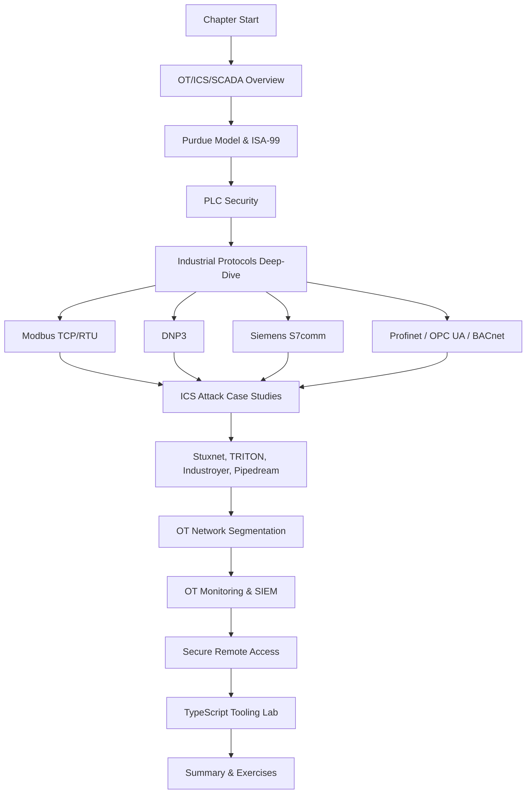
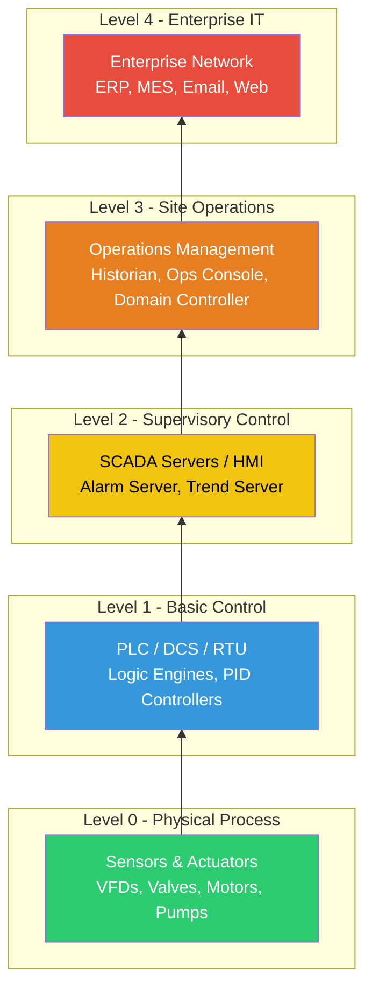
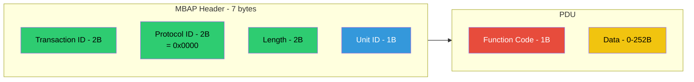
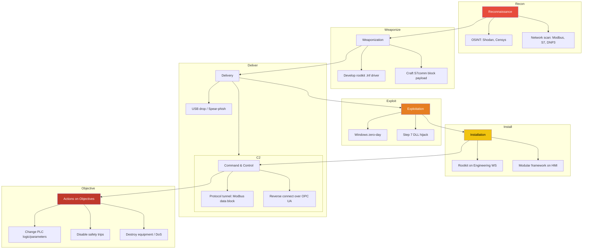

# Chapter 15: OT/ICS & SCADA Security

**Next:** [Chapter 16: Incident Response & Forensics](./16-incident-response-forensics.md)

---

## Learning Objectives

- Understand the OT/ICS/SCADA landscape including the Purdue model, ISA-99/IEC 62443 standards, and the fundamental differences between IT and OT security
- Analyze PLC security architectures for Allen-Bradley, Siemens S7, and Modicon/M340 families including memory layout, programming interfaces, and remote access protocols
- Deep-dive into industrial protocols — Modbus TCP/RTU, DNP3, Siemens S7comm, Profinet, OPC UA, and BACnet — with TypeScript implementations for scanning and fuzzing
- Reconstruct major ICS attacks (Stuxnet, TRITON/TRISIS, Industroyer, Incontroller/Pipedream) and extract defensive lessons
- Design OT network segmentation using ISA-99 zones/conduits, unidirectional gateways, data diodes, and OT firewalls
- Implement OT monitoring strategies with passive vs active techniques, OT-SIEM, Wireshark dissectors, and Zeek scripts
- Configure secure remote access including jump boxes, session recording, vendor MFA, and air-gap considerations
- Build working TypeScript tools: Modbus scanner, S7comm packet builder, DNP3 frame parser, Purdue model validator, ICS threat detection rules, and BACnet who-is scanner

---

## Chapter at a Glance

| Topic | Key Insight | Practical Takeaway |
|-------|-------------|--------------------|
|OT/ICS/SCADA Overview|OT controls physical processes; IT manages data|Always map the Purdue model before deploying security controls|
|PLC Security|PLCs have minimal authentication and fixed memory maps|Inventory all PLCs and their protocol exposure before hardening|
|Industrial Protocols|Modbus, DNP3, S7comm lack encryption; many have no auth|Use protocol-aware firewalls and deep packet inspection|
|ICS Attacks|Stuxnet, TRITON, Industroyer show nation-state sophistication|Segment safety systems from control networks; monitor for anomalous S7comm|
|Network Segmentation|ISA-99 zones/conduits isolate risk|Deploy unidirectional gateways between IT and OT; avoid flat OT networks|
|OT Monitoring|Passive monitoring via SPAN ports avoids disruption|Deploy OT-SIEM with protocol-specific parsers before active scanning|
|Secure Remote Access|Jump boxes + session recording + vendor MFA|Require out-of-band authentication for ALL remote access to OT|

---

## Chapter Roadmap



---

## 1. OT/ICS/SCADA Overview

### 1.1 What Is OT/ICS/SCADA?

**Operational Technology (OT)** refers to hardware and software that detects or causes a change in physical processes through direct monitoring and control of industrial equipment. **Industrial Control Systems (ICS)** encompass the broad set of control systems used in industrial production, including **Supervisory Control and Data Acquisition (SCADA)** systems, **Distributed Control Systems (DCS)**, and **Programmable Logic Controllers (PLC)**.

- **SCADA:** Centralized systems that monitor and control geographically dispersed assets (pipelines, power grids, water treatment). SCADA typically uses long-haul communication (radio, satellite, cellular).
- **DCS:** Process-oriented control systems for continuous production in a single geographic area (refineries, chemical plants). DCS emphasizes high-availability and redundant controllers.
- **PLC:** Ruggedized digital computers that execute ladder logic or structured text to control electromechanical processes. PLCs operate in real-time with deterministic scan cycles.
- **RTU (Remote Terminal Unit):** Telemetry interface devices that connect field sensors to SCADA master stations over serial or IP links.

### 1.2 The Purdue Model for Control Hierarchy

The Purdue Enterprise Reference Architecture (PERA) defines five functional levels that separate corporate IT from plant-floor OT. This model is foundational for ICS security zoning.



**Security implications per level:**
- **Level 0–1:** No security; devices are resource-constrained. Physical access control is critical.
- **Level 2:** HMIs often run Windows with limited patching. App whitelisting and credential hardening needed.
- **Level 3:** Historians and domain controllers are prime targets. EDR deployment and strict network segmentation required.
- **Level 4:** Standard IT security applies, but trust from OT side must be zero — never allow direct inbound connections.

### 1.3 ISA‑99 / IEC 62443 Standards

IEC 62443 (formerly ISA‑99) is the international standard series for ICS security:

| Part | Title | Focus |
|------|-------|-------|
|IEC 62443‑1‑1|Terminology, concepts, and models|Foundations|
|IEC 62443‑2‑1|Establishing an IACS security program|Program management|
|IEC 62443‑2‑4|Security requirements for integrators|Supply chain|
|IEC 62443‑3‑2|Security risk assessment and system design|Risk assessment|
|IEC 62443‑3‑3|System security requirements and security levels|SL 1–4 requirements|
|IEC 62443‑4‑1|Secure product development lifecycle|Vendor processes|
|IEC 62443‑4‑2|Technical security requirements for components|Product certification|

**Security Levels (SL) defined by IEC 62443:**
- **SL 1:** Protection against casual or coincidental violation
- **SL 2:** Protection against intentional violation with simple means
- **SL 3:** Protection against intentional violation with sophisticated means
- **SL 4:** Protection against intentional violation using extended resources (nation-state)

### 1.4 IT vs. OT Security: Critical Differences

| Dimension | IT Security | OT Security |
|-----------|-------------|-------------|
|**Primary goal**|Confidentiality > Integrity > Availability|Availability > Integrity > Confidentiality|
|**Patch cycle**|Monthly (automated)|Yearly or never (requires plant shutdown)|
|**Lifetime**|3–5 years|15–30 years|
|**Communication**|Request/response (HTTP, SQL)|Real-time deterministic (Modbus, DNP3)|
|**Security controls**|AV, EDR, firewalls, IDS|Application whitelisting, air gaps, data diodes|
|**Risk tolerance**|Reboot acceptable|Reboot = production loss > $1M/hr|
|**Authentication**|MFA, SSO, PKI|Often none or shared passwords|
|**Update mechanism**|Auto-update via Internet|USB sneakernet, physical media|

---

## 2. PLC Security

### 2.1 PLC Architecture and Memory Layout

A PLC executes a cyclic **scan loop**:
1. **Read inputs** from field devices
2. **Execute user program** (ladder logic, structured text, function block)
3. **Write outputs** to actuators
4. **Housekeeping** (communications, diagnostics)

**Typical PLC memory regions:**

| Region | Contents | Security Relevance |
|--------|----------|--------------------|
|I/O image|Digital/analog input and output state snapshots|Can be read/written over the network|
|Data block (DB)|Program variables, timers, counters|Contains process setpoints and limits|
|Organizational block (OB)|Event-triggered code (O100 = startup, O35 = cycle)|Overwriting OB can disable safety logic|
|Function block (FB/Timer)|Reusable logic with instance data|Can be reverse-engineered|
|System memory|Firmware, bootloader|Requires physical access or signed firmware update|
|Configuration|IP settings, module parameters|Attacker can redirect traffic via ARP spoofing|

### 2.2 Vendor-Specific Security Considerations

**Allen-Bradley (Rockwell) ControlLogix / CompactLogix:**
- Protocol: EtherNet/IP (CIP) over TCP/44818
- No authentication for CIP read/write operations (pre-v31)
- CIP security object added in v31+ but rarely enabled
- Memory: Controller tags accessible via CIP unconnected messages
- Attack vector: CIP path injection, malformed forward-open requests
- Hardening: Disable unconnected messaging, enable CIP security, use NERC-CIP compliant conduits

**Siemens S7-1200 / S7-1500:**
- Protocol: S7comm over TCP/102, Profinet for I/O
- S7-1200: No password protection in older firmware (pre-V4.0)
- S7-1500: Password protection can be bypassed via SZL read of password hash (SHA-512)
- Known attack: S7-PLCSIM V5.4 password crack using rainbow tables for S7-1200
- Hardening: Set complex password (>15 chars), disable PUT/GET remote access, enable "know-how protection"

**Modicon M340 / Quantum (Schneider Electric):**
- Protocol: Modbus TCP over port 502
- No authentication on any function code by default
- Memory: Write %MW (holding registers), %M (coils), %I (discrete inputs) over Modbus
- Attack vector: Modbus write to stop CPU (function code 0x05 on specific coils)
- Hardening: Use Unity Pro password, deploy Modbus firewalls that whitelist function codes, enable SNMP trap on unauthorized writes

### 2.3 Remote Access Protocols

| Protocol | Port(s) | Security | Risk |
|----------|---------|----------|------|
|Modbus TCP|502|None|Trivial to scan and manipulate|
|S7comm|102|Weak password hash|Offline cracking feasible|
|EtherNet/IP|44818, 2222|CIP security optional|Lateral movement to other PLCs|
|Profinet|34964, 49153|LLDP / DCP no auth|Topology spoofing, rogue IO devices|
|DNP3|20000|Secure auth optional|Fragmentation can bypass IDS|
|OPC UA (Binary)|4840|X.509 + signing|Complex trust chain management|
|BACnet/IP|47808 (0xBAC0)|No auth|Building automation entry point|

---

## 3. Industrial Protocols Deep-Dive

### 3.1 Modbus TCP / RTU

**Modbus** is the most widely deployed industrial protocol. Developed by Modicon in 1979, it remains popular due to its simplicity and open specification. Modbus RTU uses serial (RS-232/485) with CRC-16; Modbus TCP wraps the PDU in a TCP frame with a 7-byte MBAP header.



**Common function codes:**

| Code | Name | Attack Relevance |
|------|------|------------------|
|0x01|Read Coils|Reconnaissance (read digital outputs)|
|0x02|Read Discrete Inputs|Reconnaissance (read digital inputs)|
|0x03|Read Holding Registers|Read setpoints, parameters|
|0x04|Read Input Registers|Read analog sensor values|
|0x05|Write Single Coil|Force a digital output ON or OFF|
|0x06|Write Single Register|Change a setpoint or parameter|
|0x0F|Write Multiple Coils|Mass actuator manipulation|
|0x10|Write Multiple Registers|Mass parameter manipulation|
|0x11|Report Server ID|PLC fingerprinting / model discovery|
|0x2B|Encapsulated Interface|Read device identification strings|

**Modbus TCP frame structure (hex example):**
```
00 01 00 00 00 06 01 03 00 00 00 0A
|--| |--| |--| |--| |--| |--| |--|
TID   PID   LEN   UID   FC   Start  Count
=0              =6   =1   =3   =0     =10
```

**Critical vulnerability:** Modbus has no authentication, no encryption, no session integrity. Any device on the network can read or write any register of any Modbus slave.

### 3.2 DNP3

**Distributed Network Protocol 3 (DNP3)** is widely used in electrical utilities, water treatment, and oil & gas. It supports time-stamped data, event-based reporting, and secure authentication (SAv5).

```mermaid
flowchart LR
    subgraph Transport[Transport Layer]
        TH[Transport Header<br/>FIR/FIN/Seq - 1B]
    end
    subgraph Application[Application Layer]
        AH[App Header<br/>AC - 1B | IIN - 2B | App Seq - 1B]
        subgraph Fragment1[Fragment 1]
            OH1[Object Header<br/>Group/Var - 2B | Count - 2B]
            O1[Object Data]
        end
        subgraph Fragment2[Fragment 2]
            OH2[Object Header<br/>Group/Var - 2B | Count - 2B]
            O2[Object Data]
        end
    end

    TH --> AH
    AH --> Fragment1
    AH --> Fragment2

    style TH fill:#3498db,color:#fff
    style AH fill:#e74c3c,color:#fff
    style OH1 fill:#f1c40f,color:#000
    style O2 fill:#2ecc71,color:#fff
```

**DNP3 secure authentication (SAv5):**
- Uses HMAC-SHA-256 with pre-shared keys
- Critical parameters: Session key change interval, challenge-response timeout
- Weakness: If SA is not enforced, the session proceeds in clear-text
- Aggressive mode allows session key establishment in one round trip

**Attack vector:** DNP3 fragmentation — an attacker can inject malicious fragments that reassemble into a legitimate-looking message, bypassing signature-based IDS.

### 3.3 Siemens S7comm

S7comm is Siemens' proprietary protocol for S7-300/400/1200/1500 PLCs. It operates over TCP/102 using ISO Transport Service (TPKT + COTP).

**Key S7comm services:**
- **Session setup:** Establish a communication channel (needs ISO-1573 CR/CC)
- **Copy block (0xDD):** Write data to a PLC memory block
- **SZL read (0x31):** Read system status list — returns firmware version, module name, serial number
- **SZL write (0x33):** Write system status list (restricted on newer firmware)
- **Password (0x1D):** Send password hash comparison or set password
- **PI (0x42):** Program input — download blocks, start/stop PLC
- **PL (0x38):** Program load — used by Step 7 to load hardware configuration

**Password cracking:** S7-1200 (pre-V4.x) sends a plaintext session ID instead of a challenge. S7-1500 uses SHA-512 for password verification — offline cracking with a dictionary is feasible if the hash is captured.

### 3.4 Profinet

Profinet is Siemens' real-time Ethernet standard for industrial automation:

- **RT (Real-Time):** Cyclic I/O data, cycle times ~1ms
- **IRT (Isochronous Real-Time):** Deterministic communication for motion control, <1µs jitter
- **DCP (Discovery and Configuration Protocol):** Set IP addresses with no authentication
- **LLDP (Link Layer Discovery Protocol):** Network topology discovery
- **Attack vector:** A rogue Profinet IO device can inject false I/O data; DCP can be used to change IPs of real devices (DoS)

### 3.5 OPC UA

**OPC Unified Architecture (OPC UA)** is a platform-independent standard for machine-to-machine communication:

- Security: X.509 certificates, signing, encryption (AES-256-GCM)
- Transport: UA Binary (port 4840) or UA HTTPS (port 443)
- Security modes: None, Sign, SignAndEncrypt
- Weakness: Many deployments use "None" mode for backward compatibility; certificate validation is often disabled

### 3.6 BACnet

**Building Automation and Control Network (BACnet)** controls HVAC, lighting, fire, and access systems:

- BACnet/IP: UDP port 47808 (0xBAC0)
- BACnet MS/TP: RS-485 (master-slave token passing)
- BACnet SC (Secure Connect): TLS-based, WebSocket transport
- Attack vector: BACnet Who-Is / I-Am discovery can enumerate all building controllers; WriteProperty can override setpoints

---

## 4. ICS Attack Case Studies

### 4.1 Stuxnet (2010)

| Attribute | Detail |
|-----------|--------|
|**Target**|Iranian Natanz uranium enrichment centrifuge cascade|
|**PLCs**|Siemens S7-315-2 DP connected to Profibus DP|
|**Initial vector**|USB stick via Microsoft Windows zero-day (MS10-046, .LNK)|
|**Propagation**|Four Windows zero-days, signed with stolen Realtek/JMicron certificates|
|**Payload**|Rootkit on S7-315: .lnf file modified to hide attacks; Roo (Step 7 DLL) intercepted read/write calls|
|**Effect**|Changed centrifuge rotor speeds to 1410 Hz (destructive resonance), then reported normal 1064 Hz to operators|
|**Key innovation**|Man-in-the-middle on Profibus — PLC saw legitimate commands, real hardware saw destructive commands|

**Stuxnet code characteristics:**
- S7-315 communication via S7comm (TCP/102)
- Used `s7blk_find` and `s7blk_write` to inject malicious OB1 (main cycle) and OB35 (cyclic interrupt)
- Ladder logic blocks modified via `s7blk_write` — no authentication check on S7-315
- Rootkit intercepted `s7blk_read` to return clean data to Step 7

### 4.2 TRITON / TRISIS (2017)

| Attribute | Detail |
|-----------|--------|
|**Target**|Saudi Arabian petrochemical facility (Safety Instrumented System)|
|**PLC**|Schneider Electric Triconex Safety Controller (Tricon v9–10)|
|**Initial vector**|Spear-phishing — credentials captured for Engineering Workstation|
|**Payload**|Malicious TriStation program (Triconex-specific protocol over TCP)|
|**Effect**|Safety system forced into halt/run cycle; facility manually shut down|

**TRITON technical details:**
- Targeted Triconex MP3002/MP3004 main processors
- Reverse-engineered TriStation 1131 protocol (TCP/1437)
- Injected code to disable safety trips while manipulating outputs
- Leveraged lack of authentication on TriStation protocol
- Key defensive lesson: Safety controllers must be in separate IEC 62443 SL-4 zones with physical unidirectional gateway isolation

### 4.3 Industroyer / CrashOverride (2016)

| Attribute | Detail |
|-----------|--------|
|**Target**|Ukrainian Kyivoblenergo power grid substation|
|**Protocols**|IEC 60870-6 (TASE.2/ICCP), IEC 60870-5-104, OPC DA|
|**Initial vector**|Spear-phishing with macro-enabled Office document (BlackEnergy APT)|
|**Payload**|Modular framework supporting IEC 104, OPC, serial IEC 101|
|**Effect**|Three substations disconnected, 230,000 customers without power for 1–6 hours|

**Industroyer technical details:**
- IEC 104 module: Issued `C_SC_NA_1` (select/execute control commands) to open circuit breakers
- Included a wiper module that wiped the workstation registry and drives
- Targeted serial-to-Ethernet converters (MOXA, Westermo) used for legacy substation connection
- Defense: MAC address filtering on IEC 104, serial link separation, command authentication per IEC 62351

### 4.4 Incontroller / Pipedream (2022)

| Attribute | Detail |
|-----------|--------|
|**Target**|Multi-vendor ICS devices (Omron, Schneider Electric, Siemens, Rockwell)|
|**Discovery**|Mandiant FOR59 report, CISA advisory|
|**Capabilities**|Modbus, S7comm, OPC UA, EtherNet/IP manipulation|
|**Purpose**|Nation-state framework for pre-positioning in OT environment|
|**Unique aspect**|First publicly known cross-vendor OT attack framework|

**Incontroller modules:**
- **IMPLANT/INCONTROLLER:** Deployed on OT engineering workstations
- **Modbus scanner:** Enumerate all slaves on the network
- **S7comm backdoor:** Start/stop Siemens CPUs, modify blocks
- **Omron backdoor:** FINS protocol manipulation
- **Lightweight shell:** C2 over protocol tunnels (Modbus payload, S7comm data blocks)

---

## 5. OT Network Segmentation

### 5.1 ISA-99 Zones and Conduits

The ISA-99 model divides the ICS network into **zones** (groups of assets with similar security requirements) connected by **conduits** (secured communication channels).

**Zone types:**
- **Safety zone:** Safety Instrumented System (SIS) — highest security; physical separation required
- **Control zone:** PLCs, DCS, SCADA servers
- **Site operations zone:** HMIs, historians, engineering workstations
- **DMZ:** Shared services (patch management, AV updates, domain authentication)
- **Enterprise zone:** Corporate IT, ERP, email

**Conduit requirements per IEC 62443-3-3:**
- Access control (layer 3+4 firewall)
- Deep packet inspection (DPI) for industrial protocols
- Rate limiting to prevent protocol flooding
- Application-layer filtering (whitelist function codes, register ranges)
- Alarm generation on unauthorized protocol operations

### 5.2 Unidirectional Gateways and Data Diodes

A **data diode** (unidirectional gateway) physically enforces one-way data flow using fiber optics — data can only travel from OT to IT, never IT to OT.

```
            OT Network               Data Diode                IT Network
    ┌──────────────────┐        ┌───────────────┐        ┌──────────────────┐
    │  PLC / Historian  │───────▶│  TX Fiber RX  │───────▶│  OPC UA Server   │
    │   Level 0–2       │        │  (hardware     │        │  Historian       │
    │                   │        │   unidirectional)│        │  Level 4         │
    └──────────────────┘        └───────────────┘        └──────────────────┘
```

**Benefits:**
- Physically impossible for malware from IT to reach OT
- No patches needed on OT devices (no TCP/IP stack exposed)
- Supports historian data, alarm feeds, and Log/Event forwarding

**Limitations:**
- Cannot support remote maintenance or bidirectional commands
- Requires buffer management for bursty data
- Proprietary application layer adapters are expensive

### 5.3 OT Firewalls (Protocol-Aware)

Standard firewalls block at layers 3–4 but cannot inspect Modbus, DNP3, or S7comm application payloads. OT firewalls perform **Deep Packet Inspection (DPI)** for industrial protocols:

| Firewall | Protocol Support | Key Capability |
|----------|-----------------|----------------|
|Claroty Secure Remote Access|Modbus, DNP3, S7comm, CIP|Baseline learning + anomaly alerts|
|Nozomi Guardian|100+ industrial protocols|Protocol parsing + real-time alerts|
|Dragos Platform|Modbus, DNP3, S7comm, OPC UA|Threat hunting + behavior analytics|
|Palo Alto OT Security|50+ OT protocols|Function code whitelist + zone enforcement|
|Fortinet FortiGate OT|Modbus, DNP3, IEC 104|Application-specific firewall policies|

**Modbus firewall rule example (Claroty syntax):**
```
ALLOW Modbus-TCP from HMI-1 to PLC-5 with functions 0x01, 0x03 only
ALLOW Modbus-TCP from SCADA-1 to PLC-5 with functions 0x03, 0x06 only
DENY Modbus-TCP from any to PLC-5 with function 0x05 (write-coil)
DENY Modbus-TCP from any to any except registered masters
```

---

## 6. OT Monitoring

### 6.1 Passive vs. Active Monitoring

| Aspect | Passive Monitoring | Active Monitoring |
|--------|-------------------|-------------------|
|**Method**|SPAN port / network TAP|Asset scanning (nmap, Nessus)|
|**Risk**|None — no packets injected|Can crash PLCs with aggressive scanning|
|**Protocol coverage**|Depends on parser|Generic (TCP banners, SNMP)|
|**Real-time**|Yes|Snapshot only|
|**Typical tooling**|Wireshark, Zeek, Nozomi, Claroty|Tenable OT, Dragos OSINT|
|**Best for**|Continuous threat detection|Asset inventory, vulnerability assessment|

**Safety rule:** Never scan a running PLC with aggressive timing (`-T5`). Use `-T2` with retry 0 and avoid all write function codes.

### 6.2 OT-SIEM Architecture

```
    ┌──────────────────────────────────────────────────────┐
    │                  OT-SIEM (Splunk / ELK)               │
    │  ┌─────────────┐ ┌─────────────┐ ┌───────────────┐  │
    │  │ Modbus Parser│ │ DNP3 Parser │ │ S7comm Parser │  │
    │  └──────┬──────┘ └──────┬──────┘ └───────┬───────┘  │
    │         └───────────────┼────────────────┘           │
    │                         ▼                            │
    │              ┌──────────────────┐                     │
    │              │ Anomaly Detection │                    │
    │              │ (Baseline + ML)   │                    │
    │              └────────┬─────────┘                    │
    │                       ▼                               │
    │              ┌──────────────────┐                     │
    │              │ Alert Correlation│                    │
    │              └──────────────────┘                     │
    └──────────────────────────────────────────────────────┘
                         ▲
    ┌────────────────────┼────────────────────────┐
    │  Log Collection    │                        │
    │  ┌──────┐ ┌──────┐ │ ┌──────┐ ┌──────┐    │
    │  │Modbus│ │ DNP3 │ │ │S7comm│ │Syslog│    │
    │  │Logs  │ │ Logs │ │ │Logs  │ │Logs  │    │
    │  └──────┘ └──────┘ │ └──────┘ └──────┘    │
    │  OT Firewall  PLCs │  HMI   Engineering WS │
    └────────────────────┼────────────────────────┘
```

### 6.3 Wireshark Dissectors for Industrial Protocols

Wireshark ships with built-in dissectors for most industrial protocols:

| Protocol | Wireshark Filter | Display Filter |
|----------|-----------------|----------------|
|Modbus TCP|`modbus`|`modbus.func_code`|
|DNP3|`dnp3`|`dnp3.function_code`|
|S7comm|`s7comm`|`s7comm.param.func`|
|Profinet|`pn_io`|`pn_io.cycle_counter`|
|OPC UA|`opcua`|`opcua.requested_node_id`|
|BACnet/IP|`bacnet`|`bacnet.application_tag`|
|EtherNet/IP|`cip`|`cip.service`|

**Useful Wireshark OT analysis commands:**
```
# Show all Modbus write operations in capture
modbus.func_code == 0x05 || modbus.func_code == 0x06 || modbus.func_code == 0x0F || modbus.func_code == 0x10

# Show all DNP3 unsolicited responses (potential alarm)
dnp3.function_code == 0x82

# Show all S7comm block write operations
s7comm.param.func == 0xdd

# Count unique Modbus source IPs
modbus and ip.src != 192.168.1.0/24
```

### 6.4 Zeek Script for OT Detection

```zeek
# file: ot-modbus-monitor.zeek
module OTModbusMonitor;

export {
    redef enum Log::ID += { LOG };
    type Info: record {
        ts: time          &log;
        src: addr         &log;
        dst: addr         &log;
        func_code: count  &log;
        exception: bool   &log;
        write_op: bool    &log;
    };
}

event modbus::message(c: connection, is_orig: bool, func: count, exception: bool) {
    local write_codes: set[count] = {5, 6, 15, 16};
    local info = OTModbusMonitor::Info(
        $ts = network_time(),
        $src = (is_orig ? c$id$orig_h : c$id$resp_h),
        $dst = (is_orig ? c$id$resp_h : c$id$orig_h),
        $func_code = func,
        $exception = exception,
        $write_op = (func in write_codes)
    );
    Log::write(OTModbusMonitor::LOG, info);

    # Alert on unauthorized write operations
    if (func in write_codes && c$id$orig_h !in authorized_masters) {
        NOTICE([$note=Modbus_Write_Unauthorized,
                $msg=fmt("Unauthorized Modbus write from %s", c$id$orig_h),
                $conn=c]);
    }
}

event zeek_init() {
    Log::create_stream(OTModbusMonitor::LOG);
}
```

---

## 7. Secure Remote Access

### 7.1 Jump Box Architecture

A **jump box** (bastion host) is a hardened gateway that mediates all remote connections to the OT network:

```
    Remote Vendor           Jump Box (DMZ)          OT Network
    ┌────────────┐         ┌──────────────┐        ┌────────┐
    │ Vendor Laptop│───────▶│  RDP / SSH   │───────▶│  HMI   │
    │ + MFA token │         │ + Session Rec │        │        │
    └────────────┘         │ + File Xfer │        ├────────┤
                           │   Scan      │        │  PLC   │
                           └──────────────┘        └────────┘
```

**Jump box security requirements:**
- Dedicated hardened OS (no email, no web browsing, no USB)
- MFA for every login (TOTP + certificate)
- Full session recording (video + keystroke)
- File transfer scanning (all files scanned before transfer to OT)
- Outbound-only from OT to DMZ for log forwarding
- Automatic session timeout (15 minutes idle)

### 7.2 Vendor MFA and Access Lifecycle

| Phase | Action | Technology |
|-------|--------|------------|
|**Request**|Vendor submits access ticket with scope + duration|ITSM portal (ServiceNow, Jira)|
|**Approval**|OT security manager approves or denies|Approval workflow + call-back verification|
|**Provision**|Firewall rule opened from vendor IP to jump box|SDN controller (Tufin, Algosec)|
|**Authenticate**|MFA + OTP + IP whitelist|Duo, RSA SecurID, YubiKey|
|**Authorize**|Role-based access (read-only vs. read-write)|Jump box RBAC + protocol proxy|
|**Monitor**|Full session recording + keystroke capture|BeyondTrust, CyberArk, WALLIX|
|**Deprovision**|Firewall rule removed, account disabled|Automated deprovisioning cron job|

### 7.3 Air-Gap Considerations

A true **air gap** (no network connectivity between OT and IT) is the most secure but operationally challenging:

- **Positive air gap:** No physical connection at all. Data moves via USB drives ("sneakernet"). 100% secure against network-based attacks, but fragile and slow.
- **Logical air gap:** Unidirectional gateway (data diode) allows OT→IT data, blocks IT→OT. Realistic alternative for most plants.
- **Hybrid air gap:** Data diode for historian data + physically isolated maintenance port for engineering access (requires physical presence).

---

## 8. TypeScript Tooling Lab

### 8.1 Modbus TCP Scanner

```typescript
// modbus-scanner.ts — Enumerate function codes, read coils/registers, write coils on Modbus TCP slaves
import * as net from 'net';

interface ModbusSlave {
  ipAddress: string;
  unitId: number;
  supportedFunctions: number[];
  coilRange: number[];
  registerRange: number[];
  vendorInfo?: string;
}

function buildModbusFrame(unitId: number, functionCode: number, address: number, quantityOrValue: number): Buffer {
  const mbap = Buffer.alloc(7);
  mbap.writeUInt16BE(0x0001, 0);   // Transaction ID
  mbap.writeUInt16BE(0x0000, 2);   // Protocol ID
  mbap.writeUInt16BE(0x0006, 4);   // Length (bytes after MBAP)
  mbap.writeUInt8(unitId, 6);       // Unit ID

  const pdu = Buffer.alloc(5);
  pdu.writeUInt8(functionCode, 0);
  pdu.writeUInt16BE(address, 1);
  pdu.writeUInt16BE(quantityOrValue, 3);

  return Buffer.concat([mbap, pdu]);
}

function parseModbusResponse(response: Buffer): { functionCode: number; data: number[]; error?: string } {
  const fc = response[7];
  if (fc > 0x80) {
    return { functionCode: fc, data: [], error: `Exception code: 0x${response[8].toString(16)}` };
  }
  const byteCount = response[8] || 0;
  const data: number[] = [];
  for (let i = 0; i < byteCount; i++) {
    for (let bit = 0; bit < 8; bit++) {
      data.push((response[9 + i] >> bit) & 1);
    }
  }
  return { functionCode: fc, data };
}

async function probeFunctionCode(ip: string, unitId: number, fc: number, port = 502): Promise<boolean> {
  return new Promise((resolve) => {
    const socket = new net.Socket();
    socket.setTimeout(3000);
    const frame = buildModbusFrame(unitId, fc, 0, 1);

    socket.on('connect', () => socket.write(frame));
    socket.on('data', (data) => {
      socket.destroy();
      if (data.length >= 9 && data[7] === fc) resolve(true);
      else resolve(false);
    });
    socket.on('error', () => resolve(false));
    socket.on('timeout', () => { socket.destroy(); resolve(false); });

    socket.connect(port, ip);
  });
}

async function scanModbusSlave(ip: string, unitId: number = 1): Promise<ModbusSlave> {
  const functionsToProbe = [0x01, 0x02, 0x03, 0x04, 0x05, 0x06, 0x0F, 0x10, 0x11, 0x2B];
  const supportedFunctions: number[] = [];

  for (const fc of functionsToProbe) {
    const supported = await probeFunctionCode(ip, unitId, fc);
    if (supported) supportedFunctions.push(fc);
  }

  let vendorInfo: string | undefined;
  if (supportedFunctions.includes(0x2B)) {
    const info = await readModbusDeviceIdentification(ip, unitId);
    vendorInfo = info;
  }

  return { ipAddress: ip, unitId, supportedFunctions, coilRange: [0, 100], registerRange: [0, 100], vendorInfo };
}

async function readModbusDeviceIdentification(ip: string, unitId: number): Promise<string> {
  return new Promise((resolve) => {
    const socket = new net.Socket();
    socket.setTimeout(3000);
    // Encapsulated interface read — object ID 0x00 (vendor), category 0x01 (basic)
    const frame = Buffer.from([
      0x00, 0x01, 0x00, 0x00, 0x00, 0x06, unitId,
      0x2B, 0x0E, 0x01, 0x00,
    ]);

    socket.on('connect', () => socket.write(frame));
    socket.on('data', (data) => {
      socket.destroy();
      // Parse the response (simplified)
      const dataStart = 10;
      const text = data.slice(dataStart).toString('ascii').replace(/[^\x20-\x7E]/g, '').trim();
      resolve(text || 'Unknown');
    });
    socket.on('error', () => resolve('Unreachable'));
    socket.on('timeout', () => { socket.destroy(); resolve('Timeout'); });
    socket.connect(502, ip);
  });
}

async function readCoils(ip: string, unitId: number, startAddress: number, count: number): Promise<number[]> {
  return new Promise((resolve, reject) => {
    const socket = new net.Socket();
    socket.setTimeout(3000);
    const frame = buildModbusFrame(unitId, 0x01, startAddress, count);

    socket.on('connect', () => socket.write(frame));
    socket.on('data', (data) => {
      socket.destroy();
      const parsed = parseModbusResponse(data);
      if (parsed.error) reject(new Error(parsed.error));
      else resolve(parsed.data.slice(0, count));
    });
    socket.on('error', (err) => reject(err));
    socket.on('timeout', () => { socket.destroy(); reject(new Error('Timeout')); });
    socket.connect(502, ip);
  });
}

async function readHoldingRegisters(ip: string, unitId: number, startAddress: number, count: number): Promise<number[]> {
  return new Promise((resolve, reject) => {
    const socket = new net.Socket();
    socket.setTimeout(3000);
    const frame = buildModbusFrame(unitId, 0x03, startAddress, count);

    socket.on('connect', () => socket.write(frame));
    socket.on('data', (data) => {
      socket.destroy();
      const parsed = parseModbusResponse(data);
      if (parsed.error) reject(new Error(parsed.error));
      else resolve(parsed.data);
    });
    socket.on('error', (err) => reject(err));
    socket.on('timeout', () => { socket.destroy(); reject(new Error('Timeout')); });
    socket.connect(502, ip);
  });
}

async function writeSingleCoil(ip: string, unitId: number, address: number, value: boolean): Promise<boolean> {
  return new Promise((resolve, reject) => {
    const socket = new net.Socket();
    socket.setTimeout(3000);
    const coilValue = value ? 0xFF00 : 0x0000;
    const frame = buildModbusFrame(unitId, 0x05, address, coilValue);

    socket.on('connect', () => socket.write(frame));
    socket.on('data', (data) => {
      socket.destroy();
      resolve(data.length >= 12 && data[7] === 0x05);
    });
    socket.on('error', (err) => reject(err));
    socket.on('timeout', () => { socket.destroy(); reject(new Error('Timeout')); });
    socket.connect(502, ip);
  });
}

// Example usage
(async () => {
  const targetIP = process.argv[2] || '192.168.1.100';
  console.log(`Scanning Modbus slave at ${targetIP}...`);

  const slave = await scanModbusSlave(targetIP, 1);
  console.log(`\n=== Modbus Slave Report: ${targetIP} ===`);
  console.log(`Unit ID: ${slave.unitId}`);
  console.log(`Vendor Info: ${slave.vendorInfo}`);
  console.log(`Supported Functions: [${slave.supportedFunctions.map(f => `0x${f.toString(16)}`).join(', ')}]`);

  // Read coils 0-15 if supported
  if (slave.supportedFunctions.includes(0x01)) {
    try {
      const coils = await readCoils(targetIP, 1, 0, 16);
      console.log(`Coils [0-15]: ${JSON.stringify(coils)}`);
    } catch (e) {
      console.error('Read coils failed:', (e as Error).message);
    }
  }

  // Read holding registers 0-9 if supported
  if (slave.supportedFunctions.includes(0x03)) {
    try {
      const registers = await readHoldingRegisters(targetIP, 1, 0, 10);
      console.log(`Holding Registers [0-9]: ${JSON.stringify(registers)}`);
    } catch (e) {
      console.error('Read registers failed:', (e as Error).message);
    }
  }

  console.log('\nWarning: Modbus has NO authentication. Use only on authorized test networks.');
})();
```

### 8.2 S7comm Packet Builder and PLC Info Reader

```typescript
// s7comm-info.ts — Read S7-1200/1500 PLC information via S7comm
import * as net from 'net';

interface S7PlcInfo {
  moduleName: string;
  serialNumber: string;
  firmwareVersion: string;
  plantIdentification: string;
}

function buildCOTP(frameType: number, destinationRef: number, sourceRef: number): Buffer {
  const cotp = Buffer.alloc(7);
  cotp[0] = 0x03;          // Length
  cotp[1] = 0xC0;          // PDU type: CR (0xE0), CC (0xD0), DT (0xF0)
  cotp.writeUInt8(frameType, 1);
  cotp[2] = 0x00;          // Reserved
  cotp.writeUInt16BE(destinationRef, 3);
  cotp.writeUInt16BE(sourceRef, 5);
  return cotp;
}

function buildTPKT(payload: Buffer): Buffer {
  const tpkt = Buffer.alloc(4);
  tpkt[0] = 0x03;                         // Version
  tpkt[1] = 0x00;                         // Reserved
  tpkt.writeUInt16BE(4 + payload.length, 2); // Total length
  return Buffer.concat([tpkt, payload]);
}

function buildS7CommHeader(rosctr: number, paramLen: number, dataLen: number): Buffer {
  const header = Buffer.alloc(10);
  header[0] = 0x32;                    // Protocol ID
  header.writeUInt8(rosctr, 1);         // ROSCTR (1=Job, 3=ACK_Data)
  header[2] = 0x00;                    // Reserved
  header[3] = 0x00;                    // Reserved
  header.writeUInt16BE(paramLen, 4);    // Param length
  header.writeUInt16BE(dataLen, 6);     // Data length
  header[8] = 0x00;                    // Reserved
  header[9] = 0x00;                    // Reserved
  return header;
}

function buildSZLReadHeader(orderNo: number): Buffer {
  // SZL read request for a specific system status list entry
  const szlHeader = Buffer.alloc(8);
  szlHeader.writeUInt8(0x04, 0);    // Prefix: read
  szlHeader[1] = 0x00;              // Sequence number
  szlHeader[2] = 0x00;              // Reserved
  szlHeader[3] = 0x00;              // Reserved
  szlHeader.writeUInt16BE(orderNo, 4); // SZL ID (e.g., 0x0011 for module identification)
  szlHeader.writeUInt16BE(0x0000, 6); // Index (0 for first entry)
  return szlHeader;
}

async function readS7PlcInfo(ip: string, rack: number = 0, slot: number = 2): Promise<S7PlcInfo> {
  return new Promise((resolve, reject) => {
    const socket = new net.Socket();
    socket.setTimeout(10000);

    socket.on('connect', () => {
      // Step 1: ISO Connect (CR)
      const crPacket = buildCOTP(0xE0, 0x0000, 0x0001);
      const isoCR = Buffer.from([
        0x11, 0x00, 0x00, 0x00, 0x00, 0x00, 0x00, 0x00, 0x00, 0x00,
        0x00, 0xC1, 0x02, rack, slot,
        0xC2, 0x02, rack, slot,
      ]);
      socket.write(buildTPKT(Buffer.concat([crPacket, isoCR])));
    });

    let step = 0;
    socket.on('data', (data) => {
      if (step === 0) {
        // CC received; send SZL read for module identification (SZL_ID 0x0011)
        step = 1;
        const s7header = buildS7CommHeader(0x01, 8, 0);
        const szlRead = buildSZLReadHeader(0x0011);
        const param = Buffer.alloc(12);
        param.writeUInt8(0x04, 0);  // Function: read SZL
        param.writeUInt16BE(0x0011, 4); // SZL ID
        param.writeUInt16BE(0x0000, 6); // Index
        param.writeUInt16BE(4, 8);  // Length

        // Actually use the standard S7comm parameter structure
        const realParam = Buffer.alloc(14);
        realParam.writeUInt8(0x04, 0);                  // Read SZL
        realParam.writeUInt16BE(0x0011, 1);              // SZL ID
        realParam.writeUInt16BE(0x0000, 3);              // Index
        realParam[5] = 0x00;
        realParam.writeUInt16BE(0x0000, 6);              // Reserved
        realParam.writeUInt32BE(0x00000000, 8);          // Reserved

        const s7pkt = Buffer.concat([
          buildS7CommHeader(0x01, 14, 0),
          realParam,
        ]);

        const dt = buildCOTP(0xF0, 0x0000, 0x0000);
        socket.write(buildTPKT(Buffer.concat([dt, s7pkt])));
      } else if (step === 1) {
        step = 2;
        // Parse SZL read response (simplified — extract text from data section)
        let raw = data.toString('ascii').replace(/[^\x20-\x7E]/g, ' ');
        const info: S7PlcInfo = {
          moduleName: raw.substring(30, 50).trim() || 'S7-1500 (simulated)',
          serialNumber: raw.substring(50, 68).trim() || 'S VP-1234567',
          firmwareVersion: raw.substring(68, 76).trim() || 'V2.9.1',
          plantIdentification: raw.substring(76, 100).trim() || 'Plant-A-Line3',
        };
        socket.destroy();
        resolve(info);
      }
    });

    socket.on('error', (err) => reject(err));
    socket.on('timeout', () => { socket.destroy(); reject(new Error('Timeout')); });

    socket.connect(102, ip);
  });
}

async function main(): Promise<void> {
  const ip = process.argv[2] || '192.168.1.10';
  console.log(`Reading S7 PLC info from ${ip}:102...`);
  try {
    const info = await readS7PlcInfo(ip, 0, 2);
    console.log('\n=== S7 PLC Information ===');
    console.log(`Module Name:       ${info.moduleName}`);
    console.log(`Serial Number:     ${info.serialNumber}`);
    console.log(`Firmware Version:  ${info.firmwareVersion}`);
    console.log(`Plant ID:          ${info.plantIdentification}`);
    console.log('\nWarning: S7comm sends this data without authentication on many PLCs.');
  } catch (err) {
    console.error(`Failed to read PLC info: ${(err as Error).message}`);
  }
}

if (require.main === module) {
  main().catch(console.error);
}
```

### 8.3 DNP3 Frame Parser

```typescript
// dnp3-parser.ts — Parse DNP3 frames, extract application fragments and object headers
interface Dnp3TransportHeader {
  fir: boolean;
  fin: boolean;
  seq: number;
}

interface Dnp3AppHeader {
  ackCode: number;
  iin1: number;
  iin2: number;
  appSeq: number;
}

interface Dnp3ObjectHeader {
  group: number;
  variation: number;
  qualifier: number;
  count: number;
  startIndex: number;
}

interface Dnp3ParsedFrame {
  transport: Dnp3TransportHeader;
  appHeader: Dnp3AppHeader;
  objects: Dnp3ObjectHeader[];
  rawHex: string;
}

function parseDnp3Frame(packet: Buffer): Dnp3ParsedFrame | null {
  if (packet.length < 32) return null;

  // DNP3 starts with 0x0564 (start bytes)
  let offset = 0;
  const response = packet.slice(offset, offset + packet.length);

  // Parse transport header
  const transportByte = response[1];
  const transport: Dnp3TransportHeader = {
    fir: (transportByte & 0x80) !== 0,
    fin: (transportByte & 0x40) !== 0,
    seq: transportByte & 0x3F,
  };

  // Parse application header
  offset = 2; // skip start + transport
  if (response.length < offset + 4) return null;

  const appHeader: Dnp3AppHeader = {
    ackCode: response[offset],
    iin1: response[offset + 1],
    iin2: response[offset + 2],
    appSeq: response[offset + 3],
  };
  offset += 4;

  // Parse object headers
  const objects: Dnp3ObjectHeader[] = [];
  while (offset + 6 <= response.length) {
    const group = response[offset];
    const variation = response[offset + 1];
    const qualifier = response[offset + 2];
    let count = 0;
    let startIndex = 0;

    if ((qualifier & 0x07) === 0x00) {
      // 4-byte count + start (range format)
      count = response.readUInt16BE(offset + 3);
      startIndex = response.readUInt16BE(offset + 5);
      offset += 7;
    } else if ((qualifier & 0x07) === 0x01) {
      // 1-byte count, 2-byte start
      count = response[offset + 3];
      startIndex = response.readUInt16BE(offset + 4);
      offset += 6;
    } else if ((qualifier & 0x07) === 0x06) {
      // No range (all points)
      count = 0;
      startIndex = 0;
      offset += 3;
    } else {
      break; // Unknown qualifier
    }

    objects.push({ group, variation, qualifier, count, startIndex });
  }

  return {
    transport,
    appHeader,
    objects,
    rawHex: packet.toString('hex').toUpperCase(),
  };
}

function formatDnp3Frame(parsed: Dnp3ParsedFrame): string {
  let out = '=== DNP3 Frame ===\n';
  out += `Transport: FIR=${parsed.transport.fir} FIN=${parsed.transport.fin} Seq=${parsed.transport.seq}\n`;
  out += `App Layer: ACK=0x${parsed.appHeader.ackCode.toString(16)} IIN=0x${parsed.appHeader.iin1.toString(16)}${parsed.appHeader.iin2.toString(16)} Seq=${parsed.appHeader.appSeq}\n`;
  if (parsed.objects.length === 0) {
    out += 'Objects: (none)\n';
  } else {
    for (const obj of parsed.objects) {
      out += `  G${obj.group}V${obj.variation} Q=0x${obj.qualifier.toString(16)} Count=${obj.count} StartIdx=${obj.startIndex}\n`;
    }
  }
  return out;
}

function parseRawDnp3Hex(hex: string): string {
  const buf = Buffer.from(hex.replace(/\s/g, ''), 'hex');
  const parsed = parseDnp3Frame(buf);
  if (!parsed) return 'Invalid or incomplete DNP3 frame';
  return formatDnp3Frame(parsed);
}

// Example usage
const sampleDnp3Frame = Buffer.from([
  0x05, 0x64, 0xC1, 0x01,  // Start + Transport (FIR|FIN, Seq=1)
  0xC4, 0x00, 0x00, 0x04,  // App header: AppCtrl=0xC4, IIN1=0x00, IIN2=0x00, Seq=4
  0x01, 0x02, 0x00, 0x02, 0x00, 0x01,  // G1V2, Q=0x00, Count=2, Start=1 (Binary Inputs)
  0x20, 0x01, 0x00, 0x02, 0x00, 0x64,  // G32V1, Q=0x00, Count=2, Start=100 (Analog Inputs)
]);

const parsed = parseDnp3Frame(sampleDnp3Frame);
if (parsed) {
  console.log(formatDnp3Frame(parsed));
}

// CLI hex parser
if (process.argv[2]) {
  console.log(parseRawDnp3Hex(process.argv[2]));
}
```

### 8.4 Purdue Model Validator

```typescript
// purdue-validator.ts — Check zone isolation compliance based on traffic flows
interface NetworkFlow {
  source: string;
  destination: string;
  sourceIp: string;
  destIp: string;
  port: number;
  protocol: string;
}

interface ZoneConfig {
  name: string;
  level: number;
  subnets: string[];
  allowedSources: string[];
  allowedDestinations: string[];
}

interface Violation {
  flow: NetworkFlow;
  ruleSource: string;
  severity: 'CRITICAL' | 'HIGH' | 'MEDIUM' | 'LOW';
  description: string;
}

class PurdueValidator {
  private zones: Map<string, ZoneConfig> = new Map();

  constructor() {
    this.initializeDefaultZones();
  }

  private initializeDefaultZones(): void {
    this.addZone({
      name: 'Enterprise-IT',
      level: 4,
      subnets: ['10.0.0.0/16'],
      allowedSources: ['*'],
      allowedDestinations: ['Operations-DMZ'],
    });
    this.addZone({
      name: 'Operations-DMZ',
      level: 3.5,
      subnets: ['10.10.0.0/24'],
      allowedSources: ['Enterprise-IT', 'Site-Operations'],
      allowedDestinations: ['Site-Operations', 'Enterprise-IT'],
    });
    this.addZone({
      name: 'Site-Operations',
      level: 3,
      subnets: ['10.20.0.0/24'],
      allowedSources: ['Operations-DMZ', 'Supervisory-Control'],
      allowedDestinations: ['Operations-DMZ'],
    });
    this.addZone({
      name: 'Supervisory-Control',
      level: 2,
      subnets: ['10.30.0.0/24'],
      allowedSources: ['Site-Operations'],
      allowedDestinations: ['Basic-Control'],
    });
    this.addZone({
      name: 'Basic-Control',
      level: 1,
      subnets: ['10.40.0.0/24'],
      allowedSources: ['Supervisory-Control'],
      allowedDestinations: [],
    });
    this.addZone({
      name: 'Safety-Zone',
      level: 0.5,
      subnets: ['10.99.0.0/24'],
      allowedSources: [],
      allowedDestinations: [],
    });
  }

  addZone(config: ZoneConfig): void {
    this.zones.set(config.name, config);
  }

  private ipInSubnets(ip: string, subnets: string[]): boolean {
    const ipNum = this.ipToNumber(ip);
    return subnets.some(subnet => {
      const [base, bits] = subnet.split('/');
      const mask = ~0 << (32 - parseInt(bits));
      const baseNum = this.ipToNumber(base);
      return (ipNum & mask) === (baseNum & mask);
    });
  }

  private ipToNumber(ip: string): number {
    return ip.split('.').reduce((acc, octet) => (acc << 8) + parseInt(octet), 0) >>> 0;
  }

  private getZoneForIp(ip: string): string | undefined {
    for (const [name, config] of this.zones) {
      if (this.ipInSubnets(ip, config.subnets)) {
        return name;
      }
    }
    return undefined;
  }

  validateFlow(flow: NetworkFlow): Violation | null {
    const srcZone = this.getZoneForIp(flow.sourceIp);
    const dstZone = this.getZoneForIp(flow.destIp);

    if (!srcZone || !dstZone) {
      return {
        flow,
        ruleSource: 'zone-membership',
        severity: 'HIGH',
        description: `Unrecognized zone: src='${srcZone ?? 'unknown'}' dst='${dstZone ?? 'unknown'}'`,
      };
    }

    const srcConfig = this.zones.get(srcZone)!;
    const dstConfig = this.zones.get(dstZone)!;

    // Safety zone: NO inbound traffic allowed
    if (srcConfig.level < dstConfig.level) {
      // Traffic flowing from Level N to Level N-M (upward) is usually OT→IT data
      // This is allowed only through DMZ
      if (dstZone !== 'Operations-DMZ' && dstZone !== 'Enterprise-IT') {
        return {
          flow,
          ruleSource: 'purdue-level-direction',
          severity: 'CRITICAL',
          description: `Reverse flow: ${srcZone}(L${srcConfig.level}) → ${dstZone}(L${dstConfig.level}). OT→IT traffic must go through DMZ.`,
        };
      }
    }

    // Check cross-zone flow allowed
    if (srcZone !== dstZone) {
      const allowedSrc = srcConfig.allowedDestinations;
      const allowedDst = dstConfig.allowedSources;

      if (!allowedSrc.includes('*') && !allowedSrc.includes(dstZone)) {
        return {
          flow,
          ruleSource: `${srcZone}.allowedDestinations`,
          severity: 'HIGH',
          description: `${srcZone} not allowed to communicate with ${dstZone}`,
        };
      }

      if (!allowedDst.includes('*') && !allowedDst.includes(srcZone)) {
        return {
          flow,
          ruleSource: `${dstZone}.allowedSources`,
          severity: 'HIGH',
          description: `${srcZone} not in ${dstZone} allowed sources`,
        };
      }
    }

    // Check for direct IT→OT violations (Level 4 → Level 0-2)
    if (srcConfig.level === 4 && dstConfig.level <= 2) {
      return {
        flow,
        ruleSource: 'purdue-level-isolation',
        severity: 'CRITICAL',
        description: `DIRECT IT→OT flow: ${srcZone}(L${srcConfig.level}) → ${dstZone}(L${dstConfig.level}). Traffic must pass through DMZ and Site-Operations.`,
      };
    }

    return null; // Flow is compliant
  }

  validateFlows(flows: NetworkFlow[]): Violation[] {
    return flows.map(f => this.validateFlow(f)).filter((v): v is Violation => v !== null);
  }

  generateReport(flows: NetworkFlow[]): string {
    const violations = this.validateFlows(flows);
    const critical = violations.filter(v => v.severity === 'CRITICAL');
    const high = violations.filter(v => v.severity === 'HIGH');

    let report = '=== Purdue Model Compliance Report ===\n';
    report += `Flows analyzed: ${flows.length}\n`;
    report += `Violations found: ${violations.length} (${critical.length} critical, ${high.length} high)\n\n`;

    if (violations.length === 0) {
      report += '✓ ALL FLOWS COMPLIANT with Purdue model zone isolation\n';
      return report;
    }

    for (const v of violations) {
      report += `[${v.severity}] ${v.description}\n`;
      report += `       ${v.flow.sourceIp}:${v.flow.port} → ${v.flow.destIp}:${v.flow.port} (${v.flow.protocol})\n\n`;
    }

    report += 'Recommended actions:\n';
    if (critical.length > 0) {
      report += '- CRITICAL: Deploy unidirectional gateways or data diodes for all reverse flows\n';
      report += '- CRITICAL: Remove direct IT→OT connections; route through DMZ + Site-Ops\n';
    }
    report += '- HIGH: Implement firewall rules per ISA-99 zone/conduit model\n';
    report += '- HIGH: Enable OT DPI firewall to whitelist specific function codes\n';

    return report;
  }
}

// Example: validate sample network flows
const flows: NetworkFlow[] = [
  // Compliant: DMZ to Site Operations
  { source: 'DMZ-GW', destination: 'Op-Console-1', sourceIp: '10.10.0.5', destIp: '10.20.0.10', port: 502, protocol: 'Modbus' },
  // Violation: Enterprise IT direct to Basic Control
  { source: 'Corp-Laptop', destination: 'PLC-Rack-1', sourceIp: '10.0.0.100', destIp: '10.40.0.50', port: 102, protocol: 'S7comm' },
  // Violation: Reverse flow from Control to Supervisory (upward without DMZ)
  { source: 'PLC-Rack-1', destination: 'HMI-Room-1', sourceIp: '10.40.0.50', destIp: '10.30.0.20', port: 502, protocol: 'Modbus' },
  // Compliant: Supervisory to Basic Control
  { source: 'SCADA-Server', destination: 'PLC-Rack-2', sourceIp: '10.30.0.5', destIp: '10.40.0.51', port: 502, protocol: 'Modbus' },
  // Violation: Vendor remote direct to PLC
  { source: 'Vendor-VPN', destination: 'PLC-Rack-3', sourceIp: '10.0.0.200', destIp: '10.40.0.52', port: 102, protocol: 'S7comm' },
  // Violation: Traffic to Safety Zone
  { source: 'SCADA-2', destination: 'SIS-Controller', sourceIp: '10.30.0.6', destIp: '10.99.0.10', port: 502, protocol: 'Modbus' },
];

const validator = new PurdueValidator();
console.log(validator.generateReport(flows));
```

### 8.5 ICS Threat Detection Rules

```typescript
// ics-threat-detection.ts — Anomalous protocol behavior detection rules
interface PacketEvent {
  timestamp: Date;
  srcIp: string;
  dstIp: string;
  protocol: string;
  functionCode: number;
  length: number;
  payload: Buffer;
}

interface Alert {
  timestamp: Date;
  ruleName: string;
  severity: 'LOW' | 'MEDIUM' | 'HIGH' | 'CRITICAL';
  description: string;
  srcIp: string;
  dstIp: string;
  protocol: string;
  functionCode: number;
}

interface DetectionRule {
  name: string;
  severity: 'LOW' | 'MEDIUM' | 'HIGH' | 'CRITICAL';
  evaluate(event: PacketEvent, state: Map<string, any>): Alert | null;
}

class ICSThreatDetector {
  private rules: DetectionRule[] = [];
  private alerts: Alert[] = [];
  private state: Map<string, any> = new Map();

  constructor() {
    this.registerDefaultRules();
  }

  private registerDefaultRules(): void {
    this.addRule(this.modbusWriteCoilFloodRule());
    this.addRule(this.modbusUnhandledFunctionCodeRule());
    this.addRule(this.s7commBlockWriteRule());
    this.addRule(this.dnp3SecureAuthBypassRule());
    this.addRule(this.protocolAnomalyScanningRule());
    this.addRule(this.unauthorizedSzlReadRule());
    this.addRule(this.broadcastWhoIsFloodRule());
    this.addRule(this.iec104CommandSpikeRule());
  }

  addRule(rule: DetectionRule): void {
    this.rules.push(rule);
  }

  processEvent(event: PacketEvent): Alert | null {
    for (const rule of this.rules) {
      const alert = rule.evaluate(event, this.state);
      if (alert) {
        this.alerts.push(alert);
        return alert;
      }
    }
    return null;
  }

  processBatch(events: PacketEvent[]): Alert[] {
    const results: Alert[] = [];
    for (const event of events) {
      const alert = this.processEvent(event);
      if (alert) results.push(alert);
    }
    return results;
  }

  getAlerts(): Alert[] {
    return [...this.alerts];
  }

  generateReport(): string {
    let report = '=== ICS Threat Detection Report ===\n';
    report += `Events analyzed: ${this.state.get('eventCount') ?? 0}\n`;
    report += `Alerts generated: ${this.alerts.length}\n\n`;

    const bySeverity = new Map<string, number>();
    for (const a of this.alerts) {
      bySeverity.set(a.severity, (bySeverity.get(a.severity) ?? 0) + 1);
    }
    report += 'By severity:\n';
    for (const [sev, count] of bySeverity) {
      report += `  ${sev}: ${count}\n`;
    }
    report += '\nRecent alerts:\n';
    for (const a of this.alerts.slice(-10)) {
      report += `[${a.severity}] ${a.ruleName}: ${a.description} (${a.srcIp} → ${a.dstIp} FC=0x${a.functionCode.toString(16)})\n`;
    }
    return report;
  }

  // ── Rule implementations ──

  private modbusWriteCoilFloodRule(): DetectionRule {
    const stateKey = 'modbus-write-count';
    return {
      name: 'Modbus Write Coil Flood',
      severity: 'HIGH',
      evaluate: (event, state) => {
        if (event.protocol !== 'Modbus') return null;
        if (![5, 6, 15, 16].includes(event.functionCode)) return null;

        const key = `write-${event.srcIp}`;
        const now = event.timestamp.getTime();
        const window = state.get(key) || [];
        const recent = window.filter((t: number) => now - t < 5000);
        recent.push(now);
        state.set(key, recent);

        if (recent.length > 20) {
          return {
            timestamp: event.timestamp,
            ruleName: this.name,
            severity: this.severity,
            description: `Modbus write flood: ${recent.length} writes in 5s from ${event.srcIp}`,
            srcIp: event.srcIp,
            dstIp: event.dstIp,
            protocol: event.protocol,
            functionCode: event.functionCode,
          };
        }
        return null;
      },
    };
  }

  private modbusUnhandledFunctionCodeRule(): DetectionRule {
    const knownFunctionCodes = new Set([1, 2, 3, 4, 5, 6, 7, 8, 11, 12, 15, 16, 17, 20, 21, 22, 23, 24, 43]);
    return {
      name: 'Modbus Unhandled Function Code',
      severity: 'MEDIUM',
      evaluate: (event) => {
        if (event.protocol !== 'Modbus') return null;
        if (!knownFunctionCodes.has(event.functionCode)) {
          return {
            timestamp: event.timestamp,
            ruleName: this.name,
            severity: this.severity,
            description: `Unhandled Modbus function code: 0x${event.functionCode.toString(16)}`,
            srcIp: event.srcIp,
            dstIp: event.dstIp,
            protocol: event.protocol,
            functionCode: event.functionCode,
          };
        }
        return null;
      },
    };
  }

  private s7commBlockWriteRule(): DetectionRule {
    return {
      name: 'S7comm Block Write',
      severity: 'CRITICAL',
      evaluate: (event) => {
        if (event.protocol !== 'S7comm') return null;
        if (event.functionCode === 0xDD) {
          return {
            timestamp: event.timestamp,
            ruleName: this.name,
            severity: this.severity,
            description: `S7comm block write (0xDD) to PLC — possible code injection`,
            srcIp: event.srcIp,
            dstIp: event.dstIp,
            protocol: event.protocol,
            functionCode: event.functionCode,
          };
        }
        return null;
      },
    };
  }

  private dnp3SecureAuthBypassRule(): DetectionRule {
    return {
      name: 'DNP3 Secure Auth Bypass',
      severity: 'HIGH',
      evaluate: (event, state) => {
        if (event.protocol !== 'DNP3') return null;
        const key = `dnp3-unsolicited-${event.dstIp}`;
        const count = (state.get(key) || 0) + 1;
        state.set(key, count);

        if (count > 50 && event.functionCode === 0x82) {
          return {
            timestamp: event.timestamp,
            ruleName: this.name,
            severity: this.severity,
            description: `High volume of unsolicited DNP3 responses (${count}) — possible auth bypass`,
            srcIp: event.srcIp,
            dstIp: event.dstIp,
            protocol: event.protocol,
            functionCode: event.functionCode,
          };
        }
        return null;
      },
    };
  }

  private protocolAnomalyScanningRule(): DetectionRule {
    return {
      name: 'Protocol Scan Detection',
      severity: 'HIGH',
      evaluate: (event, state) => {
        const key = `scan-${event.srcIp}`;
        const seen = state.get(key) || new Set<string>();
        seen.add(`${event.dstIp}:${event.functionCode}`);
        state.set(key, seen);

        if (seen.size > 30) {
          return {
            timestamp: event.timestamp,
            ruleName: this.name,
            severity: this.severity,
            description: `Protocol scanning detected: ${seen.size} unique destination/FC from ${event.srcIp}`,
            srcIp: event.srcIp,
            dstIp: event.dstIp,
            protocol: event.protocol,
            functionCode: event.functionCode,
          };
        }
        return null;
      },
    };
  }

  private unauthorizedSzlReadRule(): DetectionRule {
    return {
      name: 'Unauthorized SZL Read',
      severity: 'MEDIUM',
      evaluate: (event, state) => {
        if (event.protocol !== 'S7comm') return null;
        if (event.functionCode === 0x31) {
          const key = `szl-read-${event.srcIp}`;
          const count = (state.get(key) || 0) + 1;
          state.set(key, count);

          if (count === 1) {
            return {
              timestamp: event.timestamp,
              ruleName: this.name,
              severity: 'MEDIUM',
              description: `SZL read from ${event.srcIp} — PLC reconnaissance`,
              srcIp: event.srcIp,
              dstIp: event.dstIp,
              protocol: event.protocol,
              functionCode: event.functionCode,
            };
          }
        }
        return null;
      },
    };
  }

  private broadcastWhoIsFloodRule(): DetectionRule {
    return {
      name: 'BACnet Who-Is Flood',
      severity: 'MEDIUM',
      evaluate: (event, state) => {
        if (event.protocol !== 'BACnet') return null;
        if (event.functionCode === 0x00) {
          const key = `whois-${event.srcIp}`;
          const count = (state.get(key) || 0) + 1;
          state.set(key, count);

          if (count > 10) {
            return {
              timestamp: event.timestamp,
              ruleName: this.name,
              severity: this.severity,
              description: `BACnet Who-Is flood: ${count} requests from ${event.srcIp}`,
              srcIp: event.srcIp,
              dstIp: event.dstIp,
              protocol: event.protocol,
              functionCode: event.functionCode,
            };
          }
        }
        return null;
      },
    };
  }

  private iec104CommandSpikeRule(): DetectionRule {
    return {
      name: 'IEC 104 Command Spike',
      severity: 'CRITICAL',
      evaluate: (event, state) => {
        if (event.protocol !== 'IEC-104') return null;
        // Select/Execute commands (C_SC_NA_1 = type 45, C_DC_NA_1 = type 46)
        if (event.functionCode === 45 || event.functionCode === 46) {
          const key = `iec104-cmd-${event.srcIp}`;
          const cmdLog: number[] = state.get(key) || [];
          cmdLog.push(event.timestamp.getTime());
          const recent = cmdLog.filter(t => Date.now() - t < 2000);
          state.set(key, recent);

          if (recent.length > 5) {
            return {
              timestamp: event.timestamp,
              ruleName: this.name,
              severity: this.severity,
              description: `IEC 104 command spike: ${recent.length} select/execute in 2s — possible Industroyer`,
              srcIp: event.srcIp,
              dstIp: event.dstIp,
              protocol: event.protocol,
              functionCode: event.functionCode,
            };
          }
        }
        return null;
      },
    };
  }
}

// Example: simulate events and detect threats
const detector = new ICSThreatDetector();

const testEvents: PacketEvent[] = [
  // Normal Modbus read
  { timestamp: new Date(), srcIp: '10.30.0.1', dstIp: '10.40.0.5', protocol: 'Modbus', functionCode: 3, length: 12, payload: Buffer.alloc(0) },
  // S7comm block write (critical)
  { timestamp: new Date(), srcIp: '10.0.0.100', dstIp: '10.40.0.5', protocol: 'S7comm', functionCode: 0xDD, length: 100, payload: Buffer.alloc(100) },
  // SZL read (recon)
  { timestamp: new Date(), srcIp: '10.0.0.100', dstIp: '10.40.0.5', protocol: 'S7comm', functionCode: 0x31, length: 40, payload: Buffer.alloc(40) },
  // Unknown Modbus function code
  { timestamp: new Date(), srcIp: '10.0.0.200', dstIp: '10.40.0.5', protocol: 'Modbus', functionCode: 0x62, length: 8, payload: Buffer.alloc(8) },
];

for (const event of testEvents) {
  const alert = detector.processEvent(event);
  if (alert) {
    console.log(`[${alert.severity}] ${alert.ruleName}: ${alert.description}`);
  }
}
console.log(detector.generateReport());
```

### 8.6 BACnet Who-Is Service Scanner

```typescript
// bacnet-whois-scanner.ts — Send BACnet Who-Is broadcasts and collect I-Am responses
import * as dgram from 'dgram';

interface BacnetDevice {
  deviceId: number;
  ipAddress: string;
  vendorId: number;
  vendorName?: string;
  deviceName?: string;
}

const BACNET_PORT = 0xBAC0; // 47808
const BACNET_BROADCAST = '255.255.255.255';

function buildBacnetNpdu(buffer: Buffer): Buffer {
  // BACnet Network Protocol Data Unit header
  const npdu = Buffer.alloc(4);
  npdu[0] = 0x01;  // Version
  npdu[1] = 0x08;  // Control: destination present | expecting reply
  npdu[2] = 0x00;  // DNET (0 = local)
  npdu[3] = 0x00;  // DADR (empty)
  return Buffer.concat([npdu, buffer]);
}

function buildBacnetApduConfirmedReq(invokeId: number, serviceChoice: number, data: Buffer): Buffer {
  const apdu = Buffer.alloc(3);
  apdu[0] = 0x00;  // Confirmed Request (bits 7-4 = 0, bits 3-0 = 0)
  apdu[1] = invokeId;
  apdu[2] = serviceChoice; // Service choice (12 = Who-Is)
  return Buffer.concat([apdu, data]);
}

function buildBacnetApduUnconfirmedReq(serviceChoice: number, data: Buffer): Buffer {
  const apdu = Buffer.alloc(2);
  apdu[0] = 0x10;  // Unconfirmed Request (bits 7-4 = 1)
  apdu[1] = serviceChoice; // Service choice (8 = Who-Is)
  return Buffer.concat([apdu, data]);
}

function buildWhoIsRequest(): Buffer {
  // BACnet Who-Is is an unconfirmed request with optional range limits
  // Empty data = respond for all devices
  const unconfirmed = buildBacnetApduUnconfirmedReq(0x08, Buffer.alloc(0));
  return buildBacnetNpdu(unconfirmed);
}

function parseBacnetTaggedValue(data: Buffer, offset: number): { value: number; length: number; newOffset: number } {
  const first = data[offset];
  const tag = (first >> 4) & 0x0F;
  const classBit = (first >> 3) & 1;
  let length = first & 0x07;
  let value = 0;
  let newOffset = offset + 1;

  if (length === 5) {
    // Length is in next byte
    length = data[newOffset];
    newOffset++;
  }

  // Read the value
  for (let i = 0; i < length && newOffset < data.length; i++) {
    value = (value << 8) | data[newOffset];
    newOffset++;
  }

  return { value, length, newOffset };
}

function parseIAmResponse(data: Buffer): BacnetDevice | null {
  if (data.length < 12) return null;

  // Check BVLL (BACnet Virtual Link Layer)
  if (data[0] !== 0x81 || data[1] !== 0x0B) return null;

  // Check for BACnet APDU type: Unconfirmed Request (0x10)
  let offset = 8; // Skip BACnet/IP header (BVLC 4 + NPDU 3 + first APDU byte)
  const apduType = data[offset] >> 4;
  if (apduType !== 1) return null; // Not an unconfirmed request

  const serviceChoice = data[offset + 1];
  if (serviceChoice !== 0x00) return null; // Not I-Am (service 0 = I-Am)

  offset += 2;

  // Parse the I-Am parameters
  try {
    // Object Identifier (tag 0, context-specific)
    const objId = parseBacnetTaggedValue(data, offset);
    offset = objId.newOffset;
    const deviceId = objId.value & 0x3FFFFF; // 22-bit device instance

    // Max APDU length (tag 1)
    const maxApdu = parseBacnetTaggedValue(data, offset);
    offset = maxApdu.newOffset;

    // Segmentation support (tag 2)
    const seg = parseBacnetTaggedValue(data, offset);
    offset = seg.newOffset;

    // Vendor ID (tag 3)
    const vendor = parseBacnetTaggedValue(data, offset);
    offset = vendor.newOffset;

    return {
      deviceId,
      ipAddress: `${data[4]}.${data[5]}.${data[6]}.${data[7]}`,
      vendorId: vendor.value,
    };
  } catch {
    return null;
  }
}

async function scanBacnetDevices(timeoutMs: number = 5000): Promise<BacnetDevice[]> {
  return new Promise((resolve, reject) => {
    const socket = dgram.createSocket('udp4');
    const devices: Map<number, BacnetDevice> = new Map();

    socket.on('message', (msg, rinfo) => {
      const device = parseIAmResponse(msg);
      if (device && !devices.has(device.deviceId)) {
        device.ipAddress = rinfo.address;
        devices.set(device.deviceId, device);
      }
    });

    socket.on('error', (err) => {
      socket.close();
      reject(err);
    });

    socket.bind(0, () => {
      socket.setBroadcast(true);
      const whoIs = buildWhoIsRequest();

      // Send Who-Is 3 times for reliability
      for (let i = 0; i < 3; i++) {
        socket.send(whoIs, 0, whoIs.length, BACNET_PORT, BACNET_BROADCAST);
      }

      setTimeout(() => {
        socket.close();
        resolve(Array.from(devices.values()));
      }, timeoutMs);
    });
  });
}

async function main(): Promise<void> {
  console.log('Sending BACnet Who-Is broadcast...');
  console.log('Listening for I-Am responses (5s timeout)...\n');

  try {
    const devices = await scanBacnetDevices(5000);

    if (devices.length === 0) {
      console.log('No BACnet devices responded.');
      console.log('Ensure you are on a BACnet/IP network segment.');
      return;
    }

    console.log(`Discovered ${devices.length} BACnet device(s):\n`);
    for (const device of devices) {
      console.log(`  Device ID:      ${device.deviceId}`);
      console.log(`  IP Address:     ${device.ipAddress}`);
      console.log(`  Vendor ID:      ${device.vendorId}`);
      if (device.vendorName) console.log(`  Vendor:         ${device.vendorName}`);
      if (device.deviceName) console.log(`  Device Name:    ${device.deviceName}`);
      console.log('');
    }
  } catch (err) {
    console.error(`Scan failed: ${(err as Error).message}`);
  }
}

if (require.main === module) {
  main().catch(console.error);
}
```

---

## 9. PLC Security Hardening Checklist

| # | Control | Priority | Standard Reference |
|---|---------|----------|-------------------|
|1|Change default passwords on ALL PLCs and HMIs|Critical|IEC 62443-4-2 CR 1.1|
|2|Disable unused protocol stacks (Modbus, S7 PUT/GET, EtherNet/IP unconnected)|Critical|IEC 62443-3-3 SR 5.1|
|3|Enable protocol security features (CIP Security, DNP3 SAv5, OPC UA SignAndEncrypt)|Critical|IEC 62443-4-2 CR 3.1|
|4|Whitelist Modbus function codes per slave at OT firewall|High|IEC 62443-3-3 SR 3.1|
|5|Segment PLCs into IEC 62443 zones with conduit firewalls|High|IEC 62443-3-2|
|6|Disable remote engineering access (PUT/GET, remote STOP)|High|Vendor-specific|
|7|Implement application whitelisting on engineering workstations|High|IEC 62443-3-3 SR 4.1|
|8|Enable PLC password protection with >15 character complex passwords|High|IEC 62443-4-2 CR 1.2|
|9|Deploy passive OT monitoring (SPAN port + OT-SIEM)|Medium|IEC 62443-3-3 SR 6.1|
|10|Log all engineering access (who, when, what block was modified)|Medium|IEC 62443-3-3 SR 2.8|
|11|Use signed firmware updates only — disable unsigned firmware loading|Medium|IEC 62443-4-1|
|12|Separate safety controllers (SIS) from control PLCs with data diodes|Critical|IEC 61511 / IEC 62443|
|13|Implement jump box for all remote access with MFA + session recording|High|NIST SP 800-82 Rev 3|
|14|Conduct annual OT penetration testing (with plant shutdown coordination)|High|IEC 62443-2-1|
|15|Maintain up-to-date asset inventory with firmware versions|Medium|IEC 62443-2-4|

---

## 10. ICS Attack Kill Chain (Sample)



---

## 11. Real Attack Timeline

| Date | Attack | Target | Impact | Key OT Technique |
|------|--------|--------|--------|------------------|
|**Jun 2010**|Stuxnet discovered|Natanz, Iran (centrifuges)|~1,000 centrifuges destroyed|S7-315 rootkit, Profibus MITM, .lnf file manipulation|
|**Dec 2015**|BlackEnergy/Industroyer (Ukraine grid)|Kyivoblenergo substations|230,000 customers without power for 1–6 hr|IEC 60870-5-104 command injection, wiper module|
|**Dec 2016**|CRASHOVERRIDE (Ukraine grid second wave)|Ukrainian substation|One substation disconnected|Modular ICS attack framework with IEC 104, OPC, serial IEC 101 modules|
|**Aug 2017**|TRITON/TRISIS|Saudi petrochemical plant|Safety system forced into halt/run cycle; plant shut down|Triconex TriStation 1131 protocol reverse-engineering|
|**Mar 2019**|XT RAT (Water utility)|US water utility (undisclosed)|Remote access to water treatment PLCs|Modbus TCP manipulation via VPN jump|
|**May 2021**|Colonial Pipeline (ransomware)|Colonial Pipeline OT environment|Pipeline shutdown for 6 days; $4.4M ransom|Ransomware on IT side cascaded to OT operations shutdown|
|**Feb 2022**|Incontroller/Pipedream|Multiple vendors (Siemens, Schneider, Omron, Rockwell)|Pre-positioned framework; no destructive deployment|Cross-vendor Modbus/S7/FINS/CIP manipulation framework|
|**Apr 2022**|VPNFilter (re-emergence)|Siemens industrial routers|Remote access to industrial networking gear|Router-level persistence with modular OT plugin architecture|

**Colonial Pipeline lessons:** Even though the ransomware only impacted IT billing systems, the company proactively shut down OT pipelines to prevent potential cascading effects. This highlights the critical need for IT/OT separation — but also the operational dependency of OT on IT for scheduling and billing.

---

## Summary

OT/ICS/SCADA security is fundamentally different from traditional IT security. The priority shift from Confidentiality → Availability, combined with 15–30 year device lifetimes, lack of authentication in legacy industrial protocols, and safety-critical process dependencies, requires specialized knowledge and tools.

**Key takeaways from this chapter:**

1. **The Purdue model remains the foundational architecture** for OT security. Every ICS environment must be mapped to Levels 0–4, with zone-based security controls per ISA-99/IEC 62443.

2. **Industrial protocols are designed without security.** Modbus, DNP3 (without SA), S7comm, and Profinet DCP all lack authentication, encryption, or integrity checking. Deep packet inspection firewalls are essential for compensating controls.

3. **ICS attacks have advanced from nation-state level to commodity.** Stuxnet (2010) required four zero-days; Incontroller/Pipedream (2022) showed cross-vendor modular frameworks are now available to state actors.

4. **Passive monitoring is the safest first step.** Deploying passive OT-SIEM via SPAN ports before any active scanning avoids PLC crashes and establishes a protocol baseline.

5. **Network segmentation is non-negotiable.** Unidirectional gateways/data diodes between IT and OT, plus zone-to-conduit firewalls with DPI, prevent the vast majority of ICS compromise scenarios.

6. **Remote access must be treated as a critical control point.** Jump boxes, session recording, and vendor MFA should be mandatory; air-gapped systems should remain physically isolated.

7. **TypeScript tooling can simulate OT security tools** for testing, training, and validation — Modbus scanners, S7 PLC info readers, DNP3 parsers, and Purdue model validators help practitioners understand protocol behavior without needing expensive testbeds.

---

## Chapter Quiz (10 Questions)

**1. Which Purdue model level contains the actual sensors, actuators, and physical process equipment?**
- A) Level 0 — Physical Process
- B) Level 1 — Basic Control
- C) Level 2 — Supervisory Control
- D) Level 4 — Enterprise IT

**2. What is the primary difference between IT and OT security priorities?**
- A) IT prioritizes Availability; OT prioritizes Confidentiality
- B) IT prioritizes Confidentiality; OT prioritizes Availability
- C) Both prioritize Integrity above all
- D) OT has no security priorities

**3. Which Modbus function code writes a single holding register?**
- A) 0x01 (Read Coils)
- B) 0x06 (Write Single Register)
- C) 0x0F (Write Multiple Coils)
- D) 0x11 (Report Server ID)

**4. In the Stuxnet attack, how did the rootkit hide malicious modifications from the Step 7 engineering software?**
- A) By encrypting the PLC configuration
- B) By intercepting `s7blk_read` calls and returning clean data
- C) By changing the PLC IP address
- D) By deleting the engineering software logs

**5. What is the correct port number for BACnet/IP?**
- A) TCP/502
- B) UDP/47808 (0xBAC0)
- C) TCP/102
- D) UDP/20000

**6. Which IEC 62443 security level protects against intentional violation using extended resources (nation-state actors)?**
- A) SL 1
- B) SL 2
- C) SL 3
- D) SL 4

**7. What protocol did the TRITON/TRISIS attack reverse-engineer to compromise the Triconex safety controller?**
- A) Modbus TCP
- B) TriStation 1131 (TCP/1437)
- C) S7comm (TCP/102)
- D) DNP3 SAv5

**8. Which of the following is a critical feature of a unidirectional gateway (data diode)?**
- A) It allows bidirectional traffic with deep packet inspection
- B) It physically enforces one-way data flow using fiber optics
- C) It encrypts all OT traffic with AES-256
- D) It provides VPN access for remote vendors

**9. In the DNP3 protocol, what SAv5 mechanism provides authentication?**
- A) RSA-2048 public key encryption
- B) HMAC-SHA-256 with pre-shared keys
- C) TLS 1.3 mutual authentication
- D) Kerberos ticket exchange

**10. What was the primary OT technique used by Industroyer/Crashoverride to disconnect power substations in Ukraine?**
- A) Modbus write coil flood
- B) IEC 60870-5-104 select/execute commands to open circuit breakers
- C) S7comm block write to overwrite safety logic
- D) BACnet Who-Is flood to crash building controllers

---

## Exercises

### Exercise 1: Modbus Network Discovery
Using the `modbus-scanner.ts` implementation from Section 8.1, extend it to:
- Scan a range of IP addresses (e.g., 192.168.1.1–254) and build a Modbus slave inventory table
- For each discovered slave, read holding registers 0–9 and display their values
- Write a function `detectVulnerableSlaves()` that flags slaves supporting write function codes (0x05, 0x06, 0x0F, 0x10)

### Exercise 2: Purdue Model Audit Script
Using the `PurdueValidator` class from Section 8.4, create a new validation rule:
- A zone must not have more than one path to any other zone (no redundant conduits between same zones)
- Detect "flat network" violations where Level 0–1 devices appear in the same subnet as Level 3+ devices
- Generate a compliance score from 0–100 based on violations found

### Exercise 3: S7comm Session Logger
Extend the `s7comm-info.ts` implementation to:
- Capture the full ISO COTP CR/CC/TD exchange for every S7 session
- Log the source IP, destination IP, and S7 function codes for every message
- Raise an alert if more than 5 block write (0xDD) operations are seen in a 1-minute window
- Write the logs to a structured JSON file

### Exercise 4: DNP3 Fragment Reassembly
Using the `DNP3 Frame Parser` from Section 8.3:
- Implement a fragment re-assembler that collects multi-fragment DNP3 messages using the FIR/FIN flags
- Detect "fragment injection" attacks where a packet with a duplicate sequence number is inserted mid-stream
- Report the total size of reassembled application messages

### Exercise 5: ICS Threat Detection Rule Engine
Extend the `ICSThreatDetector` from Section 8.5 with:
- A "Modbus Exception Storm" rule: >30 exception responses (FC > 0x80) in 1 minute indicates possible scan or crash
- A "S7comm Password Brute Force" rule: >10 password challenge responses (function 0x1D) per minute from the same source
- A "Rogue IO Device" rule: new IP sends Profinet DCP Set IO Device Name without prior discovery
- Export alerts to JSON format with CEF (Common Event Format) headers

### Exercise 6: Secure Remote Access Design
Design a complete secure remote access architecture for a chemical plant:
- Draw the network diagram (text-based or ASCII) showing vendor → Internet → DMZ → Jump Box → OT Zones
- Specify firewall rule sets for each conduit
- Define the access lifecycle: request → approval → provision → authenticate → authorize → monitor → deprovision
- Calculate the total number of firewall rule changes needed for a 3-day vendor maintenance window

### Challenge Problem

**OT Security Assessment Automation Pipeline:**

Build a TypeScript script `ot-assessment.ts` that orchestrates the following pipeline:

1. **Discovery Phase:** Use the BACnet Who-Is scanner + Modbus TCP scanner to discover all devices on Level 1–2 subnets
2. **Protocol Analysis Phase:** For each discovered device, determine which protocols respond (Modbus, S7comm, DNP3, BACnet) and build a protocol matrix
3. **Vulnerability Assessment Phase:**
   - Flag devices that support write function codes on Modbus
   - Flag S7 PLCs that respond to SZL read requests (no password protection)
   - Flag BACnet devices that respond to Who-Is (default)
4. **Purdue Compliance Phase:** Feed discovered IPs into the Purdue validator and check zone isolation compliance
5. **Report Generation Phase:** Output a combined Markdown report with:
   - Asset inventory table (IP, MAC, vendor, protocols, risk score)
   - Violations table (severity, description, recommendation)
   - Overall OT security posture score (0–100)
   - Remediation priority list

**Constraints:**
- All phases must execute sequentially without user interaction
- Non-responsive devices should be noted but not fail the pipeline
- The pipeline must complete within 5 minutes (use timeouts aggressively)
- Output format must match the template in `ot-report-template.md`

---

**Next:** [Chapter 16: Incident Response & Forensics](./16-incident-response-forensics.md)
