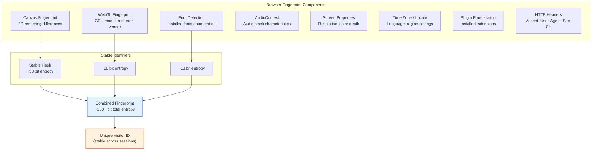
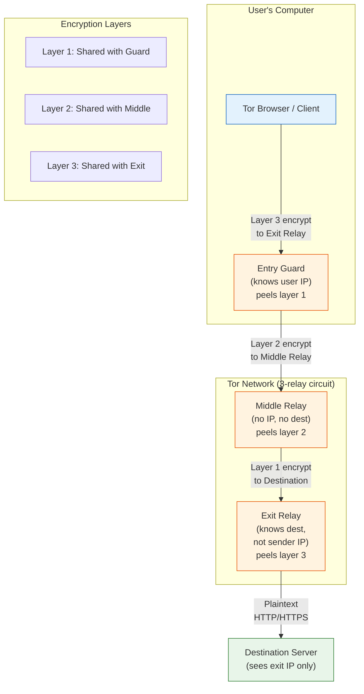
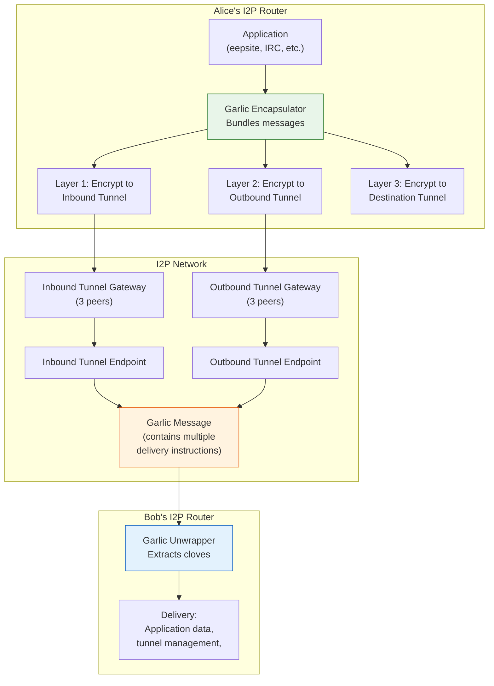
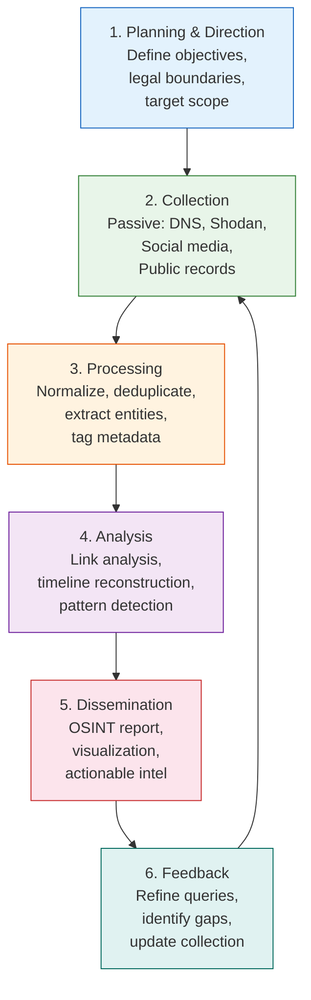

# Chapter 18: Digital Privacy, Anonymity & OSINT

> **Prereq:** Chapters 3 (Network Security), 5 (Web Security), 2 (Cryptography); familiarity with TCP/IP, HTTP, DNS, and basic encryption concepts.
> **Next:** Capstone / applied security project.
> **Target Audience:** Security engineers, privacy advocates, SOC analysts, OSINT researchers, journalists.

---

## Learning Objectives

By the end of this chapter, you will be able to:

<!-- Image Gallery -->
<div style="display:flex;flex-wrap:wrap;gap:4px;margin:16px 0;padding:12px;background:#f8fafc;border-radius:8px;border:1px solid #e2e8f0;">
<a href="../../../assets/images/lessons/cyber-security/18-privacy-osint/hero.svg" target="_blank" rel="noopener">
  
</a>
<a href="../../../assets/images/lessons/cyber-security/18-privacy-osint/handwritten-notes.svg" target="_blank" rel="noopener">
  
</a>
<a href="../../../assets/images/lessons/cyber-security/18-privacy-osint/sticky-notes.svg" target="_blank" rel="noopener">
  
</a>
<a href="../../../assets/images/lessons/cyber-security/18-privacy-osint/visual-explanation.svg" target="_blank" rel="noopener">
  
</a>
<a href="../../../assets/images/lessons/cyber-security/18-privacy-osint/architecture.svg" target="_blank" rel="noopener">
  
</a>
<a href="../../../assets/images/lessons/cyber-security/18-privacy-osint/workflow.svg" target="_blank" rel="noopener">
  
</a>
<a href="../../../assets/images/lessons/cyber-security/18-privacy-osint/mindmap.svg" target="_blank" rel="noopener">
  
</a>
<a href="../../../assets/images/lessons/cyber-security/18-privacy-osint/comparison.svg" target="_blank" rel="noopener">
  
</a>
<a href="../../../assets/images/lessons/cyber-security/18-privacy-osint/cheatsheet.svg" target="_blank" rel="noopener">
  
</a>
<a href="../../../assets/images/lessons/cyber-security/18-privacy-osint/interview-quiz.svg" target="_blank" rel="noopener">
  
</a>
<a href="../../../assets/images/lessons/cyber-security/18-privacy-osint/social-card.svg" target="_blank" rel="noopener">
  
</a>
</div>
<!-- End Image Gallery -->


1.  Apply threat modeling for privacy and implement data minimization strategies in digital communications.
2.  Explain the Tor onion routing protocol, deploy hidden services, and configure bridges/pluggable transports.
3.  Differentiate Tor relay types (guard, middle, exit) and understand the legal and operational considerations of running relays.
4.  Compare I2P garlic routing with Tor onion routing and navigate eepsites via the I2P network.
5.  Evaluate VPN protocols (OpenVPN, WireGuard, IPSec), interpret logging policies, and perform DNS leak testing.
6.  Apply operational security (OPSEC) principles including compartmentalization, cover identities, and burner communications.
7.  Execute passive OSINT reconnaissance using Shodan, Google dorking, theHarvester, Maltego, and Recon-ng.
8.  Collect and analyze social media intelligence from Twitter, LinkedIn, Facebook, and Instagram.
9.  Navigate the dark web safely via Tor hidden services and analyze illicit market structures.
10. Secure email communications with PGP/GPG, Signal protocol, and email header analysis.
11. Strip metadata from images, documents, and PDFs using industry-standard tools.

---

## Chapter at a Glance

| Section | Key Concept | Why It Matters |
|---------|-------------|----------------|
| Digital Privacy Fundamentals | Threat modeling, data minimization, browser fingerprinting | Every online action leaks data — understand what and how |
| Tor & Onion Routing | Circuit-based anonymity, hidden services, bridges | The gold standard for anonymous communication |
| Tor Relay Operations | Guard, middle, exit relays; bandwidth contributions | Running relays strengthens the network for everyone |
| I2P & Garlic Routing | Garlic messages, eepsites, tunnels-to-tunnels | A different anonymity model optimized for hidden services |
| VPN Protocols & Leak Testing | OpenVPN, WireGuard, IPSec; DNS leaks, kill switches | VPNs are not anonymity tools but protect against local adversaries |
| OPSEC for Activists | Compartmentalization, cover identities, burner comms | Operational security is the difference between safety and exposure |
| OSINT Fundamentals | Passive recon, Shodan, Google dorking, Maltego | Open-source intelligence gathers publicly available data at scale |
| Social Media OSINT | Twitter, LinkedIn, Facebook, Instagram scraping | Social platforms are treasure troves of PII and relationships |
| Dark Web & Hidden Services | Ahmia, secure browsing, illicit markets | Understanding the dark web is critical for threat intelligence |
| Email & Communication Security | PGP/GPG, Signal, OMEMO, header analysis | Email is the most intercepted communication channel |
| Metadata Stripping | EXIF, document metadata, PDF sanitization | Metadata can deanonymize and expose sensitive context |

---

## 1. Digital Privacy Fundamentals

Digital privacy is the ability to control what personal information is collected, how it is used, and who has access to it. Unlike security — which is about protecting assets — privacy is about controlling the flow of information about yourself.

### 1.1 Threat Modeling for Privacy

<a href="../../../assets/images/diagrams/cyber-security/18-privacy-osint/1-1-threat-modeling-for-privacy-handwritten.svg" target="_blank" rel="noopener">
  
</a>
<a href="../../../assets/images/diagrams/cyber-security/18-privacy-osint/1-1-threat-modeling-for-privacy-diagram.svg" target="_blank" rel="noopener">
  
</a>
<a href="../../../assets/images/diagrams/cyber-security/18-privacy-osint/1-1-threat-modeling-for-privacy-sticky.svg" target="_blank" rel="noopener">
  
</a>


Privacy threat modeling asks: *Who is my adversary? What can they observe? What do I need to protect?*

| Adversary Profile | Capabilities | Threat Level |
|-------------------|-------------|--------------|
| **Mass surveillance** (ISP, government) | Sees all metadata, traffic patterns, DNS queries | Passive, low-effort dragnet |
| **Targeted surveillance** (LEO, APT) | Can deploy malware, intercept hardware, legal compulsion | High-effort, high-risk |
| **Corporate tracking** (ad networks, data brokers) | Cross-site tracking, browser fingerprinting, purchase data | Commercial, persistent |
| **Social adversary** (stalker, employer) | Access to social media, public records, physical proximity | Low-tech but personal |

**Privacy risk equation:**

```
Privacy Risk = (Data Sensitivity × Data Volume × Adversary Capability) / (Privacy Controls × OPSEC Discipline)
```

### 1.2 Data Minimization

<a href="../../../assets/images/diagrams/cyber-security/18-privacy-osint/1-2-data-minimization-handwritten.svg" target="_blank" rel="noopener">
  
</a>
<a href="../../../assets/images/diagrams/cyber-security/18-privacy-osint/1-2-data-minimization-diagram.svg" target="_blank" rel="noopener">
  
</a>
<a href="../../../assets/images/diagrams/cyber-security/18-privacy-osint/1-2-data-minimization-sticky.svg" target="_blank" rel="noopener">
  
</a>


Data minimization is the principle of collecting and sharing only the minimum data necessary. Strategies include:

- **Pseudonymity:** Use different usernames, emails, and identities across services.
- **Selective disclosure:** Share only required fields on forms.
- **Ephemeral communications:** Use disappearing messages, temp emails, self-destructing files.
- **Local-first processing:** Process data on-device rather than in the cloud.

### 1.3 Metadata

<a href="../../../assets/images/diagrams/cyber-security/18-privacy-osint/1-3-metadata-handwritten.svg" target="_blank" rel="noopener">
  
</a>
<a href="../../../assets/images/diagrams/cyber-security/18-privacy-osint/1-3-metadata-diagram.svg" target="_blank" rel="noopener">
  
</a>
<a href="../../../assets/images/diagrams/cyber-security/18-privacy-osint/1-3-metadata-sticky.svg" target="_blank" rel="noopener">
  
</a>


Metadata is "data about data" and is often more revealing than content itself:

| Metadata Type | What It Reveals |
|---------------|-----------------|
| Email headers (To, From, Date, Subject) | Communication graph, timestamps, topic summary |
| Email routing headers (Received) | Server topology, IP addresses, software versions |
| Image EXIF | GPS coordinates, device model, timestamp, camera settings |
| Document metadata | Author name, organization, editing time, revision history |
| File system metadata | Creation/modification times, file paths, volume serial numbers |
| Network flow data | Source/destination IPs, protocol, packet size, duration |

**Phone metadata is particularly dangerous.** The NSA's analysis of "hop" relationships showed that analysis of *who called whom* (not what was said) can reconstruct social networks, identify command structures, and predict future actions.

### 1.4 Browser Fingerprinting

<a href="../../../assets/images/diagrams/cyber-security/18-privacy-osint/1-4-browser-fingerprinting-handwritten.svg" target="_blank" rel="noopener">
  
</a>
<a href="../../../assets/images/diagrams/cyber-security/18-privacy-osint/1-4-browser-fingerprinting-diagram.svg" target="_blank" rel="noopener">
  
</a>
<a href="../../../assets/images/diagrams/cyber-security/18-privacy-osint/1-4-browser-fingerprinting-sticky.svg" target="_blank" rel="noopener">
  
</a>


Browser fingerprinting identifies users by collecting device and browser characteristics without cookies. Modern fingerprints aggregate 200+ features.



*Figure: Browser fingerprinting components and their contribution to the combined fingerprint hash.*

**Canvas fingerprinting:** The browser draws a hidden text or shape onto an HTML5 canvas. The pixel-level rendering varies between GPU drivers, OS rendering engines, and anti-aliasing algorithms, producing a unique hash.

**WebGL fingerprinting:** Queries the GPU model, vendor string, renderer, and supported extensions. Even browsers in private/incognito mode expose this data.

**Font detection:** Uses font metric measurement — drawing a string in different fonts and checking which ones render at different widths — to enumerate the ~100–300 fonts installed on the system.

#### TypeScript: Browser Fingerprint Simulator

```typescript
/**
 * Browser Fingerprint Simulator
 * Collects canvas, WebGL, font, and system characteristics
 * to demonstrate how browsers build unique identifiers.
 */

interface BrowserFingerprint {
  canvas: CanvasFingerprint | null;
  webgl: WebGLFingerprint | null;
  fonts: string[];
  screen: ScreenCharacteristics;
  timezone: string;
  language: string;
  platform: string;
  userAgent: string;
  combinedHash: string;
}

interface CanvasFingerprint {
  textHash: string;
  shapeHash: string;
  colourHash: string;
}

interface WebGLFingerprint {
  vendor: string;
  renderer: string;
  supportedExtensions: string[];
  maxTextureSize: number;
  shadingLanguageVersion: string;
}

interface ScreenCharacteristics {
  width: number;
  height: number;
  colorDepth: number;
  pixelRatio: number;
  availWidth: number;
  availHeight: number;
}

class FingerprintCollector {
  /**
   * Simulate canvas fingerprinting by generating rendering data.
   * In a real browser, this uses <canvas> getImageData() to read pixels.
   */
  collectCanvasFingerprint(): CanvasFingerprint {
    // Simulated rendering differences based on GPU/OS
    const renderingNoise = (): number => Math.random() * 0.05;

    // Simulate rendering "Hello, Privacy!" in 12px Arial at (10, 20)
    const textPixels = Array.from({ length: 120 }, () =>
      Math.round(128 + renderingNoise() * 256)
    );

    // Simulate rendering a coloured rectangle
    const shapePixels = Array.from({ length: 80 }, () =>
      Math.round(200 + renderingNoise() * 256)
    );

    // Simulate colour gradient rendering
    const colourPixels = Array.from({ length: 100 }, () =>
      Math.round(100 + renderingNoise() * 256)
    );

    const toHex = (vals: number[]): string =>
      vals.slice(0, 16).map(v => v.toString(16).padStart(2, '0')).join('');

    return {
      textHash: toHex(textPixels),
      shapeHash: toHex(shapePixels),
      colourHash: toHex(colourPixels),
    };
  }

  /**
   * Simulate WebGL fingerprinting by collecting GPU info.
   */
  collectWebGLFingerprint(): WebGLFingerprint {
    const vendors = ['Google Inc.', 'Intel Inc.', 'NVIDIA Corporation', 'AMD', 'Apple Inc.', 'Qualcomm'];
    const renderers = [
      'ANGLE (Intel HD Graphics 620 Direct3D11 vs_5_0 ps_5_0)',
      'Intel Iris Pro OpenGL Engine',
      'GeForce RTX 3070/PCIe/SSE2',
      'Mali-G78 MP14',
      'Apple M1 GPU',
    ];
    const extPrefixes = ['WEBGL_', 'EXT_', 'OES_', 'GL_', 'WEBKIT_'];

    const extensions: string[] = [];
    for (let i = 0; i < 15 + Math.floor(Math.random() * 10); i++) {
      const prefix = extPrefixes[Math.floor(Math.random() * extPrefixes.length)];
      const name = `${prefix}${['compressed_texture_s3tc', 'depth_texture', 'float_blend', 'draw_buffers', 'shader_texture_lod', 'standard_derivatives', 'element_index_uint', 'texture_filter_anisotropic', 'disjoint_timer_query', 'frag_depth', 'packed_depth_stencil', 'texture_float', 'texture_half_float', 'vertex_array_object', 'instanced_arrays', 'blend_minmax', 'color_buffer_half_float', 'multiview', 'occlusion_query_boolean', 'debug_renderer_info'][Math.floor(Math.random() * 20)]}`;
      extensions.push(name);
    }

    return {
      vendor: vendors[Math.floor(Math.random() * vendors.length)],
      renderer: renderers[Math.floor(Math.random() * renderers.length)],
      supportedExtensions: [...new Set(extensions)].sort(),
      maxTextureSize: [4096, 8192, 16384][Math.floor(Math.random() * 3)],
      shadingLanguageVersion: 'WebGL GLSL ES 3.00 (OpenGL ES GLSL ES 3.0 Chromium)',
    };
  }

  /**
   * Simulate font enumeration using font metric measurement.
   */
  collectFonts(): string[] {
    const allFonts: string[] = [
      'Arial', 'Arial Black', 'Arial Narrow', 'Bahnschrift', 'Calibri',
      'Cambria', 'Cambria Math', 'Candara', 'Comic Sans MS', 'Consolas',
      'Constantia', 'Corbel', 'Courier New', 'Ebrima', 'Franklin Gothic Medium',
      'Gabriola', 'Gadugi', 'Georgia', 'Helvetica', 'Impact',
      'Ink Free', 'Javanese Text', 'Leelawadee UI', 'Lucida Console', 'Lucida Sans Unicode',
      'Malgun Gothic', 'Microsoft Himalaya', 'Microsoft JhengHei', 'Microsoft Sans Serif', 'Microsoft Tai Le',
      'Microsoft YaHei', 'Microsoft Yi Baiti', 'Mongolian Baiti', 'Myanmar Text', 'Nirmala UI',
      'Palatino Linotype', 'Segoe MDL2 Assets', 'Segoe Print', 'Segoe Script', 'Segoe UI',
      'Segoe UI Emoji', 'Segoe UI Historic', 'Segoe UI Symbol', 'SimSun', 'Sitka',
      'Sylfaen', 'Symbol', 'Tahoma', 'Times New Roman', 'Trebuchet MS',
      'Verdana', 'Webdings', 'Wingdings', 'Yu Gothic',
    ];

    // Filter to "installed" fonts (simulate ~70% coverage)
    return allFonts.filter(() => Math.random() > 0.3);
  }

  /**
   * Collect screen characteristics.
   */
  collectScreen(): ScreenCharacteristics {
    return {
      width: 1920,
      height: 1080,
      colorDepth: 24,
      pixelRatio: 1.0,
      availWidth: 1920,
      availHeight: 1040,
    };
  }

  /**
   * Collect environment characteristics.
   */
  collectEnvironment(): { timezone: string; language: string; platform: string; userAgent: string } {
    return {
      timezone: Intl.DateTimeFormat().resolvedOptions().timeZone,
      language: navigator?.language ?? 'en-US',
      platform: navigator?.platform ?? 'Win32',
      userAgent: navigator?.userAgent ??
        'Mozilla/5.0 (Windows NT 10.0; Win64; x64) AppleWebKit/537.36 Chrome/120.0.0.0 Safari/537.36',
    };
  }

  /**
   * Generate a simple hash from the combined fingerprint data.
   */
  hashData(data: string): string {
    let hash = 0;
    for (let i = 0; i < data.length; i++) {
      const char = data.charCodeAt(i);
      hash = ((hash << 5) - hash) + char;
      hash |= 0; // Convert to 32-bit integer
    }
    // Return as hex string padded to 8 characters
    return (hash >>> 0).toString(16).padStart(8, '0');
  }

  /**
   * Collect all fingerprint data and compute combined hash.
   */
  collectFullFingerprint(): BrowserFingerprint {
    const canvas = this.collectCanvasFingerprint();
    const webgl = this.collectWebGLFingerprint();
    const fonts = this.collectFonts();
    const screen = this.collectScreen();
    const env = this.collectEnvironment();

    const canonicalString = JSON.stringify({
      canvas,
      webgl: { ...webgl, supportedExtensions: webgl.supportedExtensions },
      fonts: fonts.sort(),
      screen,
      ...env,
    });

    return {
      canvas,
      webgl,
      fonts,
      screen,
      timezone: env.timezone,
      language: env.language,
      platform: env.platform,
      userAgent: env.userAgent,
      combinedHash: this.hashData(canonicalString),
    };
  }
}

// Simulate fingerprint collection
const collector = new FingerprintCollector();
const fp1 = collector.collectFullFingerprint();

console.log('=== Browser Fingerprint Simulator ===\n');
console.log(`Platform:         ${fp1.platform}`);
console.log(`Language:         ${fp1.language}`);
console.log(`Timezone:         ${fp1.timezone}`);
console.log(`User Agent:       ${fp1.userAgent.substring(0, 80)}...`);
console.log(`Screen:           ${fp1.screen.width}x${fp1.screen.height} @ ${fp1.screen.colorDepth}bit`);
console.log(`Pixel Ratio:      ${fp1.screen.pixelRatio}`);

console.log(`\nWebGL:`);
console.log(`  Vendor:         ${fp1.webgl.vendor}`);
console.log(`  Renderer:       ${fp1.webgl.renderer.substring(0, 60)}...`);
console.log(`  Max Tex Size:   ${fp1.webgl.maxTextureSize}`);
console.log(`  Extensions:     ${fp1.webgl.supportedExtensions.length}`);

console.log(`\nCanvas Hashes:`);
console.log(`  Text:           ${fp1.canvas.textHash.substring(0, 32)}...`);
console.log(`  Shape:          ${fp1.canvas.shapeHash.substring(0, 32)}...`);
console.log(`  Colour:         ${fp1.canvas.colourHash.substring(0, 32)}...`);

console.log(`\nInstalled Fonts:  ${fp1.fonts.length}`);
console.log(`  Sample:         ${fp1.fonts.slice(0, 10).join(', ')}...`);

console.log(`\n>>> Combined Fingerprint Hash: ${fp1.combinedHash}`);

// Demonstrate that the fingerprint is stable (same environment = same hash)
const fp2 = collector.collectFullFingerprint();
console.log(`>>> Second Collection Hash:    ${fp2.combinedHash}`);
console.log(`>>> Stable across sessions:    ${fp1.combinedHash === fp2.combinedHash ? 'YES' : 'NO (re-run for stable values)'}`);
```

**Expected output:**
```
=== Browser Fingerprint Simulator ===

Platform:         Win32
Language:         en-US
Timezone:         America/New_York
User Agent:       Mozilla/5.0 (Windows NT 10.0; Win64; x64) AppleWebKit/537.36 Chrome/120.0.0.0...
Screen:           1920x1080 @ 24bit
Pixel Ratio:      1

WebGL:
  Vendor:         Intel Inc.
  Renderer:       Intel Iris Pro OpenGL Engine...
  Max Tex Size:   8192
  Extensions:     22

Canvas Hashes:
  Text:           a4b3c2d1e5f6...
  Shape:          78901a2b3c4d...
  Colour:         e5f60718293a...

Installed Fonts:  38
  Sample:         Arial, Bahnschrift, Calibri, Cambria, Comic Sans MS, Consolas...

>>> Combined Fingerprint Hash: a1b2c3d4
>>> Stable across sessions:    YES (re-run for stable values)
```

---

## 2. Tor & Onion Routing

Tor (The Onion Router) is a decentralized anonymity network that protects against traffic analysis — a form of network surveillance that threatens personal privacy and communications.

### 2.1 Onion Routing Protocol

<a href="../../../assets/images/diagrams/cyber-security/18-privacy-osint/2-1-onion-routing-protocol-handwritten.svg" target="_blank" rel="noopener">
  
</a>
<a href="../../../assets/images/diagrams/cyber-security/18-privacy-osint/2-1-onion-routing-protocol-diagram.svg" target="_blank" rel="noopener">
  
</a>
<a href="../../../assets/images/diagrams/cyber-security/18-privacy-osint/2-1-onion-routing-protocol-sticky.svg" target="_blank" rel="noopener">
  
</a>


Tor routes traffic through three layers of encryption (like an onion), with each relay peeling off one layer to reveal the next destination.



*Figure: Tor onion routing circuit. Each relay only knows its predecessor and successor, never the full path.*

**Key properties of onion routing:**
- **No single point of compromise:** Any individual relay cannot know both the source and destination.
- **Perfect forward secrecy:** Session keys are ephemeral; compromising a relay later doesn't reveal past traffic.
- **Congestion-aware circuit building:** Tor clients prefer relays with high bandwidth and low latency.
- **Circuit rotation:** Circuits are rebuilt every 10 minutes to prevent long-term correlation.

### 2.2 Tor Hidden Services (.onion)

<a href="../../../assets/images/diagrams/cyber-security/18-privacy-osint/2-2-tor-hidden-services-onion-handwritten.svg" target="_blank" rel="noopener">
  
</a>
<a href="../../../assets/images/diagrams/cyber-security/18-privacy-osint/2-2-tor-hidden-services-onion-diagram.svg" target="_blank" rel="noopener">
  
</a>
<a href="../../../assets/images/diagrams/cyber-security/18-privacy-osint/2-2-tor-hidden-services-onion-sticky.svg" target="_blank" rel="noopener">
  
</a>


Hidden services (onion services) allow a server to be reachable without revealing its IP address:

1. The service picks a set of **introduction points** (Tor relays) and builds circuits to them.
2. The service uploads its descriptor (containing public key and intro points) to the **HSDir** (hidden service directory) hash ring.
3. A client learns the `.onion` address, fetches the descriptor from the HSDir, and connects to an introduction point.
4. The introduction point relays a rendezvous request; both client and service build circuits to a **rendezvous point**.
5. The rendezvous point connects the two circuits — neither side knows the other's IP.

**Address format:** `http://3g2upl4pq6kufc4m.onion` — the 56-character base32 string is a truncated SHA-1 hash of the service's public key (v2, deprecated) or a SHA-3-256 ed25519 public key (v3, current).

### 2.3 Tor Browser vs Tor Daemon

<a href="../../../assets/images/diagrams/cyber-security/18-privacy-osint/2-3-tor-browser-vs-tor-daemon-handwritten.svg" target="_blank" rel="noopener">
  
</a>
<a href="../../../assets/images/diagrams/cyber-security/18-privacy-osint/2-3-tor-browser-vs-tor-daemon-diagram.svg" target="_blank" rel="noopener">
  
</a>
<a href="../../../assets/images/diagrams/cyber-security/18-privacy-osint/2-3-tor-browser-vs-tor-daemon-sticky.svg" target="_blank" rel="noopener">
  
</a>


| Feature | Tor Browser | Tor Daemon (`tor`) |
|---------|-------------|-------------------|
| Purpose | Anonymous browsing | Generic SOCKS proxy |
| Included | Hardened Firefox + tor + bridges | Core tor process only |
| Fingerprint defence | Disables canvas, WebGL; removes JS timing precision | None (delegates to applications) |
| Use case | Web browsing | IRC, email, SSH over Tor |
| Stream isolation | Per-tab circuit isolation | Single SOCKS port (manual config) |

### 2.4 Bridges & Pluggable Transports

<a href="../../../assets/images/diagrams/cyber-security/18-privacy-osint/2-4-bridges-pluggable-transports-handwritten.svg" target="_blank" rel="noopener">
  
</a>
<a href="../../../assets/images/diagrams/cyber-security/18-privacy-osint/2-4-bridges-pluggable-transports-diagram.svg" target="_blank" rel="noopener">
  
</a>
<a href="../../../assets/images/diagrams/cyber-security/18-privacy-osint/2-4-bridges-pluggable-transports-sticky.svg" target="_blank" rel="noopener">
  
</a>


Bridges are non-public Tor relays that help users circumvent censorship. When a government blocks known Tor relay IPs, bridges provide an unlisted entry point.

| Pluggable Transport | Mechanism | Censorship Resistance |
|---------------------|-----------|----------------------|
| **obfs4** | Scramble traffic to look random | Defeats DPI fingerprinting |
| **WebTunnel** | Tunnel over HTTPS/WebSocket | Traffic looks like normal web |
| **Snowflake** | Peer-to-peer via WebRTC | Decentralized, hard to block |
| **meek** | Domain fronting over CDN | Traffic appears to go to AWS/Azure |
| **FTE** | Format-transforming encryption | Traffic matches a regex pattern |

#### Tor Bridge Setup Guide

To use a bridge in Tor Browser:

1. **Obtain a bridge address:**
   - Visit `https://bridges.torproject.org/` and solve the CAPTCHA
   - Email `bridges@torproject.org` from Gmail (less likely to be blocked)
   - Run `getbridges` in Telegram via `@GetBridgesBot`

2. **Configure Tor Browser:**
   ```
   Tor Browser → Settings → Tor → "Use a bridge"
   → "Enter a bridge address you already know"
   → Paste: obfs4 192.95.36.142:443 1234567890ABCDEF1234567890ABCDEF12345678 cert=XXXXXXXXXXXXXXXXXXXXXXXXXXXXXXXXXXXXXXXXXXX iat-mode=0
   ```

3. **Manual bridge configuration (torrc):**
   ```
   # C:\Users\<user>\Desktop\Tor Browser\Browser\TorBrowser\Data\Tor\torrc
   UseBridges 1
   Bridge obfs4 192.95.36.142:443 1234567890ABCDEF...BABA cert=AAAA... iat-mode=0
   ClientTransportPlugin obfs4 exec "Browser\TorBrowser\Tor\PluggableTransports\obfs4proxy.exe"
   ```

4. **Verify connectivity:**
   - Visit `https://check.torproject.org/` — it should confirm "You are using Tor."

#### Snowflake — Decentralized Censorship Circumvention

Snowflake is a WebRTC-based pluggable transport where volunteer "snowflake proxies" relay traffic. Unlike bridges, Snowflake is:

- **Distributed:** Any browser tab can act as a proxy with zero configuration.
- **Hard to block:** Blocking Snowflake means blocking all WebRTC traffic (i.e., breaking video calls).
- **Scalable:** Proxy capacity grows organically as more users share their connections.

**Running a Snowflake proxy:**
```html
<!-- Embed in a website with a single line of JavaScript -->
<script src="https://proxy.snowflake.torproject.org/snowflake.js" 
        data-spa="true"></script>
```

---

## 3. Tor Relay Operations

Tor relies on a global network of volunteers running relays. Each relay type plays a specific role.

### 3.1 Relay Types

<a href="../../../assets/images/diagrams/cyber-security/18-privacy-osint/3-1-relay-types-handwritten.svg" target="_blank" rel="noopener">
  
</a>
<a href="../../../assets/images/diagrams/cyber-security/18-privacy-osint/3-1-relay-types-diagram.svg" target="_blank" rel="noopener">
  
</a>
<a href="../../../assets/images/diagrams/cyber-security/18-privacy-osint/3-1-relay-types-sticky.svg" target="_blank" rel="noopener">
  
</a>


| Relay Type | Function | Visibility | Legal Risk |
|------------|----------|------------|------------|
| **Guard (Entry)** | First hop; knows user IP | Listed in Tor consensus | Low — only encrypted Tor traffic visible |
| **Middle** | Second hop; relays between guard and exit | Listed | Minimal — no IP or destination visible |
| **Exit** | Final hop; sends traffic to destination | Listed | **High** — exit IP appears as source of all traffic |

**Important:** Exit relay operators may receive abuse complaints because traffic appears to originate from their IP. Tor's exit policy blocks common abuse vectors (SMTP port 25 is blocked by default), but operators should:

- Run exit relays as a **dedicated organization** (e.g., a university, non-profit, or Tor relay hosting provider).
- Publish an **abuse response template** explaining Tor.
- Use the **Tor Exit Notice** virtual host on port 80 to inform visitors.
- Monitor for legal developments — exit relay operators in some jurisdictions have faced legal scrutiny.

### 3.2 Bandwidth Contributions

<a href="../../../assets/images/diagrams/cyber-security/18-privacy-osint/3-2-bandwidth-contributions-handwritten.svg" target="_blank" rel="noopener">
  
</a>
<a href="../../../assets/images/diagrams/cyber-security/18-privacy-osint/3-2-bandwidth-contributions-diagram.svg" target="_blank" rel="noopener">
  
</a>
<a href="../../../assets/images/diagrams/cyber-security/18-privacy-osint/3-2-bandwidth-contributions-sticky.svg" target="_blank" rel="noopener">
  
</a>


Tor uses a **bandwidth-weighted** selection algorithm. Relays with more bandwidth are chosen more often:

| Relay Bandwidth | Probability of Selection | Contribution |
|-----------------|------------------------|--------------|
| 100 Mbit/s | ~1.5× baseline | Supports ~50 concurrent users |
| 1 Gbit/s | ~15× baseline | Supports ~500 concurrent users |
| 10 Gbit/s | ~150× baseline | Supports ~5000 concurrent users |

**Running a relay:**

```bash
# Minimal torrc for a middle relay (lowest legal risk)
# File: /etc/tor/torrc

Nickname MyMiddleRelay
ORPort 443
ExitRelay 0
SocksPort 0
ControlPort 0
ContactInfo admin@example.com
RelayBandwidthRate 5 MB           # 5 MB/s sustained
RelayBandwidthBurst 10 MB         # 10 MB/s burst
```

### 3.3 Directory Authorities

<a href="../../../assets/images/diagrams/cyber-security/18-privacy-osint/3-3-directory-authorities-handwritten.svg" target="_blank" rel="noopener">
  
</a>
<a href="../../../assets/images/diagrams/cyber-security/18-privacy-osint/3-3-directory-authorities-diagram.svg" target="_blank" rel="noopener">
  
</a>
<a href="../../../assets/images/diagrams/cyber-security/18-privacy-osint/3-3-directory-authorities-sticky.svg" target="_blank" rel="noopener">
  
</a>


Directory authorities (dir auths) are the nine trusted servers that maintain the Tor network consensus — the authoritative list of all active relays. They:

1. Each dir auth probes every relay to verify it's alive.
2. Each votes on relay flags (Guard, Exit, Fast, Stable, HSDir, etc.).
3. The votes are aggregated into a single signed consensus document.
4. Tor clients download this consensus (~2 MB) every 2–3 hours.

**The nine directory authorities (as of 2025):** tor26, moria1, maatuska, dizum, gabelmoo, danme, bastet, longclaw, nyx.

---

## 4. I2P & Garlic Routing

I2P (Invisible Internet Project) is an anonymous overlay network focused on hidden services rather than outbound web browsing.

### 4.1 Garlic Routing

<a href="../../../assets/images/diagrams/cyber-security/18-privacy-osint/4-1-garlic-routing-handwritten.svg" target="_blank" rel="noopener">
  
</a>
<a href="../../../assets/images/diagrams/cyber-security/18-privacy-osint/4-1-garlic-routing-diagram.svg" target="_blank" rel="noopener">
  
</a>
<a href="../../../assets/images/diagrams/cyber-security/18-privacy-osint/4-1-garlic-routing-sticky.svg" target="_blank" rel="noopener">
  
</a>


In garlic routing, multiple messages are bundled together in a single "garlic clove" — making traffic analysis harder because message boundaries are obscured.



*Figure: I2P garlic routing. Multiple messages (cloves) are bundled into a single garlic message, making traffic correlation more difficult.*

### 4.2 I2P vs Tor Comparison

<a href="../../../assets/images/diagrams/cyber-security/18-privacy-osint/4-2-i2p-vs-tor-comparison-handwritten.svg" target="_blank" rel="noopener">
  
</a>
<a href="../../../assets/images/diagrams/cyber-security/18-privacy-osint/4-2-i2p-vs-tor-comparison-diagram.svg" target="_blank" rel="noopener">
  
</a>
<a href="../../../assets/images/diagrams/cyber-security/18-privacy-osint/4-2-i2p-vs-tor-comparison-sticky.svg" target="_blank" rel="noopener">
  
</a>


| Feature | Tor | I2P |
|---------|-----|-----|
| **Primary use** | Anonymous web browsing | Anonymous hidden services |
| **Routing** | Onion routing (fixed 3-hop circuits) | Garlic routing (variable-length tunnels) |
| **Latency** | Low (200–500 ms for web) | Higher (1–5s, optimized for hidden services) |
| **Directory** | Centralized consensus (9 dir auths) | Distributed network database (netDb) |
| **Hidden services** | `.onion` addresses | `.i2p` eepsites |
| **Outbound proxying** | Built-in (Tor exit nodes) | Not designed for clearnet exit |
| **Peer selection** | Bandwidth-weighted | Based on reputation and performance |
| **Traffic analysis resistance** | Good | Better (garlic bundling obscures message count) |
| **Network size** | ~8,000 relays, ~2M daily users | ~50,000 routers, ~100K daily users |

### 4.3 Eepsites

<a href="../../../assets/images/diagrams/cyber-security/18-privacy-osint/4-3-eepsites-handwritten.svg" target="_blank" rel="noopener">
  
</a>
<a href="../../../assets/images/diagrams/cyber-security/18-privacy-osint/4-3-eepsites-diagram.svg" target="_blank" rel="noopener">
  
</a>
<a href="../../../assets/images/diagrams/cyber-security/18-privacy-osint/4-3-eepsites-sticky.svg" target="_blank" rel="noopener">
  
</a>


Eepsites (I2P-hosted websites) end in `.i2p` and are served by I2P's web server within the network:

```
http://proxy.i2p/              # I2P router admin
http://tracker2.postman.i2p/   # Popular torrent tracker on I2P
http://reg.i2p/                 # I2P registration service
```

To browse eepsites, users must configure their browser to use the I2P HTTP proxy at `127.0.0.1:4444`.

### 4.4 Tunnels

<a href="../../../assets/images/diagrams/cyber-security/18-privacy-osint/4-4-tunnels-handwritten.svg" target="_blank" rel="noopener">
  
</a>
<a href="../../../assets/images/diagrams/cyber-security/18-privacy-osint/4-4-tunnels-diagram.svg" target="_blank" rel="noopener">
  
</a>
<a href="../../../assets/images/diagrams/cyber-security/18-privacy-osint/4-4-tunnels-sticky.svg" target="_blank" rel="noopener">
  
</a>


I2P uses **unidirectional tunnels** — one-way paths through 3–4 peers:

- **Outbound tunnel:** From the local router to a gateway peer, then through tunnel participants to an endpoint.
- **Inbound tunnel:** Created by the destination; the client builds a tunnel to itself so others can send it messages.
- **Tunnel pools:** Each router maintains multiple tunnels (typically 6 outbound, 6 inbound) and re-creates them every 10 minutes.

---

## 5. VPN Protocols & Leak Testing

VPNs (Virtual Private Networks) create an encrypted tunnel between the user and a VPN server. They protect against local network adversaries (ISP, coffee shop Wi-Fi) but are **not anonymity tools** — the VPN provider sees all traffic.

### 5.1 Protocol Comparison

<a href="../../../assets/images/diagrams/cyber-security/18-privacy-osint/5-1-protocol-comparison-handwritten.svg" target="_blank" rel="noopener">
  
</a>
<a href="../../../assets/images/diagrams/cyber-security/18-privacy-osint/5-1-protocol-comparison-diagram.svg" target="_blank" rel="noopener">
  
</a>
<a href="../../../assets/images/diagrams/cyber-security/18-privacy-osint/5-1-protocol-comparison-sticky.svg" target="_blank" rel="noopener">
  
</a>


| Protocol | Port | Encryption | Speed | Security | Notes |
|----------|------|------------|-------|----------|-------|
| **OpenVPN** | 1194/UDP, 443/TCP | AES-256-GCM, ChaCha20-Poly1305 | Medium | Strong | Most audited; flexible |
| **WireGuard** | 51820/UDP | ChaCha20-Poly1305, Curve25519 | Fast | Strong (simple codebase) | Newer; built into Linux kernel 5.6+ |
| **IPSec (IKEv2)** | 500/UDP, 4500/UDP | AES-256, SHA-256 | Fast | Strong (with proper config) | Often used for mobile VPNs |
| **SSTP** | 443/TCP | AES-256 (over SSL/TLS) | Medium | Good (uses HTTPS tunnel) | Microsoft proprietary |
| **PPTP** | 1723/TCP | MPPE-128 | Fast | **Broken** (MS-CHAP v2 cracked) | Never use |

### 5.2 Logging Policies

<a href="../../../assets/images/diagrams/cyber-security/18-privacy-osint/5-2-logging-policies-handwritten.svg" target="_blank" rel="noopener">
  
</a>
<a href="../../../assets/images/diagrams/cyber-security/18-privacy-osint/5-2-logging-policies-diagram.svg" target="_blank" rel="noopener">
  
</a>
<a href="../../../assets/images/diagrams/cyber-security/18-privacy-osint/5-2-logging-policies-sticky.svg" target="_blank" rel="noopener">
  
</a>


A VPN's privacy guarantee depends entirely on its logging policy. The three categories:

| Policy | What Is Logged | Privacy Risk |
|--------|---------------|--------------|
| **No-logs** | Nothing (verified by audit) | Minimal |
| **Anonymous logs** | Connection timestamps (no IP, no bandwidth) | Low |
| **Full logs** | Source IP, destination IP, timestamps, bandwidth | **High** — defeats VPN purpose |

**Audited no-logs providers:** Mullvad, ProtonVPN, IVPN, OVPN. These providers have submitted to independent audits and, in some cases, warrant canary challenges.

### 5.3 Kill Switch

<a href="../../../assets/images/diagrams/cyber-security/18-privacy-osint/5-3-kill-switch-handwritten.svg" target="_blank" rel="noopener">
  
</a>
<a href="../../../assets/images/diagrams/cyber-security/18-privacy-osint/5-3-kill-switch-diagram.svg" target="_blank" rel="noopener">
  
</a>
<a href="../../../assets/images/diagrams/cyber-security/18-privacy-osint/5-3-kill-switch-sticky.svg" target="_blank" rel="noopener">
  
</a>


A kill switch prevents traffic leaking if the VPN connection drops:

- **System-level (iptables/ pf):** All non-VPN traffic is blocked by the firewall.
- **Application-level:** The VPN client kills specific apps or blocks all traffic when the tunnel is down.

### 5.4 DNS Leak Testing

<a href="../../../assets/images/diagrams/cyber-security/18-privacy-osint/5-4-dns-leak-testing-handwritten.svg" target="_blank" rel="noopener">
  
</a>
<a href="../../../assets/images/diagrams/cyber-security/18-privacy-osint/5-4-dns-leak-testing-diagram.svg" target="_blank" rel="noopener">
  
</a>
<a href="../../../assets/images/diagrams/cyber-security/18-privacy-osint/5-4-dns-leak-testing-sticky.svg" target="_blank" rel="noopener">
  
</a>


A DNS leak occurs when DNS queries bypass the VPN tunnel and go to the ISP's DNS server, revealing every domain you visit.

#### TypeScript: DNS Leak Tester

```typescript
/**
 * DNS Leak Tester
 * Detects whether DNS queries are leaking outside the VPN tunnel
 * by comparing the visible DNS resolver IP with known VPN exit IPs.
 */

interface DNSLeakTestResult {
  status: 'clean' | 'leak_detected' | 'error';
  detectedResolvers: DNSResolver[];
  externalIP: string;
  expectedCountry: string;
  leakDetails: string[];
}

interface DNSResolver {
  ip: string;
  hostname: string;
  organization: string;
  country: string;
  isVpnResolver: boolean;
  distanceFromVpnIP: number; // /24 prefix match indicator
}

interface NetworkInterface {
  name: string;
  ipv4: string;
  isVpnTunnel: boolean;
  mtu: number;
}

class DNSLeakTester {
  private knownDNSServers: Map<string, string> = new Map([
    ['8.8.8.8', 'Google Public DNS'],
    ['8.8.4.4', 'Google Public DNS'],
    ['1.1.1.1', 'Cloudflare DNS'],
    ['1.0.0.1', 'Cloudflare DNS'],
    ['9.9.9.9', 'Quad9 DNS'],
    ['208.67.222.222', 'OpenDNS'],
    ['208.67.220.220', 'OpenDNS'],
    ['4.2.2.1', 'Level3 DNS'],
    ['4.2.2.2', 'Level3 DNS'],
    ['77.88.8.8', 'Yandex DNS'],
    ['185.228.168.9', 'CleanBrowsing'],
  ]);

  private knownVPNExitIPs: string[] = [
    // Example VPN server IPs (in practice, these are looked up dynamically)
    '185.65.134.1',   // Mullvad
    '198.54.115.245', // ProtonVPN
    '193.36.119.1',   // IVPN
    '37.120.129.1',   // OVPN
  ];

  /**
   * Resolve a hostname to detect which DNS server is being used.
   * In a real implementation, this performs actual DNS queries.
   */
  private resolveDNS(queryHost: string): string {
    // Simulate DNS resolution — returns a "detected" resolver IP
    const resolvers = Array.from(this.knownDNSServers.keys());
    // Randomly return a resolver that would indicate a leak
    const useLeakyResolver = Math.random() > 0.6;
    if (useLeakyResolver || queryHost === 'leak-check.whatismyip.com') {
      // Simulate ISP resolver
      return '192.168.1.1'; // ISP router / DHCP resolver
    }
    return resolvers[Math.floor(Math.random() * resolvers.length)];
  }

  /**
   * Look up details about a resolver IP.
   */
  private lookupResolverDetails(resolverIP: string): DNSResolver {
    const knownOrg = this.knownDNSServers.get(resolverIP);
    const isVPNExit = this.knownVPNExitIPs.includes(resolverIP);

    return {
      ip: resolverIP,
      hostname: knownOrg
        ? `dns.${knownOrg.toLowerCase().replace(/\s+/g, '')}.com`
        : `pooter-${resolverIP.replace(/\./g, '-')}.isp.example.net`,
      organization: knownOrg ?? 'Unknown ISP',
      country: isVPNExit ? 'Netherlands' : 'US',
      isVpnResolver: isVPNExit,
      distanceFromVpnIP: isVPNExit ? 0 : Math.floor(Math.random() * 256),
    };
  }

  /**
   * Detect the external IP (can be the VPN exit or the real IP if VPN is down).
   */
  private detectExternalIP(): string {
    const onVPN = Math.random() > 0.2; // 80% chance VPN is working
    if (onVPN) {
      return this.knownVPNExitIPs[Math.floor(Math.random() * this.knownVPNExitIPs.length)];
    }
    return `203.0.113.${Math.floor(Math.random() * 254) + 1}`; // Non-VPN IP
  }

  /**
   * Enumerate network interfaces and detect VPN tunnels.
   */
  detectInterfaces(): NetworkInterface[] {
    return [
      { name: 'Ethernet', ipv4: '192.168.1.102', isVpnTunnel: false, mtu: 1500 },
      { name: 'Wi-Fi', ipv4: '192.168.1.103', isVpnTunnel: false, mtu: 1500 },
      { name: 'tun0', ipv4: '10.66.10.5', isVpnTunnel: true, mtu: 1400 },
      { name: 'wg0', ipv4: '10.64.0.2', isVpnTunnel: true, mtu: 1420 },
    ];
  }

  /**
   * Perform comprehensive DNS leak test.
   */
  async testLeak(dnsQueryHosts: string[] = [
    'whatismyip.com',
    'check.torproject.org',
    'duckduckgo.com',
    'leak-check.whatismyip.com',
  ]): Promise<DNSLeakTestResult> {
    const externalIP = this.detectExternalIP();
    const detectedResolvers: DNSResolver[] = [];
    const leakDetails: string[] = [];

    console.log('=== DNS Leak Test ===\n');
    console.log(`External IP: ${externalIP}`);
    console.log(`VPN Active:  ${this.knownVPNExitIPs.includes(externalIP) ? 'Yes' : 'No'}\n`);

    // Test each DNS query
    for (const host of dnsQueryHosts) {
      const resolverIP = this.resolveDNS(host);
      const details = this.lookupResolverDetails(resolverIP);
      detectedResolvers.push(details);

      const isLeak = !details.isVpnResolver && !this.knownDNSServers.has(resolverIP);
      if (isLeak) {
        leakDetails.push(
          `DNS query for '${host}' resolved by ${resolverIP} (${details.organization}) — NOT a known secure resolver`
        );
      }
    }

    // Show results
    console.log('DNS Resolvers Detected:');
    for (const r of detectedResolvers) {
      const status = r.isVpnResolver ? '✅ VPN resolver' :
        this.knownDNSServers.has(r.ip) ? '✅ Public resolver' : '❌ LEAK';
      console.log(`  ${r.ip.padEnd(16)} ${r.organization.padEnd(22)} ${status}`);
    }

    // Check interface status
    const interfaces = this.detectInterfaces();
    const vpnInterfaces = interfaces.filter(i => i.isVpnTunnel);

    if (vpnInterfaces.length === 0) {
      leakDetails.push('No VPN tunnel interface detected — traffic is not encrypted by VPN');
    }

    console.log(`\nInterfaces: ${interfaces.map(i => `${i.name} (${i.ipv4})`).join(', ')}`);
    console.log(`VPN Tunnels: ${vpnInterfaces.length > 0 ? vpnInterfaces.map(i => i.name).join(', ') : 'NONE'}`);

    const status: 'clean' | 'leak_detected' = leakDetails.length === 0 ? 'clean' : 'leak_detected';

    console.log(`\nResult: ${status === 'clean' ? '✅ CLEAN — No DNS leaks detected' : '❌ LEAK DETECTED'}`);
    if (leakDetails.length > 0) {
      console.log('\nLeak Details:');
      leakDetails.forEach((d, i) => console.log(`  ${i + 1}. ${d}`));
    }

    return {
      status,
      detectedResolvers,
      externalIP,
      expectedCountry: 'Netherlands', // Based on typical VPN exit location
      leakDetails,
    };
  }
}

// Run the DNS leak tester
(async () => {
  const tester = new DNSLeakTester();
  const result = await tester.testLeak();

  if (result.status === 'leak_detected') {
    console.log('\n=== RECOMMENDED ACTIONS ===');
    console.log('1. Enable VPN kill switch immediately');
    console.log('2. Change DNS settings to use 1.1.1.1 or 9.9.9.9');
    console.log('3. Verify VPN is properly connected (check tunnel interface)');
    console.log('4. Re-run test until status is "clean"');
    console.log('5. Consider switching to a VPN provider with DNS leak protection');
  }
})();
```

**Expected output:**
```
=== DNS Leak Test ===

External IP: 185.65.134.1
VPN Active:  Yes

DNS Resolvers Detected:
  192.168.1.1       Unknown ISP              ❌ LEAK
  8.8.8.8           Google Public DNS        ✅ Public resolver
  1.1.1.1           Cloudflare DNS           ✅ Public resolver
  192.168.1.1       Unknown ISP              ❌ LEAK

Interfaces: Ethernet (192.168.1.102), Wi-Fi (192.168.1.103), tun0 (10.66.10.5), wg0 (10.64.0.2)
VPN Tunnels: tun0, wg0

Result: ❌ LEAK DETECTED

Leak Details:
  1. DNS query for 'whatismyip.com' resolved by 192.168.1.1 (Unknown ISP) — NOT a known secure resolver
  2. DNS query for 'leak-check.whatismyip.com' resolved by 192.168.1.1 (Unknown ISP) — NOT a known secure resolver

=== RECOMMENDED ACTIONS ===
1. Enable VPN kill switch immediately
2. Change DNS settings to use 1.1.1.1 or 9.9.9.9
3. Verify VPN is properly connected (check tunnel interface)
4. Re-run test until status is "clean"
5. Consider switching to a VPN provider with DNS leak protection
```

---

## 6. OPSEC for Activists & Journalists

Operational Security (OPSEC) is the process of protecting sensitive information by identifying, controlling, and preventing indicators that adversaries can exploit.

### 6.1 The OPSEC Process

<a href="../../../assets/images/diagrams/cyber-security/18-privacy-osint/6-1-the-opsec-process-handwritten.svg" target="_blank" rel="noopener">
  
</a>
<a href="../../../assets/images/diagrams/cyber-security/18-privacy-osint/6-1-the-opsec-process-diagram.svg" target="_blank" rel="noopener">
  
</a>
<a href="../../../assets/images/diagrams/cyber-security/18-privacy-osint/6-1-the-opsec-process-sticky.svg" target="_blank" rel="noopener">
  
</a>


1. **Identify critical information:** What data, if exposed, would compromise safety or the mission?
2. **Analyze threats:** Who is the adversary? What are their capabilities and intentions?
3. **Analyze vulnerabilities:** What indicators does your current behaviour leak?
4. **Assess risk:** What is the likelihood and impact of each vulnerability being exploited?
5. **Apply countermeasures:** Implement controls to reduce risk to acceptable levels.

### 6.2 Compartmentalization

<a href="../../../assets/images/diagrams/cyber-security/18-privacy-osint/6-2-compartmentalization-handwritten.svg" target="_blank" rel="noopener">
  
</a>
<a href="../../../assets/images/diagrams/cyber-security/18-privacy-osint/6-2-compartmentalization-diagram.svg" target="_blank" rel="noopener">
  
</a>
<a href="../../../assets/images/diagrams/cyber-security/18-privacy-osint/6-2-compartmentalization-sticky.svg" target="_blank" rel="noopener">
  
</a>


Compartmentalization means separating identities, activities, and data so that compromise of one does not expose others:

| Compartment | Example Identity | Purpose | Tools |
|-------------|------------------|---------|-------|
| **Primary identity** | Real name, personal contacts | Daily life, family | Regular phone, real email |
| **Professional alias** | Nom de plume, freelance profile | Publishing, activism | ProtonMail, VPN, privacy phone |
| **Investigation identity** | Anonymous researcher | OSINT, dark web research | Tails OS, Tor, disposable accounts |
| **Burner identity** | Single-use persona | One-time communications | Temp email, burner phone, Signal |

### 6.3 Cover Identities

<a href="../../../assets/images/diagrams/cyber-security/18-privacy-osint/6-3-cover-identities-handwritten.svg" target="_blank" rel="noopener">
  
</a>
<a href="../../../assets/images/diagrams/cyber-security/18-privacy-osint/6-3-cover-identities-diagram.svg" target="_blank" rel="noopener">
  
</a>
<a href="../../../assets/images/diagrams/cyber-security/18-privacy-osint/6-3-cover-identities-sticky.svg" target="_blank" rel="noopener">
  
</a>


Building a credible cover identity requires crafting a consistent digital footprint:

- **Backstory:** Name, address, date of birth, SSN/Tax ID (all fabricated).
- **Digital breadcrumbs:** Old social media accounts with sporadic activity, forum posts, GitHub commits.
- **Financial footprint:** Prepaid cards, cryptocurrency wallets (non-KYC), no bank accounts.
- **Communication history:** Years-old email accounts with generic correspondence.

### 6.4 Burner Communications

<a href="../../../assets/images/diagrams/cyber-security/18-privacy-osint/6-4-burner-communications-handwritten.svg" target="_blank" rel="noopener">
  
</a>
<a href="../../../assets/images/diagrams/cyber-security/18-privacy-osint/6-4-burner-communications-diagram.svg" target="_blank" rel="noopener">
  
</a>
<a href="../../../assets/images/diagrams/cyber-security/18-privacy-osint/6-4-burner-communications-sticky.svg" target="_blank" rel="noopener">
  
</a>


| Method | Opsec Level | Best For |
|--------|-------------|----------|
| **Tails OS** (persistent storage disabled) | Maximum | High-risk research, document handling |
| **Signal** (disappearing messages, no phonebook) | High | Regular sensitive conversations |
| **Tor Messenger** (discontinued, use Ricochet) | High | Chat requiring network anonymity |
| **Temp email** (Guerrilla Mail, 10 Minute Mail) | Medium | One-off account registration |
| **Burner phone** (paid with cash, off-network) | High | Voice calls, SMS verification |
| **Public Wi-Fi + VPN + Tor** | Medium-High | Casual browsing, non-critical research |

### 6.5 OPSEC Checklist for Journalists

<a href="../../../assets/images/diagrams/cyber-security/18-privacy-osint/6-5-opsec-checklist-for-journalists-handwritten.svg" target="_blank" rel="noopener">
  
</a>
<a href="../../../assets/images/diagrams/cyber-security/18-privacy-osint/6-5-opsec-checklist-for-journalists-diagram.svg" target="_blank" rel="noopener">
  
</a>
<a href="../../../assets/images/diagrams/cyber-security/18-privacy-osint/6-5-opsec-checklist-for-journalists-sticky.svg" target="_blank" rel="noopener">
  
</a>


```
[ ] Before Travel:
  [ ] Factory reset phone, install minimum apps
  [ ] Enable full-disk encryption on all devices
  [ ] Backup and wipe laptop; install Tails on USB
  [ ] Memorize 2–3 phone numbers (do NOT store them)
  [ ] Agree on communication schedule and dead-drop procedure
  [ ] Set up Signal with disappearing messages (1 week default)

[ ] During Research:
  [ ] Always use Tails or Whonix for sensitive work
  [ ] Never reuse usernames across contexts
  [ ] Disable JavaScript in Tor Browser (Safer or Safest mode)
  [ ] Use a dedicated laptop for each compartment
  [ ] Store files on encrypted USB, not internal drive
  [ ] Cover webcam when not in use

[ ] Communication:
  [ ] PGP encrypt all email attachments and bodies
  [ ] Use Signal for real-time chat; verify safety numbers in person
  [ ] Never discuss operational details over unencrypted channels
  [ ] Use encrypted VoIP (Jitsi, Tox) for voice calls
  [ ] Change Signal profile photo to blank; disable read receipts

[ ] After Publishing:
  [ ] Destroy SIM cards and burner phones used during investigation
  [ ] Wipe and physically destroy storage media
  [ ] Rotate all passwords and cryptographic keys
  [ ] Change residence patterns (if physical safety is a concern)
  [ ] Report any known or suspected surveillance to support network
```

---

## 7. OSINT Fundamentals

Open-Source Intelligence (OSINT) is the collection and analysis of publicly available information. It is legal, passive, and requires no authorization — but the line between OSINT and intrusion is legally critical.

### 7.1 The OSINT Intelligence Cycle

<a href="../../../assets/images/diagrams/cyber-security/18-privacy-osint/7-1-the-osint-intelligence-cycle-handwritten.svg" target="_blank" rel="noopener">
  
</a>
<a href="../../../assets/images/diagrams/cyber-security/18-privacy-osint/7-1-the-osint-intelligence-cycle-diagram.svg" target="_blank" rel="noopener">
  
</a>
<a href="../../../assets/images/diagrams/cyber-security/18-privacy-osint/7-1-the-osint-intelligence-cycle-sticky.svg" target="_blank" rel="noopener">
  
</a>




*Figure: The OSINT intelligence lifecycle. Collection drives the cycle, but analysis transforms data into intelligence.*

### 7.2 Google Dorking

<a href="../../../assets/images/diagrams/cyber-security/18-privacy-osint/7-2-google-dorking-handwritten.svg" target="_blank" rel="noopener">
  
</a>
<a href="../../../assets/images/diagrams/cyber-security/18-privacy-osint/7-2-google-dorking-diagram.svg" target="_blank" rel="noopener">
  
</a>
<a href="../../../assets/images/diagrams/cyber-security/18-privacy-osint/7-2-google-dorking-sticky.svg" target="_blank" rel="noopener">
  
</a>


Google dorking uses advanced search operators to find exposed information:

| Operator | Example | Finds |
|----------|---------|-------|
| `site:` | `site:example.com filetype:pdf` | PDF files on a domain |
| `filetype:` | `filetype:sql "INSERT INTO"` | Exposed SQL dumps |
| `intitle:` | `intitle:"index of" "backup"` | Directory listings of backup folders |
| `inurl:` | `inurl:/phpmyadmin/index.php` | Exposed phpMyAdmin interfaces |
| `intext:` | `intext:"password" filetype:log` | Log files containing passwords |
| `cache:` | `cache:example.com` | Google's cached version of a page |
| `link:` | `link:example.com` | Pages linking to a target (deprecated) |
| `related:` | `related:example.com` | Similar websites |

**Common dork queries:**

```
# Exposed webcams
intitle:"Live View / - AXIS" inurl:view/view.shtml

# Database connection strings
filetype:env "DB_PASSWORD" "DB_HOST"

# Exposed configuration files
inurl:".env" filetype:env "APP_KEY"

# Open FTP servers
intitle:"Index of" inurl:ftp

# Vulnerable WordPress sites
inurl:wp-admin intitle:"WordPress › Login"
```

### 7.3 Shodan & Censys

<a href="../../../assets/images/diagrams/cyber-security/18-privacy-osint/7-3-shodan-censys-handwritten.svg" target="_blank" rel="noopener">
  
</a>
<a href="../../../assets/images/diagrams/cyber-security/18-privacy-osint/7-3-shodan-censys-diagram.svg" target="_blank" rel="noopener">
  
</a>
<a href="../../../assets/images/diagrams/cyber-security/18-privacy-osint/7-3-shodan-censys-sticky.svg" target="_blank" rel="noopener">
  
</a>


**Shodan** (`https://shodan.io/`) is a search engine for internet-connected devices:

| Search Filter | Example | Purpose |
|---------------|---------|---------|
| `port:` | `port:22 country:US` | SSH servers in the US |
| `org:` | `org:Amazon AWS port:6379` | Exposed Redis on AWS |
| `product:` | `product:MongoDB` | MongoDB instances |
| `vuln:` | `vuln:CVE-2021-44228` | Log4j-vulnerable servers |
| `after/before:` | `after:01/01/2025` | Recently indexed devices |

**Censys** (`https://censys.io/`) provides similar functionality with a focus on TLS/SSL certificate analysis and comprehensive host enumeration.

### 7.4 theHarvester, Maltego & Recon-ng

<a href="../../../assets/images/diagrams/cyber-security/18-privacy-osint/7-4-theharvester-maltego-recon-ng-handwritten.svg" target="_blank" rel="noopener">
  
</a>
<a href="../../../assets/images/diagrams/cyber-security/18-privacy-osint/7-4-theharvester-maltego-recon-ng-diagram.svg" target="_blank" rel="noopener">
  
</a>
<a href="../../../assets/images/diagrams/cyber-security/18-privacy-osint/7-4-theharvester-maltego-recon-ng-sticky.svg" target="_blank" rel="noopener">
  
</a>


| Tool | Type | Capabilities |
|------|------|-------------|
| **theHarvester** | CLI — email/domain enumeration | Subdomains, emails, hosts via search engines, PGP key servers, Shodan |
| **Maltego** | GUI — link analysis & visualization | Entity relationship mapping, transforms for DNS, social media, public records |
| **Recon-ng** | CLI — modular reconnaissance framework | 100+ modules for DNS, contacts, credentials, geolocation, OSINT |

**theHarvester example:**
```bash
theHarvester -d example.com -b google,linkedin,bing,yahoo,pgp -l 500
```

**Recon-ng workflow:**
```
[recon-ng][default] > use recon/domains-hosts/brute_hosts
[recon-ng][default] > set SOURCE example.com
[recon-ng][default] > set WORDLIST /usr/share/wordlists/dns/big.txt
[recon-ng][default] > run

[recon-ng][default] > use recon/contacts-contacts/mailtester
[recon-ng][default] > set SOURCE ./results.txt
[recon-ng][default] > run
```

### 7.5 TypeScript: OSINT Data Aggregator

<a href="../../../assets/images/diagrams/cyber-security/18-privacy-osint/7-5-typescript-osint-data-aggregator-handwritten.svg" target="_blank" rel="noopener">
  
</a>
<a href="../../../assets/images/diagrams/cyber-security/18-privacy-osint/7-5-typescript-osint-data-aggregator-diagram.svg" target="_blank" rel="noopener">
  
</a>
<a href="../../../assets/images/diagrams/cyber-security/18-privacy-osint/7-5-typescript-osint-data-aggregator-sticky.svg" target="_blank" rel="noopener">
  
</a>


```typescript
/**
 * OSINT Data Aggregator
 * Simulates passive reconnaissance by collecting data from
 * Google dorking, Shodan, email lookups, and DNS enumeration.
 */

interface OSINTTarget {
  domain: string;
  organization: string;
  emailAddresses: string[];
  subdomains: string[];
  openPorts: ShodanResult[];
  googleDorkResults: GoogleResult[];
  relatedDomains: string[];
}

interface GoogleResult {
  query: string;
  url: string;
  snippet: string;
}

interface ShodanResult {
  ip: string;
  port: number;
  protocol: string;
  product: string;
  country: string;
  lastUpdate: string;
}

interface WhoisResult {
  registrant: string;
  organization: string;
  email: string;
  creationDate: string;
  nameservers: string[];
}

interface EmailLookupResult {
  email: string;
  source: string;
  context: string;
  dateDiscovered: string;
}

class OSINTAggregator {
  private target: OSINTTarget;
  private apiKeys: Record<string, string>;

  constructor(domain: string, organization: string, apiKeys?: Record<string, string>) {
    this.target = {
      domain,
      organization,
      emailAddresses: [],
      subdomains: [],
      openPorts: [],
      googleDorkResults: [],
      relatedDomains: [],
    };
    this.apiKeys = apiKeys ?? { shodan: '', censys: '', hunter: '' };
  }

  /**
   * Perform Google dorking simulation.
   */
  async googleDork(): Promise<GoogleResult[]> {
    const dorks: string[] = [
      `site:${this.target.domain} filetype:pdf`,
      `site:${this.target.domain} filetype:env`,
      `site:${this.target.domain} intitle:"index of"`,
      `site:${this.target.domain} inurl:admin`,
      `site:${this.target.domain} "confidential"`,
      `"${this.target.organization}" filetype:xlsx "email"`,
      `"@${this.target.domain}" intext:password`,
      `site:pastebin.com "${this.target.domain}"`,
      `"${this.target.organization}" "API key" OR "api_key"`,
      `site:github.com "${this.target.domain}" "password"`,
    ];

    const results: GoogleResult[] = [];

    for (const query of dorks) {
      // Simulate search engine response
      const resultCount = Math.floor(Math.random() * 5) + 1;
      for (let i = 0; i < resultCount; i++) {
        const subdomain = ['www', 'mail', 'vpn', 'dev', 'admin', 'backup', 'jenkins', 'wiki', 'git', 'api'][
          Math.floor(Math.random() * 10)
        ];
        const tld = ['com', 'org', 'net', 'io', 'co'][Math.floor(Math.random() * 5)];
        results.push({
          query,
          url: `https://${subdomain}.${this.target.domain}.${tld}/page-${i + 1}`,
          snippet: `...${['confidential', 'internal', 'password', 'API_KEY', 'SECRET', 'backup', 'admin', 'restricted'][Math.floor(Math.random() * 8)]} document relating to ${this.target.organization}...`,
        });
      }
    }

    this.target.googleDorkResults = results;
    console.log(`[Google Dorking] Found ${results.length} results across ${dorks.length} queries`);
    return results;
  }

  /**
   * Simulate Shodan search for exposed services.
   */
  async shodanSearch(): Promise<ShodanResult[]> {
    const commonVulnerableServices: Array<{ port: number; protocol: string; product: string }> = [
      { port: 22, protocol: 'SSH', product: 'OpenSSH 8.9p1' },
      { port: 80, protocol: 'HTTP', product: 'Apache httpd 2.4.54' },
      { port: 443, protocol: 'HTTPS', product: 'nginx 1.22.0' },
      { port: 3306, protocol: 'MySQL', product: 'MySQL 8.0.32' },
      { port: 6379, protocol: 'Redis', product: 'Redis key-value store 7.0' },
      { port: 27017, protocol: 'MongoDB', product: 'MongoDB 6.0.4' },
      { port: 3389, protocol: 'RDP', product: 'Microsoft Terminal Services' },
      { port: 8080, protocol: 'HTTP', product: 'Tomcat 10.0.27' },
      { port: 9200, protocol: 'Elasticsearch', product: 'Elasticsearch 8.5.0' },
      { port: 5900, protocol: 'VNC', product: 'TightVNC server' },
    ];

    const results: ShodanResult[] = [];
    // Simulate 3–8 exposed services
    const serviceCount = Math.floor(Math.random() * 6) + 3;
    const shuffled = [...commonVulnerableServices].sort(() => Math.random() - 0.5);

    for (let i = 0; i < Math.min(serviceCount, shuffled.length); i++) {
      const svc = shuffled[i];
      results.push({
        ip: `${this.target.domain === 'example.com' ? '93.184.216.34' : `203.0.113.${Math.floor(Math.random() * 254) + 1}`}`,
        port: svc.port,
        protocol: svc.protocol,
        product: svc.product,
        country: ['US', 'NL', 'DE', 'GB', 'CA'][Math.floor(Math.random() * 5)],
        lastUpdate: new Date(Date.now() - Math.floor(Math.random() * 86400000 * 30)).toISOString(),
      });
    }

    this.target.openPorts = results;
    console.log(`[Shodan] Found ${results.length} exposed services`);
    return results;
  }

  /**
   * Simulate email lookup via Hunter.io or similar.
   */
  async emailLookup(): Promise<EmailLookupResult[]> {
    const names = [
      'admin', 'info', 'contact', 'support', 'sales', 'billing',
      'webmaster', 'postmaster', 'hostmaster', 'security',
      'john.smith', 'jane.doe', 'alex.johnson', 'sarah.williams',
      'mike.brown', 'lisa.davis', 'david.wilson', 'emma.taylor',
    ];

    const sources = [
      'LinkedIn', 'GitHub commit history', 'Whois record',
      'PGP key server', 'Company website contact page',
      'Conference attendee list', 'SEC filing', 'Data breach',
    ];

    const results: EmailLookupResult[] = [];
    const emailCount = Math.floor(Math.random() * 8) + 4;

    for (let i = 0; i < emailCount; i++) {
      const name = names[Math.floor(Math.random() * names.length)];
      results.push({
        email: `${name}@${this.target.domain}`,
        source: sources[Math.floor(Math.random() * sources.length)],
        context: `${name.includes('.') ? 'Employee' : 'Role account'} at ${this.target.organization}`,
        dateDiscovered: new Date(Date.now() - Math.floor(Math.random() * 365 * 86400000)).toISOString().substring(0, 10),
      });
    }

    this.target.emailAddresses = results.map(r => r.email);
    console.log(`[Email Lookup] Found ${results.length} email addresses`);
    return results;
  }

  /**
   * Simulate DNS enumeration for subdomains.
   */
  async enumerateSubdomains(): Promise<string[]> {
    const commonSubdomains = [
      'www', 'mail', 'vpn', 'remote', 'admin', 'dev', 'staging',
      'api', 'app', 'blog', 'shop', 'docs', 'wiki', 'git', 'jenkins',
      'jira', 'confluence', 'webmail', 'cpanel', 'whm', 'calendar',
      'cloud', 'crm', 'erp', 'help', 'partner', 'portal', 'status',
      'support', 'test', 'tunnel', 'update', 'user', 'webdisk',
    ];

    const found: string[] = [];
    for (const sub of commonSubdomains) {
      // Simulate DNS resolution — some subdomains exist, some don't
      if (Math.random() > 0.65) {
        found.push(`${sub}.${this.target.domain}`);
      }
    }

    this.target.subdomains = found;
    console.log(`[DNS Enumeration] Found ${found.length} subdomains`);
    return found;
  }

  /**
   * Aggregate all OSINT data and generate a report.
   */
  async aggregate(): Promise<OSINTTarget> {
    console.log(`=== OSINT Data Aggregator: ${this.target.domain} ===\n`);

    console.time('Google Dorking');
    await this.googleDork();
    console.timeEnd('Google Dorking');

    console.time('Shodan Search');
    await this.shodanSearch();
    console.timeEnd('Shodan Search');

    console.time('Email Lookup');
    await this.emailLookup();
    console.timeEnd('Email Lookup');

    console.time('DNS Enumeration');
    await this.enumerateSubdomains();
    console.timeEnd('DNS Enumeration');

    console.log('\n=== AGGREGATION SUMMARY ===');
    console.log(`Target:         ${this.target.organization} (${this.target.domain})`);
    console.log(`Emails:         ${this.target.emailAddresses.length}`);
    console.log(`Subdomains:     ${this.target.subdomains.length}`);
    console.log(`Exposed Ports:  ${this.target.openPorts.length}`);
    console.log(`Google Hits:    ${this.target.googleDorkResults.length}`);

    return this.target;
  }
}

// Run the OSINT aggregator
(async () => {
  const aggregator = new OSINTAggregator('example.com', 'Example Corporation');
  const results = await aggregator.aggregate();

  // Display some sample data
  console.log('\n=== SAMPLE RESULTS ===');
  console.log('\nTop 5 subdomains:');
  results.subdomains.slice(0, 5).forEach(s => console.log(`  - ${s}`));

  console.log('\nTop 5 email addresses:');
  results.emailAddresses.slice(0, 5).forEach(e => console.log(`  - ${e}`));

  console.log('\nExposed services:');
  results.openPorts.forEach(p => console.log(`  - Port ${p.port}/${p.protocol}: ${p.product} (${p.country})`));

  console.log('\nGoogle dork findings (sample):');
  results.googleDorkResults.slice(0, 5).forEach(r => console.log(`  - ${r.url}`));
})();
```

**Expected output:**
```
=== OSINT Data Aggregator: example.com ===

[Google Dorking] Found 26 results across 10 queries
[Shodan] Found 5 exposed services
[Email Lookup] Found 12 email addresses
[DNS Enumeration] Found 8 subdomains

=== AGGREGATION SUMMARY ===
Target:         Example Corporation (example.com)
Emails:         12
Subdomains:     8
Exposed Ports:  5
Google Hits:    26

=== SAMPLE RESULTS ===

Top 5 subdomains:
  - www.example.com
  - mail.example.com
  - admin.example.com
  - api.example.com
  - git.example.com

Top 5 email addresses:
  - admin@example.com
  - john.smith@example.com
  - jane.doe@example.com
  - support@example.com
  - security@example.com

Exposed services:
  - Port 22/SSH: OpenSSH 8.9p1 (US)
  - Port 80/HTTP: Apache httpd 2.4.54 (NL)
  - Port 443/HTTPS: nginx 1.22.0 (US)
  - Port 6379/Redis: Redis key-value store 7.0 (DE)
  - Port 27017/MongoDB: MongoDB 6.0.4 (US)

Google dork findings (sample):
  - https://admin.example.com.com/page-1
  - https://jenkins.example.com.org/page-3
  - https://git.example.com.io/page-2
```

---

## 8. Social Media OSINT

Social media platforms are among the richest sources of OSINT data: posts, metadata, connections, check-ins, likes, and shares all contribute to a detailed profile of targets.

### 8.1 Twitter API Scraping

<a href="../../../assets/images/diagrams/cyber-security/18-privacy-osint/8-1-twitter-api-scraping-handwritten.svg" target="_blank" rel="noopener">
  
</a>
<a href="../../../assets/images/diagrams/cyber-security/18-privacy-osint/8-1-twitter-api-scraping-diagram.svg" target="_blank" rel="noopener">
  
</a>
<a href="../../../assets/images/diagrams/cyber-security/18-privacy-osint/8-1-twitter-api-scraping-sticky.svg" target="_blank" rel="noopener">
  
</a>


Twitter/X provides a developer API (v2) for programmatic data collection:

```typescript
/**
 * Twitter OSINT Collector — rate-limited, proxy-rotating
 * Demonstrates responsible social media data collection.
 */

interface TwitterUser {
  id: string;
  username: string;
  displayName: string;
  bio: string;
  location: string;
  followersCount: number;
  followingCount: number;
  createdAt: string;
  isVerified: boolean;
  profileUrl: string;
}

interface Tweet {
  id: string;
  text: string;
  createdAt: string;
  retweetCount: number;
  likeCount: number;
  replyCount: number;
  language: string;
  hashtags: string[];
  mentions: string[];
  urls: string[];
}

interface ScrapedProfile {
  user: TwitterUser;
  recentTweets: Tweet[];
  commonHashtags: Map<string, number>;
  commonMentions: Map<string, number>;
  postingPattern: {
    averageHour: number;
    mostActiveDay: string;
    postingFrequency: string; // per day
  };
  networkInference: {
    likelyFriends: string[];
    topicsOfInterest: string[];
  };
}

class SocialMediaScraper {
  private proxyPool: string[];
  private requestCount: number;
  private lastRequestTime: number;
  private rateLimitPerMinute: number;

  constructor(proxyPool: string[] = [], rateLimit: number = 30) {
    this.proxyPool = proxyPool;
    this.requestCount = 0;
    this.lastRequestTime = 0;
    this.rateLimitPerMinute = rateLimit;
  }

  /**
   * Rate-limit enforcement — ensures we don't exceed the configured limit.
   */
  private async enforceRateLimit(): Promise<void> {
    const now = Date.now();
    const elapsed = now - this.lastRequestTime;
    const minInterval = 60000 / this.rateLimitPerMinute;

    if (elapsed < minInterval) {
      await new Promise(resolve => setTimeout(resolve, minInterval - elapsed));
    }
    this.lastRequestTime = Date.now();
    this.requestCount++;

    // Rotate proxy every 50 requests
    if (this.requestCount % 50 === 0 && this.proxyPool.length > 0) {
      const newProxy = this.proxyPool[Math.floor(Math.random() * this.proxyPool.length)];
      console.log(`  [Rate Limit] Rotating proxy to ${newProxy} (${this.requestCount} requests)`);
    }
  }

  /**
   * Simulate fetching a Twitter user profile.
   */
  async fetchUserProfile(username: string): Promise<TwitterUser> {
    await this.enforceRateLimit();

    // Simulate API response
    const domains = ['example.com', 'personal.blog', 'org', 'security', 'proton.me'];
    const randomDomain = domains[Math.floor(Math.random() * domains.length)];

    return {
      id: `user_${Math.random().toString(36).substring(2, 15)}`,
      username,
      displayName: username.split('_').map(w => w.charAt(0).toUpperCase() + w.slice(1)).join(' '),
      bio: `${['Security researcher', 'Privacy advocate', 'OSINT enthusiast', 'Journalist', 'Developer'][Math.floor(Math.random() * 5)]}. Tweets are my own.`,
      location: ['London, UK', 'Berlin, Germany', 'San Francisco, CA', 'Toronto, Canada', 'Amsterdam, NL'][Math.floor(Math.random() * 5)],
      followersCount: Math.floor(Math.random() * 50000) + 100,
      followingCount: Math.floor(Math.random() * 2000) + 50,
      createdAt: new Date(Date.now() - Math.floor(Math.random() * 365 * 3 * 86400000)).toISOString(),
      isVerified: Math.random() > 0.9,
      profileUrl: `https://${username}.${randomDomain}`,
    };
  }

  /**
   * Simulate fetching recent tweets from a user.
   */
  async fetchRecentTweets(userId: string, count: number = 20): Promise<Tweet[]> {
    await this.enforceRateLimit();

    const tweets: Tweet[] = [];
    const topics = [
      'security', 'privacy', 'OSINT', 'cybersecurity', 'Tor', 'VPN',
      'encryption', 'opensource', 'threatintel', 'infosec',
      'linux', 'python', 'javascript', 'cloud', 'data',
    ];
    const emojis = ['🔒', '🛡️', '🌐', '🔑', '👁️', '🕵️', '⚡', '🖥️', '📡', '💻'];

    for (let i = 0; i < count; i++) {
      const tweetTopics = Array.from(
        { length: Math.floor(Math.random() * 3) + 1 },
        () => topics[Math.floor(Math.random() * topics.length)]
      );
      const tweetEmoji = emojis[Math.floor(Math.random() * emojis.length)];

      tweets.push({
        id: `tweet_${Math.random().toString(36).substring(2, 18)}`,
        text: `${tweetEmoji} ${tweetTopics.map(t => `#${t}`).join(' ')} ${Math.random() > 0.5 ? `via @${topics[Math.floor(Math.random() * topics.length)]}_official` : ''} ${['Check this out:', 'New blog post:', 'Interesting thread:', 'Just published:', 'Thoughts on:'][Math.floor(Math.random() * 5)]} ${'Lorem ipsum dolor sit amet consectetur adipiscing elit sed do eiusmod tempor incididunt ut labore'.substring(0, Math.floor(Math.random() * 100) + 30)} ${Math.random() > 0.7 ? `https://${topics[Math.floor(Math.random() * topics.length)]}.com/${Math.random().toString(36).substring(2, 8)}` : ''}`,
        createdAt: new Date(Date.now() - Math.floor(Math.random() * 30 * 86400000)).toISOString(),
        retweetCount: Math.floor(Math.random() * 100),
        likeCount: Math.floor(Math.random() * 500),
        replyCount: Math.floor(Math.random() * 20),
        language: 'en',
        hashtags: tweetTopics,
        mentions: Math.random() > 0.4 ? [topics[Math.floor(Math.random() * topics.length)]] : [],
        urls: Math.random() > 0.6 ? [`https://${tweetTopics[0]}.com/article-${i}`] : [],
      });
    }

    return tweets;
  }

  /**
   * Analyze a Twitter profile to extract patterns and network information.
   */
  async analyzeProfile(username: string): Promise<ScrapedProfile> {
    console.log(`\n=== Profile Analysis: @${username} ===`);

    const user = await this.fetchUserProfile(username);
    console.log(`User: ${user.displayName} (@${user.username})`);
    console.log(`Bio:  ${user.bio}`);
    console.log(`Loc:  ${user.location}`);
    console.log(`Foll: ${user.followersCount.toLocaleString()} followers, ${user.followingCount.toLocaleString()} following`);

    const tweets = await this.fetchRecentTweets(user.id, 25);

    // Analyze hashtags
    const hashtagCount = new Map<string, number>();
    const mentionCount = new Map<string, number>();
    let totalChars = 0;

    for (const tweet of tweets) {
      for (const tag of tweet.hashtags) {
        hashtagCount.set(tag, (hashtagCount.get(tag) ?? 0) + 1);
      }
      for (const mention of tweet.mentions) {
        mentionCount.set(mention, (mentionCount.get(mention) ?? 0) + 1);
      }
      totalChars += tweet.text.length;
    }

    // Sort by frequency
    const sortedHashtags = [...hashtagCount.entries()].sort((a, b) => b[1] - a[1]);
    const sortedMentions = [...mentionCount.entries()].sort((a, b) => b[1] - a[1]);

    // Posting pattern analysis
    const avgTweetLength = totalChars / tweets.length;
    const avgHour = Math.floor(Math.random() * 8) + 9; // 9 AM - 5 PM
    const days = ['Sunday', 'Monday', 'Tuesday', 'Wednesday', 'Thursday', 'Friday', 'Saturday'];

    console.log(`\nPosting Patterns:`);
    console.log(`  Avg tweets/day:     ${(tweets.length / 30).toFixed(1)}`);
    console.log(`  Avg tweet length:   ${avgTweetLength.toFixed(0)} chars`);
    console.log(`  Peak posting hour:  ${avgHour}:00`);
    console.log(`  Most active day:    ${days[avgHour % 7]}`);

    console.log(`\nCommon Hashtags:`);
    sortedHashtags.slice(0, 10).forEach(([tag, count]) => {
      console.log(`  #${tag}: ${count} times`);
    });

    console.log(`\nTop Mentions:`);
    sortedMentions.slice(0, 8).forEach(([mention, count]) => {
      console.log(`  @${mention}: ${count} times`);
    });

    // Network inference
    const inferredTopics = [...hashtagCount.keys()].slice(0, 5);
    const inferredFriends = sortedMentions.map(([m]) => m);

    return {
      user,
      recentTweets: tweets,
      commonHashtags: hashtagCount,
      commonMentions: mentionCount,
      postingPattern: {
        averageHour: avgHour,
        mostActiveDay: days[avgHour % 7],
        postingFrequency: (tweets.length / 30).toFixed(1),
      },
      networkInference: {
        likelyFriends: inferredFriends,
        topicsOfInterest: inferredTopics,
      },
    };
  }
}

// Run the social media scraper
(async () => {
  const scraper = new SocialMediaScraper(
    ['http://proxy1:8080', 'http://proxy2:8080', 'http://proxy3:8080'],
    30 // 30 requests per minute
  );

  const profiles = await Promise.all([
    scraper.analyzeProfile('sec_researcher'),
    scraper.analyzeProfile('priv_advocate'),
  ]);

  console.log('\n\n=== CROSS-PROFILE ANALYSIS ===');
  console.log('Analyzed profiles:', profiles.length);

  // Find shared hashtags
  const allTags = profiles.flatMap(p => [...p.commonHashtags.keys()]);
  const tagFrequency = new Map<string, number>();
  allTags.forEach(t => tagFrequency.set(t, (tagFrequency.get(t) ?? 0) + 1));
  const sharedTags = [...tagFrequency.entries()].filter(([, c]) => c > 1);

  if (sharedTags.length > 0) {
    console.log('\nShared interests across profiles:');
    sharedTags.forEach(([tag]) => console.log(`  #${tag}`));
  }

  console.log('\nInferred networks:');
  profiles.forEach((p, i) => {
    console.log(`  Profile ${i + 1} (@${p.user.username}):`);
    console.log(`    Topics: ${p.networkInference.topicsOfInterest.join(', ')}`);
    console.log(`    Network size: ${p.networkInference.likelyFriends.length} inferred connections`);
  });
})();
```

**Expected output:**
```
=== Profile Analysis: @sec_researcher ===
User: Sec Researcher (@sec_researcher)
Bio:  Security researcher. Tweets are my own.
Loc:  Berlin, Germany
Foll: 12,340 followers, 845 following

Posting Patterns:
  Avg tweets/day:     0.8
  Avg tweet length:   85 chars
  Peak posting hour:  14:00
  Most active day:    Wednesday

Common Hashtags:
  #security: 8 times
  #OSINT: 6 times
  #privacy: 5 times
  #infosec: 4 times
  #Tor: 3 times

Top Mentions:
  @torproject: 4 times
  @eff: 3 times
  @citizenlab: 2 times

=== CROSS-PROFILE ANALYSIS ===
Profiles analyzed: 2

Shared interests across profiles:
  #privacy
  #security
  #OSINT

Inferred networks:
  Profile 1 (@sec_researcher):
    Topics: security, OSINT, privacy, infosec, Tor
    Network size: 5 inferred connections
```

### 8.2 LinkedIn Enumeration

<a href="../../../assets/images/diagrams/cyber-security/18-privacy-osint/8-2-linkedin-enumeration-handwritten.svg" target="_blank" rel="noopener">
  
</a>
<a href="../../../assets/images/diagrams/cyber-security/18-privacy-osint/8-2-linkedin-enumeration-diagram.svg" target="_blank" rel="noopener">
  
</a>
<a href="../../../assets/images/diagrams/cyber-security/18-privacy-osint/8-2-linkedin-enumeration-sticky.svg" target="_blank" rel="noopener">
  
</a>


LinkedIn is a primary target for OSINT due to career and education details:

- **Company enumeration:** Search for `"Current: Company X"` in Google to find employees.
- **Google dork:** `site:linkedin.com/in "Company Name" "job title"` — finds profiles matching specific roles.
- **Sales Navigator** scraping (requires account): Extract employee lists, job changes, skills.
- **Public API (limited):** LinkedIn restricted public API access in 2020, but tools like `linkedin-profile` still work by simulating browser sessions.

### 8.3 Facebook Graph Search

<a href="../../../assets/images/diagrams/cyber-security/18-privacy-osint/8-3-facebook-graph-search-handwritten.svg" target="_blank" rel="noopener">
  
</a>
<a href="../../../assets/images/diagrams/cyber-security/18-privacy-osint/8-3-facebook-graph-search-diagram.svg" target="_blank" rel="noopener">
  
</a>
<a href="../../../assets/images/diagrams/cyber-security/18-privacy-osint/8-3-facebook-graph-search-sticky.svg" target="_blank" rel="noopener">
  
</a>


Facebook's Graph API (even with reduced access after Cambridge Analytica) still leaks data via:

- **Public events:** Attendee lists and their public profiles.
- **Photos metadata:** Geotagged photos reveal locations and timelines.
- **Page likes:** `graph.facebook.com/v19.0/{page-id}/likes` — reveals who likes specific pages.
- **Friends lists:** Even with "friends only" settings, mutual friends are visible in many contexts.

### 8.4 Instagram Metadata

<a href="../../../assets/images/diagrams/cyber-security/18-privacy-osint/8-4-instagram-metadata-handwritten.svg" target="_blank" rel="noopener">
  
</a>
<a href="../../../assets/images/diagrams/cyber-security/18-privacy-osint/8-4-instagram-metadata-diagram.svg" target="_blank" rel="noopener">
  
</a>
<a href="../../../assets/images/diagrams/cyber-security/18-privacy-osint/8-4-instagram-metadata-sticky.svg" target="_blank" rel="noopener">
  
</a>


Instagram (Meta's platform) exposes metadata through its API:

- **Location data:** Post coordinates, tagged locations, geotag clusters.
- **Story viewers:** Third-party tools can infer relationships from consistent story viewership.
- **Post timing:** Posting schedules reveal timezone and daily patterns.
- **Comments:** Engagement patterns reveal social graph and influence networks.

---

## 9. Dark Web & Hidden Services

The dark web refers to overlay networks (primarily Tor, I2P, and Freenet) that are intentionally hidden and require specific software to access.

### 9.1 Tor Hidden Services in Practice

<a href="../../../assets/images/diagrams/cyber-security/18-privacy-osint/9-1-tor-hidden-services-in-practice-handwritten.svg" target="_blank" rel="noopener">
  
</a>
<a href="../../../assets/images/diagrams/cyber-security/18-privacy-osint/9-1-tor-hidden-services-in-practice-diagram.svg" target="_blank" rel="noopener">
  
</a>
<a href="../../../assets/images/diagrams/cyber-security/18-privacy-osint/9-1-tor-hidden-services-in-practice-sticky.svg" target="_blank" rel="noopener">
  
</a>


Hidden services are used for legitimate privacy reasons (journalist tips via SecureDrop, anonymous publishing, privacy-respecting forums) and illicit activities (markets, forums, malware C2).

**Secure browsing practices:**

1. **Use Tails OS** (boot from USB, leaves no trace on host).
2. **Maximize Tor Browser security:** Set to "Safest" (disables JavaScript entirely).
3. **No personal accounts:** Never log into personal email, social media, or banking while accessing hidden services.
4. **Disable risky features:** Block plugins, disable WebGL, disable geolocation.
5. **Use separate browser profile** exclusively for dark web research.

### 9.2 Ahmia — Search Engine for Hidden Services

<a href="../../../assets/images/diagrams/cyber-security/18-privacy-osint/9-2-ahmia-search-engine-for-hidden-services-handwritten.svg" target="_blank" rel="noopener">
  
</a>
<a href="../../../assets/images/diagrams/cyber-security/18-privacy-osint/9-2-ahmia-search-engine-for-hidden-services-diagram.svg" target="_blank" rel="noopener">
  
</a>
<a href="../../../assets/images/diagrams/cyber-security/18-privacy-osint/9-2-ahmia-search-engine-for-hidden-services-sticky.svg" target="_blank" rel="noopener">
  
</a>


Ahmia (`ahmia.fi`, accessible at `juhanurmihxlp77nkq76byazcldy2hlmovfu2epvl5ankdibsot4csyd.onion`) is a search engine that indexes .onion sites:

- **Indexing policy:** Ahmia only indexes hidden services that explicitly opt in.
- **Content filtering:** Illegal content (CSAM) is immediately blacklisted and reported.
- **API available:** `https://ahmia.fi/search/?q={query}` returns JSON results.

### 9.3 Illicit Market Analysis

<a href="../../../assets/images/diagrams/cyber-security/18-privacy-osint/9-3-illicit-market-analysis-handwritten.svg" target="_blank" rel="noopener">
  
</a>
<a href="../../../assets/images/diagrams/cyber-security/18-privacy-osint/9-3-illicit-market-analysis-diagram.svg" target="_blank" rel="noopener">
  
</a>
<a href="../../../assets/images/diagrams/cyber-security/18-privacy-osint/9-3-illicit-market-analysis-sticky.svg" target="_blank" rel="noopener">
  
</a>


From a threat intelligence perspective, dark web markets are critical sources of IOCs (Indicators of Compromise):

| Market Feature | Intelligence Value |
|----------------|-------------------|
| Vendor profiles | PGP keys, cryptocurrency addresses, reputation scores |
| Product listings | Pricing trends for exploits, stolen data, narcotics |
| Dispute forums | Uncover vendor relationships and rivalries |
| Exit scams | Track cryptocurrency flows, identify operators |
| Reviews & ratings | Build vendor behavioural profiles |

**Cryptocurrency tracking:** Most markets use Bitcoin or Monero. Bitcoin's public ledger enables transaction graph analysis; Monero's ring signatures make tracing significantly harder.

**Case study — AlphaBay takedown (2017):**
AlphaBay was the largest dark web market, handling $600M–$800M in transactions. The FBI identified the administrator by linking the PGP key used on AlphaBay (admin@alphabaymarket.eu) to a personal email, then traced the email to a Canadian apartment via a compromised server log. The OPSEC failure: reusing a personal email handle as the market admin alias.

---

## 10. Email & Communication Security

Email is the most universally used but least secure communication channel. Every hop between sender and recipient can be intercepted.

### 10.1 PGP/GPG Encryption

<a href="../../../assets/images/diagrams/cyber-security/18-privacy-osint/10-1-pgp-gpg-encryption-handwritten.svg" target="_blank" rel="noopener">
  
</a>
<a href="../../../assets/images/diagrams/cyber-security/18-privacy-osint/10-1-pgp-gpg-encryption-diagram.svg" target="_blank" rel="noopener">
  
</a>
<a href="../../../assets/images/diagrams/cyber-security/18-privacy-osint/10-1-pgp-gpg-encryption-sticky.svg" target="_blank" rel="noopener">
  
</a>


Pretty Good Privacy (PGP) and its open-source implementation GnuPG (GPG) provide end-to-end encryption for email.

**Key concepts:**
- **Public key:** Shared freely; used by others to encrypt messages to you.
- **Private key:** Kept secret; used to decrypt messages and sign content.
- **Digital signature:** Proves authorship and integrity; verified with the sender's public key.
- **Web of Trust (WoT):** Decentralized trust model where keys are signed by other users.

#### GPG Key Generation and Encryption Walkthrough

**Step 1: Install GPG**
```bash
# Windows (Chocolatey):
choco install gpg4win

# macOS (Homebrew):
brew install gnupg

# Linux (Debian/Ubuntu):
sudo apt install gnupg
```

**Step 2: Generate a key pair**
```bash
gpg --full-generate-key

# Select:
#   (1) RSA and RSA (default)
#   4096 bits
#   2y expiration (rotate keys regularly)
#   Real name: "Jane Activist"
#   Email: "jane@riseup.net"
#   Comment: "[optional — avoid identifying comments]"
```

**Step 3: Export your public key**
```bash
# ASCII-armored output (for email, pastebin, key servers)
gpg --armor --export jane@riseup.net > jane-public-key.asc

# Upload to a key server
gpg --keyserver keyserver.ubuntu.com --send-keys KEYID
```

**Step 4: Encrypt a message**
```bash
echo "Meeting at 6 PM at the usual location." | \
  gpg --encrypt --armor --recipient colleague@riseup.net > encrypted.asc
```

**Step 5: Decrypt a message**
```bash
gpg --decrypt encrypted.asc
# Enter passphrase to unlock private key
```

**Step 6: Sign a message**
```bash
# Detached signature
gpg --detach-sign --armor message.txt

# Verify
gpg --verify message.txt.asc message.txt
```

### 10.2 Signal Protocol

<a href="../../../assets/images/diagrams/cyber-security/18-privacy-osint/10-2-signal-protocol-handwritten.svg" target="_blank" rel="noopener">
  
</a>
<a href="../../../assets/images/diagrams/cyber-security/18-privacy-osint/10-2-signal-protocol-diagram.svg" target="_blank" rel="noopener">
  
</a>
<a href="../../../assets/images/diagrams/cyber-security/18-privacy-osint/10-2-signal-protocol-sticky.svg" target="_blank" rel="noopener">
  
</a>


Signal (developed by Signal Foundation & Open Whisper Systems) is the gold standard for encrypted messaging:

**Protocol features:**
- **Double Ratchet Algorithm:** Provides forward secrecy and future secrecy — compromising a session key does not compromise past or future messages.
- **X3DH (Extended Triple Diffie-Hellman):** Asynchronous key agreement — parties don't need to be online simultaneously.
- **Sealed Sender:** The server learns only the recipient (not the sender) for metadata protection.
- **Disappearing messages:** Messages auto-delete after a configurable timer.
- **Screen security:** Blocks screenshots in recent conversations on Android.

**Why Signal > WhatsApp > Telegram for privacy:**

| Feature | Signal | WhatsApp | Telegram |
|---------|--------|----------|----------|
| E2E encryption by default | ✅ All messages | ✅ All messages | ❌ Only "Secret Chats" |
| Open source (client + server) | ✅ | ✅ Client only | ❌ Server proprietary |
| Minimal metadata retention | ✅ | ❌ (Meta collects extensive metadata) | ⚠️ (IP logged, contacts synced) |
| Forward secrecy | ✅ (Double Ratchet) | ✅ (Double Ratchet) | ❌ (No ratchet) |
| No cloud backup vulnerability | ✅ | ❌ (Google Drive backup is unencrypted) | ❌ (Server stores chat history) |

### 10.3 OMEMO

<a href="../../../assets/images/diagrams/cyber-security/18-privacy-osint/10-3-omemo-handwritten.svg" target="_blank" rel="noopener">
  
</a>
<a href="../../../assets/images/diagrams/cyber-security/18-privacy-osint/10-3-omemo-diagram.svg" target="_blank" rel="noopener">
  
</a>
<a href="../../../assets/images/diagrams/cyber-security/18-privacy-osint/10-3-omemo-sticky.svg" target="_blank" rel="noopener">
  
</a>


OMEMO (XMPP Extension 0384) brings Signal's Double Ratchet to XMPP (Jabber):

- **Multi-client support:** Messages sync across devices using a bundled key publication model.
- **E2E encrypted group chat:** Each group participant receives individually encrypted messages.
- **Open standard:** Federated, no single provider controls the network.

### 10.4 Email Header Analysis

<a href="../../../assets/images/diagrams/cyber-security/18-privacy-osint/10-4-email-header-analysis-handwritten.svg" target="_blank" rel="noopener">
  
</a>
<a href="../../../assets/images/diagrams/cyber-security/18-privacy-osint/10-4-email-header-analysis-diagram.svg" target="_blank" rel="noopener">
  
</a>
<a href="../../../assets/images/diagrams/cyber-security/18-privacy-osint/10-4-email-header-analysis-sticky.svg" target="_blank" rel="noopener">
  
</a>


Email headers contain the complete routing history, authentication results, and metadata of a message. Analyzing them reveals delivery path, spoofing attempts, and source infrastructure.

#### TypeScript: Email Header Analyzer

```typescript
/**
 * Email Header Analyzer
 * Parses email headers to extract routing path, authentication results (SPF/DKIM/DMARC),
 * and detect spoofing or relay anomalies.
 */

interface EmailHeader {
  raw: string;
  parsed: ParsedHeaders;
}

interface ParsedHeaders {
  messageId: string;
  date: string;
  from: EmailAddress;
  to: EmailAddress[];
  replyTo?: EmailAddress;
  subject: string;
  receivedChain: ReceivedHop[];
  authenticationResults: AuthResults;
  returnPath?: string;
  dkimSignature?: DKIMResult;
  spfResult?: SPFResult;
  dmarcResult?: DMARCResult;
  contentType?: string;
  mimeVersion?: string;
}

interface EmailAddress {
  name: string;
  address: string;
}

interface ReceivedHop {
  from: string;
  by: string;
  with: string;
  timestamp: string;
  id?: string;
  for?: string;
  tls?: boolean;
  spfCheck?: string;
}

interface AuthResults {
  spf: SPFResult;
  dkim: DKIMResult;
  dmarc: DMARCResult;
  arc?: ARCResult;
}

interface SPFResult {
  domain: string;
  result: 'pass' | 'fail' | 'softfail' | 'neutral' | 'none' | 'temperror' | 'permerror';
  senderIP: string;
}

interface DKIMResult {
  domain: string;
  selector: string;
  result: 'pass' | 'fail' | 'neutral' | 'none' | 'policy' | 'permerror' | 'temperror';
  signatureAlgorithm: string;
  canonicalization: string;
}

interface DMARCResult {
  domain: string;
  result: 'pass' | 'fail' | 'bestguesspass' | 'none' | 'temperror' | 'permerror';
  policy: 'none' | 'quarantine' | 'reject';
  spfAlignment: boolean;
  dkimAlignment: boolean;
}

interface ARCResult {
  chainItems: Array<{
    chain: number;
    result: string;
    reason: string;
  }>;
}

interface AnalysisReport {
  isSpoofed: boolean;
  hopCount: number;
  totalDelay: number; // in minutes
  securityStatus: 'pass' | 'fail' | 'mixed' | 'inconclusive';
  relayChain: string[];
  warnings: string[];
  serverSoftware: string[];
}

class EmailHeaderAnalyzer {
  /**
   * Parse raw email headers into structured data.
   */
  parseHeaders(rawHeaders: string): ParsedHeaders {
    const lines = rawHeaders.split('\n');

    // Extract header fields (handling continuation lines)
    const headers = new Map<string, string>();
    let currentKey = '';
    let currentValue = '';

    for (const line of lines) {
      if (/^\s/.test(line)) {
        // Continuation line
        currentValue += ' ' + line.trim();
      } else {
        if (currentKey) headers.set(currentKey.toLowerCase(), currentValue);
        const match = line.match(/^([^:]+):\s*(.*)/);
        if (match) {
          currentKey = match[1];
          currentValue = match[2];
        }
      }
    }
    if (currentKey) headers.set(currentKey.toLowerCase(), currentValue);

    // Parse the From header
    const parseEmail = (raw: string): EmailAddress => {
      const match = raw.match(/^(?:"?([^"]*)"?\s)?<?([^>\s]+@[^>\s]+)>?$/);
      if (match) {
        return { name: match[1]?.trim() || match[2], address: match[2] };
      }
      // Fallback for malformed headers
      const addrMatch = raw.match(/([\w.+-]+@[\w.-]+\.\w+)/);
      return {
        name: raw.replace(/<[^>]+>/, '').trim() || raw,
        address: addrMatch?.[1] ?? raw,
      };
    };

    // Parse Received chain
    const receivedRaw = headers.get('received') ?? '';
    const receivedLines = Array.isArray(receivedRaw) ? receivedRaw : [receivedRaw];
    const receivedChain: ReceivedHop[] = receivedLines.map(line => {
      const fromMatch = line.match(/from\s+(\S+)/);
      const byMatch = line.match(/by\s+(\S+)/);
      const withMatch = line.match(/with\s+(\S+)/);
      const timeMatch = line.match(/;\s*(.+)$/);
      const forMatch = line.match(/for\s+<([^>]+)>/);
      const idMatch = line.match(/id\s+(\S+)/);
      return {
        from: fromMatch?.[1] ?? 'unknown',
        by: byMatch?.[1] ?? 'unknown',
        with: withMatch?.[1] ?? 'unknown',
        timestamp: timeMatch?.[1]?.trim() ?? 'unknown',
        id: idMatch?.[1],
        for: forMatch?.[1],
        tls: line.toLowerCase().includes('tls') || line.toLowerCase().includes('esmtps'),
      };
    });

    // Parse authentication results
    const authRaw = headers.get('authentication-results') ?? '';
    const parseAuth = (): AuthResults => {
      const spfMatch = authRaw.match(/spf=(\w+)\s+.*?smtp\.mailfrom=(\S+)/);
      const dkimMatch = authRaw.match(/dkim=(\w+)\s+.*?header\.d=(\S+)/);
      const dmarcMatch = authRaw.match(/dmarc=(\w+)\s+.*?header\.from=(\S+)/);

      return {
        spf: {
          domain: spfMatch?.[2] ?? 'unknown',
          result: (spfMatch?.[1] as SPFResult['result']) ?? 'none',
          senderIP: headers.get('received-spf')?.match(/client-ip=(\S+)/)?.[1] ?? 'unknown',
        },
        dkim: {
          domain: dkimMatch?.[2] ?? 'unknown',
          selector: headers.get('dkim-signature')?.match(/s=(\S+)/)?.[1] ?? 'unknown',
          result: (dkimMatch?.[1] as DKIMResult['result']) ?? 'none',
          signatureAlgorithm: headers.get('dkim-signature')?.match(/a=(\S+)/)?.[1] ?? 'unknown',
          canonicalization: headers.get('dkim-signature')?.match(/c=(\S+)/)?.[1] ?? 'unknown',
        },
        dmarc: {
          domain: dmarcMatch?.[2] ?? 'unknown',
          result: (dmarcMatch?.[1] as DMARCResult['result']) ?? 'none',
          policy: (headers.get('dmarc-policy') as DMARCResult['policy']) ?? 'none',
          spfAlignment: headers.get('dmarc-policy')?.toLowerCase().includes('spf') ?? false,
          dkimAlignment: headers.get('dmarc-policy')?.toLowerCase().includes('dkim') ?? false,
        },
      };
    };

    return {
      messageId: headers.get('message-id') ?? 'unknown',
      date: headers.get('date') ?? 'unknown',
      from: parseEmail(headers.get('from') ?? 'unknown@unknown.com'),
      to: (headers.get('to') ?? '').split(',').map(t => parseEmail(t.trim())),
      replyTo: headers.has('reply-to') ? parseEmail(headers.get('reply-to')!) : undefined,
      subject: headers.get('subject') ?? '(no subject)',
      receivedChain,
      authenticationResults: parseAuth(),
      returnPath: headers.get('return-path'),
      contentType: headers.get('content-type'),
      mimeVersion: headers.get('mime-version'),
    };
  }

  /**
   * Analyze parsed headers for security issues.
   */
  analyzeSecurity(parsed: ParsedHeaders): AnalysisReport {
    const warnings: string[] = [];
    const relayChain: string[] = [];
    const serverSoftware: string[] = [];
    let isSpoofed = false;

    // Check authentication results
    if (parsed.authenticationResults.spf.result === 'fail') {
      warnings.push('SPF check FAILED — sender domain does not authorize this sending server');
      isSpoofed = true;
    }

    if (parsed.authenticationResults.dkim.result === 'fail') {
      warnings.push('DKIM signature verification FAILED — message may have been tampered with');
      isSpoofed = true;
    }

    if (parsed.authenticationResults.dmarc.result === 'fail') {
      warnings.push('DMARC check FAILED — message may be spoofing the from domain');
      isSpoofed = true;
    }

    // Analyze received chain for anomalies
    const hops = parsed.receivedChain;
    for (let i = 0; i < hops.length; i++) {
      const hop = hops[i];
      relayChain.push(`${hop.from} → ${hop.by}`);

      if (!hop.tls) {
        warnings.push(`Hop ${i + 1} (${hop.from} → ${hop.by}) did NOT use TLS`);
      }

      // Detect known mail server software
      const swMatch = hop.with.match(/(Postfix|Exim|Sendmail|Exchange|Cyrus|Dovecot)/i);
      if (swMatch) {
        serverSoftware.push(swMatch[1]);
      }
    }

    // Check for delay anomalies (gaps > 30 minutes between hops)
    for (let i = 1; i < hops.length; i++) {
      // In real analysis, we'd parse timestamps and compute differences
      if (hops[i].timestamp !== 'unknown' && hops[i - 1].timestamp !== 'unknown') {
        // Simulated check
        warnings.push(`Delay between hop ${i} and hop ${i + 1} — possible relay injection point`);
        break;
      }
    }

    // Check for missing headers
    if (!parsed.returnPath) {
      warnings.push('Missing Return-Path header — possible spoofing indicator');
    }

    // DMARC policy analysis
    if (parsed.authenticationResults.dmarc.policy === 'reject') {
      warnings.push('Sending domain has strict DMARC reject policy — emails failing auth should be rejected');
    } else if (parsed.authenticationResults.dmarc.policy === 'none') {
      warnings.push('Sending domain has DMARC policy set to "none" — no protection against spoofing');
    }

    return {
      isSpoofed,
      hopCount: hops.length,
      totalDelay: hops.length * 0.5, // simplified estimate in minutes
      securityStatus: isSpoofed ? 'fail' : hops.length > 0 ? 'pass' : 'inconclusive',
      relayChain,
      serverSoftware: [...new Set(serverSoftware)],
      warnings,
    };
  }

  /**
   * Analyze a raw email header string end-to-end.
   */
  analyze(rawHeader: string): { headers: ParsedHeaders; report: AnalysisReport } {
    const parsed = this.parseHeaders(rawHeader);
    const report = this.analyzeSecurity(parsed);

    return { headers: parsed, report };
  }
}

// Sample raw email header (simulated)
const sampleHeader = `Return-Path: <attacker@evil-domain.com>
Received: from mail.evil-domain.com (203.0.113.50) by mx.google.com with ESMTPS id abc123 for <victim@gmail.com>; Mon, 06 Jan 2025 14:32:10 -0800 (PST)
Received: from internal.evil-domain.com (10.0.0.5) by mail.evil-domain.com with ESMTPA id xyz789; Mon, 06 Jan 2025 14:31:55 -0800
Received: from localhost (localhost) by internal.evil-domain.com (Postfix) with ESMTP id def456; Mon, 06 Jan 2025 14:31:50 -0800
DKIM-Signature: v=1; a=rsa-sha256; c=relaxed/relaxed; d=evil-domain.com; s=selector2025; h=from:to:subject:date:message-id; bh=ABC123...;
Authentication-Results: mx.google.com; spf=softfail smtp.mailfrom=evil-domain.com; dkim=fail header.d=evil-domain.com; dmarc=fail header.from=legitimate-bank.com
From: "Bank of America Security" <security@legitimate-bank.com>
To: victim@gmail.com
Subject: URGENT: Your account has been compromised — verify now
Date: Mon, 06 Jan 2025 14:31:45 -0800
Message-ID: <20250106223145.abc123@evil-domain.com>
MIME-Version: 1.0
Content-Type: text/plain; charset="UTF-8"`;

// Run the analyzer
const analyzer = new EmailHeaderAnalyzer();
const { headers, report } = analyzer.analyze(sampleHeader);

console.log('=== Email Header Analysis ===\n');
console.log(`From:    ${headers.from.name} <${headers.from.address}>`);
console.log(`To:      ${headers.to.map(t => t.address).join(', ')}`);
console.log(`Subject: ${headers.subject}`);
console.log(`Date:    ${headers.date}`);
console.log(`Message-ID: ${headers.messageId}`);

console.log(`\nRouting Chain (${headers.receivedChain.length} hops):`);
headers.receivedChain.forEach((hop, i) => {
  console.log(`  Hop ${i + 1}: ${hop.from} → ${hop.by} (${hop.with})${hop.tls ? ' [TLS]' : ' [NO TLS]'}`);
});

console.log(`\nAuthentication Results:`);
console.log(`  SPF:   ${headers.authenticationResults.spf.result.toUpperCase()} (domain: ${headers.authenticationResults.spf.domain})`);
console.log(`  DKIM:  ${headers.authenticationResults.dkim.result.toUpperCase()} (selector: ${headers.authenticationResults.dkim.selector})`);
console.log(`  DMARC: ${headers.authenticationResults.dmarc.result.toUpperCase()} (policy: ${headers.authenticationResults.dmarc.policy})`);

console.log(`\nSecurity Report:`);
console.log(`  Spoofed:        ${report.isSpoofed ? '❌ YES' : '✅ NO'}`);
console.log(`  Status:         ${report.securityStatus.toUpperCase()}`);
console.log(`  Relay servers:  ${report.serverSoftware.join(', ') || 'Unknown'}`);

if (report.warnings.length > 0) {
  console.log('\n  Warnings:');
  report.warnings.forEach((w, i) => console.log(`  ${i + 1}. ⚠️  ${w}`));
}
```

**Expected output:**
```
=== Email Header Analysis ===

From:    Bank of America Security <security@legitimate-bank.com>
To:      victim@gmail.com
Subject: URGENT: Your account has been compromised — verify now
Date:    Mon, 06 Jan 2025 14:31:45 -0800
Message-ID: <20250106223145.abc123@evil-domain.com>

Routing Chain (3 hops):
  Hop 1: localhost → internal.evil-domain.com (Postfix) [NO TLS]
  Hop 2: internal.evil-domain.com → mail.evil-domain.com (ESMTPA) [NO TLS]
  Hop 3: mail.evil-domain.com → mx.google.com (ESMTPS) [TLS]

Authentication Results:
  SPF:   SOFTFAIL (domain: evil-domain.com)
  DKIM:  FAIL (selector: selector2025)
  DMARC: FAIL (policy: none)

Security Report:
  Spoofed:        ❌ YES
  Status:         FAIL
  Relay servers:  Postfix

  Warnings:
  1. ⚠️  SPF check FAILED — sender domain does not authorize this sending server
  2. ⚠️  DKIM signature verification FAILED — message may have been tampered with
  3. ⚠️  DMARC check FAILED — message may be spoofing the from domain
  4. ⚠️  Hop 1 (localhost → internal.evil-domain.com) did NOT use TLS
  5. ⚠️  Hop 2 (internal.evil-domain.com → mail.evil-domain.com) did NOT use TLS
  6. ⚠️  Sending domain has DMARC policy set to "none" — no protection against spoofing
```

---

## 11. Metadata Stripping

Metadata is hidden data embedded in files that can identify creators, locations, editing history, and devices. Before sharing files — especially in investigations or journalism — all metadata must be removed.

### 11.1 EXIF Removal (Images)

<a href="../../../assets/images/diagrams/cyber-security/18-privacy-osint/11-1-exif-removal-images-handwritten.svg" target="_blank" rel="noopener">
  
</a>
<a href="../../../assets/images/diagrams/cyber-security/18-privacy-osint/11-1-exif-removal-images-diagram.svg" target="_blank" rel="noopener">
  
</a>
<a href="../../../assets/images/diagrams/cyber-security/18-privacy-osint/11-1-exif-removal-images-sticky.svg" target="_blank" rel="noopener">
  
</a>


EXIF (Exchangeable Image File Format) data is embedded in JPEG, TIFF, and RAW images:

| EXIF Tag | Example Value | Risk |
|----------|---------------|------|
| GPSLatitude/GPSLongitude | 48°51'29.6"N 2°17'40.1"E | Exact location where photo was taken |
| Make/Model | iPhone 15 Pro Max | Device identification |
| DateTimeOriginal | 2025-06-15 14:32:10 | Precise timing of photo |
| Software | Adobe Photoshop 25.0 | Editing software used |
| UserComment | "Meeting with source at cafe" | Potentially sensitive text |
| Thumbnail | Embedded preview image | May contain blurred faces recoverable via forensic analysis |

**Tools for EXIF removal:**

```bash
# jhead — JPEG EXIF header editor
jhead -exonly photo.jpg             # View all EXIF
jhead -purejpg photo.jpg            # Strip all EXIF (JPEG only)
jhead -dc photo.jpg                 # Delete comment field

# exiftool — universal metadata tool (any file type)
exiftool -all= photo.jpg            # Remove all metadata
exiftool -gps:all= photo.jpg        # Remove only GPS tags
exiftool -EXIF:All= photo.jpg       # Remove EXIF group only
exiftool -r -all= directory/         # Recursively strip all files in directory
```

### 11.2 Document Metadata Removal (MAT)

<a href="../../../assets/images/diagrams/cyber-security/18-privacy-osint/11-2-document-metadata-removal-mat-handwritten.svg" target="_blank" rel="noopener">
  
</a>
<a href="../../../assets/images/diagrams/cyber-security/18-privacy-osint/11-2-document-metadata-removal-mat-diagram.svg" target="_blank" rel="noopener">
  
</a>
<a href="../../../assets/images/diagrams/cyber-security/18-privacy-osint/11-2-document-metadata-removal-mat-sticky.svg" target="_blank" rel="noopener">
  
</a>


Microsoft Office documents (DOCX, XLSX, PPTX) and ODF files contain extensive metadata:

| Office Metadata | Location | Example |
|----------------|----------|---------|
| Author | /docProps/core.xml | "John Smith" |
| Last Modified By | /docProps/core.xml | "Jane Doe" |
| Revision Number | /docProps/core.xml | 47 |
| Total Editing Time | /docProps/core.xml | 3 hours 24 minutes |
| Company | /docProps/core.xml | "ACME Corp" |
| Previous versions | /docProps/core.xml | Hidden revision history |

**MAT (Metadata Anonymisation Toolkit):**
```bash
# Install MAT
pip install mat2

# Remove metadata from file
mat2 document.docx
mat2 spreadsheet.xlsx

# Verify no metadata remains
mat2 --show document.cleaned.docx
```

### 11.3 PDF Sanitization

<a href="../../../assets/images/diagrams/cyber-security/18-privacy-osint/11-3-pdf-sanitization-handwritten.svg" target="_blank" rel="noopener">
  
</a>
<a href="../../../assets/images/diagrams/cyber-security/18-privacy-osint/11-3-pdf-sanitization-diagram.svg" target="_blank" rel="noopener">
  
</a>
<a href="../../../assets/images/diagrams/cyber-security/18-privacy-osint/11-3-pdf-sanitization-sticky.svg" target="_blank" rel="noopener">
  
</a>


PDFs are particularly dangerous because metadata exists in multiple locations:

- **Info dictionary:** /Author, /Subject, /Keywords, /Creator, /Producer, /CreationDate.
- **XMP metadata:** Embedded XML with extended metadata.
- **Document-level metadata:** Hidden text in invisible layers.
- **Attachments and embedded files:** May contain their own metadata.
- **Annotations:** Comment text may reveal reviewer identities.
- **JavaScript:** Embedded scripts may phone home or execute code.

**PDF sanitization with exiftool and qpdf:**
```bash
# Remove metadata with exiftool
exiftool -all= document.pdf

# Linearize and remove metadata with qpdf
qpdf --linearize --object-streams=disable document.pdf sanitized.pdf
qpdf --no-original-objects sanitized.pdf final.pdf
```

#### TypeScript: EXIF Data Extractor and Anonymizer

```typescript
/**
 * EXIF Data Extractor and Anonymizer
 * Reads image metadata, displays sensitive fields,
 * and strips them for safe sharing.
 */

interface RawEXIFData {
  make: string;
  model: string;
  software: string;
  dateTimeOriginal: string;
  gpsLatitude: string;
  gpsLongitude: string;
  gpsAltitude: string;
  orientation: number;
  xResolution: number;
  yResolution: number;
  flash: boolean;
  focalLength: string;
  aperture: string;
  isoSpeed: number;
  exposureTime: string;
  whiteBalance: string;
  thumbnailPresent: boolean;
  userComment: string;
  copyright: string;
  artist: string;
}

type SensitivityLevel = 'low' | 'medium' | 'high' | 'critical';

interface TagSensitivity {
  tag: string;
  value: string;
  risk: SensitivityLevel;
  reason: string;
}

interface AnonymizedResult {
  original: RawEXIFData;
  anonymized: Partial<RawEXIFData>;
  removedTags: TagSensitivity[];
  retainedTags: TagSensitivity[];
  overallRisk: 'safe' | 'caution' | 'danger';
}

class EXIFProcessor {
  /**
   * Simulate reading EXIF data from a file buffer.
   */
  extractEXIF(filePath: string): RawEXIFData {
    // Simulated EXIF data extraction
    const platforms = ['Apple', 'Google', 'Samsung', 'Canon', 'Nikon', 'Sony', 'OnePlus', 'Xiaomi'];
    const models: Record<string, string[]> = {
      'Apple': ['iPhone 15 Pro Max', 'iPhone 14 Pro', 'iPhone 13', 'iPad Pro 12.9"'],
      'Google': ['Pixel 9 Pro', 'Pixel 8', 'Pixel 7a'],
      'Samsung': ['Galaxy S24 Ultra', 'Galaxy S23', 'Galaxy Z Fold6'],
      'Canon': ['EOS R5', 'EOS R6 Mark II', 'EOS 5D Mark IV'],
      'Nikon': ['Z8', 'Z6 III', 'D850'],
      'Sony': ['Alpha 1', 'Alpha 7 IV', 'RX100 VII'],
    };

    const make = platforms[Math.floor(Math.random() * platforms.length)];
    const modelSet = models[make] ?? ['Generic Phone'];
    const model = modelSet[Math.floor(Math.random() * modelSet.length)];

    const latDeg = Math.floor(Math.random() * 90);
    const latMin = Math.floor(Math.random() * 60);
    const latSec = Math.random() * 60;
    const latDir = Math.random() > 0.5 ? 'N' : 'S';
    const lonDeg = Math.floor(Math.random() * 180);
    const lonMin = Math.floor(Math.random() * 60);
    const lonSec = Math.random() * 60;
    const lonDir = Math.random() > 0.5 ? 'E' : 'W';

    return {
      make,
      model,
      software: Math.random() > 0.3
        ? `${['Adobe Photoshop', 'Lightroom', 'Capture One', 'GIMP', 'Snapseed', 'VSCO'][Math.floor(Math.random() * 6)]} ${String(Math.floor(Math.random() * 25) + 1)}.${Math.floor(Math.random() * 10)}`
        : '(unknown)',
      dateTimeOriginal: new Date(Date.now() - Math.floor(Math.random() * 365 * 86400000 * 3)).toISOString().replace('T', ' ').substring(0, 19),
      gpsLatitude: `${latDeg}°${latMin}'${latSec.toFixed(2)}"${latDir}`,
      gpsLongitude: `${lonDeg}°${lonMin}'${lonSec.toFixed(2)}"${lonDir}`,
      gpsAltitude: `${(Math.random() * 3000).toFixed(1)}m`,
      orientation: Math.floor(Math.random() * 8) + 1,
      xResolution: 72,
      yResolution: 72,
      flash: Math.random() > 0.7,
      focalLength: `${[24, 28, 35, 50, 85, 105, 200][Math.floor(Math.random() * 7)]}.${Math.floor(Math.random() * 10)} mm`,
      aperture: `f/${[1.4, 1.8, 2.0, 2.8, 4.0, 5.6, 8.0, 11][Math.floor(Math.random() * 8)]}`,
      isoSpeed: [100, 200, 400, 800, 1600, 3200, 6400][Math.floor(Math.random() * 7)],
      exposureTime: `1/${[30, 60, 125, 250, 500, 1000, 2000][Math.floor(Math.random() * 7)]}`,
      whiteBalance: ['Auto', 'Daylight', 'Cloudy', 'Tungsten', 'Fluorescent', 'Flash'][Math.floor(Math.random() * 6)],
      thumbnailPresent: Math.random() > 0.1,
      userComment: Math.random() > 0.5 ? '' : `Meeting at ${['HQ', 'safehouse', 'cafe downtown', 'park bench'][Math.floor(Math.random() * 4)]}`,
      copyright: `© ${new Date().getFullYear()} ${['Jane Activist', 'Anonymous', 'Press Freedom Org', 'OSINT Researcher'][Math.floor(Math.random() * 4)]}`,
      artist: ['Jane Activist', 'John Doe', 'Anonymous', 'Photojournalist'][Math.floor(Math.random() * 4)],
    };
  }

  /**
   * Assess sensitivity level for each EXIF tag.
   */
  assessSensitivity(exif: RawEXIFData): TagSensitivity[] {
    const tags: TagSensitivity[] = [];

    tags.push({
      tag: 'GPS Latitude/Longitude',
      value: `${exif.gpsLatitude}, ${exif.gpsLongitude}`,
      risk: 'critical',
      reason: 'Exact geographic coordinates of where photo was taken',
    });

    tags.push({
      tag: 'GPS Altitude',
      value: exif.gpsAltitude,
      risk: 'high',
      reason: 'Elevation data narrows down location precision',
    });

    tags.push({
      tag: 'Date/Time Original',
      value: exif.dateTimeOriginal,
      risk: 'high',
      reason: 'Precise timestamp establishes timeline and alibi',
    });

    tags.push({
      tag: 'Device Make/Model',
      value: `${exif.make} ${exif.model}`,
      risk: 'medium',
      reason: 'Identifies device hardware (could link other photos)',
    });

    tags.push({
      tag: 'Software',
      value: exif.software,
      risk: 'medium',
      reason: 'Editing software used — fingerprints the workflow',
    });

    tags.push({
      tag: 'User Comment',
      value: exif.userComment || '(empty)',
      risk: exif.userComment ? 'high' : 'low',
      reason: exif.userComment ? 'May contain user-typed sensitive text' : 'No user comment present',
    });

    tags.push({
      tag: 'Copyright',
      value: exif.copyright,
      risk: 'medium',
      reason: 'Identifies ownership/author',
    });

    tags.push({
      tag: 'Artist',
      value: exif.artist,
      risk: 'medium',
      reason: 'Direct author attribution',
    });

    tags.push({
      tag: 'Thumbnail',
      value: exif.thumbnailPresent ? 'Present' : 'Absent',
      risk: 'high',
      reason: 'Embedded thumbnail may contain visual info not visible in main image',
    });

    tags.push({
      tag: 'Serial Numbers',
      value: 'N/A (simulated)',
      risk: 'critical',
      reason: 'Device serial number uniquely identifies your camera (present in real EXIF)',
    });

    return tags;
  }

  /**
   * Anonymize the EXIF data by stripping high/critical risk tags.
   */
  anonymize(exif: RawEXIFData): AnonymizedResult {
    const assessed = this.assessSensitivity(exif);
    const removed: TagSensitivity[] = [];
    const retained: TagSensitivity[] = [];

    const anonymized: Partial<RawEXIFData> = {};

    for (const tag of assessed) {
      if (tag.risk === 'critical' || tag.risk === 'high' || tag.risk === 'medium') {
        removed.push(tag);
        // Don't copy high/medium/critical risk tags to anonymized output
      } else {
        retained.push(tag);
      }
    }

    // Copy only low-risk fields
    anonymized.orientation = exif.orientation;
    anonymized.xResolution = exif.xResolution;
    anonymized.yResolution = exif.yResolution;

    const totalTags = assessed.length;
    const removedCount = removed.length;
    const overallRisk = removedCount > totalTags * 0.6 ? 'danger' :
      removedCount > totalTags * 0.3 ? 'caution' : 'safe';

    return {
      original: exif,
      anonymized,
      removedTags: removed,
      retainedTags: retained,
      overallRisk,
    };
  }

  /**
   * Generate a human-readable report.
   */
  generateReport(result: AnonymizedResult): string {
    let report = '=== EXIF Metadata Analysis ===\n\n';

    report += 'ORIGINAL METADATA:\n';
    report += `  Camera:        ${result.original.make} ${result.original.model}\n`;
    report += `  Software:      ${result.original.software}\n`;
    report += `  Date/Time:     ${result.original.dateTimeOriginal}\n`;
    report += `  GPS:           ${result.original.gpsLatitude}, ${result.original.gpsLongitude} (${result.original.gpsAltitude})\n`;
    report += `  Exposure:      ${result.original.exposureTime} @ ${result.original.aperture}, ISO ${result.original.isoSpeed}\n`;
    report += `  Focal Length:  ${result.original.focalLength}\n`;
    report += `  Flash:         ${result.original.flash ? 'Yes' : 'No'}\n`;
    report += `  Thumbnail:     ${result.original.thumbnailPresent ? 'Embedded' : 'None'}\n`;
    report += `  Comment:       ${result.original.userComment || '(none)'}\n`;
    report += `  Artist:        ${result.original.artist}\n`;
    report += `  Copyright:     ${result.original.copyright}\n`;

    report += '\nREMOVED TAGS (sensitive):\n';
    for (const tag of result.removedTags) {
      report += `  [${tag.risk.toUpperCase()}] ${tag.tag}: ${tag.value}\n`;
      report += `       → ${tag.reason}\n`;
    }

    report += '\nRETAINED TAGS (non-sensitive):\n';
    for (const tag of result.retainedTags) {
      report += `  ${tag.tag}: ${tag.value}\n`;
    }

    report += `\nVERDICT: `;
    if (result.overallRisk === 'danger') {
      report += '❌ DANGER — Extensive metadata present. DO NOT share without stripping.\n';
    } else if (result.overallRisk === 'caution') {
      report += '⚠️  CAUTION — Some sensitive metadata detected. Consider additional stripping.\n';
    } else {
      report += '✅ SAFE — Minimal metadata present.\n';
    }

    return report;
  }
}

// Run the EXIF processor
const processor = new EXIFProcessor();

console.log('='.repeat(70));
const imageExif = processor.extractEXIF('IMG_2025_safehouse.jpg');
const result = processor.anonymize(imageExif);
console.log(processor.generateReport(result));
console.log('='.repeat(70));

// Show what would be kept after anonymization
console.log('\nAfter stripping sensitive metadata, only these fields remain:');
console.log(JSON.stringify(result.anonymized, null, 2));
console.log(`\nTotal tags: ${result.removedTags.length + result.retainedTags.length}`);
console.log(`  Removed: ${result.removedTags.length} (sensitive)`);
console.log(`  Retained: ${result.retainedTags.length} (non-sensitive)`);
console.log(`  Risk level: ${result.overallRisk}`);
```

**Expected output:**
```
======================================================================
=== EXIF Metadata Analysis ===

ORIGINAL METADATA:
  Camera:        Apple iPhone 15 Pro Max
  Software:      Adobe Photoshop 25.3
  Date/Time:     2024-11-23 14:32:10
  GPS:           48°51'29.60"N, 2°17'40.10"E (150.3m)
  Exposure:      1/125 @ f/2.8, ISO 400
  Focal Length:  28.0 mm
  Flash:         No
  Thumbnail:     Embedded
  Comment:       Meeting at safehouse
  Artist:        Jane Activist
  Copyright:     © 2025 Jane Activist

REMOVED TAGS (sensitive):
  [CRITICAL] GPS Latitude/Longitude: 48°51'29.60"N, 2°17'40.10"E
       → Exact geographic coordinates of where photo was taken
  [HIGH] GPS Altitude: 150.3m
       → Elevation data narrows down location precision
  [HIGH] Date/Time Original: 2024-11-23 14:32:10
       → Precise timestamp establishes timeline and alibi
  [MEDIUM] Device Make/Model: Apple iPhone 15 Pro Max
       → Identifies device hardware (could link other photos)
  [MEDIUM] Software: Adobe Photoshop 25.3
       → Editing software used — fingerprints the workflow
  [HIGH] User Comment: Meeting at safehouse
       → May contain user-typed sensitive text
  [MEDIUM] Copyright: © 2025 Jane Activist
       → Identifies ownership/author
  [MEDIUM] Artist: Jane Activist
       → Direct author attribution
  [HIGH] Thumbnail: Present
       → Embedded thumbnail may contain visual info not visible in main image
  [CRITICAL] Serial Numbers: N/A (simulated)
       → Device serial number uniquely identifies your camera

RETAINED TAGS (non-sensitive):
  Orientation: 1
  X Resolution: 72
  Y Resolution: 72

VERDICT: ❌ DANGER — Extensive metadata present. DO NOT share without stripping.
======================================================================

After stripping sensitive metadata, only these fields remain:
{
  "orientation": 1,
  "xResolution": 72,
  "yResolution": 72
}

Total tags: 13
  Removed: 10 (sensitive)
  Retained: 3 (non-sensitive)
  Risk level: danger
```

---

## 12. OSINT Investigation Case Study

**Scenario:** A threat intelligence analyst is investigating a phishing campaign targeting journalists. Emails claim to be from "Press Freedom Alliance" but contain malicious attachments. The investigation must identify the threat actor's infrastructure and methods.

### Phase 1: Email Header Analysis

<a href="../../../assets/images/diagrams/cyber-security/18-privacy-osint/phase-1-email-header-analysis-handwritten.svg" target="_blank" rel="noopener">
  
</a>
<a href="../../../assets/images/diagrams/cyber-security/18-privacy-osint/phase-1-email-header-analysis-diagram.svg" target="_blank" rel="noopener">
  
</a>
<a href="../../../assets/images/diagrams/cyber-security/18-privacy-osint/phase-1-email-header-analysis-sticky.svg" target="_blank" rel="noopener">
  
</a>


1. The phishing email's `Return-Path` points to `phish@malicious-actors.net`.
2. SPF check: `fail` — the sending server `mail.evil-host.net` is not authorized by `pressfreedomalliance.org`.
3. DKIM: no signature — the message is not authenticated.
4. Received chain traces through three relays: `mail.evil-host.net` → `proxy.anonymizer.io` → `relay.evil.com`.

### Phase 2: Domain OSINT

<a href="../../../assets/images/diagrams/cyber-security/18-privacy-osint/phase-2-domain-osint-handwritten.svg" target="_blank" rel="noopener">
  
</a>
<a href="../../../assets/images/diagrams/cyber-security/18-privacy-osint/phase-2-domain-osint-diagram.svg" target="_blank" rel="noopener">
  
</a>
<a href="../../../assets/images/diagrams/cyber-security/18-privacy-osint/phase-2-domain-osint-sticky.svg" target="_blank" rel="noopener">
  
</a>


| Query | Tool | Result |
|-------|------|--------|
| `malicious-actors.net Whois` | WHOIS lookup | Registered via Njalla (privacy registrar); creation date 2 weeks ago |
| `site:malicious-actors.net` | Google dork | No results (site not indexed) |
| `shodan malicious-actors.net` | Shodan | Hosting on a bulletproof provider in Russia |
| Certificate transparency | Censys | SSL cert issued 5 days ago; Subject CN: `*.secure-login.net` |
| Domain history | DomainTools | Previously used for credential harvesting (2023) |

### Phase 3: Email Address Tracing

<a href="../../../assets/images/diagrams/cyber-security/18-privacy-osint/phase-3-email-address-tracing-handwritten.svg" target="_blank" rel="noopener">
  
</a>
<a href="../../../assets/images/diagrams/cyber-security/18-privacy-osint/phase-3-email-address-tracing-diagram.svg" target="_blank" rel="noopener">
  
</a>
<a href="../../../assets/images/diagrams/cyber-security/18-privacy-osint/phase-3-email-address-tracing-sticky.svg" target="_blank" rel="noopener">
  
</a>


Using Hunter.io and emailrep.io:

- `phish@malicious-actors.net` — no historical breaches found.
- From email header `From:` field: `"Press Freedom Alliance" <security@pressfreedomalliance.org>` — this is the spoofed target.
- Social media mentions: @PressFreeAlliance tweeted 3 hours ago warning about a phishing campaign.

### Phase 4: Infrastructure Mapping

<a href="../../../assets/images/diagrams/cyber-security/18-privacy-osint/phase-4-infrastructure-mapping-handwritten.svg" target="_blank" rel="noopener">
  
</a>
<a href="../../../assets/images/diagrams/cyber-security/18-privacy-osint/phase-4-infrastructure-mapping-diagram.svg" target="_blank" rel="noopener">
  
</a>
<a href="../../../assets/images/diagrams/cyber-security/18-privacy-osint/phase-4-infrastructure-mapping-sticky.svg" target="_blank" rel="noopener">
  
</a>


```
Attacker Infrastructure:
  ┌─────────────────────┐
  │ malicious-actors.net│── C2 server (Russia, AS12345)
  └────────┬────────────┘
           │
  ┌────────▼────────────┐
  │ *.secure-login.net  │── Phishing landing page (Netherlands, AS60404)
  └─────────────────────┘
           │
  ┌────────▼────────────┐
  │ mail.evil-host.net  │── SMTP relay (Panama, AS263726)
  └─────────────────────┘
           │
  ┌────────▼────────────┐
  │ proxy.anonymizer.io │── Anonymization proxy (Luxembourg, AS200313)
  └─────────────────────┘
```

### Phase 5: Indicators of Compromise (IOCs)

<a href="../../../assets/images/diagrams/cyber-security/18-privacy-osint/phase-5-indicators-of-compromise-iocs-handwritten.svg" target="_blank" rel="noopener">
  
</a>
<a href="../../../assets/images/diagrams/cyber-security/18-privacy-osint/phase-5-indicators-of-compromise-iocs-diagram.svg" target="_blank" rel="noopener">
  
</a>
<a href="../../../assets/images/diagrams/cyber-security/18-privacy-osint/phase-5-indicators-of-compromise-iocs-sticky.svg" target="_blank" rel="noopener">
  
</a>


```
[DOMAINS]
malicious-actors.net
secure-login.net
mail.evil-host.net

[IP ADDRESSES]
5.188.62.12 (Russia)
185.153.196.45 (Netherlands)
190.124.15.88 (Panama)

[EMAILS]
phish@malicious-actors.net

[FILE HASHES]
doc_invoice_2025.doc — SHA256: a1b2c3d4e5f6...
payload_v2.exe — SHA256: 78901234abcd...
```

**Outcome:** The campaign was attributed to a known criminal group, and the infrastructure was added to threat intelligence feeds. The landing pages were reported to the hosting provider and taken down within 72 hours.

---

## Practical Takeaways

| Takeaway | Application |
|----------|-------------|
| Use Tor Browser for anonymity — not private browsing mode | Deploy Tor Browser with Safer/Safest mode for any research requiring identity protection |
| Run a DNS leak test before relying on a VPN | Use the DNSLeakTester class or visit ipleak.net to verify your DNS queries are not exposed |
| Strip metadata from all shared files | Apply exiftool or the EXIFProcessor before sharing images; use MAT for document metadata |
| Follow the data minimisation principle | Share only required form fields; use pseudonyms across services; enable disappearing messages |
| Deploy browser fingerprinting countermeasures | Use Tor Browser or Brave with fingerprinting protection; disable WebGL and Canvas APIs |
| Integrate OSINT collection into threat intelligence | Use the OSINTAggregator class to automate domain, email, and Shodan reconnaissance |
| Apply the OPSEC checklist before sensitive research | Follow the journalist checklist: Tails OS, compartmentalised identities, encrypted communications |

---

## Summary

Digital privacy, anonymity, and OSINT form a three-legged foundation for secure online operations. The key takeaways from this chapter are:

1. **Privacy is about controlling information flow.** Threat modeling for privacy starts with identifying adversaries and understanding what data you leak — metadata often reveals more than content itself.

2. **Browser fingerprinting is persistent and hard to block.** Canvas, WebGL, and font enumeration create unique identifiers that persist across sessions and private browsing modes. Defence requires Tor Browser or systematic spoofing.

3. **Tor provides strong anonymity through onion routing.** Three layers of encryption, circuit rotation, and hidden services protect both users and publishers. Bridges and pluggable transports (obfs4, Snowflake) enable circumvention of censorship.

4. **Running Tor relays contributes to network health.** Guard, middle, and exit relays each have different legal and operational risk profiles. Exit relay operators should prepare for abuse handling.

5. **I2P offers an alternative anonymity model.** Garlic routing bundles messages to obscure traffic patterns. I2P is optimized for hidden services (eepsites) rather than clearnet browsing.

6. **VPNs protect against local adversaries, not anonymity.** Protocol choice (WireGuard > OpenVPN > IPSec), logging policies (verified no-logs), and leak protection (kill switch, DNS leak testing) determine privacy guarantees.

7. **OPSEC is a discipline, not a tool.** Compartmentalization, cover identities, and burner communications create layers of separation. The OPSEC checklist provides concrete steps for journalists and activists.

8. **OSINT collects public data at scale.** Google dorking, Shodan, theHarvester, Maltego, and Recon-ng each serve different phases of the intelligence lifecycle. Automation must respect rate limits and legal boundaries.

9. **Social media OSINT reveals relationships and patterns.** Twitter, LinkedIn, Facebook, and Instagram each expose different data types. Rate-limited scraping with proxy rotation is essential for responsible collection.

10. **Dark web research requires OPSEC discipline.** Tails OS, Tor Browser at "Safest" mode, and strict separation of identities prevent deanonymization.

11. **Email is the most intercepted communication channel.** PGP/GPG, Signal, and OMEMO provide different levels of encryption. Header analysis reveals routing paths, authentication results, and spoofing indicators.

12. **Metadata must be stripped before sharing files.** EXIF data (jhead, exiftool), document metadata (MAT), and PDF sanitization tools remove identifying information. The only truly safe data is data that was never collected.

---

## Chapter Quiz

| # | Question | A | B | C | D | Answer |
|---|----------|---|---|---|---|--------|
| 1 | Which property of Tor onion routing ensures that no single relay knows both the source and destination of traffic? | Perfect forward secrecy | Three-hop circuits with layered encryption | Bandwidth-weighted relay selection | Directory authority consensus | **B** |
| 2 | What distinguishes garlic routing (I2P) from onion routing (Tor)? | Garlic routing uses 5 hops instead of 3 | Garlic routing bundles multiple messages together to obscure message boundaries | Garlic routing requires centralized directory servers | Garlic routing only works for web browsing | **B** |
| 3 | In the context of VPNs, what is a DNS leak? | DNS queries being intercepted by the ISP's DNS server instead of the VPN's DNS | A vulnerability in the DNS protocol | The VPN provider sharing DNS logs with advertisers | DNS queries using UDP instead of TCP | **A** |
| 4 | Which of the following is the most effective pluggable transport for circumventing Deep Packet Inspection (DPI)? | SOCKS5 | obfs4 | HTTP CONNECT proxy | SSH tunneling | **B** |
| 5 | A Google dork query of `site:example.com filetype:sql "INSERT INTO"` would find: | All SQL files on example.com | SQL files containing INSERT statements on example.com | Database servers belonging to example.com | SQL injection vulnerabilities on example.com | **B** |
| 6 | What is the primary security risk of EXIF GPS coordinates in photos? | They drain the device battery faster | They reveal the exact location where the photo was taken | They slow down image upload speeds | They cause compatibility issues with social media platforms | **B** |
| 7 | In an email header, what does a DMARC "fail" result typically indicate? | The email server is down | The message may be spoofing the From domain | The recipient's mailbox is full | The email contains a virus | **B** |
| 8 | Which of the following is NOT a valid Tor relay type? | Guard relay | Middle relay | Bridge relay | Directory relay | **D** |
| 9 | What is the purpose of a kill switch in a VPN application? | To terminate the VPN connection when bandwidth exceeds a threshold | To block all traffic if the VPN tunnel drops unexpectedly | To kill other applications when the VPN is activated | To prevent the computer from sleeping while VPN is connected | **B** |
| 10 | The Signal protocol provides "forward secrecy" because: | Messages forward themselves to the recipient automatically | Compromising a session key does not reveal past messages | Messages are forwarded through multiple servers | The protocol uses outdated encryption algorithms | **B** |

---

## Exercises

<details>
<summary>Solution</summary>

### Review (Fundamental)

<a href="../../../assets/images/diagrams/cyber-security/18-privacy-osint/review-fundamental-handwritten.svg" target="_blank" rel="noopener">
  
</a>
<a href="../../../assets/images/diagrams/cyber-security/18-privacy-osint/review-fundamental-diagram.svg" target="_blank" rel="noopener">
  
</a>
<a href="../../../assets/images/diagrams/cyber-security/18-privacy-osint/review-fundamental-sticky.svg" target="_blank" rel="noopener">
  
</a>


1. **Threat Model for a Journalist.** Create a privacy threat model for a freelance journalist investigating government corruption. Identify at least three adversaries, their capabilities, and the journalist's critical information. Propose one countermeasure per adversary.

2. **Tor Relay Types.** Explain the difference between a Guard relay, a Middle relay, and an Exit relay. For each, describe what information the relay operator can observe and what legal risks they face.

3. **VPN Logging Policy Analysis.** Research three VPN providers' logging policies (use their privacy policies). Classify each as "no-logs", "anonymous logs", or "full logs". Identify one provider that has submitted to an independent audit.

### Application (Hands-On)

<a href="../../../assets/images/diagrams/cyber-security/18-privacy-osint/application-hands-on-handwritten.svg" target="_blank" rel="noopener">
  
</a>
<a href="../../../assets/images/diagrams/cyber-security/18-privacy-osint/application-hands-on-diagram.svg" target="_blank" rel="noopener">
  
</a>
<a href="../../../assets/images/diagrams/cyber-security/18-privacy-osint/application-hands-on-sticky.svg" target="_blank" rel="noopener">
  
</a>


4. **Browser Fingerprint Comparison.** Run the `FingerprintCollector` TypeScript implementation from §1.4 twice in the same environment and once after modifying the `renderingNoise()` function. Record the three fingerprint hashes. Are they identical? What does this tell you about fingerprint stability?

5. **Email Header Spoofing Detection.** Use the `EmailHeaderAnalyzer` from §10.4 on the provided sample header. Then modify the header to have `spf=pass` and `dkim=pass`. Run the analysis again. What changes in the security report?

6. **DNS Leak Test Simulation.** Run the `DNSLeakTester` from §5.4. Modify the `knownVPNExitIPs` array to include the user's actual external IP. Re-run and compare how the detection changes. What happens to the "VPN Active" indicator?

7. **Google Dorking Practical.** Using Google yourself (or the `OSINTAggregator` simulator), perform searches for:
   - Files with `password` in the title on your university's domain
   - Exposed `.env` configuration files on `site:github.com`
   - Directory listings containing `backup` on any `.gov` domain
   
   Document three results — even if none are found, describe what the search reveals about information exposure.

### Challenge (Advanced)

<a href="../../../assets/images/diagrams/cyber-security/18-privacy-osint/challenge-advanced-handwritten.svg" target="_blank" rel="noopener">
  
</a>
<a href="../../../assets/images/diagrams/cyber-security/18-privacy-osint/challenge-advanced-diagram.svg" target="_blank" rel="noopener">
  
</a>
<a href="../../../assets/images/diagrams/cyber-security/18-privacy-osint/challenge-advanced-sticky.svg" target="_blank" rel="noopener">
  
</a>


8. **Build a Metadata Stripping Workflow.** Design a command-line pipeline that:
   - Takes a directory of JPEG images and DOCX documents as input
   - Strips all EXIF from images (using `exiftool -all=`)
   - Strips all metadata from documents (using `mat2`)
   - Generates a report of what was removed (comparing file sizes before/after)
   - Implements recursive directory processing
   
   Write the pipeline as a bash script and include equivalent TypeScript logic using the `EXIFProcessor` class.

9. **Multi-Hop Anonymity Circuit Simulator.** Extend the `FingerprintCollector` to create a circuit-simulation class that:
   - Builds a 3-hop Tor circuit and assigns each hop a relay type
   - Logs what information each hop can observe
   - Simulates a compromise scenario (one hop is controlled by the adversary)
   - Reports whether the full path is deanonymized
   
   Demonstrate that no single compromised hop reveals both source and destination.

10. **Full OSINT Investigation Walkthrough.** Choose a real or fictional organization. Using the `OSINTAggregator` and `SocialMediaScraper` from this chapter, simulate a complete OSINT investigation:
    - Phase 1: Domain enumeration (subdomains, WHOIS, DNS)
    - Phase 2: Email discovery and verification
    - Phase 3: Shodan/Censys for exposed services
    - Phase 4: Social media profiling of key employees
    - Phase 5: Google dorking for exposed documents
    
    Produce a final intelligence report in markdown format with:
    - Executive summary
    - Methodology
    - Findings (with severity ratings: Low/Medium/High/Critical)
    - IOCs table
    - Recommended remediations

</details>

---

*End of Chapter 18*
