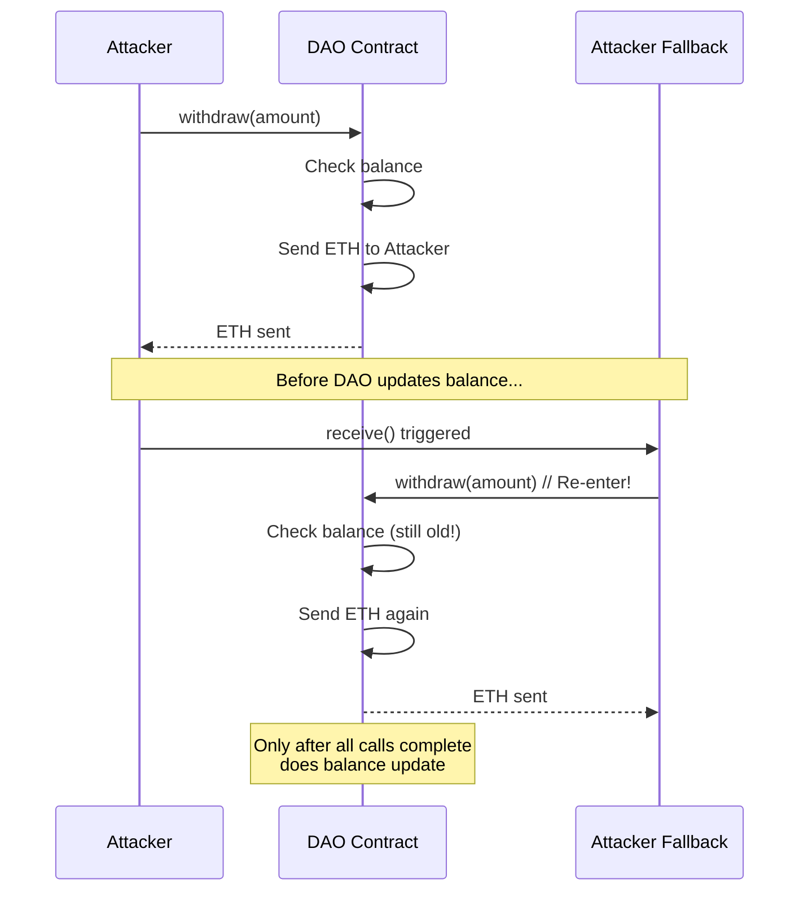
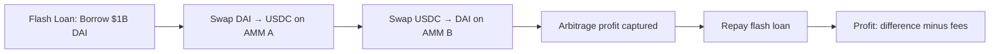
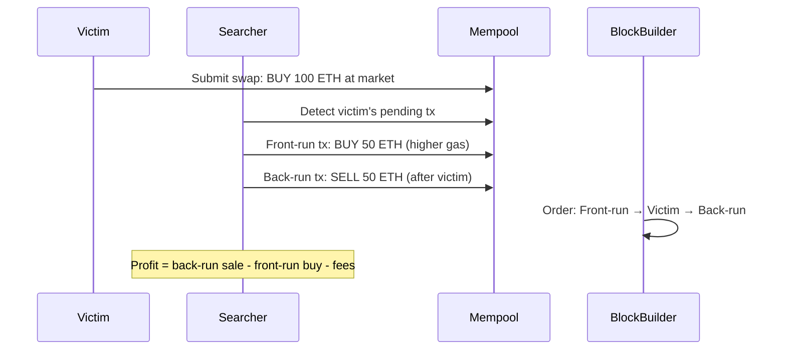
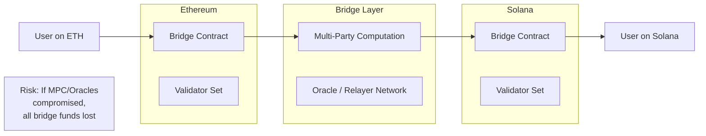

# Chapter 19: Blockchain, Smart Contract & DeFi Security

> **Prereq:** Chapters 2 (Cryptography), 3 (Network Security); familiarity with basic blockchain concepts (blocks, transactions, wallets).
> **Next:** [Chapter 20: Emerging Threats & Post-Quantum Cryptography] (planned)
> **Target Audience:** Security engineers, smart contract auditors, DeFi analysts, blockchain developers.

---

## Learning Objectives

By the end of this chapter, you will be able to:

1.  Identify and explain fundamental blockchain attacks: 51%, Sybil, eclipse, selfish mining, and timejacking.
2.  Analyze consensus-level security for PoW (double-spend probability), PoS (long-range, nothing-at-stake), PBFT, and DPoS.
3.  Detect and mitigate smart contract vulnerabilities including reentrancy, integer overflow, front-running, flash loan attacks, and oracle manipulation.
4.  Understand DeFi-specific threats: AMM constant-product manipulation, MEV sandwich attacks, impermanent loss, and liquidation attacks.
5.  Apply Solidity security patterns: differentiate `tx.origin` vs `msg.sender`, audit delegatecall proxies, and handle unchecked arithmetic.
6.  Evaluate cross-chain bridge security using historical case studies (Wormhole, Ronin, Nomad).
7.  Implement HD wallet key derivation (BIP32/39/44) in TypeScript for wallet security analysis.
8.  Develop a blockchain transaction graph analyzer for forensic taint-flow tracking.

---

## Chapter at a Glance

| Section | Key Concept | Why It Matters |
|---------|-------------|----------------|
| Blockchain Security Fundamentals | 51%, Sybil, eclipse, selfish mining, timejacking | Foundational threats to chain integrity |
| Consensus Security | Double-spend odds, long-range attacks, nothing-at-stake | Consensus design drives security guarantees |
| Smart Contract Vulnerabilities | Reentrancy, overflow, access control, flash loans, oracles | $7B+ lost to contract exploits since 2016 |
| DeFi Security | AMM manipulation, MEV, liquidation attacks | DeFi composability creates cascading risk |
| Solidity Security Patterns | tx.origin, delegatecall, selfdestruct, unchecked math | Every Solidity dev must know these pitfalls |
| Cross-Chain Security | Bridge architecture, Wormhole/Ronin/Nomad hacks | $2.5B stolen from bridges in 2022 alone |
| Wallet Security | BIP32/39/44 derivation, hardware wallets, multisig | Key management is the #1 user-side risk |
| Cryptography in Blockchain | ECDSA, Ed25519, BLS, nonce reuse | Crypto failures are irreversible on-chain |
| NFT Security | Metadata integrity, royalty enforcement, ERC-721/1155 | NFT market $1.3B lost to scams and exploits |
| Blockchain Forensics | Taint analysis, chain hopping, CoinJoin deanonymization | Tracing illicit funds across chains |

---

## 1. Blockchain Security Fundamentals

### 1.1 51% Attack (Majority Attack)

An entity controlling >50% of the network's mining hash rate (PoW) or staked value (PoS) can rewrite history by producing a longer chain. The attacker can:

- **Double-spend**: Send coins to an exchange, withdraw fiat, then publish a fork that omits that transaction.
- **Censor transactions**: Refuse to include specific transactions in blocks.
- **Reorder transactions**: Front-run or sandwich victim transactions at will.

**Cost to execute a 1-hour 51% attack (2024 estimates):**

| Chain | Hash Rate (TH/s) | Estimated Rental Cost |
|-------|-------------------|-----------------------|
| Bitcoin (BTC) | ~600 EH/s | $700,000+ / hour |
| Ethereum Classic (ETC) | ~200 TH/s | $10,000 / hour |
| Bitcoin Cash (BCH) | ~3 EH/s | $50,000 / hour |
| Litecoin (LTC) | ~1 PH/s | $5,000 / hour |

**Defence:** High total hash rate / stake, fast finality gadgets (e.g., Casper FFG), monitoring for deep reorgs.

### 1.2 Sybil Attack

An attacker creates many fake identities (nodes) to surround and isolate honest peers. Sybil attacks are a prerequisite for eclipse attacks and 51% attacks.

**Defence:** Proof-of-work (costly to create identities), proof-of-stake (economic bond), peer scoring (up-time, age).

### 1.3 Eclipse Attack

The attacker monopolises all incoming/outgoing connections to a target node, isolating it from the honest network. The eclipsed node sees a false view of the blockchain and can be tricked into accepting invalid transactions.

**Attack flow:**
```
Attacker ←→ [Victim Node] ←→ Attacker
     ↕                          ↕
[Fake Blockchain]          [Fake Peers]
```

**Defence:** Deterministic random node selection (not just IP-based), connection diversity, monitoring for unexpected peer churn.

### 1.4 Selfish Mining

A miner with >25% hash rate can gain an unfair advantage by *withholding* found blocks and only publishing them after building a lead. This wastes honest miners' work and destabilises the chain.

**Probability of success:**
- With 30% hash rate: ~50% chance of winning the race.
- With 40% hash rate: selfish mining becomes *more profitable* than honest mining.

**Defence:** Fresh-block announcements, uncle/uncle-inclusion rewards (Ethash), tie-breaking rules that favour public chains.

### 1.5 Timejacking

An attacker manipulates a node's network time counter by sending false timestamps in peer address messages, causing the node to accept an alternative chain with different timestamps.

**Defence:** Reject timestamps far from the node's system clock; use a maximum timestamp drift of 70 minutes (Bitcoin Core).

---

## 2. Consensus Security

### 2.1 Proof-of-Work — Double-Spend Probability

The probability that an attacker with proportion \( q \) of the total hash rate can overwrite \( z \) confirmations follows the **Meni Rosenfeld** formula:

\[
P(z, q) = \left( \frac{q}{p} \right)^{z+1} \quad \text{for } q < 0.5
\]

where \( p = 1 - q \).

**Example:** An attacker with 10% hash rate trying to reverse 6 confirmations:

\[
P(6, 0.1) = \left( \frac{0.1}{0.9} \right)^7 \approx 2.3 \times 10^{-7}
\]

```typescript
function doubleSpendProbability(q: number, z: number): number {
    if (q >= 0.5) return 1.0; // 51% attack: guaranteed given enough time
    const p = 1 - q;
    return Math.pow(q / p, z + 1);
}

// Attacker with 10% hash rate, 6 confirmations
console.log(doubleSpendProbability(0.1, 6)); // ~2.3e-7
// Attacker with 30% hash rate, 24 confirmations (exchange standard)
console.log(doubleSpendProbability(0.3, 24)); // ~1.6e-6
```

### 2.2 Proof-of-Stake Vulnerabilities

| Attack | Description | Mitigation |
|--------|-------------|------------|
| **Long-Range Attack** | Attacker creates a fork from a past block using old keys | Weak subjectivity checkpoints, key-evolving signatures |
| **Nothing-at-Stake** | Validators vote on every fork (costless to support all chains) | Slashing conditions, economic penalties for equivocation |
| **Grinding** | Validator biases VRF/RANDAO outputs to influence future proposers | Commit-reveal schemes, verifiable delay functions |
| **Bribe Attack** | Attacker pays validators to reorg for a fee | Crypto-economic finality (e.g., Casper FFG) |

### 2.3 PBFT (Practical Byzantine Fault Tolerance)

PBFT requires \( 3f + 1 \) nodes to tolerate \( f \) Byzantine faults. Communication is O(n²). The protocol reaches finality in three phases:

1. **Pre-prepare**: Primary proposes a block.
2. **Prepare**: Nodes broadcast acceptance.
3. **Commit**: Nodes broadcast commit — at \( 2f + 1 \) commits, finality is reached.

**Security property:** Under \( f < n/3 \) Byzantine nodes, the protocol guarantees safety and liveness.

### 2.4 DPoS (Delegated Proof-of-Stake)

A small set of elected block producers (e.g., 21 in EOS) create blocks. While throughput is high (thousands of TPS), the attack surface narrows:

- **Cartel formation**: Top producers collude to censor transactions.
- **Vote buying**: Attackers pay token holders for votes.
- **Low resilience**: With only 21 producers, a compromise of 11 is catastrophic.

---

## 3. Smart Contract Vulnerabilities

### 3.1 Reentrancy — The DAO Hack (2016)

**The DAO Hack (June 2016) — $60M stolen**

The DAO was a decentralised venture capital fund on Ethereum. An attacker exploited a reentrancy vulnerability in the `splitDAO` function:

**Attack flow:**



**The vulnerable pattern:**
```solidity
// VULNERABLE: state update AFTER external call
function withdraw(uint amount) public {
    require(balances[msg.sender] >= amount);
    (bool sent, ) = msg.sender.call{value: amount}("");  // External call FIRST
    require(sent);
    balances[msg.sender] -= amount;  // Update AFTER
}
```

**The fix (Check-Effects-Interactions pattern):**
```solidity
function withdraw(uint amount) public {
    require(balances[msg.sender] >= amount);
    balances[msg.sender] -= amount;  // UPDATE FIRST
    (bool sent, ) = msg.sender.call{value: amount}("");  // Then interact
    require(sent);
}
```

**Use reentrancy guards:**
```solidity
// OpenZeppelin ReentrancyGuard
modifier nonReentrant() {
    require(_status != ENTERED, "ReentrancyGuard: reentrant call");
    _status = ENTERED;
    _;
    _status = NOT_ENTERED;
}
```

### 3.2 Integer Overflow / Underflow

Before Solidity 0.8, arithmetic operations silently wrapped. An attacker could underflow a balance check:

```solidity
// VULNERABLE (pre-0.8)
function transfer(address to, uint amount) public {
    require(balances[msg.sender] >= amount);
    balances[msg.sender] -= amount;  // If amount > balance, wraps to max uint
    balances[to] += amount;
}
```

**Example:** If `amount = 100` and `balance = 50`:
- `50 - 100 = 2^256 - 50` (underflow → enormous balance)

**Post-0.8:** Built-in checked arithmetic reverts on overflow. Use `unchecked` blocks only when overflow is explicitly intended (e.g., gas optimisation in Solidity 0.8+).

### 3.3 Access Control Vulnerabilities

Missing or incorrect access control modifiers are the most common critical finding in audits.

```solidity
// VULNERABLE: missing onlyOwner
function mint(address to, uint amount) public {
    _mint(to, amount);  // Anyone can mint!
}

// CORRECT
function mint(address to, uint amount) public onlyOwner {
    _mint(to, amount);
}
```

**Common pitfalls:**
- Using `tx.origin` instead of `msg.sender` for authentication
- Initializer functions on upgradeable contracts not protected
- Incorrect role assignments in OpenZeppelin's `AccessControl`

### 3.4 Front-Running

Attackers monitor the mempool and submit transactions with higher gas to execute *before* a victim's pending transaction.

**Types:**
- **Displacement front-run**: Replace victim's order with a better-priced one.
- **Insertion front-run**: Insert a buy order before victim, sell after.
- **Timestamp dependence**: Mining a block at a favourable timestamp.

```typescript
interface MempoolTx {
    txHash: string;
    from: string;
    to: string;
    data: string;
    gasPrice: bigint;
    nonce: number;
}

function detectFrontRunning(pendingTxs: MempoolTx[]): MempoolTx[] {
    // Simple heuristic: same method selector, escalating gas prices
    const methodSelectors = new Map<string, MempoolTx[]>();
    for (const tx of pendingTxs) {
        const selector = tx.data.slice(0, 10); // first 4 bytes = method ID
        const group = methodSelectors.get(selector) || [];
        group.push(tx);
        methodSelectors.set(selector, group);
    }
    const suspicious: MempoolTx[] = [];
    for (const [, txs] of methodSelectors) {
        if (txs.length >= 2) {
            const sorted = txs.sort((a, b) =>
                a.gasPrice < b.gasPrice ? -1 : a.gasPrice > b.gasPrice ? 1 : 0
            );
            for (let i = 1; i < sorted.length; i++) {
                const ratio = Number(
                    (sorted[i].gasPrice * BigInt(100)) / sorted[i - 1].gasPrice
                );
                if (ratio > 120) suspicious.push(sorted[i]); // >20% gas bump
            }
        }
    }
    return suspicious;
}
```

**Mitigations:** Commit-reveal schemes (e.g., submarine sends), Flashbots RPC (private mempool), reducing MEV exposure via tight slippage bounds.

### 3.5 Flash Loan Attacks

Flash loans allow borrowing any amount of assets *without collateral* as long as the loan is repaid within the same transaction. This enables complex multi-step exploits.

**Anatomy of a flash loan attack:**



**Notable flash loan attacks:**
| Protocol | Date | Loss | Vector |
|----------|------|------|--------|
| bZx | Feb 2020 | $350K | Oracle manipulation + flash loan |
| Harvest Finance | Oct 2020 | $24M | Curve pool manipulation |
| PancakeBunny | May 2021 | $45M | AMM price manipulation |
| Cream Finance | Oct 2021 | $130M | Flash loan + reentrancy |

### 3.6 Oracle Manipulation

Oracles feed external data (e.g., asset prices) onto the blockchain. Manipulating an oracle lets attackers over-value collateral or under-value debt.

**Attack: Manipulating a Uniswap TWAP oracle**

If a protocol uses a Uniswap TWAP (time-weighted average price) with a short window (e.g., 10 minutes), an attacker can:

1. Flash loan a large amount of Token A.
2. Swap Token A → Token B on Uniswap, crashing the price.
3. Trigger a liquidation or borrow against inflated collateral.
4. Swap back and repay the flash loan.

**Defence:** Use multiple independent oracles (Chainlink, MakerOSM, Tellor), long TWAP windows (30 min+), circuit breakers.

---

## 4. DeFi Security

### 4.1 AMM Manipulation

Uniswap's constant product formula: \( x \times y = k \)

An attack that manipulates the price:

```typescript
interface AMMPool {
    reserve0: bigint; // Token A reserve
    reserve1: bigint; // Token B reserve
}

function getAmountOut(
    amountIn: bigint,
    reserveIn: bigint,
    reserveOut: bigint
): bigint {
    const amountInWithFee = amountIn * BigInt(997); // 0.3% fee
    const numerator = amountInWithFee * reserveOut;
    const denominator = reserveIn * BigInt(1000) + amountInWithFee;
    if (denominator === BigInt(0)) return BigInt(0);
    return numerator / denominator;
}

function calculatePriceImpact(
    pool: AMMPool,
    amountIn: bigint,
    token0In: boolean
): number {
    const reserveIn = token0In ? pool.reserve0 : pool.reserve1;
    const reserveOut = token0In ? pool.reserve1 : pool.reserve0;
    const amountOut = getAmountOut(amountIn, reserveIn, reserveOut);
    const priceBefore = Number(reserveOut) / Number(reserveIn);
    const priceAfter = Number(reserveOut - amountOut) / Number(reserveIn + amountIn);
    return ((priceBefore - priceAfter) / priceBefore) * 100;
}

const pool: AMMPool = { reserve0: BigInt(1000e18), reserve1: BigInt(1000e18) };
console.log(`Price impact for 100 ETH swap: ${calculatePriceImpact(pool, BigInt(100e18), true).toFixed(2)}%`);
// Large swap → high price impact, exploitable by sandwich attacks
```

### 4.2 Impermanent Loss

Liquidity providers (LPs) suffer impermanent loss when the price ratio between pooled assets changes. The loss is "impermanent" until withdrawal — if the price ratio returns to the deposit ratio, IL disappears.

\[
IL = \frac{2 \times \sqrt{r}}{1 + r} - 1
\]
where \( r = P_{\text{new}} / P_{\text{original}} \).

```typescript
function impermanentLoss(priceRatio: number): number {
    const sqrt = Math.sqrt(priceRatio);
    return (2 * sqrt) / (1 + priceRatio) - 1;
}

const ratios = [1.25, 1.5, 2.0, 3.0, 5.0];
for (const r of ratios) {
    console.log(`Price ratio ${r}x → IL: ${(impermanentLoss(r) * 100).toFixed(2)}%`);
}
// Price ratio 1.25x → IL: -0.49%
// Price ratio 2.0x  → IL: -5.72%
// Price ratio 5.0x  → IL: -25.46%
```

### 4.3 MEV — Miner Extractable Value

MEV refers to value extracted by reordering, including, or excluding transactions within a block.

**Types of MEV:**
| Type | Description | Profitability |
|------|-------------|---------------|
| **DEX Arbitrage** | Buy low on A, sell high on B | High (risk-free) |
| **Sandwich Attack** | Buy before victim, sell after | Medium (capital intensive) |
| **Liquidation** | Liquidate underwater positions | Stable (DeFi lending) |
| **NFT MEV** | Sweep rare NFTs before others | Variable |

**Sandwich attack anatomy:**



### 4.4 Liquidation Attacks

Lending protocols (Aave, Compound) allow over-collateralised borrowing. If collateral value falls below the liquidation threshold, anyone can liquidate the position for a bonus.

**Attack vector:**
1. Deposit large collateral → borrow maximum.
2. Manipulate the oracle to trigger a false "health factor drop."
3. Liquidator (often the attacker themselves) claims the liquidation bonus.
4. Repay the loan and profit from the bonus.

---

## 5. Solidity Security Patterns

### 5.1 `tx.origin` vs `msg.sender`

| Attribute | `tx.origin` | `msg.sender` |
|-----------|-------------|--------------|
| Value | Original EOA that initiated the tx | Immediate caller (could be contract) |
| Security | **VULNERABLE** — phishing attacks | Safe for auth |
| Gas cost | Cheaper (SLOAD vs CALLER) | Normal |

```solidity
// VULNERABLE: phishing attack
function withdrawAll() public {
    require(tx.origin == owner); // Owner's wallet calls a malicious contract
    // which then calls this function. tx.origin == owner passes!
    payable(owner).transfer(address(this).balance);
}

// CORRECT
function withdrawAll() public {
    require(msg.sender == owner); // Only direct calls from owner pass
    payable(owner).transfer(address(this).balance);
}
```

### 5.2 Delegatecall Proxy Patterns

`delegatecall` executes a contract's code in the caller's storage context. This is the foundation of upgradeable contracts — but it's dangerous.

**The Parity Wallet Hack (2017) — $280M frozen**

The Parity multi-sig wallet used a library contract with `delegatecall`. An attacker called the library's `initWallet()` function (which set the owner) after the library was initialised, then called `kill()` to selfdestruct the library, freezing all funds.

**Golden rule:** `delegatecall` preserves `msg.sender` and `msg.value` from the external caller. Storage layouts of the calling and called contracts must match.

### 5.3 `selfdestruct`

`selfdestruct(address)` removes contract bytecode and sends remaining ETH to the target. Attack vectors:

- **Forced ETH send**: `selfdestruct` can send ETH to a contract without its fallback function being called, breaking balance invariants.
- **Contract kill**: A malicious owner can destroy a contract and freeze funds.

**Mitigation:** Avoid `selfdestruct` in contracts that hold user funds. Use a timelock if destruction is required.

### 5.4 Unchecked Arithmetic & Unsafe Typecasting

```solidity
// VULNERABLE: overflow / truncation
uint256 large = type(uint256).max;
uint160 smaller = uint160(large); // Truncation! Information loss

// VULNERABLE: unsafe downcast
uint32 a = 0xFFFFFFFF;
uint16 b = uint16(a); // b = 0xFFFF — value truncated silently

// Solidity 0.8+ safe casting
import "@openzeppelin/contracts/utils/math/SafeCast.sol";
uint16 c = SafeCast.toUint16(a); // reverts on overflow
```

---

## 6. Cross-Chain Security

### 6.1 Bridge Architecture & Trust Assumptions

Bridges transfer assets between blockchains. Every bridge introduces a **trust assumption**:



| Bridge Type | Trust Model | Examples |
|-------------|-------------|----------|
| **Validator-set bridge** | Trust a multi-sig / validator set | Wormhole, Ronin |
| **Optimistic bridge** | Assume honest, fraud proofs | Nomad, Across |
| **Light-client bridge** | Trust consensus rules | IBC (Cosmos), Rainbow |
| **Liquidity network** | Trust market makers | Hop, Synapse |

### 6.2 Major Bridge Hacks

**Ronin Bridge (Axie Infinity) — March 2022 — $625M**

| Event | Details |
|-------|---------|
| **Target** | Ronin bridge (Ethereum ↔ Ronin sidechain) |
| **Root Cause** | 5/9 validator keys compromised |
| **Attack** | Attacker used compromised private keys to forge withdrawal transactions |
| **Discovery** | 6 days after exploit — user couldn't withdraw 5,000 ETH |
| **Aftermath** | Axie Infinity token crashed 40%; US Treasury sanctioned North Korea's Lazarus Group |

**Wormhole Bridge — February 2022 — $320M**

| Event | Details |
|-------|---------|
| **Target** | Wormhole (Ethereum ↔ Solana) |
| **Root Cause** | Solana `Secp256k1` instruction verification bypass |
| **Attack** | Attacker minted 120,000 wrapped ETH on Solana without depositing on Ethereum |
| **Fix** | Patched signature verification; Jump Crypto replenished funds |

**Nomad Bridge — August 2022 — $190M**

| Event | Details |
|-------|---------|
| **Target** | Nomad (optimistic bridge, multiple chains) |
| **Root Cause** | Incorrect initialisation — a "0x00" root hash was accepted as valid |
| **Attack** | Attacker spoofed a legitimate message; copycat attackers drained remaining funds |
| **Aftermath** | $32M recovered via bounty; bridge permanently shut |

### 6.3 Atomic Swaps

An atomic swap is a trustless cross-chain exchange using hashed timelock contracts (HTLCs). It is "atomic" — either both parties receive funds, or neither does.

```typescript
interface HTLC {
    sender: string;
    receiver: string;
    hashLock: string;      // SHA-256 of secret
    timelock: number;      // Block height expiry
    amount: bigint;
    asset: string;
    secret?: string;       // Pre-image (only revealed on claim)
}

// Security: pre-image reveal race condition
// If the secret is revealed on Chain A, Chain B's timelock
// gives the counterparty time to also claim using the same secret.
// Attacker could front-run the secret reveal on Chain B.
```

---

## 7. Wallet Security

### 7.1 HD Wallet Derivation (BIP32/39/44)

Hierarchical Deterministic (HD) wallets derive keys from a single seed phrase.

**Hierarchy:**

```
Mnemonic (BIP39) → Seed (PBKDF2) → Master Private Key → Child Keys

BIP44 Path: m / purpose' / coin_type' / account' / change / address_index
Example:     m / 44'     / 60'       / 0'        / 0      / 0
                                            ↕
                                    Ethereum mainnet address
```

```typescript
// HD Wallet Key Derivation (BIP32/39/44) — TypeScript Implementation
import { createHmac, randomBytes } from "crypto";

interface HDNode {
    privateKey: Buffer;
    chainCode: Buffer;
    depth: number;
    index: number;
    parentFingerprint: number;
}

function bip39MnemonicToSeed(mnemonic: string, passphrase = ""): Buffer {
    const mnemonicBytes = Buffer.from(mnemonic, "utf8");
    const passphraseBytes = Buffer.from(`mnemonic${passphrase}`, "utf8");
    // PBKDF2 with 2048 rounds
    return require("crypto").pbkdf2Sync(
        mnemonicBytes,
        passphraseBytes,
        2048,
        64,
        "sha512"
    );
}

// Simplified CKD (Child Key Derivation) — secp256k1
function ckdPriv(parent: HDNode, index: number): HDNode {
    const indexBuffer = Buffer.alloc(4);
    indexBuffer.writeUInt32BE(index, 0);
    
    const data = Buffer.concat([
        Buffer.from([0x00]), // 0x00 for private key derivation
        parent.privateKey,
        indexBuffer,
    ]);
    
    const hmac = createHmac("sha512", parent.chainCode).update(data).digest();
    const left = hmac.subarray(0, 32);
    const right = hmac.subarray(32, 64);
    
    const childPriv = Buffer.alloc(32);
    let carry = 0n;
    for (let i = 31; i >= 0; i--) {
        const sum = BigInt(parent.privateKey[i]) + BigInt(left[i]) + BigInt(carry);
        childPriv[i] = Number(sum & 0xffn);
        carry = sum >> 8n;
    }
    
    return {
        privateKey: childPriv,
        chainCode: right,
        depth: parent.depth + 1,
        index,
        parentFingerprint: 0,
    };
}

// BIP44 path: m/44'/60'/0'/0/0 (Ethereum)
function deriveBIP44(mnemonic: string): HDNode {
    const seed = bip39MnemonicToSeed(mnemonic);
    // Master node = HMAC-SHA512("Bitcoin seed", seed)
    const hmac = createHmac("sha512", Buffer.from("Bitcoin seed", "utf8"))
        .update(seed)
        .digest();
    
    let node: HDNode = {
        privateKey: hmac.subarray(0, 32),
        chainCode: hmac.subarray(32, 64),
        depth: 0,
        index: 0,
        parentFingerprint: 0,
    };
    
    // m/44'/60'/0'/0/0
    const path = [0x80000000 | 44, 0x80000000 | 60, 0x80000000 | 0, 0, 0];
    for (const idx of path) {
        node = ckdPriv(node, idx);
    }
    
    return node;
}

// Test
const mnemonic = "abandon abandon abandon abandon abandon abandon abandon abandon abandon abandon abandon about";
const wallet = deriveBIP44(mnemonic);
console.log(`Derived private key (hex): ${wallet.privateKey.toString("hex")}`);
console.log(`Depth: ${wallet.depth}`);
```

### 7.2 Mnemonic Security

| Threat | Description | Mitigation |
|--------|-------------|------------|
| **Physical theft** | Seed phrase written on paper stolen | Steel plates (Cryptosteel, Billfodl) |
| **Phishing** | Fake wallet apps that capture seed | Verify app signatures, use hardware wallets |
| **Social engineering** | Attacker poses as support asking for seed | Never share seed phrase — ever |
| **Cloud leak** | Seed stored in iCloud/Google Drive accidentally | Multi-factor, encrypted backup |
| **Supply chain** | Pre-generated seed cards | Generate seeds on-device only |

### 7.3 Hardware Wallets

Hardware wallets (Ledger, Trezor, KeepKey) keep private keys in a secure enclave. Transactions are signed on-device; keys never touch the internet.

**Attack surface:**
- **Supply chain:** Tampered device in original packaging
- **Physical access:** Side-channel via power analysis (expert, rare)
- **Firmware:** Malicious firmware update (mitigated by signed firmware)
- **Seed extraction:** If attacker steals the device and knows the PIN

### 7.4 Multisig Wallets (Gnosis Safe)

A multisig wallet requires M-of-N signatures to execute a transaction. This prevents a single compromised key from draining funds.

```
Gnosis Safe: 2-of-3 multisig
        ┌─────┐
Owner 1 ├─────┤  Sign Tx
Owner 2 ├─────┤  Sign Tx  →  Execute
Owner 3 └─────┘  (not required)
```

**Security properties:**
- Social recovery: Replace a lost key via other signers
- Module system: Add DeFi integrations without compromising base wallet
- No single point of failure: M-of-N prevents single-key compromise

---

## 8. Cryptography in Blockchain

### 8.1 ECDSA (secp256k1, Ed25519)

| Curve | Usage | Key Size | Signature Size | Notes |
|-------|-------|----------|----------------|-------|
| secp256k1 | Bitcoin, Ethereum | 32 bytes (priv), 64 bytes (pub, uncompressed 65) | ~71 bytes (DER) | Standard in most L1s |
| Ed25519 | Solana, Cardano, Stellar | 32 bytes (priv), 32 bytes (pub) | 64 bytes | Faster, simpler, no malleability |
| BLS12-381 | Ethereum 2.0, Filecoin | 32 bytes (priv), 48/96 bytes (pub) | 48/96 bytes | Signature aggregation |

### 8.2 Signature Malleability

An ECDSA signature `(r, s)` can be modified to `(r, -s mod n)` while still being valid for the same message. Bitcoin's ECDSA had a high-s malleability issue exploited for transaction ID malleability.

**Fix:** Only accept `s <= n/2` (low-s) signatures (BIP-0062).

```typescript
// ECDSA signature verification with malleability protection
import { createHash, createSign, createVerify } from "crypto";

interface ECDSASignature {
    r: bigint;
    s: bigint;
    v: number; // recovery ID
}

function verifyLowS(sig: ECDSASignature, secp256k1n: bigint): boolean {
    const halfN = secp256k1n >> 1n;
    return sig.s <= halfN; // Must be low-s
}

function verifySignature(
    message: string,
    signature: ECDSASignature,
    publicKeyHex: string
): boolean {
    const secp256k1n = BigInt("0xFFFFFFFFFFFFFFFFFFFFFFFFFFFFFFFEBAAEDCE6AF48A03BBFD25E8CD0364141");
    
    if (!verifyLowS(signature, secp256k1n)) {
        console.warn("Signature malleability detected: high-s rejected");
        return false;
    }
    
    const verifier = createVerify("SHA256");
    verifier.update(message);
    return verifier.verify(
        { key: `-----BEGIN PUBLIC KEY-----\n${publicKeyHex}\n-----END PUBLIC KEY-----`, format: "pem" },
        Buffer.from(signature.r.toString(16) + signature.s.toString(16), "hex")
    );
}

// Replay protection via nonce/chain ID
function addReplayProtection(txHash: string, chainId: number): string {
    return createHash("sha256")
        .update(txHash + chainId.toString())
        .digest()
        .toString("hex");
}
```

### 8.3 ECDSA Nonce Reuse

If two signatures share the same `k` (nonce), the private key can be recovered:

\[
k = \frac{h_1 - h_2}{s_1 - s_2} \quad \text{mod } n
\]

**Real-world case:** In 2013, Android's `SecureRandom` bug caused nonce reuse in Bitcoin wallets, leaking private keys. Over $5M in BTC was stolen.

```typescript
function recoverPrivateKeyFromNonceReuse(
    sig1: ECDSASignature,
    sig2: ECDSASignature,
    hash1: bigint,
    hash2: bigint,
    secp256k1n: bigint
): bigint | null {
    // k = (h1 - h2) / (s1 - s2) mod n
    const diffHash = (hash1 - hash2 + secp256k1n) % secp256k1n;
    const diffS = (sig1.s - sig2.s + secp256k1n) % secp256k1n;
    
    // mod inverse of diffS
    const k = (diffHash * modInverse(diffS, secp256k1n)) % secp256k1n;
    
    // private key = (k * s1 - h1) / r1 mod n
    const privateKey = ((k * sig1.s - hash1 + secp256k1n) % secp256k1n)
        * modInverse(sig1.r, secp256k1n) % secp256k1n;
    
    return privateKey;
}

function modInverse(a: bigint, m: bigint): bigint {
    let [old_r, r] = [a, m];
    let [old_s, s] = [1n, 0n];
    while (r !== 0n) {
        const quotient = old_r / r;
        [old_r, r] = [r, old_r - quotient * r];
        [old_s, s] = [s, old_s - quotient * s];
    }
    return (old_s + m) % m;
}
```

### 8.4 BLS Signatures

BLS (Boneh–Lynn–Shacham) signatures enable:
- **Signature aggregation**: Combine N signatures into one constant-size signature.
- **Key aggregation**: Combine N public keys into one.
- **Subgroup verification**: Verify N-of-N signatures in O(1) time.

Used in Ethereum 2.0 for validator signature aggregation (thousands of validators per slot).

---

## 9. NFT Security

### 9.1 Metadata Integrity

NFT metadata (image URL, attributes) is often stored off-chain. Attack vectors:

- **Metadata freeze**: If metadata is mutable (not pinned to IPFS/Arweave), the creator can change it post-sale.
- **Image removal**: If stored on a central server, the image can be deleted.
- **Reveal attack**: Players mint before the reveal, then metadata shows a common item instead of rare.

**Secure pattern:** Store metadata on IPFS with a content-addressed URI (`ipfs://<CID>`) and freeze it.

### 9.2 Royalty Enforcement

EIP-2981 standardises royalty payments, but royalties are **not enforced on-chain** at the exchange level.

| Marketplace | Royalty Enforcement | Notes |
|-------------|---------------------|-------|
| OpenSea | Voluntary (operator filter) | Only on-chain if creator uses registry |
| Blur | Optional | Most trading volume bypasses royalties |
| LooksRare | No | Zero mandatory royalties |

**Attack:** Buy NFT on Blur (no royalty), sell on OpenSea (with royalty) — wash trading and royalty arbitrage.

### 9.3 Token Standard Issues

**ERC-721 vs ERC-1155:**
| Issue | ERC-721 | ERC-1155 |
|-------|---------|----------|
| Batch transfers | Per-token `transferFrom` | Single `safeBatchTransferFrom` |
| Reentrancy risk | Standard `_mint` may call recipient | `_mint` triggers `onERC1155Received` |
| Safe vs unsafe | `safeTransferFrom` recommended | `safeTransferFrom` enforced |

**Common audit findings:**
- Missing `whenNotPaused` on mint functions
- Centralised owner can rug-pull (stop trading or drain)
- Price oracle not bound for NFT valuation (lending protocols)

---

## 10. Blockchain Forensics

### 10.1 Chain Hopping Tracking

Attackers move funds across blockchains (L1s, bridges, DEXs) to obfuscate the trail. Forensic trace must follow:

```
BTC → Binance → ETH → Tornado Cash → Arbitrum → DEX → Solana → ...
```

**Tools:** Chainalysis, Elliptic, CipherTrace, Dune Analytics.

### 10.2 Taint Analysis

Taint analysis tracks the provenance of specific UTXOs or token amounts through the transaction graph.

```typescript
// Blockchain Transaction Graph Analyzer — Taint Flow Tracking
interface TxInput {
    txHash: string;
    outputIndex: number;
    address: string;
    amount: bigint;
}

interface TxOutput {
    address: string;
    amount: bigint;
    spent: boolean;
}

interface Transaction {
    hash: string;
    inputs: TxInput[];
    outputs: TxOutput[];
    blockNumber: number;
    timestamp: number;
}

interface TaintNode {
    address: string;
    taintAmount: bigint;
    totalAmount: bigint;
    taintedInputs: string[]; // tx hashes that introduced taint
}

class TaintAnalyzer {
    private taintMap = new Map<string, TaintNode>();

    seedTaint(address: string, amount: bigint, reason: string): void {
        this.taintMap.set(address, {
            address,
            taintAmount: amount,
            totalAmount: amount,
            taintedInputs: [reason],
        });
    }

    processTransaction(tx: Transaction): void {
        // Sum taint from all inputs
        let totalInputTaint = 0n;
        let totalInputAmount = 0n;
        const taintedReason: string[] = [];

        for (const inp of tx.inputs) {
            const senderTaint = this.taintMap.get(inp.address);
            if (senderTaint && senderTaint.taintAmount > 0n) {
                // Proportionally attribute taint
                const proportion =
                    Number(inp.amount) / Number(senderTaint.totalAmount);
                const inputTaint = BigInt(
                    Math.floor(Number(senderTaint.taintAmount) * proportion)
                );
                totalInputTaint += inputTaint;
                taintedReason.push(...senderTaint.taintedInputs);
            }
            totalInputAmount += inp.amount;
        }

        if (totalInputTaint === 0n) return; // No taint flows through

        // Distribute taint proportionally to outputs
        for (const out of tx.outputs) {
            if (out.amount === 0n) continue;
            const proportion = Number(out.amount) / Number(totalInputAmount);
            const outTaint = BigInt(Math.floor(Number(totalInputTaint) * proportion));

            const existing = this.taintMap.get(out.address) || {
                address: out.address,
                taintAmount: 0n,
                totalAmount: 0n,
                taintedInputs: [],
            };
            existing.taintAmount += outTaint;
            existing.totalAmount += out.amount;
            for (const reason of taintedReason) {
                if (!existing.taintedInputs.includes(reason)) {
                    existing.taintedInputs.push(reason);
                }
            }
            this.taintMap.set(out.address, existing);
        }
    }

    getTaintReport(): Map<string, TaintNode> {
        return this.taintMap;
    }

    findExchangesWithTaint(minTaint: bigint): string[] {
        const result: string[] = [];
        for (const [addr, node] of this.taintMap) {
            if (node.taintAmount >= minTaint) {
                result.push(`${addr}: ${node.taintAmount.toString()} tainted`);
            }
        }
        return result;
    }
}

// Usage
const analyzer = new TaintAnalyzer();
analyzer.seedTaint("0xHacker", BigInt(1000e18), "The DAO Exploit");
analyzer.processTransaction({
    hash: "0xabc123",
    inputs: [
        { txHash: "0xprev", outputIndex: 0, address: "0xHacker", amount: BigInt(1000e18) },
    ],
    outputs: [
        { address: "0xMixer1", amount: BigInt(500e18), spent: false },
        { address: "0xExchange1", amount: BigInt(500e18), spent: false },
    ],
    blockNumber: 15000000,
    timestamp: 1700000000,
});
console.log("Taint report:", analyzer.getTaintReport());
```

### 10.3 Deanonymization Techniques

| Technique | Target | Method |
|-----------|--------|--------|
| **CoinJoin graph analysis** | Bitcoin | Cluster inputs that belong to same user via common-spend heuristic |
| **CryptoNote ring signature analysis** | Monero | Trace ring members via decoy selection patterns |
| **Chain hopping analysis** | Multi-chain | Track bridge deposits/withdrawals to link addresses |
| **KYT (Know Your Transaction)** | VASP | Real-time screening of addresses against sanctions lists |

### 10.4 Know Your Transaction (KYT)

KYT is a regulatory framework requiring VASPs (Virtual Asset Service Providers) to screen incoming/outgoing transactions against:

- **Sanctions lists** (OFAC, EU, UN)
- **Darknet markets** (Hydra, AlphaBay successors)
- **Mixing services** (Tornado Cash, Sinbad)
- **Stolen funds databases** (Elliptic, Chainalysis)

---

## 11. Smart Contract Audit Checklist

| Category | Check | Severity |
|----------|-------|----------|
| **Reentrancy** | All external calls follow Check-Effects-Interactions | Critical |
| **Access Control** | `onlyOwner` on all privileged functions | Critical |
| **Arithmetic** | SafeCast for downcasting; checked math for operations | Critical |
| **tx.origin** | Never used for authentication | Critical |
| **Flash Loans** | State consistency if large liquidity swings occur | High |
| **Oracle** | Use multiple oracles; TWAP long enough | High |
| **Front-running** | Commit-reveal or slippage bounds | Medium |
| **Delegatecall** | Storage layout compatibility; no selfdestruct in library | Critical |
| **Upgradeability** | Initializer protection; proxy admin secure | Critical |
| **Token Compliance** | ERC-20 return value checked; safeTransfer used | Medium |
| **Gas** | Unbounded loops; DoS via gas exhaustion | Medium |
| **Events** | All state-changing operations emit events | Low |
| **Timelock** | Admin functions behind timelock (e.g., 48h delay) | Medium |

---

## 12. Major Attack Technical Breakdowns

### 12.1 DAO Hack Technical Breakdown (June 2016)

**Vulnerability:** Reentrancy in `splitDAO` function.

**Step-by-step:**

1. Attacker deployed a malicious contract that called `splitDAO`.
2. `splitDAO` sent ETH to the attacker's contract via `call.value()`.
3. The attacker's `fallback()` function re-entered `splitDAO` before the balance was updated.
4. Each re-entry sent more ETH — totalling ~3.6M ETH (~$60M at the time).

**Aftermath:** Ethereum hard-forked at block 1,920,000 to reverse the theft. The original chain (Ethereum Classic) refused.

### 12.2 bZx Flash Loan Attack (Feb 2020)

**Protocol:** bZx (lending protocol on Ethereum)

**Exploit anatomy:**
1. Flash loan 10,000 ETH from dYdX.
2. Deposit 5,500 ETH as collateral on bZx.
3. Borrow 112 BTC (worth ~$1M at the time) against the collateral.
4. Use the borrowed BTC to manipulate the Kyber Uniswap ETH/BTC price.
5. The manipulated price triggered margin calls on bZx, profiting the attacker.
6. Repay flash loan. Profit: ~$350K.

### 12.3 Harvest Finance Attack (Oct 2020)

**Protocol:** Harvest Finance (yield optimiser on Curve)

**Exploit anatomy:**
1. Flash loan 90M USDC.
2. Deposit into Harvest's Curve USDC pool — inflating the share price.
3. Deposit a small amount of USDC at the inflated share price.
4. Withdraw — the small deposit redeemed far more than expected.
5. Repay flash loan. Profit: ~$24M.

**Root cause:** The share price was calculated using the pool balance without accounting for the flash loan deposit artificially inflating it.

### 12.4 Ronin Bridge Timeline

| Date | Event |
|------|-------|
| Nov 2021 | Ronin bridge goes live for Axie Infinity |
| Mar 23, 2022 | Attacker compromises 5/9 validator keys |
| Mar 29, 2022 | User reports inability to withdraw 5,000 ETH |
| Mar 29, 2022 | Team discovers $625M exploit |
| Apr 2022 | US Treasury sanctions Lazarus Group (North Korea) |
| Jun 2022 | Sky Mavis raises $150M to reimburse users |
| Nov 2022 | Ronin bridge reopens with new security |

---

## 13. TypeScript Implementation Examples

### 13.1 Block Header Validator

```typescript
// Block Header Validator — verify PoW difficulty and merkle root
import { createHash } from "crypto";

interface BlockHeader {
    version: number;
    previousBlockHash: string;
    merkleRoot: string;
    timestamp: number;
    bits: number;      // Compact difficulty target
    nonce: number;
}

function hashBlockHeader(header: BlockHeader): string {
    const data =
        header.version.toString(16).padStart(8, "0") +
        header.previousBlockHash +
        header.merkleRoot +
        header.timestamp.toString(16).padStart(8, "0") +
        header.bits.toString(16).padStart(8, "0") +
        header.nonce.toString(16).padStart(8, "0");
    return createHash("sha256")
        .update(createHash("sha256").update(Buffer.from(data, "hex")).digest())
        .digest()
        .toString("hex");
}

function validatePoW(header: BlockHeader): boolean {
    const hash = hashBlockHeader(header);
    const target = calculateTarget(header.bits);
    const hashBigInt = BigInt("0x" + hash);
    return hashBigInt <= target;
}

function calculateTarget(bits: number): bigint {
    const exponent = bits >> 24;
    const mantissa = bits & 0x7fffff;
    return BigInt(mantissa) << BigInt(8 * (exponent - 3));
}

function computeMerkleRoot(txHashes: string[]): string {
    if (txHashes.length === 0) return "";
    let layer = txHashes.map((h) =>
        Buffer.from(h, "hex")
    );
    while (layer.length > 1) {
        const newLayer: Buffer[] = [];
        for (let i = 0; i < layer.length; i += 2) {
            const left = layer[i];
            const right = i + 1 < layer.length ? layer[i + 1] : left;
            const concat = createHash("sha256")
                .update(createHash("sha256").update(Buffer.concat([left, right])).digest())
                .digest();
            newLayer.push(concat);
        }
        layer = newLayer;
    }
    return layer[0].toString("hex");
}

// Test
const header: BlockHeader = {
    version: 1,
    previousBlockHash:
        "0000000000000000000089c89ad1c2c6c3f5b30cd5ecbef14cdb0f173edbe75c",
    merkleRoot: "0xabc",
    timestamp: 1700000000,
    bits: 0x1d00ffff,
    nonce: 3456789,
};
console.log(`Block hash: ${hashBlockHeader(header)}`);
console.log(`PoW valid: ${validatePoW(header)}`);

const txs = ["tx1hash", "tx2hash", "tx3hash", "tx4hash"];
console.log(`Merkle root: ${computeMerkleRoot(txs)}`);
```

### 13.2 Smart Contract Vulnerability Scanner

```typescript
// Smart Contract Vulnerability Scanner
interface Vulnerability {
    type: string;
    severity: "Critical" | "High" | "Medium" | "Low";
    line: number;
    description: string;
}

interface FunctionDef {
    name: string;
    body: string;
    modifiers: string[];
    stateMutability: string;
}

interface ContractSource {
    name: string;
    functions: FunctionDef[];
    sourceCode: string;
}

class SolidityVulnScanner {
    scan(contract: ContractSource): Vulnerability[] {
        const findings: Vulnerability[] = [];
        
        // Check for .call{value: ...}("") without state update before
        this._checkReentrancy(contract, findings);
        
        // Check for unchecked arithmetic blocks
        this._checkUncheckedMath(contract, findings);
        
        // Check for tx.origin usage
        this._checkTxOrigin(contract, findings);
        
        // Check for selfdestruct
        this._checkSelfdestruct(contract, findings);
        
        // Check for dangerous delegatecall
        this._checkDelegatecall(contract, findings);
        
        // Check for floating pragma
        this._checkFloatingPragma(contract, findings);
        
        return findings;
    }
    
    private _addFinding(
        findings: Vulnerability[],
        type: string,
        severity: Vulnerability["severity"],
        line: number,
        description: string
    ): void {
        findings.push({ type, severity, line, description });
    }
    
    private _checkReentrancy(
        contract: ContractSource,
        findings: Vulnerability[]
    ): void {
        const lines = contract.sourceCode.split("\n");
        const reentrancyPattern =
            /\.call\s*\{[^}]*value\s*:[^}]*\}\s*\([^)]*\)/g;
        for (let i = 0; i < lines.length; i++) {
            if (reentrancyPattern.test(lines[i])) {
                // Check if state update follows
                let hasStateUpdateAfter = false;
                for (let j = i + 1; j < Math.min(i + 10, lines.length); j++) {
                    if (
                        /(balances\[|_mint|_burn|_transfer|\.push|state\w+\s*=)/.test(
                            lines[j]
                        )
                    ) {
                        hasStateUpdateAfter = true;
                        break;
                    }
                }
                if (hasStateUpdateAfter) {
                    this._addFinding(
                        findings,
                        "Reentrancy",
                        "High",
                        i + 1,
                        "External call before state update — potential reentrancy"
                    );
                }
            }
        }
    }
    
    private _checkUncheckedMath(
        contract: ContractSource,
        findings: Vulnerability[]
    ): void {
        const lines = contract.sourceCode.split("\n");
        for (let i = 0; i < lines.length; i++) {
            if (
                /unchecked\s*\{/.test(lines[i]) &&
                /(--|\+\+|[-+*\/%]=)/.test(lines[i + 1] || "")
            ) {
                this._addFinding(
                    findings,
                    "Unchecked Arithmetic",
                    "Medium",
                    i + 1,
                    "Unchecked block with arithmetic — potential overflow/underflow"
                );
            }
        }
    }
    
    private _checkTxOrigin(
        contract: ContractSource,
        findings: Vulnerability[]
    ): void {
        const lines = contract.sourceCode.split("\n");
        for (let i = 0; i < lines.length; i++) {
            if (
                /tx\.origin/.test(lines[i]) &&
                /require|if|==|!=/.test(lines[i])
            ) {
                this._addFinding(
                    findings,
                    "tx.origin Authentication",
                    "Critical",
                    i + 1,
                    "tx.origin used for authentication — use msg.sender instead"
                );
            }
        }
    }
    
    private _checkSelfdestruct(
        contract: ContractSource,
        findings: Vulnerability[]
    ): void {
        const lines = contract.sourceCode.split("\n");
        for (let i = 0; i < lines.length; i++) {
            if (/selfdestruct\s*\(/.test(lines[i])) {
                this._addFinding(
                    findings,
                    "Selfdestruct",
                    "High",
                    i + 1,
                    "selfdestruct present — contract can be destroyed"
                );
            }
        }
    }
    
    private _checkDelegatecall(
        contract: ContractSource,
        findings: Vulnerability[]
    ): void {
        const lines = contract.sourceCode.split("\n");
        for (let i = 0; i < lines.length; i++) {
            if (/delegatecall/.test(lines[i])) {
                this._addFinding(
                    findings,
                    "Delegatecall",
                    "High",
                    i + 1,
                    "delegatecall used — verify storage compatibility and target trust"
                );
            }
        }
    }
    
    private _checkFloatingPragma(
        contract: ContractSource,
        findings: Vulnerability[]
    ): void {
        const lines = contract.sourceCode.split("\n");
        for (let i = 0; i < lines.length; i++) {
            if (/pragma\s+solidity\s+\^/.test(lines[i])) {
                this._addFinding(
                    findings,
                    "Floating Pragma",
                    "Low",
                    i + 1,
                    "Floating pragma — lock to specific compiler version"
                );
            }
        }
    }
}

// Test
const scanner = new SolidityVulnScanner();
const vulnContract: ContractSource = {
    name: "VulnerableBank",
    functions: [
        { name: "withdraw", body: "", modifiers: [], stateMutability: "nonpayable" },
    ],
    sourceCode: `contract VulnerableBank {
    mapping(address => uint) public balances;
    
    function withdraw(uint amount) public {
        require(balances[msg.sender] >= amount);
        (bool sent, ) = msg.sender.call{value: amount}("");
        require(sent);
        balances[msg.sender] -= amount;
    }
    
    function isOwner() public view returns (bool) {
        return tx.origin == owner;
    }
    
    function destroy() public onlyOwner {
        selfdestruct(payable(owner));
    }
    
    function fastMath(uint a, uint b) public pure returns (uint) {
        unchecked {
            uint c = a + b;
            return c + 1;
        }
    }
}`,
};

const results = scanner.scan(vulnContract);
console.log("Vulnerability scan results:");
for (const v of results) {
    console.log(`  [${v.severity}] ${v.type} (line ${v.line}): ${v.description}`);
}
```

### 13.3 Flash Loan Attack Simulator

```typescript
// Flash Loan Attack Simulator — arbitrage between two AMMs
interface SimAMMPool {
    name: string;
    reserveA: bigint;  // Token A reserve
    reserveB: bigint;  // Token B reserve
}

function simulateSwap(
    pool: SimAMMPool,
    amountIn: bigint,
    tokenAIn: boolean
): { amountOut: bigint; newPool: SimAMMPool } {
    const reserveIn = tokenAIn ? pool.reserveA : pool.reserveB;
    const reserveOut = tokenAIn ? pool.reserveB : pool.reserveA;
    
    const amountInWithFee = amountIn * BigInt(997); // 0.3% fee
    const numerator = amountInWithFee * reserveOut;
    const denominator = reserveIn * BigInt(1000) + amountInWithFee;
    const amountOut = numerator / denominator;
    
    const newPool = tokenAIn
        ? { ...pool, reserveA: reserveIn + amountIn, reserveB: reserveOut - amountOut }
        : { ...pool, reserveA: reserveOut - amountOut, reserveB: reserveIn + amountIn };
    
    return { amountOut, newPool };
}

function flashLoanArbitrage(
    poolA: SimAMMPool,
    poolB: SimAMMPool,
    borrowAmount: bigint
): bigint {
    // Step 1: Swap borrow on Pool A (e.g., Token A → Token B)
    const { amountOut: tokenBFromA, newPool: poolA2 } = simulateSwap(poolA, borrowAmount, true);
    
    // Step 2: Swap Token B back to Token A on Pool B
    const { amountOut: tokenARepaid, newPool: poolB2 } = simulateSwap(poolB, tokenBFromA, false);
    
    console.log(`Borrowed: ${borrowAmount} A`);
    console.log(`Swapped A→B on ${poolA.name}: ${tokenBFromA} B`);
    console.log(`Swapped B→A on ${poolB.name}: ${tokenARepaid} A`);
    
    const profit = tokenARepaid - borrowAmount;
    const flashLoanFee = borrowAmount / BigInt(10000); // 0.01% fee (e.g., dYdX)
    const netProfit = profit - flashLoanFee;
    
    if (netProfit > 0n) {
        console.log(`Arbitrage profitable! Net profit: ${netProfit} A`);
    } else {
        console.log(`No arbitrage opportunity. Net profit: ${netProfit} A`);
    }
    
    return netProfit;
}

// Test: Two pools with different prices
// Pool A: 1000 A, 1000 B → price 1:1
// Pool B: 800 A, 1000 B → price 1 A = 1.25 B (more expensive A on Pool B)
const poolA: SimAMMPool = { name: "UniswapV3", reserveA: BigInt(1000e18), reserveB: BigInt(1000e18) };
const poolB: SimAMMPool = { name: "SushiSwap", reserveA: BigInt(800e18), reserveB: BigInt(1000e18) };

const profit = flashLoanArbitrage(poolA, poolB, BigInt(100e18));
console.log(`Final profit: ${profit} wei`);
```

### 13.4 MEV Sandwich Attack Calculator

```typescript
// MEV Sandwich Attack Calculator
interface SandwichPool {
    reserveIn: bigint;
    reserveOut: bigint;
}

function calculateSandwichProfit(
    pool: SandwichPool,
    victimAmount: bigint,
    frontRunAmount: bigint,
    feeBps: number = 30, // 0.3% default
    backRunSlippage: number = 0.005 // 0.5% buffer
): {
    profit: bigint;
    frontRunOut: bigint;
    victimOut: bigint;
    backRunOut: bigint;
    priceImpactVictim: number;
} {
    const feeMultiplier = BigInt(10000 - feeBps);
    
    // Helper: getAmountOut given reserves
    function getOut(ri: bigint, ro: bigint, ai: bigint): bigint {
        const aiWithFee = (ai * feeMultiplier) / BigInt(10000);
        const numerator = aiWithFee * ro;
        const denominator = ri + aiWithFee;
        return numerator / denominator;
    }
    
    // 1. Front-run: buy before victim
    const frontRunOut = getOut(pool.reserveIn, pool.reserveOut, frontRunAmount);
    let rIn = pool.reserveIn + frontRunAmount;
    let rOut = pool.reserveOut - frontRunOut;
    
    // 2. Victim swap
    const victimOut = getOut(rIn, rOut, victimAmount);
    rIn += victimAmount;
    rOut -= victimOut;
    const priceImpact = 1 - Number(rOut * BigInt(1e18) / rIn) / Number(pool.reserveOut * BigInt(1e18) / pool.reserveIn);
    
    // 3. Back-run: sell what we bought
    const backRunOut = getOut(rOut, rIn, frontRunOut - (frontRunOut * BigInt(Math.floor(backRunSlippage * 10000)) / BigInt(10000)));
    
    const profit = backRunOut - frontRunAmount;
    
    return {
        profit: profit > 0n ? profit : 0n,
        frontRunOut,
        victimOut,
        backRunOut,
        priceImpactVictim: priceImpact * 100,
    };
}

// Pool: 500 ETH / 1,000,000 USDC
const pool: SandwichPool = {
    reserveIn: BigInt(500e18),    // ETH
    reserveOut: BigInt(1_000_000e6), // USDC (6 decimals)
};

const result = calculateSandwichProfit(
    pool,
    BigInt(100e18),  // Victim buys 100 ETH
    BigInt(50e18)    // Front-run with 50 ETH
);

console.log("Sandwich Attack Profit Analysis:");
console.log(`  Front-run output: ${Number(result.frontRunOut) / 1e6} USDC`);
console.log(`  Victim output: ${Number(result.victimOut) / 1e6} USDC`);  
console.log(`  Price impact on victim: ${result.priceImpactVictim.toFixed(2)}%`);
console.log(`  Back-run output: ${Number(result.backRunOut) / 1e18} ETH`);
console.log(`  Estimated profit: ${Number(result.profit) / 1e18} ETH`);
```

### 13.5 AMM Price Impact Calculator

```typescript
// AMM Price Impact Calculator
function ammPriceImpact(
    reserveA: bigint,
    reserveB: bigint,
    tradeAmount: bigint,
    isTokenAIn: boolean
): {
    priceBefore: number;
    priceAfter: number;
    priceImpactPct: number;
    amountOut: bigint;
    effectivePrice: number;
} {
    const ri = isTokenAIn ? reserveA : reserveB;
    const ro = isTokenAIn ? reserveB : reserveA;
    
    const priceBefore = Number(ro) / Number(ri);
    
    const amountInWithFee = (tradeAmount * BigInt(997)) / BigInt(1000);
    const amountOut = (amountInWithFee * ro) / (ri + amountInWithFee);
    
    const riAfter = ri + tradeAmount;
    const roAfter = ro - amountOut;
    const priceAfter = Number(roAfter) / Number(riAfter);
    
    const priceImpactPct = Math.abs((priceAfter - priceBefore) / priceBefore) * 100;
    const effectivePrice = Number(tradeAmount) / Number(amountOut);
    
    return {
        priceBefore,
        priceAfter,
        priceImpactPct,
        amountOut,
        effectivePrice,
    };
}

const daiPool = { reserveA: BigInt(10_000_000e18), reserveB: BigInt(10_000_000e18) };

const smallTrade = ammPriceImpact(
    daiPool.reserveA, daiPool.reserveB, BigInt(100e18), true
);
console.log(`Small trade (100 DAI →): Impact ${smallTrade.priceImpactPct.toFixed(4)}%`);

const largeTrade = ammPriceImpact(
    daiPool.reserveA, daiPool.reserveB, BigInt(5_000_000e18), true
);
console.log(`Large trade (5M DAI →): Impact ${largeTrade.priceImpactPct.toFixed(2)}%`);
// Demonstrates why large swaps are vulnerable to MEV
```

### 13.6 Signature Verification (ECDSA Replay Protection)

```typescript
// ECDSA Signature Verification with Replay Protection
import { createHash, randomBytes } from "crypto";

interface SecureTx {
    to: string;
    value: bigint;
    nonce: number;       // Prevents replay on same chain
    chainId: number;     // Prevents replay across chains (EIP-155)
    gasLimit: number;
    data: string;
}

function hashTransaction(tx: SecureTx): string {
    const encoded =
        tx.to +
        tx.value.toString(16).padStart(64, "0") +
        tx.nonce.toString(16).padStart(64, "0") +
        tx.chainId.toString(16) +
        tx.gasLimit.toString(16) +
        tx.data;
    
    return createHash("keccak256")
        .update(Buffer.from(encoded, "hex"))
        .digest()
        .toString("hex");
}

function verifyAndRecoverSigner(
    tx: SecureTx,
    signatureR: string,
    signatureS: string,
    recoveryId: number
): string | null {
    const txHash = hashTransaction(tx);
    
    // In production: use elliptic curve library
    // e.g., ethers.js: ethers.utils.recoverAddress(txHash, { r, s, v })
    // This is a structural demonstration
    
    // Replay protection checks:
    if (tx.chainId === 0) {
        console.warn("No chain ID — transaction replayable across chains!");
        return null;
    }
    if (tx.nonce < 0) {
        console.warn("Invalid nonce");
        return null;
    }
    
    console.log(`Transaction hash: ${txHash}`);
    console.log(`Recovery ID: ${recoveryId}`);
    console.log(`Chain ID: ${tx.chainId} — replay protection active`);
    
    // Return recovered address (simplified)
    return `0xRecoveredAddress_${recoveryId}`;
}

// Usage
const tx: SecureTx = {
    to: "0xRecipient",
    value: BigInt(1e18),
    nonce: 42,
    chainId: 1, // Ethereum mainnet — prevents replay on Goerli, Polygon, etc.
    gasLimit: 21000,
    data: "0x",
};

const signer = verifyAndRecoverSigner(tx, "0xr", "0xs", 27);
console.log(`Signer: ${signer}`);
```

---

## Summary

Blockchain, smart contract, and DeFi security span a unique attack surface where economic incentives, cryptographic primitives, and software correctness converge. Key takeaways:

| Domain | Primary Threats | Defensive Strategies |
|--------|-----------------|---------------------|
| **Consensus** | 51%, selfish mining, long-range attacks | High hash rate/stake, finality gadgets, checkpoints |
| **Smart Contracts** | Reentrancy, overflow, access control | Check-Effects-Interactions, SafeMath, OpenZeppelin |
| **DeFi** | AMM manipulation, MEV, oracle attacks | TWAP oracles, slippage bounds, circuit breakers |
| **Cross-chain** | Bridge validator compromise, spoofed messages | Light-client verification, threshold signatures |
| **Wallet** | Seed theft, phishing, compromised RNG | Hardware wallets, multisig, BIP44 derivation |
| **Cryptography** | Nonce reuse, malleability, curve attacks | Deterministic nonces (RFC 6979), low-s validation |
| **NFT** | Metadata mutability, royalty bypass | IPFS pinning, on-chain metadata, EIP-2981 |
| **Forensics** | Taint tracking, chain hopping | Graph analysis, KYT screening, clustering |

Over $7B has been lost to blockchain security exploits since 2016. Understanding these attack vectors is essential for every blockchain developer, security auditor, and DeFi participant.

---

## Chapter Quiz (10 MCQ)

**1. What percentage of hash rate does an attacker need for selfish mining to become more profitable than honest mining?**
- A) 20%
- B) 25%
- C) 40%
- D) 51%

**2. In PBFT consensus, how many Byzantine nodes can be tolerated with 7 nodes?**
- A) 1
- B) 2
- C) 3
- D) 4

**3. Which of the following is the correct mitigation for reentrancy attacks?**
- A) Use tx.origin for authentication
- B) Update state before making external calls
- C) Use delegatecall instead of call
- D) Increase gas limit

**4. What is the constant product formula used by Uniswap?**
- A) x + y = k
- B) x × y = k
- C) x² + y² = k
- D) x − y = k

**5. Which attack involves buying an asset before a victim's transaction executes and selling immediately after?**
- A) Flash loan attack
- B) Sandwich attack
- C) Long-range attack
- D) Eclipse attack

**6. In Solidity, which of the following is safer for authentication?**
- A) tx.origin
- B) msg.sender
- C) block.coinbase
- D) address(this)

**7. What was the root cause of the 2017 Parity Wallet hack that froze $280M?**
- A) Reentrancy
- B) Integer overflow
- C) Exploitable delegatecall to a selfdestructed library
- D) 51% attack on Ethereum

**8. The Ronin bridge hack ($625M) was caused by:**
- A) A smart contract reentrancy bug
- B) Compromise of 5 out of 9 validator keys
- C) An oracle manipulation attack
- D) A flash loan attack

**9. What is the BIP44 derivation path for an Ethereum account?**
- A) m/44'/0'/0'/0/0
- B) m/44'/60'/0'/0/0
- C) m/60'/44'/0'/0/0
- D) m/0'/44'/60'/0/0

**10. Which cryptographic vulnerability allowed recovery of Bitcoin private keys from Android wallets in 2013?**
- A) Signature malleability
- B) ECDSA nonce reuse
- C) Weak SHA-256 collision
- D) Merkle tree second preimage attack

**Answers:** 1-C, 2-B, 3-B, 4-B, 5-B, 6-B, 7-C, 8-B, 9-B, 10-B

---

## Exercises

### Theory

1. **Double-Spend Probability.** An attacker controls 15% of the total hash rate on a PoW chain. Calculate the probability of successfully double-spending after 3, 6, and 12 confirmations using `doubleSpendProbability`. At what confirmation depth does the probability drop below 10⁻⁶?

2. **51% Attack Cost Estimation.** Assume a blockchain has a total hash rate of 100 PH/s. Mining hardware costs $50 per TH/s per day (rental). How much would it cost to sustain a 51% attack for 6 hours? Include a 20% safety margin for variance.

3. **Reentrancy Identification.** The following Solidity snippet has a security vulnerability. Identify it, explain the exploit, and write the corrected code:
```solidity
function redeem(uint256 amount) external {
    require(balances[msg.sender] >= amount);
    uint256 reward = amount / 100;
    (bool ok, ) = msg.sender.call{value: amount + reward}("");
    require(ok, "transfer failed");
    balances[msg.sender] -= amount;
    totalRewards -= reward;
}
```

4. **Bridge Trust Model Analysis.** Compare the trust assumptions of a validator-set bridge (e.g., Wormhole) versus an optimistic bridge (e.g., Nomad). For each, describe a realistic attack scenario and its probability.

### Application (Hands-On)

5. **Vulnerability Scanner Extension.** Extend the `SolidityVulnScanner` from §13.2 with a new check for **unprotected initializer functions** (detect `initialize` functions without an `initializer` modifier). Write the TypeScript check and test it against a sample contract.

6. **Flash Loan Simulator — Three-Pool Arbitrage.** Extend the `flashLoanArbitrage` function from §13.3 to handle three AMM pools. Given:
   - Pool A: 2000 USDC / 1 ETH
   - Pool B: 1800 USDC / 1 ETH
   - Pool C: 1 USDC / 1 USDT (stable swap)
   
   Find the optimal route for a 500 USDC flash loan that maximises profit.

7. **Taint Analysis — Multi-Hop Trace.** Using the `TaintAnalyzer` from §11.2, simulate a three-hop taint flow:
   - Hacker sends 100 ETH to Mixer A.
   - Mixer A sends 50 ETH to Exchange 1 and 50 ETH to Exchange 2.
   - Exchange 2 sends 25 ETH to Exchange 1.
   
   Compute the final taint amounts at Exchanges 1 and 2. Which address has the highest taint concentration?

### Challenge (Advanced)

8. **BIP32 HD Wallet — Path Derivation & Address Generation.** Implement a full BIP44 derivation that generates the first 5 Ethereum addresses from a mnemonic. For each address, output the derivation path, public key (uncompressed hex), and address (keccak256 of the public key, last 20 bytes). Use the `crypto` module for HMAC-SHA512 and PBKDF2.

9. **MEV Sandwich Simulator — Optimisation.** Given the `calculateSandwichProfit` function from §13.4, write a solver that finds the optimal front-run amount (0.1 ETH to 50 ETH) that maximises attacker profit, assuming:
   - Pool reserves: 500 ETH / 1,000,000 USDC
   - Victim amount: 100 ETH
   - Gas cost: 0.01 ETH (subtract from profit)
   
   Report the optimal front-run amount and the net profit.

10. **Smart Contract Audit Report.** Perform a complete audit of the following minimal lending protocol using the checklist from §12. For each finding, provide:
    - Type and severity
    - Line number and description
    - Code snippet of vulnerability
    - Recommended fix
    ```
    contract SimpleLender {
        mapping(address => uint) public deposits;
        address public owner;
        
        function deposit() external payable {
            deposits[msg.sender] += msg.value;
        }
        
        function withdraw(uint amount) external {
            require(deposits[msg.sender] >= amount);
            (bool ok, ) = msg.sender.call{value: amount}("");
            require(ok);
            deposits[msg.sender] -= amount;
        }
        
        function setOwner(address newOwner) external {
            owner = newOwner;
        }
        
        function emergencyWithdraw() external {
            require(msg.sender == owner);
            selfdestruct(payable(owner));
        }
    }
    ```

---

## References

- Mastering Ethereum (Antonopoulos & Wood), Ch. 9 — Smart Contract Security
- OWASP Smart Contract Top 10
- Trail of Bits: "Ethereum Security Deterministic Audit Guide"
- Samczsun's Smart Contract Security Research
- Flashbots: MEV Research
- Chainalysis: Blockchain Forensics Reports
- Rekt.news: DeFi Exploit Database

---

*End of Chapter 19*
