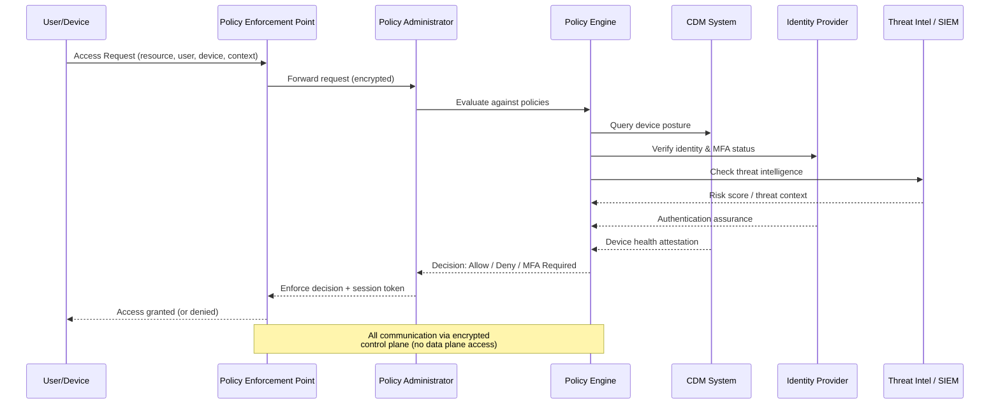

# Chapter 20: Zero Trust & Enterprise Security Architecture

## Learning Objectives

By the end of this chapter, you will be able to:

<!-- Image Gallery -->
<section class="lesson-visuals" aria-label="Visual learning resources">
  <header><span>VISUAL LEARNING</span><h2>See it. Review it. Remember it.</h2></header>
  <a class="lesson-visual-card" href="../../../assets/images/lessons/cyber-security/20-zero-trust-architecture/.png" target="_blank" rel="noopener">
    
    <span><strong>Handwritten notes</strong>Condensed notes for deliberate review.</span>
  </a>
  <a class="lesson-visual-card" href="../../../assets/images/lessons/cyber-security/20-zero-trust-architecture/.png" target="_blank" rel="noopener">
    
    <span><strong>Sticky-note revision</strong>Fast recall prompts for revision.</span>
  </a>
  <a class="lesson-visual-card" href="../../../assets/images/lessons/cyber-security/20-zero-trust-architecture/.png" target="_blank" rel="noopener">
    
    <span><strong>Visual concept guide</strong>A connected explanation of the key ideas.</span>
  </a>
</section>
<!-- End Image Gallery -->

1.  **Trace** the historical evolution of Zero Trust from Forrester's 2010 initiative through NIST SP 800-207 and industry adoption at Google BeyondCorp.
2.  **Explain** the seven core principles of Zero Trust—never trust/always verify, assume breach, least privilege, microsegmentation, and continuous validation.
3.  **Diagram** the NIST SP 800-207 logical architecture including the Policy Engine (PE), Policy Administrator (PA), and Policy Enforcement Point (PEP).
4.  **Differentiate** between the control plane and data plane in a Zero Trust architecture and describe their separation.
5.  **Analyze** the SASE framework as the convergence of SD-WAN and SSE (CASB, SWG, ZTNA) and evaluate its role in enterprise security.
6.  **Implement** a working Zero Trust Policy Engine in TypeScript that evaluates user, device, location, and behavioral context before granting access.
7.  **Design** a microsegmentation policy generator that translates service dependencies into concrete firewall rule sets.
8.  **Construct** a continuous trust score algorithm that follows the NIST SP 800-077 guidance for attribute-based validation.
9.  **Compare** major Zero Trust vendors—Zscaler, Palo Alto Networks, Cloudflare, and Microsoft—across ZTNA, SASE, and microsegmentation capabilities.
10. **Assess** an organization's Zero Trust maturity using the CISA Zero Trust Maturity Model (Traditional → Advanced → Optimal).

---

## 20.1 The History and Evolution of Zero Trust

### 20.1.1 The Perimeter Security Paradigm

For decades, enterprise security followed the **castle-and-moat** model. A hardened perimeter (firewalls, VPNs, IDS/IPS) protected internal resources, while anything inside the network was implicitly trusted. Once an attacker breached the perimeter—through a phishing email, a compromised VPN credential, or an insider threat—they could move laterally with little resistance.

This model collapsed under three converging pressures:

| Pressure | Impact |
|----------|--------|
| **Cloud migration** | Resources moved outside the corporate network perimeter |
| **Mobile workforce** | Users accessed corporate data from untrusted networks |
| **Sophisticated attacks** | Advanced persistent threats (APTs) repeatedly bypassed perimeter defenses |

### 20.1.2 John Kindervag and Forrester (2010)

The term **Zero Trust** was coined in 2010 by **John Kindervag**, then a principal analyst at Forrester Research. In his seminal report *"No More Chewy Centers: Introducing The Zero Trust Model Of Information Security"*, Kindervag argued that organizations must eliminate the concept of trust from their networks entirely.

> *"Zero Trust is not about making the network trust users and devices; it is about eliminating trust altogether."* — John Kindervag

Kindervag's original model centered on the **Zero Trust network** concept, which used next-generation firewalls (NGFWs) as the primary enforcement point. All traffic—regardless of source—had to pass through inspection, logging, and policy evaluation.

### 20.1.3 Google BeyondCorp (2011–2014)

In 2011, Google began developing **BeyondCorp**, an internal initiative to enable employees to work from any untrusted network without a traditional VPN. The project was motivated by a sophisticated attack (Operation Aurora) that exploited VPN trust.

BeyondCorp's key innovations:

- **Device inventory**: Every device was catalogued, managed, and continuously attested.
- **User identity**: Authentication shifted from network-level to application-level.
- **Access proxy**: A centralized proxy brokered every request, evaluating both user and device context.
- **No privileged network**: The corporate network was treated as untrusted.

Google published a series of papers between 2014 and 2018 detailing their architecture, which became the de facto reference implementation for Zero Trust.

### 20.1.4 NIST SP 800-207 (2020)

The **National Institute of Standards and Technology (NIST)** published Special Publication **800-207: Zero Trust Architecture** in August 2020. This document standardized Zero Trust terminology and provided a logical architecture that vendors and enterprises could implement.

Key NIST SP 800-207 contributions:

- Seven logical components of a Zero Trust architecture
- Formal definitions for Policy Engine (PE), Policy Administrator (PA), and Policy Enforcement Point (PEP)
- Trust algorithm concept based on multiple attribute sources
- Deployment scenario guidance: macro-segmentation, micro-segmentation, and agent-based models

### 20.1.5 CISA Zero Trust Maturity Model (2021–2023)

The **Cybersecurity and Infrastructure Security Agency (CISA)** published its **Zero Trust Maturity Model** in 2021 (updated 2023), providing a government-focused roadmap.

The model defines five pillars across three maturity levels:

| Pillar | Domain |
|--------|--------|
| Identity | User authentication and governance |
| Devices | Endpoint inventory and health |
| Networks | Segmentation and encryption |
| Applications & Workloads | Access control and runtime protection |
| Data | Classification and DLP |

**Maturity levels:**
- **Traditional**: Manual processes, VPN-based access, static perimeter rules
- **Advanced**: Automated policy, basic microsegmentation, device health checks
- **Optimal**: Fully automated, continuous validation, real-time risk scoring

---

## 20.2 Zero Trust Core Principles

### 20.2.1 Never Trust, Always Verify

No entity—user, device, application, or network—is trusted by default. Every access request must be authenticated, authorized, and validated before granting access. Verification occurs continuously throughout the session, not just at login.

```typescript
// Principle: Never trust, always verify
interface AccessRequest {
  userId: string;
  deviceId: string;
  resourceId: string;
  ipAddress: string;
  geolocation: { latitude: number; longitude: number };
  timestamp: Date;
  behaviorProfile: {
    typicalAccessHours: [number, number]; // 24h format
    typicalIpRange: string;
    recentFailedAttempts: number;
  };
}

interface VerificationResult {
  allowed: boolean;
  trustScore: number;
  requiredSteps: string[]; // e.g., ["MFA", "device_attestation"]
  sessionToken?: string;
  expirySeconds: number;
}

function verifyAccess(request: AccessRequest): VerificationResult {
  // No implicit trust — every attribute is evaluated
  const trustScore = calculateTrustScore(request);

  const requiredSteps: string[] = [];

  if (trustScore < 0.3) {
    requiredSteps.push("MFA", "device_attestation", "manager_approval");
  } else if (trustScore < 0.6) {
    requiredSteps.push("MFA", "device_attestation");
  } else if (trustScore < 0.8) {
    requiredSteps.push("MFA");
  }

  return {
    allowed: requiredSteps.length === 0 || trustScore > 0.3,
    trustScore,
    requiredSteps,
    sessionToken: trustScore > 0.3 ? crypto.randomUUID() : undefined,
    expirySeconds: Math.floor(trustScore * 3600),
  };
}

function calculateTrustScore(request: AccessRequest): number {
  let score = 0.0;

  // Check if access time is within typical hours
  const currentHour = request.timestamp.getHours();
  const [start, end] = request.behaviorProfile.typicalAccessHours;
  const timeScore = (currentHour >= start && currentHour <= end) ? 0.3 : 0.05;
  score += timeScore;

  // Check IP reputation
  const ipOctets = request.ipAddress.split(".").slice(0, 2).join(".");
  const profileOctets = request.behaviorProfile.typicalIpRange.split(".").slice(0, 2).join(".");
  score += ipOctets === profileOctets ? 0.3 : 0.05;

  // Failed attempts penalty
  score -= request.behaviorProfile.recentFailedAttempts * 0.1;

  // Device known? (simplified)
  score += request.deviceId ? 0.2 : 0.0;

  return Math.max(0, Math.min(1, score));
}
```

### 20.2.2 Assume Breach

Zero Trust architectures operate under the assumption that the network is already compromised. Every request is treated as potentially malicious, and lateral movement is aggressively contained.

**Implications of assume breach:**

- All traffic is encrypted end-to-end, even inside the data center.
- Sessions are short-lived and require re-authentication.
- East-west (internal) traffic is inspected just as thoroughly as north-south (external) traffic.
- Continuous logging and monitoring are mandatory.

### 20.2.3 Least Privilege Access

Users and devices receive only the minimum permissions needed to perform their functions. Unlike traditional role-based access control (RBAC), Zero Trust adds **contextual** and **temporal** constraints.

```typescript
interface LeastPrivilegePolicy {
  principal: string;
  resource: string;
  action: "read" | "write" | "admin" | "delete";
  constraints: {
    timeWindow?: [string, string];  // e.g., ["09:00", "17:00"]
    geoFence?: string;              // e.g., "US" or "HQ-Building-A"
    maxSessions?: number;
    requireDeviceAttestation?: boolean;
    sessionTimeoutSeconds: number;
    allowedMethods?: string[];      // e.g., ["API", "UI", "CLI"]
  };
}

interface LeastPrivilegeEngine {
  policies: Map<string, LeastPrivilegePolicy[]>;

  evaluate(
    principal: string,
    resource: string,
    action: LeastPrivilegePolicy["action"],
    context: Record<string, string>
  ): boolean;

  generateToken(policy: LeastPrivilegePolicy): string;

  revokeExcessPermissions(principal: string): void;
}

class ZeroTrustLeastPrivilegeEngine implements LeastPrivilegeEngine {
  policies = new Map<string, LeastPrivilegePolicy[]>();

  addPolicy(policy: LeastPrivilegePolicy): void {
    const existing = this.policies.get(policy.principal) ?? [];
    existing.push(policy);
    this.policies.set(policy.principal, existing);
  }

  evaluate(
    principal: string,
    resource: string,
    action: LeastPrivilegePolicy["action"],
    context: Record<string, string>
  ): boolean {
    const userPolicies = this.policies.get(principal);
    if (!userPolicies) return false;

    return userPolicies.some((policy) => {
      if (policy.resource !== resource) return false;
      if (policy.action !== action && policy.action !== "admin") return false;

      // Time window check
      if (policy.constraints.timeWindow) {
        const now = new Date();
        const [start, end] = policy.constraints.timeWindow;
        const currentMinutes = now.getHours() * 60 + now.getMinutes();
        const [startH, startM] = start.split(":").map(Number);
        const [endH, endM] = end.split(":").map(Number);
        const startTotal = startH * 60 + startM;
        const endTotal = endH * 60 + endM;
        if (currentMinutes < startTotal || currentMinutes > endTotal) return false;
      }

      // Geo-fence check
      if (policy.constraints.geoFence && context["geo"] !== policy.constraints.geoFence) {
        return false;
      }

      // Device attestation
      if (policy.constraints.requireDeviceAttestation && context["device_attested"] !== "true") {
        return false;
      }

      return true;
    });
  }

  generateToken(policy: LeastPrivilegePolicy): string {
    const payload = {
      principal: policy.principal,
      resource: policy.resource,
      action: policy.action,
      exp: Math.floor(Date.now() / 1000) + policy.constraints.sessionTimeoutSeconds,
      jti: crypto.randomUUID(),
    };
    // In production: sign with RS256 via a proper key management system
    return Buffer.from(JSON.stringify(payload)).toString("base64url");
  }

  revokeExcessPermissions(principal: string): void {
    // Remove all admin-level policies unless explicitly authorized
    const userPolicies = this.policies.get(principal);
    if (userPolicies) {
      this.policies.set(
        principal,
        userPolicies.filter((p) => p.action !== "admin")
      );
    }
  }
}
```

### 20.2.4 Microsegmentation

Microsegmentation divides the network into isolated zones, each with its own security controls. This prevents lateral movement: even if an attacker compromises one segment, they cannot access others.

### 20.2.5 Continuous Validation

Trust is never permanent. A user who passes authentication at 9:00 AM may exhibit suspicious behavior at 9:15 AM. Zero Trust systems continuously re-evaluate trust based on:

- Behavioral anomalies (e.g., impossible travel)
- Device posture changes (e.g., missing security patches)
- Threat intelligence feeds (e.g., IP reputation updates)
- Session context (e.g., unusual data access patterns)

---

## 20.3 NIST SP 800-207 Architecture

### 20.3.1 The Seven Logical Components

NIST SP 800-207 defines seven logical components that together form a Zero Trust architecture:

| Component | Abbreviation | Function |
|-----------|-------------|----------|
| Policy Engine | PE | Makes the final access decision based on policy |
| Policy Administrator | PA | Establishes and revokes sessions based on PE decisions |
| Policy Enforcement Point | PEP | Enforces access (allow/deny/inspect) at the communication path |
| Identity Provider | IdP | Manages user identities and authentication |
| Data Access Policies | — | Rules governing access to resources |
| Public Key Infrastructure | PKI | Issues and manages certificates |
| SIEM / Logging | — | Collects and analyzes telemetry for continuous validation |

### 20.3.2 Policy Engine, Administrator, and Enforcement Point

The **policy decision continuum** is the heart of NIST ZTA:

1. **PEP** intercepts a request and forwards it to the PA.
2. **PA** translates the PEP request into a format the PE can evaluate.
3. **PE** evaluates the request against all policies and returns a decision (allow/deny/redirect).
4. **PA** conveys the decision back to the PEP.
5. **PEP** enforces the decision.



### 20.3.3 Control Plane vs. Data Plane Separation

A fundamental architectural requirement of ZTA is the **separation of the control plane from the data plane**.

| Plane | Function | Components |
|-------|----------|------------|
| **Control Plane** | Makes decisions | Policy Engine, Policy Administrator, IdP, SIEM |
| **Data Plane** | Executes decisions | Policy Enforcement Point, gateways, proxies |

**Key rule:** Control plane components must never reside on the same network segment as data plane components. This prevents an attacker who compromises a gateway from modifying policies.

```typescript
interface ControlPlaneMessage {
  type: "policy_decision" | "session_revoke" | "certificate_rotate";
  timestamp: Date;
  source: string;
  signature: string; // Cryptographic signature from PE
  payload: {
    sessionId?: string;
    userId?: string;
    resourceId?: string;
    decision?: "allow" | "deny" | "mfa_required" | "redirect_to_captive";
    reason?: string;
    ttlSeconds: number;
  };
}

interface DataPlaneMessage {
  type: "access_request" | "health_report" | "telemetry";
  sourcePepId: string;
  timestamp: Date;
  payload: Record<string, unknown>;
}

// The PEP only speaks to the PA — never directly to the PE
class PolicyEnforcementPoint {
  private paEndpoint: string;
  private pepId: string;
  private privateKey: CryptoKey;

  async intercept(request: AccessRequest): Promise<ControlPlaneMessage> {
    // Package request for control plane
    const dataPlaneMsg: DataPlaneMessage = {
      type: "access_request",
      sourcePepId: this.pepId,
      timestamp: new Date(),
      payload: { ...request },
    };

    // Send to PA (control plane) — NOT to PE directly
    const response = await fetch(`${this.paEndpoint}/evaluate`, {
      method: "POST",
      body: JSON.stringify(dataPlaneMsg),
      headers: { "Content-Type": "application/json" },
    });

    const decision: ControlPlaneMessage = await response.json();
    return decision;
  }

  async enforce(decision: ControlPlaneMessage): Promise<void> {
    switch (decision.payload.decision) {
      case "allow":
        // Establish encrypted tunnel
        break;
      case "deny":
        this.terminateConnection(decision.payload.sessionId);
        break;
      case "mfa_required":
        this.redirectToMfa(decision.payload.sessionId);
        break;
    }
  }

  private terminateConnection(sessionId?: string): void {
    // Close TCP/TLS session
    console.log(`[PEP ${this.pepId}] Terminating session ${sessionId}`);
  }

  private redirectToMfa(sessionId?: string): void {
    console.log(`[PEP ${this.pepId}] Redirecting session ${sessionId} to MFA`);

  }
}
```

---

## 20.4 SASE: Secure Access Service Edge

### 20.4.1 The SASE Framework

**Secure Access Service Edge (SASE)** was introduced by Gartner in 2019. It converges wide-area networking (WAN) with network security services into a single, cloud-delivered platform.

```
┌─────────────────────────────────────────────────────┐
│                    SASE Platform                       │
├───────────────────┬─────────────────────────────────┤
│   SD-WAN Layer     │        SSE Layer                  │
│   (Networking)     │   (Security Service Edge)         │
├───────────────────┼─────────────────────────────────┤
│  • WAN optimization │  • ZTNA (Zero Trust Access)       │
│  • Bandwidth mgmt   │  • CASB (Cloud Access Broker)    │
│  • Traffic steering │  • SWG (Secure Web Gateway)      │
│  • QoS              │  • FWaaS (Firewall as a Service) │
│  • Last-mile mgmt   │  • DLP (Data Loss Prevention)    │
└───────────────────┴─────────────────────────────────┘
```

### 20.4.2 SD-WAN (Software-Defined WAN)

SD-WAN decouples the network control plane from the hardware, enabling:

- Dynamic traffic routing based on application requirements
- Cost-effective utilization of MPLS, broadband, and LTE links
- Centralized policy management across all branch locations

### 20.4.3 SSE (Security Service Edge)

SSE is the security half of SASE, comprising four core services:

| Service | Function |
|---------|----------|
| **ZTNA** | Identity-aware access to private applications |
| **CASB** | Shadow IT discovery and cloud app governance |
| **SWG** | URL filtering, TLS inspection, malware blocking |
| **FWaaS** | Next-generation firewall capabilities delivered as a service |

```mermaid
flowchart TB
    subgraph Users["Users & Branches"]
        A[Remote User]
        B[Branch Office]
        C[Mobile Device]
    end

    subgraph SASE["SASE Platform<br/>(Global PoP Network)"]
        direction LR
        subgraph SDWAN["SD-WAN"]
            S1[Traffic Steering]
            S2[QoS & Optimization]
        end
        subgraph SSE["Security Service Edge"]
            ZTNA[ZTNA Gateway]
            CASB[CASB Broker]
            SWG[Secure Web Gateway]
            FW[FWaaS]
        end
    end

    subgraph Destinations["Destinations"]
        D1[SaaS Apps<br/>Salesforce, Slack]
        D2[Private Apps<br/>Internal DC]
        D3[Internet<br/>Public Websites]
    end

    A --> SASE
    B --> SASE
    C --> SASE
    SDWAN --> SSE
    SSE --> D1
    SSE --> D2
    SSE --> D3

    style SASE fill:#1a2035,stroke:#4a90d9,stroke-width:2px
    style SSE fill:#2d1b69,stroke:#7c5cbf,stroke-width:2px
    style SDWAN fill:#1a3a5c,stroke:#4a90d9,stroke-width:2px
```



### 20.4.4 SASE Policy Enforcer Implementation

```typescript
interface SasePolicy {
  id: string;
  name: string;
  priority: number;
  matchCriteria: {
    userGroups?: string[];
    devicePosture?: string[];
    geoLocation?: string[];
    destinationApp?: string[];
    destinationCategory?: string[];
    sourceIpRanges?: string[];
    timeRange?: { start: string; end: string };
  };
  action: "allow" | "deny" | "isolate" | "redirect_to_proxy" | "inspect_tls";
  logging: "none" | "metadata" | "full";
}

interface SaseTrafficContext {
  userId: string;
  userGroups: string[];
  deviceId: string;
  devicePosture: string[];
  sourceIp: string;
  geolocation: string;
  destinationUrl: string;
  destinationApp: string;
  tlsVersion: string;
  requestMethod: string;
}

class SasePolicyEnforcer {
  private policies: SasePolicy[] = [];

  addPolicy(policy: SasePolicy): void {
    this.policies.push(policy);
    this.policies.sort((a, b) => b.priority - a.priority);
  }

  evaluate(context: SaseTrafficContext): SasePolicy | null {
    for (const policy of this.policies) {
      if (this.matches(policy.matchCriteria, context)) {
        return policy;
      }
    }
    return null; // Default deny
  }

  private matches(
    criteria: SasePolicy["matchCriteria"],
    context: SaseTrafficContext
  ): boolean {
    // User group match
    if (criteria.userGroups && criteria.userGroups.length > 0) {
      const hasGroup = criteria.userGroups.some((g) => context.userGroups.includes(g));
      if (!hasGroup) return false;
    }

    // Device posture match
    if (criteria.devicePosture && criteria.devicePosture.length > 0) {
      const hasPosture = criteria.devicePosture.some((p) =>
        context.devicePosture.includes(p)
      );
      if (!hasPosture) return false;
    }

    // Geo match
    if (criteria.geoLocation && criteria.geoLocation.length > 0) {
      if (!criteria.geoLocation.includes(context.geolocation)) return false;
    }

    // Destination app match
    if (criteria.destinationApp && criteria.destinationApp.length > 0) {
      if (!criteria.destinationApp.includes(context.destinationApp)) return false;
    }

    // Time range match
    if (criteria.timeRange) {
      const now = new Date();
      const mins = now.getHours() * 60 + now.getMinutes();
      const [sH, sM] = criteria.timeRange.start.split(":").map(Number);
      const [eH, eM] = criteria.timeRange.end.split(":").map(Number);
      const startMins = sH * 60 + sM;
      const endMins = eH * 60 + eM;
      if (mins < startMins || mins > endMins) return false;
    }

    return true;
  }

  enforce(policy: SasePolicy, context: SaseTrafficContext): void {
    console.log(`[SASE] Enforcing policy "${policy.name}" on ${context.userId}`);
    switch (policy.action) {
      case "allow":
        this.routeToDestination(context);
        break;
      case "deny":
        this.blockTraffic(context);
        break;
      case "isolate":
        this.isolateSession(context);
        break;
      case "redirect_to_proxy":
        this.redirectToProxy(context);
        break;
      case "inspect_tls":
        this.performTlsInspection(context);
        break;
    }

    if (policy.logging === "metadata") {
      this.logMetadata(context, policy);
    } else if (policy.logging === "full") {
      this.logFullPacket(context, policy);
    }
  }

  private routeToDestination(context: SaseTrafficContext): void {
    // In production: establish optimal path via SD-WAN
    console.log(`Routing ${context.userId} -> ${context.destinationApp}`);
  }

  private blockTraffic(context: SaseTrafficContext): void {
    console.log(`Blocked traffic from ${context.userId} to ${context.destinationUrl}`);
  }

  private isolateSession(context: SaseTrafficContext): void {
    // Route through an isolated browser/isolation environment
    console.log(`Isolating session for ${context.userId}`);
  }

  private redirectToProxy(context: SaseTrafficContext): void {
    // Route through forward proxy for content inspection
    console.log(`Redirecting ${context.userId} to forward proxy`);
  }

  private performTlsInspection(context: SaseTrafficContext): void {
    // Decrypt, inspect, re-encrypt
    console.log(`TLS inspection on traffic from ${context.userId}`);
  }

  private logMetadata(context: SaseTrafficContext, policy: SasePolicy): void {
    console.log(`[SASE LOG] ${context.userId} | ${context.destinationApp} | ${policy.action}`);
  }

  private logFullPacket(context: SaseTrafficContext, policy: SasePolicy): void {
    // Full packet capture for security analysis
    console.log(`[SASE FULL LOG] ${JSON.stringify(context)} applied ${policy.name}`);
  }
}
```

---

## 20.5 ZTNA: Zero Trust Network Access

### 20.5.1 What is ZTNA?

**Zero Trust Network Access (ZTNA)** is the technology that replaces traditional VPNs. Instead of placing users on the network, ZTNA creates per-session, encrypted connections to individual applications. The user never gets network-level access.

### 20.5.2 Client-to-Service vs. Service-Initiated ZTNA

| Feature | Client-Initiated ZTNA | Service-Initiated ZTNA |
|---------|----------------------|----------------------|
| **Connection start** | User's device connects to cloud gateway | Connector in data center initiates outbound connection |
| **User visibility** | User sees the application connector | User sees nothing (application is invisible) |
| **Best for** | Managed devices with installed agent | Third-party access, contractor scenarios |
| **Examples** | Cloudflare Access (WARP), Zscaler ZPA | Appgate, Twingate |

### 20.5.3 Identity-Aware Proxy

The core of ZTNA is the **identity-aware proxy**—a reverse proxy that authenticates every request before routing it to the application.

```typescript
interface IdentityAwareProxyConfig {
  upstreamService: string;
  allowedDomains: string[];
  sessionDuration: number;
  mfaRequired: boolean;
  deviceAttestationRequired: boolean;
}

interface ProxySession {
  sessionId: string;
  userId: string;
  deviceId: string;
  createdAt: Date;
  expiresAt: Date;
  attributes: Record<string, string>;
}

class IdentityAwareProxy {
  private sessions = new Map<string, ProxySession>();
  private configs = new Map<string, IdentityAwareProxyConfig>();

  registerApplication(appId: string, config: IdentityAwareProxyConfig): void {
    this.configs.set(appId, config);
  }

  async handleRequest(
    appId: string,
    authToken: string,
    deviceCert: string,
    request: Request
  ): Promise<Response> {
    // 1. Validate token
    const session = await this.validateToken(authToken);
    if (!session) {
      return new Response("Unauthorized", { status: 401 });
    }

    // 2. Validate device certificate
    const deviceValid = await this.validateDeviceCertificate(deviceCert);
    if (!deviceValid) {
      return new Response("Device not attested", { status: 403 });
    }

    // 3. Check configuration
    const config = this.configs.get(appId);
    if (!config) {
      return new Response("Application not found", { status: 404 });
    }

    // 4. Verify domain
    const url = new URL(request.url);
    if (
      config.allowedDomains.length > 0 &&
      !config.allowedDomains.includes(url.hostname)
    ) {
      return new Response("Domain not allowed", { status: 403 });
    }

    // 5. MFA check if needed
    if (config.mfaRequired && !session.attributes["mfa_verified"]) {
      return new Response("MFA required", { status: 302, headers: { Location: "/mfa" } });
    }

    // 6. Proxy request to upstream
    return this.proxyToUpstream(config.upstreamService, request);
  }

  private async validateToken(token: string): Promise<ProxySession | null> {
    // Decode JWT, verify signature, check expiry
    try {
      const payload = JSON.parse(
        Buffer.from(token.split(".")[1], "base64url").toString()
      );
      const session = this.sessions.get(payload.jti);
      if (!session) return null;
      if (session.expiresAt < new Date()) {
        this.sessions.delete(session.sessionId);
        return null;
      }
      return session;
    } catch {
      return null;
    }
  }

  private async validateDeviceCertificate(certPem: string): Promise<boolean> {
    // Verify certificate chain against internal CA
    // Check revocation status via OCSP
    try {
      const certLines = certPem.split("\n").filter((l) => !l.includes("---"));
      const decoded = Buffer.from(certLines.join(""), "base64").toString();
      // In production: use Node.js crypto.X509Certificate
      return decoded.includes("DEVICE_CA");
    } catch {
      return false;
    }
  }

  private async proxyToUpstream(
    upstream: string,
    request: Request
  ): Promise<Response> {
    const upstreamUrl = new URL(request.url);
    upstreamUrl.hostname = upstream;

    const proxyHeaders = new Headers(request.headers);
    proxyHeaders.set("X-Forwarded-For", "identity-aware-proxy");
    proxyHeaders.delete("Cookie"); // Strip session cookies for security

    const proxyRequest = new Request(upstreamUrl.toString(), {
      method: request.method,
      headers: proxyHeaders,
      body: request.body,
    });

    return fetch(proxyRequest);
  }
}
```

### 20.5.4 ZTNA Vendor Comparison

| Vendor | ZTNA Product | Model | Key Differentiator |
|--------|-------------|-------|-------------------|
| **Zscaler** | Zscaler Private Access (ZPA) | Client-initiated | App connector in data center; user never touches the network |
| **Cloudflare** | Cloudflare Access | Client-initiated (WARP) | Global edge network; integrates with Argo Tunnel |
| **Appgate** | Appgate SDP | Service-initiated | Open-source protocol; supports legacy apps |
| **Palo Alto** | Prisma Access | Client-initiated | ML-powered threat prevention integrated |
| **Microsoft** | Microsoft Entra (Azure AD) App Proxy | Service-initiated | Deep Office 365 integration; Conditional Access |

---

## 20.6 Microsegmentation: East-West Traffic Isolation

### 20.6.1 The Problem with Flat Networks

In a traditional flat network, an attacker who compromises a single web server can use that server as a pivot point to reach database servers, Active Directory, or backup systems—all on the same L2/L3 network segment.

### 20.6.2 Microsegmentation Approaches

| Approach | Mechanism | Example | Granularity |
|----------|-----------|---------|-------------|
| **Kernel-level** | eBPF / kernel modules | Calico eBPF | Per-pod, per-process |
| **Overlay-based** | VXLAN / Geneve tunnels | VMware NSX, Illumio | Per-VM, per-container |
| **Host-based** | Local firewall rules | Windows Firewall, iptables | Per-host |
| **K8s Network Policies** | CNI plugins | Calico, Cilium | Per-namespace, per-pod |

```mermaid
flowchart LR
    subgraph Overlay["Overlay Network (VXLAN)"]
        direction TB
        O1[VM1: Web Frontend] -->|VXLAN Tunnel| VTEP1[VTEP]
        O2[VM2: API Server] -->|VXLAN Tunnel| VTEP2[VTEP]
        O3[VM3: Database] -->|VXLAN Tunnel| VTEP3[VTEP]
    end

    subgraph Underlay["Physical Underlay"]
        direction TB
        S1[Top-of-Rack Switch]
        S2[Spine Switch]
        S3[Core Router]
    end

    VTEP1 --> S1
    VTEP2 --> S1
    VTEP3 --> S3
    S1 --> S2
    S3 --> S2

    style Overlay fill:#1a3a2c,stroke:#4caf50,stroke-width:2px
    style Underlay fill:#2d1b69,stroke:#7c5cbf,stroke-width:2px
```



### 20.6.3 Microsegmentation Policy Generator

```typescript
interface ServiceDependency {
  sourceService: string;
  destService: string;
  protocol: "tcp" | "udp" | "icmp";
  port: number;
  description: string;
}

interface FirewallRule {
  ruleId: string;
  sourceIpRange: string;
  destIpRange: string;
  protocol: "tcp" | "udp" | "icmp";
  port: number | string; // single port, range, or "any"
  action: "allow" | "deny";
  log: boolean;
  description: string;
}

interface ServiceDefinition {
  name: string;
  ipRange: string;
  labels: Record<string, string>;
}

class MicrosegmentationPolicyEngine {
  private services: Map<string, ServiceDefinition> = new Map();

  registerService(svc: ServiceDefinition): void {
    this.services.set(svc.name, svc);
  }

  generateFirewallRules(
    dependencies: ServiceDependency[]
  ): FirewallRule[] {
    const rules: FirewallRule[] = [];
    const defaultDenyRule: FirewallRule = {
      ruleId: "default-deny",
      sourceIpRange: "0.0.0.0/0",
      destIpRange: "0.0.0.0/0",
      protocol: "tcp",
      port: "any",
      action: "deny",
      log: true,
      description: "Default deny: all east-west traffic not explicitly allowed",
    };

    for (const dep of dependencies) {
      const source = this.services.get(dep.sourceService);
      const dest = this.services.get(dep.destService);

      if (!source || !dest) {
        console.warn(`Unknown service in dependency: ${dep.sourceService} -> ${dep.destService}`);
        continue;
      }

      const rule: FirewallRule = {
        ruleId: `rule-${dep.sourceService}-to-${dep.destService}-${dep.port}`,
        sourceIpRange: source.ipRange,
        destIpRange: dest.ipRange,
        protocol: dep.protocol,
        port: dep.port,
        action: "allow",
        log: true,
        description: dep.description,
      };

      rules.push(rule);
    }

    // Default deny is always the last rule
    rules.push(defaultDenyRule);
    return rules;
  }

  generateKubernetesNetworkPolicy(
    namespace: string,
    dependencies: ServiceDependency[]
  ): Record<string, unknown> {
    const ingressRules: Array<Record<string, unknown>> = [];
    const egressRules: Array<Record<string, unknown>> = [];

    for (const dep of dependencies) {
      egressRules.push({
        to: [{ namespaceSelector: {}, podSelector: { matchLabels: { app: dep.destService } } }],
        ports: [{ protocol: dep.protocol.toUpperCase(), port: dep.port }],
      });

      ingressRules.push({
        from: [{ namespaceSelector: {}, podSelector: { matchLabels: { app: dep.sourceService } } }],
        ports: [{ protocol: dep.protocol.toUpperCase(), port: dep.port }],
      });
    }

    return {
      apiVersion: "networking.k8s.io/v1",
      kind: "NetworkPolicy",
      metadata: { name: "zero-trust-policy", namespace },
      spec: {
        podSelector: {},
        policyTypes: ["Ingress", "Egress"],
        ingress: ingressRules,
        egress: egressRules,
      },
    };
  }
}

// Example usage
const engine = new MicrosegmentationPolicyEngine();

engine.registerService({ name: "web-frontend", ipRange: "10.0.1.0/24", labels: { app: "web" } });
engine.registerService({ name: "api-server", ipRange: "10.0.2.0/24", labels: { app: "api" } });
engine.registerService({ name: "database", ipRange: "10.0.3.0/24", labels: { app: "db" } });
engine.registerService({ name: "cache", ipRange: "10.0.4.0/24", labels: { app: "cache" } });

const deps: ServiceDependency[] = [
  { sourceService: "web-frontend", destService: "api-server", protocol: "tcp", port: 443, description: "HTTPS API calls" },
  { sourceService: "api-server", destService: "database", protocol: "tcp", port: 5432, description: "PostgreSQL queries" },
  { sourceService: "api-server", destService: "cache", protocol: "tcp", port: 6379, description: "Redis cache lookups" },
];

const rules = engine.generateFirewallRules(deps);
console.log(JSON.stringify(rules, null, 2));
```

---

## 20.7 IAM in Zero Trust

### 20.7.1 Identity Federation: SAML and OIDC

Zero Trust requires **federated identity** so that access decisions can be made without siloed credentials.

| Protocol | Standard | Token Format | Use Case |
|----------|----------|-------------|----------|
| **SAML 2.0** | OASIS | XML Assertions | Enterprise SSO, legacy apps |
| **OIDC (OpenID Connect)** | IETF RFC | JWT (JSON Web Token) | Modern apps, mobile, APIs |

### 20.7.2 Continuous Authentication

Unlike traditional "authenticate once" models, Zero Trust continuously verifies:

- **Keyboard/mouse dynamics**: Behavioral biometrics
- **Keystroke timing**: Pattern analysis
- **Gait analysis**: For mobile users
- **Transaction signing**: Step-up authentication for high-risk operations

### 20.7.3 Risk-Based Conditional Access

```typescript
interface RiskAssessment {
  userId: string;
  overallRiskScore: number; // 0.0 - 1.0
  riskFactors: {
    factor: string;
    score: number;
    weight: number;
  }[];
  assessedAt: Date;
}

interface ConditionalAccessPolicy {
  name: string;
  riskThreshold: number; // Score above this triggers action
  action: "block" | "require_mfa" | "require_device_attestation" | "limit_session" | "allow";
  sessionConstraints?: {
    maxDurationMinutes: number;
    allowCopyPaste: boolean;
    allowDownload: boolean;
    requireWatermark: boolean;
  };
}

class ConditionalAccessEngine {
  private policies: ConditionalAccessPolicy[] = [];

  addPolicy(policy: ConditionalAccessPolicy): void {
    this.policies.push(policy);
  }

  evaluate(assessment: RiskAssessment): ConditionalAccessPolicy[] {
    const triggered: ConditionalAccessPolicy[] = [];

    // Sort by most restrictive first
    const sorted = [...this.policies].sort(
      (a, b) => b.riskThreshold - a.riskThreshold
    );

    for (const policy of sorted) {
      if (assessment.overallRiskScore >= policy.riskThreshold) {
        triggered.push(policy);
      }
    }

    return triggered;
  }

  assessRisk(context: {
    userId: string;
    ipAddress: string;
    geolocation: string;
    deviceId: string;
    osPatchLevel: string;
    mfaMethod: string;
    recentFailedAttempts: number;
    abnormalAccessPatterns: string[];
    resourceSensitivity: "low" | "medium" | "high" | "critical";
  }): RiskAssessment {
    const factors: RiskAssessment["riskFactors"] = [];

    // IP reputation (simulated)
    const ipScore = context.ipAddress.startsWith("10.") ? 0.0 : 0.3;
    factors.push({ factor: "ip_reputation", score: ipScore, weight: 0.2 });

    // Geolocation risk
    const geoRisk = context.geolocation === context.geolocation ? 0.1 : 0.4;
    factors.push({ factor: "geo_anomaly", score: geoRisk, weight: 0.15 });

    // Device patch level
    const patchScore = context.osPatchLevel === "current" ? 0.0 : 0.5;
    factors.push({ factor: "device_patch_status", score: patchScore, weight: 0.2 });

    // MFA strength
    const mfaScores: Record<string, number> = {
      none: 1.0,
      sms: 0.5,
      totp: 0.2,
      hardware_key: 0.0,
      biometric: 0.0,
    };
    const mfaScore = mfaScores[context.mfaMethod] ?? 0.5;
    factors.push({ factor: "mfa_strength", score: mfaScore, weight: 0.25 });

    // Behavioral anomaly
    const behaviorScore = context.abnormalAccessPatterns.length * 0.2;
    factors.push({ factor: "behavioral_anomaly", score: Math.min(1, behaviorScore), weight: 0.2 });

    // Resource sensitivity multiplier
    const sensitivityMultipliers: Record<string, number> = {
      low: 0.8,
      medium: 1.0,
      high: 1.2,
      critical: 1.5,
    };
    const multiplier = sensitivityMultipliers[context.resourceSensitivity] ?? 1.0;

    const totalWeight = factors.reduce((sum, f) => sum + f.weight, 0);
    const weightedScore =
      factors.reduce((sum, f) => sum + f.score * f.weight, 0) / totalWeight;

    return {
      userId: context.userId,
      overallRiskScore: Math.min(1, weightedScore * multiplier),
      riskFactors: factors,
      assessedAt: new Date(),
    };
  }
}

// Example usage
const caEngine = new ConditionalAccessEngine();

caEngine.addPolicy({
  name: "High Risk - Block",
  riskThreshold: 0.8,
  action: "block",
});

caEngine.addPolicy({
  name: "Elevated Risk - Require Hardware MFA",
  riskThreshold: 0.5,
  action: "require_mfa",
  sessionConstraints: {
    maxDurationMinutes: 15,
    allowCopyPaste: false,
    allowDownload: false,
    requireWatermark: true,
  },
});

caEngine.addPolicy({
  name: "Medium Risk - Standard Session",
  riskThreshold: 0.3,
  action: "limit_session",
  sessionConstraints: {
    maxDurationMinutes: 60,
    allowCopyPaste: true,
    allowDownload: false,
    requireWatermark: false,
  },
});

const assessment = caEngine.assessRisk({
  userId: "alice@example.com",
  ipAddress: "198.51.100.42",
  geolocation: "RU",
  deviceId: "device-abc-123",
  osPatchLevel: "6-months-behind",
  mfaMethod: "sms",
  recentFailedAttempts: 3,
  abnormalAccessPatterns: ["impossible_travel_alert", "new_device"],
  resourceSensitivity: "critical",
});

const actions = caEngine.evaluate(assessment);
console.log("Risk Score:", assessment.overallRiskScore.toFixed(2));
console.log("Actions:", actions.map((a) => `${a.name} -> ${a.action}`).join(", "));
```

---

## 20.8 BeyondCorp: Google's Zero Trust Implementation

### 20.8.1 Architecture Overview

Google's BeyondCorp architecture consists of four core components:

1. **Device Inventory Service (DIS)**: Tracks every managed device, its state, and its user assignments.
2. **Certificate Authority (CA)**: Issues short-lived device certificates used for authentication.
3. **Access Proxy (AP)**: Verifies every request against user identity and device state before proxying.
4. **Trust Engine**: Continuously evaluates the trust level of each user/device combination.

```mermaid
flowchart TB
    User([Employee Device])
    subgraph BeyondCorp["BeyondCorp Architecture"]
        direction TB
        AP[Access Proxy]
        TE[Trust Engine]
        CA[Certificate Authority<br/>Short-lived device certs]
        DIS[Device Inventory Service]
        PIP[Policy Information Point<br/>HR, IT, Security DBs]
        PDP[Policy Decision Point]
    end
    subgraph Resources["Corporate Resources"]
        R1[Internal Web Apps]
        R2[Source Repos]
        R3[Admin Consoles]
    end

    User -->|mTLS + OIDC| AP
    AP -->|Query device state| DIS
    AP -->|Evaluate trust| TE
    TE -->|Check patch level, disk encryption, OS| DIS
    DIS --> CA
    AP -->|Policy check| PDP
    PDP --> PIP
    AP -->|Access| Resources

    style BeyondCorp fill:#1a2035,stroke:#ea4335,stroke-width:2px
    style Resources fill:#1a3a2c,stroke:#34a853,stroke-width:2px
```



### 20.8.2 Full BeyondCorp Setup Guide Reference

| Step | Action | Details |
|------|--------|---------|
| 1 | **Device inventory** | Deploy fleet management (Google Endpoint Management, JAMF, Intune). Catalog every device with unique ID. |
| 2 | **Certificate authority** | Stand up internal PKI. Issue device certificates with 24-hour TTL. Auto-renew via MDM agent. |
| 3 | **Trust engine** | Define trust levels (low/medium/high) based on: OS patch, disk encryption, screen lock, firewall enabled, antivirus running |
| 4 | **Access proxy** | Deploy Google Identity-Aware Proxy (IAP), Cloudflare Access, or custom nginx/envoy proxy. Enforce mTLS. |
| 5 | **Policy definition** | Map users to groups. Map groups to applications. Add device trust requirements per application tier. |
| 6 | **SSO integration** | Configure OIDC/SAML federation. Enforce phishing-resistant MFA (Titan keys or WebAuthn). |
| 7 | **Gradual rollout** | Start with low-risk apps (HR portals, expense reports). Expand to engineering tools, then to production. |
| 8 | **Continuous monitoring** | Deploy SIEM integration. Monitor access patterns. Alert on device health degradation during a session. |

### 20.8.3 BeyondCorp Trust Engine Implementation

```typescript
interface DeviceRecord {
  deviceId: string;
  assignedUser: string;
  osVersion: string;
  osPatchLevel: "current" | "behind" | "critical";
  diskEncryptionEnabled: boolean;
  firewallEnabled: boolean;
  screenLockEnabled: boolean;
  antivirusRunning: boolean;
  lastCheckin: Date;
  certificateExpiry: Date;
}

interface UserContext {
  userId: string;
  groups: string[];
  department: string;
  clearanceLevel: "standard" | "elevated" | "privileged";
  mfaDeviceEnrolled: boolean;
  recentTravelAlert: boolean;
}

type TrustLevel = "low" | "medium" | "high";

class BeyondCorpTrustEngine {
  private deviceInventory = new Map<string, DeviceRecord>();

  registerDevice(device: DeviceRecord): void {
    this.deviceInventory.set(device.deviceId, device);
  }

  updateDevice(deviceId: string, updates: Partial<DeviceRecord>): void {
    const existing = this.deviceInventory.get(deviceId);
    if (existing) {
      this.deviceInventory.set(deviceId, { ...existing, ...updates });
    }
  }

  evaluateTrust(deviceId: string, user: UserContext): TrustLevel {
    const device = this.deviceInventory.get(deviceId);
    if (!device) return "low";

    let score = 0;

    // Device health checks (max 60 points)
    if (device.diskEncryptionEnabled) score += 15;
    if (device.firewallEnabled) score += 15;
    if (device.screenLockEnabled) score += 10;
    if (device.antivirusRunning) score += 10;

    // Patch level (max 30 points)
    switch (device.osPatchLevel) {
      case "current":
        score += 30;
        break;
      case "behind":
        score += 10;
        break;
      case "critical":
        score -= 20; // Negative score for unpatched critical vulns
        break;
    }

    // Certificate health (max 10 points)
    const certDaysRemaining = Math.round(
      (device.certificateExpiry.getTime() - Date.now()) / (1000 * 60 * 60 * 24)
    );
    if (certDaysRemaining > 7) score += 10;
    else if (certDaysRemaining > 1) score += 5;
    else score += 0;

    // Checkin recency (max 10 points)
    const hoursSinceCheckin =
      (Date.now() - device.lastCheckin.getTime()) / (1000 * 60 * 60);
    if (hoursSinceCheckin < 1) score += 10;
    else if (hoursSinceCheckin < 24) score += 5;
    else score += 0;

    // User risk factors (conditional)
    if (user.recentTravelAlert) score -= 15;
    if (!user.mfaDeviceEnrolled) score -= 10;

    // Group-based bonus
    if (user.clearanceLevel === "privileged") score += 5;

    // Map score to trust level
    if (score >= 70) return "high";
    if (score >= 40) return "medium";
    return "low";
  }

  allowAccess(
    deviceId: string,
    user: UserContext,
    requiredTrustLevel: TrustLevel
  ): boolean {
    const actualLevel = this.evaluateTrust(deviceId, user);
    const levels: Record<TrustLevel, number> = { low: 0, medium: 1, high: 2 };
    return levels[actualLevel] >= levels[requiredTrustLevel];
  }
}
```

---

## 20.9 NIST SP 800-207 Trust Algorithm

### 20.9.1 Continuous Trust Scoring

The NIST SP 800-207 trust algorithm combines multiple attribute sources into a continuous score that evolves over time.

```typescript
interface TrustAttribute {
  name: string;
  source: "idp" | "cdm" | "threat_intel" | "behavioral" | "environmental";
  value: unknown;
  confidence: number; // 0.0 - 1.0, how reliable is this source
  timestamp: Date;
}

interface TrustScoreResult {
  score: number; // 0.0 - 1.0
  attributes: TrustAttribute[];
  weightContributions: { name: string; contribution: number }[];
  evaluatedAt: Date;
  decision: "allow" | "deny" | "indeterminate";
  sessionTtlSeconds: number;
}

class NistTrustAlgorithm {
  private readonly ATTRIBUTE_WEIGHTS: Record<string, number> = {
    identity_assurance: 0.25,
    device_health: 0.20,
    location_context: 0.10,
    behavioral_biometrics: 0.15,
    threat_intelligence: 0.15,
    resource_sensitivity: 0.15,
  };

  evaluate(
    attributes: TrustAttribute[],
    sensitivityLevel: "standard" | "sensitive" | "critical"
  ): TrustScoreResult {
    // 1. Validate inputs
    if (attributes.length === 0) {
      return {
        score: 0,
        attributes: [],
        weightContributions: [],
        evaluatedAt: new Date(),
        decision: "deny",
        sessionTtlSeconds: 0,
      };
    }

    // 2. Group attributes by category
    const grouped = this.groupByCategory(attributes);

    // 3. Calculate weighted score
    const contributions: { name: string; contribution: number }[] = [];
    let totalScore = 0;
    let totalWeight = 0;

    for (const [category, attrs] of Object.entries(grouped)) {
      const weight = this.ATTRIBUTE_WEIGHTS[category] ?? 0.1;

      // Take the most recent attribute in each category
      const latest = attrs.sort(
        (a, b) => b.timestamp.getTime() - a.timestamp.getTime()
      )[0];

      // Calculate category score based on attribute
      const categoryScore = this.scoreAttribute(category, latest);
      const weightedContribution = categoryScore * weight * latest.confidence;

      contributions.push({
        name: category,
        contribution: weightedContribution,
      });

      totalScore += weightedContribution;
      totalWeight += weight * latest.confidence;
    }

    // 4. Normalize
    const normalizedScore = totalWeight > 0 ? totalScore / totalWeight : 0;

    // 5. Apply sensitivity modifier
    const modifiers: Record<string, number> = {
      standard: 1.0,
      sensitive: 0.8,
      critical: 0.6,
    };
    const finalScore = normalizedScore * (modifiers[sensitivityLevel] ?? 1.0);

    // 6. Determine decision
    const decision =
      finalScore >= 0.7
        ? "allow"
        : finalScore >= 0.4
          ? "indeterminate"
          : "deny";

    // 7. Calculate session TTL based on score
    const sessionTtl = decision === "allow" ? Math.floor(finalScore * 3600) : 0;

    return {
      score: Math.round(finalScore * 100) / 100,
      attributes,
      weightContributions: contributions,
      evaluatedAt: new Date(),
      decision,
      sessionTtlSeconds: sessionTtl,
    };
  }

  private groupByCategory(
    attributes: TrustAttribute[]
  ): Record<string, TrustAttribute[]> {
    const grouped: Record<string, TrustAttribute[]> = {};
    for (const attr of attributes) {
      if (!grouped[attr.name]) grouped[attr.name] = [];
      grouped[attr.name].push(attr);
    }
    return grouped;
  }

  private scoreAttribute(
    category: string,
    attribute: TrustAttribute
  ): number {
    // Simplified scoring - in production, each category has a complex scoring model
    switch (category) {
      case "identity_assurance": {
        const method = attribute.value as string;
        const scores: Record<string, number> = {
          hardware_mfa: 1.0,
          totp: 0.8,
          sms_otp: 0.4,
          password_only: 0.2,
          none: 0.0,
        };
        return scores[method] ?? 0.5;
      }

      case "device_health": {
        const health = attribute.value as Record<string, boolean>;
        let score = 0;
        if (health.disk_encrypted) score += 0.25;
        if (health.firewall_active) score += 0.25;
        if (health.antivirus_running) score += 0.25;
        if (health.screen_lock) score += 0.25;
        return score;
      }

      case "location_context": {
        const location = attribute.value as {
          geo: string;
          ip_reputation: "good" | "suspicious" | "malicious";
        };
        if (location.ip_reputation === "malicious") return 0.0;
        if (location.ip_reputation === "suspicious") return 0.3;
        return 0.9;
      }

      case "threat_intelligence": {
        const threats = attribute.value as { activeAlerts: number };
        if (threats.activeAlerts > 5) return 0.0;
        if (threats.activeAlerts > 2) return 0.3;
        return 1.0;
      }

      default:
        return 0.5;
    }
  }
}

// Example usage
const algorithm = new NistTrustAlgorithm();

const attributes: TrustAttribute[] = [
  {
    name: "identity_assurance",
    source: "idp",
    value: "hardware_mfa",
    confidence: 0.95,
    timestamp: new Date(),
  },
  {
    name: "device_health",
    source: "cdm",
    value: {
      disk_encrypted: true,
      firewall_active: true,
      antivirus_running: true,
      screen_lock: false,
    },
    confidence: 0.85,
    timestamp: new Date(),
  },
  {
    name: "location_context",
    source: "environmental",
    value: { geo: "US", ip_reputation: "good" },
    confidence: 0.9,
    timestamp: new Date(),
  },
  {
    name: "threat_intelligence",
    source: "threat_intel",
    value: { activeAlerts: 0 },
    confidence: 0.8,
    timestamp: new Date(),
  },
];

const result = algorithm.evaluate(attributes, "sensitive");
console.log("NIST Trust Score:", result.score);
console.log("Decision:", result.decision);
console.log("Session TTL:", result.sessionTtlSeconds, "seconds");
```

---

## 20.10 Endpoint Security in Zero Trust

### 20.10.1 Device Health Attestation

Before granting access, Zero Trust systems must verify device health. This goes beyond simple antivirus checks to include hardware-level verification.

```typescript
interface DeviceHealthReport {
  deviceId: string;
  timestamp: Date;
  tpmMeasurements: {
    bootRomHash: string;
    osKernelHash: string;
    secureBootEnabled: boolean;
    tpmFirmwareVersion: string;
  };
  osInfo: {
    osType: string;
    osVersion: string;
    patchLevel: string;
    lastPatchDate: Date;
  };
  securityControls: {
    diskEncryption: boolean;
    firewallEnabled: boolean;
    screenLockEnabled: boolean;
    biometricEnabled: boolean;
    antivirusEnabled: boolean;
    antivirusDefinitionsUpToDate: boolean;
    remoteManagementEnabled: boolean;
    debuggingModeEnabled: boolean;
  };
  processes: Array<{
    name: string;
    signed: boolean;
    memoryUsage: number;
  }>;
  certificates: Array<{
    thumbprint: string;
    issuer: string;
    notAfter: Date;
    revoked: boolean;
  }>;
}

class DeviceHealthAttestationVerifier {
  private readonly EXPECTED_TPM_BOOT_HASH = "a1b2c3d4e5f6...";
  private readonly MINIMUM_PATCH_DAYS = 30;
  private readonly ALLOWED_OS_VERSIONS = new Set([
    "Windows 11 23H2",
    "Windows 11 24H2",
    "macOS 14 Sonoma",
    "macOS 15 Sequoia",
    "Ubuntu 22.04",
    "Ubuntu 24.04",
  ]);

  verify(report: DeviceHealthReport): {
    passed: boolean;
    score: number;
    findings: Array<{ check: string; passed: boolean; severity: "critical" | "high" | "medium" | "low" }>;
  } {
    const findings: Array<{
      check: string;
      passed: boolean;
      severity: "critical" | "high" | "medium" | "low";
    }> = [];
    let passedChecks = 0;
    let totalChecks = 0;

    // 1. TPM attestation
    totalChecks++;
    const tpmOk =
      report.tpmMeasurements.bootRomHash === this.EXPECTED_TPM_BOOT_HASH &&
      report.tpmMeasurements.secureBootEnabled;
    findings.push({
      check: "TPM Boot Integrity",
      passed: tpmOk,
      severity: "critical",
    });
    if (tpmOk) passedChecks++;

    // 2. OS version check
    totalChecks++;
    const osOk = this.ALLOWED_OS_VERSIONS.has(report.osInfo.osVersion);
    findings.push({
      check: "OS Version Allowed",
      passed: osOk,
      severity: "high",
    });
    if (osOk) passedChecks++;

    // 3. Patch recency
    totalChecks++;
    const daysSincePatch = Math.round(
      (Date.now() - report.osInfo.lastPatchDate.getTime()) / (1000 * 60 * 60 * 24)
    );
    const patchOk = daysSincePatch <= this.MINIMUM_PATCH_DAYS;
    findings.push({
      check: "Patch Recency",
      passed: patchOk,
      severity: "critical",
    });
    if (patchOk) passedChecks++;

    // 4. Disk encryption
    totalChecks++;
    findings.push({
      check: "Disk Encryption",
      passed: report.securityControls.diskEncryption,
      severity: "high",
    });
    if (report.securityControls.diskEncryption) passedChecks++;

    // 5. Firewall
    totalChecks++;
    findings.push({
      check: "Firewall Active",
      passed: report.securityControls.firewallEnabled,
      severity: "high",
    });
    if (report.securityControls.firewallEnabled) passedChecks++;

    // 6. Screen lock
    totalChecks++;
    findings.push({
      check: "Screen Lock",
      passed: report.securityControls.screenLockEnabled,
      severity: "medium",
    });
    if (report.securityControls.screenLockEnabled) passedChecks++;

    // 7. Antivirus
    totalChecks++;
    const avOk =
      report.securityControls.antivirusEnabled &&
      report.securityControls.antivirusDefinitionsUpToDate;
    findings.push({
      check: "Antivirus Active + Up-to-Date",
      passed: avOk,
      severity: "high",
    });
    if (avOk) passedChecks++;

    // 8. Debugging mode
    totalChecks++;
    const noDebug = !report.securityControls.debuggingModeEnabled;
    findings.push({
      check: "Debugging Mode Disabled",
      passed: noDebug,
      severity: "medium",
    });
    if (noDebug) passedChecks++;

    // 9. Certificate revocation
    totalChecks++;
    const allCertsValid = report.certificates.every((c) => !c.revoked);
    findings.push({
      check: "Device Certificates Not Revoked",
      passed: allCertsValid,
      severity: "critical",
    });
    if (allCertsValid) passedChecks++;

    // Calculate score
    const score = totalChecks > 0 ? passedChecks / totalChecks : 0;

    return {
      passed: score >= 0.7, // 70% threshold for basic access
      score,
      findings,
    };
  }
}
```

### 20.10.2 TPM and Confidential Computing

Modern Zero Trust leverages hardware security features:

- **TPM 2.0**: Measured boot ensures the OS hasn't been tampered with.
- **Trusted Execution Environments (TEE)**: Intel SGX, AMD SEV, and ARM TrustZone provide hardware-enforced isolation for sensitive workloads.
- **Confidential Computing**: Encrypts data in use (not just at rest and in transit), ensuring that even the host OS cannot access application memory.

### 20.10.3 Access Token Validation and Introspection

```typescript
interface AccessToken {
  iss: string;           // Issuer
  sub: string;           // Subject (user ID)
  aud: string[];         // Audience (target services)
  exp: number;           // Expiration timestamp
  iat: number;           // Issued at timestamp
  jti: string;           // JWT ID (unique token identifier)
  clientId: string;      // OAuth2 client
  scope: string;         // Requested permissions
  amr: string[];         // Authentication methods used
  deviceId: string;
  sessionId: string;
  trustLevel: string;
  geo: string;
}

interface TokenIntrospectionResponse {
  active: boolean;
  tokenType: string;
  sub?: string;
  iss?: string;
  exp?: number;
  iat?: number;
  clientId?: string;
  scope?: string;
  deviceAttested?: boolean;
  riskScore?: number;
  error?: string;
}

class TokenValidationService {
  private readonly ISSUER = "https://auth.enterprise.com/";
  private readonly JWKS_URI = "https://auth.enterprise.com/.well-known/jwks.json";
  private revokedTokens = new Set<string>();
  private readonly MAX_CLOCK_SKEW_SECONDS = 300;

  async validate(token: string, expectedAudience: string): Promise<TokenIntrospectionResponse> {
    try {
      // 1. Decode without verification first to inspect header
      const parts = token.split(".");
      if (parts.length !== 3) {
        return { active: false, tokenType: "invalid", error: "Malformed token" };
      }

      const header = JSON.parse(
        Buffer.from(parts[0], "base64url").toString()
      );
      const payload: AccessToken = JSON.parse(
        Buffer.from(parts[1], "base64url").toString()
      );

      // 2. Verify issuer
      if (payload.iss !== this.ISSUER) {
        return { active: false, tokenType: "jwt", error: "Invalid issuer" };
      }

      // 3. Verify audience
      if (!payload.aud.includes(expectedAudience)) {
        return { active: false, tokenType: "jwt", error: "Invalid audience" };
      }

      // 4. Check expiration (with clock skew tolerance)
      const now = Math.floor(Date.now() / 1000);
      if (payload.exp < now - this.MAX_CLOCK_SKEW_SECONDS) {
        return { active: false, tokenType: "jwt", error: "Token expired" };
      }

      // 5. Check if token was not issued in the future
      if (payload.iat > now + this.MAX_CLOCK_SKEW_SECONDS) {
        return { active: false, tokenType: "jwt", error: "Token issued in future" };
      }

      // 6. Check revocation
      if (this.revokedTokens.has(payload.jti)) {
        return { active: false, tokenType: "jwt", error: "Token revoked" };
      }

      // 7. Verify signature (in production, use JWKS)
      // const key = await this.fetchSigningKey(header.kid);
      // const verified = verifyRS256(token, key);
      const verified = true; // Simplified for example

      if (!verified) {
        return { active: false, tokenType: "jwt", error: "Invalid signature" };
      }

      // 8. Return full introspection response
      return {
        active: true,
        tokenType: "bearer",
        sub: payload.sub,
        iss: payload.iss,
        exp: payload.exp,
        iat: payload.iat,
        clientId: payload.clientId,
        scope: payload.scope,
        deviceAttested: payload.amr.includes("hwk") || payload.amr.includes("swk"),
        riskScore: payload.trustLevel === "high" ? 0.1 : 0.6,
      };
    } catch (err) {
      return {
        active: false,
        tokenType: "jwt",
        error: `Validation error: ${(err as Error).message}`,
      };
    }
  }

  revokeToken(jti: string): void {
    this.revokedTokens.add(jti);
  }
}
```

---

## 20.11 Security Policy as Code

### 20.11.1 OPA-Style Policy Engine

Zero Trust policies must be machine-readable, version-controlled, and automatically testable. **Policy as code** (pioneered by Open Policy Agent / OPA) enables this.

```typescript
// ─── AST (Abstract Syntax Tree) for policy language ───

type PolicyValue =
  | { type: "string"; value: string }
  | { type: "number"; value: number }
  | { type: "boolean"; value: boolean }
  | { type: "array"; value: PolicyValue[] }
  | { type: "object"; value: Record<string, PolicyValue> };

interface PolicyRule {
  name: string;
  condition: PolicyExpression;
  effect: "allow" | "deny" | "require_mfa" | "log";
  priority: number;
}

type PolicyExpression =
  | { operator: "eq"; left: string; right: PolicyValue }
  | { operator: "neq"; left: string; right: PolicyValue }
  | { operator: "gt"; left: string; right: PolicyValue }
  | { operator: "lt"; left: string; right: PolicyValue }
  | { operator: "in"; left: string; right: PolicyValue }
  | { operator: "and"; expressions: PolicyExpression[] }
  | { operator: "or"; expressions: PolicyExpression[] }
  | { operator: "not"; expression: PolicyExpression };

interface PolicyDocument {
  apiVersion: string;
  metadata: { name: string; description: string };
  rules: PolicyRule[];
  defaultEffect: "allow" | "deny";
}

// ─── Context for policy evaluation ───

interface EvaluationContext {
  user: {
    id: string;
    groups: string[];
    department: string;
    clearance: string;
  };
  device: {
    id: string;
    os: string;
    patchLevel: string;
    attested: boolean;
  };
  request: {
    resource: string;
    action: string;
    method: string;
    ipAddress: string;
    geolocation: string;
    timestamp: Date;
  };
  environment: {
    threatLevel: "low" | "medium" | "high" | "critical";
    businessHours: boolean;
  };
}

// ─── Policy Parser and Evaluator ───

class PolicyEngine {
  private documents: PolicyDocument[] = [];

  loadPolicy(document: PolicyDocument): void {
    this.validatePolicy(document);
    this.documents.push(document);
  }

  private validatePolicy(doc: PolicyDocument): void {
    if (!doc.rules || doc.rules.length === 0) {
      throw new Error(`Policy ${doc.metadata.name} has no rules`);
    }
    for (const rule of doc.rules) {
      if (!rule.name || !rule.effect) {
        throw new Error(`Invalid rule in policy ${doc.metadata.name}`);
      }
    }
  }

  evaluate(context: EvaluationContext): {
    decision: "allow" | "deny";
    matchedRule: string | null;
    matchedPolicy: string | null;
    reasons: string[];
  } {
    // Sort rules by priority across all documents
    const allRules = this.documents.flatMap((doc) =>
      doc.rules.map((rule) => ({ doc, rule }))
    ).sort((a, b) => b.rule.priority - a.rule.priority);

    for (const { doc, rule } of allRules) {
      const matched = this.evaluateExpression(rule.condition, context);
      if (matched) {
        return {
          decision: rule.effect === "allow" ? "allow" : "deny",
          matchedRule: rule.name,
          matchedPolicy: doc.metadata.name,
          reasons: [`Matched rule "${rule.name}" in policy "${doc.metadata.name}"`],
        };
      }
    }

    // Default effect
    const defaultEffect = this.documents[this.documents.length - 1]?.defaultEffect ?? "deny";
    return {
      decision: defaultEffect,
      matchedRule: null,
      matchedPolicy: null,
      reasons: ["No matching rule, applied default effect"],
    };
  }

  private evaluateExpression(
    expr: PolicyExpression,
    context: EvaluationContext
  ): boolean {
    switch (expr.operator) {
      case "eq": {
        const left = this.resolvePath(expr.left, context);
        const right = this.policyValueToPrimitive(expr.right);
        return left === right;
      }
      case "neq": {
        const left = this.resolvePath(expr.left, context);
        const right = this.policyValueToPrimitive(expr.right);
        return left !== right;
      }
      case "gt": {
        const left = Number(this.resolvePath(expr.left, context));
        const right = (expr.right as { type: "number"; value: number }).value;
        return left > right;
      }
      case "lt": {
        const left = Number(this.resolvePath(expr.left, context));
        const right = (expr.right as { type: "number"; value: number }).value;
        return left < right;
      }
      case "in": {
        const left = this.resolvePath(expr.left, context);
        const arr = (expr.right as { type: "array"; value: PolicyValue[] }).value;
        return arr.some((v) => this.policyValueToPrimitive(v) === left);
      }
      case "and":
        return expr.expressions.every((e) => this.evaluateExpression(e, context));
      case "or":
        return expr.expressions.some((e) => this.evaluateExpression(e, context));
      case "not":
        return !this.evaluateExpression(expr.expression, context);
      default:
        return false;
    }
  }

  private resolvePath(path: string, context: EvaluationContext): unknown {
    const keys = path.split(".");
    let value: Record<string, unknown> | unknown = context as unknown as Record<string, unknown>;
    for (const key of keys) {
      if (value && typeof value === "object") {
        value = (value as Record<string, unknown>)[key];
      } else {
        return undefined;
      }
    }
    return value;
  }

  private policyValueToPrimitive(v: PolicyValue): unknown {
    switch (v.type) {
      case "string": return v.value;
      case "number": return v.value;
      case "boolean": return v.value;
      default: return v.value;
    }
  }
}

// ─── Example Policy ───

const policy: PolicyDocument = {
  apiVersion: "ztp/v1",
  metadata: {
    name: "production-access",
    description: "Zero Trust policy for production environment access",
  },
  rules: [
    {
      name: "block-suspicious-geo",
      condition: {
        operator: "or",
        expressions: [
          { operator: "eq", left: "request.geolocation", right: { type: "string", value: "RU" } },
          { operator: "eq", left: "request.geolocation", right: { type: "string", value: "CN" } },
          { operator: "eq", left: "request.geolocation", right: { type: "string", value: "IR" } },
        ],
      },
      effect: "deny",
      priority: 100,
    },
    {
      name: "require-mfa-for-sensitive-actions",
      condition: {
        operator: "eq", left: "request.action", right: { type: "string", value: "admin" },
      },
      effect: "require_mfa",
      priority: 90,
    },
    {
      name: "device-must-be-attested",
      condition: {
        operator: "eq", left: "device.attested", right: { type: "boolean", value: true },
      },
      effect: "allow",
      priority: 80,
    },
    {
      name: "allow-managed-devices-standard-access",
      condition: {
        operator: "and",
        expressions: [
          { operator: "eq", left: "device.attested", right: { type: "boolean", value: true } },
          { operator: "eq", left: "request.action", right: { type: "string", value: "read" } },
          { operator: "in", left: "user.groups", right: { type: "array", value: [{ type: "string", value: "engineering" }, { type: "string", value: "devops" }] } },
        ],
      },
      effect: "allow",
      priority: 70,
    },
  ],
  defaultEffect: "deny",
};

// ─── Evaluation Example ───

const engine = new PolicyEngine();
engine.loadPolicy(policy);

const result = engine.evaluate({
  user: { id: "alice", groups: ["engineering"], department: "eng", clearance: "standard" },
  device: { id: "d-001", os: "macOS", patchLevel: "current", attested: true },
  request: {
    resource: "prod-api",
    action: "read",
    method: "GET",
    ipAddress: "203.0.113.42",
    geolocation: "US",
    timestamp: new Date(),
  },
  environment: { threatLevel: "low", businessHours: true },
});

console.log("Policy Decision:", result.decision);
console.log("Matched Rule:", result.matchedRule);
```

---

## 20.12 Vendor Comparison

### 20.12.1 Major Zero Trust Vendors

| Capability | **Zscaler** | **Palo Alto Networks** | **Cloudflare** | **Microsoft** |
|-----------|-------------|------------------------|----------------|---------------|
| **ZTNA** | ZPA (App Connector) | Prisma Access (GP Client) | Cloudflare Access (WARP) | Entra App Proxy |
| **SASE** | Zscaler Internet Access (ZIA) + ZPA | Prisma SASE | Cloudflare One | Microsoft Entra Net + Defender |
| **SWG** | ZIA (built-in) | Prisma Access (PAN-OS NGFW SWG) | Cloudflare Gateway | Defender for Cloud Apps |
| **CASB** | Zscaler CASB | Prisma CASB | Cloudflare CASB | Microsoft Defender CASB |
| **Microsegmentation** | Zscaler Private Access (app-level) | Prisma SD-WAN + VM-Series | Cloudflare Tunnel (app-level) | Azure Network Security Groups |
| **Identity** | Zscaler IdP or 3rd party | Palo Alto IdP or 3rd party | Cloudflare Zero Trust + 3rd party | Microsoft Entra ID (native) |
| **Deployment** | Cloud-only (no on-prem) | Cloud + physical appliances | Cloud-only (global edge) | Cloud + hybrid |
| **Pricing model** | Per-user + per-GB | Per-user + throughput-based | Per-user + per-request | Per-user (E5 licensing) |
| **Key differentiator** | Largest SASE footprint (150+ PoPs) | ML-powered threat prevention | Global edge network (310+ cities) | Deep Microsoft ecosystem integration |

### 20.12.2 Decision Framework

| Use Case | Recommended Vendor |
|----------|-------------------|
| Cloud-first startup | Cloudflare (fastest deployment, simple pricing) |
| Large enterprise, Windows-heavy | Microsoft Entra (native Office 365 integration) |
| Regulated industry (finance, healthcare) | Zscaler (most mature, FedRAMP authorized) |
| Hybrid data center + cloud | Palo Alto Prisma (NGFW integration) |
| Price-sensitive | Cloudflare (free tier for small teams) |
| Full replacement of MPLS | Palo Alto Prisma SD-WAN or Zscaler |

---

## 20.13 Zero Trust Implementation Roadmap

### Phase 1: Foundation (Months 1–3)

| Activity | Deliverable |
|----------|-------------|
| Inventory all users, devices, and applications | Asset register |
| Deploy MDM/UEM (Intune, JAMF, Workspace ONE) | Device management |
| Stand up identity provider (Entra ID, Okta) | SSO/MFA for all apps |
| Create device health baseline | Device attestation policies |
| Define data classification tiers | Data sensitivity matrix |

### Phase 2: Access Control (Months 4–6)

| Activity | Deliverable |
|----------|-------------|
| Deploy ZTNA for all internal web applications | VPN replacement |
| Implement conditional access policies | Risk-based access |
| Roll out device certificate PKI | Short-lived device certs |
| Implement microsegmentation for critical tiers | East-west traffic rules |
| Deploy SASE for branch office connectivity | SD-WAN + SSE |

### Phase 3: Continuous Validation (Months 7–9)

| Activity | Deliverable |
|----------|-------------|
| Deploy UEBA (User and Entity Behavior Analytics) | Behavioral baselines |
| Integrate threat intelligence feeds | Automated risk scoring |
| Implement session monitoring and revocation | Continuous trust |
| Deploy DLP for sensitive data | Data loss prevention |
| Conduct Zero Trust penetration test | Security validation |

### Phase 4: Optimization (Months 10–12)

| Activity | Deliverable |
|----------|-------------|
| Automate policy as code in CI/CD pipeline | GitOps for security |
| Implement confidential computing for sensitive workloads | Hardware-enforced isolation |
| Deploy AI-based anomaly detection | Predictive risk scoring |
| Achieve CISA ZT Maturity Model "Optimal" level | Maturity assessment report |

---

## 20.14 CISA Zero Trust Maturity Model Assessment

### 20.14.1 Self-Assessment Questionnaire

Rate each capability as **Traditional (T)**, **Advanced (A)**, or **Optimal (O)**:

**Identity Pillar:**
- [ ] T: Password-based auth, manual provisioning
- [ ] A: MFA enforced, automated lifecycle management
- [ ] O: Continuous authentication, risk-based step-up, phishing-resistant MFA

**Device Pillar:**
- [ ] T: Basic asset inventory, manual compliance checks
- [ ] A: MDM deployed, automated patch management, device health checks at login
- [ ] O: Continuous device attestation, TPM-based health, zero touch enrollment

**Network Pillar:**
- [ ] T: VPN-based access, flat network, perimeter firewall
- [ ] A: Macro-segmentation, ZTNA for some apps, traffic encryption
- [ ] O: Full microsegmentation, SASE, all traffic encrypted + inspected

**Application Pillar:**
- [ ] T: On-prem apps, manual access reviews, no application security testing
- [ ] A: Cloud migration started, automated access reviews, basic API security
- [ ] O: All apps behind ZTNA, runtime protection, policy as code, automated CI/CD security

**Data Pillar:**
- [ ] T: No data classification, perimeter-only DLP
- [ ] A: Data classification implemented, basic DLP at cloud gateways
- [ ] O: Full data discovery + classification, encryption at rest/transit/use, automated DLP

### 20.14.2 Scoring

```
Traditional = 1 point per item
Advanced   = 3 points per item
Optimal    = 5 points per item

Score interpretation:
  5-9:   Early stage (significant perimeter dependency)
  10-19: Transitioning (partial Zero Trust deployment)
  20-24: Advanced (most Zero Trust capabilities implemented)
  25:    Optimal (fully mature Zero Trust architecture)
```

---

## Practical Takeaways

| Takeaway | Application |
|----------|-------------|
| Implement continuous trust scoring based on NIST SP 800-207 | Use the NistTrustAlgorithm class to evaluate identity, device, location, and behaviour for every access request |
| Deploy identity-aware proxy to replace VPNs | Set up Cloudflare Access or Zscaler ZPA to broker per-application sessions instead of network-level access |
| Enforce microsegmentation with default-deny east-west rules | Use the MicrosegmentationPolicyEngine to generate firewall rules; apply default-deny on all internal traffic |
| Separate control plane from data plane | Ensure Policy Engine and Policy Administrator run on isolated infrastructure from PEP gateways |
| Require device attestation for every endpoint | Integrate TPM 2.0 measured boot and MDM health checks into the trust score calculation |
| Apply risk-based conditional access policies | Configure tiered policies: block at risk > 0.8, require MFA at risk > 0.5, limit session at risk > 0.3 |
| Measure Zero Trust maturity using CISA framework | Assess your organisation across 5 pillars (Identity, Device, Network, App, Data) from Traditional to Optimal |

---

## Summary

- **Zero Trust** originated with John Kindervag at Forrester in 2010, was operationalized by Google BeyondCorp (2011–2014), standardized by **NIST SP 800-207** (2020), and organized into maturity tiers by **CISA**.
- The five core principles—**never trust/always verify, assume breach, least privilege, microsegmentation, and continuous validation**—form the philosophical foundation of every Zero Trust implementation.
- **NIST SP 800-207** defines a logical architecture with seven components, centered on the Policy Engine (PE), Policy Administrator (PA), and Policy Enforcement Point (PEP), with strict **control plane / data plane separation**.
- **SASE** converges SD-WAN with SSE (CASB, SWG, ZTNA, FWaaS) into a single cloud-delivered platform, eliminating the distinction between network and security teams.
- **ZTNA** replaces VPNs with identity-aware, per-session application access. Two models dominate: **client-initiated** (Zscaler, Cloudflare) and **service-initiated** (Appgate, Microsoft Entra).
- **Microsegmentation** prevents lateral movement by isolating east-west traffic. Approaches range from **kernel-level** (eBPF/Calico) to **overlay-based** (NSX/Illumio).
- **IAM** in Zero Trust extends beyond SSO to include **continuous authentication** (behavioral biometrics) and **risk-based conditional access** that adapts in real time.
- **Device health attestation** leveraging **TPM 2.0**, secure boot, and confidential computing provides hardware-rooted assurance that endpoints are trustworthy.
- **Policy as code** (OPA-style) enables version-controlled, automatically tested security policies that integrate into CI/CD pipelines.
- The **CISA Zero Trust Maturity Model** provides a structured assessment across five pillars (Identity, Device, Network, Application, Data) and three maturity levels (Traditional → Advanced → Optimal).

---

## Chapter Quiz

| # | Question | A | B | C | D | Answer |
|---|----------|---|---|---|---|--------|
| 1 | Who coined the term "Zero Trust"? | NIST | John Kindervag | Google BeyondCorp team | Gartner | **B** |
| 2 | Which NIST publication defines the Zero Trust logical architecture? | NIST SP 800-53 | NIST SP 800-207 | NIST SP 800-171 | NIST CSF 1.1 | **B** |
| 3 | In the NIST ZTA model, which component makes the final access decision? | Policy Enforcement Point | Policy Administrator | Policy Engine | Identity Provider | **C** |
| 4 | What does SASE stand for? | Secure Access Service Edge | Secure Application Service Environment | Security and Access Service Edge | Secure Architecture for Service Endpoints | **A** |
| 5 | Which of the following is NOT a core principle of Zero Trust? | Never trust, always verify | Assume breach | Trust but verify | Least privilege | **C** |
| 6 | What is the primary function of microsegmentation? | Improve network throughput | Prevent lateral movement by isolating east-west traffic | Replace all firewall rules with a single perimeter | Consolidate data center servers | **B** |
| 7 | In the BeyondCorp model, what does the Access Proxy do? | Terminates VPN connections | Verifies every request against user identity and device state before proxying | Provides DHCP and DNS services | Routes traffic based on BGP metrics | **B** |
| 8 | Which of the following is a client-initiated ZTNA solution? | Appgate SDP | Microsoft Entra App Proxy | Zscaler Private Access (ZPA) | Both B and C | **D** |
| 9 | What hardware component provides measured boot attestation in Zero Trust endpoint security? | GPU | TPM 2.0 | RAM | SSD controller | **B** |
| 10 | According to the CISA Zero Trust Maturity Model, which is the highest maturity level? | Traditional | Advanced | Modern | Optimal | **D** |

---

## Exercises

<details>
<summary>Solution</summary>

### Exercise 1: Implement a Risk Score Aggregator
Extend the `NistTrustAlgorithm` class to support **temporal decay**—attributes older than a configurable threshold should contribute less to the overall trust score. Use a half-life formula where the attribute weight decays exponentially.

### Exercise 2: Multi-Cloud Microsegmentation
Extend the `MicrosegmentationPolicyEngine` to generate firewall rules for multiple cloud providers simultaneously. Add a `cloudProvider` field to `ServiceDependency` and generate separate rule sets for AWS (Security Groups), Azure (NSGs), and GCP (Firewall Rules).

### Exercise 3: Session Risk Monitor
Build a `SessionRiskMonitor` class that periodically re-assesses an active session's risk score. If the score drops below a threshold, the session should be terminated or require step-up authentication. The monitor should consume device telemetry, threat intelligence, and behavioral data at configurable intervals.

### Exercise 4: SASE Traffic Routing Simulator
Create a `SaseTrafficSimulator` that generates random user traffic patterns and routes them through the `SasePolicyEnforcer`. Measure and report the percentage of traffic allowed, denied, redirected, or isolated per hour. Log all policy violations with user, resource, and policy details.

### Exercise 5: Policy as Code - GitOps Workflow
Implement a `PolicyGitOps` class that watches a Git repository for policy changes, validates the policy YAML/JSON against a schema, deploys new policies to the `PolicyEngine`, and rolls back if the success rate drops below a threshold. Include a `dryRun` mode that evaluates new policies against historical traffic logs before deploying.

</details>

---

*"Zero Trust is not a product you buy; it is a security strategy you implement. The journey starts with a single step: stop trusting implicitly, start verifying continuously."*
