# Chapter 3: Data Sufficiency

## Learning Objectives

By the end of this chapter, you will be able to:
- Determine whether given data statements are sufficient to answer a question
- Apply the correct reasoning process for Statement (1) alone, Statement (2) alone, both together, or neither
- Identify common trick questions and avoid reasoning errors
- Solve data sufficiency problems involving percentages, ratios, profit/loss, time-speed-distance, number systems, and algebra
- Distinguish between "sufficient" and "necessary" conditions
- Apply the decision tree approach consistently

<!-- Image Gallery -->
<div style="display:flex;flex-wrap:wrap;gap:4px;margin:16px 0;padding:12px;background:#f8fafc;border-radius:8px;border:1px solid #e2e8f0;">
<a href="../../../assets/images/lessons/data-analysis-interpretation/03-data-sufficiency/hero.svg" target="_blank" rel="noopener">
  
</a>
<a href="../../../assets/images/lessons/data-analysis-interpretation/03-data-sufficiency/handwritten-notes.svg" target="_blank" rel="noopener">
  
</a>
<a href="../../../assets/images/lessons/data-analysis-interpretation/03-data-sufficiency/sticky-notes.svg" target="_blank" rel="noopener">
  
</a>
<a href="../../../assets/images/lessons/data-analysis-interpretation/03-data-sufficiency/visual-explanation.svg" target="_blank" rel="noopener">
  
</a>
<a href="../../../assets/images/lessons/data-analysis-interpretation/03-data-sufficiency/architecture.svg" target="_blank" rel="noopener">
  
</a>
<a href="../../../assets/images/lessons/data-analysis-interpretation/03-data-sufficiency/workflow.svg" target="_blank" rel="noopener">
  
</a>
<a href="../../../assets/images/lessons/data-analysis-interpretation/03-data-sufficiency/mindmap.svg" target="_blank" rel="noopener">
  
</a>
<a href="../../../assets/images/lessons/data-analysis-interpretation/03-data-sufficiency/comparison.svg" target="_blank" rel="noopener">
  
</a>
<a href="../../../assets/images/lessons/data-analysis-interpretation/03-data-sufficiency/cheatsheet.svg" target="_blank" rel="noopener">
  
</a>
<a href="../../../assets/images/lessons/data-analysis-interpretation/03-data-sufficiency/interview-quiz.svg" target="_blank" rel="noopener">
  
</a>
<a href="../../../assets/images/lessons/data-analysis-interpretation/03-data-sufficiency/social-card.svg" target="_blank" rel="noopener">
  
</a>
</div>
<!-- End Image Gallery -->


---

## Theory

### 3.1 What is Data Sufficiency?

<a href="../../../assets/images/diagrams/data-analysis-interpretation/03-data-sufficiency/3-1-what-is-data-sufficiency-handwritten.svg" target="_blank" rel="noopener">
  
</a>
<a href="../../../assets/images/diagrams/data-analysis-interpretation/03-data-sufficiency/3-1-what-is-data-sufficiency-diagram.svg" target="_blank" rel="noopener">
  
</a>
<a href="../../../assets/images/diagrams/data-analysis-interpretation/03-data-sufficiency/3-1-what-is-data-sufficiency-sticky.svg" target="_blank" rel="noopener">
  
</a>


Data Sufficiency (DS) questions test your ability to determine whether the information provided is adequate to answer a given question —ithout actually solving it completely.

Each question has:
- A **question stem** asking for a value, a comparison, or a verification
- **Two statements**, labelled (1) and (2), each providing some information

**Your task:** Determine whether:
- **(A)** Statement (1) ALONE is sufficient, but statement (2) alone is NOT sufficient
- **(B)** Statement (2) ALONE is sufficient, but statement (1) alone is NOT sufficient
- **(C)** BOTH statements TOGETHER are sufficient, but NEITHER alone is sufficient
- **(D)** EACH statement ALONE is sufficient
- **(E)** Statements (1) and (2) TOGETHER are NOT sufficient

```mermaid
flowchart TD
    A[Start: Read Question & Statements] --> B{Can Q be answered<br/>using Statement 1 alone?}
    B -->|Yes| C{Can Q be answered<br/>using Statement 2 alone?}
    B -->|No| D{Can Q be answered<br/>using Statement 2 alone?}
    
    C -->|Yes| E[Answer: D —ach Alone Sufficient]
    C -->|No| F[Answer: A —nly Statement 1 Sufficient]
    
    D -->|Yes| G[Answer: B —nly Statement 2 Sufficient]
    D -->|No| H{Can Q be answered<br/>using BOTH together?}
    
    H -->|Yes| I[Answer: C —oth Together Sufficient]
    H -->|No| J[Answer: E —either Sufficient]
    
    style E fill:#2E8B57,color:#fff
    style F fill:#4A90D9,color:#fff
    style G fill:#7B68EE,color:#fff
    style I fill:#DAA520,color:#fff
    style J fill:#CD5C5C,color:#fff
```



### 3.2 The Five Answer Choices Explained

<a href="../../../assets/images/diagrams/data-analysis-interpretation/03-data-sufficiency/3-2-the-five-answer-choices-explained-handwritten.svg" target="_blank" rel="noopener">
  
</a>
<a href="../../../assets/images/diagrams/data-analysis-interpretation/03-data-sufficiency/3-2-the-five-answer-choices-explained-diagram.svg" target="_blank" rel="noopener">
  
</a>
<a href="../../../assets/images/diagrams/data-analysis-interpretation/03-data-sufficiency/3-2-the-five-answer-choices-explained-sticky.svg" target="_blank" rel="noopener">
  
</a>


| Code | Meaning | Example |
|------|---------|---------|
| **A** | Statement (1) alone is enough; Statement (2) alone is not | Q: What is x? (1) x + 5 = 10 (2) x > 3 |
| **B** | Statement (2) alone is enough; Statement (1) alone is not | Q: What is y? (1) y + z = 10 (2) 2y = 14 |
| **C** | Both together are needed; neither alone is enough | Q: What is x + y? (1) x - y = 5 (2) 2x + y = 16 |
| **D** | Each statement alone is sufficient | Q: What is x? (1) x² = 25 (2) x³ = 125 |
| **E** | Both together are still not sufficient | Q: What is x? (1) x + y = 10 (2) x - z = 5 |

### 3.3 The Decision Process —tep by Step

<a href="../../../assets/images/diagrams/data-analysis-interpretation/03-data-sufficiency/3-3-the-decision-process-tep-by-step-handwritten.svg" target="_blank" rel="noopener">
  
</a>
<a href="../../../assets/images/diagrams/data-analysis-interpretation/03-data-sufficiency/3-3-the-decision-process-tep-by-step-diagram.svg" target="_blank" rel="noopener">
  
</a>
<a href="../../../assets/images/diagrams/data-analysis-interpretation/03-data-sufficiency/3-3-the-decision-process-tep-by-step-sticky.svg" target="_blank" rel="noopener">
  
</a>


**Step 1: Analyse the question stem**
- What exactly is being asked? A value? A comparison? A yes/no answer?
- How many unknowns are involved?

**Step 2: Evaluate Statement (1) alone**
- Ignore Statement (2) completely
- Can the question be answered definitively?
- If yes ? S1 is sufficient. If no ? S1 is insufficient.

**Step 3: Evaluate Statement (2) alone**
- Ignore Statement (1) completely
- Can the question be answered definitively?
- If yes ? S2 is sufficient. If no ? S2 is insufficient.

**Step 4: Combine (if neither alone is sufficient)**
- Use both statements together
- Can the question be answered now?
- If yes ? Both together sufficient. If no ? Neither sufficient.

### 3.4 Types of Data Sufficiency Questions

<a href="../../../assets/images/diagrams/data-analysis-interpretation/03-data-sufficiency/3-4-types-of-data-sufficiency-questions-handwritten.svg" target="_blank" rel="noopener">
  
</a>
<a href="../../../assets/images/diagrams/data-analysis-interpretation/03-data-sufficiency/3-4-types-of-data-sufficiency-questions-diagram.svg" target="_blank" rel="noopener">
  
</a>
<a href="../../../assets/images/diagrams/data-analysis-interpretation/03-data-sufficiency/3-4-types-of-data-sufficiency-questions-sticky.svg" target="_blank" rel="noopener">
  
</a>


#### Type A: "What is the value of X?"

The question asks for a unique numerical value.

**Key rule:** A statement is sufficient only if it yields a **unique** value. If it yields multiple possible values, it is NOT sufficient.

**Example:** What is x?
- Statement (1): x² = 25 ? x = 5 or -5 ? NOT sufficient (two possible values)
- Statement (2): x > 0 ? x could be any positive number ? NOT sufficient alone
- Combined: x² = 25 AND x > 0 ? x = 5 ONLY ? Sufficient

**Trap:** For a quadratic equation that has two solutions, the statement is insufficient unless additional constraints eliminate one solution.

#### Type B: "Is A > B?" (Yes/No Questions)

The question asks for a comparison that can be answered "yes" or "no".

**Key rule:** A statement is sufficient if it gives a **definitive** answer (either yes or no). A "no" answer is as valid as a "yes" answer.

**Example:** Is x > 10?
- Statement (1): x = 15 ? Yes ? Sufficient
- Statement (2): x < 5 ? No ? Also Sufficient!

**Trap:** If the answer could be "yes" for some values and "no" for others, the statement is insufficient.

#### Type C: Percentage and Ratio Problems

**Example:** What is the salary of A?
- Statement (1): A's salary is 20% more than B's ? Not sufficient (B unknown)
- Statement (2): B's salary is ?50,000 ? Not sufficient (relationship to A unknown)
- Combined: A = 1.20 × 50,000 ? Sufficient ? Answer: C

#### Type D: Profit/Loss Problems

**Example:** What is the profit percentage?
- Statement (1): Cost price is ?500 ? Not sufficient (selling price unknown)
- Statement (2): Selling price is ?600 ? Not sufficient (cost price unknown)
- Combined: Profit = (600-500)/500 × 100 = 20% ? Sufficient ? Answer: C

#### Type E: Number System Problems

**Example:** Is x divisible by 6?
- Statement (1): x is divisible by 2 ? Not sufficient (could be 2, 4, 8, 10, ...)
- Statement (2): x is divisible by 3 ? Not sufficient (could be 3, 6, 9, 15, ...)
- Combined: x divisible by both 2 and 3 ? divisible by LCM (6) ? Sufficient ? Answer: C

### 3.5 Common Trick Questions and How to Avoid Them

<a href="../../../assets/images/diagrams/data-analysis-interpretation/03-data-sufficiency/3-5-common-trick-questions-and-how-to-avoid-them-handwritten.svg" target="_blank" rel="noopener">
  
</a>
<a href="../../../assets/images/diagrams/data-analysis-interpretation/03-data-sufficiency/3-5-common-trick-questions-and-how-to-avoid-them-diagram.svg" target="_blank" rel="noopener">
  
</a>
<a href="../../../assets/images/diagrams/data-analysis-interpretation/03-data-sufficiency/3-5-common-trick-questions-and-how-to-avoid-them-sticky.svg" target="_blank" rel="noopener">
  
</a>


| Trick | Example | Why It's Tricky | How to Avoid |
|-------|---------|-----------------|--------------|
| Multiple solutions | x² = 16 ? x = ±4 | Both satisfy, so not unique | Always check if the equation yields one or multiple solutions |
| False sufficiency | Is x > y? (1) x > z (2) z > y | Both needed together | Test with numbers: z = 5, x > 5, y < 5 ? x > y definitely |
| Hidden assumption | What is the area? (1) side = 5 | Assumes it's a square but not stated | Identify the shape first |
| Both mean same | (1) x + y = 10 (2) 2x + 2y = 20 | Same equation, not independent | Check if statements are equivalent |
| Answer is "No" | Is x > 5? (1) x = 3 | Gives "No" —till sufficient | "No" is a valid answer |
| Ambiguous wording | "x is multiple of 3" —ould be 3, 6, 9, ... | Insufficient unless range given | Look for constraints that limit possibilities |
| Redundant info | (1) A > B (2) B < A | Same information repeated | Redundant statements do not add new data |

### 3.6 When Is Data Sufficient? —he Criteria

<a href="../../../assets/images/diagrams/data-analysis-interpretation/03-data-sufficiency/3-6-when-is-data-sufficient-he-criteria-handwritten.svg" target="_blank" rel="noopener">
  
</a>
<a href="../../../assets/images/diagrams/data-analysis-interpretation/03-data-sufficiency/3-6-when-is-data-sufficient-he-criteria-diagram.svg" target="_blank" rel="noopener">
  
</a>
<a href="../../../assets/images/diagrams/data-analysis-interpretation/03-data-sufficiency/3-6-when-is-data-sufficient-he-criteria-sticky.svg" target="_blank" rel="noopener">
  
</a>


Data is **sufficient** when:
1. It yields a **unique** numerical value (for "what is" questions)
2. It gives a **definitive yes or no** (for "is/are/does" questions)
3. The answer can be **derived logically** without additional assumptions

Data is **insufficient** when:
1. Multiple values satisfy the condition
2. The answer is "yes" for some cases and "no" for others
3. Additional information (not provided) is required
4. The statements are contradictory

### 3.7 Systematic Testing Approach

<a href="../../../assets/images/diagrams/data-analysis-interpretation/03-data-sufficiency/3-7-systematic-testing-approach-handwritten.svg" target="_blank" rel="noopener">
  
</a>
<a href="../../../assets/images/diagrams/data-analysis-interpretation/03-data-sufficiency/3-7-systematic-testing-approach-diagram.svg" target="_blank" rel="noopener">
  
</a>
<a href="../../../assets/images/diagrams/data-analysis-interpretation/03-data-sufficiency/3-7-systematic-testing-approach-sticky.svg" target="_blank" rel="noopener">
  
</a>


For "Is/Does" (Yes/No) questions, use this testing method:

1. Try to find **one example** that gives "Yes" and **one example** that gives "No"
2. If both exist with the same statement ? NOT sufficient
3. If only one outcome is possible ? Sufficient

**Example:** Is x > 0?
- Statement (1): x² = 9 ? x = 3 or x = -3
  - If x = 3, answer is Yes
  - If x = -3, answer is No
  - Both are possible ? NOT sufficient

### 3.8 Data Sufficiency in Different Contexts

<a href="../../../assets/images/diagrams/data-analysis-interpretation/03-data-sufficiency/3-8-data-sufficiency-in-different-contexts-handwritten.svg" target="_blank" rel="noopener">
  
</a>
<a href="../../../assets/images/diagrams/data-analysis-interpretation/03-data-sufficiency/3-8-data-sufficiency-in-different-contexts-diagram.svg" target="_blank" rel="noopener">
  
</a>
<a href="../../../assets/images/diagrams/data-analysis-interpretation/03-data-sufficiency/3-8-data-sufficiency-in-different-contexts-sticky.svg" target="_blank" rel="noopener">
  
</a>


#### Algebra
- Linear equations in one variable: One equation is enough
- Two variables: Need two independent equations
- Quadratic: Usually two solutions ? need additional constraint

#### Geometry
- Area formulas depend on knowing the shape
- Triangles: Need base and height, or three sides (Heron's formula)
- Circles: Radius alone is sufficient for area and circumference

#### Arithmetic (Percentages, Ratios)
- Need both the part and the whole, or the ratio and one actual value
- Ratio alone is insufficient for absolute values

#### Number Properties
- Divisibility, prime factors, odd/even properties
- Need sufficient constraints to narrow down possibilities

### 3.8a Data Sufficiency in Time-Speed-Distance Context

<a href="../../../assets/images/diagrams/data-analysis-interpretation/03-data-sufficiency/3-8a-data-sufficiency-in-time-speed-distance-context-handwritten.svg" target="_blank" rel="noopener">
  
</a>
<a href="../../../assets/images/diagrams/data-analysis-interpretation/03-data-sufficiency/3-8a-data-sufficiency-in-time-speed-distance-context-diagram.svg" target="_blank" rel="noopener">
  
</a>
<a href="../../../assets/images/diagrams/data-analysis-interpretation/03-data-sufficiency/3-8a-data-sufficiency-in-time-speed-distance-context-sticky.svg" target="_blank" rel="noopener">
  
</a>


**Key formulas:**
- Distance = Speed × Time
- Speed = Distance / Time
- Time = Distance / Speed

**Sufficiency patterns:**
1. **Distance known, speed known ? Time** —ufficient (one equation, one unknown)
2. **Distance known, time unknown, speed unknown** —ot sufficient
3. **Ratio of speeds + total time + distance** —ufficient (two equations)
4. **Relative speed concept:** If two objects move toward each other, combined speed = sum. If same direction, combined speed = difference.

**Example:** What is the speed of train A?
- (1) Train A covers 300 km in 4 hours ? Speed = 75 km/h ? Sufficient
- (2) Train A takes 2 hours less than Train B to cover 300 km, Train B speed = 50 km/h ? B time = 6 hours, A time = 4 hours ? Speed = 75 km/h ? Sufficient
- Answer: D

### 3.8b Data Sufficiency in Profit-Loss Context

<a href="../../../assets/images/diagrams/data-analysis-interpretation/03-data-sufficiency/3-8b-data-sufficiency-in-profit-loss-context-handwritten.svg" target="_blank" rel="noopener">
  
</a>
<a href="../../../assets/images/diagrams/data-analysis-interpretation/03-data-sufficiency/3-8b-data-sufficiency-in-profit-loss-context-diagram.svg" target="_blank" rel="noopener">
  
</a>
<a href="../../../assets/images/diagrams/data-analysis-interpretation/03-data-sufficiency/3-8b-data-sufficiency-in-profit-loss-context-sticky.svg" target="_blank" rel="noopener">
  
</a>


**Key formulas:**
- Profit = SP - CP
- Profit % = (Profit / CP) × 100
- SP = CP × (1 + Profit%/100)
- Discount = MP - SP
- Discount % = (Discount / MP) × 100

**Sufficiency patterns:**
1. **CP and SP known ? Profit %** —ufficient
2. **Only CP known OR only SP known** —ot sufficient
3. **CP and Profit % known ? SP** —ufficient
4. **MP and Discount % known ? SP** —ufficient, but need CP for profit %

**Example:** What is the profit percentage?
- (1) CP = ?500, SP = ?650 ? Profit = 150, Profit % = 30% ? Sufficient
- (2) SP is 30% more than CP ? Profit % = 30% ? Sufficient
- Answer: D

### 3.8c Data Sufficiency in Number Systems

<a href="../../../assets/images/diagrams/data-analysis-interpretation/03-data-sufficiency/3-8c-data-sufficiency-in-number-systems-handwritten.svg" target="_blank" rel="noopener">
  
</a>
<a href="../../../assets/images/diagrams/data-analysis-interpretation/03-data-sufficiency/3-8c-data-sufficiency-in-number-systems-diagram.svg" target="_blank" rel="noopener">
  
</a>
<a href="../../../assets/images/diagrams/data-analysis-interpretation/03-data-sufficiency/3-8c-data-sufficiency-in-number-systems-sticky.svg" target="_blank" rel="noopener">
  
</a>


**Key concepts:**
- **Divisibility rules:** A number divisible by a and b is divisible by LCM(a,b)
- **Prime numbers:** Exactly 2 factors (1 and itself)
- **Even/odd:** Even × Even = Even, Even × Odd = Even, Odd × Odd = Odd
- **Consecutive numbers:** One of every n consecutive numbers is divisible by n

**Example:** Is n divisible by 24?
- (1) n is divisible by 6 ? n = 6, 12, 18, 24, 30... Some divisible by 24, some not ? Not sufficient
- (2) n is divisible by 8 ? n = 8, 16, 24, 32... Some divisible by 24, some not ? Not sufficient
- Combined: n divisible by LCM(6,8) = 24 ? Sufficient ? Answer: C

**Example:** Is n a prime number?
- (1) n is odd ? Could be prime (3,5,7) or composite (9,15,21) ? Not sufficient
- (2) n has exactly two positive divisors ? By definition, prime ? Sufficient
- Answer: B

### 3.8d Advanced Strategies for Yes/No Questions

<a href="../../../assets/images/diagrams/data-analysis-interpretation/03-data-sufficiency/3-8d-advanced-strategies-for-yes-no-questions-handwritten.svg" target="_blank" rel="noopener">
  
</a>
<a href="../../../assets/images/diagrams/data-analysis-interpretation/03-data-sufficiency/3-8d-advanced-strategies-for-yes-no-questions-diagram.svg" target="_blank" rel="noopener">
  
</a>
<a href="../../../assets/images/diagrams/data-analysis-interpretation/03-data-sufficiency/3-8d-advanced-strategies-for-yes-no-questions-sticky.svg" target="_blank" rel="noopener">
  
</a>


**Strategy 1: Pick extreme values**
If a statement says "x > 5", test with x = 6 and x = 100 —o they give the same answer to the question? If yes, the statement is likely sufficient for that answer direction.

**Strategy 2: Consider zero and negative**
Many DS mistakes involve forgetting about zero, negative numbers, or fractions:
- Is x² > x? 
  - x = 2 ? 4 > 2 ? Yes
  - x = 0.5 ? 0.25 < 0.5 ? No
  - Not sufficient without additional constraint

**Strategy 3: The "Both Not Needed" Test**
Sometimes both statements are independently sufficient (Answer D). To detect this:
- If statement (1) gives a clear answer, check statement (2) separately
- If statement (2) also gives a clear answer (possibly different, but definitive), it's D
- The two statements don't need to give the same answer —ach just needs to be sufficient

**Strategy 4: The "One Number" Verification**
For "What is X?" questions, if a statement yields exactly one possible value, it's sufficient. The most common trap is quadratic equations that give two values.

### 3.8e Mock DS Question Set with Detailed Reasoning

<a href="../../../assets/images/diagrams/data-analysis-interpretation/03-data-sufficiency/3-8e-mock-ds-question-set-with-detailed-reasoning-handwritten.svg" target="_blank" rel="noopener">
  
</a>
<a href="../../../assets/images/diagrams/data-analysis-interpretation/03-data-sufficiency/3-8e-mock-ds-question-set-with-detailed-reasoning-diagram.svg" target="_blank" rel="noopener">
  
</a>
<a href="../../../assets/images/diagrams/data-analysis-interpretation/03-data-sufficiency/3-8e-mock-ds-question-set-with-detailed-reasoning-sticky.svg" target="_blank" rel="noopener">
  
</a>


**Set: Three questions about the same scenario**

**Scenario:** A shop sells pens and pencils. The total number of items is 100.

**Q1:** How many pens are there?
- (1) There are 30 more pens than pencils.
- (2) The ratio of pens to pencils is 3:2.

**Reasoning:**
- (1): P = Pencils + 30. Total = P + (P-30) = 100 ? 2P = 130 ? P = 65. Sufficient alone.
- (2): P:Pencils = 3:2 ? P = 3k, Pencils = 2k ? 5k = 100 ? k = 20 ? P = 60. Sufficient alone.
- Each alone sufficient. Answer: D (Note: the two statements give different answers —5 vs 60 —ut this is fine for DS as each statement defines its own scenario.)

**Q2:** Are there more pens than pencils?
- (1) There are 30 more pens than pencils.
- (2) Pens are 60% of total items.

**Reasoning:**
- (1): Pens > Pencils by 30 ? Definitely Yes. Sufficient.
- (2): Pens = 60% of 100 = 60, Pencils = 40 ? Pens > Pencils ? Yes. Sufficient.
- Answer: D

**Q3:** What is the total cost of all pens?
- (1) Each pen costs ?10.
- (2) There are 60 pens.

**Reasoning:**
- (1): Need number of pens. Not sufficient alone.
- (2): Need cost per pen. Not sufficient alone.
- Combined: Total cost = 60 × ?10 = ?600. Sufficient.
- Answer: C

### 3.8f One-Statement vs Two-Statement Problems

<a href="../../../assets/images/diagrams/data-analysis-interpretation/03-data-sufficiency/3-8f-one-statement-vs-two-statement-problems-handwritten.svg" target="_blank" rel="noopener">
  
</a>
<a href="../../../assets/images/diagrams/data-analysis-interpretation/03-data-sufficiency/3-8f-one-statement-vs-two-statement-problems-diagram.svg" target="_blank" rel="noopener">
  
</a>
<a href="../../../assets/images/diagrams/data-analysis-interpretation/03-data-sufficiency/3-8f-one-statement-vs-two-statement-problems-sticky.svg" target="_blank" rel="noopener">
  
</a>


Some variations of DS present only one statement with the question. While the standard format uses two statements, understanding how to evaluate a single statement is the foundation.

| If Statement (1) alone... | And Statement (2) alone... | Answer |
|--------------------------|---------------------------|--------|
| Is sufficient | Is also sufficient | D |
| Is sufficient | Is NOT sufficient | A |
| Is NOT sufficient | Is sufficient | B |
| Is NOT sufficient | Is NOT sufficient | Check combined ? C or E |

#### The "Definitive No" Concept

A common misconception is that "No" means insufficient. This is WRONG.

**Example:** Is x > 10?
- Statement: x = 5
- Answer: x = 5 ? 5 is NOT > 10 ? The answer is "No" —ut it's DEFINITIVE.
- This statement IS sufficient.

**Example:** Is x > 10?
- Statement: x < 8
- Answer: Any x < 8 is NOT > 10 ? The answer is consistently "No" ? Sufficient.

**Example:** Is x > 10?
- Statement: x < 15
- Answer: If x = 5 ? No; if x = 12 ? Yes. Not consistent ? NOT sufficient.

### 3.8g Data Sufficiency in Geometry

<a href="../../../assets/images/diagrams/data-analysis-interpretation/03-data-sufficiency/3-8g-data-sufficiency-in-geometry-handwritten.svg" target="_blank" rel="noopener">
  
</a>
<a href="../../../assets/images/diagrams/data-analysis-interpretation/03-data-sufficiency/3-8g-data-sufficiency-in-geometry-diagram.svg" target="_blank" rel="noopener">
  
</a>
<a href="../../../assets/images/diagrams/data-analysis-interpretation/03-data-sufficiency/3-8g-data-sufficiency-in-geometry-sticky.svg" target="_blank" rel="noopener">
  
</a>


**Key concepts for geometry DS:**
- **Circle:** Radius gives area (pr²) and circumference (2pr)
- **Triangle:** Base and height give area. Three sides give area (Heron's formula)
- **Rectangle:** Length and width give area. Perimeter gives l + w but not area alone
- **Square:** Side gives everything
- **Right triangle:** Pythagoras: a² + b² = c²

**Example:** What is the area of triangle ABC?
- (1) Base BC = 10 cm, Height from A to BC = 6 cm ? Area = 30 cm² ? Sufficient
- (2) Sides: AB = 8 cm, BC = 10 cm, CA = 6 cm ? Using Heron's: s = 12, Area = v(12×4×2×6) = v576 = 24 cm² ? Sufficient
- Answer: D

**Example:** Is triangle PQR right-angled?
- (1) PQ² + QR² = PR² ? Yes, by Pythagoras theorem ? Sufficient
- (2) Two angles are 35° and 55° ? Third = 90° ? Yes ? Sufficient
- Answer: D

**Trap:** Is a quadrilateral a square?
- (1) All sides are equal ? Could be a rhombus ? Not sufficient
- (2) All angles are 90° ? Could be a rectangle ? Not sufficient
- Combined: All sides equal AND all angles 90° ? Square ? Sufficient ? Answer: C

### 3.8h Data Sufficiency in Probability

<a href="../../../assets/images/diagrams/data-analysis-interpretation/03-data-sufficiency/3-8h-data-sufficiency-in-probability-handwritten.svg" target="_blank" rel="noopener">
  
</a>
<a href="../../../assets/images/diagrams/data-analysis-interpretation/03-data-sufficiency/3-8h-data-sufficiency-in-probability-diagram.svg" target="_blank" rel="noopener">
  
</a>
<a href="../../../assets/images/diagrams/data-analysis-interpretation/03-data-sufficiency/3-8h-data-sufficiency-in-probability-sticky.svg" target="_blank" rel="noopener">
  
</a>


**Key concepts:**
- Probability = Favorable / Total
- Can be expressed as fraction, decimal, or percentage
- Mutually exclusive events: P(A or B) = P(A) + P(B)
- Independent events: P(A and B) = P(A) × P(B)

**Example:** What is the probability of drawing a red ball from a box?
- (1) There are 5 red balls and 10 blue balls ? Total 15, P(Red) = 5/15 = 1/3 ? Sufficient
- (2) The probability of drawing a blue ball is 2/3 ? P(Red) = 1 - 2/3 = 1/3 ? Sufficient
- Answer: D

**Example:** What is the probability of getting at least one head when flipping a coin n times?
- (1) n = 3 ? P(at least one head) = 1 - P(all tails) = 1 - (1/2)³ = 7/8 ? Sufficient
- (2) The probability of all tails is 1/8 ? (1/2)n = 1/8 ? n = 3 ? Same as (1) ? Sufficient
- Answer: D

### 3.8i Practice Drills for Data Sufficiency

<a href="../../../assets/images/diagrams/data-analysis-interpretation/03-data-sufficiency/3-8i-practice-drills-for-data-sufficiency-handwritten.svg" target="_blank" rel="noopener">
  
</a>
<a href="../../../assets/images/diagrams/data-analysis-interpretation/03-data-sufficiency/3-8i-practice-drills-for-data-sufficiency-diagram.svg" target="_blank" rel="noopener">
  
</a>
<a href="../../../assets/images/diagrams/data-analysis-interpretation/03-data-sufficiency/3-8i-practice-drills-for-data-sufficiency-sticky.svg" target="_blank" rel="noopener">
  
</a>


**Drill 1: Quick Classification (30 seconds per question)**
Classify each as A, B, C, D, or E:

1. What is x? (1) x + 5 = 10 (2) 2x = 10
2. Is x > 0? (1) x² = 4 (2) x³ = 8
3. What is x + y? (1) x - y = 3 (2) xy = 10
4. Is n even? (1) n² is even (2) n³ is odd
5. What is the area? (1) radius = 5 (2) circumference = 10p

**Answers:** 1-D, 2-B, 3-C, 4-A (since n³ odd ? n odd ? not even ? definitive No), 5-D

**Drill 2: Identify the Trap**
Each of these has a common DS trap. Can you spot it?

1. What is x? (1) x² = 36 (2) x > 0
   - **Trap:** (1) gives x = ±6, not sufficient. Combined: x = 6. Answer: C.

2. Is x an integer? (1) 2x is an integer (2) x = 1/2
   - **Trap:** (1) 2x integer ? x could be integer (2, 4) or fraction (0.5, 1.5). Not sufficient.
   - (2) x = 0.5 ? Not integer ? Definitive No ? Sufficient. Answer: B.

3. What is the value of a? (1) a + b = 10 (2) a - b = 4
   - **Trap:** Two variables, two independent equations ? Solvable. Combined: a = 7. Answer: C.

**Drill 3: Speed Practice**
For each, evaluate in 20 seconds:

| Question | S1 | S2 | Answer |
|----------|----|----|--------|
| What is x? | x = 5 | x² = 25 | A |
| Is x prime? | x is odd | x > 2 | E |
| A + B = ? | A = B + 5 | 2A + B = 25 | C |
| Is triangle right? | a² + b² = c² | angle = 90° | D |
| Student count? | 5 rows × 6 desks | each desk = 1 student | E |

### 3.9 Time Management for Data Sufficiency

<a href="../../../assets/images/diagrams/data-analysis-interpretation/03-data-sufficiency/3-9-time-management-for-data-sufficiency-handwritten.svg" target="_blank" rel="noopener">
  
</a>
<a href="../../../assets/images/diagrams/data-analysis-interpretation/03-data-sufficiency/3-9-time-management-for-data-sufficiency-diagram.svg" target="_blank" rel="noopener">
  
</a>
<a href="../../../assets/images/diagrams/data-analysis-interpretation/03-data-sufficiency/3-9-time-management-for-data-sufficiency-sticky.svg" target="_blank" rel="noopener">
  
</a>


| Step | Time |
|------|------|
| Read question stem | 15 seconds |
| Analyse what is needed | 15 seconds |
| Evaluate Statement (1) | 30 seconds |
| Evaluate Statement (2) | 30 seconds |
| Combine if needed | 30 seconds |
| Select answer | 10 seconds |
| **Total per question** | **~2 minutes** |

---

## Examples with Solved Exercises

### 3.9a Advanced Practice: Category-Wise DS Strategy

#### Category 1: Number Properties DS

**Key sufficiency rules:**
- "Is x even?" ? Check divisibility by 2. If x² is even ? x is even. If x³ is even ? x is even.
- "Is x prime?" ? A prime has exactly 2 factors. Odd > 1 is NOT sufficient (9, 15, 21 are odd composites).
- "Is x divisible by n?" ? Check if x is divisible by all prime factors of n.

**Common traps:**
- "x is divisible by 6" DOES NOT mean x is divisible by 12
- "x² is divisible by 4" DOES NOT mean x is divisible by 4 (x could be 2)
- A number divisible by 4 and 6 is divisible by LCM(4,6) = 12, not 24

#### Category 2: Algebraic Equations DS

| Scenario | Equations | Unknowns | Sufficiency |
|----------|-----------|----------|-------------|
| Linear equation in 1 variable | 1 | 1 | Sufficient |
| Quadratic equation | 1 | 1 | Not sufficient (2 solutions) |
| Two linear equations in 2 variables | 2 | 2 | Sufficient (if independent) |
| Two proportional equations | 2 | 2 | Not sufficient (same equation) |
| One equation in 2 variables | 1 | 2 | Not sufficient |

**The Proportionality Trap:**
- (1) 2x + 3y = 10
- (2) 4x + 6y = 20
- These are the SAME equation (multiply (1) by 2). Combined: still 1 equation, 2 unknowns ? NOT sufficient.

#### Category 3: Geometry DS

**Circle sufficiency:**
- Radius ? Area, Circumference (all sufficient)
- Circumference ? Radius ? Area (sufficient)
- Area ? Radius ? Circumference (sufficient)
- Any one of {radius, diameter, circumference, area} gives all others

**Triangle sufficiency:**
- Base + Height ? Area (sufficient)
- Three sides ? Area via Heron's formula (sufficient)
- Two sides + included angle ? Area (sufficient)
- Two angles ? Third angle, but not side lengths (NOT sufficient for area)
- Being right-angled ? Need at least two sides

**Quadrilateral sufficiency:**
- Square: one side ? everything (sufficient)
- Rectangle: length and width needed for area
- Rhombus: diagonals or side + angle needed for area
- Parallelogram: base + height needed for area

#### Category 4: Arithmetic Word Problems DS

**Work and Time:**
- To find time taken together ? need individual rates
- If A takes x days and B takes y days ? combined time = xy/(x+y)
- If only ratio of efficiencies given ? need absolute time for at least one

**Speed and Distance:**
- Distance = Speed × Time ? need any two of three variables
- Relative speed: objects moving toward each other ? add speeds
- Objects moving in same direction ? subtract speeds

**Profit and Loss:**
- Profit % needs CP and SP
- If only Profit % given, need either CP or SP for actual profit
- Discount % needs MP and SP, or discount amount and MP

### 3.9b The "C-Trap" —hen Both Statements Are Needed but Seemingly Not

Some questions appear solvable with one statement but actually need both:

**Example:** What is the value of x?

(1) 2x + y = 10
(2) x + 2y = 8

**Analysis:**
- (1) alone: 2x + y = 10 ? infinite (x, y) pairs ? NOT sufficient
- (2) alone: x + 2y = 8 ? infinite (x, y) pairs ? NOT sufficient
- Combined: Solve: 2(8-2y) + y = 10 ? 16 - 4y + y = 10 ? 16 - 3y = 10 ? 3y = 6 ? y = 2, x = 4 ? Sufficient
- Answer: C

**The key insight:** Even though each equation has two variables, combined they form a solvable system of two independent equations.

### 3.9c The "D-Trap" —hen Both Statements Seem Insufficient

**Example:** Is x > 0?

(1) x³ > 0
(2) x² > 0

**Analysis:**
- (1): x³ > 0 ? x > 0 ? Yes, Sufficient
- (2): x² > 0 ? x ? 0 ? could be positive or negative ? NOT Sufficient
- Answer: A

**Why it's a trap:** Many test-takers think (2) also proves x > 0, but x² > 0 is true for both positive and negative numbers.

### 3.9d The "E-Trap" —hen the Answer Seems Obvious

**Example:** Is x > y?

(1) x > 2y
(2) y < x/2

**Analysis:**
- (1): x > 2y ? x > y (since 2y > y for positive y). But what if y is negative? If y = -5, 2y = -10, x > -10 doesn't guarantee x > -5. Example: x = -7, y = -5 ? x > 2y? -7 > -10 ?. Is x > y? -7 > -5? No.
- So (1) is NOT sufficient alone.
- (2): y < x/2 ? 2y < x ? same as (1). NOT sufficient alone.
- Combined: Still the same issue. NOT sufficient.
- Answer: E

### 3.9e Real Exam-Level DS Questions

**Q21 (Advanced):** What is the value of the integer p?

(1) p is a prime number between 40 and 50.
(2) p is one more than a multiple of 6.

**Reasoning:**
- (1): Primes between 40-50: 41, 43, 47. Not unique.
- (2): p = 6k + 1. Many possibilities. Not unique.
- Combined: 41 = 6×6+5 (no), 43 = 6×7+1 (yes), 47 = 6×7+5 (no). Only 43 works. Unique. Answer: C.

**Q22 (Advanced):** Does x = y?

(1) x² = y²
(2) x³ = y³

**Reasoning:**
- (1): x² = y² ? x = y or x = -y. Not definitive.
- (2): x³ = y³ ? x = y (unique real solution). Sufficient.
- Answer: B.

**Q23 (Advanced):** What is the tens digit of integer n?

(1) The units digit of n is 6.
(2) n² has units digit 6.

**Reasoning:**
- (1): n could be 16, 26, 36, ... ? tens digit varies. Not sufficient.
- (2): Numbers ending in 4 or 6 have squares ending in 6. So n could end in 4 or 6. Not sufficient.
- Combined: Still multiple possibilities. Answer: E.

### 3.9f Data Sufficiency in Modern Exam Patterns

Recent exams have introduced variations in DS questions:

**Variation 1: Three Statements**
Some exams give three statements and ask which combination is sufficient. The approach remains the same —valuate each statement individually, then in pairs, then all three together.

**Variation 2: Match the Sufficiency**
Questions that ask: "Which of the following pairs of statements is sufficient to answer the question?" —valuate each pair separately.

**Variation 3: Data Comparison**
Instead of standard DS, some exams ask to compare two quantities:
- Quantity A: Given certain data
- Quantity B: Given other data
- Answer: A > B, B > A, A = B, or Cannot determine

The logic is the same —valuate whether each quantity can be uniquely determined and compare.

### 3.9g Comparison of DS with Other DI Types

Data Sufficiency is fundamentally different from other DI types:

| Aspect | Data Sufficiency | Standard DI |
|--------|-----------------|-------------|
| Goal | Determine if answer is possible | Compute the actual answer |
| Calculation | Minimal —ust enough to test sufficiency | Full calculation required |
| Time per question | ~2 minutes | ~3-4 minutes |
| Decision points | 5 possible answers (A-E) | 4 answer choices |
| Skill tested | Logical reasoning | Numerical computation |
| Partial credit | Not possible | Not possible |
| Common traps | Multiple solutions, redundancy | Unit errors, scale misreading |

### 3.9h Practice Drills for DS Mastery

**Drill 1: Classification Speed Drill (5 minutes)**
Classify each question as A, B, C, D, or E as fast as possible:

1. What is x? (1) x + 3 = 7 (2) 2x = 8
2. Is x > y? (1) x - y = 5 (2) x + y = 10
3. What is average? (1) Sum = 100, n = 5 (2) Values: 18, 20, 22, 24, 16
4. Is n even? (1) n² is even (2) n³ is even
5. What is area? (1) radius = 7 (2) circumference = 44

**Answers:** 1-D, 2-A, 3-D, 4-D, 5-D

**Drill 2: Trap Identification (3 minutes)**
For each, identify the trap before determining the answer:

1. What is x? (1) x² = 100 (2) x > 0
   - **Trap:** x² = 100 gives ±10. Need both statements.
   - **Answer:** C

2. Is triangle ABC right-angled? (1) AB² + BC² = AC² (2) AB = 3, BC = 4
   - **Trap:** (1) directly tells it's right-angled. (2) gives two sides only.
   - **Answer:** A

3. What is the profit? (1) CP = 500, SP = 600 (2) Profit = 100
   - **Trap:** Both give the same information.
   - **Answer:** D

**Drill 3: Minimal Computation (4 minutes)**
For each, determine sufficiency WITHOUT computing the full answer:

1. Is the sum of 5 numbers > 100? (1) Average = 25 (2) Median = 20
   - **Analysis:** (1) Sum = 125 > 100. Sufficient. (2) Median alone is insufficient.
   - **Answer:** A

2. What is the ratio of boys to girls? (1) Boys = 60% of total (2) Girls = 40% of total
   - **Analysis:** (1) B:G = 60:40 = 3:2. Sufficient. (2) Same information. Sufficient.
   - **Answer:** D

3. Is x/y > 1? (1) x > y (2) y > 0
   - **Analysis:** (1) If y > 0, x > y means x/y > 1. If y < 0, x/y < 1. Not sufficient alone.
   - (2) Only tells y > 0, not relationship with x. Not sufficient.
   - Combined: x > y and y > 0 ? x/y > 1. Sufficient.
   - **Answer:** C

**Drill 4: 30-Second Questions**
For each, decide in 30 seconds:

| Q | S1 | S2 | Answer |
|---|----|----|--------|
| x = ? | x + 5 = 12 | x - 5 = 2 | D |
| y > 0? | y² = 4 | y³ = 8 | B |
| Area of square? | side = 5 | diagonal = 5v2 | D |
| Is p prime? | p is odd | p > 2 | E |
| a + b = ? | a = b + 3 | 2a + b = 12 | C |

### 3.9i Mock Test Section: 10 Questions in 20 Minutes

**Instructions:** Answer each question within 2 minutes. Use the decision tree.

**Questions:**

1. What is the value of x?
   (1) 4x - 8 = 16
   (2) 2x + 5 = 17

2. Is integer n divisible by 8?
   (1) n is divisible by 4.
   (2) n is divisible by 2.

3. What is the area of triangle PQR?
   (1) Base QR = 12 cm, height from P = 8 cm.
   (2) Sides: PQ = 10 cm, QR = 12 cm, RP = 14 cm.

4. Is x > y?
   (1) x - y > 2
   (2) x + y < 10

5. What is the speed of the train?
   (1) The train covers 360 km in 4 hours.
   (2) The train covers 270 km in 3 hours.

6. What is the cost price?
   (1) Selling price = ?750.
   (2) Profit = 25% of cost price.

7. Is a² > b²?
   (1) a > b
   (2) a + b > 0

8. What is the value of p/q?
   (1) p = 3q - 4
   (2) p + q = 12

9. How many students passed the exam?
   (1) 60% of students passed.
   (2) Total students = 500.

10. Is the polygon regular?
    (1) All sides are equal.
    (2) All angles are equal.

### TypeScript Data Sufficiency Decision Tree Simulator

```typescript
type SufficiencyAnswer = 'A' | 'B' | 'C' | 'D' | 'E';

interface DSQuestion {
  id: string;
  question: string;
  statement1: string;
  statement2: string;
  evaluateS1: () => boolean;
  evaluateS2: () => boolean;
  evaluateCombined: () => boolean;
}

class DataSufficiencySolver {
  private questions: DSQuestion[] = [];

  addQuestion(q: DSQuestion): void {
    this.questions.push(q);
  }

  solve(q: DSQuestion): SufficiencyAnswer {
    const s1Sufficient = q.evaluateS1();
    const s2Sufficient = q.evaluateS2();

    if (s1Sufficient && s2Sufficient) return 'D';
    if (s1Sufficient && !s2Sufficient) return 'A';
    if (!s1Sufficient && s2Sufficient) return 'B';
    if (!s1Sufficient && !s2Sufficient) {
      const combined = q.evaluateCombined();
      return combined ? 'C' : 'E';
    }
    return 'E';
  }

  static isUniqueValue(
    expression: (x?: number) => number | number[],
    constraint?: (x: number) => boolean
  ): boolean {
    const results = expression();
    if (typeof results === 'number') return true;
    const validResults = constraint
      ? results.filter(constraint)
      : results;
    return validResults.length === 1;
  }

  static isDefinitive(
    possibleValues: number[],
    condition: (x: number) => boolean
  ): boolean {
    if (possibleValues.length === 0) return false;
    const firstResult = condition(possibleValues[0]);
    for (const val of possibleValues.slice(1)) {
      if (condition(val) !== firstResult) return false;
    }
    return true;
  }

  static areIndependent(statements: string[]): boolean {
    const seen = new Set<string>();
    for (const stmt of statements) {
      const normalized = stmt.replace(/\s+/g, '').toLowerCase();
      if (seen.has(normalized)) return false;
      seen.add(normalized);
    }
    return true;
  }
}

// Example:
const solver = new DataSufficiencySolver();

const q1: DSQuestion = {
  id: "Q1",
  question: "What is the value of x?",
  statement1: "x² = 25",
  statement2: "x > 0",
  evaluateS1: () => false,
  evaluateS2: () => false,
  evaluateCombined: () => true,
};
console.log("Q1 Answer:", solver.solve(q1)); // C

const q2: DSQuestion = {
  id: "Q2",
  question: "Is x greater than y?",
  statement1: "x = 10",
  statement2: "y = 5",
  evaluateS1: () => false,
  evaluateS2: () => false,
  evaluateCombined: () => true,
};
console.log("Q2 Answer:", solver.solve(q2)); // C

const results = DataSufficiencySolver.isUniqueValue(
  () => [5, -5],
  x => x > 0
);
console.log("Unique with constraint:", results); // true
```

**Q1.** What is the value of x?\n\n(1) 3x + 5 = 20\n(2) x² = 25\n\na) Statement (1) alone is sufficient, but (2) alone is not\nb) Statement (2) alone is sufficient, but (1) alone is not\nc) Both statements together are sufficient, but neither alone is\nd) Each statement alone is sufficient\ne) Statements (1) and (2) together are not sufficient\n\n<details>\n<summary>Answer</summary>\na) Statement (1) alone is sufficient, but (2) alone is not\n\nFrom (1): 3x + 5 = 20 ? 3x = 15 ? x = 5. Unique value. Sufficient.\nFrom (2): x² = 25 ? x = 5 or x = -5. Two possible values. Not sufficient.\n</details>\n\n---\n\n**Q2.** Is x > y?\n\n(1) x - y = 5\n(2) 2x > 2y + 10\n\na) Statement (1) alone is sufficient, but (2) alone is not\nb) Statement (2) alone is sufficient, but (1) alone is not\nc) Both statements together are sufficient, but neither alone is\nd) Each statement alone is sufficient\ne) Neither statement alone, nor both together, is sufficient\n\n<details>\n<summary>Answer</summary>\nd) Each statement alone is sufficient\n\nFrom (1): x - y = 5 ? x = y + 5 ? x > y for all values. Sufficient.\nFrom (2): 2x > 2y + 10 ? x > y + 5 ? x > y for all values. Sufficient.\n</details>\n\n---\n\n**Q3.** What is the two-digit number?\n\n(1) The sum of its digits is 9.\n(2) The number is divisible by 5.\n\na) Statement (1) alone is sufficient, but (2) alone is not\nb) Statement (2) alone is sufficient, but (1) alone is not\nc) Both statements together are sufficient, but neither alone is\nd) Each statement alone is sufficient\ne) Neither statement alone, nor both together, is sufficient\n\n<details>\n<summary>Answer</summary>\ne) Neither statement alone, nor both together, is sufficient\n\nFrom (1): Sum of digits = 9. Possible: 18, 27, 36, 45, 54, 63, 72, 81, 90. Not unique.\nFrom (2): Divisible by 5. Possible: 10, 15, 20, ..., 95. Not unique.\nCombined: Sum 9 AND divisible by 5: 45 and 90. Still two options. Not unique.\n</details>\n\n---\n\n**Q4.** Is x an even integer?\n\n(1) x is divisible by 2.\n(2) x is a multiple of 4.\n\na) Statement (1) alone is sufficient, but (2) alone is not\nb) Statement (2) alone is sufficient, but (1) alone is not\nc) Both statements together are sufficient, but neither alone is\nd) Each statement alone is sufficient\ne) Neither statement alone, nor both together, is sufficient\n\n<details>\n<summary>Answer</summary>\nd) Each statement alone is sufficient\n\nFrom (1): Divisible by 2 ? x is even. Sufficient.\nFrom (2): Multiple of 4 ? x is always even (since 4k = 2 × 2k). Sufficient.\n</details>\n\n---\n\n**Q5.** What is the value of xy?\n\n(1) x + y = 10\n(2) x - y = 4\n\na) Statement (1) alone is sufficient, but (2) alone is not\nb) Statement (2) alone is sufficient, but (1) alone is not\nc) Both statements together are sufficient, but neither alone is\nd) Each statement alone is sufficient\ne) Neither statement alone, nor both together, is sufficient\n\n<details>\n<summary>Answer</summary>\nc) Both statements together are sufficient, but neither alone is\n\nFrom (1): x + y = 10. Multiple possibilities for xy. Not sufficient.\nFrom (2): x - y = 4. Multiple possibilities for xy. Not sufficient.\nCombined: Solving, x = 7, y = 3. xy = 21. Unique value. Sufficient.\n</details>\n\n---\n\n**Q6.** How many students are in the class?\n\n(1) There are 5 rows of desks, each row having 6 desks.\n(2) Each desk is occupied by at most 1 student, and there are 30 desks.\n\na) Statement (1) alone is sufficient, but (2) alone is not\nb) Statement (2) alone is sufficient, but (1) alone is not\nc) Both statements together are sufficient, but neither alone is\nd) Each statement alone is sufficient\ne) Neither statement alone, nor both together, is sufficient\n\n<details>\n<summary>Answer</summary>\ne) Neither statement alone, nor both together, is sufficient\n\nFrom (1): There are 30 desks. But we do not know occupancy. Not sufficient.\nFrom (2): At most 30 students. Actual number unknown. Not sufficient.\nCombined: Still do not know actual occupancy. Not sufficient.\n</details>\n\n---\n\n**Q7.** What is the average of five numbers?\n\n(1) The sum of the five numbers is 250.\n(2) The median of the five numbers is 50.\n\na) Statement (1) alone is sufficient, but (2) alone is not\nb) Statement (2) alone is sufficient, but (1) alone is not\nc) Both statements together are sufficient, but neither alone is\nd) Each statement alone is sufficient\ne) Neither statement alone, nor both together, is sufficient\n\n<details>\n<summary>Answer</summary>\na) Statement (1) alone is sufficient, but (2) alone is not\n\nFrom (1): Average = Sum / Count = 250 / 5 = 50. Sufficient.\nFrom (2): Median = 50. Does not tell sum or average. Not sufficient.\n</details>\n\n---\n\n**Q8.** Is triangle ABC right-angled at B?\n\n(1) AB² + BC² = AC²\n(2) AB = 3, BC = 4, AC = 5\n\na) Statement (1) alone is sufficient, but (2) alone is not\nb) Statement (2) alone is sufficient, but (1) alone is not\nc) Both statements together are sufficient, but neither alone is\nd) Each statement alone is sufficient\ne) Neither statement alone, nor both together, is sufficient\n\n<details>\n<summary>Answer</summary>\nd) Each statement alone is sufficient\n\nFrom (1): By Pythagoras theorem, if AB² + BC² = AC², triangle is right-angled at B. Sufficient.\nFrom (2): 3² + 4² = 9 + 16 = 25 = 5² ? AB² + BC² = AC² ? Right-angled at B. Sufficient.\n</details>\n\n---\n\n**Q9.** What is the profit percentage on an item?\n\n(1) The cost price is ?400.\n(2) The selling price is ?520.\n\na) Statement (1) alone is sufficient, but (2) alone is not\nb) Statement (2) alone is sufficient, but (1) alone is not\nc) Both statements together are sufficient, but neither alone is\nd) Each statement alone is sufficient\ne) Neither statement alone, nor both together, is sufficient\n\n<details>\n<summary>Answer</summary>\nc) Both statements together are sufficient, but neither alone is\n\nFrom (1): Only CP known. Need SP for profit %. Not sufficient.\nFrom (2): Only SP known. Need CP for profit %. Not sufficient.\nCombined: Profit = (520-400)/400 × 100 = 30%. Sufficient.\n</details>\n\n---\n\n**Q10.** Is x > 0?\n\n(1) x² = 9\n(2) x³ = 27\n\na) Statement (1) alone is sufficient, but (2) alone is not\nb) Statement (2) alone is sufficient, but (1) alone is not\nc) Both statements together are sufficient, but neither alone is\nd) Each statement alone is sufficient\ne) Neither statement alone, nor both together, is sufficient\n\n<details>\n<summary>Answer</summary>\nb) Statement (2) alone is sufficient, but (1) alone is not\n\nFrom (1): x² = 9 ? x = 3 or x = -3. If x = 3 ? Yes; if x = -3 ? No. Not definitive.\nFrom (2): x³ = 27 ? x = 3 only ? x > 0 ? Yes. Sufficient.\n</details>\n\n---\n\n**Q11.** What is the value of a + b?\n\n(1) 2a + 2b = 20\n(2) 3a + 3b = 30\n\na) Statement (1) alone is sufficient, but (2) alone is not\nb) Statement (2) alone is sufficient, but (1) alone is not\nc) Both statements together are sufficient, but neither alone is\nd) Each statement alone is sufficient\ne) Neither statement alone, nor both together, is sufficient\n\n<details>\n<summary>Answer</summary>\nd) Each statement alone is sufficient\n\nFrom (1): 2a + 2b = 20 ? a + b = 10. Sufficient.\nFrom (2): 3a + 3b = 30 ? a + b = 10. Sufficient.\n</details>\n\n---\n\n**Q12.** What is the value of x?\n\n(1) 3x + 2y = 12\n(2) 6x + 4y = 24\n\na) Statement (1) alone is sufficient, but (2) alone is not\nb) Statement (2) alone is sufficient, but (1) alone is not\nc) Both statements together are sufficient, but neither alone is\nd) Each statement alone is sufficient\ne) Neither statement alone, nor both together, is sufficient\n\n<details>\n<summary>Answer</summary>\ne) Neither statement alone, nor both together, is sufficient\n\nFrom (1): 3x + 2y = 12 ? One equation, two unknowns. Not sufficient.\nFrom (2): 6x + 4y = 24 ? Dividing by 2: 3x + 2y = 12. Same as (1).\nCombined: Still only one independent equation, two unknowns. Not sufficient.\n</details>\n\n---\n\n**Q13.** Is the integer n divisible by 6?\n\n(1) n is divisible by 3.\n(2) n is divisible by 2.\n\na) Statement (1) alone is sufficient, but (2) alone is not\nb) Statement (2) alone is sufficient, but (1) alone is not\nc) Both statements together are sufficient, but neither alone is\nd) Each statement alone is sufficient\ne) Neither statement alone, nor both together, is sufficient\n\n<details>\n<summary>Answer</summary>\nc) Both statements together are sufficient, but neither alone is\n\nFrom (1): n divisible by 3. Could be 3, 6, 9, 12... Some divisible by 6, some not. Not sufficient.\nFrom (2): n divisible by 2. Could be 2, 6, 8, 10, 12... Some divisible by 6, some not. Not sufficient.\nCombined: n divisible by both 2 and 3 ? divisible by LCM(2,3) = 6. Sufficient.\n</details>\n\n---\n\n**Q14.** What is the area of a rectangle?\n\n(1) The perimeter is 40 cm.\n(2) The length is 5 cm more than the width.\n\na) Statement (1) alone is sufficient, but (2) alone is not\nb) Statement (2) alone is sufficient, but (1) alone is not\nc) Both statements together are sufficient, but neither alone is\nd) Each statement alone is sufficient\ne) Neither statement alone, nor both together, is sufficient\n\n<details>\n<summary>Answer</summary>\nc) Both statements together are sufficient, but neither alone is\n\nFrom (1): Perimeter = 2(l + w) = 40 ? l + w = 20. Area = lw. Not sufficient without individual values.\nFrom (2): l = w + 5. Infinitely many possibilities. Not sufficient.\nCombined: l + w = 20 and l = w + 5 ? w = 7.5, l = 12.5. Area = 93.75 cm². Sufficient.\n</details>\n\n---\n\n**Q15.** Is a > b?\n\n(1) a - b > 0\n(2) a/b > 1 (b > 0)\n\na) Statement (1) alone is sufficient, but (2) alone is not\nb) Statement (2) alone is sufficient, but (1) alone is not\nc) Both statements together are sufficient, but neither alone is\nd) Each statement alone is sufficient\ne) Neither statement alone, nor both together, is sufficient\n\n<details>\n<summary>Answer</summary>\nd) Each statement alone is sufficient\n\nFrom (1): a - b > 0 ? a > b. Sufficient.\nFrom (2): a/b > 1. Since b > 0, multiplying: a > b. Sufficient.\n</details>\n\n---\n\n**Q16.** Is x a prime number?\n\n(1) x is an odd integer greater than 1.\n(2) x has exactly 2 factors.\n\na) Statement (1) alone is sufficient, but (2) alone is not\nb) Statement (2) alone is sufficient, but (1) alone is not\nc) Both statements together are sufficient, but neither alone is\nd) Each statement alone is sufficient\ne) Neither statement alone, nor both together, is sufficient\n\n<details>\n<summary>Answer</summary>\nb) Statement (2) alone is sufficient, but (1) alone is not\n\nFrom (1): Odd integers > 1 could be prime (3, 5, 7) or composite (9, 15). Not sufficient.\nFrom (2): A number with exactly 2 factors IS prime by definition. Sufficient.\n</details>\n\n---\n\n**Q17.** How many children does Mr Sharma have?\n\n(1) Mr Sharma has 3 more daughters than sons.\n(2) Mr Sharma has 7 children in total.\n\na) Statement (1) alone is sufficient, but (2) alone is not\nb) Statement (2) alone is sufficient, but (1) alone is not\nc) Both statements together are sufficient, but neither alone is\nd) Each statement alone is sufficient\ne) Neither statement alone, nor both together, is sufficient\n\n<details>\n<summary>Answer</summary>\nc) Both statements together are sufficient, but neither alone is\n\nFrom (1): D = S + 3. Multiple possibilities. Not sufficient.\nFrom (2): Total = 7. Could be various splits. Not sufficient.\nCombined: D + S = 7 and D = S + 3 ? (S+3) + S = 7 ? 2S = 4 ? S = 2, D = 5. Sufficient.\n</details>\n\n---\n\n**Q18.** What is the rate of interest per annum?\n\n(1) Simple interest on ?5,000 for 2 years is ?1,000.\n(2) The amount becomes ?6,000 after 2 years at simple interest on ?5,000.\n\na) Statement (1) alone is sufficient, but (2) alone is not\nb) Statement (2) alone is sufficient, but (1) alone is not\nc) Both statements together are sufficient, but neither alone is\nd) Each statement alone is sufficient\ne) Neither statement alone, nor both together, is sufficient\n\n<details>\n<summary>Answer</summary>\nd) Each statement alone is sufficient\n\nFrom (1): SI = PRT/100 ? 1,000 = (5,000 × R × 2) / 100 ? R = 10%. Sufficient.\nFrom (2): Amount = P + SI ? 6,000 = 5,000 + SI ? SI = 1,000. Same as (1). Sufficient.\n</details>\n\n---\n\n**Q19.** What is the value of x + y + z?\n\n(1) x + y = 10\n(2) y + z = 15\n\na) Statement (1) alone is sufficient, but (2) alone is not\nb) Statement (2) alone is sufficient, but (1) alone is not\nc) Both statements together are sufficient, but neither alone is\nd) Each statement alone is sufficient\ne) Neither statement alone, nor both together, is sufficient\n\n<details>\n<summary>Answer</summary>\ne) Neither statement alone, nor both together, is sufficient\n\nFrom (1): x + y = 10. z unknown. Not sufficient.\nFrom (2): y + z = 15. x unknown. Not sufficient.\nCombined: (x + y) + (y + z) = 10 + 15 = 25 = x + 2y + z. This gives x + z = 25 - 2y. Still depends on y. Not sufficient.\n</details>\n\n---\n\n**Q20.** Is x > y?\n\n(1) x² > y²\n(2) x and y are positive integers.\n\na) Statement (1) alone is sufficient, but (2) alone is not\nb) Statement (2) alone is sufficient, but (1) alone is not\nc) Both statements together are sufficient, but neither alone is\nd) Each statement alone is sufficient\ne) Neither statement alone, nor both together, is sufficient\n\n<details>\n<summary>Answer</summary>\nc) Both statements together are sufficient, but neither alone is\n\nFrom (1): x² > y² ? |x| > |y|. If x = 3, y = 2 ? Yes; if x = -3, y = 2 ? No. Not definitive.\nFrom (2): Both positive. But without relationship, not sufficient.\nCombined: If both positive and x² > y², then x > y. Sufficient.\n</details>\n\n---\n\n
### 3.10 Calculation Shortcuts for Data Sufficiency

#### Quick Sufficiency Rules

| Scenario | Rule | Example |
|----------|------|---------|
| Linear equation, 1 variable | Always sufficient | x + 5 = 10 ? x = 5 |
| Quadratic equation | Not sufficient (2 solutions) | x² = 25 ? x = ±5 |
| Two variables, one equation | Not sufficient | x + y = 10 ? infinite pairs |
| Two variables, two equations | Sufficient (if independent) | x + y = 10, x - y = 4 |
| Ratio alone | Not sufficient for actual values | A:B = 3:4 ? infinite possibilities |
| Ratio + actual value | Sufficient | A:B = 3:4, A = 30 ? B = 40 |

#### The "Definitive No" Rule

A statement is sufficient if it gives a definite "No" answer. Many students mistakenly think "No" means insufficient.

**Example:** Is x > 10?
- Statement: x = 5 ? Answer: No ? This IS sufficient (definitive No)

#### Testing with Extreme Values

For yes/no questions, test with extreme values:
- If the statement says "x > 5", test x = 6 and x = 1,000
- If both give the same answer (both Yes or both No), the statement is sufficient
- If they give different answers, the statement is NOT sufficient

#### The Proportionality Trap

Watch for statements that are actually the same equation:
- (1) 2x + 3y = 10
- (2) 4x + 6y = 20
These are the same equation (multiply (1) by 2). Combined: still 2 variables, 1 equation ? NOT sufficient.

#### The Zero, Negative, Fraction Trap

Always consider:
- Zero: Is x² > x? If x = 0, no. If x = 2, yes.
- Negative numbers: Is x > y? If x = -5, y = -10, yes. But what if y = -3?
- Fractions: Is x² > x? If x = 0.5, no (0.25). If x = 2, yes.

### 3.11 Common Mistakes in Data Sufficiency

| Mistake | Example | Why It's Wrong | Correct |
|---------|---------|---------------|---------|
| Thinking "No" = insufficient | Is x > 5? (1) x = 3 ? "No" | "No" is a definitive answer | Statement IS sufficient |
| Forgetting negative numbers | Is x > y? (1) x² > y² | x = -5, y = 3: 25 > 9 but -5 < 3 | Test with negatives |
| Assuming statements are independent | (1) x + y = 10, (2) 2x + 2y = 20 | Same equation repeated | Check if statements are equivalent |
| Not checking for uniqueness | What is x? (1) x² = 36 | x = ±6, not unique | Need additional constraint |
| Missing the "both needed" case | (1) x + y = 10, (2) x - y = 4 | Each alone insufficient | Combined: x = 7, y = 3 |
| Confusing "sufficient" with "correct" | DS doesn't ask if statement is true | A statement can be false but sufficient | "Is x > 5?" "x = 3" gives No ? sufficient |

### 3.12 GFG-Style Comprehensive DS Questions

**Q21.** What is the value of x?

(1) 4x + 8 = 24
(2) 2x = 8

a) Statement (1) alone is sufficient
b) Statement (2) alone is sufficient
c) Both together are sufficient
d) Each alone is sufficient
e) Neither is sufficient

<details>
<summary>Answer</summary>
d) Each alone is sufficient

(1): 4x + 8 = 24 ? 4x = 16 ? x = 4. Sufficient.
(2): 2x = 8 ? x = 4. Sufficient.
</details>

**Q22.** Is triangle ABC right-angled at B?

(1) AB² + BC² = AC²
(2) ?ABC = 90°

a) Statement (1) alone is sufficient
b) Statement (2) alone is sufficient
c) Both together are sufficient
d) Each alone is sufficient
e) Neither is sufficient

<details>
<summary>Answer</summary>
d) Each alone is sufficient

(1): AB² + BC² = AC² ? Pythagoras theorem applies ? right angle at B. Sufficient.
(2): ?ABC = 90° ? directly stated. Sufficient.
</details>

**Q23.** What is the area of a rectangle?

(1) Length = 12 cm, Width = 8 cm
(2) Perimeter = 40 cm, Length = 12 cm

a) Statement (1) alone is sufficient
b) Statement (2) alone is sufficient
c) Both together are sufficient
d) Each alone is sufficient
e) Neither is sufficient

<details>
<summary>Answer</summary>
d) Each alone is sufficient

(1): Area = 12 × 8 = 96 cm². Sufficient.
(2): Perimeter = 2(l + w) = 40 ? l + w = 20. l = 12 ? w = 8. Area = 96 cm². Sufficient.
</details>

**Q24.** Is integer n divisible by 12?

(1) n is divisible by 3.
(2) n is divisible by 4.

a) Statement (1) alone is sufficient
b) Statement (2) alone is sufficient
c) Both together are sufficient
d) Each alone is sufficient
e) Neither is sufficient

<details>
<summary>Answer</summary>
c) Both together are sufficient

(1): n divisible by 3 ? could be 3, 6, 9, 12, 15... Not all divisible by 12. Not sufficient.
(2): n divisible by 4 ? could be 4, 8, 12, 16... Not all divisible by 12. Not sufficient.
Combined: Divisible by 3 and 4 ? divisible by LCM(3,4) = 12. Sufficient.
</details>

**Q25.** What is the value of p/q?

(1) p = 3q - 4
(2) p + q = 12

a) Statement (1) alone is sufficient
b) Statement (2) alone is sufficient
c) Both together are sufficient
d) Each alone is sufficient
e) Neither is sufficient

<details>
<summary>Answer</summary>
c) Both together are sufficient

(1): p = 3q - 4 ? infinite (p, q) pairs. Not sufficient.
(2): p + q = 12 ? infinite (p, q) pairs. Not sufficient.
Combined: 3q - 4 + q = 12 ? 4q = 16 ? q = 4, p = 8. p/q = 2. Sufficient.
</details>

### 3.13 Advanced DS —rick Questions Solved

**Q26.** Is x > 0?

(1) x³ > 0
(2) x² > 0

<details>
<summary>Answer</summary>
a) Statement (1) alone is sufficient

(1): x³ > 0 ? x > 0. Sufficient.
(2): x² > 0 ? x ? 0. x could be positive or negative. Not sufficient.
</details>

**Q27.** What is the value of x?

(1) x is between 10 and 20
(2) x is a prime number

<details>
<summary>Answer</summary>
c) Both together are sufficient

(1): x could be 11, 12, 13, 14, 15, 16, 17, 18, 19. Not unique.
(2): x could be 2, 3, 5, 7, 11, 13, 17, 19... Not unique.
Combined: Prime between 10 and 20: 11, 13, 17, 19. Still 4 options. Hmm, still not unique.
Actually this is E —ven combined, there are 4 possible values. Neither sufficient.

Correction: Answer is e) Neither statement alone, nor both together, is sufficient.
</details>

**Q28.** Is the quadrilateral a square?

(1) All sides are equal.
(2) All angles are 90°.

<details>
<summary>Answer</summary>
c) Both together are sufficient

(1): All sides equal ? could be a rhombus. Not sufficient.
(2): All angles 90° ? could be a rectangle. Not sufficient.
Combined: All sides equal AND all angles 90° ? square. Sufficient.
</details>

**Q29.** Does x = y?

(1) x² = y²
(2) x³ = y³

<details>
<summary>Answer</summary>
b) Statement (2) alone is sufficient

(1): x² = y² ? x = y or x = -y. Not definitive.
(2): x³ = y³ ? x = y (unique real solution). Sufficient.
</details>

**Q30.** What is the two-digit number?

(1) The sum of its digits is 12.
(2) The number reversed is 18 less than the original.

<details>
<summary>Answer</summary>
c) Both together are sufficient

(1): Sum = 12. Possible: 39, 48, 57, 66, 75, 84, 93. Not unique.
(2): Let number = 10a + b. Reversed = 10b + a. Difference: (10a+b) - (10b+a) = 9(a-b) = 18 ? a - b = 2.
Possible: 20, 31, 42, 53, 64, 75, 86, 97. Not unique.
Combined: a + b = 12 and a - b = 2 ? a = 7, b = 5 ? number = 75. Unique. Sufficient.
</details>

### 3.14 Additional DS Exercises (Q31-Q40)

**31.** Is x > y?
(1) x - y > 5
(2) 2x > 2y

**32.** What is the profit percentage?
(1) Cost price = ?500
(2) Selling price = ?650

**33.** Is n an even integer?
(1) n² is even
(2) n³ is odd

**34.** What is the average of 5 numbers?
(1) Sum of numbers = 250
(2) The numbers are 45, 50, 55, 60, 40

**35.** Is triangle PQR isosceles?
(1) PQ = PR
(2) ?Q = ?R

**36.** What is the speed of the train?
(1) Distance = 300 km, Time = 4 hours
(2) Distance = 450 km, Time = 6 hours

**37.** Is p divisible by 15?
(1) p is divisible by 3
(2) p is divisible by 5

**38.** What is the value of a + b?
(1) a - b = 8
(2) 2a + b = 22

**39.** Is the polygon a regular hexagon?
(1) All sides are equal
(2) All interior angles are 120°

**40.** How many students passed?
(1) 65% of students passed
(2) Total students = 400

### 3.15 DS Exam Strategy

| Strategy | Description |
|----------|-------------|
| **Read question first** | Understand exactly what's being asked before reading statements |
| **Identify variable count** | How many unknowns? One equation per variable needed |
| **Evaluate S1 alone** | Completely ignore S2; can question be answered? |
| **Evaluate S2 alone** | Completely ignore S1; can question be answered? |
| **Combine only if needed** | If neither is sufficient alone, check if together they work |
| **Watch for traps** | Quadratic = 2 solutions, same equation repeated, "No" = sufficient |
| **Time management** | ~2 minutes per question; don't over-analyze |

**Key insight for IBPS/SBI/RBI exams:** Data Sufficiency in these exams often tests:
- Whether you can identify when data is missing (Answer E)
- Whether you can spot when two equations are the same (Answer E)
- Whether you understand that "sufficient" ? "true" (a statement that gives "No" IS sufficient)


## Summary and Chart Analysis*

