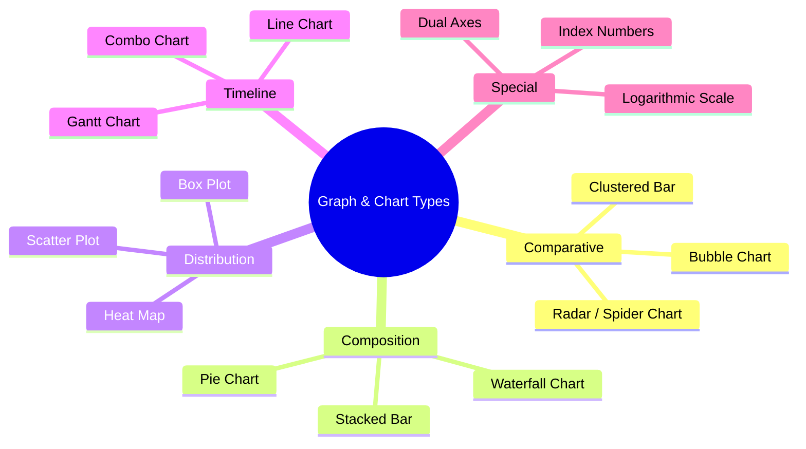
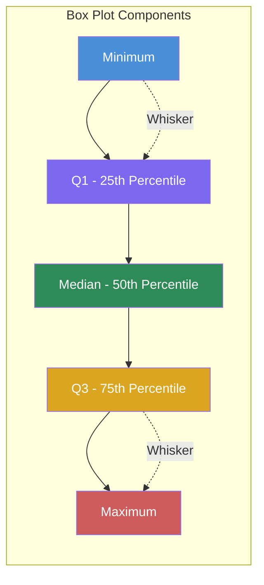

# Chapter 4: Graph and Chart Analysis

## Learning Objectives

By the end of this chapter, you will be able to:
- Interpret advanced graph types: radar/spider charts, bubble charts, waterfall charts, Gantt charts, heat maps, box plots, and scatter plots with trend lines
- Analyse data presented on logarithmic scales and with index numbers
- Handle base year shifts and re-indexing calculations
- Match data descriptions to appropriate graph representations
- Interpret line + bar combo charts with dual axes
- Generate and analyse chart data programmatically using TypeScript

---

## Theory

### 4.1 Advanced Graph Types — Overview



### 4.2 Radar / Spider Charts

A radar chart displays multivariate data on axes starting from the same point. Each axis represents a variable, and values are plotted along each axis, connected by a line.

**Key features:**
- Each axis is equally spaced radially
- The scale on each axis is independent
- Area enclosed shows overall magnitude
- Shape shows the balance across categories

**Interpretation tips:**
- A larger enclosed area generally indicates higher overall values
- Symmetrical shapes indicate balanced performance across categories
- Comparing two entities: overlap of shapes shows relative strengths
- Scale must be checked — axes may start at values other than zero

### 4.3 Bubble Charts

A bubble chart displays three dimensions of data: x-axis (horizontal), y-axis (vertical), and bubble size (third dimension).

**Key features:**
- X-axis and Y-axis represent two variables
- Bubble size represents a third variable
- Bubble colour may represent a fourth dimension

**Interpretation tips:**
- Position shows relationship between x and y variables
- Size shows magnitude of the third variable
- Look for clustering of bubbles (groups with similar properties)
- Outliers (isolated large or positioned bubbles) deserve attention

### 4.4 Waterfall Charts

A waterfall chart shows how an initial value is affected by a series of positive and negative changes, arriving at a final value.

**Key features:**
- First bar: starting value
- Floating bars: increases (up) and decreases (down)
- Last bar: ending (cumulative) value
- Connecting lines between bars show the progression

**Interpretation tips:**
- Track cumulative effect step by step
- Identify which factor had the largest positive/negative impact
- The sum of all changes = final - initial

### 4.5 Gantt Charts

A Gantt chart shows a project schedule with tasks listed vertically and time represented horizontally.

**Key features:**
- Horizontal bars represent task duration
- Bar position shows start and end dates
- Overlapping bars indicate parallel tasks
- Arrows/dependencies show task relationships

**Interpretation tips:**
- Critical path: the longest sequence of dependent tasks
- Slack/free time: gap between dependent tasks
- Task duration: length of the horizontal bar

### 4.6 Heat Maps

A heat map uses colour intensity to represent data values in a matrix format.

**Key features:**
- Rows and columns represent categories
- Colour gradient (light to dark) represents low to high values
- Patterns emerge as clusters of similar colours

**Interpretation tips:**
- Look for rows/columns with consistently dark (high) or light (low) colours
- Identify clusters of high-density values
- Compare across rows and columns for patterns

### 4.7 Box Plots

A box plot shows the distribution of data through five summary statistics.

**Components:**
- **Minimum:** Smallest value (bottom whisker end)
- **Q1 (First Quartile):** 25th percentile (bottom of box)
- **Median (Q2):** 50th percentile (line inside box)
- **Q3 (Third Quartile):** 75th percentile (top of box)
- **Maximum:** Largest value (top whisker end)
- **Outliers:** Points beyond whiskers (shown as dots)



**Key calculations:**
- **Range:** Maximum - Minimum
- **Interquartile Range (IQR):** Q3 - Q1
- **Outlier threshold:** Below Q1 - 1.5×IQR or above Q3 + 1.5×IQR

### 4.8 Scatter Plots with Trend Lines

A scatter plot shows the relationship between two continuous variables. A trend line (line of best fit) shows the overall pattern.

**Key features:**
- Points represent individual data pairs (x, y)
- Trend line may be linear, exponential, or polynomial
- Correlation: positive (upward slope), negative (downward slope), or none (flat/no pattern)

**Interpretation tips:**
- **Strong positive correlation:** Points close to upward-sloping line
- **Strong negative correlation:** Points close to downward-sloping line
- **Weak/no correlation:** Points scattered randomly around the line
- **Outliers:** Points far from the trend line
- **R² value:** Proportion of variance explained (closer to 1 = stronger fit)

### 4.9 Logarithmic Scales

A logarithmic scale uses powers of 10 (or other base) instead of linear increments.

**Linear scale:** 0, 10, 20, 30, 40, 50, ...
**Log scale:** 1, 10, 100, 1000, 10000, ... (each step multiplies by 10)

**When log scales are used:**
- Data spans many orders of magnitude (e.g., population, GDP, virus cases)
- Growth rates are better visualised (equal slopes = equal percentage growth)
- Exponential trends appear as straight lines

**Key operations:**
- Reading values: Interpolate between tick marks using the log base
- Calculating growth from log chart: Equal vertical distances = Equal percentage changes
- Converting: value = 10^(position on log scale)

### 4.10 Index Numbers and Base Year Shifts

**Index numbers** express data relative to a base year value of 100.

**Formula:** Index = (Current Year Value / Base Year Value) × 100

**Example:**
| Year | Value | Index (Base 2020 = 100) |
|------|-------|------------------------|
| 2020 | 50 | (50/50) × 100 = 100 |
| 2021 | 60 | (60/50) × 100 = 120 |
| 2022 | 75 | (75/50) × 100 = 150 |

**Base year shift:** Changing the reference year.

**Steps to shift base from Year A to Year B:**
1. Divide all index values by the index of Year B
2. Multiply by 100

**Example: Shift base from 2020 to 2021:**
- 2021 index in old base = 120
- New 2021 index = 100 (by definition)
- New 2020 index = (100 / 120) × 100 = 83.33
- New 2022 index = (150 / 120) × 100 = 125

### 4.11 Line + Bar Combo Charts with Dual Axes

Combo charts combine a bar graph (usually for volume/frequency) with a line chart (usually for rate/percentage), using separate Y-axes on left and right.

**Key features:**
- Left Y-axis: scale for bars (e.g., sales volume in units)
- Right Y-axis: scale for line (e.g., profit margin as percentage)
- X-axis: time periods or categories

**Interpretation tips:**
- The two scales are independent — do not compare bar height to line position directly
- Focus on trends: Is the line going up while bars go down?
- Check which scale applies to which data series (usually shown in legend)

### 4.12 Matching Graphs to Data Descriptions

| Data Description | Expected Graph Shape |
|-----------------|---------------------|
| Steady growth | Upward-sloping line |
| Cyclical pattern | Repeating peaks and troughs |
| Seasonal variation | Regular pattern within each year |
| Exponential growth | J-shaped upward curve (straight on log scale) |
| Normal distribution | Bell-shaped curve |
| Positive correlation | Scatter points trending upward |
| Negative correlation | Scatter points trending downward |
| No correlation | Random scatter with no trend |

---

## Examples with Solved Exercises

### TypeScript Chart Data Generator and Analysis Tool

```typescript
interface DataPoint {
  label: string;
  value: number;
}

interface ChartAnalysis {
  trend: 'increasing' | 'decreasing' | 'stable' | 'volatile';
  maxValue: number;
  minValue: number;
  average: number;
  percentageChange: number;
  volatility: number;
}

class ChartDataAnalyzer {
  static analyzeSeries(series: DataPoint[]): ChartAnalysis {
    const values = series.map(d => d.value);
    const maxValue = Math.max(...values);
    const minValue = Math.min(...values);
    const average = values.reduce((a, b) => a + b, 0) / values.length;

    const n = values.length;
    const indices = Array.from({ length: n }, (_, i) => i);
    const sumX = indices.reduce((a, b) => a + b, 0);
    const sumY = values.reduce((a, b) => a + b, 0);
    const sumXY = indices.reduce((sum, i) => sum + i * values[i], 0);
    const sumX2 = indices.reduce((sum, i) => sum + i * i, 0);
    const slope = (n * sumXY - sumX * sumY) / (n * sumX2 - sumX * sumX);

    let trend: 'increasing' | 'decreasing' | 'stable' | 'volatile';
    if (Math.abs(slope) < 0.5) trend = 'stable';
    else if (slope > 0) trend = 'increasing';
    else trend = 'decreasing';

    const stdDev = Math.sqrt(
      values.reduce((sum, v) => sum + (v - average) ** 2, 0) / n
    );
    const volatility = average !== 0 ? stdDev / average : 0;

    const percentageChange =
      values[0] !== 0
        ? ((values[n - 1] - values[0]) / values[0]) * 100
        : 0;

    return {
      trend, maxValue, minValue,
      average: parseFloat(average.toFixed(2)),
      percentageChange: parseFloat(percentageChange.toFixed(2)),
      volatility: parseFloat(volatility.toFixed(4)),
    };
  }

  static correlationCoefficient(
    data: Array<{ x: number; y: number }>
  ): number {
    const n = data.length;
    const sumX = data.reduce((s, d) => s + d.x, 0);
    const sumY = data.reduce((s, d) => s + d.y, 0);
    const sumXY = data.reduce((s, d) => s + d.x * d.y, 0);
    const sumX2 = data.reduce((s, d) => s + d.x ** 2, 0);
    const sumY2 = data.reduce((s, d) => s + d.y ** 2, 0);
    const numerator = n * sumXY - sumX * sumY;
    const denominator = Math.sqrt(
      (n * sumX2 - sumX ** 2) * (n * sumY2 - sumY ** 2)
    );
    return denominator !== 0
      ? parseFloat((numerator / denominator).toFixed(4))
      : 0;
  }

  static calculateIndex(values: number[], baseYearIndex: number): number[] {
    const baseValue = values[baseYearIndex];
    if (baseValue === 0) return values.map(() => 0);
    return values.map(v => parseFloat(((v / baseValue) * 100).toFixed(2)));
  }

  static shiftBase(indexSeries: number[], newBaseIndex: number): number[] {
    const newBaseValue = indexSeries[newBaseIndex];
    if (newBaseValue === 0) return indexSeries;
    return indexSeries.map(v => parseFloat(((v / newBaseValue) * 100).toFixed(2)));
  }

  static boxPlotStats(values: number[]) {
    const sorted = [...values].sort((a, b) => a - b);
    const n = sorted.length;
    const median = n % 2 === 0
      ? (sorted[n / 2 - 1] + sorted[n / 2]) / 2
      : sorted[Math.floor(n / 2)];
    const lowerHalf = sorted.slice(0, Math.floor(n / 2));
    const upperHalf = sorted.slice(Math.ceil(n / 2));
    const q1 = lowerHalf.length % 2 === 0
      ? (lowerHalf[lowerHalf.length / 2 - 1] + lowerHalf[lowerHalf.length / 2]) / 2
      : lowerHalf[Math.floor(lowerHalf.length / 2)];
    const q3 = upperHalf.length % 2 === 0
      ? (upperHalf[upperHalf.length / 2 - 1] + upperHalf[upperHalf.length / 2]) / 2
      : upperHalf[Math.floor(upperHalf.length / 2)];
    const iqr = q3 - q1;
    const lowerFence = q1 - 1.5 * iqr;
    const upperFence = q3 + 1.5 * iqr;
    const outliers = sorted.filter(v => v < lowerFence || v > upperFence);
    return { min: sorted[0], q1, median, q3, max: sorted[n - 1], iqr, outliers };
  }
}

// Example usage:
const salesData: DataPoint[] = [
  { label: "Jan", value: 100 }, { label: "Feb", value: 120 },
  { label: "Mar", value: 140 }, { label: "Apr", value: 130 },
  { label: "May", value: 160 }, { label: "Jun", value: 200 },
];
const analysis = ChartDataAnalyzer.analyzeSeries(salesData);
console.log("Trend:", analysis.trend, "| Avg:", analysis.average);
```

**Q1.** A radar chart shows Company A across 5 parameters: Quality=80, Cost Efficiency=70, Innovation=90, Customer Service=75, Market Reach=85. What is the average score?

a) 78
b) 80
c) 82
d) 85

<details>
<summary>Answer</summary>
b) 80

Average = (80 + 70 + 90 + 75 + 85) / 5 = 400 / 5 = 80.
</details>

---

**Q2.** In a bubble chart, x-axis = R&D spending, y-axis = profit margin, bubble size = market capitalisation. A company has a large bubble at low R&D and high profit. What does this suggest?

a) High R&D leads to high profit
b) The company is highly efficient with low R&D spending
c) The company has low market cap
d) The company should increase R&D

<details>
<summary>Answer</summary>
b) The company is highly efficient with low R&D spending

A large bubble (high market cap) at low R&D and high profit suggests significant value generation without heavy R&D.
</details>

---

**Q3.** A waterfall chart: Starting Cash = ₹100 lakhs, Operating Income = +₹40 lakhs, Expenses = -₹25 lakhs, Investment = -₹15 lakhs, New Loan = +₹20 lakhs. Ending cash?

a) ₹100 lakhs
b) ₹120 lakhs
c) ₹130 lakhs
d) ₹110 lakhs

<details>
<summary>Answer</summary>
b) ₹120 lakhs

Ending = 100 + 40 - 25 - 15 + 20 = ₹120 lakhs.
</details>

---

**Q4.** A box plot: Min=10, Q1=25, Median=35, Q3=50, Max=80. IQR?

a) 15
b) 20
c) 25
d) 30

<details>
<summary>Answer</summary>
c) 25

IQR = Q3 - Q1 = 50 - 25 = 25.
</details>

---

**Q5.** A scatter plot shows points tightly clustered around an upward-sloping line. The correlation is:

a) Strong positive
b) Strong negative
c) No correlation
d) Weak positive

<details>
<summary>Answer</summary>
a) Strong positive

Points clustered around an upward-sloping line indicate strong positive correlation.
</details>

---

**Q6.** Index series (Base 2019=100): 2019=100, 2020=115, 2021=130, 2022=150. Shift base to 2021. New index for 2022?

a) 100
b) 115.38
c) 120.50
d) 125.00

<details>
<summary>Answer</summary>
b) 115.38

New 2022 index = (150 / 130) × 100 = 115.38.
</details>

---

**Q7.** A combo chart: bars = monthly sales (0-500 units, left axis), line = profit margin % (0-30%, right axis). March: bar=400 units, line=20%. What is March profit?

a) 80 units
b) 800 units
c) ₹8,000
d) Cannot be determined

<details>
<summary>Answer</summary>
d) Cannot be determined

We know units sold (400) and profit margin (20%), but not the selling price per unit. Profit = Units × Price × Margin%. Price unknown.
</details>

---

**Q8.** A heat map shows sales across 4 regions and 4 quarters. Region A has consistently dark cells, Region B has consistently light cells. What does this indicate?

a) Region A low sales, Region B high sales
b) Region A high sales, Region B low sales
c) Both similar
d) Region A declining

<details>
<summary>Answer</summary>
b) Region A high sales, Region B low sales

In heat maps, darker colours typically represent higher values.
</details>

---

**Q9.** On a log scale, the distance between 10 and 100 equals the distance between 100 and what?

a) 200
b) 500
c) 1,000
d) 10,000

<details>
<summary>Answer</summary>
c) 1,000

Equal distances on log scale = equal multiplicative factors. 10→100 = 10×, so 100→1,000 = 10×.
</details>

---

**Q10.** A Gantt chart: Task A (Days 1-5), B (Days 3-8), C (Days 6-12), D (Days 9-14). Which tasks overlap?

a) A and B only
b) B and C only
c) A, B, and C all overlap
d) B, C, and D all overlap at some point

<details>
<summary>Answer</summary>
d) B, C, and D all overlap at some point

B runs 3-8, C runs 6-12 (overlap 6-8), D runs 9-14 (overlaps C 9-12). B does not overlap D (B ends day 8, D starts day 9).
</details>

---

**Q11.** In a box plot, an outlier is typically beyond:

a) Q1 - 1.5×IQR or Q3 + 1.5×IQR
b) Q1 - IQR or Q3 + IQR
c) Min or Max
d) Mean ± SD

<details>
<summary>Answer</summary>
a) Q1 - 1.5×IQR or Q3 + 1.5×IQR

Standard outlier definition uses 1.5×IQR beyond the quartiles.
</details>

---

**Q12.** How can a 4th variable be shown in a bubble chart?

a) Bubble shape
b) Bubble colour
c) Bubble outline thickness
d) Any of the above

<details>
<summary>Answer</summary>
d) Any of the above

Bubble colour, shape, and outline can all encode additional dimensions.
</details>

---

**Q13.** Box plot: Min=20, Q1=35, Median=50, Q3=65, Max=90. % of values between 35 and 65?

a) 25%
b) 50%
c) 75%
d) 100%

<details>
<summary>Answer</summary>
b) 50%

Q1 to Q3 is the interquartile range containing 50% of data.
</details>

---

**Q14.** Scatter plot with r = -0.92 indicates:

a) Strong positive correlation
b) Strong negative correlation
c) Weak negative correlation
d) No correlation

<details>
<summary>Answer</summary>
b) Strong negative correlation

r = -0.92 is very close to -1, indicating strong negative correlation.
</details>

---

**Q15.** Index series (Base 2018=100): 2018=100, 2019=108, 2020=115, 2021=120, 2022=125. % increase 2018 to 2022?

a) 20%
b) 25%
c) 15%
d) 125%

<details>
<summary>Answer</summary>
b) 25%

Index goes from 100 to 125 → 25% increase.
</details>

---

**Q16.** Combo chart: revenue bar doubles, customer line doubles from month 1 to 2. Revenue per customer?

a) Doubled
b) Remained constant
c) Halved
d) Cannot determine

<details>
<summary>Answer</summary>
b) Remained constant

Both revenue and customer count doubled → ratio unchanged.
</details>

---

**Q17.** Radar chart with very small enclosed area near centre suggests:

a) High performance on all metrics
b) Low performance on all metrics
c) Mixed performance
d) Excellent cost efficiency

<details>
<summary>Answer</summary>
b) Low performance on all metrics

In radar charts, centre = low values. Small enclosed area = low across all axes.
</details>

---

**Q18.** On log scale, a straight line with positive slope represents:

a) Linear growth
b) Exponential growth
c) Declining growth
d) No growth

<details>
<summary>Answer</summary>
b) Exponential growth

Exponential growth appears as a straight line on logarithmic scales.
</details>

---

**Q19.** Waterfall: Initial inventory = 500 units, Production = +300, Sales = -250, Returns = +20, Damaged = -15. Final inventory?

a) 525
b) 555
c) 565
d) 535

<details>
<summary>Answer</summary>
b) 555

Final = 500 + 300 - 250 + 20 - 15 = 555 units.
</details>

---

**Q20.** Heat map with blue-to-red gradient. A purple cell represents:

a) Maximum value
b) Minimum value
c) Intermediate value
d) Missing data

<details>
<summary>Answer</summary>
c) Intermediate value

Purple is a blend of blue and red, representing a value between extremes.
</details>

---

## Summary

- **Radar charts** compare multivariate data across categories using enclosed areas
- **Bubble charts** encode three variables (x, y, size) and optionally a fourth (colour)
- **Waterfall charts** track cumulative changes from start to end
- **Gantt charts** show project schedules with task durations and dependencies
- **Heat maps** use colour intensity to reveal patterns in matrix data
- **Box plots** summarise distribution through five-number summary and outliers
- **Scatter plots** with trend lines reveal correlations between variables
- **Logarithmic scales** visualise data spanning multiple orders of magnitude
- **Index numbers** express data relative to a base year (value = 100)
- **Combo charts** with dual axes combine bar and line graphs with different scales

---

## Practical Takeaways

| Strategy | Implementation |
|----------|----------------|
| Identify chart type first | Each chart has specific interpretation rules |
| Check scales carefully | Note zero origin, log vs linear, dual axes |
| Read legend and labels | Axes, units, and colours must be understood first |
| For box plots: find the 5 numbers | Min, Q1, Median, Q3, Max — derive IQR and outliers |
| For index numbers: note the base year | All comparisons are relative to the base year value |
| For log scales: equal distance = equal ratio | Not equal absolute difference |
| For combo charts: separate the scales | Bar scale and line scale are independent |
| For scatter plots: estimate r | Correlation strength determines trend reliability |

---

## Chapter Quiz

**Q1.** What visual element in a bubble chart represents the third dimension?

a) X-axis position
b) Y-axis position
c) Bubble size
d) Bubble outline

<details>
<summary>Show Answer</summary>

**Answer:** c) Bubble size

In a bubble chart, x-axis and y-axis encode two variables, while bubble size encodes the third.
</details>

---

**Q2.** In a box plot, what does the distance between Q1 and Q3 represent?

a) Range
b) Interquartile Range (IQR)
c) Standard deviation
d) Variance

<details>
<summary>Show Answer</summary>

**Answer:** b) Interquartile Range (IQR)

IQR = Q3 - Q1, representing the middle 50% of the data.
</details>

---

**Q3.** A straight line on a logarithmic scale means:

a) Constant absolute growth
b) Constant percentage growth (exponential)
c) Decreasing growth
d) No growth

<details>
<summary>Show Answer</summary>

**Answer:** b) Constant percentage growth (exponential)

Exponential growth with constant percentage appears as a straight line on log scale.
</details>

---

**Q4.** Index: 2019=100, 2020=120, 2021=150. Shift base to 2020. New index for 2019?

a) 80.0
b) 83.33
c) 90.0
d) 95.0

<details>
<summary>Show Answer</summary>

**Answer:** b) 83.33

New index = (100 / 120) × 100 = 83.33.
</details>

---

**Q5.** Best graph for showing distribution through quartiles?

a) Bar graph
b) Pie chart
c) Box plot
d) Line chart

<details>
<summary>Show Answer</summary>

**Answer:** c) Box plot

Box plots are designed to show distribution through quartiles, median, range, and outliers.
</details>

---

## Exercises

### Section A: Chart Type Identification (Q1-Q5)

1. Showing how a company's cash balance changes through operating, investing, and financing activities.
2. Comparing performance of 5 employees across 6 different skill categories.
3. Showing relationship between advertising spend and sales with 20 data points.
4. Displaying a project schedule with 10 tasks and their dependencies.
5. Showing distribution of exam scores for 200 students including median and outliers.

### Section B: Radar and Bubble Charts (Q6-Q10)

6. Radar chart with 4 axes: Speed=60, Accuracy=80, Efficiency=70, Reliability=90. Average score?
7. Product X has larger radar area than Product Y. What does this mean?
8. Bubble chart: Company A has small bubble at high R&D/low innovation. Company B has large bubble at moderate R&D/high innovation. Which is more efficient?
9. Calculate radar triangle area with values 50, 60, 70 on 3 axes (120° between axes).
10. If radar chart shows perfect symmetry (all equal), what does this indicate?

### Section C: Waterfall and Gantt Charts (Q11-Q15)

11. Waterfall: Start=1,000, Revenue=+500, COGS=-300, OpEx=-150, Tax=-50. End value?
12. What connects bars in a waterfall chart to show running total?
13. Gantt: Task A (Days 1-4), B (starts after A, Days 5-9), C (Days 3-8). Total duration?
14. If Task B depends on A and Task C runs parallel, what is critical path?
15. Testing (Days 10-14) depends on development (Days 1-9). What is the float?

### Section D: Box Plots (Q16-Q20)

Data: 12,15,18,20,22,25,28,30,33,35,38,40,45,50,55,60,65,70,75,80

16. What is the median?
17. What is Q1?
18. What is Q3?
19. What is the IQR?
20. Identify any outliers (using 1.5×IQR rule).

### Section E: Logarithmic Scales, Index, and Combo (Q21-Q25)

21. On log scale, distance between 1 and 10 is 5 cm. Distance between 10 and 100?
22. Index: Base 2020=100. 2021=125, 2022=140, 2023=170. Shift base to 2022. New 2021 index?
23. GDP index goes from 100 to 200 in 10 years. Approximate CAGR?
24. Combo chart: Production doubles, defect rate halves. Total defects change?
25. Convert linear scale 500 to log base 10.

### Section F: Mixed (Q26-Q30)

26. Heat map: Product A dark Jan-Jun, light Jul-Dec. Trend?
27. Scatter plot r = 0.85. What is r²?
28. Radar: Math=95, Science=90, English=80, History=75, Art=60. Which needs improvement?
29. Waterfall: Investment=₹500, Returns: Y1=+₹80, Y2=+₹120, Y3=+₹150, Y4=+₹100, Exit=+₹200. Total return multiple?
30. Gantt: 5 sequential tasks of 3 days each, each can start 1 day before previous finishes. Minimum duration?

### Answer Key

| Q | Answer | Q | Answer | Q | Answer | Q | Answer | Q | Answer |
|---|--------|---|--------|---|--------|---|--------|---|--------|
| 1 | Waterfall | 2 | Radar | 3 | Scatter | 4 | Gantt | 5 | Box plot |
| 6 | 75 | 7 | X has higher overall | 8 | Company B | 9 | ~4,633 sq units | 10 | Balanced |
| 11 | ₹1,000 | 12 | Connector lines | 13 | 9 days | 14 | A→B (longest) | 15 | 0 days |
| 16 | 36.5 | 17 | 23.5 | 18 | 57.5 | 19 | 34 | 20 | None |
| 21 | 5 cm | 22 | 89.29 | 23 | ~7.2% | 24 | Same | 25 | ~2.699 |
| 26 | Declining H2 | 27 | 72.25% | 28 | Art (60) | 29 | 1.3× | 30 | 11 days |

**Detailed Solutions:**

**Q9:** Area = 0.5 × sin(120°) × (50×60 + 60×70 + 70×50) = 0.433 × 10,700 ≈ 4,633 sq units.

**Q16-20:** Sorted: 12,15,18,20,22,25,28,30,33,35,38,40,45,50,55,60,65,70,75,80.
Median = (35+38)/2 = 36.5.
Q1: lower half median = (22+25)/2 = 23.5.
Q3: upper half median = (55+60)/2 = 57.5.
IQR = 57.5 - 23.5 = 34.
Outlier fence: below 23.5-51 = -27.5; above 57.5+51 = 108.5. No outliers.

**Q22:** New 2021 = (125/140) × 100 = 89.29.

**Q23:** CAGR = (200/100)^(1/10) - 1 = 2^0.1 - 1 ≈ 0.0718 = 7.18%.

**Q24:** Production × 2, Defect rate × 0.5 → Total defects = (New Prod × New Rate) = (2P × 0.5R) = P×R = same.

**Q30:** Task 1: D1-3, Task 2: D3-5 (starts 1 day before T1 ends), Task 3: D5-7, Task 4: D7-9, Task 5: D9-11. Total = 11 days.

---

*Proceed to Chapter 5: Mixed Data Interpretation*
