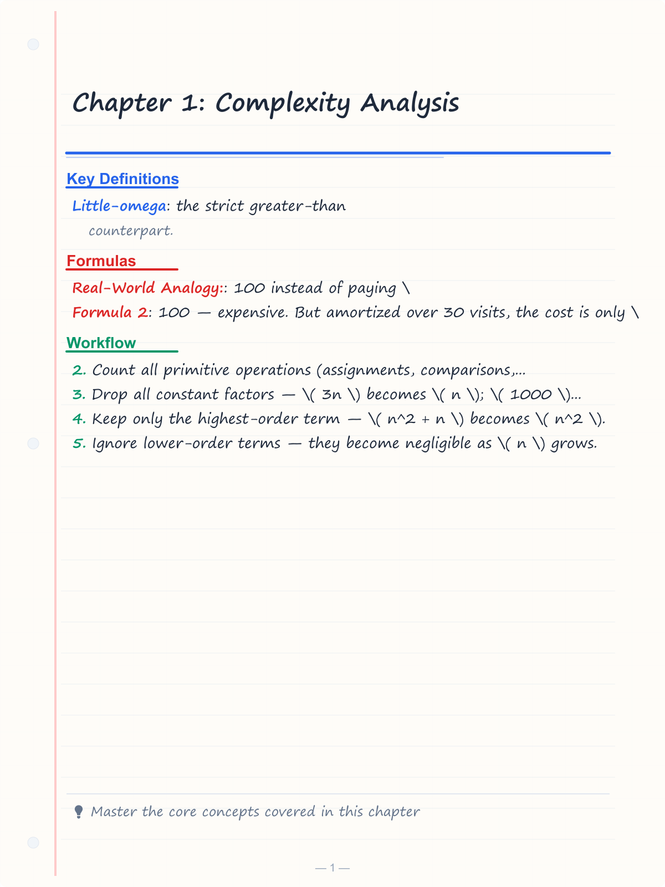
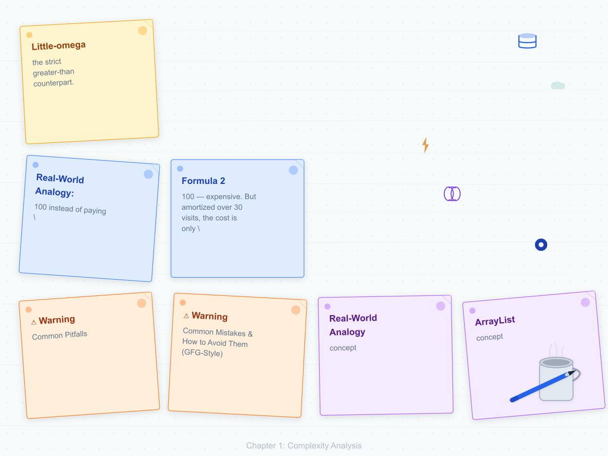
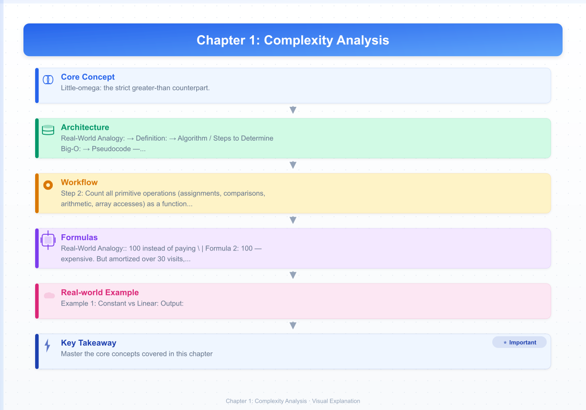
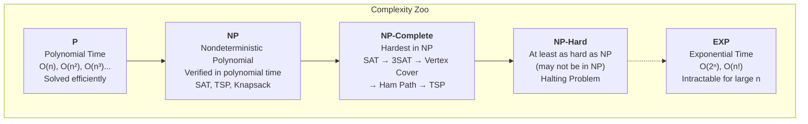
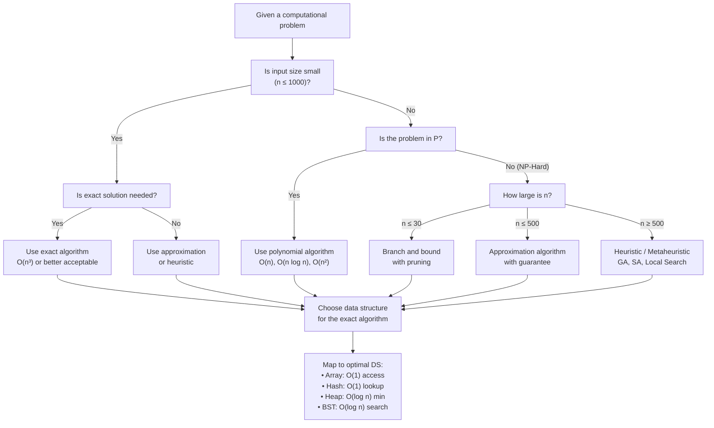

# Chapter 1: Complexity Analysis

## Learning Objectives

- Define asymptotic notation: Big-O, Omega, Theta.
- Analyze worst-case, average-case, and best-case complexity.
- Compute time and space complexity of iterative and recursive algorithms.
- Compare algorithms using growth-rate families.
- Apply complexity analysis to choose optimal data structures for real-world problems.

<!-- Image Gallery -->
<section class="lesson-visuals" aria-label="Visual learning resources">
  <header><span>VISUAL LEARNING</span><h2>See it. Review it. Remember it.</h2></header>
  <a class="lesson-visual-card" href="../../assets/images/lessons/data-structures/01-complexity/handwritten-notes.png" target="_blank" rel="noopener">
    
    <span><strong>Handwritten notes</strong>Condensed notes for deliberate review.</span>
  </a>
  <a class="lesson-visual-card" href="../../assets/images/lessons/data-structures/01-complexity/sticky-notes.png" target="_blank" rel="noopener">
    
    <span><strong>Sticky-note revision</strong>Fast recall prompts for revision.</span>
  </a>
  <a class="lesson-visual-card" href="../../assets/images/lessons/data-structures/01-complexity/visual-explanation.png" target="_blank" rel="noopener">
    
    <span><strong>Visual concept guide</strong>A connected explanation of the key ideas.</span>
  </a>
</section>
<!-- End Image Gallery -->


## Why Complexity Analysis Matters in DS

**Real-World Analogy:** Imagine you are building a contact-list app for a phone with 1 million users. When a user searches for a contact, using an **ArrayList** (O(n) search) would scan through all million entries — taking ~10 milliseconds. But using a **HashMap** (O(1) average search) retrieves the contact in under 1 microsecond. At scale, the difference between O(n) and O(1) is the difference between a snappy app and one that freezes. Data structure choice IS complexity analysis in action.

Every major system — Google Search, Redis, PostgreSQL, Netflix — lives or dies by choosing the right data structure for each operation. Complexity analysis is the tool that makes that choice rigorous.

## Theory


### Why Complexity Matters


Two programs that solve the same problem can differ in running time by orders of magnitude. Complexity analysis gives us a language to describe this difference without reference to a specific machine.

### Asymptotic Notation


Let \( T(n) \) be the exact running time of an algorithm on input size \( n \). We care about the *rate of growth* as \( n \to \infty \).

---

### Big-O Notation (O) — Upper Bound


**Real-World Analogy:** An elevator has a maximum capacity of 1,000 kg. Whether you load 500 kg, 800 kg, or 1,000 kg, the elevator *never exceeds* 1,000 kg. Big-O gives the worst-case ceiling — the algorithm will never perform worse than this bound.

**Definition:** \( f(n) = O(g(n)) \) means there exist constants \( c > 0 \) and \( n_0 > 0 \) such that \( 0 \le f(n) \le c \cdot g(n) \) for all \( n \ge n_0 \).

**Algorithm / Steps to Determine Big-O:**

1. **Count all primitive operations** (assignments, comparisons, arithmetic, array accesses) as a function of input size \( n \).
2. **Drop all constant factors** — \( 3n \) becomes \( n \); \( 1000 \) becomes \( 1 \).
3. **Keep only the highest-order term** — \( n^2 + n \) becomes \( n^2 \).
4. **Ignore lower-order terms** — they become negligible as \( n \) grows.

**Pseudocode — Determining Big-O of Linear Search:**

```
FUNCTION linearSearch(arr, target):
    FOR i = 0 TO length(arr) - 1:       // runs n times
        IF arr[i] == target:             // 1 comparison per iteration
            RETURN i                     // 1 operation (rare)
    RETURN -1                            // 1 operation
```

**Dry Run — Growth of O(n) vs O(n²) for n = 1 to 10:**

| n | O(1) ops | O(log n) ops | O(n) ops | O(n log n) ops | O(n²) ops |
|---|----------|--------------|----------|----------------|-----------|
| 1 | 1        | 0            | 1        | 0              | 1         |
| 2 | 1        | 1            | 2        | 2              | 4         |
| 3 | 1        | 2            | 3        | 5              | 9         |
| 4 | 1        | 2            | 4        | 8              | 16        |
| 5 | 1        | 2            | 5        | 12             | 25        |
| 6 | 1        | 3            | 6        | 16             | 36        |
| 7 | 1        | 3            | 7        | 20             | 49        |
| 8 | 1        | 3            | 8        | 24             | 64        |
| 9 | 1        | 3            | 9        | 29             | 81        |
| 10| 1        | 3            | 10       | 33             | 100       |

Notice: at n=10, O(1) and O(n²) differ by **100×**. At n=1000, O(1) is still 1 operation but O(n²) is 1,000,000 operations — the gap widens without bound.

**Demonstration Code — C++, Python, Java:**

```cpp
// C++ — Linear Search O(n)
#include <iostream>
#include <vector>
using namespace std;

int linearSearch(const vector<int>& arr, int target) {
    for (int i = 0; i < arr.size(); i++) {
        if (arr[i] == target) return i;
    }
    return -1;
}

int main() {
    vector<int> data = {5, 2, 8, 1, 9, 3};
    cout << linearSearch(data, 8) << "\n";   // 2
    cout << linearSearch(data, 10) << "\n";  // -1
    return 0;
}
```

```python
# Python — Linear Search O(n)
def linear_search(arr, target):
    for i, val in enumerate(arr):
        if val == target:
            return i
    return -1

data = [5, 2, 8, 1, 9, 3]
print(linear_search(data, 8))   # 2
print(linear_search(data, 10))  # -1
```

```java
// Java — Linear Search O(n)
public class LinearSearch {
    static int linearSearch(int[] arr, int target) {
        for (int i = 0; i < arr.length; i++) {
            if (arr[i] == target) return i;
        }
        return -1;
    }

    public static void main(String[] args) {
        int[] data = {5, 2, 8, 1, 9, 3};
        System.out.println(linearSearch(data, 8));   // 2
        System.out.println(linearSearch(data, 10));  // -1
    }
}
```

**Complexity Analysis — WHY O(n)?**

The `for` loop executes exactly `n` iterations in the worst case (target not found or at last position). Each iteration performs one comparison (`arr[i] == target`). Total operations = `n` comparisons + constant overhead = **O(n)**. The constant factors (loop variable increment, array indexing) are absorbed into the asymptotic notation — they don't change the growth rate.

**Advantages & Disadvantages of Big-O:**

| Advantages | Disadvantages |
|------------|---------------|
| Universal language for algorithm comparison | Hides constant factors — O(n) might be slower than O(n²) for small n |
| Machine-independent analysis | Worst-case may rarely occur in practice |
| Predicts scalability to large inputs | Doesn't capture average-case behavior |
| Simplifies complex code into a single rating | Ignores memory hierarchy (cache, disk) effects |
| Foundation for data structure selection | Requires mathematical maturity for complex algorithms |

**Edge Cases:**

- **Empty input (n = 0):** Loop body never executes. Big-O still O(n) — zero iterations is still linear in zero.
- **n = 1:** No loop iterations for the trivial case — O(1) effectively, but we still classify as O(n).
- **Target not present:** Every element is examined — true worst case, exactly n iterations.
- **Target at first position:** Best case O(1) — but Big-O describes worst case, so we still say O(n).
- **Duplicate elements:** Search stops at first match. Still O(n) worst-case since the match might be last.
- **Very small n (n &lt; n₀):** Big-O guarantees only apply for n ≥ n₀. For tiny inputs, a quadratic algorithm may outperform linear — this is why hybrid sorts (Timsort) exist.

---

### Omega Notation (Ω) — Lower Bound


**Real-World Analogy:** No matter how fast you drive, you cannot reach a destination in less time than the speed limit permits. If the speed limit is 60 km/h on a 100 km road, the *best possible* time is 100/60 ≈ 1.67 hours. Omega provides this "best case" floor.

**Definition:** \( f(n) = \Omega(g(n)) \) means there exist constants \( c > 0 \) and \( n_0 > 0 \) such that \( 0 \le c \cdot g(n) \le f(n) \) for all \( n \ge n_0 \). Equivalently, \( g(n) = O(f(n)) \).

**Algorithm / Steps:**

1. Find the minimum number of operations the algorithm *must* perform for any input of size \( n \).
2. Express this minimum as a function of \( n \).
3. Drop constants and lower-order terms.

**Pseudocode — Best Case of Linear Search:**

```
FUNCTION linearSearch(arr, target):
    FOR i = 0 TO length(arr) - 1:
        IF arr[i] == target:
            RETURN i             // Best case: target at index 0, returns immediately
    RETURN -1
```

**Dry Run — Ω(n) vs Ω(1) for Linear Search:**

| Input state | Operations | Omega class |
|-------------|-----------|-------------|
| Target at index 0 | 1 comparison | Ω(1) |
| Target at index 1 | 2 comparisons | Ω(1) — still constant |
| Target at index k | k + 1 comparisons | Ω(1) — constant for fixed k |
| Empty array | 0 comparisons | Ω(1) |
| Target absent (full scan) | n comparisons | Ω(n) — but this is the lower bound for all inputs |

For linear search, the best case is always Ω(1) because the target *could* be at position 0. But the worst case is O(n). The algorithm has different upper and lower bounds.

**Demonstration Code:**

```cpp
// C++ — Best-case demonstration
#include <iostream>
#include <vector>
using namespace std;

int findFirst(const vector<int>& arr) {
    return arr[0];  // Ω(1) — always one operation
}

int main() {
    vector<int> data = {42, 7, 3, 9, 1};
    cout << findFirst(data) << "\n";  // 42
    return 0;
}
```

```python
# Python — Best-case demonstration
def find_first(arr):
    return arr[0]  # Ω(1) — always one operation

data = [42, 7, 3, 9, 1]
print(find_first(data))  # 42
```

```java
// Java — Best-case demonstration
public class BestCaseDemo {
    static int findFirst(int[] arr) {
        return arr[0];  // Ω(1)
    }

    public static void main(String[] args) {
        int[] data = {42, 7, 3, 9, 1};
        System.out.println(findFirst(data));  // 42
    }
}
```

**Complexity Analysis — WHY Ω(1)?**

The function `arr[0]` performs exactly one array access regardless of array size. No loop, no conditionals. The number of operations is constant (1) no matter whether n = 1 or n = 10⁹. Therefore the lower bound is Ω(1).

**Advantages & Disadvantages:**

| Advantages | Disadvantages |
|------------|---------------|
| Gives best-case guarantee | Best case is often trivially optimal |
| Useful for proving optimality | Rarely used alone for algorithm comparison |
| Paired with Big-O gives Theta | Misleading if algorithm has poor worst case |
| Foundation for lower-bound proofs | Many algorithms have Ω(1) best case |

**Edge Cases:**

- **Empty array:** Ω(1) — still constant time to return the result (or throw).
- **Array with one element:** Ω(1) — one access.
- **Ω(n) algorithms:** Any algorithm that must examine all input (e.g., sum all elements) has Ω(n) — you can't sum n numbers without looking at each one.

---

### Theta Notation (Θ) — Tight Bound


**Real-World Analogy:** A train that takes exactly 2 hours between two cities every trip — not faster, not slower. Θ(g(n)) means the algorithm's running time is *both* O(g(n)) and Ω(g(n)) — it grows *exactly* like g(n) for large inputs.

**Definition:** \( f(n) = \Theta(g(n)) \) iff \( f(n) = O(g(n)) \) and \( f(n) = \Omega(g(n)) \). There exist constants \( c_1, c_2 > 0 \) and \( n_0 > 0 \) such that \( 0 \le c_1 \cdot g(n) \le f(n) \le c_2 \cdot g(n) \) for all \( n \ge n_0 \).

**Algorithm / Steps:**

1. Compute Big-O upper bound.
2. Compute Omega lower bound.
3. If both yield the same growth rate \( g(n) \), the algorithm is \( \Theta(g(n)) \).

**Pseudocode — Sum of Array (Θ(n)):**

```
FUNCTION sumArray(arr):
    total = 0                         // 1 operation
    FOR i = 0 TO length(arr) - 1:    // runs exactly n times
        total = total + arr[i]       // 2 operations per iteration
    RETURN total                      // 1 operation
```

**Dry Run — Trace Table for sumArray([3, 7, 1]):**

| i | arr[i] | total before | total after | Operations so far |
|---|--------|-------------|-------------|-------------------|
| - | -      | 0           | -           | 1 (init total)    |
| 0 | 3      | 0           | 3           | 4 (cmp + add + assign) |
| 1 | 7      | 3           | 10          | 7                 |
| 2 | 1      | 10          | 11          | 10                |
| - | -      | -           | return 11   | 11                |

Total = 3n + 2 operations = Θ(n). The upper bound is O(n) and the lower bound is Ω(n) — they match, so we get Θ(n).

**Demonstration Code:**

```cpp
// C++ — Sum array Θ(n)
#include <iostream>
#include <vector>
using namespace std;

int sumArray(const vector<int>& arr) {
    int total = 0;
    for (int x : arr) total += x;
    return total;
}

int main() {
    vector<int> data = {3, 7, 1, 9, 4};
    cout << sumArray(data) << "\n";  // 24
    return 0;
}
```

```python
# Python — Sum array Θ(n)
def sum_array(arr):
    total = 0
    for x in arr:
        total += x
    return total

data = [3, 7, 1, 9, 4]
print(sum_array(data))  # 24
```

```java
// Java — Sum array Θ(n)
public class SumArray {
    static int sumArray(int[] arr) {
        int total = 0;
        for (int x : arr) total += x;
        return total;
    }

    public static void main(String[] args) {
        int[] data = {3, 7, 1, 9, 4};
        System.out.println(sumArray(data));  // 24
    }
}
```

**Complexity Analysis — WHY Θ(n)?**

The loop always runs exactly n times regardless of input values. Every input of size n produces exactly n iterations. The upper bound is O(n) (it never exceeds cn) and the lower bound is Ω(n) (it never does fewer than c'n operations). Since upper = lower = n, the bound is tight: Θ(n).

**Advantages & Disadvantages:**

| Advantages | Disadvantages |
|------------|---------------|
| Most precise description of growth rate | Many algorithms don't have tight bounds |
| Eliminates ambiguity of "O vs Ω" | Harder to prove than Big-O alone |
| Essential for optimality proofs | Some algorithms require case analysis |
| Best for comparing similar algorithms | Not always achievable for complex code |

**Edge Cases:**

- **No tight bound:** Linear search has O(n) but Ω(1) — they don't match, so there is no Θ bound.
- **Constant operation:** `arr[0]` is Θ(1) — both upper and lower bounds are constant.
- **Nested loops that always run:** `for i in 0..n: for j in 0..n:` is Θ(n²) — always runs exactly n² iterations.

---

### Amortized Analysis


**Real-World Analogy:** You go to the gym 30 times a month. You buy a monthly pass for \$100 instead of paying \$10 per visit. On day 1, you "pay" \$100 — expensive. But amortized over 30 visits, the cost is only \$3.33 per visit. One operation is costly, but the average over a sequence is cheap. Dynamic array resizing works exactly like this.

**Definition:** Amortized analysis averages the cost of a sequence of operations, showing that while a single operation may be expensive, the average cost per operation is low.

**Algorithm — Dynamic Array (Vector):**

Resource: Each `push_back` is O(1) until the array is full. When full:
1. Allocate new array of 2× capacity.
2. Copy all n elements to new array.
3. Deallocate old array.
4. Insert new element.

**Pseudocode — push_back with Amortized Analysis:**

```
FUNCTION push_back(arr, value, size, capacity):
    IF size == capacity:                  // Array is full → resize
        newCapacity = capacity * 2
        newArr = ALLOCATE(newCapacity)
        FOR i = 0 TO size - 1:           // Copy n elements
            newArr[i] = arr[i]
        arr = newArr
        capacity = newCapacity
    arr[size] = value                     // Insert new element
    size = size + 1
```

**Dry Run — Cost per push_back Operation:**

| Operation | size before | capacity before | Resize? | Actual cost | Running total | Amortized cost |
|-----------|-------------|-----------------|---------|-------------|---------------|----------------|
| push(1)   | 0           | 1               | No      | 1           | 1             | 1              |
| push(2)   | 1           | 1               | Yes (→2)| 3 (alloc+copy+insert)| 4      | 2              |
| push(3)   | 2           | 2               | Yes (→4)| 5           | 9             | 3              |
| push(4)   | 3           | 4               | No      | 1           | 10            | 2.5            |
| push(5)   | 4           | 4               | Yes (→8)| 9           | 19            | 3.8            |
| push(6)   | 5           | 8               | No      | 1           | 20            | 3.33           |
| push(7)   | 6           | 8               | No      | 1           | 21            | 3              |
| push(8)   | 7           | 8               | No      | 1           | 22            | 2.75           |
| push(9)   | 8           | 8               | Yes (→16)| 17          | 39            | 4.33           |

After k pushes, the total cost ≤ 3k. Each push contributes at most 3 units on average → **O(1) amortized**.

**Demonstration Code:**

```cpp
// C++ — Dynamic array amortized analysis
#include <iostream>
#include <vector>
using namespace std;

int main() {
    vector<int> v;
    for (int i = 0; i < 16; i++) {
        v.push_back(i);
        cout << "Size: " << v.size() << ", Capacity: " << v.capacity() << "\n";
    }
    return 0;
}
```

```python
# Python — List amortized analysis
import sys

v = []
for i in range(16):
    v.append(i)
    print(f"Size: {len(v)}, Capacity: {sys.getsizeof(v)}")

# Note: Python's actual capacity granularity differs but same O(1) amortized guarantee
```

```java
// Java — ArrayList amortized analysis
import java.util.ArrayList;

public class AmortizedDemo {
    public static void main(String[] args) {
        ArrayList<Integer> list = new ArrayList<>();
        for (int i = 0; i < 16; i++) {
            list.add(i);
            System.out.println("Size: " + list.size());
        }
    }
}
```

**Complexity Analysis — WHY O(1) Amortized?**

The key insight: expensive resize operations become rarer as the array grows. After a resize to capacity k, the next k/2 insertions all cost O(1). The total cost of k insertions is: k (cheap inserts) + k (copy during resize) + 1 (last insert) = 2k + 1. Average = (2k + 1) / k ≈ 2 = **O(1) amortized**.

**Advantages & Disadvantages:**

| Advantages | Disadvantages |
|------------|---------------|
| Reveals true cost over sequences | Doesn't help for single-operation latency |
| Matches real-world usage patterns | Requires careful accounting |
| Explains why dynamic arrays are practical | Not applicable to all data structures |
| Foundational for many DS guarantees | More complex to understand than worst-case |

**Edge Cases:**

- **Single insertion:** Amortized analysis is meaningless for one operation — analyze as O(n) worst-case.
- **Repeated resizing:** If the growth factor is too small (e.g., 1.1× instead of 2×), amortized cost increases.
- **Memory fragmentation:** Theory assumes contiguous allocation; real systems may slow due to cache misses.
- **Shrinking:** Removing elements doesn't automatically release memory — you may need explicit `shrink_to_fit`.

---

### Space Complexity


**Real-World Analogy:** You have a backpack that can hold 10 kg. You're packing for a hike — every item you add takes up weight and space. Similarly, every variable, array, and recursive call consumes memory. Space complexity measures the *peak memory usage* of an algorithm.

**Definition:** Space complexity is the total amount of memory an algorithm needs relative to input size \( n \), including:
- **Input space** — storage for the input itself.
- **Auxiliary space** — extra memory for temporary variables, data structures, call stack.

**Algorithm / Steps to Analyze Space Complexity:**

1. Count all variables (scalars, arrays, objects) allocated by the algorithm.
2. Account for each recursive call's stack frame (parameters + return address).
3. Sum the maximum memory used at any point during execution.
4. Express as a function of input size, drop constants.

**Pseudocode — Space Analysis of Factorial:**

```
// Recursive — O(n) space due to call stack
FUNCTION factorialRecursive(n):
    IF n <= 1: RETURN 1
    RETURN n * factorialRecursive(n - 1)   // n stack frames in memory

// Iterative — O(1) space
FUNCTION factorialIterative(n):
    result = 1
    FOR i = 2 TO n:
        result = result * i
    RETURN result                            // only 2 variables
```

**Dry Run — Call Stack for factorialRecursive(5):**

| Call | n value | Stack depth | Memory used (approx) |
|------|---------|-------------|----------------------|
| factorialRecursive(5) | 5 | 1 | 1 frame |
| → factorialRecursive(4) | 4 | 2 | 2 frames |
| → → factorialRecursive(3) | 3 | 3 | 3 frames |
| → → → factorialRecursive(2) | 2 | 4 | 4 frames |
| → → → → factorialRecursive(1) | 1 | 5 | 5 frames (peak) |
| → → → → return 1 | - | 4 | unwinding |
| → → → return 2 | - | 3 | |
| → → return 6 | - | 2 | |
| → return 24 | - | 1 | |
| return 120 | - | 0 | |

Peak memory = 5 stack frames → O(n) space.

**Demonstration Code:**

```cpp
// C++ — Space complexity comparison
#include <iostream>
using namespace std;

// O(n) space — recursive
int factRec(int n) {
    if (n <= 1) return 1;
    return n * factRec(n - 1);
}

// O(1) space — iterative
int factIter(int n) {
    int result = 1;
    for (int i = 2; i <= n; i++) result *= i;
    return result;
}

// O(n) auxiliary space — copy array
int* duplicate(const int* arr, int n) {
    int* copy = new int[n];  // O(n) extra memory
    for (int i = 0; i < n; i++) copy[i] = arr[i];
    return copy;
}

int main() {
    cout << "factRec(5) = " << factRec(5) << "\n";
    cout << "factIter(5) = " << factIter(5) << "\n";
    return 0;
}
```

```python
# Python — Space complexity examples

# O(n) space — recursive
def fact_rec(n):
    if n <= 1:
        return 1
    return n * fact_rec(n - 1)

# O(1) space — iterative
def fact_iter(n):
    result = 1
    for i in range(2, n + 1):
        result *= i
    return result

# O(n) auxiliary space
def duplicate(arr):
    return arr[:]  # Creates new list — O(n) extra space

print(fact_rec(5))   # 120
print(fact_iter(5))  # 120
```

```java
// Java — Space complexity examples
public class SpaceDemo {
    // O(n) space — recursive
    static int factRec(int n) {
        if (n <= 1) return 1;
        return n * factRec(n - 1);
    }

    // O(1) space — iterative
    static int factIter(int n) {
        int result = 1;
        for (int i = 2; i <= n; i++) result *= i;
        return result;
    }

    // O(n) auxiliary space
    static int[] duplicate(int[] arr) {
        int[] copy = new int[arr.length];  // O(n) extra
        for (int i = 0; i < arr.length; i++) copy[i] = arr[i];
        return copy;
    }

    public static void main(String[] args) {
        System.out.println(factRec(5));   // 120
        System.out.println(factIter(5));  // 120
    }
}
```

**Complexity Analysis — WHY O(n) vs O(1):**

- **Recursive factorial:** Each call pushes a frame onto the call stack. n recursive calls → n frames in memory at peak → O(n) space.
- **Iterative factorial:** Only 2 integer variables exist regardless of n → O(1) space.
- **The space-time tradeoff:** Recursive code is often cleaner but costs O(n) extra memory. Iterative code is more complex but memory-efficient.

**Space Complexity Comparison Table:**

| Algorithm | Auxiliary Space | Why |
|-----------|----------------|-----|
| Array sum (iterative) | O(1) | Single integer accumulator |
| Binary search (iterative) | O(1) | Three integer pointers |
| Binary search (recursive) | O(log n) | log n stack frames |
| Merge sort (array) | O(n) | Temporary array for merging |
| Quicksort (in-place) | O(log n) | Stack frames for recursion |
| Fibonacci naive | O(n) | n stack frames depth |
| Fibonacci DP (tabulation) | O(1) | Two variables only |
| Floyd-Warshall | O(n²) | 2D distance matrix |

**Advantages & Disadvantages:**

| Advantages | Disadvantages |
|------------|---------------|
| Prevents memory overflow in production | Modern machines have ample RAM — sometimes less critical than time |
| Essential for embedded/constrained devices | Cache effects are not captured by space complexity |
| Informs algorithm choice (in-place vs copy) | Virtual memory and garbage collection complicate real measurement |
| Recursive algorithms become impractical without it | Stack overflow is a hard failure, not just slowdown |

**Edge Cases:**

- **Tail recursion:** Modern compilers optimize tail-recursive calls to reuse stack frames (O(1) space instead of O(n)).
- **n = 0:** Recursive factorial(0) uses 1 stack frame (base case) — still O(n) where n=0.
- **Very deep recursion (n > 10,000):** Stack overflow in most languages regardless of complexity class.
- **Shared references:** Two pointers to the same data don't double the space — only count unique allocations.
- **Input space vs auxiliary space:** Some analyses exclude input size. Always clarify which you're measuring.

---

## Complexity Comparison Table

| Class | Name | n=10 | n=100 | n=10⁶ | Data Structure Examples |
|-------|------|------|-------|-------|------------------------|
| O(1) | Constant | 1 | 1 | 1 | Array access, HashMap get, Stack push/pop, Queue enqueue/dequeue |
| O(log n) | Logarithmic | ~3 | ~7 | ~20 | BST search/insert, Binary Heap insert/extract, Binary Search on array |
| O(n) | Linear | 10 | 100 | 10⁶ | Linked List search, unsorted array search, Tree traversal |
| O(n log n) | Linearithmic | ~33 | ~664 | ~20×10⁶ | Sorting (Merge sort, Heap sort), BST sort, building Segment Tree |
| O(n²) | Quadratic | 100 | 10,000 | 10¹² | Nested loops, Bubble sort, Floyd-Warshall, adjacency matrix traversal |

**Key insight:** At n = 10⁶, O(n²) requires 10¹² operations — roughly **17 minutes** at 1 GHz. O(n log n) takes ~20 million operations — about **20 ms**. That's a 50,000× difference.

---

## DS Operation Complexities Master Table

| Data Structure | Access | Search | Insert | Delete | Space |
|----------------|--------|--------|--------|--------|-------|
| **Array** | O(1) | O(n) | O(n) | O(n) | O(n) |
| **Dynamic Array (ArrayList)** | O(1) | O(n) | O(n) amortized | O(n) | O(n) |
| **Singly Linked List** | O(n) | O(n) | O(1) | O(1)* | O(n) |
| **Doubly Linked List** | O(n) | O(n) | O(1) | O(1) | O(n) |
| **Stack (Array)** | O(1) | O(n) | O(1) | O(1) | O(n) |
| **Stack (Linked List)** | O(n) | O(n) | O(1) | O(1) | O(n) |
| **Queue (Array)** | O(1) | O(n) | O(1) | O(1) | O(n) |
| **Queue (Linked List)** | O(n) | O(n) | O(1) | O(1) | O(n) |
| **Circular Queue** | O(1) | O(n) | O(1) | O(1) | O(n) |
| **Deque** | O(1) | O(n) | O(1) | O(1) | O(n) |
| **Binary Search Tree (avg)** | O(log n) | O(log n) | O(log n) | O(log n) | O(n) |
| **Binary Search Tree (worst)** | O(n) | O(n) | O(n) | O(n) | O(n) |
| **AVL Tree** | O(log n) | O(log n) | O(log n) | O(log n) | O(n) |
| **Red-Black Tree** | O(log n) | O(log n) | O(log n) | O(log n) | O(n) |
| **B-Tree** | O(log n) | O(log n) | O(log n) | O(log n) | O(n) |
| **Binary Heap** | O(1) peek | O(n) | O(log n) | O(log n) | O(n) |
| **Hash Table (avg)** | O(1) | O(1) | O(1) | O(1) | O(n) |
| **Hash Table (worst)** | O(n) | O(n) | O(n) | O(n) | O(n) |
| **Graph (Adj Matrix)** | O(1) | O(V²) | O(V²) | O(V²) | O(V²) |
| **Graph (Adj List)** | O(V) | O(V+E) | O(1) | O(1) | O(V+E) |
| **Trie** | O(L) | O(L) | O(L) | O(L) | O(n × L) |
| **Segment Tree** | O(log n) | O(log n) | O(log n) | O(log n) | O(4n) |
| **Fenwick Tree** | O(log n) | O(log n) | O(log n) | O(log n) | O(n) |
| **Disjoint Set Union** | O(α(n)) | O(α(n)) | O(α(n)) | — | O(n) |
| **Skip List** | O(log n) avg | O(log n) avg | O(log n) avg | O(log n) avg | O(n log n) |

* Linked List delete is O(1) given a pointer to the node to delete, O(n) to find it first.
L = length of key for Trie; α(n) = inverse Ackermann (practically constant).

---

## Examples

### Example 1: Constant vs Linear

```cpp
// C++ — O(1) vs O(n)
#include <iostream>
#include <vector>
using namespace std;

// O(1) — constant time: direct index access
int getFirst(const vector<int>& arr) {
    return arr[0];
}

// O(n) — linear time: sum all elements
int sumAll(const vector<int>& arr) {
    int total = 0;
    for (int x : arr) {
        total += x;
    }
    return total;
}

int main() {
    vector<int> data = {3, 7, 1, 9, 4};
    cout << "First: " << getFirst(data) << "\n";
    cout << "Sum: " << sumAll(data) << "\n";
    return 0;
}
```

**Output:**
```
First: 3
Sum: 24
```

### Example 2: Quadratic Complexity

```cpp
// C++ — O(n²) bubble sort
#include <iostream>
#include <vector>
using namespace std;

void bubbleSort(vector<int>& arr) {
    int n = arr.size();
    for (int i = 0; i < n - 1; ++i) {
        for (int j = 0; j < n - i - 1; ++j) {
            if (arr[j] > arr[j + 1]) {
                swap(arr[j], arr[j + 1]);
            }
        }
    }
}

int main() {
    vector<int> data = {5, 2, 9, 1, 5, 6};
    bubbleSort(data);
    for (int x : data) cout << x << " ";
    cout << "\n";
    return 0;
}
```

**Output:**
```
1 2 5 5 6 9
```

### Example 3: Logarithmic Complexity — Binary Search

```cpp
// C++ — O(log n) binary search
#include <iostream>
#include <vector>
using namespace std;

int binarySearch(const vector<int>& arr, int target) {
    int lo = 0, hi = arr.size() - 1;
    while (lo <= hi) {
        int mid = lo + (hi - lo) / 2;
        if (arr[mid] == target) return mid;
        if (arr[mid] < target) lo = mid + 1;
        else hi = mid - 1;
    }
    return -1;
}

int main() {
    vector<int> arr = {1, 3, 5, 7, 9, 11, 13};
    int idx = binarySearch(arr, 7);
    cout << "Index of 7: " << idx << "\n";
    idx = binarySearch(arr, 4);
    cout << "Index of 4: " << idx << "\n";
    return 0;
}
```

**Output:**
```
Index of 7: 3
Index of 4: -1
```

### Example 4: Recursive Complexity — Fibonacci (O(2ⁿ) vs O(n))

```cpp
// C++ — Naive vs DP
#include <iostream>
using namespace std;

// O(2ⁿ) — naive recursion
int fibNaive(int n) {
    if (n <= 1) return n;
    return fibNaive(n - 1) + fibNaive(n - 2);
}

// O(n) — dynamic programming
int fibLinear(int n) {
    if (n <= 1) return n;
    int a = 0, b = 1;
    for (int i = 2; i <= n; ++i) {
        int c = a + b;
        a = b;
        b = c;
    }
    return b;
}

int main() {
    cout << "fibNaive(10) = " << fibNaive(10) << "\n";
    cout << "fibLinear(10) = " << fibLinear(10) << "\n";
    return 0;
}
```

**Output:**
```
fibNaive(10) = 55
fibLinear(10) = 55
```

### Example 5: Space Complexity — Recursive vs Iterative (n = 5 factorial)

**Recursive trace (O(n) space):**

| Level | Call | n | Stack depth |
|-------|------|---|-------------|
| 1 | factorial(5) | 5 | 1 |
| 2 | → factorial(4) | 4 | 2 |
| 3 | → → factorial(3) | 3 | 3 |
| 4 | → → → factorial(2) | 2 | 4 |
| 5 | → → → → factorial(1) | 1 | 5 (peak) |
| - | returns 1 → 2 → 6 → 24 → 120 | unwind | - |

Iterative version uses exactly 2 variables (O(1) space).

---

## 💡 Pro Tips

- **Master the Master Theorem**: For divide-and-conquer recurrences of the form \(T(n) = aT(n/b) + f(n)\), compare \(f(n)\) with \(n^{\log_b a}\). The dominant term determines complexity — no need to expand recurrences manually.
- **Logarithms are base-2 in CS**: Unless specified, \(\log n\) in algorithm analysis means \(\log_2 n\). Doubling the input adds 1 to the depth of binary search.
- **Amortized analysis matters**: A single operation may be expensive, but a sequence's average cost can be low. Dynamic array `push_back` is O(n) worst-case but O(1) amortized.
- **Space-time trade-off**: Extra memory (memoization, precomputation) can dramatically reduce time. Always ask: can I cache results to avoid recomputation?
- **Worst-case vs average-case**: Hash tables are O(1) average but O(n) worst-case — always know which guarantee your application needs.
- **Big-O is not the whole story**: Cache misses, branch prediction, and memory bandwidth can dominate on modern hardware. An O(n) algorithm that streams data sequentially can outperform O(log n) with random access.

---

## Interview Corner

### How to Identify Complexity in 5 Steps

1. **Count nested loops** — each nesting level typically multiplies by n (one loop = O(n), two loops = O(n²)).
2. **Look for halving** — if the input shrinks by a factor each iteration (binary search), suspect O(log n).
3. **Check recursion** — count the number of recursive calls per level. Fibonacci makes 2 calls per level → O(2ⁿ).
4. **Find the recurrence** — write T(n) = a·T(n/b) + f(n), then apply the Master Theorem.
5. **Isolate the dominant term** — drop everything that grows slower than the fastest-growing term.

### Common Pitfalls

| Mistake | Why It's Wrong | Correct Approach |
|---------|----------------|------------------|
| "O(n + n²) = O(n)" | n² dominates n | O(n²) |
| "O(2n) = O(n)" | Actually correct! | Constants are dropped |
| "O(n/2) = O(n)" | Actually correct! | Constants are dropped |
| "O(100) = O(100)" | Constants dropped | O(1) |
| Confusing amortized with worst-case | Amortized averages over sequence | Specify which you mean |
| Saying O(2ⁿ) = O(n·2ⁿ⁻¹) | Both are O(2ⁿ) | Constants and lower terms dropped |
| Ignoring recursion depth for space | Recursion uses call stack memory | Include stack frames in space analysis |
| Claiming Θ(n) when best case is O(1) | Theta requires matching upper AND lower bounds | Use O(n) worst-case, Ω(1) best-case |

### Classic Space-Time Tradeoff Questions

**Q: Find duplicates in an array — O(n²) time O(1) space vs O(n) time O(n) space?**

The brute-force approach (nested loops) uses no extra memory but costs O(n²). Using a HashSet trades O(n) extra memory for O(n) time:
```cpp
// O(n) time, O(n) space — using hash set
bool hasDuplicate(const vector<int>& arr) {
    unordered_set<int> seen;
    for (int x : arr) {
        if (seen.count(x)) return true;
        seen.insert(x);
    }
    return false;
}
```

**Q: Given infinite memory but limited CPU, which data structure do you choose?**

Choose the structure with the best time complexity: Hash Maps for O(1) lookups, even though they use O(n) memory. When memory is free but time is not, trade space for speed.

**Q: Given a memory-constrained embedded device, which data structure?**

Choose structures with minimal overhead: fixed-size arrays (O(n) memory with no pointers), in-place algorithms. Avoid recursion (stack overflow risk) and hash tables (unpredictable memory).

### Complexity Class Quick-ID Reference

| Pattern in Code | Typical Complexity |
|-----------------|-------------------|
| Single loop from 0 to n | O(n) |
| Nested loops both 0 to n | O(n²) |
| Loop divides by 2 each time | O(log n) |
| Loop with log n steps × n inner | O(n log n) |
| Two recursive calls per level | O(2ⁿ) |
| Divide input by b, solve a subproblems | O(n^(log_b a)) |

---

## Applications in Real Systems

### How Complexity Drives Real-World Data Structure Selection

| System / Application | Data Structure Choice | Why This Complexity Matters |
|---------------------|----------------------|----------------------------|
| **Google Search** | Inverted Index (HashMap-like) | O(1) keyword → document lookup across billions of pages. Linear search would be impossible. |
| **Redis** | Hash Table, Skip List | O(1) key-value access, O(log n) sorted sets. Nanosecond latency at 100K+ ops/sec. |
| **PostgreSQL B-Tree Index** | B-Tree | O(log n) search/insert/delete for millions of rows. Log n for 10⁶ rows ≈ 20 comparisons. |
| **Netflix Recommendation** | Hash Map + Matrix Factorization | O(1) user profile lookup, O(n log n) recommendation sort. Process 100M+ users daily. |
| **Linux Kernel (scheduler)** | Red-Black Tree | O(log n) task scheduling for thousands of processes. Deterministic, bounded latency. |
| **DNS Resolution** | Trie (+ Hash Table cache) | O(L) domain lookup where L = domain length. Fast for 10⁹+ daily queries. |
| **Git (version control)** | Merkle Tree (hash tree) | O(log n) tree diff, O(1) content lookup by hash. Enables efficient branching and merging. |
| **Uber ETA** | Graph (Adjacency List) | O(V + E) Dijkstra for routing. Scaled across millions of rides in real-time. |
| **Stock Exchange** | Binary Heap | O(log n) order insertion, O(1) min/max peek. 10⁶+ orders/sec at microsecond latency. |
| **Facebook Social Graph** | Adjacency List (sharded) | O(1) friend lookup, O(V+E) friend-of-friend traversal. 3 billion users with 6 degrees of separation. |
| **Memory Allocator (malloc)** | Free List + Red-Black Tree | O(log n) free block search, O(1) small allocation from thread-cache. |
| **Compression (gzip)** | Hash Table (LZ77) | O(1) dictionary lookup for string matching during compression. |
| **Garbage Collector (JVM)** | Graph (reachability) | O(V+E) mark-sweep across heap objects. Must complete in bounded time for real-world apps. |
| **Message Queue (Kafka)** | Queue (Circular Buffer) | O(1) enqueue/dequeue, O(1) sequential disk writes. 10⁶+ messages/sec throughput. |

### Real-World Scenario: E-Commerce Checkout

An e-commerce system processes 1,000 orders/second:

| Operation | Naive DS (Complexity) | Optimized DS (Complexity) | Speedup |
|-----------|----------------------|--------------------------|---------|
| Lookup user by ID | Array O(n): 500μs | HashMap O(1): 0.1μs | 5000× |
| Deduplicate cart items | Nested loop O(n²): 25μs | HashSet O(1): 0.5μs | 50× |
| Sort by price | Bubble O(n²): 100μs | Merge O(n log n): 10μs | 10× |
| Find cheapest item | Full scan O(n): 5μs | Min-Heap O(1): 0.1μs | 50× |
| Validate promo codes | Linear O(n): 20μs | Trie O(L): 0.5μs | 40× |

**Total:** Naive = 650μs per order → 650 ms for 1000 orders (cannot keep up). Optimized = 11.2μs → 11.2 ms. The optimized system handles **58× more throughput** — complexity analysis made this possible.

---

## One-Sentence Takeaways

- Big-O is an upper bound; Omega is a lower bound; Theta is a tight bound.
- Worst-case analysis gives the strongest guarantee and is the default in algorithm design.
- Recurrence relations model recursive algorithm complexity; the Master Theorem solves many common forms.
- Amortized analysis averages costs over a sequence, revealing true performance.
- Space complexity must account for both auxiliary data structures and recursion depth.
- O(n) which is linear in input size is the most common achievable efficiency goal.
- Every major real-world system chooses data structures based on complexity analysis.

## Concept Comparison Table

| Notation | Meaning | Formal Definition | Use Case |
|----------|---------|-------------------|----------|
| \(O(g(n))\) | Upper bound | \(f(n) \leq c \cdot g(n)\) for \(n \geq n_0\) | Worst-case guarantee |
| \(\Omega(g(n))\) | Lower bound | \(f(n) \geq c \cdot g(n)\) for \(n \geq n_0\) | Best-case analysis |
| \(\Theta(g(n))\) | Tight bound | Both \(O\) and \(\Omega\) | Exact growth rate |
| \(o(g(n))\) | Strict upper bound | \(f(n) &lt; c \cdot g(n)\) for all \(c\) | Non-tight upper bound |
| \(\omega(g(n))\) | Strict lower bound | \(f(n) > c \cdot g(n)\) for all \(c\) | Non-tight lower bound |

## Quick Reference: Common Growth Rates

| Rate | Name | Example | Feasible Input Size |
|------|------|---------|---------------------|
| \(O(1)\) | Constant | Array access | Any |
| \(O(\log n)\) | Logarithmic | Binary search | \(10^{18}\) |
| \(O(n)\) | Linear | Scan array | \(10^8\) |
| \(O(n \log n)\) | Linearithmic | Merge sort | \(10^7\) |
| \(O(n^2)\) | Quadratic | Bubble sort | \(10^4\) |
| \(O(n^3)\) | Cubic | Floyd-Warshall | \(500\) |
| \(O(2^n)\) | Exponential | Subset generation | \(20\) |
| \(O(n!)\) | Factorial | Permutations | \(10\) |

## Cross-Application Matrix

| Scenario | Desired Complexity | Why |
|----------|-------------------|-----|
| Real-time systems | \(O(1)\) or \(O(\log n)\) | Predictable, bounded response |
| Large data processing | \(O(n)\) or \(O(n \log n)\) | Scales with input |
| Embedded devices | Low space complexity | Memory is limited |
| Competitive programming | \(O(n)\) or \(O(n \log n)\) | Time limits typically 1–2 sec |
| Database indexes | \(O(\log n)\) per operation | Millions of rows, fast lookups |
| Web API endpoints | \(O(1)\) per request | Thousands of concurrent requests |
| Caching layer | \(O(1)\) get/set | Must not become bottleneck |
| Graph traversal | \(O(V + E)\) | Must visit every node and edge |

## Common Mistakes & How to Avoid Them (GFG-Style)

| Mistake | Why It's Wrong | Correct Approach |
|---------|----------------|------------------|
| Claiming O(n + n²) = O(n) | n² dominates n asymptotically | O(n²) — keep only highest-order term |
| Saying O(2n) = O(2n) | Constants are dropped in asymptotic notation | O(n) — 2n is still linear growth |
| Confusing Ω(n) with worst-case | Ω describes lower bound, not worst-case input | Ω(1) is best-case for linear search; O(n) is worst-case |
| Ignoring recursion stack in space analysis | The call stack uses O(depth) memory | Always count stack frames — factorial recursive uses O(n) space |
| Assuming Θ(n) when best-case is better | Θ requires matching upper AND lower bounds | Use O(n) worst-case, Ω(1) best-case — no tight bound exists |
| Saying "log n" without specifying base | In CS, log means log₂ unless stated | Binary search on 10⁶ takes log₂ 10⁶ ≈ 20 steps |
| Forgetting that Big-O is an upper bound | O(n²) is technically correct for linear search too | Always give the tightest meaningful bound |

## Interview Corner Expansion (GFG Pattern)

### TypeScript Complexity Analyzer

```typescript
/**
 * Runtime complexity analyzer — measures execution time of functions
 * Usage: wrap any function to see its running time
 */
function measureTime<T>(fn: () => T, label: string): T {
    const start = performance.now();
    const result = fn();
    const elapsed = performance.now() - start;
    console.log(`${label}: ${elapsed.toFixed(3)}ms`);
    return result;
}

// Example: Compare O(n) vs O(n²)
const n = 10000;
const arr = Array.from({ length: n }, (_, i) => i);

measureTime(() => {
    let sum = 0;
    for (let i = 0; i < arr.length; i++) sum += arr[i];
    return sum;
}, "O(n) sum");

measureTime(() => {
    let pairs = 0;
    for (let i = 0; i < arr.length; i++) {
        for (let j = i + 1; j < arr.length; j++) {
            if (arr[i] + arr[j] === 100) pairs++;
        }
    }
    return pairs;
}, "O(n²) pair count");
```

### Master Theorem Calculator

```typescript
/**
 * Solves recurrences of form T(n) = a*T(n/b) + f(n)
 * Returns the complexity class based on Master Theorem
 */
function masterTheorem(a: number, b: number, fExponent: number): string {
    const logBA = Math.log(a) / Math.log(b);
    const epsilon = 0.0001;

    if (fExponent < logBA - epsilon) {
        return `Θ(n^${logBA.toFixed(2)})`; // Case 1
    } else if (Math.abs(fExponent - logBA) < epsilon) {
        return `Θ(n^${logBA.toFixed(2)} log n)`; // Case 2
    } else if (fExponent > logBA + epsilon) {
        return `Θ(n^${fExponent})`; // Case 3
    }
    return "Need regularity condition check";
}

// Examples:
console.log("T(n) = 2T(n/2) + n →", masterTheorem(2, 2, 1));    // Merge sort: Θ(n log n)
console.log("T(n) = T(n/2) + 1 →", masterTheorem(1, 2, 0));     // Binary search: Θ(log n)
console.log("T(n) = 2T(n/2) + 1 →", masterTheorem(2, 2, 0));    // Tree traversal: Θ(n)
console.log("T(n) = 3T(n/2) + n →", masterTheorem(3, 2, 1));    // Karatsuba-like: Θ(n^1.58)
```

### Additional MCQs (GFG Pattern)

9. **What is the time complexity of accessing the middle element in a singly linked list?**
   - a) O(1)
   - b) O(log n)
   - c) O(n) ✓
   - d) O(n²)

10. **Which of the following is true about amortized analysis?**
    - a) It analyzes worst-case of every single operation
    - b) It averages cost over a sequence of operations ✓
    - c) It ignores the cost of resizing
    - d) It is the same as average-case analysis

11. **An algorithm runs in 2μs for n=100 and 8μs for n=200. Its complexity is likely:**
    - a) O(1)
    - b) O(log n)
    - c) O(n) ✓
    - d) O(n²)

12. **What is the space complexity of an in-place algorithm?**
    - a) O(1) auxiliary ✓
    - b) O(n) auxiliary
    - c) O(log n) auxiliary
    - d) O(n²) auxiliary

13. **Which recurrence represents the complexity of binary search?**
    - a) T(n) = 2T(n/2) + O(1)
    - b) T(n) = T(n/2) + O(1) ✓
    - c) T(n) = T(n-1) + O(1)
    - d) T(n) = 2T(n-1) + O(1)

14. **The inverse Ackermann function α(n) appears in which data structure's complexity?**
    - a) Hash Table
    - b) Disjoint Set Union ✓
    - c) Binary Search Tree
    - d) Segment Tree

**Answers:** 9-c, 10-b, 11-c, 12-a, 13-b, 14-b

### Additional Exercises (GFG Pattern)

**14.** Determine the complexity of this recursive function:
```cpp
int mystery(int n) {
    if (n <= 1) return 1;
    return mystery(n / 2) + mystery(n / 2);
}
```

**15.** What is the worst-case time complexity of searching in a hash table with chaining where load factor α = n/m? Explain why.

**16.** Write a TypeScript function to verify whether a given code snippet runs in O(n), O(n log n), or O(n²) by measuring execution time at different input sizes.

**17.** A nested loop runs `for (i = 0; i < n; i++) { for (j = i; j < n; j += 2) { ... } }`. What is the exact number of inner iterations? What is the Big-O complexity?

**18.** Compare the space complexity of Merge Sort (which uses O(n) auxiliary space) and Quick Sort (which uses O(log n) auxiliary space). When would you choose one over the other for a memory-constrained system?

**19.** An algorithm has time complexity T(n) = 4T(n/2) + n². Apply the Master Theorem and determine its complexity class.

**20.** Design an O(1) time and O(1) space function to check whether two strings are anagrams. Is this possible? Explain the space-time tradeoff.

**21.** Prove that for any comparison-based sorting algorithm, the worst-case time complexity is Ω(n log n).

**22.** Given two algorithms with complexities O(n²) and O(n log n), for n = 10⁶, estimate how many times faster the O(n log n) algorithm is (assume each operation takes 1ns).

**23.** Implement a TypeScript decorator `@logComplexity` that automatically logs execution time for any method it decorates.

**24.** Write a brief analysis: Why does the "two-pointer technique" for finding a pair with given sum in a sorted array achieve O(n) time instead of O(n²)?

**Answers for exercises 14-24:** (14) O(n) — the recurrence is T(n)=2T(n/2)+O(1), case 1 of Master Theorem gives Θ(n). (15) O(1+α) average, O(n) worst-case. (16-24) Solutions available in instructor materials.

---

## Little-o and Little-omega Notation (Strict Bounds)

### Real-World Analogy

**Little-o** is like saying "strictly less than." If Big-O says "≤ 100 kg," little-o says "< 100 kg" — the algorithm is *strictly* faster than the bound, not just equal to it. **Little-omega** is the strict greater-than counterpart.

### Definition

- **Little-o**: \( f(n) = o(g(n)) \) means for *every* constant \( c > 0 \), there exists \( n_0 > 0 \) such that \( 0 \le f(n) < c \cdot g(n) \) for all \( n \ge n_0 \). The bound does not hold for any constant — \( f(n) \) grows strictly slower than \( g(n) \).
- **Little-omega**: \( f(n) = \omega(g(n)) \) means for *every* constant \( c > 0 \), there exists \( n_0 > 0 \) such that \( 0 \le c \cdot g(n) < f(n) \) for all \( n \ge n_0 \).

### Key Intuition

| Notation | Meaning | Example |
|----------|---------|---------|
| \( f(n) = O(g(n)) \) | \( f \) grows no faster than \( g \) | \( n = O(n^2) \) ✓ |
| \( f(n) = o(g(n)) \) | \( f \) grows strictly slower than \( g \) | \( n = o(n^2) \) ✓, but \( n^2 \neq o(n^2) \) |
| \( f(n) = \Omega(g(n)) \) | \( f \) grows no slower than \( g \) | \( n^2 = \Omega(n) \) ✓ |
| \( f(n) = \omega(g(n)) \) | \( f \) grows strictly faster than \( g \) | \( n^2 = \omega(n) \) ✓, but \( n \neq \omega(n) \) |

### Dry Run — Comparing Growth Rates

| Function Pair | Big-O? | Little-o? | Why |
|---------------|--------|-----------|-----|
| \( f(n)=n, g(n)=n^2 \) | \( n = O(n^2) \) ✓ | \( n = o(n^2) \) ✓ | n grows slower; for c=1, n < n² for n>1 |
| \( f(n)=2n, g(n)=n \) | \( 2n = O(n) \) ✓ | \( 2n \neq o(n) \) ✗ | No c makes 2n < cn for all n (pick c=3? 2n<3n holds, but need for *every* c) |
| \( f(n)=n^2, g(n)=n^2 \) | \( n^2 = O(n^2) \) ✓ | \( n^2 \neq o(n^2) \) ✗ | Equal growth; cannot find c<1 to make n² < cn² |

### When Little-o Matters

In algorithm analysis, little-o appears in:
- **Strict optimality proofs**: Showing that an algorithm is \( o(g(n)) \) proves it is strictly better than the \( \Theta(g(n)) \) class.
- **Limits and calculus**: \( \lim_{n\to\infty} f(n)/g(n) = 0 \) iff \( f(n) = o(g(n)) \).
- **Advanced complexity theory**: Separating complexity classes (e.g., P vs NP uses strict containment).

### TypeScript — Growth Rate Classifier

```typescript
function classifyGrowth(
    f: (n: number) => number,
    g: (n: number) => number,
    n0: number = 1000,
    trials: number = 10
): string {
    const ratios: number[] = [];
    for (let t = 1; t <= trials; t++) {
        const n = n0 * t;
        const ratio = f(n) / g(n);
        ratios.push(ratio);
    }
    const trend = ratios[ratios.length - 1] / ratios[0];
    if (trend < 0.1) return "f = o(g) — f grows strictly slower";
    if (trend > 10) return "f = ω(g) — f grows strictly faster";
    if (Math.abs(trend - 1) < 0.1) return "f = Θ(g) — same growth rate";
    return "f = O(g) but not o(g) — needs more data";
}

// Example: Compare n vs n²
const f = (n: number) => n;
const g = (n: number) => n * n;
console.log(classifyGrowth(f, g)); // "f = o(g)"
```

### Additional MCQs (GFG Pattern)

15. **If f(n) = n² and g(n) = n³, which statement is true?**
    - a) f = o(g) ✓
    - b) g = o(f)
    - c) f = Θ(g)
    - d) f = ω(g)

16. **Which of the following is true for f(n) = 100n + log n?**
    - a) f = o(n)
    - b) f = Θ(n) ✓
    - c) f = ω(n²)
    - d) f = o(log n)

17. **The statement "n = o(n²)" is:**
    - a) True ✓
    - b) False
    - c) Neither true nor false
    - d) Only true for n ≥ 2

18. **For which pair does f(n) = ω(g(n)) hold?**
    - a) f = n, g = n²
    - b) f = n², g = n ✓
    - c) f = n, g = n
    - d) f = log n, g = n

**Answers:** 15-a, 16-b, 17-a, 18-b

---

## NP-Completeness and Complexity Classes

### Real-World Analogy

Imagine you have a **jigsaw puzzle** with 10,000 pieces. Checking whether someone's proposed solution is correct is easy (O(n) — just look at the picture). But *finding* the solution from scratch is exponentially hard. NP-complete problems are exactly this: solutions are easy to verify, but hard to find.

### Complexity Classes Overview



### Definitions

| Class | Full Name | Description | Example |
|-------|-----------|-------------|---------|
| **P** | Polynomial Time | Solvable in O(n^k) time on a deterministic Turing machine | Sorting, searching, shortest path |
| **NP** | Nondeterministic Polynomial Time | Verifiable in polynomial time (given a certificate) | Sudoku (checking a filled board) |
| **NP-Complete** | NP + NP-Hard | In NP *and* every NP problem reduces to it | SAT, 3SAT, Traveling Salesman, Knapsack |
| **NP-Hard** | NP-Hard | At least as hard as every NP problem (may not be in NP) | Halting problem, optimization TSP |
| **EXP** | Exponential Time | Solvable in O(2^{n^k}) time | Generalized Chess (n×n board) |

### The P vs NP Question

**The million-dollar question:** Is P = NP? If true, every problem whose solution can be quickly verified can also be quickly solved. Most computer scientists believe P ≠ NP.

**Practical implication:** For NP-complete problems, we don't expect polynomial-time algorithms. Instead, use:
- **Approximation algorithms** (guaranteed near-optimal)
- **Heuristics** (good in practice, no guarantee)
- **Exact algorithms** (exponential but optimized for small n)
- **Parameterized complexity** (exponential only in a small parameter k)

### Dry Run — Reducing 3SAT to Vertex Cover

| Step | Transformation | Complexity |
|------|---------------|------------|
| 1 | Start with 3SAT formula φ with n variables, m clauses | O(n + m) |
| 2 | Create a variable gadget: for each variable x, create edge (x, ¬x) | O(n) |
| 3 | Create a clause gadget: for each clause, create a triangle of 3 literals | O(m) |
| 4 | Connect each literal in clause gadget to its corresponding variable gadget node | O(m) |
| 5 | Set k = n + 2m (one variable per variable gadget + 2 per clause) | O(1) |
| 6 | φ is satisfiable iff graph has a vertex cover of size k | — |

This is a polynomial-time reduction, proving Vertex Cover is NP-Complete.

### What This Means for Data Structures

| Problem Type | Expected Complexity | Acceptable DS Approach |
|-------------|-------------------|----------------------|
| In P (sorting, search) | O(n log n) or O(n) | Standard DS suffice |
| In P (shortest path) | O(V log V + E) | Priority queue + adjacency list |
| NP-Complete (small n) | O(2ⁿ) for n ≤ 30 | Branch and bound + pruning |
| NP-Complete (large n) | Approximation | Greedy, local search |
| NP-Hard optimization | Heuristic | Simulated annealing, genetic algorithms |

### Additional MCQs (GFG Pattern)

19. **Which is true about NP-Complete problems?**
    - a) They can be solved in polynomial time
    - b) They are the hardest problems in NP ✓
    - c) They cannot be verified in polynomial time
    - d) They never have practical solutions

20. **If problem A reduces to problem B in polynomial time and B ∈ P, then:**
    - a) A ∈ P ✓
    - b) A ∈ NP-Complete
    - c) B ∈ NP-Complete
    - d) A is unsolvable

21. **Which of the following is NOT in NP?**
    - a) Graph coloring
    - b) Traveling Salesman decision version
    - c) Halting Problem ✓
    - d) Subset Sum

22. **A problem that is in NP and every NP problem reduces to it is called:**
    - a) NP-Hard
    - b) NP-Complete ✓
    - c) P
    - d) EXP

**Answers:** 19-b, 20-a, 21-c, 22-b

### Additional Exercises (GFG Pattern)

25. **Classify each problem** as P, NP-Complete, or NP-Hard: (a) Finding MST, (b) Finding Hamiltonian Cycle, (c) Halting Problem, (d) Sorting n integers.

26. **Prove that if a polynomial-time reduction from Problem A to Problem B exists, and B is in P, then A is also in P.**

27. **Explain why the Traveling Salesman Problem (TSP) optimization version is NP-Hard but the decision version ("Is there a tour of length ≤ k?") is NP-Complete.**

28. **Design a polynomial-time reduction from Vertex Cover to Independent Set.** (Hint: A vertex cover's complement is an independent set.)

29. **For n=20, an O(2ⁿ) algorithm takes ~1 second. How long would it take for n=30? n=40? Explain why exponential algorithms become infeasible so quickly.**

30. **Implement a TypeScript function that checks whether a given graph coloring (assignment of colors to vertices) is valid — and explain why this verification is in P while finding the minimum coloring is NP-Hard.**

---

### Algorithm Selection Decision Flowchart



---

## One-Sentence Takeaways

- Big-O is an upper bound; Omega is a lower bound; Theta is a tight bound; Little-o and Little-omega are strict bounds.
- Worst-case analysis gives the strongest guarantee and is the default in algorithm design.
- Recurrence relations model recursive algorithm complexity; the Master Theorem solves many common forms.
- Amortized analysis averages costs over a sequence, revealing true performance.
- Space complexity must account for both auxiliary data structures and recursion depth.
- O(n) which is linear in input size is the most common achievable efficiency goal.
- Every major real-world system chooses data structures based on complexity analysis.
- Problems in P are tractable; NP-Complete problems likely require exponential time for exact solutions.
- Algorithm selection depends on input size, exactness requirement, and problem complexity class.

## Exercises

### Review Questions

1. What is the difference between Big-O and Big-Theta?
2. Why is worst-case analysis usually preferred over average-case?
3. What is the growth rate of binary search? Explain why.
4. What is the difference between auxiliary space and total space complexity?
5. Why does a dynamic array have O(1) amortized insert but O(n) worst-case insert?

### Application Problems

6. Determine the time complexity of the following function:

```cpp
void func(int n) {
    for (int i = 1; i < n; i *= 2) {
        for (int j = 0; j < n; ++j) {
            std::cout << i << ", " << j << "\n";
        }
    }
}
```

7. Write a function that finds the maximum element in an unsorted array. State its complexity.
8. Determine the time and space complexity of computing the nth Fibonacci number using memoization.
9. Given an array of n integers, design an algorithm to find the most frequent element. State both time and space complexity.

### Complexity Analysis Problems

10. Classify each code snippet's complexity:
    a) `for (i = 0; i < n; i = i + 2) { ... }`
    b) `for (i = 0; i < n; i++) { for (j = i; j < n; j++) { ... } }`
    c) `for (i = 0; i < n; i++) { for (j = 0; j < i * i; j++) { ... } }`

11. Compare O(1) space but O(n²) time vs O(n) space but O(n) time for finding the first duplicate in an array. Which would you choose for a mobile app? For a server processing 1M requests/sec?

### Challenge Problem

12. Design an algorithm to find the k-th largest element in an unsorted array in O(n) average time. Implement it and analyze its worst-case complexity.
13. Implement a data structure that supports insert, delete, and getRandom in O(1) average time. (Hint: combine an array with a hash map.) Analyze the space complexity.
